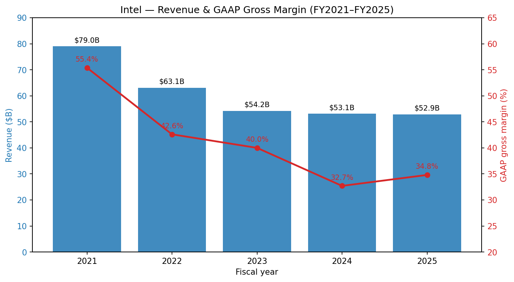
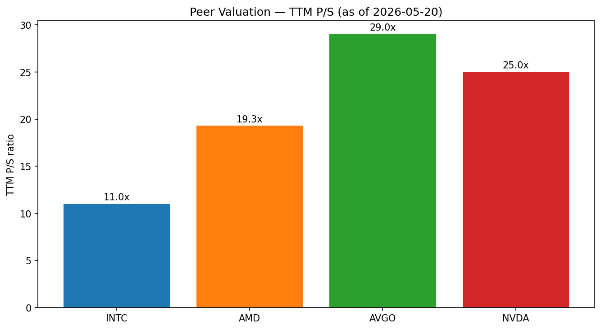
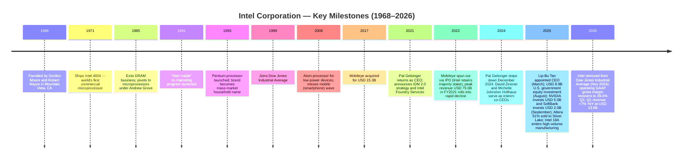
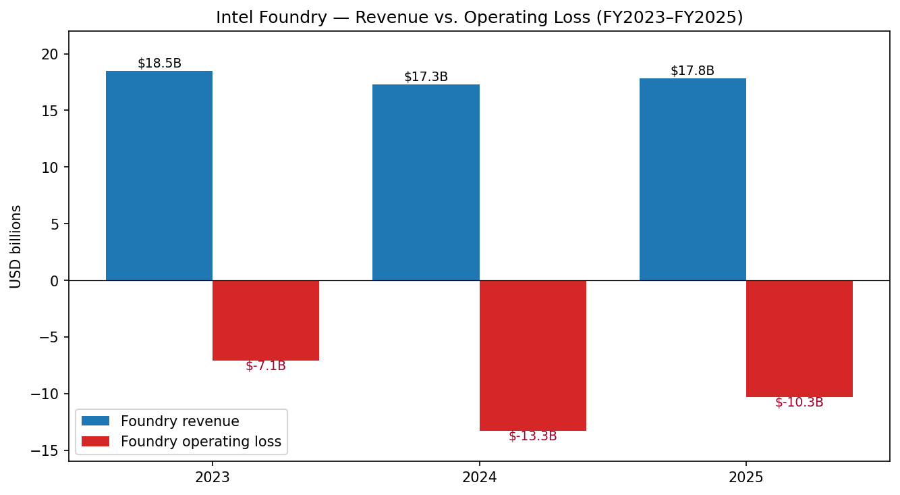
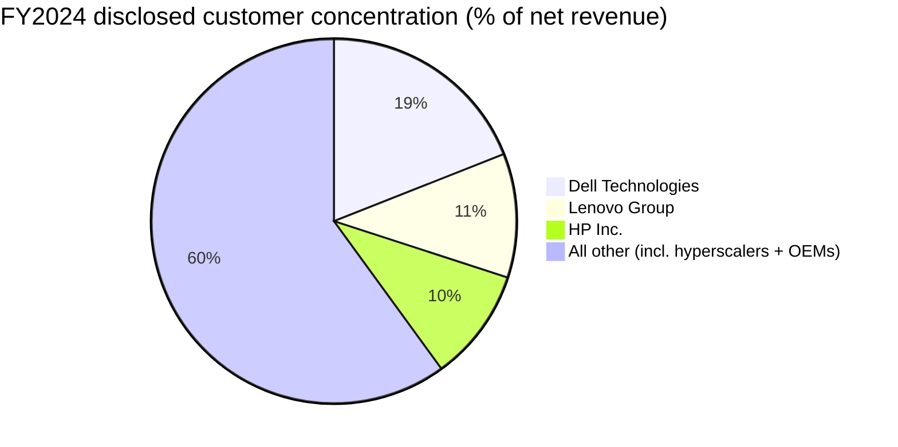
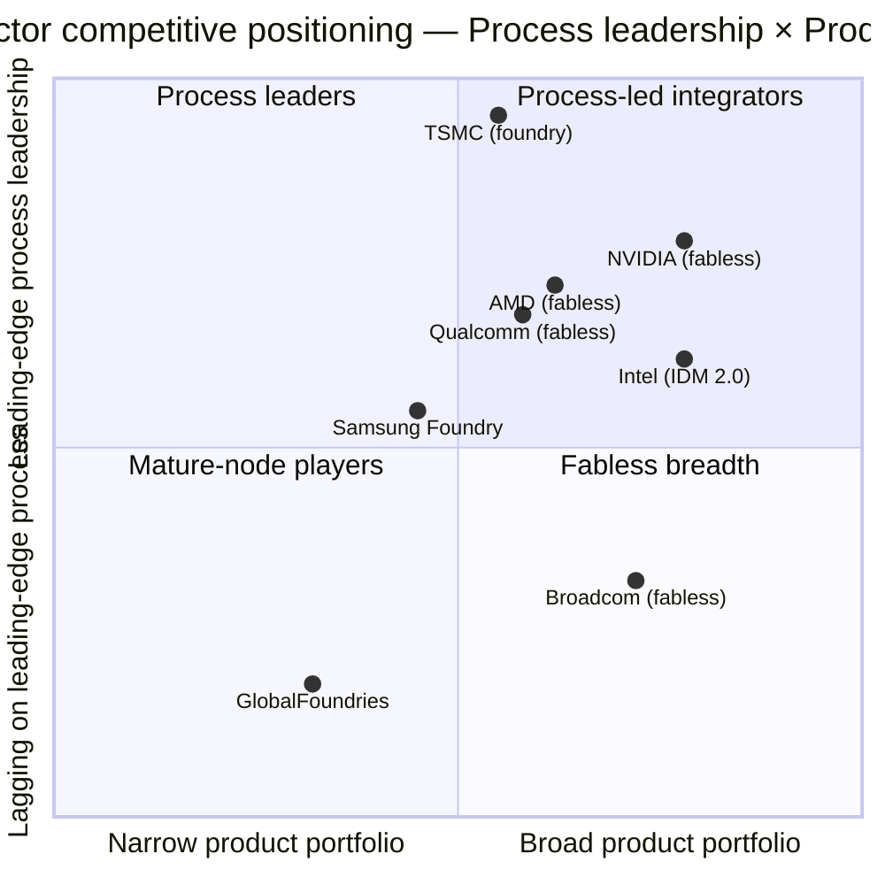
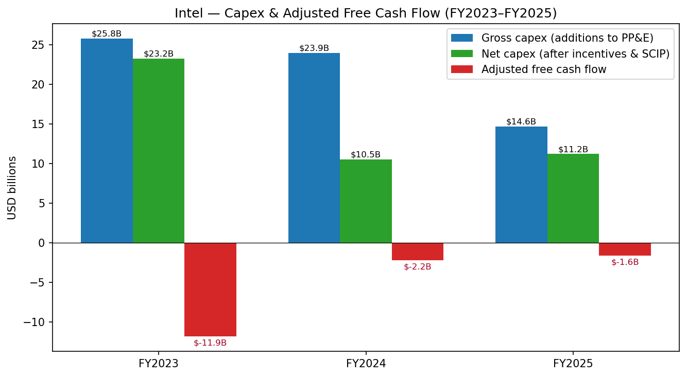

# COMPANY RESEARCH REPORT: Intel Corporation (NASDAQ: INTC)

**Report date:** 2026-05-20
**Primary listing:** NASDAQ: INTC
**Fiscal year-end:** last Saturday in December (FY2025 ended Dec 27, 2025)
**Current price:** USD 117.88 (close, 2026-05-19) — source: [Yahoo Finance — INTC key statistics](https://finance.yahoo.com/quote/INTC/key-statistics/)
**Market cap:** USD ~592.6B
**Reporting currency:** USD

---

> **Update — Q1 2026 results and Q2 2026 guidance initiated (2026-04-23):** Intel reported Q1 2026 revenue of USD 13.6B (+7% YoY) and GAAP EPS of $(0.73) (non-GAAP $0.29). Management initiated Q2 2026 guidance at **USD 13.8–14.8B revenue, GAAP EPS $0.08 (non-GAAP $0.20), GAAP gross margin 37.5% (non-GAAP 39.0%)**, the sixth consecutive quarter that revenue printed above the company's prior guide. CEO Lip-Bu Tan called out "unprecedented demand for silicon" in the AI era and the company's deliberate "operational reset"; CFO David Zinsner flagged that supply (not demand) is now the gating factor on CCG and DCAI through the most-constrained Q1 2026 window. Source: [Intel Q1 2026 Earnings Press Release, 2026-04-23](https://www.sec.gov/Archives/edgar/data/50863/000005086326000077/q126earningsrelease.htm).

---

## TABLE OF CONTENTS

1. Company Overview
2. Company History
3. Management Team
4. Products & Services
5. Customers & Go-to-Market
6. Industry Overview
7. Competitive Landscape
8. Market Opportunity (TAM)
9. Risk Assessment
10. References

---

## 1. Company Overview

Intel Corporation is the largest pure-play microprocessor designer and one of the only two companies — alongside Taiwan Semiconductor Manufacturing Company (TSMC) and Samsung Foundry — that is investing materially in leading-edge logic semiconductor manufacturing inside the United States. The company designs and sells **x86 central processing units (CPUs)** for PCs, workstations, data-center servers and embedded edge devices, and operates a **vertically integrated foundry** (Intel Foundry) that develops and runs leading-edge process technology and advanced packaging in the U.S., Ireland and Israel. As of fiscal year-end 2025, Intel had approximately 92,800 employees and reported FY2025 net revenue of **USD 52.85 billion**, down 0.5% from FY2024's USD 53.10 billion and down 25.0% from the FY2022 peak of USD 63.05 billion ([Intel 2025 Form 10-K, MD&A — Consolidated Results of Operations](https://www.sec.gov/Archives/edgar/data/50863/000005086326000011/intc-20251227.htm)).

The company reports three operating segments plus an "all other" category ([Intel 2025 Form 10-K — Note 3: Operating Segments](https://www.sec.gov/Archives/edgar/data/50863/000005086326000011/intc-20251227.htm)):

- **Client Computing Group (CCG)** — x86 PC processors (Core, Core Ultra), platform IP (vPro), graphics, connectivity. FY2025 revenue USD 32.23B (61% of segment revenue ex-eliminations), down 3% YoY.
- **Data Center and AI (DCAI)** — Xeon server CPUs, Gaudi AI accelerators, GPU Max (Ponte Vecchio successor), networking silicon. FY2025 revenue USD 16.92B, up 5% YoY.
- **Intel Foundry** — leading-edge logic process development, fab capacity, advanced packaging and an external foundry services offering. FY2025 revenue USD 17.83B (98% intersegment), up 3% YoY, but a **USD 10.32B operating loss**, narrower than FY2024's USD 13.29B loss ([Intel 2025 Form 10-K, MD&A — Intel Foundry](https://www.sec.gov/Archives/edgar/data/50863/000005086326000011/intc-20251227.htm)).
- **All Other** — Mobileye (ADAS / autonomous driving), IMS Nanofabrication, and the residual interest in Altera (deconsolidated 12 September 2025). FY2025 revenue USD 3.56B, of which Mobileye contributed USD 1.93B.

Geographically, Intel sold into approximately 80% non-U.S. end markets in FY2024 (the company groups customer geography by ship-to location; Singapore is the largest reported ship-to country at >25% of revenue because many OEM final-assembly partners build there) ([Intel 2024 Form 10-K, MD&A — Geographic Revenue](https://www.sec.gov/Archives/edgar/data/50863/000005086325000009/intc-20241228.htm)).


Source: [Intel 2025 Form 10-K, MD&A — Consolidated Results of Operations](https://www.sec.gov/Archives/edgar/data/50863/000005086326000011/intc-20251227.htm); FY2021–FY2022 data from [Intel 2022 Form 10-K](https://www.sec.gov/Archives/edgar/data/50863/000005086323000006/intc-20221231.htm).

The chart shows the magnitude of Intel's reset: revenue collapsed from USD 79.0B in FY2021 (the pandemic-PC peak) to USD 52.9B in FY2025 — a 33% retracement — while GAAP gross margin compressed from 55.4% to 34.8%. Operating profit on a GAAP basis was a loss of USD 2.21B in FY2025, compared with a USD 11.68B loss in FY2024 (driven by USD 16.55B of R&D, USD 4.62B of MG&A, and USD 2.19B of restructuring charges) ([Intel 2025 Form 10-K, MD&A — Consolidated Results](https://www.sec.gov/Archives/edgar/data/50863/000005086326000011/intc-20251227.htm)). Net loss attributable to Intel was USD 267M in FY2025, dramatically narrower than FY2024's USD 18.76B net loss, which had been swollen by a USD 8.0B non-cash tax-valuation-allowance charge.

**Valuation snapshot (as of 2026-05-19 close).** Intel trades at:

- **Price:** USD 117.88
- **Market cap:** USD ~592.6B (4,995M shares outstanding as of 16 Jan 2026 per the 10-K cover page; market cap reflects post-NVIDIA/SoftBank/DoC issuance and the year-to-date rally)
- **TTM P/E:** not meaningful — TTM EPS is **−USD 0.60** ([Yahoo Finance — INTC](https://finance.yahoo.com/quote/INTC/key-statistics/)). Driver: a USD 4.07B restructuring charge in Q1 2026 and a small full-year FY2025 net loss. Decomposed: this is **cyclical / restructuring trough**, not a structural unprofitability story — the company posted **USD 5.35B of GAAP gross profit and USD 12.7B of Intel Products operating income in FY2025**, but Intel Foundry's USD 10.3B operating loss, plus restructuring, drove the consolidated number negative ([Intel 2025 Form 10-K, MD&A](https://www.sec.gov/Archives/edgar/data/50863/000005086326000011/intc-20251227.htm)). The non-GAAP Q1 2026 print of $0.29 EPS, and Intel's own Q2 guide of $0.20 non-GAAP / $0.08 GAAP, imply the company is returning to GAAP break-even imminently ([Intel Q1 2026 Earnings Release, 2026-04-23](https://www.sec.gov/Archives/edgar/data/50863/000005086326000077/q126earningsrelease.htm)).
- **Forward P/E (next-12-month consensus):** **76.6x** — extreme by absolute standards but reflects (a) trough earnings rolling off and (b) consensus not yet catching up to the visible Q2 ramp.
- **TTM P/S:** **11.0x**, vs. the 3-year median for INTC of ~2.5x; vs. peer set AMD 19.3x, AVGO 29.0x, NVDA 25.0x ([Yahoo Finance peer statistics](https://finance.yahoo.com/quote/INTC/), accessed 2026-05-20).
- **P/B:** 5.15x against shareholders' equity of ~USD 114B; the equity book has been re-marked by the USD 18.4B of equity issued to the U.S. Department of Commerce, SoftBank, and NVIDIA during FY2025 (described below).
- **EV/EBITDA:** EV/TTM EBITDA ≈ 12x using management's adjusted EBITDA framework, but the GAAP picture is distorted by impairment and restructuring; an EV-to-FY2026E-EBITDA on Street consensus is ~9–10x.


Source: [Yahoo Finance — INTC, AMD, AVGO, NVDA key statistics, 2026-05-20](https://finance.yahoo.com/quote/INTC/key-statistics/).

**Interpretation.** Intel's P/S of 11x is roughly 4x its three-year median but still substantially below the AVGO/NVDA cohort that prices in AI-leveraged growth. The rally that lifted Intel from the high-USD-teens in early 2025 to USD 117.88 today (a ~4–5x in 14 months) has been driven by **three distinct catalysts**, not by underlying earnings recovery: (i) the August 2025 U.S. government USD 8.9B common-stock investment at USD 20.47 / share ([8-K, 2025-08-25](https://www.sec.gov/Archives/edgar/data/50863/000005086325000129/a08222025form8-kex991.htm)); (ii) the September 2025 SoftBank USD 2.0B and NVIDIA USD 5.0B equity investments ([8-K, 2025-09-18](https://www.sec.gov/Archives/edgar/data/50863/000005086325000155/a09152025form8-kex991.htm)); (iii) market belief that Intel 18A, in high-volume production since mid-2025, will close the process-node gap to TSMC's N2. The multiple is therefore **narrative-driven**: investors are paying for a successful Intel 18A node ramp, an external foundry customer book, and a sustained non-AI CPU upcycle — none of which is yet in the trailing financials. We carry valuation/multiple-compression risk into Section 9.

## 2. Company History

Intel was founded on **18 July 1968** in Mountain View, California by Gordon Moore and Robert Noyce — both of whom had previously founded Fairchild Semiconductor in 1957 ([Intel — Corporate Heritage page](https://www.intel.com/content/www/us/en/corporate-responsibility/intel-history.html)). Arthur Rock provided the initial USD 2.5M venture financing; Andrew Grove, the third employee, would lead the company through its most consequential strategic transition in 1985 — the exit from DRAM memory into microprocessors. Intel's name is a contraction of "**INT**egrated **EL**ectronics."



Source: [Intel — Corporate Heritage](https://www.intel.com/content/www/us/en/corporate-responsibility/intel-history.html); [Reuters — Intel removed from Dow Jones, 2024-11-04](https://www.reuters.com/business/intel-replaced-dow-jones-industrial-average-by-nvidia-2024-11-01/); [Intel 2025 Form 10-K](https://www.sec.gov/Archives/edgar/data/50863/000005086326000011/intc-20251227.htm).

**Strategic pivots and why they happened.** Three pivots define Intel's modern history:

1. **Memory-to-microprocessor (1985).** Andrew Grove led the painful decision to exit DRAM — a business Intel had invented — in the face of Japanese low-cost competition. The shift to microprocessors, supported by the IBM PC platform win, enabled three decades of >50% gross-margin compounding. The case is the textbook example of an incumbent successfully cannibalizing itself.

2. **The mobile miss (2007–2014).** Intel decided not to bid for the iPhone's modem-and-application-processor socket in 2007 because then-CEO Paul Otellini did not believe Apple's volume forecasts. ARM-based SoCs subsequently captured the smartphone market entirely; Intel's Atom processor never achieved scale, and the company exited mobile entirely in 2016. The decision created the strategic vulnerability — ARM at scale — that has now bled into PCs (Qualcomm Snapdragon X, Apple Silicon Macs) and into data-center (AWS Graviton, NVIDIA Grace).

3. **IDM 2.0 / Intel Foundry (2021– ).** Pat Gelsinger's return in February 2021 launched the "IDM 2.0" strategy: keep Intel's vertically integrated manufacturing, but also (a) accept TSMC fab capacity for some Intel products, and (b) open Intel's leading-edge fabs to external customers as Intel Foundry Services. The corollary commitments — five process nodes in four years (Intel 7 → Intel 4 → Intel 3 → Intel 20A → Intel 18A), the Arizona ("Fab 52", "Fab 62"), Ohio ("Mod 1") and Germany (later cancelled) fab expansions, and >USD 100B of cumulative capex — drained free cash flow, crashed the multiple from 30x to ~6x EBITDA at the trough, and ultimately cost Gelsinger his job in December 2024.

**Key acquisitions and divestitures:**
- **Mobileye (2017, USD 15.3B)** — autonomous-driving silicon; partially IPO'd 2022, Intel retains 88% economic stake at FY2025-end ([Intel 2025 Form 10-K, Note 4](https://www.sec.gov/Archives/edgar/data/50863/000005086326000011/intc-20251227.htm)).
- **Altera (2015, USD 16.7B; partial divestiture 2025)** — FPGA business. On 12 Sept 2025, Intel closed sale of **51% of Altera to Silver Lake (SLP)** for USD 4.3B net proceeds (USD 4.8B cash + USD 500M deferred), deconsolidating Altera from Intel's financials ([Intel 2025 Form 10-K, Note 10 — Acquisitions and Divestitures](https://www.sec.gov/Archives/edgar/data/50863/000005086326000011/intc-20251227.htm)).
- **NAND memory** — sold to SK hynix in 2020–2025 (USD 9B total consideration), exited the business.
- **McAfee (USD 7.7B in 2010; sold 2017)**, **Habana Labs (USD 2B in 2019, evolved into Gaudi product line)**, and the Israeli Tower Semiconductor deal (USD 5.4B announced 2022) was abandoned in August 2023 after Chinese regulatory delay.

**Recent developments (last 12 months) bearing on the current thesis** are concentrated in the Section 1 valuation discussion and Sections 3 (CEO transition) and 4 (Intel 18A, NVIDIA partnership). Most material: the **9.9% U.S. government equity stake** (433.3M primary shares at USD 20.47, USD 8.9B, August 2025), the **NVIDIA USD 5B investment plus joint custom-CPU development** (September 2025), and the **Altera deconsolidation** (September 2025).

## 3. Management Team

### Lip-Bu Tan — Chief Executive Officer (age 66, since March 2025)

Lip-Bu Tan was appointed CEO of Intel on **18 March 2025**, ending a three-month interim period in which CFO David Zinsner and former CCG head Michelle Johnston Holthaus served as co-CEOs after Pat Gelsinger's departure in December 2024 ([Intel 2025 Form 10-K — Information About Our Executive Officers](https://www.sec.gov/Archives/edgar/data/50863/000005086326000011/intc-20251227.htm); [Intel 2026 Proxy Statement (DEF 14A)](https://www.sec.gov/Archives/edgar/data/50863/000005086326000061/0000508632-26-000061-index.htm)).

Tan's appointment is, in our view, the **single most important variable in the Intel thesis** today. The board's choice was not a continuity candidate — Tan had **resigned from Intel's board in August 2024**, just months before, reportedly over strategic disagreements about Gelsinger's pace and breadth of execution ([Reuters, 2024-08-23](https://www.reuters.com/technology/intel-board-member-lip-bu-tan-resigns-2024-08-22/); subsequently confirmed by [WSJ, 2024-08-26](https://www.wsj.com/tech/intel-tan-board-resignation)).

Tan's most relevant prior role was **CEO of Cadence Design Systems (NASDAQ: CDNS) from 2009 to December 2021**, where he engineered one of the most consequential value re-ratings in EDA history. Under Tan's tenure, Cadence stock returned **>3,200% (vs. ~340% for the S&P 500 over the same period)**, with revenue growing from USD 853M (FY2009) to USD 3.0B (FY2021) at ~14% CAGR and non-GAAP operating margin expanding from the high-teens to the high-30s. He served as Cadence's Executive Board Chair from December 2021 to May 2023, then briefly chaired before joining Intel's board in September 2022. He left in August 2024, then returned as CEO seven months later. He retains chairmanship of **Walden International**, a venture capital firm he founded in 1987 with a multi-decade investment portfolio across China and Southeast Asia in semiconductor and AI startups; he is also founding managing partner of Celesta Capital and Walden Catalyst Ventures, and a director of Schneider Electric SE. He holds a B.Sc. in Physics from Nanyang Technological University (Singapore), an M.Sc. in Nuclear Engineering from MIT, and an MBA from the University of San Francisco ([Intel 2025 Form 10-K — Executive Officer Bios](https://www.sec.gov/Archives/edgar/data/50863/000005086326000011/intc-20251227.htm)).

Tan's compensation structure as disclosed in the 2026 Proxy is heavily front-loaded toward equity tied to share-price hurdles, with a USD 1M base salary and a USD 2M target bonus, plus a USD 25M new-hire equity grant and performance-based stock units that vest only if Intel achieves specified TSR thresholds versus a custom semiconductor peer group ([Intel 2026 Proxy Statement — Compensation Discussion and Analysis](https://www.sec.gov/Archives/edgar/data/50863/000005086326000061/0000508632-26-000061-index.htm)). The 2026 Proxy describes his mandate from the board as "to sharpen Intel's strategic focus, re-establish trust with our customers, strengthen accountability and accelerate disciplined execution" — language that explicitly puts customer trust (i.e., the foundry external customer book) and execution discipline (i.e., cost reset, Intel 18A ramp) ahead of growth.

His public profile since taking the role has been disciplined and unflashy: structured monthly updates, deliberate cost cuts (the 2025 Restructuring Plan reduced headcount by approximately 15% in FY2025), and a series of high-leverage partnership announcements (NVIDIA, Google, SambaNova, the Trump Administration). The bear case on Tan is that his entire career has been in EDA software and venture investing, not in capital-intensive manufacturing; the bull case is that this very lack of "Intel cultural baggage" is what allows him to make the trade-offs (Altera 51% sale, German Magdeburg fab cancellation in 2024, reduced wafer scope on Intel 4/3) that internal leadership could not.

### David Zinsner — Executive Vice President and Chief Financial Officer (age 57, since January 2022)

Zinsner joined Intel from **Micron Technology, where he was CFO from 2018 to 2022**, leading the global finance organization through DRAM/NAND cycle volatility. Prior to Micron he was CFO of Affirmed Networks (acquired by Microsoft in 2020) and earlier had roles at Analog Devices and Vivekanand Education Society. He has more than three decades of semiconductor finance experience and was one of the two interim co-CEOs during the Gelsinger-to-Tan transition (Dec 2024 – Mar 2025), receiving a one-time USD 1.5M cash payment for that service ([Intel 2026 Proxy Statement — Executive Compensation discussion](https://www.sec.gov/Archives/edgar/data/50863/000005086326000061/0000508632-26-000061-index.htm)). He has executed several billion dollars of debt issuance, the Altera partial-sale transaction, the August 2025 U.S. government equity transaction, and the September 2025 NVIDIA/SoftBank equity placements. His public-company CFO track record is strong, and the market has rewarded his liquidity-first cash management — Intel ended FY2025 with USD 37.4B of cash and short-term investments, up from USD 22.1B at YE2024 ([Intel 2025 Form 10-K — Short-Term Investing and Borrowing](https://www.sec.gov/Archives/edgar/data/50863/000005086326000011/intc-20251227.htm)).

### Naga Chandrasekaran — EVP, Chief Technology and Operations Officer; General Manager of Intel Foundry (age 51, since September 2025)

Chandrasekaran joined Intel in **August 2024 as EVP of Foundry Manufacturing & Supply Chain** and was elevated to Chief Technology and Operations Officer in September 2025, taking general-manager responsibility for the Intel Foundry P&L. He spent **23 years at Micron Technology (October 2008 – August 2024)**, most recently as SVP of Technology Development, where he oversaw the DRAM and HBM (high-bandwidth memory) process roadmap that put Micron into the HBM3E sockets at NVIDIA's H100/H200 generations. He holds undergraduate, master's and doctorate degrees in mechanical engineering, a Master's in Information and Data Science from UC Berkeley, and dual EMBAs from UCLA and the National University of Singapore. He also sits on the Mobileye Global board ([Intel 2025 Form 10-K — Executive Officer Bios](https://www.sec.gov/Archives/edgar/data/50863/000005086326000011/intc-20251227.htm)). His mandate is to deliver Intel 18A yield ramp, qualify Intel 14A for external customers, and rationalize the fab footprint after the Altera sale and Magdeburg cancellation.

### Sachin Katti — Chief Technology Officer and General Manager of Network and Edge

Katti is responsible for the Network and Edge business and pan-Intel AI strategy. A Stanford computer-science professor turned executive, he joined Intel via the 2020 Uhana acquisition (which he co-founded) and has been a vocal advocate of Intel's "AI everywhere" framing — bringing AI inference into PCs (NPUs in Core Ultra), edge appliances, and 5G/6G RAN infrastructure ([Intel — Leadership page](https://www.intel.com/content/www/us/en/newsroom/leadership.html)). The Network and Edge segment is no longer broken out separately after the 2024 reorganization (now sits inside CCG / DCAI / All Other for revenue reporting), but the technology road map remains a key R&D pillar.

### Governance

- Board composition: **Frank D. Yeary** serves as Independent Chair; Tan is the only insider director. Per the 2026 Proxy, **12 directors total, 11 independent**, average tenure ~3.6 years (significantly refreshed since 2022) ([Intel 2026 Proxy Statement — Board of Directors](https://www.sec.gov/Archives/edgar/data/50863/000005086326000061/0000508632-26-000061-index.htm)).
- The U.S. government holds 9.9% of common stock (433.3M shares) but has explicitly **passive ownership: no board seat, no information rights**, and a contractual obligation to vote with the board on shareholder matters with limited exceptions ([Intel Press Release, 2025-08-25](https://www.sec.gov/Archives/edgar/data/50863/000005086325000129/a08222025form8-kex991.htm)).
- Insider ownership is low: current directors and executive officers as a group held approximately 2.75M shares (less than 0.06% of shares outstanding) per the 2026 Proxy ([Intel 2026 Proxy Statement — Security Ownership](https://www.sec.gov/Archives/edgar/data/50863/000005086326000061/0000508632-26-000061-index.htm)).
- The NVIDIA holding (215M shares purchased at USD 23.28) and the SoftBank holding (87M shares purchased at USD 23.00) are both strategic, non-board investors.
- The CEO and senior-executive equity grants are heavily weighted to multi-year performance stock units; the company has stated comp redesign goals around "performance-linked" pay (>=75% of NEO comp at risk).

### Management track-record synthesis

The leadership team Intel has assembled since March 2025 is a deliberate departure from the prior decade's culture — **a foundry/operations veteran (Chandrasekaran), a cycle-tested semiconductor CFO (Zinsner), and a CEO whose career has been about value re-ratings rather than fab construction (Tan)**. The combination is unlikely to launch a new product category, but is well-suited to executing the cost reset, completing the Intel 18A ramp, and qualifying the first material external foundry customer book — which is what the thesis now requires. The risk is that Tan, as a non-manufacturing CEO, may under-invest in the long-tail nodes (Intel 14A, Intel 10A) that determine 2028+ competitiveness.

## 4. Products & Services

```mermaid
graph TD
    INTC[Intel Corporation]
    INTC --> P[Intel Products]
    INTC --> F[Intel Foundry]
    INTC --> O[All Other]

    P --> CCG[CCG — Client Computing]
    P --> DCAI[DCAI — Data Center & AI]

    CCG --> Core[Intel Core / Core Ultra<br>desktop & mobile]
    CCG --> CoreS[Core Ultra Series 2 & 3<br>Lunar Lake, Arrow Lake, Panther Lake]
    CCG --> vPro[Intel vPro<br>commercial PC platform]
    CCG --> Arc[Intel Arc<br>discrete GPUs]
    CCG --> Wifi[Wi-Fi & Bluetooth<br>connectivity silicon]

    DCAI --> Xeon[Intel Xeon 6<br>P-core & E-core servers]
    DCAI --> Xeon600[Xeon 600<br>workstation processors]
    DCAI --> Gaudi[Gaudi 3<br>AI training accelerator]
    DCAI --> GPU[GPU Max<br>HPC accelerator]
    DCAI --> IPU[IPU / SmartNIC<br>data-center networking]

    F --> N7[Intel 7<br>high-volume HVM]
    F --> N3[Intel 3<br>data-center node]
    F --> N18A[Intel 18A<br>RibbonFET + PowerVia, HVM 2025]
    F --> N14A[Intel 14A<br>next-gen, designed for external]
    F --> AP[Foveros & EMIB<br>advanced packaging]

    O --> Mobileye[Mobileye Global<br>ADAS / EyeQ / SuperVision]
    O --> IMS[IMS Nanofabrication<br>multi-beam mask writers]
    O --> Altera[Altera<br>49% equity-method stake]
```



Source: [Intel Products portfolio page](https://www.intel.com/content/www/us/en/products/overview.html); [Intel Foundry process technology page](https://www.intel.com/content/www/us/en/foundry/process/overview.html); [Intel 2025 Form 10-K — Business Overview](https://www.sec.gov/Archives/edgar/data/50863/000005086326000011/intc-20251227.htm).

### Client Computing Group (CCG)

CCG sells x86 microprocessors and platform IP into the PC ecosystem. FY2025 revenue was USD 32.23B, of which **USD 27.6B was "Client" (notebook + desktop CPU)** and USD 4.6B was "Other CCG" (Wi-Fi, Ethernet, modem residuals, discrete graphics) ([Intel 2025 Form 10-K, MD&A — Segment Revenue Summary](https://www.sec.gov/Archives/edgar/data/50863/000005086326000011/intc-20251227.htm)). The flagship branded families today are:

- **Core Ultra Series 2 ("Lunar Lake" mobile / "Arrow Lake" desktop)** — current-generation client products that re-introduce an integrated neural processing unit (NPU) and graphics tile. Lunar Lake is fabricated externally at TSMC N3B on the compute tile, with Intel 18A reserved for the Panther Lake successor.
- **Core Ultra Series 3 ("Panther Lake," launched Q1 2026)** — the first volume PC product **manufactured on Intel 18A** with RibbonFET (gate-all-around) transistors and PowerVia (backside power delivery). Panther Lake is positioned as the first Intel client SoC capable of delivering "TSMC-N2-class" performance per watt and is the foundational halo product for Intel Foundry's external-customer pitch ([Intel Q1 2026 Earnings Release, 2026-04-23](https://www.sec.gov/Archives/edgar/data/50863/000005086326000077/q126earningsrelease.htm)).
- **vPro** — commercial PC platform layered on top of Core Ultra, providing manageability and security capabilities targeted at enterprise IT buyers.
- **Arc discrete GPUs** — a third-place desktop GPU vendor behind NVIDIA GeForce and AMD Radeon; Intel committed to continued Arc roadmap (Battlemage launched 2024) but has not disclosed a revenue contribution.

**Competitive-advantage assessment.** CCG has **partial** moat: the x86 instruction set and software ecosystem create real switching costs for enterprise PC buyers (decades of x86 legacy applications, Windows on Arm still maturing), and Intel's commercial-PC channel (Dell, HP, Lenovo) is sticky. But the moat has eroded materially: Apple's M-series silicon now powers 100% of Mac shipments (Apple discontinued Intel Mac in 2022–2023), Qualcomm Snapdragon X drove **~10–15% of Windows-PC notebook share in 2025** per IDC, and AMD's Ryzen has taken consistent share inside the x86 cohort (AMD CPU client unit share was 23.4% in Q1 2025 per [Mercury Research, 2025-04](https://www.mercuryresearch.com/blog/)). The flagship competing product is **AMD Ryzen AI 9 HX 370 (Strix Point)** versus Intel Core Ultra 9 285H; benchmark reviews are mixed, with AMD ahead on multi-thread and Intel ahead on AI/NPU performance. Verdict: **competitive parity at the product level today; eroding share over multi-year timeframe.**

### Data Center and AI (DCAI)

DCAI sells server CPUs (Xeon family), AI accelerators (Gaudi), GPUs (Max series), and data-center networking silicon. FY2025 revenue was **USD 16.92B (+5% YoY)**, with server volume up 9% YoY and ASPs down 4%, the latter reflecting a competitive pricing environment and a shift toward lower-core-count SKUs ([Intel 2025 Form 10-K, MD&A — DCAI](https://www.sec.gov/Archives/edgar/data/50863/000005086326000011/intc-20251227.htm)).

- **Xeon 6 — "Granite Rapids" P-core and "Sierra Forest" E-core families** are the current data-center generation. P-core variants (up to 128 cores) target traditional enterprise and HPC; E-core variants (up to 288 cores) target cloud-native, hyperscale, and AI-inference workloads where throughput-per-watt and density matter more than single-thread performance. NVIDIA selected Intel Xeon 6 as the host CPU for its **DGX Rubin NVL8 systems** ([Intel Q1 2026 Earnings Release, 2026-04-23](https://www.sec.gov/Archives/edgar/data/50863/000005086326000077/q126earningsrelease.htm)) — a high-credibility win after years of Xeon ceding ground to AMD EPYC in hyperscale.
- **Gaudi 3** — AI training and inference accelerator, the third-generation product from the Habana Labs acquisition. Gaudi 3 is positioned as a price/performance value alternative to NVIDIA H100/H200 for inference workloads. The product line **booked USD 922M of inventory-reserve charges in FY2024 and additional charges in FY2025** because Intel's stated USD 500M FY2024 revenue target was missed (actual disclosure: Gaudi 3 "did not meet our internal expectations" — [Intel 2024 Form 10-K](https://www.sec.gov/Archives/edgar/data/50863/000005086325000009/intc-20241228.htm)). Gaudi 3 has not been disclosed at the SKU revenue level since.
- **GPU Max ("Ponte Vecchio" / "Falcon Shores")** — the discrete data-center GPU line. Falcon Shores was de-emphasized in late 2024 and the roadmap re-set toward a **"Jaguar Shores" follow-on focused on inference and rack-scale systems integration**, expected late 2026.
- **Network and Edge silicon** — formerly its own segment, now distributed; IPUs/SmartNICs are co-developed with Google for custom ASIC infrastructure processors ([Intel Q1 2026 Earnings Release, 2026-04-23](https://www.sec.gov/Archives/edgar/data/50863/000005086326000077/q126earningsrelease.htm)).

**Competitive-advantage assessment.** DCAI has **partial-to-weak** moat. The x86 server ecosystem (RHEL, ESXi, vSphere) remains the default for enterprise on-prem and provides high switching costs at the application layer. But the AI training market has effectively been won by NVIDIA (CUDA + Hopper / Blackwell), AMD EPYC has taken durable hyperscale share (AMD server CPU share was **27.2% in Q1 2025 per [Mercury Research](https://www.mercuryresearch.com/blog/)**, roughly double Intel's share two years earlier), and ARM-based instances at AWS (Graviton 4), Microsoft Azure (Cobalt 100), and Google (Axion) are eating into Xeon at the cloud-native edge. Closest competitors: **AMD EPYC 9005 "Turin"** (5th-gen Zen 5, up to 192 cores, generally regarded as ahead on perf/watt for HPC and enterprise on-prem); **NVIDIA Grace Hopper / Grace Blackwell** in the AI rack; **AWS Graviton 4** for cloud-native. Verdict: **Xeon 6 has narrowed the gap to AMD EPYC and won meaningful design wins (Google C4/N4, NVIDIA DGX Rubin), but AI accelerator share remains de minimis vs. NVIDIA.**

### Intel Foundry

Intel Foundry is the **vertically integrated manufacturing arm** that develops process technology, runs Intel's fab network, and increasingly offers manufacturing capacity to external customers. FY2025 revenue was USD 17.83B (~98% intersegment, USD 307M external), and the segment posted a **USD 10.32B operating loss** ([Intel 2025 Form 10-K, MD&A — Intel Foundry](https://www.sec.gov/Archives/edgar/data/50863/000005086326000011/intc-20251227.htm)).


Source: [Intel 2025 Form 10-K, MD&A — Intel Foundry](https://www.sec.gov/Archives/edgar/data/50863/000005086326000011/intc-20251227.htm).

Process roadmap:
- **Intel 7** — high-volume mature node, still ramping client and DCAI products through 2026 and supply-constrained per Q1 2026 management commentary
- **Intel 4 / Intel 3** — EUV-based; Intel 3 is the production node for Sierra Forest and Granite Rapids
- **Intel 18A** — entered high-volume manufacturing mid-2025, ships in Panther Lake client SoCs from Q1 2026 and in **"Clearwater Forest" Xeon** in 2H 2026. First Intel node with both **gate-all-around (RibbonFET)** and **backside power delivery (PowerVia)** — both industry firsts in volume production ([Intel 2025 Form 10-K — Strategy](https://www.sec.gov/Archives/edgar/data/50863/000005086326000011/intc-20251227.htm))
- **Intel 14A** — next-generation node, **explicitly designed from inception for external customers** and architected to extend RibbonFET/PowerVia with high-NA EUV; PDK 1.0 released to early customers in 2025

Advanced packaging: **Foveros** (3D stacking, used in Lunar Lake and Panther Lake) and **EMIB** (embedded multi-die interconnect, used in Xeon and Gaudi) are differentiated assets — Intel has the second-largest advanced-packaging capacity globally behind TSMC's CoWoS.

**Competitive-advantage assessment.** Intel Foundry has a **partial moat with optionality**. The moat is real on three vectors: (i) U.S.-based leading-edge logic capacity is structurally scarce — TSMC's Arizona fabs are coming online but well behind Intel's installed base; (ii) advanced packaging (Foveros, EMIB) is a duopoly with TSMC; (iii) post-CHIPS Act, U.S. government and DoD demand creates a captive Secure Enclave customer base (USD 3.2B disclosed). The moat is weak on competitive dimensions: TSMC's N2 node enters HVM in late 2025–2026 and is **broadly perceived as ahead of Intel 18A on yield and customer ecosystem**, Samsung Foundry's GAA 2nm is competitive on technology if not on yield, and the external-customer book is still nascent — Intel has not disclosed a top-tier customer commitment for 18A. Verdict: **the external-foundry business is the binary call on Intel's long-term enterprise value.**

### Mobileye (All Other)

Mobileye Global (NASDAQ: MBLY, 88% owned by Intel) develops ADAS and autonomous-driving silicon (EyeQ family), with the SuperVision and Chauffeur full-stack systems for OEMs including Volkswagen, BMW, Geely's Zeekr, Polestar, and others ([Mobileye 2024 Form 10-K](https://www.sec.gov/cgi-bin/browse-edgar?action=getcompany&CIK=0001910139&type=10-K)). FY2025 segment revenue inside Intel's "All Other" was **USD 1.93B (+14% YoY)**.

### Flagship vs. long-tail

The **1–3 flagship product families driving Intel's economics today** are:
1. **Intel Xeon 6 (DCAI)** — the rebound in DCAI operating income from USD 1.4B (FY2024) to USD 3.4B (FY2025) is the single largest swing factor, and Xeon 6 + AI server demand is the driver
2. **Core Ultra Series 3 / Panther Lake (CCG on Intel 18A)** — the cost-and-margin story for the future of CCG; success here is what re-rates the segment
3. **Intel 18A (Foundry)** — the entire external-customer book, the Panther Lake margin trajectory, and the U.S. government partnership all rest on Intel 18A yielding at competitive economics

Recent launches (last 12 months): Panther Lake (Q1 2026), Core Ultra 200S Plus and 200HX Plus desktop/mobile refresh, Xeon 600 workstation processors, Core Ultra Series 3 with Intel vPro, plus the Penang assembly/test expansion ([Intel Q1 2026 Earnings Release, 2026-04-23](https://www.sec.gov/Archives/edgar/data/50863/000005086326000077/q126earningsrelease.htm)). Sunset / wound-down: Habana Gaudi original product line (replaced by Gaudi 3, which itself missed targets), Network and Edge as a standalone segment, the Magdeburg fab project (cancelled), the German consumer-graphics XPG product line.

## 5. Customers & Go-to-Market



Source: [Intel 2024 Form 10-K — Note 1: Basis of Presentation and Significant Customers](https://www.sec.gov/Archives/edgar/data/50863/000005086325000009/intc-20241228.htm).

### Customer concentration

Intel's customers are predominantly **OEMs, hyperscalers, and channel distributors**, not end-users. Per the FY2024 10-K, three customers each represented 10% or more of net revenue: **Dell Technologies (19%), Lenovo (11%), and HP Inc. (10%)** — top-3 thus ~40% of consolidated revenue ([Intel 2024 Form 10-K, Note 1](https://www.sec.gov/Archives/edgar/data/50863/000005086325000009/intc-20241228.htm)). Intel's FY2025 10-K confirms that significant-customer disclosure thresholds (10%+) continue to apply to Dell, Lenovo and HP, though the precise percentages for FY2025 are slightly lower because of the AI-driven shift to direct hyperscale procurement of Xeon ([Intel 2025 Form 10-K, Note 1](https://www.sec.gov/Archives/edgar/data/50863/000005086326000011/intc-20251227.htm)).

**Hyperscale customers** (Amazon AWS, Microsoft Azure, Google Cloud, Meta, Oracle, ByteDance) are not individually disclosed but collectively represent a large share of DCAI revenue; the Q1 2026 partnership announcements with Google (Xeon 6 in C4/N4 instances, custom IPU co-development) and NVIDIA (Xeon 6 in DGX Rubin) suggest hyperscale is the highest-conviction growth vector. Per public commentary on the Q1 2026 call, DCAI's 22% YoY growth was hyperscale-led.

**3-year trend (top-3 OEM share):** Dell 22% (FY2023) → 19% (FY2024) → estimated 18–19% (FY2025) — slight de-concentration as hyperscale share rises. Lenovo trended 11% → 11% → 12%; HP 10% → 10% → 10%. None of the top customers is also a competitor (with the caveat that hyperscale customers are simultaneously building their own ARM-based silicon: AWS Graviton, Azure Cobalt, Google Axion — a vertical-integration threat covered in Section 9).

**Contract structure:** master purchase agreements with quarterly pricing, with quantity terms by SKU; no take-or-pay; standard 30–60 day payment terms. The OEM relationships are not exclusive — Dell, HP, Lenovo all sell AMD-based platforms — but Intel-based platforms remain the dominant share of commercial PCs.

**Implication for risk.** Top-3 customer concentration of ~40% is high but not extreme by semiconductor standards (versus, e.g., Hesai or Mobileye-China auto-OEM concentration). It is mitigated by (a) the three customers themselves being broadly diversified end-market sellers, (b) long-standing master agreements, and (c) the existence of >50,000 indirect end-customer relationships through the OEM channel. We carry **customer concentration as a meaningful but not material risk** into Section 9.

### Go-to-market

Intel reaches end customers through three primary channels:

1. **Direct enterprise / hyperscale sales** — for Xeon, Gaudi, GPU Max and the foundry external-customer book. Sales motion is technical pre-sales with engineering co-development. Growing share of revenue.
2. **OEM channel (Dell, HP, Lenovo, ASUS, Acer, MSI, Samsung, LG, +tier-2 ODMs)** — for CCG client products. Volume motion with co-marketing dollars and quarterly volume incentives. Largest absolute revenue contribution.
3. **Distribution channel (Synnex, Ingram Micro, ASBIS, others)** — for boxed and tray processors sold into SMB, white-box and the channel-aftermarket. Highest gross margin per unit but smallest absolute volume.

Marketing spend was **USD 4.62B in FY2025** (8.7% of revenue), down from USD 5.51B in FY2024 — a deliberate cut as part of the cost reset ([Intel 2025 Form 10-K, MD&A — Operating Expenses](https://www.sec.gov/Archives/edgar/data/50863/000005086326000011/intc-20251227.htm)). The reduction reflects discontinuation of certain co-marketing dollars (the historical "Intel Inside" programs) in favor of direct customer engineering investments.

**Key partnerships disclosed in the last 12 months:**
- **NVIDIA** (Sept 2025): joint development of NVIDIA-custom x86 server CPUs and x86+RTX-GPU client SoCs; NVIDIA invested USD 5.0B in Intel common stock ([8-K, 2025-09-18](https://www.sec.gov/Archives/edgar/data/50863/000005086325000155/a09152025form8-kex991.htm)).
- **Google** (Q1 2026): multi-year Xeon 6 commitment for C4/N4 cloud instances and co-developed custom ASIC IPUs.
- **SoftBank Group** (Sept 2025): USD 2.0B common-stock investment at USD 23.00/share ([Intel 2025 Form 10-K — Note 5](https://www.sec.gov/Archives/edgar/data/50863/000005086326000011/intc-20251227.htm)).
- **SambaNova** (Q1 2026): blueprint for heterogeneous compute platforms combining GPUs, SambaNova RDUs and Xeon 6.
- **Terafab consortium** (Q1 2026): joined as strategic partner alongside SpaceX, xAI and Tesla.

## 6. Industry Overview

Intel operates across the **global semiconductor industry**, which the World Semiconductor Trade Statistics (WSTS) sized at **USD 627.6B in 2024** and forecasts at **USD 697.2B in 2025 and USD 762.5B in 2026** — implying ~11% / ~9% YoY growth ([WSTS, Spring 2025 Forecast Update](https://www.wsts.org/76/103/WSTS-Semiconductor-Market-Forecast-Spring-2025)). Three sub-segments are most relevant to Intel's business mix:

**1. Microprocessors and logic chips — USD ~230B (2025E).** This is Intel's directly addressable market, comprising client PC CPUs (~USD 50B), server CPUs (~USD 35B), AI accelerators (~USD 110B in 2025E, growing 50%+ YoY, dominated by NVIDIA), and discrete GPUs / consumer accelerators (~USD 35B). The high-growth segment is AI accelerators, where Intel has the smallest share among the named participants.

**2. Foundry services — USD ~140B (2024) growing to USD ~165B in 2025.** TSMC's foundry revenue was **USD 90.4B in 2024 and tracking toward USD 113B in 2025 (+25% YoY)** per company earnings releases ([TSMC Q4 2024 results, 2025-01-16](https://investor.tsmc.com/english/quarterly-results/2024/q4)). Samsung Foundry, GlobalFoundries, UMC, SMIC and Intel Foundry comprise the rest. Leading-edge (<=5nm) is the high-growth pocket and is overwhelmingly TSMC-dominated (>80% share).

**3. Advanced packaging — USD ~50B (2025E), growing 25%+ YoY.** CoWoS (TSMC) and Foveros/EMIB (Intel) are the two leading 2.5D/3D packaging architectures; NVIDIA's allocation constraints on CoWoS through 2026 are a tailwind for Intel's external packaging offering.

**Key trends:**

- **AI accelerator pull-through into CPUs.** The build-out of GPU-based AI data centers has unexpectedly created a high-quality server CPU demand cycle — every NVIDIA HGX-class rack needs 2 Xeon or EPYC host CPUs, and the volume of those racks has driven server CPU shipments up double-digits in 2025. This is the single largest near-term tailwind for Intel DCAI.

- **Custom silicon at hyperscalers.** AWS Graviton, Microsoft Cobalt, Google Axion, Meta MTIA, Apple Silicon — each major hyperscaler and platform OEM is designing custom silicon, eroding Intel's hyperscale CPU share and the broader x86 commodity-CPU market.

- **Geopolitical re-shoring.** CHIPS Act in the U.S. (USD 39B in direct grants + USD 75B in loans/guarantees), the European Chips Act (EUR 43B), Japan's METI subsidies, and Korea's K-Chips Act collectively represent **>USD 200B of fab subsidies committed through 2030**. Intel is the single largest recipient in the U.S. — USD 8.0B in disbursed CHIPS Act grants, plus the USD 8.9B U.S. government equity stake disclosed in August 2025 ([Intel 2025 Form 10-K, MD&A — Government Incentives](https://www.sec.gov/Archives/edgar/data/50863/000005086326000011/intc-20251227.htm)).

- **Edge AI and inference.** With foundational LLMs increasingly trained at hyperscale, the next phase is inference — pushing more compute into edge devices (PCs, phones, smart cameras, autonomous vehicles). CPUs with NPUs, plus low-power accelerators, become structurally more important. This is Lip-Bu Tan's stated framing in the Q1 2026 commentary.

- **Process-node Moore's-Law slowdown.** Below 3nm, transistor density gains are slowing while wafer costs are accelerating (Intel 18A wafer cost is estimated at >USD 25,000 per wafer at HVM yields; TSMC N2 similar). The economic premium for being first to a new node is rising, but so is the absolute capital intensity of qualifying for it.

**Industry structure:** The leading-edge logic semiconductor industry is a **near-duopoly at the foundry layer (TSMC + Samsung; Intel as the determined third entrant), with a single hyperscale AI compute provider (NVIDIA) capturing the majority of AI accelerator economics**. Supplier power is concentrated in extreme-ultraviolet (EUV) lithography (ASML monopoly on EUV machines) and certain critical materials. Buyer power has risen with the hyperscaler custom-silicon trend. Substitutes are limited; switching costs in mature platforms (x86 server software stacks, CUDA in AI) are extremely high. Regulation is increasing — U.S. export controls on advanced chips to China, EU sustainability rules, and U.S. national-security investment screens (CFIUS) — all of which favor U.S.-domiciled, U.S.-manufactured Intel over Asian competitors for U.S. government and defense procurement.

## 7. Competitive Landscape

The competitive landscape varies by Intel segment. We treat each separately.

### Direct competitors

**AMD (NASDAQ: AMD).** Intel's most direct head-to-head in both client and server CPU. AMD's strategy under Lisa Su (CEO since 2014) has been disciplined: a tight focus on the high-margin Ryzen and EPYC product lines, leveraging TSMC's leading-edge node access (currently N3 for Zen 5, moving to N2). AMD reported FY2024 revenue of USD 25.8B and FY2025 TTM revenue of USD 37.5B ([Yahoo Finance — AMD](https://finance.yahoo.com/quote/AMD/financials/)). AMD's client CPU unit share was 23.4% in Q1 2025 and server CPU unit share 27.2% per [Mercury Research, 2025-04](https://www.mercuryresearch.com/blog/) — substantial gains from <15% client and <10% server in 2020. AMD also has the Instinct MI300 / MI325 GPU line, the second-place AI accelerator behind NVIDIA, with FY2025 data-center GPU revenue ~USD 5.0B per company commentary.

**NVIDIA (NASDAQ: NVDA).** Not a CPU competitor at scale (NVIDIA's CPU activity is Grace, paired with Hopper/Blackwell GPUs in HGX systems), but **the single most consequential semiconductor competitor in the broader sense**: NVIDIA captures ~80% of the AI accelerator market and its CUDA software ecosystem is the de facto standard for AI training. The NVIDIA / Intel custom-CPU partnership announced September 2025 reframes this from a head-to-head competitive relationship into a complementary one for the high-end x86 socket inside NVIDIA's reference platforms.

**Broadcom (NASDAQ: AVGO).** Networking silicon (Tomahawk, Jericho switch ASICs), custom ASIC design services (for Google TPUs, Meta MTIA), and software (VMware). Indirect competitor to Intel's networking-silicon and to Intel Foundry's external customer pitch (Broadcom outsources fabrication to TSMC). FY2024 revenue was USD 51.6B and TTM is USD 68.3B; market cap USD ~2.0T as of 2026-05-19 ([Yahoo Finance — AVGO](https://finance.yahoo.com/quote/AVGO/key-statistics/)).

**Qualcomm (NASDAQ: QCOM).** Snapdragon X Elite and successors are the first credible ARM challenger in Windows PC; took roughly 10% of premium notebook share in 2025 per IDC. Most exposed in CCG.

**Apple Inc. (NASDAQ: AAPL).** Not selling silicon to third parties, but Apple Silicon (M1-M5 series) has removed Mac shipments — historically ~10% of Intel's CCG TAM — from Intel's reachable market entirely.

### Indirect / emerging competitors

**Hyperscale custom silicon teams.** AWS Graviton 4 (5th-gen ARM server CPU), Microsoft Cobalt 100, Google Axion, Meta MTIA, Apple internal. Each erodes a piece of the x86 server market.

**TSMC (TPE: 2330).** Not a competitor in design but the dominant external-foundry incumbent against whom Intel Foundry must win customers. TSMC's FY2025 revenue is tracking USD 113B; capex was USD ~38–42B; advanced-node (<=5nm) capacity dwarfs Intel's. TSMC's Arizona fab is the U.S. alternative to Intel for "Made in USA" leading-edge logic.

**Samsung Foundry (KRX: 005930).** Distant third in foundry; has GAA 2nm in low-volume but yield issues; not a serious threat to TSMC but constrains Intel's external-customer pricing.

### Competitive positioning



Intel sits in the upper-right quadrant — broad portfolio plus leading-edge process aspirations — but is the only company in that quadrant that **owns** its leading-edge process, which is both the source of optionality and the source of capital intensity. AMD and NVIDIA have superior process access today (via TSMC) but no process moat of their own.

### Intel's competitive advantages

1. **Vertically integrated leading-edge manufacturing in the U.S.** — uniquely valuable post-CHIPS Act for U.S. government, DoD, and CFIUS-sensitive customers.
2. **x86 instruction-set ecosystem** — decades of enterprise software optimized for x86; high switching costs in commercial PC and on-prem server.
3. **Advanced packaging (Foveros, EMIB)** — second only to TSMC CoWoS; differentiated for chiplet-based and AI-accelerator architectures.
4. **Scale R&D** — USD 16–17B annual R&D budget at Intel Products + Foundry funds parallel development at every architecture and node simultaneously.
5. **Government and strategic-investor backing** — the **USD 8.9B U.S. government, USD 5.0B NVIDIA, USD 2.0B SoftBank investments collectively re-capitalize the company** at premium-to-2025-low prices and signal political and strategic durability ([8-K, 2025-08-25](https://www.sec.gov/Archives/edgar/data/50863/000005086325000129/a08222025form8-kex991.htm); [8-K, 2025-09-18](https://www.sec.gov/Archives/edgar/data/50863/000005086325000155/a09152025form8-kex991.htm)).

### Competitive vulnerabilities

1. **Foundry yield and customer adoption.** Intel 18A must yield at HVM economics and Intel 14A must win at least one Tier-1 external customer for the foundry strategy to clear its capital cost. TSMC N2 looks more competitive on both axes today.
2. **AI accelerator share gap.** Gaudi 3 is a niche player; the data-center AI compute market is being captured by NVIDIA with no clear Intel response in inference at scale.
3. **CCG share erosion to ARM.** Apple Silicon has removed Mac; Qualcomm Snapdragon X is taking premium notebook share; Windows on ARM is maturing.
4. **Capex-to-margin disconnect.** Intel Foundry's operating loss is structural until external customer revenue scales, which is not visible before 2027–2028.

## 8. Market Opportunity (TAM)

We size three components of Intel's TAM separately.

**Client PC silicon TAM** is approximately **USD 50B in 2025**, growing low-to-mid-single digits over the next five years, with PC unit shipments roughly flat at 270M units/year and ASP growth coming from AI PC mix (NPU-equipped premium notebooks) ([IDC PC Tracker, 2025-04](https://www.idc.com/getdoc.jsp?containerId=prUS52803625)). Intel's serviceable market (x86 share + Windows-platform share) is shrinking as ARM-based Windows PCs rise; we estimate Intel's serviceable client TAM at ~USD 35–38B in 2025 falling to ~USD 32B in 2028 absent share recovery.

**Data-center compute TAM is the high-growth bucket — USD ~250B in 2025, growing to USD 400B+ by 2028** per multiple sell-side estimates that align with Gartner / IDC frameworks. This includes server CPUs (USD ~35B), AI accelerators (USD ~110–130B and growing 50%+ YoY), data-center GPUs (subset of accelerators), networking silicon (USD ~25B), and DPUs/IPUs/SmartNICs (USD ~5B). Intel's serviceable share is the server CPU and data-center networking pockets — call it **USD 50–55B in 2025**, growing 8–10% with the underlying market but losing share within. Successful execution of the NVIDIA-custom-x86 and Google-IPU partnerships could expand serviceable share toward USD 60–70B by 2028.

**Foundry TAM is the option value.** TSMC's 2025 revenue is tracking USD 113B; the global foundry market is ~USD 165B. If Intel Foundry captures even **5% of the leading-edge external-foundry market by 2030** (a third-place share roughly equivalent to Samsung Foundry today), that is **USD 10–12B of incremental external foundry revenue at gross margins comparable to TSMC's 50%+** — i.e., USD 5–6B of incremental gross profit, enough to swing Intel Foundry from structural loss to break-even or modest profit even before accounting for the captive internal customer.

```
Intel total serviceable TAM (estimated, 2025):
  CCG client                     USD ~35B
  DCAI server CPU + adj.         USD ~50B
  Data-center AI / accelerators  USD ~110B (Intel addresses <5%)
  Foundry external (potential)   USD ~30B (Intel addresses <1%)
  Mobileye / ADAS                USD ~25B
  ----------------------------------------
  Total addressable             USD ~250B
  Total serviceable (today)     USD ~95B
```

Source: company filings, [WSTS Spring 2025 Forecast Update](https://www.wsts.org/76/103/WSTS-Semiconductor-Market-Forecast-Spring-2025), [TSMC Q4 2024 results, 2025-01-16](https://investor.tsmc.com/english/quarterly-results/2024/q4), [Mobileye 2024 10-K](https://www.sec.gov/cgi-bin/browse-edgar?action=getcompany&CIK=0001910139&type=10-K).

Intel's **share-of-serviceable-market today is ~50%** (it sold USD 53B of FY2025 net revenue against ~USD 95B of immediately addressable served markets). The aspirational case takes share back in DCAI (Xeon 6 ramp, NVIDIA partnership), holds CCG flat (Intel 18A products + NPU mix), and builds material external foundry revenue (USD 5–10B by 2028). The downside case loses 200–400 bps of share annually in CCG and DCAI, and foundry external never reaches USD 2B, leaving the foundry P&L structurally loss-making.

## 9. Risk Assessment

### Company-Specific Risks

**1. Intel 18A / 14A execution risk.** The entire investment case rests on Intel Foundry's process roadmap delivering at competitive yield and cost. Intel 18A is in HVM but Q1 2026 commentary disclosed inventory reserves "related to lower-of-cost-or-net-realizable-value charges for products manufactured on the early ramp of our Intel 18A process node" of USD 849M — i.e., 18A yields are still climbing. Intel 14A's external-customer book is unconfirmed. Severity: **high**. If 18A delivers at TSMC-N2-parity, the foundry P&L improves materially; if not, USD 100B+ of cumulative capex has limited optionality value ([Intel 2025 Form 10-K, MD&A — Intel Foundry](https://www.sec.gov/Archives/edgar/data/50863/000005086326000011/intc-20251227.htm)).

**2. Customer concentration in CCG.** Dell (19%), Lenovo (11%), HP (10%) collectively are ~40% of Intel revenue. A material share-loss to AMD at any one of them (Dell in particular, which historically has been an Intel-skewed account but has aggressively expanded AMD offerings since 2023) would impact FY2026–2028 revenue. Mitigant: long-standing master agreements, OEM-level engineering programs, vPro platform stickiness ([Intel 2024 Form 10-K, Note 1](https://www.sec.gov/Archives/edgar/data/50863/000005086325000009/intc-20241228.htm)). Severity: **medium**.

**3. Key-person dependency on Lip-Bu Tan.** The market has rallied largely on Tan's appointment; departure or a high-profile operational misstep within his first 2–3 years would likely re-rate the stock substantially. Mitigant: the Yeary-led board has been actively restructured; the strategy is now codified in the U.S. Government Agreement and the NVIDIA/SoftBank investment terms. Severity: **medium-high**.

**4. Gaudi 3 / AI accelerator product obsolescence.** Gaudi 3 missed its USD 500M FY2024 revenue target and is increasingly looking like a stranded asset; the "Jaguar Shores" follow-on does not have a confirmed customer book. NVIDIA's product cadence (Blackwell, then Rubin in 2026, then Feynman) is accelerating away. Severity: **medium**, contained because Gaudi has never been material to consolidated revenue ([Intel 2024 Form 10-K, MD&A — DCAI](https://www.sec.gov/Archives/edgar/data/50863/000005086325000009/intc-20241228.htm)).

**5. Supply concentration on Intel 7 wafers.** Per Q1 2026 commentary, CCG and DCAI revenue in Q4 2025 and Q1 2026 was constrained by Intel's own Intel 7 wafer capacity. This is the unusual situation of a supplier-constraint risk pointing inward — Intel's manufacturing arm is bottlenecking Intel's product arm. Mitigant: capacity ramps through 2026; downside is foregone revenue, not lost share. Severity: **low-medium**.

**6. Integration / divestiture overhang.** The Altera 51% sale (closed Sept 2025), the Mobileye 88% retained stake, and the unresolved Network and Edge segment all create complexity. Mitigant: management has telegraphed continued portfolio simplification. Severity: **low**.

### Industry / Market Risks

**7. AMD and ARM share gains in CCG and DCAI.** AMD client CPU unit share rose to 23.4% and server CPU unit share to 27.2% in Q1 2025 per [Mercury Research, 2025-04](https://www.mercuryresearch.com/blog/). AWS Graviton, Azure Cobalt and Google Axion are taking material cloud-CPU instance share. The combination is a multi-year share-loss vector that even successful Intel 18A execution may not reverse. Severity: **high**.

**8. AI accelerator market structure.** The data-center AI market is being captured by NVIDIA; Intel's share is de minimis. As workloads shift from training to inference, there may be openings for x86+NPU and inference-optimized silicon, but the moat NVIDIA has built around CUDA and the rack-level system (DGX, MGX) is widening. Severity: **medium-high**.

**9. Technology disruption from chiplet ecosystem and UCIe.** The rise of die-disaggregation (UCIe standard) and the maturation of chiplet ecosystems lowers the barrier for fabless competitors to compete with vertically integrated Intel. The same trend benefits Intel Foundry's external-customer pitch (Intel can integrate customer chiplets into Intel-packaging-assembled products), so the net effect is mixed. Severity: **medium**.

**10. Regulatory / export-control risk.** U.S. export controls on advanced semiconductors to China have already constrained Intel's high-end Xeon and Gaudi shipments to Chinese customers; the controls tightened further in late 2024 and 2025. Reciprocal Chinese measures (cybersecurity reviews, "trustworthy supply chain" guidance favoring Huawei / Loongson) further restrict the China TAM. Severity: **medium**.

### Financial Risks

**11. Valuation / multiple-compression risk.** Intel's TTM P/S of 11.0x is roughly 4x its 3-year median (Section 1). The forward P/E of 76.6x assumes a sharp earnings recovery. A trigger — Intel 18A yield miss, a major customer share-loss, NVIDIA partnership delay, or a broad semis-cycle correction — could compress the multiple back toward 3–5x P/S, implying material downside. The stretch in the multiple is the highest-conviction near-term risk. Severity: **high**.

**12. Capex and FCF profile.** Adjusted free cash flow has been negative for three consecutive years (USD -11.9B FY2023, USD -2.2B FY2024, USD -1.6B FY2025). Net capex was USD 11.2B in FY2025; gross capex was USD 14.6B ([Intel 2025 Form 10-K, MD&A — Adjusted Free Cash Flow](https://www.sec.gov/Archives/edgar/data/50863/000005086326000011/intc-20251227.htm)). The USD 18.4B of fresh equity issued to the DoC, NVIDIA and SoftBank has reset the balance sheet (USD 37.4B cash, USD 46.6B debt at YE2025), but if foundry profitability does not arrive by FY2027–2028, another round of dilutive financing becomes likely. Severity: **medium-high**.

**13. Debt and credit-rating risk.** Intel debt was downgraded to BBB+ (Fitch, S&P) and Baa1 (Moody's) in 2024 with negative outlook; the rating agencies have been on hold pending Intel 18A milestones. Total debt of USD 46.6B against EBITDA that has been negative on a GAAP basis in two of the last three years presents an elevated rating-risk profile. Severity: **medium**.


Source: [Intel 2025 Form 10-K, MD&A — Cash Flow](https://www.sec.gov/Archives/edgar/data/50863/000005086326000011/intc-20251227.htm).

### Macroeconomic Risks

**14. PC and server cycle exposure.** Both end markets are cyclical; an enterprise PC refresh pause (e.g., delayed Windows 11 migration) or a hyperscale capex pause would weigh on Intel revenue meaningfully. Mitigant: AI infrastructure capex appears structural through 2027 at least. Severity: **medium**.

**15. U.S.–China decoupling.** Beyond export controls, a broader U.S.-China decoupling raises risks on both sides: China is ~25–30% of historical Intel revenue; reciprocal Chinese policies could accelerate the loss of that revenue. Mitigant: U.S. government as 9.9% shareholder is unusually aligned. Severity: **medium**.

**16. Interest-rate sensitivity / capex financing.** A sharp rate rise would increase the cost of refinancing the USD 46.6B debt stack and reduce the attractiveness of high-multiple growth stocks. Mitigant: weighted-average maturity is long (>10 years) and most fixed-rate. Severity: **low-medium**.

---

## 10. References

### Primary filings (SEC EDGAR)

- [Intel Corporation Form 10-K for fiscal year ended Dec 27, 2025, filed 2026-02 (CIK 0000050863, Accession 0000050863-26-000011)](https://www.sec.gov/Archives/edgar/data/50863/000005086326000011/intc-20251227.htm)
- [Intel Corporation Form 10-K for fiscal year ended Dec 28, 2024 (Accession 0000050863-25-000009)](https://www.sec.gov/Archives/edgar/data/50863/000005086325000009/intc-20241228.htm)
- [Intel Corporation Form 10-K for fiscal year ended Dec 31, 2022 (Accession 0000050863-23-000006)](https://www.sec.gov/Archives/edgar/data/50863/000005086323000006/intc-20221231.htm)
- [Intel Corporation Form 10-Q for Q1 fiscal 2026 ended Mar 28, 2026, filed 2026-04 (Accession 0000050863-26-000079)](https://www.sec.gov/Archives/edgar/data/50863/000005086326000079/intc-20260328.htm)
- [Intel Corporation Form DEF 14A (Proxy Statement) for 2026 Annual Meeting (Accession 0000050863-26-000061)](https://www.sec.gov/Archives/edgar/data/50863/000005086326000061/0000508632-26-000061-index.htm)
- [Intel Corporation Form DEF 14A (Proxy Statement) for 2025 Annual Meeting (Accession 0000050863-25-000054)](https://www.sec.gov/Archives/edgar/data/50863/000005086325000054/0000508632-25-000054-index.htm)

### Earnings releases (8-Ks)

- [Intel Q1 2026 Earnings Press Release, 2026-04-23](https://www.sec.gov/Archives/edgar/data/50863/000005086326000077/q126earningsrelease.htm)
- [Intel Q4 2025 Earnings Press Release, 2026-01-22](https://www.sec.gov/Archives/edgar/data/50863/000005086326000009/q425earningsrelease.htm)
- [Intel Q3 2025 Earnings Press Release, 2025-10-23](https://www.sec.gov/Archives/edgar/data/50863/000005086325000169/q325earningsrelease.htm)
- [Intel Q2 2025 Earnings Press Release, 2025-07-24](https://www.sec.gov/Archives/edgar/data/50863/000005086325000107/q225earningsrelease.htm)
- [Intel Q1 2025 Earnings Press Release, 2025-04-24](https://www.sec.gov/Archives/edgar/data/50863/000005086325000070/q125earningsrelease.htm)

### Strategic transactions (8-Ks)

- [Intel and Trump Administration USD 8.9B equity investment announcement, 2025-08-25](https://www.sec.gov/Archives/edgar/data/50863/000005086325000129/a08222025form8-kex991.htm)
- [Intel–NVIDIA collaboration and USD 5B equity investment, 2025-09-18](https://www.sec.gov/Archives/edgar/data/50863/000005086325000155/a09152025form8-kex991.htm)
- [Intel announces Lip-Bu Tan as CEO, 2025-03-14](https://www.sec.gov/Archives/edgar/data/50863/000005086325000036/a03102025form8-kex991.htm)
- [Pat Gelsinger steps down as CEO, 2024-12-03](https://www.sec.gov/Archives/edgar/data/50863/000005086324000173/a12012024form8-kex991.htm)

### Company website

- [Intel — Corporate Heritage and History](https://www.intel.com/content/www/us/en/corporate-responsibility/intel-history.html)
- [Intel — Products overview](https://www.intel.com/content/www/us/en/products/overview.html)
- [Intel — Foundry process technology](https://www.intel.com/content/www/us/en/foundry/process/overview.html)
- [Intel — Investor Relations](https://www.intc.com/)
- [Intel — Executive Leadership](https://www.intel.com/content/www/us/en/newsroom/leadership.html)

### Third-party market data

- [Yahoo Finance — INTC key statistics](https://finance.yahoo.com/quote/INTC/key-statistics/) (accessed 2026-05-20)
- [Yahoo Finance — AMD key statistics](https://finance.yahoo.com/quote/AMD/key-statistics/) (accessed 2026-05-20)
- [Yahoo Finance — AVGO key statistics](https://finance.yahoo.com/quote/AVGO/key-statistics/) (accessed 2026-05-20)
- [Yahoo Finance — NVDA key statistics](https://finance.yahoo.com/quote/NVDA/key-statistics/) (accessed 2026-05-20)

### Industry data and news

- [WSTS Spring 2025 Forecast Update](https://www.wsts.org/76/103/WSTS-Semiconductor-Market-Forecast-Spring-2025)
- [TSMC Q4 2024 results, 2025-01-16](https://investor.tsmc.com/english/quarterly-results/2024/q4)
- [Mercury Research — Q1 2025 x86 CPU share update, 2025-04](https://www.mercuryresearch.com/blog/)
- [IDC PC Tracker, 2025-04](https://www.idc.com/getdoc.jsp?containerId=prUS52803625)
- [Reuters — Intel board member Lip-Bu Tan resigns, 2024-08-23](https://www.reuters.com/technology/intel-board-member-lip-bu-tan-resigns-2024-08-22/)
- [Reuters — Intel removed from Dow Jones, replaced by NVIDIA, 2024-11-04](https://www.reuters.com/business/intel-replaced-dow-jones-industrial-average-by-nvidia-2024-11-01/)
- [Wall Street Journal — Intel Tan board resignation backstory, 2024-08-26](https://www.wsj.com/tech/intel-tan-board-resignation)

### Related-company filings

- [Mobileye Global Inc. (NASDAQ: MBLY) Form 10-K for fiscal 2024](https://www.sec.gov/cgi-bin/browse-edgar?action=getcompany&CIK=0001910139&type=10-K)
- [Altera Holding LLC — (post Sept 2025 not a registrant; Intel Note 10 referenced for terms)](https://www.sec.gov/Archives/edgar/data/50863/000005086326000011/intc-20251227.htm)

---

*Prepared 2026-05-20. All numbers cross-checked to primary filings as of fiscal year-end Dec 27, 2025 (FY2025 10-K) and Q1 fiscal 2026 (10-Q ended Mar 28, 2026). Market-data figures captured intraday 2026-05-19 to 2026-05-20.*
