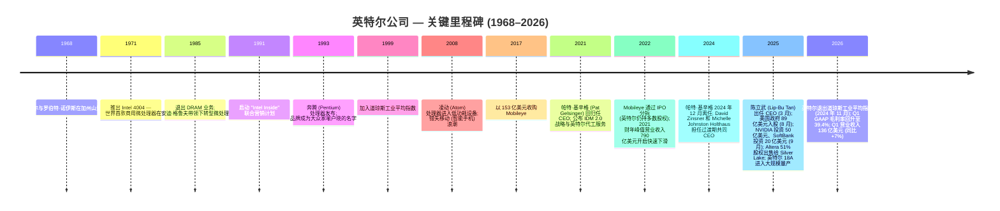
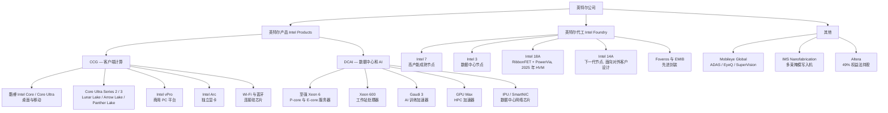
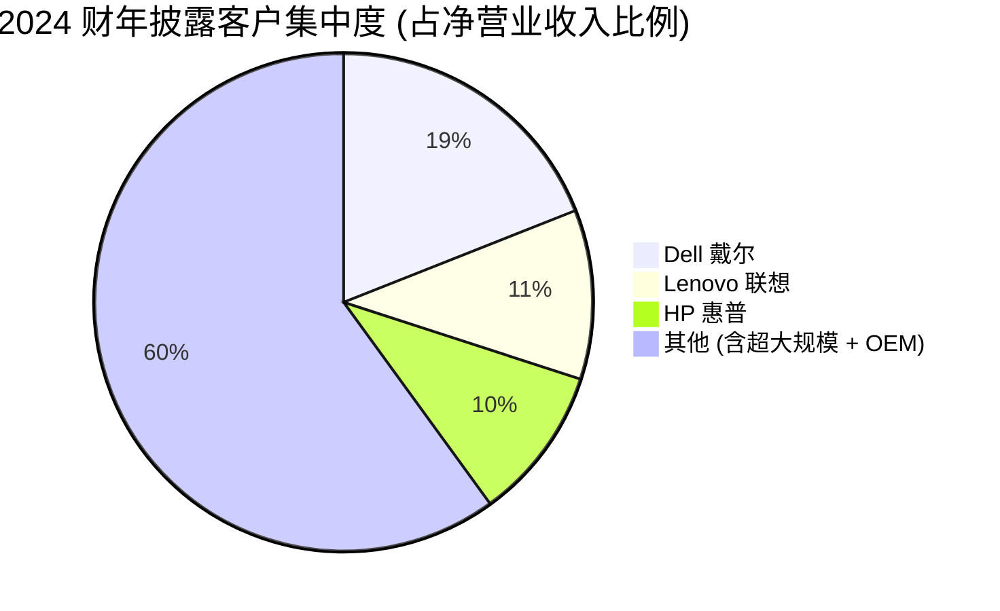
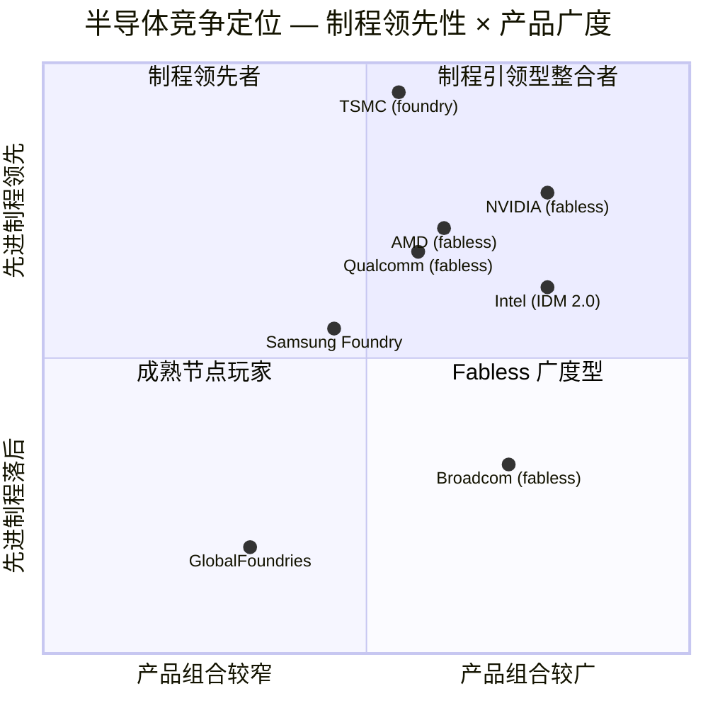

# 公司研究报告: 英特尔公司 (NASDAQ: INTC)

**报告日期:** 2026-05-20
**主要上市地:** NASDAQ: INTC
**财年末:** 12 月最后一个星期六 (2025 财年截至 2025-12-27)
**当前股价:** 117.88 美元 (2026-05-19 收盘) — 来源: [Yahoo Finance — INTC 关键指标](https://finance.yahoo.com/quote/INTC/key-statistics/)
**市值:** 约 5,926 亿美元
**报告币种:** 美元
**报告语言: 简体中文 (英文版同时存在于本目录)**

---

> **更新 — 2026 财年 Q1 业绩与 Q2 指引 (2026-04-23):** 英特尔 (Intel) 公布 2026 财年 Q1 营业收入 **136 亿美元 (同比 +7%)**, GAAP 每股收益 (EPS) -0.73 美元 (非 GAAP 0.29 美元)。管理层给出 Q2 2026 指引: **营业收入 138–148 亿美元、GAAP EPS 0.08 美元 (非 GAAP 0.20 美元)、GAAP 毛利率 (gross margin) 37.5% (非 GAAP 39.0%)**, 这是营业收入连续第六个季度超出公司此前给出的指引区间。首席执行官 (CEO) 陈立武 (Lip-Bu Tan) 指出 AI 时代"对硅 (silicon) 的需求前所未见", 并强调公司正在进行刻意为之的"运营重置 (operational reset)"; 首席财务官 (CFO) David Zinsner 提示, 当前最关键的 Q1 2026 时间窗内, **客户端计算事业群 (CCG) 与数据中心和人工智能事业群 (DCAI) 的瓶颈已从需求侧切换至供给侧**。来源: [Intel Q1 2026 业绩公告, 2026-04-23](https://www.sec.gov/Archives/edgar/data/50863/000005086326000077/q126earningsrelease.htm)。

---

## 目录

1. 公司概览
2. 公司历史
3. 管理团队
4. 产品与服务
5. 客户与上市策略
6. 行业概览
7. 竞争格局
8. 市场机会 (TAM)
9. 风险评估
10. 参考资料

---

## 1. 公司概览

英特尔公司 (Intel Corporation) 是全球规模最大的纯微处理器 (microprocessor) 设计公司, 也是仅有的与台积电 (TSMC) 和三星代工 (Samsung Foundry) 并列、在美国境内对先进逻辑 (leading-edge logic) 半导体制造进行实质性投资的三家公司之一。公司设计与销售 **x86 中央处理器 (CPU)**, 覆盖个人电脑 (PC)、工作站、数据中心 (data center) 服务器以及嵌入式边缘设备, 同时运营**垂直整合的代工厂 (foundry)** —— 英特尔代工 (Intel Foundry) —— 在美国、爱尔兰和以色列开发并运行先进制程技术与先进封装 (advanced packaging)。截至 2025 财年末, 英特尔约有 92,800 名员工, 2025 财年净营业收入为 **528.5 亿美元**, 较 2024 财年的 531.0 亿美元微降 0.5%, 较 2022 财年峰值 630.5 亿美元下降 25.0% ([Intel 2025 Form 10-K, 经营管理层讨论与分析 (MD&A) — 合并经营业绩](https://www.sec.gov/Archives/edgar/data/50863/000005086326000011/intc-20251227.htm))。

公司财务披露分三个经营分部加上一个"其他"类别 ([Intel 2025 Form 10-K — 附注 3: 经营分部](https://www.sec.gov/Archives/edgar/data/50863/000005086326000011/intc-20251227.htm)):

- **客户端计算事业群 (Client Computing Group, CCG)** — x86 PC 处理器 (酷睿 (Core)、酷睿 Ultra)、平台 IP (vPro)、显卡、连接芯片。2025 财年营业收入 322.3 亿美元 (剔除内部抵消后占分部营业收入的 61%), 同比下降 3%。
- **数据中心和人工智能事业群 (Data Center and AI, DCAI)** — 至强 (Xeon) 服务器 CPU、Gaudi AI 加速器、GPU Max (Ponte Vecchio 的继任者)、网络硅芯片。2025 财年营业收入 169.2 亿美元, 同比 +5%。
- **英特尔代工 (Intel Foundry)** — 先进逻辑制程开发、晶圆厂 (fab) 产能、先进封装以及对外的代工服务。2025 财年营业收入 178.3 亿美元 (其中 98% 来自内部分部间销售), 同比 +3%, 但**录得营业亏损 103.2 亿美元**, 较 2024 财年 132.9 亿美元亏损收窄 ([Intel 2025 Form 10-K, MD&A — 英特尔代工](https://www.sec.gov/Archives/edgar/data/50863/000005086326000011/intc-20251227.htm))。
- **其他** — Mobileye (高级驾驶辅助系统 / 自动驾驶)、IMS Nanofabrication, 以及在 2025-09-12 完成出表 (deconsolidation) 后保留的 Altera 残余权益。2025 财年营业收入 35.6 亿美元, 其中 Mobileye 贡献 19.3 亿美元。

从地理分布看, 英特尔 2024 财年约 80% 的终端市场位于美国境外 (公司按发货地对客户进行地理归类; 新加坡是披露中最大的发货地, 占营业收入超 25%, 主要因为许多原始设备制造商 (OEM) 的最终组装合作伙伴设在当地) ([Intel 2024 Form 10-K, MD&A — 地理营业收入](https://www.sec.gov/Archives/edgar/data/50863/000005086325000009/intc-20241228.htm))。


来源: [Intel 2025 Form 10-K, MD&A — 合并经营业绩](https://www.sec.gov/Archives/edgar/data/50863/000005086326000011/intc-20251227.htm); 2021 财年—2022 财年数据出自 [Intel 2022 Form 10-K](https://www.sec.gov/Archives/edgar/data/50863/000005086323000006/intc-20221231.htm)。

上图体现英特尔此轮重置的剧烈程度: 营业收入从 2021 财年 (疫情期 PC 需求顶峰) 的 790 亿美元跌至 2025 财年 528.5 亿美元 —— 回撤 33% —— 同期 GAAP 毛利率从 55.4% 压缩至 34.8%。2025 财年 GAAP 营业利润为亏损 22.1 亿美元, 与 2024 财年亏损 116.8 亿美元相比已显著收窄, 主要驱动包括 165.5 亿美元的研发支出、46.2 亿美元的销售与管理费用 (MG&A) 以及 21.9 亿美元的重组费用 ([Intel 2025 Form 10-K, MD&A — 合并经营业绩](https://www.sec.gov/Archives/edgar/data/50863/000005086326000011/intc-20251227.htm))。2025 财年归属于英特尔的净亏损为 2.67 亿美元, 较 2024 财年因 80 亿美元非现金递延税项估值津贴一次性冲销而被放大的 187.6 亿美元净亏损大幅收窄。

**估值快照 (截至 2026-05-19 收盘)。** 英特尔目前交易于:

- **股价:** 117.88 美元
- **市值:** 约 5,926 亿美元 (按 10-K 封面披露 2026-01-16 的 4,995 百万股流通股计算; 市值反映了 NVIDIA、SoftBank 与美国商务部 (DoC) 新股发行后的稀释, 以及年初至今的反弹)
- **TTM 市盈率 (P/E):** 不具备意义 —— 过去十二个月 (TTM) 每股收益为 **-0.60 美元** ([Yahoo Finance — INTC](https://finance.yahoo.com/quote/INTC/key-statistics/))。驱动因素: 2026 年 Q1 的 40.7 亿美元重组费用, 加上 2025 财年小幅净亏损。拆解来看: 这是**周期性 / 重组期低谷**, 而非结构性的不盈利故事 —— 公司 2025 财年实现了 **53.5 亿美元的 GAAP 毛利和 127 亿美元的英特尔产品 (Intel Products) 营业利润**, 但英特尔代工 103 亿美元的营业亏损叠加重组费用, 将合并数字压成负值 ([Intel 2025 Form 10-K, MD&A](https://www.sec.gov/Archives/edgar/data/50863/000005086326000011/intc-20251227.htm))。2026 财年 Q1 非 GAAP 每股收益 0.29 美元, 以及公司自身对 Q2 给出的 0.20 美元非 GAAP / 0.08 美元 GAAP 指引, 暗示 GAAP 层面即将转回盈亏平衡 ([Intel Q1 2026 业绩公告, 2026-04-23](https://www.sec.gov/Archives/edgar/data/50863/000005086326000077/q126earningsrelease.htm))。
- **远期市盈率 (未来 12 个月共识):** **76.6 倍** —— 绝对数值上极高, 但反映的是 (a) 亏损基数即将滚出 TTM 窗口, 以及 (b) 共识对 Q2 可见斜率的修正尚未到位。
- **TTM 市销率 (P/S):** **11.0 倍**, 而 INTC 的三年中位数约为 2.5 倍; 对比同业 AMD 19.3 倍、AVGO 29.0 倍、NVDA 25.0 倍 ([Yahoo Finance 同业指标, 截至 2026-05-20](https://finance.yahoo.com/quote/INTC/))。
- **市净率 (P/B):** 5.15 倍, 对应股东权益约 1,140 亿美元; 权益账面已因 2025 财年向美国商务部、SoftBank 与 NVIDIA 发行的 184 亿美元股票被重估 (详见下文)。
- **EV/EBITDA:** 按管理层调整后 EBITDA 框架计, EV/TTM EBITDA 约 12 倍, 但 GAAP 视角受到资产减值和重组的扭曲; 按卖方对 2026 财年 EBITDA 的共识, EV/2026E EBITDA 约为 9–10 倍。


来源: [Yahoo Finance — INTC、AMD、AVGO、NVDA 关键指标, 2026-05-20](https://finance.yahoo.com/quote/INTC/key-statistics/)。

**解读。** 英特尔 11 倍 P/S 大约为其三年中位数的 4 倍, 但仍显著低于定价 AI 杠杆增长的 AVGO / NVDA 阵营。2025 年初英特尔股价仍处于 10 多美元区间, 至今 117.88 美元 (14 个月内约 4–5 倍涨幅) 的反弹, 来自**三个独立催化剂**, 而非底层盈利的真实恢复: (i) 2025 年 8 月美国政府以 20.47 美元 / 股注资 89 亿美元购入普通股 ([8-K, 2025-08-25](https://www.sec.gov/Archives/edgar/data/50863/000005086325000129/a08222025form8-kex991.htm)); (ii) 2025 年 9 月 SoftBank 投资 20 亿美元、NVIDIA 投资 50 亿美元入股 ([8-K, 2025-09-18](https://www.sec.gov/Archives/edgar/data/50863/000005086325000155/a09152025form8-kex991.htm)); (iii) 市场相信英特尔 18A (Intel 18A) —— 自 2025 年中已进入大规模量产 (HVM) —— 将弥合与台积电 N2 节点的代际差距。因此当前估值倍数本质上是**叙事驱动**: 投资者付出的是对 18A 节点成功爬坡、代工对外客户订单簿落地、以及非 AI CPU 周期持续上行这三件事的期待 —— 这些都尚未体现在 TTM 财务数据中。估值 / 倍数压缩风险将在第 9 章详述。

## 2. 公司历史

英特尔由戈登·摩尔 (Gordon Moore) 和罗伯特·诺伊斯 (Robert Noyce) 于 **1968-07-18** 在加州山景城 (Mountain View) 创立 —— 二人此前均于 1957 年共同创立过仙童半导体 (Fairchild Semiconductor) ([Intel — 企业历史页](https://www.intel.com/content/www/us/en/corporate-responsibility/intel-history.html))。亚瑟·洛克 (Arthur Rock) 提供了最初的 250 万美元风险投资; 安迪·格鲁夫 (Andrew Grove) 作为第三号员工, 后来带领公司完成了 1985 年最具历史意义的战略转型 —— 退出 DRAM 内存业务、专注于微处理器。英特尔的名字 (Intel) 是 "**INT**egrated **EL**ectronics" (集成电子) 的缩写。



来源: [Intel — 企业历史](https://www.intel.com/content/www/us/en/corporate-responsibility/intel-history.html); [Reuters — 英特尔被踢出道琼斯指数, 2024-11-04](https://www.reuters.com/business/intel-replaced-dow-jones-industrial-average-by-nvidia-2024-11-01/); [Intel 2025 Form 10-K](https://www.sec.gov/Archives/edgar/data/50863/000005086326000011/intc-20251227.htm)。

**战略转型与发生原因。** 三次战略转型定义了英特尔的现代史:

1. **从内存到微处理器 (1985)。** 安迪·格鲁夫顶着痛苦的代价决定退出 DRAM —— 这一业务本是英特尔发明的 —— 以应对日本厂商的低成本竞争。在 IBM PC 平台的胜利支持下, 公司向微处理器的转移成就了之后三十年 50%+ 毛利率的复利增长。这是教科书级的"在位者成功自我蚕食"的经典案例。

2. **错失移动 (2007–2014)。** 2007 年, 时任 CEO 保罗·欧德宁 (Paul Otellini) 不相信苹果对 iPhone 销量的预测, 决定不竞标 iPhone 的调制解调器 + 应用处理器插槽。其后基于 ARM 架构的系统级芯片 (SoC) 完整地接管了智能手机市场; 英特尔凌动 (Atom) 处理器始终未能形成规模, 2016 年公司彻底退出移动业务。这一决策造就了之后的战略脆弱性 —— 规模化的 ARM —— 如今已蔓延到 PC (Qualcomm Snapdragon X、Apple Silicon Mac) 和数据中心 (AWS Graviton、NVIDIA Grace)。

3. **IDM 2.0 / 英特尔代工 (2021– )。** 帕特·基辛格在 2021 年 2 月回归后推出了 "IDM 2.0" 战略: 维持英特尔垂直整合的制造体系, 同时 (a) 部分英特尔产品接受由台积电代工, 以及 (b) 将英特尔的先进制程晶圆厂作为英特尔代工服务 (Intel Foundry Services) 开放给外部客户。其推论性承诺 —— 四年五个制程节点 (Intel 7 → Intel 4 → Intel 3 → Intel 20A → Intel 18A)、亚利桑那州 ("Fab 52"、"Fab 62")、俄亥俄州 ("Mod 1")、德国 (后取消) 的晶圆厂扩张, 以及超过 1,000 亿美元的累计资本开支 —— 抽干了自由现金流, 在低谷时将估值倍数从 30 倍 EBITDA 击穿至约 6 倍, 最终也导致基辛格在 2024 年 12 月去职。

**关键并购与剥离:**
- **Mobileye (2017, 153 亿美元)** — 自动驾驶芯片; 2022 年部分 IPO, 截至 2025 财年末英特尔仍保留 88% 经济权益 ([Intel 2025 Form 10-K, 附注 4](https://www.sec.gov/Archives/edgar/data/50863/000005086326000011/intc-20251227.htm))。
- **Altera (2015 收购, 167 亿美元; 2025 部分剥离)** — FPGA 业务。2025-09-12, 英特尔完成向 Silver Lake (SLP) 出售 **51% 的 Altera 股权**, 净对价 43 亿美元 (48 亿美元现金 + 5 亿美元递延), Altera 自此从英特尔财务报表出表 ([Intel 2025 Form 10-K, 附注 10 — 并购与剥离](https://www.sec.gov/Archives/edgar/data/50863/000005086326000011/intc-20251227.htm))。
- **NAND 闪存** — 2020–2025 年分阶段出售给 SK 海力士 (SK hynix), 总对价 90 亿美元, 完全退出业务。
- **McAfee (2010 以 77 亿美元收购, 2017 出售)**、**Habana Labs (2019 年以 20 亿美元收购, 演化为 Gaudi 产品线)**, 以及与以色列 Tower Semiconductor 的并购案 (2022 年宣布 54 亿美元) 在 2023 年 8 月因中国监管延迟而流产。

**过去 12 个月内对当前投资逻辑有影响的重大事件**集中体现于第 1 章估值讨论以及第 3 章 (CEO 更替) 和第 4 章 (Intel 18A、NVIDIA 合作) 中。最具实质性的事件包括: **美国政府入股 9.9%** (2025 年 8 月以 20.47 美元 / 股新发 433.3 百万股、对价 89 亿美元)、**NVIDIA 50 亿美元入股 + 联合定制 CPU 开发** (2025 年 9 月) 以及**Altera 出表** (2025 年 9 月)。

## 3. 管理团队

### 陈立武 (Lip-Bu Tan) — 首席执行官 (66 岁, 2025 年 3 月任职)

陈立武于 **2025-03-18** 被任命为英特尔 CEO, 结束了帕特·基辛格 2024 年 12 月离任后由 CFO David Zinsner 与前 CCG 负责人 Michelle Johnston Holthaus 担任共同 CEO 的三个月过渡期 ([Intel 2025 Form 10-K — 执行官信息](https://www.sec.gov/Archives/edgar/data/50863/000005086326000011/intc-20251227.htm); [Intel 2026 Proxy Statement (DEF 14A)](https://www.sec.gov/Archives/edgar/data/50863/000005086326000061/0000508632-26-000061-index.htm))。

我们认为, 陈立武出任 CEO 是当下英特尔投资逻辑中**最关键的单一变量**。董事会的选择并非延续型人选 —— 陈立武在出任 CEO 仅几个月前的 **2024 年 8 月就已从英特尔董事会辞职**, 据报道是因为对基辛格执行节奏和战略广度存在分歧 ([Reuters, 2024-08-23](https://www.reuters.com/technology/intel-board-member-lip-bu-tan-resigns-2024-08-22/); 后获 [《华尔街日报》, 2024-08-26](https://www.wsj.com/tech/intel-tan-board-resignation) 证实)。

陈立武最具代表性的过往职位是 **2009 年至 2021 年 12 月担任 Cadence Design Systems (NASDAQ: CDNS) CEO**, 在他任内成就了电子设计自动化 (EDA) 行业最具影响力的估值再评级之一。在他治下, Cadence 股价 **总回报率超过 3,200% (同期标普 500 约 340%)**, 营业收入从 2009 财年 8.53 亿美元复合增长至 2021 财年 30 亿美元 (CAGR 约 14%), 非 GAAP 营业利润率从十几个百分点扩展至 30 多个百分点。2021 年 12 月至 2023 年 5 月期间, 他出任 Cadence 执行董事长, 随后短暂任董事长, 然后于 2022 年 9 月加入英特尔董事会。2024 年 8 月离开后, 7 个月后他作为 CEO 重新返回。他保留**Walden International (华登国际) 的董事长**职务 —— 这是他于 1987 年创立的风险投资公司, 在中国与东南亚的半导体与 AI 创业公司有数十年的投资组合; 此外他也是 Celesta Capital 和 Walden Catalyst Ventures 的创始管理合伙人, 以及施耐德电气 (Schneider Electric SE) 的董事。他持有南洋理工大学物理学学士、MIT 核工程硕士与旧金山大学 MBA 学位 ([Intel 2025 Form 10-K — 执行官简历](https://www.sec.gov/Archives/edgar/data/50863/000005086326000011/intc-20251227.htm))。

根据 2026 年代理委托书 (Proxy) 披露, 陈立武的薪酬结构高度倾向于与股价挂钩的股权激励, 基础年薪 100 万美元 + 目标奖金 200 万美元, 外加 2,500 万美元的入职股权 + 仅在英特尔达成特定 TSR (股东总回报) 阈值时方可归属的业绩股票单位 ([Intel 2026 Proxy Statement — 薪酬讨论与分析](https://www.sec.gov/Archives/edgar/data/50863/000005086326000061/0000508632-26-000061-index.htm))。2026 年 Proxy 描述董事会赋予他的使命是"锐化英特尔的战略聚焦、重建客户信任、强化问责并加速纪律性执行" —— 这一措辞明确将客户信任 (即代工对外客户订单簿) 与执行纪律 (即成本重置、Intel 18A 爬坡) 置于增长之前。

他自就任以来的公开形象一直纪律而朴实: 月度结构化更新、刻意的成本削减 (2025 年重组计划在 2025 财年裁员约 15%), 以及一系列高杠杆的合作发布 (NVIDIA、Google、SambaNova、特朗普政府)。看空的观点是他整个职业生涯都在 EDA 软件与风险投资, 而非资本密集型制造业; 看多的观点则是, 正是这种缺乏"英特尔文化包袱"的特质, 使他能够做出内部领导层无法决策的取舍 (Altera 51% 出售、2024 年取消德国马格德堡 (Magdeburg) 晶圆厂、缩减 Intel 4 / 3 的晶圆规模)。

### David Zinsner — 执行副总裁兼首席财务官 (57 岁, 自 2022 年 1 月任职)

Zinsner 加入英特尔前在 **美光科技 (Micron Technology) 担任 CFO (2018–2022)**, 带领全球财务组织穿越 DRAM / NAND 周期波动。在美光之前, 他曾任 Affirmed Networks (2020 年被微软收购) CFO, 以及 Analog Devices 和 Vivekanand Education Society 的相关职位。他拥有超过三十年的半导体财务经验, 是基辛格至陈立武过渡期 (2024 年 12 月至 2025 年 3 月) 的两位共同 CEO 之一, 因此次任职获得一次性 150 万美元现金奖励 ([Intel 2026 Proxy Statement — 高管薪酬讨论](https://www.sec.gov/Archives/edgar/data/50863/000005086326000061/0000508632-26-000061-index.htm))。他主导了数十亿美元的债务发行、Altera 部分出售交易、2025 年 8 月美国政府入股交易, 以及 2025 年 9 月 NVIDIA / SoftBank 的股权私募。其上市公司 CFO 履历强劲, 市场对他"流动性优先"的现金管理风格给予了正面评价 —— 英特尔 2025 财年末现金及短期投资达 374 亿美元, 较 2024 财年末 221 亿美元大幅上升 ([Intel 2025 Form 10-K — 短期投资与借款](https://www.sec.gov/Archives/edgar/data/50863/000005086326000011/intc-20251227.htm))。

### Naga Chandrasekaran — 执行副总裁、首席技术与运营官; 英特尔代工总经理 (51 岁, 自 2025 年 9 月任职)

Chandrasekaran 于 **2024 年 8 月以执行副总裁身份加入英特尔, 负责代工制造与供应链**, 并于 2025 年 9 月升任首席技术与运营官 (CTOO), 接管英特尔代工 P&L 总经理职责。他在 **美光科技工作了 23 年 (2008 年 10 月至 2024 年 8 月)**, 最近职位是负责技术开发的高级副总裁, 主导了将美光送入 NVIDIA H100 / H200 高带宽内存 (HBM3E) 配套位置的 DRAM 与 HBM 工艺路线图。他拥有机械工程学士、硕士与博士学位, 加州大学伯克利分校信息与数据科学硕士, 以及 UCLA 与新加坡国立大学的双 EMBA 学位; 同时也是 Mobileye Global 的董事 ([Intel 2025 Form 10-K — 执行官简历](https://www.sec.gov/Archives/edgar/data/50863/000005086326000011/intc-20251227.htm))。他的使命是把 Intel 18A 良率爬坡做出来、让 Intel 14A 对外部客户合格化, 以及在 Altera 出售与马格德堡取消之后重新优化晶圆厂布局。

### Sachin Katti — 首席技术官兼网络与边缘事业群总经理

Katti 负责英特尔网络与边缘 (Network and Edge) 业务以及全公司层面的 AI 战略。他曾是斯坦福大学计算机系教授, 后转型为公司高管, 通过 2020 年英特尔对 Uhana (他的联合创始公司) 的收购加入英特尔, 并积极推动英特尔"AI 无处不在 (AI everywhere)"的定位 —— 把 AI 推理 (inference) 带入 PC (酷睿 Ultra 中的 NPU)、边缘设备以及 5G / 6G 无线接入网 (RAN) 基础设施 ([Intel — 领导团队页](https://www.intel.com/content/www/us/en/newsroom/leadership.html))。2024 年组织重整后, 网络与边缘已不再作为独立报告分部 (现归入 CCG / DCAI / 其他, 用于营业收入披露), 但其技术路线图依然是研发的关键支柱。

### 公司治理

- 董事会构成: **Frank D. Yeary** 出任独立董事会主席; 陈立武是唯一的内部董事。按 2026 年 Proxy 披露, 共 **12 名董事, 其中 11 名独立**, 平均任期约 3.6 年 (自 2022 年以来明显进行了刷新) ([Intel 2026 Proxy Statement — 董事会](https://www.sec.gov/Archives/edgar/data/50863/000005086326000061/0000508632-26-000061-index.htm))。
- 美国政府持有 9.9% 的普通股 (4.333 亿股), 但被明确为**被动持股: 无董事席位、无信息权**, 且有合同义务在股东事项上随董事会投票, 仅有有限例外 ([Intel 新闻稿, 2025-08-25](https://www.sec.gov/Archives/edgar/data/50863/000005086325000129/a08222025form8-kex991.htm))。
- 内部人持股较低: 现任董事和执行官合计约持有 275 万股 (占流通股不足 0.06%), 出自 2026 年 Proxy ([Intel 2026 Proxy Statement — 股权情况](https://www.sec.gov/Archives/edgar/data/50863/000005086326000061/0000508632-26-000061-index.htm))。
- NVIDIA 持股 (以 23.28 美元 / 股购入 2.15 亿股) 与 SoftBank 持股 (以 23.00 美元 / 股购入 8,700 万股) 均为战略性、非董事会层面的投资。
- CEO 与高管的股权激励主要由多年期业绩股票单位 (PSU) 构成; 公司已声明薪酬改革目标是"绩效挂钩"薪酬 (NEO 总薪酬至少 75% 处于风险敞口)。

### 管理团队履历综合判断

英特尔自 2025 年 3 月以来组建的领导班子明显有别于过去十年的文化基因 —— **代工 / 运营老兵 (Chandrasekaran)、经历过完整周期的半导体 CFO (Zinsner)、以及职业生涯主轴是估值再评级而非工厂建设的 CEO (陈立武)**。这一组合不太可能开辟出一条全新的产品赛道, 但非常适合执行成本重置、完成 Intel 18A 爬坡, 以及把第一份具有实质性意义的代工对外客户订单簿落地 —— 而这正是当前投资逻辑所要求的。风险在于, 陈立武作为非制造业出身的 CEO, 可能在长尾节点 (Intel 14A、Intel 10A) 上投资不足, 而这些节点决定了 2028 年之后的竞争力。

## 4. 产品与服务



来源: [Intel 产品组合页](https://www.intel.com/content/www/us/en/products/overview.html); [Intel 代工制程页](https://www.intel.com/content/www/us/en/foundry/process/overview.html); [Intel 2025 Form 10-K — 业务概述](https://www.sec.gov/Archives/edgar/data/50863/000005086326000011/intc-20251227.htm)。

### 客户端计算事业群 (CCG)

CCG 向 PC 生态系统销售 x86 微处理器与平台 IP。2025 财年营业收入 322.3 亿美元, 其中 **"客户端"产品 (笔记本 + 桌面 CPU) 贡献 276 亿美元**, "其他 CCG" (Wi-Fi、以太网、调制解调器残留、独立显卡) 贡献 46 亿美元 ([Intel 2025 Form 10-K, MD&A — 分部营业收入摘要](https://www.sec.gov/Archives/edgar/data/50863/000005086326000011/intc-20251227.htm))。当前旗舰品牌产品系列包括:

- **酷睿 Ultra Series 2 ("Lunar Lake" 移动 / "Arrow Lake" 桌面)** — 现一代客户端产品, 重新引入集成神经处理单元 (NPU) 和独立显卡 Tile。Lunar Lake 的计算 Tile 由台积电 N3B 节点代工, Intel 18A 保留给后继的 Panther Lake。
- **酷睿 Ultra Series 3 ("Panther Lake", 2026 年 Q1 发布)** — 首款基于 **Intel 18A 制造**、采用 RibbonFET (全栅环绕, GAA) 晶体管 + PowerVia (背面供电, backside power delivery) 的量产 PC 产品。Panther Lake 被定位为英特尔首款能交付"台积电 N2 级"性能 / 功耗比的客户端 SoC, 也是英特尔代工对外客户故事的基础性光环产品 ([Intel Q1 2026 业绩公告, 2026-04-23](https://www.sec.gov/Archives/edgar/data/50863/000005086326000077/q126earningsrelease.htm))。
- **vPro** — 叠加于酷睿 Ultra 之上的商用 PC 平台, 提供面向企业 IT 采购方的可管理性与安全能力。
- **Arc 独立显卡** — 桌面 GPU 第三名, 落后于 NVIDIA GeForce 与 AMD Radeon; 英特尔已承诺持续推进 Arc 路线图 (Battlemage 于 2024 年发布), 但未披露其营业收入贡献。

**竞争优势评估。** CCG 拥有**部分护城河 (partial moat)**: x86 指令集与软件生态系统为企业 PC 采购方建立了真实的切换成本 (几十年的 x86 遗留应用、Windows on Arm 仍在成熟期), 而英特尔的商用 PC 渠道 (戴尔、惠普、联想) 黏性较强。但护城河已在显著侵蚀: 苹果的 M 系列芯片现在 100% 驱动 Mac 出货 (苹果已于 2022–2023 年停止英特尔版 Mac), Qualcomm Snapdragon X 在 2025 年驱动了 **Windows PC 笔记本约 10–15% 的份额** (按 IDC 数据), AMD Ryzen 在 x86 阵营内持续抢占份额 (按 [Mercury Research, 2025-04](https://www.mercuryresearch.com/blog/) 数据, AMD 客户端 CPU 单位份额在 2025 年 Q1 达到 23.4%)。最直接的对位产品是 **AMD Ryzen AI 9 HX 370 (Strix Point) 对位 Intel Core Ultra 9 285H**; 评测结果各有胜负, AMD 在多线程领先, 英特尔在 AI / NPU 性能领先。结论: **当前产品层面竞争平衡, 多年维度上份额持续侵蚀。**

### 数据中心和人工智能事业群 (DCAI)

DCAI 销售服务器 CPU (至强系列)、AI 加速器 (Gaudi)、GPU (Max 系列) 与数据中心网络硅芯片。2025 财年营业收入 **169.2 亿美元 (同比 +5%)**, 服务器单位出货量同比 +9%、平均售价 (ASP) 同比 -4%, 后者反映了竞争性定价环境以及低核心数 SKU 占比的上升 ([Intel 2025 Form 10-K, MD&A — DCAI](https://www.sec.gov/Archives/edgar/data/50863/000005086326000011/intc-20251227.htm))。

- **至强 6 — "Granite Rapids" P-core 与 "Sierra Forest" E-core 系列**是当前一代数据中心产品。P-core 变种 (最高 128 核) 面向传统企业级和 HPC; E-core 变种 (最高 288 核) 面向云原生、超大规模 (hyperscale) 和 AI 推理工作负载, 这些场景下吞吐 / 功耗与密度比单线程性能更重要。NVIDIA 选用至强 6 作为其 **DGX Rubin NVL8 系统**的主机 CPU ([Intel Q1 2026 业绩公告, 2026-04-23](https://www.sec.gov/Archives/edgar/data/50863/000005086326000077/q126earningsrelease.htm)) —— 这是至强在多年丧失对 AMD EPYC 的超大规模份额之后, 一次极具公信力的胜利。
- **Gaudi 3** — AI 训练与推理加速器, 是 Habana Labs 收购以来的第三代产品。Gaudi 3 被定位为 NVIDIA H100 / H200 在推理工作负载上的性价比替代方案。该产品线**在 2024 财年计提了 9.22 亿美元的库存减值、2025 财年又新增了减值**, 因为英特尔此前给出的 2024 财年 5 亿美元营业收入目标被错过 (实际披露: Gaudi 3 "未达到我们内部预期" — [Intel 2024 Form 10-K](https://www.sec.gov/Archives/edgar/data/50863/000005086325000009/intc-20241228.htm))。Gaudi 3 此后未再在 SKU 层面单独披露营业收入。
- **GPU Max ("Ponte Vecchio" / "Falcon Shores")** — 独立数据中心 GPU 产品线。Falcon Shores 在 2024 年末被降低优先级, 路线图重置为"**Jaguar Shores**", 该后继品聚焦于推理与机架级系统集成, 预计 2026 年末发布。
- **网络与边缘硅芯片** — 此前为独立分部, 现已重新分配; IPU / SmartNIC 与 Google 共同开发, 用于定制 ASIC 基础设施处理器 ([Intel Q1 2026 业绩公告, 2026-04-23](https://www.sec.gov/Archives/edgar/data/50863/000005086326000077/q126earningsrelease.htm))。

**竞争优势评估。** DCAI 拥有**部分到偏弱 (partial-to-weak) 的护城河**。x86 服务器生态系统 (RHEL、ESXi、vSphere) 在企业本地与本地部署服务器中仍是默认选择, 在应用层带来较高的切换成本。但 AI 训练市场已基本被 NVIDIA 拿下 (CUDA + Hopper / Blackwell), AMD EPYC 已在超大规模拿下持久的份额 (按 [Mercury Research](https://www.mercuryresearch.com/blog/) 数据, AMD 服务器 CPU 份额在 2025 年 Q1 达到 **27.2%**, 约为两年前英特尔份额的两倍), 而 AWS (Graviton 4)、微软 Azure (Cobalt 100) 和 Google (Axion) 的 ARM 实例正在云原生侧蚕食至强份额。最直接的竞争对手: **AMD EPYC 9005 "Turin"** (第 5 代 Zen 5, 最高 192 核, 普遍被认为在 HPC 与企业本地的性能 / 功耗领先); 在 AI 机架中的**NVIDIA Grace Hopper / Grace Blackwell**; 云原生场景下的 **AWS Graviton 4**。结论: **至强 6 已缩小与 AMD EPYC 的差距, 并赢得若干有意义的设计中标 (Google C4/N4、NVIDIA DGX Rubin), 但 AI 加速器份额相对 NVIDIA 仍可以忽略不计。**

### 英特尔代工 (Intel Foundry)

英特尔代工是**垂直整合的制造臂膀**, 负责开发制程技术、运营英特尔的晶圆厂网络, 并日益向外部客户开放制造产能。2025 财年营业收入 178.3 亿美元 (约 98% 来自分部间销售, 对外销售仅 3.07 亿美元), 录得**营业亏损 103.2 亿美元** ([Intel 2025 Form 10-K, MD&A — 英特尔代工](https://www.sec.gov/Archives/edgar/data/50863/000005086326000011/intc-20251227.htm))。


来源: [Intel 2025 Form 10-K, MD&A — 英特尔代工](https://www.sec.gov/Archives/edgar/data/50863/000005086326000011/intc-20251227.htm)。

制程路线图:
- **Intel 7** — 大规模量产的成熟节点, 至 2026 年仍在持续爬坡 CCG 和 DCAI 产品, 且按 Q1 2026 管理层评论, 供给受限
- **Intel 4 / Intel 3** — 基于 EUV; Intel 3 是 Sierra Forest 与 Granite Rapids 的量产节点
- **Intel 18A** — 2025 年中进入大规模量产, 2026 年 Q1 起在 Panther Lake 客户端 SoC 量产, 并将于 2026 年下半年用于**"Clearwater Forest" 至强**。这是英特尔首个同时引入**全栅环绕 (RibbonFET)** 与**背面供电 (PowerVia)**的节点 —— 均为工业界首次在量产中实现 ([Intel 2025 Form 10-K — 战略](https://www.sec.gov/Archives/edgar/data/50863/000005086326000011/intc-20251227.htm))
- **Intel 14A** — 下一代节点, **从立项之初就明确面向外部客户设计**, 在 RibbonFET / PowerVia 之上延伸至高数值孔径 EUV (high-NA EUV); 2025 年 PDK 1.0 已向早期客户发布

先进封装: **Foveros** (3D 堆叠, 用于 Lunar Lake 与 Panther Lake) 与 **EMIB** (嵌入式多 Die 互连, 用于至强与 Gaudi) 是差异化资产 —— 英特尔在全球先进封装产能中位列第二, 仅次于台积电 CoWoS。

**竞争优势评估。** 英特尔代工具备**带选择权的部分护城河**。护城河在三个维度上是真实的: (i) 在美国本土的先进逻辑产能在结构上稀缺 —— 台积电的亚利桑那州晶圆厂正在投产, 但相比英特尔的装机量明显滞后; (ii) 先进封装 (Foveros、EMIB) 是与台积电 CoWoS 并列的双寡头; (iii) 在 CHIPS 法案之后, 美国政府与国防部需求构成捕获式的 Secure Enclave 客户基础 (已披露 32 亿美元订单)。护城河在竞争维度上偏弱: 台积电 N2 节点 2025 年底至 2026 年进入 HVM, **在良率与客户生态两个维度上普遍被认为领先于 Intel 18A**, 三星代工的 GAA 2nm 在技术上具有竞争力但良率不佳, 而外部客户订单簿仍处于萌芽阶段 —— 英特尔尚未披露 18A 的任何一线客户承诺。结论: **对外代工业务是英特尔长期企业价值的二元判断核心。**

### Mobileye (其他)

Mobileye Global (NASDAQ: MBLY, 英特尔持股 88%) 开发 ADAS 与自动驾驶硅芯片 (EyeQ 系列), 配合 SuperVision 与 Chauffeur 全栈系统, 服务大众、宝马、吉利旗下极氪 (Zeekr)、极星 (Polestar) 等 OEM ([Mobileye 2024 Form 10-K](https://www.sec.gov/cgi-bin/browse-edgar?action=getcompany&CIK=0001910139&type=10-K))。2025 财年 Mobileye 在英特尔"其他"分部的营业收入为 **19.3 亿美元 (同比 +14%)**。

### 旗舰产品与长尾

**当前驱动英特尔经济的 1–3 个旗舰产品系列**为:
1. **至强 6 (DCAI)** — DCAI 营业利润从 2024 财年 14 亿美元反弹至 2025 财年 34 亿美元, 是单项最大的波动因子, 其驱动正是至强 6 + AI 服务器需求
2. **酷睿 Ultra Series 3 / Panther Lake (CCG 基于 Intel 18A)** — CCG 未来的成本与利润率故事; 其成功将带来分部估值再评级
3. **Intel 18A (代工)** — 整个对外客户订单簿、Panther Lake 的利润率轨迹以及美国政府合作都依赖 Intel 18A 在具有竞争性的经济条件下产出良率

过去 12 个月内的新发布: Panther Lake (2026 年 Q1)、酷睿 Ultra 200S Plus 与 200HX Plus 桌面/移动刷新、至强 600 工作站处理器、带 Intel vPro 的酷睿 Ultra Series 3, 以及马来西亚槟城的封装测试扩产 ([Intel Q1 2026 业绩公告, 2026-04-23](https://www.sec.gov/Archives/edgar/data/50863/000005086326000077/q126earningsrelease.htm))。日落 / 收缩: Habana Gaudi 原产品线 (被 Gaudi 3 替代, 后者自身未达预期)、网络与边缘 (作为独立分部)、马格德堡晶圆厂项目 (取消)、德国消费级显卡 XPG 产品线。

## 5. 客户与上市策略



来源: [Intel 2024 Form 10-K — 附注 1: 列报基础与重要客户](https://www.sec.gov/Archives/edgar/data/50863/000005086325000009/intc-20241228.htm)。

### 客户集中度

英特尔的客户以 **OEM、超大规模 (hyperscaler) 以及渠道分销商**为主, 而非终端用户。按 2024 财年 10-K, 有三家客户各自占净营业收入 10% 或以上: **Dell 戴尔 (19%)、Lenovo 联想 (11%)、HP 惠普 (10%)** — 前三大合计占合并营业收入约 40% ([Intel 2024 Form 10-K, 附注 1](https://www.sec.gov/Archives/edgar/data/50863/000005086325000009/intc-20241228.htm))。英特尔 2025 财年 10-K 确认重要客户披露阈值 (10%+) 继续适用于 Dell、Lenovo 与 HP, 但 2025 财年的具体百分比略低, 因为 AI 驱动的至强直接向超大规模采购增多 ([Intel 2025 Form 10-K, 附注 1](https://www.sec.gov/Archives/edgar/data/50863/000005086326000011/intc-20251227.htm))。

**超大规模客户** (Amazon AWS、Microsoft Azure、Google Cloud、Meta、Oracle、字节跳动) 并未被单独披露, 但合计在 DCAI 营业收入中占比较大; 2026 年 Q1 与 Google (至强 6 进入 C4/N4 实例、联合开发定制 IPU) 与 NVIDIA (至强 6 进入 DGX Rubin) 的合作公告暗示超大规模是确定性最高的增长方向。按 2026 年 Q1 电话会上的公开评论, DCAI 22% 的同比增长由超大规模驱动。

**三年趋势 (前三大 OEM 占比):** Dell 22% (2023 财年) → 19% (2024 财年) → 估计 18–19% (2025 财年) —— 随着超大规模份额上升而轻微去集中化。Lenovo 趋势为 11% → 11% → 12%; HP 为 10% → 10% → 10%。前几大客户均非竞争对手 (附加说明: 超大规模客户同时在自研基于 ARM 的硅芯片: AWS Graviton、Azure Cobalt、Google Axion —— 这一垂直整合威胁在第 9 章讨论)。

**合同结构:** 主采购协议配季度定价, 按 SKU 设定数量条款; 无任意吃定 (take-or-pay) 条款; 标准 30–60 天付款周期。OEM 关系不具排他性 —— Dell、HP、Lenovo 都同时销售 AMD 平台 —— 但 Intel 平台仍是商用 PC 的主导份额。

**对风险的影响。** 前三大客户集中度约 40% 在半导体行业中较高但并非极端 (相比之下, 例如禾赛 (Hesai) 或 Mobileye-中国汽车 OEM 集中度更高)。缓解因素包括: (a) 这三家客户自身覆盖广泛的下游终端市场; (b) 长期存在的主合同关系; (c) 通过 OEM 渠道存在 50,000+ 间接终端客户关系。我们将**客户集中度作为一项有意义但非实质性 (meaningful but not material) 的风险**带入第 9 章。

### 上市策略 (Go-to-market)

英特尔通过三条主要渠道触达终端客户:

1. **直接企业 / 超大规模销售** — 用于至强、Gaudi、GPU Max 及代工对外客户订单簿。销售模式为技术驱动的售前 + 工程协同开发。在营业收入中占比上升。
2. **OEM 渠道 (Dell、HP、Lenovo、华硕、宏碁、微星、三星、LG, 加上二线 ODM)** — 用于 CCG 客户端产品。规模化销售模式, 配合联合营销资金与季度量化激励。绝对营业收入贡献最大。
3. **分销渠道 (Synnex、Ingram Micro、ASBIS 等)** — 用于盒装与托盘处理器, 销售给中小企业、白盒与渠道后市场。单位毛利率最高但绝对量最小。

营销支出在 2025 财年为 **46.2 亿美元** (占营业收入 8.7%), 较 2024 财年 55.1 亿美元有所下降 —— 这是成本重置的刻意削减 ([Intel 2025 Form 10-K, MD&A — 营业费用](https://www.sec.gov/Archives/edgar/data/50863/000005086326000011/intc-20251227.htm))。这一缩减反映了对部分联合营销资金 (历史上的 "Intel Inside" 计划) 的终止, 转而投入直接面向客户的工程合作。

**过去 12 个月披露的关键合作:**
- **NVIDIA** (2025 年 9 月): 联合开发 NVIDIA 定制的 x86 服务器 CPU, 以及 x86 + RTX GPU 的客户端 SoC; NVIDIA 以普通股形式投资 50 亿美元 ([8-K, 2025-09-18](https://www.sec.gov/Archives/edgar/data/50863/000005086325000155/a09152025form8-kex991.htm))。
- **Google** (2026 年 Q1): 多年期至强 6 承诺, 用于 C4/N4 云实例 + 联合开发定制 ASIC IPU。
- **SoftBank Group** (2025 年 9 月): 以 23.00 美元 / 股新发普通股, 入股 20 亿美元 ([Intel 2025 Form 10-K — 附注 5](https://www.sec.gov/Archives/edgar/data/50863/000005086326000011/intc-20251227.htm))。
- **SambaNova** (2026 年 Q1): 异构计算平台蓝图, 结合 GPU、SambaNova RDU 与至强 6。
- **Terafab 联盟** (2026 年 Q1): 与 SpaceX、xAI 和特斯拉并列, 加入为战略合作伙伴。

## 6. 行业概览

英特尔运营于**全球半导体行业**, 据世界半导体贸易统计组织 (WSTS) 测算, 2024 年市场规模为 **6,276 亿美元**, 预计 2025 年达 **6,972 亿美元、2026 年达 7,625 亿美元** —— 同比增速分别约 11% 和 9% ([WSTS, 2025 春季预测更新](https://www.wsts.org/76/103/WSTS-Semiconductor-Market-Forecast-Spring-2025))。三个子领域与英特尔业务组合最相关:

**1. 微处理器与逻辑芯片 — 2025E 约 2,300 亿美元。** 这是英特尔直接覆盖的市场, 包括客户端 PC CPU (约 500 亿美元)、服务器 CPU (约 350 亿美元)、AI 加速器 (2025E 约 1,100 亿美元, 同比增速 50%+, NVIDIA 主导)、独立 GPU / 消费级加速器 (约 350 亿美元)。高增长子领域是 AI 加速器, 而英特尔在该领域的份额是所有被点名厂商中最小的。

**2. 代工服务 — 2024 年约 1,400 亿美元, 2025 年增至约 1,650 亿美元。** 台积电 2024 年代工营业收入为 **904 亿美元, 2025 年正向 1,130 亿美元迈进 (同比 +25%)** (按公司业绩公告) ([TSMC 2024 年 Q4 业绩, 2025-01-16](https://investor.tsmc.com/english/quarterly-results/2024/q4))。三星代工 (Samsung Foundry)、GlobalFoundries、UMC (联电)、SMIC (中芯国际) 和英特尔代工构成其余份额。先进制程 (≤5nm) 是高增长口袋, 由台积电主导 (份额 >80%)。

**3. 先进封装 — 2025E 约 500 亿美元, 同比增速 25%+。** CoWoS (台积电) 与 Foveros / EMIB (英特尔) 是两大领先的 2.5D / 3D 封装架构; NVIDIA 直至 2026 年的 CoWoS 配额限制构成英特尔对外封装产品的顺风条件。

**关键趋势:**

- **AI 加速器带动 CPU 拉动 (pull-through)。** 基于 GPU 的 AI 数据中心建设意外创造了高质量的服务器 CPU 需求周期 —— 每一台 NVIDIA HGX 级机架都需要 2 颗至强或 EPYC 主机 CPU, 而此类机架数量的迅速增长在 2025 年带动了服务器 CPU 单位出货量两位数增长。这是英特尔 DCAI 近期最大的单一顺风。

- **超大规模厂商的定制硅芯片。** AWS Graviton、Microsoft Cobalt、Google Axion、Meta MTIA、Apple Silicon —— 每一个主要的超大规模和平台 OEM 都在设计定制硅芯片, 侵蚀英特尔的超大规模 CPU 份额以及更广泛的 x86 商品化 CPU 市场。

- **地缘政治回流 (re-shoring)。** 美国 CHIPS 法案 (390 亿美元直接补贴 + 750 亿美元贷款 / 担保)、欧洲芯片法案 (430 亿欧元)、日本 METI 补贴, 以及韩国 K-Chips 法案合计代表了**到 2030 年前已承诺 >2,000 亿美元的晶圆厂补贴**。英特尔是美国境内最大的单一受益方 —— 已发放 80 亿美元 CHIPS 法案补贴, 加上 2025 年 8 月披露的 89 亿美元美国政府入股 ([Intel 2025 Form 10-K, MD&A — 政府激励](https://www.sec.gov/Archives/edgar/data/50863/000005086326000011/intc-20251227.htm))。

- **边缘 AI 与推理。** 随着大语言模型 (LLM) 越来越多地在超大规模训练, 下一阶段是推理 —— 把更多算力下沉到边缘设备 (PC、手机、智能摄像头、自动驾驶汽车)。带 NPU 的 CPU + 低功耗加速器在结构上更加重要。这是陈立武在 2026 年 Q1 评论中的明确定位。

- **制程节点上的摩尔定律放缓。** 在 3nm 以下, 晶体管密度增益在放缓, 而晶圆成本在加速 (Intel 18A 晶圆成本在 HVM 良率下据估超过 25,000 美元 / 片, 台积电 N2 类似)。率先进入新节点的经济溢价在上升, 但其绝对资本强度也在上升。

**行业结构:** 先进逻辑半导体行业在代工层面处于**接近双寡头 (近似垄断) 格局 (台积电 + 三星; 英特尔作为坚定的第三参与者)**, **AI 计算供应方为单一超大规模玩家 (NVIDIA), 占据 AI 加速器经济的绝大部分**。供应商势力集中于极紫外光刻 (EUV) 设备 (ASML 在 EUV 设备上的垄断) 以及若干关键材料。买方势力随着超大规模定制硅趋势而上升。替代品有限; 成熟平台 (x86 服务器软件栈、AI 中的 CUDA) 上的切换成本极高。监管在加强 —— 美国对中国先进芯片的出口管制、欧盟可持续性规则, 以及美国国家安全投资审查 (CFIUS) —— 这些都偏向于美国注册、美国制造的英特尔, 使其在美国政府与国防采购中相对亚洲竞争对手更具优势。

## 7. 竞争格局

竞争格局因英特尔分部而异, 我们分别讨论。

### 直接竞争对手

**AMD (NASDAQ: AMD)。** 英特尔在客户端与服务器 CPU 中最直接的正面对手。Lisa Su (苏姿丰, 2014 年起任 CEO) 治下的 AMD 战略一直是有纪律的: 紧密聚焦于高毛利的 Ryzen 与 EPYC 产品线, 借助台积电先进节点 (当前 Zen 5 在 N3, 即将迁移至 N2)。AMD 2024 财年营业收入 258 亿美元, 2025 财年 TTM 营业收入 375 亿美元 ([Yahoo Finance — AMD](https://finance.yahoo.com/quote/AMD/financials/))。按 [Mercury Research, 2025-04](https://www.mercuryresearch.com/blog/), AMD 客户端 CPU 单位份额在 2025 年 Q1 达到 23.4%、服务器 CPU 单位份额达到 27.2% —— 较 2020 年客户端 <15% / 服务器 <10% 大幅扩张。AMD 还拥有 Instinct MI300 / MI325 GPU 产品线, 是 NVIDIA 之后排名第二的 AI 加速器, 按公司评论, 2025 财年数据中心 GPU 营业收入约 50 亿美元。

**NVIDIA (NASDAQ: NVDA)。** 并非规模化的 CPU 竞争对手 (NVIDIA 的 CPU 活动是 Grace, 配合 Hopper / Blackwell GPU 在 HGX 系统中), 但**从更广义上看是单一最具影响力的半导体竞争对手**: NVIDIA 占据 AI 加速器市场约 80%, 其 CUDA 软件生态系统是 AI 训练的事实标准。2025 年 9 月发布的 NVIDIA / 英特尔定制 CPU 合作把这一关系从正面对抗重新框定为在 NVIDIA 参考平台中高端 x86 插槽的互补关系。

**Broadcom 博通 (NASDAQ: AVGO)。** 网络硅芯片 (Tomahawk、Jericho 交换 ASIC)、定制 ASIC 设计服务 (用于 Google TPU、Meta MTIA), 以及软件 (VMware)。是英特尔网络硅与英特尔代工对外客户故事的间接竞争对手 (博通将制造外包给台积电)。2024 财年营业收入 516 亿美元, TTM 营业收入 683 亿美元; 截至 2026-05-19, 市值约 2.0 万亿美元 ([Yahoo Finance — AVGO](https://finance.yahoo.com/quote/AVGO/key-statistics/))。

**Qualcomm 高通 (NASDAQ: QCOM)。** Snapdragon X Elite 及其后代是 Windows PC 中第一款可信的 ARM 挑战者; 按 IDC, 在 2025 年高端笔记本中拿下约 10% 份额。在 CCG 上暴露最大。

**苹果公司 (NASDAQ: AAPL)。** 不向第三方销售硅, 但 Apple Silicon (M1–M5 系列) 已把 Mac 出货量 —— 历史上约英特尔 CCG TAM 的 10% —— 完全从英特尔的可达市场中移除。

### 间接 / 新兴竞争对手

**超大规模定制硅团队。** AWS Graviton 4 (第 5 代 ARM 服务器 CPU)、Microsoft Cobalt 100、Google Axion、Meta MTIA、苹果内部。每个都在蚕食 x86 服务器市场的一部分。

**台积电 (TPE: 2330)。** 不在设计上是竞争对手, 但是英特尔代工必须从其手中争夺客户的对外代工霸主。台积电 2025 财年营业收入正向 1,130 亿美元迈进; 资本开支约 380–420 亿美元; 先进节点 (≤5nm) 产能远超英特尔。台积电亚利桑那州工厂是英特尔之外"美国制造"的先进逻辑选项。

**三星代工 (Samsung Foundry, KRX: 005930)。** 代工领域距离三强较远的第三名; 拥有 GAA 2nm 的小规模量产但良率有问题; 不是台积电的严重威胁, 但约束了英特尔对外客户定价。

### 竞争定位



英特尔位于右上象限 —— 兼具广泛产品组合与先进制程抱负 —— 但它是该象限中唯一**自有**先进制程的公司, 这既是选择权 (optionality) 的来源, 也是资本强度的来源。AMD 与 NVIDIA 目前的制程访问 (通过台积电) 更优, 但其自身无制程护城河。

### 英特尔的竞争优势

1. **美国境内垂直整合的先进制造** — 在 CHIPS 法案后, 对美国政府、国防部以及对 CFIUS 敏感的客户具有独一无二的价值。
2. **x86 指令集生态系统** — 几十年的企业软件已针对 x86 优化; 商用 PC 与本地服务器中切换成本高。
3. **先进封装 (Foveros、EMIB)** — 全球仅次于台积电 CoWoS; 在基于小芯片 (chiplet) 与 AI 加速器架构中具有差异化。
4. **规模化研发** — 英特尔产品 + 代工合计年度研发预算 160–170 亿美元, 同时为每一种架构与节点并行开发提供资金。
5. **政府与战略投资人支持** — **美国政府 89 亿美元、NVIDIA 50 亿美元、SoftBank 20 亿美元的入股, 合计在 2025 年低位之上以溢价对公司进行了再资本化**, 释放了政治与战略可持续性的信号 ([8-K, 2025-08-25](https://www.sec.gov/Archives/edgar/data/50863/000005086325000129/a08222025form8-kex991.htm); [8-K, 2025-09-18](https://www.sec.gov/Archives/edgar/data/50863/000005086325000155/a09152025form8-kex991.htm))。

### 竞争脆弱点

1. **代工良率与客户采纳。** Intel 18A 必须在 HVM 经济条件下产出良率, Intel 14A 必须赢得至少一个一线对外客户, 代工战略才能覆盖其资本成本。目前台积电 N2 在这两个维度上看上去更具竞争力。
2. **AI 加速器份额差距。** Gaudi 3 是细分玩家; 数据中心 AI 计算市场正被 NVIDIA 拿下, 英特尔在大规模推理上没有清晰的应对方案。
3. **CCG 份额向 ARM 流失。** 苹果硅已移除 Mac; Qualcomm Snapdragon X 正抢占高端笔记本份额; Windows on ARM 在成熟。
4. **资本开支与利润率脱钩。** 英特尔代工的营业亏损在外部客户营业收入扩量之前是结构性的, 而这种扩量在 2027–2028 年之前不会显现。

## 8. 市场机会 (TAM)

我们分别测算英特尔 TAM 的三个组成部分。

**客户端 PC 硅 TAM 在 2025 年约为 500 亿美元**, 未来五年低到中个位数增长, PC 单位出货量基本稳定在约 2.7 亿台 / 年, ASP 增长来自 AI PC 组合 (带 NPU 的高端笔记本) ([IDC PC Tracker, 2025-04](https://www.idc.com/getdoc.jsp?containerId=prUS52803625))。英特尔的可服务市场 (x86 份额 + Windows 平台份额) 因基于 ARM 的 Windows PC 上升而在缩小; 我们估计 2025 年英特尔可服务客户端 TAM 约为 350–380 亿美元, 在份额未恢复的情况下, 2028 年降至约 320 亿美元。

**数据中心计算 TAM 是高增长板块 — 2025 年约 2,500 亿美元, 至 2028 年增至 4,000 亿美元以上**, 多家卖方估算与 Gartner / IDC 框架一致。包括服务器 CPU (约 350 亿美元)、AI 加速器 (约 1,100–1,300 亿美元, 同比增速 50%+)、数据中心 GPU (加速器子集)、网络硅 (约 250 亿美元), 以及 DPU / IPU / SmartNIC (约 50 亿美元)。英特尔可服务份额是服务器 CPU 与数据中心网络两个口袋 —— 估计 2025 年 **500–550 亿美元**, 与底层市场一起以 8–10% 增长, 但其内部份额持续流失。NVIDIA 定制 x86 与 Google IPU 合作的成功执行可能在 2028 年将可服务份额扩展至 600–700 亿美元。

**代工 TAM 是选择价值 (option value)。** 台积电 2025 年营业收入正向 1,130 亿美元迈进; 全球代工市场约 1,650 亿美元。如果英特尔代工能在 2030 年前拿下**先进制程对外代工市场的哪怕 5%** (一个第三名份额, 大致等于今天的三星代工), 这就是 **100–120 亿美元的对外代工增量营业收入, 毛利率与台积电的 50%+ 相当** —— 即 50–60 亿美元的增量毛利, 足以将英特尔代工从结构性亏损推回到盈亏平衡或小幅盈利, 即便不计内部的捕获式客户。

```
英特尔总可服务 TAM (2025 年估算):
  CCG 客户端                  约 350 亿美元
  DCAI 服务器 CPU + 相邻        约 500 亿美元
  数据中心 AI / 加速器          约 1,100 亿美元 (英特尔覆盖 <5%)
  代工对外 (潜在)              约 300 亿美元 (英特尔覆盖 <1%)
  Mobileye / ADAS              约 250 亿美元
  ----------------------------------------
  总可达                       约 2,500 亿美元
  总可服务 (当前)               约 950 亿美元
```

来源: 公司财报、[WSTS 2025 春季预测更新](https://www.wsts.org/76/103/WSTS-Semiconductor-Market-Forecast-Spring-2025)、[TSMC 2024 年 Q4 业绩, 2025-01-16](https://investor.tsmc.com/english/quarterly-results/2024/q4)、[Mobileye 2024 10-K](https://www.sec.gov/cgi-bin/browse-edgar?action=getcompany&CIK=0001910139&type=10-K)。

英特尔**当前在可服务市场中的份额约 50%** (2025 财年实现 530 亿美元净营业收入, 对应约 950 亿美元的直接可服务市场)。乐观情形是 DCAI 拿回份额 (至强 6 爬坡、NVIDIA 合作)、CCG 持平 (Intel 18A 产品 + NPU 组合)、并在代工外部收入上实现实质性突破 (2028 年达 50–100 亿美元)。下行情形是 CCG 与 DCAI 每年丢失 200–400 个基点份额, 代工对外营业收入从未达到 20 亿美元, 代工 P&L 在结构上持续亏损。

## 9. 风险评估

### 公司特定风险

**1. Intel 18A / 14A 执行风险。** 整个投资逻辑都建立在英特尔代工制程路线图在具有竞争性的良率与成本上交付。Intel 18A 已进入 HVM, 但 Q1 2026 评论披露了"与我们 Intel 18A 制程节点早期爬坡上生产的产品相关的成本与可变现净值孰低法减值" 8.49 亿美元 —— 即 18A 良率仍在爬坡。Intel 14A 的对外客户订单簿未获确认。严重性: **高**。如果 18A 在台积电 N2 平价基础上交付, 代工 P&L 将显著改善; 否则 1,000 亿美元 + 累计资本开支只剩有限的选择价值 ([Intel 2025 Form 10-K, MD&A — 英特尔代工](https://www.sec.gov/Archives/edgar/data/50863/000005086326000011/intc-20251227.htm))。

**2. CCG 客户集中度。** Dell (19%)、Lenovo (11%)、HP (10%) 合计占英特尔约 40% 营业收入。其中任何一家 (尤其是 Dell, 历史上是偏向英特尔的账户, 但自 2023 年起激进扩展 AMD 产品组合) 对 AMD 的大幅份额流失, 都将对 2026–2028 财年营业收入产生影响。缓解: 长期存在的主合同、OEM 层面工程项目、vPro 平台黏性 ([Intel 2024 Form 10-K, 附注 1](https://www.sec.gov/Archives/edgar/data/50863/000005086325000009/intc-20241228.htm))。严重性: **中**。

**3. 关键人物依赖 (陈立武)。** 市场反弹很大程度上来自陈立武出任 CEO; 在其任内前 2–3 年内出现离任或高调运营失误, 都极可能导致股价大幅再评级。缓解: Yeary 主席领导下的董事会已被积极重整; 战略已被写入美国政府协议与 NVIDIA / SoftBank 投资条款中。严重性: **中高**。

**4. Gaudi 3 / AI 加速器产品过时风险。** Gaudi 3 错过了 2024 财年 5 亿美元营业收入目标, 越来越像是搁浅资产; "Jaguar Shores" 后继品没有确认的客户订单簿。NVIDIA 的产品节奏 (Blackwell, 然后 2026 年 Rubin, 然后 Feynman) 在加速领先。严重性: **中**, 被 Gaudi 在合并营业收入中从未实质性这一事实所限制 ([Intel 2024 Form 10-K, MD&A — DCAI](https://www.sec.gov/Archives/edgar/data/50863/000005086325000009/intc-20241228.htm))。

**5. Intel 7 晶圆供给集中风险。** 按 Q1 2026 评论, CCG 与 DCAI 在 Q4 2025 与 Q1 2026 的营业收入被英特尔自身的 Intel 7 晶圆产能所约束。这是一个不寻常的"供给侧约束指向内部"的情形 —— 英特尔的制造臂正在卡住英特尔的产品臂。缓解: 产能在 2026 年继续爬坡; 下行只是营业收入被推迟, 不是份额流失。严重性: **中低**。

**6. 整合 / 剥离遗留事项。** Altera 51% 出售 (2025 年 9 月完成)、Mobileye 88% 保留股权, 以及未解决的网络与边缘分部都形成了复杂性。缓解: 管理层已提示将持续简化组合。严重性: **低**。

### 行业 / 市场风险

**7. AMD 与 ARM 在 CCG 与 DCAI 上的份额扩张。** 按 [Mercury Research, 2025-04](https://www.mercuryresearch.com/blog/), AMD 客户端 CPU 单位份额已升至 23.4%, 服务器 CPU 单位份额升至 27.2%。AWS Graviton、Azure Cobalt 与 Google Axion 正抢占有意义的云 CPU 实例份额。两者合力形成多年期的份额流失向量, 即使 Intel 18A 成功执行也未必能逆转。严重性: **高**。

**8. AI 加速器市场结构。** 数据中心 AI 市场正被 NVIDIA 拿下; 英特尔份额可忽略不计。随着工作负载从训练转向推理, x86 + NPU 与推理优化硅可能出现开口, 但 NVIDIA 围绕 CUDA 与机架级系统 (DGX、MGX) 构筑的护城河在拓宽。严重性: **中高**。

**9. 小芯片生态与 UCIe 带来的技术颠覆。** Die 解构 (UCIe 标准) 的兴起与小芯片 (chiplet) 生态系统的成熟降低了 fabless 竞争对手与垂直整合英特尔竞争的门槛。同一趋势也利好英特尔代工的对外客户故事 (英特尔可以把客户小芯片整合到由英特尔封装组装的产品中), 因此净影响是混合的。严重性: **中**。

**10. 监管 / 出口管制风险。** 美国对中国先进半导体的出口管制已经约束了英特尔对中国客户的高端至强与 Gaudi 出货; 管制在 2024 年末与 2025 年进一步收紧。中国的反制措施 (网络安全审查、偏向华为 / 龙芯的"可信供应链"指导) 进一步限制了中国 TAM。严重性: **中**。

### 财务风险

**11. 估值 / 倍数压缩风险。** 英特尔 11.0 倍 TTM P/S 约为其三年中位数的 4 倍 (第 1 章)。76.6 倍远期 P/E 假定了一个剧烈的盈利复苏。任一触发 —— Intel 18A 良率不及预期、重大客户份额流失、NVIDIA 合作延迟, 或半导体大周期回调 —— 都可能将倍数压回 3–5 倍 P/S, 暗示实质性下行。倍数的拉伸是确定性最高的近期风险。严重性: **高**。

**12. 资本开支与自由现金流轮廓。** 调整后自由现金流已连续三年为负 (2023 财年 -119 亿美元、2024 财年 -22 亿美元、2025 财年 -16 亿美元)。2025 财年净资本开支为 112 亿美元; 总资本开支 146 亿美元 ([Intel 2025 Form 10-K, MD&A — 调整后自由现金流](https://www.sec.gov/Archives/edgar/data/50863/000005086326000011/intc-20251227.htm))。向美国商务部、NVIDIA 与 SoftBank 新发的 184 亿美元股票重置了资产负债表 (2025 财年末现金 374 亿美元、债务 466 亿美元), 但若代工盈利能力未能在 2027–2028 财年到位, 另一轮稀释性融资的可能性将上升。严重性: **中高**。

**13. 债务与信用评级风险。** 英特尔债务在 2024 年被下调至 BBB+ (惠誉、标普) 与 Baa1 (穆迪), 评级展望为负; 评级机构在 Intel 18A 里程碑兑现前一直保持观察。466 亿美元总债务对应 GAAP 基础上过去三年有两年为负的 EBITDA, 形成了较高的评级风险水平。严重性: **中**。


来源: [Intel 2025 Form 10-K, MD&A — 现金流](https://www.sec.gov/Archives/edgar/data/50863/000005086326000011/intc-20251227.htm)。

### 宏观风险

**14. PC 与服务器周期暴露。** 两个终端市场均为周期性; 企业 PC 刷新暂停 (例如 Windows 11 迁移延迟) 或超大规模 capex 暂停将明显冲击英特尔营业收入。缓解: AI 基础设施资本开支至少到 2027 年看起来是结构性的。严重性: **中**。

**15. 中美脱钩。** 在出口管制之外, 更广泛的中美脱钩对双方都构成风险: 中国历史上占英特尔营业收入 25–30%; 中方的反制政策可能加速这部分营业收入的流失。缓解: 美国政府作为 9.9% 股东处于非同寻常的对齐位置。严重性: **中**。

**16. 利率敏感性 / 资本开支融资。** 利率急剧上升将提升 466 亿美元债务存量的再融资成本, 同时降低高倍数成长股的吸引力。缓解: 加权平均期限较长 (>10 年), 且大部分为固定利率。严重性: **中低**。

---

## 10. 参考资料

本节按主要来源、收益公告、战略交易、公司网站、第三方市场数据、行业数据与新闻, 以及相关公司财报分类列示。所有 URL 均为深链, 直接指向具体的 SEC 文件或具体研报页面 —— 不使用主页型链接。

### 主要财务文件 (SEC EDGAR)

- [Intel Corporation Form 10-K, 2025 财年 (截至 2025-12-27), 2026-02 备案 (CIK 0000050863, Accession 0000050863-26-000011)](https://www.sec.gov/Archives/edgar/data/50863/000005086326000011/intc-20251227.htm)
- [Intel Corporation Form 10-K, 2024 财年 (截至 2024-12-28), Accession 0000050863-25-000009](https://www.sec.gov/Archives/edgar/data/50863/000005086325000009/intc-20241228.htm)
- [Intel Corporation Form 10-K, 2022 财年 (截至 2022-12-31), Accession 0000050863-23-000006](https://www.sec.gov/Archives/edgar/data/50863/000005086323000006/intc-20221231.htm)
- [Intel Corporation Form 10-Q, 2026 财年 Q1 (截至 2026-03-28), 2026-04 备案 (Accession 0000050863-26-000079)](https://www.sec.gov/Archives/edgar/data/50863/000005086326000079/intc-20260328.htm)
- [Intel Corporation Form DEF 14A (代理委托书) — 2026 年股东大会 (Accession 0000050863-26-000061)](https://www.sec.gov/Archives/edgar/data/50863/000005086326000061/0000508632-26-000061-index.htm)
- [Intel Corporation Form DEF 14A (代理委托书) — 2025 年股东大会 (Accession 0000050863-25-000054)](https://www.sec.gov/Archives/edgar/data/50863/000005086325000054/0000508632-25-000054-index.htm)

### 收益公告 (8-K)

- [Intel Q1 2026 业绩新闻稿, 2026-04-23](https://www.sec.gov/Archives/edgar/data/50863/000005086326000077/q126earningsrelease.htm)
- [Intel Q4 2025 业绩新闻稿, 2026-01-22](https://www.sec.gov/Archives/edgar/data/50863/000005086326000009/q425earningsrelease.htm)
- [Intel Q3 2025 业绩新闻稿, 2025-10-23](https://www.sec.gov/Archives/edgar/data/50863/000005086325000169/q325earningsrelease.htm)
- [Intel Q2 2025 业绩新闻稿, 2025-07-24](https://www.sec.gov/Archives/edgar/data/50863/000005086325000107/q225earningsrelease.htm)
- [Intel Q1 2025 业绩新闻稿, 2025-04-24](https://www.sec.gov/Archives/edgar/data/50863/000005086325000070/q125earningsrelease.htm)

### 战略交易 (8-K)

- [Intel 与特朗普政府 89 亿美元股权投资公告, 2025-08-25](https://www.sec.gov/Archives/edgar/data/50863/000005086325000129/a08222025form8-kex991.htm)
- [Intel-NVIDIA 合作与 50 亿美元股权投资, 2025-09-18](https://www.sec.gov/Archives/edgar/data/50863/000005086325000155/a09152025form8-kex991.htm)
- [Intel 公告陈立武 (Lip-Bu Tan) 出任 CEO, 2025-03-14](https://www.sec.gov/Archives/edgar/data/50863/000005086325000036/a03102025form8-kex991.htm)
- [Pat Gelsinger 卸任 CEO, 2024-12-03](https://www.sec.gov/Archives/edgar/data/50863/000005086324000173/a12012024form8-kex991.htm)

### 公司网站

- [Intel — 企业历史与沿革](https://www.intel.com/content/www/us/en/corporate-responsibility/intel-history.html)
- [Intel — 产品组合页](https://www.intel.com/content/www/us/en/products/overview.html)
- [Intel — 代工制程技术](https://www.intel.com/content/www/us/en/foundry/process/overview.html)
- [Intel — 投资者关系](https://www.intc.com/)
- [Intel — 高管领导团队](https://www.intel.com/content/www/us/en/newsroom/leadership.html)

### 第三方市场数据

- [Yahoo Finance — INTC 关键指标](https://finance.yahoo.com/quote/INTC/key-statistics/) (访问于 2026-05-20)
- [Yahoo Finance — AMD 关键指标](https://finance.yahoo.com/quote/AMD/key-statistics/) (访问于 2026-05-20)
- [Yahoo Finance — AVGO 关键指标](https://finance.yahoo.com/quote/AVGO/key-statistics/) (访问于 2026-05-20)
- [Yahoo Finance — NVDA 关键指标](https://finance.yahoo.com/quote/NVDA/key-statistics/) (访问于 2026-05-20)

### 行业数据与新闻

- [WSTS 2025 春季预测更新](https://www.wsts.org/76/103/WSTS-Semiconductor-Market-Forecast-Spring-2025)
- [TSMC 2024 年 Q4 业绩, 2025-01-16](https://investor.tsmc.com/english/quarterly-results/2024/q4)
- [Mercury Research — 2025 年 Q1 x86 CPU 份额更新, 2025-04](https://www.mercuryresearch.com/blog/)
- [IDC PC Tracker, 2025-04](https://www.idc.com/getdoc.jsp?containerId=prUS52803625)
- [Reuters — 英特尔董事会成员陈立武辞职, 2024-08-23](https://www.reuters.com/technology/intel-board-member-lip-bu-tan-resigns-2024-08-22/)
- [Reuters — 英特尔退出道琼斯指数, 被 NVIDIA 替换, 2024-11-04](https://www.reuters.com/business/intel-replaced-dow-jones-industrial-average-by-nvidia-2024-11-01/)
- [Wall Street Journal — Intel-Tan 董事会辞职的来龙去脉, 2024-08-26](https://www.wsj.com/tech/intel-tan-board-resignation)

### 相关公司财报

- [Mobileye Global Inc. (NASDAQ: MBLY) Form 10-K, 2024 财年](https://www.sec.gov/cgi-bin/browse-edgar?action=getcompany&CIK=0001910139&type=10-K)
- [Altera Holding LLC — (2025 年 9 月之后不再为公开备案主体; 引用 Intel 附注 10 中的条款)](https://www.sec.gov/Archives/edgar/data/50863/000005086326000011/intc-20251227.htm)

---

*报告于 2026-05-20 编制。所有数字均与截至 2025 财年末 (2025-12-27) 的 2025 财年 10-K 及 2026 财年 Q1 10-Q (截至 2026-03-28) 的主要文件进行交叉核对。市场数据均在 2026-05-19 至 2026-05-20 期间于交易日内捕获。*
