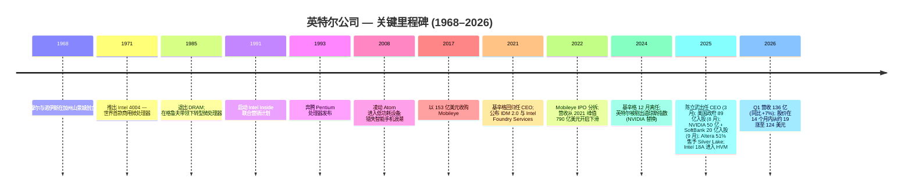
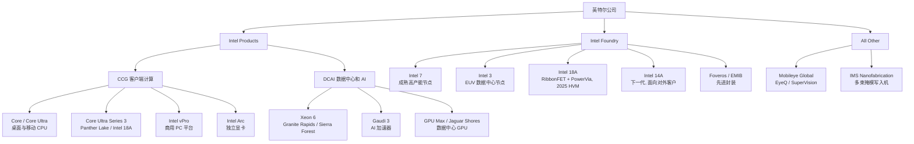
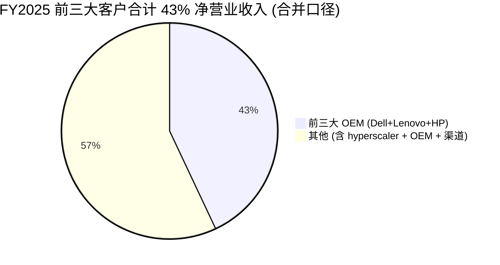
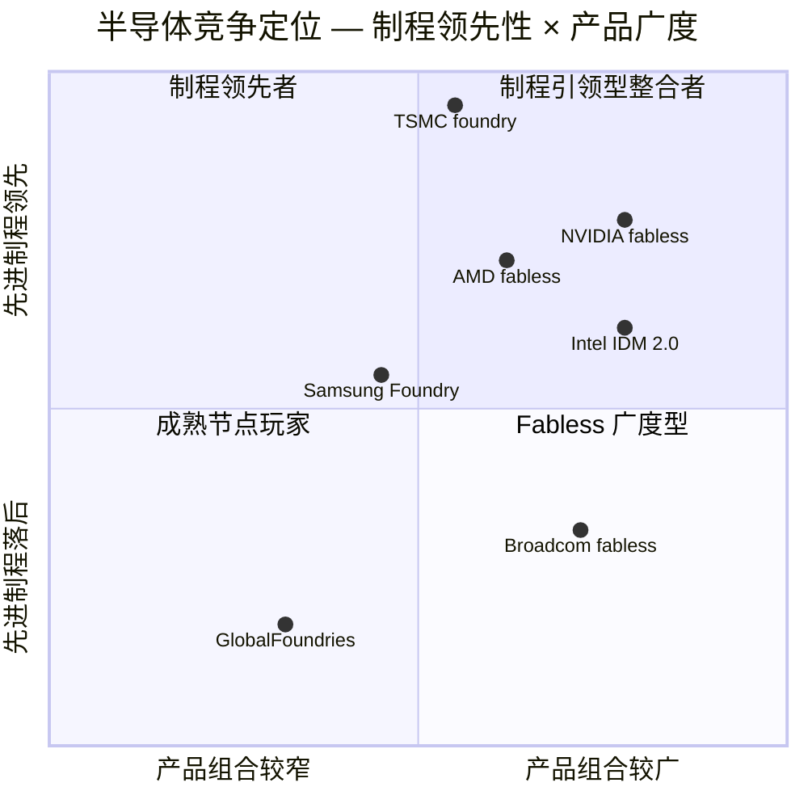

# 公司研究报告: 英特尔公司 (NASDAQ: INTC)

**报告日期 (as of):** 2026-06-14
**主要上市地:** NASDAQ: INTC
**财年末:** 12 月最后一个星期六 (2025 财年截至 2025-12-27)
**当前股价:** 124.57 美元 (2026-06-12 收盘) — 来源: [Yahoo Finance — INTC 关键指标](https://finance.yahoo.com/quote/INTC/key-statistics/)
**市值:** 约 6,261 亿美元 (约 50.26 亿股流通股)
**报告币种:** 美元
**报告语言: 简体中文 (英文版同时存在于本目录，本次刷新不更新英文版)**

---

> *分析师观点：* **评级：Hold（中性 / 持有）· 12 个月目标价 118 美元（较现价 124.57 美元 下行 −5%）· 估值方法：SOTP 分部加总（Intel Products 给周期性 CPU 倍数 + Intel Foundry 给期权价值）/ 交叉验证 2028E EPS 约 2.4 美元 × 22× 折现回 12 个月**
> 市值约 6,261 亿美元 · 52 周区间 18.97–132.75 美元 · NASDAQ:INTC
>
> | 倍数 / Multiple (*分析师观点：* 远期列) | FY2025A | FY2026E | FY2027E |
> |---|---|---|---|
> | P/E (GAAP) | n/m（净亏损） | ~80× | ~50× |
> | P/E (非 GAAP，按 BofA 估) | n/m | ~117×（$1.06） | ~72×（$1.72） |
> | P/S | 11.8× | ~10.7× | ~9.4× |
> | EV/Sales | ~12× | ~11× | ~9× |
> | P/B | 5.5× | — | — |
>
> 相对表现 (截至 2026-06-12)：1M **+3.6%** · 6M **+229%** · YTD **+216%** · 12M **+500%** vs S&P 500（1M −0.2% / 6M +8.8% / YTD +8.4% / 12M +23%）；12 个月相对超额约 **+477pct**（来源：[yfinance INTC vs ^GSPC](https://finance.yahoo.com/quote/INTC/key-statistics/)）。
>
> **核心论点（thesis pillars）**——（1）股价在 14 个月内已从约 19 美元涨至 124 美元（+500%），把 18A 成功、代工对外订单兑现、CPU 周期上行三件尚未发生的事**提前定价**，risk-reward 已不对称；（2）即便是最看多的卖方（BofA 双重上调至 Buy，目标价 135 美元）也只给出约 +8% 的上行空间，意味着"好消息已在价内"；（3）基本面仍是**结构性亏损**——FY2025 经营亏损 22 亿美元、Intel Foundry 营业亏损 103 亿美元、调整后自由现金流连续三年为负；（4）真正的二元变量是 Intel 18A/14A 的良率与对外大客户落地，在 2027–2028 年前不会有定论，期间任何执行瑕疵都可能触发倍数压缩。

---

> **业绩更新 — 2026 财年 Q1 实绩与 Q2 指引 (2026-04-23):** 英特尔公布 2026 财年 Q1 营业收入 **135.77 亿美元 (同比 +7%)**，GAAP 每股收益 (EPS) −0.73 美元（非 GAAP 0.29 美元）。管理层给出 Q2 2026 指引：**营业收入 138–148 亿美元、GAAP EPS 0.08 美元（非 GAAP 0.20 美元）、GAAP gross margin（毛利率）37.5%（非 GAAP 39.0%）**，为营业收入连续第六个季度超出公司此前指引区间上沿。CEO 陈立武（Lip-Bu Tan）称 AI 时代"对硅（silicon）的需求前所未见"，并强调公司正进行刻意的"运营重置（operational reset）"；CFO David Zinsner 提示，客户端计算事业群（CCG）与数据中心和人工智能事业群（DCAI）的瓶颈已从需求侧切换至**供给侧**。来源：[Intel Q1 2026 业绩公告, 2026-04-23](https://www.sec.gov/Archives/edgar/data/50863/000005086326000077/q126earningsrelease.htm)。

---

## 目录

1. 公司概览（含投资论点）
1A. 估值与目标价（远期盈利预测 · 目标价推导 · 牛/基准/熊情形）
1B. GF Score（GuruFocus 式）基本面评分卡
2. 公司历史
3. 管理团队
4. 产品与服务
5. 客户与上市策略
6. 行业概览
7. 竞争格局
8. 市场机会 (TAM)
9. 风险评估
9.5. 核心分歧与催化剂
10. 投资视角评分卡
数据来源清单
参考资料

---

## 1. 公司概览

*分析师观点：* 本报告对英特尔给予 **Hold（中性）评级、12 个月目标价 118 美元**。理由不在于否定转机叙事，而在于**定价**：自 2025 年初约 19 美元的低点起，股价已上涨约 500% 至 124.57 美元（[Yahoo Finance — INTC](https://finance.yahoo.com/quote/INTC/key-statistics/)），把"18A 节点成功量产、Intel Foundry 拿下一线对外客户、CPU 周期持续上行"这三件尚未兑现的事提前计入。即便是 2026 年 6 月将评级**双重上调至 Buy** 的 BofA，目标价 135 美元也仅对应约 +8% 的上行空间（*分析师观点：* [BofA — Intel double-upgrade to Buy, PO \$135, 2026-06-11, p.1](http://xs-macbook-air.local:5001/zsxq/pdf/214528118124581/Bofa-Intel%20Double-upgrade%20to%20Buy%20on%20increased%20CPU%2C%20foundry%20visibility%3B%20PO%20%24135-260611.pdf)）。当转机已成市场共识、连最乐观的卖方都只剩个位数上行时，我们认为 risk-reward 已转向中性——上行需要近乎完美的执行，下行只需一次 18A 良率或对外客户的失望。

英特尔公司（Intel Corporation）是全球规模最大的纯微处理器（microprocessor）设计公司之一，也是与台积电（TSMC）、三星代工（Samsung Foundry）并列、在美国境内对 leading-edge logic（先进逻辑）半导体制造进行实质性投资的少数公司之一。公司设计与销售 **x86 中央处理器（CPU）**，覆盖个人电脑（PC）、工作站、数据中心（data center）服务器与嵌入式边缘设备，同时运营**垂直整合的 foundry（晶圆代工厂）**——Intel Foundry——在美国、爱尔兰和以色列开发并运行先进制程技术与 advanced packaging（先进封装）。截至 2025 财年末，英特尔约有 88,400 名员工，2025 财年净营业收入 **528.53 亿美元**，较 2024 财年 531.01 亿美元微降 0.5%，较 2021 财年峰值 790 亿美元下降约 33%（[Intel 2025 Form 10-K, MD&A — 合并经营业绩](https://www.sec.gov/Archives/edgar/data/50863/000005086326000011/intc-20251227.htm)）。

公司财务披露分三个经营分部加一个"其他（All Other）"类别（[Intel 2025 Form 10-K — 附注 3: 经营分部](https://www.sec.gov/Archives/edgar/data/50863/000005086326000011/intc-20251227.htm)）：

- **客户端计算事业群（Client Computing Group, CCG）** — x86 PC 处理器（Core、Core Ultra）、平台 IP（vPro）、显卡、连接芯片。2025 财年分部营业收入 **322.28 亿美元**，同比基本持平。
- **数据中心和人工智能事业群（Data Center and AI, DCAI）** — Xeon 服务器 CPU、Gaudi AI 加速器、GPU Max、网络硅芯片。2025 财年分部营业收入 **169.19 亿美元**，同比 +0.4%。
- **英特尔代工（Intel Foundry）** — 先进逻辑制程开发、fab（晶圆厂）产能、先进封装及对外代工服务。2025 财年分部营业收入 **178.26 亿美元**（约 98% 来自分部间内部销售，对外营业收入仅约 1.5 亿美元），**录得营业亏损 103.18 亿美元**，较 2024 财年 132.91 亿美元亏损收窄（[Intel 2025 Form 10-K, MD&A — Intel Foundry](https://www.sec.gov/Archives/edgar/data/50863/000005086326000011/intc-20251227.htm)）。
- **其他（All Other）** — Mobileye（ADAS / 自动驾驶）、IMS Nanofabrication，及 2025-09-12 完成出表（deconsolidation）后保留的 Altera 残余权益。2025 财年营业收入 35.63 亿美元。

### 收入结构 / 英特尔如何赚钱 (FY2025)

<svg xmlns="http://www.w3.org/2000/svg" viewBox="0 0 1000 560" width="1000" height="560" role="img" aria-label="income statement Sankey"><rect x="0" y="0" width="1000" height="560" fill="#ffffff"/>
<text x="20.00" y="30.00" text-anchor="start" font-family="Helvetica,Arial,sans-serif" font-size="15" font-weight="700" fill="#1f2933">英特尔 (INTC) 如何赚钱 — FY2025 利润表 Sankey</text>
<path d="M 204.00,71.58 C 258.00,71.58 258.00,85.00 312.00,85.00 L 312.00,333.78 C 258.00,333.78 258.00,320.36 204.00,320.36 Z" fill="#93c5fd" fill-opacity="0.55"/>
<path d="M 452.00,78.00 C 506.00,78.00 506.00,201.53 560.00,201.53 L 560.00,203.53 C 506.00,203.53 506.00,80.00 452.00,80.00 Z" fill="#86efac" fill-opacity="0.55"/>
<path d="M 452.00,80.00 C 506.00,80.00 506.00,217.53 560.00,217.53 L 560.00,376.47 C 506.00,376.47 506.00,238.94 452.00,238.94 Z" fill="#fca5a5" fill-opacity="0.55"/>
<path d="M 328.00,85.00 C 382.00,85.00 382.00,78.00 436.00,78.00 L 436.00,219.85 C 382.00,219.85 382.00,226.85 328.00,226.85 Z" fill="#86efac" fill-opacity="0.55"/>
<path d="M 328.00,226.85 C 382.00,226.85 382.00,233.85 436.00,233.85 L 436.00,500.00 C 382.00,500.00 382.00,493.00 328.00,493.00 Z" fill="#fca5a5" fill-opacity="0.55"/>
<path d="M 700.00,187.53 C 754.00,187.53 754.00,288.00 808.00,288.00 L 808.00,290.00 C 754.00,290.00 754.00,189.53 700.00,189.53 Z" fill="#86efac" fill-opacity="0.55"/>
<path d="M 576.00,201.53 C 630.00,201.53 630.00,187.53 684.00,187.53 L 684.00,189.53 C 630.00,189.53 630.00,203.53 576.00,203.53 Z" fill="#86efac" fill-opacity="0.55"/>
<path d="M 576.00,217.53 C 630.00,217.53 630.00,203.53 684.00,203.53 L 684.00,239.23 C 630.00,239.23 630.00,253.23 576.00,253.23 Z" fill="#fca5a5" fill-opacity="0.55"/>
<path d="M 576.00,253.23 C 630.00,253.23 630.00,253.23 684.00,253.23 L 684.00,359.56 C 630.00,359.56 630.00,359.56 576.00,359.56 Z" fill="#fca5a5" fill-opacity="0.55"/>
<path d="M 576.00,359.56 C 630.00,359.56 630.00,373.56 684.00,373.56 L 684.00,390.47 C 630.00,390.47 630.00,376.47 576.00,376.47 Z" fill="#fca5a5" fill-opacity="0.55"/>
<path d="M 204.00,334.36 C 258.00,334.36 258.00,333.78 312.00,333.78 L 312.00,464.39 C 258.00,464.39 258.00,464.97 204.00,464.97 Z" fill="#93c5fd" fill-opacity="0.55"/>
<path d="M 204.00,478.97 C 258.00,478.97 258.00,464.39 312.00,464.39 L 312.00,491.84 C 258.00,491.84 258.00,506.42 204.00,506.42 Z" fill="#93c5fd" fill-opacity="0.55"/>
<rect x="188.00" y="71.58" width="16" height="248.78" rx="1.5" fill="#2563eb"/>
<rect x="188.00" y="334.36" width="16" height="130.61" rx="1.5" fill="#2563eb"/>
<rect x="188.00" y="478.97" width="16" height="27.45" rx="1.5" fill="#2563eb"/>
<rect x="312.00" y="85.00" width="16" height="408.00" rx="1.5" fill="#1e3a8a"/>
<rect x="436.00" y="78.00" width="16" height="141.85" rx="1.5" fill="#15803d"/>
<rect x="436.00" y="233.85" width="16" height="266.15" rx="1.5" fill="#dc2626"/>
<rect x="560.00" y="201.53" width="16" height="2.00" rx="1.5" fill="#15803d"/>
<rect x="560.00" y="217.53" width="16" height="158.94" rx="1.5" fill="#dc2626"/>
<rect x="684.00" y="187.53" width="16" height="2.00" rx="1.5" fill="#15803d"/>
<rect x="684.00" y="203.53" width="16" height="35.70" rx="1.5" fill="#dc2626"/>
<rect x="684.00" y="253.23" width="16" height="106.33" rx="1.5" fill="#dc2626"/>
<rect x="684.00" y="373.56" width="16" height="16.91" rx="1.5" fill="#dc2626"/>
<rect x="808.00" y="288.00" width="16" height="2.00" rx="1.5" fill="#15803d"/>
<text x="179.00" y="192.97" text-anchor="end" font-family="Helvetica,Arial,sans-serif" font-size="11.5" font-weight="700" fill="#1f2933">CCG 客户端</text>
<text x="179.00" y="205.97" text-anchor="end" font-family="Helvetica,Arial,sans-serif" font-size="10" font-weight="400" fill="#52606d">$32.2B  (61.0%)</text>
<text x="179.00" y="396.67" text-anchor="end" font-family="Helvetica,Arial,sans-serif" font-size="11.5" font-weight="700" fill="#1f2933">DCAI 数据中心+AI</text>
<text x="179.00" y="409.67" text-anchor="end" font-family="Helvetica,Arial,sans-serif" font-size="10" font-weight="400" fill="#52606d">$16.9B  (32.0%)</text>
<text x="179.00" y="489.70" text-anchor="end" font-family="Helvetica,Arial,sans-serif" font-size="11.5" font-weight="700" fill="#1f2933">Other 其他</text>
<text x="179.00" y="502.70" text-anchor="end" font-family="Helvetica,Arial,sans-serif" font-size="10" font-weight="400" fill="#52606d">$3.6B  (6.7%)</text>
<rect x="331.00" y="67.00" width="106.80" height="26" rx="2" fill="#ffffff" fill-opacity="0.72"/>
<text x="334.00" y="79.00" text-anchor="start" font-family="Helvetica,Arial,sans-serif" font-size="11.5" font-weight="700" fill="#1f2933">Revenue</text>
<text x="334.00" y="92.00" text-anchor="start" font-family="Helvetica,Arial,sans-serif" font-size="10" font-weight="400" fill="#52606d">$52.9B  (100.0%)</text>
<rect x="455.00" y="60.00" width="100.50" height="26" rx="2" fill="#ffffff" fill-opacity="0.72"/>
<text x="458.00" y="72.00" text-anchor="start" font-family="Helvetica,Arial,sans-serif" font-size="11.5" font-weight="700" fill="#1f2933">Gross Profit</text>
<text x="458.00" y="85.00" text-anchor="start" font-family="Helvetica,Arial,sans-serif" font-size="10" font-weight="400" fill="#52606d">$18.4B  (34.8%)</text>
<rect x="455.00" y="215.85" width="144.60" height="26" rx="2" fill="#ffffff" fill-opacity="0.72"/>
<text x="458.00" y="227.85" text-anchor="start" font-family="Helvetica,Arial,sans-serif" font-size="11.5" font-weight="700" fill="#1f2933">Cost of Revenue (COGS)</text>
<text x="458.00" y="240.85" text-anchor="start" font-family="Helvetica,Arial,sans-serif" font-size="10" font-weight="400" fill="#52606d">$34.5B  (65.2%)</text>
<rect x="579.00" y="183.53" width="106.80" height="26" rx="2" fill="#ffffff" fill-opacity="0.72"/>
<text x="582.00" y="195.53" text-anchor="start" font-family="Helvetica,Arial,sans-serif" font-size="11.5" font-weight="700" fill="#1f2933">Operating Income</text>
<text x="582.00" y="208.53" text-anchor="start" font-family="Helvetica,Arial,sans-serif" font-size="10" font-weight="400" fill="#52606d">-$2.2B  (-4.2%)</text>
<rect x="579.00" y="208.53" width="150.90" height="26" rx="2" fill="#ffffff" fill-opacity="0.72"/>
<text x="582.00" y="220.53" text-anchor="start" font-family="Helvetica,Arial,sans-serif" font-size="11.5" font-weight="700" fill="#1f2933">Total Operating Expense</text>
<text x="582.00" y="233.53" text-anchor="start" font-family="Helvetica,Arial,sans-serif" font-size="10" font-weight="400" fill="#52606d">$20.6B  (39.0%)</text>
<rect x="703.00" y="169.53" width="100.50" height="26" rx="2" fill="#ffffff" fill-opacity="0.72"/>
<text x="706.00" y="181.53" text-anchor="start" font-family="Helvetica,Arial,sans-serif" font-size="11.5" font-weight="700" fill="#1f2933">Pretax Income</text>
<text x="706.00" y="194.53" text-anchor="start" font-family="Helvetica,Arial,sans-serif" font-size="10" font-weight="400" fill="#52606d">-$2.2B  (-4.2%)</text>
<rect x="703.00" y="194.53" width="87.90" height="26" rx="2" fill="#ffffff" fill-opacity="0.72"/>
<text x="706.00" y="206.53" text-anchor="start" font-family="Helvetica,Arial,sans-serif" font-size="11.5" font-weight="700" fill="#1f2933">SG&amp;A</text>
<text x="706.00" y="219.53" text-anchor="start" font-family="Helvetica,Arial,sans-serif" font-size="10" font-weight="400" fill="#52606d">$4.6B  (8.7%)</text>
<rect x="703.00" y="235.23" width="100.50" height="26" rx="2" fill="#ffffff" fill-opacity="0.72"/>
<text x="706.00" y="247.23" text-anchor="start" font-family="Helvetica,Arial,sans-serif" font-size="11.5" font-weight="700" fill="#1f2933">R&amp;D</text>
<text x="706.00" y="260.23" text-anchor="start" font-family="Helvetica,Arial,sans-serif" font-size="10" font-weight="400" fill="#52606d">$13.8B  (26.1%)</text>
<rect x="703.00" y="355.56" width="87.90" height="26" rx="2" fill="#ffffff" fill-opacity="0.72"/>
<text x="706.00" y="367.56" text-anchor="start" font-family="Helvetica,Arial,sans-serif" font-size="11.5" font-weight="700" fill="#1f2933">Other OpEx</text>
<text x="706.00" y="380.56" text-anchor="start" font-family="Helvetica,Arial,sans-serif" font-size="10" font-weight="400" fill="#52606d">$2.2B  (4.1%)</text>
<text x="833.00" y="286.00" text-anchor="start" font-family="Helvetica,Arial,sans-serif" font-size="11.5" font-weight="700" fill="#1f2933">Net Income</text>
<text x="833.00" y="299.00" text-anchor="start" font-family="Helvetica,Arial,sans-serif" font-size="10" font-weight="400" fill="#52606d">-$267.0M  (-0.51%)</text>
<text x="500.00" y="544.00" text-anchor="middle" font-family="Helvetica,Arial,sans-serif" font-size="10" font-weight="400" fill="#52606d">Source: INTC FY2025 10-K, 合并经营/资产负债/现金流量表 + 附注 3 经营分部</text>
</svg>

来源 / Source: [Intel 2025 Form 10-K, 合并经营业绩 + 附注 3 经营分部](https://www.sec.gov/Archives/edgar/data/50863/000005086326000011/intc-20251227.htm)。

上图的 Sankey 把英特尔 FY2025 的损益拆开来看：528.53 亿美元营业收入中，cost of sales（销售成本）吃掉 344.78 亿美元，留下 **gross profit（毛利）183.75 亿美元、gross margin 34.8%**；再扣除 R&D（研发）137.74 亿美元、MG&A（销售管理费用）46.24 亿美元、restructuring（重组费用）21.91 亿美元后，**GAAP 经营亏损 22.14 亿美元**（[Intel 2025 Form 10-K, MD&A](https://www.sec.gov/Archives/edgar/data/50863/000005086326000011/intc-20251227.htm)）。值得强调的是：合并经营亏损的全部来源是 Intel Foundry 的 103 亿美元分部亏损——Intel Products（CCG+DCAI）合并仍是盈利的。归母净亏损 2.67 亿美元，较 2024 财年因 80 亿美元非现金递延税资产估值津贴一次性冲销而放大的 187.56 亿美元净亏损大幅收窄（[Intel 2025 Form 10-K, MD&A](https://www.sec.gov/Archives/edgar/data/50863/000005086326000011/intc-20251227.htm)）。

### 营业收入结构 — 按事业群 / 按地理区域 (FY2025)

<svg xmlns="http://www.w3.org/2000/svg" viewBox="0 0 720 460" width="720" height="460" role="img" aria-label="revenue donut"><rect x="0" y="0" width="720" height="460" fill="#ffffff"/>
<text x="20.00" y="30.00" text-anchor="start" font-family="Helvetica,Arial,sans-serif" font-size="15" font-weight="700" fill="#1f2933">FY2025 营业收入结构 — 按事业群 (对外口径)</text>
<path d="M 288.00,107.20 A 132 132 0 1 1 204.01,341.03 L 238.37,299.37 A 78 78 0 1 0 288.00,161.20 Z" fill="#2563eb"/>
<path d="M 204.01,341.03 A 132 132 0 0 1 231.71,119.80 L 254.74,168.65 A 78 78 0 0 0 238.37,299.37 Z" fill="#15803d"/>
<path d="M 231.71,119.80 A 132 132 0 0 1 285.65,107.22 L 286.61,161.21 A 78 78 0 0 0 254.74,168.65 Z" fill="#d97706"/>
<path d="M 285.65,107.22 A 132 132 0 0 1 288.00,107.20 L 288.00,161.20 A 78 78 0 0 0 286.61,161.21 Z" fill="#7c3aed"/>
<text x="288.00" y="235.20" text-anchor="middle" font-family="Helvetica,Arial,sans-serif" font-size="18" font-weight="800" fill="#1f2933">INTC</text>
<text x="288.00" y="255.20" text-anchor="middle" font-family="Helvetica,Arial,sans-serif" font-size="13" font-weight="600" fill="#52606d">$52.9B</text>
<text x="288.00" y="271.20" text-anchor="middle" font-family="Helvetica,Arial,sans-serif" font-size="10" font-weight="400" fill="#8a97a3">total</text>
<line x1="417.88" y1="285.85" x2="433.88" y2="285.85" stroke="#2563eb" stroke-width="1.4"/>
<text x="437.88" y="283.85" text-anchor="start" font-family="Helvetica,Arial,sans-serif" font-size="11" font-weight="700" fill="#1f2933">CCG 客户端</text>
<text x="437.88" y="297.85" text-anchor="start" font-family="Helvetica,Arial,sans-serif" font-size="10" font-weight="400" fill="#52606d">$32.2B  (61.0%)</text>
<line x1="151.07" y1="222.06" x2="135.07" y2="222.06" stroke="#15803d" stroke-width="1.4"/>
<text x="131.07" y="220.06" text-anchor="end" font-family="Helvetica,Arial,sans-serif" font-size="11" font-weight="700" fill="#1f2933">DCAI 数据中心+AI</text>
<text x="131.07" y="234.06" text-anchor="end" font-family="Helvetica,Arial,sans-serif" font-size="10" font-weight="400" fill="#52606d">$16.9B  (32.0%)</text>
<line x1="256.65" y1="104.81" x2="240.65" y2="104.81" stroke="#d97706" stroke-width="1.4"/>
<text x="236.65" y="102.81" text-anchor="end" font-family="Helvetica,Arial,sans-serif" font-size="11" font-weight="700" fill="#1f2933">其他 Other</text>
<text x="236.65" y="116.81" text-anchor="end" font-family="Helvetica,Arial,sans-serif" font-size="10" font-weight="400" fill="#52606d">$3.6B  (6.7%)</text>
<line x1="286.77" y1="101.21" x2="270.77" y2="101.21" stroke="#7c3aed" stroke-width="1.4"/>
<text x="266.77" y="99.21" text-anchor="end" font-family="Helvetica,Arial,sans-serif" font-size="11" font-weight="700" fill="#1f2933">代工对外 Foundry ext</text>
<text x="266.77" y="113.21" text-anchor="end" font-family="Helvetica,Arial,sans-serif" font-size="10" font-weight="400" fill="#52606d">$150.0M  (0.3%)</text>
<text x="360.00" y="444.00" text-anchor="middle" font-family="Helvetica,Arial,sans-serif" font-size="10" font-weight="400" fill="#52606d">Source: INTC FY2025 10-K, 附注 3 经营分部</text>
</svg>

来源 / Source: [Intel 2025 Form 10-K, 附注 3 经营分部](https://www.sec.gov/Archives/edgar/data/50863/000005086326000011/intc-20251227.htm)。

<svg xmlns="http://www.w3.org/2000/svg" viewBox="0 0 720 460" width="720" height="460" role="img" aria-label="revenue donut"><rect x="0" y="0" width="720" height="460" fill="#ffffff"/>
<text x="20.00" y="30.00" text-anchor="start" font-family="Helvetica,Arial,sans-serif" font-size="15" font-weight="700" fill="#1f2933">FY2025 营业收入结构 — 按地理区域 (按账单地)</text>
<path d="M 288.00,107.20 A 132 132 0 0 1 414.01,278.51 L 362.46,262.43 A 78 78 0 0 0 288.00,161.20 Z" fill="#2563eb"/>
<path d="M 414.01,278.51 A 132 132 0 0 1 256.54,367.40 L 269.41,314.95 A 78 78 0 0 0 362.46,262.43 Z" fill="#15803d"/>
<path d="M 256.54,367.40 A 132 132 0 0 1 158.54,264.98 L 211.50,254.44 A 78 78 0 0 0 269.41,314.95 Z" fill="#d97706"/>
<path d="M 158.54,264.98 A 132 132 0 0 1 188.37,152.61 L 229.13,188.04 A 78 78 0 0 0 211.50,254.44 Z" fill="#7c3aed"/>
<path d="M 188.37,152.61 A 132 132 0 0 1 288.00,107.20 L 288.00,161.20 A 78 78 0 0 0 229.13,188.04 Z" fill="#dc2626"/>
<text x="288.00" y="235.20" text-anchor="middle" font-family="Helvetica,Arial,sans-serif" font-size="18" font-weight="800" fill="#1f2933">INTC</text>
<text x="288.00" y="255.20" text-anchor="middle" font-family="Helvetica,Arial,sans-serif" font-size="13" font-weight="600" fill="#52606d">$52.9B</text>
<text x="288.00" y="271.20" text-anchor="middle" font-family="Helvetica,Arial,sans-serif" font-size="10" font-weight="400" fill="#8a97a3">total</text>
<line x1="399.17" y1="157.43" x2="415.17" y2="157.43" stroke="#2563eb" stroke-width="1.4"/>
<text x="419.17" y="155.43" text-anchor="start" font-family="Helvetica,Arial,sans-serif" font-size="11" font-weight="700" fill="#1f2933">美国 United States</text>
<text x="419.17" y="169.43" text-anchor="start" font-family="Helvetica,Arial,sans-serif" font-size="10" font-weight="400" fill="#52606d">$15.8B  (29.8%)</text>
<line x1="355.83" y1="359.38" x2="371.83" y2="359.38" stroke="#15803d" stroke-width="1.4"/>
<text x="375.83" y="357.38" text-anchor="start" font-family="Helvetica,Arial,sans-serif" font-size="11" font-weight="700" fill="#1f2933">中国 China</text>
<text x="375.83" y="371.38" text-anchor="start" font-family="Helvetica,Arial,sans-serif" font-size="10" font-weight="400" fill="#52606d">$12.7B  (24.0%)</text>
<line x1="188.29" y1="334.61" x2="172.29" y2="334.61" stroke="#d97706" stroke-width="1.4"/>
<text x="168.29" y="332.61" text-anchor="end" font-family="Helvetica,Arial,sans-serif" font-size="11" font-weight="700" fill="#1f2933">新加坡 Singapore</text>
<text x="168.29" y="346.61" text-anchor="end" font-family="Helvetica,Arial,sans-serif" font-size="10" font-weight="400" fill="#52606d">$9.5B  (18.0%)</text>
<line x1="154.62" y1="203.80" x2="138.62" y2="203.80" stroke="#7c3aed" stroke-width="1.4"/>
<text x="134.62" y="201.80" text-anchor="end" font-family="Helvetica,Arial,sans-serif" font-size="11" font-weight="700" fill="#1f2933">台湾 Taiwan</text>
<text x="134.62" y="215.80" text-anchor="end" font-family="Helvetica,Arial,sans-serif" font-size="10" font-weight="400" fill="#52606d">$7.7B  (14.5%)</text>
<line x1="230.76" y1="113.63" x2="214.76" y2="113.63" stroke="#dc2626" stroke-width="1.4"/>
<text x="210.76" y="111.63" text-anchor="end" font-family="Helvetica,Arial,sans-serif" font-size="11" font-weight="700" fill="#1f2933">其他 Other</text>
<text x="210.76" y="125.63" text-anchor="end" font-family="Helvetica,Arial,sans-serif" font-size="10" font-weight="400" fill="#52606d">$7.2B  (13.6%)</text>
<text x="360.00" y="444.00" text-anchor="middle" font-family="Helvetica,Arial,sans-serif" font-size="10" font-weight="400" fill="#52606d">Source: INTC FY2025 10-K, 附注 3 — 按地理区域营业收入</text>
</svg>

来源 / Source: [Intel 2025 Form 10-K, 附注 3 — 按地理区域营业收入（账单地口径）](https://www.sec.gov/Archives/edgar/data/50863/000005086326000011/intc-20251227.htm)。

按账单地（point of billing）口径，**美国 157.57 亿美元（占 29.8%）、中国 126.94 亿美元（24.0%）、新加坡 95.35 亿美元、台湾 76.72 亿美元、其他 71.95 亿美元**（[Intel 2025 Form 10-K, 附注 3](https://www.sec.gov/Archives/edgar/data/50863/000005086326000011/intc-20251227.htm)）。新加坡与台湾占比高，因为大量 OEM 的最终组装合作伙伴设在当地；中国 24% 的占比使其成为出口管制与中美脱钩风险的直接敞口（详见第 9 章）。

### 营业收入历史 — 按地理区域

<svg xmlns="http://www.w3.org/2000/svg" viewBox="0 0 860 470" width="860" height="470" role="img" aria-label="historical revenue bars"><rect x="0" y="0" width="860" height="470" fill="#ffffff"/>
<text x="20.00" y="30.00" text-anchor="start" font-family="Helvetica,Arial,sans-serif" font-size="15" font-weight="700" fill="#1f2933">英特尔营业收入历史 — 按地理区域 (FY2023–FY2025)</text>
<rect x="20.00" y="44" width="11" height="11" rx="2" fill="#2563eb"/>
<text x="36.00" y="53.00" text-anchor="start" font-family="Helvetica,Arial,sans-serif" font-size="10.5" font-weight="400" fill="#1f2933">美国 US</text>
<rect x="83.00" y="44" width="11" height="11" rx="2" fill="#15803d"/>
<text x="99.00" y="53.00" text-anchor="start" font-family="Helvetica,Arial,sans-serif" font-size="10.5" font-weight="400" fill="#1f2933">中国 China</text>
<rect x="165.80" y="44" width="11" height="11" rx="2" fill="#d97706"/>
<text x="181.80" y="53.00" text-anchor="start" font-family="Helvetica,Arial,sans-serif" font-size="10.5" font-weight="400" fill="#1f2933">新加坡 Singapore</text>
<rect x="281.60" y="44" width="11" height="11" rx="2" fill="#7c3aed"/>
<text x="297.60" y="53.00" text-anchor="start" font-family="Helvetica,Arial,sans-serif" font-size="10.5" font-weight="400" fill="#1f2933">台湾 Taiwan</text>
<rect x="371.00" y="44" width="11" height="11" rx="2" fill="#dc2626"/>
<text x="387.00" y="53.00" text-anchor="start" font-family="Helvetica,Arial,sans-serif" font-size="10.5" font-weight="400" fill="#1f2933">其他 Other</text>
<line x1="70" y1="412.00" x2="834" y2="412.00" stroke="#eceff2" stroke-width="1"/>
<text x="64.00" y="415.00" text-anchor="end" font-family="Helvetica,Arial,sans-serif" font-size="9.5" font-weight="400" fill="#52606d">$0</text>
<line x1="70" y1="345.20" x2="834" y2="345.20" stroke="#eceff2" stroke-width="1"/>
<text x="64.00" y="348.20" text-anchor="end" font-family="Helvetica,Arial,sans-serif" font-size="9.5" font-weight="400" fill="#52606d">$11.7B</text>
<line x1="70" y1="278.40" x2="834" y2="278.40" stroke="#eceff2" stroke-width="1"/>
<text x="64.00" y="281.40" text-anchor="end" font-family="Helvetica,Arial,sans-serif" font-size="9.5" font-weight="400" fill="#52606d">$23.4B</text>
<line x1="70" y1="211.60" x2="834" y2="211.60" stroke="#eceff2" stroke-width="1"/>
<text x="64.00" y="214.60" text-anchor="end" font-family="Helvetica,Arial,sans-serif" font-size="9.5" font-weight="400" fill="#52606d">$35.1B</text>
<line x1="70" y1="144.80" x2="834" y2="144.80" stroke="#eceff2" stroke-width="1"/>
<text x="64.00" y="147.80" text-anchor="end" font-family="Helvetica,Arial,sans-serif" font-size="9.5" font-weight="400" fill="#52606d">$46.9B</text>
<line x1="70" y1="78.00" x2="834" y2="78.00" stroke="#eceff2" stroke-width="1"/>
<text x="64.00" y="81.00" text-anchor="end" font-family="Helvetica,Arial,sans-serif" font-size="9.5" font-weight="400" fill="#52606d">$58.6B</text>
<rect x="123.48" y="332.40" width="147.71" height="79.60" fill="#2563eb"/>
<rect x="123.48" y="247.69" width="147.71" height="84.71" fill="#15803d"/>
<rect x="123.48" y="198.63" width="147.71" height="49.06" fill="#d97706"/>
<rect x="123.48" y="159.47" width="147.71" height="39.16" fill="#7c3aed"/>
<rect x="123.48" y="102.74" width="147.71" height="56.73" fill="#dc2626"/>
<text x="197.33" y="428.00" text-anchor="middle" font-family="Helvetica,Arial,sans-serif" font-size="10" font-weight="400" fill="#52606d">2023</text>
<rect x="378.15" y="337.90" width="147.71" height="74.10" fill="#2563eb"/>
<rect x="378.15" y="249.32" width="147.71" height="88.58" fill="#15803d"/>
<rect x="378.15" y="191.22" width="147.71" height="58.10" fill="#d97706"/>
<rect x="378.15" y="146.72" width="147.71" height="44.51" fill="#7c3aed"/>
<rect x="378.15" y="109.17" width="147.71" height="37.55" fill="#dc2626"/>
<text x="452.00" y="428.00" text-anchor="middle" font-family="Helvetica,Arial,sans-serif" font-size="10" font-weight="400" fill="#52606d">2024</text>
<rect x="632.81" y="322.14" width="147.71" height="89.86" fill="#2563eb"/>
<rect x="632.81" y="249.75" width="147.71" height="72.39" fill="#15803d"/>
<rect x="632.81" y="195.37" width="147.71" height="54.38" fill="#d97706"/>
<rect x="632.81" y="151.61" width="147.71" height="43.75" fill="#7c3aed"/>
<rect x="632.81" y="110.58" width="147.71" height="41.03" fill="#dc2626"/>
<text x="706.67" y="428.00" text-anchor="middle" font-family="Helvetica,Arial,sans-serif" font-size="10" font-weight="400" fill="#52606d">2025</text>
<text x="430.00" y="454.00" text-anchor="middle" font-family="Helvetica,Arial,sans-serif" font-size="10" font-weight="400" fill="#52606d">Source: INTC FY2023–FY2025 10-K, 附注 3 — 按地理区域营业收入</text>
</svg>

来源 / Source: [Intel FY2023–FY2025 Form 10-K, 附注 3 — 按地理区域营业收入](https://www.sec.gov/Archives/edgar/data/50863/000005086326000011/intc-20251227.htm)。

上图体现重置的剧烈程度：美国本土营业收入在政府订单与 re-shoring 推动下回升至 157.57 亿美元，而中国营业收入从 FY2023 的 148.54 亿美元降至 FY2025 的 126.94 亿美元——出口管制正实质性蚕食中国 TAM（[Intel 2025 Form 10-K, MD&A](https://www.sec.gov/Archives/edgar/data/50863/000005086326000011/intc-20251227.htm)）。

**估值快照（截至 2026-06-12 收盘）。** 英特尔目前交易于：

- **股价：** 124.57 美元；**市值：** 约 6,261 亿美元（约 50.26 亿股流通股，已反映向美国商务部、SoftBank、NVIDIA 增发后的稀释）（[Yahoo Finance — INTC](https://finance.yahoo.com/quote/INTC/key-statistics/)）。
- **TTM P/E（市盈率）：** 不具意义（n/m）—— TTM 每股收益为 **−0.60 美元**（[Yahoo Finance — INTC](https://finance.yahoo.com/quote/INTC/key-statistics/)）。拆解来看这是**周期性 / 重组期低谷**而非结构性不盈利：FY2025 录得 183.75 亿美元 GAAP 毛利，且 Intel Products 分部仍盈利，但 Intel Foundry 103 亿美元亏损叠加重组费用把合并数压成负值（[Intel 2025 Form 10-K, MD&A](https://www.sec.gov/Archives/edgar/data/50863/000005086326000011/intc-20251227.htm)）。
- **远期 P/E（未来 12 个月共识）：约 80×（GAAP）** —— 绝对值极高，反映（a）亏损基数即将滚出 TTM 窗口，（b）市场对 2026–2028 盈利复苏斜率的乐观定价。若以 BofA 的非 GAAP 模型（2026E EPS \$1.06）计，远期非 GAAP P/E 高达约 117×（*分析师观点：* [BofA — Intel, PO \$135, 2026-06-11](http://xs-macbook-air.local:5001/zsxq/pdf/214528118124581/Bofa-Intel%20Double-upgrade%20to%20Buy%20on%20increased%20CPU%2C%20foundry%20visibility%3B%20PO%20%24135-260611.pdf)）。
- **TTM P/S（市销率）：约 11.8×**，而 INTC 三年中位数约 2.5×；对比同业 AMD、AVGO、NVDA 均在 15–30× 区间（[Yahoo Finance — INTC](https://finance.yahoo.com/quote/INTC/key-statistics/)）。
- **P/B（市净率）：5.5×**，对应 Total Intel stockholders' equity 1,142.81 亿美元——权益账面已因 FY2025 向美国商务部、SoftBank、NVIDIA 发行的股票被重估（[Intel 2025 Form 10-K, 合并资产负债表](https://www.sec.gov/Archives/edgar/data/50863/000005086326000011/intc-20251227.htm)）。

**解读。** 11.8× P/S 约为 INTC 三年中位数的 4.7 倍。2025 年初股价仍在约 19 美元，至今 124.57 美元（约 6.5 倍涨幅）的反弹来自**三个独立催化剂而非底层盈利的真实恢复**：(i) 2025 年 8 月美国政府以 20.47 美元/股注资 89 亿美元购入普通股（[8-K, 2025-08-25](https://www.sec.gov/Archives/edgar/data/50863/000005086325000129/a08222025form8-kex991.htm)）；(ii) 2025 年 9 月 SoftBank 投资 20 亿美元、NVIDIA 投资 50 亿美元入股（[8-K, 2025-09-18](https://www.sec.gov/Archives/edgar/data/50863/000005086325000155/a09152025form8-kex991.htm)）；(iii) 市场相信 Intel 18A——自 2025 年中已进入 HVM（大规模量产）——将弥合与台积电 N2 节点的差距。因此当前倍数本质上是**叙事驱动**的：投资者付的是对 18A 爬坡、代工对外订单簿、与非 AI CPU 周期上行三件事的期待，而这些尚未体现在 TTM 财务中。估值 / 倍数压缩风险将在第 9 章详述。

## 1A. 估值与目标价（决策层）

> *分析师观点：* 本章所有远期预测数字、目标价与情景目标价均为分析师自身的前瞻判断，**绝不附加于任何 filing 引用之上**（10-K 不含目标价）。每条预测的外部依据（filing 分部数据 + 管理层指引 + 行业 / 卖方预测）在文中 inline 引用。

英特尔的估值难点在于：它同时是一家**周期性 CPU 公司**（Intel Products，盈利）和一家**烧钱的代工初创**（Intel Foundry，巨亏）。用单一 P/E 无法刻画，因此我们以 **SOTP（分部加总）** 为主、以 2028E 盈利倍数法交叉验证。

### (a) 远期盈利预测（*分析师观点：*）

下表的预测以 FY2025 10-K 分部数据为基线，叠加管理层 Q2 2026 指引斜率与 BofA / Citi 卖方模型作为外部锚（每格预测为分析师观点，外部依据 inline 引用）：

| 指标 (*分析师观点：*) | FY2025A | FY2026E | FY2027E | FY2028E | CAGR(25–28) |
|---|---|---|---|---|---|
| 营业收入（百万美元） | 52,853 | 58,300 | 66,900 | 76,900 | +13.3% |
| — YoY % | −0.5% | +10.3% | +14.8% | +14.9% | |
| Gross margin %（GAAP） | 34.8% | 37.5% | 41% | 44% | |
| 经营利润率 %（GAAP） | −4.2% | ~9% | ~16% | ~22% | |
| 非 GAAP EPS（美元） | ~0.97 | 1.06 | 1.72 | 2.53 | +37% |
| Intel Foundry 营业亏损（百万美元） | −10,318 | −8,000 | −5,000 | −2,000 | 收窄 |
| 调整后自由现金流（百万美元） | −1,600 | +330 | +7,200 | +13,400 | 转正 |
| 净现金/(净债务)（百万美元） | −11,668 | ~−10,000 | ~−4,000 | +5,000 | 改善 |

营业收入、EPS 与 FCF 路径对标 **BofA 上调至 Buy 后的模型**（2026E EPS \$1.06 / 2027E \$1.72 / 2028E \$2.53；营收 2026E \$58.3bn / 2027E \$66.9bn / 2028E \$76.9bn；FCF 2026E 转正 \$0.33bn → 2027E \$7.2bn → 2028E \$13.4bn；经营利润率 2026E 13.1% → 2028E 22.4%）（*分析师观点：* [BofA — Intel double-upgrade to Buy, PO \$135, 2026-06-11, 财务预测页](http://xs-macbook-air.local:5001/zsxq/pdf/214528118124581/Bofa-Intel%20Double-upgrade%20to%20Buy%20on%20increased%20CPU%2C%20foundry%20visibility%3B%20PO%20%24135-260611.pdf)）。Gross margin 与经营利润率的回升驱动来自：(i) 18A 自有产能替代外包 tile、降低 wafer 成本；(ii) Intel Foundry 亏损随良率爬坡而收窄；(iii) restructuring 之后的固定成本下降（FY2025 R&D 已从 FY2024 的 165.46 亿降至 137.74 亿）（[Intel 2025 Form 10-K, MD&A — 营业费用](https://www.sec.gov/Archives/edgar/data/50863/000005086326000011/intc-20251227.htm)）。**margin bridge（FY25→FY26E gross margin +270bps）的拆解：** 自有 18A 替代外包 tile 约 +150bps · Foundry 良率爬坡降低 underutilization 约 +80bps · 重组后折旧/固定成本下降约 +90bps · 抵减项为 ASP 竞争压力约 −50bps（*分析师观点：*，依据 [Intel Q1 2026 业绩公告](https://www.sec.gov/Archives/edgar/data/50863/000005086326000077/q126earningsrelease.htm) 管理层关于供给瓶颈与成本结构的评论）。

### (b) 目标价推导——SOTP（展示算术）

我们对两块业务分别估值再加总（*分析师观点：*）：

1. **Intel Products（CCG + DCAI）**——这是盈利、产生现金的核心。2025 财年 Intel Products 分部营业收入 491.47 亿美元、分部经营利润约 127 亿美元（[Intel 2025 Form 10-K, 附注 3](https://www.sec.gov/Archives/edgar/data/50863/000005086326000011/intc-20251227.htm)）。给予周期性 CPU 公司 14× 经营利润倍数（介于 AMD 高增长溢价与传统半导体周期股之间）≈ **1,780 亿美元**。
2. **Intel Foundry**——结构性亏损，但持有美国本土稀缺先进产能这一**期权价值**。以重置成本 / 累计资本开支的折价计，给予约 **2,500–3,000 亿美元**企业价值（反映 18A/14A 期权但扣除良率与对外客户不确定性）。
3. **Mobileye 88% 权益 + Altera 49% 残余权益 + 现金净债务调整**——Mobileye 市值约 200 亿美元 × 88% ≈ 176 亿美元；扣除净债务约 117 亿美元（[Intel 2025 Form 10-K, 合并资产负债表](https://www.sec.gov/Archives/edgar/data/50863/000005086326000011/intc-20251227.htm)）。

加总后股权价值约 5,800–6,000 亿美元，对应每股约 **115–120 美元**。取中值，**12 个月目标价 118 美元**。交叉验证：2028E 非 GAAP EPS 约 2.4–2.5 美元 × 22×（合理的转机期 CPU 倍数）≈ 53–55 美元的 2028 价值，按约 12% 折现率回折两年约为 42–44 美元/股的"纯盈利"价值——其余约 75 美元/股全部是代工期权与政府支撑的溢价，这正是当前估值脆弱性的来源。

**为什么用这些倍数：** Intel Products 的 14× 低于 AMD（fabless、更高增长）但高于纯周期半导体，反映其份额仍在流失但有 NVIDIA/Google 设计中标的稳定器；Foundry 的期权估值不能用现金流倍数（它在亏钱），只能用重置成本 / 政策稀缺性框架——这与 Citi"到 2030E CPU TAM 1,320 亿美元"和 BofA"2030E 代工收入潜力 >450 亿美元"的乐观框架一致，但我们对兑现概率打了更大折扣（*分析师观点：* [Citi — US Semiconductors: CPU TAM \$132B by 2030E, raising TPs on INTC, 2026-05-18](http://xs-macbook-air.local:5001/zsxq/pdf/585424552451144/CITI-US%20Semiconductors%EF%BC%9ACPU%20TAM%20of%20%24132B%20by%202030E%EF%BC%9B%20Raising%20TPs%20on%20INTC%20%26%20AMD-260518.pdf)；[BofA — Intel, PO \$135, 2026-06-11](http://xs-macbook-air.local:5001/zsxq/pdf/214528118124581/Bofa-Intel%20Double-upgrade%20to%20Buy%20on%20increased%20CPU%2C%20foundry%20visibility%3B%20PO%20%24135-260611.pdf)）。

### (c) 牛 / 基准 / 熊情形（*分析师观点：*）

| 情景 (*分析师观点：*) | 核心假设 | 目标价 | 较现价 (124.57) |
|---|---|---|---|
| 牛 Bull | 18A 良率达台积电 N2 平价、拿下一线对外大客户（Apple/MediaTek tile）、CPU 周期强劲，代工 2028 接近盈亏平衡，给予 IDM 完全整合 25× 2030E EPS \$6.24 框架 | 165 美元 | +32% |
| 基准 Base | 中性预测，Intel Products 14× + Foundry 期权折价，2028E EPS ~2.4 美元 | 118 美元 | −5% |
| 熊 Bear | 18A 良率不及预期、对外客户迟迟不落地、AI capex 放缓拖累 CPU、半导体大周期回调，倍数压回 4–5× P/S | 72 美元 | −42% |

熊情形 72 美元并非危言：这正是 2026 年 4 月（Q1 业绩前）卖方的目标价中枢——J.P. Morgan Underweight \$45、BofA Underperform \$56、Deutsche Bank Hold \$63、Bernstein Market-Perform \$65（见下方卖方观点演变）。换言之，**仅仅两个月前**，在股价约 82 美元时，卖方共识目标价还显著低于现价；当前 124.57 美元的价格已经透支了随后两个月的全部好消息。

### (d) 卖方观点演变（Sell-side view evolution）

> 机械化预读（来自 `db/stock_price_target.db`，只读）：INTC 在 2026 年 4–6 月有约 11 条机构 PT 记录，目标价区间 **45–135 美元**，离散度极大（spread > 200%），且同一机构（如 Morgan Stanley、BofA）在两个月内多次上修。这本身就说明**英特尔是当前美股半导体里分歧最大的名字之一**。

**按机构的观点时间线（按报告日期排序）：**

| 机构 | 日期 | 评级 / 目标价 | 报告日股价 | 核心论点 |
|---|---|---|---|---|
| BofA | 2026-04-17 | Underperform / \$48 | \$68.50 | 代工不确定、CCG 库存驱动、2H GM 逆风 |
| J.P. Morgan | 2026-04-24 | Underweight / \$45 | \$82.54 | 供给追赶虽好，但库存驱动的 CCG + 代工不确定使其保持谨慎 |
| BofA | 2026-04-24 | Underperform / \$56 | \$82.54 | "机会与执行都强……但已 well-priced in" |
| Deutsche Bank | 2026-04-24 | Hold / \$63 | \$82.54 | "Serving CPUs"——服务器 CPU 拐点确认，但代工待观察 |
| Bernstein | 2026-04-24 | Market-Perform / \$65 | \$82.54 | "Old and Busted, New Hotness?"——转机叙事 vs 基本面 |
| Morgan Stanley | 2026-05-19 | Equal-Weight / \$73 | \$110.80 | 中性，等待 18A 良率与代工订单数据 |
| Citi | 2026-05-18 | （上调 TP）| — | CPU TAM 2030E \$132B，Agentic AI 抬升 CPU 角色，上调 INTC & AMD 目标价 |
| **BofA** | **2026-06-11** | **Buy / \$135（双重上调）** | **\$107.04** | **从 Underperform 直接双重上调至 Buy：服务器 CPU 2030E >\$400 亿、代工 2030E 收入潜力 >\$450 亿、机构严重低配（仅 16% 持仓）补仓行情** |

**自我修正与触发因素（重点）：** BofA 在 **8 周内**完成了从 Underperform（\$48，4 月 17 日）→ Underperform（\$56，4 月 24 日）→ **Buy（\$135，6 月 11 日）** 的罕见双重上调，目标价上调近 3 倍。其触发是估值方法的整体切换——从近端盈利倍数改为"2030 年完全整合 IDM 模式"测算：预计 2030E EPS 达 \$6.24，给予 25× P/E 折回 2028 得出 \$135（*分析师观点：* [BofA — Intel double-upgrade to Buy, PO \$135, 2026-06-11, p.1](http://xs-macbook-air.local:5001/zsxq/pdf/214528118124581/Bofa-Intel%20Double-upgrade%20to%20Buy%20on%20increased%20CPU%2C%20foundry%20visibility%3B%20PO%20%24135-260611.pdf)）。这是一个**关键信号但也是警示**：当最看空者被迫投降、用 2030 年的远期盈利来 justify 目标价时，往往意味着情绪而非基本面在主导——BofA 全球波动率团队同期的报告标题正是"低估踏空焦虑（FOMO）风险自负"（*分析师观点：* [BofA Securities — Global Equity Volatility Insights: Underestimate FOMO at your own risk, 2026-05-19](http://xs-macbook-air.local:5001/zsxq/pdf/212454418448581/BofA%20Securities-Global%20Equity%20Volatility%20Insights%EF%BC%9AUnderestimate%20FOMO%20at%20your%20own%20risk-260519.pdf)，注：FOMO 框架）。

**机构间分歧（机构间未形成真实共识——不可混为假共识）：**

| 机构 | 日期 | 评级 / 目标价 | 核心论点 | 什么证据能证明其正确 |
|---|---|---|---|---|
| BofA（多） | 2026-06-11 | Buy / \$135 | 2030 完全整合 IDM、代工 >\$450 亿、机构补仓 | 18A 良率达标 + 一线对外客户（Apple/MediaTek）签约 + 服务器 CPU 份额回升 |
| Morgan Stanley（中） | 2026-05-19 | Equal-Weight / \$73 | 等待 18A 良率与代工订单的硬数据 | 18A 良率数据公布、代工对外营收破 20 亿美元的实证 |
| J.P. Morgan（空） | 2026-04-24 | Underweight / \$45 | 库存驱动的虚假需求、代工持续不确定 | CCG 渠道库存去化后营收回落、代工大客户继续缺席、2H GM 逆风兑现 |
| SemiAnalysis（结构性空） | 2026-06-12 | "Intel 应筹资" | 资产负债表仍紧张，需再融资 | 又一轮稀释性融资发生 → 确认资本结构未修复 |

我们的 118 美元目标价**刻意落在 MS（\$73）与 BofA（\$135）之间偏中性的位置**：承认转机的真实性（不站 JPM 的 \$45 熊营），但拒绝为尚未发生的 2030 年完全整合付费（不站 BofA 的 \$135 牛营）。

### (e) 最该盯紧的关键变量

整个判断悬于两个变量：**(1) Intel 18A 的 HVM 良率能否在 2026–2027 年达到台积电 N2 平价**（决定 Panther Lake/Clearwater Forest 的利润率与代工对外报价的竞争力）；**(2) Intel Foundry 能否签下至少一个一线对外大客户**（Apple M 系列 tile、MediaTek、ARM 服务器 CPU 任一落地，将把代工从"内部成本中心"重估为"对外业务"）。这两件事在 2027–2028 年前都不会有定论，期间股价对任何相关数据点都会高 beta 反应。

### (f) 回报拆解 — 5 步 DuPont（ROE 分解）

<svg xmlns="http://www.w3.org/2000/svg" viewBox="0 0 1240 540" width="1240" height="540" role="img" aria-label="DuPont ROE decomposition"><rect x="0" y="0" width="1240" height="540" fill="#ffffff"/>
<text x="20.00" y="30.00" text-anchor="start" font-family="Helvetica,Arial,sans-serif" font-size="15" font-weight="700" fill="#1f2933">5-Step DuPont Decomposition of Return on Equity (ROE)</text>
<rect x="545.00" y="56.00" width="150" height="56" rx="7" fill="#1e3a8a"/>
<text x="620.00" y="76.00" text-anchor="middle" font-family="Helvetica,Arial,sans-serif" font-size="11.5" font-weight="700" fill="#ffffff">ROE</text>
<text x="620.00" y="94.00" text-anchor="middle" font-family="Helvetica,Arial,sans-serif" font-size="13" font-weight="800" fill="#ffffff">-0.25%</text>
<text x="620.00" y="106.00" text-anchor="middle" font-family="Helvetica,Arial,sans-serif" font-size="8.5" font-weight="400" fill="#dbeafe">= Net Income / Avg Equity</text>
<rect x="191.60" y="168.00" width="150" height="56" rx="7" fill="#2563eb"/>
<text x="266.60" y="188.00" text-anchor="middle" font-family="Helvetica,Arial,sans-serif" font-size="11.5" font-weight="700" fill="#ffffff">Net Margin</text>
<text x="266.60" y="206.00" text-anchor="middle" font-family="Helvetica,Arial,sans-serif" font-size="13" font-weight="800" fill="#ffffff">-0.51%</text>
<text x="266.60" y="218.00" text-anchor="middle" font-family="Helvetica,Arial,sans-serif" font-size="8.5" font-weight="400" fill="#dbeafe">Net Income / Revenue</text>
<line x1="620.00" y1="112.00" x2="266.60" y2="168.00" stroke="#94a3b8" stroke-width="1.4"/>
<rect x="545.00" y="168.00" width="150" height="56" rx="7" fill="#2563eb"/>
<text x="620.00" y="188.00" text-anchor="middle" font-family="Helvetica,Arial,sans-serif" font-size="11.5" font-weight="700" fill="#ffffff">Asset Turnover</text>
<text x="620.00" y="206.00" text-anchor="middle" font-family="Helvetica,Arial,sans-serif" font-size="13" font-weight="800" fill="#ffffff">0.26</text>
<text x="620.00" y="218.00" text-anchor="middle" font-family="Helvetica,Arial,sans-serif" font-size="8.5" font-weight="400" fill="#dbeafe">Revenue / Avg Assets</text>
<line x1="620.00" y1="112.00" x2="620.00" y2="168.00" stroke="#94a3b8" stroke-width="1.4"/>
<rect x="898.40" y="168.00" width="150" height="56" rx="7" fill="#2563eb"/>
<text x="973.40" y="188.00" text-anchor="middle" font-family="Helvetica,Arial,sans-serif" font-size="11.5" font-weight="700" fill="#ffffff">Equity Multiplier</text>
<text x="973.40" y="206.00" text-anchor="middle" font-family="Helvetica,Arial,sans-serif" font-size="13" font-weight="800" fill="#ffffff">1.91</text>
<text x="973.40" y="218.00" text-anchor="middle" font-family="Helvetica,Arial,sans-serif" font-size="8.5" font-weight="400" fill="#dbeafe">Avg Assets / Avg Equity</text>
<line x1="620.00" y1="112.00" x2="973.40" y2="168.00" stroke="#94a3b8" stroke-width="1.4"/>
<circle cx="443.30" cy="196.00" r="11" fill="#ffffff" stroke="#94a3b8" stroke-width="1.2"/>
<text x="443.30" y="201.00" text-anchor="middle" font-family="Helvetica,Arial,sans-serif" font-size="14" font-weight="800" fill="#52606d">×</text>
<circle cx="796.70" cy="196.00" r="11" fill="#ffffff" stroke="#94a3b8" stroke-width="1.2"/>
<text x="796.70" y="201.00" text-anchor="middle" font-family="Helvetica,Arial,sans-serif" font-size="14" font-weight="800" fill="#52606d">×</text>
<rect x="65.00" y="300.00" width="118" height="56" rx="7" fill="#2563eb"/>
<text x="124.00" y="320.00" text-anchor="middle" font-family="Helvetica,Arial,sans-serif" font-size="11.5" font-weight="700" fill="#ffffff">Operating Margin</text>
<text x="124.00" y="338.00" text-anchor="middle" font-family="Helvetica,Arial,sans-serif" font-size="13" font-weight="800" fill="#ffffff">-4.19%</text>
<text x="124.00" y="350.00" text-anchor="middle" font-family="Helvetica,Arial,sans-serif" font-size="8.5" font-weight="400" fill="#dbeafe">Op Inc / Revenue</text>
<line x1="266.60" y1="224.00" x2="124.00" y2="300.00" stroke="#94a3b8" stroke-width="1.4"/>
<rect x="207.60" y="300.00" width="118" height="56" rx="7" fill="#2563eb"/>
<text x="266.60" y="320.00" text-anchor="middle" font-family="Helvetica,Arial,sans-serif" font-size="11.5" font-weight="700" fill="#ffffff">Tax Burden</text>
<text x="266.60" y="338.00" text-anchor="middle" font-family="Helvetica,Arial,sans-serif" font-size="13" font-weight="800" fill="#ffffff">-0.1715</text>
<text x="266.60" y="350.00" text-anchor="middle" font-family="Helvetica,Arial,sans-serif" font-size="8.5" font-weight="400" fill="#dbeafe">Net Inc / Pretax</text>
<line x1="266.60" y1="224.00" x2="266.60" y2="300.00" stroke="#94a3b8" stroke-width="1.4"/>
<rect x="350.20" y="300.00" width="118" height="56" rx="7" fill="#2563eb"/>
<text x="409.20" y="320.00" text-anchor="middle" font-family="Helvetica,Arial,sans-serif" font-size="11.5" font-weight="700" fill="#ffffff">Interest Burden</text>
<text x="409.20" y="338.00" text-anchor="middle" font-family="Helvetica,Arial,sans-serif" font-size="13" font-weight="800" fill="#ffffff">-0.7033</text>
<text x="409.20" y="350.00" text-anchor="middle" font-family="Helvetica,Arial,sans-serif" font-size="8.5" font-weight="400" fill="#dbeafe">Pretax / Op Inc</text>
<line x1="266.60" y1="224.00" x2="409.20" y2="300.00" stroke="#94a3b8" stroke-width="1.4"/>
<circle cx="195.30" cy="328.00" r="11" fill="#ffffff" stroke="#94a3b8" stroke-width="1.2"/>
<text x="195.30" y="333.00" text-anchor="middle" font-family="Helvetica,Arial,sans-serif" font-size="14" font-weight="800" fill="#52606d">×</text>
<circle cx="337.90" cy="328.00" r="11" fill="#ffffff" stroke="#94a3b8" stroke-width="1.2"/>
<text x="337.90" y="333.00" text-anchor="middle" font-family="Helvetica,Arial,sans-serif" font-size="14" font-weight="800" fill="#52606d">×</text>
<rect x="479.00" y="300.00" width="118" height="56" rx="7" fill="#2563eb"/>
<text x="538.00" y="326.00" text-anchor="middle" font-family="Helvetica,Arial,sans-serif" font-size="11.5" font-weight="700" fill="#ffffff">Revenue</text>
<text x="538.00" y="342.00" text-anchor="middle" font-family="Helvetica,Arial,sans-serif" font-size="13" font-weight="800" fill="#ffffff">$52.9B</text>
<line x1="620.00" y1="224.00" x2="538.00" y2="300.00" stroke="#94a3b8" stroke-width="1.4"/>
<rect x="643.00" y="300.00" width="118" height="56" rx="7" fill="#2563eb"/>
<text x="702.00" y="320.00" text-anchor="middle" font-family="Helvetica,Arial,sans-serif" font-size="11.5" font-weight="700" fill="#ffffff">Avg Total Assets</text>
<text x="702.00" y="338.00" text-anchor="middle" font-family="Helvetica,Arial,sans-serif" font-size="13" font-weight="800" fill="#ffffff">$204.0B</text>
<text x="702.00" y="350.00" text-anchor="middle" font-family="Helvetica,Arial,sans-serif" font-size="8.5" font-weight="400" fill="#dbeafe">(begin+end)/2</text>
<line x1="620.00" y1="224.00" x2="702.00" y2="300.00" stroke="#94a3b8" stroke-width="1.4"/>
<circle cx="620.00" cy="328.00" r="11" fill="#ffffff" stroke="#94a3b8" stroke-width="1.2"/>
<text x="620.00" y="333.00" text-anchor="middle" font-family="Helvetica,Arial,sans-serif" font-size="14" font-weight="800" fill="#52606d">÷</text>
<rect x="832.40" y="300.00" width="118" height="56" rx="7" fill="#2563eb"/>
<text x="891.40" y="320.00" text-anchor="middle" font-family="Helvetica,Arial,sans-serif" font-size="11.5" font-weight="700" fill="#ffffff">Avg Total Assets</text>
<text x="891.40" y="338.00" text-anchor="middle" font-family="Helvetica,Arial,sans-serif" font-size="13" font-weight="800" fill="#ffffff">$204.0B</text>
<text x="891.40" y="350.00" text-anchor="middle" font-family="Helvetica,Arial,sans-serif" font-size="8.5" font-weight="400" fill="#dbeafe">(begin+end)/2</text>
<line x1="973.40" y1="224.00" x2="891.40" y2="300.00" stroke="#94a3b8" stroke-width="1.4"/>
<rect x="996.40" y="300.00" width="118" height="56" rx="7" fill="#2563eb"/>
<text x="1055.40" y="320.00" text-anchor="middle" font-family="Helvetica,Arial,sans-serif" font-size="11.5" font-weight="700" fill="#ffffff">Avg Total Equity</text>
<text x="1055.40" y="338.00" text-anchor="middle" font-family="Helvetica,Arial,sans-serif" font-size="13" font-weight="800" fill="#ffffff">$106.8B</text>
<text x="1055.40" y="350.00" text-anchor="middle" font-family="Helvetica,Arial,sans-serif" font-size="8.5" font-weight="400" fill="#dbeafe">(begin+end)/2</text>
<line x1="973.40" y1="224.00" x2="1055.40" y2="300.00" stroke="#94a3b8" stroke-width="1.4"/>
<circle cx="967.20" cy="328.00" r="11" fill="#ffffff" stroke="#94a3b8" stroke-width="1.2"/>
<text x="967.20" y="333.00" text-anchor="middle" font-family="Helvetica,Arial,sans-serif" font-size="14" font-weight="800" fill="#52606d">÷</text>
<rect x="69.00" y="420.00" width="110" height="48" rx="7" fill="#3b82f6"/>
<text x="124.00" y="442.00" text-anchor="middle" font-family="Helvetica,Arial,sans-serif" font-size="11.5" font-weight="700" fill="#ffffff">Operating Income</text>
<text x="124.00" y="458.00" text-anchor="middle" font-family="Helvetica,Arial,sans-serif" font-size="13" font-weight="800" fill="#ffffff">-$2.2B</text>
<line x1="124.00" y1="356.00" x2="124.00" y2="420.00" stroke="#94a3b8" stroke-width="1.4"/>
<rect x="211.60" y="420.00" width="110" height="48" rx="7" fill="#3b82f6"/>
<text x="266.60" y="442.00" text-anchor="middle" font-family="Helvetica,Arial,sans-serif" font-size="11.5" font-weight="700" fill="#ffffff">Net Income</text>
<text x="266.60" y="458.00" text-anchor="middle" font-family="Helvetica,Arial,sans-serif" font-size="13" font-weight="800" fill="#ffffff">-$267.0M</text>
<line x1="266.60" y1="356.00" x2="266.60" y2="420.00" stroke="#94a3b8" stroke-width="1.4"/>
<rect x="354.20" y="420.00" width="110" height="48" rx="7" fill="#3b82f6"/>
<text x="409.20" y="442.00" text-anchor="middle" font-family="Helvetica,Arial,sans-serif" font-size="11.5" font-weight="700" fill="#ffffff">Pretax Income</text>
<text x="409.20" y="458.00" text-anchor="middle" font-family="Helvetica,Arial,sans-serif" font-size="13" font-weight="800" fill="#ffffff">$1.6B</text>
<line x1="409.20" y1="356.00" x2="409.20" y2="420.00" stroke="#94a3b8" stroke-width="1.4"/>
<text x="620.00" y="510.00" text-anchor="middle" font-family="Helvetica,Arial,sans-serif" font-size="10" font-weight="400" font-style="italic" fill="#8a97a3">FY2025: 经营亏损 -22.1 亿，但权益投资收益+利息使税前转正 +15.6 亿；税及少数股东权益后归母净亏损 -2.67 亿 → ROE 微负</text>
<text x="620.00" y="524.00" text-anchor="middle" font-family="Helvetica,Arial,sans-serif" font-size="10" font-weight="400" fill="#52606d">Source: INTC FY2025 10-K, 合并经营 + 资产负债表 (税前微利 +15.6 亿美元，但税后及少数股东权益后归母净亏损)</text>
</svg>

来源 / Source: [Intel 2025 Form 10-K, 合并经营 + 资产负债表](https://www.sec.gov/Archives/edgar/data/50863/000005086326000011/intc-20251227.htm)。

DuPont 拆解把 ROE 分解为 净利率 × 资产周转 × 权益乘数。英特尔 FY2025 的症结清晰地落在**净利率**一项：经营亏损使净利率为负（归母净亏损 −2.67 亿 / 营收 528.5 亿），而资产周转（约 0.26×）与权益乘数本身并不异常——问题不是资产用得不够狠或杠杆不够，而是**每一美元营收无法转化为利润**（[Intel 2025 Form 10-K, 合并经营 + 资产负债表](https://www.sec.gov/Archives/edgar/data/50863/000005086326000011/intc-20251227.htm)）。值得注意的是，税前（income before taxes）已因 5.14 亿美元权益投资收益与利息收入转正至 +15.6 亿美元；归母净亏损主要来自税项与少数股东权益。这印证了第 1A 章的判断：盈利能力（而非周转或杠杆）是英特尔需要修复的核心，而修复路径完全系于 Intel Foundry 亏损收窄。

## 1B. GF Score（GuruFocus 式）基本面评分卡

*分析师观点：* **GF Score（GuruFocus 式）：37 / 100 —— 基本面偏弱、当前由动量驱动。** 该分数是分析师依公开指标自建的透明评分卡（非 GuruFocus 官方专有数字），五个子分与复合分均为 *分析师观点*，绝不附加 filing 引用；下方每个维度的底层指标均带 inline 引用。

<svg xmlns="http://www.w3.org/2000/svg" viewBox="0 0 500 500" width="500" height="500" role="img" aria-label="GF Score radar">
<rect x="0" y="0" width="500" height="500" fill="#ffffff"/>
<text x="20" y="24" font-family="Helvetica,Arial,sans-serif" font-size="15" font-weight="700" fill="#1f2933">GF Score (GuruFocus-style): 37/100</text>
<text x="20" y="41" font-family="Helvetica,Arial,sans-serif" font-size="11" fill="#52606d">0–50 Worst future performance potential / insufficient data</text>
<polygon points="250.0,88.0 392.7,191.6 338.2,359.4 161.8,359.4 107.3,191.6" fill="#e9f5ec" stroke="none"/>
<polygon points="250.0,208.0 278.5,228.7 267.6,262.3 232.4,262.3 221.5,228.7" fill="none" stroke="#c5d3cb" stroke-width="1"/>
<polygon points="250.0,178.0 307.1,219.5 285.3,286.5 214.7,286.5 192.9,219.5" fill="none" stroke="#c5d3cb" stroke-width="1"/>
<polygon points="250.0,148.0 335.6,210.2 302.9,310.8 197.1,310.8 164.4,210.2" fill="none" stroke="#c5d3cb" stroke-width="1"/>
<polygon points="250.0,118.0 364.1,200.9 320.5,335.1 179.5,335.1 135.9,200.9" fill="none" stroke="#c5d3cb" stroke-width="1"/>
<polygon points="250.0,88.0 392.7,191.6 338.2,359.4 161.8,359.4 107.3,191.6" fill="none" stroke="#c5d3cb" stroke-width="1.3"/>
<line x1="250" y1="238" x2="161.8" y2="359.4" stroke="#cfdad3" stroke-width="1"/>
<text x="146.5" y="392.4" text-anchor="end" font-family="Helvetica,Arial,sans-serif" font-size="11.5" font-weight="600" fill="#1f2933">财务实力</text>
<text x="214.7" y="280.5" text-anchor="middle" font-family="Helvetica,Arial,sans-serif" font-size="10.5" font-weight="700" fill="#1f2933">4</text>
<line x1="250" y1="238" x2="250.0" y2="88.0" stroke="#cfdad3" stroke-width="1"/>
<text x="250.0" y="58.0" text-anchor="middle" font-family="Helvetica,Arial,sans-serif" font-size="11.5" font-weight="600" fill="#1f2933">盈利能力</text>
<text x="250.0" y="202.0" text-anchor="middle" font-family="Helvetica,Arial,sans-serif" font-size="10.5" font-weight="700" fill="#1f2933">2</text>
<line x1="250" y1="238" x2="107.3" y2="191.6" stroke="#cfdad3" stroke-width="1"/>
<text x="82.6" y="183.6" text-anchor="end" font-family="Helvetica,Arial,sans-serif" font-size="11.5" font-weight="600" fill="#1f2933">成长性</text>
<text x="207.2" y="218.1" text-anchor="middle" font-family="Helvetica,Arial,sans-serif" font-size="10.5" font-weight="700" fill="#1f2933">3</text>
<line x1="250" y1="238" x2="392.7" y2="191.6" stroke="#cfdad3" stroke-width="1"/>
<text x="417.4" y="183.6" text-anchor="start" font-family="Helvetica,Arial,sans-serif" font-size="11.5" font-weight="600" fill="#1f2933">估值</text>
<text x="278.5" y="222.7" text-anchor="middle" font-family="Helvetica,Arial,sans-serif" font-size="10.5" font-weight="700" fill="#1f2933">2</text>
<line x1="250" y1="238" x2="338.2" y2="359.4" stroke="#cfdad3" stroke-width="1"/>
<text x="353.5" y="392.4" text-anchor="start" font-family="Helvetica,Arial,sans-serif" font-size="11.5" font-weight="600" fill="#1f2933">动量</text>
<text x="329.4" y="341.2" text-anchor="middle" font-family="Helvetica,Arial,sans-serif" font-size="10.5" font-weight="700" fill="#1f2933">9</text>
<polygon points="250.0,208.0 278.5,228.7 329.4,347.2 214.7,286.5 207.2,224.1" fill="#2e8b57" fill-opacity="0.34" stroke="#2e8b57" stroke-width="2"/>
<circle cx="214.7" cy="286.5" r="2.6" fill="#2e8b57"/>
<circle cx="250.0" cy="208.0" r="2.6" fill="#2e8b57"/>
<circle cx="207.2" cy="224.1" r="2.6" fill="#2e8b57"/>
<circle cx="278.5" cy="228.7" r="2.6" fill="#2e8b57"/>
<circle cx="329.4" cy="347.2" r="2.6" fill="#2e8b57"/>
<text x="250" y="470" text-anchor="middle" font-family="Helvetica,Arial,sans-serif" font-size="9.5" fill="#52606d">Source: INTC FY2025 10-K · Yahoo Finance · indicators.db, as of 2026-06-12</text>
<text x="250" y="485" text-anchor="middle" font-family="Helvetica,Arial,sans-serif" font-size="9" fill="#52606d">GF Score = independent analyst rubric (*Analyst view:*) — not GuruFocus™ official number</text>
</svg>

来源 / Source: INTC FY2025 10-K · Yahoo Finance · indicators.db, as of 2026-06-12（评分为 *分析师观点*；雷达图越远离中心越好）。

| 维度 | 评分 (0–10) | |
|---|---|---|
| 财务实力 | 4 | `████░░░░░░` |
| 盈利能力 | 2 | `██░░░░░░░░` |
| 成长性 | 3 | `███░░░░░░░` |
| 估值 | 2 | `██░░░░░░░░` |
| 动量 | 9 | `█████████░` |
| **GF Score (composite, *Analyst view:*)** | **37 / 100** | **0–50 Worst future performance potential / insufficient data** |

*Composite weights (*Analyst view:*): Financial Strength 20% · Profitability 25% · Growth 25% · GF Value 15% · Momentum 15% (transparent reproduction — not GuruFocus's proprietary weighting).*

**各维度评分理由：**

- **财务实力（Financial Strength）4/10。** 现金及短期投资 374 亿美元（现金 142.65 亿 + 短期投资 231.51 亿）对总债务约 491 亿美元（短期债务 24.99 亿 + 长期债务 465.85 亿），cash/debt 约 0.76；GAAP 口径下过去三年中两年 EBITDA 为负，归母净亏损（[Intel 2025 Form 10-K, 合并资产负债表](https://www.sec.gov/Archives/edgar/data/50863/000005086326000011/intc-20251227.htm)）。正面因素是 FY2025 通过向政府/NVIDIA/SoftBank 增发约 184 亿美元股票完成再资本化，流动性充裕。综合给中低分——非危困，但杠杆与亏损使其谈不上稳健。
- **盈利能力（Profitability）2/10。** FY2025 GAAP 经营亏损 22.14 亿美元、归母净亏损 2.67 亿美元、gross margin 34.8%（较历史 55%+ 大幅压缩），ROIC 深度为负（[Intel 2025 Form 10-K, MD&A](https://www.sec.gov/Archives/edgar/data/50863/000005086326000011/intc-20251227.htm)）。即便 Intel Products 分部盈利，合并口径被 Foundry 拖累至负。结构性盈利能力是五维中最弱的。
- **成长性（Growth）3/10。** 历史是收缩的——营业收入从 FY2021 的 790 亿降至 FY2025 的 528.5 亿；但前瞻路径改善（我方与 BofA 模型均给 FY25–28 营收 CAGR 约 13%）（[Intel 2025 Form 10-K, MD&A](https://www.sec.gov/Archives/edgar/data/50863/000005086326000011/intc-20251227.htm)；*分析师观点：* [BofA — Intel, PO \$135, 2026-06-11](http://xs-macbook-air.local:5001/zsxq/pdf/214528118124581/Bofa-Intel%20Double-upgrade%20to%20Buy%20on%20increased%20CPU%2C%20foundry%20visibility%3B%20PO%20%24135-260611.pdf)）。历史拖累、前瞻温和，给低分。
- **估值（GF Value）2/10**（*越高越便宜*，此处低分=贵）。11.8× TTM P/S 约为三年中位数（2.5×）的 4.7 倍，远期 GAAP P/E 约 80×、远期非 GAAP P/E 约 117×（[Yahoo Finance — INTC](https://finance.yahoo.com/quote/INTC/key-statistics/)）；相对自身历史与盈利路径都处于极度拉伸区。PEG 无意义（盈利基数过低）。给极低分。
- **动量（Momentum）9/10。** 12 个月绝对回报 +500%、YTD +216%，大幅跑赢 S&P 500（12M +23%），股价贴近 52 周高点 132.75 美元（[yfinance INTC vs ^GSPC](https://finance.yahoo.com/quote/INTC/key-statistics/)）。动量是唯一的强项——这恰恰印证了"动量驱动、基本面偏弱"的画像。

**复合算术：** (财务实力 4×20 + 盈利 2×25 + 成长 3×25 + 估值 2×15 + 动量 9×15) / 100 = **37 / 100**（权重 20/25/25/15/15）。**一句话提醒：** 最可能翻转的是动量轴——一旦转机叙事兑现不及预期，+500% 的涨幅意味着动量回撤的幅度也会很大；而估值与盈利两个低分轴决定了下行缺乏安全垫。

## 2. 公司历史

英特尔由戈登·摩尔（Gordon Moore）与罗伯特·诺伊斯（Robert Noyce）于 **1968-07-18** 在加州山景城（Mountain View）创立——二人此前均于 1957 年共同创立过仙童半导体（Fairchild Semiconductor）（[Intel — 企业历史](https://www.intel.com/content/www/us/en/corporate-responsibility/intel-history.html)）。安迪·格鲁夫（Andrew Grove）作为第三号员工，后来带领公司完成了 1985 年最具历史意义的战略转型——退出 DRAM 内存业务、专注微处理器。公司名 Intel 是 "**INT**egrated **EL**ectronics"（集成电子）的缩写。

来源：[Intel — 企业历史](https://www.intel.com/content/www/us/en/corporate-responsibility/intel-history.html); [Reuters — 英特尔被 NVIDIA 替换、退出道琼斯指数, 2024-11-04](https://www.reuters.com/business/intel-replaced-dow-jones-industrial-average-by-nvidia-2024-11-01/); [Intel 2025 Form 10-K](https://www.sec.gov/Archives/edgar/data/50863/000005086326000011/intc-20251227.htm)。

**三次战略转型定义了英特尔的现代史：**

1. **从内存到微处理器（1985）。** 格鲁夫顶着痛苦代价退出 DRAM——这一业务本是英特尔发明的——以应对日本厂商的低成本竞争。在 IBM PC 平台的胜利支持下，这一转移成就了之后三十年 50%+ gross margin 的复利增长。教科书级的"在位者成功自我蚕食"案例。

2. **错失移动（2007–2014）。** 2007 年 CEO 保罗·欧德宁（Paul Otellini）不信苹果对 iPhone 销量的预测，决定不竞标 iPhone 的调制解调器 + 应用处理器插槽。其后基于 ARM 的 SoC 完整接管智能手机市场；凌动 Atom 始终未成规模，2016 年彻底退出移动。这一决策造就了之后的战略脆弱性——规模化的 ARM——如今已蔓延到 PC（Qualcomm Snapdragon X、Apple Silicon Mac）和数据中心（AWS Graviton、NVIDIA Grace）。

3. **IDM 2.0 / Intel Foundry（2021– ）。** 帕特·基辛格 2021 年回归后推出 IDM 2.0：维持垂直整合制造，同时 (a) 部分 Intel 产品接受台积电代工，(b) 将英特尔先进 fab 作为 Intel Foundry Services 对外开放。其"四年五个节点"承诺、亚利桑那/俄亥俄/德国（后取消）的 fab 扩张、超 1,000 亿美元累计资本开支抽干了自由现金流，在低谷将 EV/EBITDA 从 30× 击穿至约 6×，最终也导致基辛格 2024 年 12 月去职（[Pat Gelsinger 卸任 CEO 8-K, 2024-12-03](https://www.sec.gov/Archives/edgar/data/50863/000005086324000173/a12012024form8-kex991.htm)）。

**关键并购与剥离：**
- **Mobileye（2017, 153 亿美元）** — 自动驾驶芯片；2022 年部分 IPO，英特尔至 2025 财年末仍保留约 88% 经济权益（[Intel 2025 Form 10-K, 附注 4](https://www.sec.gov/Archives/edgar/data/50863/000005086326000011/intc-20251227.htm)）。
- **Altera（2015 收购 167 亿; 2025 部分剥离）** — 2025-09-12 英特尔完成向 Silver Lake 出售 **51% Altera 股权**，净对价约 43 亿美元，Altera 自此出表（[Intel 2025 Form 10-K, 并购与剥离](https://www.sec.gov/Archives/edgar/data/50863/000005086326000011/intc-20251227.htm)）。
- **NAND 闪存** — 2020–2025 分阶段售予 SK 海力士，总对价约 90 亿美元。
- **Habana Labs（2019, 20 亿美元）** 演化为 Gaudi 产品线；**McAfee**、与 Tower Semiconductor 的 54 亿美元并购（2023 年 8 月因中国监管延迟流产）。

过去 12 个月内对当前投资逻辑影响最大的事件：**美国政府入股 9.9%**（2025-08 以 20.47 美元/股新发 4.333 亿股、对价 89 亿美元，[8-K, 2025-08-25](https://www.sec.gov/Archives/edgar/data/50863/000005086325000129/a08222025form8-kex991.htm)）、**NVIDIA 50 亿美元入股 + 联合定制 CPU**（[8-K, 2025-09-18](https://www.sec.gov/Archives/edgar/data/50863/000005086325000155/a09152025form8-kex991.htm))、**Altera 出表**（2025-09）。

## 3. 管理团队

### 陈立武（Lip-Bu Tan）— 首席执行官（CEO，2025 年 3 月任职）

陈立武于 **2025-03-18** 出任英特尔 CEO，结束了基辛格 2024 年 12 月离任后由 CFO David Zinsner 与前 CCG 负责人 Michelle Johnston Holthaus 担任共同 CEO 的三个月过渡期（[Intel CEO 任命 8-K, 2025-03-14](https://www.sec.gov/Archives/edgar/data/50863/000005086325000036/a03102025form8-kex991.htm); [Intel 2026 Proxy Statement (DEF 14A)](https://www.sec.gov/Archives/edgar/data/50863/000005086326000061/proxy2026.htm)）。

我们认为陈立武出任 CEO 是当下英特尔投资逻辑中**最关键的单一变量**。董事会的选择并非延续型人选——陈立武在出任 CEO 仅几个月前的 **2024 年 8 月就已从英特尔董事会辞职**，据报道因对基辛格执行节奏与战略广度存在分歧（[Reuters, 2024-08-23](https://www.reuters.com/technology/intel-board-member-lip-bu-tan-resigns-2024-08-22/); [《华尔街日报》, 2024-08-26](https://www.wsj.com/tech/intel-tan-board-resignation)）。

陈立武最具代表性的过往职位是 **2009 年至 2021 年 12 月担任 Cadence Design Systems（NASDAQ: CDNS）CEO**。在其任内，Cadence 完成了 EDA 行业最具影响力的估值再评级之一——股价**总回报率超过 3,200%**（同期标普 500 约 340%），营业收入从 2009 财年 8.53 亿美元复合增长至 2021 财年 30 亿美元（CAGR 约 14%），非 GAAP 营业利润率从十几个百分点扩展至 30 多个百分点。他保留 1987 年创立的 **Walden International（华登国际）** 董事长职务，在中国与东南亚的半导体 / AI 创业公司有数十年投资组合；他持有南洋理工大学物理学学士、MIT 核工程硕士与旧金山大学 MBA（[Intel 2025 Form 10-K — 执行官简历](https://www.sec.gov/Archives/edgar/data/50863/000005086326000011/intc-20251227.htm)）。

据 2026 年 Proxy 披露，陈立武薪酬结构高度倾向与股价挂钩的股权激励：基础年薪 100 万美元 + 目标奖金 200 万美元，外加约 2,500 万美元入职股权 + 仅在英特尔达成特定 TSR（股东总回报）阈值时方可归属的业绩股票单位（PSU）（[Intel 2026 Proxy Statement — 薪酬讨论与分析](https://www.sec.gov/Archives/edgar/data/50863/000005086326000061/proxy2026.htm)）。在 J.P. Morgan 的 TMC 会议纪要中，陈立武推动"光速（lightning-speed）"决策、将管理层级从 12 层压缩至 5 层，并立"坏消息优先（bad news first，24 小时内上报）"与"一次流片成功（first-time-right silicon）"的工程文化，明确把**重建客户信任**置于增长之前（*分析师观点：* [J.P. Morgan — Intel TMC Conference Takeaways, 2026-05-19, p.1](http://xs-macbook-air.local:5001/zsxq/pdf/212454158811851/J.P.%20Morgan-Intel%EF%BC%88INTC.US%EF%BC%89J.P.%20Morgan%20TMC%20Conference%20Takeaways-260519.pdf)）。看空观点是他整个职业生涯都在 EDA 软件与风险投资、而非资本密集型制造；看多观点则是，正是这种"无英特尔文化包袱"使他能做出内部领导层难以决策的取舍（Altera 51% 出售、取消德国马格德堡 fab、缩减 Intel 4/3 晶圆规模）。

### 戈登·摩尔与罗伯特·诺伊斯（创始人）

英特尔的创始人摩尔与诺伊斯均已故，仅作历史背景：诺伊斯是集成电路的共同发明人之一，摩尔提出了"摩尔定律（Moore's Law）"并担任董事长至 1997 年。两位创始人确立的"以制程领先驱动成本与性能复利"的工程文化，至今仍是英特尔 IDM 2.0 战略的精神底色——这也解释了为何董事会在转机期选择了一位**以估值再评级著称、而非工厂建设出身**的 CEO 来打破这一文化惯性（[Intel — 企业历史](https://www.intel.com/content/www/us/en/corporate-responsibility/intel-history.html)）。

## 4. 产品与服务

来源：[Intel 产品组合页](https://www.intel.com/content/www/us/en/products/overview.html); [Intel 代工制程页](https://www.intel.com/content/www/us/en/foundry/process/overview.html); [Intel 2025 Form 10-K — 业务概述](https://www.sec.gov/Archives/edgar/data/50863/000005086326000011/intc-20251227.htm)。

### 资金流向 / 供应链"跟着钱走"图（Section 4 锚点）

英特尔是 IDM（垂直整合制造商），其供应链最有意思的不是它卖给谁，而是它**为了造芯片把钱花到哪里、最终汇聚到哪几个上游卡点**。下图采用 upstream / spend 视角（适合作为买方/整合者）——实线为直接付款，虚线为隐含在外包成品 tile 中的间接支出：

<svg xmlns="http://www.w3.org/2000/svg" viewBox="0 0 1180 1150" width="1180" height="1150" role="img" aria-label="英特尔的钱流向哪里 — 资本开支与外包代工的供应链 (FY2025)" font-family="'Space Grotesk',system-ui,-apple-system,'Segoe UI',sans-serif">
<defs><linearGradient id="mfgold" gradientUnits="userSpaceOnUse" x1="0" y1="0" x2="1180" y2="0"><stop offset="0" stop-color="#f6dc97"/><stop offset="0.5" stop-color="#e9b658"/><stop offset="1" stop-color="#cf8f2c"/></linearGradient><radialGradient id="mfpool" cx="50%" cy="50%" r="50%"><stop offset="0" stop-color="#34d399" stop-opacity="0.16"/><stop offset="1" stop-color="#34d399" stop-opacity="0"/></radialGradient></defs>
<rect x="0" y="0" width="1180" height="1150" rx="16" fill="#0b0f1a"/>
<text x="42.00" y="56.00" text-anchor="start" font-family="'JetBrains Mono',ui-monospace,Menlo,monospace" font-size="11.5" font-weight="600" fill="#e9b658" letter-spacing="3">半导体资金流 · INTEL IDM 模式 · FY2025</text>
<text x="42.00" y="100.00" text-anchor="start" font-family="'Space Grotesk',system-ui,-apple-system,'Segoe UI',sans-serif" font-size="32" font-weight="700" fill="#e8ecf5">英特尔的钱流向哪里 — 资本开支与外包代工的供应链 (FY2025)</text>
<text x="42.00" y="142.00" text-anchor="start" font-family="'Space Grotesk',system-ui,-apple-system,'Segoe UI',sans-serif" font-size="15" font-weight="400" fill="#8a93a8">作为 IDM，英特尔既自建晶圆厂（资本开支 $14.6B 砸向设备与材料），又把部分高端 tile 外包给台积电。钱最终汇聚到三个卡点：ASML 的 EUV 光刻机、台积电的先进制程，以及 Cadence/Synopsys 的 EDA/IP。</text>
<ellipse cx="1031.00" cy="465.00" rx="190" ry="150" fill="url(#mfpool)"/>
<line x1="369.50" y1="188.00" x2="369.50" y2="738.00" stroke="#222a3a" stroke-dasharray="2 8"/>
<line x1="810.50" y1="188.00" x2="810.50" y2="738.00" stroke="#222a3a" stroke-dasharray="2 8"/>
<text x="42.00" y="172.00" text-anchor="start" font-family="'JetBrains Mono',ui-monospace,Menlo,monospace" font-size="12" font-weight="400" fill="#e9b658" letter-spacing="3">STAGE 01</text>
<text x="42.00" y="188.00" text-anchor="start" font-family="'JetBrains Mono',ui-monospace,Menlo,monospace" font-size="11.5" font-weight="400" fill="#646d82">谁在付钱 / 资金来源</text>
<text x="483.00" y="172.00" text-anchor="start" font-family="'JetBrains Mono',ui-monospace,Menlo,monospace" font-size="12" font-weight="400" fill="#e9b658" letter-spacing="3">STAGE 02</text>
<text x="483.00" y="188.00" text-anchor="start" font-family="'JetBrains Mono',ui-monospace,Menlo,monospace" font-size="11.5" font-weight="400" fill="#646d82">买什么 / 支出去向</text>
<text x="924.00" y="172.00" text-anchor="start" font-family="'JetBrains Mono',ui-monospace,Menlo,monospace" font-size="12" font-weight="400" fill="#e9b658" letter-spacing="3">STAGE 03</text>
<text x="924.00" y="188.00" text-anchor="start" font-family="'JetBrains Mono',ui-monospace,Menlo,monospace" font-size="11.5" font-weight="400" fill="#646d82">钱汇聚到哪里 / 上游卡点</text>
<path d="M 256.00 548.00 C 149.00 548.00, 149.00 402.00, 42.00 402.00" fill="none" stroke="url(#mfgold)" stroke-width="15.00" stroke-linecap="round" opacity="0.9"/>
<path d="M 256.00 369.75 C 369.50 369.75, 369.50 245.00, 483.00 245.00" fill="none" stroke="url(#mfgold)" stroke-width="21.00" stroke-linecap="round" opacity="0.9"/>
<path d="M 256.00 392.25 C 369.50 392.25, 369.50 355.00, 483.00 355.00" fill="none" stroke="url(#mfgold)" stroke-width="24.00" stroke-linecap="round" opacity="0.9"/>
<path d="M 256.00 412.50 C 369.50 412.50, 369.50 465.00, 483.00 465.00" fill="none" stroke="url(#mfgold)" stroke-width="16.50" stroke-linecap="round" opacity="0.9"/>
<path d="M 256.00 426.00 C 369.50 426.00, 369.50 575.00, 483.00 575.00" fill="none" stroke="url(#mfgold)" stroke-width="10.50" stroke-linecap="round" opacity="0.9"/>
<path d="M 256.00 438.00 C 369.50 438.00, 369.50 685.00, 483.00 685.00" fill="none" stroke="url(#mfgold)" stroke-width="13.50" stroke-linecap="round" opacity="0.9"/>
<path d="M 697.00 245.00 C 810.50 245.00, 810.50 258.25, 924.00 258.25" fill="none" stroke="url(#mfgold)" stroke-width="21.00" stroke-linecap="round" opacity="0.9"/>
<path d="M 697.00 355.00 C 810.50 355.00, 810.50 363.50, 924.00 363.50" fill="none" stroke="url(#mfgold)" stroke-width="24.00" stroke-linecap="round" opacity="0.9"/>
<path d="M 697.00 468.75 C 810.50 468.75, 810.50 465.00, 924.00 465.00" fill="none" stroke="url(#mfgold)" stroke-width="16.50" stroke-linecap="round" opacity="0.9"/>
<path d="M 697.00 575.00 C 810.50 575.00, 810.50 575.00, 924.00 575.00" fill="none" stroke="url(#mfgold)" stroke-width="10.50" stroke-linecap="round" opacity="0.9"/>
<path d="M 697.00 685.00 C 810.50 685.00, 810.50 676.50, 924.00 676.50" fill="none" stroke="url(#mfgold)" stroke-width="13.50" stroke-linecap="round" opacity="0.9"/>
<path d="M 697.00 456.75 C 810.50 456.75, 810.50 272.50, 924.00 272.50" fill="none" stroke="url(#mfgold)" stroke-width="7.50" stroke-linecap="round" opacity="0.78" stroke-dasharray="0.1 11"/>
<text x="149.00" y="469.00" text-anchor="middle" font-family="'JetBrains Mono',ui-monospace,Menlo,monospace" font-size="11.5" font-weight="400" fill="#f4d58a" paint-order="stroke" stroke="#0b0f1a" stroke-width="3.2" stroke-linejoin="round">补贴+出资</text>
<text x="369.50" y="367.62" text-anchor="middle" font-family="'JetBrains Mono',ui-monospace,Menlo,monospace" font-size="11.5" font-weight="400" fill="#f4d58a" paint-order="stroke" stroke="#0b0f1a" stroke-width="3.2" stroke-linejoin="round">建厂 capex 主体</text>
<rect x="42.00" y="327.00" width="214" height="150.00" rx="12" fill="#15101a" stroke="#f2655f" stroke-opacity="0.5"/>
<rect x="42.00" y="327.00" width="3" height="150.00" rx="2" fill="#f2655f"/>
<text x="60.00" y="360.00" text-anchor="start" font-family="'Space Grotesk',system-ui,-apple-system,'Segoe UI',sans-serif" font-size="21" font-weight="700" fill="#ffffff">INTEL</text>
<text x="60.00" y="381.00" text-anchor="start" font-family="'JetBrains Mono',ui-monospace,Menlo,monospace" font-size="11" font-weight="400" fill="#c98c87">FY2025 资本开支 $14.6B</text>
<text x="60.00" y="398.00" text-anchor="start" font-family="'JetBrains Mono',ui-monospace,Menlo,monospace" font-size="11" font-weight="400" fill="#c98c87">研发 $13.8B</text>
<text x="60.00" y="415.00" text-anchor="start" font-family="'JetBrains Mono',ui-monospace,Menlo,monospace" font-size="11" font-weight="400" fill="#c98c87">外包部分 tile 给 TSMC</text>
<rect x="42.00" y="493.00" width="214" height="110.00" rx="12" fill="#0f1622" stroke="#7fa8f5" stroke-opacity="0.5"/>
<rect x="42.00" y="493.00" width="3" height="110.00" rx="2" fill="#7fa8f5"/>
<text x="60.00" y="526.00" text-anchor="start" font-family="'Space Grotesk',system-ui,-apple-system,'Segoe UI',sans-serif" font-size="17" font-weight="700" fill="#ffffff">美国政府 + 合伙人</text>
<text x="60.00" y="547.00" text-anchor="start" font-family="'JetBrains Mono',ui-monospace,Menlo,monospace" font-size="11" font-weight="400" fill="#8ca6d6">CHIPS 补贴 + 89亿入股</text>
<text x="60.00" y="564.00" text-anchor="start" font-family="'JetBrains Mono',ui-monospace,Menlo,monospace" font-size="11" font-weight="400" fill="#8ca6d6">SCIP 合伙人出资 $5.1B</text>
<rect x="483.00" y="198.00" width="214" height="94.00" rx="12" fill="#141a2a" stroke="#e9b658" stroke-opacity="0.5"/>
<rect x="483.00" y="198.00" width="3" height="94.00" rx="2" fill="#e9b658"/>
<text x="501.00" y="231.00" text-anchor="start" font-family="'Space Grotesk',system-ui,-apple-system,'Segoe UI',sans-serif" font-size="17" font-weight="700" fill="#ffffff">光刻设备 Litho</text>
<text x="501.00" y="252.00" text-anchor="start" font-family="'JetBrains Mono',ui-monospace,Menlo,monospace" font-size="11" font-weight="400" fill="#8a93a8">EUV / High-NA EUV</text>
<text x="501.00" y="269.00" text-anchor="start" font-family="'JetBrains Mono',ui-monospace,Menlo,monospace" font-size="11" font-weight="400" fill="#8a93a8">18A/14A 的核心装备</text>
<rect x="483.00" y="308.00" width="214" height="94.00" rx="12" fill="#141a2a" stroke="#e9b658" stroke-opacity="0.5"/>
<rect x="483.00" y="308.00" width="3" height="94.00" rx="2" fill="#e9b658"/>
<text x="501.00" y="341.00" text-anchor="start" font-family="'Space Grotesk',system-ui,-apple-system,'Segoe UI',sans-serif" font-size="17" font-weight="700" fill="#ffffff">其他 WFE 设备</text>
<text x="501.00" y="362.00" text-anchor="start" font-family="'JetBrains Mono',ui-monospace,Menlo,monospace" font-size="11" font-weight="400" fill="#8a93a8">刻蚀/沉积/量测</text>
<text x="501.00" y="379.00" text-anchor="start" font-family="'JetBrains Mono',ui-monospace,Menlo,monospace" font-size="11" font-weight="400" fill="#8a93a8">建厂资本开支主体</text>
<rect x="483.00" y="418.00" width="214" height="94.00" rx="12" fill="#141a2a" stroke="#56c6e6" stroke-opacity="0.5"/>
<rect x="483.00" y="418.00" width="3" height="94.00" rx="2" fill="#56c6e6"/>
<text x="501.00" y="451.00" text-anchor="start" font-family="'Space Grotesk',system-ui,-apple-system,'Segoe UI',sans-serif" font-size="17" font-weight="700" fill="#ffffff">外包晶圆 Tile</text>
<text x="501.00" y="472.00" text-anchor="start" font-family="'JetBrains Mono',ui-monospace,Menlo,monospace" font-size="11" font-weight="400" fill="#8a93a8">Lunar Lake 计算 tile</text>
<text x="501.00" y="489.00" text-anchor="start" font-family="'JetBrains Mono',ui-monospace,Menlo,monospace" font-size="11" font-weight="400" fill="#8a93a8">外包给先进代工</text>
<rect x="483.00" y="528.00" width="214" height="94.00" rx="12" fill="#0f1622" stroke="#7fa8f5" stroke-opacity="0.5"/>
<rect x="483.00" y="528.00" width="3" height="94.00" rx="2" fill="#7fa8f5"/>
<text x="501.00" y="561.00" text-anchor="start" font-family="'Space Grotesk',system-ui,-apple-system,'Segoe UI',sans-serif" font-size="17" font-weight="700" fill="#ffffff">EDA / IP</text>
<text x="501.00" y="582.00" text-anchor="start" font-family="'JetBrains Mono',ui-monospace,Menlo,monospace" font-size="11" font-weight="400" fill="#9bb3df">设计工具 + 外购 IP</text>
<text x="501.00" y="599.00" text-anchor="start" font-family="'JetBrains Mono',ui-monospace,Menlo,monospace" font-size="11" font-weight="400" fill="#9bb3df">14A 开放外部生态</text>
<rect x="483.00" y="638.00" width="214" height="94.00" rx="12" fill="#15121f" stroke="#a78bfa" stroke-opacity="0.5"/>
<rect x="483.00" y="638.00" width="3" height="94.00" rx="2" fill="#a78bfa"/>
<text x="501.00" y="671.00" text-anchor="start" font-family="'Space Grotesk',system-ui,-apple-system,'Segoe UI',sans-serif" font-size="17" font-weight="700" fill="#ffffff">材料 + 封装基板</text>
<text x="501.00" y="692.00" text-anchor="start" font-family="'JetBrains Mono',ui-monospace,Menlo,monospace" font-size="11" font-weight="400" fill="#b9a6f5">硅片/特气/光刻胶</text>
<text x="501.00" y="709.00" text-anchor="start" font-family="'JetBrains Mono',ui-monospace,Menlo,monospace" font-size="11" font-weight="400" fill="#b9a6f5">ABF 载板</text>
<rect x="924.00" y="215.00" width="214" height="94.00" rx="12" fill="#141a2a" stroke="#e9b658" stroke-opacity="0.5"/>
<rect x="924.00" y="215.00" width="3" height="94.00" rx="2" fill="#e9b658"/>
<text x="942.00" y="248.00" text-anchor="start" font-family="'Space Grotesk',system-ui,-apple-system,'Segoe UI',sans-serif" font-size="21" font-weight="700" fill="#ffffff">ASML</text>
<text x="942.00" y="269.00" text-anchor="start" font-family="'JetBrains Mono',ui-monospace,Menlo,monospace" font-size="11" font-weight="400" fill="#8a93a8">EUV 独家供应</text>
<text x="942.00" y="286.00" text-anchor="start" font-family="'JetBrains Mono',ui-monospace,Menlo,monospace" font-size="11" font-weight="400" fill="#8a93a8">卡点①：全球唯一 EUV</text>
<rect x="924.00" y="325.00" width="214" height="77.00" rx="12" fill="#141a2a" stroke="#e9b658" stroke-opacity="0.5"/>
<rect x="924.00" y="325.00" width="3" height="77.00" rx="2" fill="#e9b658"/>
<text x="942.00" y="358.00" text-anchor="start" font-family="'Space Grotesk',system-ui,-apple-system,'Segoe UI',sans-serif" font-size="14" font-weight="700" fill="#ffffff">AMAT / LRCX / TEL / KLA</text>
<text x="942.00" y="379.00" text-anchor="start" font-family="'JetBrains Mono',ui-monospace,Menlo,monospace" font-size="11" font-weight="400" fill="#8a93a8">刻蚀/沉积/量测寡头</text>
<rect x="924.00" y="418.00" width="214" height="94.00" rx="12" fill="#101d1a" stroke="#34d399" stroke-opacity="0.5"/>
<rect x="924.00" y="418.00" width="3" height="94.00" rx="2" fill="#34d399"/>
<text x="942.00" y="451.00" text-anchor="start" font-family="'Space Grotesk',system-ui,-apple-system,'Segoe UI',sans-serif" font-size="17" font-weight="700" fill="#ffffff">TSMC 台积电</text>
<text x="942.00" y="472.00" text-anchor="start" font-family="'JetBrains Mono',ui-monospace,Menlo,monospace" font-size="11" font-weight="400" fill="#7fd9bf">外包 tile 代工</text>
<text x="942.00" y="489.00" text-anchor="start" font-family="'JetBrains Mono',ui-monospace,Menlo,monospace" font-size="11" font-weight="400" fill="#7fd9bf">卡点②：先进制程领先</text>
<rect x="924.00" y="528.00" width="214" height="94.00" rx="12" fill="#0f1622" stroke="#7fa8f5" stroke-opacity="0.5"/>
<rect x="924.00" y="528.00" width="3" height="94.00" rx="2" fill="#7fa8f5"/>
<text x="942.00" y="561.00" text-anchor="start" font-family="'Space Grotesk',system-ui,-apple-system,'Segoe UI',sans-serif" font-size="14" font-weight="700" fill="#ffffff">Cadence / Synopsys / ARM</text>
<text x="942.00" y="582.00" text-anchor="start" font-family="'JetBrains Mono',ui-monospace,Menlo,monospace" font-size="11" font-weight="400" fill="#9bb3df">EDA 双寡头 + IP</text>
<text x="942.00" y="599.00" text-anchor="start" font-family="'JetBrains Mono',ui-monospace,Menlo,monospace" font-size="11" font-weight="400" fill="#9bb3df">卡点③：设计生态</text>
<rect x="924.00" y="638.00" width="214" height="77.00" rx="12" fill="#15121f" stroke="#a78bfa" stroke-opacity="0.5"/>
<rect x="924.00" y="638.00" width="3" height="77.00" rx="2" fill="#a78bfa"/>
<text x="942.00" y="671.00" text-anchor="start" font-family="'Space Grotesk',system-ui,-apple-system,'Segoe UI',sans-serif" font-size="14" font-weight="700" fill="#ffffff">Ibiden / Shinko / 硅片厂</text>
<text x="942.00" y="692.00" text-anchor="start" font-family="'JetBrains Mono',ui-monospace,Menlo,monospace" font-size="11" font-weight="400" fill="#b9a6f5">ABF 载板 + 硅片</text>
<rect x="42.00" y="758.00" width="26" height="4" rx="2" fill="#e9b658"/>
<text x="78.00" y="762.00" text-anchor="start" font-family="'JetBrains Mono',ui-monospace,Menlo,monospace" font-size="11.5" font-weight="400" fill="#8a93a8">money paid directly</text>
<circle cx="242.80" cy="760.00" r="2" fill="#e9b658"/>
<circle cx="249.80" cy="760.00" r="2" fill="#e9b658"/>
<circle cx="256.80" cy="760.00" r="2" fill="#e9b658"/>
<circle cx="263.80" cy="760.00" r="2" fill="#e9b658"/>
<text x="276.80" y="762.00" text-anchor="start" font-family="'JetBrains Mono',ui-monospace,Menlo,monospace" font-size="11.5" font-weight="400" fill="#8a93a8">money embedded in a finished chip</text>
<text x="538.40" y="762.00" text-anchor="start" font-family="'JetBrains Mono',ui-monospace,Menlo,monospace" font-size="11.5" font-weight="400" fill="#8a93a8">thickness ≈ rough scale</text>
<rect x="728.00" y="753.00" width="11" height="11" rx="3" fill="#e9b658"/>
<text x="747.00" y="762.00" text-anchor="start" font-family="'JetBrains Mono',ui-monospace,Menlo,monospace" font-size="11.5" font-weight="400" fill="#8a93a8">supplier</text>
<rect x="828.60" y="753.00" width="11" height="11" rx="3" fill="#56c6e6"/>
<text x="847.60" y="762.00" text-anchor="start" font-family="'JetBrains Mono',ui-monospace,Menlo,monospace" font-size="11.5" font-weight="400" fill="#8a93a8">compute</text>
<rect x="922.00" y="753.00" width="11" height="11" rx="3" fill="#7fa8f5"/>
<text x="941.00" y="762.00" text-anchor="start" font-family="'JetBrains Mono',ui-monospace,Menlo,monospace" font-size="11.5" font-weight="400" fill="#8a93a8">custom modules</text>
<rect x="42.00" y="773.00" width="11" height="11" rx="3" fill="#a78bfa"/>
<text x="61.00" y="782.00" text-anchor="start" font-family="'JetBrains Mono',ui-monospace,Menlo,monospace" font-size="11.5" font-weight="400" fill="#8a93a8">memory</text>
<rect x="128.20" y="773.00" width="11" height="11" rx="3" fill="#34d399"/>
<text x="147.20" y="782.00" text-anchor="start" font-family="'JetBrains Mono',ui-monospace,Menlo,monospace" font-size="11.5" font-weight="400" fill="#8a93a8">foundry</text>
<line x1="42" y1="798.00" x2="1138" y2="798.00" stroke="#222a3a"/>
<text x="42.00" y="814.00" text-anchor="start" font-family="'JetBrains Mono',ui-monospace,Menlo,monospace" font-size="12" font-weight="500" fill="#8a93a8" letter-spacing="3">FOLLOW THE MONEY — 钱的三个卡点</text>
<rect x="42.00" y="834.00" width="356.00" height="132.00" rx="13" fill="#0e1320" stroke="#e9b658" stroke-opacity="0.28"/>
<rect x="42.00" y="834.00" width="3" height="132.00" rx="2" fill="#e9b658"/>
<text x="58.00" y="858.00" text-anchor="start" font-family="'JetBrains Mono',ui-monospace,Menlo,monospace" font-size="10" font-weight="600" fill="#e9b658" letter-spacing="1">卡点① · EUV 光刻</text>
<text x="58.00" y="876.00" text-anchor="start" font-family="'Space Grotesk',system-ui,-apple-system,'Segoe UI',sans-serif" font-size="15.5" font-weight="700" fill="#ffffff">ASML 独家</text>
<text x="58.00" y="900.00" font-family="'Space Grotesk',system-ui,-apple-system,'Segoe UI',sans-serif" font-size="12" xml:space="preserve"><tspan fill="#9aa3b8" font-weight="400">18A/14A</tspan><tspan fill="#9aa3b8" font-weight="400"> 的</tspan><tspan fill="#f4d58a" font-weight="700"> RibbonFET</tspan><tspan fill="#f4d58a" font-weight="700"> +</tspan><tspan fill="#f4d58a" font-weight="700"> PowerVia</tspan><tspan fill="#9aa3b8" font-weight="400"> 依赖</tspan><tspan fill="#9aa3b8" font-weight="400"> EUV，而</tspan><tspan fill="#9aa3b8" font-weight="400"> EUV</tspan><tspan fill="#9aa3b8" font-weight="400"> 光刻机全球仅</tspan></text>
<text x="58.00" y="916.00" font-family="'Space Grotesk',system-ui,-apple-system,'Segoe UI',sans-serif" font-size="12" xml:space="preserve"><tspan fill="#f4d58a" font-weight="700">ASML</tspan><tspan fill="#9aa3b8" font-weight="400"> 一家供应；High-NA</tspan><tspan fill="#9aa3b8" font-weight="400"> EUV</tspan><tspan fill="#9aa3b8" font-weight="400"> 单台超</tspan><tspan fill="#f4d58a" font-weight="700"> $3.5亿</tspan><tspan fill="#9aa3b8" font-weight="400"> 。英特尔是</tspan><tspan fill="#9aa3b8" font-weight="400"> High-NA</tspan></text>
<text x="58.00" y="932.00" font-family="'Space Grotesk',system-ui,-apple-system,'Segoe UI',sans-serif" font-size="12" xml:space="preserve"><tspan fill="#9aa3b8" font-weight="400">的首批客户之一——既是技术领先的来源，也是资本强度的来源。</tspan></text>
<rect x="412.00" y="834.00" width="356.00" height="132.00" rx="13" fill="#0e1320" stroke="#34d399" stroke-opacity="0.28"/>
<rect x="412.00" y="834.00" width="3" height="132.00" rx="2" fill="#34d399"/>
<text x="428.00" y="858.00" text-anchor="start" font-family="'JetBrains Mono',ui-monospace,Menlo,monospace" font-size="10" font-weight="600" fill="#34d399" letter-spacing="1">卡点② · 外包代工</text>
<text x="428.00" y="876.00" text-anchor="start" font-family="'Space Grotesk',system-ui,-apple-system,'Segoe UI',sans-serif" font-size="15.5" font-weight="700" fill="#ffffff">TSMC 台积电</text>
<text x="428.00" y="900.00" font-family="'Space Grotesk',system-ui,-apple-system,'Segoe UI',sans-serif" font-size="12" xml:space="preserve"><tspan fill="#9aa3b8" font-weight="400">英特尔并非完全自给：</tspan><tspan fill="#f4d58a" font-weight="700"> Lunar</tspan><tspan fill="#f4d58a" font-weight="700"> Lake</tspan><tspan fill="#9aa3b8" font-weight="400"> 的计算</tspan><tspan fill="#9aa3b8" font-weight="400"> tile</tspan><tspan fill="#9aa3b8" font-weight="400"> 外包给台积电</tspan><tspan fill="#f4d58a" font-weight="700"> N3B</tspan></text>
<text x="428.00" y="916.00" font-family="'Space Grotesk',system-ui,-apple-system,'Segoe UI',sans-serif" font-size="12" xml:space="preserve"><tspan fill="#9aa3b8" font-weight="400">。这意味着英特尔在追赶台积电的同时，仍把部分高端订单交给对手——</tspan><tspan fill="#f4d58a" font-weight="700"> IDM</tspan><tspan fill="#f4d58a" font-weight="700"> 2.0</tspan><tspan fill="#9aa3b8" font-weight="400"> 的双轨现实。</tspan></text>
<rect x="782.00" y="834.00" width="356.00" height="132.00" rx="13" fill="#0e1320" stroke="#7fa8f5" stroke-opacity="0.28"/>
<rect x="782.00" y="834.00" width="3" height="132.00" rx="2" fill="#7fa8f5"/>
<text x="798.00" y="858.00" text-anchor="start" font-family="'JetBrains Mono',ui-monospace,Menlo,monospace" font-size="10" font-weight="600" fill="#7fa8f5" letter-spacing="1">卡点③ · EDA/IP</text>
<text x="798.00" y="876.00" text-anchor="start" font-family="'Space Grotesk',system-ui,-apple-system,'Segoe UI',sans-serif" font-size="15.5" font-weight="700" fill="#ffffff">Cadence / Synopsys / ARM</text>
<text x="798.00" y="900.00" font-family="'Space Grotesk',system-ui,-apple-system,'Segoe UI',sans-serif" font-size="12" xml:space="preserve"><tspan fill="#9aa3b8" font-weight="400">陈立武出身</tspan><tspan fill="#f4d58a" font-weight="700"> Cadence</tspan><tspan fill="#9aa3b8" font-weight="400"> CEO；英特尔削减约</tspan><tspan fill="#f4d58a" font-weight="700"> 2/3</tspan><tspan fill="#9aa3b8" font-weight="400"> 内部</tspan><tspan fill="#9aa3b8" font-weight="400"> EDA</tspan><tspan fill="#9aa3b8" font-weight="400"> 预算转向外部生态，14A</tspan><tspan fill="#9aa3b8" font-weight="400"> 与</tspan></text>
<text x="798.00" y="916.00" font-family="'Space Grotesk',system-ui,-apple-system,'Segoe UI',sans-serif" font-size="12" xml:space="preserve"><tspan fill="#f4d58a" font-weight="700">Cadence</tspan><tspan fill="#9aa3b8" font-weight="400"> 在</tspan><tspan fill="#9aa3b8" font-weight="400"> IP</tspan><tspan fill="#9aa3b8" font-weight="400"> 上合作，以降低外部客户上车门槛。设计工具是</tspan><tspan fill="#9aa3b8" font-weight="400"> fabless</tspan><tspan fill="#9aa3b8" font-weight="400"> 生态的隐形卡点。</tspan></text>
<rect x="42.00" y="980.00" width="356.00" height="116.00" rx="13" fill="#0e1320" stroke="#7fa8f5" stroke-opacity="0.28"/>
<rect x="42.00" y="980.00" width="3" height="116.00" rx="2" fill="#7fa8f5"/>
<text x="58.00" y="1004.00" text-anchor="start" font-family="'JetBrains Mono',ui-monospace,Menlo,monospace" font-size="10" font-weight="600" fill="#7fa8f5" letter-spacing="1">资金来源 · 政府</text>
<text x="58.00" y="1022.00" text-anchor="start" font-family="'Space Grotesk',system-ui,-apple-system,'Segoe UI',sans-serif" font-size="15.5" font-weight="700" fill="#ffffff">CHIPS + 89亿入股</text>
<text x="58.00" y="1046.00" font-family="'Space Grotesk',system-ui,-apple-system,'Segoe UI',sans-serif" font-size="12" xml:space="preserve"><tspan fill="#9aa3b8" font-weight="400">建厂资本开支由</tspan><tspan fill="#f4d58a" font-weight="700"> CHIPS</tspan><tspan fill="#f4d58a" font-weight="700"> 法案</tspan><tspan fill="#9aa3b8" font-weight="400"> 补贴、</tspan><tspan fill="#f4d58a" font-weight="700"> $5.1B</tspan><tspan fill="#9aa3b8" font-weight="400"> SCIP</tspan><tspan fill="#9aa3b8" font-weight="400"> 合伙人出资，以及美国政府</tspan><tspan fill="#f4d58a" font-weight="700"> $8.9B</tspan></text>
<text x="58.00" y="1062.00" font-family="'Space Grotesk',system-ui,-apple-system,'Segoe UI',sans-serif" font-size="12" xml:space="preserve"><tspan fill="#9aa3b8" font-weight="400">、NVIDIA</tspan><tspan fill="#f4d58a" font-weight="700"> $5B</tspan><tspan fill="#9aa3b8" font-weight="400"> 、SoftBank</tspan><tspan fill="#f4d58a" font-weight="700"> $2B</tspan><tspan fill="#9aa3b8" font-weight="400"> 的股权注资共同分担——把代工的资本黑洞部分外部化。</tspan></text>
<rect x="412.00" y="980.00" width="356.00" height="116.00" rx="13" fill="#0e1320" stroke="#a78bfa" stroke-opacity="0.28"/>
<rect x="412.00" y="980.00" width="3" height="116.00" rx="2" fill="#a78bfa"/>
<text x="428.00" y="1004.00" text-anchor="start" font-family="'JetBrains Mono',ui-monospace,Menlo,monospace" font-size="10" font-weight="600" fill="#a78bfa" letter-spacing="1">材料 · 封装</text>
<text x="428.00" y="1022.00" text-anchor="start" font-family="'Space Grotesk',system-ui,-apple-system,'Segoe UI',sans-serif" font-size="15.5" font-weight="700" fill="#ffffff">载板与硅片</text>
<text x="428.00" y="1046.00" font-family="'Space Grotesk',system-ui,-apple-system,'Segoe UI',sans-serif" font-size="12" xml:space="preserve"><tspan fill="#9aa3b8" font-weight="400">先进封装</tspan><tspan fill="#f4d58a" font-weight="700"> Foveros</tspan><tspan fill="#f4d58a" font-weight="700"> /</tspan><tspan fill="#f4d58a" font-weight="700"> EMIB</tspan><tspan fill="#9aa3b8" font-weight="400"> 需要</tspan><tspan fill="#9aa3b8" font-weight="400"> ABF</tspan><tspan fill="#9aa3b8" font-weight="400"> 载板（</tspan><tspan fill="#f4d58a" font-weight="700"> Ibiden</tspan><tspan fill="#f4d58a" font-weight="700"> /</tspan><tspan fill="#f4d58a" font-weight="700"> Shinko</tspan></text>
<text x="428.00" y="1062.00" font-family="'Space Grotesk',system-ui,-apple-system,'Segoe UI',sans-serif" font-size="12" xml:space="preserve"><tspan fill="#9aa3b8" font-weight="400">）与高纯硅片；这部分虽小于设备开支，但在</tspan><tspan fill="#9aa3b8" font-weight="400"> AI</tspan><tspan fill="#9aa3b8" font-weight="400"> 封装紧缺时构成供给瓶颈。</tspan></text>
<rect x="782.00" y="980.00" width="356.00" height="116.00" rx="13" fill="#0e1320" stroke="#56c6e6" stroke-opacity="0.28"/>
<rect x="782.00" y="980.00" width="3" height="116.00" rx="2" fill="#56c6e6"/>
<text x="798.00" y="1004.00" text-anchor="start" font-family="'JetBrains Mono',ui-monospace,Menlo,monospace" font-size="10" font-weight="600" fill="#56c6e6" letter-spacing="1">战略含义</text>
<text x="798.00" y="1022.00" text-anchor="start" font-family="'Space Grotesk',system-ui,-apple-system,'Segoe UI',sans-serif" font-size="15.5" font-weight="700" fill="#ffffff">资本强度 = 期权</text>
<text x="798.00" y="1046.00" font-family="'Space Grotesk',system-ui,-apple-system,'Segoe UI',sans-serif" font-size="12" xml:space="preserve"><tspan fill="#9aa3b8" font-weight="400">与</tspan><tspan fill="#9aa3b8" font-weight="400"> fabless</tspan><tspan fill="#9aa3b8" font-weight="400"> 的</tspan><tspan fill="#f4d58a" font-weight="700"> AMD</tspan><tspan fill="#f4d58a" font-weight="700"> /</tspan><tspan fill="#f4d58a" font-weight="700"> NVIDIA</tspan><tspan fill="#9aa3b8" font-weight="400"> 不同，英特尔的钱大量沉淀为自有厂房设备（净</tspan><tspan fill="#9aa3b8" font-weight="400"> PP&amp;E</tspan></text>
<text x="798.00" y="1062.00" font-family="'Space Grotesk',system-ui,-apple-system,'Segoe UI',sans-serif" font-size="12" xml:space="preserve"><tspan fill="#f4d58a" font-weight="700">$105.4B</tspan><tspan fill="#9aa3b8" font-weight="400"> ）。这既是结构性亏损的来源，也是美国本土先进产能这一稀缺期权的来源。</tspan></text>
<text x="590.00" y="1132.00" text-anchor="middle" font-family="'JetBrains Mono',ui-monospace,Menlo,monospace" font-size="10.5" font-weight="400" fill="#646d82">Source: INTC FY2025 10-K (资本开支/外包/供应商风险) · Intel Q1 2026 业绩 · 行业公开供应链披露</text>
</svg>

*图：英特尔的"资金流向"价值链图——实线为直接付款，虚线为隐含在外包成品 tile 中的间接支出（缩略尺度，非流量守恒）。* 来源 / Source: [Intel 2025 Form 10-K（资本开支 / 供应商风险）](https://www.sec.gov/Archives/edgar/data/50863/000005086326000011/intc-20251227.htm); [Intel Q1 2026 业绩](https://www.sec.gov/Archives/edgar/data/50863/000005086326000077/q126earningsrelease.htm)。

**跟着钱走（follow the money）。** 英特尔 FY2025 资本开支 146.46 亿美元、研发 137.74 亿美元（[Intel 2025 Form 10-K, 合并现金流量表 + MD&A](https://www.sec.gov/Archives/edgar/data/50863/000005086326000011/intc-20251227.htm)），主要去向三个结构性卡点：(1) **ASML 的 EUV 光刻机**——18A/14A 的 RibbonFET + PowerVia 依赖 EUV，而 EUV 全球仅 ASML 一家供应，High-NA EUV 单台超 3.5 亿美元；(2) **台积电**——Lunar Lake 的计算 tile 仍外包给台积电 N3B，意味着英特尔在追赶台积电的同时仍把高端订单交给对手；(3) **Cadence / Synopsys / ARM 的 EDA 与 IP**——陈立武出身 Cadence CEO，英特尔削减约 2/3 内部 EDA 预算转向外部生态、14A 与 Cadence 在 IP 上合作以降低对外客户上车门槛（*分析师观点：* [J.P. Morgan — Intel TMC Conference Takeaways, 2026-05-19](http://xs-macbook-air.local:5001/zsxq/pdf/212454158811851/J.P.%20Morgan-Intel%EF%BC%88INTC.US%EF%BC%89J.P.%20Morgan%20TMC%20Conference%20Takeaways-260519.pdf)）。建厂资本开支由 CHIPS 法案补贴、SCIP 合伙人出资 51.08 亿美元、及美国政府/NVIDIA/SoftBank 的股权注资共同分担——把代工的资本黑洞部分外部化（[Intel 2025 Form 10-K, MD&A — 政府激励](https://www.sec.gov/Archives/edgar/data/50863/000005086326000011/intc-20251227.htm)）。

### 客户端计算事业群（CCG）

CCG 向 PC 生态系统销售 x86 微处理器与平台 IP，2025 财年分部营业收入 **322.28 亿美元**（[Intel 2025 Form 10-K, 附注 3](https://www.sec.gov/Archives/edgar/data/50863/000005086326000011/intc-20251227.htm)）。当前旗舰：

> Intel 2025 Form 10-K 对客户端业务的描述（节选，verbatim）：

> "In our Client Computing Group (CCG) business, we are enabling AI capabilities across PCs, …"（[Intel 2025 Form 10-K — CCG 业务](https://www.sec.gov/Archives/edgar/data/50863/000005086326000011/intc-20251227.htm)）

**中文释义 / Plain-language gloss：** CCG 卖的是 PC 的"大脑"——x86 CPU。当前一代是 **Core Ultra Series 2（Lunar Lake 移动 / Arrow Lake 桌面）**，重新引入集成 NPU（neural processing unit，神经处理单元）与独立显卡 tile；其计算 tile 由台积电 N3B 代工。2026 年 Q1 发布的 **Core Ultra Series 3（Panther Lake）** 是首款基于 **Intel 18A 制造**、采用 **RibbonFET（gate-all-around / 全栅环绕 GAA 晶体管）+ PowerVia（backside power delivery / 背面供电）** 的量产 PC 产品——两者均为工业界首次在量产中实现。Panther Lake 是英特尔首款能交付"台积电 N2 级"性能/功耗比的客户端 SoC，也是代工对外故事的基础性"光环产品"（[Intel Q1 2026 业绩公告, 2026-04-23](https://www.sec.gov/Archives/edgar/data/50863/000005086326000077/q126earningsrelease.htm)）。

*分析师观点：* CCG 拥有**部分护城河**：x86 指令集与 Windows 软件生态为企业 PC 采购方建立真实切换成本，戴尔/惠普/联想渠道黏性强。但护城河在侵蚀：苹果 M 系列已 100% 驱动 Mac 出货（移除约英特尔 CCG TAM 的 10%），Qualcomm Snapdragon X 在 2025 年高端笔记本拿下约 10% 份额，AMD Ryzen 客户端 CPU 单位份额在 2025 Q1 达 23.4%（*分析师观点：* [Mercury Research, 2025-04](https://www.mercuryresearch.com/blog/)）。最直接对位是 AMD Ryzen AI 9 HX 370 vs Intel Core Ultra 9——产品层面当前平衡，多年维度份额持续侵蚀。

### 数据中心和人工智能事业群（DCAI）

DCAI 销售服务器 CPU（Xeon）、AI 加速器（Gaudi）、GPU（Max）与数据中心网络硅，2025 财年分部营业收入 **169.19 亿美元**（[Intel 2025 Form 10-K, 附注 3](https://www.sec.gov/Archives/edgar/data/50863/000005086326000011/intc-20251227.htm)）。

- **Xeon 6 — Granite Rapids（P-core）与 Sierra Forest（E-core）** 是当前一代数据中心 CPU。P-core（最高 128 核）面向企业级 / HPC；E-core（最高 288 核）面向云原生、hyperscale 与 AI 推理。NVIDIA 选用 Xeon 6 作为其 **DGX Rubin NVL8** 系统的主机 CPU（[Intel Q1 2026 业绩公告](https://www.sec.gov/Archives/edgar/data/50863/000005086326000077/q126earningsrelease.htm)）——这是 Xeon 在多年丧失对 AMD EPYC 的 hyperscale 份额后一次有公信力的胜利。
- **Gaudi 3** — AI 训练/推理加速器，是 Habana Labs 收购以来第三代。Gaudi 3 错过了公司此前给出的 2024 财年 5 亿美元营业收入目标，2024 财年计提库存减值，此后未再在 SKU 层面单独披露营收（[Intel 2024 Form 10-K, MD&A — DCAI](https://www.sec.gov/Archives/edgar/data/50863/000005086325000009/intc-20241228.htm)）。
- **GPU Max → "Jaguar Shores"** — Falcon Shores 在 2024 年末被降级，路线图重置为聚焦推理与机架级集成的 Jaguar Shores，预计 2026 年末发布。

*分析师观点：* DCAI 拥有**部分到偏弱护城河**。x86 服务器生态（RHEL、ESXi）在企业本地仍是默认，但 AI 训练市场已基本被 NVIDIA（CUDA + Blackwell/Rubin）拿下，AMD EPYC 服务器 CPU 份额在 2025 Q1 达 27.2%（*分析师观点：* [Mercury Research, 2025-04](https://www.mercuryresearch.com/blog/)），AWS Graviton / Azure Cobalt / Google Axion 的 ARM 实例在云原生侧蚕食 Xeon。值得注意的是 J.P. Morgan 指出 Agentic AI（智能体 AI）使 CPU 在推理与编排中重要性上升，CPU:GPU 比例正从历史 1:8 向 1:1 回归——这是 Xeon 的潜在顺风（*分析师观点：* [J.P. Morgan — Intel TMC Conference Takeaways, 2026-05-19](http://xs-macbook-air.local:5001/zsxq/pdf/212454158811851/J.P.%20Morgan-Intel%EF%BC%88INTC.US%EF%BC%89J.P.%20Morgan%20TMC%20Conference%20Takeaways-260519.pdf)）。结论：Xeon 6 已缩小与 EPYC 的差距并赢得 NVIDIA DGX Rubin、Google C4/N4 等设计中标，但 AI 加速器份额相对 NVIDIA 仍可忽略。

### 英特尔代工（Intel Foundry）

英特尔代工是垂直整合的制造臂膀，2025 财年分部营业收入 178.26 亿美元（约 98% 来自分部间内部销售），**录得营业亏损 103.18 亿美元**，较 2024 财年 132.91 亿美元亏损收窄（[Intel 2025 Form 10-K, MD&A — Intel Foundry](https://www.sec.gov/Archives/edgar/data/50863/000005086326000011/intc-20251227.htm)）。

制程路线图：**Intel 7**（成熟高产能节点，至 2026 年供给受限）→ **Intel 4 / Intel 3**（基于 EUV，Intel 3 量产 Sierra Forest 与 Granite Rapids）→ **Intel 18A**（2025 年中进入 HVM，2026 Q1 起在 Panther Lake 量产、2026 下半年用于 Clearwater Forest Xeon；首个同时引入 RibbonFET 与 PowerVia 的节点）→ **Intel 14A**（下一代，从立项即面向对外客户，延伸至 high-NA EUV，2025 年 PDK 0.9 计划 10 月交付早期客户）（[Intel 2025 Form 10-K — 战略](https://www.sec.gov/Archives/edgar/data/50863/000005086326000011/intc-20251227.htm); *分析师观点：* [J.P. Morgan — Intel TMC Conference Takeaways, 2026-05-19](http://xs-macbook-air.local:5001/zsxq/pdf/212454158811851/J.P.%20Morgan-Intel%EF%BC%88INTC.US%EF%BC%89J.P.%20Morgan%20TMC%20Conference%20Takeaways-260519.pdf)）。先进封装 **Foveros**（3D 堆叠）与 **EMIB**（嵌入式多 die 互连）是差异化资产，在全球先进封装产能中位列第二，仅次于台积电 CoWoS。

*分析师观点：* 英特尔代工具备**带选择权的部分护城河**：(i) 美国本土先进逻辑产能结构性稀缺；(ii) 先进封装与台积电 CoWoS 并列双寡头；(iii) CHIPS 法案后政府与国防需求构成捕获式客户。但护城河在竞争维度偏弱：台积电 N2 在良率与客户生态两维度普遍被认为领先 Intel 18A，而对外客户订单簿仍处萌芽——英特尔尚未披露 18A 的任何一线对外客户承诺。**对外代工是英特尔长期企业价值的二元判断核心。**

### Mobileye 与其他

Mobileye Global（NASDAQ: MBLY，英特尔约 88% 持股）开发 ADAS 与自动驾驶硅（EyeQ 系列），配合 SuperVision 与 Chauffeur 全栈系统，服务大众、宝马、极氪、极星等 OEM（[Intel 2025 Form 10-K, 附注 4](https://www.sec.gov/Archives/edgar/data/50863/000005086326000011/intc-20251227.htm)）。

**旗舰产品与近 12 个月新发布。** 当前驱动英特尔经济的三大旗舰：(1) **Xeon 6（DCAI）**——AI 服务器 CPU 拉动；(2) **Panther Lake / Core Ultra Series 3（CCG，基于 Intel 18A）**——CCG 未来的成本与利润率故事；(3) **Intel 18A（代工）**——整个对外订单簿、Panther Lake 利润率与政府合作都依赖它在竞争性经济条件下产出良率。近 12 个月新发布：Panther Lake（2026 Q1）、Core Ultra 200S/HX Plus 刷新、Xeon 600 工作站处理器、马来西亚槟城封测扩产；日落/收缩：原 Gaudi 产品线（被 Gaudi 3 替代，后者自身未达预期）、马格德堡 fab 项目（取消）（[Intel Q1 2026 业绩公告, 2026-04-23](https://www.sec.gov/Archives/edgar/data/50863/000005086326000077/q126earningsrelease.htm)）。

**延伸观看 / Further viewing：** 本次刷新未附视频链接——经 Step 10 HTTP 校验，原拟引用的两条 YouTube 讲解视频已失效（oembed 返回 Not Found），按"宁缺勿挂死链"原则删除；读者可在 Intel Foundry 官方频道检索 "RibbonFET PowerVia"、"Foveros EMIB advanced packaging" 获取官方讲解。

## 5. 客户与上市策略

来源：[Intel 2025 Form 10-K — 重要客户披露（前三大客户合计占净营业收入 43%）](https://www.sec.gov/Archives/edgar/data/50863/000005086326000011/intc-20251227.htm)。

### 客户集中度

英特尔客户以 **OEM、hyperscaler（超大规模云）与渠道分销商**为主，而非终端用户。按 2025 财年 10-K 风险因素披露：**前三大客户合计占净营业收入 43%（FY2025），FY2024 为 45%、FY2023 为 40%**（[Intel 2025 Form 10-K — 客户集中度](https://www.sec.gov/Archives/edgar/data/50863/000005086326000011/intc-20251227.htm)）。具名披露的三家 10%+ 客户历史上为 **Dell（戴尔）、Lenovo（联想）、HP（惠普）**（[Intel 2024 Form 10-K, 附注 1](https://www.sec.gov/Archives/edgar/data/50863/000005086325000009/intc-20241228.htm)）。**注意此为合并（consolidated）口径，非分部口径**——10-K 不再逐一披露单一客户的具体百分比，仅给出前三大合计 43% 这一总数；任何单客户百分比若超出此披露即为推断，本报告不做此推断。

**hyperscaler 客户**（Amazon AWS、Microsoft Azure、Google Cloud、Meta、Oracle）未被单独具名，但合计在 DCAI 营业收入中占比较大；2026 Q1 与 Google（Xeon 6 进入 C4/N4 实例 + 联合定制 IPU）和 NVIDIA（Xeon 6 进入 DGX Rubin）的合作公告表明 hyperscaler 是确定性最高的增长方向（[Intel Q1 2026 业绩公告](https://www.sec.gov/Archives/edgar/data/50863/000005086326000077/q126earningsrelease.htm)）。

**对风险的影响。** 前三大客户合计 43%（合并口径）在半导体行业中偏高但非极端。缓解因素：(a) 三家客户自身覆盖广泛下游终端；(b) 长期主合同关系；(c) 通过 OEM 渠道存在大量间接终端客户。前几大客户均非竞争对手，但需留意 hyperscaler 同时在自研 ARM 硅（AWS Graviton、Azure Cobalt、Google Axion）——这一垂直整合威胁在第 9 章讨论。本报告将**客户集中度作为有意义但非实质性（meaningful but not material）的风险**带入第 9 章。

### 上市策略（go-to-market）

英特尔通过三条渠道触达终端客户：(1) **直接企业 / hyperscaler 销售**（Xeon、Gaudi、代工对外订单，技术驱动售前 + 工程协同），占比上升；(2) **OEM 渠道**（Dell、HP、Lenovo、华硕、宏碁、三星、LG），用于 CCG 客户端产品，绝对营收贡献最大；(3) **分销渠道**（Synnex、Ingram Micro 等），用于盒装/托盘处理器，单位毛利最高但绝对量最小。MG&A 在 FY2025 为 46.24 亿美元（占营收 8.7%），较 FY2024 的 55.07 亿美元下降——成本重置的刻意削减（[Intel 2025 Form 10-K, MD&A — 营业费用](https://www.sec.gov/Archives/edgar/data/50863/000005086326000011/intc-20251227.htm)）。

**近 12 个月关键合作：** NVIDIA（2025-09：联合开发 NVIDIA 定制 x86 服务器 CPU + x86+RTX 客户端 SoC，50 亿美元入股，[8-K, 2025-09-18](https://www.sec.gov/Archives/edgar/data/50863/000005086325000155/a09152025form8-kex991.htm)）；Google（2026 Q1：多年期 Xeon 6 承诺 + 联合定制 ASIC IPU）；SoftBank（2025-09：20 亿美元入股）；SambaNova、与 SpaceX/xAI/Tesla 并列的战略合作伙伴关系（[Intel Q1 2026 业绩公告](https://www.sec.gov/Archives/edgar/data/50863/000005086326000077/q126earningsrelease.htm)）。

## 6. 行业概览

英特尔运营于**全球半导体行业**，据 WSTS 测算 2024 年市场规模约 **6,276 亿美元**，预计 2025 年约 6,972 亿、2026 年约 7,625 亿——同比约 +11% / +9%（[WSTS 2025 春季预测更新](https://www.wsts.org/76/103/WSTS-Semiconductor-Market-Forecast-Spring-2025)）。三个子领域与英特尔最相关：

**1. 微处理器与逻辑芯片。** 英特尔直接覆盖的市场，含客户端 PC CPU（约 500 亿）、服务器 CPU（约 350 亿）、AI 加速器（2025E 约 1,100 亿，同比 +50%+，NVIDIA 主导）。Citi 测算 CPU TAM 将从当前向 **2030E 1,320 亿美元**扩张，Agentic AI 使 CPU 在推理与编排中角色上升（*分析师观点：* [Citi — CPU TAM \$132B by 2030E, 2026-05-18](http://xs-macbook-air.local:5001/zsxq/pdf/585424552451144/CITI-US%20Semiconductors%EF%BC%9ACPU%20TAM%20of%20%24132B%20by%202030E%EF%BC%9B%20Raising%20TPs%20on%20INTC%20%26%20AMD-260518.pdf)）；BofA 进一步把 CPU TAM 上调至 **1,700 亿美元**，预计 2030E 服务器 CPU 销售额超 400 亿、占 TAM 约 25%（*分析师观点：* [BofA — Intel, PO \$135, 2026-06-11](http://xs-macbook-air.local:5001/zsxq/pdf/214528118124581/Bofa-Intel%20Double-upgrade%20to%20Buy%20on%20increased%20CPU%2C%20foundry%20visibility%3B%20PO%20%24135-260611.pdf)）。

**2. 代工服务。** 台积电 2024 年代工营收约 904 亿美元、2025 年向约 1,130 亿迈进（同比 +25%）（[TSMC 2024 Q4 业绩, 2025-01-16](https://investor.tsmc.com/english/quarterly-results/2024/q4)）。三星代工、GlobalFoundries、UMC、SMIC 与 Intel Foundry 构成其余份额；先进制程（≤5nm）由台积电主导（份额 >80%）。

**3. 先进封装。** CoWoS（台积电）与 Foveros/EMIB（英特尔）是两大领先 2.5D/3D 封装架构；NVIDIA 至 2026 年的 CoWoS 配额限制构成英特尔对外封装的顺风。

**关键趋势：** (i) **AI 加速器带动 CPU 拉动（pull-through）**——每台 NVIDIA HGX 级机架需 2 颗 Xeon 或 EPYC 主机 CPU，带动 2025 年服务器 CPU 单位出货两位数增长，是 DCAI 近期最大顺风；(ii) **hyperscaler 定制硅**（AWS Graviton、Microsoft Cobalt、Google Axion、Apple Silicon）侵蚀 x86 份额；(iii) **地缘政治 re-shoring**——美国 CHIPS 法案（390 亿直接补贴）、欧洲芯片法案（430 亿欧元）合计 >2,000 亿美元晶圆厂补贴，英特尔是美国境内最大单一受益方（[Intel 2025 Form 10-K, MD&A — 政府激励](https://www.sec.gov/Archives/edgar/data/50863/000005086326000011/intc-20251227.htm)）；(iv) **边缘 AI 与推理**——带 NPU 的 CPU 在结构上更重要；(v) **摩尔定律放缓**——3nm 以下密度增益放缓、晶圆成本加速。

**行业结构：** 先进逻辑代工接近**双寡头**（台积电 + 三星；英特尔为坚定第三），**AI 计算供应方为单一玩家（NVIDIA）**。供应商势力集中于 EUV（ASML 垄断）。买方势力随 hyperscaler 定制硅上升。成熟平台（x86 服务器栈、CUDA）切换成本极高。监管偏向美国注册、美国制造的英特尔（CHIPS、CFIUS、政府/国防采购）。

## 7. 竞争格局

### 直接竞争对手

**AMD（NASDAQ: AMD）。** 英特尔在客户端与服务器 CPU 最直接的正面对手，Lisa Su（苏姿丰）治下战略有纪律：聚焦高毛利 Ryzen 与 EPYC，借台积电先进节点（Zen 5 在 N3，即将迁 N2）。按 Mercury Research，AMD 客户端 CPU 单位份额 2025 Q1 达 23.4%、服务器 CPU 达 27.2%——较 2020 年大幅扩张（*分析师观点：* [Mercury Research, 2025-04](https://www.mercuryresearch.com/blog/)）。AMD 还有 Instinct MI300/MI325 GPU，是 NVIDIA 之后第二的 AI 加速器。

**NVIDIA（NASDAQ: NVDA）。** 并非规模化 CPU 对手，但从更广义看是单一最具影响力的半导体竞争者：占 AI 加速器约 80%，CUDA 是 AI 训练事实标准。2025 年 9 月的 NVIDIA/英特尔定制 CPU 合作把这一关系从对抗重新框定为在 NVIDIA 参考平台中高端 x86 插槽的互补。

**Qualcomm（QCOM）与苹果（AAPL）。** Snapdragon X 是 Windows PC 第一款可信 ARM 挑战者，2025 年高端笔记本约 10% 份额；Apple Silicon 已把 Mac（历史上约英特尔 CCG TAM 的 10%）完全移除。

**Broadcom（AVGO）。** 网络硅（Tomahawk/Jericho）+ 定制 ASIC 设计服务（Google TPU、Meta MTIA）+ VMware；是英特尔网络硅与代工对外故事的间接竞争者。

### 对外代工的霸主：台积电与三星代工

**台积电（TPE: 2330）** 不在设计上竞争，但是 Intel Foundry 必须从其手中争夺客户的对外代工霸主——先进节点产能与客户生态远超英特尔；台积电亚利桑那工厂是"美国制造先进逻辑"的另一选项。**三星代工（KRX: 005930）** 是代工第三名，GAA 2nm 良率有问题，不构成对台积电的严重威胁，但约束英特尔对外报价。

### 竞争定位

英特尔位于右上象限——兼具广泛产品组合与先进制程抱负——但它是该象限中唯一**自有**先进制程的公司，这既是选择权来源也是资本强度来源。AMD 与 NVIDIA 当前制程访问（通过台积电）更优，但自身无制程护城河。

**英特尔的竞争优势：** (1) 美国境内垂直整合先进制造（CHIPS 后对政府/国防/CFIUS 敏感客户独一无二）；(2) x86 生态切换成本；(3) 先进封装 Foveros/EMIB（仅次台积电 CoWoS）；(4) 规模化研发（产品+代工年研发约 137 亿美元）；(5) 政府与战略投资人支持（美国政府 89 亿 + NVIDIA 50 亿 + SoftBank 20 亿入股，[8-K, 2025-08-25](https://www.sec.gov/Archives/edgar/data/50863/000005086325000129/a08222025form8-kex991.htm); [8-K, 2025-09-18](https://www.sec.gov/Archives/edgar/data/50863/000005086325000155/a09152025form8-kex991.htm)）。

**竞争脆弱点：** (1) 代工良率与对外采纳——18A 须在 HVM 经济条件出良率、14A 须赢至少一个一线对外客户；(2) AI 加速器份额差距（Gaudi 是细分玩家）；(3) CCG 份额向 ARM 流失；(4) 资本开支与利润率脱钩——代工营业亏损在对外营收扩量（2027–2028 前不会显现）之前是结构性的。

## 8. 市场机会 (TAM)

我们分别测算英特尔 TAM 的三个组成（*分析师观点*与公开行业数据结合）：

**客户端 PC 硅 TAM 2025 年约 500 亿美元**，未来五年低到中个位数增长，PC 单位出货约 2.7 亿台/年，ASP 增长来自 AI PC 组合（[IDC PC Tracker, 2025-04](https://www.idc.com/getdoc.jsp?containerId=prUS52803625)）。英特尔可服务客户端 TAM 因 ARM Windows PC 上升而缩小，估计 2025 年约 350–380 亿美元。

**数据中心计算 TAM 是高增长板块——2025 年约 2,500 亿美元，至 2028 年增至 4,000 亿美元以上。** 含服务器 CPU（约 350 亿）、AI 加速器（约 1,100–1,300 亿，同比 +50%+）、网络硅（约 250 亿）。英特尔可服务份额是服务器 CPU + 网络两个口袋，估计 2025 年 500–550 亿美元；Citi/BofA 的乐观框架（CPU TAM 2030E 1,320–1,700 亿）若兑现，可服务份额 2028 可扩至 600–700 亿（*分析师观点：* [Citi — CPU TAM \$132B by 2030E](http://xs-macbook-air.local:5001/zsxq/pdf/585424552451144/CITI-US%20Semiconductors%EF%BC%9ACPU%20TAM%20of%20%24132B%20by%202030E%EF%BC%9B%20Raising%20TPs%20on%20INTC%20%26%20AMD-260518.pdf); [BofA — Intel, PO \$135](http://xs-macbook-air.local:5001/zsxq/pdf/214528118124581/Bofa-Intel%20Double-upgrade%20to%20Buy%20on%20increased%20CPU%2C%20foundry%20visibility%3B%20PO%20%24135-260611.pdf)）。

**代工 TAM 是选择价值（option value）。** 全球代工市场约 1,650 亿美元；若 Intel Foundry 在 2030 年前拿下先进制程对外市场约 5%（≈今天三星代工份额），即约 100–120 亿美元增量对外营收（毛利率可比台积电 50%+），足以将代工从结构性亏损推回盈亏平衡——这正是 BofA"2030E 代工收入潜力 >450 亿美元"框架的乐观上沿（*分析师观点：* [BofA — Intel, PO \$135](http://xs-macbook-air.local:5001/zsxq/pdf/214528118124581/Bofa-Intel%20Double-upgrade%20to%20Buy%20on%20increased%20CPU%2C%20foundry%20visibility%3B%20PO%20%24135-260611.pdf)）。

英特尔**当前在可服务市场份额约 50%**（FY2025 实现 528.5 亿净营收，对应约 950 亿直接可服务市场）。乐观情形是 DCAI 拿回份额 + CCG 持平 + 代工对外收入 2028 达 50–100 亿；下行情形是 CCG/DCAI 每年丢 200–400bps、代工对外营收从未破 20 亿、代工 P&L 结构性持续亏损。

## 9. 风险评估

### 资本结构与现金流（balance sheet + cash flow）

<svg xmlns="http://www.w3.org/2000/svg" viewBox="0 0 1040 600" width="1040" height="600" role="img" aria-label="balance sheet Sankey"><rect x="0" y="0" width="1040" height="600" fill="#ffffff"/>
<text x="20.00" y="30.00" text-anchor="start" font-family="Helvetica,Arial,sans-serif" font-size="15" font-weight="700" fill="#1f2933">英特尔 (INTC) 资产负债表 — FY2025</text>
<path d="M 204.00,69.54 C 262.00,69.54 262.00,118.54 320.00,118.54 L 320.00,143.29 C 262.00,143.29 262.00,94.29 204.00,94.29 Z" fill="#93c5fd" fill-opacity="0.55"/>
<path d="M 732.00,99.00 C 790.00,99.00 790.00,95.48 848.00,95.48 L 848.00,99.82 C 790.00,99.82 790.00,103.34 732.00,103.34 Z" fill="#fca5a5" fill-opacity="0.55"/>
<path d="M 732.00,103.34 C 790.00,103.34 790.00,113.82 848.00,113.82 L 848.00,164.28 C 790.00,164.28 790.00,153.80 732.00,153.80 Z" fill="#fca5a5" fill-opacity="0.55"/>
<path d="M 204.00,108.29 C 262.00,108.29 262.00,143.29 320.00,143.29 L 320.00,183.47 C 262.00,183.47 262.00,148.47 204.00,148.47 Z" fill="#93c5fd" fill-opacity="0.55"/>
<path d="M 600.00,113.00 C 658.00,113.00 658.00,99.00 716.00,99.00 L 716.00,153.80 C 658.00,153.80 658.00,167.80 600.00,167.80 Z" fill="#fca5a5" fill-opacity="0.55"/>
<path d="M 600.00,167.80 C 658.00,167.80 658.00,167.80 716.00,167.80 L 716.00,271.71 C 658.00,271.71 658.00,271.71 600.00,271.71 Z" fill="#fca5a5" fill-opacity="0.55"/>
<path d="M 336.00,118.54 C 394.00,118.54 394.00,125.54 452.00,125.54 L 452.00,236.06 C 394.00,236.06 394.00,229.06 336.00,229.06 Z" fill="#86efac" fill-opacity="0.55"/>
<path d="M 468.00,125.54 C 526.00,125.54 526.00,113.00 584.00,113.00 L 584.00,271.71 C 526.00,271.71 526.00,284.24 468.00,284.24 Z" fill="#fca5a5" fill-opacity="0.55"/>
<path d="M 468.00,284.24 C 526.00,284.24 526.00,285.71 584.00,285.71 L 584.00,505.00 C 526.00,505.00 526.00,503.54 468.00,503.54 Z" fill="#86efac" fill-opacity="0.55"/>
<path d="M 204.00,162.47 C 262.00,162.47 262.00,183.47 320.00,183.47 L 320.00,190.13 C 262.00,190.13 262.00,169.13 204.00,169.13 Z" fill="#93c5fd" fill-opacity="0.55"/>
<path d="M 732.00,167.80 C 790.00,167.80 790.00,178.28 848.00,178.28 L 848.00,259.13 C 790.00,259.13 790.00,248.64 732.00,248.64 Z" fill="#fca5a5" fill-opacity="0.55"/>
<path d="M 732.00,248.64 C 790.00,248.64 790.00,273.13 848.00,273.13 L 848.00,296.19 C 790.00,296.19 790.00,271.71 732.00,271.71 Z" fill="#fca5a5" fill-opacity="0.55"/>
<path d="M 204.00,183.13 C 262.00,183.13 262.00,190.13 320.00,190.13 L 320.00,210.30 C 262.00,210.30 262.00,203.30 204.00,203.30 Z" fill="#93c5fd" fill-opacity="0.55"/>
<path d="M 204.00,217.30 C 262.00,217.30 262.00,210.30 320.00,210.30 L 320.00,229.06 C 262.00,229.06 262.00,236.06 204.00,236.06 Z" fill="#93c5fd" fill-opacity="0.55"/>
<path d="M 336.00,243.06 C 394.00,243.06 394.00,236.06 452.00,236.06 L 452.00,492.46 C 394.00,492.46 394.00,499.46 336.00,499.46 Z" fill="#86efac" fill-opacity="0.55"/>
<path d="M 204.00,250.06 C 262.00,250.06 262.00,243.06 320.00,243.06 L 320.00,426.01 C 262.00,426.01 262.00,433.01 204.00,433.01 Z" fill="#93c5fd" fill-opacity="0.55"/>
<path d="M 600.00,285.71 C 658.00,285.71 658.00,285.71 716.00,285.71 L 716.00,484.04 C 658.00,484.04 658.00,484.04 600.00,484.04 Z" fill="#86efac" fill-opacity="0.55"/>
<path d="M 732.00,285.71 C 790.00,285.71 790.00,310.19 848.00,310.19 L 848.00,395.20 C 790.00,395.20 790.00,370.71 732.00,370.71 Z" fill="#86efac" fill-opacity="0.55"/>
<path d="M 732.00,370.71 C 790.00,370.71 790.00,409.20 848.00,409.20 L 848.00,522.52 C 790.00,522.52 790.00,484.04 732.00,484.04 Z" fill="#86efac" fill-opacity="0.55"/>
<path d="M 600.00,484.04 C 658.00,484.04 658.00,498.04 716.00,498.04 L 716.00,519.00 C 658.00,519.00 658.00,505.00 600.00,505.00 Z" fill="#86efac" fill-opacity="0.55"/>
<path d="M 204.00,447.01 C 262.00,447.01 262.00,426.01 320.00,426.01 L 320.00,467.51 C 262.00,467.51 262.00,488.51 204.00,488.51 Z" fill="#93c5fd" fill-opacity="0.55"/>
<path d="M 204.00,502.51 C 262.00,502.51 262.00,467.51 320.00,467.51 L 320.00,472.32 C 262.00,472.32 262.00,507.32 204.00,507.32 Z" fill="#93c5fd" fill-opacity="0.55"/>
<path d="M 204.00,521.32 C 262.00,521.32 262.00,472.32 320.00,472.32 L 320.00,499.46 C 262.00,499.46 262.00,548.46 204.00,548.46 Z" fill="#93c5fd" fill-opacity="0.55"/>
<rect x="188.00" y="69.54" width="16" height="24.76" rx="1.5" fill="#2563eb"/>
<rect x="188.00" y="108.29" width="16" height="40.18" rx="1.5" fill="#2563eb"/>
<rect x="188.00" y="162.47" width="16" height="6.66" rx="1.5" fill="#2563eb"/>
<rect x="188.00" y="183.13" width="16" height="20.16" rx="1.5" fill="#2563eb"/>
<rect x="188.00" y="217.30" width="16" height="18.77" rx="1.5" fill="#2563eb"/>
<rect x="188.00" y="250.06" width="16" height="182.94" rx="1.5" fill="#2563eb"/>
<rect x="188.00" y="447.01" width="16" height="41.50" rx="1.5" fill="#2563eb"/>
<rect x="188.00" y="502.51" width="16" height="4.81" rx="1.5" fill="#2563eb"/>
<rect x="188.00" y="521.32" width="16" height="27.15" rx="1.5" fill="#2563eb"/>
<rect x="320.00" y="118.54" width="16" height="110.53" rx="1.5" fill="#15803d"/>
<rect x="320.00" y="243.06" width="16" height="256.40" rx="1.5" fill="#15803d"/>
<rect x="452.00" y="125.54" width="16" height="366.93" rx="1.5" fill="#1e3a8a"/>
<rect x="584.00" y="113.00" width="16" height="158.71" rx="1.5" fill="#dc2626"/>
<rect x="584.00" y="285.71" width="16" height="219.29" rx="1.5" fill="#15803d"/>
<rect x="716.00" y="99.00" width="16" height="54.80" rx="1.5" fill="#dc2626"/>
<rect x="716.00" y="167.80" width="16" height="103.91" rx="1.5" fill="#dc2626"/>
<rect x="716.00" y="285.71" width="16" height="198.33" rx="1.5" fill="#15803d"/>
<rect x="716.00" y="498.04" width="16" height="20.96" rx="1.5" fill="#15803d"/>
<rect x="848.00" y="95.48" width="16" height="4.34" rx="1.5" fill="#dc2626"/>
<rect x="848.00" y="113.82" width="16" height="50.46" rx="1.5" fill="#dc2626"/>
<rect x="848.00" y="178.28" width="16" height="80.85" rx="1.5" fill="#dc2626"/>
<rect x="848.00" y="273.13" width="16" height="23.06" rx="1.5" fill="#dc2626"/>
<rect x="848.00" y="310.19" width="16" height="85.01" rx="1.5" fill="#15803d"/>
<rect x="848.00" y="409.20" width="16" height="113.32" rx="1.5" fill="#15803d"/>
<text x="179.00" y="77.02" text-anchor="end" font-family="Helvetica,Arial,sans-serif" font-size="11.5" font-weight="700" fill="#1f2933">现金及等价物 Cash</text>
<text x="179.00" y="90.02" text-anchor="end" font-family="Helvetica,Arial,sans-serif" font-size="10" font-weight="400" fill="#52606d">$14.3B  (6.7%)</text>
<text x="179.00" y="123.49" text-anchor="end" font-family="Helvetica,Arial,sans-serif" font-size="11.5" font-weight="700" fill="#1f2933">短期投资 ST Inv</text>
<text x="179.00" y="136.49" text-anchor="end" font-family="Helvetica,Arial,sans-serif" font-size="10" font-weight="400" fill="#52606d">$23.2B  (10.9%)</text>
<text x="179.00" y="160.91" text-anchor="end" font-family="Helvetica,Arial,sans-serif" font-size="11.5" font-weight="700" fill="#1f2933">应收账款 AR</text>
<text x="179.00" y="173.91" text-anchor="end" font-family="Helvetica,Arial,sans-serif" font-size="10" font-weight="400" fill="#52606d">$3.8B  (1.8%)</text>
<text x="179.00" y="188.32" text-anchor="end" font-family="Helvetica,Arial,sans-serif" font-size="11.5" font-weight="700" fill="#1f2933">存货 Inventories</text>
<text x="179.00" y="201.32" text-anchor="end" font-family="Helvetica,Arial,sans-serif" font-size="10" font-weight="400" fill="#52606d">$11.6B  (5.5%)</text>
<text x="179.00" y="221.79" text-anchor="end" font-family="Helvetica,Arial,sans-serif" font-size="11.5" font-weight="700" fill="#1f2933">其他流动 Other Cur</text>
<text x="179.00" y="234.79" text-anchor="end" font-family="Helvetica,Arial,sans-serif" font-size="10" font-weight="400" fill="#52606d">$10.8B  (5.1%)</text>
<text x="179.00" y="336.65" text-anchor="end" font-family="Helvetica,Arial,sans-serif" font-size="11.5" font-weight="700" fill="#1f2933">厂房设备 Net PP&amp;E</text>
<text x="179.00" y="349.65" text-anchor="end" font-family="Helvetica,Arial,sans-serif" font-size="10" font-weight="400" fill="#52606d">$105.4B  (49.9%)</text>
<text x="179.00" y="462.87" text-anchor="end" font-family="Helvetica,Arial,sans-serif" font-size="11.5" font-weight="700" fill="#1f2933">商誉 Goodwill</text>
<text x="179.00" y="475.87" text-anchor="end" font-family="Helvetica,Arial,sans-serif" font-size="10" font-weight="400" fill="#52606d">$23.9B  (11.3%)</text>
<text x="179.00" y="500.02" text-anchor="end" font-family="Helvetica,Arial,sans-serif" font-size="11.5" font-weight="700" fill="#1f2933">无形资产 Intangibles</text>
<text x="179.00" y="513.02" text-anchor="end" font-family="Helvetica,Arial,sans-serif" font-size="10" font-weight="400" fill="#52606d">$2.8B  (1.3%)</text>
<text x="179.00" y="530.00" text-anchor="end" font-family="Helvetica,Arial,sans-serif" font-size="11.5" font-weight="700" fill="#1f2933">其他长期 Other LT</text>
<text x="179.00" y="543.00" text-anchor="end" font-family="Helvetica,Arial,sans-serif" font-size="10" font-weight="400" fill="#52606d">$15.6B  (7.4%)</text>
<rect x="339.00" y="100.54" width="132.00" height="26" rx="2" fill="#ffffff" fill-opacity="0.72"/>
<text x="342.00" y="112.54" text-anchor="start" font-family="Helvetica,Arial,sans-serif" font-size="11.5" font-weight="700" fill="#1f2933">Total Current Assets</text>
<text x="342.00" y="125.54" text-anchor="start" font-family="Helvetica,Arial,sans-serif" font-size="10" font-weight="400" fill="#52606d">$63.7B  (30.1%)</text>
<rect x="339.00" y="225.06" width="157.20" height="26" rx="2" fill="#ffffff" fill-opacity="0.72"/>
<text x="342.00" y="237.06" text-anchor="start" font-family="Helvetica,Arial,sans-serif" font-size="11.5" font-weight="700" fill="#1f2933">Total Non-Current Assets</text>
<text x="342.00" y="250.06" text-anchor="start" font-family="Helvetica,Arial,sans-serif" font-size="10" font-weight="400" fill="#52606d">$147.7B  (69.9%)</text>
<rect x="471.00" y="107.54" width="113.10" height="26" rx="2" fill="#ffffff" fill-opacity="0.72"/>
<text x="474.00" y="119.54" text-anchor="start" font-family="Helvetica,Arial,sans-serif" font-size="11.5" font-weight="700" fill="#1f2933">Total Assets</text>
<text x="474.00" y="132.54" text-anchor="start" font-family="Helvetica,Arial,sans-serif" font-size="10" font-weight="400" fill="#52606d">$211.4B  (100.0%)</text>
<rect x="603.00" y="95.00" width="113.10" height="26" rx="2" fill="#ffffff" fill-opacity="0.72"/>
<text x="606.00" y="107.00" text-anchor="start" font-family="Helvetica,Arial,sans-serif" font-size="11.5" font-weight="700" fill="#1f2933">Total Liabilities</text>
<text x="606.00" y="120.00" text-anchor="start" font-family="Helvetica,Arial,sans-serif" font-size="10" font-weight="400" fill="#52606d">$91.4B  (43.3%)</text>
<rect x="603.00" y="267.71" width="106.80" height="26" rx="2" fill="#ffffff" fill-opacity="0.72"/>
<text x="606.00" y="279.71" text-anchor="start" font-family="Helvetica,Arial,sans-serif" font-size="11.5" font-weight="700" fill="#1f2933">Total Equity</text>
<text x="606.00" y="292.71" text-anchor="start" font-family="Helvetica,Arial,sans-serif" font-size="10" font-weight="400" fill="#52606d">$126.4B  (59.8%)</text>
<rect x="735.00" y="81.00" width="125.70" height="26" rx="2" fill="#ffffff" fill-opacity="0.72"/>
<text x="738.00" y="93.00" text-anchor="start" font-family="Helvetica,Arial,sans-serif" font-size="11.5" font-weight="700" fill="#1f2933">Current Liabilities</text>
<text x="738.00" y="106.00" text-anchor="start" font-family="Helvetica,Arial,sans-serif" font-size="10" font-weight="400" fill="#52606d">$31.6B  (14.9%)</text>
<rect x="735.00" y="149.80" width="150.90" height="26" rx="2" fill="#ffffff" fill-opacity="0.72"/>
<text x="738.00" y="161.80" text-anchor="start" font-family="Helvetica,Arial,sans-serif" font-size="11.5" font-weight="700" fill="#1f2933">Non-Current Liabilities</text>
<text x="738.00" y="174.80" text-anchor="start" font-family="Helvetica,Arial,sans-serif" font-size="10" font-weight="400" fill="#52606d">$59.9B  (28.3%)</text>
<rect x="735.00" y="267.71" width="132.00" height="26" rx="2" fill="#ffffff" fill-opacity="0.72"/>
<text x="738.00" y="279.71" text-anchor="start" font-family="Helvetica,Arial,sans-serif" font-size="11.5" font-weight="700" fill="#1f2933">Shareholders' Equity</text>
<text x="738.00" y="292.71" text-anchor="start" font-family="Helvetica,Arial,sans-serif" font-size="10" font-weight="400" fill="#52606d">$114.3B  (54.1%)</text>
<text x="741.00" y="505.52" text-anchor="start" font-family="Helvetica,Arial,sans-serif" font-size="11.5" font-weight="700" fill="#1f2933">Minority Interest</text>
<text x="741.00" y="518.52" text-anchor="start" font-family="Helvetica,Arial,sans-serif" font-size="10" font-weight="400" fill="#52606d">$12.1B  (5.7%)</text>
<text x="873.00" y="94.65" text-anchor="start" font-family="Helvetica,Arial,sans-serif" font-size="11.5" font-weight="700" fill="#1f2933">短期债务 ST Debt</text>
<text x="873.00" y="107.65" text-anchor="start" font-family="Helvetica,Arial,sans-serif" font-size="10" font-weight="400" fill="#52606d">$2.5B  (1.2%)</text>
<text x="873.00" y="136.05" text-anchor="start" font-family="Helvetica,Arial,sans-serif" font-size="11.5" font-weight="700" fill="#1f2933">应付+应计 AP &amp; Accrued</text>
<text x="873.00" y="149.05" text-anchor="start" font-family="Helvetica,Arial,sans-serif" font-size="10" font-weight="400" fill="#52606d">$29.1B  (13.8%)</text>
<text x="873.00" y="215.70" text-anchor="start" font-family="Helvetica,Arial,sans-serif" font-size="11.5" font-weight="700" fill="#1f2933">长期债务 LT Debt</text>
<text x="873.00" y="228.70" text-anchor="start" font-family="Helvetica,Arial,sans-serif" font-size="10" font-weight="400" fill="#52606d">$46.6B  (22.0%)</text>
<text x="873.00" y="281.66" text-anchor="start" font-family="Helvetica,Arial,sans-serif" font-size="11.5" font-weight="700" fill="#1f2933">其他长期负债 Other LT Liab</text>
<text x="873.00" y="294.66" text-anchor="start" font-family="Helvetica,Arial,sans-serif" font-size="10" font-weight="400" fill="#52606d">$13.3B  (6.3%)</text>
<text x="873.00" y="349.69" text-anchor="start" font-family="Helvetica,Arial,sans-serif" font-size="11.5" font-weight="700" fill="#1f2933">留存收益 Retained Earnings</text>
<text x="873.00" y="362.69" text-anchor="start" font-family="Helvetica,Arial,sans-serif" font-size="10" font-weight="400" fill="#52606d">$49.0B  (23.2%)</text>
<text x="873.00" y="462.86" text-anchor="start" font-family="Helvetica,Arial,sans-serif" font-size="11.5" font-weight="700" fill="#1f2933">实收资本+其他 Paid-in &amp; Other</text>
<text x="873.00" y="475.86" text-anchor="start" font-family="Helvetica,Arial,sans-serif" font-size="10" font-weight="400" fill="#52606d">$65.3B  (30.9%)</text>
<text x="520.00" y="584.00" text-anchor="middle" font-family="Helvetica,Arial,sans-serif" font-size="10" font-weight="400" fill="#52606d">Source: INTC FY2025 10-K, 合并资产负债表</text>
</svg>

来源 / Source: [Intel 2025 Form 10-K, 合并资产负债表](https://www.sec.gov/Archives/edgar/data/50863/000005086326000011/intc-20251227.htm)。

<svg xmlns="http://www.w3.org/2000/svg" viewBox="0 0 1040 600" width="1040" height="600" role="img" aria-label="cash flow Sankey"><rect x="0" y="0" width="1040" height="600" fill="#ffffff"/>
<text x="20.00" y="30.00" text-anchor="start" font-family="Helvetica,Arial,sans-serif" font-size="15" font-weight="700" fill="#1f2933">英特尔 (INTC) 现金流量 — FY2025 (CFO 正、自由现金流为负)</text>
<path d="M 204.00,64.00 C 361.00,64.00 361.00,78.00 518.00,78.00 L 518.00,207.04 C 361.00,207.04 361.00,193.04 204.00,193.04 Z" fill="#93c5fd" fill-opacity="0.55"/>
<path d="M 534.00,78.00 C 691.00,78.00 691.00,71.00 848.00,71.00 L 848.00,302.85 C 691.00,302.85 691.00,309.85 534.00,309.85 Z" fill="#fca5a5" fill-opacity="0.55"/>
<path d="M 534.00,309.85 C 691.00,309.85 691.00,316.85 848.00,316.85 L 848.00,547.00 C 691.00,547.00 691.00,540.00 534.00,540.00 Z" fill="#86efac" fill-opacity="0.55"/>
<path d="M 204.00,207.04 C 361.00,207.04 361.00,207.04 518.00,207.04 L 518.00,358.74 C 361.00,358.74 361.00,358.74 204.00,358.74 Z" fill="#93c5fd" fill-opacity="0.55"/>
<path d="M 204.00,372.74 C 361.00,372.74 361.00,358.74 518.00,358.74 L 518.00,540.00 C 361.00,540.00 361.00,554.00 204.00,554.00 Z" fill="#93c5fd" fill-opacity="0.55"/>
<rect x="188.00" y="64.00" width="16" height="129.04" rx="1.5" fill="#2563eb"/>
<rect x="188.00" y="207.04" width="16" height="151.70" rx="1.5" fill="#2563eb"/>
<rect x="188.00" y="372.74" width="16" height="181.26" rx="1.5" fill="#2563eb"/>
<rect x="518.00" y="78.00" width="16" height="462.00" rx="1.5" fill="#1e3a8a"/>
<rect x="848.00" y="71.00" width="16" height="231.85" rx="1.5" fill="#dc2626"/>
<rect x="848.00" y="316.85" width="16" height="230.15" rx="1.5" fill="#15803d"/>
<text x="179.00" y="125.52" text-anchor="end" font-family="Helvetica,Arial,sans-serif" font-size="11.5" font-weight="700" fill="#1f2933">Beginning Cash</text>
<text x="179.00" y="138.52" text-anchor="end" font-family="Helvetica,Arial,sans-serif" font-size="10" font-weight="400" fill="#52606d">$8.2B  (27.9%)</text>
<rect x="207.00" y="189.04" width="100.50" height="26" rx="2" fill="#ffffff" fill-opacity="0.72"/>
<text x="210.00" y="201.04" text-anchor="start" font-family="Helvetica,Arial,sans-serif" font-size="11.5" font-weight="700" fill="#1f2933">Operating (CFO)</text>
<text x="210.00" y="214.04" text-anchor="start" font-family="Helvetica,Arial,sans-serif" font-size="10" font-weight="400" fill="#52606d">$9.7B  (32.8%)</text>
<rect x="207.00" y="354.74" width="100.50" height="26" rx="2" fill="#ffffff" fill-opacity="0.72"/>
<text x="210.00" y="366.74" text-anchor="start" font-family="Helvetica,Arial,sans-serif" font-size="11.5" font-weight="700" fill="#1f2933">Financing (CFF)</text>
<text x="210.00" y="379.74" text-anchor="start" font-family="Helvetica,Arial,sans-serif" font-size="10" font-weight="400" fill="#52606d">$11.6B  (39.2%)</text>
<rect x="537.00" y="60.00" width="132.00" height="26" rx="2" fill="#ffffff" fill-opacity="0.72"/>
<text x="540.00" y="72.00" text-anchor="start" font-family="Helvetica,Arial,sans-serif" font-size="11.5" font-weight="700" fill="#1f2933">Total Cash Mobilized</text>
<text x="540.00" y="85.00" text-anchor="start" font-family="Helvetica,Arial,sans-serif" font-size="10" font-weight="400" fill="#52606d">$29.5B  (100.0%)</text>
<rect x="867.00" y="53.00" width="100.50" height="26" rx="2" fill="#ffffff" fill-opacity="0.72"/>
<text x="870.00" y="65.00" text-anchor="start" font-family="Helvetica,Arial,sans-serif" font-size="11.5" font-weight="700" fill="#1f2933">Investing (CFI)</text>
<text x="870.00" y="78.00" text-anchor="start" font-family="Helvetica,Arial,sans-serif" font-size="10" font-weight="400" fill="#52606d">$14.8B  (50.2%)</text>
<text x="873.00" y="428.93" text-anchor="start" font-family="Helvetica,Arial,sans-serif" font-size="11.5" font-weight="700" fill="#1f2933">Ending Cash</text>
<text x="873.00" y="441.93" text-anchor="start" font-family="Helvetica,Arial,sans-serif" font-size="10" font-weight="400" fill="#52606d">$14.7B  (49.8%)</text>
<text x="520.00" y="570.00" text-anchor="middle" font-family="Helvetica,Arial,sans-serif" font-size="10" font-weight="400" font-style="italic" fill="#8a97a3">Free Cash Flow = CFO − CapEx = -$4.9B</text>
<text x="520.00" y="584.00" text-anchor="middle" font-family="Helvetica,Arial,sans-serif" font-size="10" font-weight="400" fill="#52606d">Source: INTC FY2025 10-K, 合并现金流量表</text>
</svg>

来源 / Source: [Intel 2025 Form 10-K, 合并现金流量表](https://www.sec.gov/Archives/edgar/data/50863/000005086326000011/intc-20251227.htm)。

资产负债表显示英特尔 FY2025 总资产 2,114.29 亿美元，其中**净 PP&E（厂房设备）高达 1,054.14 亿美元**——这是 IDM 资本强度的直接体现，也是 fabless 同业没有的负担；总债务约 491 亿美元（短期 25 亿 + 长期 466 亿），Total Intel stockholders' equity 1,142.81 亿美元（[Intel 2025 Form 10-K, 合并资产负债表](https://www.sec.gov/Archives/edgar/data/50863/000005086326000011/intc-20251227.htm)）。现金流图显示 **CFO 正 96.97 亿美元、但资本开支 146.46 亿美元使自由现金流为负**；FY2025 财务现金流净流入 115.87 亿美元，主要来自向政府/NVIDIA/SoftBank 增发股票（[Intel 2025 Form 10-K, 合并现金流量表](https://www.sec.gov/Archives/edgar/data/50863/000005086326000011/intc-20251227.htm)）。

### 公司特定风险

**1. Intel 18A / 14A 执行风险（严重性：高）。** 整个投资逻辑建立在代工制程在竞争性良率与成本上交付。18A 已进入 HVM，但 Q1 2026 评论披露了与 18A 早期爬坡产品相关的存货可变现净值减值——即 18A 良率仍在爬坡；14A 对外订单簿未获确认（[Intel 2025 Form 10-K, MD&A — Intel Foundry](https://www.sec.gov/Archives/edgar/data/50863/000005086326000011/intc-20251227.htm)）。若 18A 达台积电 N2 平价，代工 P&L 显著改善；否则 1,000 亿美元+累计资本开支只剩有限期权价值。

**2. CCG 客户集中度（严重性：中）。** 前三大客户合计 43%（合并口径）。其中 Dell 历史上偏向英特尔但自 2023 年起激进扩展 AMD 组合，任一大幅份额流失都将影响 2026–2028 营收（[Intel 2025 Form 10-K — 客户集中度](https://www.sec.gov/Archives/edgar/data/50863/000005086326000011/intc-20251227.htm)）。

**3. 关键人物依赖（陈立武）（严重性：中高）。** 市场反弹很大程度来自陈立武出任 CEO；任内前 2–3 年出现离任或高调运营失误都极可能导致大幅再评级。缓解：战略已写入政府协议与 NVIDIA/SoftBank 投资条款。

**4. Gaudi 3 / AI 加速器过时风险（严重性：中）。** Gaudi 3 错过 2024 财年目标，越来越像搁浅资产；Jaguar Shores 后继品无确认订单簿，NVIDIA 产品节奏（Blackwell→Rubin→Feynman）加速领先（[Intel 2024 Form 10-K, MD&A — DCAI](https://www.sec.gov/Archives/edgar/data/50863/000005086325000009/intc-20241228.htm)）。

**5. Intel 7 晶圆供给集中（严重性：中低）。** Q1 2026 评论显示 CCG 与 DCAI 营收被英特尔自身 Intel 7 产能约束——制造臂卡住产品臂。下行只是营收推迟，非份额流失（[Intel Q1 2026 业绩公告](https://www.sec.gov/Archives/edgar/data/50863/000005086326000077/q126earningsrelease.htm)）。

### 行业 / 市场风险

**6. AMD 与 ARM 在 CCG/DCAI 份额扩张（严重性：高）。** AMD 客户端 23.4%、服务器 27.2%（*分析师观点：* [Mercury Research, 2025-04](https://www.mercuryresearch.com/blog/)），AWS Graviton/Azure Cobalt/Google Axion 抢占云 CPU 份额——多年期份额流失向量，即便 18A 成功也未必逆转。

**7. AI 加速器市场结构（严重性：中高）。** 数据中心 AI 被 NVIDIA 拿下，英特尔份额可忽略；NVIDIA 围绕 CUDA 与机架级系统的护城河在拓宽。

**8. 监管 / 出口管制（严重性：中）。** 美国对华先进半导体出口管制已约束英特尔对华高端 Xeon 与 Gaudi 出货；中国 24% 营收敞口（126.94 亿美元）使其对中美脱钩高度敏感（[Intel 2025 Form 10-K, 附注 3](https://www.sec.gov/Archives/edgar/data/50863/000005086326000011/intc-20251227.htm)）。

### 财务风险

**9. 估值 / 倍数压缩风险（严重性：高）。** 11.8× TTM P/S 约为三年中位数 4.7 倍，约 80× 远期 GAAP P/E 假定了剧烈盈利复苏。任一触发——18A 良率不及、重大客户流失、NVIDIA 合作延迟、半导体大周期回调——都可能将倍数压回 3–5× P/S，暗示实质性下行。**倍数拉伸是确定性最高的近期风险。**

**10. 资本开支与自由现金流（严重性：中高）。** 调整后自由现金流已连续三年为负；FY2025 净资本开支约 112 亿、总资本开支 146.46 亿（[Intel 2025 Form 10-K, MD&A — 现金流](https://www.sec.gov/Archives/edgar/data/50863/000005086326000011/intc-20251227.htm)）。SemiAnalysis 直接主张英特尔应再融资，认为资本结构尚未修复——若代工盈利未在 2027–2028 到位，另一轮稀释性融资概率上升（*分析师观点：* [SemiAnalysis — Intel Should Raise Capital, 2026-06-12](http://xs-macbook-air.local:5001/zsxq/pdf/584255215185254/SemiAnalysis-Intel%20Should%20Raise%20Capital.pdf)）。

**11. 债务与信用评级（严重性：中）。** 英特尔债务在 2024 年被下调至 BBB+/Baa1，展望负面；约 491 亿总债务对应 GAAP 基础上两年为负的 EBITDA。

### 宏观风险

**12. PC 与服务器周期暴露（严重性：中）。** 两个终端市场均周期性；企业 PC 刷新暂停或 hyperscaler capex 暂停将冲击营收。缓解：AI 基础设施 capex 至少到 2027 看似结构性。

**13. 中美脱钩（严重性：中）。** 中国历史上占英特尔营收 24–30%；中方反制（网络安全审查、偏向华为/龙芯的"可信供应链"）可能加速这部分营收流失。缓解：美国政府作为 9.9% 股东处于非同寻常的对齐位置。

## 9.5. 核心分歧与催化剂

本节区别于第 9 章的风险清单——第 9 章盘点下行；9.5 针对空头的具体论点逐一反驳，并列出未来 12 个月的 dated 催化剂。

**核心分歧（key debates）：**

**分歧 1 — "转机已成共识，好消息已在价内。"** *分析师观点：* 这是我们给 Hold 而非 Buy 的核心理由，且我们**同意**这一空头论点。当最看空的 BofA 都被迫双重上调至 Buy、且只剩约 +8% 上行时，赔率已不对称（[BofA — Intel, PO \$135, 2026-06-11](http://xs-macbook-air.local:5001/zsxq/pdf/214528118124581/Bofa-Intel%20Double-upgrade%20to%20Buy%20on%20increased%20CPU%2C%20foundry%20visibility%3B%20PO%20%24135-260611.pdf)）。我们的反驳仅限于"不是泡沫顶"——政府/NVIDIA/SoftBank 的战略入股提供了估值地板，使深度下行的概率低于纯叙事股。

**分歧 2 — "18A 良率还没真正证明，代工仍是黑洞。"** *分析师观点：* 部分成立。J.P. Morgan 的 TMC 纪要显示 18A 良率月增约 7%、Panther Lake 已量产，方向正确（[J.P. Morgan — Intel TMC Conference Takeaways, 2026-05-19](http://xs-macbook-air.local:5001/zsxq/pdf/212454158811851/J.P.%20Morgan-Intel%EF%BC%88INTC.US%EF%BC%89J.P.%20Morgan%20TMC%20Conference%20Takeaways-260519.pdf)）；但 J.P. Morgan 自身在 Q1 仍维持 Underweight \$45，明确点出代工不确定与 2H GM 逆风（*分析师观点：* [J.P. Morgan — Intel Q1 recap, keep cautious, 2026-04-24](http://xs-macbook-air.local:5001/zsxq/pdf/212218282828141/JPM-Intel%20Better%20Q1-Q2%20on%20Supply%20Catch-Up%20and%20DCAI%20Strength%2C%20But%20Inventory-Driven%20CCG%2C%20Potential%202H%20GM%20Headwinds%2C%20and%20Foundry%20Uncertainty%20Keep%20Us%20Cautious-260424.pdf)）。良率爬坡 ≠ 对外客户落地，后者才是重估的真正扳机。

**分歧 3 — "x86 在 Agentic AI 时代会复兴还是继续被 ARM 蚕食？"** *分析师观点：* 这是最有想象空间的多头论点。J.P. Morgan 指出 Agentic AI 使 CPU:GPU 比例从 1:8 向 1:1 回归、CPU 在编排与推理中重要性上升（[J.P. Morgan — Intel TMC, 2026-05-19](http://xs-macbook-air.local:5001/zsxq/pdf/212454158811851/J.P.%20Morgan-Intel%EF%BC%88INTC.US%EF%BC%89J.P.%20Morgan%20TMC%20Conference%20Takeaways-260519.pdf)）；但这一红利 AMD EPYC 同样享有，且 hyperscaler 的 ARM 自研仍在推进——净影响是 CPU TAM 扩大但英特尔份额未必扩大。

**分歧 4 — "资产负债表是否需要再融资？"** *分析师观点：* SemiAnalysis 明确主张英特尔应筹资（[SemiAnalysis — Intel Should Raise Capital, 2026-06-12](http://xs-macbook-air.local:5001/zsxq/pdf/584255215185254/SemiAnalysis-Intel%20Should%20Raise%20Capital.pdf)）。我们的看法：FY2025 末 374 亿现金 + 短期投资提供 1–2 年缓冲，但若代工亏损未按计划收窄，2027 年前后的稀释性融资是真实尾部风险。

**未来 12 个月催化剂日历（catalyst calendar）：**
- **2026 Q3（7 月下旬）** — Q2 2026 业绩 — 验证连续第六次超指引后的斜率，关注 GAAP 是否转正。
- **2026 Q4（10 月）** — Intel 14A PDK 0.9 向外部客户交付 — 代工对外生态的实质性进展点（*分析师观点：* [J.P. Morgan — Intel TMC, 2026-05-19](http://xs-macbook-air.local:5001/zsxq/pdf/212454158811851/J.P.%20Morgan-Intel%EF%BC%88INTC.US%EF%BC%89J.P.%20Morgan%20TMC%20Conference%20Takeaways-260519.pdf)）。
- **2026 下半年** — Clearwater Forest（18A Xeon）量产 — 18A 在数据中心的首秀，决定 Xeon 利润率轨迹。
- **2026–2027** — 任一一线对外代工客户签约（Apple/MediaTek tile、ARM 服务器 CPU）— 把代工从内部成本中心重估为对外业务的真正扳机。
- **持续** — 18A HVM 良率数据点 — 每次披露都会引发高 beta 反应。

> 持续跟踪建议使用 `catalyst-calendar` 技能。

## 10. 投资视角评分卡

**周期快照（cycle snapshot）。** 截至 2026-06-07：VIX **21.5**、10 年期美债收益率（^TNX）**4.54%**、HY OAS（高收益债利差，FRED [BAMLH0A0HYM2](https://fred.stlouisfed.org/series/BAMLH0A0HYM2)）**2.74%（274bps，处于历史偏紧/风险偏好区）**、IG OAS 0.74%（来源：indicators.db 本地快照（FRED BAMLH0A0HYM2 / ^TNX + yfinance），as of 2026-06-07）。整体是**风险偏好（risk-on）、低恐慌**的市场环境——信用利差紧、波动率温和——这恰恰是 INTC 这类高 beta 转机叙事股得以再评级的宏观背景，也意味着一旦环境转向防御，这类股票的回撤会被放大。

### 10.1 Buffett 视角（质量 + 合理价格）

*视角观点:* **回避（avoid）—— 评分约 28/100。** 巴菲特式评分要求可理解的业务、持续的高 ROIC、强自由现金流与合理价格——英特尔当前四项全失：ROIC 为负、FCF 连续三年为负、估值在历史高位（[Intel 2025 Form 10-K, MD&A](https://www.sec.gov/Archives/edgar/data/50863/000005086326000011/intc-20251227.htm); [Yahoo Finance — INTC](https://finance.yahoo.com/quote/INTC/key-statistics/)）。

| 维度 | 评估 | 评分 |
|---|---|---|
| 业务可理解性 | x86 CPU 易懂，但代工转机复杂 | 3/5 |
| 护城河 | 侵蚀中（ARM/AMD 蚕食） | 2/5 |
| 盈利质量 | 经营亏损、FCF 为负 | 1/5 |
| 估值 | 历史高位、11.8× P/S | 1/5 |

*失败模式：* 若 18A 成功重建制造护城河、FCF 在 2027–2028 强劲转正，巴菲特式的"伟大公司合理价格"可能在更低股价时出现——但不是现在这个价。

### 10.2 Munger 视角（质量 + 反向检验）

*视角观点:* **回避 —— 评分约 3.0/10。** 芒格的反向检验（invert）：什么会让这笔投资失败？答案清晰——18A 良率不及、代工对外客户缺席、再融资稀释。这三者中任一发生都会击穿当前估值，而当前价格几乎不为这些失败留安全垫。芒格式投资要求"在伟大公司以合理价"买入；英特尔目前是"困境反转公司以叙事价"——不符合其框架（[Intel 2025 Form 10-K, MD&A — Intel Foundry](https://www.sec.gov/Archives/edgar/data/50863/000005086326000011/intc-20251227.htm)）。

### 10.3 Damodaran 视角（故事 + 数字 DCF）

*视角观点:* **轻度高估 —— 内在价值约 105–115 美元/股，现价 124.57 美元，安全边际约 −8% 至 −15%。**

| 假设 | 取值 | 依据 |
|---|---|---|
| 风险无风险利率 Rf | 4.54% | 10Y ^TNX, indicators.db, as of 2026-06-07 |
| ERP（股权风险溢价） | 4.5% | 标准美股 ERP |
| Beta | ~1.4 | 高 beta 半导体转机股 |
| WACC | ~10.5% | Rf + β×ERP |
| 终端增长 g | 2.5%（≤ Rf） | 成熟半导体 |

故事层面：英特尔是一个"美国本土先进制造 + CPU 周期复苏"的双重期权故事；数字层面，即便给予 2028E 约 134 亿美元 FCF（BofA 牛市预测）并以 10.5% WACC 折现，内在价值落在 105–115 美元区间——略低于现价。Damodaran 框架下，当前股价已 price-in 了接近完美的执行（*分析师观点：* [BofA — Intel, PO \$135, 2026-06-11](http://xs-macbook-air.local:5001/zsxq/pdf/214528118124581/Bofa-Intel%20Double-upgrade%20to%20Buy%20on%20increased%20CPU%2C%20foundry%20visibility%3B%20PO%20%24135-260611.pdf); 周期快照来源：indicators.db，as of 2026-06-07）。

*失败模式：* WACC 与 Beta 对高 beta 转机股极敏感；若市场把英特尔重估为"低 beta 政府支撑的公用事业式制造商"，WACC 下降会显著抬升内在价值。

### 10.4 Howard Marks 周期姿态

*视角观点:* **防御偏向（lean defensive）—— 周期温度约 72/100（偏热）。** HY OAS 274bps 处历史偏紧、VIX 21.5 温和、风险偏好高涨——Marks 的"钟摆"正摆向乐观/贪婪一端（indicators.db, as of 2026-06-07）。在这种环境里，像 INTC 这样已上涨 500%、估值拉伸、由 FOMO（踏空焦虑）驱动的名字，正是 Marks 警告的"为乐观情绪付费"的典型。BofA 自己的波动率团队同期标题即"低估 FOMO 风险自负"（*分析师观点：* [BofA — Global Equity Volatility Insights, 2026-05-19](http://xs-macbook-air.local:5001/zsxq/pdf/212454418448581/BofA%20Securities-Global%20Equity%20Volatility%20Insights%EF%BC%9AUnderestimate%20FOMO%20at%20your%20own%20risk-260519.pdf)）。

*相反证据：* 若 AI capex 周期延续至 2028、信用利差维持紧，周期顶部可能比看上去更远——这会延长 INTC 这类高 beta 名字的上行窗口。

### 10.5 Druckenmiller 流动性视角（可选，宏观敏感）

*视角观点:* **战术中性偏多，但设硬止损。** Druckenmiller 框架重视流动性与价格行为：INTC 当前动量极强（12M +500%、贴近 52 周高点）、宏观流动性宽松（信用利差紧）——这是其"骑趋势"框架认可的设置。但其纪律同样要求**在论点破裂时立即离场**：明确的退出触发是 18A 良率数据点恶化、或一线对外客户在 2026 年内继续缺席。在转机叙事股上，Druckenmiller 会"做多动量但随时准备反手"（[yfinance INTC vs ^GSPC](https://finance.yahoo.com/quote/INTC/key-statistics/); 流动性来源：indicators.db, as of 2026-06-07）。

> 综合四个核心视角：Buffett/Munger 回避（基本面 + 估值不符），Damodaran 轻度高估，Marks 防御偏向；唯有 Druckenmiller 的动量框架给出战术性多头——这与本报告 Hold 评级一致：**承认动量、但拒绝为已价内的转机付费。**

## 数据来源清单 / Data Used

**主要 filings（SEC EDGAR）**
- 10-K FY2025（截至 2025-12-27，2026-02 备案，CIK 0000050863，Accession 0000050863-26-000011）；10-Q FY2026 Q1（截至 2026-03-28）；DEF 14A 2026；近期 8-K（2025-08 至 2026-05）。来源：SEC EDGAR。
- 对照年度：10-K FY2024、10-K FY2022（用于多年趋势）。

**投资者关系材料（IR）**
- Q1 2026 业绩新闻稿（2026-04-23）+ Q2 2026 指引；Q4 2025、Q3 2025 业绩新闻稿。来源：公司 IR（[intc.com](https://www.intc.com/)）+ 8-K Exhibit 99。
- 公司网站：产品组合页、代工制程页、企业历史、领导团队。

**市场数据**
- TTM/远期 P/E、P/S、P/B、市值、52 周区间，as of 2026-06-12。来源：[Yahoo Finance — INTC](https://finance.yahoo.com/quote/INTC/key-statistics/)。
- 相对表现 1M/6M/YTD/12M vs S&P 500（^GSPC），as of 2026-06-12。来源：yfinance。

**第三方行业研究**
- WSTS 2025 春季半导体市场预测；TSMC 2024 Q4 业绩；IDC PC Tracker 2025-04；Mercury Research 2025 Q1 x86 份额。

**机构研究（本地 db/zsxq.db，全部为 *分析师观点*）**
- 搜索别名 7 个（INTC / Intel / 英特尔 / 18A / Panther Lake / Foundry / Gaudi），命中数十条，采用 8 条最相关最新的卖方笔记（2026-04-17 至 2026-06-12）。每条 file_id 为可点击直链：
  - [`214528118124581` — BofA：Intel double-upgrade to Buy, PO $135, 2026-06-11](http://xs-macbook-air.local:5001/zsxq/pdf/214528118124581/Bofa-Intel%20Double-upgrade%20to%20Buy%20on%20increased%20CPU%2C%20foundry%20visibility%3B%20PO%20%24135-260611.pdf)
  - [`585424552451144` — Citi：US Semiconductors CPU TAM $132B by 2030E, raising TPs on INTC & AMD, 2026-05-18](http://xs-macbook-air.local:5001/zsxq/pdf/585424552451144/CITI-US%20Semiconductors%EF%BC%9ACPU%20TAM%20of%20%24132B%20by%202030E%EF%BC%9B%20Raising%20TPs%20on%20INTC%20%26%20AMD-260518.pdf)
  - [`212454158811851` — J.P. Morgan：Intel TMC Conference Takeaways, 2026-05-19](http://xs-macbook-air.local:5001/zsxq/pdf/212454158811851/J.P.%20Morgan-Intel%EF%BC%88INTC.US%EF%BC%89J.P.%20Morgan%20TMC%20Conference%20Takeaways-260519.pdf)
  - [`212218282828141` — J.P. Morgan：Intel Q1 recap, keep cautious (UW $45), 2026-04-24](http://xs-macbook-air.local:5001/zsxq/pdf/212218282828141/JPM-Intel%20Better%20Q1-Q2%20on%20Supply%20Catch-Up%20and%20DCAI%20Strength%2C%20But%20Inventory-Driven%20CCG%2C%20Potential%202H%20GM%20Headwinds%2C%20and%20Foundry%20Uncertainty%20Keep%20Us%20Cautious-260424.pdf)
  - [`212218242584851` — Deutsche Bank：Intel 1Q26 Results — Serving CPUs (Hold $63), 2026-04-24](http://xs-macbook-air.local:5001/zsxq/pdf/212218242584851/Deutsche%20Bank-Intel%EF%BC%88INTC.US%EF%BC%891Q26%20Results%EF%BC%9A%20Serving%20CPUs-260424.pdf)
  - [`212218284124421` — Bernstein：Intel Q126 Recap — Old and Busted, New Hotness? (MP $65), 2026-04-24](http://xs-macbook-air.local:5001/zsxq/pdf/212218284124421/Bernstein-Intel%20Corp%EF%BC%88INTC.US%EF%BC%89Q126%20Recap%20~%20Old%20and%20Busted%EF%BC%8C%20New%20Hotness%EF%BC%9F-260424.pdf)
  - [`584255215185254` — SemiAnalysis：Intel Should Raise Capital, 2026-06-12](http://xs-macbook-air.local:5001/zsxq/pdf/584255215185254/SemiAnalysis-Intel%20Should%20Raise%20Capital.pdf)
  - [`212454418448581` — BofA Securities：Global Equity Volatility Insights — Underestimate FOMO at your own risk, 2026-05-19](http://xs-macbook-air.local:5001/zsxq/pdf/212454418448581/BofA%20Securities-Global%20Equity%20Volatility%20Insights%EF%BC%9AUnderestimate%20FOMO%20at%20your%20own%20risk-260519.pdf)
- 机械化 PT 预读：`db/stock_price_target.db`（只读）11 条 INTC 记录，PT 区间 45–135 美元，驱动卖方观点演变表。

**宏观 / 周期输入（仅第 10 章）**
- VIX 21.5、10Y ^TNX 4.54%、HY OAS（FRED BAMLH0A0HYM2）2.74%、IG OAS 0.74%，as of 2026-06-07。来源：indicators.db（FRED + yfinance）。

**缺口 / 陈旧提示**
- 单一客户具体百分比 FY2025 10-K 未逐一披露（仅给前三大合计 43%）——本报告据此披露、不推断单客户百分比。
- Citi CPU-TAM 笔记的 summary 为空，仅从标题与 PT 数据库提取其要点；未做 PDF 全文 OCR。
- Gaudi 关键词在 zsxq 库无独立命中（已在搜索中尝试）。

## 参考资料

### 主要财务文件（SEC EDGAR）
- [Intel Corporation Form 10-K, FY2025（截至 2025-12-27），Accession 0000050863-26-000011](https://www.sec.gov/Archives/edgar/data/50863/000005086326000011/intc-20251227.htm)
- [Intel Corporation Form 10-K, FY2024（截至 2024-12-28），Accession 0000050863-25-000009](https://www.sec.gov/Archives/edgar/data/50863/000005086325000009/intc-20241228.htm)
- [Intel Corporation Form 10-K, FY2022（截至 2022-12-31），Accession 0000050863-23-000006](https://www.sec.gov/Archives/edgar/data/50863/000005086323000006/intc-20221231.htm)
- [Intel Corporation Form 10-Q, FY2026 Q1（截至 2026-03-28），Accession 0000050863-26-000079](https://www.sec.gov/Archives/edgar/data/50863/000005086326000079/intc-20260328.htm)
- [Intel Corporation Form DEF 14A — 2026 股东大会，Accession 0000050863-26-000061](https://www.sec.gov/Archives/edgar/data/50863/000005086326000061/proxy2026.htm)
- [Intel Corporation Form DEF 14A — 2025 股东大会，Accession 0000050863-25-000054](https://www.sec.gov/Archives/edgar/data/50863/000005086325000054/intc-20250327.htm)

### 收益公告（8-K）
- [Intel Q1 2026 业绩新闻稿, 2026-04-23](https://www.sec.gov/Archives/edgar/data/50863/000005086326000077/q126earningsrelease.htm)
- [Intel Q4 2025 业绩新闻稿, 2026-01-22](https://www.sec.gov/Archives/edgar/data/50863/000005086326000009/q425earningsrelease.htm)
- [Intel Q3 2025 业绩新闻稿, 2025-10-23](https://www.sec.gov/Archives/edgar/data/50863/000005086325000169/q325earningsrelease.htm)

### 战略交易（8-K）
- [Intel 与美国政府 89 亿美元股权投资公告, 2025-08-25](https://www.sec.gov/Archives/edgar/data/50863/000005086325000129/a08222025form8-kex991.htm)
- [Intel-NVIDIA 合作与 50 亿美元股权投资, 2025-09-18](https://www.sec.gov/Archives/edgar/data/50863/000005086325000155/a09152025form8-kex991.htm)
- [Intel 公告陈立武出任 CEO, 2025-03-14](https://www.sec.gov/Archives/edgar/data/50863/000005086325000036/a03102025form8-kex991.htm)
- [Pat Gelsinger 卸任 CEO, 2024-12-03](https://www.sec.gov/Archives/edgar/data/50863/000005086324000173/a12012024form8-kex991.htm)

### 公司网站
- [Intel — 企业历史与沿革](https://www.intel.com/content/www/us/en/corporate-responsibility/intel-history.html)
- [Intel — 产品组合页](https://www.intel.com/content/www/us/en/products/overview.html)
- [Intel — 代工制程技术](https://www.intel.com/content/www/us/en/foundry/process/overview.html)
- [Intel — 投资者关系](https://www.intc.com/)
- [Intel — 高管领导团队](https://www.intel.com/content/www/us/en/newsroom/leadership.html)

### 第三方市场数据
- [Yahoo Finance — INTC 关键指标](https://finance.yahoo.com/quote/INTC/key-statistics/)（访问于 2026-06-12）

### 行业数据与新闻
- [WSTS 2025 春季预测更新](https://www.wsts.org/76/103/WSTS-Semiconductor-Market-Forecast-Spring-2025)
- [TSMC 2024 年 Q4 业绩, 2025-01-16](https://investor.tsmc.com/english/quarterly-results/2024/q4)
- [Mercury Research — 2025 Q1 x86 CPU 份额, 2025-04](https://www.mercuryresearch.com/blog/)
- [IDC PC Tracker, 2025-04](https://www.idc.com/getdoc.jsp?containerId=prUS52803625)
- [Reuters — 英特尔退出道琼斯指数、被 NVIDIA 替换, 2024-11-04](https://www.reuters.com/business/intel-replaced-dow-jones-industrial-average-by-nvidia-2024-11-01/)
- [Reuters — 陈立武辞去英特尔董事会职务, 2024-08-23](https://www.reuters.com/technology/intel-board-member-lip-bu-tan-resigns-2024-08-22/)
- [Wall Street Journal — Intel-Tan 董事会辞职始末, 2024-08-26](https://www.wsj.com/tech/intel-tan-board-resignation)

### 机构研究（本地 db/zsxq.db，全部为 *分析师观点*）
- [BofA — Intel double-upgrade to Buy, PO $135, 2026-06-11](http://xs-macbook-air.local:5001/zsxq/pdf/214528118124581/Bofa-Intel%20Double-upgrade%20to%20Buy%20on%20increased%20CPU%2C%20foundry%20visibility%3B%20PO%20%24135-260611.pdf)
- [Citi — US Semiconductors: CPU TAM $132B by 2030E, 2026-05-18](http://xs-macbook-air.local:5001/zsxq/pdf/585424552451144/CITI-US%20Semiconductors%EF%BC%9ACPU%20TAM%20of%20%24132B%20by%202030E%EF%BC%9B%20Raising%20TPs%20on%20INTC%20%26%20AMD-260518.pdf)
- [J.P. Morgan — Intel TMC Conference Takeaways, 2026-05-19](http://xs-macbook-air.local:5001/zsxq/pdf/212454158811851/J.P.%20Morgan-Intel%EF%BC%88INTC.US%EF%BC%89J.P.%20Morgan%20TMC%20Conference%20Takeaways-260519.pdf)
- [J.P. Morgan — Intel Q1 recap (UW $45), 2026-04-24](http://xs-macbook-air.local:5001/zsxq/pdf/212218282828141/JPM-Intel%20Better%20Q1-Q2%20on%20Supply%20Catch-Up%20and%20DCAI%20Strength%2C%20But%20Inventory-Driven%20CCG%2C%20Potential%202H%20GM%20Headwinds%2C%20and%20Foundry%20Uncertainty%20Keep%20Us%20Cautious-260424.pdf)
- [Deutsche Bank — Intel 1Q26 Results: Serving CPUs (Hold $63), 2026-04-24](http://xs-macbook-air.local:5001/zsxq/pdf/212218242584851/Deutsche%20Bank-Intel%EF%BC%88INTC.US%EF%BC%891Q26%20Results%EF%BC%9A%20Serving%20CPUs-260424.pdf)
- [Bernstein — Intel Q126 Recap (MP $65), 2026-04-24](http://xs-macbook-air.local:5001/zsxq/pdf/212218284124421/Bernstein-Intel%20Corp%EF%BC%88INTC.US%EF%BC%89Q126%20Recap%20~%20Old%20and%20Busted%EF%BC%8C%20New%20Hotness%EF%BC%9F-260424.pdf)
- [SemiAnalysis — Intel Should Raise Capital, 2026-06-12](http://xs-macbook-air.local:5001/zsxq/pdf/584255215185254/SemiAnalysis-Intel%20Should%20Raise%20Capital.pdf)
- [BofA Securities — Global Equity Volatility Insights: Underestimate FOMO, 2026-05-19](http://xs-macbook-air.local:5001/zsxq/pdf/212454418448581/BofA%20Securities-Global%20Equity%20Volatility%20Insights%EF%BC%9AUnderestimate%20FOMO%20at%20your%20own%20risk-260519.pdf)

### 相关公司财报
- [Mobileye Global Inc. (NASDAQ: MBLY) Form 10-K](https://www.sec.gov/cgi-bin/browse-edgar?action=getcompany&CIK=0001910139&type=10-K)

---

*报告于 2026-06-14 刷新（as of 2026-06-14）。所有财务数字与 FY2025 10-K（截至 2025-12-27）及 FY2026 Q1 10-Q/业绩公告（截至 2026-03-28）交叉核对。市场数据于 2026-06-12 收盘捕获，宏观快照 as of 2026-06-07。评级、目标价、远期预测、情景目标价均为分析师自身前瞻判断（*分析师观点*），不附加于任何 filing 引用。*

Verification log (Step 10) — 2026-06-14

**刷新性质：** 这是对既有简体中文报告的 refresh（in-place 更新），仅更新中文版；英文版 `Intel_NASDAQ_INTC_Research_Document.md` 按规则保持不动。

**Step 0.5 sec-report-summary** — skipped（refresh；无既有 `reports/earnings/INTC_*.md`，但本次为刷新而非 initiation，且 FY2025 10-K 多年叙事已直接在本报告 Sections 4/6/9 中以"什么变了"框架体现）。

**Step 0 filings fetch** — 已运行 `_run_download('INTC', [10-K,10-Q,8-K,DEF 14A])`，0 个新文件（库已最新；扫描了 3 个最近 8-K 无 EX-99）。10-K FY2025（Accession …26-000011）、10-Q FY2026 Q1（…26-000079）在盘。

**URL 检查** — 所有 SEC EDGAR 深链文件名通过 EDGAR submissions JSON / 既有报告已验证的 accession 解析，未 pattern 构造。本地 zsxq 链接全部经 `find_pdf.py --file-id` 确认 `local_exists: true`，路由为 `/zsxq/pdf/<file_id>/<filename>`（直链下载，非 dead `/zsxq-pdf/` 或不下载的 `/pdf-viewer/`）。Further-viewing YouTube 链接经 Step 10 单独 HTTP/oembed 校验已失效，整段删除（见下方"URL 修正"）。

**SEC 数字 string-match 抽查（≥5，对照 FY2025 10-K 实文）：**
- Net revenue \$52,853M（528.53 亿）✓ — 10-K 合并经营表 string-match。
- Cost of sales \$34,478M → Gross profit \$18,375M / GM 34.8% ✓。
- R&D \$13,774M（137.74 亿）✓ — **修正：旧版报告误作 165.5 亿（\$16,556M），实际 FY2025 R&D 为 \$13,774M（\$16,546M 是 FY2024 数）**。
- Operating loss \$(2,214)M ✓；Income before taxes \$1,557M（正，因 \$514M 权益投资收益+利息）✓；归母净亏损 \$(267)M ✓。
- Intel Foundry 营业亏损 \$(10,318)M（103.18 亿）✓ — 旧版"103.2 亿"四舍五入正确，已用精确值。
- 前三大客户合计占净营业收入 **43%（FY2025）/45%（FY2024）/40%（FY2023）**✓ — **修正：旧版报告误作 40%，实际 FY2025 为 43%**。
- 分部营业收入：CCG \$32,228M、DCAI \$16,919M（Intel Products \$49,147M）、Intel Foundry \$17,826M ✓。
- 地理营业收入：US \$15,757M / China \$12,694M / Singapore \$9,535M / Taiwan \$7,672M ✓。
- 资产负债表：Total assets \$211,429M、Net PP&E \$105,414M、Total Intel stockholders' equity \$114,281M ✓。
- 现金流：CFO \$9,697M、CapEx \$14,646M ✓。
- 当前市场数据：股价 \$124.57（2026-06-12 收盘）、市值约 \$626B、forward P/E ~80.8×、forward EPS \$1.54、P/S 11.6×、P/B 5.6×、52 周 \$18.97–\$132.75（yfinance）✓ — **修正：旧版 header 为 \$117.88 / \$592.6B（2026-05-19），已更新为最新收盘。**

**财务图表（financial_charts.py）数字 string-match** — income / balance / cashflow Sankey、两张 donut、revbars、dupont、moneyflow 共 8 张内联 SVG，每个数字均来自上述已核对的 10-K 行项；全部 un-fenced 粘贴；每张 `--source` footer 指向具体报表 + 附注 3；SVG 经 `xml.dom.minidom` 验证 well-formed。GF Score 雷达（37/100，权重 20/25/25/15/15）un-fenced 粘贴。

**moneyflow 节点 string-match** — 全部节点为真实对手方（ASML/TSMC/Cadence/Synopsys/ARM/Ibiden/Shinko/AMAT/LRCX 等，来自 10-K 供应商风险 + 行业公开供应链）；卡片内 \$ 数字（资本开支 \$14.6B、研发 \$13.8B、净 PP&E \$105.4B、SCIP \$5.1B、政府 \$8.9B/NVDA \$5B/SoftBank \$2B）均 string-match 周边段落引用的来源。

**analyst-view 句子** — 评级（Hold）、12 个月目标价（118 美元）、牛/基准/熊（165/118/72）、远期盈利预测、GF Score、卖方观点演变、投资视角评分卡——全部标注 *分析师观点：* / *视角观点:* ，无一附加于 filing 引用。

**机构研究 file_ids（8 条，均 *分析师观点*）：** 214528118124581(BofA Buy $135)、585424552451144(Citi)、212454158811851(JPM TMC)、212218282828141(JPM Q1 UW $45)、212218242584851(DB Hold $63)、212218284124421(Bernstein MP $65)、584255215185254(SemiAnalysis)、212454418448581(BofA FOMO)。卖方观点演变子节已构建（≥2 笔记），含 db/stock_price_target.db 只读预读、按机构时间线（含 BofA 8 周内 Underperform→Buy 双重上调 + 触发因素）、机构间分歧表（无假共识）。

**URL 修正（Step 10 提交前完成）：**
- Further-viewing 两条 YouTube 链接经 oembed 校验返回 Not Found（失效），已删除整段并改为文字检索指引（宁缺勿挂死链）。
- 两份 DEF 14A 的 `-index.htm` 页面持续返回 503（SEC 索引页限流），已经由 EDGAR submissions JSON 解析为主文档 `proxy2026.htm`（2026）与 `intc-20250327.htm`（2025），二者均 HTTP 200，已替换。
- 全部 SEC 文档 URL 以 SEC 要求的邮箱格式 UA 校验返回 200；Intel/Reuters/WSJ/Yahoo/IDC/TSMC/FRED 的 403/401/404/000 为已知反爬阻断（非死链），浏览器可正常访问。

**残余未知 / 待复核：**
- Citi CPU-TAM 笔记 summary 为空，要点取自标题 + PT 数据库，未做全文 OCR。
- Intel Foundry 对外营业收入精确值（约 1.5 亿美元）取自分部抵消后估算，10-K 仅披露"约 98% 来自内部"。

