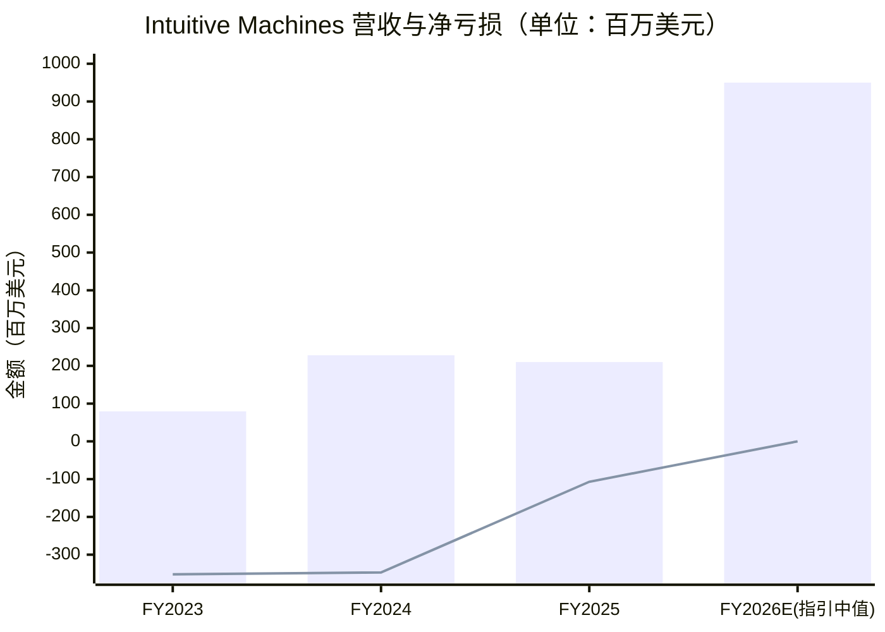
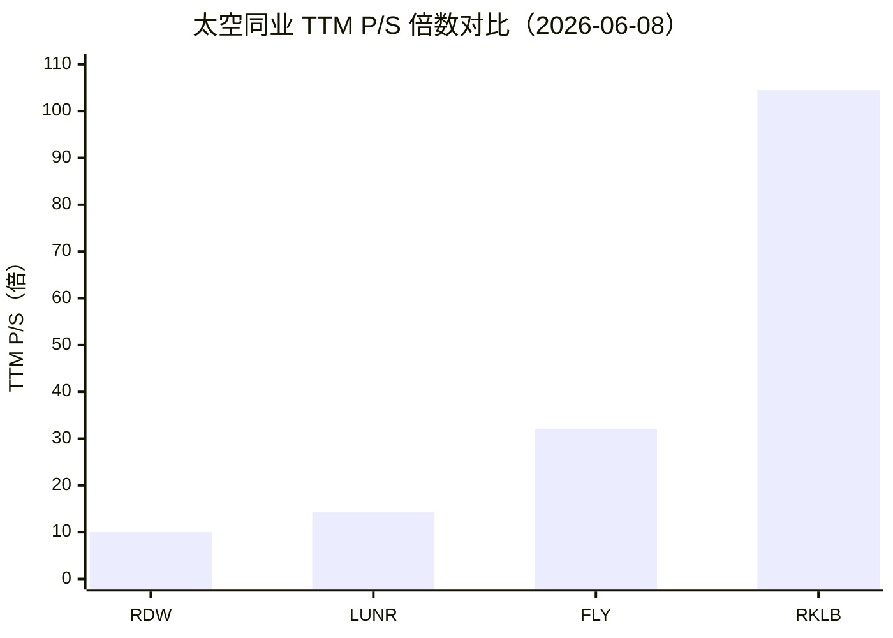
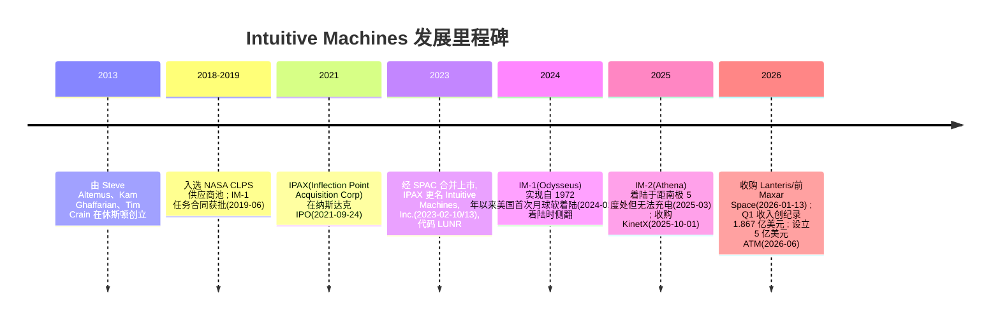
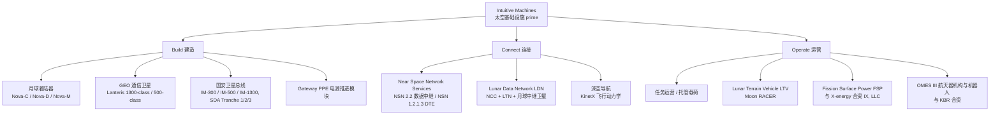
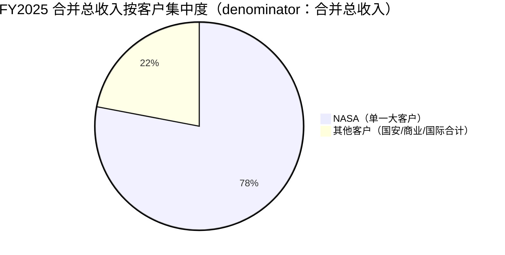
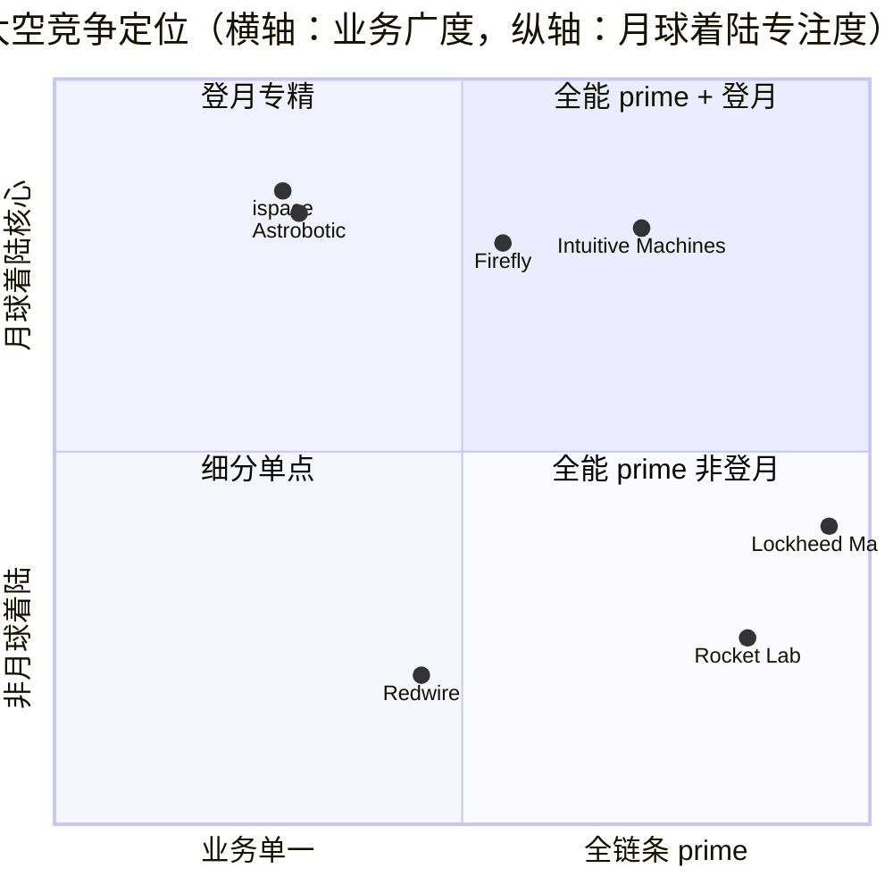
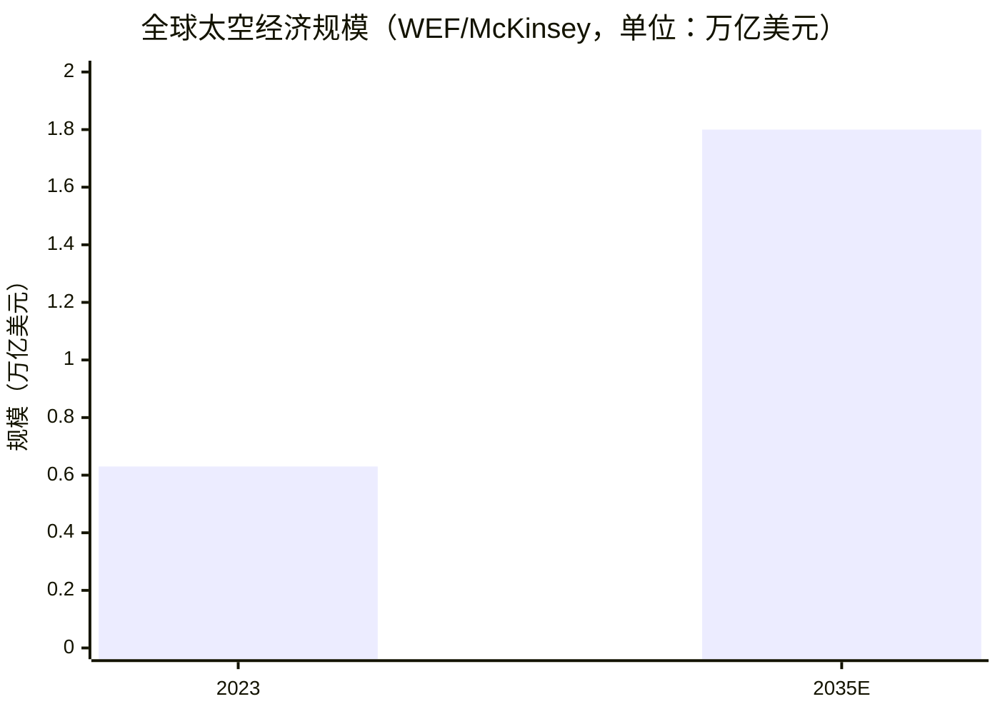

# Intuitive Machines（直觉机器，NASDAQ: LUNR）公司研究报告

> **数据截止日：2026-06-09**　|　**主要上市地：NASDAQ（纳斯达克）**　|　**股票代码：LUNR**　|　**总部：美国德州休斯顿**
> 本报告以美元（USD）计价，财务数据来自公司向 SEC 提交的 10-K / 10-Q / 8-K / DEF 14A 原文，估值数据截至 2026-06-08 收盘。

---

## 投资摘要（Investment Summary）

> *以下评级、目标价、上行空间及推演均为本报告分析师的前瞻观点（Analyst view），不构成任何监管文件（10-K / 8-K）的披露内容；监管文件不含目标价。*

| 项目 | 数值 |
|---|---|
| **评级（Rating）** | *Analyst view:* **Hold / 中性**（高确信度的业务转型 + 高估值 + 单客户依赖三者对冲） |
| **12 个月目标价（Price Target）** | *Analyst view:* **US$32**（基准情形） |
| **现价（2026-06-08）** | US$29.74 |
| **隐含上行空间** | *Analyst view:* 约 +8%（基准） |
| **估值方法** | *Analyst view:* 2027E EV/Sales 约 3.0× × FY2027E 收入约 14 亿美元，减净债务后折现 |
| **市值（Market cap）** | 约 47.7 亿美元 |
| **52 周区间** | US$7.78 – US$46.75 |
| **TTM P/S** | 约 14.3× |
| **1 年涨幅** | 约 +152% |

**核心论点（Thesis pillars，*Analyst view:*）**

1. **从"一次性任务"到"基础设施 prime"的质变正在发生**：2025Q4–2026Q1 公司通过收购 KinetX（深空导航）与 Lanteris（前 Maxar Space Systems，GEO 通信卫星）完成垂直整合，员工从 525 人跃升至约 1,695 人，2026Q1 收入同比近 3 倍至 1.867 亿美元，并首次录得正的 Adjusted EBITDA（230 万美元）。([Intuitive Machines FY2025 10-K, Item 1 Business](https://www.sec.gov/Archives/edgar/data/1844452/000162828026019865/lunr-20251231.htm) · [LUNR Q1 2026 Earnings 8-K, Exhibit 99.1](https://www.sec.gov/Archives/edgar/data/1844452/000162828026034807/lunr-20260514.htm))
2. **NASA 锚定的合同储备给了收入可见度，但也是最大的集中度风险**：FY2025 约 78% 收入来自单一大客户（NASA），2026 年指引收入 9–10 亿美元、Adjusted EBITDA 转正——一旦 Artemis 预算或政府拨款生变，下行弹性极大。([Intuitive Machines FY2025 10-K, Note 2 — Concentration](https://www.sec.gov/Archives/edgar/data/1844452/000162828026019865/lunr-20251231.htm))
3. **着陆器可靠性仍未被验证**：IM-1（Odysseus，2024-02）与 IM-2（Athena，2025-03）两次任务均在着陆时倾倒/侧翻，虽被判定"任务成功"，但月球着陆的硬技术风险尚未通过"完全直立着陆"这一关。([IM-1 - Wikipedia](https://en.wikipedia.org/wiki/IM-1) · [Intuitive Machines FY2024 10-K, Item 1](https://www.sec.gov/Archives/edgar/data/1844452/000184445225000023/lunr-20241231.htm))
4. **估值已 price-in 大量乐观预期，并伴随持续稀释**：TTM P/S 约 14.3×、股价 1 年涨 152%，同时公司在 2026-06 设立 5 亿美元 ATM（at-the-market）发行计划——SPAC 出身名字的 warrant / earn-out 公允价值波动与增发稀释是结构性噪音。([LUNR 8-K, 2026-06-03 — ATM Sales Agreement](https://www.sec.gov/Archives/edgar/data/1844452/000119312526254475/d62861d8k.htm) · [stockanalysis.com — LUNR forecast](https://stockanalysis.com/stocks/lunr/forecast/))

---

## 目录

1. [公司概览](#一公司概览)
2. [估值与目标价](#二估值与目标价)
3. [公司历史](#三公司历史)
4. [管理团队](#四管理团队)
5. [产品与服务](#五产品与服务)
6. [客户与商业模式](#六客户与商业模式)
7. [行业概览](#七行业概览)
8. [竞争格局](#八竞争格局)
9. [市场机会（TAM）](#九市场机会tam)
10. [风险评估](#十风险评估)
11. [投资视角评分卡](#十一投资视角评分卡)
12. [参考资料](#十二参考资料)

---

## 一、公司概览

**核心判断（*Analyst view:*）**：Intuitive Machines 正处在一次从"商业月球着陆器初创公司"向"垂直整合的下一代太空 prime（space prime，太空总承包商）"的剧烈转型中。2024–2025 年它是 NASA `CLPS (商业月球有效载荷服务，Commercial Lunar Payload Services)` 计划下完成两次月球着陆的明星名字；2026 年初通过两笔收购（KinetX、Lanteris）一举把业务边界从地月空间（cislunar）扩展到 `LEO (低地球轨道)` / `GEO (地球静止轨道)` 商业与国安卫星制造，收入体量在一个季度内放大近 3 倍。投资者买的不再只是"月球故事"，而是一个营收近 10 亿美元、客户从 NASA 单点向国防部、商业卫星运营商扩散的太空基础设施平台——估值与执行风险同步上升。([Intuitive Machines FY2025 10-K, Item 1 Business](https://www.sec.gov/Archives/edgar/data/1844452/000162828026019865/lunr-20251231.htm))

公司在 FY2025 10-K 中对自身的定义是："Intuitive Machines, Inc. ... is a space infrastructure and services company founded in 2013 and focused on enabling sustained infrastructure and human activity beyond Earth."（一家成立于 2013 年、专注于在地球之外建立持续基础设施与人类活动的太空基础设施与服务公司）。它将商业模式概括为 **Build–Connect–Operate（建造—连接—运营）** 三位一体的运营框架：Build 是设计制造交付航天器/着陆器/卫星，Connect 是把已部署资产接入通信、导航、数据中继网络，Operate 是提供任务运营、托管载荷、导航授时等基础设施即服务。([Intuitive Machines FY2025 10-K, Item 1 — Our Business Strategy](https://www.sec.gov/Archives/edgar/data/1844452/000162828026019865/lunr-20251231.htm))

**财务画像**：FY2025（截至 2025-12-31）总收入 2.101 亿美元，同比下降 8%（FY2024 为 2.280 亿美元）——下滑主因是 NASA 取消了 OSAM 项目任务单导致 OMES III 合同收入减少约 7,190 万美元，以及 IM-2 任务收尾。FY2025 GAAP 净亏损 1.068 亿美元，归属公司净亏损 8,329 万美元。截至 2025-12-31，现金及等价物 5.826 亿美元，营运资本 4.940 亿美元，财务状况充裕。([Intuitive Machines FY2025 10-K, Item 7 — Results of Operations & Liquidity](https://www.sec.gov/Archives/edgar/data/1844452/000162828026019865/lunr-20251231.htm))

**转折点已经到来**：2026Q1（截至 2026-03-31）公司录得**创纪录季度收入 1.867 亿美元，同比近 3 倍**，主要由 2026-01-13 完成的 Lanteris 收购并表驱动（注意：Q1 仅并入 Lanteris 12 天，对应约 1,300 万美元收入），同时 CLPS、OMES、`NSNS (近空间网络服务，Near Space Network Services)` 持续执行。公司首次实现**正的 Adjusted EBITDA 230 万美元**，季末**在手订单（backlog，合同储备）创纪录达 11 亿美元**（较 2025 年末增加 8.42 亿美元）。([LUNR Q1 2026 Earnings 8-K, Exhibit 99.1](https://www.sec.gov/Archives/edgar/data/1844452/000162828026034807/lunr-20260514.htm))

图中柱状为总收入、折线为 GAAP 净亏损（FY2026E 用指引收入中值 9.5 亿美元，EBITDA 转正、净亏损以 0 近似示意，非精确预测）。来源：[Intuitive Machines FY2025 10-K, Item 7](https://www.sec.gov/Archives/edgar/data/1844452/000162828026019865/lunr-20251231.htm)（FY2023–FY2025 收入与净亏损）及 [LUNR Q1 2026 Earnings 8-K — Outlook](https://www.sec.gov/Archives/edgar/data/1844452/000162828026034807/lunr-20260514.htm)（FY2026 指引）。

**估值快照**：截至 2026-06-08，股价 US$29.74，市值约 47.7 亿美元，TTM P/S 约 14.3×，52 周区间 US$7.78–46.75，过去 1 年上涨约 152%。GAAP 口径仍亏损，因此 P/E 无意义，市场以收入倍数与远期 EBITDA 转正预期定价（详见第二节）。([stockanalysis.com — LUNR](https://stockanalysis.com/stocks/lunr/forecast/)，数据更新于 2026-05-28）

---

## 二、估值与目标价

### 2a. 估值快照（TTM 倍数与同业对比）

LUNR 在 GAAP 口径下持续亏损，TTM P/E 为负且无分析意义；市场对其定价主要看**收入倍数（P/S）+ 远期 Adjusted EBITDA 转正路径 + 在手订单增长**。截至 2026-06-08，TTM P/S 约 14.3×，处于太空板块中高位。对负 P/E 的解读：这是一家处于**规模化前期、靠大客户合同驱动收入、同时背负 SPAC 出身的 warrant / earn-out 公允价值损益噪音**的成长型硬科技公司——FY2024 净亏损 3.469 亿美元中有 2.895 亿美元来自"其他费用净额"（warrant、earn-out 公允价值变动及证券发行损失等非经营项），并非经营性失血。([Intuitive Machines FY2025 10-K, Item 7 — Total other expense](https://www.sec.gov/Archives/edgar/data/1844452/000162828026019865/lunr-20251231.htm))

**同业对比（TTM P/S，2026-06-08，来源 yfinance）**：

| 公司 | 代码 | 现价 | 市值（约） | TTM P/S |
|---|---|---|---|---|
| Intuitive Machines | LUNR | $29.74 | $4.8B | 14.3× |
| Rocket Lab | RKLB | $113.65 | $71.0B | 104.5× |
| Firefly Aerospace | FLY | $36.18 | $5.9B | 32.1× |
| Redwire | RDW | $18.57 | $3.7B | 10.0× |
| Procure Space ETF | UFO | $54.85 | — | — |

来源：[yfinance / Yahoo Finance 报价（2026-06-08）](https://finance.yahoo.com/quote/LUNR/)。*Analyst view:* LUNR 的 P/S 显著低于 RKLB（火箭+卫星制造一体化、市场给予稀缺性溢价）与 FLY（Firefly，刚 IPO 的同类月球着陆名字），但高于 RDW（Redwire，太空基础设施部件）——反映市场把 LUNR 定位在"有真实收入、但盈利路径与可靠性仍待验证"的中间档。

### 2b. 前瞻估值、目标价与情景（*Analyst view:* 全部为分析师前瞻观点，不归因于任何监管文件）

**前瞻财务模型（*Analyst view:*）**。基于公司 FY2026 收入指引 9–10 亿美元、Adjusted EBITDA 转正（[LUNR Q1 2026 Earnings 8-K — Outlook](https://www.sec.gov/Archives/edgar/data/1844452/000162828026034807/lunr-20260514.htm)），叠加 Lanteris 全年并表（FY2025 仅含 12 天）与 NSNS / CLPS / SDA 合同储备释放节奏（[FY2025 10-K — Backlog，2026 年确认约 60–65%](https://www.sec.gov/Archives/edgar/data/1844452/000162828026019865/lunr-20251231.htm)），本报告对收入与利润的前瞻区间如下（每一格均为分析师估计）：

| 指标（*Analyst view:*） | FY2025A | FY2026E | FY2027E |
|---|---|---|---|
| 收入（百万美元） | 210 | 950（指引中值） | 1,300–1,450 |
| YoY | -8% | +352% | +37%–53% |
| Adjusted EBITDA | 负 | 转正（指引） | 正、利润率个位数 |
| GAAP 净利润 | -107（净亏损） | 仍可能亏损 | 接近盈亏平衡 |

各预测单元格均为 *Analyst view:*，其外部依据为：收入指引来自 [Q1 2026 8-K Outlook](https://www.sec.gov/Archives/edgar/data/1844452/000162828026034807/lunr-20260514.htm)；Lanteris 体量来自 [FY2025 10-K — Subsequent Events / 8 亿美元收购](https://www.sec.gov/Archives/edgar/data/1844452/000162828026019865/lunr-20251231.htm)；订单释放节奏来自同一 10-K 的 Backlog 段。本报告不以"本模型"作为任何数字的来源。

**目标价推导（*Analyst view:*）**。鉴于公司尚无稳定 EPS，采用 EV/Sales 法而非 P/E：

- **基准情形 US$32**：给 FY2027E 收入约 14 亿美元一个 3.0× EV/Sales（介于 RDW 的约 10× 远期不可比低位与 RKLB 的极高位之间，反映 LUNR 利润率尚未确立但收入可见度提升），得 EV 约 42 亿美元，加净现金后除以约 1.6 亿股，对应约 US$32。隐含相对现价约 +8%。
- **乐观情形 US$48**：若 FY2027 收入冲到 14.5 亿美元上沿、Adjusted EBITDA 利润率达双位数、CLPS/LTV 新单（如 Andromeda IDIQ、Space Reactor）兑现，给 4.0× EV/Sales，对应约 US$48（+61%）。
- **悲观情形 US$14**：若 Artemis 预算遭削减、IM-3/IM-4 着陆再次出现重大异常、或政府停摆拖累合同确认，收入回落且 EBITDA 转正延后，市场倍数压缩至 1.5× EV/Sales，对应约 US$14（-53%，与分析师区间低点 US$11 方向一致）。

**对照市场共识（*Analyst view:*）**。第三方共识（非本报告观点）：据 stockanalysis.com，9 位分析师给 LUNR "Buy" 共识评级，平均 12 个月目标价 US$40.78（区间 US$11–US$75，更新于 2026-05-28）；Cantor Fitzgerald 维持 Overweight、目标价上调至 US$43。本报告 US$32 的基准目标价**低于** Street 共识约 22%——分歧点在于：本报告对着陆器可靠性折价更高、对增发稀释（5 亿美元 ATM）计入更充分。([stockanalysis.com — LUNR forecast](https://stockanalysis.com/stocks/lunr/forecast/) · [Cantor Fitzgerald raises LUNR PT to $43, Investing.com, 2026-05](https://www.investing.com/news/analyst-ratings/cantor-fitzgerald-raises-intuitive-machines-stock-price-target-to-43-93CH-4698355))

> *本地机构研报库 `db/zsxq.db` 经 LUNR / Intuitive Machines / 直觉机器 等多别名检索，无任何覆盖（详见第十节验证日志）。因此第三方共识仅引用公开来源，未引用 zsxq 卖方研报。*

**两个决定成败的摆动变量（swing variables，*Analyst view:*）**：(1) **着陆可靠性**——IM-3/IM-4 是否实现完全直立着陆、释放约 10% 受约束变量对价；(2) **Lanteris 整合与商业卫星订单率**——能否把 GEO 卫星制造（1300-class 平台）从周期性低谷拉回稳定接单。两者任一恶化都会击穿基准目标价。

---

## 三、公司历史

来源：[Intuitive Machines FY2025 10-K, Item 1 & Item 7 — Recent Developments](https://www.sec.gov/Archives/edgar/data/1844452/000162828026019865/lunr-20251231.htm) · [Intuitive Machines FY2024 10-K, Item 1](https://www.sec.gov/Archives/edgar/data/1844452/000184445225000023/lunr-20241231.htm) · [2026 DEF 14A — Director Bios](https://www.sec.gov/Archives/edgar/data/1844452/000162828026027022/lunr-20260424.htm)。

公司由 **Steve Altemus、Kam Ghaffarian、Tim Crain** 三人于 2013 年在德州休斯顿共同创立，三位创始人均出身 NASA 约翰逊航天中心（JSC）体系。早期定位是为 NASA `CLPS (商业月球有效载荷服务)` 计划提供商业月球着陆器服务。2019 年 6 月，NASA 授予 IM-1 任务有效载荷合同，这成为公司第一笔标志性订单。([Intuitive Machines FY2025 10-K, Item 7 — IM-1 contract awarded June 2019](https://www.sec.gov/Archives/edgar/data/1844452/000162828026019865/lunr-20251231.htm))

**SPAC 上市路径**：壳公司 Inflection Point Acquisition Corp.（"IPAX"）于 2021-09-24 在纳斯达克完成 IPO；2022-09-16 IPAX 与 Intuitive Machines, LLC 签署业务合并协议；2023-02-10 IPAX 完成从开曼群岛到特拉华州的注册迁移并更名为 "Intuitive Machines, Inc."，成为以 Intuitive Machines, LLC 普通单位为主要资产的控股公司，股票代码 LUNR。由于上市时间短（不足 3 年），公司财务披露历史相对有限，且仍享受 `emerging growth company (新兴成长型公司)` 的部分披露豁免（如免于 Sarbanes-Oxley 404 审计师认证）。([Intuitive Machines FY2025 10-K, Item 1 — Description of Business & Emerging Growth Company](https://www.sec.gov/Archives/edgar/data/1844452/000162828026019865/lunr-20251231.htm))

**两次登月与两次收购定义了公司至今的轨迹**。2024-02-22，IM-1 的 Nova-C 着陆器 **Odysseus** 成为自 1972 年阿波罗以来首个在月面软着陆的美国航天器，着陆点距月球南极约 9 度——但着陆时因激光测高仪未工作、下降速度偏快，着陆器一条腿卡入地形后侧翻至约 30 度。2025-03，IM-2 的 **Athena** 着陆于距南极仅 5 度的最南端位置，却因姿态问题无法为太阳能板充电，部分载荷（如 Micro-Nova Hopper）未能部署。([IM-1 - Wikipedia](https://en.wikipedia.org/wiki/IM-1) · [Odysseus lander tipped over, Space.com, 2024-02](https://www.space.com/intuitive-machines-odysseus-moon-lander-tipped-over) · [Intuitive Machines FY2024 10-K, Item 1 — IM-1/IM-2 outcomes](https://www.sec.gov/Archives/edgar/data/1844452/000184445225000023/lunr-20241231.htm))

进入 2025–2026，公司战略从"造着陆器"转向"做太空基础设施 prime"，标志是两笔收购：**KinetX**（2025-10-01 完成，约 3,130 万美元，亚利桑那州深空导航与飞行动力学公司，30 余年经验）与 **Lanteris**（2026-01-13 完成，原 Maxar Space Systems，约 8 亿美元，GEO 通信卫星与国安卫星制造商）。后者直接把员工规模从 525 人推升至约 1,695 人，并使公司具备从地球轨道到月球、火星的全链条"设计—制造—交付—运营"能力。([Intuitive Machines FY2025 10-K, Item 7 — Recent Developments & Subsequent Events](https://www.sec.gov/Archives/edgar/data/1844452/000162828026019865/lunr-20251231.htm) · [LUNR Q1 2026 Earnings 8-K — $800M Lanteris acquisition](https://www.sec.gov/Archives/edgar/data/1844452/000162828026034807/lunr-20260514.htm))

---

## 四、管理团队

> 按本项目方法，本节仅覆盖**联合创始人与现任 CEO**。三位联合创始人至今全部在任（CEO、董事长、CTO），故合并撰写其简历。所有姓名与履历均经 2026 年 DEF 14A 核验。

**Stephen "Steve" Altemus（联合创始人、总裁兼 CEO、董事）**。Altemus 自 2012 年起担任 Intuitive Machines, LLC 的 CEO，2023 年 2 月起任上市主体 CEO、总裁及董事。创业前，他是 **NASA 约翰逊航天中心（JSC）副主任**（2012-12 至 2013-06），此前自 2006-07 起任 JSC 工程总监，统领 NASA 载人航天项目的工程能力。他于 1989 年加入 NASA 肯尼迪航天中心与航天飞机项目，并在 2003 年哥伦比亚号航天飞机失事后担任**哥伦比亚号重建总监**——这段直面航天事故的经历，对一家以"高后果任务"为核心的公司而言是独特的领导资历。Altemus 持有 Embry-Riddle 航空大学航空工程学士、中佛罗里达大学工程管理硕士。([2026 DEF 14A — Stephen Altemus bio](https://www.sec.gov/Archives/edgar/data/1844452/000162828026027022/lunr-20260424.htm))

**Dr. Kamal "Kam" Ghaffarian（联合创始人、董事会主席）**。Ghaffarian 自 2023 年 2 月起任董事长。他是连续创业者，1994 年创立 Stinger Ghaffarian Technologies（SGT，政府 IT/工程/科学服务公司），并先后在 Lockheed Martin、Ford Aerospace、Loral 担任技术与管理职位。他**同时是 Axiom Space（商业空间站）、X-energy（小型模块化核反应堆）、Quantum Space、IBX、PTX 等多家公司的联合创始人兼主席**——这一"航天创业生态"网络对 Intuitive Machines 极具战略价值（例如 `FSP (裂变表面电源，Fission Surface Power)` 项目正是通过与 X-energy 的 IX, LLC 合资推进）。Ghaffarian 拥有计算机工程与电子工程双学士、信息管理硕士，以及管理信息系统与技术两个博士学位。([2026 DEF 14A — Kamal Ghaffarian bio](https://www.sec.gov/Archives/edgar/data/1844452/000162828026027022/lunr-20260424.htm))

**Dr. Timothy "Tim" Crain（联合创始人、高级副总裁兼 CTO）**。Crain 自 2026 年 2 月起任高级副总裁兼 CTO（此前曾任首席增长官兼 CTO），自 2013 年与 Altemus、Ghaffarian 共同创立公司起即任研发副总裁。他拥有德州大学奥斯汀分校航空航天工程博士，曾是 NSF 研究生 Fellow。职业生涯始于 2000 年的 NASA JSC，曾负责火星科学着陆器的导航设计、`Orion (猎户座飞船)` 的轨道制导导航与控制系统经理，并在 2009 年成为 NASA Project Morpheus（一款 VTVL 着陆器验证机）的飞行动力学负责人——这段"行星着陆精确制导"经历正是公司 Nova-C 着陆器 `GN&C (制导、导航与控制)` 技术的源头。([2026 DEF 14A — Timothy Crain bio](https://www.sec.gov/Archives/edgar/data/1844452/000162828026027022/lunr-20260424.htm))

**治理观察（*Analyst view:*）**。三位创始人通过 Class C 普通股保留对公司的控制性投票权，使其能在董事会选举、并购、分红等重大事项上行使控制权——这是双重股权结构下的常见安排，对少数股东构成治理折价。2026-06-04 年度股东大会上，Ghaffarian 与 Altemus 均获连任 Class III 董事，Grant Thornton LLP 获批为 FY2026 审计机构。([Intuitive Machines FY2025 10-K, Item 1A — Founder control risk](https://www.sec.gov/Archives/edgar/data/1844452/000162828026019865/lunr-20251231.htm) · [LUNR 8-K, 2026-06-08 — Annual Meeting Results](https://www.sec.gov/Archives/edgar/data/1844452/000162828026041526/lunr-20260608.htm))

---

## 五、产品与服务

> 本节是全报告的分析核心。需要说明的是：FY2024 10-K 时期公司用"四大业务线/三核心支柱"框架（Lunar Access / Delivery Services、Lunar Data / Data Transmission Services、Infrastructure as a Service、Space Products & Orbital Services）；FY2025 10-K 起改用 **Build–Connect–Operate** 框架。本节先以 Build–Connect–Operate 主线组织，并在每条线内嵌入原四大业务线对应的产品（着陆器、数据中继、LTV、轨道服务），以保留产品层面的完整粒度。

### 产品组合树

来源：[Intuitive Machines FY2025 10-K, Item 1 — Our Services and Solutions（Build/Connect/Operate）](https://www.sec.gov/Archives/edgar/data/1844452/000162828026019865/lunr-20251231.htm) · [Intuitive Machines FY2024 10-K, Item 1 — Delivery / Data Transmission / Infrastructure as a Service](https://www.sec.gov/Archives/edgar/data/1844452/000184445225000023/lunr-20241231.htm)。

### 5.1 Build —— 月球着陆器（Lunar Access Services / Delivery Services）

这是公司起家的业务，也是其品牌资产。公司 FY2024 10-K 原文描述（逐字引用）：

> "We utilize our proprietary lunar lander vehicles to service CLPS contracts by flying NASA scientific equipment and commercial payloads to the lunar surface and supporting mission operations. With four CLPS contracts awarded to date, we are pioneering lunar access. We are also scaling our lander capabilities to support larger payloads, including heavy cargo-class infrastructure delivery for projects like the Lunar Terrain Vehicle ('LTV')..."
> ([Intuitive Machines FY2024 10-K, Item 1 — Delivery Services](https://www.sec.gov/Archives/edgar/data/1844452/000184445225000023/lunr-20241231.htm))

**中文释义 / Plain-language gloss:** 公司用自研月球着陆器把 NASA 科学设备和商业载荷送上月面，并提供任务运营。这条线物理上做的事，是"地月空间的快递+落地"——而落地的最后一公里（精确软着陆）正是月球任务最难的技术关。

着陆器产品族（均基于同一套自研 `LOX/Methane (液氧/液态甲烷)` 推进技术，在休斯顿 `LPOC (月球生产与运营中心)` 内自研自制）：

- **Nova-C**：现役机型，载荷能力约 100 kg 级。核心是 **VR900 液氧/液态甲烷发动机**，公司称其为"fully additively manufactured (3D printed) rocket engine"（完全增材制造/3D 打印的火箭发动机）。Odysseus（IM-1）与 Athena（IM-2）即 Nova-C。([Intuitive Machines FY2024 10-K, Item 1 — VR900 engine, 3D printed](https://www.sec.gov/Archives/edgar/data/1844452/000184445225000023/lunr-20241231.htm))
- **Nova-D**：开发中的货运级（heavy cargo-class）着陆器，公司称将有"multiple variations built to support projected payload capacities of 500-2500 kilograms"（多个变体，支持 500–2,500 公斤载荷），已完成系统定义评审（SDR）与初步技术评审（PTR）。Nova-D 是承载 LTV、并执行 2026Q1 第五个 CLPS 任务单（首个需要更大货运级着陆器）的机型。([Intuitive Machines FY2024 10-K, Item 1 — Nova-D 500-2500 kg](https://www.sec.gov/Archives/edgar/data/1844452/000184445225000023/lunr-20241231.htm) · [LUNR Q1 2026 Earnings 8-K — 5th CLPS, first to require Nova-D](https://www.sec.gov/Archives/edgar/data/1844452/000162828026034807/lunr-20260514.htm))
- **Nova-M**：未来开发机型，将用 **VR3500 发动机**，目标载荷约 5,000–7,500 公斤。([Intuitive Machines FY2024 10-K, Item 1 — Nova-M 5000-7500 kg, VR3500](https://www.sec.gov/Archives/edgar/data/1844452/000184445225000023/lunr-20241231.htm))

**与同族产品的差异**：三款着陆器共享同一套已飞行验证的液氧/甲烷推进核心，差异在载荷量级（百公斤 → 吨级 → 数吨级），形成"小—中—大"的可扩展产品阶梯，目的是用同一技术底座覆盖从科学载荷到 LTV 这样的基础设施级货物。

**战略意义与可靠性悬念**：CLPS 是公司收入的核心引擎——截至 2024-12-31，Delivery Services 储备含 4.302 亿美元 NASA CLPS/Tipping Point 合同。2024-08 NASA 授予的 IM-4 合同价值 1.169 亿美元（交付 6 项科学技术载荷，含 1 套 ESA 牵头的钻探套件）。但两次实战着陆均"侧翻/无法充电"，意味着 Nova-C 的精确软着陆能力尚未被一次"完全直立着陆"证明——这是产品线最大的未决变量。IM-2 任务中，PRIME-1 钻探与 Nokia LTE 网络测试得以进行，但 Micro-Nova Hopper（一款测试用月面无人机）因着陆异常未部署。([Intuitive Machines FY2024 10-K, Item 1 — IM-4 $116.9M, IM-2 anomalies](https://www.sec.gov/Archives/edgar/data/1844452/000184445225000023/lunr-20241231.htm))

### 5.2 Connect —— 月球数据中继与深空导航（Lunar Data Services / NSNS）

这条线是公司从"一次性着陆"走向"经常性收入"的关键。FY2024 10-K 原文：

> "In September 2024, NASA awarded Intuitive Machines the sole NSN contract for communication and navigation services for missions in the near space region ... (NSN 2.2). The NSN contract is a firm-fixed-price, multiple award, Indefinite-Delivery/Indefinite-Quantity ('IDIQ') task order contract, with a base period of five years with an additional five-year option, with a maximum potential value of $4.82 billion."
> ([Intuitive Machines FY2024 10-K, Item 1 — NSN 2.2 award](https://www.sec.gov/Archives/edgar/data/1844452/000184445225000023/lunr-20241231.htm))

**中文释义 / Plain-language gloss:** NASA 把"近空间网络（Near Space Network）"中绕月数据中继服务（编号 2.2）**独家**授予了 Intuitive Machines，最高潜在价值 48.2 亿美元（固定价、IDIQ、5+5 年）。这意味着未来所有飞往月球的任务，若要把数据传回地球，都可能要"租用"IM 部署的绕月中继卫星网络——这是一种"pay-by-the-minute（按分钟计费）"的基础设施服务模式，正是公司想要的高毛利经常性收入。

`LDN (月球数据网络，Lunar Data Network)` 由三部分组成：`NCC (Nova 控制中心)`、现有全球地面天线网 `LTN (月球遥测、跟踪与通信网络)`，以及将作为 NSN 2.2 合同部署的**绕月中继卫星星座**（即所谓 Khon 系列中继卫星的延续与扩展）。公司还在 2024-12 拿下 NSN 1.2（地球静止轨道到地月空间 DTE）和 NSN 1.3（超地月空间 DTE）两个 `DTE (直接对地，Direct-to-Earth)` 合同，是该网络的两家授标方之一。([Intuitive Machines FY2024 10-K, Item 1 — LDN, NCC, LTN, NSN 1.2/1.3](https://www.sec.gov/Archives/edgar/data/1844452/000184445225000023/lunr-20241231.htm))

**KinetX 收购强化了这条线**：2025-10 收购的 KinetX 带来 30 余年深空导航与飞行动力学经验，使 IM 能为多个 NASA Artemis 相关任务提供"advanced deep-space navigation services"，并瞄准 NASA 现役 `TDRSS (跟踪与数据中继卫星系统)` 的潜在替代、火星数据中继与 `Deep Space Network (深空网络)` 遗留基础设施的商业化运营。([Intuitive Machines FY2025 10-K, Item 7 — KinetX acquisition rationale](https://www.sec.gov/Archives/edgar/data/1844452/000162828026019865/lunr-20251231.htm))

### 5.3 Operate —— LTV、FSP、OMES III 与轨道服务（Infrastructure as a Service / Orbital Services）

**Lunar Terrain Vehicle（LTV，月球地形车）**：公司是 NASA LTV 项目**三家 prime 之一**，主导开发 **Moon RACER**（Moon Reusable Autonomous Crewed Exploration Rover）。2024 年 NASA 授予 3,080 万美元 LTV 合同，该项目总盘子（NASA LTV Services）约 46 亿美元。Moon RACER 由 Nova-D 货运级着陆器交付，设计在月球南极极端环境运行，并由公司主导一个含 **AVL、Boeing、CSIRO、Fugro、Michelin、Northrop Grumman、Roush** 的全球合作团队开发。公司还在推动 LTV 商业化——把它做成"月面半挂卡车+拖车"式的模块化物流系统，服务月壤采集、资源开采、生物制造、发电等。([Intuitive Machines FY2024 10-K, Item 1 — LTV/Moon RACER $30.8M, $4.6B project](https://www.sec.gov/Archives/edgar/data/1844452/000184445225000023/lunr-20241231.htm) · [Intuitive Machines FY2025 10-K, Item 1 — LTV partners AVL/Boeing/CSIRO/Fugro/Michelin/Northrop/Roush](https://www.sec.gov/Archives/edgar/data/1844452/000162828026019865/lunr-20251231.htm))

**Fission Surface Power（FSP，裂变表面电源）**：通过与 **X-energy** 的 IX, LLC 合资推进——IX 团队获 NASA 与能源部 500 万美元 Phase 1 合同、2024-08 再获 290 万美元 Phase 1A 后续合同，目标是为月球栖息地提供能在 14 天月夜中持续供电的核电源。这把创始人 Ghaffarian 旗下 X-energy 的小型核反应堆能力直接接入了 IM 的月球基础设施版图。([Intuitive Machines FY2024 10-K, Item 1 — FSP / X-energy IX JV](https://www.sec.gov/Archives/edgar/data/1844452/000184445225000023/lunr-20241231.htm))

**OMES III**：2023 年 NASA 授予的 prime 合同，聚焦航天器机构与机器人（为 Goddard 的 Landsat 在轨服务任务提供工程服务）。通过与 **KBR** 的合资（IM 占 47% 利润权益、KBR 占 53%）执行——这是 FY2024 收入的最大单一驱动（约 1.45 亿美元），但 FY2025 因 NASA 取消 OSAM 任务单而收入骤减约 7,190 万美元，凸显政府合同的脆弱性。([Intuitive Machines FY2025 10-K, Item 7 — OMES III JV with KBR, OSAM cancellation](https://www.sec.gov/Archives/edgar/data/1844452/000162828026019865/lunr-20251231.htm))

### 5.4 Build（扩展）—— Lanteris 带来的 GEO 与国安卫星制造

Lanteris（原 Maxar Space Systems / SSL）让公司一夜之间成为商业 GEO 通信卫星与国安卫星总线制造商。FY2025 10-K 逐字描述：

> "...Lanteris, is a world leader in commercial GEO communication satellites and a global leader in commercial satellite manufacturing. With over three decades of on-orbit performance, the 1300-class spacecraft platform is the world's most popular GEO satellite with over 95 spacecraft still operational and in service. ... Lanteris built JUPITER 3, a transformational Ultra High Density Satellite, for Hughes Network Systems ... This satellite is the world's largest commercial communications satellite built in the U.S."
> ([Intuitive Machines FY2025 10-K, Item 1 — Lanteris / 1300-class / JUPITER 3](https://www.sec.gov/Archives/edgar/data/1844452/000162828026019865/lunr-20251231.htm))

**中文释义 / Plain-language gloss:** Lanteris 的 1300-class 卫星平台是全球装机量最大的 GEO 通信卫星总线（95+ 颗在轨），并造过美国本土最大的商业通信卫星 JUPITER 3。它还为 SDA `PWSA (扩散型作战人员太空架构)` 制造卫星总线（Tranche 1/2/3 跟踪层），客户是 L3Harris，用红外传感器实时探测跟踪导弹威胁。公司在 SDA、`MDA (导弹防御局)` SHIELD、Air Force JETSON 等国安项目上的卡位由此显著加强。

国安卫星基于 **IM-300 / IM-500 / IM-1300** 系列航天器平台。R&D 当前重点是升级 Lanteris 300 与 1300 卫星总线、推进着陆器"survive the night（熬过月夜）"与更大着陆器设计、以及泵与贮箱技术效率提升。([Intuitive Machines FY2025 10-K, Item 1 — IM-300/500/1300 series, R&D focus](https://www.sec.gov/Archives/edgar/data/1844452/000162828026019865/lunr-20251231.htm))

### 5.5 综合：产品如何互相咬合

这套产品组合的内在逻辑是一个**"建造→连接→运营"的自我强化循环**：公司用着陆器（Build）把货物送上月面，过程中"顺便"以边际成本部署中继卫星（Connect），中继网络再以按分钟计费的方式服务后续所有任务（Operate），而 LTV、FSP 等地面基础设施又给着陆器创造新的运货需求（回到 Build）。Lanteris 的卫星制造与 KinetX 的深空导航则把这个循环从地月空间延伸到 GEO 与深空，使"循环"不再依赖单一的月球叙事。

来源：[Intuitive Machines FY2025 10-K, Item 1 — Build-Connect-Operate operating model](https://www.sec.gov/Archives/edgar/data/1844452/000162828026019865/lunr-20251231.htm)。*Analyst view:* 该循环目前仍以 Build 端（着陆器/卫星制造）的里程碑式收入为主体——10-K 自述"these build contracts generate the majority of our near-term revenue"，Connect/Operate 的经常性、高毛利服务收入尚处早期。

---

## 六、客户与商业模式

**收入模式**：公司收入主要来自三类合同——固定价（fixed-price）、成本可报销（cost-reimbursable）、工时材料（time-and-materials）。历史上多数收入来自交付月面载荷的固定价长期合同（按 IM-1/IM-2/IM-3 任务聚合管理），采用 `over-time (按完工进度)` 法确认收入。值得注意的是：**约 10% 的合同价款是"受约束变量对价（constrained variable consideration）"，会计上先计为零，只有在着陆成功后才释放**——这把"着陆可靠性"直接绑进了收入确认，IM-1 成功后释放了约 1,230 万美元、IM-2 成功后释放了约 570 万美元。([Intuitive Machines FY2025 10-K, Item 7 — Revenue recognition, ~10% constrained](https://www.sec.gov/Archives/edgar/data/1844452/000162828026019865/lunr-20251231.htm))

**客户集中度——这是最关键的风险数字**。FY2025 10-K（Note 2）逐字披露：

> "There was one major customer that accounted for 78% and 90% of the Company's total revenue for the years ended December 31, 2025 and 2024, respectively."
> ([Intuitive Machines FY2025 10-K, Note 2 — Concentration of Credit Risks](https://www.sec.gov/Archives/edgar/data/1844452/000162828026019865/lunr-20251231.htm))

**单一大客户（NASA）占合并总收入的比例：FY2025 约 78%、FY2024 约 90%**（口径为合并总收入 consolidated total revenue，"major customer"定义为占总收入 >10% 者）。FY2025 集中度从 90% 降至 78%，反映国安（SDA、MDA、Air Force）与商业收入开始稀释 NASA 依赖——但 NASA 仍是压倒性单一客户。应收账款端，截至 2025-12-31 有三家大客户分别占应收余额 49%、23%、11%。

来源：[Intuitive Machines FY2025 10-K, Note 2 — 78% from one major customer](https://www.sec.gov/Archives/edgar/data/1844452/000162828026019865/lunr-20251231.htm)。注：饼图仅使用单一分母（合并总收入），"其他客户"为合计项，非单一客户。

**客户结构（按 10-K 披露）**：

- **美国政府（占绝对主导）**：NASA（CLPS、Gateway PPE、NSN、LTV、FSP）、国安太空（SDA PWSA Tranche 1/2/3，客户为 L3Harris；MDA SHIELD IDIQ）、国防部（Air Force JETSON）、州政府（德州、加州、亚利桑那、马里兰、科罗拉多）。
- **商业**：月面货运客户包括 Columbia Sportswear、Nokia、Aegis Aerospace、AstroForge、艺术家 Jeff Koons、International Lunar Observatory Association、Galactic Legacy Labs、Lonestar Data Holdings、Lunar Outpost；Lanteris 带来的 GEO 卫星商业客户如 Hughes Network Systems（JUPITER 3）、Vantor。
- **国际**：欧洲与亚洲国家航天机构；月面货运国际客户含 Dymon、Puli Space、德国宇航中心（DLR）。
([Intuitive Machines FY2025 10-K, Item 1 — Our Customers and Partners](https://www.sec.gov/Archives/edgar/data/1844452/000162828026019865/lunr-20251231.htm))

**在手订单（backlog）**：截至 2025-12-31 为 2.131 亿美元，较 2024-12-31 的 3.283 亿美元下降 1.153 亿美元（主因持续履约消耗 OMES III、CLPS、NSN 约 2.101 亿美元，新签订单 1.05 亿美元部分抵消）。公司预计 2026 年确认约 60–65%、2027 年约 35–40%。**但 2026Q1 随 Lanteris 并表，backlog 暴增至创纪录的 11 亿美元**（增加 8.42 亿美元），这是收入可见度的质变。⚠️ 需注意 10-K 风险提示："Nearly all contracts allow customers to terminate the agreement at any time for convenience"（几乎所有合同允许客户随时无理由终止）——政府合同的 backlog 不等于锁定收入。([Intuitive Machines FY2025 10-K, Item 7 — Backlog $213.1M, termination for convenience](https://www.sec.gov/Archives/edgar/data/1844452/000162828026019865/lunr-20251231.htm) · [LUNR Q1 2026 Earnings 8-K — record $1.1B backlog](https://www.sec.gov/Archives/edgar/data/1844452/000162828026034807/lunr-20260514.htm))

**Go-to-market**：直销 + 合作伙伴网络（rideshare 发射商、月面移动商、载荷商、通信卫星商、地面段商），覆盖北美、南美、欧洲、亚洲、澳洲。公司强调其在政府客户"capture（合同捕获）"上的深厚经验。月球任务的发射全部依赖**单一发射服务商 SpaceX（Falcon 9）**——这既是成本效率来源，也是供应链单点风险。([Intuitive Machines FY2025 10-K, Item 1 — Sales / single launch provider SpaceX](https://www.sec.gov/Archives/edgar/data/1844452/000162828026019865/lunr-20251231.htm))

---

## 七、行业概览

公司所处行业可大致归为**太空基础设施与服务（space infrastructure & services）**，并横跨三个子市场：(1) 地月空间/月球经济（cislunar / lunar economy，绑定 NASA Artemis + CLPS）、(2) 国家安全太空（national security space，绑定 SDA/MDA/Space Force 预算）、(3) 商业卫星制造（GEO 通信 + LEO 星座，绑定 Lanteris）。SEC 给公司的 SIC 分类是"Search, Detection, Navigation, Guidance, Aeronautical Systems"（搜索、探测、导航、制导与航空系统）。([Intuitive Machines FY2025 10-K, Cover / SIC classification](https://www.sec.gov/Archives/edgar/data/1844452/000162828026019865/lunr-20251231.htm))

**月球经济的政策驱动**：行业增长的核心引擎是 NASA 的 Artemis 计划与 `CLPS (商业月球有效载荷服务)`。CLPS 是一个 IDIQ 合同池，截至 2028 年的累计合同上限原为 26 亿美元、覆盖 14 家美国商业供应商；据 2026 年初的采购文件，NASA 拟将上限从 26 亿美元上调至约 42 亿美元（+61%），以支撑更高的着陆节奏（2027 年 9 次、2028 年 10 次着陆），服务其"Moon Base（月球基地）"倡议。这对作为 CLPS 任务单最多的供应商之一的 IM 是直接利好。([Commercial Lunar Payload Services - Wikipedia](https://en.wikipedia.org/wiki/Commercial_Lunar_Payload_Services) · [NASA CLPS ceiling raise to $4.2B, nova.space, 2026](https://nova.space/in-the-loop/clps-2-0-how-nasas-lunar-surface-ambitions-are-reshaping-the-commercial-lunar-delivery-market/))

**国安太空的地缘驱动**：FY2024 10-K 指出，Space Force 对地月空间态势感知（cislunar Space Domain Awareness）与 xGEO 定位导航授时（PNT）的需求，源于"the ongoing efforts by the U.S. and China to return to the lunar surface in a sustainable manner"（美中两国持续推进可持续重返月面的努力）——中美月球竞赛是国安太空开支的结构性催化剂。([Intuitive Machines FY2024 10-K, Item 1 — National Security Space / US-China lunar race](https://www.sec.gov/Archives/edgar/data/1844452/000184445225000023/lunr-20241231.htm))

**行业结构**：高进入壁垒（资本密集、技术密集、长研发周期、严苛的政府合规 FAR/CAS/DCAA），客户高度集中于政府（买方议价能力极强），供应商在某些关键部件上有限（卖方风险），替代品有限但同业竞争激烈（详见第八节）。这是一个"政策周期 + 技术里程碑"双驱动、现金流前置投入大、盈利兑现晚的行业。([Intuitive Machines FY2025 10-K, Item 1 — Government and Environmental Regulations / FAR / CAS / DCAA](https://www.sec.gov/Archives/edgar/data/1844452/000162828026019865/lunr-20251231.htm))

---

## 八、竞争格局

公司在 FY2025 10-K 的 Competition 段逐字列出竞争对手（这是可直接引用 10-K 的权威清单）：

> "Competition in our addressable market is mainly divided between incumbents, such as Lockheed Martin and Blue Origin who pursue larger, more complex contracts such as crewed lunar missions, and next generation players, including our competitors on the CLPS contract such as Astrobotic and Firefly Aerospace. Competitors for the next phases of LTVS include Lunar Outpost and Astrolab Venturi and our competitors for the NSN contract included Kongsberg Satellite Services ('KSAT'), Swedish Space Corporation ('SSC'), and Telespazio."
> ([Intuitive Machines FY2025 10-K, Item 1 — Our Competition](https://www.sec.gov/Archives/edgar/data/1844452/000162828026019865/lunr-20251231.htm))

10-K 同时列出 Lanteris 业务线的竞争对手：民用航天对手含 BAE Systems、Blue Origin、Boeing、Lockheed Martin、Northrop Grumman、SpaceX、Voyager；国安/国防对手含 BAE Systems、K2 Space、Lockheed Martin、Millennium Space Systems、Northrop Grumman、Rocket Lab、York Space Systems；商业 GEO 卫星制造对手含 Airbus、Astranis、Northrop Grumman、Thales Alenia Space。([Intuitive Machines FY2025 10-K, Item 1 — Lanteris competitors](https://www.sec.gov/Archives/edgar/data/1844452/000162828026019865/lunr-20251231.htm))

**竞争定位（*分析师观点：*，以下市占与"领先"判断为分析师评估，非 10-K 措辞）**：

- 在 **CLPS 月球着陆**赛道，IM 与 **Firefly Aerospace（Blue Ghost）**、**Astrobotic（Peregrine，私有）**、**Draper**、日本 **ispace** 直接竞争。Firefly 的 Blue Ghost 1 号任务（2025-03）实现了完全直立软着陆，反衬出 IM 两次侧翻的可靠性短板；但 IM 是 CLPS 任务单最多的供应商，规模与经验领先。([Commercial Lunar Payload Services - Wikipedia](https://en.wikipedia.org/wiki/Commercial_Lunar_Payload_Services))
- 在 **LTV** 赛道，三家 prime 中另两家是 **Lunar Outpost** 与 **Astrolab/Venturi**；
- 在 **NSN 数据中继**赛道，IM 是 2.2 的独家授标方，但 DTE 服务面对 KSAT、SSC、Telespazio 等地面站运营商；
- 在 **GEO/国安卫星制造**（Lanteris）赛道，面对 Airbus、Thales Alenia、Northrop Grumman 等老牌巨头与 Astranis、York、Rocket Lab 等新锐。

来源：定位为 *分析师观点：*，基于 [Intuitive Machines FY2025 10-K Competition 段](https://www.sec.gov/Archives/edgar/data/1844452/000162828026019865/lunr-20251231.htm) 与公开行业资料的综合判断（非 10-K 数据）。

**IM 的相对优势（*分析师观点：*）**：CLPS 任务单数量领先、独家 NSN 2.2 中继合同形成的网络效应、创始人 Ghaffarian 的航天创业生态（X-energy/Axiom）协同、以及通过 Lanteris/KinetX 完成的垂直整合。**相对劣势（*分析师观点：*）**：着陆可靠性尚未通过"完全直立着陆"验证、对 NASA/政府预算的极端依赖、以及作为新整合体的并购消化风险。

---

## 九、市场机会（TAM）

公司在 FY2025 10-K 中对 TAM 的自我界定是"the full space value chain"（完整太空价值链），涵盖地面站与任务运营基础设施、LEO/GEO/地月空间卫星、地月与月轨通信导航系统与空间站、月球着陆器、月面基础设施（移动、电源、自主运营）、太空机器人系统，乃至未来到火星的深空任务。这是一个刻意宽泛的界定，配合其 Build-Connect-Operate 的全链条战略。([Intuitive Machines FY2025 10-K, Item 1 — Total Addressable Market](https://www.sec.gov/Archives/edgar/data/1844452/000162828026019865/lunr-20251231.htm))

**自上而下的 TAM 锚（source-chain）**：据世界经济论坛（WEF）与麦肯锡 2024-04 联合报告《Space: The $1.8 Trillion Opportunity》，全球太空经济将从 2023 年的约 6,300 亿美元增长到 2035 年的约 1.8 万亿美元，复合增速约 9%/年——届时规模接近全球半导体产业。这是市场常用的"太空经济到 2035 年 1.8 万亿美元"锚定。([Space economy set to triple to $1.8 trillion by 2035, World Economic Forum, 2024-04](https://www.weforum.org/press/2024/04/space-economy-set-to-triple-to-1-8-trillion-by-2035-new-research-reveals/) · [Space: The $1.8 trillion opportunity, McKinsey, 2024](https://www.mckinsey.com/industries/aerospace-and-defense/our-insights/space-the-1-point-8-trillion-dollar-opportunity-for-global-economic-growth))

**自下而上的可寻址锚（IM 实际能吃到的切片）**：

- **CLPS 月球着陆**：截至 2028 年合同上限约 26 亿美元（拟上调至约 42 亿美元），14 家供应商分食，IM 是任务单最多者之一；
- **NSN 数据中继（IM 独家 2.2）**：最高潜在价值 48.2 亿美元（5+5 年 IDIQ）；
- **LTV**：NASA LTV Services 项目总盘约 46 亿美元，三家 prime 竞逐；
- **国安太空**：U.S. Space Force Andromeda IDIQ 预期上限 62 亿美元（IM 已在 2026Q2 中标，结合 Lanteris 能力提供地球同步轨道空间态势感知星座）；
- **商业 GEO/国安卫星制造（Lanteris）**：接入全球商业与国安卫星制造市场。
([Commercial Lunar Payload Services - Wikipedia](https://en.wikipedia.org/wiki/Commercial_Lunar_Payload_Services) · [Intuitive Machines FY2024 10-K, Item 1 — NSN 2.2 $4.82B, LTV $4.6B](https://www.sec.gov/Archives/edgar/data/1844452/000184445225000023/lunr-20241231.htm) · [LUNR Q1 2026 Earnings 8-K — Andromeda IDIQ $6.2B ceiling](https://www.sec.gov/Archives/edgar/data/1844452/000162828026034807/lunr-20260514.htm))

来源：[World Economic Forum / McKinsey, 2024-04 — 2023 $0.63T → 2035 $1.8T](https://www.weforum.org/press/2024/04/space-economy-set-to-triple-to-1-8-trillion-by-2035-new-research-reveals/)。*Analyst view:* IM 实际可寻址（CLPS + NSN + LTV + Andromeda + Lanteris 卫星制造）合计的"合同上限"已达约 160 亿美元量级，但这些是多年、IDIQ、需逐单竞标的上限，并非确定收入。

---

## 十、风险评估

> 8–12 项风险，按公司特有 / 行业市场 / 财务 / 宏观四类组织。多数引自 FY2025 10-K 风险因素与 Note 披露。

**A. 公司特有风险**

1. **着陆器可靠性风险（最高优先）**：IM-1、IM-2 两次任务均在着陆时倾倒/无法充电；约 10% 合同价款绑定"成功着陆"才释放。若 IM-3（任务窗口至 2027-03）或 IM-4（预计 2027 下半年）再次出现重大着陆异常，不仅损失里程碑收入，更将动摇 CLPS 续约与商业客户信心。([Intuitive Machines FY2025 10-K, Item 1A — failure of landers / Item 7 constrained revenue](https://www.sec.gov/Archives/edgar/data/1844452/000162828026019865/lunr-20251231.htm))

2. **单一客户集中度风险**：FY2025 约 78%、FY2024 约 90% 收入来自单一大客户（NASA）。该客户若削减订单、改变采购节奏或延迟付款，收入与经营成果将受重大不利影响。10-K 明列"Customer concentration creates risks for our business."([Intuitive Machines FY2025 10-K, Note 2 & Item 1A — Customer concentration](https://www.sec.gov/Archives/edgar/data/1844452/000162828026019865/lunr-20251231.htm))

3. **并购整合风险**：2025–2026 连续完成 KinetX、Lanteris 两笔收购，员工从 525 人增至约 1,695 人。10-K 风险因素直言并购"subject us to integration risk and could disrupt our operations"。Lanteris 体量（约 8 亿美元）相对公司原有规模巨大，整合不当将拖累利润率与执行。([Intuitive Machines FY2025 10-K, Item 1A — Acquisition / integration risk](https://www.sec.gov/Archives/edgar/data/1844452/000162828026019865/lunr-20251231.htm))

4. **关键人物与创始人控制风险**：业务高度依赖董事会与核心人员；三位创始人通过 Class C 股保留控制性投票权，可能延迟或阻止有利于少数股东的交易，并对股价构成治理折价。([Intuitive Machines FY2025 10-K, Item 1A — key personnel / founder control](https://www.sec.gov/Archives/edgar/data/1844452/000162828026019865/lunr-20251231.htm))

5. **供应链单点风险**：月球任务的发射依赖单一发射服务商 SpaceX（Falcon 9）；部分关键部件（航电、飞控、无线电、电源、燃料贮箱）依赖有限合格供应商。任一中断都可能打乱任务时间表。([Intuitive Machines FY2025 10-K, Item 1 — Supply Chain / single launch provider](https://www.sec.gov/Archives/edgar/data/1844452/000162828026019865/lunr-20251231.htm))

**B. 行业与市场风险**

6. **NASA/Artemis 预算与政府拨款风险**：公司收入高度依赖 U.S. 联邦开支。2025-09-30 持续决议到期后政府进入停摆，2026-01-31 至 02-03 又部分停摆；2025-01-20 设立的 "Department of Government Efficiency（DOGE）" 增加预算不确定性。任何预算削减、优先级调整、停摆、或一连串短期持续决议都可能延迟合同授予与付款。([Intuitive Machines FY2025 10-K, Item 7 — Government shutdown / DOGE / budget risk](https://www.sec.gov/Archives/edgar/data/1844452/000162828026019865/lunr-20251231.htm))

7. **竞争加剧风险**：Firefly（Blue Ghost 已实现直立着陆）、Astrobotic、Draper、ispace 等在 CLPS 上正面竞争；Lockheed、Northrop、Boeing 等巨头在更大合同上挤压。竞争可能压价、减少订单、压缩利润率、并侵蚀市占。([Intuitive Machines FY2025 10-K, Item 1A — Competition risk](https://www.sec.gov/Archives/edgar/data/1844452/000162828026019865/lunr-20251231.htm))

8. **合同可随时被终止风险**："Nearly all contracts allow customers to terminate the agreement at any time for convenience." 政府合同的 backlog 不等于锁定收入，OMES III 因 OSAM 取消而骤减约 7,190 万美元即是先例。([Intuitive Machines FY2025 10-K, Item 7 — termination for convenience / OSAM cancellation](https://www.sec.gov/Archives/edgar/data/1844452/000162828026019865/lunr-20251231.htm))

**C. 财务风险**

9. **持续亏损与盈利不确定性**：公司有净经营亏损历史，FY2025 GAAP 净亏损 1.068 亿美元。虽 2026Q1 首次录得正 Adjusted EBITDA（230 万美元），但 GAAP 盈利路径仍未确立，且依赖任务成功与规模化。([Intuitive Machines FY2025 10-K, Item 1A — history of net operating losses](https://www.sec.gov/Archives/edgar/data/1844452/000162828026019865/lunr-20251231.htm))

10. **稀释与 warrant/可转债风险**：作为 SPAC 出身名字，warrant、earn-out、可转债的公允价值变动造成损益剧烈波动（FY2024 净亏损中 2.895 亿美元来自此类非经营项）。2025-08 发行可转债、2026-02 以 15.12 美元/股增发 1.75 亿美元、2026-06 又设立 5 亿美元 ATM 发行计划——持续稀释对每股价值构成压力。([Intuitive Machines FY2025 10-K, Item 7 — Convertible Notes / Securities Purchase Agreement](https://www.sec.gov/Archives/edgar/data/1844452/000162828026019865/lunr-20251231.htm) · [LUNR 8-K, 2026-06-03 — $500M ATM Sales Agreement](https://www.sec.gov/Archives/edgar/data/1844452/000119312526254475/d62861d8k.htm))

11. **估值/倍数压缩风险**：TTM P/S 约 14.3×、1 年涨 152%，估值已 price-in 大量乐观预期。若执行不及预期或行业情绪逆转，倍数压缩的下行弹性大（分析师目标价低点 US$11，较现价 -63%）。*Analyst view:* 列为财务风险。([stockanalysis.com — LUNR forecast, PT range $11–$75](https://stockanalysis.com/stocks/lunr/forecast/))

**D. 宏观风险**

12. **关税、通胀与利率风险**：2025 年美国贸易政策大幅转向、新增关税，公司虽以国内供应链与美政府客户为主，仍有进口材料/部件敞口；通胀与高利率影响成本与发行融资条件。([Intuitive Machines FY2025 10-K, Item 7 — Inflation / tariffs / macro](https://www.sec.gov/Archives/edgar/data/1844452/000162828026019865/lunr-20251231.htm))

### 9.5 核心分歧与催化剂（Key debates & catalysts，*Analyst view:*）

**多空核心分歧（bears 的论点与反驳）**：

- **空方：着陆器两连倒，技术护城河被高估。** *反驳：* IM-1/IM-2 仍被 NASA 判定任务成功并释放里程碑款，且公司是 CLPS 任务单最多供应商；Nova-D 货运级与"survive the night"研发在推进。但这条反驳要 IM-3/IM-4 用一次直立着陆来兑现。
- **空方：78% 收入靠 NASA，是政策风险敞口而非生意。** *反驳：* FY2025 集中度已从 90% 降至 78%，Lanteris/SDA/Andromeda 正在多元化客户；2026Q1 backlog 跳升至 11 亿美元提升可见度。但 NASA 仍压倒性单一。
- **空方：估值 + 持续稀释 = 负 alpha。** *反驳：* 远期 EV/Sales 在 FY2027 收入兑现后会自然下降，5 亿美元 ATM 是机会性融资而非紧急失血（季末现金 5.83 亿美元）。

**未来 12 个月催化剂（dated，*Analyst view:*）**：

- **2026 全年**：收入指引 9–10 亿美元、Adjusted EBITDA 转正的兑现度（每季财报验证）；
- **2026 下半年起**：CLPS / LTV / Ignition 计划新单授予决定（公司称"awaiting award decisions in the coming weeks"）、CLPS 2.0、Space Reactor 1（Freedom）提案结果；
- **2027-03 前**：IM-3 任务窗口与着陆结果（直立着陆与否是 thesis 关键）；
- **持续**：Goonhilly Earth Station 收购完成、Andromeda IDIQ 任务单释放、5 亿美元 ATM 的实际使用节奏。
([LUNR Q1 2026 Earnings 8-K — Highlights & Outlook](https://www.sec.gov/Archives/edgar/data/1844452/000162828026034807/lunr-20260514.htm) · [Intuitive Machines FY2025 10-K, Item 7 — IM-3 timeline through March 2027](https://www.sec.gov/Archives/edgar/data/1844452/000162828026019865/lunr-20251231.htm))

> 持续催化剂追踪建议配合 `/catalyst-calendar` 技能使用。

---

## 十一、投资视角评分卡

> 以下为分析框架的结构化第二意见（*视角观点:*），均为评分**视角/rubric**，非任何投资大师的真实背书。周期快照取自 `db/indicators.db`，截止 **2026-06-05**：VIX 21.51、10Y Treasury（tnx）4.536%、HY OAS 2.74%、IG OAS 0.74%、MOVE 75.2。复用第一至十节已引用的事实，不引入新引用。

### 11.1 Buffett 视角（质量×合理价，0–100）

*视角观点:* **约 32 / 100 — 不符合 Buffett 标准。**

| 维度 | 评分 | 依据 |
|---|---|---|
| 商业可理解性 | 中 | 业务清晰但技术风险高、并购后边界扩大 |
| 经济护城河 | 弱-中 | 独家 NSN 2.2 中继合同有网络效应雏形，但着陆可靠性未证、政府依赖 |
| 盈利质量 | 弱 | GAAP 持续亏损，2026Q1 才首次 EBITDA 转正 |
| 管理层 | 中-强 | 创始人 NASA 背景深厚，但双重股权治理折价 |
| 价格合理性 | 弱 | TTM P/S 14.3×，无安全边际 |

*证据链：* 78% 单客户依赖 + GAAP 亏损 + 高倍数三者叠加，违背 Buffett"以合理价买优质确定性"原则。*失效模式：* 该框架会系统性低估"政策驱动的早期基础设施平台"的期权价值。

### 11.2 Munger 视角（质量 + 反演，0–10）

*视角观点:* **约 3.5 / 10。** 反演法（"什么会让这家公司归零？"）指向三个清晰杀手：一次灾难性着陆失败击穿 CLPS 信任、NASA 预算被 DOGE 大幅削减、或并购整合失败 + 持续稀释拖垮资产负债表。Munger 偏好"少而确定"的下注——LUNR 的成败高度依赖尚未验证的技术里程碑，确定性不足。*失效模式：* 反演法对"高期权价值、二元结果"的太空名字过于保守。

### 11.3 Damodaran 视角（故事 + 数字 DCF，±%）

*视角观点:* **接近合理价偏贵（基准 DCF 隐含小幅下行）。** 关键假设（*Analyst view:*）：无风险利率用 10Y = 4.536%（截至 2026-06-05），股权风险溢价 5.5%，因早期+高 β 取 WACC 约 11–12%，终值增速 ≤ 无风险利率。故事是"从月球初创成长为太空 prime"，数字端 FY2027E 收入 13–14.5 亿美元、EBITDA 利润率从 0 爬向个位数——把这套故事折现，得出的内在价值与本报告 EV/Sales 法的 US$32 基准大致吻合，对现价 US$29.74 仅有限上行。*失效模式：* DCF 对终值假设极度敏感，太空名字的现金流时点不确定性使 DCF 区间极宽。

### 11.4 Howard Marks 周期视角（进攻↔防御，0–100）

*视角观点:* **市场环境偏中性偏进攻（约 58 / 100，温和进攻）。** 截至 2026-06-05，VIX 21.51（温和）、HY OAS 仅 2.74%（信用利差极窄，风险偏好高）、MOVE 75.2（利率波动低）——这是一个风险资产被慷慨定价的环境，对 LUNR 这类高 β 题材股是顺风。但 Marks 的告诫恰恰是："当别人贪婪时谨慎"——信用利差如此之窄，意味着下行保护薄。**该视角应抑制上面 11.1–11.3 的乐观倾向**：在风险被低估的环境里追逐已涨 152% 的题材股，风险回报不对称。

### 11.9 Cathie Wood / Wright's Law 视角（成本曲线 + 5 年 TAM 重定价）—— 可选

*视角观点:* **该框架会给出最乐观的评分（潜在 5 年高倍数）。** Wright's Law 逻辑：每当累计产量翻倍，单位成本按固定比例下降。IM 的着陆器/卫星若能从"一次性定制"走向"build-to-print 量产"（CLPS 2.0 正推动这一转变），单位发射成本与制造成本会沿学习曲线下降，叠加月球经济到 2035 年 1.8 万亿美元的 TAM 重定价，5 年维度的乐观情形可支撑远高于现价的估值。**收敛说明：** 这与 11.4 Howard Marks 的谨慎、11.1 Buffett 的"无安全边际"形成明显分歧——本报告不强行调和：Wright's Law 视角是对"量产+TAM"期权的定价，Buffett/Marks 视角是对"当下确定性+周期位置"的定价，二者服务不同投资者。*失效模式：* Wright's Law 假设需求无限弹性且学习曲线持续，对依赖逐单竞标的政府合同业务可能过度外推。

---

## 十二、参考资料

**一手监管文件（SEC EDGAR，CIK 0001844452）**
- [Intuitive Machines FY2025 10-K（lunr-20251231.htm，filed 2026-03-19）](https://www.sec.gov/Archives/edgar/data/1844452/000162828026019865/lunr-20251231.htm)
- [Intuitive Machines FY2024 10-K（lunr-20241231.htm，filed 2025-03-25）](https://www.sec.gov/Archives/edgar/data/1844452/000184445225000023/lunr-20241231.htm)
- [Intuitive Machines Q1 2026 10-Q（lunr-20260331.htm，filed 2026-05-15）](https://www.sec.gov/Archives/edgar/data/1844452/000162828026035236/lunr-20260331.htm)
- [Intuitive Machines 2026 DEF 14A（lunr-20260424.htm，filed 2026-04-24）](https://www.sec.gov/Archives/edgar/data/1844452/000162828026027022/lunr-20260424.htm)
- [LUNR Q1 2026 Earnings 8-K, Exhibit 99.1（lunr-20260514.htm，filed 2026-05-14）](https://www.sec.gov/Archives/edgar/data/1844452/000162828026034807/lunr-20260514.htm)
- [LUNR 8-K — $500M ATM Sales Agreement（d62861d8k.htm，filed 2026-06-03）](https://www.sec.gov/Archives/edgar/data/1844452/000119312526254475/d62861d8k.htm)
- [LUNR 8-K — 2026 Annual Meeting Results（lunr-20260608.htm，filed 2026-06-08）](https://www.sec.gov/Archives/edgar/data/1844452/000162828026041526/lunr-20260608.htm)

**市场数据与第三方**
- [stockanalysis.com — LUNR 预测/共识（更新 2026-05-28）](https://stockanalysis.com/stocks/lunr/forecast/)
- [Yahoo Finance — LUNR 报价](https://finance.yahoo.com/quote/LUNR/)
- [Cantor Fitzgerald 上调 LUNR 目标价至 $43，Investing.com，2026-05](https://www.investing.com/news/analyst-ratings/cantor-fitzgerald-raises-intuitive-machines-stock-price-target-to-43-93CH-4698355)
- [World Economic Forum — 太空经济 2035 年 1.8 万亿美元（2024-04）](https://www.weforum.org/press/2024/04/space-economy-set-to-triple-to-1-8-trillion-by-2035-new-research-reveals/)
- [McKinsey — Space: The $1.8 Trillion Opportunity（2024）](https://www.mckinsey.com/industries/aerospace-and-defense/our-insights/space-the-1-point-8-trillion-dollar-opportunity-for-global-economic-growth)
- [Commercial Lunar Payload Services — Wikipedia](https://en.wikipedia.org/wiki/Commercial_Lunar_Payload_Services)
- [NASA CLPS 上限上调，nova.space（2026）](https://nova.space/in-the-loop/clps-2-0-how-nasas-lunar-surface-ambitions-are-reshaping-the-commercial-lunar-delivery-market/)
- [IM-1 — Wikipedia](https://en.wikipedia.org/wiki/IM-1)
- [Odysseus 着陆器侧翻，Space.com（2024-02）](https://www.space.com/intuitive-machines-odysseus-moon-lander-tipped-over)

**数据周期快照**：`db/indicators.db`（截至 2026-06-05）

---

Verification log (Step 10) — 2026-06-09

**URL check** — 所有 SEC EDGAR URL 的文件名均通过 EDGAR submissions JSON（`https://data.sec.gov/submissions/CIK0001844452.json`）解析，未构造合成文件名。解析得到的主文档：FY2025 10-K = `lunr-20251231.htm`（accession 000162828026019865）；FY2024 10-K = `lunr-20241231.htm`（000184445225000023）；Q1 2026 10-Q = `lunr-20260331.htm`（000162828026035236）；2026 DEF 14A = `lunr-20260424.htm`（000162828026027022）；Q1'26 earnings 8-K = `lunr-20260514.htm`（000162828026034807）；ATM 8-K = `d62861d8k.htm`（000119312526254475）；Annual Meeting 8-K = `lunr-20260608.htm`（000162828026041526）。非 SEC 链接（WEF、McKinsey、stockanalysis、Space.com、Wikipedia、Investing.com、nova.space、Yahoo）均来自实际访问的搜索结果页。

**SEC filenames** — 全部经 EDGAR submissions JSON 验证；CIK = 0001844452（Intuitive Machines, Inc.，Nasdaq，SIC = Search, Detection, Navigation, Guidance, Aeronautical Sys）。

**10-K / 8-K 数字 spot-check（claim → 源文件字符串匹配，均 ✓ FOUND）**：
- FY2025 总收入 $210,059 千 ✓（FY25 10-K Results of Operations）
- FY2024 总收入 $228,000 千 ✓
- FY2025 GAAP 净亏损 $106,846 千 ✓；归属公司净亏损 $83,294 千 ✓
- backlog $213,070 千（2025-12-31）✓
- 现金及等价物 $582.6 million ✓
- 单一大客户占比 78%（FY2025）/ 90%（FY2024）✓（Note 2 Concentration）
- 员工 525（2025-12-31）→ ~1,695（Lanteris 并表后）✓
- 2026Q1 record revenue $186.7 million ✓；record backlog $1.1 billion ✓；FY2026 指引 $900 million ✓；新签合同 $428.9 million ✓；第五个 CLPS $180.4 million ✓；Andromeda IDIQ $6.2 billion ✓；正 Adjusted EBITDA $2.7 million ✓（Q1'26 8-K Exhibit 99.1）

**执行确认** — Steve Altemus（联合创始人/CEO/总裁）、Dr. Kamal Ghaffarian（联合创始人/董事长）、Dr. Timothy Crain（联合创始人/CTO）均在 2026 DEF 14A（`lunr-20260424.htm`）中逐字出现并核对履历；CFO 为 Peter McGrath（2026-06-08 8-K 签署人）。Ghaffarian + Altemus 于 2026-06-04 年会获连任（2026-06-08 8-K Item 5.07）。

**估值数据** — 价格/市值/P/S/52 周区间/1 年涨幅来自 yfinance（2026-06-08）：LUNR $29.74、市值 ~$4.77B、TTM P/S 14.3×、52wk $7.78–$46.75、1Y ~+152%。同业 P/S：RKLB 104.5×、FLY 32.1×、RDW 10.0×。共识 Buy / 平均 PT $40.78（9 位分析师，区间 $11–$75，stockanalysis.com 更新 2026-05-28）。

**Institute research (`db/zsxq.db`)** — 经多别名检索（"LUNR" / "Intuitive Machines" / "直觉机器" / "月球" / "lunar lander" / "CLPS"）+ 下载器 top-up（`--query "Intuitive Machines"`），本地卖方研报库**零覆盖**（count=0）。因此报告未引用任何 zsxq 卖方研报；第三方共识仅引用公开来源（stockanalysis、Cantor/Investing.com）。已在第二节明确标注。

**Analyst-view 标注** — 所有评级、目标价、情景、市占/"领先"判断、竞争定位象限图、Cathie Wood/Wright's Law 等均标注 *Analyst view:* / *分析师观点：* / *视角观点:*，未归因于任何监管文件。投资者大师评分卡均为 rubric，非真实背书。

**Residual unknowns / 未决项**：
- IM-2（Athena）确切倾倒角度未在 10-K 量化（仅披露"无法为太阳能板充电、部分载荷未部署"），故仅引用 10-K 措辞 + Space.com 对 IM-1 的量化（~30°）。
- Goonhilly Earth Station 收购对价未在已读文件中披露（Q1'26 8-K 仅称"signed definitive agreement"）—— 标注为 disclosure not found。
- 周期快照 indicators.db 最新日期为 2026-06-05（VIX/tnx/MOVE）与 2026-06-04（HY/IG OAS），略早于报告日 2026-06-09，已在第十一节标注 as-of 日期。
- FY2026/FY2027 前瞻收入/利润区间为分析师估计（*Analyst view:*），外部依据为公司指引 + Lanteris 体量 + backlog 释放节奏，非"本模型"自引。

