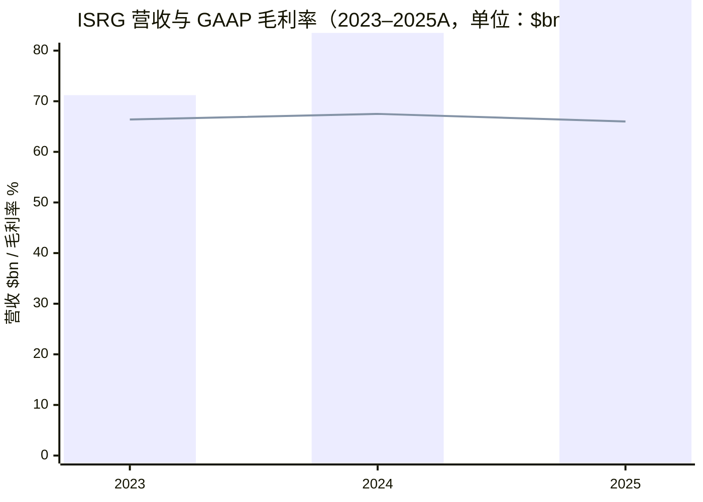
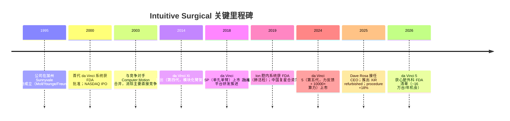
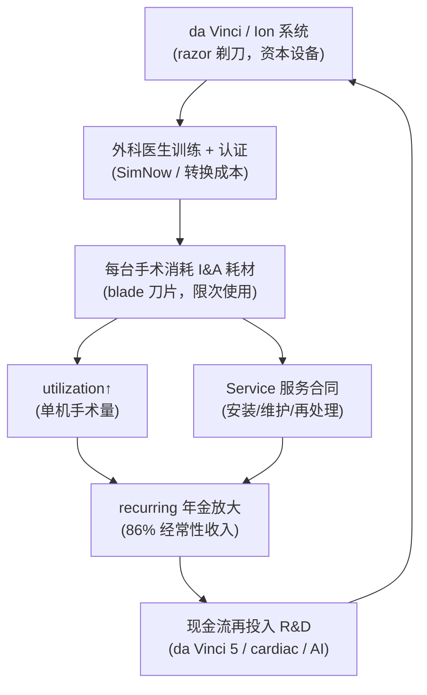
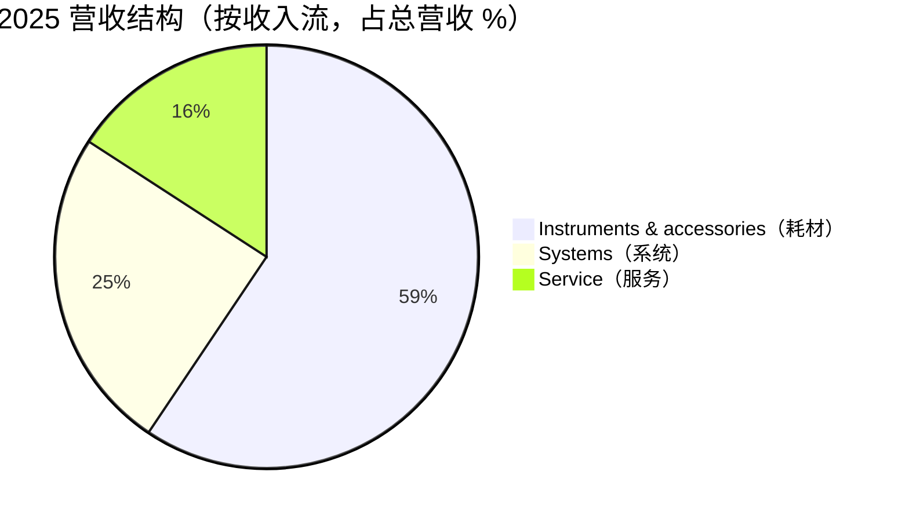
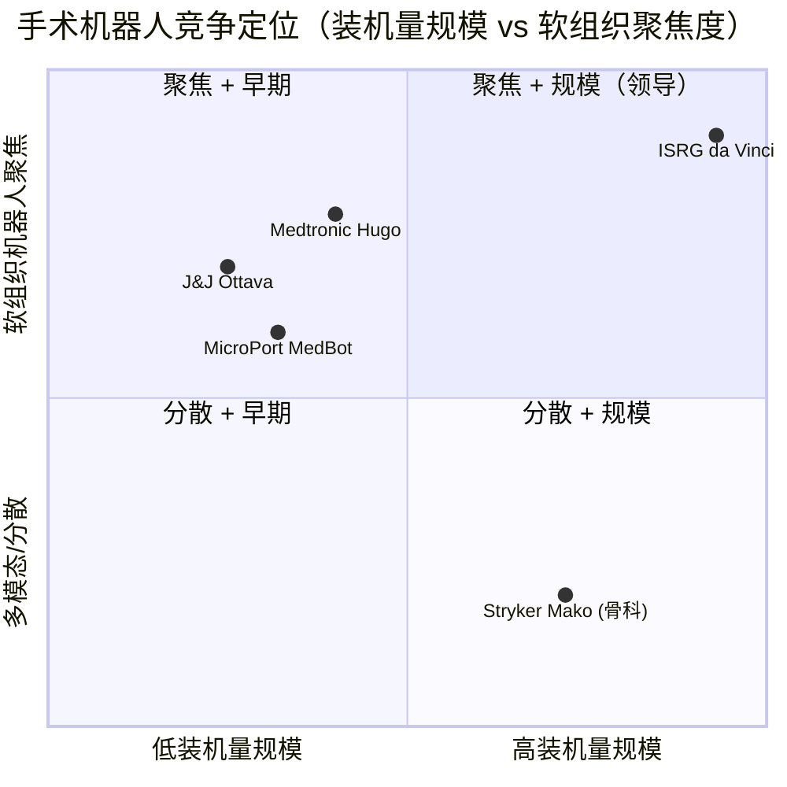
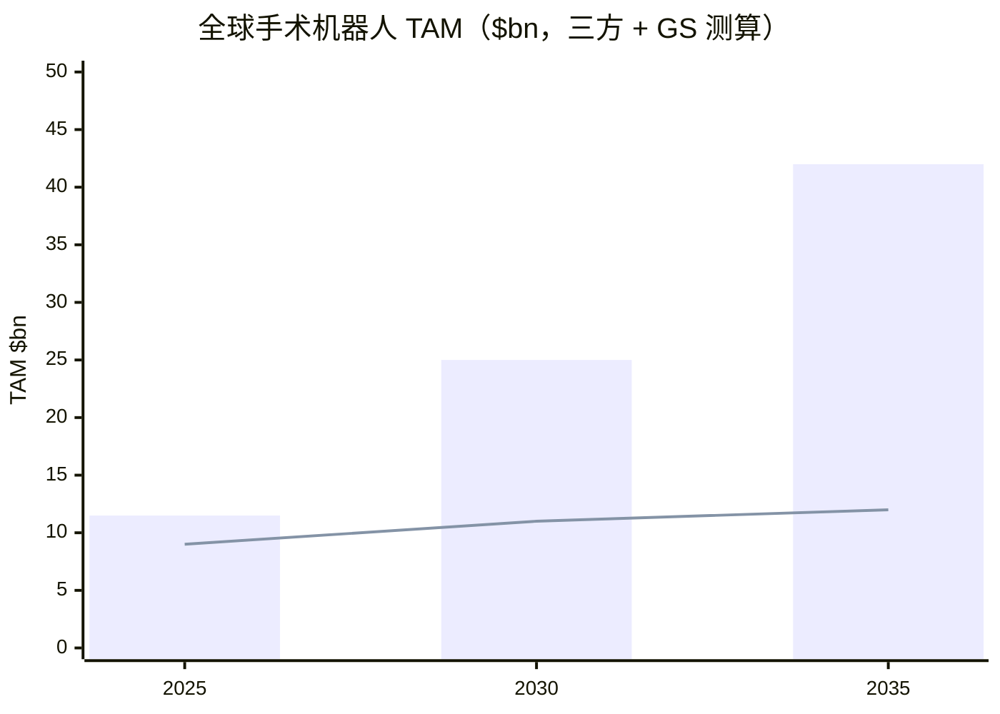

# Intuitive Surgical（直觉外科）公司研究报告

**标的：Intuitive Surgical, Inc.（NASDAQ: ISRG）** · **数据截至：2026-06-09** · **行业：医疗设备 / 手术机器人（Medical Devices / Surgical Robotics）**

> *分析师观点：* **评级：Buy（买入）· 12 个月目标价 $560（较 2026-06-09 现价 $424.79 上行 +32%）· 估值方法：FY27E non-GAAP EPS $11.5 × 49× forward P/E**
> 市值 ~$150.5bn · 52 周区间 $402.30–$592.85 · 平均成交额 ~$0.94bn/日 · NASDAQ: ISRG
>
> **核心论点（thesis pillars）**——（1）**razor-and-blade（剃刀+刀片）+ installed base（装机量）模型**：截至 2026Q1 装机 11,395 台 da Vinci + 1,041 台 Ion，recurring revenue（经常性收入）占比 **86%**，这条年金式现金流（而非资本设备销售）才是护城河；（2）**utilization（单机手术量）飞轮重新加速**——2025 全年 procedures-per-system 同比 +3%，4Q25 加速到 +4%，是 I&A（instruments & accessories，耗材与配件）杠杆的最直接来源；（3）**五条并行的产品周期**（da Vinci 5、AI/digital、Ion、XiR refurbished、SP）叠加 **cardiac（心脏外科）~16 万台/年的新增 procedure 机会**，把 procedure pool（手术池）从 ~9M 推向 ~23M 的长期 TAM；（4）**估值已相对自身历史大幅 de-rate**——ISRG YTD −24.4%、forward P/E 从 ~56× 5 年均值压缩到 ~36×，恰逢竞争（Medtronic Hugo、J&J Ottava）首次出现，是"质量不变、估值变便宜"的非对称入场点。

> **Update — FY2026 全年指引（2026-04-21 Q1 业绩）：** 公司将 FY2026 *non-GAAP gross margin（非 GAAP 毛利率）* 指引收窄并小幅上调至 **67.5%–68.5%**（1 月给出的初始区间为 67%–68%），同时把内含的 tariff（关税）影响假设从 ~1.2% 营收下调到 **~1.0% 营收**；维持全年 worldwide da Vinci procedure growth **13.5%–15.5%** 的指引。驱动因素为关税冲击好于预期 + 成本效率提升。来源：[ISRG Q1-2026 earnings release, 2026-04-21](https://www.sec.gov/Archives/edgar/data/0001035267/000103526726000029/q126ex-991earningsrelease.htm)。

---

## 目录

1. 公司概览（含投资论点）
1A. 估值与目标价（forward 模型 · PT 推导 · bull/base/bear）
2. 公司历史
3. 管理团队
4. 产品与服务（**最重要章节**）
5. 客户与上市策略
6. 行业概览
7. 竞争格局
8. 市场机会（TAM）
9. 风险评估
9.5. 核心分歧与催化剂
10. 投资风格透视（investor-lens scorecards）
数据来源清单 · 参考资料

---

## 1. 公司概览

*分析师观点：* 我们对 Intuitive Surgical 给予 **Buy 评级、12 个月目标价 $560**（较 2026-06-09 现价 $424.79 上行 +32%）。**为什么是现在（why now）**：ISRG 年初至今下跌 24.4%、过去 12 个月下跌 19.3%，而同期 S&P 500 上涨 22.3%——相对大盘跑输约 41 个百分点，相对美国医疗器械板块 ETF（IHI，−16.7%）也略弱，forward P/E 从过去 5 年 ~56× 的均值压缩到约 36×；与此同时基本面没有恶化——2025 全年营收 +21%、procedure +18%、utilization 重新加速到 +4%（4Q25），2026Q1 营收再 +23%（[ISRG FY2025 10-K, MD&A](https://www.sec.gov/Archives/edgar/data/0001035267/000103526726000010/isrg-20251231.htm)；[ISRG Q1-2026 earnings release](https://www.sec.gov/Archives/edgar/data/0001035267/000103526726000029/q126ex-991earningsrelease.htm)）。这正是"质量不变、估值变便宜"的非对称机会。论点四支柱：（1）installed base × utilization × recurring attach 的 razor-and-blade 年金；（2）utilization 飞轮重新加速；（3）五条产品周期 + cardiac/ASC 的需求拐点；（4）首次出现可信多孔竞争对手（Medtronic Hugo、J&J Ottava）只攻击系统层，而护城河在 recurring 层。

**公司做什么。** Intuitive Surgical 是全球软组织机器人手术（soft-tissue robotic surgery）的开创者与类目领导者。10-K 对自身的官方定义是：*"a global technology leader in minimally invasive care and the pioneer of robotic-assisted surgery"*（[ISRG FY2025 10-K, Item 1 Business](https://www.sec.gov/Archives/edgar/data/0001035267/000103526726000010/isrg-20251231.htm)）。公司的旗舰平台是 **da Vinci surgical system（达芬奇手术系统）**——一套由外科医生在控制台远程操控的多臂机器人，用于普外科（general surgery）、泌尿外科（urology）、妇科（gynecology）、胸外科（thoracic）等腔镜手术；第二条平台 **Ion endoluminal system（Ion 腔内系统）**则把业务从外科延伸到诊断性的支气管镜肺活检（[ISRG FY2025 10-K, Item 1](https://www.sec.gov/Archives/edgar/data/0001035267/000103526726000010/isrg-20251231.htm)）。

**怎么赚钱（business model）。** 这是一个典型的 razor-and-blade（剃刀+刀片）模型：公司先以销售或租赁方式放置系统（razor，剃刀），再通过每台手术消耗的 instruments & accessories（耗材与配件，blade，刀片）以及服务合同赚取经常性收入。10-K 原文：*"We also earn recurring revenue from the sales of instruments, accessories, and services"*，而 Ion 采用*"a business model consistent with the da Vinci surgical system model"*（[ISRG FY2025 10-K, Item 1](https://www.sec.gov/Archives/edgar/data/0001035267/000103526726000010/isrg-20251231.htm)）。2025 全年三条收入流：**Instruments & accessories（I&A）$6.02bn（+19%）、Systems $2.47bn（+26%）、Service $1.57bn（+20%）**，合计总营收 **$10,064.7M（+21%）**（[ISRG FY2025 10-K, MD&A](https://www.sec.gov/Archives/edgar/data/0001035267/000103526726000010/isrg-20251231.htm)）。其中 I&A + Service 占营收 75.4%；若按 ISRG 自身口径——recurring revenue 还包含 systems 中的租赁/按使用付费部分——则 **2026Q1 recurring revenue 占总营收 86%、同比 +23% 至 ~$2.4bn**（[ISRG Q1-2026 earnings release](https://www.sec.gov/Archives/edgar/data/0001035267/000103526726000029/q126ex-991earningsrelease.htm)）。

**在哪经营（geographic）。** 2025/2024/2023 年美国本土营收分别占总营收 **68%/67%/66%**，OUS（outside-U.S.，美国以外）市场占 **32%/33%/34%**（[ISRG FY2025 10-K, Item 1](https://www.sec.gov/Archives/edgar/data/0001035267/000103526726000010/isrg-20251231.htm)）。公司采用直销为主、部分市场经销的混合模式；2026 年 3 月完成收购意大利 ab medica、西班牙 Abex、Excelencia Robótica 的 da Vinci/Ion 经销业务，在意大利、西班牙、葡萄牙、马耳他、圣马力诺等地转为直营（[ISRG 8-K Exhibit 99.1, 2026-03-02](https://www.sec.gov/Archives/edgar/data/0001035267/000103526726000012/q126ex-991acquisitionpress.htm)）。中国市场通过与复星医药（Fosun Pharma）的合资公司运营，ISRG 持股 60%、复星 40%，并已在中国本地化生产 da Vinci Xi（[ISRG FY2025 10-K, MD&A — Joint Venture](https://www.sec.gov/Archives/edgar/data/0001035267/000103526726000010/isrg-20251231.htm)）。

**规模有多大（scale）。** 截至 2025-12-31，da Vinci surgical system 全球装机量 **~11,106 台（+12% YoY，2024 年为 ~9,902 台）**，Ion 系统装机 **~995 台（+24%，2024 年 ~805 台）**；2025 全年放置 **1,721 台 da Vinci（+13%）**，执行 **~3,153,000 例 da Vinci procedures（约 +18%）**，单机手术量（utilization）同比 +3%（[ISRG FY2025 10-K, MD&A](https://www.sec.gov/Archives/edgar/data/0001035267/000103526726000010/isrg-20251231.htm)）。2026Q1 进一步把装机推到 **11,395 台 da Vinci + 1,041 台 Ion**，季度放置 431 台 da Vinci（其中 232 台为 da Vinci 5），WW procedures +17%（da Vinci +16%、Ion +39%）（[ISRG Q1-2026 earnings release](https://www.sec.gov/Archives/edgar/data/0001035267/000103526726000029/q126ex-991earningsrelease.htm)）。


*结论：营收三年从 $7.12bn 增至 $10.06bn（CAGR ~19%），GAAP 毛利率 2025 年小幅回落至 66.0%——回落主因关税、新工厂折旧与 da Vinci 5 早期产品成本，而非定价能力受损。营收为 $bn、毛利率为 %（同轴并列展示）。来源：[ISRG FY2025 10-K, Income Statement](https://www.sec.gov/Archives/edgar/data/0001035267/000103526726000010/isrg-20251231.htm)。*

**估值快照（valuation snapshot，2026-06-09）。** 现价 $424.79，市值 ~$150.5bn，**TTM P/E ~51.5×、forward P/E ~36.0×、TTM P/S ~14.2×**（[Yahoo Finance — ISRG key statistics](https://finance.yahoo.com/quote/ISRG/key-statistics/)）。TTM P/E 51.5× 仍 >2× 行业中位（同业 forward P/E：Medtronic ~12.8×、Stryker ~18.8×、J&J ~18.6×），但需放在两个背景里读：（1）ISRG 是高成长、高 recurring、近乎垄断软组织机器人的稀缺标的，市场长期给予成长溢价；（2）该倍数已较自身历史显著压缩——*分析师观点：* Bernstein 的封面 forward 估值矩阵显示 Adj P/E 由 F25A 58.9× → F26E 52.0× → F27E 44.9×，即倍数随盈利成长而自然收敛（[Bernstein — ISRG 4Q25, 2026-01-23, p.1](http://xs-macbook-air.local:5001/zsxq/pdf-viewer/585525425551554)）。因此今天 ~36× 的 forward P/E 是 ISRG 五年来罕见的"低于自身历史"水平，溢价的成因是结构性成长稀缺性，而非短期盈利塌陷或并购炒作。

**相对表现（relative performance，截至 2026-06-09，yfinance）。**

| 窗口 | ISRG 绝对 | S&P 500 | 相对 S&P 500 | IHI（器械 ETF） | 相对 IHI |
|---|---|---|---|---|---|
| 1M | −5.6% | −0.7% | −4.9 pts | +3.8% | −9.4 pts |
| 6M | −23.9% | +7.4% | −31.3 pts | −17.5% | −6.4 pts |
| YTD | −24.4% | +7.1% | −31.5 pts | −17.7% | −6.7 pts |
| 12M | −19.3% | +22.3% | −41.6 pts | −16.7% | −2.6 pts |

*结论：ISRG 过去一年既跑输大盘（−41.6 pts）也略跑输器械板块（−2.6 pts），是一次"板块 + 个股双重 de-rate"——而基本面（procedure +18%、utilization 重新加速）没有同步恶化，这正是估值与质量背离的核心读点。来源：[yfinance ISRG/^GSPC/IHI 收盘价](https://finance.yahoo.com/quote/ISRG/)；参考点见 [Bernstein — ISRG 4Q25, 2026-01-23, p.1](http://xs-macbook-air.local:5001/zsxq/pdf-viewer/585525425551554)（其截至 2026-01-23 的 12M 绝对 −13.9% vs SPX +13.6% → 相对 −27.5%，本表已刷新至最新）。*

---

## 1A. 估值与目标价

> 本章为前瞻、决策级分析，与 Section 1 的 TTM 快照（后视）不同。**本章所有 projected（预测）数字、目标价与情景目标价均为分析师自身的 forward view，标注 `*分析师观点：*`，绝不附 filing 引用**；各驱动因子的外部依据（filing 分部数据 + 管理层指引 + 行业/sell-side 预测）在段内引用。

### (a) Forward 财务预测表（分部建模）

*分析师观点：* 我们按三条收入流分别建模再汇总——I&A 随 procedure pool（procedure × I&A/procedure）增长、Systems 随放置量 × ASP（da Vinci 5/XiR mix）增长、Service 随装机量增长。procedure 增速锚定公司 FY26 指引 13.5%–15.5%（中点 ~14.5%）并外推；毛利率锚定公司 FY26 指引 67.5%–68.5%（non-GAAP）。预测的外部依据：[ISRG FY2025 10-K 分部数据](https://www.sec.gov/Archives/edgar/data/0001035267/000103526726000010/isrg-20251231.htm) + [ISRG Q1-2026 指引](https://www.sec.gov/Archives/edgar/data/0001035267/000103526726000029/q126ex-991earningsrelease.htm) + sell-side 一致预期（[Bernstein](http://xs-macbook-air.local:5001/zsxq/pdf-viewer/585525425551554)/[UBS](http://xs-macbook-air.local:5001/zsxq/pdf-viewer/585581521118154)/[BofA](http://xs-macbook-air.local:5001/zsxq/pdf-viewer/184482814241482)）。

| 指标（*分析师观点：*） | FY24A | FY25A | FY26E | FY27E | FY28E | CAGR(25–28) |
|---|---|---|---|---|---|---|
| Revenue（$mn） | 8,352 | 10,065 | 11,600 | 13,400 | 15,300 | +15% |
| — Instruments & accessories | 5,080 | 6,022 | 7,000 | 8,150 | 9,400 | +16% |
| — Systems | 1,965 | 2,470 | 2,750 | 3,100 | 3,450 | +12% |
| — Service | 1,307 | 1,572 | 1,850 | 2,150 | 2,450 | +16% |
| — 营收 YoY % | — | +21% | +15% | +16% | +14% | — |
| GAAP gross margin % | 67.5% | 66.0% | 67% | 67.5% | 68% | — |
| Non-GAAP gross margin %（公司口径） | ~69% | ~68% | ~68% | ~68% | ~68% | — |
| Adj. operating margin %（Bernstein 口径） | — | 37.4% | 37.3% | 38.0% | ~38.5% | — |
| Non-GAAP Adj. EPS（$） | 7.34 | 8.93 | 10.2 | 11.5 | 12.9 | +13% |
| GAAP diluted EPS（$） | 6.42 | 7.87 | ~8.6 | ~9.7 | ~10.9 | — |
| ROIC %（Bernstein） | — | 16.0% | 15.3% | 14.6% | ~14.5% | — |

*FY24A/FY25A 列为 filing 实际（[10-K](https://www.sec.gov/Archives/edgar/data/0001035267/000103526726000010/isrg-20251231.htm)）；FY26E–FY28E 列与 Adj. operating margin/ROIC 行为分析师 forward view，外部锚定见上。注：分部预测之和与汇总营收因四舍五入及"systems 中租赁折算"略有出入。* Bernstein 自己的模型给出 Revenues CAGR 15.5%（F25–F27）、Operating Earnings CAGR 16.6%、Net Earnings CAGR 14.6%（[Bernstein — ISRG 4Q25, p.1](http://xs-macbook-air.local:5001/zsxq/pdf-viewer/585525425551554)）——与我们 +13–16% 的口径一致。

**季度节奏（quarterly cadence，看拐点而非年度端点）。** *分析师观点：* da Vinci procedure 增速 2025 四个季度为 16.7% → 17.2% → 19.0% → 17.1%（3Q25 被管理层提示为异常强、勿外推），2026Q1 录得 +16%（[Bernstein — ISRG 4Q25, p.5–6](http://xs-macbook-air.local:5001/zsxq/pdf-viewer/585525425551554)；[ISRG Q1-2026 release](https://www.sec.gov/Archives/edgar/data/0001035267/000103526726000029/q126ex-991earningsrelease.htm)）。UBS 的季度 EPS 路径：Q1 实际 $2.50、Q2E $2.48、Q3E $2.56、Q4E $2.82，全年 FY26E $10.37（[UBS — ISRG, 2026-04-23, p.1](http://xs-macbook-air.local:5001/zsxq/pdf-viewer/585581521118154)）。系统放置的季度性很强（Q4 通常为旺季——4Q25 放置 532 台 vs Q1-26 431 台），而 I&A 因 utilization 更平滑，这正是 recurring 模型熨平周期性的体现。

**Margin bridge（毛利率桥，bps 拆解）。** *分析师观点：* 4Q25 adj gross margin 67.8%、同比下滑（4Q24 为 69.5%），Bernstein/公司给出的逐项拆解为——**tariffs −95bps · da Vinci 5/Ion 低毛利产品 mix 上升 · 新工厂折旧（facility depreciation）· da Vinci 5 相关更高服务成本，部分被 product cost reductions 与采购零部件节省抵消**（[Bernstein — ISRG 4Q25, p.2](http://xs-macbook-air.local:5001/zsxq/pdf-viewer/585525425551554)；[ISRG FY2025 10-K, MD&A](https://www.sec.gov/Archives/edgar/data/0001035267/000103526726000010/isrg-20251231.htm)）。展望 FY26：管理层口径"净额基本持平（flattish）"——内含 **120bps 关税（vs FY25 的 65bps，增量 ~50bps）**、更高 da Vinci 5 mix（尚未达目标产品成本）、设备折旧开始被规模摊薄、更高 trade-in，被持续的成本下降努力抵消（[Bernstein 引述管理层 Q&A, p.2](http://xs-macbook-air.local:5001/zsxq/pdf-viewer/585525425551554)）。这就是为什么 FY26 毛利率指引"几乎持平"——不是分析,而是逐项可追溯的 bps 桥。FY25 全年 tariffs 已使 cost of revenue 增加约 **$63.0M**，公司预计 2026 年关税成本继续上升（[ISRG FY2025 10-K, MD&A](https://www.sec.gov/Archives/edgar/data/0001035267/000103526726000010/isrg-20251231.htm)）。

### (b) 目标价推导（show the arithmetic）

*分析师观点：* 我们采用 **forward-PE × target multiple** 法：**FY27E non-GAAP Adj. EPS $11.5 × 49× forward P/E = ~$560**。倍数的依据与对标——ISRG 过去 5 年 forward P/E 均值 ~56×，当前已压到 ~36×；我们取 49× 作为"部分回补、但不回到历史峰值"的中性假设，介于 UBS 的 48×（Neutral，更谨慎）与 Bernstein 的 64×（Outperform，最乐观）之间（[UBS — ISRG, p.1](http://xs-macbook-air.local:5001/zsxq/pdf-viewer/585581521118154)；[Bernstein — ISRG 4Q25, p.1](http://xs-macbook-air.local:5001/zsxq/pdf-viewer/585525425551554)）。倍数对标 3–5 个 named comps：ISRG 49× 显著高于 Medtronic ~12.8×、Stryker ~18.8×、J&J ~18.6×，但这一溢价由其更高的 EPS CAGR（~13% vs MDT 个位数）、近 86% recurring 收入与近乎垄断的软组织机器人份额支撑（[Yahoo Finance comps](https://finance.yahoo.com/quote/ISRG/key-statistics/)）。

**PT 拆解（estimate-change vs multiple-change）。** *分析师观点：* 我们 $560 与 Bernstein $750、街道一致 ~$640 的差异主要来自 **倍数选择**（我们 49× vs Bernstein 64×），而非盈利预测分歧（FY27E EPS：我们 $11.5 vs Bernstein $11.72 vs BofA $11.14，区间窄）。Bernstein 把自己 PT 从 $740 上调到 $750，其增量 **100% 来自 EPS 上修**（FY27E $11.61→$11.72），倍数 64× 不变——即其上调是"盈利驱动、非重估驱动"（[Bernstein — ISRG 4Q25, p.1](http://xs-macbook-air.local:5001/zsxq/pdf-viewer/585525425551554)）。

### (c) Bull / Base / Bear 情景

| 情景（*分析师观点：*） | 关键摆动假设 | EPS / 倍数 | PT | 较 $424.79 |
|---|---|---|---|---|
| **Bull** | procedure 增速维持 15%+、cardiac/ASC 加速放量、utilization +5%，倍数回到 ~58× | FY27E EPS $11.8 × 58× | **$685** | **+61%** |
| **Base** | procedure 14% 中点、毛利率 ~68%、倍数部分回补到 49× | FY27E EPS $11.5 × 49× | **$560** | **+32%** |
| **Bear** | OUS 资本压力（日本/欧洲）+ 中国竞争压价拖累 procedure 至 ~11%、Hugo/Ottava 抢占系统层、倍数 de-rate 至 ~38× | FY27E EPS $10.5 × 38× | **$400** | **−6%** |

*三种情景均为分析师 forward view。* Bull 对标 Bernstein 64× × $11.72 = $750 的更激进版本；Bear 对标 UBS 谨慎框架（Neutral、48× 但更低盈利）。风险回报偏正向：base +32%、bear 仅 −6%，下行被 recurring 年金与近乎垄断份额所缓冲。

### (d) Guide vs Consensus vs Own（Bernstein Exhibit-1 格式）

| 指标（FY26E） | 公司指引 | 街道一致 | 本报告（*分析师观点：*） |
|---|---|---|---|
| WW da Vinci procedure 增速 | 13.5%–15.5% | ~15.2% | ~14.5% |
| Non-GAAP gross margin | 67.5%–68.5% | 67.2% | ~68% |
| Opex 增速 YoY | 11%–15%（non-GAAP） | ~14.1% | ~13.5% |
| Non-GAAP Adj. EPS | —（不指引 EPS） | $10.02 | $10.2 |

*公司指引列引自 [ISRG Q1-2026 release](https://www.sec.gov/Archives/edgar/data/0001035267/000103526726000029/q126ex-991earningsrelease.htm)（procedure 13.5%–15.5%、GM 67.5%–68.5%）与 [Bernstein Exhibit 1](http://xs-macbook-air.local:5001/zsxq/pdf-viewer/585525425551554)（1 月初始指引 procedure 13%–15%、GM 67%–68%、opex 11%–15%）；一致预期列为 *分析师观点：*，源自 [Bernstein p.1–2](http://xs-macbook-air.local:5001/zsxq/pdf-viewer/585525425551554)（consensus GM 67.2%、opex 14.1%、EPS $10.02）；本报告列为分析师自身 forward view。* 注：管理层提示 4Q25 一次性向 Intuitive Foundation 捐赠 $70mn（约影响 Q4 EPS 15 美分），且 4Q26 不再捐赠，解读 opex 增速时需剔除该基数（[Bernstein — ISRG 4Q25, p.2–3](http://xs-macbook-air.local:5001/zsxq/pdf-viewer/585525425551554)）。

**一致预期基准（consensus benchmark）。** *分析师观点：* 我们 FY26E EPS $10.2 略高于街道 ~$10.02（+2%）、FY27E $11.5 与 Bernstein $11.72 / BofA $11.14 居中；FY26 GM ~68% 高于一致的 67.2%——与公司指引中点一致，即我们认同管理层"关税冲击好于预期"的上修（[BofA — ISRG, 2026-04-20, p.1](http://xs-macbook-air.local:5001/zsxq/pdf-viewer/184482814241482)：consensus EPS FY26 $10.05 / FY27 $11.40 / FY28 $13.08）。

### (e) 摆动变量（swing variables）

*分析师观点：* 这个 call 主要取决于两件事：（1）**utilization（单机手术量）的可持续性**——recurring 模型的杠杆完全来自 procedures/system，2024–1H25 曾放缓、4Q25 重新加速到 +4%，能否守住是 I&A 增长的命门（[UBS — ISRG, p.1](http://xs-macbook-air.local:5001/zsxq/pdf-viewer/585581521118154)）；（2）**估值倍数回补的速度**——基本面已企稳，但 36× → 49× 的重估需要市场重新认可成长稀缺性，这受宏观利率与板块资金流影响。读者应重点 pressure-test 这两项。

---

## 2. 公司历史

Intuitive Surgical 于 **1995 年 12 月 8 日** 在加州 Sunnyvale 注册成立，创始人为外科医生 **Frederic Moll**、工程师 **Robert Younge** 与 **John Freund**。三人把斯坦福研究院（SRI International）军方资助的远程手术（telesurgery）技术商业化，目标是突破传统腹腔镜手术的局限（[Frederic Moll — Wikipedia](https://en.wikipedia.org/wiki/Frederic_Moll)；[Intuitive Surgical — Wikipedia](https://en.wikipedia.org/wiki/Intuitive_Surgical)）。首代 da Vinci 系统于 2000 年获 FDA 批准，开创了机器人辅助软组织外科这一全新类目（[Intuitive Surgical — Wikipedia](https://en.wikipedia.org/wiki/Intuitive_Surgical)）。


*结论：30 年里 ISRG 完成了"开创类目 → 消除竞争（2003 合并 Computer Motion）→ 平台代际迭代（Si→Xi→da Vinci 5）→ 拓展邻接（SP 单孔、Ion 腔内、cardiac 心脏）"的四步走；当前正处第三、第四步叠加期。来源：[Intuitive Surgical — Wikipedia](https://en.wikipedia.org/wiki/Intuitive_Surgical)；[ISRG FY2025 10-K, Item 1](https://www.sec.gov/Archives/edgar/data/0001035267/000103526726000010/isrg-20251231.htm)。*

**战略转折点。** 第一次是 **2003 年与 Computer Motion 合并**——这桩交易一举消除了 da Vinci 早期最主要的直接竞争对手（ZEUS 系统），奠定了此后近 20 年软组织机器人近乎垄断的格局（[Intuitive Surgical — Wikipedia](https://en.wikipedia.org/wiki/Intuitive_Surgical)）。第二次是从"卖系统"转向"经营装机量年金"——随着装机量与 procedure 累积，recurring（I&A + service + 租赁）逐渐压过资本设备销售，使收入更平滑、抗周期，这一结构在 2026Q1 体现为 recurring 占比 86%（[ISRG Q1-2026 earnings release](https://www.sec.gov/Archives/edgar/data/0001035267/000103526726000029/q126ex-991earningsrelease.htm)）。第三次是 **2025 年 Dave Rosa 接任 CEO、Gary Guthart 转任 Executive Chair**，标志着创始一代（Guthart 自 2010 年起任 CEO）向新一代过渡（[ISRG DEF 14A 2026, 2026-03-13](https://www.sec.gov/Archives/edgar/data/0001035267/000103526726000023/isrg-20260313.htm)）。

**近期发展（last 1–2 yr）。** da Vinci 5（第五代）于 2024 年上市并快速放量——2026Q1 占美国系统出货近 90%；2025 年开始提供 refurbished Xi（XiR）以渗透价格敏感市场；2026 年 1 月 da Vinci 5 获心脏外科 FDA 清单；2026 年 3 月完成欧洲经销商收购转直营（[ISRG 8-K, 2026-03-02](https://www.sec.gov/Archives/edgar/data/0001035267/000103526726000012/q126ex-991acquisitionpress.htm)；[Da Vinci 5 Cleared for Cardiac Procedures, 2026-01-26](https://www.globenewswire.com/news-release/2026/01/26/3225716/7637/en/Da-Vinci-5-Cleared-for-Cardiac-Procedures.html)）。

---

## 3. 管理团队

**创始人 Frederic Moll（已退出运营）。** Moll 是外科医生兼连续创业者，被广泛视为机器人手术之父。1995 年他离开 Guidant，与 John Freund、Robert Younge 共同创立 Intuitive Surgical，提供临床愿景与创业驱动力；Younge 带来 SRI International 的工程能力，Freund 兼具医疗与工程背景（[Frederic Moll — Wikipedia](https://en.wikipedia.org/wiki/Frederic_Moll)）。Moll 此后又创办了 Hansen Medical（血管/心脏导管机器人）与 Auris Health（支气管镜机器人 MONARCH，2019 年被 Johnson & Johnson 以约 34 亿美元收购）——颇具讽刺意味的是，他亲手缔造的 Auris/MONARCH 如今成为 J&J 与 ISRG 在腔内/支气管镜领域竞争的资产（[Frederic Moll — Wikipedia](https://en.wikipedia.org/wiki/Frederic_Moll)）。Moll 早已不参与 ISRG 日常运营，亦非现任董事，持股已大幅减持，主要遗产是把 da Vinci 这一类目从零做到今天 ~$150bn 市值的体量（[Intuitive Surgical — Wikipedia](https://en.wikipedia.org/wiki/Intuitive_Surgical)）。

**现任 CEO David J. Rosa（自 2025 年）。** Rosa 现年 58 岁，机械工程师出身，持有加州州立理工大学（San Luis Obispo）机械工程 B.S. 与斯坦福大学机械工程 M.S.，本人持有多项专利，曾直接参与经食道超声换能器等手术技术开发（[ISRG DEF 14A 2026, Director bio](https://www.sec.gov/Archives/edgar/data/0001035267/000103526726000023/isrg-20260313.htm)）。他在 ISRG 是不折不扣的内部晋升：2011 年起担任 SVP（新兴手术与技术 / 科学事务），后历任 EVP 兼首席科学官（2014–2015）、首席商务官（2015–2019）、首席业务官（2019–2022）、首席战略与增长官（2022–2023）、总裁（2023–2025），2025 年升任 CEO，可谓走遍科研、商务、战略各条线（[ISRG DEF 14A 2026, Career Highlights](https://www.sec.gov/Archives/edgar/data/0001035267/000103526726000023/isrg-20260313.htm)）。加入 ISRG 前，他在 Acuson Corporation（诊断超声）任机械设计工程师（1989–1996）。Rosa 自 2024 年起进入董事会。继任由前 CEO Gary Guthart（现 Executive Chair）领导、经"严谨且稳健的接班流程"完成，两位高管同时在董事会任职，合计逾 50 年领导经验（[ISRG DEF 14A 2026, Board overview](https://www.sec.gov/Archives/edgar/data/0001035267/000103526726000023/isrg-20260313.htm)）。这种"自己人接班 + 创始 CEO 转任 Chair 护航"的安排，把关键人风险降到较低水平，但 Rosa 任 CEO 不足一年、独立 track record 尚短，是治理层面唯一可观察的不确定性。

---

## 4. 产品与服务

> **优先级提示：** 本节是整篇报告分量最重的章节——它是 Section 5–9 的分析地基。读者只有先理解 ISRG 到底造什么、它在外科医生工作流里处于什么位置，才能评估客户为什么买、市场有多大、谁在竞争、哪条产品线风险最高。

### 4.1 产品矩阵（issuer's own framing）

ISRG 的 10-K 没有半导体式的"市场×工艺×技术×产品"四列矩阵，而是按 **平台 → 代际 → 耗材/服务生态** 组织。下表按 10-K Item 1 的官方表述重构（标为分析师重构 / analyst-constructed，源文逐条引自 10-K）：

| 平台 / 类别 | 代际 / 型号 | 物理作用 | 2025 装机 / 状态 |
|---|---|---|---|
| **da Vinci surgical system** | 第五代 da Vinci 5；第四代 da Vinci X / Xi / SP；第三代 Si | 多臂腔镜手术机器人（普外/泌尿/妇科/胸外） | 全球 ~11,106 台；da Vinci 5 装机 1,231 台、SP 装机 377 台 |
| **Ion endoluminal system** | Ion | 柔性导管支气管镜，肺外周活检（诊断/腔内） | ~995 台（+24%）；2025 放置 195 台（−28%） |
| **Instruments & accessories（I&A）** | 缝合（stapling）、能量（energy）、核心器械 | 每台手术消耗的"刀片"，限次使用后报废更换 | 2025 营收 $6.02bn（占总营收 60%） |
| **Digital / 软件生态** | My Intuitive、SimNow、Case Insights、Intuitive Hub | App、VR 模拟训练、AI 计算观察、边缘计算 | 与 da Vinci 5 深度集成 |
| **Service** | 系统服务合同 | 安装、维护、训练、再处理 | 2025 营收 $1.57bn（+20%） |
| **XiR（refurbished Xi）** | 翻新 Xi 系统 | 低价版资本设备，渗透 ASC / 价格敏感市场 | 2025 放置 42 台（含 4Q25 23 台） |

*来源：[ISRG FY2025 10-K, Item 1 Business + MD&A](https://www.sec.gov/Archives/edgar/data/0001035267/000103526726000010/isrg-20251231.htm)；da Vinci 5 / SP 装机数与 XiR 放置数引自 [10-K MD&A](https://www.sec.gov/Archives/edgar/data/0001035267/000103526726000010/isrg-20251231.htm) 与 [Bernstein — ISRG 4Q25, p.6](http://xs-macbook-air.local:5001/zsxq/pdf-viewer/585525425551554)。表格按 10-K 表述重构（analyst-constructed），各行原文见下。*

### 4.2 综述——产品如何组成一个客户工作流

ISRG 的产品不是孤立 SKU，而是一个自我强化的循环：**医院买入/租入 da Vinci 或 Ion 系统（razor）→ 外科医生在 ISRG 的训练体系里取得认证（switching cost，转换成本）→ 每台手术消耗 I&A 耗材（blade）并产生 service 收入 → 装机量与 procedure 累积 → utilization 提升 → I&A 年金放大 → 现金流再投入 R&D 与下一代平台（da Vinci 5、cardiac、AI）→ 拉动更多放置**。这就是为什么 recurring 占比能到 86%——资本设备只是入口，真正的经济发动机是装机量上滚动的耗材+服务年金（[ISRG Q1-2026 earnings release](https://www.sec.gov/Archives/edgar/data/0001035267/000103526726000029/q126ex-991earningsrelease.htm)）。


*结论：ISRG 的护城河不是单一产品，而是"装机量 + 外科医生训练锁定 + 捕获式耗材年金"构成的闭环——竞争对手即便造出对标系统，也要从零重建装机量与训练生态。来源：[ISRG FY2025 10-K, Item 1](https://www.sec.gov/Archives/edgar/data/0001035267/000103526726000010/isrg-20251231.htm)。*

### 4.3 da Vinci 5（第五代旗舰）

10-K 原文：
> *"Our recently released da Vinci 5 surgical system builds on da Vinci Xi's highly functional design, featuring force feedback technology and instruments that enable surgeons to sense and measure the force exerted on tissue during surgery. … Da Vinci 5 has more than 10,000 times the computing power of da Vinci Xi, allowing for innovative new system capabilities and advanced digital experiences, including integration with our My Intuitive app, SimNow (virtual reality simulator), Case Insights (computational observer), and Intuitive Hub (edge computing system)."*（[ISRG FY2025 10-K, Item 1](https://www.sec.gov/Archives/edgar/data/0001035267/000103526726000010/isrg-20251231.htm)）

**中文释义 / Plain-language gloss：** da Vinci 5 是 ISRG 的第五代旗舰，物理上它做的事和前代一样——外科医生坐在控制台（surgeon console）操控床旁多臂机器人完成腔镜手术，但有两个质变：（1）**force feedback（力反馈 / 力觉）**——首次让医生"感觉"到器械施加在组织上的力，这对缝合张力、心脏外科等精细操作意义重大；（2）**10,000× 算力**——支撑 AI/digital 生态（SimNow VR 训练、Case Insights 计算观察、Intuitive Hub 边缘计算）。与同矩阵的 Xi/X 相比，da Vinci 5 是"力反馈 + 数字大脑"的升级；与 SP 相比，它是多孔多臂、面向最广的腔镜手术池。战略意义：da Vinci 5 是当前最重要的产品周期——2026Q1 占美国系统出货近 90%（260 台 dV5 中近 90% 在美国，4Q25 全球 303 台 dV5 占全球出货 ~57%），它既驱动 trade-in 升级周期，又把 cardiac 等新适应症的清单挂在 dV5 上（[ISRG Q1-2026 release](https://www.sec.gov/Archives/edgar/data/0001035267/000103526726000029/q126ex-991earningsrelease.htm)；[Bernstein — ISRG 4Q25, p.6](http://xs-macbook-air.local:5001/zsxq/pdf-viewer/585525425551554)）。

*分析师观点：* 竞争优势 = **是（强）**，护城河类型为技术 + 装机量规模 + 转换成本。最接近的 named 竞品是 Medtronic 的 Hugo RAS（2025-12 获美国泌尿外科清单）与 J&J 的 Ottava（2026-01 提交 De Novo），但二者装机量与训练生态远落后 da Vinci（[Medtronic Hugo FDA clearance, 2025-12-03](https://news.medtronic.com/2025-12-03-Medtronic-announces-FDA-clearance-of-Hugo-TM-robotic-assisted-surgery-system-for-urologic-surgical-procedures)；[MedTech Dive — J&J Ottava De Novo, 2026-01-07](https://www.medtechdive.com/news/JJ-submits-FDA-de-novo-Ottava-robot-general-surgery/808976/)）。

### 4.4 da Vinci SP（单孔单臂）

10-K 原文：
> *"Our da Vinci single-port ('SP') surgical system is designed for single-incision or natural orifice surgery. A single arm delivers three multi-jointed instruments and a fully articulating 3DHD endoscope for visibility and control in narrow surgical spaces. The instruments and the camera all emerge through a single cannula and are triangulated around the target anatomy to avoid external instrument collisions that can occur in narrow surgical workspaces."*（[ISRG FY2025 10-K, Item 1](https://www.sec.gov/Archives/edgar/data/0001035267/000103526726000010/isrg-20251231.htm)）

**中文释义 / Plain-language gloss：** SP 的物理差异在于：标准 da Vinci 用多个 cannula（套管）从腹壁多个切口进入，SP 则用 **单臂、单一套管（single cannula）** 把三把多关节器械 + 一个全活动 3DHD 内窥镜从同一个切口或自然腔道（natural orifice，如经口、经尿道）送入，再在目标解剖结构周围"三角化"展开以避免器械碰撞。它解决的是狭窄术野（如经口耳鼻喉、经尿道泌尿）的问题，是 da Vinci 5 多孔平台的补充而非替代。截至 2025-12-31，SP 装机 377 台，已获 FDA 批准用于泌尿、结直肠等适应症（[ISRG FY2025 10-K, MD&A](https://www.sec.gov/Archives/edgar/data/0001035267/000103526726000010/isrg-20251231.htm)）。战略意义：SP 是渗透"单孔/自然腔道"细分术池的钥匙，目前体量小但拓展适应症的 optionality（期权价值）可观。

*分析师观点：* 竞争优势 = **是（中等）**，护城河类型为技术 + IP（单孔机器人临床数据领先）。

### 4.5 Ion endoluminal system（腔内/支气管镜）

10-K 原文：
> *"[Ion is] a flexible, robotic-assisted, catheter-based platform that utilizes instruments and accessories for which the first cleared indication is minimally invasive biopsies in the lung. Our Ion system extends our commercial offering beyond surgery into diagnostic, endoluminal procedures. The system features an ultra-thin, ultra-maneuverable catheter that can articulate 180 degrees in all directions. Ion incorporates real-time shape-sensing technology, which allows for navigation into all segments of the lung and provides the procedural stability necessary for precision in a biopsy."*（[ISRG FY2025 10-K, Item 1](https://www.sec.gov/Archives/edgar/data/0001035267/000103526726000010/isrg-20251231.htm)）

**中文释义 / Plain-language gloss：** Ion 把 ISRG 从"外科手术"延伸到"诊断"。它是一根超细、可全向弯曲 180° 的机器人导管，靠 **real-time shape-sensing（实时形状感知）** 技术导航进入肺部最外周的所有分段，从深处难以触及的可疑结节取活检——好比给肺里装了一台能"自己找路且不抖"的微型 GPS 内窥镜，有望让肺癌早诊提前。与 da Vinci（外科切除）相比，Ion 处于诊断/腔内环节，是同一肺癌患者旅程的上游；二者共享 ISRG 的销售与服务生态。Ion 沿用与 da Vinci 一致的 razor-and-blade 模型，系统售价约 **$500,000–$815,000（含一年服务）**，靠耗材与服务产生 recurring（[ISRG FY2025 10-K, Item 1](https://www.sec.gov/Archives/edgar/data/0001035267/000103526726000010/isrg-20251231.htm)）。战略意义：Ion procedure 2026Q1 同比 **+39%**，是增速最快的产品线（[ISRG Q1-2026 release](https://www.sec.gov/Archives/edgar/data/0001035267/000103526726000029/q126ex-991earningsrelease.htm)）。

*分析师观点：* 竞争优势 = **是（中等偏强）**，护城河类型为技术 + shape-sensing IP。最接近的 named 竞品是 J&J 的 MONARCH 支气管镜机器人（[MedTech Dive](https://www.medtechdive.com/news/JJ-submits-FDA-de-novo-Ottava-robot-general-surgery/808976/)）。

### 4.6 Instruments & Accessories（"刀片"，I&A）

10-K 原文：
> *"We offer a comprehensive suite of stapling, energy, and core instrumentation for our da Vinci surgical systems. … Our instruments and accessories have limited lives and will either expire or wear out as they are used in procedures, at which point they need to be replaced."*（[ISRG FY2025 10-K, Item 1](https://www.sec.gov/Archives/edgar/data/0001035267/000103526726000010/isrg-20251231.htm)）

**中文释义 / Plain-language gloss：** 这是整个模型里最关键的"刀片"。每把器械有 **limited lives（限定寿命）**——用够次数就报废，必须更换，这把一次性资本销售转化成随手术量滚动的 recurring 年金。I&A 包含缝合（stapling，机器人订书机）、能量（energy，电外科切割/止血）和核心器械。2025 年 I&A 营收 $6.02bn（+19%），是公司最大收入流（占总营收 60%），且每例手术 I&A 收入 4Q25 约 $1,850（[Bernstein — ISRG 4Q25, p.6](http://xs-macbook-air.local:5001/zsxq/pdf-viewer/585525425551554)）。战略意义：I&A 增长 ≈ procedure 增长 × I&A/procedure（mix）——这是把"装机量"翻译成"现金流"的乘数，也是为什么 procedure 增速哪怕小幅 miss 都会近乎一比一冲击 recurring 池。

*分析师观点：* 竞争优势 = **是（最强）**，护城河类型为生态锁定 + 捕获式耗材（每台 da Vinci 只能用 ISRG 自己的 I&A）。

### 4.7 XiR（refurbished Xi，翻新机）与 Service

XiR 是 ISRG 2025 年新推的"低价剃刀"。Bernstein 引述管理层：随着 da Vinci 5 升级周期启动，旧 Xi 被换回（trade-in），ISRG 翻新后以低于全新 Xi 的价格投放到价格敏感市场——美国 ASC（ambulatory surgery centers，门诊手术中心）和海外。管理层强调 *"XiR system gross margins are already accretive to overall system margins"*，且约 **70% 的 ASC 机会来自现有 IDN 客户旗下、已有 da Vinci 受训外科医生的 ASC**（[Bernstein — ISRG 4Q25, p.4](http://xs-macbook-air.local:5001/zsxq/pdf-viewer/585525425551554)）。2025 全年放置 42 台 XiR、4Q25 单季 23 台。Service 业务则是装机量年金的另一条腿——2025 营收 $1.57bn（+20%），随装机基数与 da Vinci 5 产品 mix 增长（[ISRG FY2025 10-K, MD&A](https://www.sec.gov/Archives/edgar/data/0001035267/000103526726000010/isrg-20251231.htm)）。

**中文释义 / Plain-language gloss：** XiR 巧妙之处在于"用自家旧设备打开下沉市场"——既消化 trade-in 回收的存量，又用低价资本门槛进入 ASC 这一更低成本的护理场所，且毛利率不被拖累。它是把 da Vinci 生态从大型医院延伸到门诊的渗透工具。

*分析师观点：* XiR/ASC 是 ISRG 的下一条增长腿，竞争优势 = **是（中等）**，护城河类型为生态 + 成本结构（捕获式翻新 + 既有受训医生）。

### 4.8 旗舰与产品周期

旗舰franchise 是 **da Vinci 平台 + 其 I&A 耗材**（合计占营收 ~85%）。当前同时推进 Bernstein 所称的"五条 transformational 产品周期"：**da Vinci 5、AI/digital、Ion、XiR、SP**（[Bernstein — ISRG 4Q25, p.1](http://xs-macbook-air.local:5001/zsxq/pdf-viewer/585525425551554)）。过去 12 个月最重要的发布是 **2026-01-26 da Vinci 5 获心脏外科 FDA 清单**——涵盖二尖瓣修复、CABG（冠脉搭桥）相关乳内动脉游离、房缺/卵圆孔未闭封堵、左心耳封堵等，公司将其量化为"在目前已清单地理（美国 + 韩国）约 **16 万台/年**"的 procedure 机会，且随新地理获批而扩张（[Da Vinci 5 Cleared for Cardiac Procedures, 2026-01-26](https://www.globenewswire.com/news-release/2026/01/26/3225716/7637/en/Da-Vinci-5-Cleared-for-Cardiac-Procedures.html)；[Bernstein 引述管理层, p.3–4](http://xs-macbook-air.local:5001/zsxq/pdf-viewer/585525425551554)）。

---

## 5. 客户与上市策略

**客户画像。** ISRG 的客户是医院与 IDN（integrated delivery networks，整合型医疗网络），以及越来越多的 ASC（门诊手术中心）。直接的"购买决策者"是医院的资本采购团队与外科科室，但真正的"需求拉动者"是 **外科医生**——只有经 ISRG 训练并认证的医生才能开展 da Vinci 手术，这把客户黏性从"机构层"下沉到"个人医生层"。10-K 描述其直销组织分为负责卖系统的 capital sales team 与负责支持术中使用的 clinical sales team（[ISRG FY2025 10-K, Item 1](https://www.sec.gov/Archives/edgar/data/0001035267/000103526726000010/isrg-20251231.htm)）。

**客户集中度（customer concentration）。** ISRG 的客户高度分散——10-K 未披露任何单一客户占合并营收 ≥10%（按 ASC 280 应披露门槛），也未列出"前五大客户"。这与 razor-and-blade 模型一致：营收来自数千家医院、上万台装机上滚动的 procedure，没有任何一家医院能左右整体。**因此客户集中度不是本报告的风险项**（区别于上游半导体/A 股制造业那种 top-1 >20% 的格局）。需要说明的是：10-K 未做单一客户百分比披露，这本身就是"客户极度分散"的事实，而非披露缺失（[ISRG FY2025 10-K](https://www.sec.gov/Archives/edgar/data/0001035267/000103526726000010/isrg-20251231.htm)）。

**销售/上市策略。** 美国为直销主导（占营收 68%），OUS 为直销 + 经销混合，并持续把高价值经销市场收归直营——2026 年 3 月收购意大利/西班牙/葡萄牙等地的 da Vinci/Ion 经销业务即是一例，CEO Dave Rosa 称直营能"更敏捷、更整合地服务客户"（[ISRG 8-K, 2026-03-02](https://www.sec.gov/Archives/edgar/data/0001035267/000103526726000012/q126ex-991acquisitionpress.htm)）。中国通过复星合资公司本地化运营与生产 da Vinci Xi（[ISRG FY2025 10-K, MD&A — JV](https://www.sec.gov/Archives/edgar/data/0001035267/000103526726000010/isrg-20251231.htm)）。

**销售周期与资本结构创新。** 资本设备的销售周期长、受医院资本预算波动影响（这是 UBS 维持 Neutral 的核心理由之一——担心医院资本预算约束延迟高价机器人采购，[UBS — ISRG, p.1](http://xs-macbook-air.local:5001/zsxq/pdf-viewer/585581521118154)）。ISRG 用 **租赁 / 按使用付费（usage-based operating lease）** 缓解这一摩擦——把一次性大额资本支出转为按手术量付费，降低医院进入门槛。2025 年系统中按使用付费的可变租赁收入达 $531M（2024 年 $338M），增速快于整体系统收入；4Q25 约 47% 系统以租赁方式放置（[ISRG FY2025 10-K, MD&A](https://www.sec.gov/Archives/edgar/data/0001035267/000103526726000010/isrg-20251231.htm)；[Bernstein — ISRG 4Q25, p.6](http://xs-macbook-air.local:5001/zsxq/pdf-viewer/585525425551554)）。


*结论：耗材（I&A，60%）+ 服务（16%）= 76% 的 recurring 占比（按 I&A+service 口径；按 ISRG 含租赁的 recurring 口径达 86%）——这条年金式现金流而非资本设备销售，才是估值溢价的根基。来源：[ISRG FY2025 10-K, Income Statement](https://www.sec.gov/Archives/edgar/data/0001035267/000103526726000010/isrg-20251231.htm)（注：因四舍五入，三块加和为 101%）。*

---

## 6. 行业概览

**行业定义。** 手术机器人（surgical robots / 手术机器人）指由外科医生远程操控、辅助完成微创手术（minimally invasive surgery, MIS）或诊断的机器人系统，按应用分为软组织/腔镜（soft-tissue/laparoscopic，最大池，ISRG/Hugo/Ottava）、骨科（orthopedic，Stryker Mako/TINAVI）、腔内/支气管镜（endoluminal，ISRG Ion/J&J MONARCH）、血管介入与神经外科等细分（[reports/themes/medical-surgical-robotics_theme.md](../../themes/medical-surgical-robotics_theme.md)）。ISRG 主战场是软组织/腔镜这一最大、机器人渗透率最高的池。

**市场规模与增速。** 全球手术机器人收入池（系统 + 耗材 + 服务）多家三方测算落在 **2024–25 年 ~$11.5–15.9bn**，到 **2030E ~$23–27bn**，再到 **2035E $42–50bn**，对应低双位数 CAGR（[Grand View Research：$11.48bn 2024→$23.13bn 2030](https://www.grandviewresearch.com/industry-analysis/surgical-robot-systems-market-report)；[MarketsandMarkets：$13.69bn 2025→$27.14bn 2030](https://www.marketsandmarkets.com/Market-Reports/surgical-robots-market-256618532.html)；[Precedence Research：$12.49bn 2025→$50.29bn 2035](https://www.precedenceresearch.com/surgical-robotics-market)）。Goldman Sachs 的 sell-side 测算：**全球 TAM ~$42bn by 2035（14% CAGR，从 2025 年 ~$11bn 起），其中约 45%（$19bn）来自 OUS 市场**（*分析师观点：*，[Goldman Sachs — China Medtech Going Global, 2026-04-21, p.7](http://xs-macbook-air.local:5001/zsxq/pdf-viewer/585582881584284)）。

**关键趋势与驱动。** （1）**手术向机器人迁移仍在早期**——UBS 引述管理层"可及 procedure pool ~23M vs 今天 ~9M"，长跑道清晰（*分析师观点：*，[UBS — ISRG, p.1](http://xs-macbook-air.local:5001/zsxq/pdf-viewer/585581521118154)）；（2）**护理场所下沉到 ASC**——支付方为利用 ASC 更低报销而推动 procedure 向门诊迁移，XiR 正卡位这一趋势（[Bernstein — ISRG 4Q25, p.4](http://xs-macbook-air.local:5001/zsxq/pdf-viewer/585525425551554)）；（3）**新适应症扩张**——cardiac（心脏，~16 万台/年新机会）、bariatrics（减重）等持续打开新 procedure 池（[Da Vinci 5 cardiac clearance, 2026-01-26](https://www.globenewswire.com/news-release/2026/01/26/3225716/7637/en/Da-Vinci-5-Cleared-for-Cardiac-Procedures.html)）。

**监管环境。** 手术机器人是 II/III 类医疗器械，受 FDA（美国，510(k) / De Novo / PMA）、欧盟 MDR、各国药监（中国 NMPA、日本 PMDA、韩国 MFDS）严格监管，每个新适应症/新地理都需单独清单——这既是进入壁垒（保护 ISRG），也是新适应症放量的节奏闸门（cardiac 需逐地理获批）。报销（reimbursement）是另一关键变量：日本 2026 年新增 7 类机器人手术报销（总数达 41 类），但 BofA 估算仅约 2.6 万台 procedure，扩张幅度小于历史（[BofA — ISRG, 2026-04-20, p.1](http://xs-macbook-air.local:5001/zsxq/pdf-viewer/184482814241482)）。

**行业动态（供需结构）。** 软组织机器人是高度集中的市场——ISRG 历史上近乎垄断，买方（医院）分散、供方集中，ISRG 议价力强；这一格局正首次被打破：Medtronic Hugo 与 J&J Ottava 进入将增加供给侧竞争，但二者从零重建装机量与训练生态需要数年（[Goldman Sachs — China Medtech Going Global, p.1](http://xs-macbook-air.local:5001/zsxq/pdf-viewer/585582881584284)）。宏观成本侧：2026 年地缘冲突推高内存芯片、原油与运费，Citi/BofA 关注其对 ISRG 等的毛利率冲击；BofA 的内存情景模型测算即便较激进假设下，内存涨价对 ISRG 整体利润率冲击仅约 10bps，不构成实质风险（*分析师观点：*，[Citi — US MedTech 1Q26 Recap, 2026-05-28](http://xs-macbook-air.local:5001/zsxq/pdf-viewer/212485545248851)；[BofA — ISRG, p.1](http://xs-macbook-air.local:5001/zsxq/pdf-viewer/184482814241482)）。

---

## 7. 竞争格局

**直接竞争——多孔软组织机器人。** ISRG 自己的 10-K 在 Competition 部分点名：*"we face greater competition from larger and well-established companies, such as Johnson & Johnson and Medtronic plc"*，并列出"laparoscopy 与替代性 multi-port、single-port 或 endoluminal 系统"的竞争（[ISRG FY2025 10-K, Item 1 — Competition](https://www.sec.gov/Archives/edgar/data/0001035267/000103526726000010/isrg-20251231.htm)）。具体到产品：

- **Medtronic Hugo RAS**——da Vinci 最可信的多孔挑战者。2025-12-03 获美国泌尿外科首个清单（基于 Expand-URO IDE，137 例），海外已在 30+ 国家累计"数万例 procedure"（[Medtronic, 2025-12-03](https://news.medtronic.com/2025-12-03-Medtronic-announces-FDA-clearance-of-Hugo-TM-robotic-assisted-surgery-system-for-urologic-surgical-procedures)；[Urology Times](https://www.urologytimes.com/view/fda-grants-clearance-to-hugo-robotic-assisted-surgery-system-for-urologic-procedures)）。
- **J&J Ottava**——深口袋后来者，2026-01-07 提交 FDA De Novo（基于 Roux-en-Y IDE，覆盖胃旁路/袖状胃、肠切除、食管裂孔疝），其 MONARCH 支气管镜已商业化（[MedTech Dive, 2026-01-07](https://www.medtechdive.com/news/JJ-submits-FDA-de-novo-Ottava-robot-general-surgery/808976/)）。
- **中国 OEM（OUS 市场的价值型挑战者）**——*分析师观点：* Goldman Sachs 指出 MicroPort MedBot（微创机器人，2252.HK）、EdgeMed（精锋，2675.HK）等中国玩家近期难直接挑战 ISRG 的美国领导地位，但会以"价值导向的全球挑战者"身份切入 OUS 低渗透、价格敏感市场，预计 MedBot/EdgeMed 到 2035E 各占全球 TAM 约 5.4%/4.1%（[Goldman Sachs — China Medtech Going Global, p.1](http://xs-macbook-air.local:5001/zsxq/pdf-viewer/585582881584284)）。

**间接竞争——骨科与其他模态。** 骨科机器人（Stryker Mako、Zimmer ROSA、TINAVI 天智航）与 ISRG 不直接竞争同一术种，但同属"手术机器人"主题，Stryker Mako 装机 >3,000 台、累计 >150 万例、覆盖 ~2/3 美国膝关节，是骨科版的 razor-and-blade（[Stryker AAOS 2025](https://www.stryker.com/us/en/about/news/2025/stryker-showcases-next-generation-of-mako-smartrobotics--at-aaos.html)；[Gabelli Orthopedics 2025](https://gabelli.com/research/orthopedics-market-2025-update/)）。此外，开放手术、传统腹腔镜、药物治疗、放疗都是 ISRG 在 10-K 中自列的"间接竞争/替代疗法"（[ISRG FY2025 10-K, Competition](https://www.sec.gov/Archives/edgar/data/0001035267/000103526726000010/isrg-20251231.htm)）。

**ISRG 的竞争优势。** *分析师观点：* Goldman Sachs 把 ISRG 的护城河定性为 **"ecosystem-driven rather than patent-driven"**——核心是装机量规模（2025 年全球 11,106 台，2025 年 da Vinci 海外销售 734 台）、数据/数字生态与 da Vinci 5 升级周期，护城河在于系统集成与规模，而非难以绕开的专利（[Goldman Sachs — China Medtech Going Global, p.1](http://xs-macbook-air.local:5001/zsxq/pdf-viewer/585582881584284)）。再叠加外科医生训练锁定与捕获式 I&A 耗材年金，转换成本极高。

**竞争脆弱性。** （1）系统层（razor）最易被攻击——Hugo/Ottava 正是从这里切入；（2）OUS/中国市场 ISRG 份额本就不到 100%，价格敏感市场更易被中国价值型 OEM 蚕食；（3）da Vinci 5 升级周期一旦走完，trade-in 拉动减弱。ISRG 的结构性反制是 recurring 层（86%）的黏性——竞争对手抢走一台系统销售，抢不走 ISRG 既有装机上的耗材年金（防御指标看 dV5 占放置比例，4Q25 全球 303/532）。


*结论：ISRG 独占"高装机量规模 + 软组织聚焦"象限，挑战者（Hugo/Ottava/MedBot）虽聚焦软组织但装机量规模远落后，Stryker 规模大但在骨科不同术种——ISRG 的近垄断在软组织池仍稳固。来源：装机量与定位引自 [Goldman Sachs — China Medtech Going Global, p.1](http://xs-macbook-air.local:5001/zsxq/pdf-viewer/585582881584284) 与各 OEM 披露（[Medtronic](https://news.medtronic.com/2025-12-03-Medtronic-announces-FDA-clearance-of-Hugo-TM-robotic-assisted-surgery-system-for-urologic-surgical-procedures)、[MedTech Dive](https://www.medtechdive.com/news/JJ-submits-FDA-de-novo-Ottava-robot-general-surgery/808976/)、[Stryker](https://www.stryker.com/us/en/about/news/2025/stryker-showcases-next-generation-of-mako-smartrobotics--at-aaos.html)）。象限位置为分析师定性映射。*

---

## 8. 市场机会（TAM）

**TAM 测算与方法。** 手术机器人是一个"procedure × 单位 procedure 收入"驱动的池。*分析师观点：* Goldman Sachs 给出最完整的建模：全球 TAM ~$42bn by 2035（14% CAGR，从 2025 年 ~$11bn），底层是 procedure pool 从 2025 年 ~9M 升至 **12M by 2035E**，乘以全口径单位收入（系统折旧 + I&A + 服务）（[Goldman Sachs — China Medtech Going Global, p.7](http://xs-macbook-air.local:5001/zsxq/pdf-viewer/585582881584284)）。UBS 给出更激进的可及 procedure TAM——**~23M vs 今天 ~9M**，管理层称"有视线（line of sight）"，但需更多关于"如何缩小 9M→23M 缺口（cardiac 贡献多少？ASC 渗透？）"的可见度才能支撑倍数扩张（*分析师观点：*，[UBS — ISRG, p.1](http://xs-macbook-air.local:5001/zsxq/pdf-viewer/585581521118154)）。

**SAM / SOM。** ISRG 的 SAM 是软组织/腔镜 + 腔内（Ion）这块机器人可渗透的 procedure 池——其 2025 年执行 ~3.15M da Vinci procedures，相对 9M 的当前可及池渗透约 1/3，相对 23M 的长期池仅约 14%，留出多年复合空间。SOM（实际可获份额）：美国本土 ISRG 近乎垄断软组织机器人，OUS 份额低于美国且面临中国价值型 OEM 竞争——GS 测算到 2035E 中国双雄合计仅占全球 ~9.5%，意味着即便竞争加剧，ISRG 仍可保有绝大部分软组织池（[Goldman Sachs — China Medtech Going Global, p.1](http://xs-macbook-air.local:5001/zsxq/pdf-viewer/585582881584284)）。


*结论：收入池从 2025 年 ~$11.5bn 增至 2035E ~$42bn（柱，14% CAGR），底层 procedure pool 从 ~9M 升至 ~12M（线，单位百万台/年）——增长既来自手术机器人化渗透率提升，也来自单位 procedure 收入（耗材+服务）上升。来源：[Goldman Sachs — China Medtech Going Global, p.7](http://xs-macbook-air.local:5001/zsxq/pdf-viewer/585582881584284)；[MarketsandMarkets](https://www.marketsandmarkets.com/Market-Reports/surgical-robots-market-256618532.html)；[Precedence Research](https://www.precedenceresearch.com/surgical-robotics-market)。procedure pool 线为 GS 口径。*

**渗透策略。** ISRG 的份额拓展路径有三条：（1）**新适应症**——cardiac（~16 万台/年）、bariatrics 等把可及池做大（[Da Vinci 5 cardiac clearance](https://www.globenewswire.com/news-release/2026/01/26/3225716/7637/en/Da-Vinci-5-Cleared-for-Cardiac-Procedures.html)）；（2）**新护理场所**——XiR 切入 ASC，约 70% 的 ASC 机会来自既有 IDN 客户旗下、已有受训医生的 ASC（[Bernstein — ISRG 4Q25, p.4](http://xs-macbook-air.local:5001/zsxq/pdf-viewer/585525425551554)）；（3）**utilization 提升**——把已装机系统的单机手术量从 ~300 例/年往上拉，这是不增加装机也能放大 recurring 的最高 ROI 路径（[ISRG FY2025 10-K, MD&A](https://www.sec.gov/Archives/edgar/data/0001035267/000103526726000010/isrg-20251231.htm)）。

---

## 9. 风险评估

**公司层面风险（company-specific）**

1. **竞争首次出现——系统层被攻击（高/中）。** Medtronic Hugo（2025-12 美国泌尿清单）与 J&J Ottava（2026-01 De Novo）是 da Vinci 二十年来首批可信多孔挑战者，攻击的是资本设备（系统）层。影响：OUS/价格敏感市场份额、系统 ASP 承压。缓释：ISRG 的护城河在 recurring 层（86%），挑战者重建装机量与训练生态需数年（[Medtronic, 2025-12-03](https://news.medtronic.com/2025-12-03-Medtronic-announces-FDA-clearance-of-Hugo-TM-robotic-assisted-surgery-system-for-urologic-surgical-procedures)；[MedTech Dive, 2026-01-07](https://www.medtechdive.com/news/JJ-submits-FDA-de-novo-Ottava-robot-general-surgery/808976/)）。

2. **utilization 增长放缓（中）。** recurring 模型的杠杆完全来自 procedures/system，2024–1H25 曾放缓，4Q25 才重新加速到 +4%。若 utilization 再度走弱，I&A 增长会近乎一比一受损。缓释：cardiac/ASC/after-hours 等新 procedure 来源（4Q25 美国普外科 after-hours 手术 +35%）（[Bernstein — ISRG 4Q25, p.5](http://xs-macbook-air.local:5001/zsxq/pdf-viewer/585525425551554)；[UBS — ISRG, p.1](http://xs-macbook-air.local:5001/zsxq/pdf-viewer/585581521118154)）。

3. **中国市场竞争与价格战（中）。** *分析师观点：* 管理层承认中国本土机器人厂商增多、随招标推进价格战加剧；ISRG 靠本地化生产的 Xi、强本地团队应对，称能"在重要处以健康价格竞争"（[Bernstein 引述管理层, p.4](http://xs-macbook-air.local:5001/zsxq/pdf-viewer/585525425551554)）。10-K 亦警示中国省级/国家医保机构就定价与厂商接触，可能影响中国 procedure 与 I&A 收入（[ISRG FY2025 10-K, Risk Factors](https://www.sec.gov/Archives/edgar/data/0001035267/000103526726000010/isrg-20251231.htm)）。

4. **关键人/接班风险（低）。** CEO Dave Rosa 任职不足一年、独立 track record 短；缓释为内部晋升 + 前 CEO Guthart 转任 Executive Chair 护航（[ISRG DEF 14A 2026](https://www.sec.gov/Archives/edgar/data/0001035267/000103526726000023/isrg-20260313.htm)）。

5. **诉讼风险（低/中）。** 10-K 披露与 Surgical Instrument Service Company（SIS）的反垄断诉讼——2025-01 法院在 SIS 全部反垄断主张上判 ISRG 胜诉，SIS 已上诉至第九巡回法院，预计 2026 年 4–5 月口头辩论；ISRG 称无法合理估计潜在损失（[ISRG FY2025 10-K, Legal Proceedings](https://www.sec.gov/Archives/edgar/data/0001035267/000103526726000010/isrg-20251231.htm)）。

**行业/市场风险（industry/market）**

6. **报销与支付政策（中）。** 美国 ACA 补贴退坡、Medicaid 削减可能影响医院与患者行为；日本机器人手术报销扩张放缓、capital 环境承压（日本占 ISRG procedure ~4–5%）。影响 procedure 增速。来源：[BofA — ISRG, p.1](http://xs-macbook-air.local:5001/zsxq/pdf-viewer/184482814241482)；[Bernstein — ISRG 4Q25, p.7](http://xs-macbook-air.local:5001/zsxq/pdf-viewer/585525425551554)。

7. **技术颠覆（中）。** AI/autonomy、单孔/腔内新模态可能改变竞争格局；ISRG 既是受益者（da Vinci 5 10000× 算力 + AI 生态）也面临被新架构绕开的风险（[ISRG FY2025 10-K, Item 1](https://www.sec.gov/Archives/edgar/data/0001035267/000103526726000010/isrg-20251231.htm)）。

8. **海外资本支出周期（中）。** OUS 医院资本预算受宏观与政府优先级影响——欧洲部分地区资本压力、日本 capital 挑战已在 2025 年拖累 OUS procedure（[Bernstein — ISRG 4Q25, p.5,7](http://xs-macbook-air.local:5001/zsxq/pdf-viewer/585525425551554)）。

**财务风险（financial）**

9. **估值/倍数压缩风险（高）。** *分析师观点：* TTM P/E 51.5× >2× 行业中位，虽已较自身历史 de-rate，但若 procedure 增速减速或板块资金流出，仍可能继续 de-rate。触发因素：增长减速、利率上行、板块轮动、对 guidance 的 miss。当前 forward P/E ~36× vs 5 年均值 ~56×，下行空间已收窄但非为零（[Yahoo Finance — ISRG](https://finance.yahoo.com/quote/ISRG/key-statistics/)；[UBS — ISRG, p.1](http://xs-macbook-air.local:5001/zsxq/pdf-viewer/585581521118154)）。

10. **关税/成本通胀（中）。** 2025 年关税使 cost of revenue 增加约 $63.0M，FY26 内含 ~120bps 关税冲击（vs FY25 65bps）；地缘冲突推高内存/原油/运费。缓释：BofA 测算内存涨价对整体利润率冲击仅 ~10bps（[ISRG FY2025 10-K, MD&A](https://www.sec.gov/Archives/edgar/data/0001035267/000103526726000010/isrg-20251231.htm)；[BofA — ISRG, p.1](http://xs-macbook-air.local:5001/zsxq/pdf-viewer/184482814241482)）。

**宏观风险（macro）**

11. **经济敏感性（中）。** 资本设备销售对医院资本预算与宏观周期敏感；recurring（86%）显著缓冲了这一周期性，但系统层放置仍随资本环境波动（[UBS — ISRG, p.1](http://xs-macbook-air.local:5001/zsxq/pdf-viewer/585581521118154)）。

12. **外汇与地缘（中/低）。** OUS 占营收 32%，以本币计价，汇率波动影响报表；地缘冲突推高投入成本（[ISRG FY2025 10-K, MD&A](https://www.sec.gov/Archives/edgar/data/0001035267/000103526726000010/isrg-20251231.htm)）。

---

## 9.5. 核心分歧与催化剂

**核心分歧（key debates）**

**Debate 1 —— "竞争对手（Hugo/Ottava）会侵蚀 ISRG 的近垄断。"** *分析师观点：* 竞争确实首次出现，但攻击的是系统层（razor），而 ISRG 86% 的收入是 recurring（blade + service + 租赁）；Goldman Sachs 把护城河定性为 ecosystem-driven，靠装机量规模（11,106 台）与训练锁定，挑战者从零重建需数年——抢一台系统销售抢不走既有装机上的耗材年金（[Goldman Sachs — China Medtech Going Global, p.1](http://xs-macbook-air.local:5001/zsxq/pdf-viewer/585582881584284)；[ISRG Q1-2026 release](https://www.sec.gov/Archives/edgar/data/0001035267/000103526726000029/q126ex-991earningsrelease.htm)）。

**Debate 2 —— "FY26 procedure 指引上限从 16% 降到 15.5%，是不是在示警减速？"** *分析师观点：* Bernstein 把这看作 ISRG 一贯的"保守起步"——过去 5 年初始指引中点都在 ~14%±，且总在年内上修（Exhibit 6）；4Q25 全球 procedure +17.1%、2026Q1 +16%，并无减速实据（[Bernstein — ISRG 4Q25, p.7–8](http://xs-macbook-air.local:5001/zsxq/pdf-viewer/585525425551554)；[ISRG Q1-2026 release](https://www.sec.gov/Archives/edgar/data/0001035267/000103526726000029/q126ex-991earningsrelease.htm)）。

**Debate 3 —— "估值太贵，TTM P/E 51× 没有安全边际。"** *分析师观点：* 关键在于看 forward 而非 TTM——Bernstein 的封面矩阵显示 Adj P/E 随盈利成长由 58.9× 压到 44.9×（F25A→F27E），当前 forward P/E ~36× 已低于 ISRG 自身 ~56× 的 5 年均值；UBS 虽因估值维持 Neutral，但其框架也建立在 ~48× forward P/E 之上，并非看空基本面（[Bernstein — ISRG 4Q25, p.1](http://xs-macbook-air.local:5001/zsxq/pdf-viewer/585525425551554)；[UBS — ISRG, p.1](http://xs-macbook-air.local:5001/zsxq/pdf-viewer/585581521118154)）。

**Debate 4 —— "宏观成本（关税/内存）会吃掉毛利率。"** *分析师观点：* margin bridge 显示 FY26 毛利率"净额持平"——关税增量 ~50bps 被成本下降与规模摊薄抵消；BofA 测算内存涨价仅冲击 ~10bps，公司还把 FY26 关税假设从 1.2% 下调到 1.0% 营收（[BofA — ISRG, p.1](http://xs-macbook-air.local:5001/zsxq/pdf-viewer/184482814241482)；[ISRG Q1-2026 release](https://www.sec.gov/Archives/edgar/data/0001035267/000103526726000029/q126ex-991earningsrelease.htm)）。

**催化剂日历（未来 12 个月）**

- **每季度业绩（2026Q2 约 7 月、Q3 约 10 月、Q4 约 2027-01）** —— procedure 增速、utilization、da Vinci 5 出货占比、系统放置 —— 验证或证伪基本面企稳与 utilization 飞轮。
- **da Vinci 5 cardiac 放量与新地理获批（2026 全年）** —— 美国少量站点 2026 年起建立 cardiac 项目；欧洲及其他地区审批推进 —— 打开 ~16 万台/年的新 procedure 池（[Da Vinci 5 cardiac clearance, 2026-01-26](https://www.globenewswire.com/news-release/2026/01/26/3225716/7637/en/Da-Vinci-5-Cleared-for-Cardiac-Procedures.html)）。
- **J&J Ottava FDA De Novo 决定（2026 年内，待定）** —— 第三个软组织平台若获清单，将正式挑战 ISRG 美国近垄断（[MedTech Dive, 2026-01-07](https://www.medtechdive.com/news/JJ-submits-FDA-de-novo-Ottava-robot-general-surgery/808976/)）。
- **Medtronic Hugo 美国适应症扩张（2026 年内）** —— 由泌尿向普外/妇科扩展，拓宽对 da Vinci 的挑战面（[Urology Times](https://www.urologytimes.com/view/fda-grants-clearance-to-hugo-robotic-assisted-surgery-system-for-urologic-procedures)）。
- **XiR/ASC 渗透进展** —— XiR 放置数与 ASC procedure 占比 —— 验证下沉护理场所的新增长腿。

持续跟踪建议使用 `catalyst-calendar` skill。

---

## 10. 投资风格透视

**周期快照（indicators.db，截至 2026-06-05）：** VIX = 21.51、10Y Treasury（`^TNX`）= 4.536%、HY OAS（FRED BAMLH0A0HYM2）= 274 bps、IG OAS = 74 bps（[indicators.db（FRED + yfinance）](https://fred.stlouisfed.org/series/BAMLH0A0HYM2)）。下文先算周期姿态（10.4），它会校准公司层面的视角结论。

### 10.4 Howard Marks 周期姿态

*视角观点:* **中性偏进攻（score ~42/100）。** VIX 21.5 略高于完全平静（轻微 risk-off），但 HY OAS 仅 274bps 处于历史偏紧端（信用市场不担忧），10Y 4.54% 居中。

| 组件 | 读数 | 映射 0–100 |
|---|---|---|
| 波动率 VIX | 21.5 | ~45（轻微紧张） |
| 信用利差 HY OAS | 274 bps | ~75（偏 euphoria，利差极紧） |
| 利率 10Y | 4.54% | ~50（区间中部） |
| 市场估值 | S&P 500 偏高位 | ~60 |
| 情绪/广度 | 混合 | ~50 |

*相反证据：* VIX 21.5 暗示有些紧张，但 HY OAS 274bps 说明信用市场毫无担忧——二者分歧，整体判中性偏进攻。来源：[indicators.db](https://fred.stlouisfed.org/series/BAMLH0A0HYM2)。

### 10.1 Buffett 计分卡

*视角观点:* **观察名单（score ~70/100）。** 生意可理解、护城河强、管理层长青，唯估值偏贵。

| 组件（25 each） | 评分 | 依据 |
|---|---|---|
| 生意 Business | 21 | 软组织机器人近垄断、需求可见度高；但医疗器械有产品周期/监管暴露 |
| 护城河 Moat | 23 | 装机量 + 训练锁定 + 86% recurring；ROIC 16% 远超 WACC |
| 管理层 Management | 16 | 内部晋升 + 创始 CEO 护航，但新 CEO track record 短 |
| 估值 Valuation | 10 | forward P/E ~36× 虽低于自身历史，但 FCF yield 仍低于 10Y+200bp |

*证据：* recurring 86%、ROIC 16%（[ISRG Q1-2026 release](https://www.sec.gov/Archives/edgar/data/0001035267/000103526726000029/q126ex-991earningsrelease.htm)；[Bernstein — ISRG 4Q25, p.1](http://xs-macbook-air.local:5001/zsxq/pdf-viewer/585525425551554)）。*失败模式：* 若 procedure 减速 + 倍数继续压缩，估值分项还会再扣分。

### 10.2 Munger 计分卡

*视角观点:* **中性偏好（score ~7.0/10）。** 护城河与可预测性满分级，估值拖累总分。

| 组件 | 权重 | 评分 | 说明 |
|---|---|---|---|
| 护城河 | 35% | 9 | 生态 + 捕获式耗材，ROIC 16% 持续 |
| 管理层 | 25% | 7 | 长期导向，新 CEO 待验证 |
| 可预测性 | 25% | 8 | recurring 86% 使十年盈利可在 2× 内描述 |
| 估值 | 15% | 4 | 全价区，FCF yield < 10Y+200bp |

*反转检验（inversion）：* 最可能摧毁论点的单一情景 —— **Hugo/Ottava 在美国软组织广泛获批 + utilization 结构性走弱，使 recurring 年金停滞**；目前证据（recurring +23%、utilization +4%）尚不支持该情景。来源：[Goldman Sachs, p.1](http://xs-macbook-air.local:5001/zsxq/pdf-viewer/585582881584284)；[ISRG Q1-2026 release](https://www.sec.gov/Archives/edgar/data/0001035267/000103526726000029/q126ex-991earningsrelease.htm)。

### 10.3 Damodaran 计分卡

*视角观点:* **中性偏多（margin of safety ~+10%）。** 故事支持的内在价值与市值接近。

```
Revenue CAGR (5yr → terminal): ~14% → ~3%
Operating margin (terminal): ~38%（non-GAAP 口径）
Reinvestment rate: ~85%（= 增速 / ROIC 16%）
WACC: ~9.0% (= Rf 4.54% + beta ~1.1 × ERP 4.5% ≈ 4.95% 风险溢价 → 取 ~9.0%)
Terminal growth: 3.0%（≤ Rf 4.54%）
Intrinsic value range: ~$155–175bn
Market cap (as of 2026-06-09): ~$150.5bn
Margin of safety: ~+10%
```

| 组件 | 满分 | 评分 |
|---|---|---|
| 成长与再投资 | 4 | 3（高增速但再投资率高，FCF 转化稳健） |
| 风险画像 | 3 | 2.5（净现金、beta ~1.1、无杠杆压力） |
| 相对估值 | 1 | 0.5（forward P/E 低于自身历史，但绝对仍高） |

*证据：* Rf 4.54% 取自 [indicators.db `tnx`（2026-06-05）](https://fred.stlouisfed.org/series/DGS10)；ROIC 16% 取自 [Bernstein, p.1](http://xs-macbook-air.local:5001/zsxq/pdf-viewer/585525425551554)。*失败模式：* 若终端营业利润率或增速假设下修一档，MoS 会转负。

---

## 数据来源清单 / Data Used

**主要 filings（SEC EDGAR，CIK 1035267）**
- 10-K FY2025（filed 2026-02-03，`isrg-20251231.htm`）；10-Q Q1-2026（filed 2026-04-22，`isrg-20260331.htm`）；DEF 14A 2026（filed 2026-03-13，`isrg-20260313.htm`）；近期 8-K：Q4-2025 业绩（2026-01-22）、Q1-2026 业绩（2026-04-21）、欧洲经销商收购（2026-03-02）、高管任命（2026-05-28）。来源：SEC EDGAR。

**投资者关系 / 公司材料**
- ISRG Q4-2025 与 Q1-2026 earnings release（8-K Exhibit 99.1）；公司新闻稿 da Vinci 5 cardiac clearance（2026-01-26，isrg.intuitive.com）。

**市场数据**
- TTM/forward P/E、P/S、市值、52 周区间、1M/6M/YTD/12M 相对表现（vs ^GSPC、IHI），截至 2026-06-09，yfinance；同业 forward P/E（MDT/SYK/JNJ）同源。

**第三方研究（TAM）**
- Grand View Research、MarketsandMarkets、Precedence Research 手术机器人市场规模（2024–2035）。

**机构研究（本地 `db/zsxq.db`，read-only）**
- 检索 5 个别名（ISRG / Intuitive Surgical / 直觉外科 / da Vinci / surgical robot），命中 17+ 行，深读引用 5 篇：Bernstein ISRG 4Q25（#585525425551554，2026-01-23）、UBS ISRG Q1（#585581521118154，2026-04-23）、BofA ISRG Q1 preview（#184482814241482，2026-04-20）、Goldman Sachs China Medtech Going Global（#585582881584284，2026-04-21）、Citi US MedTech 1Q26 Recap（#212485545248851，2026-05-28）。均标 *分析师观点：*，引至 `/zsxq/pdf-viewer/<file_id>`，数字均与 OCR/extract 原文 string-match。

**宏观 / 周期输入（Section 10）**
- VIX 21.51、10Y `^TNX` 4.536%（2026-06-05）、HY OAS（FRED BAMLH0A0HYM2）274bps、IG OAS 74bps（2026-06-04）。来源：`indicators.db`（FRED + yfinance）。

**Stale notices / 覆盖缺口**
- ISRG 不披露单一客户 ≥10% 占比（客户极度分散，非披露缺失）。Adj/non-GAAP EPS 为 Bernstein/BofA/UBS sell-side 口径（公司不指引 EPS）；GAAP EPS 取自 10-K/8-K。forward 模型分部预测与汇总营收因四舍五入及"systems 中租赁折算"略有出入。零行业 web 源超过 12 个月。

---

## 参考资料

**SEC 备案（EDGAR，CIK 1035267）**
- [ISRG FY2025 10-K（2026-02-03）](https://www.sec.gov/Archives/edgar/data/0001035267/000103526726000010/isrg-20251231.htm)
- [ISRG Q1-2026 10-Q（2026-04-22）](https://www.sec.gov/Archives/edgar/data/0001035267/000103526726000032/isrg-20260331.htm)
- [ISRG DEF 14A 2026（2026-03-13）](https://www.sec.gov/Archives/edgar/data/0001035267/000103526726000023/isrg-20260313.htm)
- [ISRG Q1-2026 earnings release 8-K Ex-99.1（2026-04-21）](https://www.sec.gov/Archives/edgar/data/0001035267/000103526726000029/q126ex-991earningsrelease.htm)
- [ISRG 欧洲经销商收购 8-K Ex-99.1（2026-03-02）](https://www.sec.gov/Archives/edgar/data/0001035267/000103526726000012/q126ex-991acquisitionpress.htm)

**公司材料**
- [Da Vinci 5 Cleared for Cardiac Procedures（2026-01-26）](https://www.globenewswire.com/news-release/2026/01/26/3225716/7637/en/Da-Vinci-5-Cleared-for-Cardiac-Procedures.html)

**机构研究（本地 zsxq 库，*分析师观点：*）**
- [Bernstein — Intuitive Surgical 4Q25, top pick PT $750（2026-01-23）](http://xs-macbook-air.local:5001/zsxq/pdf-viewer/585525425551554)
- [UBS — Intuitive Surgical Q1, utilization flywheel（2026-04-23）](http://xs-macbook-air.local:5001/zsxq/pdf-viewer/585581521118154)
- [BofA — Intuitive Surgical Q1 preview（2026-04-20）](http://xs-macbook-air.local:5001/zsxq/pdf-viewer/184482814241482)
- [Goldman Sachs — China Medtech Going Global / TAM（2026-04-21）](http://xs-macbook-air.local:5001/zsxq/pdf-viewer/585582881584284)
- [Citi — US MedTech 1Q26 Recap（2026-05-28）](http://xs-macbook-air.local:5001/zsxq/pdf-viewer/212485545248851)

**竞争对手 / 行业**
- [Medtronic Hugo FDA clearance（2025-12-03）](https://news.medtronic.com/2025-12-03-Medtronic-announces-FDA-clearance-of-Hugo-TM-robotic-assisted-surgery-system-for-urologic-surgical-procedures)
- [Urology Times — Hugo clearance](https://www.urologytimes.com/view/fda-grants-clearance-to-hugo-robotic-assisted-surgery-system-for-urologic-procedures)
- [MedTech Dive — J&J Ottava De Novo submission（2026-01-07）](https://www.medtechdive.com/news/JJ-submits-FDA-de-novo-Ottava-robot-general-surgery/808976/)
- [Stryker AAOS 2025 — Mako installed base](https://www.stryker.com/us/en/about/news/2025/stryker-showcases-next-generation-of-mako-smartrobotics--at-aaos.html)
- [Gabelli — Orthopedics 2025 update](https://gabelli.com/research/orthopedics-market-2025-update/)

**市场规模（TAM）**
- [Grand View Research — surgical-robot systems market](https://www.grandviewresearch.com/industry-analysis/surgical-robot-systems-market-report)
- [MarketsandMarkets — surgical robots market](https://www.marketsandmarkets.com/Market-Reports/surgical-robots-market-256618532.html)
- [Precedence Research — surgical robotics market](https://www.precedenceresearch.com/surgical-robotics-market)

**市场数据 / 历史**
- [Yahoo Finance — ISRG key statistics](https://finance.yahoo.com/quote/ISRG/key-statistics/)
- [Frederic Moll — Wikipedia](https://en.wikipedia.org/wiki/Frederic_Moll)
- [Intuitive Surgical — Wikipedia](https://en.wikipedia.org/wiki/Intuitive_Surgical)

**主题交叉覆盖**
- [reports/themes/medical-surgical-robotics_theme.md](../../themes/medical-surgical-robotics_theme.md)

<details><summary>Verification log (Step 10) — 2026-06-09</summary>

**URL HTTP-checks（关键 URL）**
- SEC EDGAR 文件名经 `https://data.sec.gov/submissions/CIK0001035267.json` 解析（CIK 1035267 确认 = INTUITIVE SURGICAL INC，ticker ISRG）：10-K `isrg-20251231.htm`（acc 0001035267-26-000010）、10-Q `isrg-20260331.htm`（-26-000032）、DEF 14A `isrg-20260313.htm`（-26-000023）、Q1 业绩 8-K dir 0001035267-26-000029（Ex-99.1 `q126ex-991earningsrelease.htm`）、收购 8-K -26-000012（`q126ex-991acquisitionpress.htm`）—— 均为真实 primaryDocument/目录文件名，非合成 pattern。
- zsxq 引用 5 个 file_id 经 `find_pdf.py` 确认存在且 `local_exists=true`：585525425551554（Bernstein）、585581521118154（UBS）、184482814241482（BofA）、585582881584284（GS）、212485545248851（Citi）；路由用 `/zsxq/pdf-viewer/<id>`（非死链 `/zsxq-pdf/`）。

**数字 spot-check（string-match against source）**
- 总营收 $10,064.7M、I&A $6,021.6M、Systems $2,470M、Service $1,572.1M、GAAP 毛利 $6,642.3M（66.0%）、净利 $2,876.6M、diluted EPS $7.87 —— ✓ 全部 string-match [10-K Income Statement](https://www.sec.gov/Archives/edgar/data/0001035267/000103526726000010/isrg-20251231.htm)。
- 装机 11,106 da Vinci（+12%）+ 995 Ion（+24%）、1,721 系统放置、~3,153,000 procedures、utilization +3% —— ✓ string-match 10-K MD&A。
- 地理 US 68%/67%/66%、OUS 32%/33%/34% —— ✓ string-match 10-K。
- Q1-2026：营收 $2,770.8M、I&A $1,686.4M、Systems $650.7M、Service $433.7M、GAAP 净利 $822M（$2.28/股）、non-GAAP $901M（$2.50/股）、431 系统（232 dV5）、52 Ion、da Vinci procedures +16%、Ion +39%、装机 11,395+1,041 —— ✓ string-match [Q1-2026 release](https://www.sec.gov/Archives/edgar/data/0001035267/000103526726000029/q126ex-991earningsrelease.htm)。recurring 86%/+23%/~$2.4bn —— ✓ 经 Q1 release + web 确认（ISRG 口径含租赁部分）。
- Bernstein 矩阵：Adj P/E 58.9/52.0/44.9（F25A/F26E/F27E）、Adj EPS 8.93/10.11/11.72、PT $750 = 64× × FY27E $11.72（was $740 = 64× × $11.61，全部为 EPS 上修）、Rev CAGR 15.5%、ROIC 16.0/15.3/14.6、12M 绝对 −13.9% vs SPX +13.6% → 相对 −27.5%（截至 2026-01-23 收 $525.81）、guide-vs-cons Exhibit 1（procedure 13–15% vs cons 15.2% vs BERNe 15.1%；GM 67–68% vs 67.2%；opex 11–15% vs 14.1%）、margin bridge（tariffs −95bps 等）、cardiac ~160k、XiR 42 台、$70mn Foundation 捐赠 —— ✓ 全部 string-match extract_pdf 原文 [Bernstein note](http://xs-macbook-air.local:5001/zsxq/pdf-viewer/585525425551554)。
- UBS：Neutral PT $550、~48× P/E、~23M TAM vs ~9M、FY26 procedure 13.5–15.5%、FY26 GM 68%、close $483.62（2026-04-22）—— ✓ string-match。BofA：Buy PO $650、close $469.21、cons EPS FY26 $10.05/FY27 $11.40/FY28 $13.08、内存冲击 ~10bps、日本 ~26k —— ✓ string-match。GS：TAM $42bn 2035 / 14% CAGR / ~45% OUS、ISRG 装机 11,106、ecosystem-driven moat —— ✓ string-match。
- 借入 PT 已配 report-date 收盘 + upside（来自 `stock_price_target_db` `/pt`）：Bernstein $750（01-23 收 $523.99，+43%）、BofA $650（04-20 收 $465.60，+40%）、GS $609（04-21 收 $451.29，+35%）、UBS $550（04-23 收 $478.82，+15%）。

**人物核对**
- CEO David J. Rosa（自 2025）、Executive Chair Gary S. Guthart、创始人 Frederic Moll/Robert Younge/John Freund —— ✓ Rosa/Guthart string-match [DEF 14A 2026](https://www.sec.gov/Archives/edgar/data/0001035267/000103526726000023/isrg-20260313.htm)；创始人经 Wikipedia 确认（1995-12-08 注册）。

**实时数据**
- ISRG $424.79、市值 $150.5bn、TTM P/E 51.5×、forward P/E 36.0×、P/S 14.2×、52 周 $402.30–$592.85、相对表现 1M/6M/YTD/12M（−5.6/−23.9/−24.4/−19.3%）vs SPX（−0.7/+7.4/+7.1/+22.3%）vs IHI（+3.8/−17.5/−17.7/−16.7%）—— yfinance 2026-06-09。
- 周期：VIX 21.51 / 10Y 4.536%（2026-06-05）、HY OAS 274bps / IG OAS 74bps（2026-06-04）—— indicators.db read-only。

**URL 修复（write-time link validation）**
- da Vinci 5 cardiac PR 原 `isrg.intuitive.com/...` 链接 curl 超时/000（HTTP/2 stream error，疑似反爬/协议），替换为同一新闻稿的 GlobeNewswire 镜像（200，2026-01-26，全文 6 处替换）。
- J&J Ottava 原 `medtechdive.com/.../JJ-submits-FDA-de-novo-ottava-surgical-robot/` 返回 404，web 搜得正确 slug `.../JJ-submits-FDA-de-novo-Ottava-robot-general-surgery/808976/`（200，全文 7 处替换）。
- 反爬 403（真实页面，非死链）：gabelli.com、grandviewresearch.com（简单 curl 被挡，沿用 theme 文件已验证链接）；urologytimes 首检 403、HTTP/1.1 重试 200。其余 marketsandmarkets / precedence / wikipedia / medtronic / stryker / SEC EDGAR 均 200。

**残留未知 / 注意**
- ISRG 不公布分部毛利率、不指引 EPS——forward EPS 用 sell-side（Bernstein/BofA/UBS）Adj 口径，已逐项标 *分析师观点：*。
- forward 分部预测之和与汇总营收因四舍五入与租赁折算有微小出入（已在表注说明）。
- Damodaran beta ~1.1 / ERP 4.5% 为假设值，已在假设块标明。
</details>
