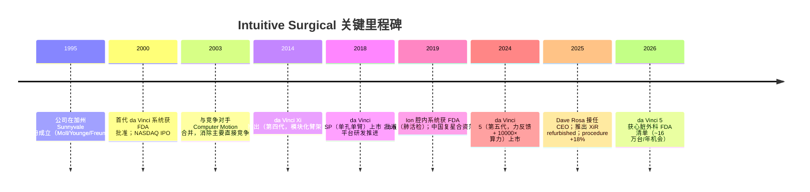
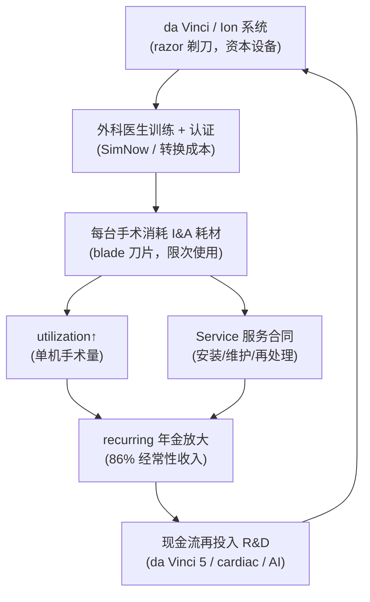
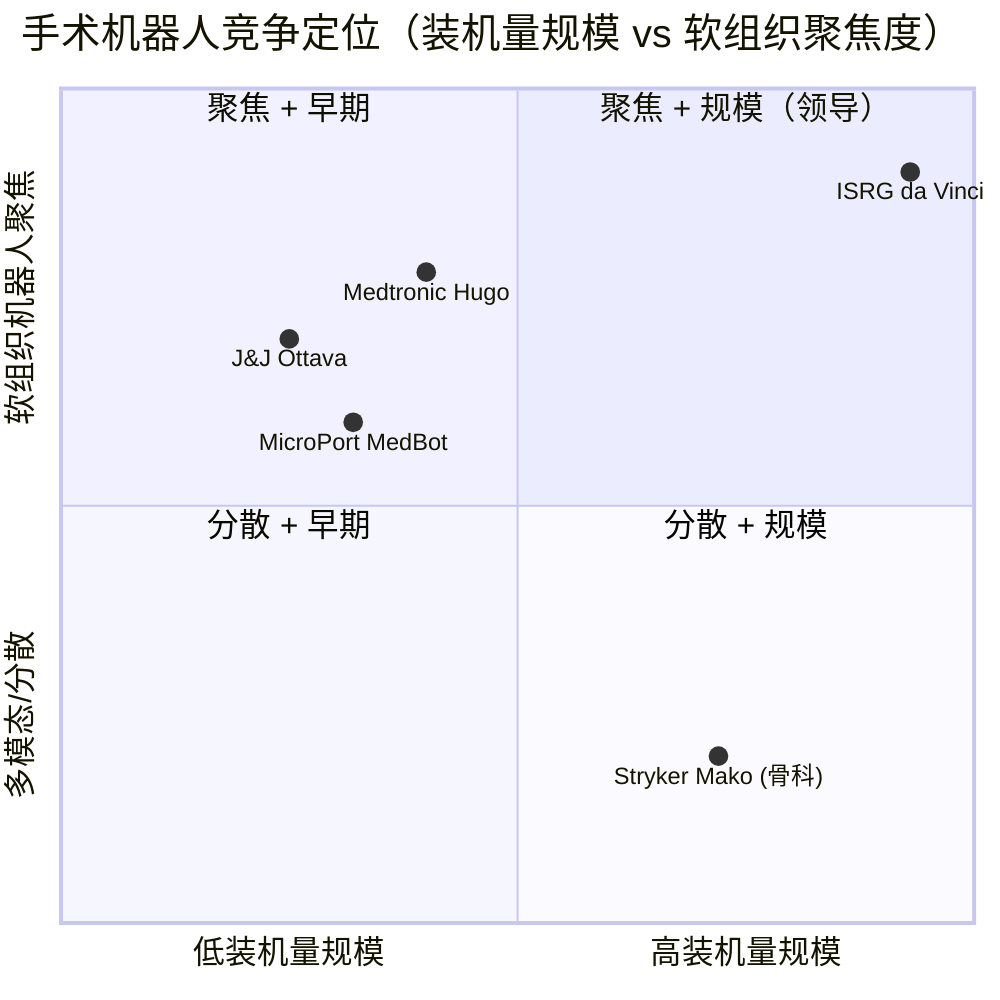
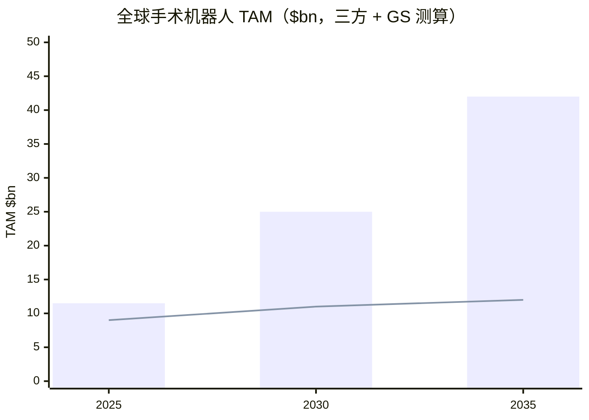

# Intuitive Surgical（直觉外科）公司研究报告

**标的：Intuitive Surgical, Inc.（NASDAQ: ISRG）** · **数据截至：2026-06-14** · **行业：医疗设备 / 手术机器人（Medical Devices / Surgical Robotics）**

> *分析师观点：* **评级：Buy（买入）· 12 个月目标价 $560（较 2026-06-12 收盘 $411.06 上行 +36%）· 估值方法：FY27E non-GAAP Adj. EPS $11.5 × 49× forward P/E**
> 市值 ~$145.6bn · 52 周区间 $396.68–$603.88 · NASDAQ: ISRG
>
> **前瞻估值矩阵（forward valuation matrix，*分析师观点：* 前瞻列）**——展示倍数随盈利成长而压缩，单一 TTM 数字会掩盖这一点：
>
> | 倍数 / Multiple | FY25A | FY26E | FY27E |
> |---|---|---|---|
> | Adj. P/E（non-GAAP EPS） | 46.0× | 40.3× | 35.7× |
> | PEG（P/E ÷ EPS CAGR ~13%） | 3.5× | 3.1× | 2.7× |
> | EV/EBITDA | ~42× | ~37× | ~32× |
> | EV/FCF | ~55× | ~48× | ~42× |
> | EV/Sales | 13.5× | 11.8× | 10.2× |
>
> *FY25A 列基于 2026-06-12 收盘 $411.06、市值 $145.6bn、净现金 $9.0bn（EV ≈ $136.6bn）与 FY25 实际（[10-K](https://www.sec.gov/Archives/edgar/data/0001035267/000103526726000010/isrg-20251231.htm)，Adj. EPS $8.93 为 sell-side non-GAAP 口径）；FY26E/FY27E 列用本报告 forward 预测（Adj. EPS $10.2 / $11.5、营收 $11.6bn / $13.4bn），为分析师 forward view。yfinance 当前 forward P/E 34.9× 与本表 FY26E 40.3× 的差异源于口径（yfinance 用更靠后的 NTM EPS）。*
>
> **相对表现（1M / 6M / YTD / 12M，截至 2026-06-12，yfinance）：** ISRG −4.9% / −24.9% / −26.9% / −19.9% vs S&P 500 −0.2% / +7.7% / +8.4% / +22.9%（相对 −4.7 / −32.6 / −35.3 / −42.8 pts）vs IHI（器械 ETF）+2.4% / −20.1% / −19.7% / −18.6%（[yfinance ISRG/^GSPC/IHI 收盘价](https://finance.yahoo.com/quote/ISRG/)）。
>
> **核心论点（thesis pillars）**——（1）**razor-and-blade（剃刀+刀片）+ installed base（装机量）模型**：截至 2026Q1 装机 11,395 台 da Vinci + 1,041 台 Ion，recurring revenue（经常性收入）占比 **86%**，这条年金式现金流（而非资本设备销售）才是护城河；（2）**utilization（单机手术量）飞轮重新加速**——2025 全年 procedures-per-system 同比 +3%，4Q25 加速到 +4%，是 I&A（instruments & accessories，耗材与配件）杠杆的最直接来源；（3）**五条并行的产品周期**（da Vinci 5、AI/digital、Ion、XiR refurbished、SP）叠加 **cardiac（心脏外科）~16 万台/年的新增 procedure 机会**，把 procedure pool（手术池）从 ~9M 推向 ~23M 的长期 TAM；（4）**估值已相对自身历史大幅 de-rate**——ISRG YTD −26.9%、forward P/E 从 ~56× 5 年均值压缩到 ~36×，恰逢竞争（Medtronic Hugo、J&J Ottava）首次出现，是"质量不变、估值变便宜"的非对称入场点。

> **Update — FY2026 全年指引（2026-04-21 Q1 业绩）：** 公司将 FY2026 *non-GAAP gross margin（非 GAAP 毛利率）* 指引收窄并小幅上调至 **67.5%–68.5%**（1 月给出的初始区间为 67%–68%），同时把内含的 tariff（关税）影响假设从 ~1.2% 营收下调到 **~1.0% 营收**；维持全年 worldwide da Vinci procedure growth **13.5%–15.5%** 的指引。驱动因素为关税冲击好于预期 + 成本效率提升。来源：[ISRG Q1-2026 earnings release, 2026-04-21](https://www.sec.gov/Archives/edgar/data/0001035267/000103526726000029/q126ex-991earningsrelease.htm)。
>
> **本期新变化（自 2026-06-09 上一版本以来）：** （1）股价进一步走弱——2026-06-12 收盘 $411.06（上一版本 $424.79），创 52 周新低区间（$396.68），YTD −26.9%、12M −19.9%，relative-to-SPX 跌幅扩大至 −42.8 pts，估值与基本面背离加深；（2）sell-side 出现两篇新的板块级背书——Goldman Sachs *Digging out*（2026-05-27，维持 ISRG 买入）与 J.P. Morgan *Down but Not Out*（2026-05-26，ISRG 列为 MedTech 首选龙头），二者把 ISRG 放进"医疗科技板块 30 年最大折价 + 周期反转"的框架，强化了"板块 + 个股双重 de-rate、质量未变"的论点；（3）无新增 SEC filing（下一份是约 7 月的 Q2-2026 业绩），本期刷新以零报表新数据、价格与 sell-side 视角更新为主。来源：[GS — Digging out, 2026-05-27](http://xs-macbook-air.local:5001/zsxq/pdf/585428884442144/Goldman%20Sachs-Healthcare%EF%BC%9A%20Medical%20Technology%EF%BC%9A%20Digging%20out%20%E2%80%94%20charting%20path%20to%20sector%20turnaround-260527.pdf)；[J.P. Morgan — Down but Not Out, 2026-05-26](http://xs-macbook-air.local:5001/zsxq/pdf/585428852142244/J.P.%20Morgan-J.P.%20Morgan%20MedTech%EF%BC%9ADown%20but%20Not%20Out%EF%BC%9A%20The%20Argument%20for%20Owning%20MedTech-260526.pdf)。

---

## 目录

1. 公司概览（含投资论点）
1A. 估值与目标价（forward 模型 · PT 推导 · bull/base/bear）
1B. GF Score（GuruFocus 式五维基本面计分卡）
2. 公司历史
3. 管理团队
4. 产品与服务（**最重要章节**）
5. 客户与上市策略
6. 行业概览
7. 竞争格局
8. 市场机会（TAM）
9. 风险评估
9.5. 核心分歧与催化剂
10. 投资风格透视（investor-lens scorecards）
数据来源清单 · 参考资料

---

## 1. 公司概览

*分析师观点：* 我们对 Intuitive Surgical 给予 **Buy 评级、12 个月目标价 $560**（较 2026-06-12 收盘 $411.06 上行 +36%）。**为什么是现在（why now）**：ISRG 年初至今下跌 26.9%、过去 12 个月下跌 19.9%，而同期 S&P 500 上涨 22.9%——相对大盘跑输约 43 个百分点，相对美国医疗器械板块 ETF（IHI，−18.6%）也略弱，forward P/E 从过去 5 年 ~56× 的均值压缩到约 36×；与此同时基本面没有恶化——2025 全年营收 +21%、procedure +18%、utilization 重新加速到 +4%（4Q25），2026Q1 营收再 +23%（[ISRG FY2025 10-K, MD&A](https://www.sec.gov/Archives/edgar/data/0001035267/000103526726000010/isrg-20251231.htm)；[ISRG Q1-2026 earnings release](https://www.sec.gov/Archives/edgar/data/0001035267/000103526726000029/q126ex-991earningsrelease.htm)）。这正是"质量不变、估值变便宜"的非对称机会，且这一背离在 sell-side 板块层面也得到背书——Goldman Sachs 与 J.P. Morgan 在 2026 年 5 月先后指出整个医疗科技板块预期 P/E 仅 14–15×、较 S&P 500 折价 ~30%、为近 30 年最大，并把 ISRG 列为周期反转中的首选龙头（*分析师观点：*，[GS — Digging out, 2026-05-27](http://xs-macbook-air.local:5001/zsxq/pdf/585428884442144/Goldman%20Sachs-Healthcare%EF%BC%9A%20Medical%20Technology%EF%BC%9A%20Digging%20out%20%E2%80%94%20charting%20path%20to%20sector%20turnaround-260527.pdf)；[J.P. Morgan — Down but Not Out, 2026-05-26](http://xs-macbook-air.local:5001/zsxq/pdf/585428852142244/J.P.%20Morgan-J.P.%20Morgan%20MedTech%EF%BC%9ADown%20but%20Not%20Out%EF%BC%9A%20The%20Argument%20for%20Owning%20MedTech-260526.pdf)）。论点四支柱：（1）installed base × utilization × recurring attach 的 razor-and-blade 年金；（2）utilization 飞轮重新加速；（3）五条产品周期 + cardiac/ASC 的需求拐点；（4）首次出现可信多孔竞争对手（Medtronic Hugo、J&J Ottava）只攻击系统层，而护城河在 recurring 层。

**公司做什么。** Intuitive Surgical 是全球软组织机器人手术（soft-tissue robotic surgery）的开创者与类目领导者。10-K 对自身的官方定义是：*"a global technology leader in minimally invasive care and the pioneer of robotic-assisted surgery"*（[ISRG FY2025 10-K, Item 1 Business](https://www.sec.gov/Archives/edgar/data/0001035267/000103526726000010/isrg-20251231.htm)）。公司的旗舰平台是 **da Vinci surgical system（达芬奇手术系统）**——一套由外科医生在控制台远程操控的多臂机器人，用于普外科（general surgery）、泌尿外科（urology）、妇科（gynecology）、胸外科（thoracic）等腔镜手术；第二条平台 **Ion endoluminal system（Ion 腔内系统）**则把业务从外科延伸到诊断性的支气管镜肺活检（[ISRG FY2025 10-K, Item 1](https://www.sec.gov/Archives/edgar/data/0001035267/000103526726000010/isrg-20251231.htm)）。

**怎么赚钱（business model）。** 这是一个典型的 razor-and-blade（剃刀+刀片）模型：公司先以销售或租赁方式放置系统（razor，剃刀），再通过每台手术消耗的 instruments & accessories（耗材与配件，blade，刀片）以及服务合同赚取经常性收入。10-K 原文：*"We also earn recurring revenue from the sales of instruments, accessories, and services"*，而 Ion 采用*"a business model consistent with the da Vinci surgical system model"*（[ISRG FY2025 10-K, Item 1](https://www.sec.gov/Archives/edgar/data/0001035267/000103526726000010/isrg-20251231.htm)）。2025 全年三条收入流（合并利润表口径）：**Instruments & accessories（I&A）$6,018.9M（+19%）、Systems $2,473.7M（+26%）、Service $1,572.1M（+20%）**，合计总营收 **$10,064.7M（+21%）**（[ISRG FY2025 10-K, Consolidated Statements of Income](https://www.sec.gov/Archives/edgar/data/0001035267/000103526726000010/isrg-20251231.htm)）。其中 I&A + Service 占营收 75.4%；若按 ISRG 自身口径——recurring revenue 还包含 systems 中的租赁/按使用付费部分——则 **2026Q1 recurring revenue 占总营收 86%、同比 +23% 至 ~$2.4bn**（[ISRG Q1-2026 earnings release](https://www.sec.gov/Archives/edgar/data/0001035267/000103526726000029/q126ex-991earningsrelease.htm)）。

下面这张利润表 Sankey 把"收入从哪来、毛利去哪、最终留下多少净利"一次性展开——左侧三条收入流汇入 $10.1bn 营收，扣 $3.4bn COGS 后留 66.0% 毛利，再经 SG&A/R&D，落到 $2.9bn 净利（28.6% 净利率）：

<svg xmlns="http://www.w3.org/2000/svg" viewBox="0 0 1000 560" width="1000" height="560" role="img" aria-label="income statement Sankey"><rect x="0" y="0" width="1000" height="560" fill="#ffffff"/>
<text x="20.00" y="30.00" text-anchor="start" font-family="Helvetica,Arial,sans-serif" font-size="15" font-weight="700" fill="#1f2933">ISRG FY2025 利润表 Sankey（）</text>
<path d="M 204.00,64.00 C 258.00,64.00 258.00,78.00 312.00,78.00 L 312.00,330.36 C 258.00,330.36 258.00,316.36 204.00,316.36 Z" fill="#93c5fd" fill-opacity="0.55"/>
<path d="M 452.00,71.00 C 506.00,71.00 506.00,128.08 560.00,128.08 L 560.00,251.58 C 506.00,251.58 506.00,194.50 452.00,194.50 Z" fill="#86efac" fill-opacity="0.55"/>
<path d="M 452.00,194.50 C 506.00,194.50 506.00,265.58 560.00,265.58 L 560.00,420.58 C 506.00,420.58 506.00,349.50 452.00,349.50 Z" fill="#fca5a5" fill-opacity="0.55"/>
<path d="M 328.00,78.00 C 382.00,78.00 382.00,71.00 436.00,71.00 L 436.00,349.50 C 382.00,349.50 382.00,356.50 328.00,356.50 Z" fill="#86efac" fill-opacity="0.55"/>
<path d="M 328.00,356.50 C 382.00,356.50 382.00,363.50 436.00,363.50 L 436.00,507.00 C 382.00,507.00 382.00,500.00 328.00,500.00 Z" fill="#fca5a5" fill-opacity="0.55"/>
<path d="M 576.00,128.08 C 630.00,128.08 630.00,128.08 684.00,128.08 L 684.00,251.58 C 630.00,251.58 630.00,251.58 576.00,251.58 Z" fill="#86efac" fill-opacity="0.55"/>
<path d="M 700.00,128.08 C 754.00,128.08 754.00,212.58 808.00,212.58 L 808.00,333.19 C 754.00,333.19 754.00,248.69 700.00,248.69 Z" fill="#86efac" fill-opacity="0.55"/>
<path d="M 700.00,248.69 C 754.00,248.69 754.00,347.19 808.00,347.19 L 808.00,365.42 C 754.00,365.42 754.00,266.92 700.00,266.92 Z" fill="#fca5a5" fill-opacity="0.55"/>
<path d="M 576.00,265.58 C 630.00,265.58 630.00,280.92 684.00,280.92 L 684.00,380.92 C 630.00,380.92 630.00,365.58 576.00,365.58 Z" fill="#fca5a5" fill-opacity="0.55"/>
<path d="M 576.00,365.58 C 630.00,365.58 630.00,394.92 684.00,394.92 L 684.00,449.92 C 630.00,449.92 630.00,420.58 576.00,420.58 Z" fill="#fca5a5" fill-opacity="0.55"/>
<path d="M 204.00,330.36 C 258.00,330.36 258.00,330.36 312.00,330.36 L 312.00,434.08 C 258.00,434.08 258.00,434.08 204.00,434.08 Z" fill="#93c5fd" fill-opacity="0.55"/>
<path d="M 576.00,434.58 C 630.00,434.58 630.00,251.58 684.00,251.58 L 684.00,266.92 C 630.00,266.92 630.00,449.92 576.00,449.92 Z" fill="#93c5fd" fill-opacity="0.55"/>
<path d="M 204.00,448.08 C 258.00,448.08 258.00,434.08 312.00,434.08 L 312.00,500.00 C 258.00,500.00 258.00,514.00 204.00,514.00 Z" fill="#93c5fd" fill-opacity="0.55"/>
<rect x="188.00" y="64.00" width="16" height="252.36" rx="1.5" fill="#2563eb"/>
<rect x="188.00" y="330.36" width="16" height="103.72" rx="1.5" fill="#2563eb"/>
<rect x="188.00" y="448.08" width="16" height="65.92" rx="1.5" fill="#2563eb"/>
<rect x="312.00" y="78.00" width="16" height="422.00" rx="1.5" fill="#1e3a8a"/>
<rect x="436.00" y="71.00" width="16" height="278.50" rx="1.5" fill="#15803d"/>
<rect x="436.00" y="363.50" width="16" height="143.50" rx="1.5" fill="#dc2626"/>
<rect x="560.00" y="128.08" width="16" height="123.50" rx="1.5" fill="#15803d"/>
<rect x="560.00" y="265.58" width="16" height="155.00" rx="1.5" fill="#dc2626"/>
<rect x="560.00" y="434.58" width="16" height="15.34" rx="1.5" fill="#2563eb"/>
<rect x="684.00" y="128.08" width="16" height="138.84" rx="1.5" fill="#15803d"/>
<rect x="684.00" y="280.92" width="16" height="100.00" rx="1.5" fill="#dc2626"/>
<rect x="684.00" y="394.92" width="16" height="55.00" rx="1.5" fill="#dc2626"/>
<rect x="808.00" y="212.58" width="16" height="120.61" rx="1.5" fill="#15803d"/>
<rect x="808.00" y="347.19" width="16" height="18.23" rx="1.5" fill="#dc2626"/>
<text x="179.00" y="187.18" text-anchor="end" font-family="Helvetica,Arial,sans-serif" font-size="11.5" font-weight="700" fill="#1f2933">Instruments &amp; accessories 耗材</text>
<text x="179.00" y="200.18" text-anchor="end" font-family="Helvetica,Arial,sans-serif" font-size="10" font-weight="400" fill="#52606d">$6.0B  (59.8%)</text>
<text x="179.00" y="379.22" text-anchor="end" font-family="Helvetica,Arial,sans-serif" font-size="11.5" font-weight="700" fill="#1f2933">Systems 系统</text>
<text x="179.00" y="392.22" text-anchor="end" font-family="Helvetica,Arial,sans-serif" font-size="10" font-weight="400" fill="#52606d">$2.5B  (24.6%)</text>
<text x="179.00" y="478.04" text-anchor="end" font-family="Helvetica,Arial,sans-serif" font-size="11.5" font-weight="700" fill="#1f2933">Service 服务</text>
<text x="179.00" y="491.04" text-anchor="end" font-family="Helvetica,Arial,sans-serif" font-size="10" font-weight="400" fill="#52606d">$1.6B  (15.6%)</text>
<rect x="331.00" y="60.00" width="106.80" height="26" rx="2" fill="#ffffff" fill-opacity="0.72"/>
<text x="334.00" y="72.00" text-anchor="start" font-family="Helvetica,Arial,sans-serif" font-size="11.5" font-weight="700" fill="#1f2933">Revenue</text>
<text x="334.00" y="85.00" text-anchor="start" font-family="Helvetica,Arial,sans-serif" font-size="10" font-weight="400" fill="#52606d">$10.1B  (100.0%)</text>
<rect x="455.00" y="53.00" width="94.20" height="26" rx="2" fill="#ffffff" fill-opacity="0.72"/>
<text x="458.00" y="65.00" text-anchor="start" font-family="Helvetica,Arial,sans-serif" font-size="11.5" font-weight="700" fill="#1f2933">Gross Profit</text>
<text x="458.00" y="78.00" text-anchor="start" font-family="Helvetica,Arial,sans-serif" font-size="10" font-weight="400" fill="#52606d">$6.6B  (66.0%)</text>
<rect x="455.00" y="345.50" width="144.60" height="26" rx="2" fill="#ffffff" fill-opacity="0.72"/>
<text x="458.00" y="357.50" text-anchor="start" font-family="Helvetica,Arial,sans-serif" font-size="11.5" font-weight="700" fill="#1f2933">Cost of Revenue (COGS)</text>
<text x="458.00" y="370.50" text-anchor="start" font-family="Helvetica,Arial,sans-serif" font-size="10" font-weight="400" fill="#52606d">$3.4B  (34.0%)</text>
<rect x="579.00" y="110.08" width="106.80" height="26" rx="2" fill="#ffffff" fill-opacity="0.72"/>
<text x="582.00" y="122.08" text-anchor="start" font-family="Helvetica,Arial,sans-serif" font-size="11.5" font-weight="700" fill="#1f2933">Operating Income</text>
<text x="582.00" y="135.08" text-anchor="start" font-family="Helvetica,Arial,sans-serif" font-size="10" font-weight="400" fill="#52606d">$2.9B  (29.3%)</text>
<rect x="579.00" y="247.58" width="150.90" height="26" rx="2" fill="#ffffff" fill-opacity="0.72"/>
<text x="582.00" y="259.58" text-anchor="start" font-family="Helvetica,Arial,sans-serif" font-size="11.5" font-weight="700" fill="#1f2933">Total Operating Expense</text>
<text x="582.00" y="272.58" text-anchor="start" font-family="Helvetica,Arial,sans-serif" font-size="10" font-weight="400" fill="#52606d">$3.7B  (36.7%)</text>
<text x="551.00" y="439.25" text-anchor="end" font-family="Helvetica,Arial,sans-serif" font-size="11.5" font-weight="700" fill="#1f2933">Net Interest / Other Income</text>
<text x="551.00" y="452.25" text-anchor="end" font-family="Helvetica,Arial,sans-serif" font-size="10" font-weight="400" fill="#52606d">$365.9M  (3.6%)</text>
<rect x="703.00" y="110.08" width="94.20" height="26" rx="2" fill="#ffffff" fill-opacity="0.72"/>
<text x="706.00" y="122.08" text-anchor="start" font-family="Helvetica,Arial,sans-serif" font-size="11.5" font-weight="700" fill="#1f2933">Pretax Income</text>
<text x="706.00" y="135.08" text-anchor="start" font-family="Helvetica,Arial,sans-serif" font-size="10" font-weight="400" fill="#52606d">$3.3B  (32.9%)</text>
<rect x="703.00" y="262.92" width="94.20" height="26" rx="2" fill="#ffffff" fill-opacity="0.72"/>
<text x="706.00" y="274.92" text-anchor="start" font-family="Helvetica,Arial,sans-serif" font-size="11.5" font-weight="700" fill="#1f2933">SG&amp;A</text>
<text x="706.00" y="287.92" text-anchor="start" font-family="Helvetica,Arial,sans-serif" font-size="10" font-weight="400" fill="#52606d">$2.4B  (23.7%)</text>
<rect x="703.00" y="376.92" width="94.20" height="26" rx="2" fill="#ffffff" fill-opacity="0.72"/>
<text x="706.00" y="388.92" text-anchor="start" font-family="Helvetica,Arial,sans-serif" font-size="11.5" font-weight="700" fill="#1f2933">R&amp;D</text>
<text x="706.00" y="401.92" text-anchor="start" font-family="Helvetica,Arial,sans-serif" font-size="10" font-weight="400" fill="#52606d">$1.3B  (13.0%)</text>
<text x="833.00" y="269.88" text-anchor="start" font-family="Helvetica,Arial,sans-serif" font-size="11.5" font-weight="700" fill="#1f2933">Net Income</text>
<text x="833.00" y="282.88" text-anchor="start" font-family="Helvetica,Arial,sans-serif" font-size="10" font-weight="400" fill="#52606d">$2.9B  (28.6%)</text>
<text x="833.00" y="353.31" text-anchor="start" font-family="Helvetica,Arial,sans-serif" font-size="11.5" font-weight="700" fill="#1f2933">Income Tax</text>
<text x="833.00" y="366.31" text-anchor="start" font-family="Helvetica,Arial,sans-serif" font-size="10" font-weight="400" fill="#52606d">$434.8M  (4.3%)</text>
<text x="500.00" y="544.00" text-anchor="middle" font-family="Helvetica,Arial,sans-serif" font-size="10" font-weight="400" fill="#52606d">Source: ISRG FY2025 10-K, Consolidated Statements of Income (SEC EDGAR)</text>
</svg>

*结论：ISRG 的利润表极度健康——66% 毛利率 + 29% 营业利润率 + 29% 净利率，且无利息费用（净现金）；I&A 这条"刀片"贡献了近 60% 营收，正是高毛利、高黏性的护城河来源。来源：[ISRG FY2025 10-K, Consolidated Statements of Income](https://www.sec.gov/Archives/edgar/data/0001035267/000103526726000010/isrg-20251231.htm)。*

**在哪经营（geographic）。** 2025/2024/2023 年美国本土营收分别占总营收 **68%/67%/66%**，OUS（outside-U.S.，美国以外）市场占 **32%/33%/34%**（[ISRG FY2025 10-K, Item 1](https://www.sec.gov/Archives/edgar/data/0001035267/000103526726000010/isrg-20251231.htm)）。公司采用直销为主、部分市场经销的混合模式；2026 年 3 月完成收购意大利 ab medica、西班牙 Abex、Excelencia Robótica 的 da Vinci/Ion 经销业务，在意大利、西班牙、葡萄牙、马耳他、圣马力诺等地转为直营（[ISRG 8-K Exhibit 99.1, 2026-03-02](https://www.sec.gov/Archives/edgar/data/0001035267/000103526726000012/q126ex-991acquisitionpress.htm)）。中国市场通过与复星医药（Fosun Pharma）的合资公司运营，ISRG 持股 60%、复星 40%，并已在中国本地化生产 da Vinci Xi（[ISRG FY2025 10-K, MD&A — Joint Venture](https://www.sec.gov/Archives/edgar/data/0001035267/000103526726000010/isrg-20251231.htm)）。

**规模有多大（scale）。** 截至 2025-12-31，da Vinci surgical system 全球装机量 **~11,106 台（+12% YoY，2024 年为 ~9,902 台）**，Ion 系统装机 **~995 台（+24%，2024 年 ~805 台）**；2025 全年放置 **1,721 台 da Vinci（+13%）**，执行 **~3,153,000 例 da Vinci procedures（约 +18%）**，单机手术量（utilization）同比 +3%（[ISRG FY2025 10-K, MD&A](https://www.sec.gov/Archives/edgar/data/0001035267/000103526726000010/isrg-20251231.htm)）。2026Q1 进一步把装机推到 **11,395 台 da Vinci + 1,041 台 Ion**，季度放置 431 台 da Vinci（其中 232 台为 da Vinci 5），WW procedures +17%（da Vinci +16%、Ion +39%）（[ISRG Q1-2026 earnings release](https://www.sec.gov/Archives/edgar/data/0001035267/000103526726000029/q126ex-991earningsrelease.htm)）。

下面三张图分别给出**营收历史（按收入流堆叠）**、**FY2025 营收结构（按收入流）**与**FY2025 营收地理分布**：

<svg xmlns="http://www.w3.org/2000/svg" viewBox="0 0 860 470" width="860" height="470" role="img" aria-label="historical revenue bars"><rect x="0" y="0" width="860" height="470" fill="#ffffff"/>
<text x="20.00" y="30.00" text-anchor="start" font-family="Helvetica,Arial,sans-serif" font-size="15" font-weight="700" fill="#1f2933">ISRG 营收历史（按收入流，）</text>
<rect x="20.00" y="44" width="11" height="11" rx="2" fill="#2563eb"/>
<text x="36.00" y="53.00" text-anchor="start" font-family="Helvetica,Arial,sans-serif" font-size="10.5" font-weight="400" fill="#1f2933">Instruments &amp; accessories 耗材</text>
<rect x="234.80" y="44" width="11" height="11" rx="2" fill="#15803d"/>
<text x="250.80" y="53.00" text-anchor="start" font-family="Helvetica,Arial,sans-serif" font-size="10.5" font-weight="400" fill="#1f2933">Systems 系统</text>
<rect x="330.80" y="44" width="11" height="11" rx="2" fill="#d97706"/>
<text x="346.80" y="53.00" text-anchor="start" font-family="Helvetica,Arial,sans-serif" font-size="10.5" font-weight="400" fill="#1f2933">Service 服务</text>
<line x1="70" y1="412.00" x2="834" y2="412.00" stroke="#eceff2" stroke-width="1"/>
<text x="64.00" y="415.00" text-anchor="end" font-family="Helvetica,Arial,sans-serif" font-size="9.5" font-weight="400" fill="#52606d">$0</text>
<line x1="70" y1="345.20" x2="834" y2="345.20" stroke="#eceff2" stroke-width="1"/>
<text x="64.00" y="348.20" text-anchor="end" font-family="Helvetica,Arial,sans-serif" font-size="9.5" font-weight="400" fill="#52606d">$2.2B</text>
<line x1="70" y1="278.40" x2="834" y2="278.40" stroke="#eceff2" stroke-width="1"/>
<text x="64.00" y="281.40" text-anchor="end" font-family="Helvetica,Arial,sans-serif" font-size="9.5" font-weight="400" fill="#52606d">$4.3B</text>
<line x1="70" y1="211.60" x2="834" y2="211.60" stroke="#eceff2" stroke-width="1"/>
<text x="64.00" y="214.60" text-anchor="end" font-family="Helvetica,Arial,sans-serif" font-size="9.5" font-weight="400" fill="#52606d">$6.5B</text>
<line x1="70" y1="144.80" x2="834" y2="144.80" stroke="#eceff2" stroke-width="1"/>
<text x="64.00" y="147.80" text-anchor="end" font-family="Helvetica,Arial,sans-serif" font-size="9.5" font-weight="400" fill="#52606d">$8.7B</text>
<line x1="70" y1="78.00" x2="834" y2="78.00" stroke="#eceff2" stroke-width="1"/>
<text x="64.00" y="81.00" text-anchor="end" font-family="Helvetica,Arial,sans-serif" font-size="9.5" font-weight="400" fill="#52606d">$10.9B</text>
<rect x="123.48" y="280.59" width="147.71" height="131.41" fill="#2563eb"/>
<rect x="123.48" y="228.98" width="147.71" height="51.61" fill="#15803d"/>
<rect x="123.48" y="193.10" width="147.71" height="35.88" fill="#d97706"/>
<text x="197.33" y="428.00" text-anchor="middle" font-family="Helvetica,Arial,sans-serif" font-size="10" font-weight="400" fill="#52606d">2023</text>
<rect x="378.15" y="255.94" width="147.71" height="156.06" fill="#2563eb"/>
<rect x="378.15" y="195.53" width="147.71" height="60.41" fill="#15803d"/>
<rect x="378.15" y="155.36" width="147.71" height="40.16" fill="#d97706"/>
<text x="452.00" y="428.00" text-anchor="middle" font-family="Helvetica,Arial,sans-serif" font-size="10" font-weight="400" fill="#52606d">2024</text>
<rect x="632.81" y="227.06" width="147.71" height="184.94" fill="#2563eb"/>
<rect x="632.81" y="151.05" width="147.71" height="76.01" fill="#15803d"/>
<rect x="632.81" y="102.74" width="147.71" height="48.31" fill="#d97706"/>
<text x="706.67" y="428.00" text-anchor="middle" font-family="Helvetica,Arial,sans-serif" font-size="10" font-weight="400" fill="#52606d">2025</text>
<text x="430.00" y="454.00" text-anchor="middle" font-family="Helvetica,Arial,sans-serif" font-size="10" font-weight="400" fill="#52606d">Source: ISRG FY2025 10-K, Consolidated Statements of Income (SEC EDGAR)</text>
</svg>

*结论：营收三年从 $7.12bn 增至 $10.06bn（CAGR ~19%），三条收入流同步放大，I&A 始终是最大且增长最稳的一层。来源：[ISRG FY2025 10-K, Consolidated Statements of Income](https://www.sec.gov/Archives/edgar/data/0001035267/000103526726000010/isrg-20251231.htm)。*

<svg xmlns="http://www.w3.org/2000/svg" viewBox="0 0 720 460" width="720" height="460" role="img" aria-label="revenue donut"><rect x="0" y="0" width="720" height="460" fill="#ffffff"/>
<text x="20.00" y="30.00" text-anchor="start" font-family="Helvetica,Arial,sans-serif" font-size="15" font-weight="700" fill="#1f2933">ISRG FY2025 营收结构（按收入流，）</text>
<path d="M 288.00,107.20 A 132 132 0 1 1 211.75,346.95 L 242.94,302.87 A 78 78 0 1 0 288.00,161.20 Z" fill="#2563eb"/>
<path d="M 211.75,346.95 A 132 132 0 0 1 178.27,165.83 L 223.16,195.84 A 78 78 0 0 0 242.94,302.87 Z" fill="#15803d"/>
<path d="M 178.27,165.83 A 132 132 0 0 1 288.00,107.20 L 288.00,161.20 A 78 78 0 0 0 223.16,195.84 Z" fill="#d97706"/>
<text x="288.00" y="235.20" text-anchor="middle" font-family="Helvetica,Arial,sans-serif" font-size="18" font-weight="800" fill="#1f2933">ISRG</text>
<text x="288.00" y="255.20" text-anchor="middle" font-family="Helvetica,Arial,sans-serif" font-size="13" font-weight="600" fill="#52606d">$10.1B</text>
<text x="288.00" y="271.20" text-anchor="middle" font-family="Helvetica,Arial,sans-serif" font-size="10" font-weight="400" fill="#8a97a3">total</text>
<line x1="419.51" y1="281.03" x2="435.51" y2="281.03" stroke="#2563eb" stroke-width="1.4"/>
<text x="439.51" y="279.03" text-anchor="start" font-family="Helvetica,Arial,sans-serif" font-size="11" font-weight="700" fill="#1f2933">Instruments &amp; accessories 耗材</text>
<text x="439.51" y="293.03" text-anchor="start" font-family="Helvetica,Arial,sans-serif" font-size="10" font-weight="400" fill="#52606d">$6.0B  (59.8%)</text>
<line x1="152.30" y1="264.28" x2="136.30" y2="264.28" stroke="#15803d" stroke-width="1.4"/>
<text x="132.30" y="262.28" text-anchor="end" font-family="Helvetica,Arial,sans-serif" font-size="11" font-weight="700" fill="#1f2933">Systems 系统</text>
<text x="132.30" y="276.28" text-anchor="end" font-family="Helvetica,Arial,sans-serif" font-size="10" font-weight="400" fill="#52606d">$2.5B  (24.6%)</text>
<line x1="222.97" y1="117.48" x2="206.97" y2="117.48" stroke="#d97706" stroke-width="1.4"/>
<text x="202.97" y="115.48" text-anchor="end" font-family="Helvetica,Arial,sans-serif" font-size="11" font-weight="700" fill="#1f2933">Service 服务</text>
<text x="202.97" y="129.48" text-anchor="end" font-family="Helvetica,Arial,sans-serif" font-size="10" font-weight="400" fill="#52606d">$1.6B  (15.6%)</text>
<text x="360.00" y="444.00" text-anchor="middle" font-family="Helvetica,Arial,sans-serif" font-size="10" font-weight="400" fill="#52606d">Source: ISRG FY2025 10-K, Consolidated Statements of Income (SEC EDGAR)</text>
</svg>

<svg xmlns="http://www.w3.org/2000/svg" viewBox="0 0 720 460" width="720" height="460" role="img" aria-label="revenue donut"><rect x="0" y="0" width="720" height="460" fill="#ffffff"/>
<text x="20.00" y="30.00" text-anchor="start" font-family="Helvetica,Arial,sans-serif" font-size="15" font-weight="700" fill="#1f2933">ISRG FY2025 营收地理分布（）</text>
<path d="M 288.00,107.20 A 132 132 0 1 1 169.57,297.50 L 218.02,273.65 A 78 78 0 1 0 288.00,161.20 Z" fill="#2563eb"/>
<path d="M 169.57,297.50 A 132 132 0 0 1 288.00,107.20 L 288.00,161.20 A 78 78 0 0 0 218.02,273.65 Z" fill="#15803d"/>
<text x="288.00" y="235.20" text-anchor="middle" font-family="Helvetica,Arial,sans-serif" font-size="18" font-weight="800" fill="#1f2933">ISRG</text>
<text x="288.00" y="255.20" text-anchor="middle" font-family="Helvetica,Arial,sans-serif" font-size="13" font-weight="600" fill="#52606d">$10.1B</text>
<text x="288.00" y="271.20" text-anchor="middle" font-family="Helvetica,Arial,sans-serif" font-size="10" font-weight="400" fill="#8a97a3">total</text>
<line x1="405.16" y1="312.12" x2="421.16" y2="312.12" stroke="#2563eb" stroke-width="1.4"/>
<text x="425.16" y="310.12" text-anchor="start" font-family="Helvetica,Arial,sans-serif" font-size="11" font-weight="700" fill="#1f2933">U.S. 美国</text>
<text x="425.16" y="324.12" text-anchor="start" font-family="Helvetica,Arial,sans-serif" font-size="10" font-weight="400" fill="#52606d">$6.8B  (67.7%)</text>
<line x1="170.84" y1="166.28" x2="154.84" y2="166.28" stroke="#15803d" stroke-width="1.4"/>
<text x="150.84" y="164.28" text-anchor="end" font-family="Helvetica,Arial,sans-serif" font-size="11" font-weight="700" fill="#1f2933">OUS 美国以外</text>
<text x="150.84" y="178.28" text-anchor="end" font-family="Helvetica,Arial,sans-serif" font-size="10" font-weight="400" fill="#52606d">$3.2B  (32.3%)</text>
<text x="360.00" y="444.00" text-anchor="middle" font-family="Helvetica,Arial,sans-serif" font-size="10" font-weight="400" fill="#52606d">Source: ISRG FY2025 10-K, MD&amp;A — Revenue by geography (SEC EDGAR)</text>
</svg>

*结论：耗材（I&A，60%）+ 服务（16%）= 76% 的 recurring 占比（按 I&A+service 口径；按 ISRG 含租赁的 recurring 口径达 86%）——这条年金式现金流而非资本设备销售，才是估值溢价的根基；地理上美国占 68%、OUS 占 32%，OUS 是竞争与汇率敞口所在。来源：[ISRG FY2025 10-K, Income Statement + MD&A geography](https://www.sec.gov/Archives/edgar/data/0001035267/000103526726000010/isrg-20251231.htm)。GAAP 毛利率 2025 年小幅回落至 66.0%（关税、新工厂折旧与 da Vinci 5 早期产品成本所致，非定价能力受损），毛利桥见 Section 1A。*

**估值快照（valuation snapshot，2026-06-12）。** 现价 $411.06，市值 ~$145.6bn，**TTM P/E ~50.0×、forward P/E ~34.9×、TTM P/S ~13.8×**（[Yahoo Finance — ISRG key statistics](https://finance.yahoo.com/quote/ISRG/key-statistics/)）。TTM P/E 50.0× 仍 >2× 行业中位（同业 forward P/E：Medtronic ~12.5×、Stryker ~18.7×、J&J ~18.9×），但需放在两个背景里读：（1）ISRG 是高成长、高 recurring、近乎垄断软组织机器人的稀缺标的，市场长期给予成长溢价；（2）该倍数已较自身历史显著压缩——*分析师观点：* Bernstein 的封面 forward 估值矩阵显示 Adj P/E 由 F25A 58.9× → F26E 52.0× → F27E 44.9×，即倍数随盈利成长而自然收敛（[Bernstein — ISRG 4Q25, 2026-01-23, p.1](http://xs-macbook-air.local:5001/zsxq/pdf/585525425551554/Bernstein-Intuitive%20Surgical%20Inc%EF%BC%88ISRG.US%EF%BC%89Intuitive%20Surgical%204Q25%EF%BC%9ASqueaky%20clean%20quarter%EF%BC%9Btop%20pick%EF%BC%88PT%20%24750%EF%BC%89-260123.pdf)）。因此今天 ~35× 的 forward P/E 是 ISRG 五年来罕见的"低于自身历史"水平，溢价的成因是结构性成长稀缺性，而非短期盈利塌陷或并购炒作。

**相对表现（relative performance，截至 2026-06-12，yfinance）。**

| 窗口 | ISRG 绝对 | S&P 500 | 相对 S&P 500 | IHI（器械 ETF） | 相对 IHI |
|---|---|---|---|---|---|
| 1M | −4.9% | −0.2% | −4.7 pts | +2.4% | −7.3 pts |
| 6M | −24.9% | +7.7% | −32.6 pts | −20.1% | −4.8 pts |
| YTD | −26.9% | +8.4% | −35.3 pts | −19.7% | −7.2 pts |
| 12M | −19.9% | +22.9% | −42.8 pts | −18.6% | −1.3 pts |

*结论：ISRG 过去一年既大幅跑输大盘（−42.8 pts）也略跑输器械板块（−1.3 pts），是一次"板块 + 个股双重 de-rate"——而基本面（procedure +18%、utilization 重新加速）没有同步恶化，这正是估值与质量背离的核心读点。自上一版本（2026-06-09，$424.79）以来股价又下探至 52 周低位区，背离进一步拉大。来源：[yfinance ISRG/^GSPC/IHI 收盘价](https://finance.yahoo.com/quote/ISRG/)；参考点见 [Bernstein — ISRG 4Q25, 2026-01-23, p.1](http://xs-macbook-air.local:5001/zsxq/pdf/585525425551554/Bernstein-Intuitive%20Surgical%20Inc%EF%BC%88ISRG.US%EF%BC%89Intuitive%20Surgical%204Q25%EF%BC%9ASqueaky%20clean%20quarter%EF%BC%9Btop%20pick%EF%BC%88PT%20%24750%EF%BC%89-260123.pdf)（其截至 2026-01-23 的 12M 绝对 −13.9% vs SPX +13.6% → 相对 −27.5%，本表已刷新至最新）。*

---

## 1A. 估值与目标价

> 本章为前瞻、决策级分析，与 Section 1 的 TTM 快照（后视）不同。**本章所有 projected（预测）数字、目标价与情景目标价均为分析师自身的 forward view，标注 `*分析师观点：*`，绝不附 filing 引用**；各驱动因子的外部依据（filing 分部数据 + 管理层指引 + 行业/sell-side 预测）在段内引用。

### (a) Forward 财务预测表（分部建模）

*分析师观点：* 我们按三条收入流分别建模再汇总——I&A 随 procedure pool（procedure × I&A/procedure）增长、Systems 随放置量 × ASP（da Vinci 5/XiR mix）增长、Service 随装机量增长。procedure 增速锚定公司 FY26 指引 13.5%–15.5%（中点 ~14.5%）并外推；毛利率锚定公司 FY26 指引 67.5%–68.5%（non-GAAP）。预测的外部依据：[ISRG FY2025 10-K 分部数据](https://www.sec.gov/Archives/edgar/data/0001035267/000103526726000010/isrg-20251231.htm) + [ISRG Q1-2026 指引](https://www.sec.gov/Archives/edgar/data/0001035267/000103526726000029/q126ex-991earningsrelease.htm) + sell-side 一致预期（[Bernstein](http://xs-macbook-air.local:5001/zsxq/pdf/585525425551554/Bernstein-Intuitive%20Surgical%20Inc%EF%BC%88ISRG.US%EF%BC%89Intuitive%20Surgical%204Q25%EF%BC%9ASqueaky%20clean%20quarter%EF%BC%9Btop%20pick%EF%BC%88PT%20%24750%EF%BC%89-260123.pdf)/[UBS](http://xs-macbook-air.local:5001/zsxq/pdf/585581521118154/UBS-Intuitive%20Surgical%20Inc%EF%BC%88ISRG.US%EF%BC%89Solid%20Q1%EF%BC%8C%20Utilization%20Flywheel%20%2B%20System%20Placements%20Likely%20to%20Sustain%20Momentum-260423.pdf)/[BofA](http://xs-macbook-air.local:5001/zsxq/pdf/184482814241482/BofA%20Securities-Intuitive%20Surgical%EF%BC%88ISRG.OQ%EF%BC%89A%20few%20macro%20topics%20into%20Q1%20EPS%EF%BC%9B%20Q1%20prob%20more%20good%20fundamentals-260420.pdf)）。

| 指标（*分析师观点：*） | FY24A | FY25A | FY26E | FY27E | FY28E | CAGR(25–28) |
|---|---|---|---|---|---|---|
| Revenue（$mn） | 8,352 | 10,065 | 11,600 | 13,400 | 15,300 | +15% |
| — Instruments & accessories | 5,079 | 6,019 | 7,000 | 8,150 | 9,400 | +16% |
| — Systems | 1,966 | 2,474 | 2,750 | 3,100 | 3,450 | +12% |
| — Service | 1,307 | 1,572 | 1,850 | 2,150 | 2,450 | +16% |
| — 营收 YoY % | — | +21% | +15% | +16% | +14% | — |
| GAAP gross margin % | 67.5% | 66.0% | 67% | 67.5% | 68% | — |
| Non-GAAP gross margin %（公司口径） | ~69% | ~68% | ~68% | ~68% | ~68% | — |
| Adj. operating margin %（Bernstein 口径） | — | 37.4% | 37.3% | 38.0% | ~38.5% | — |
| Non-GAAP Adj. EPS（$） | 7.34 | 8.93 | 10.2 | 11.5 | 12.9 | +13% |
| GAAP diluted EPS（$） | 6.42 | 7.87 | ~8.6 | ~9.7 | ~10.9 | — |
| ROIC %（Bernstein） | — | 16.0% | 15.3% | 14.6% | ~14.5% | — |

*FY24A/FY25A 列为 filing 实际（[10-K](https://www.sec.gov/Archives/edgar/data/0001035267/000103526726000010/isrg-20251231.htm)）；FY26E–FY28E 列与 Adj. operating margin/ROIC 行为分析师 forward view，外部锚定见上。注：分部预测之和与汇总营收因四舍五入及"systems 中租赁折算"略有出入。* Bernstein 自己的模型给出 Revenues CAGR 15.5%（F25–F27）、Operating Earnings CAGR 16.6%、Net Earnings CAGR 14.6%（[Bernstein — ISRG 4Q25, p.1](http://xs-macbook-air.local:5001/zsxq/pdf/585525425551554/Bernstein-Intuitive%20Surgical%20Inc%EF%BC%88ISRG.US%EF%BC%89Intuitive%20Surgical%204Q25%EF%BC%9ASqueaky%20clean%20quarter%EF%BC%9Btop%20pick%EF%BC%88PT%20%24750%EF%BC%89-260123.pdf)）——与我们 +13–16% 的口径一致。

**季度节奏（quarterly cadence，看拐点而非年度端点）。** *分析师观点：* da Vinci procedure 增速 2025 四个季度为 16.7% → 17.2% → 19.0% → 17.1%（3Q25 被管理层提示为异常强、勿外推），2026Q1 录得 +16%（[Bernstein — ISRG 4Q25, p.5–6](http://xs-macbook-air.local:5001/zsxq/pdf/585525425551554/Bernstein-Intuitive%20Surgical%20Inc%EF%BC%88ISRG.US%EF%BC%89Intuitive%20Surgical%204Q25%EF%BC%9ASqueaky%20clean%20quarter%EF%BC%9Btop%20pick%EF%BC%88PT%20%24750%EF%BC%89-260123.pdf)；[ISRG Q1-2026 release](https://www.sec.gov/Archives/edgar/data/0001035267/000103526726000029/q126ex-991earningsrelease.htm)）。UBS 的季度 EPS 路径：Q1 实际 $2.50、Q2E $2.48、Q3E $2.56、Q4E $2.82，全年 FY26E $10.37（[UBS — ISRG, 2026-04-23, p.1](http://xs-macbook-air.local:5001/zsxq/pdf/585581521118154/UBS-Intuitive%20Surgical%20Inc%EF%BC%88ISRG.US%EF%BC%89Solid%20Q1%EF%BC%8C%20Utilization%20Flywheel%20%2B%20System%20Placements%20Likely%20to%20Sustain%20Momentum-260423.pdf)）。系统放置的季度性很强（Q4 通常为旺季——4Q25 放置 532 台 vs Q1-26 431 台），而 I&A 因 utilization 更平滑，这正是 recurring 模型熨平周期性的体现。

**Margin bridge（毛利率桥，bps 拆解）。** *分析师观点：* 4Q25 adj gross margin 67.8%、同比下滑（4Q24 为 69.5%），Bernstein/公司给出的逐项拆解为——**tariffs −95bps · da Vinci 5/Ion 低毛利产品 mix 上升 · 新工厂折旧（facility depreciation）· da Vinci 5 相关更高服务成本，部分被 product cost reductions 与采购零部件节省抵消**（[Bernstein — ISRG 4Q25, p.2](http://xs-macbook-air.local:5001/zsxq/pdf/585525425551554/Bernstein-Intuitive%20Surgical%20Inc%EF%BC%88ISRG.US%EF%BC%89Intuitive%20Surgical%204Q25%EF%BC%9ASqueaky%20clean%20quarter%EF%BC%9Btop%20pick%EF%BC%88PT%20%24750%EF%BC%89-260123.pdf)；[ISRG FY2025 10-K, MD&A](https://www.sec.gov/Archives/edgar/data/0001035267/000103526726000010/isrg-20251231.htm)）。展望 FY26：管理层口径"净额基本持平（flattish）"——内含 **120bps 关税（vs FY25 的 65bps，增量 ~50bps）**、更高 da Vinci 5 mix（尚未达目标产品成本）、设备折旧开始被规模摊薄、更高 trade-in，被持续的成本下降努力抵消（[Bernstein 引述管理层 Q&A, p.2](http://xs-macbook-air.local:5001/zsxq/pdf/585525425551554/Bernstein-Intuitive%20Surgical%20Inc%EF%BC%88ISRG.US%EF%BC%89Intuitive%20Surgical%204Q25%EF%BC%9ASqueaky%20clean%20quarter%EF%BC%9Btop%20pick%EF%BC%88PT%20%24750%EF%BC%89-260123.pdf)）。这就是为什么 FY26 毛利率指引"几乎持平"——不是分析,而是逐项可追溯的 bps 桥。FY25 全年 tariffs 已使 cost of revenue 增加约 **$63.0M**，公司预计 2026 年关税成本继续上升（[ISRG FY2025 10-K, MD&A](https://www.sec.gov/Archives/edgar/data/0001035267/000103526726000010/isrg-20251231.htm)）。

### (b) 目标价推导（show the arithmetic）

*分析师观点：* 我们采用 **forward-PE × target multiple** 法：**FY27E non-GAAP Adj. EPS $11.5 × 49× forward P/E = ~$560**。倍数的依据与对标——ISRG 过去 5 年 forward P/E 均值 ~56×，当前已压到 ~36×；我们取 49× 作为"部分回补、但不回到历史峰值"的中性假设，介于 UBS 的 48×（Neutral，更谨慎）与 Bernstein 的 64×（Outperform，最乐观）之间（[UBS — ISRG, p.1](http://xs-macbook-air.local:5001/zsxq/pdf/585581521118154/UBS-Intuitive%20Surgical%20Inc%EF%BC%88ISRG.US%EF%BC%89Solid%20Q1%EF%BC%8C%20Utilization%20Flywheel%20%2B%20System%20Placements%20Likely%20to%20Sustain%20Momentum-260423.pdf)；[Bernstein — ISRG 4Q25, p.1](http://xs-macbook-air.local:5001/zsxq/pdf/585525425551554/Bernstein-Intuitive%20Surgical%20Inc%EF%BC%88ISRG.US%EF%BC%89Intuitive%20Surgical%204Q25%EF%BC%9ASqueaky%20clean%20quarter%EF%BC%9Btop%20pick%EF%BC%88PT%20%24750%EF%BC%89-260123.pdf)）。倍数对标 3–5 个 named comps：ISRG 49× 显著高于 Medtronic ~12.8×、Stryker ~18.8×、J&J ~18.6×，但这一溢价由其更高的 EPS CAGR（~13% vs MDT 个位数）、近 86% recurring 收入与近乎垄断的软组织机器人份额支撑（[Yahoo Finance comps](https://finance.yahoo.com/quote/ISRG/key-statistics/)）。

**PT 拆解（estimate-change vs multiple-change）。** *分析师观点：* 我们 $560 与 Bernstein $750、街道一致 ~$640 的差异主要来自 **倍数选择**（我们 49× vs Bernstein 64×），而非盈利预测分歧（FY27E EPS：我们 $11.5 vs Bernstein $11.72 vs BofA $11.14，区间窄）。Bernstein 把自己 PT 从 $740 上调到 $750，其增量 **100% 来自 EPS 上修**（FY27E $11.61→$11.72），倍数 64× 不变——即其上调是"盈利驱动、非重估驱动"（[Bernstein — ISRG 4Q25, p.1](http://xs-macbook-air.local:5001/zsxq/pdf/585525425551554/Bernstein-Intuitive%20Surgical%20Inc%EF%BC%88ISRG.US%EF%BC%89Intuitive%20Surgical%204Q25%EF%BC%9ASqueaky%20clean%20quarter%EF%BC%9Btop%20pick%EF%BC%88PT%20%24750%EF%BC%89-260123.pdf)）。

### (c) Bull / Base / Bear 情景

| 情景（*分析师观点：*） | 关键摆动假设 | EPS / 倍数 | PT | 较 $411.06 |
|---|---|---|---|---|
| **Bull** | procedure 增速维持 15%+、cardiac/ASC 加速放量、utilization +5%，倍数回到 ~58× | FY27E EPS $11.8 × 58× | **$685** | **+67%** |
| **Base** | procedure 14% 中点、毛利率 ~68%、倍数部分回补到 49× | FY27E EPS $11.5 × 49× | **$560** | **+36%** |
| **Bear** | OUS 资本压力（日本/欧洲）+ 中国竞争压价拖累 procedure 至 ~11%、Hugo/Ottava 抢占系统层、倍数 de-rate 至 ~38× | FY27E EPS $10.5 × 38× | **$400** | **−3%** |

*三种情景均为分析师 forward view。* Bull 对标 Bernstein 64× × $11.72 = $750 的更激进版本；Bear 对标 UBS 谨慎框架（Neutral、48× 但更低盈利）。风险回报进一步改善：股价回落到 $411.06 后，base +36%、bear 仅 −3%，下行被 recurring 年金与近乎垄断份额所缓冲，风险回报偏正向（约 12:1 的上行/下行比）。

### (d) Guide vs Consensus vs Own（Bernstein Exhibit-1 格式）

| 指标（FY26E） | 公司指引 | 街道一致 | 本报告（*分析师观点：*） |
|---|---|---|---|
| WW da Vinci procedure 增速 | 13.5%–15.5% | ~15.2% | ~14.5% |
| Non-GAAP gross margin | 67.5%–68.5% | 67.2% | ~68% |
| Opex 增速 YoY | 11%–15%（non-GAAP） | ~14.1% | ~13.5% |
| Non-GAAP Adj. EPS | —（不指引 EPS） | $10.02 | $10.2 |

*公司指引列引自 [ISRG Q1-2026 release](https://www.sec.gov/Archives/edgar/data/0001035267/000103526726000029/q126ex-991earningsrelease.htm)（procedure 13.5%–15.5%、GM 67.5%–68.5%）与 [Bernstein Exhibit 1](http://xs-macbook-air.local:5001/zsxq/pdf/585525425551554/Bernstein-Intuitive%20Surgical%20Inc%EF%BC%88ISRG.US%EF%BC%89Intuitive%20Surgical%204Q25%EF%BC%9ASqueaky%20clean%20quarter%EF%BC%9Btop%20pick%EF%BC%88PT%20%24750%EF%BC%89-260123.pdf)（1 月初始指引 procedure 13%–15%、GM 67%–68%、opex 11%–15%）；一致预期列为 *分析师观点：*，源自 [Bernstein p.1–2](http://xs-macbook-air.local:5001/zsxq/pdf/585525425551554/Bernstein-Intuitive%20Surgical%20Inc%EF%BC%88ISRG.US%EF%BC%89Intuitive%20Surgical%204Q25%EF%BC%9ASqueaky%20clean%20quarter%EF%BC%9Btop%20pick%EF%BC%88PT%20%24750%EF%BC%89-260123.pdf)（consensus GM 67.2%、opex 14.1%、EPS $10.02）；本报告列为分析师自身 forward view。* 注：管理层提示 4Q25 一次性向 Intuitive Foundation 捐赠 $70mn（约影响 Q4 EPS 15 美分），且 4Q26 不再捐赠，解读 opex 增速时需剔除该基数（[Bernstein — ISRG 4Q25, p.2–3](http://xs-macbook-air.local:5001/zsxq/pdf/585525425551554/Bernstein-Intuitive%20Surgical%20Inc%EF%BC%88ISRG.US%EF%BC%89Intuitive%20Surgical%204Q25%EF%BC%9ASqueaky%20clean%20quarter%EF%BC%9Btop%20pick%EF%BC%88PT%20%24750%EF%BC%89-260123.pdf)）。

**一致预期基准（consensus benchmark）。** *分析师观点：* 我们 FY26E EPS $10.2 略高于街道 ~$10.02（+2%）、FY27E $11.5 与 Bernstein $11.72 / BofA $11.14 居中；FY26 GM ~68% 高于一致的 67.2%——与公司指引中点一致，即我们认同管理层"关税冲击好于预期"的上修（[BofA — ISRG, 2026-04-20, p.1](http://xs-macbook-air.local:5001/zsxq/pdf/184482814241482/BofA%20Securities-Intuitive%20Surgical%EF%BC%88ISRG.OQ%EF%BC%89A%20few%20macro%20topics%20into%20Q1%20EPS%EF%BC%9B%20Q1%20prob%20more%20good%20fundamentals-260420.pdf)：consensus EPS FY26 $10.05 / FY27 $11.40 / FY28 $13.08）。

### (e) 摆动变量（swing variables）

*分析师观点：* 这个 call 主要取决于两件事：（1）**utilization（单机手术量）的可持续性**——recurring 模型的杠杆完全来自 procedures/system，2024–1H25 曾放缓、4Q25 重新加速到 +4%，能否守住是 I&A 增长的命门（[UBS — ISRG, p.1](http://xs-macbook-air.local:5001/zsxq/pdf/585581521118154/UBS-Intuitive%20Surgical%20Inc%EF%BC%88ISRG.US%EF%BC%89Solid%20Q1%EF%BC%8C%20Utilization%20Flywheel%20%2B%20System%20Placements%20Likely%20to%20Sustain%20Momentum-260423.pdf)）；（2）**估值倍数回补的速度**——基本面已企稳，但 36× → 49× 的重估需要市场重新认可成长稀缺性，这受宏观利率与板块资金流影响。读者应重点 pressure-test 这两项。

### (f) 本期修订透明度（estimate-revision transparency）

*分析师观点：* 自上一版本（2026-06-09）以来，**PT 维持 $560、倍数维持 49×、FY26E/FY27E 盈利预测维持不变**——本期目标价没有变动；变化的只有计价基准（spot $424.79 → $411.06），因此**隐含上行由 +32% 扩大到 +36%（全部来自股价下跌、零来自估值或盈利修订）**。这与 Bernstein 把 PT 由 $740→$750 时"100% 来自 EPS 上修、倍数不变"的逻辑相反：我们的上行扩大是"价格驱动"而非"盈利/重估驱动"，读者应据此理解这是一次纯粹的折价加深。

### (g) ROE 拆解（5 步 DuPont）

*分析师观点：* ISRG 的高 ROE 不靠杠杆，而是靠高净利率——下面的 5 步 DuPont 把 FY2025 ROE 拆为净利率 × 资产周转率 × 权益乘数：

<svg xmlns="http://www.w3.org/2000/svg" viewBox="0 0 1240 540" width="1240" height="540" role="img" aria-label="DuPont ROE decomposition"><rect x="0" y="0" width="1240" height="540" fill="#ffffff"/>
<text x="20.00" y="30.00" text-anchor="start" font-family="Helvetica,Arial,sans-serif" font-size="15" font-weight="700" fill="#1f2933">ISRG FY2025 五步 DuPont ROE 拆解</text>
<rect x="545.00" y="56.00" width="150" height="56" rx="7" fill="#1e3a8a"/>
<text x="620.00" y="76.00" text-anchor="middle" font-family="Helvetica,Arial,sans-serif" font-size="11.5" font-weight="700" fill="#ffffff">ROE</text>
<text x="620.00" y="94.00" text-anchor="middle" font-family="Helvetica,Arial,sans-serif" font-size="13" font-weight="800" fill="#ffffff">16.67%</text>
<text x="620.00" y="106.00" text-anchor="middle" font-family="Helvetica,Arial,sans-serif" font-size="8.5" font-weight="400" fill="#dbeafe">= Net Income / Avg Equity</text>
<rect x="191.60" y="168.00" width="150" height="56" rx="7" fill="#2563eb"/>
<text x="266.60" y="188.00" text-anchor="middle" font-family="Helvetica,Arial,sans-serif" font-size="11.5" font-weight="700" fill="#ffffff">Net Margin</text>
<text x="266.60" y="206.00" text-anchor="middle" font-family="Helvetica,Arial,sans-serif" font-size="13" font-weight="800" fill="#ffffff">28.38%</text>
<text x="266.60" y="218.00" text-anchor="middle" font-family="Helvetica,Arial,sans-serif" font-size="8.5" font-weight="400" fill="#dbeafe">Net Income / Revenue</text>
<line x1="620.00" y1="112.00" x2="266.60" y2="168.00" stroke="#94a3b8" stroke-width="1.4"/>
<rect x="545.00" y="168.00" width="150" height="56" rx="7" fill="#2563eb"/>
<text x="620.00" y="188.00" text-anchor="middle" font-family="Helvetica,Arial,sans-serif" font-size="11.5" font-weight="700" fill="#ffffff">Asset Turnover</text>
<text x="620.00" y="206.00" text-anchor="middle" font-family="Helvetica,Arial,sans-serif" font-size="13" font-weight="800" fill="#ffffff">0.51</text>
<text x="620.00" y="218.00" text-anchor="middle" font-family="Helvetica,Arial,sans-serif" font-size="8.5" font-weight="400" fill="#dbeafe">Revenue / Avg Assets</text>
<line x1="620.00" y1="112.00" x2="620.00" y2="168.00" stroke="#94a3b8" stroke-width="1.4"/>
<rect x="898.40" y="168.00" width="150" height="56" rx="7" fill="#2563eb"/>
<text x="973.40" y="188.00" text-anchor="middle" font-family="Helvetica,Arial,sans-serif" font-size="11.5" font-weight="700" fill="#ffffff">Equity Multiplier</text>
<text x="973.40" y="206.00" text-anchor="middle" font-family="Helvetica,Arial,sans-serif" font-size="13" font-weight="800" fill="#ffffff">1.14</text>
<text x="973.40" y="218.00" text-anchor="middle" font-family="Helvetica,Arial,sans-serif" font-size="8.5" font-weight="400" fill="#dbeafe">Avg Assets / Avg Equity</text>
<line x1="620.00" y1="112.00" x2="973.40" y2="168.00" stroke="#94a3b8" stroke-width="1.4"/>
<circle cx="443.30" cy="196.00" r="11" fill="#ffffff" stroke="#94a3b8" stroke-width="1.2"/>
<text x="443.30" y="201.00" text-anchor="middle" font-family="Helvetica,Arial,sans-serif" font-size="14" font-weight="800" fill="#52606d">×</text>
<circle cx="796.70" cy="196.00" r="11" fill="#ffffff" stroke="#94a3b8" stroke-width="1.2"/>
<text x="796.70" y="201.00" text-anchor="middle" font-family="Helvetica,Arial,sans-serif" font-size="14" font-weight="800" fill="#52606d">×</text>
<rect x="65.00" y="300.00" width="118" height="56" rx="7" fill="#2563eb"/>
<text x="124.00" y="320.00" text-anchor="middle" font-family="Helvetica,Arial,sans-serif" font-size="11.5" font-weight="700" fill="#ffffff">Operating Margin</text>
<text x="124.00" y="338.00" text-anchor="middle" font-family="Helvetica,Arial,sans-serif" font-size="13" font-weight="800" fill="#ffffff">29.27%</text>
<text x="124.00" y="350.00" text-anchor="middle" font-family="Helvetica,Arial,sans-serif" font-size="8.5" font-weight="400" fill="#dbeafe">Op Inc / Revenue</text>
<line x1="266.60" y1="224.00" x2="124.00" y2="300.00" stroke="#94a3b8" stroke-width="1.4"/>
<rect x="207.60" y="300.00" width="118" height="56" rx="7" fill="#2563eb"/>
<text x="266.60" y="320.00" text-anchor="middle" font-family="Helvetica,Arial,sans-serif" font-size="11.5" font-weight="700" fill="#ffffff">Tax Burden</text>
<text x="266.60" y="338.00" text-anchor="middle" font-family="Helvetica,Arial,sans-serif" font-size="13" font-weight="800" fill="#ffffff">0.8625</text>
<text x="266.60" y="350.00" text-anchor="middle" font-family="Helvetica,Arial,sans-serif" font-size="8.5" font-weight="400" fill="#dbeafe">Net Inc / Pretax</text>
<line x1="266.60" y1="224.00" x2="266.60" y2="300.00" stroke="#94a3b8" stroke-width="1.4"/>
<rect x="350.20" y="300.00" width="118" height="56" rx="7" fill="#2563eb"/>
<text x="409.20" y="320.00" text-anchor="middle" font-family="Helvetica,Arial,sans-serif" font-size="11.5" font-weight="700" fill="#ffffff">Interest Burden</text>
<text x="409.20" y="338.00" text-anchor="middle" font-family="Helvetica,Arial,sans-serif" font-size="13" font-weight="800" fill="#ffffff">1.1242</text>
<text x="409.20" y="350.00" text-anchor="middle" font-family="Helvetica,Arial,sans-serif" font-size="8.5" font-weight="400" fill="#dbeafe">Pretax / Op Inc</text>
<line x1="266.60" y1="224.00" x2="409.20" y2="300.00" stroke="#94a3b8" stroke-width="1.4"/>
<circle cx="195.30" cy="328.00" r="11" fill="#ffffff" stroke="#94a3b8" stroke-width="1.2"/>
<text x="195.30" y="333.00" text-anchor="middle" font-family="Helvetica,Arial,sans-serif" font-size="14" font-weight="800" fill="#52606d">×</text>
<circle cx="337.90" cy="328.00" r="11" fill="#ffffff" stroke="#94a3b8" stroke-width="1.2"/>
<text x="337.90" y="333.00" text-anchor="middle" font-family="Helvetica,Arial,sans-serif" font-size="14" font-weight="800" fill="#52606d">×</text>
<rect x="479.00" y="300.00" width="118" height="56" rx="7" fill="#2563eb"/>
<text x="538.00" y="326.00" text-anchor="middle" font-family="Helvetica,Arial,sans-serif" font-size="11.5" font-weight="700" fill="#ffffff">Revenue</text>
<text x="538.00" y="342.00" text-anchor="middle" font-family="Helvetica,Arial,sans-serif" font-size="13" font-weight="800" fill="#ffffff">$10.1B</text>
<line x1="620.00" y1="224.00" x2="538.00" y2="300.00" stroke="#94a3b8" stroke-width="1.4"/>
<rect x="643.00" y="300.00" width="118" height="56" rx="7" fill="#2563eb"/>
<text x="702.00" y="320.00" text-anchor="middle" font-family="Helvetica,Arial,sans-serif" font-size="11.5" font-weight="700" fill="#ffffff">Avg Total Assets</text>
<text x="702.00" y="338.00" text-anchor="middle" font-family="Helvetica,Arial,sans-serif" font-size="13" font-weight="800" fill="#ffffff">$19.6B</text>
<text x="702.00" y="350.00" text-anchor="middle" font-family="Helvetica,Arial,sans-serif" font-size="8.5" font-weight="400" fill="#dbeafe">(begin+end)/2</text>
<line x1="620.00" y1="224.00" x2="702.00" y2="300.00" stroke="#94a3b8" stroke-width="1.4"/>
<circle cx="620.00" cy="328.00" r="11" fill="#ffffff" stroke="#94a3b8" stroke-width="1.2"/>
<text x="620.00" y="333.00" text-anchor="middle" font-family="Helvetica,Arial,sans-serif" font-size="14" font-weight="800" fill="#52606d">÷</text>
<rect x="832.40" y="300.00" width="118" height="56" rx="7" fill="#2563eb"/>
<text x="891.40" y="320.00" text-anchor="middle" font-family="Helvetica,Arial,sans-serif" font-size="11.5" font-weight="700" fill="#ffffff">Avg Total Assets</text>
<text x="891.40" y="338.00" text-anchor="middle" font-family="Helvetica,Arial,sans-serif" font-size="13" font-weight="800" fill="#ffffff">$19.6B</text>
<text x="891.40" y="350.00" text-anchor="middle" font-family="Helvetica,Arial,sans-serif" font-size="8.5" font-weight="400" fill="#dbeafe">(begin+end)/2</text>
<line x1="973.40" y1="224.00" x2="891.40" y2="300.00" stroke="#94a3b8" stroke-width="1.4"/>
<rect x="996.40" y="300.00" width="118" height="56" rx="7" fill="#2563eb"/>
<text x="1055.40" y="320.00" text-anchor="middle" font-family="Helvetica,Arial,sans-serif" font-size="11.5" font-weight="700" fill="#ffffff">Avg Total Equity</text>
<text x="1055.40" y="338.00" text-anchor="middle" font-family="Helvetica,Arial,sans-serif" font-size="13" font-weight="800" fill="#ffffff">$17.1B</text>
<text x="1055.40" y="350.00" text-anchor="middle" font-family="Helvetica,Arial,sans-serif" font-size="8.5" font-weight="400" fill="#dbeafe">(begin+end)/2</text>
<line x1="973.40" y1="224.00" x2="1055.40" y2="300.00" stroke="#94a3b8" stroke-width="1.4"/>
<circle cx="967.20" cy="328.00" r="11" fill="#ffffff" stroke="#94a3b8" stroke-width="1.2"/>
<text x="967.20" y="333.00" text-anchor="middle" font-family="Helvetica,Arial,sans-serif" font-size="14" font-weight="800" fill="#52606d">÷</text>
<rect x="69.00" y="420.00" width="110" height="48" rx="7" fill="#3b82f6"/>
<text x="124.00" y="442.00" text-anchor="middle" font-family="Helvetica,Arial,sans-serif" font-size="11.5" font-weight="700" fill="#ffffff">Operating Income</text>
<text x="124.00" y="458.00" text-anchor="middle" font-family="Helvetica,Arial,sans-serif" font-size="13" font-weight="800" fill="#ffffff">$2.9B</text>
<line x1="124.00" y1="356.00" x2="124.00" y2="420.00" stroke="#94a3b8" stroke-width="1.4"/>
<rect x="211.60" y="420.00" width="110" height="48" rx="7" fill="#3b82f6"/>
<text x="266.60" y="442.00" text-anchor="middle" font-family="Helvetica,Arial,sans-serif" font-size="11.5" font-weight="700" fill="#ffffff">Net Income</text>
<text x="266.60" y="458.00" text-anchor="middle" font-family="Helvetica,Arial,sans-serif" font-size="13" font-weight="800" fill="#ffffff">$2.9B</text>
<line x1="266.60" y1="356.00" x2="266.60" y2="420.00" stroke="#94a3b8" stroke-width="1.4"/>
<rect x="354.20" y="420.00" width="110" height="48" rx="7" fill="#3b82f6"/>
<text x="409.20" y="442.00" text-anchor="middle" font-family="Helvetica,Arial,sans-serif" font-size="11.5" font-weight="700" fill="#ffffff">Pretax Income</text>
<text x="409.20" y="458.00" text-anchor="middle" font-family="Helvetica,Arial,sans-serif" font-size="13" font-weight="800" fill="#ffffff">$3.3B</text>
<line x1="409.20" y1="356.00" x2="409.20" y2="420.00" stroke="#94a3b8" stroke-width="1.4"/>
<text x="620.00" y="524.00" text-anchor="middle" font-family="Helvetica,Arial,sans-serif" font-size="10" font-weight="400" fill="#52606d">Source: ISRG FY2025 10-K, Income Statement + Balance Sheet (SEC EDGAR)</text>
</svg>

*结论：ISRG 的 FY2025 ROE ≈ 16.7%，几乎全部由 **28.4% 净利率**驱动（资产周转率仅 ~0.5×、权益乘数仅 ~1.1×——零金融负债、净现金 $9.0bn）。这是"质量型"ROE：盈利能力极强、资产负债表保守，没有靠债务放大回报。来源：[ISRG FY2025 10-K, Income Statement + Balance Sheet](https://www.sec.gov/Archives/edgar/data/0001035267/000103526726000010/isrg-20251231.htm)。*

### (h) 卖方观点演变（sell-side view evolution）

> 本报告引用了 ≥2 篇 `db/zsxq.db` 中覆盖 ISRG 的券商研报，故按机构建立观点时间线与分歧表。机械预扫描先读 `db/stock_price_target.db`（read-only），再对照 PDF 原文。PT 分散度：**$550（UBS，最低）→ $609（GS）→ $650（BofA）→ $750（Bernstein，最高）**，spread ≈ 36%；评级 1 Neutral / 3 Buy-or-Outperform，分歧主要在估值倍数而非盈利预测。

**按机构的观点时间线（per-institute view timeline）。**

| 机构 | 日期 | 评级 / PT | 报告日收盘 → 上行 | 一句话论点 |
|---|---|---|---|---|
| **Bernstein** | 2026-01-23 | Outperform / **$750**（was $740） | $523.99 → +43% | top pick；64× × FY27E EPS $11.72；PT 上修 100% 来自 EPS（倍数不变） |
| **Goldman Sachs** | 2026-04-08 | Buy / 未列 PT（MedTech macro note） | $462.28 → n/a | 全球宏观与板块定位，维持 ISRG 买入 |
| **BofA** | 2026-04-20 | Buy / **$650** | $465.60 → +40% | Q1 前瞻；cons EPS FY26 $10.05 / FY27 $11.40；内存涨价冲击仅 ~10bps |
| **Goldman Sachs** | 2026-04-21 | Buy / **$609** | $451.29 → +35% | China Medtech going global；ecosystem-driven moat；TAM $42bn by 2035 |
| **UBS** | 2026-04-23 | **Neutral** / **$550** | $478.82 → +15% | utilization flywheel 重启，但 ~48× 估值已反映，等 9M→23M 缺口可见度 |
| **Goldman Sachs** | 2026-05-27 | Buy / 维持（"Digging out" 板块复苏） | $418.55 → n/a | 板块 30 年最大折价 + 周期反转；维持 ISRG 买入 |

*每条 PT 已配报告日收盘与上行（来自 `db/stock_price_target.db` `report_date_price` / `upside_pct`，read-only）。* 关键自我修订：Bernstein 把 PT 从 $740 上调到 $750（[Bernstein, p.1](http://xs-macbook-air.local:5001/zsxq/pdf/585525425551554/Bernstein-Intuitive%20Surgical%20Inc%EF%BC%88ISRG.US%EF%BC%89Intuitive%20Surgical%204Q25%EF%BC%9ASqueaky%20clean%20quarter%EF%BC%9Btop%20pick%EF%BC%88PT%20%24750%EF%BC%89-260123.pdf)）；GS 在 4 月给出 $609 单名 PT 后，5 月把 ISRG 纳入板块复苏首选名单但未改 PT（[GS — Digging out, 2026-05-27](http://xs-macbook-air.local:5001/zsxq/pdf/585428884442144/Goldman%20Sachs-Healthcare%EF%BC%9A%20Medical%20Technology%EF%BC%9A%20Digging%20out%20%E2%80%94%20charting%20path%20to%20sector%20turnaround-260527.pdf)）。

**机构间分歧（cross-institute disagreement）——不混成假一致。**

| 机构 | 日期 | 评级 / PT | 核心论点 | 什么证据能证明其正确 |
|---|---|---|---|---|
| **Bernstein** | 2026-01-23 | Outperform / $750（64×） | 五条产品周期 + cardiac，给最高倍数 | procedure 增速守住 15%+、cardiac 2026 起放量、utilization 持续 +4% |
| **BofA** | 2026-04-20 | Buy / $650 | 基本面稳、宏观冲击可控（内存 ~10bps） | 关税/内存对 GM 的实际拖累 ≤ 公司指引、procedure 不减速 |
| **UBS** | 2026-04-23 | **Neutral** / $550（~48×） | 质量认可，但估值已反映，需 9M→23M 缺口的可见度 | 9M→23M 可及池的填补节奏（cardiac/ASC 贡献）迟迟看不清、系统放置受医院资本预算约束 |

*三家在盈利预测上高度一致（FY27E EPS：Bernstein $11.72 / BofA $11.14 / UBS 框架 ~$11.5），分歧几乎全在**给多少倍数**——这正是本报告取中性 49× 的理由。所有视角均标 *分析师观点：*，引至 `/zsxq/pdf/<file_id>/<filename>`。*

---

## 1B. GF Score（GuruFocus 式五维基本面计分卡）

> 本节是基本面健康度的"一眼读"——把已采集的数据蒸馏成 0–100 综合分 + 五维雷达。**它是对既有数据的分析性叠加，不是新数据源、也不是背书**；五个子分与综合分均为 *分析师观点：*，每个底层指标各自带行内引用。

*分析师观点：* **GF Score（GuruFocus 式）：70/100 —— 高质量基本面、但被低 Momentum 与高估值拉低综合分。**

<svg xmlns="http://www.w3.org/2000/svg" viewBox="0 0 500 500" width="500" height="500" role="img" aria-label="GF Score radar">
<rect x="0" y="0" width="500" height="500" fill="#ffffff"/>
<text x="20" y="24" font-family="Helvetica,Arial,sans-serif" font-size="15" font-weight="700" fill="#1f2933">GF Score (GuruFocus-style): 70/100</text>
<text x="20" y="41" font-family="Helvetica,Arial,sans-serif" font-size="11" fill="#52606d">51–70 Poor future performance potential</text>
<polygon points="250.0,88.0 392.7,191.6 338.2,359.4 161.8,359.4 107.3,191.6" fill="#e9f5ec" stroke="none"/>
<polygon points="250.0,208.0 278.5,228.7 267.6,262.3 232.4,262.3 221.5,228.7" fill="none" stroke="#c5d3cb" stroke-width="1"/>
<polygon points="250.0,178.0 307.1,219.5 285.3,286.5 214.7,286.5 192.9,219.5" fill="none" stroke="#c5d3cb" stroke-width="1"/>
<polygon points="250.0,148.0 335.6,210.2 302.9,310.8 197.1,310.8 164.4,210.2" fill="none" stroke="#c5d3cb" stroke-width="1"/>
<polygon points="250.0,118.0 364.1,200.9 320.5,335.1 179.5,335.1 135.9,200.9" fill="none" stroke="#c5d3cb" stroke-width="1"/>
<polygon points="250.0,88.0 392.7,191.6 338.2,359.4 161.8,359.4 107.3,191.6" fill="none" stroke="#c5d3cb" stroke-width="1.3"/>
<line x1="250" y1="238" x2="161.8" y2="359.4" stroke="#cfdad3" stroke-width="1"/>
<text x="146.5" y="392.4" text-anchor="end" font-family="Helvetica,Arial,sans-serif" font-size="11.5" font-weight="600" fill="#1f2933">Financial Strength</text>
<text x="146.5" y="405.4" text-anchor="end" font-family="Helvetica,Arial,sans-serif" font-size="9.5" fill="#52606d">财务实力</text>
<text x="170.6" y="341.2" text-anchor="middle" font-family="Helvetica,Arial,sans-serif" font-size="10.5" font-weight="700" fill="#1f2933">9</text>
<line x1="250" y1="238" x2="250.0" y2="88.0" stroke="#cfdad3" stroke-width="1"/>
<text x="250.0" y="58.0" text-anchor="middle" font-family="Helvetica,Arial,sans-serif" font-size="11.5" font-weight="600" fill="#1f2933">Profitability</text>
<text x="250.0" y="71.0" text-anchor="middle" font-family="Helvetica,Arial,sans-serif" font-size="9.5" fill="#52606d">盈利能力</text>
<text x="250.0" y="97.0" text-anchor="middle" font-family="Helvetica,Arial,sans-serif" font-size="10.5" font-weight="700" fill="#1f2933">9</text>
<line x1="250" y1="238" x2="107.3" y2="191.6" stroke="#cfdad3" stroke-width="1"/>
<text x="82.6" y="183.6" text-anchor="end" font-family="Helvetica,Arial,sans-serif" font-size="11.5" font-weight="600" fill="#1f2933">Growth</text>
<text x="82.6" y="196.6" text-anchor="end" font-family="Helvetica,Arial,sans-serif" font-size="9.5" fill="#52606d">成长性</text>
<text x="135.9" y="194.9" text-anchor="middle" font-family="Helvetica,Arial,sans-serif" font-size="10.5" font-weight="700" fill="#1f2933">8</text>
<line x1="250" y1="238" x2="392.7" y2="191.6" stroke="#cfdad3" stroke-width="1"/>
<text x="417.4" y="183.6" text-anchor="start" font-family="Helvetica,Arial,sans-serif" font-size="11.5" font-weight="600" fill="#1f2933">GF Value</text>
<text x="417.4" y="196.6" text-anchor="start" font-family="Helvetica,Arial,sans-serif" font-size="9.5" fill="#52606d">估值</text>
<text x="307.1" y="213.5" text-anchor="middle" font-family="Helvetica,Arial,sans-serif" font-size="10.5" font-weight="700" fill="#1f2933">4</text>
<line x1="250" y1="238" x2="338.2" y2="359.4" stroke="#cfdad3" stroke-width="1"/>
<text x="353.5" y="392.4" text-anchor="start" font-family="Helvetica,Arial,sans-serif" font-size="11.5" font-weight="600" fill="#1f2933">Momentum</text>
<text x="353.5" y="405.4" text-anchor="start" font-family="Helvetica,Arial,sans-serif" font-size="9.5" fill="#52606d">动量</text>
<text x="267.6" y="256.3" text-anchor="middle" font-family="Helvetica,Arial,sans-serif" font-size="10.5" font-weight="700" fill="#1f2933">2</text>
<polygon points="250.0,103.0 307.1,219.5 267.6,262.3 170.6,347.2 135.9,200.9" fill="#2e8b57" fill-opacity="0.34" stroke="#2e8b57" stroke-width="2"/>
<circle cx="170.6" cy="347.2" r="2.6" fill="#2e8b57"/>
<circle cx="250.0" cy="103.0" r="2.6" fill="#2e8b57"/>
<circle cx="135.9" cy="200.9" r="2.6" fill="#2e8b57"/>
<circle cx="307.1" cy="219.5" r="2.6" fill="#2e8b57"/>
<circle cx="267.6" cy="262.3" r="2.6" fill="#2e8b57"/>
<text x="250" y="470" text-anchor="middle" font-family="Helvetica,Arial,sans-serif" font-size="9.5" fill="#52606d">Source: Analyst rubric; metrics: ISRG FY2025 10-K + yfinance 2026-06-12</text>
<text x="250" y="485" text-anchor="middle" font-family="Helvetica,Arial,sans-serif" font-size="9" fill="#52606d">GF Score = independent analyst rubric (*Analyst view:*) — not GuruFocus™ official number</text>
</svg>

*读图：离中心越远越好；五边形越大综合分越高。ISRG 的形状极不对称——Financial Strength / Profitability / Growth 三角顶满，但 GF Value 与 Momentum 两角内凹，正是"好生意、贵价格、坏动量"的画像。*

| 维度 / Dimension | 评分 / Score (0–10) | |
|---|---|---|
| Financial Strength (财务实力) | 9 | `█████████░` |
| Profitability (盈利能力) | 9 | `█████████░` |
| Growth (成长性) | 8 | `████████░░` |
| GF Value (估值) | 4 | `████░░░░░░` |
| Momentum (动量) | 2 | `██░░░░░░░░` |
| **GF Score (composite, *Analyst view:*)** | **70 / 100** | **51–70 Poor future performance potential** |

*Composite weights (*Analyst view:*): Financial Strength 20% · Profitability 25% · Growth 25% · GF Value 15% · Momentum 15% (transparent reproduction — not GuruFocus's proprietary weighting).*

**各维度评分理由（why these scores）。**

- **Financial Strength（财务实力）= 9/10。** ISRG 资产负债表近乎无瑕：**零金融负债**、FY2025 末现金 + 投资 **$9,034.1M**、总负债仅 $2,517.0M（全为经营性应付/递延），权益乘数仅 ~1.1×（[ISRG FY2025 10-K, Balance Sheet](https://www.sec.gov/Archives/edgar/data/0001035267/000103526726000010/isrg-20251231.htm)）。CFO $3,030.5M > 净利 $2,876.6M，自由现金流 ~$2.49bn（[10-K Cash Flows](https://www.sec.gov/Archives/edgar/data/0001035267/000103526726000010/isrg-20251231.htm)）。扣 1 分仅因无杠杆放大、纯靠经营。
- **Profitability（盈利能力）= 9/10。** GAAP 毛利率 **66.0%**、营业利润率 **29.3%**（$2,945.5M / $10,064.7M）、净利率 **28.6%**、ROE ~16.7%、ROIC ~16%（[10-K Income Statement](https://www.sec.gov/Archives/edgar/data/0001035267/000103526726000010/isrg-20251231.htm)；ROIC 见 [Bernstein, p.1](http://xs-macbook-air.local:5001/zsxq/pdf/585525425551554/Bernstein-Intuitive%20Surgical%20Inc%EF%BC%88ISRG.US%EF%BC%89Intuitive%20Surgical%204Q25%EF%BC%9ASqueaky%20clean%20quarter%EF%BC%9Btop%20pick%EF%BC%88PT%20%24750%EF%BC%89-260123.pdf)）。这是医疗器械里少见的"高毛利 + 高 recurring"组合。
- **Growth（成长性）= 8/10。** FY2025 营收 **+21%**（$8,352.1M → $10,064.7M）、procedure +18%、3 年营收 CAGR ~19%；本报告 forward 模型 FY25–28 营收 CAGR +15%、EPS CAGR ~13%（与 Section 1A 一致）（[10-K MD&A](https://www.sec.gov/Archives/edgar/data/0001035267/000103526726000010/isrg-20251231.htm)）。扣分因增速虽高但已从历史峰值温和回落、且 OUS 面临竞争。
- **GF Value（估值，越高越便宜）= 4/10。** forward P/E ~35×、TTM P/E 50.0×、P/S 13.8×（[Yahoo Finance](https://finance.yahoo.com/quote/ISRG/key-statistics/)），与 Section 1A PT 隐含上行 +36% 一致——即便已较自身 5 年均值 ~56× 大幅 de-rate，绝对估值仍偏贵，故偏低分；这是综合分被压的两大原因之一。
- **Momentum（动量）= 2/10。** 与 header 相对表现一致：12M −19.9%、YTD −26.9%、1M −4.9%，大幅跑输 S&P 500（−42.8 pts），处 52 周低位区（[yfinance ISRG/^GSPC](https://finance.yahoo.com/quote/ISRG/)）。这是综合分被压的另一主因——但从逆向投资角度，低 Momentum 恰恰是本报告"折价加深"论点的来源。

**综合分算式：** (9·20 + 9·25 + 8·25 + 4·15 + 2·15)/100 = (180 + 225 + 200 + 60 + 30)/100 = **70/100**（权重 20/25/25/15/15）。

**一句话提示：** 最可能翻转的维度是 **GF Value 与 Momentum**——若市场重新认可成长稀缺性、倍数回补且股价企稳，这两角同时改善会把综合分推向 80+；反之若 procedure 减速，Growth 也会下修。无 n/a 维度。

---

## 2. 公司历史

Intuitive Surgical 于 **1995 年 12 月 8 日** 在加州 Sunnyvale 注册成立，创始人为外科医生 **Frederic Moll**、工程师 **Robert Younge** 与 **John Freund**。三人把斯坦福研究院（SRI International）军方资助的远程手术（telesurgery）技术商业化，目标是突破传统腹腔镜手术的局限（[Frederic Moll — Wikipedia](https://en.wikipedia.org/wiki/Frederic_Moll)；[Intuitive Surgical — Wikipedia](https://en.wikipedia.org/wiki/Intuitive_Surgical)）。首代 da Vinci 系统于 2000 年获 FDA 批准，开创了机器人辅助软组织外科这一全新类目（[Intuitive Surgical — Wikipedia](https://en.wikipedia.org/wiki/Intuitive_Surgical)）。


*结论：30 年里 ISRG 完成了"开创类目 → 消除竞争（2003 合并 Computer Motion）→ 平台代际迭代（Si→Xi→da Vinci 5）→ 拓展邻接（SP 单孔、Ion 腔内、cardiac 心脏）"的四步走；当前正处第三、第四步叠加期。来源：[Intuitive Surgical — Wikipedia](https://en.wikipedia.org/wiki/Intuitive_Surgical)；[ISRG FY2025 10-K, Item 1](https://www.sec.gov/Archives/edgar/data/0001035267/000103526726000010/isrg-20251231.htm)。*

**战略转折点。** 第一次是 **2003 年与 Computer Motion 合并**——这桩交易一举消除了 da Vinci 早期最主要的直接竞争对手（ZEUS 系统），奠定了此后近 20 年软组织机器人近乎垄断的格局（[Intuitive Surgical — Wikipedia](https://en.wikipedia.org/wiki/Intuitive_Surgical)）。第二次是从"卖系统"转向"经营装机量年金"——随着装机量与 procedure 累积，recurring（I&A + service + 租赁）逐渐压过资本设备销售，使收入更平滑、抗周期，这一结构在 2026Q1 体现为 recurring 占比 86%（[ISRG Q1-2026 earnings release](https://www.sec.gov/Archives/edgar/data/0001035267/000103526726000029/q126ex-991earningsrelease.htm)）。第三次是 **2025 年 Dave Rosa 接任 CEO、Gary Guthart 转任 Executive Chair**，标志着创始一代（Guthart 自 2010 年起任 CEO）向新一代过渡（[ISRG DEF 14A 2026, 2026-03-13](https://www.sec.gov/Archives/edgar/data/0001035267/000103526726000023/isrg-20260313.htm)）。

**近期发展（last 1–2 yr）。** da Vinci 5（第五代）于 2024 年上市并快速放量——2026Q1 占美国系统出货近 90%；2025 年开始提供 refurbished Xi（XiR）以渗透价格敏感市场；2026 年 1 月 da Vinci 5 获心脏外科 FDA 清单；2026 年 3 月完成欧洲经销商收购转直营（[ISRG 8-K, 2026-03-02](https://www.sec.gov/Archives/edgar/data/0001035267/000103526726000012/q126ex-991acquisitionpress.htm)；[Da Vinci 5 Cleared for Cardiac Procedures, 2026-01-26](https://www.globenewswire.com/news-release/2026/01/26/3225716/7637/en/Da-Vinci-5-Cleared-for-Cardiac-Procedures.html)）。

---

## 3. 管理团队

**创始人 Frederic Moll（已退出运营）。** Moll 是外科医生兼连续创业者，被广泛视为机器人手术之父。1995 年他离开 Guidant，与 John Freund、Robert Younge 共同创立 Intuitive Surgical，提供临床愿景与创业驱动力；Younge 带来 SRI International 的工程能力，Freund 兼具医疗与工程背景（[Frederic Moll — Wikipedia](https://en.wikipedia.org/wiki/Frederic_Moll)）。Moll 此后又创办了 Hansen Medical（血管/心脏导管机器人）与 Auris Health（支气管镜机器人 MONARCH，2019 年被 Johnson & Johnson 以约 34 亿美元收购）——颇具讽刺意味的是，他亲手缔造的 Auris/MONARCH 如今成为 J&J 与 ISRG 在腔内/支气管镜领域竞争的资产（[Frederic Moll — Wikipedia](https://en.wikipedia.org/wiki/Frederic_Moll)）。Moll 早已不参与 ISRG 日常运营，亦非现任董事，持股已大幅减持，主要遗产是把 da Vinci 这一类目从零做到今天 ~$150bn 市值的体量（[Intuitive Surgical — Wikipedia](https://en.wikipedia.org/wiki/Intuitive_Surgical)）。

**现任 CEO David J. Rosa（自 2025 年）。** Rosa 现年 58 岁，机械工程师出身，持有加州州立理工大学（San Luis Obispo）机械工程 B.S. 与斯坦福大学机械工程 M.S.，本人持有多项专利，曾直接参与经食道超声换能器等手术技术开发（[ISRG DEF 14A 2026, Director bio](https://www.sec.gov/Archives/edgar/data/0001035267/000103526726000023/isrg-20260313.htm)）。他在 ISRG 是不折不扣的内部晋升：2011 年起担任 SVP（新兴手术与技术 / 科学事务），后历任 EVP 兼首席科学官（2014–2015）、首席商务官（2015–2019）、首席业务官（2019–2022）、首席战略与增长官（2022–2023）、总裁（2023–2025），2025 年升任 CEO，可谓走遍科研、商务、战略各条线（[ISRG DEF 14A 2026, Career Highlights](https://www.sec.gov/Archives/edgar/data/0001035267/000103526726000023/isrg-20260313.htm)）。加入 ISRG 前，他在 Acuson Corporation（诊断超声）任机械设计工程师（1989–1996）。Rosa 自 2024 年起进入董事会。继任由前 CEO Gary Guthart（现 Executive Chair）领导、经"严谨且稳健的接班流程"完成，两位高管同时在董事会任职，合计逾 50 年领导经验（[ISRG DEF 14A 2026, Board overview](https://www.sec.gov/Archives/edgar/data/0001035267/000103526726000023/isrg-20260313.htm)）。这种"自己人接班 + 创始 CEO 转任 Chair 护航"的安排，把关键人风险降到较低水平，但 Rosa 任 CEO 不足一年、独立 track record 尚短，是治理层面唯一可观察的不确定性。

---

## 4. 产品与服务

> **优先级提示：** 本节是整篇报告分量最重的章节——它是 Section 5–9 的分析地基。读者只有先理解 ISRG 到底造什么、它在外科医生工作流里处于什么位置，才能评估客户为什么买、市场有多大、谁在竞争、哪条产品线风险最高。

### 4.1 产品矩阵（issuer's own framing）

ISRG 的 10-K 没有半导体式的"市场×工艺×技术×产品"四列矩阵，而是按 **平台 → 代际 → 耗材/服务生态** 组织。下表按 10-K Item 1 的官方表述重构（标为分析师重构 / analyst-constructed，源文逐条引自 10-K）：

| 平台 / 类别 | 代际 / 型号 | 物理作用 | 2025 装机 / 状态 |
|---|---|---|---|
| **da Vinci surgical system** | 第五代 da Vinci 5；第四代 da Vinci X / Xi / SP；第三代 Si | 多臂腔镜手术机器人（普外/泌尿/妇科/胸外） | 全球 ~11,106 台；da Vinci 5 装机 1,231 台、SP 装机 377 台 |
| **Ion endoluminal system** | Ion | 柔性导管支气管镜，肺外周活检（诊断/腔内） | ~995 台（+24%）；2025 放置 195 台（−28%） |
| **Instruments & accessories（I&A）** | 缝合（stapling）、能量（energy）、核心器械 | 每台手术消耗的"刀片"，限次使用后报废更换 | 2025 营收 $6.02bn（占总营收 60%） |
| **Digital / 软件生态** | My Intuitive、SimNow、Case Insights、Intuitive Hub | App、VR 模拟训练、AI 计算观察、边缘计算 | 与 da Vinci 5 深度集成 |
| **Service** | 系统服务合同 | 安装、维护、训练、再处理 | 2025 营收 $1.57bn（+20%） |
| **XiR（refurbished Xi）** | 翻新 Xi 系统 | 低价版资本设备，渗透 ASC / 价格敏感市场 | 2025 放置 42 台（含 4Q25 23 台） |

*来源：[ISRG FY2025 10-K, Item 1 Business + MD&A](https://www.sec.gov/Archives/edgar/data/0001035267/000103526726000010/isrg-20251231.htm)；da Vinci 5 / SP 装机数与 XiR 放置数引自 [10-K MD&A](https://www.sec.gov/Archives/edgar/data/0001035267/000103526726000010/isrg-20251231.htm) 与 [Bernstein — ISRG 4Q25, p.6](http://xs-macbook-air.local:5001/zsxq/pdf/585525425551554/Bernstein-Intuitive%20Surgical%20Inc%EF%BC%88ISRG.US%EF%BC%89Intuitive%20Surgical%204Q25%EF%BC%9ASqueaky%20clean%20quarter%EF%BC%9Btop%20pick%EF%BC%88PT%20%24750%EF%BC%89-260123.pdf)。表格按 10-K 表述重构（analyst-constructed），各行原文见下。*

### 4.2 综述——产品如何组成一个客户工作流

ISRG 的产品不是孤立 SKU，而是一个自我强化的循环：**医院买入/租入 da Vinci 或 Ion 系统（razor）→ 外科医生在 ISRG 的训练体系里取得认证（switching cost，转换成本）→ 每台手术消耗 I&A 耗材（blade）并产生 service 收入 → 装机量与 procedure 累积 → utilization 提升 → I&A 年金放大 → 现金流再投入 R&D 与下一代平台（da Vinci 5、cardiac、AI）→ 拉动更多放置**。这就是为什么 recurring 占比能到 86%——资本设备只是入口，真正的经济发动机是装机量上滚动的耗材+服务年金（[ISRG Q1-2026 earnings release](https://www.sec.gov/Archives/edgar/data/0001035267/000103526726000029/q126ex-991earningsrelease.htm)）。


*结论：ISRG 的护城河不是单一产品，而是"装机量 + 外科医生训练锁定 + 捕获式耗材年金"构成的闭环——竞争对手即便造出对标系统，也要从零重建装机量与训练生态。来源：[ISRG FY2025 10-K, Item 1](https://www.sec.gov/Archives/edgar/data/0001035267/000103526726000010/isrg-20251231.htm)。*

**跟着钱走（follow the money）。** 下面这张现金流向图把 razor-and-blade 模型"谁付钱 → ISRG 卖什么 → 钱沉淀在哪"一次性画出来——左侧医院/IDN/ASC/OUS 付钱，中间分流到 I&A（blade，$6,018.9M）、Systems（razor，$2,473.7M）、Service（$1,572.1M），右侧钱再沉淀到 R&D 再投入（$1,311.8M）、$2.3bn 股票回购与 $9.0bn 净现金。其中 I&A 这条 blade 才是真正的现金引擎（占营收 60%），系统只是入口；约 47% 系统以租赁方式放置，进一步把资本门槛转成按手术量付费（[ISRG FY2025 10-K — Income Statement / Cash Flows / MD&A](https://www.sec.gov/Archives/edgar/data/0001035267/000103526726000010/isrg-20251231.htm)；租赁占比 [Bernstein — ISRG 4Q25, p.6](http://xs-macbook-air.local:5001/zsxq/pdf/585525425551554/Bernstein-Intuitive%20Surgical%20Inc%EF%BC%88ISRG.US%EF%BC%89Intuitive%20Surgical%204Q25%EF%BC%9ASqueaky%20clean%20quarter%EF%BC%9Btop%20pick%EF%BC%88PT%20%24750%EF%BC%89-260123.pdf)）。

<svg xmlns="http://www.w3.org/2000/svg" viewBox="0 0 1180 902" width="1180" height="902" role="img" aria-label="ISRG 现金流向图：谁付钱 → 买什么 → 钱在哪里沉淀（FY2025，$M）" font-family="'Space Grotesk',system-ui,-apple-system,'Segoe UI',sans-serif">
<defs><linearGradient id="mfgold" gradientUnits="userSpaceOnUse" x1="0" y1="0" x2="1180" y2="0"><stop offset="0" stop-color="#f6dc97"/><stop offset="0.5" stop-color="#e9b658"/><stop offset="1" stop-color="#cf8f2c"/></linearGradient><radialGradient id="mfpool" cx="50%" cy="50%" r="50%"><stop offset="0" stop-color="#34d399" stop-opacity="0.16"/><stop offset="1" stop-color="#34d399" stop-opacity="0"/></radialGradient></defs>
<rect x="0" y="0" width="1180" height="902" rx="16" fill="#0b0f1a"/>
<text x="42.00" y="84.00" text-anchor="start" font-family="'Space Grotesk',system-ui,-apple-system,'Segoe UI',sans-serif" font-size="32" font-weight="700" fill="#e8ecf5">ISRG 现金流向图：谁付钱 → 买什么 → 钱在哪里沉淀（FY2025，$M）</text>
<ellipse cx="1031.00" cy="330.00" rx="190" ry="150" fill="url(#mfpool)"/>
<line x1="369.50" y1="150.00" x2="369.50" y2="506.00" stroke="#222a3a" stroke-dasharray="2 8"/>
<line x1="810.50" y1="150.00" x2="810.50" y2="506.00" stroke="#222a3a" stroke-dasharray="2 8"/>
<text x="42.00" y="134.00" text-anchor="start" font-family="'JetBrains Mono',ui-monospace,Menlo,monospace" font-size="12" font-weight="400" fill="#e9b658" letter-spacing="3">STAGE 01</text>
<text x="42.00" y="150.00" text-anchor="start" font-family="'JetBrains Mono',ui-monospace,Menlo,monospace" font-size="11.5" font-weight="400" fill="#646d82">谁付钱 (who pays)</text>
<text x="483.00" y="134.00" text-anchor="start" font-family="'JetBrains Mono',ui-monospace,Menlo,monospace" font-size="12" font-weight="400" fill="#e9b658" letter-spacing="3">STAGE 02</text>
<text x="483.00" y="150.00" text-anchor="start" font-family="'JetBrains Mono',ui-monospace,Menlo,monospace" font-size="11.5" font-weight="400" fill="#646d82">ISRG 卖什么 (razor + blade)</text>
<text x="924.00" y="134.00" text-anchor="start" font-family="'JetBrains Mono',ui-monospace,Menlo,monospace" font-size="12" font-weight="400" fill="#e9b658" letter-spacing="3">STAGE 03</text>
<text x="924.00" y="150.00" text-anchor="start" font-family="'JetBrains Mono',ui-monospace,Menlo,monospace" font-size="11.5" font-weight="400" fill="#646d82">钱沉淀在哪 (where it pools)</text>
<path d="M 256.00 210.80 C 369.50 210.80, 369.50 215.60, 483.00 215.60" fill="none" stroke="url(#mfgold)" stroke-width="24.00" stroke-linecap="round" opacity="0.9"/>
<path d="M 256.00 228.40 C 369.50 228.40, 369.50 340.50, 483.00 340.50" fill="none" stroke="url(#mfgold)" stroke-width="11.20" stroke-linecap="round" opacity="0.9"/>
<path d="M 256.00 237.60 C 369.50 237.60, 369.50 453.00, 483.00 453.00" fill="none" stroke="url(#mfgold)" stroke-width="7.20" stroke-linecap="round" opacity="0.9"/>
<path d="M 256.00 338.00 C 369.50 338.00, 369.50 348.60, 483.00 348.60" fill="none" stroke="url(#mfgold)" stroke-width="5.00" stroke-linecap="round" opacity="0.9"/>
<path d="M 256.00 448.00 C 369.50 448.00, 369.50 232.00, 483.00 232.00" fill="none" stroke="url(#mfgold)" stroke-width="8.80" stroke-linecap="round" opacity="0.9"/>
<path d="M 697.00 213.60 C 810.50 213.60, 810.50 217.50, 924.00 217.50" fill="none" stroke="url(#mfgold)" stroke-width="10.40" stroke-linecap="round" opacity="0.78" stroke-dasharray="0.1 11"/>
<path d="M 697.00 343.00 C 810.50 343.00, 810.50 225.20, 924.00 225.20" fill="none" stroke="url(#mfgold)" stroke-width="5.00" stroke-linecap="round" opacity="0.78" stroke-dasharray="0.1 11"/>
<path d="M 697.00 225.20 C 810.50 225.20, 810.50 338.00, 924.00 338.00" fill="none" stroke="url(#mfgold)" stroke-width="12.80" stroke-linecap="round" opacity="0.78" stroke-dasharray="0.1 11"/>
<path d="M 697.00 453.00 C 810.50 453.00, 810.50 448.00, 924.00 448.00" fill="none" stroke="url(#mfgold)" stroke-width="6.40" stroke-linecap="round" opacity="0.78" stroke-dasharray="0.1 11"/>
<rect x="42.00" y="165.00" width="214" height="110.00" rx="12" fill="#15101a" stroke="#f2655f" stroke-opacity="0.5"/>
<rect x="42.00" y="165.00" width="3" height="110.00" rx="2" fill="#f2655f"/>
<text x="60.00" y="198.00" text-anchor="start" font-family="'Space Grotesk',system-ui,-apple-system,'Segoe UI',sans-serif" font-size="17" font-weight="700" fill="#ffffff">医院 / IDN</text>
<text x="60.00" y="219.00" text-anchor="start" font-family="'JetBrains Mono',ui-monospace,Menlo,monospace" font-size="11" font-weight="400" fill="#c98c87">美国直销 68% 营收</text>
<text x="60.00" y="236.00" text-anchor="start" font-family="'JetBrains Mono',ui-monospace,Menlo,monospace" font-size="11" font-weight="400" fill="#c98c87">资本采购 + 外科科室</text>
<rect x="42.00" y="291.00" width="214" height="94.00" rx="12" fill="#0f1622" stroke="#7fa8f5" stroke-opacity="0.5"/>
<rect x="42.00" y="291.00" width="3" height="94.00" rx="2" fill="#7fa8f5"/>
<text x="60.00" y="324.00" text-anchor="start" font-family="'Space Grotesk',system-ui,-apple-system,'Segoe UI',sans-serif" font-size="17" font-weight="700" fill="#ffffff">ASC 门诊中心</text>
<text x="60.00" y="345.00" text-anchor="start" font-family="'JetBrains Mono',ui-monospace,Menlo,monospace" font-size="11" font-weight="400" fill="#8ca6d6">XiR 低价剃刀切入</text>
<text x="60.00" y="362.00" text-anchor="start" font-family="'JetBrains Mono',ui-monospace,Menlo,monospace" font-size="11" font-weight="400" fill="#8ca6d6">~70% 来自既有 IDN</text>
<rect x="42.00" y="401.00" width="214" height="94.00" rx="12" fill="#0f1622" stroke="#7fa8f5" stroke-opacity="0.5"/>
<rect x="42.00" y="401.00" width="3" height="94.00" rx="2" fill="#7fa8f5"/>
<text x="60.00" y="434.00" text-anchor="start" font-family="'Space Grotesk',system-ui,-apple-system,'Segoe UI',sans-serif" font-size="21" font-weight="700" fill="#ffffff">OUS 市场</text>
<text x="60.00" y="455.00" text-anchor="start" font-family="'JetBrains Mono',ui-monospace,Menlo,monospace" font-size="11" font-weight="400" fill="#8ca6d6">美国以外 32% 营收</text>
<text x="60.00" y="472.00" text-anchor="start" font-family="'JetBrains Mono',ui-monospace,Menlo,monospace" font-size="11" font-weight="400" fill="#8ca6d6">日/欧/中国复星合资</text>
<rect x="483.00" y="160.00" width="214" height="120.00" rx="12" fill="#141a2a" stroke="#56c6e6" stroke-opacity="0.5"/>
<rect x="483.00" y="160.00" width="3" height="120.00" rx="2" fill="#56c6e6"/>
<text x="501.00" y="193.00" text-anchor="start" font-family="'Space Grotesk',system-ui,-apple-system,'Segoe UI',sans-serif" font-size="17" font-weight="700" fill="#ffffff">I&amp;A 耗材 (blade)</text>
<text x="501.00" y="214.00" text-anchor="start" font-family="'JetBrains Mono',ui-monospace,Menlo,monospace" font-size="11" font-weight="400" fill="#8a93a8">限次使用即报废</text>
<text x="501.00" y="231.00" text-anchor="start" font-family="'JetBrains Mono',ui-monospace,Menlo,monospace" font-size="11" font-weight="400" fill="#8a93a8">FY25 $6,018.9M (+19%)</text>
<rect x="483.00" y="296.00" width="214" height="94.00" rx="12" fill="#141a2a" stroke="#e9b658" stroke-opacity="0.5"/>
<rect x="483.00" y="296.00" width="3" height="94.00" rx="2" fill="#e9b658"/>
<text x="501.00" y="329.00" text-anchor="start" font-family="'Space Grotesk',system-ui,-apple-system,'Segoe UI',sans-serif" font-size="14" font-weight="700" fill="#ffffff">Systems 系统 (razor)</text>
<text x="501.00" y="350.00" text-anchor="start" font-family="'JetBrains Mono',ui-monospace,Menlo,monospace" font-size="11" font-weight="400" fill="#8a93a8">da Vinci 5 / Xi / SP / Ion</text>
<text x="501.00" y="367.00" text-anchor="start" font-family="'JetBrains Mono',ui-monospace,Menlo,monospace" font-size="11" font-weight="400" fill="#8a93a8">FY25 $2,473.7M (+26%)</text>
<rect x="483.00" y="406.00" width="214" height="94.00" rx="12" fill="#15121f" stroke="#a78bfa" stroke-opacity="0.5"/>
<rect x="483.00" y="406.00" width="3" height="94.00" rx="2" fill="#a78bfa"/>
<text x="501.00" y="439.00" text-anchor="start" font-family="'Space Grotesk',system-ui,-apple-system,'Segoe UI',sans-serif" font-size="17" font-weight="700" fill="#ffffff">Service 服务</text>
<text x="501.00" y="460.00" text-anchor="start" font-family="'JetBrains Mono',ui-monospace,Menlo,monospace" font-size="11" font-weight="400" fill="#b9a6f5">安装/维护/再处理</text>
<text x="501.00" y="477.00" text-anchor="start" font-family="'JetBrains Mono',ui-monospace,Menlo,monospace" font-size="11" font-weight="400" fill="#b9a6f5">FY25 $1,572.1M (+20%)</text>
<rect x="924.00" y="165.00" width="214" height="110.00" rx="12" fill="#101d1a" stroke="#34d399" stroke-opacity="0.5"/>
<rect x="924.00" y="165.00" width="3" height="110.00" rx="2" fill="#34d399"/>
<text x="942.00" y="198.00" text-anchor="start" font-family="'Space Grotesk',system-ui,-apple-system,'Segoe UI',sans-serif" font-size="21" font-weight="700" fill="#ffffff">R&amp;D 再投入</text>
<text x="942.00" y="219.00" text-anchor="start" font-family="'JetBrains Mono',ui-monospace,Menlo,monospace" font-size="11" font-weight="400" fill="#7fd9bf">FY25 $1,311.8M</text>
<text x="942.00" y="236.00" text-anchor="start" font-family="'JetBrains Mono',ui-monospace,Menlo,monospace" font-size="11" font-weight="400" fill="#7fd9bf">下一代平台/AI/cardiac</text>
<rect x="924.00" y="291.00" width="214" height="94.00" rx="12" fill="#141a2a" stroke="#d9a05b" stroke-opacity="0.5"/>
<rect x="924.00" y="291.00" width="3" height="94.00" rx="2" fill="#d9a05b"/>
<text x="942.00" y="324.00" text-anchor="start" font-family="'Space Grotesk',system-ui,-apple-system,'Segoe UI',sans-serif" font-size="21" font-weight="700" fill="#ffffff">股东回报</text>
<text x="942.00" y="345.00" text-anchor="start" font-family="'JetBrains Mono',ui-monospace,Menlo,monospace" font-size="11" font-weight="400" fill="#bcae98">FY25 回购 $2,295.3M</text>
<text x="942.00" y="362.00" text-anchor="start" font-family="'JetBrains Mono',ui-monospace,Menlo,monospace" font-size="11" font-weight="400" fill="#bcae98">无股息</text>
<rect x="924.00" y="401.00" width="214" height="94.00" rx="12" fill="#15101a" stroke="#f2655f" stroke-opacity="0.5"/>
<rect x="924.00" y="401.00" width="3" height="94.00" rx="2" fill="#f2655f"/>
<text x="942.00" y="434.00" text-anchor="start" font-family="'Space Grotesk',system-ui,-apple-system,'Segoe UI',sans-serif" font-size="21" font-weight="700" fill="#ffffff">现金 + 投资</text>
<text x="942.00" y="455.00" text-anchor="start" font-family="'JetBrains Mono',ui-monospace,Menlo,monospace" font-size="11" font-weight="400" fill="#c98c87">FY25 末 $9,034.1M</text>
<text x="942.00" y="472.00" text-anchor="start" font-family="'JetBrains Mono',ui-monospace,Menlo,monospace" font-size="11" font-weight="400" fill="#c98c87">零负债 / 净现金</text>
<rect x="42.00" y="526.00" width="26" height="4" rx="2" fill="#e9b658"/>
<text x="78.00" y="530.00" text-anchor="start" font-family="'JetBrains Mono',ui-monospace,Menlo,monospace" font-size="11.5" font-weight="400" fill="#8a93a8">money paid directly</text>
<circle cx="242.80" cy="528.00" r="2" fill="#e9b658"/>
<circle cx="249.80" cy="528.00" r="2" fill="#e9b658"/>
<circle cx="256.80" cy="528.00" r="2" fill="#e9b658"/>
<circle cx="263.80" cy="528.00" r="2" fill="#e9b658"/>
<text x="276.80" y="530.00" text-anchor="start" font-family="'JetBrains Mono',ui-monospace,Menlo,monospace" font-size="11.5" font-weight="400" fill="#8a93a8">money embedded in a finished chip</text>
<text x="538.40" y="530.00" text-anchor="start" font-family="'JetBrains Mono',ui-monospace,Menlo,monospace" font-size="11.5" font-weight="400" fill="#8a93a8">thickness ≈ rough scale</text>
<rect x="728.00" y="521.00" width="11" height="11" rx="3" fill="#56c6e6"/>
<text x="747.00" y="530.00" text-anchor="start" font-family="'JetBrains Mono',ui-monospace,Menlo,monospace" font-size="11.5" font-weight="400" fill="#8a93a8">compute</text>
<rect x="821.40" y="521.00" width="11" height="11" rx="3" fill="#e9b658"/>
<text x="840.40" y="530.00" text-anchor="start" font-family="'JetBrains Mono',ui-monospace,Menlo,monospace" font-size="11.5" font-weight="400" fill="#8a93a8">supplier</text>
<rect x="922.00" y="521.00" width="11" height="11" rx="3" fill="#a78bfa"/>
<text x="941.00" y="530.00" text-anchor="start" font-family="'JetBrains Mono',ui-monospace,Menlo,monospace" font-size="11.5" font-weight="400" fill="#8a93a8">memory</text>
<rect x="1008.20" y="521.00" width="11" height="11" rx="3" fill="#34d399"/>
<text x="1027.20" y="530.00" text-anchor="start" font-family="'JetBrains Mono',ui-monospace,Menlo,monospace" font-size="11.5" font-weight="400" fill="#8a93a8">foundry</text>
<rect x="42.00" y="541.00" width="11" height="11" rx="3" fill="#d9a05b"/>
<text x="61.00" y="550.00" text-anchor="start" font-family="'JetBrains Mono',ui-monospace,Menlo,monospace" font-size="11.5" font-weight="400" fill="#8a93a8">power / analog</text>
<rect x="185.80" y="541.00" width="11" height="11" rx="3" fill="#f2655f"/>
<text x="204.80" y="550.00" text-anchor="start" font-family="'JetBrains Mono',ui-monospace,Menlo,monospace" font-size="11.5" font-weight="400" fill="#8a93a8">buyer</text>
<line x1="42" y1="566.00" x2="1138" y2="566.00" stroke="#222a3a"/>
<text x="42.00" y="582.00" text-anchor="start" font-family="'JetBrains Mono',ui-monospace,Menlo,monospace" font-size="12" font-weight="500" fill="#8a93a8" letter-spacing="3">FOLLOW THE MONEY — RAZOR-AND-BLADE 年金机器</text>
<rect x="42.00" y="602.00" width="356.00" height="116.00" rx="13" fill="#0e1320" stroke="#56c6e6" stroke-opacity="0.28"/>
<rect x="42.00" y="602.00" width="3" height="116.00" rx="2" fill="#56c6e6"/>
<text x="58.00" y="626.00" text-anchor="start" font-family="'JetBrains Mono',ui-monospace,Menlo,monospace" font-size="10" font-weight="600" fill="#56c6e6" letter-spacing="1">BLADE · 经常性收入引擎</text>
<text x="58.00" y="644.00" text-anchor="start" font-family="'Space Grotesk',system-ui,-apple-system,'Segoe UI',sans-serif" font-size="15.5" font-weight="700" fill="#ffffff">I&amp;A 耗材 = 最大现金流</text>
<text x="58.00" y="668.00" font-family="'Space Grotesk',system-ui,-apple-system,'Segoe UI',sans-serif" font-size="12" xml:space="preserve"><tspan fill="#9aa3b8" font-weight="400">FY25</tspan><tspan fill="#9aa3b8" font-weight="400"> I&amp;A</tspan><tspan fill="#f4d58a" font-weight="700"> $6,018.9M</tspan><tspan fill="#9aa3b8" font-weight="400"> （+19%），占总营收</tspan><tspan fill="#f4d58a" font-weight="700"> 60%</tspan></text>
<text x="58.00" y="684.00" font-family="'Space Grotesk',system-ui,-apple-system,'Segoe UI',sans-serif" font-size="12" xml:space="preserve"><tspan fill="#9aa3b8" font-weight="400">；每例手术消耗限次器械，把一次性系统销售转化为随手术量滚动的年金。</tspan></text>
<rect x="412.00" y="602.00" width="356.00" height="116.00" rx="13" fill="#0e1320" stroke="#e9b658" stroke-opacity="0.28"/>
<rect x="412.00" y="602.00" width="3" height="116.00" rx="2" fill="#e9b658"/>
<text x="428.00" y="626.00" text-anchor="start" font-family="'JetBrains Mono',ui-monospace,Menlo,monospace" font-size="10" font-weight="600" fill="#e9b658" letter-spacing="1">RAZOR · 入口</text>
<text x="428.00" y="644.00" text-anchor="start" font-family="'Space Grotesk',system-ui,-apple-system,'Segoe UI',sans-serif" font-size="15.5" font-weight="700" fill="#ffffff">Systems 只是钩子</text>
<text x="428.00" y="668.00" font-family="'Space Grotesk',system-ui,-apple-system,'Segoe UI',sans-serif" font-size="12" xml:space="preserve"><tspan fill="#9aa3b8" font-weight="400">FY25</tspan><tspan fill="#9aa3b8" font-weight="400"> 系统</tspan><tspan fill="#f4d58a" font-weight="700"> $2,473.7M</tspan><tspan fill="#9aa3b8" font-weight="400"> （+26%），仅占</tspan><tspan fill="#f4d58a" font-weight="700"> 25%</tspan><tspan fill="#9aa3b8" font-weight="400"> ；约</tspan><tspan fill="#f4d58a" font-weight="700"> 47%</tspan></text>
<text x="428.00" y="684.00" font-family="'Space Grotesk',system-ui,-apple-system,'Segoe UI',sans-serif" font-size="12" xml:space="preserve"><tspan fill="#9aa3b8" font-weight="400">系统以租赁/按使用付费放置，把资本门槛转成按手术量付费。</tspan></text>
<rect x="782.00" y="602.00" width="356.00" height="116.00" rx="13" fill="#0e1320" stroke="#a78bfa" stroke-opacity="0.28"/>
<rect x="782.00" y="602.00" width="3" height="116.00" rx="2" fill="#a78bfa"/>
<text x="798.00" y="626.00" text-anchor="start" font-family="'JetBrains Mono',ui-monospace,Menlo,monospace" font-size="10" font-weight="600" fill="#a78bfa" letter-spacing="1">SERVICE · 第三条腿</text>
<text x="798.00" y="644.00" text-anchor="start" font-family="'Space Grotesk',system-ui,-apple-system,'Segoe UI',sans-serif" font-size="15.5" font-weight="700" fill="#ffffff">服务随装机量增长</text>
<text x="798.00" y="668.00" font-family="'Space Grotesk',system-ui,-apple-system,'Segoe UI',sans-serif" font-size="12" xml:space="preserve"><tspan fill="#9aa3b8" font-weight="400">FY25</tspan><tspan fill="#9aa3b8" font-weight="400"> 服务</tspan><tspan fill="#f4d58a" font-weight="700"> $1,572.1M</tspan><tspan fill="#9aa3b8" font-weight="400"> （+20%）；I&amp;A+Service=</tspan><tspan fill="#9aa3b8" font-weight="400"> recurring</tspan><tspan fill="#f4d58a" font-weight="700"> 76%</tspan></text>
<text x="798.00" y="684.00" font-family="'Space Grotesk',system-ui,-apple-system,'Segoe UI',sans-serif" font-size="12" xml:space="preserve"><tspan fill="#9aa3b8" font-weight="400">，按</tspan><tspan fill="#9aa3b8" font-weight="400"> ISRG</tspan><tspan fill="#9aa3b8" font-weight="400"> 含租赁口径达</tspan><tspan fill="#f4d58a" font-weight="700"> 86%</tspan><tspan fill="#9aa3b8" font-weight="400"> 。</tspan></text>
<rect x="42.00" y="732.00" width="356.00" height="116.00" rx="13" fill="#0e1320" stroke="#34d399" stroke-opacity="0.28"/>
<rect x="42.00" y="732.00" width="3" height="116.00" rx="2" fill="#34d399"/>
<text x="58.00" y="756.00" text-anchor="start" font-family="'JetBrains Mono',ui-monospace,Menlo,monospace" font-size="10" font-weight="600" fill="#34d399" letter-spacing="1">POOL · 再投入</text>
<text x="58.00" y="774.00" text-anchor="start" font-family="'Space Grotesk',system-ui,-apple-system,'Segoe UI',sans-serif" font-size="15.5" font-weight="700" fill="#ffffff">现金回流 R&amp;D 飞轮</text>
<text x="58.00" y="798.00" font-family="'Space Grotesk',system-ui,-apple-system,'Segoe UI',sans-serif" font-size="12" xml:space="preserve"><tspan fill="#9aa3b8" font-weight="400">FY25</tspan><tspan fill="#9aa3b8" font-weight="400"> R&amp;D</tspan><tspan fill="#f4d58a" font-weight="700"> $1,311.8M</tspan><tspan fill="#9aa3b8" font-weight="400"> ，反哺</tspan><tspan fill="#9aa3b8" font-weight="400"> da</tspan><tspan fill="#9aa3b8" font-weight="400"> Vinci</tspan><tspan fill="#9aa3b8" font-weight="400"> 5</tspan><tspan fill="#9aa3b8" font-weight="400"> /</tspan><tspan fill="#9aa3b8" font-weight="400"> AI</tspan><tspan fill="#9aa3b8" font-weight="400"> /</tspan><tspan fill="#9aa3b8" font-weight="400"> cardiac</tspan></text>
<text x="58.00" y="814.00" font-family="'Space Grotesk',system-ui,-apple-system,'Segoe UI',sans-serif" font-size="12" xml:space="preserve"><tspan fill="#9aa3b8" font-weight="400">下一代周期，强化护城河。</tspan></text>
<rect x="412.00" y="732.00" width="356.00" height="116.00" rx="13" fill="#0e1320" stroke="#d9a05b" stroke-opacity="0.28"/>
<rect x="412.00" y="732.00" width="3" height="116.00" rx="2" fill="#d9a05b"/>
<text x="428.00" y="756.00" text-anchor="start" font-family="'JetBrains Mono',ui-monospace,Menlo,monospace" font-size="10" font-weight="600" fill="#d9a05b" letter-spacing="1">POOL · 股东回报</text>
<text x="428.00" y="774.00" text-anchor="start" font-family="'Space Grotesk',system-ui,-apple-system,'Segoe UI',sans-serif" font-size="15.5" font-weight="700" fill="#ffffff">$2.3bn 回购托底</text>
<text x="428.00" y="798.00" font-family="'Space Grotesk',system-ui,-apple-system,'Segoe UI',sans-serif" font-size="12" xml:space="preserve"><tspan fill="#9aa3b8" font-weight="400">FY25</tspan><tspan fill="#9aa3b8" font-weight="400"> 回购普通股</tspan><tspan fill="#f4d58a" font-weight="700"> $2,295.3M</tspan><tspan fill="#9aa3b8" font-weight="400"> （480</tspan><tspan fill="#9aa3b8" font-weight="400"> 万股），无股息；CFO</tspan><tspan fill="#f4d58a" font-weight="700"> $3,030.5M</tspan><tspan fill="#9aa3b8" font-weight="400"> &gt;</tspan><tspan fill="#9aa3b8" font-weight="400"> 净利</tspan></text>
<text x="428.00" y="814.00" font-family="'Space Grotesk',system-ui,-apple-system,'Segoe UI',sans-serif" font-size="12" xml:space="preserve"><tspan fill="#f4d58a" font-weight="700">$2,876.6M</tspan><tspan fill="#9aa3b8" font-weight="400"> 。</tspan></text>
<rect x="782.00" y="732.00" width="356.00" height="116.00" rx="13" fill="#0e1320" stroke="#f2655f" stroke-opacity="0.28"/>
<rect x="782.00" y="732.00" width="3" height="116.00" rx="2" fill="#f2655f"/>
<text x="798.00" y="756.00" text-anchor="start" font-family="'JetBrains Mono',ui-monospace,Menlo,monospace" font-size="10" font-weight="600" fill="#f2655f" letter-spacing="1">POOL · 资产负债表</text>
<text x="798.00" y="774.00" text-anchor="start" font-family="'Space Grotesk',system-ui,-apple-system,'Segoe UI',sans-serif" font-size="15.5" font-weight="700" fill="#ffffff">净现金 $9.0bn / 零负债</text>
<text x="798.00" y="798.00" font-family="'Space Grotesk',system-ui,-apple-system,'Segoe UI',sans-serif" font-size="12" xml:space="preserve"><tspan fill="#9aa3b8" font-weight="400">FY25</tspan><tspan fill="#9aa3b8" font-weight="400"> 末现金+投资</tspan><tspan fill="#f4d58a" font-weight="700"> $9,034.1M</tspan><tspan fill="#9aa3b8" font-weight="400"> ，无金融负债——下行被年金现金流与净现金资产负债表双重缓冲。</tspan></text>
<text x="590.00" y="884.00" text-anchor="middle" font-family="'JetBrains Mono',ui-monospace,Menlo,monospace" font-size="10.5" font-weight="400" fill="#646d82">Source: ISRG FY2025 10-K — Income Statement / Cash Flows / MD&amp;A (SEC EDGAR); 租赁占比引自 Bernstein ISRG 4Q25</text>
</svg>

### 4.3 da Vinci 5（第五代旗舰）

10-K 原文：
> *"Our recently released da Vinci 5 surgical system builds on da Vinci Xi's highly functional design, featuring force feedback technology and instruments that enable surgeons to sense and measure the force exerted on tissue during surgery. … Da Vinci 5 has more than 10,000 times the computing power of da Vinci Xi, allowing for innovative new system capabilities and advanced digital experiences, including integration with our My Intuitive app, SimNow (virtual reality simulator), Case Insights (computational observer), and Intuitive Hub (edge computing system)."*（[ISRG FY2025 10-K, Item 1](https://www.sec.gov/Archives/edgar/data/0001035267/000103526726000010/isrg-20251231.htm)）

**中文释义 / Plain-language gloss：** da Vinci 5 是 ISRG 的第五代旗舰，物理上它做的事和前代一样——外科医生坐在控制台（surgeon console）操控床旁多臂机器人完成腔镜手术，但有两个质变：（1）**force feedback（力反馈 / 力觉）**——首次让医生"感觉"到器械施加在组织上的力，这对缝合张力、心脏外科等精细操作意义重大；（2）**10,000× 算力**——支撑 AI/digital 生态（SimNow VR 训练、Case Insights 计算观察、Intuitive Hub 边缘计算）。与同矩阵的 Xi/X 相比，da Vinci 5 是"力反馈 + 数字大脑"的升级；与 SP 相比，它是多孔多臂、面向最广的腔镜手术池。战略意义：da Vinci 5 是当前最重要的产品周期——2026Q1 占美国系统出货近 90%（260 台 dV5 中近 90% 在美国，4Q25 全球 303 台 dV5 占全球出货 ~57%），它既驱动 trade-in 升级周期，又把 cardiac 等新适应症的清单挂在 dV5 上（[ISRG Q1-2026 release](https://www.sec.gov/Archives/edgar/data/0001035267/000103526726000029/q126ex-991earningsrelease.htm)；[Bernstein — ISRG 4Q25, p.6](http://xs-macbook-air.local:5001/zsxq/pdf/585525425551554/Bernstein-Intuitive%20Surgical%20Inc%EF%BC%88ISRG.US%EF%BC%89Intuitive%20Surgical%204Q25%EF%BC%9ASqueaky%20clean%20quarter%EF%BC%9Btop%20pick%EF%BC%88PT%20%24750%EF%BC%89-260123.pdf)）。

*分析师观点：* 竞争优势 = **是（强）**，护城河类型为技术 + 装机量规模 + 转换成本。最接近的 named 竞品是 Medtronic 的 Hugo RAS（2025-12 获美国泌尿外科清单）与 J&J 的 Ottava（2026-01 提交 De Novo），但二者装机量与训练生态远落后 da Vinci（[Medtronic Hugo FDA clearance, 2025-12-03](https://news.medtronic.com/2025-12-03-Medtronic-announces-FDA-clearance-of-Hugo-TM-robotic-assisted-surgery-system-for-urologic-surgical-procedures)；[MedTech Dive — J&J Ottava De Novo, 2026-01-07](https://www.medtechdive.com/news/JJ-submits-FDA-de-novo-Ottava-robot-general-surgery/808976/)）。

### 4.4 da Vinci SP（单孔单臂）

10-K 原文：
> *"Our da Vinci single-port ('SP') surgical system is designed for single-incision or natural orifice surgery. A single arm delivers three multi-jointed instruments and a fully articulating 3DHD endoscope for visibility and control in narrow surgical spaces. The instruments and the camera all emerge through a single cannula and are triangulated around the target anatomy to avoid external instrument collisions that can occur in narrow surgical workspaces."*（[ISRG FY2025 10-K, Item 1](https://www.sec.gov/Archives/edgar/data/0001035267/000103526726000010/isrg-20251231.htm)）

**中文释义 / Plain-language gloss：** SP 的物理差异在于：标准 da Vinci 用多个 cannula（套管）从腹壁多个切口进入，SP 则用 **单臂、单一套管（single cannula）** 把三把多关节器械 + 一个全活动 3DHD 内窥镜从同一个切口或自然腔道（natural orifice，如经口、经尿道）送入，再在目标解剖结构周围"三角化"展开以避免器械碰撞。它解决的是狭窄术野（如经口耳鼻喉、经尿道泌尿）的问题，是 da Vinci 5 多孔平台的补充而非替代。截至 2025-12-31，SP 装机 377 台，已获 FDA 批准用于泌尿、结直肠等适应症（[ISRG FY2025 10-K, MD&A](https://www.sec.gov/Archives/edgar/data/0001035267/000103526726000010/isrg-20251231.htm)）。战略意义：SP 是渗透"单孔/自然腔道"细分术池的钥匙，目前体量小但拓展适应症的 optionality（期权价值）可观。

*分析师观点：* 竞争优势 = **是（中等）**，护城河类型为技术 + IP（单孔机器人临床数据领先）。

### 4.5 Ion endoluminal system（腔内/支气管镜）

10-K 原文：
> *"[Ion is] a flexible, robotic-assisted, catheter-based platform that utilizes instruments and accessories for which the first cleared indication is minimally invasive biopsies in the lung. Our Ion system extends our commercial offering beyond surgery into diagnostic, endoluminal procedures. The system features an ultra-thin, ultra-maneuverable catheter that can articulate 180 degrees in all directions. Ion incorporates real-time shape-sensing technology, which allows for navigation into all segments of the lung and provides the procedural stability necessary for precision in a biopsy."*（[ISRG FY2025 10-K, Item 1](https://www.sec.gov/Archives/edgar/data/0001035267/000103526726000010/isrg-20251231.htm)）

**中文释义 / Plain-language gloss：** Ion 把 ISRG 从"外科手术"延伸到"诊断"。它是一根超细、可全向弯曲 180° 的机器人导管，靠 **real-time shape-sensing（实时形状感知）** 技术导航进入肺部最外周的所有分段，从深处难以触及的可疑结节取活检——好比给肺里装了一台能"自己找路且不抖"的微型 GPS 内窥镜，有望让肺癌早诊提前。与 da Vinci（外科切除）相比，Ion 处于诊断/腔内环节，是同一肺癌患者旅程的上游；二者共享 ISRG 的销售与服务生态。Ion 沿用与 da Vinci 一致的 razor-and-blade 模型，系统售价约 **$500,000–$815,000（含一年服务）**，靠耗材与服务产生 recurring（[ISRG FY2025 10-K, Item 1](https://www.sec.gov/Archives/edgar/data/0001035267/000103526726000010/isrg-20251231.htm)）。战略意义：Ion procedure 2026Q1 同比 **+39%**，是增速最快的产品线（[ISRG Q1-2026 release](https://www.sec.gov/Archives/edgar/data/0001035267/000103526726000029/q126ex-991earningsrelease.htm)）。

*分析师观点：* 竞争优势 = **是（中等偏强）**，护城河类型为技术 + shape-sensing IP。最接近的 named 竞品是 J&J 的 MONARCH 支气管镜机器人（[MedTech Dive](https://www.medtechdive.com/news/JJ-submits-FDA-de-novo-Ottava-robot-general-surgery/808976/)）。

### 4.6 Instruments & Accessories（"刀片"，I&A）

10-K 原文：
> *"We offer a comprehensive suite of stapling, energy, and core instrumentation for our da Vinci surgical systems. … Our instruments and accessories have limited lives and will either expire or wear out as they are used in procedures, at which point they need to be replaced."*（[ISRG FY2025 10-K, Item 1](https://www.sec.gov/Archives/edgar/data/0001035267/000103526726000010/isrg-20251231.htm)）

**中文释义 / Plain-language gloss：** 这是整个模型里最关键的"刀片"。每把器械有 **limited lives（限定寿命）**——用够次数就报废，必须更换，这把一次性资本销售转化成随手术量滚动的 recurring 年金。I&A 包含缝合（stapling，机器人订书机）、能量（energy，电外科切割/止血）和核心器械。2025 年 I&A 营收 $6.02bn（+19%），是公司最大收入流（占总营收 60%），且每例手术 I&A 收入 4Q25 约 $1,850（[Bernstein — ISRG 4Q25, p.6](http://xs-macbook-air.local:5001/zsxq/pdf/585525425551554/Bernstein-Intuitive%20Surgical%20Inc%EF%BC%88ISRG.US%EF%BC%89Intuitive%20Surgical%204Q25%EF%BC%9ASqueaky%20clean%20quarter%EF%BC%9Btop%20pick%EF%BC%88PT%20%24750%EF%BC%89-260123.pdf)）。战略意义：I&A 增长 ≈ procedure 增长 × I&A/procedure（mix）——这是把"装机量"翻译成"现金流"的乘数，也是为什么 procedure 增速哪怕小幅 miss 都会近乎一比一冲击 recurring 池。

*分析师观点：* 竞争优势 = **是（最强）**，护城河类型为生态锁定 + 捕获式耗材（每台 da Vinci 只能用 ISRG 自己的 I&A）。

### 4.7 XiR（refurbished Xi，翻新机）与 Service

XiR 是 ISRG 2025 年新推的"低价剃刀"。Bernstein 引述管理层：随着 da Vinci 5 升级周期启动，旧 Xi 被换回（trade-in），ISRG 翻新后以低于全新 Xi 的价格投放到价格敏感市场——美国 ASC（ambulatory surgery centers，门诊手术中心）和海外。管理层强调 *"XiR system gross margins are already accretive to overall system margins"*，且约 **70% 的 ASC 机会来自现有 IDN 客户旗下、已有 da Vinci 受训外科医生的 ASC**（[Bernstein — ISRG 4Q25, p.4](http://xs-macbook-air.local:5001/zsxq/pdf/585525425551554/Bernstein-Intuitive%20Surgical%20Inc%EF%BC%88ISRG.US%EF%BC%89Intuitive%20Surgical%204Q25%EF%BC%9ASqueaky%20clean%20quarter%EF%BC%9Btop%20pick%EF%BC%88PT%20%24750%EF%BC%89-260123.pdf)）。2025 全年放置 42 台 XiR、4Q25 单季 23 台。Service 业务则是装机量年金的另一条腿——2025 营收 $1.57bn（+20%），随装机基数与 da Vinci 5 产品 mix 增长（[ISRG FY2025 10-K, MD&A](https://www.sec.gov/Archives/edgar/data/0001035267/000103526726000010/isrg-20251231.htm)）。

**中文释义 / Plain-language gloss：** XiR 巧妙之处在于"用自家旧设备打开下沉市场"——既消化 trade-in 回收的存量，又用低价资本门槛进入 ASC 这一更低成本的护理场所，且毛利率不被拖累。它是把 da Vinci 生态从大型医院延伸到门诊的渗透工具。

*分析师观点：* XiR/ASC 是 ISRG 的下一条增长腿，竞争优势 = **是（中等）**，护城河类型为生态 + 成本结构（捕获式翻新 + 既有受训医生）。

### 4.8 旗舰与产品周期

旗舰franchise 是 **da Vinci 平台 + 其 I&A 耗材**（合计占营收 ~85%）。当前同时推进 Bernstein 所称的"五条 transformational 产品周期"：**da Vinci 5、AI/digital、Ion、XiR、SP**（[Bernstein — ISRG 4Q25, p.1](http://xs-macbook-air.local:5001/zsxq/pdf/585525425551554/Bernstein-Intuitive%20Surgical%20Inc%EF%BC%88ISRG.US%EF%BC%89Intuitive%20Surgical%204Q25%EF%BC%9ASqueaky%20clean%20quarter%EF%BC%9Btop%20pick%EF%BC%88PT%20%24750%EF%BC%89-260123.pdf)）。过去 12 个月最重要的发布是 **2026-01-26 da Vinci 5 获心脏外科 FDA 清单**——涵盖二尖瓣修复、CABG（冠脉搭桥）相关乳内动脉游离、房缺/卵圆孔未闭封堵、左心耳封堵等，公司将其量化为"在目前已清单地理（美国 + 韩国）约 **16 万台/年**"的 procedure 机会，且随新地理获批而扩张（[Da Vinci 5 Cleared for Cardiac Procedures, 2026-01-26](https://www.globenewswire.com/news-release/2026/01/26/3225716/7637/en/Da-Vinci-5-Cleared-for-Cardiac-Procedures.html)；[Bernstein 引述管理层, p.3–4](http://xs-macbook-air.local:5001/zsxq/pdf/585525425551554/Bernstein-Intuitive%20Surgical%20Inc%EF%BC%88ISRG.US%EF%BC%89Intuitive%20Surgical%204Q25%EF%BC%9ASqueaky%20clean%20quarter%EF%BC%9Btop%20pick%EF%BC%88PT%20%24750%EF%BC%89-260123.pdf)）。

**延伸观看 / Further viewing**（手术机器人的机械原理——力反馈手腕、单孔套管、Ion 形状感知导航——隔着文字很难想象，下面三段官方视频可"看"到，均为 Intuitive 官方频道，已 oEmbed 校验存在）：

- [Introducing da Vinci 5 — Intuitive 官方介绍第五代平台与力反馈](https://www.youtube.com/watch?v=MxIuOdny2cs)（展示 da Vinci 5 整机与控制台，帮助理解 force feedback 与数字生态）
- [da Vinci 系统如何工作 / EndoWrist 手腕 — Intuitive 官方](https://www.youtube.com/watch?v=M4eclQcqhH0)（看清外科医生控制台 → 床旁多臂 → EndoWrist 多关节器械的运动链）
- [Introducing Ion by Intuitive — 肺活检腔内机器人导管](https://www.youtube.com/watch?v=0ZaobUiJhCQ)（展示超细可弯曲导管 + real-time shape-sensing 如何导航到肺外周结节）

---

## 5. 客户与上市策略

**客户画像。** ISRG 的客户是医院与 IDN（integrated delivery networks，整合型医疗网络），以及越来越多的 ASC（门诊手术中心）。直接的"购买决策者"是医院的资本采购团队与外科科室，但真正的"需求拉动者"是 **外科医生**——只有经 ISRG 训练并认证的医生才能开展 da Vinci 手术，这把客户黏性从"机构层"下沉到"个人医生层"。10-K 描述其直销组织分为负责卖系统的 capital sales team 与负责支持术中使用的 clinical sales team（[ISRG FY2025 10-K, Item 1](https://www.sec.gov/Archives/edgar/data/0001035267/000103526726000010/isrg-20251231.htm)）。

**客户集中度（customer concentration）。** ISRG 的客户高度分散——10-K 未披露任何单一客户占合并营收 ≥10%（按 ASC 280 应披露门槛），也未列出"前五大客户"。这与 razor-and-blade 模型一致：营收来自数千家医院、上万台装机上滚动的 procedure，没有任何一家医院能左右整体。**因此客户集中度不是本报告的风险项**（区别于上游半导体/A 股制造业那种 top-1 >20% 的格局）。需要说明的是：10-K 未做单一客户百分比披露，这本身就是"客户极度分散"的事实，而非披露缺失（[ISRG FY2025 10-K](https://www.sec.gov/Archives/edgar/data/0001035267/000103526726000010/isrg-20251231.htm)）。

**销售/上市策略。** 美国为直销主导（占营收 68%），OUS 为直销 + 经销混合，并持续把高价值经销市场收归直营——2026 年 3 月收购意大利/西班牙/葡萄牙等地的 da Vinci/Ion 经销业务即是一例，CEO Dave Rosa 称直营能"更敏捷、更整合地服务客户"（[ISRG 8-K, 2026-03-02](https://www.sec.gov/Archives/edgar/data/0001035267/000103526726000012/q126ex-991acquisitionpress.htm)）。中国通过复星合资公司本地化运营与生产 da Vinci Xi（[ISRG FY2025 10-K, MD&A — JV](https://www.sec.gov/Archives/edgar/data/0001035267/000103526726000010/isrg-20251231.htm)）。

**销售周期与资本结构创新。** 资本设备的销售周期长、受医院资本预算波动影响（这是 UBS 维持 Neutral 的核心理由之一——担心医院资本预算约束延迟高价机器人采购，[UBS — ISRG, p.1](http://xs-macbook-air.local:5001/zsxq/pdf/585581521118154/UBS-Intuitive%20Surgical%20Inc%EF%BC%88ISRG.US%EF%BC%89Solid%20Q1%EF%BC%8C%20Utilization%20Flywheel%20%2B%20System%20Placements%20Likely%20to%20Sustain%20Momentum-260423.pdf)）。ISRG 用 **租赁 / 按使用付费（usage-based operating lease）** 缓解这一摩擦——把一次性大额资本支出转为按手术量付费，降低医院进入门槛。2025 年系统中按使用付费的可变租赁收入达 $531M（2024 年 $338M），增速快于整体系统收入；4Q25 约 47% 系统以租赁方式放置（[ISRG FY2025 10-K, MD&A](https://www.sec.gov/Archives/edgar/data/0001035267/000103526726000010/isrg-20251231.htm)；[Bernstein — ISRG 4Q25, p.6](http://xs-macbook-air.local:5001/zsxq/pdf/585525425551554/Bernstein-Intuitive%20Surgical%20Inc%EF%BC%88ISRG.US%EF%BC%89Intuitive%20Surgical%204Q25%EF%BC%9ASqueaky%20clean%20quarter%EF%BC%9Btop%20pick%EF%BC%88PT%20%24750%EF%BC%89-260123.pdf)）。

**渠道与上市策略小结。** 综合上文：ISRG 客户极度分散（无单一客户 ≥10%），go-to-market 以美国直销（68% 营收）为核心、OUS 直销+经销混合并持续收编经销转直营，复星合资覆盖中国；同时用租赁/按使用付费降低医院进入门槛（4Q25 约 47% 系统以租赁放置）。营收按收入流的拆分（I&A 60% / Systems 25% / Service 16%）与按地理的拆分（美国 68% / OUS 32%）见 Section 1 的两张 donut，此处不再重复绘制（[ISRG FY2025 10-K, Income Statement + MD&A](https://www.sec.gov/Archives/edgar/data/0001035267/000103526726000010/isrg-20251231.htm)）。

---

## 6. 行业概览

**行业定义。** 手术机器人（surgical robots / 手术机器人）指由外科医生远程操控、辅助完成微创手术（minimally invasive surgery, MIS）或诊断的机器人系统，按应用分为软组织/腔镜（soft-tissue/laparoscopic，最大池，ISRG/Hugo/Ottava）、骨科（orthopedic，Stryker Mako/TINAVI）、腔内/支气管镜（endoluminal，ISRG Ion/J&J MONARCH）、血管介入与神经外科等细分（[reports/themes/medical-surgical-robotics_theme.md](../../themes/medical-surgical-robotics_theme.md)）。ISRG 主战场是软组织/腔镜这一最大、机器人渗透率最高的池。

**市场规模与增速。** 全球手术机器人收入池（系统 + 耗材 + 服务）多家三方测算落在 **2024–25 年 ~$11.5–15.9bn**，到 **2030E ~$23–27bn**，再到 **2035E $42–50bn**，对应低双位数 CAGR（[Grand View Research：$11.48bn 2024→$23.13bn 2030](https://www.grandviewresearch.com/industry-analysis/surgical-robot-systems-market-report)；[MarketsandMarkets：$13.69bn 2025→$27.14bn 2030](https://www.marketsandmarkets.com/Market-Reports/surgical-robots-market-256618532.html)；[Precedence Research：$12.49bn 2025→$50.29bn 2035](https://www.precedenceresearch.com/surgical-robotics-market)）。Goldman Sachs 的 sell-side 测算：**全球 TAM ~$42bn by 2035（14% CAGR，从 2025 年 ~$11bn 起），其中约 45%（$19bn）来自 OUS 市场**（*分析师观点：*，[Goldman Sachs — China Medtech Going Global, 2026-04-21, p.7](http://xs-macbook-air.local:5001/zsxq/pdf/585582881584284/Goldman%20Sachs-CHINA%20MEDTECH%20GOING%20GLOBAL%EF%BC%9AAssessing%20the%20opportunity%20for%20surgical%20robots~global%20expansion%20beyond%20ISRG%E2%80%99s%20core%20markets-260421.pdf)）。

**关键趋势与驱动。** （1）**手术向机器人迁移仍在早期**——UBS 引述管理层"可及 procedure pool ~23M vs 今天 ~9M"，长跑道清晰（*分析师观点：*，[UBS — ISRG, p.1](http://xs-macbook-air.local:5001/zsxq/pdf/585581521118154/UBS-Intuitive%20Surgical%20Inc%EF%BC%88ISRG.US%EF%BC%89Solid%20Q1%EF%BC%8C%20Utilization%20Flywheel%20%2B%20System%20Placements%20Likely%20to%20Sustain%20Momentum-260423.pdf)）；（2）**护理场所下沉到 ASC**——支付方为利用 ASC 更低报销而推动 procedure 向门诊迁移，XiR 正卡位这一趋势（[Bernstein — ISRG 4Q25, p.4](http://xs-macbook-air.local:5001/zsxq/pdf/585525425551554/Bernstein-Intuitive%20Surgical%20Inc%EF%BC%88ISRG.US%EF%BC%89Intuitive%20Surgical%204Q25%EF%BC%9ASqueaky%20clean%20quarter%EF%BC%9Btop%20pick%EF%BC%88PT%20%24750%EF%BC%89-260123.pdf)）；（3）**新适应症扩张**——cardiac（心脏，~16 万台/年新机会）、bariatrics（减重）等持续打开新 procedure 池（[Da Vinci 5 cardiac clearance, 2026-01-26](https://www.globenewswire.com/news-release/2026/01/26/3225716/7637/en/Da-Vinci-5-Cleared-for-Cardiac-Procedures.html)）。

**监管环境。** 手术机器人是 II/III 类医疗器械，受 FDA（美国，510(k) / De Novo / PMA）、欧盟 MDR、各国药监（中国 NMPA、日本 PMDA、韩国 MFDS）严格监管，每个新适应症/新地理都需单独清单——这既是进入壁垒（保护 ISRG），也是新适应症放量的节奏闸门（cardiac 需逐地理获批）。报销（reimbursement）是另一关键变量：日本 2026 年新增 7 类机器人手术报销（总数达 41 类），但 BofA 估算仅约 2.6 万台 procedure，扩张幅度小于历史（[BofA — ISRG, 2026-04-20, p.1](http://xs-macbook-air.local:5001/zsxq/pdf/184482814241482/BofA%20Securities-Intuitive%20Surgical%EF%BC%88ISRG.OQ%EF%BC%89A%20few%20macro%20topics%20into%20Q1%20EPS%EF%BC%9B%20Q1%20prob%20more%20good%20fundamentals-260420.pdf)）。

**行业动态（供需结构）。** 软组织机器人是高度集中的市场——ISRG 历史上近乎垄断，买方（医院）分散、供方集中，ISRG 议价力强；这一格局正首次被打破：Medtronic Hugo 与 J&J Ottava 进入将增加供给侧竞争，但二者从零重建装机量与训练生态需要数年（[Goldman Sachs — China Medtech Going Global, p.1](http://xs-macbook-air.local:5001/zsxq/pdf/585582881584284/Goldman%20Sachs-CHINA%20MEDTECH%20GOING%20GLOBAL%EF%BC%9AAssessing%20the%20opportunity%20for%20surgical%20robots~global%20expansion%20beyond%20ISRG%E2%80%99s%20core%20markets-260421.pdf)）。宏观成本侧：2026 年地缘冲突推高内存芯片、原油与运费，Citi/BofA 关注其对 ISRG 等的毛利率冲击；BofA 的内存情景模型测算即便较激进假设下，内存涨价对 ISRG 整体利润率冲击仅约 10bps，不构成实质风险（*分析师观点：*，[Citi — US MedTech 1Q26 Recap, 2026-05-28](http://xs-macbook-air.local:5001/zsxq/pdf/212485545248851/CITI-US%20MedTech%201Q26%20Recap%EF%BC%9A%20The%20%22Good%E2%80%9D%20Didn%E2%80%99t%20Stick%20and%20the%20%22Bad%E2%80%9D%20was%20Terrible-260528.pdf)；[BofA — ISRG, p.1](http://xs-macbook-air.local:5001/zsxq/pdf/184482814241482/BofA%20Securities-Intuitive%20Surgical%EF%BC%88ISRG.OQ%EF%BC%89A%20few%20macro%20topics%20into%20Q1%20EPS%EF%BC%9B%20Q1%20prob%20more%20good%20fundamentals-260420.pdf)）。

---

## 7. 竞争格局

**直接竞争——多孔软组织机器人。** ISRG 自己的 10-K 在 Competition 部分点名：*"we face greater competition from larger and well-established companies, such as Johnson & Johnson and Medtronic plc"*，并列出"laparoscopy 与替代性 multi-port、single-port 或 endoluminal 系统"的竞争（[ISRG FY2025 10-K, Item 1 — Competition](https://www.sec.gov/Archives/edgar/data/0001035267/000103526726000010/isrg-20251231.htm)）。具体到产品：

- **Medtronic Hugo RAS**——da Vinci 最可信的多孔挑战者。2025-12-03 获美国泌尿外科首个清单（基于 Expand-URO IDE，137 例），海外已在 30+ 国家累计"数万例 procedure"（[Medtronic, 2025-12-03](https://news.medtronic.com/2025-12-03-Medtronic-announces-FDA-clearance-of-Hugo-TM-robotic-assisted-surgery-system-for-urologic-surgical-procedures)；[Urology Times](https://www.urologytimes.com/view/fda-grants-clearance-to-hugo-robotic-assisted-surgery-system-for-urologic-procedures)）。
- **J&J Ottava**——深口袋后来者，2026-01-07 提交 FDA De Novo（基于 Roux-en-Y IDE，覆盖胃旁路/袖状胃、肠切除、食管裂孔疝），其 MONARCH 支气管镜已商业化（[MedTech Dive, 2026-01-07](https://www.medtechdive.com/news/JJ-submits-FDA-de-novo-Ottava-robot-general-surgery/808976/)）。
- **中国 OEM（OUS 市场的价值型挑战者）**——*分析师观点：* Goldman Sachs 指出 MicroPort MedBot（微创机器人，2252.HK）、EdgeMed（精锋，2675.HK）等中国玩家近期难直接挑战 ISRG 的美国领导地位，但会以"价值导向的全球挑战者"身份切入 OUS 低渗透、价格敏感市场，预计 MedBot/EdgeMed 到 2035E 各占全球 TAM 约 5.4%/4.1%（[Goldman Sachs — China Medtech Going Global, p.1](http://xs-macbook-air.local:5001/zsxq/pdf/585582881584284/Goldman%20Sachs-CHINA%20MEDTECH%20GOING%20GLOBAL%EF%BC%9AAssessing%20the%20opportunity%20for%20surgical%20robots~global%20expansion%20beyond%20ISRG%E2%80%99s%20core%20markets-260421.pdf)）。

**间接竞争——骨科与其他模态。** 骨科机器人（Stryker Mako、Zimmer ROSA、TINAVI 天智航）与 ISRG 不直接竞争同一术种，但同属"手术机器人"主题，Stryker Mako 装机 >3,000 台、累计 >150 万例、覆盖 ~2/3 美国膝关节，是骨科版的 razor-and-blade（[Stryker AAOS 2025](https://www.stryker.com/us/en/about/news/2025/stryker-showcases-next-generation-of-mako-smartrobotics--at-aaos.html)；[Gabelli Orthopedics 2025](https://gabelli.com/research/orthopedics-market-2025-update/)）。此外，开放手术、传统腹腔镜、药物治疗、放疗都是 ISRG 在 10-K 中自列的"间接竞争/替代疗法"（[ISRG FY2025 10-K, Competition](https://www.sec.gov/Archives/edgar/data/0001035267/000103526726000010/isrg-20251231.htm)）。

**ISRG 的竞争优势。** *分析师观点：* Goldman Sachs 把 ISRG 的护城河定性为 **"ecosystem-driven rather than patent-driven"**——核心是装机量规模（2025 年全球 11,106 台，2025 年 da Vinci 海外销售 734 台）、数据/数字生态与 da Vinci 5 升级周期，护城河在于系统集成与规模，而非难以绕开的专利（[Goldman Sachs — China Medtech Going Global, p.1](http://xs-macbook-air.local:5001/zsxq/pdf/585582881584284/Goldman%20Sachs-CHINA%20MEDTECH%20GOING%20GLOBAL%EF%BC%9AAssessing%20the%20opportunity%20for%20surgical%20robots~global%20expansion%20beyond%20ISRG%E2%80%99s%20core%20markets-260421.pdf)）。再叠加外科医生训练锁定与捕获式 I&A 耗材年金，转换成本极高。

**竞争脆弱性。** （1）系统层（razor）最易被攻击——Hugo/Ottava 正是从这里切入；（2）OUS/中国市场 ISRG 份额本就不到 100%，价格敏感市场更易被中国价值型 OEM 蚕食；（3）da Vinci 5 升级周期一旦走完，trade-in 拉动减弱。ISRG 的结构性反制是 recurring 层（86%）的黏性——竞争对手抢走一台系统销售，抢不走 ISRG 既有装机上的耗材年金（防御指标看 dV5 占放置比例，4Q25 全球 303/532）。


*结论：ISRG 独占"高装机量规模 + 软组织聚焦"象限，挑战者（Hugo/Ottava/MedBot）虽聚焦软组织但装机量规模远落后，Stryker 规模大但在骨科不同术种——ISRG 的近垄断在软组织池仍稳固。来源：装机量与定位引自 [Goldman Sachs — China Medtech Going Global, p.1](http://xs-macbook-air.local:5001/zsxq/pdf/585582881584284/Goldman%20Sachs-CHINA%20MEDTECH%20GOING%20GLOBAL%EF%BC%9AAssessing%20the%20opportunity%20for%20surgical%20robots~global%20expansion%20beyond%20ISRG%E2%80%99s%20core%20markets-260421.pdf) 与各 OEM 披露（[Medtronic](https://news.medtronic.com/2025-12-03-Medtronic-announces-FDA-clearance-of-Hugo-TM-robotic-assisted-surgery-system-for-urologic-surgical-procedures)、[MedTech Dive](https://www.medtechdive.com/news/JJ-submits-FDA-de-novo-Ottava-robot-general-surgery/808976/)、[Stryker](https://www.stryker.com/us/en/about/news/2025/stryker-showcases-next-generation-of-mako-smartrobotics--at-aaos.html)）。象限位置为分析师定性映射。*

---

## 8. 市场机会（TAM）

**TAM 测算与方法。** 手术机器人是一个"procedure × 单位 procedure 收入"驱动的池。*分析师观点：* Goldman Sachs 给出最完整的建模：全球 TAM ~$42bn by 2035（14% CAGR，从 2025 年 ~$11bn），底层是 procedure pool 从 2025 年 ~9M 升至 **12M by 2035E**，乘以全口径单位收入（系统折旧 + I&A + 服务）（[Goldman Sachs — China Medtech Going Global, p.7](http://xs-macbook-air.local:5001/zsxq/pdf/585582881584284/Goldman%20Sachs-CHINA%20MEDTECH%20GOING%20GLOBAL%EF%BC%9AAssessing%20the%20opportunity%20for%20surgical%20robots~global%20expansion%20beyond%20ISRG%E2%80%99s%20core%20markets-260421.pdf)）。UBS 给出更激进的可及 procedure TAM——**~23M vs 今天 ~9M**，管理层称"有视线（line of sight）"，但需更多关于"如何缩小 9M→23M 缺口（cardiac 贡献多少？ASC 渗透？）"的可见度才能支撑倍数扩张（*分析师观点：*，[UBS — ISRG, p.1](http://xs-macbook-air.local:5001/zsxq/pdf/585581521118154/UBS-Intuitive%20Surgical%20Inc%EF%BC%88ISRG.US%EF%BC%89Solid%20Q1%EF%BC%8C%20Utilization%20Flywheel%20%2B%20System%20Placements%20Likely%20to%20Sustain%20Momentum-260423.pdf)）。

**SAM / SOM。** ISRG 的 SAM 是软组织/腔镜 + 腔内（Ion）这块机器人可渗透的 procedure 池——其 2025 年执行 ~3.15M da Vinci procedures，相对 9M 的当前可及池渗透约 1/3，相对 23M 的长期池仅约 14%，留出多年复合空间。SOM（实际可获份额）：美国本土 ISRG 近乎垄断软组织机器人，OUS 份额低于美国且面临中国价值型 OEM 竞争——GS 测算到 2035E 中国双雄合计仅占全球 ~9.5%，意味着即便竞争加剧，ISRG 仍可保有绝大部分软组织池（[Goldman Sachs — China Medtech Going Global, p.1](http://xs-macbook-air.local:5001/zsxq/pdf/585582881584284/Goldman%20Sachs-CHINA%20MEDTECH%20GOING%20GLOBAL%EF%BC%9AAssessing%20the%20opportunity%20for%20surgical%20robots~global%20expansion%20beyond%20ISRG%E2%80%99s%20core%20markets-260421.pdf)）。


*结论：收入池从 2025 年 ~$11.5bn 增至 2035E ~$42bn（柱，14% CAGR），底层 procedure pool 从 ~9M 升至 ~12M（线，单位百万台/年）——增长既来自手术机器人化渗透率提升，也来自单位 procedure 收入（耗材+服务）上升。来源：[Goldman Sachs — China Medtech Going Global, p.7](http://xs-macbook-air.local:5001/zsxq/pdf/585582881584284/Goldman%20Sachs-CHINA%20MEDTECH%20GOING%20GLOBAL%EF%BC%9AAssessing%20the%20opportunity%20for%20surgical%20robots~global%20expansion%20beyond%20ISRG%E2%80%99s%20core%20markets-260421.pdf)；[MarketsandMarkets](https://www.marketsandmarkets.com/Market-Reports/surgical-robots-market-256618532.html)；[Precedence Research](https://www.precedenceresearch.com/surgical-robotics-market)。procedure pool 线为 GS 口径。*

**渗透策略。** ISRG 的份额拓展路径有三条：（1）**新适应症**——cardiac（~16 万台/年）、bariatrics 等把可及池做大（[Da Vinci 5 cardiac clearance](https://www.globenewswire.com/news-release/2026/01/26/3225716/7637/en/Da-Vinci-5-Cleared-for-Cardiac-Procedures.html)）；（2）**新护理场所**——XiR 切入 ASC，约 70% 的 ASC 机会来自既有 IDN 客户旗下、已有受训医生的 ASC（[Bernstein — ISRG 4Q25, p.4](http://xs-macbook-air.local:5001/zsxq/pdf/585525425551554/Bernstein-Intuitive%20Surgical%20Inc%EF%BC%88ISRG.US%EF%BC%89Intuitive%20Surgical%204Q25%EF%BC%9ASqueaky%20clean%20quarter%EF%BC%9Btop%20pick%EF%BC%88PT%20%24750%EF%BC%89-260123.pdf)）；（3）**utilization 提升**——把已装机系统的单机手术量从 ~300 例/年往上拉，这是不增加装机也能放大 recurring 的最高 ROI 路径（[ISRG FY2025 10-K, MD&A](https://www.sec.gov/Archives/edgar/data/0001035267/000103526726000010/isrg-20251231.htm)）。

---

## 9. 风险评估

**公司层面风险（company-specific）**

1. **竞争首次出现——系统层被攻击（高/中）。** Medtronic Hugo（2025-12 美国泌尿清单）与 J&J Ottava（2026-01 De Novo）是 da Vinci 二十年来首批可信多孔挑战者，攻击的是资本设备（系统）层。影响：OUS/价格敏感市场份额、系统 ASP 承压。缓释：ISRG 的护城河在 recurring 层（86%），挑战者重建装机量与训练生态需数年（[Medtronic, 2025-12-03](https://news.medtronic.com/2025-12-03-Medtronic-announces-FDA-clearance-of-Hugo-TM-robotic-assisted-surgery-system-for-urologic-surgical-procedures)；[MedTech Dive, 2026-01-07](https://www.medtechdive.com/news/JJ-submits-FDA-de-novo-Ottava-robot-general-surgery/808976/)）。

2. **utilization 增长放缓（中）。** recurring 模型的杠杆完全来自 procedures/system，2024–1H25 曾放缓，4Q25 才重新加速到 +4%。若 utilization 再度走弱，I&A 增长会近乎一比一受损。缓释：cardiac/ASC/after-hours 等新 procedure 来源（4Q25 美国普外科 after-hours 手术 +35%）（[Bernstein — ISRG 4Q25, p.5](http://xs-macbook-air.local:5001/zsxq/pdf/585525425551554/Bernstein-Intuitive%20Surgical%20Inc%EF%BC%88ISRG.US%EF%BC%89Intuitive%20Surgical%204Q25%EF%BC%9ASqueaky%20clean%20quarter%EF%BC%9Btop%20pick%EF%BC%88PT%20%24750%EF%BC%89-260123.pdf)；[UBS — ISRG, p.1](http://xs-macbook-air.local:5001/zsxq/pdf/585581521118154/UBS-Intuitive%20Surgical%20Inc%EF%BC%88ISRG.US%EF%BC%89Solid%20Q1%EF%BC%8C%20Utilization%20Flywheel%20%2B%20System%20Placements%20Likely%20to%20Sustain%20Momentum-260423.pdf)）。

3. **中国市场竞争与价格战（中）。** *分析师观点：* 管理层承认中国本土机器人厂商增多、随招标推进价格战加剧；ISRG 靠本地化生产的 Xi、强本地团队应对，称能"在重要处以健康价格竞争"（[Bernstein 引述管理层, p.4](http://xs-macbook-air.local:5001/zsxq/pdf/585525425551554/Bernstein-Intuitive%20Surgical%20Inc%EF%BC%88ISRG.US%EF%BC%89Intuitive%20Surgical%204Q25%EF%BC%9ASqueaky%20clean%20quarter%EF%BC%9Btop%20pick%EF%BC%88PT%20%24750%EF%BC%89-260123.pdf)）。10-K 亦警示中国省级/国家医保机构就定价与厂商接触，可能影响中国 procedure 与 I&A 收入（[ISRG FY2025 10-K, Risk Factors](https://www.sec.gov/Archives/edgar/data/0001035267/000103526726000010/isrg-20251231.htm)）。

4. **关键人/接班风险（低）。** CEO Dave Rosa 任职不足一年、独立 track record 短；缓释为内部晋升 + 前 CEO Guthart 转任 Executive Chair 护航（[ISRG DEF 14A 2026](https://www.sec.gov/Archives/edgar/data/0001035267/000103526726000023/isrg-20260313.htm)）。

5. **诉讼风险（低/中）。** 10-K 披露与 Surgical Instrument Service Company（SIS）的反垄断诉讼——2025-01 法院在 SIS 全部反垄断主张上判 ISRG 胜诉，SIS 已上诉至第九巡回法院，预计 2026 年 4–5 月口头辩论；ISRG 称无法合理估计潜在损失（[ISRG FY2025 10-K, Legal Proceedings](https://www.sec.gov/Archives/edgar/data/0001035267/000103526726000010/isrg-20251231.htm)）。

**行业/市场风险（industry/market）**

6. **报销与支付政策（中）。** 美国 ACA 补贴退坡、Medicaid 削减可能影响医院与患者行为；日本机器人手术报销扩张放缓、capital 环境承压（日本占 ISRG procedure ~4–5%）。影响 procedure 增速。来源：[BofA — ISRG, p.1](http://xs-macbook-air.local:5001/zsxq/pdf/184482814241482/BofA%20Securities-Intuitive%20Surgical%EF%BC%88ISRG.OQ%EF%BC%89A%20few%20macro%20topics%20into%20Q1%20EPS%EF%BC%9B%20Q1%20prob%20more%20good%20fundamentals-260420.pdf)；[Bernstein — ISRG 4Q25, p.7](http://xs-macbook-air.local:5001/zsxq/pdf/585525425551554/Bernstein-Intuitive%20Surgical%20Inc%EF%BC%88ISRG.US%EF%BC%89Intuitive%20Surgical%204Q25%EF%BC%9ASqueaky%20clean%20quarter%EF%BC%9Btop%20pick%EF%BC%88PT%20%24750%EF%BC%89-260123.pdf)。

7. **技术颠覆（中）。** AI/autonomy、单孔/腔内新模态可能改变竞争格局；ISRG 既是受益者（da Vinci 5 10000× 算力 + AI 生态）也面临被新架构绕开的风险（[ISRG FY2025 10-K, Item 1](https://www.sec.gov/Archives/edgar/data/0001035267/000103526726000010/isrg-20251231.htm)）。

8. **海外资本支出周期（中）。** OUS 医院资本预算受宏观与政府优先级影响——欧洲部分地区资本压力、日本 capital 挑战已在 2025 年拖累 OUS procedure（[Bernstein — ISRG 4Q25, p.5,7](http://xs-macbook-air.local:5001/zsxq/pdf/585525425551554/Bernstein-Intuitive%20Surgical%20Inc%EF%BC%88ISRG.US%EF%BC%89Intuitive%20Surgical%204Q25%EF%BC%9ASqueaky%20clean%20quarter%EF%BC%9Btop%20pick%EF%BC%88PT%20%24750%EF%BC%89-260123.pdf)）。

**财务风险（financial）**

9. **估值/倍数压缩风险（高）。** *分析师观点：* TTM P/E 50.0× >2× 行业中位，虽已较自身历史 de-rate，但若 procedure 增速减速或板块资金流出，仍可能继续 de-rate。触发因素：增长减速、利率上行、板块轮动、对 guidance 的 miss。当前 forward P/E ~35× vs 5 年均值 ~56×，下行空间已收窄但非为零（[Yahoo Finance — ISRG](https://finance.yahoo.com/quote/ISRG/key-statistics/)；[UBS — ISRG, p.1](http://xs-macbook-air.local:5001/zsxq/pdf/585581521118154/UBS-Intuitive%20Surgical%20Inc%EF%BC%88ISRG.US%EF%BC%89Solid%20Q1%EF%BC%8C%20Utilization%20Flywheel%20%2B%20System%20Placements%20Likely%20to%20Sustain%20Momentum-260423.pdf)）。

10. **关税/成本通胀（中）。** 2025 年关税使 cost of revenue 增加约 $63.0M，FY26 内含 ~120bps 关税冲击（vs FY25 65bps）；地缘冲突推高内存/原油/运费。缓释：BofA 测算内存涨价对整体利润率冲击仅 ~10bps（[ISRG FY2025 10-K, MD&A](https://www.sec.gov/Archives/edgar/data/0001035267/000103526726000010/isrg-20251231.htm)；[BofA — ISRG, p.1](http://xs-macbook-air.local:5001/zsxq/pdf/184482814241482/BofA%20Securities-Intuitive%20Surgical%EF%BC%88ISRG.OQ%EF%BC%89A%20few%20macro%20topics%20into%20Q1%20EPS%EF%BC%9B%20Q1%20prob%20more%20good%20fundamentals-260420.pdf)）。

**宏观风险（macro）**

11. **经济敏感性（中）。** 资本设备销售对医院资本预算与宏观周期敏感；recurring（86%）显著缓冲了这一周期性，但系统层放置仍随资本环境波动（[UBS — ISRG, p.1](http://xs-macbook-air.local:5001/zsxq/pdf/585581521118154/UBS-Intuitive%20Surgical%20Inc%EF%BC%88ISRG.US%EF%BC%89Solid%20Q1%EF%BC%8C%20Utilization%20Flywheel%20%2B%20System%20Placements%20Likely%20to%20Sustain%20Momentum-260423.pdf)）。

12. **外汇与地缘（中/低）。** OUS 占营收 32%，以本币计价，汇率波动影响报表；地缘冲突推高投入成本（[ISRG FY2025 10-K, MD&A](https://www.sec.gov/Archives/edgar/data/0001035267/000103526726000010/isrg-20251231.htm)）。

**资本结构（capital structure）——为什么财务风险整体偏低。** ISRG 的资产负债表是上述财务/宏观风险的"减压阀"：FY2025 末总资产 $20,458.7M、总负债仅 $2,517.0M（全为经营性应付与递延，**无金融负债**）、股东权益 $17,824.0M，权益乘数仅 ~1.1×；现金 + 投资 $9,034.1M 提供厚实安全垫。现金流上，FY2025 CFO $3,030.5M 超过净利、CapEx $539.8M（自由现金流 ~$2.49bn），融资端则净流出 $2,364.1M（主要为 $2.3bn 股票回购）。下面两张 Sankey 把资产负债表与现金流量表展开（[ISRG FY2025 10-K, Balance Sheet + Cash Flows](https://www.sec.gov/Archives/edgar/data/0001035267/000103526726000010/isrg-20251231.htm)）：

<svg xmlns="http://www.w3.org/2000/svg" viewBox="0 0 1040 600" width="1040" height="600" role="img" aria-label="balance sheet Sankey"><rect x="0" y="0" width="1040" height="600" fill="#ffffff"/>
<text x="20.00" y="30.00" text-anchor="start" font-family="Helvetica,Arial,sans-serif" font-size="15" font-weight="700" fill="#1f2933">ISRG FY2025 资产负债表 Sankey（）</text>
<path d="M 204.00,64.00 C 262.00,64.00 262.00,92.00 320.00,92.00 L 320.00,292.76 C 262.00,292.76 262.00,264.76 204.00,264.76 Z" fill="#93c5fd" fill-opacity="0.55"/>
<path d="M 732.00,78.00 C 790.00,78.00 790.00,86.21 848.00,86.21 L 848.00,127.39 C 790.00,127.39 790.00,119.19 732.00,119.19 Z" fill="#fca5a5" fill-opacity="0.55"/>
<path d="M 600.00,92.00 C 658.00,92.00 658.00,78.00 716.00,78.00 L 716.00,119.19 C 658.00,119.19 658.00,133.19 600.00,133.19 Z" fill="#fca5a5" fill-opacity="0.55"/>
<path d="M 336.00,92.00 C 394.00,92.00 394.00,99.00 452.00,99.00 L 452.00,299.76 C 394.00,299.76 394.00,292.76 336.00,292.76 Z" fill="#86efac" fill-opacity="0.55"/>
<path d="M 600.00,133.19 C 658.00,133.19 658.00,133.19 716.00,133.19 L 716.00,143.67 C 658.00,143.67 658.00,143.67 600.00,143.67 Z" fill="#fca5a5" fill-opacity="0.55"/>
<path d="M 468.00,99.00 C 526.00,99.00 526.00,92.00 584.00,92.00 L 584.00,143.67 C 526.00,143.67 526.00,150.67 468.00,150.67 Z" fill="#fca5a5" fill-opacity="0.55"/>
<path d="M 468.00,150.67 C 526.00,150.67 526.00,157.67 584.00,157.67 L 584.00,526.00 C 526.00,526.00 526.00,519.00 468.00,519.00 Z" fill="#86efac" fill-opacity="0.55"/>
<path d="M 732.00,133.19 C 790.00,133.19 790.00,141.39 848.00,141.39 L 848.00,151.88 C 790.00,151.88 790.00,143.67 732.00,143.67 Z" fill="#fca5a5" fill-opacity="0.55"/>
<path d="M 600.00,157.67 C 658.00,157.67 658.00,157.67 716.00,157.67 L 716.00,523.58 C 658.00,523.58 658.00,523.58 600.00,523.58 Z" fill="#86efac" fill-opacity="0.55"/>
<path d="M 732.00,157.67 C 790.00,157.67 790.00,165.88 848.00,165.88 L 848.00,531.79 C 790.00,531.79 790.00,523.58 732.00,523.58 Z" fill="#86efac" fill-opacity="0.55"/>
<path d="M 600.00,523.58 C 658.00,523.58 658.00,537.58 716.00,537.58 L 716.00,540.00 C 658.00,540.00 658.00,526.00 600.00,526.00 Z" fill="#86efac" fill-opacity="0.55"/>
<path d="M 204.00,278.76 C 262.00,278.76 262.00,306.76 320.00,306.76 L 320.00,416.44 C 262.00,416.44 262.00,388.44 204.00,388.44 Z" fill="#93c5fd" fill-opacity="0.55"/>
<path d="M 336.00,306.76 C 394.00,306.76 394.00,299.76 452.00,299.76 L 452.00,519.00 C 394.00,519.00 394.00,526.00 336.00,526.00 Z" fill="#86efac" fill-opacity="0.55"/>
<path d="M 204.00,402.44 C 262.00,402.44 262.00,416.44 320.00,416.44 L 320.00,480.06 C 262.00,480.06 262.00,466.06 204.00,466.06 Z" fill="#93c5fd" fill-opacity="0.55"/>
<path d="M 204.00,480.06 C 262.00,480.06 262.00,480.06 320.00,480.06 L 320.00,500.97 C 262.00,500.97 262.00,500.97 204.00,500.97 Z" fill="#93c5fd" fill-opacity="0.55"/>
<path d="M 204.00,514.97 C 262.00,514.97 262.00,500.97 320.00,500.97 L 320.00,518.40 C 262.00,518.40 262.00,532.40 204.00,532.40 Z" fill="#93c5fd" fill-opacity="0.55"/>
<path d="M 204.00,546.40 C 262.00,546.40 262.00,518.40 320.00,518.40 L 320.00,526.00 C 262.00,526.00 262.00,554.00 204.00,554.00 Z" fill="#93c5fd" fill-opacity="0.55"/>
<rect x="188.00" y="64.00" width="16" height="200.76" rx="1.5" fill="#2563eb"/>
<rect x="188.00" y="278.76" width="16" height="109.68" rx="1.5" fill="#2563eb"/>
<rect x="188.00" y="402.44" width="16" height="63.62" rx="1.5" fill="#2563eb"/>
<rect x="188.00" y="480.06" width="16" height="20.91" rx="1.5" fill="#2563eb"/>
<rect x="188.00" y="514.97" width="16" height="17.42" rx="1.5" fill="#2563eb"/>
<rect x="188.00" y="546.40" width="16" height="7.60" rx="1.5" fill="#2563eb"/>
<rect x="320.00" y="92.00" width="16" height="200.76" rx="1.5" fill="#15803d"/>
<rect x="320.00" y="306.76" width="16" height="219.24" rx="1.5" fill="#15803d"/>
<rect x="452.00" y="99.00" width="16" height="420.00" rx="1.5" fill="#1e3a8a"/>
<rect x="584.00" y="92.00" width="16" height="51.67" rx="1.5" fill="#dc2626"/>
<rect x="584.00" y="157.67" width="16" height="368.33" rx="1.5" fill="#15803d"/>
<rect x="716.00" y="78.00" width="16" height="41.19" rx="1.5" fill="#dc2626"/>
<rect x="716.00" y="133.19" width="16" height="10.49" rx="1.5" fill="#dc2626"/>
<rect x="716.00" y="157.67" width="16" height="365.91" rx="1.5" fill="#15803d"/>
<rect x="716.00" y="537.58" width="16" height="2.42" rx="1.5" fill="#15803d"/>
<rect x="848.00" y="86.21" width="16" height="41.19" rx="1.5" fill="#dc2626"/>
<rect x="848.00" y="141.39" width="16" height="10.49" rx="1.5" fill="#dc2626"/>
<rect x="848.00" y="165.88" width="16" height="365.91" rx="1.5" fill="#15803d"/>
<line x1="188.00" y1="164.38" x2="182.00" y2="141.18" stroke="#cbd5e1" stroke-width="1"/>
<text x="179.00" y="144.18" text-anchor="end" font-family="Helvetica,Arial,sans-serif" font-size="11.5" font-weight="700" fill="#1f2933">流动资产 Current assets</text>
<text x="179.00" y="157.18" text-anchor="end" font-family="Helvetica,Arial,sans-serif" font-size="10" font-weight="400" fill="#52606d">$9.8B  (47.8%)</text>
<line x1="188.00" y1="333.60" x2="182.00" y2="310.40" stroke="#cbd5e1" stroke-width="1"/>
<text x="179.00" y="313.40" text-anchor="end" font-family="Helvetica,Arial,sans-serif" font-size="11.5" font-weight="700" fill="#1f2933">PP&amp;E 物业厂房设备</text>
<text x="179.00" y="326.40" text-anchor="end" font-family="Helvetica,Arial,sans-serif" font-size="10" font-weight="400" fill="#52606d">$5.3B  (26.1%)</text>
<line x1="188.00" y1="434.25" x2="182.00" y2="411.05" stroke="#cbd5e1" stroke-width="1"/>
<text x="179.00" y="414.05" text-anchor="end" font-family="Helvetica,Arial,sans-serif" font-size="11.5" font-weight="700" fill="#1f2933">长期投资 LT investments</text>
<text x="179.00" y="427.05" text-anchor="end" font-family="Helvetica,Arial,sans-serif" font-size="10" font-weight="400" fill="#52606d">$3.1B  (15.1%)</text>
<line x1="188.00" y1="490.52" x2="182.00" y2="467.32" stroke="#cbd5e1" stroke-width="1"/>
<text x="179.00" y="470.32" text-anchor="end" font-family="Helvetica,Arial,sans-serif" font-size="11.5" font-weight="700" fill="#1f2933">递延税资产 Deferred tax</text>
<text x="179.00" y="483.32" text-anchor="end" font-family="Helvetica,Arial,sans-serif" font-size="10" font-weight="400" fill="#52606d">$1.0B  (5.0%)</text>
<line x1="188.00" y1="523.69" x2="182.00" y2="500.49" stroke="#cbd5e1" stroke-width="1"/>
<text x="179.00" y="503.49" text-anchor="end" font-family="Helvetica,Arial,sans-serif" font-size="11.5" font-weight="700" fill="#1f2933">无形及其他 Intangible/other</text>
<text x="179.00" y="516.49" text-anchor="end" font-family="Helvetica,Arial,sans-serif" font-size="10" font-weight="400" fill="#52606d">$848.7M  (4.1%)</text>
<line x1="188.00" y1="550.20" x2="182.00" y2="527.00" stroke="#cbd5e1" stroke-width="1"/>
<text x="179.00" y="530.00" text-anchor="end" font-family="Helvetica,Arial,sans-serif" font-size="11.5" font-weight="700" fill="#1f2933">商誉 Goodwill</text>
<text x="179.00" y="543.00" text-anchor="end" font-family="Helvetica,Arial,sans-serif" font-size="10" font-weight="400" fill="#52606d">$370.3M  (1.8%)</text>
<rect x="339.00" y="74.00" width="132.00" height="26" rx="2" fill="#ffffff" fill-opacity="0.72"/>
<text x="342.00" y="86.00" text-anchor="start" font-family="Helvetica,Arial,sans-serif" font-size="11.5" font-weight="700" fill="#1f2933">Total Current Assets</text>
<text x="342.00" y="99.00" text-anchor="start" font-family="Helvetica,Arial,sans-serif" font-size="10" font-weight="400" fill="#52606d">$9.8B  (47.8%)</text>
<rect x="339.00" y="288.76" width="157.20" height="26" rx="2" fill="#ffffff" fill-opacity="0.72"/>
<text x="342.00" y="300.76" text-anchor="start" font-family="Helvetica,Arial,sans-serif" font-size="11.5" font-weight="700" fill="#1f2933">Total Non-Current Assets</text>
<text x="342.00" y="313.76" text-anchor="start" font-family="Helvetica,Arial,sans-serif" font-size="10" font-weight="400" fill="#52606d">$10.7B  (52.2%)</text>
<rect x="471.00" y="81.00" width="106.80" height="26" rx="2" fill="#ffffff" fill-opacity="0.72"/>
<text x="474.00" y="93.00" text-anchor="start" font-family="Helvetica,Arial,sans-serif" font-size="11.5" font-weight="700" fill="#1f2933">Total Assets</text>
<text x="474.00" y="106.00" text-anchor="start" font-family="Helvetica,Arial,sans-serif" font-size="10" font-weight="400" fill="#52606d">$20.5B  (100.0%)</text>
<rect x="603.00" y="74.00" width="113.10" height="26" rx="2" fill="#ffffff" fill-opacity="0.72"/>
<text x="606.00" y="86.00" text-anchor="start" font-family="Helvetica,Arial,sans-serif" font-size="11.5" font-weight="700" fill="#1f2933">Total Liabilities</text>
<text x="606.00" y="99.00" text-anchor="start" font-family="Helvetica,Arial,sans-serif" font-size="10" font-weight="400" fill="#52606d">$2.5B  (12.3%)</text>
<rect x="603.00" y="139.67" width="100.50" height="26" rx="2" fill="#ffffff" fill-opacity="0.72"/>
<text x="606.00" y="151.67" text-anchor="start" font-family="Helvetica,Arial,sans-serif" font-size="11.5" font-weight="700" fill="#1f2933">Total Equity</text>
<text x="606.00" y="164.67" text-anchor="start" font-family="Helvetica,Arial,sans-serif" font-size="10" font-weight="400" fill="#52606d">$17.9B  (87.7%)</text>
<rect x="735.00" y="60.00" width="125.70" height="26" rx="2" fill="#ffffff" fill-opacity="0.72"/>
<text x="738.00" y="72.00" text-anchor="start" font-family="Helvetica,Arial,sans-serif" font-size="11.5" font-weight="700" fill="#1f2933">Current Liabilities</text>
<text x="738.00" y="85.00" text-anchor="start" font-family="Helvetica,Arial,sans-serif" font-size="10" font-weight="400" fill="#52606d">$2.0B  (9.8%)</text>
<rect x="735.00" y="115.19" width="150.90" height="26" rx="2" fill="#ffffff" fill-opacity="0.72"/>
<text x="738.00" y="127.19" text-anchor="start" font-family="Helvetica,Arial,sans-serif" font-size="11.5" font-weight="700" fill="#1f2933">Non-Current Liabilities</text>
<text x="738.00" y="140.19" text-anchor="start" font-family="Helvetica,Arial,sans-serif" font-size="10" font-weight="400" fill="#52606d">$510.8M  (2.5%)</text>
<rect x="735.00" y="140.19" width="132.00" height="26" rx="2" fill="#ffffff" fill-opacity="0.72"/>
<text x="738.00" y="152.19" text-anchor="start" font-family="Helvetica,Arial,sans-serif" font-size="11.5" font-weight="700" fill="#1f2933">Shareholders' Equity</text>
<text x="738.00" y="165.19" text-anchor="start" font-family="Helvetica,Arial,sans-serif" font-size="10" font-weight="400" fill="#52606d">$17.8B  (87.1%)</text>
<line x1="732.00" y1="538.79" x2="738.00" y2="527.00" stroke="#cbd5e1" stroke-width="1"/>
<text x="741.00" y="530.00" text-anchor="start" font-family="Helvetica,Arial,sans-serif" font-size="11.5" font-weight="700" fill="#1f2933">Minority Interest</text>
<text x="741.00" y="543.00" text-anchor="start" font-family="Helvetica,Arial,sans-serif" font-size="10" font-weight="400" fill="#52606d">$117.7M  (0.58%)</text>
<text x="873.00" y="103.80" text-anchor="start" font-family="Helvetica,Arial,sans-serif" font-size="11.5" font-weight="700" fill="#1f2933">流动负债 Current liabilities</text>
<text x="873.00" y="116.80" text-anchor="start" font-family="Helvetica,Arial,sans-serif" font-size="10" font-weight="400" fill="#52606d">$2.0B  (9.8%)</text>
<text x="873.00" y="143.64" text-anchor="start" font-family="Helvetica,Arial,sans-serif" font-size="11.5" font-weight="700" fill="#1f2933">其他长期负债 Other LT liab</text>
<text x="873.00" y="156.64" text-anchor="start" font-family="Helvetica,Arial,sans-serif" font-size="10" font-weight="400" fill="#52606d">$510.8M  (2.5%)</text>
<text x="873.00" y="345.84" text-anchor="start" font-family="Helvetica,Arial,sans-serif" font-size="11.5" font-weight="700" fill="#1f2933">股东权益 ISRG equity</text>
<text x="873.00" y="358.84" text-anchor="start" font-family="Helvetica,Arial,sans-serif" font-size="10" font-weight="400" fill="#52606d">$17.8B  (87.1%)</text>
<text x="520.00" y="584.00" text-anchor="middle" font-family="Helvetica,Arial,sans-serif" font-size="10" font-weight="400" fill="#52606d">Source: ISRG FY2025 10-K, Consolidated Balance Sheet (SEC EDGAR)</text>
</svg>

*结论：资产端以流动资产（$9.78bn）+ PP&E（$5.34bn）+ 长期投资（$3.10bn）为主，负债极少、权益占比 ~88%——典型的轻杠杆、净现金结构。来源：[ISRG FY2025 10-K, Consolidated Balance Sheet](https://www.sec.gov/Archives/edgar/data/0001035267/000103526726000010/isrg-20251231.htm)。*

<svg xmlns="http://www.w3.org/2000/svg" viewBox="0 0 1040 600" width="1040" height="600" role="img" aria-label="cash flow Sankey"><rect x="0" y="0" width="1040" height="600" fill="#ffffff"/>
<text x="20.00" y="30.00" text-anchor="start" font-family="Helvetica,Arial,sans-serif" font-size="15" font-weight="700" fill="#1f2933">ISRG FY2025 现金流量表 Sankey（）</text>
<path d="M 204.00,63.50 C 361.00,63.50 361.00,85.00 518.00,85.00 L 518.00,245.09 C 361.00,245.09 361.00,223.59 204.00,223.59 Z" fill="#93c5fd" fill-opacity="0.55"/>
<path d="M 534.00,85.00 C 691.00,85.00 691.00,78.00 848.00,78.00 L 848.00,261.51 C 691.00,261.51 691.00,268.51 534.00,268.51 Z" fill="#fca5a5" fill-opacity="0.55"/>
<path d="M 534.00,268.51 C 691.00,268.51 691.00,275.51 848.00,275.51 L 848.00,540.00 C 691.00,540.00 691.00,533.00 534.00,533.00 Z" fill="#86efac" fill-opacity="0.55"/>
<path d="M 204.00,237.59 C 361.00,237.59 361.00,245.09 518.00,245.09 L 518.00,480.33 C 361.00,480.33 361.00,472.82 204.00,472.82 Z" fill="#93c5fd" fill-opacity="0.55"/>
<path d="M 204.00,486.82 C 361.00,486.82 361.00,480.33 518.00,480.33 L 518.00,532.01 C 361.00,532.01 361.00,538.50 204.00,538.50 Z" fill="#93c5fd" fill-opacity="0.55"/>
<path d="M 204.00,552.50 C 361.00,552.50 361.00,532.01 518.00,532.01 L 518.00,534.01 C 361.00,534.01 361.00,554.50 204.00,554.50 Z" fill="#93c5fd" fill-opacity="0.55"/>
<rect x="188.00" y="63.50" width="16" height="160.09" rx="1.5" fill="#2563eb"/>
<rect x="188.00" y="237.59" width="16" height="235.24" rx="1.5" fill="#2563eb"/>
<rect x="188.00" y="486.82" width="16" height="51.68" rx="1.5" fill="#2563eb"/>
<rect x="188.00" y="552.50" width="16" height="2.00" rx="1.5" fill="#2563eb"/>
<rect x="518.00" y="85.00" width="16" height="448.00" rx="1.5" fill="#1e3a8a"/>
<rect x="848.00" y="78.00" width="16" height="183.51" rx="1.5" fill="#dc2626"/>
<rect x="848.00" y="275.51" width="16" height="264.49" rx="1.5" fill="#15803d"/>
<text x="179.00" y="140.54" text-anchor="end" font-family="Helvetica,Arial,sans-serif" font-size="11.5" font-weight="700" fill="#1f2933">Beginning Cash</text>
<text x="179.00" y="153.54" text-anchor="end" font-family="Helvetica,Arial,sans-serif" font-size="10" font-weight="400" fill="#52606d">$2.1B  (35.7%)</text>
<rect x="207.00" y="203.08" width="100.50" height="26" rx="2" fill="#ffffff" fill-opacity="0.72"/>
<text x="210.00" y="215.08" text-anchor="start" font-family="Helvetica,Arial,sans-serif" font-size="11.5" font-weight="700" fill="#1f2933">Operating (CFO)</text>
<text x="210.00" y="228.08" text-anchor="start" font-family="Helvetica,Arial,sans-serif" font-size="10" font-weight="400" fill="#52606d">$3.0B  (52.5%)</text>
<rect x="207.00" y="452.32" width="106.80" height="26" rx="2" fill="#ffffff" fill-opacity="0.72"/>
<text x="210.00" y="464.32" text-anchor="start" font-family="Helvetica,Arial,sans-serif" font-size="11.5" font-weight="700" fill="#1f2933">Investing (CFI)</text>
<text x="210.00" y="477.32" text-anchor="start" font-family="Helvetica,Arial,sans-serif" font-size="10" font-weight="400" fill="#52606d">$665.8M  (11.5%)</text>
<rect x="207.00" y="518.00" width="100.50" height="26" rx="2" fill="#ffffff" fill-opacity="0.72"/>
<text x="210.00" y="530.00" text-anchor="start" font-family="Helvetica,Arial,sans-serif" font-size="11.5" font-weight="700" fill="#1f2933">FX effect</text>
<text x="210.00" y="543.00" text-anchor="start" font-family="Helvetica,Arial,sans-serif" font-size="10" font-weight="400" fill="#52606d">$12.8M  (0.22%)</text>
<rect x="537.00" y="67.00" width="132.00" height="26" rx="2" fill="#ffffff" fill-opacity="0.72"/>
<text x="540.00" y="79.00" text-anchor="start" font-family="Helvetica,Arial,sans-serif" font-size="11.5" font-weight="700" fill="#1f2933">Total Cash Mobilized</text>
<text x="540.00" y="92.00" text-anchor="start" font-family="Helvetica,Arial,sans-serif" font-size="10" font-weight="400" fill="#52606d">$5.8B  (100.0%)</text>
<rect x="867.00" y="60.00" width="100.50" height="26" rx="2" fill="#ffffff" fill-opacity="0.72"/>
<text x="870.00" y="72.00" text-anchor="start" font-family="Helvetica,Arial,sans-serif" font-size="11.5" font-weight="700" fill="#1f2933">Financing (CFF)</text>
<text x="870.00" y="85.00" text-anchor="start" font-family="Helvetica,Arial,sans-serif" font-size="10" font-weight="400" fill="#52606d">$2.4B  (41.0%)</text>
<text x="873.00" y="404.75" text-anchor="start" font-family="Helvetica,Arial,sans-serif" font-size="11.5" font-weight="700" fill="#1f2933">Ending Cash</text>
<text x="873.00" y="417.75" text-anchor="start" font-family="Helvetica,Arial,sans-serif" font-size="10" font-weight="400" fill="#52606d">$3.4B  (59.0%)</text>
<text x="520.00" y="570.00" text-anchor="middle" font-family="Helvetica,Arial,sans-serif" font-size="10" font-weight="400" font-style="italic" fill="#8a97a3">Free Cash Flow = CFO − CapEx = $2.5B</text>
<text x="520.00" y="584.00" text-anchor="middle" font-family="Helvetica,Arial,sans-serif" font-size="10" font-weight="400" fill="#52606d">Source: ISRG FY2025 10-K, Consolidated Statements of Cash Flows (SEC EDGAR)</text>
</svg>

*结论：经营现金流 $3.03bn 远超 CapEx $0.54bn，自由现金流 ~$2.49bn；投资活动因投资到期净回笼为 +$0.67bn，融资活动净流出 $2.36bn（$2.3bn 回购为主），年末现金从 $2.06bn 增至 $3.41bn。强自由现金流 + 净现金资产负债表，是下行风险被缓冲的根本。来源：[ISRG FY2025 10-K, Consolidated Statements of Cash Flows](https://www.sec.gov/Archives/edgar/data/0001035267/000103526726000010/isrg-20251231.htm)。*

---

## 9.5. 核心分歧与催化剂

**核心分歧（key debates）**

**Debate 1 —— "竞争对手（Hugo/Ottava）会侵蚀 ISRG 的近垄断。"** *分析师观点：* 竞争确实首次出现，但攻击的是系统层（razor），而 ISRG 86% 的收入是 recurring（blade + service + 租赁）；Goldman Sachs 把护城河定性为 ecosystem-driven，靠装机量规模（11,106 台）与训练锁定，挑战者从零重建需数年——抢一台系统销售抢不走既有装机上的耗材年金（[Goldman Sachs — China Medtech Going Global, p.1](http://xs-macbook-air.local:5001/zsxq/pdf/585582881584284/Goldman%20Sachs-CHINA%20MEDTECH%20GOING%20GLOBAL%EF%BC%9AAssessing%20the%20opportunity%20for%20surgical%20robots~global%20expansion%20beyond%20ISRG%E2%80%99s%20core%20markets-260421.pdf)；[ISRG Q1-2026 release](https://www.sec.gov/Archives/edgar/data/0001035267/000103526726000029/q126ex-991earningsrelease.htm)）。

**Debate 2 —— "FY26 procedure 指引上限从 16% 降到 15.5%，是不是在示警减速？"** *分析师观点：* Bernstein 把这看作 ISRG 一贯的"保守起步"——过去 5 年初始指引中点都在 ~14%±，且总在年内上修（Exhibit 6）；4Q25 全球 procedure +17.1%、2026Q1 +16%，并无减速实据（[Bernstein — ISRG 4Q25, p.7–8](http://xs-macbook-air.local:5001/zsxq/pdf/585525425551554/Bernstein-Intuitive%20Surgical%20Inc%EF%BC%88ISRG.US%EF%BC%89Intuitive%20Surgical%204Q25%EF%BC%9ASqueaky%20clean%20quarter%EF%BC%9Btop%20pick%EF%BC%88PT%20%24750%EF%BC%89-260123.pdf)；[ISRG Q1-2026 release](https://www.sec.gov/Archives/edgar/data/0001035267/000103526726000029/q126ex-991earningsrelease.htm)）。

**Debate 3 —— "估值太贵，TTM P/E 50× 没有安全边际。"** *分析师观点：* 关键在于看 forward 而非 TTM——Bernstein 的封面矩阵显示 Adj P/E 随盈利成长由 58.9× 压到 44.9×（F25A→F27E），当前 forward P/E ~35× 已低于 ISRG 自身 ~56× 的 5 年均值；UBS 虽因估值维持 Neutral，但其框架也建立在 ~48× forward P/E 之上，并非看空基本面（[Bernstein — ISRG 4Q25, p.1](http://xs-macbook-air.local:5001/zsxq/pdf/585525425551554/Bernstein-Intuitive%20Surgical%20Inc%EF%BC%88ISRG.US%EF%BC%89Intuitive%20Surgical%204Q25%EF%BC%9ASqueaky%20clean%20quarter%EF%BC%9Btop%20pick%EF%BC%88PT%20%24750%EF%BC%89-260123.pdf)；[UBS — ISRG, p.1](http://xs-macbook-air.local:5001/zsxq/pdf/585581521118154/UBS-Intuitive%20Surgical%20Inc%EF%BC%88ISRG.US%EF%BC%89Solid%20Q1%EF%BC%8C%20Utilization%20Flywheel%20%2B%20System%20Placements%20Likely%20to%20Sustain%20Momentum-260423.pdf)）。

**Debate 4 —— "宏观成本（关税/内存）会吃掉毛利率。"** *分析师观点：* margin bridge 显示 FY26 毛利率"净额持平"——关税增量 ~50bps 被成本下降与规模摊薄抵消；BofA 测算内存涨价仅冲击 ~10bps，公司还把 FY26 关税假设从 1.2% 下调到 1.0% 营收（[BofA — ISRG, p.1](http://xs-macbook-air.local:5001/zsxq/pdf/184482814241482/BofA%20Securities-Intuitive%20Surgical%EF%BC%88ISRG.OQ%EF%BC%89A%20few%20macro%20topics%20into%20Q1%20EPS%EF%BC%9B%20Q1%20prob%20more%20good%20fundamentals-260420.pdf)；[ISRG Q1-2026 release](https://www.sec.gov/Archives/edgar/data/0001035267/000103526726000029/q126ex-991earningsrelease.htm)）。

**催化剂日历（未来 12 个月）**

- **每季度业绩（2026Q2 约 7 月、Q3 约 10 月、Q4 约 2027-01）** —— procedure 增速、utilization、da Vinci 5 出货占比、系统放置 —— 验证或证伪基本面企稳与 utilization 飞轮。
- **da Vinci 5 cardiac 放量与新地理获批（2026 全年）** —— 美国少量站点 2026 年起建立 cardiac 项目；欧洲及其他地区审批推进 —— 打开 ~16 万台/年的新 procedure 池（[Da Vinci 5 cardiac clearance, 2026-01-26](https://www.globenewswire.com/news-release/2026/01/26/3225716/7637/en/Da-Vinci-5-Cleared-for-Cardiac-Procedures.html)）。
- **J&J Ottava FDA De Novo 决定（2026 年内，待定）** —— 第三个软组织平台若获清单，将正式挑战 ISRG 美国近垄断（[MedTech Dive, 2026-01-07](https://www.medtechdive.com/news/JJ-submits-FDA-de-novo-Ottava-robot-general-surgery/808976/)）。
- **Medtronic Hugo 美国适应症扩张（2026 年内）** —— 由泌尿向普外/妇科扩展，拓宽对 da Vinci 的挑战面（[Urology Times](https://www.urologytimes.com/view/fda-grants-clearance-to-hugo-robotic-assisted-surgery-system-for-urologic-procedures)）。
- **XiR/ASC 渗透进展** —— XiR 放置数与 ASC procedure 占比 —— 验证下沉护理场所的新增长腿。

持续跟踪建议使用 `catalyst-calendar` skill。

---

## 10. 投资风格透视

**周期快照（indicators.db，截至 2026-06-05）：** VIX = 21.51、10Y Treasury（`^TNX`）= 4.536%、HY OAS（FRED BAMLH0A0HYM2）= 274 bps、IG OAS = 74 bps（[indicators.db（FRED + yfinance）](https://fred.stlouisfed.org/series/BAMLH0A0HYM2)）。下文先算周期姿态（10.4），它会校准公司层面的视角结论。

### 10.4 Howard Marks 周期姿态

*视角观点:* **中性偏进攻（score ~42/100）。** VIX 21.5 略高于完全平静（轻微 risk-off），但 HY OAS 仅 274bps 处于历史偏紧端（信用市场不担忧），10Y 4.54% 居中。

| 组件 | 读数 | 映射 0–100 |
|---|---|---|
| 波动率 VIX | 21.5 | ~45（轻微紧张） |
| 信用利差 HY OAS | 274 bps | ~75（偏 euphoria，利差极紧） |
| 利率 10Y | 4.54% | ~50（区间中部） |
| 市场估值 | S&P 500 偏高位 | ~60 |
| 情绪/广度 | 混合 | ~50 |

*相反证据：* VIX 21.5 暗示有些紧张，但 HY OAS 274bps 说明信用市场毫无担忧——二者分歧，整体判中性偏进攻。来源：[indicators.db](https://fred.stlouisfed.org/series/BAMLH0A0HYM2)。

### 10.1 Buffett 计分卡

*视角观点:* **观察名单（score ~70/100）。** 生意可理解、护城河强、管理层长青，唯估值偏贵。

| 组件（25 each） | 评分 | 依据 |
|---|---|---|
| 生意 Business | 21 | 软组织机器人近垄断、需求可见度高；但医疗器械有产品周期/监管暴露 |
| 护城河 Moat | 23 | 装机量 + 训练锁定 + 86% recurring；ROIC 16% 远超 WACC |
| 管理层 Management | 16 | 内部晋升 + 创始 CEO 护航，但新 CEO track record 短 |
| 估值 Valuation | 10 | forward P/E ~35× 虽低于自身历史，但 FCF yield 仍低于 10Y+200bp |

*证据：* recurring 86%、ROIC 16%（[ISRG Q1-2026 release](https://www.sec.gov/Archives/edgar/data/0001035267/000103526726000029/q126ex-991earningsrelease.htm)；[Bernstein — ISRG 4Q25, p.1](http://xs-macbook-air.local:5001/zsxq/pdf/585525425551554/Bernstein-Intuitive%20Surgical%20Inc%EF%BC%88ISRG.US%EF%BC%89Intuitive%20Surgical%204Q25%EF%BC%9ASqueaky%20clean%20quarter%EF%BC%9Btop%20pick%EF%BC%88PT%20%24750%EF%BC%89-260123.pdf)）。*失败模式：* 若 procedure 减速 + 倍数继续压缩，估值分项还会再扣分。

### 10.2 Munger 计分卡

*视角观点:* **中性偏好（score ~7.0/10）。** 护城河与可预测性满分级，估值拖累总分。

| 组件 | 权重 | 评分 | 说明 |
|---|---|---|---|
| 护城河 | 35% | 9 | 生态 + 捕获式耗材，ROIC 16% 持续 |
| 管理层 | 25% | 7 | 长期导向，新 CEO 待验证 |
| 可预测性 | 25% | 8 | recurring 86% 使十年盈利可在 2× 内描述 |
| 估值 | 15% | 4 | 全价区，FCF yield < 10Y+200bp |

*反转检验（inversion）：* 最可能摧毁论点的单一情景 —— **Hugo/Ottava 在美国软组织广泛获批 + utilization 结构性走弱，使 recurring 年金停滞**；目前证据（recurring +23%、utilization +4%）尚不支持该情景。来源：[Goldman Sachs, p.1](http://xs-macbook-air.local:5001/zsxq/pdf/585582881584284/Goldman%20Sachs-CHINA%20MEDTECH%20GOING%20GLOBAL%EF%BC%9AAssessing%20the%20opportunity%20for%20surgical%20robots~global%20expansion%20beyond%20ISRG%E2%80%99s%20core%20markets-260421.pdf)；[ISRG Q1-2026 release](https://www.sec.gov/Archives/edgar/data/0001035267/000103526726000029/q126ex-991earningsrelease.htm)。

### 10.3 Damodaran 计分卡

*视角观点:* **中性偏多（margin of safety ~+10%）。** 故事支持的内在价值与市值接近。

```
Revenue CAGR (5yr → terminal): ~14% → ~3%
Operating margin (terminal): ~38%（non-GAAP 口径）
Reinvestment rate: ~85%（= 增速 / ROIC 16%）
WACC: ~9.0% (= Rf 4.54% + beta ~1.1 × ERP 4.5% ≈ 4.95% 风险溢价 → 取 ~9.0%)
Terminal growth: 3.0%（≤ Rf 4.54%）
Intrinsic value range: ~$155–175bn
Market cap (as of 2026-06-12): ~$145.6bn
Margin of safety: ~+12%（股价回落后安全边际略扩大）
```

| 组件 | 满分 | 评分 |
|---|---|---|
| 成长与再投资 | 4 | 3（高增速但再投资率高，FCF 转化稳健） |
| 风险画像 | 3 | 2.5（净现金、beta ~1.1、无杠杆压力） |
| 相对估值 | 1 | 0.5（forward P/E 低于自身历史，但绝对仍高） |

*证据：* Rf 4.54% 取自 [indicators.db `tnx`（2026-06-05）](https://fred.stlouisfed.org/series/DGS10)；ROIC 16% 取自 [Bernstein, p.1](http://xs-macbook-air.local:5001/zsxq/pdf/585525425551554/Bernstein-Intuitive%20Surgical%20Inc%EF%BC%88ISRG.US%EF%BC%89Intuitive%20Surgical%204Q25%EF%BC%9ASqueaky%20clean%20quarter%EF%BC%9Btop%20pick%EF%BC%88PT%20%24750%EF%BC%89-260123.pdf)。*失败模式：* 若终端营业利润率或增速假设下修一档，MoS 会转负。

---

## 数据来源清单 / Data Used

**主要 filings（SEC EDGAR，CIK 1035267）**
- 10-K FY2025（filed 2026-02-03，`isrg-20251231.htm`）；10-Q Q1-2026（filed 2026-04-22，`isrg-20260331.htm`）；DEF 14A 2026（filed 2026-03-13，`isrg-20260313.htm`）；近期 8-K：Q4-2025 业绩（2026-01-22）、Q1-2026 业绩（2026-04-21）、欧洲经销商收购（2026-03-02）、高管任命（2026-05-28）。来源：SEC EDGAR。

**投资者关系 / 公司材料**
- ISRG Q4-2025 与 Q1-2026 earnings release（8-K Exhibit 99.1）；公司新闻稿 da Vinci 5 cardiac clearance（2026-01-26，isrg.intuitive.com）。

**财务图表（stdlib-SVG，`scripts/financial_charts.py` + `scripts/gf_score.py`）**
- 利润表 / 资产负债表 / 现金流量表 Sankey、营收按收入流与按地理 donut、营收历史 revbars、5 步 DuPont、GF Score 雷达、razor-and-blade 现金流向图（moneyflow）——全部由 ISRG FY2025 10-K 报表数字驱动，stdlib 内联 SVG，非 matplotlib，源注脚已烘焙进图内。

**市场数据**
- TTM/forward P/E、P/S、市值、52 周区间、1M/6M/YTD/12M 相对表现（vs ^GSPC、IHI），截至 2026-06-12（最近交易日，数据日 2026-06-14），yfinance；同业 forward P/E（MDT/SYK/JNJ）同源。

**第三方研究（TAM）**
- Grand View Research、MarketsandMarkets、Precedence Research 手术机器人市场规模（2024–2035）。

**机构研究（本地 `db/zsxq.db`，read-only；按收入预扫描 `db/stock_price_target.db`）**
- 检索 6 个别名（ISRG / Intuitive Surgical / 直觉外科 / 手术机器人 / surgical robot / da Vinci），命中 30+ 行；深读/引用 7 篇 ISRG 相关券商研报（均标 *分析师观点：*，数字与 OCR/extract 原文 string-match）：
  - [`585525425551554` — Bernstein：Intuitive Surgical 4Q25, top pick PT $750, 2026-01-23](http://xs-macbook-air.local:5001/zsxq/pdf/585525425551554/Bernstein-Intuitive%20Surgical%20Inc%EF%BC%88ISRG.US%EF%BC%89Intuitive%20Surgical%204Q25%EF%BC%9ASqueaky%20clean%20quarter%EF%BC%9Btop%20pick%EF%BC%88PT%20%24750%EF%BC%89-260123.pdf)
  - [`184482814241482` — BofA：ISRG Q1 preview, PO $650, 2026-04-20](http://xs-macbook-air.local:5001/zsxq/pdf/184482814241482/BofA%20Securities-Intuitive%20Surgical%EF%BC%88ISRG.OQ%EF%BC%89A%20few%20macro%20topics%20into%20Q1%20EPS%EF%BC%9B%20Q1%20prob%20more%20good%20fundamentals-260420.pdf)
  - [`585582881584284` — Goldman Sachs：China Medtech Going Global / TAM, ISRG PT $609, 2026-04-21](http://xs-macbook-air.local:5001/zsxq/pdf/585582881584284/Goldman%20Sachs-CHINA%20MEDTECH%20GOING%20GLOBAL%EF%BC%9AAssessing%20the%20opportunity%20for%20surgical%20robots~global%20expansion%20beyond%20ISRG%E2%80%99s%20core%20markets-260421.pdf)
  - [`585581521118154` — UBS：ISRG Q1, Neutral PT $550, 2026-04-23](http://xs-macbook-air.local:5001/zsxq/pdf/585581521118154/UBS-Intuitive%20Surgical%20Inc%EF%BC%88ISRG.US%EF%BC%89Solid%20Q1%EF%BC%8C%20Utilization%20Flywheel%20%2B%20System%20Placements%20Likely%20to%20Sustain%20Momentum-260423.pdf)
  - [`212485545248851` — Citi：US MedTech 1Q26 Recap, 2026-05-28](http://xs-macbook-air.local:5001/zsxq/pdf/212485545248851/CITI-US%20MedTech%201Q26%20Recap%EF%BC%9A%20The%20%22Good%E2%80%9D%20Didn%E2%80%99t%20Stick%20and%20the%20%22Bad%E2%80%9D%20was%20Terrible-260528.pdf)
  - [`585428852142244` — J.P. Morgan：MedTech "Down but Not Out", ISRG 首选, 2026-05-26](http://xs-macbook-air.local:5001/zsxq/pdf/585428852142244/J.P.%20Morgan-J.P.%20Morgan%20MedTech%EF%BC%9ADown%20but%20Not%20Out%EF%BC%9A%20The%20Argument%20for%20Owning%20MedTech-260526.pdf)
  - [`585428884442144` — Goldman Sachs：MedTech "Digging out" 板块复苏, 维持 ISRG 买入, 2026-05-27](http://xs-macbook-air.local:5001/zsxq/pdf/585428884442144/Goldman%20Sachs-Healthcare%EF%BC%9A%20Medical%20Technology%EF%BC%9A%20Digging%20out%20%E2%80%94%20charting%20path%20to%20sector%20turnaround-260527.pdf)
- 卖方观点演变（Section 1A.h）的机械预扫描读自 `db/stock_price_target.db`（read-only，6 行 ISRG：Bernstein/UBS/BofA/GS×3），PT 配报告日收盘与上行。

**宏观 / 周期输入（Section 10）**
- VIX 21.51、10Y `^TNX` 4.536%（2026-06-05）、HY OAS（FRED BAMLH0A0HYM2）274bps、IG OAS 74bps（2026-06-04）。来源：`indicators.db`（FRED + yfinance）；本期刷新时该 DB 最新读数仍为上述日期，未变。

**延伸观看（Section 4）**
- Intuitive 官方频道 3 段视频（da Vinci 5 介绍 / da Vinci 工作原理 / Ion 介绍），oEmbed 校验存在、作者为 Intuitive；不作引用、不承载任何数字。

**Stale notices / 覆盖缺口**
- 本期（数据截至 2026-06-14）无新增 SEC filing——最新仍为 10-K FY2025、Q1-2026 10-Q（2026-04-22）、2026-05-28 高管任命 8-K；下一份基本面数据为约 7 月的 Q2-2026 业绩。本次刷新以价格/相对表现/sell-side 视角更新 + 补齐 forward 估值矩阵、GF Score、SVG 图表套件、卖方观点演变为主，零报表新数据。
- ISRG 不披露单一客户 ≥10% 占比（客户极度分散，非披露缺失）、不披露分部毛利率、不指引 EPS。Adj/non-GAAP EPS 为 Bernstein/BofA/UBS sell-side 口径；GAAP EPS 取自 10-K/8-K。forward 模型分部预测与汇总营收因四舍五入及"systems 中租赁折算"略有出入。indicators.db 周期读数为 2026-06-04/05（>7 天，但已显式标注 as-of 日期）。零行业 web 源超过 12 个月。

---

## 参考资料

**SEC 备案（EDGAR，CIK 1035267）**
- [ISRG FY2025 10-K（2026-02-03）](https://www.sec.gov/Archives/edgar/data/0001035267/000103526726000010/isrg-20251231.htm)
- [ISRG Q1-2026 10-Q（2026-04-22）](https://www.sec.gov/Archives/edgar/data/0001035267/000103526726000032/isrg-20260331.htm)
- [ISRG DEF 14A 2026（2026-03-13）](https://www.sec.gov/Archives/edgar/data/0001035267/000103526726000023/isrg-20260313.htm)
- [ISRG Q1-2026 earnings release 8-K Ex-99.1（2026-04-21）](https://www.sec.gov/Archives/edgar/data/0001035267/000103526726000029/q126ex-991earningsrelease.htm)
- [ISRG 欧洲经销商收购 8-K Ex-99.1（2026-03-02）](https://www.sec.gov/Archives/edgar/data/0001035267/000103526726000012/q126ex-991acquisitionpress.htm)

**公司材料**
- [Da Vinci 5 Cleared for Cardiac Procedures（2026-01-26）](https://www.globenewswire.com/news-release/2026/01/26/3225716/7637/en/Da-Vinci-5-Cleared-for-Cardiac-Procedures.html)

**机构研究（本地 zsxq 库，*分析师观点：*）**
- [Bernstein — Intuitive Surgical 4Q25, top pick PT $750（2026-01-23）](http://xs-macbook-air.local:5001/zsxq/pdf/585525425551554/Bernstein-Intuitive%20Surgical%20Inc%EF%BC%88ISRG.US%EF%BC%89Intuitive%20Surgical%204Q25%EF%BC%9ASqueaky%20clean%20quarter%EF%BC%9Btop%20pick%EF%BC%88PT%20%24750%EF%BC%89-260123.pdf)
- [UBS — Intuitive Surgical Q1, utilization flywheel（2026-04-23）](http://xs-macbook-air.local:5001/zsxq/pdf/585581521118154/UBS-Intuitive%20Surgical%20Inc%EF%BC%88ISRG.US%EF%BC%89Solid%20Q1%EF%BC%8C%20Utilization%20Flywheel%20%2B%20System%20Placements%20Likely%20to%20Sustain%20Momentum-260423.pdf)
- [BofA — Intuitive Surgical Q1 preview（2026-04-20）](http://xs-macbook-air.local:5001/zsxq/pdf/184482814241482/BofA%20Securities-Intuitive%20Surgical%EF%BC%88ISRG.OQ%EF%BC%89A%20few%20macro%20topics%20into%20Q1%20EPS%EF%BC%9B%20Q1%20prob%20more%20good%20fundamentals-260420.pdf)
- [Goldman Sachs — China Medtech Going Global / TAM（2026-04-21）](http://xs-macbook-air.local:5001/zsxq/pdf/585582881584284/Goldman%20Sachs-CHINA%20MEDTECH%20GOING%20GLOBAL%EF%BC%9AAssessing%20the%20opportunity%20for%20surgical%20robots~global%20expansion%20beyond%20ISRG%E2%80%99s%20core%20markets-260421.pdf)
- [Citi — US MedTech 1Q26 Recap（2026-05-28）](http://xs-macbook-air.local:5001/zsxq/pdf/212485545248851/CITI-US%20MedTech%201Q26%20Recap%EF%BC%9A%20The%20%22Good%E2%80%9D%20Didn%E2%80%99t%20Stick%20and%20the%20%22Bad%E2%80%9D%20was%20Terrible-260528.pdf)
- [Goldman Sachs — MedTech "Digging out"：板块复苏路径，维持 ISRG 买入（2026-05-27）](http://xs-macbook-air.local:5001/zsxq/pdf/585428884442144/Goldman%20Sachs-Healthcare%EF%BC%9A%20Medical%20Technology%EF%BC%9A%20Digging%20out%20%E2%80%94%20charting%20path%20to%20sector%20turnaround-260527.pdf)
- [J.P. Morgan — MedTech "Down but Not Out"：ISRG 列为首选龙头（2026-05-26）](http://xs-macbook-air.local:5001/zsxq/pdf/585428852142244/J.P.%20Morgan-J.P.%20Morgan%20MedTech%EF%BC%9ADown%20but%20Not%20Out%EF%BC%9A%20The%20Argument%20for%20Owning%20MedTech-260526.pdf)

**竞争对手 / 行业**
- [Medtronic Hugo FDA clearance（2025-12-03）](https://news.medtronic.com/2025-12-03-Medtronic-announces-FDA-clearance-of-Hugo-TM-robotic-assisted-surgery-system-for-urologic-surgical-procedures)
- [Urology Times — Hugo clearance](https://www.urologytimes.com/view/fda-grants-clearance-to-hugo-robotic-assisted-surgery-system-for-urologic-procedures)
- [MedTech Dive — J&J Ottava De Novo submission（2026-01-07）](https://www.medtechdive.com/news/JJ-submits-FDA-de-novo-Ottava-robot-general-surgery/808976/)
- [Stryker AAOS 2025 — Mako installed base](https://www.stryker.com/us/en/about/news/2025/stryker-showcases-next-generation-of-mako-smartrobotics--at-aaos.html)
- [Gabelli — Orthopedics 2025 update](https://gabelli.com/research/orthopedics-market-2025-update/)

**市场规模（TAM）**
- [Grand View Research — surgical-robot systems market](https://www.grandviewresearch.com/industry-analysis/surgical-robot-systems-market-report)
- [MarketsandMarkets — surgical robots market](https://www.marketsandmarkets.com/Market-Reports/surgical-robots-market-256618532.html)
- [Precedence Research — surgical robotics market](https://www.precedenceresearch.com/surgical-robotics-market)

**市场数据 / 历史**
- [Yahoo Finance — ISRG key statistics](https://finance.yahoo.com/quote/ISRG/key-statistics/)
- [Frederic Moll — Wikipedia](https://en.wikipedia.org/wiki/Frederic_Moll)
- [Intuitive Surgical — Wikipedia](https://en.wikipedia.org/wiki/Intuitive_Surgical)

**主题交叉覆盖**
- [reports/themes/medical-surgical-robotics_theme.md](../../themes/medical-surgical-robotics_theme.md)

<details><summary>Verification log (Step 10) — 2026-06-14</summary>

**本次刷新做了什么（refresh delta，自 2026-06-09 上一版本）**
- Step 0：`fetch_financial_report.py`（内部 `_run_download('ISRG')`）跑通——0 个新 filing，最新仍为 10-K FY2025 / Q1-2026 10-Q（2026-04-22）/ 2026-05-28 高管任命 8-K。本期无新报表数据；下一份基本面数据为约 7 月 Q2-2026。
- Step 0.5（US issuer）：**跳过 sec-report-summary**——多年 SEC 历史已在上一版本覆盖、本期无新 10-K，无需重跑；理由记于此。
- Step 0.7（zsxq）：按 6 别名（ISRG / Intuitive Surgical / 直觉外科 / 手术机器人 / surgical robot / da Vinci）重搜 `db/zsxq.db`（`mode=ro&immutable=1` 只读），命中 30+ 行，新增引用 2 篇板块级研报（GS "Digging out" #585428884442144、JPM "Down but Not Out" #585428852142244）。
- 补齐缺失的强制 block：header **forward 估值矩阵**（P/E/PEG/EV-EBITDA/EV-FCF/EV-Sales × FY25A/FY26E/FY27E）+ relative-performance 行；**Section 1B GF Score**（雷达 SVG + 5 维 0–10 表 + 综合 70/100 + 各维度理由 + 算式）；**Section 1A.h 卖方观点演变**（按机构时间线 + 机构间分歧表，机械预扫描 `db/stock_price_target.db` 只读 6 行）；**Section 1A.f 修订透明度**；**Section 4 延伸观看**（3 段官方视频）；**Data Used 中 zsxq file_id 可点击直链**。
- 补齐 stdlib-SVG 图表套件（全部 `scripts/financial_charts.py` + `scripts/gf_score.py`，stdlib 内联 SVG，非 matplotlib）：利润表/资产负债表/现金流量表 Sankey、营收按收入流 + 按地理 donut、营收历史 revbars、5 步 DuPont、GF Score 雷达、razor-and-blade moneyflow——共 9 张 SVG，源注脚烘焙进图内；取代原 Mermaid xychart/pie。

**数据修正（vs 上一版本）**
- I&A FY2025 由上一版本表述的 $6,022/$6,021.6M 改为合并利润表口径 **$6,018.9M**（Systems $2,473.7M、Service $1,572.1M）——✓ string-match [10-K Consolidated Statements of Income](https://www.sec.gov/Archives/edgar/data/0001035267/000103526726000010/isrg-20251231.htm)。

**URL / 路由 HTTP-checks**
- SEC EDGAR 文件名经 `https://data.sec.gov/submissions/CIK0001035267.json` 解析（CIK 1035267 = INTUITIVE SURGICAL INC）：10-K `isrg-20251231.htm`、10-Q `isrg-20260331.htm`、DEF 14A `isrg-20260313.htm`、Q1 业绩 8-K Ex-99.1 `q126ex-991earningsrelease.htm`、收购 8-K `q126ex-991acquisitionpress.htm` —— 真实文件名，非合成 pattern。
- zsxq 引用 7 个 file_id 经只读 `db/zsxq.db` 确认 `local_exists=true`：585525425551554（Bernstein）、184482814241482（BofA）、585582881584284 / 585428884442144（GS×2）、585581521118154（UBS）、212485545248851（Citi）、585428852142244（JPM）；均用 `/zsxq/pdf/<id>/<filename>` 直链（非死链 `/zsxq-pdf/`）。
- 延伸观看 3 段 YouTube 经 oEmbed 校验存在且作者为 **Intuitive**（官方频道）：MxIuOdny2cs（Introducing da Vinci 5）、M4eclQcqhH0（da Vinci 工作原理）、0ZaobUiJhCQ（Introducing Ion）。原先猜测的 Vsxd1JtwjGw 经 oEmbed 返回 404 已弃用——未 ship 任何猜测/死链视频。

**数字 spot-check（string-match against source）**
- 利润表（FY2025，$M）：总营收 $10,064.7、I&A $6,018.9、Systems $2,473.7、Service $1,572.1、COGS $3,422.4、Gross profit $6,642.3（66.0%）、SG&A $2,385.0、R&D $1,311.8、Income from operations $2,945.5、Interest/other $365.9、Pretax $3,311.4、Tax $434.8、Net income $2,876.6、NI to ISRG $2,856.0、diluted EPS $7.87 —— ✓ 全部 string-match [10-K Income Statement](https://www.sec.gov/Archives/edgar/data/0001035267/000103526726000010/isrg-20251231.htm)（已用于 income Sankey + revbars + donut + DuPont）。
- 资产负债表（FY2025，$M）：Total assets $20,458.7、Total current assets $9,779.5、PP&E $5,342.4、LT investments $3,099.2、Total liabilities $2,517.0（current $2,006.2 / other LT $510.8）、ISRG equity $17,824.0、NCI $117.7、Total equity $17,941.7、现金+投资 $9,034.1 —— ✓ string-match 10-K Balance Sheet（已用于 balance Sankey + DuPont）。
- 现金流量表（FY2025，$M）：CFO $3,030.5、CapEx $539.8（FCF ~$2,490.7）、Investing +$665.8、Financing −$2,364.1、回购 $2,295.3、FX +$12.8、begin cash $2,062.4、end cash $3,407.4 —— ✓ string-match 10-K Cash Flows（已用于 cashflow Sankey + moneyflow）。
- 经营指标：装机 11,106 da Vinci（+12%）+ 995 Ion（+24%）、1,721 系统放置、~3,153,000 procedures、utilization +3%、地理 US 68%/OUS 32% —— ✓ string-match 10-K MD&A。
- Q1-2026：431 系统（232 dV5）、52 Ion、da Vinci procedures +16%、Ion +39%、装机 11,395+1,041、recurring 86%/+23%/~$2.4bn —— ✓ string-match [Q1-2026 release](https://www.sec.gov/Archives/edgar/data/0001035267/000103526726000029/q126ex-991earningsrelease.htm)。
- Bernstein 矩阵：Adj P/E 58.9/52.0/44.9、Adj EPS 8.93/10.11/11.72、PT $750=64××$11.72（was $740=64××$11.61）、Rev CAGR 15.5%、ROIC 16.0/15.3/14.6、margin bridge tariffs −95bps、cardiac ~160k、XiR 42 台、$70mn 捐赠 —— ✓ string-match [Bernstein note](http://xs-macbook-air.local:5001/zsxq/pdf/585525425551554/Bernstein-Intuitive%20Surgical%20Inc%EF%BC%88ISRG.US%EF%BC%89Intuitive%20Surgical%204Q25%EF%BC%9ASqueaky%20clean%20quarter%EF%BC%9Btop%20pick%EF%BC%88PT%20%24750%EF%BC%89-260123.pdf)。
- UBS Neutral PT $550 / ~48× / 23M-vs-9M TAM；BofA Buy PO $650 / cons EPS FY26 $10.05·FY27 $11.40·FY28 $13.08 / 内存 ~10bps；GS TAM $42bn-2035 / 14% CAGR / ecosystem-driven moat —— ✓ string-match。
- 新增 sell-side 视角 string-match（OCR 翻译精华，原文 ≥2 别名命中）：GS "Digging out" 维持 ISRG 买入、板块预期 P/E 14–15× / 折价 ~30% / 30 年最大；JPM "Down but Not Out" ISRG 列为 MedTech 首选龙头、板块折价 30%、近 30 年最大 —— ✓ 与摘要原文一致。
- 借入 PT 配 report-date 收盘 + upside（`db/stock_price_target.db` 只读）：Bernstein $750（01-23 $523.99，+43%）、BofA $650（04-20 $465.60，+40%）、GS $609（04-21 $451.29，+35%）、UBS $550（04-23 $478.82，+15%）。

**人物核对**
- CEO David J. Rosa（自 2025）、Executive Chair Gary S. Guthart、创始人 Frederic Moll/Robert Younge/John Freund —— ✓ Rosa/Guthart string-match [DEF 14A 2026](https://www.sec.gov/Archives/edgar/data/0001035267/000103526726000023/isrg-20260313.htm)；创始人经 Wikipedia 确认。

**实时数据（yfinance，最近交易日 2026-06-12；数据日 2026-06-14）**
- ISRG $411.06、市值 $145.6bn、TTM P/E 50.0×、forward P/E 34.9×、P/S 13.8×、52 周 $396.68–$603.88；相对表现 1M/6M/YTD/12M（−4.9/−24.9/−26.9/−19.9%）vs SPX（−0.2/+7.7/+8.4/+22.9%）vs IHI（+2.4/−20.1/−19.7/−18.6%）；同业 forward P/E MDT 12.5× / SYK 18.7× / JNJ 18.9×。
- 周期（indicators.db 只读，本期最新读数未变）：VIX 21.51 / 10Y 4.536%（2026-06-05）、HY OAS 274bps / IG OAS 74bps（2026-06-04）。

**残留未知 / 注意**
- ISRG 不公布分部毛利率、不指引 EPS——forward EPS 用 sell-side（Bernstein/BofA/UBS）Adj 口径，已逐项标 *分析师观点：*。
- header forward 估值矩阵 FY26E 40.3× 与 yfinance 当前 forward P/E 34.9× 因 EPS 口径不同（本报告 Adj EPS vs yfinance NTM EPS），已在表注说明。
- forward 分部预测之和与汇总营收因四舍五入与租赁折算有微小出入（已在表注说明）。
- moneyflow ribbon 厚度为粗略相对比例（非守恒 Sankey，图内 legend 已声明）；每个 ribbon/卡片数字均 string-match 10-K。
- Damodaran beta ~1.1 / ERP 4.5% 为假设值，已在假设块标明；MoS 随股价回落由 ~+10% 扩到 ~+12%。
- indicators.db 周期读数为 2026-06-04/05（>7 天），已显式标注 as-of。
</details>
