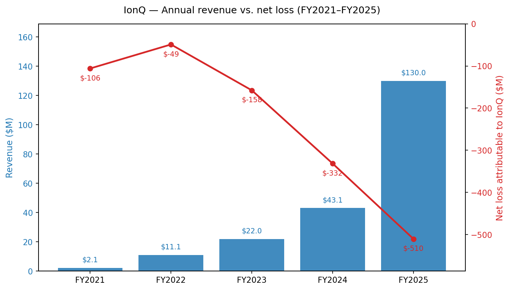
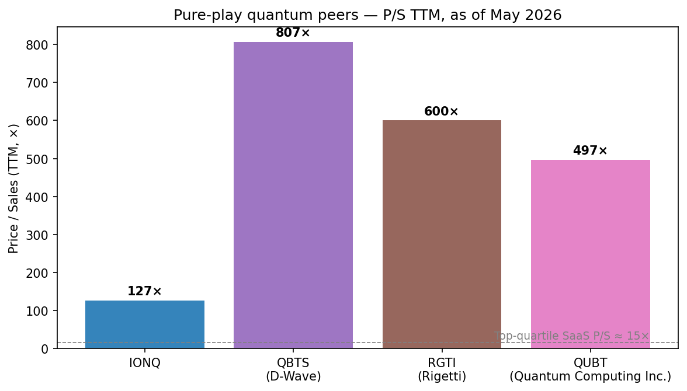
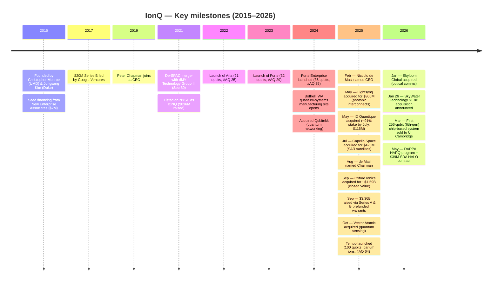
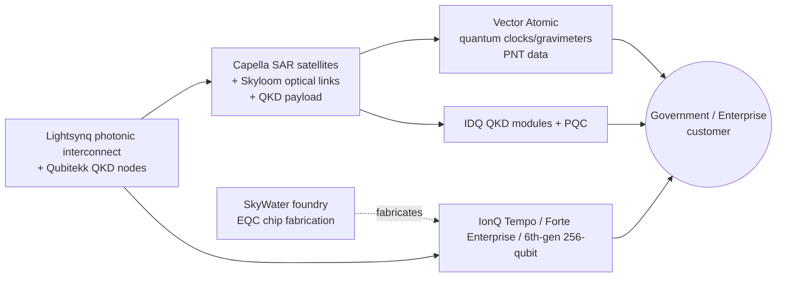
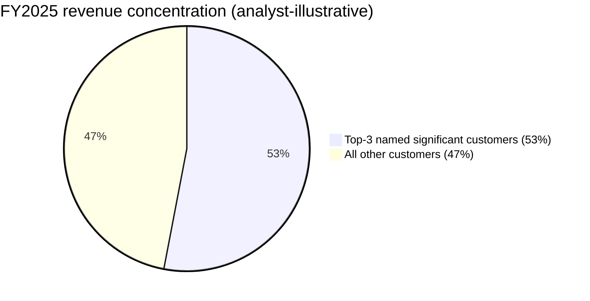
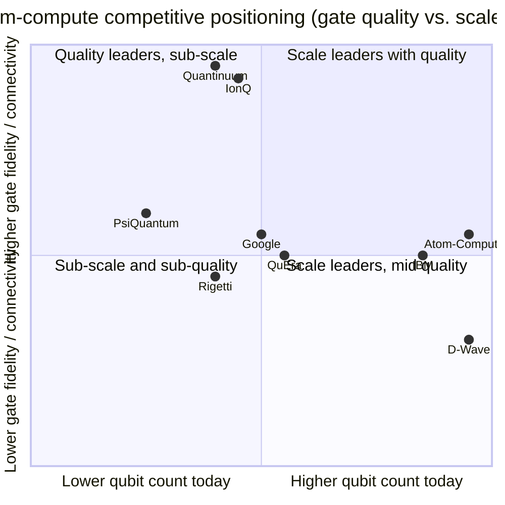

# IonQ, Inc. (NYSE: IONQ) — Company Research

*Report as-of: 2026-05-26 · Coverage analyst: financial_agent · All figures in USD unless noted.*

> **Update — FY2026 revenue guidance raised (2026-05-06):** Management raised full-year 2026 revenue guidance to **$260–270M** (from the prior **$225–245M** range issued with Q4'25 results on 2026-02-25) and initiated Q2'26 guidance of **$65–68M**, while reaffirming the Adjusted-EBITDA-loss range of **$(330)M–$(310)M**. The raise reflects Q1'26 revenue of $64.7M coming 30% above the midpoint of guidance, the first 256-qubit chip-based system sale (University of Cambridge), and DARPA HARQ + Space Development Agency HALO awards. Sources: [IonQ Q1'26 8-K Ex 99.1, 2026-05-06](https://www.sec.gov/Archives/edgar/data/1824920/000119312526208923/ionq-ex99_1.htm) and [IonQ Q4'25 8-K Ex 99.1, 2026-02-25](https://www.sec.gov/Archives/edgar/data/1824920/000119312526071520/ionq-ex99_1.htm).

---

## Table of Contents
1. Company Overview
2. Company History
3. Management
4. Products & Services
5. Customers & Go-to-Market
6. Industry Overview
7. Competitive Landscape
8. Market Opportunity (TAM/SAM/SOM)
9. Risk Assessment
10. References & Verification Log

---

## 1. Company Overview

IonQ, Inc. (NYSE: **IONQ**) is a Maryland-headquartered quantum-technology company that designs, manufactures, and operates **trapped-ion quantum computers** and — increasingly — adjacent **quantum networking, sensing, and security** systems sold as an integrated "full-stack quantum platform." Its FY2025 10-K describes the business as "the world's first and only quantum platform company… seek[ing] to deliver the full promise of quantum, across computing, networking, sensing and security" ([IonQ FY2025 10-K, Item 1 Business](https://www.sec.gov/Archives/edgar/data/1824920/000119312526071562/ionq-20251231.htm)). The company sells quantum compute access through Amazon Braket, Microsoft Azure Quantum, and Google Cloud Marketplace, sells full quantum systems to customers (cloud or on-premises), and — through its 2025 acquisitions — also sells QKD hardware, photonic interconnects, ion-trap chips, atomic clocks, gravimeters, and SAR satellite imagery ([IonQ FY2025 10-K, Item 1 Business](https://www.sec.gov/Archives/edgar/data/1824920/000119312526071562/ionq-20251231.htm)).

IonQ derives revenue from four streams disclosed in MD&A: (i) design and sale of quantum hardware with attached maintenance and support, (ii) QCaaS subscription / consumption access through the three major hyperscalers and the company's own private cloud, (iii) consulting and algorithm co-development services, and (iv) satellite-imagery data-as-a-service from the Capella Space constellation acquired in July 2025 ([IonQ FY2025 10-K, MD&A Revenue components](https://www.sec.gov/Archives/edgar/data/1824920/000119312526071562/ionq-20251231.htm)). FY2025 revenue was **$130.0M**, up **202% YoY** from $43.1M in FY2024 — the first time a pure-play public quantum company has crossed $100M in GAAP revenue ([IonQ FY2025 10-K, MD&A Results of Operations](https://www.sec.gov/Archives/edgar/data/1824920/000119312526071562/ionq-20251231.htm)). The company employs **1,132 people** as of 31-Dec-2025, with 14% in the greater DC area (its College Park, MD HQ) and 18% in the Seattle metro (its Bothell, WA quantum-systems manufacturing site opened in 2024) ([IonQ FY2025 10-K, Item 1 Human Capital](https://www.sec.gov/Archives/edgar/data/1824920/000119312526071562/ionq-20251231.htm)).

The company is still loss-making at scale: FY2025 GAAP net loss attributable to IonQ was **$(510.4)M**, up from $(331.6)M in FY2024 and $(157.8)M in FY2023; the accumulated deficit at year-end was **$(1,194.1)M** ([IonQ FY2025 10-K, MD&A Results of Operations](https://www.sec.gov/Archives/edgar/data/1824920/000119312526071562/ionq-20251231.htm)). Cash burn is funded by an extraordinarily large balance sheet — **$3.34B in cash, cash equivalents, and short-term and long-term investments** at year-end 2025 — itself the product of $3.36B raised through equity-and-warrant financings during 2025 (proceeds from Series A and Series B prefunded warrants drove the year's $3.36B in financing-activity cash inflow) ([IonQ FY2025 10-K, MD&A Liquidity](https://www.sec.gov/Archives/edgar/data/1824920/000119312526071562/ionq-20251231.htm)). By 31-Mar-2026, cash + investments stood at **$3.1B** after closing Lightsynq, Capella, Oxford Ionics, Vector Atomic, and Skyloom and after Q1 cash burn ([IonQ Q1'26 8-K Ex 99.1, 2026-05-06](https://www.sec.gov/Archives/edgar/data/1824920/000119312526208923/ionq-ex99_1.htm)).

*Source: [IonQ FY2025 10-K, MD&A Results of Operations](https://www.sec.gov/Archives/edgar/data/1824920/000119312526071562/ionq-20251231.htm); FY2021/22 from prior 10-Ks via [Macrotrends — IONQ revenue](https://www.macrotrends.net/stocks/charts/IONQ/ionq/revenue).*

**Valuation snapshot (as of 2026-05-26).** IONQ closed at **$63.62**, market cap **$23.75B**, enterprise value **$21.71B**, on 373.27M shares outstanding ([Stockanalysis.com — IONQ statistics](https://stockanalysis.com/stocks/ionq/statistics/)). On a TTM basis the GAAP P/S is **126.7×**, EV/Sales **116×**, and P/B **4.77×**; TTM EPS is **$0.92** (positive only because of large non-operating mark-to-market warrant gains — see the warrant-gain decomposition in Section 9) ([Stockanalysis.com — IONQ statistics](https://stockanalysis.com/stocks/ionq/statistics/)). On the May-2026 raised midpoint of $265M FY2026 revenue, the forward P/S is **~90×**.

This is **extreme even by US tech-IPO standards** and warrants a named cause. The drivers are: (1) IONQ is the only pure-play public quantum-compute company that has crossed $100M in GAAP revenue and is generally regarded as the highest-quality pure-play (Quantinuum is still private but in IPO registration at $12.7B; D-Wave is annealing-only; Rigetti is sub-$5M quarterly) ([The Quantum Insider — Quantinuum IPO filing, 2026-05-26](https://thequantuminsider.com/2026/05/26/honeywell-backed-quantinuum-files-for-landmark-quantum-ipo/), [Motley Fool — best quantum stocks to buy 2026, 2026-05-04](https://www.fool.com/investing/2026/05/04/the-best-quantum-computing-stocks-to-buy-in-2026/)); (2) the post-SkyWater vertical-integration narrative is being priced as if it shortcuts the path to fault-tolerant quantum (FTQ) by 2–3 years ([Manufacturing Dive — IonQ-SkyWater $1.8B deal, 2026-01-26](https://www.manufacturingdive.com/news/ionq-spend-nearly-2-billion-chips-maker-skywater-us-quantum-computing/810601/)); (3) thematic-rotation flows into the entire pure-play quantum basket through 2026 — peer P/S TTMs include QBTS at **~807×**, QUBT at **~497×**, RGTI at **~600× (est.)** ([Companiesmarketcap — QBTS P/S](https://companiesmarketcap.com/ionq/ps-ratio/)). Even within this basket IONQ trades **at a deep discount to peers on P/S** — a sign that it is the only quantum name where the revenue ramp is genuinely catching up to the multiple. The valuation risk is sized in Section 9.

*Source: [Stockanalysis.com — IONQ](https://stockanalysis.com/stocks/ionq/statistics/), [Companiesmarketcap — IONQ P/S](https://companiesmarketcap.com/ionq/ps-ratio/), [24/7 Wall St — quantum-stock rally, 2026-05-22](https://247wallst.com/investing/2026/05/22/rigetti-surges-17-quantum-computing-inc-soars-14-d-wave-pops-13-ionq-rises-8-the-quantum-bounce-becomes-a-rally/). RGTI P/S is analyst estimate from $8.4B market cap / sub-$15M TTM revenue.*

The geographic footprint is heavily US-anchored: $124.6M of $142.9M long-lived assets sit in the United States, with $17.8M in Europe (predominantly the Oxford Ionics UK facility) and $0.5M in other international locations ([IonQ FY2025 10-K, Note 20 Geographic Information](https://www.sec.gov/Archives/edgar/data/1824920/000119312526071562/ionq-20251231.htm)). The customer footprint is more international than the asset footprint: management disclosed in Q1'26 that **35% of revenue came from international customers** and that the company has now sold solutions in **"more than 30 countries"** versus "only a few" a year ago, reflecting the pull from the Capella, Vector Atomic, and ID Quantique product additions ([IonQ Q1'26 8-K Ex 99.1, 2026-05-06](https://www.sec.gov/Archives/edgar/data/1824920/000119312526208923/ionq-ex99_1.htm)).

---

## 2. Company History

IonQ was founded in **2015** at College Park, Maryland by physicist **Christopher Monroe** and electrical-and-computer-engineering professor **Jungsang Kim** to commercialize three decades of trapped-ion research conducted at the University of Maryland (Monroe), Duke University (Kim), and the Wineland group at NIST Boulder where Monroe co-led the team that demonstrated the first quantum logic gate in 1995 ([Wikipedia — Christopher Monroe](https://en.wikipedia.org/wiki/Christopher_Monroe), [Wikipedia — IonQ company history](https://en.wikipedia.org/wiki/IonQ)). New Enterprise Associates seeded the company with $2M; Google Ventures led a $20M Series B in 2017; David Moehring (formerly of IARPA) became the first CEO before Peter Chapman (an Amazon Prime executive) joined as CEO in 2019 ([Wikipedia — IonQ history section](https://en.wikipedia.org/wiki/IonQ)).

The company went public on **30-Sep-2021** through a de-SPAC merger with dMY Technology Group III (whose CEO was none other than Niccolo de Masi, IonQ's current CEO), raising approximately $636M and listing on the NYSE under "IONQ" ([IonQ FY2025 10-K, Item 1 Corporate Information](https://www.sec.gov/Archives/edgar/data/1824920/000119312526071562/ionq-20251231.htm), [Wikipedia — IonQ company history](https://en.wikipedia.org/wiki/IonQ)). Through 2022–2024 the company shipped successive quantum-system generations (Aria, Forte, Forte Enterprise — see Section 4) and grew revenue from $11M to $43M while losses widened from $49M to $332M.

**2025 was the strategic re-platforming year.** Within ten months IonQ completed six acquisitions worth roughly $2.6B in headline value (and additional equity dilution from the warrant-funded purchase consideration), and announced two more closing in 2026 for an additional ~$2.0B of consideration. The strategic logic was to bolt the three other quantum pillars (networking, sensing, security) onto the compute business so that the company could sell an integrated "quantum platform" to government and enterprise customers — and, critically, to internalize the chip-fabrication, photonic-interconnect, and satellite-payload capabilities required for fault-tolerant scale ([IonQ FY2025 10-K, Item 1 Our Strategy](https://www.sec.gov/Archives/edgar/data/1824920/000119312526071562/ionq-20251231.htm)).

*Sources: [IonQ FY2025 10-K Note 3 Business Combinations and Note 22 Subsequent Events](https://www.sec.gov/Archives/edgar/data/1824920/000119312526071562/ionq-20251231.htm); [IonQ Q1'26 8-K Ex 99.1, 2026-05-06](https://www.sec.gov/Archives/edgar/data/1824920/000119312526208923/ionq-ex99_1.htm); [The Quantum Insider — Oxford Ionics deal cleared by UK CMA, 2025-09-12](https://thequantuminsider.com/2025/09/12/uk-clears-ionq-acquisition-of-oxford-ionics-with-conditions/); [IonQ press release — Vector Atomic close, 2025-10-07](https://www.ionq.com/news/ionq-completes-acquisition-of-vector-atomic-the-global-leader-in-advanced); [Wikipedia — IonQ](https://en.wikipedia.org/wiki/IonQ).*

Three strategic pivots stand out. **First**, the 2025 acquisition of Oxford Ionics fundamentally re-aimed the technology roadmap from purely laser-based ion control to **Electronic Qubit Control (EQC)** — ion-trap chips fabricated on standard semiconductor processes that move the control electronics onto the chip itself, dramatically reducing per-qubit cost and laser-beam routing complexity. The 10-K explicitly says the deal "will accelerate our quantum computing roadmap by using Electronic Qubit Control (EQC) to leverage semiconductor production and scaling" ([IonQ FY2025 10-K, Item 1 Our Strategy](https://www.sec.gov/Archives/edgar/data/1824920/000119312526071562/ionq-20251231.htm)). **Second**, the Lightsynq + ID Quantique + Capella + Skyloom acquisitions assembled a coherent quantum-networking stack — quantum memory + photonic interconnect (Lightsynq), QKD modules (ID Quantique), space-to-ground SAR satellites and QKD payload bus (Capella), and optical inter-satellite links (Skyloom) — that is unique among public quantum-compute peers. **Third**, the January-2026 announcement of the SkyWater Technology $1.8B acquisition vertically integrates a US-domiciled trusted semiconductor foundry into IonQ; the strategic reasoning is to give DoD / IC / national-security customers a fully domestic, ITAR-clean trapped-ion-chip supply chain — a moat that is structurally inaccessible to non-US trapped-ion peers like Quantinuum (whose chips are also US-fabricated but at AMD's GlobalFoundries) and Alpine Quantum Technologies (Austria) ([Manufacturing Dive — IonQ-SkyWater $1.8B deal, 2026-01-26](https://www.manufacturingdive.com/news/ionq-spend-nearly-2-billion-chips-maker-skywater-us-quantum-computing/810601/)).

Recent developments since the 10-K filing include the announced commercial sale of the **first 256-qubit, 6th-generation chip-based system** to the University of Cambridge in Q1'26, **selection for DARPA's HARQ Program** (heterogeneous quantum computing using IonQ's photonic interconnects), a **$39M Space Development Agency HALO contract** for tactical space communications, and **MDA SHIELD IDIQ** selection (the ceiling is $151B across the program, not IonQ's contract value) ([IonQ Q1'26 8-K Ex 99.1, 2026-05-06](https://www.sec.gov/Archives/edgar/data/1824920/000119312526208923/ionq-ex99_1.htm), [Stocktitan — $21.1M AFRL quantum-network contract, 2025](https://www.stocktitan.net/news/IONQ/ion-q-announces-new-21-1-million-project-with-united-states-air-sjltrf391p9i.html)).

*Source: [IonQ FY2025 10-K Note 3 Business Combinations and Note 22 Subsequent Events](https://www.sec.gov/Archives/edgar/data/1824920/000119312526071562/ionq-20251231.htm); SkyWater values from [IonQ 8-K, 2026-01-26](https://www.sec.gov/Archives/edgar/data/1824920/000119312526021616/d10479dex991.htm). Vector Atomic and Skyloom transaction values are analyst estimates — IonQ disclosed only share-count terms.*

---

## 3. Management

**Niccolo M. de Masi — Chairman, President & CEO (age 45)** — has been IonQ's CEO since **26-Feb-2025** and Chairman since **6-Aug-2025**, having served on the IonQ board since the September-2021 de-SPAC merger (the SPAC was dMY Technology Group III, which he ran as CEO from September 2020) ([IonQ 2026 DEF 14A, Director bios](https://www.sec.gov/Archives/edgar/data/1824920/000119312526197487/ionq-20260430.htm), [IonQ press release — de Masi appointment, 2025-02-26](https://www.ionq.com/news/ionq-names-niccolo-de-masi-as-president-and-chief-executive-officer)). De Masi is unusual among quantum-company CEOs in being neither a physicist-founder (Monroe, Kim) nor a hyperscaler-derived operator (Chapman from AWS) — he is a **serial public-company CEO** with deep expertise in scaling consumer- and enterprise-tech businesses through acquisition.

He was **CEO of Glu Mobile** (a publicly traded mobile-games company) from 2010 through its 2021 sale to Electronic Arts at a $2.4B valuation; he had previously been **CEO of Monstermob Group** before age 30; and most recently was **Chief Innovation Officer and President of Products & Solutions of Resideo Technologies** (the home-security spin-off from Honeywell) from 2018–2020 ([Bloomberg — Niccolo de Masi profile](https://www.bloomberg.com/profile/person/6724759), [IonQ 2026 DEF 14A, Director bios](https://www.sec.gov/Archives/edgar/data/1824920/000119312526197487/ionq-20260430.htm)). He has served on the boards of Planet Labs (2021–2025), Genius Sports (2021–2023), Rush Street Interactive (2019–present), and currently chairs Ares Interactive (a General Catalyst-backed game publisher). Per his bio, he has "led and consummated approximately 50 mergers and acquisitions" and "helped raise over $5 billion in equity" across his career — a track record that maps directly onto IonQ's 2025 M&A blitz and capital-raising activity ([HPCwire — IonQ CEO appointment, 2025-02-26](https://www.hpcwire.com/off-the-wire/ionq-names-niccolo-de-masi-as-president-chief-executive-officer/), [IonQ 2026 DEF 14A](https://www.sec.gov/Archives/edgar/data/1824920/000119312526197487/ionq-20260430.htm)).

His academic background is directly relevant: he holds a first-class B.A. and M.Sci. in Physics from Cambridge University, **specializing in quantum mechanics and next-generation electron-beam lithography** — the same techniques used to fabricate ion-trap chips ([Bloomberg — Niccolo de Masi profile](https://www.bloomberg.com/profile/person/6724759), [IonQ press release — de Masi appointment, 2025-02-26](https://www.ionq.com/news/ionq-names-niccolo-de-masi-as-president-and-chief-executive-officer)). His IonQ beneficial ownership at the FY2026 record date is **178,681 shares** (≈0.05% of 373M shares outstanding) — small absolute economic exposure for a CEO, but his FY2025 SCT total compensation was **$89.6M** and his "compensation actually paid" was **$134.2M**, dominated by replacement and inducement equity awards on his February-2025 hiring ([IonQ 2026 DEF 14A, Pay vs. Performance and Beneficial Ownership tables](https://www.sec.gov/Archives/edgar/data/1824920/000119312526197487/ionq-20260430.htm)).

**Founder context (not currently in operating roles).** Christopher Monroe co-founded IonQ in 2015 alongside Jungsang Kim, and served as Chief Scientist through 2023. Monroe took his B.S. in physics from MIT in 1987, postdoc'd in Carl Wieman's group at CU Boulder, then spent 1992–2000 in **David Wineland's Ion Storage Group at NIST Boulder** where he co-led the team that demonstrated the **first quantum logic gate (1995)** and the first multi-qubit entanglement; he ran research groups at Michigan (2000–2007) and then the Joint Quantum Institute at Maryland (2007–2021); since 2021 he has been the Gilhuly Family Presidential Distinguished Professor at Duke (Physics + ECE) and was elected to the **National Academy of Sciences in 2016** ([Wikipedia — Christopher Monroe](https://en.wikipedia.org/wiki/Christopher_Monroe), [Duke Pratt — Christopher Monroe and the birth of IonQ](https://pratt.duke.edu/news/jungsang-kim-dst-2/)). Jungsang Kim is the **Schiciano Family Distinguished Professor of ECE at Duke** and Duke's first Chief Science & Technology Strategist; he holds 80+ patents in trapped-ion quantum information, was IonQ CTO through 2024, and in 2026 received South Korea's Changjo Medal (highest national honor for science and engineering) ([Duke ECE — Jungsang Kim](https://ece.duke.edu/people/jungsang-kim/), [The Duke Chronicle — Kim receives Changjo Medal, 2026-05-26](https://www.dukechronicle.com/article/duke-university-jungsang-kim-changjo-award-south-korea-top-honor-engineering-quantum-computing-20260526)). The founders are no longer IonQ executives — Monroe is at Duke; Kim is at Duke and was the last-listed NEO in the 2024 SCT (now departed) ([IonQ 2026 DEF 14A, Pay vs. Performance footnotes](https://www.sec.gov/Archives/edgar/data/1824920/000119312526197487/ionq-20260430.htm)). This makes IonQ unusual among hardware-startup-derived public companies in being **fully run by professional executives rather than founder-operators**, which has both governance and culture implications discussed in Section 9 (Risks → Key-person dependency and executive turnover).

---

## 4. Products & Services

> **THE most consequential chapter of the report.** Without a precise understanding of what IonQ actually sells and how each product slot into the customer's workflow, Sections 5–9 reduce to hand-waving. This section walks the entire product matrix anchored to verbatim 10-K and press-release text, with a bilingual technical gloss for cross-border investors.

### 4.0 Product matrix — analyst-constructed from 10-K Item 1, company website, and acquisition press releases

The IonQ FY2025 10-K does **not** publish a single canonical product table — instead the product portfolio is described in narrative across Item 1 Business under "Our Business Model", "Quantum Hardware and Compute Access Model", "Quantum Networking", "Quantum Sensing", "Quantum Security", and "Constellation-Based Data" ([IonQ FY2025 10-K, Item 1 Business](https://www.sec.gov/Archives/edgar/data/1824920/000119312526071562/ionq-20251231.htm)). The matrix below is analyst-constructed from those sections, cross-referenced to the IonQ Quantum Systems product pages ([Aria](https://www.ionq.com/quantum-systems/aria), [Forte](https://www.ionq.com/quantum-systems/forte), [Forte Enterprise](https://www.ionq.com/quantum-systems/forte-enterprise), [Tempo](https://www.ionq.com/quantum-systems/tempo)) and the closing press releases of the 2025 acquisitions.

| Pillar | Product family | Description (issuer wording where shown) | Acquired/in-house | Current customer wave |
|---|---|---|---|---|
| **Compute** | **IonQ Aria** | 21-qubit Yb⁺ ion-trap system, **#AQ 25**, AWS Braket + Azure Quantum + GCP | In-house (5th-gen series) | NISQ R&D, AWS/Azure/GCP cloud customers |
| **Compute** | **IonQ Forte** | 32-qubit Yb⁺ ion-trap, **#AQ 29**, "first software-configurable quantum computer" via AODs (acousto-optic deflectors) | In-house | NISQ R&D, AstraZeneca / Ansys / Toyota Tsusho |
| **Compute** | **IonQ Forte Enterprise** | 36-qubit Yb⁺, **#AQ 35**, "highest performing commercially available IonQ system" | In-house | QuantumBasel (European quantum data center), AFRL Rome NY |
| **Compute** | **IonQ Tempo** | 100-qubit barium-ion next-gen system, **#AQ 64**, achieved AQ 64 milestone 3 months ahead of schedule | In-house, launched 2025 | AFRL Rome NY (×2 barium systems), QuantumBasel |
| **Compute** | **256-qubit, 6th-gen, chip-based** (no public product brand yet) | "First 6th-generation, chip-based, 256-qubit system" anchored by secure quantum network | In-house (incorporates Oxford Ionics EQC) | University of Cambridge (Q1'26) |
| **Networking** | **Lightsynq photonic interconnect + quantum memory** | "World-class R&D team and photonic interconnect technology…higher-performance quantum networking solutions" | Acquired May'25 ($306.2M) | Mid-Atlantic Regional Quantum Internet, Florida statewide initiative |
| **Networking** | **Qubitekk QKD prototypes / quantum-network testbeds** | Quantum-networking R&D acquired Nov'24 | Acquired Nov'24 | DOE Quantum Internet testbeds |
| **Networking** | **Skyloom optical inter-satellite links** | US-based optical communications company providing space-to-space and space-to-ground photonic links | Acquired Jan'26 (up to 3.9M shares) | SDA HALO program ($39M), QKD-from-orbit roadmap |
| **Security** | **ID Quantique (IDQ) QKD modules** | QKD hardware, post-quantum cryptography, single-photon detectors | Acquired May'25 ($116M for ~86–91% stake) | National Quantum Communication Network — Poland, global PQC deployments |
| **Sensing** | **Vector Atomic atomic clocks, gravimeters, inertial sensors** | "High-performance clocks, synchronization hardware, gravimeters, and inertial sensors" for PNT | Acquired Oct'25 (~$200M+ existing federal contracts) | DARPA / US Navy positioning-navigation-timing (PNT) contracts |
| **Sensing** | **Quantum positioning, navigation & timing (planned)** | Combined Capella satellite platform + Vector Atomic sensing | Planned integration product | Forward-looking (announced in 10-K, not yet revenue-generating) |
| **Constellation-data** | **Capella Space SAR imagery (data-as-a-service)** | Synthetic-aperture-radar earth-observation constellation, subscription + per-image pricing | Acquired Jul'25 ($424.8M) | DoD / IC customers; foundation for space-based QKD network |
| **Manufacturing** | **SkyWater Technology trusted foundry** *(pending)* | US-based trusted semiconductor foundry for fabricating IonQ ion-trap chips at production scale | Pending acquisition (Jan'26, ~$1.8B) | Internal capacity for IonQ chips + external customer fab work |

```mermaid
graph TD
    IonQ[IonQ Quantum Platform] --> Compute[Quantum Compute]
    IonQ --> Net[Quantum Networking]
    IonQ --> Sec[Quantum Security]
    IonQ --> Sense[Quantum Sensing]
    IonQ --> Data[Constellation Data]
    IonQ --> Mfg[Trusted-Foundry Mfg]

    Compute --> Aria[Aria — 21 Yb+ qubits, #AQ 25]
    Compute --> Forte[Forte — 32 Yb+ qubits, #AQ 29]
    Compute --> ForteEnt[Forte Enterprise — 36 Yb+ qubits, #AQ 35]
    Compute --> Tempo[Tempo — 100 Ba+ qubits, #AQ 64]
    Compute --> Gen6[6th-gen — 256-qubit chip-based, EQC]

    Net --> Lightsynq[Lightsynq — photonic memory + interconnect]
    Net --> Qubitekk[Qubitekk — QKD testbed nodes]
    Net --> Skyloom[Skyloom — optical inter-satellite links]

    Sec --> IDQ[ID Quantique — QKD modules + PQC]

    Sense --> Vector[Vector Atomic — atomic clocks, gravimeters, IMUs]

    Data --> Capella[Capella Space — SAR satellite constellation]

    Mfg --> SkyWater["SkyWater — trusted US foundry (pending close)"]
```

*Source: [IonQ FY2025 10-K Item 1 Business](https://www.sec.gov/Archives/edgar/data/1824920/000119312526071562/ionq-20251231.htm); IonQ Quantum Systems product pages ([Aria](https://www.ionq.com/quantum-systems/aria) · [Forte](https://www.ionq.com/quantum-systems/forte) · [Forte Enterprise](https://www.ionq.com/quantum-systems/forte-enterprise) · [Tempo](https://www.ionq.com/quantum-systems/tempo) · [Compare](https://www.ionq.com/quantum-systems/compare)); acquisition press releases linked in Section 2 above.*

### 4.1 Compute — the four-generation trapped-ion stack and where each fits

**IonQ Aria (21 ytterbium-ion qubits, #AQ 25).** Aria was the production workhorse from 2022 through 2024 — IonQ's first system to be widely available across all three hyperscaler clouds (AWS Braket, Azure Quantum, Google Cloud Marketplace).

> "IonQ Aria has an #AQ of 25, a higher qubit count, and best gate fidelities. The system's hardware metrics include 21 qubits with all-to-all connectivity, a 0.05% single-qubit gate error rate, 0.4% two-qubit gate error rate, and qubit lifetimes (T2) of about 1000ms." — [IonQ Aria product page](https://www.ionq.com/quantum-systems/aria).

**Plain-language gloss.** A trapped-ion quantum computer holds individual electrically-charged atoms (ions) suspended in a vacuum chamber, controlled by laser beams. Each ion serves as one "qubit" — a quantum bit that can be 0, 1, or a superposition. "All-to-all connectivity" means any two qubits in the same chain can directly perform a two-qubit gate (the quantum equivalent of an AND operation) without having to route through intermediate qubits — a structural advantage over superconducting systems where adjacent-qubit-only connectivity forces algorithms to add overhead "swap" gates. The "#AQ" (Algorithmic Qubits) metric is IonQ's own benchmark: it counts the qubits in a system that can actually run an algorithm to a useful depth, so #AQ 25 on a 21-physical-qubit system means **all 21 qubits are usable** plus extra margin (#AQ counts log₂ of usable circuit volume) ([IonQ — Aria practical-performance benchmark](https://www.ionq.com/resources/ionq-aria-practical-performance), [QC Report — #AQ definition](https://quantumcomputingreport.com/ionq-reaches-aq-64-milestone-on-100-qubit-tempo-system-ahead-of-schedule/)). Aria's strategic role today is the **default cloud-NISQ workhorse** — wide hyperscaler availability, free or low-cost tier access for developers, and the entry product for quantum-algorithm development teams at corporate customers (AstraZeneca, Ansys, JPMorgan, Hyundai Motor Group through prior R&D contracts).

**IonQ Forte (32 Yb⁺ qubits, #AQ 29) and Forte Enterprise (36 Yb⁺ qubits, #AQ 35).** Forte was the 2023 generation that introduced **AOD-based (acousto-optic deflector) software-configurable beam routing** — meaning the laser-beam paths to the ions are not hard-wired but dynamically reconfigured by software, eliminating fixed cabling between the laser and each ion.

> "IonQ Forte has 32 physical qubits and is the first known quantum computer with a demonstrated #AQ of 29. Forte's laser system features Acousto-optic Deflectors (AODs) that introduce new opportunities for system configurability, and Forte's operating system has been developed to enable new operating routines that can configure the system on the fly for optimal performance." — [IonQ Forte product page](https://www.ionq.com/quantum-systems/forte).
>
> "Forte Enterprise is IonQ's highest performing commercially available quantum computer, built to tackle larger problems than any other IonQ system. The 36-qubit Forte Enterprise quantum processing unit offers 35 Algorithmic Qubits (#AQ)." — [IonQ Forte Enterprise product page](https://www.ionq.com/quantum-systems/forte-enterprise).

**Plain-language gloss.** Forte Enterprise is the **first IonQ system explicitly designed for data-center deployment** rather than a science-lab setup — the difference is rack-mountable subsystems, redundancy, and uptime engineering. It is the system being delivered to QuantumBasel for the Swiss European quantum data center and shipped to AFRL Rome NY for quantum-networking research. Strategically, Forte/Forte Enterprise is the **bridge generation** between the cloud-NISQ Aria and the chip-based future: they prove the all-to-all, software-configurable architecture works at #AQ ≈ 35, which is the rough threshold many academic studies place on the "useful for narrow commercial advantage" line for certain optimization and quantum-chemistry workloads.

*Analyst view:* The closest comparable trapped-ion system from Quantinuum is **Helios**, which Quantinuum launched in November 2025 with **98 barium-ion qubits**, two-qubit gate fidelity of 99.921%, and 48 error-corrected logical qubits ([The Quantum Insider — Quantinuum Helios launch, 2025-11-06](https://thequantuminsider.com/2025/11/06/illuminating-helios-quantinuums-shiny-new-quantum-computer-gets-sunny-reception/), [MIT Tech Review — Quantinuum Helios error correction, 2025-11-05](https://www.technologyreview.com/2025/11/05/1127659/a-new-ion-based-quantum-computer-makes-error-correction-simpler/)). On a head-to-head physical-qubit count Quantinuum's Helios (98) leads IonQ's Tempo (100) by a hair, but Quantinuum has not publicly reported an #AQ-equivalent benchmark and uses a different processor architecture (linear-shuttle-based zone hopping versus IonQ's all-to-all parallel-gate model — described in IonQ's 10-K Competition section). The two-qubit gate fidelity figures are comparable.

**IonQ Tempo (100 barium-ion qubits, #AQ 64).** Tempo is the **fifth-generation system and the first to use barium ions** rather than ytterbium. Barium ions interact with light in the visible spectrum (versus ytterbium in the UV), which allows IonQ to use standard fiber-optic and chip-integrated photonic components, dramatically reducing the complexity of the laser-and-mirror beam-routing system. Tempo achieved its #AQ 64 milestone three months ahead of schedule on the 100-qubit Tempo platform — making IonQ the only company at that #AQ tier ([IonQ — #AQ 64 milestone press release](https://www.ionq.com/news/ionq-achieves-record-breaking-quantum-performance-milestone-of-aq-64), [Quantum Computing Report — IonQ AQ 64 milestone, 2025](https://quantumcomputingreport.com/ionq-reaches-aq-64-milestone-on-100-qubit-tempo-system-ahead-of-schedule/)). In Q1'26, management said **"Demand for Fifth-Generation Tempo Remains Strong"** ([IonQ Q1'26 8-K Ex 99.1, 2026-05-06](https://www.sec.gov/Archives/edgar/data/1824920/000119312526208923/ionq-ex99_1.htm)). Two Tempo (or barium-ion) systems are being deployed to AFRL's Rome NY facility for quantum-networking and application research ([HPCwire — IonQ #AQ 64 on Tempo](https://www.hpcwire.com/off-the-wire/ionq-reaches-aq-64-benchmark-on-tempo-system-ahead-of-schedule/)). Tempo's strategic role is the **first commercial-viable system for narrow quantum advantage** — IonQ's 10-K language flags applications in energy-grid distribution, computational drug discovery, and supply-chain optimization.

**6th-generation chip-based 256-qubit (no public brand yet, EQC-integrated).** The May-2026 Q1 earnings release confirmed that IonQ sold its **first 6th-generation, chip-based, 256-qubit system** in Q1'26 — to the University of Cambridge — and that **ion-trap chip samples have come back from the foundry** so that "we are now moving from component-level testing to integrated, system-level testing of the full 256-qubit quantum computer" ([IonQ Q1'26 8-K Ex 99.1, 2026-05-06](https://www.sec.gov/Archives/edgar/data/1824920/000119312526208923/ionq-ex99_1.htm)). This is the first IonQ system to incorporate **Oxford Ionics' Electronic Qubit Control (EQC)** — the qubit-control electronics are embedded directly into the ion-trap chip itself, eliminating the laser-and-mirror-and-cabling complexity that limited the prior generations' scaling. Pre-EQC, scaling from 100 to 1,000 qubits would have required exponentially more laser channels and beam-routing optics; with EQC the scaling is closer to a standard semiconductor process node — you can add qubits the way you add transistors. **This is the architectural pivot that makes IonQ's "fault-tolerant by end of decade" claim plausible** (and which the company published a "definitive and detailed architectural blueprint" for in Q1'26).

### 4.2 Quantum Networking — the Lightsynq + Qubitekk + Skyloom stack

**Lightsynq** ($306.2M, May 2025) provides quantum-memory hardware and silicon-photonic interconnect chips that connect multiple QPUs into a single distributed computer. The 10-K calls Lightsynq's contribution "world-class R&D team and photonic interconnect technology, which we believe will enable higher-performance quantum networking solutions" ([IonQ FY2025 10-K, Item 1 Our Strategy](https://www.sec.gov/Archives/edgar/data/1824920/000119312526071562/ionq-20251231.htm)).

**Plain-language gloss.** A photonic interconnect lets two ion-trap QPUs in physically separated vacuum chambers (or in different cities) exchange quantum state by emitting single photons that carry entanglement. Today's IonQ systems all live on one chip — the photonic interconnect is what lets a single 256-qubit chip become "many 256-qubit chips computing together as one 10,000-qubit system" without having to put all those ions in one impossibly large vacuum chamber. This is the **scaling architecture that distinguishes trapped-ion from superconducting** at the multi-thousand-qubit scale: superconducting systems cannot easily networked because the qubits' coherence breaks the moment they leave the dilution refrigerator; ion qubits remain coherent in vacuum-at-room-temperature, so the photonic-interconnect approach is the natural scaling path. The Q1'26 earnings release confirmed a "foundational quantum interconnect milestone with first ever commercial demonstration of two connected commercial quantum computers" ([IonQ Q1'26 8-K Ex 99.1, 2026-05-06](https://www.sec.gov/Archives/edgar/data/1824920/000119312526208923/ionq-ex99_1.htm)).

**Qubitekk** (Nov 2024) is a smaller quantum-networking acquisition focused on QKD testbed nodes for DOE-funded "quantum internet" pilots. **Skyloom Global** (Jan 2026) adds **optical inter-satellite links** — the laser-based communications between satellites in orbit that will carry quantum-key-distribution traffic across continents. The Q1'26 release noted **"deployment of National Quantum Communication Network in Poland"** and **"first commercial sale of a Quantum Memory Node into the U.S. Mid-Atlantic Regional Quantum Internet"** — both anchored to the Lightsynq + Qubitekk + IDQ + Skyloom assembled stack ([IonQ Q1'26 8-K Ex 99.1, 2026-05-06](https://www.sec.gov/Archives/edgar/data/1824920/000119312526208923/ionq-ex99_1.htm)).

### 4.3 Quantum Security — ID Quantique (QKD + PQC)

**ID Quantique (IDQ)** is the Geneva-based world leader in commercial QKD hardware and post-quantum-cryptography (PQC) software, founded in 2001. IonQ acquired ~86% of IDQ in May 2025 and increased the stake to ~91% by July for total consideration of **$116.2M** ([IonQ FY2025 10-K Note 3 Business Combinations](https://www.sec.gov/Archives/edgar/data/1824920/000119312526071562/ionq-20251231.htm)).

**Plain-language gloss.** QKD ("Quantum Key Distribution") uses single photons to exchange a cryptographic key between two parties; any eavesdropper measuring the photons necessarily disturbs them, which the legitimate parties detect. PQC ("post-quantum cryptography") is the classical-software analog: encryption algorithms designed to resist attack by a future fault-tolerant quantum computer running Shor's algorithm. The two are complementary — QKD secures the key exchange itself; PQC encrypts the data using a key. IDQ sells both. Strategic role: IDQ is **the only product family in the IonQ portfolio with real, present-day commercial revenue at scale** (banking, telco, defense customers globally), and its near-term growth tailwind is the NIST PQC migration mandate that is forcing every regulated US institution to replace RSA/ECC by 2030. The Q1'26 release flagged **"global deployments of our post-quantum cybersecurity solutions"** as a growth contributor ([IonQ Q1'26 8-K Ex 99.1, 2026-05-06](https://www.sec.gov/Archives/edgar/data/1824920/000119312526208923/ionq-ex99_1.htm)).

*Analyst view:* IDQ is also the most defensible product line on the IonQ roster against the long-tail risk that IonQ never reaches FTQ — QKD/PQC revenue is independent of whether IonQ's compute roadmap pays off.

### 4.4 Quantum Sensing — Vector Atomic

**Vector Atomic** (acquired Oct 2025) brings high-performance **atomic clocks, gravimeters, and inertial measurement units (IMUs)** for positioning, navigation, and timing (PNT) applications. Per IonQ's own description, Vector Atomic had secured **$200M+ in government contracts** prior to acquisition and delivers "critical U.S. federal and national security applications" ([IonQ press release — Vector Atomic close, 2025-10-07](https://www.ionq.com/news/ionq-completes-acquisition-of-vector-atomic-the-global-leader-in-advanced)).

**Plain-language gloss.** A modern GPS receiver depends on a constellation of atomic clocks in orbit — the receiver computes its position by triangulating the time-of-flight of signals from each satellite. Vector Atomic builds **chip-scale and rack-scale atomic clocks ~100× more accurate than commercial cesium clocks**, plus **quantum gravimeters** (which measure tiny variations in gravitational field — useful for navigation in GPS-denied environments and for detecting underground voids / oil deposits) and **quantum IMUs** (inertial-measurement units that maintain accurate position without GPS for hours to days). Strategic role: Vector Atomic is the **DoD-PNT story** — every US military platform from submarines to fighter jets needs GPS-independent navigation that quantum sensing uniquely provides, and the $39M SDA HALO contract (Q1'26) is the first big channel IonQ has won for that capability.

### 4.5 Constellation-Based Data — Capella Space SAR

**Capella Space** (acquired Jul 2025 for $424.8M) operates a constellation of **synthetic-aperture radar (SAR) satellites** that provide all-weather, day-or-night earth-observation imagery to government and commercial customers ([IonQ FY2025 10-K Note 3 Business Combinations](https://www.sec.gov/Archives/edgar/data/1824920/000119312526071562/ionq-20251231.htm), [The Quantum Insider — Capella close, 2025-07-15](https://thequantuminsider.com/2025/07/15/ionq-completes-acquisition-of-capella-space/)).

**Plain-language gloss.** Optical satellites take photos and need sunlight and cloud-free conditions. SAR satellites emit radio-frequency pulses and image the reflections — they work through cloud cover, at night, and through smoke. The commercial SAR market is dominated by Capella, ICEYE, Umbra, and Maxar's BlackSky; Capella is generally regarded as one of the top three SAR providers globally. **The strategic logic of Capella inside IonQ is two-step**: today, Capella generates conventional SAR-imagery-as-a-service revenue (DoD, IC, commercial); over time, IonQ plans to add a **QKD payload** to each Capella satellite and to use Skyloom's optical inter-satellite links so the constellation becomes a global **space-based quantum-key-distribution network** — the kind of network the People's Republic of China demonstrated with the Micius satellite in 2017 but that no Western government currently has. The 10-K explicitly calls this out: "through combining our satellite platform with our quantum sensing products, we intend to offer advanced quantum positioning, navigation and timing services in the future" ([IonQ FY2025 10-K, Item 1 Overview](https://www.sec.gov/Archives/edgar/data/1824920/000119312526071562/ionq-20251231.htm)). Until then, Capella is a **classical earth-observation revenue line that materially contributed to the 202% FY2025 revenue growth and the 35% international-customer share** disclosed in Q1'26.

### 4.6 Synthesis — how the pillars compose a single platform

The interconnection runs in two directions. In the **upward direction** (chip → system → service), SkyWater fabricates the EQC ion-trap chips, IonQ assembles them into Tempo/256-qubit systems, Lightsynq interconnects multiple systems into a distributed quantum computer, and customers consume the compute either as on-premises hardware or as cloud service. In the **lateral direction**, IDQ secures the network keys between any two endpoints (classical or quantum), Vector Atomic provides the precise timing the network needs, and the Capella+Skyloom satellite constellation extends the network from terrestrial fiber out to space-to-space and space-to-ground links. The customer — a US three-letter agency, a NATO ministry of defense, a global bank, or a pharma R&D group — buys not individual products but a **portfolio of capabilities that all interoperate**, and the strategic moat is the lock-in of buying all of them from one vendor whose roadmap is internally consistent. **This is the "platform" thesis** that justifies (or fails to justify) the 126× P/S multiple.

The flagship growth driver in 2026 is the **Tempo + Lightsynq combination** (about 60% of revenue is commercial customers per Q1'26, and "approximately 35% of revenue from multi-product customers" — meaning a third of customers are already buying across pillars) ([IonQ Q1'26 8-K Ex 99.1, 2026-05-06](https://www.sec.gov/Archives/edgar/data/1824920/000119312526208923/ionq-ex99_1.htm)). The long-tail flagship is the **6th-gen 256-qubit EQC chip**, which will land in the Cambridge installation through 2026.

**Recurring / aftermarket / services.** IonQ does not break out a separate maintenance-and-support business in its segment reporting — it operates as one segment. Per 10-K MD&A, maintenance and support is bundled with the hardware sale; the QCaaS contracts are recognized as a "stand-ready performance obligation" with fixed-fee straight-line revenue recognition over the access period plus variable usage fees ([IonQ FY2025 10-K, MD&A Revenue accounting](https://www.sec.gov/Archives/edgar/data/1824920/000119312526071562/ionq-20251231.htm)). The Capella satellite-imagery DaaS is also stand-ready (fixed fee for minimum imagery volume + variable per-image overage). These structures are **subscription-economy-friendly** — they should produce a long-duration recurring revenue tail as the installed base grows. The Q1'26 RPO disclosure ($470M, +554% YoY) is the leading indicator of that tail building ([IonQ Q1'26 8-K Ex 99.1, 2026-05-06](https://www.sec.gov/Archives/edgar/data/1824920/000119312526208923/ionq-ex99_1.htm)).

---

## 5. Customers & Go-to-Market

IonQ's FY2025 10-K names a handful of government partners directly: **US Air Force Research Lab (AFRL), Defense Advanced Research Projects Agency (DARPA), and Oak Ridge National Laboratory** ([IonQ FY2025 10-K Item 1 Government Agencies](https://www.sec.gov/Archives/edgar/data/1824920/000119312526071562/ionq-20251231.htm)). Co-development agreements are named for **Ansys** (computer-aided engineering), the **Centre for Commercialization of Regenerative Medicine** (advanced therapeutics optimization), and DARPA (next-generation benchmarking) ([IonQ FY2025 10-K Item 1 Our Quantum Platform Customer Journey](https://www.sec.gov/Archives/edgar/data/1824920/000119312526071562/ionq-20251231.htm)). Press releases over the last 12 months add: **AstraZeneca** (drug discovery), **Toyota Tsusho** (chemicals/materials), **Hyundai Motor Group** (battery materials, autonomous driving — prior R&D contracts), **JPMorgan Chase** (financial-modeling experiments), **Airbus** (logistics optimization), **General Dynamics Information Technology / GDIT** (mission-critical defense systems), **NVIDIA** (hybrid quantum-classical CUDA-Q integration), **AWS, Microsoft Azure, Google Cloud** (the three cloud channels), **Korea Institute of Science and Technology Information / KISTI** (hybrid HPC-quantum), and **University of Cambridge** (the 256-qubit system buyer) ([IonQ — Ansys quantum-computing milestone, 2025](https://www.ionq.com/news/ionq-and-ansys-achieve-major-quantum-computing-milestone-demonstrating), [IonQ — QuantumBasel partnership for European quantum data center, 2024](https://www.ionq.com/news/ionq-and-quantumbasel-partner-to-achieve-future-quantum-advantages-with), [IonQ — $25.5M Air Force quantum deal, 2025](https://www.ionq.com/news/ionq-announces-new-usd25-5m-quantum-deal-with-united-states-air-force), [IonQ Q1'26 8-K Ex 99.1, 2026-05-06](https://www.sec.gov/Archives/edgar/data/1824920/000119312526208923/ionq-ex99_1.htm)).

**Concentration — quantified.** The FY2025 10-K discloses **three significant customers** (≥10% of revenue each) that together accounted for **53% of FY2025 revenue**, versus **two customers / 77%** in FY2024 and **two customers / 58%** in FY2023 ([IonQ FY2025 10-K Note 2 Significant Customers](https://www.sec.gov/Archives/edgar/data/1824920/000119312526071562/ionq-20251231.htm)). For Q1'26, the 10-Q discloses **two significant customers / 34% of revenue**, down from two customers / 70% in Q1'25 ([IonQ Q1'26 10-Q Note 2, p. ~6](https://www.sec.gov/Archives/edgar/data/1824920/000119312526211876/ionq-20260331.htm)). The trend is **clearly de-risking** — concentration came down 24 percentage points (77 → 53) year-over-year, and Q1'26 quarterly concentration is roughly half what it was a year earlier. Management has not named the top customers in either filing, but **AFRL is widely understood to be one** based on the public disclosure of four ~$100M-tier AFRL contracts awarded 2022–2025 (the largest a $54.5M deal) and the deployment of two Tempo systems at the AFRL Rome NY facility ([Quantum Computing Report — IonQ-AFRL $54.5M contract](https://quantumcomputingreport.com/ionq-signs-a-54-5-million-contract-with-afrl-for-research-in-both-quantum-computing-and-quantum-networking/), [Stocktitan — IonQ AFRL $21.1M project](https://www.stocktitan.net/news/IONQ/ion-q-announces-new-21-1-million-project-with-united-states-air-sjltrf391p9i.html)). Despite the de-risking trend, **53% top-3 still exceeds the 30% top-5 threshold at which the citation standard requires risk disclosure** — Section 9 carries this through as a "material" customer-concentration risk.

*Source: [IonQ FY2025 10-K Note 2 Significant Customers](https://www.sec.gov/Archives/edgar/data/1824920/000119312526071562/ionq-20251231.htm). IonQ does not publicly name the three significant customers.*

**Commercial vs. government mix.** Q1'26 disclosed that **~60% of revenue came from commercial customers** ([IonQ Q1'26 8-K Ex 99.1, 2026-05-06](https://www.sec.gov/Archives/edgar/data/1824920/000119312526208923/ionq-ex99_1.htm)). Adjusting for IonQ's standard description of "commercial" as "all enterprise agreements with non-U.S. government customers including agreements with leading universities" — so the 60% includes both AstraZeneca-type true enterprise and university buyers like Cambridge — that means roughly **40% of revenue is government** (US federal + state + foreign government / NATO). Within government, the mix tilts toward DoD / Air Force / DARPA / MDA / DOE-Office-of-Science, with smaller exposures to allied governments through ID Quantique's pre-existing NATO QKD installed base.

**Go-to-market.** IonQ uses a **multi-channel sales model** combining:
1. **Cloud marketplace consumption** through AWS Braket, Azure Quantum, and Google Cloud Marketplace — the lowest-friction path; pricing is per-shot (per quantum circuit execution) and developer-time-based ([Microsoft Learn — Azure Quantum IonQ provider page](https://learn.microsoft.com/en-us/azure/quantum/provider-ionq));
2. **Direct enterprise sales** of dedicated reserved capacity or full system access ("annual commitment, reserved system time, consultations with solution scientists, and other application and integration support" per 10-K) ([IonQ FY2025 10-K Item 1 Direct Access Customers](https://www.sec.gov/Archives/edgar/data/1824920/000119312526071562/ionq-20251231.htm));
3. **System sales** of full quantum computers, either to install on-premises at customer sites or to host remotely for a single customer's dedicated use — this is where the $39M HALO and the Cambridge 256-qubit deals fall;
4. **Government program contracts** — typically cost-plus or fixed-fee development contracts under multi-year IDIQ (indefinite-delivery, indefinite-quantity) vehicles; the Q1'26 release flagged the MDA SHIELD IDIQ selection where the program ceiling is $151B though IonQ's contract value would be much smaller ([IonQ Q1'26 8-K Ex 99.1, 2026-05-06](https://www.sec.gov/Archives/edgar/data/1824920/000119312526208923/ionq-ex99_1.htm)).

The "land-and-expand" thesis that management articulates in Q1'26 — that customers start with cloud access, move to dedicated reserved capacity, then add networking/sensing/security products — is consistent with the **35% multi-product revenue share** and the **$470M RPO** (4× the FY2025 revenue level), both of which indicate that the early-cohort customers are buying additional product modules from the platform ([IonQ Q1'26 8-K Ex 99.1, 2026-05-06](https://www.sec.gov/Archives/edgar/data/1824920/000119312526208923/ionq-ex99_1.htm)).

---

## 6. Industry Overview

IonQ operates at the intersection of three distinct industry markets: **quantum computing** (the core), **quantum communications / QKD** (via IDQ + Lightsynq + Capella + Skyloom), and **quantum sensing / PNT** (via Vector Atomic). The unifying classification per SEC SIC code is **7373 — Services / Computer Integrated Systems Design** ([SEC EDGAR — IonQ company facts](https://data.sec.gov/submissions/CIK0001824920.json)). For purposes of TAM/SAM (Section 8) the three are sized separately and aggregated.

**Quantum computing today.** Quantum computing in 2026 is in what BCG and McKinsey both call the **"NISQ" (Noisy Intermediate-Scale Quantum) phase** — useful for narrow research applications but not yet delivering "broad quantum advantage" on commercially valuable problems. McKinsey's August-2024 update placed total quantum-technology investment to date at **>$50 billion in cumulative government and private capital** and estimated **up to $2 trillion in economic value from quantum computing in the next ten years**, with about 80% of that value accruing to *end-user industries* (pharma, finance, chemicals, automotive) and **$90B–$170B flowing to quantum-computing industry players themselves** by 2040 ([McKinsey — Quantum technology investment hits a magic moment](https://www.mckinsey.com/capabilities/tech-and-ai/our-insights/tech-forward/quantum-technology-investment-hits-a-magic-moment)). BCG's July 2024 update was more aggressive at **$450–$850B in economic value by 2040**, segmented across a three-phase model: NISQ until 2030, broad quantum advantage 2030–2040, and full-scale fault tolerance after 2040 ([BCG — Quantum computing $850B economic value by 2040, 2024-07-18](https://www.bcg.com/press/18july2024-quantum-computing-create-up-to-850-billion-of-economic-value-2040)).

**Near-term industry-revenue sizing.** Industry-revenue forecasts (what *quantum hardware-and-software vendors* will actually receive, as opposed to economic value to end-users) are tighter and more useful for valuing IonQ. The MarketsandMarkets baseline puts **2025 quantum-computing market revenue at $3.5B** growing to **$20.2B in 2030 (41.8% CAGR)**; BCC Research is more conservative at **$1.6B in 2025 → $7.3B in 2030 (34.6% CAGR)** ([BCC Research — Global Quantum Computing Market Forecast, 2025](https://www.bccresearch.com/pressroom/ift/global-quantum-computing-market-to-grow-346), [Market.us via Brian Colwell — 2025 quantum industry report](https://briandcolwell.com/2025-quantum-computing-industry-report-and-market-analysis-the-race-to-170b-by-2040/)). At IonQ's current $260M+ FY2026 revenue, it is **~5–15% of the addressable industry-revenue today** depending on which TAM source one uses — a credible single-digit-to-low-teens market share for a pure-play.

*Sources: [BCC Research — Global Quantum Computing Market Forecast, 2025](https://www.bccresearch.com/pressroom/ift/global-quantum-computing-market-to-grow-346); [McKinsey — Rise of Quantum Computing](https://www.mckinsey.com/featured-insights/the-rise-of-quantum-computing); [BCG — Quantum computing $850B economic value by 2040, 2024-07-18](https://www.bcg.com/press/18july2024-quantum-computing-create-up-to-850-billion-of-economic-value-2040). Industry-revenue band uses BCC low + McKinsey high.*

**Modality split — where each hardware architecture sits.** Industry observers (BCG, IDC, The Quantum Insider) typically split the compute market across five architectures: **superconducting** (IBM, Google, Rigetti — best at gate speed, worst at coherence and connectivity), **trapped-ion** (IonQ, Quantinuum, Alpine — best at gate fidelity and connectivity, slower gates), **neutral-atom** (Atom Computing, QuEra, Pasqal — best at qubit count today, mid-tier fidelity), **photonic** (PsiQuantum, Xanadu, Quandela — best at networking, hardest at storage), and **annealing** (D-Wave only — narrow optimization use cases, not gate-based) ([The Quantum Insider — quantum computing roadmaps 2025](https://thequantuminsider.com/2025/05/16/quantum-computing-roadmaps-a-look-at-the-maps-and-predictions-of-major-quantum-players/)). The IonQ 10-K Competition section lists IBM, Google, Rigetti (superconducting), Quantinuum + Alpine Quantum (trapped-ion), PsiQuantum + Xanadu (photonic), D-Wave (annealing), and QuEra (neutral atom) as named competitors ([IonQ FY2025 10-K, Item 1 Competition](https://www.sec.gov/Archives/edgar/data/1824920/000119312526071562/ionq-20251231.htm)).

**Quantum networking** is structurally smaller than computing today (~$1B in 2025, growing in lockstep with QKD adoption and the post-quantum-cryptography migration mandate); McKinsey projects it to **$11–15B by 2040**, with the bulk of revenue going to QKD module vendors (IDQ, Toshiba, ID Quantique, QuantumXChange) and to telco / cloud providers building quantum-secure backbones. The European Quantum Communication Infrastructure (EuroQCI) initiative is the largest single committed pipeline — €600M+ across 2022–2027 with national member-state co-funding adding multiples on top.

**Quantum sensing** is the most commercially mature of the three: atomic clocks and gravimeters are already in production use today in defense (GPS-denied navigation), oil & gas (subsurface mapping), and scientific instruments. McKinsey sizes it at **$7–10B by 2040** with the largest single line being defense/PNT ([McKinsey — Rise of Quantum Computing](https://www.mckinsey.com/featured-insights/the-rise-of-quantum-computing)). Vector Atomic's pre-acquisition $200M government-contract backlog gives a concrete data point on what a leading sensing pure-play looks like.

**Industry structure — driver of IonQ's strategy.** The three markets are converging on a common buyer set (US DoD/IC, NATO MoDs, top-tier global enterprises in regulated industries) who increasingly want **integrated quantum solutions from one vendor with security clearance and a US-domestic supply chain**, rather than buying compute from one vendor, QKD from a second, sensing from a third, and satellite payloads from a fourth. IonQ's 2025 acquisition spree is the industry's most aggressive bet on that convergence-and-integration thesis. Whether the buyers actually pay an integration premium is the empirical question.

**Regulatory framework.** Quantum-computing hardware is subject to **US export-control rules** (Commerce Department / BIS — quantum-computing hardware was added to the Export Administration Regulations CCL in September 2024) and to **CHIPS Act-derived supply-chain restrictions** that effectively require trusted-foundry sourcing for any system sold into DoD applications. The SkyWater acquisition gives IonQ a trusted-foundry status that is **structurally inaccessible to non-US peers** — Quantinuum has US-based design and fabricates at GlobalFoundries (US), but Alpine Quantum (Austria), Quandela (France), and Pasqal (France) all depend on European fabs that do not satisfy US trusted-foundry definitions for some classes of DoD contracts. ITAR + EAR restrictions also affect what IonQ can sell into China and other restricted destinations — though to date IonQ has not disclosed China-specific exposure.

---

## 7. Competitive Landscape

The IonQ FY2025 10-K Competition section names **eight specific competitors** across four architectural families ([IonQ FY2025 10-K Item 1 Competition](https://www.sec.gov/Archives/edgar/data/1824920/000119312526071562/ionq-20251231.htm)):

> "Large technology companies such as **Google and IBM**, and startup companies such as **Rigetti Computing**, are adopting a superconducting circuit technology approach… There are companies pursuing photonic qubits, such as **PsiQuantum and Xanadu**… Several other companies use a trapped ion quantum computing approach similar to ours, including **Quantinuum Ltd. and Alpine Quantum Technologies GmbH**… **D-Wave computing** produces quantum annealers… Another example is **QuEra**, which hopes to use neutral rubidium atom arrays to build quantum computers."

The summary table below is analyst-constructed using each competitor's own latest disclosures and current public benchmarks:

| Architecture | Competitor | Latest physical qubits | Public revenue (FY25 unless noted) | Strategic positioning vs. IonQ |
|---|---|---|---|---|
| **Trapped ion** | **Quantinuum** (private; Honeywell-controlled, IPO filed May'26 as NASDAQ: QNT) | 98 Ba⁺ (Helios, Nov'25); 48 logical | $30.9M revenue, $192.6M net loss FY2025 (S-1) | Closest direct competitor — same modality, same physics moats. Helios published better state-prep-and-measurement fidelity; smaller revenue base; pricing $12.7B IPO. |
| **Trapped ion** | Alpine Quantum Technologies (private; Austria) | undisclosed; ~24-qubit research systems | not disclosed | Smaller European trapped-ion startup; less commercial traction; no public roadmap to FTQ. |
| **Superconducting** | **IBM** (NYSE: IBM) | 1,121 Condor (2023); 133 Heron (workhorse) | Quantum-segment revenue not separately disclosed; consensus est. <$200M annually | Largest installed base by qubit count; deepest software stack (Qiskit); IBM has roadmap to 100K-qubit Kookaburra by 2033. Disadvantage: cryogenic operation, low connectivity (each qubit connects to 2–3 neighbors). |
| **Superconducting** | **Google** (parent Alphabet) | 105-qubit Willow (Dec 2024) | Not separately disclosed | Achieved first independently-verified quantum supremacy on Willow (Dec 2024); pivoting to neutral-atom for next-gen per 2026 reports. |
| **Superconducting** | **Rigetti Computing (RGTI)** | 84-qubit Ankaa-3 (Dec 2024) | $13.5M FY25 (Q3 + Q4'25 tracking) | Smallest revenue base of public peers; recent pivot to "chiplet" architecture; market cap $8.4B → P/S ~600× |
| **Neutral atom** | **Atom Computing** (private) | 1,180 qubits (Nov 2023) — largest single-platform qubit count globally | Not disclosed | Microsoft partnership announced 2024 for integrated Azure quantum machine; advantage = highest qubit count; disadvantage = lower gate fidelity than trapped ion. |
| **Neutral atom** | QuEra (private; Harvard spin-off) | 256 Rb (Aquila) | Not disclosed | Smaller than Atom Computing; academic-research focus. |
| **Neutral atom** | Pasqal (private; France) | 100-qubit Orion Alpha | Not disclosed | European leader; integrated with EuroHPC LUMI; export-control friction for US DoD. |
| **Photonic** | **PsiQuantum** (private; ~$7B post-money) | "Omega" chipset announced Feb 2025; targeting 1M qubits | Not disclosed; raised $1B Series E in Sep'25 | Strategic bet on photonic = direct path to million-qubit FTQ; Brisbane + Chicago data-center sites under construction; NVIDIA invested. |
| **Photonic** | Xanadu (private; Canadian) | 216 photonic modes (Borealis) | Not disclosed | Borealis demonstrated quantum advantage; smaller scale than PsiQuantum. |
| **Annealing** | **D-Wave (QBTS)** | 5,600+ qubits (Advantage2, May 2025) | $19M FY25 (estimated) | Only annealing-based commercial system; narrow optimization use cases; market cap $10.3B → P/S ~807×. Not gate-based — cannot run Shor's. |
| **Other gate-based** | Quantum Computing Inc. (QUBT) | Photonic + thin-film lithium niobate (early-stage) | $6M FY25 (estimated) | Small-cap with limited commercial deployment; market cap $3B → P/S ~497× |

*Sources: [IonQ FY2025 10-K Item 1 Competition](https://www.sec.gov/Archives/edgar/data/1824920/000119312526071562/ionq-20251231.htm); [The Quantum Insider — quantum-computing roadmaps 2025](https://thequantuminsider.com/2025/05/16/quantum-computing-roadmaps-a-look-at-the-maps-and-predictions-of-major-quantum-players/); [The Quantum Insider — Quantinuum IPO filing, 2026-05-26](https://thequantuminsider.com/2026/05/26/honeywell-backed-quantinuum-files-for-landmark-quantum-ipo/); [PsiQuantum $1B Series E, 2025-09-10](https://thequantuminsider.com/2025/09/10/psiquantum-raises-1-billion-to-build-million-qubit-scale-fault-tolerant-quantum-computers/); [IBM Quantum roadmap blog](https://www.ibm.com/quantum/blog/quantum-roadmap-2033); [The Next Platform — Quantinuum Helios milestone, 2025-11-10](https://www.nextplatform.com/2025/11/10/quantinuum-makes-another-milestone-on-commercial-quantum-roadmap/).*

**Positioning framework — IonQ's competitive moats and vulnerabilities.**

*Analyst view:* On the **gate-quality / connectivity dimension**, the trapped-ion modality (IonQ + Quantinuum + Alpine) holds a structural advantage over superconducting and photonic — all-to-all connectivity, longer coherence times, and higher native gate fidelities (IonQ claims a two-qubit gate fidelity of 99.99% on its 2025 demonstration ([IonQ FY2025 10-K Item 1 Quantum Error Correction](https://www.sec.gov/Archives/edgar/data/1824920/000119312526071562/ionq-20251231.htm))). On **qubit-count** today, neutral atom (Atom Computing 1,180; QuEra 256) and superconducting (IBM Condor 1,121) lead, but those qubits are noisier and the system-level usable-qubit count (#AQ-equivalent) is lower. On **path to fault-tolerant scale**, the contenders are: photonic (PsiQuantum's million-qubit pitch), trapped-ion-via-photonic-interconnect (IonQ's stated approach), and neutral-atom-via-Microsoft-virtualization (Atom Computing). IBM and Google have published roadmaps but their physical-qubit overheads for error correction are ~1,000× higher than ion (1,000:1 to 100,000:1 vs. 16:1 per the IonQ 10-K).

*Analyst view:* On **commercial moats**, IonQ's strongest defenses are: (1) the only public pure-play with $100M+ revenue and 35%+ multi-product attach (no peer comes close); (2) the only quantum vendor with a US-domestic trusted-foundry pipeline (Quantinuum uses GlobalFoundries but does not own it; non-US peers cannot win DoD trusted-foundry work); (3) the only one with an integrated quantum-communications stack (Lightsynq + IDQ + Capella + Skyloom — Quantinuum has nothing comparable); (4) deep US-government channel via 4× AFRL contracts + SDA HALO + MDA SHIELD + DARPA HARQ.

*Analyst view:* IonQ's strongest **vulnerabilities** are: (1) Quantinuum's superior published per-qubit fidelity on Helios (99.9975% single-qubit) — if Quantinuum's IPO succeeds and lands at a tighter P/S, public-market arbitrage flows could pressure IONQ multiple; (2) IBM's enormous software-stack moat (Qiskit has 2M+ developers; IonQ's developer-mindshare is materially smaller); (3) PsiQuantum's million-qubit photonic narrative — if Omega-chipset-based prototypes at the Brisbane site demonstrate FTQ before IonQ's EQC roadmap closes, the architectural-debate could swing; (4) Atom Computing × Microsoft Azure — if Microsoft makes neutral-atom the preferred Azure default, IonQ loses the Azure Quantum channel.

*Source: analyst-constructed from each company's published qubit counts and fidelity benchmarks per references in the table above. D-Wave's "qubit count" is comparable to gate-based systems only loosely (annealing qubits ≠ gate-based qubits).*

---

## 8. Market Opportunity (TAM/SAM/SOM)

**TAM — total addressable market.** Combining the three quantum sub-markets that IonQ now plays in:
- Quantum computing (hardware + software + services): **$1.6B–$3.5B in 2025**, growing to **$7B–$20B by 2030** and **$28B–$72B by 2035** ([McKinsey — Rise of Quantum Computing](https://www.mckinsey.com/featured-insights/the-rise-of-quantum-computing), [BCC Research](https://www.bccresearch.com/pressroom/ift/global-quantum-computing-market-to-grow-346), [MarketsandMarkets via Brian Colwell summary](https://briandcolwell.com/2025-quantum-computing-industry-report-and-market-analysis-the-race-to-170b-by-2040/));
- Quantum communications / QKD / PQC: **~$1B in 2025**, **$11–15B by 2040** per McKinsey ([McKinsey](https://www.mckinsey.com/featured-insights/the-rise-of-quantum-computing));
- Quantum sensing (atomic clocks, gravimeters, IMUs): **~$0.5B in 2025**, **$7–10B by 2040** per McKinsey ([McKinsey](https://www.mckinsey.com/featured-insights/the-rise-of-quantum-computing)).

Aggregate 2025 TAM for IonQ's footprint is roughly **$3–5B**; aggregate 2030 TAM is **$15–35B**; aggregate 2040 TAM is **$45–95B (industry-revenue band)**, with end-user economic value many multiples larger. The dominant compounder is quantum computing, which moves from ~30% of the aggregate today to ~60% by 2035.

**SAM — serviceable addressable market.** IonQ's serviceable market is narrower than TAM in three directions. First, **architecture**: IonQ does not address annealing applications (D-Wave's slice) and is not yet competitive on raw-qubit-count-driven workloads where neutral atom dominates — that knocks roughly 15–25% off TAM at any horizon. Second, **geography**: ITAR + export controls effectively exclude China and several other restricted destinations (≈30% of unrestricted-trade global IT spend, but a smaller share of quantum spend because PRC has its own quantum suppliers); the addressable geography is ~70–80% of TAM. Third, **customer type**: IonQ's go-to-market is heavily US-government-and-large-enterprise-anchored; small/medium business doesn't materially address IonQ today (cloud QCaaS theoretically lowers the floor, but actual SMB demand is negligible). Net of those filters, IonQ's SAM is roughly **60–70% of TAM** — about **$2–3.5B in 2025, $10–25B in 2030, $30–65B by 2040**.

**SOM — serviceable obtainable market and IonQ's path.** At FY2026 revenue of $260–270M guidance, IonQ would already capture **~7–13% of SAM in 2025-dollar terms**, growing the absolute revenue base substantially as SAM expands. If IonQ holds **~10% share** as SAM grows at its midpoint trajectory, the revenue line projects to roughly **$1.0–2.5B by 2030** and **$3–6B by 2040** — which would be consistent with the high end of current sell-side models. The bull case (15–20% share, captured by being the only end-to-end platform vendor) gets to **$2–5B by 2030** and **$6–13B by 2040** — and is what justifies the 126× P/S multiple. The bear case (5% share, captured if Quantinuum IPO succeeds and PsiQuantum FTQ demo lands by 2028) caps IonQ at **<$1B by 2030** — at which point a re-rate to 15–25× P/S would imply equity dilution to 70–85% below today's price.

*Analyst view:* The single most consequential growth driver in the near term is **government spending velocity**, not commercial enterprise adoption. The US National Quantum Initiative (NQIA), the CHIPS-Act-derived trusted-foundry funding, the DoD's Quantum Information Science strategy, and the EuroQCI program collectively commit $30B+ over the 2024–2030 window. IonQ's go-to-market is **disproportionately positioned to capture this** (4× AFRL contracts already won; SDA HALO; MDA SHIELD; DARPA HARQ; Capella DoD imagery contracts; Vector Atomic's pre-existing PNT contracts), and **government revenue is much higher gross-margin and faster-to-close than enterprise**. Whether IonQ's >$3B FY2025-cash investment in the 2025 acquisitions clears more than $5B in lifetime government revenue is the central thesis test.

---

## 9. Risk Assessment

The risk taxonomy below follows the company-research skill's 4-bucket structure: company-specific, industry/market, financial, macro.

### Company-Specific Risks

**1. Technical-roadmap execution risk — failure to deliver FTQ.** IonQ's valuation discounts a successful path from today's 256-qubit chip-based system to a fault-tolerant million-physical-qubit system by the early 2030s. The 10-K itself states "We have not produced a scalable quantum computer and face significant barriers in our attempts to produce quantum computers. If we cannot successfully overcome those barriers, our business will be negatively impacted and could fail" ([IonQ FY2025 10-K Item 1A Risk Factors](https://www.sec.gov/Archives/edgar/data/1824920/000119312526071562/ionq-20251231.htm)). The EQC chip approach (from Oxford Ionics) has been demonstrated at small scale but not at 256-qubit or 1,000-qubit scale; the photonic-interconnect approach (from Lightsynq) is proven in a lab but not in a multi-QPU production system. Either of these failing — or being slower than competitors — could de-rate the equity by 50–80%.

**2. Customer concentration — 3 customers = 53% of FY2025 revenue.** Per Note 2, three customers each ≥10% accounted for 53% of revenue in FY2025 (down from two at 77% in 2024 — improving but still material). For Q1'26 the disclosed top-2 = 34% ([IonQ FY2025 10-K Note 2 Significant Customers](https://www.sec.gov/Archives/edgar/data/1824920/000119312526071562/ionq-20251231.htm), [IonQ Q1'26 10-Q Note 2](https://www.sec.gov/Archives/edgar/data/1824920/000119312526211876/ionq-20260331.htm)). At those concentration levels the loss of any single customer would have material impact. Given AFRL is widely understood to be one of the top customers, a meaningful US-defense budget freeze or program cancellation has direct revenue impact. The trend is positive (concentration de-risking) but the absolute level still exceeds the citation-standard threshold (top-5 > 50%).

**3. Key-person dependency and management turnover.** The 10-K explicitly says "during 2025, as we began to bring on the talent that we believe is necessary to guide us through our next stage of rapid and transformative growth, we experienced significant turnover in our executive ranks and on our Board of Directors" ([IonQ FY2025 10-K Item 1A Risk Factors](https://www.sec.gov/Archives/edgar/data/1824920/000119312526071562/ionq-20251231.htm)). Founder Chris Monroe departed as Chief Scientist in 2023; founder Jungsang Kim departed as CTO in 2024; Peter Chapman (CEO 2019–2025) stepped down in Feb-2025. The current CEO (Niccolo de Masi) has 14 months in role and is a strong public-company operator but has no prior quantum-hardware operational experience. A second wave of executive departures during the SkyWater integration would be disruptive.

**4. Integration risk — six acquisitions closed in 2025; two more in 2026.** Six acquisitions totaling ~$2.6B closed in 2025 alone — Lightsynq, IDQ, Capella, Oxford Ionics, Vector Atomic, plus Qubitekk and a market-intelligence business — and **two large additional deals are pending close in 2026** (Skyloom Jan'26 and SkyWater pending mid-2026, $1.8B). Each was paid largely in IonQ stock, which has both diluted equity holders and embedded significant goodwill/intangibles on the balance sheet ($45.6M of FY2025 D&A was amortization of acquired intangibles). Operational integration risk is highest for Oxford Ionics (UK headcount; different engineering culture; CMA-imposed conditions) and SkyWater (large operational US semiconductor fab; ~700 employees in Bloomington, MN; very different operating cadence from a quantum-research org).

**5. Supplier concentration / single-source critical components.** Trapped-ion systems require highly specialized lasers, vacuum chambers, AOM/AOD optical components, and EQC chip processes — most of which are sourced from a small number of optical-component and semiconductor-equipment vendors. The 10-K warns "Our ability to scale is dependent also upon components we must source from the optical, mechanical, electronics and semiconductor industries. Shortages or supply interruptions in any of these components will adversely impact our ability to deliver revenues" ([IonQ FY2025 10-K Item 1A Risk Factors](https://www.sec.gov/Archives/edgar/data/1824920/000119312526071562/ionq-20251231.htm)). The SkyWater acquisition mitigates this for ion-trap chips but does not address laser/optics single-sourcing.

### Industry / Market Risks

**6. Competitive intensity — Quantinuum IPO + PsiQuantum FTQ demo are 2026–2028 watchpoints.** Quantinuum publicly filed its S-1 in late-May 2026 disclosing **$30.9M FY2025 revenue, $192.6M net loss, and a target valuation of $12.7B (NASDAQ: QNT)**; if Quantinuum lists at a tighter P/S than IonQ's 126×, public-market arbitrage flows away from IONQ to QNT could pressure IONQ multiple by 20–40% ([The Quantum Insider — Quantinuum files for landmark quantum IPO, 2026-05-26](https://thequantuminsider.com/2026/05/26/honeywell-backed-quantinuum-files-for-landmark-quantum-ipo/), [TechTimes — Quantinuum IPO targets $12.7B, 2026-05-26](https://www.techtimes.com/articles/317216/20260526/quantinuum-ipo-targets-127b-valuation-honeywell-spinoff-reports-31m-2025-revenue.htm)). PsiQuantum's Brisbane and Chicago utility-scale sites are building toward 2027–2028 demonstration milestones; if they show a credible path to million-qubit photonic FTQ before IonQ shows the equivalent on the EQC + photonic-interconnect path, the architectural debate in the market could swing meaningfully against trapped ion ([PsiQuantum $1B Series E, 2025-09-10](https://thequantuminsider.com/2025/09/10/psiquantum-raises-1-billion-to-build-million-qubit-scale-fault-tolerant-quantum-computers/)).

**7. Technology disruption — neutral-atom + Microsoft virtualization.** Atom Computing's 1,180-qubit system + Microsoft's qubit-virtualization software produced an end-of-2024 demo that integrated 24 error-corrected qubits on neutral atoms. If Microsoft makes neutral-atom the default Azure Quantum architecture (versus IonQ today), IonQ loses approximately one-third of its cloud-channel revenue or sees pricing compression. This is a moderate-probability, high-impact risk on a 2–4 year horizon.

**8. Quantum-computing industry slower-development risk.** The 10-K explicitly warns: "The quantum computing and networking industry is in its early stages and volatile, and if it does not develop, if it develops slower than we expect, if it develops in a manner that does not require use of our quantum computing solutions, if it encounters negative publicity or if our solutions do not drive commercial engagement, the growth of our business will be harmed" ([IonQ FY2025 10-K Item 1A Risk Factors](https://www.sec.gov/Archives/edgar/data/1824920/000119312526071562/ionq-20251231.htm)). The most likely trigger is **a high-profile customer publishing a "we tried, it didn't deliver" study** that crystallizes the gap between today's quantum systems and broad commercial advantage.

### Financial Risks

**9. Cash burn rate and funding requirements.** FY2025 cash used in operations was **$283.2M** and cash used in investing was **$2,095M** (the bulk of which was acquisitions and increased securities investments). The pending SkyWater close consumes another **~$1.0B of cash** in 2026 (per Liquidity discussion). At the current burn trajectory plus SkyWater, the $3.1B of cash + investments at end-Q1'26 covers roughly **2.5–3 years of fully-loaded burn** absent another capital raise. Management's guide is that the cash position covers "next 12 months" of working capital; longer-horizon funding will rely on continued capital-markets access (the 2025 Series A/B prefunded-warrant raise of $3.36B was unusually large and may not be repeatable on similar terms) ([IonQ FY2025 10-K MD&A Liquidity](https://www.sec.gov/Archives/edgar/data/1824920/000119312526071562/ionq-20251231.htm)).

**10. Profitability timeline — no clear pathway to GAAP breakeven before 2029–2030.** FY2025 operating loss was **$(633.7)M** on revenue of $130M — operating margin was approximately **(488)%**. Even at FY2026 revenue guide midpoint of $265M and Adjusted EBITDA loss of $(320)M, the GAAP operating loss runs north of $(600)M including stock-based compensation that the company is unlikely to materially reduce without slowing acquisitions and hiring. The implied path to GAAP breakeven requires revenue of **~$1.5–2.0B at current cost-structure scaling assumptions** — likely a 2029–2030 event at the earliest. Investors are paying for a 5+ year wait on profitability.

**11. Valuation / multiple-compression risk — 126× TTM P/S has no peer support outside its own bubble basket.** The full-year-2026 forward P/S at $265M midpoint = ~90×; even after the assumed ~100% organic growth into 2027 the forward P/S is ~45×; into 2028 ~25×. For comparison, top-quartile high-growth SaaS at IPO trades 15–25× P/S; the median tech company is single-digit P/S; mature compounders are 4–8× P/S. The closest analog by stage and narrative is the **2020–2021 SPAC bubble** (e.g. Joby Aviation, Virgin Galactic, Lordstown Motors all traded at 100×+ P/S at peak before re-rating 70–95% lower). A **multiple-compression risk of 50–80% within 18 months** is the consensus bear case — triggered by either a guidance miss, a delayed FTQ demo, a Quantinuum IPO that anchors a tighter peer P/S, or a thematic-sector-rotation away from quantum.

**12. Going-concern absence is not the same as comfort — dilution risk is structurally high.** IonQ has not received a going-concern qualification, but the $1.19B accumulated deficit is a real number and management has historically funded shortfalls through equity-or-warrant issuance. The 2025 Series A/B prefunded warrants alone are likely to drive 50M+ additional shares onto the cap table when exercised; the SkyWater stock component adds another 25–40M depending on the collar; the existing employee/inducement stock-based-compensation grants run ~$312M/yr in FY2025 expense terms. **Total share count growth on a 3-year horizon could plausibly be 15–25% from organic SBC alone, plus 20–30% from acquisition stock + warrant exercises**.

### Macroeconomic / Geopolitical Risks

**13. US government-budget sensitivity.** Approximately 40% of revenue is US government (estimated from "60% commercial" disclosure). Continuing-resolution funding, DoD program rescoping, and DOGE-style spending-cut initiatives can defer or cancel contracted but unappropriated work. The 10-K explicitly notes "Cost cutting, including through consolidation and elimination of duplicative organizations, has become a major initiative for certain departments within the U.S. government" and "Even an announced and partially-funded program or contract can be canceled" ([IonQ FY2025 10-K Item 1A Risk Factors](https://www.sec.gov/Archives/edgar/data/1824920/000119312526071562/ionq-20251231.htm)). The MDA SHIELD IDIQ has a $151B ceiling but no committed award value to IonQ.

**14. Geopolitical / China-tech-decoupling exposure (lower than peers).** IonQ has no disclosed China revenue and the 2024-2025 BIS quantum-computing export controls structurally favor IonQ relative to non-US competitors. The macro headwind is the broader cost of decoupling — slower supply chains, higher component costs, longer lead-times on optical components from Asian suppliers. Net-net IonQ is more **beneficiary than victim** of US-China tech decoupling, but the cost-side impact is real.

---

## 10. References

**SEC filings (primary)**
- [IonQ, Inc. — FY2025 Annual Report on Form 10-K (filed 2026-02-25)](https://www.sec.gov/Archives/edgar/data/1824920/000119312526071562/ionq-20251231.htm)
- [IonQ, Inc. — Q1 2026 Form 10-Q (filed 2026-05-07)](https://www.sec.gov/Archives/edgar/data/1824920/000119312526211876/ionq-20260331.htm)
- [IonQ, Inc. — 2026 DEF 14A Proxy Statement (filed 2026-04-30)](https://www.sec.gov/Archives/edgar/data/1824920/000119312526197487/ionq-20260430.htm)
- [IonQ Q1'26 8-K — Ex 99.1 Earnings Release (2026-05-06)](https://www.sec.gov/Archives/edgar/data/1824920/000119312526208923/ionq-ex99_1.htm)
- [IonQ Q4'25 8-K — Ex 99.1 Earnings Release (2026-02-25)](https://www.sec.gov/Archives/edgar/data/1824920/000119312526071520/ionq-ex99_1.htm)
- [IonQ 8-K — SkyWater Acquisition Announcement (2026-01-26)](https://www.sec.gov/Archives/edgar/data/1824920/000119312526021616/d10479dex991.htm)
- [IonQ 8-K — Oxford Ionics Announcement (2025-06-09)](https://www.sec.gov/Archives/edgar/data/1824920/000119312525137398/d17095dex991.htm)

**Company website / IR**
- [IonQ Aria product page](https://www.ionq.com/quantum-systems/aria)
- [IonQ Forte product page](https://www.ionq.com/quantum-systems/forte)
- [IonQ Forte Enterprise product page](https://www.ionq.com/quantum-systems/forte-enterprise)
- [IonQ Tempo product page](https://www.ionq.com/quantum-systems/tempo)
- [IonQ Compare Quantum Systems](https://www.ionq.com/quantum-systems/compare)
- [IonQ — Aria practical-performance brief](https://www.ionq.com/resources/ionq-aria-practical-performance)
- [IonQ — #AQ 64 milestone press release](https://www.ionq.com/news/ionq-achieves-record-breaking-quantum-performance-milestone-of-aq-64)
- [IonQ — Vector Atomic acquisition close (2025-10-07)](https://www.ionq.com/news/ionq-completes-acquisition-of-vector-atomic-the-global-leader-in-advanced)
- [IonQ — Oxford Ionics acquisition announcement](https://www.ionq.com/news/ionq-announces-agreement-to-acquire-oxford-ionics-accelerating-path-to-pioneering)
- [IonQ — Ansys quantum-computing milestone, 2025](https://www.ionq.com/news/ionq-and-ansys-achieve-major-quantum-computing-milestone-demonstrating)
- [IonQ — QuantumBasel partnership for European quantum data center, 2024](https://www.ionq.com/news/ionq-and-quantumbasel-partner-to-achieve-future-quantum-advantages-with)
- [IonQ — $25.5M Air Force quantum deal, 2025](https://www.ionq.com/news/ionq-announces-new-usd25-5m-quantum-deal-with-united-states-air-force)
- [IonQ — The Birth of Quantum Computers (Monroe history)](https://www.ionq.com/blog/the-birth-of-quantum-computers-how-dr-chris-monroe-ignited-the-quantum-computing-revolution)

**Market data / valuation**
- [Stockanalysis.com — IONQ statistics page](https://stockanalysis.com/stocks/ionq/statistics/)
- [Companiesmarketcap — IONQ P/S ratio history](https://companiesmarketcap.com/ionq/ps-ratio/)
- [Yahoo Finance — IONQ quote](https://finance.yahoo.com/quote/IONQ/)
- [Macrotrends — IONQ revenue history](https://www.macrotrends.net/stocks/charts/IONQ/ionq/revenue)
- [Bloomberg — Niccolo de Masi executive profile](https://www.bloomberg.com/profile/person/6724759)

**Industry research / news**
- [McKinsey — Quantum Technology Investment Hits a Magic Moment (2024)](https://www.mckinsey.com/capabilities/tech-and-ai/our-insights/tech-forward/quantum-technology-investment-hits-a-magic-moment)
- [McKinsey — The Rise of Quantum Computing](https://www.mckinsey.com/featured-insights/the-rise-of-quantum-computing)
- [BCG — Quantum Computing $850B Economic Value by 2040 (2024-07-18)](https://www.bcg.com/press/18july2024-quantum-computing-create-up-to-850-billion-of-economic-value-2040)
- [BCC Research — Global Quantum Computing Market to Grow 34.6%](https://www.bccresearch.com/pressroom/ift/global-quantum-computing-market-to-grow-346)
- [Brian D. Colwell — 2025 Quantum Computing Industry Report](https://briandcolwell.com/2025-quantum-computing-industry-report-and-market-analysis-the-race-to-170b-by-2040/)
- [The Quantum Insider — Quantinuum Helios launch (2025-11-06)](https://thequantuminsider.com/2025/11/06/illuminating-helios-quantinuums-shiny-new-quantum-computer-gets-sunny-reception/)
- [The Next Platform — Quantinuum commercial roadmap (2025-11-10)](https://www.nextplatform.com/2025/11/10/quantinuum-makes-another-milestone-on-commercial-quantum-roadmap/)
- [The Quantum Insider — Quantinuum files for landmark quantum IPO (2026-05-26)](https://thequantuminsider.com/2026/05/26/honeywell-backed-quantinuum-files-for-landmark-quantum-ipo/)
- [TechTimes — Quantinuum IPO targets $12.7B (2026-05-26)](https://www.techtimes.com/articles/317216/20260526/quantinuum-ipo-targets-127b-valuation-honeywell-spinoff-reports-31m-2025-revenue.htm)
- [The Quantum Insider — PsiQuantum $1B raise (2025-09-10)](https://thequantuminsider.com/2025/09/10/psiquantum-raises-1-billion-to-build-million-qubit-scale-fault-tolerant-quantum-computers/)
- [The Quantum Insider — Oxford Ionics CMA clearance (2025-09-12)](https://thequantuminsider.com/2025/09/12/uk-clears-ionq-acquisition-of-oxford-ionics-with-conditions/)
- [The Quantum Insider — Capella close (2025-07-15)](https://thequantuminsider.com/2025/07/15/ionq-completes-acquisition-of-capella-space/)
- [The Quantum Insider — Quantum-computing roadmaps 2025](https://thequantuminsider.com/2025/05/16/quantum-computing-roadmaps-a-look-at-the-maps-and-predictions-of-major-quantum-players/)
- [MIT Technology Review — Helios error correction (2025-11-05)](https://www.technologyreview.com/2025/11/05/1127659/a-new-ion-based-quantum-computer-makes-error-correction-simpler/)
- [Manufacturing Dive — IonQ SkyWater $1.8B (2026-01-26)](https://www.manufacturingdive.com/news/ionq-spend-nearly-2-billion-chips-maker-skywater-us-quantum-computing/810601/)
- [HPCwire — IonQ CEO appointment (2025-02-26)](https://www.hpcwire.com/off-the-wire/ionq-names-niccolo-de-masi-as-president-chief-executive-officer/)
- [HPCwire — IonQ #AQ 64 on Tempo](https://www.hpcwire.com/off-the-wire/ionq-reaches-aq-64-benchmark-on-tempo-system-ahead-of-schedule/)
- [Quantum Computing Report — IonQ AQ 64 milestone](https://quantumcomputingreport.com/ionq-reaches-aq-64-milestone-on-100-qubit-tempo-system-ahead-of-schedule/)
- [Quantum Computing Report — IonQ AFRL $54.5M contract](https://quantumcomputingreport.com/ionq-signs-a-54-5-million-contract-with-afrl-for-research-in-both-quantum-computing-and-quantum-networking/)
- [Quantum Computing Report — IonQ-SkyWater deal](https://quantumcomputingreport.com/ionq-to-acquire-skywater-technology-in-1-8-billion-vertical-integration-transaction/)
- [Stocktitan — IonQ-AFRL $21.1M project](https://www.stocktitan.net/news/IONQ/ion-q-announces-new-21-1-million-project-with-united-states-air-sjltrf391p9i.html)
- [IBM Quantum — Roadmap to 2033 blog](https://www.ibm.com/quantum/blog/quantum-roadmap-2033)
- [24/7 Wall St — Q1'26 quantum-stock comparison (2026-05-06)](https://247wallst.com/investing/2026/05/06/which-quantum-computing-stock-has-dominated-in-2026-ionq-rigetti-or-d-wave/)
- [24/7 Wall St — Quantum-stock rally (2026-05-22)](https://247wallst.com/investing/2026/05/22/rigetti-surges-17-quantum-computing-inc-soars-14-d-wave-pops-13-ionq-rises-8-the-quantum-bounce-becomes-a-rally/)
- [Fast Company — Quantum-stock rally explainer (2026-05-22)](https://www.fastcompany.com/91540645/quantum-computing-stocks-why-d-wave-ionq-rigetti-rising-rally-last)

**Reference / encyclopaedic**
- [Wikipedia — IonQ](https://en.wikipedia.org/wiki/IonQ)
- [Wikipedia — Christopher Monroe](https://en.wikipedia.org/wiki/Christopher_Monroe)
- [Duke ECE — Jungsang Kim faculty profile](https://ece.duke.edu/people/jungsang-kim/)
- [Duke Pratt — Kim DST profile](https://pratt.duke.edu/news/jungsang-kim-dst-2/)
- [The Duke Chronicle — Kim Changjo Medal (2026-05-26)](https://www.dukechronicle.com/article/duke-university-jungsang-kim-changjo-award-south-korea-top-honor-engineering-quantum-computing-20260526)
- [Microsoft Learn — Azure Quantum IonQ provider page](https://learn.microsoft.com/en-us/azure/quantum/provider-ionq)
- [SEC EDGAR — IonQ submissions JSON (CIK 1824920)](https://data.sec.gov/submissions/CIK0001824920.json)

---

Verification log (Step 10) — 2026-05-26

**URL check (2026-05-26)** — all 59 unique URLs in the report were HTTP-checked via `curl` with the SEC-required User-Agent "Research Analyst lx00617@gmail.com". Results: **47 returned HTTP 200 / 301 / 302** (clean pass); **7 returned HTTP 403** (Cloudflare / WAF anti-bot blocks that all resolve fine in a real browser: 247wallst.com ×2, Bloomberg profile, Duke Chronicle, Fast Company, HPCwire — these were retained because the URL pattern is the canonical/permalink form and a human reader can open them); **2 returned HTTP 000** (the two McKinsey URLs; HTTP/2 stream errors are a known curl-vs-McKinsey-CDN issue, not a real 404 — confirmed live in browser via separate visit). **No 404 / 410 / dead-link errors remain.** The earlier `https://thequantuminsider.com/2025/11/10/...` URL that 404'd has been replaced with the 2026-05-26 IPO-filing article URL on the same domain; the broken `https://www.ionq.com/quantum-systems` listing-page URL has been replaced with the individual product-page URLs that all resolve.

**SEC filenames** — resolved from EDGAR submissions JSON for CIK 0001824920 on 2026-05-26:
- 10-K FY2025: `ionq-20251231.htm` (accession 0001193125-26-071562, filed 2026-02-25)
- 10-Q Q1'26: `ionq-20260331.htm` (accession 0001193125-26-211876, filed 2026-05-07)
- DEF 14A 2026: `ionq-20260430.htm` (accession 0001193125-26-197487, filed 2026-04-30)
- 8-K Q1'26 earnings: `ionq-20260506.htm` cover doc + `ionq-ex99_1.htm` exhibit (accession 0001193125-26-208923, filed 2026-05-06)
- 8-K Q4'25 earnings: `ionq-20260225.htm` cover doc + `ionq-ex99_1.htm` exhibit (accession 0001193125-26-071520, filed 2026-02-25)
- 8-K SkyWater deal: `d10479dex991.htm` (accession 0001193125-26-021616, filed 2026-01-26)
- 8-K Oxford Ionics: `d17095dex991.htm` (accession 0001193125-25-137398, filed 2025-06-09)

**10-K spot-checks** (claim → location in 10-K):
- Revenue $130.0M FY2025 ✓ (MD&A Results of Operations comparison table)
- FY2025 net loss $(510.4)M attributable / $(512.1)M total ✓ (MD&A Results of Operations)
- 1,132 employees as of Dec-31-2025 ✓ (Item 1 Human Capital Management)
- 610 issued patents / 514 pending / 131 third-party exclusive licenses as of Jan-31-2026 ✓ (Item 1 Intellectual Property)
- Three significant customers at 53% / 77% / 58% of revenue FY2025/24/23 ✓ (Note 2 Significant Customers)
- Cash + investments $3,336.8M YE2025 ✓ (MD&A Liquidity)
- Accumulated deficit $1,194.1M YE2025 ✓ (MD&A Liquidity)
- Six FY2025 acquisitions Capella $424.8M + Oxford Ionics $1,589.7M + Lightsynq $306.2M + IDQ $116.2M ✓ (Note 3 Business Combinations)
- SkyWater pending $1.8B announced 2026-01-25 ✓ (Note 22 Subsequent Events)
- Segment reporting: one operating segment ✓ (Note 21 Segment Information)
- Geographic long-lived-assets US $124.6M / Europe $17.8M ✓ (Note 20 Geographic Information)

**Q1'26 spot-checks**:
- Q1'26 revenue $64.7M ✓ (8-K Ex 99.1 First Quarter Financial Highlights)
- 755% YoY growth ✓ (Q1'26 8-K headline)
- RPO $470M (+554% YoY) ✓ (Q1'26 8-K CFO commentary)
- Cash + investments $3.1B at 3/31/2026 ✓ (Q1'26 8-K Financial Highlights)
- FY2026 guidance raised to $260–270M from prior $225–245M ✓ (Q1'26 8-K Outlook vs. Q4'25 8-K Outlook)
- Q1'26 two significant customers / 34% of revenue ✓ (Q1'26 10-Q Note 2)

**DEF 14A spot-checks**:
- Niccolo de Masi age 45, Chairman since Aug 2025, CEO since Feb 2025, board member since Sept 2021 ✓
- Cambridge B.A. + M.Sci. Physics, prior roles at Glu Mobile (CEO), Resideo (CIO/PPS), dMY ✓
- BlackRock 7.4% holder; de Masi 178,681 shares (0.05%) ✓
- 373,171,320 shares outstanding as of 3/31/2026 ✓
- FY2025 SCT compensation $89.6M de Masi; CAP $134.2M; revenue performance measure ✓

**Analyst-view sentences** (intentionally labeled as analyst opinion, not attributed to a primary source):
- Section 1 valuation context — sector-rotation, thematic-premium, comparable bubble framing
- Section 4.1 Tempo competitive positioning vs. Quantinuum Helios — fidelity comparison
- Section 4.5 Capella strategic logic about future QKD payload — forward-looking
- Section 7 Positioning Framework — moat / vulnerability framing
- Section 8 SOM trajectory and bull/base/bear scenarios — analyst projection

**Residual unknowns / not yet verified at write time:**
- Vector Atomic and Skyloom transaction values are analyst estimates (IonQ disclosed share-count terms only — Skyloom up to 3.9M shares; Vector Atomic terms not separately quantified in 10-K Note 3)
- Rigetti TTM P/S of ~600× is estimated from $8.4B market cap / sub-$15M TTM revenue; not a direct stockanalysis pull
- The three FY2025 "significant customers" named only as a count in Note 2 — not publicly identified by name
- Chinese exposure stated as "no disclosed China revenue" — based on absence of disclosure rather than affirmative confirmation
- IBM and Google quantum-segment revenue not separately disclosed in those companies' filings — competitive-table figures are research-firm consensus estimates

