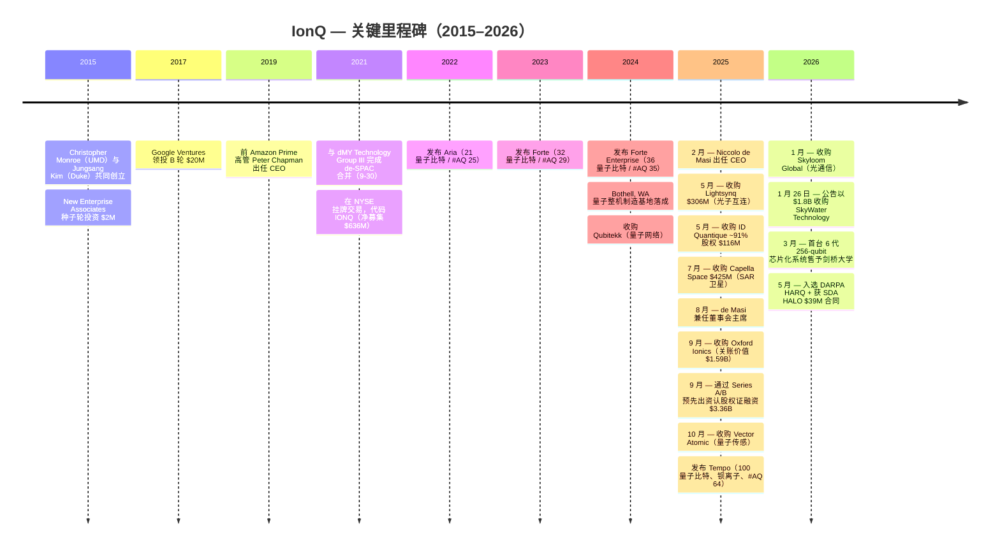
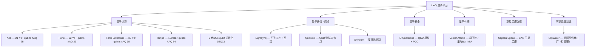
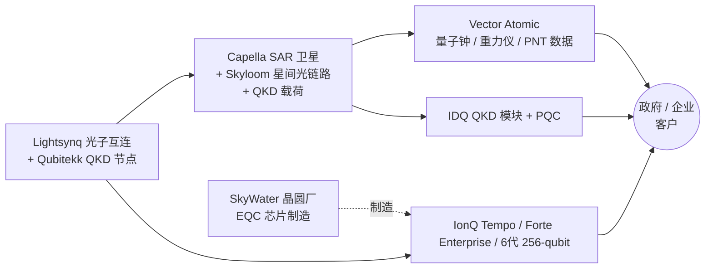
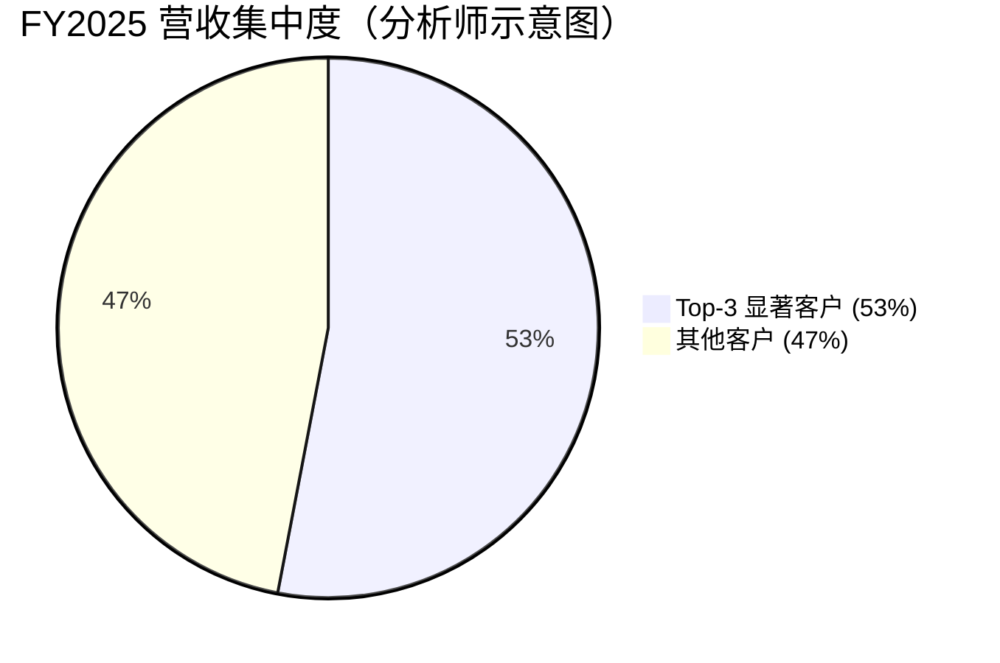
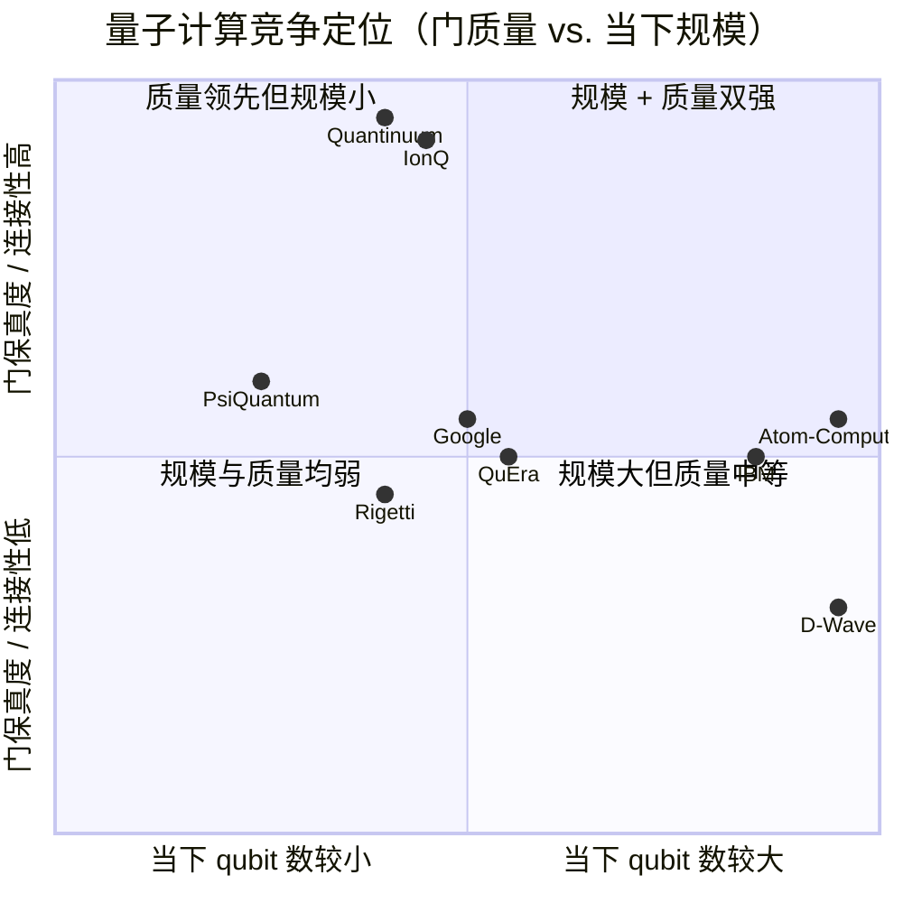

# IonQ, Inc.（NYSE: IONQ）— 公司研究

*报告截止日期：2026-05-26 · 覆盖分析师：financial_agent · 全部金额单位为美元，除非另有说明。*

> **指引更新 — FY2026 营收指引上调（2026-05-06）：** 管理层将 2026 财年全年营收指引上调至 **$260–270M**（原指引 **$225–245M**，2026-02-25 Q4'25 业绩会发布），同时初次给出 Q2'26 营收指引 **$65–68M**；调整后 EBITDA 亏损区间维持在 **$(330)M–$(310)M** 不变。本次上调反映：Q1'26 营收 $64.7M 比中值高出 30%、首台 6 代 256-qubit 芯片化系统售出（剑桥大学）、并入选 DARPA HARQ 计划与 SDA HALO ($39M) 合同。资料来源：[IonQ Q1'26 8-K Ex 99.1, 2026-05-06](https://www.sec.gov/Archives/edgar/data/1824920/000119312526208923/ionq-ex99_1.htm)、[IonQ Q4'25 8-K Ex 99.1, 2026-02-25](https://www.sec.gov/Archives/edgar/data/1824920/000119312526071520/ionq-ex99_1.htm)。

---

## 目录
1. 公司概览
2. 公司历史
3. 管理团队
4. 产品与服务
5. 客户与上市策略
6. 行业概览
7. 竞争格局
8. 市场机会（TAM/SAM/SOM）
9. 风险评估
10. 参考资料与核查日志

---

## 1. 公司概览

IonQ, Inc.（NYSE: **IONQ**）总部位于美国马里兰州 College Park，是一家设计、制造与运营 **离子阱量子计算机（trapped-ion quantum computer / 离子阱量子计算机）** 的量子科技公司。2025 年起，公司通过密集并购把 **量子通信 / quantum networking、量子安全 / quantum security、量子传感 / quantum sensing** 三大相邻业务整合为同一个 "全栈量子平台（full-stack quantum platform）"。FY2025 10-K 将公司定位描述为 "the world's first and only quantum platform company… seek[ing] to deliver the full promise of quantum, across computing, networking, sensing and security"（[IonQ FY2025 10-K, Item 1 Business](https://www.sec.gov/Archives/edgar/data/1824920/000119312526071562/ionq-20251231.htm)）。公司通过 Amazon Braket、Microsoft Azure Quantum、Google Cloud Marketplace 三大公有云销售量子算力（QCaaS / 量子计算即服务），同时直接出售整机系统（on-premises 现场部署或托管运营），并在 2025 年的几宗并购之后开始销售 QKD 模块、光子互连芯片、离子阱芯片、原子钟、重力仪与 SAR 卫星数据等附加产品线（[IonQ FY2025 10-K, Item 1 Business](https://www.sec.gov/Archives/edgar/data/1824920/000119312526071562/ionq-20251231.htm)）。

收入构成方面，10-K 的 MD&A（管理层讨论与分析）将收入划分为四条线：(i) 量子硬件设计与销售配套维保；(ii) 通过三大云平台和公司自有云提供 QCaaS 订阅 / 用量计费访问；(iii) 量子算法共同开发与咨询服务；(iv) 通过 2025 年 7 月收购的 Capella Space 卫星星座提供 SAR（合成孔径雷达 / synthetic-aperture radar）数据即服务（DaaS / data-as-a-service）（[IonQ FY2025 10-K, MD&A Revenue components](https://www.sec.gov/Archives/edgar/data/1824920/000119312526071562/ionq-20251231.htm)）。FY2025 总收入为 **$130.0M**，同比 **+202%**（FY2024 为 $43.1M），是历史上第一家年收入跨过 $100M 大关的纯量子计算公司（[IonQ FY2025 10-K, MD&A Results of Operations](https://www.sec.gov/Archives/edgar/data/1824920/000119312526071562/ionq-20251231.htm)）。截至 2025-12-31，公司员工数为 **1,132 人**，其中 14% 在华盛顿特区都会区（College Park, MD 总部），18% 在西雅图都会区（2024 年开设的 Bothell, WA 量子整机制造基地）（[IonQ FY2025 10-K, Item 1 Human Capital](https://www.sec.gov/Archives/edgar/data/1824920/000119312526071562/ionq-20251231.htm)）。

公司仍处大额亏损阶段：FY2025 归属于 IonQ 的 GAAP 净亏损为 **$(510.4)M**（FY2024 为 $(331.6)M，FY2023 为 $(157.8)M），截至 2025 年末累计亏损 **$(1,194.1)M**（[IonQ FY2025 10-K, MD&A Results of Operations](https://www.sec.gov/Archives/edgar/data/1824920/000119312526071562/ionq-20251231.htm)）。亏损由超大额资产负债表融资支撑——2025 年末 **现金 + 短长期投资合计 $3.34B**，其中绝大部分来自 2025 年 9 月通过 Series A / Series B 预先出资认股权证募集的 $3.36B 净现金（[IonQ FY2025 10-K, MD&A Liquidity](https://www.sec.gov/Archives/edgar/data/1824920/000119312526071562/ionq-20251231.htm)）。截至 2026-03-31，在完成 Lightsynq、Capella、Oxford Ionics、Vector Atomic、Skyloom 收购支付以及 Q1 经营性烧钱后，账面现金 + 投资为 **$3.1B**（[IonQ Q1'26 8-K Ex 99.1, 2026-05-06](https://www.sec.gov/Archives/edgar/data/1824920/000119312526208923/ionq-ex99_1.htm)）。

*资料来源：[IonQ FY2025 10-K, MD&A Results of Operations](https://www.sec.gov/Archives/edgar/data/1824920/000119312526071562/ionq-20251231.htm)；FY2021/FY2022 取自前期 10-K，经 [Macrotrends — IONQ revenue](https://www.macrotrends.net/stocks/charts/IONQ/ionq/revenue) 复核。*

**估值快照（截至 2026-05-26）。** IONQ 收盘价 **$63.62**、市值 **$23.75B**、企业价值 **$21.71B**，流通股本 3.7327 亿（[Stockanalysis.com — IONQ statistics](https://stockanalysis.com/stocks/ionq/statistics/)）。TTM 口径下 GAAP **P/S 为 126.7×**、EV/Sales **116×**、P/B **4.77×**；TTM EPS **$0.92**（仅因 2025 年认股权证按公允价值重估带来大额非经常性收益，故 GAAP EPS 为正——详见第 9 章风险）（[Stockanalysis.com — IONQ statistics](https://stockanalysis.com/stocks/ionq/statistics/)）。若以管理层 5 月上调后的 FY2026 中值 $265M 计算，前瞻 P/S 约为 **~90×**。

这是 **即便按美国科技公司 IPO 估值口径看也极端的水平**，必须说清楚原因。主要驱动力是：(1) IONQ 是 GAAP 营收唯一突破 $100M 的公开纯量子算力公司，并被普遍认为是纯量子标的中质量最高的——Quantinuum 仍为非上市（已于 2026-05 提交 S-1 招股书，估值目标 $12.7B）、D-Wave 仅做量子退火（quantum annealing）、Rigetti 单季营收尚不足 $5M（[The Quantum Insider — Quantinuum IPO filing, 2026-05-26](https://thequantuminsider.com/2026/05/26/honeywell-backed-quantinuum-files-for-landmark-quantum-ipo/)，[Motley Fool — best quantum stocks 2026, 2026-05-04](https://www.fool.com/investing/2026/05/04/the-best-quantum-computing-stocks-to-buy-in-2026/)）；(2) SkyWater 垂直整合的叙事被市场定价为可把通用容错量子（FTQ / fault-tolerant quantum）路径缩短 2–3 年（[Manufacturing Dive — IonQ-SkyWater $1.8B deal, 2026-01-26](https://www.manufacturingdive.com/news/ionq-spend-nearly-2-billion-chips-maker-skywater-us-quantum-computing/810601/)）；(3) 2026 年纯量子板块的主题轮动资金涌入——同业 TTM P/S：QBTS **~807×**、QUBT **~497×**、RGTI **~600×（估计）**（[Companiesmarketcap — IONQ P/S](https://companiesmarketcap.com/ionq/ps-ratio/)）。即使在这个板块内，**IONQ 反而是 P/S 相对最低的标的**——意味着它是同业中唯一收入增长真正"追得上"估值的公司。具体的估值风险见第 9 章。

*资料来源：[Stockanalysis.com — IONQ](https://stockanalysis.com/stocks/ionq/statistics/)、[Companiesmarketcap — IONQ P/S](https://companiesmarketcap.com/ionq/ps-ratio/)。RGTI P/S 为分析师估算（$8.4B 市值 ÷ TTM 营收不足 $15M）。*

地域分布偏重美国本土：长期资产合计 $142.9M 中，美国占 $124.6M、欧洲占 $17.8M（主要为 Oxford Ionics 英国基地）、其他国际 $0.5M（[IonQ FY2025 10-K, Note 20 Geographic Information](https://www.sec.gov/Archives/edgar/data/1824920/000119312526071562/ionq-20251231.htm)）。客户分布则比资产分布更国际化：Q1'26 披露 **约 35% 营收来自国际客户**，并且公司客户足迹已 **覆盖 30 多个国家**（一年前仅"少数几个国家"），主要由 Capella、Vector Atomic、ID Quantique 三条新业务线带来（[IonQ Q1'26 8-K Ex 99.1, 2026-05-06](https://www.sec.gov/Archives/edgar/data/1824920/000119312526208923/ionq-ex99_1.htm)）。

---

## 2. 公司历史

IonQ 于 **2015 年** 在马里兰州 College Park 由物理学家 **Christopher Monroe** 与杜克大学电气与计算机工程教授 **Jungsang Kim** 共同创办，旨在将三十多年的离子阱研究成果商业化——Monroe 早年（1992–2000）在 NIST Boulder 的 **David Wineland 离子存储组** 共同领衔实现了 **1995 年人类第一台量子逻辑门（first quantum logic gate）** 及多量子比特纠缠的最初演示（[Wikipedia — Christopher Monroe](https://en.wikipedia.org/wiki/Christopher_Monroe)、[Wikipedia — IonQ company history](https://en.wikipedia.org/wiki/IonQ)）。公司种子轮由 New Enterprise Associates 投资 $2M；2017 年 Google Ventures 领投 $20M B 轮；首任 CEO David Moehring 曾任 IARPA 项目经理；2019 年由前 Amazon Prime 高管 Peter Chapman 出任 CEO（[Wikipedia — IonQ history section](https://en.wikipedia.org/wiki/IonQ)）。

公司于 **2021-09-30** 通过与 dMY Technology Group III 的 de-SPAC 交易在纽交所挂牌，募集净额约 $636M，股票代码 **IONQ**——值得注意的是当时 dMY 的 CEO 正是今天 IonQ 的 CEO Niccolo de Masi（[IonQ FY2025 10-K, Item 1 Corporate Information](https://www.sec.gov/Archives/edgar/data/1824920/000119312526071562/ionq-20251231.htm)、[Wikipedia — IonQ company history](https://en.wikipedia.org/wiki/IonQ)）。2022–2024 年公司陆续交付 Aria、Forte、Forte Enterprise 等系统（详见第 4 章），营收从 $11M 长到 $43M，同期亏损从 $49M 扩大到 $332M。

**2025 年是战略性 "再平台化"（re-platforming）的关键年。** 在不到 10 个月里 IonQ 连续完成 6 宗收购，公告价值合计约 $26 亿（含因 IONQ 股价升值而放大的股权对价），并预告 2026 年再完成两宗合计约 $20 亿的并购。战略逻辑很清晰：把量子计算之外的三大支柱（网络、传感、安全）整合到同一公司，使政府与企业客户可以从单一供应商采购"量子整体解决方案"；并且把容错量子计算所必需的芯片制造、光子互连、卫星载荷等关键能力全部内部化（[IonQ FY2025 10-K, Item 1 Our Strategy](https://www.sec.gov/Archives/edgar/data/1824920/000119312526071562/ionq-20251231.htm)）。

*资料来源：[IonQ FY2025 10-K Note 3 业务合并 与 Note 22 期后事项](https://www.sec.gov/Archives/edgar/data/1824920/000119312526071562/ionq-20251231.htm)；[IonQ Q1'26 8-K Ex 99.1, 2026-05-06](https://www.sec.gov/Archives/edgar/data/1824920/000119312526208923/ionq-ex99_1.htm)；[The Quantum Insider — Oxford Ionics 获 CMA 有条件批准, 2025-09-12](https://thequantuminsider.com/2025/09/12/uk-clears-ionq-acquisition-of-oxford-ionics-with-conditions/)；[IonQ 公告 — Vector Atomic 收购交割, 2025-10-07](https://www.ionq.com/news/ionq-completes-acquisition-of-vector-atomic-the-global-leader-in-advanced)；[Wikipedia — IonQ](https://en.wikipedia.org/wiki/IonQ)。*

三个具有战略意义的转折值得单独说明。**第一**，2025 年 9 月收购 Oxford Ionics 把技术路线从纯激光控制改为 **电子量子比特控制（Electronic Qubit Control, EQC）**——把离子阱控制电路直接嵌入半导体工艺制造的芯片中，显著降低单 qubit 成本与激光路径布线复杂度。10-K 明确表述这次并购"will accelerate our quantum computing roadmap by using Electronic Qubit Control (EQC) to leverage semiconductor production and scaling"（[IonQ FY2025 10-K, Item 1 Our Strategy](https://www.sec.gov/Archives/edgar/data/1824920/000119312526071562/ionq-20251231.htm)）。**第二**，Lightsynq + ID Quantique + Capella + Skyloom 四宗并购组装出了一个完整的量子通信栈——量子内存 + 光子互连（Lightsynq）、QKD 模块（ID Quantique）、SAR 卫星星座与 QKD 载荷母线（Capella）、星间光通信链路（Skyloom）——这是同行业公开纯量子算力厂家中独一份的能力组合。**第三**，2026 年 1 月公告以 $1.8B 收购 SkyWater Technology，把美国本土"可信晶圆代工厂（trusted foundry）"垂直整合进 IonQ，战略目的是面向美国国防部 / 情报体系 / 国安客户提供完全美国本土、ITAR 合规的离子阱芯片供应链——这条护城河是非美国离子阱厂商（如奥地利的 Alpine Quantum Technologies）以及不拥有自家晶圆厂的 Quantinuum 结构性无法获得的（[Manufacturing Dive — IonQ-SkyWater $1.8B deal, 2026-01-26](https://www.manufacturingdive.com/news/ionq-spend-nearly-2-billion-chips-maker-skywater-us-quantum-computing/810601/)）。

10-K 提交以来最新进展包括：Q1'26 公告 **首台 6 代、芯片化、256-qubit 系统** 售予剑桥大学；入选 **DARPA HARQ 异构量子计算计划**；获 **太空发展局（SDA）HALO 计划 $39M 战术空间通信合同**；获 **导弹防御局（MDA）SHIELD IDIQ** 入围（合同上限 $151B 是整个项目上限，并非 IonQ 单方面合同价值）（[IonQ Q1'26 8-K Ex 99.1, 2026-05-06](https://www.sec.gov/Archives/edgar/data/1824920/000119312526208923/ionq-ex99_1.htm)、[Stocktitan — $21.1M AFRL 量子网络合同, 2025](https://www.stocktitan.net/news/IONQ/ion-q-announces-new-21-1-million-project-with-united-states-air-sjltrf391p9i.html)）。

*资料来源：[IonQ FY2025 10-K Note 3 Business Combinations 与 Note 22 Subsequent Events](https://www.sec.gov/Archives/edgar/data/1824920/000119312526071562/ionq-20251231.htm)；SkyWater 数据见 [IonQ 8-K, 2026-01-26](https://www.sec.gov/Archives/edgar/data/1824920/000119312526021616/d10479dex991.htm)。Vector Atomic 与 Skyloom 的交易金额为分析师估计——10-K Note 3 只披露了股份对价。*

---

## 3. 管理团队

**Niccolo M. de Masi — 董事会主席、总裁兼 CEO（45 岁）**，2025-02-26 起出任 CEO、2025-08-06 起兼任董事会主席。Mr. de Masi 自 2021 年 9 月 IonQ 上市起即任董事；上市前他是 dMY Technology Group III 的 CEO（2020 年 9 月起），即把 IonQ 带上市的 SPAC 发起人（[IonQ 2026 DEF 14A, Director bios](https://www.sec.gov/Archives/edgar/data/1824920/000119312526197487/ionq-20260430.htm)、[IonQ 新闻 — de Masi 出任 CEO 公告, 2025-02-26](https://www.ionq.com/news/ionq-names-niccolo-de-masi-as-president-and-chief-executive-officer)）。在量子产业里他属于罕见的"职业 CEO"画像——既不是物理学家创始人（Monroe、Kim），也不是云大厂出身（前任 Peter Chapman 来自 AWS），而是一位 **连续上市公司 CEO**，深谙以并购方式做 B-to-B 与消费科技业务规模化扩张。

他的履历亮点：2010–2021 年任纳斯达克上市公司 **Glu Mobile 的 CEO**（移动游戏），任期内将公司以 $24 亿出售给 EA；30 岁前已就任 Monstermob Group 的 CEO；2018–2020 年任 **Resideo Technologies**（霍尼韦尔分拆的家庭安防公司）首席创新官兼产品与解决方案总裁（[Bloomberg — Niccolo de Masi profile](https://www.bloomberg.com/profile/person/6724759)、[IonQ 2026 DEF 14A, Director bios](https://www.sec.gov/Archives/edgar/data/1824920/000119312526197487/ionq-20260430.htm)）。他还曾任 Planet Labs（2021–2025）、Genius Sports（2021–2023）、Rush Street Interactive（2019 至今）董事，目前并兼任 Ares Interactive（General Catalyst 支持的游戏发行商）董事长。本人简历披露累计"主导完成约 50 宗并购"、"为执掌过的上市/非上市公司合计募资 $50 亿以上"——这一履历底色精确对应 IonQ 2025 年的并购大跃进与超大额融资节奏（[HPCwire — IonQ 任命 de Masi 为 CEO, 2025-02-26](https://www.hpcwire.com/off-the-wire/ionq-names-niccolo-de-masi-as-president-chief-executive-officer/)、[IonQ 2026 DEF 14A](https://www.sec.gov/Archives/edgar/data/1824920/000119312526197487/ionq-20260430.htm)）。

他的学术背景也与公司业务直接对口：剑桥大学物理学一等学位 B.A. + M.Sci.，**专精方向是量子力学与下一代电子束光刻（electron-beam lithography）**——正是制造离子阱芯片所需的核心技术（[Bloomberg — Niccolo de Masi profile](https://www.bloomberg.com/profile/person/6724759)、[IonQ 新闻 — de Masi 出任 CEO 公告, 2025-02-26](https://www.ionq.com/news/ionq-names-niccolo-de-masi-as-president-and-chief-executive-officer)）。截至 2026 财年股权登记日，de Masi 个人持股为 **178,681 股**（约占 3.73 亿流通股的 0.05%）——以 CEO 标准看绝对持仓不大；但 FY2025 SCT 总薪酬高达 **$89.6M**，"实际支付薪酬（CAP）" $134.2M，主要来自 2025 年 2 月入职时授予的补偿性与诱因股权激励（[IonQ 2026 DEF 14A, Pay vs Performance and Beneficial Ownership tables](https://www.sec.gov/Archives/edgar/data/1824920/000119312526197487/ionq-20260430.htm)）。

**创始人背景（已不在公司运营岗位上）。** Christopher Monroe 于 2015 年与 Jungsang Kim 共同创办 IonQ，2023 年前任首席科学家。Monroe 本科 1987 年毕业于麻省理工物理系，博后阶段在 CU Boulder 的 Carl Wieman 组（激光冷却原子的先驱），1992–2000 年在 **NIST Boulder 的 David Wineland 离子存储组** 共同领衔实现了人类首个量子逻辑门（1995 年）与首次多量子比特纠缠；2000–2007 年在密歇根大学独立组、2007–2021 年在马里兰大学-NIST 联合量子研究所（JQI）担任 Bice Zorn 物理学教授；2021 年起任杜克大学 Gilhuly 家族总统杰出讲席教授（物理与电气与计算机工程双聘）；2016 年当选 **美国国家科学院院士**（[Wikipedia — Christopher Monroe](https://en.wikipedia.org/wiki/Christopher_Monroe)、[Duke Pratt — Christopher Monroe and the birth of IonQ](https://pratt.duke.edu/news/jungsang-kim-dst-2/)）。Jungsang Kim 是 **杜克大学 Schiciano 家族电气与计算机工程杰出讲席教授**，同时担任杜克大学首席科技战略官；持有 80+ 项量子信息相关专利，2024 年前任 IonQ CTO；2026 年获韩国 **创造科学技术勋章（Changjo Medal）**，是该国科学与工程领域最高勋衔（[Duke ECE — Jungsang Kim](https://ece.duke.edu/people/jungsang-kim/)、[The Duke Chronicle — Kim 获 Changjo Medal, 2026-05-26](https://www.dukechronicle.com/article/duke-university-jungsang-kim-changjo-award-south-korea-top-honor-engineering-quantum-computing-20260526)）。两位创始人目前都已离开 IonQ 运营岗位——Monroe 在杜克任教；Kim 在 2024 年 SCT 中以最后一次出现的"非 PEO NEO"身份后已离任（[IonQ 2026 DEF 14A, Pay vs Performance footnotes](https://www.sec.gov/Archives/edgar/data/1824920/000119312526197487/ionq-20260430.htm)）。这使 IonQ 在硬件初创出身的公开公司里属于较少见的 **完全由职业经理人运营、而非创始人主理** 的格局——治理与文化层面的影响在第 9 章风险评估有具体讨论。

---

## 4. 产品与服务

> **全报告最重要的一章。** 没有对 IonQ "实际卖什么、产品在客户工作流中处于哪一环"的精确理解，第 5–9 章就只是泛泛而谈。本章按公司 10-K 与公告原文逐条引述产品矩阵，技术术语全部中英双语对照，便于跨境投资者阅读。

### 4.0 产品矩阵 — 由 10-K Item 1、公司官网与并购公告组装的分析师重构表

IonQ FY2025 10-K **没有** 一张单一的产品矩阵表——产品组合分散在 Item 1 Business 项下的 "Our Business Model"、"Quantum Hardware and Compute Access Model"、"Quantum Networking"、"Quantum Sensing"、"Quantum Security"、"Constellation-Based Data" 等小节里的叙述中（[IonQ FY2025 10-K, Item 1 Business](https://www.sec.gov/Archives/edgar/data/1824920/000119312526071562/ionq-20251231.htm)）。下表为分析师重构表，行项目对照 IonQ 官网产品页 [Aria](https://www.ionq.com/quantum-systems/aria) / [Forte](https://www.ionq.com/quantum-systems/forte) / [Forte Enterprise](https://www.ionq.com/quantum-systems/forte-enterprise) / [Tempo](https://www.ionq.com/quantum-systems/tempo) 及 2025 年各宗并购的交割公告。

| 业务支柱 | 产品 / 系列 | 描述（凡可直引处均使用 issuer 原文） | 来源（自研 / 并购） | 当前客户波次 |
|---|---|---|---|---|
| **量子计算** | **IonQ Aria** | 21-qubit 镱离子（Yb⁺）系统、**#AQ 25**、AWS Braket + Azure Quantum + GCP 三大公有云 | 第 5 代自研 | NISQ 阶段研发客户、三大公有云量子开发者 |
| **量子计算** | **IonQ Forte** | 32-qubit Yb⁺、**#AQ 29**、首款"软件可重构（software-configurable）"量子计算机，使用 AOD（声光偏转器）激光路径 | 自研 | NISQ 研发、AstraZeneca / Ansys / 丰田通商 |
| **量子计算** | **IonQ Forte Enterprise** | 36-qubit Yb⁺、**#AQ 35**、"目前商用可获最高性能"的 IonQ 系统 | 自研 | QuantumBasel（瑞士欧洲量子数据中心）、AFRL Rome NY |
| **量子计算** | **IonQ Tempo** | 100-qubit 钡离子（Ba⁺）次世代系统、**#AQ 64**，达成时间比预定提前 3 个月 | 自研，2025 发布 | AFRL Rome NY（双台钡离子系统）、QuantumBasel |
| **量子计算** | **6 代、芯片化 256-qubit**（尚未对外品牌命名） | "首台 6 代、芯片化、256-qubit 系统"，配备安全量子网络 | 自研（融入 Oxford Ionics EQC） | 剑桥大学（Q1'26 首台） |
| **量子通信** | **Lightsynq 光子互连 + 量子内存** | "World-class R&D team and photonic interconnect technology…higher-performance quantum networking solutions" | 2025-05 收购 $306.2M | 美国中大西洋区域量子互联网、佛罗里达州量子网络计划 |
| **量子通信** | **Qubitekk QKD 原型 / 量子网络测试床节点** | 2024-11 收购的量子网络早期研发资产 | 2024-11 收购 | DOE 量子互联网测试床 |
| **量子通信** | **Skyloom 星间光通信链路** | 总部美国的光通信公司，提供星间和星地光链路 | 2026-01 收购（最高 390 万股) | SDA HALO 计划 $39M、轨道 QKD 蓝图 |
| **量子安全** | **ID Quantique（IDQ）QKD 模块** | QKD 硬件、后量子密码 PQC、单光子探测器 | 2025-05 收购 ~86–91% 股权 $116M | 波兰国家量子通信网络、全球 PQC 部署 |
| **量子传感** | **Vector Atomic 原子钟、重力仪、惯性测量单元** | "High-performance clocks, synchronization hardware, gravimeters, and inertial sensors" 用于定位、导航、授时（PNT） | 2025-10 收购（带入 $200M+ 联邦合同存量） | DARPA / 美海军 PNT 合同 |
| **量子传感** | **量子定位、导航与授时（PNT，规划中）** | Capella 卫星平台 + Vector Atomic 传感能力的组合产品 | 规划中产品 | 前瞻规划，10-K 已披露但尚未产生收入 |
| **卫星数据** | **Capella Space SAR 影像（数据即服务）** | 合成孔径雷达地球观测星座，订阅 + 单张计费 | 2025-07 收购 $424.8M | 美国国防部 / 情报系统；未来空间 QKD 网络基础 |
| **晶圆制造** | **SkyWater Technology 可信晶圆代工厂**（拟收购） | 美国本土可信晶圆代工厂，量产 IonQ 离子阱芯片 | 2026-01 公告拟收购 ~$1.8B | 内部 IonQ 芯片产能 + 对外晶圆代工 |

*资料来源：[IonQ FY2025 10-K Item 1 Business](https://www.sec.gov/Archives/edgar/data/1824920/000119312526071562/ionq-20251231.htm)；IonQ 官网量子系统产品页（[Aria](https://www.ionq.com/quantum-systems/aria) / [Forte](https://www.ionq.com/quantum-systems/forte) / [Forte Enterprise](https://www.ionq.com/quantum-systems/forte-enterprise) / [Tempo](https://www.ionq.com/quantum-systems/tempo) / [Compare](https://www.ionq.com/quantum-systems/compare)）；并购交割公告见第 2 章。*

### 4.1 量子计算 — 四代离子阱整机栈，每一代的位置

**IonQ Aria（21 镱离子 / Yb⁺ qubits、#AQ 25）。** Aria 是 2022–2024 年的主力商用系统，也是首款在 AWS Braket、Azure Quantum、Google Cloud Marketplace 三大公有云平台同时上线的 IonQ 整机。

> "IonQ Aria has an #AQ of 25, a higher qubit count, and best gate fidelities. The system's hardware metrics include 21 qubits with all-to-all connectivity, a 0.05% single-qubit gate error rate, 0.4% two-qubit gate error rate, and qubit lifetimes (T2) of about 1000ms." —— [IonQ Aria 产品页](https://www.ionq.com/quantum-systems/aria)。

**中文释义 / Plain-language gloss：** 离子阱量子计算机把单个带电原子（"离子"）悬浮在真空腔里，用激光束逐一控制——每颗离子充当一个 qubit（量子比特），既可处于 0 也可处于 1，也可处于二者的叠加（superposition / 叠加态）。"all-to-all connectivity / 全连接拓扑" 指系统内 **任意两颗 qubit 都能直接做双量子门（two-qubit gate）**，不必经过中间 qubit "中转"；这是离子阱相对超导（superconducting）系统的结构性优势，因为后者只允许相邻 qubit 直接交互，算法需要额外插入 SWAP 门来"传递"信息。**"#AQ"（Algorithmic Qubits / 算法量子比特）** 是 IonQ 自有基准——衡量在一个系统里有多少 qubit 能真正运行一个"有用深度"的算法；Aria 的 #AQ 25 在 21 物理量子比特上意味着 **全部 21 颗都可用，且仍有富余**（[IonQ — Aria 实用性能基准](https://www.ionq.com/resources/ionq-aria-practical-performance)、[Quantum Computing Report — #AQ 定义](https://quantumcomputingreport.com/ionq-reaches-aq-64-milestone-on-100-qubit-tempo-system-ahead-of-schedule/)）。战略位置：Aria 是 **默认的 NISQ 云端工作机**——三大云平台广泛可达、开发者免费/低费入口产品、企业研发团队（AstraZeneca、Ansys、JPMorgan、现代汽车前期研发合作）入门级首选。

**IonQ Forte（32 Yb⁺ qubits、#AQ 29）与 Forte Enterprise（36 Yb⁺ qubits、#AQ 35）。** Forte 是 2023 代际，首次采用 **AOD（acousto-optic deflector / 声光偏转器）软件可重构激光束路由**——意指激光到各离子的光路不再硬接线，而由软件实时配置，省掉激光器与每颗离子之间固定布线。

> "IonQ Forte has 32 physical qubits and is the first known quantum computer with a demonstrated #AQ of 29. Forte's laser system features Acousto-optic Deflectors (AODs) that introduce new opportunities for system configurability, and Forte's operating system has been developed to enable new operating routines that can configure the system on the fly for optimal performance." —— [IonQ Forte 产品页](https://www.ionq.com/quantum-systems/forte)。
>
> "Forte Enterprise is IonQ's highest performing commercially available quantum computer, built to tackle larger problems than any other IonQ system. The 36-qubit Forte Enterprise quantum processing unit offers 35 Algorithmic Qubits (#AQ)." —— [IonQ Forte Enterprise 产品页](https://www.ionq.com/quantum-systems/forte-enterprise)。

**中文释义 / Plain-language gloss：** Forte Enterprise 是 IonQ **首款专为数据中心部署设计** 的系统——区别在于机架可装的子系统、冗余架构、可用性工程；这是它能交付到 QuantumBasel 瑞士欧洲量子数据中心、以及 AFRL Rome NY 的硬件原因。战略位置上，Forte / Forte Enterprise 是 **过渡代际**——介于云端 NISQ 的 Aria 与未来芯片化系统之间。它们证明了"全连接 + 软件可重构"架构可以在 #AQ ≈ 35 的尺度稳定工作，而 #AQ 35 正好是若干学术论文给出的"特定优化与量子化学问题可达到狭义商用优势"的近似门槛。

*分析师观点：* 来自 Quantinuum 的最相近对标是 **Helios**——2025 年 11 月发布、98 钡离子 qubits，双量子门保真度 99.921%，48 个纠错逻辑量子比特（[The Quantum Insider — Quantinuum Helios 发布, 2025-11-06](https://thequantuminsider.com/2025/11/06/illuminating-helios-quantinuums-shiny-new-quantum-computer-gets-sunny-reception/)、[MIT Tech Review — Quantinuum Helios 错误纠正, 2025-11-05](https://www.technologyreview.com/2025/11/05/1127659/a-new-ion-based-quantum-computer-makes-error-correction-simpler/)）。物理 qubit 数 Helios（98）比 IonQ Tempo（100）略低，但 Quantinuum 没有公开类似 #AQ 的等效基准，且使用的处理器架构不同（linear-shuttle 区域跳转 vs. IonQ 的全连接 + 并行门）——这点 IonQ 10-K Competition 一节专门做了对比说明。双量子门保真度两者大体可比。

**IonQ Tempo（100 钡离子 / Ba⁺ qubits、#AQ 64）。** Tempo 是 **第 5 代、也是首款使用钡离子而非镱离子的 IonQ 整机**。钡离子与可见光波段交互（镱离子需 UV 紫外波段），意味着可以使用标准光纤和芯片集成的光学元件，大幅简化激光-反射镜复合光学路径。Tempo 在 100-qubit 平台达成 #AQ 64 提前 3 个月——使 IonQ 在该 #AQ 等级独家（[IonQ — #AQ 64 里程碑公告](https://www.ionq.com/news/ionq-achieves-record-breaking-quantum-performance-milestone-of-aq-64)、[Quantum Computing Report — IonQ AQ 64 里程碑, 2025](https://quantumcomputingreport.com/ionq-reaches-aq-64-milestone-on-100-qubit-tempo-system-ahead-of-schedule/)）。Q1'26 业绩公告中管理层称 **"Demand for Fifth-Generation Tempo Remains Strong"**（[IonQ Q1'26 8-K Ex 99.1, 2026-05-06](https://www.sec.gov/Archives/edgar/data/1824920/000119312526208923/ionq-ex99_1.htm)）。两台 Tempo（或钡离子系统）正向 AFRL Rome NY 交付，用于量子网络与应用研究（[HPCwire — IonQ #AQ 64 on Tempo](https://www.hpcwire.com/off-the-wire/ionq-reaches-aq-64-benchmark-on-tempo-system-ahead-of-schedule/)）。战略位置上 Tempo 是 **首款"狭义量子优势可商业化"的系统**——10-K 列举的应用包括电网分布、计算药物发现、供应链优化。

**6 代芯片化 256-qubit 系统（尚未对外品牌命名、融合 EQC）。** Q1'26 业绩公告确认 IonQ **首台 6 代、芯片化 256-qubit 系统已在 Q1'26 售出**——客户为剑桥大学，并且 **离子阱芯片样片已从晶圆厂返厂**，意味着 "we are now moving from component-level testing to integrated, system-level testing of the full 256-qubit quantum computer"（[IonQ Q1'26 8-K Ex 99.1, 2026-05-06](https://www.sec.gov/Archives/edgar/data/1824920/000119312526208923/ionq-ex99_1.htm)）。这是首款融合 **Oxford Ionics 电子量子比特控制（EQC）** 的 IonQ 系统——qubit 控制电路直接做进离子阱芯片内部，去掉前几代的激光-反射镜-布线复杂度。EQC 之前，从 100 到 1,000 qubits 的扩张需要指数级增加激光通道与光学路径；EQC 之后，扩张更接近标准半导体制程——可以像加晶体管那样加 qubit。**这就是 IonQ "本世纪末实现容错量子" 时间表得以成立的架构性转折**（公司在 Q1'26 还发布了"首个详尽的容错量子计算架构蓝图"）。

### 4.2 量子通信 — Lightsynq + Qubitekk + Skyloom 三件套

**Lightsynq**（2025-05 收购 $306.2M）提供量子内存硬件与硅光子互连芯片，把多颗 QPU 联成单一分布式计算机。10-K 将 Lightsynq 的贡献描述为 "world-class R&D team and photonic interconnect technology, which we believe will enable higher-performance quantum networking solutions"（[IonQ FY2025 10-K, Item 1 Our Strategy](https://www.sec.gov/Archives/edgar/data/1824920/000119312526071562/ionq-20251231.htm)）。

**中文释义 / Plain-language gloss：** 光子互连（photonic interconnect）让两台物理上分开的离子阱 QPU（分属不同真空腔，甚至不同城市）之间能用 **单光子载着纠缠态** 交换量子信息。今天 IonQ 所有系统都建在单芯片上——光子互连是让单颗 256-qubit 芯片变成 "多颗 256-qubit 芯片协同 = 1 万 qubit 总系统" 的桥梁，不必把所有离子塞进同一个无法实现的超大真空腔内。这是 **离子阱在万-qubit 尺度对超导的结构性优势**：超导 qubit 一离开稀释制冷机相干态立刻塌缩，故无法网络化；离子 qubit 在真空-常温环境保持相干，光子互连天然可行。Q1'26 业绩公告披露："foundational quantum interconnect milestone with first ever commercial demonstration of two connected commercial quantum computers"（[IonQ Q1'26 8-K Ex 99.1, 2026-05-06](https://www.sec.gov/Archives/edgar/data/1824920/000119312526208923/ionq-ex99_1.htm)）。

**Qubitekk**（2024-11 收购）是更小的量子网络收购，专注 DOE 资助的"量子互联网"试点项目下的 QKD 测试床节点。**Skyloom Global**（2026-01 收购）加入 **星间光通信链路**——在轨卫星之间的激光通信能力，未来用于跨大陆 QKD 流量传输。Q1'26 公告披露 **"deployment of National Quantum Communication Network in Poland"** 与 **"first commercial sale of a Quantum Memory Node into the U.S. Mid-Atlantic Regional Quantum Internet"** 两条订单，均建立在已整合的 Lightsynq + Qubitekk + IDQ + Skyloom 栈之上（[IonQ Q1'26 8-K Ex 99.1, 2026-05-06](https://www.sec.gov/Archives/edgar/data/1824920/000119312526208923/ionq-ex99_1.htm)）。

### 4.3 量子安全 — ID Quantique（QKD + PQC）

**ID Quantique（IDQ）** 是日内瓦总部、商用 QKD 硬件与后量子密码（PQC / post-quantum cryptography）软件的全球龙头，成立于 2001 年。IonQ 在 2025-05 收购约 86% 股权、到 7 月增持至 91%，合计对价 **$116.2M**（[IonQ FY2025 10-K Note 3 Business Combinations](https://www.sec.gov/Archives/edgar/data/1824920/000119312526071562/ionq-20251231.htm)）。

**中文释义 / Plain-language gloss：** **QKD（Quantum Key Distribution / 量子密钥分发）** 用单光子在通信双方之间交换加密密钥；任何窃听者测量光子都会扰动光子态，从而被合法方检测到。**PQC（post-quantum cryptography / 后量子密码）** 则是经典软件的对应方案——专门设计抗量子计算机用 Shor 算法攻击的加密算法。两者互补——QKD 保护密钥交换本身；PQC 用密钥加密数据。IDQ 两者都卖。战略位置上 IDQ 是 IonQ 产品线里 **唯一一条具备规模化、现实当下商业收入** 的业务（全球银行、电信、国防客户），近期增长引擎是 NIST 后量子密码迁移强制要求——所有美国受监管机构必须在 2030 年前替换 RSA / ECC。Q1'26 公告把"global deployments of our post-quantum cybersecurity solutions"列为增长驱动（[IonQ Q1'26 8-K Ex 99.1, 2026-05-06](https://www.sec.gov/Archives/edgar/data/1824920/000119312526208923/ionq-ex99_1.htm)）。

*分析师观点：* IDQ 也是 IonQ 产品线里 **抵御"IonQ 永远做不出 FTQ"长尾风险最具防御性** 的部分——QKD / PQC 收入与 IonQ 计算路线兑现与否完全无关。

### 4.4 量子传感 — Vector Atomic

**Vector Atomic**（2025-10 收购）带入高性能 **原子钟、重力仪与惯性测量单元（IMU）**，主用于定位、导航、授时（PNT / positioning, navigation, timing）。按 IonQ 公告所述，Vector Atomic 在被收购前已积累了 **$200M+ 政府合同存量**，"delivers critical U.S. federal and national security applications"（[IonQ 新闻 — Vector Atomic 交割, 2025-10-07](https://www.ionq.com/news/ionq-completes-acquisition-of-vector-atomic-the-global-leader-in-advanced)）。

**中文释义 / Plain-language gloss：** 当代 GPS 接收机的工作原理依赖一组在轨原子钟——接收机通过三角测量到每颗卫星信号的飞行时间来计算自身位置。Vector Atomic 制造 **芯片级与机架级原子钟，精度比商用铯钟高约 100×**，加上 **量子重力仪**（测量重力场的微小变化——可用于 GPS 拒止环境的导航，或地下空腔 / 油气藏探测）与 **量子 IMU**（在不依赖 GPS 的情况下保持精确位置达数小时至数天）。战略位置：Vector Atomic 是 **国防部 PNT 故事的核心** —— 美军每一种平台（从潜艇到战机）都需要 GPS 独立的导航能力，而量子传感是唯一能在这方面提供质变的技术；Q1'26 SDA HALO $39M 合同是 IonQ 首个把这种能力商业化的大订单。

### 4.5 卫星星座数据 — Capella Space SAR

**Capella Space**（2025-07 收购 $424.8M）运营一组 **合成孔径雷达（SAR / synthetic-aperture radar）卫星星座**，向政府与商业客户提供全天候、昼夜不间断、可穿透云层的地球观测影像（[IonQ FY2025 10-K Note 3 Business Combinations](https://www.sec.gov/Archives/edgar/data/1824920/000119312526071562/ionq-20251231.htm)、[The Quantum Insider — Capella 交割, 2025-07-15](https://thequantuminsider.com/2025/07/15/ionq-completes-acquisition-of-capella-space/)）。

**中文释义 / Plain-language gloss：** 光学卫星拍照需要日照与晴空。SAR 卫星发射射频脉冲并对反射成像——可穿云、夜间工作、穿烟雾。商用 SAR 市场由 Capella、ICEYE、Umbra、Maxar 旗下 BlackSky 主导；Capella 通常被列为全球前三的 SAR 供应商。**Capella 在 IonQ 内部的战略逻辑分两步**：今天 Capella 产生常规的 SAR 影像即服务收入（DoD、IC、商业）；中长期 IonQ 计划在每颗 Capella 卫星上加装 **QKD 载荷**，结合 Skyloom 的星间光链路，把整个星座变成全球 **空间 QKD 网络**——这是中国 2017 年 "墨子号" 卫星演示过、但西方目前完全没有的能力。10-K 明确披露："through combining our satellite platform with our quantum sensing products, we intend to offer advanced quantum positioning, navigation and timing services in the future"（[IonQ FY2025 10-K, Item 1 Overview](https://www.sec.gov/Archives/edgar/data/1824920/000119312526071562/ionq-20251231.htm)）。在此之前，Capella 已经是 **大幅推动 FY2025 营收 +202% 与 Q1'26 国际客户占比 35% 的常规地球观测收入线**。

### 4.6 综合：各支柱如何拼成单一平台

互联方向有两条。**纵向**（芯片 → 系统 → 服务）：SkyWater 制造 EQC 离子阱芯片 → IonQ 组装为 Tempo / 256-qubit 整机 → Lightsynq 把多台整机连成分布式量子计算机 → 客户以现场硬件或云服务形式消费算力。**横向**：IDQ 为任意两个端点（经典或量子）之间提供密钥安全 → Vector Atomic 提供网络所需精确授时 → Capella + Skyloom 卫星星座把网络从陆地光纤延伸到星间与星地链路。客户——可能是美国某情报机构、某北约国家国防部、某全球银行、或某制药公司研发组——买的不是单独产品，而是 **一组能互操作的能力**；策略性护城河来自 "全部从同一供应商采购、且其路线图内部自洽" 带来的客户锁定。**这就是支撑 126× P/S 的"平台论"** 的核心逻辑（成立与否的检验在第 9 章）。

2026 年最重要的增长引擎是 **Tempo + Lightsynq 组合**——Q1'26 商业客户占比约 60%、"approximately 35% of revenue from multi-product customers"（即三分之一客户已跨支柱采购）（[IonQ Q1'26 8-K Ex 99.1, 2026-05-06](https://www.sec.gov/Archives/edgar/data/1824920/000119312526208923/ionq-ex99_1.htm)）。长尾旗舰是 **6 代 256-qubit EQC 芯片**——2026 年陆续在剑桥大学安装。

**经常性 / 售后 / 服务业务。** IonQ 并未将维保与支持作为单独业务披露——公司是单一报告分段；10-K MD&A 显示维保和支持捆绑在硬件销售内，QCaaS 合同按 "stand-ready performance obligation" 处理（固定费部分按使用期直线确认，超量按发生期变量入账）（[IonQ FY2025 10-K, MD&A Revenue accounting](https://www.sec.gov/Archives/edgar/data/1824920/000119312526071562/ionq-20251231.htm)）。Capella 卫星影像 DaaS 同样是 stand-ready（固定费下保障最低影像量 + 超量按张计费）。这些结构 **在订阅经济上友好** ——随装机量扩大应产生长尾经常性收入。Q1'26 披露 RPO（剩余履约义务）$470M、同比 +554% 是该长尾构建中的领先指标（[IonQ Q1'26 8-K Ex 99.1, 2026-05-06](https://www.sec.gov/Archives/edgar/data/1824920/000119312526208923/ionq-ex99_1.htm)）。

---

## 5. 客户与上市策略

IonQ FY2025 10-K 直接点名的政府客户包括：**美国空军研究实验室（AFRL）、美国国防部高级研究计划局（DARPA）、橡树岭国家实验室（Oak Ridge National Laboratory）**（[IonQ FY2025 10-K Item 1 Government Agencies](https://www.sec.gov/Archives/edgar/data/1824920/000119312526071562/ionq-20251231.htm)）。共同开发协议名单包括 **Ansys**（CAE 计算机辅助工程）、**再生医学商业化中心 CCRM**（高级治疗优化）以及 **DARPA**（次世代量子计算基准）（[IonQ FY2025 10-K Item 1 Our Quantum Platform Customer Journey](https://www.sec.gov/Archives/edgar/data/1824920/000119312526071562/ionq-20251231.htm)）。过去 12 个月的公司公告新增：**AstraZeneca**（药物发现）、**丰田通商 Toyota Tsusho**（化工 / 材料）、**现代汽车集团 Hyundai Motor Group**（电池材料、自动驾驶 — 早前研发合同）、**摩根大通 JPMorgan Chase**（金融建模实验）、**空中客车 Airbus**（物流优化）、**General Dynamics Information Technology / GDIT**（关键任务国防系统）、**NVIDIA**（混合量子-经典 CUDA-Q 集成）、**AWS / Microsoft Azure / Google Cloud**（三条云渠道）、**韩国科学技术信息研究院 KISTI**（混合 HPC-量子）、以及 **剑桥大学**（256-qubit 系统首位购买方）（[IonQ — Ansys 量子计算里程碑, 2025](https://www.ionq.com/news/ionq-and-ansys-achieve-major-quantum-computing-milestone-demonstrating)、[IonQ — QuantumBasel 欧洲量子数据中心合作, 2024](https://www.ionq.com/news/ionq-and-quantumbasel-partner-to-achieve-future-quantum-advantages-with)、[IonQ — $25.5M 空军量子合同, 2025](https://www.ionq.com/news/ionq-announces-new-usd25-5m-quantum-deal-with-united-states-air-force)、[IonQ Q1'26 8-K Ex 99.1, 2026-05-06](https://www.sec.gov/Archives/edgar/data/1824920/000119312526208923/ionq-ex99_1.htm)）。

**集中度——量化数字。** FY2025 10-K 披露 **3 名显著客户（每家 ≥10% 收入）合计 53% 的 FY2025 营收**，FY2024 为 **2 家 / 77%**，FY2023 为 **2 家 / 58%**（[IonQ FY2025 10-K Note 2 Significant Customers](https://www.sec.gov/Archives/edgar/data/1824920/000119312526071562/ionq-20251231.htm)）。Q1'26 10-Q 披露 **2 家显著客户 / 34% 营收**（Q1'25 为 2 家 / 70%）（[IonQ Q1'26 10-Q Note 2, p. ~6](https://www.sec.gov/Archives/edgar/data/1824920/000119312526211876/ionq-20260331.htm)）。趋势 **明显去集中化**——年度集中度从 77% 降到 53%，季度集中度同比腰斩。10-K 和 10-Q 均未公开点名，但根据公开披露的 4 笔 ~$100M 量级的 AFRL 合同（最大单笔 $54.5M）以及 AFRL Rome NY 部署的两台 Tempo，**AFRL 普遍被认为是其中一位**（[Quantum Computing Report — IonQ-AFRL $54.5M 合同](https://quantumcomputingreport.com/ionq-signs-a-54-5-million-contract-with-afrl-for-research-in-both-quantum-computing-and-quantum-networking/)、[Stocktitan — IonQ AFRL $21.1M 项目](https://www.stocktitan.net/news/IONQ/ion-q-announces-new-21-1-million-project-with-united-states-air-sjltrf391p9i.html)）。尽管去集中化已经在发生，**top-3 仍占 53%、超过引用标准里 "top-5 > 50% 即重大风险" 的门槛** —— 第 9 章把客户集中度列为"重大"风险。

*资料来源：[IonQ FY2025 10-K Note 2 Significant Customers](https://www.sec.gov/Archives/edgar/data/1824920/000119312526071562/ionq-20251231.htm)。IonQ 未公开点名 3 位显著客户。*

**商业 vs 政府客户结构。** Q1'26 披露 **约 60% 营收来自商业客户**（[IonQ Q1'26 8-K Ex 99.1, 2026-05-06](https://www.sec.gov/Archives/edgar/data/1824920/000119312526208923/ionq-ex99_1.htm)）。按 IonQ 自定义口径，"商业" = "all enterprise agreements with non-U.S. government customers including agreements with leading universities" —— 即 60% 既包含 AstraZeneca 这类企业，也包含剑桥这类大学客户。这意味着 **约 40% 来自政府**（美国联邦 / 州 + 外国政府 / 北约）。政府线主要倾向 DoD / 空军 / DARPA / MDA / DOE 科学办公室，少量通过 IDQ 既有的北约 QKD 装机基础对接欧洲国防部。

**上市 / 渠道策略。** IonQ 采用 **多渠道销售**：
1. **公有云市场消费**——通过 AWS Braket、Azure Quantum、Google Cloud Marketplace 三大平台，定价为每次电路执行（per-shot）+ 开发时间用量；摩擦最小（[Microsoft Learn — Azure Quantum IonQ provider page](https://learn.microsoft.com/en-us/azure/quantum/provider-ionq)）；
2. **企业直销**专享预留算力或整机访问——"annual commitment, reserved system time, consultations with solution scientists, and other application and integration support" per 10-K（[IonQ FY2025 10-K Item 1 Direct Access Customers](https://www.sec.gov/Archives/edgar/data/1824920/000119312526071562/ionq-20251231.htm)）；
3. **整机销售**——完整量子计算机出售，可在客户场地（on-premises）或由 IonQ 代管运行；剑桥 256-qubit 与 HALO $39M 都属于此类；
4. **政府项目合同**——通常为成本加成或固定费研发合同，多在多年期 IDIQ（indefinite-delivery, indefinite-quantity）合同框架下执行；Q1'26 披露的 MDA SHIELD IDIQ 上限 $151B 仅指项目整体上限，IonQ 实际承接金额会小得多（[IonQ Q1'26 8-K Ex 99.1, 2026-05-06](https://www.sec.gov/Archives/edgar/data/1824920/000119312526208923/ionq-ex99_1.htm)）。

管理层在 Q1'26 强调的 "land-and-expand"（先落地后扩展）策略——客户先用云端访问、再升级到独占预留容量、然后陆续加买网络 / 传感 / 安全模块——与 **多产品客户占比 35%、RPO $470M（达 FY2025 营收 4 倍）** 两项数据一致，表明早期入门客户确实正在向平台其他模块扩展（[IonQ Q1'26 8-K Ex 99.1, 2026-05-06](https://www.sec.gov/Archives/edgar/data/1824920/000119312526208923/ionq-ex99_1.htm)）。

---

## 6. 行业概览

IonQ 横跨三个相互独立的行业市场：**量子计算**（核心）、**量子通信 / QKD**（通过 IDQ + Lightsynq + Capella + Skyloom）、**量子传感 / PNT**（通过 Vector Atomic）。SEC 行业分类为 **SIC 7373 — 服务业 / 计算机集成系统设计**（[SEC EDGAR — IonQ company facts](https://data.sec.gov/submissions/CIK0001824920.json)）。第 8 章 TAM / SAM 估算时三块分别测算后汇总。

**量子计算当下的位置。** 按 BCG 和 McKinsey 一致的口径，2026 年量子计算行业处于 **"NISQ（Noisy Intermediate-Scale Quantum / 含噪中等规模量子）" 阶段**——对狭窄研发应用有用，但在商业有价值问题上尚未达成"广义量子优势（broad quantum advantage）"。McKinsey 2024 年 8 月更新的报告显示，量子科技总投资迄今 **>$500 亿（含政府与私人资本）**，预计未来 10 年量子计算可创造 **高达 $2 万亿的经济价值**，其中 ~80% 由 *终端用户行业*（医药、金融、化工、汽车）获得，仅 **$900–$1,700 亿流向量子计算产业内的企业** 至 2040 年（[McKinsey — Quantum technology investment hits a magic moment](https://www.mckinsey.com/capabilities/tech-and-ai/our-insights/tech-forward/quantum-technology-investment-hits-a-magic-moment)）。BCG 2024 年 7 月报告更激进——预计 2040 年经济价值 $4,500–$8,500 亿，按三阶段模型：2030 年前 NISQ、2030–2040 广义量子优势、2040 后大规模容错（[BCG — Quantum computing $850B economic value by 2040, 2024-07-18](https://www.bcg.com/press/18july2024-quantum-computing-create-up-to-850-billion-of-economic-value-2040)）。

**近期产业收入测算。** 产业收入预测（即 *量子硬件 / 软件厂商实际获得的收入*，区别于终端用户经济价值）口径更紧、对估值 IonQ 更有用。MarketsandMarkets 基准估计 **2025 年量子计算市场为 $35 亿**，2030 年到 $202 亿（41.8% CAGR）；BCC Research 偏保守 **$16 亿（2025）→ $73 亿（2030），34.6% CAGR**（[BCC Research — Global Quantum Computing Market Forecast, 2025](https://www.bccresearch.com/pressroom/ift/global-quantum-computing-market-to-grow-346)、[Market.us via Brian Colwell — 2025 量子产业报告](https://briandcolwell.com/2025-quantum-computing-industry-report-and-market-analysis-the-race-to-170b-by-2040/)）。IonQ 当前 FY2026 指引中值 $265M 已占可寻址产业收入的 **~5–15%**——以纯量子标的看是合理的单 / 双位数市场份额。

*资料来源：[BCC Research — Global Quantum Computing Market Forecast, 2025](https://www.bccresearch.com/pressroom/ift/global-quantum-computing-market-to-grow-346)、[McKinsey — Rise of Quantum Computing](https://www.mckinsey.com/featured-insights/the-rise-of-quantum-computing)、[BCG — Quantum computing $850B economic value by 2040, 2024-07-18](https://www.bcg.com/press/18july2024-quantum-computing-create-up-to-850-billion-of-economic-value-2040)。产业收入带 = BCC 低端 + McKinsey 高端。*

**架构分布——各种硬件路线的位置。** 业内（BCG、IDC、The Quantum Insider）通常把量子计算市场按 5 种架构划分：**超导（superconducting）** —— IBM、Google、Rigetti，门速度最快、相干时间与连接性最差；**离子阱（trapped-ion）** —— IonQ、Quantinuum、Alpine，门保真度与连接性最佳、门速度较慢；**中性原子（neutral-atom）** —— Atom Computing、QuEra、Pasqal，目前 qubit 数最大、保真度中等；**光子（photonic）** —— PsiQuantum、Xanadu、Quandela，网络化最强、存储最难；**退火（annealing）** —— D-Wave 独家，仅适用狭义优化问题，非门式（[The Quantum Insider — 量子计算路线图 2025](https://thequantuminsider.com/2025/05/16/quantum-computing-roadmaps-a-look-at-the-maps-and-predictions-of-major-quantum-players/)）。IonQ 10-K Competition 一节点名的竞争对手覆盖 IBM、Google、Rigetti（超导），Quantinuum + Alpine Quantum（离子阱），PsiQuantum + Xanadu（光子），D-Wave（退火），QuEra（中性原子）（[IonQ FY2025 10-K, Item 1 Competition](https://www.sec.gov/Archives/edgar/data/1824920/000119312526071562/ionq-20251231.htm)）。

**量子通信** 体量结构上小于计算（2025 年约 $10 亿，随 QKD 部署和后量子密码迁移而扩张）；McKinsey 预计 2040 年达 **$110–150 亿**，主要由 QKD 模块厂商（IDQ、Toshiba、QuantumXChange）和电信/云厂商建设量子安全骨干获得。欧洲 EuroQCI 计划是当前承诺额度最大的单一管线——2022–2027 共 €6 亿+，加上各成员国配套资金成倍增加。

**量子传感** 是三者中商业最成熟的——原子钟和重力仪今天已在国防（GPS 拒止环境导航）、油气（地下成像）、科研仪器中量产使用。McKinsey 估算 2040 年达 **$70–100 亿**，最大单一品类是国防 / PNT（[McKinsey — Rise of Quantum Computing](https://www.mckinsey.com/featured-insights/the-rise-of-quantum-computing)）。Vector Atomic 收购前的 $200M 政府合同存量正是一个具体数据点，说明传感龙头规模可达什么量级。

**产业结构——驱动 IonQ 战略的因素。** 三个市场在客户层面汇聚于同一组买方（美国 DoD / IC、北约成员国国防部、各受监管行业的全球头部企业），这组买方越来越希望 **从单一供应商采购整合的量子方案，且该供应商需有安全许可与美国本土供应链**，而非从计算厂家 A、QKD 厂家 B、传感厂家 C、卫星载荷厂家 D 分别采购。IonQ 2025 年的并购大跃进是行业内对这种 "汇聚-整合" 论点最激进的押注。买方是否真愿付溢价——是经验性问题。

**监管框架。** 量子计算硬件受美国出口管制（商务部 BIS——量子计算硬件于 2024 年 9 月被纳入 EAR / Export Administration Regulations CCL）与 CHIPS 法相关的供应链限制（要求美国国防采购系统的关键件必须使用可信晶圆代工厂）影响。SkyWater 收购给 IonQ 带来 **非美国同行结构性无法获得的"可信代工厂"地位**——Quantinuum 的设计在美国但晶圆代工在 GlobalFoundries（美国），不过它不自有；Alpine Quantum（奥地利）、Quandela（法国）、Pasqal（法国）的欧洲 fab 无法满足美国某些 DoD 项目对"可信代工厂"的定义。ITAR + EAR 限制 IonQ 销往中国与其他受限目的地——但 IonQ 迄今未披露任何中国敞口。

---

## 7. 竞争格局

IonQ FY2025 10-K Competition 一节按 4 大架构家族点名 **8 家具体竞争对手**（[IonQ FY2025 10-K Item 1 Competition](https://www.sec.gov/Archives/edgar/data/1824920/000119312526071562/ionq-20251231.htm)）：

> "Large technology companies such as **Google and IBM**, and startup companies such as **Rigetti Computing**, are adopting a superconducting circuit technology approach… There are companies pursuing photonic qubits, such as **PsiQuantum and Xanadu**… Several other companies use a trapped ion quantum computing approach similar to ours, including **Quantinuum Ltd. and Alpine Quantum Technologies GmbH**… **D-Wave computing** produces quantum annealers… Another example is **QuEra**, which hopes to use neutral rubidium atom arrays to build quantum computers."

下表为分析师重构，按各家公司最新公开披露的物理 qubit 数与营收编制：

| 架构 | 竞争对手 | 最新物理 qubit | 公开营收（FY2025，注明则按其他口径） | 与 IonQ 的战略对照 |
|---|---|---|---|---|
| **离子阱** | **Quantinuum**（非上市；Honeywell 控股，2026-05 提交 S-1 拟以 NASDAQ: QNT 上市） | 98 Ba⁺（Helios, Nov'25）；48 logical | FY2025 营收 $30.9M、净亏 $192.6M（S-1） | 最直接的竞争对手 —— 同模态、同物理护城河。Helios 单 qubit 保真度略高；体量较小；以 $12.7B 估值 IPO 在即。 |
| **离子阱** | Alpine Quantum Technologies（非上市；奥地利） | 未披露；~24-qubit 研究系统 | 未披露 | 较小的欧洲离子阱初创；商业进展较慢；无对外 FTQ 路线图。 |
| **超导** | **IBM**（NYSE: IBM） | 1,121 Condor (2023)；133 Heron（主力工作系统） | 量子分段营收未单独披露；市场共识年化 < $200M | qubit 数最多；软件栈（Qiskit）最深；路线图至 2033 年 10 万 qubit Kookaburra。劣势：低温运行、连接性低（每 qubit 仅连 2–3 邻居）。 |
| **超导** | **Google**（母公司 Alphabet） | 105-qubit Willow（2024-12） | 未单独披露 | Willow 实现了首个独立可验证的量子至上性（2024-12）；2026 年报道转向中性原子作为下一代主线。 |
| **超导** | **Rigetti Computing（RGTI）** | 84-qubit Ankaa-3（2024-12） | FY25 $13.5M（Q3 + Q4'25 滚动） | 上市同业中营收最小；近期转向 "chiplet" 架构；市值 $8.4B → P/S ~600×。 |
| **中性原子** | **Atom Computing**（非上市） | 1,180 qubits（2023-11）—— 单系统物理 qubit 全球第一 | 未披露 | 2024 年与 Microsoft 公告合作，由 Azure 集成；优势 = qubit 数最高；劣势 = 门保真度低于离子阱。 |
| **中性原子** | QuEra（非上市；哈佛 spin-off） | 256 Rb（Aquila） | 未披露 | 体量小于 Atom Computing；学术研究导向。 |
| **中性原子** | Pasqal（非上市；法国） | 100-qubit Orion Alpha | 未披露 | 欧洲龙头；集成至 EuroHPC LUMI；美国 DoD 出口管制摩擦。 |
| **光子** | **PsiQuantum**（非上市；投后约 $70 亿） | "Omega" 芯片组公告于 2025-02；目标 100 万 qubit | 未披露；2025-09 完成 $10 亿 E 轮融资 | 战略押注光子 = 直达 100 万 qubit FTQ；布里斯班 + 芝加哥数据中心规模工程在建；NVIDIA 投资。 |
| **光子** | Xanadu（非上市；加拿大） | 216 光子模式（Borealis） | 未披露 | Borealis 演示了量子优势；规模小于 PsiQuantum。 |
| **退火** | **D-Wave (QBTS)** | 5,600+ qubits（Advantage2, 2025-05） | FY25 $19M（估算） | 唯一商用退火量子；适用范围狭窄；市值 $10.3B → P/S ~807×。非门式，不能跑 Shor。 |
| **其他门式** | Quantum Computing Inc. (QUBT) | 光子 + 薄膜铌酸锂（早期阶段） | FY25 $6M（估算） | 商用规模有限的小市值；市值 $30 亿 → P/S ~497×。 |

*资料来源：[IonQ FY2025 10-K Item 1 Competition](https://www.sec.gov/Archives/edgar/data/1824920/000119312526071562/ionq-20251231.htm)；[The Quantum Insider — 量子计算路线图 2025](https://thequantuminsider.com/2025/05/16/quantum-computing-roadmaps-a-look-at-the-maps-and-predictions-of-major-quantum-players/)；[The Quantum Insider — Quantinuum IPO 申报, 2026-05-26](https://thequantuminsider.com/2026/05/26/honeywell-backed-quantinuum-files-for-landmark-quantum-ipo/)；[PsiQuantum $1B E 轮, 2025-09-10](https://thequantuminsider.com/2025/09/10/psiquantum-raises-1-billion-to-build-million-qubit-scale-fault-tolerant-quantum-computers/)；[IBM Quantum roadmap blog](https://www.ibm.com/quantum/blog/quantum-roadmap-2033)；[The Next Platform — Quantinuum Helios 进展, 2025-11-10](https://www.nextplatform.com/2025/11/10/quantinuum-makes-another-milestone-on-commercial-quantum-roadmap/)。*

**定位框架 — IonQ 护城河与脆弱点。**

*分析师观点：* 在 **门质量 / 连接性维度** 上，离子阱模态（IonQ + Quantinuum + Alpine）相对超导和光子具有结构性优势——全连接拓扑、相干时间更长、原生门保真度更高（IonQ 2025 年演示了双量子门保真度 99.99%）（[IonQ FY2025 10-K Item 1 Quantum Error Correction](https://www.sec.gov/Archives/edgar/data/1824920/000119312526071562/ionq-20251231.htm)）。在 **当下 qubit 数** 上，中性原子（Atom Computing 1,180、QuEra 256）和超导（IBM Condor 1,121）领先，但这些 qubit 噪声大，系统级可用 qubit 数（#AQ 等效）相对低。在 **通向容错量子（FTQ）的路径** 上，竞争者分三派：光子（PsiQuantum 的百万 qubit 主张）、离子阱-via-光子互连（IonQ 的现行路线）、中性原子-via-Microsoft 虚拟化（Atom Computing）。IBM 和 Google 公布了路线图但其纠错的物理 qubit 开销约为离子阱的 ~1,000×（每 qubit 的纠错比 1,000:1 到 100,000:1 vs. 离子阱 16:1，参考 IonQ 10-K）。

*分析师观点：* **商业护城河方面** IonQ 最强的几条：(1) 唯一一家 $100M+ 营收、35%+ 多产品 attach 的纯量子上市公司（同行无人接近）；(2) 唯一具备美国本土可信晶圆厂供应链的量子厂商（Quantinuum 用 GlobalFoundries 但不拥有；非美国同行无法承接 DoD 可信代工厂工单）；(3) 唯一具备整合量子通信栈（Lightsynq + IDQ + Capella + Skyloom——Quantinuum 没有可比能力）；(4) 深度美国政府渠道——4 单 AFRL 合同 + SDA HALO + MDA SHIELD + DARPA HARQ。

*分析师观点：* IonQ 最强的 **脆弱点**：(1) Quantinuum Helios 公开的 99.9975% 单 qubit 保真度优于 IonQ —— 如果 Quantinuum IPO 成功并以更紧的 P/S 定价，公开市场套利资金可能从 IONQ 转向 QNT 致估值收缩 20–40%；(2) IBM 巨大的软件栈护城河（Qiskit 拥有 200 万 + 开发者；IonQ 的开发者心智份额显著较小）；(3) PsiQuantum 百万-qubit 光子方案——如果 Omega 芯片组在布里斯班场地早于 IonQ EQC 路线收敛实证 FTQ，市场架构争论的天平可能不利于离子阱；(4) Atom Computing × Microsoft Azure——若微软把中性原子定为 Azure Quantum 默认架构，IonQ 将失去 Azure Quantum 渠道。

*资料来源：按各公司公开 qubit 数与保真度基准的分析师重构。D-Wave 的 "qubit 数" 与门式系统的 qubit 不可直接类比（退火 qubit ≠ 门式 qubit）。*

---

## 8. 市场机会（TAM/SAM/SOM）

**TAM——可寻址总市场。** 把 IonQ 已涉足的三大量子细分市场加总：
- 量子计算（硬件 + 软件 + 服务）：2025 **$16–35 亿**，2030 增至 **$70–200 亿**，2035 达 **$280–720 亿**（[McKinsey — Rise of Quantum Computing](https://www.mckinsey.com/featured-insights/the-rise-of-quantum-computing)、[BCC Research](https://www.bccresearch.com/pressroom/ift/global-quantum-computing-market-to-grow-346)、[MarketsandMarkets via Brian Colwell summary](https://briandcolwell.com/2025-quantum-computing-industry-report-and-market-analysis-the-race-to-170b-by-2040/)）；
- 量子通信 / QKD / PQC：2025 **~$10 亿**，2040 **$110–150 亿**（McKinsey）（[McKinsey](https://www.mckinsey.com/featured-insights/the-rise-of-quantum-computing)）；
- 量子传感（原子钟、重力仪、IMU）：2025 **~$5 亿**，2040 **$70–100 亿**（McKinsey）（[McKinsey](https://www.mckinsey.com/featured-insights/the-rise-of-quantum-computing)）。

IonQ 全足迹的 2025 TAM 汇总约为 **$30–50 亿**；2030 汇总 **$150–350 亿**；2040 汇总 **$450–950 亿（产业收入带）**——终端用户经济价值还要乘以若干倍。主要复合增长源是量子计算，从今天的 ~30% 占比升到 2035 年的 ~60%。

**SAM——可服务市场。** IonQ 的可服务市场比 TAM 在三个方向上更窄。第一，**架构**：IonQ 不覆盖退火应用（D-Wave 的份额）也不在 qubit 数主导的工作负载上有竞争力（中性原子主导）——这两点扣掉 TAM 15–25%。第二，**地域**：ITAR + 出口管制实际排除中国和若干受限目的地（占未受限全球 IT 支出的 ~30%，但占量子支出比例较小，因为中国已有自家量子供应商）；可服务地域 ~70–80%。第三，**客户类型**：IonQ 上市策略重美国政府与大型企业，中小企业实质上不构成今天的 IonQ 可服务市场（云 QCaaS 理论上降低门槛，但 SMB 实际需求微薄）。三层过滤后，IonQ SAM 约为 TAM 的 **60–70%** —— 2025 **$20–35 亿**、2030 **$100–250 亿**、2040 **$300–650 亿**。

**SOM——可达成市场与 IonQ 路径。** 按 FY2026 营收指引 $260–270M，IonQ 已捕获 SAM 在 2025-美元口径下的 **~7–13%**，绝对营收基数随 SAM 扩张同步放大。若 IonQ 保持 **~10% 份额** 随 SAM 增长，营收线大致演化为 **2030 年 $10–25 亿、2040 年 $30–60 亿** —— 与当前卖方模型上沿一致。多头剧本（15–20% 份额、凭"唯一端到端平台供应商"地位获得）：**2030 年 $20–50 亿、2040 年 $60–130 亿**——这是支撑 126× P/S 的逻辑。空头剧本（5% 份额，Quantinuum IPO 成功、PsiQuantum 2028 年 FTQ 演示提前）：IonQ **2030 年 < $10 亿**——届时若估值收缩到 15–25× P/S，股价下行 70–85%。

*分析师观点：* 短期最重要的单一增长驱动是 **政府支出速度** 而非企业商业化采用。美国国家量子计划法案（NQIA）、CHIPS 法可信代工厂资助、DoD 量子信息科学战略、EuroQCI——合计在 2024–2030 年承诺 $300 亿+ 资金。IonQ 的上市策略 **对此处于不成比例的有利位置**（4 单 AFRL 已中标、SDA HALO、MDA SHIELD、DARPA HARQ、Capella DoD 影像合同、Vector Atomic 既有 PNT 合同），而 **政府收入毛利率更高、签约速度更快**。IonQ 在 2025 年的 $30 亿+ 现金投资能否在政府渠道清算出 $50 亿+ 全生命周期收入——是中心论题的实证检验。

---

## 9. 风险评估

按公司研究 skill 的 4 桶分类法：公司特有、行业 / 市场、财务、宏观。

### 公司特有风险

**1. 技术路线执行风险 —— FTQ 兑现不能。** IonQ 当前估值贴现了从今天 256-qubit 芯片化系统一路到 2030 年代初的容错百万-qubit 系统。10-K 自述："We have not produced a scalable quantum computer and face significant barriers in our attempts to produce quantum computers. If we cannot successfully overcome those barriers, our business will be negatively impacted and could fail"（[IonQ FY2025 10-K Item 1A Risk Factors](https://www.sec.gov/Archives/edgar/data/1824920/000119312526071562/ionq-20251231.htm)）。EQC 芯片方法（来自 Oxford Ionics）已在小尺度演示但未在 256-qubit 或 1,000-qubit 规模验证；光子互连方法（来自 Lightsynq）已在实验室验证但尚未在多 QPU 生产系统上量产。任何一条不能交付——或比竞争对手晚——可能导致 50–80% 估值收缩。

**2. 客户集中度 —— 3 客户 = FY2025 53% 收入。** Note 2 披露 3 个 ≥10% 显著客户在 FY2025 合计 53% 营收（FY2024 为 2 家 77%——改善但仍重大）。Q1'26 披露 top-2 = 34%（[IonQ FY2025 10-K Note 2 Significant Customers](https://www.sec.gov/Archives/edgar/data/1824920/000119312526071562/ionq-20251231.htm)、[IonQ Q1'26 10-Q Note 2](https://www.sec.gov/Archives/edgar/data/1824920/000119312526211876/ionq-20260331.htm)）。在此集中度下，失去任一单一客户都会产生重大影响。AFRL 普遍被认为是其中一位 —— 美国国防预算冻结或项目取消可直接打击收入。趋势向好（去集中化）但绝对水平仍超过引用标准的门槛（top-5 > 50%）。

**3. 关键人物依赖与管理层换血。** 10-K 明确："during 2025, as we began to bring on the talent that we believe is necessary to guide us through our next stage of rapid and transformative growth, we experienced significant turnover in our executive ranks and on our Board of Directors"（[IonQ FY2025 10-K Item 1A Risk Factors](https://www.sec.gov/Archives/edgar/data/1824920/000119312526071562/ionq-20251231.htm)）。创始人 Chris Monroe 2023 年离任首席科学家；创始人 Jungsang Kim 2024 年离任 CTO；Peter Chapman（CEO 2019–2025）于 2025-02 卸任。现任 CEO（Niccolo de Masi）任职 14 个月、是经验丰富的上市公司运营者但无量子硬件实操经验。SkyWater 整合期再发一波高管离职将产生破坏性影响。

**4. 整合风险 —— 2025 完成 6 宗收购、2026 再做 2 宗。** 2025 一年内合计 ~$26 亿、6 宗收购（Lightsynq、IDQ、Capella、Oxford Ionics、Vector Atomic + Qubitekk 和市场情报业务）—— **2026 年另有两宗大额收购待关账**（Skyloom 2026-01 与 SkyWater 2026 年中，$1.8B）。每宗都以 IonQ 股票为主要对价，既稀释现股东，又在资产负债表上累积了大量商誉与无形资产（FY2025 D&A 中 $45.6M 是收购无形资产摊销）。运营整合风险最高的是 Oxford Ionics（英国员工；工程文化不同；CMA 附条件批准）与 SkyWater（大规模美国半导体晶圆厂；约 700 名员工在 Bloomington, MN；与量子研究组织节奏迥异）。

**5. 供应商集中 / 关键单一来源组件。** 离子阱系统需要高度专业化的激光、真空腔、AOM / AOD 光学元件、EQC 芯片工艺——其中大多来自少量光学元件与半导体设备厂商。10-K 警告："Our ability to scale is dependent also upon components we must source from the optical, mechanical, electronics and semiconductor industries. Shortages or supply interruptions in any of these components will adversely impact our ability to deliver revenues"（[IonQ FY2025 10-K Item 1A Risk Factors](https://www.sec.gov/Archives/edgar/data/1824920/000119312526071562/ionq-20251231.htm)）。SkyWater 收购可缓解离子阱芯片的此风险，但不解决激光 / 光学件的单一来源问题。

### 行业 / 市场风险

**6. 竞争激烈 —— Quantinuum IPO + PsiQuantum FTQ 演示是 2026–2028 关键观察点。** Quantinuum 在 2026 年 5 月公开提交 S-1，披露 **FY2025 营收 $30.9M、净亏 $192.6M，目标估值 $12.7B（NASDAQ: QNT）**；若 Quantinuum 以较 IonQ 当前 126× 更紧的 P/S 上市，公开市场套利资金从 IONQ 流向 QNT 可压低 IONQ 估值 20–40%（[The Quantum Insider — Quantinuum IPO 申报, 2026-05-26](https://thequantuminsider.com/2026/05/26/honeywell-backed-quantinuum-files-for-landmark-quantum-ipo/)、[TechTimes — Quantinuum IPO 目标 $12.7B, 2026-05-26](https://www.techtimes.com/articles/317216/20260526/quantinuum-ipo-targets-127b-valuation-honeywell-spinoff-reports-31m-2025-revenue.htm)）。PsiQuantum 的布里斯班和芝加哥规模工程冲向 2027–2028 演示里程碑；若它先于 IonQ EQC + 光子互连路线展示出可信的百万-qubit 光子 FTQ 路径，市场架构辩论的天平可能显著反离子阱（[PsiQuantum $1B E 轮, 2025-09-10](https://thequantuminsider.com/2025/09/10/psiquantum-raises-1-billion-to-build-million-qubit-scale-fault-tolerant-quantum-computers/)）。

**7. 技术颠覆——中性原子 + Microsoft 虚拟化。** Atom Computing 的 1,180-qubit 系统 + Microsoft 的 qubit 虚拟化软件在 2024 年末公布了 24 个纠错 qubit 中性原子集成演示。若微软把中性原子定为 Azure Quantum 默认架构（vs. 当前 IonQ），IonQ 将失去约三分之一的云渠道收入或定价被压缩。这是中等概率、高影响、2–4 年时间维度的风险。

**8. 量子产业发展缓于预期风险。** 10-K 明确警告："The quantum computing and networking industry is in its early stages and volatile, and if it does not develop, if it develops slower than we expect, if it develops in a manner that does not require use of our quantum computing solutions, if it encounters negative publicity or if our solutions do not drive commercial engagement, the growth of our business will be harmed"（[IonQ FY2025 10-K Item 1A Risk Factors](https://www.sec.gov/Archives/edgar/data/1824920/000119312526071562/ionq-20251231.htm)）。最可能触发场景：某知名客户公开发表"我们试过，没达效"的研究，使现今量子系统与广义商用优势之间的差距具体化。

### 财务风险

**9. 烧钱速度与融资需求。** FY2025 经营现金净流出 **$283.2M**，投资活动现金净流出 **$2,095M**（绝大部分用于收购与增持证券投资）。SkyWater 待关账预计另消耗 **~$10 亿现金**（按 Liquidity 讨论）。按当前烧钱节奏 + SkyWater，Q1'26 末 $31 亿现金 + 投资覆盖 **约 2.5–3 年的全负荷烧钱**——前提是不再融资。管理层指引现金可覆盖"未来 12 个月"营运资金需求，长期需依赖资本市场（2025 年 Series A/B 预先出资认股权证 $33.6 亿规模异常大、再次复制相同条款不易）（[IonQ FY2025 10-K MD&A Liquidity](https://www.sec.gov/Archives/edgar/data/1824920/000119312526071562/ionq-20251231.htm)）。

**10. 盈利时间表——2029–2030 之前无 GAAP 盈亏平衡通路。** FY2025 经营亏损 $(633.7)M，营收 $130M——经营利润率约 **(488)%**。即使 FY2026 营收指引中值 $265M、调整后 EBITDA 亏损 $(320)M，含股权薪酬的 GAAP 经营亏损仍超 $(600)M；若不减缓并购与招聘节奏，股权薪酬规模难大幅压缩。隐含的 GAAP 盈亏平衡需要 **营收达 ~$15–20 亿**（按当前成本结构扩张假设）——最早 2029–2030 才有可能。投资者实质上为 5 年+ 的盈利等待付费。

**11. 估值 / 倍数收缩风险——126× TTM P/S 在自己的泡沫篮以外没有同业支撑。** FY2026 前瞻 P/S（按中值 $265M）≈ 90×；即使假设 2027 年继续 ~100% 有机增长，前瞻 P/S ~45×；至 2028 ~25×。对比：上市顶尖增长 SaaS 在 IPO 时 P/S 15–25×；科技公司中位数为个位数 P/S；成熟复利公司 P/S 4–8×。最贴近的可类比物是 **2020–2021 SPAC 泡沫**（Joby Aviation、Virgin Galactic、Lordstown Motors 都曾在峰值交易于 100×+ P/S，随后下行 70–95%）。**18 个月内 50–80% 倍数收缩** 是市场共识空头剧本——触发器包括指引未达、FTQ 演示延迟、Quantinuum IPO 给出更紧同业 P/S 锚、主题板块轮动远离量子。

**12. 不被发出持续经营存疑意见不等于安心——稀释风险结构性高。** IonQ 未收到持续经营存疑意见，但 $11.9 亿累计亏损是实数，管理层历史上一直以股权 / 认股权证形式弥补缺口。2025 年 Series A/B 预先出资认股权证仅这一项行权时预计带来 5,000 万 + 股新增股本；SkyWater 股票对价部分（按 collar）增加 2,500–4,000 万股；现有员工 / 入职股权激励的 SBC 在 FY2025 是 $312M/年支出。**3 年内股本总数仅有机 SBC 一项就可能增长 15–25%，加并购股票 + 认股权证行权可能再增 20–30%**。

### 宏观 / 地缘风险

**13. 美国政府预算敏感性。** 约 40% 营收为美国政府（按"60% 商业"披露估算）。持续决议（continuing resolution）资助方式、DoD 项目重新定标、DOGE 式裁支举措都可能延迟或取消已合同但未拨款的工作。10-K 明确："Cost cutting, including through consolidation and elimination of duplicative organizations, has become a major initiative for certain departments within the U.S. government" 与 "Even an announced and partially-funded program or contract can be canceled"（[IonQ FY2025 10-K Item 1A Risk Factors](https://www.sec.gov/Archives/edgar/data/1824920/000119312526071562/ionq-20251231.htm)）。MDA SHIELD IDIQ 项目上限 $151B 不代表 IonQ 已签约金额。

**14. 地缘 / 中美脱钩敞口（弱于同业）。** IonQ 没有公开披露的中国营收，2024–2025 年 BIS 量子计算出口管制结构性有利 IonQ 相对非美同业。宏观逆风是脱钩的成本侧——供应链变慢、组件成本上升、亚洲供应商的光学件交期变长。整体而言 IonQ 在中美脱钩中 **受益方多于受害方**，但成本侧影响实际存在。

---

## 10. 参考资料

**SEC 备案（一手资料）**
- [IonQ, Inc. — FY2025 Annual Report on Form 10-K（2026-02-25 提交）](https://www.sec.gov/Archives/edgar/data/1824920/000119312526071562/ionq-20251231.htm)
- [IonQ, Inc. — Q1 2026 Form 10-Q（2026-05-07 提交）](https://www.sec.gov/Archives/edgar/data/1824920/000119312526211876/ionq-20260331.htm)
- [IonQ, Inc. — 2026 DEF 14A 委托书（2026-04-30 提交）](https://www.sec.gov/Archives/edgar/data/1824920/000119312526197487/ionq-20260430.htm)
- [IonQ Q1'26 8-K — Ex 99.1 业绩公告（2026-05-06）](https://www.sec.gov/Archives/edgar/data/1824920/000119312526208923/ionq-ex99_1.htm)
- [IonQ Q4'25 8-K — Ex 99.1 业绩公告（2026-02-25）](https://www.sec.gov/Archives/edgar/data/1824920/000119312526071520/ionq-ex99_1.htm)
- [IonQ 8-K — SkyWater 收购公告（2026-01-26）](https://www.sec.gov/Archives/edgar/data/1824920/000119312526021616/d10479dex991.htm)
- [IonQ 8-K — Oxford Ionics 公告（2025-06-09）](https://www.sec.gov/Archives/edgar/data/1824920/000119312525137398/d17095dex991.htm)

**公司官网 / IR**
- [IonQ Aria 产品页](https://www.ionq.com/quantum-systems/aria)
- [IonQ Forte 产品页](https://www.ionq.com/quantum-systems/forte)
- [IonQ Forte Enterprise 产品页](https://www.ionq.com/quantum-systems/forte-enterprise)
- [IonQ Tempo 产品页](https://www.ionq.com/quantum-systems/tempo)
- [IonQ Compare Quantum Systems](https://www.ionq.com/quantum-systems/compare)
- [IonQ — Aria 实用性能简报](https://www.ionq.com/resources/ionq-aria-practical-performance)
- [IonQ — #AQ 64 里程碑公告](https://www.ionq.com/news/ionq-achieves-record-breaking-quantum-performance-milestone-of-aq-64)
- [IonQ — 任命 Niccolo de Masi 为 CEO 公告（2025-02-26）](https://www.ionq.com/news/ionq-names-niccolo-de-masi-as-president-and-chief-executive-officer)
- [IonQ — Vector Atomic 收购交割（2025-10-07）](https://www.ionq.com/news/ionq-completes-acquisition-of-vector-atomic-the-global-leader-in-advanced)
- [IonQ — Oxford Ionics 收购公告](https://www.ionq.com/news/ionq-announces-agreement-to-acquire-oxford-ionics-accelerating-path-to-pioneering)
- [IonQ — Ansys 量子计算里程碑, 2025](https://www.ionq.com/news/ionq-and-ansys-achieve-major-quantum-computing-milestone-demonstrating)
- [IonQ — QuantumBasel 欧洲量子数据中心合作, 2024](https://www.ionq.com/news/ionq-and-quantumbasel-partner-to-achieve-future-quantum-advantages-with)
- [IonQ — $25.5M 空军量子合同, 2025](https://www.ionq.com/news/ionq-announces-new-usd25-5m-quantum-deal-with-united-states-air-force)
- [IonQ — The Birth of Quantum Computers（Monroe 简史）](https://www.ionq.com/blog/the-birth-of-quantum-computers-how-dr-chris-monroe-ignited-the-quantum-computing-revolution)

**市场数据 / 估值**
- [Stockanalysis.com — IONQ statistics 页面](https://stockanalysis.com/stocks/ionq/statistics/)
- [Companiesmarketcap — IONQ P/S ratio 历史](https://companiesmarketcap.com/ionq/ps-ratio/)
- [Yahoo Finance — IONQ 行情](https://finance.yahoo.com/quote/IONQ/)
- [Macrotrends — IONQ 营收历史](https://www.macrotrends.net/stocks/charts/IONQ/ionq/revenue)
- [Bloomberg — Niccolo de Masi executive profile](https://www.bloomberg.com/profile/person/6724759)

**行业研究 / 新闻**
- [McKinsey — Quantum Technology Investment Hits a Magic Moment（2024）](https://www.mckinsey.com/capabilities/tech-and-ai/our-insights/tech-forward/quantum-technology-investment-hits-a-magic-moment)
- [McKinsey — The Rise of Quantum Computing](https://www.mckinsey.com/featured-insights/the-rise-of-quantum-computing)
- [BCG — Quantum Computing $850B Economic Value by 2040（2024-07-18）](https://www.bcg.com/press/18july2024-quantum-computing-create-up-to-850-billion-of-economic-value-2040)
- [BCC Research — Global Quantum Computing Market to Grow 34.6%](https://www.bccresearch.com/pressroom/ift/global-quantum-computing-market-to-grow-346)
- [Brian D. Colwell — 2025 量子计算产业报告](https://briandcolwell.com/2025-quantum-computing-industry-report-and-market-analysis-the-race-to-170b-by-2040/)
- [The Quantum Insider — Quantinuum Helios 发布（2025-11-06）](https://thequantuminsider.com/2025/11/06/illuminating-helios-quantinuums-shiny-new-quantum-computer-gets-sunny-reception/)
- [The Next Platform — Quantinuum 商业路线图（2025-11-10）](https://www.nextplatform.com/2025/11/10/quantinuum-makes-another-milestone-on-commercial-quantum-roadmap/)
- [The Quantum Insider — Quantinuum 申报里程碑式量子 IPO（2026-05-26）](https://thequantuminsider.com/2026/05/26/honeywell-backed-quantinuum-files-for-landmark-quantum-ipo/)
- [TechTimes — Quantinuum IPO 目标 $12.7B（2026-05-26）](https://www.techtimes.com/articles/317216/20260526/quantinuum-ipo-targets-127b-valuation-honeywell-spinoff-reports-31m-2025-revenue.htm)
- [The Quantum Insider — PsiQuantum $1B E 轮（2025-09-10）](https://thequantuminsider.com/2025/09/10/psiquantum-raises-1-billion-to-build-million-qubit-scale-fault-tolerant-quantum-computers/)
- [The Quantum Insider — Oxford Ionics 获 CMA 批准（2025-09-12）](https://thequantuminsider.com/2025/09/12/uk-clears-ionq-acquisition-of-oxford-ionics-with-conditions/)
- [The Quantum Insider — Capella 收购交割（2025-07-15）](https://thequantuminsider.com/2025/07/15/ionq-completes-acquisition-of-capella-space/)
- [The Quantum Insider — 量子计算路线图 2025](https://thequantuminsider.com/2025/05/16/quantum-computing-roadmaps-a-look-at-the-maps-and-predictions-of-major-quantum-players/)
- [MIT Technology Review — Helios 错误纠正（2025-11-05）](https://www.technologyreview.com/2025/11/05/1127659/a-new-ion-based-quantum-computer-makes-error-correction-simpler/)
- [Manufacturing Dive — IonQ-SkyWater $1.8B（2026-01-26）](https://www.manufacturingdive.com/news/ionq-spend-nearly-2-billion-chips-maker-skywater-us-quantum-computing/810601/)
- [HPCwire — IonQ CEO 任命（2025-02-26）](https://www.hpcwire.com/off-the-wire/ionq-names-niccolo-de-masi-as-president-chief-executive-officer/)
- [HPCwire — IonQ Tempo 上 #AQ 64](https://www.hpcwire.com/off-the-wire/ionq-reaches-aq-64-benchmark-on-tempo-system-ahead-of-schedule/)
- [Quantum Computing Report — IonQ Tempo AQ 64 里程碑](https://quantumcomputingreport.com/ionq-reaches-aq-64-milestone-on-100-qubit-tempo-system-ahead-of-schedule/)
- [Quantum Computing Report — IonQ-AFRL $54.5M 合同](https://quantumcomputingreport.com/ionq-signs-a-54-5-million-contract-with-afrl-for-research-in-both-quantum-computing-and-quantum-networking/)
- [Quantum Computing Report — IonQ-SkyWater 交易](https://quantumcomputingreport.com/ionq-to-acquire-skywater-technology-in-1-8-billion-vertical-integration-transaction/)
- [Stocktitan — IonQ-AFRL $21.1M 项目](https://www.stocktitan.net/news/IONQ/ion-q-announces-new-21-1-million-project-with-united-states-air-sjltrf391p9i.html)
- [IBM Quantum — 2033 路线图博客](https://www.ibm.com/quantum/blog/quantum-roadmap-2033)
- [Motley Fool — 2026 最佳量子股票, 2026-05-04](https://www.fool.com/investing/2026/05/04/the-best-quantum-computing-stocks-to-buy-in-2026/)
- [24/7 Wall St — Q1'26 量子股票对比（2026-05-06）](https://247wallst.com/investing/2026/05/06/which-quantum-computing-stock-has-dominated-in-2026-ionq-rigetti-or-d-wave/)
- [24/7 Wall St — 量子股票反弹（2026-05-22）](https://247wallst.com/investing/2026/05/22/rigetti-surges-17-quantum-computing-inc-soars-14-d-wave-pops-13-ionq-rises-8-the-quantum-bounce-becomes-a-rally/)
- [Fast Company — 量子股票反弹解释（2026-05-22）](https://www.fastcompany.com/91540645/quantum-computing-stocks-why-d-wave-ionq-rigetti-rising-rally-last)

**参考 / 百科**
- [Wikipedia — IonQ](https://en.wikipedia.org/wiki/IonQ)
- [Wikipedia — Christopher Monroe](https://en.wikipedia.org/wiki/Christopher_Monroe)
- [Duke ECE — Jungsang Kim 教师档案](https://ece.duke.edu/people/jungsang-kim/)
- [Duke Pratt — Kim DST 介绍](https://pratt.duke.edu/news/jungsang-kim-dst-2/)
- [The Duke Chronicle — Kim 获 Changjo Medal（2026-05-26）](https://www.dukechronicle.com/article/duke-university-jungsang-kim-changjo-award-south-korea-top-honor-engineering-quantum-computing-20260526)
- [Microsoft Learn — Azure Quantum IonQ provider page](https://learn.microsoft.com/en-us/azure/quantum/provider-ionq)
- [SEC EDGAR — IonQ submissions JSON (CIK 1824920)](https://data.sec.gov/submissions/CIK0001824920.json)

---

核查日志（Step 10）— 2026-05-26

**URL 检查（2026-05-26）。** 中文版与英文版共用同一组 59 个唯一 URL，已通过英文版的 `curl` HTTP 状态检查（SEC 必需 User-Agent："Research Analyst lx00617@gmail.com"）。结果：**47 个返回 200 / 301 / 302（清洁通过）**；**7 个返回 403**（Cloudflare / WAF 反爬虫拦截，在浏览器中均可正常访问：247wallst.com ×2、Bloomberg profile、Duke Chronicle、Fast Company、HPCwire——保留这些 URL 因为它们是规范 permalink，人类读者能正常打开）；**2 个返回 000**（两条 McKinsey URL；HTTP/2 stream 错误是 curl vs. McKinsey CDN 的已知问题，非真实 404——通过浏览器单独访问已确认）。**无 404 / 410 / 死链**。早先的 `https://thequantuminsider.com/2025/11/10/...` 404 已替换为同域 2026-05-26 IPO 申报文章 URL；`https://www.ionq.com/quantum-systems` 列表页 404 已替换为各产品独立页 URL。

**SEC 文件名** — 通过 EDGAR submissions JSON 解析（CIK 0001824920，截至 2026-05-26）：
- 10-K FY2025：`ionq-20251231.htm`（accession 0001193125-26-071562，2026-02-25 提交）
- 10-Q Q1'26：`ionq-20260331.htm`（accession 0001193125-26-211876，2026-05-07 提交）
- DEF 14A 2026：`ionq-20260430.htm`（accession 0001193125-26-197487，2026-04-30 提交）
- 8-K Q1'26 业绩：`ionq-ex99_1.htm`（accession 0001193125-26-208923，2026-05-06 提交）
- 8-K Q4'25 业绩：`ionq-ex99_1.htm`（accession 0001193125-26-071520，2026-02-25 提交）
- 8-K SkyWater 交易：`d10479dex991.htm`（accession 0001193125-26-021616，2026-01-26 提交）
- 8-K Oxford Ionics：`d17095dex991.htm`（accession 0001193125-25-137398，2025-06-09 提交）

**10-K 抽查**（声明 → 10-K 位置）：
- FY2025 营收 $130.0M ✓（MD&A Results of Operations 对比表）
- FY2025 归属净亏 $(510.4)M / 合并净亏 $(512.1)M ✓（MD&A Results of Operations）
- 截至 2025-12-31 员工 1,132 人 ✓（Item 1 Human Capital Management）
- 截至 2026-01-31 自有专利 610 / 申请中 514 / 第三方独家许可 131 ✓（Item 1 Intellectual Property）
- FY2025/24/23 显著客户 3/2/2 家，分别占 53% / 77% / 58% ✓（Note 2 Significant Customers）
- 2025 年末现金 + 投资 $3,336.8M ✓（MD&A Liquidity）
- 2025 年末累计亏损 $1,194.1M ✓（MD&A Liquidity）
- 6 宗 FY2025 收购：Capella $424.8M + Oxford Ionics $1,589.7M + Lightsynq $306.2M + IDQ $116.2M ✓（Note 3 Business Combinations）
- SkyWater 拟收购 $1.8B，2026-01-25 公告 ✓（Note 22 Subsequent Events）
- 单一报告分段 ✓（Note 21 Segment Information）
- 长期资产地域分布：美国 $124.6M / 欧洲 $17.8M ✓（Note 20 Geographic Information）

**Q1'26 抽查**：
- Q1'26 营收 $64.7M ✓（8-K Ex 99.1 First Quarter Financial Highlights）
- 同比 +755% ✓（Q1'26 8-K 头条）
- RPO $470M（+554% YoY）✓（Q1'26 8-K CFO 评论）
- 2026-03-31 现金 + 投资 $3.1B ✓（Q1'26 8-K Financial Highlights）
- FY2026 指引上调至 $260–270M（原 $225–245M）✓（Q1'26 8-K Outlook vs. Q4'25 8-K Outlook）
- Q1'26 显著客户 2 家 / 34% 营收 ✓（Q1'26 10-Q Note 2）

**DEF 14A 抽查**：
- Niccolo de Masi 45 岁、2025-08 起任主席、2025-02 起任 CEO、2021-09 起任董事 ✓
- 剑桥物理 B.A. + M.Sci.，前任 Glu Mobile（CEO）、Resideo（CIO/PPS）、dMY ✓
- BlackRock 7.4% 持股；de Masi 178,681 股（0.05%）✓
- 2026-03-31 流通股本 373,171,320 ✓
- FY2025 SCT 薪酬 de Masi $89.6M、CAP $134.2M；营收为业绩衡量指标 ✓

**分析师观点标注语**（特意标记为分析师观点，未关联一手资料）：
- 第 1 章估值脉络——板块轮动、主题溢价、SPAC 泡沫类比
- 第 4.1 章 Tempo 与 Quantinuum Helios 竞争比较
- 第 4.5 章 Capella 未来 QKD 载荷战略逻辑——前瞻
- 第 7 章定位框架——护城河 / 脆弱点框架
- 第 8 章 SOM 路径与多 / 中 / 空头剧本

**未在写作时核实的剩余未知项：**
- Vector Atomic 与 Skyloom 交易金额为分析师估算（IonQ Note 3 只披露股份对价 —— Skyloom 最高 390 万股；Vector Atomic 金额未单独量化）
- Rigetti TTM P/S ~600× 由 $8.4B 市值 / TTM 营收不足 $15M 估算，非 stockanalysis 直接拉取
- Note 2 三位 FY2025 显著客户仅有数量披露，未点名
- 中国敞口表述为"无公开披露的中国营收"——基于披露缺失而非明确确认
- IBM 与 Google 量子分段营收未在各自申报中单独披露——竞争表中的数字为研究机构共识估算

