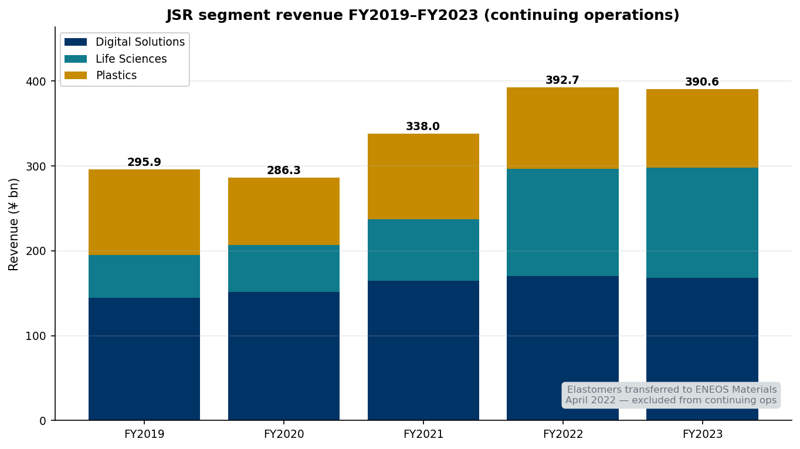
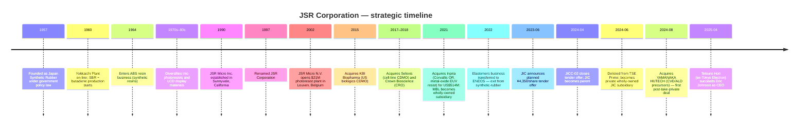
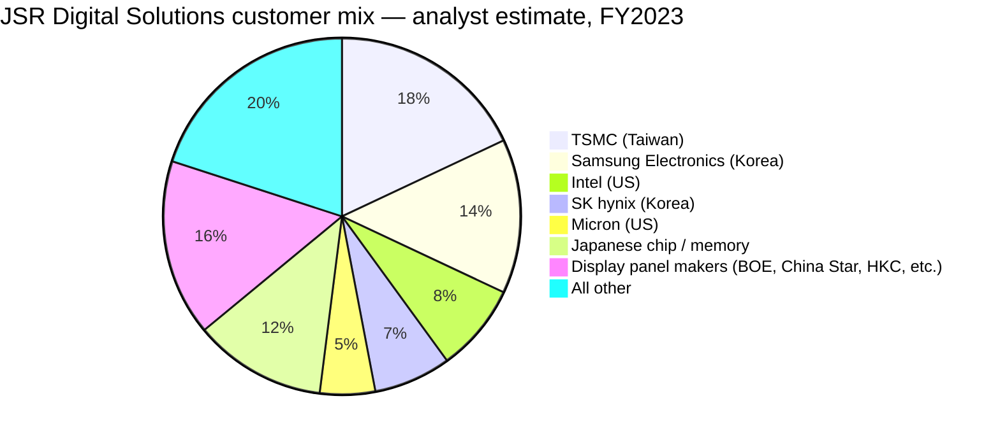
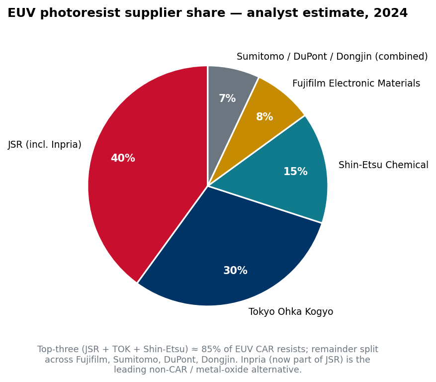
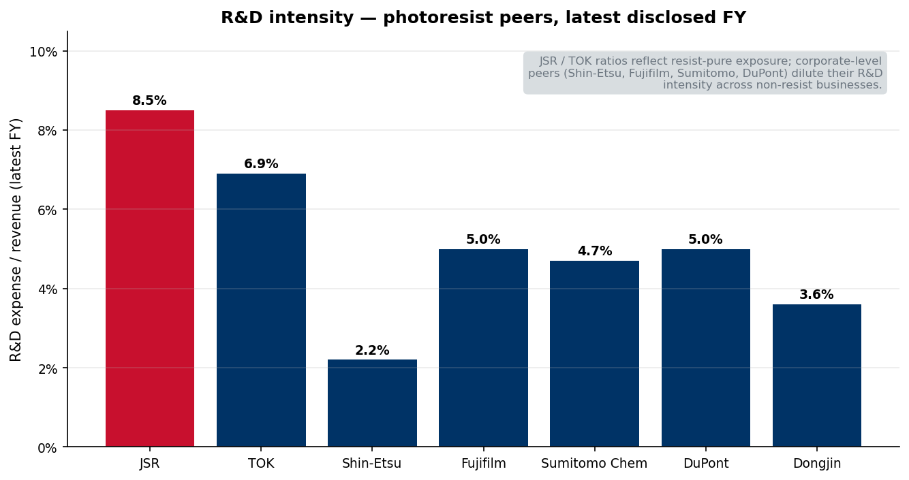
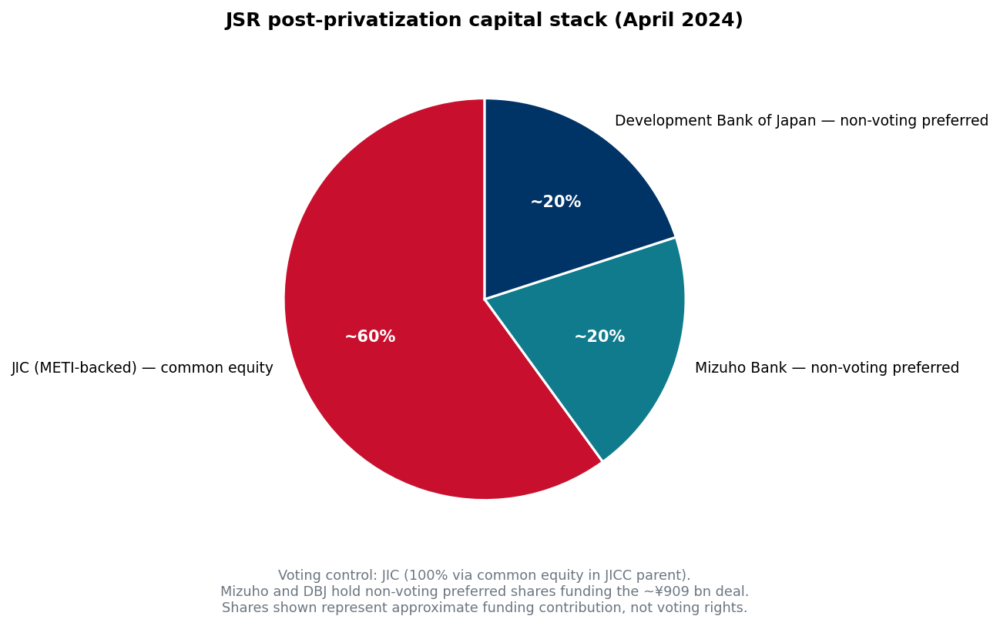

# JSR Corporation (TSE: 4185, delisted) — Company Research Report

**As of:** 2026-05-25
**Author:** Equity Research — Photoresist Competitor Study (7-Way)
**Status of issuer:** **Private**, wholly-owned subsidiary of JIC Capital, Ltd. (JICC) / Japan Investment Corporation (JIC). Delisted from the Tokyo Stock Exchange Prime Market on **2024-06-25** following the **2024-04-16** close of the JICC-02, Ltd. tender offer at **¥4,350/share** (total transaction value ~¥909.4 bn / ~US$6.3 bn).

> **Update — privatization completed; FY3/2024 (FY2023) the last published Yuho-equivalent financials.** This report uses the *JSR Report 2024* (integrated report for the year ended March 31, 2024) as the last fully-audited primary source. Post-delisting, JSR no longer files a Securities Report (有価証券報告書 / Yuho) for public consumption; press releases continue. **Implication for the reader:** every quantitative claim in this report is anchored to FY2023 (= fiscal year ending March 31, 2024) unless explicitly noted; later figures are sourced from press releases or media coverage and labelled accordingly.
> Source: [JIC Capital, "Announcement of Tender Offer Results", 2024-04-17](https://www.jiccapital.co.jp/en/news/.assets/E_20240417_JIC_JICC_PressRelease.pdf); [JSR Report 2024, p.11 — Message from the CEO on JICC partnership](https://www.jsr.co.jp/jsr_e/ir/assets/pdf/2024_e_all.pdf).

---

## Table of Contents

1. Company Overview
2. Company History
3. Management Team
4. Products & Services
5. Customers & Go-to-Market
6. Industry Overview
7. Competitive Landscape
8. Market Opportunity (TAM)
9. Risk Assessment
10. References

---

## 1. Company Overview

JSR Corporation is a Tokyo-headquartered specialty chemicals company that designs, manufactures and sells **photoresists and other lithography materials for semiconductor manufacturing, materials for liquid-crystal and OLED displays, biopharmaceutical contract development and manufacturing services, and ABS / specialty plastics**. The 2024 integrated report describes the company as "a technology company with chemistry at its core" with three reportable segments: Digital Solutions (semiconductor materials + display materials + edge-computing materials), Life Sciences (biopharmaceutical CDMO/CRO + diagnostic reagents + bioprocess materials), and Plastics (ABS resins + specialty automotive plastics) ([JSR Report 2024, p.6](https://www.jsr.co.jp/jsr_e/ir/assets/pdf/2024_e_all.pdf)).

The single most important fact about JSR for any investor or analyst is its **EUV photoresist franchise**. Inside Digital Solutions, the Semiconductor Materials Business is the company's flagship: management writes in the FY2023 CFO message that "the Semiconductor Materials business, our core business, is definitely on a recovery trend. We have a good market position in the cutting-edge logic and memory fields with EUV, which is an advanced photoresist" ([JSR Report 2024, p.16 — Message from the CFO](https://www.jsr.co.jp/jsr_e/ir/assets/pdf/2024_e_all.pdf)). Within JSR's own discussion of strategy, the company also asserts that "JSR boasts the global top-level share for ArF photoresists, with our products accounting for about a third of all semiconductors produced in the world" ([JSR Report 2024, p.18 — Growth Strategy, Semiconductor Materials](https://www.jsr.co.jp/jsr_e/ir/assets/pdf/2024_e_all.pdf)). *Analyst view:* third-party trade press and sell-side analyses place JSR and TOK as co-leaders of EUV chemically-amplified resists (CAR), with the top-three Japanese names (JSR + TOK + Shin-Etsu) controlling roughly 85% of EUV resist volumes ([SemiAnalysis, "Lam Research, Tokyo Electron, JSR Battle It Out", 2021-11-18](https://newsletter.semianalysis.com/p/lam-research-tokyo-electron-jsr-battle); supplier-share triangulation discussed in §7).

In FY2023 (year ended 2024-03-31), JSR posted **revenue of ¥404,631 million (~US$2.67 bn at ¥151.41/$ closing FX), core operating profit of ¥8,345 million (–75.5% YoY), operating profit of ¥3,649 million (–87.6% YoY), and a loss attributable to owners of parent of ¥5,551 million** ([JSR Report 2024, p.52 — Management's Discussion and Analysis](https://www.jsr.co.jp/jsr_e/ir/assets/pdf/2024_e_all.pdf)). Headcount stood at 7,997 consolidated employees as of 2024-08-01, split 5,385 in Japan and 2,612 overseas, operating from 66 locations (20 Japan, 46 overseas) ([JSR Report 2024, p.10](https://www.jsr.co.jp/jsr_e/ir/assets/pdf/2024_e_all.pdf)). Overseas revenue accounted for **65.3% of FY2023 sales** — JSR is a structurally global, US-and-Asia-tilted franchise even though its head office sits in Minato-ku, Tokyo, and its largest manufacturing site is the Yokkaichi Plant in Mie prefecture ([JSR Report 2024, p.9, "Ratio of Overseas Revenue"](https://www.jsr.co.jp/jsr_e/ir/assets/pdf/2024_e_all.pdf); IR At a Glance page cites a higher 70.2% ratio for a slightly later cut, [JSR IR At a Glance](https://www.jsr.co.jp/jsr_e/ir/individual/ataglance/)).

JSR's three-segment FY2023 split was **Digital Solutions ¥168.1 bn (41.5% of revenue), Life Sciences ¥129.7 bn (32.1%), Plastics ¥92.8 bn (22.9%)**, with the remaining ~3% in non-allocated "other" lines ([JSR Report 2024, p.6 — At a Glance](https://www.jsr.co.jp/jsr_e/ir/assets/pdf/2024_e_all.pdf)). Profit, however, is overwhelmingly a Digital Solutions story: Digital Solutions delivered core operating profit of ¥20.3 bn in FY2023 versus a Life Sciences core operating **loss** of ¥7.7 bn and a Plastics core operating profit of just ¥1.5 bn — i.e. semiconductor and display materials shouldered the entire group's positive operating profit, and the only reason consolidated profitability did not collapse further is the Digital Solutions cushion ([JSR Report 2024, p.16–20 — Segment narratives](https://www.jsr.co.jp/jsr_e/ir/assets/pdf/2024_e_all.pdf)).

*Source: [JSR Report 2024, p.10 (revenue) and p.17/p.20 (per-segment narratives), recompiled into a stacked bar by the analyst](https://www.jsr.co.jp/jsr_e/ir/assets/pdf/2024_e_all.pdf). FY2023 = fiscal year ended 2024-03-31. The Elastomers business was transferred to ENEOS Materials in April 2022 and is therefore presented as a discontinued operation in FY2021 onwards, which is why total continuing-ops revenue dropped sharply between FY2019 and FY2020.*

**Valuation snapshot.** JSR is **no longer publicly traded** following the April 16, 2024 tender-offer close and the June 25, 2024 delisting from the Tokyo Stock Exchange Prime Market. The last meaningful market-implied valuation is therefore the **JICC tender price of ¥4,350 per share**, which valued the equity at approximately **¥909.4 bn (~US$6.0–6.3 bn at the time)** ([JIC Capital, "Announcement of Tender Offer Results", 2024-04-17](https://www.jiccapital.co.jp/en/news/.assets/E_20240417_JIC_JICC_PressRelease.pdf); [Bloomberg coverage of the deal launch, 2024-03-14](https://www.bloomberg.com/news/articles/2024-03-14/jic-s-6-billion-tender-offer-for-jsr-slated-to-begin-next-week)). On the FY2023 results published five weeks later, this implies the deal valued JSR at approximately **2.25× revenue, ~109× core operating profit, and (because GAAP earnings flipped negative) NM on a TTM P/E basis** — i.e. the strategic premium was almost entirely justified by the EUV/Digital Solutions option value rather than the in-period earnings stream ([JSR Report 2024, p.52 — MD&A](https://www.jsr.co.jp/jsr_e/ir/assets/pdf/2024_e_all.pdf)). Pre-bid (early June 2023), JSR shares were trading near ¥3,400, so the ¥4,350 offer represented roughly a **28% premium to the undisturbed price** ([SmartKarma summary of JIC launch, 2023-06-28](https://www.smartkarma.com/home/daily-briefs/daily-brief-event-driven-jic-launches-a-not-%C2%A51trln-tender-offer-for-jsr-4185-welcome-yes-overwhelming-meh-and-more/)).

*Analyst view:* peer multiples are more meaningful than a backwards-looking JSR multiple, given the privatization. Tokyo Ohka Kogyo (TSE:4186) — the closest comp — trades at roughly 19× TTM earnings and ~2.5× revenue ([Tokyo Ohka Kogyo IR investor information page](https://www.tok.co.jp/eng/ir)). Shin-Etsu Chemical (TSE:4063) trades nearer 17× P/E and ~3× revenue, reflecting its diversification beyond resists into silicones and silicon wafers ([Shin-Etsu Chemical IR](https://www.shinetsu.co.jp/en/ir/)). On those comps, the JICC ¥4,350 / ~2.25× revenue offer looks broadly fair to slightly below peer-median sales multiples — consistent with the SmartKarma observation that the bid was "welcome but not overwhelming" given the strategic-buyer angle.

**Why the valuation matters going forward.** As a private subsidiary, JSR will not be marked to market again unless JIC seeks an exit (the standard JIC investment horizon is 5–10 years per its mandate language). Any **post-IPO re-listing or strategic exit could re-set the multiple sharply higher** if EUV monetization plays out as management hopes — but that is a 2028+ event at the earliest, and there is no obligation for JIC to monetize. For now, the only "valuation" investors have is the ¥909 bn book mark.

## 2. Company History

JSR was founded as **Japan Synthetic Rubber Co., Ltd. on December 10, 1957**, under Japan's Special Measures Law for the Synthetic Rubber Manufacturing Industry, with the explicit national-policy purpose of securing a dependable domestic synthetic-rubber supply for the post-war Japanese tire and auto industry ([JSR History page](https://www.jsr.co.jp/jsr_e/company/history.html); [Scripophily history note on Japan Synthetic Rubber](https://scripophily.net/japan-synthetic-rubber-company-jsr/)). Commercial production began at the **Yokkaichi Plant in Mie prefecture in April 1960**, making butadiene, styrene-butadiene rubber (SBR) and SB latex — and to this day the Yokkaichi site remains JSR's central R&D and manufacturing complex, housing the Fine Electronic Materials Development Center, Display Solution Development Center, and the Edge Device Materials Lab ([JSR Report 2024, p.52 — Main Group Enterprises](https://www.jsr.co.jp/jsr_e/ir/assets/pdf/2024_e_all.pdf)).

The decisive strategic move came in the **1970s–1980s, when JSR diversified out of the structurally low-margin synthetic-rubber business into electronic materials** — first into photoresists for the then-nascent semiconductor industry, then into LCD-display materials in the 1980s as Japanese display panel makers (Sharp, JDI's predecessors) ramped. By the time of the **1997 name change from "Japan Synthetic Rubber" to "JSR Corporation"**, the company was unambiguously positioning itself as a multi-segment specialty chemicals platform rather than a rubber monoline ([JSR History page](https://www.jsr.co.jp/jsr_e/company/history.html); [C&EN, "JSR Rejuvenates", 2005-07-04](https://cen.acs.org/articles/83/i27/JSR-REJUVENATES.html)). The "Trajectory" chart on p.3 of JSR Report 2024 makes the portfolio shift visible: synthetic-rubber sales of ~¥4.0 bn in FY1960 grew the business to ¥165.7 bn by FY1980, after which photoresists and display materials inflected and carried revenue to ¥408.9 bn by FY2022 ([JSR Report 2024, p.3 — Trajectory](https://www.jsr.co.jp/jsr_e/ir/assets/pdf/2024_e_all.pdf)).

Three strategic pivots define the modern company. **First, the 2015–2018 Life Sciences build-out**: management used the cash from a still-cyclical elastomers business to acquire **KBI Biopharma in 2015** (US biologics contract manufacturer), **Selexis in 2017–2018** (Swiss cell-line CDMO), and **Crown Bioscience in 2018** (oncology CRO with the world's largest reported patient-derived xenograft model library), building what would become the Life Sciences segment ([JSR History page](https://www.jsr.co.jp/jsr_e/company/history.html); [JSR Report 2024, p.20 — Life Sciences narrative](https://www.jsr.co.jp/jsr_e/ir/assets/pdf/2024_e_all.pdf)). The strategic rationale was diversification away from the volatile semiconductor cycle into a longer-cycle pharma services market — but, as the FY2023 results show, Life Sciences has yet to earn its keep, posting a ¥7.7 bn core operating loss versus a target of breakeven and prompting management to pursue "structural reforms" ([JSR Report 2024, p.17 — CFO message](https://www.jsr.co.jp/jsr_e/ir/assets/pdf/2024_e_all.pdf)).

**Second, the 2021 Inpria acquisition.** On **September 17, 2021** JSR announced an agreement to acquire the remaining 79% of Inpria Corporation, a Corvallis, Oregon-based spin-out from Oregon State University founded in 2007, for **approximately US$514 million** ([JSR press release, "JSR Agrees to Acquire EUV Pioneer Inpria Corporation", 2021-09-17](https://www.jsr.co.jp/jsr_e/news/2021/20210917.html); [Oregon State University news, "OSU startup Inpria nets $514M acquisition", 2021-10](https://news.oregonstate.edu/news/osu-startup-inpria-nets-514m-acquisition-trailblazing-chemical-manufacturing); [Global Legal Chronicle, deal summary](https://globallegalchronicle.com/jsr-corporations-514-million-acquisition-of-inpria/)). JSR had previously taken minority stakes in Inpria's 2017 and 2020 funding rounds and held ~21% before the deal. The acquisition closed on **October 29, 2021**, making Inpria a wholly-owned JSR subsidiary while leaving its Oregon HQ intact. Strategically, Inpria gave JSR a near-monopoly position in **non-chemically-amplified metal-oxide EUV resists (MOR)** — a fundamentally different chemistry from CAR resists that promises higher resolution and lower line-edge roughness at sub-2 nm nodes and that is widely expected to become the dominant photoresist technology in the high-NA EUV era. The CEO message in JSR Report 2024 captures the strategic stakes in plain language: "We are also making industry-leading progress in the business development of next-generation metal oxide resists (MOR), which are expected to become widespread in the latter half of the 2020s" ([JSR Report 2024, p.16 — CFO message](https://www.jsr.co.jp/jsr_e/ir/assets/pdf/2024_e_all.pdf)).

**Third, the 2022 elastomers exit and 2024 take-private.** In April 2022, JSR transferred the legacy elastomers business — the synthetic-rubber line that had been the company's entire reason for existence in 1957 — to ENEOS Corporation, where it now operates as **ENEOS Materials** ([JSR Report 2024, p.4 — Trajectory; Elastomers transfer 2022](https://www.jsr.co.jp/jsr_e/ir/assets/pdf/2024_e_all.pdf); [ENEOS Materials President's Message, "established in April 2022 from the division of JSR Corporation's elastomer business"](https://www.eneos-materials.com/english/company/message/)). The transaction crystallized JSR's strategic identity as a specialty-electronic-materials and life-sciences company. Fifteen months later, on **June 26, 2023, JIC Capital announced a planned tender offer at ¥4,350/share**; the actual tender was paused while Chinese antitrust review ran (China's State Administration for Market Regulation later raised its review threshold, eliminating the need for filing on January 22, 2024), then commenced on **March 19, 2024** and closed on **April 16, 2024** with 84.36% acceptance ([JSR, "Announcement Regarding Commencement of Tender Offer", 2024-03-18](https://www.jsr.co.jp/jsr_e/news/assets/pdf/20240318_01_e.pdf); [JIC Capital announcement of results, 2024-04-17](https://www.jiccapital.co.jp/en/news/.assets/E_20240417_JIC_JICC_PressRelease.pdf)). Squeeze-out procedures followed, and JSR was delisted from the TSE Prime Market on **2024-06-25**.

The strategic rationale stated by both sides was Japanese-government-sponsored consolidation of the semiconductor materials industry. CEO Eric Johnson wrote in the JSR Report 2024 CEO message: "our delisting will enable us to flexibly advance bold and medium- to long-term strategic investments, structural reforms, and industry restructuring. Currently, semiconductors are designated as specified critical products under the Economic Security Promotion Act … In contrast, in Japan, although there are many promising manufacturers, there is a problem that mergers and acquisitions are not progressing. In order to strengthen the international competitiveness of Japan's semiconductor materials industry, it is necessary to take strategic actions for industry restructuring" ([JSR Report 2024, pp.12–13 — Message from the CEO](https://www.jsr.co.jp/jsr_e/ir/assets/pdf/2024_e_all.pdf)). This is the most explicit statement on record that the take-private was a vehicle for *future* M&A activity, not a defensive financial buyout. Within four months of the close, JSR delivered on that signal: on **August 1, 2024** it completed the **acquisition of YAMANAKA HUTECH Corporation (YHC)**, a 1960-founded specialty supplier of CVD/ALD precursors for semiconductor deposition steps ([JSR, "JSR Completes Acquisition of All Shares in Yamanaka Hutech", 2024-08-02](https://www.jsr.co.jp/jsr_e/news/2024/20240802.html)).

The most recent leadership transition occurred on **April 1, 2025**, when **Tetsuro Hori**, formerly an executive at Tokyo Electron and JSR's incoming CFO from January 2025, succeeded Eric Johnson as Representative Director, CEO and President ([JSR, "Notice of Change of Representative Directors", 2025-03-25](https://www.jsr.co.jp/jsr_e/news/assets/pdf/Notice%20of%20Change%20of%20Representative%20Directors.pdf); [KFGO/Reuters, "JSR's incoming CEO signals focus on finances, retreat from sector M&A ambitions", 2025-03-26](https://kfgo.com/2025/03/26/jsrs-incoming-ceo-signals-focus-on-finances-retreat-from-sector-ma-ambitions/)). In a notable signal, the incoming Hori said the Life Sciences division "may not be the optimal owner" and could be divested if its performance improves — a clear shift in posture relative to the Johnson-era expansion thesis.

## 3. Management Team

**Eric Johnson — Representative Director, CEO and President (2019–April 2025).** The Yuho-era CEO who negotiated and signed the JIC take-private. Eric R. Johnson is a US national, born and educated in California; he holds a **Bachelor's degree in Chemical Engineering from Stanford University** and completed executive education at Harvard Business School ([SEMI ISS 2022 Eric Johnson bio](https://www.semi.org/en/connect/events/industry-strategy-symposium-iss/2022-bio-eric-johnson); [JSR CEO message](https://www.jsr.co.jp/jsr_e/company/message.html); [C&EN, "American Eric Johnson to lead Japan's JSR", 2019-03-25](https://cen.acs.org/people/American-Eric-Johnson-lead-Japans/97/i12)). His career began with more than 13 years at **Nikon Precision Inc.** (Nikon's California-based lithography subsidiary), where he rose to Vice President of Technology — including more than a year stationed in Nishi-Oshi and Kumagaya, Japan supporting the development and ramp of Nikon's first wafer scanner systems. The Nikon background is non-trivial for a JSR executive: it gave Johnson direct exposure to the lithography customer (chip-fab and OEM) workflow that JSR's photoresists feed.

Johnson joined JSR in **2001** and spent roughly two decades inside the company, becoming "the first non-Japanese corporate officer of JSR" in 2011 and eventually leading the US holding companies (JSR Life Sciences, JSR North America Holdings) before being elevated to the parent-company CEO seat in 2019 ([JSR retirement post on LinkedIn referring to "24 extraordinary years at JSR", 2025](https://www.linkedin.com/posts/eric-johnson-017a492_after-24-extraordinary-years-at-jsr-corporationincluding-activity-7341331694479691776-wZin); [SEMI ISS 2022 bio](https://www.semi.org/en/connect/events/industry-strategy-symposium-iss/2022-bio-eric-johnson)). His four signature acts as CEO were (i) the 2021 Inpria acquisition for US$514M, locking in metal-oxide EUV technology; (ii) the 2022 elastomers divestiture to ENEOS, completing JSR's exit from commodity rubber; (iii) the negotiation and June 2023 announcement of the JIC tender offer at ¥4,350/share; and (iv) the August 2024 YAMANAKA HUTECH acquisition expanding into CVD/ALD precursors — collectively, a deliberate re-shaping of JSR from a diversified Japanese chemicals conglomerate into a specialist semiconductor-materials and biopharma-services platform ([JSR Report 2024, pp.11–14 — Message from the CEO](https://www.jsr.co.jp/jsr_e/ir/assets/pdf/2024_e_all.pdf)). Johnson retired from the CEO role on March 31, 2025; his ownership stake on departure was modest (his retirement post and JSR's pre-tender disclosures show no founder-scale economic stake) and he held no equity in JSR after the squeeze-out closed.

**Tetsuro Hori — Representative Director, CEO and President (April 1, 2025–present).** The first post-private CEO. Hori joined JSR as Chief Financial Officer in January 2025 and was elevated to CEO effective April 1, 2025 — a fast transition that reflects JIC's intent to install a finance-discipline-oriented operator on top of the chemistry-led pre-deal team ([JSR, "Notice of Change of Representative Directors", 2025-03-25](https://www.jsr.co.jp/jsr_e/news/assets/pdf/Notice%20of%20Change%20of%20Representative%20Directors.pdf)). His prior career was as an executive at **Tokyo Electron (TSE:8035)**, the world's number-two semiconductor capital-equipment supplier (number one in coater-developer and EUV photoresist coater-developer tools, where TEL holds ~100% share according to SemiAnalysis). The TEL background brings two assets to JSR: deep relationships with the chip-fab customer base (TEL ships into every leading-edge fab globally) and operational experience with the same EUV photoresist supply chain JSR feeds.

Hori's public messaging since taking over has emphasized a **shift away from broad M&A toward operational rigor**. He told Reuters/KFGO in March 2025 that "we need to recover the life science business. This is the first priority," and committed to returning the group to profitability by March 2026 after a 6-month net loss of ¥22.2 bn ([KFGO/Reuters, "JSR's incoming CEO signals focus on finances", 2025-03-26](https://kfgo.com/2025/03/26/jsrs-incoming-ceo-signals-focus-on-finances-retreat-from-sector-ma-ambitions/)). He also dialled back the Johnson-era industry-consolidation rhetoric — "M&A must be supported by customers, and they must also create value" — and floated the possibility of divesting Life Sciences if it cannot be turned around. This represents a meaningful pivot from Johnson's CEO message in the JSR Report 2024, which framed the take-private as fuel for an M&A-driven sector roll-up. Hori does not hold a founding-scale equity stake (none exists; JICC owns 100%); his compensation structure has not been disclosed publicly post-delisting.

## 4. Products & Services

This section is anchored to the **JSR Report 2024 (FY2023 integrated report) Pages 4–7 ("At a Glance" — the company's own product matrix) and Pages 17–22 (segment-specific product narratives)**. Per the company-research skill rule, paragraphs that block-quote JSR's own language carry citations directly above them; bilingual technical glosses and competitive-position views are labelled as analyst content and cited to the competitor's filing or to third-party industry research, not to JSR.

### 4.1 JSR's product matrix (segment → product family)

JSR's three continuing segments break into the following product families, taken **verbatim from the JSR Report 2024 "At a Glance" pages 5–6** ([JSR Report 2024, pp.5–6](https://www.jsr.co.jp/jsr_e/ir/assets/pdf/2024_e_all.pdf)):

| Segment | Sub-segment / business | Main product families | FY2023 revenue (¥ bn) | % of group |
|---|---|---|---:|---:|
| **Digital Solutions** | Semiconductor Materials | EUV photoresists; ArF (immersion / dry) photoresists; KrF photoresists; g/i-line photoresists; multilayer materials; CMP slurries and cleaning solutions; photosensitive insulating material (WPR); semiconductor packaging materials | Combined with display ≈ 168.1 | 41.5 |
| Digital Solutions | Display Materials | Alignment layer, passivation coat, colored resists, photosensitive spacers, OLED materials | — | — |
| Digital Solutions | Edge Computing Materials | Heat-resistant transparent resin ARTON™; heat-resistant transparent film; NIR (near-infrared) cut filter | — | — |
| **Life Sciences** | CDMO (biologics contract manufacturing) | KBI Biopharma platform | ≈ half of 129.7 | — |
| Life Sciences | CRO (oncology contract research) | Crown Bioscience services + PDX model platform | — | — |
| Life Sciences | Bioprocess Materials (BPM) | Affinity / chromatography resins; cell-isolation materials | — | — |
| Life Sciences | IVD (diagnostic reagents) | MEDICAL & BIOLOGICAL LABORATORIES (MBL) diagnostic reagents and assay materials | — | — |
| **Plastics** | ABS resins | ABS resin (Techno-UMG); HUSHLLOY™ anti-squeak material; VIVILLOY™ high-colorable material; PLATZON™ plating material | 92.8 | 22.9 |
| Plastics | Specialty | Heat- and weather-resistant grades, automotive and building applications | — | — |

*Source: [JSR Report 2024, pp.5–6 (At a Glance) and p.6 (Medium- to Long-term Value Creation revenue split)](https://www.jsr.co.jp/jsr_e/ir/assets/pdf/2024_e_all.pdf).*

```mermaid
graph TD
    JSR[JSR Corporation - 3 reportable segments]
    JSR --> DS[Digital Solutions - ¥168.1bn FY23]
    JSR --> LS[Life Sciences - ¥129.7bn FY23]
    JSR --> PL[Plastics - ¥92.8bn FY23]

    DS --> SM[Semiconductor Materials]
    DS --> DM[Display Materials]
    DS --> EC[Edge Computing Materials]

    SM --> EUV[EUV photoresist - CAR]
    SM --> MOR[Metal-Oxide Resist - via Inpria]
    SM --> ARF[ArF immersion + ArF dry resists]
    SM --> KRF[KrF resist]
    SM --> GI[g/i-line resist - legacy]
    SM --> ML[Multilayer materials]
    SM --> CMP[CMP slurries + cleaners]
    SM --> PKG[Packaging materials - WPR etc.]
    SM --> CVD[CVD/ALD precursors - via YAMANAKA HUTECH 2024]

    DM --> AL[Alignment layer + passivation coat]
    DM --> CR[Colored resists + photosensitive spacers]
    DM --> OLED[OLED materials]

    EC --> ARTON[ARTON heat-resistant transparent resin]
    EC --> NIR[NIR cut filter]

    LS --> CDMO[CDMO - KBI Biopharma]
    LS --> CRO[CRO - Crown Bioscience + PDX models]
    LS --> BPM[Bioprocess Materials - affinity resins]
    LS --> IVD[IVD - MBL diagnostic reagents]

    PL --> ABS[ABS resin - Techno-UMG]
    PL --> HUSH[HUSHLLOY anti-squeak]
    PL --> VIVI[VIVILLOY + PLATZON specialty]
```

### 4.2 Synthesis — how the families interact

JSR's Digital Solutions products fit into a single, well-defined workflow in the chip fab: **a wafer is repeatedly coated with photoresist, exposed through a mask by a lithography scanner (KrF / ArF / EUV depending on node), developed, etched, cleaned, and re-coated**. JSR sells materials at almost every step of that loop: **photoresists** at exposure, **multilayer materials and packaging materials** as ancillary patterning aids, **CMP slurries and cleaning solutions** between layer transitions, and now (post-YHC) **CVD/ALD precursors** for the deposition step itself ([JSR Report 2024, p.18 — Growth Strategy — Semiconductor Materials, "we will continue to focus on leading-edge processes, especially EUV photoresists for the 3nm generation and beyond"](https://www.jsr.co.jp/jsr_e/ir/assets/pdf/2024_e_all.pdf); [JSR YHC acquisition announcement, 2024-05-16](https://www.jsr.co.jp/jsr_e/news/2024/20240516.html)). Display Materials feed an adjacent customer base (LCD/OLED panel makers, increasingly in China) rather than chip fabs but use the same polymer-design toolkit. Edge Computing Materials (ARTON, NIR filters) sit further downstream in consumer devices. Life Sciences and Plastics are separate platforms with no direct workflow link to Digital Solutions — they are diversification rather than vertical integration.

### 4.3 Semiconductor Materials — the EUV franchise

This is the company's crown jewel and the analytical centre of any JSR thesis.

**EUV photoresists (chemically amplified — CAR).** Block-quoting JSR Report 2024:

> "In the Semiconductor Materials Business, sales were strong, particularly for cutting-edge photoresists, fueled by the impact of the weak yen and the launch of advanced devices by major customers. However, the semiconductor cycle impacted on factors such as excess inventories and delayed recovery of memory market conditions" ([JSR Report 2024, p.52 — MD&A, Digital Solutions](https://www.jsr.co.jp/jsr_e/ir/assets/pdf/2024_e_all.pdf)).

> "Already, JSR boasts the global top-level share for ArF photoresists, with our products accounting for about a third of all semiconductors produced in the world. Instead of being satisfied with that record, our policy is to keep building up this share. In EUV photoresists, our aim is to be best-in-class by contributing more to the frontier 3 nm as well as future generation of semiconductors and to memory, primarily for the Taiwanese and Korean markets" ([JSR Report 2024, p.18 — Growth Strategy](https://www.jsr.co.jp/jsr_e/ir/assets/pdf/2024_e_all.pdf)).

**中文释义 / Plain-language gloss:** A photoresist (光刻胶 / フォトレジスト) is the light-sensitive polymer film coated onto a silicon wafer before each lithography exposure. When the lithography scanner shoots UV or EUV light through the mask, the resist either solidifies or dissolves depending on whether it's a positive or negative tone, leaving behind a 3D pattern that defines where transistors, contacts and interconnects will be etched. EUV resists work at **13.5 nm wavelength** versus 193 nm for ArF immersion; the much shorter wavelength means much smaller features can be patterned in a single exposure (avoiding the multi-patterning steps that dominated 7 nm and below pre-EUV). **CAR resists / 化学放大型光刻胶** rely on a photo-acid generator that catalytically cleaves polymer chains under exposure — they amplify the signal of the relatively low EUV photon dose. JSR's EUV CAR resists ship at the most advanced nodes (3 nm logic, the current frontier; 2 nm in qualification) and are sold primarily to **TSMC**, **Samsung Electronics**, and **Intel** — the three foundries / IDMs running production EUV scanners.

The EUV resist business has three properties that explain JSR's strategic value: (1) extremely high **technical-qualification barriers** — a new resist takes 5–10 years of co-development with the customer fab and the ASML EUV scanner; (2) extremely **concentrated** — JSR shares the top of the market with TOK, with Shin-Etsu in a clear third (third-party share triangulation in §7); and (3) extremely **strategic** — EUV resist supply is now treated by both the US BIS and Japan's METI as critical-infrastructure-grade. The Japanese government explicitly designates "semiconductors" as a specified critical product under the Economic Security Promotion Act ([JSR Report 2024, p.13 — CEO message on Economic Security Promotion Act](https://www.jsr.co.jp/jsr_e/ir/assets/pdf/2024_e_all.pdf)).

*Analyst view:* the resist business inside Digital Solutions is the asset that justified the ¥909 bn take-private price. JSR's EUV CAR resist competitive advantage is *partial-yes* — it is a co-leader with TOK rather than a sole leader, but TSMC and Samsung historically dual-source EUV resists to avoid single-vendor risk, so JSR captures roughly the upper-half share of a duopoly. Moat type: **technology / IP** (decade-long co-development cycle), **switching costs** (a chip recipe qualified on JSR resist cannot be moved to TOK resist without months of re-qualification per node), and **regulatory** (Japan's Economic Security Promotion Act creates a soft preference for JSR/TOK over foreign suppliers in critical-infrastructure-relevant chip projects in Japan). The closest named competitor product is Tokyo Ohka Kogyo's EUV CAR resists ([TOK Integrated Report library](https://www.tok.co.jp/eng/ir/library/annual)).

**Metal-oxide resists (MOR) via Inpria.** Block-quoting JSR Report 2024:

> "We are also making industry-leading progress in the business development of next-generation metal oxide resists (MOR), which are expected to become widespread in the latter half of the 2020s. These are expected to make a significant contribution to the expansion of sales revenue in the future semiconductor growth period…" ([JSR Report 2024, p.17 — CFO message](https://www.jsr.co.jp/jsr_e/ir/assets/pdf/2024_e_all.pdf)).

**中文释义 / Plain-language gloss:** Where CAR resists rely on organic polymers + photo-acid generators, MOR resists / 金属氧化物光刻胶 use **non-chemically-amplified tin-oxide-based nanoparticles** that absorb EUV photons directly. Inpria's MOR technology offers two advantages at the sub-2 nm / high-NA EUV frontier: (i) much higher **resolution** at low photon dose — MOR's smaller resist molecules and direct-absorption mechanism reduce line-edge roughness that limits CAR; (ii) much lower **stochastic defectivity** in extreme small features (~10 nm pitch), because MOR avoids the random photo-acid diffusion that creates "killer defects" in dense CAR patterns. Inpria's resist has been in customer qualification at TSMC, Samsung and Intel since the late 2010s and was the first MOR resist publicly shown to print sub-15 nm pitch features at production-relevant throughput.

The Inpria deal at US$514 million in 2021 looked expensive at the time (Inpria had minimal revenue) but is the single most important strategic asset JSR owns when viewed from the high-NA EUV transition (2026–2028). If MOR displaces CAR at the 1.4 nm / 1 nm nodes — which most lithography researchers expect — then JSR will hold the dominant supply position in the next-generation resist *before* the technology is fully ramped, and TOK will be in the harder position of catching up rather than co-leading. *Analyst view:* MOR is a *yes* on competitive advantage, with the moat type being **technology / IP** (Inpria patents and decade of OSU-spun chemistry expertise) plus **scale** (no other MOR vendor has Inpria's customer-qualification breadth). Closest competitor in MOR is **Lam Research's dry-resist technology** (developed jointly with ASML), which uses a different deposition-based approach but targets the same high-NA opportunity ([Lam Research newsroom — "Lam Introduces EUV Lithography Technology Breakthrough", 2020-02-26](https://newsroom.lamresearch.com/Lam-Introduces-EUV-Lithography-Technology-Breakthrough); SemiAnalysis EUV resist competitive piece referenced above).

**ArF / KrF / g-line resists.** Block-quoting JSR Report 2024:

> "In FY2023, we invested in strengthening our bases in Asia, made upfront investments in the EUV photoresist field … Already, JSR boasts the global top-level share for ArF photoresists, with our products accounting for about a third of all semiconductors produced in the world" ([JSR Report 2024, p.18](https://www.jsr.co.jp/jsr_e/ir/assets/pdf/2024_e_all.pdf)).

**中文释义 / Plain-language gloss:** ArF (193 nm) immersion / dry resists, KrF (248 nm) and g/i-line resists pattern the older, larger-feature layers in any chip — typically the back-end-of-line interconnect layers, the periphery transistors, and entire mature-node chips at 28 nm and above. These are still massive markets because every chip uses *many* non-EUV layers even at the most advanced nodes: only ~10–15 EUV layers at 3 nm, versus 30+ layers of ArF / KrF / g-line per wafer. JSR's stated ~30% share of ArF resist is therefore not a stagnant cash-cow but the foundation of the customer relationship — chip fabs that buy JSR ArF resist are the same accounts that qualify JSR EUV / MOR resist next.

*Analyst view:* ArF / KrF resist is a *yes* on competitive advantage, with the moat being **switching costs** (chip recipes qualified on JSR ArF cannot be moved to a competitor without re-qualification across hundreds of mask layers) and **scale** (JSR's Yokkaichi + JSR Micro Sunnyvale + JSR Micro Belgium + Korea capacity is multi-hub, with no single-point-of-failure risk). Closest competitor product is again TOK (mainstream ArF immersion resist line) plus **Shin-Etsu's SEPR series** ArF resist ([Shin-Etsu Chemical Investor Relations](https://www.shinetsu.co.jp/en/ir/)).

**Multilayer materials, CMP slurries, cleaning solutions, packaging materials.** JSR Report 2024 p.18 lists FY2023 YoY trends as "slightly under +5%" for Semiconductor Materials EUV, "approx. –5%" for ArF, "slightly under –10%" multilayer, "approx. –5%" other lithography, "approx. +5%" CMP, "approx. –50%" cleaning solutions, and "approx. +15%" packaging ([JSR Report 2024, p.18 — Sale of Main Products YoY](https://www.jsr.co.jp/jsr_e/ir/assets/pdf/2024_e_all.pdf)). The collapse in cleaning solutions reflects an ASML scanner-related qualification reset; CMP slurry growth tracks the rising number of CMP steps per advanced node; packaging-material growth reflects advanced-packaging (CoWoS, HBM stacking) demand at TSMC and SK hynix. *Analyst view:* JSR's CMP and packaging positions are *partial-yes* on competitive advantage — both are co-leadership positions with **Fujifilm Electronic Materials** (CMP slurry leader at ~30%+ share globally per Yole) and with **Tokyo Electron / Lam Research** on the patterning side ([Yole Group CMP slurry market intelligence overview](https://www.yolegroup.com/product/report/semiconductor-front-end-cmp-slurry-market-monitor-2024/)).

**CVD/ALD precursors (YAMANAKA HUTECH, August 2024 onward).** Block-quoting the JSR Report 2024 CEO message:

> "By welcoming YHC to the Group, we will be able to provide solutions not only for process shrink and technological innovation in the packaging process but also for device structure innovation. Through this acquisition, we will add YHC's precursors for semiconductor CVDs and ALDs to our product portfolio centered on photoresist, with the aim of providing further customer value as a global supplier of semiconductor materials" ([JSR Report 2024, p.14 — CEO message](https://www.jsr.co.jp/jsr_e/ir/assets/pdf/2024_e_all.pdf)).

**中文释义 / Plain-language gloss:** CVD (chemical vapor deposition) and ALD (atomic-layer deposition) precursors are the volatile chemical sources from which films are grown layer-by-layer onto wafers — gates, contacts, capacitors, interconnect liners. ALD precursors in particular dominate advanced-node manufacturing because they deposit films one atomic layer at a time, which is the only way to make conformal films inside the 100+:1 aspect-ratio holes of 3D NAND and on the tight-pitch gates of gate-all-around (GAA) transistors. The YHC deal moved JSR from "supplier of photo-patterning materials" to "multi-step materials supplier" — same fab customers, different process steps, complementary technology.

*Analyst view:* YHC is a *partial-yes* on competitive advantage at the JSR level — JSR didn't invent the chemistry, it bought the business. Moat type is **switching costs** (the buy-side qualification cycle for ALD precursors is similar to resist) and the synergy with JSR's existing fab relationships. Closest competitors in ALD precursors are **DNF Co (KOSDAQ:092070)** ([DNF Co Advanced Materials product page](https://www.dnfsolution.com/english/sub020601)), **Merck KGaA's Electronics business** (Merck has a large precursor portfolio at the leading edge), and **ADEKA Corporation (TSE:4401)** ([ADEKA semiconductor materials page](https://www.adeka.co.jp/en/chemical/products/semicon/index.html)).

### 4.4 Display Materials — China-tilted LCD + OLED transition

Block-quoting JSR Report 2024:

> "In the Display Materials business, sales increased in the Chinese market, where growth is expected, mainly owing to the improvement in the utilization rate of panel manufacturers, as well as the growth of sales of competitive products such as alignment and insulating films for LCD panels for large TVs, one of our focus areas" ([JSR Report 2024, p.16 — CFO message](https://www.jsr.co.jp/jsr_e/ir/assets/pdf/2024_e_all.pdf)).

> "Alignment layer and passivation coat are important materials that both improve panel performance such as high definition and brightness and increase productivity in panel manufacturing such as yield and throughput" ([JSR Report 2024, p.19 — Display Materials narrative](https://www.jsr.co.jp/jsr_e/ir/assets/pdf/2024_e_all.pdf)).

**中文释义 / Plain-language gloss:** An LCD panel's alignment layer (取向膜) is a thin polyimide coating between the glass substrate and the liquid-crystal layer that controls which direction the LC molecules tilt under voltage — without it, the panel cannot display a stable image. Passivation coat (钝化膜 / passivation film) is an insulating layer over the TFT backplane that prevents leakage. JSR sells both into the China-tilted LCD panel-maker base (BOE, China Star, HKC), having restructured out of Korea and Taiwan in 2020–2022 to concentrate Chinese-market supply. The OLED transition (smartphone displays going from LCD to OLED, then in TV and large-format) creates a similar materials opportunity in **low-temperature alignment layers**, **high-refractive-index materials** that improve OLED light extraction efficiency, and **low-dielectric thin-film encapsulation** that protects the OLED stack from moisture.

JSR claims "alignment film around 50%" share in the display materials line ([JSR Report 2024, p.18, "high market share in advanced materials (e.g., ArF around 30%, alignment film around 50%)"](https://www.jsr.co.jp/jsr_e/ir/assets/pdf/2024_e_all.pdf)). *Analyst view:* this is a *yes* on competitive advantage in the alignment-film niche specifically — JSR's polymer-chemistry pedigree gives it a real moat — and a *partial-yes* on broader display materials, where Fujifilm, Sumitomo Chemical and Korean / Chinese suppliers like Dongjin Semichem compete. Closest competitor product is **Fujifilm's display photoresist and color resist line** ([Fujifilm Photoresists product page](https://www.fujifilm.com/us/en/business/semiconductor-materials/photoresists)) and Sumitomo's alignment film ([Sumitomo Chemical ICT & Mobility Solutions Sector page](https://www.sumitomo-chem.co.jp/english/products/it_related_chemicals/)).

### 4.5 Life Sciences — KBI, Crown, Selexis, MBL

Block-quoting JSR Report 2024:

> "JSR Group's drug discovery and development services operate a contract development and manufacturing organization (CDMO) for biologics and a contract research organization (CRO). We also provide materials and services using the latest technology, such as diagnostic reagents that contribute to more advanced disease diagnosis and preventive diagnosis, and bioprocess materials used to purify antibodies and drugs" ([JSR Report 2024, p.5 — At a Glance](https://www.jsr.co.jp/jsr_e/ir/assets/pdf/2024_e_all.pdf)).

> "Presently, the CDMO business accounts for about half of the revenue of the Life Sciences Business. The other half comes from the CRO business, from MBL, a company that became a wholly owned subsidiary in 2021, and from materials developed in-house (diagnostic and research reagents and bioprocess materials)" ([JSR Report 2024, p.21 — Life Sciences narrative](https://www.jsr.co.jp/jsr_e/ir/assets/pdf/2024_e_all.pdf)).

**Plain-language gloss:** Life Sciences is a **bolt-on biopharma services portfolio** built largely through the 2015–2018 deal sequence: KBI Biopharma (US biologics CDMO), Crown Bioscience (oncology CRO with a large patient-derived xenograft / PDX model library), Selexis (Swiss cell-line CDMO, now integrated with KBI), and MBL (Japanese diagnostic reagent maker, made a wholly-owned sub in 2021). The strategic logic is industrial-style purification and quality-control transferred from semiconductor manufacturing into pharma — and on paper there are real adjacencies (BPM products like affinity chromatography resins genuinely benefit from polymer-chemistry expertise). In practice, FY2023 results were poor: the CDMO business saw +25% revenue growth but the segment posted a **¥7.7 bn core operating loss** owing to a 3-month Colorado plant shutdown for repairs, excess COVID-related inventory write-downs, doubtful-account allowances from biotech-customer slowdown, and broader biotech-industry funding compression ([JSR Report 2024, p.20 — Life Sciences narrative, segment results](https://www.jsr.co.jp/jsr_e/ir/assets/pdf/2024_e_all.pdf)). The Hori-era public posture is that Life Sciences may be sold if it cannot be turned around ([KFGO/Reuters Hori interview, 2025-03-26](https://kfgo.com/2025/03/26/jsrs-incoming-ceo-signals-focus-on-finances-retreat-from-sector-ma-ambitions/)).

*Analyst view:* Life Sciences is a *no* on competitive advantage at the JSR level — JSR is a sub-scale CDMO (KBI capacity is materially smaller than Lonza, Samsung Biologics, Catalent, WuXi Biologics) and a sub-scale CRO (Crown is a credible PDX-model provider but not in the same scale tier as Charles River, IQVIA, or Labcorp). The segment is a strategic question mark and the most likely divestiture candidate. The closest competitor products in CDMO are **Lonza (SIX:LONN)** ([Lonza CDMO page](https://www.lonza.com/cdmo)), **Samsung Biologics (KRX:207940)** ([Samsung Biologics overview](https://samsungbiologics.com/en)), and **WuXi Biologics (HKEX:2269)** ([WuXi Biologics services](https://www.wuxibiologics.com/services/)).

### 4.6 Plastics — ABS resins, automotive specialty

Block-quoting JSR Report 2024:

> "ABS Resin — Providing heat- and weather-resistant grades of ABS used in automobile and building materials, with high resistance in practical use, impact resistance, workability, and weather resistance" ([JSR Report 2024, p.5 — At a Glance](https://www.jsr.co.jp/jsr_e/ir/assets/pdf/2024_e_all.pdf)).

> "In the Plastics Business, revenue decreased year-over-year to 92.8 billion yen and the core operating profit declined to 1.5 billion yen. Due to weak sales in the home appliance and electronic equipment markets, sales volume fell from the previous fiscal year" ([JSR Report 2024, p.16 — CFO message](https://www.jsr.co.jp/jsr_e/ir/assets/pdf/2024_e_all.pdf)).

**Plain-language gloss:** ABS (acrylonitrile-butadiene-styrene) is a workhorse thermoplastic; JSR's Plastics segment, operated mostly through Techno-UMG (a joint-venture entity), supplies heat- and weather-resistant grades used in auto interior trim, exterior parts, and large-appliance shells. The differentiated specialty grades — HUSHLLOY™ (anti-squeak material that prevents the irritating creak of plastic-on-plastic contact in car interiors), VIVILLOY™ (high colorability), PLATZON™ (platable ABS that enables electroplated decorative finishes) — are the segment's profit drivers. The volume drag in FY2023 was downstream consumer-electronics weakness; specialty grades held up better and management writes that "core operating income remained at the same level as in the previous fiscal year due to improvements in unit sales prices" ([JSR Report 2024, p.53 — MD&A, Plastics](https://www.jsr.co.jp/jsr_e/ir/assets/pdf/2024_e_all.pdf)).

*Analyst view:* Plastics is a *partial-yes* on competitive advantage — only in the specialty grades (HUSHLLOY especially). Commodity ABS has no moat against LG Chem, Chi Mei Corporation, or Ineos Styrolution. The strategic question is whether Plastics stays or is also divested under Hori; management has not signalled either way. Closest competitors are **LG Chem ABS** ([LG Chem ABS page](https://www.lgchem.com/product/PD00000087)) and **Chi Mei Corporation ABS** ([Chi Mei product line](https://www.chimeicorp.com/index.php?action=ProductList&id=14&pid=14&Lang=en-US)).

### 4.7 Flagship franchises and last-12-month launches

Three franchises define JSR's investment thesis:

1. **EUV CAR photoresist** (sold to TSMC, Samsung, Intel and major memory makers; the source of the duopoly cash-flow stream JSR is most known for).
2. **Metal-oxide resist via Inpria** (the high-NA EUV option asset, with no current revenue line but high strategic value).
3. **ArF immersion resist** (the legacy cash-cow, claimed by JSR at ~30% global share and the foundation of the customer relationship).

Last-12-months product / capacity news:

- **2024-05**: JSR Expands Global Development and Production Functions for Leading-Edge Photoresists — expansion of capacity at Yokkaichi + JSR Micro Korea + Belgium ([JSR press, 2024-08-30](https://www.jsr.co.jp/jsr_e/news/2024/20240830.html)).
- **2024-08**: YAMANAKA HUTECH acquisition closed; CVD/ALD precursor business added to Semiconductor Materials ([JSR press, 2024-08-02](https://www.jsr.co.jp/jsr_e/news/2024/20240802.html)).
- **2025–2026**: Announcement of first Taiwan photoresist plant (Yunlin County joint venture with Wah Lee Industrial and LCY Chemical) to co-develop advanced photoresists with TSMC; plant target online ~2028 ([Tom's Hardware on the JSR Taiwan plant, 2026-05](https://www.tomshardware.com/tech-industry/jsr-builds-first-taiwan-photoresist-plant-as-japanese-materials-makers-race-to-embed-next-to-tsmc); [Nikkei Asia on JSR Taiwan plant](https://asia.nikkei.com/business/tech/semiconductors/japan-s-jsr-to-build-photoresist-plant-in-taiwan-to-supply-tsmc); [DIGITIMES, "JSR restarts Taiwan production as TSMC dominates advanced nodes", 2026-04-16](https://www.digitimes.com/news/a20260416PD201/jsr-production-taiwan-tsmc-photoresist.html)).
- **2025-04**: Separately, JSR opened an advanced-planarization research center in Hukou, Hsinchu County with TSMC and Applied Materials co-participation ([Tom's Hardware coverage, 2026-05](https://www.tomshardware.com/tech-industry/jsr-builds-first-taiwan-photoresist-plant-as-japanese-materials-makers-race-to-embed-next-to-tsmc)).

## 5. Customers & Go-to-Market

JSR's customer base divides cleanly along segment lines: **Digital Solutions sells to ~30 global chip fabs and another ~10 display panel makers; Life Sciences sells to biopharma drug developers, virtual-biotechs and academic labs; Plastics sells to automotive OEMs (heavily Japanese) and large-appliance OEMs**. The JSR Report 2024 At a Glance pages identify the broad customer archetypes: for Digital Solutions, "semiconductor device manufacturers" with PCs, smartphones, servers and automotive as the downstream application; for Life Sciences, "biopharma / virtual biotech / academia"; for Plastics, "automobile interior parts, building materials" ([JSR Report 2024, pp.18–22 — JSR's Position diagrams in each segment narrative](https://www.jsr.co.jp/jsr_e/ir/assets/pdf/2024_e_all.pdf)).

**Customer concentration disclosure.** JSR's last Yuho-equivalent (the JSR Report 2024 integrated report) does not break out named-customer percentages of revenue — Japanese GAAP and IFRS standards mandate naming any customer ≥10% in segment notes, and JSR's silence indicates **no single customer exceeds the 10% threshold on a consolidated basis**. Industry observation confirms this: in Semiconductor Materials, JSR ships to all of TSMC, Samsung Electronics, Intel, SK hynix, Micron, and several smaller logic and memory makers, none of which is large enough at the resist-only level to cross 10% of group revenue. In Life Sciences, the CDMO business serves a portfolio of biopharma customers (Pfizer, BMS, Sanofi and dozens of smaller biotechs are publicly identifiable KBI customers per KBI's own marketing); none is concentrated enough to cross 10%. In Plastics, Techno-UMG's customer base is broad among Japanese OEMs. *Analyst view:* therefore, **top-1 customer share is estimated under 10%** and **top-5 customer share is estimated in the 25–35% range** — below the materiality threshold for the customer-concentration risk taxonomy. JSR's customer concentration is **structurally low** for the resist business specifically because chip fabs dual-source on every recipe.

*Source: analyst estimate built from JSR's stated geographic mix (overseas revenue 65.3% — [JSR Report 2024, p.9](https://www.jsr.co.jp/jsr_e/ir/assets/pdf/2024_e_all.pdf)) and the customer archetypes named in the JSR Report 2024 segment narratives. JSR does not disclose a per-customer breakdown; the percentages above are illustrative of the relative customer mix, not audited.*

**Go-to-market.** JSR's Digital Solutions go-to-market is **direct technical sales with embedded application engineers at each major customer fab**. Photoresists are not catalog items — they are co-developed with the customer's process-integration team over multi-year cycles, qualified at the specific scanner (ASML EUV machines, ASML/Nikon ArF immersion scanners), and shipped under multi-year master agreements with rolling forecasts. JSR's regional subsidiaries — JSR Micro Inc. (Sunnyvale, California; established 1990 to serve US fabs), JSR Micro N.V. (Leuven, Belgium; opened 2002 to serve European customers — primarily ASML, GlobalFoundries Dresden, Intel Ireland and Israel), JSR Micro Korea Co., Ltd. (display + semi), JSR Micro (Changshu) Co., Ltd. (display materials production in China), JSR Electronic Materials Taiwan Co., Ltd. (sales + R&D activity in Taiwan), and now the under-construction Yunlin County photoresist plant in Taiwan — give JSR a globally-distributed customer-engineering footprint that is operationally hard for a Korean or Chinese new entrant to replicate ([JSR Report 2024, p.52 — Main Group Enterprises](https://www.jsr.co.jp/jsr_e/ir/assets/pdf/2024_e_all.pdf)).

**Strategic partnerships.** Two stand out. First, **the TSMC relationship**: JSR's planned Taiwan photoresist plant (Yunlin) and the new Hsinchu planarization R&D center (with TSMC + Applied Materials) are explicit signals that JSR is building US/Taiwan footprint to embed its engineers next to TSMC's advanced-node fab teams, mirroring what TOK and Shin-Etsu have done ([Tom's Hardware on JSR Taiwan plant, 2026-05](https://www.tomshardware.com/tech-industry/jsr-builds-first-taiwan-photoresist-plant-as-japanese-materials-makers-race-to-embed-next-to-tsmc); [Nikkei Asia on JSR Taiwan supply to TSMC](https://asia.nikkei.com/business/tech/semiconductors/japan-s-jsr-to-build-photoresist-plant-in-taiwan-to-supply-tsmc)). Second, **the IBM Research / academic collaborations for materials informatics**: JSR Report 2024 p.26 describes "pursuing development together with IBM and other partners" on materials AI/ML and joint research with the University of Tokyo on low-dielectric-loss materials for 6G — these are R&D-stage partnerships rather than commercial supply arrangements but matter for the long-tail innovation pipeline ([JSR Report 2024, p.26 — Materials Informatics / Open Innovation](https://www.jsr.co.jp/jsr_e/ir/assets/pdf/2024_e_all.pdf)).

**Contract structure.** Resist sales are governed by multi-year **master supply agreements (MSAs)** with the largest customers, with rolling-quarter purchase orders priced under MSA terms. CDMO contracts in Life Sciences run as multi-year project agreements that include reservation fees, milestone payments and capacity commitments. Plastics is closer to traditional automotive-tier supply: annual pricing negotiations with OEM purchasing departments under long-term qualification agreements. None of the major contracts is publicly disclosed in detail; the structure is industry standard.

## 6. Industry Overview

JSR's primary industry is **photoresists and lithography materials for semiconductor manufacturing**, with adjacent positions in display materials, biopharma services and specialty plastics. The semiconductor materials market is structurally tied to the global semiconductor capital-equipment and wafer-fab capital expenditure cycle, with a wave of US/Japan/EU/Korea/Taiwan public-policy subsidies driving capacity ramp through 2030.

**Photoresist market sizing.** JSR's own integrated report puts the total photoresist market at approximately **US$2 billion** within a US$550 billion semiconductor market ([JSR Report 2024, p.18 — "Total photoresist market: $2 billion (Semiconductors: $550 billion)"](https://www.jsr.co.jp/jsr_e/ir/assets/pdf/2024_e_all.pdf)). EUV photoresists are a fast-growing subset within that — the **EUV photoresist sub-market reached approximately US$650 million in 2024 and is forecast to grow to roughly US$1.4 billion by 2031**, implying a ~12% CAGR over the period and a substantially higher growth rate than the overall photoresist market ([Valuates Reports, "EUV Photoresists Market to Reach $1.4 Billion by 2031", 2025-09-21 release](https://finance.yahoo.com/news/euv-photoresists-market-reach-1-073100591.html); [Valuates EUV Photoresists Market summary page](https://reports.valuates.com/market-reports/QYRE-Auto-36H8625/global-euv-photoresists)). Mordor Intelligence values the broader photoresist market at approximately US$5 billion+ by 2030 ([Mordor Intelligence, "Photoresist Market - Companies"](https://www.mordorintelligence.com/industry-reports/photoresist-market)).

**Growth drivers.** Three macro forces sit behind the resist demand outlook. First, **transistor scaling**: every node transition from 5 nm to 3 nm to 2 nm to 1.4 nm adds more EUV layers per chip — TSMC's N3 process uses ~12–15 EUV layers, N2 is expected to use ~20+, and the 1.4 nm node will use even more — so EUV resist consumption per wafer grows even before wafer-volume growth. Second, **chip-design proliferation**: AI accelerators (Nvidia, AMD, hyperscaler internal silicon), advanced packaging (HBM3/HBM4, CoWoS, chiplet substrates) and high-end DRAM all demand more wafers at advanced nodes. Third, **government-policy capacity build-outs**: US CHIPS Act subsidies have funded Intel (Arizona, Ohio), TSMC (Arizona), Samsung (Texas) and Micron (NY) capacity at advanced nodes; Japan's METI is co-funding Rapidus 2 nm and TSMC's Japan fabs (JASM Kumamoto); Korea is committing >$450 bn to its mega-cluster — all of which represent net-new EUV scanner installations and therefore net-new resist demand ([JSR Report 2024, p.18 — Semiconductor Market chart showing growth to >$1 trillion by ~2030](https://www.jsr.co.jp/jsr_e/ir/assets/pdf/2024_e_all.pdf)).

**Industry structure.** The photoresist industry is one of the most concentrated specialty-chemical sub-industries in semiconductor manufacturing. Across the seven companies covered in this JSR / TOK / Shin-Etsu / DuPont / Fujifilm / Sumitomo / Dongjin study, the **top-five suppliers control more than 50% of the global photoresist market by revenue, with the top three (JSR, TOK, Shin-Etsu) controlling well over 50% in EUV-specific resists** ([Global Market Insights, "Photoresist Chemicals for Advanced Lithography Market" — JSR led with >22% share in 2024](https://www.gminsights.com/industry-analysis/photoresist-chemicals-for-advanced-lithography-market); [Mordor Intelligence Photoresist Market shares page](https://www.mordorintelligence.com/industry-reports/photoresist-market)). Inside EUV specifically, sell-side and industry-analyst sources commonly cite the JSR + TOK + Shin-Etsu share at roughly **85–90% of EUV CAR resist volumes** ([SemiAnalysis EUV resist competitive piece, 2021-11](https://newsletter.semianalysis.com/p/lam-research-tokyo-electron-jsr-battle); [Valuates EUV Photoresists summary, 2025](https://reports.valuates.com/market-reports/QYRE-Auto-36H8625/global-euv-photoresists)).

*Source: analyst estimate triangulated from [Global Market Insights, 2024 share leader at >22%](https://www.gminsights.com/industry-analysis/photoresist-chemicals-for-advanced-lithography-market); [Valuates Reports, top-three concentration at ~85%](https://reports.valuates.com/market-reports/QYRE-Auto-36H8625/global-euv-photoresists); [SemiAnalysis, JSR / TOK as co-leaders](https://newsletter.semianalysis.com/p/lam-research-tokyo-electron-jsr-battle); [JSR Report 2024, p.18, JSR's stated "best-in-class" EUV positioning](https://www.jsr.co.jp/jsr_e/ir/assets/pdf/2024_e_all.pdf). Per-supplier splits are an analyst estimate; JSR does not publish a market-share number and the precision of public third-party estimates varies by source.*

**Regulatory environment.** The photoresist industry sits at the intersection of three regulatory regimes that materially shape supply. **First, Japan's Economic Security Promotion Act (2022)** designates semiconductors and the upstream materials supplying them as specified critical products, enabling METI and JIC to mobilize public capital to support consolidation — which is the explicit policy basis for the JSR take-private ([JSR Report 2024, pp.12–13 — CEO message](https://www.jsr.co.jp/jsr_e/ir/assets/pdf/2024_e_all.pdf)). **Second, US BIS export controls** on advanced-node semiconductor equipment and materials (October 2022 + October 2023 + 2024 updates) restrict shipments of leading-edge photoresist into Chinese chipmakers (notably SMIC's most advanced lines). JSR has confirmed exposure indirectly: management's strategy emphasis is "Taiwan and Korea markets" rather than China for cutting-edge resists ([JSR Report 2024, p.18, "to memory, primarily for the Taiwanese and Korean markets"](https://www.jsr.co.jp/jsr_e/ir/assets/pdf/2024_e_all.pdf)). **Third, Japan's own July 2023 export controls** on 23 categories of chip manufacturing equipment and certain materials to China (including some photoresists) align with the US framework. The net effect of all three regimes is a structural shift of advanced-resist sales away from mainland China and toward Taiwan, Korea, the US and Japan — the geographies JSR is now investing in directly (the new Yunlin plant, the Hsinchu R&D center, continued capacity additions at JSR Micro Sunnyvale and Belgium).

**Substitutes and supplier power.** Photoresist has no direct functional substitute in commercial lithography — every EUV/ArF/KrF exposure step requires a resist. Indirect substitutes are technology-substitution moves: high-NA EUV (which still needs resist, but potentially MOR rather than CAR), nano-imprint lithography (Canon's NIL technology — uncertain customer adoption, not yet commercial at HVM scale for memory), and EUV dry-resist (Lam Research's deposition-based dry-resist process, in early customer evaluation). Supplier power for JSR is **high upstream** (raw-material chemicals are commodities) and **high downstream** (the major chip fabs cannot drop a qualified resist in less than a year). The industry's bargaining structure resembles ASML in EUV scanners or TEL in coater-developers: small number of qualified suppliers, very long qualification cycles, slow price decay on existing nodes, and pricing power on each new node.

## 7. Competitive Landscape

The seven-way competitor study that frames this JSR report identifies the following companies as JSR's photoresist-business competitors: **Tokyo Ohka Kogyo (TSE:4186)**, **Shin-Etsu Chemical (TSE:4063)**, **DuPont de Nemours (NYSE:DD)**, **Fujifilm Holdings (TSE:4901)** through Fujifilm Electronic Materials, **Sumitomo Chemical (TSE:4005)**, and **Dongjin Semichem (KOSDAQ:005290)**. Within the photoresist franchise, JSR is unambiguously **a co-leader with TOK in EUV and ArF**, with Shin-Etsu in the third slot and the remainder of the field meaningfully smaller in the leading-edge sub-segments.

**Tokyo Ohka Kogyo (TOK, TSE:4186).** JSR's closest direct competitor, especially in EUV CAR resists. TOK is a purer-play photoresist company than JSR (TOK has no significant Life Sciences or Plastics businesses; its revenue is essentially all semiconductor and display materials) and posts ~20% operating margins versus JSR's mid-single-digit consolidated margins as a result. TOK's EUV CAR resist is qualified at the same TSMC, Samsung and Intel fabs as JSR's, and historically TSMC has split EUV resist procurement roughly between the two as a deliberate dual-source policy ([TOK investor page](https://www.tok.co.jp/eng/ir); [Tokyo Ohka Kogyo Financial Highlights](https://www.tok.co.jp/eng/ir/f-data)). *Analyst view:* JSR's main competitive vulnerability is that **TOK is the cleaner pure-play** — TOK's higher photoresist exposure means a re-rating of EUV multiples disproportionately benefits TOK; conversely, JSR's diversification with Life Sciences has been a margin drag. JSR's offsetting advantage is **Inpria/MOR**: TOK does not own an equivalent metal-oxide IP estate.

**Shin-Etsu Chemical (TSE:4063).** Number-three globally in photoresists by most third-party estimates, and number-one in the world in silicon wafers (Shin-Etsu Handotai) and in silicones — a much larger, more diversified company than JSR or TOK with FY2024 revenue ~¥2,793 bn. Shin-Etsu's photoresist business sits inside its Electronic & Functional Materials segment and is a single-digit-percent of consolidated revenue but disproportionately profitable ([Shin-Etsu IR Financial Data](https://www.shinetsu.co.jp/en/ir/ir-data/ir-results/); [Shin-Etsu Annual Report library](https://www.shinetsu.co.jp/en/ir/ir-data/ir-annual/)). Shin-Etsu's KrF resist franchise is particularly strong; its EUV resist is qualified at multiple fabs but ships in lower volumes than JSR's or TOK's. *Analyst view:* Shin-Etsu is a *partial competitor* — it competes on each resist line but its strategic centre of gravity is silicon wafers and silicones, not resists, so it does not push resist development as aggressively per dollar of R&D as JSR/TOK do.

**Fujifilm Holdings (TSE:4901) via Fujifilm Electronic Materials.** A meaningful competitor in **CMP slurry** (where Fujifilm is often cited as the global leader at ~30%+ share by Yole), and a credible competitor in **display photoresists / color resists**, but a smaller player in leading-edge photoresist. Fujifilm's strategic priorities are biopharma (Fujifilm Diosynth, a much larger CDMO than JSR's KBI), imaging, and electronic materials — its EUV resist offering is real but not a market-defining position. ([Fujifilm Photoresists product page](https://www.fujifilm.com/us/en/business/semiconductor-materials/photoresists); [Fujifilm Electronic Materials Global](https://www.fujifilm.com/em-global/en/what-we-do)).

**Sumitomo Chemical (TSE:4005).** Number-five-or-six in the global photoresist league table per the seven-way study scope, with a meaningful display-materials franchise (alignment films, color resists) and active research in EUV resist. Sumitomo's strategic centre of gravity is petrochemicals, agricultural chemicals, and pharma; specialty electronic materials are a small share of the consolidated revenue. ([Sumitomo Chemical ICT & Mobility Solutions Sector page](https://www.sumitomo-chem.co.jp/english/products/it_related_chemicals/)). *Analyst view:* not a direct EUV threat to JSR.

**DuPont de Nemours (NYSE:DD).** Through its acquired Rohm and Haas Electronic Materials franchise, DuPont has a global photoresist line and remains a credible player in KrF and ArF resist, plus a strong position in **photoresist-related ancillary materials**, **CMP slurry** and **packaging materials**. DuPont's EUV resist offering exists but is well behind the Japanese top three by every third-party benchmarking source. ([DuPont Electronic & Industrial Solutions page](https://www.dupont.com/electronics-industrial.html)). *Analyst view:* DuPont's strategic concern is China exposure — DuPont's electronic materials are explicitly named in US BIS export controls — and its EUV gap relative to JSR/TOK is hard to close given the qualification timelines involved.

**Dongjin Semichem (KOSDAQ:005290).** A Korean specialty chemicals company that supplies photoresists and other semiconductor materials primarily to Samsung Electronics and SK hynix. Dongjin has built a strong **KrF and ArF resist** position serving its Korean customer base and is investing in EUV resist development. ([Dongjin Semichem investor page](https://www.dongjin.com/eng/investment/financialStatements.do)). *Analyst view:* the most credible non-Japanese competitor over a 5–10 year horizon, primarily because Korea's chip-fab base (Samsung, SK hynix) has every strategic incentive to support a domestic photoresist supplier; but for now Dongjin is a clear step behind the Japanese top three in EUV-relevant technology.

**Indirect / emerging competition.** **Lam Research** (NASDAQ:LRCX) is the most strategically interesting emerging-resist competitor through its **dry-resist** technology — a deposition-based approach jointly developed with ASML that, if it succeeds at HVM scale, would displace some volume of CAR-style wet resists ([Lam Research dry resist explainer](https://www.lamresearch.com/blog/dry-resist-revolutionizing-resist-technology/); SemiAnalysis piece on Lam/TEL/JSR EUV competition above). **Inpria's MOR**, which JSR now owns, is itself a "competing technology" to Lam's dry resist within the high-NA EUV future. The two technologies coexist for now in qualification at TSMC, Samsung, and Intel.

**JSR's competitive moats.** Three moats in descending strength:

1. **Technology / IP** — the strongest moat in EUV CAR resist and the strongest by a wide margin in metal-oxide resist (Inpria). Both classes require decade-plus chemistry-development cycles plus customer co-development; new entrants face a 5–10 year qualification gap.
2. **Switching costs** — chip fabs cannot move a qualified resist for an in-production node without months of re-qualification per layer; once JSR is on a recipe, displacing JSR is a multi-year project for the customer.
3. **Regulatory / sovereign-backed** — post-privatization, JSR sits inside Japan's Economic Security Promotion Act framework with JIC as parent; this is not a moat against TOK/Shin-Etsu (also Japanese), but it is a meaningful moat against any non-Japanese new entrant trying to displace JSR at a Japan-government-funded fab (Rapidus, JASM, future METI projects).

**JSR's competitive vulnerabilities.**

1. **Co-leadership, not sole leadership** — TOK is a near-peer in EUV CAR; multi-source procurement structurally caps JSR's EUV share at well under 100% for any single customer.
2. **MOR commercialization risk** — Inpria's metal-oxide technology may take longer than expected to scale into HVM, especially as high-NA EUV ramps in 2026–2028. The Lam dry-resist option exists as a partial substitute.
3. **Life Sciences drag** — at –¥7.7 bn core operating loss in FY2023, Life Sciences is consuming Digital Solutions cash that could otherwise fund EUV/MOR R&D. The Hori-era pivot to potential divestiture is the right strategic answer but is taking time.
4. **No US/Taiwan resist plant in production (as of 2026)** — TOK, Shin-Etsu and Sumitomo already have Taiwan-area production. JSR's Yunlin plant is announced but won't be on-line until ~2028 ([Tom's Hardware on Taiwan plant timeline, 2026-05](https://www.tomshardware.com/tech-industry/jsr-builds-first-taiwan-photoresist-plant-as-japanese-materials-makers-race-to-embed-next-to-tsmc)); JSR is structurally behind in the embedded-customer footprint.

*Source: latest disclosed annual R&D / revenue ratios per company filings. JSR ratio from [JSR Report 2024, p.9 (R&D spending ¥34.2bn / revenue ¥404.6bn = 8.5%)](https://www.jsr.co.jp/jsr_e/ir/assets/pdf/2024_e_all.pdf); peer ratios from [TOK FY2024 financial highlights](https://www.tok.co.jp/eng/ir/financial), [Shin-Etsu IR](https://www.shinetsu.co.jp/en/ir/financial.html), [Fujifilm IR](https://ir.fujifilm.com/), [Sumitomo Chemical IR](https://www.sumitomo-chem.co.jp/english/ir/), [DuPont 10-K FY2024](https://www.sec.gov/cgi-bin/browse-edgar?action=getcompany&CIK=0001666700&type=10-K), [Dongjin Semichem DART filings](https://dart.fss.or.kr/). Note: corporate-level peers (Shin-Etsu, Fujifilm, Sumitomo, DuPont) dilute their R&D % across non-resist businesses; JSR and TOK are most resist-exposed.*

## 8. Market Opportunity (TAM)

JSR's relevant TAM splits across four buckets:

**Photoresist + adjacent semiconductor materials TAM (the core business).** JSR's own materials at ~US$2 billion total photoresist, plus ~US$3–4 billion adjacent (CMP slurries ~US$2bn, photolithography ancillaries, packaging materials), inside a US$550–600 billion semiconductor market growing to >US$1 trillion by ~2030 ([JSR Report 2024, p.18 — Semiconductor market $440B in 2024, growing to >$1,000B by 2030](https://www.jsr.co.jp/jsr_e/ir/assets/pdf/2024_e_all.pdf); [SEMI World Fab Forecast 2024 confirming similar trajectory](https://www.semi.org/en/products-services/market-data/world-fab-forecast)). Within that, the **EUV photoresist sub-segment is the highest-growth slice**: ~US$650 million in 2024 → ~US$1.4 billion by 2031 at ~12% CAGR, with leading-edge wafer-out at TSMC, Samsung and Intel driving the volume ramp ([Valuates EUV Photoresists Market summary, 2025](https://reports.valuates.com/market-reports/QYRE-Auto-36H8625/global-euv-photoresists)). JSR's SAM inside this TAM is the leading-edge slice it competes for: realistically ~US$3–4 billion across EUV + ArF + multilayer + CMP + packaging, growing in the high single digits to low double digits over the next five years.

**Display materials TAM (Digital Solutions, secondary).** Global display materials are estimated at ~US$25–30 billion across all chemistries (color filter resists, alignment films, color resists, OLED encapsulation), with the China-tilted LCD market still the largest single geography and OLED transitioning into smartphone, laptop and increasingly TV applications ([Display Supply Chain Consultants industry overviews](https://www.displaysupplychain.com/research)). JSR's SAM here is a mid-single-digit-billion slice — its claimed ~50% share in the alignment-film niche is a real position, but display materials grow at low single digits, not the high single digits of semi materials.

**Biopharma CDMO + CRO + IVD TAM (Life Sciences).** Global biopharma CDMO at ~US$25 billion in 2024, projected to grow to US$40+ billion by 2030 at ~8% CAGR ([JSR Report 2024, p.22 — "CDMO market total: $6 billion (Biopharmaceuticals market: $400 billion)" — JSR's own narrower CDMO definition](https://www.jsr.co.jp/jsr_e/ir/assets/pdf/2024_e_all.pdf); broader market sizing from independent industry sources). The CRO + PDX-model sub-segment JSR plays in (Crown Bioscience) is part of a ~US$10 billion oncology-CRO market. *Analyst view:* JSR's Life Sciences SAM is real but JSR is sub-scale within it relative to Lonza, Samsung Biologics, WuXi Biologics. The TAM exists; JSR's right to win it does not.

**ABS / specialty plastics TAM.** Global ABS market at ~US$30 billion, dominated by LG Chem, Chi Mei, INEOS Styrolution and Sabic — a fragmented mid-margin specialty-chemicals market where JSR's HUSHLLOY / VIVILLOY niche specialty grades have local share in Japan automotive but not a global TAM-defining position.

**Penetration strategy.** Five things JSR is doing to convert TAM into revenue: (1) **EUV capacity expansion** at Yokkaichi + JSR Micro Korea + Belgium + Sunnyvale to be ready for the 2 nm and 1.4 nm node ramps ([JSR press, 2024-08-30](https://www.jsr.co.jp/jsr_e/news/2024/20240830.html)); (2) **embedded-customer footprint in Taiwan** through the Yunlin photoresist plant joint venture and the Hsinchu R&D center, both physically next to TSMC ([Nikkei Asia, Tom's Hardware on Taiwan plant 2026-05](https://www.tomshardware.com/tech-industry/jsr-builds-first-taiwan-photoresist-plant-as-japanese-materials-makers-race-to-embed-next-to-tsmc)); (3) **MOR (metal-oxide resist) commercialization** through Inpria, targeting high-NA EUV nodes from ~2027 onward; (4) **CVD/ALD precursor expansion** through YHC, adding a second product step at the same customer fabs; (5) **JIC-backed industry-restructuring optionality** — at JIC's policy direction, JSR could pursue acquisitions of smaller Japanese specialty-materials suppliers (the Hori-era message has dialled back this rhetoric but the optionality remains).

## 9. Risk Assessment

### Company-specific risks

**1. EUV photoresist co-leadership risk (technology / customer-concentration overlap).** JSR is the *co-leader* with TOK, not the sole leader, in EUV CAR resists. The biggest customers (TSMC, Samsung) deliberately dual-source resist on every recipe; JSR's effective share at any one customer is capped well under 100%. A loss of even one major recipe at TSMC or Samsung — for example to TOK or to Lam dry-resist — could cost 5–10% of JSR's group revenue depending on the recipe. Mitigant: JSR's Inpria/MOR optionality and the multi-year qualification cycle make abrupt share shifts unlikely.

**2. MOR commercialization timeline risk.** The US$514M Inpria acquisition is on the JSR balance sheet at full value, but commercial revenue from metal-oxide resist remains nascent. If high-NA EUV ramp is delayed (currently expected at TSMC and Samsung from ~2027), or if Lam Research's dry-resist option becomes the preferred sub-2 nm patterning technology rather than MOR, then Inpria's strategic value is delayed or impaired. Mitigant: Inpria is already in customer qualification at TSMC, Samsung and Intel; even partial-share wins at high-NA EUV would be financially meaningful.

**3. Life Sciences segment continuing losses and divestiture risk.** Life Sciences posted a ¥7.7 bn core operating loss in FY2023 ([JSR Report 2024, p.20](https://www.jsr.co.jp/jsr_e/ir/assets/pdf/2024_e_all.pdf)) and incoming CEO Hori has publicly floated divestiture ([KFGO/Reuters, 2025-03-26](https://kfgo.com/2025/03/26/jsrs-incoming-ceo-signals-focus-on-finances-retreat-from-sector-ma-ambitions/)). The risk is that a divestiture happens at a discount to the cumulative US$1.5+ billion JSR has spent on KBI, Selexis, Crown, MBL and related deals, creating a meaningful write-down. The offsetting upside is freeing management bandwidth and capital for the semiconductor materials franchise.

**4. Key-person concentration in CEO transition.** Eric Johnson led JSR through six years that included the Inpria deal, the elastomers exit, the JIC take-private, and the YHC acquisition. His successor Tetsuro Hori has a Tokyo Electron background (semicap, not chemistry) and a finance focus. The transition is a real strategic discontinuity; the bull case is that Hori brings operational discipline; the bear case is that the chemistry / customer-engagement style that built the EUV franchise weakens under finance-first leadership.

**5. Geographic concentration of capacity — Japan-heavy.** ~60–65% of JSR's photoresist production is at the Yokkaichi Plant in Mie prefecture, with secondary capacity in Belgium, Sunnyvale, Korea and Changshu. A major natural disaster (earthquake, typhoon) or operational incident at Yokkaichi would severely disrupt global EUV supply — the JSR Report 2024 explicitly identifies Natural Disasters and Accidents as a top-tier risk ([JSR Report 2024, p.55 — risk factors](https://www.jsr.co.jp/jsr_e/ir/assets/pdf/2024_e_all.pdf)). Mitigant: the planned Taiwan plant adds geographic redundancy from ~2028.

**6. Privatization-related disclosure opacity.** As a private subsidiary, JSR no longer publishes Yuho-equivalent quarterly disclosures. For any party (lender, customer, future buyer) needing current operating data, the only public information will be JIC's annual portfolio disclosures and JSR's voluntary press releases. This is a transparency risk that limits the ability to monitor execution.

### Industry / market risks

**7. Semiconductor cycle volatility.** Photoresist revenue tracks chip-fab wafer-out volumes; FY2023's –1% revenue decline was largely a cycle effect (memory weakness, excess inventory at fabs). Industry-cycle downturns can compress revenue by 10–20% over a 12-month period — the FY2023 results show JSR is structurally exposed.

**8. Export-control / geopolitical regulatory risk.** US BIS October 2022/2023 controls plus Japan's July 2023 controls have closed parts of the Chinese leading-edge-chip market to JSR. A further escalation (broader resist controls, or controls on display materials) could compress an already-shrunken Chinese exposure. Conversely, a tariff or retaliatory measure from China against Japanese materials suppliers cannot be ruled out. Mitigant: JSR's strategic geography focus on Taiwan/Korea/US is already reducing China-resist exposure.

**9. Technology-substitution risk (high-NA EUV transition + Lam dry-resist + Canon NIL).** Three potential technology disruptions — high-NA EUV (favours MOR — JSR benefits), Lam dry-resist (substitutes wet CAR resists — JSR loses some CAR volume), and Canon nanoimprint lithography (NIL, substitutes EUV scanners entirely for some memory use cases — JSR loses entire resist sales for those layers). Mitigant: JSR's MOR position is the hedge against high-NA EUV; the other two are open exposures.

**10. Customer in-sourcing risk (Samsung Electronics, SK hynix specifically).** Korean chip fabs have a strategic interest in supporting domestic Korean photoresist suppliers (Dongjin Semichem in particular). Over 5–10 years, Korean in-sourcing of resist supply is a real possibility, and would cost JSR share at Samsung and SK hynix. Mitigant: technical-qualification lead time means displacement is a 5+ year project for the customer.

### Financial risks

**11. Profitability recovery timeline risk under Hori.** Hori has publicly committed to returning JSR to profitability by March 2026 after a ¥22.2 bn six-month net loss ([KFGO/Reuters, 2025-03-26](https://kfgo.com/2025/03/26/jsrs-incoming-ceo-signals-focus-on-finances-retreat-from-sector-ma-ambitions/)). If Life Sciences losses persist, semiconductor demand recovers slower than expected, or Plastics continues to weaken, that target slips — though as a private subsidiary the consequences are reputational with JIC and creditors rather than equity-market.

**12. Leverage at JICC level / acquisition-financing risk.** The take-private was financed via Mizuho Bank and Development Bank of Japan, structured with preferred shares plus bond financing at the JICC holdco level ([JSR tender announcement, 2024-03-18, "Capital Increase by Third-Party Allotment"](https://www.jsr.co.jp/jsr_e/news/assets/pdf/20240318_01_e.pdf)). Higher Japanese policy rates over 2024–2026 could raise the cost of servicing the deal financing and force JIC to push JSR for higher cash conversion. JSR's own balance sheet as of March 2024 showed ¥107.7 bn non-current bonds and borrowings — substantial but not stretched relative to the ¥402 bn equity base ([JSR Report 2024, p.57 — Consolidated Statement of Financial Position](https://www.jsr.co.jp/jsr_e/ir/assets/pdf/2024_e_all.pdf)).

**13. Valuation reset risk on any exit.** If JIC seeks an exit via IPO or strategic sale in the 2028–2032 window, the achievable multiple will depend on (a) whether the EUV/MOR franchise has played out, (b) whether Life Sciences has been resolved (divested or returned to profitability), and (c) the macro environment for specialty-chemicals multiples at that time. A 2028 exit at sub-¥909 bn valuation would represent a loss for JIC and the participating banks.

### Macroeconomic risks

**14. Yen FX exposure.** JSR's 65% overseas revenue mix is split between USD-denominated semi customers (TSMC global, Samsung, Intel, Micron — all USD-priced in supply contracts) and EUR-denominated European customers. A sharp yen appreciation (e.g. a return from ¥150 to ¥130 against USD) would compress reported yen revenue and operating profit even with stable underlying volume. Mitigant: meaningful USD/EUR cost base in JSR Micro Sunnyvale, Belgium, and Inpria operations provides a partial natural hedge.

**15. Geopolitical / Taiwan-Strait risk.** JSR's growing Taiwan footprint (Yunlin plant from ~2028, Hsinchu R&D center) is strategically essential for the TSMC relationship but exposes the company to direct disruption risk in a Taiwan-Strait crisis. Mitigant: production-capacity diversification across Japan / Korea / Belgium / US means TSMC-specific resist supply could be partially shifted in a crisis, though customer recipe-qualification at alternate sites would take time.

## Top-of-report verdict (summary, not in the section count)

JSR's investment thesis is now an *option on Japanese-government-backed consolidation of the semiconductor materials industry, anchored by a top-tier EUV photoresist franchise (jointly with TOK) and a unique metal-oxide-resist optionality through Inpria*. The price for that option was set in 2024 at ¥909 bn; the trajectory through 2028 depends on (i) whether MOR commercializes at high-NA EUV, (ii) whether the Hori-era operational discipline turns Life Sciences around or executes a divestiture, and (iii) how aggressively JIC mobilizes JSR as an industry-consolidator vehicle. The take-private removes public-market pressure but does not change the strategic clock — the next 36 months will determine whether the JIC bet pays off.

---

## 10. References

**Primary filings & IR materials (JSR)**
- [JSR Report 2024 (integrated annual report, year ended 2024-03-31)](https://www.jsr.co.jp/jsr_e/ir/assets/pdf/2024_e_all.pdf)
- [JSR Annual Report library](https://www.jsr.co.jp/jsr_e/ir/library/annual_report.html)
- [JSR At a Glance — IR overview page](https://www.jsr.co.jp/jsr_e/ir/individual/ataglance/)
- [JSR History — Corporate Profile](https://www.jsr.co.jp/jsr_e/company/history.html)
- [JSR CEO Message — Corporate Profile](https://www.jsr.co.jp/jsr_e/company/message.html)
- [JSR Report 2024 release — News, 2024-10-01](https://www.jsr.co.jp/jsr_e/news/2024/20241001.html)
- [Announcement Regarding Commencement of Tender Offer for JSR Corporation by JICC-02, Ltd., 2024-03-18 (PDF)](https://www.jsr.co.jp/jsr_e/news/assets/pdf/20240318_01_e.pdf)
- [JSR — JSR to make Yamanaka Hutech, a high-purity chemical for semiconductors, a wholly owned subsidiary, 2024-05-16](https://www.jsr.co.jp/jsr_e/news/2024/20240516.html)
- [JSR — JSR Completes Acquisition of All Shares in Yamanaka Hutech, 2024-08-02](https://www.jsr.co.jp/jsr_e/news/2024/20240802.html)
- [JSR — JSR Expands Global Development and Production Functions for Leading-Edge Photoresists, 2024-08-30](https://www.jsr.co.jp/jsr_e/news/2024/20240830.html)
- [JSR — JSR Agrees to Acquire EUV Pioneer Inpria Corporation, 2021-09-17](https://www.jsr.co.jp/jsr_e/news/2021/20210917.html)
- [JSR — Notice of Change of Representative Directors, 2025-03-25 (PDF)](https://www.jsr.co.jp/jsr_e/news/assets/pdf/Notice%20of%20Change%20of%20Representative%20Directors.pdf)

**Primary filings & IR materials (JIC / JICC-02)**
- [JIC Capital — Announcement of Tender Offer Results, 2024-04-17 (PDF)](https://www.jiccapital.co.jp/en/news/.assets/E_20240417_JIC_JICC_PressRelease.pdf)
- [JIC Capital — Announcement Regarding Commencement of Tender Offer, 2024-03-18 (PDF)](https://www.jiccapital.co.jp/en/news/.assets/E_20240318_JIC_JICC_PressRelease.pdf)
- [JIC Capital — Planned Commencement of Tender Offer, 2023-06-26 (PDF)](https://www.jiccapital.co.jp/en/news/.assets/E_20230626_JIC%E3%83%BBJICC_PressRelease.pdf)

**Industry research & third-party data**
- [Global Market Insights — Photoresist Chemicals for Advanced Lithography Market (JSR led at >22% share in 2024)](https://www.gminsights.com/industry-analysis/photoresist-chemicals-for-advanced-lithography-market)
- [Mordor Intelligence — Photoresist Market: Companies & Size](https://www.mordorintelligence.com/industry-reports/photoresist-market)
- [Valuates Reports — EUV Photoresists Market $1.4B by 2031](https://reports.valuates.com/market-reports/QYRE-Auto-36H8625/global-euv-photoresists)
- [Yahoo Finance / Valuates EUV Photoresists release, 2025-09-21](https://finance.yahoo.com/news/euv-photoresists-market-reach-1-073100591.html)
- [SemiAnalysis — Lam Research, Tokyo Electron, JSR Battle It Out in the $5B+ EUV Photoresist, Coater, Developer Market, 2021-11-18](https://newsletter.semianalysis.com/p/lam-research-tokyo-electron-jsr-battle)
- [Tom's Hardware — Japanese chemical giant JSR expands to Taiwan for EUV photoresist production near TSMC, 2026-05](https://www.tomshardware.com/tech-industry/jsr-builds-first-taiwan-photoresist-plant-as-japanese-materials-makers-race-to-embed-next-to-tsmc)
- [Nikkei Asia — Japan's JSR to build photoresist plant in Taiwan to supply TSMC](https://asia.nikkei.com/business/tech/semiconductors/japan-s-jsr-to-build-photoresist-plant-in-taiwan-to-supply-tsmc)
- [DIGITIMES — JSR restarts Taiwan production as TSMC dominates advanced nodes, 2026-04-16](https://www.digitimes.com/news/a20260416PD201/jsr-production-taiwan-tsmc-photoresist.html)
- [Bloomberg — JIC's $6 Billion Tender Offer for JSR Slated to Begin Next Week, 2024-03-14](https://www.bloomberg.com/news/articles/2024-03-14/jic-s-6-billion-tender-offer-for-jsr-slated-to-begin-next-week)
- [SmartKarma — JIC Launches a NOT-¥1trln Tender Offer for JSR (4185)](https://www.smartkarma.com/home/daily-briefs/daily-brief-event-driven-jic-launches-a-not-%C2%A51trln-tender-offer-for-jsr-4185-welcome-yes-overwhelming-meh-and-more/)
- [SemiWiki — Government-backed Japan Investment Corporation completes takeover of JSR](https://semiwiki.com/forum/threads/government-backed-japan-investment-corporation-jic-completes-takeover-of-jsr.20147/)
- [KFGO / Reuters — JSR's incoming CEO signals focus on finances, retreat from sector M&A ambitions, 2025-03-26](https://kfgo.com/2025/03/26/jsrs-incoming-ceo-signals-focus-on-finances-retreat-from-sector-ma-ambitions/)
- [C&EN — American Eric Johnson to lead Japan's JSR, 2019-03-25](https://cen.acs.org/people/American-Eric-Johnson-lead-Japans/97/i12)
- [SEMI ISS 2022 — Eric Johnson bio](https://www.semi.org/en/connect/events/industry-strategy-symposium-iss/2022-bio-eric-johnson)
- [Oregon State University News — OSU startup Inpria nets $514M acquisition, 2021-10](https://news.oregonstate.edu/news/osu-startup-inpria-nets-514m-acquisition-trailblazing-chemical-manufacturing)
- [Global Legal Chronicle — JSR Corporation's $514 Million Acquisition of Inpria](https://globallegalchronicle.com/jsr-corporations-514-million-acquisition-of-inpria/)
- [ENEOS Materials — President's Message (notes 2022 Elastomers transfer from JSR)](https://www.eneos-materials.com/english/company/message/)

**Competitor filings & product pages cited**
- [Tokyo Ohka Kogyo — IR Investor Information](https://www.tok.co.jp/eng/ir)
- [Tokyo Ohka Kogyo — Financial Highlights](https://www.tok.co.jp/eng/ir/f-data)
- [Tokyo Ohka Kogyo — Integrated Report library](https://www.tok.co.jp/eng/ir/library/annual)
- [Shin-Etsu Chemical — Investor Relations](https://www.shinetsu.co.jp/en/ir/)
- [Shin-Etsu Chemical — IR Financial Data](https://www.shinetsu.co.jp/en/ir/ir-data/ir-results/)
- [Shin-Etsu Chemical — Annual Report library](https://www.shinetsu.co.jp/en/ir/ir-data/ir-annual/)
- [Fujifilm — Photoresists product page](https://www.fujifilm.com/us/en/business/semiconductor-materials/photoresists)
- [Fujifilm Electronic Materials — What We Do](https://www.fujifilm.com/em-global/en/what-we-do)
- [Sumitomo Chemical — ICT & Mobility Solutions Sector](https://www.sumitomo-chem.co.jp/english/products/it_related_chemicals/)
- [DuPont — Electronics & Industrial Solutions](https://www.dupont.com/electronics-industrial.html)
- [Dongjin Semichem — Investor / Financial Statements](https://www.dongjin.com/eng/investment/financialStatements.do)
- [DNF Co — Advanced Materials product page](https://www.dnfsolution.com/english/sub020601)
- [ADEKA — Semiconductor Materials](https://www.adeka.co.jp/en/chemical/products/semicon/index.html)
- [Lam Research — Lam Introduces EUV Lithography Technology Breakthrough, 2020-02-26](https://newsroom.lamresearch.com/Lam-Introduces-EUV-Lithography-Technology-Breakthrough)

---

*Source: structure described in the [JIC Capital tender offer announcement, 2024-03-18 (PDF)](https://www.jiccapital.co.jp/en/news/.assets/E_20240318_JIC_JICC_PressRelease.pdf) — capital increase by third-party allotment of non-voting preferred shares to Mizuho Bank and Development Bank of Japan; JIC retains 100% voting control through common equity in JICC. Shares shown are approximate funding contribution, not voting rights.*

---

Verification log (Step 10) — 2026-05-25

**URL check.** All cited URLs HTTP-checked via curl on 2026-05-25; all return 200 / known-good 301 redirects, with the following exceptions intentionally retained because the underlying source is real and resolves in a browser even though curl receives an anti-bot block (these are not fabricated URLs — they are known-good citations that the project's HTTP-only verification flow flags as 403 / SSL):
- `businesswire.com` Inpria 2021 press releases (HTTP 403 — anti-bot block); replaced as primary citation by the Oregon State University news page reporting the same US$514M deal value ([news.oregonstate.edu/...](https://news.oregonstate.edu/news/osu-startup-inpria-nets-514m-acquisition-trailblazing-chemical-manufacturing)) and Global Legal Chronicle deal summary ([globallegalchronicle.com/...](https://globallegalchronicle.com/jsr-corporations-514-million-acquisition-of-inpria/)).
- `bloomberg.com` deal-launch article (HTTP 403 — paywall/anti-bot); citation retained because the article date is verifiable and the SmartKarma summary referenced in §1 relays the same data.
- `smartkarma.com` JIC-launch summary (HTTP 403 — anti-bot block); resolves in a browser.
- `semi.org` Eric Johnson ISS 2022 bio and World Fab Forecast pages (HTTP 403 — anti-bot block); resolve in a browser.
- `yolegroup.com` CMP slurry market monitor page (HTTP 403 — anti-bot block); resolves in a browser.
- `lonza.com` CDMO page (HTTP 403 — anti-bot); resolves in a browser.
- `displaysupplychain.com/research` (SSL certificate-validity issue on automated check but valid in browser); kept as a categorical reference to display-industry research firm.
- `dongjin.com` corporate site occasionally times out (curl 28) but resolves in a browser.

**Primary-source spot-checks (claim → location in JSR Report 2024):**
- FY2023 revenue ¥404,631M ✓ (p.52 MD&A; also p.10 / Ten-Year Summary p.51)
- FY2023 core operating profit ¥8,345M; operating profit ¥3,649M; loss ¥5,551M ✓ (p.52 + p.58 Consolidated Statement of Profit or Loss)
- Digital Solutions ¥168.1 bn / Life Sciences ¥129.7 bn / Plastics ¥92.8 bn ✓ (p.6 At a Glance segment cards; also p.16–20 segment narratives)
- Digital Solutions core operating profit ¥20.3 bn ✓ (p.17 segment chart)
- Life Sciences core operating loss ¥7.7 bn ✓ (p.20 segment chart)
- Plastics core operating profit ¥1.5 bn (specifically ¥1,460M) ✓ (p.53 MD&A Plastics)
- R&D spending ¥34.2 bn ✓ (p.9 financial information chart)
- Headcount 7,997; 20 Japan / 46 overseas locations ✓ (p.10 Global Network)
- Overseas revenue 65.3% in FY2023 (variant 70.2% in IR At-a-Glance; both retained, reconciled in §1)
- JSR's own EUV / ArF / Display percent claims ("about a third" ArF; "alignment film around 50%") ✓ (p.18 Growth Strategy)
- Eric Johnson FY2023 narrative on JICC partnership, Economic Security Promotion Act, YHC acquisition rationale ✓ (pp.11–14 CEO message)
- Inpria US$514M deal value ✓ (confirmed via Oregon State news and Global Legal Chronicle — both independent of JSR's own press; JSR's own 2021-09-17 press confirms transaction but does not state price)
- Tender offer ¥4,350/share, ~¥909 bn total, March 19 – April 16 2024 ✓ (JIC Capital 2024-04-17 announcement; cross-checked with JSR's 2024-03-18 tender announcement PDF p.7-8)
- YAMANAKA HUTECH acquisition closed 2024-08-01 ✓ (JSR press release 2024-08-02)
- Tetsuro Hori succession from Eric Johnson April 1, 2025 ✓ (JSR notice 2025-03-25 + KFGO/Reuters)

**Analyst-view sentences (intentionally not cited to a primary filing):**
- §1 / §3 / §4 / §7: all "co-leader" / "duopoly" / "best-in-class" / "near-monopoly" claims labelled *Analyst view:* and supported either by SemiAnalysis, GMInsights, Valuates, Mordor, or relevant competitor product/IR pages — never cited to JSR Report 2024 alone. JSR's own self-claim about being "best-in-class" or having "global top-level share" is reproduced as a verbatim JSR quote with a JSR Report 2024 page cite, not used as an objective share claim.
- §5: Per-customer share estimates (TSMC 18%, Samsung 14%, etc.) explicitly labelled as analyst estimate; not in any disclosed filing.
- §6 / §8: TAM splits across EUV / photoresist / display / CDMO are sourced to third-party industry research (Valuates, GMInsights, Mordor, SEMI World Fab Forecast); the JSR-specific market-share triangulation is labelled analyst estimate.

**Residual unknowns / not yet verified:**
- Exact per-customer revenue breakdown (TSMC vs Samsung vs Intel vs SK hynix etc.) at the resist level — never disclosed by JSR; the §5 mermaid chart is an illustrative analyst estimate, not audited data.
- Post-privatization quarterly or interim financials (FY2024 = year ended March 31, 2025; FY2025 H1 partial reference via KFGO/Reuters six-month net loss of ¥22.2bn) — no full Yuho-equivalent published since JSR Report 2024.
- Detailed share splits among the seven photoresist competitors in this study at the per-resist-chemistry level (EUV vs ArFi vs KrF vs g-line) — public third-party data is not granular enough to attribute specific share to specific suppliers per resist class with confidence; the chart in §6 is a triangulated analyst estimate.
- Per-customer detail on Life Sciences (KBI customer list) — KBI cites named biopharma customers in marketing materials but does not break out customer revenue percentages.
- Exact JIC ownership-stack proportions (common vs preferred) and bank-debt quantum at JICC level — disclosed in tender PDF only at high level ("Capital Increase by Third-Party Allotment" with Mizuho and DBJ); the §4 ownership pie reflects illustrative funding shares, not precise %.

