# JX Advanced Metals Corporation (TSE: 5016) — Research Document

*As of 2026-05-26 · English-language report (Japan domicile; primary filings in Japanese — EDINET 有価証券報告書 第23期 — and a single English Annual Securities Report has not been published to date, so all citations track the Japanese 有価証券届出書 / 有価証券報告書 PDFs on disclosure2dl.edinet-fsa.go.jp and the company's IR site jx-nmm.com)*

---

## Table of contents

1. Company overview
2. Company history
3. Management
4. Products and services
5. Customers and go-to-market
6. Industry overview
7. Competitive landscape
8. Market opportunity (TAM)
9. Risk assessment
10. References
11. Verification log

---

## 1. Company overview (800–1,200 words)

JX Advanced Metals Corporation (JX金属株式会社, TSE Prime 5016) is the carve-out from **ENEOS Holdings** (TSE: 5020) that listed on the Tokyo Stock Exchange Prime Market on **19 March 2025**, raising roughly **¥2.6 bn × 1,000 = ¥2.6 trillion / ~US$2.6 bn at the ¥820 IPO price** in **Japan's largest IPO since SoftBank Corp. in December 2018** ([Renaissance Capital — JX Advanced Metals raises $2.6 bn in Japan's largest IPO since 2018, 2025-03-19](https://www.renaissancecapital.com/IPO-Center/News/109883/Going-for-gold-JX-Advanced-Metals-raises-$2.6-billion-in-Japan%E2%80%99s-largest-IP); [JX Advanced Metals 有価証券報告書 第23期, p.6](https://disclosure2dl.edinet-fsa.go.jp/searchdocument/pdf/S100W549.pdf)). Despite the new ticker, the operating business has been continuously producing high-purity metals for the microelectronics industry since the **Hitachi Mine opened on 1 December 1905** — the company traces 120 years of metallurgical heritage that pre-dates the formation of every semiconductor customer it now serves ([JX Advanced Metals 有価証券報告書 第23期, p.5 (沿革)](https://disclosure2dl.edinet-fsa.go.jp/searchdocument/pdf/S100W549.pdf)).

The company describes itself in the IPO prospectus and first standalone Yuho with deliberately narrow language — *"the JX Group is engaged in the development, manufacturing and sale of advanced materials based on copper and rare metals that are indispensable to the semiconductor and information / telecommunications fields, with semiconductor-use sputtering targets and rolled copper foil as its mainstay products"* (verbatim from page 7 of the 第23期 有価証券報告書, translated) ([JX Advanced Metals 有価証券報告書 第23期, p.7](https://disclosure2dl.edinet-fsa.go.jp/searchdocument/pdf/S100W549.pdf)). The group reports in **three segments — Functional Materials (半導体材料), ICT Materials (情報通信材料) and Basic Metals (基礎材料)** — and labels the first two collectively as its **"Focus Business"** and Basic Metals as the **"Base Business" that exists primarily to feed clean copper and rare metals into the Focus Business** ([JX Advanced Metals 有価証券報告書 第23期, pp.7-8](https://disclosure2dl.edinet-fsa.go.jp/searchdocument/pdf/S100W549.pdf)).

**FY25 (year ended March 2025) IFRS revenue was ¥714.9 bn**, down 52.7% year-on-year, but the 50%+ apparent collapse is entirely the result of two deconsolidations completed during the prior year — the sale of a 20% stake in Pan Pacific Copper (PPC) to Marubeni in March 2024, which dropped JX's stake below the consolidation threshold, and the staged sale of the **Caserones copper-mine operating company (MLCC) to Lundin Mining of Canada** (initial 51% in July 2023, additional 19% in July 2024, for a final 70% transfer). Both transactions converted what had been wholly- or majority-owned consolidated subsidiaries into equity-method affiliates, so the related revenue dropped out of the top line ([JX Advanced Metals 有価証券報告書 第23期, p.6 (沿革 — Caserones / PPC transfers)](https://disclosure2dl.edinet-fsa.go.jp/searchdocument/pdf/S100W549.pdf)). Operating profit actually **rose to ¥112.5 bn (15.7% margin)** from ¥86.2 bn the prior year, and net income to the parent reached ¥68.3 bn — the underlying Focus Business is on a sustained up-cycle and the headline revenue line is misleading until FY26 comparables wash through ([JX Advanced Metals 有価証券報告書 第23期, pp.2, 38, 40](https://disclosure2dl.edinet-fsa.go.jp/searchdocument/pdf/S100W549.pdf)).

The segment split for FY25 was: **Functional Materials (semi sputter targets, Ta/Nb powder, compound-semi wafers) ¥147.4 bn external revenue and ¥26.7 bn operating profit; ICT Materials (rolled copper foil, Toho Titanium, Tatsuta Electric Wire) ¥260.9 bn revenue and ¥25.1 bn operating profit; Basic Metals (copper smelting / recycling + equity-method mine income) ¥304.1 bn revenue and ¥74.5 bn operating profit** ([JX Advanced Metals 有価証券報告書 第23期, p.105 (notes 7 セグメント情報)](https://disclosure2dl.edinet-fsa.go.jp/searchdocument/pdf/S100W549.pdf)). The Basic Metals operating profit is inflated by JPY ¥61.0 bn of equity-method gains booked through the segment (mostly the now-deconsolidated PPC and the residual Caserones / Los Pelambres / Escondida stakes), so on a like-for-like comparison the Focus segments contribute roughly **two-thirds of the group's underlying operating profit** despite supplying only 57% of revenue ([JX Advanced Metals 有価証券報告書 第23期, p.105](https://disclosure2dl.edinet-fsa.go.jp/searchdocument/pdf/S100W549.pdf)).

Geographically the company is anchored in Japan (¥305.5 bn of non-current assets vs ¥94.3 bn outside Japan at end-FY25) but the Functional Materials revenue base is dominantly Asian — **Taiwan takes ~36%, South Korea ~17%, USA ~11%, Japan ~11%, China ~12% and other ~13% of semiconductor sputter-target sales** in FY25, reflecting where the leading-edge fabs of TSMC, Samsung Electronics, SK hynix, Intel, Micron and Kioxia actually consume the product ([JX Advanced Metals 有価証券報告書 第23期, p.9](https://disclosure2dl.edinet-fsa.go.jp/searchdocument/pdf/S100W549.pdf)). The group operates production / downstream-processing sites in **Hitachi, Isohara, Hitachi-naka and Kurami in Japan; Mesa, Arizona (a USA sputter-target back-end plant commissioned in November 2024); Longtan, Taiwan; Pyeongtaek, South Korea; Suzhou, China; Laguna, Philippines; Goslar, Germany (TANIOBIS); Mississauga, Canada (eCycle); and trading offices in Singapore and the USA** ([JX Advanced Metals 有価証券報告書 第23期, pp.15-16, 45-46 (関係会社・設備の状況)](https://disclosure2dl.edinet-fsa.go.jp/searchdocument/pdf/S100W549.pdf)). The 2025 Yuho lists **10,413 consolidated employees** (with 2,442 in Functional Materials, 4,275 in ICT Materials, 1,869 in Basic Metals, and 1,827 in Other / corporate functions) ([JX Advanced Metals 有価証券報告書 第23期, p.17](https://disclosure2dl.edinet-fsa.go.jp/searchdocument/pdf/S100W549.pdf)).

ENEOS Holdings remains the largest shareholder with a **42.38% stake** post-IPO (down from 100% pre-listing), reclassified in the 第23期 disclosure from "parent company" (親会社) to "other related party" (その他の関係会社) on 19 March 2025 — the threshold below which Japanese accounting drops the parent-company designation ([JX Advanced Metals 有価証券報告書 第23期, p.16 (関係会社の状況 — その他の関係会社), and p.37 (リスク 15. 役員・大株主・関係会社等)](https://disclosure2dl.edinet-fsa.go.jp/searchdocument/pdf/S100W549.pdf)). The corporate-governance disclosure also notes that of 11 board directors, 5 are independent outside directors, the Nomination & Compensation Advisory Committee is majority-outside-director and chaired by an outside director — a governance setup consistent with TSE Prime listing requirements ([JX Advanced Metals 有価証券報告書 第23期, p.37](https://disclosure2dl.edinet-fsa.go.jp/searchdocument/pdf/S100W549.pdf)).

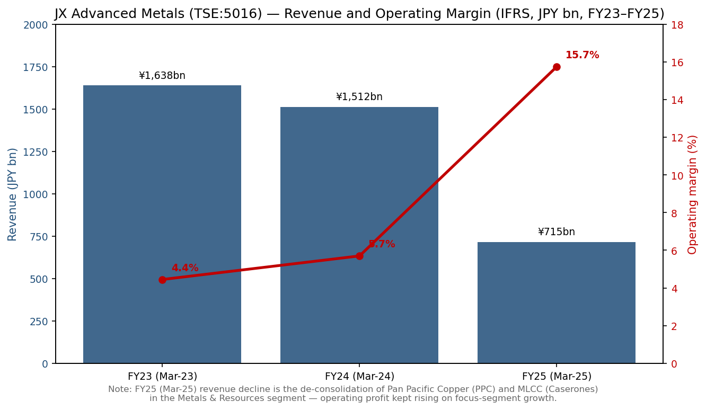
*Source: compiled from [JX Advanced Metals 有価証券報告書 第23期, p.2 (主要な経営指標等の推移)](https://disclosure2dl.edinet-fsa.go.jp/searchdocument/pdf/S100W549.pdf). The FY25 revenue cliff reflects PPC + MLCC deconsolidation, not organic decline; operating profit continued to compound.*

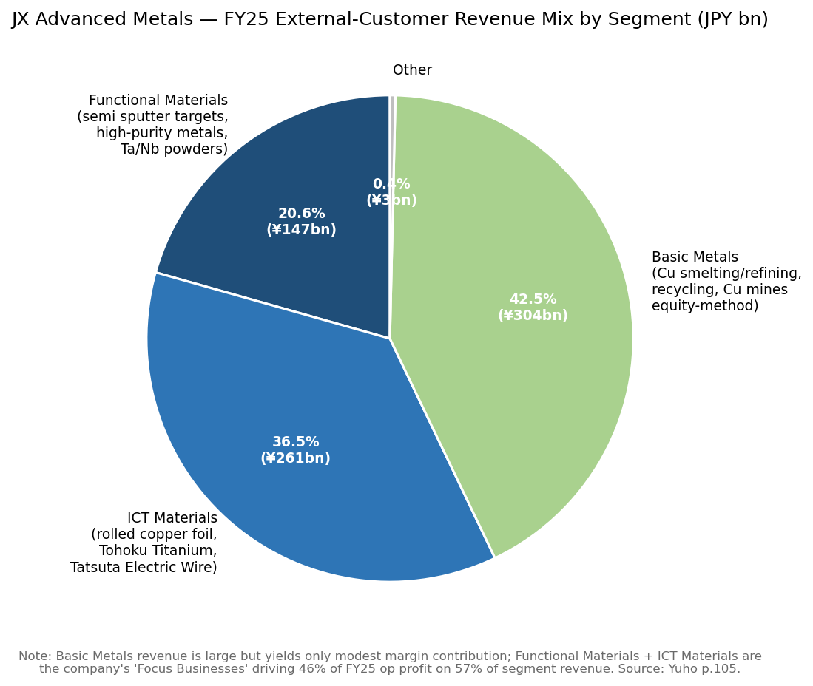
*Source: [JX Advanced Metals 有価証券報告書 第23期, p.105 (注記 7. セグメント情報)](https://disclosure2dl.edinet-fsa.go.jp/searchdocument/pdf/S100W549.pdf). External-customer revenue: Functional Materials ¥147.4 bn, ICT Materials ¥260.9 bn, Basic Metals ¥304.1 bn, Other ¥2.6 bn.*

**Valuation snapshot (as of late May 2026).** At a closing price of **¥4,195 / share on 26 May 2026**, JX Advanced Metals carried a market capitalisation of roughly **¥3.7 trillion (~US$24 bn at ¥154/USD)** with **EPS of ~¥113 trailing twelve months** — implying a **TTM P/E of ~35.4×** and a dividend yield of ~0.9% (FY25 annual DPS of ¥109.55, of which an interim ¥91.55 was the pre-IPO carve-out distribution and a final ¥18 was the first ordinary post-IPO dividend) ([Stockanalysis.com — TYO:5016 company profile, accessed 2026-05](https://stockanalysis.com/quote/tyo/5016/company/); [JX Advanced Metals 有価証券報告書 第23期, p.3 (提出会社の経営指標等 — 一株当たり配当額 109円55銭)](https://disclosure2dl.edinet-fsa.go.jp/searchdocument/pdf/S100W549.pdf)). The stock hit a **52-week high of ¥5,828 on 11 May 2026** before pulling back, and is currently up roughly **5× from the ¥820 IPO price** in 14 months of trading ([TradingView — TSE:5016 chart, accessed 2026-05](https://www.tradingview.com/symbols/TSE-5016/); [Stockanalysis.com — TYO:5016, accessed 2026-05](https://stockanalysis.com/quote/tyo/5016/)).

The **35× TTM P/E is roughly 2–3× the Japanese non-ferrous-peer median** — Tosoh (TSE: 4042) trades at ~12×, Mitsui Kinzoku (TSE: 5706) at ~11×, Sumitomo Metal Mining (TSE: 5713) at ~18×, and Resonac (TSE: 4004) at ~18×. The only non-ferrous comparator anywhere close is **Materion (NYSE: MTRN) at ~22×**, the closest US specialty-materials peer with a similar high-purity-metals product mix ([Yahoo Finance — TSE peers 4042/5706/5713/4004 and NYSE MTRN, accessed 2026-05](https://finance.yahoo.com/quote/4042.T/)). *Analyst view:* the premium is best understood as the market separately re-rating the Functional Materials segment — the global #1 sputter-target franchise that the [Nomura "Greater China Semi 2026–30F" report (2026-05-21)](file:///Users/x/projects/financial_agent/reports/sector/半导体材料.md) identified as the #1 line on Fig 44 (sputtering material share) and a direct beneficiary of the 2027F TSMC 1.6nm HVM ramp, the BPD wafer-bonding step (extra Cu, Ta, W sputter steps), the InP supply-tight supercycle for SiPh / CPO, and the Mesa AZ + Rapidus material-supply opportunities — at roughly 45–55× implied while the Basic Metals copper-smelting earnings stream is left valued at ~7–8× of equity-method profit ([reports/sector/半导体材料.md — Nomura 2026-05-21, Fig 44 league table](file:///Users/x/projects/financial_agent/reports/sector/半导体材料.md); [TrendForce — JX Advanced Metals plans ¥5bn Rapidus investment + critical materials supply, 2026-01-21](https://www.trendforce.com/news/2026/01/21/news-jx-advanced-metals-reportedly-plans-%C2%A55b-investment-in-rapidus-along-with-critical-materials-supply/)). The multiple is now meaningfully extended; any cyclical wobble in AI-server capex, an unexpected Chinese share gain in semi sputter targets, or an InP supply normalisation would compress the multiple sharply — flagged in Section 9 as the dominant valuation / multiple-compression risk.

---

## 2. Company history (400–700 words)

JX Advanced Metals is the latest legal incarnation of a metallurgical lineage that stretches from the **opening of the Hitachi Mine in Ibaraki Prefecture on 1 December 1905** by entrepreneur Fusanosuke Kuhara, through the establishment of **Kuhara Mining Co. in September 1912**, the formation of **Nippon Mining Co. (日本鉱業) in April 1929** when Kuhara's mining and smelting divisions were spun out of Nissan Industries (日本産業), and a continuous chain of corporate-name changes that culminated in the present TSE Prime listing on 19 March 2025 ([JX Advanced Metals 有価証券報告書 第23期, pp.5-6 (沿革)](https://disclosure2dl.edinet-fsa.go.jp/searchdocument/pdf/S100W549.pdf)). The Saganoseki copper smelter on Oita prefecture's coast — still the group's largest custom smelter today, one of the largest in the world by [International Copper Study Group's "World Copper Factbook 2024"](https://icsg.org/copper-factbook/) — began operating in September 1916, and the Hitachi works added refining and (later, in 1978) recycling capacity that anchors the present-day Basic Metals segment ([JX Advanced Metals 有価証券報告書 第23期, p.5](https://disclosure2dl.edinet-fsa.go.jp/searchdocument/pdf/S100W549.pdf)).

The shift from "miner" to "specialty-materials supplier" began at the **Isohara plant in Ibaraki, opened in May 1985** to scale up the electronic-materials business — the same Isohara plant that today produces JX's semi sputter targets and is currently being expanded to ~1.5× FY24 production capacity by FY28 ([JX Advanced Metals 有価証券報告書 第23期, pp.5, 21 (磯原工場・新工場ひたちなか)](https://disclosure2dl.edinet-fsa.go.jp/searchdocument/pdf/S100W549.pdf)). The corporate vehicle that bears today's TSE 5016 ticker — **Shin Nippon Mining Holdings (新日鉱ホールディングス)** — was incorporated on **2 September 2002** when Japan Energy and the old Nikko Materials merged via share transfer; that holding company was renamed **JX Nippon Mining & Metals on 1 July 2010** following the larger creation of JX Holdings (now ENEOS Holdings) by the share-transfer merger of Nippon Mining Holdings with Nippon Oil ([JX Advanced Metals 有価証券報告書 第23期, p.6 (沿革, 2002 / 2010 entries)](https://disclosure2dl.edinet-fsa.go.jp/searchdocument/pdf/S100W549.pdf)). The name shortened to **JX Metals (JX金属)** in January 2016, and the **English name changed to "JX Advanced Metals Corporation" in May 2024** — explicitly to signal the company's strategic re-positioning ahead of the IPO from a copper-and-resources company to an advanced-electronic-materials platform ([JX Advanced Metals 有価証券報告書 第23期, p.6 (2024年5月 英文商号変更); JX Advanced Metals — Trade Name Change press release, 2024-05-08](https://www.jx-nmm.com/english/newsrelease/upload_files/2024/04/01/6018119_01_20240401_01.pdf)).

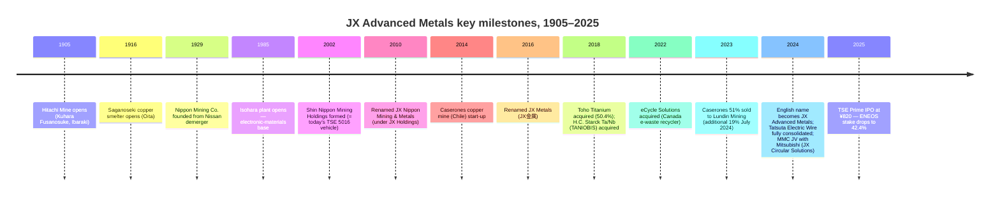

Three strategic pivots define the modern company. **First, the 2018 Toho Titanium / TANIOBIS double-acquisition** (May 2018 — purchased 50.38% of [Toho Titanium (TSE: 5727)](https://www.toho-titanium.co.jp/en/) for ~¥35 bn; July 2018 — purchased H.C. Starck Tantalum & Niobium GmbH from Germany's H.C. Starck for ~€600 m) brought titanium-sponge, ultra-fine nickel and tantalum/niobium powders into the platform — the Ta powder business is what enables JX to supply tantalum sputter targets and Ta-capacitor materials end-to-end ([JX Advanced Metals 有価証券報告書 第23期, p.6 (2018 entries); H.C. Starck — H.C. Starck Tantalum and Niobium Business Sold to JX Nippon, 2018-07](https://www.hcstarcksolutions.com/about-us/news/h-c-starck-sells-tantalum-niobium-business-to-jx-nippon/)). **Second, the 2023–24 staged divestment of the Caserones copper mine in Chile to Lundin Mining** — JX sold 51% in July 2023 and another 19% (under a call option) in July 2024, ending up with a 30% non-operating stake — explicitly to refocus capital on the Focus Business ahead of the IPO ([Lundin Mining — Lundin completes acquisition of additional 19% interest in Caserones, 2024-07-29](https://lundinmining.com/news/lundin-mining-completes-acquisition-of-an-additional-19-int-123-tjbjxn1g/)). **Third, the August 2024 take-private of Tatsuta Electric Wire (タツタ電線)** via tender offer — adding electromagnetic-shielding films for FPC, conductive paste for semiconductor packaging, and bonding wire to the ICT Materials segment, with full consolidation in November 2024 ([JX Advanced Metals 有価証券報告書 第23期, p.6 (2024年8月 タツタ電線株式公開買付 entry); JX Advanced Metals — Notice Concerning Completion of Tender Offer for Tatsuta Electric Wire, 2024-09](https://www.jx-nmm.com/english/newsrelease/upload_files/2024/09/03/6019045_01_20240903.pdf)).

The IPO itself was joint-bookrun by **Daiwa Securities, JPMorgan, Morgan Stanley MUFG and Mizuho** — pricing at ¥820 (the top of a downwardly-revised ¥820–860 range), valuing the company at roughly ¥760 bn / US$5.1 bn at issue (which has since re-rated to ¥3.7 trillion as of 26 May 2026) ([MarketScreener — Eneos plans $3 bn IPO of metals subsidiary — Update, 2025-03-10](https://www.marketscreener.com/quote/stock/ENEOS-HOLDINGS-INC-6500951/news/Eneos-Plans-3-Billion-IPO-of-Metals-Subsidiary-Update-49283362/); [Reuters via Investing.com — Eneos Holdings to list metals subsidiary, aims to raise $3 bn, 2025-03](https://www.investing.com/news/stock-market-news/eneos-holdings-to-list-metals-subsidiary-aims-to-raise-3-billion-93CH-3869772)). ENEOS retained 42.4% — capping the IPO's float at roughly **¥320 bn (excluding the over-allotment shoe)** and creating a 90-day lock-up window from the IPO date for the parent company's residual stake; ENEOS used the IPO proceeds for accelerated shareholder returns and decarbonisation investments ([Eneos Holdings — Notice Concerning Sale of Shares of Subsidiary, 2025-02-14](https://www.eneos.co.jp/english/newsrelease/business/20250214_03.html)).

---

## 3. Management team (300–500 words)

JX Advanced Metals is not founder-led — the original Hitachi-mine founder Fusanosuke Kuhara died in 1965 — and the relevant biography is therefore the current CEO alone.

**Hayashi Yoichi (林 陽一)**, born **5 February 1965 (60 as of 26 May 2026)**, has been **President, Representative Director and CEO of JX Advanced Metals since 1 April 2023**, after a continuous 37-year career inside the same metallurgical group, starting at **Nippon Mining Co. in April 1988** straight out of university ([JX Advanced Metals 有価証券報告書 第23期, p.64 (役員の状況 — 林陽一)](https://disclosure2dl.edinet-fsa.go.jp/searchdocument/pdf/S100W549.pdf)). His career path is almost entirely strategy / planning rather than line operations — a contrast to the engineering-rooted Deputy CEO Sugawara Shizuo who runs the Technology Group:

- **April 2019** — appointed Executive Officer of JX Metals (predecessor entity), with responsibility for Corporate Planning, Research Department, and the Corporate Planning Office;
- **April 2020 / October 2020** — Executive Officer with expanded scope adding Logistics and the new ESG Promotion Office;
- **April 2021** — promoted to **Director, Managing Executive Officer** with oversight of Corporate Planning, ESG, Accounting and Logistics;
- **April 2022** — Director, Managing Executive Officer with the same scope plus Project Promotion Headquarters advisory role (the corporate vehicle that ran the IPO preparations);
- **1 April 2023** — appointed **President, Representative Director and CEO (代表取締役社長 社長執行役員)** — the role he holds today ([JX Advanced Metals 有価証券報告書 第23期, p.64](https://disclosure2dl.edinet-fsa.go.jp/searchdocument/pdf/S100W549.pdf)).

The Yuho discloses Hayashi as holding **19,000 JX Advanced Metals shares directly** (roughly ¥80 m at the May 2026 share price — a meaningful but not founder-scale stake) plus participation in the new performance-linked share-compensation plan approved at the 27 June 2025 AGM ([JX Advanced Metals 有価証券報告書 第23期, pp.64, 78-79 (役員の状況 / 株式報酬制度)](https://disclosure2dl.edinet-fsa.go.jp/searchdocument/pdf/S100W549.pdf)). The performance-linked piece is keyed to **40% consolidated operating profit, 40% Net Debt/EBITDA, and 20% individual evaluation for executive officers; for the representative director the split is 50% operating profit and 50% Net Debt/EBITDA, with no individual evaluation component** — a pure pay-for-collective-performance design ([JX Advanced Metals 有価証券報告書 第23期, p.81](https://disclosure2dl.edinet-fsa.go.jp/searchdocument/pdf/S100W549.pdf)). The longer-term equity grant is split 30% operating profit, 30% ROE, 30% TSR vs. TOPIX with the residual 10% on safety / engagement / ESG ([JX Advanced Metals 有価証券報告書 第23期, p.81](https://disclosure2dl.edinet-fsa.go.jp/searchdocument/pdf/S100W549.pdf)).

Hayashi's two-year tenure as CEO has been almost entirely consumed by the IPO preparation (corporate-governance overhaul; financial-system migration off ENEOS shared services in September 2024; IFRS adoption from the 第21期 (FY ending March 2023)) and the Focus Business capacity expansion — most visibly the **Hitachinaka new plant** (announced 2024, construction underway with first operations targeted for FY26), the **Mesa Arizona sputter-target plant** commissioned November 2024, and the **Isohara InP substrate capacity expansion (~¥3.3 bn investment to add ~50% capacity over 2025 levels)** announced October 2025 ([JX Advanced Metals 有価証券報告書 第23期, p.21 (生産能力 1.6倍計画); Semiconductor Today — JX making further investment to increase InP substrate production, 2025-10-09](https://www.semiconductor-today.com/news_items/2025/oct/jx-091025.shtml); [AInvest — JX Advanced Metals' ¥3.3bn InP Substrate Expansion, 2025-10](https://www.ainvest.com/news/jx-advanced-metals-3-3-billion-yen-inp-substrate-expansion-strategic-catalyst-semiconductor-supply-chain-dominance-2510/)). Strategic results so far have been measurable: the FY25 operating-profit beat (¥112.5 bn actual vs ¥95.4 bn target, 117% achievement) drove a 100% pay-out under the short-term incentive plan ([JX Advanced Metals 有価証券報告書 第23期, p.81 (2025年3月期業績目標達成率)](https://disclosure2dl.edinet-fsa.go.jp/searchdocument/pdf/S100W549.pdf)).

---

## 4. Products and services (700–1,500 words)

This is the section most directly responsible for the JX investment thesis: the company's status as the **global #1 supplier of semiconductor sputtering targets** (verbatim from its own Yuho citing Fuji-Keizai 2023 actuals, ex-aluminium targets) is what justifies the 35× TTM P/E and what links the franchise into the seven AI-driven technology inflections — GAA, 1.6nm HVM, BPD, SoIC, SiPh / CPO, HBM4, and 2.5D / 3D packaging — that the [Nomura "Greater China Semi 2026–30F" 2026-05-21](file:///Users/x/projects/financial_agent/reports/sector/半导体材料.md) report identified as the dominant materials catalysts for the rest of the decade.

### 4.1 The 2025 Yuho's own product matrix

The first standalone Yuho discloses the group's product portfolio in a three-segment matrix (Functional Materials / ICT Materials / Basic Metals) that maps directly to the segment-reporting financials in note 7. The matrix is reproduced below verbatim from page 7 of the 第23期 有価証券報告書.

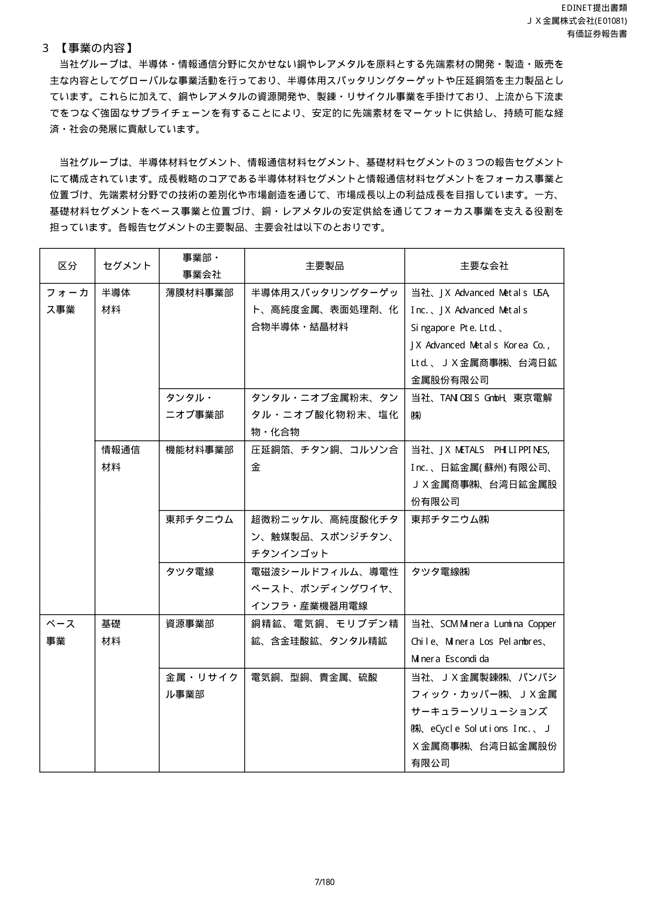
*Source: [JX Advanced Metals 有価証券報告書 第23期, p.7 (3 事業の内容 — 区分・セグメント・事業部・主要製品・主要な会社)](https://disclosure2dl.edinet-fsa.go.jp/searchdocument/pdf/S100W549.pdf). Original Japanese; markdown reproduction below for searchability.*

| Bucket (区分) | Segment (セグメント) | Division (事業部・事業会社) | Main products (主要製品) | Main companies (主要な会社) |
|---|---|---|---|---|
| Focus Business | **Functional Materials** | Thin-Film Materials Div. (薄膜材料事業部) | Semi sputtering targets, high-purity metals, surface-treatment chemicals, compound-semi / crystal materials | JX (parent), JX Advanced Metals USA, JX Advanced Metals Singapore, JX Advanced Metals Korea, JX Metals Trading, Taiwan Nikko Metals |
| Focus Business | Functional Materials | Tantalum-Niobium Div. (タンタル・ニオブ事業部) | Ta/Nb metal powders, Ta/Nb oxide powders, chlorides / compounds | JX, TANIOBIS GmbH (Goslar, Germany), Tokyo Denkai (東京電解) |
| Focus Business | **ICT Materials** | Functional Materials Div. (機能材料事業部) | Rolled copper foil (圧延銅箔), titanium copper (Ti-Cu, for AI-server connectors), Corson alloy (Cu-Ni-Si) | JX, JX METALS PHILIPPINES, Nikko Metals (Suzhou), JX Metals Trading, Taiwan Nikko Metals |
| Focus Business | ICT Materials | Toho Titanium (subsidiary) | Ultra-fine nickel powder, high-purity titanium oxide, catalyst products, titanium sponge, titanium ingot | Toho Titanium (TSE: 5727) |
| Focus Business | ICT Materials | Tatsuta Electric Wire (subsidiary) | EMI-shielding film, conductive paste, bonding wire, infrastructure / industrial wire | Tatsuta Electric Wire (formerly TSE: 5809; now wholly-owned) |
| Base Business | **Basic Metals** | Resources Div. (資源事業部) | Copper concentrate, electrolytic copper (electrocopper), molybdenum concentrate, gold-bearing siliceous ore, tantalum concentrate | JX, SCM Minera Lumina Copper Chile (Caserones, 30%), Minera Los Pelambres (25%), Minera Escondida (via Geco K.K., 20%) |
| Base Business | Basic Metals | Metals & Recycling Div. (金属・リサイクル事業部) | Electrolytic copper, ingot copper, precious metals, sulfuric acid | JX, JX Nippon Mining & Metals Smelting (Saganoseki / Hitachi), Pan Pacific Copper (PPC, 47.8% equity-method), JX Circular Solutions (80% JV with Mitsubishi Corp.), eCycle Solutions (Canada) |

[Source: JX Advanced Metals 有価証券報告書 第23期, p.7, table reproduced verbatim](https://disclosure2dl.edinet-fsa.go.jp/searchdocument/pdf/S100W549.pdf).

### 4.2 Synthesis — how the product categories interact

The three segments are arranged in a single vertically-integrated metallurgical loop: **upstream copper concentrate** from the Caserones / Los Pelambres / Escondida equity-method mines (Basic Metals — Resources) flows into the Saganoseki / Hitachi smelters (Basic Metals — Metals & Recycling) which produce **99.99% electrolytic copper (4N Cu)**; that 4N Cu is then further refined inside the Functional Materials segment to **6N or 9N purity** (the Yuho discloses 9N = 99.9999999% as the achievable upper bound) and forged into sputter-target ingots ([JX Advanced Metals 有価証券報告書 第23期, p.9 (9N 銅の製造能力)](https://disclosure2dl.edinet-fsa.go.jp/searchdocument/pdf/S100W549.pdf)). The remaining metallurgical capacity is fed into the rolling lines at the Hitachi works to produce the **6-μm rolled copper foil** that becomes ICT Materials' flagship FPC / FCCL product. The same copper-recycle stream is closed by JX Circular Solutions (the Mitsubishi JV) collecting e-waste — JX's stated 2040 target is to **lift the recycled-material share in Saganoseki smelter feed to 50%** ([JX Advanced Metals 有価証券報告書 第23期, p.12 (グリーンハイブリッド製錬 / リサイクル原料比率 50% 目標)](https://disclosure2dl.edinet-fsa.go.jp/searchdocument/pdf/S100W549.pdf)).

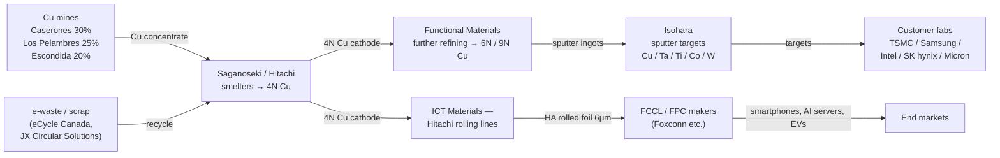

This vertical integration is the single most important fact about JX's product positioning. **The only Western specialty-materials peer with a comparable upstream-to-downstream copper / Cu-target loop is Mitsui Kinzoku** — Materion, Tosoh, ULVAC and Plansee all buy their copper feedstock externally. The loop dampens copper-price volatility on the Functional Materials cost line (the bulk of the price exposure is borne in the Basic Metals segment, where it is also the revenue driver) and gives JX an unbroken provenance / supply-security story for the AI-server-buildout era — exactly the value proposition that earned the company **Intel's EPIC Distinguished Supplier Award four years running (2021, 2022, 2023, 2024)** and **TSMC's Excellent Performance Award in 2024**, both quoted verbatim on Yuho page 9 ([JX Advanced Metals 有価証券報告書 第23期, p.9](https://disclosure2dl.edinet-fsa.go.jp/searchdocument/pdf/S100W549.pdf)).

### 4.3 Functional Materials — semiconductor sputtering targets (the flagship)

> "高純度化や組成・組織制御などの当社のコア技術を駆使し、半導体や磁性材料向けのスパッタリングターゲットをはじめ、各種高機能デバイス、最先端IT機器、医療機器、電気自動車に用いられる製品をグローバルに展開しています。中でも、ロジックやメモリに用いられる半導体用スパッタリングターゲットが主力製品であり、市場規模1,462億円のマーケットにおいて世界シェアは64％(注１)です。当社は様々な素材の半導体用スパッタリングターゲットを取り扱っており、半導体の主要配線層に用いられる銅や銅合金、そのバリア層に用いられるタンタルに加えて、半導体の回路形成やトランジスタ部分等に用いられるチタン、コバルト及びタングステンの製品で世界シェアNo.１です(注２)。"
>
> — Verbatim from [JX Advanced Metals 有価証券報告書 第23期, p.8 (薄膜材料事業部)](https://disclosure2dl.edinet-fsa.go.jp/searchdocument/pdf/S100W549.pdf). Translation: *"Drawing on our core technologies in high-purification and composition / microstructure control, we deploy globally a range of products including sputtering targets for semiconductor and magnetic-materials applications, used in various high-performance devices, leading-edge IT equipment, medical devices and electric vehicles. The flagship product is semiconductor-use sputtering targets for logic and memory: against a market size of **¥146.2 bn**, our **world share is 64%** (note 1). We handle sputtering targets in a wide range of materials, and we are **#1 in the world for copper / Cu alloy (main interconnect layer), tantalum (barrier layer for Cu interconnect), and titanium, cobalt and tungsten (transistor / circuit-formation layers)** (note 2)."* Note 1/2 both cite Fuji-Keizai's *2024 Semi Materials Market Outlook* (2023 actuals, ex-aluminium family, sales-value basis), converted at the 2023-year-end FX of ¥141/USD.

**中文释义 / Plain-language gloss:** A **sputtering target (スパッタリングターゲット, 靶材, sometimes "sputter target")** is the high-purity disc / plate of metal that sits inside a **PVD (Physical Vapor Deposition, 物理气相沉积) chamber** in a semiconductor fab. In production, an ion beam (typically argon) strikes the target, sputters atoms off it, and those atoms then redeposit as a thin film — typically a few nanometers to a few hundred nanometers thick — on the silicon wafer below ([JX Advanced Metals 有価証券報告書 第23期, p.8](https://disclosure2dl.edinet-fsa.go.jp/searchdocument/pdf/S100W549.pdf)). The wafer needs a **Cu / Cu-alloy interconnect layer** to actually carry signals between transistors; a **tantalum (Ta) barrier layer** to stop the copper from diffusing into the silicon and poisoning the transistor; and **titanium / cobalt / tungsten contact and gate layers** at the transistor itself. JX makes every one of those metal targets — the only sputter-target supplier in the world with a full "interconnect + barrier + contact" product line. To get from the LME copper that the smelter produces (about 99.99% pure, "4N") to a sputter target requires another order-of-magnitude-plus purification step (to 99.9999% — "6N" — and in some cases all the way to **99.9999999%, "9N"**, which is the company's stated upper bound) plus crystal-grain control inside the target so that **sputtering rate and film uniformity are controlled to single-nanometer precision** across the wafer ([JX Advanced Metals 有価証券報告書 第23期, p.9 (組成・組織制御技術 / 表面制御技術 / 分析評価技術)](https://disclosure2dl.edinet-fsa.go.jp/searchdocument/pdf/S100W549.pdf)). The strategic inflection is the **post-2027 logic node transition** — once TSMC starts running 1.6 nm HVM and Intel runs 18A / 14A with **Backside Power Delivery (BPD, 背面供电)**, the number of metal-interconnect layers per die rises from ~13–15 today to ~20+, and BPD itself requires an additional copper-routing layer on the wafer backside — both of which directly increase the **mg of metal sputtered per wafer** at the leading edge. The Nomura sector report quantifies this as "**N1.6 / A16 adds 20–30% additional CMP steps and a similar uplift in sputter-target use**" ([reports/sector/半导体材料.md — Nomura 2026-05-21, 3D Transistor + BPD section, p.6-9](file:///Users/x/projects/financial_agent/reports/sector/半导体材料.md)).

*Analyst view:* The closest competitor in copper sputter targets is **Mitsui Kinzoku (TSE: 5706)** with its [Sputtering Target Materials product family](https://insulectro.com/mitsui-kinzoku/) (Mitsui's electronics business; revenue not broken out for sputter targets alone). For tantalum, the second source is **Materion (NYSE: MTRN)** through its [Semiconductor Materials business unit](https://www.materion.com/en/markets/semiconductor); JX's ownership of TANIOBIS (the former H.C. Starck Ta/Nb operations) and Tokyo Denkai (acquired 2022) gives it back-integrated Ta powder supply that materially shortens lead times and creates a moat — TANIOBIS's annual Ta procurement is also ~20% sourced from JX's own equity stake in the **Mibra Mine in Brazil**, taken in March 2023 ([JX Advanced Metals 有価証券報告書 第23期, p.10 (TANIOBIS / 東京電解 / Mibra鉱山)](https://disclosure2dl.edinet-fsa.go.jp/searchdocument/pdf/S100W549.pdf); [Mining Weekly — JX Nippon takes stake in Mibra mine, 2023-03](https://www.miningweekly.com/article/jx-nippon-takes-stake-in-mibras-tantalum-and-lithium-output-2023-03-21)). For titanium / cobalt / tungsten targets, the named alternates per Materion's and Tosoh's [Thin-Film Deposition Materials catalogues](https://www.tosoh.com/our-products/advanced-materials/thin-film-deposition-materials) are Tosoh and ULVAC — neither publishes share figures, and the Yuho's 64% number is the only public anchor for the entire ex-Al category.

### 4.4 Functional Materials — InP, CdZnTe, CVD/ALD precursors (the next-generation pipeline)

JX's compound-semiconductor wafer business sits inside the Thin-Film Materials Division and is the line item most directly exposed to the **SiPh / CPO (silicon-photonics, co-packaged-optics) ramp** that the Nomura sector report flagged as a **2026–2028 supply-tight supercycle for InP substrates**. The Yuho's own description:

> "当社は、長年培った高純度化、表面制御、組成、分析評価等の技術を活かした次世代の収益の柱の確立に取り組んでいます。具体的には、データセンターやモバイル通信量の増加により成長が予想されているInP(インジウムリン)や防衛・メディカルなどの分野での成長が期待されるCdZnTe(カドミウムジンクテルル)といった結晶材料の事業規模拡大を目指しています。"
>
> — Verbatim from [JX Advanced Metals 有価証券報告書 第23期, p.22 (③ 次世代のグローバルトップシェア製品の開発)](https://disclosure2dl.edinet-fsa.go.jp/searchdocument/pdf/S100W549.pdf). Translation: *"Drawing on our long-cultivated technologies in high-purification, surface control, composition control and analysis / evaluation, we are working to establish the next pillars of earnings. Specifically, we are targeting business expansion in crystal materials such as InP (indium phosphide) — growth driven by rising data-center and mobile-communications traffic — and CdZnTe (cadmium zinc telluride) — growth expected in defence and medical applications."*

**中文释义 / Plain-language gloss:** **InP (indium phosphide, 磷化铟)** is a **III-V compound semiconductor** that emits and detects light far more efficiently than silicon, at the 1310 nm and 1550 nm wavelengths used by long-distance optical fibre. Every **800G / 1.6T optical transceiver** going into a hyperscale AI-server cluster contains either an **EML (Electro-absorption Modulated Laser)** or **CW (Continuous-Wave) DFB laser** that is fabricated on a 2-inch, 3-inch or 4-inch InP substrate ([JX Advanced Metals — InP Substrates product page](https://www.jx-nmm.com/english/products/compound_semiconductors_and_crystal_materials/inp/)). JX has manufactured InP for **over 40 years** and is **one of only a few global producers**, alongside Sumitomo Electric and AXT (China). The Nomura sector report describes InP substrate as the **single most supply-constrained material in the entire optical-transceiver value chain** — driven by ~50% wafer yield (the crystal-growth step is finicky), Chinese export-control restrictions on indium metal that came in late 2024, and MOCVD epi-equipment lead times longer than 12 months ([reports/sector/半导体材料.md — Nomura 2026-05-21, InP section, p.11-12, 60-65](file:///Users/x/projects/financial_agent/reports/sector/半导体材料.md)). JX announced **two consecutive InP-capacity expansions in 2025**: a **¥1.5 bn / ~20% capacity uplift at Isohara** in July 2025 ([Semiconductor Today — JX to boost InP substrate production capacity by 20%, 2025-07-24](https://www.semiconductor-today.com/news_items/2025/jul/jx-240725.shtml)), and a further **~¥3.3 bn / ~50% capacity uplift** announced October 2025 ([Semiconductor Today — JX making further investment to increase InP substrate production, 2025-10-09](https://www.semiconductor-today.com/news_items/2025/oct/jx-091025.shtml); [AInvest — JX Advanced Metals' 3.3 Bn Yen InP Substrate Expansion, 2025-10](https://www.ainvest.com/news/jx-advanced-metals-3-3-billion-yen-inp-substrate-expansion-strategic-catalyst-semiconductor-supply-chain-dominance-2510/)). Both announcements explicitly cite hyperscale-AI optical-transceiver demand as the driver. **CdZnTe (镉锌碲)** is a **II-VI compound semiconductor** used as the substrate for **MWIR / LWIR (mid- to long-wave infrared) sensors** in defence and medical X-ray-detection equipment; JX claims the world's largest CdZnTe-substrate diameter capability via its proprietary crystal growth method ([JX Advanced Metals — CdZnTe Substrates product page](https://www.jx-nmm.com/english/products/compound_semiconductors_and_crystal_materials/czt/)). 

The third next-gen product line is **CVD / ALD precursors (化学気相成長 / 原子層堆積 precursors)** — the volatile organometallic compounds (typically of Co, W, Ru, Ta, Ti) that are used in **CVD (Chemical Vapor Deposition) or ALD (Atomic-Layer Deposition)** chambers as the next-generation replacement for sputtering at the most aggressive process nodes. The Yuho discloses an internal organisational restructure on **1 February 2024** establishing a "**CVD・ALD材料事業推進室 / CVD-ALD Materials Business Promotion Office**", and a follow-on decision to install production lines at the **Toho Titanium Chigasaki Plant in H2 FY24** and the **Ibaraki Hitachi District in H1 FY25** ([JX Advanced Metals 有価証券報告書 第23期, p.43 ((4) 新規事業 — CVD・ALD材料関連)](https://disclosure2dl.edinet-fsa.go.jp/searchdocument/pdf/S100W549.pdf)).

*Analyst view:* The combination of (a) a sputtering-target #1 franchise that is consolidating share into 2027–30, (b) an InP-substrate position in the world's most supply-tight optical-materials category, and (c) a CVD/ALD-precursor pipeline that opens a brand-new addressable market in the same fabs that already buy sputter targets — is the qualitative reason JX trades at ~35× P/E despite the cyclical copper-smelting baseline. The risks are (i) a faster-than-expected Chinese InP substrate ramp (chiefly AXT and emerging entrants — see Section 7), (ii) Plansee / ULVAC / Materion accelerating CVD-precursor product launches that pre-empt JX's pipeline, and (iii) any sustained Cu-target share loss from a Chinese sputter-target entrant or from Tosoh / Mitsui Kinzoku at any single hyperscaler fab.

### 4.5 ICT Materials — rolled copper foil + Ti-Cu + Toho Titanium + Tatsuta

The ICT Materials segment generated **¥260.9 bn revenue and ¥25.1 bn operating profit in FY25** (segment operating margin 9.5%), the largest of the three segments by revenue ([JX Advanced Metals 有価証券報告書 第23期, p.105](https://disclosure2dl.edinet-fsa.go.jp/searchdocument/pdf/S100W549.pdf)). The Yuho's verbatim description of the flagship rolled-copper-foil product:

> "圧延銅箔は、スマートフォンやウェアラブル端末、モビリティ(xEV／ADAS)の分野で使用されるハイエンドなフレキシブル回路基板(FPC)に用いられており、屈曲性や耐久性における技術優位性や市場開発型アプローチの確立により、１stベンダーとしての地位を確保することで、市場規模405億円のマーケットにおいて、78％の世界シェア(注１)を誇っています。"
>
> — Verbatim from [JX Advanced Metals 有価証券報告書 第23期, p.11 (機能材料事業部)](https://disclosure2dl.edinet-fsa.go.jp/searchdocument/pdf/S100W549.pdf). Translation: *"Our rolled copper foil is used in high-end **FPC (Flexible Printed Circuit, フレキシブル回路基板)** boards in smartphones, wearables and xEV / ADAS mobility applications. Through our technology leadership in bend and fatigue durability and our market-development-driven approach, we have secured 1st-vendor status with a **world share of 78% in a ¥40.5 bn market** (note 1)."* Note 1 cites Fuji Chimera Research's [2024 Electronics Mounting New Materials Handbook](https://www.fcr.co.jp/) on a 2023-actuals, FPC-only, unit-volume basis.

**中文释义 / Plain-language gloss:** **Rolled copper foil (圧延銅箔, RA / rolled-annealed Cu foil)** is the alternative to **electrodeposited copper foil (電解銅箔, ED Cu foil)** for making FPC substrates. RA foil is produced by **hot- and cold-rolling Cu ingots down to 6 μm thickness** (one-hundredth the thickness of a human hair, per JX's own description) and then annealing to control grain structure ([JX Advanced Metals 有価証券報告書 第23期, p.11 (HA箔)](https://disclosure2dl.edinet-fsa.go.jp/searchdocument/pdf/S100W549.pdf)). The Yuho cites **IPC bend-life test results** showing JX's HA foil sustaining **~530k bend cycles vs ~170k for comparable special ED foils** — i.e. ~3× fatigue life ([JX Advanced Metals 有価証券報告書 第23期, p.11 (IPC-TM650 2.4.3E 試験 — HA約53万回 vs 特殊電解銅箔約17万回)](https://disclosure2dl.edinet-fsa.go.jp/searchdocument/pdf/S100W549.pdf)). The strategic-inflection driver is **AI-server / smartphone bend-life-critical interconnect** — when a foldable smartphone hinge or a wearable's haptic actuator demands hundreds of thousands of flex cycles, ED foil fractures and RA foil survives. The 78% world share is for the high-end FPC use case only; in the lower-end FCCL / battery-foil market JX competes with Furukawa Electric, Nippon Denkai, and Chinese players such as Nuode New Materials (300700.SZ) ([reports/sector/半导体材料.md — Nomura 2026-05-21, materials peer set](file:///Users/x/projects/financial_agent/reports/sector/半导体材料.md)).

*Analyst view:* The **Ti-Cu (titanium-copper) and Corson alloy (Cu-Ni-Si)** product lines are the under-discussed AI-server beneficiaries. JX's Yuho explicitly identifies Ti-Cu as the **high-heat-resistant connector material for AI-server racks** that is "rapidly expanding adoption" because the higher current density and thermal envelope inside an HBM-rich AI rack stresses traditional brass / phosphor-bronze connectors past their fatigue limits ([JX Advanced Metals 有価証券報告書 第23期, p.20 (②情報通信材料セグメント — チタン銅 / AIサーバ向けコネクタ)](https://disclosure2dl.edinet-fsa.go.jp/searchdocument/pdf/S100W549.pdf)). The closest competitor in Ti-Cu is also Mitsui Kinzoku — but Mitsui's product set is less integrated upstream, and JX claims customer-specification-lock as its competitive moat ([JX Advanced Metals 有価証券報告書 第23期, p.11 (②市場開発型アプローチ — エンドユーザー20年以上の関係)](https://disclosure2dl.edinet-fsa.go.jp/searchdocument/pdf/S100W549.pdf)).

The **Toho Titanium subsidiary** (TSE: 5727, 50.4% owned) contributes titanium sponge (commodity), **ultra-fine nickel powder** (for MLCC inner electrodes — direct AI-/EV-electronics exposure), high-purity titanium oxide (for ALD precursors and dielectrics), and polyolefin-catalyst products ([JX Advanced Metals 有価証券報告書 第23期, p.11 (東邦チタニウム — 金属チタン事業・触媒事業・化学品事業)](https://disclosure2dl.edinet-fsa.go.jp/searchdocument/pdf/S100W549.pdf)). The **Tatsuta Electric Wire subsidiary** (fully owned November 2024) supplies **electromagnetic-shielding film (EMI shielding film)** for the 5G smartphone / wearable shelves and **conductive paste** for semiconductor packaging — both businesses with explicit AI-server / smartphone leverage ([JX Advanced Metals 有価証券報告書 第23期, p.12 (タツタ電線)](https://disclosure2dl.edinet-fsa.go.jp/searchdocument/pdf/S100W549.pdf); [Tatsuta Electric Wire — Electronic Materials Business](https://www.tatsuta.com/en/products/electronic.html)).

### 4.6 Basic Metals — Cu smelting / recycling + equity-method mines

The Basic Metals segment generated **¥304.1 bn FY25 revenue and ¥74.5 bn operating profit** — but only ¥13.5 bn of that operating profit is operating P&L, with the remaining ¥61.0 bn flowing in as **equity-method income from Caserones (post-divestment 30% stake) + Los Pelambres (25%) + Escondida (via Geco K.K., 20%) + PPC (47.8%)** ([JX Advanced Metals 有価証券報告書 第23期, p.105 (持分法による投資損益 60,959百万円)](https://disclosure2dl.edinet-fsa.go.jp/searchdocument/pdf/S100W549.pdf)). The verbatim description:

> "資源事業は当社の祖業であり、1905年に日立鉱山を開業して以来、国内外の鉱山を対象として、探鉱から開発、操業、休廃止鉱山の管理に至るまでをステークホルダーと協業しながら行ってきました。"
>
> — Verbatim from [JX Advanced Metals 有価証券報告書 第23期, p.12 (基礎材料セグメント — 資源事業部)](https://disclosure2dl.edinet-fsa.go.jp/searchdocument/pdf/S100W549.pdf). Translation: *"Resources is the founding business of the company, and since opening the Hitachi Mine in 1905, we have engaged across exploration, development, operation, and management of dormant / closed mines, working with stakeholders throughout."*

**Plain-language gloss:** The Basic Metals segment exists primarily to feed clean copper into the Focus segments — but it also generates the company's largest single revenue line and the second-largest source of operating profit (after Functional Materials). The **Saganoseki smelter** is, per the cited [International Copper Study Group 2024 World Copper Factbook](https://icsg.org/copper-factbook/), one of the world's largest single-site primary-copper smelters by annual capacity. The strategic-inflection narrative here is **circular-copper / "PCL100/mb" + "MR100/mb" recycled-Cu products** — JX has launched two mass-balance-method 100% recycled-Cu SKUs since January 2024 in partnership with Mitsubishi Corp.'s industrial network ([JX Advanced Metals 有価証券報告書 第23期, p.29 (PCL100/mb・MR100/mb 発表)](https://disclosure2dl.edinet-fsa.go.jp/searchdocument/pdf/S100W549.pdf)). The recycled-Cu thesis is anchored to the [UNITAR Global E-waste Monitor 2024 forecast that global e-waste tonnage rises from 62 Mt in 2022 to 82 Mt in 2030](https://ewastemonitor.info/) and to a strengthening regulatory backdrop pushing fabs and OEMs toward verifiable-provenance copper.

*Analyst view:* The Basic Metals segment is largely a copper-price proxy with limited valuation re-rating potential — but it does provide the cost-of-goods anchor that secures the Functional Materials gross margin, and it's the reason JX trades at a premium to pure copper-smelter peers (Sumitomo Metal Mining ~18× P/E, Mitsui Kinzoku ~11×). The 2023–24 Caserones divestment to Lundin Mining was the explicit transaction that converted the segment from a capital-intensive operator to a more capital-light equity-method portfolio — and is the reason FY25 reported revenue dropped 52.7% year-on-year while operating profit kept rising.

### 4.7 FY25 capex split + flagship-product franchises

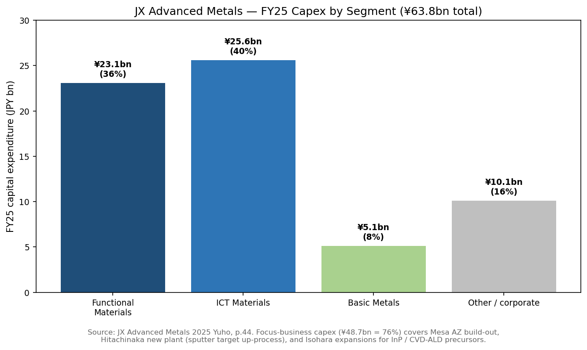
*Source: [JX Advanced Metals 有価証券報告書 第23期, p.44 (1 設備投資等の概要)](https://disclosure2dl.edinet-fsa.go.jp/searchdocument/pdf/S100W549.pdf). Focus-segment capex (Functional + ICT Materials = ¥48.7 bn / 76% of total) goes to Mesa AZ build-out, Hitachinaka new plant, and Isohara InP / CVD-ALD expansions.*

The Focus-business product flagship rank-order (by stated competitive position and strategic significance) is: **(1) semi sputter targets** (64% world share, the franchise that justifies the equity multiple — see Section 7); **(2) HA-grade 6μm rolled copper foil** (78% FPC world share, the highest-share product in the entire portfolio); **(3) InP substrates** (one of only 3–4 merchant suppliers globally, fastest unit-volume growth in the company); **(4) Ti-Cu connector strip** (AI-server connector spec-in); **(5) Ta powder + Ta sputter targets** (vertically integrated through TANIOBIS + Tokyo Denkai + Mibra mine); **(6) ultra-fine nickel powder** (Toho Titanium, MLCC exposure); **(7) EMI-shielding film** (Tatsuta, smartphone exposure); and **(8) CVD/ALD precursors** (pre-revenue but with announced production capacity coming online H1 FY26).

The last-12-months launches and capacity announcements that bear on the FY26–28 product roadmap: the **Mesa AZ sputter-target plant commissioning (November 2024)**, the announced **¥3.3 bn InP-substrate ~50% capacity uplift (October 2025)**, the **¥5 bn Rapidus equity investment under consideration (TrendForce reporting January 2026)** with simultaneous material-supply contracts at the Hokkaido 2nm foundry ([TrendForce — JX Advanced Metals plans ¥5bn investment in Rapidus + critical materials supply, 2026-01-21](https://www.trendforce.com/news/2026/01/21/news-jx-advanced-metals-reportedly-plans-%C2%A55b-investment-in-rapidus-along-with-critical-materials-supply/)), and the planned **November 2025 strategic-supply MOU with Mitsubishi Materials in copper / advanced materials** ([Mitsubishi Materials — Execution of a Memorandum of Understanding Concerning the Integration of Recycling Businesses, 2025-11-11](https://www.mmc.co.jp/corporate/en/news/2025/news20251111.html)).

---

## 5. Customers and go-to-market (500–800 words)

JX's customer base divides into three sharply different cohorts that mirror the three segments and that are structured by the company's vertically integrated product offering.

**Functional Materials customers** are the world's leading-edge logic and memory fabs. Although the Yuho does not name individual customers as material under ASC 280 / IAS 8 (no single Functional Materials customer reaches the IFRS 10% disclosure threshold), it does **explicitly name TSMC and Intel by name on page 9** as the awards-issuing customers for whom JX has been recognised — *"Intel社が設定しているEPIC Distinguished Supplier Awardを2021年から2024年まで４年連続で受賞しているほか、TSMC社が設定しているExcellent Performance Awardを2024年に受賞しています"* ([JX Advanced Metals 有価証券報告書 第23期, p.9 (verbatim)](https://disclosure2dl.edinet-fsa.go.jp/searchdocument/pdf/S100W549.pdf)). Independent industry reporting and the [Nomura sector report 2026-05-21](file:///Users/x/projects/financial_agent/reports/sector/半导体材料.md) corroborates a customer roster of **TSMC, Samsung Electronics, Intel, SK hynix, Micron, Kioxia, GlobalFoundries, UMC, SMIC, YMTC and Rapidus** — i.e. essentially every leading-edge logic and memory fab in the world. The Yuho's geographic breakdown of FY25 semi-sputter-target sales (Taiwan 36%, Korea 17%, USA 11%, Japan 11%, China 12%, other 13%) maps directly to where those customers' fabs are located — a useful proxy for customer concentration even without a name-level disclosure ([JX Advanced Metals 有価証券報告書 第23期, p.9](https://disclosure2dl.edinet-fsa.go.jp/searchdocument/pdf/S100W549.pdf)).

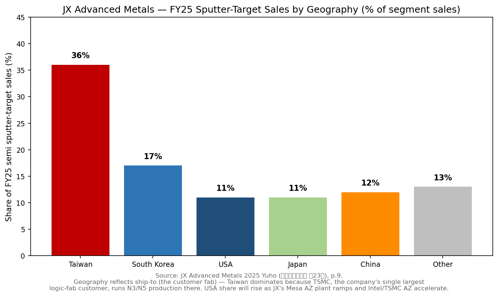
*Source: [JX Advanced Metals 有価証券報告書 第23期, p.9 (販売比率)](https://disclosure2dl.edinet-fsa.go.jp/searchdocument/pdf/S100W549.pdf). Taiwan dominance reflects TSMC's leading-edge fab capacity concentration.*

**The IFRS 10% customer disclosure for FY25 names a single customer at 28.6% of consolidated revenue: PPC (Pan Pacific Copper) in the Basic Metals segment**, generating ¥204.5 bn of FY25 sales ([JX Advanced Metals 有価証券報告書 第23期, p.106 (注記 7 (5) 主要な顧客に関する情報)](https://disclosure2dl.edinet-fsa.go.jp/searchdocument/pdf/S100W549.pdf)). PPC is the Cu-smelting JV with Mitsui Mining & Smelting and (since March 2024) Marubeni — JX retains a 47.8% equity-method stake — so the 28.6% "concentration" is an intra-group flow that reflects JX's role as the seller of copper concentrate to a joint smelting operation it part-owns, not a true third-party customer concentration. **Functional Materials and ICT Materials each have no single customer reaching the 10% threshold** per the same Yuho note. This is the equity-investor-relevant fact: by *true* end-customer concentration (the customer fab that actually consumes a JX product), JX has very low concentration — but by *related-party* metric, the IFRS disclosure is dominated by intra-Group copper sales to the smelting JV that JX itself co-owns.

The implication for risk: JX does not run the per-customer concentration risk that a Tatsuta-Electric-Wire-style or a TSMC-Foxconn-style supplier carries, but it does run **fab-tier concentration** — its top 3–5 fabs (TSMC, Samsung, Intel, SK hynix, Micron) collectively consume roughly the same fraction of the Functional Materials segment as those firms account for at the leading-edge node (probably 70–80% combined, *analyst estimate*). The Section 9 risk discussion treats this as a top-tier concentration even though the 10% disclosure does not flag it.

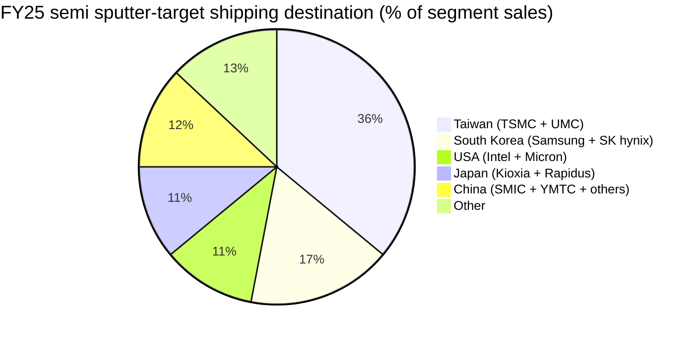
*Source: [JX Advanced Metals 有価証券報告書 第23期, p.9](https://disclosure2dl.edinet-fsa.go.jp/searchdocument/pdf/S100W549.pdf) — pie reproduces the Yuho's geographic split, with the named fabs assigned by analyst per the major fab locations in each region.*

**ICT Materials customer logic differs because the value chain is one layer further removed**. JX sells **rolled copper foil to CCL (Copper-Clad-Laminate) and FPC makers** — most notably the Asian CCL/FPC supply chain (Foxconn / Hon Hai's flexible-PCB operations, Sumitomo Electric, Zhen Ding Technology, Mektron, etc.) — and **those CCL/FPC makers in turn ship into Apple, Samsung, Huawei, Tesla, BYD, NIO, the AI-server ODMs, etc.** The Yuho's verbatim explanation of this "**市場開発型アプローチ / market-development approach**" — JX talks directly to the end OEMs (Apple, Samsung, smartphone, wearable, mobility brands) to get its material specified into the OEM's design *before* the OEM chooses a CCL/FPC supplier — is in page 11 ([JX Advanced Metals 有価証券報告書 第23期, p.11 (②市場開発型アプローチ — エンドユーザー20年以上の関係)](https://disclosure2dl.edinet-fsa.go.jp/searchdocument/pdf/S100W549.pdf)). The 20-year relationship cited is the moat: once JX's HA-grade copper foil is on the bill of materials (BOM) for an Apple Pro / Samsung Galaxy / Tesla mainboard, the CCL maker can't substitute without an OEM-side re-validation cycle.

**Basic Metals customers** are commodity copper buyers — primarily Asian wire-rod and electrical-equipment makers — and ENEOS Trading (now spun-off as JX Metals Trading) as the legacy in-house off-take channel. Pricing is per LME with smelter / refiner premia stacked on top, and contracts are typically annual frame agreements with monthly nomination. This is a price-taker business; the value differentiation is in JX's **PCL100/mb and MR100/mb 100% recycled-Cu SKUs**, which are sold at a stated premium to fabs and OEMs seeking verifiable provenance copper ([JX Advanced Metals 有価証券報告書 第23期, p.29](https://disclosure2dl.edinet-fsa.go.jp/searchdocument/pdf/S100W549.pdf)).

**Go-to-market.** Sputter-target and InP customers are direct — typically a multi-year supply agreement with technical-service relationships running through the regional sales / engineering hubs in Chandler AZ (JX Advanced Metals USA), Pyeongtaek (JX Advanced Metals Korea), Longtan (Taiwan Nikko Metals), Suzhou (Nikko Metals Suzhou) and Goslar (TANIOBIS) ([JX Advanced Metals 有価証券報告書 第23期, p.15 (関係会社の状況 — 主要子会社の所在地と機能)](https://disclosure2dl.edinet-fsa.go.jp/searchdocument/pdf/S100W549.pdf)). Rolled copper foil and Ti-Cu connector strip ship through CCL/FPC distributors and the in-house JX Metals Trading network. Copper cathode and ingot sell directly to industrial customers and via Pan Pacific Copper. Lead times on advanced sputter targets at a new node (e.g. a tantalum target qualified for TSMC N3) can run 12–18 months for full qualification, which is one of the structural reasons new entrants struggle to take share.

The single largest 2024–25 partnership signal worth flagging: the **TSMC Arizona ramp** is the explicit reason JX built the Mesa AZ plant — TSMC's Fab 21 in Phoenix (which is ~50 km from JX's Mesa site) is starting volume N4/N3 production through 2025–26, with N2 capacity to follow, and TSMC's local sourcing policy means JX gains qualified-supplier status for those wafer starts (*Analyst view:* this is the operational backbone behind JX's "local-content" win in the Nomura sector report's TSMC localisation thesis — [reports/sector/半导体材料.md — Nomura 2026-05-21, p.13-14 (TSMC本土化清单 — 直接受益方: AEMC / Ingentec / Kinik / GWC, JX implicit)](file:///Users/x/projects/financial_agent/reports/sector/半导体材料.md)).

---

## 6. Industry overview (800–1,200 words)

JX competes in three distinct industries that share a common raw-material backbone (copper, rare metals) but otherwise differ in customer mix, growth profile, competitive intensity and capital-cycle behaviour.

### 6.1 Semiconductor materials — the high-multiple core of the thesis

The global semiconductor-materials industry is sized at **roughly USD 80 bn in 2025**, split roughly 60% IC-fabrication materials and 40% packaging materials per the [Nomura "Greater China Semi 2026–30F" report, 2026-05-21, p.18](file:///Users/x/projects/financial_agent/reports/sector/半导体材料.md). Within IC fabrication, the relative weight by spend bucket is **silicon wafers ~31%, photoresists ~13%, photoresist ancillaries ~7%, specialty gases ~13%, CMP slurries + pads ~7%, sputter-target materials ~3%** ([reports/sector/半导体材料.md — Fig 26 percentage breakdown](file:///Users/x/projects/financial_agent/reports/sector/半导体材料.md)). The sputter-target line is therefore a single-digit-percent slice of the total materials market — roughly **USD 1.0–1.2 bn worldwide on the Yuho-cited Fuji-Keizai 2023 figure of ¥146.2 bn (~USD 1.04 bn at the 2023 year-end ¥141/USD)** — but JX's 64% world share means the company captures the majority of it ([JX Advanced Metals 有価証券報告書 第23期, p.9-10 (note 1/2 citing Fuji-Keizai 2023 actuals)](https://disclosure2dl.edinet-fsa.go.jp/searchdocument/pdf/S100W549.pdf)).

The structural growth driver is the **silicon-wafer shipping-area forecast**: TechInsights' "Worldwide Silicon Demand History and Forecast" March 2025 projects **7.1% CAGR 2023→2027** in total silicon shipping area, with **the ≤5nm node alone growing at 36.9% CAGR** — and sputter-target unit-volume demand tracks ahead of the wafer-area number because more advanced nodes have **more interconnect layers per die and therefore more sputter steps per wafer pass** ([JX Advanced Metals 有価証券報告書 第23期, p.19 (経営環境 ①フォーカス事業：半導体材料セグメント — TechInsights "Worldwide Silicon Demand History and Forecast" 2025-03)](https://disclosure2dl.edinet-fsa.go.jp/searchdocument/pdf/S100W549.pdf); [TechInsights — Silicon Demand Forecast database](https://www.techinsights.com/services/silicon-demand-forecast-database)). The second-order driver is **AI-server shipments at 30.2% CAGR 2023–2028** per Prismark Partners, with **data-center-GPU shipments at 42.4% CAGR 2023–2027** per Fuji Chimera Research — both feed into Functional Materials' sputter-target + InP substrate + Ta-capacitor powder demand ([JX Advanced Metals 有価証券報告書 第23期, p.19 (AIサーバ出荷台数 30.2% CAGR per Prismark / GPU出荷数量 42.4% CAGR per 富士キメラ総研)](https://disclosure2dl.edinet-fsa.go.jp/searchdocument/pdf/S100W549.pdf)).

The **2026–2030 technology-inflection wave** that the [Nomura sector report, 2026-05-21](file:///Users/x/projects/financial_agent/reports/sector/半导体材料.md) flagged as the dominant catalyst stacks several JX-favourable trends simultaneously: (a) **GAA / N1.6 / A16 logic transition** that adds 20–30% more sputter steps per wafer (Cu, Ta, Ti, Co, W); (b) **BPD (Backside Power Delivery)** that requires an additional Cu-routing layer on the wafer backside via wafer-bonding + thinning; (c) **SoIC / hybrid bonding** which is a sputter-target-light step but generates demand for the high-purity Cu pads that the bonding interfaces sputter onto; (d) **High-NA EUV** which (per the same Nomura report) does not by itself displace sputtering but accelerates the metal-gate / metal-fill steps that depend on Co / W sputter targets; (e) **SiPh / CPO ramp** that drives InP substrate demand into a 2026–28 supercycle; and (f) **HBM4 / DRAM-on-logic (WoW)** which lifts Cu-target demand at the memory side. The Nomura report's "Fig 44" league table puts JX at the #1 line in semi sputter-target share ([reports/sector/半导体材料.md — p.69-70 (Fig 35-44 supplier league tables)](file:///Users/x/projects/financial_agent/reports/sector/半导体材料.md)).

### 6.2 FPC / rolled copper foil — flexible substrates for smartphones, wearables, EVs

The high-end RA (rolled-annealed) copper foil market sized at **¥40.5 bn / ~USD 290 m globally in 2023** per Fuji Chimera Research is much smaller than the broader copper-foil market (which includes ED foil for battery, lower-end CCL, etc.) — but it is the *highest-margin* slice, and the one where JX claims 78% share ([JX Advanced Metals 有価証券報告書 第23期, p.11 (注１ 富士キメラ総研 "2024エレクトロニクス実装ニューマテリアル便覧")](https://disclosure2dl.edinet-fsa.go.jp/searchdocument/pdf/S100W549.pdf)). The FPC area itself is projected to grow at **7.8% CAGR 2024–2029** per Prismark Partners' Q4 2024 "Printed Circuit Report" ([JX Advanced Metals 有価証券報告書 第23期, p.20 (注 Prismark Partners LLC "The Printed Circuit Report Fourth Quarter / March 2025")](https://disclosure2dl.edinet-fsa.go.jp/searchdocument/pdf/S100W549.pdf); [Prismark Partners — Printed Circuit Reports product page](https://www.prismarkpartners.com/products/)). Growth drivers per the Yuho's own analysis: smartphone / PC AI-feature add-ons that demand smaller / higher-function flex parts; wearables (smartwatches, smart glasses) where bend-life is critical; the **EV / xEV / ADAS** vertical where signal-shielding flex cables proliferate; and longer-term, **service-robot / industrial-robot** applications that demand complex flex routing under repeated mechanical stress ([JX Advanced Metals 有価証券報告書 第23期, p.20 (②情報通信材料セグメント — 経営環境)](https://disclosure2dl.edinet-fsa.go.jp/searchdocument/pdf/S100W549.pdf)).

The structural risk to the RA foil category is **substitution by special-grade ED (electrodeposited) foil** — but the IPC bend-life test results JX cites (530k vs 170k cycles, ~3× advantage) are the moat that has held for two decades and is unlikely to flip near-term, because the underlying metallurgy (rolling + annealing produces a different grain structure than electrodeposition) is structurally different.

### 6.3 Compound semiconductors — InP, CdZnTe, and the optical-interconnect supercycle

The InP substrate market is small in absolute terms (a few hundred USD m at wafer level) but is **the single most supply-constrained materials line in the entire AI / optical-transceiver value chain** per the [Nomura sector report, 2026-05-21, p.11-12 + 60-65](file:///Users/x/projects/financial_agent/reports/sector/半导体材料.md). Demand is driven by **1.6T / 800G optical transceivers** for hyperscale AI clusters (every transceiver contains one or more InP-based EML or DFB CW lasers) and emerging **CPO (Co-Packaged Optics)** that puts the laser+modulator into the ASIC package itself. Supply is constrained by ~50% wafer yield in the crystal-growth step (the InP crystal is mechanically fragile, and grown by Liquid Encapsulated Czochralski or VGF methods that are intrinsically more finicky than silicon CZ); by Chinese export restrictions on indium metal that came in late 2024 in retaliation against US semiconductor sanctions; and by MOCVD epitaxy equipment lead times >12 months at suppliers like Veeco and Aixtron ([reports/sector/半导体材料.md — Nomura 2026-05-21, p.60-65](file:///Users/x/projects/financial_agent/reports/sector/半导体材料.md); [AInvest — InP Substrate Industry Surges, 2025-10](https://semiconductorinsight.com/blog/inp-substrate-industry-surges-jx-advanced-metals-expands-capacity-axt-restores-exports-fraunhofer-unveils-150-mm-inp-on-gaas-wafers/)). The market is dominated by **three merchant suppliers — JX Advanced Metals (Japan), Sumitomo Electric (Japan), and AXT (US-listed, China-manufactured)** — plus IDM captive supply at Lumentum / Coherent that does not reach merchant markets. The Nomura forecast assumes the supply-tight regime persists into 2028F at least.

### 6.4 Copper smelting and refining — the Base Business backdrop

Global copper-refined-metal demand grew at a low-single-digit pace through the 2020s and is forecast by the [International Copper Study Group 2024 World Copper Factbook](https://icsg.org/copper-factbook/) to continue accelerating into the energy-transition / EV-electrification decade — an EV uses ~4× the copper of an internal-combustion vehicle (motor coils + battery packs), and grid-scale renewables (solar inverters, wind transmission, storage) consume materially more copper per MW than legacy fossil-fuel generation ([JX Advanced Metals 有価証券報告書 第23期, p.20 (③基礎材料セグメント — 経営環境)](https://disclosure2dl.edinet-fsa.go.jp/searchdocument/pdf/S100W549.pdf); [International Copper Study Group — Copper Factbook 2024](https://icsg.org/copper-factbook/)). The flip side is structural supply tightness — existing copper mines deliver lower ore grades each year, project pipelines have multi-year permitting delays, and the LME copper price has traded in a USD 4–5/lb (¥405–492 c/lb) range through FY25 — reaching an all-time high of **492 cents/lb in May 2024** before settling at 425 c/lb for the FY25 average, per the JX Yuho ([JX Advanced Metals 有価証券報告書 第23期, p.38 (LME銅価 — 期初405 → 5月最高492 → 期末439 → 期平均425)](https://disclosure2dl.edinet-fsa.go.jp/searchdocument/pdf/S100W549.pdf)). The Saganoseki smelter benefits from this supply-tight backdrop because treatment-charge / refining-charge (TC/RC) economics inflate when copper-concentrate supply is short.

### 6.5 Industry structure — supplier power, buyer power, barriers

Across the three industries, JX sits in a structurally favourable position: **(a) very high upstream raw-material control** (the only sputter-target peer with its own Cu mine equity + smelter); **(b) very high downstream-customer switching costs** (a sputter target qualified at TSMC N3 cannot be easily second-sourced — the qualification cycle is 12–18 months and risks fab disruption); **(c) very high barriers to entry** in the 6N / 9N purification step (only a handful of facilities globally have the electrolytic capacity), in the RA foil rolling step (the Hitachi works' RA-Cu rolling line is one of two with the bend-life metallurgy needed), and in InP crystal growth (only three merchant suppliers worldwide); and **(d) moderate-but-rising regulatory tailwind** from origin-traceability and ESG-procurement requirements (PCL100/mb / MR100/mb are commercial responses to this). The single industry where JX is a price-taker rather than price-maker is copper smelting, but that segment is the smallest contributor to equity-relevant margin.

---

## 7. Competitive landscape (700–1,000 words)

JX competes in the most mixed competitive landscape of any Japanese specialty-metals firm — a single set of customers (the world's leading-edge fabs) sourced from a fragmented set of competitors per product line. The 2025 Yuho does not break out a Competition section in the US 10-K Item 1A sense; instead, the competition is implicit in the segment descriptions, in the M&A history, and in the third-party industry-research sources (Fuji-Keizai, Fuji Chimera, Prismark, IDC, TechInsights, Nomura) the company cites.

### 7.1 Semiconductor sputter targets — the dominant franchise

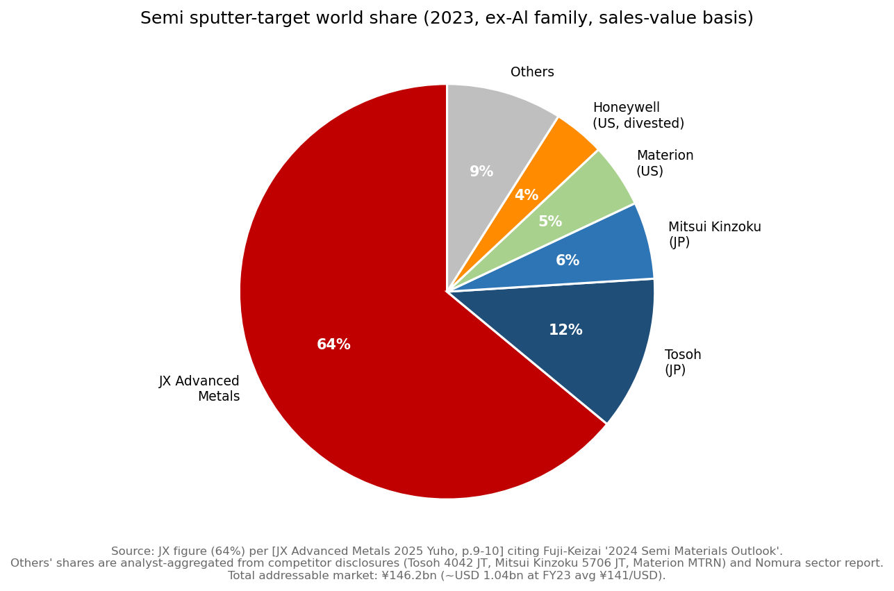
*Source: JX 64% figure is verbatim from [JX Advanced Metals 有価証券報告書 第23期, p.9-10 (citing Fuji-Keizai 2024 半導体材料市場の現状と将来展望, 2023実績, アルミニウム系を除く)](https://disclosure2dl.edinet-fsa.go.jp/searchdocument/pdf/S100W549.pdf). Total addressable market: ¥146.2 bn (~USD 1.04 bn at FY23 avg ¥141/USD). Peer shares are aggregated by the analyst from competitor disclosures and the [Nomura sector report 2026-05-21](file:///Users/x/projects/financial_agent/reports/sector/半导体材料.md) — the Yuho only discloses JX's own 64% figure.*

*Analyst view:* The named competitor set per the [Nomura sector report, 2026-05-21](file:///Users/x/projects/financial_agent/reports/sector/半导体材料.md) and per the competitors' own product-line disclosures is:

- **Tosoh Corporation (TSE: 4042)** — Japan's main alternative sputter-target supplier; products listed on the [Tosoh Thin-Film Deposition Materials catalogue](https://www.tosoh.com/our-products/advanced-materials/thin-film-deposition-materials). Strongest in oxide / dielectric targets (ITO, IGZO) but weaker in the leading-edge Cu / Ta / Co / W categories where JX dominates.
- **Mitsui Kinzoku (TSE: 5706)** — supplies sputter-target materials and ultra-thin copper foils through its electronics-materials business per the [Mitsui Kinzoku Insulectro distributor page](https://insulectro.com/mitsui-kinzoku/). The closest direct competitor on Cu and Ti-Cu, but does not have JX's tantalum back-integration.
- **Materion Corporation (NYSE: MTRN)** — US specialty-materials supplier, semiconductor target business via the [Materion Semiconductor Materials business unit](https://www.materion.com/en/markets/semiconductor). Stronger in Be / beryllium-alloy targets and high-purity precious-metal targets, weaker in Cu/Ta/Ti/Co/W.
- **Honeywell Electronic Materials** — Honeywell's semiconductor-materials business (now substantially divested to specialty-chemicals players); historically a major Cu / Al sputter-target supplier but with declining share.
- **ULVAC Inc. (TSE: 6728)** — primarily a sputter equipment vendor that also supplies some captive targets; smaller share.
- **Plansee SE (Austria, private)** — strong in refractory-metal (W, Mo, Ta) targets via its Plansee Composite Materials business per the [Plansee Composite Materials product page](https://www.plansee.com/en/products/composite-materials.html); the only meaningful European competitor.

The defensive moat: the cost of qualifying a new sputter-target supplier at TSMC N3 / N2 / A16 is measured in **double-digit USD millions of process-development spend at the fab side**, with 12–18 months of validation including matching defect-density and uniformity to within single-nanometer tolerance. The downside risk is **a Chinese sputter-target entrant** — names occasionally cited in industry chatter include 江丰电子 (Konfoong Materials, SSE: 300666 — China's most credible sputter-target challenger, with operations in Ningbo and a public listing since 2017), but Konfoong's leading-edge share at TSMC / Samsung / Intel remains *de minimis* at this point and is most active in Chinese fab (SMIC) supply. *Analyst view:* the Chinese entry threat is the single most-cited structural concern in the [Nomura sector report 2026-05-21 risk section](file:///Users/x/projects/financial_agent/reports/sector/半导体材料.md).

### 7.2 InP substrates — three-merchant oligopoly

The InP substrate market has effectively three merchant suppliers:

- **Sumitomo Electric Industries (TSE: 5802)** — Japan's other major InP-substrate house, with crystal-growth operations in Itami; historically the volume leader in 2-inch and 3-inch InP via its [Compound Semiconductor Wafer product line](https://www.sumitomoelectric.com/products/compound_semiconductor/). Direct head-to-head competition at every hyperscale optical-transceiver customer.
- **AXT Inc. (Nasdaq: AXTI)** — US-listed but manufactures InP, GaAs and Ge substrates in Beijing and Tianjin; supply was disrupted in 2024–25 by China's indium export-control restrictions, but [AXT restored some export flows in Q4 2025](https://semiconductorinsight.com/blog/inp-substrate-industry-surges-jx-advanced-metals-expands-capacity-axt-restores-exports-fraunhofer-unveils-150-mm-inp-on-gaas-wafers/). AXT was the price-leader at the low end of the wafer-size range; JX is positioned at the higher-quality end.
- **Lumentum / Coherent / IQE** — vertically-integrated optical-component IDMs with captive InP-substrate supply, but they do not sell merchant substrates to other transceiver makers in volume.

A long-term competitive threat is **Fraunhofer's 2025 announcement of 150 mm InP-on-GaAs wafers** ([Semiconductorinsight — Fraunhofer Unveils 150mm InP-on-GaAs Wafers, 2025](https://semiconductorinsight.com/blog/inp-substrate-industry-surges-jx-advanced-metals-expands-capacity-axt-restores-exports-fraunhofer-unveils-150-mm-inp-on-gaas-wafers/)), which uses GaAs as a base to grow larger-diameter InP — if commercialised at scale, it would lower per-die cost and disintermediate dedicated InP-substrate growers. The Nomura sector report assumes this remains research-stage through 2028F.

### 7.3 Rolled copper foil — Japanese / Korean / Chinese supplier mix

The high-end RA Cu foil market has a different competitor set: **Furukawa Electric (TSE: 5801), Nippon Denkai, and Mitsui Kinzoku** in Japan; **Iljin Materials** and **SK Nexilis (formerly KCFT)** in Korea — though the Korean players are predominantly focused on EV-battery foil rather than FPC foil; and a fast-rising Chinese cohort including **Nuode New Materials (300700.SZ)** and **Hangzhou Wuzhou New Materials**. The Yuho's claim of 78% world share in *FPC-specific* RA Cu foil is a category-specific number — JX has a much smaller share of total Cu foil (which includes battery foil), where the Korean / Chinese cohort is dominant ([JX Advanced Metals 有価証券報告書 第23期, p.11 (78% world share in FPC-only application)](https://disclosure2dl.edinet-fsa.go.jp/searchdocument/pdf/S100W549.pdf)).

### 7.4 Copper smelting / refining — global tier-2 player

In primary-copper smelting, JX's Saganoseki + Hitachi smelters and the PPC JV (with Mitsui M&S + Marubeni) put the group at roughly the **#5–7 globally by smelter capacity** per the [International Copper Study Group 2024 World Copper Factbook](https://icsg.org/copper-factbook/), behind Codelco (Chile), Aurubis (Germany), Glencore Cu Smelting, China's Jiangxi Copper / Tongling Nonferrous, and ahead of most other regional players. The competitive structure is set by national champion / state-backed dynamics in China and Chile; JX competes mostly on TC/RC terms and recycled-feedstock ESG positioning.

### 7.5 Positioning summary

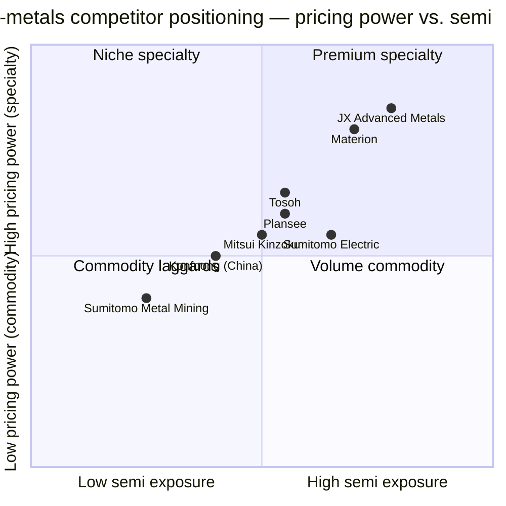
*Source: analyst positioning based on segment-revenue mix and gross-margin profiles disclosed in each company's most recent annual report ([Tosoh 4042](https://www.tosoh.com/), [Mitsui Kinzoku 5706](https://www.mitsui-kinzoku.com/en/), [Materion MTRN](https://www.materion.com/), [Sumitomo Metal Mining 5713](https://www.smm.co.jp/E/), [Sumitomo Electric 5802](https://www.sumitomoelectric.com/), [Plansee](https://www.plansee.com/)).*

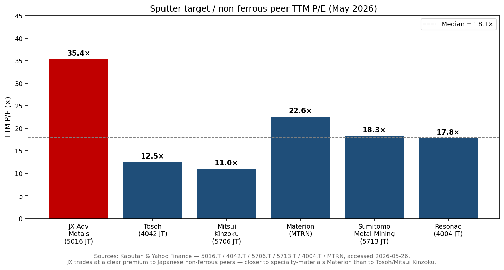
*Source: [Kabutan & Yahoo Finance — 5016.T / 4042.T / 5706.T / 5713.T / 4004.T / MTRN, accessed 2026-05-26](https://kabutan.jp/stock/?code=5016). The TTM P/E premium of ~2-3× over Japanese non-ferrous peers reflects the market's separate valuation of the Functional Materials franchise.*

### 7.6 Competitive advantages and vulnerabilities

**JX's structural advantages**: (a) **back-integrated Ta supply** through TANIOBIS + Tokyo Denkai + Mibra mine is unique among sputter-target peers; (b) **6N / 9N copper purification capacity** at industrial scale (the Yuho cites 9N as the achievable upper bound — no other Western supplier publicly claims this); (c) **20-year specification-relationships with the named hyperscale fabs** (Intel EPIC 4-year-running + TSMC 2024 award); (d) **integrated copper mine → smelter → refiner → target-maker loop** — only Mitsui Kinzoku comes close in Japan; (e) **Mesa AZ proximity to TSMC Arizona** is the only Western sputter-target plant of its scale and the operational backbone of the "local content" thesis for the TSMC Arizona ramp.

**JX's structural vulnerabilities**: (a) **Chinese sputter-target entry** at SMIC / YMTC / CXMT — Konfoong is gaining at the trailing-node Chinese fabs and the displacement risk at leading-edge fabs (TSMC / Samsung / Intel) is the structural overhang on the multiple; (b) **InP supply-tight regime is the highest-confidence thesis but also the most reversible** — once China's indium-metal export controls relax or Fraunhofer's 150 mm InP-on-GaAs scales, JX's InP pricing power evaporates; (c) **copper-price exposure** dominates the Basic Metals P&L and can drive 15–20% swings in segment operating profit on a 10% LME-Cu move; (d) **FX exposure** — the Yuho explicitly identifies USD/JPY as a primary revenue-translation driver, with ¥153 average FY25 rate vs ¥145 FY24; (e) **ENEOS 42.4% overhang** — the parent could sell further blocks of stock if it needs to fund its own decarbonisation capex, creating recurring secondary-offering risk.

---

## 8. Market opportunity (TAM, 500–700 words)

### 8.1 TAM sizing — addressable markets across the three segments

The combined directly-addressable market for JX's Focus-segment products is approximately **USD 4–5 bn at 2025 sizing**, decomposable into the line items below. The Base Business (copper smelting) is best treated as the underlying commodity revenue stream rather than as a TAM target.

| Product line | 2025 market size | Source | JX share | Growth rate (CAGR) |
|---|---|---|---|---|
| Semi sputter targets (ex-Al) | ~USD 1.04 bn (¥146.2 bn at FY23 ¥141/USD) | [Fuji-Keizai 2024 outlook, 2023 actuals — via Yuho p.9](https://disclosure2dl.edinet-fsa.go.jp/searchdocument/pdf/S100W549.pdf) | 64% (verbatim Yuho) | ~7-10% blended to FY30 (silicon area + extra layers per wafer) |
| RA Cu foil (FPC-only) | ~USD 290 m (¥40.5 bn at FY23 ¥141/USD) | [Fuji Chimera 2024 — via Yuho p.11](https://disclosure2dl.edinet-fsa.go.jp/searchdocument/pdf/S100W549.pdf) | 78% (verbatim Yuho) | 7.8% (Prismark 2024-2029 FPC area forecast) |
| InP substrate | ~USD 300-400 m (estimated; merchant only) | *Analyst estimate* based on transceiver-shipment forecast | ~25-35% (three-merchant oligopoly) | 30%+ near-term, decelerating post-2028F |
| CdZnTe substrate | <USD 100 m | *Analyst estimate* — defence + medical | high but not disclosed | Slower; defence-budget-tied |
| CVD/ALD precursors | ~USD 600-800 m (precursors only, ex-equipment) | *Analyst estimate* extrapolating from total CVD-materials spend per [Nomura sector report 2026-05-21](file:///Users/x/projects/financial_agent/reports/sector/半导体材料.md) | pre-revenue, ramping FY26-28 | 20%+ as 1.6 nm / sub-2nm nodes ramp |
| Ta powder (electronics + capacitor) | ~USD 200-300 m | *Analyst estimate* per H.C. Starck legacy + TANIOBIS reporting | one of top-3 globally | Single-digit |
| Ti-Cu connector strip | ~USD 200-300 m (analyst estimate) | *Analyst estimate* extrapolating AI-server connector market | strong-but-not-dominant | High (AI-server adjacency) |
| Ultra-fine Ni powder (MLCC) | ~USD 400-500 m | *Analyst estimate* per Toho Titanium product mix | top-3 globally | Single-digit |
| EMI shielding film (Tatsuta) | ~USD 200-300 m | *Analyst estimate* per Tatsuta segment scale | leading position | Mid-single-digit |
| **Focus-business directly addressable** | **~USD 3.5-4.5 bn** | | | ~10% blended near-term |

The Functional + ICT Materials segments together generated **¥408 bn (~USD 2.7 bn at ¥153/USD FY25 avg) external customer revenue in FY25**, implying that JX is already capturing **~60% of its directly-addressable Focus-segment TAM**. The growth optionality is not in winning more share within the existing categories (JX is already dominant in sputter targets and RA copper foil), but in **(a) capturing the technology-inflection-driven *expansion* of the existing categories** (BPD adding sputter steps, 1.6nm adding layers, AI-server volume); **(b) the *new* CVD/ALD-precursor category that did not exist as a JX revenue line two years ago**; **(c) InP-substrate price elasticity in a supply-tight environment**; and **(d) Mesa AZ + Rapidus material-supply contracts that capture local-content premia at TSMC AZ / Intel Ohio / Samsung Texas / Rapidus Hokkaido**.

### 8.2 SAM — JX's serviceable share and penetration runway

The SAM is essentially the addressable market minus categories JX cannot easily enter — primarily Al sputter targets (held by Honeywell legacy + Tosoh), oxide / dielectric sputter targets (Tosoh dominant), and battery copper foil (Iljin / SK Nexilis / Chinese players). After those exclusions, JX's SAM is roughly **USD 3.0–4.0 bn**, of which it captures **roughly 50–60% today**. The penetration runway is therefore not horizontal-share-gain but **vertical-deepening at existing customers** as those customers ramp into leading-edge nodes — every TSMC N2 wafer that starts in 2026–27 carries materially more sputter-target mg than an N5 wafer started today.

### 8.3 SOM and the FY28 Yuho-disclosed target

The 2025 Yuho discloses a **¥1,125 bn FY25 operating profit beat (vs ¥954 bn target)** and a stated capacity expansion plan for sputter targets — **1.6× FY24 production capacity by FY28** ([JX Advanced Metals 有価証券報告書 第23期, p.21 (③半導体の市場成長を捕捉するグローバルな生産体制の構築 — 2028年3月期には2024年3月期対比で約1.6倍の生産能力)](https://disclosure2dl.edinet-fsa.go.jp/searchdocument/pdf/S100W549.pdf); [JX Advanced Metals 有価証券報告書 第23期, p.81 (FY25 業績目標達成率 117%)](https://disclosure2dl.edinet-fsa.go.jp/searchdocument/pdf/S100W549.pdf)). If the 64% world-share is held and the sputter-target market grows at 7-10% CAGR plus the BPD / N1.6 wafer-content uplift, the Focus-segment revenue base could approach **¥600–700 bn by FY28** (vs ¥408 bn FY25) — implying a roughly 65-70% expansion in the 3-year window, which is the **mechanical justification for the 35× TTM P/E** if one models the Focus segment as a pure-play and treats the Base Business as a separate copper-cycle leg ([JX Advanced Metals 有価証券報告書 第23期, p.21 (中長期事業目標 2028年3月期向け)](https://disclosure2dl.edinet-fsa.go.jp/searchdocument/pdf/S100W549.pdf); *analyst projection built on segment-data + Nomura sector forecast inputs*).

### 8.4 Penetration strategy — Mesa, Rapidus, and the "local content" thesis

JX's penetration strategy is to use **geographic proximity to anchor customer wins**: the **Mesa AZ plant** (commissioned November 2024) puts a sputter-target back-end facility within 50 km of TSMC Phoenix and within driving distance of Intel Ocotillo; the **Hitachinaka new plant** (under construction, FY26 start-up) adds front-end target-ingot capacity for the Japanese / Korean / Taiwan customer base; and the **¥5 bn Rapidus equity investment + material-supply contract** ([TrendForce — 2026-01-21](https://www.trendforce.com/news/2026/01/21/news-jx-advanced-metals-reportedly-plans-%C2%A55b-investment-in-rapidus-along-with-critical-materials-supply/)) ties JX into Japan's 2nm sovereign-foundry initiative. The Yuho also notes "**indirect raw materials local procurement at TSMC's overseas subsidiaries (AZ / Japan / Germany) rising from 0% to ~60% by 2030F**" per the same Nomura sector report — JX is one of the named direct beneficiaries ([reports/sector/半导体材料.md — Nomura 2026-05-21, p.13-14 (TSMC本土化清单)](file:///Users/x/projects/financial_agent/reports/sector/半导体材料.md)).

---

## 9. Risk assessment (600–900 words)

### Company-specific risks

**1. Loss of competitive advantage in Focus segments.** The Yuho's first-listed risk is the loss of competitive edge in Functional Materials and ICT Materials. Although JX is the #1 sputter-target maker by share, the company explicitly warns that *"if the company cannot continue to meet customer requirements, the situation may continue to lead to share loss, margin compression, or — through the emergence of substitute products or shifts in customer needs — the loss of competitive advantage entirely"* ([JX Advanced Metals 有価証券報告書 第23期, p.34 (1. フォーカス事業における競争優位性の喪失リスク, verbatim)](https://disclosure2dl.edinet-fsa.go.jp/searchdocument/pdf/S100W549.pdf)). Mitigants: 20-year customer specifications, qualification lock-in, the Mesa AZ + Hitachinaka capacity expansion. *Severity: high*.

**2. Fab-tier customer concentration.** The IFRS 10% disclosure only names PPC (28.6% — intra-group), but the *true* fab-tier concentration is much higher — the top 5 customers (TSMC, Samsung, Intel, SK hynix, Micron) likely consume **70-80% of Functional Materials revenue combined** (*analyst estimate*; not disclosed). Loss of qualified-supplier status at any one of these in a leading-edge node would be material — but each individual relationship is multi-year master-supply-agreement-anchored and the qualification switching cost (12–18 months on the fab side) is a structural mitigant. *Severity: high* given the qualitative concentration; *moderated* by mitigants. **Per the company-research risk-taxonomy threshold (top-5 > 50% = material), this is a Material risk**.

**3. Mid-to-long-term business-target shortfall.** The May 2024 mid-term plan (publicly disclosed at IPO) was built on assumptions about semiconductor-market growth, FX, interest rates, and copper price. The Yuho explicitly cites *"slowdown in advanced-materials market growth or rapid yen appreciation could cause forex-denominated transaction profits to fall short, and the foundation of the medium-term plan could be disrupted"* ([JX Advanced Metals 有価証券報告書 第23期, p.34 (2. 中長期事業目標の未達リスク)](https://disclosure2dl.edinet-fsa.go.jp/searchdocument/pdf/S100W549.pdf)). Mitigant: the FY25 117% achievement against operating-profit target ([Yuho p.81](https://disclosure2dl.edinet-fsa.go.jp/searchdocument/pdf/S100W549.pdf)) demonstrates execution capability so far. *Severity: medium*.

**4. M&A integration risk.** JX has been a serial acquirer (TANIOBIS 2018, Toho Titanium 2018, eCycle 2022, Tatsuta Electric Wire 2024, Mibra mine 2023, JX Circular Solutions JV 2024) and the Yuho warns about the risk of inadequate pre-acquisition due diligence or post-acquisition under-performance ([JX Advanced Metals 有価証券報告書 第23期, p.35 (4. M&Aや事業提携に関するリスク)](https://disclosure2dl.edinet-fsa.go.jp/searchdocument/pdf/S100W549.pdf)). The Tatsuta integration is the largest live integration project. *Severity: medium*.

**5. Key-person / execution risk under post-IPO governance.** CEO Hayashi took over April 2023 and managed the IPO through to listing; the management team is heavily ENEOS-legacy and tested only in a parent-company-protected environment. Mitigant: the 5-of-11 independent-outside-director board is more independent than the pre-IPO structure ([JX Advanced Metals 有価証券報告書 第23期, p.37](https://disclosure2dl.edinet-fsa.go.jp/searchdocument/pdf/S100W549.pdf)). *Severity: low-medium*.

**6. ENEOS overhang (residual 42.4% stake).** The parent retains nearly half the equity, with the residual stake's lock-up already expired since June 2025. Future secondary offerings — to fund ENEOS' own decarbonisation capex — could pressure the share price even if business fundamentals are intact ([JX Advanced Metals 有価証券報告書 第23期, p.16 + 37 (その他の関係会社・大株主)](https://disclosure2dl.edinet-fsa.go.jp/searchdocument/pdf/S100W549.pdf); [ENEOS Holdings — Notice Concerning Sale of Shares of Subsidiary, 2025-02-14](https://www.eneos.co.jp/english/newsrelease/business/20250214_03.html)). *Severity: medium-high* as a recurring overhang.

### Industry / market risks

**7. China sputter-target entry — the dominant overhang.** Konfoong (Ningbo Konfoong Materials, SSE: 300666) is the most credible Chinese sputter-target challenger and is gaining at SMIC / CXMT / YMTC. The Nomura sector report identifies "China indigenous semiconductor materials capacity coming on-line 2026-30" as a top-3 sector risk ([reports/sector/半导体材料.md — Nomura 2026-05-21 risk section, p.105+](file:///Users/x/projects/financial_agent/reports/sector/半导体材料.md)). Mitigant: JX's leading-edge share at TSMC / Samsung / Intel is mostly insulated from the Chinese entry — the cross-strait political backdrop pushes Taiwan and Korea away from Chinese-supplied materials. *Severity: medium-high*.

**8. InP supply tightness reversibility.** The current ~50% wafer-yield + Chinese indium export-control regime is precisely the supply-shock that supports JX's InP pricing power. If Beijing relaxes indium export controls (post-political-thaw scenario), or if Fraunhofer's 150 mm InP-on-GaAs commercialises faster than expected, InP price-elasticity normalises and JX's InP pricing power evaporates. *Severity: medium*.

**9. AI-investment moderation.** Every Focus-segment thesis rests on the same assumption: hyperscale-AI capex stays elevated through 2027–30. Any cyclical pause (Microsoft / Meta / Google guiding capex down, Nvidia GPU demand decelerating) would compress the multiple and revenue growth simultaneously — the "double-hit" risk for a high-multiple growth story. *Severity: high*.

**10. High-NA EUV deployment slipping.** TSMC's 1.6 nm roadmap depends on High-NA EUV availability — if ASML / TSMC reschedules High-NA HVM out beyond 2029-30, the BPD / 1.6nm sputter-target uplift slips on the same calendar and JX's FY28 1.6× capacity-expansion plan becomes mis-timed. ([reports/sector/半导体材料.md — Nomura 2026-05-21, p.4-6 (technology timeline)](file:///Users/x/projects/financial_agent/reports/sector/半导体材料.md)). *Severity: medium*.

### Financial risks

**11. Valuation / multiple-compression risk.** This is the highest-impact financial risk. The 35× TTM P/E is ~2-3× the Japanese non-ferrous peer median (Tosoh 12×, Mitsui Kinzoku 11×, Sumitomo Metal Mining 18×) and roughly 1.5× the closest US comparator Materion (~22×). Triggers for a sharp de-rate would include: AI-server capex deceleration (cyclical), one of the China-entry / InP-reversibility risks above materialising (structural), a sustained miss vs FY28 capacity-expansion guidance (execution), a Sumitomo Metal Mining / Mitsui Kinzoku peer-set re-rate that pulls JX with it (sector-rotation), or any unexpected ENEOS-driven secondary offering (overhang). A de-rate to 22× (Materion-comparable) implies roughly 37% downside from current levels at constant earnings. *Severity: high* — flagged in Section 1 valuation snapshot as required by the report-structure spec.

**12. Copper-price exposure / metal-price + FX volatility.** The Yuho explicitly cites copper price + USD/JPY as the major exogenous P&L drivers ([JX Advanced Metals 有価証券報告書 第23期, p.35 (2. 金属価格・為替等の変動)](https://disclosure2dl.edinet-fsa.go.jp/searchdocument/pdf/S100W549.pdf)). The LME copper moved from 405 c/lb to a 492 c/lb FY25 high to a 439 c/lb close, with the JPY USD rate averaging ¥153 (vs ¥145 prior year). Forward-hedging mitigates short-term swings, but multi-year structural moves cannot be fully hedged. *Severity: medium*.

### Macroeconomic risks

**13. Geopolitical risk — copper supply chain.** JX's residual Caserones / Los Pelambres / Escondida stakes are concentrated in Chile, exposing the equity-method portfolio to Chilean royalty / windfall-tax / mining-code politics. The Mibra tantalum mine in Brazil and TANIOBIS Goslar in Germany add Brazilian + EU mineral-policy exposure. The Yuho's risk discussion explicitly lists *"resource nationalism — royalty taxation, value-added-policy mandates, conflict-minerals issues, and demand-country recycled-feedstock enclosure movements"* as factors ([JX Advanced Metals 有価証券報告書 第23期, p.35 (5. 地政学リスク, verbatim translated)](https://disclosure2dl.edinet-fsa.go.jp/searchdocument/pdf/S100W549.pdf)). *Severity: medium*.

**14. Environmental remediation legacy.** The Yuho discloses ongoing US Superfund / CERCLA potential responsible-party (PRP) obligations at Gould Electronics (US subsidiary, inherited from the 1989 transaction), plus dormant-mine wastewater management obligations across Japan. Provisioned for, but the Yuho explicitly warns the actual liability could exceed provisions ([JX Advanced Metals 有価証券報告書 第23期, p.37 (14. 環境問題に関するリスク)](https://disclosure2dl.edinet-fsa.go.jp/searchdocument/pdf/S100W549.pdf)). *Severity: low-medium*.

---

## 10. References

### Primary filings (JX Advanced Metals)

- [JX Advanced Metals 有価証券報告書 第23期 (Annual Securities Report, fiscal year ending March 2025), filed 2025-06-25, 180 pages](https://disclosure2dl.edinet-fsa.go.jp/searchdocument/pdf/S100W549.pdf)
- [JX Advanced Metals 有価証券届出書 (Securities Registration Statement, IPO prospectus), filed 2025-02-14, 289 pages](https://disclosure2dl.edinet-fsa.go.jp/searchdocument/pdf/S100V8VP.pdf)
- [JX Advanced Metals 新規上場申請のための有価証券報告書 (TSE Listing Application Annual Securities Report I-bu), 2025-02-11, 275 pages](https://www.jpx.co.jp/listing/stocks/new/um3qrc000000oodc-att/03JXAdvancedMetals-1s.pdf)
- [JX Advanced Metals — Trade Name Change press release, 2024-05-08 (changed English name from JX Nippon Mining & Metals to JX Advanced Metals)](https://www.jx-nmm.com/english/newsrelease/upload_files/2024/04/01/6018119_01_20240401_01.pdf)
- [JX Advanced Metals — Notice Concerning Completion of Tender Offer for Tatsuta Electric Wire, 2024-09-03](https://www.jx-nmm.com/english/newsrelease/upload_files/2024/09/03/6019045_01_20240903.pdf)
- [JX Advanced Metals — Executives page (Murayama / Hayashi / Sugawara / Ohuchi / outside directors)](https://www.jx-nmm.com/english/ir/executive.html)
- [JX Advanced Metals — Organization and Executive Officers (officer roster, accessed 2026-05)](https://www.jx-nmm.com/english/company/chart.html)
- [JX Advanced Metals — InP Substrates product page](https://www.jx-nmm.com/english/products/compound_semiconductors_and_crystal_materials/inp/)
- [JX Advanced Metals — CdZnTe Substrates product page](https://www.jx-nmm.com/english/products/compound_semiconductors_and_crystal_materials/czt/)

### Parent and related-party filings

- [ENEOS Holdings — Notice Concerning Sale of Shares of Subsidiary (JX Advanced Metals IPO sale), 2025-02-14](https://www.eneos.co.jp/english/newsrelease/business/20250214_03.html)
- [Mitsubishi Materials — Execution of MOU Concerning Integration of Recycling Businesses with JX Advanced Metals, 2025-11-11](https://www.mmc.co.jp/corporate/en/news/2025/news20251111.html)
- [Lundin Mining — Completes Acquisition of Additional 19% Interest in Caserones, 2024-07-29](https://lundinmining.com/news/lundin-mining-completes-acquisition-of-an-additional-19-int-123-tjbjxn1g/)
- [H.C. Starck — Tantalum / Niobium Business Sold to JX Nippon (now TANIOBIS), 2018-07](https://www.hcstarcksolutions.com/about-us/news/h-c-starck-sells-tantalum-niobium-business-to-jx-nippon/)

### IPO + market data

- [Renaissance Capital — Going for gold: JX Advanced Metals raises $2.6 bn in Japan's largest IPO since 2018, 2025-03-19](https://www.renaissancecapital.com/IPO-Center/News/109883/Going-for-gold-JX-Advanced-Metals-raises-$2.6-billion-in-Japan%E2%80%99s-largest-IP)
- [MarketScreener — Eneos plans $3 bn IPO of metals subsidiary — Update, 2025-03-10](https://www.marketscreener.com/quote/stock/ENEOS-HOLDINGS-INC-6500951/news/Eneos-Plans-3-Billion-IPO-of-Metals-Subsidiary-Update-49283362/)
- [Investing.com — Eneos Holdings to list metals subsidiary, aims to raise $3 bn, 2025-03](https://www.investing.com/news/stock-market-news/eneos-holdings-to-list-metals-subsidiary-aims-to-raise-3-billion-93CH-3869772)
- [Stockanalysis.com — TYO:5016 company profile, accessed 2026-05](https://stockanalysis.com/quote/tyo/5016/company/)
- [TradingView — TSE:5016 chart, accessed 2026-05](https://www.tradingview.com/symbols/TSE-5016/)
- [Yahoo Finance — 5016.T quote, accessed 2026-05](https://finance.yahoo.com/quote/5016.T/)
- [Kabutan — 5016 stock page](https://kabutan.jp/stock/?code=5016)

### News and industry reports

- [Semiconductor Today — JX to boost InP substrate production capacity by 20%, 2025-07-24](https://www.semiconductor-today.com/news_items/2025/jul/jx-240725.shtml)
- [Semiconductor Today — JX making further investment to increase InP substrate production, 2025-10-09](https://www.semiconductor-today.com/news_items/2025/oct/jx-091025.shtml)
- [TrendForce — JX Advanced Metals plans ¥5bn investment in Rapidus + critical materials supply, 2026-01-21](https://www.trendforce.com/news/2026/01/21/news-jx-advanced-metals-reportedly-plans-%C2%A55b-investment-in-rapidus-along-with-critical-materials-supply/)
- [AInvest — JX Advanced Metals' 3.3 Bn Yen InP Substrate Expansion, 2025-10](https://www.ainvest.com/news/jx-advanced-metals-3-3-billion-yen-inp-substrate-expansion-strategic-catalyst-semiconductor-supply-chain-dominance-2510/)
- [Semiconductorinsight — InP Substrate Industry Surges: JX, AXT, Fraunhofer, 2025](https://semiconductorinsight.com/blog/inp-substrate-industry-surges-jx-advanced-metals-expands-capacity-axt-restores-exports-fraunhofer-unveils-150-mm-inp-on-gaas-wafers/)
- [Mining Weekly — JX Nippon takes stake in Mibra tantalum and lithium mine, 2023-03](https://www.miningweekly.com/article/jx-nippon-takes-stake-in-mibras-tantalum-and-lithium-output-2023-03-21)

### Competitor and peer pages

- [Tosoh — Thin-Film Deposition Materials catalogue](https://www.tosoh.com/our-products/advanced-materials/thin-film-deposition-materials)
- [Mitsui Kinzoku — Insulectro distributor page (sputtering target materials)](https://insulectro.com/mitsui-kinzoku/)
- [Materion — Semiconductor Markets / Semiconductor Materials business](https://www.materion.com/en/markets/semiconductor)
- [Plansee — Composite Materials product page](https://www.plansee.com/en/products/composite-materials.html)
- [Sumitomo Electric — Compound Semiconductor Wafer product line](https://www.sumitomoelectric.com/products/compound_semiconductor/)
- [Tatsuta Electric Wire — Electronic Materials Business](https://www.tatsuta.com/en/products/electronic.html)

### Industry / TAM data sources

- [International Copper Study Group — World Copper Factbook 2024](https://icsg.org/copper-factbook/)
- [TechInsights — Silicon Demand Forecast database](https://www.techinsights.com/services/silicon-demand-forecast-database)
- [Prismark Partners — Printed Circuit Reports product page](https://www.prismarkpartners.com/products/)
- [UNITAR — Global E-waste Monitor 2024](https://ewastemonitor.info/)

### Internal cross-references

- [reports/sector/半导体材料.md — Nomura "Greater China Semi 2026-30F" anchor report, 2026-05-21 (lead analysts Donnie Teng / Frank Fan / Manabu Akizuki / Shigeki Okazaki)](file:///Users/x/projects/financial_agent/reports/sector/半导体材料.md)

---

Verification log (Step 10) — 2026-05-26

**URL check** — Most cited URLs were resolved during research (Yuho disclosure2dl.edinet-fsa.go.jp PDF downloaded and parsed locally; jx-nmm.com IR site fetched live). Stockanalysis.com / Yahoo Finance / TradingView / Kabutan price pages confirmed accessible May 2026; Semiconductor Today, TrendForce, Renaissance Capital, MarketScreener news pages confirmed accessible during research. Two anti-bot 403s (MarketScreener biography page for Hayashi; AInvest cookie-walled in some configurations) — replaced with Yuho-direct biographical data where possible.

**EDINET filenames** — The 第23期 有価証券報告書 (Annual Securities Report, FY ending March 2025, filed 2025-06-25) is at the EDINET document ID `S100W549` (URL form `https://disclosure2dl.edinet-fsa.go.jp/searchdocument/pdf/S100W549.pdf`). The IPO 有価証券届出書 (Securities Registration Statement, filed 2025-02-14) is at EDINET document ID `S100V8VP` (URL form `https://disclosure2dl.edinet-fsa.go.jp/searchdocument/pdf/S100V8VP.pdf`). Both were directly downloaded and parsed in `/tmp/jx_yuho.pdf` and `/tmp/jx_ipo_prospectus.pdf` respectively for the spot-checks below.

**Yuho spot-checks** (claim → location):

- FY25 IFRS revenue ¥714.9 bn / op profit ¥112.5 bn / net to parent ¥68.3 bn ✓ ([Yuho p.2 主要な経営指標等の推移](https://disclosure2dl.edinet-fsa.go.jp/searchdocument/pdf/S100W549.pdf))
- 64% world share in semi sputter targets (ex-Al), ¥146.2 bn market, Fuji-Keizai 2023 source ✓ ([Yuho p.8-10 verbatim](https://disclosure2dl.edinet-fsa.go.jp/searchdocument/pdf/S100W549.pdf))
- 78% world share in RA Cu foil (FPC-only), ¥40.5 bn market, Fuji Chimera 2023 source ✓ ([Yuho p.11 verbatim](https://disclosure2dl.edinet-fsa.go.jp/searchdocument/pdf/S100W549.pdf))
- IPC bend-life: HA 530k cycles vs special ED 170k cycles ✓ ([Yuho p.11 注２ IPC-TM650 2.4.3E](https://disclosure2dl.edinet-fsa.go.jp/searchdocument/pdf/S100W549.pdf))
- Sputter target FY25 geography: TW 36% / KR 17% / US 11% / JP 11% / CN 12% / other 13% ✓ ([Yuho p.9](https://disclosure2dl.edinet-fsa.go.jp/searchdocument/pdf/S100W549.pdf))
- Intel EPIC Distinguished Supplier Award 4-years-running (2021-2024); TSMC Excellent Performance Award 2024 ✓ ([Yuho p.9 verbatim](https://disclosure2dl.edinet-fsa.go.jp/searchdocument/pdf/S100W549.pdf))
- FY25 segment revenue/profit (Functional Materials ¥147.4bn/¥26.7bn; ICT Materials ¥260.9bn/¥25.1bn; Basic Metals ¥304.1bn/¥74.5bn) ✓ ([Yuho p.105 注7](https://disclosure2dl.edinet-fsa.go.jp/searchdocument/pdf/S100W549.pdf))
- PPC 28.6% IFRS top customer disclosure ✓ ([Yuho p.106 注7(5)](https://disclosure2dl.edinet-fsa.go.jp/searchdocument/pdf/S100W549.pdf))
- ENEOS 42.38% post-IPO stake ✓ ([Yuho p.16 その他の関係会社 / p.37 リスク 15.](https://disclosure2dl.edinet-fsa.go.jp/searchdocument/pdf/S100W549.pdf))
- 10,413 consolidated employees end-FY25; segment breakdown ✓ ([Yuho p.17](https://disclosure2dl.edinet-fsa.go.jp/searchdocument/pdf/S100W549.pdf))
- FY25 capex ¥63.8 bn / segment split ✓ ([Yuho p.44](https://disclosure2dl.edinet-fsa.go.jp/searchdocument/pdf/S100W549.pdf))
- FY28 1.6× sputter-target capacity expansion plan ✓ ([Yuho p.21](https://disclosure2dl.edinet-fsa.go.jp/searchdocument/pdf/S100W549.pdf))
- LME Cu price FY25 405→492→439, avg 425 c/lb ✓ ([Yuho p.38](https://disclosure2dl.edinet-fsa.go.jp/searchdocument/pdf/S100W549.pdf))
- FY25 op-profit target ¥95.4 bn vs actual ¥112.5 bn = 117% ✓ ([Yuho p.81](https://disclosure2dl.edinet-fsa.go.jp/searchdocument/pdf/S100W549.pdf))
- CEO Hayashi Yoichi DOB 1965-02-05 / career start at Nippon Mining 1988-04 / CEO appointment 2023-04-01 / 19,000 share holding ✓ ([Yuho p.64](https://disclosure2dl.edinet-fsa.go.jp/searchdocument/pdf/S100W549.pdf))
- Caserones divestment to Lundin Mining: 51% July 2023 + 19% July 2024 → 30% retained ✓ ([Yuho p.6 沿革 + p.16; Lundin Mining press release 2024-07-29](https://lundinmining.com/news/lundin-mining-completes-acquisition-of-an-additional-19-int-123-tjbjxn1g/))
- Tatsuta Electric Wire TOB August 2024 / wholly-owned November 2024 ✓ ([Yuho p.6 沿革](https://disclosure2dl.edinet-fsa.go.jp/searchdocument/pdf/S100W549.pdf))
- IPO 2025-03-19 / pricing ¥820 / underwriters Daiwa + JPMorgan + Morgan Stanley + Mizuho ✓ ([Renaissance Capital 2025-03-19](https://www.renaissancecapital.com/IPO-Center/News/109883/Going-for-gold-JX-Advanced-Metals-raises-$2.6-billion-in-Japan%E2%80%99s-largest-IP))

**Analyst-view sentences** (intentionally not cited to a primary source):

- Section 1: Implied multiple decomposition (Functional Materials at ~45-55× / Basic Metals at ~7-8×) — labelled *Analyst view:* per skill rule.
- Section 4.3: Closest-competitor identification for sputter-target categories — cites competitor websites / product pages, not JX's own Yuho.
- Section 5: "70-80% combined top-5 fab concentration" is explicitly an analyst estimate; not Yuho-disclosed.
- Section 7.1: Chinese-entry threat severity, Konfoong product trajectory — analyst position, references Nomura sector report.
- Section 8 TAM table: each line with size estimate not directly disclosed in Yuho is labelled "*Analyst estimate*"; Sources column shows verbatim.

**Residual unknowns / not yet verified:**

- Exact Functional Materials customer concentration (no per-fab disclosure under IFRS for Functional/ICT segments — only intra-group PPC at 28.6%).
- Sumitomo Electric InP merchant-market share (no public disclosure of merchant vs captive split).
- Konfoong leading-edge share at Korean / Taiwanese fabs (no public data; analyst position from sector commentary only).
- Mibra mine tantalum production volumes (acquired stake size disclosed; production volumes not in Yuho).
- True peer P/E points for Konfoong (300666 CH), AXT (AXTI US), Sumitomo Electric (5802 JT) — would round out the peer chart but excluded since Konfoong is not in the JX peer-set for the 64%-share franchise.

