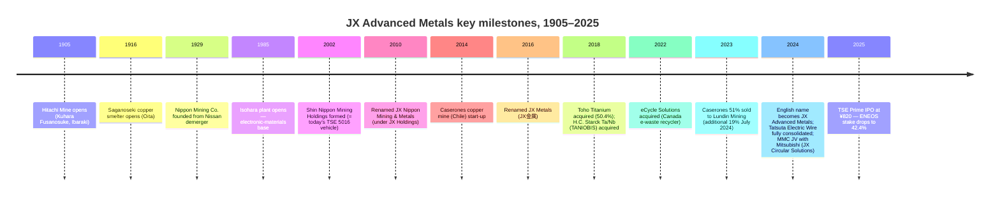

# JX Advanced Metals Corporation (TSE: 5016) — Research Document

*As of 2026-05-26 · English-language report (Japan domicile; primary filings in Japanese — EDINET 有価証券報告書 第23期 — and a single English Annual Securities Report has not been published to date, so all citations track the Japanese 有価証券届出書 / 有価証券報告書 PDFs on disclosure2dl.edinet-fsa.go.jp and the company's IR site jx-nmm.com)*

---

## Table of contents

1. Company overview
2. Company history
3. Management
4. Products and services
5. Customers and go-to-market
6. Industry overview
7. Competitive landscape
8. Market opportunity (TAM)
9. Risk assessment
10. References
11. Verification log

---

## 1. Company overview (800–1,200 words)

JX Advanced Metals Corporation (JX金属株式会社, TSE Prime 5016) is the carve-out from **ENEOS Holdings** (TSE: 5020) that listed on the Tokyo Stock Exchange Prime Market on **19 March 2025**, raising roughly **¥2.6 bn × 1,000 = ¥2.6 trillion / ~US$2.6 bn at the ¥820 IPO price** in **Japan's largest IPO since SoftBank Corp. in December 2018** ([Renaissance Capital — JX Advanced Metals raises $2.6 bn in Japan's largest IPO since 2018, 2025-03-19](https://www.renaissancecapital.com/IPO-Center/News/109883/Going-for-gold-JX-Advanced-Metals-raises-$2.6-billion-in-Japan%E2%80%99s-largest-IP); [JX Advanced Metals 有価証券報告書 第23期, p.6](https://disclosure2dl.edinet-fsa.go.jp/searchdocument/pdf/S100W549.pdf)). Despite the new ticker, the operating business has been continuously producing high-purity metals for the microelectronics industry since the **Hitachi Mine opened on 1 December 1905** — the company traces 120 years of metallurgical heritage that pre-dates the formation of every semiconductor customer it now serves ([JX Advanced Metals 有価証券報告書 第23期, p.5 (沿革)](https://disclosure2dl.edinet-fsa.go.jp/searchdocument/pdf/S100W549.pdf)).

The company describes itself in the IPO prospectus and first standalone Yuho with deliberately narrow language — *"the JX Group is engaged in the development, manufacturing and sale of advanced materials based on copper and rare metals that are indispensable to the semiconductor and information / telecommunications fields, with semiconductor-use sputtering targets and rolled copper foil as its mainstay products"* (verbatim from page 7 of the 第23期 有価証券報告書, translated) ([JX Advanced Metals 有価証券報告書 第23期, p.7](https://disclosure2dl.edinet-fsa.go.jp/searchdocument/pdf/S100W549.pdf)). The group reports in **three segments — Functional Materials (半導体材料), ICT Materials (情報通信材料) and Basic Metals (基礎材料)** — and labels the first two collectively as its **"Focus Business"** and Basic Metals as the **"Base Business" that exists primarily to feed clean copper and rare metals into the Focus Business** ([JX Advanced Metals 有価証券報告書 第23期, pp.7-8](https://disclosure2dl.edinet-fsa.go.jp/searchdocument/pdf/S100W549.pdf)).

**FY25 (year ended March 2025) IFRS revenue was ¥714.9 bn**, down 52.7% year-on-year, but the 50%+ apparent collapse is entirely the result of two deconsolidations completed during the prior year — the sale of a 20% stake in Pan Pacific Copper (PPC) to Marubeni in March 2024, which dropped JX's stake below the consolidation threshold, and the staged sale of the **Caserones copper-mine operating company (MLCC) to Lundin Mining of Canada** (initial 51% in July 2023, additional 19% in July 2024, for a final 70% transfer). Both transactions converted what had been wholly- or majority-owned consolidated subsidiaries into equity-method affiliates, so the related revenue dropped out of the top line ([JX Advanced Metals 有価証券報告書 第23期, p.6 (沿革 — Caserones / PPC transfers)](https://disclosure2dl.edinet-fsa.go.jp/searchdocument/pdf/S100W549.pdf)). Operating profit actually **rose to ¥112.5 bn (15.7% margin)** from ¥86.2 bn the prior year, and net income to the parent reached ¥68.3 bn — the underlying Focus Business is on a sustained up-cycle and the headline revenue line is misleading until FY26 comparables wash through ([JX Advanced Metals 有価証券報告書 第23期, pp.2, 38, 40](https://disclosure2dl.edinet-fsa.go.jp/searchdocument/pdf/S100W549.pdf)).

The segment split for FY25 was: **Functional Materials (semi sputter targets, Ta/Nb powder, compound-semi wafers) ¥147.4 bn external revenue and ¥26.7 bn operating profit; ICT Materials (rolled copper foil, Toho Titanium, Tatsuta Electric Wire) ¥260.9 bn revenue and ¥25.1 bn operating profit; Basic Metals (copper smelting / recycling + equity-method mine income) ¥304.1 bn revenue and ¥74.5 bn operating profit** ([JX Advanced Metals 有価証券報告書 第23期, p.105 (notes 7 セグメント情報)](https://disclosure2dl.edinet-fsa.go.jp/searchdocument/pdf/S100W549.pdf)). The Basic Metals operating profit is inflated by JPY ¥61.0 bn of equity-method gains booked through the segment (mostly the now-deconsolidated PPC and the residual Caserones / Los Pelambres / Escondida stakes), so on a like-for-like comparison the Focus segments contribute roughly **two-thirds of the group's underlying operating profit** despite supplying only 57% of revenue ([JX Advanced Metals 有価証券報告書 第23期, p.105](https://disclosure2dl.edinet-fsa.go.jp/searchdocument/pdf/S100W549.pdf)).

Geographically the company is anchored in Japan (¥305.5 bn of non-current assets vs ¥94.3 bn outside Japan at end-FY25) but the Functional Materials revenue base is dominantly Asian — **Taiwan takes ~36%, South Korea ~17%, USA ~11%, Japan ~11%, China ~12% and other ~13% of semiconductor sputter-target sales** in FY25, reflecting where the leading-edge fabs of TSMC, Samsung Electronics, SK hynix, Intel, Micron and Kioxia actually consume the product ([JX Advanced Metals 有価証券報告書 第23期, p.9](https://disclosure2dl.edinet-fsa.go.jp/searchdocument/pdf/S100W549.pdf)). The group operates production / downstream-processing sites in **Hitachi, Isohara, Hitachi-naka and Kurami in Japan; Mesa, Arizona (a USA sputter-target back-end plant commissioned in November 2024); Longtan, Taiwan; Pyeongtaek, South Korea; Suzhou, China; Laguna, Philippines; Goslar, Germany (TANIOBIS); Mississauga, Canada (eCycle); and trading offices in Singapore and the USA** ([JX Advanced Metals 有価証券報告書 第23期, pp.15-16, 45-46 (関係会社・設備の状況)](https://disclosure2dl.edinet-fsa.go.jp/searchdocument/pdf/S100W549.pdf)). The 2025 Yuho lists **10,413 consolidated employees** (with 2,442 in Functional Materials, 4,275 in ICT Materials, 1,869 in Basic Metals, and 1,827 in Other / corporate functions) ([JX Advanced Metals 有価証券報告書 第23期, p.17](https://disclosure2dl.edinet-fsa.go.jp/searchdocument/pdf/S100W549.pdf)).

ENEOS Holdings remains the largest shareholder with a **42.38% stake** post-IPO (down from 100% pre-listing), reclassified in the 第23期 disclosure from "parent company" (親会社) to "other related party" (その他の関係会社) on 19 March 2025 — the threshold below which Japanese accounting drops the parent-company designation ([JX Advanced Metals 有価証券報告書 第23期, p.16 (関係会社の状況 — その他の関係会社), and p.37 (リスク 15. 役員・大株主・関係会社等)](https://disclosure2dl.edinet-fsa.go.jp/searchdocument/pdf/S100W549.pdf)). The corporate-governance disclosure also notes that of 11 board directors, 5 are independent outside directors, the Nomination & Compensation Advisory Committee is majority-outside-director and chaired by an outside director — a governance setup consistent with TSE Prime listing requirements ([JX Advanced Metals 有価証券報告書 第23期, p.37](https://disclosure2dl.edinet-fsa.go.jp/searchdocument/pdf/S100W549.pdf)).

*Source: compiled from [JX Advanced Metals 有価証券報告書 第23期, p.2 (主要な経営指標等の推移)](https://disclosure2dl.edinet-fsa.go.jp/searchdocument/pdf/S100W549.pdf). The FY25 revenue cliff reflects PPC + MLCC deconsolidation, not organic decline; operating profit continued to compound.*

*Source: [JX Advanced Metals 有価証券報告書 第23期, p.105 (注記 7. セグメント情報)](https://disclosure2dl.edinet-fsa.go.jp/searchdocument/pdf/S100W549.pdf). External-customer revenue: Functional Materials ¥147.4 bn, ICT Materials ¥260.9 bn, Basic Metals ¥304.1 bn, Other ¥2.6 bn.*

**Valuation snapshot (as of late May 2026).** At a closing price of **¥4,195 / share on 26 May 2026**, JX Advanced Metals carried a market capitalisation of roughly **¥3.7 trillion (~US$24 bn at ¥154/USD)** with **EPS of ~¥113 trailing twelve months** — implying a **TTM P/E of ~35.4×** and a dividend yield of ~0.9% (FY25 annual DPS of ¥109.55, of which an interim ¥91.55 was the pre-IPO carve-out distribution and a final ¥18 was the first ordinary post-IPO dividend) ([Stockanalysis.com — TYO:5016 company profile, accessed 2026-05](https://stockanalysis.com/quote/tyo/5016/company/); [JX Advanced Metals 有価証券報告書 第23期, p.3 (提出会社の経営指標等 — 一株当たり配当額 109円55銭)](https://disclosure2dl.edinet-fsa.go.jp/searchdocument/pdf/S100W549.pdf)). The stock hit a **52-week high of ¥5,828 on 11 May 2026** before pulling back, and is currently up roughly **5× from the ¥820 IPO price** in 14 months of trading ([TradingView — TSE:5016 chart, accessed 2026-05](https://www.tradingview.com/symbols/TSE-5016/); [Stockanalysis.com — TYO:5016, accessed 2026-05](https://stockanalysis.com/quote/tyo/5016/)).

The **35× TTM P/E is roughly 2–3× the Japanese non-ferrous-peer median** — Tosoh (TSE: 4042) trades at ~12×, Mitsui Kinzoku (TSE: 5706) at ~11×, Sumitomo Metal Mining (TSE: 5713) at ~18×, and Resonac (TSE: 4004) at ~18×. The only non-ferrous comparator anywhere close is **Materion (NYSE: MTRN) at ~22×**, the closest US specialty-materials peer with a similar high-purity-metals product mix ([Yahoo Finance — TSE peers 4042/5706/5713/4004 and NYSE MTRN, accessed 2026-05](https://finance.yahoo.com/quote/4042.T/)). *Analyst view:* the premium is best understood as the market separately re-rating the Functional Materials segment — the global #1 sputter-target franchise that the [Nomura "Greater China Semi 2026–30F" report (2026-05-21)](file:///Users/x/projects/financial_agent/reports/sector/半导体材料.md) identified as the #1 line on Fig 44 (sputtering material share) and a direct beneficiary of the 2027F TSMC 1.6nm HVM ramp, the BPD wafer-bonding step (extra Cu, Ta, W sputter steps), the InP supply-tight supercycle for SiPh / CPO, and the Mesa AZ + Rapidus material-supply opportunities — at roughly 45–55× implied while the Basic Metals copper-smelting earnings stream is left valued at ~7–8× of equity-method profit ([reports/sector/半导体材料.md — Nomura 2026-05-21, Fig 44 league table](file:///Users/x/projects/financial_agent/reports/sector/半导体材料.md); [TrendForce — JX Advanced Metals plans ¥5bn Rapidus investment + critical materials supply, 2026-01-21](https://www.trendforce.com/news/2026/01/21/news-jx-advanced-metals-reportedly-plans-%C2%A55b-investment-in-rapidus-along-with-critical-materials-supply/)). The multiple is now meaningfully extended; any cyclical wobble in AI-server capex, an unexpected Chinese share gain in semi sputter targets, or an InP supply normalisation would compress the multiple sharply — flagged in Section 9 as the dominant valuation / multiple-compression risk.

---

## 2. Company history (400–700 words)

JX Advanced Metals is the latest legal incarnation of a metallurgical lineage that stretches from the **opening of the Hitachi Mine in Ibaraki Prefecture on 1 December 1905** by entrepreneur Fusanosuke Kuhara, through the establishment of **Kuhara Mining Co. in September 1912**, the formation of **Nippon Mining Co. (日本鉱業) in April 1929** when Kuhara's mining and smelting divisions were spun out of Nissan Industries (日本産業), and a continuous chain of corporate-name changes that culminated in the present TSE Prime listing on 19 March 2025 ([JX Advanced Metals 有価証券報告書 第23期, pp.5-6 (沿革)](https://disclosure2dl.edinet-fsa.go.jp/searchdocument/pdf/S100W549.pdf)). The Saganoseki copper smelter on Oita prefecture's coast — still the group's largest custom smelter today, one of the largest in the world by [International Copper Study Group's "World Copper Factbook 2024"](https://icsg.org/copper-factbook/) — began operating in September 1916, and the Hitachi works added refining and (later, in 1978) recycling capacity that anchors the present-day Basic Metals segment ([JX Advanced Metals 有価証券報告書 第23期, p.5](https://disclosure2dl.edinet-fsa.go.jp/searchdocument/pdf/S100W549.pdf)).

The shift from "miner" to "specialty-materials supplier" began at the **Isohara plant in Ibaraki, opened in May 1985** to scale up the electronic-materials business — the same Isohara plant that today produces JX's semi sputter targets and is currently being expanded to ~1.5× FY24 production capacity by FY28 ([JX Advanced Metals 有価証券報告書 第23期, pp.5, 21 (磯原工場・新工場ひたちなか)](https://disclosure2dl.edinet-fsa.go.jp/searchdocument/pdf/S100W549.pdf)). The corporate vehicle that bears today's TSE 5016 ticker — **Shin Nippon Mining Holdings (新日鉱ホールディングス)** — was incorporated on **2 September 2002** when Japan Energy and the old Nikko Materials merged via share transfer; that holding company was renamed **JX Nippon Mining & Metals on 1 July 2010** following the larger creation of JX Holdings (now ENEOS Holdings) by the share-transfer merger of Nippon Mining Holdings with Nippon Oil ([JX Advanced Metals 有価証券報告書 第23期, p.6 (沿革, 2002 / 2010 entries)](https://disclosure2dl.edinet-fsa.go.jp/searchdocument/pdf/S100W549.pdf)). The name shortened to **JX Metals (JX金属)** in January 2016, and the **English name changed to "JX Advanced Metals Corporation" in May 2024** — explicitly to signal the company's strategic re-positioning ahead of the IPO from a copper-and-resources company to an advanced-electronic-materials platform ([JX Advanced Metals 有価証券報告書 第23期, p.6 (2024年5月 英文商号変更); JX Advanced Metals — Trade Name Change press release, 2024-05-08](https://www.jx-nmm.com/english/newsrelease/upload_files/2024/04/01/6018119_01_20240401_01.pdf)).

Three strategic pivots define the modern company. **First, the 2018 Toho Titanium / TANIOBIS double-acquisition** (May 2018 — purchased 50.38% of [Toho Titanium (TSE: 5727)](https://www.toho-titanium.co.jp/en/) for ~¥35 bn; July 2018 — purchased H.C. Starck Tantalum & Niobium GmbH from Germany's H.C. Starck for ~€600 m) brought titanium-sponge, ultra-fine nickel and tantalum/niobium powders into the platform — the Ta powder business is what enables JX to supply tantalum sputter targets and Ta-capacitor materials end-to-end ([JX Advanced Metals 有価証券報告書 第23期, p.6 (2018 entries); H.C. Starck — H.C. Starck Tantalum and Niobium Business Sold to JX Nippon, 2018-07](https://www.hcstarcksolutions.com/about-us/news/h-c-starck-sells-tantalum-niobium-business-to-jx-nippon/)). **Second, the 2023–24 staged divestment of the Caserones copper mine in Chile to Lundin Mining** — JX sold 51% in July 2023 and another 19% (under a call option) in July 2024, ending up with a 30% non-operating stake — explicitly to refocus capital on the Focus Business ahead of the IPO ([Lundin Mining — Lundin completes acquisition of additional 19% interest in Caserones, 2024-07-29](https://lundinmining.com/news/lundin-mining-completes-acquisition-of-an-additional-19-int-123-tjbjxn1g/)). **Third, the August 2024 take-private of Tatsuta Electric Wire (タツタ電線)** via tender offer — adding electromagnetic-shielding films for FPC, conductive paste for semiconductor packaging, and bonding wire to the ICT Materials segment, with full consolidation in November 2024 ([JX Advanced Metals 有価証券報告書 第23期, p.6 (2024年8月 タツタ電線株式公開買付 entry); JX Advanced Metals — Notice Concerning Completion of Tender Offer for Tatsuta Electric Wire, 2024-09](https://www.jx-nmm.com/english/newsrelease/upload_files/2024/09/03/6019045_01_20240903.pdf)).

The IPO itself was joint-bookrun by **Daiwa Securities, JPMorgan, Morgan Stanley MUFG and Mizuho** — pricing at ¥820 (the top of a downwardly-revised ¥820–860 range), valuing the company at roughly ¥760 bn / US$5.1 bn at issue (which has since re-rated to ¥3.7 trillion as of 26 May 2026) ([MarketScreener — Eneos plans $3 bn IPO of metals subsidiary — Update, 2025-03-10](https://www.marketscreener.com/quote/stock/ENEOS-HOLDINGS-INC-6500951/news/Eneos-Plans-3-Billion-IPO-of-Metals-Subsidiary-Update-49283362/); [Reuters via Investing.com — Eneos Holdings to list metals subsidiary, aims to raise $3 bn, 2025-03](https://www.investing.com/news/stock-market-news/eneos-holdings-to-list-metals-subsidiary-aims-to-raise-3-billion-93CH-3869772)). ENEOS retained 42.4% — capping the IPO's float at roughly **¥320 bn (excluding the over-allotment shoe)** and creating a 90-day lock-up window from the IPO date for the parent company's residual stake; ENEOS used the IPO proceeds for accelerated shareholder returns and decarbonisation investments ([Eneos Holdings — Notice Concerning Sale of Shares of Subsidiary, 2025-02-14](https://www.eneos.co.jp/english/newsrelease/business/20250214_03.html)).

---

## 3. Management team (300–500 words)

JX Advanced Metals is not founder-led — the original Hitachi-mine founder Fusanosuke Kuhara died in 1965 — and the relevant biography is therefore the current CEO alone.

**Hayashi Yoichi (林 陽一)**, born **5 February 1965 (60 as of 26 May 2026)**, has been **President, Representative Director and CEO of JX Advanced Metals since 1 April 2023**, after a continuous 37-year career inside the same metallurgical group, starting at **Nippon Mining Co. in April 1988** straight out of university ([JX Advanced Metals 有価証券報告書 第23期, p.64 (役員の状況 — 林陽一)](https://disclosure2dl.edinet-fsa.go.jp/searchdocument/pdf/S100W549.pdf)). His career path is almost entirely strategy / planning rather than line operations — a contrast to the engineering-rooted Deputy CEO Sugawara Shizuo who runs the Technology Group:

- **April 2019** — appointed Executive Officer of JX Metals (predecessor entity), with responsibility for Corporate Planning, Research Department, and the Corporate Planning Office;
- **April 2020 / October 2020** — Executive Officer with expanded scope adding Logistics and the new ESG Promotion Office;
- **April 2021** — promoted to **Director, Managing Executive Officer** with oversight of Corporate Planning, ESG, Accounting and Logistics;
- **April 2022** — Director, Managing Executive Officer with the same scope plus Project Promotion Headquarters advisory role (the corporate vehicle that ran the IPO preparations);
- **1 April 2023** — appointed **President, Representative Director and CEO (代表取締役社長 社長執行役員)** — the role he holds today ([JX Advanced Metals 有価証券報告書 第23期, p.64](https://disclosure2dl.edinet-fsa.go.jp/searchdocument/pdf/S100W549.pdf)).

The Yuho discloses Hayashi as holding **19,000 JX Advanced Metals shares directly** (roughly ¥80 m at the May 2026 share price — a meaningful but not founder-scale stake) plus participation in the new performance-linked share-compensation plan approved at the 27 June 2025 AGM ([JX Advanced Metals 有価証券報告書 第23期, pp.64, 78-79 (役員の状況 / 株式報酬制度)](https://disclosure2dl.edinet-fsa.go.jp/searchdocument/pdf/S100W549.pdf)). The performance-linked piece is keyed to **40% consolidated operating profit, 40% Net Debt/EBITDA, and 20% individual evaluation for executive officers; for the representative director the split is 50% operating profit and 50% Net Debt/EBITDA, with no individual evaluation component** — a pure pay-for-collective-performance design ([JX Advanced Metals 有価証券報告書 第23期, p.81](https://disclosure2dl.edinet-fsa.go.jp/searchdocument/pdf/S100W549.pdf)). The longer-term equity grant is split 30% operating profit, 30% ROE, 30% TSR vs. TOPIX with the residual 10% on safety / engagement / ESG ([JX Advanced Metals 有価証券報告書 第23期, p.81](https://disclosure2dl.edinet-fsa.go.jp/searchdocument/pdf/S100W549.pdf)).

Hayashi's two-year tenure as CEO has been almost entirely consumed by the IPO preparation (corporate-governance overhaul; financial-system migration off ENEOS shared services in September 2024; IFRS adoption from the 第21期 (FY ending March 2023)) and the Focus Business capacity expansion — most visibly the **Hitachinaka new plant** (announced 2024, construction underway with first operations targeted for FY26), the **Mesa Arizona sputter-target plant** commissioned November 2024, and the **Isohara InP substrate capacity expansion (~¥3.3 bn investment to add ~50% capacity over 2025 levels)** announced October 2025 ([JX Advanced Metals 有価証券報告書 第23期, p.21 (生産能力 1.6倍計画); Semiconductor Today — JX making further investment to increase InP substrate production, 2025-10-09](https://www.semiconductor-today.com/news_items/2025/oct/jx-091025.shtml); [AInvest — JX Advanced Metals' ¥3.3bn InP Substrate Expansion, 2025-10](https://www.ainvest.com/news/jx-advanced-metals-3-3-billion-yen-inp-substrate-expansion-strategic-catalyst-semiconductor-supply-chain-dominance-2510/)). Strategic results so far have been measurable: the FY25 operating-profit beat (¥112.5 bn actual vs ¥95.4 bn target, 117% achievement) drove a 100% pay-out under the short-term incentive plan ([JX Advanced Metals 有価証券報告書 第23期, p.81 (2025年3月期業績目標達成率)](https://disclosure2dl.edinet-fsa.go.jp/searchdocument/pdf/S100W549.pdf)).

---

