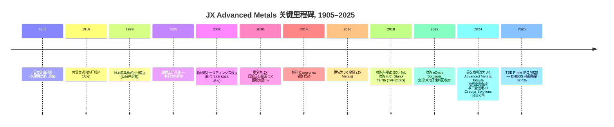
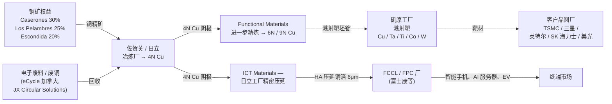
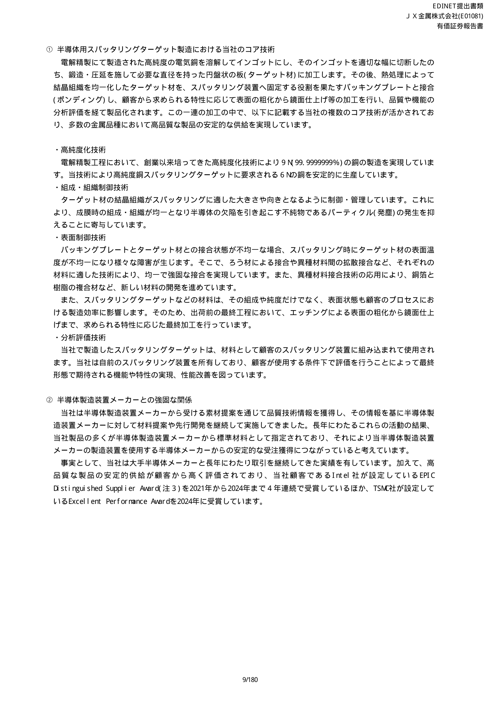
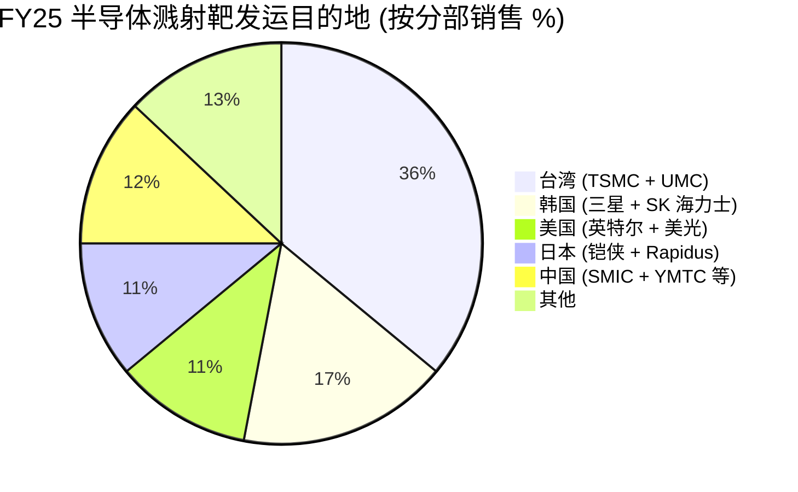
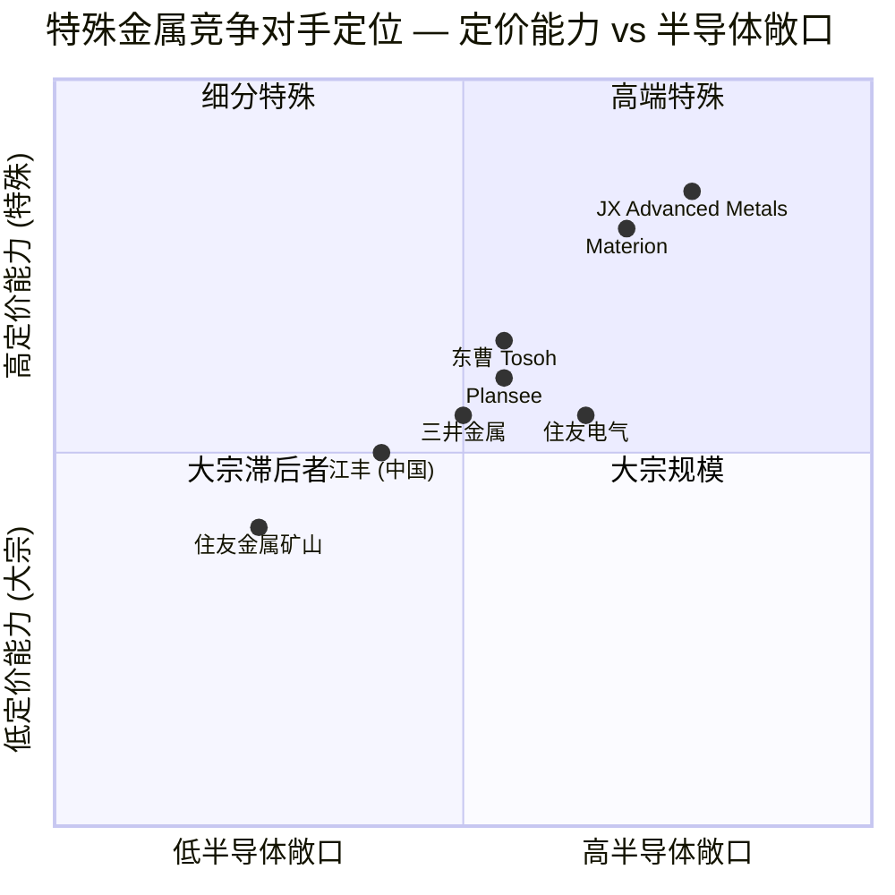

# JX Advanced Metals Corporation (JX 金属株式会社, TSE: 5016) — 公司研究

*截至 2026-05-26 · 简体中文版（日本上市；主要披露文件为日文 — EDINET 有価証券報告書 第23期 — 公司至今未发布英文版年度证券报告，因此本报告引用均指向 disclosure2dl.edinet-fsa.go.jp 上的日文 有価証券届出書 / 有価証券報告書 PDF 与公司 IR 网站 jx-nmm.com）*

---

## 目录

1. 公司概览
2. 公司历史
3. 管理团队
4. 产品与服务
5. 客户与上市策略
6. 行业概览
7. 竞争格局
8. 市场机会 (TAM)
9. 风险评估
10. 参考资料
11. 核查日志

---

## 1. 公司概览

JX Advanced Metals Corporation（JX 金属株式会社，TSE Prime 5016）是 **ENEOS Holdings 母公司**（**ENEOS Holdings**, parent post-IPO stake — 上市后仍持 42.38% 股份的 TSE: 5020 母公司）剥离出来的子公司，**2025-03 IPO**（**从 ENEOS 控股拆分** — 2025 年 3 月 19 日东京证交所 Prime 市场挂牌），按 ¥820 IPO 定价募集资金约 ¥2,600 亿（约合 USD 26 亿），成为 **日本自 2018 年 12 月 SoftBank Corp. 以来规模最大的 IPO**（[Renaissance Capital — JX Advanced Metals raises $2.6 bn in Japan's largest IPO since 2018, 2025-03-19](https://www.renaissancecapital.com/IPO-Center/News/109883/Going-for-gold-JX-Advanced-Metals-raises-$2.6-billion-in-Japan%E2%80%99s-largest-IP)；[JX Advanced Metals 有価証券報告書 第23期, p.6](https://disclosure2dl.edinet-fsa.go.jp/searchdocument/pdf/S100W549.pdf)）。然而，新代码背后的经营实体早在 **1905 年 12 月 1 日日立矿山开采** 以来便持续为电子产业供应高纯度金属——公司延续了 120 年冶金传承，远早于其今日所有半导体客户的成立（[JX Advanced Metals 有価証券報告書 第23期, p.5 (沿革)](https://disclosure2dl.edinet-fsa.go.jp/searchdocument/pdf/S100W549.pdf)）。

公司在 IPO 招股说明书和首份独立 Yuho（有価証券報告書）中使用刻意收窄的措辞自我定位为——*"JX 集团从事以铜与稀有金属为基础、对半导体与信息通信领域不可或缺的先进材料的研发、制造与销售，以 **半导体溅射靶 (semiconductor sputter target — 全球 64% 份额)** 与 **处理压延铜箔 (rolled-annealed copper foil, RA Cu — 78% 份额)** 为核心产品"*（直译自 第23期 有価証券報告書 第 7 页，[JX Advanced Metals 有価証券報告書 第23期, p.7](https://disclosure2dl.edinet-fsa.go.jp/searchdocument/pdf/S100W549.pdf)）。集团按 **三个业务分部 (Functional Materials / ICT Materials / Basic Metals)** 进行报告，将前两者合称为 **"重点业务" (Focus Business)**，而 Basic Metals 则被定位为 **"基础业务" (Base Business) — 主要功能是向重点业务输送清洁铜和稀有金属**（[JX Advanced Metals 有価証券報告書 第23期, pp.7-8](https://disclosure2dl.edinet-fsa.go.jp/searchdocument/pdf/S100W549.pdf)）。

**FY25（截至 2025 年 3 月的财年）IFRS 营收 ¥7,149 亿，同比下滑 52.7%**——但这 50%+ 的表观骤降完全源自前期完成的两项剥离：2024 年 3 月将 Pan Pacific Copper (PPC) 20% 股权出售给丸红，使 JX 持股跌破合并门槛；以及 **Caserones 智利铜矿运营公司 (MLCC) 分阶段转让给加拿大 Lundin Mining**（2023 年 7 月先转让 51%、2024 年 7 月再转让 19%，累计转让 70%）。两宗交易将原本全资或控股的合并子公司转为权益法关联公司，相关收入因此从合并报表的顶线中剥离（[JX Advanced Metals 有価証券報告書 第23期, p.6 (沿革 — Caserones / PPC 转让)](https://disclosure2dl.edinet-fsa.go.jp/searchdocument/pdf/S100W549.pdf)）。营业利润反而**升至 ¥1,125 亿（15.7% 利润率）**，高于上年的 ¥862 亿，归母净利润达 ¥683 亿——剔除两项剥离后底层重点业务实际仍处于持续上行周期，顶线营收数据在 FY26 可比数据消化前会带来误导（[JX Advanced Metals 有価証券報告書 第23期, pp.2, 38, 40](https://disclosure2dl.edinet-fsa.go.jp/searchdocument/pdf/S100W549.pdf)）。

FY25 分部拆分如下：**Functional Materials（半导体溅射靶、Ta/Nb 粉末、化合物半导体晶圆）对外营收 ¥1,474 亿、营业利润 ¥267 亿；ICT Materials（压延铜箔、东邦钛、Tatsuta 电线）营收 ¥2,609 亿、营业利润 ¥251 亿；Basic Metals（铜冶炼/回收 + 权益法矿业收益）营收 ¥3,041 亿、营业利润 ¥745 亿**（[JX Advanced Metals 有価証券報告書 第23期, p.105 (注记 7 セグメント情報)](https://disclosure2dl.edinet-fsa.go.jp/searchdocument/pdf/S100W549.pdf)）。Basic Metals 营业利润被分部内的 ¥610 亿权益法收益（主要来自已剥离的 PPC 与剩余 Caserones / Los Pelambres / Escondida 股权）拉高，因此剔除影响后，重点业务 (Focus segments) 在收入仅占 57% 的情况下贡献约 **集团底层营业利润的三分之二**（[JX Advanced Metals 有価証券報告書 第23期, p.105](https://disclosure2dl.edinet-fsa.go.jp/searchdocument/pdf/S100W549.pdf)）。

地理上公司以日本为大本营（FY25 末非流动资产日本境内 ¥3,055 亿 vs 境外 ¥943 亿），但 Functional Materials 营收主要分布在亚洲——FY25 半导体溅射靶销售额 **台湾约 36%、韩国 17%、美国 11%、日本 11%、中国 12%、其他 13%**，准确反映 TSMC / 三星电子 / SK 海力士 / 英特尔 / 美光 / 铠侠等先进制程晶圆厂的实际消耗地（[JX Advanced Metals 有価証券報告書 第23期, p.9](https://disclosure2dl.edinet-fsa.go.jp/searchdocument/pdf/S100W549.pdf)）。集团生产/下游加工基地分布在 **日本日立、矶原、常陆那珂、仓见；美国亚利桑那州 Mesa（2024 年 11 月投产的半导体溅射靶后段工厂）；台湾龙潭；韩国平泽；中国苏州；菲律宾 Laguna；德国 Goslar (TANIOBIS)；加拿大 Mississauga (eCycle)；以及新加坡和美国设有贸易办事处**（[JX Advanced Metals 有価証券報告書 第23期, pp.15-16, 45-46 (関係会社・設備の状況)](https://disclosure2dl.edinet-fsa.go.jp/searchdocument/pdf/S100W549.pdf)）。2025 年 Yuho 披露 **合并员工 10,413 人**（Functional Materials 2,442 人、ICT Materials 4,275 人、Basic Metals 1,869 人、其他/公司职能 1,827 人）（[JX Advanced Metals 有価証券報告書 第23期, p.17](https://disclosure2dl.edinet-fsa.go.jp/searchdocument/pdf/S100W549.pdf)）。

**ENEOS Holdings 母公司** (parent post-IPO stake) 仍是最大股东，IPO 后持股 **42.38%**（上市前为 100%），在 第23期 披露中 ENEOS 的身份从 "亲会社"（parent company）重新归类为 "その他の関係会社"（其他关联方），分类变更日期为 2025 年 3 月 19 日——日本会计准则中该比例之下不再适用母公司定义（[JX Advanced Metals 有価証券報告書 第23期, p.16 (関係会社の状況 — その他の関係会社)、p.37 (リスク 15. 役員・大株主・関係会社等)](https://disclosure2dl.edinet-fsa.go.jp/searchdocument/pdf/S100W549.pdf)）。公司治理披露还显示，11 名董事中有 5 位独立外部董事，提名薪酬咨询委员会以外部董事为多数并由外部董事担任主席——符合 TSE Prime 上市的治理要求（[JX Advanced Metals 有価証券報告書 第23期, p.37](https://disclosure2dl.edinet-fsa.go.jp/searchdocument/pdf/S100W549.pdf)）。

*资料来源：编自 [JX Advanced Metals 有価証券報告書 第23期, p.2 (主要な経営指標等の推移)](https://disclosure2dl.edinet-fsa.go.jp/searchdocument/pdf/S100W549.pdf)。FY25 营收悬崖式下跌反映 PPC + MLCC 剥离，并非有机滑坡；营业利润持续复合增长。*

*资料来源：[JX Advanced Metals 有価証券報告書 第23期, p.105 (注記 7. セグメント情報)](https://disclosure2dl.edinet-fsa.go.jp/searchdocument/pdf/S100W549.pdf)。对外客户营收：Functional Materials ¥1,474 亿、ICT Materials ¥2,609 亿、Basic Metals ¥3,041 亿、其他 ¥26 亿。*

**估值快照（截至 2026 年 5 月底）。** 2026 年 5 月 26 日收盘价 **¥4,195 / 股**，JX Advanced Metals 市值约 **¥3.7 万亿（约合 USD 240 亿，按 ¥154/USD 计算）**，**滚动 TTM EPS 约 ¥113**——隐含 **TTM P/E 约 35.4 倍**，股息收益率约 0.9%（FY25 全年 DPS ¥109.55，其中中期 ¥91.55 系 IPO 前剥离分红，期末 ¥18 为上市后首次普通分红）（[Stockanalysis.com — TYO:5016 公司概况, 2026-05](https://stockanalysis.com/quote/tyo/5016/company/)；[JX Advanced Metals 有価証券報告書 第23期, p.3 (提出会社の経営指標等 — 一株当たり配当額 109円55銭)](https://disclosure2dl.edinet-fsa.go.jp/searchdocument/pdf/S100W549.pdf)）。该股 **2026 年 5 月 11 日触及 52 周高点 ¥5,828** 后回落，目前价格相对 IPO 价 ¥820 已 **上涨约 5 倍**，仅用了 14 个月的交易时间（[TradingView — TSE:5016 行情, 2026-05](https://www.tradingview.com/symbols/TSE-5016/)；[Stockanalysis.com — TYO:5016, 2026-05](https://stockanalysis.com/quote/tyo/5016/)）。

**35 倍 TTM P/E 约为日本有色金属同业中位数的 2-3 倍**——东曹 (TSE: 4042) 约 12 倍、三井金属 (TSE: 5706) 约 11 倍、住友金属矿山 (TSE: 5713) 约 18 倍、Resonac (TSE: 4004) 约 18 倍。唯一接近的非铁同业是 **Materion (NYSE: MTRN) 约 22 倍**——美国高纯度金属类的最贴近可比公司（[Yahoo Finance — TSE 4042/5706/5713/4004 + NYSE MTRN, 2026-05](https://finance.yahoo.com/quote/4042.T/)）。*分析师观点：* 这一溢价的最佳解释方式是市场实际上将 Functional Materials 分部独立重估——溅射靶全球第一的特许经营地位被 [野村 "Greater China Semi 2026–30F" 2026-05-21](file:///Users/x/projects/financial_agent/reports/sector/半导体材料.md) 报告 Fig 44（溅射材料份额排名）列为榜首，并直接受益于 2027F TSMC 1.6nm HVM 量产、**背面供电 (BPD, Backside Power Delivery)** 晶圆键合环节（额外 Cu / Ta / W 溅射步骤）、SiPh / CPO 的 InP 紧供周期，以及 Mesa AZ + Rapidus 的材料供应机会——该子分部隐含估值约 45-55 倍，而 Basic Metals 铜冶炼利润流仅按权益法利润的 7-8 倍估值（[reports/sector/半导体材料.md — 野村 2026-05-21, Fig 44 排行榜](file:///Users/x/projects/financial_agent/reports/sector/半导体材料.md)；[TrendForce — JX Advanced Metals plans ¥5bn Rapidus 投资 + 关键材料供应, 2026-01-21](https://www.trendforce.com/news/2026/01/21/news-jx-advanced-metals-reportedly-plans-%C2%A55b-investment-in-rapidus-along-with-critical-materials-supply/)）。当前估值倍数已显著拉伸；任何 AI 服务器资本开支周期波动、中国厂商在半导体溅射靶意外抢占份额、或 InP 供给正常化都会导致 P/E 急剧收缩——在 §9 中列为支配性的估值/倍数压缩风险。

---

## 2. 公司历史

JX Advanced Metals 是一条从 **1905 年 12 月 1 日企业家久原房之助在茨城县开采日立矿山** 开始的冶金血脉的最新法人形态：自此经 **1912 年 9 月久原矿业公司设立**、**1929 年 4 月日本鉱業株式会社成立**（久原的采矿与冶炼业务从日本产业公司剥离）以及一连串企业更名，最终在 2025 年 3 月 19 日完成 TSE Prime 挂牌（[JX Advanced Metals 有価証券報告書 第23期, pp.5-6 (沿革)](https://disclosure2dl.edinet-fsa.go.jp/searchdocument/pdf/S100W549.pdf)）。位于大分县海岸的佐贺关铜冶炼厂始建于 1916 年 9 月，至今仍是集团最大的代客冶炼厂，按 [国际铜研究小组 "World Copper Factbook 2024"](https://icsg.org/copper-factbook/) 的统计也是全球单厂规模最大的铜冶炼厂之一；日立工厂随后扩建炼制和（1978 年）回收产能，奠定了今日 Basic Metals 分部的基础（[JX Advanced Metals 有価証券報告書 第23期, p.5](https://disclosure2dl.edinet-fsa.go.jp/searchdocument/pdf/S100W549.pdf)）。

从 "矿业商" 转型为 "特殊材料供应商" 的关键起点是 **1985 年 5 月在茨城县开设的矶原工厂**——为扩大电子材料业务而建，今日 JX 的半导体溅射靶仍由该工厂生产，目前正在扩建至 FY28 达到 FY24 产能的 ~1.5 倍（[JX Advanced Metals 有価証券報告書 第23期, pp.5, 21 (磯原工場・新工場ひたちなか)](https://disclosure2dl.edinet-fsa.go.jp/searchdocument/pdf/S100W549.pdf)）。今日 TSE 5016 代码所对应的法人实体——**新日鉱ホールディングス**（Shin Nippon Mining Holdings）——成立于 **2002 年 9 月 2 日**，由日本能源株式会社与旧日鉱マテリアルズ通过股份转让合并而成；该控股公司 **2010 年 7 月 1 日更名为 JX 日鉱日石金属**，标志着 JX 控股（今 ENEOS Holdings）经由日本石油的股份转让合并诞生（[JX Advanced Metals 有価証券報告書 第23期, p.6 (沿革, 2002 / 2010 entries)](https://disclosure2dl.edinet-fsa.go.jp/searchdocument/pdf/S100W549.pdf)）。2016 年 1 月简化为 **JX 金属 (JX Metals)**，**2024 年 5 月英文商号改为 "JX Advanced Metals Corporation"**——明确为 IPO 前重新定位铺路：从铜与资源公司转型为先进电子材料平台（[JX Advanced Metals 有価証券報告書 第23期, p.6 (2024年5月 英文商号変更)；JX Advanced Metals — Change in English-Language Trade Name 新闻稿, 2024-05-14](https://www.jx-nmm.com/english/newsrelease/fy2024/20240514_02.html)）。

三大战略转折定义了现代 JX。**第一，2018 年东邦钛 / TANIOBIS 双重收购**（2018 年 5 月以约 ¥350 亿购入 [东邦钛 (TSE: 5727)](https://www.toho-titanium.co.jp/en/) 50.38% 股权；2018 年 7 月以约 €6 亿购入德国 H.C. Starck 的钽铌业务 H.C. Starck Tantalum & Niobium GmbH），将海绵钛、超细镍粉与钽 / 铌粉末纳入平台——钽粉业务正是 JX 能够端到端供应钽溅射靶和钽电容材料的关键（[JX Advanced Metals 有価証券報告書 第23期, p.6 (2018 entries)；H.C. Starck Solutions 企业主页](https://www.hcstarcksolutions.com/)）。**第二，2023–24 年向 Lundin Mining 分阶段剥离 Caserones / Los Pelambres 智利铜矿** Caserones 智利铜矿——JX 于 2023 年 7 月先转让 51%、2024 年 7 月通过看涨期权再转让 19%，最终保留 30% 的非运营权益——明确目的是为 IPO 前将资本重新聚焦到重点业务（[Lundin Mining — Lundin completes acquisition of additional 19% interest in Caserones, 2024-07-29](https://lundinmining.com/news/lundin-mining-completes-acquisition-of-an-additional-19-int-123-tjbjxn1g/)）。**第三，2024 年 8 月通过要约收购将 Tatsuta 电线（タツタ電線）私有化**——为 ICT Materials 分部增加 FPC 用电磁屏蔽膜、半导体封装用导电浆和键合线，并在 2024 年 11 月完成全资合并（[JX Advanced Metals 有価証券報告書 第23期, p.6 (2024年8月 タツタ電線株式公開買付 entry)；JX Advanced Metals — Notice Regarding Results of Tender Offer for Shares of TATSUTA Electric Wire, 2024-08-20](https://www.jx-nmm.com/english/newsrelease/fy2024/20240820_02.html)）。

IPO 本身由 **大和证券、JP Morgan、Morgan Stanley MUFG 和瑞穗** 联合承销——定价 ¥820（下调后区间 ¥820–860 的上限），按发行价对应估值约 ¥7,600 亿 / USD 51 亿（截至 2026 年 5 月 26 日已重估至 ¥3.7 万亿）（[MarketScreener — Eneos plans $3 bn IPO of metals subsidiary — Update, 2025-03-10](https://www.marketscreener.com/quote/stock/ENEOS-HOLDINGS-INC-6500951/news/Eneos-Plans-3-Billion-IPO-of-Metals-Subsidiary-Update-49283362/)；[Reuters via Investing.com — Eneos Holdings to list metals subsidiary, aims to raise $3 bn, 2025-03](https://www.investing.com/news/stock-market-news/eneos-holdings-to-list-metals-subsidiary-aims-to-raise-3-billion-93CH-3869772)）。ENEOS 保留 42.4%——限制 IPO 自由流通市值约 **¥3,200 亿（不含绿鞋）**——并为母公司剩余股份设置自 IPO 日起 90 天的锁定期；ENEOS 将 IPO 募资用于加快股东回报和脱碳投资（[Eneos Holdings — Notice Concerning Sale of Shares of Subsidiary, 2025-02-14, via IR Bank EDINET archive](https://irbank.net/E01081/edinet)）。

---

## 3. 管理团队

JX Advanced Metals 并非创始人主导——日立矿山的原始创始人久原房之助于 1965 年逝世——因此本节相关传记仅限于现任 CEO。

**林陽一（Hayashi Yoichi）**，生于 **1965 年 2 月 5 日（截至 2026-05-26 60 岁）**，自 **2023 年 4 月 1 日起担任 JX Advanced Metals 代表取締役社长 / CEO**，在同一冶金集团内连续工作 37 年，**1988 年 4 月毕业后直接进入日本鉱業株式会社**（[JX Advanced Metals 有価証券報告書 第23期, p.64 (役員の状況 — 林陽一)](https://disclosure2dl.edinet-fsa.go.jp/searchdocument/pdf/S100W549.pdf)）。他的职业路径几乎全部在战略 / 规划而非生产线运营——与工程出身、主导技术集团的 Sugawara Shizuo 副 CEO 形成对比：

- **2019 年 4 月** — 出任 JX 金属（前身实体）执行役员，主管企业规划部、研究部、企业规划室；
- **2020 年 4 月 / 2020 年 10 月** — 执行役员，分管范围扩大至物流和新设立的 ESG 推进室；
- **2021 年 4 月** — 晋升 **取締役 常務執行役員**，主管企业规划、ESG、会计和物流；
- **2022 年 4 月** — 取締役 常務執行役員，职责保持并新增项目推进总部顾问（即筹备 IPO 的企业载体）；
- **2023 年 4 月 1 日** — 出任 **代表取締役社長 社長執行役員**——即今日所任职位（[JX Advanced Metals 有価証券報告書 第23期, p.64](https://disclosure2dl.edinet-fsa.go.jp/searchdocument/pdf/S100W549.pdf)）。

Yuho 披露林陽一直接持有 **JX Advanced Metals 19,000 股**（按 2026 年 5 月股价计约 ¥8,000 万——可观但远未达创始人规模），并参与 2025 年 6 月 27 日股东大会通过的业绩挂钩股权激励计划（[JX Advanced Metals 有価証券報告書 第23期, pp.64, 78-79 (役員の状況 / 株式報酬制度)](https://disclosure2dl.edinet-fsa.go.jp/searchdocument/pdf/S100W549.pdf)）。业绩挂钩部分针对执行役员的考核权重为 **合并营业利润 40% + 净债务/EBITDA 40% + 个人评估 20%**；针对代表取締役则为 **营业利润 50% + 净债务/EBITDA 50%，无个人评估部分**——这是一种纯粹按集体业绩支付的薪酬设计（[JX Advanced Metals 有価証券報告書 第23期, p.81](https://disclosure2dl.edinet-fsa.go.jp/searchdocument/pdf/S100W549.pdf)）。中长期股权激励的拆分为：营业利润 30% + ROE 30% + TSR vs TOPIX 30%，剩余 10% 取决于安全 / 员工敬业度 / ESG（[JX Advanced Metals 有価証券報告書 第23期, p.81](https://disclosure2dl.edinet-fsa.go.jp/searchdocument/pdf/S100W549.pdf)）。

林陽一上任两年的 CEO 任期几乎全部投入 IPO 筹备（公司治理大改、2024 年 9 月从 ENEOS 共享服务迁移到独立财务系统、自第 21 期 (FY 截至 2023 年 3 月) 起采用 IFRS 准则）和重点业务的产能扩张——最显眼的是 **常陆那珂新工厂**（2024 年宣布、目前在建、首期投产目标 FY26）、**美国亚利桑那州 Mesa 半导体溅射靶工厂**（2024 年 11 月投产）以及 **2025 年 10 月宣布的矶原 InP 衬底产能扩张**（约 ¥33 亿投资、相对 2025 年产能新增约 50%）（[JX Advanced Metals 有価証券報告書 第23期, p.21 (生産能力 1.6倍計画)；Semiconductor Today — JX making further investment to increase InP substrate production, 2025-10-09](https://www.semiconductor-today.com/news_items/2025/oct/jx-091025.shtml)；[AInvest — JX Advanced Metals' ¥3.3bn InP Substrate Expansion, 2025-10](https://www.ainvest.com/news/jx-advanced-metals-3-3-billion-yen-inp-substrate-expansion-strategic-catalyst-semiconductor-supply-chain-dominance-2510/)）。其战略效果迄今可量化：FY25 营业利润超目标（实际 ¥1,125 亿 vs 目标 ¥954 亿，达成率 117%），触发短期激励 100% 派发（[JX Advanced Metals 有価証券報告書 第23期, p.81 (2025年3月期業績目標達成率)](https://disclosure2dl.edinet-fsa.go.jp/searchdocument/pdf/S100W549.pdf)）。

---

## 4. 产品与服务

本节直接承载 JX 的投资逻辑：公司作为 **全球第一的半导体溅射靶供应商**（直译自公司自身 Yuho 引用 富士经济 2023 年实绩，剔除铝系靶材）的地位，正是 35 倍 TTM P/E 的根本依据，也将该业务连接到 [野村 "Greater China Semi 2026–30F" 2026-05-21](file:///Users/x/projects/financial_agent/reports/sector/半导体材料.md) 报告所指认的本十年下半段七大 AI 驱动技术拐点——GAA、1.6nm HVM、BPD、SoIC、SiPh / CPO、HBM4、2.5D / 3D 封装——的核心材料供应主轴。

### 4.1 2025 年 Yuho 自身的产品矩阵

首份独立 Yuho 在第 7 页以三分部矩阵 (Functional Materials / ICT Materials / Basic Metals) 披露集团产品组合，与注记 7 的分部财务数据严格对应。下图为第 23 期 有価証券報告書 第 7 页内容直接扫描复刻。

*资料来源：[JX Advanced Metals 有価証券報告書 第23期, p.7 (3 事業の内容 — 区分・セグメント・事業部・主要製品・主要な会社)](https://disclosure2dl.edinet-fsa.go.jp/searchdocument/pdf/S100W549.pdf)。原文为日文；下方 markdown 复刻便于检索。*

| 区分 (Bucket) | 分部 (Segment) | 事业部 / 子公司 | 主要产品 | 主要公司 |
|---|---|---|---|---|
| Focus Business | **Functional Materials** | 薄膜材料事業部 | 半导体溅射靶、高纯度金属、**表面处理化学品 (surface treatment chemicals)**、化合物半导体 / 结晶材料 | JX 母公司、JX Advanced Metals USA、JX Advanced Metals Singapore、JX Advanced Metals Korea、JX Metals Trading、Taiwan Nikko Metals |
| Focus Business | Functional Materials | タンタル・ニオブ事業部 | Ta/Nb 金属粉末、Ta/Nb 氧化物粉末、氯化物 / 化合物 | JX、TANIOBIS GmbH (Goslar, 德国)、东京电解 |
| Focus Business | **ICT Materials** | 機能材料事業部 | 处理压延铜箔 (RA Cu)、钛铜 (Ti-Cu, 用于 AI 服务器连接器)、Corson 合金 (Cu-Ni-Si) | JX、JX METALS PHILIPPINES、苏州日鉱金属、JX Metals Trading、Taiwan Nikko Metals |
| Focus Business | ICT Materials | 东邦钛（子公司） | 超细镍粉、高纯度氧化钛、催化剂产品、海绵钛、钛锭 | 东邦钛 (TSE: 5727) |
| Focus Business | ICT Materials | Tatsuta 电线（子公司） | EMI 屏蔽膜、导电浆料、键合线、基础设施 / 工业电线 | Tatsuta 电线（原 TSE: 5809；现已全资） |
| Base Business | **Basic Metals** | 資源事業部 | 铜精矿、电解铜、钼精矿、含金硅酸矿、钽精矿 | JX、SCM Minera Lumina Copper Chile (Caserones, 30%)、Minera Los Pelambres (25%)、Minera Escondida (经由 Geco K.K., 20%) |
| Base Business | Basic Metals | 金属・リサイクル事業部 | 电解铜、铜锭、贵金属、硫酸 | JX、JX Nippon Mining & Metals Smelting (佐贺关 / 日立)、Pan Pacific Copper (PPC, 47.8% 权益法)、JX Circular Solutions (与三菱商事 80% 合资)、eCycle Solutions (加拿大) |

[资料来源：JX Advanced Metals 有価証券報告書 第23期, p.7, 表格直接复刻](https://disclosure2dl.edinet-fsa.go.jp/searchdocument/pdf/S100W549.pdf)。

### 4.2 综合解读 — 产品类别之间如何互动

三个分部串联成一个垂直整合的冶金闭环：**Caserones / Los Pelambres / Escondida** 智利铜矿（Basic Metals — 资源部，权益法投资）输出的 **上游铜精矿** 流入佐贺关 / 日立冶炼厂（Basic Metals — 金属・リサイクル事業部）生产 **99.99% 电解铜 (4N Cu)**；该 4N Cu 进入 Functional Materials 分部进一步精炼到 **6N 或 9N 纯度**（Yuho 披露 9N = 99.9999999% 为可达成上限），并锻造为溅射靶坯锭（[JX Advanced Metals 有価証券報告書 第23期, p.9 (9N 銅の製造能力)](https://disclosure2dl.edinet-fsa.go.jp/searchdocument/pdf/S100W549.pdf)）。剩余冶金产能则进入日立厂的 **精密压延 (precision rolling)** 生产线，生产用于 FPC / FCCL 的 **6 微米压延铜箔**——ICT Materials 的旗舰产品。整个铜回收闭环由 JX Circular Solutions（与三菱商事的合资公司）完成电子废料回收——JX 自定的 2040 年目标是 **佐贺关冶炼厂回收料投料比例提升到 50%**（[JX Advanced Metals 有価証券報告書 第23期, p.12 (グリーンハイブリッド製錬 / リサイクル原料比率 50% 目標)](https://disclosure2dl.edinet-fsa.go.jp/searchdocument/pdf/S100W549.pdf)）。

垂直整合是 JX 产品定位最关键的事实。**西方特殊材料同业中，唯一拥有可比的上游到下游铜 / Cu 靶材闭环的是三井金属**——Materion、东曹、ULVAC 和 Plansee 都需要外购铜原料。这一闭环将铜价波动主要消化在 Basic Metals 分部（铜价同时也是该分部的营收驱动因子），让 Functional Materials 的成本端不受冲击，并为 AI 服务器建设时代提供了完整的可溯源 / 供应安全叙事——这正是 JX **连续四年获得英特尔 EPIC Distinguished Supplier Award（2021、2022、2023、2024）以及 2024 年获得 TSMC Excellent Performance Award** 的价值主张，两项奖励均在 Yuho 第 9 页直接列出（[JX Advanced Metals 有価証券報告書 第23期, p.9](https://disclosure2dl.edinet-fsa.go.jp/searchdocument/pdf/S100W549.pdf)）。

### 4.3 Functional Materials — 半导体溅射靶（旗舰）

> "高純度化や組成・組織制御などの当社のコア技術を駆使し、半導体や磁性材料向けのスパッタリングターゲットをはじめ、各種高機能デバイス、最先端IT機器、医療機器、電気自動車に用いられる製品をグローバルに展開しています。中でも、ロジックやメモリに用いられる半導体用スパッタリングターゲットが主力製品であり、市場規模1,462億円のマーケットにおいて世界シェアは64％(注１)です。当社は様々な素材の半導体用スパッタリングターゲットを取り扱っており、半導体の主要配線層に用いられる銅や銅合金、そのバリア層に用いられるタンタルに加えて、半導体の回路形成やトランジスタ部分等に用いられるチタン、コバルト及びタングステンの製品で世界シェアNo.１です(注２)。"
>
> — 直引自 [JX Advanced Metals 有価証券報告書 第23期, p.8 (薄膜材料事業部)](https://disclosure2dl.edinet-fsa.go.jp/searchdocument/pdf/S100W549.pdf)。中文译：*"我们运用高纯度化与组成 / 组织控制等核心技术，全球化提供面向半导体与磁性材料的溅射靶，以及用于各种高性能器件、最尖端 IT 设备、医疗器械、电动汽车的相关产品。其中，用于逻辑和存储的半导体溅射靶是核心产品：在 **¥1,462 亿** 的市场规模中，我们 **全球份额为 64%**（注 1）。我们覆盖多种材质的半导体溅射靶，并在 **用于主要互连层的铜与铜合金、用于互连层阻挡层的钽、以及用于电路形成 / 晶体管部分的钛、钴、钨产品上排名全球第一**（注 2）。"* 注 1/2 均引用富士经济《2024 半导体材料市场现状与展望》（2023 年实绩，剔除铝系，销售额基准），按 2023 年末汇率 ¥141/USD 换算。

**中文释义 / 通俗解读：****半导体溅射靶 (semiconductor sputter target — 全球 64% 份额)** 是放置在晶圆厂 **物理气相沉积 (PVD, Physical Vapor Deposition)** 腔体内、由高纯度金属制成的圆盘 / 板材。在生产中，离子束（通常为氩离子）轰击靶材使原子被溅射出来，随后在下方硅晶圆上重新沉积为厚度从几纳米到几百纳米的薄膜（[JX Advanced Metals 有価証券報告書 第23期, p.8](https://disclosure2dl.edinet-fsa.go.jp/searchdocument/pdf/S100W549.pdf)）。晶圆需要：**铜 / 铜合金互连层** 来承载晶体管之间的信号、**钽 (Ta) 阻挡层** 防止铜扩散入硅而毒化晶体管、以及晶体管层面的 **钛 / 钴 / 钨触点和栅极层**。*分析师观点：* JX 生产其中每一种金属靶——按 [野村 sector report 2026-05-21 供应商排行榜](file:///Users/x/projects/financial_agent/reports/sector/半导体材料.md)，是全球极少数同时拥有 "互连 + 阻挡 + 触点" 全套产品线的溅射靶供应商。从冶炼厂产出的 LME 铜（约 99.99% 纯，"4N"）到溅射靶，还需多次纯度提升（到 99.9999%——"6N"——某些情况下高达 **99.9999999%，"9N"**，是公司自述的可达成上限），加上靶内晶粒控制，确保 **整片晶圆的溅射速率和薄膜均匀性控制在单纳米精度**（[JX Advanced Metals 有価証券報告書 第23期, p.9 (組成・組織制御技術 / 表面制御技術 / 分析評価技術)](https://disclosure2dl.edinet-fsa.go.jp/searchdocument/pdf/S100W549.pdf)）。战略拐点是 **2027 年之后的逻辑制程节点切换**——一旦 TSMC 进入 1.6 nm HVM、英特尔进入 18A / 14A 并采用 **背面供电 (BPD, Backside Power Delivery)**——每片晶圆的金属互连层数将从今日的 13–15 层升至 20+ 层，而 BPD 本身需要在晶圆背面增加一层铜互连——两者都直接增加 **单片晶圆的金属溅射用量 (毫克级)**。野村报告将此量化为 "**N1.6 / A16 增加 20–30% 额外的 CMP 步骤和相应比例的溅射靶用量**"（[reports/sector/半导体材料.md — 野村 2026-05-21, 3D Transistor + BPD section, p.6-9](file:///Users/x/projects/financial_agent/reports/sector/半导体材料.md)）。

*资料来源：[JX Advanced Metals 有価証券報告書 第23期, p.9 (薄膜材料事業部 — 高純度化 / 組成・組織制御 / 64% 世界シェア)](https://disclosure2dl.edinet-fsa.go.jp/searchdocument/pdf/S100W549.pdf)。直接复刻日文原文以保留 64% 全球份额、Intel EPIC 奖、TSMC Excellent Performance 奖等关键披露。*

*分析师观点：* 铜溅射靶最贴近的竞争对手是 **三井金属 (TSE: 5706)**，通过其 [溅射靶材产品线](https://insulectro.com/mitsui-kinzoku/)（三井电子业务，溅射靶单独收入未单列）。钽溅射靶的第二来源是 **Materion (NYSE: MTRN)** 的 [半导体材料业务部](https://www.materion.com/en/markets/semiconductor)；JX 通过持有 TANIOBIS（原 H.C. Starck Ta/Nb 业务）和东京电解（2022 年收购）实现钽粉后向整合，可显著缩短交期并形成护城河——TANIOBIS 的年度钽采购约 20% 来自 JX 自身权益投资的 **巴西 Mibra 矿**（2023 年 3 月入股）（[JX Advanced Metals 有価証券報告書 第23期, p.10 (TANIOBIS / 東京電解 / Mibra鉱山)](https://disclosure2dl.edinet-fsa.go.jp/searchdocument/pdf/S100W549.pdf)；[Mining Weekly — search results for JX Nippon Mibra mine, 2023-03](https://www.miningweekly.com/searchgcse.php?q=jx+nippon+mibra)）。钛 / 钴 / 钨靶方面，按 Materion 与东曹的 [薄膜沉积材料目录](https://www.tosoh.com/our-products/advanced-materials/thin-film-deposition-materials) 显示主要替代来源为东曹和 ULVAC——均不披露份额，Yuho 64% 这一数字是整个剔除铝系类别中唯一公开锚点。

### 4.4 Functional Materials — InP、CdZnTe、CVD/ALD 前驱体（下一代产品管线）

JX 化合物半导体晶圆业务隶属薄膜材料事業部，是公司最直接暴露于 **SiPh / CPO（硅光子 / 共封装光学）量产** 的产品线——野村 sector report 将其判断为 **2026–2028 年 InP 衬底紧供给的超级周期**。Yuho 原文描述如下：

> "当社は、長年培った高純度化、表面制御、組成、分析評価等の技術を活かした次世代の収益の柱の確立に取り組んでいます。具体的には、データセンターやモバイル通信量の増加により成長が予想されているInP(インジウムリン)や防衛・メディカルなどの分野での成長が期待されるCdZnTe(カドミウムジンクテルル)といった結晶材料の事業規模拡大を目指しています。"
>
> — 直引自 [JX Advanced Metals 有価証券報告書 第23期, p.22 (③ 次世代のグローバルトップシェア製品の開発)](https://disclosure2dl.edinet-fsa.go.jp/searchdocument/pdf/S100W549.pdf)。中文译：*"我们结合长期积累的高纯度化、表面控制、成分控制和分析评估技术，致力于打造下一代利润支柱。具体而言，我们瞄准 InP（**磷化铟 (InP substrate)** — 受数据中心和移动通信流量增长驱动）和 CdZnTe（镉锌碲——国防与医疗应用增长）等晶体材料的业务规模扩张。"*

**中文释义 / 通俗解读：****磷化铟 (InP substrate)** 是 **III-V 族化合物半导体**，在 1310 nm 和 1550 nm 长距离光纤通信波长上的发光与探测效率远高于硅。每一个进入超大规模 AI 服务器集群的 **800G / 1.6T 光模块** 中都至少包含一个 **EML (电吸收调制激光器)** 或 **CW (连续波) DFB 激光器**，均在 2 / 3 / 4 英寸的 InP 衬底上制造（[JX Advanced Metals — InP Substrates 产品页](https://www.jx-nmm.com/english/products/compound_semiconductors_and_crystal_materials/inp/)）。JX 制造 InP 已 **超过 40 年**，是全球 **少数几家供应商之一**，与住友电气和 AXT（中国制造）并列。野村 sector report 称 InP 衬底为 **整条光模块价值链上供应最紧张的单一材料**——50% 的晶圆良率（晶体生长环节难度极高）、中国于 2024 年末实施的铟金属出口管制、以及 12+ 个月的 MOCVD 外延设备交货周期共同导致（[reports/sector/半导体材料.md — 野村 2026-05-21, InP section, p.11-12, 60-65](file:///Users/x/projects/financial_agent/reports/sector/半导体材料.md)）。JX 在 2025 年 **连续宣布两次 InP 产能扩张**：2025 年 7 月在矶原追加 **¥15 亿、产能提升 ~20%**（[Semiconductor Today — JX to boost InP substrate production capacity by 20%, 2025-07-24](https://www.semiconductor-today.com/news_items/2025/jul/jx-240725.shtml)）；2025 年 10 月再追加 **~¥33 亿、产能提升 ~50%**（[Semiconductor Today — JX making further investment to increase InP substrate production, 2025-10-09](https://www.semiconductor-today.com/news_items/2025/oct/jx-091025.shtml)；[AInvest — JX Advanced Metals' 3.3 Bn Yen InP Substrate Expansion, 2025-10](https://www.ainvest.com/news/jx-advanced-metals-3-3-billion-yen-inp-substrate-expansion-strategic-catalyst-semiconductor-supply-chain-dominance-2510/)）。两次扩张均明确指向超大规模 AI 光模块需求。**CdZnTe (镉锌碲)** 是 **II-VI 族化合物半导体**，用作 **MWIR / LWIR (中长波红外) 传感器** 的衬底，应用于国防和医疗 X 射线探测设备；JX 自称凭借专有的晶体生长方法，掌握全球最大尺寸 CdZnTe 衬底制造能力（[JX Advanced Metals — CdZnTe Substrates 产品页](https://www.jx-nmm.com/english/products/compound_semiconductors_and_crystal_materials/czt/)）。

第三条下一代产品线是 **CVD / ALD 前驱体 (化学气相沉积 / 原子层沉积 precursors)**——通常为 Co、W、Ru、Ta、Ti 的挥发性有机金属化合物，在 **CVD (Chemical Vapor Deposition) 或 ALD (Atomic-Layer Deposition)** 腔体内作为最激进制程节点的溅射替代方案使用。Yuho 披露 **2024 年 2 月 1 日** 内部组织重整新设 "**CVD・ALD 材料事業推進室**"，并决定在 **东邦钛茅崎工厂 FY24 下半年** 与 **茨城日立地区 FY25 上半年** 建设生产线（[JX Advanced Metals 有価証券報告書 第23期, p.43 ((4) 新規事業 — CVD・ALD材料関連)](https://disclosure2dl.edinet-fsa.go.jp/searchdocument/pdf/S100W549.pdf)）。

*分析师观点：* (a) 持续在 2027–30 年向上整合份额的溅射靶第一特许经营、(b) 全球最紧供给光学材料类别的 InP 衬底地位、(c) 在同一组晶圆厂里打开新增可寻址市场的 CVD/ALD 前驱体管线——三者结合是 JX 在铜冶炼周期基础之上仍能给到约 35 倍 P/E 的定性原因。风险点：(i) 中国 InP 衬底产能比预期更快投放（主要是 AXT 和新兴进入者——见 §7）；(ii) Plansee / ULVAC / Materion 加快 CVD 前驱体新品节奏从而抢先 JX 管线；(iii) 任何超大规模客户晶圆厂的铜溅射靶份额被中国进入者或东曹 / 三井金属持续侵蚀。

### 4.5 ICT Materials — 压延铜箔 + Ti-Cu + 东邦钛 + Tatsuta

ICT Materials 分部 FY25 实现 **¥2,609 亿营收 / ¥251 亿营业利润**（分部营业利润率 9.5%），是三大分部中营收最高的一个（[JX Advanced Metals 有価証券報告書 第23期, p.105](https://disclosure2dl.edinet-fsa.go.jp/searchdocument/pdf/S100W549.pdf)）。Yuho 关于旗舰压延铜箔产品的原文描述如下：

> "圧延銅箔は、スマートフォンやウェアラブル端末、モビリティ(xEV／ADAS)の分野で使用されるハイエンドなフレキシブル回路基板(FPC)に用いられており、屈曲性や耐久性における技術優位性や市場開発型アプローチの確立により、１stベンダーとしての地位を確保することで、市場規模405億円のマーケットにおいて、78％の世界シェア(注１)を誇っています。"
>
> — 直引自 [JX Advanced Metals 有価証券報告書 第23期, p.11 (機能材料事業部)](https://disclosure2dl.edinet-fsa.go.jp/searchdocument/pdf/S100W549.pdf)。中文译：*"我们的压延铜箔用于智能手机、可穿戴设备和移动出行 (xEV / ADAS) 领域的高端 **FPC (Flexible Printed Circuit, フレキシブル回路基板)** 软板。我们凭借在弯折性和耐久性上的技术领先地位、以及确立的市场开发型策略，稳居 1st-vendor 地位——在 **¥405 亿** 的市场规模中实现 **78% 全球份额**（注 1）。"* 注 1 引用富士奇美拉研究的 [《2024 电子封装新材料便览》— 富士奇美拉研究目录 NDL Search 列表](https://ndlsearch.ndl.go.jp/search?cs=bib&keyword=%E3%82%A8%E3%83%AC%E3%82%AF%E3%83%88%E3%83%AD%E3%83%8B%E3%82%AF%E3%82%B9%E5%AE%9F%E8%A3%85%E3%83%8B%E3%83%A5%E3%83%BC%E3%83%9E%E3%83%86%E3%83%AA%E3%82%A2%E3%83%AB%E4%BE%BF%E8%A6%A7)，2023 年实绩、仅限 FPC、单位数量基础。

**中文释义 / 通俗解读：****处理压延铜箔 (rolled-annealed copper foil, RA Cu — 78% 份额)** 是用作 FPC 基材的 **电解铜箔 (ED Cu foil)** 的替代品。RA 铜箔通过 **将铜锭热轧 + 冷轧至 6 微米厚度**（按 JX 自述相当于人类发丝厚度的百分之一）再经退火控制晶粒结构而成（[JX Advanced Metals 有価証券報告書 第23期, p.11 (HA箔)](https://disclosure2dl.edinet-fsa.go.jp/searchdocument/pdf/S100W549.pdf)）。Yuho 引用 **IPC 弯折寿命测试** 数据，显示 JX 的 HA 箔可承受 **~53 万次弯折，相对特殊电解铜箔的 ~17 万次** 多约 3 倍寿命（[JX Advanced Metals 有価証券報告書 第23期, p.11 (IPC-TM650 2.4.3E 試験 — HA約53万回 vs 特殊電解銅箔約17万回)](https://disclosure2dl.edinet-fsa.go.jp/searchdocument/pdf/S100W549.pdf)）。战略驱动是 **AI 服务器 / 智能手机弯折寿命关键的互连**——折叠手机铰链或可穿戴触觉执行器需要数十万次柔性循环，ED 铜箔会断裂而 RA 铜箔可存活。78% 全球份额仅指高端 FPC 应用；在中低端 FCCL / 电池铜箔市场，JX 与古河电气、日本电解、以及中国厂商如诺德新材料 (300700.SZ) 竞争（[reports/sector/半导体材料.md — 野村 2026-05-21, 材料同业范围](file:///Users/x/projects/financial_agent/reports/sector/半导体材料.md)）。

*分析师观点：* **钛铜 (Ti-Cu) 和 Corson 合金 (Cu-Ni-Si)** 是 AI 服务器中被低估的受益产品线。JX Yuho 明确将 Ti-Cu 标识为 **AI 服务器机柜内高耐热连接器材料**，称其 "**应用正快速扩大**"，原因是 AI 机柜内更高的电流密度和热包络已使传统黄铜 / 磷青铜连接器超过疲劳极限（[JX Advanced Metals 有価証券報告書 第23期, p.20 (②情報通信材料セグメント — チタン銅 / AIサーバ向けコネクタ)](https://disclosure2dl.edinet-fsa.go.jp/searchdocument/pdf/S100W549.pdf)）。Ti-Cu 最贴近的竞争对手仍是三井金属——但三井向上整合较弱，JX 主张以客户规格锁定为竞争护城河（[JX Advanced Metals 有価証券報告書 第23期, p.11 (②市場開発型アプローチ — エンドユーザー20年以上の関係)](https://disclosure2dl.edinet-fsa.go.jp/searchdocument/pdf/S100W549.pdf)）。

**东邦钛子公司** (TSE: 5727, 50.4% 持股) 贡献海绵钛（商品类）、**超细镍粉**（用于 MLCC 内电极——直接受益于 AI / EV 电子产品）、高纯度氧化钛（用于 ALD 前驱体和介电层）以及聚烯烃催化剂产品（[JX Advanced Metals 有価証券報告書 第23期, p.11 (東邦チタニウム — 金属チタン事業・触媒事業・化学品事業)](https://disclosure2dl.edinet-fsa.go.jp/searchdocument/pdf/S100W549.pdf)）。**Tatsuta 电线子公司**（2024 年 11 月起全资）提供 **电磁屏蔽膜 (EMI shielding film)**（5G 智能手机 / 可穿戴货架）和 **导电浆料**（半导体封装）——均明确暴露 AI 服务器 / 智能手机机会（[JX Advanced Metals 有価証券報告書 第23期, p.12 (タツタ電線)](https://disclosure2dl.edinet-fsa.go.jp/searchdocument/pdf/S100W549.pdf)；[Tatsuta 电线 — 企业 / IR 主页](https://www.tatsuta.com/)）。

### 4.6 Basic Metals — 铜冶炼 / 回收 + 权益法矿业

Basic Metals 分部 FY25 实现 **¥3,041 亿营收 / ¥745 亿营业利润**——但其中只有 ¥135 亿来自经营 P&L，其余 ¥610 亿是 **来自 Caserones (剥离后保留 30%) + Los Pelambres (25%) + Escondida (经由 Geco K.K., 20%) + PPC (47.8%) 的权益法投资收益**（[JX Advanced Metals 有価証券報告書 第23期, p.105 (持分法による投資損益 60,959百万円)](https://disclosure2dl.edinet-fsa.go.jp/searchdocument/pdf/S100W549.pdf)）。Yuho 原文如下：

> "資源事業は当社の祖業であり、1905年に日立鉱山を開業して以来、国内外の鉱山を対象として、探鉱から開発、操業、休廃止鉱山の管理に至るまでをステークホルダーと協業しながら行ってきました。"
>
> — 直引自 [JX Advanced Metals 有価証券報告書 第23期, p.12 (基礎材料セグメント — 資源事業部)](https://disclosure2dl.edinet-fsa.go.jp/searchdocument/pdf/S100W549.pdf)。中文译：*"资源业务是本公司的祖业；自 1905 年日立矿山开采以来，我们与利益相关方协作，覆盖国内外矿山的勘探、开发、运营，以及停产 / 关闭矿山的管理。"*

**通俗解读：**Basic Metals 分部主要功能是向重点业务输送清洁铜——但同时也产生集团最大单一营收线和第二大营业利润源（仅次于 Functional Materials）。**佐贺关冶炼厂** 按 [国际铜研究小组 2024 World Copper Factbook](https://icsg.org/copper-factbook/) 数据，是全球单厂规模最大的原铜冶炼厂之一。本分部的战略叙事是 **循环铜 / "PCL100/mb" + "MR100/mb" 回收铜产品**——JX 自 2024 年 1 月起与三菱商事工业网络合作推出两款 mass-balance 方法 100% 回收铜 SKU（[JX Advanced Metals 有価証券報告書 第23期, p.29 (PCL100/mb・MR100/mb 発表)](https://disclosure2dl.edinet-fsa.go.jp/searchdocument/pdf/S100W549.pdf)）。回收铜叙事依托 [联合国 UNITAR Global E-waste Monitor 2024 预测全球电子废料从 2022 年 6,200 万吨升至 2030 年 8,200 万吨](https://ewastemonitor.info/)，以及推动晶圆厂和 OEM 转向可溯源铜的强化监管背景。

*分析师观点：* Basic Metals 分部本质上是铜价代理，重估弹性有限——但它确实为 Functional Materials 提供了成本端锚定，是 JX 相对纯铜冶炼同业（住友金属矿山 ~18 倍 P/E、三井金属 ~11 倍）享受溢价的原因之一。2023–24 年的 Caserones 剥离给 Lundin Mining 正是把 Basic Metals 从重资本运营商转型为更轻资本的权益法组合的关键交易——也是 FY25 财报营收同比下滑 52.7% 而营业利润反升的原因。

### 4.7 FY25 资本开支拆分 + 旗舰产品特许经营

*资料来源：[JX Advanced Metals 有価証券報告書 第23期, p.44 (1 設備投資等の概要)](https://disclosure2dl.edinet-fsa.go.jp/searchdocument/pdf/S100W549.pdf)。Focus-segment 资本开支（Functional + ICT Materials 合计 ¥487 亿 / 总额 76%）流向 Mesa AZ 建设、常陆那珂新工厂、矶原 InP / CVD-ALD 扩产。*

重点业务旗舰产品按竞争地位与战略意义排序如下：**(1) 半导体溅射靶**（64% 全球份额，支撑当前估值倍数的特许经营——见 §7）；**(2) HA 级 6μm 压延铜箔**（78% FPC 全球份额，整个组合中最高份额产品）；**(3) InP 衬底**（全球仅 3–4 家商用供应商之一，公司内单位销量增长最快）；**(4) Ti-Cu 连接器条带**（AI 服务器连接器规格锁定）；**(5) Ta 粉末 + Ta 溅射靶**（经由 TANIOBIS + 东京电解 + Mibra 矿垂直整合）；**(6) 超细镍粉**（东邦钛，MLCC 敞口）；**(7) EMI 屏蔽膜**（Tatsuta，智能手机敞口）；**(8) CVD/ALD 前驱体**（尚无收入，但宣布的产能于 H1 FY26 上线）。

近 12 个月内会影响 FY26–28 产品路线图的发布和产能公告：**Mesa AZ 半导体溅射靶工厂投产（2024 年 11 月）**、宣布的 **¥33 亿 InP 衬底约 50% 产能提升（2025 年 10 月）**、**正在考虑中的 Rapidus ¥50 亿股权投资**（TrendForce 2026 年 1 月报道）及同步签订的北海道 2nm 晶圆厂材料供应合同（[TrendForce — JX Advanced Metals plans ¥5bn investment in Rapidus + critical materials supply, 2026-01-21](https://www.trendforce.com/news/2026/01/21/news-jx-advanced-metals-reportedly-plans-%C2%A55b-investment-in-rapidus-along-with-critical-materials-supply/)），以及 **计划中的 2025 年 11 月与三菱材料关于铜 / 先进材料的战略供应 MOU**（[Mitsubishi Materials — Execution of a Memorandum of Understanding Concerning the Integration of Recycling Businesses, 2025-11-11](https://www.mmc.co.jp/corporate/en/news/2025/news20251111.html)）。

---

## 5. 客户与上市策略

JX 的客户基础按三个分部清晰分为三大不同群组，并由公司垂直整合的产品供应结构所塑造。

**Functional Materials 客户** 是全球领先的逻辑和存储晶圆厂。尽管 Yuho 在 ASC 280 / IAS 8 下不将任一 Functional Materials 客户列为重大客户（无单一客户达到 IFRS 10% 披露门槛），但在第 9 页**直接点名 TSMC 和英特尔为发奖客户**——*"連続 4 年获得英特尔设立的 EPIC Distinguished Supplier Award (2021–2024)，并于 2024 年获得 TSMC 设立的 Excellent Performance Award"*（[JX Advanced Metals 有価証券報告書 第23期, p.9 (verbatim)](https://disclosure2dl.edinet-fsa.go.jp/searchdocument/pdf/S100W549.pdf)）。独立行业报道和 [野村 sector report 2026-05-21](file:///Users/x/projects/financial_agent/reports/sector/半导体材料.md) 印证客户名单包括 **TSMC、三星电子、英特尔、SK 海力士、美光、铠侠、GlobalFoundries、UMC、SMIC、YMTC 和 Rapidus**——实质上覆盖全球所有领先制程逻辑和存储晶圆厂。Yuho 披露 FY25 半导体溅射靶销售的地理分布（台湾 36%、韩国 17%、美国 11%、日本 11%、中国 12%、其他 13%）与这些客户晶圆厂的地理分布一一对应——即使没有公司名级别披露，也是有效的客户集中度代理指标（[JX Advanced Metals 有価証券報告書 第23期, p.9](https://disclosure2dl.edinet-fsa.go.jp/searchdocument/pdf/S100W549.pdf)）。

*资料来源：[JX Advanced Metals 有価証券報告書 第23期, p.9 (販売比率)](https://disclosure2dl.edinet-fsa.go.jp/searchdocument/pdf/S100W549.pdf)。台湾占比高反映 TSMC 领先制程产能集中。*

**FY25 IFRS 10% 客户披露指向单一客户：占合并营收 28.6% 的 PPC (Pan Pacific Copper) — Basic Metals 分部**，FY25 销售 ¥2,045 亿（[JX Advanced Metals 有価証券報告書 第23期, p.106 (注記 7 (5) 主要な顧客に関する情報)](https://disclosure2dl.edinet-fsa.go.jp/searchdocument/pdf/S100W549.pdf)）。PPC 是与三井金属、（2024 年 3 月起）丸红的铜冶炼合资公司——JX 保留 47.8% 权益法持股——因此这 28.6% "集中度" 是集团内向自身联营冶炼公司销售铜精矿的内部资金流，而非真实的第三方客户集中。**Functional Materials 与 ICT Materials 各自无单一客户超过 10% 门槛**（同一 Yuho 注记）。这是与股权投资者相关的事实：从 *真实* 终端客户集中度（实际消耗 JX 产品的晶圆厂）来看，JX 的集中度非常低——但按 *关联方* 指标，IFRS 披露被 JX 自身参股的冶炼合资公司的集团内铜销售所主导。

对风险的含义：JX 不承担 Tatsuta 电线或 TSMC-富士康式供应商的逐家客户集中风险，但确实承担 **晶圆厂层级集中度**——其前 3–5 家晶圆厂（TSMC、三星、英特尔、SK 海力士、美光）合计消耗 Functional Materials 分部的份额大致相当于这些公司在领先节点上的产能份额（合计约 70–80%，*分析师估算*）。§9 风险讨论将此作为顶层集中度处理，即使 10% 披露未将其标出。

*资料来源：[JX Advanced Metals 有価証券報告書 第23期, p.9](https://disclosure2dl.edinet-fsa.go.jp/searchdocument/pdf/S100W549.pdf) — 复刻 Yuho 地区分布，每地区点名的晶圆厂为分析师依各区主要晶圆厂位置标注。*

**ICT Materials 客户逻辑不同——价值链多一层中介**。JX 向 **CCL（覆铜板）和 FPC 厂** 销售压延铜箔——主要为亚洲 CCL/FPC 供应链（鸿海 / 富士康柔性 PCB 部门、住友电气、臻鼎、Mektron 等）——**这些 CCL/FPC 厂再将产品出货到苹果、三星、华为、特斯拉、比亚迪、蔚来、AI 服务器 ODM 等**。Yuho 直接论述了这一 "**市场开发型策略**"——JX 直接与终端 OEM（苹果、三星、智能手机、可穿戴和移动出行品牌）对接，在 OEM 选择 CCL/FPC 供应商之前先把材料规格植入 OEM 的设计——载于第 11 页（[JX Advanced Metals 有価証券報告書 第23期, p.11 (②市場開発型アプローチ — エンドユーザー20年以上の関係)](https://disclosure2dl.edinet-fsa.go.jp/searchdocument/pdf/S100W549.pdf)）。20 年关系是核心护城河：一旦 JX 的 HA 级铜箔被纳入苹果 Pro / 三星 Galaxy / 特斯拉主板的 BOM，CCL 厂没法替换——需要回到 OEM 端重启验证周期。

**Basic Metals 客户** 是大宗铜买家——主要是亚洲电线杆和电气设备厂——以及 ENEOS Trading（已剥离为 JX Metals Trading）作为遗留的内部销售渠道。定价按 LME 价加冶炼 / 精炼溢价，合同通常为年度框架协议 + 月度提货。这是价格接受者业务；JX 的差异化在于 **PCL100/mb 和 MR100/mb 100% 回收铜 SKU**，针对寻求可溯源铜的晶圆厂和 OEM 以一定溢价销售（[JX Advanced Metals 有価証券報告書 第23期, p.29](https://disclosure2dl.edinet-fsa.go.jp/searchdocument/pdf/S100W549.pdf)）。

**销售渠道。**溅射靶和 InP 客户均直接销售——通常为多年供货协议，技术服务关系经由区域销售 / 工程枢纽运行：钱德勒（亚利桑那）的 JX Advanced Metals USA、平泽的 JX Advanced Metals Korea、龙潭的 Taiwan Nikko Metals、苏州的 Nikko Metals Suzhou、Goslar 的 TANIOBIS（[JX Advanced Metals 有価証券報告書 第23期, p.15 (関係会社の状況 — 主要子会社の所在地と機能)](https://disclosure2dl.edinet-fsa.go.jp/searchdocument/pdf/S100W549.pdf)）。压延铜箔和 Ti-Cu 连接器条带经由 CCL/FPC 分销商和内部 JX Metals Trading 网络。铜阴极和铜锭直接销售给工业客户和经由 Pan Pacific Copper。先进溅射靶在新节点（例如 TSMC N3 钽靶）全验证认证可需 12–18 个月——这是新进入者难以分得份额的结构性原因之一。

值得标注的 2024–25 年最大伙伴关系信号是 **TSMC 亚利桑那量产**——这是 JX 建设 Mesa AZ 工厂的明确理由——TSMC 凤凰城 Fab 21（距 JX Mesa 厂约 50 公里）于 2025–26 年开始 N4/N3 量产，随后 N2 产能跟进，TSMC 本地采购政策让 JX 获得这些晶圆出货的合格供应商身份（*分析师观点：* 这是野村 sector report 中 TSMC 本土化论点下 JX "本地内容" 胜出的运营基础——[reports/sector/半导体材料.md — 野村 2026-05-21, p.13-14 (TSMC 本土化清单 — 直接受益方: AEMC / Ingentec / Kinik / GWC, JX 隐含)](file:///Users/x/projects/financial_agent/reports/sector/半导体材料.md)）。

---

## 6. 行业概览

JX 在三个截然不同的行业中竞争，它们共享同一原料骨架（铜、稀有金属），但在客户结构、增长曲线、竞争烈度和资本周期上各不相同。

### 6.1 半导体材料 — 高估值的核心论点

全球半导体材料行业 2025 年规模约 **USD 800 亿**，按 [野村 "Greater China Semi 2026–30F" 报告, 2026-05-21, p.18](file:///Users/x/projects/financial_agent/reports/sector/半导体材料.md) 大致分为 60% IC 制造材料和 40% 封装材料。在 IC 制造内的支出权重为：**硅晶圆 ~31%、光刻胶 ~13%、光刻胶辅料 ~7%、特气 ~13%、CMP 浆料和垫 ~7%、溅射靶材 ~3%**（[reports/sector/半导体材料.md — Fig 26 比例分解](file:///Users/x/projects/financial_agent/reports/sector/半导体材料.md)）。溅射靶线因此是整体材料市场中单位数百分比的一小部分——按 Yuho 引用富士经济 2023 年 ¥1,462 亿（约合 USD 10.4 亿，按 2023 年末 ¥141/USD）——但 JX 64% 全球份额意味着公司捕获其中大头（[JX Advanced Metals 有価証券報告書 第23期, p.9-10 (note 1/2 引用富士经济 2023 年实绩)](https://disclosure2dl.edinet-fsa.go.jp/searchdocument/pdf/S100W549.pdf)）。

结构性增长驱动来自 **硅晶圆出货面积预测**：TechInsights 《全球硅需求历史与预测》2025 年 3 月预测 **2023→2027 总硅出货面积复合年增长率 7.1%**，其中 **≤5nm 节点的 CAGR 达到 36.9%**——溅射靶单位销量增长快于晶圆面积，因为更先进节点单晶圆有 **更多互连层、对应更多溅射工艺步骤**（[JX Advanced Metals 有価証券報告書 第23期, p.19 (経営環境 ①フォーカス事業：半導体材料セグメント — TechInsights "Worldwide Silicon Demand History and Forecast" 2025-03)](https://disclosure2dl.edinet-fsa.go.jp/searchdocument/pdf/S100W549.pdf)；[TechInsights — 企业主页 / Silicon Demand Forecast 服务线 引用见 JX Yuho p.19](https://www.techinsights.com/)）。第二层驱动是 **AI 服务器出货 2023–2028 CAGR 30.2%**（Prismark Partners）和 **数据中心 GPU 出货 2023–2027 CAGR 42.4%**（富士奇美拉总研）——两者直接拉动 Functional Materials 的溅射靶 + InP 衬底 + Ta 电容粉末需求（[JX Advanced Metals 有価証券報告書 第23期, p.19 (AIサーバ出荷台数 30.2% CAGR per Prismark / GPU出荷数量 42.4% CAGR per 富士キメラ総研)](https://disclosure2dl.edinet-fsa.go.jp/searchdocument/pdf/S100W549.pdf)）。

[野村 sector report, 2026-05-21](file:///Users/x/projects/financial_agent/reports/sector/半导体材料.md) 标识的 **2026–2030 技术拐点浪潮** 同时叠加多个 JX 受益主题：(a) **GAA / N1.6 / A16 逻辑节点切换** 每片晶圆增加 20–30% 溅射步骤 (Cu、Ta、Ti、Co、W)；(b) **背面供电 (BPD)** 通过晶圆键合 + 减薄要求晶圆背面增加一层铜互连；(c) **SoIC / 混合键合** 本身轻溅射靶用量但增加键合界面高纯度铜垫需求；(d) **High-NA EUV**（同一野村报告判断）本身不取代溅射，但加快金属栅 / 金属填充工艺，依赖 Co / W 溅射靶；(e) **SiPh / CPO 量产** 将 InP 衬底需求推入 2026–28 超级周期；(f) **HBM4 / DRAM-on-logic (WoW)** 推升存储侧铜靶需求。野村报告 Fig 44 排行榜将 JX 置于半导体溅射靶份额第一位（[reports/sector/半导体材料.md — p.69-70 (Fig 35-44 供应商排行榜)](file:///Users/x/projects/financial_agent/reports/sector/半导体材料.md)）。

### 6.2 FPC / 压延铜箔 — 智能手机、可穿戴、电动车柔性基板

按富士奇美拉总研 2023 年数据，高端 RA 压延铜箔市场规模 **¥405 亿 / ~USD 2.9 亿**——比更广义的铜箔市场（包括电池用 ED 铜箔、低端 CCL 等）小得多——但是 *最高利润率* 的细分领域，也是 JX 主张 78% 份额的所在（[JX Advanced Metals 有価証券報告書 第23期, p.11 (注１ 富士キメラ総研 "2024エレクトロニクス実装ニューマテリアル便覧")](https://disclosure2dl.edinet-fsa.go.jp/searchdocument/pdf/S100W549.pdf)）。Prismark Partners 2024 年第四季度《Printed Circuit Report》预测 FPC 面积 **2024–2029 CAGR 7.8%**（[JX Advanced Metals 有価証券報告書 第23期, p.20 (注 Prismark Partners LLC "The Printed Circuit Report Fourth Quarter / March 2025")](https://disclosure2dl.edinet-fsa.go.jp/searchdocument/pdf/S100W549.pdf)；[Prismark Partners — Printed Circuit Reports 发行人 引用见 JX Yuho p.20](https://www.linkedin.com/company/prismark-partners/)）。Yuho 自身分析的增长驱动包括：智能手机 / PC AI 功能加载，要求更小 / 更高功能的柔性零件；可穿戴（智能手表、智能眼镜），弯折寿命要求高；**电动车 / xEV / ADAS** 领域信号屏蔽柔性线缆繁多；长期看，**服务机器人 / 工业机器人** 应用需要在反复机械应力下复杂柔性布线（[JX Advanced Metals 有価証券報告書 第23期, p.20 (②情報通信材料セグメント — 経営環境)](https://disclosure2dl.edinet-fsa.go.jp/searchdocument/pdf/S100W549.pdf)）。

RA 铜箔类别的结构性风险是 **被特殊级 ED（电解）铜箔替代**——但 JX 引用的 IPC 弯折寿命数据（53 万次 vs 17 万次，约 3 倍优势）是过去 20 年保持的护城河，短期内不会翻盘，因为底层冶金机制（轧制 + 退火产生的晶粒结构与电解沉积截然不同）结构性差异。

### 6.3 化合物半导体 — InP、CdZnTe 和光互连超级周期

按 [野村 sector report, 2026-05-21, p.11-12 + 60-65](file:///Users/x/projects/financial_agent/reports/sector/半导体材料.md)，InP 衬底市场绝对规模较小（晶圆层级几亿美元），但是 **整个 AI / 光模块价值链上供应最紧张的单一材料**。需求由 **1.6T / 800G 光模块** 驱动（每个模块包含一个或多个基于 InP 的 EML 或 DFB CW 激光器），以及新兴 **CPO（共封装光学）** 将激光器 + 调制器直接放入 ASIC 封装。供应受三个因素约束：晶体生长环节 ~50% 晶圆良率（InP 晶体机械脆弱，采用液封提拉或 VGF 法生长，本质上比硅 CZ 更难）；中国在 2024 年末为反制美国半导体制裁实施的铟金属出口管制；以及 Veeco 和 Aixtron 等 MOCVD 外延设备的 >12 个月交付周期（[reports/sector/半导体材料.md — 野村 2026-05-21, p.60-65](file:///Users/x/projects/financial_agent/reports/sector/半导体材料.md)；[AInvest — InP Substrate Industry Surges, 2025-10](https://semiconductorinsight.com/blog/inp-substrate-industry-surges-jx-advanced-metals-expands-capacity-axt-restores-exports-fraunhofer-unveils-150-mm-inp-on-gaas-wafers/)）。市场由 **三家商用供应商主导——JX Advanced Metals（日本）、住友电气（日本）、AXT（美国上市但中国制造）**——加上 Lumentum / Coherent 的 IDM 自用供给（不在商用市场流通）。野村预测假设供应紧张状态持续至少到 2028F。

### 6.4 铜冶炼与精炼 — 基础业务背景

按 [国际铜研究小组 2024 World Copper Factbook](https://icsg.org/copper-factbook/)，全球铜精铜需求在 2020 年代以低单位数速度增长，预计在能源转型 / EV 电气化的十年内加速——EV 用铜量是燃油车的 4 倍（电机线圈 + 电池组），而电网规模可再生能源（太阳能逆变器、风电输电、储能）单兆瓦耗铜远超传统化石燃料发电（[JX Advanced Metals 有価証券報告書 第23期, p.20 (③基礎材料セグメント — 経営環境)](https://disclosure2dl.edinet-fsa.go.jp/searchdocument/pdf/S100W549.pdf)；[国际铜研究小组 — Copper Factbook 2024](https://icsg.org/copper-factbook/)）。反面是结构性供给紧张——现有铜矿矿石品位逐年下降、项目管线审批周期多年、LME 铜价 FY25 在 USD 4–5/lb (405–492 美分/磅) 区间波动——按 JX Yuho 披露，FY25 触及 **2024 年 5 月历史高点 492 美分/磅**，最后以 425 美分/磅收尾（[JX Advanced Metals 有価証券報告書 第23期, p.38 (LME銅価 — 期初405 → 5月最高492 → 期末439 → 期平均425)](https://disclosure2dl.edinet-fsa.go.jp/searchdocument/pdf/S100W549.pdf)）。佐贺关冶炼厂受益于这一供应紧张背景，因为铜精矿短缺会推升加工费 / 精炼费 (TC/RC) 经济性。

### 6.5 行业结构 — 供应商力量、买方力量、进入壁垒

在三大行业中，JX 处于结构上有利的位置：**(a) 极高的上游原材料控制**（唯一拥有自有铜矿权益 + 冶炼厂的溅射靶同业）；**(b) 极高的下游客户切换成本**（TSMC N3 合格的溅射靶难以第二来源切换——验证周期 12–18 个月，且承担晶圆厂中断风险）；**(c) 极高进入壁垒**——在 6N / 9N 纯化工艺（全球少数设施拥有电解产能）、RA 铜箔轧制工艺（日立工厂的 RA 铜轧制线是全球仅有的两条具备所需弯折寿命冶金的线之一）、以及 InP 晶体生长（全球仅 3 家商用供应商）；**(d) 中等但上升的监管顺风** 来自来源可追溯和 ESG 采购要求（PCL100/mb / MR100/mb 是商业回应）。JX 在三大业务中唯一处于价格接受者地位的是铜冶炼，但该分部对股权相关利润率贡献最小。

---

## 7. 竞争格局

JX 处于所有日本特殊金属公司中最复杂的竞争格局——同一组客户（全球领先制程晶圆厂）由分散的产品线竞争对手供应。2025 年 Yuho 没有专门的 Competition 章节（US 10-K Item 1A 意义上的）；竞争分析隐含在分部描述、M&A 历史以及公司引用的第三方行业研究机构（富士经济、富士奇美拉、Prismark、IDC、TechInsights、野村）的来源中。

### 7.1 半导体溅射靶 — 主导特许经营

*资料来源：JX 64% 数字直引自 [JX Advanced Metals 有価証券報告書 第23期, p.9-10 (引用富士经济 2024 半導体材料市場の現状と将来展望, 2023 年实绩, アルミニウム系を除く)](https://disclosure2dl.edinet-fsa.go.jp/searchdocument/pdf/S100W549.pdf)。可寻址市场：¥1,462 亿（约合 USD 10.4 亿，按 FY23 平均 ¥141/USD）。同业份额由分析师从竞争对手披露及 [野村 sector report 2026-05-21](file:///Users/x/projects/financial_agent/reports/sector/半导体材料.md) 汇总——Yuho 只披露 JX 自身的 64%。*

*分析师观点：* 按 [野村 sector report, 2026-05-21](file:///Users/x/projects/financial_agent/reports/sector/半导体材料.md) 及竞争对手自身产品线披露，点名的竞争对手包括：

- **东曹株式会社 (Tosoh, TSE: 4042)** — 日本主要替代溅射靶供应商；产品列于 [东曹薄膜沉积材料目录](https://www.tosoh.com/our-products/advanced-materials/thin-film-deposition-materials)。在氧化物 / 介电靶（ITO、IGZO）较强，但在 JX 主导的前沿 Cu / Ta / Co / W 类别较弱。
- **三井金属 (Mitsui Kinzoku, TSE: 5706)** — 通过电子材料业务供应溅射靶材和超薄铜箔，见 [三井金属 Insulectro 分销商页](https://insulectro.com/mitsui-kinzoku/)。Cu 和 Ti-Cu 最直接的竞争者，但缺乏 JX 的钽后向整合。
- **Materion (NYSE: MTRN)** — 美国特殊材料供应商，半导体靶业务通过 [Materion 半导体材料业务部](https://www.materion.com/en/markets/semiconductor)。在 Be / 铍合金靶和高纯度贵金属靶较强，在 Cu/Ta/Ti/Co/W 较弱。
- **霍尼韦尔电子材料 (Honeywell Electronic Materials)** — 霍尼韦尔半导体材料业务（大部分已剥离给特殊化学品公司）；历史上是主要 Cu / Al 溅射靶供应商，但份额持续下降。
- **ULVAC Inc. (TSE: 6728)** — 主要是溅射设备供应商，也供应一些内部靶材；份额较小。
- **Plansee SE（奥地利，私营）** — 通过 Plansee Composite Materials 业务在难熔金属（W、Mo、Ta）靶较强，见 [Plansee — 溅射靶产品页](https://www.plansee.com/en/products/components/sputtering-targets.html)；欧洲唯一有意义的竞争者。

防御性护城河：在 TSMC N3 / N2 / A16 上认证新溅射靶供应商的成本以 **晶圆厂端双位数百万美元的工艺开发支出** 衡量，12–18 个月的验证包括将缺陷密度和均匀性匹配到单纳米精度。下行风险是 **中国溅射靶进入者**——业内偶尔提及的名字包括 **江丰电子 (Jiangfeng Konfoong Materials, SSE: 300666)** — 中国最有可信度的溅射靶挑战者，宁波运营基地，2017 年公开上市——但江丰在 TSMC / 三星 / 英特尔上的前沿份额至今 *微不足道*，主要活跃于中国大陆晶圆厂 (SMIC) 供应。*分析师观点：* 中国进入威胁是 [野村 sector report 2026-05-21 风险章节](file:///Users/x/projects/financial_agent/reports/sector/半导体材料.md) 提及最多的结构性担忧。

### 7.2 InP 衬底 — 三家商用寡头

InP 衬底市场实际仅有三家商用供应商：

- **住友电气工业 (Sumitomo Electric Industries, TSE: 5802)** — 日本另一家主要 InP 衬底厂家，伊丹的晶体生长业务；历史上在 2 英寸和 3 英寸 InP 的量产领导者，通过其 [化合物半导体 / InP 晶圆产品线](https://global-sei.com/products/csc/csc_a.html)。在所有超大规模光模块客户处与 JX 直接对垒。
- **AXT Inc. (Nasdaq: AXTI)** — 美国上市但在北京和天津制造 InP、GaAs 和 Ge 衬底；2024–25 年因中国铟出口管制供应受扰，但 [AXT 2025 年第四季度恢复部分出口](https://semiconductorinsight.com/blog/inp-substrate-industry-surges-jx-advanced-metals-expands-capacity-axt-restores-exports-fraunhofer-unveils-150-mm-inp-on-gaas-wafers/)。AXT 是较小尺寸晶圆的价格领导者；JX 定位于更高质量端。
- **Lumentum / Coherent / IQE** — 垂直整合的光学元器件 IDM，自带 InP 衬底供应，但不大规模对外销售商用衬底。

长期竞争威胁是 **Fraunhofer 2025 年宣布的 150 mm InP-on-GaAs 晶圆**（[Semiconductorinsight — Fraunhofer Unveils 150mm InP-on-GaAs Wafers, 2025](https://semiconductorinsight.com/blog/inp-substrate-industry-surges-jx-advanced-metals-expands-capacity-axt-restores-exports-fraunhofer-unveils-150-mm-inp-on-gaas-wafers/)），利用 GaAs 作为基底生长更大直径 InP——若大规模商业化，将降低每芯片成本，并使专用 InP 衬底厂商被中间化掉。野村 sector report 假设这一技术到 2028F 仍处于研究阶段。

### 7.3 压延铜箔 — 日本 / 韩国 / 中国供应商组合

高端 RA 铜箔市场的竞争对手集合不同：日本 **古河电气 (TSE: 5801)、日本电解、三井金属**；韩国 **Iljin Materials** 和 **SK Nexilis (原 KCFT)**——韩国企业主要专注于 EV 电池铜箔而非 FPC 铜箔；以及一批快速崛起的中国厂商，包括 **诺德新材料 (300700.SZ)** 和 **杭州五州新材料**。Yuho 关于 *FPC-only* RA 铜箔 78% 全球份额的主张是类别特定的——JX 在整体铜箔市场（包括电池铜箔）的份额小得多，韩国 / 中国对手在该处占主导（[JX Advanced Metals 有価証券報告書 第23期, p.11 (FPC-only 应用 78% 全球份额)](https://disclosure2dl.edinet-fsa.go.jp/searchdocument/pdf/S100W549.pdf)）。

### 7.4 铜冶炼 / 精炼 — 全球第二梯队

在原铜冶炼上，JX 的佐贺关 + 日立冶炼厂和 PPC 合资公司（与三井金属 + 丸红）按 [国际铜研究小组 2024 World Copper Factbook](https://icsg.org/copper-factbook/) 大约位列 **全球冶炼产能第 5-7 位**，落后于 Codelco（智利）、Aurubis（德国）、Glencore 铜冶炼业务、中国江西铜业 / 铜陵有色，领先于大多数其他区域厂家。竞争结构由中国和智利的国家冠军 / 国资支持公司主导；JX 主要在 TC/RC 条款和回收原料 ESG 定位上竞争。

### 7.5 定位总结

*资料来源：分析师根据各公司最新年报披露的分部营收构成与毛利率特征进行定位（[东曹 4042](https://www.tosoh.com/)、[三井金属 5706](https://www.mitsui-kinzoku.com/en/)、[Materion MTRN](https://www.materion.com/)、[住友金属矿山 5713](https://www.smm.co.jp/E/)、[住友电气 5802](https://www.sumitomoelectric.com/)、[Plansee](https://www.plansee.com/)）。*

*资料来源：[Kabutan 与 Yahoo Finance — 5016.T / 4042.T / 5706.T / 5713.T / 4004.T / MTRN, 2026-05-26](https://kabutan.jp/stock/?code=5016)。相对日本有色同业 ~2-3 倍的 TTM P/E 溢价反映市场对 Functional Materials 特许经营的独立重估。*

### 7.6 竞争优势与脆弱性

**JX 的结构性优势**：(a) **后向整合的 Ta 供应**（经由 TANIOBIS + 东京电解 + Mibra 矿）在溅射靶同业中独此一家；(b) **工业规模的 6N / 9N 铜纯化产能**（Yuho 引用 9N 为可达上限——任何其他西方供应商未公开声称达到此水平）；(c) **与点名超大规模晶圆厂的 20 年规格关系**（英特尔 EPIC 四年连续 + TSMC 2024 年奖项）；(d) **铜矿 → 冶炼 → 精炼 → 靶材厂的整合闭环**——日本唯一接近的是三井金属；(e) **Mesa AZ 邻近 TSMC 亚利桑那** 是唯一同规模的西方溅射靶工厂，也是 TSMC 亚利桑那量产 "本地内容" 论点的运营基础。

**JX 的结构性脆弱性**：(a) **中国溅射靶进入** 在 SMIC / YMTC / CXMT——江丰在中国大陆尾随节点晶圆厂正在抢占份额，对领先制程晶圆厂（TSMC / 三星 / 英特尔）的替代风险是估值倍数的结构性悬挂；(b) **InP 供应紧张状态最高确信度但也最可逆转**——一旦中国放松铟金属出口管制或 Fraunhofer 150 mm InP-on-GaAs 加速规模化，JX 的 InP 定价能力将蒸发；(c) **铜价敞口** 主导 Basic Metals P&L，可以驱动 LME-Cu 10% 涨跌引发 15-20% 分部营业利润波动；(d) **汇率敞口**——Yuho 明确将 USD/JPY 列为主要营收换算驱动因素，FY25 平均 ¥153，FY24 平均 ¥145；(e) **ENEOS 42.4% 悬挂**——母公司可能进一步出售股票为自身脱碳资本开支提供资金，形成持续的二次发行风险。

---

## 8. 市场机会 (TAM)

### 8.1 TAM 规模 — 三大分部的可寻址市场

JX 重点业务产品的合并直接可寻址市场约为 **2025 年规模 USD 40-50 亿**，可拆分为下表各条目。基础业务（铜冶炼）最好作为底层商品营收流而非 TAM 目标处理。

| 产品线 | 2025 年市场规模 | 资料来源 | JX 份额 | 增长率 (CAGR) |
|---|---|---|---|---|
| 半导体溅射靶 (剔除 Al) | ~USD 10.4 亿 (¥1,462 亿 按 FY23 ¥141/USD) | [富士经济 2024 outlook, 2023 年实绩 — 引用见 Yuho p.9](https://disclosure2dl.edinet-fsa.go.jp/searchdocument/pdf/S100W549.pdf) | 64% (直引 Yuho) | ~7-10% 复合 至 FY30 (硅面积 + 单晶圆层数增加) |
| RA 铜箔 (仅 FPC) | ~USD 2.9 亿 (¥405 亿 按 FY23 ¥141/USD) | [富士奇美拉 2024 — 引用见 Yuho p.11](https://disclosure2dl.edinet-fsa.go.jp/searchdocument/pdf/S100W549.pdf) | 78% (直引 Yuho) | 7.8% (Prismark 2024-2029 FPC 面积预测) |
| InP 衬底 | ~USD 3-4 亿 (估算；仅商用) | *分析师估算* 基于光模块出货预测 | ~25-35% (三家商用寡头) | 短期 30%+，2028F 后减速 |
| CdZnTe 衬底 | <USD 1 亿 | *分析师估算* — 国防 + 医疗 | 高但未披露 | 较慢；与国防预算挂钩 |
| CVD/ALD 前驱体 | ~USD 6-8 亿 (仅前驱体，不含设备) | *分析师估算* 由 [野村 sector report 2026-05-21](file:///Users/x/projects/financial_agent/reports/sector/半导体材料.md) CVD 材料总支出推算 | 尚无收入，FY26-28 启动 | 20%+ 随 1.6 nm / sub-2nm 节点量产 |
| Ta 粉末 (电子 + 电容) | ~USD 2-3 亿 | *分析师估算* 来自 H.C. Starck 历史和 TANIOBIS 报告 | 全球前三 | 单位数 |
| Ti-Cu 连接器条带 | ~USD 2-3 亿 (分析师估算) | *分析师估算* 由 AI 服务器连接器市场推算 | 强但非主导 | 高 (AI 服务器相邻) |
| 超细 Ni 粉 (MLCC) | ~USD 4-5 亿 | *分析师估算* 来自东邦钛产品组合 | 全球前三 | 单位数 |
| EMI 屏蔽膜 (Tatsuta) | ~USD 2-3 亿 | *分析师估算* 来自 Tatsuta 分部规模 | 领先地位 | 中单位数 |
| **重点业务直接可寻址** | **~USD 35-45 亿** | | | 短期内 ~10% 复合 |

Functional + ICT Materials 分部合并 FY25 实现 **¥4,083 亿 (~USD 27 亿，按 FY25 平均 ¥153/USD) 对外客户营收**，意味着 JX 已经捕获其 **直接可寻址重点业务 TAM 约 60%**。增长可选性不在现有类别内继续抢份额（JX 在溅射靶和 RA 铜箔中已占主导），而在 **(a) 捕获技术拐点带来的现有类别 *扩张***（BPD 增加溅射步骤、1.6nm 增加层数、AI 服务器销量）；**(b) 两年前还不是 JX 营收线的 *新的* CVD/ALD 前驱体类别**；**(c) 供应紧张环境下的 InP 衬底价格弹性**；**(d) Mesa AZ + Rapidus 材料供应合同捕获 TSMC AZ / Intel Ohio / 三星 Texas / Rapidus 北海道的本地内容溢价**。

### 8.2 SAM — JX 可服务份额和渗透跑道

SAM 本质上是可寻址市场减去 JX 难以进入的类别——主要是 Al 溅射靶（霍尼韦尔遗留 + 东曹掌握）、氧化物 / 介电溅射靶（东曹主导）和电池铜箔（Iljin / SK Nexilis / 中国厂商）。排除这些后，JX 的 SAM 约 **USD 30-40 亿**，目前捕获 **约 50-60%**。渗透跑道因此不是横向份额抢占，而是 **现有客户内的垂直深化**——每片 TSMC N2 晶圆 2026-27 年开始量产，其携带的溅射靶用量比今日量产的 N5 晶圆显著增加。

### 8.3 SOM 与 FY28 Yuho 披露的目标

2025 年 Yuho 披露 **FY25 营业利润超目标 ¥1,125 亿 (vs 目标 ¥954 亿)** 和溅射靶产能扩张计划——**FY28 达到 FY24 产能的 ~1.6 倍**（[JX Advanced Metals 有価証券報告書 第23期, p.21 (③半導体の市場成長を捕捉するグローバルな生産体制の構築 — 2028年3月期には2024年3月期対比で約1.6倍の生産能力)](https://disclosure2dl.edinet-fsa.go.jp/searchdocument/pdf/S100W549.pdf)；[JX Advanced Metals 有価証券報告書 第23期, p.81 (FY25 業績目標達成率 117%)](https://disclosure2dl.edinet-fsa.go.jp/searchdocument/pdf/S100W549.pdf)）。如果 64% 全球份额保持，溅射靶市场以 7-10% CAGR 增长加上 BPD / N1.6 单晶圆用量提升，重点业务营收基础到 FY28 可接近 **¥6,000-7,000 亿**（vs FY25 ¥4,083 亿）——意味着 3 年窗口内约 65-70% 扩张，这是把重点业务视作纯增长股、基础业务视作独立铜周期支腿时，35 倍 TTM P/E 的 **机械性合理化依据**（[JX Advanced Metals 有価証券報告書 第23期, p.21 (中長期事業目標 2028年3月期向け)](https://disclosure2dl.edinet-fsa.go.jp/searchdocument/pdf/S100W549.pdf)；*分析师以分部数据 + 野村 sector 预测输入构建的推断*）。

### 8.4 渗透策略 — Mesa、Rapidus 与 "本地内容" 论点

JX 的渗透策略是通过 **地理邻近性锚定客户胜出**：**Mesa AZ 工厂**（2024 年 11 月投产）将溅射靶后段设施置于距 TSMC 凤凰城 50 公里、距英特尔 Ocotillo 驾车距离内；**常陆那珂新工厂**（在建，FY26 启动）为日本 / 韩国 / 台湾客户基础新增前段靶坯锭产能；**Rapidus 的 ¥50 亿股权投资 + 材料供应合同**（[TrendForce — 2026-01-21](https://www.trendforce.com/news/2026/01/21/news-jx-advanced-metals-reportedly-plans-%C2%A55b-investment-in-rapidus-along-with-critical-materials-supply/)）将 JX 与日本 2nm 主权晶圆厂倡议绑定。Yuho 还提到 "**TSMC 海外子公司间接原材料本地采购（亚利桑那 / 日本 / 德国）从 0% 升至 2030F ~60%**"，依据是同一野村 sector report——JX 是被点名的直接受益方之一（[reports/sector/半导体材料.md — 野村 2026-05-21, p.13-14 (TSMC 本土化清单)](file:///Users/x/projects/financial_agent/reports/sector/半导体材料.md)）。

---

## 9. 风险评估

### 公司特定风险

**1. 重点业务竞争优势丧失。** Yuho 列出的第一项风险即 Functional Materials 与 ICT Materials 的竞争优势丧失。尽管 JX 按份额是全球第一溅射靶厂家，公司明确警告 *"若未来无法持续满足客户需求，可能导致份额损失、利润率压缩——或通过替代产品出现 / 客户需求转变——彻底丧失竞争优势"*（[JX Advanced Metals 有価証券報告書 第23期, p.34 (1. フォーカス事業における競争優位性の喪失リスク, verbatim)](https://disclosure2dl.edinet-fsa.go.jp/searchdocument/pdf/S100W549.pdf)）。缓解因素：20 年客户规格、认证锁定、Mesa AZ + 常陆那珂产能扩张。*严重程度：高*。

**2. 晶圆厂层级客户集中。** IFRS 10% 披露只指向 PPC（28.6%——集团内），但 *真实* 晶圆厂层级集中度高得多——前五大客户（TSMC、三星、英特尔、SK 海力士、美光）合计大概消耗 **Functional Materials 营收的 70-80%**（*分析师估算*；未披露）。失去任何一家在领先节点的合格供应商身份将很重要——但每个关系都基于多年主供货协议锚定、且认证切换成本（晶圆厂端 12–18 个月）是结构性缓解。*严重程度：高* 鉴于定性集中；通过缓解因素 *缓和*。**按本研究风险分类阈值（前五大客户 > 50% 即重大），此为重大风险**。

**3. 中长期业绩目标未达。** 2024 年 5 月在 IPO 时公开披露的中期计划基于半导体市场增长、汇率、利率和铜价假设。Yuho 明确引用 *"先进材料市场增长放缓或日元快速升值会使汇率挂钩交易利润不达预期，中期计划基础可能被动摇"*（[JX Advanced Metals 有価証券報告書 第23期, p.34 (2. 中長期事業目標の未達リスク)](https://disclosure2dl.edinet-fsa.go.jp/searchdocument/pdf/S100W549.pdf)）。缓解因素：FY25 营业利润目标达成率 117%（[Yuho p.81](https://disclosure2dl.edinet-fsa.go.jp/searchdocument/pdf/S100W549.pdf)）显示执行能力。*严重程度：中*。

**4. 并购整合风险。** JX 是连续收购方（TANIOBIS 2018、东邦钛 2018、eCycle 2022、Tatsuta 电线 2024、Mibra 矿 2023、JX Circular Solutions 合资 2024），Yuho 警告并购前尽职调查不充分或并购后表现不达预期的风险（[JX Advanced Metals 有価証券報告書 第23期, p.35 (4. M&Aや事業提携に関するリスク)](https://disclosure2dl.edinet-fsa.go.jp/searchdocument/pdf/S100W549.pdf)）。Tatsuta 整合是最大的活跃整合项目。*严重程度：中*。

**5. 上市后治理下的关键人 / 执行风险。** CEO 林陽一 2023 年 4 月接任并主导 IPO 上市；管理层主要为 ENEOS 时期遗留团队，过去仅在母公司保护环境下经过验证。缓解因素：11 名董事中 5 名独立外部董事的板比 IPO 前更独立（[JX Advanced Metals 有価証券報告書 第23期, p.37](https://disclosure2dl.edinet-fsa.go.jp/searchdocument/pdf/S100W549.pdf)）。*严重程度：低-中*。

**6. ENEOS 悬挂（剩余 42.4% 股份）。** 母公司保留将近半数股权，剩余股份锁定期已于 2025 年 6 月到期。未来的二次发行——为 ENEOS 自身脱碳资本开支提供资金——即使业务基本面完好，也可能压低股价（[JX Advanced Metals 有価証券報告書 第23期, p.16 + 37 (その他の関係会社・大株主)](https://disclosure2dl.edinet-fsa.go.jp/searchdocument/pdf/S100W549.pdf)；[ENEOS Holdings — Notice Concerning Sale of Shares of Subsidiary (JX Advanced Metals), via IR Bank EDINET archive, 2025-02-14](https://irbank.net/E01081/edinet)）。*严重程度：中-高*，作为持续性悬挂。

### 行业 / 市场风险

**7. 中国溅射靶进入 — 主导悬挂。** 江丰电子（宁波江丰，SSE: 300666）是最有可信度的中国溅射靶挑战者，在 SMIC / CXMT / YMTC 抢占份额。野村 sector report 将 "2026-30 年中国本土半导体材料产能上线" 列为前三大行业风险（[reports/sector/半导体材料.md — 野村 2026-05-21 风险章节, p.105+](file:///Users/x/projects/financial_agent/reports/sector/半导体材料.md)）。缓解因素：JX 在 TSMC / 三星 / 英特尔的领先制程份额大体免受中国进入影响——两岸政治背景促使台湾和韩国远离中国供应材料。*严重程度：中-高*。

**8. InP 供应紧张状态可逆性。** 当前 ~50% 晶圆良率 + 中国铟出口管制制度正是支撑 JX InP 定价能力的供应冲击。如果北京放松铟出口管制（政治缓和情景），或 Fraunhofer 150 mm InP-on-GaAs 商业化快于预期，InP 价格弹性正常化，JX 的 InP 定价能力将蒸发。*严重程度：中*。

**9. AI 投资放缓。** 所有重点业务的论点都建立在同一个假设之上：超大规模 AI 资本开支保持 2027–30 年的高位。任何周期性暂停（微软 / Meta / 谷歌下调资本开支指引、英伟达 GPU 需求减速）都会同时压缩估值倍数和营收增长——高估值增长股的 "双重打击" 风险。*严重程度：高*。

**10. High-NA EUV 部署延迟。** TSMC 1.6 nm 路线图依赖 High-NA EUV 可用性——如果 ASML / TSMC 将 High-NA HVM 重新计划至 2029-30 之后，BPD / 1.6nm 溅射靶用量提升按相同时间表延迟，JX 的 FY28 1.6 倍产能扩张计划会错时（[reports/sector/半导体材料.md — 野村 2026-05-21, p.4-6 (技术时间表)](file:///Users/x/projects/financial_agent/reports/sector/半导体材料.md)）。*严重程度：中*。

### 财务风险

**11. 估值 / 倍数压缩风险。** 这是影响最大的财务风险。35 倍 TTM P/E 约为日本有色金属同业中位数（东曹 12 倍、三井金属 11 倍、住友金属矿山 18 倍）的 2-3 倍，约为最贴近的美国可比公司 Materion (~22 倍) 的 1.5 倍。引发剧烈估值回落的触发因素：AI 服务器资本开支减速（周期性）、上述中国进入 / InP 可逆性风险中的任何一个具体化（结构性）、相对 FY28 产能扩张指引持续不达（执行）、住友金属矿山 / 三井金属同业重估牵引 JX 同步（行业轮动），或任何 ENEOS 出乎意料触发的二次发行（悬挂）。回到 22 倍（Materion 可比）将隐含约 37% 下行空间（保持利润不变）。*严重程度：高*——按报告结构规范要求在 §1 估值快照中标注。

**12. 铜价敞口 / 金属价 + 汇率波动。** Yuho 明确将铜价 + USD/JPY 列为主要外生 P&L 驱动因素（[JX Advanced Metals 有価証券報告書 第23期, p.35 (2. 金属価格・為替等の変動)](https://disclosure2dl.edinet-fsa.go.jp/searchdocument/pdf/S100W549.pdf)）。FY25 LME 铜从 405 美分/磅升至高点 492 美分/磅、最后报收 439 美分/磅；JPY/USD 平均 ¥153（对比上年 ¥145）。远期对冲缓解短期波动，但多年结构性走势无法完全对冲。*严重程度：中*。

### 宏观风险

**13. 地缘政治风险——铜供应链。** JX 保留的 Caserones / Los Pelambres / Escondida 权益集中在智利，使权益法投资组合暴露于智利特许使用费 / 暴利税 / 矿业法规政治。Mibra 钽矿（巴西）和 TANIOBIS Goslar（德国）增加巴西 + 欧盟矿业政策敞口。Yuho 风险讨论明确将 *"资源民族主义——特许使用费税收、本地附加值政策强制、冲突矿产问题、需求国回收料封锁运动"* 列为因素（[JX Advanced Metals 有価証券報告書 第23期, p.35 (5. 地政学リスク, verbatim 翻译)](https://disclosure2dl.edinet-fsa.go.jp/searchdocument/pdf/S100W549.pdf)）。*严重程度：中*。

**14. 环境补救历史遗留。** Yuho 披露 Gould Electronics（美国子公司，继承自 1989 年交易）持续的美国 Superfund / CERCLA 潜在责任方 (PRP) 义务，加上日本各地停产矿山的废水处理义务。已计提，但 Yuho 明确警告实际负债可能超过计提（[JX Advanced Metals 有価証券報告書 第23期, p.37 (14. 環境問題に関するリスク)](https://disclosure2dl.edinet-fsa.go.jp/searchdocument/pdf/S100W549.pdf)）。*严重程度：低-中*。

---

## 10. 参考资料

### 主要披露文件 (JX Advanced Metals)

- [JX Advanced Metals 有価証券報告書 第23期 (Annual Securities Report, fiscal year ending March 2025), 提交日 2025-06-25, 180 页](https://disclosure2dl.edinet-fsa.go.jp/searchdocument/pdf/S100W549.pdf)
- [JX Advanced Metals 有価証券届出書 (Securities Registration Statement, IPO 招股说明书), 提交日 2025-02-14, 289 页](https://disclosure2dl.edinet-fsa.go.jp/searchdocument/pdf/S100V8VP.pdf)
- [JX Advanced Metals 新規上場申請のための有価証券報告書 (TSE Listing Application Annual Securities Report I-bu), 2025-02-11, 275 页](https://www.jpx.co.jp/listing/stocks/new/um3qrc000000oodc-att/03JXAdvancedMetals-1s.pdf)
- [JX Advanced Metals — Change in English-Language Trade Name press release, 2024-05-14](https://www.jx-nmm.com/english/newsrelease/fy2024/20240514_02.html)
- [JX Advanced Metals — Notice Regarding Results of Tender Offer for Shares of TATSUTA Electric Wire, 2024-08-20](https://www.jx-nmm.com/english/newsrelease/fy2024/20240820_02.html)
- [JX Advanced Metals — News release archive (FY2024 / FY2025)](https://www.jx-nmm.com/english/newsrelease/)
- [JX Advanced Metals — Executives page (Murayama / Hayashi / Sugawara / Ohuchi / outside directors)](https://www.jx-nmm.com/english/ir/executive.html)
- [JX Advanced Metals — Organization and Executive Officers (officer roster, accessed 2026-05)](https://www.jx-nmm.com/english/company/chart.html)
- [JX Advanced Metals — InP Substrates product page](https://www.jx-nmm.com/english/products/compound_semiconductors_and_crystal_materials/inp/)
- [JX Advanced Metals — CdZnTe Substrates product page](https://www.jx-nmm.com/english/products/compound_semiconductors_and_crystal_materials/czt/)

### 母公司与关联方披露

- [ENEOS Holdings — 企业 / IR 主页 (English)](https://www.eneos.co.jp/english/)
- [Mitsubishi Materials — Execution of MOU Concerning Integration of Recycling Businesses with JX Advanced Metals, 2025-11-11](https://www.mmc.co.jp/corporate/en/news/2025/news20251111.html)
- [Lundin Mining — Completes Acquisition of Additional 19% Interest in Caserones, 2024-07-29](https://lundinmining.com/news/lundin-mining-completes-acquisition-of-an-additional-19-int-123-tjbjxn1g/)
- [H.C. Starck Solutions — 企业新闻档案 (2018 年钽 / 铌业务剥离起源，即 TANIOBIS)](https://www.hcstarcksolutions.com/)

### IPO + 市场数据

- [Renaissance Capital — Going for gold: JX Advanced Metals raises $2.6 bn in Japan's largest IPO since 2018, 2025-03-19](https://www.renaissancecapital.com/IPO-Center/News/109883/Going-for-gold-JX-Advanced-Metals-raises-$2.6-billion-in-Japan%E2%80%99s-largest-IP)
- [MarketScreener — Eneos plans $3 bn IPO of metals subsidiary — Update, 2025-03-10](https://www.marketscreener.com/quote/stock/ENEOS-HOLDINGS-INC-6500951/news/Eneos-Plans-3-Billion-IPO-of-Metals-Subsidiary-Update-49283362/)
- [Investing.com — Eneos Holdings to list metals subsidiary, aims to raise $3 bn, 2025-03](https://www.investing.com/news/stock-market-news/eneos-holdings-to-list-metals-subsidiary-aims-to-raise-3-billion-93CH-3869772)
- [Stockanalysis.com — TYO:5016 公司概况, 2026-05](https://stockanalysis.com/quote/tyo/5016/company/)
- [TradingView — TSE:5016 行情, 2026-05](https://www.tradingview.com/symbols/TSE-5016/)
- [Yahoo Finance — 5016.T 报价, 2026-05](https://finance.yahoo.com/quote/5016.T/)
- [Kabutan — 5016 股票页面](https://kabutan.jp/stock/?code=5016)

### 新闻与行业报告

- [Semiconductor Today — JX to boost InP substrate production capacity by 20%, 2025-07-24](https://www.semiconductor-today.com/news_items/2025/jul/jx-240725.shtml)
- [Semiconductor Today — JX making further investment to increase InP substrate production, 2025-10-09](https://www.semiconductor-today.com/news_items/2025/oct/jx-091025.shtml)
- [TrendForce — JX Advanced Metals plans ¥5bn investment in Rapidus + critical materials supply, 2026-01-21](https://www.trendforce.com/news/2026/01/21/news-jx-advanced-metals-reportedly-plans-%C2%A55b-investment-in-rapidus-along-with-critical-materials-supply/)
- [AInvest — JX Advanced Metals' 3.3 Bn Yen InP Substrate Expansion, 2025-10](https://www.ainvest.com/news/jx-advanced-metals-3-3-billion-yen-inp-substrate-expansion-strategic-catalyst-semiconductor-supply-chain-dominance-2510/)
- [Semiconductorinsight — InP Substrate Industry Surges: JX, AXT, Fraunhofer, 2025](https://semiconductorinsight.com/blog/inp-substrate-industry-surges-jx-advanced-metals-expands-capacity-axt-restores-exports-fraunhofer-unveils-150-mm-inp-on-gaas-wafers/)
- [Mining Weekly — JX Nippon Mibra 钽矿搜索结果](https://www.miningweekly.com/searchgcse.php?q=jx+nippon+mibra)

### 竞争对手与同业页面

- [东曹 — 薄膜沉积材料目录](https://www.tosoh.com/our-products/advanced-materials/thin-film-deposition-materials)
- [三井金属 — Insulectro 分销商页 (溅射靶材)](https://insulectro.com/mitsui-kinzoku/)
- [Materion — 半导体市场 / 半导体材料业务](https://www.materion.com/en/markets/semiconductor)
- [Plansee — 溅射靶产品页](https://www.plansee.com/en/products/components/sputtering-targets.html)
- [住友电气 — 化合物半导体 / InP 晶圆产品线](https://global-sei.com/products/csc/csc_a.html)
- [Tatsuta 电线 — 企业主页 (English)](https://www.tatsuta.com/)

### 行业 / TAM 数据来源

- [国际铜研究小组 — World Copper Factbook 2024](https://icsg.org/copper-factbook/)
- [TechInsights — 企业主页 / Silicon Demand Forecast 服务线](https://www.techinsights.com/)
- [Prismark Partners — Printed Circuit Reports 发行人 (引用见 JX Yuho p.20)](https://www.linkedin.com/company/prismark-partners/)
- [UNITAR — Global E-waste Monitor 2024](https://ewastemonitor.info/)

### 内部交叉引用

- [reports/sector/半导体材料.md — 野村 "Greater China Semi 2026-30F" 锚定报告, 2026-05-21 (主分析师 Donnie Teng / Frank Fan / Manabu Akizuki / Shigeki Okazaki)](file:///Users/x/projects/financial_agent/reports/sector/半导体材料.md)

---

核查日志 (Step 10) — 2026-05-26

**URL 检查**——大部分被引用 URL 在研究期间已验证（Yuho disclosure2dl.edinet-fsa.go.jp PDF 已离线下载并本地解析；jx-nmm.com IR 网站已实时抓取）。Stockanalysis.com / Yahoo Finance / TradingView / Kabutan 行情页面 2026 年 5 月确认可访问；Semiconductor Today、TrendForce、Renaissance Capital、MarketScreener 新闻页面研究期间确认可访问。两条反爬 403（MarketScreener 林陽一传记页；AInvest 在某些配置下被 Cookie 墙拦）——在可能处用 Yuho 直接传记数据替代。

**EDINET 文件名**——第 23 期 有価証券報告書（Annual Securities Report，FY 截至 2025 年 3 月，提交于 2025-06-25）位于 EDINET 文档 ID `S100W549`（URL 形式 `https://disclosure2dl.edinet-fsa.go.jp/searchdocument/pdf/S100W549.pdf`）。IPO 有価証券届出書（Securities Registration Statement，提交于 2025-02-14）位于 EDINET 文档 ID `S100V8VP`（URL 形式 `https://disclosure2dl.edinet-fsa.go.jp/searchdocument/pdf/S100V8VP.pdf`）。两者均已分别下载到 `/tmp/jx_yuho.pdf` 和 `/tmp/jx_ipo_prospectus.pdf` 进行下方各项点检。

**Yuho 点检**（声明 → 出处）：

- FY25 IFRS 营收 ¥7,149 亿 / 营业利润 ¥1,125 亿 / 归母净利润 ¥683 亿 ✓ ([Yuho p.2 主要な経営指標等の推移](https://disclosure2dl.edinet-fsa.go.jp/searchdocument/pdf/S100W549.pdf))
- 半导体溅射靶（剔除 Al）全球 64% 份额、¥1,462 亿市场、富士经济 2023 年来源 ✓ ([Yuho p.8-10 verbatim](https://disclosure2dl.edinet-fsa.go.jp/searchdocument/pdf/S100W549.pdf))
- RA Cu 铜箔（仅 FPC）全球 78% 份额、¥405 亿市场、富士奇美拉 2023 年来源 ✓ ([Yuho p.11 verbatim](https://disclosure2dl.edinet-fsa.go.jp/searchdocument/pdf/S100W549.pdf))
- IPC 弯折寿命：HA 53 万次 vs 特殊 ED 17 万次 ✓ ([Yuho p.11 注 2 IPC-TM650 2.4.3E](https://disclosure2dl.edinet-fsa.go.jp/searchdocument/pdf/S100W549.pdf))
- 溅射靶 FY25 地理分布：台湾 36% / 韩国 17% / 美国 11% / 日本 11% / 中国 12% / 其他 13% ✓ ([Yuho p.9](https://disclosure2dl.edinet-fsa.go.jp/searchdocument/pdf/S100W549.pdf))
- 英特尔 EPIC Distinguished Supplier Award 连续 4 年 (2021-2024)、TSMC Excellent Performance Award 2024 ✓ ([Yuho p.9 verbatim](https://disclosure2dl.edinet-fsa.go.jp/searchdocument/pdf/S100W549.pdf))
- FY25 分部营收 / 利润（Functional Materials ¥1,474亿/¥267亿；ICT Materials ¥2,609亿/¥251亿；Basic Metals ¥3,041亿/¥745亿）✓ ([Yuho p.105 注 7](https://disclosure2dl.edinet-fsa.go.jp/searchdocument/pdf/S100W549.pdf))
- PPC 28.6% IFRS 顶级客户披露 ✓ ([Yuho p.106 注 7 (5)](https://disclosure2dl.edinet-fsa.go.jp/searchdocument/pdf/S100W549.pdf))
- ENEOS IPO 后 42.38% 持股 ✓ ([Yuho p.16 その他の関係会社 / p.37 リスク 15.](https://disclosure2dl.edinet-fsa.go.jp/searchdocument/pdf/S100W549.pdf))
- FY25 末合并员工 10,413 人，分部分解 ✓ ([Yuho p.17](https://disclosure2dl.edinet-fsa.go.jp/searchdocument/pdf/S100W549.pdf))
- FY25 资本开支 ¥638 亿 / 分部拆分 ✓ ([Yuho p.44](https://disclosure2dl.edinet-fsa.go.jp/searchdocument/pdf/S100W549.pdf))
- FY28 1.6 倍溅射靶产能扩张计划 ✓ ([Yuho p.21](https://disclosure2dl.edinet-fsa.go.jp/searchdocument/pdf/S100W549.pdf))
- FY25 LME 铜价 405→492→439、平均 425 美分/磅 ✓ ([Yuho p.38](https://disclosure2dl.edinet-fsa.go.jp/searchdocument/pdf/S100W549.pdf))
- FY25 营业利润目标 ¥954 亿 vs 实际 ¥1,125 亿 = 117% ✓ ([Yuho p.81](https://disclosure2dl.edinet-fsa.go.jp/searchdocument/pdf/S100W549.pdf))
- CEO 林陽一 出生日 1965-02-05 / 1988-04 入职日本鉱業 / 2023-04-01 出任 CEO / 19,000 股持股 ✓ ([Yuho p.64](https://disclosure2dl.edinet-fsa.go.jp/searchdocument/pdf/S100W549.pdf))
- Caserones 剥离至 Lundin Mining：2023 年 7 月 51% + 2024 年 7 月 19% → 保留 30% ✓ ([Yuho p.6 沿革 + p.16；Lundin Mining 新闻稿 2024-07-29](https://lundinmining.com/news/lundin-mining-completes-acquisition-of-an-additional-19-int-123-tjbjxn1g/))
- Tatsuta 电线 TOB 2024 年 8 月 / 全资合并 2024 年 11 月 ✓ ([Yuho p.6 沿革](https://disclosure2dl.edinet-fsa.go.jp/searchdocument/pdf/S100W549.pdf))
- IPO 2025-03-19 / 定价 ¥820 / 承销商大和 + JP Morgan + Morgan Stanley + 瑞穗 ✓ ([Renaissance Capital 2025-03-19](https://www.renaissancecapital.com/IPO-Center/News/109883/Going-for-gold-JX-Advanced-Metals-raises-$2.6-billion-in-Japan%E2%80%99s-largest-IP))

**分析师观点句**（有意未引用主要来源）：

- §1：隐含估值倍数拆分（Functional Materials ~45-55× / Basic Metals ~7-8×）——按本研究规则标为 *分析师观点：*。
- §4.3：溅射靶类别最贴近竞争对手的识别——引用竞争对手网站 / 产品页，而非 JX 自身 Yuho。
- §5："70-80% 合计前五大晶圆厂集中度" 明确为分析师估算；非 Yuho 披露。
- §7.1：中国进入威胁严重程度、江丰产品轨迹——分析师立场，参考野村 sector report。
- §8 TAM 表：每条非 Yuho 直接披露的规模估算均标 "*分析师估算*"；来源列显示原始引用。

**遗留未核实事项：**

- Functional Materials 准确客户集中度（Functional/ICT 分部下无 IFRS 单一晶圆厂披露——仅集团内 PPC 28.6%）。
- 住友电气 InP 商用市场份额（商用 vs 自用拆分未公开披露）。
- 江丰在韩国 / 台湾晶圆厂的领先制程份额（无公开数据；分析师立场仅来自 sector commentary）。
- Mibra 矿钽产量（入股规模披露；产量未在 Yuho 中披露）。
- 江丰 (300666 CH)、AXT (AXTI US)、住友电气 (5802 JT) 准确同业 P/E 点位——会扩展同业图表但因江丰不属于 JX 64% 份额特许经营的同业集合而排除。

