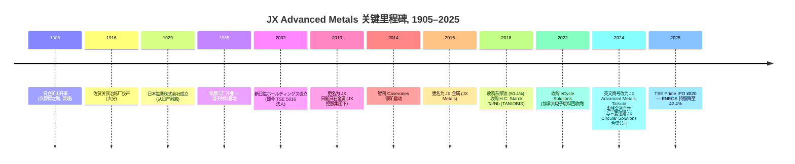
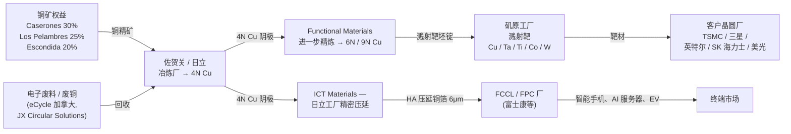

# JX Advanced Metals Corporation (JX 金属株式会社, TSE: 5016) — 公司研究

*截至 2026-05-26 · 简体中文版（日本上市；主要披露文件为日文 — EDINET 有価証券報告書 第23期 — 公司至今未发布英文版年度证券报告，因此本报告引用均指向 disclosure2dl.edinet-fsa.go.jp 上的日文 有価証券届出書 / 有価証券報告書 PDF 与公司 IR 网站 jx-nmm.com）*

---

## 目录

1. 公司概览
2. 公司历史
3. 管理团队
4. 产品与服务
5. 客户与上市策略
6. 行业概览
7. 竞争格局
8. 市场机会 (TAM)
9. 风险评估
10. 参考资料
11. 核查日志

---

## 1. 公司概览

JX Advanced Metals Corporation（JX 金属株式会社，TSE Prime 5016）是 **ENEOS Holdings 母公司**（**ENEOS Holdings**, parent post-IPO stake — 上市后仍持 42.38% 股份的 TSE: 5020 母公司）剥离出来的子公司，**2025-03 IPO**（**从 ENEOS 控股拆分** — 2025 年 3 月 19 日东京证交所 Prime 市场挂牌），按 ¥820 IPO 定价募集资金约 ¥2,600 亿（约合 USD 26 亿），成为 **日本自 2018 年 12 月 SoftBank Corp. 以来规模最大的 IPO**（[Renaissance Capital — JX Advanced Metals raises $2.6 bn in Japan's largest IPO since 2018, 2025-03-19](https://www.renaissancecapital.com/IPO-Center/News/109883/Going-for-gold-JX-Advanced-Metals-raises-$2.6-billion-in-Japan%E2%80%99s-largest-IP)；[JX Advanced Metals 有価証券報告書 第23期, p.6](https://disclosure2dl.edinet-fsa.go.jp/searchdocument/pdf/S100W549.pdf)）。然而，新代码背后的经营实体早在 **1905 年 12 月 1 日日立矿山开采** 以来便持续为电子产业供应高纯度金属——公司延续了 120 年冶金传承，远早于其今日所有半导体客户的成立（[JX Advanced Metals 有価証券報告書 第23期, p.5 (沿革)](https://disclosure2dl.edinet-fsa.go.jp/searchdocument/pdf/S100W549.pdf)）。

公司在 IPO 招股说明书和首份独立 Yuho（有価証券報告書）中使用刻意收窄的措辞自我定位为——*"JX 集团从事以铜与稀有金属为基础、对半导体与信息通信领域不可或缺的先进材料的研发、制造与销售，以 **半导体溅射靶 (semiconductor sputter target — 全球 64% 份额)** 与 **处理压延铜箔 (rolled-annealed copper foil, RA Cu — 78% 份额)** 为核心产品"*（直译自 第23期 有価証券報告書 第 7 页，[JX Advanced Metals 有価証券報告書 第23期, p.7](https://disclosure2dl.edinet-fsa.go.jp/searchdocument/pdf/S100W549.pdf)）。集团按 **三个业务分部 (Functional Materials / ICT Materials / Basic Metals)** 进行报告，将前两者合称为 **"重点业务" (Focus Business)**，而 Basic Metals 则被定位为 **"基础业务" (Base Business) — 主要功能是向重点业务输送清洁铜和稀有金属**（[JX Advanced Metals 有価証券報告書 第23期, pp.7-8](https://disclosure2dl.edinet-fsa.go.jp/searchdocument/pdf/S100W549.pdf)）。

**FY25（截至 2025 年 3 月的财年）IFRS 营收 ¥7,149 亿，同比下滑 52.7%**——但这 50%+ 的表观骤降完全源自前期完成的两项剥离：2024 年 3 月将 Pan Pacific Copper (PPC) 20% 股权出售给丸红，使 JX 持股跌破合并门槛；以及 **Caserones 智利铜矿运营公司 (MLCC) 分阶段转让给加拿大 Lundin Mining**（2023 年 7 月先转让 51%、2024 年 7 月再转让 19%，累计转让 70%）。两宗交易将原本全资或控股的合并子公司转为权益法关联公司，相关收入因此从合并报表的顶线中剥离（[JX Advanced Metals 有価証券報告書 第23期, p.6 (沿革 — Caserones / PPC 转让)](https://disclosure2dl.edinet-fsa.go.jp/searchdocument/pdf/S100W549.pdf)）。营业利润反而**升至 ¥1,125 亿（15.7% 利润率）**，高于上年的 ¥862 亿，归母净利润达 ¥683 亿——剔除两项剥离后底层重点业务实际仍处于持续上行周期，顶线营收数据在 FY26 可比数据消化前会带来误导（[JX Advanced Metals 有価証券報告書 第23期, pp.2, 38, 40](https://disclosure2dl.edinet-fsa.go.jp/searchdocument/pdf/S100W549.pdf)）。

FY25 分部拆分如下：**Functional Materials（半导体溅射靶、Ta/Nb 粉末、化合物半导体晶圆）对外营收 ¥1,474 亿、营业利润 ¥267 亿；ICT Materials（压延铜箔、东邦钛、Tatsuta 电线）营收 ¥2,609 亿、营业利润 ¥251 亿；Basic Metals（铜冶炼/回收 + 权益法矿业收益）营收 ¥3,041 亿、营业利润 ¥745 亿**（[JX Advanced Metals 有価証券報告書 第23期, p.105 (注记 7 セグメント情報)](https://disclosure2dl.edinet-fsa.go.jp/searchdocument/pdf/S100W549.pdf)）。Basic Metals 营业利润被分部内的 ¥610 亿权益法收益（主要来自已剥离的 PPC 与剩余 Caserones / Los Pelambres / Escondida 股权）拉高，因此剔除影响后，重点业务 (Focus segments) 在收入仅占 57% 的情况下贡献约 **集团底层营业利润的三分之二**（[JX Advanced Metals 有価証券報告書 第23期, p.105](https://disclosure2dl.edinet-fsa.go.jp/searchdocument/pdf/S100W549.pdf)）。

地理上公司以日本为大本营（FY25 末非流动资产日本境内 ¥3,055 亿 vs 境外 ¥943 亿），但 Functional Materials 营收主要分布在亚洲——FY25 半导体溅射靶销售额 **台湾约 36%、韩国 17%、美国 11%、日本 11%、中国 12%、其他 13%**，准确反映 TSMC / 三星电子 / SK 海力士 / 英特尔 / 美光 / 铠侠等先进制程晶圆厂的实际消耗地（[JX Advanced Metals 有価証券報告書 第23期, p.9](https://disclosure2dl.edinet-fsa.go.jp/searchdocument/pdf/S100W549.pdf)）。集团生产/下游加工基地分布在 **日本日立、矶原、常陆那珂、仓见；美国亚利桑那州 Mesa（2024 年 11 月投产的半导体溅射靶后段工厂）；台湾龙潭；韩国平泽；中国苏州；菲律宾 Laguna；德国 Goslar (TANIOBIS)；加拿大 Mississauga (eCycle)；以及新加坡和美国设有贸易办事处**（[JX Advanced Metals 有価証券報告書 第23期, pp.15-16, 45-46 (関係会社・設備の状況)](https://disclosure2dl.edinet-fsa.go.jp/searchdocument/pdf/S100W549.pdf)）。2025 年 Yuho 披露 **合并员工 10,413 人**（Functional Materials 2,442 人、ICT Materials 4,275 人、Basic Metals 1,869 人、其他/公司职能 1,827 人）（[JX Advanced Metals 有価証券報告書 第23期, p.17](https://disclosure2dl.edinet-fsa.go.jp/searchdocument/pdf/S100W549.pdf)）。

**ENEOS Holdings 母公司** (parent post-IPO stake) 仍是最大股东，IPO 后持股 **42.38%**（上市前为 100%），在 第23期 披露中 ENEOS 的身份从 "亲会社"（parent company）重新归类为 "その他の関係会社"（其他关联方），分类变更日期为 2025 年 3 月 19 日——日本会计准则中该比例之下不再适用母公司定义（[JX Advanced Metals 有価証券報告書 第23期, p.16 (関係会社の状況 — その他の関係会社)、p.37 (リスク 15. 役員・大株主・関係会社等)](https://disclosure2dl.edinet-fsa.go.jp/searchdocument/pdf/S100W549.pdf)）。公司治理披露还显示，11 名董事中有 5 位独立外部董事，提名薪酬咨询委员会以外部董事为多数并由外部董事担任主席——符合 TSE Prime 上市的治理要求（[JX Advanced Metals 有価証券報告書 第23期, p.37](https://disclosure2dl.edinet-fsa.go.jp/searchdocument/pdf/S100W549.pdf)）。

*资料来源：编自 [JX Advanced Metals 有価証券報告書 第23期, p.2 (主要な経営指標等の推移)](https://disclosure2dl.edinet-fsa.go.jp/searchdocument/pdf/S100W549.pdf)。FY25 营收悬崖式下跌反映 PPC + MLCC 剥离，并非有机滑坡；营业利润持续复合增长。*

*资料来源：[JX Advanced Metals 有価証券報告書 第23期, p.105 (注記 7. セグメント情報)](https://disclosure2dl.edinet-fsa.go.jp/searchdocument/pdf/S100W549.pdf)。对外客户营收：Functional Materials ¥1,474 亿、ICT Materials ¥2,609 亿、Basic Metals ¥3,041 亿、其他 ¥26 亿。*

**估值快照（截至 2026 年 5 月底）。** 2026 年 5 月 26 日收盘价 **¥4,195 / 股**，JX Advanced Metals 市值约 **¥3.7 万亿（约合 USD 240 亿，按 ¥154/USD 计算）**，**滚动 TTM EPS 约 ¥113**——隐含 **TTM P/E 约 35.4 倍**，股息收益率约 0.9%（FY25 全年 DPS ¥109.55，其中中期 ¥91.55 系 IPO 前剥离分红，期末 ¥18 为上市后首次普通分红）（[Stockanalysis.com — TYO:5016 公司概况, 2026-05](https://stockanalysis.com/quote/tyo/5016/company/)；[JX Advanced Metals 有価証券報告書 第23期, p.3 (提出会社の経営指標等 — 一株当たり配当額 109円55銭)](https://disclosure2dl.edinet-fsa.go.jp/searchdocument/pdf/S100W549.pdf)）。该股 **2026 年 5 月 11 日触及 52 周高点 ¥5,828** 后回落，目前价格相对 IPO 价 ¥820 已 **上涨约 5 倍**，仅用了 14 个月的交易时间（[TradingView — TSE:5016 行情, 2026-05](https://www.tradingview.com/symbols/TSE-5016/)；[Stockanalysis.com — TYO:5016, 2026-05](https://stockanalysis.com/quote/tyo/5016/)）。

**35 倍 TTM P/E 约为日本有色金属同业中位数的 2-3 倍**——东曹 (TSE: 4042) 约 12 倍、三井金属 (TSE: 5706) 约 11 倍、住友金属矿山 (TSE: 5713) 约 18 倍、Resonac (TSE: 4004) 约 18 倍。唯一接近的非铁同业是 **Materion (NYSE: MTRN) 约 22 倍**——美国高纯度金属类的最贴近可比公司（[Yahoo Finance — TSE 4042/5706/5713/4004 + NYSE MTRN, 2026-05](https://finance.yahoo.com/quote/4042.T/)）。*分析师观点：* 这一溢价的最佳解释方式是市场实际上将 Functional Materials 分部独立重估——溅射靶全球第一的特许经营地位被 [野村 "Greater China Semi 2026–30F" 2026-05-21](file:///Users/x/projects/financial_agent/reports/sector/半导体材料.md) 报告 Fig 44（溅射材料份额排名）列为榜首，并直接受益于 2027F TSMC 1.6nm HVM 量产、**背面供电 (BPD, Backside Power Delivery)** 晶圆键合环节（额外 Cu / Ta / W 溅射步骤）、SiPh / CPO 的 InP 紧供周期，以及 Mesa AZ + Rapidus 的材料供应机会——该子分部隐含估值约 45-55 倍，而 Basic Metals 铜冶炼利润流仅按权益法利润的 7-8 倍估值（[reports/sector/半导体材料.md — 野村 2026-05-21, Fig 44 排行榜](file:///Users/x/projects/financial_agent/reports/sector/半导体材料.md)；[TrendForce — JX Advanced Metals plans ¥5bn Rapidus 投资 + 关键材料供应, 2026-01-21](https://www.trendforce.com/news/2026/01/21/news-jx-advanced-metals-reportedly-plans-%C2%A55b-investment-in-rapidus-along-with-critical-materials-supply/)）。当前估值倍数已显著拉伸；任何 AI 服务器资本开支周期波动、中国厂商在半导体溅射靶意外抢占份额、或 InP 供给正常化都会导致 P/E 急剧收缩——在 §9 中列为支配性的估值/倍数压缩风险。

---

## 2. 公司历史

JX Advanced Metals 是一条从 **1905 年 12 月 1 日企业家久原房之助在茨城县开采日立矿山** 开始的冶金血脉的最新法人形态：自此经 **1912 年 9 月久原矿业公司设立**、**1929 年 4 月日本鉱業株式会社成立**（久原的采矿与冶炼业务从日本产业公司剥离）以及一连串企业更名，最终在 2025 年 3 月 19 日完成 TSE Prime 挂牌（[JX Advanced Metals 有価証券報告書 第23期, pp.5-6 (沿革)](https://disclosure2dl.edinet-fsa.go.jp/searchdocument/pdf/S100W549.pdf)）。位于大分县海岸的佐贺关铜冶炼厂始建于 1916 年 9 月，至今仍是集团最大的代客冶炼厂，按 [国际铜研究小组 "World Copper Factbook 2024"](https://icsg.org/copper-factbook/) 的统计也是全球单厂规模最大的铜冶炼厂之一；日立工厂随后扩建炼制和（1978 年）回收产能，奠定了今日 Basic Metals 分部的基础（[JX Advanced Metals 有価証券報告書 第23期, p.5](https://disclosure2dl.edinet-fsa.go.jp/searchdocument/pdf/S100W549.pdf)）。

从 "矿业商" 转型为 "特殊材料供应商" 的关键起点是 **1985 年 5 月在茨城县开设的矶原工厂**——为扩大电子材料业务而建，今日 JX 的半导体溅射靶仍由该工厂生产，目前正在扩建至 FY28 达到 FY24 产能的 ~1.5 倍（[JX Advanced Metals 有価証券報告書 第23期, pp.5, 21 (磯原工場・新工場ひたちなか)](https://disclosure2dl.edinet-fsa.go.jp/searchdocument/pdf/S100W549.pdf)）。今日 TSE 5016 代码所对应的法人实体——**新日鉱ホールディングス**（Shin Nippon Mining Holdings）——成立于 **2002 年 9 月 2 日**，由日本能源株式会社与旧日鉱マテリアルズ通过股份转让合并而成；该控股公司 **2010 年 7 月 1 日更名为 JX 日鉱日石金属**，标志着 JX 控股（今 ENEOS Holdings）经由日本石油的股份转让合并诞生（[JX Advanced Metals 有価証券報告書 第23期, p.6 (沿革, 2002 / 2010 entries)](https://disclosure2dl.edinet-fsa.go.jp/searchdocument/pdf/S100W549.pdf)）。2016 年 1 月简化为 **JX 金属 (JX Metals)**，**2024 年 5 月英文商号改为 "JX Advanced Metals Corporation"**——明确为 IPO 前重新定位铺路：从铜与资源公司转型为先进电子材料平台（[JX Advanced Metals 有価証券報告書 第23期, p.6 (2024年5月 英文商号変更)；JX Advanced Metals — Change in English-Language Trade Name 新闻稿, 2024-05-14](https://www.jx-nmm.com/english/newsrelease/fy2024/20240514_02.html)）。

三大战略转折定义了现代 JX。**第一，2018 年东邦钛 / TANIOBIS 双重收购**（2018 年 5 月以约 ¥350 亿购入 [东邦钛 (TSE: 5727)](https://www.toho-titanium.co.jp/en/) 50.38% 股权；2018 年 7 月以约 €6 亿购入德国 H.C. Starck 的钽铌业务 H.C. Starck Tantalum & Niobium GmbH），将海绵钛、超细镍粉与钽 / 铌粉末纳入平台——钽粉业务正是 JX 能够端到端供应钽溅射靶和钽电容材料的关键（[JX Advanced Metals 有価証券報告書 第23期, p.6 (2018 entries)；H.C. Starck Solutions 企业主页](https://www.hcstarcksolutions.com/)）。**第二，2023–24 年向 Lundin Mining 分阶段剥离 Caserones / Los Pelambres 智利铜矿** Caserones 智利铜矿——JX 于 2023 年 7 月先转让 51%、2024 年 7 月通过看涨期权再转让 19%，最终保留 30% 的非运营权益——明确目的是为 IPO 前将资本重新聚焦到重点业务（[Lundin Mining — Lundin completes acquisition of additional 19% interest in Caserones, 2024-07-29](https://lundinmining.com/news/lundin-mining-completes-acquisition-of-an-additional-19-int-123-tjbjxn1g/)）。**第三，2024 年 8 月通过要约收购将 Tatsuta 电线（タツタ電線）私有化**——为 ICT Materials 分部增加 FPC 用电磁屏蔽膜、半导体封装用导电浆和键合线，并在 2024 年 11 月完成全资合并（[JX Advanced Metals 有価証券報告書 第23期, p.6 (2024年8月 タツタ電線株式公開買付 entry)；JX Advanced Metals — Notice Regarding Results of Tender Offer for Shares of TATSUTA Electric Wire, 2024-08-20](https://www.jx-nmm.com/english/newsrelease/fy2024/20240820_02.html)）。

IPO 本身由 **大和证券、JP Morgan、Morgan Stanley MUFG 和瑞穗** 联合承销——定价 ¥820（下调后区间 ¥820–860 的上限），按发行价对应估值约 ¥7,600 亿 / USD 51 亿（截至 2026 年 5 月 26 日已重估至 ¥3.7 万亿）（[MarketScreener — Eneos plans $3 bn IPO of metals subsidiary — Update, 2025-03-10](https://www.marketscreener.com/quote/stock/ENEOS-HOLDINGS-INC-6500951/news/Eneos-Plans-3-Billion-IPO-of-Metals-Subsidiary-Update-49283362/)；[Reuters via Investing.com — Eneos Holdings to list metals subsidiary, aims to raise $3 bn, 2025-03](https://www.investing.com/news/stock-market-news/eneos-holdings-to-list-metals-subsidiary-aims-to-raise-3-billion-93CH-3869772)）。ENEOS 保留 42.4%——限制 IPO 自由流通市值约 **¥3,200 亿（不含绿鞋）**——并为母公司剩余股份设置自 IPO 日起 90 天的锁定期；ENEOS 将 IPO 募资用于加快股东回报和脱碳投资（[Eneos Holdings — Notice Concerning Sale of Shares of Subsidiary, 2025-02-14, via IR Bank EDINET archive](https://irbank.net/E01081/edinet)）。

---

## 3. 管理团队

JX Advanced Metals 并非创始人主导——日立矿山的原始创始人久原房之助于 1965 年逝世——因此本节相关传记仅限于现任 CEO。

**林陽一（Hayashi Yoichi）**，生于 **1965 年 2 月 5 日（截至 2026-05-26 60 岁）**，自 **2023 年 4 月 1 日起担任 JX Advanced Metals 代表取締役社长 / CEO**，在同一冶金集团内连续工作 37 年，**1988 年 4 月毕业后直接进入日本鉱業株式会社**（[JX Advanced Metals 有価証券報告書 第23期, p.64 (役員の状況 — 林陽一)](https://disclosure2dl.edinet-fsa.go.jp/searchdocument/pdf/S100W549.pdf)）。他的职业路径几乎全部在战略 / 规划而非生产线运营——与工程出身、主导技术集团的 Sugawara Shizuo 副 CEO 形成对比：

- **2019 年 4 月** — 出任 JX 金属（前身实体）执行役员，主管企业规划部、研究部、企业规划室；
- **2020 年 4 月 / 2020 年 10 月** — 执行役员，分管范围扩大至物流和新设立的 ESG 推进室；
- **2021 年 4 月** — 晋升 **取締役 常務執行役員**，主管企业规划、ESG、会计和物流；
- **2022 年 4 月** — 取締役 常務執行役員，职责保持并新增项目推进总部顾问（即筹备 IPO 的企业载体）；
- **2023 年 4 月 1 日** — 出任 **代表取締役社長 社長執行役員**——即今日所任职位（[JX Advanced Metals 有価証券報告書 第23期, p.64](https://disclosure2dl.edinet-fsa.go.jp/searchdocument/pdf/S100W549.pdf)）。

Yuho 披露林陽一直接持有 **JX Advanced Metals 19,000 股**（按 2026 年 5 月股价计约 ¥8,000 万——可观但远未达创始人规模），并参与 2025 年 6 月 27 日股东大会通过的业绩挂钩股权激励计划（[JX Advanced Metals 有価証券報告書 第23期, pp.64, 78-79 (役員の状況 / 株式報酬制度)](https://disclosure2dl.edinet-fsa.go.jp/searchdocument/pdf/S100W549.pdf)）。业绩挂钩部分针对执行役员的考核权重为 **合并营业利润 40% + 净债务/EBITDA 40% + 个人评估 20%**；针对代表取締役则为 **营业利润 50% + 净债务/EBITDA 50%，无个人评估部分**——这是一种纯粹按集体业绩支付的薪酬设计（[JX Advanced Metals 有価証券報告書 第23期, p.81](https://disclosure2dl.edinet-fsa.go.jp/searchdocument/pdf/S100W549.pdf)）。中长期股权激励的拆分为：营业利润 30% + ROE 30% + TSR vs TOPIX 30%，剩余 10% 取决于安全 / 员工敬业度 / ESG（[JX Advanced Metals 有価証券報告書 第23期, p.81](https://disclosure2dl.edinet-fsa.go.jp/searchdocument/pdf/S100W549.pdf)）。

林陽一上任两年的 CEO 任期几乎全部投入 IPO 筹备（公司治理大改、2024 年 9 月从 ENEOS 共享服务迁移到独立财务系统、自第 21 期 (FY 截至 2023 年 3 月) 起采用 IFRS 准则）和重点业务的产能扩张——最显眼的是 **常陆那珂新工厂**（2024 年宣布、目前在建、首期投产目标 FY26）、**美国亚利桑那州 Mesa 半导体溅射靶工厂**（2024 年 11 月投产）以及 **2025 年 10 月宣布的矶原 InP 衬底产能扩张**（约 ¥33 亿投资、相对 2025 年产能新增约 50%）（[JX Advanced Metals 有価証券報告書 第23期, p.21 (生産能力 1.6倍計画)；Semiconductor Today — JX making further investment to increase InP substrate production, 2025-10-09](https://www.semiconductor-today.com/news_items/2025/oct/jx-091025.shtml)；[AInvest — JX Advanced Metals' ¥3.3bn InP Substrate Expansion, 2025-10](https://www.ainvest.com/news/jx-advanced-metals-3-3-billion-yen-inp-substrate-expansion-strategic-catalyst-semiconductor-supply-chain-dominance-2510/)）。其战略效果迄今可量化：FY25 营业利润超目标（实际 ¥1,125 亿 vs 目标 ¥954 亿，达成率 117%），触发短期激励 100% 派发（[JX Advanced Metals 有価証券報告書 第23期, p.81 (2025年3月期業績目標達成率)](https://disclosure2dl.edinet-fsa.go.jp/searchdocument/pdf/S100W549.pdf)）。

---

## 4. 产品与服务

本节直接承载 JX 的投资逻辑：公司作为 **全球第一的半导体溅射靶供应商**（直译自公司自身 Yuho 引用 富士经济 2023 年实绩，剔除铝系靶材）的地位，正是 35 倍 TTM P/E 的根本依据，也将该业务连接到 [野村 "Greater China Semi 2026–30F" 2026-05-21](file:///Users/x/projects/financial_agent/reports/sector/半导体材料.md) 报告所指认的本十年下半段七大 AI 驱动技术拐点——GAA、1.6nm HVM、BPD、SoIC、SiPh / CPO、HBM4、2.5D / 3D 封装——的核心材料供应主轴。

### 4.1 2025 年 Yuho 自身的产品矩阵

首份独立 Yuho 在第 7 页以三分部矩阵 (Functional Materials / ICT Materials / Basic Metals) 披露集团产品组合，与注记 7 的分部财务数据严格对应。下图为第 23 期 有価証券報告書 第 7 页内容直接扫描复刻。

*资料来源：[JX Advanced Metals 有価証券報告書 第23期, p.7 (3 事業の内容 — 区分・セグメント・事業部・主要製品・主要な会社)](https://disclosure2dl.edinet-fsa.go.jp/searchdocument/pdf/S100W549.pdf)。原文为日文；下方 markdown 复刻便于检索。*

| 区分 (Bucket) | 分部 (Segment) | 事业部 / 子公司 | 主要产品 | 主要公司 |
|---|---|---|---|---|
| Focus Business | **Functional Materials** | 薄膜材料事業部 | 半导体溅射靶、高纯度金属、**表面处理化学品 (surface treatment chemicals)**、化合物半导体 / 结晶材料 | JX 母公司、JX Advanced Metals USA、JX Advanced Metals Singapore、JX Advanced Metals Korea、JX Metals Trading、Taiwan Nikko Metals |
| Focus Business | Functional Materials | タンタル・ニオブ事業部 | Ta/Nb 金属粉末、Ta/Nb 氧化物粉末、氯化物 / 化合物 | JX、TANIOBIS GmbH (Goslar, 德国)、东京电解 |
| Focus Business | **ICT Materials** | 機能材料事業部 | 处理压延铜箔 (RA Cu)、钛铜 (Ti-Cu, 用于 AI 服务器连接器)、Corson 合金 (Cu-Ni-Si) | JX、JX METALS PHILIPPINES、苏州日鉱金属、JX Metals Trading、Taiwan Nikko Metals |
| Focus Business | ICT Materials | 东邦钛（子公司） | 超细镍粉、高纯度氧化钛、催化剂产品、海绵钛、钛锭 | 东邦钛 (TSE: 5727) |
| Focus Business | ICT Materials | Tatsuta 电线（子公司） | EMI 屏蔽膜、导电浆料、键合线、基础设施 / 工业电线 | Tatsuta 电线（原 TSE: 5809；现已全资） |
| Base Business | **Basic Metals** | 資源事業部 | 铜精矿、电解铜、钼精矿、含金硅酸矿、钽精矿 | JX、SCM Minera Lumina Copper Chile (Caserones, 30%)、Minera Los Pelambres (25%)、Minera Escondida (经由 Geco K.K., 20%) |
| Base Business | Basic Metals | 金属・リサイクル事業部 | 电解铜、铜锭、贵金属、硫酸 | JX、JX Nippon Mining & Metals Smelting (佐贺关 / 日立)、Pan Pacific Copper (PPC, 47.8% 权益法)、JX Circular Solutions (与三菱商事 80% 合资)、eCycle Solutions (加拿大) |

[资料来源：JX Advanced Metals 有価証券報告書 第23期, p.7, 表格直接复刻](https://disclosure2dl.edinet-fsa.go.jp/searchdocument/pdf/S100W549.pdf)。

### 4.2 综合解读 — 产品类别之间如何互动

三个分部串联成一个垂直整合的冶金闭环：**Caserones / Los Pelambres / Escondida** 智利铜矿（Basic Metals — 资源部，权益法投资）输出的 **上游铜精矿** 流入佐贺关 / 日立冶炼厂（Basic Metals — 金属・リサイクル事業部）生产 **99.99% 电解铜 (4N Cu)**；该 4N Cu 进入 Functional Materials 分部进一步精炼到 **6N 或 9N 纯度**（Yuho 披露 9N = 99.9999999% 为可达成上限），并锻造为溅射靶坯锭（[JX Advanced Metals 有価証券報告書 第23期, p.9 (9N 銅の製造能力)](https://disclosure2dl.edinet-fsa.go.jp/searchdocument/pdf/S100W549.pdf)）。剩余冶金产能则进入日立厂的 **精密压延 (precision rolling)** 生产线，生产用于 FPC / FCCL 的 **6 微米压延铜箔**——ICT Materials 的旗舰产品。整个铜回收闭环由 JX Circular Solutions（与三菱商事的合资公司）完成电子废料回收——JX 自定的 2040 年目标是 **佐贺关冶炼厂回收料投料比例提升到 50%**（[JX Advanced Metals 有価証券報告書 第23期, p.12 (グリーンハイブリッド製錬 / リサイクル原料比率 50% 目標)](https://disclosure2dl.edinet-fsa.go.jp/searchdocument/pdf/S100W549.pdf)）。

垂直整合是 JX 产品定位最关键的事实。**西方特殊材料同业中，唯一拥有可比的上游到下游铜 / Cu 靶材闭环的是三井金属**——Materion、东曹、ULVAC 和 Plansee 都需要外购铜原料。这一闭环将铜价波动主要消化在 Basic Metals 分部（铜价同时也是该分部的营收驱动因子），让 Functional Materials 的成本端不受冲击，并为 AI 服务器建设时代提供了完整的可溯源 / 供应安全叙事——这正是 JX **连续四年获得英特尔 EPIC Distinguished Supplier Award（2021、2022、2023、2024）以及 2024 年获得 TSMC Excellent Performance Award** 的价值主张，两项奖励均在 Yuho 第 9 页直接列出（[JX Advanced Metals 有価証券報告書 第23期, p.9](https://disclosure2dl.edinet-fsa.go.jp/searchdocument/pdf/S100W549.pdf)）。

### 4.3 Functional Materials — 半导体溅射靶（旗舰）

> "高純度化や組成・組織制御などの当社のコア技術を駆使し、半導体や磁性材料向けのスパッタリングターゲットをはじめ、各種高機能デバイス、最先端IT機器、医療機器、電気自動車に用いられる製品をグローバルに展開しています。中でも、ロジックやメモリに用いられる半導体用スパッタリングターゲットが主力製品であり、市場規模1,462億円のマーケットにおいて世界シェアは64％(注１)です。当社は様々な素材の半導体用スパッタリングターゲットを取り扱っており、半導体の主要配線層に用いられる銅や銅合金、そのバリア層に用いられるタンタルに加えて、半導体の回路形成やトランジスタ部分等に用いられるチタン、コバルト及びタングステンの製品で世界シェアNo.１です(注２)。"
>
> — 直引自 [JX Advanced Metals 有価証券報告書 第23期, p.8 (薄膜材料事業部)](https://disclosure2dl.edinet-fsa.go.jp/searchdocument/pdf/S100W549.pdf)。中文译：*"我们运用高纯度化与组成 / 组织控制等核心技术，全球化提供面向半导体与磁性材料的溅射靶，以及用于各种高性能器件、最尖端 IT 设备、医疗器械、电动汽车的相关产品。其中，用于逻辑和存储的半导体溅射靶是核心产品：在 **¥1,462 亿** 的市场规模中，我们 **全球份额为 64%**（注 1）。我们覆盖多种材质的半导体溅射靶，并在 **用于主要互连层的铜与铜合金、用于互连层阻挡层的钽、以及用于电路形成 / 晶体管部分的钛、钴、钨产品上排名全球第一**（注 2）。"* 注 1/2 均引用富士经济《2024 半导体材料市场现状与展望》（2023 年实绩，剔除铝系，销售额基准），按 2023 年末汇率 ¥141/USD 换算。

**中文释义 / 通俗解读：****半导体溅射靶 (semiconductor sputter target — 全球 64% 份额)** 是放置在晶圆厂 **物理气相沉积 (PVD, Physical Vapor Deposition)** 腔体内、由高纯度金属制成的圆盘 / 板材。在生产中，离子束（通常为氩离子）轰击靶材使原子被溅射出来，随后在下方硅晶圆上重新沉积为厚度从几纳米到几百纳米的薄膜（[JX Advanced Metals 有価証券報告書 第23期, p.8](https://disclosure2dl.edinet-fsa.go.jp/searchdocument/pdf/S100W549.pdf)）。晶圆需要：**铜 / 铜合金互连层** 来承载晶体管之间的信号、**钽 (Ta) 阻挡层** 防止铜扩散入硅而毒化晶体管、以及晶体管层面的 **钛 / 钴 / 钨触点和栅极层**。*分析师观点：* JX 生产其中每一种金属靶——按 [野村 sector report 2026-05-21 供应商排行榜](file:///Users/x/projects/financial_agent/reports/sector/半导体材料.md)，是全球极少数同时拥有 "互连 + 阻挡 + 触点" 全套产品线的溅射靶供应商。从冶炼厂产出的 LME 铜（约 99.99% 纯，"4N"）到溅射靶，还需多次纯度提升（到 99.9999%——"6N"——某些情况下高达 **99.9999999%，"9N"**，是公司自述的可达成上限），加上靶内晶粒控制，确保 **整片晶圆的溅射速率和薄膜均匀性控制在单纳米精度**（[JX Advanced Metals 有価証券報告書 第23期, p.9 (組成・組織制御技術 / 表面制御技術 / 分析評価技術)](https://disclosure2dl.edinet-fsa.go.jp/searchdocument/pdf/S100W549.pdf)）。战略拐点是 **2027 年之后的逻辑制程节点切换**——一旦 TSMC 进入 1.6 nm HVM、英特尔进入 18A / 14A 并采用 **背面供电 (BPD, Backside Power Delivery)**——每片晶圆的金属互连层数将从今日的 13–15 层升至 20+ 层，而 BPD 本身需要在晶圆背面增加一层铜互连——两者都直接增加 **单片晶圆的金属溅射用量 (毫克级)**。野村报告将此量化为 "**N1.6 / A16 增加 20–30% 额外的 CMP 步骤和相应比例的溅射靶用量**"（[reports/sector/半导体材料.md — 野村 2026-05-21, 3D Transistor + BPD section, p.6-9](file:///Users/x/projects/financial_agent/reports/sector/半导体材料.md)）。

*资料来源：[JX Advanced Metals 有価証券報告書 第23期, p.9 (薄膜材料事業部 — 高純度化 / 組成・組織制御 / 64% 世界シェア)](https://disclosure2dl.edinet-fsa.go.jp/searchdocument/pdf/S100W549.pdf)。直接复刻日文原文以保留 64% 全球份额、Intel EPIC 奖、TSMC Excellent Performance 奖等关键披露。*

*分析师观点：* 铜溅射靶最贴近的竞争对手是 **三井金属 (TSE: 5706)**，通过其 [溅射靶材产品线](https://insulectro.com/mitsui-kinzoku/)（三井电子业务，溅射靶单独收入未单列）。钽溅射靶的第二来源是 **Materion (NYSE: MTRN)** 的 [半导体材料业务部](https://www.materion.com/en/markets/semiconductor)；JX 通过持有 TANIOBIS（原 H.C. Starck Ta/Nb 业务）和东京电解（2022 年收购）实现钽粉后向整合，可显著缩短交期并形成护城河——TANIOBIS 的年度钽采购约 20% 来自 JX 自身权益投资的 **巴西 Mibra 矿**（2023 年 3 月入股）（[JX Advanced Metals 有価証券報告書 第23期, p.10 (TANIOBIS / 東京電解 / Mibra鉱山)](https://disclosure2dl.edinet-fsa.go.jp/searchdocument/pdf/S100W549.pdf)；[Mining Weekly — search results for JX Nippon Mibra mine, 2023-03](https://www.miningweekly.com/searchgcse.php?q=jx+nippon+mibra)）。钛 / 钴 / 钨靶方面，按 Materion 与东曹的 [薄膜沉积材料目录](https://www.tosoh.com/our-products/advanced-materials/thin-film-deposition-materials) 显示主要替代来源为东曹和 ULVAC——均不披露份额，Yuho 64% 这一数字是整个剔除铝系类别中唯一公开锚点。

### 4.4 Functional Materials — InP、CdZnTe、CVD/ALD 前驱体（下一代产品管线）

JX 化合物半导体晶圆业务隶属薄膜材料事業部，是公司最直接暴露于 **SiPh / CPO（硅光子 / 共封装光学）量产** 的产品线——野村 sector report 将其判断为 **2026–2028 年 InP 衬底紧供给的超级周期**。Yuho 原文描述如下：

> "当社は、長年培った高純度化、表面制御、組成、分析評価等の技術を活かした次世代の収益の柱の確立に取り組んでいます。具体的には、データセンターやモバイル通信量の増加により成長が予想されているInP(インジウムリン)や防衛・メディカルなどの分野での成長が期待されるCdZnTe(カドミウムジンクテルル)といった結晶材料の事業規模拡大を目指しています。"
>
> — 直引自 [JX Advanced Metals 有価証券報告書 第23期, p.22 (③ 次世代のグローバルトップシェア製品の開発)](https://disclosure2dl.edinet-fsa.go.jp/searchdocument/pdf/S100W549.pdf)。中文译：*"我们结合长期积累的高纯度化、表面控制、成分控制和分析评估技术，致力于打造下一代利润支柱。具体而言，我们瞄准 InP（**磷化铟 (InP substrate)** — 受数据中心和移动通信流量增长驱动）和 CdZnTe（镉锌碲——国防与医疗应用增长）等晶体材料的业务规模扩张。"*

**中文释义 / 通俗解读：****磷化铟 (InP substrate)** 是 **III-V 族化合物半导体**，在 1310 nm 和 1550 nm 长距离光纤通信波长上的发光与探测效率远高于硅。每一个进入超大规模 AI 服务器集群的 **800G / 1.6T 光模块** 中都至少包含一个 **EML (电吸收调制激光器)** 或 **CW (连续波) DFB 激光器**，均在 2 / 3 / 4 英寸的 InP 衬底上制造（[JX Advanced Metals — InP Substrates 产品页](https://www.jx-nmm.com/english/products/compound_semiconductors_and_crystal_materials/inp/)）。JX 制造 InP 已 **超过 40 年**，是全球 **少数几家供应商之一**，与住友电气和 AXT（中国制造）并列。野村 sector report 称 InP 衬底为 **整条光模块价值链上供应最紧张的单一材料**——50% 的晶圆良率（晶体生长环节难度极高）、中国于 2024 年末实施的铟金属出口管制、以及 12+ 个月的 MOCVD 外延设备交货周期共同导致（[reports/sector/半导体材料.md — 野村 2026-05-21, InP section, p.11-12, 60-65](file:///Users/x/projects/financial_agent/reports/sector/半导体材料.md)）。JX 在 2025 年 **连续宣布两次 InP 产能扩张**：2025 年 7 月在矶原追加 **¥15 亿、产能提升 ~20%**（[Semiconductor Today — JX to boost InP substrate production capacity by 20%, 2025-07-24](https://www.semiconductor-today.com/news_items/2025/jul/jx-240725.shtml)）；2025 年 10 月再追加 **~¥33 亿、产能提升 ~50%**（[Semiconductor Today — JX making further investment to increase InP substrate production, 2025-10-09](https://www.semiconductor-today.com/news_items/2025/oct/jx-091025.shtml)；[AInvest — JX Advanced Metals' 3.3 Bn Yen InP Substrate Expansion, 2025-10](https://www.ainvest.com/news/jx-advanced-metals-3-3-billion-yen-inp-substrate-expansion-strategic-catalyst-semiconductor-supply-chain-dominance-2510/)）。两次扩张均明确指向超大规模 AI 光模块需求。**CdZnTe (镉锌碲)** 是 **II-VI 族化合物半导体**，用作 **MWIR / LWIR (中长波红外) 传感器** 的衬底，应用于国防和医疗 X 射线探测设备；JX 自称凭借专有的晶体生长方法，掌握全球最大尺寸 CdZnTe 衬底制造能力（[JX Advanced Metals — CdZnTe Substrates 产品页](https://www.jx-nmm.com/english/products/compound_semiconductors_and_crystal_materials/czt/)）。

第三条下一代产品线是 **CVD / ALD 前驱体 (化学气相沉积 / 原子层沉积 precursors)**——通常为 Co、W、Ru、Ta、Ti 的挥发性有机金属化合物，在 **CVD (Chemical Vapor Deposition) 或 ALD (Atomic-Layer Deposition)** 腔体内作为最激进制程节点的溅射替代方案使用。Yuho 披露 **2024 年 2 月 1 日** 内部组织重整新设 "**CVD・ALD 材料事業推進室**"，并决定在 **东邦钛茅崎工厂 FY24 下半年** 与 **茨城日立地区 FY25 上半年** 建设生产线（[JX Advanced Metals 有価証券報告書 第23期, p.43 ((4) 新規事業 — CVD・ALD材料関連)](https://disclosure2dl.edinet-fsa.go.jp/searchdocument/pdf/S100W549.pdf)）。

*分析师观点：* (a) 持续在 2027–30 年向上整合份额的溅射靶第一特许经营、(b) 全球最紧供给光学材料类别的 InP 衬底地位、(c) 在同一组晶圆厂里打开新增可寻址市场的 CVD/ALD 前驱体管线——三者结合是 JX 在铜冶炼周期基础之上仍能给到约 35 倍 P/E 的定性原因。风险点：(i) 中国 InP 衬底产能比预期更快投放（主要是 AXT 和新兴进入者——见 §7）；(ii) Plansee / ULVAC / Materion 加快 CVD 前驱体新品节奏从而抢先 JX 管线；(iii) 任何超大规模客户晶圆厂的铜溅射靶份额被中国进入者或东曹 / 三井金属持续侵蚀。

### 4.5 ICT Materials — 压延铜箔 + Ti-Cu + 东邦钛 + Tatsuta

ICT Materials 分部 FY25 实现 **¥2,609 亿营收 / ¥251 亿营业利润**（分部营业利润率 9.5%），是三大分部中营收最高的一个（[JX Advanced Metals 有価証券報告書 第23期, p.105](https://disclosure2dl.edinet-fsa.go.jp/searchdocument/pdf/S100W549.pdf)）。Yuho 关于旗舰压延铜箔产品的原文描述如下：

> "圧延銅箔は、スマートフォンやウェアラブル端末、モビリティ(xEV／ADAS)の分野で使用されるハイエンドなフレキシブル回路基板(FPC)に用いられており、屈曲性や耐久性における技術優位性や市場開発型アプローチの確立により、１stベンダーとしての地位を確保することで、市場規模405億円のマーケットにおいて、78％の世界シェア(注１)を誇っています。"
>
> — 直引自 [JX Advanced Metals 有価証券報告書 第23期, p.11 (機能材料事業部)](https://disclosure2dl.edinet-fsa.go.jp/searchdocument/pdf/S100W549.pdf)。中文译：*"我们的压延铜箔用于智能手机、可穿戴设备和移动出行 (xEV / ADAS) 领域的高端 **FPC (Flexible Printed Circuit, フレキシブル回路基板)** 软板。我们凭借在弯折性和耐久性上的技术领先地位、以及确立的市场开发型策略，稳居 1st-vendor 地位——在 **¥405 亿** 的市场规模中实现 **78% 全球份额**（注 1）。"* 注 1 引用富士奇美拉研究的 [《2024 电子封装新材料便览》— 富士奇美拉研究目录 NDL Search 列表](https://ndlsearch.ndl.go.jp/search?cs=bib&keyword=%E3%82%A8%E3%83%AC%E3%82%AF%E3%83%88%E3%83%AD%E3%83%8B%E3%82%AF%E3%82%B9%E5%AE%9F%E8%A3%85%E3%83%8B%E3%83%A5%E3%83%BC%E3%83%9E%E3%83%86%E3%83%AA%E3%82%A2%E3%83%AB%E4%BE%BF%E8%A6%A7)，2023 年实绩、仅限 FPC、单位数量基础。

**中文释义 / 通俗解读：****处理压延铜箔 (rolled-annealed copper foil, RA Cu — 78% 份额)** 是用作 FPC 基材的 **电解铜箔 (ED Cu foil)** 的替代品。RA 铜箔通过 **将铜锭热轧 + 冷轧至 6 微米厚度**（按 JX 自述相当于人类发丝厚度的百分之一）再经退火控制晶粒结构而成（[JX Advanced Metals 有価証券報告書 第23期, p.11 (HA箔)](https://disclosure2dl.edinet-fsa.go.jp/searchdocument/pdf/S100W549.pdf)）。Yuho 引用 **IPC 弯折寿命测试** 数据，显示 JX 的 HA 箔可承受 **~53 万次弯折，相对特殊电解铜箔的 ~17 万次** 多约 3 倍寿命（[JX Advanced Metals 有価証券報告書 第23期, p.11 (IPC-TM650 2.4.3E 試験 — HA約53万回 vs 特殊電解銅箔約17万回)](https://disclosure2dl.edinet-fsa.go.jp/searchdocument/pdf/S100W549.pdf)）。战略驱动是 **AI 服务器 / 智能手机弯折寿命关键的互连**——折叠手机铰链或可穿戴触觉执行器需要数十万次柔性循环，ED 铜箔会断裂而 RA 铜箔可存活。78% 全球份额仅指高端 FPC 应用；在中低端 FCCL / 电池铜箔市场，JX 与古河电气、日本电解、以及中国厂商如诺德新材料 (300700.SZ) 竞争（[reports/sector/半导体材料.md — 野村 2026-05-21, 材料同业范围](file:///Users/x/projects/financial_agent/reports/sector/半导体材料.md)）。

*分析师观点：* **钛铜 (Ti-Cu) 和 Corson 合金 (Cu-Ni-Si)** 是 AI 服务器中被低估的受益产品线。JX Yuho 明确将 Ti-Cu 标识为 **AI 服务器机柜内高耐热连接器材料**，称其 "**应用正快速扩大**"，原因是 AI 机柜内更高的电流密度和热包络已使传统黄铜 / 磷青铜连接器超过疲劳极限（[JX Advanced Metals 有価証券報告書 第23期, p.20 (②情報通信材料セグメント — チタン銅 / AIサーバ向けコネクタ)](https://disclosure2dl.edinet-fsa.go.jp/searchdocument/pdf/S100W549.pdf)）。Ti-Cu 最贴近的竞争对手仍是三井金属——但三井向上整合较弱，JX 主张以客户规格锁定为竞争护城河（[JX Advanced Metals 有価証券報告書 第23期, p.11 (②市場開発型アプローチ — エンドユーザー20年以上の関係)](https://disclosure2dl.edinet-fsa.go.jp/searchdocument/pdf/S100W549.pdf)）。

**东邦钛子公司** (TSE: 5727, 50.4% 持股) 贡献海绵钛（商品类）、**超细镍粉**（用于 MLCC 内电极——直接受益于 AI / EV 电子产品）、高纯度氧化钛（用于 ALD 前驱体和介电层）以及聚烯烃催化剂产品（[JX Advanced Metals 有価証券報告書 第23期, p.11 (東邦チタニウム — 金属チタン事業・触媒事業・化学品事業)](https://disclosure2dl.edinet-fsa.go.jp/searchdocument/pdf/S100W549.pdf)）。**Tatsuta 电线子公司**（2024 年 11 月起全资）提供 **电磁屏蔽膜 (EMI shielding film)**（5G 智能手机 / 可穿戴货架）和 **导电浆料**（半导体封装）——均明确暴露 AI 服务器 / 智能手机机会（[JX Advanced Metals 有価証券報告書 第23期, p.12 (タツタ電線)](https://disclosure2dl.edinet-fsa.go.jp/searchdocument/pdf/S100W549.pdf)；[Tatsuta 电线 — 企业 / IR 主页](https://www.tatsuta.com/)）。

### 4.6 Basic Metals — 铜冶炼 / 回收 + 权益法矿业

Basic Metals 分部 FY25 实现 **¥3,041 亿营收 / ¥745 亿营业利润**——但其中只有 ¥135 亿来自经营 P&L，其余 ¥610 亿是 **来自 Caserones (剥离后保留 30%) + Los Pelambres (25%) + Escondida (经由 Geco K.K., 20%) + PPC (47.8%) 的权益法投资收益**（[JX Advanced Metals 有価証券報告書 第23期, p.105 (持分法による投資損益 60,959百万円)](https://disclosure2dl.edinet-fsa.go.jp/searchdocument/pdf/S100W549.pdf)）。Yuho 原文如下：

> "資源事業は当社の祖業であり、1905年に日立鉱山を開業して以来、国内外の鉱山を対象として、探鉱から開発、操業、休廃止鉱山の管理に至るまでをステークホルダーと協業しながら行ってきました。"
>
> — 直引自 [JX Advanced Metals 有価証券報告書 第23期, p.12 (基礎材料セグメント — 資源事業部)](https://disclosure2dl.edinet-fsa.go.jp/searchdocument/pdf/S100W549.pdf)。中文译：*"资源业务是本公司的祖业；自 1905 年日立矿山开采以来，我们与利益相关方协作，覆盖国内外矿山的勘探、开发、运营，以及停产 / 关闭矿山的管理。"*

**通俗解读：**Basic Metals 分部主要功能是向重点业务输送清洁铜——但同时也产生集团最大单一营收线和第二大营业利润源（仅次于 Functional Materials）。**佐贺关冶炼厂** 按 [国际铜研究小组 2024 World Copper Factbook](https://icsg.org/copper-factbook/) 数据，是全球单厂规模最大的原铜冶炼厂之一。本分部的战略叙事是 **循环铜 / "PCL100/mb" + "MR100/mb" 回收铜产品**——JX 自 2024 年 1 月起与三菱商事工业网络合作推出两款 mass-balance 方法 100% 回收铜 SKU（[JX Advanced Metals 有価証券報告書 第23期, p.29 (PCL100/mb・MR100/mb 発表)](https://disclosure2dl.edinet-fsa.go.jp/searchdocument/pdf/S100W549.pdf)）。回收铜叙事依托 [联合国 UNITAR Global E-waste Monitor 2024 预测全球电子废料从 2022 年 6,200 万吨升至 2030 年 8,200 万吨](https://ewastemonitor.info/)，以及推动晶圆厂和 OEM 转向可溯源铜的强化监管背景。

*分析师观点：* Basic Metals 分部本质上是铜价代理，重估弹性有限——但它确实为 Functional Materials 提供了成本端锚定，是 JX 相对纯铜冶炼同业（住友金属矿山 ~18 倍 P/E、三井金属 ~11 倍）享受溢价的原因之一。2023–24 年的 Caserones 剥离给 Lundin Mining 正是把 Basic Metals 从重资本运营商转型为更轻资本的权益法组合的关键交易——也是 FY25 财报营收同比下滑 52.7% 而营业利润反升的原因。

### 4.7 FY25 资本开支拆分 + 旗舰产品特许经营

*资料来源：[JX Advanced Metals 有価証券報告書 第23期, p.44 (1 設備投資等の概要)](https://disclosure2dl.edinet-fsa.go.jp/searchdocument/pdf/S100W549.pdf)。Focus-segment 资本开支（Functional + ICT Materials 合计 ¥487 亿 / 总额 76%）流向 Mesa AZ 建设、常陆那珂新工厂、矶原 InP / CVD-ALD 扩产。*

重点业务旗舰产品按竞争地位与战略意义排序如下：**(1) 半导体溅射靶**（64% 全球份额，支撑当前估值倍数的特许经营——见 §7）；**(2) HA 级 6μm 压延铜箔**（78% FPC 全球份额，整个组合中最高份额产品）；**(3) InP 衬底**（全球仅 3–4 家商用供应商之一，公司内单位销量增长最快）；**(4) Ti-Cu 连接器条带**（AI 服务器连接器规格锁定）；**(5) Ta 粉末 + Ta 溅射靶**（经由 TANIOBIS + 东京电解 + Mibra 矿垂直整合）；**(6) 超细镍粉**（东邦钛，MLCC 敞口）；**(7) EMI 屏蔽膜**（Tatsuta，智能手机敞口）；**(8) CVD/ALD 前驱体**（尚无收入，但宣布的产能于 H1 FY26 上线）。

近 12 个月内会影响 FY26–28 产品路线图的发布和产能公告：**Mesa AZ 半导体溅射靶工厂投产（2024 年 11 月）**、宣布的 **¥33 亿 InP 衬底约 50% 产能提升（2025 年 10 月）**、**正在考虑中的 Rapidus ¥50 亿股权投资**（TrendForce 2026 年 1 月报道）及同步签订的北海道 2nm 晶圆厂材料供应合同（[TrendForce — JX Advanced Metals plans ¥5bn investment in Rapidus + critical materials supply, 2026-01-21](https://www.trendforce.com/news/2026/01/21/news-jx-advanced-metals-reportedly-plans-%C2%A55b-investment-in-rapidus-along-with-critical-materials-supply/)），以及 **计划中的 2025 年 11 月与三菱材料关于铜 / 先进材料的战略供应 MOU**（[Mitsubishi Materials — Execution of a Memorandum of Understanding Concerning the Integration of Recycling Businesses, 2025-11-11](https://www.mmc.co.jp/corporate/en/news/2025/news20251111.html)）。

---
