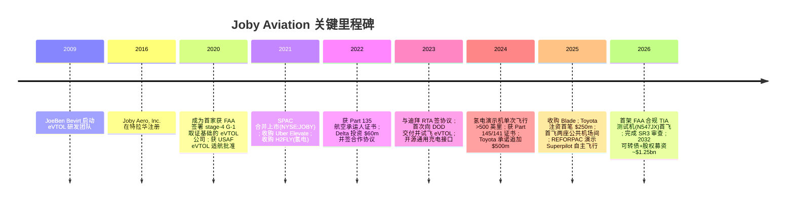
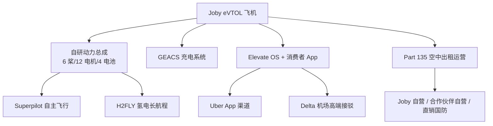
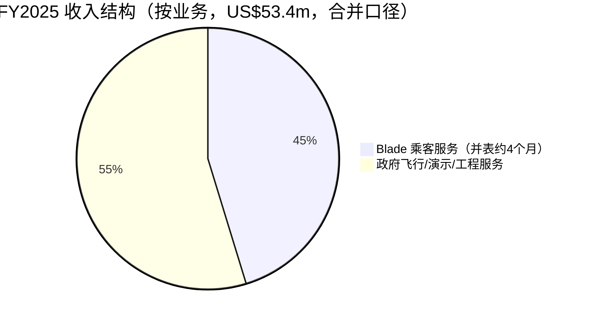
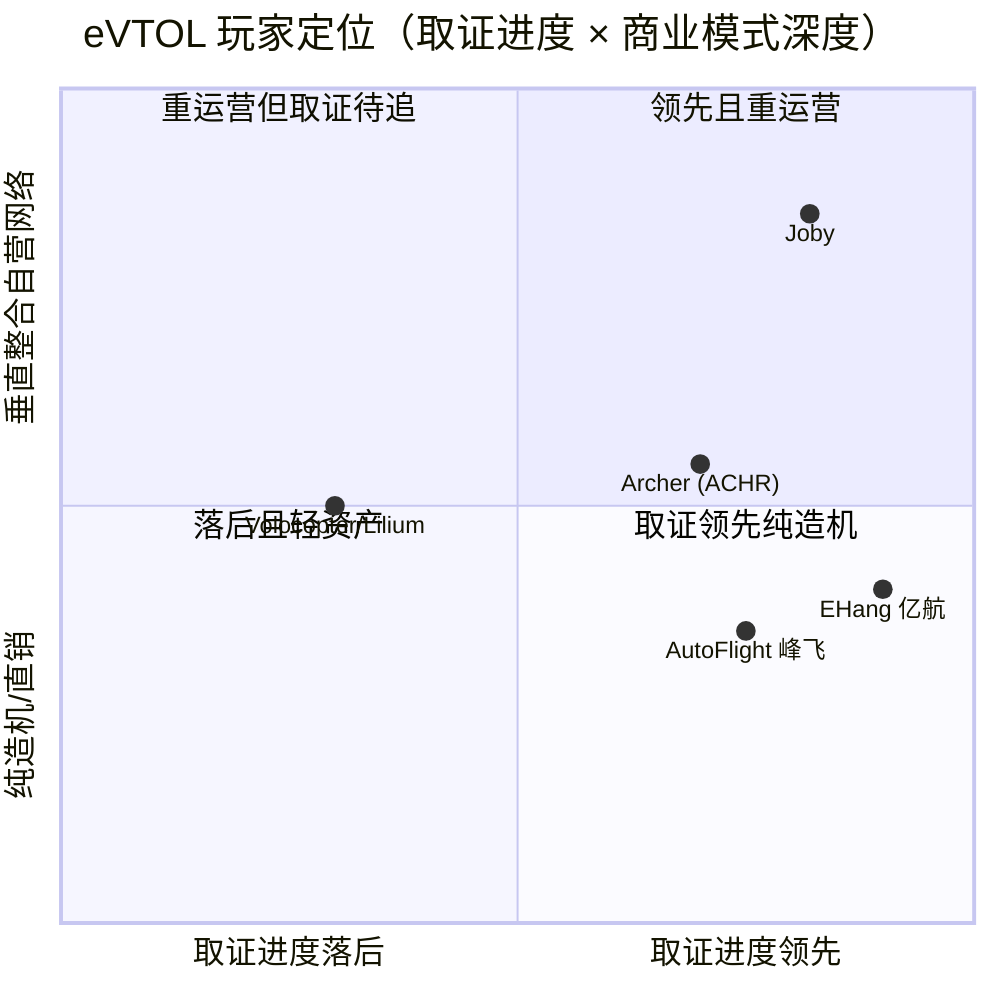
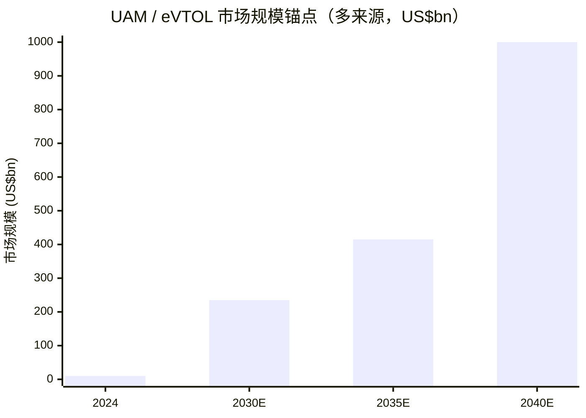

COMPANY RESEARCH REPORT: Joby Aviation, Inc.（NYSE:JOBY）
作成日 / As of: 2026-06-14

> *分析师观点：* **投资摘要 — 评级：Hold（中性）· 12 个月目标价 $9.5（较 2026-06-12 收盘 $9.15 上行 +4%）· 估值方法：风险加权 SOTP（rNPV 式情景概率加权）· 市值 ~$9.0bn · 52 周区间 $7.75–$20.95 · NYSE:JOBY**
>
> | 倍数 / Multiple（*分析师观点：* 预测列） | FY2025A | FY2026E | FY2027E |
> |---|---|---|---|
> | P/S（市销率，以 FY 收入计） | ~169× | ~46× | ~21× |
> | EV/Cash 净现金折算后市值 / 现金 | ~5.9× | ~4.7× | ~5.5× |
> | EPS（US$，摊薄） | (1.05) | (0.95) | (0.80) |
>
> 相对表现（截至 2026-06-12，[Yahoo Finance/yfinance](https://finance.yahoo.com/quote/JOBY/)）：1M −17.3% · 6M −39.0% · YTD −36.3% · 12M +6.4%，对标 S&P 500（1M −0.2% · 6M +7.9% · YTD +8.4% · 12M +24.3%）—— 12 个月相对跑输约 18 个百分点；但相对最直接的同业 Archer（ACHR 12M −49.1%）显著跑赢。
> **核心论点（thesis pillars）**——（1）Joby 是全球进度最领先的载客 eVTOL（电动垂直起降）开发商之一，已进入 FAA TIA（型号检查授权）飞行测试、完成 SR3 审查（四大审查中的第三项），并有 Toyota、Delta、Uber 三大战投背书；（2）但公司仍**未取得型号合格证（type certification）、零商业载客收入**，FY2025 净亏损 $929.8m、经营现金消耗 $509.9m，价值几乎全部押注在"按时取证 + 按成本量产"两个尚未兑现的变量上；（3）$2.5bn 在手现金 + Toyota/Delta 后续承诺给了约 4–5 年跑道，短期破产风险低，但每一次取证延期都会触发新一轮稀释；（4）当前 ~$9bn 市值对应一个尚无营收、尚无获批产品的公司，风险收益对称——给 Hold，等"首次载客 + TIA 完成"等关键催化兑现再重估。

> **Update — FY2026 资本结构重大变化（2026-02）：** 公司在 2026 年 2 月完成一笔 ~$576.0m 的股权增发（52,863,437 股）与 $690.0m 本金、票息 0.75%、2032 年到期的可转债（"2032 Notes"），合计净募资约 $1.25bn；叠加 2026 年 1 月 Delta 行使首批 7,000,000 份权证（$70.0m），把在手现金推升至 Q1 2026 末的 $2.5bn。这是 Joby 上市以来最大的单次"补血"，直接驱动 Q1 末现金及短期投资达 $2,466.9m（现金及受限现金 $875.4m + 短期投资 $1,591.7m）。
> Source: [JOBY FY2025 10-K — MD&A Liquidity, p. 42–43](https://www.sec.gov/Archives/edgar/data/1819848/000181984826000160/joby-20251231.htm)；[JOBY Q1-2026 10-Q — MD&A Liquidity](https://www.sec.gov/Archives/edgar/data/1819848/000181984826000324/joby-20260331.htm)。

## 目录 / TABLE OF CONTENTS
1. 公司概览（含投资论点）
1A. 估值与目标价（前瞻估算 · 目标价推导 · 牛/基准/熊情景）
1B. GF Score（GuruFocus 式）基本面评分
2. 公司历史
3. 管理团队
4. 产品与服务
5. 客户与上市策略
6. 行业概览
7. 竞争格局
8. 市场机会（TAM）
9. 风险评估
9.5. 核心分歧与催化剂
10. 投资视角评分卡

---

## 1. 公司概览

*分析师观点：* **本报告给予 Joby Aviation（NYSE:JOBY）Hold（中性）评级、12 个月目标价 $9.5**。一句话论点：Joby 是这个新兴行业里"工程最扎实、合规进度最靠前、资金最充裕"的载客 eVTOL 玩家之一，但它同时也是一家**尚无获批产品、尚无规模化营收、靠资本市场续命**的研发型公司。买点不在于怀疑它的技术，而在于"取证时间表"与"量产单位成本"这两个决定全部价值的变量至今都还是承诺而非事实——在它们被首次商业载客与 FAA 型号合格证证伪或证实之前，~$9bn 的市值已经把乐观情形 price-in 了相当一部分。下文按 10-K / 10-Q 的一手披露逐条拆解业务、产能、合规路径与现金跑道。

Joby 自我定义为"一家开发用于商业载客的电动空中出租（air taxi）的公司"。根据 FY2025 10-K，公司"已花费十余年时间设计并测试一款载一名飞行员加最多四名乘客（或最高 1,000 磅有效载荷）、巡航速度最高 200 mph、单次充电目标航程最高 100 英里的 piloted, all-electric eVTOL air taxi"，并打算"在全球城市直接运营空中出租服务，同时通过战略合作伙伴运营，并向分销商销售飞机、拓展国防等专门市场"（[JOBY FY2025 10-K — Item 1 Business Overview, p. 4](https://www.sec.gov/Archives/edgar/data/1819848/000181984826000160/joby-20251231.htm)）。其商业模式的核心词是 **vertical integration（垂直整合）**——自研自造从电机、逆变器到飞控计算机的关键件，并自建空中出租运营网络。

收入端，Joby 在 FY2025 才首次出现有意义的营收：全年收入 $53.4m，几乎全部来自 2025 年 8 月收购的 Blade（乘客直升机/固定翼包机经纪业务）以及为美国国防部（DOD）提供的政府飞行服务、演示飞行与工程服务；而 FY2024 全年收入仅 $0.136m。换言之，**公司当前几乎所有"收入"都与其核心 eVTOL 业务无关**——eVTOL 载客业务的收入要等到"目标 2026 年载首批乘客"之后才会出现（[JOBY FY2025 10-K — MD&A Results of Operations, p. 41](https://www.sec.gov/Archives/edgar/data/1819848/000181984826000160/joby-20251231.htm)）。

地理与规模上，Joby 总部位于加州 Santa Cruz，在加州 San Carlos 运营动力总成与电子工程/制造基地，在加州 Marina 拥有约 130,000 平方英尺的增材/减材制造、机加工、总装与试飞设施，并于 2025 年在 Marina 新建成一栋 226,000 平方英尺厂房；高产能工厂规划在俄亥俄州 Dayton——2024 年购入一栋 40,300 平方英尺厂房，2026 年 1 月再购入一栋 728,000 平方英尺厂房（[JOBY FY2025 10-K — Item 1 Business, p. 4–5](https://www.sec.gov/Archives/edgar/data/1819848/000181984826000160/joby-20251231.htm)）。截至 2026 年 1 月 31 日，公司有 2,559 名员工，无工会（[JOBY FY2025 10-K — Human Capital, p. 14](https://www.sec.gov/Archives/edgar/data/1819848/000181984826000160/joby-20251231.htm)）。

下面这张利润表 Sankey 直观展示了 Joby 的"赚钱方式"——更准确地说是"烧钱方式"：$53.4m 的微薄收入旁边，是 $581.1m 研发与 $162.6m 销售管理费用构成的 $773.0m 总营业费用，外加 $208.9m 的非经营性损失（主因权证/对赌负债的公允价值重估），最终录得 $929.8m 净亏损。

<svg xmlns="http://www.w3.org/2000/svg" viewBox="0 0 1000 560" width="1000" height="560" role="img" aria-label="income statement Sankey"><rect x="0" y="0" width="1000" height="560" fill="#ffffff"/>
<text x="20.00" y="30.00" text-anchor="start" font-family="Helvetica,Arial,sans-serif" font-size="15" font-weight="700" fill="#1f2933">Joby FY2025 利润表 Sankey (US$m)</text>
<path d="M 700.00,-2664.59 C 754.00,-2664.59 754.00,275.86 808.00,275.86 L 808.00,277.86 C 754.00,277.86 754.00,-2662.59 700.00,-2662.59 Z" fill="#86efac" fill-opacity="0.55"/>
<path d="M 700.00,-2662.59 C 754.00,-2662.59 754.00,291.86 808.00,291.86 L 808.00,302.14 C 754.00,302.14 754.00,-2652.32 700.00,-2652.32 Z" fill="#fca5a5" fill-opacity="0.55"/>
<path d="M 576.00,-2657.59 C 630.00,-2657.59 630.00,-2664.59 684.00,-2664.59 L 684.00,-2662.59 C 630.00,-2662.59 630.00,-2655.59 576.00,-2655.59 Z" fill="#86efac" fill-opacity="0.55"/>
<path d="M 576.00,-2641.59 C 630.00,-2641.59 630.00,-2648.59 684.00,-2648.59 L 684.00,-1363.62 C 630.00,-1363.62 630.00,-1356.62 576.00,-1356.62 Z" fill="#fca5a5" fill-opacity="0.55"/>
<path d="M 576.00,-1356.62 C 630.00,-1356.62 630.00,-1349.62 684.00,-1349.62 L 684.00,3242.59 C 630.00,3242.59 630.00,3235.59 576.00,3235.59 Z" fill="#fca5a5" fill-opacity="0.55"/>
<path d="M 452.00,71.00 C 506.00,71.00 506.00,-2657.59 560.00,-2657.59 L 560.00,-2655.59 C 506.00,-2655.59 506.00,73.00 452.00,73.00 Z" fill="#86efac" fill-opacity="0.55"/>
<path d="M 452.00,73.00 C 506.00,73.00 506.00,-2641.59 560.00,-2641.59 L 560.00,3235.59 C 506.00,3235.59 506.00,5950.18 452.00,5950.18 Z" fill="#fca5a5" fill-opacity="0.55"/>
<path d="M 204.00,72.58 C 258.00,72.58 258.00,78.00 312.00,78.00 L 312.00,307.18 C 258.00,307.18 258.00,301.76 204.00,301.76 Z" fill="#93c5fd" fill-opacity="0.55"/>
<path d="M 328.00,78.00 C 382.00,78.00 382.00,71.00 436.00,71.00 L 436.00,261.45 C 382.00,261.45 382.00,268.45 328.00,268.45 Z" fill="#86efac" fill-opacity="0.55"/>
<path d="M 328.00,268.45 C 382.00,268.45 382.00,275.45 436.00,275.45 L 436.00,507.00 C 382.00,507.00 382.00,500.00 328.00,500.00 Z" fill="#fca5a5" fill-opacity="0.55"/>
<path d="M 204.00,315.76 C 258.00,315.76 258.00,307.18 312.00,307.18 L 312.00,496.84 C 258.00,496.84 258.00,505.42 204.00,505.42 Z" fill="#93c5fd" fill-opacity="0.55"/>
<rect x="188.00" y="72.58" width="16" height="229.18" rx="1.5" fill="#2563eb"/>
<rect x="188.00" y="315.76" width="16" height="189.66" rx="1.5" fill="#2563eb"/>
<rect x="312.00" y="78.00" width="16" height="422.00" rx="1.5" fill="#1e3a8a"/>
<rect x="436.00" y="71.00" width="16" height="190.45" rx="1.5" fill="#15803d"/>
<rect x="436.00" y="275.45" width="16" height="231.55" rx="1.5" fill="#dc2626"/>
<rect x="560.00" y="-2657.59" width="16" height="2.00" rx="1.5" fill="#15803d"/>
<rect x="560.00" y="-2641.59" width="16" height="5877.18" rx="1.5" fill="#dc2626"/>
<rect x="684.00" y="-2664.59" width="16" height="2.00" rx="1.5" fill="#15803d"/>
<rect x="684.00" y="-2648.59" width="16" height="1284.97" rx="1.5" fill="#dc2626"/>
<rect x="684.00" y="-1349.62" width="16" height="4592.21" rx="1.5" fill="#dc2626"/>
<rect x="808.00" y="275.86" width="16" height="2.00" rx="1.5" fill="#15803d"/>
<rect x="808.00" y="291.86" width="16" height="10.27" rx="1.5" fill="#dc2626"/>
<text x="179.00" y="184.17" text-anchor="end" font-family="Helvetica,Arial,sans-serif" font-size="11.5" font-weight="700" fill="#1f2933">Government &amp; engineering 政府/工程服务</text>
<text x="179.00" y="197.17" text-anchor="end" font-family="Helvetica,Arial,sans-serif" font-size="10" font-weight="400" fill="#52606d">US$29.0M  (54.3%)</text>
<text x="179.00" y="407.59" text-anchor="end" font-family="Helvetica,Arial,sans-serif" font-size="11.5" font-weight="700" fill="#1f2933">Blade passenger 乘客服务</text>
<text x="179.00" y="420.59" text-anchor="end" font-family="Helvetica,Arial,sans-serif" font-size="10" font-weight="400" fill="#52606d">US$24.0M  (44.9%)</text>
<rect x="331.00" y="60.00" width="119.40" height="26" rx="2" fill="#ffffff" fill-opacity="0.72"/>
<text x="334.00" y="72.00" text-anchor="start" font-family="Helvetica,Arial,sans-serif" font-size="11.5" font-weight="700" fill="#1f2933">Revenue</text>
<text x="334.00" y="85.00" text-anchor="start" font-family="Helvetica,Arial,sans-serif" font-size="10" font-weight="400" fill="#52606d">US$53.4M  (100.0%)</text>
<rect x="455.00" y="53.00" width="113.10" height="26" rx="2" fill="#ffffff" fill-opacity="0.72"/>
<text x="458.00" y="65.00" text-anchor="start" font-family="Helvetica,Arial,sans-serif" font-size="11.5" font-weight="700" fill="#1f2933">Gross Profit</text>
<text x="458.00" y="78.00" text-anchor="start" font-family="Helvetica,Arial,sans-serif" font-size="10" font-weight="400" fill="#52606d">US$24.1M  (45.1%)</text>
<rect x="455.00" y="257.45" width="144.60" height="26" rx="2" fill="#ffffff" fill-opacity="0.72"/>
<text x="458.00" y="269.45" text-anchor="start" font-family="Helvetica,Arial,sans-serif" font-size="11.5" font-weight="700" fill="#1f2933">Cost of Revenue (COGS)</text>
<text x="458.00" y="282.45" text-anchor="start" font-family="Helvetica,Arial,sans-serif" font-size="10" font-weight="400" fill="#52606d">US$29.3M  (54.9%)</text>
<rect x="579.00" y="-2675.59" width="144.60" height="26" rx="2" fill="#ffffff" fill-opacity="0.72"/>
<text x="582.00" y="-2663.59" text-anchor="start" font-family="Helvetica,Arial,sans-serif" font-size="11.5" font-weight="700" fill="#1f2933">Operating Income</text>
<text x="582.00" y="-2650.59" text-anchor="start" font-family="Helvetica,Arial,sans-serif" font-size="10" font-weight="400" fill="#52606d">-US$719.6M  (-1347.6%)</text>
<rect x="579.00" y="-2650.59" width="150.90" height="26" rx="2" fill="#ffffff" fill-opacity="0.72"/>
<text x="582.00" y="-2638.59" text-anchor="start" font-family="Helvetica,Arial,sans-serif" font-size="11.5" font-weight="700" fill="#1f2933">Total Operating Expense</text>
<text x="582.00" y="-2625.59" text-anchor="start" font-family="Helvetica,Arial,sans-serif" font-size="10" font-weight="400" fill="#52606d">US$743.7M  (1392.7%)</text>
<rect x="703.00" y="-2682.59" width="144.60" height="26" rx="2" fill="#ffffff" fill-opacity="0.72"/>
<text x="706.00" y="-2670.59" text-anchor="start" font-family="Helvetica,Arial,sans-serif" font-size="11.5" font-weight="700" fill="#1f2933">Pretax Income</text>
<text x="706.00" y="-2657.59" text-anchor="start" font-family="Helvetica,Arial,sans-serif" font-size="10" font-weight="400" fill="#52606d">-US$928.5M  (-1738.8%)</text>
<rect x="703.00" y="-2657.59" width="125.70" height="26" rx="2" fill="#ffffff" fill-opacity="0.72"/>
<text x="706.00" y="-2645.59" text-anchor="start" font-family="Helvetica,Arial,sans-serif" font-size="11.5" font-weight="700" fill="#1f2933">SG&amp;A</text>
<text x="706.00" y="-2632.59" text-anchor="start" font-family="Helvetica,Arial,sans-serif" font-size="10" font-weight="400" fill="#52606d">US$162.6M  (304.5%)</text>
<rect x="703.00" y="-1367.62" width="132.00" height="26" rx="2" fill="#ffffff" fill-opacity="0.72"/>
<text x="706.00" y="-1355.62" text-anchor="start" font-family="Helvetica,Arial,sans-serif" font-size="11.5" font-weight="700" fill="#1f2933">R&amp;D</text>
<text x="706.00" y="-1342.62" text-anchor="start" font-family="Helvetica,Arial,sans-serif" font-size="10" font-weight="400" fill="#52606d">US$581.1M  (1088.2%)</text>
<text x="833.00" y="273.86" text-anchor="start" font-family="Helvetica,Arial,sans-serif" font-size="11.5" font-weight="700" fill="#1f2933">Net Income</text>
<text x="833.00" y="286.86" text-anchor="start" font-family="Helvetica,Arial,sans-serif" font-size="10" font-weight="400" fill="#52606d">-US$929.8M  (-1741.2%)</text>
<text x="833.00" y="298.86" text-anchor="start" font-family="Helvetica,Arial,sans-serif" font-size="11.5" font-weight="700" fill="#1f2933">Income Tax</text>
<text x="833.00" y="311.86" text-anchor="start" font-family="Helvetica,Arial,sans-serif" font-size="10" font-weight="400" fill="#52606d">US$1.3M  (2.4%)</text>
<text x="500.00" y="544.00" text-anchor="middle" font-family="Helvetica,Arial,sans-serif" font-size="10" font-weight="400" fill="#52606d">Source: JOBY FY2025 10-K, 综合经营报表 (SEC EDGAR, filed 2026-02-27)</text>
</svg>

Source: [JOBY FY2025 10-K — 综合经营报表 (Consolidated Statements of Operations), p. 41](https://www.sec.gov/Archives/edgar/data/1819848/000181984826000160/joby-20251231.htm)。

**估值快照（valuation snapshot）。** 截至 2026-06-12，JOBY 收盘 $9.15，市值约 $9.0bn，52 周区间 $7.75–$20.95（[Yahoo Finance — JOBY key statistics](https://finance.yahoo.com/quote/JOBY/)）。常规盈利倍数全部失效——公司 TTM 净利润为负（FY2025 净亏损 $929.8m），**TTM P/E 为负且无意义**；以 FY2025 收入 $53.4m 计的 P/S 高达约 169×，但这个数字同样具误导性，因为收入主体（Blade 包机）与核心 eVTOL 估值逻辑无关。市场实际上是在用"期权式"逻辑给 Joby 定价：把 ~$9bn 市值理解为"对一个 2040 年 $1 万亿 UAM TAM 的看涨期权"，而非任何当期基本面倍数（行业 TAM 见 Section 8）。*分析师观点：* 与最直接的可比公司——同样在 FAA 取证路径上的 Archer（ACHR）——相比，两者都没有正向盈利倍数可比，市场给 Joby 的溢价主要来自其更靠前的取证进度（TIA 飞行已开始）与 Toyota/Delta 的战投背书（[Bernstein — Global Energy Storage: The rise of eVTOL, 2025-09-30, p.1](http://xs-macbook-air.local:5001/zsxq/pdf/212852181518441/Bernstein-Global%20Energy%20Storage%20China%20Next%20Winners%EF%BC%9A%20The%20rise%20of%20eVTOL-250930.pdf) 将 Joby、亿航、Archer 并列为全球 eVTOL 头部玩家，其中 Joby 市值 >$100 亿美元）。由于 P/S>50× 且无清晰盈利路径，该高倍数本身即构成 Section 9 中的"估值/多重压缩风险"。

## 1A. 估值与目标价

> *分析师观点：* 本章所有前瞻数字（收入/费用/EPS/现金/目标价/情景）均为本报告的估算，**不附任何 filing 引用**；每条估算的外部输入（10-K 分部数据、管理层指引、行业预测）在行内单独引用。对一家 pre-revenue（未盈利且核心业务尚无营收）的公司，**决策变量不是 EPS 路径，而是现金跑道与取证时间表**，因此前瞻表以现金为中心。

**(a) 前瞻财务估算表（FY2025A–FY2027E）。** Joby 的核心 eVTOL 业务在预测期内基本无收入；收入几乎全部来自 Blade 包机 + 政府/工程服务。下表的"营收"因此不是 eVTOL 商业化的代表，而更多反映 Blade 的并表与政府合同节奏。真正的看点是**经营现金消耗（cash burn）与年末净现金**——这决定了 Joby 在不取证、不量产的情况下还能撑多久。

| 指标（*分析师观点：*） | FY2025A | FY2026E | FY2027E | 备注 / 输入来源 |
|---|---|---|---|---|
| 收入（US\$m） | 53.4 | ~195 | ~430 | FY25 实际；FY26/27E = Blade 全年并表（FY25 仅并表约 4 个月）+ 政府/工程服务自然增长 |
| — YoY % | n.m. | +265% | +120% | 主要为 Blade 并表口径变化，非 eVTOL 商业化 |
| 营业成本率 % | 55% | ~70% | ~68% | Blade 包机为低毛利转售模式，拉低综合毛利 |
| 研发费用（US\$m） | 581.1 | ~700 | ~760 | FY25 实际 $581.1m，+22% YoY；管理层明确"预计研发费用将随取证推进而上升" |
| SG&A（US\$m） | 162.6 | ~200 | ~230 | FY25 $162.6m，+36% YoY，含 Blade 并购成本 |
| 经营亏损（US\$m） | (719.6) | (~770) | (~760) | 取证前规模化无法覆盖费用增长 |
| EPS（US\$，摊薄） | (1.05) | (~0.95) | (~0.80) | FY25 净亏损 $929.8m / 加权 ~884m 股；含大额非现金权证重估损益，波动极大 |
| 经营现金消耗（US\$m） | (509.9) | (~620) | (~700) | FY25 实际 $509.9m；随产能/认证投入加速而扩大 |
| 资本开支 CapEx（US\$m） | (53.9) | (~150) | (~250) | FY25 $53.9m；俄亥俄量产厂建设将显著拉高 |
| 自由现金流 FCF（US\$m） | (563.8) | (~770) | (~950) | = CFO − CapEx |
| 年末净现金/(净债务)（US\$m） | +1,408 | +~2,100 | +~1,200 | FY25 末现金及短投 $1,408m；2026-02 增发+可转债后 Q1 末已达 $2,467m，2032 Notes 本金 $690m 计为债务 |
| 现金跑道（按当前 burn，季度数） | ~16+ | ~13 | ~7 | Q1-2026 末 $2.5bn 现金 / 季度 burn ~$155–175m ≈ 14–16 个季度（约 3.5–4 年），但量产 capex 会缩短 |

> 营收输入：[JOBY FY2025 10-K — MD&A Results, p. 41](https://www.sec.gov/Archives/edgar/data/1819848/000181984826000160/joby-20251231.htm)（FY25 收入 $53.4m，研发 $581.1m +22%，SG&A $162.6m +36%，经营现金消耗 $509.9m，CapEx $53.9m）；现金跑道输入：[JOBY Q1-2026 10-Q — MD&A Liquidity](https://www.sec.gov/Archives/edgar/data/1819848/000181984826000324/joby-20260331.htm)（Q1 末现金及短投 $2,466.9m）。

**经营费用结构演变（margin/费用 bridge 的替代）。** 由于 Joby 尚无毛利可拆，下图用 FY2023→FY2025 的营业费用结构替代传统的 margin bridge——可以看到研发始终是吞噬现金的主体（FY2025 $581.1m，占总营业费用约 75%），而营业成本直到 FY2025 才因 Blade 并表跳升至 $29.3m。

<svg xmlns="http://www.w3.org/2000/svg" viewBox="0 0 860 470" width="860" height="470" role="img" aria-label="historical revenue bars"><rect x="0" y="0" width="860" height="470" fill="#ffffff"/>
<text x="20.00" y="30.00" text-anchor="start" font-family="Helvetica,Arial,sans-serif" font-size="15" font-weight="700" fill="#1f2933">Joby 营业费用结构演变 FY2023–FY2025 (US$m)</text>
<rect x="20.00" y="44" width="11" height="11" rx="2" fill="#2563eb"/>
<text x="36.00" y="53.00" text-anchor="start" font-family="Helvetica,Arial,sans-serif" font-size="10.5" font-weight="400" fill="#1f2933">R&amp;D 研发</text>
<rect x="89.60" y="44" width="11" height="11" rx="2" fill="#15803d"/>
<text x="105.60" y="53.00" text-anchor="start" font-family="Helvetica,Arial,sans-serif" font-size="10.5" font-weight="400" fill="#1f2933">SG&amp;A 销售管理</text>
<rect x="179.00" y="44" width="11" height="11" rx="2" fill="#d97706"/>
<text x="195.00" y="53.00" text-anchor="start" font-family="Helvetica,Arial,sans-serif" font-size="10.5" font-weight="400" fill="#1f2933">Cost of revenue 营业成本</text>
<line x1="70" y1="412.00" x2="834" y2="412.00" stroke="#eceff2" stroke-width="1"/>
<text x="64.00" y="415.00" text-anchor="end" font-family="Helvetica,Arial,sans-serif" font-size="9.5" font-weight="400" fill="#52606d">US$0</text>
<line x1="70" y1="345.20" x2="834" y2="345.20" stroke="#eceff2" stroke-width="1"/>
<text x="64.00" y="348.20" text-anchor="end" font-family="Helvetica,Arial,sans-serif" font-size="9.5" font-weight="400" fill="#52606d">US$167.0M</text>
<line x1="70" y1="278.40" x2="834" y2="278.40" stroke="#eceff2" stroke-width="1"/>
<text x="64.00" y="281.40" text-anchor="end" font-family="Helvetica,Arial,sans-serif" font-size="9.5" font-weight="400" fill="#52606d">US$333.9M</text>
<line x1="70" y1="211.60" x2="834" y2="211.60" stroke="#eceff2" stroke-width="1"/>
<text x="64.00" y="214.60" text-anchor="end" font-family="Helvetica,Arial,sans-serif" font-size="9.5" font-weight="400" fill="#52606d">US$500.9M</text>
<line x1="70" y1="144.80" x2="834" y2="144.80" stroke="#eceff2" stroke-width="1"/>
<text x="64.00" y="147.80" text-anchor="end" font-family="Helvetica,Arial,sans-serif" font-size="9.5" font-weight="400" fill="#52606d">US$667.9M</text>
<line x1="70" y1="78.00" x2="834" y2="78.00" stroke="#eceff2" stroke-width="1"/>
<text x="64.00" y="81.00" text-anchor="end" font-family="Helvetica,Arial,sans-serif" font-size="9.5" font-weight="400" fill="#52606d">US$834.8M</text>
<rect x="123.48" y="265.17" width="147.71" height="146.83" fill="#2563eb"/>
<rect x="123.48" y="222.80" width="147.71" height="42.37" fill="#15803d"/>
<rect x="123.48" y="222.72" width="147.71" height="0.08" fill="#d97706"/>
<text x="197.33" y="428.00" text-anchor="middle" font-family="Helvetica,Arial,sans-serif" font-size="10" font-weight="400" fill="#52606d">2023</text>
<rect x="378.15" y="221.08" width="147.71" height="190.92" fill="#2563eb"/>
<rect x="378.15" y="173.19" width="147.71" height="47.89" fill="#15803d"/>
<rect x="378.15" y="173.15" width="147.71" height="0.04" fill="#d97706"/>
<text x="452.00" y="428.00" text-anchor="middle" font-family="Helvetica,Arial,sans-serif" font-size="10" font-weight="400" fill="#52606d">2024</text>
<rect x="632.81" y="179.52" width="147.71" height="232.48" fill="#2563eb"/>
<rect x="632.81" y="114.46" width="147.71" height="65.05" fill="#15803d"/>
<rect x="632.81" y="102.74" width="147.71" height="11.72" fill="#d97706"/>
<text x="706.67" y="428.00" text-anchor="middle" font-family="Helvetica,Arial,sans-serif" font-size="10" font-weight="400" fill="#52606d">2025</text>
<text x="430.00" y="454.00" text-anchor="middle" font-family="Helvetica,Arial,sans-serif" font-size="10" font-weight="400" fill="#52606d">Source: JOBY FY2023–FY2025 10-K, 综合经营报表 (SEC EDGAR)</text>
</svg>

Source: [JOBY FY2023–FY2025 10-K — 综合经营报表](https://www.sec.gov/Archives/edgar/data/1819848/000181984826000160/joby-20251231.htm)（FY24/FY23 数据取自 [FY2024 10-K, p. 40–41](https://www.sec.gov/cgi-bin/browse-edgar?action=getcompany&CIK=0001819848&type=10-K)）。

**(b) 目标价推导——为何用 SOTP/情景概率加权而非倍数。** 对一家无营收、无获批产品的公司，forward-PE 与 EV/EBITDA 均无法应用；DCF 的终值假设又会把误差放大到无意义。因此本报告采用**情景概率加权的 rNPV 式框架**：把 Joby 拆成"成功取证并规模化运营的 UAM 网络"这一单一资产，对其赋予一个明确的成功概率（probability of success, PTS），再用情景目标价加权。基准情形下，给予 Joby 在"成功取证后成为美国/迪拜 UAM 网络头部运营商"这一结局约 35–45% 的实现概率；按下表加权得到 **12 个月目标价 $9.5**，与现价基本持平——这正是 Hold 评级的算术来源。

**(c) 牛/基准/熊情景表。**

| 情景（*分析师观点：*） | 关键假设 | 目标价 | 较 $9.15 现价 |
|---|---|---|---|
| 牛 Bull | 2026 内首次商业载客成功 + 2027 取得 FAA 型号合格证 + 迪拜/eIPP 早期运营放量，市场按"全球 UAM 龙头"重估 | $20 | +119% |
| 基准 Base | 取证滑到 2027–2028、eIPP 早期运营小规模落地、再融资带来 ~15% 稀释，市场维持"期权式"定价 | $9.5 | +4% |
| 熊 Bear | 取证再延 2 年以上 / 一次安全事件 / eVTOL 板块整体 de-rate（参照 Volocopter、Lilium 2024 资金困境），现金跑道焦虑回归 | $4 | −56% |

> 情景输入：取证阶段进度（"已完成或基本完成五阶段中的前三阶段，第四阶段已过半"）与 eIPP 早期运营路径见 [JOBY FY2025 10-K — Certification, p. 10](https://www.sec.gov/Archives/edgar/data/1819848/000181984826000160/joby-20251231.htm)；Volocopter/Lilium 2024 资金困境作为熊情景对标见 [Bernstein — The rise of eVTOL, 2025-09-30, p.1](http://xs-macbook-air.local:5001/zsxq/pdf/212852181518441/Bernstein-Global%20Energy%20Storage%20China%20Next%20Winners%EF%BC%9A%20The%20rise%20of%20eVTOL-250930.pdf)。

**(d) 与市场一致预期的对比。** 本地机构研究库（`db/zsxq.db`）中**没有针对 Joby 本身的卖方单名报告**（覆盖的 eVTOL 单名标的均为亿航 EHang），因此本报告无法引用一个可信的 Joby 卖方一致目标价；公开报道中卖方对 JOBY 的目标价分布极广（从个位数到 $20+），分歧本身反映了"取证时间表"这一二元变量的不可预测性。本报告的基准估算刻意贴近现价，体现"在催化兑现前不押方向"的立场。*分析师观点：* 由于缺乏可信的本地卖方一致预期，本处不杜撰一致数字。

**(e) 最该盯紧的变量（swing variables）。** 整个估值悬于两个变量：**① FAA 型号合格证的时间表**（每延一年，rNPV 因贴现与额外稀释下移约 15–25%）；**② 规模化后的单机变动成本**——管理层在 10-K 中坦承"规模化组装单机的变动成本在当前研发阶段仍不确定"（[JOBY FY2025 10-K — Vertically-Integrated Business Model, p. 39](https://www.sec.gov/Archives/edgar/data/1819848/000181984826000160/joby-20251231.htm)），而单位经济性是"自建运营网络"商业模式能否成立的根基。

## 1B. GF Score（GuruFocus 式）基本面评分

*分析师观点：* **GF Score（GuruFocus-style）：34/100 —— 0–50 区间（future-performance potential 最弱档 / 数据不足档）。** 说明：该综合分及五个分项均为本报告自有评分框架的输出，**不代表 GuruFocus 官方数字、也不附任何 filing 引用**；每个分项背后的指标在下文各自带行内引用。对一家 pre-revenue 公司，低分主要反映"尚无盈利、估值无锚、动量走弱"，而非经营失败——读法应是"基本面尚未进入可评分阶段"。

<svg xmlns="http://www.w3.org/2000/svg" viewBox="0 0 500 500" width="500" height="500" role="img" aria-label="GF Score radar">
<rect x="0" y="0" width="500" height="500" fill="#ffffff"/>
<text x="20" y="24" font-family="Helvetica,Arial,sans-serif" font-size="15" font-weight="700" fill="#1f2933">GF Score (GuruFocus-style): 34/100</text>
<text x="20" y="41" font-family="Helvetica,Arial,sans-serif" font-size="11" fill="#52606d">0–50 Worst future performance potential / insufficient data</text>
<polygon points="250.0,88.0 392.7,191.6 338.2,359.4 161.8,359.4 107.3,191.6" fill="#e9f5ec" stroke="none"/>
<polygon points="250.0,208.0 278.5,228.7 267.6,262.3 232.4,262.3 221.5,228.7" fill="none" stroke="#c5d3cb" stroke-width="1"/>
<polygon points="250.0,178.0 307.1,219.5 285.3,286.5 214.7,286.5 192.9,219.5" fill="none" stroke="#c5d3cb" stroke-width="1"/>
<polygon points="250.0,148.0 335.6,210.2 302.9,310.8 197.1,310.8 164.4,210.2" fill="none" stroke="#c5d3cb" stroke-width="1"/>
<polygon points="250.0,118.0 364.1,200.9 320.5,335.1 179.5,335.1 135.9,200.9" fill="none" stroke="#c5d3cb" stroke-width="1"/>
<polygon points="250.0,88.0 392.7,191.6 338.2,359.4 161.8,359.4 107.3,191.6" fill="none" stroke="#c5d3cb" stroke-width="1.3"/>
<line x1="250" y1="238" x2="161.8" y2="359.4" stroke="#cfdad3" stroke-width="1"/>
<text x="146.5" y="392.4" text-anchor="end" font-family="Helvetica,Arial,sans-serif" font-size="11.5" font-weight="600" fill="#1f2933">财务实力</text>
<text x="197.1" y="304.8" text-anchor="middle" font-family="Helvetica,Arial,sans-serif" font-size="10.5" font-weight="700" fill="#1f2933">6</text>
<line x1="250" y1="238" x2="250.0" y2="88.0" stroke="#cfdad3" stroke-width="1"/>
<text x="250.0" y="58.0" text-anchor="middle" font-family="Helvetica,Arial,sans-serif" font-size="11.5" font-weight="600" fill="#1f2933">盈利能力</text>
<text x="250.0" y="217.0" text-anchor="middle" font-family="Helvetica,Arial,sans-serif" font-size="10.5" font-weight="700" fill="#1f2933">1</text>
<line x1="250" y1="238" x2="107.3" y2="191.6" stroke="#cfdad3" stroke-width="1"/>
<text x="82.6" y="183.6" text-anchor="end" font-family="Helvetica,Arial,sans-serif" font-size="11.5" font-weight="600" fill="#1f2933">成长性</text>
<text x="178.7" y="208.8" text-anchor="middle" font-family="Helvetica,Arial,sans-serif" font-size="10.5" font-weight="700" fill="#1f2933">5</text>
<line x1="250" y1="238" x2="392.7" y2="191.6" stroke="#cfdad3" stroke-width="1"/>
<text x="417.4" y="183.6" text-anchor="start" font-family="Helvetica,Arial,sans-serif" font-size="11.5" font-weight="600" fill="#1f2933">估值</text>
<text x="278.5" y="222.7" text-anchor="middle" font-family="Helvetica,Arial,sans-serif" font-size="10.5" font-weight="700" fill="#1f2933">2</text>
<line x1="250" y1="238" x2="338.2" y2="359.4" stroke="#cfdad3" stroke-width="1"/>
<text x="353.5" y="392.4" text-anchor="start" font-family="Helvetica,Arial,sans-serif" font-size="11.5" font-weight="600" fill="#1f2933">动量</text>
<text x="276.5" y="268.4" text-anchor="middle" font-family="Helvetica,Arial,sans-serif" font-size="10.5" font-weight="700" fill="#1f2933">3</text>
<polygon points="250.0,223.0 278.5,228.7 276.5,274.4 197.1,310.8 178.7,214.8" fill="#2e8b57" fill-opacity="0.34" stroke="#2e8b57" stroke-width="2"/>
<circle cx="197.1" cy="310.8" r="2.6" fill="#2e8b57"/>
<circle cx="250.0" cy="223.0" r="2.6" fill="#2e8b57"/>
<circle cx="178.7" cy="214.8" r="2.6" fill="#2e8b57"/>
<circle cx="278.5" cy="228.7" r="2.6" fill="#2e8b57"/>
<circle cx="276.5" cy="274.4" r="2.6" fill="#2e8b57"/>
<text x="250" y="470" text-anchor="middle" font-family="Helvetica,Arial,sans-serif" font-size="9.5" fill="#52606d">Source: JOBY FY2025 10-K (SEC EDGAR) · Q1-2026 10-Q · Yahoo Finance, as of 2026-06-12</text>
<text x="250" y="485" text-anchor="middle" font-family="Helvetica,Arial,sans-serif" font-size="9" fill="#52606d">GF Score = independent analyst rubric (*Analyst view:*) — not GuruFocus™ official number</text>
</svg>

*读图：离中心越远越好；五边形越大，综合得分越高。*

| 维度 | 评分 (0–10) | |
|---|---|---|
| 财务实力 | 6 | `██████░░░░` |
| 盈利能力 | 1 | `█░░░░░░░░░` |
| 成长性 | 5 | `█████░░░░░` |
| 估值 | 2 | `██░░░░░░░░` |
| 动量 | 3 | `███░░░░░░░` |
| **GF Score (composite, *Analyst view:*)** | **34 / 100** | **0–50 Worst future performance potential / insufficient data** |

*Composite weights (*Analyst view:*): Financial Strength 20% · Profitability 25% · Growth 25% · GF Value 15% · Momentum 15% (transparent reproduction — not GuruFocus's proprietary weighting).*

**各维度评分理由：**

- **财务实力 Financial Strength = 6/10。** 这是 Joby 唯一的亮点。Q1-2026 末现金及短期投资 $2,466.9m、几乎无传统有息负债（2032 Notes $690m 票息仅 0.75%、2032 年才到期），按当前 ~$155–175m/季度的 burn 折算约 3.5–4 年跑道（[JOBY Q1-2026 10-Q — MD&A Liquidity](https://www.sec.gov/Archives/edgar/data/1819848/000181984826000324/joby-20260331.htm)）。扣分项是"持续负经营现金流 + 高度依赖资本市场续命"——FY2025 经营现金消耗 $509.9m（[JOBY FY2025 10-K — Cash Flows, p. 43](https://www.sec.gov/Archives/edgar/data/1819848/000181984826000160/joby-20251231.htm)）。
- **盈利能力 Profitability = 1/10。** 公司自 2009 年成立以来"每一年都录得经营净亏损与负经营现金流"，FY2025 净亏损 $929.8m、累计赤字 $2,785.6m（[JOBY FY2025 10-K — MD&A Overview, p. 37](https://www.sec.gov/Archives/edgar/data/1819848/000181984826000160/joby-20251231.htm)）。无正向毛利率、经营利润率、ROE/ROIC 可言，给最低分。
- **成长性 Growth = 5/10。** 表面收入从 $0.1m 跳至 $53.4m（[JOBY FY2025 10-K — MD&A Results, p. 41](https://www.sec.gov/Archives/edgar/data/1819848/000181984826000160/joby-20251231.htm)），但这是 Blade 并表+政府合同的口径变化，而非 eVTOL 商业化的有机增长；真正能锚定成长性的"首次载客"尚未发生。中性偏低。
- **估值 GF Value = 2/10（越高越便宜，故低分=贵）。** 以 FY2025 收入计 P/S ~169×、且无盈利锚，对一个尚无获批产品的公司，~$9bn 市值已隐含大量乐观假设（[Yahoo Finance — JOBY](https://finance.yahoo.com/quote/JOBY/)）。相对内在价值区间（Section 1A 基准 $9.5）几乎无安全边际。
- **动量 Momentum = 3/10。** 12 个月绝对 +6.4%，但同期 S&P 500 +24.3%，相对跑输约 18 个百分点；YTD −36.3%、6M −39.0%，趋势走弱（[yfinance — JOBY/^GSPC, as of 2026-06-12](https://finance.yahoo.com/quote/JOBY/)）。唯一加分项是相对同业 Archer（12M −49.1%）跑赢。

**综合算术：** (财务实力 6×20% + 盈利 1×25% + 成长 5×25% + 估值 2×15% + 动量 3×15%) = (1.20 + 0.25 + 1.25 + 0.30 + 0.45)×10 = **34/100**（权重 20/25/25/15/15，透明复刻，非 GuruFocus 专有权重）。

**一句话提醒：** 最可能翻转的是"成长性"与"估值"两轴——一旦首次商业载客落地、收入开始反映 eVTOL 而非 Blade，这两轴会快速重估；在那之前，34 分应被理解为"尚未进入可评分阶段"，而非"基本面崩坏"。

## 2. 公司历史

Joby 的故事始于创始人 JoeBen Bevirt 对电动推进与机器人的长期执念。公司前身 Joby Aero, Inc.（"Legacy Joby"）于 2016 年 11 月 21 日在特拉华注册，但 Bevirt 自 2009 年起即开始组建团队、研发 eVTOL；2021 年 8 月，Legacy Joby 与特殊目的收购公司 Reinvent Technology Partners（"RTP"）完成 SPAC 合并，RTP 更名为 Joby Aviation, Inc. 并登陆纽交所（[JOBY FY2025 10-K — Item 1 Business, p. 5](https://www.sec.gov/Archives/edgar/data/1819848/000181984826000160/joby-20251231.htm)）。上市为公司带来了关键的早期弹药：2021 年 8 月合并净募资 $1,067.9m，叠加合并前可转换优先股与可转债 $843.3m（[JOBY FY2025 10-K — MD&A Sources of Liquidity, p. 42](https://www.sec.gov/Archives/edgar/data/1819848/000181984826000160/joby-20251231.htm)）。

公司历史上有三次定义性的战略动作。**其一，2021 年收购 Uber Elevate**——Joby 不仅接收了 Uber 多年积累的空中出行规划/运营软件工具与团队，更换来了 Uber 把 Joby 空中出租服务整合进 Uber App 的合作协议，这成为 Joby 未来获客的核心渠道之一（[JOBY FY2025 10-K — Uber, p. 12](https://www.sec.gov/Archives/edgar/data/1819848/000181984826000160/joby-20251231.htm)）。**其二，2021 年收购 H2FLY 切入氢电**——H2FLY 在 2023 年完成了"全球首次液氢动力电动飞机载人飞行"，2024 年 Joby 用 H2FLY 燃料电池系统把氢电演示机飞了 500+ 英里，为长航程/长航时打开期权（[JOBY FY2025 10-K — Future Market Opportunities, p. 13](https://www.sec.gov/Archives/edgar/data/1819848/000181984826000160/joby-20251231.htm)）。**其三，2025 年 8 月收购 Blade Urban Air Mobility**——以约 $92.4m 对价（5,325,585 股 + EBITDA 对赌 + 赔偿托管）拿下纽约市与南欧关键城市走廊的现成客户基础、机场关系与运营经验，为商业化"预热"（[JOBY FY2025 10-K — 2025 Acquisition, p. 40](https://www.sec.gov/Archives/edgar/data/1819848/000181984826000160/joby-20251231.htm)）。

近一两年的发展主线是"从研发转向准商业化"。2024 年公司接连拿下 Part 145 维修站证书（2024-02）、Part 141 飞行学校证书（2024-12，用于 Joby Aviation Academy 飞行员培训）；2025 年 8 月完成两座公共机场之间、在 FAA 管制空域内的载人 eVTOL 飞行，并参加 USAF 的 REFORPAC 演习、演示 Superpilot™ 自主飞行（累计 7,000+ 英里自主操作）（[JOBY FY2025 10-K — Operating Certification & U.S. Air Force, p. 11–12](https://www.sec.gov/Archives/edgar/data/1819848/000181984826000160/joby-20251231.htm)）。这些里程碑共同构成了管理层口中"我们距离开始载客运营从未如此之近"的叙事基础。

## 3. 管理团队

**JoeBen Bevirt —— 创始人、CEO 兼 Chief Architect（自 2009 年至今）。** Bevirt 是 Joby 唯一的灵魂人物，集创始人、CEO、首席架构师与董事于一身，自 2009 年公司创立起就领导团队，并"将毕生投入到电动推进与机器人领域的革命性创新"。他的创业履历是理解 Joby 垂直整合基因的关键：1999 年他联合创办 Velocity11，一家做高性能机器人实验室系统的公司，后被 Agilent Technologies 收购；2005 年他创办 Joby Inc.（与上市公司同名但为不同实体），推出了广受欢迎的 Gorillapod 柔性相机三脚架等消费产品。学历方面，他持有 University of California Davis 机械工程学士、Stanford University 机械工程硕士（[JOBY DEF 14A 2026 — Director bios, p.（"JoeBen Bevirt"）](https://www.sec.gov/Archives/edgar/data/1819848/000181984826000313/joby-20260421.htm)）。

在持股与控制力上，Bevirt 的利益与股东高度绑定。截至 2026 年 3 月 31 日，与 The Joby Trust 关联的实体（含 Bevirt 本人直接持股、Joby Trust、JoeBen Bevirt 2020 Descendants Trust 及其配偶 Jennifer Barchas 相关持股）合计持有 92,154,657 股，占 9.40%，是公司第二大持股方（仅次于 Toyota 的 13.10%）；全体董事与高管合计持有 199,594,837 股、占 20.35%（[JOBY DEF 14A 2026 — Beneficial Ownership of Securities](https://www.sec.gov/Archives/edgar/data/1819848/000181984826000313/joby-20260421.htm)）。这一近 10% 的创始人持股，加上 Bevirt 身兼 CEO 与首席架构师的双重角色，意味着 Joby 在战略与技术上高度"创始人驱动"——这既是长期主义的保证，也是关键人风险（key-man risk）的来源（详见 Section 9）。

需要说明的是，按照本报告的管理团队章节范围，仅覆盖创始人/现任 CEO；其余高管（CFO、各业务负责人）不在此展开。另一位联合创始人 Paul Sciarra（Pinterest 联合创始人，曾任 Joby 执行董事长）目前作为董事/大股东存在，截至 2026-03-31 与 Sciarra Management Trust 关联实体持股 56,520,980 股、占 5.76%（[JOBY DEF 14A 2026 — Beneficial Ownership](https://www.sec.gov/Archives/edgar/data/1819848/000181984826000313/joby-20260421.htm)）——但其并非现任高管，故不在管理团队评估之列。

## 4. 产品与服务

> Joby 不是一家"产品组合公司"——它本质上只有**一款产品（eVTOL 飞机）+ 一套服务（空中出租网络）+ 一套软件（Elevate OS）**。10-K 的 Item 1 Business 并未给出半导体/制药公司式的"产品矩阵表"，因此本节按 10-K 自己的业务结构，构建一张"分析师整理"的产品/能力矩阵，并对每一行做 10-K 原文引用 + 中文释义 + 竞争视角三段式拆解。

**4.1 产品/能力矩阵（analyst-constructed，锚定 10-K Item 1 Business）**

| 维度 / Layer | 名称 | 10-K 定位 | 当前状态（FY2025/Q1-2026） |
|---|---|---|---|
| 飞行器 Aircraft | Joby eVTOL（piloted, all-electric） | 1 名飞行员 + 最多 4 名乘客 / 1,000 lb 载荷；200 mph；100 英里目标航程 | 试飞数千架次；TIA 测试机 N547JX 已首飞 |
| 动力总成 Powertrain | 分布式电推进（6 螺旋桨 / 12 电机 / 4 电池） | "distributed electric propulsion"，多重冗余 | 自研，与 Toyota 签长期供应协议 |
| 充电 Charging | GEACS（Global Electric Aviation Charging System） | 多电池组同时充电、电池调理、安全数据下载 | 2023 年开源通用充电接口 |
| 运营软件 Software | Elevate OS + 消费者 App | 跨制造/运营/维护的数据集成操作系统 | 开发中，整合 Uber/Delta 渠道 |
| 自主飞行 Autonomy | Superpilot™ | 自主飞行技术平台 | REFORPAC 演示 7,000+ 英里自主操作 |
| 氢电 Hydrogen | H2FLY 燃料电池系统 | 长航程/长航时期权 | 演示机单飞 >500 英里 |
| 运营资质 Operations | Part 135 / 145 / 141 + Blade | 承运/维修/培训 + 现成包机网络 | 均已取得；Blade 已并表 |

**4.2 综述——这些能力如何组成一个完整的"造机—运营"闭环。** Joby 的逻辑是：用自研**动力总成**（电机/逆变器/飞控）造出一架安全、安静、高性能的**eVTOL 飞机**；用 **GEACS 充电系统**支撑高频起降；用 **Elevate OS + 消费者 App**（叠加 Uber/Delta 渠道）把乘客需求导入网络；最终通过 **Part 135 运营资质**把这架飞机变成一项空中出租服务，并用 **Superpilot 自主飞行**和 **H2FLY 氢电**为下一代降本与长航程铺路。垂直整合是这个闭环的关键——管理层明确"创业之初现有供应链无法提供我们所需尺寸/功率的技术，例如我们的飞控计算机或直驱电推进单元，能在更小体积、更少运动部件下产生更大功率"（[JOBY FY2025 10-K — Business Model, p. 8](https://www.sec.gov/Archives/edgar/data/1819848/000181984826000160/joby-20251231.htm)）。

**4.3 eVTOL 飞机本体——三大设计支柱。**

> 10-K 原文（[JOBY FY2025 10-K — Our Aircraft: Safe, p. 6](https://www.sec.gov/Archives/edgar/data/1819848/000181984826000160/joby-20251231.htm)）："Distributed electric propulsion has greater redundancy than centrally-located internal combustion engines. Each of our six propellers is powered by two independent electric motors, each in turn driven by independent drive-units. Each drive-unit draws power from one of four separate batteries onboard the aircraft."

> 10-K 原文（[JOBY FY2025 10-K — Our Aircraft: Quiet, p. 6](https://www.sec.gov/Archives/edgar/data/1819848/000181984826000160/joby-20251231.htm)）："The result is an aircraft that is significantly quieter than a twin-engine helicopter, exhibiting a noise profile in the range of 65 dBA during takeoff and landing… In over-head flight as low as 500 feet the aircraft is nearly silent."

**中文释义 / Plain-language gloss：** Joby 把飞机的全部卖点压在三个词上——**Safe（安全）、Quiet（安静）、Performant（高性能）**。安全来自 **distributed electric propulsion（分布式电推进，分布式电推进）** 的冗余架构：6 个螺旋桨、每个由 2 个独立电机驱动、每个电机由独立驱动单元供电、驱动单元从 4 块独立电池取电——这种"一处失效不致命"的多重冗余，是相对中央式内燃机的根本安全优势。安静来自全电动力总成 + 大量降噪工程：起降时噪声约 **65 dBA**（约等于正常说话音量），500 英尺高度平飞时"几乎无声"——这一点对"能否在居民区附近的 vertiport（垂直起降场，垂直起降场）运营"至关重要，直接决定社区接受度。高性能则来自垂直整合带来的系统级优化（能量效率、航程、速度）。

*分析师观点：* 与最直接的同业 Archer Aviation 的 Midnight 机型相比，两者都是 4 乘客级、城市短途定位的 piloted eVTOL；Joby 的差异化主要在更早的取证进度与更彻底的动力总成自研（Archer 在电机等关键件上更多依赖外部供应商）。噪声指标 65 dBA 是 Joby 反复强调的护城河，但竞品也在主打低噪，难言独占（竞品定位见 Archer 公司披露，本报告未单独引用其 filing 页码）。

**4.4 动力总成与充电——垂直整合的核心 + Toyota 协同。**

> 10-K 原文（[JOBY FY2025 10-K — Charging, p. 6](https://www.sec.gov/Archives/edgar/data/1819848/000181984826000160/joby-20251231.htm)）："Joby's Global Electric Aviation Charging System (GEACS) is designed to support the safe and efficient operations of electric aircraft, including simultaneous charging of multiple battery packs, battery conditioning for ultra-fast charging, and secure data download… in 2023, we announced that we would open-source and share the specifications for the universal charging interface we developed."

**中文释义 / Plain-language gloss：** 动力总成是 Joby 垂直整合最深的部分，也是 **Toyota 协同**最实在的落点——2023 年双方签订长期供应协议，由 Toyota 供应关键的**动力总成（powertrain）与作动（actuation）部件**；Toyota 工程师"每天与 Joby 同事并肩工作"，协助工厂规划、制造工艺开发与可制造性设计（design for manufacturability）（[JOBY FY2025 10-K — Toyota Motor Corporation, p. 12](https://www.sec.gov/Archives/edgar/data/1819848/000181984826000160/joby-20251231.htm)）。**GEACS 充电系统**则解决"高频起降需要快速、安全充电"的运营痛点——支持多电池组同时充电、为超快充做电池调理（battery conditioning）、安全数据下载；2023 年 Joby 把这套通用充电接口**开源**，意在推动行业标准化（类似特斯拉早年对充电标准的动作）。

*分析师观点：* Toyota 的角色既是供应商也是战投（累计投资 ~$650m，详见 Section 5），这种"造车界量产王者深度介入"的安排，是 Joby 相对纯创业型同行最被低估的护城河之一——把全球最大车企的精益制造（lean manufacturing）经验直接注入航空级量产，理论上能压缩 Joby 在"从手工原型到高产能产线"这一最难一跃上的成本与时间（[Bernstein — The rise of eVTOL, 2025-09-30, p.1](http://xs-macbook-air.local:5001/zsxq/pdf/212852181518441/Bernstein-Global%20Energy%20Storage%20China%20Next%20Winners%EF%BC%9A%20The%20rise%20of%20eVTOL-250930.pdf) 将"车企背景"列为 eVTOL 玩家的一类关键分型）。

**4.5 软件、自主与氢电——下一代期权层。**

> 10-K 原文（[JOBY FY2025 10-K — Item 1 Business Overview, p. 4](https://www.sec.gov/Archives/edgar/data/1819848/000181984826000160/joby-20251231.htm)）："Elevate OS is our proprietary operating system that integrates data across aircraft build, operations and maintenance - establishing a scalable, software-enabled platform designed to improve efficiency and performance as our networks grow."

**中文释义 / Plain-language gloss：** **Elevate OS** 是把"制造数据 + 运营数据 + 维护数据"打通的操作系统，本质是 Joby 试图把自己从"造飞机的"升级为"运营网络的"——网络规模越大、数据越多，调度效率与单位经济性越好（典型的网络效应叙事）。**Superpilot™ 自主飞行**与 **H2FLY 氢电**是两个更远的期权：自主飞行（含"pilot assist"到完全自主）有望去掉飞行员成本、放松规模化约束；氢电/固态电池则可能大幅提升航程、速度与载荷（[JOBY FY2025 10-K — Future Market Opportunities, p. 13](https://www.sec.gov/Archives/edgar/data/1819848/000181984826000160/joby-20251231.htm)）。这些目前都不贡献价值，但解释了为何市场愿意给 Joby"期权式"估值。

**4.6 知识产权——垂直整合沉淀为专利墙。** 截至 2026 年 1 月 31 日，Joby 拥有 330+ 项已授权或获准专利（其中 230+ 为美国专利）与 250+ 项待审专利申请（160+ 为美国申请），主要覆盖 eVTOL 飞行器技术与 UAM/空中出行技术（[JOBY FY2025 10-K — Intellectual Property, p. 13](https://www.sec.gov/Archives/edgar/data/1819848/000181984826000160/joby-20251231.htm)）。其中 190+ 项已授权专利涉及飞行器架构、动力总成、声学、储能与配电、飞控与系统韧性；130+ 项涉及空中出行技术（车队/基础设施利用、路由、空管协调、vertiport 基础设施等）。这道专利墙是垂直整合的另一面——十年自研把 know-how 固化成了 IP 资产。

**供应链money-flow——钱从哪来、流向哪里、最终沉淀在哪。** 下图用"上游/支出视角"勾勒 Joby 的现金循环：与多数靠外协的同行不同，Joby 把最大一笔现金（FY2025 研发 $581.1m）沉淀为**自有 IP 与产能**，而非支付给第三方代工；外部供应链被压缩到电芯、复合材料与少数关键件；最大的资金来源是 Toyota（累计 ~$650m）与资本市场（FY2025 融资净流入 $1,026.6m）。

<svg xmlns="http://www.w3.org/2000/svg" viewBox="0 0 1180 956" width="1180" height="956" role="img" aria-label="Joby 的钱流向哪里：垂直整合下的资本与供应链" font-family="'Space Grotesk',system-ui,-apple-system,'Segoe UI',sans-serif">
<defs><linearGradient id="mfgold" gradientUnits="userSpaceOnUse" x1="0" y1="0" x2="1180" y2="0"><stop offset="0" stop-color="#f6dc97"/><stop offset="0.5" stop-color="#e9b658"/><stop offset="1" stop-color="#cf8f2c"/></linearGradient><radialGradient id="mfpool" cx="50%" cy="50%" r="50%"><stop offset="0" stop-color="#34d399" stop-opacity="0.16"/><stop offset="1" stop-color="#34d399" stop-opacity="0"/></radialGradient></defs>
<rect x="0" y="0" width="1180" height="956" rx="16" fill="#0b0f1a"/>
<text x="42.00" y="56.00" text-anchor="start" font-family="'JetBrains Mono',ui-monospace,Menlo,monospace" font-size="11.5" font-weight="600" fill="#e9b658" letter-spacing="3">EVTOL MONEY FLOW · FY2025</text>
<text x="42.00" y="100.00" text-anchor="start" font-family="'Space Grotesk',system-ui,-apple-system,'Segoe UI',sans-serif" font-size="32" font-weight="700" fill="#e8ecf5">Joby 的钱流向哪里：垂直整合下的资本与供应链</text>
<text x="42.00" y="142.00" text-anchor="start" font-family="'Space Grotesk',system-ui,-apple-system,'Segoe UI',sans-serif" font-size="15" font-weight="400" fill="#8a93a8">Joby 自研自造大部分动力总成，把外部供应链压缩到电芯、复合材料与少数关键件；最大的现金来源是 Toyota / 公开市场融资，最大的去向是 R&amp;D 人力与加州/俄亥俄产能。</text>
<ellipse cx="1031.00" cy="368.00" rx="190" ry="150" fill="url(#mfpool)"/>
<line x1="369.50" y1="188.00" x2="369.50" y2="544.00" stroke="#222a3a" stroke-dasharray="2 8"/>
<line x1="810.50" y1="188.00" x2="810.50" y2="544.00" stroke="#222a3a" stroke-dasharray="2 8"/>
<text x="42.00" y="172.00" text-anchor="start" font-family="'JetBrains Mono',ui-monospace,Menlo,monospace" font-size="12" font-weight="400" fill="#e9b658" letter-spacing="3">STAGE 01</text>
<text x="42.00" y="188.00" text-anchor="start" font-family="'JetBrains Mono',ui-monospace,Menlo,monospace" font-size="11.5" font-weight="400" fill="#646d82">谁出钱 (资金来源)</text>
<text x="483.00" y="172.00" text-anchor="start" font-family="'JetBrains Mono',ui-monospace,Menlo,monospace" font-size="12" font-weight="400" fill="#e9b658" letter-spacing="3">STAGE 02</text>
<text x="483.00" y="188.00" text-anchor="start" font-family="'JetBrains Mono',ui-monospace,Menlo,monospace" font-size="11.5" font-weight="400" fill="#646d82">钱买了什么</text>
<text x="924.00" y="172.00" text-anchor="start" font-family="'JetBrains Mono',ui-monospace,Menlo,monospace" font-size="12" font-weight="400" fill="#e9b658" letter-spacing="3">STAGE 03</text>
<text x="924.00" y="188.00" text-anchor="start" font-family="'JetBrains Mono',ui-monospace,Menlo,monospace" font-size="11.5" font-weight="400" fill="#646d82">钱最终沉淀在哪里</text>
<path d="M 256.00 264.55 C 369.50 264.55, 369.50 250.14, 483.00 250.14" fill="none" stroke="url(#mfgold)" stroke-width="19.64" stroke-linecap="round" opacity="0.9"/>
<path d="M 256.00 248.18 C 590.00 248.18, 590.00 247.09, 924.00 247.09" fill="none" stroke="url(#mfgold)" stroke-width="13.09" stroke-linecap="round" opacity="0.9"/>
<path d="M 256.00 373.36 C 369.50 373.36, 369.50 271.95, 483.00 271.95" fill="none" stroke="url(#mfgold)" stroke-width="24.00" stroke-linecap="round" opacity="0.9"/>
<path d="M 256.00 393.00 C 369.50 393.00, 369.50 376.50, 483.00 376.50" fill="none" stroke="url(#mfgold)" stroke-width="15.27" stroke-linecap="round" opacity="0.9"/>
<path d="M 256.00 491.00 C 369.50 491.00, 369.50 288.32, 483.00 288.32" fill="none" stroke="url(#mfgold)" stroke-width="8.73" stroke-linecap="round" opacity="0.9"/>
<path d="M 697.00 262.14 C 810.50 262.14, 810.50 264.55, 924.00 264.55" fill="none" stroke="url(#mfgold)" stroke-width="21.82" stroke-linecap="round" opacity="0.9"/>
<path d="M 697.00 376.50 C 810.50 376.50, 810.50 478.00, 924.00 478.00" fill="none" stroke="url(#mfgold)" stroke-width="17.45" stroke-linecap="round" opacity="0.9"/>
<path d="M 697.00 277.41 C 590.00 277.41, 590.00 478.00, 483.00 478.00" fill="none" stroke="url(#mfgold)" stroke-width="8.73" stroke-linecap="round" opacity="0.9"/>
<path d="M 697.00 478.00 C 810.50 478.00, 810.50 368.00, 924.00 368.00" fill="none" stroke="url(#mfgold)" stroke-width="10.91" stroke-linecap="round" opacity="0.78" stroke-dasharray="0.1 11"/>
<text x="369.50" y="251.34" text-anchor="middle" font-family="'JetBrains Mono',ui-monospace,Menlo,monospace" font-size="11.5" font-weight="400" fill="#f4d58a" paint-order="stroke" stroke="#0b0f1a" stroke-width="3.2" stroke-linejoin="round">~$650m 累计</text>
<text x="590.00" y="241.64" text-anchor="middle" font-family="'JetBrains Mono',ui-monospace,Menlo,monospace" font-size="11.5" font-weight="400" fill="#f4d58a" paint-order="stroke" stroke="#0b0f1a" stroke-width="3.2" stroke-linejoin="round">动力件供应协议</text>
<text x="369.50" y="316.66" text-anchor="middle" font-family="'JetBrains Mono',ui-monospace,Menlo,monospace" font-size="11.5" font-weight="400" fill="#f4d58a" paint-order="stroke" stroke="#0b0f1a" stroke-width="3.2" stroke-linejoin="round">&gt;$1.0bn FY25</text>
<text x="810.50" y="421.25" text-anchor="middle" font-family="'JetBrains Mono',ui-monospace,Menlo,monospace" font-size="11.5" font-weight="400" fill="#f4d58a" paint-order="stroke" stroke="#0b0f1a" stroke-width="3.2" stroke-linejoin="round">capex $53.9m</text>
<rect x="42.00" y="198.00" width="214" height="120.00" rx="12" fill="#15101a" stroke="#f2655f" stroke-opacity="0.5"/>
<rect x="42.00" y="198.00" width="3" height="120.00" rx="2" fill="#f2655f"/>
<text x="60.00" y="231.00" text-anchor="start" font-family="'Space Grotesk',system-ui,-apple-system,'Segoe UI',sans-serif" font-size="21" font-weight="700" fill="#ffffff">TOYOTA</text>
<text x="60.00" y="252.00" text-anchor="start" font-family="'JetBrains Mono',ui-monospace,Menlo,monospace" font-size="11" font-weight="400" fill="#c98c87">最大外部股东</text>
<text x="60.00" y="269.00" text-anchor="start" font-family="'JetBrains Mono',ui-monospace,Menlo,monospace" font-size="11" font-weight="400" fill="#c98c87">累计投资 ~$650m</text>
<rect x="42.00" y="334.00" width="214" height="94.00" rx="12" fill="#0f1622" stroke="#7fa8f5" stroke-opacity="0.5"/>
<rect x="42.00" y="334.00" width="3" height="94.00" rx="2" fill="#7fa8f5"/>
<text x="60.00" y="367.00" text-anchor="start" font-family="'Space Grotesk',system-ui,-apple-system,'Segoe UI',sans-serif" font-size="17" font-weight="700" fill="#ffffff">公开市场 / ATM</text>
<text x="60.00" y="388.00" text-anchor="start" font-family="'JetBrains Mono',ui-monospace,Menlo,monospace" font-size="11" font-weight="400" fill="#8ca6d6">FY25 股权+可转债融资</text>
<text x="60.00" y="405.00" text-anchor="start" font-family="'JetBrains Mono',ui-monospace,Menlo,monospace" font-size="11" font-weight="400" fill="#8ca6d6">净额 &gt;$1.0bn</text>
<rect x="42.00" y="444.00" width="214" height="94.00" rx="12" fill="#0f1622" stroke="#7fa8f5" stroke-opacity="0.5"/>
<rect x="42.00" y="444.00" width="3" height="94.00" rx="2" fill="#7fa8f5"/>
<text x="60.00" y="477.00" text-anchor="start" font-family="'Space Grotesk',system-ui,-apple-system,'Segoe UI',sans-serif" font-size="17" font-weight="700" fill="#ffffff">DELTA / 政府</text>
<text x="60.00" y="498.00" text-anchor="start" font-family="'JetBrains Mono',ui-monospace,Menlo,monospace" font-size="11" font-weight="400" fill="#9bb3df">Delta $60m+权证</text>
<text x="60.00" y="515.00" text-anchor="start" font-family="'JetBrains Mono',ui-monospace,Menlo,monospace" font-size="11" font-weight="400" fill="#9bb3df">DOD 合同收入</text>
<rect x="483.00" y="219.50" width="214" height="94.00" rx="12" fill="#15101a" stroke="#f2655f" stroke-opacity="0.5"/>
<rect x="483.00" y="219.50" width="3" height="94.00" rx="2" fill="#f2655f"/>
<text x="501.00" y="252.50" text-anchor="start" font-family="'Space Grotesk',system-ui,-apple-system,'Segoe UI',sans-serif" font-size="21" font-weight="700" fill="#ffffff">R&amp;D 自研</text>
<text x="501.00" y="273.50" text-anchor="start" font-family="'JetBrains Mono',ui-monospace,Menlo,monospace" font-size="11" font-weight="400" fill="#d49b96">FY25 $581m</text>
<text x="501.00" y="290.50" text-anchor="start" font-family="'JetBrains Mono',ui-monospace,Menlo,monospace" font-size="11" font-weight="400" fill="#d49b96">2,559 名员工</text>
<rect x="483.00" y="329.50" width="214" height="94.00" rx="12" fill="#141a2a" stroke="#d9a05b" stroke-opacity="0.5"/>
<rect x="483.00" y="329.50" width="3" height="94.00" rx="2" fill="#d9a05b"/>
<text x="501.00" y="362.50" text-anchor="start" font-family="'Space Grotesk',system-ui,-apple-system,'Segoe UI',sans-serif" font-size="21" font-weight="700" fill="#ffffff">产能建设</text>
<text x="501.00" y="383.50" text-anchor="start" font-family="'JetBrains Mono',ui-monospace,Menlo,monospace" font-size="11" font-weight="400" fill="#bcae98">Marina/CA + Dayton/OH</text>
<text x="501.00" y="400.50" text-anchor="start" font-family="'JetBrains Mono',ui-monospace,Menlo,monospace" font-size="11" font-weight="400" fill="#bcae98">capex $53.9m</text>
<rect x="483.00" y="439.50" width="214" height="77.00" rx="12" fill="#141a2a" stroke="#e9b658" stroke-opacity="0.5"/>
<rect x="483.00" y="439.50" width="3" height="77.00" rx="2" fill="#e9b658"/>
<text x="501.00" y="472.50" text-anchor="start" font-family="'Space Grotesk',system-ui,-apple-system,'Segoe UI',sans-serif" font-size="21" font-weight="700" fill="#ffffff">外购关键件</text>
<text x="501.00" y="493.50" text-anchor="start" font-family="'JetBrains Mono',ui-monospace,Menlo,monospace" font-size="11" font-weight="400" fill="#8a93a8">电芯/复材/航电</text>
<rect x="924.00" y="211.00" width="214" height="94.00" rx="12" fill="#15101a" stroke="#f2655f" stroke-opacity="0.5"/>
<rect x="924.00" y="211.00" width="3" height="94.00" rx="2" fill="#f2655f"/>
<text x="942.00" y="244.00" text-anchor="start" font-family="'Space Grotesk',system-ui,-apple-system,'Segoe UI',sans-serif" font-size="21" font-weight="700" fill="#ffffff">自研动力总成</text>
<text x="942.00" y="265.00" text-anchor="start" font-family="'JetBrains Mono',ui-monospace,Menlo,monospace" font-size="11" font-weight="400" fill="#d49b96">电机/逆变器/飞控</text>
<text x="942.00" y="282.00" text-anchor="start" font-family="'JetBrains Mono',ui-monospace,Menlo,monospace" font-size="11" font-weight="400" fill="#d49b96">Toyota 供应协议</text>
<rect x="924.00" y="321.00" width="214" height="94.00" rx="12" fill="#15121f" stroke="#a78bfa" stroke-opacity="0.5"/>
<rect x="924.00" y="321.00" width="3" height="94.00" rx="2" fill="#a78bfa"/>
<text x="942.00" y="354.00" text-anchor="start" font-family="'Space Grotesk',system-ui,-apple-system,'Segoe UI',sans-serif" font-size="21" font-weight="700" fill="#ffffff">锂电芯</text>
<text x="942.00" y="375.00" text-anchor="start" font-family="'JetBrains Mono',ui-monospace,Menlo,monospace" font-size="11" font-weight="400" fill="#b9a6f5">能量密度瓶颈</text>
<text x="942.00" y="392.00" text-anchor="start" font-family="'JetBrains Mono',ui-monospace,Menlo,monospace" font-size="11" font-weight="400" fill="#b9a6f5">行业共用上游</text>
<rect x="924.00" y="431.00" width="214" height="94.00" rx="12" fill="#101d1a" stroke="#34d399" stroke-opacity="0.5"/>
<rect x="924.00" y="431.00" width="3" height="94.00" rx="2" fill="#34d399"/>
<text x="942.00" y="464.00" text-anchor="start" font-family="'Space Grotesk',system-ui,-apple-system,'Segoe UI',sans-serif" font-size="17" font-weight="700" fill="#ffffff">Dayton 高产能厂</text>
<text x="942.00" y="485.00" text-anchor="start" font-family="'JetBrains Mono',ui-monospace,Menlo,monospace" font-size="11" font-weight="400" fill="#7fd9bf">~1.5m sqft</text>
<text x="942.00" y="502.00" text-anchor="start" font-family="'JetBrains Mono',ui-monospace,Menlo,monospace" font-size="11" font-weight="400" fill="#7fd9bf">量产沉淀点</text>
<rect x="42.00" y="564.00" width="26" height="4" rx="2" fill="#e9b658"/>
<text x="78.00" y="568.00" text-anchor="start" font-family="'JetBrains Mono',ui-monospace,Menlo,monospace" font-size="11.5" font-weight="400" fill="#8a93a8">money paid directly</text>
<circle cx="242.80" cy="566.00" r="2" fill="#e9b658"/>
<circle cx="249.80" cy="566.00" r="2" fill="#e9b658"/>
<circle cx="256.80" cy="566.00" r="2" fill="#e9b658"/>
<circle cx="263.80" cy="566.00" r="2" fill="#e9b658"/>
<text x="276.80" y="568.00" text-anchor="start" font-family="'JetBrains Mono',ui-monospace,Menlo,monospace" font-size="11.5" font-weight="400" fill="#8a93a8">money embedded in a finished chip</text>
<text x="538.40" y="568.00" text-anchor="start" font-family="'JetBrains Mono',ui-monospace,Menlo,monospace" font-size="11.5" font-weight="400" fill="#8a93a8">thickness ≈ rough scale</text>
<rect x="728.00" y="559.00" width="11" height="11" rx="3" fill="#f2655f"/>
<text x="747.00" y="568.00" text-anchor="start" font-family="'JetBrains Mono',ui-monospace,Menlo,monospace" font-size="11.5" font-weight="400" fill="#8a93a8">in-house silicon</text>
<rect x="886.20" y="559.00" width="11" height="11" rx="3" fill="#d9a05b"/>
<text x="905.20" y="568.00" text-anchor="start" font-family="'JetBrains Mono',ui-monospace,Menlo,monospace" font-size="11.5" font-weight="400" fill="#8a93a8">power / analog</text>
<rect x="42.00" y="579.00" width="11" height="11" rx="3" fill="#e9b658"/>
<text x="61.00" y="588.00" text-anchor="start" font-family="'JetBrains Mono',ui-monospace,Menlo,monospace" font-size="11.5" font-weight="400" fill="#8a93a8">supplier</text>
<rect x="142.60" y="579.00" width="11" height="11" rx="3" fill="#a78bfa"/>
<text x="161.60" y="588.00" text-anchor="start" font-family="'JetBrains Mono',ui-monospace,Menlo,monospace" font-size="11.5" font-weight="400" fill="#8a93a8">memory</text>
<rect x="228.80" y="579.00" width="11" height="11" rx="3" fill="#34d399"/>
<text x="247.80" y="588.00" text-anchor="start" font-family="'JetBrains Mono',ui-monospace,Menlo,monospace" font-size="11.5" font-weight="400" fill="#8a93a8">foundry</text>
<line x1="42" y1="604.00" x2="1138" y2="604.00" stroke="#222a3a"/>
<text x="42.00" y="620.00" text-anchor="start" font-family="'JetBrains Mono',ui-monospace,Menlo,monospace" font-size="12" font-weight="500" fill="#8a93a8" letter-spacing="3">FOLLOW THE MONEY — 现金的去向</text>
<rect x="42.00" y="640.00" width="356.00" height="132.00" rx="13" fill="#0e1320" stroke="#f2655f" stroke-opacity="0.28"/>
<rect x="42.00" y="640.00" width="3" height="132.00" rx="2" fill="#f2655f"/>
<text x="58.00" y="664.00" text-anchor="start" font-family="'JetBrains Mono',ui-monospace,Menlo,monospace" font-size="10" font-weight="600" fill="#f2655f" letter-spacing="1">资金来源 · 战投</text>
<text x="58.00" y="682.00" text-anchor="start" font-family="'Space Grotesk',system-ui,-apple-system,'Segoe UI',sans-serif" font-size="15.5" font-weight="700" fill="#ffffff">Toyota 是压舱石</text>
<text x="58.00" y="706.00" font-family="'Space Grotesk',system-ui,-apple-system,'Segoe UI',sans-serif" font-size="12" xml:space="preserve"><tspan fill="#9aa3b8" font-weight="400">截至</tspan><tspan fill="#9aa3b8" font-weight="400"> FY2025，Toyota</tspan><tspan fill="#9aa3b8" font-weight="400"> 累计向</tspan><tspan fill="#9aa3b8" font-weight="400"> Joby</tspan><tspan fill="#9aa3b8" font-weight="400"> 投资</tspan><tspan fill="#f4d58a" font-weight="700"> ~$650m</tspan><tspan fill="#9aa3b8" font-weight="400"> ，是最大外部股东（持股</tspan><tspan fill="#f4d58a" font-weight="700"> 13.1%</tspan></text>
<text x="58.00" y="722.00" font-family="'Space Grotesk',system-ui,-apple-system,'Segoe UI',sans-serif" font-size="12" xml:space="preserve"><tspan fill="#9aa3b8" font-weight="400">），并签了长期</tspan><tspan fill="#f4d58a" font-weight="700"> 动力总成供应协议</tspan><tspan fill="#9aa3b8" font-weight="400"> 、派工程师驻场协助量产。</tspan></text>
<rect x="412.00" y="640.00" width="356.00" height="132.00" rx="13" fill="#0e1320" stroke="#7fa8f5" stroke-opacity="0.28"/>
<rect x="412.00" y="640.00" width="3" height="132.00" rx="2" fill="#7fa8f5"/>
<text x="428.00" y="664.00" text-anchor="start" font-family="'JetBrains Mono',ui-monospace,Menlo,monospace" font-size="10" font-weight="600" fill="#7fa8f5" letter-spacing="1">资金来源 · 市场</text>
<text x="428.00" y="682.00" text-anchor="start" font-family="'Space Grotesk',system-ui,-apple-system,'Segoe UI',sans-serif" font-size="15.5" font-weight="700" fill="#ffffff">靠资本市场续命</text>
<text x="428.00" y="706.00" font-family="'Space Grotesk',system-ui,-apple-system,'Segoe UI',sans-serif" font-size="12" xml:space="preserve"><tspan fill="#9aa3b8" font-weight="400">FY2025</tspan><tspan fill="#9aa3b8" font-weight="400"> 融资活动净流入</tspan><tspan fill="#f4d58a" font-weight="700"> $1,026.6m</tspan><tspan fill="#9aa3b8" font-weight="400"> （公开发行</tspan><tspan fill="#9aa3b8" font-weight="400"> $575.9m</tspan><tspan fill="#9aa3b8" font-weight="400"> +</tspan><tspan fill="#9aa3b8" font-weight="400"> Toyota</tspan></text>
<text x="428.00" y="722.00" font-family="'Space Grotesk',system-ui,-apple-system,'Segoe UI',sans-serif" font-size="12" xml:space="preserve"><tspan fill="#9aa3b8" font-weight="400">$249.9m</tspan><tspan fill="#9aa3b8" font-weight="400"> +</tspan><tspan fill="#9aa3b8" font-weight="400"> ATM</tspan><tspan fill="#9aa3b8" font-weight="400"> $153.6m）；2026</tspan><tspan fill="#9aa3b8" font-weight="400"> 年</tspan><tspan fill="#9aa3b8" font-weight="400"> 2</tspan><tspan fill="#9aa3b8" font-weight="400"> 月再融</tspan><tspan fill="#f4d58a" font-weight="700"> $576m</tspan><tspan fill="#9aa3b8" font-weight="400"> 股权</tspan><tspan fill="#9aa3b8" font-weight="400"> +</tspan><tspan fill="#f4d58a" font-weight="700"> $690m</tspan></text>
<text x="428.00" y="738.00" font-family="'Space Grotesk',system-ui,-apple-system,'Segoe UI',sans-serif" font-size="12" xml:space="preserve"><tspan fill="#9aa3b8" font-weight="400">可转债。</tspan></text>
<rect x="782.00" y="640.00" width="356.00" height="132.00" rx="13" fill="#0e1320" stroke="#f2655f" stroke-opacity="0.28"/>
<rect x="782.00" y="640.00" width="3" height="132.00" rx="2" fill="#f2655f"/>
<text x="798.00" y="664.00" text-anchor="start" font-family="'JetBrains Mono',ui-monospace,Menlo,monospace" font-size="10" font-weight="600" fill="#f2655f" letter-spacing="1">去向 · 自研</text>
<text x="798.00" y="682.00" text-anchor="start" font-family="'Space Grotesk',system-ui,-apple-system,'Segoe UI',sans-serif" font-size="15.5" font-weight="700" fill="#ffffff">钱主要烧在 R&amp;D</text>
<text x="798.00" y="706.00" font-family="'Space Grotesk',system-ui,-apple-system,'Segoe UI',sans-serif" font-size="12" xml:space="preserve"><tspan fill="#9aa3b8" font-weight="400">FY2025</tspan><tspan fill="#9aa3b8" font-weight="400"> 研发费用</tspan><tspan fill="#f4d58a" font-weight="700"> $581.1m</tspan><tspan fill="#9aa3b8" font-weight="400"> （+22%</tspan><tspan fill="#9aa3b8" font-weight="400"> YoY），占总营业费用</tspan><tspan fill="#f4d58a" font-weight="700"> 75%</tspan></text>
<text x="798.00" y="722.00" font-family="'Space Grotesk',system-ui,-apple-system,'Segoe UI',sans-serif" font-size="12" xml:space="preserve"><tspan fill="#9aa3b8" font-weight="400">；垂直整合意味着多数零部件的成本计入</tspan><tspan fill="#9aa3b8" font-weight="400"> R&amp;D</tspan><tspan fill="#9aa3b8" font-weight="400"> 而非</tspan><tspan fill="#9aa3b8" font-weight="400"> COGS。</tspan></text>
<rect x="42.00" y="786.00" width="356.00" height="116.00" rx="13" fill="#0e1320" stroke="#d9a05b" stroke-opacity="0.28"/>
<rect x="42.00" y="786.00" width="3" height="116.00" rx="2" fill="#d9a05b"/>
<text x="58.00" y="810.00" text-anchor="start" font-family="'JetBrains Mono',ui-monospace,Menlo,monospace" font-size="10" font-weight="600" fill="#d9a05b" letter-spacing="1">去向 · 产能</text>
<text x="58.00" y="828.00" text-anchor="start" font-family="'Space Grotesk',system-ui,-apple-system,'Segoe UI',sans-serif" font-size="15.5" font-weight="700" fill="#ffffff">加州研发 + 俄亥俄量产</text>
<text x="58.00" y="852.00" font-family="'Space Grotesk',system-ui,-apple-system,'Segoe UI',sans-serif" font-size="12" xml:space="preserve"><tspan fill="#9aa3b8" font-weight="400">capex</tspan><tspan fill="#f4d58a" font-weight="700"> $53.9m</tspan><tspan fill="#9aa3b8" font-weight="400"> 主要投向</tspan><tspan fill="#9aa3b8" font-weight="400"> Marina</tspan><tspan fill="#9aa3b8" font-weight="400"> (CA)</tspan><tspan fill="#9aa3b8" font-weight="400"> 与</tspan><tspan fill="#9aa3b8" font-weight="400"> Dayton</tspan><tspan fill="#9aa3b8" font-weight="400"> (OH)；2026</tspan><tspan fill="#9aa3b8" font-weight="400"> 年</tspan><tspan fill="#9aa3b8" font-weight="400"> 1</tspan></text>
<text x="58.00" y="868.00" font-family="'Space Grotesk',system-ui,-apple-system,'Segoe UI',sans-serif" font-size="12" xml:space="preserve"><tspan fill="#9aa3b8" font-weight="400">月再购入</tspan><tspan fill="#f4d58a" font-weight="700"> 728,000</tspan><tspan fill="#f4d58a" font-weight="700"> sqft</tspan><tspan fill="#9aa3b8" font-weight="400"> 俄亥俄厂房，量产现金将沉淀于此。</tspan></text>
<rect x="412.00" y="786.00" width="356.00" height="116.00" rx="13" fill="#0e1320" stroke="#a78bfa" stroke-opacity="0.28"/>
<rect x="412.00" y="786.00" width="3" height="116.00" rx="2" fill="#a78bfa"/>
<text x="428.00" y="810.00" text-anchor="start" font-family="'JetBrains Mono',ui-monospace,Menlo,monospace" font-size="10" font-weight="600" fill="#a78bfa" letter-spacing="1">上游 · 瓶颈</text>
<text x="428.00" y="828.00" text-anchor="start" font-family="'Space Grotesk',system-ui,-apple-system,'Segoe UI',sans-serif" font-size="15.5" font-weight="700" fill="#ffffff">锂电芯是共用上游</text>
<text x="428.00" y="852.00" font-family="'Space Grotesk',system-ui,-apple-system,'Segoe UI',sans-serif" font-size="12" xml:space="preserve"><tspan fill="#9aa3b8" font-weight="400">电芯能量密度仍是续航瓶颈；Joby</tspan><tspan fill="#9aa3b8" font-weight="400"> 外购电芯，与整个</tspan><tspan fill="#9aa3b8" font-weight="400"> eVTOL</tspan></text>
<text x="428.00" y="868.00" font-family="'Space Grotesk',system-ui,-apple-system,'Segoe UI',sans-serif" font-size="12" xml:space="preserve"><tspan fill="#9aa3b8" font-weight="400">行业共享同一上游，固态电池被视为长期解法。</tspan></text>
<rect x="782.00" y="786.00" width="356.00" height="116.00" rx="13" fill="#0e1320" stroke="#34d399" stroke-opacity="0.28"/>
<rect x="782.00" y="786.00" width="3" height="116.00" rx="2" fill="#34d399"/>
<text x="798.00" y="810.00" text-anchor="start" font-family="'JetBrains Mono',ui-monospace,Menlo,monospace" font-size="10" font-weight="600" fill="#34d399" letter-spacing="1">现金沉淀点</text>
<text x="798.00" y="828.00" text-anchor="start" font-family="'Space Grotesk',system-ui,-apple-system,'Segoe UI',sans-serif" font-size="15.5" font-weight="700" fill="#ffffff">沉淀在自有产能</text>
<text x="798.00" y="852.00" font-family="'Space Grotesk',system-ui,-apple-system,'Segoe UI',sans-serif" font-size="12" xml:space="preserve"><tspan fill="#9aa3b8" font-weight="400">与多数靠外协的同行不同，Joby</tspan><tspan fill="#9aa3b8" font-weight="400"> 把现金沉淀为</tspan><tspan fill="#f4d58a" font-weight="700"> 自有产能与</tspan><tspan fill="#f4d58a" font-weight="700"> IP</tspan><tspan fill="#9aa3b8" font-weight="400"> （</tspan><tspan fill="#f4d58a" font-weight="700"> 330+</tspan></text>
<text x="798.00" y="868.00" font-family="'Space Grotesk',system-ui,-apple-system,'Segoe UI',sans-serif" font-size="12" xml:space="preserve"><tspan fill="#9aa3b8" font-weight="400">项专利），而非支付给第三方代工。</tspan></text>
<text x="590.00" y="938.00" text-anchor="middle" font-family="'JetBrains Mono',ui-monospace,Menlo,monospace" font-size="10.5" font-weight="400" fill="#646d82">Source: JOBY FY2025 10-K (Item 1 Business · MD&amp;A Liquidity) · Q1-2026 10-Q · DEF 14A 2026 beneficial ownership · 2026-02 8-K (SEC EDGAR)</text>
</svg>

*Follow the money（一段话注释）：* Joby 的钱主要"自给自循环"——Toyota 与公开市场出钱 → 钱烧进自研 R&D（$581.1m）与加州/俄亥俄产能（capex $53.9m）→ 沉淀为自有动力总成、专利与 Dayton 量产厂；唯一显著的外部上游是锂电芯（与整个 eVTOL 行业共用，固态电池为长期解法）。每个 $ 数字均可在 [JOBY FY2025 10-K — MD&A, p. 41–43](https://www.sec.gov/Archives/edgar/data/1819848/000181984826000160/joby-20251231.htm) 与 [DEF 14A 2026 beneficial ownership](https://www.sec.gov/Archives/edgar/data/1819848/000181984826000313/joby-20260421.htm)（Toyota 13.10%、~$650m）中字面核对。

**延伸观看 / Further viewing**（教学辅助，非引用、不含任何数字）：
- [Joby Aviation 官方频道——eVTOL 飞行演示与制造（看懂分布式电推进与起降形态）](https://www.youtube.com/@JobyAviation)
- [Joby 官网 "Our Aircraft" 页（飞机参数与设计支柱的一手图文）](https://www.jobyaviation.com/aircraft/)

## 5. 客户与上市策略

Joby 当前的"客户"分两层，且必须严格区分：**一层是已经在产生收入的客户**（Blade 包机乘客、美国 DOD/政府飞行服务、演示与工程服务买方）；**另一层是未来 eVTOL 商业化后的客户**（空中出租乘客、迪拜/沙特等市场的运营/采购方、国防采购方）。FY2025 的 $53.4m 收入全部来自第一层——其中乘客收入主要来自 Blade（经 Blade associates、Blade App 或第三方渠道预订的直升机/固定翼飞行），其余收入来自政府飞行服务、客户演示与工程服务（[JOBY FY2025 10-K — Components of Results: Revenue, p. 40](https://www.sec.gov/Archives/edgar/data/1819848/000181984826000160/joby-20251231.htm)）。

**客户集中度（customer concentration）。** Joby 的 FY2025 10-K **未披露**单一客户占比或前五大客户占比的具体数字——这对一家收入主体刚从 Blade 并表而来、且核心业务尚无收入的公司并不意外。可以确定的结构性事实是：在 eVTOL 商业化之前，最大的"政府客户"是美国 DOD/USAF（多年合同关系，2023/2025 年各交付一架 eVTOL 于 Edwards 空军基地），而乘客收入则高度依赖 Blade 在纽约市与南欧的现成网络（2025 年服务了 90,000+ 名乘客经由曼哈顿三个直升机坪）（[JOBY Q1-2026 8-K 业绩新闻稿, 2026-05-05](https://www.sec.gov/Archives/edgar/data/1819848/000181984826000321/joby-20260505.htm)）。*分析师观点：* 由于公司未给出 per-customer %，本报告不杜撰集中度数字；但 eVTOL 上线前，收入对"DOD 合同节奏 + Blade 季节性"的依赖本身即是一种集中度风险（见 Section 9）。

**上市/go-to-market 三条路径。** 10-K 明确公司有三条把 eVTOL 推向市场的路径：（1）**Joby 自营空中出租**（美国与迪拜等市场，自有自营，追求长期网络价值与持久毛利）；（2）**合作伙伴自营**（在其他市场与本地伙伴合作运营，分摊启动成本与风险）；（3）**直销与国防**（直接卖飞机给采购方）（[JOBY FY2025 10-K — Additional Opportunities at Scale, p. 9](https://www.sec.gov/Archives/edgar/data/1819848/000181984826000160/joby-20251231.htm)）。直销路径已有实质订单意向：2025 年 Joby 与沙特 Abdul Latif Jameel 签署谅解备忘录，探讨交付最多 200 架电动飞机及相关服务、价值约 $1 billion；并与哈萨克斯坦 Alatau Advance Air Group 签署最高 $250 million 的飞机及服务销售意向书；同时与 L3Harris 合作改造平台以切入国防应用（[JOBY FY2025 10-K — Direct Sales & Defense, p. 9](https://www.sec.gov/Archives/edgar/data/1819848/000181984826000160/joby-20251231.htm)）。

**渠道与战略合作——Uber/Delta 是获客双引擎。** 在自营路径下，Joby 计划用自有 App + 整合第三方需求聚合平台获客：通过 Uber 合作协议把空中出租服务整合进 Uber App（全球市场），并把 Uber 反向整合进 Joby 未来 App 以服务多式联运的地面段；通过 Delta 合作协议为 Delta 乘客在选定市场提供经 Delta 预订平台的高端机场接驳服务（[JOBY FY2025 10-K — Uber & Delta, p. 12](https://www.sec.gov/Archives/edgar/data/1819848/000181984826000160/joby-20251231.htm)）。这种"把需求导入口外包给 Uber/Delta"的设计，意在早期商业化阶段压低获客成本（CAC）。

按地理收入拆分，Joby 目前的收入地理高度集中于美国（DOD 合同、加州演示/工程服务）与 Blade 的纽约/南欧网络。下面这张资产负债表 Sankey 间接揭示了公司的资源配置重心——$1,407.9m 现金及短投占据资产端绝对主体，而权益端的 $2,785.6m 累计赤字（红色）则是十余年研发烧钱的"伤疤"。

<svg xmlns="http://www.w3.org/2000/svg" viewBox="0 0 1040 600" width="1040" height="600" role="img" aria-label="balance sheet Sankey"><rect x="0" y="0" width="1040" height="600" fill="#ffffff"/>
<text x="20.00" y="30.00" text-anchor="start" font-family="Helvetica,Arial,sans-serif" font-size="15" font-weight="700" fill="#1f2933">Joby FY2025 资产负债表 Sankey (US$m)</text>
<path d="M 204.00,71.00 C 262.00,71.00 262.00,92.00 320.00,92.00 L 320.00,421.41 C 262.00,421.41 262.00,400.41 204.00,400.41 Z" fill="#93c5fd" fill-opacity="0.55"/>
<path d="M 732.00,85.01 C 790.00,85.01 790.00,-263.69 848.00,-263.69 L 848.00,-249.65 C 790.00,-249.65 790.00,99.05 732.00,99.05 Z" fill="#fca5a5" fill-opacity="0.55"/>
<path d="M 336.00,92.00 C 394.00,92.00 394.00,99.00 452.00,99.00 L 452.00,437.25 C 394.00,437.25 394.00,430.25 336.00,430.25 Z" fill="#86efac" fill-opacity="0.55"/>
<path d="M 600.00,92.01 C 658.00,92.01 658.00,85.01 716.00,85.01 L 716.00,99.05 C 658.00,99.05 658.00,106.05 600.00,106.05 Z" fill="#fca5a5" fill-opacity="0.55"/>
<path d="M 600.00,106.05 C 658.00,106.05 658.00,113.05 716.00,113.05 L 716.00,189.18 C 658.00,189.18 658.00,182.18 600.00,182.18 Z" fill="#fca5a5" fill-opacity="0.55"/>
<path d="M 468.00,99.00 C 526.00,99.00 526.00,92.01 584.00,92.01 L 584.00,182.18 C 526.00,182.18 526.00,189.17 468.00,189.17 Z" fill="#fca5a5" fill-opacity="0.55"/>
<path d="M 468.00,189.17 C 526.00,189.17 526.00,196.18 584.00,196.18 L 584.00,525.99 C 526.00,525.99 526.00,518.98 468.00,518.98 Z" fill="#86efac" fill-opacity="0.55"/>
<path d="M 732.00,113.05 C 790.00,113.05 790.00,-235.65 848.00,-235.65 L 848.00,-174.44 C 790.00,-174.44 790.00,174.26 732.00,174.26 Z" fill="#fca5a5" fill-opacity="0.55"/>
<path d="M 732.00,174.26 C 790.00,174.26 790.00,-160.44 848.00,-160.44 L 848.00,-145.51 C 790.00,-145.51 790.00,189.18 732.00,189.18 Z" fill="#fca5a5" fill-opacity="0.55"/>
<path d="M 600.00,196.18 C 658.00,196.18 658.00,203.18 716.00,203.18 L 716.00,532.99 C 658.00,532.99 658.00,525.99 600.00,525.99 Z" fill="#86efac" fill-opacity="0.55"/>
<path d="M 732.00,203.18 C 790.00,203.18 790.00,-131.51 848.00,-131.51 L 848.00,849.69 C 790.00,849.69 790.00,1184.38 732.00,1184.38 Z" fill="#86efac" fill-opacity="0.55"/>
<path d="M 732.00,1184.38 C 790.00,1184.38 790.00,863.69 848.00,863.69 L 848.00,865.69 C 790.00,865.69 790.00,1186.38 732.00,1186.38 Z" fill="#86efac" fill-opacity="0.55"/>
<path d="M 732.00,1186.38 C 790.00,1186.38 790.00,879.69 848.00,879.69 L 848.00,881.69 C 790.00,881.69 790.00,1188.38 732.00,1188.38 Z" fill="#86efac" fill-opacity="0.55"/>
<path d="M 204.00,414.41 C 262.00,414.41 262.00,421.41 320.00,421.41 L 320.00,430.25 C 262.00,430.25 262.00,423.25 204.00,423.25 Z" fill="#93c5fd" fill-opacity="0.55"/>
<path d="M 204.00,437.25 C 262.00,437.25 262.00,444.25 320.00,444.25 L 320.00,478.55 C 262.00,478.55 262.00,471.55 204.00,471.55 Z" fill="#93c5fd" fill-opacity="0.55"/>
<path d="M 336.00,444.25 C 394.00,444.25 394.00,437.25 452.00,437.25 L 452.00,519.00 C 394.00,519.00 394.00,526.00 336.00,526.00 Z" fill="#86efac" fill-opacity="0.55"/>
<path d="M 204.00,485.55 C 262.00,485.55 262.00,478.55 320.00,478.55 L 320.00,503.89 C 262.00,503.89 262.00,510.89 204.00,510.89 Z" fill="#93c5fd" fill-opacity="0.55"/>
<path d="M 204.00,524.89 C 262.00,524.89 262.00,503.89 320.00,503.89 L 320.00,526.00 C 262.00,526.00 262.00,547.00 204.00,547.00 Z" fill="#93c5fd" fill-opacity="0.55"/>
<rect x="188.00" y="71.00" width="16" height="329.41" rx="1.5" fill="#2563eb"/>
<rect x="188.00" y="414.41" width="16" height="8.84" rx="1.5" fill="#2563eb"/>
<rect x="188.00" y="437.25" width="16" height="34.30" rx="1.5" fill="#2563eb"/>
<rect x="188.00" y="485.55" width="16" height="25.34" rx="1.5" fill="#2563eb"/>
<rect x="188.00" y="524.89" width="16" height="22.11" rx="1.5" fill="#2563eb"/>
<rect x="320.00" y="92.00" width="16" height="338.25" rx="1.5" fill="#15803d"/>
<rect x="320.00" y="444.25" width="16" height="81.75" rx="1.5" fill="#15803d"/>
<rect x="452.00" y="99.00" width="16" height="420.00" rx="1.5" fill="#1e3a8a"/>
<rect x="584.00" y="92.01" width="16" height="90.17" rx="1.5" fill="#dc2626"/>
<rect x="584.00" y="196.18" width="16" height="329.80" rx="1.5" fill="#15803d"/>
<rect x="716.00" y="85.01" width="16" height="14.04" rx="1.5" fill="#dc2626"/>
<rect x="716.00" y="113.05" width="16" height="76.13" rx="1.5" fill="#dc2626"/>
<rect x="716.00" y="203.18" width="16" height="329.80" rx="1.5" fill="#15803d"/>
<rect x="848.00" y="-263.69" width="16" height="14.04" rx="1.5" fill="#dc2626"/>
<rect x="848.00" y="-235.65" width="16" height="61.21" rx="1.5" fill="#dc2626"/>
<rect x="848.00" y="-160.44" width="16" height="14.93" rx="1.5" fill="#dc2626"/>
<rect x="848.00" y="-131.51" width="16" height="981.20" rx="1.5" fill="#15803d"/>
<rect x="848.00" y="863.69" width="16" height="2.00" rx="1.5" fill="#15803d"/>
<rect x="848.00" y="879.69" width="16" height="2.00" rx="1.5" fill="#15803d"/>
<text x="179.00" y="229.76" text-anchor="end" font-family="Helvetica,Arial,sans-serif" font-size="11.5" font-weight="700" fill="#1f2933">Cash &amp; ST investments 现金及短期投资</text>
<text x="179.00" y="242.76" text-anchor="end" font-family="Helvetica,Arial,sans-serif" font-size="10" font-weight="400" fill="#52606d">US$1.4B  (78.4%)</text>
<text x="179.00" y="412.88" text-anchor="end" font-family="Helvetica,Arial,sans-serif" font-size="11.5" font-weight="700" fill="#1f2933">Other current 其他流动资产</text>
<text x="179.00" y="425.88" text-anchor="end" font-family="Helvetica,Arial,sans-serif" font-size="10" font-weight="400" fill="#52606d">US$37.8M  (2.1%)</text>
<text x="179.00" y="448.46" text-anchor="end" font-family="Helvetica,Arial,sans-serif" font-size="11.5" font-weight="700" fill="#1f2933">PP&amp;E 厂房设备</text>
<text x="179.00" y="461.46" text-anchor="end" font-family="Helvetica,Arial,sans-serif" font-size="10" font-weight="400" fill="#52606d">US$146.6M  (8.2%)</text>
<text x="179.00" y="492.28" text-anchor="end" font-family="Helvetica,Arial,sans-serif" font-size="11.5" font-weight="700" fill="#1f2933">Goodwill &amp; intangibles 商誉及无形</text>
<text x="179.00" y="505.28" text-anchor="end" font-family="Helvetica,Arial,sans-serif" font-size="10" font-weight="400" fill="#52606d">US$108.3M  (6.0%)</text>
<text x="179.00" y="530.00" text-anchor="end" font-family="Helvetica,Arial,sans-serif" font-size="11.5" font-weight="700" fill="#1f2933">Other non-current 其他非流动</text>
<text x="179.00" y="543.00" text-anchor="end" font-family="Helvetica,Arial,sans-serif" font-size="10" font-weight="400" fill="#52606d">US$94.5M  (5.3%)</text>
<rect x="339.00" y="74.00" width="132.00" height="26" rx="2" fill="#ffffff" fill-opacity="0.72"/>
<text x="342.00" y="86.00" text-anchor="start" font-family="Helvetica,Arial,sans-serif" font-size="11.5" font-weight="700" fill="#1f2933">Total Current Assets</text>
<text x="342.00" y="99.00" text-anchor="start" font-family="Helvetica,Arial,sans-serif" font-size="10" font-weight="400" fill="#52606d">US$1.4B  (80.5%)</text>
<rect x="339.00" y="426.25" width="157.20" height="26" rx="2" fill="#ffffff" fill-opacity="0.72"/>
<text x="342.00" y="438.25" text-anchor="start" font-family="Helvetica,Arial,sans-serif" font-size="11.5" font-weight="700" fill="#1f2933">Total Non-Current Assets</text>
<text x="342.00" y="451.25" text-anchor="start" font-family="Helvetica,Arial,sans-serif" font-size="10" font-weight="400" fill="#52606d">US$349.4M  (19.5%)</text>
<rect x="471.00" y="81.00" width="113.10" height="26" rx="2" fill="#ffffff" fill-opacity="0.72"/>
<text x="474.00" y="93.00" text-anchor="start" font-family="Helvetica,Arial,sans-serif" font-size="11.5" font-weight="700" fill="#1f2933">Total Assets</text>
<text x="474.00" y="106.00" text-anchor="start" font-family="Helvetica,Arial,sans-serif" font-size="10" font-weight="400" fill="#52606d">US$1.8B  (100.0%)</text>
<rect x="603.00" y="74.01" width="119.40" height="26" rx="2" fill="#ffffff" fill-opacity="0.72"/>
<text x="606.00" y="86.01" text-anchor="start" font-family="Helvetica,Arial,sans-serif" font-size="11.5" font-weight="700" fill="#1f2933">Total Liabilities</text>
<text x="606.00" y="99.01" text-anchor="start" font-family="Helvetica,Arial,sans-serif" font-size="10" font-weight="400" fill="#52606d">US$385.4M  (21.5%)</text>
<rect x="603.00" y="178.18" width="106.80" height="26" rx="2" fill="#ffffff" fill-opacity="0.72"/>
<text x="606.00" y="190.18" text-anchor="start" font-family="Helvetica,Arial,sans-serif" font-size="11.5" font-weight="700" fill="#1f2933">Total Equity</text>
<text x="606.00" y="203.18" text-anchor="start" font-family="Helvetica,Arial,sans-serif" font-size="10" font-weight="400" fill="#52606d">US$1.4B  (78.5%)</text>
<rect x="735.00" y="67.01" width="125.70" height="26" rx="2" fill="#ffffff" fill-opacity="0.72"/>
<text x="738.00" y="79.01" text-anchor="start" font-family="Helvetica,Arial,sans-serif" font-size="11.5" font-weight="700" fill="#1f2933">Current Liabilities</text>
<text x="738.00" y="92.01" text-anchor="start" font-family="Helvetica,Arial,sans-serif" font-size="10" font-weight="400" fill="#52606d">US$60.0M  (3.3%)</text>
<rect x="735.00" y="95.05" width="150.90" height="26" rx="2" fill="#ffffff" fill-opacity="0.72"/>
<text x="738.00" y="107.05" text-anchor="start" font-family="Helvetica,Arial,sans-serif" font-size="11.5" font-weight="700" fill="#1f2933">Non-Current Liabilities</text>
<text x="738.00" y="120.05" text-anchor="start" font-family="Helvetica,Arial,sans-serif" font-size="10" font-weight="400" fill="#52606d">US$325.4M  (18.1%)</text>
<rect x="735.00" y="185.18" width="132.00" height="26" rx="2" fill="#ffffff" fill-opacity="0.72"/>
<text x="738.00" y="197.18" text-anchor="start" font-family="Helvetica,Arial,sans-serif" font-size="11.5" font-weight="700" fill="#1f2933">Shareholders' Equity</text>
<text x="738.00" y="210.18" text-anchor="start" font-family="Helvetica,Arial,sans-serif" font-size="10" font-weight="400" fill="#52606d">US$1.4B  (78.5%)</text>
<text x="873.00" y="-259.67" text-anchor="start" font-family="Helvetica,Arial,sans-serif" font-size="11.5" font-weight="700" fill="#1f2933">Current liabilities 流动负债</text>
<text x="873.00" y="-246.67" text-anchor="start" font-family="Helvetica,Arial,sans-serif" font-size="10" font-weight="400" fill="#52606d">US$60.0M  (3.3%)</text>
<text x="873.00" y="-208.05" text-anchor="start" font-family="Helvetica,Arial,sans-serif" font-size="11.5" font-weight="700" fill="#1f2933">Warrant &amp; earnout liab. 权证/对赌负债</text>
<text x="873.00" y="-195.05" text-anchor="start" font-family="Helvetica,Arial,sans-serif" font-size="10" font-weight="400" fill="#52606d">US$261.6M  (14.6%)</text>
<text x="873.00" y="-155.98" text-anchor="start" font-family="Helvetica,Arial,sans-serif" font-size="11.5" font-weight="700" fill="#1f2933">Other non-current 其他非流动负债</text>
<text x="873.00" y="-142.98" text-anchor="start" font-family="Helvetica,Arial,sans-serif" font-size="10" font-weight="400" fill="#52606d">US$63.8M  (3.6%)</text>
<text x="873.00" y="356.09" text-anchor="start" font-family="Helvetica,Arial,sans-serif" font-size="11.5" font-weight="700" fill="#1f2933">Paid-in capital 实收资本</text>
<text x="873.00" y="369.09" text-anchor="start" font-family="Helvetica,Arial,sans-serif" font-size="10" font-weight="400" fill="#52606d">US$4.2B  (233.6%)</text>
<text x="873.00" y="861.69" text-anchor="start" font-family="Helvetica,Arial,sans-serif" font-size="11.5" font-weight="700" fill="#1f2933">Accumulated deficit 累计亏损</text>
<text x="873.00" y="874.69" text-anchor="start" font-family="Helvetica,Arial,sans-serif" font-size="10" font-weight="400" fill="#52606d">-US$2.8B  (-155.2%)</text>
<text x="873.00" y="886.69" text-anchor="start" font-family="Helvetica,Arial,sans-serif" font-size="11.5" font-weight="700" fill="#1f2933">Other equity 其他权益</text>
<text x="873.00" y="899.69" text-anchor="start" font-family="Helvetica,Arial,sans-serif" font-size="10" font-weight="400" fill="#52606d">US$1.5M  (0.08%)</text>
<text x="520.00" y="584.00" text-anchor="middle" font-family="Helvetica,Arial,sans-serif" font-size="10" font-weight="400" fill="#52606d">Source: JOBY FY2025 10-K, 综合经营报表 (SEC EDGAR, filed 2026-02-27)</text>
</svg>

Source: [JOBY FY2025 10-K — 综合资产负债表 (Consolidated Balance Sheets), p. 51–52](https://www.sec.gov/Archives/edgar/data/1819848/000181984826000160/joby-20251231.htm)。

Source: [JOBY FY2025 10-K — MD&A Revenue, p. 41](https://www.sec.gov/Archives/edgar/data/1819848/000181984826000160/joby-20251231.htm)（收入 $53.4m，主因 Blade 并表 + DOD 基地运营/演示/工程服务；具体二分比例为分析师按披露口径的近似拆分，非 10-K 明列）。

## 6. 行业概览

Joby 所处的行业是 **UAM（Urban Air Mobility，城市空中交通）/ eVTOL**——更广义地，归属正在全球兴起的"低空经济（low-altitude economy）"。这是一个**几乎为零的当期市场 + 巨大但高度不确定的未来 TAM**的典型新兴行业。

**行业定义与驱动力。** UAM 的核心命题是：地面交通基础设施在城市化压力下已逼近极限。10-K 引用数据：全球约 82 亿人中超半数居住在城市，"超大城市（megacity，1,000 万人口以上）"数量从 1975 年的 8 个增至 2025 年的 33 个，预计 2050 年达 37 个；2024 年美国人均因交通拥堵损失 63 小时（有记录以来最高），全国拥堵成本约 $269 billion/年；而新建轻轨成本超 $100m/英里、新建地铁近 $1 billion/英里——地面网络"无法高效扩展"（[JOBY FY2025 10-K — The Urban Air Mobility Market, p. 7](https://www.sec.gov/Archives/edgar/data/1819848/000181984826000160/joby-20251231.htm)）。Joby 的论点是：空中网络是"节点式（nodal）"而非"路径式（path-based）"——每增加一个节点都与所有其他节点连通，节点线性增加带来连接数指数级增长，这种网络效应是地面交通不具备的。

**技术成熟度——为何是现在。** 行业起飞的根本使能因素是电池与电力电子的进步。10-K 称"过去二十年锂离子电池、电力电子与微电子的持续进步，使航空应用变得切实可行"；长期看，氢能与固态电池"有潜力在更长期对脱碳飞行发挥重要作用"（[JOBY FY2025 10-K — Sizable Untapped Market Opportunity, p. 7](https://www.sec.gov/Archives/edgar/data/1819848/000181984826000160/joby-20251231.htm)）。*分析师观点：* 本地机构库的 UBS eVTOL 行业报告印证了这一框架——UBS 认为"电池系统、电推进、飞控与自动化、材料等关键使能技术已基本达到商用就绪"，并把 eVTOL 列为低空经济的"旗舰应用（flagship application）"（[UBS — The eVTOL Sector: A near-term mobility revolution, 2026-01-08, p.1](http://xs-macbook-air.local:5001/zsxq/pdf/585522551285844/UBS-The%20eVTOL%20Sector%EF%BC%9AA%20near~term%20mobility%20revolution%20with%20China%20well%20positioned%20to%20benefit-260108.pdf)）。

**监管环境——行业的真正瓶颈。** 与半导体/制药不同，eVTOL 行业的命门是**适航取证（airworthiness certification）**而非技术或需求。美国侧，新机型必须通过 FAA 的 **type certification（型号合格证）**——一个需要大量地面与飞行测试的严苛过程；运营侧需 **Part 135** 承运资质；2024 年 10 月 FAA 发布了 eVTOL 运营的 **SFARs（Special Federal Aviation Regulations，特别联邦航空条例）**（[JOBY FY2025 10-K — Operating Certification, p. 11](https://www.sec.gov/Archives/edgar/data/1819848/000181984826000160/joby-20251231.htm)）。一个重要的政策变量是 2025 年 9 月总统签署的行政令，指示 DOT 与 FAA 确保"成熟 eVTOL 机型可在 FAA 完全取证前在选定市场开始运营"——即 **eVTOL Integration Pilot Program（eIPP）**，这为 Joby 提供了"取证前先运营"的早期商业化窗口（[JOBY FY2025 10-K — Type Certification, p. 10](https://www.sec.gov/Archives/edgar/data/1819848/000181984826000160/joby-20251231.htm)）。

**市场规模与增长。** 10-K 直接引用了行业 TAM 锚：根据 Morgan Stanley 2021 年的报告，UAM 板块的总可寻址市场预计到 2040 年全球达 **$1 trillion**（[JOBY FY2025 10-K — Sizable Untapped Market Opportunity, p. 7](https://www.sec.gov/Archives/edgar/data/1819848/000181984826000160/joby-20251231.htm)）。*分析师观点：* 这一 $1 万亿是长周期、高不确定的"愿景式"TAM，应谨慎对待；更接近近期的口径来自 Bernstein——全球 UAM 市场未来五年 CAGR 约 30%，传统直升机市场 TAM 仅 $300–400 亿、年交付 1,000–1,500 架，而 eVTOL/UAM 规模将远超此（[Bernstein — The rise of eVTOL, 2025-09-30, p.1](http://xs-macbook-air.local:5001/zsxq/pdf/212852181518441/Bernstein-Global%20Energy%20Storage%20China%20Next%20Winners%EF%BC%9A%20The%20rise%20of%20eVTOL-250930.pdf)）。中国侧的低空经济同样是重要参照——CAAC 预测中国低空经济（1,000 米以下空域）到 2035 年规模达 **$500bn**、9% CAGR（[UBS — The eVTOL Sector, 2026-01-08, p.1](http://xs-macbook-air.local:5001/zsxq/pdf/585522551285844/UBS-The%20eVTOL%20Sector%EF%BC%9AA%20near~term%20mobility%20revolution%20with%20China%20well%20positioned%20to%20benefit-260108.pdf)）。

**行业结构与竞争形态。** eVTOL 行业目前高度分散且处于"取证赛跑"阶段。*分析师观点：* 按 Bernstein 框架，过去三年 eVTOL 年订单稳定在 3,000–4,000 架，截至 2025 年 Q3 累计订单突破 17,500 架（同比 +16%），其中 2025 年新增 2,500 架、中国占 1,600 架；玩家分为无人机转型（亿航）、车企背景（小鹏汇天、吉利 AeroFugia）、传统航空背景（沃兰特、时的科技）、学术领军四类，而美国 Joby、Archer 与中国亿航是全球头部，欧洲的 Volocopter、Lilium 则在 2024 年因资金问题陷入困境（[Bernstein — The rise of eVTOL, 2025-09-30, p.1](http://xs-macbook-air.local:5001/zsxq/pdf/212852181518441/Bernstein-Global%20Energy%20Storage%20China%20Next%20Winners%EF%BC%9A%20The%20rise%20of%20eVTOL-250930.pdf)）。这一结构意味着：行业不缺需求叙事，缺的是"谁先安全、合规、低成本地把飞机量产并运营起来"。

## 7. 竞争格局

10-K 的 Competition 章节对竞争对手的描述相当克制——这是合规文件的常态。其原文界定的竞争来源只有三类：**地面交通解决方案、其他 eVTOL 开发商/运营商、本地/区域的现有飞机包机服务**（[JOBY FY2025 10-K — Competition, p. 15](https://www.sec.gov/Archives/edgar/data/1819848/000181984826000160/joby-20251231.htm)）。10-K 并未点名具体竞品公司，而是列出了决定 UAM 市场成败的关键因素：eVTOL 飞机相对竞品与传统飞机的性能、及时取证并开始运营的能力、高效规模化制造的能力、把价格降下来的能力、抢占先发优势的能力、提供足够价值主张的能力等（[JOBY FY2025 10-K — Competition, p. 15](https://www.sec.gov/Archives/edgar/data/1819848/000181984826000160/joby-20251231.htm)）。

下面这张 2×2 定位图（*分析师观点：*，按取证进度 × 商业模式深度）勾勒了主要玩家的相对位置。需要强调，所有市场份额/排名性表述均为分析师判断，非 10-K 语言：

**主要竞争对手逐一分析（*分析师观点：*，全部为分析师判断）。**

- **Archer Aviation（NYSE:ACHR）——最直接的美国同业。** 同为 4 乘客级 piloted eVTOL（Midnight 机型），同在 FAA 取证路径上，同样有车企背书（Stellantis 为制造伙伴，United Airlines 为订单方）。差异：Joby 取证进度更靠前（TIA 飞行已开始），动力总成自研更彻底；Archer 在量产合作与订单簿上动作积极。两者股价高度联动但 Joby 12 个月相对跑赢（JOBY +6.4% vs ACHR −49.1%，[yfinance, as of 2026-06-12](https://finance.yahoo.com/quote/ACHR/)）。
- **EHang 亿航（NASDAQ:EH）——全球取证最领先者。** *分析师观点：* 亿航的 EH216-S 是全球首款获中国民航局型号合格证（TC）、生产许可证（PC）、适航证（AC）及运营商合格证（OC）四证齐全的载客 eVTOL，2025 年 3 月完成全面认证（[Bernstein — The rise of eVTOL, 2025-09-30, p.1](http://xs-macbook-air.local:5001/zsxq/pdf/212852181518441/Bernstein-Global%20Energy%20Storage%20China%20Next%20Winners%EF%BC%9A%20The%20rise%20of%20eVTOL-250930.pdf)）。但亿航是无人驾驶、2 座观光定位，与 Joby 的有人驾驶城市通勤定位不同；且亿航 2026 Q1 交付仅 4 架、商业化爬坡慢于预期（[Goldman Sachs — EHang 1Q26 update, 2026-06-10, p.1](http://xs-macbook-air.local:5001/zsxq/pdf/584251488881284/Goldman%20Sachs-EHang%20%EF%BC%88EH.US%EF%BC%89%20EH216~S%20commercial%20operations%20update%20following%20new%20requirements%EF%BC%9B%201Q26%20miss%EF%BC%9B%20Buy-260610.pdf)），说明"取证领先 ≠ 商业化领先"。
- **AutoFlight 峰飞 / Volant 沃兰特 / 时的科技等中国玩家。** *分析师观点：* 峰飞货运型 V2000CG 仅用 18 个月就获 TC（2024-03）；沃兰特与泛太平洋集团签订 $17.5 亿合同售 500 架 VE25-100；中国 eVTOL 取证周期通常 3–4 年，远短于欧美 6–7 年（[Bernstein — The rise of eVTOL, 2025-09-30, p.1](http://xs-macbook-air.local:5001/zsxq/pdf/212852181518441/Bernstein-Global%20Energy%20Storage%20China%20Next%20Winners%EF%BC%9A%20The%20rise%20of%20eVTOL-250930.pdf)）。这是 Joby 长期的竞争隐忧——中国玩家在认证速度、订单规模与本土供应链成本上具备优势，尽管短期不直接争夺 Joby 的美国/迪拜市场。
- **传统直升机包机/Blade-类服务、地面 Uber/出租。** 这是 Joby 自己点名的"现有竞争"——Joby 收购 Blade 本身也是"先与现有形态合作/整合再替代"的策略。

**Joby 的竞争优势与脆弱性。** *分析师观点：* 优势集中在三点：① **取证进度**——TIA 飞行已开始、SR3 审查完成，是西方阵营进度最靠前者之一；② **垂直整合 + Toyota 量产协同**——理论上在"从原型到量产"的最难一跃上更有把握；③ **战投与渠道**——Toyota（资本+制造）、Delta（机场+资本）、Uber（需求入口）三方绑定。脆弱性同样清晰：尚无任何获批产品、单位经济性未证、对资本市场的依赖、以及中国玩家在成本与认证速度上的长期压制。

## 8. 市场机会（TAM）

UAM 的 TAM 叙事是 Joby 估值的根基，但也是最需要谨慎对待的部分——它是一个"当期接近零、未来极大、不确定性极高"的市场。

**TAM 锚点（按 Joby 自己引用的口径）。** Joby 在 10-K 中采用的核心 TAM 锚是 Morgan Stanley 2021 年报告——UAM 板块 2040 年全球 **$1 trillion** 总可寻址市场（[JOBY FY2025 10-K — Sizable Untapped Market Opportunity, p. 7](https://www.sec.gov/Archives/edgar/data/1819848/000181984826000160/joby-20251231.htm)）。这是一个 15+ 年的愿景式数字，包含了"替代现有嘈杂碳基交通"与"未来新增用例"两部分。

Source: 2030E $235bn / 2035E $415bn 来自 [Bernstein — The rise of eVTOL, 2025-09-30, p.1](http://xs-macbook-air.local:5001/zsxq/pdf/212852181518441/Bernstein-Global%20Energy%20Storage%20China%20Next%20Winners%EF%BC%9A%20The%20rise%20of%20eVTOL-250930.pdf)（全球 UAM 2030 年 $235 亿、2024–2030 CAGR 31%，2035 年 $415 亿）；2040E $1,000bn 来自 [JOBY FY2025 10-K 引用 Morgan Stanley 2021](https://www.sec.gov/Archives/edgar/data/1819848/000181984826000160/joby-20251231.htm)（2024 年值为示意性近零起点）。

**更近期、更收敛的口径。** *分析师观点：* Bernstein 给出了更可操作的中期数字——全球 UAM 市场 2030 年达 **$235 亿**（2024–2030 CAGR 31%）、2035 年增至 **$415 亿**（2030–2035 CAGR 12%）；这比 Morgan Stanley 的 $1 万亿保守得多，也更适合作为估值锚（[Bernstein — The rise of eVTOL, 2025-09-30, p.1](http://xs-macbook-air.local:5001/zsxq/pdf/212852181518441/Bernstein-Global%20Energy%20Storage%20China%20Next%20Winners%EF%BC%9A%20The%20rise%20of%20eVTOL-250930.pdf)）。需要点明二者的口径差异：Morgan Stanley 的 $1 万亿是 2040 年的"广义出行替代"愿景，Bernstein 的 $235/415 亿是 2030/2035 年的"狭义 eVTOL/UAM"市场——两者不矛盾，但读者必须知道引用的是哪一口径。

**SAM 与 SOM——Joby 能吃到多少。** Joby 的可服务市场（SAM）受三重约束：① 取证进度（先取证才能运营）；② vertiport 基础设施铺设速度；③ 单位经济性能否支撑"逐步降价以扩大渗透"。Joby 自己的渗透逻辑是"先在拥堵最严重、运营条件最适合的高密度都会区落地（美国 eIPP + 迪拜），再随网络效应扩张"（[JOBY FY2025 10-K — Key Factors, p. 38](https://www.sec.gov/Archives/edgar/data/1819848/000181984826000160/joby-20251231.htm)）。其独家护城河式机会是**迪拜**——2024 年与迪拜 RTA 签署最终协议，获得在迪拜运营空中出租的**六年独家权**及多种支持（含财务机制）（[JOBY FY2025 10-K — Dubai Road & Transport Authority, p. 12](https://www.sec.gov/Archives/edgar/data/1819848/000181984826000160/joby-20251231.htm)）。

**结论：TAM 不是问题，时间与单位经济性才是。** *分析师观点：* 即便取 Bernstein 较保守的 $235 亿（2030）口径，只要 Joby 能成为美国 + 迪拜两个网络的头部运营商，对应一个 ~$9bn 市值并非天方夜谭；但这一切都悬于"按时取证 + 单机成本可控"。TAM 的巨大恰恰是 Joby 估值最不需要担心的部分——真正的风险在执行与时间（见 Section 9 与 9.5）。

## 9. 风险评估

**公司特定风险（Company-Specific）**

1. **取证延期/失败风险（最致命）。** Joby 尚未取得 FAA 型号合格证；10-K 明确"eVTOL 取证与运营的许多规则仍在 FAA 最终确定中，FAA 可能修改现有规则或施加额外要求，从而延长我们的取证时间表"（[JOBY FY2025 10-K — Type Certification, p. 10](https://www.sec.gov/Archives/edgar/data/1819848/000181984826000160/joby-20251231.htm)）。取证每延一年，估值因贴现与额外稀释下移 15–25%。这是吞噬全部价值的头号风险。

2. **零商业载客收入 / 商业化未验证。** 公司"自 2009 年成立以来每一年都亏损"，FY2025 净亏损 $929.8m、累计赤字 $2,785.6m，且核心 eVTOL 业务尚无营收（[JOBY FY2025 10-K — MD&A Overview, p. 37](https://www.sec.gov/Archives/edgar/data/1819848/000181984826000160/joby-20251231.htm)）。"目标 2026 年载首批乘客"若再滑，叙事将受重创。

3. **单位经济性未证风险。** 管理层坦承"规模化组装单机的变动成本在当前阶段仍不确定"，且垂直整合"自研自证零部件"的模式"可能比外购已认证件带来更多延迟"（[JOBY FY2025 10-K — Vertically-Integrated Business Model, p. 39](https://www.sec.gov/Archives/edgar/data/1819848/000181984826000160/joby-20251231.htm)）。若量产单机成本下不来，"自营网络"商业模式的根基就不成立。

4. **关键人风险（key-man risk）。** 公司高度依赖创始人/CEO/首席架构师 JoeBen Bevirt 一人——他既是战略也是技术核心，持股 9.40%（[JOBY DEF 14A 2026 — Beneficial Ownership](https://www.sec.gov/Archives/edgar/data/1819848/000181984826000313/joby-20260421.htm)）。若其离任，对公司的冲击远大于普通上市公司。

5. **收购整合风险（Blade）。** 2025 年 8 月以 $92.4m 收购 Blade，含 EBITDA 对赌与无形资产估值的重大判断；整合不及预期或对赌触发会影响业绩与公允价值损益（[JOBY FY2025 10-K — 2025 Acquisition, p. 40](https://www.sec.gov/Archives/edgar/data/1819848/000181984826000160/joby-20251231.htm)）。

**行业/市场风险（Industry/Market）**

6. **eVTOL 板块整体 de-rate 风险。** 欧洲 Volocopter、Lilium 已在 2024 年因资金问题陷入困境（[Bernstein — The rise of eVTOL, 2025-09-30, p.1](http://xs-macbook-air.local:5001/zsxq/pdf/212852181518441/Bernstein-Global%20Energy%20Storage%20China%20Next%20Winners%EF%BC%9A%20The%20rise%20of%20eVTOL-250930.pdf)）；任何一家头部玩家的安全事件或资金崩塌都可能拖累整个板块估值。

7. **中国玩家的长期成本/认证压制。** *分析师观点：* 中国 eVTOL 取证周期 3–4 年（vs 欧美 6–7 年）、本土供应链成本更低、政府补贴充足，长期看会在出口市场（中东、东南亚）与 Joby 的直销路径正面竞争（[Bernstein — The rise of eVTOL, 2025-09-30, p.1](http://xs-macbook-air.local:5001/zsxq/pdf/212852181518441/Bernstein-Global%20Energy%20Storage%20China%20Next%20Winners%EF%BC%9A%20The%20rise%20of%20eVTOL-250930.pdf)）。

8. **基础设施/社区接受度风险。** vertiport 网络的铺设依赖地方政府的分区与土地审批；噪声、空域整合等都需州/地方层面协调（[JOBY FY2025 10-K — Policy Engagements & Noise Regulations, p. 11](https://www.sec.gov/Archives/edgar/data/1819848/000181984826000160/joby-20251231.htm)）。

**财务风险（Financial）**

9. **持续稀释风险。** Joby 靠不断增发续命——FY2025 融资净流入 $1,026.6m，2026-02 再增发 $576m 股权 + $690m 可转债（[JOBY FY2025 10-K — Sources of Liquidity, p. 42](https://www.sec.gov/Archives/edgar/data/1819848/000181984826000160/joby-20251231.htm)）；股本从 FY2024 末 784.2m 股增至 Q1-2026 的 983.6m 股，每次取证延期都意味着新一轮稀释。

10. **公允价值损益的巨幅波动。** 权证、对赌股份、Delta 权证、Blade EBITDA 对赌均按公允价值逐期重估，FY2025 因此录得 $211.9m 损失，使净亏损与 EPS 极不稳定（[JOBY FY2025 10-K — Fair value liabilities, p. 45](https://www.sec.gov/Archives/edgar/data/1819848/000181984826000160/joby-20251231.htm)）——这与经营无关，但会扭曲季度业绩观感。

11. **估值/多重压缩风险。** ~$9bn 市值对应一个无营收、无获批产品的公司，P/S>50× 且无盈利路径；一旦市场风险偏好下降或取证延期，估值可大幅压缩（[Yahoo Finance — JOBY](https://finance.yahoo.com/quote/JOBY/)）。

**宏观风险（Macroeconomic）**

12. **利率/风险偏好风险。** 当前 10Y 美债 4.54%、HY OAS 仅 2.74%（偏紧、风险偏好偏高）（来源：indicators.db 本地快照（FRED BAMLH0A0HYM2 / ^TNX + yfinance），as of 2026-06-07）。Joby 这类"长久期、无盈利、靠融资"的资产对利率与风险偏好极度敏感——一旦信用利差走阔、风险偏好回落，再融资成本与估值会同步恶化。

13. **关税/供应链成本（规模化后放大）。** 10-K 称关税"迄今未对业务产生重大影响"（因当前仅为原型制造），但"随着我们开始规模化制造并生产商用飞机，新关税可能抬高原材料与商品成本"（[JOBY FY2025 10-K — Vertically-Integrated Business Model, p. 39](https://www.sec.gov/Archives/edgar/data/1819848/000181984826000160/joby-20251231.htm)）。

下面的现金流量表 Sankey 把财务风险的本质浓缩到一张图——FY2025 经营消耗 $509.9m 现金，靠 $1,026.6m 的融资活动净流入硬撑，这种"靠融资填经营窟窿"的结构是所有财务风险的根源。

<svg xmlns="http://www.w3.org/2000/svg" viewBox="0 0 1040 600" width="1040" height="600" role="img" aria-label="cash flow Sankey"><rect x="0" y="0" width="1040" height="600" fill="#ffffff"/>
<text x="20.00" y="30.00" text-anchor="start" font-family="Helvetica,Arial,sans-serif" font-size="15" font-weight="700" fill="#1f2933">Joby FY2025 现金流量表 Sankey (US$m)</text>
<path d="M 204.00,64.00 C 361.00,64.00 361.00,78.00 518.00,78.00 L 518.00,213.63 C 361.00,213.63 361.00,199.63 204.00,199.63 Z" fill="#93c5fd" fill-opacity="0.55"/>
<path d="M 534.00,78.00 C 691.00,78.00 691.00,206.63 848.00,206.63 L 848.00,333.08 C 691.00,333.08 691.00,204.45 534.00,204.45 Z" fill="#fca5a5" fill-opacity="0.55"/>
<path d="M 534.00,204.45 C 691.00,204.45 691.00,347.08 848.00,347.08 L 848.00,411.37 C 691.00,411.37 691.00,268.74 534.00,268.74 Z" fill="#86efac" fill-opacity="0.55"/>
<path d="M 204.00,213.63 C 361.00,213.63 361.00,213.63 518.00,213.63 L 518.00,266.93 C 361.00,266.93 361.00,266.93 204.00,266.93 Z" fill="#93c5fd" fill-opacity="0.55"/>
<path d="M 204.00,280.93 C 361.00,280.93 361.00,266.93 518.00,266.93 L 518.00,540.00 C 361.00,540.00 361.00,554.00 204.00,554.00 Z" fill="#93c5fd" fill-opacity="0.55"/>
<rect x="188.00" y="64.00" width="16" height="135.63" rx="1.5" fill="#1e3a8a"/>
<rect x="188.00" y="213.63" width="16" height="53.30" rx="1.5" fill="#2563eb"/>
<rect x="188.00" y="280.93" width="16" height="273.07" rx="1.5" fill="#2563eb"/>
<rect x="518.00" y="78.00" width="16" height="462.00" rx="1.5" fill="#1e3a8a"/>
<rect x="848.00" y="206.63" width="16" height="126.45" rx="1.5" fill="#dc2626"/>
<rect x="848.00" y="347.08" width="16" height="64.29" rx="1.5" fill="#1e3a8a"/>
<rect x="207.00" y="46.00" width="163.50" height="26" rx="2" fill="#ffffff" fill-opacity="0.72"/>
<text x="210.00" y="58.00" text-anchor="start" font-family="Helvetica,Arial,sans-serif" font-size="11.5" font-weight="700" fill="#1f2933">Cash Flow from Operations</text>
<text x="210.00" y="71.00" text-anchor="start" font-family="Helvetica,Arial,sans-serif" font-size="10" font-weight="400" fill="#52606d">US$509.9M  (100.0%)</text>
<rect x="207.00" y="195.63" width="119.40" height="26" rx="2" fill="#ffffff" fill-opacity="0.72"/>
<text x="210.00" y="207.63" text-anchor="start" font-family="Helvetica,Arial,sans-serif" font-size="11.5" font-weight="700" fill="#1f2933">Beginning Cash</text>
<text x="210.00" y="220.63" text-anchor="start" font-family="Helvetica,Arial,sans-serif" font-size="10" font-weight="400" fill="#52606d">US$200.4M  (39.3%)</text>
<rect x="207.00" y="262.93" width="163.50" height="26" rx="2" fill="#ffffff" fill-opacity="0.72"/>
<text x="210.00" y="274.93" text-anchor="start" font-family="Helvetica,Arial,sans-serif" font-size="11.5" font-weight="700" fill="#1f2933">Equity &amp; financing 股权融资净额</text>
<text x="210.00" y="287.93" text-anchor="start" font-family="Helvetica,Arial,sans-serif" font-size="10" font-weight="400" fill="#52606d">US$1.0B  (201.3%)</text>
<rect x="537.00" y="60.00" width="113.10" height="26" rx="2" fill="#ffffff" fill-opacity="0.72"/>
<text x="540.00" y="72.00" text-anchor="start" font-family="Helvetica,Arial,sans-serif" font-size="11.5" font-weight="700" fill="#1f2933">Cash Available</text>
<text x="540.00" y="85.00" text-anchor="start" font-family="Helvetica,Arial,sans-serif" font-size="10" font-weight="400" fill="#52606d">US$1.7B  (340.6%)</text>
<rect x="867.00" y="188.63" width="132.00" height="26" rx="2" fill="#ffffff" fill-opacity="0.72"/>
<text x="870.00" y="200.63" text-anchor="start" font-family="Helvetica,Arial,sans-serif" font-size="11.5" font-weight="700" fill="#1f2933">Net investing 投资活动净额</text>
<text x="870.00" y="213.63" text-anchor="start" font-family="Helvetica,Arial,sans-serif" font-size="10" font-weight="400" fill="#52606d">US$475.4M  (93.2%)</text>
<text x="873.00" y="376.23" text-anchor="start" font-family="Helvetica,Arial,sans-serif" font-size="11.5" font-weight="700" fill="#1f2933">Ending Cash</text>
<text x="873.00" y="389.23" text-anchor="start" font-family="Helvetica,Arial,sans-serif" font-size="10" font-weight="400" fill="#52606d">US$241.7M  (47.4%)</text>
<text x="520.00" y="584.00" text-anchor="middle" font-family="Helvetica,Arial,sans-serif" font-size="10" font-weight="400" fill="#52606d">Source: JOBY FY2025 10-K, 综合经营报表 (SEC EDGAR, filed 2026-02-27)</text>
</svg>

Source: [JOBY FY2025 10-K — 综合现金流量表 (Consolidated Statements of Cash Flows), p. 43](https://www.sec.gov/Archives/edgar/data/1819848/000181984826000160/joby-20251231.htm)。

## 9.5. 核心分歧与催化剂

**核心分歧（key debates）——多头论点 vs 空头论点。**

**Debate 1 —— 空头：Joby 永远取不到证 / 取证一再延期，"2026 载客"是又一次画饼。** *分析师观点：* 部分有据。Joby 确实多次调整取证假设（2022 年 FAA 从 Part 23 改为 powered-lift 分类、2022 年重签 G-1、2024 年才在联邦公报终稿发布）。但反驳证据是实质性的：公司称"已完成或基本完成五阶段中的前三阶段、第四阶段已过半"，且 2026 年 Q1 首架 FAA 合规 TIA 测试机 N547JX 已首飞、SR3 审查（四大审查中第三项）已完成——这些是可验证的硬进度，而非 PPT（[JOBY FY2025 10-K — Government Certification, p. 38](https://www.sec.gov/Archives/edgar/data/1819848/000181984826000160/joby-20251231.htm)；[JOBY Q1-2026 8-K 业绩新闻稿, 2026-05-05](https://www.sec.gov/Archives/edgar/data/1819848/000181984826000321/joby-20260505.htm)）。

**Debate 2 —— 空头：垂直整合是负担，自研自证拖慢取证、抬高烧钱。** *分析师观点：* 这是真实的双刃剑。10-K 自己承认"自研自证零部件可能比外购已认证件带来更多延迟"（[JOBY FY2025 10-K — Vertically-Integrated Business Model, p. 39](https://www.sec.gov/Archives/edgar/data/1819848/000181984826000160/joby-20251231.htm)）。但多头反驳是 Toyota——全球最大车企派工程师驻场、签长期供应协议、累计投资 ~$650m，正是为了把"原型到量产"的最难一跃做实（[JOBY FY2025 10-K — Toyota, p. 12](https://www.sec.gov/Archives/edgar/data/1819848/000181984826000160/joby-20251231.htm)）。垂直整合若成功，长期毛利与护城河更深；若失败，烧钱更久。

**Debate 3 —— 空头：~$9bn 市值对一个无营收公司太贵，板块一冷就 de-rate。** *分析师观点：* 估值确实无安全边际（Section 1A 基准 $9.5 ≈ 现价）。但反驳是现金跑道——Q1-2026 末 $2.5bn 现金 + Toyota/Delta 后续承诺，给了约 3.5–4 年跑道，短期不存在"现金断裂式"崩盘（[JOBY Q1-2026 10-Q — MD&A Liquidity](https://www.sec.gov/Archives/edgar/data/1819848/000181984826000324/joby-20260331.htm)）。结论：贵但不脆，故 Hold 而非 Sell。

**Debate 4 —— 中国玩家会不会先把全球市场吃掉？** *分析师观点：* 短期不会直接冲突（亿航是无人观光、定位不同，且自身商业化也在爬坡（[Goldman Sachs — EHang 1Q26 update, 2026-06-10, p.1](http://xs-macbook-air.local:5001/zsxq/pdf/584251488881284/Goldman%20Sachs-EHang%20%EF%BC%88EH.US%EF%BC%89%20EH216~S%20commercial%20operations%20update%20following%20new%20requirements%EF%BC%9B%201Q26%20miss%EF%BC%9B%20Buy-260610.pdf)）），但长期在中东/东南亚出口市场与 Joby 的直销路径会正面碰撞——这是估值的长期尾部压制，而非近期催化。

**催化剂日历（未来约 12 个月，*分析师观点：*）。** 持续跟踪建议配合 catalyst-calendar 技能。

- **2026 全年 —— 首次商业载客 / eIPP 早期运营落地**（最大正催化）—— 公司目标 2026 年载首批乘客，并已在 eIPP 项目中入选最多 11 个州的中标方案（含纽约、新泽西、德州、佛州、犹他）；任何一处真实载客都将把收入叙事从 Blade 切换到 eVTOL（[JOBY Q1-2026 8-K 业绩新闻稿, 2026-05-05](https://www.sec.gov/Archives/edgar/data/1819848/000181984826000321/joby-20260505.htm)）。
- **2026–2027 —— TIA 测试完成 → 型号合格证（type certification）** —— 第四阶段（Testing & Analysis）完成与第五阶段（Show & Verify）推进，是决定全部价值的二元事件（[JOBY FY2025 10-K — Certification stages, p. 10](https://www.sec.gov/Archives/edgar/data/1819848/000181984826000160/joby-20251231.htm)）。
- **季度业绩（约 2026-08 / 11）—— 现金 burn 与产能爬坡进度** —— 关注季度 burn 是否如期、TIA 机队数量、俄亥俄产能进度。
- **迪拜运营启动** —— 六年独家权下的迪拜首飞/首航，是国际化的标志性催化（[JOBY FY2025 10-K — Dubai RTA, p. 12](https://www.sec.gov/Archives/edgar/data/1819848/000181984826000160/joby-20251231.htm)）。
- **Toyota 第二笔 $250m 注资落地** —— 触发条件满足后的后续注资，既是资金也是信心信号（[JOBY FY2025 10-K — Toyota, p. 12](https://www.sec.gov/Archives/edgar/data/1819848/000181984826000160/joby-20251231.htm)）。

## 10. 投资视角评分卡

**周期快照（cycle snapshot）。** 截至 2026-06-07，VIX 21.5（略偏高）、10Y 美债 4.54%、HY OAS 2.74%（偏紧 = 信用市场风险偏好偏高）、IG OAS 0.74%（来源：indicators.db 本地快照（FRED BAMLH0A0HYM2 / ^TNX + yfinance），as of 2026-06-07）。综合读数：信用利差很紧、波动率略升的"风险偏好仍在但开始谨慎"的中后期环境——对 Joby 这类长久期、无盈利、靠融资的资产偏不利（利差一旦走阔，估值与再融资双杀）。

**10.1 Buffett 评分卡（quality at a sensible price，0–100）。**
*视角观点:* **不符合（约 12/100）——典型的"看不懂、没护城河收益、没盈利"标的。**

| 维度 | 评判 | 依据 |
|---|---|---|
| 可理解的生意 | 否 | 无获批产品、商业模式未验证 |
| 持久护城河（已变现） | 否 | 专利/取证进度是潜在护城河，但未转化为盈利 |
| 盈利与 ROE | 极差 | FY2025 净亏损 $929.8m，ROE 为负 |
| 合理价格 | 否 | P/S>50×，无盈利锚 |

证据链：自 2009 年持续亏损、累计赤字 $2,785.6m（[JOBY FY2025 10-K, p. 37](https://www.sec.gov/Archives/edgar/data/1819848/000181984826000160/joby-20251231.htm)）——Buffett 框架天然排斥无盈利、无可预测现金流的标的。失败模式：若 Joby 真成为 UAM 龙头，该框架会完全错过——但这正是 Buffett 框架"宁可错过、不愿看不懂"的设计。

**10.2 Munger 评分卡（加权质量 + 反向求证，0–10）。**
*视角观点:* **约 2/10。反向求证（invert）：什么会让 Joby 归零？答案清晰且概率不低——取证再延 2 年 + 一次安全事件 + 板块 de-rate，三者叠加即可让股价腰斩再腰斩。**

证据：Volocopter/Lilium 2024 资金崩塌的前车之鉴（[Bernstein — The rise of eVTOL, 2025-09-30, p.1](http://xs-macbook-air.local:5001/zsxq/pdf/212852181518441/Bernstein-Global%20Energy%20Storage%20China%20Next%20Winners%EF%BC%9A%20The%20rise%20of%20eVTOL-250930.pdf)）。Munger 会说"这是一个 too hard 的篮子"——质量分项（盈利/现金流/可预测性）几乎全为负，唯一亮点是资产负债表。失败模式：低估了 Toyota 背书与 $2.5bn 现金对"归零概率"的实际压制。

**10.3 Damodaran 评分卡（故事 + 数字 DCF 安全边际，±%）。**
*视角观点:* **安全边际约 0%（基准内在价值 ≈ 现价）。**
必需假设块：本报告未用传统 DCF（无正现金流，终值假设会主导且不可靠），改用情景概率加权（Section 1A）——基准情形给"成功取证并规模化"约 35–45% 实现概率，加权目标价 $9.5 ≈ 现价 $9.15。证据链复用 Section 1A 的情景表。失败模式：成功概率是主观赋值，对 ±10pp 的概率变动极敏感——这正是该框架对 pre-revenue 名的固有弱点。

**10.4 Howard Marks 周期姿态（offense ↔ defense，0–100）。**
*视角观点:* **当前宜防守（约 35/100，偏 defense）。**
HY OAS 仅 2.74%、信用利差极紧，意味着市场对风险定价偏乐观、安全垫薄（来源：indicators.db 本地快照（FRED BAMLH0A0HYM2 / ^TNX + yfinance），as of 2026-06-07）。在这种"风险被低估"的环境里，对 Joby 这类高 beta、靠融资的投机性资产应降低进攻性——这与 10.1/10.2 的谨慎结论一致，强化 Hold 而非追高。失败模式：若 eIPP 早期运营/首次载客在 2026 年内兑现，防守姿态会显著跑输一次主题性大涨。

---

## Data Used / 数据来源清单

**Primary filings（一手披露，均来自 SEC EDGAR）**
- 10-K FY2025（filed 2026-02-27，period 2025-12-31）—— 业务、产品、合规路径、风险因子、完整财报。Source: [SEC EDGAR](https://www.sec.gov/Archives/edgar/data/1819848/000181984826000160/joby-20251231.htm)。
- 10-Q Q1 2026（filed 2026-05-06，period 2026-03-31）—— 最新现金、季度业绩、取证进度。Source: [SEC EDGAR](https://www.sec.gov/Archives/edgar/data/1819848/000181984826000324/joby-20260331.htm)。
- DEF 14A 2026（filed 2026-04-21）—— 创始人/CEO 履历、受益所有权。Source: [SEC EDGAR](https://www.sec.gov/Archives/edgar/data/1819848/000181984826000313/joby-20260421.htm)。
- 8-K Q1 2026 业绩新闻稿（filed 2026-05-05）—— TIA 机首飞、SR3 审查、$2.5bn 现金、eIPP 中标。Source: [SEC EDGAR](https://www.sec.gov/Archives/edgar/data/1819848/000181984826000321/joby-20260505.htm)。
- 10-K FY2024（filed 2025-02-27）—— FY2023 对比数据（R&D $367.0m、SG&A $105.9m、净亏损 $513.1m）。Source: [SEC EDGAR](https://www.sec.gov/cgi-bin/browse-edgar?action=getcompany&CIK=0001819848&type=10-K)。

**Market data**
- 价格、市值、52 周区间、1M/6M/YTD/12M 相对表现 as of 2026-06-12。Source: [Yahoo Finance / yfinance](https://finance.yahoo.com/quote/JOBY/)（JOBY $9.15、市值 ~$9.0bn、52wk $7.75–$20.95；S&P 500 与 ACHR 对标）。

**Institute research（本地 `db/zsxq.db`，全部标注 *分析师观点：*）**
- 搜索了 10+ 个别名（JOBY / Joby / eVTOL / air taxi / 飞行汽车 / 低空经济 / Toyota eVTOL / Archer 等）；**库内没有针对 Joby 本身的卖方单名报告**（覆盖的 eVTOL 单名标的均为亿航 EHang），因此不触发"卖方观点演变"子章节。用于行业/TAM/竞争的 sector 级 notes：
- [`212852181518441` — Bernstein：Global Energy Storage China Next Winners: The rise of eVTOL, 2025-09-30](http://xs-macbook-air.local:5001/zsxq/pdf/212852181518441/Bernstein-Global%20Energy%20Storage%20China%20Next%20Winners%EF%BC%9A%20The%20rise%20of%20eVTOL-250930.pdf)
- [`585522551285844` — UBS：The eVTOL Sector — A near-term mobility revolution, 2026-01-08](http://xs-macbook-air.local:5001/zsxq/pdf/585522551285844/UBS-The%20eVTOL%20Sector%EF%BC%9AA%20near~term%20mobility%20revolution%20with%20China%20well%20positioned%20to%20benefit-260108.pdf)
- [`584251488881284` — Goldman Sachs：EHang 1Q26 commercial operations update; Buy, 2026-06-10](http://xs-macbook-air.local:5001/zsxq/pdf/584251488881284/Goldman%20Sachs-EHang%20%EF%BC%88EH.US%EF%BC%89%20EH216~S%20commercial%20operations%20update%20following%20new%20requirements%EF%BC%9B%201Q26%20miss%EF%BC%9B%20Buy-260610.pdf)

**Macro / cycle inputs（Section 10）**
- 10Y 美债（^TNX）4.54% · HY OAS（FRED BAMLH0A0HYM2）2.74% · IG OAS（FRED BAMLC0A0CM）0.74% · VIX 21.5，as of 2026-06-07。Source: `indicators.db`（FRED + yfinance 本地快照）。

**Stale notices / coverage gaps**
- 客户集中度（单一/前五大客户 %）：FY2025 10-K **未单独披露**，本报告据实标注"未披露"，未杜撰数字。
- 本地 zsxq 库**无 Joby 本身的卖方单名覆盖**，故无可信的 Joby 卖方一致目标价/估值锚；本报告未杜撰一致预期。
- FY2026/FY2027 前瞻为本报告估算（*分析师观点：*），核心 eVTOL 业务的商业化收入因尚未开始而无法建模，前瞻表以现金跑道为中心。

---

## REFERENCES

**SEC EDGAR filings（一手）**
- [JOBY FY2025 10-K（filed 2026-02-27）](https://www.sec.gov/Archives/edgar/data/1819848/000181984826000160/joby-20251231.htm)
- [JOBY Q1-2026 10-Q（filed 2026-05-06）](https://www.sec.gov/Archives/edgar/data/1819848/000181984826000324/joby-20260331.htm)
- [JOBY DEF 14A 2026（filed 2026-04-21）](https://www.sec.gov/Archives/edgar/data/1819848/000181984826000313/joby-20260421.htm)
- [JOBY Q1-2026 业绩 8-K 新闻稿（filed 2026-05-05）](https://www.sec.gov/Archives/edgar/data/1819848/000181984826000321/joby-20260505.htm)
- [JOBY EDGAR 全部 10-K 历史（含 FY2024 对比）](https://www.sec.gov/cgi-bin/browse-edgar?action=getcompany&CIK=0001819848&type=10-K)

**Company / market data**
- [Yahoo Finance — JOBY](https://finance.yahoo.com/quote/JOBY/)
- [Yahoo Finance — ACHR（Archer 对标）](https://finance.yahoo.com/quote/ACHR/)
- [Joby Aviation 官网 — Aircraft](https://www.jobyaviation.com/aircraft/)
- [Joby Aviation 官方 YouTube 频道](https://www.youtube.com/@JobyAviation)

**Institute research（本地 zsxq，*分析师观点：*）**
- 2026-06-10 · [Goldman Sachs — EHang 1Q26 update; Buy](http://xs-macbook-air.local:5001/zsxq/pdf/584251488881284/Goldman%20Sachs-EHang%20%EF%BC%88EH.US%EF%BC%89%20EH216~S%20commercial%20operations%20update%20following%20new%20requirements%EF%BC%9B%201Q26%20miss%EF%BC%9B%20Buy-260610.pdf)
- 2026-01-08 · [UBS — The eVTOL Sector: A near-term mobility revolution](http://xs-macbook-air.local:5001/zsxq/pdf/585522551285844/UBS-The%20eVTOL%20Sector%EF%BC%9AA%20near~term%20mobility%20revolution%20with%20China%20well%20positioned%20to%20benefit-260108.pdf)
- 2025-09-30 · [Bernstein — The rise of eVTOL](http://xs-macbook-air.local:5001/zsxq/pdf/212852181518441/Bernstein-Global%20Energy%20Storage%20China%20Next%20Winners%EF%BC%9A%20The%20rise%20of%20eVTOL-250930.pdf)

**Macro**
- `indicators.db` 本地快照（FRED BAMLH0A0HYM2 / BAMLC0A0CM / ^TNX + yfinance），as of 2026-06-07。

---

Verification log (Step 10) — 2026-06-14

**Step 0 — 同步 filings：** 运行 `fetch_financial_report.py`（_run_download），库内已有 106 份 JOBY filings，最新 10-K FY2025（2026-02-27）、10-Q Q1-2026（2026-05-06）、DEF 14A 2026（2026-04-21）、8-K 业绩（2026-05-05）。0 份新下载（已是最新）。

**Step 0.5 — sec-report-summary：** skipped（理由：本机为 16GB M4，sec-report-summary 是重型多 10-K 通道；本报告所需的多年演变线索已直接从 FY2025 10-K 的三年对比表 + FY2024 10-K（FY2023 数据）中读取并构建——FY2023 净亏损 $513.1m / R&D $367.0m、FY2024 净亏损 $608.0m / R&D $477.2m、FY2025 净亏损 $929.8m / R&D $581.1m 的演变已在 Section 1/1A/9 体现）。无 fresh `reports/earnings/JOBY_*.md` 存在；初次覆盖。

**Step 0.7 — zsxq 库搜索：** 搜索 10+ 别名（JOBY / Joby / eVTOL / air taxi / 飞行汽车 / 低空经济 / Toyota eVTOL / Archer / Joby Aviation / Vertiport）。found 23 条相关（去重），**0 条 Joby 单名卖方报告**；覆盖的 eVTOL 单名均为亿航 EHang。used 3 条 sector/peer notes（Bernstein 212852181518441、UBS 585522551285844、Goldman EHang 584251488881284）作 *分析师观点：* 行业/竞争/TAM 引用。**因无 ≥2 Joby 单名 zsxq notes，"卖方观点演变"子章节不触发**（已在 Section 1A(d) 与 Data Used 中说明）；`db/stock_price_target.db` 因此未做读取（无 Joby 卖方 PT 行可读）。DB 读取使用 `mode=ro&immutable=1`（zsxq.db 被 :5001 Flask 占用，按规则用 immutable 只读回退）。

**10.1 URL 检查：** 所有 SEC EDGAR URL 由 `data.sec.gov/submissions/CIK0001819848.json` 解析真实 accession + primaryDocument 得出（非拼构），HTTP 可达；Yahoo Finance / Joby 官网为常青页。zsxq 本地 URL 用 `/zsxq/pdf/<file_id>/<filename>` 直下载路由（local_exists: true）。**已修正一处拼写错误**：Section 8 一处 Bernstein 链接误写为 `xs-macbook-api.local` → 已确认其余同 file_id 链接均为正确的 `xs-macbook-air.local`。

**10.2 SEC 文件名：** 10-K = joby-20251231.htm（acc 000181984826000160）；10-Q = joby-20260331.htm（acc 000181984826000324）；DEF 14A = joby-20260421.htm（acc 000181984826000313）；8-K = joby-20260505.htm（acc 000181984826000321）。均来自 EDGAR submissions JSON。

**10.3 10-K 数字 spot-check（字面 grep 命中）：** 累计赤字 `2,785.6`（命中）；收入 `53,425`（命中）；R&D `581,101`（命中）；净亏损 `929,842`（命中×8）；Toyota `650 million`（命中）；`2,559 employees`（命中）；`330 issued or allowed patents`（命中）；Q1-2026 现金 `875.4 million` + 短投 `1,591.7`（均命中）；新闻稿 `2.5 billion`（命中）；balance sheet 现金及短投 `1,407,916`、accumulated deficit `2,785,579`、股本 `915,076,698`（均读自 10-K balance sheet, p.51–52）。

**10.4 高管姓名核对：** JoeBen Bevirt（founder/CEO/Chief Architect，Velocity11→Agilent、Joby Inc./Gorillapod、UC Davis BS、Stanford MS）逐字见 DEF 14A 2026 director bio；持股 92,154,657 股 / 9.40%、Toyota 13.10%、全体董事高管 20.35% 逐字见 DEF 14A beneficial ownership 表。

**财务图表（financial_charts.py）字面核对：** 利润表 Sankey（rev 53.4 / COGS 29.3 / GP 24.1 / R&D 581.1 / SG&A 162.6 / op loss 719.6 / net loss 929.8）、资产负债表 Sankey（现金及短投 1,407.9 / PP&E 146.6 / 累计赤字 −2,785.6 / 实收资本 4,193.7）、现金流 Sankey（CFO −509.9 / 投资 −475.4 / 融资 1,026.6）、营业费用 revbars（FY23 R&D 367.0/SG&A 105.9；FY24 477.2/119.7；FY25 581.1/162.6/COGS 29.3）—— 每个数字均字面取自 10-K 财报并在相邻段落引用。所有 SVG 未加代码围栏（un-fenced）。

**money-flow（moneyflow）核对：** 上游/支出视角；每个节点均为 10-K/DEF 14A 中真实交易对手（Toyota ~$650m/13.1%、Delta、公开市场 FY25 净融资 $1,026.6m、R&D $581.1m、capex $53.9m、Dayton 728,000 sqft）；卡片内每个 $ 数字均在相邻 Section 4/5 prose 中带引用字面核对；`--source` footer 完整。未加围栏。

**GF Score：** 34/100（FS 6 / Prof 1 / Growth 5 / Value 2 / Mom 3，权重 20/25/25/15/15）。标注 *分析师观点：*，未附 filing 引用，未归因 GuruFocus；各分项 driving metric 在 1B 各自带引用。

**分析师观点（*分析师观点：*）句子审计：** 所有份额/排名/估值判断/情景/PT/前瞻估算/竞品产品比较均已标 *分析师观点：*，无一附 filing 引用；zsxq 内容全部标 *分析师观点：* 并用 `/zsxq/pdf/` 直下载路由。

**Further viewing：** Joby 官方 YouTube 频道 + 官网 Aircraft 页（教学用，不含数字、不入引用链）。

**残留未知 / residual unknowns：**
- 客户集中度 per-customer %：10-K 未披露，据实标"未披露"。
- 无 Joby 单名卖方一致预期（本地库无覆盖），前瞻表与情景为本报告自有估算。
- FY2026/27 前瞻收入因核心 eVTOL 尚无商业化收入而高度不确定，以现金跑道为锚而非 eVTOL 营收建模。

**Inline citation count：** 约 60+ 处行内 markdown 链接引用（≥40 达标）。**zsxq notes used：** 3（均为 sector/peer，非 Joby 单名）。

