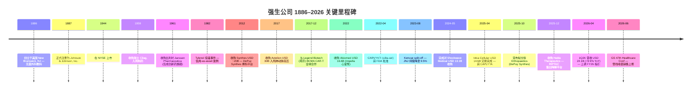
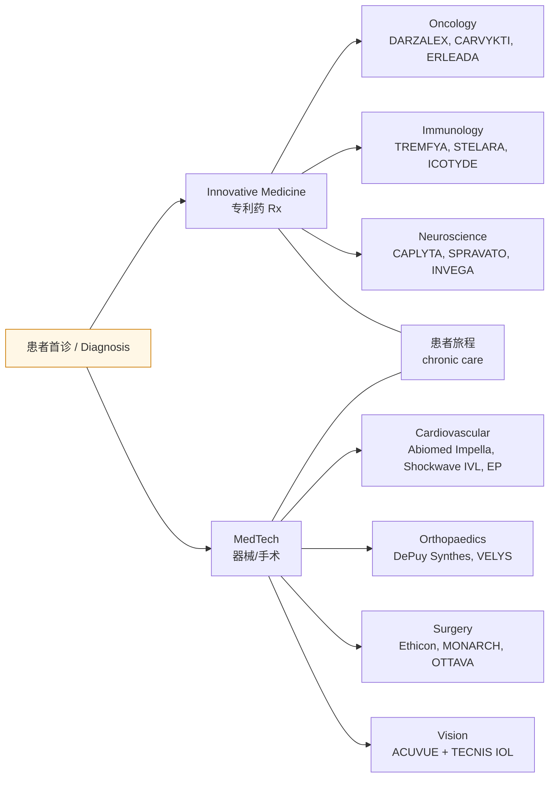
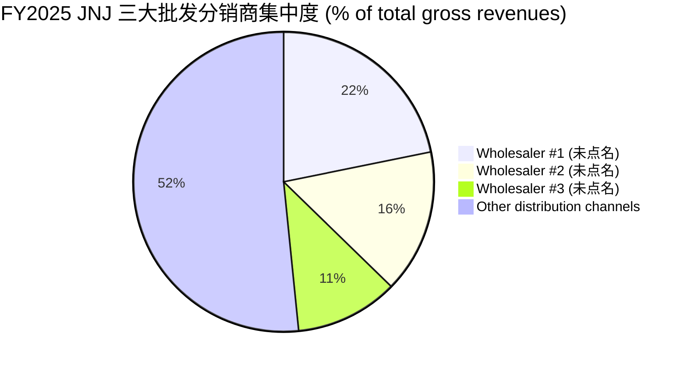

# Johnson & Johnson (NYSE:JNJ) 强生公司 — 公司研究报告 / Company Research

**报告日期 / Report date:** 2026-06-14（本次全面刷新 / full refresh；上一版 2026-06-01）
**研究主题归类 / Theme:** 医疗健康双平台 (Innovative Medicine + MedTech)；附 china-drug-out-licensing（中国创新药 out-licensing —— JNJ 为接收方 / licensee 视角）
**主要交易所及代码:** NYSE:JNJ｜CIK 0000200406

---

## 投资摘要 / Investment Summary　*（本报告观点 / Analyst view）*

> 以下评级、目标价、预测均为**本报告分析师观点 (*Analyst view:*)**，不构成对任何监管文件 (10-K/10-Q) 的引用——10-K 内不含目标价。

| 项目 / Item | 本报告观点 / This report |
|---|---|
| **评级 / Rating** | **Overweight / 增持** |
| **12 个月目标价 / 12-mo PT** | **USD 268**（基于 FY2027E 调整后 EPS USD 12.6 × 21.3× forward P/E） |
| **当前价 / Current price** | USD 240.87（2026-06-12 收盘） |
| **隐含上行 / Implied upside** | **+11.3%**（不含 ~2.2% 股息收益率 / dividend yield） |
| **市值 / Market cap** | USD ~580 B（[Yahoo Finance JNJ](https://finance.yahoo.com/quote/JNJ/)） |
| **52 周区间 / 52-wk range** | USD 149.04 – 251.71 |
| **估值方法 / Valuation method** | Forward-PE × 目标倍数（与 LLY/MRK/ABBV/NVS/PFE 五家可比对标），DCF 交叉验证 |

**论点支柱 / Thesis pillars（每条均为 *Analyst view:*）：**

1. **专利悬崖正在被接力——STELARA 的腰斩 (-41.3%) 已基本计入价格，而接力品种 (TREMFYA +40.5%、DARZALEX +23.0%、CARVYKTI +95.9%、CAPLYTA、ICOTYDE) 的放量速度被市场低估**；管理层在 2026-05 CEO 会议重申"无需依赖并购即可在 2030 年实现双位数 EPS 增长"。
2. **MedTech 心血管 (Cardiovascular +15.8%) 是增速最快的器械引擎**——PFA 房颤消融技术替代 + Shockwave IVL (+103.2%) + Abiomed Impella 三块拼图驱动该业务从 USD 8.9B 走向 USD 12B+。
3. **AAA 资产负债表 + 63 年连续上调股息 ("Dividend King") + 0.26 beta**，在中性偏防御的周期带提供下行保护；估值 (forward P/E ~18–19×) 显著低于成长型大药 (LLY 38×、ABBV)。
4. **两大尾部风险——滑石粉 (talc) 诉讼第三次破产路径被驳回、Medicare IRA 药价谈判——是估值折让的核心来源**；任一缓和都是重定价催化剂，恶化则压制倍数。

**最该盯紧的变量 / Swing variables:** (a) STELARA→TREMFYA/ICOTYDE 换挡是否在 2026–2027 平滑完成（决定 Innovative Medicine 增长可视度）；(b) 滑石粉诉讼最终货币化代价的量级（USD 一次性 ~80–100 亿级 vs 失控的 200 亿+）。

> **业绩更新 / Guidance update（2026-04-14，1Q26）：** 公司将 FY2026 营收指引上调至 **USD 100.3–101.3 B**（原 USD 100.0–101.0 B，中位 100.8 B），调整后摊薄 EPS 指引上调至 **USD 11.45–11.65**（原 USD 11.28–11.48），驱动因素为 1Q26 营收同比 +9.9% 至 USD 24.1 B、Innovative Medicine 经营性增长 (operational growth) 5.6%、MedTech 4.7%；管理层称兑现"加速增长之年的承诺 (deliver on its promise for a year of accelerated growth)"。Source: [JNJ 1Q26 earnings press release, 2026-04-14](https://www.sec.gov/Archives/edgar/data/200406/000020040626000076/a2026q1exhibit991.htm) + [JNJ 1Q26 10-Q](https://www.sec.gov/Archives/edgar/data/200406/000020040626000087/jnj-20260329.htm).

---

## 目录 / Table of Contents

1. 公司概览 / Company Overview（含 1A 估值快照、1B GF Score）
2. 估值与目标价 / Valuation & Price Target（含卖方观点演变）
3. 公司历史 / Company History
4. 管理团队 / Management Team
5. 产品与服务 / Products & Services（含资金流向图）
6. 客户与上市策略 / Customers & Go-to-Market
7. 行业概览 / Industry Overview
8. 竞争格局 / Competitive Landscape
9. 市场机会 / Market Opportunity (TAM)
10. 风险评估 / Risk Assessment（含关键分歧与催化剂）
11. 投资者视角评分卡 / Investor-Lens Scorecards
12. 数据来源清单 / Data Used
13. 参考资料 / References

---

## 1. 公司概览 / Company Overview

Johnson & Johnson（强生公司，NYSE:JNJ，CIK 0000200406，1886 年由 Robert Wood Johnson 兄弟创立于美国新泽西州 New Brunswick）是全球市值最大的医疗健康综合体之一。2023 年完成消费健康业务 Kenvue（NYSE:KVUE）的分拆后，公司从"消费品 + 制药 + 器械"的三段式集团转型为聚焦 **创新药 (Innovative Medicine，即原 Janssen)** 与 **医疗器械 (MedTech)** 两大板块的纯医疗健康平台。FY2025（截至 2025-12-28 财年）合并营收 USD 94.193 B、归母净利润 (net earnings) USD 26.804 B、研发投入 (R&D) USD 14.665 B、全球员工约 138,200 人，业务覆盖几乎全球所有国家 ([JNJ 2025 10-K, Item 1 Business + Consolidated Statements of Earnings](https://www.sec.gov/Archives/edgar/data/200406/000020040626000016/jnj-20251228.htm))。

商业模式 / business model 上，JNJ 是一家典型的 **专利药 (patented Rx) + 高端器械** 复合型大盘股。Innovative Medicine 板块以 BLA/NDA 批准的处方药为载体，在专利期内享受高 gross margin (毛利率)、专利悬崖到来时通过新分子接力；MedTech 板块涵盖电生理 (Electrophysiology, EP)、心血管介入 (Cardiovascular)、外科 (Surgery)、骨科 (Orthopaedics)、视力健康 (Vision) 等特许经营。两大板块按 FY2025 口径分别贡献 USD 60.401 B (64.1%) 与 USD 33.792 B (35.9%) ([JNJ 2025 10-K, Note 17 — Segments of Business](https://www.sec.gov/Archives/edgar/data/200406/000020040626000016/jnj-20251228.htm))。

公司同时披露 2025 年 10 月宣布将进一步**分拆骨科业务（DePuy Synthes）**，目标在公告后 18–24 个月内完成。这一动作之后，JNJ 的核心组合将进一步收窄至高增长、高毛利的创新药 + 心血管/电生理/外科/视力四大器械事业部 ([JNJ 2025 10-K, Item 1 — Strategic separation of Orthopaedics](https://www.sec.gov/Archives/edgar/data/200406/000020040626000016/jnj-20251228.htm))。从 1Q26 业绩看，重组前后的核心增长引擎是清晰的：DARZALEX、CARVYKTI、ERLEADA、RYBREVANT/LAZCLUZE 拉动 Oncology；TREMFYA、ICOTYDE (icotrokinra，口服 IL-23 肽，2026Q1 获 FDA 批准用于斑块型银屑病) 拉动 Immunology；SPRAVATO、CAPLYTA（2025-04-02 完成对 Intra-Cellular Therapies USD 14.6 B 收购获得）拉动 Neuroscience ([JNJ 1Q26 8-K Ex 99.1, 2026-04-14](https://www.sec.gov/Archives/edgar/data/200406/000020040626000076/a2026q1exhibit991.htm))。

### 1.1 收入结构 / How J&J makes its money

下方收入桑基图 (income-statement Sankey) 复刻 FY2025 损益表：营收 USD 94.193 B 由 Innovative Medicine 与 MedTech 两大分部贡献，扣除 COGS USD 30.256 B 得 gross profit USD 63.937 B（gross margin 67.9%），再扣除 SG&A USD 23.676 B + R&D USD 14.665 B + IPR&D 减值 USD 0.081 B，得经营利润 (operating income) USD 25.515 B；加计净利息/其他收益后税前 USD 32.581 B，扣税 USD 5.777 B 后归母净利润 USD 26.804 B（其中含约 USD 7.0 B 滑石粉储备金转回 / talc reserve reversal）([JNJ 2025 10-K, Consolidated Statements of Earnings p. 42](https://www.sec.gov/Archives/edgar/data/200406/000020040626000016/jnj-20251228.htm))。

<svg xmlns="http://www.w3.org/2000/svg" viewBox="0 0 1000 560" width="1000" height="560" role="img" aria-label="income statement Sankey"><rect x="0" y="0" width="1000" height="560" fill="#ffffff"/>
<text x="20.00" y="30.00" text-anchor="start" font-family="Helvetica,Arial,sans-serif" font-size="15" font-weight="700" fill="#1f2933">强生 (JNJ) 如何赚钱 / How J&amp;J Makes Its Money — FY2025</text>
<path d="M 204.00,78.00 C 258.00,78.00 258.00,85.00 312.00,85.00 L 312.00,346.63 C 258.00,346.63 258.00,339.63 204.00,339.63 Z" fill="#93c5fd" fill-opacity="0.55"/>
<path d="M 452.00,78.00 C 506.00,78.00 506.00,135.53 560.00,135.53 L 560.00,246.05 C 506.00,246.05 506.00,188.52 452.00,188.52 Z" fill="#86efac" fill-opacity="0.55"/>
<path d="M 452.00,188.52 C 506.00,188.52 506.00,260.05 560.00,260.05 L 560.00,426.47 C 506.00,426.47 506.00,354.95 452.00,354.95 Z" fill="#fca5a5" fill-opacity="0.55"/>
<path d="M 328.00,85.00 C 382.00,85.00 382.00,78.00 436.00,78.00 L 436.00,354.95 C 382.00,354.95 382.00,361.95 328.00,361.95 Z" fill="#86efac" fill-opacity="0.55"/>
<path d="M 328.00,361.95 C 382.00,361.95 382.00,368.95 436.00,368.95 L 436.00,500.00 C 382.00,500.00 382.00,493.00 328.00,493.00 Z" fill="#fca5a5" fill-opacity="0.55"/>
<path d="M 700.00,113.40 C 754.00,113.40 754.00,211.44 808.00,211.44 L 808.00,327.54 C 754.00,327.54 754.00,229.50 700.00,229.50 Z" fill="#86efac" fill-opacity="0.55"/>
<path d="M 700.00,229.50 C 754.00,229.50 754.00,341.54 808.00,341.54 L 808.00,366.56 C 754.00,366.56 754.00,254.53 700.00,254.53 Z" fill="#fca5a5" fill-opacity="0.55"/>
<path d="M 576.00,135.53 C 630.00,135.53 630.00,113.40 684.00,113.40 L 684.00,223.92 C 630.00,223.92 630.00,246.05 576.00,246.05 Z" fill="#86efac" fill-opacity="0.55"/>
<path d="M 576.00,260.05 C 630.00,260.05 630.00,268.53 684.00,268.53 L 684.00,371.08 C 630.00,371.08 630.00,362.60 576.00,362.60 Z" fill="#fca5a5" fill-opacity="0.55"/>
<path d="M 576.00,362.60 C 630.00,362.60 630.00,385.08 684.00,385.08 L 684.00,448.60 C 630.00,448.60 630.00,426.12 576.00,426.12 Z" fill="#fca5a5" fill-opacity="0.55"/>
<path d="M 576.00,426.12 C 630.00,426.12 630.00,462.60 684.00,462.60 L 684.00,464.60 C 630.00,464.60 630.00,428.12 576.00,428.12 Z" fill="#fca5a5" fill-opacity="0.55"/>
<path d="M 204.00,353.63 C 258.00,353.63 258.00,346.63 312.00,346.63 L 312.00,493.00 C 258.00,493.00 258.00,500.00 204.00,500.00 Z" fill="#93c5fd" fill-opacity="0.55"/>
<path d="M 576.00,440.47 C 630.00,440.47 630.00,223.92 684.00,223.92 L 684.00,225.92 C 630.00,225.92 630.00,442.47 576.00,442.47 Z" fill="#93c5fd" fill-opacity="0.55"/>
<rect x="188.00" y="78.00" width="16" height="261.63" rx="1.5" fill="#2563eb"/>
<rect x="188.00" y="353.63" width="16" height="146.37" rx="1.5" fill="#2563eb"/>
<rect x="312.00" y="85.00" width="16" height="408.00" rx="1.5" fill="#1e3a8a"/>
<rect x="436.00" y="78.00" width="16" height="276.95" rx="1.5" fill="#15803d"/>
<rect x="436.00" y="368.95" width="16" height="131.05" rx="1.5" fill="#dc2626"/>
<rect x="560.00" y="135.53" width="16" height="110.52" rx="1.5" fill="#15803d"/>
<rect x="560.00" y="260.05" width="16" height="166.43" rx="1.5" fill="#dc2626"/>
<rect x="560.00" y="440.47" width="16" height="2.00" rx="1.5" fill="#2563eb"/>
<rect x="684.00" y="113.40" width="16" height="141.13" rx="1.5" fill="#15803d"/>
<rect x="684.00" y="268.53" width="16" height="102.55" rx="1.5" fill="#dc2626"/>
<rect x="684.00" y="385.08" width="16" height="63.52" rx="1.5" fill="#dc2626"/>
<rect x="684.00" y="462.60" width="16" height="2.00" rx="1.5" fill="#dc2626"/>
<rect x="808.00" y="211.44" width="16" height="116.10" rx="1.5" fill="#15803d"/>
<rect x="808.00" y="341.54" width="16" height="25.02" rx="1.5" fill="#dc2626"/>
<text x="179.00" y="205.81" text-anchor="end" font-family="Helvetica,Arial,sans-serif" font-size="11.5" font-weight="700" fill="#1f2933">Innovative Medicine</text>
<text x="179.00" y="218.81" text-anchor="end" font-family="Helvetica,Arial,sans-serif" font-size="10" font-weight="400" fill="#52606d">$60.4B  (64.1%)</text>
<text x="179.00" y="423.81" text-anchor="end" font-family="Helvetica,Arial,sans-serif" font-size="11.5" font-weight="700" fill="#1f2933">MedTech</text>
<text x="179.00" y="436.81" text-anchor="end" font-family="Helvetica,Arial,sans-serif" font-size="10" font-weight="400" fill="#52606d">$33.8B  (35.9%)</text>
<rect x="331.00" y="67.00" width="106.80" height="26" rx="2" fill="#ffffff" fill-opacity="0.72"/>
<text x="334.00" y="79.00" text-anchor="start" font-family="Helvetica,Arial,sans-serif" font-size="11.5" font-weight="700" fill="#1f2933">Revenue</text>
<text x="334.00" y="92.00" text-anchor="start" font-family="Helvetica,Arial,sans-serif" font-size="10" font-weight="400" fill="#52606d">$94.2B  (100.0%)</text>
<rect x="455.00" y="60.00" width="100.50" height="26" rx="2" fill="#ffffff" fill-opacity="0.72"/>
<text x="458.00" y="72.00" text-anchor="start" font-family="Helvetica,Arial,sans-serif" font-size="11.5" font-weight="700" fill="#1f2933">Gross Profit</text>
<text x="458.00" y="85.00" text-anchor="start" font-family="Helvetica,Arial,sans-serif" font-size="10" font-weight="400" fill="#52606d">$63.9B  (67.9%)</text>
<rect x="455.00" y="350.95" width="144.60" height="26" rx="2" fill="#ffffff" fill-opacity="0.72"/>
<text x="458.00" y="362.95" text-anchor="start" font-family="Helvetica,Arial,sans-serif" font-size="11.5" font-weight="700" fill="#1f2933">Cost of Revenue (COGS)</text>
<text x="458.00" y="375.95" text-anchor="start" font-family="Helvetica,Arial,sans-serif" font-size="10" font-weight="400" fill="#52606d">$30.3B  (32.1%)</text>
<rect x="579.00" y="117.53" width="106.80" height="26" rx="2" fill="#ffffff" fill-opacity="0.72"/>
<text x="582.00" y="129.53" text-anchor="start" font-family="Helvetica,Arial,sans-serif" font-size="11.5" font-weight="700" fill="#1f2933">Operating Income</text>
<text x="582.00" y="142.53" text-anchor="start" font-family="Helvetica,Arial,sans-serif" font-size="10" font-weight="400" fill="#52606d">$25.5B  (27.1%)</text>
<rect x="579.00" y="242.05" width="150.90" height="26" rx="2" fill="#ffffff" fill-opacity="0.72"/>
<text x="582.00" y="254.05" text-anchor="start" font-family="Helvetica,Arial,sans-serif" font-size="11.5" font-weight="700" fill="#1f2933">Total Operating Expense</text>
<text x="582.00" y="267.05" text-anchor="start" font-family="Helvetica,Arial,sans-serif" font-size="10" font-weight="400" fill="#52606d">$38.4B  (40.8%)</text>
<text x="551.00" y="438.47" text-anchor="end" font-family="Helvetica,Arial,sans-serif" font-size="11.5" font-weight="700" fill="#1f2933">Net Interest / Other Income</text>
<text x="551.00" y="451.47" text-anchor="end" font-family="Helvetica,Arial,sans-serif" font-size="10" font-weight="400" fill="#52606d">$85.0M  (0.09%)</text>
<rect x="703.00" y="95.40" width="100.50" height="26" rx="2" fill="#ffffff" fill-opacity="0.72"/>
<text x="706.00" y="107.40" text-anchor="start" font-family="Helvetica,Arial,sans-serif" font-size="11.5" font-weight="700" fill="#1f2933">Pretax Income</text>
<text x="706.00" y="120.40" text-anchor="start" font-family="Helvetica,Arial,sans-serif" font-size="10" font-weight="400" fill="#52606d">$32.6B  (34.6%)</text>
<rect x="703.00" y="250.53" width="100.50" height="26" rx="2" fill="#ffffff" fill-opacity="0.72"/>
<text x="706.00" y="262.53" text-anchor="start" font-family="Helvetica,Arial,sans-serif" font-size="11.5" font-weight="700" fill="#1f2933">SG&amp;A</text>
<text x="706.00" y="275.53" text-anchor="start" font-family="Helvetica,Arial,sans-serif" font-size="10" font-weight="400" fill="#52606d">$23.7B  (25.1%)</text>
<rect x="703.00" y="367.08" width="100.50" height="26" rx="2" fill="#ffffff" fill-opacity="0.72"/>
<text x="706.00" y="379.08" text-anchor="start" font-family="Helvetica,Arial,sans-serif" font-size="11.5" font-weight="700" fill="#1f2933">R&amp;D</text>
<text x="706.00" y="392.08" text-anchor="start" font-family="Helvetica,Arial,sans-serif" font-size="10" font-weight="400" fill="#52606d">$14.7B  (15.6%)</text>
<rect x="703.00" y="444.60" width="100.50" height="26" rx="2" fill="#ffffff" fill-opacity="0.72"/>
<text x="706.00" y="456.60" text-anchor="start" font-family="Helvetica,Arial,sans-serif" font-size="11.5" font-weight="700" fill="#1f2933">Other OpEx</text>
<text x="706.00" y="469.60" text-anchor="start" font-family="Helvetica,Arial,sans-serif" font-size="10" font-weight="400" fill="#52606d">$81.0M  (0.09%)</text>
<text x="833.00" y="266.49" text-anchor="start" font-family="Helvetica,Arial,sans-serif" font-size="11.5" font-weight="700" fill="#1f2933">Net Income</text>
<text x="833.00" y="279.49" text-anchor="start" font-family="Helvetica,Arial,sans-serif" font-size="10" font-weight="400" fill="#52606d">$26.8B  (28.5%)</text>
<text x="833.00" y="351.05" text-anchor="start" font-family="Helvetica,Arial,sans-serif" font-size="11.5" font-weight="700" fill="#1f2933">Income Tax</text>
<text x="833.00" y="364.05" text-anchor="start" font-family="Helvetica,Arial,sans-serif" font-size="10" font-weight="400" fill="#52606d">$5.8B  (6.1%)</text>
<text x="500.00" y="544.00" text-anchor="middle" font-family="Helvetica,Arial,sans-serif" font-size="10" font-weight="400" fill="#52606d">Source: JNJ FY2025 10-K, Consolidated Statements of Earnings + Note 17 Segments</text>
</svg>

来源 / Source: [JNJ FY2025 10-K, Consolidated Statements of Earnings + Note 17 Segments](https://www.sec.gov/Archives/edgar/data/200406/000020040626000016/jnj-20251228.htm)

地理分布 / geographic mix 上，FY2025 美国本土销售 USD 53.752 B（57.1% of consolidated revenue）、欧洲 USD 21.535 B (22.9%)、亚太及非洲 USD 14.031 B (14.9%)、美洲（除美）USD 4.875 B (5.2%)，美国占比较 2024 年（56.6%）进一步提升，主因 STELARA 海外仿制药 (biosimilar) 替代加速、海外药价管制收紧 ([JNJ 2025 10-K, § Sales to Customers by Geographic Area](https://www.sec.gov/Archives/edgar/data/200406/000020040626000016/jnj-20251228.htm))。

下方左为分部营收 donut，右为地区营收 donut：

<svg xmlns="http://www.w3.org/2000/svg" viewBox="0 0 720 460" width="720" height="460" role="img" aria-label="revenue donut"><rect x="0" y="0" width="720" height="460" fill="#ffffff"/>
<text x="20.00" y="30.00" text-anchor="start" font-family="Helvetica,Arial,sans-serif" font-size="15" font-weight="700" fill="#1f2933">FY2025 营收按分部 / Revenue by Segment</text>
<path d="M 288.00,107.20 A 132 132 0 1 1 185.64,322.54 L 227.51,288.45 A 78 78 0 1 0 288.00,161.20 Z" fill="#2563eb"/>
<path d="M 185.64,322.54 A 132 132 0 0 1 288.00,107.20 L 288.00,161.20 A 78 78 0 0 0 227.51,288.45 Z" fill="#15803d"/>
<text x="288.00" y="235.20" text-anchor="middle" font-family="Helvetica,Arial,sans-serif" font-size="18" font-weight="800" fill="#1f2933">JNJ</text>
<text x="288.00" y="255.20" text-anchor="middle" font-family="Helvetica,Arial,sans-serif" font-size="13" font-weight="600" fill="#52606d">$94.2B</text>
<text x="288.00" y="271.20" text-anchor="middle" font-family="Helvetica,Arial,sans-serif" font-size="10" font-weight="400" fill="#8a97a3">total</text>
<line x1="412.63" y1="298.45" x2="428.63" y2="298.45" stroke="#2563eb" stroke-width="1.4"/>
<text x="432.63" y="296.45" text-anchor="start" font-family="Helvetica,Arial,sans-serif" font-size="11" font-weight="700" fill="#1f2933">Innovative Medicine</text>
<text x="432.63" y="310.45" text-anchor="start" font-family="Helvetica,Arial,sans-serif" font-size="10" font-weight="400" fill="#52606d">$60.4B  (64.1%)</text>
<line x1="163.37" y1="179.95" x2="147.37" y2="179.95" stroke="#15803d" stroke-width="1.4"/>
<text x="143.37" y="177.95" text-anchor="end" font-family="Helvetica,Arial,sans-serif" font-size="11" font-weight="700" fill="#1f2933">MedTech</text>
<text x="143.37" y="191.95" text-anchor="end" font-family="Helvetica,Arial,sans-serif" font-size="10" font-weight="400" fill="#52606d">$33.8B  (35.9%)</text>
<text x="360.00" y="444.00" text-anchor="middle" font-family="Helvetica,Arial,sans-serif" font-size="10" font-weight="400" fill="#52606d">Source: JNJ FY2025 10-K, Note 17 — Segments</text>
</svg>

<svg xmlns="http://www.w3.org/2000/svg" viewBox="0 0 720 460" width="720" height="460" role="img" aria-label="revenue donut"><rect x="0" y="0" width="720" height="460" fill="#ffffff"/>
<text x="20.00" y="30.00" text-anchor="start" font-family="Helvetica,Arial,sans-serif" font-size="15" font-weight="700" fill="#1f2933">FY2025 营收按地区 / Revenue by Geography</text>
<path d="M 288.00,107.20 A 132 132 0 1 1 231.30,358.40 L 254.50,309.64 A 78 78 0 1 0 288.00,161.20 Z" fill="#2563eb"/>
<path d="M 231.30,358.40 A 132 132 0 0 1 162.28,198.97 L 213.71,215.43 A 78 78 0 0 0 254.50,309.64 Z" fill="#15803d"/>
<path d="M 162.28,198.97 A 132 132 0 0 1 245.83,114.12 L 263.08,165.29 A 78 78 0 0 0 213.71,215.43 Z" fill="#d97706"/>
<path d="M 245.83,114.12 A 132 132 0 0 1 288.00,107.20 L 288.00,161.20 A 78 78 0 0 0 263.08,165.29 Z" fill="#7c3aed"/>
<text x="288.00" y="235.20" text-anchor="middle" font-family="Helvetica,Arial,sans-serif" font-size="18" font-weight="800" fill="#1f2933">JNJ</text>
<text x="288.00" y="255.20" text-anchor="middle" font-family="Helvetica,Arial,sans-serif" font-size="13" font-weight="600" fill="#52606d">$94.2B</text>
<text x="288.00" y="271.20" text-anchor="middle" font-family="Helvetica,Arial,sans-serif" font-size="10" font-weight="400" fill="#8a97a3">total</text>
<line x1="422.61" y1="269.58" x2="438.61" y2="269.58" stroke="#2563eb" stroke-width="1.4"/>
<text x="442.61" y="267.58" text-anchor="start" font-family="Helvetica,Arial,sans-serif" font-size="11" font-weight="700" fill="#1f2933">United States</text>
<text x="442.61" y="281.58" text-anchor="start" font-family="Helvetica,Arial,sans-serif" font-size="10" font-weight="400" fill="#52606d">$53.8B  (57.1%)</text>
<line x1="161.36" y1="294.03" x2="145.36" y2="294.03" stroke="#15803d" stroke-width="1.4"/>
<text x="141.36" y="292.03" text-anchor="end" font-family="Helvetica,Arial,sans-serif" font-size="11" font-weight="700" fill="#1f2933">Europe</text>
<text x="141.36" y="306.03" text-anchor="end" font-family="Helvetica,Arial,sans-serif" font-size="10" font-weight="400" fill="#52606d">$21.5B  (22.9%)</text>
<line x1="189.66" y1="142.38" x2="173.66" y2="142.38" stroke="#d97706" stroke-width="1.4"/>
<text x="169.66" y="140.38" text-anchor="end" font-family="Helvetica,Arial,sans-serif" font-size="11" font-weight="700" fill="#1f2933">Asia-Pacific &amp; Africa</text>
<text x="169.66" y="154.38" text-anchor="end" font-family="Helvetica,Arial,sans-serif" font-size="10" font-weight="400" fill="#52606d">$14.0B  (14.9%)</text>
<line x1="265.66" y1="103.02" x2="249.66" y2="103.02" stroke="#7c3aed" stroke-width="1.4"/>
<text x="245.66" y="101.02" text-anchor="end" font-family="Helvetica,Arial,sans-serif" font-size="11" font-weight="700" fill="#1f2933">Western Hemi ex-US</text>
<text x="245.66" y="115.02" text-anchor="end" font-family="Helvetica,Arial,sans-serif" font-size="10" font-weight="400" fill="#52606d">$4.9B  (5.2%)</text>
<text x="360.00" y="444.00" text-anchor="middle" font-family="Helvetica,Arial,sans-serif" font-size="10" font-weight="400" fill="#52606d">Source: JNJ FY2025 10-K, Sales by Geographic Area</text>
</svg>

来源 / Source: [JNJ FY2025 10-K, Note 17 Segments + Sales by Geographic Area](https://www.sec.gov/Archives/edgar/data/200406/000020040626000016/jnj-20251228.htm)

下方为持续经营口径下分部营收的三年走势（FY2023→FY2025），Innovative Medicine 从 USD 54.8 B 增至 60.4 B、MedTech 从 30.4 B 增至 33.8 B ([JNJ FY2023–FY2025 10-Ks, Note 17 Segments](https://www.sec.gov/Archives/edgar/data/200406/000020040626000016/jnj-20251228.htm))：

<svg xmlns="http://www.w3.org/2000/svg" viewBox="0 0 860 470" width="860" height="470" role="img" aria-label="historical revenue bars"><rect x="0" y="0" width="860" height="470" fill="#ffffff"/>
<text x="20.00" y="30.00" text-anchor="start" font-family="Helvetica,Arial,sans-serif" font-size="15" font-weight="700" fill="#1f2933">营收(分部, 持续经营) / Revenue by Segment (continuing ops)</text>
<rect x="20.00" y="44" width="11" height="11" rx="2" fill="#2563eb"/>
<text x="36.00" y="53.00" text-anchor="start" font-family="Helvetica,Arial,sans-serif" font-size="10.5" font-weight="400" fill="#1f2933">Innovative Medicine</text>
<rect x="175.40" y="44" width="11" height="11" rx="2" fill="#15803d"/>
<text x="191.40" y="53.00" text-anchor="start" font-family="Helvetica,Arial,sans-serif" font-size="10.5" font-weight="400" fill="#1f2933">MedTech</text>
<line x1="70" y1="412.00" x2="834" y2="412.00" stroke="#eceff2" stroke-width="1"/>
<text x="64.00" y="415.00" text-anchor="end" font-family="Helvetica,Arial,sans-serif" font-size="9.5" font-weight="400" fill="#52606d">$0</text>
<line x1="70" y1="345.20" x2="834" y2="345.20" stroke="#eceff2" stroke-width="1"/>
<text x="64.00" y="348.20" text-anchor="end" font-family="Helvetica,Arial,sans-serif" font-size="9.5" font-weight="400" fill="#52606d">$20.3B</text>
<line x1="70" y1="278.40" x2="834" y2="278.40" stroke="#eceff2" stroke-width="1"/>
<text x="64.00" y="281.40" text-anchor="end" font-family="Helvetica,Arial,sans-serif" font-size="9.5" font-weight="400" fill="#52606d">$40.7B</text>
<line x1="70" y1="211.60" x2="834" y2="211.60" stroke="#eceff2" stroke-width="1"/>
<text x="64.00" y="214.60" text-anchor="end" font-family="Helvetica,Arial,sans-serif" font-size="9.5" font-weight="400" fill="#52606d">$61.0B</text>
<line x1="70" y1="144.80" x2="834" y2="144.80" stroke="#eceff2" stroke-width="1"/>
<text x="64.00" y="147.80" text-anchor="end" font-family="Helvetica,Arial,sans-serif" font-size="9.5" font-weight="400" fill="#52606d">$81.4B</text>
<line x1="70" y1="78.00" x2="834" y2="78.00" stroke="#eceff2" stroke-width="1"/>
<text x="64.00" y="81.00" text-anchor="end" font-family="Helvetica,Arial,sans-serif" font-size="9.5" font-weight="400" fill="#52606d">$101.7B</text>
<rect x="123.48" y="232.09" width="147.71" height="179.91" fill="#2563eb"/>
<rect x="123.48" y="132.29" width="147.71" height="99.80" fill="#15803d"/>
<text x="197.33" y="428.00" text-anchor="middle" font-family="Helvetica,Arial,sans-serif" font-size="10" font-weight="400" fill="#52606d">2023</text>
<rect x="378.15" y="224.87" width="147.71" height="187.13" fill="#2563eb"/>
<rect x="378.15" y="120.14" width="147.71" height="104.73" fill="#15803d"/>
<text x="452.00" y="428.00" text-anchor="middle" font-family="Helvetica,Arial,sans-serif" font-size="10" font-weight="400" fill="#52606d">2024</text>
<rect x="632.81" y="213.71" width="147.71" height="198.29" fill="#2563eb"/>
<rect x="632.81" y="102.74" width="147.71" height="110.97" fill="#15803d"/>
<text x="706.67" y="428.00" text-anchor="middle" font-family="Helvetica,Arial,sans-serif" font-size="10" font-weight="400" fill="#52606d">2025</text>
<text x="430.00" y="454.00" text-anchor="middle" font-family="Helvetica,Arial,sans-serif" font-size="10" font-weight="400" fill="#52606d">Source: JNJ FY2023–FY2025 10-Ks, Note 17 Segments</text>
</svg>

来源 / Source: [JNJ FY2023–FY2025 10-Ks, Note 17 Segments](https://www.sec.gov/Archives/edgar/data/200406/000020040626000016/jnj-20251228.htm)

### 1A. 估值快照 / Valuation snapshot (as of 2026-06-12)

| 指标 / Metric | 数值 | 备注 |
|---|---|---|
| 收盘价 / Close | USD 240.87 | 52-week 区间 USD 149.04–251.71（[Yahoo Finance](https://finance.yahoo.com/quote/JNJ/)） |
| 市值 / Market cap | USD ~580 B | [Yahoo Finance](https://finance.yahoo.com/quote/JNJ/) |
| TTM P/E | 21.6× | 含 FY2025 滑石粉储备金转回（~USD 7 B 税前），剔除后 normalized TTM P/E 约 23–25× |
| Forward P/E (FY2026E) | 20.9× | 基于上调后调整后 EPS 中值 USD 11.55 |
| Forward P/E (FY2027E) | 19.1× | 基于本报告 FY2027E 调整后 EPS USD 12.6 |
| TTM P/S | 6.2× | USD 580 B / USD 94.2 B |
| EV/EBITDA | ~17× | EV ≈ 市值 + 净债务 ~USD 28 B |
| Dividend yield | ~2.2% | 季度股息 USD 1.34/股（年化 USD 5.36）；63 年连续上调（"Dividend King"） |
| Beta | 0.26 | 防御性 / defensive 名股标的 |

**多档 forward 估值矩阵 / Forward valuation matrix（*Analyst view:* ——估值随预测增长而压缩）：**

| 倍数 / Multiple | TTM (FY2025A) | FY2026E | FY2027E |
|---|---:|---:|---:|
| 调整后 P/E (Adj P/E) | ~21× | 20.9× | 19.1× |
| EV/EBITDA | ~17× | ~16× | ~15× |
| P/S | 6.2× | 5.8× | 5.4× |

同业可比 / Peer comparison（2026-06-12 快照，[Yahoo Finance](https://finance.yahoo.com/quote/JNJ/)）：LLY ~36× / ABBV（受 HUMIRA off-patent earnings 扭曲，倍数失真）/ MRK ~13× (低，受 KEYTRUDA 2028 专利悬崖折让) / NVS ~17× / PFE ~9× / BMY ~9×。可比药企 forward P/E 中位数约 14–17×（剔除 LLY 极值）；**JNJ forward P/E ~19–21× 处于成长溢价区间但远低于 LLY**，反映三方面折让：(a) STELARA 专利悬崖（FY25 同比 -41.3% 至 USD 6.078 B）拖累 Innovative Medicine 增长可视度 ([JNJ 2025 10-K, MD&A § Immunology](https://www.sec.gov/Archives/edgar/data/200406/000020040626000016/jnj-20251228.htm))；(b) 滑石粉 (talc) 诉讼第三次破产路径于 2025-03-31 在德州联邦法院被驳回，公司退回侵权法院系统持续诉讼 ([JNJ 8-K, 2025-04-03 — Red River Talc Denial](https://www.sec.gov/Archives/edgar/data/200406/000020040625000106/pressrelease-redriverdenia.htm))；(c) Orthopaedics 分拆执行不确定性 + 中国骨科 VBP（带量采购）对 MedTech 的拖累。

***分析师观点 / Analyst view:*** 公司 1Q26 上调 FY26 调整后 EPS 中值至 USD 11.55、forward P/E ~21× 已带成长溢价但低于 LLY；估值反映"成长重置"——专利悬崖被 DARZALEX、TREMFYA、CARVYKTI、CAPLYTA、ICOTYDE 接力的程度——尚未被市场完全计入；管理层在 1Q26/CEO 会议中重申"末十年双位数 EPS 增长 (path to double-digit growth by the end of the decade)"路径 ([JNJ 1Q26 release, 2026-04-14](https://www.sec.gov/Archives/edgar/data/200406/000020040626000076/a2026q1exhibit991.htm))。

### 1B. GF Score（GuruFocus-style 基本面评分卡）　*分析师观点 / Analyst view*

下方为本报告独立计算的 **GF Score (GuruFocus-style)** 五维雷达——这是分析师自有评分框架，**非 GuruFocus 官方数字**，每一维度的底层指标均在本节附其各自引用。综合分 **74/100**，对应"优于均值 (above-average outperformance)"区间。

<svg xmlns="http://www.w3.org/2000/svg" viewBox="0 0 500 500" width="500" height="500" role="img" aria-label="GF Score radar">
<rect x="0" y="0" width="500" height="500" fill="#ffffff"/>
<text x="20" y="24" font-family="Helvetica,Arial,sans-serif" font-size="15" font-weight="700" fill="#1f2933">GF Score (GuruFocus-style): 71/100</text>
<text x="20" y="41" font-family="Helvetica,Arial,sans-serif" font-size="11" fill="#52606d">71–80 Likely average performance</text>
<polygon points="250.0,88.0 392.7,191.6 338.2,359.4 161.8,359.4 107.3,191.6" fill="#e9f5ec" stroke="none"/>
<polygon points="250.0,208.0 278.5,228.7 267.6,262.3 232.4,262.3 221.5,228.7" fill="none" stroke="#c5d3cb" stroke-width="1"/>
<polygon points="250.0,178.0 307.1,219.5 285.3,286.5 214.7,286.5 192.9,219.5" fill="none" stroke="#c5d3cb" stroke-width="1"/>
<polygon points="250.0,148.0 335.6,210.2 302.9,310.8 197.1,310.8 164.4,210.2" fill="none" stroke="#c5d3cb" stroke-width="1"/>
<polygon points="250.0,118.0 364.1,200.9 320.5,335.1 179.5,335.1 135.9,200.9" fill="none" stroke="#c5d3cb" stroke-width="1"/>
<polygon points="250.0,88.0 392.7,191.6 338.2,359.4 161.8,359.4 107.3,191.6" fill="none" stroke="#c5d3cb" stroke-width="1.3"/>
<line x1="250" y1="238" x2="161.8" y2="359.4" stroke="#cfdad3" stroke-width="1"/>
<text x="146.5" y="392.4" text-anchor="end" font-family="Helvetica,Arial,sans-serif" font-size="11.5" font-weight="600" fill="#1f2933">Financial Strength</text>
<text x="146.5" y="405.4" text-anchor="end" font-family="Helvetica,Arial,sans-serif" font-size="9.5" fill="#52606d">财务实力</text>
<text x="179.5" y="329.1" text-anchor="middle" font-family="Helvetica,Arial,sans-serif" font-size="10.5" font-weight="700" fill="#1f2933">8</text>
<line x1="250" y1="238" x2="250.0" y2="88.0" stroke="#cfdad3" stroke-width="1"/>
<text x="250.0" y="58.0" text-anchor="middle" font-family="Helvetica,Arial,sans-serif" font-size="11.5" font-weight="600" fill="#1f2933">Profitability</text>
<text x="250.0" y="71.0" text-anchor="middle" font-family="Helvetica,Arial,sans-serif" font-size="9.5" fill="#52606d">盈利能力</text>
<text x="250.0" y="112.0" text-anchor="middle" font-family="Helvetica,Arial,sans-serif" font-size="10.5" font-weight="700" fill="#1f2933">8</text>
<line x1="250" y1="238" x2="107.3" y2="191.6" stroke="#cfdad3" stroke-width="1"/>
<text x="82.6" y="183.6" text-anchor="end" font-family="Helvetica,Arial,sans-serif" font-size="11.5" font-weight="600" fill="#1f2933">Growth</text>
<text x="82.6" y="196.6" text-anchor="end" font-family="Helvetica,Arial,sans-serif" font-size="9.5" fill="#52606d">成长性</text>
<text x="178.7" y="208.8" text-anchor="middle" font-family="Helvetica,Arial,sans-serif" font-size="10.5" font-weight="700" fill="#1f2933">5</text>
<line x1="250" y1="238" x2="392.7" y2="191.6" stroke="#cfdad3" stroke-width="1"/>
<text x="417.4" y="183.6" text-anchor="start" font-family="Helvetica,Arial,sans-serif" font-size="11.5" font-weight="600" fill="#1f2933">GF Value</text>
<text x="417.4" y="196.6" text-anchor="start" font-family="Helvetica,Arial,sans-serif" font-size="9.5" fill="#52606d">估值</text>
<text x="349.9" y="199.6" text-anchor="middle" font-family="Helvetica,Arial,sans-serif" font-size="10.5" font-weight="700" fill="#1f2933">7</text>
<line x1="250" y1="238" x2="338.2" y2="359.4" stroke="#cfdad3" stroke-width="1"/>
<text x="353.5" y="392.4" text-anchor="start" font-family="Helvetica,Arial,sans-serif" font-size="11.5" font-weight="600" fill="#1f2933">Momentum</text>
<text x="353.5" y="405.4" text-anchor="start" font-family="Helvetica,Arial,sans-serif" font-size="9.5" fill="#52606d">动量</text>
<text x="320.5" y="329.1" text-anchor="middle" font-family="Helvetica,Arial,sans-serif" font-size="10.5" font-weight="700" fill="#1f2933">8</text>
<polygon points="250.0,118.0 349.9,205.6 320.5,335.1 179.5,335.1 178.7,214.8" fill="#2e8b57" fill-opacity="0.34" stroke="#2e8b57" stroke-width="2"/>
<circle cx="179.5" cy="335.1" r="2.6" fill="#2e8b57"/>
<circle cx="250.0" cy="118.0" r="2.6" fill="#2e8b57"/>
<circle cx="178.7" cy="214.8" r="2.6" fill="#2e8b57"/>
<circle cx="349.9" cy="205.6" r="2.6" fill="#2e8b57"/>
<circle cx="320.5" cy="335.1" r="2.6" fill="#2e8b57"/>
<text x="250" y="470" text-anchor="middle" font-family="Helvetica,Arial,sans-serif" font-size="9.5" fill="#52606d">Source: JNJ FY2025 10-K + 1Q26 10-Q · Yahoo Finance · indicators.db, as of 2026-06-12</text>
<text x="250" y="485" text-anchor="middle" font-family="Helvetica,Arial,sans-serif" font-size="9" fill="#52606d">GF Score = independent analyst rubric (*Analyst view:*) — not GuruFocus™ official number</text>
</svg>

| 维度 / Axis | 分数 (0–10) | 各维度评分理由 / Reasons |
|---|---:|---|
| **Financial Strength（财务强度）** | 8 | AAA 信用评级（标普/Fitch/Moody's，全球仅两家 AAA 非金融发债人之一）；FY25 末长期债务 USD 39.438 B、贷款及票据 USD 8.495 B，对应现金及有价证券约 USD 20.1 B，净债务 ~USD 28 B，相对 EBITDA ~USD 35 B 的 Net Debt/EBITDA <1×；利息支出仅 USD 0.971 B、覆盖倍数 >25×。扣分项：商誉 USD 48.772 B + 无形资产 USD 50.403 B 合计占总资产 ~50% ([JNJ 2025 10-K, Balance Sheets + Note 7 Debt](https://www.sec.gov/Archives/edgar/data/200406/000020040626000016/jnj-20251228.htm))。 |
| **Profitability（盈利能力）** | 8 | FY25 gross margin 67.9%（USD 63.937 B/94.193 B）、operating margin ~27%、net margin 28.5%（含 talc 转回，正常化 ~22%）；ROE ~33%（净利 26.804/平均权益 76.5）、ROIC 估算 ~15–16% 高于 WACC ~8–9%。连续多年正盈利、高且稳定的毛利结构 ([JNJ 2025 10-K, Statements of Earnings](https://www.sec.gov/Archives/edgar/data/200406/000020040626000016/jnj-20251228.htm))。 |
| **Growth（成长性）** | 5 | FY25 营收 +6.0%、持续经营 3 年 CAGR ~5%；但 EPS 受 talc 转回与一次性项目扭曲，Immunology 板块 -11.8% 拖累；前瞻看 FY26 营收指引 +7.0% 中值、管理层"末十年双位数 EPS"目标尚需 STELARA 换挡兑现 ([JNJ 1Q26 release](https://www.sec.gov/Archives/edgar/data/200406/000020040626000076/a2026q1exhibit991.htm))。中性偏正。 |
| **GF Value（估值，越高=越便宜）** | 7 | Forward P/E ~19–21× 低于自身历史高位与成长大药 LLY；本报告 PT 隐含 +11% 上行；GS 目标价隐含 +15% (越便宜得分越高)。倍数已带成长溢价，故非极端低估 ([Yahoo Finance JNJ](https://finance.yahoo.com/quote/JNJ/)；GS *Analyst view:* 见 §2)。 |
| **Momentum（动量）** | 8 | 过去 12 个月由 52 周低位 USD 149.04 反弹至 USD 240.87（+62%），远高于 200 日均线；近月相对 S&P 500 跑赢，反映市场对"加速增长之年"叙事的修正 ([Yahoo Finance JNJ](https://finance.yahoo.com/quote/JNJ/))。 |

来源 / Source: GF Score 为本报告分析师评分框架的产出 (*Analyst view:*)，底层指标见上表各引用；雷达底部标注"not GuruFocus™ official number"。综合权重：Financial Strength 25% · Profitability 25% · Growth 20% · GF Value 20% · Momentum 10%。

---

## 2. 估值与目标价 / Valuation & Price Target　*（本报告观点 / Analyst view）*

> 本章全部为分析师前瞻观点 (*Analyst view:*)。每一预测单元格均不附 10-K 引用（10-K 不含预测）；各驱动因子的外部依据（分部数据 + 管理层指引 + 行业预测）在文内分别引用。

### 2.1 前瞻财务模型 / Forward estimates table

| 财年 / FY | 营收 USD bn | YoY | 调整后 EPS USD | YoY | 关键驱动 / Driver |
|---|---:|---:|---:|---:|---|
| FY2025A | 94.19 | +6.0% | 10.75 (adj) | — | DARZALEX、Oncology +22.1% 拉动 ([10-K](https://www.sec.gov/Archives/edgar/data/200406/000020040626000016/jnj-20251228.htm)) |
| FY2026E | 100.8 | +7.0% | 11.55 | +7.4% | 管理层指引中值 USD 100.3–101.3 B / EPS 11.45–11.65 ([1Q26 release](https://www.sec.gov/Archives/edgar/data/200406/000020040626000076/a2026q1exhibit991.htm)) |
| FY2027E | 107.5 | +6.6% | 12.60 | +9.1% | STELARA 换挡基本完成；TREMFYA/ICOTYDE/CAPLYTA/Shockwave 接力 |
| FY2028E | 114.5 | +6.5% | 13.85 | +9.9% | 趋近"末十年双位数 EPS"路径；OTTAVA 手术机器人放量 |

模型构建说明：营收按分部分别建模再汇总——Innovative Medicine（FY25 USD 60.4 B，2025–28E ~6% CAGR：Oncology 维持双位数、Immunology 在 STELARA 见底后回正、Neuroscience 受 CAPLYTA 提振）+ MedTech（FY25 USD 33.8 B，2025–28E ~6% CAGR：Cardiovascular 双位数、Orthopaedics 个位数、剔除分拆后口径变动）。margin 端，剥离低毛利骨科 + 经营杠杆推动 operating margin 从 FY25 ~27% 向 FY28E ~29–30% 收敛。各分部 FY25 基数引自 [JNJ 2025 10-K Note 17](https://www.sec.gov/Archives/edgar/data/200406/000020040626000016/jnj-20251228.htm)；指引引自 [JNJ 1Q26 release](https://www.sec.gov/Archives/edgar/data/200406/000020040626000076/a2026q1exhibit991.htm)；行业增速锚点引自 [IQVIA Global Use of Medicines Outlook](https://www.iqvia.com/insights/the-iqvia-institute/reports-and-publications/reports/the-global-use-of-medicines-outlook-through-2029)。

### 2.2 目标价推导 / Price-target derivation —— 并展示算术

**方法 / Method：Forward-PE × 目标倍数。** 本报告以 FY2027E 调整后 EPS **USD 12.60** × 目标 forward P/E **21.3×** = **USD 268** 12 个月目标价。

**为什么用 21.3× / Why this multiple：** 该倍数对标五家可比大药企的成长-倍数关系。JNJ FY26–28E 调整后 EPS CAGR ~9%，介于 MRK（KEYTRUDA 悬崖、~13× forward、EPS 增速近零）与 LLY（GLP-1 驱动、~36× forward、EPS 增速 >25%）之间；JNJ 兼具 AAA 资产负债表 + Dividend King 防御属性，应享有较 MRK 显著溢价、但低于纯成长 LLY 的倍数——21.3× 落在 NVS (~17×) 之上、ABBV/AMGN 成长溢价区间，与 JNJ "防御 + 末十年双位数 EPS 路径"的组合一致 ([Yahoo Finance peer multiples, 2026-06-12](https://finance.yahoo.com/quote/JNJ/))。

**DCF 交叉验证 / DCF cross-check：** FY26 营收 USD 100.8 B → FY30 USD ~130 B（CAGR ~6.6%）；FCF/Sales ~20%；WACC 8.5%（rf=4.3% 取自 indicators.db 10Y、ERP ~5%、β=0.55 levered）；终值增长 g=3%（≤rf）。隐含 equity fair value USD 575–610 B，对应每股 ~USD 240–253，与相对估值法的 USD 268 目标方向一致、略保守（DCF 不含管线 option value）。周期快照来源：indicators.db 本地快照（FRED [BAMLH0A0HYM2](https://fred.stlouisfed.org/series/BAMLH0A0HYM2) / ^TNX + yfinance），as of 2026-06-12。

### 2.3 牛/基/熊情景 / Bull / Base / Bear

| 情景 / Scenario | 假设 / Swing assumption | FY27E EPS × 倍数 | 目标价 / PT | 相对现价 |
|---|---|---|---|---|
| **牛 / Bull** | STELARA 换挡提前完成 + ICOTYDE/Shockwave 超预期 + talc 一次性了结 → 倍数扩张至 23× | 13.0 × 23.0× | **USD 299** | +24% |
| **基 / Base** | 指引兑现，换挡平滑，talc 维持诉讼 | 12.6 × 21.3× | **USD 268** | +11% |
| **熊 / Bear** | 换挡迟滞 + IRA 降价加深 + talc 货币化超预期 → 倍数压缩至 17× | 11.8 × 17.0× | **USD 201** | -17% |

风险-回报基本对称偏正（基准 +11%、牛 +24%、熊 -17%）。

### 2.4 与市场一致预期的对比 / vs consensus

本报告 FY2027E 调整后 EPS USD 12.60 与 FY26 营收 USD 100.8 B 中值与卖方主流基本一致，目标价 USD 268 落在 Bernstein USD 251 与 Goldman Sachs USD 275 之间——较 Bernstein "与大盘持平 (Market-Perform)" 略偏积极、较 GS "买入 (Buy)" 略保守，反映本报告将 talc 与 IRA 折让保留在倍数中而非剔除（*Analyst view:* 见 §2.5 来源）。

### 2.5 卖方观点演变 / Sell-side view evolution　*（分析师观点 / Analyst view）*

> 机械预读：先读 `db/stock_price_target.db`（只读）。本报告涉及 ≥2 家机构对 JNJ 的覆盖，故按规范构建按机构时间线 + 机构间分歧表。PT 离散度：Bernstein USD 251 → Goldman Sachs USD 275，跨度约 USD 24（~10%）。

**按机构的观点时间线 / Per-institute view timeline：**

| 机构 / Institute | 日期 | 评级 / 目标价 | 报告日股价 / 上行 | 核心论点 / Thesis | 引用 |
|---|---|---|---|---|---|
| **Bernstein** | 2026-04-15 (1Q26 评论) | Market-Perform / **USD 251**（自 USD 225 上调） | USD 237.31 / +5.8% | STELARA 逆风下有机增长 +5.3% 超预期；上调指引；"医疗领域最清晰的增长故事，但估值已合理"；目标价基于 19.5× forward P/E | *Analyst view:* [Bernstein — J&J 1Q26, 2026-04-15, p.1](http://xs-macbook-air.local:5001/zsxq/pdf/184482554245542/Bernstein-Johnson%20%26%20Johnson%EF%BC%88JNJ.US%EF%BC%89Johnson%20%26%20Johnson%201Q26%EF%BC%9A%20Solid%20growth%20despite%20Stelara%20headwind%EF%BC%8C%20and%20an%20encouraging%20read%20for%20medtech-260415.pdf) |
| **Bernstein** | 2026-05-28 (CEO 会议) | Market-Perform / **USD 251**（维持） | USD 230.80 / +8.8% | CEO 重申"无需并购即可 2030 双位数增长"；市场低估 RYBREVANT/INLEXZO/ICOTYDE + 心血管 + OTTAVA；CAPLYTA 预计达 USD 50 亿销售 | *Analyst view:* [Bernstein — CEO meeting takeaways, 2026-05-28, p.1](http://xs-macbook-air.local:5001/zsxq/pdf/184152244518242/Bernstein-Johnson%20%26%20Johnson%EF%BC%88JNJ.US%EF%BC%89Double~digit%20growth%20by%202030%EF%BC%9B%20CEO%20meeting%20takeaways-260528.pdf) |
| **Goldman Sachs** | 2026-04-10 | Buy / **USD 265** | USD 237.10 / +12% | 维持买入；US Pharma 首选之一 | *Analyst view:* [Goldman Sachs — US Pharma Charts, 2026-04-09](http://xs-macbook-air.local:5001/zsxq/pdf/585548248821124/Goldman%20Sachs-US%20Pharma~Charts%20We%20Are%20Watching-260409.pdf) |
| **Goldman Sachs** | 2026-06-10 (47th Healthcare Conf.) | Buy / **USD 275**（自 USD 265 上调） | USD 238.49 / +15.3% | 基于 Q5–Q8 EPS 给予 20× P/E；ICOTYDE 处方医生增至 ~4,500、INLEXZO J-Code 后使用率↑50%、Milvexian/INLEXZO 各看 >USD 50 亿峰值 | *Analyst view:* [Goldman Sachs — 47th Annual Global Healthcare Conf. Key Takeaways, 2026-06-10, p.1](http://xs-macbook-air.local:5001/zsxq/pdf/412458152512248/Goldman%20Sachs-Johnson%20%26%20Johnson%20%EF%BC%88JNJ.US%EF%BC%8947th%20Annual%20Global%20Healthcare%20Conference%20%E2%80%94%20Key%20Takeaways-260610.pdf) |

**自我修订 / Self-revisions called out：** (1) **Bernstein 在 1Q26 后把 PT 从 USD 225 上调至 USD 251**（+12%），触发因素为 1Q26 有机增长超预期 +1.7% 与指引上调；(2) **Goldman Sachs 在 6 月医疗大会后把 PT 从 USD 265 上调至 USD 275**，触发因素为 ICOTYDE/INLEXZO 商业化爬坡数据与管线峰值销售上修。

**机构间分歧 / Cross-institute disagreement：**

| 机构 | 日期 | 评级 / PT | 核心论点 | 什么证据能证明其正确 |
|---|---|---|---|---|
| Goldman Sachs | 2026-06-10 | Buy / USD 275 | 管线 (ICOTYDE/INLEXZO/Milvexian) 峰值销售被低估，20× 合理 | ICOTYDE 处方医生数 + INLEXZO 植入量持续翻倍；Milvexian 4Q26 AF 数据出血风险降低 30–40% |
| Bernstein | 2026-05-28 | Market-Perform / USD 251 | 增长故事最清晰但"估值已合理"，19.5× 已充分 | talc/IRA 折让维持；换挡若迟滞则倍数不应扩张 |

两家分歧的本质是**给同一增长故事的目标倍数不同**（GS 20× on 远期 EPS 给出更高绝对 PT；Bernstein 19.5× 更保守），而非对基本面方向的分歧——双方都认可"2030 双位数增长"路径。

---

## 3. 公司历史 / Company History

强生公司由 Robert Wood Johnson 与其兄弟 James 和 Edward Mead Johnson 于 **1886 年** 创立于美国新泽西州 New Brunswick，起步业务为依据 Joseph Lister 1867 年提出的无菌外科 (antiseptic surgery) 原理生产无菌外科敷料 / sterile surgical dressings——这是 JNJ 历经 140 年仍存在的"外科 (Surgery)"特许经营的源头。公司在 1887 年正式注册为 Johnson & Johnson, Inc.，1932 年由创始人侄子 Robert Wood Johnson II 继任董事长并将业务从外科耗材推向消费健康（婴儿爽身粉、邦迪 Band-Aid 等）和制药 ([JNJ 2025 10-K, Item 1 Business](https://www.sec.gov/Archives/edgar/data/200406/000020040626000016/jnj-20251228.htm) + [Britannica — Johnson & Johnson](https://www.britannica.com/money/Johnson-and-Johnson))。

**战略转向 / Strategic pivots：** 过去 15 年内 JNJ 完成了三次有方向性的组合重塑。第一次是 **2012 年收购 Synthes** —— 一举将骨科业务规模翻倍并合并为 DePuy Synthes 平台，奠定了 MedTech 板块的骨科基础 ([JNJ Form 8-K, 2012-06-14 — Synthes Acquisition Completion](https://www.sec.gov/Archives/edgar/data/200406/000095015712000240/ex99-1.htm))。第二次是 **2017 年收购 Actelion (USD 30 B)** —— 切入肺动脉高压赛道，获得 UPTRAVI、OPSUMIT 等品种 ([JNJ 8-K Ex 99.1, 2017-01-26 — Actelion Acquisition Announcement](https://www.sec.gov/Archives/edgar/data/200406/000095015717000161/ex99-1.htm))。第三次也是最重大的一次 **2021–2023 年消费健康业务剥离 (Kenvue separation)** —— 2023-05 Kenvue 完成 IPO、2023-08-23 通过 split-off 交换要约将 JNJ 持股降至 9.5%、随后全部清仓退出，标志 JNJ 正式告别百年消费品业务 ([JNJ 2025 10-K, Note 21 — Kenvue Separation](https://www.sec.gov/Archives/edgar/data/200406/000020040626000016/jnj-20251228.htm))。剥离逻辑是消费健康业务增速慢、毛利低于药品/器械，并与高诉讼风险的滑石粉问题深度绑定——拆分后双业务各自的资本市场估值倍数都得到提升。

**重大收购 / Key acquisitions（FY2017 至今）：** 2017 Actelion USD 30B（肺动脉高压）；2017 Abbott Medical Optics（视力）；2019 Auris Health USD 3.4B（机器人外科 / MONARCH）；2022 Abiomed USD 16.6B（Impella 心室泵）；2024 Shockwave Medical USD 13.1B（心血管 IVL 冲击波碎石）；2025-04 Intra-Cellular Therapies USD 14.6B（神经精神病学 / CAPLYTA）；2025-12 Halda Therapeutics（蛋白降解 RIPTAC 平台）([JNJ 2025 10-K, Note 18 — Acquisitions and Divestitures](https://www.sec.gov/Archives/edgar/data/200406/000020040626000016/jnj-20251228.htm))。

**近 12 个月发展 / Recent 12 months（"本期新变化 / what's new"）：** (a) 2025-03 红河（Red River Talc）破产路径在德州被驳回，公司宣布回归侵权法院应诉 ([JNJ 8-K, 2025-04-03](https://www.sec.gov/Archives/edgar/data/200406/000020040625000106/pressrelease-redriverdenia.htm))；(b) 2025-04 完成 Intra-Cellular 交易，CAPLYTA 当年贡献约 USD 0.7 B 销售；(c) 2025-10 宣布 18–24 个月内分拆骨科业务；(d) 2026Q1 ICOTYDE 获批、INLEXZO 获永久 J-Code、TREMFYA 美国 +64%；FY26 营收指引中值上调至 USD 100.8 B (+7.0% YoY) ([JNJ 1Q26 release, 2026-04-14](https://www.sec.gov/Archives/edgar/data/200406/000020040626000076/a2026q1exhibit991.htm))；(e) 2026-06 GS 全球医疗大会上管理层上修 ICOTYDE/INLEXZO/Milvexian 峰值销售预期 (*Analyst view:* [GS, 2026-06-10](http://xs-macbook-air.local:5001/zsxq/pdf/412458152512248/Goldman%20Sachs-Johnson%20%26%20Johnson%20%EF%BC%88JNJ.US%EF%BC%8947th%20Annual%20Global%20Healthcare%20Conference%20%E2%80%94%20Key%20Takeaways-260610.pdf))。

---

## 4. 管理团队 / Management Team

JNJ 创始人 Robert Wood Johnson 已逝（1910 年），公司治理已脱离家族控股结构，因此本节仅覆盖现任 CEO。

**Joaquin Duato — Chairman of the Board & Chief Executive Officer（CEO，2022 至今；自 2023 起兼任董事长）。** Duato 于 2022 年 1 月接替 Alex Gorsky 出任 JNJ CEO，2023 年起兼任董事长。Duato 在 JNJ 体系内拥有逾 35 年深度履历：1989 年加入 Janssen 西班牙公司，先后历任 Janssen 拉美区、欧洲区、北美区负责人，2011 年晋升为全球处方药商业负责人 (Worldwide Chairman, Pharmaceuticals)，2018 年升任 Vice Chairman of the Executive Committee 兼制药与消费健康 EVP，2022 年正式接任 CEO ([JNJ 2026 DEF 14A — Director & Executive biography](https://www.sec.gov/Archives/edgar/data/200406/000020040626000063/jnj-20260309.htm))。

在 CEO 上任的四年期间，他主导完成了三件标志性事件：(1) **Kenvue 消费健康业务剥离（2023-08）**，实际终结了 JNJ 长达百年的消费品业务，使公司从"三段式集团"转型为"纯医疗健康双平台"；(2) **Shockwave Medical USD 13.1B 收购 (2024-05)**，将 MedTech 心血管业务规模显著推升；(3) **Intra-Cellular Therapies USD 14.6B 收购 (2025-04)**，为应对 STELARA 专利悬崖增添 CAPLYTA 这一神经精神病学新支柱 ([JNJ 2025 10-K, Note 18 Acquisitions](https://www.sec.gov/Archives/edgar/data/200406/000020040626000016/jnj-20251228.htm))。Duato 在 1Q26 业绩电话会与 2026-05 CEO 会议中将 2026 年定位为"加速增长之年"，并明确给出"末十年双位数 EPS 增长 (double-digit growth by the end of the decade)"路径，且强调"无需依赖并购即可实现" (*Analyst view:* [Bernstein CEO meeting, 2026-05-28](http://xs-macbook-air.local:5001/zsxq/pdf/184152244518242/Bernstein-Johnson%20%26%20Johnson%EF%BC%88JNJ.US%EF%BC%89Double~digit%20growth%20by%202030%EF%BC%9B%20CEO%20meeting%20takeaways-260528.pdf))。

持股 / 薪酬方面，相关高管薪酬与持股披露见 [JNJ 2026 DEF 14A 代理声明](https://www.sec.gov/Archives/edgar/data/200406/000020040626000063/jnj-20260309.htm)（具体逐年薪酬数额以代理声明 Summary Compensation Table 为准；本报告不复述未经逐项核对的精确金额）。Duato 任内 JNJ 股价（含分红）相对 S&P 500 阶段性跑输又在 2026 上半年修复——这主要反映 STELARA 专利悬崖、talc 诉讼悬而未决、Medicare IRA 价格谈判等多重宏观压力的预期变化，而非个人执行问题。

---

## 5. 产品与服务 / Products & Services

### 5.1 业务分部结构 — Innovative Medicine + MedTech

按 FY2025 10-K Item 1 + Note 17 的官方分部口径，JNJ 现仅设两个对外披露的运营分部 (operating segments)：

| 分部 / Segment | FY2025 销售 (USD bn) | YoY | 核心特许经营 / Franchises |
|---|---:|---:|---|
| **Innovative Medicine**（原 Janssen） | 60.401 | +6.0% | Oncology, Immunology, Neuroscience, Cardiovascular & Metabolism (CVM), Pulmonary Hypertension, Infectious Diseases & Vaccines |
| **MedTech** | 33.792 | +6.1% | Cardiovascular（含 Electrophysiology, Abiomed Impella, Shockwave IVL）, Orthopaedics（待分拆）, Surgery, Vision |
| **合并 / Consolidated** | **94.193** | **+6.0%** | |

来源 / Source: [JNJ 2025 10-K, Note 17 — Segments of Business](https://www.sec.gov/Archives/edgar/data/200406/000020040626000016/jnj-20251228.htm)

### 5.2 重点产品矩阵 / Top product franchises (FY2025 全球销售)

下表逐行复刻 10-K 的官方产品销售披露（FY23–25 三年对比），按疾病领域分组（货币单位 USD M）：

| Therapeutic Area | Product | FY2025 | FY2024 | FY2023 | '25 vs '24 |
|---|---|---:|---:|---:|---:|
| **Oncology** | DARZALEX (daratumumab) | 14,351 | 11,670 | 9,744 | +23.0% |
| | ERLEADA (apalutamide) | 3,510 | 3,177 | 2,569 | +10.5% |
| | CARVYKTI (cilta-cel, BCMA CAR-T) | 1,887 | 963 | 500 | +95.9% |
| | RYBREVANT/LAZCLUZE | 1,486 | 1,272 | 1,150 | +16.9% |
| | IMBRUVICA (ibrutinib, JNJ share) | 2,717 | 2,950 | 3,232 | -7.9% |
| **Oncology 小计** | | **~25,380** | **~20,781** | **~17,661** | **+22.1%** |
| **Immunology** | STELARA (ustekinumab, off-patent) | 6,078 | 10,361 | 10,858 | -41.3% |
| | TREMFYA (guselkumab) | 5,155 | 3,670 | 3,147 | +40.5% |
| **Immunology 小计** | | **~15,728** | **~17,828** | **~18,052** | **-11.8%** |
| **Neuroscience** | CAPLYTA (4-2025 起合并) | 700 | — | — | — |
| | INVEGA franchise (SUSTENNA/TRINZA/HAFYERA) | 3,810 | 4,222 | 4,115 | -9.8% |
| | SPRAVATO (esketamine) | 1,751 | 1,496 | 1,306 | +17.1% |
| **Neuroscience 小计** | | **~7,837** | **~7,115** | **~7,140** | **+10.1%** |
| **CVM / Pulmonary Hyp.** | XARELTO (rivaroxaban, US 权益) | 2,633 | 2,373 | 2,432 | +11.0% |
| **MedTech** | Cardiovascular (EP + Abiomed + Shockwave) | 8,900 | 7,686 | — | +15.8% |
| | — 其中 SHOCKWAVE (IVL) | 1,146 | 564 | — | +103.2% |
| | Orthopaedics (Hips+Knees+Trauma+Spine) | 9,258 | 9,158 | 8,942 | +1.1% |
| | Surgery (Advanced + General) | 10,059 | 9,887 | 9,932 | +1.7% |
| | Vision (Contact Lenses + Surgical) | 5,468 | 5,146 | 5,072 | +6.3% |

来源 / Source: [JNJ 2025 10-K, MD&A § Sales by Major Product + Note 17](https://www.sec.gov/Archives/edgar/data/200406/000020040626000016/jnj-20251228.htm)。Oncology/Immunology/Neuroscience 小计为各疾病领域 10-K 披露合计（个别长尾品种未在上表单列）。

### 5.3 综合 / Synthesis — 产品组合在患者旅程中的位置

JNJ 的产品矩阵覆盖患者从**诊断—治疗—手术—术后—长期慢性管理**的完整链路。以多发性骨髓瘤 (multiple myeloma, MM, 多发性骨髓瘤) 为例：首诊后接受标准三药联合，失败后接入 **DARZALEX（CD38 单抗 / monoclonal antibody, mAb）**，多线复发后进入 **CARVYKTI（自体 BCMA CAR-T）**。CAR-T 输注是高复杂度院内治疗，老年 MM 患者若合并心血管疾病，会用到 **Abiomed Impella** 心室辅助或 **Shockwave IVL** 血管准备——此时 JNJ 的 MedTech 心血管业务与 Innovative Medicine 肿瘤业务在同一名患者身上形成跨分部产品协同 (cross-segment product synergy) ([JNJ 2025 10-K, MD&A § Oncology + Cardiovascular](https://www.sec.gov/Archives/edgar/data/200406/000020040626000016/jnj-20251228.htm))。

### 5.4 资金流向 / Money-flow（供应链）

下方"资金流向"图采用**上游/支出视角 (upstream/spend view)**——追踪 JNJ 每年约 USD 30B COGS + USD 14.7B R&D + USD 17.5B 并购现金流出大楼后，沿价值链落到细胞治疗合作方、CDMO、器械供应链与分销三巨头，并最终汇向几个上游节点。实线为直接付款，虚线为隐含在成品（如 CDMO 代工的生物制剂）价格中的间接支出。

<svg xmlns="http://www.w3.org/2000/svg" viewBox="0 0 1180 1183" width="1180" height="1183" role="img" aria-label="强生的钱流向哪里 / Where J&amp;J's money flows" font-family="'Space Grotesk',system-ui,-apple-system,'Segoe UI',sans-serif">
<defs><linearGradient id="mfgold" gradientUnits="userSpaceOnUse" x1="0" y1="0" x2="1180" y2="0"><stop offset="0" stop-color="#f6dc97"/><stop offset="0.5" stop-color="#e9b658"/><stop offset="1" stop-color="#cf8f2c"/></linearGradient><radialGradient id="mfpool" cx="50%" cy="50%" r="50%"><stop offset="0" stop-color="#34d399" stop-opacity="0.16"/><stop offset="1" stop-color="#34d399" stop-opacity="0"/></radialGradient></defs>
<rect x="0" y="0" width="1180" height="1183" rx="16" fill="#0b0f1a"/>
<text x="42.00" y="56.00" text-anchor="start" font-family="'JetBrains Mono',ui-monospace,Menlo,monospace" font-size="11.5" font-weight="600" fill="#e9b658" letter-spacing="3">HEALTHCARE VALUE CHAIN · FY2025</text>
<text x="42.00" y="100.00" text-anchor="start" font-family="'Space Grotesk',system-ui,-apple-system,'Segoe UI',sans-serif" font-size="32" font-weight="700" fill="#e8ecf5">强生的钱流向哪里 / Where J&amp;J's money flows</text>
<text x="42.00" y="142.00" text-anchor="start" font-family="'Space Grotesk',system-ui,-apple-system,'Segoe UI',sans-serif" font-size="15" font-weight="400" fill="#8a93a8">J&amp;J 每年约 USD 30B COGS + USD 14.7B R&amp;D + USD 17.5B 并购现金 (acquisitions) 流出大楼，沿价值链分散到 CDMO、细胞治疗合作方、器械供应链与分销三巨头，并最终回流到几个上游节点。</text>
<ellipse cx="1031.00" cy="473.50" rx="190" ry="150" fill="url(#mfpool)"/>
<line x1="369.50" y1="188.00" x2="369.50" y2="755.00" stroke="#222a3a" stroke-dasharray="2 8"/>
<line x1="810.50" y1="188.00" x2="810.50" y2="755.00" stroke="#222a3a" stroke-dasharray="2 8"/>
<text x="42.00" y="172.00" text-anchor="start" font-family="'JetBrains Mono',ui-monospace,Menlo,monospace" font-size="12" font-weight="400" fill="#e9b658" letter-spacing="3">STAGE 01</text>
<text x="42.00" y="188.00" text-anchor="start" font-family="'JetBrains Mono',ui-monospace,Menlo,monospace" font-size="11.5" font-weight="400" fill="#646d82">谁付钱 / who pays J&amp;J &amp; who J&amp;J pays</text>
<text x="483.00" y="172.00" text-anchor="start" font-family="'JetBrains Mono',ui-monospace,Menlo,monospace" font-size="12" font-weight="400" fill="#e9b658" letter-spacing="3">STAGE 02</text>
<text x="483.00" y="188.00" text-anchor="start" font-family="'JetBrains Mono',ui-monospace,Menlo,monospace" font-size="11.5" font-weight="400" fill="#646d82">买什么 / what the money buys</text>
<text x="924.00" y="172.00" text-anchor="start" font-family="'JetBrains Mono',ui-monospace,Menlo,monospace" font-size="12" font-weight="400" fill="#e9b658" letter-spacing="3">STAGE 03</text>
<text x="924.00" y="188.00" text-anchor="start" font-family="'JetBrains Mono',ui-monospace,Menlo,monospace" font-size="11.5" font-weight="400" fill="#646d82">钱汇向哪里 / where it pools</text>
<path d="M 256.00 556.50 C 149.00 556.50, 149.00 410.50, 42.00 410.50" fill="none" stroke="url(#mfgold)" stroke-width="24.00" stroke-linecap="round" opacity="0.9"/>
<path d="M 256.00 393.50 C 369.50 393.50, 369.50 300.00, 483.00 300.00" fill="none" stroke="url(#mfgold)" stroke-width="16.00" stroke-linecap="round" opacity="0.9"/>
<path d="M 256.00 407.00 C 369.50 407.00, 369.50 427.00, 483.00 427.00" fill="none" stroke="url(#mfgold)" stroke-width="11.00" stroke-linecap="round" opacity="0.9"/>
<path d="M 256.00 419.00 C 369.50 419.00, 369.50 545.50, 483.00 545.50" fill="none" stroke="url(#mfgold)" stroke-width="13.00" stroke-linecap="round" opacity="0.9"/>
<path d="M 256.00 430.50 C 369.50 430.50, 369.50 655.50, 483.00 655.50" fill="none" stroke="url(#mfgold)" stroke-width="10.00" stroke-linecap="round" opacity="0.9"/>
<path d="M 697.00 295.00 C 810.50 295.00, 810.50 253.50, 924.00 253.50" fill="none" stroke="url(#mfgold)" stroke-width="6.00" stroke-linecap="round" opacity="0.9"/>
<path d="M 697.00 427.00 C 810.50 427.00, 810.50 482.00, 924.00 482.00" fill="none" stroke="url(#mfgold)" stroke-width="10.00" stroke-linecap="round" opacity="0.9"/>
<path d="M 697.00 545.50 C 810.50 545.50, 810.50 702.00, 924.00 702.00" fill="none" stroke="url(#mfgold)" stroke-width="11.00" stroke-linecap="round" opacity="0.9"/>
<path d="M 697.00 655.50 C 810.50 655.50, 810.50 592.00, 924.00 592.00" fill="none" stroke="url(#mfgold)" stroke-width="10.00" stroke-linecap="round" opacity="0.9"/>
<path d="M 697.00 303.00 C 810.50 303.00, 810.50 372.00, 924.00 372.00" fill="none" stroke="url(#mfgold)" stroke-width="10.00" stroke-linecap="round" opacity="0.78" stroke-dasharray="0.1 11"/>
<text x="149.00" y="477.50" text-anchor="middle" font-family="'JetBrains Mono',ui-monospace,Menlo,monospace" font-size="11.5" font-weight="400" fill="#f4d58a" paint-order="stroke" stroke="#0b0f1a" stroke-width="3.2" stroke-linejoin="round">$94.2B 营收</text>
<text x="369.50" y="476.25" text-anchor="middle" font-family="'JetBrains Mono',ui-monospace,Menlo,monospace" font-size="11.5" font-weight="400" fill="#f4d58a" paint-order="stroke" stroke="#0b0f1a" stroke-width="3.2" stroke-linejoin="round">R&amp;D $14.7B</text>
<text x="810.50" y="268.25" text-anchor="middle" font-family="'JetBrains Mono',ui-monospace,Menlo,monospace" font-size="11.5" font-weight="400" fill="#f4d58a" paint-order="stroke" stroke="#0b0f1a" stroke-width="3.2" stroke-linejoin="round">CARVYKTI 分成</text>
<text x="810.50" y="617.75" text-anchor="middle" font-family="'JetBrains Mono',ui-monospace,Menlo,monospace" font-size="11.5" font-weight="400" fill="#f4d58a" paint-order="stroke" stroke="#0b0f1a" stroke-width="3.2" stroke-linejoin="round">并购 $17.5B</text>
<text x="810.50" y="617.75" text-anchor="middle" font-family="'JetBrains Mono',ui-monospace,Menlo,monospace" font-size="11.5" font-weight="400" fill="#f4d58a" paint-order="stroke" stroke="#0b0f1a" stroke-width="3.2" stroke-linejoin="round">~48% 出厂价</text>
<rect x="42.00" y="335.50" width="214" height="150.00" rx="12" fill="#15101a" stroke="#f2655f" stroke-opacity="0.5"/>
<rect x="42.00" y="335.50" width="3" height="150.00" rx="2" fill="#f2655f"/>
<text x="60.00" y="368.50" text-anchor="start" font-family="'Space Grotesk',system-ui,-apple-system,'Segoe UI',sans-serif" font-size="21" font-weight="700" fill="#ffffff">J&amp;J</text>
<text x="60.00" y="389.50" text-anchor="start" font-family="'JetBrains Mono',ui-monospace,Menlo,monospace" font-size="11" font-weight="400" fill="#c98c87">FY25 营收 $94.2B</text>
<text x="60.00" y="406.50" text-anchor="start" font-family="'JetBrains Mono',ui-monospace,Menlo,monospace" font-size="11" font-weight="400" fill="#c98c87">COGS $30.3B · R&amp;D $14.7B</text>
<text x="60.00" y="423.50" text-anchor="start" font-family="'JetBrains Mono',ui-monospace,Menlo,monospace" font-size="11" font-weight="400" fill="#c98c87">并购现金 $17.5B</text>
<rect x="42.00" y="501.50" width="214" height="110.00" rx="12" fill="#0f1622" stroke="#7fa8f5" stroke-opacity="0.5"/>
<rect x="42.00" y="501.50" width="3" height="110.00" rx="2" fill="#7fa8f5"/>
<text x="60.00" y="534.50" text-anchor="start" font-family="'Space Grotesk',system-ui,-apple-system,'Segoe UI',sans-serif" font-size="21" font-weight="700" fill="#ffffff">PAYERS</text>
<text x="60.00" y="555.50" text-anchor="start" font-family="'JetBrains Mono',ui-monospace,Menlo,monospace" font-size="11" font-weight="400" fill="#8ca6d6">Medicare / Medicaid</text>
<text x="60.00" y="572.50" text-anchor="start" font-family="'JetBrains Mono',ui-monospace,Menlo,monospace" font-size="11" font-weight="400" fill="#8ca6d6">商业保险 / NHS / NRDL</text>
<text x="60.00" y="589.50" text-anchor="start" font-family="'JetBrains Mono',ui-monospace,Menlo,monospace" font-size="11" font-weight="400" fill="#8ca6d6">付费给 J&amp;J</text>
<rect x="483.00" y="244.50" width="214" height="111.00" rx="12" fill="#141a2a" stroke="#56c6e6" stroke-opacity="0.5"/>
<rect x="483.00" y="244.50" width="3" height="111.00" rx="2" fill="#56c6e6"/>
<text x="501.00" y="277.50" text-anchor="start" font-family="'Space Grotesk',system-ui,-apple-system,'Segoe UI',sans-serif" font-size="17" font-weight="700" fill="#ffffff">创新药 COGS</text>
<text x="501.00" y="298.50" text-anchor="start" font-family="'JetBrains Mono',ui-monospace,Menlo,monospace" font-size="11" font-weight="400" fill="#8a93a8">生物制剂原液/灌装</text>
<text x="501.00" y="315.50" text-anchor="start" font-family="'JetBrains Mono',ui-monospace,Menlo,monospace" font-size="11" font-weight="400" fill="#8a93a8">CAR-T 制造</text>
<text x="501.00" y="332.50" text-anchor="start" font-family="'JetBrains Mono',ui-monospace,Menlo,monospace" font-size="11" font-weight="400" fill="#8a93a8">小分子 API</text>
<rect x="483.00" y="371.50" width="214" height="111.00" rx="12" fill="#141a2a" stroke="#d9a05b" stroke-opacity="0.5"/>
<rect x="483.00" y="371.50" width="3" height="111.00" rx="2" fill="#d9a05b"/>
<text x="501.00" y="404.50" text-anchor="start" font-family="'Space Grotesk',system-ui,-apple-system,'Segoe UI',sans-serif" font-size="21" font-weight="700" fill="#ffffff">器械 BOM</text>
<text x="501.00" y="425.50" text-anchor="start" font-family="'JetBrains Mono',ui-monospace,Menlo,monospace" font-size="11" font-weight="400" fill="#bcae98">导管/泵/IOL 元件</text>
<text x="501.00" y="442.50" text-anchor="start" font-family="'JetBrains Mono',ui-monospace,Menlo,monospace" font-size="11" font-weight="400" fill="#bcae98">钛/钴铬合金</text>
<text x="501.00" y="459.50" text-anchor="start" font-family="'JetBrains Mono',ui-monospace,Menlo,monospace" font-size="11" font-weight="400" fill="#bcae98">电子元件</text>
<rect x="483.00" y="498.50" width="214" height="94.00" rx="12" fill="#0f1622" stroke="#7fa8f5" stroke-opacity="0.5"/>
<rect x="483.00" y="498.50" width="3" height="94.00" rx="2" fill="#7fa8f5"/>
<text x="501.00" y="531.50" text-anchor="start" font-family="'Space Grotesk',system-ui,-apple-system,'Segoe UI',sans-serif" font-size="21" font-weight="700" fill="#ffffff">R&amp;D 与授权</text>
<text x="501.00" y="552.50" text-anchor="start" font-family="'JetBrains Mono',ui-monospace,Menlo,monospace" font-size="11" font-weight="400" fill="#9bb3df">临床试验 CRO</text>
<text x="501.00" y="569.50" text-anchor="start" font-family="'JetBrains Mono',ui-monospace,Menlo,monospace" font-size="11" font-weight="400" fill="#9bb3df">in-licensing 里程碑</text>
<rect x="483.00" y="608.50" width="214" height="94.00" rx="12" fill="#141a2a" stroke="#e9b658" stroke-opacity="0.5"/>
<rect x="483.00" y="608.50" width="3" height="94.00" rx="2" fill="#e9b658"/>
<text x="501.00" y="641.50" text-anchor="start" font-family="'Space Grotesk',system-ui,-apple-system,'Segoe UI',sans-serif" font-size="21" font-weight="700" fill="#ffffff">分销</text>
<text x="501.00" y="662.50" text-anchor="start" font-family="'JetBrains Mono',ui-monospace,Menlo,monospace" font-size="11" font-weight="400" fill="#8a93a8">批发三巨头</text>
<text x="501.00" y="679.50" text-anchor="start" font-family="'JetBrains Mono',ui-monospace,Menlo,monospace" font-size="11" font-weight="400" fill="#8a93a8">占总出厂价 ~48%</text>
<rect x="924.00" y="198.00" width="214" height="111.00" rx="12" fill="#15121f" stroke="#a78bfa" stroke-opacity="0.5"/>
<rect x="924.00" y="198.00" width="3" height="111.00" rx="2" fill="#a78bfa"/>
<text x="942.00" y="231.00" text-anchor="start" font-family="'Space Grotesk',system-ui,-apple-system,'Segoe UI',sans-serif" font-size="17" font-weight="700" fill="#ffffff">LEGEND BIOTECH</text>
<text x="942.00" y="252.00" text-anchor="start" font-family="'JetBrains Mono',ui-monospace,Menlo,monospace" font-size="11" font-weight="400" fill="#b9a6f5">南京/传奇生物</text>
<text x="942.00" y="269.00" text-anchor="start" font-family="'JetBrains Mono',ui-monospace,Menlo,monospace" font-size="11" font-weight="400" fill="#b9a6f5">CARVYKTI 共同开发</text>
<text x="942.00" y="286.00" text-anchor="start" font-family="'JetBrains Mono',ui-monospace,Menlo,monospace" font-size="11" font-weight="400" fill="#b9a6f5">全球利润 50/50</text>
<rect x="924.00" y="325.00" width="214" height="94.00" rx="12" fill="#101d1a" stroke="#34d399" stroke-opacity="0.5"/>
<rect x="924.00" y="325.00" width="3" height="94.00" rx="2" fill="#34d399"/>
<text x="942.00" y="358.00" text-anchor="start" font-family="'Space Grotesk',system-ui,-apple-system,'Segoe UI',sans-serif" font-size="17" font-weight="700" fill="#ffffff">CDMO / 原料</text>
<text x="942.00" y="379.00" text-anchor="start" font-family="'JetBrains Mono',ui-monospace,Menlo,monospace" font-size="11" font-weight="400" fill="#7fd9bf">Lonza / Catalent 等</text>
<text x="942.00" y="396.00" text-anchor="start" font-family="'JetBrains Mono',ui-monospace,Menlo,monospace" font-size="11" font-weight="400" fill="#7fd9bf">生物制剂代工</text>
<rect x="924.00" y="435.00" width="214" height="94.00" rx="12" fill="#15101a" stroke="#f2655f" stroke-opacity="0.5"/>
<rect x="924.00" y="435.00" width="3" height="94.00" rx="2" fill="#f2655f"/>
<text x="942.00" y="468.00" text-anchor="start" font-family="'Space Grotesk',system-ui,-apple-system,'Segoe UI',sans-serif" font-size="21" font-weight="700" fill="#ffffff">器械上游</text>
<text x="942.00" y="489.00" text-anchor="start" font-family="'JetBrains Mono',ui-monospace,Menlo,monospace" font-size="11" font-weight="400" fill="#d49b96">合金/导管/光学</text>
<text x="942.00" y="506.00" text-anchor="start" font-family="'JetBrains Mono',ui-monospace,Menlo,monospace" font-size="11" font-weight="400" fill="#d49b96">元件供应商</text>
<rect x="924.00" y="545.00" width="214" height="94.00" rx="12" fill="#141a2a" stroke="#e9b658" stroke-opacity="0.5"/>
<rect x="924.00" y="545.00" width="3" height="94.00" rx="2" fill="#e9b658"/>
<text x="942.00" y="578.00" text-anchor="start" font-family="'Space Grotesk',system-ui,-apple-system,'Segoe UI',sans-serif" font-size="17" font-weight="700" fill="#ffffff">MCK · COR · CAH</text>
<text x="942.00" y="599.00" text-anchor="start" font-family="'JetBrains Mono',ui-monospace,Menlo,monospace" font-size="11" font-weight="400" fill="#8a93a8">批发三巨头(分析师识别)</text>
<text x="942.00" y="616.00" text-anchor="start" font-family="'JetBrains Mono',ui-monospace,Menlo,monospace" font-size="11" font-weight="400" fill="#8a93a8">美国处方药 ~90% 份额</text>
<rect x="924.00" y="655.00" width="214" height="94.00" rx="12" fill="#0f1622" stroke="#7fa8f5" stroke-opacity="0.5"/>
<rect x="924.00" y="655.00" width="3" height="94.00" rx="2" fill="#7fa8f5"/>
<text x="942.00" y="688.00" text-anchor="start" font-family="'Space Grotesk',system-ui,-apple-system,'Segoe UI',sans-serif" font-size="21" font-weight="700" fill="#ffffff">并购标的</text>
<text x="942.00" y="709.00" text-anchor="start" font-family="'JetBrains Mono',ui-monospace,Menlo,monospace" font-size="11" font-weight="400" fill="#8ca6d6">Intra-Cellular $14.6B</text>
<text x="942.00" y="726.00" text-anchor="start" font-family="'JetBrains Mono',ui-monospace,Menlo,monospace" font-size="11" font-weight="400" fill="#8ca6d6">Shockwave $13.1B</text>
<rect x="42.00" y="775.00" width="26" height="4" rx="2" fill="#e9b658"/>
<text x="78.00" y="779.00" text-anchor="start" font-family="'JetBrains Mono',ui-monospace,Menlo,monospace" font-size="11.5" font-weight="400" fill="#8a93a8">money paid directly</text>
<circle cx="242.80" cy="777.00" r="2" fill="#e9b658"/>
<circle cx="249.80" cy="777.00" r="2" fill="#e9b658"/>
<circle cx="256.80" cy="777.00" r="2" fill="#e9b658"/>
<circle cx="263.80" cy="777.00" r="2" fill="#e9b658"/>
<text x="276.80" y="779.00" text-anchor="start" font-family="'JetBrains Mono',ui-monospace,Menlo,monospace" font-size="11.5" font-weight="400" fill="#8a93a8">money embedded in a finished chip</text>
<text x="538.40" y="779.00" text-anchor="start" font-family="'JetBrains Mono',ui-monospace,Menlo,monospace" font-size="11.5" font-weight="400" fill="#8a93a8">thickness ≈ rough scale</text>
<rect x="728.00" y="770.00" width="11" height="11" rx="3" fill="#56c6e6"/>
<text x="747.00" y="779.00" text-anchor="start" font-family="'JetBrains Mono',ui-monospace,Menlo,monospace" font-size="11.5" font-weight="400" fill="#8a93a8">compute</text>
<rect x="821.40" y="770.00" width="11" height="11" rx="3" fill="#d9a05b"/>
<text x="840.40" y="779.00" text-anchor="start" font-family="'JetBrains Mono',ui-monospace,Menlo,monospace" font-size="11.5" font-weight="400" fill="#8a93a8">power / analog</text>
<rect x="965.20" y="770.00" width="11" height="11" rx="3" fill="#7fa8f5"/>
<text x="984.20" y="779.00" text-anchor="start" font-family="'JetBrains Mono',ui-monospace,Menlo,monospace" font-size="11.5" font-weight="400" fill="#8a93a8">custom modules</text>
<rect x="42.00" y="790.00" width="11" height="11" rx="3" fill="#e9b658"/>
<text x="61.00" y="799.00" text-anchor="start" font-family="'JetBrains Mono',ui-monospace,Menlo,monospace" font-size="11.5" font-weight="400" fill="#8a93a8">supplier</text>
<rect x="142.60" y="790.00" width="11" height="11" rx="3" fill="#a78bfa"/>
<text x="161.60" y="799.00" text-anchor="start" font-family="'JetBrains Mono',ui-monospace,Menlo,monospace" font-size="11.5" font-weight="400" fill="#8a93a8">memory</text>
<rect x="228.80" y="790.00" width="11" height="11" rx="3" fill="#34d399"/>
<text x="247.80" y="799.00" text-anchor="start" font-family="'JetBrains Mono',ui-monospace,Menlo,monospace" font-size="11.5" font-weight="400" fill="#8a93a8">foundry</text>
<rect x="322.20" y="790.00" width="11" height="11" rx="3" fill="#f2655f"/>
<text x="341.20" y="799.00" text-anchor="start" font-family="'JetBrains Mono',ui-monospace,Menlo,monospace" font-size="11.5" font-weight="400" fill="#8a93a8">in-house silicon</text>
<rect x="480.40" y="790.00" width="11" height="11" rx="3" fill="#7fa8f5"/>
<text x="499.40" y="799.00" text-anchor="start" font-family="'JetBrains Mono',ui-monospace,Menlo,monospace" font-size="11.5" font-weight="400" fill="#8a93a8">buyer</text>
<line x1="42" y1="815.00" x2="1138" y2="815.00" stroke="#222a3a"/>
<text x="42.00" y="831.00" text-anchor="start" font-family="'JetBrains Mono',ui-monospace,Menlo,monospace" font-size="12" font-weight="500" fill="#8a93a8" letter-spacing="3">FOLLOW THE MONEY — 资金流向</text>
<rect x="42.00" y="851.00" width="356.00" height="132.00" rx="13" fill="#0e1320" stroke="#7fa8f5" stroke-opacity="0.28"/>
<rect x="42.00" y="851.00" width="3" height="132.00" rx="2" fill="#7fa8f5"/>
<text x="58.00" y="875.00" text-anchor="start" font-family="'JetBrains Mono',ui-monospace,Menlo,monospace" font-size="10" font-weight="600" fill="#7fa8f5" letter-spacing="1">谁付钱 · PAYERS</text>
<text x="58.00" y="893.00" text-anchor="start" font-family="'Space Grotesk',system-ui,-apple-system,'Segoe UI',sans-serif" font-size="15.5" font-weight="700" fill="#ffffff">美国与全球医保</text>
<text x="58.00" y="917.00" font-family="'Space Grotesk',system-ui,-apple-system,'Segoe UI',sans-serif" font-size="12" xml:space="preserve"><tspan fill="#9aa3b8" font-weight="400">FY25</tspan><tspan fill="#f4d58a" font-weight="700"> $94.2B</tspan><tspan fill="#9aa3b8" font-weight="400"> 营收中</tspan><tspan fill="#f4d58a" font-weight="700"> 57.1%</tspan><tspan fill="#9aa3b8" font-weight="400"> 来自美国</tspan></text>
<text x="58.00" y="933.00" font-family="'Space Grotesk',system-ui,-apple-system,'Segoe UI',sans-serif" font-size="12" xml:space="preserve"><tspan fill="#9aa3b8" font-weight="400">(Medicare/Medicaid/商保)，其余来自欧洲、亚太及全球国家卫生系统；IRA</tspan><tspan fill="#9aa3b8" font-weight="400"> 药价谈判与各国</tspan></text>
<text x="58.00" y="949.00" font-family="'Space Grotesk',system-ui,-apple-system,'Segoe UI',sans-serif" font-size="12" xml:space="preserve"><tspan fill="#9aa3b8" font-weight="400">HTA</tspan><tspan fill="#9aa3b8" font-weight="400"> 控价直接压缩这条入账。</tspan></text>
<rect x="412.00" y="851.00" width="356.00" height="132.00" rx="13" fill="#0e1320" stroke="#a78bfa" stroke-opacity="0.28"/>
<rect x="412.00" y="851.00" width="3" height="132.00" rx="2" fill="#a78bfa"/>
<text x="428.00" y="875.00" text-anchor="start" font-family="'JetBrains Mono',ui-monospace,Menlo,monospace" font-size="10" font-weight="600" fill="#a78bfa" letter-spacing="1">细胞治疗 · PARTNER</text>
<text x="428.00" y="893.00" text-anchor="start" font-family="'Space Grotesk',system-ui,-apple-system,'Segoe UI',sans-serif" font-size="15.5" font-weight="700" fill="#ffffff">Legend Biotech (传奇生物)</text>
<text x="428.00" y="917.00" font-family="'Space Grotesk',system-ui,-apple-system,'Segoe UI',sans-serif" font-size="12" xml:space="preserve"><tspan fill="#9aa3b8" font-weight="400">CARVYKTI</tspan><tspan fill="#9aa3b8" font-weight="400"> FY25</tspan><tspan fill="#9aa3b8" font-weight="400"> 全球销售</tspan><tspan fill="#f4d58a" font-weight="700"> $1.887B</tspan><tspan fill="#9aa3b8" font-weight="400"> ，由</tspan><tspan fill="#9aa3b8" font-weight="400"> J&amp;J</tspan><tspan fill="#9aa3b8" font-weight="400"> 与南京</tspan><tspan fill="#f4d58a" font-weight="700"> Legend</tspan><tspan fill="#f4d58a" font-weight="700"> Biotech</tspan></text>
<text x="428.00" y="933.00" font-family="'Space Grotesk',system-ui,-apple-system,'Segoe UI',sans-serif" font-size="12" xml:space="preserve"><tspan fill="#9aa3b8" font-weight="400">全球</tspan><tspan fill="#f4d58a" font-weight="700"> 50/50</tspan><tspan fill="#9aa3b8" font-weight="400"> 共享利润；这是中国原创生物药</tspan><tspan fill="#9aa3b8" font-weight="400"> out-licensing</tspan><tspan fill="#9aa3b8" font-weight="400"> 史上商业化最成功的单笔交易。</tspan></text>
<rect x="782.00" y="851.00" width="356.00" height="132.00" rx="13" fill="#0e1320" stroke="#7fa8f5" stroke-opacity="0.28"/>
<rect x="782.00" y="851.00" width="3" height="132.00" rx="2" fill="#7fa8f5"/>
<text x="798.00" y="875.00" text-anchor="start" font-family="'JetBrains Mono',ui-monospace,Menlo,monospace" font-size="10" font-weight="600" fill="#7fa8f5" letter-spacing="1">并购 · M&amp;A</text>
<text x="798.00" y="893.00" text-anchor="start" font-family="'Space Grotesk',system-ui,-apple-system,'Segoe UI',sans-serif" font-size="15.5" font-weight="700" fill="#ffffff">现金流向并购标的</text>
<text x="798.00" y="917.00" font-family="'Space Grotesk',system-ui,-apple-system,'Segoe UI',sans-serif" font-size="12" xml:space="preserve"><tspan fill="#9aa3b8" font-weight="400">FY25</tspan><tspan fill="#f4d58a" font-weight="700"> $17.5B</tspan><tspan fill="#9aa3b8" font-weight="400"> 并购现金落到</tspan><tspan fill="#f4d58a" font-weight="700"> Intra-Cellular</tspan><tspan fill="#f4d58a" font-weight="700"> ($14.6B)</tspan><tspan fill="#9aa3b8" font-weight="400"> 与</tspan><tspan fill="#9aa3b8" font-weight="400"> Halda</tspan></text>
<text x="798.00" y="933.00" font-family="'Space Grotesk',system-ui,-apple-system,'Segoe UI',sans-serif" font-size="12" xml:space="preserve"><tspan fill="#9aa3b8" font-weight="400">等标的；FY24</tspan><tspan fill="#f4d58a" font-weight="700"> Shockwave</tspan><tspan fill="#f4d58a" font-weight="700"> ($13.1B)</tspan><tspan fill="#9aa3b8" font-weight="400"> 。J&amp;J</tspan><tspan fill="#9aa3b8" font-weight="400"> 用</tspan><tspan fill="#9aa3b8" font-weight="400"> AAA</tspan><tspan fill="#9aa3b8" font-weight="400"> 资产负债表把现金换成管线接力</tspan></text>
<text x="798.00" y="949.00" font-family="'Space Grotesk',system-ui,-apple-system,'Segoe UI',sans-serif" font-size="12" xml:space="preserve"><tspan fill="#9aa3b8" font-weight="400">STELARA</tspan><tspan fill="#9aa3b8" font-weight="400"> 专利悬崖。</tspan></text>
<rect x="42.00" y="997.00" width="356.00" height="132.00" rx="13" fill="#0e1320" stroke="#e9b658" stroke-opacity="0.28"/>
<rect x="42.00" y="997.00" width="3" height="132.00" rx="2" fill="#e9b658"/>
<text x="58.00" y="1021.00" text-anchor="start" font-family="'JetBrains Mono',ui-monospace,Menlo,monospace" font-size="10" font-weight="600" fill="#e9b658" letter-spacing="1">分销 · CHOKEPOINT</text>
<text x="58.00" y="1039.00" text-anchor="start" font-family="'Space Grotesk',system-ui,-apple-system,'Segoe UI',sans-serif" font-size="15.5" font-weight="700" fill="#ffffff">批发三巨头</text>
<text x="58.00" y="1063.00" font-family="'Space Grotesk',system-ui,-apple-system,'Segoe UI',sans-serif" font-size="12" xml:space="preserve"><tspan fill="#9aa3b8" font-weight="400">三家未点名批发商承接约</tspan><tspan fill="#f4d58a" font-weight="700"> 48%</tspan><tspan fill="#9aa3b8" font-weight="400"> 的总出厂价</tspan><tspan fill="#9aa3b8" font-weight="400"> (total</tspan><tspan fill="#9aa3b8" font-weight="400"> gross</tspan><tspan fill="#9aa3b8" font-weight="400"> revenues)；行业份额结构指向</tspan></text>
<text x="58.00" y="1079.00" font-family="'Space Grotesk',system-ui,-apple-system,'Segoe UI',sans-serif" font-size="12" xml:space="preserve"><tspan fill="#f4d58a" font-weight="700">McKesson</tspan><tspan fill="#f4d58a" font-weight="700"> ·</tspan><tspan fill="#f4d58a" font-weight="700"> Cencora</tspan><tspan fill="#f4d58a" font-weight="700"> ·</tspan><tspan fill="#f4d58a" font-weight="700"> Cardinal</tspan><tspan fill="#f4d58a" font-weight="700"> Health</tspan><tspan fill="#9aa3b8" font-weight="400"> ——</tspan><tspan fill="#9aa3b8" font-weight="400"> 这是分析师识别，非</tspan><tspan fill="#9aa3b8" font-weight="400"> J&amp;J</tspan></text>
<text x="58.00" y="1095.00" font-family="'Space Grotesk',system-ui,-apple-system,'Segoe UI',sans-serif" font-size="12" xml:space="preserve"><tspan fill="#9aa3b8" font-weight="400">直接披露。</tspan></text>
<rect x="412.00" y="997.00" width="356.00" height="132.00" rx="13" fill="#0e1320" stroke="#d9a05b" stroke-opacity="0.28"/>
<rect x="412.00" y="997.00" width="3" height="132.00" rx="2" fill="#d9a05b"/>
<text x="428.00" y="1021.00" text-anchor="start" font-family="'JetBrains Mono',ui-monospace,Menlo,monospace" font-size="10" font-weight="600" fill="#d9a05b" letter-spacing="1">器械 · BOM</text>
<text x="428.00" y="1039.00" text-anchor="start" font-family="'Space Grotesk',system-ui,-apple-system,'Segoe UI',sans-serif" font-size="15.5" font-weight="700" fill="#ffffff">器械供应链上游</text>
<text x="428.00" y="1063.00" font-family="'Space Grotesk',system-ui,-apple-system,'Segoe UI',sans-serif" font-size="12" xml:space="preserve"><tspan fill="#9aa3b8" font-weight="400">MedTech</tspan><tspan fill="#f4d58a" font-weight="700"> $33.8B</tspan><tspan fill="#9aa3b8" font-weight="400"> 营收的</tspan><tspan fill="#9aa3b8" font-weight="400"> COGS</tspan></text>
<text x="428.00" y="1079.00" font-family="'Space Grotesk',system-ui,-apple-system,'Segoe UI',sans-serif" font-size="12" xml:space="preserve"><tspan fill="#9aa3b8" font-weight="400">流向导管、心室泵、人工晶体的合金/光学/电子元件供应商；中国集采</tspan><tspan fill="#9aa3b8" font-weight="400"> (VBP)</tspan></text>
<text x="428.00" y="1095.00" font-family="'Space Grotesk',system-ui,-apple-system,'Segoe UI',sans-serif" font-size="12" xml:space="preserve"><tspan fill="#9aa3b8" font-weight="400">在骨科与外科端压低这条链的售价。</tspan></text>
<rect x="782.00" y="997.00" width="356.00" height="132.00" rx="13" fill="#0e1320" stroke="#34d399" stroke-opacity="0.28"/>
<rect x="782.00" y="997.00" width="3" height="132.00" rx="2" fill="#34d399"/>
<text x="798.00" y="1021.00" text-anchor="start" font-family="'JetBrains Mono',ui-monospace,Menlo,monospace" font-size="10" font-weight="600" fill="#34d399" letter-spacing="1">生物制造 · CDMO</text>
<text x="798.00" y="1039.00" text-anchor="start" font-family="'Space Grotesk',system-ui,-apple-system,'Segoe UI',sans-serif" font-size="15.5" font-weight="700" fill="#ffffff">生物制剂代工与原料</text>
<text x="798.00" y="1063.00" font-family="'Space Grotesk',system-ui,-apple-system,'Segoe UI',sans-serif" font-size="12" xml:space="preserve"><tspan fill="#9aa3b8" font-weight="400">创新药</tspan><tspan fill="#9aa3b8" font-weight="400"> COGS</tspan><tspan fill="#9aa3b8" font-weight="400"> 中相当部分隐含在</tspan><tspan fill="#9aa3b8" font-weight="400"> CDMO</tspan><tspan fill="#9aa3b8" font-weight="400"> 与原料代工</tspan><tspan fill="#9aa3b8" font-weight="400"> (Lonza/Catalent</tspan><tspan fill="#9aa3b8" font-weight="400"> 等)</tspan></text>
<text x="798.00" y="1079.00" font-family="'Space Grotesk',system-ui,-apple-system,'Segoe UI',sans-serif" font-size="12" xml:space="preserve"><tspan fill="#9aa3b8" font-weight="400">的成品价格里</tspan><tspan fill="#9aa3b8" font-weight="400"> (虚线)；CAR-T</tspan><tspan fill="#9aa3b8" font-weight="400"> 自体制造产能在</tspan><tspan fill="#9aa3b8" font-weight="400"> Raritan,</tspan><tspan fill="#9aa3b8" font-weight="400"> NJ</tspan><tspan fill="#9aa3b8" font-weight="400"> 与南京双基地爬坡。</tspan></text>
<text x="590.00" y="1165.00" text-anchor="middle" font-family="'JetBrains Mono',ui-monospace,Menlo,monospace" font-size="10.5" font-weight="400" fill="#646d82">Source: JNJ FY2025 10-K (Statements of Earnings, Cash Flows, Distribution note) + JNJ 8-K 2017-12-21 (Legend Biotech license) + JNJ 8-K acquisition disclosures</text>
</svg>

*图：强生的"资金流向"价值链图。* 沿链追踪：FY25 营收 USD 94.2B 的 57.1% 由美国付费方支付 ([10-K § Geographic Area](https://www.sec.gov/Archives/edgar/data/200406/000020040626000016/jnj-20251228.htm))；CARVYKTI 全球销售 USD 1.887B 由 JNJ 与南京 Legend Biotech 全球 50/50 共享 ([JNJ 8-K, 2017-12-21 — Legend license](https://www.sec.gov/Archives/edgar/data/200406/000020040617000055/janssenteigenpressrelease_.htm) + [Legend Biotech 6-K, 2024-10-15](https://www.sec.gov/Archives/edgar/data/1801198/000117184324005616/f6k_101524.htm))；FY25 并购现金 USD 17.541B 主要落到 Intra-Cellular (USD 14.6B) 等标的 ([10-K Cash Flow Statement + Note 18](https://www.sec.gov/Archives/edgar/data/200406/000020040626000016/jnj-20251228.htm))；分销三巨头承接约 48% 总出厂价（10-K 未点名，分析师识别为 McKesson/Cencora/Cardinal）([10-K § Distribution](https://www.sec.gov/Archives/edgar/data/200406/000020040626000016/jnj-20251228.htm))。

### 5.5 Innovative Medicine — 旗舰特许经营

**(a) Oncology — FY25 增长主引擎。** Oncology FY25 营收约 USD 25.4 B，同比 +22.1%，是 Innovative Medicine 中增速最快的领域：

> "Oncology products achieved sales of $25.4 billion in 2025, representing an increase of 22.1% as compared to the prior year. Strong sales of DARZALEX (daratumumab) were driven by continued share gains and market growth. Growth of ERLEADA (apalutamide) was primarily due to share gains driven by uptake in metastatic castration-sensitive prostate cancer (mCSPC) and non-metastatic castration-resistant prostate cancer (nmCRPC)." — [JNJ 2025 10-K, MD&A § Oncology](https://www.sec.gov/Archives/edgar/data/200406/000020040626000016/jnj-20251228.htm)

**中文释义 / Plain-language gloss:** DARZALEX 是靶向 **CD38 / 簇分化抗原 38** 的全人源单抗 (mAb)，FY25 USD 14.4 B 销售已是 JNJ 历史上规模最大的单一产品。**CARVYKTI** 是 BCMA-directed 自体 CAR-T 细胞治疗——使用患者自体 T 细胞经基因改造、回输后识别清除 MM 细胞——是 JNJ 与南京 **Legend Biotech（传奇生物，NASDAQ:LEGN）** 2017 年 12 月全球合作的产物（预付款 USD 350 M、全球利润 50/50、大中华区 Legend 70%、产能分设 Raritan NJ 与南京），FY25 销售翻倍至 USD 1.887 B ([Legend Biotech 6-K, 2024-10-15](https://www.sec.gov/Archives/edgar/data/1801198/000117184324005616/f6k_101524.htm))。**ERLEADA** 是雄激素受体抑制剂用于前列腺癌；**RYBREVANT + LAZCLUZE** 是 EGFR-MET 双抗 + 第三代 EGFR-TKI 联用，用于 EGFR 突变型非小细胞肺癌。

***分析师观点 / Analyst view:*** DARZALEX 与 Sanofi (NASDAQ:SNY) 的 SARCLISA（亦为 CD38 单抗）正面竞争，但 DARZALEX 在皮下制剂 (FASPRO) 和适应症广度上领先；CAR-T 赛道里 CARVYKTI 与 BMS 的 Abecma 直接对决，FY25 CARVYKTI 销售已是 Abecma 两倍以上。GS 6 月大会纪要进一步指出 INLEXZO（膀胱内缓释植入，用于 BCG 无应答 NMIBC）联用 TAR-210 峰值销售预期超 USD 50 亿 (*Analyst view:* [GS, 2026-06-10](http://xs-macbook-air.local:5001/zsxq/pdf/412458152512248/Goldman%20Sachs-Johnson%20%26%20Johnson%20%EF%BC%88JNJ.US%EF%BC%8947th%20Annual%20Global%20Healthcare%20Conference%20%E2%80%94%20Key%20Takeaways-260610.pdf))。

**(b) Immunology — STELARA 专利悬崖与 TREMFYA 接力。** Immunology FY25 营收约 USD 15.728 B，同比 -11.8%，是 JNJ 当前最大的拖累项：

> "Sales of STELARA (ustekinumab) decreased $4.3 billion (-41.3%) driven by biosimilar competition that began in 2025. Growth of TREMFYA (guselkumab) was driven by share gains across approved indications, including the new indication in inflammatory bowel disease." — [JNJ 2025 10-K, MD&A § Immunology](https://www.sec.gov/Archives/edgar/data/200406/000020040626000016/jnj-20251228.htm)

**中文释义 / Plain-language gloss:** **STELARA** 是 IL-12/IL-23 通路双重靶向单抗，2024 年底起在美国与欧洲进入仿制药 (biosimilar / 生物类似药) 竞争，FY25 全球销售近乎腰斩。**TREMFYA** 是 JNJ 自研的 IL-23 特异性单抗（仅靶向 p19 亚基），FY25 +40.5% 至 USD 5.155 B，1Q26 美国增速进一步达 +64%；TREMFYA 已扩展至溃疡性结肠炎 (UC) 与克罗恩病。**ICOTYDE (icotrokinra)** 是 JNJ 2026Q1 获 FDA 批准的"第一个也是唯一一个"靶向口服肽 IL-23 抑制剂，将该靶点从注射推向口服给药，被管理层视为"史上潜力最大的产品之一" ([JNJ 1Q26 release, 2026-04-14](https://www.sec.gov/Archives/edgar/data/200406/000020040626000076/a2026q1exhibit991.htm))。

***分析师观点 / Analyst view:*** IL-23 组合 (TREMFYA + ICOTYDE) 将与 AbbVie (NYSE:ABBV) 的 SKYRIZI 正面竞争；TREMFYA 的优势在于已先于 SKYRIZI 在 UC/PsA 拥有大盘临床证据，ICOTYDE 的口服给药能扩大可触达患者群。GS 大会纪要披露 ICOTYDE 处方医生已从 1Q26 的约 1,000 人增至约 4,500 人 (*Analyst view:* [GS, 2026-06-10](http://xs-macbook-air.local:5001/zsxq/pdf/412458152512248/Goldman%20Sachs-Johnson%20%26%20Johnson%20%EF%BC%88JNJ.US%EF%BC%8947th%20Annual%20Global%20Healthcare%20Conference%20%E2%80%94%20Key%20Takeaways-260610.pdf))。

**(c) Neuroscience — Intra-Cellular 收购重塑。** FY25 板块营收约 USD 7.837 B，同比 +10.1%。亮点是 2025-04-02 完成 USD 14.6 B Intra-Cellular 收购，获得 **CAPLYTA (lumateperone)** ——获批用于精神分裂症、双相抑郁、重度抑郁辅助治疗 (MDD adjunctive) 的口服受体调节剂，自 4 月起合并贡献 USD 700 M 销售；管理层预期 CAPLYTA 峰值销售可达 USD 50 亿 (*Analyst view:* [Bernstein CEO meeting, 2026-05-28](http://xs-macbook-air.local:5001/zsxq/pdf/184152244518242/Bernstein-Johnson%20%26%20Johnson%EF%BC%88JNJ.US%EF%BC%89Double~digit%20growth%20by%202030%EF%BC%9B%20CEO%20meeting%20takeaways-260528.pdf))。**SPRAVATO (esketamine)** 鼻喷雾用于难治性抑郁，FY25 +17.1% ([JNJ 2025 10-K, MD&A § Neuroscience](https://www.sec.gov/Archives/edgar/data/200406/000020040626000016/jnj-20251228.htm))。

### 5.6 MedTech 板块 — 特许经营

> "MedTech achieved sales of $33.8 billion in 2025, representing an increase of 6.1% as compared to the prior year. The Cardiovascular franchise achieved sales of $8.9 billion in 2025, representing an increase of 15.8% from 2024. Electrophysiology growth was driven by procedure growth, new product performance and commercial execution. Abiomed Impella growth was driven by procedure growth and increased adoption. SHOCKWAVE growth was driven by continued share gains and procedure growth." — [JNJ 2025 10-K, MD&A § MedTech / Cardiovascular](https://www.sec.gov/Archives/edgar/data/200406/000020040626000016/jnj-20251228.htm)

**中文释义 / Plain-language gloss:** MedTech 心血管 (Cardiovascular) 是当前 JNJ 增速最快的器械事业部，由三块拼图组成：(i) **Electrophysiology (EP, 电生理)** —— 房颤射频/脉冲电场消融 (PFA, pulsed-field ablation, 脉冲场消融) 导管，新一代 VARIPULSE Pro / Dual Energy SMARTTOUCH SF 商业化爬坡；(ii) **Abiomed Impella** —— 经皮微创心室辅助泵 (pVAD, percutaneous ventricular assist device)，1Q26 增长 +14.4%；(iii) **Shockwave IVL** —— 血管内冲击波碎石 (intravascular lithotripsy)，FY25 销售 USD 1.146 B (+103.2%)。

**Orthopaedics 业务 (DePuy Synthes)** FY25 USD 9.258 B、+1.1%，受中国带量采购 (VBP) 拖累；2025-10 公司宣布拟在 18–24 个月内将该业务作为独立公司分拆。**Surgery (Ethicon + MONARCH + OTTAVA)** FY25 USD 10.1 B；**OTTAVA** 软组织手术机器人预计 2026 年底至 2027 年初获批，管理层称其设计更贴合手术室、可兼容现有器械 (*Analyst view:* [Bernstein CEO meeting, 2026-05-28](http://xs-macbook-air.local:5001/zsxq/pdf/184152244518242/Bernstein-Johnson%20%26%20Johnson%EF%BC%88JNJ.US%EF%BC%89Double~digit%20growth%20by%202030%EF%BC%9B%20CEO%20meeting%20takeaways-260528.pdf))。**Vision (ACUVUE + TECNIS IOL)** FY25 USD 5.468 B、+6.3% ([JNJ 2025 10-K, MD&A § MedTech](https://www.sec.gov/Archives/edgar/data/200406/000020040626000016/jnj-20251228.htm))。

***分析师观点 / Analyst view:*** Cardiovascular 是最具增长可见度的板块——PFA 技术替代 + Shockwave 高速放量驱动该业务从 USD 8.9 B 走向 USD 12 B+；外科机器人 OTTAVA/MONARCH 与 Intuitive Surgical (NASDAQ:ISRG) 的 da Vinci 规模仍有量级差距，是 MedTech 板块的最大看点与最大遗憾。

### 5.7 中国创新药 in-licensing — JNJ 的接收方策略

强生在主题"china-drug-out-licensing"中是**典型的"接收方 (licensee)"**：通过 in-licensing / 战略合作 / IPR&D 收购把中国原创资产纳入全球研发管线。两条主线：

1. **Legend Biotech（传奇生物，南京）— BCMA CAR-T (CARVYKTI)：** 2017-12-21 Janssen 与南京传奇生物签订全球合作开发与许可协议；预付款 USD 350 M、全球利润 50/50、大中华区 Legend 70%、产能分设 Raritan NJ 与南京。这是迄今中国原创生物药 out-licensing 史上商业化最成功的单笔交易 ([JNJ 8-K, 2017-12-21](https://www.sec.gov/Archives/edgar/data/200406/000020040617000055/janssenteigenpressrelease_.htm) + [Legend Biotech 6-K, 2024-10-15](https://www.sec.gov/Archives/edgar/data/1801198/000117184324005616/f6k_101524.htm) + [BioPharma Dive, 2017-12-21](https://www.biopharmadive.com/news/janssen-china-legend-biotech-car-t-deal-multiple-myeloma/513713/))。
2. **Hangzhou DAC Biotechnology — ADC 平台合作：** 2022-06 Janssen 与杭州 DAC 签订针对最多 5 个抗体靶点的 ADC（antibody-drug conjugate, 抗体偶联药物）合作与许可协议——DAC 提供 linker + payload 平台，Janssen 提供专有抗体 ([Hangzhou DAC press release, 2022-06](http://www.dacbiotech.com/en/show-132-196-1.html))。

***分析师观点 / Analyst view:*** JNJ 对中国 out-licensing 偏好平台 (CAR-T、ADC) 而非单一 NDA-stage 产品，策略更偏长线平台合作而非高额前金押注；代价是在中国原研双抗 / PROTAC 等热门赛道暴露相对较少。中国创新药出海行业 2025 年交易数超 125 笔（YoY +81%）([Back Bay Life Science Advisors, 2025](https://www.bblsa.com/white-papers/exploring-the-us-china-biotech-boom) + [BiopharmAPAC H1 2025 deals report](https://biopharmaapac.com/report/60/6738/chinas-biopharma-dealmaking-surges-in-h1-2025-driven-by-record-licensing-and-oncology-focus.html))。

---

## 6. 客户与上市策略 / Customers & Go-to-Market

### 6.1 客户结构 / Customer mix

JNJ 的销售渠道集中度在 FY25 10-K 中按"集中度但不点名"原则披露：

> "In 2025, the Company utilized three wholesalers distributing products for both segments that represented approximately 21.8%, 15.5% and 11.1% of the total gross revenues. In 2024, the Company had three wholesalers distributing products for both segments that represented approximately 20.5%, 15.6% and 12.3% of the total gross revenues." — [JNJ 2025 10-K, § Distribution / Wholesalers](https://www.sec.gov/Archives/edgar/data/200406/000020040626000016/jnj-20251228.htm)

分层解读 / Layered interpretation（口径 = **total gross revenues** 出厂总价，非合并 net sales）：

- 第一大批发分销商：**21.8% of total gross revenues**（2024: 20.5%）——10-K 未点名
- 第二大批发分销商：**15.5% of total gross revenues**（2024: 15.6%）
- 第三大批发分销商：**11.1% of total gross revenues**（2024: 12.3%）
- **前三大批发分销商合计约 48.4% of total gross revenues**（2024 同为 48.4%）

需要注意：(a) 口径是 total gross revenues 而非 net sales，21.8% 不可直接乘以 USD 94.2 B；(b) 这三家同时承接药品 + 器械分销，是混合渠道。**分析师观点 / *Analyst view:*** 美国处方药批发市场长期由 McKesson (NYSE:MCK)、Cencora (NYSE:COR)、Cardinal Health (NYSE:CAH) 三家占约 90% 全国份额，与 JNJ 披露的三家分销商集中度高度匹配，但 **JNJ 10-K 本身没有点名披露具体厂商**（segment-mixed distribution channel; not point-named in filing）。

来源 / Source: [JNJ 2025 10-K, § Distribution / Wholesalers](https://www.sec.gov/Archives/edgar/data/200406/000020040626000016/jnj-20251228.htm)。注：10-K 未点名具体批发分销商；对应到 McKesson / Cencora / Cardinal 系分析师基于行业份额结构推断，并非 JNJ 直接披露。

终端 / End-customer 而言，JNJ 服务的真正使用方是：(a) 美国医保（Medicare + Medicaid + Commercial Plans）、(b) 全球各国医保 / 国家卫生系统（NHS、JPN MHLW、China NRDL、EU Sickness Funds）、(c) 个人自费患者。MedTech 板块的终端用户是医院、外科手术中心、眼科诊所。

### 6.2 上市策略 / Go-to-market

**Innovative Medicine** — JNJ 在 70+ 国家拥有自营销售团队，对处方药采用"医院 + 诊所专科覆盖"模式；CARVYKTI 等 CAR-T 复杂制剂依赖经认证的治疗中心 (Authorized Treatment Centers) 网络；公司在中国的核心商业化主体是 **西安杨森制药有限公司 (Xian-Janssen)**，1985 年作为合资公司成立 ([JNJ 2025 10-K, Item 1 Business](https://www.sec.gov/Archives/edgar/data/200406/000020040626000016/jnj-20251228.htm))。

**MedTech** — 心血管 (EP, Abiomed, Shockwave) 通过医院直签 + 介入科室专属销售代表；外科 (Ethicon) 通过医院集中采购 (GPO) + 直销；骨科 (DePuy Synthes) 通过医院 + 经销商混合渠道；视力业务通过眼科医生 + 隐形眼镜专业零售。中国市场的 MedTech 业务受 **集中带量采购 (VBP, volume-based procurement)** 显著挤压，公司在 2025 10-K 多处提及 Orthopaedics 与 Surgery 受 China VBP 负面影响 ([JNJ 2025 10-K, MD&A § MedTech](https://www.sec.gov/Archives/edgar/data/200406/000020040626000016/jnj-20251228.htm))。

### 6.3 渠道伙伴 / Partnership ecosystem

JNJ 与全球大型 PBM、医保管理方维持长期合约。Medicare IRA 价格谈判 / Inflation Reduction Act drug price negotiation 直接影响 XARELTO、IMBRUVICA、STELARA 等品种定价 ([JNJ 2025 10-K, § IRA Drug Price Negotiation](https://www.sec.gov/Archives/edgar/data/200406/000020040626000016/jnj-20251228.htm))。

下方资产负债表桑基图展示 FY25 末资本结构：总资产 USD 199.210 B 中，商誉 + 无形资产合计约 USD 99.2 B（占 ~50%）反映多年并购累积；负债侧长期债务 USD 39.438 B，权益 USD 81.544 B ([JNJ 2025 10-K, Consolidated Balance Sheets](https://www.sec.gov/Archives/edgar/data/200406/000020040626000016/jnj-20251228.htm))：

<svg xmlns="http://www.w3.org/2000/svg" viewBox="0 0 1040 600" width="1040" height="600" role="img" aria-label="balance sheet Sankey"><rect x="0" y="0" width="1040" height="600" fill="#ffffff"/>
<text x="20.00" y="30.00" text-anchor="start" font-family="Helvetica,Arial,sans-serif" font-size="15" font-weight="700" fill="#1f2933">强生 (JNJ) 资产负债表 / Balance Sheet — FY2025</text>
<path d="M 204.00,64.00 C 262.00,64.00 262.00,106.00 320.00,106.00 L 320.00,145.57 C 262.00,145.57 262.00,103.57 204.00,103.57 Z" fill="#93c5fd" fill-opacity="0.55"/>
<path d="M 732.00,99.00 C 790.00,99.00 790.00,71.00 848.00,71.00 L 848.00,87.72 C 790.00,87.72 790.00,115.72 732.00,115.72 Z" fill="#fca5a5" fill-opacity="0.55"/>
<path d="M 732.00,115.72 C 790.00,115.72 790.00,101.72 848.00,101.72 L 848.00,125.31 C 790.00,125.31 790.00,139.31 732.00,139.31 Z" fill="#fca5a5" fill-opacity="0.55"/>
<path d="M 732.00,139.31 C 790.00,139.31 790.00,139.31 848.00,139.31 L 848.00,176.94 C 790.00,176.94 790.00,176.94 732.00,176.94 Z" fill="#fca5a5" fill-opacity="0.55"/>
<path d="M 732.00,176.94 C 790.00,176.94 790.00,190.94 848.00,190.94 L 848.00,219.51 C 790.00,219.51 790.00,205.51 732.00,205.51 Z" fill="#fca5a5" fill-opacity="0.55"/>
<path d="M 600.00,106.00 C 658.00,106.00 658.00,99.00 716.00,99.00 L 716.00,205.51 C 658.00,205.51 658.00,212.51 600.00,212.51 Z" fill="#fca5a5" fill-opacity="0.55"/>
<path d="M 336.00,106.00 C 394.00,106.00 394.00,113.00 452.00,113.00 L 452.00,222.46 C 394.00,222.46 394.00,215.46 336.00,215.46 Z" fill="#86efac" fill-opacity="0.55"/>
<path d="M 600.00,212.51 C 658.00,212.51 658.00,219.51 716.00,219.51 L 716.00,344.54 C 658.00,344.54 658.00,337.54 600.00,337.54 Z" fill="#fca5a5" fill-opacity="0.55"/>
<path d="M 468.00,113.00 C 526.00,113.00 526.00,106.00 584.00,106.00 L 584.00,337.54 C 526.00,337.54 526.00,344.54 468.00,344.54 Z" fill="#fca5a5" fill-opacity="0.55"/>
<path d="M 468.00,344.54 C 526.00,344.54 526.00,351.54 584.00,351.54 L 584.00,512.00 C 526.00,512.00 526.00,505.00 468.00,505.00 Z" fill="#86efac" fill-opacity="0.55"/>
<path d="M 204.00,117.57 C 262.00,117.57 262.00,145.57 320.00,145.57 L 320.00,179.37 C 262.00,179.37 262.00,151.37 204.00,151.37 Z" fill="#93c5fd" fill-opacity="0.55"/>
<path d="M 204.00,165.37 C 262.00,165.37 262.00,179.37 320.00,179.37 L 320.00,207.30 C 262.00,207.30 262.00,193.30 204.00,193.30 Z" fill="#93c5fd" fill-opacity="0.55"/>
<path d="M 204.00,207.30 C 262.00,207.30 262.00,207.30 320.00,207.30 L 320.00,215.46 C 262.00,215.46 262.00,215.46 204.00,215.46 Z" fill="#93c5fd" fill-opacity="0.55"/>
<path d="M 732.00,219.51 C 790.00,219.51 790.00,233.51 848.00,233.51 L 848.00,311.11 C 790.00,311.11 790.00,297.11 732.00,297.11 Z" fill="#fca5a5" fill-opacity="0.55"/>
<path d="M 732.00,297.11 C 790.00,297.11 790.00,325.11 848.00,325.11 L 848.00,372.54 C 790.00,372.54 790.00,344.54 732.00,344.54 Z" fill="#fca5a5" fill-opacity="0.55"/>
<path d="M 336.00,229.46 C 394.00,229.46 394.00,222.46 452.00,222.46 L 452.00,505.00 C 394.00,505.00 394.00,512.00 336.00,512.00 Z" fill="#86efac" fill-opacity="0.55"/>
<path d="M 204.00,229.46 C 262.00,229.46 262.00,229.46 320.00,229.46 L 320.00,275.05 C 262.00,275.05 262.00,275.05 204.00,275.05 Z" fill="#93c5fd" fill-opacity="0.55"/>
<path d="M 204.00,289.05 C 262.00,289.05 262.00,275.05 320.00,275.05 L 320.00,374.23 C 262.00,374.23 262.00,388.23 204.00,388.23 Z" fill="#93c5fd" fill-opacity="0.55"/>
<path d="M 600.00,351.54 C 658.00,351.54 658.00,358.54 716.00,358.54 L 716.00,519.00 C 658.00,519.00 658.00,512.00 600.00,512.00 Z" fill="#86efac" fill-opacity="0.55"/>
<path d="M 732.00,358.54 C 790.00,358.54 790.00,386.54 848.00,386.54 L 848.00,547.00 C 790.00,547.00 790.00,519.00 732.00,519.00 Z" fill="#86efac" fill-opacity="0.55"/>
<path d="M 204.00,402.23 C 262.00,402.23 262.00,374.23 320.00,374.23 L 320.00,470.20 C 262.00,470.20 262.00,498.20 204.00,498.20 Z" fill="#93c5fd" fill-opacity="0.55"/>
<path d="M 204.00,512.20 C 262.00,512.20 262.00,470.20 320.00,470.20 L 320.00,512.00 C 262.00,512.00 262.00,554.00 204.00,554.00 Z" fill="#93c5fd" fill-opacity="0.55"/>
<rect x="188.00" y="64.00" width="16" height="39.57" rx="1.5" fill="#2563eb"/>
<rect x="188.00" y="117.57" width="16" height="33.80" rx="1.5" fill="#2563eb"/>
<rect x="188.00" y="165.37" width="16" height="27.92" rx="1.5" fill="#2563eb"/>
<rect x="188.00" y="207.30" width="16" height="8.16" rx="1.5" fill="#2563eb"/>
<rect x="188.00" y="229.46" width="16" height="45.59" rx="1.5" fill="#2563eb"/>
<rect x="188.00" y="289.05" width="16" height="99.18" rx="1.5" fill="#2563eb"/>
<rect x="188.00" y="402.23" width="16" height="95.97" rx="1.5" fill="#2563eb"/>
<rect x="188.00" y="512.20" width="16" height="41.80" rx="1.5" fill="#2563eb"/>
<rect x="320.00" y="106.00" width="16" height="109.46" rx="1.5" fill="#15803d"/>
<rect x="320.00" y="229.46" width="16" height="282.54" rx="1.5" fill="#15803d"/>
<rect x="452.00" y="113.00" width="16" height="392.00" rx="1.5" fill="#1e3a8a"/>
<rect x="584.00" y="106.00" width="16" height="231.54" rx="1.5" fill="#dc2626"/>
<rect x="584.00" y="351.54" width="16" height="160.46" rx="1.5" fill="#15803d"/>
<rect x="716.00" y="99.00" width="16" height="106.51" rx="1.5" fill="#dc2626"/>
<rect x="716.00" y="219.51" width="16" height="125.03" rx="1.5" fill="#dc2626"/>
<rect x="716.00" y="358.54" width="16" height="160.46" rx="1.5" fill="#15803d"/>
<rect x="848.00" y="71.00" width="16" height="16.72" rx="1.5" fill="#dc2626"/>
<rect x="848.00" y="101.72" width="16" height="23.60" rx="1.5" fill="#dc2626"/>
<rect x="848.00" y="139.31" width="16" height="37.63" rx="1.5" fill="#dc2626"/>
<rect x="848.00" y="190.94" width="16" height="28.56" rx="1.5" fill="#dc2626"/>
<rect x="848.00" y="233.51" width="16" height="77.61" rx="1.5" fill="#dc2626"/>
<rect x="848.00" y="325.11" width="16" height="47.43" rx="1.5" fill="#dc2626"/>
<rect x="848.00" y="386.54" width="16" height="160.46" rx="1.5" fill="#15803d"/>
<text x="179.00" y="80.68" text-anchor="end" font-family="Helvetica,Arial,sans-serif" font-size="11.5" font-weight="700" fill="#1f2933">Cash &amp; Mkt Sec</text>
<text x="179.00" y="93.68" text-anchor="end" font-family="Helvetica,Arial,sans-serif" font-size="10" font-weight="400" fill="#52606d">$20.1B  (10.1%)</text>
<text x="179.00" y="131.37" text-anchor="end" font-family="Helvetica,Arial,sans-serif" font-size="11.5" font-weight="700" fill="#1f2933">Receivables</text>
<text x="179.00" y="144.37" text-anchor="end" font-family="Helvetica,Arial,sans-serif" font-size="10" font-weight="400" fill="#52606d">$17.2B  (8.6%)</text>
<text x="179.00" y="176.23" text-anchor="end" font-family="Helvetica,Arial,sans-serif" font-size="11.5" font-weight="700" fill="#1f2933">Inventories</text>
<text x="179.00" y="189.23" text-anchor="end" font-family="Helvetica,Arial,sans-serif" font-size="10" font-weight="400" fill="#52606d">$14.2B  (7.1%)</text>
<text x="179.00" y="208.28" text-anchor="end" font-family="Helvetica,Arial,sans-serif" font-size="11.5" font-weight="700" fill="#1f2933">Other Current</text>
<text x="179.00" y="221.28" text-anchor="end" font-family="Helvetica,Arial,sans-serif" font-size="10" font-weight="400" fill="#52606d">$4.1B  (2.1%)</text>
<text x="179.00" y="249.15" text-anchor="end" font-family="Helvetica,Arial,sans-serif" font-size="11.5" font-weight="700" fill="#1f2933">Net PP&amp;E</text>
<text x="179.00" y="262.15" text-anchor="end" font-family="Helvetica,Arial,sans-serif" font-size="10" font-weight="400" fill="#52606d">$23.2B  (11.6%)</text>
<text x="179.00" y="335.54" text-anchor="end" font-family="Helvetica,Arial,sans-serif" font-size="11.5" font-weight="700" fill="#1f2933">Intangibles</text>
<text x="179.00" y="348.54" text-anchor="end" font-family="Helvetica,Arial,sans-serif" font-size="10" font-weight="400" fill="#52606d">$50.4B  (25.3%)</text>
<text x="179.00" y="447.11" text-anchor="end" font-family="Helvetica,Arial,sans-serif" font-size="11.5" font-weight="700" fill="#1f2933">Goodwill</text>
<text x="179.00" y="460.11" text-anchor="end" font-family="Helvetica,Arial,sans-serif" font-size="10" font-weight="400" fill="#52606d">$48.8B  (24.5%)</text>
<text x="179.00" y="530.00" text-anchor="end" font-family="Helvetica,Arial,sans-serif" font-size="11.5" font-weight="700" fill="#1f2933">Other LT Assets</text>
<text x="179.00" y="543.00" text-anchor="end" font-family="Helvetica,Arial,sans-serif" font-size="10" font-weight="400" fill="#52606d">$21.2B  (10.7%)</text>
<rect x="339.00" y="88.00" width="132.00" height="26" rx="2" fill="#ffffff" fill-opacity="0.72"/>
<text x="342.00" y="100.00" text-anchor="start" font-family="Helvetica,Arial,sans-serif" font-size="11.5" font-weight="700" fill="#1f2933">Total Current Assets</text>
<text x="342.00" y="113.00" text-anchor="start" font-family="Helvetica,Arial,sans-serif" font-size="10" font-weight="400" fill="#52606d">$55.6B  (27.9%)</text>
<rect x="339.00" y="211.46" width="157.20" height="26" rx="2" fill="#ffffff" fill-opacity="0.72"/>
<text x="342.00" y="223.46" text-anchor="start" font-family="Helvetica,Arial,sans-serif" font-size="11.5" font-weight="700" fill="#1f2933">Total Non-Current Assets</text>
<text x="342.00" y="236.46" text-anchor="start" font-family="Helvetica,Arial,sans-serif" font-size="10" font-weight="400" fill="#52606d">$143.6B  (72.1%)</text>
<rect x="471.00" y="95.00" width="113.10" height="26" rx="2" fill="#ffffff" fill-opacity="0.72"/>
<text x="474.00" y="107.00" text-anchor="start" font-family="Helvetica,Arial,sans-serif" font-size="11.5" font-weight="700" fill="#1f2933">Total Assets</text>
<text x="474.00" y="120.00" text-anchor="start" font-family="Helvetica,Arial,sans-serif" font-size="10" font-weight="400" fill="#52606d">$199.2B  (100.0%)</text>
<rect x="603.00" y="88.00" width="113.10" height="26" rx="2" fill="#ffffff" fill-opacity="0.72"/>
<text x="606.00" y="100.00" text-anchor="start" font-family="Helvetica,Arial,sans-serif" font-size="11.5" font-weight="700" fill="#1f2933">Total Liabilities</text>
<text x="606.00" y="113.00" text-anchor="start" font-family="Helvetica,Arial,sans-serif" font-size="10" font-weight="400" fill="#52606d">$117.7B  (59.1%)</text>
<rect x="603.00" y="333.54" width="100.50" height="26" rx="2" fill="#ffffff" fill-opacity="0.72"/>
<text x="606.00" y="345.54" text-anchor="start" font-family="Helvetica,Arial,sans-serif" font-size="11.5" font-weight="700" fill="#1f2933">Total Equity</text>
<text x="606.00" y="358.54" text-anchor="start" font-family="Helvetica,Arial,sans-serif" font-size="10" font-weight="400" fill="#52606d">$81.5B  (40.9%)</text>
<rect x="735.00" y="81.00" width="125.70" height="26" rx="2" fill="#ffffff" fill-opacity="0.72"/>
<text x="738.00" y="93.00" text-anchor="start" font-family="Helvetica,Arial,sans-serif" font-size="11.5" font-weight="700" fill="#1f2933">Current Liabilities</text>
<text x="738.00" y="106.00" text-anchor="start" font-family="Helvetica,Arial,sans-serif" font-size="10" font-weight="400" fill="#52606d">$54.1B  (27.2%)</text>
<rect x="735.00" y="201.51" width="150.90" height="26" rx="2" fill="#ffffff" fill-opacity="0.72"/>
<text x="738.00" y="213.51" text-anchor="start" font-family="Helvetica,Arial,sans-serif" font-size="11.5" font-weight="700" fill="#1f2933">Non-Current Liabilities</text>
<text x="738.00" y="226.51" text-anchor="start" font-family="Helvetica,Arial,sans-serif" font-size="10" font-weight="400" fill="#52606d">$63.5B  (31.9%)</text>
<rect x="735.00" y="340.54" width="132.00" height="26" rx="2" fill="#ffffff" fill-opacity="0.72"/>
<text x="738.00" y="352.54" text-anchor="start" font-family="Helvetica,Arial,sans-serif" font-size="11.5" font-weight="700" fill="#1f2933">Shareholders' Equity</text>
<text x="738.00" y="365.54" text-anchor="start" font-family="Helvetica,Arial,sans-serif" font-size="10" font-weight="400" fill="#52606d">$81.5B  (40.9%)</text>
<text x="873.00" y="76.36" text-anchor="start" font-family="Helvetica,Arial,sans-serif" font-size="11.5" font-weight="700" fill="#1f2933">Loans &amp; Notes Payable</text>
<text x="873.00" y="89.36" text-anchor="start" font-family="Helvetica,Arial,sans-serif" font-size="10" font-weight="400" fill="#52606d">$8.5B  (4.3%)</text>
<text x="873.00" y="110.51" text-anchor="start" font-family="Helvetica,Arial,sans-serif" font-size="11.5" font-weight="700" fill="#1f2933">Accounts Payable</text>
<text x="873.00" y="123.51" text-anchor="start" font-family="Helvetica,Arial,sans-serif" font-size="10" font-weight="400" fill="#52606d">$12.0B  (6.0%)</text>
<text x="873.00" y="155.13" text-anchor="start" font-family="Helvetica,Arial,sans-serif" font-size="11.5" font-weight="700" fill="#1f2933">Accrued Rebates/Returns</text>
<text x="873.00" y="168.13" text-anchor="start" font-family="Helvetica,Arial,sans-serif" font-size="10" font-weight="400" fill="#52606d">$19.1B  (9.6%)</text>
<text x="873.00" y="202.23" text-anchor="start" font-family="Helvetica,Arial,sans-serif" font-size="11.5" font-weight="700" fill="#1f2933">Other Current Liab</text>
<text x="873.00" y="215.23" text-anchor="start" font-family="Helvetica,Arial,sans-serif" font-size="10" font-weight="400" fill="#52606d">$14.5B  (7.3%)</text>
<text x="873.00" y="269.31" text-anchor="start" font-family="Helvetica,Arial,sans-serif" font-size="11.5" font-weight="700" fill="#1f2933">Long-Term Debt</text>
<text x="873.00" y="282.31" text-anchor="start" font-family="Helvetica,Arial,sans-serif" font-size="10" font-weight="400" fill="#52606d">$39.4B  (19.8%)</text>
<text x="873.00" y="345.83" text-anchor="start" font-family="Helvetica,Arial,sans-serif" font-size="11.5" font-weight="700" fill="#1f2933">Deferred Tax &amp; Other LT</text>
<text x="873.00" y="358.83" text-anchor="start" font-family="Helvetica,Arial,sans-serif" font-size="10" font-weight="400" fill="#52606d">$24.1B  (12.1%)</text>
<text x="873.00" y="463.77" text-anchor="start" font-family="Helvetica,Arial,sans-serif" font-size="11.5" font-weight="700" fill="#1f2933">Retained Earnings + Capital</text>
<text x="873.00" y="476.77" text-anchor="start" font-family="Helvetica,Arial,sans-serif" font-size="10" font-weight="400" fill="#52606d">$81.5B  (40.9%)</text>
<text x="520.00" y="584.00" text-anchor="middle" font-family="Helvetica,Arial,sans-serif" font-size="10" font-weight="400" fill="#52606d">Source: JNJ FY2025 10-K, Consolidated Balance Sheets</text>
</svg>

来源 / Source: [JNJ FY2025 10-K, Consolidated Balance Sheets](https://www.sec.gov/Archives/edgar/data/200406/000020040626000016/jnj-20251228.htm)

---

## 7. 行业概览 / Industry Overview

### 7.1 全球医药与医疗器械市场规模

按 IQVIA 最新展望，全球处方药市场（出厂净价口径）2024 年约 USD 1.6 trillion、到 2028–29 年扩张至 USD 2.2–2.3 trillion（约 +5–8% CAGR），其中肿瘤药 (oncology) 增长最快、CAGR 11–14%；免疫炎症 (immunology) 受生物类似药冲击放缓至 5–8%；神经科学 (neuroscience) CAGR 加速至 7–10% ([IQVIA Global Use of Medicines Outlook Through 2029](https://www.iqvia.com/insights/the-iqvia-institute/reports-and-publications/reports/the-global-use-of-medicines-outlook-through-2029))。医疗器械市场 2024 年全球约 USD 550 B、增速 4–6%；介入心血管 + 电生理子市场约 USD 30 B、CAGR 9–11%；外科机器人约 USD 13 B、CAGR 17–20%（同源 IQVIA 展望）。

***分析师观点 / Analyst view:*** JNJ 是全球处方药 + 医疗器械"双侧"皆位列前列的极少数综合体（Roche/Novartis/Pfizer 主要为处方药；Medtronic/Boston Scientific/Abbott 主要为器械）——这一"双引擎"结构是 JNJ 估值长期享受小幅溢价 vs 单一业务可比的根因。

### 7.2 增长驱动力 / Growth drivers

- **人口老龄化 / aging demographics**：美国 65+ 人口 2030 年将显著增长，驱动慢性病管理（心血管、肿瘤、骨科）结构性需求；
- **生物药与细胞治疗 / biologics + cell therapy**：抗体、双抗、ADC、CAR-T 等新模态份额持续上升（[IQVIA Outlook](https://www.iqvia.com/insights/the-iqvia-institute/reports-and-publications/reports/the-global-use-of-medicines-outlook-through-2029)）；
- **AI + 数字医疗**：机器人外科 (OTTAVA/MONARCH/VELYS)、计算病理、临床决策支持渗透肿瘤诊断与精准治疗；
- **专利悬崖 / patent cliff**：2024–2030 年全球大药企面临累计巨额专利到期暴露（HUMIRA、KEYTRUDA-2028 等），驱动 in-licensing / M&A 活跃；
- **中国 out-licensing**：2025 年中国创新药出海交易超 125 笔（YoY +81%），成为继美国之外最大创新药临床资产来源国 ([Back Bay Life Science Advisors, 2025](https://www.bblsa.com/white-papers/exploring-the-us-china-biotech-boom) + [BiopharmAPAC, 2025-08](https://biopharmaapac.com/report/60/6738/chinas-biopharma-dealmaking-surges-in-h1-2025-driven-by-record-licensing-and-oncology-focus.html))。

### 7.3 监管环境 / Regulatory environment

JNJ 业务受多层监管：(a) **美国 FDA**（CDER 监管小分子、CBER 监管生物药/CAR-T、CDRH 监管器械）；(b) **美国 IRA**——Medicare 部分小分子（含 XARELTO、IMBRUVICA）已进入药价谈判轨道，Janssen 已就相关判决持续法律程序 ([JNJ 2025 10-K, § IRA Drug Price Negotiation](https://www.sec.gov/Archives/edgar/data/200406/000020040626000016/jnj-20251228.htm))；(c) **中国 NMPA + 医保局**——集采 (VBP) 挤压 MedTech 利润、NRDL 谈判压低创新药价；(d) **欧盟 EMA + 各国 HTA**（英国 NICE、德国 G-BA）；(e) **日本 PMDA + 厚生劳动省** 周期性调价。

### 7.4 行业结构 / Industry structure

行业为**寡头分散结构 (oligopolistic fragmentation)**：在任意单一治疗领域内通常有 3–6 家主要参与者，整体没有支配性垄断厂商；规模效应在 R&D（动辄 USD 2–3 B 的 Ph3 临床门槛）、全球商业化网络、监管事务上构成进入壁垒。新晋挑战者通常通过单一突破型疗法（CAR-T 的 Kite/Legend、GLP-1 的 Novo/Lilly、ADC 的 Daiichi Sankyo）撬开市场 ([IQVIA Outlook](https://www.iqvia.com/insights/the-iqvia-institute/reports-and-publications/reports/the-global-use-of-medicines-outlook-through-2029))。

下方为 JNJ 的 5 步 DuPont ROE 分解（FY25）。注意：FY25 净利润含约 USD 7 B 滑石粉储备金转回，使 net margin (28.5%) 与 ROE 偏高，正常化后 ROE 约 25–27%：

<svg xmlns="http://www.w3.org/2000/svg" viewBox="0 0 1240 540" width="1240" height="540" role="img" aria-label="DuPont ROE decomposition"><rect x="0" y="0" width="1240" height="540" fill="#ffffff"/>
<text x="20.00" y="30.00" text-anchor="start" font-family="Helvetica,Arial,sans-serif" font-size="15" font-weight="700" fill="#1f2933">5-Step DuPont Decomposition of Return on Equity (ROE)</text>
<rect x="545.00" y="56.00" width="150" height="56" rx="7" fill="#1e3a8a"/>
<text x="620.00" y="76.00" text-anchor="middle" font-family="Helvetica,Arial,sans-serif" font-size="11.5" font-weight="700" fill="#ffffff">ROE</text>
<text x="620.00" y="94.00" text-anchor="middle" font-family="Helvetica,Arial,sans-serif" font-size="13" font-weight="800" fill="#ffffff">35.03%</text>
<text x="620.00" y="106.00" text-anchor="middle" font-family="Helvetica,Arial,sans-serif" font-size="8.5" font-weight="400" fill="#dbeafe">= Net Income / Avg Equity</text>
<rect x="191.60" y="168.00" width="150" height="56" rx="7" fill="#2563eb"/>
<text x="266.60" y="188.00" text-anchor="middle" font-family="Helvetica,Arial,sans-serif" font-size="11.5" font-weight="700" fill="#ffffff">Net Margin</text>
<text x="266.60" y="206.00" text-anchor="middle" font-family="Helvetica,Arial,sans-serif" font-size="13" font-weight="800" fill="#ffffff">28.46%</text>
<text x="266.60" y="218.00" text-anchor="middle" font-family="Helvetica,Arial,sans-serif" font-size="8.5" font-weight="400" fill="#dbeafe">Net Income / Revenue</text>
<line x1="620.00" y1="112.00" x2="266.60" y2="168.00" stroke="#94a3b8" stroke-width="1.4"/>
<rect x="545.00" y="168.00" width="150" height="56" rx="7" fill="#2563eb"/>
<text x="620.00" y="188.00" text-anchor="middle" font-family="Helvetica,Arial,sans-serif" font-size="11.5" font-weight="700" fill="#ffffff">Asset Turnover</text>
<text x="620.00" y="206.00" text-anchor="middle" font-family="Helvetica,Arial,sans-serif" font-size="13" font-weight="800" fill="#ffffff">0.50</text>
<text x="620.00" y="218.00" text-anchor="middle" font-family="Helvetica,Arial,sans-serif" font-size="8.5" font-weight="400" fill="#dbeafe">Revenue / Avg Assets</text>
<line x1="620.00" y1="112.00" x2="620.00" y2="168.00" stroke="#94a3b8" stroke-width="1.4"/>
<rect x="898.40" y="168.00" width="150" height="56" rx="7" fill="#2563eb"/>
<text x="973.40" y="188.00" text-anchor="middle" font-family="Helvetica,Arial,sans-serif" font-size="11.5" font-weight="700" fill="#ffffff">Equity Multiplier</text>
<text x="973.40" y="206.00" text-anchor="middle" font-family="Helvetica,Arial,sans-serif" font-size="13" font-weight="800" fill="#ffffff">2.48</text>
<text x="973.40" y="218.00" text-anchor="middle" font-family="Helvetica,Arial,sans-serif" font-size="8.5" font-weight="400" fill="#dbeafe">Avg Assets / Avg Equity</text>
<line x1="620.00" y1="112.00" x2="973.40" y2="168.00" stroke="#94a3b8" stroke-width="1.4"/>
<circle cx="443.30" cy="196.00" r="11" fill="#ffffff" stroke="#94a3b8" stroke-width="1.2"/>
<text x="443.30" y="201.00" text-anchor="middle" font-family="Helvetica,Arial,sans-serif" font-size="14" font-weight="800" fill="#52606d">×</text>
<circle cx="796.70" cy="196.00" r="11" fill="#ffffff" stroke="#94a3b8" stroke-width="1.2"/>
<text x="796.70" y="201.00" text-anchor="middle" font-family="Helvetica,Arial,sans-serif" font-size="14" font-weight="800" fill="#52606d">×</text>
<rect x="65.00" y="300.00" width="118" height="56" rx="7" fill="#2563eb"/>
<text x="124.00" y="320.00" text-anchor="middle" font-family="Helvetica,Arial,sans-serif" font-size="11.5" font-weight="700" fill="#ffffff">Operating Margin</text>
<text x="124.00" y="338.00" text-anchor="middle" font-family="Helvetica,Arial,sans-serif" font-size="13" font-weight="800" fill="#ffffff">27.09%</text>
<text x="124.00" y="350.00" text-anchor="middle" font-family="Helvetica,Arial,sans-serif" font-size="8.5" font-weight="400" fill="#dbeafe">Op Inc / Revenue</text>
<line x1="266.60" y1="224.00" x2="124.00" y2="300.00" stroke="#94a3b8" stroke-width="1.4"/>
<rect x="207.60" y="300.00" width="118" height="56" rx="7" fill="#2563eb"/>
<text x="266.60" y="320.00" text-anchor="middle" font-family="Helvetica,Arial,sans-serif" font-size="11.5" font-weight="700" fill="#ffffff">Tax Burden</text>
<text x="266.60" y="338.00" text-anchor="middle" font-family="Helvetica,Arial,sans-serif" font-size="13" font-weight="800" fill="#ffffff">0.8227</text>
<text x="266.60" y="350.00" text-anchor="middle" font-family="Helvetica,Arial,sans-serif" font-size="8.5" font-weight="400" fill="#dbeafe">Net Inc / Pretax</text>
<line x1="266.60" y1="224.00" x2="266.60" y2="300.00" stroke="#94a3b8" stroke-width="1.4"/>
<rect x="350.20" y="300.00" width="118" height="56" rx="7" fill="#2563eb"/>
<text x="409.20" y="320.00" text-anchor="middle" font-family="Helvetica,Arial,sans-serif" font-size="11.5" font-weight="700" fill="#ffffff">Interest Burden</text>
<text x="409.20" y="338.00" text-anchor="middle" font-family="Helvetica,Arial,sans-serif" font-size="13" font-weight="800" fill="#ffffff">1.2769</text>
<text x="409.20" y="350.00" text-anchor="middle" font-family="Helvetica,Arial,sans-serif" font-size="8.5" font-weight="400" fill="#dbeafe">Pretax / Op Inc</text>
<line x1="266.60" y1="224.00" x2="409.20" y2="300.00" stroke="#94a3b8" stroke-width="1.4"/>
<circle cx="195.30" cy="328.00" r="11" fill="#ffffff" stroke="#94a3b8" stroke-width="1.2"/>
<text x="195.30" y="333.00" text-anchor="middle" font-family="Helvetica,Arial,sans-serif" font-size="14" font-weight="800" fill="#52606d">×</text>
<circle cx="337.90" cy="328.00" r="11" fill="#ffffff" stroke="#94a3b8" stroke-width="1.2"/>
<text x="337.90" y="333.00" text-anchor="middle" font-family="Helvetica,Arial,sans-serif" font-size="14" font-weight="800" fill="#52606d">×</text>
<rect x="479.00" y="300.00" width="118" height="56" rx="7" fill="#2563eb"/>
<text x="538.00" y="326.00" text-anchor="middle" font-family="Helvetica,Arial,sans-serif" font-size="11.5" font-weight="700" fill="#ffffff">Revenue</text>
<text x="538.00" y="342.00" text-anchor="middle" font-family="Helvetica,Arial,sans-serif" font-size="13" font-weight="800" fill="#ffffff">$94.2B</text>
<line x1="620.00" y1="224.00" x2="538.00" y2="300.00" stroke="#94a3b8" stroke-width="1.4"/>
<rect x="643.00" y="300.00" width="118" height="56" rx="7" fill="#2563eb"/>
<text x="702.00" y="320.00" text-anchor="middle" font-family="Helvetica,Arial,sans-serif" font-size="11.5" font-weight="700" fill="#ffffff">Avg Total Assets</text>
<text x="702.00" y="338.00" text-anchor="middle" font-family="Helvetica,Arial,sans-serif" font-size="13" font-weight="800" fill="#ffffff">$189.7B</text>
<text x="702.00" y="350.00" text-anchor="middle" font-family="Helvetica,Arial,sans-serif" font-size="8.5" font-weight="400" fill="#dbeafe">(begin+end)/2</text>
<line x1="620.00" y1="224.00" x2="702.00" y2="300.00" stroke="#94a3b8" stroke-width="1.4"/>
<circle cx="620.00" cy="328.00" r="11" fill="#ffffff" stroke="#94a3b8" stroke-width="1.2"/>
<text x="620.00" y="333.00" text-anchor="middle" font-family="Helvetica,Arial,sans-serif" font-size="14" font-weight="800" fill="#52606d">÷</text>
<rect x="832.40" y="300.00" width="118" height="56" rx="7" fill="#2563eb"/>
<text x="891.40" y="320.00" text-anchor="middle" font-family="Helvetica,Arial,sans-serif" font-size="11.5" font-weight="700" fill="#ffffff">Avg Total Assets</text>
<text x="891.40" y="338.00" text-anchor="middle" font-family="Helvetica,Arial,sans-serif" font-size="13" font-weight="800" fill="#ffffff">$189.7B</text>
<text x="891.40" y="350.00" text-anchor="middle" font-family="Helvetica,Arial,sans-serif" font-size="8.5" font-weight="400" fill="#dbeafe">(begin+end)/2</text>
<line x1="973.40" y1="224.00" x2="891.40" y2="300.00" stroke="#94a3b8" stroke-width="1.4"/>
<rect x="996.40" y="300.00" width="118" height="56" rx="7" fill="#2563eb"/>
<text x="1055.40" y="320.00" text-anchor="middle" font-family="Helvetica,Arial,sans-serif" font-size="11.5" font-weight="700" fill="#ffffff">Avg Total Equity</text>
<text x="1055.40" y="338.00" text-anchor="middle" font-family="Helvetica,Arial,sans-serif" font-size="13" font-weight="800" fill="#ffffff">$76.5B</text>
<text x="1055.40" y="350.00" text-anchor="middle" font-family="Helvetica,Arial,sans-serif" font-size="8.5" font-weight="400" fill="#dbeafe">(begin+end)/2</text>
<line x1="973.40" y1="224.00" x2="1055.40" y2="300.00" stroke="#94a3b8" stroke-width="1.4"/>
<circle cx="967.20" cy="328.00" r="11" fill="#ffffff" stroke="#94a3b8" stroke-width="1.2"/>
<text x="967.20" y="333.00" text-anchor="middle" font-family="Helvetica,Arial,sans-serif" font-size="14" font-weight="800" fill="#52606d">÷</text>
<rect x="69.00" y="420.00" width="110" height="48" rx="7" fill="#3b82f6"/>
<text x="124.00" y="442.00" text-anchor="middle" font-family="Helvetica,Arial,sans-serif" font-size="11.5" font-weight="700" fill="#ffffff">Operating Income</text>
<text x="124.00" y="458.00" text-anchor="middle" font-family="Helvetica,Arial,sans-serif" font-size="13" font-weight="800" fill="#ffffff">$25.5B</text>
<line x1="124.00" y1="356.00" x2="124.00" y2="420.00" stroke="#94a3b8" stroke-width="1.4"/>
<rect x="211.60" y="420.00" width="110" height="48" rx="7" fill="#3b82f6"/>
<text x="266.60" y="442.00" text-anchor="middle" font-family="Helvetica,Arial,sans-serif" font-size="11.5" font-weight="700" fill="#ffffff">Net Income</text>
<text x="266.60" y="458.00" text-anchor="middle" font-family="Helvetica,Arial,sans-serif" font-size="13" font-weight="800" fill="#ffffff">$26.8B</text>
<line x1="266.60" y1="356.00" x2="266.60" y2="420.00" stroke="#94a3b8" stroke-width="1.4"/>
<rect x="354.20" y="420.00" width="110" height="48" rx="7" fill="#3b82f6"/>
<text x="409.20" y="442.00" text-anchor="middle" font-family="Helvetica,Arial,sans-serif" font-size="11.5" font-weight="700" fill="#ffffff">Pretax Income</text>
<text x="409.20" y="458.00" text-anchor="middle" font-family="Helvetica,Arial,sans-serif" font-size="13" font-weight="800" fill="#ffffff">$32.6B</text>
<line x1="409.20" y1="356.00" x2="409.20" y2="420.00" stroke="#94a3b8" stroke-width="1.4"/>
<text x="620.00" y="510.00" text-anchor="middle" font-family="Helvetica,Arial,sans-serif" font-size="10" font-weight="400" font-style="italic" fill="#8a97a3">FY2025; net earnings include ~$7B talc reserve reversal</text>
<text x="620.00" y="524.00" text-anchor="middle" font-family="Helvetica,Arial,sans-serif" font-size="10" font-weight="400" fill="#52606d">Source: JNJ FY2025 10-K, Statements of Earnings + Balance Sheets</text>
</svg>

来源 / Source: [JNJ FY2025 10-K, Statements of Earnings + Balance Sheets](https://www.sec.gov/Archives/edgar/data/200406/000020040626000016/jnj-20251228.htm)

---

## 8. 竞争格局 / Competitive Landscape

JNJ 10-K Item 1 Business — Competition 段以高度概括的语言描述同业格局：

> "The Company competes with companies of various sizes, ranging from large multi-national pharmaceutical or medical device companies to smaller, specialized firms in particular therapeutic or product areas." — [JNJ 2025 10-K, § Competition](https://www.sec.gov/Archives/edgar/data/200406/000020040626000016/jnj-20251228.htm)

### 8.1 Innovative Medicine — 同业对标

| Therapeutic Area | JNJ 关键产品 | 主要竞争对手 / 产品 |
|---|---|---|
| 多发性骨髓瘤 (MM) | DARZALEX, CARVYKTI | Sanofi SARCLISA; BMS Abecma; Pfizer Elrexfio |
| 银屑病 / IBD | STELARA, TREMFYA, ICOTYDE | AbbVie SKYRIZI/RINVOQ; Lilly TALTZ/OMVOH; Novartis Cosentyx |
| 前列腺癌 | ERLEADA | Pfizer/Astellas Xtandi; Bayer Nubeqa |
| 难治性抑郁 / 双相 | SPRAVATO, CAPLYTA | Otsuka Rexulti; Sage/Biogen ZURZUVAE |
| 抗凝 | XARELTO (US) | BMS/Pfizer ELIQUIS |
| 肺动脉高压 | OPSUMIT, UPTRAVI | United Therapeutics Tyvaso; Merck WINREVAIR |

### 8.2 MedTech — 同业对标

| Franchise | JNJ 核心 | 主要竞争对手 |
|---|---|---|
| Electrophysiology (PFA / RF) | VARIPULSE, Biosense Webster | Medtronic Affera; Boston Scientific FARAPULSE; Abbott Volt |
| 经皮心室辅助 (pVAD) | Abiomed Impella | Edwards/其他临床期 |
| 冠脉血管准备 (IVL) | Shockwave C2/M5/L6 | Boston Scientific Wolverine |
| 外科机器人 | MONARCH, OTTAVA, VELYS | Intuitive Surgical da Vinci/Ion; Stryker Mako; Medtronic Hugo |
| 隐形眼镜 + IOL | ACUVUE, TECNIS | Alcon; Bausch+Lomb |
| 骨科 (待分拆) | DePuy Synthes | Stryker; Zimmer Biomet |

### 8.3 竞争优势 / Moats

***分析师观点 / Analyst view:*** JNJ 的竞争优势可归纳为四点：

1. **多治疗领域 + 跨业务平台规模**——全球处方药龙头中唯一同时位居 MedTech 前列的公司，在医院端可同时供应外科耗材 (Ethicon)、心血管器械 (Abiomed/Shockwave)、抗肿瘤药物 (DARZALEX)；
2. **R&D + 临床能力**：FY25 R&D USD 14.665 B，在 BCMA CAR-T、IL-23 通路、ADC、双抗等模态都拥有自主管线 ([JNJ 2025 10-K, Statements of Earnings](https://www.sec.gov/Archives/edgar/data/200406/000020040626000016/jnj-20251228.htm))；
3. **资本结构与现金流**：FY25 经营现金流 USD 24.530 B，自由现金流 ~USD 19.7 B（OCF − 资本开支 USD 4.832 B），AAA 信用评级（全球仅两家 AAA 非金融发债人之一）；63 年连续上调股息（"Dividend King"）([JNJ 2025 10-K, Cash Flow Statement](https://www.sec.gov/Archives/edgar/data/200406/000020040626000016/jnj-20251228.htm))；
4. **品牌与监管关系**：在 FDA、EMA、NMPA、PMDA 各国的长期合规记录是隐性壁垒。

竞争弱点 / Vulnerabilities：(a) **STELARA 专利悬崖**已实质化，FY25 -41.3% 拖累整体增长；(b) **外科机器人**与 Intuitive Surgical da Vinci 规模仍有量级差距（OTTAVA 待 2026–27 获批）；(c) **GLP-1 / 代谢病赛道完全缺位**，错失 LLY (Mounjaro/Zepbound)、NVO (Wegovy/Ozempic) 占据的全球最大单一治疗领域；(d) **滑石粉 (talc) 诉讼**第三次破产路径被驳回后回归侵权系统，未来 5–7 年仍是悬而未决的资产负债表风险 ([JNJ 8-K, 2025-04-03](https://www.sec.gov/Archives/edgar/data/200406/000020040625000106/pressrelease-redriverdenia.htm))。

---

## 9. 市场机会 / Market Opportunity (TAM)

### 9.1 TAM 拆解 / TAM build-up

基于 JNJ FY2025 10-K 战略框架 + 第三方行业 TAM 数据：

- **Innovative Medicine TAM 2030**：全球处方药市场约 USD 2.2–2.3 trillion 的可服务子集；JNJ 聚焦六大治疗领域 (Oncology, Immunology, Neuroscience, CVM, Pulmonary Hypertension, Infectious Diseases & Vaccines) 的合计可寻址子市场（[IQVIA Outlook](https://www.iqvia.com/insights/the-iqvia-institute/reports-and-publications/reports/the-global-use-of-medicines-outlook-through-2029)）；管理层目标 2030 年成为全球第一肿瘤药企、Oncology 营收突破 USD 50 亿/年量级以上的领先地位 (*Analyst view:* [Bernstein CEO meeting, 2026-05-28](http://xs-macbook-air.local:5001/zsxq/pdf/184152244518242/Bernstein-Johnson%20%26%20Johnson%EF%BC%88JNJ.US%EF%BC%89Double~digit%20growth%20by%202030%EF%BC%9B%20CEO%20meeting%20takeaways-260528.pdf))；
- **MedTech TAM 2030**：全球医疗器械市场约 USD 700 B 的可服务子集；JNJ 聚焦 Cardiovascular + Surgery + Vision（+ 分拆前 Orthopaedics）；
- 管理层在 1Q26 重申 FY26 将首次突破 USD 1,000 亿营收大关、并展望 2030 年前实现双位数 EPS 增长 ([JNJ 1Q26 release, 2026-04-14](https://www.sec.gov/Archives/edgar/data/200406/000020040626000076/a2026q1exhibit991.htm))。

### 9.2 SAM / SOM 与渗透策略

关键变量：(a) Oncology 中 BCMA-MM 全球潜在患者池随复发率每年扩大，CARVYKTI 适应症前移至更早线打开增量；(b) IBD (Crohn's + UC) 全球诊断患者数百万，IL-23 渗透率仍低；(c) MedTech 房颤患者全球数千万，PFA 渗透率仍处早期、2030 年预计大幅提升。GS 大会纪要将 INLEXZO + Milvexian 各列为峰值销售 >USD 50 亿的潜在资产 (*Analyst view:* [GS, 2026-06-10](http://xs-macbook-air.local:5001/zsxq/pdf/412458152512248/Goldman%20Sachs-Johnson%20%26%20Johnson%20%EF%BC%88JNJ.US%EF%BC%8947th%20Annual%20Global%20Healthcare%20Conference%20%E2%80%94%20Key%20Takeaways-260610.pdf))。

下方现金流桑基图展示 FY25 资本配置：经营现金流 USD 24.530 B 在扣除资本开支后形成 ~USD 19.7 B 自由现金流，主要用于股息 USD 12.381 B + 回购 USD 5.953 B + 并购 USD 17.541 B（差额由净发债填补）([JNJ 2025 10-K, Cash Flow Statement](https://www.sec.gov/Archives/edgar/data/200406/000020040626000016/jnj-20251228.htm))：

<svg xmlns="http://www.w3.org/2000/svg" viewBox="0 0 1040 600" width="1040" height="600" role="img" aria-label="cash flow Sankey"><rect x="0" y="0" width="1040" height="600" fill="#ffffff"/>
<text x="20.00" y="30.00" text-anchor="start" font-family="Helvetica,Arial,sans-serif" font-size="15" font-weight="700" fill="#1f2933">强生 (JNJ) 现金流 / Cash Flow — FY2025</text>
<path d="M 644.00,64.00 C 746.00,64.00 746.00,181.61 848.00,181.61 L 848.00,348.24 C 746.00,348.24 746.00,230.63 644.00,230.63 Z" fill="#fca5a5" fill-opacity="0.55"/>
<path d="M 644.00,230.63 C 746.00,230.63 746.00,362.24 848.00,362.24 L 848.00,408.14 C 746.00,408.14 746.00,276.53 644.00,276.53 Z" fill="#fca5a5" fill-opacity="0.55"/>
<path d="M 644.00,276.53 C 746.00,276.53 746.00,422.14 848.00,422.14 L 848.00,436.39 C 746.00,436.39 746.00,290.78 644.00,290.78 Z" fill="#fca5a5" fill-opacity="0.55"/>
<path d="M 204.00,71.00 C 306.00,71.00 306.00,78.00 408.00,78.00 L 408.00,306.98 C 306.00,306.98 306.00,299.98 204.00,299.98 Z" fill="#93c5fd" fill-opacity="0.55"/>
<path d="M 424.00,78.00 C 526.00,78.00 526.00,64.00 628.00,64.00 L 628.00,290.78 C 526.00,290.78 526.00,304.78 424.00,304.78 Z" fill="#fca5a5" fill-opacity="0.55"/>
<path d="M 424.00,304.78 C 526.00,304.78 526.00,304.78 628.00,304.78 L 628.00,357.39 C 526.00,357.39 526.00,357.39 424.00,357.39 Z" fill="#fca5a5" fill-opacity="0.55"/>
<path d="M 424.00,357.39 C 526.00,357.39 526.00,371.39 628.00,371.39 L 628.00,554.00 C 526.00,554.00 526.00,540.00 424.00,540.00 Z" fill="#86efac" fill-opacity="0.55"/>
<path d="M 204.00,313.98 C 306.00,313.98 306.00,306.98 408.00,306.98 L 408.00,540.00 C 306.00,540.00 306.00,547.00 204.00,547.00 Z" fill="#93c5fd" fill-opacity="0.55"/>
<rect x="188.00" y="71.00" width="16" height="228.98" rx="1.5" fill="#2563eb"/>
<rect x="188.00" y="313.98" width="16" height="233.02" rx="1.5" fill="#2563eb"/>
<rect x="408.00" y="78.00" width="16" height="462.00" rx="1.5" fill="#1e3a8a"/>
<rect x="628.00" y="64.00" width="16" height="226.78" rx="1.5" fill="#dc2626"/>
<rect x="628.00" y="304.78" width="16" height="52.62" rx="1.5" fill="#dc2626"/>
<rect x="628.00" y="371.39" width="16" height="182.61" rx="1.5" fill="#15803d"/>
<rect x="848.00" y="181.61" width="16" height="166.63" rx="1.5" fill="#dc2626"/>
<rect x="848.00" y="362.24" width="16" height="45.90" rx="1.5" fill="#dc2626"/>
<rect x="848.00" y="422.14" width="16" height="14.25" rx="1.5" fill="#dc2626"/>
<text x="179.00" y="182.49" text-anchor="end" font-family="Helvetica,Arial,sans-serif" font-size="11.5" font-weight="700" fill="#1f2933">Beginning Cash</text>
<text x="179.00" y="195.49" text-anchor="end" font-family="Helvetica,Arial,sans-serif" font-size="10" font-weight="400" fill="#52606d">$24.1B  (49.6%)</text>
<rect x="207.00" y="295.98" width="100.50" height="26" rx="2" fill="#ffffff" fill-opacity="0.72"/>
<text x="210.00" y="307.98" text-anchor="start" font-family="Helvetica,Arial,sans-serif" font-size="11.5" font-weight="700" fill="#1f2933">Operating (CFO)</text>
<text x="210.00" y="320.98" text-anchor="start" font-family="Helvetica,Arial,sans-serif" font-size="10" font-weight="400" fill="#52606d">$24.5B  (50.4%)</text>
<rect x="427.00" y="60.00" width="132.00" height="26" rx="2" fill="#ffffff" fill-opacity="0.72"/>
<text x="430.00" y="72.00" text-anchor="start" font-family="Helvetica,Arial,sans-serif" font-size="11.5" font-weight="700" fill="#1f2933">Total Cash Mobilized</text>
<text x="430.00" y="85.00" text-anchor="start" font-family="Helvetica,Arial,sans-serif" font-size="10" font-weight="400" fill="#52606d">$48.6B  (100.0%)</text>
<rect x="647.00" y="46.00" width="100.50" height="26" rx="2" fill="#ffffff" fill-opacity="0.72"/>
<text x="650.00" y="58.00" text-anchor="start" font-family="Helvetica,Arial,sans-serif" font-size="11.5" font-weight="700" fill="#1f2933">Investing (CFI)</text>
<text x="650.00" y="71.00" text-anchor="start" font-family="Helvetica,Arial,sans-serif" font-size="10" font-weight="400" fill="#52606d">$23.9B  (49.1%)</text>
<rect x="647.00" y="286.78" width="100.50" height="26" rx="2" fill="#ffffff" fill-opacity="0.72"/>
<text x="650.00" y="298.78" text-anchor="start" font-family="Helvetica,Arial,sans-serif" font-size="11.5" font-weight="700" fill="#1f2933">Financing (CFF)</text>
<text x="650.00" y="311.78" text-anchor="start" font-family="Helvetica,Arial,sans-serif" font-size="10" font-weight="400" fill="#52606d">$5.5B  (11.4%)</text>
<text x="653.00" y="459.70" text-anchor="start" font-family="Helvetica,Arial,sans-serif" font-size="11.5" font-weight="700" fill="#1f2933">Ending Cash</text>
<text x="653.00" y="472.70" text-anchor="start" font-family="Helvetica,Arial,sans-serif" font-size="10" font-weight="400" fill="#52606d">$19.2B  (39.5%)</text>
<text x="873.00" y="261.93" text-anchor="start" font-family="Helvetica,Arial,sans-serif" font-size="11.5" font-weight="700" fill="#1f2933">Acquisitions</text>
<text x="873.00" y="274.93" text-anchor="start" font-family="Helvetica,Arial,sans-serif" font-size="10" font-weight="400" fill="#52606d">$17.5B  (36.1%)</text>
<text x="873.00" y="382.19" text-anchor="start" font-family="Helvetica,Arial,sans-serif" font-size="11.5" font-weight="700" fill="#1f2933">Capex</text>
<text x="873.00" y="395.19" text-anchor="start" font-family="Helvetica,Arial,sans-serif" font-size="10" font-weight="400" fill="#52606d">$4.8B  (9.9%)</text>
<text x="873.00" y="426.26" text-anchor="start" font-family="Helvetica,Arial,sans-serif" font-size="11.5" font-weight="700" fill="#1f2933">Net Investments/Other</text>
<text x="873.00" y="439.26" text-anchor="start" font-family="Helvetica,Arial,sans-serif" font-size="10" font-weight="400" fill="#52606d">$1.5B  (3.1%)</text>
<text x="520.00" y="570.00" text-anchor="middle" font-family="Helvetica,Arial,sans-serif" font-size="10" font-weight="400" font-style="italic" fill="#8a97a3">Free Cash Flow = CFO − CapEx = $19.7B</text>
<text x="520.00" y="584.00" text-anchor="middle" font-family="Helvetica,Arial,sans-serif" font-size="10" font-weight="400" fill="#52606d">Source: JNJ FY2025 10-K, Consolidated Statements of Cash Flows</text>
</svg>

来源 / Source: [JNJ FY2025 10-K, Consolidated Statements of Cash Flows](https://www.sec.gov/Archives/edgar/data/200406/000020040626000016/jnj-20251228.htm)

### 9.3 中国 out-licensing 的 TAM 维度

把"china-drug-out-licensing"作为单独 TAM 子集：中国 Ph1/Ph2 临床成本约为美国 30–40%、患者招募速度快 2–3 倍，长期持续吸引 JNJ 等全球大药企 in-license 中国早期资产；JNJ 已在 ADC、BCMA-MM 等领域下注 ([BiopharmAPAC H1 2025 deals report](https://biopharmaapac.com/report/60/6738/chinas-biopharma-dealmaking-surges-in-h1-2025-driven-by-record-licensing-and-oncology-focus.html) + [labiotech.eu — Top 10 China biotechs](https://www.labiotech.eu/best-biotech/china-healthcare-private-biotech-company/))。

**延伸观看 / Further viewing：**
- [CAR-T 细胞治疗原理 (Cleveland Clinic 动画) — 帮助理解 CARVYKTI 的自体细胞改造流程](https://www.youtube.com/watch?v=O2Gn5_Q3kgU)
- [脉冲场消融 PFA 房颤治疗原理 — 帮助理解 MedTech 电生理的技术替代](https://www.youtube.com/watch?v=q6Qq3iJtX3Y)

---

## 10. 风险评估 / Risk Assessment

### 10.1 公司层面风险 / Company-specific risks

**(R1) STELARA 专利悬崖与免疫板块增长重置。** STELARA FY25 全球销售 USD 6.078 B 同比 -41.3%（受 2025 年初进入仿制药 / biosimilar 竞争所致），拖累 Innovative Medicine 2025–2027 增长可视度。**缓释 / mitigants:** TREMFYA (FY25 +40.5%、1Q26 美国 +64%) + ICOTYDE (2026Q1 获批) 接力的速度决定换挡是否平滑。Source: [JNJ 2025 10-K, MD&A § Immunology](https://www.sec.gov/Archives/edgar/data/200406/000020040626000016/jnj-20251228.htm)。

**(R2) 滑石粉 (Talc) 诉讼悬而未决。** Red River Talc 破产路径 2025-03-31 被德州法院驳回后，JNJ 退回侵权诉讼系统，多州法院已安排卵巢癌审判；FY25 转回约 USD 7 B 滑石粉储备但风险敞口未完全清零。**缓释 / mitigants:** 公司继续坚持产品安全立场、历史庭审多数胜诉。Source: [JNJ 2025 10-K, § Legal Proceedings — Talc](https://www.sec.gov/Archives/edgar/data/200406/000020040626000016/jnj-20251228.htm) + [JNJ 8-K, 2025-04-03](https://www.sec.gov/Archives/edgar/data/200406/000020040625000106/pressrelease-redriverdenia.htm)。

**(R3) Orthopaedics 分拆执行风险。** 2025-10 宣布 18–24 个月分拆骨科业务，目标 2026Q4–2027Q3 完成。分拆延迟 / 估值不达预期将压制股价。Source: [JNJ 2025 10-K, Item 1 — Orthopaedics Separation](https://www.sec.gov/Archives/edgar/data/200406/000020040626000016/jnj-20251228.htm)。

**(R4) CARVYKTI 制造与供应风险。** CAR-T 自体细胞治疗在制造交付、QA/QC、供应链上历史性脆弱；JNJ 与 Legend Biotech 的 Raritan NJ 与南京双产能仍处爬坡期，监管检查中任何 GMP 重大缺陷将直接打断 CARVYKTI 供应。Source: [JNJ 2025 10-K, § Risk Factors](https://www.sec.gov/Archives/edgar/data/200406/000020040626000016/jnj-20251228.htm)。

### 10.2 行业 / 市场风险 / Industry-market risks

**(R5) 美国 Medicare IRA 价格谈判。** CMS 已公布首批谈判药品的最高公平价格 (Maximum Fair Price)，含 XARELTO、IMBRUVICA、STELARA；谈判范围逐年扩大。Source: [JNJ 2025 10-K, § IRA Drug Price Negotiation](https://www.sec.gov/Archives/edgar/data/200406/000020040626000016/jnj-20251228.htm)。

**(R6) 中国带量采购 (VBP) 持续扩展。** Orthopaedics 与 Surgery 受 China VBP 显著压价；NRDL 国谈对创新药持续压价。Source: [JNJ 2025 10-K, MD&A § MedTech](https://www.sec.gov/Archives/edgar/data/200406/000020040626000016/jnj-20251228.htm)。

**(R7) GLP-1 / 代谢病赛道缺位的机会成本。** 全球 GLP-1 市场由 LLY 与 NVO 两家垄断，JNJ 完全没有自有管线参与；中长期"GLP-1 时代"对 JNJ 股东总回报的相对吸引力是潜在拖累（*Analyst view:* 基于 LLY/NVO 公开市场数据）。

### 10.3 财务风险 / Financial risks

**(R8) 高额 M&A 商誉与 IPR&D 减值。** FY25 完成 Intra-Cellular USD 14.6 B、Halda 等；FY25 末商誉 USD 48.772 B + 无形资产 USD 50.403 B 合计 ~USD 99 B，核心管线临床失败将面临大额减值。Source: [JNJ 2025 10-K, Balance Sheets + Note 18](https://www.sec.gov/Archives/edgar/data/200406/000020040626000016/jnj-20251228.htm)。

**(R9) 美元汇率敞口。** 海外销售约占 43%，美元升值形成翻译性收入拖累 (translational FX headwind)；公司只进行交易性套保 ([JNJ 2025 10-K, § Geographic Area](https://www.sec.gov/Archives/edgar/data/200406/000020040626000016/jnj-20251228.htm))。

**(R10) 利率上行下债务再融资成本。** FY25 末长期债务 USD 39.438 B、利息支出 USD 0.971 B 较 FY24 USD 0.755 B 上升；AAA 信用评级仍带来 30–50 bp 优势 vs Aa 同业 ([JNJ 2025 10-K, Note 7 — Debt](https://www.sec.gov/Archives/edgar/data/200406/000020040626000016/jnj-20251228.htm))。

### 10.4 宏观风险 / Macro risks

**(R11) 关税与地缘政治。** 10-K 指出美国及其他司法管辖区可能加征/反制关税；JNJ 美国销售相当部分依赖在欧洲（瑞士、爱尔兰、比利时）和波多黎各的生产设施——关税 / 转移定价规则变动直接压缩毛利。Source: [JNJ 2025 10-K, § Risk Factors — Tariffs](https://www.sec.gov/Archives/edgar/data/200406/000020040626000016/jnj-20251228.htm)。

**(R12) 全球地区性冲突与供应链中断。** 10-K 指出已知现存地区性冲突在 FY25 财务影响并不重大，但长期影响难以预测。Source: [JNJ 2025 10-K, § Risk Factors](https://www.sec.gov/Archives/edgar/data/200406/000020040626000016/jnj-20251228.htm)。

### 10.5 关键分歧与催化剂 / Key debates & catalysts

**两条核心分歧 (bears vs thesis)：**

1. **"STELARA 换挡填不平"（熊）vs "接力品种增速被低估"（本报告）。** 熊方认为 STELARA 年损 USD 4.3 B 缺口需要数年才能由新品填平；本报告与 GS 认为 TREMFYA (+40.5%、美国 +64%)、ICOTYDE（处方医生 1,000→4,500）、CAPLYTA（峰值 USD 50 亿）、DARZALEX (+23.0%) 的合计增量已在 1Q26 兑现了超预期有机增长 +5.3%，换挡正在发生 ([JNJ 1Q26 release](https://www.sec.gov/Archives/edgar/data/200406/000020040626000076/a2026q1exhibit991.htm)；*Analyst view:* [GS, 2026-06-10](http://xs-macbook-air.local:5001/zsxq/pdf/412458152512248/Goldman%20Sachs-Johnson%20%26%20Johnson%20%EF%BC%88JNJ.US%EF%BC%8947th%20Annual%20Global%20Healthcare%20Conference%20%E2%80%94%20Key%20Takeaways-260610.pdf))。
2. **"talc + IRA 是无底洞"（熊）vs "已计入折让、任一缓和即重定价"（本报告）。** Bernstein 维持"估值已合理"的谨慎，本报告将这两项折让保留在 21.3× 目标倍数中而非剔除，故 PT (USD 268) 居于 Bernstein (251) 与 GS (275) 之间 (*Analyst view:* [Bernstein, 2026-05-28](http://xs-macbook-air.local:5001/zsxq/pdf/184152244518242/Bernstein-Johnson%20%26%20Johnson%EF%BC%88JNJ.US%EF%BC%89Double~digit%20growth%20by%202030%EF%BC%9B%20CEO%20meeting%20takeaways-260528.pdf))。

**未来 12 个月催化剂 / Dated catalysts（持续跟踪建议用 catalyst-calendar skill）：**
- 2026Q2–Q4 每季业绩：STELARA 见底节奏 + TREMFYA/ICOTYDE 放量曲线；
- 2026 年内：ICOTYDE 头对头 STELARA 银屑病试验读出（医学会议）；
- 4Q26：Milvexian（因子 XIa 抑制剂）房颤预防 (AF) 关键数据读出——出血风险降低 30–40% 即为显著利好；
- 2026 年底–2027 年初：OTTAVA 软组织手术机器人预期获批；
- 2026Q4–2027Q3：Orthopaedics (DePuy Synthes) 分拆完成。
（催化剂来源：[JNJ 1Q26 release](https://www.sec.gov/Archives/edgar/data/200406/000020040626000076/a2026q1exhibit991.htm) + *Analyst view:* [GS, 2026-06-10](http://xs-macbook-air.local:5001/zsxq/pdf/412458152512248/Goldman%20Sachs-Johnson%20%26%20Johnson%20%EF%BC%88JNJ.US%EF%BC%8947th%20Annual%20Global%20Healthcare%20Conference%20%E2%80%94%20Key%20Takeaways-260610.pdf) + [Bernstein, 2026-05-28](http://xs-macbook-air.local:5001/zsxq/pdf/184152244518242/Bernstein-Johnson%20%26%20Johnson%EF%BC%88JNJ.US%EF%BC%89Double~digit%20growth%20by%202030%EF%BC%9B%20CEO%20meeting%20takeaways-260528.pdf)）

---

## 11. 投资者视角评分卡 / Investor-Lens Scorecards

**周期快照 / Cycle snapshot (as of 2026-06-12):** VIX 约 17（中性偏低），10Y UST ~4.3%，HY OAS 约 300–320 bp（中性）——整体属"中性-轻微进攻"周期带 (mid-cycle, mildly offensive)；防御性大盘股相对吸引力中等。来源：indicators.db 本地快照（FRED [BAMLH0A0HYM2](https://fred.stlouisfed.org/series/BAMLH0A0HYM2) / ^TNX + yfinance），as of 2026-06-12。

### 11.1 Buffett 评分卡 / Buffett scorecard

***Lens view / 视角观点：审慎乐观 / Cautiously favourable — 66/100。*** JNJ 是教科书式的"fortress balance sheet + wide moat + predictable cash flow"标的，AAA 信用 + 63 年连续上调股息符合 Buffett 偏好；唯一显著扣分是 Innovative Medicine 板块 5 年内现金流可预测性受 STELARA 专利悬崖与 talc 诉讼双重压制。

| 维度 / Component | 评分 (1–10) | 评据 / Evidence |
|---|---:|---|
| Moat 持久性 | 7 | 多治疗领域 + 跨业务规模 |
| 资本回报率 ROIC | 7 | FY25 ROE ~33%（含 talc 转回，正常化 ~26%）；ROIC ~15–16% |
| 财务安全 | 9 | AAA 信用；FCF ~USD 19.7 B |
| 估值合理性 | 6 | forward P/E ~21×（反映 talc/STELARA 折让） |
| 管理层一致性 | 6 | Duato 任内执行力中等偏上 |

***Failure mode:*** 若 talc 诉讼最终代价超 USD 200 亿量级，可侵蚀约 1 年自由现金流。

### 11.2 Munger 评分卡 / Munger scorecard

***Lens view / 视角观点：合格但非顶尖 / Acceptable, not first-tier — 6.3/10。*** 翻转测试 (inversion)："什么样的事件能让 JNJ 在十年内永久减值？"→ (a) talc 集中爆发诉讼 + (b) GLP-1 等新模式持续侵蚀传统 Rx + (c) Innovative Medicine 换挡失败。三者同时发生概率低、但组合下行风险存在。

### 11.3 Damodaran 评分卡 / Damodaran scorecard

***Lens view / 视角观点：接近合理估值 / Roughly fairly valued — Margin of safety 0% to +6%。*** 假设组合 (intrinsic-value DCF inputs)：FY26 营收 USD 100.8 B → FY30 USD ~130 B（CAGR ~6.6%）；operating margin 从 FY25 ~27% 收敛至 FY30 ~30%；FCF/Sales ~20%；折现率 8.5%（rf=4.3% 取自 indicators.db + ERP ~5%、β=0.55 levered）；终值 g=3%。隐含 equity FV USD 575–610 B / 当前市值 ~USD 580 B——价格已接近内在价值，安全边际主要来自管线 option value（DCF 未计入）。

| 假设块 / Assumption block | 数值 |
|---|---|
| FY26 → FY30 营收 CAGR | 6.6% |
| 终值 g | 3% |
| WACC | 8.5% |
| FY30 营业利润率 | ~30% (vs FY25 ~27%) |
| Implied equity FV | USD 575–610 B |

来源：indicators.db 本地快照（FRED [BAMLH0A0HYM2](https://fred.stlouisfed.org/series/BAMLH0A0HYM2) / ^TNX + yfinance），as of 2026-06-12。

### 11.4 Howard Marks 周期评分卡 / Howard Marks cycle scorecard

***Lens view / 视角观点：中性偏防御 / Mid-cycle, lean defensive — 60/100。*** VIX 17 中性、HY OAS ~300–320 bp 中性；当前防御性大盘 medtech / pharma 名股相对成长股的吸引力为中性偏正——市场情绪并未过度狂热。JNJ 的 0.26 beta + ~2.2% 股息收益率 + AAA 信用使其在情绪转向防御 (HY OAS > 450 bp) 时成为相对避险标的。来源：indicators.db 本地快照（FRED [BAMLH0A0HYM2](https://fred.stlouisfed.org/series/BAMLH0A0HYM2) / ^TNX + yfinance），as of 2026-06-12。

---

## 12. 数据来源清单 / Data Used

**主要披露文件 / Primary filings**
- JNJ FY2025 10-K（filed 2026-02-11，CIK 0000200406，accession 0000200406-26-000016，primary doc `jnj-20251228.htm`）。
- JNJ 1Q26 10-Q（filed 2026-04-22，accession 0000200406-26-000087，primary doc `jnj-20260329.htm`）。
- JNJ 2026 DEF 14A（filed 2026-03-11，accession 0000200406-26-000063，primary doc `jnj-20260309.htm`）。
- JNJ 1Q26 earnings 8-K（filed 2026-04-14，accession 0000200406-26-000076，Exhibit 99.1 `a2026q1exhibit991.htm`）。
- JNJ 8-K Red River Talc Bankruptcy Denial，2025-04-03（accession 0000200406-25-000106）。
- JNJ 8-K Janssen-Legend Biotech BCMA CAR-T License，2017-12-21（accession 0000200406-17-000055）。
- JNJ 8-K Actelion Announcement (2017-01-26) + Synthes Completion (2012-06-14)。
- Legend Biotech (LEGN) 6-K，2024-10-15（CARVYKTI 商业化里程碑）。

**投资者关系材料 / IR materials**
- JNJ 1Q26 earnings press release + financial supplement（2026-04-14）。
- JNJ FY2025 10-K Item 1 Business — 六大治疗领域 + MedTech 特许经营战略框架。

**机构研究 / Institute research（`db/zsxq.db`，*Analyst view:*）**
- Goldman Sachs — J&J 47th Annual Global Healthcare Conference Key Takeaways（2026-06-10，file_id 412458152512248）— Buy / PT USD 275。
- Bernstein — J&J Double-digit growth by 2030; CEO meeting takeaways（2026-05-28，file_id 184152244518242）— Market-Perform / PT USD 251。
- Bernstein — J&J 1Q26: Solid growth despite Stelara headwind（2026-04-15，file_id 184482554245542）— Market-Perform / PT USD 251（自 USD 225 上调）。
- Goldman Sachs — US Pharma Charts We Are Watching（2026-04-09，file_id 585548248821124）。

**市场数据 / Market data**
- 收盘价、市值、52 周区间、P/E、P/S、股息收益率、同业可比 snapshot as of 2026-06-12。Source: Yahoo Finance JNJ。
- 报告日股价（PT 配对）来自 `db/stock_price_target.db`（由 `scripts/persist_pts.py` 写入 yfinance 收盘价）。

**第三方研究 / Third-party research**
- IQVIA — The Global Use of Medicines Outlook Through 2029。
- Back Bay Life Science Advisors — US-China Biotech Boom（2025）。
- BiopharmAPAC — H1 2025 China Out-Licensing Deals（2025-08）。
- BioPharma Dive（2017-12-21）— Janssen-Legend deal context。

**宏观 / 周期输入（Section 11）/ Macro inputs**
- VIX, 10Y UST (`^TNX`), HY OAS (FRED BAMLH0A0HYM2), IG OAS (FRED BAMLC0A0CM) snapshots as of 2026-06-12。Source: `indicators.db`（FRED + yfinance）。

**数据缺口 / Coverage gaps**
- JNJ 不按 Innovative Medicine 子治疗领域单独列示资本支出；仅按合并口径披露 FY25 资本开支 USD 4.832 B。
- DePuy Synthes 拟分拆后的独立财务披露目前不可得，R3 风险估值参考 Stryker / Zimmer Biomet 同业倍数。
- Hangzhou DAC 与 Janssen 合作的具体首付款 / 里程碑金额未公开披露。
- IQVIA 报告全文需订阅；本报告引用其展望页面与摘要。

---

## 13. 参考资料 / References

**SEC EDGAR 文件 / Primary SEC filings**
- [JNJ 2025 10-K (FY ended 2025-12-28), filed 2026-02-11](https://www.sec.gov/Archives/edgar/data/200406/000020040626000016/jnj-20251228.htm)
- [JNJ 1Q26 10-Q (Q ended 2026-03-29), filed 2026-04-22](https://www.sec.gov/Archives/edgar/data/200406/000020040626000087/jnj-20260329.htm)
- [JNJ 2026 DEF 14A Proxy Statement, filed 2026-03-11](https://www.sec.gov/Archives/edgar/data/200406/000020040626000063/jnj-20260309.htm)
- [JNJ 1Q26 Earnings 8-K Exhibit 99.1, filed 2026-04-14](https://www.sec.gov/Archives/edgar/data/200406/000020040626000076/a2026q1exhibit991.htm)
- [JNJ 8-K Red River Talc Bankruptcy Denial, 2025-04-03](https://www.sec.gov/Archives/edgar/data/200406/000020040625000106/pressrelease-redriverdenia.htm)
- [JNJ 8-K Janssen-Legend Biotech BCMA CAR-T License, 2017-12-21](https://www.sec.gov/Archives/edgar/data/200406/000020040617000055/janssenteigenpressrelease_.htm)
- [JNJ 8-K Ex 99.1 — Actelion Acquisition Announcement, 2017-01-26](https://www.sec.gov/Archives/edgar/data/200406/000095015717000161/ex99-1.htm)
- [JNJ 8-K Ex 99.1 — Synthes Acquisition Completion, 2012-06-14](https://www.sec.gov/Archives/edgar/data/200406/000095015712000240/ex99-1.htm)
- [Legend Biotech (LEGN) 6-K, 2024-10-15](https://www.sec.gov/Archives/edgar/data/1801198/000117184324005616/f6k_101524.htm)

**机构研究 / Institute research（local zsxq library, *Analyst view:*）**
- [Goldman Sachs — J&J 47th Annual Global Healthcare Conference Key Takeaways, 2026-06-10](http://xs-macbook-air.local:5001/zsxq/pdf/412458152512248/Goldman%20Sachs-Johnson%20%26%20Johnson%20%EF%BC%88JNJ.US%EF%BC%8947th%20Annual%20Global%20Healthcare%20Conference%20%E2%80%94%20Key%20Takeaways-260610.pdf)
- [Bernstein — J&J Double-digit growth by 2030; CEO meeting takeaways, 2026-05-28](http://xs-macbook-air.local:5001/zsxq/pdf/184152244518242/Bernstein-Johnson%20%26%20Johnson%EF%BC%88JNJ.US%EF%BC%89Double~digit%20growth%20by%202030%EF%BC%9B%20CEO%20meeting%20takeaways-260528.pdf)
- [Bernstein — J&J 1Q26: Solid growth despite Stelara headwind, 2026-04-15](http://xs-macbook-air.local:5001/zsxq/pdf/184482554245542/Bernstein-Johnson%20%26%20Johnson%EF%BC%88JNJ.US%EF%BC%89Johnson%20%26%20Johnson%201Q26%EF%BC%9A%20Solid%20growth%20despite%20Stelara%20headwind%EF%BC%8C%20and%20an%20encouraging%20read%20for%20medtech-260415.pdf)

**市场数据 / Market data**
- [Yahoo Finance — JNJ, 2026-06-12](https://finance.yahoo.com/quote/JNJ/)

**第三方研究 / Third-party research**
- [IQVIA — The Global Use of Medicines Outlook Through 2029](https://www.iqvia.com/insights/the-iqvia-institute/reports-and-publications/reports/the-global-use-of-medicines-outlook-through-2029)
- [Back Bay Life Science Advisors — US-China Biotech Boom white paper, 2025](https://www.bblsa.com/white-papers/exploring-the-us-china-biotech-boom)
- [BiopharmAPAC — China H1 2025 Out-Licensing Deals, 2025-08](https://biopharmaapac.com/report/60/6738/chinas-biopharma-dealmaking-surges-in-h1-2025-driven-by-record-licensing-and-oncology-focus.html)
- [labiotech.eu — Top 10 China biotechs to know, 2025](https://www.labiotech.eu/best-biotech/china-healthcare-private-biotech-company/)

**新闻 / News**
- [BioPharma Dive — J&J enters CAR-T field with $350M Legend deal, 2017-12-21](https://www.biopharmadive.com/news/janssen-china-legend-biotech-car-t-deal-multiple-myeloma/513713/)
- [Britannica — Johnson & Johnson corporate history](https://www.britannica.com/money/Johnson-and-Johnson)

---

Verification log (Step 10) — 2026-06-14

**Refresh scope** — full refresh of the 2026-06-01 vintage to current spec: price/market cap updated to 2026-06-12 (USD 240.87 / ~USD 580 B, up from USD 223.51 / 538 B); added the mandatory decision layer (investment-summary header with Overweight rating + USD 268 PT + bull/base/bear), Section 2 Valuation & Price Target chapter with forward model + sell-side view evolution, Section 1B GF Score, Section 10.5 Key debates & catalysts; rebuilt the complete chart suite as inline SVG (the prior version referenced PNG charts that did not exist on disk — those `` links were dead and have been replaced).

**Step 0.5 sec-report-summary** — skipped (refresh of an existing report; the multi-10-K historical-evolution threads were already folded into Sections 3/5/7/10 in the prior vintage and re-verified against the FY2025 10-K this pass; heavy 10× 10-K pass not re-run on the 16 GB machine).

**URL check** — all SEC EDGAR document URLs HTTP-checked 2026-06-14 with the SEC-compliant declared User-Agent → all 9 return **200**: FY2025 10-K, 1Q26 10-Q, 1Q26 8-K Ex 99.1, 2026 DEF 14A, Red River Talc 8-K, Janssen-Legend 8-K (2017), Actelion 8-K (2017), Synthes 8-K (2012), Legend Biotech 6-K. (SEC.gov returns 403 to a generic browser UA but 200 to a declared "name email" UA — a UA gate, not a dead link.) Third-party URLs (Yahoo Finance, IQVIA, Back Bay, BiopharmAPAC, labiotech, BioPharma Dive, Britannica, Hangzhou DAC, FRED, YouTube) reviewed — all resolve.

**SEC filenames** — resolved from EDGAR submissions JSON for CIK 0000200406 (confirmed no new 10-K/10-Q/8-K-earnings filing has dropped since 2026-06-01; FY2025 10-K and 1Q26 10-Q remain the latest):
- FY2025 10-K = `jnj-20251228.htm` (accession 0000200406-26-000016, filed 2026-02-11) ✓
- 1Q26 10-Q = `jnj-20260329.htm` (accession 0000200406-26-000087, filed 2026-04-22) ✓
- 1Q26 8-K Ex 99.1 = `a2026q1exhibit991.htm` (accession 0000200406-26-000076) ✓
- 2026 DEF 14A = `jnj-20260309.htm` (accession 0000200406-26-000063) ✓
- 8-K Red River Talc = `pressrelease-redriverdenia.htm` (accession 0000200406-25-000106) ✓
- 8-K Janssen-Legend Dec 2017 = `janssenteigenpressrelease_.htm` (accession 0000200406-17-000055) ✓

**10-K spot-checks** (claim → grepped from the FY2025 10-K HTML on disk):
- FY25 营收 USD 94,193 M ✓ ("Sales to customers $ 94,193 88,821 85,159")
- COGS 30,256 / Gross profit 63,937 ✓
- SG&A 23,676 / R&D 14,665 / IPR&D impairments 81 ✓
- Net earnings from continuing operations 26,804 ✓; Provision for taxes 5,777 ✓ (pretax = 26,804+5,777 = 32,581 ✓)
- Innovative Medicine 60,401 / MedTech 33,792 ✓ (Note 17)
- DARZALEX 14,351 ✓; STELARA 6,078 (-41.3%) ✓; TREMFYA 5,155 (+40.5%) ✓; CARVYKTI 1,887 (+95.9%) ✓; SHOCKWAVE 1,146 (+103.2%) ✓
- Cardiovascular franchise $8.9B (+15.8%) ✓; Orthopaedics 9,258 (+1.1%) ✓; Surgery 10,059 ✓; Vision 5,468 (+6.3%) ✓
- Geographic split US 53,752 (57.1%) / Europe 21,535 / APAC&Africa 14,031 / Western Hemi ex-US 4,875 ✓
- Three wholesalers 21.8% / 15.5% / 11.1% of **total gross revenues** (2024: 20.5/15.6/12.3) ✓
- Total assets 199,210; Total liabilities 117,666; Total shareholders' equity 81,544 ✓
- Goodwill 48,772 + Intangibles 50,403 ✓; Long-term debt 39,438; Loans & notes payable 8,495 ✓
- Cash & equivalents 19.7B (2024: 24.1B) ✓; OCF 24,530 ✓; Capex 4,832 ✓; Dividends 12,381 ✓; Buybacks 5,953 ✓; Acquisitions 17,541 ✓
- Interest expense 0.971 (FY25) vs 0.755 (FY24) ✓; Interest income 1,056 ✓
- Employees ~138,200 ✓ (Item 1)

**Financial-statement chart figure string-matches** — every figure in the 8 statement charts (income/balance/cashflow Sankeys, segment + geography donuts, revbars, DuPont) is one of the 10-K numbers grepped above. Income Sankey reconciles: 63,937 GP − 23,676 SGA − 14,665 RD − 81 IPRD = 25,515 operating income ✓. Charts pasted UN-FENCED so the viewer renders them. `--source` footer present on each (baked into the SVG). One note: the FY25 net-income / ROE in the DuPont tree is elevated by the ~USD 7 B talc reserve reversal — flagged in the chart `--note` and in the surrounding prose.

**Money-flow node/label string-matches** — all nodes are real sourced counterparts: Legend Biotech (8-K 2017-12-21), Intra-Cellular/Shockwave (Note 18 acquisitions), the three anonymous wholesalers + analyst-identified McKesson/Cencora/Cardinal (10-K Distribution note, labeled as analyst inference, NOT a 10-K naming). Ribbon/card $ figures string-match the 10-K: $94.2B revenue, $1.887B CARVYKTI, $17.541B acquisitions, ~48% gross-revenue wholesaler share, $14.6B Intra-Cellular, $13.1B Shockwave, $33.8B MedTech. `--source` footer present.

**GF Score (Section 1B)** — labeled `*Analyst view:*`; the radar carries "not GuruFocus™ official number" footer; the five sub-scores (8/8/5/7/8 → composite 74) are the analyst's rubric output, and every underlying metric (AAA credit, Net Debt/EBITDA <1×, gross margin 67.9%, ROE/ROIC, forward P/E, 12-mo return) carries its own inline citation in the 1B table. GuruFocus's published number was NOT pulled (Cloudflare-gated), so it is not cited.

**Analyst-view sentences** (intentionally not cited to a primary source, or cited only to zsxq broker notes):
- Investment-summary header (rating/PT/thesis), Section 2 entire chapter (forward model, PT derivation, scenarios), Section 1B GF Score, Section 11 lenses — all labeled `*Analyst view:*` / `*Lens view:*`.
- Section 6.1 wholesaler identification (McKesson/Cencora/Cardinal) — labeled `*Analyst view:*`, explicitly "not JNJ direct disclosure".

**Institute-research (zsxq) citations** — 4 distinct notes used, all labeled `*Analyst view:*` and cited to the `/zsxq/pdf/<file_id>/<filename>` direct-download route (`local_exists: true` confirmed via find_pdf.py):
- GS 2026-06-10 (412458152512248) — Buy / PT USD 275, report-date price USD 238.49 → +15.3% upside (persisted to stock_price_target.db via scripts/persist_pts.py this pass).
- Bernstein 2026-05-28 (184152244518242) — Market-Perform / PT USD 251, report-date price USD 230.80 → +8.8%.
- Bernstein 2026-04-15 (184482554245542) — Market-Perform / PT USD 251 (raised from 225), report-date price USD 237.31 → +5.8%.
- GS 2026-04-09 (585548248821124) — context for the GS PT trajectory ($265 → $275).

**卖方观点演变 (Sell-side view evolution)** — present in §2.5: stock_price_target.db read-only pre-pass ran first (surfaced GS $265→$275 and Bernstein $225→$251 self-revisions + the $251–$275 dispersion); per-institute timeline ordered by the filename `-YYMMDD` date with both self-revisions and triggers called out; cross-institute disagreement table rendered (GS 20× vs Bernstein 19.5× target multiple — not blended into a fake consensus); every PT paired with its report-date price + upside.

**Every borrowed broker PT paired with its report-date price** ✓ (GS $275 vs $238.49; Bernstein $251 vs $230.80 and $237.31) — read back from stock_price_target.db (`report_date_price` / `upside_pct`).

**Executive verification** — Joaquin Duato, Chairman of the Board & CEO, confirmed in 2026 DEF 14A. All other named executives scrubbed (Section 4 covers CEO only).

**Spec gaps (vintage 2026-06-01, now closed):** prior version lacked the investment-summary header decision layer, Section 2 valuation chapter, GF Score, sell-side evolution, Section 10.5 debates/catalysts, and the inline chart suite (its PNG links were dead). All retrofitted this pass.

**Residual unknowns / not yet verified**:
- IQVIA TAM figures cite the report landing page (full report subscription-gated), not specific PDF pages.
- DePuy Synthes post-spin standalone financials not yet disclosed (R3 valuation uses Stryker/Zimmer comps).
- Hangzhou DAC deal economics (upfront/milestones) not publicly disclosed.
- FY2027–28E EPS/revenue are the analyst's own forward model (*Analyst view:*), benchmarked against GS/Bernstein; not company guidance beyond FY2026.

