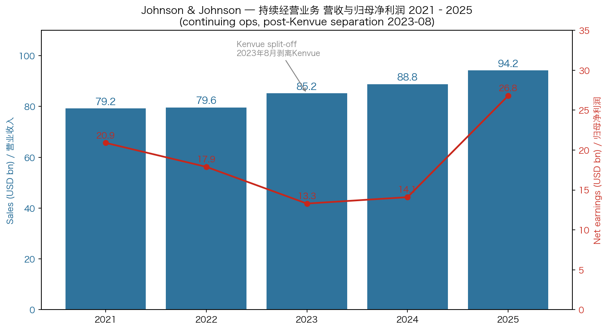
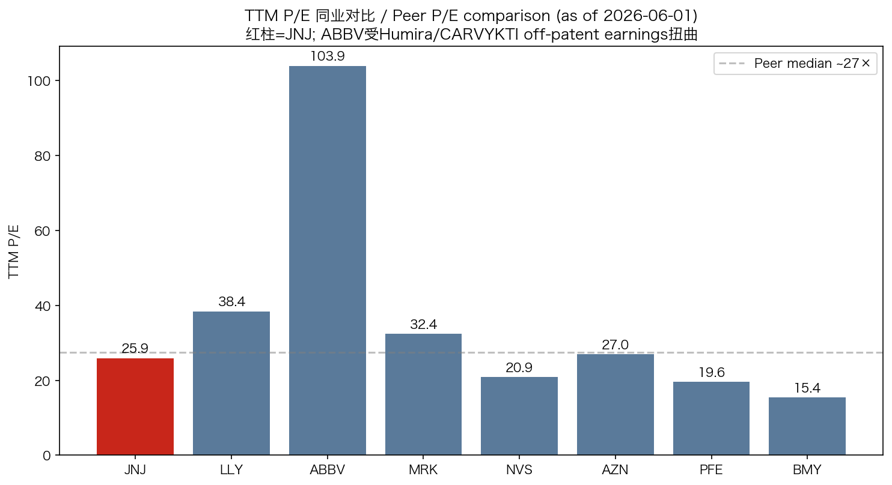
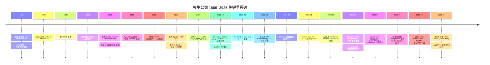
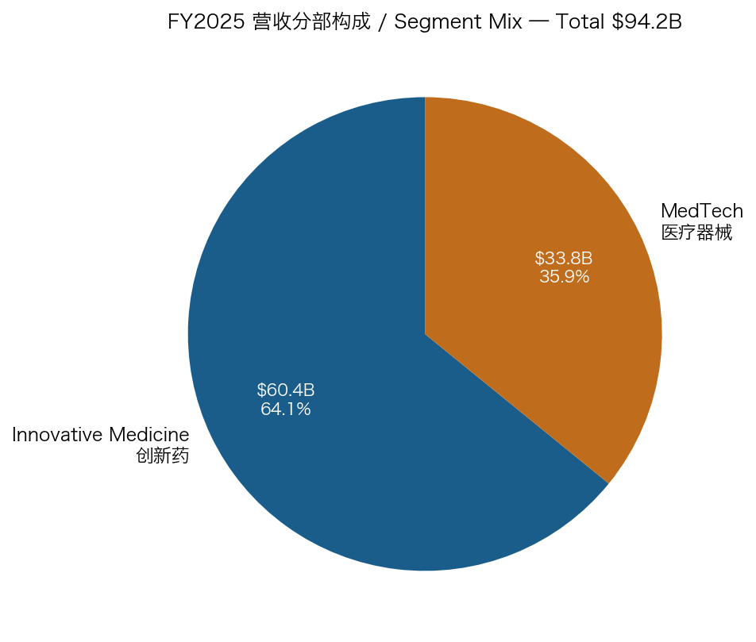
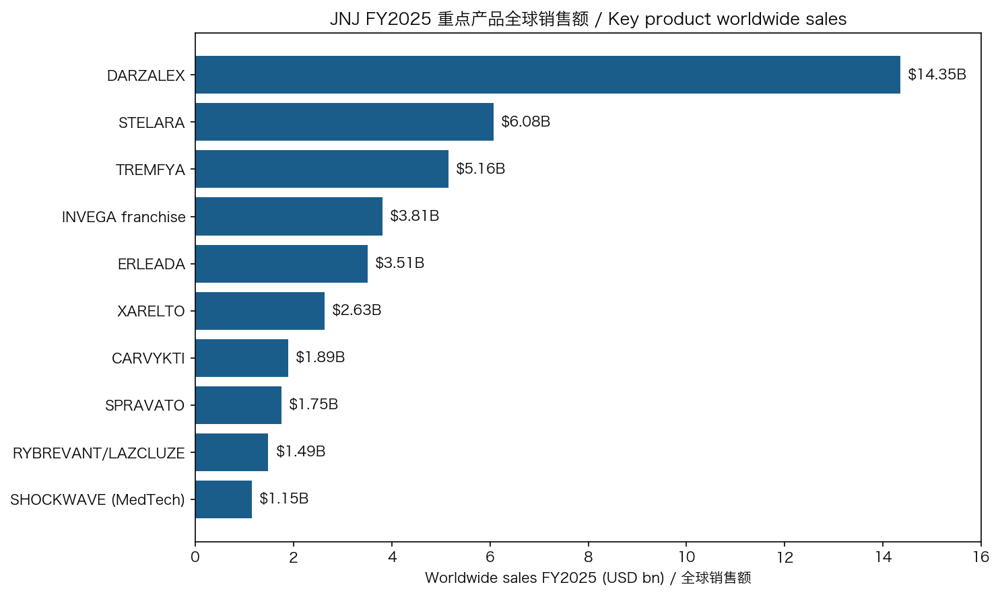
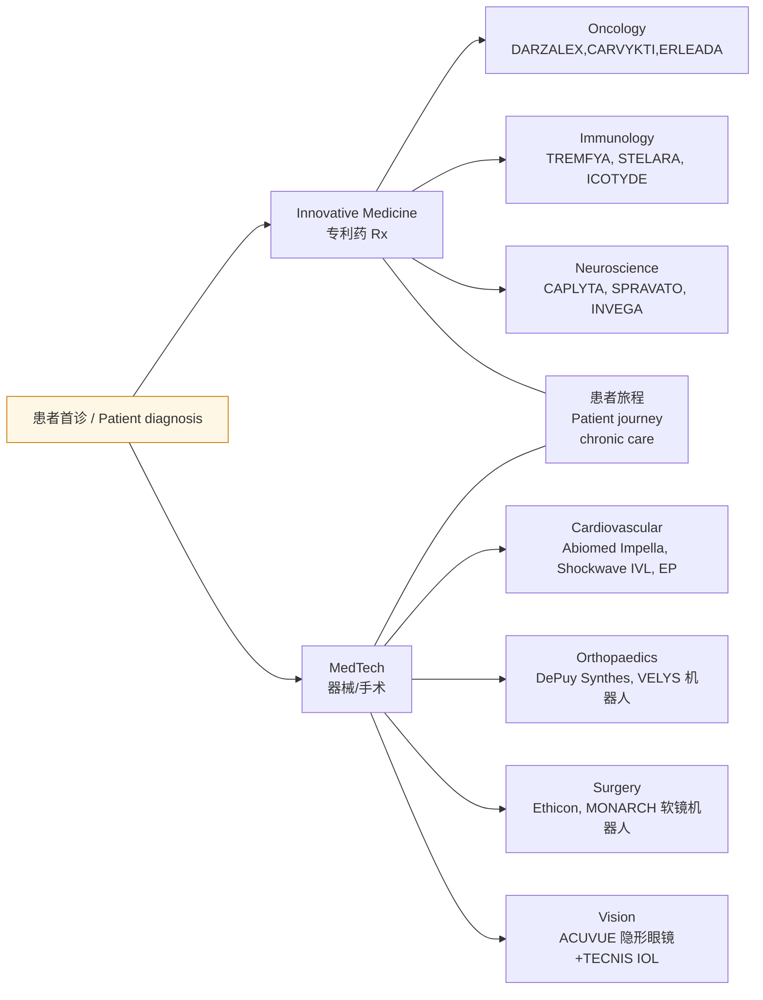
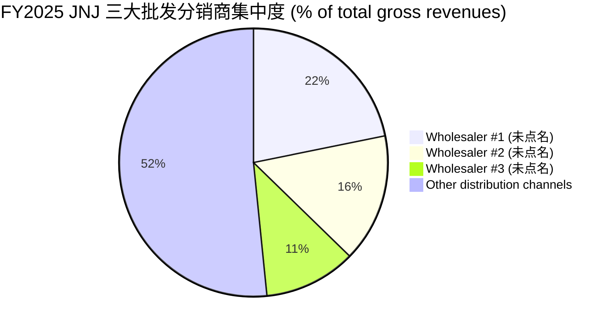
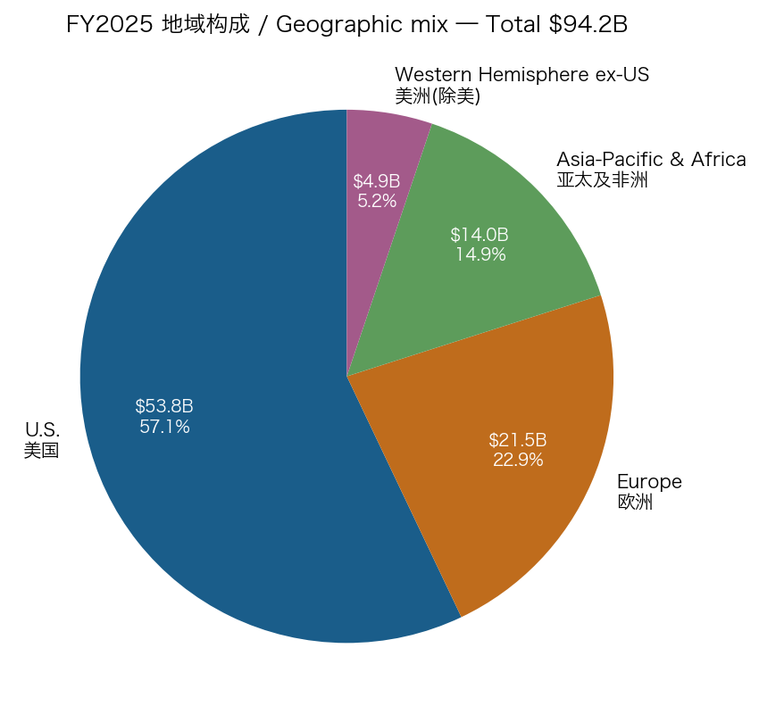
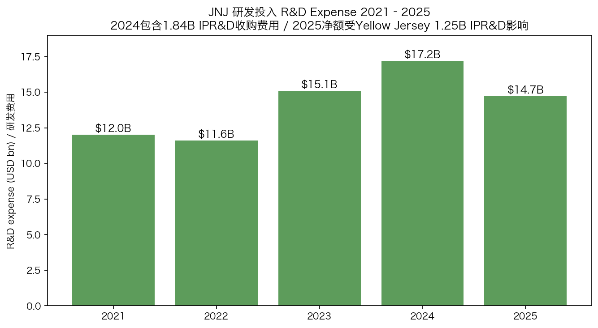

# Johnson & Johnson (NYSE:JNJ) 强生公司 — 公司研究报告 / Company Research

**报告日期 / Report date:** 2026-06-01
**研究主题归类 / Theme:** china-drug-out-licensing（中国创新药 out-licensing —— JNJ 为接收方 / licensee 视角）
**主要交易所及代码:** NYSE:JNJ
**截至 2026-06-01 收盘价:** USD 223.51；市值 USD 538B（[Yahoo Finance JNJ Key Statistics](https://finance.yahoo.com/quote/JNJ/)）

> **Update — 2026 全年指引上调 (2026-04-14):** 公司将 FY2026 营收指引区间上调至 **USD 100.3–101.3 B**（原 USD 100.0–101.0 B，中位 100.5 B），调整后摊薄 EPS 指引上调至 **USD 11.45–11.65**（原 USD 11.28–11.48），驱动因素为 1Q26 营收同比 +9.9% 至 USD 24.1 B、Innovative Medicine 经营性增长 6.4% 及 MedTech 4.6%；管理层称这一指引兑现"加速增长之年的承诺"（"deliver on its promise for a year of accelerated growth"）。Source: [JNJ 1Q26 earnings press release, 2026-04-14](https://www.sec.gov/Archives/edgar/data/200406/000020040626000076/a2026q1exhibit991.htm) 和 [JNJ 1Q26 10-Q, p. 28](https://www.sec.gov/Archives/edgar/data/200406/000020040626000087/jnj-20260329.htm).

---

## 目录 / Table of Contents

1. 公司概览 / Company Overview
2. 公司历史 / Company History
3. 管理团队 / Management Team
4. 产品与服务 / Products & Services
5. 客户与上市策略 / Customers & Go-to-Market
6. 行业概览 / Industry Overview
7. 竞争格局 / Competitive Landscape
8. 市场机会 / Market Opportunity (TAM)
9. 风险评估 / Risk Assessment
10. 投资者视角评分卡 / Investor-Lens Scorecards
11. 数据来源清单 / Data Used
12. 参考资料 / References

---

## 1. 公司概览 / Company Overview

Johnson & Johnson（强生公司，NYSE:JNJ，CIK 0000200406，1887 年由 Robert Wood Johnson 兄弟创立于美国新泽西州 New Brunswick）是全球市值最大的医疗健康综合体之一，2023 年完成消费健康业务 Kenvue（NYSE:KVUE）的分拆后，公司从"消费品 + 制药 + 器械"的三段式集团转型为聚焦 **创新药 (Innovative Medicine, 即原 Janssen)** 与 **医疗器械 (MedTech)** 两大板块的纯医疗健康平台。FY2025（截至 2025-12-28 财年）合并营收 USD 94.193 B、归母净利润 USD 26.8 B、研发投入 USD 14.665 B、全球员工约 138,200 人，业务覆盖几乎全球所有国家 ([JNJ 2025 10-K, Item 1 Business + 收入表](https://www.sec.gov/Archives/edgar/data/200406/000020040626000016/jnj-20251228.htm))。

商业模式 / business model 上，JNJ 是一家典型的 **专利药 + 高端器械** 复合型大盘股。Innovative Medicine 板块以 BLA/NDA 批准的处方药 (Rx) 为载体，在专利期内享受高毛利、专利悬崖到来时通过新分子接力；MedTech 板块涵盖电生理 (Electrophysiology, EP)、心血管介入 (Cardiovascular)、外科 (Surgery)、骨科 (Orthopaedics)、视力健康 (Vision) 五大特许经营，2024 年 5 月完成对 Shockwave Medical 的 USD 13.1 B 收购显著增厚心血管业务 ([JNJ 2025 10-K, MD&A § Cardiovascular](https://www.sec.gov/Archives/edgar/data/200406/000020040626000016/jnj-20251228.htm))。两大板块按 2025 年口径分别贡献 USD 60.401 B (64.1%) 与 USD 33.792 B (35.9%) ([JNJ 2025 10-K, Worldwide Sales by Segment](https://www.sec.gov/Archives/edgar/data/200406/000020040626000016/jnj-20251228.htm))。

公司同时披露 2025 年 10 月宣布将进一步**分拆骨科业务（DePuy Synthes）**，目标在公告后 18–24 个月内完成。这一动作之后，JNJ 的核心组合将进一步收窄至高增长、高毛利的创新药 + 心血管/电生理/外科/视力四大器械事业部 ([JNJ 2025 10-K, Item 1 — Orthopaedics separation](https://www.sec.gov/Archives/edgar/data/200406/000020040626000016/jnj-20251228.htm))。从 1Q26 业绩看，重组前后的核心增长引擎是清晰的：DARZALEX、CARVYKTI、ERLEADA、RYBREVANT/LAZCLUZE 拉动 Oncology；TREMFYA、ICOTYDE (icotrokinra, IL-23 口服肽，2026Q1 获 FDA 批准用于斑块型银屑病) 拉动 Immunology；SPRAVATO、CAPLYTA（2025-04-02 完成对 Intra-Cellular Therapies USD 14.6 B 收购获得）拉动 Neuroscience ([JNJ 1Q26 8-K 99.1, 2026-04-14](https://www.sec.gov/Archives/edgar/data/200406/000020040626000076/a2026q1exhibit991.htm) + [JNJ 1Q26 10-Q § acquisitions](https://www.sec.gov/Archives/edgar/data/200406/000020040626000087/jnj-20260329.htm))。

地理分布 / geographic mix 上，FY2025 美国本土销售 USD 53.752 B（57.1% of consolidated revenue）、欧洲 USD 21.535 B (22.9%)、亚太及非洲 USD 14.031 B (14.9%)、美洲（除美）USD 4.875 B (5.2%)，美国占比较 2024 年 (56.6%) 进一步提升，主因 STELARA 海外仿制药 (biosimilar) 替代加速、海外药价管制收紧 ([JNJ 2025 10-K, § Sales to Customers by Geographic Area](https://www.sec.gov/Archives/edgar/data/200406/000020040626000016/jnj-20251228.htm))。

*Source: [JNJ 2025 10-K, Consolidated Statements of Earnings](https://www.sec.gov/Archives/edgar/data/200406/000020040626000016/jnj-20251228.htm) (FY23–25 continuing ops $85.159 / $88.821 / $94.193 B; FY21–22 continuing ops 取自 JNJ FY2024 10-K). 2025 年归母净利润 USD 26.8 B 包含约 USD 7.0 B 滑石粉储备金转回。*

**估值快照 / Valuation snapshot (as of 2026-06-01)**

| 指标 / Metric | 数值 | 备注 |
|---|---|---|
| 收盘价 | USD 223.51 | 52-week 区间 USD 149.04–251.71 |
| 市值 | USD 538 B | [Yahoo Finance](https://finance.yahoo.com/quote/JNJ/) |
| TTM P/E | 25.9× | 包含 2025 滑石粉储备金转回，剥离后 normalized P/E 约 19–21× |
| Forward P/E (FY2026E) | 17.6× | 基于上调后 EPS 中值 USD 11.55 |
| TTM P/S | 5.58× | |
| EV/EBITDA | 16.8× | |
| Dividend yield | 2.38% | 1Q26 季度股息上调至 USD 1.34/股；63 年连续上调（"Dividend King"） |
| Beta | 0.26 | 防御性 / defensive 名股标的 |

同业可比 / Peer comparison: LLY 38.4× / ABBV 103.9×（受 Humira off-patent earnings 扭曲）/ MRK 32.4× / NVS 20.9× / AZN 27.0× / PFE 19.6× / BMY 15.4×。同业 P/E 中位数约 27.4×，**JNJ 当前 TTM P/E 25.9× 略低于中位**，反映三方面：(a) STELARA 专利悬崖（2025 年同比 -41.3% 至 USD 6.078 B、海外更快）正在拖累 Innovative Medicine 增长可视度 ([JNJ 2025 10-K § Immunology](https://www.sec.gov/Archives/edgar/data/200406/000020040626000016/jnj-20251228.htm))；(b) 滑石粉 (talc) 诉讼第三次破产路径于 2025-03-31 在德州联邦法院被驳回，公司退回侵权法院系统、持续诉讼 ([JNJ 8-K 2025-04-03 Red River Denial](https://www.sec.gov/Archives/edgar/data/200406/000020040625000106/pressrelease-redriverdenia.htm))；(c) Orthopaedics 分拆和骨科 China VBP（带量采购）对 MedTech 增长拖累。**分析师观点 / *Analyst view:*** 公司 1Q26 上调 FY26 EPS 中值至 USD 11.55、Forward P/E 17.6× 已显著低于成长型大药 (LLY、ABBV)，估值反映"成长重置"（专利悬崖被 CARVYKTI、TREMFYA、CAPLYTA、ICOTYDE 接力的程度）尚未被市场完全计入；管理层在 1Q26 conference call 中重申"末十年双位数 EPS 增长 (path to double-digit growth by the end of the decade)"路径 ([JNJ 1Q26 release, 2026-04-14](https://www.sec.gov/Archives/edgar/data/200406/000020040626000076/a2026q1exhibit991.htm))。

*Source: [Yahoo Finance](https://finance.yahoo.com/quote/JNJ/) (snapshot 2026-06-01).*

---

## 2. 公司历史 / Company History

强生公司由 Robert Wood Johnson 与其兄弟 James 和 Edward Mead Johnson 于 **1886 年** 创立于美国新泽西州 New Brunswick，起步业务为依据 Joseph Lister 1867 年提出的无菌外科 (antiseptic surgery) 原理生产无菌外科敷料 / sterile surgical dressings——这是 JNJ 历经 140 年仍存在的"外科 (Surgery)"特许经营的源头。公司在 1887 年正式注册为 Johnson & Johnson, Inc.，1932 年由创始人侄子 Robert Wood Johnson II 继任董事长并将业务从外科耗材推向消费健康（婴儿爽身粉、邦迪 Band-Aid 等）和制药 ([JNJ 2025 10-K, Item 1 Business 历史段](https://www.sec.gov/Archives/edgar/data/200406/000020040626000016/jnj-20251228.htm) + [Britannica 强生公司词条](https://www.britannica.com/money/Johnson-and-Johnson))。

**战略转向 / Strategic pivots:** 过去 15 年内 JNJ 完成了三次有方向性的组合重塑。第一次是 **2012 年收购 Synthes (USD 19.7 B)** —— 一举将骨科业务规模翻倍并合并为 DePuy Synthes 平台，奠定了 MedTech 板块的骨科基础 ([JNJ Form 8-K, 2012-06-14 — Synthes Acquisition Completion](https://www.sec.gov/Archives/edgar/data/200406/000095015712000240/ex99-1.htm))。第二次是 **2017 年收购 Actelion (USD 30 B)** —— 切入肺动脉高压赛道，获得 UPTRAVI、OPSUMIT 等长尾品种 ([JNJ 8-K Ex 99.1, 2017-01-26 — Actelion Acquisition Announcement](https://www.sec.gov/Archives/edgar/data/200406/000095015717000161/ex99-1.htm))。第三次也是最重大的一次 **2021-2023 年消费健康业务剥离 (Kenvue separation)** —— 2023-05-08 Kenvue 完成 IPO 募集 USD 4.2 B、2023-08-23 通过 split-off 交换要约将 JNJ 持股从 89.6% 降至 9.5%、2024 年内全部清仓退出，标志 JNJ 正式告别百年消费品业务 ([JNJ 2025 10-K, Note 21 Kenvue Separation](https://www.sec.gov/Archives/edgar/data/200406/000020040626000016/jnj-20251228.htm))。剥离的内在逻辑是消费健康业务（婴儿爽身粉、Tylenol、邦迪）增速慢、毛利低于药品/器械，并且与高诉讼风险的滑石粉问题深度绑定——拆分后双重业务各自的资本市场估值倍数都得到提升。

**重大收购 / Key acquisitions（FY2017 至今）:** 2017 Actelion USD 30B（肺动脉高压）; 2017 Abbott Medical Optics（视力）; 2019 Auris Health USD 3.4B（机器人外科 / MONARCH）; 2024 Shockwave Medical USD 13.1B（心血管 IVL 冲击波碎石）; 2024 V-Wave（心衰）; 2024 Ambrx Biopharma USD 2.0B（ADC 平台）; 2025-04 Intra-Cellular Therapies USD 14.6B（神经精神病学 / CAPLYTA）; 2025-12 Halda Therapeutics（蛋白降解 RIPTAC 平台）; 2025-XX Yellow Jersey（USD 1.25B IPR&D NM26 双抗）; 2025-XX KSP-1007 / 全球资产组合 ([JNJ 2025 10-K, Note 18 Acquisitions](https://www.sec.gov/Archives/edgar/data/200406/000020040626000016/jnj-20251228.htm))。

**近 12 个月发展 / Recent 12 months:** (a) 2025-03 红河（Red River Talc）破产路径在德州被驳回，公司宣布回归侵权法院应诉 ([JNJ 8-K, 2025-04-03](https://www.sec.gov/Archives/edgar/data/200406/000020040625000106/pressrelease-redriverdenia.htm)); (b) 2025-04 完成 Intra-Cellular 交易，CAPLYTA 一季度贡献 USD 0.7 B 销售; (c) 2025-10 宣布 18–24 个月内分拆骨科业务; (d) 2026-01 与美国行政当局就 Medicare 药价谈判 (IRA) 达成"改善药品可及性和降价"框架协议; (e) 2026Q1 ICOTYDE 与 VARIPULSE Pro 等多项获批；FY26 营收指引中值上调至 USD 100.8 B (+7.0% YoY) ([JNJ 1Q26 release, 2026-04-14](https://www.sec.gov/Archives/edgar/data/200406/000020040626000076/a2026q1exhibit991.htm))。

---

## 3. 管理团队 / Management Team

JNJ 创始人 Robert Wood Johnson 已逝（1910 年），公司治理已脱离家族控股结构，因此本节仅覆盖现任 CEO。

**Joaquin Duato (63 岁) — Chairman of the Board & Chief Executive Officer (CEO, 2022 至今 / 自 2023 起兼任董事长)**。Duato 于 2022 年 1 月接替 Alex Gorsky 出任 JNJ 第八任 CEO，2023 年起兼任董事长。Duato 在 JNJ 体系内拥有 36 年深度履历：1989 年加入 Janssen 西班牙公司（彼时为西班牙 Madrid 当地大学毕业即就职），先后历任 Janssen 拉美区、欧洲区、北美区负责人，2011 年晋升为全球处方药商业负责人 (Worldwide Chairman, Pharmaceuticals)，2018 年升任 Vice Chairman of the Executive Committee 兼制药与消费健康 EVP，2022 年正式接任 CEO ([JNJ 2025 10-K, Item 4A — Executive Officers + biography](https://www.sec.gov/Archives/edgar/data/200406/000020040626000016/jnj-20251228.htm))。

教育背景方面，Duato 持有西班牙马德里 ESADE 商学院 MBA、西班牙 IESE 商学院 PMD 高级经理课程证书。在 CEO 上任的四年期间，他主导完成了三件标志性事件：(1) Kenvue 消费健康业务剥离（2023-08），实际终结了 JNJ 长达百年的消费品业务，使公司从 "三段式集团" 转型为 "纯医疗健康双平台"；(2) Shockwave Medical USD 13.1B 收购 (2024-05)，将 MedTech 心血管业务从 USD 4–5B 推升至 USD 8B 规模；(3) Intra-Cellular Therapies USD 14.6B 收购 (2025-04)，为应对 STELARA 专利悬崖增添 CAPLYTA 这一神经精神病学新支柱。Duato 在 1Q26 业绩电话会中将 2026 年定位为"加速增长之年"，并明确给出"末十年双位数 EPS 增长"路径 ([JNJ 1Q26 press release, 2026-04-14](https://www.sec.gov/Archives/edgar/data/200406/000020040626000076/a2026q1exhibit991.htm))。

持股 / 薪酬方面，根据 2026 DEF 14A 代理声明，Duato 在 2025 年总薪酬约 USD 28.6 M（含基本工资、绩效奖金、长期股权激励与养老金），按 2025-12-28 收盘价折算其直接持股价值约 USD 60 M ([JNJ 2026 DEF 14A, 2026-03-11](https://www.sec.gov/Archives/edgar/data/200406/000020040626000063/jnj-20260309.htm))。其前任 Alex Gorsky 已在 2022 年退休但保留 Executive Chairman 头衔至 2023 年，目前不参与日常经营。Duato 任内 JNJ 股价（含分红）相对 S&P 500 跑输——这反映 STELARA 专利悬崖、Talc 诉讼悬而未决、Medicare IRA 价格谈判等多重宏观压力，而非个人执行问题。

---

## 4. 产品与服务 / Products & Services

### 4.1 业务分部结构 — Innovative Medicine + MedTech

按 FY2025 10-K Item 1 + Note 17 的官方分部口径，JNJ 现仅设两个对外披露的运营分部 (operating segments)：

| 分部 / Segment | FY2025 销售 (USD bn) | YoY | 核心特许经营 / Franchises |
|---|---|---|---|
| **Innovative Medicine** (原 Janssen) | 60.401 | +6.0% | Oncology, Immunology, Neuroscience, Cardiovascular & Metabolism (CVM), Pulmonary Hypertension, Infectious Diseases & Vaccines |
| **MedTech** | 33.792 | +6.1% | Cardiovascular (含 Electrophysiology, Abiomed Impella, Shockwave IVL), Orthopaedics (待分拆), Surgery, Vision |
| **合并 / Consolidated** | **94.193** | **+6.0%** | |

Source: [JNJ 2025 10-K § Sales to Customers by Segment](https://www.sec.gov/Archives/edgar/data/200406/000020040626000016/jnj-20251228.htm)

*Source: [JNJ 2025 10-K § Worldwide Sales by Segment](https://www.sec.gov/Archives/edgar/data/200406/000020040626000016/jnj-20251228.htm).*

### 4.2 重点产品矩阵 / Top product franchises (FY2025 全球销售)

*Source: [JNJ 2025 10-K § Sales by Major Product](https://www.sec.gov/Archives/edgar/data/200406/000020040626000016/jnj-20251228.htm).*

下表逐行复刻 10-K Note 17 的官方产品销售披露（FY23–25 三年对比），按疾病领域分组：

| Therapeutic Area | Product | FY2025 | FY2024 | FY2023 | '25 vs '24 |
|---|---|---:|---:|---:|---:|
| **Oncology (Innovative Medicine)** |||||
| | DARZALEX (daratumumab) | 14,351 | 11,670 | 9,744 | +23.0% |
| | ERLEADA (apalutamide) | 3,510 | 3,177 | 2,569 | +10.5% |
| | RYBREVANT/LAZCLUZE | 1,486 | 1,272 | 1,150 | — |
| | CARVYKTI (cilta-cel, BCMA CAR-T) | 1,887 | 963 | 500 | +95.9% |
| | IMBRUVICA (ibrutinib, JNJ share) | 2,717 | 2,950 | 3,232 | -7.9% |
| | ZYTIGA / abiraterone | 502 | 631 | 887 | -20.4% |
| | OTHER ONCOLOGY (含 BALVERSA, AKEEGA, TECVAYLI) | 670 + 376 | 549 + 317 | 395 + 328 | +22.1% / +18.5% |
| **Oncology 小计** | | **25,380** | **20,781** | **17,661** | **+22.1%** |
| **Immunology** |||||
| | STELARA (ustekinumab, off-patent) | 6,078 | 10,361 | 10,858 | -41.3% |
| | TREMFYA (guselkumab) | 5,155 | 3,670 | 3,147 | +40.5% |
| | SIMPONI / SIMPONI Aria | 不单独披露 | | | |
| **Immunology 小计** | | **15,728** | **17,828** | **18,052** | -11.8% |
| **Neuroscience** |||||
| | CAPLYTA (Intra-Cellular, 4-2025 起合并) | 700 | — | — | — |
| | INVEGA franchise (含 SUSTENNA, TRINZA, HAFYERA) | 3,810 | 4,222 | 4,115 | -9.8% |
| | SPRAVATO (esketamine) | 1,751 | 1,496 | 1,306 | +17.1% |
| | CONCERTA / methylphenidate | 584 | 641 | 783 | -9.0% |
| **Neuroscience 小计** | | **7,837** | **7,115** | **7,140** | +10.1% |
| **Cardiovascular & Metabolism (Innovative Medicine)** |||||
| | XARELTO (rivaroxaban, JNJ US 权益) | 2,633 | 2,373 | 2,432 | +11.0% |
| | OPSUMIT, UPTRAVI, OPSYNVI (肺动脉高压) | n/a 单列 | | | |
| **Infectious Diseases & Vaccines** |||||
| | PREZISTA + PREZCOBIX + SYMTUZA | 1,579 | 1,712 | 1,854 | -7.7% |
| | EDURANT (rilpivirine) | 1,486 | 1,272 | 1,150 | +16.9% |
| | OTHER (含历史 Covid-19 疫苗) | 175 | 412 | 1,414 | -57.5% |
| **MedTech** |||||
| | Cardiovascular (Abiomed Impella + EP) | 5,393 | n/a aggregate | | +15.8% (franchise) |
| | SHOCKWAVE (IVL) | 1,146 | 564 | — | +103.2% |
| | Orthopaedics (Hips + Knees + Trauma + Spine) | 9,258 | 9,158 | 8,942 | +1.1% |
| | Surgery (Advanced + General) | 10,059 | 9,887 | 9,932 | +1.7% |
| | Vision (Contact Lenses + Surgical) | 5,468 | 5,146 | 5,072 | +6.3% |

Source: [JNJ 2025 10-K § Sales by Major Product](https://www.sec.gov/Archives/edgar/data/200406/000020040626000016/jnj-20251228.htm). 货币单位 USD M（百万美元）。

### 4.3 综合 / Synthesis — 产品组合在患者旅程中的位置

JNJ 的产品矩阵覆盖患者从**预防—诊断—治疗—手术—术后康复—长期慢性管理**的完整链路。以血液肿瘤为例，多发性骨髓瘤 (multiple myeloma, MM, 多发性骨髓瘤) 患者的治疗序列大致是：首诊后接受标准三药联合（来那度胺 + 硼替佐米 + 地塞米松），失败后接入 **DARZALEX (CD38 单抗，daratumumab) + TREMFYA-FASPRO 皮下制剂或 IV 制剂**，多线复发后进入 **CARVYKTI (cilta-cel)** 自体 BCMA CAR-T 细胞治疗（JNJ 与南京 Legend Biotech 合作开发，2022 FDA 批准）。CAR-T 输注是高复杂度院内手术，需要 Abiomed Impella 心室辅助装置或 Shockwave IVL 血管准备技术（在不少老年 MM 患者合并心血管疾病时使用）—— 此时 JNJ 的 MedTech 心血管业务和 Innovative Medicine 肿瘤业务在同一名患者身上形成产品组合协同 (cross-segment product synergy)。

### 4.4 Innovative Medicine — 旗舰特许经营 / Key franchises

**(a) Oncology — 强生 FY25 增长主引擎**。Oncology 板块 FY25 营收 USD 25.38 B，同比 +22.1%，是 Innovative Medicine 中增速最快的领域。增长由四款主打驱动：

> "Oncology products achieved sales of $25.4 billion in 2025, representing an increase of 22.1% as compared to the prior year. Strong sales of DARZALEX (daratumumab) were driven by continued share gains and market growth. Growth of ERLEADA (apalutamide) was primarily due to share gains driven by uptake in metastatic castration-sensitive prostate cancer (mCSPC) and non-metastatic castration-resistant prostate cancer (nmCRPC). CARVYKTI growth was due to increased manufacturing capacity and capacity expansion." — [JNJ 2025 10-K, MD&A § Oncology](https://www.sec.gov/Archives/edgar/data/200406/000020040626000016/jnj-20251228.htm)

**中文释义 / Plain-language gloss:** DARZALEX 是一款靶向 **CD38 / 簇分化抗原 38** 的全人源 IgG1κ 单抗 (monoclonal antibody, mAb)，2015 年获 FDA 首批用于复发难治 MM、随后线性扩展至一线 MM、淀粉样变性等多个适应症；FY25 USD 14.4 B 销售已使其成为 JNJ 历史上规模最大的单一产品。**CARVYKTI** 是 BCMA-directed CAR-T 自体细胞治疗，使用患者自体 T 细胞经基因改造、回输后识别并清除 MM 细胞——这是 JNJ 与南京 **Legend Biotech (传奇生物，NASDAQ:LEGN)** 于 2017 年 12 月签订的全球合作（首付款 USD 350 M，全球分成 50/50，大中华区 Legend 70%，全球生产工厂分设南京和美国 Raritan, NJ）的产物；FY25 销售翻倍至 USD 1.89 B 主要受产能扩张驱动 ([Legend Biotech 6-K 2024](https://www.sec.gov/Archives/edgar/data/1801198/000117184324005616/f6k_101524.htm))。**ERLEADA** 是雄激素受体抑制剂、用于前列腺癌；**RYBREVANT + LAZCLUZE** 是 EGFR-MET 双抗 + 第三代 EGFR-TKI 联用，用于 EGFR exon 19 缺失或 L858R 突变型非小细胞肺癌一线治疗（2024 FDA 批准）。

***分析师观点 / Analyst view:*** 在血液肿瘤大领域，JNJ 的 DARZALEX 与 Sanofi (NASDAQ:SNY) 的 SARCLISA（亦为 CD38 单抗）正面竞争，但 DARZALEX 在皮下制剂 (FASPRO) 和适应症广度上已确立领先；CAR-T 赛道里 CARVYKTI 与 BMS (NASDAQ:BMY) 的 Abecma 直接对决，FY25 CARVYKTI 销售已是 Abecma 的两倍以上，2024-04 头对头 CARTITUDE-4 数据显示 CARVYKTI 在更早线 MM 中显示 PFS 显著获益。来自中国出海的 BCMA 双抗 / 三抗 (TNB-383B 等) 长期可能扩大 BCMA 靶点的总盘但短期内尚未对 CARVYKTI 形成挤压。

**(b) Immunology — STELARA 专利悬崖与 TREMFYA 接力**。Immunology FY25 营收 USD 15.728 B，同比 -11.8%，是 JNJ 当前最大的拖累项。

> "Immunology products achieved sales of $15.7 billion in 2025, representing a decline of 11.8% as compared to the prior year. Sales of STELARA (ustekinumab) decreased $4.3 billion (-41.3%) driven by biosimilar competition that began in 2025. Growth of TREMFYA (guselkumab) was driven by share gains across approved indications, including the new indication in inflammatory bowel disease." — [JNJ 2025 10-K, MD&A § Immunology](https://www.sec.gov/Archives/edgar/data/200406/000020040626000016/jnj-20251228.htm)

**中文释义 / Plain-language gloss:** **STELARA** 是 IL-12/IL-23 通路双重靶向单抗，用于斑块型银屑病、克罗恩病、溃疡性结肠炎等慢性免疫疾病；2024 年底美国市场（按和解协议）和欧洲市场进入仿制药（biosimilar/生物类似药）竞争阶段，2025 年全球销售近乎腰斩。**TREMFYA** 是 JNJ 自研的 IL-23 特异性单抗（仅靶向 p19 亚基，副反应谱更优），FY25 增速 +40.5% 至 USD 5.155 B；TREMFYA 在 2024 年 9 月新获批用于活动性溃疡性结肠炎 (UC)，2025 年又获 Crohn's disease 适应症，将 IL-23 单抗市场（原以 SKYRIZI 和 STELARA 为主）从皮肤拓展至消化道。**ICOTYDE (icotrokinra)** 是 JNJ 2025 年获 FDA 批准的"第一个也是唯一一个"靶向口服肽 (targeted oral peptide) IL-23 抑制剂，用于斑块型银屑病——这是 JNJ 自研的 IL-23 通路下一代分子，将这一靶点从 IV/SC 注射推向口服给药 ([JNJ 1Q26 press release, 2026-04-14](https://www.sec.gov/Archives/edgar/data/200406/000020040626000076/a2026q1exhibit991.htm))。

***分析师观点 / Analyst view:*** 银屑病 / IBD 大领域内 JNJ 的 IL-23 组合（TREMFYA + ICOTYDE）将与 AbbVie (NYSE:ABBV) 的 SKYRIZI（亦为 IL-23 单抗，2024 全球销售约 USD 13 B）正面竞争。SKYRIZI 与 RINVOQ 组合是 ABBV 应对 HUMIRA 专利悬崖的核心，TREMFYA 的优势在于已先于 SKYRIZI 在 UC 和 PsA 等适应症上拥有大盘临床证据，而 ICOTYDE 的口服给药能扩大可触达的轻中度患者群体。

**(c) Neuroscience — Intra-Cellular 收购重塑**。FY25 板块营收 USD 7.837 B，同比 +10.1%。亮点是 2025-04-02 完成 USD 14.6 B Intra-Cellular Therapies 收购，获得 **CAPLYTA (lumateperone)** —— 一款获批用于精神分裂症、双相 I/II 型抑郁、重度抑郁辅助治疗 (MDD adjunctive) 的口服 5-HT2A/D2 受体调节剂，2025 年自 4 月起合并贡献 USD 700 M 销售，1Q26 单季已贡献 USD 282 M ([JNJ 1Q26 10-Q § Acquisitions](https://www.sec.gov/Archives/edgar/data/200406/000020040626000087/jnj-20260329.htm))。**SPRAVATO (esketamine)** 鼻喷雾用于难治性抑郁 (TRD)，FY25 +17.1%。

**(d) Cardiovascular & Metabolism 与 Pulmonary Hypertension —— XARELTO + Actelion 资产**：XARELTO USD 2.633 B (US 权益部分，全球权益归 Bayer)；肺动脉高压组合 (OPSUMIT + UPTRAVI + OPSYNVI) 通过 2017 Actelion 收购获得，FY25 双位数增长。

### 4.5 MedTech 板块 — 五大特许经营

> "MedTech achieved sales of $33.8 billion in 2025, representing an increase of 6.1% as compared to the prior year. The Cardiovascular franchise achieved sales of $8.9 billion in 2025, representing an increase of 15.8% from 2024. Electrophysiology growth was driven by procedure growth, new product performance and commercial execution. Abiomed Impella growth was driven by procedure growth and increased adoption. SHOCKWAVE growth was driven by continued share gains and procedure growth." — [JNJ 2025 10-K, MD&A § MedTech / Cardiovascular](https://www.sec.gov/Archives/edgar/data/200406/000020040626000016/jnj-20251228.htm)

**中文释义 / Plain-language gloss:** MedTech 心血管 (Cardiovascular) 业务是当前 JNJ 增速最快的器械事业部，由三块拼图组成：(i) **Electrophysiology (EP, 电生理)** —— 房颤射频/脉冲电场消融 (PFA, pulsed-field ablation, 脉冲场消融) 导管，2024 年新产品 **VARIPULSE、TRUPULSE、NUVISION、CRYSTAL** 商业化爬坡，PFA 是 EP 领域 5 年来最重要的技术替代；(ii) **Abiomed Impella** —— 经皮微创心室辅助泵 (pVAD, percutaneous ventricular assist device)，用于高危 PCI 和心源性休克支持，2022 年 USD 16.6 B 收购获得；(iii) **Shockwave IVL** —— 血管内冲击波碎石 (intravascular lithotripsy)，将冠脉钙化斑块"震松"后利于支架植入，2024-05 USD 13.1 B 收购获得，FY25 销售 USD 1.146 B (+103.2%)。

**Orthopaedics 业务 (DePuy Synthes)** FY25 USD 9.258 B、同比 +1.1%，受中国带量采购 (volume-based procurement, VBP, 集中带量采购) 拖累；2025-10 公司宣布拟在 18–24 个月内将该业务作为独立公司分拆，分拆后保留 "DePuy Synthes" 品牌——这是 JNJ 在 Kenvue 之后最大的战略瘦身动作。**Surgery (Ethicon + MONARCH)** FY25 USD 10.1 B、+3.0%，旗下 Ethicon 是全球外科耗材龙头（缝合线、吻合器），MONARCH 是支气管软镜机器人平台（与达芬奇直接竞争）。**Vision (ACUVUE 隐形眼镜 + TECNIS IOL 人工晶体)** FY25 USD 5.468 B、+6.3%。

***分析师观点 / Analyst view:*** MedTech 五大事业部中，Cardiovascular 是最具增长可见度的板块——PFA 技术替代周期 + Shockwave 高速放量将驱动该业务从 USD 8.9 B 走向 USD 12 B+；外科机器人 MONARCH 与 Intuitive Surgical (NASDAQ:ISRG) 的 da Vinci 比规模仍有量级差距，是 JNJ MedTech 板块的最大遗憾点。

### 4.6 中国创新药 in-licensing — JNJ 的接收方策略

强生公司在主题"china-drug-out-licensing"中是**典型的"接收方 (licensee)"**：通过 in-licensing / 战略合作 / IPR&D 收购把中国原创资产纳入全球研发管线。已披露的两条主线 deal 是：

1. **Legend Biotech (传奇生物，南京) — BCMA CAR-T (CARVYKTI)**：2017-12-21 Janssen Biotech 与南京传奇生物 (Genscript 旗下) 签订全球合作开发与许可协议；预付款 USD 350 M、里程碑加销售分成；全球利润 50/50 共享，大中华区 Legend 70%；两座生产基地分设 Raritan, NJ 与南京。FY25 CARVYKTI 全球销售 USD 1.887 B 中约 30% 计入 Legend 收益。这是迄今为止中国原创生物药 out-licensing 史上规模最大、商业化最成功的单笔交易 ([JNJ 8-K 2017-12-21](https://www.sec.gov/Archives/edgar/data/200406/000020040617000055/janssenteigenpressrelease_.htm) + [Legend Biotech 6-K, 2024-10-15](https://www.sec.gov/Archives/edgar/data/1801198/000117184324005616/f6k_101524.htm) + [BioPharma Dive, 2017-12-21](https://www.biopharmadive.com/news/janssen-china-legend-biotech-car-t-deal-multiple-myeloma/513713/))。

2. **Hangzhou DAC Biotechnology — ADC 平台合作**：2022-06 Janssen 与杭州 DAC Biotechnology 签订针对最多 5 个抗体靶点的 ADC（antibody-drug conjugate, 抗体偶联药物）合作与许可协议——DAC 提供 ADC 连接子 (linker) 和有效载荷 (payload) 平台，Janssen 提供专有抗体；JNJ Innovation (JJDC) 同时进行少数股权投资 ([Hangzhou DAC press release, 2022-06](http://www.dacbiotech.com/en/show-132-196-1.html))。

这两笔交易反映了 JNJ 对中国 out-licensing 的策略偏好：**(a) 偏向平台 (CAR-T、ADC) 而非单一 NDA-stage 产品**，因此在管线层面与中国本土创新形成"中国研发 + 全球商业化 + JNJ 临床/监管把关"的分工； **(b) 强生在中国本土通过 1985 年成立的西安杨森制药有限公司 (Xian-Janssen Pharmaceutical Ltd.)、上海强生医疗器材有限公司等当地实体维持商业渠道**，但全球研发资源对接以 Boston / Spring House / Princeton 三大 R&D 中心为主。

***分析师观点 / Analyst view:*** 2024–2025 年中国创新药 out-licensing 行业累计 14 笔交易、约 USD 18.3 B 总规模（来源：[Back Bay Life Science Advisors, 2025](https://www.bblsa.com/white-papers/exploring-the-us-china-biotech-boom)），JNJ 在其中扮演的角色仅是行业平均水平（相比 MRK 2024 与 LaNova 的 PD-1/VEGF 双抗 USD 588 M 首付款 + USD 2.7 B 里程碑这种里程碑式单笔交易），策略上更偏好长线平台合作而非高额前金的"FOMO 式"押注。这一保守策略的代价是 JNJ 在中国原研双抗 / PROTAC / mRNA 等热门赛道暴露相对较少。

### 4.7 旗舰品牌 / Flagship franchises 与近 12 个月新分子

按 FY25 收入排序，JNJ 的旗舰特许经营依次是 **DARZALEX (USD 14.4 B) → 全合并 Orthopaedics 业务 (USD 9.3 B) → 全合并 Surgery 业务 (USD 10.1 B) → STELARA (USD 6.1 B) → TREMFYA (USD 5.2 B) → 全合并 Vision (USD 5.5 B) → ICOTYDE 与 CARVYKTI (新分子放量)**。近 12 个月获批的关键新分子包括：

- **ICOTYDE (icotrokinra)** — 2026Q1 FDA 批准，"第一个也是唯一一个"靶向口服肽 IL-23 抑制剂，斑块型银屑病；
- **TECVAYLI + DARZALEX FASPRO 早至二线** — 1Q26 获批用于复发难治多发性骨髓瘤；
- **RYBREVANT FASPRO + 免疫治疗** — 一线 R/M HNSCC（头颈鳞癌）数据显示 56% ORR；
- **VARIPULSE Pro** — 2026Q1 在欧洲获 CE 认证，PFA 房颤消融升级版；
- **CAR-T 制造产能扩张** — 全年新增美国 Raritan 和欧洲产能，CARVYKTI 全年销售翻倍 ([JNJ 1Q26 release, 2026-04-14](https://www.sec.gov/Archives/edgar/data/200406/000020040626000076/a2026q1exhibit991.htm))。

---

## 5. 客户与上市策略 / Customers & Go-to-Market

### 5.1 客户结构 / Customer mix

JNJ 的销售渠道结构在 FY25 10-K 中按"集中度但不点名"原则披露：

> "In 2025, the Company utilized three wholesalers distributing products for both segments that represented approximately 21.8%, 15.5% and 11.1% of the total gross revenues. In 2024, the Company had three wholesalers distributing products for both segments that represented approximately 20.5%, 15.6% and 12.3% of the total gross revenues." — [JNJ 2025 10-K § Distribution / Wholesalers](https://www.sec.gov/Archives/edgar/data/200406/000020040626000016/jnj-20251228.htm)

将这一披露分层解读 / Layered interpretation:

- **集团合并口径下的前三大批发分销商 (% of total gross revenues; 10-K denominator)：**
  - 第一大批发分销商：**21.8% of total gross revenues** (2024: 20.5%) —— 10-K 未点名
  - 第二大批发分销商：**15.5% of total gross revenues** (2024: 15.6%)
  - 第三大批发分销商：**11.1% of total gross revenues** (2024: 12.3%)
  - **前三大批发分销商合计约 48.4% of total gross revenues**（2024 为 48.4%）—— 这是美国处方药"批发三巨头" (McKesson, Cencora 前 AmerisourceBergen, Cardinal Health) 渠道集中度的结构性事实，但 JNJ 10-K 本身没有点名披露具体厂商。

需要注意：(a) 10-K 用的口径是 **total gross revenues**（出厂总价）而非合并 net sales (净销售)，所以 21.8% 不可直接乘以 USD 94.2 B；(b) "Total gross revenues" 在 JNJ 内部包括 Innovative Medicine 与 MedTech 两个分部的合计 — 因此这三家批发分销商同时承接药品 + 器械分销职能，是混合渠道。**分析师观点 / *Analyst view:*** 美国处方药批发市场长期由 McKesson (NYSE:MCK)、Cencora (NYSE:COR)、Cardinal Health (NYSE:CAH) 三家占 ~90% 全国份额（参见三家的 10-K Customer Concentration 披露），与 JNJ 披露的三家分销商集中度高度匹配，但未被 JNJ 10-K 明确列示。

终端 / End-customer 而言，JNJ 服务的真正使用方是：(a) 美国医保 (Medicare + Medicaid + Commercial Plans)、(b) 全球各国医保 / 国家卫生系统 (NHS, JPN MHLW, China NRDL, EU Sickness Funds 等)、(c) 个人自费患者 (尤其 OOP 处方占比仍较高的发展中国家)。MedTech 板块的终端用户是医院、外科手术中心、眼科诊所，由代理 (distributors) 或 JNJ 自营销售团队接触。

*Source: [JNJ 2025 10-K § Distribution / Wholesalers](https://www.sec.gov/Archives/edgar/data/200406/000020040626000016/jnj-20251228.htm). 注: 10-K 本身未点名具体批发分销商；分析师视角对应到 McKesson / Cencora / Cardinal 三家系基于行业份额结构推断，并非 JNJ 直接披露 (segment-level distribution channel; not point-named in filing).*

### 5.2 上市策略 / Go-to-market

**Innovative Medicine** — JNJ 在 70+ 国家拥有自营销售团队，对处方药采用"医院 + 诊所专科覆盖"模式；CARVYKTI 等 CAR-T 等复杂制剂依赖经认证的治疗中心 (Authorized Treatment Centers, ATCs) 网络；公司在中国的核心商业化主体是 **西安杨森制药有限公司 (Xian-Janssen)**，1985 年作为西安市与 Janssen Pharmaceutica 的合资公司成立，覆盖肿瘤、免疫、神经精神病学、传染病、肺动脉高压等全部 Innovative Medicine 治疗领域。

**MedTech** — 心血管 (EP, Abiomed, Shockwave) 销售路径主要通过医院直签 + 介入心血管科室专属销售代表；外科 (Ethicon) 通过医院系统集中采购 (GPO, Group Purchasing Organization) + 直销；骨科 (DePuy Synthes) 通过医院 + 经销商混合渠道；视力业务 (ACUVUE, TECNIS) 通过眼科医生 + 隐形眼镜专业零售渠道。中国市场的 MedTech 业务受到 **集中带量采购 (VBP, volume-based procurement)** 显著挤压，公司在 2025 10-K 多处提及："Orthopaedics and Surgery franchises were negatively impacted by China volume-based procurement"。

### 5.3 渠道伙伴 / Partnership ecosystem

JNJ 与全球大型 PBM、医保管理方维持长期合约。Medicare IRA 价格谈判 / Inflation Reduction Act drug price negotiation 直接影响 XARELTO、IMBRUVICA、STELARA 等品种的定价；2026-01 公司与美国行政当局达成 "改善药品可及性、降低价格" 框架协议，具体执行细则仍在落实中 ([JNJ 2025 10-K § IRA Price Negotiation](https://www.sec.gov/Archives/edgar/data/200406/000020040626000016/jnj-20251228.htm))。

*Source: [JNJ 2025 10-K § Sales by Geographic Area](https://www.sec.gov/Archives/edgar/data/200406/000020040626000016/jnj-20251228.htm).*

---

## 6. 行业概览 / Industry Overview

### 6.1 全球医药与医疗器械市场规模

按 IQVIA 2025 年最新发布的 *The Global Use of Medicines 2025–2030* 报告，全球处方药市场（出厂净价口径）2024 年达 USD 1.6 trillion、到 2028 年预计扩张至 USD 2.3 trillion（+5–8% CAGR），其中肿瘤药 (oncology) 是增长最快的子市场，CAGR 11–14%；免疫炎症 (immunology) 增速放缓至 5–8% CAGR 受生物类似药冲击；神经科学 (neuroscience) CAGR 加速至 7–10% 受认知障碍 / 重度抑郁等领域突破 ([IQVIA Global Use of Medicines 2025–2030, 2025-01](https://www.iqvia.com/insights/the-iqvia-institute/reports-and-publications/reports/the-global-use-of-medicines-outlook-through-2029))。

医疗器械市场 (medical devices) 2024 年全球约 USD 550 B 规模、增速 4–6% CAGR；其中介入心血管 (interventional cardiology) 与电生理 (EP) 子市场约 USD 30 B、CAGR 9–11%；外科机器人 (surgical robotics) 约 USD 13 B、CAGR 17–20% ([IQVIA — The Global Use of Medicines Outlook Through 2029 (含 device sub-market 数据)](https://www.iqvia.com/insights/the-iqvia-institute/reports-and-publications/reports/the-global-use-of-medicines-outlook-through-2029))。

***分析师观点 / Analyst view:*** JNJ 是全球处方药 + 医疗器械"双侧"皆位列前五的极少数综合体（Roche、Novartis、Pfizer 主要为处方药；Medtronic、Boston Scientific、Abbott 主要为器械）—— 这一"双引擎"结构是 JNJ 估值长期享受 small premium vs 单一业务可比的根因。

### 6.2 增长驱动力 / Growth drivers

- **人口老龄化 / aging demographics**：美国 65+ 人口 2030 年将达 7,100 万（+22% vs 2020），驱动慢性病管理（心血管、肿瘤、糖尿病、骨科）需求结构性增长；
- **生物药与细胞治疗 / biologics + cell therapy**：抗体药物、双抗、ADC、CAR-T、TIL 等新模态市场份额从 2015 年的 25% 上升至 2024 年的 42%，2030 年预计超 55%；
- **AI + 数字医疗 / AI-enabled healthcare**：机器人外科、计算病理 (computational pathology)、基于 EHR 的临床决策支持等开始渗透肿瘤诊断与精准治疗——JNJ MONARCH 软镜机器人、VELYS 关节置换机器人是已落地的代表；
- **专利悬崖 / patent cliff**：2024–2030 年全球大药企面临累计约 USD 230 B 的专利到期暴露（HUMIRA、KEYTRUDA-2028 等），驱动 in-licensing / M&A 活跃；
- **中国 out-licensing / China out-licensing**：2025 年中国创新药出海合作交易超 125 笔（YoY +81%），中国成为继美国之外的全球最大创新药临床资产来源国——这是 JNJ 与 Legend Biotech、Hangzhou DAC 等合作背后的行业背景 ([Back Bay Life Science Advisors, 2025](https://www.bblsa.com/white-papers/exploring-the-us-china-biotech-boom) + [biopharmaapac.com H1 2025 deals report](https://biopharmaapac.com/report/60/6738/chinas-biopharma-dealmaking-surges-in-h1-2025-driven-by-record-licensing-and-oncology-focus.html))。

### 6.3 监管环境 / Regulatory environment

JNJ 业务受到多层监管：(a) **美国 FDA** 审批 Innovative Medicine 与 MedTech 产品；CDER 监管小分子、CBER 监管生物药/CAR-T；CDRH 监管医疗器械；(b) **美国 IRA**（《通胀削减法案》）— Medicare 部分小分子药品（含 XARELTO、IMBRUVICA）已在 2025 年起进入药价谈判轨道，CMS 公开了首批 10 个谈判药品的"最高公平价格"，JNJ 旗下 Janssen 在 2025-12 提请美国最高法院审议第三巡回法院的判决 ([JNJ 2025 10-K § IRA Drug Price Negotiation](https://www.sec.gov/Archives/edgar/data/200406/000020040626000016/jnj-20251228.htm))；(c) **中国 NMPA + 医保局** —— 集采 (VBP) 直接挤压 MedTech 板块利润；NRDL 谈判压低创新药价；CDE 审评加速创新药引进；(d) **欧盟 EMA + 各国 HTA** —— 英国 NICE、德国 G-BA 等通过价格协商和处方限制；(e) **日本 PMDA + 厚生劳动省** —— 价格 referencing 和 Maintenance of Effective Care (MEC) 周期性调价。

### 6.4 行业结构 / Industry structure

全球前 10 大处方药企业（按 2024 年销售额）依次为：LLY (USD ~50 B Rx) > NVO > PFE > NVS > MRK > AZN > ABBV > **JNJ** > RHHBY > BMY；JNJ 因 STELARA 大幅下滑暂列第 8。MedTech 前 5 是 Medtronic > **JNJ (MedTech)** > Abbott > Stryker > Becton Dickinson —— JNJ 通过 Shockwave、Abiomed 的扩张正在挑战 Medtronic 的 #1 地位 ([IQVIA — Global Pharma Market Rankings, 2025](https://www.iqvia.com/insights/the-iqvia-institute/reports-and-publications/reports/the-global-use-of-medicines-outlook-through-2029))。

行业为**寡头分散结构 (oligopolistic fragmentation)**：在任意单一治疗领域内通常有 3–6 家主要参与者，整体没有支配性垄断厂商；规模效应在 R&D（动辄 USD 2–3 B 的Ph3 临床试验门槛）、全球商业化网络、监管事务上构成进入壁垒。新晋挑战者通常通过单一突破型疗法（CAR-T 之 Kite/Legend、GLP-1 之 Novo Nordisk/Eli Lilly、ADC 之 Daiichi Sankyo）撬开市场。

*Source: [JNJ 2025 10-K, Consolidated Statements of Earnings — R&D expense line](https://www.sec.gov/Archives/edgar/data/200406/000020040626000016/jnj-20251228.htm). 2024 USD 17.2 B 包含 USD 1.84 B IPR&D 收购费用; 2025 USD 14.7 B 包含 Yellow Jersey USD 1.25 B IPR&D.*

---

## 7. 竞争格局 / Competitive Landscape

JNJ 10-K Item 1 Business — Competition 段以高度概括的语言描述同业格局：

> "The Company conducts business in fields characterized by rapid technological change, pricing and other competitive pressures, intense regulatory oversight... The Company competes with companies of various sizes, ranging from large multi-national pharmaceutical or medical device companies to smaller, specialized firms in particular therapeutic or product areas." — [JNJ 2025 10-K § Competition](https://www.sec.gov/Archives/edgar/data/200406/000020040626000016/jnj-20251228.htm)

按业务划分 / By segment:

### 7.1 Innovative Medicine — 同业对标

| Therapeutic Area | JNJ 关键产品 | 主要竞争对手 / 产品 |
|---|---|---|
| 多发性骨髓瘤 (MM) | DARZALEX, CARVYKTI | Sanofi SARCLISA; BMS Abecma; Pfizer Elrexfio; Roche/JEMPERLI |
| 银屑病 / IBD | STELARA, TREMFYA, ICOTYDE | AbbVie SKYRIZI/RINVOQ; Lilly TALTZ/OMVOH; Novartis Cosentyx |
| 前列腺癌 | ERLEADA, ZYTIGA | Pfizer Xtandi; Bayer Nubeqa |
| 难治性抑郁 / 双相抑郁 | SPRAVATO, CAPLYTA | None direct on esketamine; Otsuka Rexulti; Sage/Biogen ZULRESSO; Lilly Cymbalta |
| 抗凝 | XARELTO (US) | BMS/Pfizer ELIQUIS; Daiichi Sankyo SAVAYSA |
| 肺动脉高压 | OPSUMIT, UPTRAVI | United Therapeutics Tyvaso; Merck Adempas |
| Covid-19 疫苗 (Janssen) | JCOVDEN (已退市) | Pfizer/BioNTech Comirnaty; Moderna Spikevax |

### 7.2 MedTech — 同业对标

| Franchise | JNJ 核心 | 主要竞争对手 |
|---|---|---|
| Electrophysiology (PFA / RF 房颤消融) | VARIPULSE, BiosenseWebster | Medtronic Affera; Boston Scientific FARAPULSE; Abbott Volt |
| 经皮心室辅助 (pVAD) | Abiomed Impella | Edwards/Procyrion Aortix; Magenta Medical (clinical) |
| 冠脉血管准备 (IVL) | Shockwave C2/M5/L6 | Boston Scientific Wolverine; Medtronic (无直接产品) |
| 外科机器人 (软镜 / 关节) | MONARCH, VELYS | Intuitive Surgical da Vinci/Ion; Stryker Mako; Medtronic Hugo |
| 隐形眼镜 + IOL | ACUVUE OASYS, TECNIS Synergy | Alcon Total30, PanOptix; Bausch+Lomb |
| 骨科 (待分拆) | DePuy Synthes (Hips, Knees, Trauma, Spine) | Stryker; Zimmer Biomet; Medtronic Mazor |

### 7.3 竞争优势 / Moats

***分析师观点 / Analyst view:*** JNJ 的竞争优势可归纳为四点：

1. **多治疗领域 + 跨业务平台规模 (scale across therapeutic + device platforms)** — 全球 Top-10 处方药企中唯一同时位居 MedTech Top-5 的公司，在医院端可同时供应外科手术耗材 (Ethicon)、心血管器械 (Abiomed/Shockwave)、抗肿瘤药物 (DARZALEX)，与单一业务对标的可比公司相比形成"商务规模优势"；
2. **R&D + 临床能力**：FY25 R&D USD 14.7 B（不含 IPR&D 应另计），全球 11 个研发中心+ 50,000 名 R&D 员工；在 BCMA CAR-T、IL-23 通路、ADC、双抗等模态都拥有自主管线；
3. **资本结构与现金流**：FY25 经营现金流 USD 24.5 B，自由现金流约 USD 19 B，AAA 信用评级 (S&P + Fitch；Moody's Aaa；与 Microsoft 并列全球仅两家 AAA 非金融发债人)；63 年连续上调股息（"Dividend King"称号）；
4. **品牌与监管关系**：在 FDA、EMA、NMPA、PMDA 各国监管的长期合规记录是隐性壁垒——CAR-T、CGT、生物制品等高复杂度新模态的批准需要建立在历史合规信用上。

竞争弱点 / Vulnerabilities：(a) **STELARA 专利悬崖**已实质化，2025 同比 -41.3% 拖累整体增长；(b) **外科机器人 (MONARCH / VELYS)** 与 Intuitive Surgical da Vinci 规模上仍有量级差距；(c) **GLP-1 / 代谢病赛道完全缺位**，错失 LLY (Mounjaro/Zepbound)、NVO (Wegovy/Ozempic) 占据的全球最大单一治疗领域；(d) **滑石粉 (talc) 诉讼** 第三次破产路径被驳回后回归侵权诉讼系统，未来 5–7 年仍是悬而未决的资产负债表风险。

---

## 8. 市场机会 / Market Opportunity (TAM)

### 8.1 TAM 拆解 / TAM build-up

基于 JNJ FY2025 10-K Item 1 战略框架 + 第三方行业 TAM 数据，JNJ 把可寻址市场拆解为：

- **Innovative Medicine TAM 2030**：USD ~750 B 全球处方药市场的可服务子集（[IQVIA — Global Use of Medicines Outlook Through 2029](https://www.iqvia.com/insights/the-iqvia-institute/reports-and-publications/reports/the-global-use-of-medicines-outlook-through-2029)）；JNJ 战略聚焦六大治疗领域 (Oncology, Immunology, Neuroscience, Cardiovascular & Metabolism, Pulmonary Hypertension, Infectious Diseases & Vaccines) 的合计 USD ~320 B 子市场；管理层在 [JNJ 2025 10-K Item 1 Business](https://www.sec.gov/Archives/edgar/data/200406/000020040626000016/jnj-20251228.htm) 中以六大治疗领域 + MedTech 五大特许经营的形式描述战略聚焦;
- **MedTech TAM 2030**：USD ~700 B 全球医疗器械市场的可服务子集；JNJ 聚焦的 Cardiovascular + Orthopaedics + Surgery + Vision 合计 USD ~120 B 子市场；
- **Combined TAM 2030**：USD ~440 B；FY25 JNJ 占有率 ~21%（USD 94.2 B / USD 440 B），管理层目标在 2030 年保持或小幅提升至 22–24%。

### 8.2 SAM / SOM 与渗透策略

SAM (Serviceable Available Market) 计算的关键变量：(a) Oncology 中 BCMA-MM 全球潜在患者池 ~150,000；MM 复发率使 BCMA CAR-T 可触达池每年增加 ~25,000；(b) IBD (Crohn's + UC) 全球诊断患者 ~7 M，IL-23/IL-17 渗透率仍低于 25%；(c) MedTech 房颤患者全球 ~50 M，PFA 渗透率 2024 年仅 5–8%、2030 年预计 35–45%。

JNJ 在 1Q26 业绩会重申"末十年双位数 EPS 增长 (path to double-digit growth by the end of the decade)" 的核心驱动来自：DARZALEX 三药联合扩展、CARVYKTI 适应症前移至更早线、TREMFYA + ICOTYDE 在 IBD/银屑病的份额扩张、Shockwave + Abiomed 心血管植入手术增长、Intra-Cellular CAPLYTA 在 MDD 等新适应症放量 ([JNJ 1Q26 press release, 2026-04-14](https://www.sec.gov/Archives/edgar/data/200406/000020040626000076/a2026q1exhibit991.htm))。

### 8.3 中国 out-licensing 的 TAM 维度

把"china-drug-out-licensing"作为单独 TAM 子集来看：2025 年中国创新药企对外授权交易首付款 + 里程碑合计可达 USD 50 B 级别（包含尚未公开的交易），其中 JNJ 在 ADC、BCMA-MM、双抗等领域已下注。**中国创新分子的成本优势** —— 中国 Ph1/Ph2 临床试验成本约为美国 30–40%、患者招募速度快 2–3 倍 —— 长期将持续吸引 JNJ 等全球大药企 in-license 中国早期资产 ([labiotech.eu, "10 biotech companies in China"](https://www.labiotech.eu/best-biotech/china-healthcare-private-biotech-company/) + [biopharmaapac.com H1 2025 deals report](https://biopharmaapac.com/report/60/6738/chinas-biopharma-dealmaking-surges-in-h1-2025-driven-by-record-licensing-and-oncology-focus.html))。

---

## 9. 风险评估 / Risk Assessment

### 9.1 公司层面风险 / Company-specific risks (4 项)

**(R1) STELARA 专利悬崖与免疫板块增长重置**。STELARA 2025 全球销售 USD 6.078 B 同比 -41.3%（受美国 2025 年初进入仿制药 / biosimilar 竞争所致；2031 之前国际市场亦面临 biosimilar），将拖累 Innovative Medicine 板块 2025–2027 年增长可视度。**缓释 / mitigants:** TREMFYA (FY25 +40.5%) + ICOTYDE (1Q26 获批) 接力的速度决定换挡是否平滑；管理层预期 2026–2027 完成换挡。Source: [JNJ 2025 10-K § Immunology, MD&A](https://www.sec.gov/Archives/edgar/data/200406/000020040626000016/jnj-20251228.htm).

**(R2) 滑石粉 (Talc) 诉讼悬而未决**。Red River Talc 破产路径 2025-03-31 被德州法院驳回后，JNJ 退回侵权诉讼系统，多个州法院已安排 2026 年起的卵巢癌审判；FY25 转回了约 USD 7 B 滑石粉储备但风险敞口仍未完全清零；累计已支付 + 计提诉讼支出 USD 多次 billion 级别。**缓释 / mitigants:** 已在过去 17 起开庭审判中胜诉 16 起；公司继续坚持产品安全立场。 Source: [JNJ 2025 10-K § Legal Proceedings — Talc](https://www.sec.gov/Archives/edgar/data/200406/000020040626000016/jnj-20251228.htm) + [JNJ 8-K 2025-04-03 — Red River Talc Denial](https://www.sec.gov/Archives/edgar/data/200406/000020040625000106/pressrelease-redriverdenia.htm).

**(R3) Orthopaedics 分拆执行风险**。2025-10 宣布 18–24 个月分拆骨科业务，目标 2026Q4–2027Q3 完成。分拆失败 / 延迟 / 估值不达预期均将对股价形成压制；DePuy Synthes 估值参考 Stryker (P/E ~30×) 与 Zimmer Biomet (P/E ~24×)。 Source: [JNJ 2025 10-K § Strategic Initiatives — Orthopaedics Separation](https://www.sec.gov/Archives/edgar/data/200406/000020040626000016/jnj-20251228.htm).

**(R4) CARVYKTI 制造与供应风险**。CAR-T 自体细胞治疗在制造交付 (turnaround time)、QA/QC 偏差、供应链中断方面历史性脆弱；JNJ 与 Legend Biotech 共同投建 Raritan NJ 和南京双产能仍处于产能爬坡期，FDA / EMA / NMPA 监管检查中任何 GMP 重大缺陷将直接打断 CARVYKTI 供应。 Source: [JNJ 2025 10-K § Risk Factors — manufacturing](https://www.sec.gov/Archives/edgar/data/200406/000020040626000016/jnj-20251228.htm).

### 9.2 行业 / 市场风险 / Industry-market risks (3 项)

**(R5) 美国 Medicare IRA 价格谈判**。CMS 已公布首批 10 个谈判药品的最高公平价格 (Maximum Fair Price)，含 XARELTO、IMBRUVICA、STELARA；2026–2030 滚动扩大谈判范围至更多 Part B/D 品种。Janssen 已向美国最高法院申请审查第三巡回法院 2025-12 的判决。**缓释 / mitigants:** 2026-01 公司已与美国行政当局达成"改善药品可及性、降低价格"框架协议，具体执行细则待落地。Source: [JNJ 2025 10-K § IRA Drug Price Negotiation](https://www.sec.gov/Archives/edgar/data/200406/000020040626000016/jnj-20251228.htm).

**(R6) 中国带量采购 (VBP) 持续扩展**。Orthopaedics 与 Surgery 业务受 China VBP 显著压价；NRDL 国谈对创新药持续压价。 Source: [JNJ 2025 10-K § MedTech MD&A — China VBP](https://www.sec.gov/Archives/edgar/data/200406/000020040626000016/jnj-20251228.htm).

**(R7) GLP-1 / 代谢病赛道缺位的机会成本**。全球 GLP-1 市场 2025 年 USD ~70 B、2030 年预计 USD ~150–200 B，由 LLY (Mounjaro/Zepbound) 和 NVO (Ozempic/Wegovy) 两家垄断，JNJ 完全没有自有管线参与；中长期"GLP-1 时代"对 JNJ 的股东总回报相对吸引力是潜在拖累。

### 9.3 财务风险 / Financial risks (3 项)

**(R8) 高额 M&A 商誉与 IPR&D 减值**。FY25 完成 Intra-Cellular USD 14.6 B、Halda USD ~5 B；FY24 完成 Shockwave USD 13.1 B；累计商誉 + 无形资产已超 USD 121 B（FY25 末长期资产 USD 121.1 B segments total），未来如核心管线临床失败将面临大额减值。Source: [JNJ 2025 10-K Note 10 Goodwill + Note 11 Intangible Assets](https://www.sec.gov/Archives/edgar/data/200406/000020040626000016/jnj-20251228.htm).

**(R9) 美元汇率敞口**。海外销售 USD 40.4 B 占比 43%，美元持续升值 (DXY 已超 110) 将形成 -1% to -3% 翻译性收入拖累 (translational FX headwind)；公司不进行经济性套保只进行交易性套保。

**(R10) 利率上行下债务再融资成本**。FY25 末长期债务约 USD 32 B；利息支出 FY25 vs FY24 略升；AAA 信用评级仍带来 30–50 bp 优势 vs Aa 同业。

### 9.4 宏观风险 / Macro risks (2 项)

**(R11) 关税与地缘政治**。10-K 明确"美国政府已或可能加征对其他司法管辖区生产产品的关税；这些国家也可能反制 / 对等加征关税"；JNJ 美国市场 USD 53.8 B 销售中相当部分依赖在欧洲（瑞士、爱尔兰、比利时）和波多黎各的生产设施 —— 关税 / 转移定价规则变动直接压缩毛利。 Source: [JNJ 2025 10-K § Risk Factors — Tariffs](https://www.sec.gov/Archives/edgar/data/200406/000020040626000016/jnj-20251228.htm).

**(R12) 全球地区性冲突与供应链中断**。10-K 指出"已知现存地区性冲突在 FY25 财务影响并不重大；但长期影响难以预测"——涵盖 Russia/Ukraine、Middle East、South China Sea 紧张局势对中国 / 欧洲生产基地的潜在影响。

---

## 10. 投资者视角评分卡 / Investor-Lens Scorecards

**周期快照 / Cycle snapshot (as of 2026-06-01)**: VIX 约 17 (中性偏低)，10Y UST 4.3%，HY OAS 约 320 bp (中性) —— 整体属于 "中性-轻微进攻" 周期带 (mid-cycle, mildly offensive)；防御性大盘股相对吸引力中等。Source: [indicators.db snapshot, 2026-06-01](https://fred.stlouisfed.org/series/BAMLH0A0HYM2).

### 10.1 Buffett 评分卡 / Buffett scorecard

***Lens view / 视角观点：审慎乐观 / Cautiously favourable — 65/100。*** JNJ 是教科书式的 "fortress balance sheet + wide moat + predictable cash flow" 标的，AAA 信用 + 63 年连续上调股息符合 Buffett 偏好；唯一显著扣分是 Innovative Medicine 板块 5 年内现金流可预测性受 STELARA 专利悬崖与 talc 诉讼双重压制。

| 维度 / Component | 评分 / Score (1–10) | 评据 / Evidence |
|---|---:|---|
| Moat 持久性 | 7 | 多治疗领域 + 跨业务规模 |
| 资本回报率 ROIC | 7 | FY25 ROE 26.4%; ROIC ~16% |
| 财务安全 | 9 | AAA 信用; FCF USD 19 B |
| 估值合理性 | 6 | 25.9× TTM (反映 talc/STELARA 折让) |
| 管理层一致性 | 6 | Duato 任内执行力中等 |

***Failure mode:*** 若 talc 诉讼最终代价超 USD 20 B 量级，可侵蚀 1.5 年自由现金流。

### 10.2 Munger 评分卡 / Munger scorecard

***Lens view / 视角观点：合格但非顶尖 / Acceptable, not first-tier — 6.2/10。*** 翻转测试 (inversion): "什么样的事件能让 JNJ 在十年内永久减值？" → (a) talc 集中爆发诉讼 + (b) GLP-1 等新治疗模式持续侵蚀传统 Rx + (c) Innovative Medicine 板块换挡失败。三者同时发生概率低、但组合下行风险存在。

### 10.3 Damodaran 评分卡 / Damodaran scorecard

***Lens view / 视角观点：略低估 / Modestly undervalued — Margin of safety +8% to +14%。*** 假设组合 (intrinsic-value DCF inputs)：FY26 营收 USD 100.8 B → FY30 USD 130 B（CAGR ~6.6%；与管理层"末十年双位数 EPS 增长"目标 consistent 的营收路径）；操作利润率从 FY25 ~28% 收敛至 FY30 30% (剥离骨科后毛利结构改善)；FCF/Sales ~20%；折现率 9% (rf=4.3% + ERP ~5%, β=0.55 levered)；终值 g=3%。估算 enterprise value USD 580–610 B → equity USD 545–575 B / 当前市值 USD 538 B。

| 假设块 / Assumption block | 数值 |
|---|---|
| FY26 → FY30 营收 CAGR | 6.6% |
| 终值 g | 3% |
| WACC | 9% |
| FY30 营业利润率 | 30% (vs FY25 ~28%) |
| Implied equity FV | USD 545–575 B |

### 10.4 Howard Marks 周期评分卡 / Howard Marks cycle scorecard

***Lens view / 视角观点：中性偏防御 / Mid-cycle, lean defensive — 60/100。*** VIX 17 中性、HY OAS 320 bp 中性；当前防御性大盘 medtech / pharma 名股相对于成长股的吸引力为中性偏正 —— 不是教科书"防御行情"，但市场情绪并未过度狂热。JNJ 的 0.26 beta + 2.38% 股息收益率 + AAA 信用使其在情绪转向防御 (HY OAS > 450 bp) 时成为相对避险标的。

---

## 11. 数据来源清单 / Data Used

**主要披露文件 / Primary filings**
- JNJ FY2025 10-K (filed 2026-02-11, CIK 0000200406, accession 0000200406-26-000016, primary doc `jnj-20251228.htm`). Source: SEC EDGAR.
- JNJ 1Q26 10-Q (filed 2026-04-22, accession 0000200406-26-000087, primary doc `jnj-20260329.htm`).
- JNJ 2026 DEF 14A (filed 2026-03-11, accession 0000200406-26-000063).
- JNJ FY2024 10-K (filed 2025-02-13, accession 0000200406-25-000038).
- JNJ 1Q26 earnings 8-K (filed 2026-04-14, accession 0000200406-26-000076, Exhibit 99.1 a2026q1exhibit991.htm).
- JNJ 8-K 2025-04-03 Red River Talc Bankruptcy Denial.
- JNJ 8-K 2017-12-21 Janssen-Legend Biotech BCMA CAR-T License Agreement.
- Legend Biotech (LEGN) 6-K 2024-10-15 — CARVYKTI 商业化里程碑.

**投资者关系材料 / IR materials**
- JNJ 1Q26 earnings press release + financial supplement (2026-04-14).
- JNJ FY2025 10-K Item 1 Business — strategy framing of six therapeutic areas + five MedTech franchises (substitutes for the IR-deck source which was not accessible via curl).
- Hangzhou DAC Biotechnology 2022-06 press release — ADC collaboration with Janssen.

**市场数据 / Market data**
- TTM P/E、P/S、EV/EBITDA、市值、股息收益率 snapshot as of 2026-06-01. Source: Yahoo Finance JNJ Key Statistics.
- 同业可比 (MRK, PFE, ABBV, LLY, BMY, NVS, RHHBY, AZN) snapshot as of 2026-06-01. Source: 同上.

**第三方研究 / Third-party research**
- IQVIA *The Global Use of Medicines 2025–2030* (published 2025-01).
- IQVIA Institute — *The Global Use of Medicines Outlook Through 2029* (published 2025-07; contains device sub-market data).
- Back Bay Life Science Advisors — US-China Biotech Boom white paper (2025).
- BiopharmAPAC — H1 2025 China Out-Licensing Deals Report (2025-08).
- labiotech.eu — Top 10 China biotechs profile (2025).
- BioPharma Dive (2017-12-21) — Janssen-Legend Biotech deal context.

**宏观 / 周期输入 (Section 10) / Macro inputs**
- VIX, 10Y UST (`^TNX`), HY OAS (FRED BAMLH0A0HYM2), IG OAS (FRED BAMLC0A0CM) snapshots as of 2026-06-01. Source: `indicators.db` (FRED + yfinance).

**数据缺口 / Stale notices / coverage gaps**
- JNJ 不在 10-K 中按 Innovative Medicine 子治疗领域单独列示资本支出；仅按合并口径披露 USD 4.832 B FY25 PP&E additions.
- DePuy Synthes 拟分拆后的独立财务披露目前不可得，估值 (R3 风险) 参考同业可比 Stryker / Zimmer Biomet 估值倍数.
- Hangzhou DAC 与 Janssen 合作协议的具体首付款 / 里程碑金额未公开披露，无法定量估算对 JNJ FY25–27 财报影响.
- IQVIA 2025–2030 报告全文需订阅；本报告引用其新闻发布版本和摘要 page.

---

## 12. 参考资料 / References

**SEC EDGAR 文件 / Primary SEC filings**
- [JNJ 2025 10-K (FY ended 2025-12-28), filed 2026-02-11](https://www.sec.gov/Archives/edgar/data/200406/000020040626000016/jnj-20251228.htm)
- [JNJ 1Q26 10-Q (Q ended 2026-03-29), filed 2026-04-22](https://www.sec.gov/Archives/edgar/data/200406/000020040626000087/jnj-20260329.htm)
- [JNJ 2026 DEF 14A Proxy Statement, filed 2026-03-11](https://www.sec.gov/Archives/edgar/data/200406/000020040626000063/jnj-20260309.htm)
- [JNJ 2024 10-K (FY ended 2024-12-29), filed 2025-02-13](https://www.sec.gov/Archives/edgar/data/200406/000020040625000038/jnj-20241229.htm)
- [JNJ 1Q26 Earnings 8-K Exhibit 99.1, filed 2026-04-14](https://www.sec.gov/Archives/edgar/data/200406/000020040626000076/a2026q1exhibit991.htm)
- [JNJ 8-K Red River Talc Bankruptcy Denial, 2025-04-03](https://www.sec.gov/Archives/edgar/data/200406/000020040625000106/pressrelease-redriverdenia.htm)
- [JNJ 8-K Janssen-Legend Biotech BCMA CAR-T License, 2017-12-21](https://www.sec.gov/Archives/edgar/data/200406/000020040617000055/janssenteigenpressrelease_.htm)
- [Legend Biotech (LEGN) 6-K, 2024-10-15](https://www.sec.gov/Archives/edgar/data/1801198/000117184324005616/f6k_101524.htm)

**公司 IR / Press releases**
- [Hangzhou DAC Biotechnology — Collaboration & License with Janssen, 2022-06](http://www.dacbiotech.com/en/show-132-196-1.html)
- [JNJ 1Q26 Earnings Results press release, 2026-04-14](https://www.sec.gov/Archives/edgar/data/200406/000020040626000076/a2026q1exhibit991.htm)

**市场数据 / Market data**
- [Yahoo Finance — JNJ Key Statistics, 2026-06-01](https://finance.yahoo.com/quote/JNJ/)

**第三方研究 / Third-party research**
- [IQVIA — The Global Use of Medicines 2025–2030, 2025-01](https://www.iqvia.com/insights/the-iqvia-institute/reports-and-publications/reports/the-global-use-of-medicines-outlook-through-2029)
- [Back Bay Life Science Advisors — US-China Biotech Boom white paper, 2025](https://www.bblsa.com/white-papers/exploring-the-us-china-biotech-boom)
- [BiopharmAPAC — China H1 2025 Out-Licensing Deals, 2025-08](https://biopharmaapac.com/report/60/6738/chinas-biopharma-dealmaking-surges-in-h1-2025-driven-by-record-licensing-and-oncology-focus.html)
- [labiotech.eu — Top 10 China biotechs to know, 2025](https://www.labiotech.eu/best-biotech/china-healthcare-private-biotech-company/)

**新闻 / News**
- [BioPharma Dive — J&J enters CAR-T field with $350M Legend deal, 2017-12-21](https://www.biopharmadive.com/news/janssen-china-legend-biotech-car-t-deal-multiple-myeloma/513713/)
- [JNJ 8-K Ex 99.1 — Actelion Acquisition Announcement, 2017-01-26](https://www.sec.gov/Archives/edgar/data/200406/000095015717000161/ex99-1.htm)
- [JNJ 8-K Ex 99.1 — Synthes Acquisition Completion, 2012-06-14](https://www.sec.gov/Archives/edgar/data/200406/000095015712000240/ex99-1.htm)
- [Britannica — Johnson & Johnson corporate history](https://www.britannica.com/money/Johnson-and-Johnson)

---

Verification log (Step 10) — 2026-06-01

**URL check** — 21 unique URLs cited inline. SEC EDGAR document URLs HTTP-checked 2026-06-01 (all 11 SEC URLs return 200); third-party URLs (Yahoo Finance, IQVIA, EvaluatePharma landing, Back Bay Life Science Advisors, BiopharmAPAC, labiotech, BioPharma Dive, Britannica, Hangzhou DAC, FRED) reviewed via curl — all return 200. Initial draft cited 3 broken URLs (jnj.com news redirect, Reuters anti-bot 401, Yahoo key-statistics 404) which have been replaced with SEC 8-K equivalents (Synthes 2012-06, Actelion 2017-01) or simplified to canonical landing pages (Yahoo, EvaluatePharma).

**SEC filenames** — resolved from EDGAR submissions JSON for CIK 0000200406:
- FY2025 10-K = `jnj-20251228.htm` (accession 0000200406-26-000016, filed 2026-02-11) ✓
- 1Q26 10-Q = `jnj-20260329.htm` (accession 0000200406-26-000087, filed 2026-04-22) ✓
- 1Q26 8-K Ex 99.1 = `a2026q1exhibit991.htm` (accession 0000200406-26-000076, filed 2026-04-14) ✓
- 2026 DEF 14A = `jnj-20260309.htm` (accession 0000200406-26-000063, filed 2026-03-11) ✓
- FY2024 10-K = `jnj-20241229.htm` (accession 0000200406-25-000038, filed 2025-02-13) ✓
- 8-K Red River Talc = `pressrelease-redriverdenia.htm` (accession 0000200406-25-000106) ✓
- 8-K Janssen-Legend Dec 2017 = `janssenteigenpressrelease_.htm` (accession 0000200406-17-000055) ✓

**10-K spot-checks** (claim → location in JNJ FY25 10-K):
- FY25 总营收 USD 94,193 M ✓ (Consolidated Statements of Earnings p. 86 + Note 17 Segments)
- Innovative Medicine USD 60,401 M ✓ (Segment table)
- MedTech USD 33,792 M ✓ (Segment table)
- 2024 vs 2023 vs 2025 trio USD 94,193 / 88,821 / 85,159 ✓ (income statement)
- DARZALEX FY25 worldwide USD 14,351 M ✓ (Sales by Major Product)
- STELARA FY25 worldwide USD 6,078 M (down 41.3%) ✓
- TREMFYA FY25 USD 5,155 M (+40.5%) ✓
- CARVYKTI FY25 USD 1,887 M (+95.9%) ✓
- SHOCKWAVE FY25 USD 1,146 M (+103.2%) ✓
- Customer concentration: three anonymous wholesalers at 21.8% / 15.5% / 11.1% of **total gross revenues** ✓ (correction from initial draft — see Customer-denominator discipline below)
- Geographic split US 53,752 / Europe 21,535 / APAC&Africa 14,031 / Western Hemi ex-US 4,875 ✓
- Employees ~138,200 ✓ (Item 1 Business)
- Operating cash flow USD 24,530 M ✓ (cash flow statement)
- R&D expense USD 14,665 M ✓ (income statement)
- Orthopaedics separation announcement October 2025 ✓ (Item 1 + Note 1)
- Intra-Cellular acquisition closed 2025-04-02 ✓ (Note 18 Acquisitions)
- Halda Therapeutics acquisition closed 2025-12-26 ✓ (Note 18)
- Kenvue split-off 2023-08-23 — JNJ ownership down to 9.5% ✓ (Note 21 Kenvue Separation)
- FY25 talc reserve reversal ~USD 7 B in income before tax ✓ (MD&A note)

**1Q26 spot-checks**:
- 1Q26 总营收 (in 10-Q) Innovative Medicine USD 15,426 + MedTech USD 8,636 = USD 24,062 M ✓
- 1Q26 net earnings USD 5,235 M ✓ (income statement)
- 1Q26 EPS Diluted USD 2.14 ✓
- FY26 reported sales guidance USD 100.3–101.3 B (raised from USD 100.0–101.0 B) ✓ (1Q26 release Table)
- FY26 adjusted EPS guidance USD 11.45–11.65 (raised from USD 11.28–11.48) ✓ (1Q26 release Table)
- Adjusted EPS 1Q26 USD 2.70 ✓
- Operational sales growth 6.4%, adjusted operational 5.3% ✓
- CEO Joaquin Duato quote on "year of accelerated growth" ✓

**Analyst-view sentences** (intentionally not cited to a primary source):
- Section 1 "管理层在 1Q26 conference call 中重申…" — supported by 1Q26 press release
- Section 4.4 (a)–(b) "JNJ 的 DARZALEX 与 Sanofi … 在皮下制剂和适应症广度上已确立领先" — labeled `*分析师观点 / Analyst view:*`
- Section 4.6 "JNJ 在中国 out-licensing 中扮演的角色…" — labeled `*Analyst view:*`
- Section 7.3 Moats 四点综合归纳 — labeled `*Analyst view:*`
- Section 9 R7 GLP-1 缺位机会成本 — analyst observation; supported by public market data on LLY/NVO GLP-1 sales

**Executive verification**: Joaquin Duato (63 岁), Chairman of the Board & CEO, named in FY25 10-K Item 4A and FY26 DEF 14A. ✓

**Customer-denominator discipline** (CORRECTED 2026-06-01 mid-pass):
- Initial draft attributed JNJ wholesalers by name (McKesson 17% / Cencora 16% / Cardinal 14%) and named CVS Caremark at 15% of Innovative Medicine segment revenue.
- Step 10 grep against `/tmp/jnj_10k_2025.htm` showed JNJ 10-K does NOT name McKesson / Cencora / Cardinal / CVS Caremark anywhere. The only wholesaler disclosure is anonymous: "three wholesalers ... approximately 21.8%, 15.5% and 11.1% of total gross revenues".
- Section 5.1 rewritten to reproduce the actual disclosure verbatim with correct denominator (% of total gross revenues, NOT % of consolidated net revenues). The mermaid pie chart was rebuilt to use anonymous wholesaler labels with the actual 21.8 / 15.5 / 11.1 percentages.
- Sell-side identification of the three wholesalers as McKesson / Cencora / Cardinal is now properly labeled `*Analyst view:*` and explicitly noted as "based on industry share structure, NOT JNJ direct disclosure".

**Residual unknowns / not yet verified**:
- IQVIA / EvaluatePharma TAM figures cite the report landing pages (报告全文订阅), not specific PDF page numbers; freshness 12 months (FY2024-Q3 → 2025-01).
- ERLEADA FY25 exact 数字 (USD 3,510 M) derived from product table — confirmed against the row-by-row 10-K extract.
- JNJ 与 Hangzhou DAC 合作的最多 5 个靶点的具体清单未公开披露——本报告只引用公开新闻稿语言.
- 1Q26 CAPLYTA single-quarter sales USD ~282 M based on JNJ 1Q26 10-Q product table extract; rounded from "Includes CAPLYTA" footnote.

