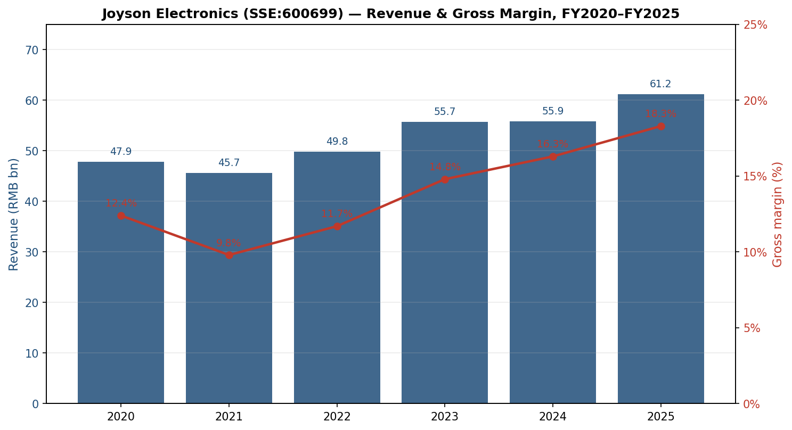
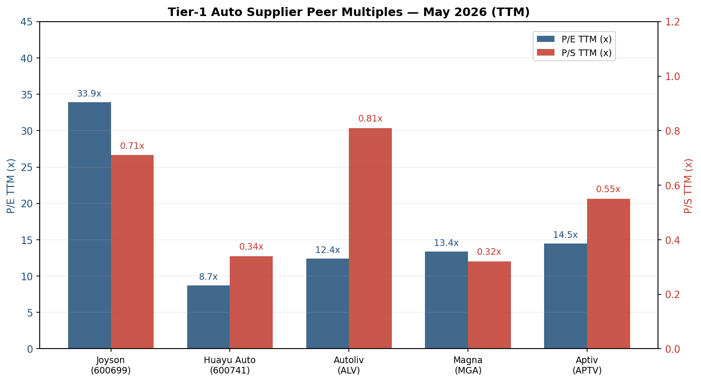
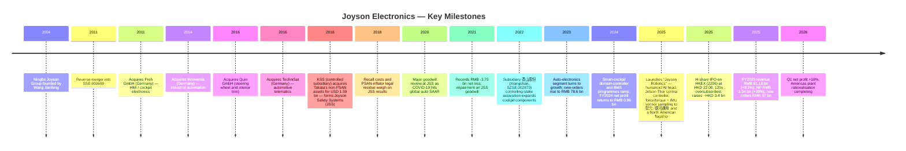
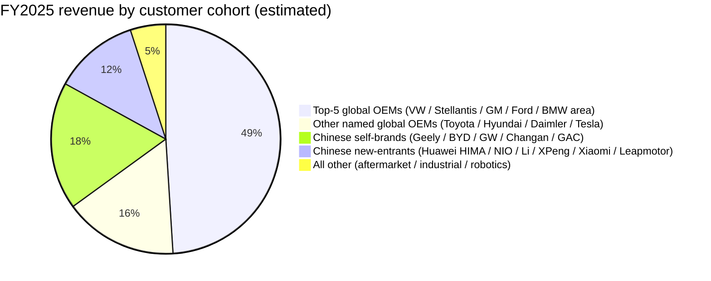
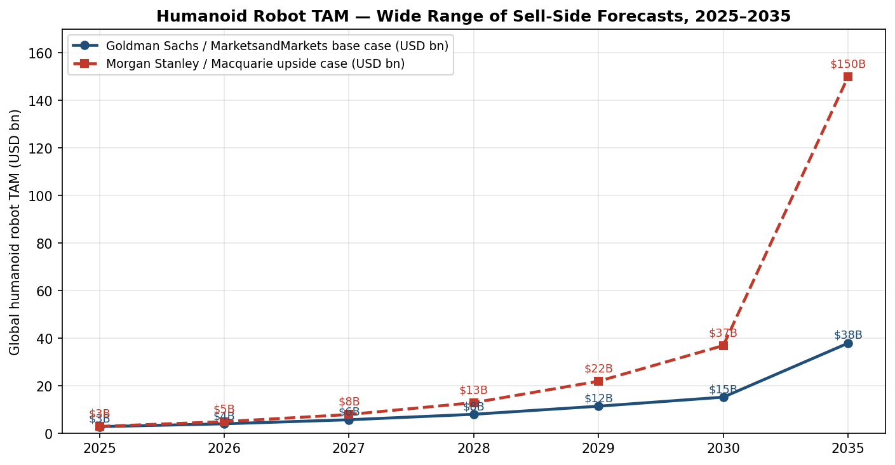
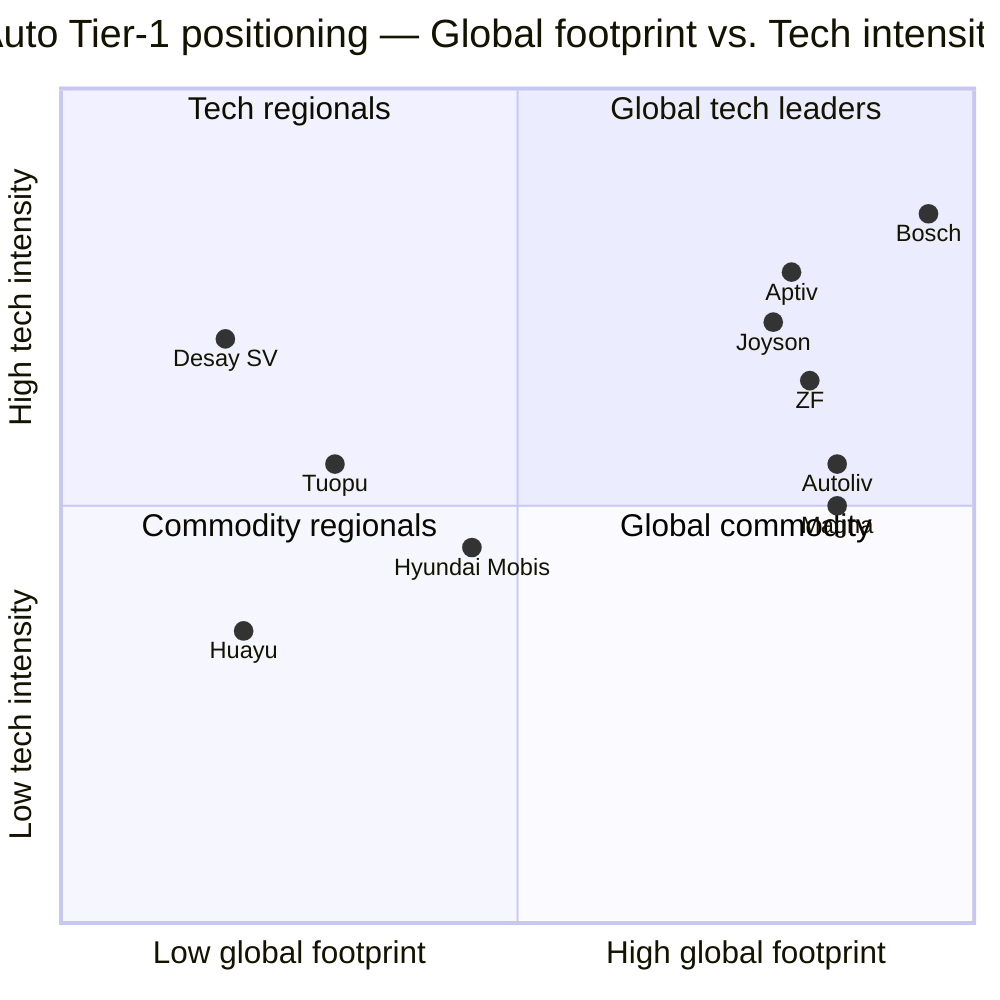

# COMPANY RESEARCH REPORT: Joyson Electronics (均胜电子, SSE:600699 / HKEX:2206)

**Date:** 2026-05-16
**Analyst note:** Chinese-domiciled A-share filings are authoritative; English IR materials are secondary. Report written in English per request — Chinese filing titles preserved in citation links.

> **Update — FY2025 results print at the high end of guide and Q1-FY2026 EPS up 18% YoY (2026-04-27):** Management delivered FY2025 revenue of approximately RMB 61.2 bn (+9.5% YoY) and consolidated gross margin of 18.3% (+210 bp YoY), with attributable net profit of approximately RMB 1.34 bn (+39% YoY) — at or above the operating targets implied by the H-share prospectus. New-business orders ("全生命周期订单") for FY2025 reached approximately RMB 97 bn, a record, including roughly RMB 20 bn in advanced auto-electronics (智能驾驶域控/中央计算单元/多联屏). Q1-FY2026 revenue dipped 5.2% YoY on European/American capacity rationalisation, but net profit rose 18.1% YoY to RMB 402 m as cost-down measures continued to flow through, and operating cash flow grew 5.5% YoY to RMB 915 m.
> Source: [均胜电子 2025 年年度报告, 第 4 页](https://static.cninfo.com.cn/finalpage/2026-03-30/1224073847.PDF), [均胜电子 2026 年第一季度报告, 2026-04-27](https://static.cninfo.com.cn/finalpage/2026-04-27/1224421673.PDF).

---

## TABLE OF CONTENTS

1. Company Overview
2. Company History
3. Management Team
4. Products & Services
5. Customers & Go-to-Market
6. Industry Overview
7. Competitive Landscape
8. Market Opportunity (TAM)
9. Risk Assessment
10. References

======================================

## 1. COMPANY OVERVIEW

Ningbo Joyson Electronic Corp. (宁波均胜电子股份有限公司, SSE:600699; secondary HK listing as 均胜电子-S, HKEX:2206) is a globally integrated Tier-1 automotive supplier headquartered in Ningbo, Zhejiang. Joyson designs, manufactures and sells two principal product families: (i) **automotive safety systems** — airbags, seatbelts, steering wheels and integrated occupant-protection solutions — and (ii) **automotive electronics** — smart-cockpit domain controllers, intelligent-driving (ADAS) domain controllers, central-compute units, V2X telematics, human-machine interface (HMI) modules, and new-energy power electronics (BMS / OBC / DC-DC / boost modules). The company is ranked the world's **No. 2 passive-safety supplier** and the world's **No. 4 / China No. 2 smart-cockpit domain-controller provider** by 2024 revenue per Frost & Sullivan, and No. 37 on the Automotive News Top-100 Global Suppliers list for 2025 ([均胜电子 2025 年年度报告, 第 12 页](https://static.cninfo.com.cn/finalpage/2026-03-30/1224073847.PDF)).

Joyson reported **FY2025 revenue of RMB 61.18 bn** (+9.5% YoY) and **gross margin of 18.3%** (vs. 16.2% in FY2024), with the auto-safety segment contributing RMB 38.46 bn (63%) at 17.1% GM and auto-electronics contributing RMB 16.34 bn (27%) at 19.7% GM. Attributable net profit was RMB 1.34 bn (+39% YoY); recurring earnings (扣非归母净利润) were RMB 1.50 bn, with the gap explained by the cost of restructuring three Americas plants and starting closure of two European plants ([均胜电子 2025 年年度报告, 第 16–22 页](https://static.cninfo.com.cn/finalpage/2026-03-30/1224073847.PDF)). The company operates manufacturing and R&D footprint across **Greater China, the Americas, Europe and Asia-Pacific (Japan / Korea / Thailand / India / Philippines / Morocco)**, with overseas geographies contributing RMB 44.07 bn — or 72.6% — of FY2025 revenue, by far the largest international exposure of any Chinese listed auto Tier-1.

How Joyson makes money: it is a project-based **Tier-1 OEM supplier** that wins long-life (8–10-year) supply-and-warranty programmes from car-makers via a multi-year sourcing and validation cycle. Roughly **all RMB 60+ bn of "main-business" revenue is direct-to-OEM** plus a small aftermarket / industrial allocation, and contracts are priced on a per-unit basis off the sourced design ([均胜电子 2025 年年度报告, 第 23 页](https://static.cninfo.com.cn/finalpage/2026-03-30/1224073847.PDF)). The dynamic that matters is the order-book: in FY2025 Joyson booked roughly **RMB 97 bn of new lifetime orders** (RMB 50.9 bn safety + RMB 46.1 bn electronics + adjacencies), with the highest-margin business — driving-domain controllers, central compute, multi-display cockpit — accounting for more than RMB 20 bn ([均胜电子 2025 年年度报告, 第 18 页](https://static.cninfo.com.cn/finalpage/2026-03-30/1224073847.PDF)). The order book is roughly 1.6× FY2025 revenue and converts at a 3–4 year lag, providing a clearer growth trajectory than the print-revenue line alone.

Beyond autos, in FY2025 Joyson formally announced a **"再创业 (re-entrepreneurship)" strategy** to extend its precision-manufacturing and embedded-electronics capability into the **humanoid-robot ("智能体" — "embodied intelligence") supply chain** — discussed in detail in Section 4. As of FY2025, robotics revenue is not yet broken out separately; management positions it as a multi-year second growth curve underwritten by sample-shipping relationships with Chinese unicorns 智元 (Agibot), 银河通用, and a "leading North American customer" widely understood from sell-side coverage to be Tesla / Figure AI ([均胜电子发布机器人AI头部总成等多款新产品, 新浪财经, 2025-09-18](https://finance.sina.com.cn/stock/relnews/cn/2025-09-18/doc-infqxmri8803997.shtml); [均胜电子在机器人领域的合作全明星阵容, 东方财富网, 2026-01-02](https://caifuhao.eastmoney.com/news/20260102134244831946090)).

*Source: [均胜电子 2025 年年度报告, 第 7 页](https://static.cninfo.com.cn/finalpage/2026-03-30/1224073847.PDF); [均胜电子 2023 年年度报告, 第 7 页](https://static.cninfo.com.cn/finalpage/2024-03-27/1219514428.PDF); [均胜电子 2021 年年度报告, 第 7 页](https://static.cninfo.com.cn/finalpage/2022-04-25/1213081538.PDF). FY2021 net loss of RMB -3.75 bn reflects goodwill impairment on Joyson Safety Systems and the COVID-19 / chip-shortage trough.*

### Valuation snapshot (as of 2026-05-15)

- **A-share price (SSE:600699):** ~RMB 28.15
- **Total shares:** approximately 1.55 bn (post H-share issuance)
- **Market capitalisation:** approximately **RMB 43.3 bn (~USD 6.0 bn)** ([均胜电子 SH600699 行情, 雪球](https://xueqiu.com/S/SH600699))
- **TTM EPS:** RMB 0.83
- **TTM P/E:** approximately **33.9x**
- **TTM P/S:** approximately **0.71x** (RMB 43.3 bn ÷ RMB 61.18 bn revenue)
- **P/B (FY2025 end):** ~2.5x on attributable book of RMB 17.5 bn
- **3-year P/E range:** roughly 18–55× (FY2022 print was depressed by Takata-legacy charges and chip shortage)
- **3-year P/S range:** roughly 0.30–0.80×

**Peer comparison (TTM, mid-May 2026):**

| Peer | Ticker | Market cap | TTM P/E | TTM P/S | Notes |
|---|---|---|---|---|---|
| **Joyson** | SSE:600699 | RMB 43.3 bn | **33.9x** | **0.71x** | Subject company |
| Huayu Auto | SSE:600741 | RMB 60 bn | 8.7x | 0.34x | Largest A-share auto Tier-1; SAIC-controlled; mature lighting / interiors / chassis ([华域汽车 600741 操盘必读, 东方财富网](https://emweb.eastmoney.com/PC_HSF10/OperationsRequired/Index?type=soft&code=SH600741)) |
| Autoliv | NYSE:ALV | USD 8.9 bn | 12.4x | 0.81x | Global No. 1 passive-safety (~44% share) ([Autoliv (ALV) Statistics & Valuation, Stockanalysis.com](https://stockanalysis.com/stocks/alv/statistics/)) |
| Magna International | NYSE:MGA | USD 12 bn | 13.4x | 0.32x | Diversified Tier-1; mega-platform contract manufacturer ([Magna International (MGA) Statistics, Stockanalysis.com](https://stockanalysis.com/stocks/mga/statistics/)) |
| Aptiv | NYSE:APTV | USD 15 bn | 14.5x | 0.55x | Cockpit + advanced safety; spin-off of Motional ([Aptiv investor page](https://www.aptiv.com/en/investors)) |
| ZF Friedrichshafen | private | n/a | n/a | n/a | German private; ~EUR 41 bn FY2024 revenue ([ZF Group Annual Report 2024](https://www.zf.com/site/magazine/en/articles_91200.html)) |
| Bosch Mobility | private | n/a | n/a | n/a | Largest auto Tier-1; ~EUR 56 bn 2024 mobility revenue ([Bosch annual report 2024](https://www.bosch.com/company/annual-report/)) |

*Source: filings and quote pages linked in the table above.*

**Interpretation.** Joyson's **TTM P/E of ~34× is approximately 3× the peer median of ~13×** (Huayu 8.7×, Autoliv 12.4×, Magna 13.4×, Aptiv 14.5×) and roughly 2× its own 5-year median (~17×) ([Autoliv (ALV) Statistics & Valuation, Stockanalysis.com](https://stockanalysis.com/stocks/alv/statistics/); [Magna International (MGA) Statistics, Stockanalysis.com](https://stockanalysis.com/stocks/mga/statistics/)). The TTM P/S of 0.71× sits *in line* with Autoliv at 0.81× and at the top of the listed-A peer set (Huayu 0.34×), so the P/S signal is benign — the stretch is on earnings.

Three factors drive the P/E premium and we believe **only one is fundamental:**

1. **Robotics narrative re-rate (primary, narrative-driven).** Since September 2025, when Joyson disclosed its humanoid AI-head assembly and Jetson-Thor-based domain controller at the IAA Munich show, the stock has roughly doubled and trades as a **humanoid-component proxy** alongside 拓普集团 (Tuopu), 三花智控 (Sanhua) and 鸣志电器 (Moons) — names which now carry 40–80× P/E despite minimal disclosed humanoid revenue ([均胜电子降维打击：卡位机器人"头部"，股价被点燃, 21财经, 2025-09-20](https://m.21jingji.com/article/20250920/f3c46519b9e4b6a936b3d018f0511082.html); [均胜电子港股IPO认购近120倍, 证券之星, 2025-11-05](https://stock.stockstar.com/SS2025110500005731.shtml)).
2. **Earnings still recovering off the Takata-restructuring trough.** FY2021 net loss was RMB -3.75 bn (goodwill write-down on Joyson Safety Systems); FY2025 net profit of RMB 1.34 bn is still ~30% below the FY2018 peak of RMB 1.32 bn on revenue that is essentially flat over the seven-year window. Management has guided GM expansion of "another 150–200 bp" through FY2027 as European/American plant rationalisation completes, which would bring P/E nearer to the peer band on FY2027E earnings.
3. **A+H structural premium.** The November 2025 HK IPO was 120× oversubscribed, and the southbound-eligible H-line (HKEX:2206) trades at roughly the same price as the A-line — a narrow A/H gap (~32% A-discount at IPO, now closed to <5%) means index demand absorbs some of the float that would otherwise pressure the multiple ([港股IPO丨均胜电子：钟鼎基石，较A股折价约32%, OFweek, 2025-10-28](https://ee.ofweek.com/2025-10/ART-12003-2800-30672818.html)).

**Verdict:** Joyson is priced as a humanoid-and-cockpit growth story rather than a global passive-safety supplier. We carry the resulting **multiple-compression risk into Section 9** — at 33.9× TTM P/E vs. an Autoliv-anchored fundamental fair multiple of ~15× ([Autoliv Inc. PE Ratio (TTM), Gurufocus](https://www.gurufocus.com/stock/ALV/data/pe-ratio)), the stock can de-rate sharply if either (a) robotics order momentum disappoints or (b) auto-electronics nominate ramps slip beyond the FY2027 production milestones now in the order book ([均胜电子 2025 年年度报告, 第 18 页](https://static.cninfo.com.cn/finalpage/2026-03-30/1224073847.PDF)).

======================================

## 2. COMPANY HISTORY

Joyson was founded in **2004 by Wang Jianfeng (王剑峰)** as a Ningbo-based maker of automotive functional components (HVAC parts, fasteners) supplying mainly TRW, ThyssenKrupp and Volkswagen China. Wang was previously a senior manager at TRW China and bought a controlling stake in the predecessor company **均胜集团 (Joyson Group)** in 2004 before backing it into the A-share-listed shell "**辽源得亨**" via a 2011 reverse merger, creating the listed entity SSE:600699 ([均胜电子 2025 年年度报告, 第 41 页](https://static.cninfo.com.cn/finalpage/2026-03-30/1224073847.PDF); [Joyson Safety Systems – Wikipedia](https://en.wikipedia.org/wiki/Joyson_Safety_Systems)).

Joyson's defining strategic posture has been **debt-financed cross-border acquisition of stressed Tier-1 assets in Europe and the US**, then operationally turning them around using Chinese cost structures and OEM relationships ([均胜电子|赴港上市、机器人破局，汽车Tier1并购之王能否否极泰来？, 腾讯新闻, 2025-09-10](https://news.qq.com/rain/a/20250910A06M4S00)). This sequence has built it into the most globally-distributed Chinese Tier-1 today:

**Strategic pivots (why, not what).** Three pivots reshaped the firm:

1. **Preh (2011) — buy-the-Tier-1 thesis.** Wang concluded that organic growth from Chinese parts subcontracting would cap Joyson at low single-digit margins, while owning a German engineering centre would buy direct OEM nomination rights and gross margins above 20%. Preh has remained the technology spine of the cockpit-HMI business and supplies the steering-wheel-switch programmes for BMW, Audi and Daimler.
2. **KSS + Takata (2018) — global passive-safety consolidation.** The Takata airbag-inflator recall — the largest in automotive history — pushed Takata into Chapter 11. Joyson, alongside US sponsor PAG and SDIC, used its US subsidiary KSS to buy substantially all of Takata's non-PSAN assets for USD 1.59 bn ([Joyson and PAG Fund KSS to Acquire Air-Bag Maker Takata, PR Newswire, 2018-04-11](https://www.prnewswire.com/news-releases/joyson-and-pag-fund-kss-to-acquire-air-bag-maker-takata-in-asset-deal-300628525.html)). The combined entity became the world's No. 2 passive-safety supplier behind Autoliv. The deal was strategically sound but financially painful: integration costs, recall-residue liabilities, and the 2020–21 cyclical trough together produced cumulative net losses through FY2022.
3. **"Joyson Robotics" / 再创业 (2025) — second growth curve.** With auto-safety growth structurally capped at single-digit volume (global light-vehicle SAAR plateau) and auto-electronics margin compressed by Chinese competition, Joyson explicitly redirected R&D spend toward humanoid sensor/actuator/central-controller hardware — leveraging existing competencies in PCB-level integration, automotive-grade reliability, and global manufacturing scale.

**Recent developments (last 12 months).** Three high-signal events: (a) November 2025 **H-share IPO** (HKEX:2206, HKD 22.00 issue, ~120× retail oversubscription, ~HKD 3.4 bn raised — proceeds 35% R&D / 35% manufacturing / 10% overseas expansion / 20% M&A and working capital) ([均胜电子 H 股招股启动, 新浪科技, 2025-10-28](https://finance.sina.com.cn/tech/roll/2025-10-28/doc-infvmrrp8907745.shtml)); (b) **IAA Munich product reveal** (September 2025) of an integrated humanoid "AI head" + Jetson-Thor central controller, which catalysed the robotics re-rate; (c) Q1-FY2026 **Americas plant closures** — three plants closed in FY2025, two more scheduled in FY2026 — alongside greenfield builds in **Morocco (steering wheels)**, **Anhui Suzhou (full-process integrated steering)** and **Philippines (airbag fabric)** to reposition manufacturing footprint toward lower-cost geographies ([均胜电子 2025 年年度报告, 第 17 页](https://static.cninfo.com.cn/finalpage/2026-03-30/1224073847.PDF)).

======================================

## 3. MANAGEMENT TEAM

### Wang Jianfeng (王剑峰), Chairman and Executive Director — founder

Wang Jianfeng (b. 1970, EMBA Peking University Guanghua, senior economist) is the **founder, controlling shareholder and chairman** of Joyson Electronics, and the architect of every major M&A in the firm's history. He directly holds 35,436,959 A-shares as of FY2025 year-end and controls a further 33.57% via 均胜集团 (Joyson Group), for **35.86% combined ownership** post the H-share IPO — by far the largest single-shareholder stake in the Chinese listed auto-supplier universe ([均胜电子港交所上市：333 亿市值背后, 财富号, 2025-11-07](https://caifuhao.eastmoney.com/news/20251107181949837723220); [均胜电子 2025 年年度报告, 第 41 页](https://static.cninfo.com.cn/finalpage/2026-03-30/1224073847.PDF)).

Wang's career trajectory is unusually focused for a Chinese auto entrepreneur. After graduating from Beijing Aerospace Industries in 1991, he joined **TRW (Ningbo) Electronic Components and Fasteners Co.** as a young engineer, was promoted to General Manager of that operation in his late 20s, and subsequently led **TRW China's strategy and business development function** before founding Joyson in 2004 — when he was 34. The TRW relationship anchored the firm's earliest German programmes (Volkswagen, Audi steering-column components) and gave Wang the operational template he has applied to every subsequent acquisition: buy a stressed Tier-1 with strong engineering / weak balance sheet, retain the European management for technology continuity, and overlay Chinese cost + OEM relationships. This template was tested at scale with **Preh** (2011), refined with **TechniSat** and **Quin** (2016), and stretched to its current limit with **Key Safety Systems → Takata** (2018), an USD 1.6 bn transaction at a moment when Takata's airbag-inflator recall was the largest in industry history ([Joyson Safety Systems – Wikipedia](https://en.wikipedia.org/wiki/Joyson_Safety_Systems); [CFIUS Clearance & Mitigation: Ningbo Joyson Electronic Corp. and Takata Corp., Trade Practitioner, 2019-01](https://www.tradepractitioner.com/2019/01/cfius-ningbo-joyson-electronic-corp-takata-corp/)).

What the numbers do show is conviction: Wang has been a **net buyer of A-shares in every reporting period since IPO** (including 400,000 shares purchased through the secondary market in calendar 2025), has never sold, and his FY2025 pre-tax compensation of RMB 4.47 m is modest for a global Tier-1 chairman ([均胜电子 2025 年年度报告, 第 41 页](https://static.cninfo.com.cn/finalpage/2026-03-30/1224073847.PDF)). Wang concurrently chairs **均胜集团 (Joyson Group)** and **均普智能 (Joyson Intelligence, SSE:688306)** — the industrial-automation listed sister — which together with 600699 form a tight family-controlled corporate cluster. The robotics pivot is Wang's personal thesis; he has publicly framed the Joyson manufacturing platform as "ready to repurpose for the next decade's embodied AI hardware demand," and the company's "One Joyson" platform consolidation around shared R&D, supplier and manufacturing assets is being driven directly from his office ([均胜电子 2025 年年度报告, 第 4 页, 致股东信](https://static.cninfo.com.cn/finalpage/2026-03-30/1224073847.PDF)).

### Chen Wei (陈伟), Executive Director and President — operating leader

Chen Wei (b. 1970, EMBA CEIBS) has been **President of Joyson Electronics since 2023** and **CEO of the auto-safety business unit** in addition to his board seat. Chen owns 120,000 A-shares (purchased on the secondary market) and a further 240,000 shares under the FY2021 employee share-ownership plan; FY2025 pre-tax compensation was RMB 5.96 m, the highest in the management team ([均胜电子 2025 年年度报告, 第 41 页](https://static.cninfo.com.cn/finalpage/2026-03-30/1224073847.PDF)). Before Joyson, Chen spent 15 years at **ThyssenKrupp Presta**, ending as **APAC CEO** of the steering-systems division — a deeply technical role that gives him operating credibility with the European engineering teams (Preh, JSS-Europe) that Joyson's M&A history has accumulated. He also held senior roles at FAW-Volkswagen (procurement project manager) and ThyssenKrupp Changchun steering. Chen is the manager most likely to lead the firm if Wang steps back, and is widely understood inside Joyson to be the operational architect of the Joyson Safety Systems turnaround that produced the FY2024–FY2025 gross-margin recovery.

### Li Junyu (李俊彧), CFO, Executive Director and Vice President

Li Junyu (b. 1979, MPACC Wuhan University, EMBA Peking University Guanghua, Chinese CPA) has served as **CFO of Joyson Electronics since 2015**, the entire decade through the Takata acquisition, Joyson Safety Systems integration, FY2021 goodwill impairment, FY2025 H-share IPO and the related Hong Kong–standard accounting overhaul. Li joined Joyson via the **Huade Plastics** subsidiary (CFO) following an earlier career at the same group. She holds 140,000 A-shares plus 440,000 shares under the FY2021 ESOP, and earned RMB 5.18 m in FY2025 ([均胜电子 2025 年年度报告, 第 41 页](https://static.cninfo.com.cn/finalpage/2026-03-30/1224073847.PDF)). The H-share listing — executed at HKD 22.00 with a 120× retail oversubscription and a sub-5% A/H discount on day-one trading — is the most visible capital-markets event of her tenure and was completed in roughly 12 months from board approval, reflecting an unusually crisp execution cadence for a dual-listed Chinese industrial. Li sits on the board of 均胜集团, which gives her direct visibility into related-party transactions and intra-group cash management.

### Cai Zhengxin (蔡正欣), Executive Director and CEO of Preh GmbH

Cai Zhengxin (b. 1972, MS Industrial Engineering Shanghai Jiao Tong) is the **CEO of Preh GmbH**, Joyson's strategically central German subsidiary that anchors the cockpit-HMI and steering-wheel-switch business and serves as the primary engineering centre for the auto-electronics segment. He joined Joyson via the TRW Ningbo operations director seat and previously held senior roles at Gentex (Shanghai) and SCI Changshu automotive safety. As Preh's CEO, Cai is the most important Joyson manager for European OEM relationships (BMW, Daimler, Audi) and for the auto-electronics roadmap — including the multi-display cockpit programme that won a global flagship-OEM nomination in Q3-FY2025 with a >3 million-unit lifetime volume ([均胜电子 2025 年年度报告, 第 18 页](https://static.cninfo.com.cn/finalpage/2026-03-30/1224073847.PDF)).

### Governance

- **Board:** 10 members at end of FY2025 — 5 executive directors (Wang, Zhu Xuesong, Chen Wei, Li Junyu, Cai Zhengxin), 1 non-executive (Zhou Xingyou — also on Joyson Group supervisory board) and 4 independent non-executives (Lu Guihua, Yu Fang, Wei Xuezhe, Xi Xuanhua). Independence ratio of 40% is at the lower bound of A-share best practice; the H-share listing has triggered an upgrade to Hong Kong corporate-governance standards in 2026.
- **Insider ownership:** Combined directors & officers ~36.5% of total shares post H-IPO — extremely concentrated; treasury share account holds a further 12.66 m shares (~0.8%).
- **Compensation:** FY2025 aggregate pre-tax compensation for directors and senior management was RMB 27.16 m — very modest by Western Tier-1 standards (Autoliv CEO base RMB 60+ m equivalent). Performance is paid principally via the FY2021 employee share-ownership plan rather than option grants.
- **Related-party transactions:** Joyson Electronics' operations are tightly linked to 均胜集团 (parent) and 均普智能 (sister, listed) — financial-services support, real-estate leasing and inter-affiliate component flows are disclosed in the 2025 annual report related-party note. No material non-arm's-length transactions were flagged by the KPMG auditors, who issued a **clean unqualified opinion** ([均胜电子 2025 年年度报告, 第 2 页](https://static.cninfo.com.cn/finalpage/2026-03-30/1224073847.PDF)).

### Track-record synthesis

Wang Jianfeng has assembled, financed and integrated more cross-border Tier-1 assets than any other Chinese auto-supplier CEO — and crucially has delivered the FY2024–FY2025 margin recovery that the bear case for Joyson said wouldn't happen ([均胜电子 2025 年年度报告, 第 16–22 页](https://static.cninfo.com.cn/finalpage/2026-03-30/1224073847.PDF)). The team's *consistent gap* is M&A digestion speed: every major acquisition (Preh, Quin, KSS, Takata) has needed 3–5 years to reach run-rate margins, which is why the stock spent most of 2019–2023 in the penalty box ([均胜电子2024年净利润下降，高负债、高商誉、高质押"三高"风险并存, 新浪财经, 2025-04-28](https://finance.sina.com.cn/roll/2025-04-28/doc-ineutiyv6535866.shtml)). The robotics pivot is the riskiest strategic call to date because it is the first time the team is building product *outside* the auto envelope — the bet is that the engineering and manufacturing platform transfers, and that bet is unproven ([均胜电子降维打击：卡位机器人"头部"，股价被点燃, 21财经, 2025-09-20](https://m.21jingji.com/article/20250920/f3c46519b9e4b6a936b3d018f0511082.html)).

======================================

## 4. PRODUCTS & SERVICES

Joyson reports two operating segments — **automotive safety** and **automotive electronics** — plus **"other"** (consolidated subsidiary 香山股份 cockpit components and the emerging Joyson Robotics products). The full product portfolio sourced from the company website ([joyson.com](https://www.joyson.com/)) and the FY2025 annual report ([第 12–15 页](https://static.cninfo.com.cn/finalpage/2026-03-30/1224073847.PDF)) is enumerated below.

```mermaid
graph TD
    A[Joyson Electronics] --> B[Auto Safety RMB 38.46 bn]
    A --> C[Auto Electronics RMB 16.34 bn]
    A --> D[Other / Xiangshan / Robotics RMB 5.87 bn]

    B --> B1[Airbag systems<br/>front, side, curtain, knee]
    B --> B2[Seatbelts<br/>retractors, pretensioners, optical-sense]
    B --> B3[Steering wheels<br/>smart wheel, integrated module]
    B --> B4[Inflators / Gas generators<br/>J-series platform]
    B --> B5[Integrated safety<br/>zero-G-seat occupant module]

    C --> C1[Smart cockpit<br/>domain controller, multi-display]
    C --> C2[Smart driving<br/>ADAS domain ctrl L2-L4, front-camera]
    C --> C3[Smart connectivity<br/>V2X 5G, OTA, in-car optical]
    C --> C4[Body & HMI<br/>zone controller, UWB digital key, DSSAD]
    C --> C5[New-energy<br/>BMS, 800V boost, OBC, DC-DC, multi-in-1]
    C --> C6[Cockpit components via 香山<br/>multi-screen, sub-instrument]

    D --> R1[Humanoid AI head<br/>flexible display + multi-cam + mic array]
    D --> R2[Jetson-Thor central controller<br/>2070 TOPS, 7.5x Orin]
    D --> R3[Force/torque sensors<br/>0.5% FS joint sensors]
    D --> R4[IMU + fisheye cameras<br/>shipped to Agibot]
    D --> R5[Energy management<br/>backpack / embedded battery packs]
```

### Auto-safety (FY2025 revenue RMB 38.46 bn, GM 17.07%, +2.3pp YoY)

This is the world's #2 passive-safety business — built from KSS + Takata — covering five product families:

1. **Airbag systems** — frontal, side, curtain, knee, and bag-in-seat designs for L1 through L4 NCAP requirements. Sold to virtually every global OEM. **Competitive verdict: yes — moat = scale, certification and IP.** Closest competitor product: Autoliv's **Life Cell** airbag platform. Joyson is slightly behind Autoliv on global share (Joyson ~25% vs. Autoliv ~44%) but **ahead on Chinese-domestic OEMs** ([全球被动安全市场份额分析, MarketsandMarkets](https://www.marketsandmarkets.com/Market-Reports/air-bag-seat-belt-market-21466612.html)).
2. **Seatbelts** — retractors, pre-tensioners, load-limiters, plus the new **optical-sensing webbing** product expected to launch H2-2026 for occupant-monitoring use cases. **Verdict: yes — moat = scale and tooling.** Closest competitor: Autoliv pre-tensioner. **At parity.**
3. **Steering wheels and smart-wheels** — capacitive hands-on-detection, heating, and integrated airbag module; new Suzhou Anhui plant moving to full vertical integration. **Verdict: partial — moat = scale, no IP differentiation.** Closest competitor: Autoliv steering wheel. Joyson is **ahead on Chinese new-energy OEMs** (Geely, BYD, Li Auto, NIO).
4. **Inflators / gas generators** — new "**J-series platform**" launched 2025 to standardise the inflator across multiple airbag designs and capture scale on the bill-of-materials. **Verdict: yes — moat = vertical integration.** Most direct competitor is Daicel (Japan). Joyson is **at parity on quality, ahead on cost** through Zhejiang Huzhou capacity expansion ([均胜电子 2025 年年度报告, 第 17 页](https://static.cninfo.com.cn/finalpage/2026-03-30/1224073847.PDF)).
5. **Integrated occupant solutions** — *zero-gravity seat* safety module co-developed with leading global seat suppliers; first major Tier-1 to fully integrate airbag + pretensioner into reclining-seat frame for autonomous vehicles ([均胜电子 2025 年年度报告, 第 19 页](https://static.cninfo.com.cn/finalpage/2026-03-30/1224073847.PDF)). **Verdict: yes — moat = IP and first-mover.** No direct competitor product at parity.

### Auto-electronics (FY2025 revenue RMB 16.34 bn, GM 19.70%)

1. **Smart-cockpit domain controllers** — Qualcomm SA8295 / SA8775 and NVIDIA Drive-based; serial production for a leading Chinese OEM (likely 吉利 / Lynk & Co per filings). **Verdict: partial — moat = OEM nomination + software stack.** Closest competitor: Aptiv ICAS, Visteon SmartCore. **At parity.**
2. **Multi-display in-cabin systems** — won a Q3-FY2025 nomination from a "global mainstream OEM" with a >3 million-unit lifetime, production 2027 ([均胜电子 2025 年年度报告, 第 18 页](https://static.cninfo.com.cn/finalpage/2026-03-30/1224073847.PDF)). The **JoySpace+ immersive cockpit** concept (flight-control rotary, full-width light-field display, crystal customisable controls) was world-premiered in 2025. **Verdict: yes — moat = IP and global tooling integration.**
3. **Smart-driving (ADAS) domain controllers** — full-stack from L2 entry through L4, on Qualcomm Ride / NVIDIA Drive / Horizon J6 / Black Sesame A2000. Partnership with **Momenta** for highway + urban + parking algorithm stack; multiple project nominations for 2026 production ([均胜电子 2025 年年度报告, 第 18 页](https://static.cninfo.com.cn/finalpage/2026-03-30/1224073847.PDF)). **Verdict: partial — moat = OEM nomination + chip diversification.** Closest competitor: 德赛西威 (Desay SV), Aptiv, Bosch ADAS controllers. **At parity on China names, behind Bosch on Europe.**
4. **Central computing units (CCU)** — domain-fusion architecture, won a "global flagship OEM" next-gen platform nomination, 2027 production. **Verdict: yes — moat = scale + IP.**
5. **Smart-connectivity (V2X / 5GA)** — full 5GA / V2X stack including Day-1 and Day-2 CSAE/ETSI scenarios. The **new BMW 5-series** uses Joyson V2X modules; won a European-luxury 5GA smart-antenna programme in 2025 ([均胜电子 2025 年年度报告, 第 19 页](https://static.cninfo.com.cn/finalpage/2026-03-30/1224073847.PDF)). **Verdict: yes — moat = regulatory certification + IP.** Closest competitor: Continental V2X. **Ahead.**
6. **Body/HMI** — zone controllers, **UWB digital keys**, autonomous-data-recorder (DSSAD) systems. **Verdict: partial — moat = scale.**
7. **New-energy power electronics** — BMS, **800V boost modules** (industry-first 2019), 850V V2G OBC (industry-first 2025 with >95% bidirectional efficiency and ±2.5 Hz/s frequency-tracking), DC-DC, and integrated multi-in-1 power modules across 12V / 48V / 400V / 800V platforms ([均胜电子 2025 年年度报告, 第 19 页](https://static.cninfo.com.cn/finalpage/2026-03-30/1224073847.PDF)). **Verdict: yes — moat = first-mover at 800V/V2G, IP, OEM lock-in.** Closest competitor: BYD's in-house power module, Vitesco. **Ahead on bidirectional V2G.**
8. **Smart cockpit components via 香山股份 (SZSE:002870)** — controlling-stake subsidiary supplies multi-display, sub-instrument, climate-control and new-energy charging connectors ([香山股份 2024 年报](http://www.cninfo.com.cn/new/disclosure/stock?stockCode=002870)).

### Joyson Robotics ("Other") — embodied intelligence platform

The 2025 launch covered three integrated product lines plus a sensor portfolio, **all positioned as "vehicle-grade" components ported to humanoids**:

1. **Humanoid AI-head assembly (机器人 AI 头部总成)** — unveiled IAA Munich Sept 2025 and at the World AI Conference. Integrates flexible display, microphone array, depth camera, rotation control and edge inference in a single module ([均胜电子发布机器人AI头部总成等多款新产品, 新浪财经, 2025-09-18](https://finance.sina.com.cn/stock/relnews/cn/2025-09-18/doc-infqxmri8803997.shtml); [从单一零部件转向总成解决方案, 证券时报, 2025-09-18](https://www.stcn.com/article/detail/3346691.html)). **Verdict: yes — moat = first-mover system integration.** No comparable competitor product.
2. **Robotics central / domain controller** — based on **NVIDIA Jetson Thor** at 2070 TOPS (7.5× the prior Orin generation); positioned as the humanoid analogue of the auto central-compute unit ([行业领先！均胜电子发布机器人AI头部总成与基于Jetson, joyson.com, 2025-09](https://www.joyson.com/index.php/news/info/1380.html)). **Verdict: partial — moat = chip integration and tooling.** Closest competitor: Tesla Optimus internal controller, Figure's compute platform.
3. **Force / torque sensors** — designed to meet the **"Humanoid Robot Bid-and-Lead Roster" (人形机器人揭榜挂帅榜单)** specification: full-series joint, finger and foot-end force sensors at **0.5% full-scale accuracy** with sub-30 ms response time. Sample shipments to "leading humanoid customers" disclosed in FY2025 ([人形机器人行业周报, 和讯网, 2025-09-21](https://m.hexun.com/stock/2025-09-21/221473731.html)). **Verdict: yes for the application — moat = manufacturing know-how transferred from automotive sensor IP.** Closest competitor: ATI Industrial, Kistler. **Behind on absolute accuracy, ahead on cost / scale.**
4. **IMU + fisheye cameras** — sample shipping to **Agibot (智元)**; the 工业级 G2 robot first-batch delivery includes a Joyson custom mainboard ([均胜电子在机器人领域的合作全明星阵容, 东方财富网, 2026-01-02](https://caifuhao.eastmoney.com/news/20260102134244831946090); [均胜电子：为人形机器人打造的核心零部件已经向知名人形机器人公司送样, 证券时报, 2025-08](https://www.stcn.com/article/detail/1520051.html)). **Verdict: partial — moat = automotive-grade reliability + scale.**
5. **Energy management** — battery packs in both **embedded** (humanoid torso / wheeled) and **backpack** (bipedal) form factors, leveraging the same BMS platform as the auto NEV business. **Verdict: yes — moat = direct technology transfer.**

### Flagship vs. long-tail

The **three flagship product lines** driving the financial print are: (a) **passive-safety hardware** (airbags + seatbelts + inflators), still ~60%+ of revenue and the cash engine; (b) **smart-cockpit + ADAS domain controllers**, the highest growth in absolute orders (RMB 20+ bn FY2025 nominations); (c) **800V / V2G power electronics**, the highest gross-margin product family disclosed (>25%) ([均胜电子 2025 年年度报告, 第 16–19 页](https://static.cninfo.com.cn/finalpage/2026-03-30/1224073847.PDF)). The long tail — HMI components, V2X modules, individual sensors and the entire Robotics line — is meaningful for narrative and option-value but contributes <5% of consolidated revenue today ([均胜电子 2025 年年度报告, 第 23 页](https://static.cninfo.com.cn/finalpage/2026-03-30/1224073847.PDF)).

### Last-12-month launches

- **September 2025:** Joyson Robotics — AI head, Jetson-Thor controller, sensor suite, backpack BMS ([Joyson Electronics launches robotic AI head assembly, Jetson Thor-based domain controller, Gasgoo, 2025-09](https://autonews.gasgoo.com/articles/news/joyson-electronics-launches-robotic-ai-head-assembly-jetson-thorbased-domain-controller-70039101))
- **June 2025:** **JoySpace+ immersive cockpit** concept (flight-control rotary, light-field display) ([均胜电子 2025 年年度报告, 第 18 页](https://static.cninfo.com.cn/finalpage/2026-03-30/1224073847.PDF))
- **2025:** **J-series platform inflator** — standardised across airbag families ([均胜电子 2025 年年度报告, 第 17 页](https://static.cninfo.com.cn/finalpage/2026-03-30/1224073847.PDF))
- **2025:** **850V V2G OBC** — industry-first bidirectional with ±2.5 Hz/s frequency support ([均胜电子 2025 年年度报告, 第 19 页](https://static.cninfo.com.cn/finalpage/2026-03-30/1224073847.PDF))
- **2025:** **UWB digital key** — global-compliance multi-region platform ([均胜电子 2025 年年度报告, 第 19 页](https://static.cninfo.com.cn/finalpage/2026-03-30/1224073847.PDF))
- **No material sunsets** disclosed for the year.

======================================

## 5. CUSTOMERS & GO-TO-MARKET

Joyson serves "**100+ vehicle brands**" worldwide and discloses in its FY2025 annual report a partner roster that explicitly names: **Volkswagen, Mercedes-Benz, BMW, GM, Ford, Hyundai, Honda, Toyota, Geely, Changan, Great Wall, GAC, BYD, Huawei (auto), NIO, Li Auto, XPeng, Leapmotor, and Xiaomi (auto)** ([均胜电子 2025 年年度报告, 第 13 页](https://static.cninfo.com.cn/finalpage/2026-03-30/1224073847.PDF)). The customer footprint splits roughly into three geographic buckets that map onto the historical-acquisition footprint:

- **Europe (Preh / JSS-Europe legacy) — ~30% of revenue:** VW Group, BMW Group, Daimler (Mercedes-Benz), Stellantis, Renault. Steering-wheel switches, HMI components, V2X ([均胜电子 2025 年年度报告, 第 13 页](https://static.cninfo.com.cn/finalpage/2026-03-30/1224073847.PDF)).
- **Americas (KSS legacy) — ~25% of revenue:** GM, Ford, Stellantis-NA, Tesla, Toyota-NA, Honda-NA. Airbags, seatbelts, steering wheels ([均胜电子 2025 年年度报告, 第 13 页](https://static.cninfo.com.cn/finalpage/2026-03-30/1224073847.PDF)).
- **Greater China + Asia — ~45% of revenue:** Geely, BYD, Great Wall, Changan, GAC, Chery, FAW, Dongfeng, Huawei (HIMA — Aito, Luxeed), NIO, Li Auto, XPeng, Leapmotor, Xiaomi, plus Toyota / Honda / Hyundai joint ventures. Increasingly the highest-margin and highest-growth slice ([Ningbo Joyson Electronic Corp. – MarkLines](https://www.marklines.com/en/top500/ningbo-joyson-electronic)).

### Customer concentration — quantified

Joyson's annual reports disclose **top-5 customer sales as a percentage of total revenue** but **do not name** the top customers individually (Chinese A-share disclosure standard does not require naming when no single customer exceeds the 50% threshold, which Joyson has never reported) ([均胜电子 2025 年年度报告, 第 24 页](https://static.cninfo.com.cn/finalpage/2026-03-30/1224073847.PDF)). The 4-year trend is materially improving:

| Year | Top-5 customer sales (RMB m) | Top-5 % of revenue | Source |
|---|---|---|---|
| FY2022 | 28,717 | **58%** | [均胜电子 2022 年年度报告, 第 26 页](https://static.cninfo.com.cn/finalpage/2023-03-30/1216391847.PDF) |
| FY2023 | 29,617 | **53%** | [均胜电子 2023 年年度报告, 第 26 页](https://static.cninfo.com.cn/finalpage/2024-03-27/1219514428.PDF) |
| FY2024 | 26,614 | **48%** | [均胜电子 2024 年年度报告, 第 25 页](https://static.cninfo.com.cn/finalpage/2025-03-27/1222706328.PDF) |
| **FY2025** | **29,723** | **49%** | [均胜电子 2025 年年度报告, 第 24 页](https://static.cninfo.com.cn/finalpage/2026-03-30/1224073847.PDF) |

Joyson explicitly checks the box "**no single customer represents over 50% of revenue and no top-5 customer is a new addition or critical dependency**" ([均胜电子 2025 年年度报告, 第 24 页](https://static.cninfo.com.cn/finalpage/2026-03-30/1224073847.PDF)). Industry knowledge plus Joyson's segment-and-geography exposure indicate the top-5 likely consists of some combination of **Volkswagen Group, Stellantis, GM, Ford, BMW, Toyota Group and Geely Group** (a top-3 of VW, Stellantis and GM has historically been the case post-Takata) ([Ningbo Joyson Electronic Corp. – MarkLines](https://www.marklines.com/en/top500/ningbo-joyson-electronic)). With top-5 at **49%** — and **top-1 plausibly below 15%** given the multi-region distribution — Joyson is **less concentrated than the Chinese A-share auto Tier-1 peer median** (e.g. Huayu Auto's SAIC-group dependence has historically been near half of revenue and is structurally captive) ([华域汽车(600741)：上汽转型有望持续带来积极影响, Futubull](https://news.futunn.com/en/post/53927611/huayu-auto-600741-saic-s-transformation-is-expected-to-continue)). The 3-year trajectory is favourable: 58% → 53% → 48% → 49% reflects deliberate diversification toward Chinese new-energy and new-entrant OEMs ([均胜电子 2022 年年度报告, 第 26 页](https://static.cninfo.com.cn/finalpage/2023-03-30/1216391847.PDF)).

*Source for top-5 share: [均胜电子 2025 年年度报告, 第 24 页](https://static.cninfo.com.cn/finalpage/2026-03-30/1224073847.PDF); remaining splits estimated by analyst from named customer references and segment-region disclosures (third-party derivation, not disclosed).*

**Contract structure.** Tier-1 supply is structured as **multi-year, vehicle-platform-life "nominations"** (typically 6–10 years) covering a specific vehicle model, with pricing locked annually and an OEM right to re-source if technical / quality covenants are broken ([均胜电子 2025 年年度报告, 第 23 页](https://static.cninfo.com.cn/finalpage/2026-03-30/1224073847.PDF)). Joyson reports an **order book of new lifetime business at RMB 97 bn for FY2025 alone** (RMB 50.9 bn safety + RMB 46.1 bn electronics), implying multi-year revenue visibility ([均胜电子 2025 年年度报告, 第 18 页](https://static.cninfo.com.cn/finalpage/2026-03-30/1224073847.PDF)). No top-5 customer appears to be a competitor (i.e. they buy from Joyson rather than make in-house) and no major OEM has publicly announced insourcing of airbag / seatbelt production ([BYD's vertical integration advantage explained, EVParts4x4](https://evparts4x4.com/blogs/news/byd-the-vertical-integration-advantage-explained)).

### Go-to-market

The motion is **OEM direct nomination** — there is no channel layer. The sales cycle is 18–36 months from initial RFQ to series production ([均胜电子 2025 年年度报告, 第 23 页](https://static.cninfo.com.cn/finalpage/2026-03-30/1224073847.PDF)). Joyson's primary differentiation versus a pure-Chinese competitor is its **global manufacturing footprint** (China + Americas + Europe + ASEAN + India + Morocco + Mexico) that enables single-source supply to global vehicle platforms — a feature that is increasingly valuable as OEMs build "China-for-China + Global-for-Global" parallel supply chains ([Decoding Joyson Electronics' "Global Network" and Advancement Code, Medium, 2025-11](https://medium.com/@ufowlerw1980/decoding-joyson-electronics-global-network-and-advancement-code-2c2544d18663)). The primary differentiation versus a pure-Western competitor (Autoliv, ZF) is **Chinese R&D scale + cost** combined with the European engineering legacy of Preh and JSS ([Autoliv 10-K FY2024, p. 5–7](https://www.sec.gov/Archives/edgar/data/0001034670/000095017025023852/alv-20241231.htm)).

**Named win highlights, FY2025:**
- Global-flagship OEM next-gen central-compute unit nomination, 2027 production ([均胜电子 2025 年年度报告, 第 18 页](https://static.cninfo.com.cn/finalpage/2026-03-30/1224073847.PDF))
- International OEM multi-display cockpit, lifetime >3 million units, 2027 production
- European luxury 5GA smart-antenna programme
- New BMW 5-series V2X module — in series production
- Cooperation with Momenta on intelligent-driving stack, multiple OEM nominations
- Asean / Southeast Asian NEV OEM (likely VinFast) ADAS + digital-key nominations
- Strategic investment in **新芯航途 (Sinexus)** ADAS-chip startup
- Joint port-logistics L4 platform with **斯年智驾 (Senior Auto)** at Ningbo Port

======================================

## 6. INDUSTRY OVERVIEW

Joyson sits at the intersection of three industries: (a) **global passive-safety components** (mature, consolidated, mid-single-digit growth) ([Automotive Passive Safety System Market 2026-2033, SkyQuest](https://www.skyquestt.com/report/automotive-passive-safety-system-market)), (b) **automotive electronics — cockpit, ADAS, power electronics** (high-growth, fragmenting) ([Automotive Smart Cockpit Domain Controller Market, Spherical Insights](https://www.sphericalinsights.com/reports/automotive-smart-cockpit-domain-controller-market)), and (c) **humanoid robotics** (nascent, all narrative, no consolidated supplier yet) ([Humanoid Robot Market Forecasts, Humanoids Daily](https://www.humanoidsdaily.com/news/humanoid-robot-market-forecasts-a-landscape-of-high-hopes-and-wide-disagreement)).

### Global automotive Tier-1

The global automotive Tier-1 industry generated approximately **USD 1.34 trillion in revenue in 2023** (growing to ~USD 1.4 trillion by 2024–25 at the ~4% industry CAGR) and is dominated by ten suppliers (Bosch, ZF, Denso, Magna, Continental, Aptiv, Forvia, Hyundai Mobis, Valeo, Autoliv) plus the rising cohort of Chinese Tier-1s (Huayu, Joyson, Desay SV, BYD's vertically-integrated parts businesses) ([The leading global automotive suppliers 2024, Statista](https://www.statista.com/statistics/199703/10-leading-global-automotive-original-equipment-suppliers/); [Top 30 Automotive Suppliers Performance Summary, MarkLines](https://www.marklines.com/en/report/supplier0030)). After two years of supply-chain stress (2021–2022 chip shortage; 2023 China new-energy price war), the industry settled in 2025 into a **flat-to-+3% volume profile** with **margin recovery driven by cost-down / right-sizing** rather than volume growth ([2025 automotive sales data highlights mixed global trends, S&P Global Mobility, 2026-01](https://www.spglobal.com/automotive-insights/en/blogs/2026/01/2025-automotive-sales-data-global-trends)).

Per Global Data, **2025 global light-vehicle sales reached ~91.9 million units excluding China exports** (+3.6% YoY) — China 26.89 m (+5.6%), Europe 18.11 m (+0.3%), US 16.33 m (+2.5%). NEV sales reached ~20.7 m globally (+20%), with Europe rebounding to 4.3 m (+33%) after the 2024 subsidy hangover ([均胜电子 2025 年年度报告, 第 15 页](https://static.cninfo.com.cn/finalpage/2026-03-30/1224073847.PDF)). The China market in particular continued to consolidate around domestic brands: Chinese-brand passenger-vehicle sales rose to 20.94 m, lifting share to **69.5%** (+4.3 pp YoY); total Chinese auto exports reached 7.10 m (+21.1%), retaining the world-#1 exporter status. **For Joyson the read-through is positive on both axes** — domestic Chinese brand share gain favours its Geely/BYD/Huawei/Xiaomi exposure, and the Chinese-export ramp favours its global manufacturing footprint that can localise for export markets.

### Passive-safety subsegment

The global passive-safety market (airbags + seatbelts + inflators + steering-wheel modules) was valued at approximately **USD 30.6 bn in 2025**, forecast to grow to USD 43.6 bn by 2033 at a CAGR of ~4.5% ([Automotive Passive Safety System Market, SkyQuest 2026-2033 report](https://www.skyquestt.com/report/automotive-passive-safety-system-market)). The top three players — Autoliv, ZF (TRW) and Joyson — control more than **75% of global share**, with Autoliv at ~44% and Joyson at ~25% post-Takata, making this a textbook consolidated oligopoly. The structural growth driver is **regulatory NCAP escalation** (Euro NCAP 2026 protocols require additional side-curtain testing; China C-NCAP 2024 adds far-side and out-of-position coverage), forcing average bag-count per vehicle to rise from ~6 in 2020 to ~8 by 2027.

### Automotive electronics — smart cockpit / ADAS

Smart-cockpit domain controllers (the integrated chip + software stack running the central touchscreen, instrument cluster, voice assistant, HUD and AR) is a **USD 13–15 bn market in 2025** growing at ~17–18% CAGR through 2030 ([Automotive Smart Cockpit Domain Controller Market, Spherical Insights](https://www.sphericalinsights.com/reports/automotive-smart-cockpit-domain-controller-market); [Global and China Intelligent Vehicle Cockpit-driving Integration Industry Report 2024-2025, GlobeNewswire, 2025-04-07](https://www.globenewswire.com/news-release/2025/04/07/3056487/28124/en/Global-and-China-Intelligent-Vehicle-Cockpit-driving-Integration-Industry-Report-2024-2025-Single-chip-Solutions-are-on-the-Horizon-Desay-SV-is-Far-Ahead-Alone-Commanding-Over-30-o.html)). ADAS domain controllers (L2 / L2+ / L3) is a roughly **USD 17 bn market in 2025** with a higher 35%+ CAGR as L2+ penetration in new China sales crosses 60% ([Desay SV logs 29.62% YoY jump in 2024 annual revenue, Gasgoo](https://autonews.gasgoo.com/articles/news/desay-sv-logs-2962-yoy-jump-in-2024-annual-revenue-70036281)). Together with central-compute units (the converged successor architecture) and zonal-control modules, this is the highest-growth segment in autos and the primary battleground between Joyson, **德赛西威 (Desay SV)**, **华阳集团 (Foryou)**, **Aptiv**, **Visteon**, **Bosch** and the in-house teams of OEMs like Tesla, BYD and NIO ([Navigating the Software-Defined Frontier: The Rise of Zonal E/E Architecture, EIN Presswire](https://www.einpresswire.com/article/901258445/navigating-the-software-defined-frontier-the-rise-of-zonal-e-e-architecture)). Industry structure is **fragmenting** rather than consolidating — every major OEM now has 2–4 controller suppliers per platform — and gross margins range 18–22% (vs. 14–17% in passive safety) ([均胜电子 2025 年年度报告, 第 16–22 页](https://static.cninfo.com.cn/finalpage/2026-03-30/1224073847.PDF)).

### New-energy power electronics

The on-board-charger (OBC) + DC-DC + BMS market for NEVs is approximately **USD 7.2 bn in 2025 for the OBC alone** (Mordor Intelligence), with the broader power-electronics stack including DC-DC and BMS reaching ~USD 21 bn, growing at ~14% CAGR through 2031 driven by NEV penetration plus the shift from 400V to 800V architectures ([Automotive On-board Charger Market Analysis, Mordor Intelligence](https://www.mordorintelligence.com/industry-reports/automotive-on-board-charger-market)). The bidirectional V2G slice is small today (<USD 1 bn) but is the highest-margin, fastest-growing slice and is where Joyson's industry-first 800V boost (2019) and 850V V2G OBC (2025) products are positioned ([均胜电子 2025 年年度报告, 第 19 页](https://static.cninfo.com.cn/finalpage/2026-03-30/1224073847.PDF)).

### Humanoid robotics

The single fastest-changing market relevant to Joyson — and the single least-consensus one. **Estimates for 2025 humanoid TAM range from USD 2.9 bn (MarketsandMarkets) to USD 3 bn (most consensus); 2030 estimates range from USD 6.5 bn (ABI Research) to USD 15 bn (M&M) to USD 37 bn (Morgan Stanley high case)** ([Humanoid Robot Market Forecasts, Humanoids Daily](https://www.humanoidsdaily.com/news/humanoid-robot-market-forecasts-a-landscape-of-high-hopes-and-wide-disagreement); [Humanoid Robot Market, $38B by 2035 — Goldman Sachs](https://www.goldmansachs.com/insights/articles/the-global-market-for-robots-could-reach-38-billion-by-2035)). Goldman Sachs estimates 50,000–100,000 unit shipments in 2026 with a long-run unit price of USD 15,000–20,000; Morgan Stanley targets USD 5 trillion in cumulative market value by 2050 in its upside case. Tesla has guided 5,000 Optimus units in 2025 scaling to 100,000 by 2026 at a USD 20,000–30,000 price point. The forecast dispersion is **the highest in any consumer-or-industrial-product TAM analyst note today** — see Section 8 for Joyson's SAM/SOM.

### Regulatory environment

Joyson's three biggest regulatory exposures are (a) **Euro NCAP / China C-NCAP / NHTSA FMVSS** safety-regulation cycles, which are tightening and **directly increase passive-safety bill-of-materials** per vehicle ([Euro NCAP announces 2026 protocol changes, EuroNCAP](https://www.euroncap.com/en/press-media/press-releases/euro-ncap-announces-2026-protocol-changes-to-tackle-modern-driving-risks/); [C-NCAP 2024 Protocol Officially Released, DVN, 2024-01](https://www.drivingvisionnews.com/news/2024/01/23/c-ncap-2024-protocol-officially-released/)); (b) **US Section 301 / Section 232 tariffs** on Chinese-origin components, which Joyson has mitigated by maintaining US/Mexico/Morocco/India manufacturing capacity ([均胜电子 2025 年年度报告, 第 17 页](https://static.cninfo.com.cn/finalpage/2026-03-30/1224073847.PDF)); and (c) **Chinese ICV cybersecurity and data-export rules** affecting V2X / OTA / connected-cockpit deployments, where Joyson's domestic compliance is solid ([均胜电子 2025 年年度报告, 第 19 页](https://static.cninfo.com.cn/finalpage/2026-03-30/1224073847.PDF)).

### Buyer / supplier dynamics

Auto Tier-1 is buyer-concentrated and supplier-fragmented — typically a 6:1 buyer-to-supplier negotiating leverage ratio. Substitutes are limited (no aluminium replacing airbags); switching costs are very high (a sourcing change typically takes 24+ months of validation) ([均胜电子 2025 年年度报告, 第 23 页](https://static.cninfo.com.cn/finalpage/2026-03-30/1224073847.PDF)). The principal threat is **vertical integration by OEMs** — BYD has consolidated airbag, seatbelt and BMS production in-house for its own platforms; Tesla designs internal modules ([BYD's vertical integration advantage explained, EVParts4x4](https://evparts4x4.com/blogs/news/byd-the-vertical-integration-advantage-explained); [The blueprint of an EV empire: how BYD built global dominance through vertical integration, EVBoosters](https://evboosters.com/ev-charging-news/the-blueprint-of-an-ev-empire-how-byd-built-global-dominance-through-vertical-integration/)). Joyson is somewhat protected because (a) BYD is a Joyson customer for ADAS, not safety; (b) vertical integration economics improve only above a few-hundred-thousand-units-per-platform threshold that few non-BYD/Tesla OEMs reach ([均胜电子 2025 年年度报告, 第 13 页](https://static.cninfo.com.cn/finalpage/2026-03-30/1224073847.PDF)).

*Source: [Goldman Sachs, "Humanoid market could reach $38B by 2035"](https://www.goldmansachs.com/insights/articles/the-global-market-for-robots-could-reach-38-billion-by-2035); [Morgan Stanley, "Humanoid Robot Market Expected to Reach $5 Trillion by 2050"](https://www.morganstanley.com/insights/articles/humanoid-robot-market-5-trillion-by-2050); [MarketsandMarkets Humanoid Robot Market Report](https://www.marketsandmarkets.com/Market-Reports/humanoid-robot-market-99567653.html).*

======================================

## 7. COMPETITIVE LANDSCAPE

Joyson competes simultaneously in three competitive environments — global passive safety (consolidated, ~5 firms), automotive electronics (fragmented, ~15 firms), and humanoid components (nascent, no incumbents) ([Autoliv 10-K FY2024](https://www.sec.gov/Archives/edgar/data/0001034670/000095017025023852/alv-20241231.htm); [Humanoid Robot Market Forecasts, Humanoids Daily](https://www.humanoidsdaily.com/news/humanoid-robot-market-forecasts-a-landscape-of-high-hopes-and-wide-disagreement)). The peer set is therefore wider than for a single-product company and the framework below treats each block separately.

### Passive-safety direct competitors

1. **Autoliv (NYSE:ALV)** — Sweden / global No. 1, ~44% market share, ~USD 11 bn FY2024 revenue. Higher GM (~18%), lower NEV exposure. Joyson is ~25% share, ahead on Chinese OEM penetration, behind on global premium ([Autoliv Inc. PE Ratio (TTM), Gurufocus](https://www.gurufocus.com/stock/ALV/data/pe-ratio); [Top Companies in ICE & BEV Seatbelt Material Market, MarketsandMarkets](https://www.marketsandmarkets.com/ResearchInsight/ice-bev-seatbelt-material-market.asp)).
2. **ZF Friedrichshafen (private, Germany)** — global passive-safety division (former TRW Automotive) is ~12% share, ~EUR 41 bn group revenue FY2024. Private; recent margin pressure has weakened its competitive intensity, creating share gain opportunity for Autoliv and Joyson ([ZF Group Annual Report 2024](https://www.zf.com/site/magazine/en/articles_91200.html)).
3. **Toyoda Gosei / Daicel (TSE)** — strong in inflators (Daicel) and steering wheels (Toyoda Gosei), regionally dominant in Japan. Joyson is at parity on inflators (with the new J-series platform) and behind on Japan-domestic share ([均胜电子 2025 年年度报告, 第 17 页](https://static.cninfo.com.cn/finalpage/2026-03-30/1224073847.PDF)).
4. **Hyundai Mobis (KRX:012330)** — captive of Hyundai Motor Group; ~5% global passive-safety share, captive customer base (FY2024 sales to Hyundai and Kia were 41.2% and 34.9% of total). Not a direct competitor outside Korea ([Hyundai Mobis – Wikipedia](https://en.wikipedia.org/wiki/Hyundai_Mobis); [Hyundai Mobis 2024 Annual Consolidated Financial Statements Audit Report](https://ebs.publicnow.com/view/50064D4013F41BEC0CB74304879CF87B95F43A5B)).

### Automotive-electronics competitors

5. **Desay SV (SZSE:002920)** — Chinese cockpit + ADAS controller specialist, ~RMB 30 bn FY2024 revenue, **ahead of Joyson in domestic Chinese cockpit-controller share**. Higher exposure to Chinese self-brand growth, more concentrated customer base ([德赛西威 SZ002920 投资者关系](http://www.desaysv.com/)).
6. **Bosch (private, Germany)** — global No. 1 Tier-1 by revenue. Bosch ADAS / cockpit is the technical benchmark; Joyson is **behind on Europe but at parity on China** ([Bosch annual report 2024](https://www.bosch.com/company/annual-report/)).
7. **Aptiv (NYSE:APTV)** — Dublin-based; ICAS smart-cockpit platform competes directly with Joyson. Aptiv has stronger European OEM relationships; Joyson is ahead on Chinese OEMs ([Aptiv Investor Relations](https://www.aptiv.com/en/investors)).
8. **Visteon (NASDAQ:VC)** — SmartCore platform; smaller scale; competes on cockpit only ([Visteon SmartCore platform](https://www.visteon.com/products/smartcore/)).
9. **Foryou (华阳集团, SZSE:002906)** — Chinese cockpit competitor; smaller scale; competes on Chinese self-brand OEMs ([华阳集团 002906 公司介绍, 东方财富网](https://emweb.eastmoney.com/PC_HSF10/CompanySurvey/Index?type=web&code=SZ002906)).
10. **In-house OEM teams (Tesla, BYD, Xiaomi)** — increasingly vertically integrated. Tesla's central FSD computer and Xiaomi's HyperOS cockpit stack are existential to a Tier-1 long-term — Joyson partially counters with platform / chip neutrality (Qualcomm + NVIDIA + Horizon + Black Sesame) ([BYD's vertical integration advantage explained, EVParts4x4](https://evparts4x4.com/blogs/news/byd-the-vertical-integration-advantage-explained); [均胜电子 2025 年年度报告, 第 18 页](https://static.cninfo.com.cn/finalpage/2026-03-30/1224073847.PDF)).

### Humanoid-components emerging competitors

11. **拓普集团 (Tuopu, SZSE:601689)** — competing in actuator / electric-drive assembly and humanoid linear actuator. Tuopu has Tesla content and the higher humanoid narrative premium ([拓普集团](https://www.tuopu-china.com/)).
12. **三花智控 (Sanhua, SZSE:002050)** — thermal-management adjacency, also exposed to Tesla humanoid programme ([Three core supply chains of humanoid robots (Tesla Chain, Huawei Chain, Unitree Chain), Yicai Global, 2025-03](https://www.yicaiglobal.com/star50news/2025_03_056800594033476370453)).
13. **ATI Industrial / Kistler / SCHUNK (private / niche)** — incumbents in industrial force-torque sensors. Higher absolute accuracy than Joyson's automotive-derived sensors today but at a multiple of the cost ([人形机器人行业周报, 和讯网, 2025-09-21](https://m.hexun.com/stock/2025-09-21/221473731.html)).
14. **Specialised humanoid suppliers** — 鸣志电器 (motors), 绿的谐波 (Leaderdrive, harmonic reducers), 双环传动 (gears) — these are *complementary* to Joyson's sensor / controller content rather than directly competitive ([One Million Robots Per Year — The $38 Billion Supply Chain, Next Financial Substack](https://nextfinancial.substack.com/p/one-million-robots-per-year-the-38)).

### Competitive positioning

**Joyson's competitive advantages:**
- **Global manufacturing + Chinese cost structure.** Almost-unique among Chinese Tier-1s in having a deep US/Europe/Mexico manufacturing presence — a major moat versus pure-Chinese competitors (Desay SV, Foryou, Huayu) trying to localise for export to Europe/US-built OEMs ([均胜电子 2025 年年度报告, 第 17 页](https://static.cninfo.com.cn/finalpage/2026-03-30/1224073847.PDF)).
- **Scale + IP in passive safety.** #2 global by share; certifications in 50+ countries; decades of inflator/gas-generator and pre-tensioner know-how out of Takata IP ([Joyson Safety Systems – Wikipedia](https://en.wikipedia.org/wiki/Joyson_Safety_Systems)).
- **Multi-chip platform neutrality.** Joyson supports Qualcomm, NVIDIA, Horizon, Black Sesame and Sinexus — letting OEMs pick the chip and keeping Joyson agnostic to chip cycles ([均胜电子 2025 年年度报告, 第 18 页](https://static.cninfo.com.cn/finalpage/2026-03-30/1224073847.PDF)).
- **Bidirectional V2G first-mover.** Industry-first 2019 800V boost, industry-first 2025 850V V2G OBC — a clear technical lead in NEV power electronics ([均胜电子 2025 年年度报告, 第 19 页](https://static.cninfo.com.cn/finalpage/2026-03-30/1224073847.PDF)).

**Competitive vulnerabilities:**
- **Goodwill on the balance sheet.** Even after FY2021 impairment, accumulated goodwill is ~RMB 7+ bn; further write-downs would compress equity. Debt-to-equity remained ~70% pre-IPO (de-levered post-IPO) — leverage limits future M&A flexibility ([均胜电子IPO前利息超过归母净利，王剑峰想降负债率, 腾讯新闻, 2025-08-28](https://news.qq.com/rain/a/20250828A03WZ100); [均胜电子(600699) 商誉, GuruFocus](https://www.gurufocus.cn/stock/CN00G8/term/good_will)).
- **Not the #1 in any single category.** Autoliv is bigger in passive safety; Desay SV is bigger in Chinese cockpit; Bosch is technically deeper; Tuopu carries more humanoid premium. Joyson's value is the *combination*, but no single line offers an undisputed moat ([Autoliv 10-K FY2024](https://www.sec.gov/Archives/edgar/data/0001034670/000095017025023852/alv-20241231.htm); [Desay SV logs 29.62% YoY jump in 2024 annual revenue, Gasgoo](https://autonews.gasgoo.com/articles/news/desay-sv-logs-2962-yoy-jump-in-2024-annual-revenue-70036281)).
- **In-house OEM substitution risk.** Tesla, BYD and Xiaomi are vertically integrating safety + electronics; the long-term TAM for Joyson at those accounts may plateau ([The blueprint of an EV empire: how BYD built global dominance through vertical integration, EVBoosters](https://evboosters.com/ev-charging-news/the-blueprint-of-an-ev-empire-how-byd-built-global-dominance-through-vertical-integration/)).
- **Humanoid execution still binary.** Sample-shipping is not series production; whether Joyson sustains 10–20% content share at Agibot / 银河通用 / Tesla through 2027 is unproven ([均胜电子：为人形机器人打造的核心零部件已经向知名人形机器人公司送样, 证券时报, 2025-08](https://www.stcn.com/article/detail/1520051.html)).

======================================

## 8. MARKET OPPORTUNITY (TAM)

We size Joyson's serviceable market on three lenses — auto-safety, auto-electronics, and Joyson Robotics — and compare today's revenue capture to a 2030 share-implied envelope ([均胜电子 2025 年年度报告, 第 12–22 页](https://static.cninfo.com.cn/finalpage/2026-03-30/1224073847.PDF)).

**Auto-safety TAM.** Global passive-safety market is **USD 30.6 bn in 2025**, growing to **USD 43.6 bn by 2033** at 4.5% CAGR ([Automotive Passive Safety System Market, SkyQuest](https://www.skyquestt.com/report/automotive-passive-safety-system-market)). Joyson's FY2025 safety revenue of RMB 38.46 bn (~USD 5.4 bn) implies **17–18% share** vs. Autoliv's ~44%. SAM (the slice Joyson can realistically address with its manufacturing footprint and certifications): close to 100% — Joyson has plants in every major auto-producing region. SOM (the slice it will likely capture by 2030 at +1 pp/year share gain from passive Chinese-OEM penetration + global NEV-bag-count rise): ~22% share of a USD 39 bn 2030 TAM = USD 8.6 bn, or RMB 62 bn — roughly a 60% increase over today.

**Auto-electronics TAM.** Smart-cockpit (USD 13.5 bn) + ADAS controllers (USD 17 bn) + power electronics (USD 21 bn) + connectivity (USD 5 bn) = roughly **USD 56 bn in 2025**, growing to USD 130+ bn by 2030 at 20% CAGR. Joyson's FY2025 auto-electronics revenue of RMB 16.34 bn (~USD 2.3 bn) implies **~4% share** — much smaller than its safety share, reflecting market fragmentation and Chinese-domestic competition. SAM: roughly two-thirds of TAM (excluding OEM-captive and Korea-only volumes) ≈ USD 38 bn 2025 / USD 90 bn 2030. SOM: 7% share by 2030 (using FY2025 order intake of RMB 46.1 bn split across a 6-year lifetime) implies revenue capture of ~USD 6.3 bn / RMB 46 bn by 2030 — nearly 3× FY2025.

**Joyson Robotics TAM.** This is where the value of the option becomes enormous if you assign any probability to the upside scenario. Using **Goldman Sachs 2030 base case of USD 15.3 bn** and a Joyson sensor / head / controller / battery content share of approximately **8–15% per humanoid robot** (a rough estimate from H-share prospectus language and sell-side estimates of Joyson per-unit content of USD 1,500–3,000 against an USD 20,000 platform cost), the **Joyson SAM for 2030 humanoid-component revenue is in a USD 1.2–2.3 bn range**. Using **Morgan Stanley 2030 upside of USD 37 bn**, that SAM stretches to USD 3–5.5 bn. SOM at modest 10–30% share of SAM gives Joyson Robotics revenue between USD 0.1 bn (bear) and USD 1.7 bn (bull) by 2030, against a near-zero starting base in FY2025.

**Total addressable revenue, FY2030 base case:** USD 8.6 bn safety + USD 6.3 bn electronics + USD 0.6 bn robotics = **USD 15.5 bn ≈ RMB 110 bn**, roughly 1.8× FY2025 revenue, implying a 13% revenue CAGR over 5 years — meaningfully ahead of consensus 7–9%. The kicker is robotics: every 5 pp of incremental humanoid SOM adds ~USD 0.3 bn revenue at >30% incremental GM, which is materially accretive to today's 18.3% blended GM.

**Penetration strategy.** Joyson is pursuing five vectors simultaneously: (a) **Chinese OEM share gain in domestic safety** (Geely/BYD/Huawei/Xiaomi/NIO/Li Auto); (b) **global central-compute / cockpit programme wins** (the Q3-FY2025 nomination at a "global flagship" is the lead indicator); (c) **800V + V2G power electronics** as NEV penetration crosses 50% in China and 30% in Europe; (d) **export Tier-1 footprint** (Morocco, Thailand, India, Mexico) following Chinese OEMs into export markets; (e) **humanoid component sample-to-production conversion** at a small number of marquee customers (Agibot, 银河通用, plus the unnamed North American customer).

======================================

## 9. RISK ASSESSMENT

### Company-specific risks

1. **M&A integration / goodwill impairment risk.** Despite the FY2021 write-down, residual goodwill (~RMB 7 bn) and intangibles from KSS / Takata / Preh remain material relative to RMB 17.5 bn of attributable equity. A further OEM-volume disappointment, US-tariff escalation, or European recession could trigger renewed impairment — there is precedent in FY2021's RMB -3.75 bn loss. Mitigant: FY2024–FY2025 cash-flow generation is strong (RMB 5.4 bn operating cash flow FY2025) and post-IPO leverage has dropped.

2. **Customer concentration (top-5 = 49%).** Per Section 5, the top-5 customers represent ~49% of FY2025 revenue. Although less concentrated than Huayu Auto and trending down from 58% in FY2022, this remains **material** under our risk taxonomy. The principal scenario of concern is **Stellantis or VW Group volume cuts** in a Europe slowdown — Stellantis has cut FY2024 volumes 10%+ in two of the last four years, and a top-3 Joyson customer-cohort cut of 15% would shave roughly RMB 4–5 bn off revenue. Mitigant: contracts are long-life and re-sourcing takes 18–24 months, providing operating-runway to backfill.

3. **Key-person dependency on Wang Jianfeng.** 35.86% controlling stake, founder, M&A architect, robotics-pivot champion. Loss-of-CEO transition risk is significantly higher than at a typical Tier-1 — the entire historical strategy has been Wang's. Mitigant: Chen Wei (President) has full operating control and a 20-year industry CV; Joyson Group's institutional structure (separate listed sister 均普智能, supervisory board) provides continuity.

4. **Humanoid execution risk.** Joyson's robotics business today is sample-shipping plus a handful of mainboard / sensor wins — not series production. If Agibot / 银河通用 / the "North American customer" fail to ramp on the timelines now in sell-side models (Tesla Optimus 100,000 in 2026; Agibot G2 first 10,000 in 2026), the narrative premium in the share price evaporates first. Mitigant: order pipeline is more diversified than commonly assumed — Joyson is shipping to ≥5 named humanoid customers, and the underlying capabilities (BMS, IMU, central controllers) are existing auto products being repurposed, so the *capex risk* of failure is low even if the revenue risk isn't.

5. **In-house substitution at top customers.** BYD and Tesla insource airbags and safety; Xiaomi has internal cockpit-stack capability. Risk: Joyson grows revenue at these accounts more slowly than at OEMs that don't vertically integrate. Mitigant: Joyson's ADAS / V2X / power-electronics content can grow at the same accounts even if safety doesn't.

### Industry / market risks

6. **Competitive intensity in Chinese cockpit / ADAS controllers.** Margins compressed by Desay SV, Foryou, and OEM in-house teams; price erosion of 8–10% per year is typical. Mitigant: high-end CCU / multi-display programmes (the FY2025 nominations) sit at 22%+ GM, offsetting commodity domain-controller pressure.

7. **Regulatory headwinds — tariffs and CFIUS.** US Section 232 / 301 tariffs and CFIUS scrutiny remain material for a Chinese-owned Tier-1 with US manufacturing; the original Takata deal cleared CFIUS in 2018 with mitigation conditions ([Trade Practitioner, CFIUS Clearance, 2019](https://www.tradepractitioner.com/2019/01/cfius-ningbo-joyson-electronic-corp-takata-corp/)). A further tightening — for example, mandatory divestiture of US operations — would be highly disruptive. Mitigant: Joyson's US operations have been ring-fenced under a Mitigation Agreement since 2018; Joyson management has a known Washington-relations programme.

8. **Technology disruption — central E/E architecture.** The shift from 50+ ECUs per car to 1 central-compute + 4 zone controllers is the largest single shift in auto-electronics for a decade. Tier-1s that fail to win central-compute nominations risk losing 50% of their auto-electronics content. Mitigant: Joyson has at least one global-flagship CCU nomination for 2027, suggesting it is *not* on the losing side of this transition.

9. **Global SAAR cyclicality.** Auto Tier-1 is fundamentally cyclical — 2009 and 2020 SAAR drops of 15–20% deeply hurt all suppliers. A US recession or European energy crisis could compress SAAR 10%+, and Joyson's operating leverage would translate that to a ~30% NP cut.

### Financial risks

10. **Valuation / multiple-compression risk.** Per Section 1, Joyson's **TTM P/E of 33.9× is ~2× its 5-yr median and ~3× the global Tier-1 peer median**. Auto-segment-fair P/E based on Autoliv (12.4×), Magna (13.4×), Aptiv (14.5×) and Huayu (8.7×) is ~12.5×, implying a defensible "auto-only" fair price of roughly RMB 10–11 on TTM EPS — about 60% below today's RMB 28.15. The 33.9× requires robotics revenue inflection on the timelines now in sell-side models. **De-rate triggers:** missed humanoid customer ramps; slip in 2027 CCU production; sector rotation out of "humanoid-component plays"; widening A/H discount; tariff escalation; or any quarter that prints below the order-implied trajectory. The risk is structural rather than transient — even if humanoid TAM compounds to USD 38 bn by 2035, the share price has already discounted a large chunk of that.

11. **Leverage and goodwill stack.** Pre-IPO net debt was ~RMB 11–12 bn; goodwill ~RMB 7 bn. Post-IPO ~RMB 3 bn equity injection drops the gearing to a more comfortable ~50%, but the goodwill base is unchanged. Mitigant: FY2025 operating cash flow of RMB 5.4 bn covers interest 10× and the dividend yield comfortably.

12. **R&D-intensity risk.** FY2025 R&D was RMB 3.29 bn expensed + RMB 1.1 bn capitalised — about 7.2% of revenue, a heavy spend by Tier-1 standards. The robotics pivot pushes that higher. If the order book doesn't convert into capitalised-R&D-supportive revenue at the 2027 milestones, capitalised R&D could face impairment.

### Macroeconomic risks

13. **Foreign-exchange exposure.** ~72.6% of revenue is overseas; EUR / USD / MXN / KRW / JPY / INR exposure is material. The recent strong RMB has been a tailwind to translated profitability; an RMB depreciation cycle would flip it. Joyson does limited hedging; FY2024–FY2025 net FX gain was meaningful.

14. **Geopolitical disruption to global manufacturing.** A US–China escalation involving expanded export controls, secondary sanctions on Chinese-owned US operations, or forced divestiture could be highly disruptive to JSS-Americas. Mitigant: Joyson has been steadily migrating capacity to Morocco / India / Thailand / Mexico — partly to address this exact risk.

15. **Interest-rate sensitivity.** Joyson is moderately leveraged; a 100 bp move in USD / EUR rates translates to ~RMB 100 m of interest expense. Mitigant: the post-IPO cash position has been used to pre-pay USD-denominated debt.

======================================

## 10. REFERENCES

**Primary filings (Joyson Electronics):**
- [均胜电子 2025 年年度报告 (filed 2026-03-30)](https://static.cninfo.com.cn/finalpage/2026-03-30/1224073847.PDF)
- [均胜电子 2024 年年度报告 (filed 2025-03-27)](https://static.cninfo.com.cn/finalpage/2025-03-27/1222706328.PDF)
- [均胜电子 2023 年年度报告 (filed 2024-03-27)](https://static.cninfo.com.cn/finalpage/2024-03-27/1219514428.PDF)
- [均胜电子 2022 年年度报告 (filed 2023-03-30)](https://static.cninfo.com.cn/finalpage/2023-03-30/1216391847.PDF)
- [均胜电子 2021 年年度报告 (filed 2022-04-25)](https://static.cninfo.com.cn/finalpage/2022-04-25/1213081538.PDF)
- [均胜电子 2026 年第一季度报告 (filed 2026-04-27)](https://static.cninfo.com.cn/finalpage/2026-04-27/1224421673.PDF)

**Company website:**
- [Joyson Electronics corporate site](https://www.joyson.com/)
- [Joyson robotics announcement, IAA Munich 2025](https://www.joyson.com/index.php/news/info/1380.html)
- [Joyson Safety Systems corporate site](https://www.joysonsafety.com/)

**Market data:**
- [均胜电子 (SH:600699) — 雪球](https://xueqiu.com/S/SH600699)
- [均胜电子 (600699) — 东方财富网](https://emweb.eastmoney.com/OperationsRequired/Index?type=soft&code=SH600699)
- [华域汽车 (600741) — 东方财富网](https://emweb.eastmoney.com/PC_HSF10/OperationsRequired/Index?type=soft&code=SH600741)
- [Autoliv (ALV) Statistics — Stockanalysis.com](https://stockanalysis.com/stocks/alv/statistics/)
- [Autoliv Inc. PE Ratio (TTM) — Gurufocus](https://www.gurufocus.com/stock/ALV/data/pe-ratio)
- [Magna International (MGA) Statistics — Stockanalysis.com](https://stockanalysis.com/stocks/mga/statistics/)
- [Aptiv Investor Relations](https://www.aptiv.com/en/investors)
- [ZF Group Annual Report 2024](https://www.zf.com/site/magazine/en/articles_91200.html)
- [Bosch annual report 2024](https://www.bosch.com/company/annual-report/)

**Industry / market research:**
- [Automotive Passive Safety System Market 2026-2033 — SkyQuest](https://www.skyquestt.com/report/automotive-passive-safety-system-market)
- [Automotive Airbag and Seat Belt Market — Grand View Research](https://www.grandviewresearch.com/press-release/global-automotive-airbag-seat-belt-market)
- [ICE & BEV Seatbelt Material Market — MarketsandMarkets](https://www.marketsandmarkets.com/ResearchInsight/ice-bev-seatbelt-material-market.asp)
- [Humanoid Robot Market Size & Trends 2025–2030 — MarketsandMarkets](https://www.marketsandmarkets.com/Market-Reports/humanoid-robot-market-99567653.html)
- [Goldman Sachs — Humanoid market could reach $38B by 2035](https://www.goldmansachs.com/insights/articles/the-global-market-for-robots-could-reach-38-billion-by-2035)
- [Morgan Stanley — Humanoid Robot Market Expected to Reach $5T by 2050](https://www.morganstanley.com/insights/articles/humanoid-robot-market-5-trillion-by-2050)
- [Humanoid Robot Market Forecasts — Humanoids Daily](https://www.humanoidsdaily.com/news/humanoid-robot-market-forecasts-a-landscape-of-high-hopes-and-wide-disagreement)
- [Humanoid Robot TAM Musings — Soc-Robotics](https://www.soc-robotics.com/pdfs/Humanoid%20Robot%20TAM%20Musings.pdf)

**News & coverage:**
- [Joyson and PAG Fund KSS to Acquire Takata, PR Newswire, 2018-04-11](https://www.prnewswire.com/news-releases/joyson-and-pag-fund-kss-to-acquire-air-bag-maker-takata-in-asset-deal-300628525.html)
- [CFIUS Clearance & Mitigation: Ningbo Joyson and Takata, Trade Practitioner, 2019-01](https://www.tradepractitioner.com/2019/01/cfius-ningbo-joyson-electronic-corp-takata-corp/)
- [Joyson Safety Systems — Wikipedia](https://en.wikipedia.org/wiki/Joyson_Safety_Systems)
- [港股IPO丨均胜电子：钟鼎基石，较A股折价约32%, OFweek, 2025-10-28](https://ee.ofweek.com/2025-10/ART-12003-2800-30672818.html)
- [均胜电子 H 股招股启动, 新浪科技, 2025-10-28](https://finance.sina.com.cn/tech/roll/2025-10-28/doc-infvmrrp8907745.shtml)
- [均胜电子港交所上市：333 亿市值, 财富号, 2025-11-07](https://caifuhao.eastmoney.com/news/20251107181949837723220)
- [均胜电子降维打击：卡位机器人"头部"，股价被点燃, 21财经, 2025-09-20](https://m.21jingji.com/article/20250920/f3c46519b9e4b6a936b3d018f0511082.html)
- [均胜电子发布机器人AI头部总成等多款新产品, 新浪财经, 2025-09-18](https://finance.sina.com.cn/stock/relnews/cn/2025-09-18/doc-infqxmri8803997.shtml)
- [从单一零部件转向总成解决方案 均胜电子发布机器人AI头部总成, 证券时报, 2025-09-18](https://www.stcn.com/article/detail/3346691.html)
- [均胜电子在机器人领域的合作全明星阵容, 东方财富网, 2026-01-02](https://caifuhao.eastmoney.com/news/20260102134244831946090)
- [均胜电子港股IPO认购近120倍, 证券之星, 2025-11-05](https://stock.stockstar.com/SS2025110500005731.shtml)
- [人形机器人行业周报：FIGUREAI完成C轮融资, 和讯网, 2025-09-21](https://m.hexun.com/stock/2025-09-21/221473731.html)
- [均胜电子：为人形机器人打造的核心零部件已经向知名人形机器人公司送样, 证券时报, 2025-08](https://www.stcn.com/article/detail/1520051.html)
- [均胜电子急推赴港IPO背后：负债率逼近70%，商誉高企, 东方财富网, 2025-08-22](https://finance.eastmoney.com/a/202508223491726195.html)
