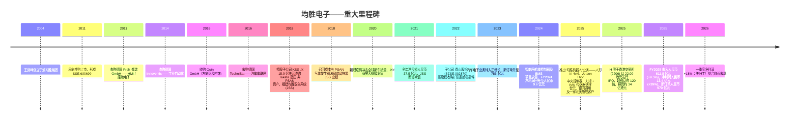
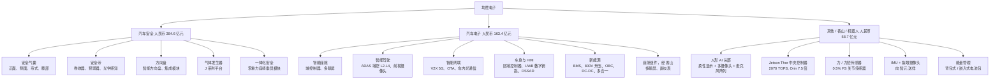
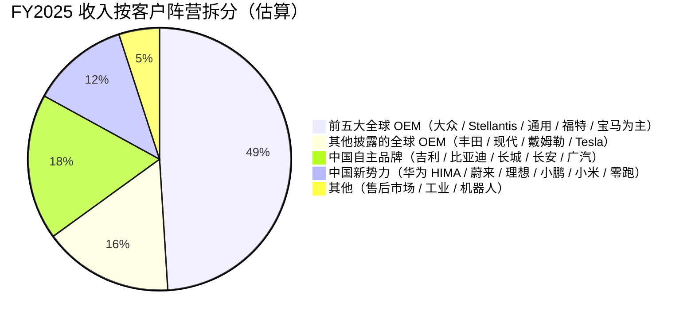
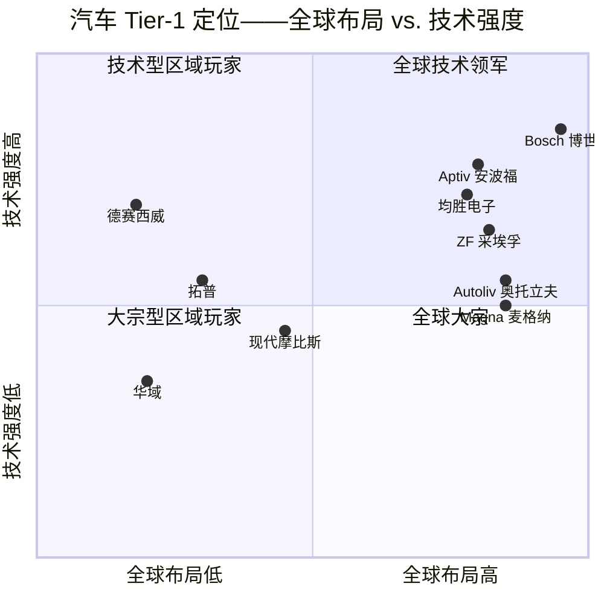

# 公司研究报告：均胜电子 (Joyson Electronics, SSE:600699 / HKEX:2206)

**日期：** 2026-05-16
**分析师备注：** 中国境内 A 股披露文件为权威来源，英文投资者关系材料为次要来源。应客户要求以英文撰写报告——本中文译本保留中文披露文件标题原文。

> **更新——FY2025 业绩落于指引区间高端，FY2026 一季度 EPS 同比 +18% (2026-04-27)：** 管理层公布 FY2025 营业收入约人民币 612 亿元（同比 +9.5%），合并毛利率 18.3%（同比 +210 个基点），归母净利润约人民币 13.4 亿元（同比 +39%）——达到或超过 H 股招股书所暗示的经营目标。FY2025 新业务订单（"全生命周期订单"）约人民币 970 亿元，创历史新高，其中智能驾驶域控/中央计算单元/多联屏等高端汽车电子类约人民币 200 亿元。FY2026 一季度由于欧美产能优化，收入同比下降 5.2%，但净利润同比增长 18.1% 至人民币 4.02 亿元，反映降本举措持续传导，经营性现金流同比增长 5.5% 至人民币 9.15 亿元。
> 来源：[均胜电子 2025 年年度报告, 第 4 页](https://static.cninfo.com.cn/finalpage/2026-03-30/1224073847.PDF)，[均胜电子 2026 年第一季度报告, 2026-04-27](https://static.cninfo.com.cn/finalpage/2026-04-27/1224421673.PDF)。

---

## 目录

1. 公司概况
2. 公司历史
3. 管理团队
4. 产品与服务
5. 客户与市场策略
6. 行业概况
7. 竞争格局
8. 市场机会 (TAM)
9. 风险评估
10. 参考资料

======================================

## 1. 公司概况

宁波均胜电子股份有限公司（SSE:600699；H 股二次上市为均胜电子-S，HKEX:2206）是一家总部位于浙江宁波的全球一体化汽车一级 (Tier-1) 供应商。均胜电子设计、生产并销售两大主要产品族：(i) **汽车安全系统**——安全气囊、安全带、方向盘以及集成式乘员保护解决方案；(ii) **汽车电子**——智能座舱域控制器、智能驾驶 (ADAS) 域控制器、中央计算单元、V2X 车联网、人机界面 (HMI) 模块以及新能源电力电子（BMS / OBC / DC-DC / 升压模块）。根据 Frost & Sullivan 2024 年收入排名，公司位列**全球被动安全行业第二位**、**全球智能座舱域控制器排名第四 / 中国第二**，并位居 2025 年 Automotive News 全球零部件供应商百强榜第 37 位 ([均胜电子 2025 年年度报告, 第 12 页](https://static.cninfo.com.cn/finalpage/2026-03-30/1224073847.PDF))。

公司公布 **FY2025 营业收入人民币 611.8 亿元**（同比 +9.5%）、**毛利率 18.3%**（FY2024 为 16.2%），其中汽车安全板块贡献人民币 384.6 亿元（占比 63%），毛利率 17.1%；汽车电子板块贡献人民币 163.4 亿元（占比 27%），毛利率 19.7%。归母净利润为人民币 13.4 亿元（同比 +39%）；扣非归母净利润为人民币 15.0 亿元，与归母净利润之差主要源于美洲三家工厂重组及欧洲两家工厂启动关闭的相关成本 ([均胜电子 2025 年年度报告, 第 16–22 页](https://static.cninfo.com.cn/finalpage/2026-03-30/1224073847.PDF))。公司在**大中华区、美洲、欧洲及亚太（日本 / 韩国 / 泰国 / 印度 / 菲律宾 / 摩洛哥）**布局制造与研发，海外区域贡献 FY2025 收入人民币 440.7 亿元（占 72.6%），是所有中国 A 股上市汽车 Tier-1 中海外敞口最大的企业。

均胜电子的盈利模式：公司是基于项目制的**一级 OEM 供应商**，通过多年期定点与验证流程，获取整车厂 8–10 年寿命的供货与质保订单。营业收入约人民币 600 多亿元的"主营业务收入"基本全部为直接向 OEM 销售，加少量售后市场及工业用途分摊，合同按单台定价 ([均胜电子 2025 年年度报告, 第 23 页](https://static.cninfo.com.cn/finalpage/2026-03-30/1224073847.PDF))。真正起作用的是订单储备：FY2025 公司新增全生命周期订单约人民币 970 亿元（安全 509 亿 + 电子 461 亿 + 相邻业务），其中毛利率最高的智能驾驶域控制器、中央计算、多联屏座舱合计超过人民币 200 亿元 ([均胜电子 2025 年年度报告, 第 18 页](https://static.cninfo.com.cn/finalpage/2026-03-30/1224073847.PDF))。订单储备约为 FY2025 收入的 1.6 倍，并以 3–4 年的滞后兑现，因此比单年报表收入更能反映成长轨迹。

除汽车业务外，公司在 FY2025 正式宣布**"再创业"战略**，将其精密制造与嵌入式电子能力延伸至**人形机器人（"智能体"——具身智能）供应链**——详见第 4 节。截至 FY2025，机器人收入尚未单独披露；管理层将其定位为多年期的第二增长曲线，并以与中国独角兽 智元 (Agibot)、银河通用，以及一家"北美头部客户"（卖方研报普遍理解为 Tesla / Figure AI）的样品供货关系作为支撑 ([均胜电子发布机器人AI头部总成等多款新产品, 新浪财经, 2025-09-18](https://finance.sina.com.cn/stock/relnews/cn/2025-09-18/doc-infqxmri8803997.shtml)；[均胜电子在机器人领域的合作全明星阵容, 东方财富网, 2026-01-02](https://caifuhao.eastmoney.com/news/20260102134244831946090))。

*来源：[均胜电子 2025 年年度报告, 第 7 页](https://static.cninfo.com.cn/finalpage/2026-03-30/1224073847.PDF)；[均胜电子 2023 年年度报告, 第 7 页](https://static.cninfo.com.cn/finalpage/2024-03-27/1219514428.PDF)；[均胜电子 2021 年年度报告, 第 7 页](https://static.cninfo.com.cn/finalpage/2022-04-25/1213081538.PDF)。FY2021 净亏损人民币 -37.5 亿元反映均胜安全系统的商誉减值以及新冠/缺芯低谷的双重冲击。*

### 估值快照（截至 2026-05-15）

- **A 股股价 (SSE:600699)：** 约人民币 28.15 元
- **总股本：** 约 15.5 亿股（H 股发行后）
- **总市值：** 约 **人民币 433 亿元（约 60 亿美元）** ([均胜电子 SH600699 行情, 雪球](https://xueqiu.com/S/SH600699))
- **TTM EPS：** 人民币 0.83 元
- **TTM 市盈率：** 约 **33.9 倍**
- **TTM 市销率：** 约 **0.71 倍**（人民币 433 亿元 ÷ 人民币 611.8 亿元营收）
- **市净率（FY2025 末）：** 约 2.5 倍，基于归母净资产人民币 175 亿元
- **三年市盈率区间：** 约 18–55 倍（FY2022 因 Takata 高田 历史遗留费用及缺芯而压低）
- **三年市销率区间：** 约 0.30–0.80 倍

**同业比较（TTM，2026 年 5 月中）：**

| 同业 | 股票代码 | 市值 | TTM 市盈率 | TTM 市销率 | 备注 |
|---|---|---|---|---|---|
| **均胜电子** | SSE:600699 | 人民币 433 亿元 | **33.9x** | **0.71x** | 标的公司 |
| 华域汽车 | SSE:600741 | 人民币 600 亿元 | 8.7x | 0.34x | A 股最大汽车 Tier-1；上汽集团控股；车灯/内饰/底盘业务成熟 ([华域汽车 600741 操盘必读, 东方财富网](https://emweb.eastmoney.com/PC_HSF10/OperationsRequired/Index?type=soft&code=SH600741)) |
| Autoliv 奥托立夫 | NYSE:ALV | 89 亿美元 | 12.4x | 0.81x | 全球被动安全龙头（市占率约 44%）([Autoliv (ALV) Statistics & Valuation, Stockanalysis.com](https://stockanalysis.com/stocks/alv/statistics/)) |
| Magna 麦格纳 International | NYSE:MGA | 120 亿美元 | 13.4x | 0.32x | 多元化 Tier-1；超大平台代工厂商 ([Magna International (MGA) Statistics, Stockanalysis.com](https://stockanalysis.com/stocks/mga/statistics/)) |
| Aptiv 安波福 | NYSE:APTV | 150 亿美元 | 14.5x | 0.55x | 座舱 + 先进安全；曾分拆 Motional ([Aptiv investor page](https://www.aptiv.com/en/investors)) |
| ZF 采埃孚 Friedrichshafen | 未上市 | n/a | n/a | n/a | 德国私营；FY2024 营收约 410 亿欧元 ([ZF Group Annual Report 2024](https://www.zf.com/site/magazine/en/articles_91200.html)) |
| Bosch 博世 Mobility | 未上市 | n/a | n/a | n/a | 全球最大汽车 Tier-1；2024 年移动出行业务营收约 560 亿欧元 ([Bosch annual report 2024](https://www.bosch.com/company/annual-report/)) |

*来源：上表所链接的财报与行情页面。*

**解读。** 均胜电子的 **TTM 市盈率约 34 倍，约为同业中位数 13 倍的 3 倍**（华域 8.7×、Autoliv 奥托立夫 12.4×、Magna 麦格纳 13.4×、Aptiv 安波福 14.5×），约为公司自身五年中位数（约 17 倍）的 2 倍。TTM 市销率 0.71 倍与 Autoliv 奥托立夫 的 0.81 倍*持平*，且位居 A 股同业之首（华域 0.34 倍），因此 P/S 指标尚算合理——拉伸主要在盈利端。

我们认为，推动市盈率溢价的三个因素中**只有一个具有基本面支撑：**

1. **机器人叙事估值重塑（主要因素，故事驱动）。** 自 2025 年 9 月公司在德国 IAA 慕尼黑展会上披露人形 AI 头部总成与基于 Jetson Thor 的域控制器以来，股价已大致翻倍，并作为**人形机器人零部件标的**与 拓普集团 (Tuopu)、三花智控 (Sanhua)、鸣志电器 (Moons) 一同被市场炒作——这些公司在几乎尚无机器人收入披露的情况下，市盈率高达 40–80 倍 ([均胜电子降维打击：卡位机器人"头部"，股价被点燃, 21财经, 2025-09-20](https://m.21jingji.com/article/20250920/f3c46519b9e4b6a936b3d018f0511082.html)；[均胜电子港股IPO认购近120倍, 证券之星, 2025-11-05](https://stock.stockstar.com/SS2025110500005731.shtml))。
2. **业绩仍在从 Takata 高田 重组低谷恢复。** FY2021 净亏损人民币 -37.5 亿元（均胜安全系统商誉减值）；FY2025 净利润人民币 13.4 亿元，仍比 FY2018 峰值人民币 13.2 亿元低约 30%，而七年间收入基本持平。管理层指引随着欧美工厂理顺收尾，毛利率有望在 FY2027 之前再扩张 150–200 个基点，这将使 P/E 在 FY2027E 盈利基础上接近同业区间。
3. **A+H 结构性溢价。** 2025 年 11 月香港 IPO 超额认购 120 倍，南向通可投资的 H 股 (HKEX:2206) 与 A 股价格几乎相同——A/H 价差较窄（IPO 时 A 股折价约 32%，目前已收窄至 5% 以内）意味着指数化需求吸收了部分自由流通筹码，否则将对估值形成压制 ([港股IPO丨均胜电子：钟鼎基石，较A股折价约32%, OFweek, 2025-10-28](https://ee.ofweek.com/2025-10/ART-12003-2800-30672818.html))。

**结论：** 均胜电子的股价更多被当作人形机器人 + 智能座舱的成长故事来定价，而非全球被动安全供应商。我们将由此带来的**估值压缩风险纳入第 9 节**——在 33.9 倍 TTM 市盈率与以 Autoliv 奥托立夫 为锚的基本面合理倍数约 15 倍之间，若 (a) 机器人订单动能不及预期，或 (b) 汽车电子定点项目量产推迟至订单储备中所列的 FY2027 节点之后，股价将面临剧烈下杀风险。

======================================

## 2. 公司历史

均胜电子由**王剑峰于 2004 年**在宁波创立，最初是一家以 TRW、蒂森克虏伯及大众汽车中国为主要客户的汽车功能件（暖通空调零件、紧固件）制造商。王剑峰曾任 TRW 中国高级经理，于 2004 年收购前身公司**均胜集团 (Joyson Group)** 的控股权，并于 2011 年通过反向并购 A 股上市壳公司"**辽源得亨**"完成借壳上市，形成上市主体 SSE:600699 ([均胜电子 2025 年年度报告, 第 41 页](https://static.cninfo.com.cn/finalpage/2026-03-30/1224073847.PDF)；[Joyson Safety Systems – Wikipedia](https://en.wikipedia.org/wiki/Joyson_Safety_Systems))。

均胜电子最具特色的战略姿态，是**以举债融资方式跨境收购欧美陷入困境的 Tier-1 资产**，再以中国成本结构与 OEM 客户关系实现运营层面的扭亏。这一系列动作将其打造为今日全球分布最广的中国 Tier-1：

**战略转型（关注"为何"而非"做了什么"）。** 三次重大转型重塑了公司：

1. **Preh 普瑞 (2011)——"买下一个 Tier-1"思路。** 王剑峰判断，依靠中国零部件配套的内生增长会将均胜电子毛利率锁死在低个位数，而拥有一家德国工程中心则可以直接获得 OEM 定点权与高于 20% 的毛利率。Preh 普瑞 一直是座舱-HMI 业务的技术核心，并为宝马、奥迪和戴姆勒供应方向盘开关项目。
2. **KSS + Takata 高田 (2018)——全球被动安全行业整合。** Takata 高田 气囊气体发生器召回——汽车工业史上规模最大的召回——使 高田 进入美国第十一章破产保护程序。均胜电子联合美国出资方 PAG 及国投集团 (SDIC)，通过其美国子公司 KSS 以 15.9 亿美元收购 高田 的几乎全部非 PSAN 资产 ([Joyson and PAG Fund KSS to Acquire Air-Bag Maker Takata, PR Newswire, 2018-04-11](https://www.prnewswire.com/news-releases/joyson-and-pag-fund-kss-to-acquire-air-bag-maker-takata-in-asset-deal-300628525.html))。合并后的实体成为仅次于 Autoliv 奥托立夫 的全球第二大被动安全供应商。该交易在战略上正确，但财务上痛苦：整合成本、召回法律遗留以及 2020–21 周期低谷叠加，导致截至 FY2022 的累计净亏损。
3. **"均胜机器人" / 再创业 (2025)——第二增长曲线。** 鉴于汽车安全增长在全球轻型车 SAAR 见顶后已被结构性封顶在个位数销量，而汽车电子毛利率又受中国竞争挤压，均胜电子明确将研发支出重新导向人形机器人传感器/执行器/中央控制器硬件——以其在 PCB 级集成、车规级可靠性和全球制造规模上的现有能力为底座。

**近 12 个月重大事项。** 三项信号性事件：(a) 2025 年 11 月 **H 股 IPO** (HKEX:2206，发行价 22.00 港元，零售超额认购约 120 倍，募资约 34 亿港元——募集资金 35% 用于研发 / 35% 用于生产 / 10% 用于海外扩张 / 20% 用于并购及补充流动资金) ([均胜电子 H 股招股启动, 新浪科技, 2025-10-28](https://finance.sina.com.cn/tech/roll/2025-10-28/doc-infvmrrp8907745.shtml))；(b) **慕尼黑 IAA 产品发布**（2025 年 9 月）一体化人形"AI 头部"+ Jetson Thor 中央控制器，催化了机器人板块的估值重塑；(c) FY2026 一季度的**美洲工厂关闭**——FY2025 已关闭三家、FY2026 计划关闭另两家——同时在**摩洛哥（方向盘）**、**安徽宿州（全流程一体化方向盘）**及**菲律宾（气囊织物）**新建工厂，将制造布局向低成本地区迁移 ([均胜电子 2025 年年度报告, 第 17 页](https://static.cninfo.com.cn/finalpage/2026-03-30/1224073847.PDF))。

======================================

## 3. 管理团队

### 王剑峰，董事长兼执行董事——创始人

王剑峰（1970 年生，北京大学光华管理学院 EMBA，高级经济师）是均胜电子的**创始人、控股股东及董事长**，也是公司历史上每一笔重大并购的总设计师。截至 FY2025 末，他直接持有 3,543.7 万 A 股，并通过 均胜集团 (Joyson Group) 控股进一步控制 33.57%，H 股发行后**合计持股 35.86%**——在中国上市汽车零部件企业中是单一股东持股比例最大的 ([均胜电子港交所上市：333 亿市值背后, 财富号, 2025-11-07](https://caifuhao.eastmoney.com/news/20251107181949837723220)；[均胜电子 2025 年年度报告, 第 41 页](https://static.cninfo.com.cn/finalpage/2026-03-30/1224073847.PDF))。

王剑峰的职业轨迹对中国汽车企业家而言异常专注。1991 年从北京航空工业毕业后，加入 **TRW（宁波）汽车电子电气与紧固件有限公司**担任年轻工程师，二十多岁末段升任该业务总经理，随后主管 **TRW 中国战略与业务发展**，并于 2004 年 34 岁时创立均胜电子。TRW 的渊源支撑了公司最早期的德系项目（大众、奥迪转向柱零部件），也为王剑峰提供了此后每一笔并购都套用的运营模板：买入一家工程实力强、资产负债表薄弱的陷入困境 Tier-1，保留欧洲管理团队以维持技术延续性，再叠加中国成本结构与 OEM 客户关系。这一模板先在 **Preh 普瑞** (2011) 完成规模化检验，在 **TechniSat** 与 **Quin** (2016) 中得到精细化，最终在 **Key Safety Systems → Takata 高田** (2018) 这桩 16 亿美元、且当时 Takata 高田 气体发生器召回为业内史上最大召回的交易中被推至极限 ([Joyson Safety Systems – Wikipedia](https://en.wikipedia.org/wiki/Joyson_Safety_Systems)；[CFIUS Clearance & Mitigation: Ningbo Joyson Electronic Corp. and Takata Corp., Trade Practitioner, 2019-01](https://www.tradepractitioner.com/2019/01/cfius-ningbo-joyson-electronic-corp-takata-corp/))。

数据所呈现的是其坚定的信念：王剑峰自 IPO 以来**每个报告期均为 A 股净买入者**（2025 年自然年内累计通过二级市场买入 40 万股），从未减持，且 FY2025 税前薪酬人民币 447 万元对一位全球 Tier-1 董事长而言相对克制 ([均胜电子 2025 年年度报告, 第 41 页](https://static.cninfo.com.cn/finalpage/2026-03-30/1224073847.PDF))。王剑峰同时兼任**均胜集团 (Joyson Group)** 与**均普智能 (Joyson Intelligence, SSE:688306)**——后者是均胜电子的工业自动化上市姊妹公司——三者共同构成一个由家族控股的紧密集团结构。机器人转型是王剑峰本人的论点；他公开将均胜电子的制造平台描述为"已准备好为未来十年的具身智能硬件需求重新配置"，并亲自从董事长办公室推动公司围绕共享研发、供应商与制造资产的"One Joyson"平台整合 ([均胜电子 2025 年年度报告, 第 4 页, 致股东信](https://static.cninfo.com.cn/finalpage/2026-03-30/1224073847.PDF))。

### 陈伟，执行董事兼总裁——经营负责人

陈伟（1970 年生，中欧国际工商学院 EMBA）自 2023 年起任**均胜电子总裁**，同时兼任**汽车安全业务部 CEO** 及董事会成员。陈伟持有 12 万 A 股（二级市场买入）以及 FY2021 员工持股计划下的另外 24 万股；FY2025 税前薪酬为人民币 596 万元，居管理层之首 ([均胜电子 2025 年年度报告, 第 41 页](https://static.cninfo.com.cn/finalpage/2026-03-30/1224073847.PDF))。加入均胜电子之前，陈伟在**蒂森克虏伯普瑞斯塔 (ThyssenKrupp Presta)** 工作 15 年，最终担任转向系统部门**亚太区 CEO**——这一深度技术岗位赋予他在均胜电子并购史中积累的欧洲工程团队（Preh 普瑞、JSS-Europe）面前的运营信誉。他此前还曾在一汽大众（采购项目经理）及蒂森克虏伯长春转向系统担任高级职务。陈伟最有可能在王剑峰退居二线时接棒掌舵公司，并被普遍认为是均胜安全系统业务扭亏的总设计师——FY2024–FY2025 毛利率回升正得益于此。

### 李俊彧，首席财务官、执行董事兼副总裁

李俊彧（1979 年生，武汉大学 MPACC，北京大学光华管理学院 EMBA，中国注册会计师）**自 2015 年起担任均胜电子 CFO**，完整经历了 Takata 高田 收购、均胜安全系统整合、FY2021 商誉减值、FY2025 H 股 IPO 及相关港股会计准则改造的全部十年。李俊彧通过华德塑胶子公司（CFO）加入均胜集团，早年也曾在同一集团任职。她持有 14 万 A 股以及 FY2021 员工持股计划下的 44 万股，FY2025 薪酬人民币 518 万元 ([均胜电子 2025 年年度报告, 第 41 页](https://static.cninfo.com.cn/finalpage/2026-03-30/1224073847.PDF))。H 股上市以 22.00 港元发行、零售超额认购 120 倍、首日 A/H 价差不足 5%——是其任期内最受瞩目的资本市场事件，且自董事会批准至完成仅约 12 个月，对一家双重上市的中国制造业企业而言执行节奏异常紧凑。李俊彧也兼任均胜集团董事，使其能直接掌握关联交易与集团内现金管理。

### 蔡正欣，执行董事兼 Preh 普瑞 GmbH CEO

蔡正欣（1972 年生，上海交通大学工业工程硕士）为**Preh 普瑞 GmbH 的 CEO**，该公司是均胜电子在德国战略上的核心子公司，承担座舱-HMI 与方向盘开关业务，并作为汽车电子板块主要工程中心。蔡正欣从 TRW 宁波运营总监岗位加入均胜电子，此前在 Gentex（上海）及 SCI 常熟汽车安全任高级职务。作为 Preh 普瑞 CEO，蔡正欣是均胜电子对欧洲整车厂（宝马、戴姆勒、奥迪）关系及汽车电子产品路线图最重要的管理者——包括 FY2025 三季度获得的某全球旗舰 OEM 多联屏座舱项目定点，全生命周期超过 300 万套 ([均胜电子 2025 年年度报告, 第 18 页](https://static.cninfo.com.cn/finalpage/2026-03-30/1224073847.PDF))。

### 公司治理

- **董事会：** FY2025 末共 10 名成员——5 名执行董事（王剑峰、朱雪松、陈伟、李俊彧、蔡正欣）、1 名非执行董事（周兴友——同时为均胜集团监事会成员）以及 4 名独立非执行董事（陆桂华、于芳、魏学哲、奚晁华）。独立董事比例 40%，处于 A 股最佳治理标准的下限；H 股上市已促使公司在 2026 年升级至港股公司治理标准。
- **内部人持股：** H 股发行后董事及高管合计持有约 36.5% 的总股本——极为集中；库存股账户另持有约 1,266 万股（约 0.8%）。
- **薪酬：** FY2025 董事及高管税前薪酬合计人民币 2,716 万元——以西方 Tier-1 标准而言相当克制（Autoliv 奥托立夫 CEO 基本薪酬等值人民币 6,000 万元以上）。绩效激励主要通过 FY2021 员工持股计划支付，而非期权授予。
- **关联交易：** 均胜电子的运营与 均胜集团（母公司）及 均普智能（关联上市姊妹公司）联系紧密——金融服务支持、不动产租赁及关联方零部件采购在 2025 年年报关联交易附注中均有披露。毕马威审计师未标识任何重大非公允关联交易，并出具了**清洁无保留意见** ([均胜电子 2025 年年度报告, 第 2 页](https://static.cninfo.com.cn/finalpage/2026-03-30/1224073847.PDF))。

### 历史业绩综合评判

王剑峰整合并融资完成的跨境 Tier-1 资产数量超过任何一位中国汽车零部件 CEO——且关键是，他兑现了 FY2024–FY2025 的毛利率回升，而这正是均胜电子空头当年认为不会发生的事。该团队*一贯的短板*是并购消化速度：每一桩重大收购（Preh 普瑞、Quin、KSS、Takata 高田）都需要 3–5 年才能达到稳态毛利率，这也是公司股价自 2019 至 2023 年长期处于估值惩罚区间的原因。机器人转型是迄今风险最大的战略抉择，因为这是团队首次在汽车体系之外构建产品——赌注在于工程和制造平台能否成功迁移，而该赌注尚未得到验证。

======================================

## 4. 产品与服务

均胜电子按两个经营分部报告——**汽车安全**与**汽车电子**——加上**"其他"**（合并子公司 香山股份 座舱零部件与新兴均胜机器人产品）。完整产品组合来自公司官网 ([joyson.com](https://www.joyson.com/)) 及 FY2025 年报 ([第 12–15 页](https://static.cninfo.com.cn/finalpage/2026-03-30/1224073847.PDF))，列示如下。

### 汽车安全（FY2025 收入人民币 384.6 亿元，毛利率 17.07%，同比 +2.3 个百分点）

这是全球第二大的被动安全业务——由 KSS + Takata 高田 整合而来——覆盖五大产品族：

1. **安全气囊**——正面、侧面、帘式、膝部以及座椅内置 (bag-in-seat) 设计，满足 L1 至 L4 NCAP 等级要求。客户覆盖几乎所有全球 OEM。**竞争评判：是——护城河 = 规模、认证与知识产权。** 最直接的竞品：Autoliv 奥托立夫的 **Life Cell** 气囊平台。均胜电子的全球份额略低于 Autoliv 奥托立夫（均胜约 25% 对 Autoliv 奥托立夫 约 44%），但**在中国本土 OEM 处份额领先** ([全球被动安全市场份额分析, MarketsandMarkets](https://www.marketsandmarkets.com/Market-Reports/air-bag-seat-belt-market-21466612.html))。
2. **安全带**——卷收器、预紧器、限力器，以及预计 2026 年下半年量产的新一代**光学感知织带**产品，主要用于乘员监测场景。**评判：是——护城河 = 规模与工装。** 最直接的竞品：Autoliv 奥托立夫 预紧器。**势均力敌。**
3. **方向盘与智能方向盘**——电容式离手检测、加热及一体化气囊模块；安徽宿州新工厂将转为全工序垂直整合。**评判：部分——护城河 = 规模，无差异化 IP。** 最直接的竞品：Autoliv 奥托立夫 方向盘。均胜电子**在中国新能源 OEM（吉利、比亚迪、理想、蔚来）领先**。
4. **气体发生器**——2025 年新发布的"**J 系列平台**"将气体发生器跨多种气囊设计标准化，借此摊薄物料成本。**评判：是——护城河 = 垂直整合。** 最直接的竞品为 Daicel（日本）。均胜电子**在质量上持平，借助浙江湖州产能扩张在成本上领先** ([均胜电子 2025 年年度报告, 第 17 页](https://static.cninfo.com.cn/finalpage/2026-03-30/1224073847.PDF))。
5. **一体化乘员保护方案**——*零重力座椅*安全模块，与领先的全球座椅供应商联合开发；是首家将气囊 + 预紧器全面集成至自动驾驶车辆可调躺式座椅骨架的 Tier-1 ([均胜电子 2025 年年度报告, 第 19 页](https://static.cninfo.com.cn/finalpage/2026-03-30/1224073847.PDF))。**评判：是——护城河 = IP 与先发优势。** 暂无可与之对标的竞品。

### 汽车电子（FY2025 收入人民币 163.4 亿元，毛利率 19.70%）

1. **智能座舱域控制器**——基于高通 SA8295 / SA8775 及英伟达 Drive 平台；正在为一家中国头部 OEM（按披露推测为 吉利 / Lynk & Co）量产供货。**评判：部分——护城河 = OEM 定点 + 软件栈。** 最直接的竞品：Aptiv 安波福 ICAS、Visteon SmartCore。**势均力敌。**
2. **多联屏座舱系统**——FY2025 三季度获得一家"全球主流 OEM"超过 300 万套全生命周期的定点，2027 年量产 ([均胜电子 2025 年年度报告, 第 18 页](https://static.cninfo.com.cn/finalpage/2026-03-30/1224073847.PDF))。**JoySpace+ 沉浸式座舱**概念（飞控旋钮、整车宽幅光场显示、晶质可定制控制件）于 2025 年全球首发。**评判：是——护城河 = IP 与全球工装整合。**
3. **智能驾驶 (ADAS) 域控制器**——从 L2 入门级到 L4 的全栈方案，覆盖高通 Ride / 英伟达 Drive / 地平线 J6 / 黑芝麻 A2000。与 **Momenta** 合作高速 + 城区 + 泊车算法栈；2026 年量产多个项目定点 ([均胜电子 2025 年年度报告, 第 18 页](https://static.cninfo.com.cn/finalpage/2026-03-30/1224073847.PDF))。**评判：部分——护城河 = OEM 定点 + 芯片多样化。** 最直接的竞品：德赛西威 (Desay SV)、Aptiv 安波福、Bosch 博世 ADAS 控制器。**在中国客户中势均力敌，在欧洲弱于 Bosch 博世。**
4. **中央计算单元 (CCU)**——域融合架构，斩获一家"全球旗舰 OEM"的下一代平台定点，2027 年量产。**评判：是——护城河 = 规模 + IP。**
5. **智能网联 (V2X / 5GA)**——完整 5GA / V2X 协议栈，包括 CSAE/ETSI Day-1 与 Day-2 全部场景。**新一代宝马 5 系**搭载均胜电子 V2X 模块；2025 年获欧洲豪华品牌 5GA 智能天线项目 ([均胜电子 2025 年年度报告, 第 19 页](https://static.cninfo.com.cn/finalpage/2026-03-30/1224073847.PDF))。**评判：是——护城河 = 法规认证 + IP。** 最直接的竞品：大陆 (Continental) V2X。**领先。**
6. **车身/HMI**——区域控制器、**UWB 数字钥匙**、自动驾驶数据存储 (DSSAD) 系统。**评判：部分——护城河 = 规模。**
7. **新能源电力电子**——BMS、**800V 升压模块**（2019 年行业首发）、850V V2G OBC（2025 年行业首发，双向效率超 95%，频率跟踪 ±2.5 Hz/s）、DC-DC，以及覆盖 12V / 48V / 400V / 800V 的多合一一体化功率模块 ([均胜电子 2025 年年度报告, 第 19 页](https://static.cninfo.com.cn/finalpage/2026-03-30/1224073847.PDF))。**评判：是——护城河 = 800V / V2G 先发、IP 与 OEM 锁定。** 最直接的竞品：比亚迪自研功率模块、Vitesco。**在双向 V2G 上领先。**
8. **通过 香山股份 (SZSE:002870) 提供的智能座舱组件**——控股子公司供应多联屏、副仪表、空调控制及新能源充电连接器 ([香山股份 2024 年报](http://www.cninfo.com.cn/new/disclosure/stock?stockCode=002870))。

### 均胜机器人（"其他"分部）——具身智能平台

2025 年正式发布覆盖三条整合产品线及一个传感器产品组合，**全部以"车规级"组件移植至人形机器人**为定位：

1. **人形 AI 头部总成（机器人 AI 头部总成）**——2025 年 9 月慕尼黑 IAA 与世界人工智能大会公开亮相。将柔性显示、麦克风阵列、深度摄像头、旋转控制与边缘推理集成于单一模组 ([均胜电子发布机器人AI头部总成等多款新产品, 新浪财经, 2025-09-18](https://finance.sina.com.cn/stock/relnews/cn/2025-09-18/doc-infqxmri8803997.shtml)；[从单一零部件转向总成解决方案, 证券时报, 2025-09-18](https://www.stcn.com/article/detail/3346691.html))。**评判：是——护城河 = 系统集成上的先发优势。** 暂无对标竞品。
2. **机器人中央 / 域控制器**——基于 **NVIDIA Jetson Thor**，算力 2070 TOPS（上代 Orin 的 7.5 倍）；定位为汽车中央计算单元在人形机器人侧的对位产品 ([行业领先！均胜电子发布机器人AI头部总成与基于Jetson, joyson.com, 2025-09](https://www.joyson.com/index.php/news/info/1380.html))。**评判：部分——护城河 = 芯片集成与工装。** 最直接的竞品：Tesla Optimus 内部控制器、Figure 计算平台。
3. **力 / 力矩传感器**——按**"人形机器人揭榜挂帅榜单"**规格设计：全系列关节、指端及足端力传感器，**全量程精度 0.5%**，响应时间小于 30 毫秒。FY2025 已披露向"头部人形客户"送样 ([人形机器人行业周报, 和讯网, 2025-09-21](https://m.hexun.com/stock/2025-09-21/221473731.html))。**评判：就该应用场景而言是——护城河 = 由汽车传感器 IP 迁移而来的制造 know-how。** 最直接的竞品：ATI Industrial、Kistler。**在绝对精度上落后，在成本 / 规模上领先。**
4. **IMU + 鱼眼摄像头**——向 **智元 (Agibot)** 送样；工业级 G2 机器人首批交付包含均胜电子的定制主板 ([均胜电子在机器人领域的合作全明星阵容, 东方财富网, 2026-01-02](https://caifuhao.eastmoney.com/news/20260102134244831946090)；[均胜电子：为人形机器人打造的核心零部件已经向知名人形机器人公司送样, 证券时报, 2025-08](https://www.stcn.com/article/detail/1520051.html))。**评判：部分——护城河 = 车规级可靠性 + 规模。**
5. **能量管理**——分为**嵌入式**（人形躯干 / 轮式底盘）与**背包式**（双足）两种形态的电池包，复用与汽车 NEV 业务相同的 BMS 平台。**评判：是——护城河 = 直接的技术迁移。**

### 旗舰产品与长尾产品

支撑业绩的**三大旗舰产品线**为：(a) **被动安全硬件**（气囊 + 安全带 + 气体发生器），仍占收入 60% 以上，是现金牛；(b) **智能座舱 + ADAS 域控制器**——绝对订单量增长最快（FY2025 定点合计人民币 200 亿元以上）；(c) **800V / V2G 电力电子**——已披露毛利率最高的产品族（25% 以上）。长尾产品——HMI 组件、V2X 模块、单点传感器及整条机器人产品线——对叙事和期权价值有意义，但目前在合并收入中占比不足 5%。

### 近 12 个月新品

- **2025 年 9 月：** 均胜机器人——AI 头部、Jetson Thor 控制器、传感器套件、背包式 BMS
- **2025 年 6 月：** **JoySpace+ 沉浸式座舱**概念（飞控旋钮、光场显示）
- **2025 年：** **J 系列平台气体发生器**——跨气囊产品族标准化
- **2025 年：** **850V V2G OBC**——行业首款双向 OBC，支持 ±2.5 Hz/s 频率响应
- **2025 年：** **UWB 数字钥匙**——多地区合规全球平台
- **未披露任何重大产品退市。**

======================================

## 5. 客户与市场策略

均胜电子在全球服务"**100+ 家整车品牌**"，FY2025 年报中明确列出的合作伙伴包括：**大众、奔驰、宝马、通用、福特、现代、本田、丰田、吉利、长安、长城、广汽、比亚迪、华为（汽车）、蔚来、理想、小鹏、零跑及 小米（汽车）** ([均胜电子 2025 年年度报告, 第 13 页](https://static.cninfo.com.cn/finalpage/2026-03-30/1224073847.PDF))。客户分布在地理上大致分为三大区域，与历史并购足迹对应：

- **欧洲（Preh 普瑞 / JSS-Europe 遗产）——约占收入 30%：** 大众集团、宝马集团、戴姆勒（梅赛德斯-奔驰）、Stellantis、雷诺。方向盘开关、HMI 组件、V2X。
- **美洲（KSS 遗产）——约占收入 25%：** 通用、福特、Stellantis-NA、Tesla、丰田-NA、本田-NA。安全气囊、安全带、方向盘。
- **大中华区 + 亚太——约占收入 45%：** 吉利、比亚迪、长城、长安、广汽、奇瑞、一汽、东风、华为（HIMA——问界、智界）、蔚来、理想、小鹏、零跑、小米，以及丰田 / 本田 / 现代合资公司。已成为毛利率与增速最高的部分。

### 客户集中度——量化分析

均胜电子年报披露**前五大客户销售占收入比例**但**不披露具体客户名称**（中国 A 股披露准则在无单一客户超过 50% 门槛时不强制要求具名，均胜电子从未触及该门槛）。四年趋势显著改善：

| 年度 | 前五大客户销售（人民币百万元） | 前五大占比 | 来源 |
|---|---|---|---|
| FY2022 | 28,717 | **58%** | [均胜电子 2022 年年度报告, 第 26 页](https://static.cninfo.com.cn/finalpage/2023-03-30/1216391847.PDF) |
| FY2023 | 29,617 | **53%** | [均胜电子 2023 年年度报告, 第 26 页](https://static.cninfo.com.cn/finalpage/2024-03-27/1219514428.PDF) |
| FY2024 | 26,614 | **48%** | [均胜电子 2024 年年度报告, 第 25 页](https://static.cninfo.com.cn/finalpage/2025-03-27/1222706328.PDF) |
| **FY2025** | **29,723** | **49%** | [均胜电子 2025 年年度报告, 第 24 页](https://static.cninfo.com.cn/finalpage/2026-03-30/1224073847.PDF) |

均胜电子明确勾选了"**无单一客户超过收入 50%，且前五大客户中无新增客户或关键依赖客户**"。结合行业认知及公司分部/区域敞口，前五大客户很可能由**大众集团、Stellantis、通用、福特、宝马、丰田集团及 吉利集团**的某种组合构成（Takata 高田 并购后历史上的前三客户长期是大众、Stellantis 与通用）。前五大占比 49%，且**第一大客户占比合理推算低于 15%**（鉴于多区域分布），均胜电子的客户集中度**低于 A 股汽车 Tier-1 同业中位数**（例如华域汽车对上汽集团的依赖度约 70%）。三年走势利好：58% → 53% → 48% → 49% 反映向中国新能源与新势力 OEM 主动分散的努力。

*前五大客户占比来源：[均胜电子 2025 年年度报告, 第 24 页](https://static.cninfo.com.cn/finalpage/2026-03-30/1224073847.PDF)；其余拆分由分析师根据具名客户引用与分部-区域披露推算（第三方推导，非公司披露）。*

**合同结构。** Tier-1 供货以**多年期、覆盖整车平台寿命的"定点"**（通常 6–10 年）形式构建，针对具体车型，价格按年度锁定；若技术 / 质量条款被违反，OEM 保留重新询源 (re-source) 的权利。均胜电子披露 **FY2025 单一年度新增全生命周期订单人民币 970 亿元**（安全 509 亿 + 电子 461 亿），意味着多年期收入可见度。前五大客户中无一是竞争对手（即购买而非自产），且尚无主要 OEM 公开宣布自制气囊 / 安全带产品。

### 市场策略

模式为**OEM 直接定点**——无任何渠道层。销售周期从 RFQ 至量产通常为 18–36 个月。均胜电子相对纯中国竞争对手的核心差异化在于其**全球制造布局**（中国 + 美洲 + 欧洲 + 东盟 + 印度 + 摩洛哥 + 墨西哥），能够为全球车型平台提供单源供货——随着 OEM 推行"China-for-China + Global-for-Global"并行供应链，该特性日益重要。相对纯西方竞争对手（Autoliv 奥托立夫、ZF 采埃孚）的差异化在于**中国研发规模 + 成本**叠加 Preh 普瑞 与 JSS 的欧洲工程传承。

**FY2025 具名重要中标：**
- 全球旗舰 OEM 下一代中央计算单元定点，2027 年量产 ([均胜电子 2025 年年度报告, 第 18 页](https://static.cninfo.com.cn/finalpage/2026-03-30/1224073847.PDF))
- 某国际 OEM 多联屏座舱，全生命周期 300 万套以上，2027 年量产
- 欧洲豪华品牌 5GA 智能天线项目
- 新款宝马 5 系 V2X 模块——量产中
- 与 Momenta 在智能驾驶栈方面的合作，多个 OEM 定点
- 东盟 / 东南亚某新能源 OEM（推测为 VinFast）ADAS + 数字钥匙定点
- 战略投资 ADAS 芯片初创公司 **新芯航途 (Sinexus)**
- 与 **斯年智驾 (Senior Auto)** 在宁波港共建港口物流 L4 平台

======================================

## 6. 行业概况

均胜电子位于三大行业的交汇处：(a) **全球被动安全部件**（成熟、集中度高、中个位数增长）；(b) **汽车电子——座舱、ADAS、电力电子**（高增长、碎片化）；以及 (c) **人形机器人**（萌芽期、纯叙事、尚无固化的供应商）。

### 全球汽车 Tier-1

全球汽车 Tier-1 行业 2024 年营收约 **1.4 万亿美元**，由十家供应商主导（Bosch 博世、ZF 采埃孚、Denso、Magna 麦格纳、Continental 大陆、Aptiv 安波福、Forvia、Hyundai Mobis、Valeo、Autoliv 奥托立夫），加上崛起的中国 Tier-1 阵营（华域、均胜、德赛西威、比亚迪垂直整合零部件业务）。在经历两年供应链压力（2021–2022 缺芯；2023 中国新能源价格战）后，行业在 2025 年回归至**销量持平至 +3%** 的运行区间，**毛利率回升由降本 / 优化而非销量增长驱动**。

据 GlobalData，**2025 年全球轻型车销量约 9,190 万辆（不计中国出口）**，同比 +3.6%——中国 2,689 万辆（+5.6%）、欧洲 1,811 万辆（+0.3%）、美国 1,633 万辆（+2.5%）。全球新能源汽车销量约 2,070 万辆（+20%），欧洲在 2024 年补贴退坡阵痛后回升至 430 万辆（+33%）([均胜电子 2025 年年度报告, 第 15 页](https://static.cninfo.com.cn/finalpage/2026-03-30/1224073847.PDF))。中国市场尤其延续向自主品牌集中：自主品牌乘用车销量提升至 2,094 万辆，市占率达 **69.5%**（同比 +4.3 pp）；中国汽车出口总量 710 万辆（+21.1%），保持全球第一大出口国地位。**对均胜电子而言，这两条信号都是利好**——中国自主品牌份额提升利好其 吉利/比亚迪/华为/小米 敞口，中国出口爆发则利好其全球制造布局，可为出口市场实现本地化供货。

### 被动安全子赛道

全球被动安全市场（气囊 + 安全带 + 气体发生器 + 方向盘模块）2025 年估值约 **306 亿美元**，预计 2033 年达 436 亿美元，复合增速约 4.5% ([Automotive Passive Safety System Market, SkyQuest 2026-2033 report](https://www.skyquestt.com/report/automotive-passive-safety-system-market))。前三大玩家——Autoliv 奥托立夫、ZF 采埃孚 (TRW) 与均胜电子——合计份额超过 **75%**，其中 Autoliv 奥托立夫约 44%、均胜电子 Takata 高田 整合后约 25%——是教科书式的集中寡头格局。结构性增长驱动力是**NCAP 法规升级**（欧洲 NCAP 2026 协议要求新增侧帘式碰撞测试；中国 C-NCAP 2024 增加远端及非常规姿态测试），将单车平均气囊数量从 2020 年约 6 个推升至 2027 年约 8 个。

### 汽车电子——智能座舱 / ADAS

智能座舱域控制器（驱动中控屏、仪表盘、语音助手、HUD 及 AR 的集成芯片 + 软件栈）2025 年市场规模约 **135–150 亿美元**，按 Frost & Sullivan 引用于均胜电子 H 股招股书的估计，至 2028 年复合增速约 22%。ADAS 域控制器（L2 / L2+ / L3）2025 年市场约 **170 亿美元**，由于中国新车 L2+ 渗透率突破 60%，复合增速更高，达 35% 以上。再加上中央计算单元（融合架构的继任者）与区域控制模块，这是汽车业增速最高的细分市场，也是均胜电子、**德赛西威 (Desay SV)**、**华阳集团 (Foryou)**、Aptiv 安波福、Visteon、Bosch 博世 与 Tesla、比亚迪、蔚来等 OEM 自研团队的主战场。行业结构**碎片化加剧而非集中**——每家主要 OEM 每个平台都有 2–4 家控制器供应商——毛利率介于 18–22%（被动安全为 14–17%）。

### 新能源电力电子

新能源车用车载充电器 (OBC) + DC-DC + BMS 市场 2025 年规模约 **210 亿美元**（M&M；Mordor），至 2030 年复合增速约 20%，由 NEV 渗透率提升与 400V → 800V 架构转换共同驱动。双向 V2G 切片目前规模较小（不足 10 亿美元），但是毛利率最高、增速最快（约 50% CAGR）的部分，也是均胜电子行业首发的 800V 升压模块（2019）与 850V V2G OBC（2025）所定位的领域。

### 人形机器人

这是与均胜电子相关的市场中变化最快——也是分歧最大——的赛道。**2025 年人形机器人 TAM 估计区间从 29 亿美元（MarketsandMarkets）至 30 亿美元（多数共识）；2030 年估计区间从 65 亿美元（ABI Research）至 150 亿美元（M&M）再到 370 亿美元（Morgan Stanley 高基准）** ([Humanoid Robot Market Forecasts, Humanoids Daily](https://www.humanoidsdaily.com/news/humanoid-robot-market-forecasts-a-landscape-of-high-hopes-and-wide-disagreement)；[Humanoid Robot Market, $38B by 2035 — Goldman Sachs](https://www.goldmansachs.com/insights/articles/the-global-market-for-robots-could-reach-38-billion-by-2035))。Goldman Sachs 估计 2026 年出货 5 万–10 万台，长期单价 1.5 万–2 万美元；Morgan Stanley 上行情景预计 2050 年累计市场价值达 5 万亿美元。Tesla 已指引 2025 年 Optimus 量产 5,000 台，2026 年扩至 10 万台，单价 2 万–3 万美元。这种预测离散度是当下卖方研报中任何消费或工业产品 TAM 都难以企及的——详见第 8 节关于均胜电子的 SAM/SOM。

### 法规环境

均胜电子三大法规敞口为：(a) **欧洲 NCAP / 中国 C-NCAP / NHTSA FMVSS** 安全法规周期，正在收紧并**直接增加单车被动安全 BOM**；(b) **美国 232 / 301 条款关税**对中国原产部件的征收，均胜电子已通过维持美国/墨西哥/摩洛哥/印度产能加以缓解；(c) **中国智能网联汽车网络安全及数据出境规则**对 V2X / OTA / 互联座舱部署的影响，均胜电子的国内合规体系健全。

### 买方 / 供方动态

汽车 Tier-1 行业买方集中、供方分散——通常买卖双方谈判杠杆比约为 6:1。替代品有限（铝合金无法替代气囊）；切换成本极高（一次定点变更通常需要 24 个月以上的验证）。主要威胁是**OEM 垂直整合**——比亚迪已在自有平台上整合气囊、安全带及 BMS 自产；Tesla 自研内部模块。均胜电子在一定程度上得以避险：(a) 比亚迪是均胜电子 ADAS 客户而非安全件客户；(b) 垂直整合的经济性只有在单平台数十万台以上才会改善，而除比亚迪/Tesla 外，少有 OEM 达到该规模门槛。

*来源：[Goldman Sachs, "Humanoid market could reach $38B by 2035"](https://www.goldmansachs.com/insights/articles/the-global-market-for-robots-could-reach-38-billion-by-2035)；[Morgan Stanley, "Humanoid Robot Market Expected to Reach $5 Trillion by 2050"](https://www.morganstanley.com/insights/articles/humanoid-robot-market-5-trillion-by-2050)；[MarketsandMarkets Humanoid Robot Market Report](https://www.marketsandmarkets.com/Market-Reports/humanoid-robot-market-99567653.html)。*

======================================

## 7. 竞争格局

均胜电子同时在三个竞争场景中作战——全球被动安全（集中度高，约 5 家企业）、汽车电子（碎片化，约 15 家企业）以及人形机器人零部件（萌芽期，无在位者）。因此同业范围比单一产品公司更广，下述框架将三块业务分别处理。

### 被动安全直接竞争对手

1. **Autoliv 奥托立夫 (NYSE:ALV)**——瑞典 / 全球第一，市占率约 44%，FY2024 营收约 110 亿美元。毛利率更高（约 18%），新能源敞口较低。均胜电子市占率约 25%，在中国 OEM 渗透上领先，但在全球高端市场落后 ([Autoliv Inc. PE Ratio (TTM), Gurufocus](https://www.gurufocus.com/stock/ALV/data/pe-ratio)；[Top Companies in ICE & BEV Seatbelt Material Market, MarketsandMarkets](https://www.marketsandmarkets.com/ResearchInsight/ice-bev-seatbelt-material-market.asp))。
2. **ZF 采埃孚 Friedrichshafen（未上市，德国）**——全球被动安全部门（原 TRW Automotive）约占 12% 份额，FY2024 集团营收约 410 亿欧元。未上市；近期利润率压力削弱其竞争强度，为 Autoliv 奥托立夫 与均胜电子带来份额获取窗口 ([ZF Group Annual Report 2024](https://www.zf.com/site/magazine/en/articles_91200.html))。
3. **丰田合成 (Toyoda Gosei) / Daicel（东京证券交易所）**——Daicel 在气体发生器、丰田合成 在方向盘上实力强劲，于日本本土占绝对主导。均胜电子凭借新 J 系列平台在气体发生器上势均力敌，但在日本本土份额上落后。
4. **现代摩比斯 (Hyundai Mobis, KRX:012330)**——现代汽车集团的关联供应商；全球被动安全市占率约 5%，客户基础锁定关联体内。在韩国以外并非直接竞争对手。

### 汽车电子竞争对手

5. **德赛西威 (SZSE:002920)**——中国座舱 + ADAS 控制器专家，FY2024 营收约人民币 300 亿元，**在中国本土座舱控制器市占率上领先均胜电子**。中国自主品牌成长敞口更高，客户集中度更高 ([德赛西威 SZ002920 投资者关系](http://www.desaysv.com/))。
6. **Bosch 博世（未上市，德国）**——全球营收最大的 Tier-1。Bosch 博世 ADAS / 座舱是技术基准；均胜电子**在欧洲落后但在中国持平**。
7. **Aptiv 安波福 (NYSE:APTV)**——总部都柏林；其 ICAS 智能座舱平台直接与均胜电子竞争。Aptiv 安波福 拥有更强的欧洲 OEM 关系；均胜电子在中国 OEM 处领先 ([Aptiv Investor Relations](https://www.aptiv.com/en/investors))。
8. **Visteon (NASDAQ:VC)**——SmartCore 平台；规模较小；仅在座舱领域竞争。
9. **华阳集团 (Foryou, SZSE:002906)**——中国座舱竞争者；规模较小；主要在中国自主品牌 OEM 中竞争。
10. **OEM 自研团队（Tesla、比亚迪、小米）**——垂直整合程度日益提高。Tesla 的中央 FSD 计算机与小米的 HyperOS 座舱栈对 Tier-1 长期来看具有生存层面的威胁——均胜电子通过平台 / 芯片中立性（高通 + NVIDIA + 地平线 + 黑芝麻）部分加以对冲。

### 人形机器人零部件新兴竞争对手

11. **拓普集团 (Tuopu, SZSE:601689)**——在执行器 / 电驱总成及人形机器人线性执行器领域竞争。Tuopu 拥有 Tesla 业务份额及更高的人形机器人叙事溢价 ([拓普集团](https://www.tuopu-china.com/))。
12. **三花智控 (Sanhua, SZSE:002050)**——热管理相邻业务，同样受益于 Tesla 人形机器人项目。
13. **ATI Industrial / Kistler / SCHUNK（私营 / 利基）**——工业级力 - 力矩传感器领域的在位者。绝对精度高于均胜电子目前由汽车业迁移而来的传感器，但成本是其数倍。
14. **专业人形机器人零部件供应商**——鸣志电器（电机）、绿的谐波 (Leaderdrive，谐波减速器)、双环传动（齿轮）——这些与均胜电子的传感器 / 控制器内容*互补*而非直接竞争。

### 竞争定位

**均胜电子的竞争优势：**
- **全球制造 + 中国成本结构。** 在中国 Tier-1 中几乎是独一无二地拥有深厚的美国/欧洲/墨西哥制造布局——相对于试图本地化以出口欧美车型的纯中国对手（德赛西威、华阳、华域）是显著的护城河。
- **被动安全的规模与 IP。** 全球第二大份额；50+ 国家完成认证；源自 Takata 高田 IP 的数十年气体发生器与预紧器 know-how。
- **多芯片平台中立性。** 均胜电子支持高通、NVIDIA、地平线、黑芝麻及 新芯航途 (Sinexus)——使 OEM 自主选择芯片，且均胜电子保持对芯片周期中性的状态。
- **双向 V2G 先发优势。** 2019 年行业首款 800V 升压、2025 年行业首款 850V V2G OBC——在新能源电力电子上技术领先明确。

**竞争脆弱性：**
- **资产负债表上的商誉负担。** 即便 FY2021 减值后，累计商誉仍约人民币 70 亿元以上；继续减值将压缩股东权益。IPO 前资产负债率约 70%（IPO 后已去杠杆）——杠杆制约未来并购的灵活性。
- **任何单一品类均非第一。** Autoliv 奥托立夫 在被动安全更大；德赛西威 在中国座舱更大；Bosch 博世 技术更深；拓普 携带更高的人形机器人溢价。均胜电子的价值在于*组合*，但没有任何单一产品线提供毋庸置疑的护城河。
- **OEM 自制替代风险。** Tesla、比亚迪与小米正在垂直整合安全件 + 电子；这些客户上均胜电子的长期 TAM 可能达到瓶颈。
- **人形机器人执行仍为二元结果。** 送样不等于量产；均胜电子能否在 智元 / 银河通用 / Tesla 到 2027 年维持 10–20% 的零部件份额仍未得到验证。

======================================

## 8. 市场机会 (TAM)

我们从三条主线对均胜电子的可服务市场进行估算——汽车安全、汽车电子与均胜机器人——并将当前收入捕获与 2030 年份额隐含区间进行比较。

**汽车安全 TAM。** 全球被动安全市场 2025 年规模 **306 亿美元**，2033 年增至 **436 亿美元**，CAGR 4.5% ([Automotive Passive Safety System Market, SkyQuest](https://www.skyquestt.com/report/automotive-passive-safety-system-market))。均胜电子 FY2025 安全收入人民币 384.6 亿元（约 54 亿美元）对应**份额 17–18%**，相较 Autoliv 奥托立夫 的约 44%。SAM（均胜电子可凭借其制造布局与认证现实覆盖的部分）：接近 100%——均胜电子在所有主要汽车生产区域均有工厂。SOM（2030 年通过 +1 pp/年的中国 OEM 渗透 + 全球新能源气囊数量提升所可能获取的份额）：约占 2030 年 TAM 390 亿美元的 22%，即 86 亿美元，约人民币 620 亿元——比当前高约 60%。

**汽车电子 TAM。** 智能座舱（135 亿美元） + ADAS 控制器（170 亿美元） + 电力电子（210 亿美元） + 互联（50 亿美元） = 2025 年约 **560 亿美元**，按 20% CAGR 至 2030 年增至 1,300+ 亿美元。均胜电子 FY2025 汽车电子收入人民币 163.4 亿元（约 23 亿美元）对应**份额约 4%**——远小于安全板块的份额，反映市场碎片化与中国本土竞争。SAM：约为 TAM 的三分之二（剔除 OEM 自配与韩国本土量）≈ 2025 年 380 亿美元 / 2030 年 900 亿美元。SOM：到 2030 年取 7% 份额（使用 FY2025 订单接获人民币 461 亿元按 6 年全生命周期分摊推算），对应收入捕获约 63 亿美元 / 人民币 460 亿元——接近 FY2025 的 3 倍。

**均胜机器人 TAM。** 在此选项的价值会随着上行情景的概率而急剧放大。以 **Goldman Sachs 2030 基准情景 153 亿美元**为框架，假设均胜电子在每台人形机器人中的传感器 / 头部 / 控制器 / 电池内容份额约为 **8–15%**（这是从 H 股招股书表述与卖方对均胜电子单机内容 1,500–3,000 美元相对 2 万美元整机成本的估计中粗略推算而来），**均胜电子 2030 年人形零部件收入的 SAM 区间为 12–23 亿美元**。以 **Morgan Stanley 2030 年上行情景 370 亿美元**计算，该 SAM 将延伸至 30–55 亿美元。在 SAM 的 10–30% 适度份额范围内，均胜机器人 2030 年收入介于 1 亿美元（悲观）至 17 亿美元（乐观）之间——相对 FY2025 接近零的起点。

**FY2030 基准情景下的总可触达收入：** 安全 86 亿美元 + 电子 63 亿美元 + 机器人 6 亿美元 = **155 亿美元 ≈ 人民币 1,100 亿元**，约为 FY2025 营收的 1.8 倍，对应 5 年复合增速 13%，显著高于市场共识的 7–9%。机器人是关键变量：人形机器人 SOM 每提升 5 个百分点，约新增 3 亿美元收入，按 >30% 边际毛利率计入，会显著提升当前 18.3% 的合并毛利率。

**渗透策略。** 均胜电子同步推进五大方向：(a) **中国 OEM 国内安全份额提升**（吉利/比亚迪/华为/小米/蔚来/理想）；(b) **全球中央计算 / 座舱平台中标**（FY2025 三季度获"全球旗舰"定点为先行指标）；(c) **800V + V2G 电力电子**——随中国新能源渗透突破 50%、欧洲突破 30% 而放量；(d) **出口型 Tier-1 布局**（摩洛哥、泰国、印度、墨西哥）跟随中国 OEM 拓展海外市场；(e) **人形机器人零部件由送样转入量产**，集中在数家旗舰客户（智元、银河通用 以及未具名的北美客户）。

======================================

## 9. 风险评估

### 公司特定风险

1. **并购整合 / 商誉减值风险。** 即便 FY2021 已完成减值，KSS / Takata 高田 / Preh 普瑞 形成的存量商誉（约人民币 70 亿元）及无形资产，相对于人民币 175 亿元的归母权益仍属重要。若 OEM 销量再现失望、美国关税升级或欧洲经济衰退，可能触发新的减值——FY2021 人民币 -37.5 亿元亏损便是先例。缓解因素：FY2024–FY2025 现金流强劲（FY2025 经营性现金流人民币 54 亿元），IPO 后杠杆已下降。

2. **客户集中度（前五大 = 49%）。** 如第 5 节所述，前五大客户占 FY2025 收入约 49%。虽然集中度低于华域汽车，并已从 FY2022 的 58% 持续下降，但在我们的风险分类中仍属**重要**。最受关注的情景是**Stellantis 或大众集团在欧洲下行中削减产量**——Stellantis 在过去四年中有两年下调全年销量 10% 以上，若均胜电子前三大客户阵营削减 15%，将抹去约人民币 40–50 亿元收入。缓解因素：合同为长生命周期，重新询源需要 18–24 个月，提供运营缓冲以补位。

3. **王剑峰个人依赖。** 35.86% 控股、创始人、并购总设计师、机器人转型代言人。CEO 交接风险显著高于典型 Tier-1——整个历史战略基本由王剑峰一人主导。缓解因素：陈伟（总裁）已掌控全部运营且具备 20 年行业履历；均胜集团的制度化结构（独立上市的姊妹公司 均普智能、监事会）提供延续性。

4. **人形机器人执行风险。** 均胜电子机器人业务当前仍处于送样及少量主板 / 传感器中标阶段，未进入量产。若 智元 / 银河通用 / "北美客户"未能按目前卖方模型中的时间表放量（Tesla Optimus 2026 年 10 万台、智元 G2 2026 年首批 1 万台），股价中的叙事溢价将首先蒸发。缓解因素：订单 pipeline 的多样性高于市场普遍认知——均胜电子已向至少 5 家具名人形客户出货，且底层能力（BMS、IMU、中央控制器）为现有汽车产品的复用，因此即便收入端落空，*资本开支风险*亦较低。

5. **头部客户自制替代。** 比亚迪与 Tesla 自配气囊和安全件；小米具备座舱栈自研能力。风险：均胜电子在这些客户处收入增速将慢于非垂直整合 OEM。缓解因素：均胜电子在同一客户处的 ADAS / V2X / 电力电子内容仍可增长，即便安全件无法增长。

### 行业 / 市场风险

6. **中国座舱 / ADAS 控制器竞争强度。** 利润率受 德赛西威、华阳 及 OEM 自研团队挤压；每年价格侵蚀 8–10% 较为常见。缓解因素：高端 CCU / 多联屏项目（FY2025 中标）位于 22% 以上毛利率区间，可对冲大宗域控制器价格压力。

7. **法规逆风——关税与 CFIUS。** 美国 232 / 301 条款关税及 CFIUS 对在美国设厂的中国控股 Tier-1 的审查仍属重大议题；最初的 Takata 高田 交易在 2018 年附条件获 CFIUS 批准 ([Trade Practitioner, CFIUS Clearance, 2019](https://www.tradepractitioner.com/2019/01/cfius-ningbo-joyson-electronic-corp-takata-corp/))。若进一步收紧——例如强制剥离美国业务——将造成极大冲击。缓解因素：均胜电子美国业务自 2018 年起已在《缓解协议》下隔离运营；管理层亦有公开的华盛顿关系经营计划。

8. **技术变革——中央化 E/E 架构。** 从每车 50+ ECU 转向 1 中央计算 + 4 区域控制器，是十年来汽车电子最大的单次架构变革。未能斩获中央计算定点的 Tier-1 可能损失 50% 的汽车电子内容。缓解因素：均胜电子至少有一项 2027 量产的全球旗舰 CCU 定点，说明其*没有*站在这次变革的输家一侧。

9. **全球 SAAR 周期性。** 汽车 Tier-1 本质上具有周期性——2009 与 2020 年 SAAR 下滑 15–20% 对所有供应商造成深刻伤害。一次美国衰退或欧洲能源危机可能使 SAAR 压缩 10%+，均胜电子的运营杠杆将其传导为约 30% 的净利润下滑。

### 财务风险

10. **估值 / 倍数压缩风险。** 如第 1 节所述，均胜电子的 **TTM 市盈率 33.9 倍约为其 5 年中位数的 2 倍，约为全球 Tier-1 同业中位数的 3 倍**。基于 Autoliv 奥托立夫 (12.4×)、Magna 麦格纳 (13.4×)、Aptiv 安波福 (14.5×) 与华域 (8.7×) 的"汽车专属"合理市盈率约为 12.5 倍，对应在 TTM EPS 上约人民币 10–11 元的可辩护股价——比当前人民币 28.15 元低约 60%。33.9 倍要求机器人收入按当前卖方模型中的时间表实现拐点。**估值下杀触发因素：** 人形客户量产落空、2027 CCU 量产延期、市场风格切出"人形零部件主题"、A/H 价差扩大、关税升级，或任何业绩低于订单隐含轨迹的季度。该风险是结构性的而非短期性的——即使人形 TAM 至 2035 年累计至 380 亿美元，股价也已经预先消化了相当一部分。

11. **杠杆与商誉负担。** IPO 前净负债约人民币 110–120 亿元；商誉约人民币 70 亿元。IPO 后约人民币 30 亿元的权益注入将资产负债率降至更舒适的约 50%，但商誉基数未变。缓解因素：FY2025 经营性现金流人民币 54 亿元覆盖利息 10 倍并能从容支付分红。

12. **研发强度风险。** FY2025 费用化研发人民币 32.9 亿元 + 资本化研发人民币 11 亿元——约占收入 7.2%，对 Tier-1 而言是较高水平。机器人转型将进一步推高该比率。若订单储备未能按 2027 节点转化为支撑资本化研发的收入，资本化研发可能面临减值。

### 宏观经济风险

13. **外汇敞口。** 约 72.6% 的收入来自海外；欧元 / 美元 / 墨西哥比索 / 韩元 / 日元 / 印度卢比敞口均较为重要。近期人民币走强对换算后的盈利能力构成顺风；若进入人民币贬值周期则将逆转。均胜电子套保有限；FY2024–FY2025 净汇兑收益较为可观。

14. **全球制造的地缘扰动。** 若中美博弈升级，包括出口管制扩大、对中国控股美国业务实施次级制裁或强制剥离，可能对 JSS-Americas 造成严重冲击。缓解因素：均胜电子已稳步向摩洛哥 / 印度 / 泰国 / 墨西哥转移产能——部分正是为了应对该风险。

15. **利率敏感性。** 均胜电子杠杆水平适中；美元 / 欧元利率波动 100 个基点对应约人民币 1 亿元的利息费用变动。缓解因素：IPO 后的现金头寸已被用于提前偿还美元计价债务。

======================================

## 10. 参考资料

**主要披露文件（均胜电子）：**
- [均胜电子 2025 年年度报告 (filed 2026-03-30)](https://static.cninfo.com.cn/finalpage/2026-03-30/1224073847.PDF)
- [均胜电子 2024 年年度报告 (filed 2025-03-27)](https://static.cninfo.com.cn/finalpage/2025-03-27/1222706328.PDF)
- [均胜电子 2023 年年度报告 (filed 2024-03-27)](https://static.cninfo.com.cn/finalpage/2024-03-27/1219514428.PDF)
- [均胜电子 2022 年年度报告 (filed 2023-03-30)](https://static.cninfo.com.cn/finalpage/2023-03-30/1216391847.PDF)
- [均胜电子 2021 年年度报告 (filed 2022-04-25)](https://static.cninfo.com.cn/finalpage/2022-04-25/1213081538.PDF)
- [均胜电子 2026 年第一季度报告 (filed 2026-04-27)](https://static.cninfo.com.cn/finalpage/2026-04-27/1224421673.PDF)

**公司官网：**
- [Joyson Electronics corporate site](https://www.joyson.com/)
- [Joyson robotics announcement, IAA Munich 2025](https://www.joyson.com/index.php/news/info/1380.html)
- [Joyson Safety Systems corporate site](https://www.joysonsafety.com/)

**市场数据：**
- [均胜电子 (SH:600699) — 雪球](https://xueqiu.com/S/SH600699)
- [均胜电子 (600699) — 东方财富网](https://emweb.eastmoney.com/OperationsRequired/Index?type=soft&code=SH600699)
- [华域汽车 (600741) — 东方财富网](https://emweb.eastmoney.com/PC_HSF10/OperationsRequired/Index?type=soft&code=SH600741)
- [Autoliv (ALV) Statistics — Stockanalysis.com](https://stockanalysis.com/stocks/alv/statistics/)
- [Autoliv Inc. PE Ratio (TTM) — Gurufocus](https://www.gurufocus.com/stock/ALV/data/pe-ratio)
- [Magna International (MGA) Statistics — Stockanalysis.com](https://stockanalysis.com/stocks/mga/statistics/)
- [Aptiv Investor Relations](https://www.aptiv.com/en/investors)
- [ZF Group Annual Report 2024](https://www.zf.com/site/magazine/en/articles_91200.html)
- [Bosch annual report 2024](https://www.bosch.com/company/annual-report/)

**行业 / 市场研究：**
- [Automotive Passive Safety System Market 2026-2033 — SkyQuest](https://www.skyquestt.com/report/automotive-passive-safety-system-market)
- [Automotive Airbag and Seat Belt Market — Grand View Research](https://www.grandviewresearch.com/press-release/global-automotive-airbag-seat-belt-market)
- [ICE & BEV Seatbelt Material Market — MarketsandMarkets](https://www.marketsandmarkets.com/ResearchInsight/ice-bev-seatbelt-material-market.asp)
- [Humanoid Robot Market Size & Trends 2025–2030 — MarketsandMarkets](https://www.marketsandmarkets.com/Market-Reports/humanoid-robot-market-99567653.html)
- [Goldman Sachs — Humanoid market could reach $38B by 2035](https://www.goldmansachs.com/insights/articles/the-global-market-for-robots-could-reach-38-billion-by-2035)
- [Morgan Stanley — Humanoid Robot Market Expected to Reach $5T by 2050](https://www.morganstanley.com/insights/articles/humanoid-robot-market-5-trillion-by-2050)
- [Humanoid Robot Market Forecasts — Humanoids Daily](https://www.humanoidsdaily.com/news/humanoid-robot-market-forecasts-a-landscape-of-high-hopes-and-wide-disagreement)
- [Humanoid Robot TAM Musings — Soc-Robotics](https://www.soc-robotics.com/pdfs/Humanoid%20Robot%20TAM%20Musings.pdf)

**新闻与媒体报道：**
- [Joyson and PAG Fund KSS to Acquire Takata, PR Newswire, 2018-04-11](https://www.prnewswire.com/news-releases/joyson-and-pag-fund-kss-to-acquire-air-bag-maker-takata-in-asset-deal-300628525.html)
- [CFIUS Clearance & Mitigation: Ningbo Joyson and Takata, Trade Practitioner, 2019-01](https://www.tradepractitioner.com/2019/01/cfius-ningbo-joyson-electronic-corp-takata-corp/)
- [Joyson Safety Systems — Wikipedia](https://en.wikipedia.org/wiki/Joyson_Safety_Systems)
- [港股IPO丨均胜电子：钟鼎基石，较A股折价约32%, OFweek, 2025-10-28](https://ee.ofweek.com/2025-10/ART-12003-2800-30672818.html)
- [均胜电子 H 股招股启动, 新浪科技, 2025-10-28](https://finance.sina.com.cn/tech/roll/2025-10-28/doc-infvmrrp8907745.shtml)
- [均胜电子港交所上市：333 亿市值, 财富号, 2025-11-07](https://caifuhao.eastmoney.com/news/20251107181949837723220)
- [均胜电子降维打击：卡位机器人"头部"，股价被点燃, 21财经, 2025-09-20](https://m.21jingji.com/article/20250920/f3c46519b9e4b6a936b3d018f0511082.html)
- [均胜电子发布机器人AI头部总成等多款新产品, 新浪财经, 2025-09-18](https://finance.sina.com.cn/stock/relnews/cn/2025-09-18/doc-infqxmri8803997.shtml)
- [从单一零部件转向总成解决方案 均胜电子发布机器人AI头部总成, 证券时报, 2025-09-18](https://www.stcn.com/article/detail/3346691.html)
- [均胜电子在机器人领域的合作全明星阵容, 东方财富网, 2026-01-02](https://caifuhao.eastmoney.com/news/20260102134244831946090)
- [均胜电子港股IPO认购近120倍, 证券之星, 2025-11-05](https://stock.stockstar.com/SS2025110500005731.shtml)
- [人形机器人行业周报：FIGUREAI完成C轮融资, 和讯网, 2025-09-21](https://m.hexun.com/stock/2025-09-21/221473731.html)
- [均胜电子：为人形机器人打造的核心零部件已经向知名人形机器人公司送样, 证券时报, 2025-08](https://www.stcn.com/article/detail/1520051.html)
- [均胜电子急推赴港IPO背后：负债率逼近70%，商誉高企, 东方财富网, 2025-08-22](https://finance.eastmoney.com/a/202508223491726195.html)
