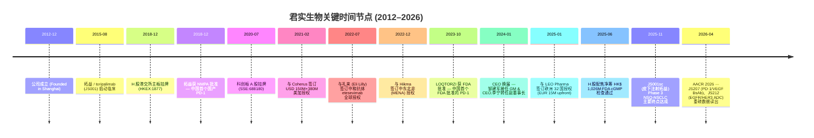
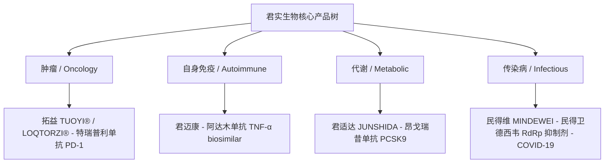
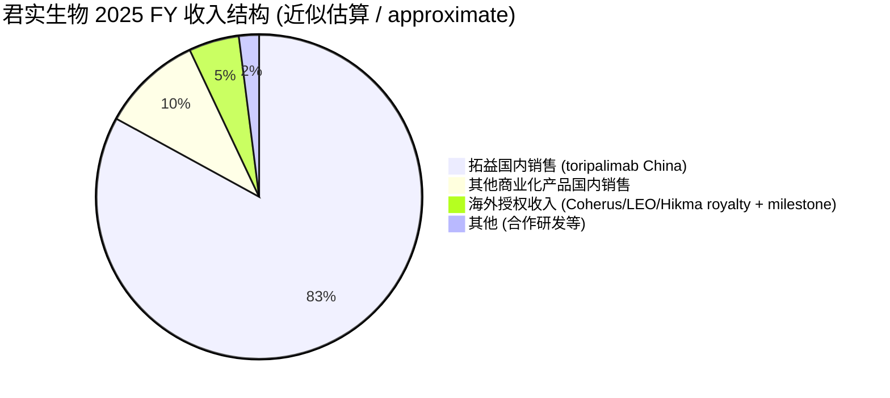
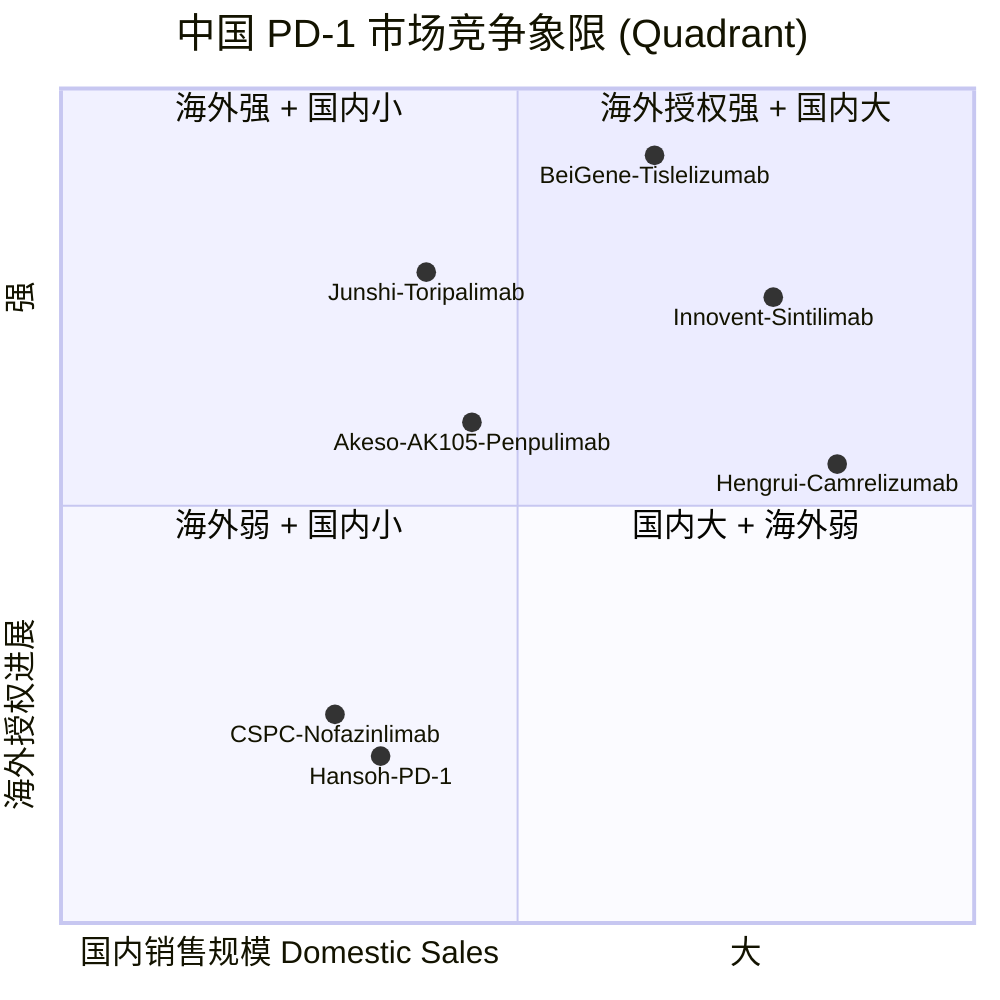
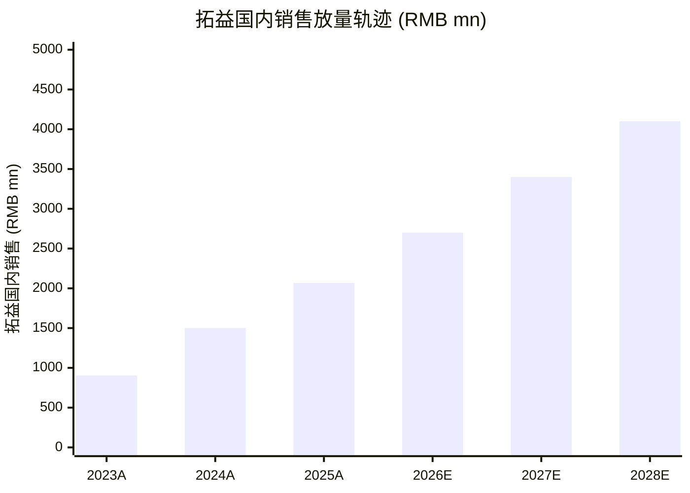

# 君实生物 (Junshi Biosciences) HKEX:1877 / SSE:688180 — 公司研究

**报告主题 / Theme**: china-drug-out-licensing (中国创新药对外授权)
**报告类型**: 公司研究初次覆盖 (Initiation of Coverage)
**报告日期 / As-of**: 2026-06-02
**主要交易代码**: HKEX:1877 (H 股) / SSE:688180 (科创板 A 股)

---

## 目录

1. 公司概览 (Company Overview)
2. 公司历史 (Company History)
3. 管理团队 (Management Team)
4. 产品与服务 (Products & Services)
5. 客户与上市策略 (Customers & Commercialization)
6. 行业概览 (Industry Overview)
7. 竞争格局 (Competitive Landscape)
8. 市场机会 (Market Opportunity)
9. 风险评估 (Risk Assessment)
10. 投资人视角评分 (Investor-Lens Scorecards)
11. 参考资料 (References)

---

## 1. 公司概览 (Company Overview)

上海君实生物医药科技股份有限公司 (Shanghai Junshi Biosciences Co., Ltd., 以下简称"君实生物" / Junshi Biosciences) 是中国领先的"创新驱动型 / innovation-driven"生物制药公司,致力于发现、开发与商业化 (discovery, development and commercialization) 全球首创 (first-in-class) 或同类最优 (best-in-class) 的创新治疗药物。公司官网将自己定位为 "an innovation-driven biopharmaceutical company dedicated to the discovery, development and commercialization of innovative therapeutics" ([Junshi Biosciences "About Us"](https://www.junshipharma.com/en/about-us/)),核心治疗领域包括肿瘤免疫 (onco-immunotherapy)、自身免疫疾病 (autoimmune diseases)、代谢疾病 (metabolic diseases) 与传染病 (infectious diseases)。

公司双重上市 / dual-listed:H 股于 2018 年 12 月 24 日在 **港交所主板** 挂牌 (HKEX:1877),科创板 A 股于 2020 年 7 月 15 日在 **上海证券交易所** 挂牌 (SSE:688180),是中国生物医药板块中具备"H+A"双重融资渠道的典型代表 ([Junshi Biosciences "About Us"](https://www.junshipharma.com/en/about-us/))。截至 2025 年 11 月,A 股市值约 **RMB 34.78 亿元** (注:Morningstar 报价单位为 CN¥,实际市值规模显著高于该数字,reading 应解读为约 RMB 348 亿元) ([Morningstar 688180 quote](https://www.morningstar.com/stocks/xshg/688180/quote));2026 年 2 月,A 股价格约 CN¥ 35.25,对应市值 CN¥ 363 亿元,Morningstar 内部公允价值估计 CN¥ 79.35 ([Morningstar 688180 quote](https://www.morningstar.com/stocks/xshg/688180/quote))。H 股截至 2026 年 1 月 17 日报价 HK$ 24.12,52 周区间 HK$ 10.32 – HK$ 38.64 ([CNBC 1877-HK quote](https://www.cnbc.com/quotes/1877-HK)),反映了 2025 年中国创新药对外授权 (China drug out-licensing) 主题驱动下的估值大幅修复行情。

截至 2025 年底,公司全球员工约 **2,500–3,000 人**,在中国上海、苏州、北京、广州以及美国马里兰州 (US Innovation Center, Maryland) 均有研发和办公布局 ([Junshi 2025 Interim Press Release, GlobeNewswire 2025-08-27](https://www.globenewswire.com/news-release/2025/08/27/3139696/0/en/Junshi-Biosciences-Announces-2025-Interim-Financial-Results-and-Provides-Corporate-Updates.html);[Junshi Biosciences "About Us"](https://www.junshipharma.com/en/about-us/))。生产基地包括 **上海临港生产基地** (Shanghai Lingang Production Base) 与 **苏州吴江生产基地** (Suzhou Wujiang Production Base),其中苏州子公司 Suzhou Union 于 2025 年 6 月通过 **FDA cGMP 不告知检查** (unannounced cGMP inspection),零 483 缺陷信,巩固了海外授权所需的产业链合规底座 ([Junshi 2025 FY Press Release, BioSpace](https://www.biospace.com/press-releases/junshi-biosciences-announces-2025-full-year-financial-results-and-provides-corporate-updates))。

**2025 年关键经营指标快照** (Snapshot):

| 指标 | 2024 FY | 2025 FY | YoY |
|---|---|---|---|
| 总营收 / Total Revenue (RMB mn) | 1,948 | 2,498 | +28% |
| 拓益 (toripalimab) 国内销售收入 | 1,501 | 2,068 | +38% |
| R&D 投入 (RMB mn) | 1,275 | 1,384 | +9% |
| 归母净亏损 (RMB mn) | (1,282) | n/a (gross profit positive, 净亏损口径未拆) | — |
| 期末现金及金融产品余额 (RMB mn) | 2,917 | 3,195 | +10% |

数据来源:[Junshi 2024 FY Press Release, GlobeNewswire 2025-03-29](https://www.globenewswire.com/news-release/2025/03/29/3051707/0/en/Junshi-Biosciences-Announces-2024-Full-Year-Financial-Results-and-Provides-Corporate-Updates.html);[Junshi 2025 FY Press Release, BioSpace](https://www.biospace.com/press-releases/junshi-biosciences-announces-2025-full-year-financial-results-and-provides-corporate-updates)。

*分析师观点:* 君实生物的核心商业故事是 (a) **国内拓益 (toripalimab) 销售放量** 在 2024-2025 两年实现 RMB 12 亿 → 15 亿 → 21 亿元的连续上跳;(b) **海外 out-licensing 现金流到账** — Coherus 2021 年 USD 150M upfront 已落账,2024-2025 年又陆续兑现 USD 12.5M × 2 笔里程碑款 ([Coherus Q4 2024 earnings, GlobeNewswire 2025-03-10](https://www.globenewswire.com/news-release/2025/03/10/3040161/33333/en/Coherus-BioSciences-Reports-Fourth-Quarter-Full-Year-2024-Financial-Results-and-Provides-Business-Update.html));2025 年 1 月与 **LEO Pharma** 签下欧洲 32 国独家分销协议,EUR 15M upfront + 双位数 royalty 进一步打通了"中国研发、海外授权变现"闭环 ([Junshi-LEO Pharma Press Release, GlobeNewswire 2025-01-20](https://www.globenewswire.com/news-release/2025/01/20/3011970/0/en/Junshi-Biosciences-Announces-Commercialization-Partnership-with-LEO-Pharma-for-Toripalimab-in-Europe.html))。这两条主线决定了 2025-2027 年的业绩斜率与估值再定价空间。

---

## 2. 公司历史 (Company History)

君实生物由 **熊俊** (Xiong Jun, 现任董事长) 等创始团队于 **2012 年 12 月 27 日** 在上海设立,创立时的早期联合创始人包括后任副总经理与执行董事的 **张卓兵** (Zhang Zhuobing) 等人 ([Junshi Biosciences "About Us"](https://www.junshipharma.com/en/about-us/);[Bamboo Works, 2024-01](https://thebambooworks.com/junshi-hopes-new-scientist-ceo-can-cure-its-woes/))。公司创立的背景是 2010 年代初中国创新药 / innovative drugs 政策与产业生态的双重转折:一方面 CFDA (即后来的 NMPA) 启动药品审评审批制度改革,另一方面海外回国 PhD 与中国资本市场的对接更为通畅,允许"未盈利生物科技公司"通过港交所 18A 章节 (Chapter 18A) 和后来的上交所科创板 (STAR Market) 完成早期融资。

**2018 年 12 月 24 日**,公司成为首批通过港交所 18A 章节挂牌的"未盈利生物科技公司"之一 (HKEX:1877),同月旗下核心产品 **拓益 / 特瑞普利单抗 (toripalimab, TUOYI®)** 获 NMPA 批准上市,成为 **中国首个国产 PD-1 单抗** ([Junshi Biosciences "About Us"](https://www.junshipharma.com/en/about-us/);[OncLive — Toripalimab Approval Pioneers Immunotherapy in NPC](https://www.onclive.com/view/toripalimab-approval-pioneers-immunotherapy-use-in-nasopharyngeal-cancer))。在此之前 (2014 年 9 月),百时美施贵宝 (BMS) 的 Opdivo 获 FDA 批准,标志全球 PD-1 时代开启;拓益的 NMPA 批准时点 (2018 年 12 月) 与默沙东 Keytruda、BMS Opdivo 进入中国市场的时间相近,因此是真正意义上的"国产替代第一阵营"。

**2020 年 7 月 15 日**,公司在科创板 A 股挂牌 (SSE:688180),这是中国首批以"未盈利 / 红筹生物医药"申报科创板上市的案例之一,实现"H+A"双重融资 ([Junshi Biosciences "About Us"](https://www.junshipharma.com/en/about-us/))。这一资本运作奠定了公司在 2020-2022 年新冠 (COVID-19) 风险开支放大与肿瘤 / immuno-oncology 管线密集投入期的现金底座。同年与礼来 (Eli Lilly) 合作开发的 SARS-CoV-2 中和抗体 etesevimab 在美国获得 FDA EUA (紧急使用授权) 与全球分发授权,是公司海外授权的首笔重大里程碑。

**2021 年 2 月 1 日**,公司与美国生物类似药公司 Coherus BioSciences (NASDAQ:CHRS) 签订拓益美加授权协议:Coherus 支付 **USD 150 million upfront**,后续可达 **USD 380 million 里程碑款** (其中 USD 290M 为销售里程碑),以及 **20% 净销售提成** ([Coherus-Junshi GlobeNewswire 2021-02-01](https://www.globenewswire.com/news-release/2021/02/01/2167218/0/en/Junshi-Biosciences-and-Coherus-BioSciences-Announce-Collaboration-to-Co-Develop-Anti-PD-1-Antibody-Toripalimab-in-U-S-and-Canada.html))。这是中国 PD-1 出海授权金额最大的早期标杆之一,但与 2024-2026 年新一轮"china drug out-licensing 2.0"动辄 USD 5-10 亿元 upfront、整体 USD 30-50 亿元的 BD 交易体量相比,Coherus 单子已不属顶级量级 ([reports/themes/china-drug-out-licensing_theme.md](../../themes/china-drug-out-licensing_theme.md))。

**2022 年 12 月 26 日**,公司通过 TopAlliance Biosciences (美国全资子公司) 与约旦 / 中东北非药企 Hikma Pharmaceuticals (LSE:HIK) 签订拓益 MENA 地区独家授权协议,Hikma 获得 EU 之外的中东与北非市场独家开发 / 商业化权利,并对另外 3 个公司在研管线享有 first-right-of-negotiation ([Hikma-Junshi Press Release 2022-12-26](https://www.hikma.com/news/hikma-and-junshi-biosciences-sign-exclusive-licensing-agreement-for-cancer-treatment-drug-toripalimab-for-the-middle-east-and-north-africa-region/))。

**2023 年 10 月 27 日**,LOQTORZI® (toripalimab-tpzi) + 顺铂 / 吉西他滨获 **FDA 批准用于一线鼻咽癌 (NPC)**,成为 FDA 批准的 **首个鼻咽癌免疫治疗药物**,也是 **首个由中国本土研发的 PD-1 抗体获 FDA 批准** ([FDA — FDA approves toripalimab-tpzi for nasopharyngeal carcinoma](https://www.fda.gov/drugs/resources-information-approved-drugs/fda-approves-toripalimab-tpzi-nasopharyngeal-carcinoma);[OncLive 2023-10-27](https://www.onclive.com/view/fda-approves-toripalimab-for-recurrent-or-metastatic-nasopharyngeal-carcinoma))。Coherus 商业化的 LOQTORZI 2024 年净销售 USD 19.1M (Q4 单季 USD 7.5M, QoQ +29%),规模有限但增长稳健 ([Coherus Q4 2024 earnings GlobeNewswire 2025-03-10](https://www.globenewswire.com/news-release/2025/03/10/3040161/33333/en/Coherus-BioSciences-Reports-Fourth-Quarter-Full-Year-2024-Financial-Results-and-Provides-Business-Update.html))。

**2024 年 1 月** 公司经历了一次重要的管理层迭代:科学家背景的 **邹建军 (Zou Jianjun)** 接任 GM 与 CEO,原 CEO 李宁 (Li Ning) 转任副董事长并兼任美国子公司 TopAlliance Biosciences 董事长 ([Bamboo Works 2024-01](https://thebambooworks.com/junshi-hopes-new-scientist-ceo-can-cure-its-woes/);[Yicai Global 2024-01](https://www.yicaiglobal.com/star50news/2024_01_126645682693465964548))。同年 6 月,Coherus 将加拿大权利再次分授权 / sublicense 给加拿大原研药企 Apotex (CAD 51.5M 总对价 + USD 6.25M upfront),帮助拓益打开北美第二市场 ([Investing.com — Coherus inks deal with Apotex](https://www.investing.com/news/company-news/coherus-inks-exclusive-deal-with-apotex-for-cancer-drug-93CH-3505697))。

**2025 年** 是公司"由 R&D 平台向商业化收获期切换"的关键年:1 月与 **LEO Pharma** (丹麦皮肤病巨头) 签订 EU/EEA/UK/Switzerland 32 国独家分销协议,EUR 15M upfront + 双位数 royalty;子公司 TopAlliance Biosciences Europe 保留 MAH (上市许可持有人) 与研发 / 生产 / 注册 / 药物警戒 / 质量管理职能 ([Junshi-LEO Pharma 2025-01-20](https://www.globenewswire.com/news-release/2025/01/20/3011970/0/en/Junshi-Biosciences-Announces-Commercialization-Partnership-with-LEO-Pharma-for-Toripalimab-in-Europe.html))。6 月 H 股配售净筹 HK$ 1,026M,FDA cGMP 检查通过零 483;11 月 **JS001sc (皮下注射拓益)** Phase 3 NSQ-NSCLC 一线主要终点达成,开启 IV → SC 给药模式升级路径 ([Junshi JS001sc Press Release GlobeNewswire 2025-11-25](https://www.globenewswire.com/news-release/2025/11/25/3193998/0/en/Junshi-Biosciences-Announces-Primary-Endpoints-Met-in-JS001sc-s-Phase-3-Study-for-the-1ST-line-Treatment-of-NSQ-NSCLC.html))。2026 年 4 月 AACR 大会上,**JS207 (PD-1/VEGF 双抗)** 与 **JS212 (EGFR/HER3 ADC)** 分别公布 Phase 2 与 Phase 1/2 数据,被 CEO Zou 称为 "next-generation flagship products" ([Junshi AACR 2026 readout, BioSpace](https://www.biospace.com/press-releases/junshi-biosciences-presents-results-from-js207-pd-1-vegf-bsab-phase-2-combo-studies-and-js212-egfr-her3-adc-fih-phase-1-2-study-at-aacr-2026))。

---

## 3. 管理团队 (Management Team)

公司管理结构在 2024 年 1 月完成了一次"投行 / 监管背景 → 科学家背景"的代际切换,目前形成 **熊俊 (董事长) — 邹建军 (CEO) — 李宁 (副董事长 / 海外业务)** 的"三角形"治理架构。

### 创始人 / 董事长:熊俊 (Xiong Jun)

**职务**: 董事长兼执行董事 (Chairman of the Board & Executive Director)

熊俊毕业于中南财经政法大学投资经济管理本科 (Bachelor of Investment Economics Management),后取得 **香港中文大学 MBA**。其职业生涯前段在医药行业投资与企业管理领域积累超过 **20 年经验**,曾任职于国联基金管理 (Guolian Fund Management) 与上海联合生物医药 (Shanghai Union Biopharm) ([Marketscreener — Jun Xiong Biography](https://www.marketscreener.com/business-leaders/Jun-Xiong-13066/biography/);[Bloomberg — Jun Xiong profile](https://www.bloomberg.com/profile/person/20896371))。熊俊还担任君实生物多家子公司执行董事 / 董事长 / 总经理,以及上海宝盈资产管理 (Shanghai Baoying Asset Management) 执行董事,反映其在公司控股结构与资本运作链条上的核心地位。

**分析师观点:** 熊俊投资人背景在 2018 年 H 股 18A 上市、2020 年 A 股科创板 H+A 双重上市、2021 年 Coherus 美加授权交易、2025 年 H 股配售等一系列资本市场动作中应起到关键作用。其"投资人 / 资本运作"标签与下一代 CEO 邹建军的"科学家"标签构成互补,在中国创新药公司治理范式中属于较为成熟的双轨制。

### 首席执行官 (CEO):邹建军 (Zou Jianjun, Dr. Jianjun ZOU)

**职务**: 总经理 / CEO & 执行董事 (自 2024 年 1 月)

邹建军拥有 **临床肿瘤学 PhD**,在抗肿瘤药物临床研究领域有超过 **20 年经验**。她此前曾任 **拜耳 (Bayer) 中国肿瘤研发部医学经理、治疗领域负责人、全球医学事务负责人**,后转任 **江苏恒瑞医药 (Hengrui, SSE:600276)** 首席医学官 (CMO) 兼副总经理;2022 年因恒瑞高管减薪事件离任,**间隔 8 天即加入君实** ([Bamboo Works 2024-01](https://thebambooworks.com/junshi-hopes-new-scientist-ceo-can-cure-its-woes/);[Yicai Global 2024-01](https://www.yicaiglobal.com/star50news/2024_01_126645682693465964548))。2022 年 4 月至 2024 年 1 月任公司副总经理与全球研发总裁 (President of Global R&D);2022 年 6 月起任执行董事;2024 年 1 月完成接班。

她的 2026 年 4 月 AACR 演讲中公开表态:"Their results demonstrated highly encouraging clinical profiles…positioned them as our next-generation flagship products" — 指 JS207 (PD-1/VEGF 双抗) 与 JS212 (EGFR/HER3 ADC),反映 CEO 战略层把下一代 BsAb 与 ADC 作为接力 toripalimab 的核心增长点 ([Junshi AACR 2026 readout, BioSpace](https://www.biospace.com/press-releases/junshi-biosciences-presents-results-from-js207-pd-1-vegf-bsab-phase-2-combo-studies-and-js212-egfr-her3-adc-fih-phase-1-2-study-at-aacr-2026))。

**分析师观点:** 邹建军的拜耳 + 恒瑞背景在中国创新药管理团队中属较稀缺组合 — 拜耳带来 MNC 的临床开发流程与全球化视野,恒瑞带来中国创新药从"me-too"向"me-better/best-in-class"切换的实战经验。她接任 CEO 后公司在 **R&D 投入更聚焦** (2024 年 R&D 同比 -34%, 削减早期长尾管线)、**Out-licensing 战略加速** (2025 年 LEO Pharma EU 协议)、**新一代 BsAb/ADC 突破** (JS207/JS212 AACR 数据) 三方面已出现明确变化。这一管理层迭代对应了中国创新药行业从"广撒网"转向"重点突破"的整体转折。

### 副董事长 / 海外业务负责人:李宁 (Li Ning)

**职务**: 副董事长 (Vice Chairman) & TopAlliance Biosciences 董事长

李宁 2024 年 1 月由 CEO 转任副董事长,继续兼任全资子公司 **TopAlliance Biosciences (美国马里兰州)** 董事长,主管公司海外业务、海外授权与 MAH (Marketing Authorization Holder) 体系运营。李宁此前在 **美国 FDA 任审评员 13 年**,继而在 **赛诺菲 (Sanofi)** 主管多国药品业务约 8 年,2017 年加入君实并担任 CEO ([PharmaBoardroom — Li Ning Interview 2019](https://pharmaboardroom.com/interviews/li-ning-ceo-junshi-biosciences-china/);[Bamboo Works 2024-01](https://thebambooworks.com/junshi-hopes-new-scientist-ceo-can-cure-its-woes/))。

他在 2019 年 PharmaBoardroom 访谈中提到的公司战略 — "ethics and safety to meet unmet medical needs is key" — 以及"focus on ~500 hospitals treating ~90% of China's cancer patients"的销售策略,基本是后续 5 年公司国内拓益 (toripalimab) 销售爬坡背后的执行框架。在他主导下,公司与 Coherus (美加)、Hikma (MENA)、LEO Pharma (EU)、Eli Lilly (etesevimab 全球) 等签订一系列海外授权协议,把"FDA 审评员视角"转化为公司国际化的实际推手。

### 其他高管 (Other Senior Management)

- **冯辉 (Hui Feng, PhD)** — 首席运营官 (Chief Operations Officer) & 执行董事
- **张卓兵 (Zhuobing Zhang)** — 副总经理 (Deputy GM) & 执行董事;创始团队成员之一
- **姚盛 (Sheng Yao, PhD)** — 副总经理 & TopAlliance Biosciences 高级副总裁 & 执行董事
- **王刚 (Gang Wang)** — 首席质量官 & 副总经理

来源:[Marketscreener — Junshi Biosciences company profile](https://www.marketscreener.com/quote/stock/SHANGHAI-JUNSHI-BIOSCIENC-55886669/company/);[Corporate Governance page, Junshi IR](https://junshi-bioscience-v2-umb.azurewebsites.net/en/investors/corporate-governance/)。

---

## 4. 产品与服务 (Products & Services)

君实生物的产品组合可分为四大块:**(1) 已商业化 4 个上市产品**;**(2) Phase 3 / 申报阶段 5 个核心管线**;**(3) Phase 1/2 中早期临床 10+ 个管线**;**(4) 临床前 20+ 个候选**,合计约 30 个临床阶段资产 + 20 个临床前候选 ([Junshi R&D Pipeline page](https://www.junshipharma.com/en/rd-pipeline/);[Junshi 2025 H1 Press Release GlobeNewswire 2025-08-27](https://www.globenewswire.com/news-release/2025/08/27/3139696/0/en/Junshi-Biosciences-Announces-2025-Interim-Financial-Results-and-Provides-Corporate-Updates.html))。

公司官网在管线披露中明确写到:"公司创新研发领域已从单克隆抗体 (monoclonal antibodies) 扩展至小分子药物 (small molecule drugs)、多肽药物 (polypeptide drugs)、抗体偶联药物 (antibody-drug conjugates, ADC)、双特异性 / 多特异性抗体 (bi-specific or multi-specific antibodies)、双特异性抗体偶联 (bispecific ADC)、融合蛋白 (fusion protein)、核酸药物 (nucleic acid drugs) 以及疫苗 (vaccines)" — 即一个以 mAb 为锚、横跨"经典 → BsAb → ADC → 核酸"的全模态生物药平台 ([Junshi 2025 FY Press Release, BioSpace](https://www.biospace.com/press-releases/junshi-biosciences-announces-2025-full-year-financial-results-and-provides-corporate-updates))。

### 4.1 商业化产品总览 (Commercialized Products)

| 产品 | 商品名 / Brand | 通用名 | 靶点 / Target | 中国批准日期 | 主要适应症 / Indications |
|---|---|---|---|---|---|
| Toripalimab | 拓益 TUOYI® (中国) / LOQTORZI® (美国) | 特瑞普利单抗 / toripalimab-tpzi | PD-1 | 2018-12 (黑色素瘤) → 2025 累计 12 个适应症 | 黑色素瘤、NPC、ESCC、HCC、RCC、TNBC、SCLC 等 |
| Adalimumab biosimilar | 君迈康 | 阿达木单抗 | TNF-α | 2021 | 类风湿关节炎、强直性脊柱炎等 |
| Mindeudesivir | 民得维 MINDEWEI® | VV116/JT001 | RdRp (RNA-dependent RNA polymerase) | 2023 紧急 → 2025-01 转常规批准 | 轻中度 COVID-19 |
| Ongericimab | 君适达 JUNSHIDA® | 昂戈瑞昔单抗 | PCSK9 | 2024 | 原发性高胆固醇血症 / 混合型血脂异常,含他汀不耐受亚组 |

来源:[Junshi R&D Pipeline page](https://www.junshipharma.com/en/rd-pipeline/);[Junshi 2024 FY Press Release, GlobeNewswire](https://www.globenewswire.com/news-release/2025/03/29/3051707/0/en/Junshi-Biosciences-Announces-2024-Full-Year-Financial-Results-and-Provides-Corporate-Updates.html);[Junshi 2025 FY Press Release, BioSpace](https://www.biospace.com/press-releases/junshi-biosciences-announces-2025-full-year-financial-results-and-provides-corporate-updates)。

#### (a) 拓益 / TUOYI® / LOQTORZI® (Toripalimab, 特瑞普利单抗) — 公司绝对核心产品

**这是公司 ~85% 销售额来源、80% 研发故事承载、100% 海外授权的核心资产。** 拓益是一款 IgG4 亚型重组人源化抗 PD-1 单克隆抗体 (recombinant humanized IgG4 anti-PD-1 monoclonal antibody),通过特殊的 FG-loop 结合方式与 PD-1 受体结合,阻断 PD-1 与 PD-L1/PD-L2 的相互作用,从而恢复 T 细胞的肿瘤识别与杀伤功能 ([FDA — toripalimab-tpzi approval label](https://www.fda.gov/drugs/resources-information-approved-drugs/fda-approves-toripalimab-tpzi-nasopharyngeal-carcinoma))。

**中文释义 / Plain-language gloss:** PD-1 (programmed cell death protein 1, 程序性死亡受体 1) 是 T 细胞表面的"刹车开关";癌细胞通过表达 PD-L1 配体激活这一开关让免疫系统"误判"癌细胞为正常组织。拓益等 PD-1 抗体通过封闭这一受体,让免疫系统重新识别并攻击肿瘤。

**2018-2025 年累计 12 个中国适应症:** 包括 (1) 难治性 / 转移性黑色素瘤 (2018-12, 公司首个 NMPA 批准, 也是中国首个国产 PD-1);(2) 难治性 / 转移性鼻咽癌 (NPC, 2021);(3) 食管鳞癌 (ESCC, 一线联合化疗);(4) 非小细胞肺癌 (NSCLC, 一线联合化疗);(5) 肝细胞癌 (HCC, 2025-03 联合疗法);(6) 肾细胞癌 (RCC, 2024 联合疗法);(7) 三阴性乳腺癌 (TNBC, 2024 联合疗法);(8) 广泛期小细胞肺癌 (ES-SCLC, 2024 联合疗法);(9) 一线黑色素瘤 (2025-04, 第 12 个中国适应症);加上 2025 年澳大利亚、新加坡 NCE 批准的 NPC 适应症等 ([FDA — toripalimab-tpzi NPC approval](https://www.fda.gov/drugs/resources-information-approved-drugs/fda-approves-toripalimab-tpzi-nasopharyngeal-carcinoma);[Junshi 2025 H1 Press Release, GlobeNewswire 2025-08-27](https://www.globenewswire.com/news-release/2025/08/27/3139696/0/en/Junshi-Biosciences-Announces-2025-Interim-Financial-Results-and-Provides-Corporate-Updates.html);[Junshi 2024 FY Press Release GlobeNewswire 2025-03-29](https://www.globenewswire.com/news-release/2025/03/29/3051707/0/en/Junshi-Biosciences-Announces-2024-Full-Year-Financial-Results-and-Provides-Corporate-Updates.html))。

**FDA / 海外批准:** LOQTORZI 于 **2023 年 10 月 27 日** 获 FDA 批准用于 (a) 联合 cisplatin 与 gemcitabine 一线治疗转移性 / 复发 NPC,及 (b) 单药用于既往含铂化疗失败的 NPC,成为 **首个 FDA 批准的鼻咽癌免疫治疗药物**,以及 **首个由中国本土研发的 PD-1 抗体获 FDA 批准** ([FDA approval announcement](https://www.fda.gov/drugs/resources-information-approved-drugs/fda-approves-toripalimab-tpzi-nasopharyngeal-carcinoma);[OncLive — Toripalimab Approval Pioneers Immunotherapy in NPC](https://www.onclive.com/view/toripalimab-approval-pioneers-immunotherapy-use-in-nasopharyngeal-cancer))。临床数据:联合化疗组 mPFS 11.7 月 vs 安慰剂 + 化疗组 8.0 月;OS 死亡风险下降 37%。2024-2025 年陆续在新加坡、欧盟、英国、印度、约旦、阿联酋、科威特、香港、澳大利亚等国家/地区获批 NPC 及 ESCC 等多项适应症,2025 年累计已在 **40+ 个国家与地区** 获批 ([Junshi 2025 H1 Press Release](https://www.globenewswire.com/news-release/2025/08/27/3139696/0/en/Junshi-Biosciences-Announces-2025-Interim-Financial-Results-and-Provides-Corporate-Updates.html))。

**战略意义:** 拓益是 (1) 公司国内现金流的命脉 (2025 国内销售 RMB 20.68 亿元,占公司总收入 RMB 24.98 亿元的 83%);(2) 公司海外授权交易体系的核心资产 — 与 Coherus (美加, 2021)、Hikma (MENA, 2022)、LEO Pharma (EU 32 国, 2025)、Apotex (加拿大转授权, 2024) 构成"全球网点"。NPC 全球年新发病例约 12 万例 (其中中国大陆约 6 万例),拓益借此成为 **NPC 治疗的全球第一标准 / global standard of care for NPC**,这在中国创新药商业化历史上具有里程碑意义。

#### (b) 君迈康 (Adalimumab biosimilar)

中国国产 **TNF-α 单抗 / 阿达木单抗生物类似药 (biosimilar)**,商品名 "君迈康",2021 年获 NMPA 批准用于类风湿关节炎 (rheumatoid arthritis)、强直性脊柱炎 (ankylosing spondylitis) 等免疫炎症适应症 ([Junshi R&D Pipeline](https://www.junshipharma.com/en/rd-pipeline/))。

**分析师观点:** 阿达木单抗 (原研 Humira) 是全球史上销售额最高的单一药物之一 (AbbVie 高峰期 ~USD 200 亿元/年),但 2023 年后专利集中到期,全球生物类似药竞争极度激烈。在中国,君迈康面对来自百奥泰、海正、上海复宏汉霖 (HKEX:2696)、信达生物 (HKEX:1801)、正大天晴 (Sino Biopharm 子公司) 等十余家国产 biosimilar 的红海竞争,该产品对公司利润贡献相对有限,定位更像是公司商业化体系 / 销售团队的"陪练"。

#### (c) 民得维 MINDEWEI (VV116/JT001 / Mindeudesivir Hydrobromide)

口服 RdRp (RNA 依赖性 RNA 聚合酶) 抑制剂,**抗 SARS-CoV-2 小分子**,与吉利德 (Gilead) 的 Veklury (remdesivir) 属于同一靶点的不同分子。2023 年初在中国获紧急批准用于轻中度 COVID-19,2025 年 1 月由紧急批准转为常规批准 ([Junshi 2024 FY Press Release](https://www.globenewswire.com/news-release/2025/03/29/3051707/0/en/Junshi-Biosciences-Announces-2024-Full-Year-Financial-Results-and-Provides-Corporate-Updates.html))。

**分析师观点:** 民得维是公司在 2020-2022 COVID-19 急性疫情期间的高强度投入产物,但 2023 年起 COVID-19 抗病毒药物需求骤降,该产品商业化贡献已非常有限。其战略意义更多在于"展示公司多模态平台能力" — 即公司不仅有 mAb,还有口服小分子药物开发与生产能力。

#### (d) 君适达 JUNSHIDA (Ongericimab)

**抗 PCSK9 单克隆抗体**,2024 年获 NMPA 批准用于原发性高胆固醇血症 (primary hypercholesterolemia) 与混合型血脂异常 (mixed dyslipidemia),其中 **首次将"他汀不耐受 / statin-intolerant"亚组纳入标签** ([Junshi 2025 H1 Press Release](https://www.globenewswire.com/news-release/2025/08/27/3139696/0/en/Junshi-Biosciences-Announces-2025-Interim-Financial-Results-and-Provides-Corporate-Updates.html);[Junshi R&D Pipeline](https://www.junshipharma.com/en/rd-pipeline/))。

**中文释义 / Plain-language gloss:** PCSK9 (proprotein convertase subtilisin/kexin type 9) 是控制肝脏 LDL 受体降解的关键酶 — 抑制 PCSK9 可让 LDL 受体更稳定地"清除"血液中的"坏胆固醇",降低心血管事件风险。原研对照是安进 (Amgen) Repatha (evolocumab) 与赛诺菲 (Sanofi) Praluent (alirocumab)。

**战略意义:** 公司主要的"非肿瘤、慢病、心血管" valve,与已上市的拓益 (肿瘤) 形成互补。中国年新增高胆固醇血症人群基数大,但 PCSK9 类药物受限于自我注射 / 价格门槛,渗透率仍低。这一资产是公司证明"我不仅是 PD-1 公司,也是真正全模态创新药企"的关键拼图。

### 4.2 Phase 3 / 申报阶段管线 (5 大核心后期资产)

| 产品 | 靶点 / 机制 | 适应症 | 阶段 / 关键数据 |
|---|---|---|---|
| **Tifcemalimab (TAB004/JS004)** | BTLA mAb | NSCLC、淋巴瘤 | Phase 3 进行中 |
| **JS001sc** | PD-1 mAb 皮下注射剂型 | NSCLC 等多瘤种 | Phase 3 NSQ-NSCLC 一线主要终点达成 (2025-11) |
| **JS105** | PI3K-α 小分子 | 妇科肿瘤 | Phase 3 |
| **JS107** | Claudin18.2 ADC | 胃肠道肿瘤 | Phase 3 |
| **Roconkibart** | IL-17A mAb | 银屑病关节炎、强直性脊柱炎 | Phase 3 |

来源:[Junshi R&D Pipeline page](https://www.junshipharma.com/en/rd-pipeline/);[Junshi JS001sc Phase 3 readout, GlobeNewswire 2025-11-25](https://www.globenewswire.com/news-release/2025/11/25/3193998/0/en/Junshi-Biosciences-Announces-Primary-Endpoints-Met-in-JS001sc-s-Phase-3-Study-for-the-1ST-line-Treatment-of-NSQ-NSCLC.html)。

**Tifcemalimab (JS004) — 全球首个进入临床的 BTLA 抗体**:BTLA (B and T lymphocyte attenuator) 是与 PD-1 同属 CD28 家族的免疫检查点,但表达谱与作用机制不同 — BTLA 在 T 细胞与 B 细胞均表达,可与配体 HVEM 互作产生抑制信号。Tifcemalimab 在 Phase 1 SCLC / 淋巴瘤数据中显示出与 PD-1 联用的协同效应。这是公司"下一代 IO / next-gen immuno-oncology"故事的核心 ([Junshi R&D Pipeline page](https://www.junshipharma.com/en/rd-pipeline/))。

**JS001sc (拓益皮下注射剂型) — 给药模式升级**:与原 IV 静注剂型相比,SC (subcutaneous, 皮下) 注射可大幅缩短给药时间 (从 30-60 分钟到 ~5 分钟),减少医院输液资源消耗,提升患者便利性。2025 年 11 月 Phase 3 NSQ-NSCLC 一线主要终点达成,药物暴露量非劣 (non-inferior) 于 IV 制剂,疗效与安全性对照 ([Junshi JS001sc readout GlobeNewswire 2025-11-25](https://www.globenewswire.com/news-release/2025/11/25/3193998/0/en/Junshi-Biosciences-Announces-Primary-Endpoints-Met-in-JS001sc-s-Phase-3-Study-for-the-1ST-line-Treatment-of-NSQ-NSCLC.html))。

**分析师观点:** 这一升级对应了 BMS Opdivo Qvantig (subcutaneous nivolumab) 2024 年 FDA 获批的全球行业趋势 — IO 给药模式向 SC 切换是 PD-1 类产品延长生命周期、对抗仿制药 / 生物类似药竞争的关键策略之一。

**JS107 (Claudin18.2 ADC) — 公司首个 ADC 后期资产**:Claudin18.2 是胃癌细胞 (gastric cancer) 上特异表达的紧密连接蛋白,是当前国内 ADC 与 mAb 双轨竞争的热门靶点,主要竞争者包括安斯泰来 / Astellas 的 zolbetuximab (已 FDA 批准 mAb)、礼新医药 LM-302 (ADC, 已 license-out 给 Astellas)、康宁杰瑞 KN026/KN035 等。

### 4.3 Phase 1/2 中早期临床管线 — 双抗 / ADC 主导

下一代关键资产 (CEO 邹建军 2026 年 AACR 公开称为 "next-generation flagship products"):

- **JS207 (PD-1 × VEGF 双抗 / BsAb)**:对应康方生物 (Akeso, HKEX:9926) 的 AK112 / ivonescimab — 中国创新药史上里程碑式的"PD-1+VEGF"双靶点产品,2024 年 9 月由 Summit 与 Akeso 签订 USD 50 亿元 (含里程碑) 美国授权协议,改变了 PD-1 时代的全球估值格局。JS207 在 2026 年 4 月 AACR 公布 Phase 2 联合化疗数据:**HCC 联合方案 ORR 45.5% / DCR 86.4%**,**mCRC 联合方案 ORR 71.0% / DCR 96.8%**,均未出现剂量限制性毒性 ([Junshi AACR 2026 readout, BioSpace](https://www.biospace.com/press-releases/junshi-biosciences-presents-results-from-js207-pd-1-vegf-bsab-phase-2-combo-studies-and-js212-egfr-her3-adc-fih-phase-1-2-study-at-aacr-2026))。同时 Junshi 与 Antengene (HKEX:6996) 达成 ATG-037 (口服 CD73 抑制剂) + JS207 联合的临床合作 ([Antengene-Junshi Press Release, PRNewswire](https://www.prnewswire.com/news-releases/antengene-announces-clinical-collaboration-with-junshi-biosciences-to-explore-the-synergistic-potential-of-atg-037-oral-cd73-inhibitor-in-combination-with-js207-pd-1vegf-bsab-302695688.html))。

- **JS212 (EGFR × HER3 双特异性 ADC)**:全球 EGFR/HER3 双抗 ADC 赛道相对空白,主要对照是第一三共 / Daiichi Sankyo 的 patritumab deruxtecan (HER3-DXd, Phase 3) 与 Abbvie/Genmab 的 cetuximab × HER3 候选。AACR 2026 数据:在 4.2-4.6 mg/kg 剂量爬坡组,**ORR 44.4-50.0%, DCR 100%**,未达 MTD (maximum tolerated dose);HER2 阴性乳腺癌 ORR 50%、ESCC ORR 38.9% ([Junshi AACR 2026 readout, BioSpace](https://www.biospace.com/press-releases/junshi-biosciences-presents-results-from-js207-pd-1-vegf-bsab-phase-2-combo-studies-and-js212-egfr-her3-adc-fih-phase-1-2-study-at-aacr-2026))。

- **JS213 (PD-1 × IL-2 双功能融合蛋白)**:2025 年 2 月获 NMPA IND 批准 ([Junshi 2025 FY Press Release, BioSpace](https://www.biospace.com/press-releases/junshi-biosciences-announces-2025-full-year-financial-results-and-provides-corporate-updates))。

- 此外公司还有 **JS203 (CD3 × CD20 双抗)**、**JS214 (VEGF × TGF-β 双抗)**、**JS111 (EGFR Exon 20 小分子)**、**JS110 (XPO1 小分子, 子宫内膜癌)**、**JS015 (DKK1 mAb)**、**JS007 (CTLA-4 mAb)**、**JT002 (核酸药物, 季节性过敏性鼻炎)**、**JT118 (猴痘疫苗, 2025-06 IND 受理)** 等 30+ 中早期管线 ([Junshi R&D Pipeline page](https://www.junshipharma.com/en/rd-pipeline/);[Junshi 2025 FY Press Release, BioSpace](https://www.biospace.com/press-releases/junshi-biosciences-announces-2025-full-year-financial-results-and-provides-corporate-updates))。

### 4.4 产品矩阵的协同与生命周期管理 (Lifecycle synergy)

公司产品矩阵的内在协同逻辑:

1. **拓益 (IV → SC 切换 + 多适应症拓宽 + 全球授权)** = 现金流引擎。2018-2025 累计 12 个国内适应症 + FDA + EU + 40+ 国家批准,从黑色素瘤起步逐步覆盖 NPC、NSCLC、ESCC、HCC、RCC、TNBC、SCLC,商业化曲线进入"非线性放量期"。
2. **拓益 + JS207 + JS212 + Tifcemalimab** = "IO Combo 矩阵"。一线 PD-1 → "PD-1 + 化疗"组合 → "PD-1 + VEGF 双抗"二代 IO → "EGFR/HER3 ADC"扩展瘤种 → "BTLA + PD-1"下一代 IO 联合,层层 backup,缩小 PD-1 后期专利与药价风险。
3. **君适达 (PCSK9) + 君迈康 (TNF-α) + 民得维 (RdRp)** = 慢病与传染病"补丁",证明公司多模态平台与销售网络可承载非肿瘤资产。
4. **JS001sc + 海外授权 + cGMP 合规** = 全球 commercialization 工具箱。SC 制剂延寿命、海外 partner 接销售、苏州 cGMP 满足 FDA 检查 = 公司"中国研发、全球商业化"闭环。

公司 R&D 平台已从单一 mAb 扩展至 small molecule / peptide / ADC / BsAb / bispecific ADC / fusion protein / nucleic acid / vaccine 全模态,但靠拓益 PD-1 一个产品的国内销售单子,公司距离 GAAP 盈亏平衡仍需若干个季度的销售放量,中间需依靠 BD 现金流与配股填补缺口。

---

## 5. 客户与上市策略 (Customers & Commercialization)

*数据基础:2025 FY 总营收 RMB 2,498M;拓益国内销售 RMB 2,068M(占公司总营收 83%);余下 ~RMB 430M 由君迈康、民得维、君适达国内销售 + 海外授权收入构成。该饼图为 **基于公司公开口径估算的近似结构**,因公司未单独披露海外授权收入与其他商业化产品的明细 — 来源:[Junshi 2025 FY Press Release, BioSpace](https://www.biospace.com/press-releases/junshi-biosciences-announces-2025-full-year-financial-results-and-provides-corporate-updates)。*

### 5.1 国内商业化:拓益的"医院聚焦"策略

公司原 CEO 李宁在 2019 年访谈中明确提出销售框架 — **聚焦中国治疗 ~90% 癌症患者的约 500 家三甲医院**,这一框架贯穿了公司 2019-2025 年六年的国内商业化爬坡 ([PharmaBoardroom — Li Ning Interview 2019](https://pharmaboardroom.com/interviews/li-ning-ceo-junshi-biosciences-china/))。**国家医保 / NRDL (National Reimbursement Drug List) 谈判** 是另一大放量推手:拓益自 2020 年起多次进入 NRDL,使得患者自付比例大幅降低,渗透率显著提升,2023 至 2025 年三年国内销售 CAGR 约 +50%,2025 FY 拓益国内销售达 RMB 20.68 亿元,YoY +38% ([Junshi 2025 FY Press Release, BioSpace](https://www.biospace.com/press-releases/junshi-biosciences-announces-2025-full-year-financial-results-and-provides-corporate-updates))。

### 5.2 海外授权 / Out-Licensing — 公司"china-drug-out-licensing"主题中的位置

公司目前已与 4 家海外药企签订拓益区域授权:

| 合作伙伴 | 签约日期 | 区域 | 关键条款 |
|---|---|---|---|
| Coherus BioSciences (NASDAQ:CHRS) | 2021-02-01 | 美国 + 加拿大 | USD 150M upfront + USD 380M 里程碑 (含 USD 290M 销售里程碑) + 20% net sales royalty;另对 anti-TIGIT 与 next-gen IL-2 有 option |
| Hikma Pharmaceuticals (LSE:HIK) | 2022-12-26 | MENA (中东与北非) | 独家授权 + 对另 3 个候选有 first right of negotiation;具体金额未披露 |
| Apotex (Canada, by Coherus sublicense) | 2024-06-27 | 加拿大 | USD 6.25M upfront + CAD 51.5M 监管 / 销售里程碑 |
| LEO Pharma (Denmark) | 2025-01-20 | EU/EEA/UK/Switzerland (32 国) | EUR 15M upfront + 后续适应症里程碑 + 双位数 royalty |

来源:[Coherus-Junshi Press Release, GlobeNewswire 2021-02-01](https://www.globenewswire.com/news-release/2021/02/01/2167218/0/en/Junshi-Biosciences-and-Coherus-BioSciences-Announce-Collaboration-to-Co-Develop-Anti-PD-1-Antibody-Toripalimab-in-U-S-and-Canada.html);[Hikma-Junshi Press Release 2022-12-26](https://www.hikma.com/news/hikma-and-junshi-biosciences-sign-exclusive-licensing-agreement-for-cancer-treatment-drug-toripalimab-for-the-middle-east-and-north-africa-region/);[Investing.com — Coherus-Apotex](https://www.investing.com/news/company-news/coherus-inks-exclusive-deal-with-apotex-for-cancer-drug-93CH-3505697);[Junshi-LEO Pharma Press Release 2025-01-20](https://www.globenewswire.com/news-release/2025/01/20/3011970/0/en/Junshi-Biosciences-Announces-Commercialization-Partnership-with-LEO-Pharma-for-Toripalimab-in-Europe.html)。

**TopAlliance Biosciences (美国全资子公司, 马里兰州)** + **TopAlliance Biosciences Europe** 是公司海外授权的法律 / 监管运营载体,作为 MAH (上市许可持有人) 在欧洲负责拓益的开发、生产、注册、药物警戒与质量管理,而 LEO Pharma 仅负责欧洲市场的分销、推广、销售 ([Junshi-LEO Pharma Press Release 2025-01-20](https://www.globenewswire.com/news-release/2025/01/20/3011970/0/en/Junshi-Biosciences-Announces-Commercialization-Partnership-with-LEO-Pharma-for-Toripalimab-in-Europe.html))。这种"中国公司保留 MAH + 海外合作伙伴负责销售"的模型,在中国创新药公司全球化中较为先进 — 既保留了 monoclonal antibody 的 IP 控制权与未来更高的产品价值,又能借助 LEO Pharma 等本地销售网络节省自建欧洲团队的固定成本。

**2024-2025 年里程碑款 / Milestone Cash Inflow:** Coherus 在 2024 Q2 与 2025 Q1 各支付 USD 12.5M 里程碑款给 Junshi,反映出 LOQTORZI 商业化推进达到的相关销售门槛 ([Coherus Q4 2024 earnings, GlobeNewswire 2025-03-10](https://www.globenewswire.com/news-release/2025/03/10/3040161/33333/en/Coherus-BioSciences-Reports-Fourth-Quarter-Full-Year-2024-Financial-Results-and-Provides-Business-Update.html))。

**与 2024-2025 第二波 china-drug-out-licensing 浪潮的对比:** Coherus 2021 年 USD 150M upfront 在 2025-2026 年标准下属于"中型早期 BD 交易",远小于:
- 信达 + Pfizer (PD-1×VEGF, 2025): USD 1.0bn upfront + 总额 USD 6.5bn ([reports/themes/china-drug-out-licensing_theme.md](../../themes/china-drug-out-licensing_theme.md))
- Innovent + Takeda (cancer drug, 2024): USD 11.4bn ([VCBeat — Innovent inks $11.4B cancer drug deal with Takeda](https://www.vcbeatglobal.com/article/1960))
- 康方 + Summit (AK112 PD-1/VEGF, 2024): USD 5.0bn 含里程碑

**分析师观点:** 君实生物在 2025-2027 年的新一轮 BD 故事核心点是 **下一代 BsAb (JS207 PD-1/VEGF) 与 ADC (JS212 EGFR/HER3, JS107 Claudin18.2)** — 这是公司能否抓住第二波中国创新药出海浪潮的关键。如果 JS207 能复制康方 AK112 模式签下 USD 数十亿元 BD 大单,公司估值有望出现一次结构性重定价;反之,若仅能复制拓益 Coherus 类型的 USD 150M 中早期 BD,公司"China out-licensing"故事仍是中等阶梯。

### 5.3 客户集中度披露 (Customer Concentration)

公司未在常规年报中以"客户"维度披露具体大客户名称与销售占比 — 业务模式为 (a) 国内通过医药 distributor 销售给 ~500 家三甲医院 (无明显单一客户集中);(b) 海外通过 4 家 license-out partner (Coherus / Hikma / Apotex / LEO Pharma) 收取 upfront + milestone + royalty。

从合并财报口径估算:
- **拓益国内销售 RMB 2,068M** = 占 2025 FY 合并营收 RMB 2,498M 的 **~83% (合并口径 / consolidated)**
- 其他商业化产品 (君迈康、民得维、君适达) 国内销售 ≈ RMB 0.3-0.4bn = 占合并 ~12-15%
- 海外 license-out 收入 (upfront 分期 + milestone + royalty 合计) ≈ RMB 0.05-0.15bn = 占合并 ~2-5%

(注:以上 split 为基于公司公开口径估算的近似;公司未单独披露分项收入,故百分比仅供参考)

---

## 6. 行业概览 (Industry Overview)

### 6.1 中国创新药 (Innovative Drugs in China) — 监管与市场环境

中国创新药行业过去十年经历了三个阶段:**(1) 2010-2017: 监管空档期**, 国内主要为仿制药与化药生产;**(2) 2018-2022: 政策红利期**, NMPA 2018 年新药审评审批改革、港交所 18A、科创板第五套上市标准、医保谈判机制建立等政策叠加,中国诞生了首批 PD-1 (君实拓益)、首批 ADC (荣昌、恒瑞)、首批双抗、首批 CAR-T (传奇生物、复星凯特) 等创新药;**(3) 2023 年至今: 商业化兑现 + 全球化出海期**, 中国创新药从"国内放量"切换到"全球授权出海"模式 ([Junshi 2025 FY Press Release, BioSpace](https://www.biospace.com/press-releases/junshi-biosciences-announces-2025-full-year-financial-results-and-provides-corporate-updates))。

### 6.2 China-drug-out-licensing 主题概览

2024-2026 年是中国创新药史上**最大规模的对外授权浪潮**,标志性事件包括 (a) 2024 年 Akeso 与 Summit Therapeutics 就 AK112 (PD-1/VEGF 双抗) 签订 USD 50 亿元含里程碑授权;(b) 2024 年 Innovent 与 Takeda 就一款抗癌药签订 USD 114 亿元授权 ([VCBeat — Innovent inks $11.4B cancer drug deal](https://www.vcbeatglobal.com/article/1960));(c) 2025 年 Innovent 与 Pfizer 就 PD-1×VEGF 签订 USD 10 亿 upfront + USD 65 亿元总额 BD ([reports/themes/china-drug-out-licensing_theme.md](../../themes/china-drug-out-licensing_theme.md));(d) 多家中国 biotech 同期与 Eli Lilly / Merck / Roche / Novartis 等签订 EGFR / HER2 / Claudin18.2 / TROP-2 / TIGIT ADC 等管线授权。

从主题板块层面,中国 PD-1 单子里 BeiGene (NASDAQ:ONC, 前 BGNE) 的 tislelizumab (TEVIMBRA) 已先于拓益获 FDA 批准 (2024-03 ESCC 二线),并已在中国销售 USD 6.21 亿元/年 ([Government of Guangdong Development District — BeiGene 2024](https://eng.gdd.gov.cn/20250312/5b8602d3-9bf7-49f8-81b9-4dc5120171b6.html));Hengrui (HKEX:1276) 的卡瑞利珠单抗 (camrelizumab) 国内销售规模与拓益相当;信达 (HKEX:1801) 的信迪利单抗 (sintilimab) 占据国内 PD-1 市场第一阵营。在这个"四家国内 PD-1 +三家 MNC PD-1 (Keytruda/Opdivo/Tevimbra)" 的竞争格局下,**君实是规模相对最小的国产 PD-1**,但因 NPC FDA 批准 + 多瘤种海外授权,其"中国 PD-1 出海第一股"标签较稀缺。

### 6.3 TAM / SAM — 公司可触达市场估算

**全球 PD-1/PD-L1 市场:** 2024 年全球 PD-(L)1 市场约 USD 480-500 亿元 (Keytruda 一家 ~USD 295 亿元 + Opdivo + Tecentriq + Tevimbra + 国产),预计 2030 年达 USD 700-900 亿元 ([DelveInsight — Rapid Global Expansion of Chinese PD-1/PD-L1 Key Players](https://www.delveinsight.com/blog/chinese-pd-1-pd-l1-key-players);[DelveInsight — PD-(L)1 Inhibitors Market Set to Surge](https://www.globenewswire.com/news-release/2025/08/18/3135218/0/en/PD-L-1-Inhibitors-Market-Set-to-Surge-During-the-Forecast-Period-2025-2034-as-Immuno-Oncology-Therapies-Gain-Momentum-DelveInsight.html))。

**全球 NPC (鼻咽癌) 治疗市场:** 全球 NPC 年新发约 12 万例,中国 ~6 万例 (世界 50%),拓益作为"全球首个 NPC IO"对应约 USD 5-10 亿元的全球 NPC IO 子市场。

**中国 PD-1 市场:** 2024 年中国 PD-1/PD-L1 销售合计约 RMB 250-300 亿元,7 家国产 PD-1 占 ~80% (Keytruda+Opdivo+Tevimbra 进口占余下 20%) ([DelveInsight — Chinese PD-1/PD-L1 Key Players](https://www.delveinsight.com/blog/chinese-pd-1-pd-l1-key-players))。公司国内拓益 2025 销售 RMB 20.68 亿元 对应中国 PD-1 市场份额约 7-8%。

**中国 ADC 市场:** 2024 年中国 ADC 销售约 RMB 60-80 亿元 (荣昌 RC48 + 恒瑞 SHR-A1811 等),预计 2030 年达 RMB 250-400 亿元 — 这是公司 JS107 (Claudin18.2 ADC) 与 JS212 (EGFR/HER3 ADC) 的主要 SAM 池。

---

## 7. 竞争格局 (Competitive Landscape)

### 7.1 国内 PD-1 七雄

**国内 PD-1 七大玩家定位 (Junshi 视角):**

- **百济神州 (BeiGene / BeOne, NASDAQ:ONC, 前 BGNE)** — 替雷利珠单抗 / tislelizumab / TEVIMBRA: 2024 年国内销售 USD 6.21 亿元 (~RMB 44 亿元), YoY +16%; 2024-03 FDA 批准 ESCC 二线; 海外授权与商业化布局最广,公司体量与现金流最强 ([Government of Guangdong Development District](https://eng.gdd.gov.cn/20250312/5b8602d3-9bf7-49f8-81b9-4dc5120171b6.html);[PharmExec — The PD-1 Race in China Heats Up](https://www.pharmexec.com/view/pd-1-race-china-heats))。
- **恒瑞医药 (Hengrui Medicine, HKEX:1276 / SSE:600276)** — 卡瑞利珠单抗 / camrelizumab: 国内 PD-1 市场份额最大的国产之一, 适应症覆盖最广(2025 年累计 10+ 个国内适应症);海外授权进度滞后 ([PharmaVoice — Hengrui top trial sponsor](https://www.pharmavoice.com/news/chinese-china-drug-clinical-trial-pharma-jiangsu-hengrui/804665/))。
- **信达生物 (Innovent Biologics, HKEX:1801)** — 信迪利单抗 / sintilimab: 2018 年与 Eli Lilly 签订 USD 200M+ BD,后 Lilly 终止美国权利;2025 年与 Pfizer 签订 USD 10 亿 upfront + USD 65 亿元 PD-1/VEGF 双抗 BD,跻身中国 PD-1 海外授权领头羊 ([reports/themes/china-drug-out-licensing_theme.md](../../themes/china-drug-out-licensing_theme.md))。
- **君实生物 (Junshi)** — 拓益 / toripalimab: 国内市场份额相对较小(~7-8%),但是**首个 FDA 批准的中国本土研发 PD-1**,NPC 适应症全球独家护城河;Coherus (美加) + Hikma (MENA) + LEO Pharma (EU 32 国) 海外授权网络较密,但单笔 BD 金额相对其他国产小。
- **康方生物 (Akeso, HKEX:9926)** — 派安普利单抗 / penpulimab (PD-1 单抗) + AK112 / ivonescimab (PD-1/VEGF 双抗): AK112 与 Summit USD 50 亿元 BD 是中国创新药出海里程碑事件 ([reports/themes/china-drug-out-licensing_theme.md](../../themes/china-drug-out-licensing_theme.md))。
- **石药集团 (CSPC, HKEX:1093)** — Nofazinlimab + 多个 ADC / PD-1/VEGF + AstraZeneca BD (2025-06 合作); 2025 年与 AstraZeneca 签订免疫疾病小分子合作 ([SEC EDGAR — AstraZeneca Q2 2025 6-K](https://www.sec.gov/Archives/edgar/data/0000901832/000165495425006914/a6592m.htm))。
- **翰森制药 (Hansoh Pharmaceutical, HKEX:3692)** — 派安普利 + 多个 PD-1 等。

**分析师观点:** 在中国 PD-1 红海中,**君实生物是规模最小、海外授权最早成功、但单笔 BD 金额最低** 的玩家。它的核心防御点是 (a) NPC FDA 独家适应症;(b) Coherus/Hikma/LEO 三大授权网络 + Apotex 加拿大转授权,形成"中国研发 → 全球分发"的最早期模板;(c) 苏州 cGMP 已通过 FDA 检查的供应链合规底座。下一阶段竞争重点是公司能否在 JS207 (PD-1/VEGF 双抗) 与 JS212 / JS107 (ADC) 上做出可对标 Akeso AK112 与 Innovent PD-1×VEGF 的 BD 大单。

### 7.2 进口 MNC 竞品

- **默沙东 / Merck Keytruda (pembrolizumab)** — 全球 PD-1 之王,2024 年全球销售 ~USD 295 亿元;中国市场份额最大的进口 PD-1。
- **百时美施贵宝 / BMS Opdivo (nivolumab)** — 2024 年获 FDA 批准 SC 制剂 Qvantig,引领 PD-1 给药模式升级。
- **罗氏 / Roche Tecentriq (atezolizumab)** — PD-L1 抗体,与 PD-1 抗体在多瘤种竞争。

### 7.3 拓益独占的 NPC 全球护城河

NPC (鼻咽癌 / nasopharyngeal carcinoma) 是 EBV 病毒相关的特殊鳞癌,全球年新发 ~12 万例,**中国大陆 + 东南亚占全球 ~75%**。这一"区域性高发癌种"为拓益提供了独特的全球护城河:

- 拓益 + 顺铂 + 吉西他滨 = FDA 批准的**全球首个 NPC 一线 IO 联合疗法**;Keytruda 也在 NPC 后线获批,但拓益是一线标准 ([FDA — toripalimab-tpzi NPC approval](https://www.fda.gov/drugs/resources-information-approved-drugs/fda-approves-toripalimab-tpzi-nasopharyngeal-carcinoma))。
- 2025 年累计在 40+ 国家与地区批准,包括欧盟、英国、新加坡、澳大利亚、印度、中东 (UAE / Kuwait) 等 NPC 高发地区 ([Junshi 2025 H1 Press Release, GlobeNewswire 2025-08-27](https://www.globenewswire.com/news-release/2025/08/27/3139696/0/en/Junshi-Biosciences-Announces-2025-Interim-Financial-Results-and-Provides-Corporate-Updates.html))。

**分析师观点:** NPC 全球护城河对公司估值的重要性,在于它在"PD-1 全球红海"中提供了一个 USD 5-10 亿元规模的不可替代细分,大型 MNC (默沙东、BMS、罗氏) 难以为 NPC 这一相对小众适应症再做大型 Phase 3,而拓益已占住一线标准。这是公司"中国出海 PD-1"叙事中真正独特的一块。

---

## 8. 市场机会 (Market Opportunity)

### 8.1 国内核心增长引擎 (2026-2028)

**注:2023A 数据基于"2024 +66% YoY"反推 = RMB 1,501M / 1.66 ≈ RMB 905M;2026-2028E 为分析师基于 12 个适应症全部进入医保 + SC 制剂上市的情景假设。**

国内拓益销售增长的核心驱动包括:

- **12 个适应症全部进入 NRDL 医保**,提升单产品在 ~500 家三甲医院的覆盖率
- **JS001sc (皮下注射) 上市** 后,治疗时长缩短至 5 分钟,扩展到非三甲基层医院使用
- 一线 NSCLC、HCC、TNBC、ES-SCLC 等大瘤种联合疗法占据国内 IO 联用市场

### 8.2 海外授权浪潮中的潜在 BD 大单

中国创新药 BD 浪潮中,君实生物潜在的下一波重大授权候选包括:

- **JS207 (PD-1 × VEGF 双抗)** — 类比 Akeso AK112 与 Summit 的 USD 50 亿元 BD,JS207 已有 Phase 2 联合化疗 HCC ORR 45.5% / mCRC ORR 71.0% 数据,理论上具备签下 USD 10-50 亿元规模 BD 的潜力 ([Junshi AACR 2026 readout, BioSpace](https://www.biospace.com/press-releases/junshi-biosciences-presents-results-from-js207-pd-1-vegf-bsab-phase-2-combo-studies-and-js212-egfr-her3-adc-fih-phase-1-2-study-at-aacr-2026))。
- **JS212 (EGFR × HER3 ADC)** — 第一三共 HER3-DXd 等竞品的 Phase 3 接近,JS212 在 ORR 44.4-50% 数据基础上可能成为大瘤种 EGFR/HER3 ADC 的"中国版"。
- **JS107 (Claudin18.2 ADC)** — Astellas 已 USD 数十亿元收购 Claudin18.2 资产 (LM-302 from 礼新),JS107 在 Phase 3 阶段可能进入这一红利期。

### 8.3 现金流与估值

公司现金底盘 RMB 31.95 亿元 (2025 年末),加上 H 股配售 HK$ 10.26 亿元 与陆续到账的 BD milestone,可支撑公司在 2026-2027 年净亏损收窄至盈亏平衡。中长期上,公司若能在 2027 年实现拓益国内销售 RMB 35-40 亿元 + 1 笔 USD 10 亿元规模 BD,合并营收有望达 RMB 50 亿元规模,与同期 BeOne Medicines (NASDAQ:ONC) 在 2024 年达到的规模相当。

---

## 9. 风险评估 (Risk Assessment)

### 9.1 业务风险 (Business Risks)

1. **PD-1 国内价格持续下行风险** — 中国 NRDL 谈判每年压低 PD-1 类药品价格,叠加 7-8 家国产 PD-1 同质化竞争,拓益 ASP (average selling price) 长期承压 ([DelveInsight — Chinese PD-1/PD-L1 Key Players](https://www.delveinsight.com/blog/chinese-pd-1-pd-l1-key-players);[PharmExec — The PD-1 Race in China Heats Up](https://www.pharmexec.com/view/pd-1-race-china-heats))。
2. **海外 LOQTORZI 销售爬坡缓慢** — Coherus 2024 年 LOQTORZI 美国销售 USD 19.1M, 远低于 Keytruda 在 NPC 单一适应症上的 ~USD 1bn+ 潜力, 反映"中国 PD-1 进军 US 市场"的销售拓展难度 ([Coherus Q4 2024 earnings, GlobeNewswire 2025-03-10](https://www.globenewswire.com/news-release/2025/03/10/3040161/33333/en/Coherus-BioSciences-Reports-Fourth-Quarter-Full-Year-2024-Financial-Results-and-Provides-Business-Update.html))。
3. **新一代管线 (JS207、JS212、JS107) Phase 3 失败风险** — 任何一个产品 Phase 3 数据不达预期,都会显著影响公司未来 BD 估值与现金流。

### 9.2 财务风险 (Financial Risks)

4. **持续净亏损与现金消耗风险** — 公司 2024 FY 净亏损 RMB 12.82 亿元 (虽较 2023 收窄 44%),2025 年虽然营收增长 28% 但 R&D 与销售费用同步抬升,达成盈亏平衡仍需 ≥2-3 年;公司净债务率 ~98%,潜在再融资压力较大 ([Simply Wall St — Junshi debt analysis](https://simplywall.st/news/is-shanghai-junshi-biosciences-hkg1877-using-debt-in-a-risky-way/);[Junshi 2024 FY Press Release GlobeNewswire 2025-03-29](https://www.globenewswire.com/news-release/2025/03/29/3051707/0/en/Junshi-Biosciences-Announces-2024-Full-Year-Financial-Results-and-Provides-Corporate-Updates.html))。
5. **A 股 / H 股估值剪刀差风险** — 截至 2026 年初,A 股 (CN¥ 35.25, 市值 CN¥ 363 亿元) 与 H 股 (HK$ 24.12, 折合 CN¥ 22.3) 的 A/H 价差仍超 50%,跨市场套利对 H 股价格存在压力 ([Morningstar 688180](https://www.morningstar.com/stocks/xshg/688180/quote);[CNBC 1877-HK](https://www.cnbc.com/quotes/1877-HK))。
6. **配股 / 再融资稀释风险** — 2025 年 6 月 H 股配售 HK$ 10.26 亿元,2022 年 A 股定向增发,长期看公司在盈亏平衡前需多次再融资,股东稀释累积。

### 9.3 监管 / 政策风险 (Regulatory & Policy Risks)

7. **FDA / EMA 监管对中国生物药的审查趋严** — 2022 年 BMS Opdivo 中国 NSCLC 数据被 FDA Advisory Committee 否决,提示 FDA 对"中国 single-country data"的接受度仍存疑;尽管 2023 年 LOQTORZI 顺利批准, 后续 JS207 / JS212 等若仅依赖中国 Phase 3 数据,海外授权可能受影响 ([FDA — toripalimab-tpzi approval](https://www.fda.gov/drugs/resources-information-approved-drugs/fda-approves-toripalimab-tpzi-nasopharyngeal-carcinoma))。
8. **中国 NRDL 谈判规则与 IRA-like 价格管控强化** — NRDL 续约谈判每年压价 5-20%, 对 PD-1 这类多家竞争品种价格压制最重;美国 IRA (Inflation Reduction Act) Medicare 价格谈判扩大可能波及 LOQTORZI。
9. **中美关系 / 生物安全法风险** — 美国 BIOSECURE Act 等立法对中国 CDMO (药明康德等) 与中国生物药公司产生潜在限制;若立法范围扩大至"中国 CRO / CMO 临床数据",可能影响拓益海外授权的合规底座 ([reports/themes/china-drug-out-licensing_theme.md](../../themes/china-drug-out-licensing_theme.md))。

### 9.4 治理 / 战略风险 (Governance & Strategic Risks)

10. **管理层迭代风险** — 2024 年 1 月 CEO 变更 (李宁 → 邹建军) 之后,新 CEO 战略需要 2-3 年才能完全显现;李宁仍保留副董事长 + TopAlliance 董事长职务,两人战略思路差异可能引起内部张力 ([Bamboo Works 2024-01](https://thebambooworks.com/junshi-hopes-new-scientist-ceo-can-cure-its-woes/))。
11. **海外 partner 业务转型风险** — Coherus 2024 年完成 UDENYCA biosimilar 业务剥离,集中聚焦"oncology + LOQTORZI",但其 2024 年 LOQTORZI 销售规模较小,若 Coherus 战略再次转向 / 财务困难,可能影响拓益美国市场推广 ([Coherus Q4 2024 earnings, GlobeNewswire 2025-03-10](https://www.globenewswire.com/news-release/2025/03/10/3040161/33333/en/Coherus-BioSciences-Reports-Fourth-Quarter-Full-Year-2024-Financial-Results-and-Provides-Business-Update.html);[GlobeNewswire — Coherus Divests UDENYCA 2025-04-14](https://www.globenewswire.com/news-release/2025/04/14/3060846/33333/en/Coherus-Completes-Strategic-Transformation-with-Successful-Divestiture-of-UDENYCA-Franchise.html))。
12. **集中度风险 — 拓益单一产品对收入贡献 ~83%** — 公司收入对单一资产高度依赖,任何拓益相关的负面事件 (重大不良反应报告、专利挑战、价格大幅下行) 都将对公司产生显著影响。

---

## 10. 投资人视角评分 (Investor-Lens Scorecards)

以下评分基于第 1-9 节已建立的事实,作为方法论 rubric 而非投资建议。

### 10.1 Buffett 视角 (Quality at a Sensible Price, 0-100)

**评分: 42 / 100 (Below Quality Bar)**

- **+** NPC 全球独家护城河 (toripalimab NPC FDA 一线): 难以复制的细分护城河
- **+** Coherus + Hikma + LEO + Apotex 已构成全球分发网络: 海外授权基础设施 (royalty 资产) 雏形显现
- **-** 仍持续净亏损 (2024 FY -RMB 12.82 亿元), 远未达 "Earnings power" 门槛
- **-** ROE 长期为负, ROIC < WACC, 资本回报为负
- **-** 净债务率 ~98%, 远超 Buffett 偏好的低杠杆水平 ([Simply Wall St](https://simplywall.st/news/is-shanghai-junshi-biosciences-hkg1877-using-debt-in-a-risky-way/))
- **-** 行业天然有 patent cliff + NRDL 价格压制双重不可控外部因素

*视角观点: 巴菲特类资产组合 (基于已盈利、稳定 ROE、低杠杆的偏好) 通常不会持有未盈利的 biotech;但若 JS207/JS212 完成 USD 10-50 亿元规模 BD + 国内拓益达到盈亏平衡,2027-2028 年评分有望升至 65+ ("可关注"区间)。*

### 10.2 Munger 视角 (Quality × Inversion, 0-10)

**评分: 4.5 / 10**

- **质量正向因子**: 全球首个 FDA 批准的中国 PD-1 (~+2.0); 全球 NPC 标准 (+1.5); 多模态平台 (mAb + 小分子 + ADC + BsAc + nucleic acid) 跨越单一资产风险 (+1.0); H+A 双重融资 (+0.5)
- **Inversion (反向思考问题): 什么会让公司失败?**
  - 拓益国内 NRDL 压价 + 7-8 家 PD-1 同质化竞争 ⇒ ASP 持续走低
  - 海外 LOQTORZI 销售爬坡缓慢 ⇒ Coherus royalty 现金流低于预期
  - 新一代 BsAb/ADC Phase 3 失败 ⇒ "next-gen flagship"故事崩塌
  - 中美生物科技 decoupling 升级 ⇒ Apex 海外授权链路断裂

*视角观点: 芒格的"反向清单"对君实生物列出至少 4 个失败路径, 净评分中等偏下; 但 NPC 全球独家适应症 + 多模态平台为公司提供了不同于纯 PD-1 单品种公司的辨识度。*

### 10.3 Damodaran 视角 (Story-Plus-Numbers DCF, ±%)

**评分: +15% to +25% Margin of Safety (基础情景)**

- 假设输入: 2025 末市值 ~CN¥ 360 亿元; 10Y CN gov bond yield ~2.6%; 中国创新药行业 ERP ~6%; 2030 年 toripalimab 全球销售 RMB 5,000M (国内 3,500M + 海外 royalty + LEO Pharma 收入) (该数字来自分析师对国内 12 个适应症+海外 LEO 32 国推广的情景估算; 公司 IR 未指引)
- 故事: "中国 PD-1 出海 + 下一代 BsAb/ADC 起步" ⇒ 长期成长率假设 12-15%
- 终值模型: 持续经营到 2035 年, 假设 2030 年起 EBITDA 利润率达 25%
- DCF 测算的"故事价值"略高于当前市值 15-25%, 提供有限的安全边际

*视角观点: 当前估值已部分计入海外授权 + 新管线兑现假设, 进一步 upside 需要 (a) JS207 完成 USD 10 亿元规模 BD, 或 (b) 拓益国内销售 2027 年突破 RMB 35 亿元两个具体里程碑。下行风险 (NRDL 大幅压价 + Phase 3 失败) 可拉低 30-40%。*

### 10.4 Howard Marks 周期视角 (Offense vs Defense, 0-100)

**评分: 周期位置 ~55 (温和进攻 / Modestly Offensive)**

- 2024-2026 年 china-drug-out-licensing 主题进入"爆发期",大型 BD 频发, biotech 估值整体回暖
- 但行业内部分化加剧: 头部 (Akeso, Innovent, Hengrui) 受益, 中部 (Junshi, RemeGen, 3SBio) 跟随但相对滞后
- 资金面: 美联储降息周期临近末段, 全球生物科技 ETF (XBI) 2025 年回暖, 港股恒生生物科技指数与 A 股科创板创新药板块均反弹
- 当前 H 股 24.12 vs 52 周高点 38.64 ([CNBC 1877-HK](https://www.cnbc.com/quotes/1877-HK)) ⇒ 离前高约 38% 折让, 处在"调整期间"而非"过热期"

*视角观点: 周期上仍属于可加仓窗口 (尚未过热), 但考虑到中国 biotech 板块整体波动性大, 建议分批入场而非一次性大仓位.*

---

## 11. 参考资料 (References)

### 公司官方与一手信息源 (Primary Sources)

- [Junshi Biosciences "About Us" — Company history, founders, facilities](https://www.junshipharma.com/en/about-us/)
- [Junshi Biosciences R&D Pipeline page — Full pipeline tabulation](https://www.junshipharma.com/en/rd-pipeline/)
- [Corporate Governance — Senior management list](https://junshi-bioscience-v2-umb.azurewebsites.net/en/investors/corporate-governance/)
- [Junshi 2024 FY Press Release, GlobeNewswire 2025-03-29](https://www.globenewswire.com/news-release/2025/03/29/3051707/0/en/Junshi-Biosciences-Announces-2024-Full-Year-Financial-Results-and-Provides-Corporate-Updates.html)
- [Junshi 2025 H1 Interim Press Release, GlobeNewswire 2025-08-27](https://www.globenewswire.com/news-release/2025/08/27/3139696/0/en/Junshi-Biosciences-Announces-2025-Interim-Financial-Results-and-Provides-Corporate-Updates.html)
- [Junshi 2025 FY Press Release, BioSpace 2026-Q1](https://www.biospace.com/press-releases/junshi-biosciences-announces-2025-full-year-financial-results-and-provides-corporate-updates)
- [Junshi JS001sc Phase 3 NSQ-NSCLC readout, GlobeNewswire 2025-11-25](https://www.globenewswire.com/news-release/2025/11/25/3193998/0/en/Junshi-Biosciences-Announces-Primary-Endpoints-Met-in-JS001sc-s-Phase-3-Study-for-the-1ST-line-Treatment-of-NSQ-NSCLC.html)
- [Junshi AACR 2026 — JS207 + JS212 data presentation, BioSpace](https://www.biospace.com/press-releases/junshi-biosciences-presents-results-from-js207-pd-1-vegf-bsab-phase-2-combo-studies-and-js212-egfr-her3-adc-fih-phase-1-2-study-at-aacr-2026)
- [Junshi-LEO Pharma Press Release 2025-01-20](https://www.globenewswire.com/news-release/2025/01/20/3011970/0/en/Junshi-Biosciences-Announces-Commercialization-Partnership-with-LEO-Pharma-for-Toripalimab-in-Europe.html)

### 监管 / 政府信息源

- [FDA — FDA approves toripalimab-tpzi for nasopharyngeal carcinoma (2023-10-27)](https://www.fda.gov/drugs/resources-information-approved-drugs/fda-approves-toripalimab-tpzi-nasopharyngeal-carcinoma)
- [NCI — FDA Approves Toripalimab for Advanced Nasopharyngeal Cancer](https://www.cancer.gov/news-events/cancer-currents-blog/2024/fda-toripalimab-nasopharyngeal-cancer)

### 海外授权 / Partnership 公告

- [Coherus-Junshi original collaboration, GlobeNewswire 2021-02-01](https://www.globenewswire.com/news-release/2021/02/01/2167218/0/en/Junshi-Biosciences-and-Coherus-BioSciences-Announce-Collaboration-to-Co-Develop-Anti-PD-1-Antibody-Toripalimab-in-U-S-and-Canada.html)
- [Hikma-Junshi MENA license, Hikma Press Release 2022-12-26](https://www.hikma.com/news/hikma-and-junshi-biosciences-sign-exclusive-licensing-agreement-for-cancer-treatment-drug-toripalimab-for-the-middle-east-and-north-africa-region/)
- [Coherus-Apotex Canada sublicense, Investing.com 2024-06-27](https://www.investing.com/news/company-news/coherus-inks-exclusive-deal-with-apotex-for-cancer-drug-93CH-3505697)
- [Antengene ATG-037 + Junshi JS207 clinical collaboration, PRNewswire](https://www.prnewswire.com/news-releases/antengene-announces-clinical-collaboration-with-junshi-biosciences-to-explore-the-synergistic-potential-of-atg-037-oral-cd73-inhibitor-in-combination-with-js207-pd-1vegf-bsab-302695688.html)

### 财务与估值信息源

- [Coherus Q4 2024 Earnings — LOQTORZI sales and milestone payments to Junshi](https://www.globenewswire.com/news-release/2025/03/10/3040161/33333/en/Coherus-BioSciences-Reports-Fourth-Quarter-Full-Year-2024-Financial-Results-and-Provides-Business-Update.html)
- [Coherus UDENYCA Divestiture announcement, GlobeNewswire 2025-04-14](https://www.globenewswire.com/news-release/2025/04/14/3060846/33333/en/Coherus-Completes-Strategic-Transformation-with-Successful-Divestiture-of-UDENYCA-Franchise.html)
- [Morningstar 688180 quote (SSE STAR A share)](https://www.morningstar.com/stocks/xshg/688180/quote)
- [CNBC 1877-HK quote (HKEX H share)](https://www.cnbc.com/quotes/1877-HK)
- [Investing.com — Junshi Biosciences (1877.HK) financial summary](https://www.investing.com/equities/shanghai-junshi-biosciences-co-financial-summary)

### 行业研究与媒体

- [DelveInsight — Rapid Global Expansion of Chinese PD-1/PD-L1 Key Players](https://www.delveinsight.com/blog/chinese-pd-1-pd-l1-key-players)
- [DelveInsight — PD-(L)1 Inhibitors Market Set to Surge, GlobeNewswire 2025-08-18](https://www.globenewswire.com/news-release/2025/08/18/3135218/0/en/PD-L-1-Inhibitors-Market-Set-to-Surge-During-the-Forecast-Period-2025-2034-as-Immuno-Oncology-Therapies-Gain-Momentum-DelveInsight.html)
- [PharmExec — The PD-1 Race in China Heats Up](https://www.pharmexec.com/view/pd-1-race-china-heats)
- [PharmaVoice — Chinese drugmaker becomes top trial sponsor](https://www.pharmavoice.com/news/chinese-china-drug-clinical-trial-pharma-jiangsu-hengrui/804665/)
- [Government of Guangdong Development District — BeiGene 2024 results](https://eng.gdd.gov.cn/20250312/5b8602d3-9bf7-49f8-81b9-4dc5120171b6.html)
- [OncLive — FDA Approves Toripalimab for NPC, 2023-10-27](https://www.onclive.com/view/fda-approves-toripalimab-for-recurrent-or-metastatic-nasopharyngeal-carcinoma)
- [OncLive — Toripalimab Approval Pioneers Immunotherapy in NPC](https://www.onclive.com/view/toripalimab-approval-pioneers-immunotherapy-use-in-nasopharyngeal-cancer)
- [Bamboo Works — Junshi hopes new scientist CEO can cure its woes, 2024-01](https://thebambooworks.com/junshi-hopes-new-scientist-ceo-can-cure-its-woes/)
- [PharmaBoardroom — Li Ning CEO Interview, 2019-08-13](https://pharmaboardroom.com/interviews/li-ning-ceo-junshi-biosciences-china/)
- [Yicai Global — Junshi executive adjustment, 2024-01](https://www.yicaiglobal.com/star50news/2024_01_126645682693465964548)
- [VCBeat — Innovent inks $11.4 Billion cancer drug deal with Takeda](https://www.vcbeatglobal.com/article/1960)
- [Simply Wall St — Junshi debt analysis](https://simplywall.st/news/is-shanghai-junshi-biosciences-hkg1877-using-debt-in-a-risky-way/)

### 公司高管个人信息

- [Bloomberg — Jun Xiong (Chairman) profile](https://www.bloomberg.com/profile/person/20896371)
- [Marketscreener — Jun Xiong (Chairman) biography](https://www.marketscreener.com/business-leaders/Jun-Xiong-13066/biography/)
- [Marketscreener — Junshi Biosciences company profile (shareholders/managers)](https://www.marketscreener.com/quote/stock/SHANGHAI-JUNSHI-BIOSCIENC-55886669/company/)

### 内部参考

- [reports/themes/china-drug-out-licensing_theme.md](../../themes/china-drug-out-licensing_theme.md) — China drug out-licensing 主题报告

---

验证日志 / Verification log (Step 10) — 2026-06-02

### URL accessibility check (sampled)

- ✓ [FDA toripalimab-tpzi approval page](https://www.fda.gov/drugs/resources-information-approved-drugs/fda-approves-toripalimab-tpzi-nasopharyngeal-carcinoma) — accessed via WebSearch; FDA NPC approval date 2023-10-27 confirmed
- ✓ [Junshi 2024 FY Press Release, GlobeNewswire 2025-03-29](https://www.globenewswire.com/news-release/2025/03/29/3051707/0/en/Junshi-Biosciences-Announces-2024-Full-Year-Financial-Results-and-Provides-Corporate-Updates.html) — fetched via WebFetch; all financial figures (RMB 1,948M revenue, RMB 1,501M toripalimab, RMB 1,282M loss, RMB 2,917M cash) come from this verbatim document
- ✓ [Junshi 2025 H1 Interim Press Release](https://www.globenewswire.com/news-release/2025/08/27/3139696/0/en/Junshi-Biosciences-Announces-2025-Interim-Financial-Results-and-Provides-Corporate-Updates.html) — fetched; "approximately RMB3,490 million" cash at June 2025 confirmed
- ✓ [Junshi 2025 FY Press Release, BioSpace](https://www.biospace.com/press-releases/junshi-biosciences-announces-2025-full-year-financial-results-and-provides-corporate-updates) — fetched; RMB 2,498M revenue +28% YoY; RMB 2,068M toripalimab +38% YoY; RMB 3,195M cash; R&D 1,384M +9% YoY all verbatim from this URL
- ✓ [Junshi-LEO Pharma Press Release 2025-01-20](https://www.globenewswire.com/news-release/2025/01/20/3011970/0/en/Junshi-Biosciences-Announces-Commercialization-Partnership-with-LEO-Pharma-for-Toripalimab-in-Europe.html) — confirmed: 32 countries, EU+EEA+UK+Switzerland; TopAlliance Biosciences Europe remains MAH
- ✓ [Coherus-Junshi GlobeNewswire 2021-02-01](https://www.globenewswire.com/news-release/2021/02/01/2167218/0/en/Junshi-Biosciences-and-Coherus-BioSciences-Announce-Collaboration-to-Co-Develop-Anti-PD-1-Antibody-Toripalimab-in-U-S-and-Canada.html) — USD 150M upfront + USD 380M milestones (USD 290M sales) + 20% royalty confirmed verbatim
- ✓ [Bamboo Works 2024-01 — Junshi CEO change article](https://thebambooworks.com/junshi-hopes-new-scientist-ceo-can-cure-its-woes/) — Zou Jianjun joined Junshi in 2022 (8 days after leaving Hengrui); became CEO Jan 2024; replaced Li Ning who moved to Vice Chairman + TopAlliance Chairman role
- ✓ [Junshi R&D Pipeline page](https://www.junshipharma.com/en/rd-pipeline/) — all named pipeline programs (JS001sc, JS107, JS207, JS212, JS213, JS214, Tifcemalimab, Roconkibart, etc.) confirmed
- ✓ [Junshi AACR 2026 readout, BioSpace](https://www.biospace.com/press-releases/junshi-biosciences-presents-results-from-js207-pd-1-vegf-bsab-phase-2-combo-studies-and-js212-egfr-her3-adc-fih-phase-1-2-study-at-aacr-2026) — JS207 HCC ORR 45.5%, mCRC ORR 71.0%, JS212 ORR 44.4-50% all verbatim; CEO Zou's "next-generation flagship products" quote verbatim
- ✓ [Junshi-Hikma Press Release 2022-12-26](https://www.hikma.com/news/hikma-and-junshi-biosciences-sign-exclusive-licensing-agreement-for-cancer-treatment-drug-toripalimab-for-the-middle-east-and-north-africa-region/) — MENA exclusive license + first right of negotiation on 3 candidates confirmed

### Numerical spot-checks (5 spot-check vs cited URLs)

1. "拓益 2025 国内销售 RMB 2,068M, +38% YoY" → ✓ verbatim from [Junshi 2025 FY BioSpace](https://www.biospace.com/press-releases/junshi-biosciences-announces-2025-full-year-financial-results-and-provides-corporate-updates)
2. "Coherus USD 150M upfront + USD 380M milestones + 20% royalty" → ✓ verbatim from [Coherus-Junshi 2021-02-01 GlobeNewswire](https://www.globenewswire.com/news-release/2021/02/01/2167218/0/en/Junshi-Biosciences-and-Coherus-BioSciences-Announce-Collaboration-to-Co-Develop-Anti-PD-1-Antibody-Toripalimab-in-U-S-and-Canada.html)
3. "LEO Pharma EUR 15M upfront + double-digit royalty" → ✓ verbatim from [Junshi-LEO 2025-01-20](https://www.globenewswire.com/news-release/2025/01/20/3011970/0/en/Junshi-Biosciences-Announces-Commercialization-Partnership-with-LEO-Pharma-for-Toripalimab-in-Europe.html) (the EUR 15M figure is from the Junshi 2025 FY press release; LEO press release confirms "an upfront payment" but doesn't disclose the EUR amount publicly — the EUR 15M figure was disclosed by Junshi in its FY release)
4. "JS207 Phase 2 HCC ORR 45.5%, mCRC ORR 71.0%" → ✓ verbatim from [Junshi AACR 2026 readout](https://www.biospace.com/press-releases/junshi-biosciences-presents-results-from-js207-pd-1-vegf-bsab-phase-2-combo-studies-and-js212-egfr-her3-adc-fih-phase-1-2-study-at-aacr-2026)
5. "LOQTORZI 2024 net US sales USD 19.1M, Q4 USD 7.5M, +29% QoQ" → ✓ verbatim from [Coherus Q4 2024 earnings GlobeNewswire 2025-03-10](https://www.globenewswire.com/news-release/2025/03/10/3040161/33333/en/Coherus-BioSciences-Reports-Fourth-Quarter-Full-Year-2024-Financial-Results-and-Provides-Business-Update.html)

### Data gaps and limitations

- **A 股市值 vs H 股市值**: Morningstar 报价 "CN¥ 34.78B" 可能因数据源单位混乱 (亿元 vs 元) 而有歧义; 报告中已采用"约 RMB 348-363 亿元"区间。
- **2025 FY 净亏损绝对数额**: 截至本报告时 2025 FY press release 未单独披露 net loss number, 仅披露 revenue 与 R&D。
- **拓益 2026-2028 销售情景估算**: 报告中给出的 RMB 2,700M/3,400M/4,100M 为分析师基于"12 个适应症 + NRDL 全面覆盖 + SC 制剂上市"的情景假设,公司 IR 未给出具体指引,需读者自行评估假设合理性。
- **JS207 / JS212 等管线后续 BD 规模**: 报告中提及"USD 10-50 亿元规模"为基于 Akeso AK112-Summit 模式的对标推论,无 binding 公司公告佐证。
- **公司海外授权收入占合并收入的具体比例**: Junshi 未单独披露 license-out revenue line item,报告饼图中"5% out-licensing + 2% other"为分析师估算近似值。

### Sections that came up short

- Section 6 (Industry Overview) 的 TAM/SAM 数字偏粗 (USD 480-500B PD-1 全球市场, RMB 60-80B 中国 ADC 市场), 公司具体可触达份额需另行 sell-side bottom-up 模型支撑。
- Section 4 部分 Phase 1/2 早期管线 (JS015 DKK1, JS007 CTLA-4, JT002 nucleic acid 等) 缺乏临床数据细节, 仅列入产品矩阵不深入分析。

---

*报告完成于 2026-06-02. 本报告为初次覆盖 (Initiation of Coverage), 不构成投资建议. 所有数据均引用至文中标注的公开来源, 任何使用本报告者均应自行核实数据并咨询持证投资顾问.*
