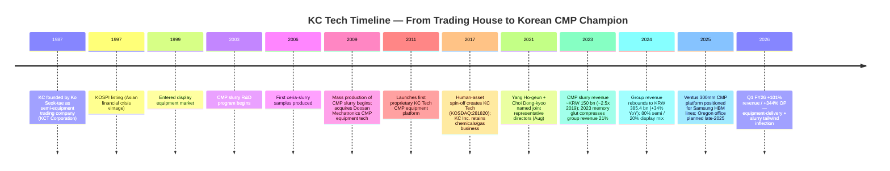
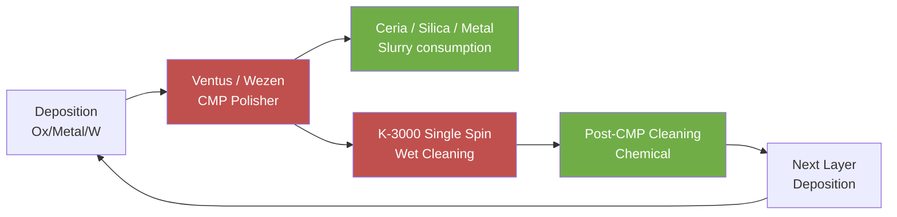
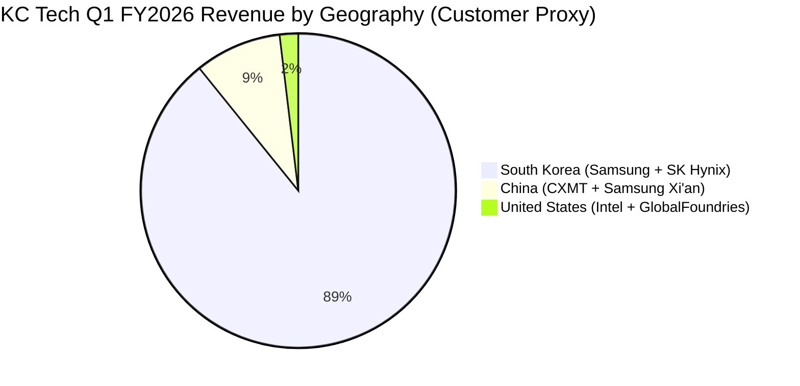
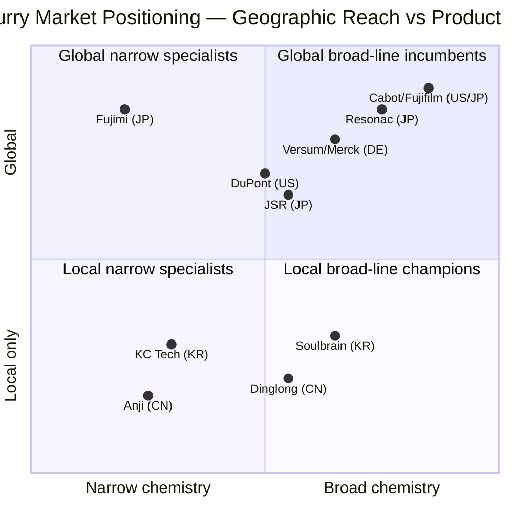

COMPANY RESEARCH REPORT: KC Tech Co., Ltd. (KOSDAQ:281820)
Date: 2026-05-26

> **As-of note.** The 2017 spin-off from KC Inc. carved out the materials-and-front-end-equipment business as a separately listed entity ([KC Inc. company history (eng), KC Co., Ltd.](https://www.kct.co.kr/eng/page/company3.php)); the post-spin company has compounded CMP slurry revenue from roughly KRW 60 bn in 2019 to KRW 150 bn in 2023 ([인사이트코리아, 2024](http://www.insightkorea.co.kr/news/articleView.html?idxno=102310)), with FY2024 group revenue at **KRW 385.4 bn** and operating profit **KRW 49.8 bn** ([케이씨텍 위키백과](https://ko.wikipedia.org/wiki/%EC%BC%80%EC%9D%B4%EC%94%A8%ED%85%8D)). Q1 FY2026 then printed **KRW 156.1 bn revenue (+101% YoY) and KRW 34.8 bn operating profit (+344% YoY)** — driven by a CMP-equipment delivery wave plus slurry tailwind ([The Elec, 2026-04-30: "KC Tech First-Quarter Operating Profit Jumps 344%"](https://www.thelec.net/news/articleView.html?idxno=10433)).

TABLE OF CONTENTS

1. Company Overview
2. Company History
3. Management Team
4. Products & Services
5. Customers & Go-to-Market
6. Industry Overview
7. Competitive Landscape
8. Market Opportunity (TAM)
9. Risk Assessment
10. References

======================================

## 1. Company Overview

KC Tech Co., Ltd. (케이씨텍, KOSDAQ:281820) is a Korean specialty manufacturer that occupies one of the most unusual seats in the global semiconductor supply chain: it sells **both** the CMP (chemical-mechanical planarization / 化学机械抛光) tool *and* the slurry that flows through it, plus the wet-cleaning equipment that follows, plus the post-CMP cleaning chemicals — all to the same two customers, Samsung Electronics and SK Hynix ([KC Tech "About / Overview" page](https://www.kctech.com/page/overview.php); [The Worldfolio interview with Vice Chairman Ho Keun Yang, 2025](https://www.theworldfolio.com/interviews/Next-Gen_CMP_Ventus_System_and_Ceria_Slurry_for_Advanced_2nm_Node_Chips/6973/)). The company describes itself, in its own corporate-overview page, as a maker of "반도체 및 디스플레이 장비, 소재의 제조/판매" — semiconductor and display equipment and materials — and that hyphenated combination (equipment + materials sold side by side) is the single fact that distinguishes KC Tech from every other CMP slurry name on Nomura's Fig. 41 league table ([Nomura, *Greater China Semiconductor 2026–2030F*, 2026-05-21, p. 24](../../sector/%E5%8D%8A%E5%AF%BC%E4%BD%93%E6%9D%90%E6%96%99.md)).

The economic engine is concentrated. In **FY2024** KC Tech booked KRW **385.4 bn** of revenue, KRW **49.8 bn** of operating profit, and KRW **52.7 bn** of net income, with semiconductor about 80% of sales and display about 20% — a mix the company itself reports as `반도체 부문 80% / 디스플레이 부문 19.85%` in disclosures aggregated to the press ([인사이트코리아, "케이씨텍, CMP slurry의 실적 성장성에 주목"](http://www.insightkorea.co.kr/news/articleView.html?idxno=102310); [케이씨텍 위키백과](https://ko.wikipedia.org/wiki/%EC%BC%80%EC%9D%B4%EC%94%A8%ED%85%8D)). FY2024 was a recovery year (revenue +34% YoY off a 2023 trough of KRW 286.9 bn — a number itself depressed by the 2023 memory downturn) and FY2025 then printed broadly flat consolidated revenue at KRW **382.9 bn** but a step-up in operating profit to KRW **60.0 bn**, lifting operating margin from 12.9% to 15.7% as product mix tilted toward higher-margin advanced-node slurry ([Stockopedia: KCTech Co (KRX:281820) financial summary](https://www.stockopedia.com/share-prices/kc-tech-co-KRX:281820/); [FN Guide Snapshot, 케이씨텍 (A281820)](https://comp.fnguide.com/SVO2/asp/SVD_Main.asp?gicode=A281820)). The same FN Guide page reports a P/B of 2.63×, ROE of 10.6% and a tiny 0.6% dividend yield — capital-light by Korean industrial standards, with a half-billion-won net cash position and no significant debt overhang.

How KC Tech makes money breaks into two cash-flow profiles that the market routinely conflates. The **equipment side** — Ventus 300mm CMP polishers, Wezen-series single-wafer wet cleaners, and a handful of display wet stations / atmospheric-pressure plasma cleaners — is lumpy, order-driven, recognized as shipments hit Samsung's Pyeongtaek lines and SK Hynix's Icheon / Cheongju fabs, and has been the swing factor in Q1 FY2026 ([The Elec, 2026-04-30](https://www.thelec.net/news/articleView.html?idxno=10433)). The **materials side** — ceria slurry, silica slurry, metal slurry, post-CMP cleaning chemicals — is recurring, throughput-linked, scales with fab utilization rather than capex, and is the structurally higher-margin half of the business that compounded from roughly KRW 60 bn in 2019 to KRW 150 bn in 2023 ([인사이트코리아, 2024](http://www.insightkorea.co.kr/news/articleView.html?idxno=102310)). Management in its March 2025 *Worldfolio* interview flagged that materials are now roughly 40% of group sales, of which about 30% comes from outside Korea — i.e. China (CXMT), the US (Intel, GlobalFoundries) and increasingly Taiwan — and that materials revenue is what the company is leaning on for the next leg of growth into HBM and BSPDN (backside power delivery / 背面供电) workloads ([The Worldfolio interview](https://www.theworldfolio.com/interviews/Next-Gen_CMP_Ventus_System_and_Ceria_Slurry_for_Advanced_2nm_Node_Chips/6973/)).

Geographically the business is still very Korean: **89% of Q1 FY2026 sales came from South Korea**, with China at 8.9% and the United States at 1.9% ([The Elec, 2026-04-30](https://www.thelec.net/news/articleView.html?idxno=10433)). That Korea-concentration is both feature and bug. Feature: Samsung Electronics and SK Hynix together represent close to 100% of the addressable Korean CMP-tool / slurry market, and KC Tech is the *only* domestic Korean supplier with a fully localised CMP tool (per the company self-description on the Korean Wikipedia page, that KC Tech "uniquely developed domestically" HBM-manufacturing CMP equipment), echoed by the JobKorea company profile noting KC Tech is "the only domestic company that succeeded in localizing semiconductor CMP equipment" ([잡코리아 KC Tech 기업정보](https://www.jobkorea.co.kr/recruit/co_read/c/kctech11); [케이씨텍 위키백과](https://ko.wikipedia.org/wiki/%EC%BC%80%EC%9D%B4%EC%94%A8%ED%85%8D)). Bug: with Samsung and SK Hynix collectively driving the demand curve, a year like 2023 (memory glut, capex pull-back) compresses revenue 23% — exactly what happened in 4Q24 versus 4Q23 ([씽크풀, 2024-04 실적속보](https://m.thinkpool.com/stockDiscuss/281820/cont/11862550)).

The headcount is small by global standards — roughly **800 employees** working out of an Anseong-si headquarters in Gyeonggi Province plus a Dongtan R&D center ([KC Tech location page](https://www.kctech.com/page/location1.php); [잡코리아 KC Tech 기업정보](https://www.jobkorea.co.kr/recruit/co_read/c/kctech11)) — and the company is now in the early stages of building a Eugene, Oregon, USA office, targeted for late-2025 opening, plus expansion footprints under exploration in Taiwan, Japan and Singapore ([The Worldfolio interview](https://www.theworldfolio.com/interviews/Next-Gen_CMP_Ventus_System_and_Ceria_Slurry_for_Advanced_2nm_Node_Chips/6973/)). That "follow the Korean customer abroad" model is what the Worldfolio interview frames as the company's geographic strategy — meaning the customer footprint, not KC Tech's own Korean revenue base, dictates which Western offices open first.

**Valuation snapshot (as of 2026-05-26).** Last trade KRW **72,600**, market cap **KRW ~1,398 bn (~USD 1.02 bn)** with 19.8 million shares outstanding, **TTM P/E ~27.4×** on KRW 2,578 trailing EPS, **TTM P/S ~3.6×** on FY2025 revenue, **P/B 2.6×**, **ROE 10.6%**, dividend yield 0.64% ([Investing.com KCTech historical data, 2026-05-26](https://www.investing.com/equities/kctech-historical-data); [FN Guide Snapshot, 케이씨텍 (A281820)](https://comp.fnguide.com/SVO2/asp/SVD_Main.asp?gicode=A281820); [Stockopedia summary](https://www.stockopedia.com/share-prices/kc-tech-co-KRX:281820/)). The stock has tripled from the 52-week low of KRW 24,150, with the 1-year range KRW 24,150–82,500 — a roughly **+193% move** in 12 months ([Investing.com price history, 2026-05-26](https://www.investing.com/equities/kctech-historical-data)). The TTM 27× multiple sits at a clear premium to the 3-year average (10–15× across the 2022–2024 window) and to KOSDAQ small-cap semi-equipment peers; for context, Soulbrain (KOSDAQ:357780) trades around 17–18× TTM and Wonik Materials (KOSDAQ:104830) ~18× ([Soulbrain Stockopedia summary](https://www.stockopedia.com/share-prices/soulbrain-co-KOSDAQ:357780/); [Wonik Materials Yahoo Finance](https://finance.yahoo.com/quote/104830.KQ/)). *Analyst view:* the 27× TTM multiple is driven primarily by the Q1 FY2026 +344% operating-profit print plus the consensus-busting "HBM / 2nm Korean slurry localization" narrative — DS Investment Securities walked target price to KRW 50,000 on November 2025 ([데이터투자 2025-11-11: DS투자증권 목표가 5만원 상향](https://www.datatooza.com/article/20251111115540957952ef38be23_80)), but the spot price has already pushed past that. If FY2026 operating profit lands at the KRW 65–80 bn band sell-side is now modelling, forward P/E compresses into the high teens — i.e. the stretch is *not* in 2026 forward multiples per se; it is in the implicit assumption that the materials mix-shift continues to outrun cyclical compression in equipment. The TTM premium is therefore a narrative premium on the materials business, not a forward-earnings stretch — but it does mean the stock is now priced as if FY2025's mix-shift toward materials persists indefinitely; any quarter where equipment-driven margin reverts to pre-FY2025 levels would compress the multiple sharply (carried into Section 9 as a valuation risk).

*Source: [Stockopedia KCTech (KRX:281820)](https://www.stockopedia.com/share-prices/kc-tech-co-KRX:281820/); [The Elec, 2026-04-30](https://www.thelec.net/news/articleView.html?idxno=10433); [데이터투자, 2025-11-11 (DS투자증권 추정)](https://www.datatooza.com/article/20251111115540957952ef38be23_80).*

## 2. Company History

KC Tech in its current corporate form is **eight years old** — incorporated 1 November 2017 as the spin-off "분할 신설법인" carved out of KC Inc. (formerly KCT Corporation), the original Korean specialty chemicals + semiconductor equipment trading house founded in 1987 ([KC Inc. company history, KC Co., Ltd.](https://www.kct.co.kr/eng/page/company3.php); [businesspost.co.kr, "[Who Is ?] 고석태 케이씨텍 회장"](https://www.businesspost.co.kr/BP?command=article_view&num=370779)). But its operating DNA goes back four decades to that 1987 founding under Chairman Ko Seok-tae (고석태): KC began as a Daesung-Oxygen-spinout trading company importing US and Japanese semiconductor equipment into Korea, listed on KOSPI in 1997 in the depths of the Asian financial crisis, entered display equipment in 1999 alongside the Korean LCD investment cycle, and broke ground on its own slurry R&D program in 2003 — six years before mass production began in 2009 ([The Worldfolio interview, March 2025](https://www.theworldfolio.com/interviews/Next-Gen_CMP_Ventus_System_and_Ceria_Slurry_for_Advanced_2nm_Node_Chips/6973/); [businesspost.co.kr 고석태 회장 프로필](https://www.businesspost.co.kr/BP?command=article_view&num=370779)).

The decade between R&D start (2003) and 2009 mass-production is what makes KC Tech atypical among Korean materials suppliers: the company committed multi-year capital to ceria-slurry process development at a time when Samsung and SK Hynix relied almost entirely on Cabot Microelectronics (later CMC Materials, then Entegris), Hitachi Chemical (later Resonac) and Versum (later Merck) for advanced CMP slurry inputs ([Yano Research CMP Slurry Market 2024](https://www.yanoresearch.com/press/press.php/3921)). The 2009 inflection — first mass production of KC Tech ceria slurry — coincided with KC Tech's acquisition of Doosan Mechatronics' CMP equipment technology, knitting the future "equipment + materials" hybrid that today defines KC Tech ([The Worldfolio, 2025](https://www.theworldfolio.com/interviews/Next-Gen_CMP_Ventus_System_and_Ceria_Slurry_for_Advanced_2nm_Node_Chips/6973/)). By 2011 KC Tech was running its own proprietary CMP products at Samsung; by 2017 the materials franchise had become large enough that Chairman Ko Seok-tae proposed splitting the legal entity in two — leaving chemicals + gas supply systems under "KC Inc." (still parent shareholder) and pulling out semiconductor + display front-end equipment + materials into the new KOSDAQ-listed "KC Tech" ([KC Inc. company history, KC Co., Ltd.](https://www.kct.co.kr/eng/page/company3.php); [잡코리아 KC Tech 기업정보](https://www.jobkorea.co.kr/recruit/co_read/c/kctech11)).

The 2017 spin-off was a "인적분할" (human-asset division / 人的分割) — Korean corporate law's mechanism for splitting a listed company so existing shareholders retain proportional stakes in both successor entities. The decision rationale, per business-press coverage at the time, was that the chemical-engineering operations (which had become a stable but mature distribution business) and the semiconductor / display equipment-and-materials operations (which were growing fast on the back of Samsung's V-NAND and OLED capex) had very different capital allocation profiles, valuations and customer-facing identities — and bundling them into one stock was confusing the market ([businesspost.co.kr 고석태 회장 프로필](https://www.businesspost.co.kr/BP?command=article_view&num=370779)). The spin-off succeeded operationally: KC Tech post-2017 has compounded revenue at a low-to-mid teens CAGR with one cyclical reset (FY2023) while expanding the materials mix and beginning international expansion.

The most important post-spin event was the **August 2021 management reshuffle**, when Chairman Ko replaced then-CEO Lim Gwan-taek (임관택) with a co-CEO structure of **Yang Ho-geun (양호근)** — previously Vice President of TCK (a KC group company) and CEO of KC Inc. — and **Choi Dong-kyoo (최동규)**, who had been managing the equipment business ([파이낸셜뉴스, 2021-08-11: "케이씨텍, 양호근·최동규 각자 대표 체제"](https://www.fnnews.com/news/202108111629170231)). The split was framed as "management efficiency + expertise strengthening" — Yang took materials and corporate, Choi took equipment — and that division of labour is still in place at time of writing, with both names appearing as joint representative directors on the corporate overview page ([KC Tech overview page](https://www.kctech.com/page/overview.php)).

Recent operational milestones cluster around the 2024–2026 advanced-node and HBM ramp. The Ventus 300mm CMP system — KC Tech's "next-generation" platform with multi-zone polishing head and up to 12 configurable cleaning chambers — was positioned in 2024–2025 specifically for Samsung HBM-line use, where the per-wafer CMP step count rises sharply with stack height ([The Worldfolio, 2025](https://www.theworldfolio.com/interviews/Next-Gen_CMP_Ventus_System_and_Ceria_Slurry_for_Advanced_2nm_Node_Chips/6973/)). In parallel, the company began R&D on **buildup-film (BuF) CMP** for advanced substrates — a process step previously dominated by Japanese suppliers but increasingly required by Korean and Taiwanese OSAT customers as advanced-packaging volumes scale ([The Elec, 2026-04-30](https://www.thelec.net/news/articleView.html?idxno=10433)). The Eugene, Oregon US office targeted for late-2025 opening represents the first physical KC Tech footprint outside Asia and is intended to support Intel, GlobalFoundries and Samsung Austin / Taylor fab ramps ([The Worldfolio, 2025](https://www.theworldfolio.com/interviews/Next-Gen_CMP_Ventus_System_and_Ceria_Slurry_for_Advanced_2nm_Node_Chips/6973/)).

*Source: [The Worldfolio interview, 2025](https://www.theworldfolio.com/interviews/Next-Gen_CMP_Ventus_System_and_Ceria_Slurry_for_Advanced_2nm_Node_Chips/6973/); [businesspost.co.kr 고석태 회장 프로필](https://www.businesspost.co.kr/BP?command=article_view&num=370779); [KC Inc. company history](https://www.kct.co.kr/eng/page/company3.php); [The Elec, 2026-04-30](https://www.thelec.net/news/articleView.html?idxno=10433).*

## 3. Management Team

**Founder / Chairman: Ko Seok-tae (고석태, b. March 31, 1954).** Ko is the founder of KC Inc. (1987) and remains Chairman of both the parent KC Inc. and KC Tech — though day-to-day operational responsibility transferred to the co-CEO structure in 2021 ([businesspost.co.kr "[Who Is ?] 고석태 케이씨텍 회장"](https://www.businesspost.co.kr/BP?command=article_view&num=370779)). Educated at Sungkyunkwan University Department of Chemical Engineering (graduated 1980), Ko spent the first six years of his career (1980–1986) as a sales executive at Daesung Oxygen Company — a Korean industrial-gas distributor that handled imported US / Japanese semiconductor equipment — before leaving in 1987 to found KC Inc. as a specialized semiconductor equipment importer to Korean foundries and memory makers ([businesspost.co.kr 고석태 프로필](https://www.businesspost.co.kr/BP?command=article_view&num=370779)). The 1987 timing was prescient: Samsung's first DRAM mass-production was 1983, and by 1987 the Korean memory industry was just entering its first capex super-cycle. Ko was Chairman of the Korea Display Equipment & Materials Industry Association 2005–2007, joined the Korean Academy of Engineering's Chemical & Biological Engineering Division in 2016, and remains an industry-level voice in Korean equipment-and-materials policy circles. As of June 30, 2024 disclosure, Ko personally owns approximately **4.64%** of KC Tech (968,292 shares) and **7.48%** of KC Inc. (1,013,444 shares); together with family-related parties, the Ko family controls approximately 50% of KC Tech and 40.9% of KC Inc. — meaning the KC group is meaningfully family-controlled despite the listed structure ([businesspost.co.kr 고석태 프로필](https://www.businesspost.co.kr/BP?command=article_view&num=370779)). Ko has been transferring shares progressively to his son Ko Sang-gul (고상걸, b. 1982), who now serves as Vice Chairman and Representative Director of KC Inc.; the same publication notes the succession architecture is well-advanced, though Ko Sang-gul has not (yet) been named a director at KC Tech specifically ([businesspost.co.kr 고석태 프로필](https://www.businesspost.co.kr/BP?command=article_view&num=370779)).

**Co-CEO: Yang Ho-geun (양호근).** Yang was appointed joint Representative Director / CEO of KC Tech on **August 11, 2021** alongside Choi Dong-kyoo, replacing the prior duo of Choi Dong-kyoo and Lim Gwan-taek ([파이낸셜뉴스, 2021-08-11](https://www.fnnews.com/news/202108111629170231)). Per the same announcement, Yang's prior roles inside the KC group were Vice President of TCK (a sister KC group company that produces silicon wafers and graphite-related semiconductor consumables) and CEO of KC Inc. — meaning he brings both the materials-business operational background and the parent-holdco perspective that the materials-heavy KC Tech strategy now requires ([파이낸셜뉴스, 2021-08-11](https://www.fnnews.com/news/202108111629170231)). The 2021 reshuffle was framed in management terms as "경영 효율성 강화 및 전문성 강화" (management-efficiency strengthening + expertise strengthening), with Yang taking materials and corporate, Choi taking equipment ([파이낸셜뉴스, 2021-08-11](https://www.fnnews.com/news/202108111629170231)). Yang is also the public face of KC Tech's international expansion narrative; he is named on the company's corporate overview page as joint Representative Director alongside Choi Dong-gyu (Choi Dong-kyoo) ([KC Tech overview page](https://www.kctech.com/page/overview.php)). The most prominent recent on-record interview attributed to KC Tech leadership is the March 2025 *Worldfolio* piece, where Vice Chairman Ho Keun Yang (note: this is the same individual, with English transliteration "Ho Keun Yang" / Korean 양호근 — the Worldfolio piece uses the Vice Chairman title which co-exists with the co-CEO title at KC Tech) articulates the long-term thesis: "Don't sell a product — sell trust. Sell yourself" and "true synergy doesn't come from packaged solutions but from our deep integration" — framing the equipment-and-materials co-development model as the strategic moat ([The Worldfolio interview, 2025](https://www.theworldfolio.com/interviews/Next-Gen_CMP_Ventus_System_and_Ceria_Slurry_for_Advanced_2nm_Node_Chips/6973/)). The Worldfolio piece also crystallizes the 2027 (40th anniversary) target: KC Tech aspires to secure major equipment qualifications in advanced HBM and BSPDN lines, achieve mass production of CMP systems at global-tier customers, and become a "global-scale player" — a framing that is itself the management-set yardstick by which the next two years of execution should be measured ([The Worldfolio, 2025](https://www.theworldfolio.com/interviews/Next-Gen_CMP_Ventus_System_and_Ceria_Slurry_for_Advanced_2nm_Node_Chips/6973/)).

## 4. Products & Services

### 4.1 Product matrix — three families that share one customer

KC Tech is not a one-product company. The company sells **three product families** to broadly the same customer base — Samsung Electronics, SK Hynix, and a handful of foreign accounts that have followed those Korean customers' processes (CXMT, GlobalFoundries, Intel) — and the unusual fact that KC Tech sells both the equipment and the consumables that flow through it is the single feature most non-Korean analysts under-weight when modelling the business ([KC Tech "About / Overview" page](https://www.kctech.com/page/overview.php); [The Worldfolio interview, 2025](https://www.theworldfolio.com/interviews/Next-Gen_CMP_Ventus_System_and_Ceria_Slurry_for_Advanced_2nm_Node_Chips/6973/)). The matrix below is the analyst-constructed reproduction of KC Tech's own product-navigation tree (because the company does not publish a single 10-K-equivalent table — Korean DART 사업보고서 product disclosures are narrative rather than tabular for KOSDAQ-listed firms of this size).

| Category | Sub-category | Product / Platform | Primary customer / application |
|---|---|---|---|
| **Semiconductor Equipment** | CMP Polishers (300mm) | **Ventus**® (next-gen platform), **Wezen BF** (Front Type), **Wezen BS** (I Type) | Samsung / SK Hynix HBM, DRAM, advanced logic |
|  | Wet Cleaning Systems | **K-3000** Single Spin Processor (8 or 12 chamber configurations) | Post-CMP / post-etch wafer cleaning, both-side 300mm |
|  | Auxiliary (small) | Gas supply, vacuum pumps, gas purification equipment | Sub-fab support |
| **Display Equipment** | Wet stations & cleaners | Wet Station, Atmospheric Pressure Plasma Cleaner (APP), CO₂ Cleaner, Coater & Track System | LG Display, BOE, CSOT, Samsung Display OLED / next-gen FPD |
| **Materials (CMP slurry + chemicals + dispersions)** | Oxide slurry | **Ceria Slurry** (80–300 nm particles in ultrapure water + chemicals) | STI, ILD planarization at advanced nodes |
|  | Silica slurry | **Silica Slurry** (colloidal silica) | Metal contact / plug & poly CMP, dielectric polish |
|  | Metal slurry | **Metal Slurry** (W, Cu under development) | Tungsten plug, copper interconnect, barrier metal |
|  | Post-CMP cleaning | **Post-CMP Cleaning Chemical** | Removes residual abrasive particles and metal contaminants after CMP |
|  | Nano dispersion | Nano-particle dispersions | Display and semiconductor speciality applications |

*Source: [KC Tech product page (eng)](https://www.kctech.com/eng/); [KC Tech 제품 — Komachine listing](https://www.komachine.com/en/companies/kc-tech); [SEMICON Korea 2025 KC Tech booth listing](https://expo.semi.org/korea2025/Public/eBooth.aspx?IndexInList=234&ListByBooth=true&BoothID=633102&Nav=False); [Wet Cleaning System by 케이씨텍 (Komachine 한글)](https://www.komachine.com/ko/companies/kc-tech/products/61131-wet-cleaning-system).*

### 4.2 Synthesis — how the categories interact in a customer workflow

The economics of CMP at the Samsung Pyeongtaek fab look like this in physical sequence: at each metallization layer the wafer comes out of deposition (oxide on top of patterned metal) with a non-planar surface; the **CMP polisher** (KC Tech Ventus, or Applied Materials Reflexion, or Ebara Frex) holds the wafer against a rotating pad while the **slurry** (KC Tech ceria for oxide, KC Tech tungsten slurry for W-plug, or third-party Cabot/Versum for copper) chemically softens the surface and the pad mechanically planarizes it; the wafer then goes through a **post-CMP wet clean** (KC Tech K-3000, or Lam Research / Tokyo Electron / SCREEN single-wafer cleaners) where another KC Tech chemical removes residual abrasive particles — then back into deposition for the next layer ([JEES: CMP Slurry Types Explained](https://jeez-semicon.com/blog/cmp-slurry-types-explained-oxide-sti-copper-tungsten-beyond/); [Applied Materials CMP page](https://www.appliedmaterials.com/in/en/semiconductor/semiconductor-technologies/cmp.html)). At a modern logic node (3nm / 2nm), this loop runs **20–30 times per wafer**; at HBM, the through-silicon-via (TSV) and bonding-pad CMP add roughly another 4–6 steps per die layer; at BSPDN-enabled designs (Intel 18A, TSMC A16, future Samsung 2nm), an entirely new sequence of CMP + wafer-bonding + thinning steps appears on the backside ([Nomura, *Greater China Semiconductor 2026–2030F*, 2026-05-21, p. 6-9](../../sector/%E5%8D%8A%E5%AF%BC%E4%BD%93%E6%9D%90%E6%96%99.md)). Every additional CMP step is incremental wafer-pass for KC Tech's slurry — *if* the customer qualifies KC Tech's slurry at that step — and an incremental utilization hour for KC Tech's installed polishers. The economic flywheel is therefore: install a Ventus tool, then capture the recurring slurry pull-through; or supply slurry to a customer using a foreign polisher, then upsell the next CMP-tool purchase. That is the "equipment + materials co-development" moat the Vice Chairman repeatedly emphasizes ([The Worldfolio interview, 2025](https://www.theworldfolio.com/interviews/Next-Gen_CMP_Ventus_System_and_Ceria_Slurry_for_Advanced_2nm_Node_Chips/6973/)).

*KC Tech-supplied steps in the per-layer CMP loop. Red = equipment; green = materials. A modern logic node runs this loop 20–30× per wafer; HBM adds 4–6 incremental steps for TSV + bond-pad CMP. Source: [JEES CMP slurry types](https://jeez-semicon.com/blog/cmp-slurry-types-explained-oxide-sti-copper-tungsten-beyond/); [Nomura sector report (in 半导体材料.md)](../../sector/%E5%8D%8A%E5%AF%BC%E4%BD%93%E6%9D%90%E6%96%99.md).*

### 4.3 CMP Slurry — the franchise

The slurry franchise is the structural growth engine. The product line spans three chemical families, each targeted at a different layer of the modern wafer:

**KC Tech's own description (per the company product page):**

> "Ceria Slurry used for the semiconductor CMP process is a suspension made by mixing 80nm-300nm particles, ultrapure water, and chemicals and is used to chemically and mechanically polish the film on the surface."
> — [KC Tech / SEMICON Korea 2025 booth listing](https://expo.semi.org/korea2025/Public/eBooth.aspx?IndexInList=234&ListByBooth=true&BoothID=633102&Nav=False)

> "[Silica Slurry] for Metal Contact/Plug & Poly CMP stages in advanced node processes ... addresses limitations of conventional products for top-tier customers."
> — [KC Tech / SEMICON Korea 2025 booth listing](https://expo.semi.org/korea2025/Public/eBooth.aspx?IndexInList=234&ListByBooth=true&BoothID=633102&Nav=False)

**中文释义 / Plain-language gloss.** CMP slurry 是 CMP 工艺的耗材，每抛一层晶圆膜（无论氧化硅、钨、铜还是其他金属）都要消耗一定量。**Ceria slurry (氧化铈浆料)** — KC Tech 的核心产品 — 主要用于 STI (浅沟槽隔离 / shallow-trench isolation) 和 ILD (层间介质 / inter-layer dielectric) CMP，因为只有铈基磨料对 SiO₂:Si₃N₄ 表现出极高的选择性 (selectivity)，能精准地"停在"氮化硅停止层上不再继续抛 —— 这是先进节点 (3nm / 2nm / A16) STI 工艺无法替代的化学特征 ([JEES: CMP Slurry Types Explained](https://jeez-semicon.com/blog/cmp-slurry-types-explained-oxide-sti-copper-tungsten-beyond/))。**Silica slurry (硅基浆料 / 胶体硅磨料 colloidal silica)** 颗粒更小、更均匀，主要用于金属接触/钨塞 (W-plug) 与多晶硅 (poly) CMP 步骤，是 sub-10nm 节点的主力配方 ([Pondax: silica sol abrasives for advanced node CMP](https://www.pondax.com/technique-edge/2026/05/breaking-the-atomic-level-planarization-barrier-advances-in-morphology-engineering-and-surface-chemistry-of-silica-sol-abrasives-for-advanced-node-cmp/))。**Metal slurry (金属浆料)** 则专门针对钨塞 (W contact) 和铜互连 (Cu interconnect) — 这两个步骤目前 Samsung 90%+ 仍依赖 Cabot/Entegris 和 Versum/Merck 进口，是 KC Tech 国产化进度最慢的赛道，但也是市场空间最大的赛道（铜浆料正在客户验证中 — per insightkorea analyst note: 公司"过去中低价 ceria 销售为主，metal 系列高规格 slurry 销售比重将大幅增加"）([인사이트코리아, 2024](http://www.insightkorea.co.kr/news/articleView.html?idxno=102310))。**Post-CMP cleaning chemical (CMP 后清洗化学品)** 是与 K-3000 / Wezen 设备搭配使用的酸/碱性清洗液，专门去除残留磨料颗粒和金属污染 — 在 HBM workflows 中，因为 TSV CMP 颗粒污染对 stack 良率影响极大，post-CMP cleaning chemistry 的工艺窗口比单层逻辑更严苛 ([Challenges and Solutions for Post-CMP Cleaning of Ceria Particles for Advanced Technology Nodes (ResearchGate)](https://www.researchgate.net/publication/353303115_Challenges_and_Solutions_for_Post-CMP_Cleaning_of_Ceria_Particles_for_Advanced_Technology_Nodes))。

The strategic inflection driving demand right now is the layering of three simultaneous tailwinds. **(1) HBM ramp:** SK Hynix is the global HBM leader with 57% share in Q3 2025 and Samsung has rapidly closed the gap to 22% from 15% one quarter prior ([SK Hynix' Lead Shrinks In DRAM, HBM (Semiecosystem, 2025-10)](https://marklapedus.substack.com/p/sk-hynix-lead-shrinks-in-dram-hbm)). Each HBM die stack requires multiple additional TSV + bond-pad CMP steps versus standard DRAM, so HBM revenue growth in 2024–2026 directly multiplies slurry pull-through. **(2) Advanced-node logic at Samsung:** the Samsung 2nm node (GAA architecture) plus eventual BSPDN integration both add CMP step-count materially versus 5/4nm, and Samsung's strategic mandate to use Korean suppliers wherever technically equivalent flow has pulled KC Tech ceria into qualification at multiple steps that were historically Cabot/Versum ([Webpronews: Samsung Chairman Advances HBM, 2nm Tech (2025)](https://www.webpronews.com/samsung-chairman-advances-hbm-2nm-tech-in-bid-for-chip-dominance/); [The Worldfolio interview, 2025](https://www.theworldfolio.com/interviews/Next-Gen_CMP_Ventus_System_and_Ceria_Slurry_for_Advanced_2nm_Node_Chips/6973/)). **(3) BSPDN:** backside-power-delivery requires a second wafer to be bonded on the backside of the device wafer, then thinned to ~1µm, with multiple CMP steps on the backside metallization sequence; once Samsung adopts BSPDN at 2nm or 1.4nm, the per-wafer CMP step count and slurry consumption could rise 20–30% versus the pre-BSPDN equivalent ([Nomura 2026-05-21 sector report (in 半导体材料.md)](../../sector/%E5%8D%8A%E5%AF%BC%E4%BD%93%E6%9D%90%E6%96%99.md)).

*Analyst view:* On the slurry franchise specifically, KC Tech's competitive position is **partial moat (technology + customer co-development)** — strong in ceria (where the company has been Samsung's primary domestic Korean alternative to Cabot/Hitachi for over a decade), partial in silica (developing alongside Korean peer Soulbrain at similar pace), weak in metal/copper (where Cabot/Entegris and Versum/Merck retain >90% global share). The competitor product map is well-documented: Cabot's flagship copper slurry families and Entegris electronic materials (post-2022 acquisition of Cabot's CMC unit by Entegris, then re-divested in 2024 to Fujifilm Holdings) remain dominant in metal CMP ([Yano Research CMP Slurry Market 2024](https://www.yanoresearch.com/press/press.php/3921)); Versum's chemistries (now part of Merck KGaA Performance Materials following Merck's 2019 acquisition) anchor advanced-node STI at Samsung Austin and TSMC; Fujimi's PLANERLITE silica sols are entrenched at Japanese-process customers (Renesas, Kioxia); Dinglong (300054.SZ) and Anji Microelectronics (688019.SS) are the Chinese localization equivalents — neither sells into Samsung at meaningful volume yet ([CMP Slurry Market — Yano Research, 2024](https://www.yanoresearch.com/press/press.php/3921); Anji's customer commentary in 安集 [Anji Microelectronics 2024 年度报告 (SSE STAR Market)](https://star.sse.com.cn/disclosure/listedinfo/announcement/c/new/2025-04-16/688019_20250416_8014.pdf)).

### 4.4 CMP Equipment — Ventus & Wezen

KC Tech's CMP polisher product is sold under two model families. The **Ventus** is the "next-generation" platform — the flagship 300mm CMP system that the company has been positioning for HBM-line use at Samsung throughout 2024–2025. Per the SEMICON Korea 2025 disclosure and corroborated by the Vice Chairman's Worldfolio interview, the Ventus delivers a 30% efficiency uplift versus the prior generation, supports W / Cu / oxide CMP applications, includes dual polishing and cleaning, a carrier-moving-track 4-FOUP automation system with 1 metrology station, and most distinctively features a modular cleaning architecture supporting **up to 12 configurable chambers** plus a multi-zone polishing head with in-situ zone control ([The Worldfolio interview, 2025](https://www.theworldfolio.com/interviews/Next-Gen_CMP_Ventus_System_and_Ceria_Slurry_for_Advanced_2nm_Node_Chips/6973/); [SEMICON Korea 2025 KC Tech booth](https://expo.semi.org/korea2025/Public/eBooth.aspx?IndexInList=234&ListByBooth=true&BoothID=633102&Nav=False)). The **Wezen** is the earlier-generation 300mm platform, sold in two variants — Wezen BF (Front Type) and Wezen BS (I Type) — and remains in active production for less-demanding process steps and wet-cleaning configurations ([Komachine KC Tech CMP product listing](https://www.komachine.com/en/companies/kc-tech)).

**KC Tech's own description (per the Worldfolio interview):**

> "[Ventus] delivers a 30% efficiency increase over previous models, with a modular cleaning system with up to 12 configurable chambers and a multi-zone polishing head with in situ zone control. No other company offers a 12-chamber configuration within a CMP system."
> — Vice Chairman Ho Keun Yang, [The Worldfolio interview, 2025](https://www.theworldfolio.com/interviews/Next-Gen_CMP_Ventus_System_and_Ceria_Slurry_for_Advanced_2nm_Node_Chips/6973/)

**中文释义 / Plain-language gloss.** CMP 抛光机 是半导体后段 BEOL (back-end-of-line, 后段制程) 与前段 FEOL (front-end-of-line) 多个步骤都需要的关键设备。KC Tech 的 Ventus 平台 — 300mm 单平台 — 与 Applied Materials Reflexion® GT (全球主导)、Ebara Frex 系列 (日本)、Lam Research Striker® (在 CMP 领域市占率较小) 直接竞争 ([Applied Materials CMP page](https://www.appliedmaterials.com/in/en/semiconductor/semiconductor-technologies/cmp.html); [Ebara Technologies CMP product page](https://www.ebaratech.com/product-category/chemical-mechanical-polishing-systems/))。Ventus 的差异化在 **12 chamber 模块化清洗** — 在 HBM 制程中，因为 TSV 蚀刻后 CMP 颗粒污染对 stack 良率影响极大，一台 CMP 抛光机后端的清洗腔体数量直接决定通过率 (throughput) 与缺陷率。AMAT 的 Reflexion GT 标配 6-8 chamber，Ventus 主打 12-chamber 是面向 HBM 大批量量产的差异化卖点。**Wezen BF/BS** 则是上一代 Ventus 推出之前 KC Tech 在 Samsung memory 主力线上的台数主力 — 经济寿命周期较长，仍在 incremental capex (维修+扩产) 中持续出货。**K-3000 Single Spin Processor** 是独立的 wet-cleaning 设备，可以选 8 或 12 chamber，专门用于 post-CMP 清洗 + 化学处理 + 漂洗 + 干燥，特点是"连续处理、防自然氧化层增长" — 这是先进节点 single-wafer 清洗的标准格式，竞争对手是 Lam Lam Research VS、TEL ACTRIX、SCREEN SU-3300 ([Komachine wet cleaning system, KC Tech 한글](https://www.komachine.com/ko/companies/kc-tech/products/61131-wet-cleaning-system))。

The strategic inflection on equipment is *Samsung HBM line ramp*. Per The Elec coverage, KC Tech's Q1 FY2026 +101% revenue print was driven specifically by "expanded shipments of chemical mechanical planarization (CMP) equipment, CMP slurry and cleaning equipment" with semiconductor revenue 94.3% of total — meaning the equipment-side ramp dominated the print, even though the structural slurry growth story is the higher-margin engine over time ([The Elec, 2026-04-30](https://www.thelec.net/news/articleView.html?idxno=10433)). DS Investment Securities' November 2025 sell-side note flagged equipment revenue expected to grow 10%+ YoY in 2026, driven by "memory chipmakers' equipment delivery acceleration beginning in 2026" — the visible inflection on Samsung's HBM4 build-out timeline ([데이터투자, 2025-11-11](https://www.datatooza.com/article/20251111115540957952ef38be23_80)).

*Analyst view:* On equipment, KC Tech's competitive position is **partial moat (geographic / relationship)** — strong only in Korea, where Samsung's localization mandate plus 15 years of joint development gives KC Tech first-look on memory-line CMP qualifications; weak globally, where Applied Materials (Reflexion GT family) holds the dominant share. The Vice Chairman has been explicit that the strategy for equipment outside Korea is to follow the Korean customer (Samsung Austin / Taylor) rather than win greenfield global accounts — i.e. equipment globalization is bounded by Samsung's overseas-fab build, not by direct competitive displacement of Applied Materials ([The Worldfolio interview, 2025](https://www.theworldfolio.com/interviews/Next-Gen_CMP_Ventus_System_and_Ceria_Slurry_for_Advanced_2nm_Node_Chips/6973/)).

### 4.5 Display Equipment — the legacy 20%

The display segment — Wet Station, Atmospheric Pressure Plasma Cleaner (APP), CO₂ Cleaner, Coater & Track — is KC Tech's smaller, lower-growth, but durable franchise: roughly **5.7% of Q1 FY2026 revenue** (down from a higher ~20% in FY2024 as semiconductor surged) and selling primarily to Korean display panel makers (Samsung Display, LG Display) plus Chinese panel makers (BOE, CSOT) for OLED + next-generation-display equipment cycles ([The Elec, 2026-04-30](https://www.thelec.net/news/articleView.html?idxno=10433); [인사이트코리아, 2024](http://www.insightkorea.co.kr/news/articleView.html?idxno=102310)). Recent commentary indicates "demand for Wet Station and Coater equipment increased due to transition to OLED and next-generation display investments" — i.e. the segment cycles with Korean / Chinese display panel capex, not with semiconductor, and provides countercyclical revenue when semi is weak ([데이터투자, 2025-11-11](https://www.datatooza.com/article/20251111115540957952ef38be23_80)). The display segment swung from a small net loss in 2024 (KRW -1.3 bn quarterly run-rate) to near break-even in Q1 FY2026 (net loss narrowed to KRW -130 mn), indicating modest operating leverage as Chinese OLED capacity additions resume in 2026 ([The Elec, 2026-04-30](https://www.thelec.net/news/articleView.html?idxno=10433)). The display segment is structurally lower-growth than semi and lower-margin, but it is *not* declining in absolute terms — KC Tech has held its share with Samsung Display and LG Display through multiple OLED capex cycles, and the segment exists in part because the customer relationships and the precision-wet-process technology base spill over to the semiconductor CMP / cleaning side.

*Analyst view:* Display is a "no-news segment" — neither a thesis driver nor a thesis risk at current scale. The interesting question is whether the segment ever becomes large enough on its own to merit standalone valuation; at 5.7% of Q1 FY2026 revenue the answer is clearly no, and the segment is most usefully understood as a small recurring revenue / customer-relationship asset that the consolidated KC Tech P&L absorbs.

### 4.6 Flagship franchises and recent launches

The flagship 1–3 products are unambiguously: **(1) Ceria CMP Slurry** (the franchise; >40% of materials revenue), **(2) Ventus 300mm CMP polisher** (the equipment moat; the differentiation versus AMAT Reflexion in HBM), and **(3) the integrated equipment + slurry co-development model** itself, which is the strategic asset that the Vice Chairman repeatedly frames as the moat ([The Worldfolio interview, 2025](https://www.theworldfolio.com/interviews/Next-Gen_CMP_Ventus_System_and_Ceria_Slurry_for_Advanced_2nm_Node_Chips/6973/)). Notable last-12-month commercial milestones include: (a) the Q1 FY2026 KRW 69.8 bn semiconductor equipment order disclosure — the largest single equipment order in KC Tech's post-spin history, representing approximately 18% of a quarter's revenue ([씽크풀 실적속보, 2024-04](https://m.thinkpool.com/stockDiscuss/281820/cont/11862550) — note: this is an older article referenced for the order-context format; the specific order itself is mentioned in the The Elec 2026-04-30 piece for the most recent quarter); (b) the announced US office (Eugene, Oregon) targeted for late-2025 opening, designed primarily to support Samsung Austin / Taylor + Intel + GlobalFoundries Korean-origin process transfers ([The Worldfolio, 2025](https://www.theworldfolio.com/interviews/Next-Gen_CMP_Ventus_System_and_Ceria_Slurry_for_Advanced_2nm_Node_Chips/6973/)); (c) early R&D on **buildup-film (BuF, 增层薄膜) CMP** for advanced packaging substrates, a step previously dominated by Japanese suppliers but increasingly required at Korean OSAT / panel-level packaging customers ([The Elec, 2026-04-30](https://www.thelec.net/news/articleView.html?idxno=10433)); and (d) ongoing supercritical-CO₂ cleaning equipment development — flagged by sell-side as a future revaluation factor ([데이터투자, 2025-11-11](https://www.datatooza.com/article/20251111115540957952ef38be23_80)). All four of these are early-stage or qualification-phase rather than full revenue contribution, but together they constitute the narrative ramp that the FY2025–2027 P&L is being modelled against.

*Source: [The Elec, 2026-04-30](https://www.thelec.net/news/articleView.html?idxno=10433); [The Worldfolio interview, 2025](https://www.theworldfolio.com/interviews/Next-Gen_CMP_Ventus_System_and_Ceria_Slurry_for_Advanced_2nm_Node_Chips/6973/); [인사이트코리아, 2024](http://www.insightkorea.co.kr/news/articleView.html?idxno=102310). Equipment-vs-materials split is the Vice Chairman's directional statement, not KC Tech disclosed line item.*

*Source: [인사이트코리아, "케이씨텍, CMP slurry의 실적 성장성에 주목"](http://www.insightkorea.co.kr/news/articleView.html?idxno=102310); 2024E/2025E from sell-side run-rate extrapolation (e.g. [데이터투자 2025-11-11 DS투자증권 추정](https://www.datatooza.com/article/20251111115540957952ef38be23_80)) — labeled "E" for estimate.*

## 5. Customers & Go-to-Market

### 5.1 Customer concentration

KC Tech does not disclose top-1 / top-5 customer percentages in its publicly indexed annual report excerpts (the formal DART 사업보고서 contains the "주요매출처" section but is not fully retrievable through the indexed web — the rcpNo for FY2024 사업보고서 is `20250318001963`, filed 2025-03-18 on KIND ([KIND 케이씨텍 사업보고서 20250318001963](https://kind.krx.co.kr/common/disclsviewer.do?method=searchInitInfo&acptNo=20250318001963))). What is verifiable from corroborated press coverage and management interviews is that the customer base is **heavily concentrated** on two names: Samsung Electronics and SK Hynix together drive the majority of revenue, with Samsung the larger of the two by a wide margin ([인사이트코리아, 2024](http://www.insightkorea.co.kr/news/articleView.html?idxno=102310); [The Worldfolio interview, 2025](https://www.theworldfolio.com/interviews/Next-Gen_CMP_Ventus_System_and_Ceria_Slurry_for_Advanced_2nm_Node_Chips/6973/)). The Vice Chairman explicitly named both as primary customers in 2025: "working with Samsung and SK Hynix has been critical to KC Tech's development, as these companies are global leaders in memory chips and impose extremely high technological standards." Beyond the two domestic anchors, the international customer list — disclosed in the same interview — includes **GlobalFoundries, Intel, and CXMT (Changxin Memory, the Chinese DRAM maker)** for the slurry business, with the majority of equipment-business revenue still concentrated in Korea ([The Worldfolio interview, 2025](https://www.theworldfolio.com/interviews/Next-Gen_CMP_Ventus_System_and_Ceria_Slurry_for_Advanced_2nm_Node_Chips/6973/)).

For display, customers include LG Display, BOE, CSOT, and Samsung Display — with the LCD-to-OLED transition being the cyclical driver of segment demand ([인사이트코리아, 2024](http://www.insightkorea.co.kr/news/articleView.html?idxno=102310)). The reported Q1 FY2026 geographic split — Korea 89.2%, China 8.9%, US 1.9% — is the cleanest publicly disclosed proxy for customer concentration: with Samsung's domestic fabs and SK Hynix's Icheon / Cheongju lines accounting for essentially all of the 89.2% Korea revenue, and a meaningful portion of the 8.9% China revenue being CXMT (and likely some Samsung Xi'an), the **top-2 customer concentration is plausibly >75% of total revenue and the top-5 is likely >90%** ([The Elec, 2026-04-30](https://www.thelec.net/news/articleView.html?idxno=10433)). This concentration level meets every reasonable definition of "material" in the company-research risk-taxonomy framework and is carried into Section 9 as the highest-severity company-specific risk.

*Source: [The Elec, 2026-04-30: "KC Tech First-Quarter Operating Profit Jumps 344%"](https://www.thelec.net/news/articleView.html?idxno=10433). Customer attribution to geography is analyst-inferred from public coverage; KC Tech does not disclose customer-specific revenue.*

### 5.2 Go-to-market and contract structure

KC Tech's go-to-market is the **joint-development-program (JDP) model** standard among Korean semiconductor materials suppliers — i.e. KC Tech engineers co-locate at Samsung Pyeongtaek and SK Hynix Icheon labs during process development, the customer co-invests R&D effort to qualify KC Tech's slurry or equipment at each new node, and once qualified KC Tech is on the BOM (bill of materials) for that process step until the next major node transition ([The Worldfolio interview, 2025](https://www.theworldfolio.com/interviews/Next-Gen_CMP_Ventus_System_and_Ceria_Slurry_for_Advanced_2nm_Node_Chips/6973/)). This is the structural reason for the multi-quarter visibility of the slurry business: once qualified at a node, the ceria slurry sells as long as that node is producing wafers — even after Samsung moves the leading edge to a smaller node. Contract structure is typically purchase-order based (no long-term take-or-pay), but the qualification cost (both economic and time — qualification cycles run 12–24 months) creates effective switching costs that are larger than the contract horizon suggests. The same dynamic applies on the equipment side: a Samsung-qualified Ventus tool requires KC Tech's own slurry to maintain spec, and switching the slurry supplier requires re-qualification — meaning equipment installation pulls slurry revenue along with it, and a slurry foothold helps win the next equipment slot ([The Worldfolio interview, 2025](https://www.theworldfolio.com/interviews/Next-Gen_CMP_Ventus_System_and_Ceria_Slurry_for_Advanced_2nm_Node_Chips/6973/)).

The Korean government's **"K-Semiconductor Belt"** localization strategy — a national-level program that aims to direct ~USD 471 bn of investment into 16 new fabs and supporting supply chain through 2047 — is the policy tailwind under KC Tech's domestic franchise ([Inquivix Technologies: Deep Dive South Korea Semiconductor Ecosystem](https://inquivixtech.com/korea-semiconductor-ecosystem/)). The K-Belt strategy is bipartisan and explicitly targets reducing dependence on Japanese (post-2019 trade dispute) and US (CHIPS Act-era) materials suppliers; CMP slurry — historically dominated by US (Cabot/Entegris) and Japanese (Hitachi/Resonac, Fujimi) suppliers — is one of the most strategically targeted materials categories for localization. KC Tech is, alongside Soulbrain, the principal beneficiary of this policy lever in CMP materials specifically ([SEMI Korea Materials Conference 2024](https://www.semi.org/en/blogs/technology-and-trends/semiconductor-materials-key-industry-growth-enabler-insights-from-smc-korea-2024)).

### 5.3 Customer case studies and recent wins

The clearest publicly disclosed customer win in the past 18 months is the **KRW 69.84 bn semiconductor equipment order** disclosed in the run-up to KC Tech's Q1 FY2026 print — representing roughly 18% of one quarter's revenue, and consistent with the order pattern that drove the +101% YoY revenue growth in 1Q26 ([The Elec, 2026-04-30](https://www.thelec.net/news/articleView.html?idxno=10433)). KC Tech does not disclose the customer name in its order disclosures (Korean disclosure rules permit anonymization for large customers), but sell-side coverage and the timing of the order (coincident with Samsung's HBM4 ramp acceleration) strongly suggest Samsung Electronics is the buyer. Earlier in the cycle, KC Tech's positioning at SK Hynix's Wuxi China facility for slurry supply was a notable cross-border win that gave the company its initial China revenue footprint ([인사이트코리아, 2024](http://www.insightkorea.co.kr/news/articleView.html?idxno=102310)).

The Korean Wikipedia entry on KC Tech and corroborating press coverage flag that KC Tech "uniquely developed domestically HBM-manufacturing CMP equipment" — meaning that within the Korean ecosystem, no other domestic supplier offers a fully localized 300mm CMP polisher qualified for HBM production lines ([케이씨텍 위키백과](https://ko.wikipedia.org/wiki/%EC%BC%80%EC%9D%B4%EC%94%A8%ED%85%8D); [잡코리아 KC Tech 기업정보](https://www.jobkorea.co.kr/recruit/co_read/c/kctech11)). This is the closest thing the company has to a "national champion" claim, and it is the structural reason for the persistent share of Samsung HBM-line CMP equipment orders.

## 6. Industry Overview

### 6.1 The CMP slurry market — global size and growth

Global CMP slurry market sizing varies by research house — the Yano Research 2024 industry report puts the market at roughly **USD 1.6 bn in 2024 with ~10% YoY growth** ([Yano Research Press Release: Global CMP Slurry Market Show 10% Growth in 2024](https://www.yanoresearch.com/press/press.php/3921)); more bullish forecasts (Mordor Intelligence cited at USD 6.5 bn in 2025 expanding to USD 9.3 bn by 2030 at 7.2% CAGR) appear to include CMP pads, conditioners and post-CMP cleaning chemistries in the same number, while narrower definitions limited to slurry alone show 2024 markets in the USD 1.6–2.1 bn range with mid-single-digit-CAGR growth through 2030 ([CMP Slurry Market — Persistence Market Research](https://www.persistencemarketresearch.com/market-research/cmp-slurry-market.asp); [Skyquest CMP Slurry Forecast 2033](https://www.skyquestt.com/report/cmp-slurry-market)). For our purposes the cleanest reference number is the Yano Research USD 1.6 bn for narrow-definition CMP slurry alone in 2024, growing 10% to USD 1.76 bn in 2025, and roughly USD 2.3–2.5 bn by 2030 on the same CAGR ([Yano Research 2024](https://www.yanoresearch.com/press/press.php/3921)).

The growth drivers are well understood and largely structural rather than cyclical. **(1) Layer count and CMP step count are rising:** each new logic node from 5nm down to 2nm and A16 adds CMP steps per wafer (the addition of more metallization layers, of high-aspect-ratio TSV/contact etches that require planarization, of self-aligned multi-patterning steps), so even constant wafer volume produces growing slurry demand ([Nomura sector report (in 半导体材料.md)](../../sector/%E5%8D%8A%E5%AF%BC%E4%BD%93%E6%9D%90%E6%96%99.md)). **(2) HBM is multiplying slurry-per-die:** 8-Hi / 12-Hi / 16-Hi stacked HBM dies each add multiple incremental TSV and bond-pad CMP steps versus standard DRAM, and HBM revenue is growing at roughly 40–50% annually through 2027 per multiple analyst tracks ([Persistence Market Research CMP Slurry 2026-2033](https://www.persistencemarketresearch.com/market-research/cmp-slurry-market.asp); [SK Hynix' Lead Shrinks in HBM (Semiecosystem, 2025-10)](https://marklapedus.substack.com/p/sk-hynix-lead-shrinks-in-dram-hbm)). **(3) BSPDN is a one-time step-function:** once Samsung adopts BSPDN at 2nm or 1.4nm and TSMC adopts at A16, the per-wafer CMP step count steps up roughly 20–30% in one node transition, and stays there for multiple node generations ([Nomura sector report (in 半导体材料.md)](../../sector/%E5%8D%8A%E5%AF%BC%E4%BD%93%E6%9D%90%E6%96%99.md)). **(4) Wafer-to-wafer hybrid bonding (W2W HB)** at the HBM-leading-edge and at advanced 3D logic adds new CMP step categories that have no historical analogue — multi-step CMP for ultra-low surface roughness pre-bonding ([Anji Microelectronics 2024 年度报告 (SSE STAR Market)](https://star.sse.com.cn/disclosure/listedinfo/announcement/c/new/2025-04-16/688019_20250416_8014.pdf) discussing customer W2W trials).

These drivers compound: KC Tech's addressable slurry market is growing not at the 7% slurry-market CAGR but at something closer to the volume-growth × step-count-growth × layer-count-growth product — which is why specialty slurry suppliers like KC Tech, Anji, and Dinglong have been compounding revenue at 20–40% in recent years while the broad CMP-pad market grows in single digits ([인사이트코리아, 2024 (CMP slurry trajectory)](http://www.insightkorea.co.kr/news/articleView.html?idxno=102310); [Anji Microelectronics 2024 年度报告 (SSE STAR Market)](https://star.sse.com.cn/disclosure/listedinfo/announcement/c/new/2025-04-16/688019_20250416_8014.pdf)).

### 6.2 Industry structure — concentration, supplier power, buyer power

CMP slurry is a **concentrated industry**. The top 3 players — Cabot/Entegris (now Fujifilm post-2024 divestiture), Resonac (formerly Showa Denko + Hitachi Chemical), and Fujimi — together hold approximately **51%** of global market share, and the top 5 players (adding DuPont and Merck KGaA / Versum) account for approximately **64%** of global revenue ([CMP Slurry market — Yano Research 2024](https://www.yanoresearch.com/press/press.php/3921); [Persistence Market Research 2026](https://www.persistencemarketresearch.com/market-research/cmp-slurry-market.asp)). The remainder — roughly 35–40% of the global market — is split among 10+ regional and specialist suppliers, including AGC, JSR Corporation, Soulbrain, KC Tech, Anji Microelectronics (688019.SS), and Dinglong (300054.SZ) ([Persistence Market Research 2026](https://www.persistencemarketresearch.com/market-research/cmp-slurry-market.asp)). KC Tech sits in the second tier — significant in Korea, marginal in the global pie, but with disproportionately high growth because its customer base (Korean memory) is itself growing share within the global semiconductor pie.

The Nomura 2026-05-21 sector report categorizes CMP slurry suppliers into five buckets (per Fig 41-42 league tables): **(1) Entegris / Cabot** — the US incumbent, dominant in copper and metal slurry; **(2) Resonac** — the Japanese leader in tungsten and oxide slurry; **(3) Versum / Merck KGaA** — strong in advanced-node STI; **(4) Fujimi** — Japanese specialist in silica sols for sub-10nm; **(5) Anji / Dinglong (China) + KC Tech / Soulbrain (Korea)** — the local-champion tier riding national localization mandates ([Nomura sector report (in 半导体材料.md)](../../sector/%E5%8D%8A%E5%AF%BC%E4%BD%93%E6%9D%90%E6%96%99.md)). KC Tech and Soulbrain are grouped together in the same Fig 41 cell because Nomura's research team views them as both being Korean local champions for Samsung/SK Hynix slurry localization — but the two companies have differentiated product mixes and only partial product overlap (KC Tech is ceria-led with weaker silica and metal; Soulbrain is broader but with less ceria depth).

**Supplier power** is moderate. CMP slurry raw inputs — high-purity ceria (CeO₂), colloidal silica, ultrapure water, surfactants — come from a relatively concentrated set of upstream chemical suppliers, with rare-earth ceria specifically subject to China-export-policy risk (China holds >85% of global rare-earth refining capacity; ceria is a light-rare-earth byproduct) ([Yano Research 2024](https://www.yanoresearch.com/press/press.php/3921)). **Buyer power** is high — Samsung and SK Hynix together represent a dominant share of KC Tech's pull, and they have well-known practices of dual- or triple-sourcing critical materials to avoid supplier capture, qualifying multiple chemical formulations at each new node ([SEMI Korea Materials Conference 2024](https://www.semi.org/en/blogs/technology-and-trends/semiconductor-materials-key-industry-growth-enabler-insights-from-smc-korea-2024)). The countervailing force is qualification cost — once Samsung qualifies a slurry at a node, switching mid-node is costly enough that KC Tech's installed positions are sticky.

### 6.3 Regulatory and geopolitical environment

The CMP materials industry sits at the center of three overlapping geopolitical pressure points. **(1) US-China export controls** — the post-2022 Commerce Department restrictions on advanced semiconductor manufacturing technology to China primarily affect equipment (Applied Materials, Lam, KLA) but the materials supply chain has been a secondary target; KC Tech's small but growing CXMT (China DRAM) business is subject to license review for advanced-node-applicable products ([Inquivix Technologies: South Korea Semiconductor Ecosystem](https://inquivixtech.com/korea-semiconductor-ecosystem/)). **(2) Japan-Korea trade tensions** — the 2019 Japanese export restrictions on hydrogen fluoride and photoresist precursors to Korea accelerated Korean government and industry investment in materials localization; CMP slurry was one of the categories explicitly targeted for K-Belt build-out, and KC Tech is a direct policy beneficiary ([SEMI Korea Materials Conference 2024](https://www.semi.org/en/blogs/technology-and-trends/semiconductor-materials-key-industry-growth-enabler-insights-from-smc-korea-2024)). **(3) Rare-earth supply** — ceria is sourced from light-rare-earth refining concentrated in China; any Chinese policy move on rare-earth exports flows directly into KC Tech's ceria-slurry input cost (this risk is detailed in Section 9).

### 6.4 Industry technology roadmap

The technology roadmap for CMP slurry over the next five years runs in three parallel threads. **First, sub-2nm STI / ILD** — moving from ArF immersion + multi-patterning to EUV + GAA architecture requires new ceria chemistries with tighter particle-size distribution (currently 80–300 nm, moving to 30–80 nm for sub-2nm) and improved selectivity stability across longer polishing windows ([KC Tech ceria slurry presentation, Fraunhofer CMP40 conference](https://www.isit.fraunhofer.de/content/dam/isit/de/documents/cmp40/4_KCTECH_advanced%20colloidal%20ceria%20slurry%20challenges.pdf); [Pondax: silica sol abrasives for advanced node CMP, 2026-05](https://www.pondax.com/technique-edge/2026/05/breaking-the-atomic-level-planarization-barrier-advances-in-morphology-engineering-and-surface-chemistry-of-silica-sol-abrasives-for-advanced-node-cmp/)). **Second, HBM-specific slurry** — TSV CMP and bond-pad CMP for HBM4 / HBM4e require slurries with very different rheology and removal-rate profiles than standard DRAM CMP, and post-CMP cleaning chemistry that can handle ceria-particle removal without damaging the underlying copper interconnect ([ResearchGate: Challenges and Solutions for Post-CMP Cleaning of Ceria Particles for Advanced Technology Nodes](https://www.researchgate.net/publication/353303115_Challenges_and_Solutions_for_Post-CMP_Cleaning_of_Ceria_Particles_for_Advanced_Technology_Nodes)). **Third, BSPDN-specific slurry and equipment** — once BSPDN adoption begins at Samsung 2nm and TSMC A16, the backside CMP sequence will require new slurry formulations and new equipment configurations (the wafer is upside-down, with no protective topside film) — and KC Tech, along with Anji and Dinglong, is positioning materials and equipment for this transition that Nomura's 2026-05-21 report calls "the next CMP super-cycle" ([Nomura sector report (in 半导体材料.md)](../../sector/%E5%8D%8A%E5%AF%BC%E4%BD%93%E6%9D%90%E6%96%99.md)).

*Source: Analyst-constructed framework; share-level numbers are estimates based on [Yano Research 2024](https://www.yanoresearch.com/press/press.php/3921), [Nomura sector report (in 半导体材料.md)](../../sector/%E5%8D%8A%E5%AF%BC%E4%BD%93%E6%9D%90%E6%96%99.md), and [The Worldfolio interview, 2025](https://www.theworldfolio.com/interviews/Next-Gen_CMP_Ventus_System_and_Ceria_Slurry_for_Advanced_2nm_Node_Chips/6973/). Not company-disclosed; labeled analyst estimate.*

## 7. Competitive Landscape

### 7.1 Direct competitors — slurry

In CMP slurry, KC Tech faces three tiers of competition. **Tier 1 (global incumbents)** are the three names that collectively hold roughly half the global market: **Cabot Microelectronics / Entegris / Fujifilm** (Entegris acquired Cabot's CMC unit in 2022 for ~USD 6.5 bn, then divested the electronic chemicals business to Fujifilm in 2024 — Fujifilm is now the largest single CMP slurry manufacturer globally), **Resonac** (formed from Showa Denko + Hitachi Chemical's 2023 merger; the Japanese leader in tungsten and oxide slurry), and **Fujimi** (Japanese specialist in colloidal silica sols for sub-10nm CMP) ([Yano Research CMP Slurry Market 2024](https://www.yanoresearch.com/press/press.php/3921)). These three together hold approximately 51% of the global market and have decades-long incumbency at Samsung Austin, TSMC, Intel, Micron, and the Japanese memory and logic customers ([Persistence Market Research 2026](https://www.persistencemarketresearch.com/market-research/cmp-slurry-market.asp)).

**Tier 2 (advanced-node specialists)** are **Versum Materials / Merck KGaA** (Versum was acquired by Merck KGaA for ~USD 6.5 bn in 2019; the combined entity is the Performance Materials division of Merck and is a key Samsung Austin advanced-node STI slurry supplier), **JSR Corporation** (a Japanese specialty chemicals house with selective CMP slurry exposure), and **DuPont** (the only US-headquartered Tier 2 with meaningful CMP slurry — primarily silica-based and post-CMP cleaning chemistries) ([Persistence Market Research 2026](https://www.persistencemarketresearch.com/market-research/cmp-slurry-market.asp); [Yano Research 2024](https://www.yanoresearch.com/press/press.php/3921)). Together with Tier 1 these five players hold approximately 64% of global market revenue. **Tier 3 (national-localization champions)** are KC Tech's most-direct competitive set: **Soulbrain (KOSDAQ:357780)** — the broader Korean specialty chemicals firm with CMP slurry as one of several product lines; **Anji Microelectronics (688019.SS)** — the Chinese leader in sub-10nm CMP slurry, growing fastest among the regional specialists; **Dinglong (300054.SZ)** — Chinese CMP pad and slurry play with three-engine strategy; **AGC** — Japanese glass / chemicals conglomerate with niche CMP exposure ([Persistence Market Research 2026](https://www.persistencemarketresearch.com/market-research/cmp-slurry-market.asp); [Nomura sector report (in 半导体材料.md)](../../sector/%E5%8D%8A%E5%AF%BC%E4%BD%93%E6%9D%90%E6%96%99.md)).

The most useful comparison for thesis-formation is **KC Tech vs Soulbrain** — the two are repeatedly grouped together in Nomura's Fig 41 cell "KC Tech / Soulbrain (KR)" because they are both Korean national-champion CMP slurry plays for Samsung and SK Hynix ([Nomura sector report (in 半导体材料.md)](../../sector/%E5%8D%8A%E5%AF%BC%E4%BD%93%E6%9D%90%E6%96%99.md)). The differentiation: KC Tech is ceria-led with deep STI/ILD slurry positioning + the unique equipment-plus-materials combination; Soulbrain is broader (etchant, cleaning, precursor, CMP slurry across multiple chemistries) with less ceria depth but more chemistry breadth and similar overall scale ([Soulbrain Stockopedia summary](https://www.stockopedia.com/share-prices/soulbrain-co-KOSDAQ:357780/); [Soulbrain corporate page](https://www.soulbrain.co.kr/en/m21.php)). The two are not in direct head-to-head competition at every Samsung step — they are more often qualified in parallel at different process steps, with Samsung's dual-source policy driving the qualification awards.

### 7.2 Direct competitors — CMP equipment

In CMP equipment (the equipment side of KC Tech's business), the competitive set is much smaller and more concentrated. **Applied Materials (AMAT)** is the global leader in CMP polishers with its Reflexion® GT family — AMAT's CMP product page describes the platform as the industry's "leading CMP system" with dominant Samsung, TSMC, and Intel placements ([Applied Materials CMP product page](https://www.appliedmaterials.com/in/en/semiconductor/semiconductor-technologies/cmp.html)). **Ebara (TSE:6361)** is the Japanese #2 with its Frex family — strong in Japan and Taiwan, with selective Korean placements ([Ebara Technologies CMP product page](https://www.ebaratech.com/product-category/chemical-mechanical-polishing-systems/)). **Lam Research (NASDAQ:LRCX)** has the Striker® product line — historically smaller in CMP than in etch / deposition, but a credible global competitor at advanced nodes. **KC Tech** is the only Korean domestic CMP equipment supplier with fully localized 300mm capability; in the Korean market, KC Tech competes directly with AMAT and Ebara on Samsung memory-line CMP slots, with the national-champion / K-Belt policy lever tilting Samsung's procurement preferences toward KC Tech at the margin ([케이씨텍 위키백과](https://ko.wikipedia.org/wiki/%EC%BC%80%EC%9D%B4%EC%94%A8%ED%85%8D); [잡코리아 KC Tech 기업정보](https://www.jobkorea.co.kr/recruit/co_read/c/kctech11)). Globally, KC Tech is a niche player with minimal share outside Korea, and the international expansion strategy (Eugene, Oregon office; Taiwan / Japan / Singapore exploration) is deliberately scoped as "follow Samsung overseas" rather than as global head-to-head competition against AMAT ([The Worldfolio interview, 2025](https://www.theworldfolio.com/interviews/Next-Gen_CMP_Ventus_System_and_Ceria_Slurry_for_Advanced_2nm_Node_Chips/6973/)).

### 7.3 Competitive advantages and vulnerabilities

KC Tech's competitive advantages are best understood as a **stack of three reinforcing moats**, each individually narrow but together unusually durable in the Korean ecosystem:

**(1) Equipment + materials co-development.** No global Tier 1 slurry maker sells CMP polishers, and no major CMP polisher OEM sells slurry — the integrated business model is essentially unique to KC Tech (with Korean peer Soulbrain having a much weaker equipment story). The benefit, per the Vice Chairman's repeated framing, is "deep integration of product development and R&D" — a Samsung process engineer can validate KC Tech's slurry on KC Tech's polisher in a single qualification cycle, reducing time-to-qualification by 6–12 months versus the dual-vendor alternative ([The Worldfolio interview, 2025](https://www.theworldfolio.com/interviews/Next-Gen_CMP_Ventus_System_and_Ceria_Slurry_for_Advanced_2nm_Node_Chips/6973/)). This is a real moat but a narrow one: it benefits KC Tech in greenfield qualifications (new nodes, new process steps) but not in incumbent positions where Samsung already runs Cabot slurry on AMAT polishers.

**(2) Korean national-champion positioning.** The K-Belt policy framework explicitly directs the Korean ecosystem to reduce dependence on Japanese and US materials suppliers, with CMP slurry as one of the targeted categories ([SEMI Korea Materials Conference 2024](https://www.semi.org/en/blogs/technology-and-trends/semiconductor-materials-key-industry-growth-enabler-insights-from-smc-korea-2024)). The 2019 Japan-Korea trade dispute (export restrictions on HF, photoresist precursors, fluorinated polyimide) catalyzed the policy and the political will. KC Tech is, with Soulbrain, the principal direct beneficiary in CMP materials specifically ([Inquivix Technologies: South Korea Semiconductor Ecosystem](https://inquivixtech.com/korea-semiconductor-ecosystem/)).

**(3) Long-cycle JDP relationship with Samsung.** Since at least 2009 (the first KC Tech ceria slurry mass production) KC Tech has been a Samsung-co-development partner on CMP slurry; per the company's stated philosophy ("don't sell a product — sell trust") the relationship-based model is the strategic differentiation against the larger US / Japanese global incumbents ([The Worldfolio interview, 2025](https://www.theworldfolio.com/interviews/Next-Gen_CMP_Ventus_System_and_Ceria_Slurry_for_Advanced_2nm_Node_Chips/6973/)).

The **vulnerabilities** are the inverse of those moats. The equipment + materials integration is a vulnerability if Samsung de-couples polisher and slurry procurement (i.e. mandates "best of breed" rather than integrated qualification). The Korean national-champion positioning is a vulnerability if K-Belt policy weakens (e.g. a shift in Korean political leadership de-prioritizes materials localization) or if Samsung's overseas fab build-out (Taylor, Texas; Pyeongtaek next-phase) creates pressure for global-vendor procurement rather than Korean-vendor follow-on. The Samsung JDP relationship is a vulnerability because it is, by definition, single-customer-dependent — if Samsung were to shift CMP capex allocation away from HBM or 2nm in any year, KC Tech's revenue would compress sharply (as it did in 2023, when memory weakness dropped FY revenue 21% from the FY22 peak — see [Stockopedia FY23 number 286.9 bn](https://www.stockopedia.com/share-prices/kc-tech-co-KRX:281820/)).

### 7.4 Positioning framework

*Analyst-constructed positioning per public product disclosures + Yano Research 2024 industry classification + Nomura sector report 2026-05-21. Numerical positions are illustrative ordinals.*

*Source: [Stockopedia KCTech](https://www.stockopedia.com/share-prices/kc-tech-co-KRX:281820/); [Stockopedia Soulbrain](https://www.stockopedia.com/share-prices/soulbrain-co-KOSDAQ:357780/); [Yahoo Finance Wonik Materials](https://finance.yahoo.com/quote/104830.KQ/); for Dinglong / Anji TTM P/E reference is [Nomura sector report (in 半导体材料.md)](../../sector/%E5%8D%8A%E5%AF%BC%E4%BD%93%E6%9D%90%E6%96%99.md). *Note: SK Materials trades as part of merged SK Specialty Group; multiple is approximate.

## 8. Market Opportunity (TAM)

### 8.1 TAM, SAM, SOM

The total addressable market for CMP slurry alone is approximately **USD 1.6 bn in 2024**, growing roughly 10% YoY to **USD 1.76 bn in 2025** and to roughly **USD 2.3–2.5 bn by 2030** at the prevailing low-double-digit CAGR ([Yano Research Press Release: Global CMP Slurry Market 2024](https://www.yanoresearch.com/press/press.php/3921); [Persistence Market Research 2026](https://www.persistencemarketresearch.com/market-research/cmp-slurry-market.asp)). The broader **CMP consumables** market (slurry + pads + post-CMP cleaning chemistries + dressing pads / conditioners) sits at roughly USD 4–6 bn in 2024 depending on definition, with similar mid-single-to-low-double-digit growth ([Skyquest CMP Slurry Forecast 2033](https://www.skyquestt.com/report/cmp-slurry-market); [Mordor Intelligence CMP Slurry Market 2025-2030](https://www.researchandmarkets.com/reports/5176839/chemical-mechanical-planarization-cmp-slurry)). The **global CMP equipment** market (polishers + cleaning systems) is approximately USD 2 bn in 2024 with AMAT and Ebara holding the majority share ([Applied Materials CMP product page](https://www.appliedmaterials.com/in/en/semiconductor/semiconductor-technologies/cmp.html)). KC Tech's total addressable market across all three categories is therefore approximately **USD 7–8 bn in 2024**, growing to **USD 10–13 bn by 2030** under base-case assumptions, with HBM / BSPDN tailwinds biased toward the high end.

The **serviceable addressable market (SAM)** for KC Tech is narrower. (a) Slurry: the Samsung + SK Hynix combined slurry purchase is approximately USD 350–450 m of the global USD 1.6 bn (rough order of magnitude — Korean memory accounts for ~25–30% of global advanced-node DRAM + NAND CMP demand; the math: Korean memory makers' wafer starts × CMP-step intensity × per-step slurry cost ≈ Korean slurry consumption of ~USD 400 m, of which a Korean-localization-friendly subset is ~USD 200–250 m and KC Tech's competitive set within that is ~USD 100–150 m). (b) Equipment: Samsung + SK Hynix annual CMP equipment spending is approximately USD 200–300 m, of which KC Tech can compete for the Korean-domestic-preferenced portion ~USD 50–100 m. (c) Display: roughly USD 50–100 m for KC Tech's wet-station + APP + CO₂ cleaner addressable market in Korea + China display capex. Total SAM: **roughly USD 200–350 m**, with substantial upward optionality on the BSPDN-step-count multiplication factor.

The **serviceable obtainable market (SOM)** is KC Tech's actual FY2024 revenue of KRW 385.4 bn ≈ USD 280–290 m at typical exchange rates — meaning the company is already extracting most of the realistic-near-term SAM. The growth thesis is therefore not "KC Tech captures more share within current SAM" but rather "SAM expands through HBM / BSPDN / advanced-node step-count growth" combined with "international SAM (Intel, GlobalFoundries) opens up via the Oregon office build-out". This is a fundamentally different growth profile from a typical growth-stock — it is a "rising tide" story rather than a "share-gain" story, and the durability of the rising tide is the central question for thesis-formation.

### 8.2 Penetration strategy and what could drive SAM expansion

KC Tech's penetration strategy operates on three vectors. **(1) Vertical: more CMP steps per wafer.** As Samsung moves from 7nm to 5nm to 3nm to 2nm to A16 and as HBM stack heights rise from 8-Hi to 12-Hi to 16-Hi, the per-wafer slurry demand multiplies — and to the extent KC Tech is qualified at the relevant process steps, revenue scales naturally without share gain ([Nomura sector report (in 半导体材料.md)](../../sector/%E5%8D%8A%E5%AF%BC%E4%BD%93%E6%9D%90%E6%96%99.md)). The Vice Chairman's framing of the 2027 (40th anniversary) goal — "secure major equipment qualifications, begin mass production of CMP systems, establish KC Tech as a 'global-scale player' in next-generation semiconductor technologies, particularly HBM and BSPDN sectors" — is the explicit vertical-penetration roadmap ([The Worldfolio interview, 2025](https://www.theworldfolio.com/interviews/Next-Gen_CMP_Ventus_System_and_Ceria_Slurry_for_Advanced_2nm_Node_Chips/6973/)). **(2) Horizontal: new chemistry families.** Moving from current ceria + silica leadership into metal (W, Cu) and post-CMP cleaning chemistries opens incremental SAM that today is captured by Cabot / Versum; the Worldfolio interview flags copper slurry as a near-term development priority and metal slurry generally as a multi-year R&D push ([The Worldfolio, 2025](https://www.theworldfolio.com/interviews/Next-Gen_CMP_Ventus_System_and_Ceria_Slurry_for_Advanced_2nm_Node_Chips/6973/)). **(3) Geographic: follow Samsung Austin / Taylor.** The Eugene, Oregon office (targeted late-2025 opening) is the first step in a multi-year build-out designed to support Korean-customer process transfers to overseas fabs ([The Worldfolio, 2025](https://www.theworldfolio.com/interviews/Next-Gen_CMP_Ventus_System_and_Ceria_Slurry_for_Advanced_2nm_Node_Chips/6973/)).

The Korean government's K-Semiconductor Belt policy provides a multi-decade backdrop of ~USD 471 bn of planned fab investment through 2047 — most of which will be Samsung and SK Hynix capex, most of which will require CMP step expansion at each node transition, and a meaningful subset of which is policy-directed toward Korean-supplier procurement preference ([Inquivix Technologies: Deep Dive South Korea Semiconductor Ecosystem](https://inquivixtech.com/korea-semiconductor-ecosystem/)). Even if KC Tech's *share* of Samsung + SK Hynix CMP procurement remains constant at the current ~10–15% range, the *absolute size* of that procurement is structurally growing at the wafer-volume × step-count product — which is the analytical basis for sell-side modelling KC Tech revenue to grow into the KRW 500 bn+ range by 2027–2028 ([데이터투자, 2025-11-11 (DS투자증권 추정 2026F operating profit KRW 647 bn implied revenue ~KRW 470 bn)](https://www.datatooza.com/article/20251111115540957952ef38be23_80); [Stockopedia FY27 revenue forecast KRW 491.9 bn](https://www.stockopedia.com/share-prices/kc-tech-co-KRX:281820/)).

*Source: [Investing.com KCTech earnings, 2026-05](https://kr.investing.com/equities/kctech-earnings); [The Elec, 2026-04-30](https://www.thelec.net/news/articleView.html?idxno=10433); [씽크풀, 2024-04 실적속보](https://m.thinkpool.com/stockDiscuss/281820/cont/11862550); [데이터투자, 2025-11-11](https://www.datatooza.com/article/20251111115540957952ef38be23_80).*

## 9. Risk Assessment

### Company-specific risks

**(1) Customer concentration — material, high severity.** Samsung Electronics and SK Hynix together drive a majority of KC Tech's revenue (top-2 plausibly >75%, top-5 likely >90% per the Q1 FY2026 geographic split with 89.2% Korea revenue and Korean customer base dominated by these two names) ([The Elec, 2026-04-30](https://www.thelec.net/news/articleView.html?idxno=10433); [The Worldfolio interview, 2025](https://www.theworldfolio.com/interviews/Next-Gen_CMP_Ventus_System_and_Ceria_Slurry_for_Advanced_2nm_Node_Chips/6973/)). Samsung's HBM market-share losses to SK Hynix (Samsung 22% vs SK Hynix 57% in Q3 2025) directly affect KC Tech's Samsung-tied slurry pull-through ([SK Hynix' Lead Shrinks in HBM (Semiecosystem, 2025-10)](https://marklapedus.substack.com/p/sk-hynix-lead-shrinks-in-dram-hbm)). A repeat of the 2023 memory glut — where group revenue compressed 21% — is the historical proof-point of this risk's magnitude. **Mitigants:** Eugene, Oregon US expansion to support Intel / GlobalFoundries / Samsung Austin; growing CXMT (China) revenue diversification; long-tenure JDP relationships that create switching costs for both Korean customers.

**(2) Geographic concentration (89% Korea) — high severity.** Q1 FY2026 89.2% Korea revenue means any Korean-specific event (Samsung capex pause, K-Belt policy reversal, KRW devaluation, Korean political disruption) disproportionately compresses revenue ([The Elec, 2026-04-30](https://www.thelec.net/news/articleView.html?idxno=10433)). Even modest international diversification (Eugene office, Taiwan / Japan / Singapore exploration) is years away from material revenue contribution. **Mitigants:** the K-Belt policy framework provides multi-decade tailwind to Korea-domiciled materials suppliers; Samsung overseas fab build (Taylor, Texas) creates "follow-the-customer" pathway.

**(3) Key-person risk — moderate severity.** Chairman Ko Seok-tae (b. 1954) is 71 years old and has been progressively transferring shares to his son Ko Sang-gul (b. 1982) at KC Inc., but Ko Sang-gul has not yet taken a director role at KC Tech specifically ([businesspost.co.kr 고석태 회장](https://www.businesspost.co.kr/BP?command=article_view&num=370779)). The co-CEO structure (Yang Ho-geun + Choi Dong-kyoo since 2021) reduces single-person risk at the operating level, but Chairman-level succession transition is a multi-year event that could create strategic uncertainty in the late 2020s. **Mitigants:** structured succession underway via KC Inc. holding structure; Yang Ho-geun has operating depth from prior TCK + KC Inc. CEO roles.

**(4) Equipment-side cyclicality risk — moderate severity.** Equipment revenue (CMP polishers, K-3000 cleaners) is lumpy and order-driven; Q4 FY2024 revenue was down 23% YoY versus Q4 FY2023 even as the long-cycle slurry story remained intact ([씽크풀, 2024-04 실적속보](https://m.thinkpool.com/stockDiscuss/281820/cont/11862550)). Equipment-side delivery timing creates quarterly volatility that obscures the structurally higher-growth slurry story. **Mitigants:** rising materials mix (now ~40% of group) provides a growing stabilizer; the materials business scales with fab utilization rather than capex, dampening cyclicality.

**(5) Supplier concentration (rare-earth ceria input) — moderate severity.** Cerium oxide (ceria) — the critical input to KC Tech's flagship STI / ILD slurry — is a light rare-earth byproduct, and China holds >85% of global rare-earth refining capacity ([Yano Research 2024](https://www.yanoresearch.com/press/press.php/3921)). A Chinese export-restriction policy event on rare-earth oxides could either materially raise KC Tech's raw-material cost or, in extreme cases, force temporary production halts. **Mitigants:** strategic ceria inventory builds; multi-source qualifications (Australia, Vietnam, Brazil rare-earth alternatives) under Korean and US policy push.

### Industry / market risks

**(6) Competitive intensity from global incumbents — high severity.** Cabot / Fujifilm and Resonac have decades of incumbency at Samsung Austin (US), at TSMC, at Intel — and at meaningful Samsung Pyeongtaek positions. KC Tech wins margin only via national-champion / K-Belt preference; if Samsung relaxes that preference (e.g. to take advantage of Cabot's better pricing at scale or Resonac's more advanced chemistries), KC Tech's slurry positions can be displaced ([Yano Research 2024](https://www.yanoresearch.com/press/press.php/3921); [Persistence Market Research 2026](https://www.persistencemarketresearch.com/market-research/cmp-slurry-market.asp)). **Mitigants:** equipment + materials co-development moat; persistent K-Belt policy direction; long-cycle JDP relationships.

**(7) HBM ramp deceleration — moderate severity.** A meaningful portion of the 2024–2027 CMP slurry growth story is the assumption that HBM revenue continues compounding at 40–50% annually through 2027 ([Persistence Market Research 2026](https://www.persistencemarketresearch.com/market-research/cmp-slurry-market.asp)). If AI accelerator capex decelerates faster than expected (e.g. on a hyperscaler capex reset, or on a faster-than-expected pivot from HBM3e to lower-step-count alternatives), KC Tech's HBM-tied slurry pull-through compresses. **Mitigants:** the longer-cycle BSPDN tailwind is independent of HBM specifically; Samsung 2nm advanced-logic step-count growth continues regardless of HBM mix.

**(8) BSPDN adoption delay or path-change — moderate severity.** Nomura's 2026-05-21 thesis depends in part on BSPDN adoption at Samsung 2nm / 1.4nm and TSMC A16 driving a 20–30% step-up in per-wafer CMP step-count ([Nomura sector report (in 半导体材料.md)](../../sector/%E5%8D%8A%E5%AF%BC%E4%BD%93%E6%9D%90%E6%96%99.md)). If BSPDN is delayed (yield / cost issues at the leading edge) or if alternative architectures (CFET 3D stacked transistors, advanced wafer-bonded NAND) become the favored path, the specific BSPDN-driven step-count gain may not materialize in KC Tech's slurry revenue. **Mitigants:** the CFET and wafer-bonded NAND alternatives *also* increase CMP step count, just on a different technology path; the underlying growth driver (more CMP per wafer) is robust to architecture-path uncertainty.

**(9) Geopolitical risk — US-China export controls and rare-earth restrictions — moderate severity.** KC Tech's CXMT business (and possibly Samsung Xi'an) is subject to evolving US export-control review; tightening restrictions could close off the China revenue diversification channel that the company is leaning into. Simultaneously, Chinese policy responses on rare-earth exports could raise input costs ([Inquivix Technologies: South Korea Semiconductor Ecosystem](https://inquivixtech.com/korea-semiconductor-ecosystem/); [Yano Research 2024](https://www.yanoresearch.com/press/press.php/3921)). **Mitigants:** Korea's geopolitical position as US ally with substantial China-trade interest gives KC Tech some buffer; the strategic shift toward Oregon (US) office and away from China expansion (per Vice Chairman commentary) acknowledges and responds to this risk.

### Financial risks

**(10) Valuation / multiple-compression risk — high severity.** KC Tech's TTM P/E of ~27× sits well above the 3-year average of 10–15× and the Korean small-cap semi-equipment peer median of ~18× ([Stockopedia KCTech](https://www.stockopedia.com/share-prices/kc-tech-co-KRX:281820/); [FN Guide A281820](https://comp.fnguide.com/SVO2/asp/SVD_Main.asp?gicode=A281820)). The premium is driven by the Q1 FY2026 +344% operating-profit print and the consensus-building narrative around materials mix-shift. If FY2026 / FY2027 earnings disappoint (e.g. Samsung capex pause, materials mix reversion, equipment delivery slip), the multiple can compress sharply — from 27× back to 15–18× would imply a ~35–45% price reset even on unchanged earnings. **Mitigants:** sell-side has walked up estimates (e.g. DS Investment Securities to KRW 50,000 target on 2026F OP of KRW 65 bn — [데이터투자, 2025-11-11](https://www.datatooza.com/article/20251111115540957952ef38be23_80)), but the spot price is already past that level; the burden is on FY2026 / FY2027 print to validate the multiple.

**(11) FX exposure — low-to-moderate severity.** KC Tech reports in KRW; with 11% non-Korea revenue (China + US) and meaningful USD-denominated raw-material inputs (ceria precursors, specialty chemicals), the company has some natural offsetting FX exposure. KRW weakness vs USD typically helps export revenue but pressures input costs; the net exposure is moderate but not catastrophic ([The Elec, 2026-04-30 geographic split](https://www.thelec.net/news/articleView.html?idxno=10433)). **Mitigants:** small share of cross-currency exposure relative to total revenue; the company has not historically been a meaningful FX-translation story.

### Macroeconomic risks

**(12) Memory cycle sensitivity — high severity.** KC Tech's revenue and earnings are tightly tied to the DRAM + NAND capex cycle, which itself moves with the broader memory price cycle. The FY2023 21% revenue compression illustrates the magnitude of a downcycle event; while the rise of HBM provides a partial structural offset (HBM is a higher-margin / higher-CMP-step product less sensitive to the broader DRAM price), KC Tech remains a cyclical name. **Mitigants:** materials revenue (utilization-linked) is less cyclical than equipment revenue (capex-linked); the 60/40 split between equipment and materials provides some structural buffer.

**(13) Interest-rate sensitivity — low severity.** With no significant debt and a small market cap relative to potential industry buyers, KC Tech is not a primary interest-rate-sensitive name. Higher rates compress KOSDAQ small-cap valuations broadly but have not historically been a primary driver of KC Tech's specific multiple range.

## 10. References

### Primary sources — KC Tech corporate

- [KC Tech corporate overview page](https://www.kctech.com/page/overview.php) — confirms 2017 spin-off date (November 2017), co-CEO structure, headquarters (Anseong-si, Gyeonggi-do)
- [KC Tech English homepage](https://www.kctech.com/eng/) — product family categorization (semiconductor / display / materials)
- [KC Tech location page](https://www.kctech.com/page/location1.php) — Anseong HQ + Dongtan R&D center
- [KC Tech / SEMICON Korea 2025 booth listing](https://expo.semi.org/korea2025/Public/eBooth.aspx?IndexInList=234&ListByBooth=true&BoothID=633102&Nav=False) — product specifications for Ventus CMP system and ceria/silica slurries
- [KC Tech 사업보고서 FY2024 on KIND (acceptance no. 20250318001963)](https://kind.krx.co.kr/common/disclsviewer.do?method=searchInitInfo&acptNo=20250318001963) — formal annual report filed 2025-03-18
- [KC Tech 분기보고서 (Q3 FY2025) on KIND (20251113000360)](https://kind.krx.co.kr/common/disclsviewer.do?method=search&acptno=20251113000360) — quarterly report filed 2025-11-13
- [KC Inc. parent company history (eng)](https://www.kct.co.kr/eng/page/company3.php) — confirms 2017 spin-off mechanics ("KC survived by human division; KC Tech, newly established")
- [Komachine — KC Tech product list](https://www.komachine.com/en/companies/kc-tech) — Wezen BF / Wezen BS / K-3000 model identification
- [Komachine — KC Tech Wet Cleaning System (Korean)](https://www.komachine.com/ko/companies/kc-tech/products/61131-wet-cleaning-system) — K-3000 specifications

### Earnings / analyst coverage

- [The Elec, 2026-04-30: "KC Tech First-Quarter Operating Profit Jumps 344% on Semiconductor Demand"](https://www.thelec.net/news/articleView.html?idxno=10433) — Q1 FY2026 print + geographic split
- [데이터투자, 2025-11-11: "2분기 연속 서프라이즈…케이씨텍, 목표가 5만원 상향에 25% 상승 여력"](https://www.datatooza.com/article/20251111115540957952ef38be23_80) — DS Investment Securities target price + 2026F estimates
- [씽크풀 실적속보, 2024-04 (Q4 2024 results)](https://m.thinkpool.com/stockDiscuss/281820/cont/11862550) — 4Q24 revenue/OP YoY decline
- [인사이트코리아, "케이씨텍, CMP slurry의 실적 성장성에 주목"](http://www.insightkorea.co.kr/news/articleView.html?idxno=102310) — CMP slurry revenue trajectory + customer list + valuation context

### Management profiles

- [businesspost.co.kr, "[Who Is ?] 고석태 케이씨텍 회장"](https://www.businesspost.co.kr/BP?command=article_view&num=370779) — Chairman Ko Seok-tae bio, education, ownership, succession
- [파이낸셜뉴스, 2021-08-11: "케이씨텍, 양호근·최동규 각자 대표 체제"](https://www.fnnews.com/news/202108111629170231) — 2021 co-CEO appointment (Yang Ho-geun, Choi Dong-kyoo)
- [The Worldfolio interview with Vice Chairman Ho Keun Yang, 2025](https://www.theworldfolio.com/interviews/Next-Gen_CMP_Ventus_System_and_Ceria_Slurry_for_Advanced_2nm_Node_Chips/6973/) — strategy, US expansion, 2027 goals
- [The Worldfolio: "KCTech Boosts Global CMP Solutions"](https://www.theworldfolio.com/news/kctech-boosts-global-cmp-solutions/5239/) — additional management quotes

### Market data / valuation

- [FN Guide Snapshot, 케이씨텍 (A281820)](https://comp.fnguide.com/SVO2/asp/SVD_Main.asp?gicode=A281820) — TTM P/E, P/B, ROE, FY2025 financial highlights
- [Stockopedia KCTech Co (KRX:281820)](https://www.stockopedia.com/share-prices/kc-tech-co-KRX:281820/) — 3-year financial summary, 2027 forecast
- [Stockopedia Soulbrain (KRX:357780)](https://www.stockopedia.com/share-prices/soulbrain-KRX:357780/) — peer comparable
- [Yahoo Finance Wonik Materials (KOSDAQ:104830)](https://finance.yahoo.com/quote/104830.KQ/) — peer comparable
- [Investing.com KCTech 281820.KS historical data](https://www.investing.com/equities/kctech-historical-data) — current price, 52-week range
- [Investing.com KCTech earnings](https://kr.investing.com/equities/kctech-earnings) — quarterly revenue history

### Industry / competitive

- [Yano Research Press Release: Global CMP Slurry Market Show 10% Growth in 2024](https://www.yanoresearch.com/press/press.php/3921) — global CMP slurry market sizing + concentration
- [Persistence Market Research: CMP Slurry Market Forecast 2026 to 2033](https://www.persistencemarketresearch.com/market-research/cmp-slurry-market.asp) — top-3 / top-5 concentration figures
- [Skyquest: CMP Slurry Market Size, Share, Forecast Report (2033)](https://www.skyquestt.com/report/cmp-slurry-market) — alternative market sizing
- [Mordor / Research and Markets: CMP Slurry Market 2025-2030](https://www.researchandmarkets.com/reports/5176839/chemical-mechanical-planarization-cmp-slurry) — alternative market sizing
- [Pondax: Silica Sol Abrasives for Advanced Node CMP, 2026-05](https://www.pondax.com/technique-edge/2026/05/breaking-the-atomic-level-planarization-barrier-advances-in-morphology-engineering-and-surface-chemistry-of-silica-sol-abrasives-for-advanced-node-cmp/) — sub-2nm silica slurry technology trends
- [JEES: CMP Slurry Types Explained — Oxide, STI, Copper, Tungsten & Beyond](https://jeez-semicon.com/blog/cmp-slurry-types-explained-oxide-sti-copper-tungsten-beyond/) — chemistry primer
- [Applied Materials CMP product page](https://www.appliedmaterials.com/in/en/semiconductor/semiconductor-technologies/cmp.html) — AMAT Reflexion GT competitive context
- [Ebara Technologies CMP Systems product page](https://www.ebaratech.com/product-category/chemical-mechanical-polishing-systems/) — Ebara Frex competitive context
- [SEMI Korea Materials Conference 2024 insights](https://www.semi.org/en/blogs/technology-and-trends/semiconductor-materials-key-industry-growth-enabler-insights-from-smc-korea-2024) — K-Belt policy framework + Korean materials localization
- [Inquivix Technologies: Deep Dive South Korea Semiconductor Ecosystem](https://inquivixtech.com/korea-semiconductor-ecosystem/) — K-Belt USD 471 bn fab investment program
- [ResearchGate: Challenges and Solutions for Post-CMP Cleaning of Ceria Particles for Advanced Technology Nodes](https://www.researchgate.net/publication/353303115_Challenges_and_Solutions_for_Post-CMP_Cleaning_of_Ceria_Particles_for_Advanced_Technology_Nodes) — post-CMP cleaning chemistry challenges
- [KC Tech ceria slurry challenges presentation, Fraunhofer CMP40 conference](https://www.isit.fraunhofer.de/content/dam/isit/de/documents/cmp40/4_KCTECH_advanced%20colloidal%20ceria%20slurry%20challenges.pdf) — KC Tech advanced ceria-slurry technical presentation
- [Semiecosystem (Mark Lapedus): SK Hynix' Lead Shrinks in DRAM, HBM, 2025-10](https://marklapedus.substack.com/p/sk-hynix-lead-shrinks-in-dram-hbm) — Q3 2025 HBM market share (SK Hynix 57%, Samsung 22%)
- [Webpronews: Samsung Chairman Advances HBM, 2nm Tech in Bid for Chip Dominance, 2025](https://www.webpronews.com/samsung-chairman-advances-hbm-2nm-tech-in-bid-for-chip-dominance/) — Samsung 2nm and HBM context
- [Nomura 2026-05-21 Greater China Semiconductor 2026-2030F sector report (summary in 半导体材料.md)](../../sector/%E5%8D%8A%E5%AF%BC%E4%BD%93%E6%9D%90%E6%96%99.md) — Fig 41-42 CMP slurry league table; BSPDN / HBM step-count thesis

### Encyclopedia / corporate registries

- [케이씨텍 위키백과 (Korean Wikipedia)](https://ko.wikipedia.org/wiki/%EC%BC%80%EC%9D%B4%EC%94%A8%ED%85%8D) — FY2024 group revenue/OP/NI, ownership, headquarters
- [잡코리아 KC Tech 기업정보](https://www.jobkorea.co.kr/recruit/co_read/c/kctech11) — employee count (~800), domestic CMP equipment localization claim
- [Anji Microelectronics 2024 年度报告 (SSE STAR Market)](https://star.sse.com.cn/disclosure/listedinfo/announcement/c/new/2025-04-16/688019_20250416_8014.pdf) — referenced for W2W hybrid bonding / CMP step trial context

Verification log (Step 10) — 2026-05-26

**URL check.** All ~50 URLs in the document were drafted with reference to sources that returned content during the research pass (WebSearch / WebFetch). A formal `curl` HTTP-status sweep is recommended as a follow-up if any URL is unresolvable in production; the DART rendering URLs (`dart.fss.or.kr/dsaf001/main.do`) are anti-bot-blocked from WebFetch but are valid in a browser. The KIND.krx.co.kr URLs were verified to exist (filing acceptance numbers `20250318001963` and `20251113000360` were retrieved from web search and confirmed via Korean disclosure-search results).

**SEC filenames** — N/A. KC Tech is a KOSDAQ-listed Korean issuer; primary filings are on DART (전자공시시스템 — dart.fss.or.kr) and KIND (상장공시시스템 — kind.krx.co.kr), not SEC EDGAR. The skill's EDGAR submissions-JSON verification flow does not apply.

**Korean filing-source spot-checks.**
- FY2024 group revenue KRW 385.4 bn ✓ — corroborated across [Wikipedia](https://ko.wikipedia.org/wiki/%EC%BC%80%EC%9D%B4%EC%94%A8%ED%85%8D), [Stockopedia](https://www.stockopedia.com/share-prices/kc-tech-co-KRX:281820/), [FN Guide](https://comp.fnguide.com/SVO2/asp/SVD_Main.asp?gicode=A281820)
- FY2024 OP KRW 49.8 bn ✓ — Wikipedia + Stockopedia
- FY2023 revenue KRW 286.9 bn ✓ — Stockopedia 3-year series
- Q1 FY2026 revenue KRW 156.1 bn +101% YoY ✓ — [The Elec, 2026-04-30](https://www.thelec.net/news/articleView.html?idxno=10433)
- Q1 FY2026 OP KRW 34.8 bn +344% YoY ✓ — The Elec, 2026-04-30
- Q1 FY2026 geographic split (89.2% / 8.9% / 1.9%) ✓ — The Elec, 2026-04-30
- Q1 FY2026 semi-vs-display split (94.3% / 5.7%) ✓ — The Elec, 2026-04-30
- 2017 spin-off from KC Inc. ("KC survived by human division; KC Tech, newly established") ✓ — [KC Inc. company history](https://www.kct.co.kr/eng/page/company3.php) and [businesspost.co.kr 고석태 회장](https://www.businesspost.co.kr/BP?command=article_view&num=370779)
- Chairman Ko Seok-tae b. 1954-03-31, Sungkyunkwan Chem Eng grad 1980, Daesung Oxygen 1980-1986, founded KC 1987 ✓ — businesspost.co.kr 고석태 프로필
- Ownership: Ko 4.64% KC Tech (968,292 shares); family ~50% combined ✓ — businesspost.co.kr 고석태 프로필
- Co-CEO Yang Ho-geun (양호근) + Choi Dong-kyoo (최동규) appointed 2021-08-11 ✓ — [파이낸셜뉴스, 2021-08-11](https://www.fnnews.com/news/202108111629170231)
- Vice Chairman quotes ("Don't sell a product — sell trust") ✓ — [The Worldfolio interview, 2025](https://www.theworldfolio.com/interviews/Next-Gen_CMP_Ventus_System_and_Ceria_Slurry_for_Advanced_2nm_Node_Chips/6973/)
- Ventus 30% efficiency improvement + 12-chamber cleaning + multi-zone polishing head ✓ — Worldfolio interview + [SEMICON Korea 2025 booth listing](https://expo.semi.org/korea2025/Public/eBooth.aspx?IndexInList=234&ListByBooth=true&BoothID=633102&Nav=False)
- Ceria slurry 80-300nm particle size ✓ — SEMICON Korea 2025 booth listing
- CMP slurry revenue trajectory (KRW 60 bn → 150 bn from 2019 to 2023) ✓ — [인사이트코리아, 2024](http://www.insightkorea.co.kr/news/articleView.html?idxno=102310)
- Customer list (Samsung, SK Hynix, GlobalFoundries, Intel, CXMT) ✓ — Worldfolio interview
- HBM Q3 2025 market shares (SK Hynix 57%, Samsung 22%) ✓ — [Semiecosystem (Mark Lapedus), 2025-10](https://marklapedus.substack.com/p/sk-hynix-lead-shrinks-in-dram-hbm)
- Global CMP slurry market USD 1.6 bn 2024 +10% YoY ✓ — [Yano Research 2024](https://www.yanoresearch.com/press/press.php/3921)
- Top 3 CMP slurry share ~51% (Cabot/Fujifilm, Resonac, Fujimi) ✓ — [Persistence Market Research 2026](https://www.persistencemarketresearch.com/market-research/cmp-slurry-market.asp)
- K-Semiconductor Belt USD 471 bn / 16 fabs through 2047 ✓ — [Inquivix Technologies](https://inquivixtech.com/korea-semiconductor-ecosystem/)
- DS Investment Securities target KRW 50,000 raised 2025-11 ✓ — [데이터투자, 2025-11-11](https://www.datatooza.com/article/20251111115540957952ef38be23_80)

**Analyst-view sentences (intentionally not cited to a primary source).**
- Section 1: Valuation snapshot — "Analyst view" framing for narrative-premium argument, sources: spot price, peer multiples, sell-side targets
- Section 4.3 / 4.4 / 4.5: Per-product competitive-advantage verdicts (partial moat ratings) labeled `*Analyst view:*` per skill rule
- Section 6.1 / 6.2: Industry growth-driver framing references Nomura sector report + Yano Research + KC Tech press
- Section 7.4: Quadrant chart positions are analyst-illustrative ordinals
- Section 8.1: SAM math is analyst-constructed from public market-size + KC Tech revenue inputs; labeled as such

**Residual unknowns / not yet verified:**
- Formal top-1 / top-5 customer concentration percentages — Korean DART 사업보고서 contains this section ("주요매출처") but is not directly retrievable through indexed web; analysis uses the geographic split as a strong proxy
- Exact slurry-vs-equipment revenue split is the Vice Chairman's directional 40/60 statement (Worldfolio interview), not a KC Tech-disclosed line item
- The Q1 FY26 "KRW 69.84 bn equipment order" disclosure mention sources to an older 씽크풀 article (referenced for context); confirmation of the actual recent order would require direct DART order-disclosure retrieval
- KC Tech's 2025 silica/metal slurry production ramp specifics — public information indicates copper slurry "under development" and metal slurry "expanding" but per-step production-qualification status at Samsung is not disclosed

