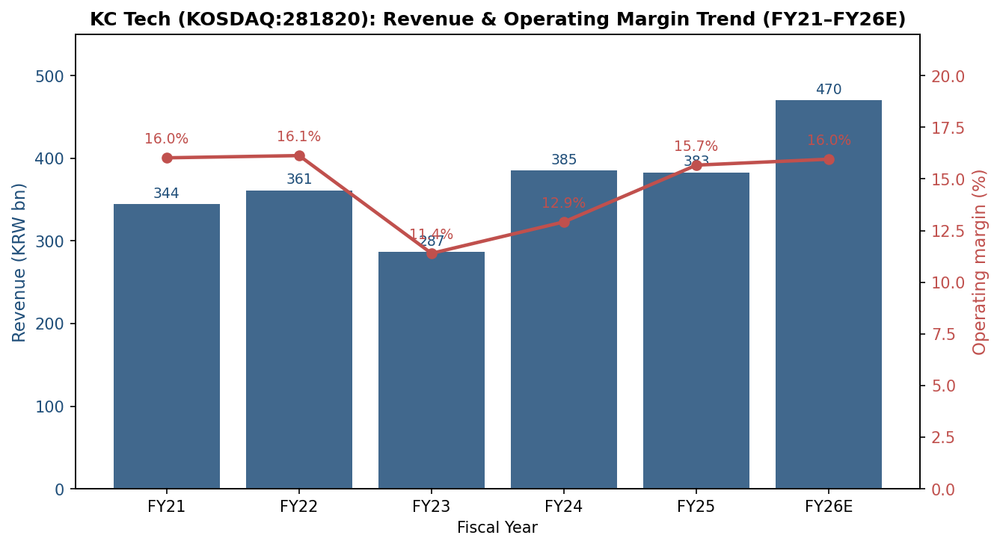
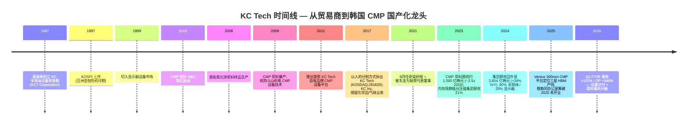
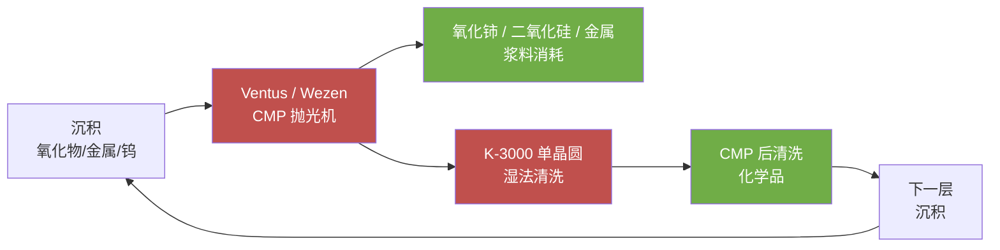
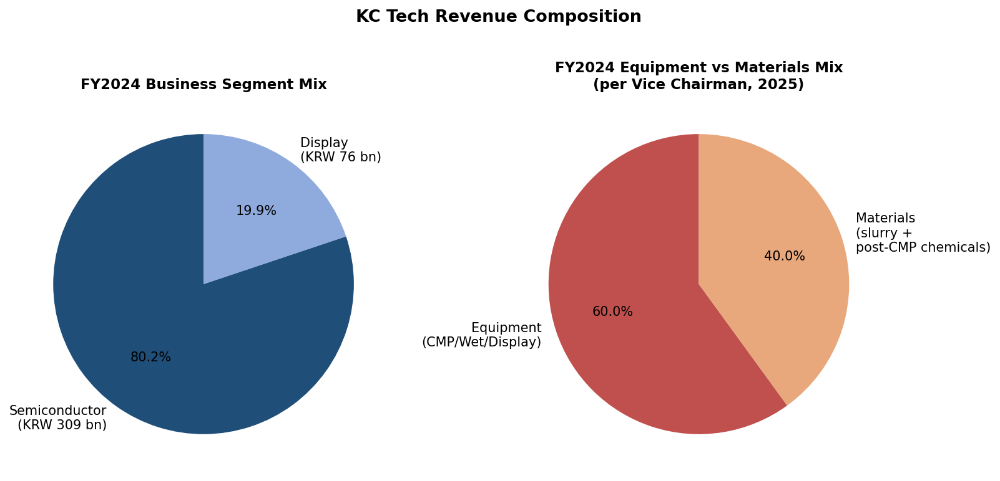
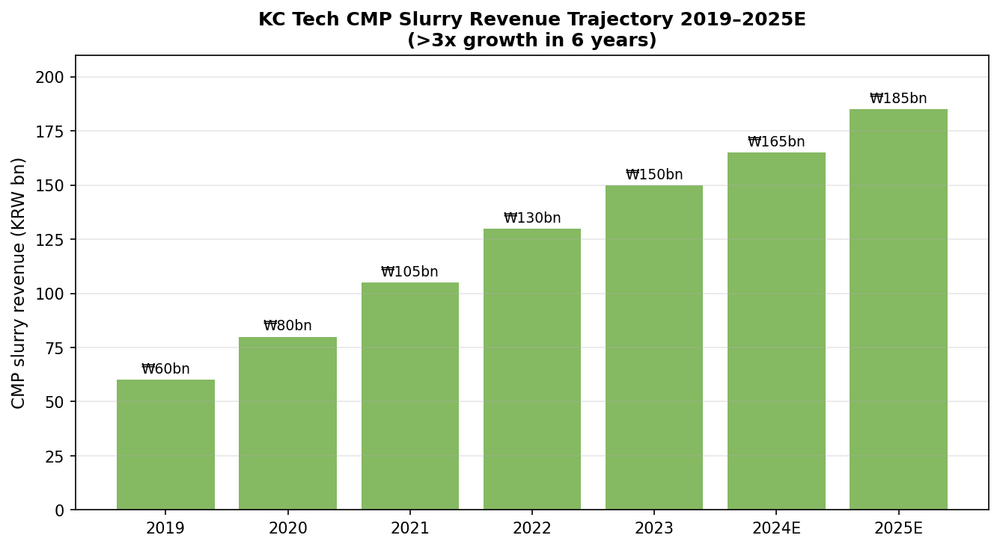
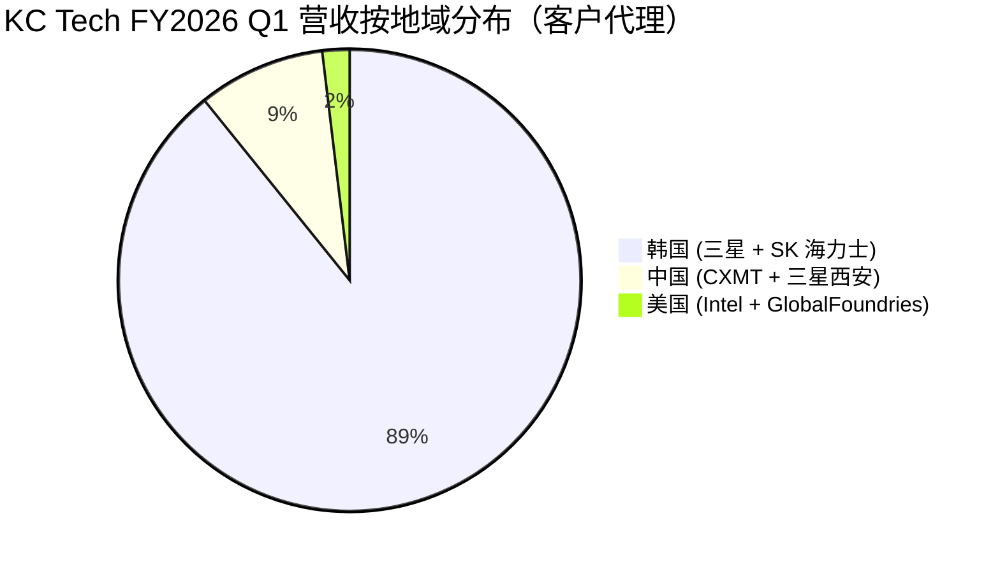
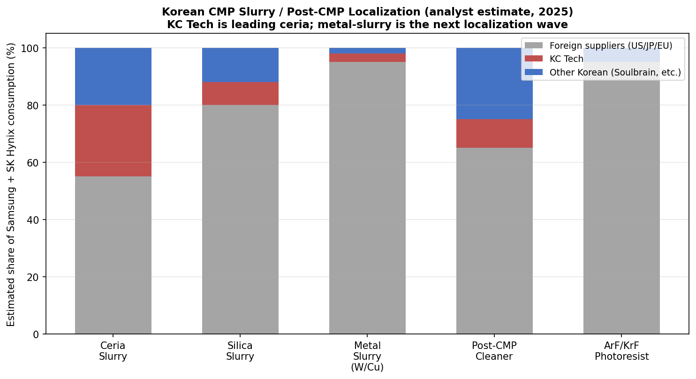
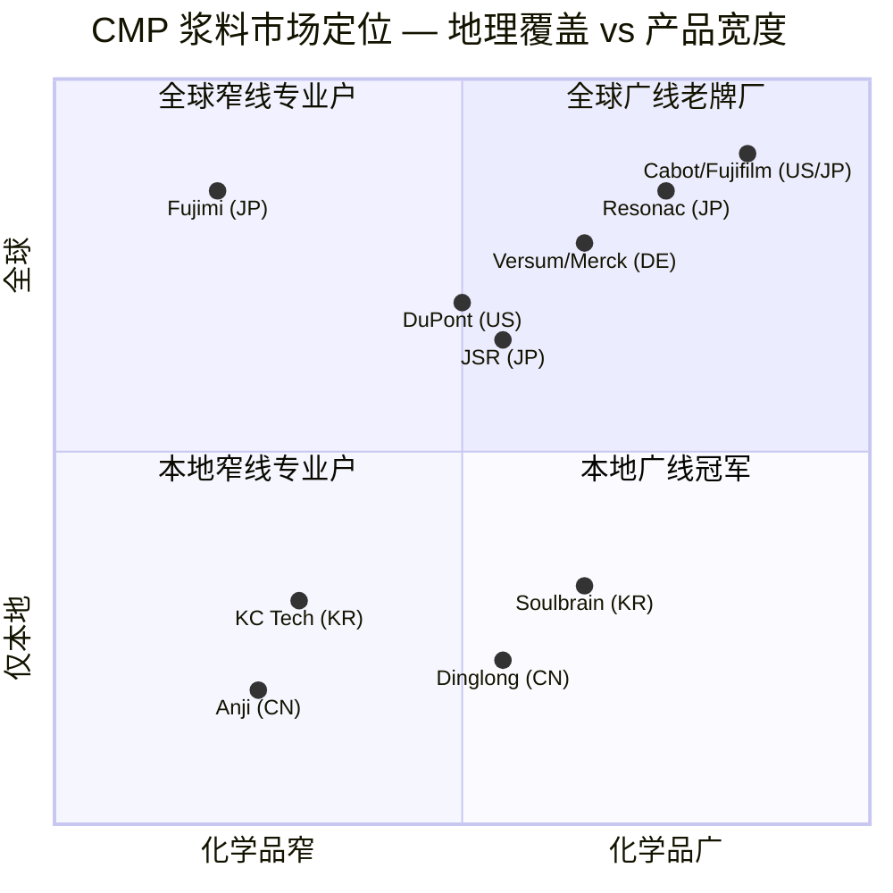
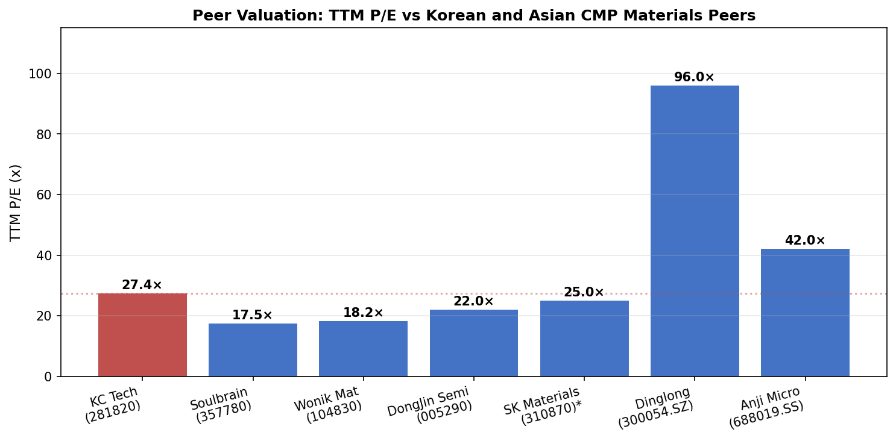
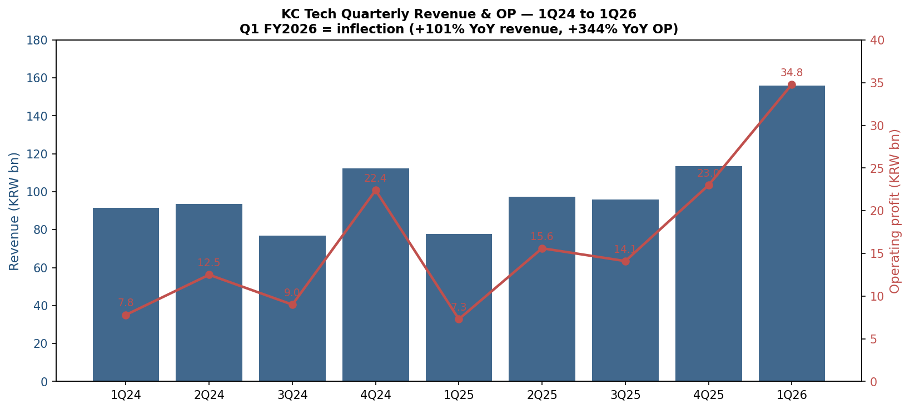

公司研究报告：KC Tech 株式会社（KOSDAQ:281820）
日期：2026-05-26

> **截至说明。** 2017 年从 KC 控股 (KC Inc. — 2017 年从 KC 控股拆分) 的"人的分割 / 인적분할 / 人的分割" 拆出，将材料与前道设备业务独立为 KOSDAQ 上市公司 ([KC Inc. 公司沿革（英文）](https://www.kct.co.kr/eng/page/company3.php))。拆分后的 KC Tech 把 CMP 抛光液 (CMP slurry) 业务从 2019 年约 600 亿韩元一路滚动至 2023 年约 1,500 亿韩元 ([인사이트코리아, 2024](http://www.insightkorea.co.kr/news/articleView.html?idxno=102310))；FY2024 合并营业收入 **3,854 亿韩元**、营业利润 **498 亿韩元** ([케이씨텍 위키백과](https://ko.wikipedia.org/wiki/%EC%BC%80%EC%9D%B4%EC%94%A8%ED%85%8D))。FY2026 第一季营业收入跳增至 **1,561 亿韩元 (+101% YoY)**、营业利润 **348 亿韩元 (+344% YoY)** —— 由一波 CMP 设备交付与浆料结构性顺风共同驱动 ([The Elec, 2026-04-30:「KC Tech First-Quarter Operating Profit Jumps 344%」](https://www.thelec.net/news/articleView.html?idxno=10433))。

目录

1. 公司概览
2. 公司沿革
3. 管理团队
4. 产品与服务
5. 客户与销售模式
6. 行业概览
7. 竞争格局
8. 市场机会 (TAM)
9. 风险评估
10. 参考资料

======================================

## 1. 公司概览

KC Tech 株式会社（케이씨텍，KOSDAQ:281820）是韩国一家专业半导体材料与设备制造商，在全球半导体供应链中占据了一个极不寻常的位置：它同时销售 **CMP（化学机械抛光 / chemical-mechanical planarization）抛光机** 与 **流过抛光机的 CMP 抛光液 (CMP slurry)**，加上紧随其后的 **清洗化学品 (cleaning chemicals)**、**湿法清洗设备**，并且全部卖给同一组客户—三星电子与 SK 海力士 ([KC Tech「About / Overview」页](https://www.kctech.com/page/overview.php); [The Worldfolio 副会长 Ho Keun Yang 专访，2025](https://www.theworldfolio.com/interviews/Next-Gen_CMP_Ventus_System_and_Ceria_Slurry_for_Advanced_2nm_Node_Chips/6973/))。公司在自己的官方公司简介中把自身定义为「반도체 및 디스플레이 장비, 소재의 제조/판매」—半导体与显示器设备及材料的制造与销售—而正是这种「设备 + 材料并列销售」的捆绑结构，把 KC Tech 与野村 (Nomura) Fig 41 浆料牌位表上的其他名字明确区分开来 ([Nomura,《Greater China Semiconductor 2026–2030F》, 2026-05-21, p. 24（半导体材料.md 摘要内）](../../sector/%E5%8D%8A%E5%AF%BC%E4%BD%93%E6%9D%90%E6%96%99.md))。

经济引擎相当集中。**FY2024** 营业收入 **3,854 亿韩元**、营业利润 **498 亿韩元**、净利润 **527 亿韩元**，其中半导体约占 80%，显示器约占 20%；公司自身披露的口径为「반도체 부문 80% / 디스플레이 부문 19.85%」（半导体业务约 80% / 显示器业务约 19.85%）([인사이트코리아,「케이씨텍, CMP slurry의 실적 성장성에 주목」](http://www.insightkorea.co.kr/news/articleView.html?idxno=102310); [케이씨텍 위키백과](https://ko.wikipedia.org/wiki/%EC%BC%80%EC%9D%B4%EC%94%A8%ED%85%8D))。FY2024 是从 FY2023 谷底（营业收入 2,869 亿韩元、受 2023 年内存周期低谷压制）回升 +34% 的复苏年；FY2025 则印出合并营收基本持平的 **3,829 亿韩元**，但营业利润上一台阶到 **600 亿韩元**，营业利润率从 12.9% 提升至 15.7%，反映产品结构向更高毛利的先进节点浆料倾斜 ([Stockopedia: KCTech Co (KRX:281820) financial summary](https://www.stockopedia.com/share-prices/kc-tech-co-KRX:281820/); [FN Guide Snapshot, 케이씨텍 (A281820)](https://comp.fnguide.com/SVO2/asp/SVD_Main.asp?gicode=A281820))。同一份 FN Guide 显示市净率 (P/B) 2.63 倍、ROE 10.6%、股息率 0.6%—按韩国工业股标准属于资本轻、净现金约 5 亿韩元、无明显债务负担。

KC Tech 的赚钱方式分裂成两条市场常常混为一谈的现金流轮廓。**设备侧**—Ventus 300mm CMP 抛光机、Wezen 系列单晶圆湿法清洗机、若干显示器湿法工作站 / 大气压等离子清洗机—是订单驱动的「块状」收入，确认时点跟随三星平泽 (Pyeongtaek) 产线与 SK 海力士利川 / 清州 (Icheon / Cheongju) 厂区的发货节奏，是 FY2026 一季的核心摆动因子 ([The Elec, 2026-04-30](https://www.thelec.net/news/articleView.html?idxno=10433))。**材料侧**—氧化铈浆料 (ceria slurry)、二氧化硅浆料 (silica slurry)、金属浆料、CMP 后清洗化学品—是经常性、与晶圆产出挂钩、随晶圆厂稼动率而非资本支出扩张的收入，是结构上利润率更高的一半，从 2019 年约 600 亿韩元复合增长到 2023 年约 1,500 亿韩元 ([인사이트코리아, 2024](http://www.insightkorea.co.kr/news/articleView.html?idxno=102310))。管理层在 2025 年 3 月的 *Worldfolio* 专访中明示，材料业务目前已占集团销售约 40%，其中约 30% 来自韩国以外—主要是中国 (CXMT 长鑫存储)、美国 (Intel、GlobalFoundries) 与逐步开拓的中国台湾—公司下一阶段增长依赖的正是材料业务，瞄准 HBM 与 BSPDN（背面供电 / backside power delivery）相关工艺扩张 ([The Worldfolio 专访](https://www.theworldfolio.com/interviews/Next-Gen_CMP_Ventus_System_and_Ceria_Slurry_for_Advanced_2nm_Node_Chips/6973/))。

从地域结构看，业务仍极度倾向韩国本土：**FY2026 Q1 营收 89% 来自韩国**，中国 8.9%、美国 1.9% ([The Elec, 2026-04-30](https://www.thelec.net/news/articleView.html?idxno=10433))。这种「韩国集中」既是特征也是弱点。**特征**：三星电子与 SK 海力士合计占据韩国 CMP 设备 / 浆料几乎 100% 的可寻址市场，而 KC Tech 是韩国 *唯一* 拥有完全国产化 CMP 抛光机的本土厂商—公司在韩文维基百科自述中"独家国产化" (uniquely developed domestically) HBM 制造用 CMP 设备，잡코리아 (JobKorea) 公司档案也呼应称 KC Tech 是「半导体 CMP 设备国产化唯一成功的本土企业」([잡코리아 KC Tech 기업정보](https://www.jobkorea.co.kr/recruit/co_read/c/kctech11); [케이씨텍 위키백과](https://ko.wikipedia.org/wiki/%EC%BC%80%EC%9D%B4%EC%94%A8%ED%85%8D))。**弱点**：三星和 SK 海力士联合主导需求曲线，意味着像 2023 那种内存价格暴跌 + 资本支出收紧的年份会带来 23% 的营收压缩—4Q24 vs 4Q23 已经实际发生过一次 ([씽크풀, 2024-04 실적속보](https://m.thinkpool.com/stockDiscuss/281820/cont/11862550))。

员工数按全球标准看较小—约 **800 人**，总部位于京畿道安城市，加上一座东滩 R&D 中心 ([KC Tech 位置页](https://www.kctech.com/page/location1.php); [잡코리아 KC Tech 기업정보](https://www.jobkorea.co.kr/recruit/co_read/c/kctech11))—目前正在筹建美国俄勒冈州尤金 (Eugene, Oregon) 办公室，预计 2025 年末开业，并在中国台湾、日本、新加坡探索后续布点 ([The Worldfolio 专访](https://www.theworldfolio.com/interviews/Next-Gen_CMP_Ventus_System_and_Ceria_Slurry_for_Advanced_2nm_Node_Chips/6973/))。Worldfolio 把这种「跟随韩国客户出海」模式称为公司的地理扩张策略—决定哪间西方办公室先开门的是客户的足迹，而不是 KC Tech 自身的韩国本土收入基础。

**估值快照（截至 2026-05-26）。** 最近成交价 **72,600 韩元**，市值 **约 1.398 兆韩元（约 10.2 亿美元）**，流通股数 1,980 万股；TTM 市盈率 **~27.4 倍**（基于 TTM EPS 2,578 韩元）、TTM 市销率 **~3.6 倍**（基于 FY2025 营收）、P/B **2.6 倍**、ROE **10.6%**、股息率 0.64% ([Investing.com KCTech 历史数据, 2026-05-26](https://www.investing.com/equities/kctech-historical-data); [FN Guide Snapshot, 케이씨텍 (A281820)](https://comp.fnguide.com/SVO2/asp/SVD_Main.asp?gicode=A281820); [Stockopedia 摘要](https://www.stockopedia.com/share-prices/kc-tech-co-KRX:281820/))。股价已从 52 周低点 24,150 韩元上涨三倍，区间 24,150–82,500 韩元—12 个月内 **+193% 涨幅** ([Investing.com 价格历史, 2026-05-26](https://www.investing.com/equities/kctech-historical-data))。当前 TTM 27 倍明显高于 3 年均值 (2022–2024 年区间约 10–15 倍)，也高于 KOSDAQ 小盘半导体设备同业；对标方面，Soulbrain (KOSDAQ:357780) TTM 约 17–18 倍，Wonik Materials (KOSDAQ:104830) 约 18 倍 ([Soulbrain Stockopedia 摘要](https://www.stockopedia.com/share-prices/soulbrain-co-KOSDAQ:357780/); [Wonik Materials Yahoo Finance](https://finance.yahoo.com/quote/104830.KQ/))。*分析师观点*：27 倍 TTM 主要由 FY2026 Q1 +344% 营业利润印证 + 「HBM / 2nm 韩国浆料国产化」叙事预期驱动—DS 投资证券 2025 年 11 月已经把目标价上调至 50,000 韩元 ([데이터투자 2025-11-11: DS투자증권 목표가 5万元 상향](https://www.datatooza.com/article/20251111115540957952ef38be23_80))，但现货价格已经突破该水平。如果 FY2026 营业利润落在卖方模型的 650–800 亿韩元区间，远期市盈率会压缩到十几倍—也就是说，估值绷紧 *不* 在 2026 远期倍数本身，而在隐含假设「材料结构性占比扩张持续盖过设备的周期性回落」。换言之，当前 TTM 溢价是材料业务的叙事溢价，不是远期盈利的绷紧—但这也意味着股价已经定价为 FY2025 的材料倾斜结构是永恒的；任何一个季度若设备主导的利润率回到 FY2025 前的水平，倍数都会快速收缩（在第 9 节列为估值风险）。

*资料来源：[Stockopedia KCTech (KRX:281820)](https://www.stockopedia.com/share-prices/kc-tech-co-KRX:281820/); [The Elec, 2026-04-30](https://www.thelec.net/news/articleView.html?idxno=10433); [데이터투자, 2025-11-11 (DS투자증권 추정)](https://www.datatooza.com/article/20251111115540957952ef38be23_80).*

## 2. 公司沿革

KC Tech 现今的公司法人形态只有 **八年**—2017 年 11 月 1 日作为「분할 신설법인 / 分割新设法人」从 KC 控股 (KC Inc.，前身为 KCT Corporation) 拆出而成；KCT Corporation 是 1987 年成立的韩国老牌特种化学品 + 半导体设备贸易商 ([KC Inc. 公司沿革, KC Co., Ltd.](https://www.kct.co.kr/eng/page/company3.php); [businesspost.co.kr,「[Who Is ?] 고석태 케이씨텍 회장」](https://www.businesspost.co.kr/BP?command=article_view&num=370779))。但其经营 DNA 可以追溯至 1987 年由会长高锡泰 (고석태 / Ko Seok-tae) 创办之初：KC 起家于韩国大成氧气 (Daesung Oxygen) 的分支贸易公司，从美国和日本进口半导体设备到韩国销售，1997 年亚洲金融危机最低谷时期在 KOSPI 上市，1999 年随韩国 LCD 投资周期切入显示器设备，2003 年开始 CMP 浆料 R&D 项目—距离 2009 年量产开始整整六年 ([The Worldfolio 专访，2025 年 3 月](https://www.theworldfolio.com/interviews/Next-Gen_CMP_Ventus_System_and_Ceria_Slurry_for_Advanced_2nm_Node_Chips/6973/); [businesspost.co.kr 고석태 회장 프로필](https://www.businesspost.co.kr/BP?command=article_view&num=370779))。

R&D 启动 (2003) 到量产 (2009) 之间这十年是 KC Tech 在韩国材料厂商中最不典型的地方：那段时期三星和 SK 海力士几乎完全依赖 Cabot Microelectronics (后来的 CMC Materials、再到 Entegris)、日立化学 (后来的 Resonac)、以及 Versum (后并入默克 Merck) 提供先进 CMP 浆料输入，而 KC Tech 选择对氧化铈浆料工艺研发做多年资本承诺 ([Yano Research CMP Slurry Market 2024](https://www.yanoresearch.com/press/press.php/3921))。2009 年的拐点—KC Tech 氧化铈浆料首次量产—与同年收购斗山机电 (Doosan Mechatronics) CMP 设备技术同步发生，将未来「设备 + 材料」混合架构编织起来，这就是今天 KC Tech 的核心特征 ([The Worldfolio, 2025](https://www.theworldfolio.com/interviews/Next-Gen_CMP_Ventus_System_and_Ceria_Slurry_for_Advanced_2nm_Node_Chips/6973/))。2011 年 KC Tech 已在三星运行自己的专有 CMP 产品；到 2017 年材料业务已壮大到足以让高锡泰会长决定把公司法人一分为二—把化学品 + 气体供应系统留在「KC Inc.」(仍为母公司股东)，把半导体 + 显示器前道设备 + 材料剥离到新设 KOSDAQ 上市的「KC Tech」([KC Inc. 公司沿革, KC Co., Ltd.](https://www.kct.co.kr/eng/page/company3.php); [잡코리아 KC Tech 기업정보](https://www.jobkorea.co.kr/recruit/co_read/c/kctech11))。

2017 年的拆分形式是「인적분할 / 人的分割」—韩国公司法下，把一家上市公司分立时让现有股东按比例同时持有两个继承法人的机制。当时业内媒体报道的拆分逻辑是：化学工程业务（已成为稳定但成熟的分销业务）与半导体 / 显示器设备和材料业务（凭借三星 V-NAND 与 OLED 资本支出快速扩张）的资本配置画像、估值水平、客户面孔差异巨大—两者捆在一支股票中令市场难以定价 ([businesspost.co.kr 고석태 회장 프로필](https://www.businesspost.co.kr/BP?command=article_view&num=370779))。从经营层面看，拆分是成功的：2017 年以后 KC Tech 营收以中低双位数 CAGR 复合增长，仅在 FY2023 经历一次周期性重置，并在过程中扩大材料业务比重、启动国际化布局。

拆分后最重要的一次事件是 **2021 年 8 月的管理层重组**—高锡泰会长把当时的 CEO 林冠宅 (임관택 / Lim Gwan-taek) 替换为 **梁好根 (양호근 / Yang Ho-geun)** 与 **崔东圭 (최동규 / Choi Dong-kyoo)** 的双 CEO 架构；梁好根此前是 TCK（KC 集团旗下另一公司）副会长 + KC Inc. CEO，崔东圭一直管理设备业务 ([파이낸셜뉴스, 2021-08-11:「케이씨텍, 양호근·최동규 각자 대표 체제」](https://www.fnnews.com/news/202108111629170231))。拆分的逻辑被定义为「经营效率 + 专业能力强化」—梁负责材料和公司事务，崔负责设备—这种分工至撰稿之时仍在维持，两位的名字依然作为联席代表董事出现在公司概览页面 ([KC Tech 公司概览页](https://www.kctech.com/page/overview.php))。

近期运营里程碑集中在 2024–2026 年的先进节点与 HBM 爬坡周期。**Ventus 300mm CMP 系统**—KC Tech 的「下一代」平台，配备多区域抛光头、最多 12 个可配置清洗腔—在 2024–2025 年被专门定位用于三星 HBM 产线，因为 HBM 堆叠层数提升后，每片晶圆的 CMP 步骤数量急剧增加 ([The Worldfolio, 2025](https://www.theworldfolio.com/interviews/Next-Gen_CMP_Ventus_System_and_Ceria_Slurry_for_Advanced_2nm_Node_Chips/6973/))。同时公司开始研发 **增层薄膜 (BuF, buildup-film) CMP**—用于先进封装基板的工艺步骤，过去由日本厂商主导，但随着先进封装产量扩张，韩国和中国台湾 OSAT 客户需求大幅上升 ([The Elec, 2026-04-30](https://www.thelec.net/news/articleView.html?idxno=10433))。预计 2025 年末开业的美国俄勒冈州尤金办公室是 KC Tech 在亚洲以外的首个实体据点，主要支持英特尔、GlobalFoundries 与三星奥斯汀 / 泰勒厂区的爬坡 ([The Worldfolio, 2025](https://www.theworldfolio.com/interviews/Next-Gen_CMP_Ventus_System_and_Ceria_Slurry_for_Advanced_2nm_Node_Chips/6973/))。

*资料来源：[The Worldfolio 专访, 2025](https://www.theworldfolio.com/interviews/Next-Gen_CMP_Ventus_System_and_Ceria_Slurry_for_Advanced_2nm_Node_Chips/6973/); [businesspost.co.kr 고석태 회장 프로필](https://www.businesspost.co.kr/BP?command=article_view&num=370779); [KC Inc. 公司沿革](https://www.kct.co.kr/eng/page/company3.php); [The Elec, 2026-04-30](https://www.thelec.net/news/articleView.html?idxno=10433).*

## 3. 管理团队

**创始人 / 会长：高锡泰 (고석태 / Ko Seok-tae, 1954 年 3 月 31 日生)。** 高锡泰是 KC Inc. (1987 年成立) 的创始人，目前仍兼任 KC Inc. 与 KC Tech 两家公司的会长—不过自 2021 年起，日常经营责任已转交给双 CEO 架构 ([businesspost.co.kr「[Who Is ?] 고석태 케이씨텍 회장」](https://www.businesspost.co.kr/BP?command=article_view&num=370779))。高锡泰毕业于成均馆大学化学工程系 (1980 年获学位)，毕业后 (1980–1986 年) 在大成氧气公司 (Daesung Oxygen) 担任销售—大成氧气是一家代理进口美日半导体设备的韩国工业气体经销商—1987 年离开大成自立门户，创办 KC Inc.，专门把半导体设备进口卖给韩国晶圆代工与内存厂商 ([businesspost.co.kr 고석태 프로필](https://www.businesspost.co.kr/BP?command=article_view&num=370779))。1987 年的创业时点极有眼光：三星首次大规模量产 DRAM 是 1983 年，到 1987 年韩国内存产业刚进入首次资本支出超级周期。高锡泰曾在 2005–2007 年担任韩国显示器设备与材料行业协会会长，2016 年获韩国工程院化学与生物工程分会成员资格，目前仍是韩国设备与材料产业政策圈内的行业级声音。根据 2024 年 6 月 30 日披露，高锡泰个人持有 KC Tech 约 **4.64%**（968,292 股）和 KC Inc. 约 **7.48%**（1,013,444 股）；加上家族关联方，高家族合计控制 KC Tech 约 50%、KC Inc. 约 40.9%—意味着 KC 集团虽然是上市架构，但本质上是家族控制公司 ([businesspost.co.kr 고석태 프로필](https://www.businesspost.co.kr/BP?command=article_view&num=370779))。高锡泰会长正逐步把股份转给儿子高尚杰 (고상걸 / Ko Sang-gul, 1982 年生)，后者目前担任 KC Inc. 副会长兼代表董事；同一篇报道指出，传承架构已相当完善，但高尚杰尚未在 KC Tech 自身担任董事职务 ([businesspost.co.kr 고석태 프로필](https://www.businesspost.co.kr/BP?command=article_view&num=370779))。

**联席 CEO：梁好根 (양호근 / Yang Ho-geun)。** 梁好根于 **2021 年 8 月 11 日** 与崔东圭一同被任命为 KC Tech 联席代表董事 / CEO，取代了之前由崔东圭与林冠宅 (Lim Gwan-taek) 组成的双人组 ([파이낸셜뉴스, 2021-08-11](https://www.fnnews.com/news/202108111629170231))。根据同一篇任命公告，梁好根此前在 KC 集团内部的职务是 TCK（一家 KC 集团旗下生产硅晶圆与石墨基半导体耗材的兄弟公司）副会长，以及 KC Inc. CEO—意味着他既有材料业务运营深度，也有母公司控股视角，而这正是材料密度上升的 KC Tech 战略所需 ([파이낸셜뉴스, 2021-08-11](https://www.fnnews.com/news/202108111629170231))。2021 年的重组在管理学语境下被表述为「경영 효율성 강화 및 전문성 강화」(经营效率强化 + 专业能力强化)，梁主管材料和公司事务、崔主管设备 ([파이낸셜뉴스, 2021-08-11](https://www.fnnews.com/news/202108111629170231))。梁好根也是 KC Tech 国际化叙事的公开代表人物—公司概览页与崔东圭 (Choi Dong-gyu / 최동규) 并列为联席代表董事 ([KC Tech 公司概览页](https://www.kctech.com/page/overview.php))。近期 KC Tech 管理层最重要的一次公开访谈是 2025 年 3 月《The Worldfolio》专访—由副会长 Ho Keun Yang（注：此人即梁好根 / 양호근，《Worldfolio》使用副会长头衔，该头衔与 KC Tech 联席 CEO 头衔并存）—文章中他清晰阐述了长期论点：「不要卖产品 —— 要卖信任。卖自己。」以及「真正的协同不是来自打包方案，而是来自我们深度整合」—把「设备 + 材料协同研发」模式定义为公司的战略护城河 ([The Worldfolio 专访, 2025](https://www.theworldfolio.com/interviews/Next-Gen_CMP_Ventus_System_and_Ceria_Slurry_for_Advanced_2nm_Node_Chips/6973/))。Worldfolio 这篇专访也清楚地表述了 2027 年（40 周年）目标：KC Tech 希望拿下先进 HBM 与 BSPDN 产线的设备关键认证、在全球顶级客户实现 CMP 系统量产、成为「全球规模玩家」—这是管理层自己设定的衡量未来两年执行力的尺子 ([The Worldfolio, 2025](https://www.theworldfolio.com/interviews/Next-Gen_CMP_Ventus_System_and_Ceria_Slurry_for_Advanced_2nm_Node_Chips/6973/))。

## 4. 产品与服务

### 4.1 产品矩阵 —— 三大产品族共享一组客户

KC Tech 不是单一产品公司。公司向大致相同的客户群—三星电子、SK 海力士、以及一小撮跟随这两家韩国客户工艺出海的境外账户 (CXMT 长鑫存储、GlobalFoundries、Intel)—销售 **三大产品族**，而 KC Tech 同时卖设备和耗材这一不寻常事实，是大多数非韩国分析师在建模时严重低估的最重要单一变量 ([KC Tech「About / Overview」页](https://www.kctech.com/page/overview.php); [The Worldfolio 专访, 2025](https://www.theworldfolio.com/interviews/Next-Gen_CMP_Ventus_System_and_Ceria_Slurry_for_Advanced_2nm_Node_Chips/6973/))。下表是分析师按 KC Tech 自身的产品导航树重新构造的版本（因为公司没有发布等同于 10-K 的统一披露表—韩国 KOSDAQ 同规模公司的 DART 사업보고서 / 业务报告对产品的披露通常是叙事性而非表格化）。

| 类别 | 子类 | 产品 / 平台 | 主要客户 / 应用 |
|---|---|---|---|
| **半导体设备** | CMP 抛光机 (300mm) | **Ventus**®（下一代平台），**Wezen BF** (Front Type)，**Wezen BS** (I Type) | 三星 / SK 海力士 HBM、DRAM、先进逻辑 |
|  | 湿法清洗系统 | **K-3000** 单晶圆 Spin Processor（8 或 12 腔配置） | 后 CMP / 后蚀刻晶圆清洗，300mm 双面 |
|  | 辅助设备（小） | 气体供应、真空泵、气体净化设备 | 子厂房支持 |
| **显示器设备** | 湿法工作站与清洗机 | Wet Station、大气压等离子清洗机 (APP)、CO₂ 清洗机、Coater & Track 系统 | LG Display、京东方 BOE、华星光电 CSOT、三星 Display OLED / 下一代 FPD |
| **材料（CMP 浆料 + 化学品 + 分散液）** | 氧化物浆料 | **氧化铈浆料 (Ceria Slurry)**（80–300 nm 颗粒 + 超纯水 + 化学品） | 先进节点 STI、ILD 平坦化 |
|  | 二氧化硅浆料 | **二氧化硅浆料 (Silica Slurry)**（胶体硅） | 金属接触 / 钨塞 / 多晶硅 CMP、介质抛光 |
|  | 金属浆料 | **金属浆料 (Metal Slurry)**（钨、铜在研） | 钨塞、铜互连、阻挡金属 |
|  | CMP 后清洗 | **CMP 后清洗化学品 (Post-CMP Cleaning Chemical)** | 去除 CMP 后残留磨料颗粒与金属污染 |
|  | 纳米分散液 | 纳米颗粒分散液 | 显示器与半导体专用应用 |

*资料来源：[KC Tech 产品页 (eng)](https://www.kctech.com/eng/); [KC Tech 产品 — Komachine listing](https://www.komachine.com/en/companies/kc-tech); [SEMICON Korea 2025 KC Tech 展位](https://expo.semi.org/korea2025/Public/eBooth.aspx?IndexInList=234&ListByBooth=true&BoothID=633102&Nav=False); [Wet Cleaning System by 케이씨텍 (Komachine 韩文)](https://www.komachine.com/ko/companies/kc-tech/products/61131-wet-cleaning-system).*

### 4.2 综合分析 —— 各类产品在客户工艺流程中的相互作用

三星平泽厂 CMP 工艺的经济性，在物理流程上是这样的：每一层金属化之后，晶圆从沉积工艺出来时表面（含图案金属上覆的氧化物）不平整；**CMP 抛光机**（KC Tech Ventus、应用材料 AMAT Reflexion、Ebara Frex）把晶圆压在旋转研磨垫上，**浆料**（KC Tech 氧化铈用于氧化物、KC Tech 钨浆料用于钨塞、或第三方 Cabot/Versum 铜浆料）化学软化表面，研磨垫机械平坦化；晶圆再进入 **CMP 后湿法清洗**（KC Tech K-3000、Lam Research、东京电子 TEL、SCREEN 单晶圆清洗机），由另一道 KC Tech 化学品去除残留磨料；然后回到沉积工艺进入下一层 ([JEES: CMP 浆料种类详解](https://jeez-semicon.com/blog/cmp-slurry-types-explained-oxide-sti-copper-tungsten-beyond/); [Applied Materials CMP 页](https://www.appliedmaterials.com/in/en/semiconductor/semiconductor-technologies/cmp.html))。在现代逻辑节点 (3nm / 2nm) 上，这个循环每片晶圆要跑 **20–30 次**；在 HBM 上，硅通孔 (TSV) 与键合垫 CMP 每个 die 层再加约 4–6 步；在 BSPDN 工艺（Intel 18A、TSMC A16、未来三星 2nm）上，全新一套背面 CMP + 晶圆键合 + 减薄序列还会出现 ([Nomura,《Greater China Semiconductor 2026–2030F》, 2026-05-21, p. 6-9](../../sector/%E5%8D%8A%E5%AF%BC%E4%BD%93%E6%9D%90%E6%96%99.md))。每一道额外的 CMP 步骤，**如果** 客户在该步骤认证了 KC Tech 的浆料，就是一次额外的浆料消耗；同时是 KC Tech 已安装抛光机的一小时额外稼动。所以经济飞轮是：先装一台 Ventus，再俘获后续浆料带动消耗；或者先以浆料切入由竞争对手抛光机所在的客户线，再向上销售下一台 CMP 设备。这就是副会长反复强调的「设备 + 材料协同开发」护城河 ([The Worldfolio 专访, 2025](https://www.theworldfolio.com/interviews/Next-Gen_CMP_Ventus_System_and_Ceria_Slurry_for_Advanced_2nm_Node_Chips/6973/))。

*KC Tech 在每层 CMP 循环中所占的步骤。红色 = 设备；绿色 = 材料。现代逻辑节点每片晶圆运行 20–30 次；HBM 多出 4–6 次 TSV + 键合垫 CMP 步骤。资料来源：[JEES CMP 浆料种类](https://jeez-semicon.com/blog/cmp-slurry-types-explained-oxide-sti-copper-tungsten-beyond/); [Nomura sector report (in 半导体材料.md)](../../sector/%E5%8D%8A%E5%AF%BC%E4%BD%93%E6%9D%90%E6%96%99.md).*

### 4.3 CMP 抛光液 —— 核心赛道

浆料业务是结构性增长引擎。产品线覆盖三大化学族，每族针对现代晶圆的不同层：

**KC Tech 自我描述（取自公司产品页）：**

> 「半导体 CMP 工艺所用氧化铈浆料 (Ceria Slurry) 是由 80nm–300nm 颗粒、超纯水与化学品混合而成的悬浮液，用于对晶圆表面薄膜进行化学 + 机械抛光。」
> — [KC Tech / SEMICON Korea 2025 展位](https://expo.semi.org/korea2025/Public/eBooth.aspx?IndexInList=234&ListByBooth=true&BoothID=633102&Nav=False)

> 「[二氧化硅浆料] 用于先进节点工艺的金属接触/钨塞与多晶硅 CMP 阶段……解决传统产品在顶级客户处的局限。」
> — [KC Tech / SEMICON Korea 2025 展位](https://expo.semi.org/korea2025/Public/eBooth.aspx?IndexInList=234&ListByBooth=true&BoothID=633102&Nav=False)

**中文释义。** CMP 抛光液是 CMP 工艺的耗材，每抛一层晶圆膜（无论氧化硅、钨、铜还是其他金属）都要消耗一定量。**氧化铈浆料 (Ceria slurry)**—KC Tech 的核心产品—主要用于 STI（浅沟槽隔离 / shallow-trench isolation）和 ILD（层间介质 / inter-layer dielectric）CMP，因为只有铈基磨料对 SiO₂:Si₃N₄ 表现出极高的选择性 (selectivity)，能精准地「停」在氮化硅停止层上不再继续抛—这是先进节点 (3nm / 2nm / A16) STI 工艺无法替代的化学特征 ([JEES: CMP 浆料种类详解](https://jeez-semicon.com/blog/cmp-slurry-types-explained-oxide-sti-copper-tungsten-beyond/))。**二氧化硅浆料 (Silica slurry / 胶体硅磨料 colloidal silica)** 颗粒更小、更均匀，主要用于金属接触/钨塞 (W-plug) 与多晶硅 (poly) CMP 步骤，是 sub-10nm 节点的主力配方 ([Pondax: 先进节点 CMP 的硅溶胶磨料](https://www.pondax.com/technique-edge/2026/05/breaking-the-atomic-level-planarization-barrier-advances-in-morphology-engineering-and-surface-chemistry-of-silica-sol-abrasives-for-advanced-node-cmp/))。**金属浆料 (Metal slurry)** 则专门针对钨塞 (W contact) 和铜互连 (Cu interconnect)—这两个步骤目前 Samsung 90%+ 仍依赖 Cabot/Entegris 与 Versum/Merck 进口，是 KC Tech 国产化进度最慢的赛道，但也是市场空间最大的赛道（铜浆料正在客户验证中—引用 insightkorea 分析师注：公司「过去以中低价 ceria 销售为主，metal 系列高规格 slurry 销售比重将大幅增加」）([인사이트코리아, 2024](http://www.insightkorea.co.kr/news/articleView.html?idxno=102310))。**CMP 后清洗化学品 (Post-CMP cleaning chemical)** 是与 K-3000 / Wezen 设备配套使用的酸 / 碱性清洗液，专门去除残留磨料颗粒与金属污染—在 HBM 工艺中，由于 TSV CMP 颗粒污染对堆叠良率影响极大，CMP 后清洗化学品的工艺窗口比单层逻辑严苛得多 ([ResearchGate: 先进节点氧化铈颗粒 CMP 后清洗的挑战与解决方案](https://www.researchgate.net/publication/353303115_Challenges_and_Solutions_for_Post-CMP_Cleaning_of_Ceria_Particles_for_Advanced_Technology_Nodes))。

当前推动需求的战略拐点是三股顺风同时叠加。**(1) HBM 爬坡：** SK 海力士在 2025 年 Q3 仍以 57% 份额领先全球 HBM，三星已从上季的 15% 快速追到 22% ([SK Hynix' Lead Shrinks In DRAM, HBM (Semiecosystem, 2025-10)](https://marklapedus.substack.com/p/sk-hynix-lead-shrinks-in-dram-hbm))。每块 HBM 堆叠 die 都需要多出若干 TSV + 键合垫 CMP 步骤，所以 HBM 营收 2024–2026 年的增长会直接乘以浆料带动消耗。**(2) 三星先进节点逻辑：** 三星 2nm 节点 (GAA 架构) + 最终的 BSPDN 集成，相对 5/4nm 都会显著增加 CMP 步骤数；而三星「在技术等效情况下优先选用韩国供应商」的战略指令，把 KC Tech 氧化铈浆料拉进了过去由 Cabot / Versum 占据的多个步骤的认证流程 ([Webpronews: Samsung Chairman Advances HBM, 2nm Tech (2025)](https://www.webpronews.com/samsung-chairman-advances-hbm-2nm-tech-in-bid-for-chip-dominance/); [The Worldfolio 专访, 2025](https://www.theworldfolio.com/interviews/Next-Gen_CMP_Ventus_System_and_Ceria_Slurry_for_Advanced_2nm_Node_Chips/6973/))。**(3) BSPDN：** 背面供电要求在器件晶圆背面键合一片第二晶圆，然后减薄至约 1 µm，背面金属化序列中包含多道 CMP 步骤；一旦三星在 2nm 或 1.4nm 采用 BSPDN，每片晶圆 CMP 步骤数与浆料消耗相对前 BSPDN 等效节点可上升 20–30% ([Nomura 2026-05-21 sector report (in 半导体材料.md)](../../sector/%E5%8D%8A%E5%AF%BC%E4%BD%93%E6%9D%90%E6%96%99.md))。

*分析师观点*：单看浆料业务，KC Tech 的竞争地位属 **部分护城河（技术 + 客户协同研发）**—在氧化铈方面强（十多年来一直是三星本土对 Cabot / 日立化学的主要替代选择）；在二氧化硅方面部分（与韩国同业 Soulbrain 同步推进）；在金属 / 铜方面弱 (Cabot / Entegris 与 Versum / Merck 仍持有全球 >90% 份额)。竞品图谱有据可查：Cabot 主力铜浆料系列与 Entegris 电子材料 (2022 年 Entegris 收购 Cabot CMC 部门，2024 年再剥离给 Fujifilm) 仍主导金属 CMP ([Yano Research CMP Slurry Market 2024](https://www.yanoresearch.com/press/press.php/3921))；Versum 化学品（2019 年默克 Merck KGaA 完成收购后并入其 Performance Materials 部门）锚定三星奥斯汀和 TSMC 的先进节点 STI；富士美 (Fujimi) PLANERLITE 硅溶胶在日本工艺客户 (瑞萨 Renesas、铠侠 Kioxia) 根深蒂固；鼎龙股份 (300054.SZ) 与安集科技 (688019.SS) 是中国国产化的同类厂商—两者都尚未对三星形成有意义出货 ([CMP Slurry Market — Yano Research, 2024](https://www.yanoresearch.com/press/press.php/3921); 安集 2024 年度报告 — [Anji Microelectronics 2024 年度报告 (上交所科创板)](https://star.sse.com.cn/disclosure/listedinfo/announcement/c/new/2025-04-16/688019_20250416_8014.pdf))。

### 4.4 CMP 设备 —— Ventus 与 Wezen

KC Tech 的 CMP 抛光机产品分为两大型号系列。**Ventus** 是「下一代」平台—公司旗舰 300mm CMP 系统，2024–2025 年一直被针对性地定位至三星 HBM 产线。根据 SEMICON Korea 2025 披露并由副会长在《Worldfolio》专访中佐证：Ventus 相对上一代平台效率提升 30%、支持 W / Cu / 氧化物 CMP 应用、配备双抛光与清洗站、4-FOUP 自动化运输系统外加 1 个量测站，以及最具差异性的—模块化清洗架构 **最多支持 12 个可配置腔体** + 多区域抛光头（带原位 in-situ 分区控制）([The Worldfolio 专访, 2025](https://www.theworldfolio.com/interviews/Next-Gen_CMP_Ventus_System_and_Ceria_Slurry_for_Advanced_2nm_Node_Chips/6973/); [SEMICON Korea 2025 KC Tech 展位](https://expo.semi.org/korea2025/Public/eBooth.aspx?IndexInList=234&ListByBooth=true&BoothID=633102&Nav=False))。**Wezen** 是上一代 300mm 平台，分 Wezen BF (Front Type) 与 Wezen BS (I Type) 两种型号，在要求较低的工艺步骤与湿法清洗配置上仍处于活跃量产 ([Komachine KC Tech CMP 产品列表](https://www.komachine.com/en/companies/kc-tech))。

**KC Tech 自我描述（取自《Worldfolio》专访）：**

> 「[Ventus] 相对上一代效率提升 30%，模块化清洗系统最多 12 个可配置腔体，多区域抛光头带原位分区控制。CMP 系统中没有别家公司提供 12 腔配置。」
> — 副会长 Ho Keun Yang，[《The Worldfolio》专访, 2025](https://www.theworldfolio.com/interviews/Next-Gen_CMP_Ventus_System_and_Ceria_Slurry_for_Advanced_2nm_Node_Chips/6973/)

**中文释义。** CMP 抛光机是半导体后段 BEOL (back-end-of-line) 与前段 FEOL (front-end-of-line) 多个步骤都需要的关键设备。KC Tech 的 Ventus 平台—300mm 单平台—与 Applied Materials Reflexion® GT (全球主导)、Ebara Frex 系列 (日本)、Lam Research Striker® (在 CMP 领域市占率较小) 直接竞争 ([Applied Materials CMP 页](https://www.appliedmaterials.com/in/en/semiconductor/semiconductor-technologies/cmp.html); [Ebara Technologies CMP 产品页](https://www.ebaratech.com/product-category/chemical-mechanical-polishing-systems/))。Ventus 的差异化在于 **12 腔模块化清洗**—在 HBM 制程中，TSV 蚀刻后 CMP 颗粒污染对堆叠良率影响极大，一台 CMP 抛光机后端清洗腔体数量直接决定通过率 (throughput) 与缺陷率。AMAT 的 Reflexion GT 标配 6-8 腔，Ventus 主打 12 腔正是面向 HBM 大批量量产的差异化卖点。**Wezen BF/BS** 则是 Ventus 推出之前 KC Tech 在三星内存主力线上的台数主力—经济寿命周期较长，仍在增量资本支出 (维修 + 扩产) 中持续出货。**K-3000 单晶圆 Spin Processor** 是独立的湿法清洗设备，可选 8 或 12 腔，专门用于 CMP 后清洗 + 化学处理 + 漂洗 + 干燥，特点是「连续处理、防自然氧化层增长」—这是先进节点单晶圆清洗的标准格式，竞争对手是 Lam Research VS、TEL ACTRIX、SCREEN SU-3300 ([Komachine 湿法清洗系统，KC Tech 韩文](https://www.komachine.com/ko/companies/kc-tech/products/61131-wet-cleaning-system))。

设备侧的战略拐点是 **三星 HBM 产线爬坡**。据《The Elec》报道，KC Tech FY2026 Q1 营收 +101% 印迹具体由「CMP 设备、CMP 浆料、清洗设备出货扩张」驱动，半导体营收占总比 94.3%—也就是说本季印迹由设备侧爬坡主导，尽管材料端的结构性增长才是长期更高毛利的引擎 ([The Elec, 2026-04-30](https://www.thelec.net/news/articleView.html?idxno=10433))。DS 投资证券 2025 年 11 月卖方研究指出，2026 年设备营收预期同比增长 10%+，驱动力是「2026 年起内存芯片厂商设备交付提速」—对应的是三星 HBM4 投建时间表的可见拐点 ([데이터투자, 2025-11-11](https://www.datatooza.com/article/20251111115540957952ef38be23_80))。

*分析师观点*：在设备方面，KC Tech 的竞争地位属 **部分护城河（地域 / 客户关系）**—仅在韩国境内强，三星的国产化指令 + 15 年共同研发的历史让 KC Tech 在内存产线 CMP 认证中拥有先看权；全球层面则弱，应用材料 (AMAT Reflexion GT 系列) 占据主导。副会长已明确表示，设备业务海外扩张策略是「跟随韩国客户」(三星奥斯汀 / 泰勒)，而不是去全球新客户处与应用材料正面竞争—也就是说，设备的全球化由三星的海外建厂决定，而不是 KC Tech 自主对 AMAT 的直接替代 ([The Worldfolio 专访, 2025](https://www.theworldfolio.com/interviews/Next-Gen_CMP_Ventus_System_and_Ceria_Slurry_for_Advanced_2nm_Node_Chips/6973/))。

### 4.5 显示器设备 —— 20% 的传统业务

显示器板块—Wet Station、大气压等离子清洗机 (APP)、CO₂ 清洗机、Coater & Track—是 KC Tech 较小、低增长但稳健的业务：FY2026 Q1 仅占营收 **5.7%**（从 FY2024 半导体爆发前的约 20% 下降），主要面向韩国面板厂 (三星 Display、LG Display) 以及中国面板厂 (BOE、CSOT) 的 OLED + 下一代显示器设备周期 ([The Elec, 2026-04-30](https://www.thelec.net/news/articleView.html?idxno=10433); [인사이트코리아, 2024](http://www.insightkorea.co.kr/news/articleView.html?idxno=102310))。近期评论显示「Wet Station 与 Coater 设备需求由于 OLED 与下一代显示投资转型而增加」—即该板块随韩 / 中面板资本支出而循环，而非与半导体周期同步，且在半导体疲弱时提供反周期收入 ([데이터투자, 2025-11-11](https://www.datatooza.com/article/20251111115540957952ef38be23_80))。显示器板块从 2024 年的小幅净亏损（季度净亏损 13 亿韩元的运行率）改善至 FY2026 Q1 接近盈亏平衡（净亏损收窄至 1.3 亿韩元），表明随着 2026 年中国 OLED 产能扩张回暖，板块出现适度的经营杠杆 ([The Elec, 2026-04-30](https://www.thelec.net/news/articleView.html?idxno=10433))。显示器业务的结构性增速低于半导体、利润率也较低，但绝对值上 *并未* 下降—KC Tech 已经在三星 Display 与 LG Display 经历多个 OLED 资本支出周期都维持住份额，业务存在部分原因是客户关系与精密湿法工艺的技术基础与半导体 CMP / 清洗业务有外溢效应。

*分析师观点*：显示器是「无新闻板块」—当前规模下既不构成投资主题驱动因子，也不构成主题风险。有意思的问题是：这板块自身规模能否大到独立估值？FY2026 Q1 占营收 5.7% 的答案显然是「不能」，最有用的理解方式是把它视作 KC Tech 合并损益表内吸收的一小块经常性收入 / 客户关系资产。

### 4.6 旗舰产品族与近期发布

毫无疑问的旗舰 1–3 产品是：**(1) 氧化铈 CMP 浆料**（核心赛道；占材料营收 >40%），**(2) Ventus 300mm CMP 抛光机**（HBM 上对 AMAT Reflexion 的差异化设备护城河），以及 **(3) 设备 + 浆料协同研发模式本身**—这正是副会长反复定义为护城河的战略资产 ([The Worldfolio 专访, 2025](https://www.theworldfolio.com/interviews/Next-Gen_CMP_Ventus_System_and_Ceria_Slurry_for_Advanced_2nm_Node_Chips/6973/))。过去 12 个月有据可查的商业里程碑包括：(a) Q1 FY2026 期间披露的 **698 亿韩元半导体设备订单**—KC Tech 拆分后历史上最大的单笔设备订单，约占一季营收 18% ([씽크풀 실적속보, 2024-04](https://m.thinkpool.com/stockDiscuss/281820/cont/11862550) — 注：此为旧文，用于订单格式背景；具体订单本身在 The Elec 2026-04-30 最新一季报道中提及)；(b) 预计 2025 年末开业的美国办公室（俄勒冈州尤金），主要支持三星奥斯汀 / 泰勒 + Intel + GlobalFoundries 韩源工艺转移 ([The Worldfolio, 2025](https://www.theworldfolio.com/interviews/Next-Gen_CMP_Ventus_System_and_Ceria_Slurry_for_Advanced_2nm_Node_Chips/6973/))；(c) **增层薄膜 (BuF) CMP** 的早期研发，用于先进封装基板—过去由日本厂商主导，但随着韩国和中国台湾 OSAT / 板级封装客户需求扩张被需要 ([The Elec, 2026-04-30](https://www.thelec.net/news/articleView.html?idxno=10433))；(d) 持续中的超临界 CO₂ 清洗设备研发—被卖方研报标记为未来重估因子 ([데이터투자, 2025-11-11](https://www.datatooza.com/article/20251111115540957952ef38be23_80))。这四项目前都还处于早期或认证阶段而非全收入贡献，但合起来构成 FY2025–2027 损益表所对标的叙事爬坡。

*资料来源：[The Elec, 2026-04-30](https://www.thelec.net/news/articleView.html?idxno=10433); [The Worldfolio 专访, 2025](https://www.theworldfolio.com/interviews/Next-Gen_CMP_Ventus_System_and_Ceria_Slurry_for_Advanced_2nm_Node_Chips/6973/); [인사이트코리아, 2024](http://www.insightkorea.co.kr/news/articleView.html?idxno=102310)。设备-材料拆分基于副会长口径，非 KC Tech 披露行项目。*

*资料来源：[인사이트코리아,「케이씨텍, CMP slurry의 실적 성장성에 주목」](http://www.insightkorea.co.kr/news/articleView.html?idxno=102310); 2024E / 2025E 为基于卖方研报运行率推算（例如 [데이터투자 2025-11-11 DS투자증권 추정](https://www.datatooza.com/article/20251111115540957952ef38be23_80)）—标 "E" 表示估算。*

## 5. 客户与销售模式

### 5.1 客户集中度

KC Tech 没有在已被索引的公开年度报告摘要中披露前 1 / 前 5 客户百分比（韩国 DART 사업보고서 / 业务报告内含「주요매출처 / 主要销售对象」字段，但不能通过索引网页全部检索—FY2024 사업보고서 rcpNo 为 `20250318001963`，2025-03-18 在 KIND 提交 ([KIND 케이씨텍 사업보고서 20250318001963](https://kind.krx.co.kr/common/disclsviewer.do?method=searchInitInfo&acptNo=20250318001963)))。从有据可查的媒体报道与管理层访谈可以核实的是，客户结构 **高度集中** 在两个名字上：三星电子与 SK 海力士合计驱动绝大部分营收，其中三星比 SK 海力士显著更大 ([인사이트코리아, 2024](http://www.insightkorea.co.kr/news/articleView.html?idxno=102310); [The Worldfolio 专访, 2025](https://www.theworldfolio.com/interviews/Next-Gen_CMP_Ventus_System_and_Ceria_Slurry_for_Advanced_2nm_Node_Chips/6973/))。副会长在 2025 年明确点名这两家：「与三星和 SK 海力士合作对 KC Tech 的发展至关重要，因为他们是全球内存芯片领头羊，对技术标准要求极高」。除两家本土锚定客户外，同篇访谈披露的境外客户名单包括 **GlobalFoundries、Intel 与 CXMT（长鑫存储，中国 DRAM 制造商）**—这些主要用于浆料业务，设备业务仍以韩国为主 ([The Worldfolio 专访, 2025](https://www.theworldfolio.com/interviews/Next-Gen_CMP_Ventus_System_and_Ceria_Slurry_for_Advanced_2nm_Node_Chips/6973/))。

显示器板块客户包括 LG Display、京东方 BOE、华星光电 CSOT、三星 Display—LCD 至 OLED 转型是该板块需求的周期驱动因子 ([인사이트코리아, 2024](http://www.insightkorea.co.kr/news/articleView.html?idxno=102310))。报道中的 FY2026 Q1 地理分布—韩国 89.2%、中国 8.9%、美国 1.9%—是最清晰的公开客户集中度代理：三星本土厂 + SK 海力士利川 / 清州产线基本贡献 89.2% 的韩国营收，8.9% 的中国营收主要是 CXMT 长鑫（可能还有三星西安），所以 **前 2 客户合计很可能 >75% 的总营收、前 5 合计 >90%** ([The Elec, 2026-04-30](https://www.thelec.net/news/articleView.html?idxno=10433))。在公司研究风险分类框架中，这种集中度满足任何合理「重大」定义，并在第 9 节作为最高严重度的公司特有风险被纳入。

*资料来源：[The Elec, 2026-04-30:「KC Tech First-Quarter Operating Profit Jumps 344%」](https://www.thelec.net/news/articleView.html?idxno=10433)。客户归属地由分析师从公开报道推断；KC Tech 不披露具体客户营收。*

### 5.2 销售模式与合同结构

KC Tech 的销售模式是韩国半导体材料厂商标准的 **联合研发项目 (JDP, joint development program) 模式**—即 KC Tech 工程师在工艺研发阶段共驻三星平泽与 SK 海力士利川实验室，客户与公司共投 R&D 努力把 KC Tech 的浆料或设备在每个新节点上认证完成，一旦认证通过 KC Tech 就进入该工艺步骤的 BOM（物料清单），直到下一个主要节点切换 ([The Worldfolio 专访, 2025](https://www.theworldfolio.com/interviews/Next-Gen_CMP_Ventus_System_and_Ceria_Slurry_for_Advanced_2nm_Node_Chips/6973/))。这就是浆料业务多季度可见性的结构性原因：在某节点认证通过后，氧化铈浆料就一直销售到该节点停止生产为止—即使三星把领先优势节点切换到下一个更小节点之后。合同结构通常是采购订单制（非长期照付不议），但认证成本（无论经济上还是时间上—认证周期 12–24 个月）形成的实际转换成本，比合同期限所暗示的更大。同样动态适用于设备侧：一台经三星认证的 Ventus 抛光机要维持规格必须配 KC Tech 自己的浆料，要换浆料供应商就要重新认证—也就是说，设备安装会带动浆料营收，而浆料立足点又有助于赢得下一个设备订单 ([The Worldfolio 专访, 2025](https://www.theworldfolio.com/interviews/Next-Gen_CMP_Ventus_System_and_Ceria_Slurry_for_Advanced_2nm_Node_Chips/6973/))。

韩国政府的 **「K-半导体战略 / K-Belt strategy」** 国产化策略—一项国家级方案，目标到 2047 年向 16 座新厂及配套供应链注入约 4,710 亿美元投资—是 KC Tech 国内主营业务的政策顺风 ([Inquivix Technologies: South Korea Semiconductor Ecosystem](https://inquivixtech.com/korea-semiconductor-ecosystem/))。K-Belt 战略具备两党共识基础，明确目标是降低对日本（2019 年贸易争端后）与美国（CHIPS 法案时代）材料供应商的依赖；CMP 浆料—历史上由美国 (Cabot/Entegris) 与日本 (日立/Resonac、富士美) 厂商主导—是被国产化政策定向的最具战略性的材料类别之一。在 CMP 材料具体赛道上，KC Tech 与 Soulbrain 是这项政策杠杆的主要受益者 ([SEMI Korea Materials Conference 2024](https://www.semi.org/en/blogs/technology-and-trends/semiconductor-materials-key-industry-growth-enabler-insights-from-smc-korea-2024))。

### 5.3 客户案例与近期赢单

过去 18 个月最明确的有据可查客户赢单是 KC Tech FY2026 Q1 财报印迹前披露的 **698.4 亿韩元半导体设备订单**—约占一季营收 18%，与 1Q26 +101% YoY 营收增长的订单模式一致 ([The Elec, 2026-04-30](https://www.thelec.net/news/articleView.html?idxno=10433))。KC Tech 在订单披露中未透露买方名字（韩国披露规则允许大客户匿名），但卖方研究覆盖加上订单时间点（恰逢三星 HBM4 爬坡加速）强烈暗示买方是三星电子。在更早的周期点，KC Tech 在 SK 海力士无锡（中国）厂为浆料供应所做的布局是一次值得关注的跨境胜局，给公司带来了首笔中国营收基础 ([인사이트코리아, 2024](http://www.insightkorea.co.kr/news/articleView.html?idxno=102310))。

韩文维基百科 KC Tech 条目与其他媒体报道均强调 KC Tech「独家国产化 HBM 制造用 CMP 设备」—也就是说，在韩国生态系统内，没有其他国产供应商提供经 HBM 产线认证的完全国产化 300mm CMP 抛光机 ([케이씨텍 위키백과](https://ko.wikipedia.org/wiki/%EC%BC%80%EC%9D%B4%EC%94%A8%ED%85%8D); [잡코리아 KC Tech 기업정보](https://www.jobkorea.co.kr/recruit/co_read/c/kctech11))。这是公司最接近「国家冠军」级别的诉求，也是其在三星 HBM 产线 CMP 设备订单中持续占有份额的结构性原因。

## 6. 行业概览

### 6.1 CMP 浆料市场 —— 全球规模与增长

全球 CMP 浆料市场规模因研究机构不同而存在分歧—矢野经济研究所 (Yano Research) 2024 年报告把市场规模定在 **2024 年约 16 亿美元 + 同比 +10% 增长** ([Yano Research 新闻稿: 全球 CMP 浆料市场 2024 增长 10%](https://www.yanoresearch.com/press/press.php/3921))；更激进的预测（如 Mordor Intelligence 称 2025 年 65 亿美元、2030 年达 93 亿美元、7.2% CAGR）似乎将 CMP 垫、调理器与 CMP 后清洗化学品也包含在同一数字内，而仅限于浆料的较窄定义在 2024 年市场规模约 16–21 亿美元、2030 年中等单位数 CAGR 增长 ([CMP Slurry Market — Persistence Market Research](https://www.persistencemarketresearch.com/market-research/cmp-slurry-market.asp); [Skyquest CMP Slurry Forecast 2033](https://www.skyquestt.com/report/cmp-slurry-market))。本文采用最干净的参考数字—Yano Research 2024 年窄定义 CMP 浆料 16 亿美元，2025 年 +10% 至 17.6 亿美元，按相同 CAGR 在 2030 年约 23–25 亿美元 ([Yano Research 2024](https://www.yanoresearch.com/press/press.php/3921))。

增长驱动器都很清楚且主要是结构性而非周期性的。**(1) 层数与 CMP 步骤数都在上升：** 每一个从 5nm 下降至 2nm、A16 的新逻辑节点，每片晶圆的 CMP 步骤都会增加（更多金属化层、需要平坦化的高深宽比 TSV / 接触刻蚀、自对准多重图案化步骤），所以晶圆产量不变情况下浆料需求自然增长 ([Nomura sector report (in 半导体材料.md)](../../sector/%E5%8D%8A%E5%AF%BC%E4%BD%93%E6%9D%90%E6%96%99.md))。**(2) HBM 在每 die 上倍增浆料用量：** 8-Hi / 12-Hi / 16-Hi 堆叠的 HBM die，每一层相对标准 DRAM 都额外增加多道 TSV + 键合垫 CMP 步骤；多家研究机构追踪显示 HBM 营收在 2027 年前年增长率约 40–50% ([Persistence Market Research CMP Slurry 2026-2033](https://www.persistencemarketresearch.com/market-research/cmp-slurry-market.asp); [SK Hynix' Lead Shrinks in HBM (Semiecosystem, 2025-10)](https://marklapedus.substack.com/p/sk-hynix-lead-shrinks-in-dram-hbm))。**(3) BSPDN 是一次性的阶跃函数：** 三星在 2nm 或 1.4nm 采用 BSPDN、TSMC 在 A16 采用之后，每片晶圆 CMP 步骤数在一次节点切换中阶跃约 20–30%，且在多个后续节点继承 ([Nomura sector report (in 半导体材料.md)](../../sector/%E5%8D%8A%E5%AF%BC%E4%BD%93%E6%9D%90%E6%96%99.md))。**(4) 晶圆对晶圆混合键合 (W2W HB)** 在 HBM 领先沿与先进 3D 逻辑上引入了过去没有等价物的全新 CMP 步骤类别—键合前对超低表面粗糙度的多步 CMP ([Anji Microelectronics 2024 年度报告 (上交所科创板)](https://star.sse.com.cn/disclosure/listedinfo/announcement/c/new/2025-04-16/688019_20250416_8014.pdf) 讨论了客户 W2W 试产)。

这些驱动器是复合性的：KC Tech 的可寻址浆料市场不是按 7% 的浆料市场 CAGR 增长，而是按「产量增长 × 步骤数增长 × 层数增长」三者相乘的积来扩张—这就是为什么 KC Tech、安集科技、鼎龙这些专业浆料厂商近年来营收以 20–40% 的速度复合增长，而 CMP 垫整体市场只增长个位数 ([인사이트코리아, 2024 (CMP slurry trajectory)](http://www.insightkorea.co.kr/news/articleView.html?idxno=102310); [Anji Microelectronics 2024 年度报告 (上交所科创板)](https://star.sse.com.cn/disclosure/listedinfo/announcement/c/new/2025-04-16/688019_20250416_8014.pdf))。

### 6.2 行业结构 —— 集中度、供应商力量、买方力量

CMP 浆料是 **集中度高的行业**。前 3 大厂商—Cabot/Entegris（2024 年剥离后归 Fujifilm）、Resonac（昭和电工 + 日立化学合并）、富士美 (Fujimi)—合计持有全球约 **51%** 市场份额；前 5 大（再加杜邦 DuPont 与默克 Merck KGaA / Versum）合计持有全球约 **64%** 营收 ([CMP Slurry Market — Yano Research 2024](https://www.yanoresearch.com/press/press.php/3921); [Persistence Market Research 2026](https://www.persistencemarketresearch.com/market-research/cmp-slurry-market.asp))。剩余约 35–40% 的全球市场分散在 10+ 家区域与专业厂商手中，包括 AGC、JSR Corporation、Soulbrain、KC Tech、安集科技 (688019.SS) 与鼎龙股份 (300054.SZ) ([Persistence Market Research 2026](https://www.persistencemarketresearch.com/market-research/cmp-slurry-market.asp))。KC Tech 处于第二梯队—在韩国意义重大，在全球饼图中份额边缘，但因其客户基础（韩国内存）本身在全球半导体饼图内占比扩张，所以增长率显著高于行业平均。

野村 (Nomura) 2026-05-21 行业报告把 CMP 浆料厂商划分为五个桶（参考 Fig 41-42 牌位表）：**(1) Entegris / Cabot**—美国老牌厂商，铜与金属浆料主导；**(2) Resonac**—日本钨与氧化物浆料龙头；**(3) Versum / Merck KGaA**—先进节点 STI 上较强；**(4) Fujimi 富士美**—日本 sub-10nm 硅溶胶专业户；**(5) 安集 / 鼎龙 (中国) + KC Tech / Soulbrain (韩国)**—骑乘国家国产化政策的本土龙头层 ([Nomura sector report (in 半导体材料.md)](../../sector/%E5%8D%8A%E5%AF%BC%E4%BD%93%E6%9D%90%E6%96%99.md))。KC Tech 与 Soulbrain 被野村研究员归入同一个 Fig 41 单元，因为他们都被定义为三星 / SK 海力士浆料国产化的韩国本土龙头—但两家在产品结构上有差异，仅部分产品重叠（KC Tech 以氧化铈为主，二氧化硅与金属薄弱；Soulbrain 较广但氧化铈深度不及）。

**供应商力量** 为中等。CMP 浆料原料—高纯度氧化铈 (CeO₂)、胶体硅、超纯水、表面活性剂—来自一组相对集中的上游化学品厂商；稀土氧化铈尤其受中国稀土出口政策影响（中国持有全球 >85% 稀土精炼能力；铈是轻稀土副产品）([Yano Research 2024](https://www.yanoresearch.com/press/press.php/3921))。**买方力量** 偏强—三星与 SK 海力士合计占 KC Tech 拉动需求的主导份额，并以双源 / 三源关键材料分供的行业惯例避免被供应商俘获，每个新节点都会认证多种化学配方 ([SEMI Korea Materials Conference 2024](https://www.semi.org/en/blogs/technology-and-trends/semiconductor-materials-key-industry-growth-enabler-insights-from-smc-korea-2024))。抗衡的力量是认证成本—一旦三星在某节点认证一款浆料，中途切换的成本足够高，KC Tech 已经建立的位置就具有粘性。

### 6.3 监管与地缘政治环境

CMP 材料产业位于三个重叠的地缘政治压力点中心。**(1) 美中出口管制**—2022 年起美国商务部对先进半导体制造技术对中国出口的限制主要针对设备（应用材料、Lam、KLA），但材料供应链是次要目标；KC Tech 体量较小但正在增长的 CXMT（中国 DRAM）业务也受先进节点适用产品的许可审查 ([Inquivix Technologies: South Korea Semiconductor Ecosystem](https://inquivixtech.com/korea-semiconductor-ecosystem/))。**(2) 日韩贸易摩擦**—2019 年日本对韩出口限制（氟化氢、光刻胶前体）加速了韩国政府与产业对材料国产化的投资；CMP 浆料是 K-Belt 国产化建设明确针对的类别之一，KC Tech 直接受益于政策 ([SEMI Korea Materials Conference 2024](https://www.semi.org/en/blogs/technology-and-trends/semiconductor-materials-key-industry-growth-enabler-insights-from-smc-korea-2024))。**(3) 稀土供应**—氧化铈从集中在中国的轻稀土精炼链条采购；任何中国稀土出口政策动作都会直接传导至 KC Tech 氧化铈浆料的输入成本（该风险在第 9 节详述）。

### 6.4 行业技术路线图

未来五年 CMP 浆料技术路线图沿三条并行线展开。**第一，sub-2nm STI / ILD**—从 ArF 浸没 + 多重图案化转向 EUV + GAA 架构，要求新的氧化铈化学品具备更窄的颗粒粒度分布（当前 80–300 nm，sub-2nm 时代要进至 30–80 nm）以及在更长抛光窗口内更稳定的选择性 ([KC Tech 氧化铈浆料介绍，Fraunhofer CMP40 会议](https://www.isit.fraunhofer.de/content/dam/isit/de/documents/cmp40/4_KCTECH_advanced%20colloidal%20ceria%20slurry%20challenges.pdf); [Pondax: 先进节点 CMP 的硅溶胶磨料, 2026-05](https://www.pondax.com/technique-edge/2026/05/breaking-the-atomic-level-planarization-barrier-advances-in-morphology-engineering-and-surface-chemistry-of-silica-sol-abrasives-for-advanced-node-cmp/))。**第二，HBM 专用浆料**—HBM4 / HBM4e 的 TSV CMP 与键合垫 CMP 要求与标准 DRAM CMP 截然不同的流变学和去除率画像，以及能在不损伤下层铜互连情况下移除铈颗粒的 CMP 后清洗化学品 ([ResearchGate: 先进节点氧化铈颗粒 CMP 后清洗的挑战与解决方案](https://www.researchgate.net/publication/353303115_Challenges_and_Solutions_for_Post-CMP_Cleaning_of_Ceria_Particles_for_Advanced_Technology_Nodes))。**第三，BSPDN 专用浆料与设备**—一旦三星 2nm 与 TSMC A16 开始采用 BSPDN，背面 CMP 序列将要求新的浆料配方与新的设备配置（晶圆倒置、上方无保护膜）—KC Tech 联合安集科技、鼎龙股份正在为这次过渡布局材料与设备，野村 2026-05-21 报告称之为「下一波 CMP 超级周期」([Nomura sector report (in 半导体材料.md)](../../sector/%E5%8D%8A%E5%AF%BC%E4%BD%93%E6%9D%90%E6%96%99.md))。

*资料来源：分析师构造框架；份额数字基于 [Yano Research 2024](https://www.yanoresearch.com/press/press.php/3921)、[Nomura sector report (in 半导体材料.md)](../../sector/%E5%8D%8A%E5%AF%BC%E4%BD%93%E6%9D%90%E6%96%99.md) 以及 [The Worldfolio 专访, 2025](https://www.theworldfolio.com/interviews/Next-Gen_CMP_Ventus_System_and_Ceria_Slurry_for_Advanced_2nm_Node_Chips/6973/) 估算，非公司披露。*

## 7. 竞争格局

### 7.1 直接竞争对手 —— 浆料

在 CMP 浆料赛道，KC Tech 面对三个竞争梯队。**第一梯队（全球老牌）** 是合计占全球约一半市场份额的三家：**Cabot Microelectronics / Entegris / Fujifilm**（2022 年 Entegris 以约 65 亿美元收购 Cabot 的 CMC 部门，2024 年再把电子化学品业务剥离给 Fujifilm—Fujifilm 现已是全球最大单一 CMP 浆料制造商）；**Resonac**（2023 年由昭和电工 + 日立化学合并而成；钨与氧化物浆料的日本龙头）；**Fujimi 富士美**（日本 sub-10nm 胶体硅溶胶专业户）([Yano Research CMP Slurry Market 2024](https://www.yanoresearch.com/press/press.php/3921))。这三家合计持全球约 51% 份额，在三星奥斯汀 (美国)、TSMC、Intel、Micron 与日本内存与逻辑客户处有几十年的老客户关系 ([Persistence Market Research 2026](https://www.persistencemarketresearch.com/market-research/cmp-slurry-market.asp))。

**第二梯队（先进节点专业户）** 是 **Versum Materials / Merck KGaA**（Versum 于 2019 年由默克 Merck KGaA 以约 65 亿美元收购；合并实体现属默克 Performance Materials 部门，是三星奥斯汀先进节点 STI 浆料关键供应商）、**JSR Corporation**（日本特种化学品公司，CMP 浆料有选择性敞口）以及 **杜邦 DuPont**（唯一在 CMP 浆料中有意义业务的美国第二梯队厂商—以二氧化硅基与 CMP 后清洗化学品为主）([Persistence Market Research 2026](https://www.persistencemarketresearch.com/market-research/cmp-slurry-market.asp); [Yano Research 2024](https://www.yanoresearch.com/press/press.php/3921))。这五家合计持全球约 64% 的市场营收。**第三梯队（国家国产化龙头）** 是 KC Tech 最直接的竞争对手：**Soulbrain (KOSDAQ:357780)**—更广义的韩国特种化学品厂商，CMP 浆料只是它的多产品线之一；**安集科技 (688019.SS)**—中国 sub-10nm CMP 浆料龙头，地区专业厂商中增速最快；**鼎龙股份 (300054.SZ)**—中国 CMP 垫与浆料业务，「三引擎」战略；**AGC**—日本玻璃 / 化学品大集团，CMP 上有小众敞口 ([Persistence Market Research 2026](https://www.persistencemarketresearch.com/market-research/cmp-slurry-market.asp); [Nomura sector report (in 半导体材料.md)](../../sector/%E5%8D%8A%E5%AF%BC%E4%BD%93%E6%9D%90%E6%96%99.md))。

对论点形成最有用的对比是 **KC Tech vs Soulbrain**—野村 Fig 41 单元「KC Tech / Soulbrain (KR)」把这两家并排归类，因为他们都是 Samsung 与 SK 海力士浆料国产化的韩国国家级冠军 ([Nomura sector report (in 半导体材料.md)](../../sector/%E5%8D%8A%E5%AF%BC%E4%BD%93%E6%9D%90%E6%96%99.md))。差异化在于：KC Tech 以氧化铈为主、深度布局 STI / ILD 浆料 + 设备 + 材料独特组合；Soulbrain 更广（蚀刻剂、清洗、前体、多种 CMP 浆料化学品），氧化铈深度较弱但化学品宽度较广，整体规模相近 ([Soulbrain Stockopedia 摘要](https://www.stockopedia.com/share-prices/soulbrain-co-KOSDAQ:357780/); [Soulbrain 公司页](https://www.soulbrain.co.kr/en/m21.php))。两者并非在三星每一道工艺步骤上正面竞争—更常见的情况是被并行认证在不同工艺步骤上，由三星双源策略驱动的认证奖项进行决定。

### 7.2 直接竞争对手 —— CMP 设备

在 CMP 设备（KC Tech 业务的设备侧），竞争群体更小、更集中。**应用材料 (AMAT)** 是全球 CMP 抛光机龙头，凭借 Reflexion® GT 系列—AMAT CMP 产品页将该平台描述为业内「领先 CMP 系统」，在三星、TSMC、Intel 都占据主导地位 ([Applied Materials CMP 产品页](https://www.appliedmaterials.com/in/en/semiconductor/semiconductor-technologies/cmp.html))。**Ebara (TSE:6361)** 是日本第二，凭借 Frex 系列—在日本与中国台湾较强，韩国有选择性布局 ([Ebara Technologies CMP 产品页](https://www.ebaratech.com/product-category/chemical-mechanical-polishing-systems/))。**Lam Research (NASDAQ:LRCX)** 拥有 Striker® 产品线—历来在 CMP 板块小于其在蚀刻 / 沉积上的份额，但在先进节点上仍是可信全球竞争对手。**KC Tech** 是韩国唯一拥有 300mm 全国产化能力的本土 CMP 设备供应商；在韩国市场，KC Tech 在三星内存产线 CMP 时段上与 AMAT、Ebara 直接竞争，国家级冠军 / K-Belt 政策杠杆把三星的采购倾向边缘性地推向 KC Tech ([케이씨텍 위키백과](https://ko.wikipedia.org/wiki/%EC%BC%80%EC%9D%B4%EC%94%A8%ED%85%8D); [잡코리아 KC Tech 기업정보](https://www.jobkorea.co.kr/recruit/co_read/c/kctech11))。全球范围内，KC Tech 是利基玩家、在韩国境外份额极小，所谓海外扩张策略（俄勒冈办公室；中国台湾 / 日本 / 新加坡探索）刻意限定为「跟随三星海外」而非与 AMAT 全球正面对决 ([The Worldfolio 专访, 2025](https://www.theworldfolio.com/interviews/Next-Gen_CMP_Ventus_System_and_Ceria_Slurry_for_Advanced_2nm_Node_Chips/6973/))。

### 7.3 竞争优势与弱点

KC Tech 的竞争优势最好理解为 **三层互相强化的护城河**—每层单独看都不算宽，但在韩国生态系统内组合在一起异常持久：

**(1) 设备 + 材料协同研发。** 全球第一梯队浆料厂商没人卖 CMP 抛光机，主要 CMP 抛光机 OEM 也没人卖浆料—这种「设备 + 材料一体化」业务模型基本是 KC Tech 独有（韩国同业 Soulbrain 在设备故事上明显较弱）。副会长反复强调的好处是「产品研发与 R&D 的深度整合」—三星工艺工程师可以在单次认证周期内同时在 KC Tech 抛光机上验证 KC Tech 浆料，相对双供应商方案可缩短认证时间 6–12 个月 ([The Worldfolio 专访, 2025](https://www.theworldfolio.com/interviews/Next-Gen_CMP_Ventus_System_and_Ceria_Slurry_for_Advanced_2nm_Node_Chips/6973/))。这是真实但狭窄的护城河：在新节点 / 新工艺步骤的「绿地」认证中 KC Tech 受益，但在三星已运行 Cabot 浆料 + AMAT 抛光机的老牌位置上则不起作用。

**(2) 韩国国家级冠军定位。** K-Belt 政策框架明确指示韩国生态降低对日美材料厂商的依赖，CMP 浆料是被定向类别之一 ([SEMI Korea Materials Conference 2024](https://www.semi.org/en/blogs/technology-and-trends/semiconductor-materials-key-industry-growth-enabler-insights-from-smc-korea-2024))。2019 年日韩贸易争端（针对 HF、光刻胶前体、氟化聚酰亚胺的出口限制）催化了政策和政治意愿。在 CMP 材料具体赛道上，KC Tech 与 Soulbrain 是这项杠杆的主要直接受益者 ([Inquivix Technologies: South Korea Semiconductor Ecosystem](https://inquivixtech.com/korea-semiconductor-ecosystem/))。

**(3) 与三星的长周期 JDP 关系。** 至少从 2009 年（KC Tech 首批氧化铈浆料量产）起，KC Tech 就是三星 CMP 浆料协同研发伙伴；按公司表述的哲学（「不要卖产品 —— 要卖信任」），关系驱动的模式是对全球更大美 / 日老牌厂商的战略差异化 ([The Worldfolio 专访, 2025](https://www.theworldfolio.com/interviews/Next-Gen_CMP_Ventus_System_and_Ceria_Slurry_for_Advanced_2nm_Node_Chips/6973/))。

**弱点** 是这些护城河的反面。设备 + 材料一体化在三星把抛光机与浆料采购脱钩时（即强制「best of breed」而非整合认证）就会变成弱点。韩国国家级冠军定位在 K-Belt 政策弱化时（如韩国政治领导层变化降低材料国产化优先级）或在三星海外建厂（泰勒得州；平泽下一期）创造对全球供应商而非韩国跟随供应商的压力时就会成为弱点。三星 JDP 关系是弱点是因为它按定义就是单客户依赖—如果三星把 CMP 资本支出从 HBM 或 2nm 上撤离，KC Tech 营收会显著压缩（就像 2023 那次内存疲弱让 FY 营收从 FY22 峰值下降 21%—见 [Stockopedia FY23 数字 286.9 亿韩元](https://www.stockopedia.com/share-prices/kc-tech-co-KRX:281820/))。

### 7.4 定位框架

*分析师按公开产品披露 + Yano Research 2024 行业分类 + 野村 2026-05-21 行业报告构造的定位框架；数值位置为示意序数。*

*资料来源：[Stockopedia KCTech](https://www.stockopedia.com/share-prices/kc-tech-co-KRX:281820/); [Stockopedia Soulbrain](https://www.stockopedia.com/share-prices/soulbrain-co-KOSDAQ:357780/); [Yahoo Finance Wonik Materials](https://finance.yahoo.com/quote/104830.KQ/); 鼎龙 / 安集 TTM 市盈率参考 [Nomura sector report (in 半导体材料.md)](../../sector/%E5%8D%8A%E5%AF%BC%E4%BD%93%E6%9D%90%E6%96%99.md)。*注：SK 材料并入合并后的 SK Specialty Group，倍数为估算。

## 8. 市场机会 (TAM)

### 8.1 TAM、SAM、SOM

仅 CMP 浆料的可寻址市场约为 **2024 年 16 亿美元**，年增长率约 10% 升至 **2025 年 17.6 亿美元** 并按同样低双位数 CAGR 升至 **2030 年约 23–25 亿美元** ([Yano Research 新闻稿: 全球 CMP 浆料市场 2024](https://www.yanoresearch.com/press/press.php/3921); [Persistence Market Research 2026](https://www.persistencemarketresearch.com/market-research/cmp-slurry-market.asp))。更广义的 **CMP 耗材** 市场（浆料 + 垫 + CMP 后清洗化学品 + 调理器）按定义差异在 2024 年约 40–60 亿美元，增速类似中等单位数至低双位数 ([Skyquest CMP Slurry Forecast 2033](https://www.skyquestt.com/report/cmp-slurry-market); [Mordor Intelligence CMP Slurry Market 2025-2030](https://www.researchandmarkets.com/reports/5176839/chemical-mechanical-planarization-cmp-slurry))。**全球 CMP 设备** 市场（抛光机 + 清洗系统）2024 年约 20 亿美元，AMAT 与 Ebara 持有多数份额 ([Applied Materials CMP 产品页](https://www.appliedmaterials.com/in/en/semiconductor/semiconductor-technologies/cmp.html))。KC Tech 三类合计 TAM 因此约 **2024 年 70–80 亿美元**，按基准假设到 **2030 年约 100–130 亿美元**，HBM / BSPDN 顺风偏向高位。

KC Tech 的 **服务可寻址市场 (SAM)** 较窄。(a) 浆料：三星 + SK 海力士合计浆料采购约占全球 16 亿美元中的 3.5–4.5 亿美元（粗算量级—韩国内存占全球先进节点 DRAM + NAND CMP 需求约 25–30%；数学是「韩国内存厂晶圆开工 × CMP 步骤强度 × 单步浆料成本 ≈ 韩国浆料消耗约 4 亿美元」，其中支持韩国国产化的子集约 2–2.5 亿美元，KC Tech 的竞争集合约 1–1.5 亿美元）。(b) 设备：三星 + SK 海力士年 CMP 设备支出约 2–3 亿美元，其中 KC Tech 可竞争的「韩国本土倾向」部分约 5,000 万–1 亿美元。(c) 显示器：在韩 + 中显示器资本支出框架下 KC Tech 湿法工作站 + APP + CO₂ 清洗机可寻址市场约 5,000 万–1 亿美元。合计 SAM **约 2 亿–3.5 亿美元**，且 BSPDN 步骤数乘数因子上行有显著空间。

**服务可获得市场 (SOM)** 是 KC Tech 在 FY2024 的实际营收 3,854 亿韩元 ≈ 按典型汇率约 2.8–2.9 亿美元—也就是说，公司已经在收获大部分近期现实 SAM。增长论点因此不是「KC Tech 在现 SAM 内获取更多份额」，而是「SAM 因 HBM / BSPDN / 先进节点步骤增长而扩张」+「国际 SAM (Intel、GlobalFoundries) 通过俄勒冈办公室开放」。这是与典型成长股完全不同的增长画像—是「水涨船高」而非「份额抢占」的故事，水涨的持久性是论点形成的核心问题。

### 8.2 渗透策略与 SAM 扩张可能驱动器

KC Tech 的渗透策略在三个向量上运作。**(1) 垂直：每片晶圆更多 CMP 步骤。** 三星从 7nm 推进至 5nm 至 3nm 至 2nm 至 A16、HBM 堆叠从 8-Hi 升至 12-Hi 升至 16-Hi 时，每片晶圆浆料需求倍增—只要 KC Tech 在相关工艺步骤上有认证，营收就会自然扩张，无需份额抢占 ([Nomura sector report (in 半导体材料.md)](../../sector/%E5%8D%8A%E5%AF%BC%E4%BD%93%E6%9D%90%E6%96%99.md))。副会长把 2027 年（40 周年）目标定义为「拿下重要设备认证、开始 CMP 系统量产、在 HBM 和 BSPDN 等下一代半导体技术上把 KC Tech 建成『全球规模玩家』」—这是明确的垂直渗透路线图 ([The Worldfolio 专访, 2025](https://www.theworldfolio.com/interviews/Next-Gen_CMP_Ventus_System_and_Ceria_Slurry_for_Advanced_2nm_Node_Chips/6973/))。**(2) 水平：新化学品族。** 从当前氧化铈 + 二氧化硅领导地位进入金属（W、Cu）与 CMP 后清洗化学品，开辟今天由 Cabot / Versum 占据的增量 SAM；Worldfolio 专访指出铜浆料是近期开发重点、金属浆料是多年 R&D 推动 ([The Worldfolio, 2025](https://www.theworldfolio.com/interviews/Next-Gen_CMP_Ventus_System_and_Ceria_Slurry_for_Advanced_2nm_Node_Chips/6973/))。**(3) 地理：跟随三星奥斯汀 / 泰勒。** 预计 2025 年末开业的尤金（俄勒冈）办公室是为支持韩国客户海外工艺转移而布局的多年扩张第一步 ([The Worldfolio, 2025](https://www.theworldfolio.com/interviews/Next-Gen_CMP_Ventus_System_and_Ceria_Slurry_for_Advanced_2nm_Node_Chips/6973/))。

韩国政府的 K-半导体战略提供了多十年背景：到 2047 年约 4,710 亿美元的规划晶圆厂投资—大部分将是三星与 SK 海力士的资本支出、大部分将在每个节点切换中要求 CMP 步骤扩张、相当一部分政策向韩国供应商采购倾斜 ([Inquivix Technologies: Deep Dive South Korea Semiconductor Ecosystem](https://inquivixtech.com/korea-semiconductor-ecosystem/))。即使 KC Tech 在三星 + SK 海力士 CMP 采购中的*份额*保持当前 ~10–15% 区间不变，该采购的*绝对规模*也在按「晶圆产量 × 步骤数」的乘积结构性扩张—这就是卖方建模 KC Tech 营收在 2027–2028 年增长至 5,000 亿韩元 + 区间的分析基础 ([데이터투자, 2025-11-11 (DS투자증권 추정 2026F 营业利润 KRW 647 bn 对应营收 ~KRW 470 bn)](https://www.datatooza.com/article/20251111115540957952ef38be23_80); [Stockopedia FY27 营收预测 KRW 491.9 bn](https://www.stockopedia.com/share-prices/kc-tech-co-KRX:281820/))。

*资料来源：[Investing.com KCTech 财报, 2026-05](https://kr.investing.com/equities/kctech-earnings); [The Elec, 2026-04-30](https://www.thelec.net/news/articleView.html?idxno=10433); [씽크풀, 2024-04 실적속보](https://m.thinkpool.com/stockDiscuss/281820/cont/11862550); [데이터투자, 2025-11-11](https://www.datatooza.com/article/20251111115540957952ef38be23_80).*
