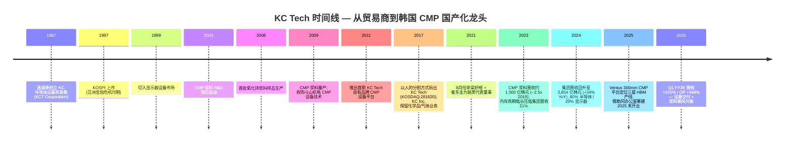

公司研究报告：KC Tech 株式会社（KOSDAQ:281820）
日期：2026-05-26

> **截至说明。** 2017 年从 KC 控股 (KC Inc. — 2017 年从 KC 控股拆分) 的"人的分割 / 인적분할 / 人的分割" 拆出，将材料与前道设备业务独立为 KOSDAQ 上市公司 ([KC Inc. 公司沿革（英文）](https://www.kct.co.kr/eng/page/company3.php))。拆分后的 KC Tech 把 CMP 抛光液 (CMP slurry) 业务从 2019 年约 600 亿韩元一路滚动至 2023 年约 1,500 亿韩元 ([인사이트코리아, 2024](http://www.insightkorea.co.kr/news/articleView.html?idxno=102310))；FY2024 合并营业收入 **3,854 亿韩元**、营业利润 **498 亿韩元** ([케이씨텍 위키백과](https://ko.wikipedia.org/wiki/%EC%BC%80%EC%9D%B4%EC%94%A8%ED%85%8D))。FY2026 第一季营业收入跳增至 **1,561 亿韩元 (+101% YoY)**、营业利润 **348 亿韩元 (+344% YoY)** —— 由一波 CMP 设备交付与浆料结构性顺风共同驱动 ([The Elec, 2026-04-30:「KC Tech First-Quarter Operating Profit Jumps 344%」](https://www.thelec.net/news/articleView.html?idxno=10433))。

目录

1. 公司概览
2. 公司沿革
3. 管理团队
4. 产品与服务
5. 客户与销售模式
6. 行业概览
7. 竞争格局
8. 市场机会 (TAM)
9. 风险评估
10. 参考资料

======================================

## 1. 公司概览

KC Tech 株式会社（케이씨텍，KOSDAQ:281820）是韩国一家专业半导体材料与设备制造商，在全球半导体供应链中占据了一个极不寻常的位置：它同时销售 **CMP（化学机械抛光 / chemical-mechanical planarization）抛光机** 与 **流过抛光机的 CMP 抛光液 (CMP slurry)**，加上紧随其后的 **清洗化学品 (cleaning chemicals)**、**湿法清洗设备**，并且全部卖给同一组客户—三星电子与 SK 海力士 ([KC Tech「About / Overview」页](https://www.kctech.com/page/overview.php); [The Worldfolio 副会长 Ho Keun Yang 专访，2025](https://www.theworldfolio.com/interviews/Next-Gen_CMP_Ventus_System_and_Ceria_Slurry_for_Advanced_2nm_Node_Chips/6973/))。公司在自己的官方公司简介中把自身定义为「반도체 및 디스플레이 장비, 소재의 제조/판매」—半导体与显示器设备及材料的制造与销售—而正是这种「设备 + 材料并列销售」的捆绑结构，把 KC Tech 与野村 (Nomura) Fig 41 浆料牌位表上的其他名字明确区分开来 ([Nomura,《Greater China Semiconductor 2026–2030F》, 2026-05-21, p. 24（半导体材料.md 摘要内）](../../sector/%E5%8D%8A%E5%AF%BC%E4%BD%93%E6%9D%90%E6%96%99.md))。

经济引擎相当集中。**FY2024** 营业收入 **3,854 亿韩元**、营业利润 **498 亿韩元**、净利润 **527 亿韩元**，其中半导体约占 80%，显示器约占 20%；公司自身披露的口径为「반도체 부문 80% / 디스플레이 부문 19.85%」（半导体业务约 80% / 显示器业务约 19.85%）([인사이트코리아,「케이씨텍, CMP slurry의 실적 성장성에 주목」](http://www.insightkorea.co.kr/news/articleView.html?idxno=102310); [케이씨텍 위키백과](https://ko.wikipedia.org/wiki/%EC%BC%80%EC%9D%B4%EC%94%A8%ED%85%8D))。FY2024 是从 FY2023 谷底（营业收入 2,869 亿韩元、受 2023 年内存周期低谷压制）回升 +34% 的复苏年；FY2025 则印出合并营收基本持平的 **3,829 亿韩元**，但营业利润上一台阶到 **600 亿韩元**，营业利润率从 12.9% 提升至 15.7%，反映产品结构向更高毛利的先进节点浆料倾斜 ([Stockopedia: KCTech Co (KRX:281820) financial summary](https://www.stockopedia.com/share-prices/kc-tech-co-KRX:281820/); [FN Guide Snapshot, 케이씨텍 (A281820)](https://comp.fnguide.com/SVO2/asp/SVD_Main.asp?gicode=A281820))。同一份 FN Guide 显示市净率 (P/B) 2.63 倍、ROE 10.6%、股息率 0.6%—按韩国工业股标准属于资本轻、净现金约 5 亿韩元、无明显债务负担。

KC Tech 的赚钱方式分裂成两条市场常常混为一谈的现金流轮廓。**设备侧**—Ventus 300mm CMP 抛光机、Wezen 系列单晶圆湿法清洗机、若干显示器湿法工作站 / 大气压等离子清洗机—是订单驱动的「块状」收入，确认时点跟随三星平泽 (Pyeongtaek) 产线与 SK 海力士利川 / 清州 (Icheon / Cheongju) 厂区的发货节奏，是 FY2026 一季的核心摆动因子 ([The Elec, 2026-04-30](https://www.thelec.net/news/articleView.html?idxno=10433))。**材料侧**—氧化铈浆料 (ceria slurry)、二氧化硅浆料 (silica slurry)、金属浆料、CMP 后清洗化学品—是经常性、与晶圆产出挂钩、随晶圆厂稼动率而非资本支出扩张的收入，是结构上利润率更高的一半，从 2019 年约 600 亿韩元复合增长到 2023 年约 1,500 亿韩元 ([인사이트코리아, 2024](http://www.insightkorea.co.kr/news/articleView.html?idxno=102310))。管理层在 2025 年 3 月的 *Worldfolio* 专访中明示，材料业务目前已占集团销售约 40%，其中约 30% 来自韩国以外—主要是中国 (CXMT 长鑫存储)、美国 (Intel、GlobalFoundries) 与逐步开拓的中国台湾—公司下一阶段增长依赖的正是材料业务，瞄准 HBM 与 BSPDN（背面供电 / backside power delivery）相关工艺扩张 ([The Worldfolio 专访](https://www.theworldfolio.com/interviews/Next-Gen_CMP_Ventus_System_and_Ceria_Slurry_for_Advanced_2nm_Node_Chips/6973/))。

从地域结构看，业务仍极度倾向韩国本土：**FY2026 Q1 营收 89% 来自韩国**，中国 8.9%、美国 1.9% ([The Elec, 2026-04-30](https://www.thelec.net/news/articleView.html?idxno=10433))。这种「韩国集中」既是特征也是弱点。**特征**：三星电子与 SK 海力士合计占据韩国 CMP 设备 / 浆料几乎 100% 的可寻址市场，而 KC Tech 是韩国 *唯一* 拥有完全国产化 CMP 抛光机的本土厂商—公司在韩文维基百科自述中"独家国产化" (uniquely developed domestically) HBM 制造用 CMP 设备，잡코리아 (JobKorea) 公司档案也呼应称 KC Tech 是「半导体 CMP 设备国产化唯一成功的本土企业」([잡코리아 KC Tech 기업정보](https://www.jobkorea.co.kr/recruit/co_read/c/kctech11); [케이씨텍 위키백과](https://ko.wikipedia.org/wiki/%EC%BC%80%EC%9D%B4%EC%94%A8%ED%85%8D))。**弱点**：三星和 SK 海力士联合主导需求曲线，意味着像 2023 那种内存价格暴跌 + 资本支出收紧的年份会带来 23% 的营收压缩—4Q24 vs 4Q23 已经实际发生过一次 ([씽크풀, 2024-04 실적속보](https://m.thinkpool.com/stockDiscuss/281820/cont/11862550))。

员工数按全球标准看较小—约 **800 人**，总部位于京畿道安城市，加上一座东滩 R&D 中心 ([KC Tech 位置页](https://www.kctech.com/page/location1.php); [잡코리아 KC Tech 기업정보](https://www.jobkorea.co.kr/recruit/co_read/c/kctech11))—目前正在筹建美国俄勒冈州尤金 (Eugene, Oregon) 办公室，预计 2025 年末开业，并在中国台湾、日本、新加坡探索后续布点 ([The Worldfolio 专访](https://www.theworldfolio.com/interviews/Next-Gen_CMP_Ventus_System_and_Ceria_Slurry_for_Advanced_2nm_Node_Chips/6973/))。Worldfolio 把这种「跟随韩国客户出海」模式称为公司的地理扩张策略—决定哪间西方办公室先开门的是客户的足迹，而不是 KC Tech 自身的韩国本土收入基础。

**估值快照（截至 2026-05-26）。** 最近成交价 **72,600 韩元**，市值 **约 1.398 兆韩元（约 10.2 亿美元）**，流通股数 1,980 万股；TTM 市盈率 **~27.4 倍**（基于 TTM EPS 2,578 韩元）、TTM 市销率 **~3.6 倍**（基于 FY2025 营收）、P/B **2.6 倍**、ROE **10.6%**、股息率 0.64% ([Investing.com KCTech 历史数据, 2026-05-26](https://www.investing.com/equities/kctech-historical-data); [FN Guide Snapshot, 케이씨텍 (A281820)](https://comp.fnguide.com/SVO2/asp/SVD_Main.asp?gicode=A281820); [Stockopedia 摘要](https://www.stockopedia.com/share-prices/kc-tech-co-KRX:281820/))。股价已从 52 周低点 24,150 韩元上涨三倍，区间 24,150–82,500 韩元—12 个月内 **+193% 涨幅** ([Investing.com 价格历史, 2026-05-26](https://www.investing.com/equities/kctech-historical-data))。当前 TTM 27 倍明显高于 3 年均值 (2022–2024 年区间约 10–15 倍)，也高于 KOSDAQ 小盘半导体设备同业；对标方面，Soulbrain (KOSDAQ:357780) TTM 约 17–18 倍，Wonik Materials (KOSDAQ:104830) 约 18 倍 ([Soulbrain Stockopedia 摘要](https://www.stockopedia.com/share-prices/soulbrain-co-KOSDAQ:357780/); [Wonik Materials Yahoo Finance](https://finance.yahoo.com/quote/104830.KQ/))。*分析师观点*：27 倍 TTM 主要由 FY2026 Q1 +344% 营业利润印证 + 「HBM / 2nm 韩国浆料国产化」叙事预期驱动—DS 投资证券 2025 年 11 月已经把目标价上调至 50,000 韩元 ([데이터투자 2025-11-11: DS투자증권 목표가 5万元 상향](https://www.datatooza.com/article/20251111115540957952ef38be23_80))，但现货价格已经突破该水平。如果 FY2026 营业利润落在卖方模型的 650–800 亿韩元区间，远期市盈率会压缩到十几倍—也就是说，估值绷紧 *不* 在 2026 远期倍数本身，而在隐含假设「材料结构性占比扩张持续盖过设备的周期性回落」。换言之，当前 TTM 溢价是材料业务的叙事溢价，不是远期盈利的绷紧—但这也意味着股价已经定价为 FY2025 的材料倾斜结构是永恒的；任何一个季度若设备主导的利润率回到 FY2025 前的水平，倍数都会快速收缩（在第 9 节列为估值风险）。

*资料来源：[Stockopedia KCTech (KRX:281820)](https://www.stockopedia.com/share-prices/kc-tech-co-KRX:281820/); [The Elec, 2026-04-30](https://www.thelec.net/news/articleView.html?idxno=10433); [데이터투자, 2025-11-11 (DS투자증권 추정)](https://www.datatooza.com/article/20251111115540957952ef38be23_80).*

## 2. 公司沿革

KC Tech 现今的公司法人形态只有 **八年**—2017 年 11 月 1 日作为「분할 신설법인 / 分割新设法人」从 KC 控股 (KC Inc.，前身为 KCT Corporation) 拆出而成；KCT Corporation 是 1987 年成立的韩国老牌特种化学品 + 半导体设备贸易商 ([KC Inc. 公司沿革, KC Co., Ltd.](https://www.kct.co.kr/eng/page/company3.php); [businesspost.co.kr,「[Who Is ?] 고석태 케이씨텍 회장」](https://www.businesspost.co.kr/BP?command=article_view&num=370779))。但其经营 DNA 可以追溯至 1987 年由会长高锡泰 (고석태 / Ko Seok-tae) 创办之初：KC 起家于韩国大成氧气 (Daesung Oxygen) 的分支贸易公司，从美国和日本进口半导体设备到韩国销售，1997 年亚洲金融危机最低谷时期在 KOSPI 上市，1999 年随韩国 LCD 投资周期切入显示器设备，2003 年开始 CMP 浆料 R&D 项目—距离 2009 年量产开始整整六年 ([The Worldfolio 专访，2025 年 3 月](https://www.theworldfolio.com/interviews/Next-Gen_CMP_Ventus_System_and_Ceria_Slurry_for_Advanced_2nm_Node_Chips/6973/); [businesspost.co.kr 고석태 회장 프로필](https://www.businesspost.co.kr/BP?command=article_view&num=370779))。

R&D 启动 (2003) 到量产 (2009) 之间这十年是 KC Tech 在韩国材料厂商中最不典型的地方：那段时期三星和 SK 海力士几乎完全依赖 Cabot Microelectronics (后来的 CMC Materials、再到 Entegris)、日立化学 (后来的 Resonac)、以及 Versum (后并入默克 Merck) 提供先进 CMP 浆料输入，而 KC Tech 选择对氧化铈浆料工艺研发做多年资本承诺 ([Yano Research CMP Slurry Market 2024](https://www.yanoresearch.com/press/press.php/3921))。2009 年的拐点—KC Tech 氧化铈浆料首次量产—与同年收购斗山机电 (Doosan Mechatronics) CMP 设备技术同步发生，将未来「设备 + 材料」混合架构编织起来，这就是今天 KC Tech 的核心特征 ([The Worldfolio, 2025](https://www.theworldfolio.com/interviews/Next-Gen_CMP_Ventus_System_and_Ceria_Slurry_for_Advanced_2nm_Node_Chips/6973/))。2011 年 KC Tech 已在三星运行自己的专有 CMP 产品；到 2017 年材料业务已壮大到足以让高锡泰会长决定把公司法人一分为二—把化学品 + 气体供应系统留在「KC Inc.」(仍为母公司股东)，把半导体 + 显示器前道设备 + 材料剥离到新设 KOSDAQ 上市的「KC Tech」([KC Inc. 公司沿革, KC Co., Ltd.](https://www.kct.co.kr/eng/page/company3.php); [잡코리아 KC Tech 기업정보](https://www.jobkorea.co.kr/recruit/co_read/c/kctech11))。

2017 年的拆分形式是「인적분할 / 人的分割」—韩国公司法下，把一家上市公司分立时让现有股东按比例同时持有两个继承法人的机制。当时业内媒体报道的拆分逻辑是：化学工程业务（已成为稳定但成熟的分销业务）与半导体 / 显示器设备和材料业务（凭借三星 V-NAND 与 OLED 资本支出快速扩张）的资本配置画像、估值水平、客户面孔差异巨大—两者捆在一支股票中令市场难以定价 ([businesspost.co.kr 고석태 회장 프로필](https://www.businesspost.co.kr/BP?command=article_view&num=370779))。从经营层面看，拆分是成功的：2017 年以后 KC Tech 营收以中低双位数 CAGR 复合增长，仅在 FY2023 经历一次周期性重置，并在过程中扩大材料业务比重、启动国际化布局。

拆分后最重要的一次事件是 **2021 年 8 月的管理层重组**—高锡泰会长把当时的 CEO 林冠宅 (임관택 / Lim Gwan-taek) 替换为 **梁好根 (양호근 / Yang Ho-geun)** 与 **崔东圭 (최동규 / Choi Dong-kyoo)** 的双 CEO 架构；梁好根此前是 TCK（KC 集团旗下另一公司）副会长 + KC Inc. CEO，崔东圭一直管理设备业务 ([파이낸셜뉴스, 2021-08-11:「케이씨텍, 양호근·최동규 각자 대표 체제」](https://www.fnnews.com/news/202108111629170231))。拆分的逻辑被定义为「经营效率 + 专业能力强化」—梁负责材料和公司事务，崔负责设备—这种分工至撰稿之时仍在维持，两位的名字依然作为联席代表董事出现在公司概览页面 ([KC Tech 公司概览页](https://www.kctech.com/page/overview.php))。

近期运营里程碑集中在 2024–2026 年的先进节点与 HBM 爬坡周期。**Ventus 300mm CMP 系统**—KC Tech 的「下一代」平台，配备多区域抛光头、最多 12 个可配置清洗腔—在 2024–2025 年被专门定位用于三星 HBM 产线，因为 HBM 堆叠层数提升后，每片晶圆的 CMP 步骤数量急剧增加 ([The Worldfolio, 2025](https://www.theworldfolio.com/interviews/Next-Gen_CMP_Ventus_System_and_Ceria_Slurry_for_Advanced_2nm_Node_Chips/6973/))。同时公司开始研发 **增层薄膜 (BuF, buildup-film) CMP**—用于先进封装基板的工艺步骤，过去由日本厂商主导，但随着先进封装产量扩张，韩国和中国台湾 OSAT 客户需求大幅上升 ([The Elec, 2026-04-30](https://www.thelec.net/news/articleView.html?idxno=10433))。预计 2025 年末开业的美国俄勒冈州尤金办公室是 KC Tech 在亚洲以外的首个实体据点，主要支持英特尔、GlobalFoundries 与三星奥斯汀 / 泰勒厂区的爬坡 ([The Worldfolio, 2025](https://www.theworldfolio.com/interviews/Next-Gen_CMP_Ventus_System_and_Ceria_Slurry_for_Advanced_2nm_Node_Chips/6973/))。

*资料来源：[The Worldfolio 专访, 2025](https://www.theworldfolio.com/interviews/Next-Gen_CMP_Ventus_System_and_Ceria_Slurry_for_Advanced_2nm_Node_Chips/6973/); [businesspost.co.kr 고석태 회장 프로필](https://www.businesspost.co.kr/BP?command=article_view&num=370779); [KC Inc. 公司沿革](https://www.kct.co.kr/eng/page/company3.php); [The Elec, 2026-04-30](https://www.thelec.net/news/articleView.html?idxno=10433).*

## 3. 管理团队

**创始人 / 会长：高锡泰 (고석태 / Ko Seok-tae, 1954 年 3 月 31 日生)。** 高锡泰是 KC Inc. (1987 年成立) 的创始人，目前仍兼任 KC Inc. 与 KC Tech 两家公司的会长—不过自 2021 年起，日常经营责任已转交给双 CEO 架构 ([businesspost.co.kr「[Who Is ?] 고석태 케이씨텍 회장」](https://www.businesspost.co.kr/BP?command=article_view&num=370779))。高锡泰毕业于成均馆大学化学工程系 (1980 年获学位)，毕业后 (1980–1986 年) 在大成氧气公司 (Daesung Oxygen) 担任销售—大成氧气是一家代理进口美日半导体设备的韩国工业气体经销商—1987 年离开大成自立门户，创办 KC Inc.，专门把半导体设备进口卖给韩国晶圆代工与内存厂商 ([businesspost.co.kr 고석태 프로필](https://www.businesspost.co.kr/BP?command=article_view&num=370779))。1987 年的创业时点极有眼光：三星首次大规模量产 DRAM 是 1983 年，到 1987 年韩国内存产业刚进入首次资本支出超级周期。高锡泰曾在 2005–2007 年担任韩国显示器设备与材料行业协会会长，2016 年获韩国工程院化学与生物工程分会成员资格，目前仍是韩国设备与材料产业政策圈内的行业级声音。根据 2024 年 6 月 30 日披露，高锡泰个人持有 KC Tech 约 **4.64%**（968,292 股）和 KC Inc. 约 **7.48%**（1,013,444 股）；加上家族关联方，高家族合计控制 KC Tech 约 50%、KC Inc. 约 40.9%—意味着 KC 集团虽然是上市架构，但本质上是家族控制公司 ([businesspost.co.kr 고석태 프로필](https://www.businesspost.co.kr/BP?command=article_view&num=370779))。高锡泰会长正逐步把股份转给儿子高尚杰 (고상걸 / Ko Sang-gul, 1982 年生)，后者目前担任 KC Inc. 副会长兼代表董事；同一篇报道指出，传承架构已相当完善，但高尚杰尚未在 KC Tech 自身担任董事职务 ([businesspost.co.kr 고석태 프로필](https://www.businesspost.co.kr/BP?command=article_view&num=370779))。

**联席 CEO：梁好根 (양호근 / Yang Ho-geun)。** 梁好根于 **2021 年 8 月 11 日** 与崔东圭一同被任命为 KC Tech 联席代表董事 / CEO，取代了之前由崔东圭与林冠宅 (Lim Gwan-taek) 组成的双人组 ([파이낸셜뉴스, 2021-08-11](https://www.fnnews.com/news/202108111629170231))。根据同一篇任命公告，梁好根此前在 KC 集团内部的职务是 TCK（一家 KC 集团旗下生产硅晶圆与石墨基半导体耗材的兄弟公司）副会长，以及 KC Inc. CEO—意味着他既有材料业务运营深度，也有母公司控股视角，而这正是材料密度上升的 KC Tech 战略所需 ([파이낸셜뉴스, 2021-08-11](https://www.fnnews.com/news/202108111629170231))。2021 年的重组在管理学语境下被表述为「경영 효율성 강화 및 전문성 강화」(经营效率强化 + 专业能力强化)，梁主管材料和公司事务、崔主管设备 ([파이낸셜뉴스, 2021-08-11](https://www.fnnews.com/news/202108111629170231))。梁好根也是 KC Tech 国际化叙事的公开代表人物—公司概览页与崔东圭 (Choi Dong-gyu / 최동규) 并列为联席代表董事 ([KC Tech 公司概览页](https://www.kctech.com/page/overview.php))。近期 KC Tech 管理层最重要的一次公开访谈是 2025 年 3 月《The Worldfolio》专访—由副会长 Ho Keun Yang（注：此人即梁好根 / 양호근，《Worldfolio》使用副会长头衔，该头衔与 KC Tech 联席 CEO 头衔并存）—文章中他清晰阐述了长期论点：「不要卖产品 —— 要卖信任。卖自己。」以及「真正的协同不是来自打包方案，而是来自我们深度整合」—把「设备 + 材料协同研发」模式定义为公司的战略护城河 ([The Worldfolio 专访, 2025](https://www.theworldfolio.com/interviews/Next-Gen_CMP_Ventus_System_and_Ceria_Slurry_for_Advanced_2nm_Node_Chips/6973/))。Worldfolio 这篇专访也清楚地表述了 2027 年（40 周年）目标：KC Tech 希望拿下先进 HBM 与 BSPDN 产线的设备关键认证、在全球顶级客户实现 CMP 系统量产、成为「全球规模玩家」—这是管理层自己设定的衡量未来两年执行力的尺子 ([The Worldfolio, 2025](https://www.theworldfolio.com/interviews/Next-Gen_CMP_Ventus_System_and_Ceria_Slurry_for_Advanced_2nm_Node_Chips/6973/))。
