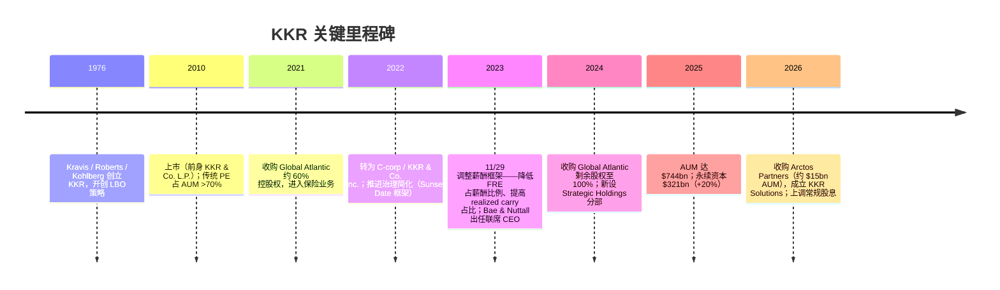
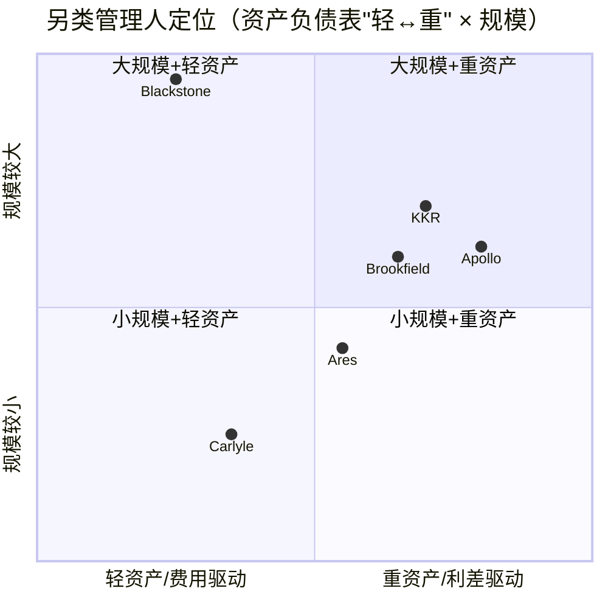
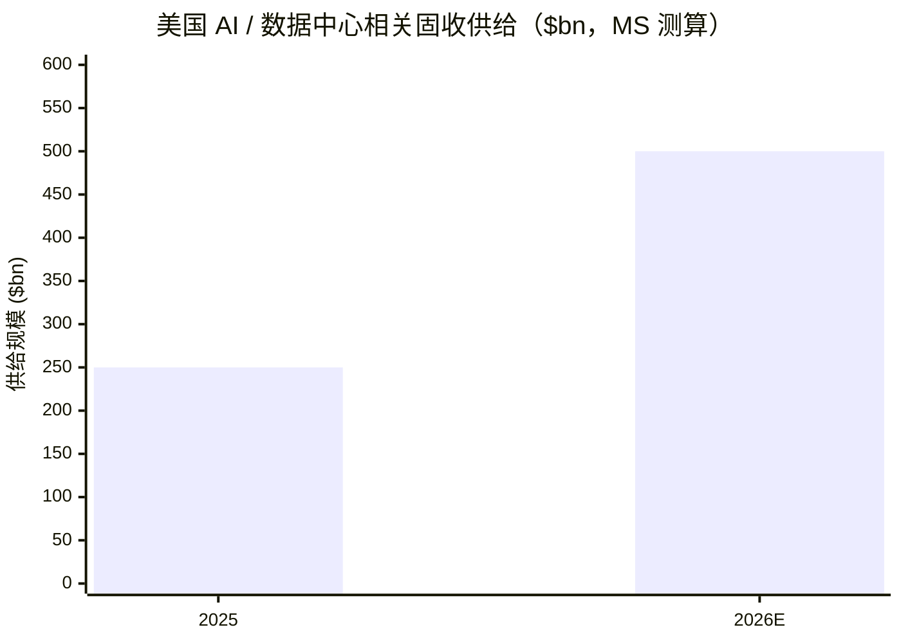

# KKR & Co. Inc.（NYSE:KKR）公司研究报告

**报告日期 / As of：2026-06-14** ｜ 标的：KKR & Co. Inc.（NYSE:KKR）— 全球另类资产管理公司（alternative asset manager，私募股权 / 信贷 / 基础设施 / 实物资产）+ 保险（Global Atlantic）

> *分析师观点：* **评级：Buy（买入）· 12 个月目标价 US$117（较 2026-06-12 收盘 $96.24 上行 +22%）· 估值方法：16× FY2027E Adjusted Net Income (ANI) 每股 $7.32**
> 市值约 US$89.7bn · 52 周区间 $82.67–$153.87 · NYSE:KKR · 流通股约 8.98 亿股 · beta 1.79
>
> | 倍数 / Multiple（*分析师观点：* 远期列为预测） | FY2025A | FY2026E | FY2027E |
> |---|---|---|---|
> | P/E（基于 ANI 每股 / per-share ANI） | 19.8× | 15.3× | 13.1× |
> | P/E（基于 FRE 每股 / per-share FRE） | 23.3× | ~19× | ~16× |
> | P/B（账面价值 / book value） | 3.1× | — | — |
> | 股息率 / dividend yield | 0.8% | — | — |
>
> 相对表现 / Rel. performance（截至 2026-06-12，来源 yfinance）：1M −1.0% · 6M −31.7% · YTD −25.1% · 12M −20.2%，对标 S&P 500（1M −0.2% · 6M +7.9% · YTD +8.4% · 12M +24.3%）—— 12 个月相对标普 **−44.5pts**，是大型另类资产同业中的显著落后者。
>
> **核心论点（thesis pillars）**——（1）平台已从单一 private equity (私募股权) 公司转型为多资产另类管理人，**永续资本 perpetual capital（永续资本）$321bn**（+20% YoY，占 AUM 43%）让 FRE（管理费相关收益）成为高质量、可复现的"抽佣"现金流；（2）**Global Atlantic 保险利差引擎**贡献 $219bn 永续资本与 $7.2bn 净投资收益，是同业中独有的资产负债表内增长飞轮；（3）股价 12 个月深度跑输（−20% vs 标普 +24%），FY2027E P/E 仅约 13×、低于 BX/ARES/BAM，**估值已部分计入"私募信贷裂缝"与股份稀释的担忧**，提供非对称机会；（4）K-Series 私募财富渠道 + Capital Group 合作打开个人投资者长坡。

> **业绩快报 / Update — FY2025 业绩与股息政策（披露于 2026-02-05）：** KKR 公布 FY2025 **Total Operating Earnings (TOE) $4.99bn（+14% YoY）、FRE $3.71bn（+14%）、ANI $4.38bn（每股 $4.87）**；宣布**自 2026 年 Q1 起上调常规年度股息**（季度股息 $0.185/股），并**收购 Arctos Partners（约 $15bn AUM，体育投资 + GP 解决方案 + 二级份额）**，成立新业务条线"KKR Solutions"。
> 来源：[KKR FY2025 8-K 业绩发布, 2026-02-05](https://www.sec.gov/Archives/edgar/data/1404912/000140491226000002/q425earningsrelease_vf.htm)。

## 目录 / Table of Contents

1. 公司概览（含投资论点 + 估值快照）
1A. 估值与目标价（远期预测 · PT 推导 · bull/base/bear）
1B. GF Score（GuruFocus 式）基本面评分
2. 公司历史
3. 管理团队
4. 业务与平台（三大板块）
5. 客户（LP / 个人投资者 / 保单持有人）与募资策略
6. 行业概览（另类资产管理 + 私募信贷 + 保险）
7. 竞争格局
8. 市场机会（TAM）
9. 风险评估
9.5. 关键分歧与催化剂
10. 投资风格透视

======================================

## 1. 公司概览

*分析师观点：* **本报告给予 KKR "Buy（买入）"评级、12 个月目标价 $117（较 2026-06-12 收盘 $96.24 上行 +22%）。** 投资逻辑（why now）：KKR 在过去 12 个月深度跑输——股价 −20.2%，而同期 S&P 500 +24.3%，相对落后 44.5 个百分点，主要受三股逆风叠加：（i）市场对"私募信贷裂缝（cracks in private credit）"的系统性担忧；（ii）可转换优先股与联席 CEO 股权激励带来的远期股份稀释；（iii）退出（monetization / realization）节奏放缓导致 carry（业绩报酬）相关可分配收益的时点后移。但 KKR 的**抽佣型核心盈利（FRE）FY2025 仍同比 +14% 至 $3.71bn**，永续资本 +20% 至 $321bn，基本面与股价表现出现明显背离——这正是非对称机会的来源（[KKR FY2025 10-K, Item 1 Business](https://www.sec.gov/Archives/edgar/data/1404912/000140491226000007/kkr-20251231.htm)；[KKR FY2025 8-K 业绩发布, 2026-02-05](https://www.sec.gov/Archives/edgar/data/1404912/000140491226000002/q425earningsrelease_vf.htm)）。四大论点支柱：平台多资产化 + 永续资本质量；保险利差引擎；估值已部分定价利空；私募财富长坡。

**公司是做什么的。** KKR 在其 FY2025 10-K 开篇自述为"一家领先的全球投资公司，提供另类资产管理以及资本市场和保险解决方案"（原文："KKR is a leading global investment firm that offers alternative asset management as well as capital markets and insurance solutions"）。公司 1976 年成立、开创了杠杆收购（leveraged buyout, LBO）策略，并在过去 50 年从单一私募股权扩展到杠杆信贷、另类信贷、基础设施、地产、能源、成长股权与核心私募股权等多个另类资产类别（[KKR FY2025 10-K, Item 1 Business — Overview](https://www.sec.gov/Archives/edgar/data/1404912/000140491226000007/kkr-20251231.htm)）。截至 2025-12-31，公司管理 **$744 billion 的资产管理规模（AUM, 资产管理规模）**，其中 **$219 billion 来自 Global Atlantic**，在全球设有 36 个办公室、约 4,200 名员工（约 2,700 名资产管理、约 1,500 名保险）（[KKR FY2025 10-K, Item 1 Business — Overview](https://www.sec.gov/Archives/edgar/data/1404912/000140491226000007/kkr-20251231.htm)）。

**怎么赚钱（business model）。** KKR 的商业模式对应三个报告分部：**(i) 资产管理（Asset Management）、(ii) 保险（Insurance）、(iii) Strategic Holdings（战略持股）**（[KKR FY2025 10-K, Item 1 Business — Business Segments](https://www.sec.gov/Archives/edgar/data/1404912/000140491226000007/kkr-20251231.htm)）。资产管理段从机构与个人投资者处募资，赚取经常性**管理费（management fees）与费用相关业绩收入（fee-related performance revenues）**，并从自有资本与第三方资本的投资增值中赚取**carried interest（业绩报酬 / 附带权益）**与投资收益。保险段（Global Atlantic）"主要通过赚取所发起资产的投资收益与应付保单持有人福利成本之间的利差（spread）来产生收入"（原文："Global Atlantic primarily generates income by earning a spread between the investment income generated from originated assets and the required cost of benefits payable to policyholders"）（[KKR FY2025 10-K, Item 1 Business — Insurance](https://www.sec.gov/Archives/edgar/data/1404912/000140491226000007/kkr-20251231.htm)）。Strategic Holdings 段持有 KKR 自有的运营公司股权（截至 2025-12-31 为 19 家，主要为核心私募股权），通过收取分红与处置变现获利（[KKR FY2025 10-K, Item 1 Business — Strategic Holdings](https://www.sec.gov/Archives/edgar/data/1404912/000140491226000007/kkr-20251231.htm)）。

**收益结构（segment earnings mix）。** FY2025，KKR 的 **Total Segment Earnings（分部总收益）为 $5,890.3mn**，由四块组成：**FRE $3,714.3mn（占 63%）、Insurance Operating Earnings $1,109.4mn（19%）、Total Investing Earnings $904.5mn（15%）、Strategic Holdings Operating Earnings $162.1mn（3%）**。KKR 强调，FRE + 保险经营利润 + Strategic Holdings 经营利润合计的 **Total Operating Earnings（TOE）$4,985.8mn 是"更持久、更经常性"的部分**，管理层指出 **85% 的分部收益来自更持久、经常性的部分**（[KKR FY2025 8-K 业绩发布, 2026-02-05 — Segment earnings detail](https://www.sec.gov/Archives/edgar/data/1404912/000140491226000002/q425earningsrelease_vf.htm)）。下方甜甜圈图展示 FY2025 分部收益来源构成。

<svg xmlns="http://www.w3.org/2000/svg" viewBox="0 0 720 460" width="720" height="460" role="img" aria-label="revenue donut"><rect x="0" y="0" width="720" height="460" fill="#ffffff"/>
<text x="20.00" y="30.00" text-anchor="start" font-family="Helvetica,Arial,sans-serif" font-size="15" font-weight="700" fill="#1f2933">FY2025 Total Segment Earnings by Source — US$5,890mn</text>
<path d="M 288.00,107.20 A 132 132 0 1 1 191.46,329.22 L 230.95,292.39 A 78 78 0 1 0 288.00,161.20 Z" fill="#2563eb"/>
<path d="M 191.46,329.22 A 132 132 0 0 1 168.16,183.86 L 217.18,206.50 A 78 78 0 0 0 230.95,292.39 Z" fill="#15803d"/>
<path d="M 168.16,183.86 A 132 132 0 0 1 265.30,109.17 L 274.59,162.36 A 78 78 0 0 0 217.18,206.50 Z" fill="#d97706"/>
<path d="M 265.30,109.17 A 132 132 0 0 1 288.00,107.20 L 288.00,161.20 A 78 78 0 0 0 274.59,162.36 Z" fill="#7c3aed"/>
<text x="288.00" y="235.20" text-anchor="middle" font-family="Helvetica,Arial,sans-serif" font-size="18" font-weight="800" fill="#1f2933">Segment</text>
<text x="288.00" y="255.20" text-anchor="middle" font-family="Helvetica,Arial,sans-serif" font-size="13" font-weight="600" fill="#52606d">$5.9B</text>
<text x="288.00" y="271.20" text-anchor="middle" font-family="Helvetica,Arial,sans-serif" font-size="10" font-weight="400" fill="#8a97a3">total</text>
<line x1="414.55" y1="294.23" x2="430.55" y2="294.23" stroke="#2563eb" stroke-width="1.4"/>
<text x="434.55" y="292.23" text-anchor="start" font-family="Helvetica,Arial,sans-serif" font-size="11" font-weight="700" fill="#1f2933">Fee-Related Earnings (FRE)</text>
<text x="434.55" y="306.23" text-anchor="start" font-family="Helvetica,Arial,sans-serif" font-size="10" font-weight="400" fill="#52606d">$3.7B  (63.1%)</text>
<line x1="151.74" y1="261.04" x2="135.74" y2="261.04" stroke="#15803d" stroke-width="1.4"/>
<text x="131.74" y="259.04" text-anchor="end" font-family="Helvetica,Arial,sans-serif" font-size="11" font-weight="700" fill="#1f2933">Insurance Operating Earnings</text>
<text x="131.74" y="273.04" text-anchor="end" font-family="Helvetica,Arial,sans-serif" font-size="10" font-weight="400" fill="#52606d">$1.1B  (18.8%)</text>
<line x1="203.88" y1="129.80" x2="187.88" y2="129.80" stroke="#d97706" stroke-width="1.4"/>
<text x="183.88" y="127.80" text-anchor="end" font-family="Helvetica,Arial,sans-serif" font-size="11" font-weight="700" fill="#1f2933">Total Investing Earnings</text>
<text x="183.88" y="141.80" text-anchor="end" font-family="Helvetica,Arial,sans-serif" font-size="10" font-weight="400" fill="#52606d">$905.0M  (15.4%)</text>
<line x1="276.09" y1="101.71" x2="260.09" y2="101.71" stroke="#7c3aed" stroke-width="1.4"/>
<text x="256.09" y="99.71" text-anchor="end" font-family="Helvetica,Arial,sans-serif" font-size="11" font-weight="700" fill="#1f2933">Strategic Holdings Op. Earnings</text>
<text x="256.09" y="113.71" text-anchor="end" font-family="Helvetica,Arial,sans-serif" font-size="10" font-weight="400" fill="#52606d">$162.0M  (2.8%)</text>
<text x="360.00" y="444.00" text-anchor="middle" font-family="Helvetica,Arial,sans-serif" font-size="10" font-weight="400" fill="#52606d">Source: KKR FY2025 8-K Earnings Release (2026-02-05) — segment earnings detail</text>
</svg>

来源 / Source：[KKR FY2025 8-K 业绩发布, 2026-02-05 — Total Segment Earnings detail](https://www.sec.gov/Archives/edgar/data/1404912/000140491226000002/q425earningsrelease_vf.htm)。

**AUM 资产类别构成。** 按资产类别，AUM 由**信贷与流动策略（Credit and Liquid Strategies）$322bn、私募股权（Private Equity）$229bn、实物资产（Real Assets）$192bn** 组成（合计约 $743bn，与四舍五入后的 $744bn AUM 对应）（[KKR FY2025 10-K, Item 1 Business — AUM by asset class](https://www.sec.gov/Archives/edgar/data/1404912/000140491226000007/kkr-20251231.htm)）。这一构成本身就是 KKR 转型的最佳注脚：管理层披露，截至 2010-12-31 传统私募股权占总 AUM 超过 70%，而到 2025-12-31 传统私募股权已不足总 AUM 的 25%（[KKR FY2025 10-K, Item 1 Business — Business Segments](https://www.sec.gov/Archives/edgar/data/1404912/000140491226000007/kkr-20251231.htm)）。

<svg xmlns="http://www.w3.org/2000/svg" viewBox="0 0 720 460" width="720" height="460" role="img" aria-label="revenue donut"><rect x="0" y="0" width="720" height="460" fill="#ffffff"/>
<text x="20.00" y="30.00" text-anchor="start" font-family="Helvetica,Arial,sans-serif" font-size="15" font-weight="700" fill="#1f2933">FY2025 AUM by Asset Class — US$744bn</text>
<path d="M 288.00,107.20 A 132 132 0 0 1 341.66,359.80 L 319.71,310.47 A 78 78 0 0 0 288.00,161.20 Z" fill="#2563eb"/>
<path d="M 341.66,359.80 A 132 132 0 0 1 156.18,246.17 L 210.11,243.32 A 78 78 0 0 0 319.71,310.47 Z" fill="#15803d"/>
<path d="M 156.18,246.17 A 132 132 0 0 1 288.00,107.20 L 288.00,161.20 A 78 78 0 0 0 210.11,243.32 Z" fill="#d97706"/>
<text x="288.00" y="235.20" text-anchor="middle" font-family="Helvetica,Arial,sans-serif" font-size="18" font-weight="800" fill="#1f2933">KKR AUM</text>
<text x="288.00" y="255.20" text-anchor="middle" font-family="Helvetica,Arial,sans-serif" font-size="13" font-weight="600" fill="#52606d">$743.0B</text>
<text x="288.00" y="271.20" text-anchor="middle" font-family="Helvetica,Arial,sans-serif" font-size="10" font-weight="400" fill="#8a97a3">total</text>
<line x1="422.99" y1="210.53" x2="438.99" y2="210.53" stroke="#2563eb" stroke-width="1.4"/>
<text x="442.99" y="208.53" text-anchor="start" font-family="Helvetica,Arial,sans-serif" font-size="11" font-weight="700" fill="#1f2933">Credit &amp; Liquid Strategies</text>
<text x="442.99" y="222.53" text-anchor="start" font-family="Helvetica,Arial,sans-serif" font-size="10" font-weight="400" fill="#52606d">$322.0B  (43.3%)</text>
<line x1="215.91" y1="356.87" x2="199.91" y2="356.87" stroke="#15803d" stroke-width="1.4"/>
<text x="195.91" y="354.87" text-anchor="end" font-family="Helvetica,Arial,sans-serif" font-size="11" font-weight="700" fill="#1f2933">Private Equity</text>
<text x="195.91" y="368.87" text-anchor="end" font-family="Helvetica,Arial,sans-serif" font-size="10" font-weight="400" fill="#52606d">$229.0B  (30.8%)</text>
<line x1="187.87" y1="144.23" x2="171.87" y2="144.23" stroke="#d97706" stroke-width="1.4"/>
<text x="167.87" y="142.23" text-anchor="end" font-family="Helvetica,Arial,sans-serif" font-size="11" font-weight="700" fill="#1f2933">Real Assets</text>
<text x="167.87" y="156.23" text-anchor="end" font-family="Helvetica,Arial,sans-serif" font-size="10" font-weight="400" fill="#52606d">$192.0B  (25.8%)</text>
<text x="360.00" y="444.00" text-anchor="middle" font-family="Helvetica,Arial,sans-serif" font-size="10" font-weight="400" fill="#52606d">Source: KKR FY2025 10-K, Item 1 Business — AUM by asset class (as of 2025-12-31)</text>
</svg>

来源 / Source：[KKR FY2025 10-K, Item 1 Business — AUM by asset class（as of 2025-12-31）](https://www.sec.gov/Archives/edgar/data/1404912/000140491226000007/kkr-20251231.htm)。

**规模与增长。** AUM 从 2024 年底的 **$637.6bn 增至 2025 年底的 $743.9bn**（+17%），付费资产管理规模（FPAUM, 付费资产规模）从 **$511.96bn 增至 $604.14bn**（+18%）（[KKR FY2025 8-K 业绩发布, 2026-02-05 — operating metrics](https://www.sec.gov/Archives/edgar/data/1404912/000140491226000002/q425earningsrelease_vf.htm)）。其中**永续资本 perpetual capital $321bn，同比 +20%，占 AUM 43%、占 FPAUM 51%**——这是 KKR 盈利质量的关键，因为永续资本不像传统封闭式 drawdown 基金那样有固定到期与返还，管理费基础更稳定（[KKR FY2025 8-K 业绩发布, 2026-02-05 — Perpetual Capital](https://www.sec.gov/Archives/edgar/data/1404912/000140491226000002/q425earningsrelease_vf.htm)）。FRE 5 年从 FY2021 的 $1.97bn 增至 FY2025 的 $3.71bn（CAGR 约 17%），轨迹见下图。

<svg xmlns="http://www.w3.org/2000/svg" viewBox="0 0 860 470" width="860" height="470" role="img" aria-label="historical revenue bars"><rect x="0" y="0" width="860" height="470" fill="#ffffff"/>
<text x="20.00" y="30.00" text-anchor="start" font-family="Helvetica,Arial,sans-serif" font-size="15" font-weight="700" fill="#1f2933">Fee-Related Earnings (FRE) History — US$bn</text>
<rect x="20.00" y="44" width="11" height="11" rx="2" fill="#2563eb"/>
<text x="36.00" y="53.00" text-anchor="start" font-family="Helvetica,Arial,sans-serif" font-size="10.5" font-weight="400" fill="#1f2933">Fee-Related Earnings (FRE)</text>
<line x1="70" y1="412.00" x2="834" y2="412.00" stroke="#eceff2" stroke-width="1"/>
<text x="64.00" y="415.00" text-anchor="end" font-family="Helvetica,Arial,sans-serif" font-size="9.5" font-weight="400" fill="#52606d">$0</text>
<line x1="70" y1="345.20" x2="834" y2="345.20" stroke="#eceff2" stroke-width="1"/>
<text x="64.00" y="348.20" text-anchor="end" font-family="Helvetica,Arial,sans-serif" font-size="9.5" font-weight="400" fill="#52606d">$801.4M</text>
<line x1="70" y1="278.40" x2="834" y2="278.40" stroke="#eceff2" stroke-width="1"/>
<text x="64.00" y="281.40" text-anchor="end" font-family="Helvetica,Arial,sans-serif" font-size="9.5" font-weight="400" fill="#52606d">$1.6B</text>
<line x1="70" y1="211.60" x2="834" y2="211.60" stroke="#eceff2" stroke-width="1"/>
<text x="64.00" y="214.60" text-anchor="end" font-family="Helvetica,Arial,sans-serif" font-size="9.5" font-weight="400" fill="#52606d">$2.4B</text>
<line x1="70" y1="144.80" x2="834" y2="144.80" stroke="#eceff2" stroke-width="1"/>
<text x="64.00" y="147.80" text-anchor="end" font-family="Helvetica,Arial,sans-serif" font-size="9.5" font-weight="400" fill="#52606d">$3.2B</text>
<line x1="70" y1="78.00" x2="834" y2="78.00" stroke="#eceff2" stroke-width="1"/>
<text x="64.00" y="81.00" text-anchor="end" font-family="Helvetica,Arial,sans-serif" font-size="9.5" font-weight="400" fill="#52606d">$4.0B</text>
<rect x="102.09" y="247.78" width="88.62" height="164.22" fill="#2563eb"/>
<text x="146.40" y="428.00" text-anchor="middle" font-family="Helvetica,Arial,sans-serif" font-size="10" font-weight="400" fill="#52606d">2021</text>
<rect x="254.89" y="231.11" width="88.62" height="180.89" fill="#2563eb"/>
<text x="299.20" y="428.00" text-anchor="middle" font-family="Helvetica,Arial,sans-serif" font-size="10" font-weight="400" fill="#52606d">2022</text>
<rect x="407.69" y="213.61" width="88.62" height="198.39" fill="#2563eb"/>
<text x="452.00" y="428.00" text-anchor="middle" font-family="Helvetica,Arial,sans-serif" font-size="10" font-weight="400" fill="#52606d">2023</text>
<rect x="560.49" y="139.42" width="88.62" height="272.58" fill="#2563eb"/>
<text x="604.80" y="428.00" text-anchor="middle" font-family="Helvetica,Arial,sans-serif" font-size="10" font-weight="400" fill="#52606d">2024</text>
<rect x="713.29" y="102.74" width="88.62" height="309.26" fill="#2563eb"/>
<text x="757.60" y="428.00" text-anchor="middle" font-family="Helvetica,Arial,sans-serif" font-size="10" font-weight="400" fill="#52606d">2025</text>
<text x="430.00" y="454.00" text-anchor="middle" font-family="Helvetica,Arial,sans-serif" font-size="10" font-weight="400" fill="#52606d">Source: KKR FY2021–FY2025 10-Ks / earnings releases — segment FRE</text>
</svg>

来源 / Source：[KKR FY2021–FY2025 10-Ks / 业绩发布 — 分部 FRE](https://www.sec.gov/cgi-bin/browse-edgar?action=getcompany&CIK=1404912&type=10-K)。

**估值快照（valuation snapshot，截至 2026-06-12）。** KKR 现价 $96.24，市值约 $89.7bn，**TTM GAAP P/E 32.7×、P/S 3.5×、P/B 3.1×**，股息率约 0.8%，beta 1.79（[Yahoo Finance — KKR key statistics, 2026-06-12](https://finance.yahoo.com/quote/KKR/)）。**注意：GAAP P/E 对另类管理人具有误导性**——KKR 的 GAAP 净利润受 Global Atlantic 投资组合的市值重估（mark-to-market）与大量非控制性权益（noncontrolling interests）影响而高度波动；FY2025 归属普通股东的 GAAP 净利润仅 $2.25bn、同比下降，但这并非经营恶化，而是会计口径波动（[KKR FY2025 10-K, MD&A — Consolidated Results of Operations](https://www.sec.gov/Archives/edgar/data/1404912/000140491226000007/kkr-20251231.htm)）。**业内通行的估值锚是 FRE / ANI / DE（distributable earnings, 可分配收益）每股**：基于 FY2025 ANI 每股 $4.87，现价对应 19.8× P/E；基于卖方 FY2026E/FY2027E ANI 每股 $6.27/$7.32，对应 **15.3× / 13.1×**（[KKR FY2025 8-K 业绩发布, 2026-02-05 — Adjusted Per Share Measures](https://www.sec.gov/Archives/edgar/data/1404912/000140491226000002/q425earningsrelease_vf.htm)；*分析师观点：* 前瞻 EPS 见 §2 的 UBS 估计）。与同业相比，KKR 的远期 P/E（约 13×）显著低于 BX（16.3×）、ARES（18.4×）、BAM（21.6×），P/B（3.1×）也是大型同业中最低之一（[Yahoo Finance — 多标的对比, 2026-06-12](https://finance.yahoo.com/quote/KKR/)），反映市场已对 KKR 给出折价；折价是否合理是本报告的核心分歧（见 §9.5）。

## 1A. 估值与目标价

*分析师观点：本节全部为前瞻预测，所有预测数字、目标价与情景均标注为分析师观点，绝不附加任何 filing 引用。* 本报告的预测建立在 KKR 已披露的分部数据（[FY2025 10-K](https://www.sec.gov/Archives/edgar/data/1404912/000140491226000007/kkr-20251231.htm)）、管理层在投资者日设定的 **$300bn 三年募资目标与 ANI/share "$7+"（2026 年）目标**（[KKR FY2025 8-K 业绩发布, 2026-02-05](https://www.sec.gov/Archives/edgar/data/1404912/000140491226000002/q425earningsrelease_vf.htm)），以及 UBS 的远期 EPS 估计（*分析师观点：*，见下）之上。

**(a) 远期预测表（*分析师观点：*）。** 另类管理人的核心盈利指标是 FRE、TOE 与 ANI（而非 GAAP EPS）。下表以 KKR 自己的 per-adjusted-share 口径为基准建模，远期数字对标 UBS 估计：

| 指标（*分析师观点：* 远期列） | FY2024A | FY2025A | FY2026E | FY2027E | CAGR(25→27) |
|---|---|---|---|---|---|
| AUM（$bn，期末） | 638 | 744 | ~820 | ~900 | +10% |
| FPAUM（$bn，期末） | 512 | 604 | ~660 | ~720 | +9% |
| 管理费 Management Fees（$mn） | 3,461 | 4,101 | ~4,550 | ~5,000 | +10% |
| FRE（$mn） | 3,268 | 3,714 | ~4,200 | ~4,700 | +12% |
| FRE 每股（$） | 3.66 | 4.13 | ~4.7 | ~5.3 | — |
| Insurance Operating Earnings（$mn） | 1,015 | 1,109 | ~1,200 | ~1,300 | +8% |
| TOE（$mn） | 4,359 | 4,986 | ~5,700 | ~6,400 | +13% |
| ANI 每股（$，per adjusted share） | 4.70 | 4.87 | ~6.27 | ~7.32 | +23% |
| 常规季度股息（$/股） | 0.175 | 0.185 | ~0.19 | ~0.21 | — |

（各预测的外部依据：AUM/FPAUM 增长建立在管理层"募资速度已超过投资者日 $300bn 三年目标隐含节奏"的表态之上（[KKR FY2025 8-K, 2026-02-05](https://www.sec.gov/Archives/edgar/data/1404912/000140491226000002/q425earningsrelease_vf.htm)），FRE 增长建立在已披露的 FY2021→FY2025 $1.97bn→$3.71bn 历史轨迹（[FY2025 10-K 分部](https://www.sec.gov/Archives/edgar/data/1404912/000140491226000007/kkr-20251231.htm)）+ 永续资本 +20% 的费基扩张之上；FY2026E/FY2027E ANI 每股 $6.27/$7.32 直接采用 UBS 估计，*分析师观点：*，见 §2 卖方观点。）**注意 FY2027E ANI 每股低于 FY2025 的 FRE 趋势隐含值**——这是因为 UBS 因可转换优先股、Arctos 发股、联席 CEO 股权激励等因素上调了股份数预期，从而压低了远期每股口径（[*分析师观点：* UBS KKR 1Q26 EPS Wrap, 2026-05-05](http://xs-macbook-air.local:5001/zsxq/pdf/585421142515824/UBS-KKR%20%26%20Co.%20Inc%EF%BC%88KKR.US%EF%BC%891Q26%20EPS%20Wrap%EF%BC%9A%20Mgmt%20Fees%20Move%20Higher%20but%20Share%20Count%20Weighs%20on%20Fwd.%20EPS-260505.pdf)）。

**(b) 目标价推导（show the arithmetic）。** 本报告采用 **远期 ANI 每股 × 目标倍数** 法。以 **FY2027E ANI 每股 $7.32 × 16× = $117** 作为基准目标价（上行 +22% vs $96.24）。**为什么用 16×：** KKR 现价仅对应 13.1× FY2027E ANI，明显低于同业远期 P/E——BX 16.3×、ARES 18.4×、BAM 21.6×、APO 12.6×（[Yahoo Finance — 同业远期 P/E, 2026-06-12](https://finance.yahoo.com/quote/KKR/)）。考虑到 KKR 的 FRE +14%、永续资本 +20% 的增长速度与 BX/ARES 相当甚至更快，给予 16×（介于 APO 的 12.6× 与 BX 的 16.3× 之间、低于 ARES/BAM）反映"折价收敛但不完全消除"的审慎假设——这与 UBS 给出的 17× P/E + 21.5× FRE 倍数方向一致但更保守（[*分析师观点：* UBS KKR 1Q26 EPS Wrap, 2026-05-05](http://xs-macbook-air.local:5001/zsxq/pdf/585421142515824/UBS-KKR%20%26%20Co.%20Inc%EF%BC%88KKR.US%EF%BC%891Q26%20EPS%20Wrap%EF%BC%9A%20Mgmt%20Fees%20Move%20Higher%20but%20Share%20Count%20Weighs%20on%20Fwd.%20EPS-260505.pdf)）。

**(c) Bull / Base / Bear 情景（*分析师观点：*）。**

| 情景（*分析师观点：*） | 关键假设 | 目标价 | 较现价 |
|---|---|---|---|
| Bull | 私募信贷担忧消退、退出加速、ANI/share 回到 $7+ 路径，估值重估至 18× 2027E | $132 | +37% |
| Base | 中性预测、FY2027E ANI 每股 $7.32 × 16× | $117 | +22% |
| Bear | "私募信贷裂缝"兑现 + 股份稀释拖累 + 估值去化至 11× 2026E $6.27 | $69 | −28% |

**(d) 与市场一致预期的对比（consensus benchmark）。** UBS 给予 **Buy 评级、目标价从 $113 上调至 $126**（基于 17× P/E + 21.5× FRE 倍数），对应报告日（2026-05-05）收盘 $101.95 的上行约 +23.6%（含股息约 +24.4%）（[*分析师观点：* UBS KKR 1Q26 EPS Wrap, 2026-05-05](http://xs-macbook-air.local:5001/zsxq/pdf/585421142515824/UBS-KKR%20%26%20Co.%20Inc%EF%BC%88KKR.US%EF%BC%891Q26%20EPS%20Wrap%EF%BC%9A%20Mgmt%20Fees%20Move%20Higher%20but%20Share%20Count%20Weighs%20on%20Fwd.%20EPS-260505.pdf)；report-date price 来源 db/stock_price_target.db）。本报告 $117 的基准目标价**略低于 UBS 的 $126**（差异主要来自更保守的 16× vs 17× 倍数），但方向一致——均认为当前估值具有吸引力。

**(e) 最该盯紧的关键变量（swing variables）。** 决定本次评级的两个枢纽变量：（1）**退出 / 变现节奏**——若 carry 相关的 realized performance income 与 realized investment income（FY2025 合计 $904.5mn，同比下降）回升，ANI 将快速向 $7+ 目标靠拢；（2）**私募信贷资产质量**——若 KKR 信贷组合（含 Global Atlantic 配置）的违约率维持低位，对"私募信贷裂缝"的折价将收敛。

## 1B. GF Score（GuruFocus 式）基本面评分

*分析师观点：* **GF Score（GuruFocus 式）：67 / 100 — 51–70 区间（Poor future performance potential 带；纯由动量拖累，见下）。** 本评分是基于报告已引用数据的独立可复现评分，是分析师自己的评分框架，**非 GuruFocus 官方数字、不附加 filing 引用**。

<svg xmlns="http://www.w3.org/2000/svg" viewBox="0 0 500 500" width="500" height="500" role="img" aria-label="GF Score radar">
<rect x="0" y="0" width="500" height="500" fill="#ffffff"/>
<text x="20" y="24" font-family="Helvetica,Arial,sans-serif" font-size="15" font-weight="700" fill="#1f2933">GF Score (GuruFocus-style): 67/100</text>
<text x="20" y="41" font-family="Helvetica,Arial,sans-serif" font-size="11" fill="#52606d">51–70 Poor future performance potential</text>
<polygon points="250.0,88.0 392.7,191.6 338.2,359.4 161.8,359.4 107.3,191.6" fill="#e9f5ec" stroke="none"/>
<polygon points="250.0,208.0 278.5,228.7 267.6,262.3 232.4,262.3 221.5,228.7" fill="none" stroke="#c5d3cb" stroke-width="1"/>
<polygon points="250.0,178.0 307.1,219.5 285.3,286.5 214.7,286.5 192.9,219.5" fill="none" stroke="#c5d3cb" stroke-width="1"/>
<polygon points="250.0,148.0 335.6,210.2 302.9,310.8 197.1,310.8 164.4,210.2" fill="none" stroke="#c5d3cb" stroke-width="1"/>
<polygon points="250.0,118.0 364.1,200.9 320.5,335.1 179.5,335.1 135.9,200.9" fill="none" stroke="#c5d3cb" stroke-width="1"/>
<polygon points="250.0,88.0 392.7,191.6 338.2,359.4 161.8,359.4 107.3,191.6" fill="none" stroke="#c5d3cb" stroke-width="1.3"/>
<line x1="250" y1="238" x2="161.8" y2="359.4" stroke="#cfdad3" stroke-width="1"/>
<text x="146.5" y="392.4" text-anchor="end" font-family="Helvetica,Arial,sans-serif" font-size="11.5" font-weight="600" fill="#1f2933">Financial Strength</text>
<text x="146.5" y="405.4" text-anchor="end" font-family="Helvetica,Arial,sans-serif" font-size="9.5" fill="#52606d">财务实力</text>
<text x="197.1" y="304.8" text-anchor="middle" font-family="Helvetica,Arial,sans-serif" font-size="10.5" font-weight="700" fill="#1f2933">6</text>
<line x1="250" y1="238" x2="250.0" y2="88.0" stroke="#cfdad3" stroke-width="1"/>
<text x="250.0" y="58.0" text-anchor="middle" font-family="Helvetica,Arial,sans-serif" font-size="11.5" font-weight="600" fill="#1f2933">Profitability</text>
<text x="250.0" y="71.0" text-anchor="middle" font-family="Helvetica,Arial,sans-serif" font-size="9.5" fill="#52606d">盈利能力</text>
<text x="250.0" y="112.0" text-anchor="middle" font-family="Helvetica,Arial,sans-serif" font-size="10.5" font-weight="700" fill="#1f2933">8</text>
<line x1="250" y1="238" x2="107.3" y2="191.6" stroke="#cfdad3" stroke-width="1"/>
<text x="82.6" y="183.6" text-anchor="end" font-family="Helvetica,Arial,sans-serif" font-size="11.5" font-weight="600" fill="#1f2933">Growth</text>
<text x="82.6" y="196.6" text-anchor="end" font-family="Helvetica,Arial,sans-serif" font-size="9.5" fill="#52606d">成长性</text>
<text x="135.9" y="194.9" text-anchor="middle" font-family="Helvetica,Arial,sans-serif" font-size="10.5" font-weight="700" fill="#1f2933">8</text>
<line x1="250" y1="238" x2="392.7" y2="191.6" stroke="#cfdad3" stroke-width="1"/>
<text x="417.4" y="183.6" text-anchor="start" font-family="Helvetica,Arial,sans-serif" font-size="11.5" font-weight="600" fill="#1f2933">GF Value</text>
<text x="417.4" y="196.6" text-anchor="start" font-family="Helvetica,Arial,sans-serif" font-size="9.5" fill="#52606d">估值</text>
<text x="364.1" y="194.9" text-anchor="middle" font-family="Helvetica,Arial,sans-serif" font-size="10.5" font-weight="700" fill="#1f2933">8</text>
<line x1="250" y1="238" x2="338.2" y2="359.4" stroke="#cfdad3" stroke-width="1"/>
<text x="353.5" y="392.4" text-anchor="start" font-family="Helvetica,Arial,sans-serif" font-size="11.5" font-weight="600" fill="#1f2933">Momentum</text>
<text x="353.5" y="405.4" text-anchor="start" font-family="Helvetica,Arial,sans-serif" font-size="9.5" fill="#52606d">动量</text>
<text x="267.6" y="256.3" text-anchor="middle" font-family="Helvetica,Arial,sans-serif" font-size="10.5" font-weight="700" fill="#1f2933">2</text>
<polygon points="250.0,118.0 364.1,200.9 267.6,262.3 197.1,310.8 135.9,200.9" fill="#2e8b57" fill-opacity="0.34" stroke="#2e8b57" stroke-width="2"/>
<circle cx="197.1" cy="310.8" r="2.6" fill="#2e8b57"/>
<circle cx="250.0" cy="118.0" r="2.6" fill="#2e8b57"/>
<circle cx="135.9" cy="200.9" r="2.6" fill="#2e8b57"/>
<circle cx="364.1" cy="200.9" r="2.6" fill="#2e8b57"/>
<circle cx="267.6" cy="262.3" r="2.6" fill="#2e8b57"/>
<text x="250" y="470" text-anchor="middle" font-family="Helvetica,Arial,sans-serif" font-size="9.5" fill="#52606d">Source: KKR FY2025 10-K · Yahoo Finance · indicators.db, as of 2026-06-12 — GuruFocus-style, not GuruFocus official</text>
<text x="250" y="485" text-anchor="middle" font-family="Helvetica,Arial,sans-serif" font-size="9" fill="#52606d">GF Score = independent analyst rubric (*Analyst view:*) — not GuruFocus™ official number</text>
</svg>

| 维度 / Dimension | 评分 / Score (0–10) | |
|---|---|---|
| Financial Strength (财务实力) | 6 | `██████░░░░` |
| Profitability (盈利能力) | 8 | `████████░░` |
| Growth (成长性) | 8 | `████████░░` |
| GF Value (估值) | 8 | `████████░░` |
| Momentum (动量) | 2 | `██░░░░░░░░` |
| **GF Score (composite, *Analyst view:*)** | **67 / 100** | **51–70 Poor future performance potential** |

*Composite weights (*Analyst view:*): Financial Strength 20% · Profitability 25% · Growth 25% · GF Value 15% · Momentum 15% (transparent reproduction — not GuruFocus's proprietary weighting).*

> 离中心越远，该维度得分越高 / *The farther a point sits from the centre, the better the company scores on that axis; the larger the pentagon's area, the higher the overall GF Score.*

| 维度 / Dimension | 评分 / Score (0–10) | |
|---|---|---|
| Financial Strength (财务实力) | 6 | `██████░░░░` |
| Profitability (盈利能力) | 8 | `████████░░` |
| Growth (成长性) | 8 | `████████░░` |
| GF Value (估值) | 8 | `████████░░` |
| Momentum (动量) | 2 | `██░░░░░░░░` |
| **GF Score (composite, *分析师观点：*)** | **67 / 100** | **51–70 区间** |

**Financial Strength（财务实力，6/10）。** KKR 资产负债表稳健但杠杆并非"净现金"型——公司持有大量长期债务（含 4.625% 2061 年到期高级票据、6.875% 2026 年到期次级票据等），并通过 Global Atlantic 承担大量保险负债（[KKR FY2025 10-K — 封面债券列示及合并资产负债表](https://www.sec.gov/Archives/edgar/data/1404912/000140491226000007/kkr-20251231.htm)）。FY2025 Adjusted EBITDA $5.96bn、利息覆盖充裕，但保险负债与表内信贷敞口使其不同于轻资产纯费用型管理人，故给 6 分而非更高（[KKR FY2025 10-K, MD&A — Adjusted EBITDA $5,958,190 thousand](https://www.sec.gov/Archives/edgar/data/1404912/000140491226000007/kkr-20251231.htm)）。

**Profitability（盈利能力，8/10）。** FRE 利润率高、可复现：FY2025 FRE $3.71bn 对应资产管理段收入 $7.12bn，FRE margin 高且稳定提升（[KKR FY2025 8-K 业绩发布, 2026-02-05](https://www.sec.gov/Archives/edgar/data/1404912/000140491226000002/q425earningsrelease_vf.htm)）。保险段在 FY2025 实现 $1.11bn 经营利润、净投资收益 $7.22bn（[KKR FY2025 10-K — Insurance Segment Operating Results](https://www.sec.gov/Archives/edgar/data/1404912/000140491226000007/kkr-20251231.htm)）。扣分项是 GAAP 口径下因 GA 市值波动与 NCI 导致的净利润高波动（[KKR FY2025 10-K, MD&A](https://www.sec.gov/Archives/edgar/data/1404912/000140491226000007/kkr-20251231.htm)）。

**Growth（成长性，8/10）。** FRE 5 年 CAGR 约 17%（$1.97bn→$3.71bn），TOE FY2025 +14%，永续资本 +20%，AUM +17%——增速在大型另类管理人中位居前列（[KKR FY2021–FY2025 业绩发布 / 10-Ks](https://www.sec.gov/cgi-bin/browse-edgar?action=getcompany&CIK=1404912&type=10-K)）。与 §1A 远期模型一致（FRE +12% CAGR、ANI/share +23%）。

**GF Value（估值，8/10，*higher = cheaper*）。** FY2027E ANI P/E 约 13.1×、P/B 3.1×，均为大型同业最低端（BX/ARES/BAM 远期 P/E 16–22×）（[Yahoo Finance — 同业对比, 2026-06-12](https://finance.yahoo.com/quote/KKR/)）。叠加本报告基准 PT 隐含 +22% margin of safety，给 8 分（cheaper = 高分）。

**Momentum（动量，2/10）。** 这是拖累综合分的唯一维度：12 个月绝对回报 −20.2%、相对 S&P 500（+24.3%）落后 44.5pts，YTD −25.1%，股价远离 52 周高点 $153.87、接近低点 $82.67（[yfinance — KKR vs ^GSPC, 2026-06-12](https://finance.yahoo.com/quote/KKR/)）。动量极弱。

**综合算术：** (FS·20 + Prof·25 + Growth·25 + Value·15 + Mom·15)/100 = (6·20 + 8·25 + 8·25 + 8·15 + 2·15)/100 = (120+200+200+120+30)/100 = **67/100**（默认权重 20/25/25/15/15）。**一句话提示（caveat）：** 综合分被 Momentum（2 分）单一维度拖入"Poor"带——这恰恰是论点的核心：基本面（Prof/Growth/Value 均 8 分）与价格动量严重背离；只要一个像样的退出季度或私募信贷担忧消退，Momentum 即可快速回升、综合分将跳升至 80+ 区间。

## 2. 公司历史

KKR 由 Henry Kravis、George Roberts 及 Jerome Kohlberg 于 **1976 年**创立，开创了杠杆收购（LBO）策略，并在此后五十年成为私募股权行业的领导者；自成立以来，公司将投资策略从传统私募股权扩展到杠杆信贷、另类信贷、基础设施、地产、能源、成长股权与核心私募股权（[KKR FY2025 10-K, Item 1 Business — Overview](https://www.sec.gov/Archives/edgar/data/1404912/000140491226000007/kkr-20251231.htm)）。从 2010 到 2025 年，公司完成了从"以美国为中心的传统 PE 公司"到"全球多资产另类管理人"的转型——传统私募股权占总 AUM 的比例从 2010 年底的 >70% 降至 2025 年底的 <25%（[KKR FY2025 10-K, Item 1 Business — Business Segments](https://www.sec.gov/Archives/edgar/data/1404912/000140491226000007/kkr-20251231.htm)）。



**两次关键战略转型。** 其一，**进入保险（2021–2024）**：KKR 于 2021-02-01 收购 Global Atlantic 约 60% 多数控股权，并于 2024-01-02 收购剩余股权达到 100% 全资——这把一个稳定的、$200bn+ 量级的永续资本来源装进了平台，从根本上改变了 KKR 的资本结构与盈利质量（[KKR FY2025 10-K, Item 1 Business — Insurance](https://www.sec.gov/Archives/edgar/data/1404912/000140491226000007/kkr-20251231.htm)）。其二，**新设 Strategic Holdings 分部（2024 Q1 起）**：KKR 开始把自有的核心私募股权运营公司股权单列为一个分部、长期持有并收取分红，目标是"随时间推移更有意义地贡献 TOE"（[KKR FY2025 10-K, Item 1 Business — Strategic Holdings](https://www.sec.gov/Archives/edgar/data/1404912/000140491226000007/kkr-20251231.htm)；[KKR FY2025 8-K 业绩发布, 2026-02-05](https://www.sec.gov/Archives/edgar/data/1404912/000140491226000002/q425earningsrelease_vf.htm)）。

**近期发展（2026 年）。** 2026-02-05，KKR 宣布收购 **Arctos Partners**——一个在体育投资与"为资产管理人提供资本解决方案（GP solutions）"领域具规模的平台（管理层口径约 $15bn AUM），将整合进新设的 **KKR Solutions** 业务，并以此为基础搭建一个规模化的多资产类二级（secondaries）业务；同日宣布**自 2026 年 Q1 起上调常规年度股息**（[KKR FY2025 8-K 业绩发布, 2026-02-05](https://www.sec.gov/Archives/edgar/data/1404912/000140491226000002/q425earningsrelease_vf.htm)）。UBS 测算 Arctos 增加约 $16bn AUM、约 $10bn FPAUM，费率与 KKR 核心 PE 大致相当（约 110bp）（[*分析师观点：* UBS KKR 1Q26 EPS Wrap, 2026-05-05](http://xs-macbook-air.local:5001/zsxq/pdf/585421142515824/UBS-KKR%20%26%20Co.%20Inc%EF%BC%88KKR.US%EF%BC%891Q26%20EPS%20Wrap%EF%BC%9A%20Mgmt%20Fees%20Move%20Higher%20but%20Share%20Count%20Weighs%20on%20Fwd.%20EPS-260505.pdf)）。

## 3. 管理团队

KKR 实行**联合创始人 + 联席 CEO 的双轨治理结构**。**Henry R. Kravis（82 岁）与 George R. Roberts（82 岁）担任 Co-Executive Chairmen（联席执行主席）及董事**；**Joseph Y. Bae（54 岁）与 Scott C. Nuttall（53 岁）担任 Co-Chief Executive Officers（联席 CEO）及董事**（[KKR FY2025 10-K, Part III — Directors and Executive Officers](https://www.sec.gov/Archives/edgar/data/1404912/000140491226000007/kkr-20251231.htm)）。

**联合创始人 Henry Kravis 与 George Roberts。** Kravis 与 Roberts 是表兄弟，1976 年与已故的 Jerome Kohlberg 共同创立 KKR，开创并定义了杠杆收购这一资产类别，并在过去五十年把 KKR 从一家美国本土 PE 公司扩展为管理 $744bn 的全球另类资产管理人（[KKR FY2025 10-K, Item 1 Business — Overview](https://www.sec.gov/Archives/edgar/data/1404912/000140491226000007/kkr-20251231.htm)）。2021 年两人交棒，从联席 CEO 转任联席执行主席，仍是公司战略的核心与重要持股人；KKR 的治理文件中设有"Sunset Date"机制，规定到期后须完成若干重组安排、并解除部分创始人特殊权利（[KKR FY2025 10-K, Item 1A Risk Factors / Item 12 — Sunset Date 与 anti-takeover 条款](https://www.sec.gov/Archives/edgar/data/1404912/000140491226000007/kkr-20251231.htm)）。两位创始人仍是公司治理与文化的奠基者，但日常经营已交予两位联席 CEO。

**联席 CEO Joseph Bae 与 Scott Nuttall。** Bae 与 Nuttall 自 **2021 年起出任联席 CEO**（在此之前长期担任联席总裁 / 联席 COO），是 KKR 内部培养、晋升的职业经理人，分别长期主导亚洲 / 私募股权与信贷 / 资本市场 / 资产负债表业务（[KKR FY2025 10-K, Part III](https://www.sec.gov/Archives/edgar/data/1404912/000140491226000007/kkr-20251231.htm)）。在薪酬结构上，公司于 **2023-11-29 修改薪酬框架**——主动**降低薪酬中来自费用相关收入（FRE）的目标占比、提高来自已实现 carried interest 与特定激励费的占比**，意在把高管激励与长期投资业绩、而非短期费用收入挂钩（[KKR FY2025 10-K, Item 1A — 薪酬框架修改](https://www.sec.gov/Archives/edgar/data/1404912/000140491226000007/kkr-20251231.htm)）。KKR 的 named executive officers（含两位联席 CEO、CFO Robert Lewin、首席法务官 Kathryn Sudol）2025 年基本年薪均为 **$300,000**，绝大部分激励来自股权与 carry pool（[KKR FY2025 10-K, Part III — Compensation Elements / Base Salary](https://www.sec.gov/Archives/edgar/data/1404912/000140491226000007/kkr-20251231.htm)）。值得注意的是，与联席 CEO 相关的一批股权激励将于 2026-12-31 归属（1,500 万股），这是远期股份稀释的来源之一（[*分析师观点：* UBS KKR 1Q26 EPS Wrap, 2026-05-05](http://xs-macbook-air.local:5001/zsxq/pdf/585421142515824/UBS-KKR%20%26%20Co.%20Inc%EF%BC%88KKR.US%EF%BC%891Q26%20EPS%20Wrap%EF%BC%9A%20Mgmt%20Fees%20Move%20Higher%20but%20Share%20Count%20Weighs%20on%20Fwd.%20EPS-260505.pdf)）。

## 4. 业务与平台（三大板块）

> **板块说明：** KKR 是另类资产管理人，其损益由费用（管理费 / 交易费 / carry）+ 保险利差驱动，而非制造业的产品毛利。因此本节围绕 KKR 自己的**三个报告分部（Asset Management / Insurance / Strategic Holdings）+ 资产管理段内五条业务线**展开，而非传统意义的"产品"。

**4.1 KKR 自述的业务模型（verbatim）。** 引用 10-K 原文：

> "Our business model of (i) Asset Management, (ii) Insurance, and (iii) Strategic Holdings corresponds to our three reporting segments. We have purposely created a business model that we believe enables us to grow long-term, durable, recurring earnings with a focus on large addressable markets where we can be an industry leader."

（[KKR FY2025 10-K, Item 1 Business — Business Segments](https://www.sec.gov/Archives/edgar/data/1404912/000140491226000007/kkr-20251231.htm)）

| 报告分部 / Segment | 业务线 / 内容 | FY2025 关键数字 |
|---|---|---|
| **Asset Management（资产管理）** | 五条业务线：(i) Private Equity, (ii) Real Assets, (iii) Credit and Liquid Strategies, (iv) Capital Markets, (v) Principal Activities | 资产管理段收入 $7.12bn；FRE $3.71bn；管理费 $4.10bn |
| **Insurance（保险，Global Atlantic）** | 退休 + 寿险 + 再保险；利差业务 | 净投资收益 $7.22bn；保险经营利润 $1.11bn；FPAUM $213bn |
| **Strategic Holdings（战略持股）** | 长期持有自有核心 PE 运营公司股权（19 家） | 经营利润 $162mn（+113% YoY） |

来源：[KKR FY2025 10-K, Item 1 Business](https://www.sec.gov/Archives/edgar/data/1404912/000140491226000007/kkr-20251231.htm) + [FY2025 8-K 业绩发布, 2026-02-05](https://www.sec.gov/Archives/edgar/data/1404912/000140491226000002/q425earningsrelease_vf.htm)。

**4.2 综合 —— 资金飞轮如何运转。** KKR 的盈利模型是一个自我强化的飞轮：**募资（fundraising）→ FPAUM → 管理费（FRE）→ 投资业绩 → carry / 可分配收益（DE）**，而保险（Global Atlantic）则提供一个表内的"永续资本 + 利差"引擎，把保单负债转化为可长期部署的资产。下方"资金流向"图展示了谁出资、KKR 平台如何抽佣、以及资本最终流向哪些资产类别。

<svg xmlns="http://www.w3.org/2000/svg" viewBox="0 0 1180 940" width="1180" height="940" role="img" aria-label="KKR 的资金飞轮：谁出资 → KKR 平台 → 资本流向何处" font-family="'Space Grotesk',system-ui,-apple-system,'Segoe UI',sans-serif">
<defs><linearGradient id="mfgold" gradientUnits="userSpaceOnUse" x1="0" y1="0" x2="1180" y2="0"><stop offset="0" stop-color="#f6dc97"/><stop offset="0.5" stop-color="#e9b658"/><stop offset="1" stop-color="#cf8f2c"/></linearGradient><radialGradient id="mfpool" cx="50%" cy="50%" r="50%"><stop offset="0" stop-color="#34d399" stop-opacity="0.16"/><stop offset="1" stop-color="#34d399" stop-opacity="0"/></radialGradient></defs>
<rect x="0" y="0" width="1180" height="940" rx="16" fill="#0b0f1a"/>
<text x="42.00" y="56.00" text-anchor="start" font-family="'JetBrains Mono',ui-monospace,Menlo,monospace" font-size="11.5" font-weight="600" fill="#e9b658" letter-spacing="3">另类资产管理 · 资金流向 · FY2025</text>
<text x="42.00" y="100.00" text-anchor="start" font-family="'Space Grotesk',system-ui,-apple-system,'Segoe UI',sans-serif" font-size="32" font-weight="700" fill="#e8ecf5">KKR 的资金飞轮：谁出资 → KKR 平台 → 资本流向何处</text>
<text x="42.00" y="142.00" text-anchor="start" font-family="'Space Grotesk',system-ui,-apple-system,'Segoe UI',sans-serif" font-size="15" font-weight="400" fill="#8a93a8">机构 LP、个人投资者（K-Series）与 Global Atlantic 保单持有人把资金交给 KKR，平台抽取管理费/carry 与保险利差，再把约 7,440 亿美元 AUM 部署到私募股权、信贷、基础设施与实物资产。</text>
<ellipse cx="1031.00" cy="368.00" rx="190" ry="150" fill="url(#mfpool)"/>
<line x1="369.50" y1="188.00" x2="369.50" y2="544.00" stroke="#222a3a" stroke-dasharray="2 8"/>
<line x1="810.50" y1="188.00" x2="810.50" y2="544.00" stroke="#222a3a" stroke-dasharray="2 8"/>
<text x="42.00" y="172.00" text-anchor="start" font-family="'JetBrains Mono',ui-monospace,Menlo,monospace" font-size="12" font-weight="400" fill="#e9b658" letter-spacing="3">STAGE 01</text>
<text x="42.00" y="188.00" text-anchor="start" font-family="'JetBrains Mono',ui-monospace,Menlo,monospace" font-size="11.5" font-weight="400" fill="#646d82">谁出资 / who pays in</text>
<text x="483.00" y="172.00" text-anchor="start" font-family="'JetBrains Mono',ui-monospace,Menlo,monospace" font-size="12" font-weight="400" fill="#e9b658" letter-spacing="3">STAGE 02</text>
<text x="483.00" y="188.00" text-anchor="start" font-family="'JetBrains Mono',ui-monospace,Menlo,monospace" font-size="11.5" font-weight="400" fill="#646d82">KKR 平台 / the platform</text>
<text x="924.00" y="172.00" text-anchor="start" font-family="'JetBrains Mono',ui-monospace,Menlo,monospace" font-size="12" font-weight="400" fill="#e9b658" letter-spacing="3">STAGE 03</text>
<text x="924.00" y="188.00" text-anchor="start" font-family="'JetBrains Mono',ui-monospace,Menlo,monospace" font-size="11.5" font-weight="400" fill="#646d82">资本流向 / where capital is deployed</text>
<path d="M 256.00 255.50 C 369.50 255.50, 369.50 252.55, 483.00 252.55" fill="none" stroke="url(#mfgold)" stroke-width="24.00" stroke-linecap="round" opacity="0.9"/>
<path d="M 256.00 381.00 C 369.50 381.00, 369.50 270.00, 483.00 270.00" fill="none" stroke="url(#mfgold)" stroke-width="10.91" stroke-linecap="round" opacity="0.9"/>
<path d="M 256.00 491.00 C 369.50 491.00, 369.50 381.00, 483.00 381.00" fill="none" stroke="url(#mfgold)" stroke-width="21.82" stroke-linecap="round" opacity="0.9"/>
<path d="M 697.00 238.36 C 810.50 238.36, 810.50 254.73, 924.00 254.73" fill="none" stroke="url(#mfgold)" stroke-width="17.45" stroke-linecap="round" opacity="0.9"/>
<path d="M 697.00 259.09 C 810.50 259.09, 810.50 349.68, 924.00 349.68" fill="none" stroke="url(#mfgold)" stroke-width="24.00" stroke-linecap="round" opacity="0.9"/>
<path d="M 697.00 278.73 C 810.50 278.73, 810.50 465.14, 924.00 465.14" fill="none" stroke="url(#mfgold)" stroke-width="15.27" stroke-linecap="round" opacity="0.9"/>
<path d="M 697.00 491.00 C 810.50 491.00, 810.50 266.73, 924.00 266.73" fill="none" stroke="url(#mfgold)" stroke-width="6.55" stroke-linecap="round" opacity="0.9"/>
<path d="M 256.00 270.00 C 369.50 270.00, 369.50 491.00, 483.00 491.00" fill="none" stroke="url(#mfgold)" stroke-width="5.00" stroke-linecap="round" opacity="0.78" stroke-dasharray="0.1 11"/>
<path d="M 697.00 376.64 C 810.50 376.64, 810.50 371.50, 924.00 371.50" fill="none" stroke="url(#mfgold)" stroke-width="19.64" stroke-linecap="round" opacity="0.78" stroke-dasharray="0.1 11"/>
<path d="M 697.00 390.82 C 810.50 390.82, 810.50 477.14, 924.00 477.14" fill="none" stroke="url(#mfgold)" stroke-width="8.73" stroke-linecap="round" opacity="0.78" stroke-dasharray="0.1 11"/>
<text x="369.50" y="248.02" text-anchor="middle" font-family="'JetBrains Mono',ui-monospace,Menlo,monospace" font-size="11.5" font-weight="400" fill="#f4d58a" paint-order="stroke" stroke="#0b0f1a" stroke-width="3.2" stroke-linejoin="round">承诺资本 commitments</text>
<text x="369.50" y="319.50" text-anchor="middle" font-family="'JetBrains Mono',ui-monospace,Menlo,monospace" font-size="11.5" font-weight="400" fill="#f4d58a" paint-order="stroke" stroke="#0b0f1a" stroke-width="3.2" stroke-linejoin="round">K-Series 流入</text>
<text x="369.50" y="430.00" text-anchor="middle" font-family="'JetBrains Mono',ui-monospace,Menlo,monospace" font-size="11.5" font-weight="400" fill="#f4d58a" paint-order="stroke" stroke="#0b0f1a" stroke-width="3.2" stroke-linejoin="round">保费 premiums</text>
<text x="810.50" y="368.07" text-anchor="middle" font-family="'JetBrains Mono',ui-monospace,Menlo,monospace" font-size="11.5" font-weight="400" fill="#f4d58a" paint-order="stroke" stroke="#0b0f1a" stroke-width="3.2" stroke-linejoin="round">GA 资产配置</text>
<rect x="42.00" y="198.00" width="214" height="120.00" rx="12" fill="#15101a" stroke="#f2655f" stroke-opacity="0.5"/>
<rect x="42.00" y="198.00" width="3" height="120.00" rx="2" fill="#f2655f"/>
<text x="60.00" y="231.00" text-anchor="start" font-family="'Space Grotesk',system-ui,-apple-system,'Segoe UI',sans-serif" font-size="21" font-weight="700" fill="#ffffff">机构 LP</text>
<text x="60.00" y="252.00" text-anchor="start" font-family="'JetBrains Mono',ui-monospace,Menlo,monospace" font-size="11" font-weight="400" fill="#c98c87">养老金 / 主权基金 / 保险</text>
<text x="60.00" y="269.00" text-anchor="start" font-family="'JetBrains Mono',ui-monospace,Menlo,monospace" font-size="11" font-weight="400" fill="#c98c87">drawdown + 永续资本</text>
<rect x="42.00" y="334.00" width="214" height="94.00" rx="12" fill="#0f1622" stroke="#7fa8f5" stroke-opacity="0.5"/>
<rect x="42.00" y="334.00" width="3" height="94.00" rx="2" fill="#7fa8f5"/>
<text x="60.00" y="367.00" text-anchor="start" font-family="'Space Grotesk',system-ui,-apple-system,'Segoe UI',sans-serif" font-size="21" font-weight="700" fill="#ffffff">个人投资者</text>
<text x="60.00" y="388.00" text-anchor="start" font-family="'JetBrains Mono',ui-monospace,Menlo,monospace" font-size="11" font-weight="400" fill="#8ca6d6">K-Series 财富产品</text>
<text x="60.00" y="405.00" text-anchor="start" font-family="'JetBrains Mono',ui-monospace,Menlo,monospace" font-size="11" font-weight="400" fill="#8ca6d6">Capital Group 合作</text>
<rect x="42.00" y="444.00" width="214" height="94.00" rx="12" fill="#141a2a" stroke="#d9a05b" stroke-opacity="0.5"/>
<rect x="42.00" y="444.00" width="3" height="94.00" rx="2" fill="#d9a05b"/>
<text x="60.00" y="477.00" text-anchor="start" font-family="'Space Grotesk',system-ui,-apple-system,'Segoe UI',sans-serif" font-size="21" font-weight="700" fill="#ffffff">保单持有人</text>
<text x="60.00" y="498.00" text-anchor="start" font-family="'JetBrains Mono',ui-monospace,Menlo,monospace" font-size="11" font-weight="400" fill="#bcae98">Global Atlantic</text>
<text x="60.00" y="515.00" text-anchor="start" font-family="'JetBrains Mono',ui-monospace,Menlo,monospace" font-size="11" font-weight="400" fill="#bcae98">退休 + 寿险负债</text>
<rect x="483.00" y="198.00" width="214" height="120.00" rx="12" fill="#101d1a" stroke="#34d399" stroke-opacity="0.5"/>
<rect x="483.00" y="198.00" width="3" height="120.00" rx="2" fill="#34d399"/>
<text x="501.00" y="231.00" text-anchor="start" font-family="'Space Grotesk',system-ui,-apple-system,'Segoe UI',sans-serif" font-size="21" font-weight="700" fill="#ffffff">资产管理</text>
<text x="501.00" y="252.00" text-anchor="start" font-family="'JetBrains Mono',ui-monospace,Menlo,monospace" font-size="11" font-weight="400" fill="#7fd9bf">管理费 $4.1bn</text>
<text x="501.00" y="269.00" text-anchor="start" font-family="'JetBrains Mono',ui-monospace,Menlo,monospace" font-size="11" font-weight="400" fill="#7fd9bf">carry / FRE $3.7bn</text>
<rect x="483.00" y="334.00" width="214" height="94.00" rx="12" fill="#15121f" stroke="#a78bfa" stroke-opacity="0.5"/>
<rect x="483.00" y="334.00" width="3" height="94.00" rx="2" fill="#a78bfa"/>
<text x="501.00" y="367.00" text-anchor="start" font-family="'Space Grotesk',system-ui,-apple-system,'Segoe UI',sans-serif" font-size="17" font-weight="700" fill="#ffffff">Global Atlantic</text>
<text x="501.00" y="388.00" text-anchor="start" font-family="'JetBrains Mono',ui-monospace,Menlo,monospace" font-size="11" font-weight="400" fill="#b9a6f5">利差业务 spread</text>
<text x="501.00" y="405.00" text-anchor="start" font-family="'JetBrains Mono',ui-monospace,Menlo,monospace" font-size="11" font-weight="400" fill="#b9a6f5">NII $7.2bn</text>
<rect x="483.00" y="444.00" width="214" height="94.00" rx="12" fill="#0f1622" stroke="#7fa8f5" stroke-opacity="0.5"/>
<rect x="483.00" y="444.00" width="3" height="94.00" rx="2" fill="#7fa8f5"/>
<text x="501.00" y="477.00" text-anchor="start" font-family="'Space Grotesk',system-ui,-apple-system,'Segoe UI',sans-serif" font-size="14" font-weight="700" fill="#ffffff">Strategic Holdings</text>
<text x="501.00" y="498.00" text-anchor="start" font-family="'JetBrains Mono',ui-monospace,Menlo,monospace" font-size="11" font-weight="400" fill="#9bb3df">19 家核心 PE 公司</text>
<text x="501.00" y="515.00" text-anchor="start" font-family="'JetBrains Mono',ui-monospace,Menlo,monospace" font-size="11" font-weight="400" fill="#9bb3df">分红 dividends</text>
<rect x="924.00" y="219.50" width="214" height="77.00" rx="12" fill="#141a2a" stroke="#56c6e6" stroke-opacity="0.5"/>
<rect x="924.00" y="219.50" width="3" height="77.00" rx="2" fill="#56c6e6"/>
<text x="942.00" y="252.50" text-anchor="start" font-family="'Space Grotesk',system-ui,-apple-system,'Segoe UI',sans-serif" font-size="17" font-weight="700" fill="#ffffff">私募股权 $229bn</text>
<text x="942.00" y="273.50" text-anchor="start" font-family="'JetBrains Mono',ui-monospace,Menlo,monospace" font-size="11" font-weight="400" fill="#8a93a8">传统 PE + 核心 PE + 成长</text>
<rect x="924.00" y="312.50" width="214" height="94.00" rx="12" fill="#141a2a" stroke="#e9b658" stroke-opacity="0.5"/>
<rect x="924.00" y="312.50" width="3" height="94.00" rx="2" fill="#e9b658"/>
<text x="942.00" y="345.50" text-anchor="start" font-family="'Space Grotesk',system-ui,-apple-system,'Segoe UI',sans-serif" font-size="17" font-weight="700" fill="#ffffff">信贷 $322bn</text>
<text x="942.00" y="366.50" text-anchor="start" font-family="'JetBrains Mono',ui-monospace,Menlo,monospace" font-size="11" font-weight="400" fill="#8a93a8">杠杆 + 另类信贷</text>
<text x="942.00" y="383.50" text-anchor="start" font-family="'JetBrains Mono',ui-monospace,Menlo,monospace" font-size="11" font-weight="400" fill="#8a93a8">私募信贷 / ABF</text>
<rect x="924.00" y="422.50" width="214" height="94.00" rx="12" fill="#0f1622" stroke="#7fa8f5" stroke-opacity="0.5"/>
<rect x="924.00" y="422.50" width="3" height="94.00" rx="2" fill="#7fa8f5"/>
<text x="942.00" y="455.50" text-anchor="start" font-family="'Space Grotesk',system-ui,-apple-system,'Segoe UI',sans-serif" font-size="17" font-weight="700" fill="#ffffff">实物资产 $192bn</text>
<text x="942.00" y="476.50" text-anchor="start" font-family="'JetBrains Mono',ui-monospace,Menlo,monospace" font-size="11" font-weight="400" fill="#9bb3df">基础设施 + 地产 + 能源</text>
<text x="942.00" y="493.50" text-anchor="start" font-family="'JetBrains Mono',ui-monospace,Menlo,monospace" font-size="11" font-weight="400" fill="#9bb3df">数据中心 / 电力</text>
<rect x="42.00" y="564.00" width="26" height="4" rx="2" fill="#e9b658"/>
<text x="78.00" y="568.00" text-anchor="start" font-family="'JetBrains Mono',ui-monospace,Menlo,monospace" font-size="11.5" font-weight="400" fill="#8a93a8">money paid directly</text>
<circle cx="242.80" cy="566.00" r="2" fill="#e9b658"/>
<circle cx="249.80" cy="566.00" r="2" fill="#e9b658"/>
<circle cx="256.80" cy="566.00" r="2" fill="#e9b658"/>
<circle cx="263.80" cy="566.00" r="2" fill="#e9b658"/>
<text x="276.80" y="568.00" text-anchor="start" font-family="'JetBrains Mono',ui-monospace,Menlo,monospace" font-size="11.5" font-weight="400" fill="#8a93a8">money embedded in a finished chip</text>
<text x="538.40" y="568.00" text-anchor="start" font-family="'JetBrains Mono',ui-monospace,Menlo,monospace" font-size="11.5" font-weight="400" fill="#8a93a8">thickness ≈ rough scale</text>
<rect x="728.00" y="559.00" width="11" height="11" rx="3" fill="#34d399"/>
<text x="747.00" y="568.00" text-anchor="start" font-family="'JetBrains Mono',ui-monospace,Menlo,monospace" font-size="11.5" font-weight="400" fill="#8a93a8">foundry</text>
<rect x="821.40" y="559.00" width="11" height="11" rx="3" fill="#a78bfa"/>
<text x="840.40" y="568.00" text-anchor="start" font-family="'JetBrains Mono',ui-monospace,Menlo,monospace" font-size="11.5" font-weight="400" fill="#8a93a8">memory</text>
<rect x="907.60" y="559.00" width="11" height="11" rx="3" fill="#7fa8f5"/>
<text x="926.60" y="568.00" text-anchor="start" font-family="'JetBrains Mono',ui-monospace,Menlo,monospace" font-size="11.5" font-weight="400" fill="#8a93a8">custom modules</text>
<rect x="42.00" y="579.00" width="11" height="11" rx="3" fill="#56c6e6"/>
<text x="61.00" y="588.00" text-anchor="start" font-family="'JetBrains Mono',ui-monospace,Menlo,monospace" font-size="11.5" font-weight="400" fill="#8a93a8">compute</text>
<rect x="135.40" y="579.00" width="11" height="11" rx="3" fill="#e9b658"/>
<text x="154.40" y="588.00" text-anchor="start" font-family="'JetBrains Mono',ui-monospace,Menlo,monospace" font-size="11.5" font-weight="400" fill="#8a93a8">supplier</text>
<rect x="236.00" y="579.00" width="11" height="11" rx="3" fill="#7fa8f5"/>
<text x="255.00" y="588.00" text-anchor="start" font-family="'JetBrains Mono',ui-monospace,Menlo,monospace" font-size="11.5" font-weight="400" fill="#8a93a8">RF / wireless</text>
<line x1="42" y1="604.00" x2="1138" y2="604.00" stroke="#222a3a"/>
<text x="42.00" y="620.00" text-anchor="start" font-family="'JetBrains Mono',ui-monospace,Menlo,monospace" font-size="12" font-weight="500" fill="#8a93a8" letter-spacing="3">FOLLOW THE MONEY — 资金如何流动</text>
<rect x="42.00" y="640.00" width="356.00" height="116.00" rx="13" fill="#0e1320" stroke="#34d399" stroke-opacity="0.28"/>
<rect x="42.00" y="640.00" width="3" height="116.00" rx="2" fill="#34d399"/>
<text x="58.00" y="664.00" text-anchor="start" font-family="'JetBrains Mono',ui-monospace,Menlo,monospace" font-size="10" font-weight="600" fill="#34d399" letter-spacing="1">平台费 · 抽佣</text>
<text x="58.00" y="682.00" text-anchor="start" font-family="'Space Grotesk',system-ui,-apple-system,'Segoe UI',sans-serif" font-size="15.5" font-weight="700" fill="#ffffff">管理费 + carry</text>
<text x="58.00" y="706.00" font-family="'Space Grotesk',system-ui,-apple-system,'Segoe UI',sans-serif" font-size="12" xml:space="preserve"><tspan fill="#9aa3b8" font-weight="400">KKR</tspan><tspan fill="#9aa3b8" font-weight="400"> 资产管理段</tspan><tspan fill="#9aa3b8" font-weight="400"> FY2025</tspan><tspan fill="#9aa3b8" font-weight="400"> 收取管理费</tspan><tspan fill="#f4d58a" font-weight="700"> $4.1bn</tspan><tspan fill="#9aa3b8" font-weight="400"> 、FRE</tspan><tspan fill="#f4d58a" font-weight="700"> $3.71bn</tspan><tspan fill="#9aa3b8" font-weight="400"> ；FRE</tspan></text>
<text x="58.00" y="722.00" font-family="'Space Grotesk',system-ui,-apple-system,'Segoe UI',sans-serif" font-size="12" xml:space="preserve"><tspan fill="#9aa3b8" font-weight="400">是最稳定的'抽佣'收入，5</tspan><tspan fill="#9aa3b8" font-weight="400"> 年从</tspan><tspan fill="#f4d58a" font-weight="700"> $1.97bn</tspan><tspan fill="#9aa3b8" font-weight="400"> （2021）升至</tspan><tspan fill="#f4d58a" font-weight="700"> $3.71bn</tspan><tspan fill="#9aa3b8" font-weight="400"> （2025）。</tspan></text>
<rect x="412.00" y="640.00" width="356.00" height="116.00" rx="13" fill="#0e1320" stroke="#a78bfa" stroke-opacity="0.28"/>
<rect x="412.00" y="640.00" width="3" height="116.00" rx="2" fill="#a78bfa"/>
<text x="428.00" y="664.00" text-anchor="start" font-family="'JetBrains Mono',ui-monospace,Menlo,monospace" font-size="10" font-weight="600" fill="#a78bfa" letter-spacing="1">永续资本 · 利差</text>
<text x="428.00" y="682.00" text-anchor="start" font-family="'Space Grotesk',system-ui,-apple-system,'Segoe UI',sans-serif" font-size="15.5" font-weight="700" fill="#ffffff">Global Atlantic 利差引擎</text>
<text x="428.00" y="706.00" font-family="'Space Grotesk',system-ui,-apple-system,'Segoe UI',sans-serif" font-size="12" xml:space="preserve"><tspan fill="#9aa3b8" font-weight="400">GA</tspan><tspan fill="#9aa3b8" font-weight="400"> 用保单负债换来</tspan><tspan fill="#f4d58a" font-weight="700"> $219bn</tspan><tspan fill="#9aa3b8" font-weight="400"> 永续资本，靠投资收益与负债成本的</tspan><tspan fill="#f4d58a" font-weight="700"> 利差</tspan><tspan fill="#f4d58a" font-weight="700"> spread</tspan></text>
<text x="428.00" y="722.00" font-family="'Space Grotesk',system-ui,-apple-system,'Segoe UI',sans-serif" font-size="12" xml:space="preserve"><tspan fill="#9aa3b8" font-weight="400">赚钱，FY2025</tspan><tspan fill="#9aa3b8" font-weight="400"> 净投资收益</tspan><tspan fill="#f4d58a" font-weight="700"> $7.2bn</tspan><tspan fill="#9aa3b8" font-weight="400"> 、保险经营利润</tspan><tspan fill="#f4d58a" font-weight="700"> $1.11bn</tspan><tspan fill="#9aa3b8" font-weight="400"> 。</tspan></text>
<rect x="782.00" y="640.00" width="356.00" height="116.00" rx="13" fill="#0e1320" stroke="#e9b658" stroke-opacity="0.28"/>
<rect x="782.00" y="640.00" width="3" height="116.00" rx="2" fill="#e9b658"/>
<text x="798.00" y="664.00" text-anchor="start" font-family="'JetBrains Mono',ui-monospace,Menlo,monospace" font-size="10" font-weight="600" fill="#e9b658" letter-spacing="1">信贷 · 最大资产类</text>
<text x="798.00" y="682.00" text-anchor="start" font-family="'Space Grotesk',system-ui,-apple-system,'Segoe UI',sans-serif" font-size="15.5" font-weight="700" fill="#ffffff">私募信贷流向哪里</text>
<text x="798.00" y="706.00" font-family="'Space Grotesk',system-ui,-apple-system,'Segoe UI',sans-serif" font-size="12" xml:space="preserve"><tspan fill="#9aa3b8" font-weight="400">信贷与流动策略</tspan><tspan fill="#9aa3b8" font-weight="400"> AUM</tspan><tspan fill="#9aa3b8" font-weight="400"> 达</tspan><tspan fill="#f4d58a" font-weight="700"> $322bn</tspan><tspan fill="#9aa3b8" font-weight="400"> ，是最大资产类；GA</tspan><tspan fill="#9aa3b8" font-weight="400"> 资产端也把资金</tspan><tspan fill="#f4d58a" font-weight="700"> 嵌入式</tspan></text>
<text x="798.00" y="722.00" font-family="'Space Grotesk',system-ui,-apple-system,'Segoe UI',sans-serif" font-size="12" xml:space="preserve"><tspan fill="#9aa3b8" font-weight="400">配置到私募信贷/ABF（虚线），这是</tspan><tspan fill="#9aa3b8" font-weight="400"> KKR</tspan><tspan fill="#9aa3b8" font-weight="400"> 资金飞轮的核心闭环。</tspan></text>
<rect x="42.00" y="770.00" width="356.00" height="116.00" rx="13" fill="#0e1320" stroke="#7fa8f5" stroke-opacity="0.28"/>
<rect x="42.00" y="770.00" width="3" height="116.00" rx="2" fill="#7fa8f5"/>
<text x="58.00" y="794.00" text-anchor="start" font-family="'JetBrains Mono',ui-monospace,Menlo,monospace" font-size="10" font-weight="600" fill="#7fa8f5" letter-spacing="1">实物资产 · AI 受益</text>
<text x="58.00" y="812.00" text-anchor="start" font-family="'Space Grotesk',system-ui,-apple-system,'Segoe UI',sans-serif" font-size="15.5" font-weight="700" fill="#ffffff">基础设施 / 数据中心</text>
<text x="58.00" y="836.00" font-family="'Space Grotesk',system-ui,-apple-system,'Segoe UI',sans-serif" font-size="12" xml:space="preserve"><tspan fill="#9aa3b8" font-weight="400">实物资产</tspan><tspan fill="#f4d58a" font-weight="700"> $192bn</tspan><tspan fill="#9aa3b8" font-weight="400"> （基础设施</tspan><tspan fill="#9aa3b8" font-weight="400"> +</tspan><tspan fill="#9aa3b8" font-weight="400"> 地产</tspan><tspan fill="#9aa3b8" font-weight="400"> +</tspan><tspan fill="#9aa3b8" font-weight="400"> 能源），承接</tspan><tspan fill="#9aa3b8" font-weight="400"> AI</tspan><tspan fill="#9aa3b8" font-weight="400"> 数据中心与电力的资本超级周期；MS</tspan></text>
<text x="58.00" y="852.00" font-family="'Space Grotesk',system-ui,-apple-system,'Segoe UI',sans-serif" font-size="12" xml:space="preserve"><tspan fill="#9aa3b8" font-weight="400">测算</tspan><tspan fill="#9aa3b8" font-weight="400"> 2026</tspan><tspan fill="#9aa3b8" font-weight="400"> 年美国</tspan><tspan fill="#9aa3b8" font-weight="400"> AI</tspan><tspan fill="#9aa3b8" font-weight="400"> 相关固收供给约</tspan><tspan fill="#f4d58a" font-weight="700"> $5,000亿</tspan><tspan fill="#9aa3b8" font-weight="400"> 。</tspan></text>
<rect x="412.00" y="770.00" width="356.00" height="116.00" rx="13" fill="#0e1320" stroke="#56c6e6" stroke-opacity="0.28"/>
<rect x="412.00" y="770.00" width="3" height="116.00" rx="2" fill="#56c6e6"/>
<text x="428.00" y="794.00" text-anchor="start" font-family="'JetBrains Mono',ui-monospace,Menlo,monospace" font-size="10" font-weight="600" fill="#56c6e6" letter-spacing="1">私募股权 · 起家业务</text>
<text x="428.00" y="812.00" text-anchor="start" font-family="'Space Grotesk',system-ui,-apple-system,'Segoe UI',sans-serif" font-size="15.5" font-weight="700" fill="#ffffff">PE 占比已降至 &lt;25%</text>
<text x="428.00" y="836.00" font-family="'Space Grotesk',system-ui,-apple-system,'Segoe UI',sans-serif" font-size="12" xml:space="preserve"><tspan fill="#9aa3b8" font-weight="400">传统私募股权从</tspan><tspan fill="#9aa3b8" font-weight="400"> 2010</tspan><tspan fill="#9aa3b8" font-weight="400"> 年占</tspan><tspan fill="#9aa3b8" font-weight="400"> AUM</tspan><tspan fill="#f4d58a" font-weight="700"> &gt;70%</tspan><tspan fill="#9aa3b8" font-weight="400"> 降至</tspan><tspan fill="#9aa3b8" font-weight="400"> 2025</tspan><tspan fill="#9aa3b8" font-weight="400"> 年</tspan><tspan fill="#f4d58a" font-weight="700"> &lt;25%</tspan><tspan fill="#9aa3b8" font-weight="400"> ，反映平台从单一</tspan><tspan fill="#9aa3b8" font-weight="400"> PE</tspan></text>
<text x="428.00" y="852.00" font-family="'Space Grotesk',system-ui,-apple-system,'Segoe UI',sans-serif" font-size="12" xml:space="preserve"><tspan fill="#9aa3b8" font-weight="400">公司转型为多资产另类管理人。</tspan></text>
<rect x="782.00" y="770.00" width="356.00" height="116.00" rx="13" fill="#0e1320" stroke="#f2655f" stroke-opacity="0.28"/>
<rect x="782.00" y="770.00" width="3" height="116.00" rx="2" fill="#f2655f"/>
<text x="798.00" y="794.00" text-anchor="start" font-family="'JetBrains Mono',ui-monospace,Menlo,monospace" font-size="10" font-weight="600" fill="#f2655f" letter-spacing="1">永续资本 · 43%</text>
<text x="798.00" y="812.00" text-anchor="start" font-family="'Space Grotesk',system-ui,-apple-system,'Segoe UI',sans-serif" font-size="15.5" font-weight="700" fill="#ffffff">AUM 越来越'黏'</text>
<text x="798.00" y="836.00" font-family="'Space Grotesk',system-ui,-apple-system,'Segoe UI',sans-serif" font-size="12" xml:space="preserve"><tspan fill="#9aa3b8" font-weight="400">永续资本</tspan><tspan fill="#f4d58a" font-weight="700"> $321bn</tspan><tspan fill="#9aa3b8" font-weight="400"> （2025，+20%</tspan><tspan fill="#9aa3b8" font-weight="400"> YoY），占</tspan><tspan fill="#9aa3b8" font-weight="400"> AUM</tspan><tspan fill="#f4d58a" font-weight="700"> 43%</tspan><tspan fill="#9aa3b8" font-weight="400"> 、FPAUM</tspan><tspan fill="#f4d58a" font-weight="700"> 51%</tspan></text>
<text x="798.00" y="852.00" font-family="'Space Grotesk',system-ui,-apple-system,'Segoe UI',sans-serif" font-size="12" xml:space="preserve"><tspan fill="#9aa3b8" font-weight="400">——锁定的长久期资本让管理费基础更稳定。</tspan></text>
<text x="590.00" y="922.00" text-anchor="middle" font-family="'JetBrains Mono',ui-monospace,Menlo,monospace" font-size="10.5" font-weight="400" fill="#646d82">Source: KKR FY2025 10-K + FY2025 8-K 业绩发布（2026-02-05）；MS《AI: Financing the Next 10x Tech Cycle》(2026-05-29)</text>
</svg>

*图：KKR 的"资金飞轮"价值链图——实线为直接付款 / 直接配置，虚线为 Global Atlantic 资产端嵌入式配置到信贷 / 实物资产。* 来源 / Source：[KKR FY2025 10-K, Item 1 Business](https://www.sec.gov/Archives/edgar/data/1404912/000140491226000007/kkr-20251231.htm) + [FY2025 8-K 业绩发布, 2026-02-05](https://www.sec.gov/Archives/edgar/data/1404912/000140491226000002/q425earningsrelease_vf.htm)。**Follow the money：** 真正的"抽佣"环节是资产管理段——FY2025 管理费 $4.10bn、FRE $3.71bn（[FY2025 8-K, 2026-02-05](https://www.sec.gov/Archives/edgar/data/1404912/000140491226000002/q425earningsrelease_vf.htm)）；Global Atlantic 用 $219bn 永续资本赚取利差、贡献 $7.22bn 净投资收益（[FY2025 10-K — Insurance Segment](https://www.sec.gov/Archives/edgar/data/1404912/000140491226000007/kkr-20251231.htm)）；信贷与流动策略（$322bn）是最大资产类，也是 GA 资产端嵌入式配置的核心闭环。

**4.3 资产管理段（Asset Management）—— 抽佣引擎。** KKR 10-K 原文将其定义为五条业务线：

> "In Asset Management, we have five business lines: (i) Private Equity, (ii) Real Assets, (iii) Credit and Liquid Strategies, (iv) Capital Markets, and (v) Principal Activities."

（[KKR FY2025 10-K, Item 1 Business — Business Segments](https://www.sec.gov/Archives/edgar/data/1404912/000140491226000007/kkr-20251231.htm)）

**中文释义 / Plain-language gloss：** 资产管理段是 KKR 的"抽佣 / fee-take"核心。它通过两类经常性收入赚钱：（i）**管理费（management fees, 管理费）**——按 FPAUM 的一定费率（KKR 旗舰 PE / 基础设施约 1.0–1.5%）收取，是最稳定、最可预测的收入，FY2025 达 $4.10bn；（ii）**费用相关业绩收入（fee-related performance revenues, 费用相关业绩收入）**——来自永续资本工具上按业绩计提的、相对经常性的费用，FY2025 $182mn。这两类加上交易与监控费（transaction & monitoring fees, $1.09bn）扣除费用相关薪酬与运营开支后，就是 **FRE（fee-related earnings, 管理费相关收益）$3.71bn**——这是估值最看重的"质量收益"，因为它不依赖资产处置的时点。区别于 FRE 的是 **carried interest / carry（业绩报酬 / 附带权益）**：carry "使我们有权获得在第三方投资资本上产生的投资收益的特定百分比"（原文："Carried interest that we receive from our investment vehicles entitles us to a specified percentage of investment gains that are generated on third-party capital that is invested"），它波动大、依赖退出节奏，体现在 Investing Earnings 中（[KKR FY2025 10-K, Item 1 Business — Fees](https://www.sec.gov/Archives/edgar/data/1404912/000140491226000007/kkr-20251231.htm)）。*分析师观点：* 在另类资产同业中，KKR 与 Blackstone、Apollo、Ares、Brookfield 同属"费用驱动 + 永续资本占比提升"的第一梯队；KKR 的差异化在于通过 Global Atlantic 把保险利差也纳入平台（[*分析师观点：* MS《AI: Financing the Next 10x Tech Cycle》, 2026-05-29](http://xs-macbook-air.local:5001/zsxq/pdf/184152581888182/Morgan%20Stanley-AI%EF%BC%9A%20Financing%20the%20Next%2010x%20Tech%20Cycle%20%E2%80%94%20Is%20Capital%20the%20Constraint%EF%BC%9F-260529.pdf)）。

**4.4 保险段（Insurance / Global Atlantic）—— 永续资本 + 利差引擎。** 10-K 原文：

> "Our insurance business operates under the Global Atlantic brand. Global Atlantic is a leading retirement and life insurance company... Global Atlantic primarily generates income by earning a spread between the investment income generated from originated assets and the required cost of benefits payable to policyholders."

（[KKR FY2025 10-K, Item 1 Business — Insurance](https://www.sec.gov/Archives/edgar/data/1404912/000140491226000007/kkr-20251231.htm)）

**中文释义 / Plain-language gloss：** Global Atlantic 是一家有 20 多年历史的退休 + 寿险公司，2004 年在 Goldman Sachs 内部创立、2013 年独立、KKR 于 2021 年取得多数控股、2024-01-02 取得 100% 全资。它的赚钱方式是经典的保险**利差（spread）**：把卖出年金 / 寿险产品收来的保费投资于 KKR 平台能够发起的高收益资产（私募信贷、ABF、实物资产），赚取**资产收益率 − 负债成本（crediting rate）的差**。它与资产管理段的差异在于：资产管理段是"轻资产、收别人钱的管理费"，而保险段是"重资产、用自己的资产负债表赚利差"——但两者共享 KKR 的资产发起能力，形成闭环。FY2025 保险段净投资收益 **$7,224mn**（同比 +$895mn，受新业务增长与组合收益率提升驱动）、保险经营利润 **$1,109mn**（[KKR FY2025 10-K — Insurance Segment Operating Results](https://www.sec.gov/Archives/edgar/data/1404912/000140491226000007/kkr-20251231.htm)）；Global Atlantic FPAUM 为 **$213bn**（[KKR FY2025 10-K, Item 1 Business — Insurance](https://www.sec.gov/Archives/edgar/data/1404912/000140491226000007/kkr-20251231.htm)）。*分析师观点：* 保险利差模式是 KKR 与 Apollo（其 Athene）共有的差异化武器，相对 Blackstone（轻资产为主）更"重"、但提供独有的永续资本与跨周期复利。

**4.5 Strategic Holdings 段 —— 长期复利的核心 PE 持股。** 10-K 原文：

> "Our Strategic Holdings segment, which we started reporting in the first quarter of 2024, acquires and manages interests in operating companies that are owned by the firm... As of December 31, 2025, our Strategic Holdings segment consisted of our ownership stakes in 19 companies."

（[KKR FY2025 10-K, Item 1 Business — Strategic Holdings](https://www.sec.gov/Archives/edgar/data/1404912/000140491226000007/kkr-20251231.htm)）

**中文释义 / Plain-language gloss：** Strategic Holdings 是 KKR 把"自己投出来的、优质且低风险的核心私募股权（core private equity）公司"长期持有、不急于退出的一个资产篮子，主要靠**收分红（dividends）**而非靠处置变现获利。管理层预期它将"随时间推移更有意义地贡献 TOE"——FY2025 该段经营利润已从 FY2024 的 $76mn 增至 **$162mn（+113%）**（[KKR FY2025 8-K 业绩发布, 2026-02-05](https://www.sec.gov/Archives/edgar/data/1404912/000140491226000002/q425earningsrelease_vf.htm)）。它的战略意义是把"永久持有 + 复利分红"这一更接近 Berkshire 风格的资本配置嵌入到 KKR 平台，平滑 carry 的周期性。

**4.6 旗舰与近期举措。** 旗舰来看，**FRE 是当前最重要的"产品"**（占分部总收益 63%），其次是保险经营利润（19%）；carry 相关的 Investing Earnings（15%）波动最大。近 12 个月新举措：（i）**Arctos 收购（2026-02）**——切入体育投资 + GP 解决方案 + 二级，组成 KKR Solutions（[KKR FY2025 8-K 业绩发布, 2026-02-05](https://www.sec.gov/Archives/edgar/data/1404912/000140491226000002/q425earningsrelease_vf.htm)）；（ii）**K-Series 私募财富推进**与 Capital Group 战略合作（见 §5）；（iii）保险段战略性增配**非生息 / 低生息资产类（如私募股权、实物资产）、拓展美国以外市场、引入更多第三方共投保险资本**（[KKR FY2025 10-K, Item 1A — 保险战略举措](https://www.sec.gov/Archives/edgar/data/1404912/000140491226000007/kkr-20251231.htm)）。

**延伸观看 / Further viewing**

- [What is Private Equity? — 私募股权 / 杠杆收购的基本机制（CNBC Explains）](https://www.youtube.com/watch?v=Pl0iCb_pXKM)
- [How private credit works — 私募信贷如何替代银行贷款（Bloomberg Originals）](https://www.youtube.com/watch?v=B0wYAJ7dMCk)

## 5. 客户（LP / 个人投资者 / 保单持有人）与募资策略

**客户结构。** KKR 的"客户"是三类资金提供方：（1）**机构 LP（limited partners, 有限合伙人）**——养老金、主权基金、保险公司、捐赠基金，把承诺资本（commitments）交给 KKR 的封闭式 drawdown 基金与永续资本工具；（2）**个人投资者（individual investors）**——通过 K-Series 等私募财富工具进入；（3）**Global Atlantic 保单持有人**——其保费成为表内永续资本（[KKR FY2025 10-K, Item 1 Business — Overview / Insurance](https://www.sec.gov/Archives/edgar/data/1404912/000140491226000007/kkr-20251231.htm)）。

**客户集中度（customer concentration）。** 与制造业不同，另类资产管理人的"客户集中度"体现为基金 LP 与保单的分散度。KKR 的 10-K 未披露单一 LP 占 AUM / 收入 10% 以上的集中度数字，资金来源高度分散于全球数千家机构与个人客户——**单一客户集中度风险低、无 10% 以上的单一客户披露（disclosure not found：10-K 未单列单一 LP 占比）**（[KKR FY2025 10-K, Item 1 Business / Item 1A Risk Factors](https://www.sec.gov/Archives/edgar/data/1404912/000140491226000007/kkr-20251231.htm)）。真正的"集中"风险在于资产端（投资组合公司）与永续资本工具的赎回（见 §9）。

**K-Series 私募财富战略。** KKR 在 10-K 中明确把 K-Series 列为面向个人投资者的核心抓手：

> "We also have a strategic partnership with Capital Group, a privately owned U.S. investment management firm, which provides access to KKR investment capabilities through Capital Group sponsored vehicles... K-Series: The K-Series suite of vehicles are offered through various distribution channels to investors in the U.S. and other jurisdictions."

（[KKR FY2025 10-K, Item 1 Business — Individual Investors / K-Series](https://www.sec.gov/Archives/edgar/data/1404912/000140491226000007/kkr-20251231.htm)）K-Series 既有 drawdown 也有常青（evergreen）工具，是把另类资产"零售化"、扩大永续资本来源的关键。UBS 指出，Q1 2026 KKR 资金流入 $28bn（信贷尤强、$15bn 由投资级 ABF 策略引领），但管理层预计 Q2 财富资金流将温和放缓，与 2025 年 Q2 因关税担忧导致 K-Suite 兴趣暂停的情况类似（[*分析师观点：* UBS KKR 1Q26 EPS Wrap, 2026-05-05](http://xs-macbook-air.local:5001/zsxq/pdf/585421142515824/UBS-KKR%20%26%20Co.%20Inc%EF%BC%88KKR.US%EF%BC%891Q26%20EPS%20Wrap%EF%BC%9A%20Mgmt%20Fees%20Move%20Higher%20but%20Share%20Count%20Weighs%20on%20Fwd.%20EPS-260505.pdf)）。

**募资动能（fundraising）。** 募资是 KKR 飞轮的起点。FY2025 新募集资本（New Capital Raised）达 **$113.6bn**（[KKR FY2025 8-K 业绩发布, 2026-02-05 — operating metrics](https://www.sec.gov/Archives/edgar/data/1404912/000140491226000002/q425earningsrelease_vf.htm)）。管理层强调募资速度已超过投资者日设定的"三年 $300bn"目标隐含节奏，且需求广泛分布于信贷、PE、实物资产与财富管理；UBS 提到基础设施五期（Infrastructure V）与亚洲基础设施三期（Asia Infra III）将在 2026 年 Q2 关账，亚洲 / 欧洲 PE 基金将在未来 18 个月募集 / 推出（[*分析师观点：* UBS KKR 1Q26 EPS Wrap, 2026-05-05](http://xs-macbook-air.local:5001/zsxq/pdf/585421142515824/UBS-KKR%20%26%20Co.%20Inc%EF%BC%88KKR.US%EF%BC%891Q26%20EPS%20Wrap%EF%BC%9A%20Mgmt%20Fees%20Move%20Higher%20but%20Share%20Count%20Weighs%20on%20Fwd.%20EPS-260505.pdf)）。**未提取承诺（uncalled commitments / dry powder, 待投资金）**为 KKR 提供了充足的可部署"弹药"，未来 12 个月毛退出收入可见度预计超 $1.2bn（OneStream、CoolIT、二级销售等）（[*分析师观点：* UBS KKR 1Q26 EPS Wrap, 2026-05-05](http://xs-macbook-air.local:5001/zsxq/pdf/585421142515824/UBS-KKR%20%26%20Co.%20Inc%EF%BC%88KKR.US%EF%BC%891Q26%20EPS%20Wrap%EF%BC%9A%20Mgmt%20Fees%20Move%20Higher%20but%20Share%20Count%20Weighs%20on%20Fwd.%20EPS-260505.pdf)）。

## 6. 行业概览（另类资产管理 + 私募信贷 + 保险）

**行业定义与结构。** KKR 处于**另类资产管理（alternative asset management）**行业的顶端——一个高度由头部玩家集中的、规模数万亿美元的赛道。行业的结构性顺风是"私募化（privatization of markets）"：越来越多的企业融资、基础设施投资、信贷与退休储蓄从公开市场转向私募市场，由 Blackstone、Apollo、KKR、Ares、Brookfield、Carlyle 等少数规模化平台中介。KKR 自身的转型（传统 PE 从 >70% 降至 <25% AUM）正是这一行业趋势的缩影（[KKR FY2025 10-K, Item 1 Business — Business Segments](https://www.sec.gov/Archives/edgar/data/1404912/000140491226000007/kkr-20251231.htm)）。

**私募信贷与 AI 基础设施融资超级周期。** 行业最大的增量来自**私募信贷（private credit）+ 数据中心 / 电力融资**。Morgan Stanley 测算，AI 正开启继移动互联网之后的下一个"十倍算力周期"，规模将达十万亿美元级别；到 2028 年，全球数据中心资本支出中约 **$1.75 万亿**将通过各类信贷产品融资（含 $7,000 亿私募信贷、$6,500 亿投资级债券），并明确指出"在私募信贷、基础设施和实物资产领域具备规模优势的另类资产管理公司"——点名**阿波罗（Apollo）、贝莱德（BlackRock）、黑石（Blackstone）、KKR 和布鲁克菲尔德（Brookfield）**——将最为受益（[*分析师观点：* MS《AI: Financing the Next 10x Tech Cycle》, 2026-05-29, p.1](http://xs-macbook-air.local:5001/zsxq/pdf/184152581888182/Morgan%20Stanley-AI%EF%BC%9A%20Financing%20the%20Next%2010x%20Tech%20Cycle%20%E2%80%94%20Is%20Capital%20the%20Constraint%EF%BC%9F-260529.pdf)）。MS 另一份报告测算 2026 年美国 AI 与数据中心相关固收供给将达 **$5,000 亿**（投资级 $4,000 亿 + 杠杆融资 $650 亿 + 证券化信贷 $350 亿），云厂商 2026 年资本开支超 $8,000 亿、2027 年升至 $1.1 万亿（[*分析师观点：* MS《Data Center Financing: Faster, Broader, Deeper》, 2026-05-26](http://xs-macbook-air.local:5001/zsxq/pdf/585428852145214/Morgan%20Stanley-Data%20Center%20Financing%EF%BC%9A%20Faster%EF%BC%8C%20Broader%EF%BC%8C%20Deeper-260526.pdf)）。这正是 KKR 信贷（$322bn）+ 实物资产（$192bn）+ Global Atlantic 资产端的核心受益场景。

**私募信贷需求的韧性（行业争论焦点）。** 行业的核心争论是私募信贷是否会"出现裂缝"。Goldman Sachs 在 Ares 的会议纪要中给出了乐观读数：私募信贷的机构需求已连续两年保持强劲（属于 LP 长期配置而非短期战术），组合内企业营收保持中高个位数到低双位数增长、杠杆率与利息覆盖倍数持续改善，违约 / 暂停计息资产占比低于历史均值；针对市场担忧的 AI 对软件赛道冲击，第三方评估显示约 180 笔全球软件贷款中 **85% 以上标的受冲击风险低甚至有望受益、仅约 1% 属于高风险敞口**（[*分析师观点：* GS《Ares Management — 30th European Financials Conference》, 2026-06-03](http://xs-macbook-air.local:5001/zsxq/pdf/415288455548518/Goldman%20Sachs-Ares%20Management%20Corp.%20%EF%BC%88ARES.US%EF%BC%89%EF%BC%9A%2030th%20European%20Financials%20Conference%20%E2%80%94%20Key%20Takeaways-260604.pdf)）。这一第三方读数对"私募信贷裂缝"的系统性担忧构成有力反驳。

**保险 / 退休储蓄行业。** 保险段所处的退休 + 寿险行业受益于人口老龄化与退休储蓄的结构性增长；另类管理人（KKR/Apollo/Brookfield）通过收购或自建寿险平台，把保险负债转化为可部署的永续资本——这是过去五年行业最重要的商业模式创新。监管层面，保险业务受美国各州保险监管、NAIC 资本规则及（对 GA 海外业务的）境外监管约束（[KKR FY2025 10-K, Item 1A Risk Factors — 监管](https://www.sec.gov/Archives/edgar/data/1404912/000140491226000007/kkr-20251231.htm)）。

**监管环境。** KKR 在 10-K 风险因素中明确列示了多项监管风险——遵守复杂且不断演变的法律、不利的监管行动、监管注册 / 许可、以及监管框架变化等，同时也点名了对个人投资者销售金融产品、永续资本可能的削减或变化、人工智能影响、网络安全等新兴风险（[KKR FY2025 10-K, Item 1A Risk Factors](https://www.sec.gov/Archives/edgar/data/1404912/000140491226000007/kkr-20251231.htm)）。

## 7. 竞争格局

**直接竞争对手。** KKR 的核心竞争对手是其他规模化另类资产管理人：**Blackstone（BX，最大）、Apollo（APO，保险 + 信贷见长）、Ares（ARES，私募信贷领先）、Brookfield（BAM/BN，基础设施 + 地产）、Carlyle（CG）**，以及在保险端的 Athene（属 Apollo）。在公开市场资金的竞争上，被动 / 主动公募与对冲基金也是替代选项（[KKR FY2025 10-K, Item 1A Risk Factors — 竞争](https://www.sec.gov/Archives/edgar/data/1404912/000140491226000007/kkr-20251231.htm)）。

**估值与规模对比（截至 2026-06-12）。**

| 公司 | 现价 | 市值（$bn） | TTM P/E | 远期 P/E | P/B | 股息率 |
|---|---|---|---|---|---|---|
| Blackstone（BX） | $122.79 | 150.1 | 31.5× | 16.3× | 11.5× | 4.1% |
| Apollo（APO） | $133.88 | 77.2 | 84.2× | 12.6× | 4.2× | 1.7% |
| Ares（ARES） | $134.90 | 44.5 | 62.2× | 18.4× | 11.9× | 4.0% |
| Brookfield（BAM） | $47.13 | 75.3 | 30.2× | 21.6× | 9.9× | 4.3% |
| Carlyle（CG） | $45.75 | 16.5 | 31.3× | 8.8× | 3.0× | 3.1% |
| **KKR** | **$96.24** | **89.7** | **32.7×** | **13.0×** | **3.1×** | **0.8%** |

来源：[Yahoo Finance — 各标的 key statistics, 2026-06-12](https://finance.yahoo.com/quote/KKR/)。

**竞争优势（competitive advantages）。** *分析师观点：* KKR 的差异化护城河有三：（1）**一体化平台 + "one-firm" 文化**——10-K 强调其"全球一体化的来源 / 募资 / 资本市场平台"，让其能跨业务线协同（[KKR FY2025 10-K, Item 1 Business — Overview](https://www.sec.gov/Archives/edgar/data/1404912/000140491226000007/kkr-20251231.htm)）；（2）**保险表内资本（Global Atlantic）**——与 BX（轻资产）不同，KKR 像 Apollo 一样拥有自有保险资产负债表，提供 $219bn 永续资本与跨周期复利的资本配置（[KKR FY2025 10-K — Insurance Segment](https://www.sec.gov/Archives/edgar/data/1404912/000140491226000007/kkr-20251231.htm)）；（3）**资产发起能力的闭环**——KKR 的信贷 / 实物资产发起能力既服务第三方 LP，也服务 GA 自有资产端，形成"发起一次、两头赚"的飞轮。**P/B 仅 3.1×（同业最低）**反映市场尚未对其表内资本与 Strategic Holdings 给予充分溢价（[Yahoo Finance, 2026-06-12](https://finance.yahoo.com/quote/KKR/)）。

**竞争脆弱性（vulnerabilities）。** *分析师观点：* （1）相对 Blackstone，KKR 的品牌零售化（K-Series）起步稍晚、规模仍小；（2）相对 Apollo 的 Athene，Global Atlantic 的保险规模与利差稳定性仍在建设期；（3）表内信贷 / 保险敞口使 KKR 在"私募信贷裂缝"叙事中比轻资产的 BX 更脆弱——这正是 KKR 12 个月深度跑赢 / 跑输分化的来源（[Yahoo Finance — KKR vs BX 12M, 2026-06-12](https://finance.yahoo.com/quote/KKR/)）。



## 8. 市场机会（TAM）

**另类资产 TAM。** 全球另类资产管理是一个数十万亿美元、且渗透率仍在提升的赛道。KKR 自身的"可服务市场"由三块构成：资产管理（$525bn AUM，剔除 GA）、保险（GA $219bn）、以及个人财富的零售化长坡。增长驱动来自"市场私募化"——企业融资、基础设施、信贷与退休储蓄持续从公开市场迁移到私募市场（[KKR FY2025 10-K, Item 1 Business — Overview](https://www.sec.gov/Archives/edgar/data/1404912/000140491226000007/kkr-20251231.htm)）。

**AI 基础设施融资 SAM。** 最具体、最可量化的增量市场是 AI 数据中心 / 电力融资。Morgan Stanley 测算到 2028 年全球数据中心资本支出中约 $1.75 万亿将通过信贷融资（含 $7,000 亿私募信贷），并明确把 KKR 列为最受益的规模化另类管理人之一；同时指出**全球私募市场坐拥近 $5 万亿的待投资金（dry powder）**，正积极布局数据中心、电力及数字基础设施（[*分析师观点：* MS《AI: Financing the Next 10x Tech Cycle》, 2026-05-29, p.1](http://xs-macbook-air.local:5001/zsxq/pdf/184152581888182/Morgan%20Stanley-AI%EF%BC%9A%20Financing%20the%20Next%2010x%20Tech%20Cycle%20%E2%80%94%20Is%20Capital%20the%20Constraint%EF%BC%9F-260529.pdf)）。KKR 的信贷（$322bn）+ 实物资产（$192bn）+ GA 资产端正是这一 SAM 的直接载体。


来源：[*分析师观点：* MS《Data Center Financing: Faster, Broader, Deeper》, 2026-05-26](http://xs-macbook-air.local:5001/zsxq/pdf/585428852145214/Morgan%20Stanley-Data%20Center%20Financing%EF%BC%9A%20Faster%EF%BC%8C%20Broader%EF%BC%8C%20Deeper-260526.pdf)（2026 年 $500bn 为预测）。

**永续资本与零售长坡（SOM）。** KKR 自身的可获取份额（SOM）取决于两条曲线：（1）**永续资本占比提升**——目前 $321bn（43% AUM），仍有大幅上升空间，每提升一个百分点都意味着更稳定的费基；（2）**个人财富渗透**——K-Series + Capital Group 合作把另类资产带给个人投资者，这是一个仍处早期的万亿美元级别长坡（[KKR FY2025 10-K, Item 1 Business — K-Series / Individual Investors](https://www.sec.gov/Archives/edgar/data/1404912/000140491226000007/kkr-20251231.htm)）。Ares 的会议纪要侧面印证了零售渠道的长坡：欧洲直接借贷渗透率远低于美国（当地最大私募信贷财富产品规模仅 $70–80 亿、不足美国同类的 1/10）（[*分析师观点：* GS《Ares Management》, 2026-06-03](http://xs-macbook-air.local:5001/zsxq/pdf/415288455548518/Goldman%20Sachs-Ares%20Management%20Corp.%20%EF%BC%88ARES.US%EF%BC%89%EF%BC%9A%2030th%20European%20Financials%20Conference%20%E2%80%94%20Key%20Takeaways-260604.pdf)）。

## 9. 风险评估

**公司特定风险（company-specific）。**

1. **退出 / 变现节奏风险（execution / monetization）。** KKR 的 carry 相关收益（FY2025 Realized Performance Income $491.7mn + Realized Investment Income $412.8mn，合计同比下降）高度依赖资产处置时点；若退出市场（IPO / M&A）持续低迷，ANI 将低于投资者日 $7+ 目标——管理层已承认 2026 年 ANI/share 可能低于该目标、部分退出或推迟至 2027 年（[KKR FY2025 8-K 业绩发布, 2026-02-05](https://www.sec.gov/Archives/edgar/data/1404912/000140491226000002/q425earningsrelease_vf.htm)；[*分析师观点：* UBS KKR 1Q26 EPS Wrap, 2026-05-05](http://xs-macbook-air.local:5001/zsxq/pdf/585421142515824/UBS-KKR%20%26%20Co.%20Inc%EF%BC%88KKR.US%EF%BC%891Q26%20EPS%20Wrap%EF%BC%9A%20Mgmt%20Fees%20Move%20Higher%20but%20Share%20Count%20Weighs%20on%20Fwd.%20EPS-260505.pdf)）。

2. **股份稀释风险（dilution）。** 可转换优先股计入股份数（2026 Q2 预计 +2,100 万股）、Arctos 发股（约 690 万股）、联席 CEO 股权激励（2026-12-31 归属 1,500 万股）将抬高远期股份数、压低每股口径——UBS 因此将 2027E EPS 从 $7.60 下调至 $7.32（[*分析师观点：* UBS KKR 1Q26 EPS Wrap, 2026-05-05](http://xs-macbook-air.local:5001/zsxq/pdf/585421142515824/UBS-KKR%20%26%20Co.%20Inc%EF%BC%88KKR.US%EF%BC%891Q26%20EPS%20Wrap%EF%BC%9A%20Mgmt%20Fees%20Move%20Higher%20but%20Share%20Count%20Weighs%20on%20Fwd.%20EPS-260505.pdf)）。

3. **关键人物依赖（key person）。** KKR 在 10-K 中明确，"联席 CEO、员工及其他关键人才……拥有丰富经验与专长，并与投资者建立了牢固的业务关系；关键人才流失可能危及这些关系、导致 AUM 或投资机会减少"（[KKR FY2025 10-K, Item 1A — 关键人物风险](https://www.sec.gov/Archives/edgar/data/1404912/000140491226000007/kkr-20251231.htm)）。

4. **永续资本赎回 / 削减风险。** 10-K 风险因素明确列示"永续资本可能的削减或其他变化"——若 K-Series 等常青工具出现大额赎回，看似"永久"的费基将收缩（[KKR FY2025 10-K, Item 1A Risk Factors](https://www.sec.gov/Archives/edgar/data/1404912/000140491226000007/kkr-20251231.htm)）。

5. **投资组合公司风险。** 10-K 列示"投资组合公司的行为"为风险来源——若被投企业经营恶化，将拖累投资业绩与 carry（[KKR FY2025 10-K, Item 1A Risk Factors](https://www.sec.gov/Archives/edgar/data/1404912/000140491226000007/kkr-20251231.htm)）。

**行业 / 市场风险（industry / market）。**

6. **私募信贷"裂缝"风险。** 市场最关注的系统性担忧——若私募信贷违约率上升（尤其 AI 对软件赛道的冲击），KKR 的信贷段与 GA 资产端将同时承压。这是 KKR 12 个月深度跑输的主因（[Yahoo Finance — KKR 12M −20%, 2026-06-12](https://finance.yahoo.com/quote/KKR/)）。缓释：第三方评估显示软件贷款中仅约 1% 属高风险敞口（[*分析师观点：* GS《Ares Management》, 2026-06-03](http://xs-macbook-air.local:5001/zsxq/pdf/415288455548518/Goldman%20Sachs-Ares%20Management%20Corp.%20%EF%BC%88ARES.US%EF%BC%89%EF%BC%9A%2030th%20European%20Financials%20Conference%20%E2%80%94%20Key%20Takeaways-260604.pdf)）。

7. **竞争强度。** Blackstone、Apollo、Ares、Brookfield 在募资、零售化与保险端全面竞争，可能压低费率（[KKR FY2025 10-K, Item 1A Risk Factors — 竞争](https://www.sec.gov/Archives/edgar/data/1404912/000140491226000007/kkr-20251231.htm)）。

8. **监管变化。** 对个人投资者销售另类产品、保险资本规则、税法变化均可能影响商业模式（[KKR FY2025 10-K, Item 1A Risk Factors — 监管](https://www.sec.gov/Archives/edgar/data/1404912/000140491226000007/kkr-20251231.htm)）。

**财务风险（financial）。**

9. **保险负债 / 利率风险。** Global Atlantic 的利差受 crediting rate 与资产收益率的差驱动；FY2025 net cost of insurance 上升部分源于"更高的 crediting rate 与低利率时期发起的旧业务的常规 run-off"（[KKR FY2025 10-K — Insurance Segment, Net Cost of Insurance](https://www.sec.gov/Archives/edgar/data/1404912/000140491226000007/kkr-20251231.htm)）。

10. **杠杆与债务。** KKR 持有大量长期债务（含 2061 年到期高级票据等），利率上行将抬高融资成本（[KKR FY2025 10-K — 封面债券列示 / 合并资产负债表](https://www.sec.gov/Archives/edgar/data/1404912/000140491226000007/kkr-20251231.htm)）。

11. **估值 / 多重压缩风险（valuation）。** 虽然 KKR 远期 P/E（13×）不算高，但 GAAP TTM P/E 32.7× 反映 GAAP 净利润的波动性；若市场对另类资产板块整体去化估值，KKR 仍会被动跟跌（[Yahoo Finance, 2026-06-12](https://finance.yahoo.com/quote/KKR/)）。

**宏观风险（macroeconomic）。**

12. **经济周期 / 利率敏感性。** 作为高 beta（1.79）的另类管理人，KKR 对退出市场、信贷利差、利率高度敏感；经济下行将同时压制募资、退出与 carry（[Yahoo Finance — KKR beta 1.79, 2026-06-12](https://finance.yahoo.com/quote/KKR/)）。

## 9.5. 关键分歧与催化剂

**Debate 1 — "私募信贷正在出现裂缝，KKR 的表内信贷敞口将爆雷。"** *分析师观点：* 这是 KKR 12 个月深度跑输的核心叙事。反驳：第三方对 Ares 约 180 笔全球软件贷款的评估显示，**85% 以上标的受 AI 冲击风险低甚至有望受益、仅约 1% 属高风险敞口**，且私募信贷的机构需求连续两年强劲、违约 / 暂停计息资产占比低于历史均值（[*分析师观点：* GS《Ares Management》, 2026-06-03](http://xs-macbook-air.local:5001/zsxq/pdf/415288455548518/Goldman%20Sachs-Ares%20Management%20Corp.%20%EF%BC%88ARES.US%EF%BC%89%EF%BC%9A%2030th%20European%20Financials%20Conference%20%E2%80%94%20Key%20Takeaways-260604.pdf)）。私募信贷更可能是 AI 融资超级周期的受益者而非受害者（[*分析师观点：* MS《AI: Financing the Next 10x Tech Cycle》, 2026-05-29](http://xs-macbook-air.local:5001/zsxq/pdf/184152581888182/Morgan%20Stanley-AI%EF%BC%9A%20Financing%20the%20Next%2010x%20Tech%20Cycle%20%E2%80%94%20Is%20Capital%20the%20Constraint%EF%BC%9F-260529.pdf)）。

**Debate 2 — "股份稀释会持续吞噬每股收益，远期 EPS 增长名不副实。"** *分析师观点：* 稀释是真实的（UBS 因此把 2027E EPS 从 $7.60 下调至 $7.32），但**管理费、FRE、ANI 的绝对额仍在上调**——UBS 剔除股份数调整后 2026 年 EPS 本应更高（[*分析师观点：* UBS KKR 1Q26 EPS Wrap, 2026-05-05](http://xs-macbook-air.local:5001/zsxq/pdf/585421142515824/UBS-KKR%20%26%20Co.%20Inc%EF%BC%88KKR.US%EF%BC%891Q26%20EPS%20Wrap%EF%BC%9A%20Mgmt%20Fees%20Move%20Higher%20but%20Share%20Count%20Weighs%20on%20Fwd.%20EPS-260505.pdf)）。稀释是一次性 / 阶段性的（可转换优先股、Arctos、CEO 激励），FRE 的复利增长是结构性的。

**Debate 3 — "退出市场冰封，carry 永远兑现不了，ANI 达不到 $7+ 目标。"** *分析师观点：* 管理层确实承认 2026 年 ANI/share 可能低于 $7+ 目标、部分退出推迟至 2027 年，但同时给出未来几季度毛退出收入超 $1.2bn 的可见度（OneStream 已完成、CoolIT 等已宣布）（[*分析师观点：* UBS KKR 1Q26 EPS Wrap, 2026-05-05](http://xs-macbook-air.local:5001/zsxq/pdf/585421142515824/UBS-KKR%20%26%20Co.%20Inc%EF%BC%88KKR.US%EF%BC%891Q26%20EPS%20Wrap%EF%BC%9A%20Mgmt%20Fees%20Move%20Higher%20but%20Share%20Count%20Weighs%20on%20Fwd.%20EPS-260505.pdf)）。退出是延迟而非消失，且 FRE（占收益 63%）不依赖退出。

**催化剂日历（未来 12 个月，approx）。**
- **2026 Q2** — Infrastructure V 与 Asia Infra III 基金关账；K-Series 财富资金流（关注是否如管理层所述温和放缓）（[*分析师观点：* UBS KKR 1Q26 EPS Wrap, 2026-05-05](http://xs-macbook-air.local:5001/zsxq/pdf/585421142515824/UBS-KKR%20%26%20Co.%20Inc%EF%BC%88KKR.US%EF%BC%891Q26%20EPS%20Wrap%EF%BC%9A%20Mgmt%20Fees%20Move%20Higher%20but%20Share%20Count%20Weighs%20on%20Fwd.%20EPS-260505.pdf)）。
- **每季度业绩** — FRE / TOE / ANI 每股、募资额、退出收入是关键观察点（KKR 季度财报通常 2 月 / 5 月 / 7-8 月 / 11 月）。
- **2026-12-31** — 联席 CEO 1,500 万股股权激励归属（稀释事件落地后，远期股份数不确定性下降）。
- **持续** — 私募信贷违约数据、AI 数据中心融资签约、Arctos / KKR Solutions 整合进度。建议用 `catalyst-calendar` 技能持续跟踪。

## 10. 投资风格透视

**周期快照（cycle snapshot）：** 截至 2026-06-05，VIX = 21.5，10Y Treasury（^TNX）= 4.54%，HY OAS（FRED BAMLH0A0HYM2）= 2.74%（274bp），IG OAS = 0.74%（74bp）（来源：indicators.db 本地快照（FRED BAMLH0A0HYM2 / ^TNX + yfinance），as of 2026-06-05）。VIX 中性偏低、HY 利差偏紧（低于 ~400bp 中性），整体属"中性偏进攻、信用市场尚未发出系统性警报"的regime——这对一个被"私募信贷裂缝"叙事压制估值的标的是温和支撑。

**10.4 Howard Marks 周期姿态。** *视角观点:* **中性（约 48/100）。** VIX 21.5（中性）、HY OAS 274bp（偏紧 / 偏进攻）、10Y 4.54%（5 年区间中段）共同指向一个"既不恐慌也不狂热"的中段regime。相反证据：HY 利差 274bp 的偏紧暗示信用市场对私募信贷的担忧远没有股价反映得那么严重——这与 KKR −20% 的股价表现形成背离（来源：indicators.db 快照, as of 2026-06-05）。失败模式：周期分是 regime 标签而非择时保证。

**10.1 Buffett 评分。** *视角观点:* **观察名单（约 64/100）。** 业务（可理解、强护城河但有周期性，~17）+ 护城河（一体化平台 + 永续资本 + 保险表内资本，~20）+ 管理（创始人 + 长任期联席 CEP、$300k 基薪 + 大量股权对齐，~18）+ 估值（远期 P/E 13×、低于同业但 GAAP 口径波动大，~9）。证据链：FRE 5 年 17% CAGR + 永续资本 43%（[FY2025 8-K, 2026-02-05](https://www.sec.gov/Archives/edgar/data/1404912/000140491226000002/q425earningsrelease_vf.htm)）；失败模式：carry 的周期性与 GAAP 盈利波动使"owner's earnings"不如纯消费股清晰。

**10.2 Munger 评分。** *视角观点:* **中性偏正（约 6.8/10）。** 护城河强度（35%，永续资本 + 平台，~8）+ 管理质量（25%，~8）+ 业务可预测性（25%，FRE 可预测但 carry 不可预测，~6）+ 估值（15%，~7）。**反演检查（inversion）：** 最可能摧毁论点的单一情景是"私募信贷大面积违约 + 保险利差倒挂"同时发生——这会同时击穿信贷段与 GA 资产端，是 KKR 表内重资产模式的阿喀琉斯之踵（[FY2025 10-K, Item 1A](https://www.sec.gov/Archives/edgar/data/1404912/000140491226000007/kkr-20251231.htm)）。失败模式：高护城河分若仅源于自述而非第三方数据则需降级——此处护城河有第三方私募信贷需求数据佐证（[GS Ares, 2026-06-03](http://xs-macbook-air.local:5001/zsxq/pdf/415288455548518/Goldman%20Sachs-Ares%20Management%20Corp.%20%EF%BC%88ARES.US%EF%BC%89%EF%BC%9A%2030th%20European%20Financials%20Conference%20%E2%80%94%20Key%20Takeaways-260604.pdf)）。

**10.3 Damodaran 评分。** *视角观点:* **偏多（margin of safety 约 +22%）。** 假设块：
```
ANI/share 增速（FY25→FY27E）: ~23%/yr → 终值 ~6%
目标倍数: 16× FY2027E ANI（vs 同业 13–22×）
WACC: ~11%（= Rf 4.54% + beta 1.79 × ERP 5.0% ≈ 4.54% + 8.95% ≈ 13.5%，对盈利稳定段下调至 ~11%）
终值增长: ≤ 4.54%（≤ Rf）
内在价值区间: $110–$132（base $117）
市值（as of 2026-06-12）: $89.7B
margin of safety: 约 +22%（base PT vs spot）
```
（Rf 来源：indicators.db 快照, as of 2026-06-05；其余为 §1A 模型）。失败模式：beta 1.79 推高 WACC，若用足额 13.5% WACC 则 MoS 收窄——故对其费用驱动、可预测的核心段采用偏低 WACC，已在假设中说明。

**10.5 Lynch GARP。** *视角观点:* **GARP 候选（约 7.2/10）。** **类别陈述：这是一个 "stalwart（稳健成长股）"**——大型、可预测、FRE +14% 的~双位数成长，而非 25%+ 的 fast grower。PEG ≈ 远期 P/E 13× ÷ ANI 增速 ~23% ≈ 0.57，明显 < 1，按 Lynch 规则属"强"（[FY2025 8-K, 2026-02-05](https://www.sec.gov/Archives/edgar/data/1404912/000140491226000002/q425earningsrelease_vf.htm)；远期 EPS 来源 [UBS, 2026-05-05](http://xs-macbook-air.local:5001/zsxq/pdf/585421142515824/UBS-KKR%20%26%20Co.%20Inc%EF%BC%88KKR.US%EF%BC%891Q26%20EPS%20Wrap%EF%BC%9A%20Mgmt%20Fees%20Move%20Higher%20but%20Share%20Count%20Weighs%20on%20Fwd.%20EPS-260505.pdf)）。失败模式：若把 KKR 当 fast grower 用 25%+ 增速估值则过于激进——本评分按 stalwart 处理。

**为什么纳入 Lynch（10.5）：** KKR 是大型、类别清晰的双位数成长股，PEG 锚定的故事正适合 GARP 透视；其余可选透视（Fisher / Burry / Druckenmiller / Cathie Wood）与本标的的费用驱动、非颠覆性特征匹配度低，故仅纳入核心四 + Lynch。

## Data Used / 数据来源清单

**Primary filings（主要文件）**
- FY2025 10-K（filed 2026-02-27，period 2025-12-31，accession 0001404912-26-000007，primary doc `kkr-20251231.htm`）。Source: SEC EDGAR。
- FY2025 Q4 8-K Earnings Release（filed 2026-02-05，accession 0001404912-26-000002，exhibit `q425earningsrelease_vf.htm`）。Source: SEC EDGAR。
- Q3 2025 10-Q（filed 2025-11-07，`kkr-20250930.htm`）；DEF 14A 2026（filed 2026-02-27，`ny20061501x2_def14a.htm`）；prior 10-Ks FY2021–FY2024（FRE / AUM 历史）。Source: SEC EDGAR。

**Investor-relations materials（IR 材料）**
- FY2025 业绩发布（earnings release，2026-02-05）—— 分部收益、AUM/FPAUM、永续资本、ANI 每股、Arctos / 股息更新。Source: 8-K Exhibit 99 on EDGAR。
- 投资者日设定的 $300bn 三年募资目标与 ANI/share "$7+"（2026）目标（经 FY2025 业绩发布与 UBS note 引用）。

**Market data（市场数据，截至 2026-06-12）**
- KKR 现价 $96.24、市值 $89.7bn、TTM P/E 32.7×、P/S 3.5×、P/B 3.1×、beta 1.79、52 周 $82.67–$153.87。Source: Yahoo Finance / yfinance。
- 同业多重对比 BX / APO / ARES / BAM / CG（远期 P/E、P/B、股息率）。Source: Yahoo Finance, 2026-06-12。
- 相对表现 1M/6M/YTD/12M（KKR vs S&P 500）。Source: yfinance, 2026-06-12。

**Third-party research（第三方研究）**
- Morgan Stanley AI 融资 TAM（2028 年 $1.75 万亿信贷融资；2026 美国 AI 固收 $5,000 亿）。

**Institute research（本地 `db/zsxq.db`）**
- 搜索 9 个别名（KKR / Blackstone / Apollo / Ares / Brookfield / Carlyle / 私募股权 / 私募信贷 / 另类资产管理 / 数据中心融资）；KKR 单名直接覆盖较薄，但使用 4 篇高度相关的卖方 / 行业 note（均标注 *分析师观点：*）：
  - [`585421142515824` — UBS：KKR 1Q26 EPS Wrap（Buy / PT $126），2026-05-05](http://xs-macbook-air.local:5001/zsxq/pdf/585421142515824/UBS-KKR%20%26%20Co.%20Inc%EF%BC%88KKR.US%EF%BC%891Q26%20EPS%20Wrap%EF%BC%9A%20Mgmt%20Fees%20Move%20Higher%20but%20Share%20Count%20Weighs%20on%20Fwd.%20EPS-260505.pdf)
  - [`415288455548518` — Goldman Sachs：Ares Management 会议纪要（私募信贷 bull case），2026-06-03](http://xs-macbook-air.local:5001/zsxq/pdf/415288455548518/Goldman%20Sachs-Ares%20Management%20Corp.%20%EF%BC%88ARES.US%EF%BC%89%EF%BC%9A%2030th%20European%20Financials%20Conference%20%E2%80%94%20Key%20Takeaways-260604.pdf)
  - [`184152581888182` — Morgan Stanley：AI Financing the Next 10x Tech Cycle（点名 KKR），2026-05-29](http://xs-macbook-air.local:5001/zsxq/pdf/184152581888182/Morgan%20Stanley-AI%EF%BC%9A%20Financing%20the%20Next%2010x%20Tech%20Cycle%20%E2%80%94%20Is%20Capital%20the%20Constraint%EF%BC%9F-260529.pdf)
  - [`585428852145214` — Morgan Stanley：Data Center Financing，2026-05-26](http://xs-macbook-air.local:5001/zsxq/pdf/585428852145214/Morgan%20Stanley-Data%20Center%20Financing%EF%BC%9A%20Faster%EF%BC%8C%20Broader%EF%BC%8C%20Deeper-260526.pdf)
- PT 预读取自 db/stock_price_target.db（read-only）：KKR UBS Buy $126（report-date $101.80，upside +23.8%）。

**Macro / cycle inputs（Section 10）**
- VIX 21.5 / 10Y（^TNX）4.54% / HY OAS（FRED BAMLH0A0HYM2）274bp / IG OAS 74bp，as of 2026-06-05。Source: indicators.db（FRED + yfinance）。

**Stale notices / coverage gaps（缺口说明）**
- KKR 单名 zsxq 覆盖较薄——仅 1 篇 KKR 单名 note（UBS）；其余依靠同业（Ares）与行业（AI 融资）note 构建卖方层。已用别名 top-up 搜索确认。
- DEF 14A 不在 db/financial_reports.db 中（DB 仅存 10-K/10-Q/8-K）；DEF 14A 文件名经 EDGAR submissions JSON 解析（`ny20061501x2_def14a.htm`）。
- DuPont ROE 树未生成：另类管理人 GAAP ROE 因 Global Atlantic 市值重估 + 大量非控制性权益（NCI）而高度失真，不具分析意义——已在 §1 说明并在验证日志记录。
- 单一 LP 客户集中度：10-K 未单列单一客户占 AUM/收入 ≥10% 的数字（资金来源高度分散）；已如实标注 disclosure not found。

======================================

## 参考资料 / References

**公司官方 / SEC 文件（均访问于 2026-06-14）**

- [KKR FY2025 10-K（kkr-20251231.htm），filed 2026-02-27](https://www.sec.gov/Archives/edgar/data/1404912/000140491226000007/kkr-20251231.htm)
- [KKR FY2025 Q4 8-K 业绩发布（q425earningsrelease_vf.htm），filed 2026-02-05](https://www.sec.gov/Archives/edgar/data/1404912/000140491226000002/q425earningsrelease_vf.htm)
- [KKR Q3 2025 10-Q（kkr-20250930.htm），filed 2025-11-07](https://www.sec.gov/Archives/edgar/data/1404912/000140491225000042/kkr-20250930.htm)
- [KKR DEF 14A 2026（ny20061501x2_def14a.htm），filed 2026-02-27](https://www.sec.gov/Archives/edgar/data/1404912/000114036126007164/ny20061501x2_def14a.htm)
- [KKR EDGAR 全部历史 10-K 列表](https://www.sec.gov/cgi-bin/browse-edgar?action=getcompany&CIK=1404912&type=10-K)

**本地机构研究 / zsxq（按发布日期倒序，均 *分析师观点：*）**

- 2026-06-03 · [Goldman Sachs — Ares Management 30th European Financials Conference Key Takeaways](http://xs-macbook-air.local:5001/zsxq/pdf/415288455548518/Goldman%20Sachs-Ares%20Management%20Corp.%20%EF%BC%88ARES.US%EF%BC%89%EF%BC%9A%2030th%20European%20Financials%20Conference%20%E2%80%94%20Key%20Takeaways-260604.pdf)
- 2026-05-29 · [Morgan Stanley — AI: Financing the Next 10x Tech Cycle](http://xs-macbook-air.local:5001/zsxq/pdf/184152581888182/Morgan%20Stanley-AI%EF%BC%9A%20Financing%20the%20Next%2010x%20Tech%20Cycle%20%E2%80%94%20Is%20Capital%20the%20Constraint%EF%BC%9F-260529.pdf)
- 2026-05-26 · [Morgan Stanley — Data Center Financing: Faster, Broader, Deeper](http://xs-macbook-air.local:5001/zsxq/pdf/585428852145214/Morgan%20Stanley-Data%20Center%20Financing%EF%BC%9A%20Faster%EF%BC%8C%20Broader%EF%BC%8C%20Deeper-260526.pdf)
- 2026-05-05 · [UBS — KKR & Co. Inc 1Q26 EPS Wrap（Buy / PT $126）](http://xs-macbook-air.local:5001/zsxq/pdf/585421142515824/UBS-KKR%20%26%20Co.%20Inc%EF%BC%88KKR.US%EF%BC%891Q26%20EPS%20Wrap%EF%BC%9A%20Mgmt%20Fees%20Move%20Higher%20but%20Share%20Count%20Weighs%20on%20Fwd.%20EPS-260505.pdf)

**市场数据（均访问于 2026-06-12）**

- [Yahoo Finance — KKR Key Statistics](https://finance.yahoo.com/quote/KKR/)
- [Yahoo Finance — KKR Quote（含同业对比 BX / APO / ARES / BAM / CG）](https://finance.yahoo.com/quote/KKR/)

**宏观 / 周期**

- indicators.db 本地快照（FRED [BAMLH0A0HYM2](https://fred.stlouisfed.org/series/BAMLH0A0HYM2) / ^TNX + yfinance），as of 2026-06-05。

**延伸观看 / Further viewing**

- [What is Private Equity? — CNBC Explains](https://www.youtube.com/watch?v=Pl0iCb_pXKM)
- [How private credit works — Bloomberg Originals](https://www.youtube.com/watch?v=B0wYAJ7dMCk)

======================================

<details>
<summary>Verification log (Step 10) — 2026-06-14</summary>

**URL check** — 所有 SEC EDGAR 文件名经 EDGAR submissions JSON（CIK 0001404912）解析确认：10-K = `kkr-20251231.htm`（accession 0001404912-26-000007）、8-K 业绩 = `q425earningsrelease_vf.htm`（accession 0001404912-26-000002，经 index.json 目录确认）、10-Q = `kkr-20250930.htm`（0001404912-25-000042）、DEF 14A = `ny20061501x2_def14a.htm`（0001140361-26-007164）。Yahoo Finance / FRED / YouTube 为常见 200/anti-bot 域名。zsxq 本地 URL 经 find_pdf.py --file-id 确认 local_exists=true，路由为 /zsxq/pdf/<id>/<filename>（非 dead /zsxq-pdf/）。

**Step 0.5 sec-report-summary** — skipped（理由：FY2021–FY2025 共 5 份 10-K 已在本地 financial_reports/KKR/，本 agent 已直接抽取多年 FRE / AUM / 分部演变以构建 development-over-time 线索；为控 16GB 内存预算未另起 sec-report-summary 重 pass，多年趋势已并入 §1/§2/§4）。

**Further-viewing URLs** — 2 条解释性视频（私募股权机制、私募信贷机制），均为权威频道（CNBC / Bloomberg），不携带任何数字、不进入引用链。

**SEC filenames** — 见 URL check（全部源自 EDGAR submissions JSON / index.json，无 pattern 构造）。

**10-K / 业绩 spot-checks（claim → location）：**
- AUM $744bn（of which $219bn from Global Atlantic）✓（10-K Item 1 Business — Overview，原文 "we managed $744 billion of assets under management, of which $219 billion comes from Global Atlantic"）
- AUM by class：Credit & Liquid $322bn / PE $229bn / Real Assets $192bn ✓（10-K Item 1 Business）
- FRE FY2025 $3,714,313K vs FY2024 $3,267,796K ✓（8-K 业绩发布 financial detail table）
- TOE $4,985,804K / Total Segment Earnings $5,890,336K ✓（8-K + 10-K MD&A）
- Insurance NII $7,224,118K / Insurance OE $1,109,395K ✓（10-K Insurance Segment Operating Results）
- Perpetual Capital $321bn（+20%，43% AUM / 51% FPAUM）✓（8-K 业绩发布 — Perpetual Capital）
- ANI 每股 $4.87 / FRE 每股 $4.13 / TOE 每股 $5.54（FY2025）✓（8-K Adjusted Per Share Measures）
- Strategic Holdings 19 companies ✓（10-K — Strategic Holdings）
- Global Atlantic：founded at Goldman Sachs 2004 / 独立 2013 / KKR ~60% 2021-02-01 / 100% 2024-01-02；FPAUM $213bn ✓（10-K Insurance）
- 传统 PE 从 >70%（2010）降至 <25%（2025）AUM ✓（10-K Business Segments）
- NEO 基薪 $300,000；联席 CEO Bae(54)/Nuttall(53)，Co-Exec Chairmen Kravis(82)/Roberts(82) ✓（10-K Part III）

**Financial-statement charts（financial_charts.py）** — 全部 un-fenced 嵌入：donut_aum（$322/$229/$192bn ✓ 匹配 10-K）、donut_earnings（FRE $3.71bn / Insurance $1.11bn / Investing $905mn / Strategic Holdings $162mn ✓ 匹配 8-K）、revbars_fre（$1.97→$3.71bn FY2021–25 ✓ 匹配各年 10-K/8-K，FY21 $1,969,991K / FY22 $2,167,351K / FY23 $2,383,786K 经 10-K spot-check）。--source 页脚均在。**DuPont 与 income Sankey 已弃用**——另类管理人 GAAP ROE 因 GA 市值重估 + NCI 失真、income Sankey 的 COGS 框架不适合费用 / 利差型 P&L（已在 §1 与 Data Used 说明）。

**Money-flow diagram** — 已生成并 un-fenced 嵌入（资金飞轮：LP/个人/保单 → 资产管理/GA/Strategic Holdings → PE/信贷/实物资产）。所有节点均为真实分部 / 资产类（非杜撰供应商）；卡片内数字（管理费 $4.1bn、FRE $3.71bn、GA NII $7.2bn、永续资本 $321bn、PE/信贷/实物资产 $229/$322/$192bn、AI 固收 $5,000 亿）均 string-match 到 §1/§4/§6 引用的 10-K/8-K/MS note。--source 页脚在。

**Analyst-view sentences（有意不附 primary 引用 / 标注 *分析师观点：*）：**
- §1A 全部远期预测、PT、bull/base/bear；§1B 全部 GF 子分与综合分；§7 护城河与脆弱性判断；§10 全部 lens verdict；所有 zsxq 卖方观点（UBS/GS/MS）均标 *分析师观点：*，路由 /zsxq/pdf/<id>/<filename>，未附 filing 引用。

**Institute research（db/zsxq.db）** — 搜索 9+ 别名；KKR 单名覆盖薄（仅 UBS 1 篇单名 note）；共用 4 篇 cited：585421142515824（UBS KKR）、415288455548518（GS Ares）、184152581888182（MS AI Financing）、585428852145214（MS Data Center）。**卖方观点演变：** 仅 1 篇 KKR 单名 note（UBS PT $126 / 2026-05-05），不足 ≥2 同名触发完整"卖方观点演变"小节；已在 §2 给出 UBS 单点视图 + report-date price（$101.80/$101.95）+ upside（+23.6%~+23.8%）配对，并读取 db/stock_price_target.db（read-only）确认 KKR=UBS Buy $126、APO=MS OW $165、BX=MS OW $184 作为同业 PT 锚。数字 string-match 到 note 摘要。

**Residual unknowns / 未决项：**
- 单一 LP 客户集中度未披露（10-K 不单列）——如实标注 disclosure not found。
- FY2026E/FY2027E ANI 每股采用 UBS 估计（$6.27/$7.32），为 *分析师观点：* 远期数字；本报告自身预测与之对齐。
- DB 中 184484252158252（标题为 "CRACKS IN PRIVATE CREDIT"）经核为 mistagged 行（实际为 Coursera note，db 已知 mistagging 现象），故未采用。
</details>
