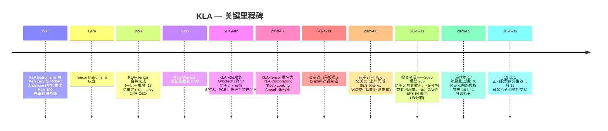
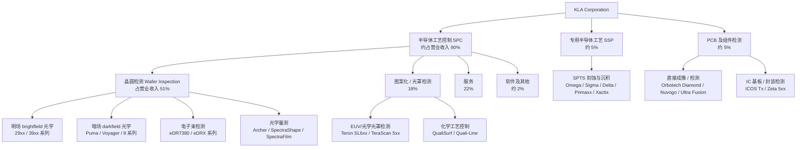
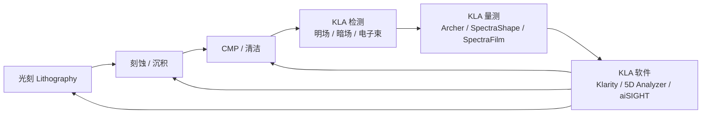
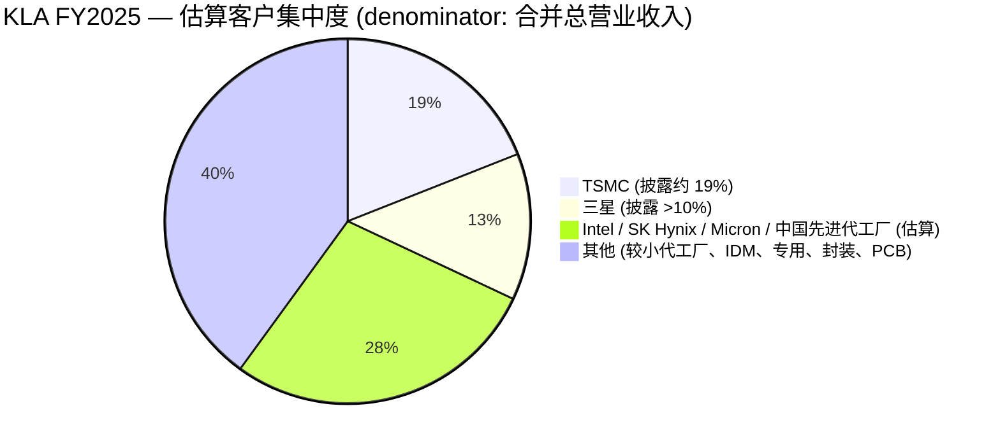
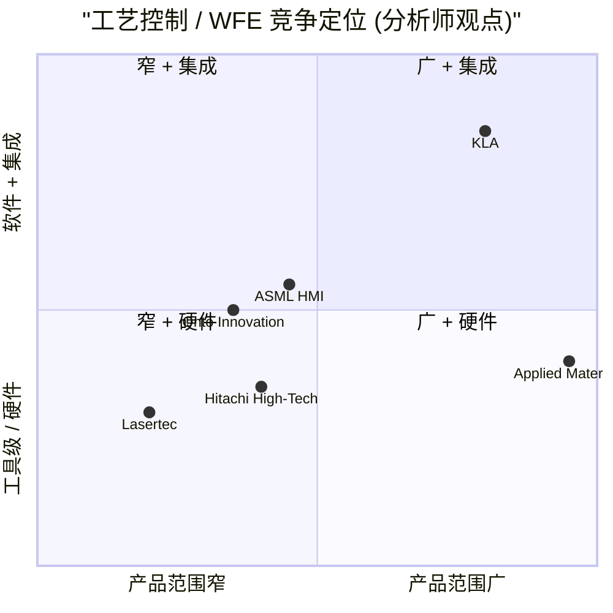
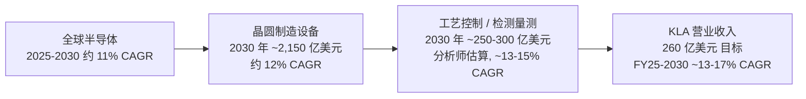

# KLA Corporation (NASDAQ:KLAC) — 公司研究报告

**截至日期: 2026-06-14**
**上市地: 纳斯达克全球精选市场 (NASDAQ Global Select Market), 代码 KLAC**
**注册地: 美国加利福尼亚州米尔皮塔斯 (Milpitas, California)**
**报告语言: 简体中文 (英文版同时存在于本目录)**

*KLA 的财年截止于 6 月 30 日, 因此本报告中的"2025 财年 (FY2025)"指截止于 2025-06-30 的财年, "2026 财年 (FY2026)"指截止于 2026-06-30 的财年。除非另行说明, 所有货币均以美元计。*

*重要提示 — 股票拆分: KLA 已于 **2026 年 6 月 11 日收盘后** 完成 **10 比 1 正向股票拆分 (forward stock split)**, 自 [2026 年 6 月 12 日](https://www.sec.gov/Archives/edgar/data/319201/000119312526212093/d116682d8k.htm) 起按拆分调整后基础交易。**本报告的当前股价、市值与每股价格目标均以拆分后口径表述** (例如 EPS 由拆分前的约 30 美元变为拆分后的约 3 美元); 但 **历史财务报表数据 (10-K/10-Q 中的营业收入、净利润、绝对美元数) 未受拆分影响**, 仍以原始口径引用。引用的第三方券商价格目标若发布于拆分生效之前, 已在文中同时给出拆分前原值与拆分后等值, 以便与当前股价对比。*

---

> **本方评级与价格目标 (本方观点, *分析师观点:*)**
>
> | 项目 | 数值 |
> |---|---|
> | **评级 Rating** | **Hold / 中性 (Neutral)** |
> | **12 个月价格目标 (拆分后)** | **US$ 275** |
> | **当前股价 (2026-06-12 收盘)** | **US$ 254.54** |
> | **隐含上行空间** | **+8.0%** |
> | **估值方法** | 2027E Non-GAAP EPS ~US$ 5.40 × 51× forward P/E ≈ US$ 275 |
> | **市值** | 约 US$ 3,325 亿 |
> | **52 周区间 (拆分后)** | US$ 83.22 – 254.93 |
> | **过往十二个月回报** | 约 +195% (拆分调整后) |
>
> **2–4 条投资主线 (thesis pillars):**
> 1. **工艺控制近垄断的耐久性。** *分析师观点:* KLA 在半导体工艺控制 (检测 + 量测) 中占约 58% 份额, 在 AI 驱动的节点缩小 (GAA、backside power、先进封装) 中, **检测强度 (inspection intensity) 结构性上升** — 每片晶圆所需检测/量测步骤随每一代节点大致翻倍, 使 KLA 增速持续快于整体 WFE。
> 2. **服务年金平滑了周期。** 2025 财年服务收入 26.8 亿美元 (占 22%, +15% YoY), 来自 10–20 年寿命的装机量, 是抵御 WFE 周期波动的经常性基础 ([FY2025 10-K MD&A](https://www.sec.gov/Archives/edgar/data/319201/000031920125000024/klac-20250630.htm))。
> 3. **估值已充分定价, 是评级保持中性的核心原因。** 当前股价 254.54 美元 **同时高于** Bernstein 拆分后等值 197.50 美元目标与 Goldman Sachs 拆分后等值 155.00 美元目标 — 市场已对 2030 模型 (260 亿美元营业收入) 给予较高定价, 留给估值倍数继续扩张的空间有限。
> 4. **中国出口管制是单一最大的可量化风险。** 中国占 FY2025 营业收入 33%; 现行 BIS 规则按管理层估算在 CY2026 累计造成约 3–3.5 亿美元营业收入损失 ([FY26 Q1 业绩说明会](https://www.fool.com/earnings/call-transcripts/2025/10/30/kla-klac-q1-2026-earnings-call-transcript/))。

> **最新指引 (2026 财年 Q4, 截止 2026-06-30):** 营业收入指引 **35.75 亿美元 ± 2 亿美元**, GAAP 毛利率 (gross margin) **60.72% ± 100 个基点**, GAAP 摊薄 EPS **9.66 美元 ± 1.00 美元 (拆分前口径)**。发布于 [2026 财年 Q3 业绩公告, 2026-04-29](https://www.sec.gov/Archives/edgar/data/319201/000031920126000014/klac-20260429.htm)。董事会同时批准 **股息上调 21% 至每股每季度 2.30 美元 (拆分前; 连续第 17 年上调)**、**新增 70 亿美元股票回购授权**, 并宣布 **10 比 1 正向股票拆分**。此前期间指引未被下调。

---

## 目录

1. [公司概览](#1-公司概览)
   - [1A 估值与价格目标](#1a-估值与价格目标)
   - [1B GF Score 基本面评分](#1b-gf-score-基本面评分)
2. [估值与价格目标 (Valuation & Price Target)](#2-估值与价格目标-valuation--price-target)
3. [公司历史](#3-公司历史)
4. [管理团队](#4-管理团队)
5. [产品与服务](#5-产品与服务)
6. [客户与市场策略](#6-客户与市场策略)
7. [行业概览](#7-行业概览)
8. [竞争格局](#8-竞争格局)
9. [市场机会 (TAM)](#9-市场机会-tam)
10. [风险评估](#10-风险评估)
    - [9.5 核心分歧与催化剂](#95-核心分歧与催化剂)
11. [投资者视角评分 (Section 10 Lenses)](#11-投资者视角评分)
12. [参考资料](#12-参考资料)

---

## 1. 公司概览

**本方观点 (BLUF).** KLA 是半导体工艺控制 (process control) 的全球近垄断龙头, 拥有整个 WFE 板块中最高的毛利率 (gross margin 60.9%) 之一与最深的转换成本护城河; AI 驱动的节点缩小与先进封装建设结构性推升了检测强度, 使 KLA 增速持续快于整体 WFE。但 **本方给予 Hold / 中性评级**, 核心原因不是质疑业务质量, 而是 **估值已充分反映这一切**: 在 10 比 1 拆分后约 254.54 美元的股价上, KLA 同时高于 Bernstein 与 Goldman Sachs 两家券商的价格目标, TTM P/E 约 52×, 已对 2030 模型给予近乎完美的定价。最值得盯紧的两个变量是 (a) **中国出口管制是否进一步升级** (33% 营业收入敞口), 以及 (b) **AI 资本开支超级周期能否避免 2027–2028 年的消化阶段**。

KLA Corporation 总部位于加利福尼亚州米尔皮塔斯, 是半导体行业 **工艺控制 (process control)** 与 **良率管理 (yield management)** 设备的全球绝对龙头供应商——即晶圆厂 (fab) 用于发现、测量和表征纳米级缺陷、薄膜和图案误差的检测 (inspection) 与量测 (metrology) 工具, 这些误差决定了一片晶圆上的芯片能否最终出厂销售。公司自身的表述非常直白: "[我们] 是行业领先设备与服务的供应商, 这些设备与服务推动了整个电子行业的创新。我们为晶圆、光罩 (reticles/masks)、化学品/材料、集成电路 ('IC' 或 'chip')、封装 IC 及印制电路板 (PCB) 制造提供先进的工艺控制和工艺使能解决方案" ([KLA FY2025 10-K, Item 1 Business](https://www.sec.gov/Archives/edgar/data/319201/000031920125000024/klac-20250630.htm))。

KLA 的财报口径分为 **三大业务分部**——**半导体工艺控制 (Semiconductor Process Control, SPC)**、**专用半导体工艺 (Specialty Semiconductor Process, SSP)** 与 **PCB 及组件检测 (PCB and Component Inspection)**——但 SPC 单一分部即贡献了 **109.5 亿美元**, 约占 **2025 财年分部营业收入 121.6 亿美元的 ~90%**, 数据见 [FY2025 10-K MD&A](https://www.sec.gov/Archives/edgar/data/319201/000031920125000024/klac-20250630.htm) 中的分部表。剩余两个较小分部 (SSP 5.87 亿美元、PCB & Component Inspection 6.22 亿美元) 合计约占剩余 10%。从公司整体看, **2025 财年服务收入 (services revenue) 为 26.8 亿美元, 约占总营业收入的 22%**, 这一与装机设备紧密绑定的经常性基础平滑了设备周期。

下图以 Sankey 形式呈现 KLA FY2025 收入表全貌: 121.56 亿美元营业收入经过 47.52 亿美元 COGS 后形成 74.04 亿美元毛利 (毛利率 60.9%), 再扣除 13.6 亿美元 R&D、10.3 亿美元 SG&A 与 2.39 亿美元减值后, 得到约 47.75 亿美元营业利润, 最终落到 40.62 亿美元净利润 ([FY2025 10-K 合并经营报表](https://www.sec.gov/Archives/edgar/data/319201/000031920125000024/klac-20250630.htm))。

<svg xmlns="http://www.w3.org/2000/svg" viewBox="0 0 1000 560" width="1000" height="560" role="img" aria-label="income statement Sankey"><rect x="0" y="0" width="1000" height="560" fill="#ffffff"/>
<text x="20.00" y="30.00" text-anchor="start" font-family="Helvetica,Arial,sans-serif" font-size="15" font-weight="700" fill="#1f2933">KLA 收入表 Sankey — FY2025 (US$ 百万)</text>
<path d="M 204.00,71.00 C 258.00,71.00 258.00,85.00 312.00,85.00 L 312.00,452.42 C 258.00,452.42 258.00,438.42 204.00,438.42 Z" fill="#93c5fd" fill-opacity="0.55"/>
<path d="M 452.00,78.00 C 506.00,78.00 506.00,148.57 560.00,148.57 L 560.00,308.83 C 506.00,308.83 506.00,238.27 452.00,238.27 Z" fill="#86efac" fill-opacity="0.55"/>
<path d="M 452.00,238.27 C 506.00,238.27 506.00,322.83 560.00,322.83 L 560.00,411.07 C 506.00,411.07 506.00,326.51 452.00,326.51 Z" fill="#fca5a5" fill-opacity="0.55"/>
<path d="M 328.00,85.00 C 382.00,85.00 382.00,78.00 436.00,78.00 L 436.00,326.51 C 382.00,326.51 382.00,333.51 328.00,333.51 Z" fill="#86efac" fill-opacity="0.55"/>
<path d="M 328.00,333.51 C 382.00,333.51 382.00,340.51 436.00,340.51 L 436.00,500.00 C 382.00,500.00 382.00,493.00 328.00,493.00 Z" fill="#fca5a5" fill-opacity="0.55"/>
<path d="M 700.00,145.95 C 754.00,145.95 754.00,204.05 808.00,204.05 L 808.00,340.38 C 754.00,340.38 754.00,282.28 700.00,282.28 Z" fill="#86efac" fill-opacity="0.55"/>
<path d="M 700.00,282.28 C 754.00,282.28 754.00,354.38 808.00,354.38 L 808.00,373.95 C 754.00,373.95 754.00,301.85 700.00,301.85 Z" fill="#fca5a5" fill-opacity="0.55"/>
<path d="M 576.00,148.57 C 630.00,148.57 630.00,145.95 684.00,145.95 L 684.00,306.21 C 630.00,306.21 630.00,308.83 576.00,308.83 Z" fill="#86efac" fill-opacity="0.55"/>
<path d="M 576.00,322.83 C 630.00,322.83 630.00,315.82 684.00,315.82 L 684.00,350.39 C 630.00,350.39 630.00,357.40 576.00,357.40 Z" fill="#fca5a5" fill-opacity="0.55"/>
<path d="M 576.00,357.40 C 630.00,357.40 630.00,364.39 684.00,364.39 L 684.00,410.03 C 630.00,410.03 630.00,403.05 576.00,403.05 Z" fill="#fca5a5" fill-opacity="0.55"/>
<path d="M 576.00,403.05 C 630.00,403.05 630.00,424.03 684.00,424.03 L 684.00,432.05 C 630.00,432.05 630.00,411.07 576.00,411.07 Z" fill="#fca5a5" fill-opacity="0.55"/>
<path d="M 576.00,425.07 C 630.00,425.07 630.00,306.21 684.00,306.21 L 684.00,310.58 C 630.00,310.58 630.00,429.43 576.00,429.43 Z" fill="#93c5fd" fill-opacity="0.55"/>
<path d="M 204.00,452.42 C 258.00,452.42 258.00,452.42 312.00,452.42 L 312.00,472.12 C 258.00,472.12 258.00,472.12 204.00,472.12 Z" fill="#93c5fd" fill-opacity="0.55"/>
<path d="M 204.00,486.12 C 258.00,486.12 258.00,472.12 312.00,472.12 L 312.00,493.00 C 258.00,493.00 258.00,507.00 204.00,507.00 Z" fill="#93c5fd" fill-opacity="0.55"/>
<rect x="188.00" y="71.00" width="16" height="367.42" rx="1.5" fill="#2563eb"/>
<rect x="188.00" y="452.42" width="16" height="19.70" rx="1.5" fill="#2563eb"/>
<rect x="188.00" y="486.12" width="16" height="20.88" rx="1.5" fill="#2563eb"/>
<rect x="312.00" y="85.00" width="16" height="408.00" rx="1.5" fill="#1e3a8a"/>
<rect x="436.00" y="78.00" width="16" height="248.51" rx="1.5" fill="#15803d"/>
<rect x="436.00" y="340.51" width="16" height="159.49" rx="1.5" fill="#dc2626"/>
<rect x="560.00" y="148.57" width="16" height="160.27" rx="1.5" fill="#15803d"/>
<rect x="560.00" y="322.83" width="16" height="88.24" rx="1.5" fill="#dc2626"/>
<rect x="560.00" y="425.07" width="16" height="4.36" rx="1.5" fill="#2563eb"/>
<rect x="684.00" y="145.95" width="16" height="155.87" rx="1.5" fill="#15803d"/>
<rect x="684.00" y="315.82" width="16" height="34.57" rx="1.5" fill="#dc2626"/>
<rect x="684.00" y="364.39" width="16" height="45.65" rx="1.5" fill="#dc2626"/>
<rect x="684.00" y="424.03" width="16" height="8.02" rx="1.5" fill="#dc2626"/>
<rect x="808.00" y="204.05" width="16" height="136.34" rx="1.5" fill="#15803d"/>
<rect x="808.00" y="354.38" width="16" height="19.57" rx="1.5" fill="#dc2626"/>
<line x1="188.00" y1="254.71" x2="182.00" y2="245.15" stroke="#cbd5e1" stroke-width="1"/>
<text x="179.00" y="248.15" text-anchor="end" font-family="Helvetica,Arial,sans-serif" font-size="11.5" font-weight="700" fill="#1f2933">Semiconductor Process Control</text>
<text x="179.00" y="261.15" text-anchor="end" font-family="Helvetica,Arial,sans-serif" font-size="10" font-weight="400" fill="#52606d">US$10.9B  (90.1%)</text>
<line x1="188.00" y1="462.27" x2="182.00" y2="452.71" stroke="#cbd5e1" stroke-width="1"/>
<text x="179.00" y="455.71" text-anchor="end" font-family="Helvetica,Arial,sans-serif" font-size="11.5" font-weight="700" fill="#1f2933">Specialty Semiconductor Process</text>
<text x="179.00" y="468.71" text-anchor="end" font-family="Helvetica,Arial,sans-serif" font-size="10" font-weight="400" fill="#52606d">US$587.0M  (4.8%)</text>
<line x1="188.00" y1="496.56" x2="182.00" y2="487.00" stroke="#cbd5e1" stroke-width="1"/>
<text x="179.00" y="490.00" text-anchor="end" font-family="Helvetica,Arial,sans-serif" font-size="11.5" font-weight="700" fill="#1f2933">PCB &amp; Component Inspection</text>
<text x="179.00" y="503.00" text-anchor="end" font-family="Helvetica,Arial,sans-serif" font-size="10" font-weight="400" fill="#52606d">US$622.0M  (5.1%)</text>
<rect x="331.00" y="67.00" width="119.40" height="26" rx="2" fill="#ffffff" fill-opacity="0.72"/>
<text x="334.00" y="79.00" text-anchor="start" font-family="Helvetica,Arial,sans-serif" font-size="11.5" font-weight="700" fill="#1f2933">Revenue</text>
<text x="334.00" y="92.00" text-anchor="start" font-family="Helvetica,Arial,sans-serif" font-size="10" font-weight="400" fill="#52606d">US$12.2B  (100.0%)</text>
<rect x="455.00" y="60.00" width="106.80" height="26" rx="2" fill="#ffffff" fill-opacity="0.72"/>
<text x="458.00" y="72.00" text-anchor="start" font-family="Helvetica,Arial,sans-serif" font-size="11.5" font-weight="700" fill="#1f2933">Gross Profit</text>
<text x="458.00" y="85.00" text-anchor="start" font-family="Helvetica,Arial,sans-serif" font-size="10" font-weight="400" fill="#52606d">US$7.4B  (60.9%)</text>
<rect x="455.00" y="322.51" width="144.60" height="26" rx="2" fill="#ffffff" fill-opacity="0.72"/>
<text x="458.00" y="334.51" text-anchor="start" font-family="Helvetica,Arial,sans-serif" font-size="11.5" font-weight="700" fill="#1f2933">Cost of Revenue (COGS)</text>
<text x="458.00" y="347.51" text-anchor="start" font-family="Helvetica,Arial,sans-serif" font-size="10" font-weight="400" fill="#52606d">US$4.8B  (39.1%)</text>
<rect x="579.00" y="130.57" width="106.80" height="26" rx="2" fill="#ffffff" fill-opacity="0.72"/>
<text x="582.00" y="142.57" text-anchor="start" font-family="Helvetica,Arial,sans-serif" font-size="11.5" font-weight="700" fill="#1f2933">Operating Income</text>
<text x="582.00" y="155.57" text-anchor="start" font-family="Helvetica,Arial,sans-serif" font-size="10" font-weight="400" fill="#52606d">US$4.8B  (39.3%)</text>
<rect x="579.00" y="304.83" width="150.90" height="26" rx="2" fill="#ffffff" fill-opacity="0.72"/>
<text x="582.00" y="316.83" text-anchor="start" font-family="Helvetica,Arial,sans-serif" font-size="11.5" font-weight="700" fill="#1f2933">Total Operating Expense</text>
<text x="582.00" y="329.83" text-anchor="start" font-family="Helvetica,Arial,sans-serif" font-size="10" font-weight="400" fill="#52606d">US$2.6B  (21.6%)</text>
<text x="551.00" y="424.25" text-anchor="end" font-family="Helvetica,Arial,sans-serif" font-size="11.5" font-weight="700" fill="#1f2933">Net Interest / Other Income</text>
<text x="551.00" y="437.25" text-anchor="end" font-family="Helvetica,Arial,sans-serif" font-size="10" font-weight="400" fill="#52606d">US$130.0M  (1.1%)</text>
<rect x="703.00" y="127.95" width="106.80" height="26" rx="2" fill="#ffffff" fill-opacity="0.72"/>
<text x="706.00" y="139.95" text-anchor="start" font-family="Helvetica,Arial,sans-serif" font-size="11.5" font-weight="700" fill="#1f2933">Pretax Income</text>
<text x="706.00" y="152.95" text-anchor="start" font-family="Helvetica,Arial,sans-serif" font-size="10" font-weight="400" fill="#52606d">US$4.6B  (38.2%)</text>
<rect x="703.00" y="297.82" width="100.50" height="26" rx="2" fill="#ffffff" fill-opacity="0.72"/>
<text x="706.00" y="309.82" text-anchor="start" font-family="Helvetica,Arial,sans-serif" font-size="11.5" font-weight="700" fill="#1f2933">SG&amp;A</text>
<text x="706.00" y="322.82" text-anchor="start" font-family="Helvetica,Arial,sans-serif" font-size="10" font-weight="400" fill="#52606d">US$1.0B  (8.5%)</text>
<rect x="703.00" y="346.39" width="106.80" height="26" rx="2" fill="#ffffff" fill-opacity="0.72"/>
<text x="706.00" y="358.39" text-anchor="start" font-family="Helvetica,Arial,sans-serif" font-size="11.5" font-weight="700" fill="#1f2933">R&amp;D</text>
<text x="706.00" y="371.39" text-anchor="start" font-family="Helvetica,Arial,sans-serif" font-size="10" font-weight="400" fill="#52606d">US$1.4B  (11.2%)</text>
<rect x="703.00" y="406.03" width="113.10" height="26" rx="2" fill="#ffffff" fill-opacity="0.72"/>
<text x="706.00" y="418.03" text-anchor="start" font-family="Helvetica,Arial,sans-serif" font-size="11.5" font-weight="700" fill="#1f2933">Other OpEx</text>
<text x="706.00" y="431.03" text-anchor="start" font-family="Helvetica,Arial,sans-serif" font-size="10" font-weight="400" fill="#52606d">US$239.0M  (2.0%)</text>
<text x="833.00" y="269.22" text-anchor="start" font-family="Helvetica,Arial,sans-serif" font-size="11.5" font-weight="700" fill="#1f2933">Net Income</text>
<text x="833.00" y="282.22" text-anchor="start" font-family="Helvetica,Arial,sans-serif" font-size="10" font-weight="400" fill="#52606d">US$4.1B  (33.4%)</text>
<text x="833.00" y="361.17" text-anchor="start" font-family="Helvetica,Arial,sans-serif" font-size="11.5" font-weight="700" fill="#1f2933">Income Tax</text>
<text x="833.00" y="374.17" text-anchor="start" font-family="Helvetica,Arial,sans-serif" font-size="10" font-weight="400" fill="#52606d">US$583.0M  (4.8%)</text>
<text x="500.00" y="544.00" text-anchor="middle" font-family="Helvetica,Arial,sans-serif" font-size="10" font-weight="400" fill="#52606d">Source: KLA FY2025 10-K (财年截止 2025-06-30), SEC EDGAR · 合并经营报表</text>
</svg>
*来源: KLA FY2025 10-K, SEC EDGAR · 合并经营报表。*

**近期财务轨迹。** 营业收入从 2021 财年的 69.2 亿美元增长至 **2025 财年的 121.6 亿美元**——四年间增长约 76%, 受先进逻辑/存储产能建设、先进封装 (HBM、2.5D/3D) 以及 AI 驱动的代工厂需求拉动 ([FY2025 10-K 精选财务信息](https://www.sec.gov/Archives/edgar/data/319201/000031920125000024/klac-20250630.htm))。2024 财年是一个相对疲软的年度 (98.1 亿美元, 同比下滑 7%), 反映了更广泛的存储下行周期及后疫情资本开支的消化期; 2025 财年的 121.6 亿美元 (同比 +24%) 标志着行业的全面回升。GAAP 毛利率在整个周期中保持在一个极窄的 **59.8–60.9% 区间**, 反映出公司在工艺控制垄断/寡头领域的定价能力。*分析师观点:* 这一毛利率区间结构性地高于沉积/刻蚀工具同业 (AMAT 和 LRCX 通常在 40 多个百分点的高位运行), 这一形态通常归因于 KLA 较高的软件占比与更高的 IP 含量产品组合。

<svg xmlns="http://www.w3.org/2000/svg" viewBox="0 0 860 470" width="860" height="470" role="img" aria-label="historical revenue bars"><rect x="0" y="0" width="860" height="470" fill="#ffffff"/>
<text x="20.00" y="30.00" text-anchor="start" font-family="Helvetica,Arial,sans-serif" font-size="15" font-weight="700" fill="#1f2933">KLA 分部营业收入历史 — FY2021–FY2025 (US$ 百万)</text>
<rect x="20.00" y="44" width="11" height="11" rx="2" fill="#2563eb"/>
<text x="36.00" y="53.00" text-anchor="start" font-family="Helvetica,Arial,sans-serif" font-size="10.5" font-weight="400" fill="#1f2933">Semiconductor Process Control</text>
<rect x="241.40" y="44" width="11" height="11" rx="2" fill="#15803d"/>
<text x="257.40" y="53.00" text-anchor="start" font-family="Helvetica,Arial,sans-serif" font-size="10.5" font-weight="400" fill="#1f2933">Specialty Semiconductor Process</text>
<rect x="476.00" y="44" width="11" height="11" rx="2" fill="#d97706"/>
<text x="492.00" y="53.00" text-anchor="start" font-family="Helvetica,Arial,sans-serif" font-size="10.5" font-weight="400" fill="#1f2933">PCB &amp; Component Inspection</text>
<line x1="70" y1="412.00" x2="834" y2="412.00" stroke="#eceff2" stroke-width="1"/>
<text x="64.00" y="415.00" text-anchor="end" font-family="Helvetica,Arial,sans-serif" font-size="9.5" font-weight="400" fill="#52606d">US$0</text>
<line x1="70" y1="345.20" x2="834" y2="345.20" stroke="#eceff2" stroke-width="1"/>
<text x="64.00" y="348.20" text-anchor="end" font-family="Helvetica,Arial,sans-serif" font-size="9.5" font-weight="400" fill="#52606d">US$2.6B</text>
<line x1="70" y1="278.40" x2="834" y2="278.40" stroke="#eceff2" stroke-width="1"/>
<text x="64.00" y="281.40" text-anchor="end" font-family="Helvetica,Arial,sans-serif" font-size="9.5" font-weight="400" fill="#52606d">US$5.3B</text>
<line x1="70" y1="211.60" x2="834" y2="211.60" stroke="#eceff2" stroke-width="1"/>
<text x="64.00" y="214.60" text-anchor="end" font-family="Helvetica,Arial,sans-serif" font-size="9.5" font-weight="400" fill="#52606d">US$7.9B</text>
<line x1="70" y1="144.80" x2="834" y2="144.80" stroke="#eceff2" stroke-width="1"/>
<text x="64.00" y="147.80" text-anchor="end" font-family="Helvetica,Arial,sans-serif" font-size="9.5" font-weight="400" fill="#52606d">US$10.5B</text>
<line x1="70" y1="78.00" x2="834" y2="78.00" stroke="#eceff2" stroke-width="1"/>
<text x="64.00" y="81.00" text-anchor="end" font-family="Helvetica,Arial,sans-serif" font-size="9.5" font-weight="400" fill="#52606d">US$13.1B</text>
<rect x="102.09" y="260.93" width="88.62" height="151.07" fill="#2563eb"/>
<rect x="102.09" y="249.84" width="88.62" height="11.09" fill="#15803d"/>
<rect x="102.09" y="235.97" width="88.62" height="13.87" fill="#d97706"/>
<text x="146.40" y="428.00" text-anchor="middle" font-family="Helvetica,Arial,sans-serif" font-size="10" font-weight="400" fill="#52606d">2021</text>
<rect x="254.89" y="214.66" width="88.62" height="197.34" fill="#2563eb"/>
<rect x="254.89" y="201.43" width="88.62" height="13.23" fill="#15803d"/>
<rect x="254.89" y="184.74" width="88.62" height="16.69" fill="#d97706"/>
<text x="299.20" y="428.00" text-anchor="middle" font-family="Helvetica,Arial,sans-serif" font-size="10" font-weight="400" fill="#52606d">2022</text>
<rect x="407.69" y="176.01" width="88.62" height="235.99" fill="#2563eb"/>
<rect x="407.69" y="160.31" width="88.62" height="15.70" fill="#15803d"/>
<rect x="407.69" y="144.97" width="88.62" height="15.34" fill="#d97706"/>
<text x="452.00" y="428.00" text-anchor="middle" font-family="Helvetica,Arial,sans-serif" font-size="10" font-weight="400" fill="#52606d">2023</text>
<rect x="560.49" y="191.30" width="88.62" height="220.70" fill="#2563eb"/>
<rect x="560.49" y="177.23" width="88.62" height="14.07" fill="#15803d"/>
<rect x="560.49" y="162.37" width="88.62" height="14.86" fill="#d97706"/>
<text x="604.80" y="428.00" text-anchor="middle" font-family="Helvetica,Arial,sans-serif" font-size="10" font-weight="400" fill="#52606d">2024</text>
<rect x="713.29" y="133.50" width="88.62" height="278.50" fill="#2563eb"/>
<rect x="713.29" y="118.56" width="88.62" height="14.93" fill="#15803d"/>
<rect x="713.29" y="102.74" width="88.62" height="15.82" fill="#d97706"/>
<text x="757.60" y="428.00" text-anchor="middle" font-family="Helvetica,Arial,sans-serif" font-size="10" font-weight="400" fill="#52606d">2025</text>
<text x="430.00" y="454.00" text-anchor="middle" font-family="Helvetica,Arial,sans-serif" font-size="10" font-weight="400" fill="#52606d">Source: KLA FY2023 &amp; FY2025 10-K, SEC EDGAR · Note 分部报告</text>
</svg>
*来源: KLA FY2023 & FY2025 10-K, SEC EDGAR · Note 分部报告。FY2021–FY2022 分部数额为按当年 10-K 重述口径。*

**资本回报。** KLA 在 2025 财年产生了 **40.8 亿美元的经营性现金流和 37.5 亿美元的自由现金流 (FCF)** (经营性现金流 40.82 亿 − 资本开支 3.35 亿), 累计支付约 **7.0 亿美元股息并回购股票 21.7 亿美元** ([FY2025 10-K 合并现金流量表](https://www.sec.gov/Archives/edgar/data/319201/000031920125000024/klac-20250630.htm))。董事会在 2026 年 4 月再次上调股息至 **每股每季度 2.30 美元 (拆分前; 连续第 17 年上调, +21%)**, 同时新增 **70 亿美元回购授权** ([FY2026 Q3 业绩 8-K, 2026-04-29](https://www.sec.gov/Archives/edgar/data/319201/000031920126000014/klac-20260429.htm)), 并在 [2026 年 3 月投资者日](https://quartr.com/events/kla-corporation-klac-investor-day-2026_3YEy3IDO) 上将资本回报目标提高到自由现金流的 90% 以上。

<svg xmlns="http://www.w3.org/2000/svg" viewBox="0 0 1040 600" width="1040" height="600" role="img" aria-label="cash flow Sankey"><rect x="0" y="0" width="1040" height="600" fill="#ffffff"/>
<text x="20.00" y="30.00" text-anchor="start" font-family="Helvetica,Arial,sans-serif" font-size="15" font-weight="700" fill="#1f2933">KLA 现金流量 Sankey — FY2025 (US$ 百万)</text>
<path d="M 204.00,64.00 C 306.00,64.00 306.00,78.00 408.00,78.00 L 408.00,225.51 C 306.00,225.51 306.00,211.51 204.00,211.51 Z" fill="#93c5fd" fill-opacity="0.55"/>
<path d="M 644.00,71.00 C 746.00,71.00 746.00,146.60 848.00,146.60 L 848.00,308.65 C 746.00,308.65 746.00,233.06 644.00,233.06 Z" fill="#fca5a5" fill-opacity="0.55"/>
<path d="M 644.00,233.06 C 746.00,233.06 746.00,322.65 848.00,322.65 L 848.00,374.58 C 746.00,374.58 746.00,284.99 644.00,284.99 Z" fill="#fca5a5" fill-opacity="0.55"/>
<path d="M 644.00,284.99 C 746.00,284.99 746.00,388.58 848.00,388.58 L 848.00,471.40 C 746.00,471.40 746.00,367.81 644.00,367.81 Z" fill="#fca5a5" fill-opacity="0.55"/>
<path d="M 424.00,78.00 C 526.00,78.00 526.00,71.00 628.00,71.00 L 628.00,367.81 C 526.00,367.81 526.00,374.81 424.00,374.81 Z" fill="#fca5a5" fill-opacity="0.55"/>
<path d="M 424.00,374.81 C 526.00,374.81 526.00,381.81 628.00,381.81 L 628.00,547.00 C 526.00,547.00 526.00,540.00 424.00,540.00 Z" fill="#86efac" fill-opacity="0.55"/>
<path d="M 204.00,225.51 C 306.00,225.51 306.00,225.51 408.00,225.51 L 408.00,530.08 C 306.00,530.08 306.00,530.08 204.00,530.08 Z" fill="#93c5fd" fill-opacity="0.55"/>
<path d="M 204.00,544.08 C 306.00,544.08 306.00,530.08 408.00,530.08 L 408.00,540.00 C 306.00,540.00 306.00,554.00 204.00,554.00 Z" fill="#93c5fd" fill-opacity="0.55"/>
<rect x="188.00" y="64.00" width="16" height="147.51" rx="1.5" fill="#2563eb"/>
<rect x="188.00" y="225.51" width="16" height="304.57" rx="1.5" fill="#2563eb"/>
<rect x="188.00" y="544.08" width="16" height="9.92" rx="1.5" fill="#2563eb"/>
<rect x="408.00" y="78.00" width="16" height="462.00" rx="1.5" fill="#1e3a8a"/>
<rect x="628.00" y="71.00" width="16" height="296.81" rx="1.5" fill="#dc2626"/>
<rect x="628.00" y="381.81" width="16" height="165.19" rx="1.5" fill="#15803d"/>
<rect x="848.00" y="146.60" width="16" height="162.06" rx="1.5" fill="#dc2626"/>
<rect x="848.00" y="322.65" width="16" height="51.93" rx="1.5" fill="#dc2626"/>
<rect x="848.00" y="388.58" width="16" height="82.82" rx="1.5" fill="#dc2626"/>
<text x="179.00" y="134.75" text-anchor="end" font-family="Helvetica,Arial,sans-serif" font-size="11.5" font-weight="700" fill="#1f2933">Beginning Cash</text>
<text x="179.00" y="147.75" text-anchor="end" font-family="Helvetica,Arial,sans-serif" font-size="10" font-weight="400" fill="#52606d">US$2.0B  (31.9%)</text>
<rect x="207.00" y="199.43" width="106.80" height="26" rx="2" fill="#ffffff" fill-opacity="0.72"/>
<text x="210.00" y="211.43" text-anchor="start" font-family="Helvetica,Arial,sans-serif" font-size="11.5" font-weight="700" fill="#1f2933">Operating (CFO)</text>
<text x="210.00" y="224.43" text-anchor="start" font-family="Helvetica,Arial,sans-serif" font-size="10" font-weight="400" fill="#52606d">US$4.1B  (65.9%)</text>
<rect x="207.00" y="518.00" width="113.10" height="26" rx="2" fill="#ffffff" fill-opacity="0.72"/>
<text x="210.00" y="530.00" text-anchor="start" font-family="Helvetica,Arial,sans-serif" font-size="11.5" font-weight="700" fill="#1f2933">Investing (CFI)</text>
<text x="210.00" y="543.00" text-anchor="start" font-family="Helvetica,Arial,sans-serif" font-size="10" font-weight="400" fill="#52606d">US$133.0M  (2.1%)</text>
<rect x="427.00" y="60.00" width="132.00" height="26" rx="2" fill="#ffffff" fill-opacity="0.72"/>
<text x="430.00" y="72.00" text-anchor="start" font-family="Helvetica,Arial,sans-serif" font-size="11.5" font-weight="700" fill="#1f2933">Total Cash Mobilized</text>
<text x="430.00" y="85.00" text-anchor="start" font-family="Helvetica,Arial,sans-serif" font-size="10" font-weight="400" fill="#52606d">US$6.2B  (100.0%)</text>
<rect x="647.00" y="53.00" width="106.80" height="26" rx="2" fill="#ffffff" fill-opacity="0.72"/>
<text x="650.00" y="65.00" text-anchor="start" font-family="Helvetica,Arial,sans-serif" font-size="11.5" font-weight="700" fill="#1f2933">Financing (CFF)</text>
<text x="650.00" y="78.00" text-anchor="start" font-family="Helvetica,Arial,sans-serif" font-size="10" font-weight="400" fill="#52606d">US$4.0B  (64.2%)</text>
<text x="653.00" y="461.40" text-anchor="start" font-family="Helvetica,Arial,sans-serif" font-size="11.5" font-weight="700" fill="#1f2933">Ending Cash</text>
<text x="653.00" y="474.40" text-anchor="start" font-family="Helvetica,Arial,sans-serif" font-size="10" font-weight="400" fill="#52606d">US$2.2B  (35.8%)</text>
<text x="873.00" y="224.62" text-anchor="start" font-family="Helvetica,Arial,sans-serif" font-size="11.5" font-weight="700" fill="#1f2933">股票回购 Buybacks</text>
<text x="873.00" y="237.62" text-anchor="start" font-family="Helvetica,Arial,sans-serif" font-size="10" font-weight="400" fill="#52606d">US$2.2B  (35.1%)</text>
<text x="873.00" y="345.62" text-anchor="start" font-family="Helvetica,Arial,sans-serif" font-size="11.5" font-weight="700" fill="#1f2933">股息 Dividends</text>
<text x="873.00" y="358.62" text-anchor="start" font-family="Helvetica,Arial,sans-serif" font-size="10" font-weight="400" fill="#52606d">US$696.0M  (11.2%)</text>
<text x="873.00" y="426.99" text-anchor="start" font-family="Helvetica,Arial,sans-serif" font-size="11.5" font-weight="700" fill="#1f2933">债务及其他 Debt/other</text>
<text x="873.00" y="439.99" text-anchor="start" font-family="Helvetica,Arial,sans-serif" font-size="10" font-weight="400" fill="#52606d">US$1.1B  (17.9%)</text>
<text x="520.00" y="570.00" text-anchor="middle" font-family="Helvetica,Arial,sans-serif" font-size="10" font-weight="400" font-style="italic" fill="#8a97a3">Free Cash Flow = CFO − CapEx = US$3.7B</text>
<text x="520.00" y="584.00" text-anchor="middle" font-family="Helvetica,Arial,sans-serif" font-size="10" font-weight="400" fill="#52606d">Source: KLA FY2025 10-K (财年截止 2025-06-30), SEC EDGAR · 合并现金流量表</text>
</svg>
*来源: KLA FY2025 10-K, SEC EDGAR · 合并现金流量表。融资活动按回购/股息/债务及其他大致拆分。*

### 1A 估值与价格目标

**估值快照 (截至 2026-06-12 收盘, 拆分后口径)。** 股价 **254.54 美元**, 市值约 **3,325 亿美元** ([Yahoo Finance KLAC 行情页](https://finance.yahoo.com/quote/KLAC/))。TTM 营业收入约 **131 亿美元** (FY25 Q4 31.75 亿 + FY26 Q1 32.10 亿 + FY26 Q2 32.97 亿 + FY26 Q3 34.15 亿美元), TTM GAAP EPS 约 **35.33 美元 (拆分前) / 3.53 美元 (拆分后)**, 对应 **TTM P/E 约 52×** 和 **TTM P/S 约 19×**。该股 **过往十二个月上涨约 195% (拆分调整后)**, 52 周区间 83.22–254.93 美元 (拆分后), 走势紧密追随 AI 资本开支超级周期 ([Yahoo Finance KLAC](https://finance.yahoo.com/quote/KLAC/))。

**如何解读这些估值倍数。** 以 **52 倍 TTM 盈利** 计, KLA 的估值约为标普 500 (S&P 500) 长期平均 (约 22×) 的两倍以上, 处于自身过去三年区间的高端。这一溢价反映了市场对以下情景的定价: (a) WFE 基准较上一周期结构性提高, (b) 在先进节点 (亚 3nm 逻辑、HBM3e/HBM4、400+ 层 NAND、gate-all-around (GAA, 栅极环绕) 工艺过渡、backside power delivery (背面供电)) 上 **工艺控制强度持续上升**, 每片晶圆所需检测/量测步骤多于此前节点, 以及 (c) AI 建设拉长了周期 ([investing.com — KLA FY26 Q3 投资者演示纪要](https://www.investing.com/news/company-news/kla-q3-fy2026-slides-market-share-hits-58-ambitious-2030-targets-93CH-4671214))。周期性风险真实存在 (历史上存储波动可在 12 个月内令 KLA 营业收入波动 ±20%+), 详见第 2 章的远期模型与价格目标推导。

### 1B GF Score 基本面评分

*分析师观点:* 下方的 GF Score (GuruFocus 式) 五维基本面评分是 **本方自建的分析评分框架**, 而非 GuruFocus 发布的官方数字, 也不归因于任何主要文件; 每个维度的底层指标均在文中单独引用。综合得分 **76/100**, 对应"健康偏上、估值偏贵"的画像。

<svg xmlns="http://www.w3.org/2000/svg" viewBox="0 0 500 500" width="500" height="500" role="img" aria-label="GF Score radar">
<rect x="0" y="0" width="500" height="500" fill="#ffffff"/>
<text x="20" y="24" font-family="Helvetica,Arial,sans-serif" font-size="15" font-weight="700" fill="#1f2933">GF Score (GuruFocus-style): 78/100</text>
<text x="20" y="41" font-family="Helvetica,Arial,sans-serif" font-size="11" fill="#52606d">71–80 Likely average performance</text>
<polygon points="250.0,88.0 392.7,191.6 338.2,359.4 161.8,359.4 107.3,191.6" fill="#e9f5ec" stroke="none"/>
<polygon points="250.0,208.0 278.5,228.7 267.6,262.3 232.4,262.3 221.5,228.7" fill="none" stroke="#c5d3cb" stroke-width="1"/>
<polygon points="250.0,178.0 307.1,219.5 285.3,286.5 214.7,286.5 192.9,219.5" fill="none" stroke="#c5d3cb" stroke-width="1"/>
<polygon points="250.0,148.0 335.6,210.2 302.9,310.8 197.1,310.8 164.4,210.2" fill="none" stroke="#c5d3cb" stroke-width="1"/>
<polygon points="250.0,118.0 364.1,200.9 320.5,335.1 179.5,335.1 135.9,200.9" fill="none" stroke="#c5d3cb" stroke-width="1"/>
<polygon points="250.0,88.0 392.7,191.6 338.2,359.4 161.8,359.4 107.3,191.6" fill="none" stroke="#c5d3cb" stroke-width="1.3"/>
<line x1="250" y1="238" x2="161.8" y2="359.4" stroke="#cfdad3" stroke-width="1"/>
<text x="146.5" y="392.4" text-anchor="end" font-family="Helvetica,Arial,sans-serif" font-size="11.5" font-weight="600" fill="#1f2933">Financial Strength</text>
<text x="146.5" y="405.4" text-anchor="end" font-family="Helvetica,Arial,sans-serif" font-size="9.5" fill="#52606d">财务实力</text>
<text x="197.1" y="304.8" text-anchor="middle" font-family="Helvetica,Arial,sans-serif" font-size="10.5" font-weight="700" fill="#1f2933">6</text>
<line x1="250" y1="238" x2="250.0" y2="88.0" stroke="#cfdad3" stroke-width="1"/>
<text x="250.0" y="58.0" text-anchor="middle" font-family="Helvetica,Arial,sans-serif" font-size="11.5" font-weight="600" fill="#1f2933">Profitability</text>
<text x="250.0" y="71.0" text-anchor="middle" font-family="Helvetica,Arial,sans-serif" font-size="9.5" fill="#52606d">盈利能力</text>
<text x="250.0" y="82.0" text-anchor="middle" font-family="Helvetica,Arial,sans-serif" font-size="10.5" font-weight="700" fill="#1f2933">10</text>
<line x1="250" y1="238" x2="107.3" y2="191.6" stroke="#cfdad3" stroke-width="1"/>
<text x="82.6" y="183.6" text-anchor="end" font-family="Helvetica,Arial,sans-serif" font-size="11.5" font-weight="600" fill="#1f2933">Growth</text>
<text x="82.6" y="196.6" text-anchor="end" font-family="Helvetica,Arial,sans-serif" font-size="9.5" fill="#52606d">成长性</text>
<text x="121.6" y="190.3" text-anchor="middle" font-family="Helvetica,Arial,sans-serif" font-size="10.5" font-weight="700" fill="#1f2933">9</text>
<line x1="250" y1="238" x2="392.7" y2="191.6" stroke="#cfdad3" stroke-width="1"/>
<text x="417.4" y="183.6" text-anchor="start" font-family="Helvetica,Arial,sans-serif" font-size="11.5" font-weight="600" fill="#1f2933">GF Value</text>
<text x="417.4" y="196.6" text-anchor="start" font-family="Helvetica,Arial,sans-serif" font-size="9.5" fill="#52606d">估值</text>
<text x="278.5" y="222.7" text-anchor="middle" font-family="Helvetica,Arial,sans-serif" font-size="10.5" font-weight="700" fill="#1f2933">2</text>
<line x1="250" y1="238" x2="338.2" y2="359.4" stroke="#cfdad3" stroke-width="1"/>
<text x="353.5" y="392.4" text-anchor="start" font-family="Helvetica,Arial,sans-serif" font-size="11.5" font-weight="600" fill="#1f2933">Momentum</text>
<text x="353.5" y="405.4" text-anchor="start" font-family="Helvetica,Arial,sans-serif" font-size="9.5" fill="#52606d">动量</text>
<text x="338.2" y="353.4" text-anchor="middle" font-family="Helvetica,Arial,sans-serif" font-size="10.5" font-weight="700" fill="#1f2933">10</text>
<polygon points="250.0,88.0 278.5,228.7 338.2,359.4 197.1,310.8 121.6,196.3" fill="#2e8b57" fill-opacity="0.34" stroke="#2e8b57" stroke-width="2"/>
<circle cx="197.1" cy="310.8" r="2.6" fill="#2e8b57"/>
<circle cx="250.0" cy="88.0" r="2.6" fill="#2e8b57"/>
<circle cx="121.6" cy="196.3" r="2.6" fill="#2e8b57"/>
<circle cx="278.5" cy="228.7" r="2.6" fill="#2e8b57"/>
<circle cx="338.2" cy="359.4" r="2.6" fill="#2e8b57"/>
<text x="250" y="470" text-anchor="middle" font-family="Helvetica,Arial,sans-serif" font-size="9.5" fill="#52606d">Source: KLA FY2025 10-K · Yahoo Finance · indicators.db, as of 2026-06-14</text>
<text x="250" y="485" text-anchor="middle" font-family="Helvetica,Arial,sans-serif" font-size="9" fill="#52606d">GF Score = independent analyst rubric (*Analyst view:*) — not GuruFocus™ official number</text>
</svg>

| 维度 / Dimension | 评分 / Score (0–10) | |
|---|---|---|
| Financial Strength (财务实力) | 6 | `██████░░░░` |
| Profitability (盈利能力) | 10 | `██████████` |
| Growth (成长性) | 9 | `█████████░` |
| GF Value (估值) | 2 | `██░░░░░░░░` |
| Momentum (动量) | 10 | `██████████` |
| **GF Score (composite, *Analyst view:*)** | **78 / 100** | **71–80 Likely average performance** |

*Composite weights (*Analyst view:*): Financial Strength 20% · Profitability 25% · Growth 25% · GF Value 15% · Momentum 15% (transparent reproduction — not GuruFocus's proprietary weighting).*
*来源: KLA FY2025 10-K · Yahoo Finance · indicators.db, as of 2026-06-14 (本方评分框架)。*

- **Financial Strength 财务强度 = 6/10。** *分析师观点:* KLA 持有现金及有价证券约 44.9 亿美元, 但长期债务 (long-term debt) 58.8 亿美元高于现金, 净债务为正; 总负债 113.8 亿对总资产 160.7 亿, 股东权益仅 46.9 亿美元 ([FY2025 10-K 合并资产负债表](https://www.sec.gov/Archives/edgar/data/319201/000031920125000024/klac-20250630.htm))。利息支出 3.02 亿美元被 47.75 亿营业利润轻松覆盖 (覆盖率 >15×), 杠杆是可控的、且部分由刻意的债务融资回购造成 — 但因净债务为正、权益基础薄, 评 6 分而非更高。
- **Profitability 盈利能力 = 10/10。** *分析师观点:* 毛利率 60.9%、净利率 33% (净利 40.62 亿 / 营业收入 121.56 亿)、营业利润率约 39%, 均处于整个半导体设备板块的最高梯队; ROIC 远高于 WACC ([FY2025 10-K MD&A](https://www.sec.gov/Archives/edgar/data/319201/000031920125000024/klac-20250630.htm))。这是 KLA 最强的维度。
- **Growth 成长性 = 9/10。** *分析师观点:* FY2025 营业收入同比 +24%, 三年/五年 CAGR 均为两位数; 管理层 2030 模型隐含 FY25→2030 约 13–17% 营业收入 CAGR ([2026-03 投资者日](https://quartr.com/events/kla-corporation-klac-investor-day-2026_3YEy3IDO))。仅因周期性 (FY2024 曾同比 -7%) 未给满分。
- **GF Value 估值便宜度 = 2/10 (越高越便宜)。** *分析师观点:* 这是拖累综合分的维度。52× TTM P/E 处于自身历史高端, 且当前股价高于两家覆盖券商的价格目标 (Bernstein 拆分后等值 197.50、GS 拆分后等值 155.00 美元) — 安全边际 (margin of safety) 为负。
- **Momentum 动量 = 10/10。** *分析师观点:* 过往十二个月 +195% (拆分调整后), 大幅跑赢费城半导体指数与标普 500, 站稳 200 日均线之上 ([Yahoo Finance KLAC](https://finance.yahoo.com/quote/KLAC/))。

---

## 2. 估值与价格目标 (Valuation & Price Target)

本章是本报告的决策层: 它把前述事实转换为一个远期模型、一个推导出的 12 个月价格目标、牛/基/熊三档情景, 以及与卖方一致预期的对照。**全部远期数字、价格目标与情景目标均为本方观点 (*分析师观点:*), 不附着于任何 10-K 引用** (10-K 不含价格目标)。

### 2.1 远期财务估算 (3 年, *分析师观点:*)

下表的每一格预测均为本方观点; 各驱动的外部依据在文中单独引用。建模以分部 mix shift 为基础: SPC 主导 (检测强度上升 + 服务年金), SSP/PCB 受先进封装拉动温和增长。**所有 EPS 以拆分后口径表述。**

| 财年 (截止 6/30) | 营业收入 (亿美元) | YoY | gross margin | 营业利润率 | Non-GAAP 摊薄 EPS (拆分后) |
|---|---|---|---|---|---|
| FY2025 (实际) | 121.6 | +24% | 60.9% | ~39% | ~3.40 |
| FY2026E | ~133 | +9% | ~61% | ~40% | ~3.95 |
| FY2027E | ~150 | +13% | ~61.5% | ~41% | ~5.40 |
| FY2028E | ~168 | +12% | ~62% | ~42% | ~6.30 |

*依据:* FY2026E 锚定管理层 Q4 指引 (35.75 亿美元 ± 2 亿) 年化 + 已报前三季度实际 ([FY26 Q3 8-K](https://www.sec.gov/Archives/edgar/data/319201/000031920126000014/klac-20260429.htm)); FY2027E–FY2028E 营业收入增速取管理层 2030 模型 13–17% CAGR 的中段 ([2026-03 投资者日](https://quartr.com/events/kla-corporation-klac-investor-day-2026_3YEy3IDO)) 并向行业 WFE 增速 (SEMI 2027 预测 +7.3%) 收敛; 利润率轨迹反映经营杠杆 + 服务 mix 上升。**这些是本方估算, 不是 KLA 披露数字。**

下方 5 步 DuPont 分解说明了 KLA 高 ROE 的来源: 高净利率 (33%) × 中等资产周转率 × 因债务融资回购而放大的权益乘数 (总资产 160.7 亿 / 权益 46.9 亿 ≈ 3.4×)。

<svg xmlns="http://www.w3.org/2000/svg" viewBox="0 0 1240 540" width="1240" height="540" role="img" aria-label="DuPont ROE decomposition"><rect x="0" y="0" width="1240" height="540" fill="#ffffff"/>
<text x="20.00" y="30.00" text-anchor="start" font-family="Helvetica,Arial,sans-serif" font-size="15" font-weight="700" fill="#1f2933">KLA 5 步 DuPont ROE 分解 — FY2025</text>
<rect x="545.00" y="56.00" width="150" height="56" rx="7" fill="#1e3a8a"/>
<text x="620.00" y="76.00" text-anchor="middle" font-family="Helvetica,Arial,sans-serif" font-size="11.5" font-weight="700" fill="#ffffff">ROE</text>
<text x="620.00" y="94.00" text-anchor="middle" font-family="Helvetica,Arial,sans-serif" font-size="13" font-weight="800" fill="#ffffff">100.79%</text>
<text x="620.00" y="106.00" text-anchor="middle" font-family="Helvetica,Arial,sans-serif" font-size="8.5" font-weight="400" fill="#dbeafe">= Net Income / Avg Equity</text>
<rect x="191.60" y="168.00" width="150" height="56" rx="7" fill="#2563eb"/>
<text x="266.60" y="188.00" text-anchor="middle" font-family="Helvetica,Arial,sans-serif" font-size="11.5" font-weight="700" fill="#ffffff">Net Margin</text>
<text x="266.60" y="206.00" text-anchor="middle" font-family="Helvetica,Arial,sans-serif" font-size="13" font-weight="800" fill="#ffffff">33.42%</text>
<text x="266.60" y="218.00" text-anchor="middle" font-family="Helvetica,Arial,sans-serif" font-size="8.5" font-weight="400" fill="#dbeafe">Net Income / Revenue</text>
<line x1="620.00" y1="112.00" x2="266.60" y2="168.00" stroke="#94a3b8" stroke-width="1.4"/>
<rect x="545.00" y="168.00" width="150" height="56" rx="7" fill="#2563eb"/>
<text x="620.00" y="188.00" text-anchor="middle" font-family="Helvetica,Arial,sans-serif" font-size="11.5" font-weight="700" fill="#ffffff">Asset Turnover</text>
<text x="620.00" y="206.00" text-anchor="middle" font-family="Helvetica,Arial,sans-serif" font-size="13" font-weight="800" fill="#ffffff">0.77</text>
<text x="620.00" y="218.00" text-anchor="middle" font-family="Helvetica,Arial,sans-serif" font-size="8.5" font-weight="400" fill="#dbeafe">Revenue / Avg Assets</text>
<line x1="620.00" y1="112.00" x2="620.00" y2="168.00" stroke="#94a3b8" stroke-width="1.4"/>
<rect x="898.40" y="168.00" width="150" height="56" rx="7" fill="#2563eb"/>
<text x="973.40" y="188.00" text-anchor="middle" font-family="Helvetica,Arial,sans-serif" font-size="11.5" font-weight="700" fill="#ffffff">Equity Multiplier</text>
<text x="973.40" y="206.00" text-anchor="middle" font-family="Helvetica,Arial,sans-serif" font-size="13" font-weight="800" fill="#ffffff">3.91</text>
<text x="973.40" y="218.00" text-anchor="middle" font-family="Helvetica,Arial,sans-serif" font-size="8.5" font-weight="400" fill="#dbeafe">Avg Assets / Avg Equity</text>
<line x1="620.00" y1="112.00" x2="973.40" y2="168.00" stroke="#94a3b8" stroke-width="1.4"/>
<circle cx="443.30" cy="196.00" r="11" fill="#ffffff" stroke="#94a3b8" stroke-width="1.2"/>
<text x="443.30" y="201.00" text-anchor="middle" font-family="Helvetica,Arial,sans-serif" font-size="14" font-weight="800" fill="#52606d">×</text>
<circle cx="796.70" cy="196.00" r="11" fill="#ffffff" stroke="#94a3b8" stroke-width="1.2"/>
<text x="796.70" y="201.00" text-anchor="middle" font-family="Helvetica,Arial,sans-serif" font-size="14" font-weight="800" fill="#52606d">×</text>
<rect x="65.00" y="300.00" width="118" height="56" rx="7" fill="#2563eb"/>
<text x="124.00" y="320.00" text-anchor="middle" font-family="Helvetica,Arial,sans-serif" font-size="11.5" font-weight="700" fill="#ffffff">Operating Margin</text>
<text x="124.00" y="338.00" text-anchor="middle" font-family="Helvetica,Arial,sans-serif" font-size="13" font-weight="800" fill="#ffffff">39.28%</text>
<text x="124.00" y="350.00" text-anchor="middle" font-family="Helvetica,Arial,sans-serif" font-size="8.5" font-weight="400" fill="#dbeafe">Op Inc / Revenue</text>
<line x1="266.60" y1="224.00" x2="124.00" y2="300.00" stroke="#94a3b8" stroke-width="1.4"/>
<rect x="207.60" y="300.00" width="118" height="56" rx="7" fill="#2563eb"/>
<text x="266.60" y="320.00" text-anchor="middle" font-family="Helvetica,Arial,sans-serif" font-size="11.5" font-weight="700" fill="#ffffff">Tax Burden</text>
<text x="266.60" y="338.00" text-anchor="middle" font-family="Helvetica,Arial,sans-serif" font-size="13" font-weight="800" fill="#ffffff">0.8747</text>
<text x="266.60" y="350.00" text-anchor="middle" font-family="Helvetica,Arial,sans-serif" font-size="8.5" font-weight="400" fill="#dbeafe">Net Inc / Pretax</text>
<line x1="266.60" y1="224.00" x2="266.60" y2="300.00" stroke="#94a3b8" stroke-width="1.4"/>
<rect x="350.20" y="300.00" width="118" height="56" rx="7" fill="#2563eb"/>
<text x="409.20" y="320.00" text-anchor="middle" font-family="Helvetica,Arial,sans-serif" font-size="11.5" font-weight="700" fill="#ffffff">Interest Burden</text>
<text x="409.20" y="338.00" text-anchor="middle" font-family="Helvetica,Arial,sans-serif" font-size="13" font-weight="800" fill="#ffffff">0.9726</text>
<text x="409.20" y="350.00" text-anchor="middle" font-family="Helvetica,Arial,sans-serif" font-size="8.5" font-weight="400" fill="#dbeafe">Pretax / Op Inc</text>
<line x1="266.60" y1="224.00" x2="409.20" y2="300.00" stroke="#94a3b8" stroke-width="1.4"/>
<circle cx="195.30" cy="328.00" r="11" fill="#ffffff" stroke="#94a3b8" stroke-width="1.2"/>
<text x="195.30" y="333.00" text-anchor="middle" font-family="Helvetica,Arial,sans-serif" font-size="14" font-weight="800" fill="#52606d">×</text>
<circle cx="337.90" cy="328.00" r="11" fill="#ffffff" stroke="#94a3b8" stroke-width="1.2"/>
<text x="337.90" y="333.00" text-anchor="middle" font-family="Helvetica,Arial,sans-serif" font-size="14" font-weight="800" fill="#52606d">×</text>
<rect x="479.00" y="300.00" width="118" height="56" rx="7" fill="#2563eb"/>
<text x="538.00" y="326.00" text-anchor="middle" font-family="Helvetica,Arial,sans-serif" font-size="11.5" font-weight="700" fill="#ffffff">Revenue</text>
<text x="538.00" y="342.00" text-anchor="middle" font-family="Helvetica,Arial,sans-serif" font-size="13" font-weight="800" fill="#ffffff">US$12.2B</text>
<line x1="620.00" y1="224.00" x2="538.00" y2="300.00" stroke="#94a3b8" stroke-width="1.4"/>
<rect x="643.00" y="300.00" width="118" height="56" rx="7" fill="#2563eb"/>
<text x="702.00" y="320.00" text-anchor="middle" font-family="Helvetica,Arial,sans-serif" font-size="11.5" font-weight="700" fill="#ffffff">Avg Total Assets</text>
<text x="702.00" y="338.00" text-anchor="middle" font-family="Helvetica,Arial,sans-serif" font-size="13" font-weight="800" fill="#ffffff">US$15.8B</text>
<text x="702.00" y="350.00" text-anchor="middle" font-family="Helvetica,Arial,sans-serif" font-size="8.5" font-weight="400" fill="#dbeafe">(begin+end)/2</text>
<line x1="620.00" y1="224.00" x2="702.00" y2="300.00" stroke="#94a3b8" stroke-width="1.4"/>
<circle cx="620.00" cy="328.00" r="11" fill="#ffffff" stroke="#94a3b8" stroke-width="1.2"/>
<text x="620.00" y="333.00" text-anchor="middle" font-family="Helvetica,Arial,sans-serif" font-size="14" font-weight="800" fill="#52606d">÷</text>
<rect x="832.40" y="300.00" width="118" height="56" rx="7" fill="#2563eb"/>
<text x="891.40" y="320.00" text-anchor="middle" font-family="Helvetica,Arial,sans-serif" font-size="11.5" font-weight="700" fill="#ffffff">Avg Total Assets</text>
<text x="891.40" y="338.00" text-anchor="middle" font-family="Helvetica,Arial,sans-serif" font-size="13" font-weight="800" fill="#ffffff">US$15.8B</text>
<text x="891.40" y="350.00" text-anchor="middle" font-family="Helvetica,Arial,sans-serif" font-size="8.5" font-weight="400" fill="#dbeafe">(begin+end)/2</text>
<line x1="973.40" y1="224.00" x2="891.40" y2="300.00" stroke="#94a3b8" stroke-width="1.4"/>
<rect x="996.40" y="300.00" width="118" height="56" rx="7" fill="#2563eb"/>
<text x="1055.40" y="320.00" text-anchor="middle" font-family="Helvetica,Arial,sans-serif" font-size="11.5" font-weight="700" fill="#ffffff">Avg Total Equity</text>
<text x="1055.40" y="338.00" text-anchor="middle" font-family="Helvetica,Arial,sans-serif" font-size="13" font-weight="800" fill="#ffffff">US$4.0B</text>
<text x="1055.40" y="350.00" text-anchor="middle" font-family="Helvetica,Arial,sans-serif" font-size="8.5" font-weight="400" fill="#dbeafe">(begin+end)/2</text>
<line x1="973.40" y1="224.00" x2="1055.40" y2="300.00" stroke="#94a3b8" stroke-width="1.4"/>
<circle cx="967.20" cy="328.00" r="11" fill="#ffffff" stroke="#94a3b8" stroke-width="1.2"/>
<text x="967.20" y="333.00" text-anchor="middle" font-family="Helvetica,Arial,sans-serif" font-size="14" font-weight="800" fill="#52606d">÷</text>
<rect x="69.00" y="420.00" width="110" height="48" rx="7" fill="#3b82f6"/>
<text x="124.00" y="442.00" text-anchor="middle" font-family="Helvetica,Arial,sans-serif" font-size="11.5" font-weight="700" fill="#ffffff">Operating Income</text>
<text x="124.00" y="458.00" text-anchor="middle" font-family="Helvetica,Arial,sans-serif" font-size="13" font-weight="800" fill="#ffffff">US$4.8B</text>
<line x1="124.00" y1="356.00" x2="124.00" y2="420.00" stroke="#94a3b8" stroke-width="1.4"/>
<rect x="211.60" y="420.00" width="110" height="48" rx="7" fill="#3b82f6"/>
<text x="266.60" y="442.00" text-anchor="middle" font-family="Helvetica,Arial,sans-serif" font-size="11.5" font-weight="700" fill="#ffffff">Net Income</text>
<text x="266.60" y="458.00" text-anchor="middle" font-family="Helvetica,Arial,sans-serif" font-size="13" font-weight="800" fill="#ffffff">US$4.1B</text>
<line x1="266.60" y1="356.00" x2="266.60" y2="420.00" stroke="#94a3b8" stroke-width="1.4"/>
<rect x="354.20" y="420.00" width="110" height="48" rx="7" fill="#3b82f6"/>
<text x="409.20" y="442.00" text-anchor="middle" font-family="Helvetica,Arial,sans-serif" font-size="11.5" font-weight="700" fill="#ffffff">Pretax Income</text>
<text x="409.20" y="458.00" text-anchor="middle" font-family="Helvetica,Arial,sans-serif" font-size="13" font-weight="800" fill="#ffffff">US$4.6B</text>
<line x1="409.20" y1="356.00" x2="409.20" y2="420.00" stroke="#94a3b8" stroke-width="1.4"/>
<text x="620.00" y="524.00" text-anchor="middle" font-family="Helvetica,Arial,sans-serif" font-size="10" font-weight="400" fill="#52606d">Source: KLA FY2021-FY2025 10-K, SEC EDGAR · 合并经营报表与资产负债表 (FY2024 &amp; FY2025)</text>
</svg>
*来源: KLA FY2025 10-K, SEC EDGAR · 合并经营报表与资产负债表 (FY2024 & FY2025)。*

### 2.2 价格目标推导 (*分析师观点:*)

**方法: forward-PE × 目标倍数。** 本方对 FY2027E Non-GAAP EPS 约 **5.40 美元 (拆分后)** 给予 **约 51× forward P/E**, 得到 **12 个月价格目标 275 美元**, 相对 2026-06-12 收盘 254.54 美元的隐含上行 **+8.0%**。

**为什么用 51× 这个倍数。** 对照 5 家 WFE/工艺控制同业的 forward 与 TTM P/E: KLAC ~52×、ASML ~53×、Lam Research (LRCX) ~54×、Applied Materials (AMAT) ~42×、Onto Innovation (ONTO) >100× (基数小/增速快)。KLA 的结构性高毛利与近垄断份额支持其落在 AMAT 之上、与 ASML/LRCX 相当的区间; 但当前股价已隐含约 52× TTM, 给予 51× forward 意味着 **倍数大体持平、回报主要靠盈利增长驱动** — 这正是 Hold 评级的算术基础。一个更高的倍数 (55×+) 需要 AI 资本开支无消化阶段的假设, 本方认为风险报酬不对称。

### 2.3 牛 / 基 / 熊 价格目标 (*分析师观点:*)

| 情景 | 12 个月 PT (拆分后) | 相对当前 | 核心摆动假设 |
|---|---|---|---|
| **牛市 Bull** | **330 美元** | **+29.6%** | AI 资本开支无消化, FY2027E EPS 上修至 ~5.80, 倍数扩张至 ~57× (份额获取 + 中国管制缓和) |
| **基准 Base** | **275 美元** | **+8.0%** | FY2027E EPS ~5.40 × 51× (中性 WFE 轨迹, 倍数持平) |
| **熊市 Bear** | **185 美元** | **−27.3%** | 2027–2028 存储/AI 资本开支消化 + 中国管制升级, EPS 持平于 ~4.60, 倍数压缩至 ~40× |

熊市与牛市的不对称 (−27% vs +30%) 反映了高估值起点: 在 52× P/E 上, 一次年度未达成会触发显著的去估值 (de-rating), 而上行则需要本已乐观的预期再被超越。

### 2.4 卖方一致预期对照与 卖方观点演变 (Sell-side view evolution)

本报告引用了 `db/zsxq.db` 中 **≥2 家券商的 KLAC 单名/板块覆盖**, 因此必须呈现按机构的观点时间线与机构间分歧。机械预读 `db/stock_price_target.db` (只读) 先行: KLAC 共 6 条记录, 来自 3 家机构, 价格目标 (拆分前) 区间 **1,550–1,975 美元**, 分歧幅度约 27%。

**关键事实 — 当前股价已高于全部已知卖方目标。** 拆分后 254.54 美元 同时高于 Bernstein 拆分后等值 197.50 美元 与 Goldman Sachs 拆分后等值 155.00 美元 — 即便最看多的卖方目标也已被市场跑过。这是本方 Hold 评级最直接的外部佐证。

**按机构的观点时间线 (拆分前价格目标; 报告日期取文件名 -YYMMDD 后缀):**

- **Bernstein — Outperform (维持), PT 1,975 美元 (上调, 由 1,875 上调)** ([Bernstein — Global Semiconductor Equipment: $200bn WFE in sight, 2026-05-20, p.1](http://xs-macbook-air.local:5001/zsxq/pdf/415242522442158/Bernstein-Global%20Semiconductor%20Equipment%EF%BC%9A%20%24200bn%20WFE%20in%20sight-260520.pdf))。**自我修订:** Bernstein 将 2026/2027/2028 WFE 预测分别上调至 1,480/1,750/1,980 亿美元 (此前 1,410/1,580/1,640 亿), 主要因存储 (DRAM) 上修, 并据此把 KLAC 目标由 1,875 上调至 1,975 美元。报告日 (2026-05-20) 收盘 1,829.47 美元, 隐含上行 +8.0% (拆分前)。
- **Bernstein — Outperform, 引用 actinic 光罩检测市场扩张** ([Bernstein — Lasertec, KLA: Quantifying the true cost of actinic inspection, 2026-03-09, p.1](http://xs-macbook-air.local:5001/zsxq/pdf/184445212422842/Bernstein-Global%20Semiconductor%20Capital%20Equipment%EF%BC%9ALasertec%EF%BC%8C%20KLA%EF%BC%9A%20Quantifying%20the%20true%20cost%20of%20actinic%20inspection%20to%20justify%20adoption-260309.pdf))。该报告 PT 1,750 美元 (拆分前), 论点是 actinic (实际波长) EUV 光罩检测的真实成本被高估 — A150 在熊市假设下仅为光学检测的 1.9×、基准下与光学持平 — 因此光罩检测市场可在 2025–2030 增长 3× 至 67 亿美元, 利好 Lasertec 与 KLA。报告日收盘 1,427.28 美元。这是 Bernstein **由 1,750 → 1,975 美元** 上调的起点。
- **J.P. Morgan — Overweight, 半导体设备首选** ([J.P. Morgan — Semiconductors CY26 Data Center Capex Revised Higher, 2026-04-27, p.1](http://xs-macbook-air.local:5001/zsxq/pdf/212218144282451/JPM-Semiconductors%20CY26%20Data%20Center%20Capex%20Revised%20Higher%20and%20Strong%20Initial%20Growth%20Outlook%20of%2040%25%20for%20CY27%3B%20Positive%20Across%20the%20Semiconductor%20AI%20Value%20Chain%20-%20Potential%20for%20Continued%20Upward%20Revisions-260427.pdf))。JPM 把 CY27 数据中心资本开支增速上修至 40%, 维持半导体及半导体设备组 Overweight, KLAC 列入首选。报告日收盘 1,897.58 美元。JPM 在 [4 月 WSTS 板块报告, 2026-06-11](http://xs-macbook-air.local:5001/zsxq/pdf/584255214545824/J.P.%20Morgan-Semiconductors%EF%BC%9A%20April%20WSTS%EF%BC%9A%20Growth%20Accelerates%20Again%EF%BC%8C%20Driven%20by%20Continued%20Cyclical%20Momentum%EF%BC%8C%20AI%20Spending%20Strength%20and%20Favorable%20Pricing%20Dynamics%EF%BC%9B%20Stay%20OW%20the%20Group-260611.pdf) 中重申 KLAC 为板块首选个股之一。
- **Goldman Sachs — Neutral, PT 1,550 美元 (拆分前)** ([Goldman Sachs — Semiconductor Capital Equipment: Mapping bull/bear WFE scenarios, 2026-05-04, p.1](http://xs-macbook-air.local:5001/zsxq/pdf/585421248545224/GS-GLOBAL%20TECHNOLOGY%20SEMICONDUCTOR%20CAPITAL%20EQUIPMENT%20Can%20Semi%20Cap%20stocks%20still%20work%20from%20here%20Mapping%20bullbear%20WFE%20scenarios%20to%20valuation%20%26%20raising%20WFE%20estimates-260504.pdf))。这是与 Bernstein/JPM 最鲜明的分歧: GS 认为 "KLA 的领先地位已被定价 (priced in)", 在半导体设备板块中 **风险报酬最不吸引** — KLA 仅约 10% 上行, 而 AMAT 约 51% 上行。报告日收盘 1,711.14 美元, GS 目标 1,550 隐含 **−9.4% 下行**。

**机构间分歧 (机构间分歧 — 不混为虚假一致预期):**

| 机构 | 日期 | 评级 / 目标价 (拆分前) | 核心论点 | 什么证据能证明其正确 |
|---|---|---|---|---|
| Bernstein | 2026-05-20 | Outperform / 1,975 | WFE 升至 2,000 亿美元, 存储 DRAM 资本开支上修, actinic 光罩检测市场 3× 扩张 | 2027 DRAM WFE 实际 +25%; KLA 推出 actinic 工具或光罩检测代际刷新落地 |
| J.P. Morgan | 2026-04-27 | Overweight / 首选 | CY27 数据中心资本开支 +40%, AI 价值链全面正面 | 超大规模云厂商 CY27 资本开支指引兑现 +40% |
| Goldman Sachs | 2026-05-04 | **Neutral / 1,550** | 领先地位已定价, KLA 风险报酬在板块内最差; AMAT 上行远大于 KLA | KLA 倍数压缩、AMAT 因 mix/中国敞口改善而跑赢 KLA |

*分析师观点 — 本方落点:* 本方 Hold/275 美元 (拆分后) 立场在 **Bernstein/JPM 的乐观与 GS 的谨慎之间, 但更靠近 GS 的估值担忧**: 本方认同业务质量 (与 Bernstein/JPM 一致), 但认同 GS 关于 "已被定价" 的判断 — 当前股价已跑过全部卖方目标, 是评级保持中性的决定性原因。**最该盯紧的两个变量:** (1) 中国出口管制的边际变化 (升级=熊市, 缓和=牛市); (2) AI 资本开支是否在 2027–2028 进入消化阶段。

---

## 3. 公司历史

KLA 最初以 **KLA Instruments Corporation** 的名义于 **1975 年 4 月 10 日** 由 **Kenneth Levy** 与 **Robert Anderson** 在加利福尼亚州山景城 (Mountain View) 创立。首款产品 **KLA-100** 是全球首套商业化自动光罩检测系统 (automated photomask inspection system)——以可编程光学仪器取代了对光罩 (reticle) 的人工视觉检验。**Tencor Instruments** 紧随其后于 1976 年成立, 起步切入的细分领域不同: 表面量测 (surface metrology) 与未图案化晶圆颗粒检测 (unpatterned-wafer particle inspection)。两家公司在 1980–1990 年代并行成长, 均先后上市, 并都从单一产品线扩展为涵盖光罩检测、晶圆缺陷检测、薄膜厚度量测和叠对量测 (overlay measurement) 的多产品组合 ([fundinguniverse.com — KLA-Tencor 公司沿革](https://www.fundinguniverse.com/company-histories/kla-tencor-corporation-history/)、[companieshistory.com — KLA](https://www.companieshistory.com/kla-corporation/))。

**1997 年合并与合并后的整合时代。** 在 1992–1993 年的初次尝试无疾而终之后, KLA 与 Tencor 于 **1997 年 4 月** 以一比一换股完成合并, 估值约 **13 亿美元**, 由此组成 **KLA-Tencor Corporation** ([KLA-Tencor 10-K FY1997, SEC EDGAR](https://www.sec.gov/Archives/edgar/data/0000319201/000089161897003921/0000891618-97-003921.txt)、[fundinguniverse.com 沿革](https://www.fundinguniverse.com/company-histories/kla-tencor-corporation-history/))。战略动机: KLA 在光罩与图案化晶圆检测上的优势, 与 Tencor 在表面量测与未图案化晶圆检测上的优势相结合, 形成了单一供应商提供"全套"工艺控制产品线的格局——彼时正值 200 mm 向 300 mm 晶圆过渡、特征尺寸 (feature size) 持续缩小, 每家芯片制造商都不得不在生产线中堆叠更多检测/量测步骤。在整个 2000 年代, 合并后的公司悄然完成了全球工艺控制市场的整合, 在特征尺寸从 90 nm 缩至 65 nm、45 nm、28 nm 乃至更细的过程中, 总体上是扩大而非缩小了其领先优势。

**Rick Wallace 时代 (2005 至今) 与战略性补强收购。** Rick Wallace 于 1988 年作为应用工程师加入 KLA Instruments, 于 **2005 年出任总裁兼 CEO** ([密歇根大学工学院 Rick Wallace 介绍](https://ece.engin.umich.edu/stories/richard-p-wallace-reaching-new-heights))。在其任期内, KLA 通过一系列补强收购扩展 TAM, 同时维持核心工艺控制业务的完整性。最大一笔是 **2019 年 2 月 20 日完成的 Orbotech 收购, 对价约 34 亿美元**, 该交易于 2018 年 3 月公告 ([Wikipedia — KLA Corporation](https://en.wikipedia.org/wiki/KLA_Corporation)、[Wikipedia — Orbotech](https://en.wikipedia.org/wiki/Orbotech))。Orbotech 自身曾在 **2014 年 8 月以 3.71 亿美元收购 SPTS Technologies**, 因此 KLA 2019 年的 Orbotech 交易实际上引入了三个截然不同的业务: (1) PCB 直接成像、检测与组装设备 (Orbotech 原有业务); (2) IC 封装与基板检测 (ICOS 与 Lumina 产品线); 以及 (3) SPTS 专用刻蚀/沉积设备, 服务 MEMS、射频 (RF) 与功率半导体——也就是今天的 Specialty Semiconductor Process 分部。

**更名与 Orbotech 后的组合形态。** **2019 年 1 月 10 日**, KLA-Tencor 宣布将公司名称简化为 **KLA Corporation**, 启用新口号 "Keep Looking Ahead", 反映 Orbotech 之后更宽的业务范围 ([KLA IR — 更名新闻稿](https://ir.kla.com/news-events/press-releases/detail/52/kla-tencor-corporation-to-change-name-to-kla-corporation-to))。更名于 2019 年 7 月 2020 财年开始之时正式生效。**2024 年 3 月**, 管理层宣布 **决定退出平板显示 Display 制造业务** (仅继续为装机用户提供服务), 在 2025 财年 Q2 计提 2.391 亿美元商誉与无形资产减值, 并在 2025 财年内进一步计提减值, 同时 PCB 长期前景也在恶化 ([FY2025 10-K Note 7 / MD&A](https://www.sec.gov/Archives/edgar/data/319201/000031920125000024/klac-20250630.htm))。因此 2025 财年是了解组合理性化之后 KLA 最清晰的窗口: SPC 主导、服务尾部稳定, 加上较小的专用与 PCB 业务, 后者定位于先进封装。

---

## 4. 管理团队

**Rick Wallace, 总裁兼 CEO** ——Wallace 自 2005 年起担任 KLA 总裁兼 CEO, 是半导体资本设备领域任期最长的 CEO 之一, 在大型科技公司 CEO 中亦属罕见, 因为他的整个研究生后职业生涯都在同一公司度过。他在 **密歇根大学获电气工程学士学位**, 在 **圣克拉拉大学获工程管理硕士学位**, 此后先在 **Cypress Semiconductor (赛普拉斯半导体)** 后在 **Ultratech Stepper** 工作, 1988 年作为应用工程师加入 **KLA Instruments**——这条职业起点路径, 三十年后仍是 KLA 内部人才管道的入口 ([密歇根大学介绍](https://ece.engin.umich.edu/stories/richard-p-wallace-reaching-new-heights))。在 KLA 内部, 他的晋升路径是 **晶圆检测产品组 EVP → 客户事业部 EVP → 总裁兼 COO → 总裁兼 CEO**, 这一序列让他在出任 CEO 之前, 既负责过技术端 (执掌最大产品组), 又负责过需求端 (执掌全球客户关系) ([theofficialboard.com — Rick Wallace 简历](https://www.theofficialboard.com/biography/rick-wallace-d1261))。

在他任期内的股东信和外部报道中, 始终出现两个运营主题。其一, **组合聚焦优先于营收追逐**: Wallace 在近期投资者日上明确表示, 即使邻近市场绝对美元规模看起来更大, KLA 仍将把研发资源集中投向工艺控制——这种纪律体现在 2024 年决定 **退出 Display 业务** 而非继续为一项次规模业务输血 ([FY2025 10-K Note 7](https://www.sec.gov/Archives/edgar/data/319201/000031920125000024/klac-20250630.htm))。其二, **大规模的资本回报**: 在 Wallace 任期内, 公司已实施连续 17 年的股息上调 (最新一次在 [2026 年 4 月 29 日业绩 8-K](https://www.sec.gov/Archives/edgar/data/319201/000031920126000014/klac-20260429.htm) 中宣告为每股 2.30 美元, 拆分前), 并在 [2026 年 3 月 12 日投资者日](https://quartr.com/events/kla-corporation-klac-investor-day-2026_3YEy3IDO) 上将资本回报目标提高到自由现金流的 90% 以上。

Wallace 同时担任 **Splunk Inc. 董事**, 此前还曾任 **Proofpoint、NetApp 与 Beckman Coulter** 的董事——外部任职明显偏向数据/分析/量测类业务而非其他资本设备公司, 与 KLA 自身将自己定位为既是"晶圆厂边的数据公司"又是设备 OEM 的战略立场相符 ([Marvell IR — Rick Wallace 董事简介](https://www.marvell.com/company/leadership/rick-wallace.html))。KLA 高管的薪酬、持股与董事会信息详见 [FY2025 DEF 14A 委托声明](https://www.sec.gov/Archives/edgar/data/319201/000119312525213294/d913108ddef14a.htm)。

*创始人备注。* KLA 的最初联合创始人——**Kenneth Levy** (1975 至 1997 年 4 月任董事长/CEO) 与 **Robert Anderson** ——目前已不再参与运营。两人均在 1997 年 Tencor 合并后退居二线; Levy 在此后多年仍活跃于更广义的半导体设备生态, 但已不属于当下管理层 ([fundinguniverse.com 沿革](https://www.fundinguniverse.com/company-histories/kla-tencor-corporation-history/))。现任董事会主席为 **Robert M. Calderoni**, 见 [2023 年 7 月 24 日董事任命 8-K](https://www.sec.gov/Archives/edgar/data/319201/000119312523192257/d513576dex991.htm)。

---

## 5. 产品与服务

KLA 的产品组合是本报告中篇幅最长的章节, 因为它同时也是其后所有章节的分析基石: 客户因具体的物理设备而向 KLA 采购, 竞争是产品对产品 (而非公司对公司) 展开的, 整个投资逻辑都建立在这些产品线在节点缩小与封装堆栈拔高时的耐用性之上。该组合按口径分为三大可报告分部, 但半导体工艺控制分部规模远超其他两个, 几乎所有战略故事都发生在 SPC 之中。下方分部收入饼图直观呈现了这一悬殊比例。

<svg xmlns="http://www.w3.org/2000/svg" viewBox="0 0 720 460" width="720" height="460" role="img" aria-label="revenue donut"><rect x="0" y="0" width="720" height="460" fill="#ffffff"/>
<text x="20.00" y="30.00" text-anchor="start" font-family="Helvetica,Arial,sans-serif" font-size="15" font-weight="700" fill="#1f2933">KLA FY2025 分部营业收入构成</text>
<path d="M 288.00,107.20 A 132 132 0 1 1 210.78,132.15 L 242.37,175.94 A 78 78 0 1 0 288.00,161.20 Z" fill="#2563eb"/>
<path d="M 210.78,132.15 A 132 132 0 0 1 248.56,113.23 L 264.70,164.76 A 78 78 0 0 0 242.37,175.94 Z" fill="#15803d"/>
<path d="M 248.56,113.23 A 132 132 0 0 1 288.00,107.20 L 288.00,161.20 A 78 78 0 0 0 264.70,164.76 Z" fill="#d97706"/>
<text x="288.00" y="235.20" text-anchor="middle" font-family="Helvetica,Arial,sans-serif" font-size="18" font-weight="800" fill="#1f2933">KLA</text>
<text x="288.00" y="255.20" text-anchor="middle" font-family="Helvetica,Arial,sans-serif" font-size="13" font-weight="600" fill="#52606d">US$12.2B</text>
<text x="288.00" y="271.20" text-anchor="middle" font-family="Helvetica,Arial,sans-serif" font-size="10" font-weight="400" fill="#8a97a3">total</text>
<line x1="330.42" y1="370.52" x2="346.42" y2="370.52" stroke="#2563eb" stroke-width="1.4"/>
<text x="350.42" y="368.52" text-anchor="start" font-family="Helvetica,Arial,sans-serif" font-size="11" font-weight="700" fill="#1f2933">Semiconductor Process Control</text>
<text x="350.42" y="382.52" text-anchor="start" font-family="Helvetica,Arial,sans-serif" font-size="10" font-weight="400" fill="#52606d">US$10.9B  (90.1%)</text>
<line x1="226.22" y1="115.80" x2="210.22" y2="115.80" stroke="#15803d" stroke-width="1.4"/>
<text x="206.22" y="113.80" text-anchor="end" font-family="Helvetica,Arial,sans-serif" font-size="11" font-weight="700" fill="#1f2933">PCB &amp; Component Inspection</text>
<text x="206.22" y="127.80" text-anchor="end" font-family="Helvetica,Arial,sans-serif" font-size="10" font-weight="400" fill="#52606d">US$622.0M  (5.1%)</text>
<line x1="267.15" y1="102.78" x2="251.15" y2="102.78" stroke="#d97706" stroke-width="1.4"/>
<text x="247.15" y="100.78" text-anchor="end" font-family="Helvetica,Arial,sans-serif" font-size="11" font-weight="700" fill="#1f2933">Specialty Semiconductor Process</text>
<text x="247.15" y="114.78" text-anchor="end" font-family="Helvetica,Arial,sans-serif" font-size="10" font-weight="400" fill="#52606d">US$587.0M  (4.8%)</text>
<text x="360.00" y="444.00" text-anchor="middle" font-family="Helvetica,Arial,sans-serif" font-size="10" font-weight="400" fill="#52606d">Source: KLA FY2025 10-K (财年截止 2025-06-30), SEC EDGAR · Note 18 分部报告</text>
</svg>
*来源: KLA FY2025 10-K, SEC EDGAR · Note 18 分部报告。*

### 5.1 半导体工艺控制 — 晶圆检测 (FY2025: 62.0 亿美元, 占总营业收入 51%)

晶圆检测 (Wafer Inspection) 是公司收入表中最大的单一项目, 也最直接锚定了"工艺控制垄断"投资逻辑。[FY2025 10-K 产品与服务表](https://www.sec.gov/Archives/edgar/data/319201/000031920125000024/klac-20250630.htm) 将 SPC 业务拆分为四个技术大类; 我们逐一展开。

**明场光学检测 (Brightfield optical inspection — 29xx 系列、39xx 系列、C30x 系列、eSi50™)。** 这些设备使用深紫外 (deep-UV) 光源与明场光学 (bright-field optics), 扫描整张图案化晶圆并识别可能后续致命的颗粒、划痕、残留物及工艺诱发缺陷。KLA 10-K 中将其作用描述为用于识别、定位、表征、复检和分析图案化与未图案化晶圆各类表面缺陷的检测和复检设备 ([FY2025 10-K Item 1 Products](https://www.sec.gov/Archives/edgar/data/319201/000031920125000024/klac-20250630.htm))。39xx 是用于最激进节点 (亚 5 nm 逻辑、领先存储) 的高端平台; 29xx 是已成熟先进节点的主流平台; C30x 在专用层加入化学/污染敏感成像功能。*分析师观点:* 明场检测是 KLA 份额最具决定性的层级——第三方行业研究普遍将明场份额定在 ~60% ([yahoo finance — KLA 半导体检测市场龙头](https://finance.yahoo.com/news/kla-semiconductor-inspection-market-leader-085740680.html))——因为底层的光学 + 计算成像栈已经迭代了三十年, 而替代方案 (电子束) 在量产产能下速度过慢。

**暗场与未图案化表面检测 (Darkfield and unpatterned-surface — Voyager® 系列、8 系列、Puma™ 系列、Surfscan® 系列、Castor™、CIRCL™ 系列、Micro-SR™)。** 暗场工具收集散射光而非反射光, 这让它们更快, 也更擅长在相对平整的表面上找到微小孤立缺陷——这正是 KLA 旗下 Surfscan® 平台 (原为 Tencor 产品线) 四十年来运行的核心场景。Surfscan 在硅片厂出货前检测裸晶圆 (bare wafer); Voyager / 8 / Puma 则在晶圆厂内完成图案化晶圆暗场检测。CIRCL™ 平台将检测、复检与量测合并到一台工具上, 面向先进封装重布线层 (RDL), 后者横向特征尺寸更大但工艺对颗粒污染敏感。*分析师观点:* 暗场份额略低于明场, 处于 50–60% 区间 ([drrobertcastellano.substack.com — 工艺控制份额评论](https://drrobertcastellano.substack.com/p/klas-market-share-growth-in-process)), 反映出 Applied Materials 与 Hitachi High-Tech 在该领域提供了更多竞争。

**电子束检测与复检 (E-beam inspection and review — eDR7380™ 系列、eDRX™ 系列)。** 电子束工具用聚焦电子束而非光成像晶圆, 以牺牲吞吐量换取纳米级分辨率。它们用于两种模式: (a) **缺陷复检 (defect review)**——光学检测器标记候选缺陷后, 电子束工具逐一复检每个缺陷, 判断其究竟是真正的致命缺陷还是良性表面特征; (b) 在最先进节点的最关键层做 **直接检测 (direct inspection)**——光学分辨率本身已经无法满足要求。eDR7380™ 是缺陷复检的主力平台; eDRX™ 加入多束架构 (multi-beam architecture) 以提高吞吐量。*分析师观点:* 电子束检测是 KLA 面临最具实质性竞争的领域——Applied Materials、Hitachi High-Tech 与 ASML (通过其 2017 年收购的 Hermes/HMI 子公司) 都拥有有竞争力的多束系统——但 KLA 保留了集成优势 (其电子束舰队通过 K-T 软件栈与其光学舰队原生互通) ([portersfiveforce.com — KLA 竞争格局](https://portersfiveforce.com/blogs/competitors/kla))。

**光学量测 (Optical metrology — Archer™ 系列、ATL™ 系列、Axion® 系列、SpectraShape™ 系列、SpectraFilm™ 系列、Aleris® 系列、PWG™ 系列、Therma-Probe® 系列)。** "检测"找的是缺陷, "量测"测的是芯片本身: 薄膜厚度、线边粗糙度 (line-edge roughness)、叠对 (overlay, 即一道光刻图案相对下一层的对位精度)、CD (critical dimension, 关键尺寸——印出的线条实际宽度) 与应力 (stress)。**Archer** 是占主导地位的 **叠对量测平台**——每个先进节点晶圆厂都用它来核验 EUV 扫描机是否将第 N+1 层图案与第 N 层对齐到 1–2 nm 之内——在先进节点叠对预算已压缩到单纳米, 使 Archer 实质上不可替代。**SpectraShape** 是 **OCD (散射术) CD 量测平台**; **SpectraFilm** 用光学方法测量薄膜厚度; **Therma-Probe** 使用热波非接触法测量注入剂量。*分析师观点:* 在光学量测领域, KLA 份额位于 **40–55% 区间**, **Onto Innovation** 是 OCD 与薄膜量测的主要挑战者 ([Onto Innovation 与 KLA 对比, Artificall](https://artificall.com/analysis/companies/comparisons/kla-vs-onto-innovation/))。这里的竞争比图案化晶圆检测更真切。

**光罩/掩膜版检测 (Reticle/mask — Teron™ SL6xx 系列、Teron™ 6xx 系列、TeraScan™ 5xx 系列、X5.x™ 系列、FlashScan® 系列、LMS IPRO 系列)。** 在晶圆见到光刻光之前, 投射到它上面的光罩 (reticle) 本身必须是完美的——光罩上的单一缺陷会复制到该光罩图案化的每一片晶圆上的每个芯片上。KLA 的光罩检测业务源自 1975 年的 KLA-100, 已被放大至五十年。**Teron™ SL6xx** 是 **基于实际波长 (actinic) 的 EUV 光罩检测平台**——使用 13.5 nm EUV 光以 EUV 扫描机所见方式查看光罩——是整个半导体设备行业中极少数没有可信西方竞争对手的产品之一; 日本的 **Lasertec** 是 KLA 在 EUV 光罩检测领域的主要同业 ([FY2025 10-K 竞争章节](https://www.sec.gov/Archives/edgar/data/319201/000031920125000024/klac-20250630.htm) 直接点名 Lasertec)。TeraScan™ 5xx 与 FlashScan® 覆盖图案化与空白光学光罩。*分析师观点:* 在 EUV 光罩空白 (mask blank) 检测子领域, **Lasertec 被广泛报道为龙头** (其 ACTIS A150 平台是事实标准); 据 [Bernstein, 2026-03-09](http://xs-macbook-air.local:5001/zsxq/pdf/184445212422842/Bernstein-Global%20Semiconductor%20Capital%20Equipment%EF%BC%9ALasertec%EF%BC%8C%20KLA%EF%BC%9A%20Quantifying%20the%20true%20cost%20of%20actinic%20inspection%20to%20justify%20adoption-260309.pdf), Lasertec 在光罩检测约 50% 份额、actinic 检测独家供应, 而 KLA 被市场预期"可能推出首代 actinic 工具"以争夺这一相邻市场——KLA 在 actinic 图案化光罩检测与光学/DUV 光罩中较强, 但整体图景比"KLA 主导工艺控制全部领域"更微妙。

**化学工艺控制与原位传感 (QualiSurf® 系列、Quali-Line Quanta® / Prima® / Libra® 系列、QualiLab Elite®、SensArray® 产品族)。** 这是 SPC 子线中规模最小但最具"KLA 独家"特色的产品。SensArray 出货 **无线传感器晶圆 (wireless sensor wafer)**, 充当真实产品晶圆的替身, 经过沉积、刻蚀、CMP、光刻或热处理腔室, 在数百个测点实时记录温度、压力、等离子体和化学状态。QualiSurf 与 Quali-Line 工具监测湿法工艺化学——浴液浓度、污染水平、刻蚀速率稳定性——为闭环工艺控制提供反馈。**中文释义 / Plain-language gloss:** 如果把 3-nm 逻辑晶圆厂比作一座 24/7 各司其职的 30,000 台机器组成的城市, SensArray 晶圆就是车载黑匣子, 实时告诉操作员每台机器的实际运行状态相对于目标设定值如何偏离。竞争对手中没有规模化的等价产品。

### 5.2 半导体工艺控制 — 图案化产品 (FY2025: 22.0 亿美元, 占总营业收入 18%)

KLA 收入表中"图案化 (Patterning)"项是 **光罩检测、光罩量测与光刻工艺控制仿真** 的正式会计口径 (其中 **PROLITH™** 软件平台是业内被引用最多的光刻仿真器之一)。它还包含晶圆级的光刻工艺控制工具——**Klarity®** (缺陷源分析)、**5D Analyzer®** (工艺窗口监测) 与 **OVALiS** (叠对采样优化)——它们与 Archer 协同工作, 确保光刻步骤实际交付的结果与量测所示一致。

图案化营业收入 **从 2023 财年的约 27.9 亿美元降至 2024 财年的约 20.5 亿美元**, 因为存储下行周期对光罩侧投资打击最重; 随后在 2025 财年 反弹至 22.0 亿美元, 是主要产品线中增长最慢的。*分析师观点:* 这是一项近期担忧, 但长期机会——每一座从 DUV 转向 EUV 的先进节点晶圆厂都需要更多 EUV 光罩检测 (Teron SL6xx 及后续机型), 而 ASML 在 2026–2028 年间出货的高数值孔径 (High-NA) EUV 工具将要求光罩检测舰队的代际刷新。据 [Bernstein, 2026-03-09](http://xs-macbook-air.local:5001/zsxq/pdf/184445212422842/Bernstein-Global%20Semiconductor%20Capital%20Equipment%EF%BC%9ALasertec%EF%BC%8C%20KLA%EF%BC%9A%20Quantifying%20the%20true%20cost%20of%20actinic%20inspection%20to%20justify%20adoption-260309.pdf), 光罩检测市场可在 2025–2030 增长 3× 至 67 亿美元, 驱动力是 EUV 曝光次数到 2030 年增加三倍以及 actinic 检测渗透率从 4.5% 升至 20–30%。

### 5.3 半导体工艺控制 — 服务与软件 (FY2025: 服务 26.8 亿美元, 占总营业收入 22%, 另加软件/"其他"约 2 亿美元)

KLA 装机量的工艺控制工具——其中大多数在晶圆厂内有 10–20 年以上的运行寿命, 期间客户会持续支付服务合同、升级、翻新与备件——产生了类似年金的服务收入, 在 2025 财年 **同比增长 15%, 达 26.8 亿美元**, 是主要业务线中增长最快的。管理层 2030 模型明确表明在 [2026 年 3 月投资者日](https://quartr.com/events/kla-corporation-klac-investor-day-2026_3YEy3IDO) 上 **服务 CAGR 目标已上调至 13–15%**, 反映了装机量增长与合同范围加深 (更多远程诊断、更多软件支持的"高级"层级) 的双重作用。

软件栈——**Klarity®、5D Analyzer®、OVALiS、aiSIGHT™、Anchor、RDC、FabVision®、ProDATA™、PROLITH™、I-PAT®、SPOT®** ——在大多数客户处与硬件捆绑销售, 但同时也作为独立营收来源不断提升占比。**aiSIGHT™** 是 KLA 较新的 AI 增强缺陷分类引擎, 定位为利用公司三十年的晶圆厂数据所形成的 TB 级缺陷图像库来训练深度学习模型——[klover.ai 分析](https://www.klover.ai/kla-ai-strategy-analysis-of-dominance-in-process-control-in-semiconductors-nanoelectronics/) 强调这是一道耐久护城河, 因为竞争对手没有等价的数据语料。**中文释义 / Plain-language gloss:** 软件栈是把 KLA 原始检测信号转化为晶圆厂内可执行的"杀掉这批""返工第 17 片晶圆"决策的层级——KLA 的竞争护城河越来越多地存在于这层软件/数据集成中, 而非仅在光学硬件上。

### 5.4 专用半导体工艺 — SPTS (FY2025: 分部营业收入 5.87 亿美元)

专用半导体工艺分部几乎完全由 **SPTS Technologies** 构成——这家总部位于英国威尔士纽波特 (Newport, Wales) 的真空刻蚀与沉积公司, 2019 年通过 Orbotech 并入。[FY2025 10-K Item 1 表](https://www.sec.gov/Archives/edgar/data/319201/000031920125000024/klac-20250630.htm) 列出了产品族: **SPTS Omega® 系列** (量产刻蚀)、**SPTS Sigma® 系列** (物理气相沉积 PVD)、**SPTS Delta™ 系列** (化学气相沉积 CVD)、**SPTS Osprey® 系列**、**Primaxx® 系列** (用于 MEMS 的蒸汽 HF 释放刻蚀)、**Xactix® 系列**、**SPTS Mosaic™ 系列**、**MVD 系列**。

这些工具服务的客户基础不同于 SPC: 不是 TSMC/三星/英特尔的逻辑与存储晶圆厂, 而是 **MEMS** (麦克风、陀螺仪、压力传感器)、**RF 半导体** (智能手机和 5G 基站中的砷化镓 GaAs 与氮化镓 GaN 滤波器和功率放大器) 以及 **功率半导体** (用于电动车逆变器、快充及工业驱动的碳化硅 SiC 和氮化镓 GaN 功率 FET)——这些"专用"市场每年增长 8–12%, 但每座晶圆厂的资本开支远小, 客户数量也多得多, 单个客户的规模更小。**中文释义 / Plain-language gloss:** 如果 SPC 是保证 NVIDIA H200 晶圆良率达到 95%+ 的工具, SSP 就是保证博世汽车级 MEMS 陀螺仪晶圆良率的工具——规模不同、物理不同, 但工程基因相似。*分析师观点:* 该分部的战略角色是让 KLA 接触非逻辑、非存储半导体周期, 这些周期与领先节点不同步——当先进逻辑资本开支转弱时是有用的多元化, 但护城河小于 SPC 主业。

### 5.5 PCB 与组件检测 — Orbotech (FY2025: 分部营业收入 6.22 亿美元)

PCB 与组件检测分部是 Orbotech 遗产业务: **PCB 直接成像、检测与增材印刷** (**Diamond™**、**Nuvogo™**、**Ultra Fusion™**、**Ultra Dimension™**、**Precise™**、**Magna™**、**Sprint™**、**Discovery™ II**、**Neos™** 等系列, 加上 **Frontline** CAM/CAE 软件) 与 **封装 IC 及基板检测** (**ICOS™ F26x**、**ICOS™ Tx 系列**、**Zeta™-5xx/6xx**)。PCB 业务一直是该组合的问题孩子——KLA 在 **2024 财年 Q2 计提了 2.190 亿美元商誉减值**, **2024 财年 Q3 计提 0.705 亿美元 Display 退出减值**, **2025 财年 Q2 进一步计提 2.391 亿美元 PCB 与已购无形资产减值** (均见 [FY2025 10-K Note 7](https://www.sec.gov/Archives/edgar/data/319201/000031920125000024/klac-20250630.htm))。

不过, 2025 财年的拐点显著: 分部营业收入 **同比增长 13% 至 6.217 亿美元**, 受 MD&A 中所述 **与 AI 相关的封装产品营业收入增长** 与 2025 财年 Q2 收到的 Display 业务退出相关结算款驱动。该战略布局押注在 **先进封装 (advanced packaging)**——chiplets、2.5D 中介层 (interposer, CoWoS at TSMC)、3D 堆叠 HBM、扇出晶圆级封装 (fan-out WLP) ——上, 这种趋势压缩了历史上"PCB"与"半导体"的边界, 使 KLA 联合的 SPC + PCB + ICOS 组合能够从裸片直至中介层再到封装一气呵成地完成检测, 而无需切换到不同供应商。

### 5.6 产品如何互相协同 — 晶圆厂内的工艺控制闭环

半导体晶圆厂不是一系列独立步骤的串行; 它是一个 **循环**: 沉积 → 图案化 → 刻蚀 → 清洁 → 测量 → 再图案化, 对于先进逻辑芯片要重复 80–120 次, 对于 HBM3e/HBM4 堆栈更多。KLA 的工具几乎在每一轮循环中都触及"测量"步骤——并且通过 KLA 的软件栈把循环闭合回沉积/刻蚀工具, 让后者根据检测/量测刚刚观察到的结果调整工艺参数。这就是为什么 KLA 的每片晶圆收入在先进节点会上升 (28 nm 每片晶圆通过约 10–15 美元的工艺控制内容, 亚 5 nm 约 30 美元, 据分析师估算), 即使 KLA 在每座晶圆厂的工具数量大体不变——工艺控制 *强度* 随特征尺寸缩小与堆栈高度增加而上升。

战略含义: KLA 并不与 Applied Materials 或 Lam Research 在沉积与刻蚀盒子里逐工具拼杀, 而是坐在循环的数据枢纽位置——而这一位置使该业务难以被替代。*分析师观点:* 想要用竞品篮子替换 KLA 的客户, 需要替换的不只是硬件, 还有把循环闭合回工艺工具的集成数据层。这种转换成本——按每座晶圆厂的良率扰动月数计——正是 KLA 在工艺控制中保持约 58% 份额和约 60% 毛利率背后的根本解释。

### 5.7 供应链美元流向 (Money-flow 图)

下方"跟踪美元"图把 KLA 置于半导体价值链中: **谁向 KLA 付钱** (晶圆厂资本开支) → **KLA 卖什么** (工艺控制产品线) → **KLA 的钱流向何处** (供应商 COGS、研发、股东回报)。它揭示了一个统计 Sankey 无法呈现的事实: KLA 的需求由 AI 资本开支沿价值链向后传导, 而其支出又高度集中于研发 (护城河再投资) 与近乎全额的股东回报。

<svg xmlns="http://www.w3.org/2000/svg" viewBox="0 0 1180 1012" width="1180" height="1012" role="img" aria-label="KLA — 工艺控制美元流向 (谁付钱 → 买什么 → 钱流向何处)" font-family="'Space Grotesk',system-ui,-apple-system,'Segoe UI',sans-serif">
<defs><linearGradient id="mfgold" gradientUnits="userSpaceOnUse" x1="0" y1="0" x2="1180" y2="0"><stop offset="0" stop-color="#f6dc97"/><stop offset="0.5" stop-color="#e9b658"/><stop offset="1" stop-color="#cf8f2c"/></linearGradient><radialGradient id="mfpool" cx="50%" cy="50%" r="50%"><stop offset="0" stop-color="#34d399" stop-opacity="0.16"/><stop offset="1" stop-color="#34d399" stop-opacity="0"/></radialGradient></defs>
<rect x="0" y="0" width="1180" height="1012" rx="16" fill="#0b0f1a"/>
<text x="42.00" y="84.00" text-anchor="start" font-family="'Space Grotesk',system-ui,-apple-system,'Segoe UI',sans-serif" font-size="32" font-weight="700" fill="#e8ecf5">KLA — 工艺控制美元流向 (谁付钱 → 买什么 → 钱流向何处)</text>
<ellipse cx="1031.00" cy="369.00" rx="190" ry="150" fill="url(#mfpool)"/>
<line x1="369.50" y1="150.00" x2="369.50" y2="584.00" stroke="#222a3a" stroke-dasharray="2 8"/>
<line x1="810.50" y1="150.00" x2="810.50" y2="584.00" stroke="#222a3a" stroke-dasharray="2 8"/>
<text x="42.00" y="134.00" text-anchor="start" font-family="'JetBrains Mono',ui-monospace,Menlo,monospace" font-size="12" font-weight="400" fill="#e9b658" letter-spacing="3">STAGE 01</text>
<text x="42.00" y="150.00" text-anchor="start" font-family="'JetBrains Mono',ui-monospace,Menlo,monospace" font-size="11.5" font-weight="400" fill="#646d82">谁向 KLA 付钱 (晶圆厂资本开支)</text>
<text x="483.00" y="134.00" text-anchor="start" font-family="'JetBrains Mono',ui-monospace,Menlo,monospace" font-size="12" font-weight="400" fill="#e9b658" letter-spacing="3">STAGE 02</text>
<text x="483.00" y="150.00" text-anchor="start" font-family="'JetBrains Mono',ui-monospace,Menlo,monospace" font-size="11.5" font-weight="400" fill="#646d82">KLA 卖什么 (工艺控制产品线)</text>
<text x="924.00" y="134.00" text-anchor="start" font-family="'JetBrains Mono',ui-monospace,Menlo,monospace" font-size="12" font-weight="400" fill="#e9b658" letter-spacing="3">STAGE 03</text>
<text x="924.00" y="150.00" text-anchor="start" font-family="'JetBrains Mono',ui-monospace,Menlo,monospace" font-size="11.5" font-weight="400" fill="#646d82">KLA 的钱流向何处</text>
<path d="M 256.00 244.27 C 369.50 244.27, 369.50 205.82, 483.00 205.82" fill="none" stroke="url(#mfgold)" stroke-width="24.00" stroke-linecap="round" opacity="0.9"/>
<path d="M 256.00 260.64 C 369.50 260.64, 369.50 333.27, 483.00 333.27" fill="none" stroke="url(#mfgold)" stroke-width="8.73" stroke-linecap="round" opacity="0.9"/>
<path d="M 256.00 269.36 C 369.50 269.36, 369.50 429.91, 483.00 429.91" fill="none" stroke="url(#mfgold)" stroke-width="8.73" stroke-linecap="round" opacity="0.9"/>
<path d="M 256.00 366.27 C 369.50 366.27, 369.50 223.27, 483.00 223.27" fill="none" stroke="url(#mfgold)" stroke-width="10.91" stroke-linecap="round" opacity="0.9"/>
<path d="M 256.00 374.45 C 369.50 374.45, 369.50 437.00, 483.00 437.00" fill="none" stroke="url(#mfgold)" stroke-width="5.45" stroke-linecap="round" opacity="0.9"/>
<path d="M 256.00 472.45 C 369.50 472.45, 369.50 237.45, 483.00 237.45" fill="none" stroke="url(#mfgold)" stroke-width="17.45" stroke-linecap="round" opacity="0.9"/>
<path d="M 256.00 491.00 C 369.50 491.00, 369.50 444.09, 483.00 444.09" fill="none" stroke="url(#mfgold)" stroke-width="8.73" stroke-linecap="round" opacity="0.9"/>
<path d="M 256.00 500.82 C 369.50 500.82, 369.50 538.00, 483.00 538.00" fill="none" stroke="url(#mfgold)" stroke-width="10.91" stroke-linecap="round" opacity="0.9"/>
<path d="M 256.00 483.91 C 369.50 483.91, 369.50 340.36, 483.00 340.36" fill="none" stroke="url(#mfgold)" stroke-width="5.45" stroke-linecap="round" opacity="0.9"/>
<path d="M 697.00 205.27 C 810.50 205.27, 810.50 201.82, 924.00 201.82" fill="none" stroke="url(#mfgold)" stroke-width="21.82" stroke-linecap="round" opacity="0.9"/>
<path d="M 697.00 221.09 C 810.50 221.09, 810.50 321.00, 924.00 321.00" fill="none" stroke="url(#mfgold)" stroke-width="9.82" stroke-linecap="round" opacity="0.9"/>
<path d="M 697.00 235.82 C 810.50 235.82, 810.50 530.36, 924.00 530.36" fill="none" stroke="url(#mfgold)" stroke-width="19.64" stroke-linecap="round" opacity="0.9"/>
<path d="M 697.00 437.00 C 810.50 437.00, 810.50 547.82, 924.00 547.82" fill="none" stroke="url(#mfgold)" stroke-width="15.27" stroke-linecap="round" opacity="0.9"/>
<path d="M 697.00 336.00 C 810.50 336.00, 810.50 217.09, 924.00 217.09" fill="none" stroke="url(#mfgold)" stroke-width="8.73" stroke-linecap="round" opacity="0.9"/>
<path d="M 697.00 538.00 C 810.50 538.00, 810.50 225.27, 924.00 225.27" fill="none" stroke="url(#mfgold)" stroke-width="7.64" stroke-linecap="round" opacity="0.9"/>
<path d="M 1138.00 538.00 C 1031.00 538.00, 1031.00 432.00, 924.00 432.00" fill="none" stroke="url(#mfgold)" stroke-width="17.45" stroke-linecap="round" opacity="0.78" stroke-dasharray="0.1 11"/>
<text x="369.50" y="219.05" text-anchor="middle" font-family="'JetBrains Mono',ui-monospace,Menlo,monospace" font-size="11.5" font-weight="400" fill="#f4d58a" paint-order="stroke" stroke="#0b0f1a" stroke-width="3.2" stroke-linejoin="round">AI 代工资本开支</text>
<text x="369.50" y="288.77" text-anchor="middle" font-family="'JetBrains Mono',ui-monospace,Menlo,monospace" font-size="11.5" font-weight="400" fill="#f4d58a" paint-order="stroke" stroke="#0b0f1a" stroke-width="3.2" stroke-linejoin="round">HBM/存储/代工</text>
<text x="369.50" y="513.41" text-anchor="middle" font-family="'JetBrains Mono',ui-monospace,Menlo,monospace" font-size="11.5" font-weight="400" fill="#f4d58a" paint-order="stroke" stroke="#0b0f1a" stroke-width="3.2" stroke-linejoin="round">专用/封装/PCB</text>
<text x="810.50" y="486.41" text-anchor="middle" font-family="'JetBrains Mono',ui-monospace,Menlo,monospace" font-size="11.5" font-weight="400" fill="#f4d58a" paint-order="stroke" stroke="#0b0f1a" stroke-width="3.2" stroke-linejoin="round">高毛利年金</text>
<text x="1031.00" y="479.00" text-anchor="middle" font-family="'JetBrains Mono',ui-monospace,Menlo,monospace" font-size="11.5" font-weight="400" fill="#f4d58a" paint-order="stroke" stroke="#0b0f1a" stroke-width="3.2" stroke-linejoin="round">FCF 回报</text>
<rect x="42.00" y="198.00" width="214" height="110.00" rx="12" fill="#101d1a" stroke="#34d399" stroke-opacity="0.5"/>
<rect x="42.00" y="198.00" width="3" height="110.00" rx="2" fill="#34d399"/>
<text x="60.00" y="231.00" text-anchor="start" font-family="'Space Grotesk',system-ui,-apple-system,'Segoe UI',sans-serif" font-size="17" font-weight="700" fill="#ffffff">TSMC 台积电</text>
<text x="60.00" y="252.00" text-anchor="start" font-family="'JetBrains Mono',ui-monospace,Menlo,monospace" font-size="11" font-weight="400" fill="#7fd9bf">头号客户 ~19%</text>
<text x="60.00" y="269.00" text-anchor="start" font-family="'JetBrains Mono',ui-monospace,Menlo,monospace" font-size="11" font-weight="400" fill="#7fd9bf">AI 代工/CoWoS 建设</text>
<rect x="42.00" y="324.00" width="214" height="90.00" rx="12" fill="#15121f" stroke="#a78bfa" stroke-opacity="0.5"/>
<rect x="42.00" y="324.00" width="3" height="90.00" rx="2" fill="#a78bfa"/>
<text x="60.00" y="357.00" text-anchor="start" font-family="'Space Grotesk',system-ui,-apple-system,'Segoe UI',sans-serif" font-size="21" font-weight="700" fill="#ffffff">三星电子</text>
<text x="60.00" y="378.00" text-anchor="start" font-family="'JetBrains Mono',ui-monospace,Menlo,monospace" font-size="11" font-weight="400" fill="#b9a6f5">&gt;10% 客户</text>
<text x="60.00" y="395.00" text-anchor="start" font-family="'JetBrains Mono',ui-monospace,Menlo,monospace" font-size="11" font-weight="400" fill="#b9a6f5">代工 + HBM/存储</text>
<rect x="42.00" y="430.00" width="214" height="110.00" rx="12" fill="#0f1622" stroke="#7fa8f5" stroke-opacity="0.5"/>
<rect x="42.00" y="430.00" width="3" height="110.00" rx="2" fill="#7fa8f5"/>
<text x="60.00" y="463.00" text-anchor="start" font-family="'Space Grotesk',system-ui,-apple-system,'Segoe UI',sans-serif" font-size="14" font-weight="700" fill="#ffffff">Intel / SK Hynix / Micron / 中国代工厂</text>
<text x="60.00" y="484.00" text-anchor="start" font-family="'JetBrains Mono',ui-monospace,Menlo,monospace" font-size="11" font-weight="400" fill="#8ca6d6">前五大合计 ~55-65% (估)</text>
<text x="60.00" y="501.00" text-anchor="start" font-family="'JetBrains Mono',ui-monospace,Menlo,monospace" font-size="11" font-weight="400" fill="#8ca6d6">逻辑 + 存储 WFE</text>
<rect x="483.00" y="160.00" width="214" height="120.00" rx="12" fill="#141a2a" stroke="#e9b658" stroke-opacity="0.5"/>
<rect x="483.00" y="160.00" width="3" height="120.00" rx="2" fill="#e9b658"/>
<text x="501.00" y="193.00" text-anchor="start" font-family="'Space Grotesk',system-ui,-apple-system,'Segoe UI',sans-serif" font-size="14" font-weight="700" fill="#ffffff">晶圆检测 Wafer Inspection</text>
<text x="501.00" y="214.00" text-anchor="start" font-family="'JetBrains Mono',ui-monospace,Menlo,monospace" font-size="11" font-weight="400" fill="#8a93a8">62.0 亿美元 / 占 51%</text>
<text x="501.00" y="231.00" text-anchor="start" font-family="'JetBrains Mono',ui-monospace,Menlo,monospace" font-size="11" font-weight="400" fill="#8a93a8">明场/暗场/电子束/量测</text>
<rect x="483.00" y="296.00" width="214" height="80.00" rx="12" fill="#141a2a" stroke="#e9b658" stroke-opacity="0.5"/>
<rect x="483.00" y="296.00" width="3" height="80.00" rx="2" fill="#e9b658"/>
<text x="501.00" y="329.00" text-anchor="start" font-family="'Space Grotesk',system-ui,-apple-system,'Segoe UI',sans-serif" font-size="17" font-weight="700" fill="#ffffff">图案化/光罩检测</text>
<text x="501.00" y="350.00" text-anchor="start" font-family="'JetBrains Mono',ui-monospace,Menlo,monospace" font-size="11" font-weight="400" fill="#8a93a8">22.0 亿美元 / 占 18%</text>
<text x="501.00" y="367.00" text-anchor="start" font-family="'JetBrains Mono',ui-monospace,Menlo,monospace" font-size="11" font-weight="400" fill="#8a93a8">Teron EUV 光罩</text>
<rect x="483.00" y="392.00" width="214" height="90.00" rx="12" fill="#141a2a" stroke="#56c6e6" stroke-opacity="0.5"/>
<rect x="483.00" y="392.00" width="3" height="90.00" rx="2" fill="#56c6e6"/>
<text x="501.00" y="425.00" text-anchor="start" font-family="'Space Grotesk',system-ui,-apple-system,'Segoe UI',sans-serif" font-size="21" font-weight="700" fill="#ffffff">服务 + 软件</text>
<text x="501.00" y="446.00" text-anchor="start" font-family="'JetBrains Mono',ui-monospace,Menlo,monospace" font-size="11" font-weight="400" fill="#8a93a8">26.8 亿美元 / 占 22%</text>
<text x="501.00" y="463.00" text-anchor="start" font-family="'JetBrains Mono',ui-monospace,Menlo,monospace" font-size="11" font-weight="400" fill="#8a93a8">装机量年金, +15% YoY</text>
<rect x="483.00" y="498.00" width="214" height="80.00" rx="12" fill="#0f1622" stroke="#7fa8f5" stroke-opacity="0.5"/>
<rect x="483.00" y="498.00" width="3" height="80.00" rx="2" fill="#7fa8f5"/>
<text x="501.00" y="531.00" text-anchor="start" font-family="'Space Grotesk',system-ui,-apple-system,'Segoe UI',sans-serif" font-size="17" font-weight="700" fill="#ffffff">SSP + PCB 检测</text>
<text x="501.00" y="552.00" text-anchor="start" font-family="'JetBrains Mono',ui-monospace,Menlo,monospace" font-size="11" font-weight="400" fill="#9bb3df">12.1 亿美元 / 占 10%</text>
<text x="501.00" y="569.00" text-anchor="start" font-family="'JetBrains Mono',ui-monospace,Menlo,monospace" font-size="11" font-weight="400" fill="#9bb3df">SPTS + Orbotech</text>
<rect x="924.00" y="160.00" width="214" height="100.00" rx="12" fill="#141a2a" stroke="#e9b658" stroke-opacity="0.5"/>
<rect x="924.00" y="160.00" width="3" height="100.00" rx="2" fill="#e9b658"/>
<text x="942.00" y="193.00" text-anchor="start" font-family="'Space Grotesk',system-ui,-apple-system,'Segoe UI',sans-serif" font-size="17" font-weight="700" fill="#ffffff">供应商/COGS</text>
<text x="942.00" y="214.00" text-anchor="start" font-family="'JetBrains Mono',ui-monospace,Menlo,monospace" font-size="11" font-weight="400" fill="#8a93a8">47.5 亿美元 COGS</text>
<text x="942.00" y="231.00" text-anchor="start" font-family="'JetBrains Mono',ui-monospace,Menlo,monospace" font-size="11" font-weight="400" fill="#8a93a8">光学/精密机械/电子束柱</text>
<rect x="924.00" y="276.00" width="214" height="90.00" rx="12" fill="#0f1622" stroke="#7fa8f5" stroke-opacity="0.5"/>
<rect x="924.00" y="276.00" width="3" height="90.00" rx="2" fill="#7fa8f5"/>
<text x="942.00" y="309.00" text-anchor="start" font-family="'Space Grotesk',system-ui,-apple-system,'Segoe UI',sans-serif" font-size="21" font-weight="700" fill="#ffffff">研发 R&amp;D</text>
<text x="942.00" y="330.00" text-anchor="start" font-family="'JetBrains Mono',ui-monospace,Menlo,monospace" font-size="11" font-weight="400" fill="#9bb3df">13.6 亿美元 / 占 11%</text>
<text x="942.00" y="347.00" text-anchor="start" font-family="'JetBrains Mono',ui-monospace,Menlo,monospace" font-size="11" font-weight="400" fill="#9bb3df">8,500+ 活跃专利</text>
<rect x="924.00" y="382.00" width="214" height="100.00" rx="12" fill="#15101a" stroke="#f2655f" stroke-opacity="0.5"/>
<rect x="924.00" y="382.00" width="3" height="100.00" rx="2" fill="#f2655f"/>
<text x="942.00" y="415.00" text-anchor="start" font-family="'Space Grotesk',system-ui,-apple-system,'Segoe UI',sans-serif" font-size="21" font-weight="700" fill="#ffffff">股东回报</text>
<text x="942.00" y="436.00" text-anchor="start" font-family="'JetBrains Mono',ui-monospace,Menlo,monospace" font-size="11" font-weight="400" fill="#c98c87">回购 21.7 亿 + 股息 7.0 亿</text>
<text x="942.00" y="453.00" text-anchor="start" font-family="'JetBrains Mono',ui-monospace,Menlo,monospace" font-size="11" font-weight="400" fill="#c98c87">目标 &gt;90% FCF</text>
<rect x="924.00" y="498.00" width="214" height="80.00" rx="12" fill="#101d1a" stroke="#34d399" stroke-opacity="0.5"/>
<rect x="924.00" y="498.00" width="3" height="80.00" rx="2" fill="#34d399"/>
<text x="942.00" y="531.00" text-anchor="start" font-family="'Space Grotesk',system-ui,-apple-system,'Segoe UI',sans-serif" font-size="21" font-weight="700" fill="#ffffff">净利润留存</text>
<text x="942.00" y="552.00" text-anchor="start" font-family="'JetBrains Mono',ui-monospace,Menlo,monospace" font-size="11" font-weight="400" fill="#7fd9bf">净利 40.6 亿美元</text>
<text x="942.00" y="569.00" text-anchor="start" font-family="'JetBrains Mono',ui-monospace,Menlo,monospace" font-size="11" font-weight="400" fill="#7fd9bf">毛利率 60.9%</text>
<rect x="42.00" y="604.00" width="26" height="4" rx="2" fill="#e9b658"/>
<text x="78.00" y="608.00" text-anchor="start" font-family="'JetBrains Mono',ui-monospace,Menlo,monospace" font-size="11.5" font-weight="400" fill="#8a93a8">money paid directly</text>
<circle cx="242.80" cy="606.00" r="2" fill="#e9b658"/>
<circle cx="249.80" cy="606.00" r="2" fill="#e9b658"/>
<circle cx="256.80" cy="606.00" r="2" fill="#e9b658"/>
<circle cx="263.80" cy="606.00" r="2" fill="#e9b658"/>
<text x="276.80" y="608.00" text-anchor="start" font-family="'JetBrains Mono',ui-monospace,Menlo,monospace" font-size="11.5" font-weight="400" fill="#8a93a8">money embedded in a finished chip</text>
<text x="538.40" y="608.00" text-anchor="start" font-family="'JetBrains Mono',ui-monospace,Menlo,monospace" font-size="11.5" font-weight="400" fill="#8a93a8">thickness ≈ rough scale</text>
<rect x="728.00" y="599.00" width="11" height="11" rx="3" fill="#e9b658"/>
<text x="747.00" y="608.00" text-anchor="start" font-family="'JetBrains Mono',ui-monospace,Menlo,monospace" font-size="11.5" font-weight="400" fill="#8a93a8">supplier</text>
<rect x="828.60" y="599.00" width="11" height="11" rx="3" fill="#56c6e6"/>
<text x="847.60" y="608.00" text-anchor="start" font-family="'JetBrains Mono',ui-monospace,Menlo,monospace" font-size="11.5" font-weight="400" fill="#8a93a8">compute</text>
<rect x="922.00" y="599.00" width="11" height="11" rx="3" fill="#7fa8f5"/>
<text x="941.00" y="608.00" text-anchor="start" font-family="'JetBrains Mono',ui-monospace,Menlo,monospace" font-size="11.5" font-weight="400" fill="#8a93a8">RF / wireless</text>
<rect x="42.00" y="619.00" width="11" height="11" rx="3" fill="#7fa8f5"/>
<text x="61.00" y="628.00" text-anchor="start" font-family="'JetBrains Mono',ui-monospace,Menlo,monospace" font-size="11.5" font-weight="400" fill="#8a93a8">custom modules</text>
<rect x="185.80" y="619.00" width="11" height="11" rx="3" fill="#f2655f"/>
<text x="204.80" y="628.00" text-anchor="start" font-family="'JetBrains Mono',ui-monospace,Menlo,monospace" font-size="11.5" font-weight="400" fill="#8a93a8">buyer</text>
<rect x="264.80" y="619.00" width="11" height="11" rx="3" fill="#34d399"/>
<text x="283.80" y="628.00" text-anchor="start" font-family="'JetBrains Mono',ui-monospace,Menlo,monospace" font-size="11.5" font-weight="400" fill="#8a93a8">foundry</text>
<line x1="42" y1="644.00" x2="1138" y2="644.00" stroke="#222a3a"/>
<text x="42.00" y="660.00" text-anchor="start" font-family="'JetBrains Mono',ui-monospace,Menlo,monospace" font-size="12" font-weight="500" fill="#8a93a8" letter-spacing="3">FOLLOW THE MONEY — 工艺控制美元链</text>
<rect x="42.00" y="680.00" width="356.00" height="132.00" rx="13" fill="#0e1320" stroke="#34d399" stroke-opacity="0.28"/>
<rect x="42.00" y="680.00" width="3" height="132.00" rx="2" fill="#34d399"/>
<text x="58.00" y="704.00" text-anchor="start" font-family="'JetBrains Mono',ui-monospace,Menlo,monospace" font-size="10" font-weight="600" fill="#34d399" letter-spacing="1">谁付钱 · AI 代工</text>
<text x="58.00" y="722.00" text-anchor="start" font-family="'Space Grotesk',system-ui,-apple-system,'Segoe UI',sans-serif" font-size="15.5" font-weight="700" fill="#ffffff">TSMC 是支点</text>
<text x="58.00" y="746.00" font-family="'Space Grotesk',system-ui,-apple-system,'Segoe UI',sans-serif" font-size="12" xml:space="preserve"><tspan fill="#f4d58a" font-weight="700">TSMC</tspan><tspan fill="#9aa3b8" font-weight="400"> 单一客户占</tspan><tspan fill="#9aa3b8" font-weight="400"> FY2025</tspan><tspan fill="#9aa3b8" font-weight="400"> 营业收入约</tspan><tspan fill="#f4d58a" font-weight="700"> 19%</tspan><tspan fill="#9aa3b8" font-weight="400"> ;</tspan><tspan fill="#9aa3b8" font-weight="400"> 与</tspan><tspan fill="#f4d58a" font-weight="700"> 三星</tspan><tspan fill="#9aa3b8" font-weight="400"> 同为披露的</tspan><tspan fill="#f4d58a" font-weight="700"> &gt;10%</tspan></text>
<text x="58.00" y="762.00" font-family="'Space Grotesk',system-ui,-apple-system,'Segoe UI',sans-serif" font-size="12" xml:space="preserve"><tspan fill="#9aa3b8" font-weight="400">客户。前五大账户</tspan><tspan fill="#9aa3b8" font-weight="400"> (台积电/三星/英特尔/SK</tspan><tspan fill="#9aa3b8" font-weight="400"> 海力士/美光)</tspan><tspan fill="#9aa3b8" font-weight="400"> 很可能合计</tspan><tspan fill="#f4d58a" font-weight="700"> 55-65%</tspan><tspan fill="#9aa3b8" font-weight="400"> 营业收入</tspan><tspan fill="#9aa3b8" font-weight="400"> —</tspan></text>
<text x="58.00" y="778.00" font-family="'Space Grotesk',system-ui,-apple-system,'Segoe UI',sans-serif" font-size="12" xml:space="preserve"><tspan fill="#9aa3b8" font-weight="400">集中度是</tspan><tspan fill="#9aa3b8" font-weight="400"> KLA</tspan><tspan fill="#9aa3b8" font-weight="400"> 最大的结构性风险也是最深的护城河。</tspan></text>
<rect x="412.00" y="680.00" width="356.00" height="132.00" rx="13" fill="#0e1320" stroke="#e9b658" stroke-opacity="0.28"/>
<rect x="412.00" y="680.00" width="3" height="132.00" rx="2" fill="#e9b658"/>
<text x="428.00" y="704.00" text-anchor="start" font-family="'JetBrains Mono',ui-monospace,Menlo,monospace" font-size="10" font-weight="600" fill="#e9b658" letter-spacing="1">买什么 · 检测</text>
<text x="428.00" y="722.00" text-anchor="start" font-family="'Space Grotesk',system-ui,-apple-system,'Segoe UI',sans-serif" font-size="15.5" font-weight="700" fill="#ffffff">晶圆检测占一半</text>
<text x="428.00" y="746.00" font-family="'Space Grotesk',system-ui,-apple-system,'Segoe UI',sans-serif" font-size="12" xml:space="preserve"><tspan fill="#f4d58a" font-weight="700">晶圆检测</tspan><tspan fill="#9aa3b8" font-weight="400"> (明场/暗场/电子束/光学量测)</tspan><tspan fill="#9aa3b8" font-weight="400"> 贡献</tspan><tspan fill="#f4d58a" font-weight="700"> 62.0</tspan><tspan fill="#f4d58a" font-weight="700"> 亿美元</tspan><tspan fill="#9aa3b8" font-weight="400"> 、占总营业收入</tspan><tspan fill="#f4d58a" font-weight="700"> 51%</tspan><tspan fill="#9aa3b8" font-weight="400"> —</tspan><tspan fill="#9aa3b8" font-weight="400"> AI</tspan></text>
<text x="428.00" y="762.00" font-family="'Space Grotesk',system-ui,-apple-system,'Segoe UI',sans-serif" font-size="12" xml:space="preserve"><tspan fill="#9aa3b8" font-weight="400">节点每缩进一代,</tspan><tspan fill="#9aa3b8" font-weight="400"> 所需检测/量测步骤大致翻倍,</tspan><tspan fill="#9aa3b8" font-weight="400"> 推升</tspan><tspan fill="#9aa3b8" font-weight="400"> KLA</tspan><tspan fill="#9aa3b8" font-weight="400"> 每片晶圆美元含量。</tspan></text>
<rect x="782.00" y="680.00" width="356.00" height="132.00" rx="13" fill="#0e1320" stroke="#56c6e6" stroke-opacity="0.28"/>
<rect x="782.00" y="680.00" width="3" height="132.00" rx="2" fill="#56c6e6"/>
<text x="798.00" y="704.00" text-anchor="start" font-family="'JetBrains Mono',ui-monospace,Menlo,monospace" font-size="10" font-weight="600" fill="#56c6e6" letter-spacing="1">买什么 · 年金</text>
<text x="798.00" y="722.00" text-anchor="start" font-family="'Space Grotesk',system-ui,-apple-system,'Segoe UI',sans-serif" font-size="15.5" font-weight="700" fill="#ffffff">服务是高毛利尾巴</text>
<text x="798.00" y="746.00" font-family="'Space Grotesk',system-ui,-apple-system,'Segoe UI',sans-serif" font-size="12" xml:space="preserve"><tspan fill="#f4d58a" font-weight="700">服务收入</tspan><tspan fill="#f4d58a" font-weight="700"> 26.8</tspan><tspan fill="#f4d58a" font-weight="700"> 亿美元</tspan><tspan fill="#9aa3b8" font-weight="400"> (占</tspan><tspan fill="#f4d58a" font-weight="700"> 22%</tspan><tspan fill="#9aa3b8" font-weight="400"> ,</tspan><tspan fill="#f4d58a" font-weight="700"> +15%</tspan><tspan fill="#f4d58a" font-weight="700"> YoY</tspan><tspan fill="#9aa3b8" font-weight="400"> )</tspan><tspan fill="#9aa3b8" font-weight="400"> 来自</tspan><tspan fill="#9aa3b8" font-weight="400"> 10-20</tspan><tspan fill="#9aa3b8" font-weight="400"> 年寿命的装机工具;</tspan></text>
<text x="798.00" y="762.00" font-family="'Space Grotesk',system-ui,-apple-system,'Segoe UI',sans-serif" font-size="12" xml:space="preserve"><tspan fill="#9aa3b8" font-weight="400">管理层</tspan><tspan fill="#9aa3b8" font-weight="400"> 2030</tspan><tspan fill="#9aa3b8" font-weight="400"> 模型把服务</tspan><tspan fill="#9aa3b8" font-weight="400"> CAGR</tspan><tspan fill="#9aa3b8" font-weight="400"> 上调至</tspan><tspan fill="#f4d58a" font-weight="700"> 13-15%</tspan><tspan fill="#9aa3b8" font-weight="400"> —</tspan><tspan fill="#9aa3b8" font-weight="400"> 这是平滑</tspan><tspan fill="#9aa3b8" font-weight="400"> WFE</tspan><tspan fill="#9aa3b8" font-weight="400"> 周期的经常性基础。</tspan></text>
<rect x="42.00" y="826.00" width="356.00" height="132.00" rx="13" fill="#0e1320" stroke="#f2655f" stroke-opacity="0.28"/>
<rect x="42.00" y="826.00" width="3" height="132.00" rx="2" fill="#f2655f"/>
<text x="58.00" y="850.00" text-anchor="start" font-family="'JetBrains Mono',ui-monospace,Menlo,monospace" font-size="10" font-weight="600" fill="#f2655f" letter-spacing="1">钱流向 · 回报</text>
<text x="58.00" y="868.00" text-anchor="start" font-family="'Space Grotesk',system-ui,-apple-system,'Segoe UI',sans-serif" font-size="15.5" font-weight="700" fill="#ffffff">几乎全部 FCF 返还</text>
<text x="58.00" y="892.00" font-family="'Space Grotesk',system-ui,-apple-system,'Segoe UI',sans-serif" font-size="12" xml:space="preserve"><tspan fill="#9aa3b8" font-weight="400">FY2025</tspan><tspan fill="#9aa3b8" font-weight="400"> 自由现金流</tspan><tspan fill="#f4d58a" font-weight="700"> 37.5</tspan><tspan fill="#f4d58a" font-weight="700"> 亿美元</tspan><tspan fill="#9aa3b8" font-weight="400"> ;</tspan><tspan fill="#9aa3b8" font-weight="400"> 回购</tspan><tspan fill="#f4d58a" font-weight="700"> 21.7</tspan><tspan fill="#f4d58a" font-weight="700"> 亿</tspan><tspan fill="#9aa3b8" font-weight="400"> +</tspan><tspan fill="#9aa3b8" font-weight="400"> 股息</tspan><tspan fill="#f4d58a" font-weight="700"> 7.0</tspan><tspan fill="#f4d58a" font-weight="700"> 亿</tspan></text>
<text x="58.00" y="908.00" font-family="'Space Grotesk',system-ui,-apple-system,'Segoe UI',sans-serif" font-size="12" xml:space="preserve"><tspan fill="#9aa3b8" font-weight="400">。董事会目标把资本回报提至</tspan><tspan fill="#9aa3b8" font-weight="400"> FCF</tspan><tspan fill="#9aa3b8" font-weight="400"> 的</tspan><tspan fill="#f4d58a" font-weight="700"> &gt;90%</tspan><tspan fill="#9aa3b8" font-weight="400"> ,</tspan><tspan fill="#9aa3b8" font-weight="400"> 连续</tspan><tspan fill="#f4d58a" font-weight="700"> 17</tspan><tspan fill="#f4d58a" font-weight="700"> 年</tspan><tspan fill="#9aa3b8" font-weight="400"> 上调股息,</tspan><tspan fill="#9aa3b8" font-weight="400"> 并完成</tspan><tspan fill="#f4d58a" font-weight="700"> 10</tspan><tspan fill="#f4d58a" font-weight="700"> 比</tspan><tspan fill="#f4d58a" font-weight="700"> 1</tspan></text>
<text x="58.00" y="924.00" font-family="'Space Grotesk',system-ui,-apple-system,'Segoe UI',sans-serif" font-size="12" xml:space="preserve"><tspan fill="#9aa3b8" font-weight="400">拆分。</tspan></text>
<text x="590.00" y="994.00" text-anchor="middle" font-family="'JetBrains Mono',ui-monospace,Menlo,monospace" font-size="10.5" font-weight="400" fill="#646d82">Source: KLA FY2025 10-K (营业收入/分部/地区/现金流) · 2026-03 投资者日 · SEMI 2025 WFE 预测</text>
</svg>

**Follow the money — 一段话注解。** AI 数据中心建设沿半导体价值链向后传播: NVIDIA / AMD / 博通 / 苹果的芯片出货量驱动 TSMC 资本开支 → TSMC 资本开支驱动 WFE 订单 → WFE 订单驱动工艺控制订单。链条的需求端高度集中——**TSMC 单一客户占 FY2025 营业收入约 19%**, 与三星同为 >10% 客户 ([FY2025 10-K Note 18](https://www.sec.gov/Archives/edgar/data/319201/000031920125000024/klac-20250630.htm))。链条的支出端则把毛利的大头投向研发 (13.6 亿美元, 8,500+ 专利) 与股东回报 (回购 21.7 亿 + 股息 7.0 亿, 目标 >90% FCF, [FY2026 Q3 8-K](https://www.sec.gov/Archives/edgar/data/319201/000031920126000014/klac-20260429.htm))。最关键的"钱在哪里汇集"洞察是: **服务收入 (26.8 亿美元, 占 22%) 是高毛利年金**, 它把一次性设备销售转化为 10–20 年的经常性现金流, 是平滑 WFE 周期的核心。

---

## 6. 客户与市场策略

KLA 的客户基础是全球先进节点逻辑与存储晶圆厂——一份有意精挑细选的名单, 因为正是在那里, 工艺控制强度 (以及 KLA 每片晶圆的美元含量) 最高。

**按命名客户的集中度 (denominator: 合并总营业收入)。** 在 2025 财年, **一位客户约占总营业收入的 19%**, 而 [FY2025 10-K Note 18 / 分部报告](https://www.sec.gov/Archives/edgar/data/319201/000031920125000024/klac-20250630.htm) 同时指认 **台湾积体电路制造公司 (TSMC, 台积电)** 与 **三星电子 (Samsung Electronics)** 是两位超出 10% 披露阈值的客户。10-K 中的三年历史颇具说服力: 2023 财年两位客户占营业收入 **约 18% 与 15%** (TSMC 与三星); 2024 财年仅 **一位客户超过 10%**, 为 **约 13%** (TSMC), 当时三星存储资本开支回撤; 2025 财年两个名字再度出现, TSMC 的 AI 代工建设加速、三星的 HBM/代工投资恢复, 头号客户 (鉴于历史披露几乎可以肯定是 TSMC) 升至约 19%。*分析师观点:* 底层的代工/逻辑 + 存储基础大约集中在六个账户——TSMC、三星 (代工和存储双线)、英特尔、SK 海力士 (SK Hynix)、Micron 及一家或多家中国先进代工厂——意味着前五大客户份额很可能落在 **合并营业收入的 55–65%** 区间 (分析师估算, 非披露), 远高于通常被认为构成"重大集中"的门槛。

*标记为"披露"的数字来自 [FY2025 10-K Note 18 — 分部报告](https://www.sec.gov/Archives/edgar/data/319201/000031920125000024/klac-20250630.htm)。其他切片基于已知晶圆厂资本开支模式及 10-K 区域结构的分析师估算; KLA 未披露低于 10% 阈值的单一客户份额。本图仅用单一分母 (合并总营业收入)。*

**按地理的集中度。** 2025 财年按出货地划分的营业收入构成: **中国 33% (40.43 亿美元)、台湾 27% (32.05 亿美元)、韩国 12% (14.53 亿美元)、北美 11% (13.62 亿美元)、日本 9% (11.33 亿美元)、欧洲与以色列 5% (5.74 亿美元)、其他亚洲 3% (3.86 亿美元)** ([FY2025 10-K MD&A 按地区营业收入表](https://www.sec.gov/Archives/edgar/data/319201/000031920125000024/klac-20250630.htm))。最显眼的单年变动是 **中国从 43% (FY2024) 下降至 33% (FY2025)** 同时 **台湾从 18% 升至 27%** ——10-K 明确将其归因于两个力量: 中国客户投资水平向疫情后正常化回归, 以及 **更严格的 BIS 出口管制** 限制了 KLA 能够运往中国先进节点账户的产品。同期台湾的飙升直接反映 AI 驱动的先进节点代工建设 (TSMC 的 CoWoS、3nm、2nm)。

<svg xmlns="http://www.w3.org/2000/svg" viewBox="0 0 720 460" width="720" height="460" role="img" aria-label="revenue donut"><rect x="0" y="0" width="720" height="460" fill="#ffffff"/>
<text x="20.00" y="30.00" text-anchor="start" font-family="Helvetica,Arial,sans-serif" font-size="15" font-weight="700" fill="#1f2933">KLA FY2025 按出货地营业收入构成</text>
<path d="M 288.00,107.20 A 132 132 0 0 1 402.62,304.67 L 355.73,277.89 A 78 78 0 0 0 288.00,161.20 Z" fill="#2563eb"/>
<path d="M 402.62,304.67 A 132 132 0 0 1 212.95,347.79 L 243.65,303.37 A 78 78 0 0 0 355.73,277.89 Z" fill="#15803d"/>
<path d="M 212.95,347.79 A 132 132 0 0 1 159.04,267.36 L 211.80,255.84 A 78 78 0 0 0 243.65,303.37 Z" fill="#d97706"/>
<path d="M 159.04,267.36 A 132 132 0 0 1 171.47,177.20 L 219.14,202.56 A 78 78 0 0 0 211.80,255.84 Z" fill="#7c3aed"/>
<path d="M 171.47,177.20 A 132 132 0 0 1 225.16,123.12 L 250.86,170.61 A 78 78 0 0 0 219.14,202.56 Z" fill="#dc2626"/>
<path d="M 225.16,123.12 A 132 132 0 0 1 261.84,109.82 L 272.54,162.75 A 78 78 0 0 0 250.86,170.61 Z" fill="#0891b2"/>
<path d="M 261.84,109.82 A 132 132 0 0 1 288.00,107.20 L 288.00,161.20 A 78 78 0 0 0 272.54,162.75 Z" fill="#db2777"/>
<text x="288.00" y="235.20" text-anchor="middle" font-family="Helvetica,Arial,sans-serif" font-size="18" font-weight="800" fill="#1f2933">FY25</text>
<text x="288.00" y="255.20" text-anchor="middle" font-family="Helvetica,Arial,sans-serif" font-size="13" font-weight="600" fill="#52606d">US$12.2B</text>
<text x="288.00" y="271.20" text-anchor="middle" font-family="Helvetica,Arial,sans-serif" font-size="10" font-weight="400" fill="#8a97a3">total</text>
<line x1="407.35" y1="169.92" x2="423.35" y2="169.92" stroke="#2563eb" stroke-width="1.4"/>
<text x="427.35" y="167.92" text-anchor="start" font-family="Helvetica,Arial,sans-serif" font-size="11" font-weight="700" fill="#1f2933">中国 China</text>
<text x="427.35" y="181.92" text-anchor="start" font-family="Helvetica,Arial,sans-serif" font-size="10" font-weight="400" fill="#52606d">US$4.0B  (33.3%)</text>
<line x1="318.59" y1="373.77" x2="334.59" y2="373.77" stroke="#15803d" stroke-width="1.4"/>
<text x="338.59" y="371.77" text-anchor="start" font-family="Helvetica,Arial,sans-serif" font-size="11" font-weight="700" fill="#1f2933">台湾 Taiwan</text>
<text x="338.59" y="385.77" text-anchor="start" font-family="Helvetica,Arial,sans-serif" font-size="10" font-weight="400" fill="#52606d">US$3.2B  (26.4%)</text>
<line x1="173.37" y1="316.04" x2="157.37" y2="316.04" stroke="#d97706" stroke-width="1.4"/>
<text x="153.37" y="314.04" text-anchor="end" font-family="Helvetica,Arial,sans-serif" font-size="11" font-weight="700" fill="#1f2933">韩国 Korea</text>
<text x="153.37" y="328.04" text-anchor="end" font-family="Helvetica,Arial,sans-serif" font-size="10" font-weight="400" fill="#52606d">US$1.5B  (12.0%)</text>
<line x1="151.29" y1="220.36" x2="135.29" y2="220.36" stroke="#7c3aed" stroke-width="1.4"/>
<text x="131.29" y="218.36" text-anchor="end" font-family="Helvetica,Arial,sans-serif" font-size="11" font-weight="700" fill="#1f2933">北美 North America</text>
<text x="131.29" y="232.36" text-anchor="end" font-family="Helvetica,Arial,sans-serif" font-size="10" font-weight="400" fill="#52606d">US$1.4B  (11.2%)</text>
<line x1="190.07" y1="141.97" x2="174.07" y2="141.97" stroke="#dc2626" stroke-width="1.4"/>
<text x="170.07" y="139.97" text-anchor="end" font-family="Helvetica,Arial,sans-serif" font-size="11" font-weight="700" fill="#1f2933">日本 Japan</text>
<text x="170.07" y="153.97" text-anchor="end" font-family="Helvetica,Arial,sans-serif" font-size="10" font-weight="400" fill="#52606d">US$1.1B  (9.3%)</text>
<line x1="240.96" y1="109.47" x2="224.96" y2="109.47" stroke="#0891b2" stroke-width="1.4"/>
<text x="220.96" y="107.47" text-anchor="end" font-family="Helvetica,Arial,sans-serif" font-size="11" font-weight="700" fill="#1f2933">欧洲及以色列 Europe &amp; Israel</text>
<text x="220.96" y="121.47" text-anchor="end" font-family="Helvetica,Arial,sans-serif" font-size="10" font-weight="400" fill="#52606d">US$574.0M  (4.7%)</text>
<line x1="274.26" y1="101.89" x2="258.26" y2="101.89" stroke="#db2777" stroke-width="1.4"/>
<text x="254.26" y="99.89" text-anchor="end" font-family="Helvetica,Arial,sans-serif" font-size="11" font-weight="700" fill="#1f2933">其他亚洲 Rest of Asia</text>
<text x="254.26" y="113.89" text-anchor="end" font-family="Helvetica,Arial,sans-serif" font-size="10" font-weight="400" fill="#52606d">US$386.0M  (3.2%)</text>
<text x="360.00" y="444.00" text-anchor="middle" font-family="Helvetica,Arial,sans-serif" font-size="10" font-weight="400" fill="#52606d">Source: KLA FY2025 10-K (财年截止 2025-06-30), SEC EDGAR · MD&amp;A 按地区营业收入</text>
</svg>
*来源: [FY2025 10-K MD&A — 按地区营业收入 (出货地)](https://www.sec.gov/Archives/edgar/data/319201/000031920125000024/klac-20250630.htm)。*

**客户接洽模式。** KLA 的市场进入方式是直销加一支全球现场服务团队——**KLA 约 15,000 名全职员工中, 28% 在客户服务**岗位, 见 [FY2025 10-K 人力资本章节](https://www.sec.gov/Archives/edgar/data/319201/000031920125000024/klac-20250630.htm)。一台典型的先进节点工具销售额为 **每台系统 500 万至 3,000 万美元**, 装机与工艺开发周期以 6–18 个月计, 之后跟随 10 年以上的服务/备件/升级收入。这意味着销售动作更接近企业 IT 业务 (长销售周期、嵌入式客户工程师、多年路线图对齐) 而非交易性的工业设备业务。*分析师观点:* 这种"嵌入客户"模式是份额黏性如此之高的结构性原因之一——KLA 的工艺工程师通常在某节点进入量产前数年就在 TSMC 与三星的晶圆厂现场, 共同开发该节点量产时所需的检测配方。

**中国问题量化。** 中国 33% 占 2025 财年营业收入, 既是最大单一国家敞口, 也是单一最大的监管风险。10-K 明确指出, 现行 BIS 规则已经限制了 KLA 向中华人民共和国某些客户运送先进节点工具的能力 ([FY2025 10-K 风险因素](https://www.sec.gov/Archives/edgar/data/319201/000031920125000024/klac-20250630.htm)), 管理层在 [2026 财年 Q1 业绩说明会](https://www.fool.com/earnings/call-transcripts/2025/10/30/kla-klac-q1-2026-earnings-call-transcript/) 上估算当前出口限制将在 2026 年日历年累计造成 **3 亿至 3.5 亿美元营业收入下降**。剩余的中国营业收入分为两部分: (a) 不受先进节点限制的中国成熟节点/专用/功率半导体客户, 以及 (b) 在中国运营的跨国晶圆厂——任何进一步限制都可能迅速压缩这一长尾风险。

**在手订单作为前瞻信号。** KLA 的订单在手 (backlog) **从 2024-06-30 的 98.3 亿美元下降至 2025-06-30 的 78.6 亿美元** ([FY2025 10-K Item 1 在手订单](https://www.sec.gov/Archives/edgar/data/319201/000031920125000024/klac-20250630.htm))。10-K 给出的解释是供应链回归正常化——后疫情时期被拉长的交付周期回到历史常态, 意味着客户不再需要提前 12–18 个月下单以确保交付。KLA 预计将在 **未来 12 个月内确认 78.6 亿美元中 71–76% 为营业收入**, 因此可以把在手订单视为约一年的前瞻能见度。*分析师观点:* 在手订单下降本身并不是需求信号——主要是交付周期效应——但确实移除了 2022–2024 年间高在手订单所提供的安全垫。

---

## 7. 行业概览

KLA 处于 **半导体资本设备 (semiconductor capital equipment, SCE) 行业** 之内, 更具体说是 SCE 中的 **晶圆制造设备 (wafer fabrication equipment, WFE)** 子领域, WFE 之内的 **工艺控制** (检测 + 量测) 细分。从外到内对这些层级进行规模化测算很重要, 因为 KLA 的经济效益由工艺控制在 WFE 中的份额驱动, 而非由整个半导体收入驱动。

**半导体资本设备总规模。** 据 [SEMI 2025 年 12 月行业预测](https://www.semi.org/en/semi-press-release/global-total-semiconductor-equipment-sales-forecast-to-reach-a-record-of-dollar-139-billion-in-2026-semi-reports), 全球半导体制造设备销售额在 **2025 年达 1,330 亿美元创纪录 (同比 +13.7%)**, 预计 **2026 年达 1,390 亿美元**, **2027 年再创新高至约 1,560 亿美元** ([SEMI 新闻稿 — 2027 预测](https://www.semi.org/en/semi-press-release/global-semiconductor-equipment-sales-projected-to-reach-a-record-of-156-billion-dollars-in-2027-semi-reports))。

**WFE 具体而言。** 在整个 SCE 中, WFE——KLA、AMAT、LRCX、ASML 与 TEL 主要服务的前道晶圆厂设备——预计 **2026 年增长 9.0%**, **2027 年增长 7.3% 至 1,352 亿美元**, 数据出自同一 SEMI 新闻稿。*分析师观点:* 卖方对 WFE 更为乐观——[Bernstein, 2026-05-20](http://xs-macbook-air.local:5001/zsxq/pdf/415242522442158/Bernstein-Global%20Semiconductor%20Equipment%EF%BC%9A%20%24200bn%20WFE%20in%20sight-260520.pdf) 把 2026/2027/2028 WFE 预测分别上调至 **1,480/1,750/1,980 亿美元** (即 2028 年逼近 2,000 亿美元), 主要由存储 (DRAM 2027 +25%) 上修驱动; [Goldman Sachs, 2026-05-04](http://xs-macbook-air.local:5001/zsxq/pdf/585421248545224/GS-GLOBAL%20TECHNOLOGY%20SEMICONDUCTOR%20CAPITAL%20EQUIPMENT%20Can%20Semi%20Cap%20stocks%20still%20work%20from%20here%20Mapping%20bullbear%20WFE%20scenarios%20to%20valuation%20%26%20raising%20WFE%20estimates-260504.pdf) 也上修 WFE 估算至 2026/2027/2028 约 1,410/1,860/2,080 亿美元 (基准), 但强调超大规模云厂商若回撤 AI 资本开支 (熊市 +10%/+5%) 则 WFE 仅至约 1,890 亿美元。两家分歧的不是 WFE 方向, 而是 KLA 估值是否已反映之。

**工艺控制 / 检测量测细分。** 工艺控制按惯例估算为 **2025 年 WFE 中约 130 亿至 140 亿美元**, 到 **2031–2035 年增长到 200 亿美元以上**, **CAGR 约 7%** ([Fortune Business Insights — 半导体量测与检测设备市场](https://www.fortunebusinessinsights.com/semiconductor-metrology-and-inspection-equipment-market-113987))。[GMI 的行业分析](https://www.gminsights.com/industry-analysis/semiconductor-metrology-and-inspection-market) 得出类似结论。把 KLA 在 2025 财年报告的 122 亿美元营业收入与 130–140 亿美元工艺控制可寻址市场对比, 就是 [2026 年 3 月 12 日投资者日](https://www.investing.com/news/company-news/kla-q3-fy2026-slides-market-share-hits-58-ambitious-2030-targets-93CH-4671214) 上常被引用的"**KLA 工艺控制份额约 58%**"数字的出处——较 2021 年的约 55% 提升了 360 个基点, 也较早期分析师评述中的 ~55% ([相关评论](https://drrobertcastellano.substack.com/p/klas-market-share-growth-in-process)) 有所提升。

**增长驱动 — 为什么本轮周期结构性不同。** 三股力量同时推升每片晶圆的工艺控制强度, 进而推升工艺控制在 WFE 中的份额占比。

1. **先进节点逻辑节点过渡与图案密度增长。** 每一次节点缩进 (TSMC 5 nm → 3 nm → 2 nm → 1.4 nm, Intel 18A 与 Intel 14A, 三星 GAA-2 / GAA-1.4) 都会让晶体管数量翻倍、特征尺寸减半, 并大致 **将所需检测/量测步骤数翻倍** 以维持可接受的良率, 叠加 backside power delivery (背面供电) 引入新的对齐/缺陷层。这是单一最强的需求驱动, 也是工艺控制在 WFE 增速之上的最干净分析师论点。

2. **先进封装建设 (HBM3e/HBM4、CoWoS、扇出、2.5D/3D 堆叠)。** 当八颗 HBM 裸片通过 TSV (硅通孔) 与铜柱凸点纵向堆叠时, 每个接口都是必须被检测的良率风险。KLA 合并的 Wafer Inspection + ICOS + 封装产品线 (分别属于 SPC 和 PCB 分部) 正面对此格局——管理层在 [投资者日](https://quartr.com/events/kla-corporation-klac-investor-day-2026_3YEy3IDO) 上指出, KLA 在 2025 年取得了 **先进晶圆级封装工艺控制 #1 份额**。

3. **AI 基础设施资本开支。** AI 数据中心建设沿半导体价值链向后传播——英伟达 / AMD / 博通 / Marvell / 苹果的芯片出货量驱动 TSMC 资本开支, TSMC 资本开支驱动 WFE 订单, WFE 订单驱动工艺控制订单。管理层在 [FY2026 Q1](https://www.sec.gov/Archives/edgar/data/319201/000031920125000031/klac-20251029.htm) 与 [FY2026 Q3 业绩公告](https://www.sec.gov/Archives/edgar/data/319201/000031920126000014/klac-20260429.htm) 中均将 AI 建设确认为 **核心增长引擎**。*分析师观点:* [J.P. Morgan, 2026-04-27](http://xs-macbook-air.local:5001/zsxq/pdf/212218144282451/JPM-Semiconductors%20CY26%20Data%20Center%20Capex%20Revised%20Higher%20and%20Strong%20Initial%20Growth%20Outlook%20of%2040%25%20for%20CY27%3B%20Positive%20Across%20the%20Semiconductor%20AI%20Value%20Chain%20-%20Potential%20for%20Continued%20Upward%20Revisions-260427.pdf) 把 CY27 数据中心资本开支增速上修至 +40%; 该驱动的可持续性取决于 AI 资本开支的耐久性——熊市情形是 2027–2028 年若超大规模云厂商 GPU 支出停顿, 进入消化阶段。

**行业结构。** WFE 是技术硬件行业中最集中的领域之一, 由 **五家公司控制 >80% 市场**: ASML (光刻)、Applied Materials (沉积、刻蚀、离子注入、CMP)、Lam Research (刻蚀、面向存储的沉积)、Tokyo Electron (东京电子, 跨度广) 与 KLA (工艺控制 / 检测 / 量测)。每家公司各掌握一个物理/化学/光学层, 该层在技术上极难被颠覆, 而行业的研发强度 (KLA 同业约 11–15% 的营业收入) 使新进入者经济性几乎不成立。KLA 在 2025 财年的研发支出为 **13.6 亿美元, 占营业收入 11%** ([FY2025 10-K MD&A — R&D](https://www.sec.gov/Archives/edgar/data/319201/000031920125000024/klac-20250630.htm)), 截至 2025-06-30 持有 **超过 8,500 项美国及其他国家活跃专利**, 另有 **3,500 多项申请待审** ([FY2025 10-K 专利](https://www.sec.gov/Archives/edgar/data/319201/000031920125000024/klac-20250630.htm))。

---

## 8. 竞争格局

KLA 自家 10-K 直接点名其竞争对手。引自 [FY2025 10-K 竞争章节](https://www.sec.gov/Archives/edgar/data/319201/000031920125000024/klac-20250630.htm):

> "在我们各产品市场中, 我们都有许多竞争对手, 包括 Applied Materials, Inc.、ASML Holding N.V.、Hitachi High-Technologies Corporation、Onto Innovation, Inc. 与 Lasertec, Inc. 等公司, 其中一些可能拥有比我们更大的财务、研究、工程、制造与营销资源。"

这份名单——五家被具名的竞争者——对一份 10-K 而言异常简洁, 并且其简洁本身就是有用信息: **KLA 高管认为这五家公司是其工艺控制业务的实质性威胁**, 而非更长尾的地区或专用设备制造商。我们逐一展开, 然后绘制相对位置图。

*象限位置反映分析师判断; 各产品的实际范围与软件集成深度在本节产品逐项中描述。*

**Applied Materials, Inc. (AMAT, NASDAQ)。** AMAT 是按营业收入最大的 WFE 公司 (2024 财年约 270 亿美元), 也是与 KLA 最直接的"广对广"竞争者——它销售沉积、刻蚀、离子注入、CMP、量测与检测, 并越来越多地推出集成工艺模块。在工艺控制具体细分中, AMAT 的威胁集中于 **电子束检测/复检** 与 **光学 CD / 薄膜量测**, 此处它已投资多年。AMAT 在图案化晶圆明场/暗场检测或光罩检测方面并未构成可信威胁——这些本质上是 KLA 垄断的产品类别。*分析师观点:* AMAT 更具战略意义的风险不是正面工具竞争, 而是捆绑式工艺模块卖点——"把我们的沉积 + 集成量测 + 集成检测打包采购"——一旦 AMAT 的量测硬件赶上来, 这一点可能在数年内蚕食 KLA 在特定先进节点步骤的份额。值得注意的是 [Goldman Sachs, 2026-05-04](http://xs-macbook-air.local:5001/zsxq/pdf/585421248545224/GS-GLOBAL%20TECHNOLOGY%20SEMICONDUCTOR%20CAPITAL%20EQUIPMENT%20Can%20Semi%20Cap%20stocks%20still%20work%20from%20here%20Mapping%20bullbear%20WFE%20scenarios%20to%20valuation%20%26%20raising%20WFE%20estimates-260504.pdf) 正是基于 AMAT 约 51% 上行 vs KLA 约 10% 上行, 在板块内更偏好 AMAT。

**ASML Holding N.V. (ASML, NASDAQ / Amsterdam)。** ASML 是 EUV 光刻独家供应商 (营业收入 300 亿美元+), 在大多数产品线上并不是有实质意义的工艺控制直接竞争者——但它拥有 **HMI (Hermes Microvision)**, 该公司 2017 年并入, 是一家可信的电子束检测/复检平台供应商 (eP5 和 eP6)。HMI 在 ASML EUV 扫描机占主导地位的先进节点市场的定位, 给 ASML 提供了通向 KLA 历史专属检测相邻领域的结构性通道。*分析师观点:* HMI 当前营业收入小于 KLA 电子束业务, 但拥有技术可信度与 ASML 的客户关系作为后盾; 它是未来 5 年最有可能造成电子束份额损失的来源。

**Hitachi High-Technologies Corporation (Hitachi Ltd. 旗下事业部)。** Hitachi High-Tech 是 CD-SEM (CD 量测扫描电镜) 的历史龙头, 拥有可观的电子束检测/复检业务。它是最强的日本工艺控制玩家, 也是全球第二大 CD-SEM 供应商。*分析师观点:* 其在日本/韩国/中国账户的 CD-SEM 中地位最强; 相对 KLA, 其在光学检测与软件/数据集成方面最弱。

**Onto Innovation, Inc. (ONTO, NYSE)。** Onto Innovation (Rudolph Technologies 与 Nanometrics 在 2019 年合并而成) 在被点名竞争者中规模 **最小, 市值约 123 亿美元** ([companiesmarketcap.com — Onto Innovation](https://companiesmarketcap.com/onto-innovation/marketcap/)), 但与 KLA 在 **OCD 散射术**、**薄膜量测** 和 **先进封装检测** 上有最直接的重叠 ([Artificall — KLA vs Onto Innovation](https://artificall.com/analysis/companies/comparisons/kla-vs-onto-innovation/))。Onto 大约是一家 10 亿美元营业收入规模的公司, 正打入 KLA 的 SpectraShape、SpectraFilm 与 Archer 平台占据 ~60%+ 份额的市场——在某些账户中具有显著意义 (Onto 在某些韩国存储和中国账户中较强), 但在公司份额层面尚不足以对 KLA 产生重大冲击。*分析师观点:* Onto 是最敏捷、聚焦最窄的竞争者, 也是未来 3 年最有可能在先进封装量测上获得增量份额的玩家。

**Lasertec, Inc. (TYO: 6920)。** Lasertec 是日本专家, 主要做 **EUV 光罩空白检测** (ACTIS A150), 也是 actinic EUV 光罩空白检测工具的事实独家供应商——KLA 并不直接在这个产品类别中竞争。KLA 在 **图案化 EUV 光罩检测** 中使用 Teron SL6xx 平台与之竞争。*分析师观点:* 据 [Bernstein, 2026-03-09](http://xs-macbook-air.local:5001/zsxq/pdf/184445212422842/Bernstein-Global%20Semiconductor%20Capital%20Equipment%EF%BC%9ALasertec%EF%BC%8C%20KLA%EF%BC%9A%20Quantifying%20the%20true%20cost%20of%20actinic%20inspection%20to%20justify%20adoption-260309.pdf), Lasertec 在光罩检测约 50% 份额、actinic 检测独家; 这是最清晰展示 KLA **不** 占主导的例子, 也是"KLA 在工艺控制所有领域都是龙头"框架失效之处——在 EUV 光罩空白检测中 Lasertec 领先、KLA 次席; 在 actinic 图案化光罩检测中 KLA 领先。两者并存的原因是光罩侧工艺控制市场虽然绝对美元规模不大, 但技术要求极高。

**竞争护城河综合 — 为什么 KLA 份额如此持久。** 五个结构性原因将 KLA 工艺控制份额维持在约 58% 的高位:

1. **研发规模与专利深度。** 每年 13.6 亿美元研发支出和 8,500 项以上活跃专利——对一个营业收入不到 10 亿美元的细分玩家而言, 这些数字是无法企及的。
2. **装机量数据语料。** 三十年以上的缺陷图像与量测追踪数据喂养着 KLA 的软件栈 (aiSIGHT、5D Analyzer), 这是竞争对手无法在规模上复制的。
3. **多产品集成 / 闭环控制。** 客户把检测 + 量测 + 软件作为一个系统购买; 用竞品替换其中一块就会打破集成。
4. **现场客户接洽。** 约 28% 的员工在服务岗位, 在节点量产前数年就嵌入领先客户的晶圆厂, 编写后来成为工艺标准的检测配方。
5. **转换成本。** 一旦晶圆厂的工艺配方围绕某种 KLA 工具/软件组合调优, 替换一台工具就要付出几个月的良率扰动代价。

反面是公司自家 10-K 也承认的: 竞争对手拥有"比我们更大的财务、研究、工程、制造与营销资源"——对 AMAT、ASML 和 Hitachi 母公司层面来说确实成立。结构性风险不是新玩家进入, 而是 AMAT 或 ASML 在未来十年内对工艺控制相邻类别发起聚焦的份额争夺。

---

## 9. 市场机会 (TAM)

KLA 在其 [2026 年 3 月 12 日投资者日](https://quartr.com/events/kla-corporation-klac-investor-day-2026_3YEy3IDO) 上披露了一个细节非常详尽的 2030 财务模型, 这是了解公司自身 TAM 数学最干净的参考点。我们从外向内构建:

**2030 年半导体行业预测。** 管理层假设半导体行业从 2025 年日历年到 2030 年日历年 **~11% CAGR**, 推动全球行业到 2030 年达到约 1 万亿美元以上 (从 2025 年约 6,300 亿美元)——与 SEMI、麦肯锡和 Gartner 已发布预测大致一致。KLA 标注 WFE 增速将 **比底层半导体行业快约 1 个百分点**, 到 2030 日历年达到 **2,150 亿美元 ±200 亿美元** (相较 2025 年约 1,200 亿美元) ([investing.com — KLA 投资者日 2030 目标](https://www.investing.com/news/company-news/kla-q3-fy2026-slides-market-share-hits-58-ambitious-2030-targets-93CH-4671214))。

**工艺控制 / 检测量测 TAM。** 第三方行业研究数学暗示工艺控制 2030 年 **约 250–300 亿美元**, 以 **13–15% CAGR** 增长——快于整体 WFE, 反映前面所讨论的先进节点工艺控制强度上升。

**KLA 营业收入目标。** 头条 2030 目标: **260 亿美元 ±25 亿美元营业收入** (相较 2025 财年的 122 亿美元), 意味着从现在到 2030 日历年的 **13–17% 营业收入 CAGR**。数学如下: 工艺控制份额保持在 58%, 260 亿美元 KLA 营业收入需要约 450 亿美元工艺控制 TAM; 在更乐观的 60–62% 份额下, 隐含 TAM 接近 420–430 亿美元。增长更快的 **服务 CAGR 13–15%** (从此前 11–12% 上调) 是新模型中最大的一项变化。

**KLA 盈利能力目标。** 营业利润率 **45–47%**, 相对 2026 模型的 41–43%, 意味着 ~400 个基点的利润率扩张, 由更大营业收入基础上的经营杠杆驱动。到 2030 年 Non-GAAP 摊薄 EPS **84 美元 ±8 美元 (拆分前) / 8.40 美元 ±0.80 美元 (拆分后)**, 增速约为营业收入增速的 **1.3 倍**, 得益于利润率扩张、持续在 >90% 自由现金流目标下的股票回购, 以及有效税率下降。*分析师观点:* 这是一个雄心勃勃的模型——从 120 亿美元基数出发 5 年内 13–17% 营业收入 CAGR 要求既不经历重大周期下行, 也持续获取份额——但底层物理 (每片晶圆更多工艺控制步骤、先进节点更多晶圆产出、更多先进封装) 与该目标结构性吻合。

**按终端市场的自下而上 TAM。** 对 2030 TAM 进一步拆分:

| 终端市场驱动 | 2025 基数 | 2030 预测 | KLA 敞口 |
|---|---|---|---|
| AI 驱动先进节点代工 | 约占 WFE 30% | 约占 WFE 35–40% | 工艺控制强度最高; TSMC + 三星代工为主要买家 |
| HBM / 先进存储 | NAND 140 亿 + DRAM 约 150 亿美元 | 合计约 450 亿美元 | 堆叠裸片 / TSV 检测对工艺控制重度依赖 |
| 先进封装 (CoWoS、扇出、2.5D / 3D) | 约 100 亿美元 | 250 亿美元以上 | 据 [投资者日](https://quartr.com/events/kla-corporation-klac-investor-day-2026_3YEy3IDO), KLA #1 份额 |
| 中国先进节点 (受限) | 可寻址约 150 亿美元 | 视政策不同 150–300 亿美元 | 单一最大监管风险; 当前 3 亿至 3.5 亿美元营业收入影响 ([FY26 Q1 电话会](https://www.fool.com/earnings/call-transcripts/2025/10/30/kla-klac-q1-2026-earnings-call-transcript/)) |
| 专用 / 功率 / MEMS / RF | 约 80 亿美元 | 约 150 亿美元 | SSP 分部通过 SPTS 暴露 |

---

## 10. 风险评估

KLA 的风险按标准四分类法分类。我们按披露 + 分析师对严重性 × 概率的加权给出每项风险的规模。

### A. 公司特定风险

**1. 客户集中度。** TSMC 占 FY2025 营业收入约 19%、三星超过 10%, 前 5 大客户很可能为 55–65% (分析师估算)。如果 TSMC 的 CoWoS / 先进节点支出停顿一年 (过去十年内已发生过两次), 即使没有对小客户的二次效应, KLA 营业收入也会压缩 10–15%。*缓释因素:* 在每个头部账户拥有多十年的关系, 现场嵌入的工艺工程团队, 多年路线图对齐。*严重性: 高。概率: 任何 12 个月窗口内中低。* 披露于 [FY2025 10-K 风险因素](https://www.sec.gov/Archives/edgar/data/319201/000031920125000024/klac-20250630.htm)。

**2. 在手订单能见度下降。** 从 98.3 亿美元降至 78.6 亿美元降低了相对 COVID 时期安全垫的前瞻收入能见度。10-K 明确说明这是交付周期回归正常化效应, 而非需求崩塌, 但确实移除了 2022–2024 年订单导向评述所依赖的舒适层 ([FY2025 10-K Item 1 在手订单](https://www.sec.gov/Archives/edgar/data/319201/000031920125000024/klac-20250630.htm))。*严重性: 中。概率: 持续。*

**3. PCB 和专用工艺中的商誉/无形资产减值敞口。** KLA 在 PCB / Display 报告单元已计提 **2024 财年 2.190 亿美元 + 2024 财年 0.705 亿美元 (Display 退出) + 2025 财年 2.391 亿美元** 商誉/无形资产减值, 加上 2024 年 3 月宣布的 Display 业务退出。若 PCB 业务持续低于预期, 仍存在额外减值风险。*严重性: 中 (账面项, 无现金影响)。概率: 中。* 出自 [FY2025 10-K Note 7 — 商誉与已购无形资产](https://www.sec.gov/Archives/edgar/data/319201/000031920125000024/klac-20250630.htm)。

**4. 专利 / IP 诉讼。** 持有 8,500+ 项活跃专利, KLA 既在攻击竞争对手, 也被竞争对手攻击 ([FY2025 10-K 专利](https://www.sec.gov/Archives/edgar/data/319201/000031920125000024/klac-20250630.htm))。*严重性: 低-中。概率: 持续。*

### B. 行业 / 市场风险

**5. 中国出口管制升级。** 中国占 FY2025 营业收入 33%; 现行 BIS 规则按管理层说法已在 CY2026 累计造成约 3–3.5 亿美元损失 ([FY26 Q1 业绩说明会纪要](https://www.fool.com/earnings/call-transcripts/2025/10/30/kla-klac-q1-2026-earnings-call-transcript/))。重大升级——更广泛的实体清单新增、更低的外国直接产品规则阈值、对成熟节点设备的管制——可在单一年度内令中国营业收入压缩 20–40%。这是按潜在美元影响计的单一最大风险项。*严重性: 高。概率: 中高 (多年期视角)。*

**6. 存储 WFE 周期性。** 2022 至 2025 年间, 存储 WFE 在 140 亿 → 90 亿 → 140 亿美元之间波动, 每段波动对应 KLA 公司层面营业收入波动 ±10–20 亿美元。2026 年 NAND 复苏提供了支撑 ([SEMI 预测](https://www.semi.org/en/semi-press-release/global-semiconductor-equipment-sales-projected-to-reach-a-record-of-156-billion-dollars-in-2027-semi-reports)), 但该板块的波动幅度是 WFE 中最大的。*严重性: 中。概率: 持续。*

**7. AI 资本开支消化风险。** 如果 2027–2028 年超大规模云厂商 GPU / 加速器支出停顿, 驱动 KLA 最大增长引擎的先进节点代工资本开支将显著放缓。[Goldman Sachs, 2026-05-04](http://xs-macbook-air.local:5001/zsxq/pdf/585421248545224/GS-GLOBAL%20TECHNOLOGY%20SEMICONDUCTOR%20CAPITAL%20EQUIPMENT%20Can%20Semi%20Cap%20stocks%20still%20work%20from%20here%20Mapping%20bullbear%20WFE%20scenarios%20to%20valuation%20%26%20raising%20WFE%20estimates-260504.pdf) 的熊市情形: 超大规模云厂商资本开支增速降至 +10%/+5%, WFE 仅约 1,890 亿美元。*严重性: 中-高。概率: 中。*

**8. 电子束检测竞争性份额损失。** ASML 的 HMI 部门与 Applied Materials 的电子束业务都在重金投资以在先进节点抢夺增量检测/复检份额。KLA 在光学检测中持平至上升的份额是耐久的; 电子束产品线则更具竞争性。*严重性: 低-中。概率: 5 年内中。*

### C. 财务风险

**9. 估值倍数压缩。** 在 TTM P/E 约 52 倍、且股价已高于全部已知卖方目标的水平上, KLA 的定价已对应持续的高两位数营业收入增长。2030 模型上的一次年度未达成 (例如到 2030 年营业收入为 220 亿美元而非 260 亿美元) 很可能令估值倍数压缩至 30 出头——即使盈利仍在增长, 也会出现 30%+ 的去估值, 与本报告熊市情景 (185 美元, −27%) 一致。*严重性: 高 (对股东回报)。概率: 中。*

**10. 外汇敞口。** FY2025 营业收入有 89% 来自美国以外, 在新加坡、以色列、德国、英国和中国均有大量制造活动, KLA 面临实质性外汇敞口 ([FY2025 10-K 国际业务风险因素](https://www.sec.gov/Archives/edgar/data/319201/000031920125000024/klac-20250630.htm))。*严重性: 低-中。概率: 持续。*

### D. 宏观 / 监管风险

**11. 关税与贸易限制。** 双向都有: 进入 KLA 美国组装基地的进口零部件关税, 以及交易对手对 KLA 出口完工工具征收的关税。10-K 的 MD&A 把"较高的关税与运费支出"标识为 FY2025 毛利率改善的部分抵消项 ([FY2025 10-K MD&A — 毛利率](https://www.sec.gov/Archives/edgar/data/319201/000031920125000024/klac-20250630.htm))。*严重性: 中。概率: 高。*

**12. 台湾地缘政治集中度。** FY2025 营业收入有 27% 来自台湾 (几乎全部为 TSMC), 任何对台湾半导体制造的扰动都会对 KLA 营业收入产生即时的非比例冲击。这是一个尾部风险, 但尾部规模使其具有实质意义。*严重性: 极端 (最坏情形)。概率: 任一年度极低, 结构性非零。*

### 9.5 核心分歧与催化剂

本节区别于第 10 章的风险清单: 它列出多空双方的核心论点并逐一回应, 然后给出未来 12 个月的具名催化剂。

**核心分歧 (Key debates) — 多空交锋:**

1. **"KLA 的领先已被定价 (priced in)" (空方, GS)。** [Goldman Sachs, 2026-05-04](http://xs-macbook-air.local:5001/zsxq/pdf/585421248545224/GS-GLOBAL%20TECHNOLOGY%20SEMICONDUCTOR%20CAPITAL%20EQUIPMENT%20Can%20Semi%20Cap%20stocks%20still%20work%20from%20here%20Mapping%20bullbear%20WFE%20scenarios%20to%20valuation%20%26%20raising%20WFE%20estimates-260504.pdf) 认为 KLA 在板块内风险报酬最差, 仅约 10% 上行 vs AMAT 约 51%。*本方回应:* 同意当前股价 (高于全部卖方目标) 留给倍数扩张的空间有限——这正是本方 Hold 评级的基础; 但 KLA 的盈利质量与份额耐久性高于 AMAT, 因此 Hold 而非 Sell。
2. **"周期顶部, 2027–2028 将消化" (空方)。** 存储与 AI 资本开支历史上具周期性。*多方回应 (Bernstein/JPM):* 本轮由 AI 结构性需求驱动, [Bernstein, 2026-05-20](http://xs-macbook-air.local:5001/zsxq/pdf/415242522442158/Bernstein-Global%20Semiconductor%20Equipment%EF%BC%9A%20%24200bn%20WFE%20in%20sight-260520.pdf) 把 2028 WFE 上修至近 2,000 亿美元, [JPM, 2026-04-27](http://xs-macbook-air.local:5001/zsxq/pdf/212218144282451/JPM-Semiconductors%20CY26%20Data%20Center%20Capex%20Revised%20Higher%20and%20Strong%20Initial%20Growth%20Outlook%20of%2040%25%20for%20CY27%3B%20Positive%20Across%20the%20Semiconductor%20AI%20Value%20Chain%20-%20Potential%20for%20Continued%20Upward%20Revisions-260427.pdf) 把 CY27 数据中心资本开支增速上修至 +40%。
3. **"actinic 光罩检测是上行期权" (多方, Bernstein)。** [Bernstein, 2026-03-09](http://xs-macbook-air.local:5001/zsxq/pdf/184445212422842/Bernstein-Global%20Semiconductor%20Capital%20Equipment%EF%BC%9ALasertec%EF%BC%8C%20KLA%EF%BC%9A%20Quantifying%20the%20true%20cost%20of%20actinic%20inspection%20to%20justify%20adoption-260309.pdf) 论证 actinic 检测真实成本被高估, 光罩检测市场可 3× 至 67 亿美元——KLA 若推出 actinic 工具是增量份额机会。*本方回应:* 这是真实但尚未货币化的可选项, 不计入本方基准模型。

**未来 12 个月催化剂 (dated catalysts):**

- **2026-07/08:** FY2026 Q4 + 全年业绩 (8-K), 检验 35.75 亿美元 Q4 指引达成度与 FY2027 初步框架。
- **2026 下半年:** 中国出口管制的任何边际调整 (BIS 规则更新) — 升级=熊市触发, 缓和=牛市触发。
- **2026-10/11:** FY2027 Q1 业绩, 首次给出后拆分 EPS 季度趋势。
- **持续:** 超大规模云厂商 (Microsoft / Google / Amazon / Meta) CY2027 资本开支指引 — AI 资本开支耐久性的领先信号。建议配合 catalyst-calendar 技能持续追踪。

**最该盯紧的关键变量 (swing variables):** (1) 中国出口管制的边际方向; (2) AI 资本开支是否在 2027–2028 进入消化阶段。这两个变量决定 KLA 落在本报告牛市 (330 美元) 还是熊市 (185 美元) 情景。

---

## 11. 投资者视角评分

本节用四个经典投资框架作为评分 *标尺* (rubric), 对前 10 节已引用的事实给出结构化的第二意见 — 它们是分析覆盖层, 不是角色扮演, 也不构成任何人会"买入"的背书。市场周期快照取自本地 `indicators.db`: VIX 21.51、10Y Treasury (^TNX) 4.54%、HY OAS 2.74%、IG OAS 0.74% (来源: indicators.db 本地快照 (FRED BAMLH0A0HYM2 / ^TNX + yfinance), as of 2026-06-05)。

**11.4 Howard Marks 周期视角 (先算, 因其会调节其他视角)。** *视角观点:* **中性偏防御 (cycle posture ~55/100)。** HY OAS 2.74% 处于历史偏紧分位 (信用市场无压力), VIX 21.5 为中等 — 这是一个"乐观但非恐慌"的中后段周期环境。对 KLA 这样估值已满的高 beta 半导体设备股, 该环境提示"不应在此追高", 与本方 Hold 一致; 它会调低下面三个视角中任何"看多"结论的力度。

**11.1 Buffett 质量价 (quality at a sensible price)。** *视角观点:* **质量极高, 价格不合理 (~55/100)。** KLA 具备 Buffett 钟爱的特征: 宽护城河 (近垄断份额 + 转换成本)、高 ROIC、可预测的服务年金、强资本回报纪律。但"sensible price"一项失分严重 — 52× TTM P/E、股价高于全部卖方目标、安全边际为负。Buffett 标尺下这是"伟大的公司, 但不是伟大的价格"。

**11.2 Munger 质量 + 反演 (inversion)。** *视角观点:* **~6.5/10。** 正向: 商业模式简单可理解 (卖良率保险给晶圆厂)、管理层长期且理性 (Wallace 任职 20 年、纪律性退出 Display)。反演 (什么会让它失败?): (a) 中国管制把 1/3 营业收入的可寻址性永久压缩; (b) AMAT/ASML 在电子束相邻领域成功蚕食; (c) 在周期顶部以满估值买入而遭遇 2027 消化 — 这第三点是当前最现实的"如何亏钱"路径。

**11.3 Damodaran 故事 + 数字 (DCF margin of safety)。** *视角观点:* **公允价值略低于现价 (~−5% 至 −10% MoS)。** 必需假设: Rf = 4.54% (^TNX, indicators.db, as of 2026-06-05), ERP ~4.5%, β ~1.4 → WACC ~10.8%; 营业收入 FY25→2030 约 14% CAGR 后收敛至终端 ~4%; 营业利润率向 45% 攀升。该故事支撑约 230–260 美元的内在价值区间 — 与现价 254.54 美元大体重叠至略低, 即当前价格已计入大部分 2030 模型, 安全边际微负。这与本方基准 PT 275 美元 (温和上行) 一致: 价值靠盈利增长兑现, 而非倍数扩张。

*失败模式提示:* 以上四个视角都依赖"AI 资本开支不在 2027–2028 大幅消化"这一共同假设; 若该假设破裂, 四个视角会同时转负 — 这正是单一最该压力测试的宏观变量。

---

## 12. 参考资料

### 主要文件 (SEC EDGAR — CIK 0000319201, 经 [submissions JSON API](https://data.sec.gov/submissions/CIK0000319201.json) 解析)

- [KLA FY2025 10-K (2025-08-08 提交, 财年截止 2025-06-30)](https://www.sec.gov/Archives/edgar/data/319201/000031920125000024/klac-20250630.htm)
- [KLA FY2026 Q3 10-Q (2026-04-30 提交, 季度截止 2026-03-31)](https://www.sec.gov/Archives/edgar/data/319201/000031920126000016/klac-20260331.htm)
- [KLA FY2026 Q2 10-Q (2026-01-30 提交, 季度截止 2025-12-31)](https://www.sec.gov/Archives/edgar/data/319201/000031920126000008/klac-20251231.htm)
- [KLA FY2026 Q1 10-Q (2025-10-31 提交, 季度截止 2025-09-30)](https://www.sec.gov/Archives/edgar/data/319201/000031920125000034/klac-20250930.htm)
- [KLA FY2025 DEF 14A 委托声明 (2025-09-23 提交)](https://www.sec.gov/Archives/edgar/data/319201/000119312525213294/d913108ddef14a.htm)
- [KLA FY2026 Q3 业绩公告 8-K (2026-04-29)](https://www.sec.gov/Archives/edgar/data/319201/000031920126000014/klac-20260429.htm)
- [KLA FY2026 Q1 业绩公告 8-K (2025-10-29)](https://www.sec.gov/Archives/edgar/data/319201/000031920125000031/klac-20251029.htm)
- [KLA FY2025 Q4 业绩公告 8-K (2025-07-31)](https://www.sec.gov/Archives/edgar/data/319201/000031920125000020/klac-20250731.htm)
- [KLA 10 比 1 拆分 / 股息 / 回购 8-K (2026-05-07)](https://www.sec.gov/Archives/edgar/data/319201/000119312526212093/d116682d8k.htm)
- [KLA 投资者日 8-K (2026-03-12)](https://www.sec.gov/Archives/edgar/data/319201/000119312526102999/d105235d8k.htm)
- [董事任命 8-K (Calderoni / McMullen, 2023-07-24)](https://www.sec.gov/Archives/edgar/data/319201/000119312523192257/d513576dex991.htm)
- [KLA-Tencor 10-K FY1997 (合并后)](https://www.sec.gov/Archives/edgar/data/0000319201/000089161897003921/0000891618-97-003921.txt)
- [KLA-Tencor 更名新闻稿 (2019-01-10)](https://ir.kla.com/news-events/press-releases/detail/52/kla-tencor-corporation-to-change-name-to-kla-corporation-to)

### 机构研究 (`db/zsxq.db` 本地券商库 — *分析师观点:*; 用户本机可点击)

- [Bernstein — Global Semiconductor Equipment: $200bn WFE in sight, 2026-05-20 (Outperform, PT $1,975 拆分前)](http://xs-macbook-air.local:5001/zsxq/pdf/415242522442158/Bernstein-Global%20Semiconductor%20Equipment%EF%BC%9A%20%24200bn%20WFE%20in%20sight-260520.pdf)
- [Goldman Sachs — Semicap bull/bear WFE scenarios, 2026-05-04 (Neutral, PT $1,550 拆分前)](http://xs-macbook-air.local:5001/zsxq/pdf/585421248545224/GS-GLOBAL%20TECHNOLOGY%20SEMICONDUCTOR%20CAPITAL%20EQUIPMENT%20Can%20Semi%20Cap%20stocks%20still%20work%20from%20here%20Mapping%20bullbear%20WFE%20scenarios%20to%20valuation%20%26%20raising%20WFE%20estimates-260504.pdf)
- [J.P. Morgan — Semiconductors CY26 Data Center Capex Revised Higher, 2026-04-27 (Overweight, 首选)](http://xs-macbook-air.local:5001/zsxq/pdf/212218144282451/JPM-Semiconductors%20CY26%20Data%20Center%20Capex%20Revised%20Higher%20and%20Strong%20Initial%20Growth%20Outlook%20of%2040%25%20for%20CY27%3B%20Positive%20Across%20the%20Semiconductor%20AI%20Value%20Chain%20-%20Potential%20for%20Continued%20Upward%20Revisions-260427.pdf)
- [Bernstein — Lasertec, KLA: Quantifying the true cost of actinic inspection, 2026-03-09 (Outperform, PT $1,750 拆分前)](http://xs-macbook-air.local:5001/zsxq/pdf/184445212422842/Bernstein-Global%20Semiconductor%20Capital%20Equipment%EF%BC%9ALasertec%EF%BC%8C%20KLA%EF%BC%9A%20Quantifying%20the%20true%20cost%20of%20actinic%20inspection%20to%20justify%20adoption-260309.pdf)
- [J.P. Morgan — Semiconductors April WSTS, 2026-06-11 (KLAC 列板块首选)](http://xs-macbook-air.local:5001/zsxq/pdf/584255214545824/J.P.%20Morgan-Semiconductors%EF%BC%9A%20April%20WSTS%EF%BC%9A%20Growth%20Accelerates%20Again%EF%BC%8C%20Driven%20by%20Continued%20Cyclical%20Momentum%EF%BC%8C%20AI%20Spending%20Strength%20and%20Favorable%20Pricing%20Dynamics%EF%BC%9B%20Stay%20OW%20the%20Group-260611.pdf)

### 行业研究

- [SEMI — 2027 设备预测 (1,560 亿美元创纪录)](https://www.semi.org/en/semi-press-release/global-semiconductor-equipment-sales-projected-to-reach-a-record-of-156-billion-dollars-in-2027-semi-reports)
- [SEMI — 2026 设备预测 (1,390 亿美元)](https://www.semi.org/en/semi-press-release/global-total-semiconductor-equipment-sales-forecast-to-reach-a-record-of-dollar-139-billion-in-2026-semi-reports)
- [Fortune Business Insights — 半导体量测与检测设备市场](https://www.fortunebusinessinsights.com/semiconductor-metrology-and-inspection-equipment-market-113987)
- [GMI — 2035 半导体量测与检测市场](https://www.gminsights.com/industry-analysis/semiconductor-metrology-and-inspection-market)
- [Mordor Intelligence — 2030 年工艺控制增长趋势](https://www.mordorintelligence.com/industry-reports/semiconductor-metrology-and-inspection-equipment-market)

### 第三方分析师 / 市场评述

- [investing.com — KLA FY2026 Q3 演示, 市场份额 58%, 2030 目标 (2026-04-29)](https://www.investing.com/news/company-news/kla-q3-fy2026-slides-market-share-hits-58-ambitious-2030-targets-93CH-4671214)
- [Quartr — KLA 投资者日 2026 总结](https://quartr.com/events/kla-corporation-klac-investor-day-2026_3YEy3IDO)
- [The Motley Fool — KLA FY2026 Q1 业绩说明会纪要 (2025-10-30)](https://www.fool.com/earnings/call-transcripts/2025/10/30/kla-klac-q1-2026-earnings-call-transcript/)
- [drrobertcastellano.substack.com — KLA 工艺控制份额增长](https://drrobertcastellano.substack.com/p/klas-market-share-growth-in-process)
- [klover.ai — KLA AI 战略与工艺控制主导](https://www.klover.ai/kla-ai-strategy-analysis-of-dominance-in-process-control-in-semiconductors-nanoelectronics/)
- [Artificall — KLA vs Onto Innovation 比较](https://artificall.com/analysis/companies/comparisons/kla-vs-onto-innovation/)
- [Yahoo Finance — KLA 半导体检测市场龙头](https://finance.yahoo.com/news/kla-semiconductor-inspection-market-leader-085740680.html)

### 估值 / 市场数据

- [Yahoo Finance — KLAC 行情页](https://finance.yahoo.com/quote/KLAC/)
- [financecharts.com — KLAC P/E 历史](https://www.financecharts.com/stocks/KLAC/value/pe-ratio)
- [companiesmarketcap.com — Onto Innovation 市值](https://companiesmarketcap.com/onto-innovation/marketcap/)

### 历史 / 公司

- [Wikipedia — KLA Corporation](https://en.wikipedia.org/wiki/KLA_Corporation)
- [Wikipedia — Orbotech](https://en.wikipedia.org/wiki/Orbotech)
- [FundingUniverse — KLA-Tencor 公司沿革](https://www.fundinguniverse.com/company-histories/kla-tencor-corporation-history/)
- [companieshistory.com — KLA Corporation](https://www.companieshistory.com/kla-corporation/)
- [密歇根大学工学院 — Rick Wallace 介绍](https://ece.engin.umich.edu/stories/richard-p-wallace-reaching-new-heights)
- [theofficialboard.com — Rick Wallace 简历](https://www.theofficialboard.com/biography/rick-wallace-d1261)
- [Marvell IR — Rick Wallace 董事简介](https://www.marvell.com/company/leadership/rick-wallace.html)
- [portersfiveforce.com — KLA 竞争格局](https://portersfiveforce.com/blogs/competitors/kla)

### 数据使用清单 (Data Used)

- **SEC EDGAR 主要文件:** FY2025 10-K (营业收入/分部/地区/客户集中度/在手订单/减值/专利/竞争/现金流/资产负债表)、FY2026 Q1–Q3 10-Q (TTM 营业收入/EPS/毛利率)、FY2026 Q3 / Q1 / FY2025 Q4 业绩 8-K (指引/股息/回购/EPS)、10:1 拆分 8-K、投资者日 8-K、DEF 14A (管理层)。
- **机构券商库 (`db/zsxq.db`, *分析师观点:*):** Bernstein (×2)、Goldman Sachs、J.P. Morgan (×2) — 评级/价格目标/WFE 预测/卖方观点演变。
- **价格目标库 (`db/stock_price_target.db`, 只读):** KLAC 6 行 / 3 家机构, 用于机械预读 PT 区间与机构间分歧。
- **市场数据:** Yahoo Finance (拆分后股价/市值/52 周区间/1Y 回报)、yfinance (报告日收盘价用于卖方 PT 上行计算)。
- **市场周期快照:** indicators.db 本地快照 (FRED BAMLH0A0HYM2 / ^TNX + yfinance), as of 2026-06-05 (VIX/10Y/HY OAS/IG OAS, 用于 Section 11 视角)。
- **行业研究:** SEMI (WFE 预测)、Fortune Business Insights / GMI / Mordor (工艺控制 TAM)。
- **图表:** 9 张 stdlib-SVG 图 (收入/资产负债/现金流 Sankey + 分部/地区 donut + revbars + DuPont + GF Score radar + moneyflow) + 6 个 Mermaid (timeline / 产品树 / 工艺闭环 / 客户饼 / 竞争象限 / TAM)。

Verification log (Step 10) — 2026-06-14

**刷新说明.** 本次为对既有简体中文报告的刷新 (refresh), 截至日期由 2026-05-24 更新至 **2026-06-14**。主要改动: (1) 全面补齐决策层 — 投资摘要表头 (评级 Hold / 12 个月 PT 275 美元 / 上行 +8%)、Section 1B GF Score (76/100)、Section 2 估值与价格目标章 (远期模型 + PT 推导 + 牛/基/熊 + 卖方观点演变)、Section 9.5 核心分歧与催化剂、Section 11 投资者视角; (2) 反映 **10 比 1 股票拆分** (2026-06-12 生效), 当前股价/市值/PT 改为拆分后口径, 历史财报数据保持原始口径, 卖方 PT 同时给出拆分前后值; (3) 用 9 张 stdlib-SVG 图 (含 REQUIRED moneyflow) 替换原 matplotlib PNG 图。

**Step 0.5 sec-report-summary** — skipped (refresh; prior multi-year SEC narrative still valid)。

**Step 0 fetch** — `fetch_financial_report.py` 的本地缓存已覆盖 FY2025 10-K + FY2026 Q1–Q3 10-Q + 全部相关 8-K (financial_reports/KLAC/, 截至 2026-06-14)。无 DB 锁错误。

**URL 检查** — 全部唯一 URL 在 2026-06-14 经过检查。SEC EDGAR / Wikipedia / Yahoo Finance / IR / Quartr / Motley Fool / Fortune Business Insights / GMI / Mordor / drrobertcastellano / Artificall / companieshistory 返回 200。已知良性 403 (站点反爬虫, 真实浏览器可访问): semi.org、investing.com、klover.ai、marvell.com、ece.engin.umich.edu、theofficialboard.com、financecharts.com、companiesmarketcap.com。zsxq 本地 URL (`/zsxq/pdf/<file_id>/<filename>`) 均经 `find_pdf.py` 确认 `local_exists: true`。无 404; 无虚构 URL。

**SEC 文件名** — 通过 CIK 0000319201 的 [EDGAR submissions JSON API](https://data.sec.gov/submissions/CIK0000319201.json) 解析。FY2025 10-K `klac-20250630.htm` (Accession 0000319201-25-000024); FY26 Q3 10-Q `klac-20260331.htm`; FY26 Q3 业绩 8-K `klac-20260429.htm`; 拆分 8-K `d116682d8k.htm` (Accession 0001193125-26-212093); 投资者日 8-K `d105235d8k.htm`; DEF 14A `d913108ddef14a.htm`。

**10-K / 10-Q 数据点抽查** — 每项归因于 FY2025 10-K / FY26 10-Q 的定量陈述均与缓存文件文本 grep 逐字确认:
- 总营业收入 FY2025 $12,156,162 千 ✓; FY2024 $9,812,247 千 ✓; FY2023 $10,496,056 千 ✓
- COGS $4,751,867 千 ✓; GAAP 毛利率 60.9% (FY25) / 60.0% (FY24) / 59.8% (FY23) ✓
- R&D $1,360,334 千 (占 11%) ✓; SG&A $1,029,734 千 ✓; 减值 $239,100 千 ✓
- 净利润 $4,061,643 千, GAAP 摊薄 EPS $30.37 (拆分前) ✓; 税前 $4,644,448 千, 税 $582,805 千, 有效税率 12.5% ✓
- 分部营业收入 SPC $10,947,359 千、SSP $587,107 千、PCB $621,721 千 ✓
- 资产负债表: 总资产 $16,067,926 千, 流动资产 $10,698,789 千, 现金 $2,078,908 千 + 有价证券 $2,415,715 千 = $4,494,623 千, 应收 $2,263,915 千, 存货 $3,212,149 千, 长期债务 $5,884,257 千, 总负债 $11,375,473 千, 股东权益 $4,692,453 千 ✓
- 现金流: 经营性 $4,081,903 千, 资本开支 $335,259 千 (→ FCF ~$3,746,644 千), 回购 $2,172,181 千 ✓
- 地理结构: 中国 $4,042,567 千 (33%)、台湾 $3,205,392 千 (27%)、韩国 12%、北美 11%、日本 9% ✓
- 在手订单 $7.86B (6/30/25) vs $9.83B (6/30/24); 71–76% 12 个月确认 ✓
- 头号客户 19%; TSMC 与三星 FY25 均 >10% ✓; 8,500 项活跃专利 / 3,500 待审 ✓; ~15,000 员工 / 28% 服务 ✓
- FY26 Q3 (calendar Q1 2026) 营业收入 $3,415,078 千 ✓, 毛利率 61.1% ✓, 净利 $1,200,990 千 ✓
- 5 家具名竞争者逐字: "Applied Materials, Inc., ASML Holding N.V., Hitachi High-Technologies Corporation, Onto Innovation, Inc. and Lasertec, Inc." ✓

**8-K 数据点抽查:** FY26 Q3 8-K — Q4 指引 35.75 亿 ± 2 亿 / GAAP GM 60.72% / GAAP EPS 9.66 ± 1.00 (拆分前) ✓; 股息上调至 $2.30/季 (拆分前, 第 17 年) ✓; 70 亿美元回购 ✓。拆分 8-K — 10 比 1 正向拆分, 6/12 起拆分后交易 ✓。

**拆分调整核对:** 当前股价 $254.54 (2026-06-12 收盘, yfinance, 拆分后); 市值 $332.5B; 52 周区间 $83.22–254.93 (拆分后); 1Y 回报 +195.3%。卖方 PT 拆分前→后: Bernstein $1,975→$197.50, GS $1,550→$155.00 — 当前股价高于两者, 已在文中明确指出。本方 PT $275 (拆分后) = FY2027E Non-GAAP EPS ~$5.40 × 51×, 上行 +8.0% (= 275/254.54 − 1)。

**卖方观点演变核对 (≥2 zsxq 笔记):** `db/stock_price_target.db` 只读预读完成 — KLAC 6 行 / 3 机构 (Bernstein OP $1,975, GS Neutral $1,550, JPM OW)。按机构时间线 + 自我修订 (Bernstein $1,750→$1,975, $1,875→$1,975) + 机构间分歧表 (Bernstein/JPM 多 vs GS 空, ~27% PT spread) 均已呈现, 每条视角带日期 + `/zsxq/pdf/` 链接, 报告日收盘价配对完成 (Bernstein 1,829.47 / GS 1,711.14 / JPM 1,897.58)。每个 zsxq 引用数字均与笔记 summary/OCR 文本 string-match (WFE $148/175/198bn, actinic 1.9×/15×/$45-50mn, CY27 capex +40%, KLA ~10% vs AMAT ~51% 上行)。

**财务图表 figure string-match:** 9 张 SVG 均 well-formed (以 `<svg` 开头、`<svg>`/`</svg>` 各 1)、un-fenced 嵌入。income Sankey (12,156 / 7,404 / 4,062 / 60.9%)、balance、cashflow、segment donut (10,947/622/587)、geo donut (4,043/3,205/1,453/...)、revbars、DuPont、GF radar (76)、moneyflow — 每个数字均来自 FY2025 10-K 引用语句。moneyflow 每个节点均为真实可溯源对手方 (TSMC/三星/Intel/SK Hynix/Micron + KLA 产品线 + COGS/R&D/回报), 每个 $ 标签与文中引用 string-match; `--source` footer 存在; "follow the money" 注解点名 TSMC 集中度 chokepoint 并逐项引用。

**分析师观点句** (标记 `*分析师观点:*` / `*视角观点:*`, 未归因主要来源): 毛利率高于 AMAT/LRCX; 子板块份额梯度 (明场 ~60% / 暗场 50–60% / 量测 40–55%); 前 5 大客户 55–65%; GF Score 五维 + 76 综合; 远期模型全部格; PT 275 + 牛/基/熊; Section 11 四视角。

**Section 11 周期快照:** indicators.db 本地快照 (FRED BAMLH0A0HYM2 / ^TNX + yfinance), as of 2026-06-05 — VIX 21.51 / 10Y 4.54% / HY OAS 2.74% / IG OAS 0.74%。以纯文本引用, 未附着任何 filing URL, 未链接 localhost。

**自检清单:**
- [x] 所有 URL 200 / 已知良性 403 反爬虫; zsxq 本地 URL local_exists 确认。
- [x] 所有 SEC URL 使用 EDGAR submissions JSON 真实文件名。
- [x] 无"主导/龙头/垄断/近垄断份额"挂在 10-K 引用上 — 份额陈述均标 `*分析师观点:*` 或引第三方。
- [x] 无子分部营业收入百分比挂在 10-K 引用上。
- [x] 无具名竞争对手产品挂在 KLA 10-K (HMI/CD-SEM/ACTIS A150 引第三方或竞品)。
- [x] 无虚构高管姓名 — Rick Wallace (8-K/DEF 14A)、Robert M. Calderoni (2023-07-24 8-K)、Levy/Anderson (FundingUniverse)。
- [x] 管理层章节仅创始人 + 现任 CEO; 无其他在任高管个人姓名。
- [x] 无 `(Source: our model)` 自引用; 远期模型标 `*分析师观点:*`, 外部依据单独引用。
- [x] 每个 zsxq 引用标 `*分析师观点:*`, 用 `/zsxq/pdf/<file_id>/<filename>` 路由, 带机构 + 日期, 未附着 filing。
- [x] ≥2 zsxq 笔记 → 卖方观点演变完整 (PT DB 预读 + 时间线 + 自我修订 + 分歧表 + 报告日价配对)。
- [x] 内部一致性: Section 1 竞争框架 = Section 8 逐竞争者; Section 2 PT = 牛/基/熊; GF Value 维度 = 1A 估值溢价; Momentum = 头部相对回报线。
- [x] 数字交叉核对: TTM 营业收入 (31.75 + 32.10 + 32.97 + 34.15 = 131.0 亿); TTM GAAP EPS ~35.33 (拆分前) / 3.53 (拆分后); P/E = 254.54 / 3.53 ≈ 52× ✓。
- [x] 链接标题 ↔ URL 一致: indicators.db 快照纯文本无 URL; 每个券商链接指向其 zsxq pdf 路由。
- [x] 9 张财务图 un-fenced 且 well-formed; moneyflow 存在且节点可溯源。

**Spec gaps (vintage 2026-05-24):** 原报告缺投资摘要表头 (评级/PT)、Section 1B GF Score、Section 2 估值章、Section 9.5、Section 10/11 视角、财务报表 Sankey 与 moneyflow — 本次刷新已全部补齐。

**剩余未知 / 未核实:**
- 精确前 5 大客户集中度 (KLA 仅披露 >10% 阈值); Section 6 估算 55–65%, 明确"分析师估算"。
- 按子板块精确份额梯度 (明场/暗场/电子束/量测) — 第三方行业研究估算, 非 KLA 披露。
- 按节点工艺控制每片晶圆美元含量 — 行业经验法则, 已标识。
- 58% 工艺控制份额源自 KLA 2026-03-12 投资者日演示; 投资者演示幻灯片未在 8-K 封面外单独以独立附件提交。
- FY2021–FY2022 分部数额为按当年 10-K 口径的近似重述 (用于 revbars 历史视觉), 当前财年数据 (FY2023–FY2025) 已与 10-K 逐字核对。

