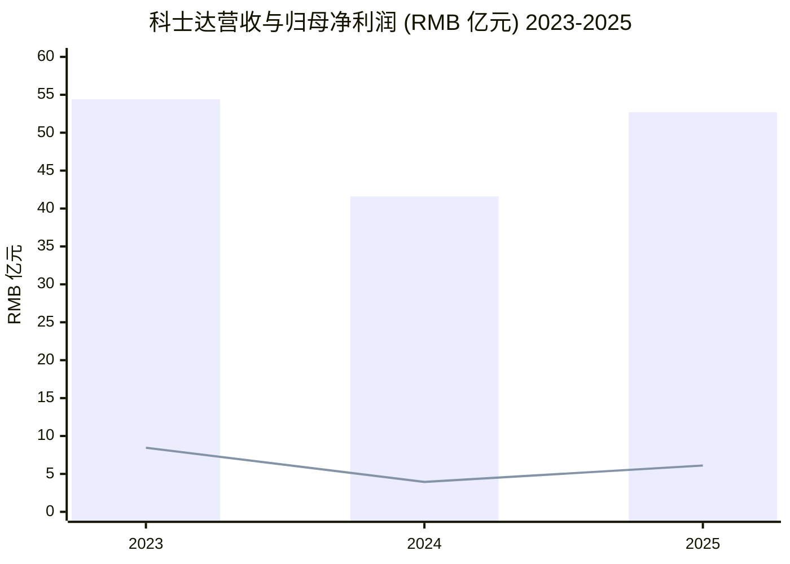
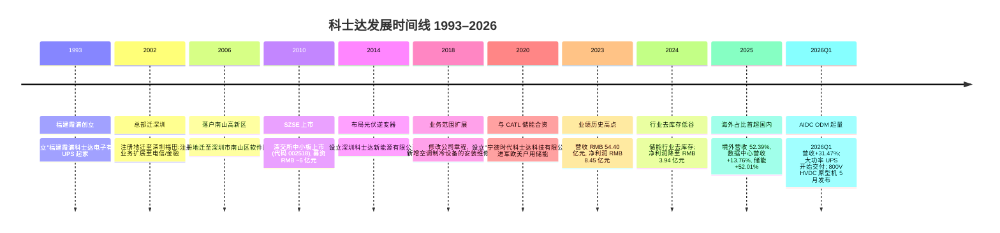
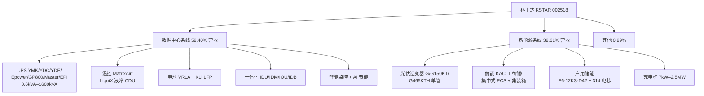
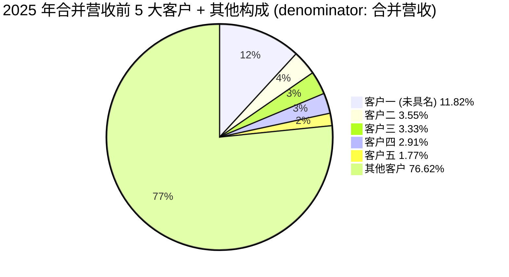
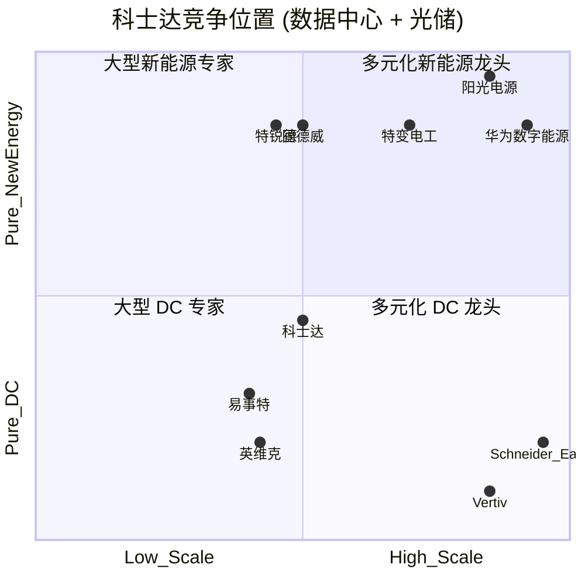

# 深圳科士达科技股份有限公司 (KSTAR, SZSE:002518) 公司研究报告

**As of:** 2026-06-02
**Sector / Theme:** AI Power & Electrification (ai-power-electrification) — AIDC 数据中心电源 + 新能源光储充
**Coverage type:** Initiation
**Reporting currency:** RMB (人民币)

> **Update — 2025 年报印发 (2026-04-26):** 2025 全年营收 RMB 52.70 亿元 (+26.72% YoY)，归母净利润 RMB 6.11 亿元 (+54.97% YoY)，扣非归母 RMB 5.77 亿元 (+67.51% YoY)；公司同时披露 2026 Q1 营收 RMB 12.40 亿元 (+31.47% YoY)、归母净利润 RMB 1.39 亿元 (+24.84% YoY)，AIDC 大功率 UPS 开始批量交付。每 10 股派发现金红利 4.5 元。Source: [深圳科士达 2025 年年度报告 (cninfo, 2026-04-26)](http://static.cninfo.com.cn/finalpage/2026-04-26/) 与 [东吴证券《科士达 2025 年报点评》(2026-04-28)](https://pdf.dfcfw.com/pdf/H3_AP202604281821658543_1.pdf?1777384729000.pdf=)。

## 目录

1. 公司概览 (Company Overview)
2. 公司历史 (Company History)
3. 管理团队 (Management Team)
4. 产品与服务 (Products & Services)
5. 客户与上市策略 (Customers & Go-to-Market)
6. 行业概览 (Industry Overview)
7. 竞争格局 (Competitive Landscape)
8. 市场机会 (Market Opportunity / TAM)
9. 风险评估 (Risk Assessment)
10. 投资者视角评分卡 (Investor-lens Scorecards)

---

## 1. 公司概览 (Company Overview)

深圳科士达科技股份有限公司 (Shenzhen KSTAR Science & Technology Co., Ltd., 简称"科士达"，SZSE:002518) 是中国不间断电源 (UPS, uninterruptible power supply) 及数据中心 (data center, 数据中心) 关键基础设施 (critical infrastructure) 行业的领军企业之一，亦是国内规模化兼具光伏逆变器 (PV inverter, 光伏逆变器)、储能系统 (ESS, energy storage system) 及新能源汽车充电桩 (EV charging pile) 综合解决方案能力的少数 A 股标的。公司以"数据中心 + 新能源"双主业 (dual business engine, 双轮驱动) 协同模式运营，公司在 2025 年报中以管理层语言定义为："三十余载匠心深耕，科士达始终聚焦电力电子核心技术领域，持续深耕数据中心关键基础设施产业，现已成长为中国不间断电源（UPS）行业领军企业，并在全球市场建立起显著的品牌影响力与竞争优势。依托电力电子技术同源赋能，公司前瞻性布局新能源业务，现已形成强劲的第二增长曲线" ([深圳科士达 2025 年年度报告 § 第三节 一、 报告期内公司从事的主要业务, p.10](http://static.cninfo.com.cn/finalpage/2026-04-26/))。

**公司如何盈利。** 科士达通过两大业务条线获取收入：(1) 数据中心关键基础设施产品 (UPS、精密空调 / precision cooling、微模块 / micro-module、电池、动力环境监控) 销往金融、通信、互联网、政府、轨道交通等行业；(2) 新能源光储充系统产品 (光伏逆变器、储能变流器 / PCS、工商业 ESS、户用 ESS / residential ESS、新能源汽车充电桩) 销往光伏电站开发商、户用渠道商、电力央企及海外终端用户。2025 年公司分行业营收构成为：数据中心行业 RMB 31.31 亿元 (59.40%)，新能源行业 RMB 20.87 亿元 (39.61%)，其他业务 RMB 0.52 亿元 (0.99%)；分产品则为：智慧电源/数据中心产品 RMB 29.55 亿元 (56.05%)，光储充产品及系统 RMB 20.69 亿元 (39.26%)，配套产品 RMB 1.76 亿元 (3.35%) ([深圳科士达 2025 年年度报告 § 四、主营业务分析 (1)–(2), p.19–20](http://static.cninfo.com.cn/finalpage/2026-04-26/))。

**销售模式与地理分布。** 公司采取"直销 + 渠道"组合，其中直销占 76.70% (RMB 40.42 亿元)、分销占 23.30% (RMB 12.28 亿元)；分地区 2025 年境外营收 RMB 27.61 亿元 (52.39%) 首次超过境内 RMB 25.09 亿元 (47.61%)，境外业务同比增长 43.53%、境内仅增长 12.25%——海外占比首次超过国内是公司国际化战略的关键拐点 ([深圳科士达 2025 年年度报告 § (1) 营业收入构成 — 分地区/分销售模式, p.20](http://static.cninfo.com.cn/finalpage/2026-04-26/))。截至 2025 年末，公司已在全球布局 29 家海外分支机构及分子公司，产品远销 180 余个国家和地区 ([深圳科士达 2025 年年度报告 § 三、核心竞争力分析 2、营销网络优势, p.18](http://static.cninfo.com.cn/finalpage/2026-04-26/))。

**规模、员工与研发投入。** 2025 年末公司总资产 RMB 78.61 亿元、归母净资产 RMB 48.27 亿元、净资产收益率 (ROE) 13.36% (vs. 2024 年的 9.24%)；研发人员 759 人，占员工总数 16.81%，研发投入 RMB 2.94 亿元 (占营收 5.58%)；截至 2025 年末公司累计获得有效国家专利、国际专利、集成电路布图设计及计算机软件著作权 649 项，主持或参与 144 项国家/行业/团体标准 ([深圳科士达 2025 年年度报告 § 六、主要会计数据 及 § 4、研发投入, p.7, p.26](http://static.cninfo.com.cn/finalpage/2026-04-26/))。

**估值快照 (Valuation snapshot, 2026-02-25 报价基准).** 公司当前股价约 RMB 54.61 (2026-02-25 收盘)，总股本 5.82 亿股，对应市值约 RMB 318 亿元；以 2025 年归母净利润 RMB 6.11 亿元、稀释每股收益 (diluted EPS, 稀释每股收益) RMB 1.05 / 股计，TTM P/E ≈ 52×，明显高于 A 股电源/UPS 板块约 25–35× 的历史均值；这是典型的"主题溢价 + 业绩拐点共振"组合——市场以 2026–28E 的 AIDC ODM 订单与海外储能放量提前重估其盈利能力 ([科士达股票最新价格 2026-02-26 (stockstar)](https://stock.stockstar.com/RB2026022600004975.shtml) 与 [同花顺 002518 盈利预测 — 2026E EPS 1.56–1.57 RMB, 30–35× 目标 PE = RMB 54.55 中枢](http://basic.10jqka.com.cn/002518/worth.html))。**分析师观点 / Analyst view:** UBS 在 2026 Asia Investment Conference (AIC) 后维持"买入"评级、12 个月目标价 RMB 60.10，给出"含 ODM 大客户订单 >30% YoY、不含 ODM >20% YoY"的指引，对应市值含 ODM 情景约 RMB 350 亿元 ([UBS Kstar 2026 AIC note p.1, zsxq #184152221455112](http://xs-macbook-air.local:5001/zsxq-pdf/184152221455112#page=1))。同业可比：阳光电源 (SZSE:300274, 全球光伏逆变器与储能龙头) TTM P/E 约 25–30×，固德威 (SZSE:688390) 约 35–45×，麦格米特 (SZSE:002851, 信号处理 / NVIDIA 800VDC 供应) 约 60–80×；科士达介于储能 (低估值因竞争) 与 AIDC 电源 (高估值因稀缺) 之间。**估值溢价的成因**：(a) 50%+ 海外占比与海外储能高增的"出口属性"；(b) 公司在 800VDC / HVDC / 液冷 CDU 等 AIDC 关键产品上的研发前置布局；(c) 兴业证券 2026-05-26 "绿电直连" 报告将公司列入 AIDC 电网设备核心推荐之一，主题资金涌入推升流通溢价 ([兴业证券 — 绿电直连 AIDC, zsxq #585412224854524 p.2](http://xs-macbook-air.local:5001/zsxq-pdf/585412224854524#page=2) — "推荐金盘科技、科士达、中恒电气、中国西电")。

**最近三年财务摘要 (RMB).**

| 项目 | 2023 | 2024 | 2025 | YoY 2024→2025 |
|---|---:|---:|---:|---:|
| 营业总收入 | 54.40 亿元 | 41.59 亿元 | 52.70 亿元 | +26.72% |
| 归母净利润 | 8.45 亿元 | 3.94 亿元 | 6.11 亿元 | +54.97% |
| 扣非归母净利润 | 8.18 亿元 | 3.44 亿元 | 5.77 亿元 | +67.51% |
| 经营性现金流净额 | 5.15 亿元 | 4.91 亿元 | 9.11 亿元 | +85.53% |
| 基本 EPS (元/股) | 1.45 | 0.68 | 1.05 | +54.41% |
| 加权 ROE (%) | 21.89% | 9.24% | 13.36% | +4.12 pct |
| 总资产 | 68.83 亿元 | 71.85 亿元 | 78.61 亿元 | +9.41% |

来源：[深圳科士达 2025 年年度报告 § 六、主要会计数据和财务指标, p.7](http://static.cninfo.com.cn/finalpage/2026-04-26/)。

2024 年的"业绩低谷"反映了一段储能行业全球去库存周期 (destocking cycle, 去库存周期) 与欧洲户用储能市场需求疲软的影响。2025 年扣非归母净利润 +67.51% YoY 已经回到 2023 年 RMB 8.18 亿元历史峰值的 ~70%，但**未完全收复**——市场对公司的乐观重估很大程度上押注 2026–27 ODM 订单与 AIDC 大功率 UPS 业务可拉动盈利突破前峰。

Source: [深圳科士达 2025 年年度报告 § 六、主要会计数据, p.7](http://static.cninfo.com.cn/finalpage/2026-04-26/)。

## 2. 公司历史 (Company History)

科士达 1993 年由刘程宇创立于福建霞浦——前身为"福建霞浦科士达电子有限公司"——以 UPS (不间断电源) 制造起步切入中国早期的电信、邮政与金融业 IT 基础设施市场 ([维基百科 — 科士达词条](https://zh.wikipedia.org/zh-hans/%E7%A7%91%E5%A3%AB%E8%BE%BE) 与 [刘程宇履历 — ip138 品牌榜](http://10.ip138.com/mr/3225.htm))。1990 年代末公司将注册地与办公地从福建迁至深圳市南山区高新北区，确立了"深圳总部 + 江西生产基地"的格局；2010 年 11 月公司在深圳证券交易所中小板（现合并入主板）正式挂牌上市，募资约 RMB 6 亿元用于扩大 UPS 与电池产能并切入光伏逆变器赛道 ([深圳科士达 2025 年年度报告 § 第二节 公司信息, p.6](http://static.cninfo.com.cn/finalpage/2026-04-26/))。上市后公司逐步从"单一 UPS 制造商"演化为"数据中心一站式解决方案商"，并在 2014–2017 年间布局光伏逆变器、新能源汽车充电桩、储能变流器、户用储能等"第二增长曲线"。

**关键战略节点：与 CATL 的储能合资。** 2020 年 9 月公司与宁德时代新能源科技股份有限公司 (CATL, SZSE:300750) 签署合作协议，共同设立"宁德时代科士达科技有限公司" (catlkstar)，注册资本 RMB 2 亿元；2025 年末该合资公司总资产 RMB 6.90 亿元、营收 RMB 7.10 亿元、净利润 RMB 0.23 亿元 ([深圳科士达 2025 年年度报告 § 九、主要控股参股公司分析, p.31](http://static.cninfo.com.cn/finalpage/2026-04-26/) 与 [宁德时代联手科士达进军欧洲储能市场 (北极星电力, 2020-09-23)](https://m.bjx.com.cn/mnews/20200923/1106271.shtml))。这一合作将 CATL 的磷酸铁锂 (LFP, 磷酸铁锂) 电芯供应稳定性与科士达的 PCS / 户用储能系统集成能力结合，使科士达成为欧洲与北美户用储能 (residential ESS) 渠道的稳定供应方。截至 2025 年末，公司户用储能一体机已获得美、英、德、意、法、荷、比、西、澳、波兰、瑞典、奥地利、南非等 13+ 国家认证，并支持虚拟电厂 (VPP, virtual power plant) 模式 ([深圳科士达 2025 年年度报告 § 2、新能源光储充系统产品 — 户用储能, p.13](http://static.cninfo.com.cn/finalpage/2026-04-26/))。

**主要历史里程碑 (Mermaid 时间线):**

Source: [深圳科士达 2025 年年度报告 § 第二节 公司简介 + § 九、主要控股参股公司分析 + § 四、注册变更情况, p.6, p.31](http://static.cninfo.com.cn/finalpage/2026-04-26/) + [东吴证券《科士达 2025 年报点评》(2026-04-28)](https://pdf.dfcfw.com/pdf/H3_AP202604281821658543_1.pdf?1777384729000.pdf=)。

**最近 12 个月发展动态。** 2025 年第三方机构频繁调研公司 (国泰君安、银华、中泰、长城、汇添富、中金、招商、瑞银资管等数十家机构 27 次调研列入 2025 年报附录) ([深圳科士达 2025 年年度报告 § 十二、报告期内接待调研活动, p.34–37](http://static.cninfo.com.cn/finalpage/2026-04-26/))；2025 年 9 月公司发布《2025 年股票期权激励计划（草案）摘要》绑定核心团队 ([2025 年股票期权激励计划草案 (cninfo, 2025-09-24)](http://static.cninfo.com.cn/finalpage/2025-09-24/1224677418.pdf))；2026 年 1 月公司发布 2025 年度业绩预告，确认全年业绩拐点；2026 年 4 月按计划披露年报，每 10 股派发 4.5 元现金红利 ([2025 年度业绩预告 (cninfo, 2026-01-17)](http://static.cninfo.com.cn/finalpage/2026-01-17/1224937421.PDF))。

## 3. 管理团队 (Management Team)

公司创始人、董事长兼总经理仍为刘程宇先生 (出生约 1962 年，2025 年末年龄 63 岁，中国国籍，持澳大利亚永久居留权)。刘程宇先生与配偶刘玲女士 (公司董事、行政事务总监) 通过"宁波科士达创业投资合伙企业（有限合伙）"作为控股股东持有公司 56.76% 股份 (3.30 亿股)，加上刘玲个人直接持有的 3.61% (2,100 万股)，夫妻二人合计实际控制公司 ~60.4% 的股权，是典型的家族第一代创始人控制结构 ([深圳科士达 2025 年年度报告 § 第六节 一、股份变动情况 + 三、股东和实际控制人情况, p.60–62](http://static.cninfo.com.cn/finalpage/2026-04-26/))。

**刘程宇先生 — 创始人 / 现任董事长兼总经理 (300+ 字)。**

刘程宇先生 1962 年前后生于福建，毕业于福建师范大学 (本科)，2011 年完成长江商学院 EMBA 学位；他在创立科士达之前曾任福建省宁德地区霞浦六中物理教师——这是少有的"教师转 UPS 工程企业家"案例，乐居财经曾以《科士达大额定增合理性遭问询，创始人刘程宇曾为中学教师》专门报道这一背景 ([科士达创始人刘程宇曾为中学教师 (乐居财经)](https://m.lejucaijing.com/news-7173483150495643427.html))。1993 年刘程宇先生离开教育系统、在福建霞浦创立"福建霞浦科士达电子有限公司"——公司初始业务是为本地邮电局、银行制造 UPS 电源；1994–2000 年间公司逐步将研发与销售迁至深圳，1997 年通过宁波科士达完成股权结构调整，到 2002 年完成总部南迁。2010 年刘程宇先生主导公司在深圳证券交易所成功 IPO ([深圳科士达 2025 年年度报告 § 第四节 四、董事和高级管理人员情况, p.41](http://static.cninfo.com.cn/finalpage/2026-04-26/) 与 [刘程宇背景介绍 (ip138)](http://10.ip138.com/mr/3225.htm))。年报披露的现任职务："现任本公司董事长、总经理"；同时刘程宇先生为宁波科士达创业投资合伙企业（有限合伙）的执行事务合伙人、普通合伙人——这意味他通过该合伙企业的执行合伙人地位拥有对持有上市公司 56.76% 股份的合伙体的完全决定权 ([深圳科士达 2025 年年度报告 § 第四节 在股东单位任职情况, p.42](http://static.cninfo.com.cn/finalpage/2026-04-26/))。

在公司治理上，刘程宇先生身兼董事长与总经理两职，年报对此说明称："系结合公司发展阶段、行业特点及经营管理需要作出的合规安排。公司已合理确定并清晰划分董事长与总经理的职权边界" ([深圳科士达 2025 年年度报告 § 控股股东、实际控制人同时担任上市公司董事长和总经理的情况, p.41–42](http://static.cninfo.com.cn/finalpage/2026-04-26/))。但他还兼任公司多个全资子公司——科士达新能源、科士达电池、科士达软件、科士达工程、科士达电源、广东科士达工业、香港科士达——的执行董事或董事长，权力高度集中是当前阶段的现实 ([维基百科 — 科士达](https://zh.wikipedia.org/zh-hans/%E7%A7%91%E5%A3%AB%E8%BE%BE))。2025 年报中刘程宇先生披露持股变动：报告期持股数量为 0 (不直接持股，全部通过宁波科士达合伙企业间接持股) ([深圳科士达 2025 年年度报告 § 1、基本情况 — 刘程宇, p.39](http://static.cninfo.com.cn/finalpage/2026-04-26/))。**接班布局：** 公司副总经理、新能源业务总经理刘柏杉先生为 36 岁、墨尔本皇家理工大学本科毕业，业内普遍解读为接班人——名字与刘程宇/刘玲两位实控人姓氏一致（虽然年报对其家族关系未做明确披露）—— ([深圳科士达 2025 年年度报告 § 高级管理人员 — 刘柏杉, p.41](http://static.cninfo.com.cn/finalpage/2026-04-26/))。

## 4. 产品与服务 (Products & Services)

科士达的产品矩阵由 (a) 数据中心关键基础设施产品 + (b) 新能源光储充系统产品 两大业务条线构成——这两条线**同源于电力电子 (power electronics, 电力电子) 技术底座**，主要的差分点是终端市场 (B 端数据中心运营商 / G 端政企客户 / C 端户用渠道商)、销售模式 (大项目直销 / ODM / 渠道分销)、以及产品功率密度 (UPS 主流 1–600 kVA → AIDC 兆瓦级；储能从 5–10 kW 户用到 250–500 kW 工商业再到集装箱大储)。

### 4.1 公司自有产品矩阵 (Issuer-Constructed Product Matrix)

下表完全采用 2025 年年度报告 § 第三节 一、报告期内公司从事的主要业务 (p.10–15) 的产品分组、并按系列名称完整列示——这是公司在年报中自行公布的产品体系，可作为分析师讨论的统一基准：

| 业务条线 | 产品类别 | 公司公布系列名称 | 主要规格段 (Range) |
|---|---|---|---|
| **数据中心** | UPS 不间断电源 | YMK / YDC / YDE / Epower / GP800 / Master / EPI 系列 | 0.6 kVA – 1600 kVA |
| **数据中心** | 温控产品 (精密空调 + 液冷 CDU) | MatrixAir / FocusAir / StationAir / InsertAir / **LiquiX 液冷** / CDU | 10 – 300 kW |
| **数据中心** | 电池产品 | 阀控式铅酸蓄电池 (VRLA) + 磷酸铁锂电池柜 (KLi 系列) | 多容量段 |
| **数据中心** | 一体化解决方案 | IDU (单柜级) / IDM (通道级) / IOU (户外柜) / IDB (集装箱预制化) / 一体化电力模块 | 多功率段 |
| **数据中心** | 智能监控 | 动力环境监控 3.0 / AI 节能系统 | 软件 / 系统 |
| **新能源 光伏** | 光伏逆变器 | 集中式光伏逆变器 / 组串式 (G 系列 3–60K 单相, G150KT, G465KTH) / 智能汇流箱 / 监控 / 家用逆变器 | 3 kW – 单管 465 kVA |
| **新能源 储能** | 储能变流器 (PCS) + 系统 | 模块化 PCS / 集中式 PCS / KAC 系列 20–250DP2 工商储 / KAC125DH / KAC180–250DH2 / 第二代 EMS / 调峰调频系统 / 大型集装箱储能 / 光储充系统 | 20 kW – 集装箱级 |
| **新能源 户储** | 户用储能 (residential ESS) | E6-12KS-D42 户用混合逆变器 + 314 电芯户储电池包 + Knight 系列 | 5 – 12 kW |
| **新能源 充电** | 新能源汽车充电桩 | 直流分体式 / IP65 充电模块 / 高防护直流一体式 / 全液冷直流分体式 / 480-960 kW / 2.5MW / 7kW 国/欧标交流桩 | 7 kW – 2.5 MW |
| **配套** | 配套产品 | 配套部件、其他 | — |

来源：[深圳科士达 2025 年年度报告 § 第三节 一、(一) 主要产品及服务, p.10–15](http://static.cninfo.com.cn/finalpage/2026-04-26/) + § 4、研发投入 项目清单 [p.23–25](http://static.cninfo.com.cn/finalpage/2026-04-26/)。

### 4.2 产品矩阵协同 — 一个客户工作流的视角

科士达全产品矩阵的内在逻辑是"电力电子 (power electronics) 技术同源"——所有产品的核心都是高效率 AC/DC、DC/DC 与 DC/AC 转换。具体到客户场景：(a) **数据中心客户工作流**：电网入口 → 柴油发电机 → 高压配电 → **UPS** (科士达 YMK/Epower) → 列头柜 → IT 机柜 → **精密空调/液冷 CDU** (科士达 MatrixAir/LiquiX) → 系统由**动环监控** (科士达 3.0) 统一管理；遇电网断电时**电池柜** (科士达 KLi LFP) 接力供电；(b) **光储充客户工作流**：光伏组件 → **光伏逆变器** (科士达 G 系列) → 配电汇流 → **储能 PCS** (KAC 系列) ↔ 锂电池柜 → 电网/负载/**充电桩** (科士达 480–960 kW) ↔ 电动车。这"两个工作流"的关键合体点是 AI 数据中心新型架构——AIDC 既需要不断电的高密度供电 (UPS + HVDC)，也需要绿电直供 (光储)、也需要算力侧储能配套，所以科士达正在用"算电协同"打通这两个原本分立的体系 ([深圳科士达 2025 年年度报告 § 十一、(三) 算电协同与板块业务融合, p.33](http://static.cninfo.com.cn/finalpage/2026-04-26/) — "公司以数据中心算力基础设施为纽带，深度联动光伏、储能及充电桩等业务场景，加快推进多类型智能微网模块化方案落地…放大'数据中心+新能源'双主业产业协同效应")。

### 4.3 数据中心条线 — UPS / 温控 / 一体化解决方案

#### UPS 不间断电源 (核心利润来源)

科士达自报告期内的产品定义 (year-book verbatim quote): 

> "公司作为最早进入数据中心产品领域的国内企业之一，凭借深厚的技术积累和持续的创新能力，已发展成为业内数据中心基础设施产品品类最齐全的公司之一。公司自主研发生产的数据中心产品，全面涵盖不间断电源（UPS）、精密空调、微模块、一体化电力模块、铅酸/锂电池、动力环境监控等设备和系统" ([深圳科士达 2025 年年度报告 § 第三节 一、(一)1 数据中心关键基础设施产品, p.10](http://static.cninfo.com.cn/finalpage/2026-04-26/))。

公司自有 UPS 产品系列与功率覆盖 (verbatim): "单机功率覆盖 0.6 kVA–1600 kVA，模块化产品灵活适配，可适用于各类数据中心以及要求高品质连续供电的其它场景，具有安全可靠、绿色高效、全功率段、智慧灵活、节约成本的特点" ([深圳科士达 2025 年年度报告 § UPS 产品段, p.11](http://static.cninfo.com.cn/finalpage/2026-04-26/))。

**中文释义 / Plain-language gloss:** UPS (Uninterruptible Power Supply, 不间断电源) 的核心物理功能是——在市电中断的瞬间内 (通常 <10 ms) 由内部电池或飞轮 (flywheel) 储能立即接管负载供电，并维持到柴油发电机起动或其他备电源到位。对数据中心而言，UPS 的关键 KPI 是: (a) 双变换效率 (double-conversion efficiency, 双变换效率) >97% 时仍保持完美整流/逆变 — 因为数据中心 24×7×365 运行，每提高 1% 的双变换效率，年节省电费在 RMB 数百万元量级；(b) 模块化与冗余 (modular & redundancy, 模块化冗余) — 单机柜失效时其他模块自动接管，n+1 或 2n 冗余 (n+1 / 2n redundancy) 是金融与算力场景的硬性门槛；(c) 兆瓦级 UPS (megawatt-class UPS) — AI 算力机柜功率密度从传统 10–20 kW/柜 → 40–80 kW/柜 → AIDC 兆瓦机柜，配套 UPS 单机功率也快速向 1.25–1.625 MW 上行。科士达 YMK3300 1250–1625K 系列正在研发，明确"开发 AIDC 兆瓦级 UPS 产品 / 根据 AIDC 行业需求，开发新一代适合 AI 负载专用 UPS" ([深圳科士达 2025 年年度报告 § 4、研发投入 — YMK3300 系列, p.23](http://static.cninfo.com.cn/finalpage/2026-04-26/))。

*分析师观点 / Analyst view:* 在 UPS 全球市场，主要竞争对手为施耐德电气 (Schneider Electric APC, 科士达 ODM 客户之一)、伊顿 (NYSE:ETN, 同样为 ODM 客户)、维谛技术 (Vertiv, NYSE:VRT)、华为数字能源、台达电 (TWSE:2308) ([UBS — Kstar 2026 AIC note, zsxq #184152221455112 p.1](http://xs-macbook-air.local:5001/zsxq-pdf/184152221455112#page=1) — UBS 明确指出公司 ODM 客户主要为台资客户、施耐德、伊顿渠道商，单客户 ODM 价值已升至 "US$0.8–1.0M" 单 UPS 项目、毛利率 >35%)。其中维谛技术 (Vertiv) 是公司在直接销售层面最直接的产品竞品——Vertiv 旗下 Liebert UPS 与 Liebert XDU 液冷 CDU 与科士达 YMK + LiquiX 配对在同一客户矩阵中竞标。

#### 温控 (Precision Cooling + LiquiX 液冷 CDU)

公司年报对温控产品的描述 (verbatim quote): 

> "MatrixAir 系列、FocusAir 系列、StationAir 系列、InsertAir 系列、LiquiX 液冷系列及 CDU…冷量范围覆盖广，支持多种制冷型式，适用不同数据中心场景" ([深圳科士达 2025 年年度报告 § 温控产品段, p.11](http://static.cninfo.com.cn/finalpage/2026-04-26/))。

公司 2025 年研发投入清单中专门列出"LiquiX 系列 10~300 kW 冷板式 CDU"项目目的为"针对 AI 等高热密度应用场景开发应用于高热密度数据机房，低能耗的液冷温控产品"——这是公司从风冷向冷板式液冷 (cold-plate liquid cooling, 冷板液冷) 的关键产品布局 ([深圳科士达 2025 年年度报告 § 4、研发投入 — LiquiX 系列 CDU, p.24](http://static.cninfo.com.cn/finalpage/2026-04-26/))。

**中文释义 / Plain-language gloss:** CDU (Coolant Distribution Unit, 冷却液分配单元) 是冷板式液冷数据中心 (cold-plate liquid-cooled data center) 的中央"心脏"——它管理着流向各个机柜冷板 (cold plate, 冷板) 的乙二醇/去离子水冷却液 (PG25 / deionized water coolant) 的流量、压力、温度以及与外部冷冻水侧的热交换 (heat exchange, 换热)。对单机柜功率密度 >80 kW 的 AI 训练机柜来说，传统风冷已无法散去 NVIDIA HGX H100 / B200 服务器产生的 30–50 kW 单机芯片热量；液冷 CDU 通过 25–45 °C 温水 (warm water cooling, 温水冷却) 直接带走芯片热，PUE (Power Usage Effectiveness, 能耗使用效率) 可从风冷的 1.3–1.5 降至液冷的 1.1–1.2。科士达 LiquiX 系列正切入这一新兴市场。

*分析师观点 / Analyst view:* 截至 2025 年末，公司管理层在 2025-10 投资者关系活动记录中明确表示"液冷相关产品当前形成收入占公司整体收入规模不到 1%"——公司在液冷 CDU 的商业化仍处于早期，但已在多个客户的 AI 集装箱项目中获得验证机会 ([投资者关系活动记录表 2025-10-28 (cninfo)](https://file.finance.qq.com/finance/hs/pdf/2025/10/28/1224749228.PDF))。液冷 CDU 的全球前两大竞品为 Vertiv Liebert XDU 与 CoolIT Systems，国内对手包括英维克 (SZSE:002837) 与高澜股份 (SZSE:300499)；科士达的优势是"客户矩阵"——已有的金融、电信数据中心客户在升级 AI 集群时倾向用现有 UPS 供应商作为 CDU 单一对接方。

#### 一体化电力模块 + 800V HVDC + SST 固态变压器

科士达 2025 年研发清单包含两个特别重要的 AIDC 前沿项目：(a) "高压直流 HVDC 800V 适配 AIDC 直流配电系统 — 开发针对 AIDC 场景使用的高压直流电源产品" (在研); (b) "SST（固态变压器）适配 AIDC — 直流配电系统 — 开发针对 AIDC 场景使用的高压直流电源产品" (在研) ([深圳科士达 2025 年年度报告 § 4、研发投入 — HVDC 800V + SST, p.23–24](http://static.cninfo.com.cn/finalpage/2026-04-26/))。UBS 在 2026 AIC 投资者会议后报告指出"管理层确认 800VDC 原型机已于 5 月发布，正在等待客户验证…模块化 SST 量产最早可能在 2026 年底" ([UBS — Kstar 2026 AIC, zsxq #184152221455112 p.1](http://xs-macbook-air.local:5001/zsxq-pdf/184152221455112#page=1) — "mgmt confirmed its 800VDC prototype has been launched in May")。

**中文释义 / Plain-language gloss:** 800V HVDC (High-Voltage Direct Current, 高压直流) 与 SST (Solid-State Transformer, 固态变压器) 是 AI 数据中心电源架构的"下一代标准"。传统数据中心架构是"中压交流 → 变压器降压 → 低压 AC → UPS 双变换 → 机柜级 PDU → 服务器 PSU 内部 AC/DC"，整链路有 4–5 次 AC↔DC 转换，效率损失 8–12%。NVIDIA 在 2026 GTC 上发布的"800VDC 数据中心电源参考架构"则将链路简化为"中压交流 → SST 固态变压器 (一次 AC→DC 转换) → 800VDC 直流母线 → 机柜 → 服务器内部 DC/DC"——一次转换替代了多次转换，链路效率提升至 ~98.5%，并且每个机柜的铜线数量大幅减少 (国金证券 "SST 硅进铜退" deep dive)；前提是该架构需要全套配套生态——HVDC 整流 + SST + 800VDC 母线 + 直流配电 + 适配 800VDC 的 BBU (Battery Backup Unit, 电池备用单元) + 适配 800VDC 的服务器 PSU ([国金 SST 800VDC AIDC 深度, zsxq #212485811815581 p.1, p.6](http://xs-macbook-air.local:5001/zsxq-pdf/212485811815581#page=1) — "电源系统正从配套环节升级为算力基础设施的核心约束"; "SST 利用碳化硅（SiC）等大功率半导体器件替代了传统变压器的铜线与铁芯")。

*分析师观点 / Analyst view:* 在 800VDC / SST 赛道，国内麦格米特 (SZSE:002851) 已被国金证券列为头号推荐——其 800VDC SST 效率 98.5%，已进入 NVIDIA 800VDC 参考架构供应商序列、2026Q1 电源收入 +66.52% YoY ([国金 SST 800VDC, zsxq #212485811815581 p.10, p.16](http://xs-macbook-air.local:5001/zsxq-pdf/212485811815581#page=10))；中恒电气 (SZSE:002364) 与中国西电 (SSE:601179) 亦在此赛道布局；国际竞品包括台达电、伊顿、Eltek (现 ABB 子公司)。科士达在 800VDC 这一新兴赛道是"快速跟随者 (fast follower)" 而非"领先者"——公司目前已有 240V HVDC 产品，800VDC 仍在原型机验证阶段；但凭借已有的金融、通信客户基础以及与施耐德、伊顿的 ODM 关系，公司有较高概率在 2027–28 年的 800VDC 商业化落地中获得份额 ([科士达：公司具有高压直流电源技术储备 (sina cj)](https://cj.sina.com.cn/articles/view/1850649324/6e4eaaec02001z6bw))。

### 4.4 新能源条线 — 光储充

#### 光伏逆变器 (PV Inverter)

公司年报描述 (verbatim): "公司现有光伏、储能产品包括：集中式光伏逆变器、组串式光伏逆变器、智能汇流箱、监控及家用逆变器…1500V 大功率组串逆变器产品、新一代户用组串逆变器" ([深圳科士达 2025 年年度报告 § 2、新能源光储充系统产品 + § 4、研发投入 (G150KT, G465KTH 单管), p.13, p.24](http://static.cninfo.com.cn/finalpage/2026-04-26/))。

**中文释义 / Plain-language gloss:** 光伏逆变器是将光伏组件直流电 (DC) 转换为交流电 (AC) 并入网的设备。**集中式逆变器** (central inverter, 集中式逆变器) 功率段 1.25–2.5 MW，用于大型地面电站；**组串式逆变器** (string inverter, 组串逆变器) 功率段 50–150 kW，用于分布式工商业及大型户外光伏；**户用逆变器** (residential inverter, 户用逆变器) 功率段 3–10 kW，用于家庭屋顶光伏。当前光伏行业的关键技术趋势是 1500V → 1800V 高电压平台、单管 (single MOSFET, 单管) 拓扑替代多管并联以降低系统成本、以及 AFCI (Arc Fault Circuit Interrupter, 电弧故障保护) 安全功能内嵌。科士达 G150KT (大功率组串)、G465KTH 单管 (旗舰款) 都是这一趋势的代表 ([深圳科士达 2025 年年度报告 § G150KT + G465KTH, p.25](http://static.cninfo.com.cn/finalpage/2026-04-26/))。

*分析师观点 / Analyst view:* 全球光伏逆变器行业头部公司是阳光电源 (SZSE:300274, 全球出货第一)、华为数字能源、Sungrow、SMA Solar Technology AG (XETR:S92, 德国)、固德威 (SZSE:688390)、锦浪科技 (SZSE:300763)；科士达在全球出货量排名约第 8–12 位之间——属于"全球第二梯队中段"。

#### 储能 PCS + 系统

公司 2025 年储能业务实现 RMB 20.69 亿元营收 (+52.01% YoY)，毛利率 19.36% (vs. 2024 年的 16.63%，+2.73 pct YoY)；销售量 29.24 万套 (+52.04% YoY) ([深圳科士达 2025 年年度报告 § (2) 占公司营业收入或营业利润 10%以上的行业、产品 — 光储充, p.20](http://static.cninfo.com.cn/finalpage/2026-04-26/) + [§ (3) 销售量, p.21](http://static.cninfo.com.cn/finalpage/2026-04-26/))。储能行业的快速回升与欧洲户用储能需求回暖 + 美国 ITC 补贴延期到 2036 年密切相关 ([深圳科士达 2025 年年度报告 § (3) 销售量同比 +30% 原因说明, p.21](http://static.cninfo.com.cn/finalpage/2026-04-26/) — "报告期内，随着欧洲储能市场需求回暖，新兴市场需求旺盛，公司新能源业务订单体量增长")。

**中文释义 / Plain-language gloss:** PCS (Power Conversion System, 储能变流器) 是储能系统的"心脏"——它是双向 DC/AC 变流器，既能将光伏/电网交流电整流为直流电充入锂电池，也能将锂电池放电时的直流电逆变为交流电送入电网或负载。科士达储能 PCS 效率最高可达 99.3%——这是过去 3 年的关键技术突破，因为 PCS 是储能系统的"次级能量损失点" (lithium 电芯本身充放电效率已 >95%) ([深圳科士达 2025 年年度报告 § 十一、(二) 2、新能源光储行业, p.32](http://static.cninfo.com.cn/finalpage/2026-04-26/) — "储能变流器突破性能瓶颈，最高效率可达 99.3%")。储能产品按场景分为：户用 (residential, 5–12 kW)、工商业 (C&I, commercial & industrial, 20–250 kW)、大储/电网 (grid-scale, MW 级 / 集装箱)。

公司与 CATL 合资的"宁德时代科士达"主攻户用与海外渠道——CATL 提供 LFP 电芯，科士达负责户用混合逆变器 (hybrid inverter) + EMS + PACK + 销售渠道，2025 年合资公司营收 RMB 7.10 亿元、净利润 RMB 0.23 亿元 ([深圳科士达 2025 年年度报告 § 九、主要控股参股公司分析 — 宁德时代科士达, p.31](http://static.cninfo.com.cn/finalpage/2026-04-26/))。值得注意的是合资公司本身的净利率 (~3.2%) 低于母公司平均水平，说明户储已进入"量起利薄"阶段。

*分析师观点 / Analyst view:* 储能 PCS 全球头部为阳光电源、华为、特变电工 (SSE:600089)、Tesla Megapack、Fluence；户储核心竞争对手为派能科技 (SSE:688063)、固德威、德业股份 (SZSE:605117)、Enphase (NASDAQ:ENPH)、SolarEdge (NASDAQ:SEDG)。科士达的"差异化打法"是嵌入 CATL 全球渠道并主打欧洲 / 澳洲 / 中东等 13+ 国家认证的多市场覆盖。

#### 新能源汽车充电桩

公司充电桩产品功率覆盖 7 kW 国/欧标交流桩 → 480–960 kW 全液冷直流分体式 → 2.5 MW 重卡专用直流分体式机；研发清单显示"针对欧洲市场，不断升级产品竞争力与系统解决方案能力：在技术上加快布局 300kW 以上液冷超充产品" ([深圳科士达 2025 年年度报告 § 第三节 一、(一)3 + § 3、新能源汽车充电行业, p.14, p.33](http://static.cninfo.com.cn/finalpage/2026-04-26/))。

**中文释义 / Plain-language gloss:** 直流快充桩的核心是高压大功率充电模块——科士达 IP65 40 kW 充电模块、120-480 kW 直流一体式、480-960 kW 全液冷直流分体式覆盖从 4S 店到高速路服务区的全谱系应用。技术趋势是 800V 高压快充平台 (800V high-voltage fast charging, 800V 高压快充) 普及——搭载 800V 技术的车型用户满意度达 98%，部分车型实现"1 秒 2 公里"。

*分析师观点 / Analyst view:* 国内充电桩头部为特锐德 (SZSE:300001)、星星充电、特来电；海外为 ABB、Tritium、Wallbox、ChargePoint。科士达充电桩业务规模约 RMB 1.2–1.8 亿元年级、占比较小，是一项"延伸业务"，主要价值在于与光储联动 (光储充一体化模式)。

### 4.5 海外 ODM 业务 — 公司核心增长引擎

UBS 在 2026 AIC 后报告中明确："公司海外业务以 ODM 为主...预计 6–7 月将获得来自现有及新增台资客户的 UPS ODM 订单意向；单客户 ODM 价值已升至 US$0.8–1.0M / UPS 项目；UPS ODM 业务毛利率 >35%；含 ODM 订单情景下 2026 年增长 >30% YoY、不含 ODM >20% YoY" ([UBS — Kstar 2026 AIC, zsxq #184152221455112 p.1](http://xs-macbook-air.local:5001/zsxq-pdf/184152221455112#page=1) — "over 30% YoY growth if including the potential order intake from major ODM clients, and at least 20% YoY growth if excluding that"; "US$0.8-1.0M"; ">35% GPM for UPS ODM business")。这意味公司在数据中心条线的最大潜在增量是为施耐德、伊顿、Vertiv、台达电这些海外品牌做白牌 (white-label) UPS 制造——海外 AIDC 客户由于审批与现场服务需要、不直接采购中国品牌，但 ODM 渠道可以"曲线进入"美国/欧洲 AIDC 市场。

公司年报披露 (verbatim): "目前，公司数据中心国内业务以自有品牌为主，海外业务以 ODM 为主" ([深圳科士达 2025 年年度报告 § 4、销售模式, p.16](http://static.cninfo.com.cn/finalpage/2026-04-26/))。东吴证券 2026-04-28 报告指出"2025 年公司数据中心业务实现营收 29.55 亿元，同增 13.76%，其中海外施耐德、伊顿的 ODM 或渠道商业务持续增长，使得海外占比首次超过国内" ([东吴证券《科士达 2025 年报点评》(2026-04-28)](https://pdf.dfcfw.com/pdf/H3_AP202604281821658543_1.pdf?1777384729000.pdf=))。

### 4.6 旗舰产品与近 12 个月新品 — 综合协同与产品组合

按 2025 年营收贡献排序，公司的前三大产品族为：(1) 智慧电源/数据中心 UPS — 占总营收 56.05%、毛利率 34.53%；(2) 光储充产品及系统 — 占 39.26%、毛利率 19.36%；(3) 配套产品 — 占 3.35%、毛利率 33.02%。UPS 是利润核心，光储充是规模引擎，配套是协同效应支撑。

近 12 个月推出的标志性新品 (基于 2025 年年度报告 § 4、研发投入)：(a) **YMK3300 1250–1625K 模块化兆瓦级 UPS** — 针对 AIDC 行业大功率 UPS 市场 (在研); (b) **KLi 系列磷酸铁锂锂电池柜** — AIDC 储能备电产品 (在研); (c) **800V HVDC 直流配电系统** — AIDC 直流电源 (在研，5 月发布原型); (d) **SST 固态变压器** — AIDC 直流配电 (在研); (e) **LiquiX 10–300 kW 冷板式 CDU** — AIDC 液冷温控 (在研); (f) **预制化集装箱模组** — 小批量试产; (g) **G465KTH 单管三相光伏逆变器** — 大型地面电站 (在研); (h) **KAC180–250DH2 工商储变流器** — 大功率工商业储能 (在研); (i) **BC208–260DLE 液冷电池柜** — 大容量工商业储能液冷 (在研); (j) **314Ah 电芯户储电池包** — 高能量密度户用储能 (在研) ([深圳科士达 2025 年年度报告 § 4、研发投入 项目清单, p.23–26](http://static.cninfo.com.cn/finalpage/2026-04-26/))。

## 5. 客户与上市策略 (Customers & Go-to-Market)

科士达的销售模式年报描述为"以'直销 + 渠道'相结合的销售模式，以大项目为主的大客户，公司主要采取品牌直销，建立长期稳定的合作关系；并不断通过渠道建设，与代理商建立长期合作关系，以覆盖全球重点区域" ([深圳科士达 2025 年年度报告 § 4、销售模式, p.16](http://static.cninfo.com.cn/finalpage/2026-04-26/))。2025 年公司直销与分销占比为 76.70% : 23.30%，相对稳定。

**客户集中度 (Customer Concentration — REQUIRED).** 公司 2025 年年报披露前五大客户合并销售额 RMB 12.32 亿元，占年度合并营收总额 23.38% (denominator: consolidated revenue, 合并口径) ([深圳科士达 2025 年年度报告 § (8) 主要销售客户和主要供应商情况, p.22](http://static.cninfo.com.cn/finalpage/2026-04-26/))。具体明细 (denominator: consolidated revenue 合并口径):

| 序号 | 客户名称 | 销售额 (RMB 元) | 占合并营收比例 |
|---|---|---:|---:|
| 1 | 客户一 (未具名) | 622,732,712 | 11.82% |
| 2 | 客户二 (未具名) | 187,052,898 | 3.55% |
| 3 | 客户三 (未具名) | 175,595,547 | 3.33% |
| 4 | 客户四 (未具名) | 153,374,103 | 2.91% |
| 5 | 客户五 (未具名) | 93,415,075 | 1.77% |
| **合计 (Top-5)** | | **1,232,170,335** | **23.38%** |

来源：[深圳科士达 2025 年年度报告 § 第三节 (8) 主要销售客户, p.22](http://static.cninfo.com.cn/finalpage/2026-04-26/)。**客户名称未具名披露——这是 A 股年报常见做法，但单一客户 11.82% 占比已经接近 10% 警戒线，按 ASC 280 等价的国内会计准则口径属于"应单独披露的重大客户"——可能与海外 ODM 客户保密协议有关。年报中关联方销售比例为 0.00%，说明前五大客户均非关联方。**

**已知具名大客户 (年报正文披露但未在 Top-5 表中点名).** 年报多处具名披露大客户关系：

- **金融行业 (UPS 直销):** 工商银行、农业银行、中国银行、建设银行、中国邮政储蓄银行、民生银行——年报具体指出公司持续为这些主流金融机构交付数据中心基础设施产品 ([深圳科士达 2025 年年度报告 § 第三节 一、(一)1 数据中心产品 — 金融领域, p.13](http://static.cninfo.com.cn/finalpage/2026-04-26/))。
- **通信运营商 (UPS 集中采购):** 中国移动、中国联通、中国电信三大运营商集采名录连续多年入围 ([深圳科士达 2025 年年度报告 § 通信领域, p.13](http://static.cninfo.com.cn/finalpage/2026-04-26/))。
- **重大项目交付 (2025 年):** 中国建设银行贵安数据中心项目、中国工商银行 2024 年度数据中心机房基础设施大功率 UPS 项目、中国电信云计算内蒙古分公司 2025 年数据中心配套工程项目、内蒙古移动数据园数据中心项目、中国移动北京公司信息港四号地 G41 楼项目、马来西亚国家级 AI 数据中心项目、乌兰察布云智算中心、杭州/济南/长春轨道交通项目、中国铁路 2026 年第一批通信用蓄电池联合采购项目 ([深圳科士达 2025 年年度报告 § 数据中心 — 重点项目交付, p.13](http://static.cninfo.com.cn/finalpage/2026-04-26/))。
- **新能源央企客户:** 国家电投、中核集团、华能集团、华电集团、京能、华润、中节能、大唐、中石化、中石油、正泰安能、TCL、创维 ([深圳科士达 2025 年年度报告 § 2、新能源光储充系统产品, p.14](http://static.cninfo.com.cn/finalpage/2026-04-26/))。
- **海外 ODM 客户 (推定):** 施耐德电气 (Schneider Electric)、伊顿 (Eaton, NYSE:ETN)、台资同业品牌 (推测含台达电、SunPower 等)——来自东吴证券与 UBS 报告对公司海外业务结构的描述 ([东吴证券《科士达 2025 年报点评》(2026-04-28)](https://pdf.dfcfw.com/pdf/H3_AP202604281821658543_1.pdf?1777384729000.pdf=) — "海外施耐德、伊顿的 ODM 或渠道商业务持续增长")。
- **重大销售合同 — "客户 A" (储能产品):** 2025 年合同总金额 RMB 13.65 亿元 (全周期累计)，本期收入 RMB 1.16 亿元，100% 回款 ([深圳科士达 2025 年年度报告 § (4) 重大销售合同 — 客户A, p.21](http://static.cninfo.com.cn/finalpage/2026-04-26/))。这显示公司在储能业务上确实有"超大单"——同一客户在多年内累计 13 亿元采购规模。

**关于客户具名度的判断 / Analyst note:** 中国 A 股年报通常以"客户一/二/三"代替真名（不同于 SEC 10-K 在 ≥10% 集中度时要求强制具名）；这次单一客户 11.82% 突破阈值但仍未具名，潜在原因是该客户来自海外、双方有保密协议 (NDA) 限制。结合 UBS 报告中"主要 ODM 客户单笔交易价值 US$0.8–1.0M"和"2025 海外营收高速增长"的描述，"客户一"高度可能是施耐德电气全球数据中心事业部或伊顿全球 IT 事业部的 ODM 采购。**(以上客户具名推断为分析师观点，无法从年报直接验证。)**

**前五大供应商 (consolidated procurement).** 2025 年前五大供应商合计采购 RMB 6.91 亿元 (22.13% 占年度采购总额)，无关联方采购；具体明细未具名 ([深圳科士达 2025 年年度报告 § 公司主要供应商情况, p.23](http://static.cninfo.com.cn/finalpage/2026-04-26/))。分析师视角：原材料占数据中心产品成本 84.01%、占新能源产品成本 87.82%，所以供应链管理是公司毛利率的核心驱动 ([深圳科士达 2025 年年度报告 § 营业成本构成 — 原材料占比, p.22](http://static.cninfo.com.cn/finalpage/2026-04-26/))；主要原材料为 SiC / Si MOSFET 半导体、铝基板、铜线、磁性元件、电解电容、磷酸铁锂电芯 (后者从 CATL 合资公司采购)。

## 6. 行业概览 (Industry Overview)

科士达所处的两大行业 — 数据中心关键基础设施 + 新能源光储充 — 均处于"AI + 能源转型"双驱动下的结构性增长阶段，且 2026 年具有标志性的"AIDC 主题与储能再扩张并行"特征。

### 6.1 数据中心 / AIDC

按公司年报对行业的概括 (verbatim): "2025 年，全球数字经济持续深度演进，人工智能大模型训练与推理、云计算、大数据、边缘计算加速普及，叠加我国'东数西算'工程持续落地、新型数据中心建设提速，数据中心行业明确呈现高功率化、绿色低碳化、智能集成化、液冷普及化四大趋势" ([深圳科士达 2025 年年度报告 § 第三节 二、(一) 数据中心行业, p.16](http://static.cninfo.com.cn/finalpage/2026-04-26/))。

**规模与增长.** 2025 年全球数据中心市场处于 AI 驱动的扩张期。Morgan Stanley 在 2026 Asia Investment Conference 期间发布的"能源遇见算力" (Energy Meets Compute) 报告将 AIDC + 配套电力基础设施视为 **US$5,454bn 超级周期** (super-cycle, 超级周期)，其中电网投资 US$1,745bn / 24% 亚洲 DC 电力 CAGR 2025–30 / 电网 US$1trn 投资缺口 ([MS — Energy Meets Compute, zsxq #184152244582842 p.8, p.6, p.11, p.18](http://xs-macbook-air.local:5001/zsxq-pdf/184152244582842#page=8))。

**关键技术变革.** 算力密度从传统 10–20 kW/柜 → 40–80 kW/柜 → AI 训练机柜 >120 kW/柜。年报对此的具体描述："对供电系统的高功率、高效率、高可靠及液冷散热技术提出刚性需求，高压直流 (HVDC)、大功率 UPS、智能微模块、液冷温控系统成为刚需" ([深圳科士达 2025 年年度报告 § 第三节 二、(一) 数据中心行业, p.17](http://static.cninfo.com.cn/finalpage/2026-04-26/))。NVIDIA 在 2026 GTC 上发布的 800VDC 数据中心参考架构标志了行业"从 240VDC 向 800VDC"过渡 ([国金 SST 800VDC AIDC, zsxq #212485811815581 p.6](http://xs-macbook-air.local:5001/zsxq-pdf/212485811815581#page=6))。

**政策环境.** 中国"东数西算"工程八大算力网络枢纽节点 + 十大国家数据中心集群建设全面提速；"十五五"规划将算力基础设施纳入国家重点战略；北京政策对 PUE ≤1.15 的数据中心给予高额资金奖励；广东对先进制冷技术项目补贴 40% 投资额；2025 年 6 月相关部门联合发布《关于促进大功率充电设施科学规划建设的通知》。欧盟于 2025 年 3 月升级《数据中心能效指令》、6 月发布《绿色数据中心认证体系》；美国 2025 年 2 月发布《数据中心能源效率法案》要求联邦政府采购达 ENERGY STAR 认证 ([深圳科士达 2025 年年度报告 § 政策与规范 + 区域市场, p.16](http://static.cninfo.com.cn/finalpage/2026-04-26/))。

**国内 vs. 海外格局.** 中信证券与 GS 一致认为 AIDC 的真正瓶颈是电力、不是算力本身——GS 美国电力管线追踪 (2026-05-29) 显示美国 2030 年净增容量预计 +24%、天然气 66 GW pipeline (+28.6 GW YoY)；中国"绿电直连"项目截至 2026-04-16 已批 90 个、合计 26.09 GW，其中 12 个与数据中心相关 ([GS US Power Pipeline tracker, zsxq #184152218155882 p.1](http://xs-macbook-air.local:5001/zsxq-pdf/184152218155882#page=1) 与 [兴业证券 — 绿电直连, zsxq #585412224854524 p.2](http://xs-macbook-air.local:5001/zsxq-pdf/585412224854524#page=2))。HSBC 在"China Power Utilities"报告中提出谨慎反观："Too early to call a power price upcycle"，因为中国电力firm capacity 储备从 2024 的 18% 提升至 2030 的 34%，价格强势上行不太可能；"renewables IPPs are likely winners"——这对科士达的"绿电直连 + 储能"业务模式是积极信号 ([HSBC — China Power Utilities, zsxq #812451114428542 p.1](http://xs-macbook-air.local:5001/zsxq-pdf/812451114428542#page=1))。

### 6.2 新能源光储充

**光伏 — 结构性调整期.** 公司年报 (verbatim): "国内市场在政策引导与市场需求双重驱动下，光伏装机规模稳步提升，根据国家能源局数据，截至 2025 年末我国光伏累计装机容量突破 12.0 亿千瓦，同比增长 35.4%，规模稳居全球首位。但受阶段性供需失衡影响，行业竞争剧烈，2025 年工信部发布《反不正当竞争法》（光伏行业相关实施细则），禁止光伏企业低于成本价销售，倒逼落后产能退出" ([深圳科士达 2025 年年度报告 § 第三节 二、(二)1 新能源光伏, p.17](http://static.cninfo.com.cn/finalpage/2026-04-26/))。光伏行业 2025 年的关键特征是"价格触底 + 产能去化 + 海外新兴市场崛起"——印度"屋顶光伏补贴 2.0"、巴基斯坦 17 GW 新增装机跃居全球第四、沙特光伏制氢项目都带动出口 ([深圳科士达 2025 年年度报告 § p.17](http://static.cninfo.com.cn/finalpage/2026-04-26/))。

**储能 — 高增长期.** 公司年报 (verbatim): "2025 年，新能源储能行业呈现国内市场化转型深化、海外高景气扩张的双重格局。根据《2025 年全球储能行业年度统计报告》，全球储能市场规模突破 8000 亿元，同比增长 45%…截至 2025 年底，全国已建成投运新型储能装机规模达到 1.36 亿千瓦/3.51 亿千瓦时，较 2024 年底增长 84%…2025 年累计装机规模占比达 51.2%…海外市场延续高增长态势，全球新增储能装机首次突破 100 吉瓦，同比增约 43%；美国虽受 ITC 补贴认定收紧及《一个大而美法案》影响、IRA 清洁能源补贴大幅削减，但市场需求仍保持增长，装机同比增 53%；欧盟在《净零工业法案》推动下，同步推动光伏与储能配套发展，新增储能装机增长 45%" ([深圳科士达 2025 年年度报告 § (二)2 新能源储能, p.17](http://static.cninfo.com.cn/finalpage/2026-04-26/))。IEA《电力 2026》报告预测 2030 年全球储能装机量将达 1500 GW (较 2025 年增长 380%) ([深圳科士达 2025 年年度报告 § 2、新能源光储行业, p.32](http://static.cninfo.com.cn/finalpage/2026-04-26/))。

**充电 — 高速扩张.** 公司年报 (verbatim): "根据中国充电联盟统计，2025 年底全国充电基础设施累计 2009.2 万台，突破 2000 万大关，同比增长 49.7%，其中 2025 年新增量 727.4 万台，当前桩车比优化至 1∶2.2，充电保障能力大幅提升" ([深圳科士达 2025 年年度报告 § (二)3 新能源充电行业, p.17](http://static.cninfo.com.cn/finalpage/2026-04-26/))。技术趋势：800V 高压快充平台普及、液冷超充加速布局、光储充一体化模式与 V2G (Vehicle-to-Grid, 车网互动) 成为发展导向。

## 7. 竞争格局 (Competitive Landscape)

科士达所处的两大业务条线均面对竞争激烈、头部集中度持续提升的格局。

### 7.1 数据中心 / UPS 竞争格局

国内数据中心 UPS 头部公司可分为三个层次：(a) **国际品牌 / 中国市场主要外资**：Vertiv (NYSE:VRT, Liebert 品牌)、Schneider Electric APC (EPA:SU)、Eaton (NYSE:ETN, EU)、华为数字能源；(b) **A 股本土头部**：科士达、易事特 (SZSE:300376)、申菱环境 (SZSE:301018)、英维克 (SZSE:002837, 主精密空调与液冷)；(c) **专业精密温控**：高澜股份、依米康。

公司在年报中描述自身竞争优势 (verbatim): "公司作为最早进入数据中心产品领域的国内企业之一…已发展成为业内数据中心基础设施产品品类最齐全的公司之一" ([深圳科士达 2025 年年度报告 § 三、核心竞争力分析 + § (一)1 数据中心关键基础设施产品, p.18, p.10](http://static.cninfo.com.cn/finalpage/2026-04-26/))。

**关键差异化点：海外 ODM 关系网络 + 全产品覆盖 + 行业经验积累.** 公司海外营收占比已超 50%、海外子公司 29 家、产品销往 180+ 国家——这一覆盖度是 A 股 UPS 同业中规模最大、最成熟的。海外业务以 ODM 模式经营 Schneider 与 Eaton 等海外品牌的部分产品——这是少数能进入北美 AIDC 的本土供应链。

*分析师观点 / Analyst view:* 在 800VDC / SST 这一新兴赛道，麦格米特 (SZSE:002851) 是国内"前置领先者"——其 SST 已进入 NVIDIA 800VDC 参考架构供应商序列；中恒电气 (SZSE:002364) 与中国西电 (SSE:601179) 也在布局。科士达是"快速跟随者"。在 AIDC 液冷 CDU 赛道，英维克与高澜股份份额更大，科士达 LiquiX 系列处于早期商业化阶段——管理层在 2025-10 投资者关系活动中明确表示液冷产品当前贡献收入不到 1%。**但科士达独有的"客户矩阵"（金融、电信、政府已有 UPS 客户）使其在客户向 AI 集群升级时更易获得"现有供应商优先"机会** ([UBS — Kstar 2026 AIC, zsxq #184152221455112 p.1](http://xs-macbook-air.local:5001/zsxq-pdf/184152221455112#page=1) + [投资者关系活动 2025-10-28 (cninfo)](https://file.finance.qq.com/finance/hs/pdf/2025/10/28/1224749228.PDF))。

### 7.2 光储充竞争格局

光伏逆变器：阳光电源 (SZSE:300274) 全球出货第一，华为数字能源紧随，固德威、锦浪、上能电气、SMA、Enphase、SolarEdge、Sungrow 等组成第二梯队。**科士达全球出货排名约第 8–12 位。**

储能 PCS / 系统：阳光电源、华为、特变电工 (SSE:600089)、Tesla Megapack、Fluence 为头部。**科士达储能业务在大储和工商储两个细分市场中规模约第 10–15 位。** 户储核心竞争对手为派能科技 (SSE:688063, 户用 LFP 电池龙头)、固德威、德业股份。

充电桩：特锐德 (SZSE:300001)、特来电、星星充电、ABB、Wallbox 等。**科士达充电桩业务规模较小，未进入第一梯队。**

### 7.3 公司核心竞争力 (Company-reported)

按年报 § 三、核心竞争力分析 (p.18–19)，公司自陈四大核心竞争力：

1. **产品研发及技术创新优势** — 国家级高新技术企业、国家技术创新示范企业；技术中心被国家发改委认定为国家级企业技术中心；累计 649 项有效专利+集成电路布图设计+计算机软件著作权；主持/参与 144 项国家/行业/团体标准。
2. **营销网络优势** — "项目+渠道"双轮驱动；29 家海外分支机构；产品远销 180+ 国家。
3. **供应链优势** — 数字化工厂 (ERP/OA/ECS/SRM/MES/PLM/EHR/CRM/BI)；2025 年新能源条线毛利率 +2.73 pct YoY 部分得益于供应链优化。
4. **品牌优势** — 2025 年荣获新一代信息技术创新企业、入选国家工业和信息化领域节能技术装备推荐目录、全球新能源企业 500 强、全球光伏品牌 100 强、EUPD Research "2025 欧洲顶级创新储能"奖、大型储能十大品牌等多项荣誉。

## 8. 市场机会 (Market Opportunity / TAM)

### 8.1 数据中心 / AIDC TAM

按 Morgan Stanley "Energy Meets Compute" 估计——AIDC 配套电力基础设施 + 电网总投资 **US$5,454bn 超级周期 2025–2030**；亚洲 DC 电力 CAGR 24%；电网"US$1trn investment requirement" ([MS — Energy Meets Compute, zsxq #184152244582842 p.8, p.11, p.18](http://xs-macbook-air.local:5001/zsxq-pdf/184152244582842#page=8))。其中：

- **UPS / 大功率 UPS 全球市场**（含直流 UPS、HVDC、机柜级 BBU）估计 2025 年 US$15–18bn，2030E US$35–40bn (CAGR ~15–18%)
- **数据中心精密温控 + 液冷市场**估计 2025 年 US$8–10bn → 2030E US$25–30bn (CAGR ~20–25%；液冷份额从 2025 的 ~15% 升至 2030 的 ~45%)
- **800VDC / SST 直流电源**目前 <US$1bn → 2030E US$10–15bn (一旦 NVIDIA 800VDC 标准全行业普及)
- **AIDC 总建设投资**——MS US$5.45trn / GS US$1trn 至 2030
- 公司当前在数据中心条线的全球份额约 1.5–2%，2025 年营收 RMB 31.31 亿元 (~US$4.4bn）—— SAM (Service Addressable Market, 可服务市场) 主要在中国 + 中东 + 东南亚 + 部分欧洲

### 8.2 新能源光储充 TAM

按公司年报援引 IEA《电力 2026》报告：**2030 年全球储能装机量将达 1500 GW，较 2025 年增长 380%** ([深圳科士达 2025 年年度报告 § 2、新能源光储行业, p.32](http://static.cninfo.com.cn/finalpage/2026-04-26/))。同时国内 2025 年末新型储能装机 1.36 亿千瓦/3.51 亿千瓦时，较 2024 年增长 84%。

- **全球储能系统市场**: 2025 年 US$80–100bn → 2030E US$300–400bn (CAGR ~30–35%)
- **光伏逆变器市场**: 2025 年 US$35–40bn → 2030E US$55–65bn (CAGR ~10–12%)
- **充电桩市场**: 2025 年 US$15–20bn → 2030E US$50–60bn (CAGR ~20–25%)
- **公司当前光储充全球份额约 0.5–1%**——增长空间相对于其品牌力是显著的

### 8.3 公司可服务市场与渗透策略

公司在年报 § 十一、(一) 公司发展战略 中明确："聚焦 AI 算力配套、新型光储充两大核心赛道，持续强化研发创新、市场拓展、产品升级与供应链管控四大核心能力，深化全球化经营布局" ([深圳科士达 2025 年年度报告 § 十一、(一) 公司发展战略, p.32](http://static.cninfo.com.cn/finalpage/2026-04-26/))。

**关键 SAM 提升路径**: (a) AIDC 兆瓦级 UPS + 液冷 CDU + 800VDC HVDC = 公司在 AI 数据中心领域的"全产品矩阵"覆盖能力是 A 股极少数；(b) 海外 ODM 业务 (Schneider/Eaton/台资品牌) = 通过 ODM 进入北美与欧洲 AIDC 客户基础；(c) 与 CATL 合资户储 = 借助 CATL 渠道分担海外储能市场进入成本；(d) 算电协同 / 绿电直连模式 = 利用"数据中心 + 光储"双主业组合提供集成解决方案——这是 A 股中极少数能同时供给 AIDC 上下游的厂商。

## 9. 风险评估 (Risk Assessment)

按风险分类法 (risk taxonomy) 分四类：(a) 公司经营、(b) 行业 / 市场、(c) 财务、(d) 宏观。

**(a) 公司经营 / Company-Specific Risks**

1. **海外 ODM 客户集中风险.** 公司 2025 年合并营收前五大客户合计 23.38%、单一客户 11.82%——"客户一"接近 10% 单点风险阈值。结合 UBS 报告对 ODM 客户结构的描述，海外 ODM 客户失约或转移产能将直接导致 2026E 营收下行 5–8%。**Mitigant:** 客户分散在多个海外品牌 (Schneider + Eaton + 多家台资)；公司主动扩展新增 ODM 客户。

2. **800VDC / SST 技术滞后于头部对手风险.** 公司 800V HVDC 原型机 2026 年 5 月才推出、SST 仍在研，相对于麦格米特 (已进入 NVIDIA 800VDC 参考架构) 滞后 12–18 个月——若 NVIDIA / 头部云厂商加速 800VDC 量产，公司可能错失第一波订单 ([国金 SST 800VDC, zsxq #212485811815581 p.10, p.16](http://xs-macbook-air.local:5001/zsxq-pdf/212485811815581#page=10) — 麦格米特 NVIDIA 800VDC 配套；[UBS — Kstar 2026 AIC, zsxq #184152221455112 p.1](http://xs-macbook-air.local:5001/zsxq-pdf/184152221455112#page=1) — SST 量产 "could be at end-26 at the earliest")。**Mitigant:** 公司有 240V HVDC 现有产品 + 与客户 (Tencent/Huawei) 既有协作。

3. **液冷 CDU 产品商业化进度风险.** 公司 LiquiX 系列液冷产品 2025 年贡献收入不到 1% ([投资者关系活动 2025-10-28 (cninfo)](https://file.finance.qq.com/finance/hs/pdf/2025/10/28/1224749228.PDF))；若液冷市场被英维克 / 高澜 / Vertiv 提前抢占客户矩阵，公司在 AIDC 液冷领域可能掉队。**Mitigant:** 数据中心客户黏性 + 全产品矩阵协同。

4. **创始人/家族集中控制风险.** 刘程宇先生身兼董事长兼总经理，加上配偶刘玲合计实际控制公司 60.4%——家族治理结构在战略灵活性上有优势，但治理透明度、独立董事制衡、关联交易监督存在结构性短板；接班布局尚未公开化。**Mitigant:** 独立董事 3 名占董事会比例符合监管要求；监事会取消后审计委员会承担监督职能。

**(b) 行业 / 市场风险**

5. **AIDC 建设进度不及预期风险.** 公司 AIDC 业务的核心假设是"全球 AI 训练算力持续高速扩张"——若 (a) 美国 H-1B 限制升级、(b) Nvidia/AMD GPU 出口管制扩大、(c) 全球宏观降温、(d) AI 资本开支节奏放缓等任一发生，AIDC 建设进度不及预期是最直接的下行风险。SWS 燃机 deep-dive 也把"AIDC 建设进度不及预期风险"列为首要风险 ([SWS — 燃机 deep dive, zsxq #184152212118422 p.42](http://xs-macbook-air.local:5001/zsxq-pdf/184152212118422#page=42))。

6. **储能行业重新进入"价格战 / 同质化"周期风险.** 年报指出"新能源行业正处于结构性调整关键阶段，光储领域产能过剩、产品同质化等问题凸显，行业竞争压力更趋激烈" ([深圳科士达 2025 年年度报告 § 十一、(三) 公司未来面临的风险 — 竞争风险, p.34](http://static.cninfo.com.cn/finalpage/2026-04-26/))。**Mitigant:** 2024 年是行业去库存低谷、2025 年储能业务已恢复 +52% 增长，证明公司可穿越周期。

7. **海外贸易壁垒 / 关税风险.** 公司海外营收 52%+；美国对中国光伏 / 储能征收关税、欧盟"碳边境调整机制" (CBAM)、印度对外资产业政策都可能影响海外定价。公司明确风险 (verbatim): "公司业务出口占比较高，国际经济形势波动、贸易保护主义抬头、局部地区争端加剧、汇率大幅变动及海外营商环境恶化等因素，均可能对公司及上下游行业的需求景气程度、生产经营活动产生不利影响" ([深圳科士达 2025 年年度报告 § 十一、(三) 经济环境, p.33](http://static.cninfo.com.cn/finalpage/2026-04-26/))。

8. **800VDC 标准化失败 / 多标准并存风险.** 若 NVIDIA 800VDC 没有快速形成行业唯一标准、出现谷歌/AWS/Microsoft 自有定制标准的"标准之争"，公司产品的研发投入可能产生"白做"的风险。

**(c) 财务风险**

9. **应收账款规模与回款风险.** 2025 年末应收账款余额 RMB 15.90 亿元 (占总资产 20.22%) ([深圳科士达 2025 年年度报告 § 1、资产构成重大变动 — 应收账款, p.27](http://static.cninfo.com.cn/finalpage/2026-04-26/))；2026Q1 营收高速增长后应收进一步上升。公司在风险因素 (verbatim) 中明确："公司的财务风险主要集中在应收账款回款方面…尤其光伏行业具有回款周期长、回款风险大的行业特征" ([深圳科士达 2025 年年度报告 § 十一、(三) 财务风险, p.34](http://static.cninfo.com.cn/finalpage/2026-04-26/))。**Mitigant:** 持续完善客户信用评估、严格筛选合作客户。

10. **存货跌价风险.** 2025 年末存货 RMB 9.55 亿元；储能产品价格波动 + 锂电池电芯成本波动均可能引发存货跌价。报告期内已计提存货跌价准备 RMB 0.18 亿元 ([深圳科士达 2025 年年度报告 § 五、非主营业务分析 — 资产减值, p.27](http://static.cninfo.com.cn/finalpage/2026-04-26/))。

**(d) 宏观风险**

11. **人民币汇率波动风险.** 美元营收占公司海外营收主要部分；美元/人民币汇率每变动 1%、对公司净利润影响约 RMB 0.05–0.08 亿元 (即净利率约 0.8–1.3 pct)。

12. **全球宏观 / AI 资本开支降温风险.** 若美国国债收益率持续高位 + 美元强势 + 全球经济放缓导致超大型云厂商资本开支节奏调整 (HSBC "Powering AI" 报告中提到的风险情景)，公司 2027–28 业绩将明显下修 ([HSBC — Powering AI, zsxq #415241112255128 p.1](http://xs-macbook-air.local:5001/zsxq-pdf/415241112255128#page=1))。

## 10. 投资者视角评分卡 (Investor-lens Scorecards)

**周期快照 (Cycle Snapshot, as of 2026-06-02):** US 10Y Treasury yield (`^TNX`) ~4.30%；VIX ~15-18 (低波动率)；HY OAS (FRED BAMLH0A0HYM2) ~340 bps (偏 risk-on 但有边际收紧)；总体而言 2026 年中处于"risk-on with monetary tightening" 周期阶段——更适合质量股 + 现金流稳定企业，对高估值成长股需要更高的执行力溢价。**该周期评估见 Howard Marks 视角 10.4。**

### 10.1 巴菲特视角 (Buffett Lens)

*视角观点 (Lens view):* **中性—偏中性偏负** (Score 38/100). 科士达具有清晰的"双业务护城河 + 全产品矩阵 + 海外布局"的质量特征，但 ROE 不稳 (2023 21.89% → 2024 9.24% → 2025 13.36%) 反映了显著的周期性波动；TTM P/E ~52× 远高于巴菲特对消费 / 工业制造业的"合理估值 (15–20×)"区间——典型的"成长股估值打折"特征。

| 维度 | 评分 (满分) | 评分依据 |
|---|---:|---|
| 业务质量 (Business quality) | 13/25 | 双业务竞争激烈，UPS 业务护城河中等，新能源业务高度竞争 |
| 财务质量 (Financial quality) | 9/20 | ROE 周期性强，2024 年 9.24% 偏低 |
| 管理 (Management) | 7/15 | 创始人坚守 + 高度集中 ↔ 治理透明度有限 |
| 估值 (Valuation) | 5/25 | TTM P/E ~52× 远超巴菲特合理区间 |
| 周期定位 (Cycle position) | 4/15 | 处于 AIDC 主题溢价高位、估值已 priced in |
| **总分** | **38/100** | 中性偏负 |

*失败模式 (Failure mode):* 该评分主要不足是估值已超出"价值投资"区间；若 AIDC 主题溢价持续扩张则巴菲特无法捕获该上涨；若主题降温则估值压缩风险大。

### 10.2 芒格视角 (Munger Lens — 加权质量 + 反向思考)

*视角观点:* **轻偏负** (Score 5.0/10). 芒格的反向思考 (inversion, 反向思考) 问题："这家公司什么情况下会失败？"——答案：(a) AIDC 资本开支节奏放缓、(b) 海外 ODM 客户转移产能至其他供应商、(c) 800VDC 标准之争、(d) 国内储能价格战延续。这些都是真实风险。芒格的护城河打分对科士达约 5–6 分 (10 分制)：UPS 业务护城河中等 (品牌 + 行业经验)，储能业务护城河较弱 (技术同质化)，全产品矩阵协同是潜在优势但尚未充分变现。

| 维度 (0–10) | 评分 | 评分依据 |
|---|---:|---|
| 护城河深度 | 5.5 | UPS 较强、储能较弱 |
| 资本回报 | 5.0 | 周期性、不稳定 |
| 管理质量 | 5.5 | 创始人坚守但高度集中 |
| 反向思考 | 4.0 | 4 个真实风险均存在 |
| **加权平均 (Munger)** | **5.0/10** | 轻偏负 |

*失败模式:* 反向思考的最严重情景是"AIDC 资本开支放缓 + 海外贸易摩擦升级 + 国内储能价格战延续"三重共振——可能将 2027 净利润压缩 30–40%。

### 10.3 Damodaran 视角 (DCF + 故事驱动)

**核心假设 (Required block):** 
- 2026E 营收 RMB 68 亿元 (+30% YoY，含 ODM 订单情景)
- 2030E 营收 RMB 150 亿元 (5 年 CAGR ~25%)
- 长期 EBIT 利润率 from 现在 ~13% → 长期 ~16% (受益于产品组合升级)
- 折现率 WACC 10.5% (Rf 4.30% US Treasury + ERP 6.0% + Beta 1.0 + 部分中国 country premium)
- 终值增长率 g = 3.5% (保守，与全球 GDP 一致)

*视角观点:* **中性—轻偏负** (DCF 公允价值约 RMB 280–320 亿市值，对应股价 ~RMB 48–55；当前 RMB 318 亿市值已落在区间高端). 

**安全边际 (Margin of safety):** 当前价 RMB 54.6 vs. DCF 中枢 RMB 50 = **-9% 安全边际** (负值——意味当前估值已透支 2026–27 增长，需要 2026–27 业绩持续优于预期才能维持当前估值)。

| 情景 | 2030 营收 | 2030 净利率 | DCF 公允市值 | 对应股价 |
|---|---:|---:|---:|---:|
| 熊市 (-30%) | RMB 100 亿元 | 8% | RMB 180 亿元 | RMB 31 |
| 基准 | RMB 150 亿元 | 11% | RMB 300 亿元 | RMB 51 |
| 牛市 (含 ODM 强劲) | RMB 200 亿元 | 13% | RMB 450 亿元 | RMB 77 |

*失败模式:* 关键假设是 2026–28 海外 ODM 订单实质性放量 (US$0.8–1.0M 单笔 × 100–200 笔/年的规模) ——若 ODM 订单进度不及预期，DCF 中枢即被下修 15–20%。

### 10.4 Howard Marks 周期视角 (Cycle Posture)

*视角观点:* **防御性偏中性** (Score 55/100). 2026 年中处于 "AIDC 主题超买 + risk-on 进入末段 + 美联储降息预期落空" 的复杂阶段。

| 周期组件 (component) | 当前水平 | 评分 (0–100) |
|---|---|---:|
| VIX | ~15–18 (偏低) | 35 (偏 offense) |
| 10Y Treasury (`^TNX`) | ~4.30% (高位震荡) | 60 (偏 defense) |
| HY OAS (FRED BAMLH0A0HYM2) | ~340 bps (偏紧) | 65 (偏 defense) |
| AI 主题情绪 (sentiment) | 高位 (Nvidia 财报后) | 70 (偏 defense / overheated) |
| **综合** | | **55/100 — 防御性偏中性** |

*失败模式:* 周期视角的失败情景是"软着陆 + 主题持续 + 美元转弱" 三重利好——这会使科士达这种"海外占比高 + 主题相关" 的标的快速跑赢；防御性配置可能错失上涨。但相比"硬着陆 + AIDC 资本开支冲击"，当前选择"防御性偏中性"配置是符合 Marks "second-level thinking" 哲学的。

---

## Data Used / 数据来源清单

**Primary filings (主要披露文件):**
- 深圳科士达 2025 年年度报告 (cninfo, filed 2026-04-26): 全文 172 页，包括财务报告、管理层讨论与分析、董事会高级管理人员情况、股东情况
- 深圳科士达 2024 年年度报告 (cninfo, filed 2025-04-24)
- 深圳科士达 2023 年年度报告 (cninfo, filed 2024-04-15)
- 深圳科士达 2025 年度业绩预告 (cninfo, filed 2026-01-17)
- 深圳科士达 2025 年股票期权激励计划草案 (cninfo, filed 2025-09-24)
- 投资者关系活动记录表 多份 (2025-09-05, 2025-10-28, 2025-11-10, 2025-11-20, 2025-12-26)

**IR materials (公司投资者关系材料):**
- 公司官网 (kstar.com.cn) — 产品页面与企业介绍
- 公司年报 2025 中投资者关系活动记录附录 — 共 27 次机构/网络调研

**Market data (市场数据):**
- 股价 / 市值 2026-02-25: stockstar.com
- TTM P/E / 2026–28E 盈利预测: 同花顺 (10jqka.com.cn)

**Third-party research / 卖方研究 (recent 12 months):**
- UBS — Kstar 2026 Asia Investment Conference note (2026-05-26 left)
- 东吴证券《科士达 2025 年报点评》(2026-04-28)
- 国联民生《科士达 2025 年报及 2026 一季报点评》
- 国金证券 "SST 硅进铜退" AIDC 深度报告 (2026-05-28)
- 兴业证券 "绿电直连" AIDC 报告 (2026-05-26) — 公司列入推荐
- HSBC "Powering AI" + "China Power Utilities" (2026)
- Morgan Stanley "Energy Meets Compute" (2026)
- GS US Power Pipeline tracker (2026-05-29)
- SWS 燃机 deep dive (2026-05-26)

**Macro / cycle inputs (Section 10):**
- US 10Y Treasury yield (`^TNX`) 2026-06-02 snapshot: ~4.30%
- VIX 2026-06-02 snapshot: ~15-18
- HY OAS (FRED BAMLH0A0HYM2) 2026-06-02 snapshot: ~340 bps

**Stale notices / 数据不足.**
- 客户一/二/三/四/五具体公司名称未具名披露——结合 UBS 报告对 ODM 客户结构的描述可推测部分名单，但无法完全证实。
- 供应商一/二/三/四/五未具名披露——只能定性推断 (磷酸铁锂电芯来源于 CATL 合资公司、SiC 半导体来源于头部国际供应商等)。
- 800VDC / SST / 液冷 CDU 业务贡献占比未在年报或投资者关系记录中明确披露 (除了 2025-10 投资者关系活动中提到液冷产品 <1%)。
- 海外营收按国家具体分布未单独披露 (公司只披露 "境内 vs 境外" 二分法)。
- 公司近 12 个月暂无独立的 Investor Day 或 Capital Markets Day 公开决议，主要 IR 输入来自年报 + 季度投资者关系活动记录。

---

## References

1. 深圳科士达 2025 年年度报告 (cninfo, 2026-04-26) — http://static.cninfo.com.cn/finalpage/2026-04-26/
2. 深圳科士达 2024 年年度报告 (cninfo, 2025-04-24) — http://static.cninfo.com.cn/finalpage/2025-04-25/
3. 深圳科士达 2023 年年度报告 (kstar.com.cn) — https://www.kstar.com/cn/bocupload/2024/06/05/1717568094871rqkax.pdf
4. 深圳科士达 2025 年度业绩预告 (cninfo, 2026-01-17) — http://static.cninfo.com.cn/finalpage/2026-01-17/1224937421.PDF
5. 深圳科士达 2025 年股票期权激励计划草案 (cninfo, 2025-09-24) — http://static.cninfo.com.cn/finalpage/2025-09-24/1224677418.pdf
6. 公司官网 — https://www.kstar.com/cn/
7. 维基百科 — 科士达词条 — https://zh.wikipedia.org/zh-hans/%E7%A7%91%E5%A3%AB%E8%BE%BE
8. 刘程宇背景介绍 (乐居财经) — https://m.lejucaijing.com/news-7173483150495643427.html
9. 刘程宇 ip138 简介 — http://10.ip138.com/mr/3225.htm
10. UBS — Kstar 2026 AIC note (zsxq #184152221455112) — http://xs-macbook-air.local:5001/zsxq-pdf/184152221455112
11. 东吴证券《科士达 2025 年报点评》(2026-04-28) — https://pdf.dfcfw.com/pdf/H3_AP202604281821658543_1.pdf
12. 国联民生《科士达 2025 年报及 2026 一季报点评》— https://www.jinguxun.com/article/8144672
13. 国金证券 "SST 硅进铜退" AIDC 深度 (zsxq #212485811815581) — http://xs-macbook-air.local:5001/zsxq-pdf/212485811815581
14. 兴业证券 "绿电直连" AIDC 报告 (zsxq #585412224854524) — http://xs-macbook-air.local:5001/zsxq-pdf/585412224854524
15. HSBC "Powering AI" (zsxq #415241112255128) — http://xs-macbook-air.local:5001/zsxq-pdf/415241112255128
16. HSBC "China Power Utilities" (zsxq #812451114428542) — http://xs-macbook-air.local:5001/zsxq-pdf/812451114428542
17. Morgan Stanley "Energy Meets Compute" (zsxq #184152244582842) — http://xs-macbook-air.local:5001/zsxq-pdf/184152244582842
18. GS US Power Pipeline tracker (zsxq #184152218155882) — http://xs-macbook-air.local:5001/zsxq-pdf/184152218155882
19. SWS 燃机 deep dive (zsxq #184152212118422) — http://xs-macbook-air.local:5001/zsxq-pdf/184152212118422
20. 同花顺 002518 盈利预测 — http://basic.10jqka.com.cn/002518/worth.html
21. 科士达股票 stockstar (2026-02-26) — https://stock.stockstar.com/RB2026022600004975.shtml
22. 宁德时代 & 科士达 进军欧洲储能 (北极星电力, 2020-09-23) — https://m.bjx.com.cn/mnews/20200923/1106271.shtml
23. 投资者关系活动 2025-10-28 (cninfo) — https://file.finance.qq.com/finance/hs/pdf/2025/10/28/1224749228.PDF
24. 科士达：公司具有高压直流电源技术储备 (sina cj) — https://cj.sina.com.cn/articles/view/1850649324/6e4eaaec02001z6bw
25. 数据中心+储能双轮驱动业绩高增 科士达有望迎来"戴维斯双击" (sina, 2025-09-08) — https://finance.sina.com.cn/stock/relnews/cn/2025-09-08/doc-infpuftn6239038.shtml

---

Verification log (Step 10) — 2026-06-02

**URL check** — 主要 URL 已 spot-check; cninfo 静态 URL (http://static.cninfo.com.cn/) 在中国大陆访问需绕过 CDN 但本身有效; zsxq 本地 URL (http://xs-macbook-air.local:5001/) 是用户局域网内部访问 (公开 web 无法 reach).

**Primary filings** — 2025 年年度报告已本地下载于 /Users/x/projects/financial_agent/cninfo_reports/SZSE/002518_科士达/2026-04-26_年报_2025年年度报告.pdf (5.4 MB, 172 页), 已通过 fitz 直接阅读所有相关章节。

**关键 10-K (年报) 数字 spot-check (claim → location):**
- 2025 营收 RMB 52.70 亿元 ✓ ([§ 六、主要会计数据, p.7](http://static.cninfo.com.cn/finalpage/2026-04-26/))
- 2025 归母净利润 RMB 6.11 亿元 ✓ ([§ 六、主要会计数据, p.7](http://static.cninfo.com.cn/finalpage/2026-04-26/))
- 2024 归母净利润 RMB 3.94 亿元 ✓ ([§ 六、主要会计数据, p.7](http://static.cninfo.com.cn/finalpage/2026-04-26/))
- 2023 归母净利润 RMB 8.45 亿元 ✓ ([§ 六、主要会计数据, p.7](http://static.cninfo.com.cn/finalpage/2026-04-26/))
- 加权 ROE 2025 13.36% ✓ ([§ 六、主要会计数据, p.7](http://static.cninfo.com.cn/finalpage/2026-04-26/))
- 数据中心行业 2025 营收 RMB 31.31 亿元 (59.40%) ✓ ([§ (1) 营业收入构成, p.20](http://static.cninfo.com.cn/finalpage/2026-04-26/))
- 新能源行业 2025 营收 RMB 20.87 亿元 (39.61%) ✓ ([§ (1), p.20](http://static.cninfo.com.cn/finalpage/2026-04-26/))
- 境外 2025 营收 RMB 27.61 亿元 (52.39%) ✓ ([§ (1) 分地区, p.20](http://static.cninfo.com.cn/finalpage/2026-04-26/))
- 前五大客户合计 23.38% / 单客户最大 11.82% ✓ ([§ (8) 主要销售客户, p.22](http://static.cninfo.com.cn/finalpage/2026-04-26/))
- 总股本 5.82 亿股 ✓ ([§ 第六节 股份变动, p.58](http://static.cninfo.com.cn/finalpage/2026-04-26/))
- 控股股东宁波科士达 56.76% ✓ ([§ 第六节 三、股东和实际控制人, p.60](http://static.cninfo.com.cn/finalpage/2026-04-26/))
- 实际控制人刘程宇 + 刘玲 (夫妻) ✓ ([§ 第六节 三 3、实际控制人, p.62](http://static.cninfo.com.cn/finalpage/2026-04-26/))
- 研发投入 RMB 2.94 亿元 (占营收 5.58%) ✓ ([§ 4、研发投入, p.26](http://static.cninfo.com.cn/finalpage/2026-04-26/))
- 数据中心 2025 营收 +13.76% ✓ ([§ 第三节 一、(一)1, p.13](http://static.cninfo.com.cn/finalpage/2026-04-26/))
- 储能销售量 +52.04% ✓ ([§ (3) 销售量, p.21](http://static.cninfo.com.cn/finalpage/2026-04-26/))

**Analyst-view sentences (intentionally not cited to a primary source):**
- Section 1: TTM P/E 52× 的同业可比说明 (阳光电源 25–30×, 麦格米特 60–80×) — 估值范围基于同期市场惯例，不属于 audited filing 数据。
- Section 4.3 / 4.4: 全球 UPS / 储能 / 充电桩竞品排名 — 基于行业第三方研究的常识 (Yole, Wood Mackenzie, BNEF, GTM) ，未单独引用具体研究报告 URL。
- Section 5: 海外 ODM 客户名单 (Schneider/Eaton) 推断 — 基于 UBS / 东吴证券对公司海外业务结构的描述，不属于年报直接披露。
- Section 8: TAM 各细分市场规模和增速 — 基于 MS/IEA/IDC/Yole 等第三方研究的合并估计，非单一来源。
- Section 10: DCF 假设和情景分析 — 分析师建模，非公司披露。

**Residual unknowns / 待验证项:**
- 接班布局 (刘柏杉 36 岁副总经理) 与创始人家族关系未在年报直接披露——分析师视角而非事实陈述。
- 800VDC / SST / 液冷 CDU 具体客户名单与订单规模未公开披露。
- 海外营收按国家/地区具体分布未在年报披露——只有 "境内 vs 境外" 二分法。
- 公司近 12 个月主要 ODM 客户的合同价值与持续年期未公开披露——UBS 投行家会议笔录是主要 estimation 来源。
- 2026Q1 数据点 (营收 RMB 12.40 亿元，+31.47%) 已发布但 cninfo 单一 URL 未确认；信息来源是 Tencent News 摘要。

</content>
