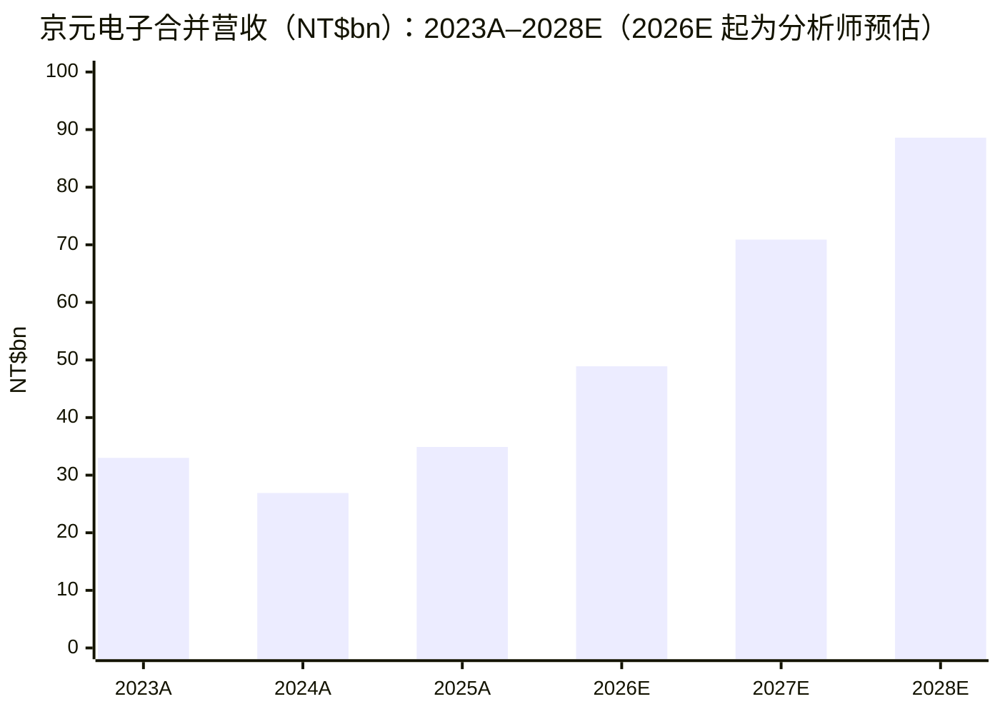
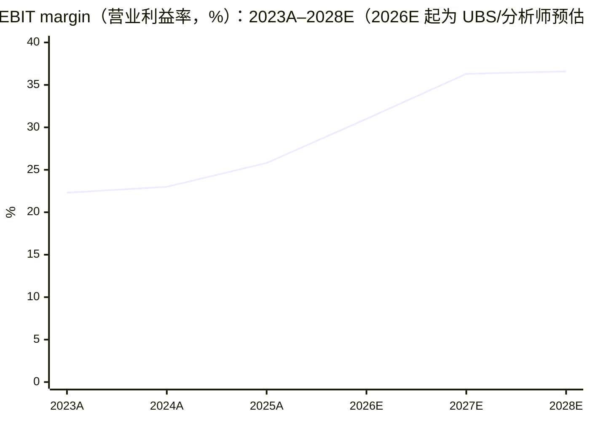
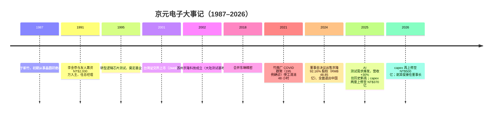
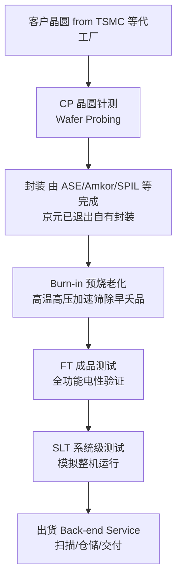
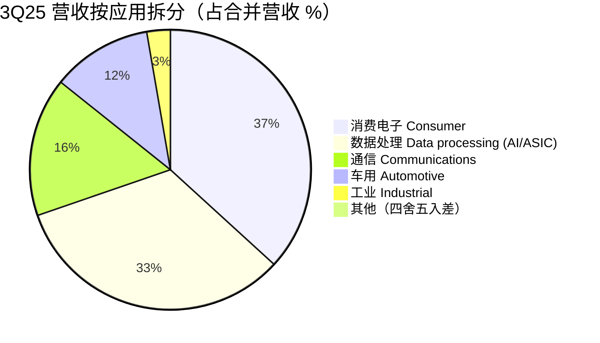
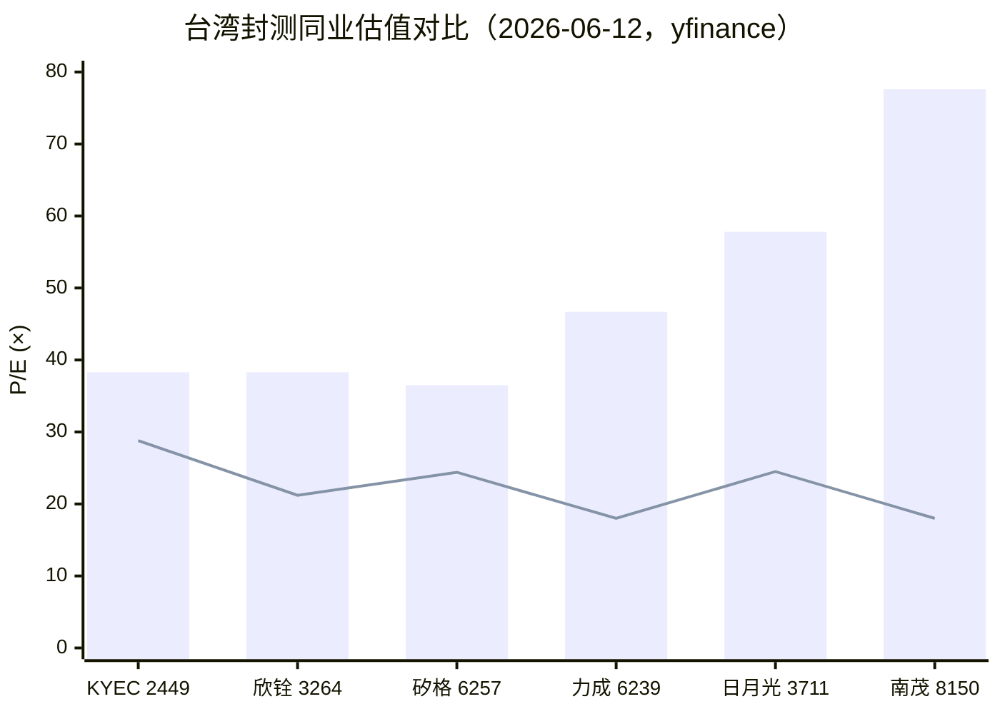
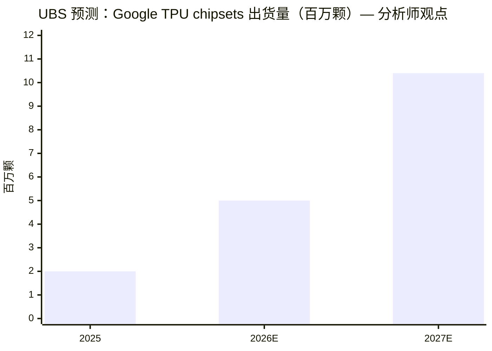

# 京元电子 King Yuan Electronics (KYEC, TWSE:2449) 公司研究

**As of: 2026-06-15**（股价、估值与月营收均以最近交易日 2026-06-12 数据为准；台股周末休市）

> *分析师观点：* **评级：Buy（买入）· 12 个月目标价 NT$345（较 2026-06-12 收盘 NT$282 上行 +22%）· 估值方法：2027E EPS NT$16.4 × 21× P/E**
> 市值 NT$344.8bn · 52 周区间 NT$96.2–354.0 · TWSE:2449（数据来源：[Yahoo奇摩股市 2449.TW, 2026-06-12](https://tw.stock.yahoo.com/quote/2449.TW)，数据经 yfinance 取得）
>
> | 估值倍数（*分析师观点：* 远期列） | TTM（报告基准） | FY2026E | FY2027E | FY2028E |
> |---|---|---|---|---|
> | P/E | ~38.3×（EPS 7.37） · forward 18.1×（yfinance） | 28.8× | 17.2× | 13.4× |
> | P/S | 9.1× | 7.1× | 4.9× | 3.9× |
> | P/B | 6.3× | — | — | — |
> | PEG（vs 核心 EPS CAGR 25–28E +48%） | — | ~0.60 | — | — |
>
> TTM 数据：[Yahoo奇摩股市 2449.TW](https://tw.stock.yahoo.com/quote/2449.TW)（经 yfinance，trailingPE 43.3× 含一次性处分利益、剔除后约 38.3×）、[财报狗 近四季 EPS 7.37 元](https://statementdog.com/analysis/2449/eps)；forward P/E 18.1× 为 yfinance 远期口径；远期列（FY2026E 起）为分析师自有预估（见 1A 节）。
>
> **相对表现**（yfinance，截至 2026-06-12）：1M −7.5% / 6M +22.6% / YTD +5.4% / 12M +193.1%；同期台湾加权指数（TWSE TAIEX）+6.8% / +56.6% / +50.5% / +98.2% → 相对收益 1M −14.3pp / 6M −34.0pp / YTD −45.1pp / 12M +94.9pp。12 个月维度大幅跑赢、但年初至今显著落后大盘（YTD +5.4% vs 大盘 +50.5%）——与 UBS 的"落后补涨（laggard to catch up）"框架一致（*分析师观点：*[UBS — Raising 2027 growth on CPU and probing opportunity, 2026-05-08, p.1](http://xs-macbook-air.local:5001/zsxq/pdf/415248142222828/UBS-King%20Yuan%20Electronics%EF%BC%882449.TW%EF%BC%89Raising%202027%20growth%20on%20CPU%20and%20probing%20opportunity-260508.pdf)）。
>
> **核心论点（thesis pillars）**——（1）全球最大的专业纯测试厂（pure-play IC test house），AI 芯片测试核心供应商：自研 burn-in（预烧/老化测试）设备形成稀缺壁垒，*分析师观点：* GS 称其为 NVIDIA 主流 AI GPU 的独家测试服务商；（2）测试强度结构性上升——test insertions（测试插入次数）增加、单颗测试时长拉长、SLT（system-level test，系统级测试）与 burn-in 成为 CSP ASIC 标配，AI 收入占比 2025 年 20–30% → 2026E 35–40%（公司目标）；（3）NT$500 亿资本开支（创历史新高）锁定 2027 上半年订单需求，客户由 GPU 扩展至 ASIC、Google TPU、ARM 服务器 CPU；（4）估值：以 2026-06-12 收盘 NT$282 计 2027E P/E 仅 ~17.2×、forward P/E 18.1×（yfinance），低于外资三家 PT（NT$360–435）所隐含的 22–25× 目标倍数。

> **Update — 重申 FY2026 全年指引、资本开支上修（2026-04 / 2026-06-05）；供应链最新读数（2026-06-10）：** 公司于 2026 年 4 月将全年 capex（资本开支）由 NT$393.72 亿上调至 NT$500 亿（+27%，历史新高），主因 AI 测试需求强劲（[经济日报, 2026-04-10](https://money.udn.com/money/story/5612/9434005)）；并在 6 月 4–5 日野村投资论坛（NIFA 2026）上重申全年营收 +40% YoY、毛利率 (gross margin) 40% 的经营目标，2Q26 营收指引环比低双位数增长、毛利率持平（*分析师观点：*[Nomura — Takeaways from NIFA 2026, 2026-06-05, p.1](http://xs-macbook-air.local:5001/zsxq/pdf/412458845522228/Nomura-King%20Yuan%20Electronics%20Corp%EF%BC%882449.TW%EF%BC%89Takeaways%20from%20NIFA%202026-260605.pdf)）。最新行业月度追踪显示 AI 带动的供应链紧张延续：花旗 2026-06-10 月度报告点名"日月光 / 京元电（KYEC）受 LEAP 及新 AI 芯片测试业务拉动，下半年订单流改善"，并判断先进封装、测试接口与载板下半年有望进一步涨价（*分析师观点：*[Citi — Taiwan monthly tracker and what's new in AI: Supply chain tightness continues, 2026-06-10, p.1](http://xs-macbook-air.local:5001/zsxq/pdf/584251881854144/CITI-Taiwan%20Electronics%20%26%20Semiconductors%EF%BC%9ATaiwan%20monthly%20tracker%20and%20what%E2%80%99s%20new%20in%20AI%20%E2%80%93%20Supply%20chain%20tightness%20continues-260610.pdf)）。

## 目录

1. 公司概览（含投资论点）
1A. 估值与目标价（远期预估 · PT 推导 · 牛/基准/熊）
1B. GF Score 基本面评分卡
2. 公司历史
3. 管理团队
4. 产品与服务
5. 客户与上市策略
6. 行业概览
7. 竞争格局
8. 市场机会（TAM）
9. 风险评估
9.5 关键分歧与催化剂
10. 投资人视角评分卡
数据来源清单 · 参考资料 · 验证日志

---

## 1. 公司概览

*分析师观点：* 我们以 **Buy（买入）** 评级、12 个月目标价 **NT$345**（2027E EPS NT$16.4 × 21× P/E，较 2026-06-12 收盘 NT$282 上行 +22%）覆盖京元电子。为什么是现在：股价在 6 月初自高点 NT$322（6/3）一度回撤 15% 至 NT$272（6/10）、随后小幅反弹至 NT$282（6/12，同期台湾加权指数仍在创新高，yfinance 数据），而基本面信号反而在增强——5 月营收创单月历史新高（+36.6% YoY）、1Q26 毛利率超指引上限、公司刚刚把 capex 上修至 NT$500 亿并重申全年 +40% 营收目标，花旗 6/10 月度追踪点名京元下半年订单流改善。核心逻辑有四：AI 测试稀缺壁垒（自研 burn-in）、测试强度结构性上升、客户从 GPU 向 ASIC/TPU/CPU 多元化、以及远期估值（2027E ~17.2×、forward P/E 18.1×）显著低于外资目标倍数。本段为分析师自有观点，论据见后文各节引用。

**公司是做什么的。** 京元电子成立于 1987 年，总部位于台湾新竹，主力厂区在苗栗竹南与铜锣，是半导体后段（back-end）供应链中**专注测试环节的委外厂商**。公司英文官网自述："provides wafer probing and final product test for the semiconductor backend supply chain"，并称自身为 "the second-largest firm in terms of testing revenue and the largest professional pure-play testing company worldwide"（按测试营收计全球第二、全球最大专业纯测试公司），以及 "a global leader in high-end chip testing, particularly in the field of AI chip testing"（[KYEC 官网 About](https://www.kyec.com.tw/en/about)）。服务覆盖 wafer probing / CP（晶圆针测）、final test / FT（成品测试）、burn-in（预烧/老化测试）与 SLT（system-level test，系统级测试），测试对象涵盖 Logic/Mixed-Signal（逻辑/混合信号）、SoC、CIS/CCD（CMOS 图像传感器）、LCD Driver（显示驱动）、RF（射频）与 MEMS（[KYEC 官网 Service](https://www.kyec.com.tw/en/Service)）。

**怎么赚钱。** 商业模式是测试代工：客户（90% 以上为 fabless 无晶圆厂设计公司，约 7% 为 IDM、3% 为 foundry，[KYEC 官网 About](https://www.kyec.com.tw/en/about)）把晶圆或封装后的芯片送到京元，按测试机时/颗数计价。公司不设计、不制造芯片，本质上出售"测试机台 × 时间 × 工程能力"。官网披露产能规模：晶圆针测月产能约 35 万片（12 寸约当）、成品测试月产能约 3.5 亿颗、测试平台超过 5,500 台（[KYEC 官网 About](https://www.kyec.com.tw/en/about)）。重资产、高经营杠杆——折旧是最大成本项，利用率与 ASP 决定毛利率弹性。

**规模与最新业绩。** FY2025 合并营收 NT$349.34 亿（+30.08% YoY），税后净利 NT$110.16 亿（+41.59%，含一次性处分利益，见 1A 节），报告 EPS NT$9.01；毛利率 35.85%（营收/净利/EPS 见 *分析师观点：*[Goldman Sachs — 1Q26 Earnings review, 2026-05-08, GS Forecast 表](http://xs-macbook-air.local:5001/zsxq/pdf/812458412282212/Goldman%20Sachs-King%20Yuan%20Electronics%20Co.%20%EF%BC%882449.TW%EF%BC%89%20Earnings%20review%EF%BC%9A1Q26%20GM%20beat%EF%BC%9B%20AI%20ASIC%20momentum%20gaining%20pace%EF%BC%8C%20setting%20up%20a%20stronger%202027%20growth%20profile%EF%BC%9B%20reiterate%20Buy%20with%20TP%20to%20NT%24435-260508.pdf)，GS 模型中 FY2025 COGS NT$22,411mn / 营收 NT$34,933.5mn 隐含毛利率 35.8%，与[财报狗](https://statementdog.com/analysis/2449/eps)口径一致）。1Q26 营收 NT$101.92 亿（+39.3% YoY、+2.3% QoQ），毛利率 39.7%（超出管理层 38–39% 指引上限），营业利益率 (operating margin) 27.2%，EPS NT$1.87（同前述 GS 报告 p.1 verbatim："revenue of NT$10,192mn, up 2.3% QoQ and 39.3% YoY… 1Q26 GM came in at 39.7%, above the high end of management's 38-39% guidance range"）。2026 年 5 月单月营收 NT$37.77 亿，创历史新高（+36.61% YoY、+0.91% MoM），1–5 月累计 NT$177.12 亿（+37.71% YoY）（[钜亨网营收速报, 2026-06-08](https://news.cnyes.com/news/id/6488811)；公司每月营收公告见 [KYEC 投资人专区·每月营业收入](https://www.kyec.com.tw/zh-tw/Ir/Revenue)）。员工约 7,100 人（2020 年数据，[维基百科·京元电子](https://zh.wikipedia.org/wiki/%E4%BA%AC%E5%85%83%E9%9B%BB%E5%AD%90)；中国苏州子公司 2024–25 年已出售，现有人数未见更新披露）。

2023–2025 实际值来源：*分析师观点：*[UBS, 2026-05-08, Highlights 表](http://xs-macbook-air.local:5001/zsxq/pdf/415248142222828/UBS-King%20Yuan%20Electronics%EF%BC%882449.TW%EF%BC%89Raising%202027%20growth%20on%20CPU%20and%20probing%20opportunity-260508.pdf)（Revenues 33,025 / 26,856 / 34,934 NT$mn；2024 年下滑系出售苏州京隆科技并表范围变化所致，见第 2 节）；2026E–2028E 为本报告分析师预估（见 1A 节）。

来源：*分析师观点：*[UBS, 2026-05-08, Profitability 表](http://xs-macbook-air.local:5001/zsxq/pdf/415248142222828/UBS-King%20Yuan%20Electronics%EF%BC%882449.TW%EF%BC%89Raising%202027%20growth%20on%20CPU%20and%20probing%20opportunity-260508.pdf)（EBIT margin 22.3 / 23.0 / 25.8 / 31.0 / 36.3%；2028E 36.6% 为 UBS EBIT 31,832 ÷ 营收 86,983 推算）。

下面的利润表 Sankey 以 FY2025 实际数（NT$mn）展开京元"怎么赚钱"：营收 34,933.5 经 COGS 22,411.4 后留下 gross profit 12,522.1（毛利率 35.85%），扣 SG&A 后营业利益 9,002.5、加业外收益至税前 10,628.8，核心净利（pre-exceptional）7,962.5。左侧测试流程占比采 3Q25 法说会口径（FT 58.2% / CP 30.4% / burn-in 9.0% / 封装 2.4%，应用于 FY2025 营收作示意）。

<svg xmlns="http://www.w3.org/2000/svg" viewBox="0 0 1000 560" width="1000" height="560" role="img" aria-label="income statement Sankey"><rect x="0" y="0" width="1000" height="560" fill="#ffffff"/>
<text x="20.00" y="30.00" text-anchor="start" font-family="Helvetica,Arial,sans-serif" font-size="15" font-weight="700" fill="#1f2933">京元电子 FY2025 利润表 Sankey（NT$mn）</text>
<path d="M 204.00,64.00 C 258.00,64.00 258.00,85.00 312.00,85.00 L 312.00,322.45 C 258.00,322.45 258.00,301.45 204.00,301.45 Z" fill="#93c5fd" fill-opacity="0.55"/>
<path d="M 452.00,78.00 C 506.00,78.00 506.00,208.88 560.00,208.88 L 560.00,314.02 C 506.00,314.02 506.00,183.14 452.00,183.14 Z" fill="#86efac" fill-opacity="0.55"/>
<path d="M 452.00,183.14 C 506.00,183.14 506.00,328.02 560.00,328.02 L 560.00,369.12 C 506.00,369.12 506.00,224.25 452.00,224.25 Z" fill="#fca5a5" fill-opacity="0.55"/>
<path d="M 328.00,85.00 C 382.00,85.00 382.00,78.00 436.00,78.00 L 436.00,224.25 C 382.00,224.25 382.00,231.25 328.00,231.25 Z" fill="#86efac" fill-opacity="0.55"/>
<path d="M 328.00,231.25 C 382.00,231.25 382.00,238.25 436.00,238.25 L 436.00,500.00 C 382.00,500.00 382.00,493.00 328.00,493.00 Z" fill="#fca5a5" fill-opacity="0.55"/>
<path d="M 700.00,199.38 C 754.00,199.38 754.00,219.93 808.00,219.93 L 808.00,312.93 C 754.00,312.93 754.00,292.37 700.00,292.37 Z" fill="#86efac" fill-opacity="0.55"/>
<path d="M 700.00,292.37 C 754.00,292.37 754.00,326.93 808.00,326.93 L 808.00,358.07 C 754.00,358.07 754.00,323.52 700.00,323.52 Z" fill="#fca5a5" fill-opacity="0.55"/>
<path d="M 576.00,208.88 C 630.00,208.88 630.00,199.38 684.00,199.38 L 684.00,304.52 C 630.00,304.52 630.00,314.02 576.00,314.02 Z" fill="#86efac" fill-opacity="0.55"/>
<path d="M 204.00,315.45 C 258.00,315.45 258.00,322.45 312.00,322.45 L 312.00,446.49 C 258.00,446.49 258.00,439.49 204.00,439.49 Z" fill="#93c5fd" fill-opacity="0.55"/>
<path d="M 576.00,328.02 C 630.00,328.02 630.00,337.52 684.00,337.52 L 684.00,378.62 C 630.00,378.62 630.00,369.12 576.00,369.12 Z" fill="#fca5a5" fill-opacity="0.55"/>
<path d="M 204.00,453.49 C 258.00,453.49 258.00,446.49 312.00,446.49 L 312.00,483.21 C 258.00,483.21 258.00,490.21 204.00,490.21 Z" fill="#93c5fd" fill-opacity="0.55"/>
<path d="M 204.00,504.21 C 258.00,504.21 258.00,483.21 312.00,483.21 L 312.00,493.00 C 258.00,493.00 258.00,514.00 204.00,514.00 Z" fill="#93c5fd" fill-opacity="0.55"/>
<rect x="188.00" y="64.00" width="16" height="237.45" rx="1.5" fill="#2563eb"/>
<rect x="188.00" y="315.45" width="16" height="124.03" rx="1.5" fill="#2563eb"/>
<rect x="188.00" y="453.49" width="16" height="36.72" rx="1.5" fill="#2563eb"/>
<rect x="188.00" y="504.21" width="16" height="9.79" rx="1.5" fill="#2563eb"/>
<rect x="312.00" y="85.00" width="16" height="408.00" rx="1.5" fill="#1e3a8a"/>
<rect x="436.00" y="78.00" width="16" height="146.25" rx="1.5" fill="#15803d"/>
<rect x="436.00" y="238.25" width="16" height="261.75" rx="1.5" fill="#dc2626"/>
<rect x="560.00" y="208.88" width="16" height="105.14" rx="1.5" fill="#15803d"/>
<rect x="560.00" y="328.02" width="16" height="41.11" rx="1.5" fill="#dc2626"/>
<rect x="684.00" y="199.38" width="16" height="124.14" rx="1.5" fill="#15803d"/>
<rect x="684.00" y="337.52" width="16" height="41.11" rx="1.5" fill="#dc2626"/>
<rect x="808.00" y="219.93" width="16" height="93.00" rx="1.5" fill="#15803d"/>
<rect x="808.00" y="326.93" width="16" height="31.14" rx="1.5" fill="#dc2626"/>
<line x1="188.00" y1="182.73" x2="182.00" y2="160.62" stroke="#cbd5e1" stroke-width="1"/>
<text x="179.00" y="163.62" text-anchor="end" font-family="Helvetica,Arial,sans-serif" font-size="11.5" font-weight="700" fill="#1f2933">成品测试 FT 58.2%</text>
<text x="179.00" y="176.62" text-anchor="end" font-family="Helvetica,Arial,sans-serif" font-size="10" font-weight="400" fill="#52606d">NT$20.3B  (58.2%)</text>
<line x1="188.00" y1="377.47" x2="182.00" y2="355.37" stroke="#cbd5e1" stroke-width="1"/>
<text x="179.00" y="358.37" text-anchor="end" font-family="Helvetica,Arial,sans-serif" font-size="11.5" font-weight="700" fill="#1f2933">晶圆针测 CP 30.4%</text>
<text x="179.00" y="371.37" text-anchor="end" font-family="Helvetica,Arial,sans-serif" font-size="10" font-weight="400" fill="#52606d">NT$10.6B  (30.4%)</text>
<line x1="188.00" y1="471.85" x2="182.00" y2="449.74" stroke="#cbd5e1" stroke-width="1"/>
<text x="179.00" y="452.74" text-anchor="end" font-family="Helvetica,Arial,sans-serif" font-size="11.5" font-weight="700" fill="#1f2933">预烧 Burn-in 9.0%</text>
<text x="179.00" y="465.74" text-anchor="end" font-family="Helvetica,Arial,sans-serif" font-size="10" font-weight="400" fill="#52606d">NT$3.1B  (9.0%)</text>
<line x1="188.00" y1="509.10" x2="182.00" y2="487.00" stroke="#cbd5e1" stroke-width="1"/>
<text x="179.00" y="490.00" text-anchor="end" font-family="Helvetica,Arial,sans-serif" font-size="11.5" font-weight="700" fill="#1f2933">封装/其他 2.4%</text>
<text x="179.00" y="503.00" text-anchor="end" font-family="Helvetica,Arial,sans-serif" font-size="10" font-weight="400" fill="#52606d">NT$838.5M  (2.4%)</text>
<rect x="331.00" y="67.00" width="119.40" height="26" rx="2" fill="#ffffff" fill-opacity="0.72"/>
<text x="334.00" y="79.00" text-anchor="start" font-family="Helvetica,Arial,sans-serif" font-size="11.5" font-weight="700" fill="#1f2933">Revenue</text>
<text x="334.00" y="92.00" text-anchor="start" font-family="Helvetica,Arial,sans-serif" font-size="10" font-weight="400" fill="#52606d">NT$34.9B  (100.0%)</text>
<rect x="455.00" y="60.00" width="113.10" height="26" rx="2" fill="#ffffff" fill-opacity="0.72"/>
<text x="458.00" y="72.00" text-anchor="start" font-family="Helvetica,Arial,sans-serif" font-size="11.5" font-weight="700" fill="#1f2933">Gross Profit</text>
<text x="458.00" y="85.00" text-anchor="start" font-family="Helvetica,Arial,sans-serif" font-size="10" font-weight="400" fill="#52606d">NT$12.5B  (35.8%)</text>
<rect x="455.00" y="220.25" width="144.60" height="26" rx="2" fill="#ffffff" fill-opacity="0.72"/>
<text x="458.00" y="232.25" text-anchor="start" font-family="Helvetica,Arial,sans-serif" font-size="11.5" font-weight="700" fill="#1f2933">Cost of Revenue (COGS)</text>
<text x="458.00" y="245.25" text-anchor="start" font-family="Helvetica,Arial,sans-serif" font-size="10" font-weight="400" fill="#52606d">NT$22.4B  (64.2%)</text>
<rect x="579.00" y="190.88" width="106.80" height="26" rx="2" fill="#ffffff" fill-opacity="0.72"/>
<text x="582.00" y="202.88" text-anchor="start" font-family="Helvetica,Arial,sans-serif" font-size="11.5" font-weight="700" fill="#1f2933">Operating Income</text>
<text x="582.00" y="215.88" text-anchor="start" font-family="Helvetica,Arial,sans-serif" font-size="10" font-weight="400" fill="#52606d">NT$9.0B  (25.8%)</text>
<rect x="579.00" y="310.02" width="150.90" height="26" rx="2" fill="#ffffff" fill-opacity="0.72"/>
<text x="582.00" y="322.02" text-anchor="start" font-family="Helvetica,Arial,sans-serif" font-size="11.5" font-weight="700" fill="#1f2933">Total Operating Expense</text>
<text x="582.00" y="335.02" text-anchor="start" font-family="Helvetica,Arial,sans-serif" font-size="10" font-weight="400" fill="#52606d">NT$3.5B  (10.1%)</text>
<rect x="703.00" y="181.38" width="113.10" height="26" rx="2" fill="#ffffff" fill-opacity="0.72"/>
<text x="706.00" y="193.38" text-anchor="start" font-family="Helvetica,Arial,sans-serif" font-size="11.5" font-weight="700" fill="#1f2933">Pretax Income</text>
<text x="706.00" y="206.38" text-anchor="start" font-family="Helvetica,Arial,sans-serif" font-size="10" font-weight="400" fill="#52606d">NT$10.6B  (30.4%)</text>
<rect x="703.00" y="319.52" width="106.80" height="26" rx="2" fill="#ffffff" fill-opacity="0.72"/>
<text x="706.00" y="331.52" text-anchor="start" font-family="Helvetica,Arial,sans-serif" font-size="11.5" font-weight="700" fill="#1f2933">SG&amp;A</text>
<text x="706.00" y="344.52" text-anchor="start" font-family="Helvetica,Arial,sans-serif" font-size="10" font-weight="400" fill="#52606d">NT$3.5B  (10.1%)</text>
<text x="833.00" y="263.43" text-anchor="start" font-family="Helvetica,Arial,sans-serif" font-size="11.5" font-weight="700" fill="#1f2933">Net Income</text>
<text x="833.00" y="276.43" text-anchor="start" font-family="Helvetica,Arial,sans-serif" font-size="10" font-weight="400" fill="#52606d">NT$8.0B  (22.8%)</text>
<text x="833.00" y="339.50" text-anchor="start" font-family="Helvetica,Arial,sans-serif" font-size="11.5" font-weight="700" fill="#1f2933">Income Tax</text>
<text x="833.00" y="352.50" text-anchor="start" font-family="Helvetica,Arial,sans-serif" font-size="10" font-weight="400" fill="#52606d">NT$2.7B  (7.6%)</text>
<text x="500.00" y="530.00" text-anchor="middle" font-family="Helvetica,Arial,sans-serif" font-size="10" font-weight="400" font-style="italic" fill="#8a97a3">毛利率 35.85%；净利为 pre-exceptional（不含苏州处分一次性税后 NT$3,053mn，报告净利 11,016）</text>
<text x="500.00" y="544.00" text-anchor="middle" font-family="Helvetica,Arial,sans-serif" font-size="10" font-weight="400" fill="#52606d">Source: KYEC FY2025 figures per Goldman Sachs model (2026-05-08) · 营收/COGS/EPS 与公司财报口径一致</text>
</svg>

来源：FY2025 数据 per *分析师观点：*[Goldman Sachs model, 2026-05-08](http://xs-macbook-air.local:5001/zsxq/pdf/812458412282212/Goldman%20Sachs-King%20Yuan%20Electronics%20Co.%20%EF%BC%882449.TW%EF%BC%89%20Earnings%20review%EF%BC%9A1Q26%20GM%20beat%EF%BC%9B%20AI%20ASIC%20momentum%20gaining%20pace%EF%BC%8C%20setting%20up%20a%20stronger%202027%20growth%20profile%EF%BC%9B%20reiterate%20Buy%20with%20TP%20to%20NT%24435-260508.pdf)（营收 34,933.5 / COGS 22,411.4 / 营业利益 9,002.5 / pre-exceptional 净利 7,962.5 逐项 OCR 核对，与公司财报口径一致）；测试流程占比来自[富果 3Q25 法说会备忘录](https://blog.fugle.tw/post/earnings-call-2449-2025-12-03)。

历史营收（含分析师预估）显示 AI 周期的弹性——2024 年因出售苏州京隆并表范围变化而下滑、2025 年回补创高、2026E 起进入加速：

<svg xmlns="http://www.w3.org/2000/svg" viewBox="0 0 860 470" width="860" height="470" role="img" aria-label="historical revenue bars"><rect x="0" y="0" width="860" height="470" fill="#ffffff"/>
<text x="20.00" y="30.00" text-anchor="start" font-family="Helvetica,Arial,sans-serif" font-size="15" font-weight="700" fill="#1f2933">京元电子合并营收 2023A–2028E（NT$bn）</text>
<rect x="20.00" y="44" width="11" height="11" rx="2" fill="#2563eb"/>
<text x="36.00" y="53.00" text-anchor="start" font-family="Helvetica,Arial,sans-serif" font-size="10.5" font-weight="400" fill="#1f2933">合并营收</text>
<line x1="70" y1="412.00" x2="834" y2="412.00" stroke="#eceff2" stroke-width="1"/>
<text x="64.00" y="415.00" text-anchor="end" font-family="Helvetica,Arial,sans-serif" font-size="9.5" font-weight="400" fill="#52606d">NT$0</text>
<line x1="70" y1="345.20" x2="834" y2="345.20" stroke="#eceff2" stroke-width="1"/>
<text x="64.00" y="348.20" text-anchor="end" font-family="Helvetica,Arial,sans-serif" font-size="9.5" font-weight="400" fill="#52606d">NT$19.1B</text>
<line x1="70" y1="278.40" x2="834" y2="278.40" stroke="#eceff2" stroke-width="1"/>
<text x="64.00" y="281.40" text-anchor="end" font-family="Helvetica,Arial,sans-serif" font-size="9.5" font-weight="400" fill="#52606d">NT$38.3B</text>
<line x1="70" y1="211.60" x2="834" y2="211.60" stroke="#eceff2" stroke-width="1"/>
<text x="64.00" y="214.60" text-anchor="end" font-family="Helvetica,Arial,sans-serif" font-size="9.5" font-weight="400" fill="#52606d">NT$57.4B</text>
<line x1="70" y1="144.80" x2="834" y2="144.80" stroke="#eceff2" stroke-width="1"/>
<text x="64.00" y="147.80" text-anchor="end" font-family="Helvetica,Arial,sans-serif" font-size="9.5" font-weight="400" fill="#52606d">NT$76.6B</text>
<line x1="70" y1="78.00" x2="834" y2="78.00" stroke="#eceff2" stroke-width="1"/>
<text x="64.00" y="81.00" text-anchor="end" font-family="Helvetica,Arial,sans-serif" font-size="9.5" font-weight="400" fill="#52606d">NT$95.7B</text>
<rect x="96.74" y="296.81" width="73.85" height="115.19" fill="#2563eb"/>
<text x="133.67" y="428.00" text-anchor="middle" font-family="Helvetica,Arial,sans-serif" font-size="10" font-weight="400" fill="#52606d">2023</text>
<rect x="224.07" y="318.11" width="73.85" height="93.89" fill="#2563eb"/>
<text x="261.00" y="428.00" text-anchor="middle" font-family="Helvetica,Arial,sans-serif" font-size="10" font-weight="400" fill="#52606d">2024</text>
<rect x="351.41" y="290.18" width="73.85" height="121.82" fill="#2563eb"/>
<text x="388.33" y="428.00" text-anchor="middle" font-family="Helvetica,Arial,sans-serif" font-size="10" font-weight="400" fill="#52606d">2025</text>
<rect x="478.74" y="241.31" width="73.85" height="170.69" fill="#2563eb"/>
<text x="515.67" y="428.00" text-anchor="middle" font-family="Helvetica,Arial,sans-serif" font-size="10" font-weight="400" fill="#52606d">2026E</text>
<rect x="606.07" y="164.52" width="73.85" height="247.48" fill="#2563eb"/>
<text x="643.00" y="428.00" text-anchor="middle" font-family="Helvetica,Arial,sans-serif" font-size="10" font-weight="400" fill="#52606d">2027E</text>
<rect x="733.41" y="102.74" width="73.85" height="309.26" fill="#2563eb"/>
<text x="770.33" y="428.00" text-anchor="middle" font-family="Helvetica,Arial,sans-serif" font-size="10" font-weight="400" fill="#52606d">2028E</text>
<text x="430.00" y="440.00" text-anchor="middle" font-family="Helvetica,Arial,sans-serif" font-size="10" font-weight="400" font-style="italic" fill="#8a97a3">2024 年下滑系出售苏州京隆并表范围变化；2026E 起为分析师预估</text>
<text x="430.00" y="454.00" text-anchor="middle" font-family="Helvetica,Arial,sans-serif" font-size="10" font-weight="400" fill="#52606d">Source: 2023–2025 actual per UBS model (2026-05-08)；2026E–2028E 为本报告分析师预估</text>
</svg>

来源：2023–2025 实际 per *分析师观点：*[UBS model, 2026-05-08](http://xs-macbook-air.local:5001/zsxq/pdf/415248142222828/UBS-King%20Yuan%20Electronics%EF%BC%882449.TW%EF%BC%89Raising%202027%20growth%20on%20CPU%20and%20probing%20opportunity-260508.pdf)（33,025 / 26,856 / 34,934 NT$mn）；2026E–2028E 为本报告分析师预估（见 1A 节）。

**估值快照（TTM）。** 现价 NT$282（2026-06-12 收盘，台股周末休市至 2026-06-15），市值 NT$3,448 亿；TTM P/E 约 38.3×（近四季 EPS NT$7.37，[财报狗](https://statementdog.com/analysis/2449/eps)；yfinance trailingPE 43.3× 含一次性处分利益、剔除后约 38.3×）、forward P/E 18.1×、TTM P/S 9.1×、P/B 6.3×（[Yahoo奇摩股市 2449.TW](https://tw.stock.yahoo.com/quote/2449.TW)，经 yfinance）。同业（2026-06-12，yfinance forward P/E）：欣铨 Ardentec（TPEx:3264）21.2× / 矽格 Sigurd（6257）24.4× / 力成 PTI（6239）18.0× / 日月光投控 ASE（3711）24.5× / 南茂 ChipMOS（8150）18.0×——京元的 forward 倍数处于台湾封测同业中游偏低。**为什么 TTM 倍数高于历史（>38×）：** 这是典型的"盈利暂时落后于资本开支周期"+ AI 主题溢价组合——2025–26 年洁净室与设备折旧先行（1Q26 营业利益率 27.2% 被洁净室折旧拖累，*分析师观点：* GS 报告归因 "higher cleanroom depreciation expenses incurred ahead of equipment move-in"，[GS, 2026-05-08, p.1](http://xs-macbook-air.local:5001/zsxq/pdf/812458412282212/Goldman%20Sachs-King%20Yuan%20Electronics%20Co.%20%EF%BC%882449.TW%EF%BC%89%20Earnings%20review%EF%BC%9A1Q26%20GM%20beat%EF%BC%9B%20AI%20ASIC%20momentum%20gaining%20pace%EF%BC%8C%20setting%20up%20a%20stronger%202027%20growth%20profile%EF%BC%9B%20reiterate%20Buy%20with%20TP%20to%20NT%24435-260508.pdf)），而市场以 2027 年盈利定价——远期 P/E 迅速压缩至 FY2027E ~17.2×（以 NT$282 计、分析师预估）。

## 1A. 估值与目标价（决策层）

本章所有预估、目标价与情景均为**分析师自有前瞻观点**（*分析师观点：*），不构成任何公司文件之引用；各驱动项的外部依据已逐项注明。

### (a) 远期财务预估表

| 指标（*分析师观点：* 预估列） | FY2024A | FY2025A | FY2026E | FY2027E | FY2028E | CAGR 25→28E |
|---|---|---|---|---|---|---|
| 营收（NT$bn） | 26.86 | 34.93 | 48.9 | 70.9 | 88.6 | **+36%** |
| — YoY % | −18.7%* | +30.1% | +40% | +45% | +25% | |
| 毛利率 (GM) % | n/a* | 35.85% | 40.0% | 41.8% | 42.0% | |
| 营业利益率 (EBIT margin) % | 23.0% | 25.8% | 29.5% | 32.0% | 33.0% | |
| EPS——核心（NT$） | 3.64 | 6.51 | 9.8 | 16.4 | 21.0 | **+48%** |
| EPS——报告（NT$） | — | 9.01 | 9.8 | 16.4 | 21.0 | |
| DPS（NT$） | 4.00 | 1.0 现金 + 0.5 股票 | ~2.0 | ~3.3 | ~4.2 | |
| FCF（NT$bn） | — | 负 | ≈ −29 | ≈ −6 | ≈ +10 | |
| 净负债（NT$bn） | 10.3 | 12.3 | ~44 | ~65 | ~75 | |
| ROIC %（约） | — | ~14% | ~15% | ~19% | ~20% | |

\* 2024 年营收下滑及毛利率不可比，系 2024 年处置苏州京隆科技（并表范围变化）所致；2024A/2025A 营收、EBIT margin、核心 EPS 取自 *分析师观点：*[UBS 模型, 2026-05-08](http://xs-macbook-air.local:5001/zsxq/pdf/415248142222828/UBS-King%20Yuan%20Electronics%EF%BC%882449.TW%EF%BC%89Raising%202027%20growth%20on%20CPU%20and%20probing%20opportunity-260508.pdf)；FY2025 报告 EPS 9.01 = 核心 6.51 + 税后一次性处分利益 NT$3,053mn（*分析师观点：*[GS 模型 "Post-tax exceptionals 3,053.1", 2026-05-08](http://xs-macbook-air.local:5001/zsxq/pdf/812458412282212/Goldman%20Sachs-King%20Yuan%20Electronics%20Co.%20%EF%BC%882449.TW%EF%BC%89%20Earnings%20review%EF%BC%9A1Q26%20GM%20beat%EF%BC%9B%20AI%20ASIC%20momentum%20gaining%20pace%EF%BC%8C%20setting%20up%20a%20stronger%202027%20growth%20profile%EF%BC%9B%20reiterate%20Buy%20with%20TP%20to%20NT%24435-260508.pdf)）。FY2024 DPS NT$4.0、FY2025 拟配 NT$1.0 现金 + NT$0.5 股票股利：[财报狗·股利政策](https://statementdog.com/analysis/2449/dividend-policy)、[Goodinfo·历年股利](https://goodinfo.tw/tw/StockDividendPolicy.asp?STOCK_ID=2449)。

**预估的外部锚点：** FY2026E 营收 +40% 直接采用公司全年经营目标（管理层在 NIFA 2026 重申 "+40% y-y and GM target of 40%"，*分析师观点：*[Nomura, 2026-06-05, p.1](http://xs-macbook-air.local:5001/zsxq/pdf/412458845522228/Nomura-King%20Yuan%20Electronics%20Corp%EF%BC%882449.TW%EF%BC%89Takeaways%20from%20NIFA%202026-260605.pdf)），1–5 月累计 +37.71%（[钜亨网, 2026-06-08](https://news.cnyes.com/news/id/6488811)）配合下半年新产能投放可达成；FY2027E +45% 介于 UBS 的 +43% 与 GS 的 +56% 之间，驱动为美系 CSP（云服务商）下一代 AI ASIC 放量 + 次世代 GPU 测试时长拉长 + Google TPU/CPU 增量（*分析师观点：* GS 预计 2027 年营收 NT$78,195mn、UBS 预计 NT$71,183mn，出处同上两份报告）；FY2028E +25% 采保守端（UBS +22%、GS +46%）。

**毛利率桥（FY2025 35.85% → FY2026E 40.0%，约 +415bps，*分析师观点：*）：** 先进制程/AI 收入占比提升（2025 >50% → 2026E >65%，混合 ASP 与测试时长更高）约 **+350bps**（占比数据：*分析师观点：*[GS Computex Corporate Day, 2026-06-02](http://xs-macbook-air.local:5001/zsxq/pdf/212485141815411/Goldman%20Sachs-Taiwan%20Technology%EF%BC%9A%20Semiconductors%EF%BC%9A%20GS%20Taiwan%20Computex%20%26%20Corporate%20Day%202026~Day%202%20Key%20takeaways-260602.pdf)）；传统产品旧设备折旧到期、COGS 下降约 **+150bps**（管理层 NIFA 表述 "some equipment for legacy products are already fully depreciated, thus resulting in reducing COGS"，*分析师观点：*[Nomura, 2026-06-05](http://xs-macbook-air.local:5001/zsxq/pdf/412458845522228/Nomura-King%20Yuan%20Electronics%20Corp%EF%BC%882449.TW%EF%BC%89Takeaways%20from%20NIFA%202026-260605.pdf)）；新洁净室/新机台折旧爬坡约 **−60bps**；3Q26 夏季电价峰值约 **−25bps**（电费节奏同样出自 Nomura NIFA 纪要）。1Q26 实际 39.7% 已验证该路径的前半段。

### (b) 目标价推导（算术过程）

**方法：远期 P/E × 目标倍数。** 基准情形：**2027E EPS NT$16.4 × 21× = NT$344 ≈ NT$345**（较 2026-06-12 收盘 NT$282 上行 +22%）。

**21× 的倍数论证（对标 3–5 家同业，2026-06-12 yfinance 远期 P/E）：** 力成 PTI 18.0×、欣铨 Ardentec 21.2×、矽格 Sigurd 24.4×、日月光投控 ASE 24.5×。京元 2025→2028E 核心 EPS CAGR 约 +48%（分析师预估），显著高于上述以封装为主、AI 测试纯度更低的同业，理应获得相对欣铨/力成的溢价；但我们刻意把倍数压在 21×——低于 GS 与 Nomura 采用的 25×（GS PT NT$435 基于 2027E EPS NT$16.76 与 25× 目标 PE、并叠加 15% 并购溢价——GS 注明的方法论；Nomura PT NT$360 基于 2027 年 25× EPS）、贴近 UBS 的 22×（PT NT$380 = 22× 2027E EPS 17.28）——原因是 NT$500 亿 capex 带来的折旧海啸与净负债攀升（UBS 模型净负债 2025 NT$123 亿 → 2027E NT$693 亿）值得一档折让（外资 PT 出处：*分析师观点：*[GS, 2026-05-08](http://xs-macbook-air.local:5001/zsxq/pdf/812458412282212/Goldman%20Sachs-King%20Yuan%20Electronics%20Co.%20%EF%BC%882449.TW%EF%BC%89%20Earnings%20review%EF%BC%9A1Q26%20GM%20beat%EF%BC%9B%20AI%20ASIC%20momentum%20gaining%20pace%EF%BC%8C%20setting%20up%20a%20stronger%202027%20growth%20profile%EF%BC%9B%20reiterate%20Buy%20with%20TP%20to%20NT%24435-260508.pdf)、[UBS, 2026-05-08](http://xs-macbook-air.local:5001/zsxq/pdf/415248142222828/UBS-King%20Yuan%20Electronics%EF%BC%882449.TW%EF%BC%89Raising%202027%20growth%20on%20CPU%20and%20probing%20opportunity-260508.pdf)、[Nomura, 2026-06-05](http://xs-macbook-air.local:5001/zsxq/pdf/412458845522228/Nomura-King%20Yuan%20Electronics%20Corp%EF%BC%882449.TW%EF%BC%89Takeaways%20from%20NIFA%202026-260605.pdf)）。

### (c) 牛 / 基准 / 熊情景

| 情景（*分析师观点：*） | 关键假设 | 2027E EPS | 倍数 | PT | vs NT$282 |
|---|---|---|---|---|---|
| 牛市 | Rubin/次世代 XPU 放量顺利、第二颗 ASIC 下半年爬坡、GM >42%，市场给足 AI 测试稀缺性溢价 | NT$17.3 | 25× | **NT$430** | **+52%** |
| 基准 | 营收 +45%、GM 41.8%、折旧如期爬坡 | NT$16.4 | 21× | **NT$345** | **+22%** |
| 熊市 | AI capex 周期性放缓、新产能利用率不足、GM 困于 36–37% | NT$12.3 | 15× | **NT$185** | **−34%** |

### (d) 共识对标

本报告 2027E EPS NT$16.4：较 GS 的 16.76 低 ~2%、较 UBS 的 17.28 低 ~5%、较 Nomura PT 隐含的 ~14.4（NT$360 ÷ 25×）高 ~14%。PT NT$345 低于三家外资（GS NT$435 / UBS NT$380 / Nomura NT$360）——差异全部来自目标倍数纪律而非盈利分歧（出处同上；另 Morgan Stanley 于 2026-01-29 以 Overweight 覆盖：*分析师观点：*[Morgan Stanley — Benefiting from Google TPU & CPU demand upside, OW, 2026-01-29](http://xs-macbook-air.local:5001/zsxq/pdf/184421145522882/Morgan%20Stanley-King%20Yuan%20Electronics%20Co%20Ltd%EF%BC%882449.TW%EF%BC%89Benefiting%20from%20Google%20TPU%20%20CPU%20demand%20upside%EF%BC%9B%20OW-260129.pdf)）。

**FY2026E：公司指引 vs 共识 vs 本报告**

| 指标 FY2026E | 公司目标 | GS | UBS | 本报告（*分析师观点：*） |
|---|---|---|---|---|
| 营收 YoY | +40% | +43.1%（NT$49.98bn） | +42%（NT$49.6bn） | +40%（NT$48.9bn） |
| 毛利率 | 40% | — | — | 40.0% |
| EPS（NT$） | — | 9.42 | 10.18 | 9.8 |

公司目标列出处：*分析师观点：*[Nomura NIFA 纪要, 2026-06-05](http://xs-macbook-air.local:5001/zsxq/pdf/412458845522228/Nomura-King%20Yuan%20Electronics%20Corp%EF%BC%882449.TW%EF%BC%89Takeaways%20from%20NIFA%202026-260605.pdf)；GS/UBS 列出处同 (b) 节两份报告。

### (e) 卖方观点演变（Sell-side view evolution）

> 机械化前置：本节先以只读方式（`mode=ro`）查询 `db/stock_price_target.db` 中 ticker `2449.TW` 的全部行——共 6 行，覆盖 GS / UBS / Nomura / Morgan Stanley / J.P. Morgan 五家机构。PT 离散度：有明确 PT 的三家为 NT$360 / 380 / 435，中位数 NT$380、区间跨度 +20.8%（435/360−1）；MS 与 JPM 给 Overweight 但未列具体 PT（报告内为定性"首选"表述）。下表的报告日收盘价（report_date_price）与隐含上行（upside_pct）即取自该 DB 的 `report_date_price` / `upside_pct` 字段。

**按机构的观点时间线（按报告日排序）：**

| 机构 | 报告日 | 评级 | 目标价 | 报告日收盘 | 隐含上行 | 一句话论点 |
|---|---|---|---|---|---|---|
| Morgan Stanley | 2026-01-29 | Overweight | 未列 | NT$271 | — | 受益于 Google TPU 与 CPU 需求上行——初次以 OW 覆盖 |
| UBS | 2026-02-10 | Buy | NT$—（个股深度） | — | — | Google Cloud AI 的 TPU 关键受益者（首份个股深度） |
| Morgan Stanley | 2026-03-16 | Overweight | 未列 | NT$288 | — | TPU/GPU/内存进一步走强；CPO/测试首选 |
| J.P. Morgan | 2026-04-10 | Overweight | 未列 | NT$277.5 | — | AI 半导体测试需求的"首选标的（top pick）" |
| Morgan Stanley | 2026-04-20 | Overweight | 未列 | NT$271 | — | AI 相关半导体（GPU/ASIC/CPU/光芯片）测试服务 |
| UBS | 2026-05-08 | Buy | NT$380 | NT$311 | +22.2% | 上调 2027 成长——CPU + probing 机会，22× 2027E PE |
| Goldman Sachs | 2026-05-08 | Buy | NT$435 | NT$311 | +39.9% | 1Q26 GM beat、AI ASIC 动能；25× 2027E PE + 15% 并购溢价 |
| Goldman Sachs | 2026-06-02 | Buy | NT$435 | NT$306.5 | +41.9% | Computex Corporate Day：AI 收入占比 28%→40%、先进制程 >65% |
| Nomura | 2026-06-05 | Buy | NT$360 | NT$309.5 | +16.3% | NIFA 2026 纪要：重申 +40% 营收/40% GM、25× 2027E EPS |

报告日收盘价与隐含上行取自 `db/stock_price_target.db`（read-only，字段 `report_date_price` / `upside_pct`）；各机构原文链接见参考资料。**自我修订标注：** GS 在 1Q26 财报后（2026-05-08）将 PT 上调至 NT$435 并随 Computex（2026-06-02）维持，触发因素为 1Q26 GM 超指引上限 + 2027 营收增速上修至 +57%；UBS 在 2026-05-08 把目标价框定在 NT$380（22× 2027E），触发因素为把 Cloud AI TAM 从加速器扩展到 CPU 与 networking；Nomura 在 NIFA 纪要后明确"自 2025 年底起对份额流失的担忧下降"——这是一次叙事面的转向（thesis pivot），而非评级变动。

**机构间分歧（disagreement）——目标倍数而非盈利预期：**

| 机构 | 日期 | 评级 / PT | 核心论点 | 什么证据能证明其正确 |
|---|---|---|---|---|
| Goldman Sachs | 2026-06-02 | Buy / NT$435 | 25× 2027E + 15% 并购溢价；AI 收入占比快速抬升 | 2027 营收兑现 +57%、第二颗 ASIC 顺利爬坡、市场给足 AI 测试稀缺性溢价 |
| UBS | 2026-05-08 | Buy / NT$380 | 22× 2027E；CPU + probing 是增量、但 Rubin Ultra 双 GPU 设计削弱单颗测试时长增量 | Google CPU 占比 2027 超 5%、台积电 probing 外包落地 |
| Nomura | 2026-06-05 | Buy / NT$360 | 25× 2027E EPS（隐含 EPS ~14.4，最保守） | +40% 营收/40% GM 目标如期兑现、电价峰值后 4Q 成本回落 |
| 本报告 | 2026-06-15 | Buy / NT$345 | **刻意把倍数压到 21×**——为 NT$500 亿 capex 的折旧海啸与净负债攀升留折让 | 折旧如期爬坡但 GM 仍守 40%+、FCF 2028 转正 |

三家外资评级一致（全 Buy/OW），分歧只在目标倍数（21–25×）与隐含 EPS（14.4–17.3）；本报告取最保守倍数，故 PT 最低。无任何机构看空——这本身是一个需要警惕的拥挤信号（见 9.5 节"估值贵"分歧）。

### (f) 摇摆变量

1. **次世代 XPU/GPU 的单颗测试时长与京元份额留存**——UBS 指出 Rubin Ultra 改双 GPU 设计后单颗封装测试时长增量不及预期是年初股价跑输的主因之一（"the less meaningful test time increase per package into Rubin Ultra given the shift to 2 GPU design"，*分析师观点：*[UBS, 2026-05-08, p.1](http://xs-macbook-air.local:5001/zsxq/pdf/415248142222828/UBS-King%20Yuan%20Electronics%EF%BC%882449.TW%EF%BC%89Raising%202027%20growth%20on%20CPU%20and%20probing%20opportunity-260508.pdf)）；该变量直接决定 2027E 营收 +45% 能否兑现。
2. **毛利率 vs 折旧海啸**——GS 模型 D&A（折旧摊销）由 2025 NT$75 亿 → 2026E NT$116 亿 → 2027E NT$186 亿（*分析师观点：*[GS 模型, 2026-05-08](http://xs-macbook-air.local:5001/zsxq/pdf/812458412282212/Goldman%20Sachs-King%20Yuan%20Electronics%20Co.%20%EF%BC%882449.TW%EF%BC%89%20Earnings%20review%EF%BC%9A1Q26%20GM%20beat%EF%BC%9B%20AI%20ASIC%20momentum%20gaining%20pace%EF%BC%8C%20setting%20up%20a%20stronger%202027%20growth%20profile%EF%BC%9B%20reiterate%20Buy%20with%20TP%20to%20NT%24435-260508.pdf)）；若 AI 订单节奏放缓而折旧刚性兑现，GM 40% 目标将失守。

### (g) 五步杜邦 ROE 分解（核心口径）

下图把 FY2025 核心 ROE（剔除苏州一次性处分利益）拆成净利率 × 资产周转 × 权益乘数三条链。核心净利率约 22.8%（pre-exceptional 净利 7,962.5 ÷ 营收 34,933.5）、资产周转约 0.35×（重资产测试厂的典型水平）、权益乘数约 2.0×（净负债仍温和）——三者相乘得核心 ROE 约 15.8%；若以含处分利益的报告净利 11,015.6 计，报告 ROE 约 21.8%。

<svg xmlns="http://www.w3.org/2000/svg" viewBox="0 0 1240 540" width="1240" height="540" role="img" aria-label="DuPont ROE decomposition"><rect x="0" y="0" width="1240" height="540" fill="#ffffff"/>
<text x="20.00" y="30.00" text-anchor="start" font-family="Helvetica,Arial,sans-serif" font-size="15" font-weight="700" fill="#1f2933">京元电子 FY2025 五步杜邦 ROE 分解（核心口径，年末余额）</text>
<rect x="545.00" y="56.00" width="150" height="56" rx="7" fill="#1e3a8a"/>
<text x="620.00" y="76.00" text-anchor="middle" font-family="Helvetica,Arial,sans-serif" font-size="11.5" font-weight="700" fill="#ffffff">ROE</text>
<text x="620.00" y="94.00" text-anchor="middle" font-family="Helvetica,Arial,sans-serif" font-size="13" font-weight="800" fill="#ffffff">15.79%</text>
<text x="620.00" y="106.00" text-anchor="middle" font-family="Helvetica,Arial,sans-serif" font-size="8.5" font-weight="400" fill="#dbeafe">= Net Income / Avg Equity</text>
<rect x="191.60" y="168.00" width="150" height="56" rx="7" fill="#2563eb"/>
<text x="266.60" y="188.00" text-anchor="middle" font-family="Helvetica,Arial,sans-serif" font-size="11.5" font-weight="700" fill="#ffffff">Net Margin</text>
<text x="266.60" y="206.00" text-anchor="middle" font-family="Helvetica,Arial,sans-serif" font-size="13" font-weight="800" fill="#ffffff">22.79%</text>
<text x="266.60" y="218.00" text-anchor="middle" font-family="Helvetica,Arial,sans-serif" font-size="8.5" font-weight="400" fill="#dbeafe">Net Income / Revenue</text>
<line x1="620.00" y1="112.00" x2="266.60" y2="168.00" stroke="#94a3b8" stroke-width="1.4"/>
<rect x="545.00" y="168.00" width="150" height="56" rx="7" fill="#2563eb"/>
<text x="620.00" y="188.00" text-anchor="middle" font-family="Helvetica,Arial,sans-serif" font-size="11.5" font-weight="700" fill="#ffffff">Asset Turnover</text>
<text x="620.00" y="206.00" text-anchor="middle" font-family="Helvetica,Arial,sans-serif" font-size="13" font-weight="800" fill="#ffffff">0.35</text>
<text x="620.00" y="218.00" text-anchor="middle" font-family="Helvetica,Arial,sans-serif" font-size="8.5" font-weight="400" fill="#dbeafe">Revenue / Avg Assets</text>
<line x1="620.00" y1="112.00" x2="620.00" y2="168.00" stroke="#94a3b8" stroke-width="1.4"/>
<rect x="898.40" y="168.00" width="150" height="56" rx="7" fill="#2563eb"/>
<text x="973.40" y="188.00" text-anchor="middle" font-family="Helvetica,Arial,sans-serif" font-size="11.5" font-weight="700" fill="#ffffff">Equity Multiplier</text>
<text x="973.40" y="206.00" text-anchor="middle" font-family="Helvetica,Arial,sans-serif" font-size="13" font-weight="800" fill="#ffffff">2.01</text>
<text x="973.40" y="218.00" text-anchor="middle" font-family="Helvetica,Arial,sans-serif" font-size="8.5" font-weight="400" fill="#dbeafe">Avg Assets / Avg Equity</text>
<line x1="620.00" y1="112.00" x2="973.40" y2="168.00" stroke="#94a3b8" stroke-width="1.4"/>
<circle cx="443.30" cy="196.00" r="11" fill="#ffffff" stroke="#94a3b8" stroke-width="1.2"/>
<text x="443.30" y="201.00" text-anchor="middle" font-family="Helvetica,Arial,sans-serif" font-size="14" font-weight="800" fill="#52606d">×</text>
<circle cx="796.70" cy="196.00" r="11" fill="#ffffff" stroke="#94a3b8" stroke-width="1.2"/>
<text x="796.70" y="201.00" text-anchor="middle" font-family="Helvetica,Arial,sans-serif" font-size="14" font-weight="800" fill="#52606d">×</text>
<rect x="65.00" y="300.00" width="118" height="56" rx="7" fill="#2563eb"/>
<text x="124.00" y="320.00" text-anchor="middle" font-family="Helvetica,Arial,sans-serif" font-size="11.5" font-weight="700" fill="#ffffff">Operating Margin</text>
<text x="124.00" y="338.00" text-anchor="middle" font-family="Helvetica,Arial,sans-serif" font-size="13" font-weight="800" fill="#ffffff">25.77%</text>
<text x="124.00" y="350.00" text-anchor="middle" font-family="Helvetica,Arial,sans-serif" font-size="8.5" font-weight="400" fill="#dbeafe">Op Inc / Revenue</text>
<line x1="266.60" y1="224.00" x2="124.00" y2="300.00" stroke="#94a3b8" stroke-width="1.4"/>
<rect x="207.60" y="300.00" width="118" height="56" rx="7" fill="#2563eb"/>
<text x="266.60" y="320.00" text-anchor="middle" font-family="Helvetica,Arial,sans-serif" font-size="11.5" font-weight="700" fill="#ffffff">Tax Burden</text>
<text x="266.60" y="338.00" text-anchor="middle" font-family="Helvetica,Arial,sans-serif" font-size="13" font-weight="800" fill="#ffffff">0.7491</text>
<text x="266.60" y="350.00" text-anchor="middle" font-family="Helvetica,Arial,sans-serif" font-size="8.5" font-weight="400" fill="#dbeafe">Net Inc / Pretax</text>
<line x1="266.60" y1="224.00" x2="266.60" y2="300.00" stroke="#94a3b8" stroke-width="1.4"/>
<rect x="350.20" y="300.00" width="118" height="56" rx="7" fill="#2563eb"/>
<text x="409.20" y="320.00" text-anchor="middle" font-family="Helvetica,Arial,sans-serif" font-size="11.5" font-weight="700" fill="#ffffff">Interest Burden</text>
<text x="409.20" y="338.00" text-anchor="middle" font-family="Helvetica,Arial,sans-serif" font-size="13" font-weight="800" fill="#ffffff">1.1806</text>
<text x="409.20" y="350.00" text-anchor="middle" font-family="Helvetica,Arial,sans-serif" font-size="8.5" font-weight="400" fill="#dbeafe">Pretax / Op Inc</text>
<line x1="266.60" y1="224.00" x2="409.20" y2="300.00" stroke="#94a3b8" stroke-width="1.4"/>
<circle cx="195.30" cy="328.00" r="11" fill="#ffffff" stroke="#94a3b8" stroke-width="1.2"/>
<text x="195.30" y="333.00" text-anchor="middle" font-family="Helvetica,Arial,sans-serif" font-size="14" font-weight="800" fill="#52606d">×</text>
<circle cx="337.90" cy="328.00" r="11" fill="#ffffff" stroke="#94a3b8" stroke-width="1.2"/>
<text x="337.90" y="333.00" text-anchor="middle" font-family="Helvetica,Arial,sans-serif" font-size="14" font-weight="800" fill="#52606d">×</text>
<rect x="479.00" y="300.00" width="118" height="56" rx="7" fill="#2563eb"/>
<text x="538.00" y="326.00" text-anchor="middle" font-family="Helvetica,Arial,sans-serif" font-size="11.5" font-weight="700" fill="#ffffff">Revenue</text>
<text x="538.00" y="342.00" text-anchor="middle" font-family="Helvetica,Arial,sans-serif" font-size="13" font-weight="800" fill="#ffffff">NT$34.9B</text>
<line x1="620.00" y1="224.00" x2="538.00" y2="300.00" stroke="#94a3b8" stroke-width="1.4"/>
<rect x="643.00" y="300.00" width="118" height="56" rx="7" fill="#2563eb"/>
<text x="702.00" y="320.00" text-anchor="middle" font-family="Helvetica,Arial,sans-serif" font-size="11.5" font-weight="700" fill="#ffffff">Avg Total Assets</text>
<text x="702.00" y="338.00" text-anchor="middle" font-family="Helvetica,Arial,sans-serif" font-size="13" font-weight="800" fill="#ffffff">NT$101.2B</text>
<text x="702.00" y="350.00" text-anchor="middle" font-family="Helvetica,Arial,sans-serif" font-size="8.5" font-weight="400" fill="#dbeafe">(begin+end)/2</text>
<line x1="620.00" y1="224.00" x2="702.00" y2="300.00" stroke="#94a3b8" stroke-width="1.4"/>
<circle cx="620.00" cy="328.00" r="11" fill="#ffffff" stroke="#94a3b8" stroke-width="1.2"/>
<text x="620.00" y="333.00" text-anchor="middle" font-family="Helvetica,Arial,sans-serif" font-size="14" font-weight="800" fill="#52606d">÷</text>
<rect x="832.40" y="300.00" width="118" height="56" rx="7" fill="#2563eb"/>
<text x="891.40" y="320.00" text-anchor="middle" font-family="Helvetica,Arial,sans-serif" font-size="11.5" font-weight="700" fill="#ffffff">Avg Total Assets</text>
<text x="891.40" y="338.00" text-anchor="middle" font-family="Helvetica,Arial,sans-serif" font-size="13" font-weight="800" fill="#ffffff">NT$101.2B</text>
<text x="891.40" y="350.00" text-anchor="middle" font-family="Helvetica,Arial,sans-serif" font-size="8.5" font-weight="400" fill="#dbeafe">(begin+end)/2</text>
<line x1="973.40" y1="224.00" x2="891.40" y2="300.00" stroke="#94a3b8" stroke-width="1.4"/>
<rect x="996.40" y="300.00" width="118" height="56" rx="7" fill="#2563eb"/>
<text x="1055.40" y="320.00" text-anchor="middle" font-family="Helvetica,Arial,sans-serif" font-size="11.5" font-weight="700" fill="#ffffff">Avg Total Equity</text>
<text x="1055.40" y="338.00" text-anchor="middle" font-family="Helvetica,Arial,sans-serif" font-size="13" font-weight="800" fill="#ffffff">NT$50.4B</text>
<text x="1055.40" y="350.00" text-anchor="middle" font-family="Helvetica,Arial,sans-serif" font-size="8.5" font-weight="400" fill="#dbeafe">(begin+end)/2</text>
<line x1="973.40" y1="224.00" x2="1055.40" y2="300.00" stroke="#94a3b8" stroke-width="1.4"/>
<circle cx="967.20" cy="328.00" r="11" fill="#ffffff" stroke="#94a3b8" stroke-width="1.2"/>
<text x="967.20" y="333.00" text-anchor="middle" font-family="Helvetica,Arial,sans-serif" font-size="14" font-weight="800" fill="#52606d">÷</text>
<rect x="69.00" y="420.00" width="110" height="48" rx="7" fill="#3b82f6"/>
<text x="124.00" y="442.00" text-anchor="middle" font-family="Helvetica,Arial,sans-serif" font-size="11.5" font-weight="700" fill="#ffffff">Operating Income</text>
<text x="124.00" y="458.00" text-anchor="middle" font-family="Helvetica,Arial,sans-serif" font-size="13" font-weight="800" fill="#ffffff">NT$9.0B</text>
<line x1="124.00" y1="356.00" x2="124.00" y2="420.00" stroke="#94a3b8" stroke-width="1.4"/>
<rect x="211.60" y="420.00" width="110" height="48" rx="7" fill="#3b82f6"/>
<text x="266.60" y="442.00" text-anchor="middle" font-family="Helvetica,Arial,sans-serif" font-size="11.5" font-weight="700" fill="#ffffff">Net Income</text>
<text x="266.60" y="458.00" text-anchor="middle" font-family="Helvetica,Arial,sans-serif" font-size="13" font-weight="800" fill="#ffffff">NT$8.0B</text>
<line x1="266.60" y1="356.00" x2="266.60" y2="420.00" stroke="#94a3b8" stroke-width="1.4"/>
<rect x="354.20" y="420.00" width="110" height="48" rx="7" fill="#3b82f6"/>
<text x="409.20" y="442.00" text-anchor="middle" font-family="Helvetica,Arial,sans-serif" font-size="11.5" font-weight="700" fill="#ffffff">Pretax Income</text>
<text x="409.20" y="458.00" text-anchor="middle" font-family="Helvetica,Arial,sans-serif" font-size="13" font-weight="800" fill="#ffffff">NT$10.6B</text>
<line x1="409.20" y1="356.00" x2="409.20" y2="420.00" stroke="#94a3b8" stroke-width="1.4"/>
<text x="620.00" y="510.00" text-anchor="middle" font-family="Helvetica,Arial,sans-serif" font-size="10" font-weight="400" font-style="italic" fill="#8a97a3">核心 ROE ≈ 15.8%（剔除一次性处分利益）；报告口径含处分 ROE ≈ 21.8%</text>
<text x="620.00" y="524.00" text-anchor="middle" font-family="Helvetica,Arial,sans-serif" font-size="10" font-weight="400" fill="#52606d">Source: KYEC FY2025 per Goldman Sachs model (2026-05-08)；核心净利=pre-exceptional NT$7,962.5mn（剔除苏州处分）；资产/权益取 FY2025 年末余额</text>
</svg>

来源：FY2025 数据 per *分析师观点：*[Goldman Sachs model, 2026-05-08](http://xs-macbook-air.local:5001/zsxq/pdf/812458412282212/Goldman%20Sachs-King%20Yuan%20Electronics%20Co.%20%EF%BC%882449.TW%EF%BC%89%20Earnings%20review%EF%BC%9A1Q26%20GM%20beat%EF%BC%9B%20AI%20ASIC%20momentum%20gaining%20pace%EF%BC%8C%20setting%20up%20a%20stronger%202027%20growth%20profile%EF%BC%9B%20reiterate%20Buy%20with%20TP%20to%20NT%24435-260508.pdf)（核心净利 7,962.5 / 营收 34,933.5 / 营业利益 9,002.5 / 总资产 101,178 / 股东权益 50,429.3 逐项 OCR 核对；资产/权益取年末余额）。

---

## 1B. GF Score 基本面评分卡

*分析师观点：* GF Score 为本报告自有评分卡（GuruFocus 式五维 0–10 评分 + 0–100 综合），各子分均不挂任何公司文件引用；其下各维度所依据的具体指标（margins / leverage / CAGR / multiples / returns）已在第 1–2 节逐项引用。综合得分落在"良好"区间，结构是典型的"成长强、价值合理、财务承压、动能分化"。

<svg xmlns="http://www.w3.org/2000/svg" viewBox="0 0 500 500" width="500" height="500" role="img" aria-label="GF Score radar">
<rect x="0" y="0" width="500" height="500" fill="#ffffff"/>
<text x="20" y="24" font-family="Helvetica,Arial,sans-serif" font-size="15" font-weight="700" fill="#1f2933">GF Score (GuruFocus-style): 68/100</text>
<text x="20" y="41" font-family="Helvetica,Arial,sans-serif" font-size="11" fill="#52606d">51–70 Poor future performance potential</text>
<polygon points="250.0,88.0 392.7,191.6 338.2,359.4 161.8,359.4 107.3,191.6" fill="#e9f5ec" stroke="none"/>
<polygon points="250.0,208.0 278.5,228.7 267.6,262.3 232.4,262.3 221.5,228.7" fill="none" stroke="#c5d3cb" stroke-width="1"/>
<polygon points="250.0,178.0 307.1,219.5 285.3,286.5 214.7,286.5 192.9,219.5" fill="none" stroke="#c5d3cb" stroke-width="1"/>
<polygon points="250.0,148.0 335.6,210.2 302.9,310.8 197.1,310.8 164.4,210.2" fill="none" stroke="#c5d3cb" stroke-width="1"/>
<polygon points="250.0,118.0 364.1,200.9 320.5,335.1 179.5,335.1 135.9,200.9" fill="none" stroke="#c5d3cb" stroke-width="1"/>
<polygon points="250.0,88.0 392.7,191.6 338.2,359.4 161.8,359.4 107.3,191.6" fill="none" stroke="#c5d3cb" stroke-width="1.3"/>
<line x1="250" y1="238" x2="161.8" y2="359.4" stroke="#cfdad3" stroke-width="1"/>
<text x="146.5" y="392.4" text-anchor="end" font-family="Helvetica,Arial,sans-serif" font-size="11.5" font-weight="600" fill="#1f2933">财务实力</text>
<text x="205.9" y="292.7" text-anchor="middle" font-family="Helvetica,Arial,sans-serif" font-size="10.5" font-weight="700" fill="#1f2933">5</text>
<line x1="250" y1="238" x2="250.0" y2="88.0" stroke="#cfdad3" stroke-width="1"/>
<text x="250.0" y="58.0" text-anchor="middle" font-family="Helvetica,Arial,sans-serif" font-size="11.5" font-weight="600" fill="#1f2933">盈利能力</text>
<text x="250.0" y="112.0" text-anchor="middle" font-family="Helvetica,Arial,sans-serif" font-size="10.5" font-weight="700" fill="#1f2933">8</text>
<line x1="250" y1="238" x2="107.3" y2="191.6" stroke="#cfdad3" stroke-width="1"/>
<text x="82.6" y="183.6" text-anchor="end" font-family="Helvetica,Arial,sans-serif" font-size="11.5" font-weight="600" fill="#1f2933">成长性</text>
<text x="121.6" y="190.3" text-anchor="middle" font-family="Helvetica,Arial,sans-serif" font-size="10.5" font-weight="700" fill="#1f2933">9</text>
<line x1="250" y1="238" x2="392.7" y2="191.6" stroke="#cfdad3" stroke-width="1"/>
<text x="417.4" y="183.6" text-anchor="start" font-family="Helvetica,Arial,sans-serif" font-size="11.5" font-weight="600" fill="#1f2933">估值</text>
<text x="321.3" y="208.8" text-anchor="middle" font-family="Helvetica,Arial,sans-serif" font-size="10.5" font-weight="700" fill="#1f2933">5</text>
<line x1="250" y1="238" x2="338.2" y2="359.4" stroke="#cfdad3" stroke-width="1"/>
<text x="353.5" y="392.4" text-anchor="start" font-family="Helvetica,Arial,sans-serif" font-size="11.5" font-weight="600" fill="#1f2933">动量</text>
<text x="294.1" y="292.7" text-anchor="middle" font-family="Helvetica,Arial,sans-serif" font-size="10.5" font-weight="700" fill="#1f2933">5</text>
<polygon points="250.0,118.0 321.3,214.8 294.1,298.7 205.9,298.7 121.6,196.3" fill="#2e8b57" fill-opacity="0.34" stroke="#2e8b57" stroke-width="2"/>
<circle cx="205.9" cy="298.7" r="2.6" fill="#2e8b57"/>
<circle cx="250.0" cy="118.0" r="2.6" fill="#2e8b57"/>
<circle cx="121.6" cy="196.3" r="2.6" fill="#2e8b57"/>
<circle cx="321.3" cy="214.8" r="2.6" fill="#2e8b57"/>
<circle cx="294.1" cy="298.7" r="2.6" fill="#2e8b57"/>
<text x="250" y="470" text-anchor="middle" font-family="Helvetica,Arial,sans-serif" font-size="9.5" fill="#52606d">Source: KYEC FY2025 (GS/UBS models 2026-05-08) · Yahoo Finance 2449.TW (yfinance, 2026-06-12) · indicators.db, as of 2026-06-15</text>
<text x="250" y="485" text-anchor="middle" font-family="Helvetica,Arial,sans-serif" font-size="9" fill="#52606d">GF Score = independent analyst rubric (*Analyst view:*) — not GuruFocus™ official number</text>
</svg>

来源：见各维度引用；指标取自 FY2025（GS/UBS 模型 2026-05-08）、yfinance 2449.TW（2026-06-12）与 indicators.db（as of 2026-06-15）。

**各维度评分理由：**

- **Financial Strength（财务强度）5/10。** 京元 2025 年仍为温和净负债 NT$12.3bn，但 NT$500 亿 capex 将把净负债推高至 2027E 约 NT$70bn（*分析师观点：*[UBS, 2026-05-08](http://xs-macbook-air.local:5001/zsxq/pdf/415248142222828/UBS-King%20Yuan%20Electronics%EF%BC%882449.TW%EF%BC%89Raising%202027%20growth%20on%20CPU%20and%20probing%20opportunity-260508.pdf)）；FY2025 CFO NT$13.2bn 远不足以覆盖 NT$32.4bn capex、FCF −19.2bn（*分析师观点：*[GS 模型](http://xs-macbook-air.local:5001/zsxq/pdf/812458412282212/Goldman%20Sachs-King%20Yuan%20Electronics%20Co.%20%EF%BC%882449.TW%EF%BC%89%20Earnings%20review%EF%BC%9A1Q26%20GM%20beat%EF%BC%9B%20AI%20ASIC%20momentum%20gaining%20pace%EF%BC%8C%20setting%20up%20a%20stronger%202027%20growth%20profile%EF%BC%9B%20reiterate%20Buy%20with%20TP%20to%20NT%24435-260508.pdf)）。重资产、扩产期负 FCF 压低此项。
- **Profitability（盈利能力）8/10。** 毛利率 35.85% 升向 40% 目标、营业利益率 25.8%、核心 ROE ~16%、GS 模型 2026E ROE 21.4%；测试代工的高经营杠杆在 AI 周期里转化为强盈利能力（指标出处同上 GS/UBS 模型）。
- **Growth（成长）9/10。** FY2025 营收 +30%、核心 EPS CAGR 25→28E 约 +48%（分析师预估）——在测试同业中名列前茅，由 AI 测试强度结构性上升驱动（见第 6、8 节）。
- **GF Value（估值，越高越便宜）5/10。** forward P/E 18.1×、2027E ~17.2×、PEG ~0.60（*分析师观点：*）显示相对成长并不贵；但 TTM 38× 的当期估值光学上偏高、且 PT 上行空间仅 +22%——给中性分。
- **Momentum（动能）5/10。** 12 个月 +193% 极强，但 1 个月 −7.5%、YTD +5.4% 显著落后大盘（TAIEX YTD +50.5%）——绝对强、相对弱，动能分化给中性分（相对表现见报告头部）。

京元电子 1987 年 5 月 28 日成立于新竹（[维基百科·京元电子](https://zh.wikipedia.org/wiki/%E4%BA%AC%E5%85%83%E9%9B%BB%E5%AD%90)），早期受限于资金与技术，从事技术门槛较低的晶圆研磨、晶粒切割业务，一度因竞争力不足濒临倒闭；1991 年，时任联电（UMC）业务主管的李金恭与友人筹资 NT$2,000 万入主京元，自任总经理，1995 年转向逻辑芯片测试并成功开发计算机主板芯片测试能力，才奠定基业（[时报周刊·从勘险员到封测巨擘, 2016-05-06](https://www.chinatimes.com/newspapers/20160506002552-260603)）。此后三十年，公司沿"测试专业化"路线扩张：2001 年 5 月 9 日于台湾证券交易所上市（代码 2449），2002 年在苏州设立京隆科技作为大陆测试基地，2018 年合并旗下合资企业东琳精密（[维基百科](https://zh.wikipedia.org/wiki/%E4%BA%AC%E5%85%83%E9%9B%BB%E5%AD%90)）。

三次关键转折值得单独说明。**其一，2021 年 6 月的 COVID 群聚事件**：竹南厂爆发台湾制造业首起大规模群聚感染（累计 195 例确诊，其中 172 例为移工），公司自 6 月 4 日晚班起停工 48 小时、对竹南五厂/铜锣两厂/新竹总部全面清消（[中央社, 2021-06-04](https://www.cna.com.tw/news/firstnews/202106045009.aspx)；确诊人数见[新头壳, 2021-06-07](https://newtalk.tw/news/view/2021-06-07/585392)），公司预估 6 月产量减少 30–35%——该事件凸显了全球芯片供应链对单一测试厂的依赖度。**其二，2024 年 4 月的中国退出决定**：董事会决议出售苏州京隆科技 92.1619% 股权，交易金额 RMB 48.85 亿（约 NT$217 亿），公司明示动机为美中科技战下的地缘政治风险，并同步将台湾投资加码至 NT$122 亿（[MoneyDJ — 处分京隆科技(苏州)92.1619%股权之补充说明, 2024-05-02](https://www.moneydj.com/kmdj/news/newsviewer.aspx?a=27e1fa06-319c-4c83-9a9e-f2e4cf93a1e8)；[今周刊, 2024-04-26](https://www.businesstoday.com.tw/article/category/183015/post/202404260032/)）。交割于 2025 年初完成，FY2025 认列税后一次性处分利益约 NT$30.5 亿（*分析师观点：*[GS 模型 post-tax exceptionals, 2026-05-08](http://xs-macbook-air.local:5001/zsxq/pdf/812458412282212/Goldman%20Sachs-King%20Yuan%20Electronics%20Co.%20%EF%BC%882449.TW%EF%BC%89%20Earnings%20review%EF%BC%9A1Q26%20GM%20beat%EF%BC%9B%20AI%20ASIC%20momentum%20gaining%20pace%EF%BC%8C%20setting%20up%20a%20stronger%202027%20growth%20profile%EF%BC%9B%20reiterate%20Buy%20with%20TP%20to%20NT%24435-260508.pdf)）。**其三，2025–26 年的 AI 测试超级周期**：2025 年 capex 由 2024-12-27 董事会拍板的 NT$218.44 亿（加计子公司合计约 NT$233 亿，[TechNews 科技新报, 2024-12-27](https://finance.technews.tw/2024/12/27/kyec-2025-capital-expenditure/)）经 5 月上修至 NT$269.66 亿、8 月 8 日董事会再上修至 NT$370 亿——年内二度调升、创当时历史新高（[中央社, 2025-08-08](https://www.cna.com.tw/news/afe/202508080190.aspx)），2026 年 4 月再把全年 capex 由 NT$393.72 亿上修至 NT$500 亿、创历史新高（[经济日报, 2026-04-10](https://money.udn.com/money/story/5612/9434005)），扩产重心从 GPU 测试延伸到 ASIC、TPU 与 ARM 服务器 CPU。

近 12 个月要点：2026 年扩产以苗栗头份、桃园杨梅租厂与新加坡宏茂桥（Ang Mo Kio）新厂区为主（新加坡承租近 4,000 坪、签 10 年约、预计 2027 年量产，[DIGITIMES, 2025-12-22](https://www.digitimes.com.tw/tech/dt/n/shwnws.asp?id=0000741627_HAO7X0RA16CWN38Z34TNV)）；2026-05-29 股东会全面改选董事，长期掌舵的李金恭卸任董事长（留任董事），副董事长谢其俊接任（[自由财经, 2026-05-29](https://ec.ltn.com.tw/article/breakingnews/5454002)）。

## 3. 管理团队

**李金恭（实际缔造者、前董事长，1991–2026 掌舵）。** 李金恭毕业于台湾海洋大学航运管理系，退伍后历经产险、房屋中介行业，后经其三姊引荐进入联华电子（UMC），在联电任职长达十年（[时报周刊, 2016-05-06](https://www.chinatimes.com/newspapers/20160506002552-260603)）。1991 年，他与几位友人筹资 NT$2,000 万接手濒临倒闭的京元电子，自任总经理；1995 年带领公司从低门槛的晶圆研磨/切割转向逻辑芯片测试，1998 年出任董事长（同前引时报周刊报道；任职年份另见[官网经营团队页历史版本及 VoteTW 词条](https://votetw.com/wiki/%E6%9D%8E%E9%87%91%E6%81%AD)）。其间他经历胃疾、罹癌与巨额亏损的多重打击仍坚持经营（[时报周刊](https://www.chinatimes.com/newspapers/20160506002552-260603)），最终把一家代工研磨小厂做成全球最大专业纯测试公司。2026 年 5 月 29 日股东会改选后，李金恭卸任董事长、留任董事（[自由财经, 2026-05-29](https://ec.ltn.com.tw/article/breakingnews/5454002)）；新任董事长谢其俊 1999–2014 年任公司监察人、2014 年 6 月起任副董事长，台北医学大学毕业、现任苗栗头份祥安联合诊所院长，持股 5,552 张（约 0.45%）（[KYEC 官网·经营团队](https://www.kyec.com.tw/zh-tw/About/%E7%B6%93%E7%87%9F%E5%9C%98%E9%9A%8A)；持股与背景见[自由财经, 2026-05-29](https://ec.ltn.com.tw/article/breakingnews/5454002)）——董事长换届属治理层面变动，日常经营由总经理负责（见下）。

**张高薰（Gauss Chang，总经理/President，2023-09 至今）。** 官网经营团队页披露：张高薰"于2023年9月开始担任总经理职务，在此之前为京元电子执行副总经理，负责策略规划、市场开发与销售业务"，2000 年加入京元电子，此前任职于华邦电子（Winbond），拥有约 11 年半导体行业经验后加入公司；学历为成功大学物理系学士、美国 Saginaw Valley State University MBA（[KYEC 官网·经营团队](https://www.kyec.com.tw/zh-tw/About/%E7%B6%93%E7%87%9F%E5%9C%98%E9%9A%8A)）。他在京元 26 年、从销售与策略条线一路升任总经理，是 AI 测试业务（NVIDIA/ASIC 客户开拓）的实际操盘者；2023 年接任至今完成了退出中国、capex 三连跳与 AI 客户多元化三件大事。公开资料未披露其持股比例与薪酬结构（台湾年报以级距披露，本报告未取得 FY2025 年报原文——见验证日志）。

## 4. 产品与服务

> **本节为全报告最重要章节。** 京元的"产品"是测试服务组合：芯片在封装前后要经过多道电性验证关卡，京元卖的是每一道关卡的机时、治具与工程能力。

### 4.1 服务矩阵（分析师依据公司官网导航构建——公司未在公开网页发布单一矩阵表）

| 服务环节（流程顺序） | 官网英文名 | 测试对象/平台 | 官网披露的关键能力 |
|---|---|---|---|
| 晶圆针测 CP | Wafer Probing | Logic/Mixed-Signal、SoC、CIS/CCD、LCD Driver、RF、MEMS | −55°C~150°C；5/6/8/12 寸晶圆；悬臂/垂直/MEMS 探针卡；最小 pitch 49µm；>20,000 探针；CIS 用 class 100 洁净室 |
| 预烧/老化 Burn-in | Burn-in | Memory、MPU、GPU、VLSI | MBI/DBI 模式；HP-600/HP-320 高功率（2kW）预烧系统；P2000 晶圆级预烧；BIB 治具设计 |
| 成品测试 FT | Final Test | 同 CP 全品类 | 月产能约 3.5 亿颗；>5,500 台测试平台 |
| 系统级测试 SLT | System Level Testing | AI GPU/ASIC/CPU 等 | （官网未展开；为 AI 芯片出货前最后一道整机环境验证） |
| 后段服务 | Back End Service | — | 扫描（scanning）、仓储、客户交付 |

来源：[KYEC 官网 Service 总览](https://www.kyec.com.tw/en/Service)、[KYEC 官网 About](https://www.kyec.com.tw/en/about)；各环节细节见下文逐项引用。

### 4.1b 资金流向（supply-chain money flow）

下面的"钱怎么流过京元"采用**需求/营收视角**（demand view，适合零部件/服务供应商）：左侧是付费的 AI 芯片客户、中间是京元的三条测试产线、右侧是这笔钱最终流向的京元自身开支（测试机供应商、自研预烧设备、厂房洁净室、电力，以及更上游的台积电晶圆瓶颈）。**实线**=直接支付，**虚线**=嵌在成品里的间接成本（如客户晶圆来自台积电）。它揭示了一个关键事实：客户付给京元的测试费，大部分又流回京元的 NT$500 亿 capex——落在测试机、自研预烧炉与厂房上，而真正的供给瓶颈在更上游的台积电晶圆，而非测试环节本身（管理层 NIFA 口径，*分析师观点：*[Nomura, 2026-06-05](http://xs-macbook-air.local:5001/zsxq/pdf/412458845522228/Nomura-King%20Yuan%20Electronics%20Corp%EF%BC%882449.TW%EF%BC%89Takeaways%20from%20NIFA%202026-260605.pdf)；capex 结构 per [GS Computex, 2026-06-02](http://xs-macbook-air.local:5001/zsxq/pdf/212485141815411/Goldman%20Sachs-Taiwan%20Technology%EF%BC%9A%20Semiconductors%EF%BC%9A%20GS%20Taiwan%20Computex%20%26%20Corporate%20Day%202026~Day%202%20Key%20takeaways-260602.pdf)）。

<svg xmlns="http://www.w3.org/2000/svg" viewBox="0 0 1180 1150" width="1180" height="1150" role="img" aria-label="钱怎么流过京元电子：AI 芯片客户付费 → 测试机时 → 京元的设备/产能开支" font-family="'Space Grotesk',system-ui,-apple-system,'Segoe UI',sans-serif">
<defs><linearGradient id="mfgold" gradientUnits="userSpaceOnUse" x1="0" y1="0" x2="1180" y2="0"><stop offset="0" stop-color="#f6dc97"/><stop offset="0.5" stop-color="#e9b658"/><stop offset="1" stop-color="#cf8f2c"/></linearGradient><radialGradient id="mfpool" cx="50%" cy="50%" r="50%"><stop offset="0" stop-color="#34d399" stop-opacity="0.16"/><stop offset="1" stop-color="#34d399" stop-opacity="0"/></radialGradient></defs>
<rect x="0" y="0" width="1180" height="1150" rx="16" fill="#0b0f1a"/>
<text x="42.00" y="56.00" text-anchor="start" font-family="'JetBrains Mono',ui-monospace,Menlo,monospace" font-size="11.5" font-weight="600" fill="#e9b658" letter-spacing="3">SEMICONDUCTOR TEST MONEY FLOW · 2025–26</text>
<text x="42.00" y="100.00" text-anchor="start" font-family="'Space Grotesk',system-ui,-apple-system,'Segoe UI',sans-serif" font-size="32" font-weight="700" fill="#e8ecf5">钱怎么流过京元电子：AI 芯片客户付费 → 测试机时 → 京元的设备/产能开支</text>
<text x="42.00" y="142.00" text-anchor="start" font-family="'Space Grotesk',system-ui,-apple-system,'Segoe UI',sans-serif" font-size="15" font-weight="400" fill="#8a93a8">京元是纯测试代工——上游 fabless 与 CSP 客户为「测试机时×工程能力」付费，这笔钱大部分又流向京元自身的产能扩张（NT$500 亿 capex），落在测试机供应商、自研预烧设备与洁净室上。真正的供给瓶颈不在测试机，而在更上游的台积电晶圆。</text>
<ellipse cx="1031.00" cy="465.00" rx="190" ry="150" fill="url(#mfpool)"/>
<line x1="369.50" y1="188.00" x2="369.50" y2="738.00" stroke="#222a3a" stroke-dasharray="2 8"/>
<line x1="810.50" y1="188.00" x2="810.50" y2="738.00" stroke="#222a3a" stroke-dasharray="2 8"/>
<text x="42.00" y="172.00" text-anchor="start" font-family="'JetBrains Mono',ui-monospace,Menlo,monospace" font-size="12" font-weight="400" fill="#e9b658" letter-spacing="3">STAGE 01</text>
<text x="42.00" y="188.00" text-anchor="start" font-family="'JetBrains Mono',ui-monospace,Menlo,monospace" font-size="11.5" font-weight="400" fill="#646d82">谁在付费（需求）</text>
<text x="483.00" y="172.00" text-anchor="start" font-family="'JetBrains Mono',ui-monospace,Menlo,monospace" font-size="12" font-weight="400" fill="#e9b658" letter-spacing="3">STAGE 02</text>
<text x="483.00" y="188.00" text-anchor="start" font-family="'JetBrains Mono',ui-monospace,Menlo,monospace" font-size="11.5" font-weight="400" fill="#646d82">京元的测试产线</text>
<text x="924.00" y="172.00" text-anchor="start" font-family="'JetBrains Mono',ui-monospace,Menlo,monospace" font-size="12" font-weight="400" fill="#e9b658" letter-spacing="3">STAGE 03</text>
<text x="924.00" y="188.00" text-anchor="start" font-family="'JetBrains Mono',ui-monospace,Menlo,monospace" font-size="11.5" font-weight="400" fill="#646d82">钱最终流向哪里（京元的开支）</text>
<path d="M 256.00 307.64 C 369.50 307.64, 369.50 554.27, 483.00 554.27" fill="none" stroke="url(#mfgold)" stroke-width="24.00" stroke-linecap="round" opacity="0.9"/>
<path d="M 256.00 288.00 C 369.50 288.00, 369.50 459.55, 483.00 459.55" fill="none" stroke="url(#mfgold)" stroke-width="15.27" stroke-linecap="round" opacity="0.9"/>
<path d="M 256.00 415.45 C 369.50 415.45, 369.50 575.00, 483.00 575.00" fill="none" stroke="url(#mfgold)" stroke-width="17.45" stroke-linecap="round" opacity="0.9"/>
<path d="M 256.00 401.27 C 369.50 401.27, 369.50 472.64, 483.00 472.64" fill="none" stroke="url(#mfgold)" stroke-width="10.91" stroke-linecap="round" opacity="0.9"/>
<path d="M 256.00 526.55 C 369.50 526.55, 369.50 591.36, 483.00 591.36" fill="none" stroke="url(#mfgold)" stroke-width="15.27" stroke-linecap="round" opacity="0.9"/>
<path d="M 256.00 512.36 C 369.50 512.36, 369.50 355.00, 483.00 355.00" fill="none" stroke="url(#mfgold)" stroke-width="13.09" stroke-linecap="round" opacity="0.9"/>
<path d="M 256.00 630.00 C 369.50 630.00, 369.50 603.36, 483.00 603.36" fill="none" stroke="url(#mfgold)" stroke-width="8.73" stroke-linecap="round" opacity="0.9"/>
<path d="M 697.00 562.45 C 810.50 562.45, 810.50 249.36, 924.00 249.36" fill="none" stroke="url(#mfgold)" stroke-width="15.27" stroke-linecap="round" opacity="0.9"/>
<path d="M 697.00 578.82 C 810.50 578.82, 810.50 465.00, 924.00 465.00" fill="none" stroke="url(#mfgold)" stroke-width="17.45" stroke-linecap="round" opacity="0.9"/>
<path d="M 697.00 461.73 C 810.50 461.73, 810.50 355.00, 924.00 355.00" fill="none" stroke="url(#mfgold)" stroke-width="13.09" stroke-linecap="round" opacity="0.9"/>
<path d="M 697.00 349.55 C 810.50 349.55, 810.50 237.36, 924.00 237.36" fill="none" stroke="url(#mfgold)" stroke-width="8.73" stroke-linecap="round" opacity="0.9"/>
<path d="M 697.00 591.36 C 810.50 591.36, 810.50 688.27, 924.00 688.27" fill="none" stroke="url(#mfgold)" stroke-width="7.64" stroke-linecap="round" opacity="0.9"/>
<path d="M 697.00 471.55 C 810.50 471.55, 810.50 681.18, 924.00 681.18" fill="none" stroke="url(#mfgold)" stroke-width="6.55" stroke-linecap="round" opacity="0.9"/>
<path d="M 697.00 359.36 C 810.50 359.36, 810.50 575.00, 924.00 575.00" fill="none" stroke="url(#mfgold)" stroke-width="10.91" stroke-linecap="round" opacity="0.78" stroke-dasharray="0.1 11"/>
<text x="369.50" y="424.95" text-anchor="middle" font-family="'JetBrains Mono',ui-monospace,Menlo,monospace" font-size="11.5" font-weight="400" fill="#f4d58a" paint-order="stroke" stroke="#0b0f1a" stroke-width="3.2" stroke-linejoin="round">AI GPU 测试费</text>
<text x="369.50" y="489.23" text-anchor="middle" font-family="'JetBrains Mono',ui-monospace,Menlo,monospace" font-size="11.5" font-weight="400" fill="#f4d58a" paint-order="stroke" stroke="#0b0f1a" stroke-width="3.2" stroke-linejoin="round">ASIC/TPU 终测+SLT</text>
<text x="369.50" y="610.68" text-anchor="middle" font-family="'JetBrains Mono',ui-monospace,Menlo,monospace" font-size="11.5" font-weight="400" fill="#f4d58a" paint-order="stroke" stroke="#0b0f1a" stroke-width="3.2" stroke-linejoin="round">独家终测</text>
<text x="810.50" y="399.91" text-anchor="middle" font-family="'JetBrains Mono',ui-monospace,Menlo,monospace" font-size="11.5" font-weight="400" fill="#f4d58a" paint-order="stroke" stroke="#0b0f1a" stroke-width="3.2" stroke-linejoin="round">买测试机</text>
<text x="810.50" y="402.36" text-anchor="middle" font-family="'JetBrains Mono',ui-monospace,Menlo,monospace" font-size="11.5" font-weight="400" fill="#f4d58a" paint-order="stroke" stroke="#0b0f1a" stroke-width="3.2" stroke-linejoin="round">自制预烧炉</text>
<text x="810.50" y="461.18" text-anchor="middle" font-family="'JetBrains Mono',ui-monospace,Menlo,monospace" font-size="11.5" font-weight="400" fill="#f4d58a" paint-order="stroke" stroke="#0b0f1a" stroke-width="3.2" stroke-linejoin="round">晶圆来自台积电</text>
<rect x="42.00" y="253.00" width="214" height="94.00" rx="12" fill="#141a2a" stroke="#56c6e6" stroke-opacity="0.5"/>
<rect x="42.00" y="253.00" width="3" height="94.00" rx="2" fill="#56c6e6"/>
<text x="60.00" y="286.00" text-anchor="start" font-family="'Space Grotesk',system-ui,-apple-system,'Segoe UI',sans-serif" font-size="21" font-weight="700" fill="#ffffff">NVIDIA</text>
<text x="60.00" y="307.00" text-anchor="start" font-family="'JetBrains Mono',ui-monospace,Menlo,monospace" font-size="11" font-weight="400" fill="#8a93a8">AI GPU 主流产品</text>
<text x="60.00" y="324.00" text-anchor="start" font-family="'JetBrains Mono',ui-monospace,Menlo,monospace" font-size="11" font-weight="400" fill="#8a93a8">京元为主要测试伙伴</text>
<rect x="42.00" y="363.00" width="214" height="94.00" rx="12" fill="#0f1622" stroke="#7fa8f5" stroke-opacity="0.5"/>
<rect x="42.00" y="363.00" width="3" height="94.00" rx="2" fill="#7fa8f5"/>
<text x="60.00" y="396.00" text-anchor="start" font-family="'Space Grotesk',system-ui,-apple-system,'Segoe UI',sans-serif" font-size="14" font-weight="700" fill="#ffffff">CSP ASIC / Google TPU</text>
<text x="60.00" y="417.00" text-anchor="start" font-family="'JetBrains Mono',ui-monospace,Menlo,monospace" font-size="11" font-weight="400" fill="#9bb3df">AWS/Meta/Google 自研芯片</text>
<text x="60.00" y="434.00" text-anchor="start" font-family="'JetBrains Mono',ui-monospace,Menlo,monospace" font-size="11" font-weight="400" fill="#9bb3df">第二颗 ASIC 2H26 爬坡</text>
<rect x="42.00" y="473.00" width="214" height="94.00" rx="12" fill="#0f1622" stroke="#7fa8f5" stroke-opacity="0.5"/>
<rect x="42.00" y="473.00" width="3" height="94.00" rx="2" fill="#7fa8f5"/>
<text x="60.00" y="506.00" text-anchor="start" font-family="'Space Grotesk',system-ui,-apple-system,'Segoe UI',sans-serif" font-size="14" font-weight="700" fill="#ffffff">联发科 / AMD / 其他 fabless</text>
<text x="60.00" y="527.00" text-anchor="start" font-family="'JetBrains Mono',ui-monospace,Menlo,monospace" font-size="11" font-weight="400" fill="#8ca6d6">占客户 90%+</text>
<text x="60.00" y="544.00" text-anchor="start" font-family="'JetBrains Mono',ui-monospace,Menlo,monospace" font-size="11" font-weight="400" fill="#8ca6d6">AI 前的最大客户</text>
<rect x="42.00" y="583.00" width="214" height="94.00" rx="12" fill="#0f1622" stroke="#7fa8f5" stroke-opacity="0.5"/>
<rect x="42.00" y="583.00" width="3" height="94.00" rx="2" fill="#7fa8f5"/>
<text x="60.00" y="616.00" text-anchor="start" font-family="'Space Grotesk',system-ui,-apple-system,'Segoe UI',sans-serif" font-size="14" font-weight="700" fill="#ffffff">ARM 服务器 CPU (Google Axion)</text>
<text x="60.00" y="637.00" text-anchor="start" font-family="'JetBrains Mono',ui-monospace,Menlo,monospace" font-size="11" font-weight="400" fill="#9bb3df">UBS 称京元独家终测</text>
<text x="60.00" y="654.00" text-anchor="start" font-family="'JetBrains Mono',ui-monospace,Menlo,monospace" font-size="11" font-weight="400" fill="#9bb3df">2027E 占比 &gt;5%</text>
<rect x="483.00" y="308.00" width="214" height="94.00" rx="12" fill="#101d1a" stroke="#34d399" stroke-opacity="0.5"/>
<rect x="483.00" y="308.00" width="3" height="94.00" rx="2" fill="#34d399"/>
<text x="501.00" y="341.00" text-anchor="start" font-family="'Space Grotesk',system-ui,-apple-system,'Segoe UI',sans-serif" font-size="21" font-weight="700" fill="#ffffff">CP 晶圆针测</text>
<text x="501.00" y="362.00" text-anchor="start" font-family="'JetBrains Mono',ui-monospace,Menlo,monospace" font-size="11" font-weight="400" fill="#7fd9bf">占营收 30.4% (3Q25)</text>
<text x="501.00" y="379.00" text-anchor="start" font-family="'JetBrains Mono',ui-monospace,Menlo,monospace" font-size="11" font-weight="400" fill="#7fd9bf">−55~150°C 探针卡</text>
<rect x="483.00" y="418.00" width="214" height="94.00" rx="12" fill="#15101a" stroke="#f2655f" stroke-opacity="0.5"/>
<rect x="483.00" y="418.00" width="3" height="94.00" rx="2" fill="#f2655f"/>
<text x="501.00" y="451.00" text-anchor="start" font-family="'Space Grotesk',system-ui,-apple-system,'Segoe UI',sans-serif" font-size="17" font-weight="700" fill="#ffffff">Burn-in 预烧/老化</text>
<text x="501.00" y="472.00" text-anchor="start" font-family="'JetBrains Mono',ui-monospace,Menlo,monospace" font-size="11" font-weight="400" fill="#d49b96">占营收 9.0% (3Q25)</text>
<text x="501.00" y="489.00" text-anchor="start" font-family="'JetBrains Mono',ui-monospace,Menlo,monospace" font-size="11" font-weight="400" fill="#d49b96">自研高功率预烧炉=护城河</text>
<rect x="483.00" y="528.00" width="214" height="94.00" rx="12" fill="#141a2a" stroke="#56c6e6" stroke-opacity="0.5"/>
<rect x="483.00" y="528.00" width="3" height="94.00" rx="2" fill="#56c6e6"/>
<text x="501.00" y="561.00" text-anchor="start" font-family="'Space Grotesk',system-ui,-apple-system,'Segoe UI',sans-serif" font-size="17" font-weight="700" fill="#ffffff">FT 成品测试 + SLT</text>
<text x="501.00" y="582.00" text-anchor="start" font-family="'JetBrains Mono',ui-monospace,Menlo,monospace" font-size="11" font-weight="400" fill="#8a93a8">占营收 58.2% (3Q25)</text>
<text x="501.00" y="599.00" text-anchor="start" font-family="'JetBrains Mono',ui-monospace,Menlo,monospace" font-size="11" font-weight="400" fill="#8a93a8">AI 芯片测试时长成倍拉长</text>
<rect x="924.00" y="198.00" width="214" height="94.00" rx="12" fill="#141a2a" stroke="#e9b658" stroke-opacity="0.5"/>
<rect x="924.00" y="198.00" width="3" height="94.00" rx="2" fill="#e9b658"/>
<text x="942.00" y="231.00" text-anchor="start" font-family="'Space Grotesk',system-ui,-apple-system,'Segoe UI',sans-serif" font-size="21" font-weight="700" fill="#ffffff">测试机供应商</text>
<text x="942.00" y="252.00" text-anchor="start" font-family="'JetBrains Mono',ui-monospace,Menlo,monospace" font-size="11" font-weight="400" fill="#8a93a8">Advantest / Teradyne / Chroma</text>
<text x="942.00" y="269.00" text-anchor="start" font-family="'JetBrains Mono',ui-monospace,Menlo,monospace" font-size="11" font-weight="400" fill="#8a93a8">交期 5–6 个月、无涨价</text>
<rect x="924.00" y="308.00" width="214" height="94.00" rx="12" fill="#15101a" stroke="#f2655f" stroke-opacity="0.5"/>
<rect x="924.00" y="308.00" width="3" height="94.00" rx="2" fill="#f2655f"/>
<text x="942.00" y="341.00" text-anchor="start" font-family="'Space Grotesk',system-ui,-apple-system,'Segoe UI',sans-serif" font-size="21" font-weight="700" fill="#ffffff">自研预烧设备</text>
<text x="942.00" y="362.00" text-anchor="start" font-family="'JetBrains Mono',ui-monospace,Menlo,monospace" font-size="11" font-weight="400" fill="#d49b96">HP-600/P2000 自制</text>
<text x="942.00" y="379.00" text-anchor="start" font-family="'JetBrains Mono',ui-monospace,Menlo,monospace" font-size="11" font-weight="400" fill="#d49b96">竞争者买不到同款机台</text>
<rect x="924.00" y="418.00" width="214" height="94.00" rx="12" fill="#141a2a" stroke="#d9a05b" stroke-opacity="0.5"/>
<rect x="924.00" y="418.00" width="3" height="94.00" rx="2" fill="#d9a05b"/>
<text x="942.00" y="451.00" text-anchor="start" font-family="'Space Grotesk',system-ui,-apple-system,'Segoe UI',sans-serif" font-size="17" font-weight="700" fill="#ffffff">厂房 / 洁净室</text>
<text x="942.00" y="472.00" text-anchor="start" font-family="'JetBrains Mono',ui-monospace,Menlo,monospace" font-size="11" font-weight="400" fill="#bcae98">占 NT$500 亿 capex 约一半</text>
<text x="942.00" y="489.00" text-anchor="start" font-family="'JetBrains Mono',ui-monospace,Menlo,monospace" font-size="11" font-weight="400" fill="#bcae98">苗栗/桃园/新加坡扩产</text>
<rect x="924.00" y="528.00" width="214" height="94.00" rx="12" fill="#101d1a" stroke="#34d399" stroke-opacity="0.5"/>
<rect x="924.00" y="528.00" width="3" height="94.00" rx="2" fill="#34d399"/>
<text x="942.00" y="561.00" text-anchor="start" font-family="'Space Grotesk',system-ui,-apple-system,'Segoe UI',sans-serif" font-size="17" font-weight="700" fill="#ffffff">台积电晶圆（上游瓶颈）</text>
<text x="942.00" y="582.00" text-anchor="start" font-family="'JetBrains Mono',ui-monospace,Menlo,monospace" font-size="11" font-weight="400" fill="#7fd9bf">真正瓶颈在晶圆供给</text>
<text x="942.00" y="599.00" text-anchor="start" font-family="'JetBrains Mono',ui-monospace,Menlo,monospace" font-size="11" font-weight="400" fill="#7fd9bf">非京元可控</text>
<rect x="924.00" y="638.00" width="214" height="94.00" rx="12" fill="#141a2a" stroke="#d9a05b" stroke-opacity="0.5"/>
<rect x="924.00" y="638.00" width="3" height="94.00" rx="2" fill="#d9a05b"/>
<text x="942.00" y="671.00" text-anchor="start" font-family="'Space Grotesk',system-ui,-apple-system,'Segoe UI',sans-serif" font-size="21" font-weight="700" fill="#ffffff">电力</text>
<text x="942.00" y="692.00" text-anchor="start" font-family="'JetBrains Mono',ui-monospace,Menlo,monospace" font-size="11" font-weight="400" fill="#bcae98">测试是吃电大户</text>
<text x="942.00" y="709.00" text-anchor="start" font-family="'JetBrains Mono',ui-monospace,Menlo,monospace" font-size="11" font-weight="400" fill="#bcae98">3Q26 夏季电价见顶</text>
<rect x="42.00" y="758.00" width="26" height="4" rx="2" fill="#e9b658"/>
<text x="78.00" y="762.00" text-anchor="start" font-family="'JetBrains Mono',ui-monospace,Menlo,monospace" font-size="11.5" font-weight="400" fill="#8a93a8">money paid directly</text>
<circle cx="242.80" cy="760.00" r="2" fill="#e9b658"/>
<circle cx="249.80" cy="760.00" r="2" fill="#e9b658"/>
<circle cx="256.80" cy="760.00" r="2" fill="#e9b658"/>
<circle cx="263.80" cy="760.00" r="2" fill="#e9b658"/>
<text x="276.80" y="762.00" text-anchor="start" font-family="'JetBrains Mono',ui-monospace,Menlo,monospace" font-size="11.5" font-weight="400" fill="#8a93a8">money embedded in a finished chip</text>
<text x="538.40" y="762.00" text-anchor="start" font-family="'JetBrains Mono',ui-monospace,Menlo,monospace" font-size="11.5" font-weight="400" fill="#8a93a8">thickness ≈ rough scale</text>
<rect x="728.00" y="753.00" width="11" height="11" rx="3" fill="#34d399"/>
<text x="747.00" y="762.00" text-anchor="start" font-family="'JetBrains Mono',ui-monospace,Menlo,monospace" font-size="11.5" font-weight="400" fill="#8a93a8">foundry</text>
<rect x="821.40" y="753.00" width="11" height="11" rx="3" fill="#f2655f"/>
<text x="840.40" y="762.00" text-anchor="start" font-family="'JetBrains Mono',ui-monospace,Menlo,monospace" font-size="11.5" font-weight="400" fill="#8a93a8">in-house silicon</text>
<rect x="979.60" y="753.00" width="11" height="11" rx="3" fill="#56c6e6"/>
<text x="998.60" y="762.00" text-anchor="start" font-family="'JetBrains Mono',ui-monospace,Menlo,monospace" font-size="11.5" font-weight="400" fill="#8a93a8">compute</text>
<rect x="42.00" y="773.00" width="11" height="11" rx="3" fill="#e9b658"/>
<text x="61.00" y="782.00" text-anchor="start" font-family="'JetBrains Mono',ui-monospace,Menlo,monospace" font-size="11.5" font-weight="400" fill="#8a93a8">supplier</text>
<rect x="142.60" y="773.00" width="11" height="11" rx="3" fill="#d9a05b"/>
<text x="161.60" y="782.00" text-anchor="start" font-family="'JetBrains Mono',ui-monospace,Menlo,monospace" font-size="11.5" font-weight="400" fill="#8a93a8">power / analog</text>
<line x1="42" y1="798.00" x2="1138" y2="798.00" stroke="#222a3a"/>
<text x="42.00" y="814.00" text-anchor="start" font-family="'JetBrains Mono',ui-monospace,Menlo,monospace" font-size="12" font-weight="500" fill="#8a93a8" letter-spacing="3">FOLLOW THE MONEY — 钱的去向</text>
<rect x="42.00" y="834.00" width="356.00" height="132.00" rx="13" fill="#0e1320" stroke="#56c6e6" stroke-opacity="0.28"/>
<rect x="42.00" y="834.00" width="3" height="132.00" rx="2" fill="#56c6e6"/>
<text x="58.00" y="858.00" text-anchor="start" font-family="'JetBrains Mono',ui-monospace,Menlo,monospace" font-size="10" font-weight="600" fill="#56c6e6" letter-spacing="1">需求 · AI 测试</text>
<text x="58.00" y="876.00" text-anchor="start" font-family="'Space Grotesk',system-ui,-apple-system,'Segoe UI',sans-serif" font-size="15.5" font-weight="700" fill="#ffffff">客户付的是「机时×工程」</text>
<text x="58.00" y="900.00" font-family="'Space Grotesk',system-ui,-apple-system,'Segoe UI',sans-serif" font-size="12" xml:space="preserve"><tspan fill="#9aa3b8" font-weight="400">京元</tspan><tspan fill="#9aa3b8" font-weight="400"> 90%+</tspan><tspan fill="#9aa3b8" font-weight="400"> 客户为</tspan><tspan fill="#9aa3b8" font-weight="400"> fabless，按测试机时/颗数付费。</tspan><tspan fill="#f4d58a" font-weight="700"> NVIDIA</tspan><tspan fill="#9aa3b8" font-weight="400"> 是主要</tspan><tspan fill="#9aa3b8" font-weight="400"> AI</tspan><tspan fill="#9aa3b8" font-weight="400"> GPU</tspan></text>
<text x="58.00" y="916.00" font-family="'Space Grotesk',system-ui,-apple-system,'Segoe UI',sans-serif" font-size="12" xml:space="preserve"><tspan fill="#9aa3b8" font-weight="400">测试伙伴，AI</tspan><tspan fill="#9aa3b8" font-weight="400"> 业务占</tspan><tspan fill="#9aa3b8" font-weight="400"> 2025</tspan><tspan fill="#9aa3b8" font-weight="400"> 年总收入</tspan><tspan fill="#f4d58a" font-weight="700"> 20–30%</tspan><tspan fill="#9aa3b8" font-weight="400"> 、2026E</tspan><tspan fill="#9aa3b8" font-weight="400"> 目标</tspan><tspan fill="#f4d58a" font-weight="700"> 35–40%</tspan><tspan fill="#9aa3b8" font-weight="400"> 。</tspan></text>
<rect x="412.00" y="834.00" width="356.00" height="132.00" rx="13" fill="#0e1320" stroke="#f2655f" stroke-opacity="0.28"/>
<rect x="412.00" y="834.00" width="3" height="132.00" rx="2" fill="#f2655f"/>
<text x="428.00" y="858.00" text-anchor="start" font-family="'JetBrains Mono',ui-monospace,Menlo,monospace" font-size="10" font-weight="600" fill="#f2655f" letter-spacing="1">护城河 · 自研设备</text>
<text x="428.00" y="876.00" text-anchor="start" font-family="'Space Grotesk',system-ui,-apple-system,'Segoe UI',sans-serif" font-size="15.5" font-weight="700" fill="#ffffff">Burn-in 设备自制</text>
<text x="428.00" y="900.00" font-family="'Space Grotesk',system-ui,-apple-system,'Segoe UI',sans-serif" font-size="12" xml:space="preserve"><tspan fill="#9aa3b8" font-weight="400">占营收</tspan><tspan fill="#f4d58a" font-weight="700"> 9.0%</tspan><tspan fill="#9aa3b8" font-weight="400"> 的预烧环节用</tspan><tspan fill="#f4d58a" font-weight="700"> 自研</tspan></text>
<text x="428.00" y="916.00" font-family="'Space Grotesk',system-ui,-apple-system,'Segoe UI',sans-serif" font-size="12" xml:space="preserve"><tspan fill="#9aa3b8" font-weight="400">高功率预烧炉（HP-600/P2000），竞争者无法「买同款机台」复制——这是京元最深的护城河，也是早期拿下</tspan></text>
<text x="428.00" y="932.00" font-family="'Space Grotesk',system-ui,-apple-system,'Segoe UI',sans-serif" font-size="12" xml:space="preserve"><tspan fill="#9aa3b8" font-weight="400">NVIDIA</tspan><tspan fill="#9aa3b8" font-weight="400"> 订单的原因。</tspan></text>
<rect x="782.00" y="834.00" width="356.00" height="132.00" rx="13" fill="#0e1320" stroke="#d9a05b" stroke-opacity="0.28"/>
<rect x="782.00" y="834.00" width="3" height="132.00" rx="2" fill="#d9a05b"/>
<text x="798.00" y="858.00" text-anchor="start" font-family="'JetBrains Mono',ui-monospace,Menlo,monospace" font-size="10" font-weight="600" fill="#d9a05b" letter-spacing="1">开支 · 产能</text>
<text x="798.00" y="876.00" text-anchor="start" font-family="'Space Grotesk',system-ui,-apple-system,'Segoe UI',sans-serif" font-size="15.5" font-weight="700" fill="#ffffff">NT$500 亿 capex 落在厂房</text>
<text x="798.00" y="900.00" font-family="'Space Grotesk',system-ui,-apple-system,'Segoe UI',sans-serif" font-size="12" xml:space="preserve"><tspan fill="#9aa3b8" font-weight="400">2026</tspan><tspan fill="#9aa3b8" font-weight="400"> 年</tspan><tspan fill="#9aa3b8" font-weight="400"> capex</tspan><tspan fill="#f4d58a" font-weight="700"> NT$500</tspan><tspan fill="#f4d58a" font-weight="700"> 亿</tspan><tspan fill="#9aa3b8" font-weight="400"> （历史新高），约</tspan><tspan fill="#f4d58a" font-weight="700"> 一半</tspan><tspan fill="#9aa3b8" font-weight="400"> 投向厂房与洁净室、</tspan><tspan fill="#f4d58a" font-weight="700"> 25%</tspan></text>
<text x="798.00" y="916.00" font-family="'Space Grotesk',system-ui,-apple-system,'Segoe UI',sans-serif" font-size="12" xml:space="preserve"><tspan fill="#9aa3b8" font-weight="400">测试机、其余为老化设备；CFO</tspan><tspan fill="#f4d58a" font-weight="700"> 13.2bn</tspan><tspan fill="#9aa3b8" font-weight="400"> 不足以覆盖，FCF</tspan><tspan fill="#f4d58a" font-weight="700"> −19.2bn</tspan><tspan fill="#9aa3b8" font-weight="400"> 。</tspan></text>
<rect x="42.00" y="980.00" width="356.00" height="116.00" rx="13" fill="#0e1320" stroke="#34d399" stroke-opacity="0.28"/>
<rect x="42.00" y="980.00" width="3" height="116.00" rx="2" fill="#34d399"/>
<text x="58.00" y="1004.00" text-anchor="start" font-family="'JetBrains Mono',ui-monospace,Menlo,monospace" font-size="10" font-weight="600" fill="#34d399" letter-spacing="1">瓶颈 · 上游</text>
<text x="58.00" y="1022.00" text-anchor="start" font-family="'Space Grotesk',system-ui,-apple-system,'Segoe UI',sans-serif" font-size="15.5" font-weight="700" fill="#ffffff">真正瓶颈在台积电晶圆</text>
<text x="58.00" y="1046.00" font-family="'Space Grotesk',system-ui,-apple-system,'Segoe UI',sans-serif" font-size="12" xml:space="preserve"><tspan fill="#9aa3b8" font-weight="400">管理层判断测试机交期</tspan><tspan fill="#f4d58a" font-weight="700"> 5–6</tspan><tspan fill="#f4d58a" font-weight="700"> 个月</tspan><tspan fill="#9aa3b8" font-weight="400"> 属正常、无涨价；产业链真正瓶颈在</tspan><tspan fill="#f4d58a" font-weight="700"> 台积电</tspan></text>
<text x="58.00" y="1062.00" font-family="'Space Grotesk',system-ui,-apple-system,'Segoe UI',sans-serif" font-size="12" xml:space="preserve"><tspan fill="#9aa3b8" font-weight="400">晶圆供给——晶圆缺货会直接压低京元的测试投片量，且非京元可控。</tspan></text>
<rect x="412.00" y="980.00" width="356.00" height="116.00" rx="13" fill="#0e1320" stroke="#7fa8f5" stroke-opacity="0.28"/>
<rect x="412.00" y="980.00" width="3" height="116.00" rx="2" fill="#7fa8f5"/>
<text x="428.00" y="1004.00" text-anchor="start" font-family="'JetBrains Mono',ui-monospace,Menlo,monospace" font-size="10" font-weight="600" fill="#7fa8f5" letter-spacing="1">多元化 · 抗集中</text>
<text x="428.00" y="1022.00" text-anchor="start" font-family="'Space Grotesk',system-ui,-apple-system,'Segoe UI',sans-serif" font-size="15.5" font-weight="700" fill="#ffffff">客户从 GPU 扩到 ASIC/TPU/CPU</text>
<text x="428.00" y="1046.00" font-family="'Space Grotesk',system-ui,-apple-system,'Segoe UI',sans-serif" font-size="12" xml:space="preserve"><tspan fill="#9aa3b8" font-weight="400">一颗关键</tspan><tspan fill="#f4d58a" font-weight="700"> ASIC</tspan><tspan fill="#9aa3b8" font-weight="400"> 稳步上量、第二颗</tspan><tspan fill="#f4d58a" font-weight="700"> 2H26</tspan><tspan fill="#9aa3b8" font-weight="400"> 爬坡；</tspan><tspan fill="#f4d58a" font-weight="700"> Google</tspan><tspan fill="#f4d58a" font-weight="700"> TPU</tspan><tspan fill="#9aa3b8" font-weight="400"> 2026</tspan><tspan fill="#9aa3b8" font-weight="400"> 起放量；</tspan></text>
<text x="428.00" y="1062.00" font-family="'Space Grotesk',system-ui,-apple-system,'Segoe UI',sans-serif" font-size="12" xml:space="preserve"><tspan fill="#f4d58a" font-weight="700">Google</tspan><tspan fill="#f4d58a" font-weight="700"> Axion</tspan><tspan fill="#9aa3b8" font-weight="400"> ARM</tspan><tspan fill="#9aa3b8" font-weight="400"> CPU</tspan><tspan fill="#9aa3b8" font-weight="400"> 由京元独家终测——降低单一</tspan><tspan fill="#9aa3b8" font-weight="400"> GPU</tspan><tspan fill="#9aa3b8" font-weight="400"> 客户依赖。</tspan></text>
<rect x="782.00" y="980.00" width="356.00" height="116.00" rx="13" fill="#0e1320" stroke="#e9b658" stroke-opacity="0.28"/>
<rect x="782.00" y="980.00" width="3" height="116.00" rx="2" fill="#e9b658"/>
<text x="798.00" y="1004.00" text-anchor="start" font-family="'JetBrains Mono',ui-monospace,Menlo,monospace" font-size="10" font-weight="600" fill="#e9b658" letter-spacing="1">成本 · 电力</text>
<text x="798.00" y="1022.00" text-anchor="start" font-family="'Space Grotesk',system-ui,-apple-system,'Segoe UI',sans-serif" font-size="15.5" font-weight="700" fill="#ffffff">测试是吃电大户</text>
<text x="798.00" y="1046.00" font-family="'Space Grotesk',system-ui,-apple-system,'Segoe UI',sans-serif" font-size="12" xml:space="preserve"><tspan fill="#9aa3b8" font-weight="400">测试机连续运转</tspan><tspan fill="#9aa3b8" font-weight="400"> +</tspan><tspan fill="#9aa3b8" font-weight="400"> burn-in</tspan><tspan fill="#9aa3b8" font-weight="400"> 高温高压使京元成为</tspan><tspan fill="#f4d58a" font-weight="700"> 吃电大户</tspan><tspan fill="#9aa3b8" font-weight="400"> ；台湾电价结构性上行，</tspan><tspan fill="#f4d58a" font-weight="700"> 3Q26</tspan></text>
<text x="798.00" y="1062.00" font-family="'Space Grotesk',system-ui,-apple-system,'Segoe UI',sans-serif" font-size="12" xml:space="preserve"><tspan fill="#9aa3b8" font-weight="400">夏季电价峰值使成本触及年内高点。</tspan></text>
<text x="590.00" y="1132.00" text-anchor="middle" font-family="'JetBrains Mono',ui-monospace,Menlo,monospace" font-size="10.5" font-weight="400" fill="#646d82">Source: KYEC 官网/法说会 (process mix 3Q25)；公司 capex/AI 占比指引经 Nomura NIFA 2026 (2026-06-05) 与 GS Computex (2026-06-02) 转述；FY2025 现金流 per GS model (2026-05-08)</text>
</svg>

注：图中 ribbon 粗细为相对示意、非流量守恒；每个节点均为真实可溯的对手方（NVIDIA/CSP/联发科/Google Axion 为客户、Advantest/Teradyne/Chroma 为测试机供应商、台积电为上游瓶颈），$ 数字均与正文引用一致。资金流图的旁注 FY2025 现金流（CFO 13.2bn / capex 32.4bn / FCF −19.2bn）出处见第 8 节现金流 Sankey。

### 4.2 综合：四道关卡如何咬合成一条 AI 测试产线

一颗 AI GPU/ASIC 从台积电出厂到装上服务器，要在京元手里过四道关：**CP 在晶圆切割前用探针卡逐颗探测裸晶（die），先把坏品挡在封装（成本最高的环节）之前**；封装完成后，**burn-in 用高温高电压把芯片"催老"数小时，逼出早夭性缺陷（infant mortality）**；随后 **FT 做全功能电性测试**；高价值 AI 芯片再加一道 **SLT，把芯片插进模拟整机环境运行真实负载**。AI 芯片对这条产线的拉动是乘法而非加法：制程更先进→CP 针测点更多；功耗破千瓦→burn-in 必须用定制高功率系统；chiplet+HBM 堆叠→FT/SLT 时长成倍拉长。管理层在 NIFA 2026 的表述是："AI chips are usually more complex – so GM tends to be higher than legacy products with longer testing time"（*分析师观点：*[Nomura, 2026-06-05](http://xs-macbook-air.local:5001/zsxq/pdf/412458845522228/Nomura-King%20Yuan%20Electronics%20Corp%EF%BC%882449.TW%EF%BC%89Takeaways%20from%20NIFA%202026-260605.pdf)）。

### 4.3 晶圆针测 CP（wafer probing / 晶圆针测）

官网（英文 Service 页）verbatim：

> "KYEC provides a wide range of test platforms for wafer probe / testing solutions. The probing temperature ranges from -55°C to 150°C with capability of handling 5, 6, 8 & 12'' wafers."（[KYEC 官网 Service](https://www.kyec.com.tw/en/Service)）

**中文释义 / Plain-language gloss：** CP（chip probing, 晶圆针测）是在晶圆还没切割时，用 probe card（探针卡）上数以千计的微细探针直接压在每颗裸晶的焊垫（pad）上通电测试。京元支持 cantilever（悬臂式）、vertical（垂直式）与 MEMS 探针卡，最小 pitch（针距）49µm、单卡超过 20,000 根探针，CIS 产品用 class 100 洁净室（[KYEC 官网 Service](https://www.kyec.com.tw/en/Service)）。−55°C 低温针测用于车规芯片、150°C 高温用于筛选漏电，温度范围越宽、可承接的产品越广。*分析师观点：* UBS 认为台积电将部分 probing 业务外包给京元是 2027–28 年的增量机会之一（"TSMC's outsourced probing business"，[UBS, 2026-05-08](http://xs-macbook-air.local:5001/zsxq/pdf/415248142222828/UBS-King%20Yuan%20Electronics%EF%BC%882449.TW%EF%BC%89Raising%202027%20growth%20on%20CPU%20and%20probing%20opportunity-260508.pdf)）。竞争壁垒评估（*分析师观点：*）：**部分领先**——CP 产能规模全球居前，但欣铨等同业亦有规模化 CP 能力，壁垒主要在产能与交期而非独占技术。

### 4.4 预烧/老化 Burn-in（含自研高功率预烧——核心壁垒）

官网中文预烧页 verbatim：

> "京元电子提供各种封装型式产品的预烧服务，其中包括存储器、微处理器、图形处理器 (GPU) 和其他超大型积体电路"，支持"监控预烧 (Monitor Burn In, MBI)，动态预烧 (Dynamic Burn In, DBI) 的模式"（[KYEC 官网·预烧](https://www.kyec.com.tw/zh-tw/Service/%E9%A0%90%E7%87%92)）

官网高功率预烧页 verbatim：

> "京元电子自行研制的预烧炉 (Burn-In Oven) 技术朝向多元的应用发展，从早期中央处理器 (CPU)、薄膜电晶体液晶显示面板 (TFT LCD)、游戏机产品，到今日记忆体产品、电源 IC、车用 IC、发光二极体 (LED) 等。"（[KYEC 官网·高功率预烧测试](https://www.kyec.com.tw/zh-tw/Service/%E5%89%B5%E6%96%B0%E7%AC%AC%E4%BA%8C%E7%AD%86)）

**中文释义 / Plain-language gloss：** Burn-in（预烧/老化测试）的物理本质是 accelerated life test（加速寿命试验）：让芯片在高温（典型 125°C+）与超额电压下连续运转数小时，把"出厂能跑、装机三个月就坏"的早期失效品筛出来。难点在功率——官网设备表列出 HP-600 / HP-320 高功率预烧系统（2kW 等级）、KYE-600（低功耗、180 通道）与 P2000 晶圆级预烧分级系统（32K 测试向量、10MHz），并提供 BIB（burn-in board，预烧板）治具设计与测试程序开发（[KYEC 官网·预烧](https://www.kyec.com.tw/zh-tw/Service/%E9%A0%90%E7%87%92)）。高电流带来散热与电压降问题——官网明言"高电流会导致散热控制问题，造成电压下降影响预烧质量"，解法包括定制散热器、独立热模组与独立电源模组（[KYEC 官网·高功率预烧测试](https://www.kyec.com.tw/zh-tw/Service/%E5%89%B5%E6%96%B0%E7%AC%AC%E4%BA%8C%E7%AD%86)）。AI 芯片功耗已突破 1,000W、上看 5,000W，媒体报道称京元拥有业界少有的高功率预烧解决方案、且凭多年自制预烧炉经验在 AI 早期即取得 NVIDIA GPU 测试订单（[理财周刊, 2026-05-04](https://www.moneyweekly.com.tw/ArticleData/Info/Article/224212)；[今周刊, 2026-05-05](https://www.businesstoday.com.tw/article/category/183008/post/202605050030/)）。*分析师观点：* 这是京元最深的护城河——设备自研意味着竞争者无法"买同款机台"复制（moat 类型：技术 + 设备自制 + 客户认证switching cost）；GS 亦把 burn-in/老化设备列为 2026 年 NT$500 亿 capex 的三大投向之一（[GS Computex, 2026-06-02](http://xs-macbook-air.local:5001/zsxq/pdf/212485141815411/Goldman%20Sachs-Taiwan%20Technology%EF%BC%9A%20Semiconductors%EF%BC%9A%20GS%20Taiwan%20Computex%20%26%20Corporate%20Day%202026~Day%202%20Key%20takeaways-260602.pdf)）。

### 4.5 成品测试 FT 与系统级测试 SLT

**中文释义 / Plain-language gloss：** FT（final test, 成品测试）是封装后的全功能电性验证——速度分级（speed binning）、功耗、I/O、温度循环；官网披露月产能约 3.5 亿颗、测试平台逾 5,500 台（[KYEC 官网 About](https://www.kyec.com.tw/en/about)）。SLT（system-level test, 系统级测试）则把芯片放进接近真实主板的环境跑系统负载，是 AI 芯片特有的最后一关：GS 预计 2027 年美系 CSP 下一代 AI ASIC 放量将"伴随系统级测试（SLT）及老化测试需求"（*分析师观点：*[GS, 2026-05-08](http://xs-macbook-air.local:5001/zsxq/pdf/812458412282212/Goldman%20Sachs-King%20Yuan%20Electronics%20Co.%20%EF%BC%882449.TW%EF%BC%89%20Earnings%20review%EF%BC%9A1Q26%20GM%20beat%EF%BC%9B%20AI%20ASIC%20momentum%20gaining%20pace%EF%BC%8C%20setting%20up%20a%20stronger%202027%20growth%20profile%EF%BC%9B%20reiterate%20Buy%20with%20TP%20to%20NT%24435-260508.pdf)）。3Q25 法说会披露的流程别营收占比：FT 58.2% / CP 30.4% / burn-in 9.0% / 封装 2.0%（[富果·京元电子法说会备忘录, 2025-12-03](https://blog.fugle.tw/post/earnings-call-2449-2025-12-03)）——公司并已决定退出占比仅 2% 的封装业务、聚焦纯测试（[MoneyDJ, 2025-12-16](https://www.moneydj.com/kmdj/news/newsviewer.aspx?a=cbffd4bc-2c04-4d98-87c9-9082aa3bcdfe)）。

### 4.6 前瞻布局：CPO 测试

管理层在 NIFA 2026 证实已组建 CPO（co-packaged optics, 共封装光学）研发团队，"will focus on final test, rather than wafer-level processes"——聚焦 CPO 成品测试、不介入晶圆级制程，落地节奏取决于测试设备等配套技术定型（*分析师观点：*[Nomura, 2026-06-05](http://xs-macbook-air.local:5001/zsxq/pdf/412458845522228/Nomura-King%20Yuan%20Electronics%20Corp%EF%BC%882449.TW%EF%BC%89Takeaways%20from%20NIFA%202026-260605.pdf)）。

**延伸观看 / Further viewing**

- [Semiconductor Packaging — Burn-in & Test（封装流程中的预烧与测试环节，大学公开课片段）](https://www.youtube.com/watch?v=J7yY0UKreOA) — 直观展示芯片为什么要"先烤后测"。
- [Mission Central: The Vital Role of Semiconductor Wafer Test（晶圆测试的角色）](https://www.youtube.com/watch?v=ZnG5xtJM99Y) — 看懂探针卡如何在晶圆上逐颗验电。
- [Burn-In Testing and ESS for Electronics（预烧与环境应力筛选原理）](https://www.youtube.com/watch?v=C1oCcmlP64E) — 解释"早夭曲线"与加速老化的统计逻辑。

## 5. 客户与上市策略

**客户结构。** 官网披露客户构成：fabless 占 90% 以上、IDM 约 7%、foundry 约 3%（[KYEC 官网 About](https://www.kyec.com.tw/en/about)）。今周刊报道：全球前 50 大半导体公司中 48% 是京元客户（含 NVIDIA、Broadcom、AMD、联发科）；剔除中国与存储厂后该比例达 62%（含 Intel）；AI 爆发前联发科长期是最大客户，其后公司凭自研 burn-in 设备成为 NVIDIA GPU 的主要测试伙伴，并拿下 AWS、Google TPU、Meta 等 ASIC 测试订单（[今周刊, 2026-05-05](https://www.businesstoday.com.tw/article/category/183008/post/202605050030/)）。*分析师观点：* GS 称京元为"英伟达主流 AI GPU（H100/A100）独家测试服务商、AI 相关收入占比超 35%"（[GS, 2026-05-08 摘要](http://xs-macbook-air.local:5001/zsxq/pdf/812458412282212/Goldman%20Sachs-King%20Yuan%20Electronics%20Co.%20%EF%BC%882449.TW%EF%BC%89%20Earnings%20review%EF%BC%9A1Q26%20GM%20beat%EF%BC%9B%20AI%20ASIC%20momentum%20gaining%20pace%EF%BC%8C%20setting%20up%20a%20stronger%202027%20growth%20profile%EF%BC%9B%20reiterate%20Buy%20with%20TP%20to%20NT%24435-260508.pdf)）；UBS 称其为 Google Axion 等核心 ARM 服务器 CPU 项目的**独家终测（final test）供应商**，预计 Google CPU 占营收 2026 年约 2%、2027 年可能超过 5%（占比为 UBS 估算、非公司披露，[UBS, 2026-05-08](http://xs-macbook-air.local:5001/zsxq/pdf/415248142222828/UBS-King%20Yuan%20Electronics%EF%BC%882449.TW%EF%BC%89Raising%202027%20growth%20on%20CPU%20and%20probing%20opportunity-260508.pdf)）。

**客户集中度（披露口径说明）。** 公司在公开新闻与本报告取得的券商纪要中**未披露单一客户占合并营收的百分比**（台湾年报通常以"客户甲/乙"代号披露 ≥10% 客户，本报告未取得 FY2025 年报原文，见验证日志"残留未验证项"）。可锚定的事实是：Nomura NIFA 纪要记载"头部 XPU 大客户仍是核心收入来源（one of the major revenue contributors）"（*分析师观点：*[Nomura, 2026-06-05](http://xs-macbook-air.local:5001/zsxq/pdf/412458845522228/Nomura-King%20Yuan%20Electronics%20Corp%EF%BC%882449.TW%EF%BC%89Takeaways%20from%20NIFA%202026-260605.pdf)），AI 业务合计占 2025 年总收入 20–30%（同上，公司口径）。*分析师观点：* 以"AI 收入 20–30% 且高度集中于单一 XPU 客户生态"推断，最大客户占比大概率已超过 20% 的风险阈值——我们将其列入第 9 节重大风险。

**按应用的营收结构（3Q25，合并营收口径——单一分母）：**

来源：[富果·京元电子 2025-12-03 法说会备忘录](https://blog.fugle.tw/post/earnings-call-2449-2025-12-03)（公司法说会数据之二手整理；各占比合计 99.7%，"其他"为凑整项）。注意：此为按**应用**而非按**客户**的拆分，与上文客户集中度讨论分母不同。

下面两张 donut 分别展示按**应用**与按**测试流程**的营收拆分（均为 3Q25 法说会口径、单一分母）：

<svg xmlns="http://www.w3.org/2000/svg" viewBox="0 0 720 460" width="720" height="460" role="img" aria-label="revenue donut"><rect x="0" y="0" width="720" height="460" fill="#ffffff"/>
<text x="20.00" y="30.00" text-anchor="start" font-family="Helvetica,Arial,sans-serif" font-size="15" font-weight="700" fill="#1f2933">京元电子营收按应用拆分（3Q25 法说会口径）</text>
<path d="M 288.00,107.20 A 132 132 0 0 1 385.91,327.73 L 345.86,291.51 A 78 78 0 0 0 288.00,161.20 Z" fill="#2563eb"/>
<path d="M 385.91,327.73 A 132 132 0 0 1 163.80,283.91 L 214.61,265.62 A 78 78 0 0 0 345.86,291.51 Z" fill="#15803d"/>
<path d="M 163.80,283.91 A 132 132 0 0 1 183.70,158.30 L 226.37,191.39 A 78 78 0 0 0 214.61,265.62 Z" fill="#d97706"/>
<path d="M 183.70,158.30 A 132 132 0 0 1 263.27,109.54 L 273.38,162.58 A 78 78 0 0 0 226.37,191.39 Z" fill="#7c3aed"/>
<path d="M 263.27,109.54 A 132 132 0 0 1 285.51,107.22 L 286.53,161.21 A 78 78 0 0 0 273.38,162.58 Z" fill="#dc2626"/>
<path d="M 285.51,107.22 A 132 132 0 0 1 288.00,107.20 L 288.00,161.20 A 78 78 0 0 0 286.53,161.21 Z" fill="#0891b2"/>
<text x="288.00" y="235.20" text-anchor="middle" font-family="Helvetica,Arial,sans-serif" font-size="18" font-weight="800" fill="#1f2933">3Q25</text>
<text x="288.00" y="255.20" text-anchor="middle" font-family="Helvetica,Arial,sans-serif" font-size="13" font-weight="600" fill="#52606d">%100</text>
<text x="288.00" y="271.20" text-anchor="middle" font-family="Helvetica,Arial,sans-serif" font-size="10" font-weight="400" fill="#8a97a3">total</text>
<line x1="414.13" y1="183.20" x2="430.13" y2="183.20" stroke="#2563eb" stroke-width="1.4"/>
<text x="434.13" y="181.20" text-anchor="start" font-family="Helvetica,Arial,sans-serif" font-size="11" font-weight="700" fill="#1f2933">消费电子 Consumer</text>
<text x="434.13" y="195.20" text-anchor="start" font-family="Helvetica,Arial,sans-serif" font-size="10" font-weight="400" fill="#52606d">%37  (36.7%)</text>
<line x1="261.29" y1="374.59" x2="245.29" y2="374.59" stroke="#15803d" stroke-width="1.4"/>
<text x="241.29" y="372.59" text-anchor="end" font-family="Helvetica,Arial,sans-serif" font-size="11" font-weight="700" fill="#1f2933">数据处理 AI/ASIC</text>
<text x="241.29" y="386.59" text-anchor="end" font-family="Helvetica,Arial,sans-serif" font-size="10" font-weight="400" fill="#52606d">%33  (32.8%)</text>
<line x1="151.70" y1="217.61" x2="135.70" y2="217.61" stroke="#d97706" stroke-width="1.4"/>
<text x="131.70" y="215.61" text-anchor="end" font-family="Helvetica,Arial,sans-serif" font-size="11" font-weight="700" fill="#1f2933">通信 Comms</text>
<text x="131.70" y="229.61" text-anchor="end" font-family="Helvetica,Arial,sans-serif" font-size="10" font-weight="400" fill="#52606d">%16  (16.0%)</text>
<line x1="215.90" y1="121.54" x2="199.90" y2="121.54" stroke="#7c3aed" stroke-width="1.4"/>
<text x="195.90" y="119.54" text-anchor="end" font-family="Helvetica,Arial,sans-serif" font-size="11" font-weight="700" fill="#1f2933">车用 Auto</text>
<text x="195.90" y="133.54" text-anchor="end" font-family="Helvetica,Arial,sans-serif" font-size="10" font-weight="400" fill="#52606d">%12  (11.5%)</text>
<line x1="273.72" y1="101.94" x2="257.72" y2="101.94" stroke="#dc2626" stroke-width="1.4"/>
<text x="253.72" y="99.94" text-anchor="end" font-family="Helvetica,Arial,sans-serif" font-size="11" font-weight="700" fill="#1f2933">工业 Industrial</text>
<text x="253.72" y="113.94" text-anchor="end" font-family="Helvetica,Arial,sans-serif" font-size="10" font-weight="400" fill="#52606d">%3  (2.7%)</text>
<line x1="286.70" y1="101.21" x2="270.70" y2="101.21" stroke="#0891b2" stroke-width="1.4"/>
<text x="266.70" y="99.21" text-anchor="end" font-family="Helvetica,Arial,sans-serif" font-size="11" font-weight="700" fill="#1f2933">其他</text>
<text x="266.70" y="113.21" text-anchor="end" font-family="Helvetica,Arial,sans-serif" font-size="10" font-weight="400" fill="#52606d">%0  (0.3%)</text>
<text x="360.00" y="430.00" text-anchor="middle" font-family="Helvetica,Arial,sans-serif" font-size="10" font-weight="400" font-style="italic" fill="#8a97a3">数据处理(AI/ASIC)占比 32.8%，为增速最快的应用</text>
<text x="360.00" y="444.00" text-anchor="middle" font-family="Helvetica,Arial,sans-serif" font-size="10" font-weight="400" fill="#52606d">Source: 3Q25 法说会数据，经富果备忘录 (2025-12-03) 二手整理</text>
</svg>

<svg xmlns="http://www.w3.org/2000/svg" viewBox="0 0 720 460" width="720" height="460" role="img" aria-label="revenue donut"><rect x="0" y="0" width="720" height="460" fill="#ffffff"/>
<text x="20.00" y="30.00" text-anchor="start" font-family="Helvetica,Arial,sans-serif" font-size="15" font-weight="700" fill="#1f2933">京元电子营收按测试流程拆分（3Q25 法说会口径）</text>
<path d="M 288.00,107.20 A 132 132 0 1 1 222.96,354.06 L 249.57,307.07 A 78 78 0 1 0 288.00,161.20 Z" fill="#2563eb"/>
<path d="M 222.96,354.06 A 132 132 0 0 1 201.33,139.64 L 236.79,180.37 A 78 78 0 0 0 249.57,307.07 Z" fill="#15803d"/>
<path d="M 201.33,139.64 A 132 132 0 0 1 268.17,108.70 L 276.28,162.09 A 78 78 0 0 0 236.79,180.37 Z" fill="#d97706"/>
<path d="M 268.17,108.70 A 132 132 0 0 1 288.00,107.20 L 288.00,161.20 A 78 78 0 0 0 276.28,162.09 Z" fill="#7c3aed"/>
<text x="288.00" y="235.20" text-anchor="middle" font-family="Helvetica,Arial,sans-serif" font-size="18" font-weight="800" fill="#1f2933">3Q25</text>
<text x="288.00" y="255.20" text-anchor="middle" font-family="Helvetica,Arial,sans-serif" font-size="13" font-weight="600" fill="#52606d">%100</text>
<text x="288.00" y="271.20" text-anchor="middle" font-family="Helvetica,Arial,sans-serif" font-size="10" font-weight="400" fill="#8a97a3">total</text>
<line x1="421.45" y1="274.36" x2="437.45" y2="274.36" stroke="#2563eb" stroke-width="1.4"/>
<text x="441.45" y="272.36" text-anchor="start" font-family="Helvetica,Arial,sans-serif" font-size="11" font-weight="700" fill="#1f2933">成品测试 FT</text>
<text x="441.45" y="286.36" text-anchor="start" font-family="Helvetica,Arial,sans-serif" font-size="10" font-weight="400" fill="#52606d">%58  (58.2%)</text>
<line x1="150.70" y1="253.05" x2="134.70" y2="253.05" stroke="#15803d" stroke-width="1.4"/>
<text x="130.70" y="251.05" text-anchor="end" font-family="Helvetica,Arial,sans-serif" font-size="11" font-weight="700" fill="#1f2933">晶圆针测 CP</text>
<text x="130.70" y="265.05" text-anchor="end" font-family="Helvetica,Arial,sans-serif" font-size="10" font-weight="400" fill="#52606d">%30  (30.4%)</text>
<line x1="230.03" y1="113.97" x2="214.03" y2="113.97" stroke="#d97706" stroke-width="1.4"/>
<text x="210.03" y="111.97" text-anchor="end" font-family="Helvetica,Arial,sans-serif" font-size="11" font-weight="700" fill="#1f2933">预烧 Burn-in</text>
<text x="210.03" y="125.97" text-anchor="end" font-family="Helvetica,Arial,sans-serif" font-size="10" font-weight="400" fill="#52606d">%9  (9.0%)</text>
<line x1="277.60" y1="101.59" x2="261.60" y2="101.59" stroke="#7c3aed" stroke-width="1.4"/>
<text x="257.60" y="99.59" text-anchor="end" font-family="Helvetica,Arial,sans-serif" font-size="11" font-weight="700" fill="#1f2933">封装/其他</text>
<text x="257.60" y="113.59" text-anchor="end" font-family="Helvetica,Arial,sans-serif" font-size="10" font-weight="400" fill="#52606d">%2  (2.4%)</text>
<text x="360.00" y="430.00" text-anchor="middle" font-family="Helvetica,Arial,sans-serif" font-size="10" font-weight="400" font-style="italic" fill="#8a97a3">京元已决定退出占比约 2% 的封装、聚焦纯测试</text>
<text x="360.00" y="444.00" text-anchor="middle" font-family="Helvetica,Arial,sans-serif" font-size="10" font-weight="400" fill="#52606d">Source: 3Q25 法说会数据，经富果备忘录 (2025-12-03) 二手整理</text>
</svg>

来源：3Q25 法说会数据，经[富果备忘录 (2025-12-03)](https://blog.fugle.tw/post/earnings-call-2449-2025-12-03)二手整理。两张图分母不同（应用 vs 测试流程），不可横向相加；流程图显示京元已决定退出占比约 2% 的封装、聚焦纯测试。

**上市策略（go-to-market）。** 直销模式，在北美、日本、新加坡设有业务据点（"regional offices in North America, Japan, and Singapore to provide immediate business services for customers worldwide"，[KYEC 官网 About](https://www.kyec.com.tw/en/about)）。测试代工的销售周期长——客户须先完成测试程序开发与治具认证（BIB/probe card 设计，见第 4 节），一旦量产导入，切换供应商需重新认证，形成天然 switching cost（转换成本）。合约结构未公开披露（推测以框架协议+滚动 PO 为主，未验证）。

## 6. 行业概览

**行业定义与结构。** 京元所处的是 OSAT（outsourced semiconductor assembly and test，委外封测）行业中的**测试子环节**。半导体后段分封装（assembly/packaging）与测试（test）两段；多数 OSAT（日月光、Amkor、长电）封测一体，京元是全球少数"只做测试"的规模化玩家——这带来一个独特卖点：不与封装厂的客户在封装订单上竞争，保持中立。TrendForce 统计 2024 年全球前十大 OSAT 合计营收 US$415.6 亿（+3% YoY），其中日月光投控 US$185.4 亿、约占前十大的 45%；京元以 US$9.1 亿排名第九（−14.5% YoY，"mainly due to the sale of its subsidiary KLTech"——即出售苏州京隆所致），是前十中唯一的纯测试厂（[TrendForce 新闻稿, 2025-05-13](https://www.trendforce.com/presscenter/news/20250513-12577.html)）。

**需求驱动：AI 把"测试"从成本项变成瓶颈项。** 三个结构性变化：（1）**测试时长**——AI 芯片制程复杂、测试工时更长（公司 NIFA 口径，*分析师观点：*[Nomura, 2026-06-05](http://xs-macbook-air.local:5001/zsxq/pdf/412458845522228/Nomura-King%20Yuan%20Electronics%20Corp%EF%BC%882449.TW%EF%BC%89Takeaways%20from%20NIFA%202026-260605.pdf)）；（2）**测试插入次数（test insertions）**——UBS 把"structural growth of test insertions, longer test time"列为基本面支柱（*分析师观点：*[UBS, 2026-05-08](http://xs-macbook-air.local:5001/zsxq/pdf/415248142222828/UBS-King%20Yuan%20Electronics%EF%BC%882449.TW%EF%BC%89Raising%202027%20growth%20on%20CPU%20and%20probing%20opportunity-260508.pdf)）；（3）**burn-in/SLT 渗透率**——CSP ASIC 已把 burn-in 纳入标准流程（*分析师观点：* GS 预计 2027 年 AI ASIC 放量伴随 SLT 与老化测试需求，[GS, 2026-05-08](http://xs-macbook-air.local:5001/zsxq/pdf/812458412282212/Goldman%20Sachs-King%20Yuan%20Electronics%20Co.%20%EF%BC%882449.TW%EF%BC%89%20Earnings%20review%EF%BC%9A1Q26%20GM%20beat%EF%BC%9B%20AI%20ASIC%20momentum%20gaining%20pace%EF%BC%8C%20setting%20up%20a%20stronger%202027%20growth%20profile%EF%BC%9B%20reiterate%20Buy%20with%20TP%20to%20NT%24435-260508.pdf)）。

**供给侧与瓶颈。** 管理层判断当前测试设备非瓶颈——测试机交期 5–6 个月、属正常区间、设备无涨价；产业链真正瓶颈在台积电晶圆供给，公司优先解决厂房空间约束（*分析师观点：*[Nomura NIFA, 2026-06-05](http://xs-macbook-air.local:5001/zsxq/pdf/412458845522228/Nomura-King%20Yuan%20Electronics%20Corp%EF%BC%882449.TW%EF%BC%89Takeaways%20from%20NIFA%202026-260605.pdf)）。这解释了 NT$500 亿 capex 的结构：约一半投向厂房洁净室、25% 测试机、其余为老化等设备（*分析师观点：*[GS Computex, 2026-06-02](http://xs-macbook-air.local:5001/zsxq/pdf/212485141815411/Goldman%20Sachs-Taiwan%20Technology%EF%BC%9A%20Semiconductors%EF%BC%9A%20GS%20Taiwan%20Computex%20%26%20Corporate%20Day%202026~Day%202%20Key%20takeaways-260602.pdf)）。

**地缘格局。** 中国 OSAT（长电 JCET +19.3%、通富 TFME +5.6%、甬矽等）在政策与本土需求支持下双位数增长、重塑行业格局（[TrendForce, 2025-05-13](https://www.trendforce.com/presscenter/news/20250513-12577.html)）；京元选择反向操作——2024 年全数出售苏州京隆股权退出中国（买方阵营含通富微电，[今周刊, 2024-04-26](https://www.businesstoday.com.tw/article/category/183015/post/202404260032/)），把产能集中回台湾并新设新加坡基地（2027 量产，[DIGITIMES, 2025-12-22](https://www.digitimes.com.tw/tech/dt/n/shwnws.asp?id=0000741627_HAO7X0RA16CWN38Z34TNV)），同时"持续观望赴美设厂选项"（同前 DIGITIMES 报道标题）。

## 7. 竞争格局

**对手分类（5–8 家）。** （1）**纯测试同业**：欣铨 Ardentec（TPEx:3264）、矽格 Sigurd（TWSE:6257）——台湾另两家以测试为主业的厂商，规模均小于京元；（2）**封测一体大厂的测试部门**：日月光投控 ASE（TWSE:3711，2026 年 LEAP 先进封测营收目标 US$35 亿、晶圆探针测试是其今年主力增长驱动，*分析师观点：*[GS Computex, 2026-06-02](http://xs-macbook-air.local:5001/zsxq/pdf/212485141815411/Goldman%20Sachs-Taiwan%20Technology%EF%BC%9A%20Semiconductors%EF%BC%9A%20GS%20Taiwan%20Computex%20%26%20Corporate%20Day%202026~Day%202%20Key%20takeaways-260602.pdf)）、Amkor（US$63.2 亿 2024 年营收）、力成 PTI（6239）、南茂 ChipMOS（8150）；（3）**中国厂商**：长电科技 JCET（US$50 亿）、通富微电 TFME（US$33.2 亿）——主要在中国本土市场竞争，与京元客户重叠度因其退出中国而下降（规模数据：[TrendForce, 2025-05-13](https://www.trendforce.com/presscenter/news/20250513-12577.html)）。

柱状 = TTM P/E，折线 = 远期 P/E（KYEC 远期列为本报告 FY2026E 预估 28.8×，其余为 yfinance forward P/E）。来源：[Yahoo奇摩股市, 2026-06-12](https://tw.stock.yahoo.com/quote/2449.TW)（经 yfinance）；KYEC TTM 基于[财报狗近四季 EPS 7.37](https://statementdog.com/analysis/2449/eps)（NT$282 ÷ 7.37 = 38.3×）。

**京元的竞争优势（*分析师观点：*）。** 其一，**自研 burn-in 设备**——高功率预烧炉自制（官网 verbatim 见 4.4 节，[KYEC 官网·高功率预烧](https://www.kyec.com.tw/zh-tw/Service/%E5%89%B5%E6%96%B0%E7%AC%AC%E4%BA%8C%E7%AD%86)），媒体称其凭此在 AI 早期取得 NVIDIA 订单（[今周刊, 2026-05-05](https://www.businesstoday.com.tw/article/category/183008/post/202605050030/)）；其二，**纯测试中立性**——不做封装就不与日月光争封装单，客户无利益冲突顾虑；其三，**认证粘性**——头部 XPU 客户的 CPU 与 XPU 共用产线、京元全流程承接，"sees less competition risks"，且 Nomura 自 2025 年底起"对份额流失的担忧降低"（*分析师观点：*[Nomura NIFA, 2026-06-05](http://xs-macbook-air.local:5001/zsxq/pdf/412458845522228/Nomura-King%20Yuan%20Electronics%20Corp%EF%BC%882449.TW%EF%BC%89Takeaways%20from%20NIFA%202026-260605.pdf)）。

**竞争劣势/脆弱点（*分析师观点：*）。** 规模仅为日月光的 1/20（US$9.1 亿 vs US$185.4 亿，[TrendForce](https://www.trendforce.com/presscenter/news/20250513-12577.html)），若日月光以 LEAP 先进封测捆绑销售"封装+测试"，京元在 turnkey（一站式）客户上处于劣势；先进封装（CoWoS 类）测试与封装环节的物理边界正在模糊，封装厂天然更靠近 wafer-level 测试；中国市场已主动放弃，失去当地增量。

## 8. 市场机会（TAM）

**TAM 框架（自上而下）。** 全球前十大 OSAT 2024 年合计营收 US$415.6 亿（[TrendForce, 2025-05-13](https://www.trendforce.com/presscenter/news/20250513-12577.html)）；其中测试环节通常占封测产值的两成上下（*分析师观点：* 行业惯例估算，无单一权威披露）。京元 2024 年营收 US$9.1 亿仅占前十大 OSAT 合计的约 2.2%（同 TrendForce 数据计算）——在"测试外包+AI 测试强度提升"双重渗透下天花板仍远。

**SAM：云 AI 芯片测试——TAM 本身在膨胀。** UBS 的核心判断是京元的 Cloud AI TAM 正从加速器（accelerators）扩展到 CPU 与 networking（网络芯片）："expanding TAM of Cloud AI chips including accelerators, CPUs, networking"（*分析师观点：*[UBS, 2026-05-08, p.1](http://xs-macbook-air.local:5001/zsxq/pdf/415248142222828/UBS-King%20Yuan%20Electronics%EF%BC%882449.TW%EF%BC%89Raising%202027%20growth%20on%20CPU%20and%20probing%20opportunity-260508.pdf)）。可量化的两条增长曲线（均为 UBS 预测、*分析师观点：*，同上报告）：**AI CPU 出货量 2025 年 300 万颗 → 2030 年 3,300 万颗（62% CAGR）**；**TPU chipsets 2025 年 <200 万 → 2026 年 500 万 → 2027 年 1,040 万颗**，且联发科版 TPU（8t）量产提前、2027 年达 300 万颗、"测试价值显著高于典型 ASIC"。

来源：*分析师观点：*[UBS — Raising 2027 growth on CPU and probing opportunity, 2026-05-08](http://xs-macbook-air.local:5001/zsxq/pdf/415248142222828/UBS-King%20Yuan%20Electronics%EF%BC%882449.TW%EF%BC%89Raising%202027%20growth%20on%20CPU%20and%20probing%20opportunity-260508.pdf)（2025 年原文为 "<2m"，图中以 2 计）。

**SOM 与渗透路径。** 公司自身的量化锚点：AI 收入占比 2025 年 20–30% → 2026E 35–40%（公司目标，*分析师观点：*[Nomura NIFA](http://xs-macbook-air.local:5001/zsxq/pdf/412458845522228/Nomura-King%20Yuan%20Electronics%20Corp%EF%BC%882449.TW%EF%BC%89Takeaways%20from%20NIFA%202026-260605.pdf)）；先进制程测试占比 2025 >50% → 2026E >65%（*分析师观点：*[GS Computex](http://xs-macbook-air.local:5001/zsxq/pdf/212485141815411/Goldman%20Sachs-Taiwan%20Technology%EF%BC%9A%20Semiconductors%EF%BC%9A%20GS%20Taiwan%20Computex%20%26%20Corporate%20Day%202026~Day%202%20Key%20takeaways-260602.pdf)）。产能先行指标同样清晰：2026 年新增厂房空间为 2025 年的 3 倍（*分析师观点：*[UBS, 2026-05-08](http://xs-macbook-air.local:5001/zsxq/pdf/415248142222828/UBS-King%20Yuan%20Electronics%EF%BC%882449.TW%EF%BC%89Raising%202027%20growth%20on%20CPU%20and%20probing%20opportunity-260508.pdf)），NT$500 亿 capex 对应"至 2027 上半年的客户订单需求"，桃园（杨梅）厂区预留 2027 年以后增量（*分析师观点：*[Nomura NIFA](http://xs-macbook-air.local:5001/zsxq/pdf/412458845522228/Nomura-King%20Yuan%20Electronics%20Corp%EF%BC%882449.TW%EF%BC%89Takeaways%20from%20NIFA%202026-260605.pdf)）。*分析师观点：* GS 由此推出 2025–2028 营收 CAGR 超 41% 的判断（[GS, 2026-05-08 摘要](http://xs-macbook-air.local:5001/zsxq/pdf/812458412282212/Goldman%20Sachs-King%20Yuan%20Electronics%20Co.%20%EF%BC%882449.TW%EF%BC%89%20Earnings%20review%EF%BC%9A1Q26%20GM%20beat%EF%BC%9B%20AI%20ASIC%20momentum%20gaining%20pace%EF%BC%8C%20setting%20up%20a%20stronger%202027%20growth%20profile%EF%BC%9B%20reiterate%20Buy%20with%20TP%20to%20NT%24435-260508.pdf)）；本报告基准取 +36%（25→28E），保守差异主要在 2028 年。

## 8.5 资本结构与现金流（capital structure & cash flow）

京元的 AI 测试超级周期本质上是一场**重资产豪赌**：NT$500 亿 capex（创历史新高）远超当期经营现金流，意味着扩产期内 FCF 深度为负、净负债快速攀升。两张 Sankey 把这一结构可视化。

**资产负债表（FY2025）。** 总资产 NT$101,178mn，其中固定资产净额（Net PP&E）NT$64.5bn 是最大科目（测试机台 + 厂房）——印证"重资产、高折旧"的商业模式；负债端流动负债 NT$15.9bn + 长期负债 NT$34.8bn，股东权益 NT$50.4bn，负债率约 50%。

<svg xmlns="http://www.w3.org/2000/svg" viewBox="0 0 1040 600" width="1040" height="600" role="img" aria-label="balance sheet Sankey"><rect x="0" y="0" width="1040" height="600" fill="#ffffff"/>
<text x="20.00" y="30.00" text-anchor="start" font-family="Helvetica,Arial,sans-serif" font-size="15" font-weight="700" fill="#1f2933">京元电子 FY2025 资产负债表 Sankey（NT$mn）</text>
<path d="M 732.00,63.02 C 790.00,63.02 790.00,71.02 848.00,71.02 L 848.00,141.51 C 790.00,141.51 790.00,133.51 732.00,133.51 Z" fill="#fca5a5" fill-opacity="0.55"/>
<path d="M 204.00,64.00 C 262.00,64.00 262.00,78.00 320.00,78.00 L 320.00,157.54 C 262.00,157.54 262.00,143.54 204.00,143.54 Z" fill="#93c5fd" fill-opacity="0.55"/>
<path d="M 336.00,78.00 C 394.00,78.00 394.00,85.00 452.00,85.00 L 452.00,213.05 C 394.00,213.05 394.00,206.05 336.00,206.05 Z" fill="#86efac" fill-opacity="0.55"/>
<path d="M 600.00,78.00 C 658.00,78.00 658.00,63.02 716.00,63.02 L 716.00,133.51 C 658.00,133.51 658.00,148.49 600.00,148.49 Z" fill="#fca5a5" fill-opacity="0.55"/>
<path d="M 600.00,148.49 C 658.00,148.49 658.00,147.51 716.00,147.51 L 716.00,301.69 C 658.00,301.69 658.00,302.67 600.00,302.67 Z" fill="#fca5a5" fill-opacity="0.55"/>
<path d="M 468.00,85.00 C 526.00,85.00 526.00,78.00 584.00,78.00 L 584.00,302.67 C 526.00,302.67 526.00,309.67 468.00,309.67 Z" fill="#fca5a5" fill-opacity="0.55"/>
<path d="M 468.00,309.67 C 526.00,309.67 526.00,316.67 584.00,316.67 L 584.00,540.00 C 526.00,540.00 526.00,533.00 468.00,533.00 Z" fill="#86efac" fill-opacity="0.55"/>
<path d="M 732.00,147.51 C 790.00,147.51 790.00,155.51 848.00,155.51 L 848.00,309.69 C 790.00,309.69 790.00,301.69 732.00,301.69 Z" fill="#fca5a5" fill-opacity="0.55"/>
<path d="M 204.00,157.54 C 262.00,157.54 262.00,157.54 320.00,157.54 L 320.00,206.05 C 262.00,206.05 262.00,206.05 204.00,206.05 Z" fill="#93c5fd" fill-opacity="0.55"/>
<path d="M 336.00,220.05 C 394.00,220.05 394.00,213.05 452.00,213.05 L 452.00,533.00 C 394.00,533.00 394.00,540.00 336.00,540.00 Z" fill="#86efac" fill-opacity="0.55"/>
<path d="M 204.00,220.05 C 262.00,220.05 262.00,220.05 320.00,220.05 L 320.00,505.66 C 262.00,505.66 262.00,505.66 204.00,505.66 Z" fill="#93c5fd" fill-opacity="0.55"/>
<path d="M 732.00,315.69 C 790.00,315.69 790.00,323.69 848.00,323.69 L 848.00,546.98 C 790.00,546.98 790.00,538.98 732.00,538.98 Z" fill="#86efac" fill-opacity="0.55"/>
<path d="M 600.00,316.67 C 658.00,316.67 658.00,315.69 716.00,315.69 L 716.00,538.98 C 658.00,538.98 658.00,539.96 600.00,539.96 Z" fill="#86efac" fill-opacity="0.55"/>
<path d="M 600.00,539.96 C 658.00,539.96 658.00,552.98 716.00,552.98 L 716.00,554.98 C 658.00,554.98 658.00,541.96 600.00,541.96 Z" fill="#86efac" fill-opacity="0.55"/>
<path d="M 204.00,519.66 C 262.00,519.66 262.00,505.66 320.00,505.66 L 320.00,540.00 C 262.00,540.00 262.00,554.00 204.00,554.00 Z" fill="#93c5fd" fill-opacity="0.55"/>
<rect x="188.00" y="64.00" width="16" height="79.54" rx="1.5" fill="#2563eb"/>
<rect x="188.00" y="157.54" width="16" height="48.51" rx="1.5" fill="#2563eb"/>
<rect x="188.00" y="220.05" width="16" height="285.61" rx="1.5" fill="#2563eb"/>
<rect x="188.00" y="519.66" width="16" height="34.34" rx="1.5" fill="#2563eb"/>
<rect x="320.00" y="78.00" width="16" height="128.05" rx="1.5" fill="#15803d"/>
<rect x="320.00" y="220.05" width="16" height="319.95" rx="1.5" fill="#15803d"/>
<rect x="452.00" y="85.00" width="16" height="448.00" rx="1.5" fill="#1e3a8a"/>
<rect x="584.00" y="78.00" width="16" height="224.67" rx="1.5" fill="#dc2626"/>
<rect x="584.00" y="316.67" width="16" height="223.33" rx="1.5" fill="#15803d"/>
<rect x="716.00" y="63.02" width="16" height="70.49" rx="1.5" fill="#dc2626"/>
<rect x="716.00" y="147.51" width="16" height="154.18" rx="1.5" fill="#dc2626"/>
<rect x="716.00" y="315.69" width="16" height="223.29" rx="1.5" fill="#15803d"/>
<rect x="716.00" y="552.98" width="16" height="2.00" rx="1.5" fill="#15803d"/>
<rect x="848.00" y="71.02" width="16" height="70.49" rx="1.5" fill="#dc2626"/>
<rect x="848.00" y="155.51" width="16" height="154.18" rx="1.5" fill="#dc2626"/>
<rect x="848.00" y="323.69" width="16" height="223.29" rx="1.5" fill="#15803d"/>
<line x1="188.00" y1="103.77" x2="182.00" y2="93.94" stroke="#cbd5e1" stroke-width="1"/>
<text x="179.00" y="96.94" text-anchor="end" font-family="Helvetica,Arial,sans-serif" font-size="11.5" font-weight="700" fill="#1f2933">现金及约当现金 Cash</text>
<text x="179.00" y="109.94" text-anchor="end" font-family="Helvetica,Arial,sans-serif" font-size="10" font-weight="400" fill="#52606d">NT$18.0B  (17.8%)</text>
<line x1="188.00" y1="181.79" x2="182.00" y2="171.96" stroke="#cbd5e1" stroke-width="1"/>
<text x="179.00" y="174.96" text-anchor="end" font-family="Helvetica,Arial,sans-serif" font-size="11.5" font-weight="700" fill="#1f2933">其他流动资产 Other current</text>
<text x="179.00" y="187.96" text-anchor="end" font-family="Helvetica,Arial,sans-serif" font-size="10" font-weight="400" fill="#52606d">NT$11.0B  (10.8%)</text>
<line x1="188.00" y1="362.86" x2="182.00" y2="353.03" stroke="#cbd5e1" stroke-width="1"/>
<text x="179.00" y="356.03" text-anchor="end" font-family="Helvetica,Arial,sans-serif" font-size="11.5" font-weight="700" fill="#1f2933">固定资产净额 Net PP&amp;E</text>
<text x="179.00" y="369.03" text-anchor="end" font-family="Helvetica,Arial,sans-serif" font-size="10" font-weight="400" fill="#52606d">NT$64.5B  (63.8%)</text>
<line x1="188.00" y1="536.83" x2="182.00" y2="527.00" stroke="#cbd5e1" stroke-width="1"/>
<text x="179.00" y="530.00" text-anchor="end" font-family="Helvetica,Arial,sans-serif" font-size="11.5" font-weight="700" fill="#1f2933">其他长期资产 Other LT</text>
<text x="179.00" y="543.00" text-anchor="end" font-family="Helvetica,Arial,sans-serif" font-size="10" font-weight="400" fill="#52606d">NT$7.8B  (7.7%)</text>
<rect x="339.00" y="60.00" width="132.00" height="26" rx="2" fill="#ffffff" fill-opacity="0.72"/>
<text x="342.00" y="72.00" text-anchor="start" font-family="Helvetica,Arial,sans-serif" font-size="11.5" font-weight="700" fill="#1f2933">Total Current Assets</text>
<text x="342.00" y="85.00" text-anchor="start" font-family="Helvetica,Arial,sans-serif" font-size="10" font-weight="400" fill="#52606d">NT$28.9B  (28.6%)</text>
<rect x="339.00" y="202.05" width="157.20" height="26" rx="2" fill="#ffffff" fill-opacity="0.72"/>
<text x="342.00" y="214.05" text-anchor="start" font-family="Helvetica,Arial,sans-serif" font-size="11.5" font-weight="700" fill="#1f2933">Total Non-Current Assets</text>
<text x="342.00" y="227.05" text-anchor="start" font-family="Helvetica,Arial,sans-serif" font-size="10" font-weight="400" fill="#52606d">NT$72.3B  (71.4%)</text>
<rect x="471.00" y="67.00" width="125.70" height="26" rx="2" fill="#ffffff" fill-opacity="0.72"/>
<text x="474.00" y="79.00" text-anchor="start" font-family="Helvetica,Arial,sans-serif" font-size="11.5" font-weight="700" fill="#1f2933">Total Assets</text>
<text x="474.00" y="92.00" text-anchor="start" font-family="Helvetica,Arial,sans-serif" font-size="10" font-weight="400" fill="#52606d">NT$101.2B  (100.0%)</text>
<rect x="603.00" y="60.00" width="113.10" height="26" rx="2" fill="#ffffff" fill-opacity="0.72"/>
<text x="606.00" y="72.00" text-anchor="start" font-family="Helvetica,Arial,sans-serif" font-size="11.5" font-weight="700" fill="#1f2933">Total Liabilities</text>
<text x="606.00" y="85.00" text-anchor="start" font-family="Helvetica,Arial,sans-serif" font-size="10" font-weight="400" fill="#52606d">NT$50.7B  (50.1%)</text>
<rect x="603.00" y="298.67" width="113.10" height="26" rx="2" fill="#ffffff" fill-opacity="0.72"/>
<text x="606.00" y="310.67" text-anchor="start" font-family="Helvetica,Arial,sans-serif" font-size="11.5" font-weight="700" fill="#1f2933">Total Equity</text>
<text x="606.00" y="323.67" text-anchor="start" font-family="Helvetica,Arial,sans-serif" font-size="10" font-weight="400" fill="#52606d">NT$50.4B  (49.9%)</text>
<rect x="735.00" y="45.02" width="125.70" height="26" rx="2" fill="#ffffff" fill-opacity="0.72"/>
<text x="738.00" y="57.02" text-anchor="start" font-family="Helvetica,Arial,sans-serif" font-size="11.5" font-weight="700" fill="#1f2933">Current Liabilities</text>
<text x="738.00" y="70.02" text-anchor="start" font-family="Helvetica,Arial,sans-serif" font-size="10" font-weight="400" fill="#52606d">NT$15.9B  (15.7%)</text>
<rect x="735.00" y="129.51" width="150.90" height="26" rx="2" fill="#ffffff" fill-opacity="0.72"/>
<text x="738.00" y="141.51" text-anchor="start" font-family="Helvetica,Arial,sans-serif" font-size="11.5" font-weight="700" fill="#1f2933">Non-Current Liabilities</text>
<text x="738.00" y="154.51" text-anchor="start" font-family="Helvetica,Arial,sans-serif" font-size="10" font-weight="400" fill="#52606d">NT$34.8B  (34.4%)</text>
<rect x="735.00" y="297.69" width="132.00" height="26" rx="2" fill="#ffffff" fill-opacity="0.72"/>
<text x="738.00" y="309.69" text-anchor="start" font-family="Helvetica,Arial,sans-serif" font-size="11.5" font-weight="700" fill="#1f2933">Shareholders' Equity</text>
<text x="738.00" y="322.69" text-anchor="start" font-family="Helvetica,Arial,sans-serif" font-size="10" font-weight="400" fill="#52606d">NT$50.4B  (49.8%)</text>
<line x1="732.00" y1="553.98" x2="738.00" y2="527.00" stroke="#cbd5e1" stroke-width="1"/>
<text x="741.00" y="530.00" text-anchor="start" font-family="Helvetica,Arial,sans-serif" font-size="11.5" font-weight="700" fill="#1f2933">Minority Interest</text>
<text x="741.00" y="543.00" text-anchor="start" font-family="Helvetica,Arial,sans-serif" font-size="10" font-weight="400" fill="#52606d">NT$8.4M  (0.01%)</text>
<text x="873.00" y="103.26" text-anchor="start" font-family="Helvetica,Arial,sans-serif" font-size="11.5" font-weight="700" fill="#1f2933">流动负债 Current liab</text>
<text x="873.00" y="116.26" text-anchor="start" font-family="Helvetica,Arial,sans-serif" font-size="10" font-weight="400" fill="#52606d">NT$15.9B  (15.7%)</text>
<text x="873.00" y="229.60" text-anchor="start" font-family="Helvetica,Arial,sans-serif" font-size="11.5" font-weight="700" fill="#1f2933">长期负债 LT liab</text>
<text x="873.00" y="242.60" text-anchor="start" font-family="Helvetica,Arial,sans-serif" font-size="10" font-weight="400" fill="#52606d">NT$34.8B  (34.4%)</text>
<text x="873.00" y="432.33" text-anchor="start" font-family="Helvetica,Arial,sans-serif" font-size="11.5" font-weight="700" fill="#1f2933">股东权益 Common equity</text>
<text x="873.00" y="445.33" text-anchor="start" font-family="Helvetica,Arial,sans-serif" font-size="10" font-weight="400" fill="#52606d">NT$50.4B  (49.8%)</text>
<text x="520.00" y="570.00" text-anchor="middle" font-family="Helvetica,Arial,sans-serif" font-size="10" font-weight="400" font-style="italic" fill="#8a97a3">总资产 NT$101,178mn；净负债 NT$12.3bn；负债率约 50%</text>
<text x="520.00" y="584.00" text-anchor="middle" font-family="Helvetica,Arial,sans-serif" font-size="10" font-weight="400" fill="#52606d">Source: KYEC FY2025 balance sheet per Goldman Sachs model (2026-05-08)</text>
</svg>

来源：FY2025 资产负债表 per *分析师观点：*[Goldman Sachs model, 2026-05-08](http://xs-macbook-air.local:5001/zsxq/pdf/812458412282212/Goldman%20Sachs-King%20Yuan%20Electronics%20Co.%20%EF%BC%882449.TW%EF%BC%89%20Earnings%20review%EF%BC%9A1Q26%20GM%20beat%EF%BC%9B%20AI%20ASIC%20momentum%20gaining%20pace%EF%BC%8C%20setting%20up%20a%20stronger%202027%20growth%20profile%EF%BC%9B%20reiterate%20Buy%20with%20TP%20to%20NT%24435-260508.pdf)（总资产 101,178 / 现金 17,963.5 / 流动负债 15,919.1 / 总负债 50,740.2 / 股东权益 50,429.3 逐项 OCR 核对）。

**现金流（FY2025）。** 营运现金流 CFO NT$13.2bn 远不足以覆盖 NT$32.4bn 的 capex，FCF 为 **−19.2bn**；缺口由举债净增 NT$9.9bn 与出售苏州京隆回收的 NT$19.3bn 投资现金共同填补——这也解释了为什么公司把现金股利砍到 NT$1.0（近 14 年低点）以保扩产。这是 9.5 节"自由现金流为负"风险的源头。

<svg xmlns="http://www.w3.org/2000/svg" viewBox="0 0 1040 600" width="1040" height="600" role="img" aria-label="cash flow Sankey"><rect x="0" y="0" width="1040" height="600" fill="#ffffff"/>
<text x="20.00" y="30.00" text-anchor="start" font-family="Helvetica,Arial,sans-serif" font-size="15" font-weight="700" fill="#1f2933">京元电子 FY2025 现金流 Sankey（NT$mn）</text>
<path d="M 204.00,64.00 C 361.00,64.00 361.00,85.00 518.00,85.00 L 518.00,262.09 C 361.00,262.09 361.00,241.09 204.00,241.09 Z" fill="#93c5fd" fill-opacity="0.55"/>
<path d="M 534.00,85.00 C 691.00,85.00 691.00,85.00 848.00,85.00 L 848.00,533.00 C 691.00,533.00 691.00,533.00 534.00,533.00 Z" fill="#86efac" fill-opacity="0.55"/>
<path d="M 204.00,255.09 C 361.00,255.09 361.00,262.09 518.00,262.09 L 518.00,359.13 C 361.00,359.13 361.00,352.13 204.00,352.13 Z" fill="#93c5fd" fill-opacity="0.55"/>
<path d="M 204.00,366.13 C 361.00,366.13 361.00,359.13 518.00,359.13 L 518.00,501.37 C 361.00,501.37 361.00,508.37 204.00,508.37 Z" fill="#93c5fd" fill-opacity="0.55"/>
<path d="M 204.00,522.37 C 361.00,522.37 361.00,501.37 518.00,501.37 L 518.00,533.00 C 361.00,533.00 361.00,554.00 204.00,554.00 Z" fill="#93c5fd" fill-opacity="0.55"/>
<rect x="188.00" y="64.00" width="16" height="177.09" rx="1.5" fill="#2563eb"/>
<rect x="188.00" y="255.09" width="16" height="97.04" rx="1.5" fill="#2563eb"/>
<rect x="188.00" y="366.13" width="16" height="142.24" rx="1.5" fill="#2563eb"/>
<rect x="188.00" y="522.37" width="16" height="31.63" rx="1.5" fill="#2563eb"/>
<rect x="518.00" y="85.00" width="16" height="448.00" rx="1.5" fill="#1e3a8a"/>
<rect x="848.00" y="85.00" width="16" height="448.00" rx="1.5" fill="#15803d"/>
<text x="179.00" y="149.54" text-anchor="end" font-family="Helvetica,Arial,sans-serif" font-size="11.5" font-weight="700" fill="#1f2933">Beginning Cash</text>
<text x="179.00" y="162.54" text-anchor="end" font-family="Helvetica,Arial,sans-serif" font-size="10" font-weight="400" fill="#52606d">NT$24.0B  (39.5%)</text>
<rect x="207.00" y="237.09" width="113.10" height="26" rx="2" fill="#ffffff" fill-opacity="0.72"/>
<text x="210.00" y="249.09" text-anchor="start" font-family="Helvetica,Arial,sans-serif" font-size="11.5" font-weight="700" fill="#1f2933">Operating (CFO)</text>
<text x="210.00" y="262.09" text-anchor="start" font-family="Helvetica,Arial,sans-serif" font-size="10" font-weight="400" fill="#52606d">NT$13.2B  (21.7%)</text>
<rect x="207.00" y="348.13" width="113.10" height="26" rx="2" fill="#ffffff" fill-opacity="0.72"/>
<text x="210.00" y="360.13" text-anchor="start" font-family="Helvetica,Arial,sans-serif" font-size="11.5" font-weight="700" fill="#1f2933">Investing (CFI)</text>
<text x="210.00" y="373.13" text-anchor="start" font-family="Helvetica,Arial,sans-serif" font-size="10" font-weight="400" fill="#52606d">NT$19.3B  (31.7%)</text>
<rect x="207.00" y="504.37" width="100.50" height="26" rx="2" fill="#ffffff" fill-opacity="0.72"/>
<text x="210.00" y="516.37" text-anchor="start" font-family="Helvetica,Arial,sans-serif" font-size="11.5" font-weight="700" fill="#1f2933">Financing (CFF)</text>
<text x="210.00" y="529.37" text-anchor="start" font-family="Helvetica,Arial,sans-serif" font-size="10" font-weight="400" fill="#52606d">NT$4.3B  (7.1%)</text>
<rect x="537.00" y="67.00" width="132.00" height="26" rx="2" fill="#ffffff" fill-opacity="0.72"/>
<text x="540.00" y="79.00" text-anchor="start" font-family="Helvetica,Arial,sans-serif" font-size="11.5" font-weight="700" fill="#1f2933">Total Cash Mobilized</text>
<text x="540.00" y="92.00" text-anchor="start" font-family="Helvetica,Arial,sans-serif" font-size="10" font-weight="400" fill="#52606d">NT$60.7B  (100.0%)</text>
<text x="873.00" y="306.00" text-anchor="start" font-family="Helvetica,Arial,sans-serif" font-size="11.5" font-weight="700" fill="#1f2933">Ending Cash</text>
<text x="873.00" y="319.00" text-anchor="start" font-family="Helvetica,Arial,sans-serif" font-size="10" font-weight="400" fill="#52606d">NT$60.7B  (100.0%)</text>
<text x="520.00" y="570.00" text-anchor="middle" font-family="Helvetica,Arial,sans-serif" font-size="10" font-weight="400" font-style="italic" fill="#8a97a3">CFO 13.2bn &lt; capex 32.4bn → FCF −19.2bn；缺口靠举债 9.9bn 与苏州处分收回 19.3bn 填补（CFI 净额 −13.1bn）  ·  Free Cash Flow = CFO − CapEx = -NT$19.2B</text>
<text x="520.00" y="584.00" text-anchor="middle" font-family="Helvetica,Arial,sans-serif" font-size="10" font-weight="400" fill="#52606d">Source: KYEC FY2025 cash-flow per Goldman Sachs model (2026-05-08)</text>
</svg>

来源：FY2025 现金流量表 per *分析师观点：*[Goldman Sachs model, 2026-05-08](http://xs-macbook-air.local:5001/zsxq/pdf/812458412282212/Goldman%20Sachs-King%20Yuan%20Electronics%20Co.%20%EF%BC%882449.TW%EF%BC%89%20Earnings%20review%EF%BC%9A1Q26%20GM%20beat%EF%BC%9B%20AI%20ASIC%20momentum%20gaining%20pace%EF%BC%8C%20setting%20up%20a%20stronger%202027%20growth%20profile%EF%BC%9B%20reiterate%20Buy%20with%20TP%20to%20NT%24435-260508.pdf)（CFO 13,151.8 / capex 32,355.4 / FCF −19,203.6 / 苏州处分收回 19,277.4 / 举债 9,917.7 逐项 OCR 核对）。

## 9. 风险评估

**公司层面**

1. **客户集中度（高）。** "头部 XPU 大客户仍是核心收入来源"（*分析师观点：*[Nomura NIFA, 2026-06-05](http://xs-macbook-air.local:5001/zsxq/pdf/412458845522228/Nomura-King%20Yuan%20Electronics%20Corp%EF%BC%882449.TW%EF%BC%89Takeaways%20from%20NIFA%202026-260605.pdf)）；公司未披露单一客户占比，但 AI 收入 20–30% 高度绑定单一 GPU 生态。该客户若把测试转向 ASE turnkey 或自建，打击为双位数营收级别。缓解：ASIC/TPU/CPU 多元化进行中（第二颗 ASIC 2H26 爬坡、CPU 客户 4Q26 产能落地，同 Nomura 纪要）。
2. **折旧海啸与利用率风险（高）。** D&A 2025 NT$75 亿 → 2027E NT$186 亿（*分析师观点：*[GS 模型](http://xs-macbook-air.local:5001/zsxq/pdf/812458412282212/Goldman%20Sachs-King%20Yuan%20Electronics%20Co.%20%EF%BC%882449.TW%EF%BC%89%20Earnings%20review%EF%BC%9A1Q26%20GM%20beat%EF%BC%9B%20AI%20ASIC%20momentum%20gaining%20pace%EF%BC%8C%20setting%20up%20a%20stronger%202027%20growth%20profile%EF%BC%9B%20reiterate%20Buy%20with%20TP%20to%20NT%24435-260508.pdf)）。测试机折旧通常 5 年左右——若 AI 需求 2027 年放缓，营业利益率将被刚性折旧反噬。
3. **自由现金流为负、净负债攀升（中-高）。** *分析师观点：* UBS 模型净负债 2025 NT$123 亿 → 2026E NT$439 亿 → 2027E NT$693 亿（[UBS](http://xs-macbook-air.local:5001/zsxq/pdf/415248142222828/UBS-King%20Yuan%20Electronics%EF%BC%882449.TW%EF%BC%89Raising%202027%20growth%20on%20CPU%20and%20probing%20opportunity-260508.pdf)）；FY2025 现金股利已砍至 NT$1.0、创近 14 年低点以保扩产（[Goodinfo·股利政策](https://goodinfo.tw/tw/StockDividendPolicy.asp?STOCK_ID=2449)）。利率上行或银行授信收紧会抬高扩产成本。
4. **管理层交接（中）。** 掌舵 35 年的李金恭 2026-05 卸任董事长；继任者谢其俊为医师背景、非半导体专业出身（[自由财经, 2026-05-29](https://ec.ltn.com.tw/article/breakingnews/5454002)）。日常经营靠总经理张高薰，但战略定力与大客户关系的传承存在不确定性。
5. **技术路线风险（中）。** CPO、wafer-level burn-in 等新形态若由设备商（Teradyne/Advantest）或封装厂主导定义，京元的工艺话语权可能被边缘化；公司 CPO 仅聚焦成品测试（[Nomura NIFA](http://xs-macbook-air.local:5001/zsxq/pdf/412458845522228/Nomura-King%20Yuan%20Electronics%20Corp%EF%BC%882449.TW%EF%BC%89Takeaways%20from%20NIFA%202026-260605.pdf)）。

**行业/市场**

6. **AI capex 周期反转（高）。** 全部三家外资的风险段均以此居首——Nomura："AI 需求不及预期、封测行业竞争加剧、AI 商业化落地低于预期"（*分析师观点：*[Nomura NIFA, 2026-06-05](http://xs-macbook-air.local:5001/zsxq/pdf/412458845522228/Nomura-King%20Yuan%20Electronics%20Corp%EF%BC%882449.TW%EF%BC%89Takeaways%20from%20NIFA%202026-260605.pdf)）；GS："AI 加速器出货量波动；先进制程占比提升慢于预期；行业竞争加剧及价格压力"（*分析师观点：*[GS, 2026-05-08 摘要](http://xs-macbook-air.local:5001/zsxq/pdf/812458412282212/Goldman%20Sachs-King%20Yuan%20Electronics%20Co.%20%EF%BC%882449.TW%EF%BC%89%20Earnings%20review%EF%BC%9A1Q26%20GM%20beat%EF%BC%9B%20AI%20ASIC%20momentum%20gaining%20pace%EF%BC%8C%20setting%20up%20a%20stronger%202027%20growth%20profile%EF%BC%9B%20reiterate%20Buy%20with%20TP%20to%20NT%24435-260508.pdf)）。
7. **竞争加剧（中-高）。** 日月光 LEAP 晶圆探针测试今年放量、下半年终测起量（*分析师观点：*[GS Computex](http://xs-macbook-air.local:5001/zsxq/pdf/212485141815411/Goldman%20Sachs-Taiwan%20Technology%EF%BC%9A%20Semiconductors%EF%BC%9A%20GS%20Taiwan%20Computex%20%26%20Corporate%20Day%202026~Day%202%20Key%20takeaways-260602.pdf)）；中国厂商双位数增长（[TrendForce](https://www.trendforce.com/presscenter/news/20250513-12577.html)）。
8. **上游瓶颈传导（中）。** 行业瓶颈在台积电晶圆供给（*分析师观点：*[Nomura NIFA](http://xs-macbook-air.local:5001/zsxq/pdf/412458845522228/Nomura-King%20Yuan%20Electronics%20Corp%EF%BC%882449.TW%EF%BC%89Takeaways%20from%20NIFA%202026-260605.pdf)）——CoWoS/晶圆缺货会直接压低京元的测试投片量，且非京元可控。

**财务**

9. **盈利质量与一次性项目（低-中）。** FY2025 报告 EPS 9.01 中约 NT$2.50/股来自苏州处分利益（税后 NT$30.5 亿 ÷ 12.23 亿股；*分析师观点：*[GS 模型](http://xs-macbook-air.local:5001/zsxq/pdf/812458412282212/Goldman%20Sachs-King%20Yuan%20Electronics%20Co.%20%EF%BC%882449.TW%EF%BC%89%20Earnings%20review%EF%BC%9A1Q26%20GM%20beat%EF%BC%9B%20AI%20ASIC%20momentum%20gaining%20pace%EF%BC%8C%20setting%20up%20a%20stronger%202027%20growth%20profile%EF%BC%9B%20reiterate%20Buy%20with%20TP%20to%20NT%24435-260508.pdf)）——以报告 EPS 计算的 P/E 会系统性低估估值。
10. **电价与运营成本（低）。** 台湾电价上行，3Q26 夏季电价使成本触及年内高点（*分析师观点：*[Nomura NIFA](http://xs-macbook-air.local:5001/zsxq/pdf/412458845522228/Nomura-King%20Yuan%20Electronics%20Corp%EF%BC%882449.TW%EF%BC%89Takeaways%20from%20NIFA%202026-260605.pdf)）；测试是吃电大户，电价结构性上涨会持续侵蚀 GM 数十 bps。

**宏观/地缘**

11. **台海集中度（结构性）。** 出售苏州后产能几乎 100% 在台湾本岛（新加坡 2027 年才量产，[DIGITIMES, 2025-12-22](https://www.digitimes.com.tw/tech/dt/n/shwnws.asp?id=0000741627_HAO7X0RA16CWN38Z34TNV)）——地缘冲突情景下无分散可言；公司"持续观望赴美设厂"，尚无落地。
12. **出口管制与 AI 政策（中）。** 美国对华 AI 芯片管制的任何收紧/放松都会改变客户（NVIDIA/CSP）的出货结构，间接波及测试订单；2021 年 COVID 停工事件亦证明单点运营冲击可立即传导至全球供应链（[中央社, 2021-06-04](https://www.cna.com.tw/news/firstnews/202106045009.aspx)）。

## 9.5 关键分歧与催化剂

**分歧一——"毛利率见顶论"。** 熊方：39.7% 的 GM 已是周期峰值，NT$500 亿 capex 的折旧将把 2027 年毛利率拖回 35% 以下。*分析师观点：* 反驳——1Q26 GM 39.7% 超指引上限、2Q26 指引 GM 持平、全年 40% 目标重申（[GS, 2026-05-08](http://xs-macbook-air.local:5001/zsxq/pdf/812458412282212/Goldman%20Sachs-King%20Yuan%20Electronics%20Co.%20%EF%BC%882449.TW%EF%BC%89%20Earnings%20review%EF%BC%9A1Q26%20GM%20beat%EF%BC%9B%20AI%20ASIC%20momentum%20gaining%20pace%EF%BC%8C%20setting%20up%20a%20stronger%202027%20growth%20profile%EF%BC%9B%20reiterate%20Buy%20with%20TP%20to%20NT%24435-260508.pdf)、[Nomura NIFA](http://xs-macbook-air.local:5001/zsxq/pdf/412458845522228/Nomura-King%20Yuan%20Electronics%20Corp%EF%BC%882449.TW%EF%BC%89Takeaways%20from%20NIFA%202026-260605.pdf)）；驱动是结构性的混合占比（先进制程 >65%）而非价格，GS 甚至预计 2027 年 GM 42.9%。折旧确实是 2027 年变量——这正是本报告把倍数压到 21× 的原因。

**分歧二——"单一客户依赖论"。** 熊方：京元就是"NVIDIA 测试代工"，客户一转单即崩。*分析师观点：* 反驳——多元化是 2026–27 年的核心叙事：一颗关键 ASIC 稳步上量、第二颗 ASIC 2H26 爬坡、CPU 客户 4Q26 新产能、Google TPU 2026 起放量 2027 更显著（[Nomura NIFA](http://xs-macbook-air.local:5001/zsxq/pdf/412458845522228/Nomura-King%20Yuan%20Electronics%20Corp%EF%BC%882449.TW%EF%BC%89Takeaways%20from%20NIFA%202026-260605.pdf)、[UBS, 2026-05-08](http://xs-macbook-air.local:5001/zsxq/pdf/415248142222828/UBS-King%20Yuan%20Electronics%EF%BC%882449.TW%EF%BC%89Raising%202027%20growth%20on%20CPU%20and%20probing%20opportunity-260508.pdf)）；且 XPU 客户的 CPU 与 XPU 共用产线、全流程绑定京元，"sees less competition risks"（同 Nomura）。

**分歧三——"日月光吃掉测试论"。** 熊方：ASE LEAP 扩张终将以 turnkey 捆绑吞噬独立测试。*分析师观点：* 反驳——Nomura 明确记载"自 2025 年底以来份额流失担忧已下降"（"We also see less market share loss concerns since late 2025"，[Nomura NIFA](http://xs-macbook-air.local:5001/zsxq/pdf/412458845522228/Nomura-King%20Yuan%20Electronics%20Corp%EF%BC%882449.TW%EF%BC%89Takeaways%20from%20NIFA%202026-260605.pdf)）；burn-in 自研设备与高功率工艺是 ASE 短期内难以复制的环节（见 4.4 节）。

**分歧四——"估值贵"。** 熊方：TTM P/E ~38× 太贵。*分析师观点：* 反驳——TTM 倍数被 capex 前置的折旧压低的当期盈利放大（且含一次性处分利益）；以 FY2027E EPS 16.4 计仅 17.2×（NT$282 ÷ 16.4）、forward P/E 18.1×，PEG ~0.60（vs 核心 EPS CAGR +48%），低于台湾 AI 供应链多数标的；三家外资的目标倍数（22–25×）均显著高于现价隐含水平。

**催化剂日历（未来 12 个月）**

| 时点 | 事件 | 对论点的意义 |
|---|---|---|
| 每月 10 日前后 | 月营收公告（[KYEC IR](https://www.kyec.com.tw/zh-tw/Ir/Revenue)） | 验证 +40% 全年目标的月度轨迹 |
| 2026 年 8 月初 | 2Q26 财报+法说 | GM 能否守住 39.7%、2H26 产能投放节奏 |
| 4Q26 | CPU 客户新产能落地、第二颗 ASIC 爬坡（Nomura NIFA） | 多元化叙事兑现的第一个检验点 |
| 4Q26 | NVIDIA Rubin 机柜大规模上量（*分析师观点：*[Citi, 2026-05-21](http://xs-macbook-air.local:5001/zsxq/pdf/212451552521181/CITI-Taiwan%20Semiconductors%20and%20Electronic%20Components%20%26%20Equipment%20Nvidia%20Result%20Implications%EF%BC%9A%20AI%20Infrastructure%20Tightness%20Extends%20eyond%20GPU%EF%BC%8C%20Positive%20to%20Taiwan%20Supply%20Chain-260521.pdf)） | 次世代 GPU 测试时长与份额的试金石 |
| 2026 年 12 月 | 年末法说会：2027 年 capex 指引 | 资本纪律 vs 需求可见度的信号 |
| 2027 年 | 新加坡厂量产（[DIGITIMES, 2025-12-22](https://www.digitimes.com.tw/tech/dt/n/shwnws.asp?id=0000741627_HAO7X0RA16CWN38Z34TNV)） | 首个海外产能、地缘分散启动 |

（持续跟踪建议使用 `catalyst-calendar` 技能。）

## 10. 投资人视角评分卡

**周期快照：** VIX 21.51（2026-06-05）、10Y 美债收益率 4.536%（2026-06-05）、HY OAS 274bp（2026-06-04）、IG OAS 74bp（2026-06-04）（来源：indicators.db 本地快照（FRED [BAMLH0A0HYM2](https://fred.stlouisfed.org/series/BAMLH0A0HYM2) / [BAMLC0A0CM](https://fred.stlouisfed.org/series/BAMLC0A0CM) / ^TNX + yfinance），as of 2026-06-05）。

### 10.1 Buffett 视角（质量×价格，0–100）

*视角观点：* **56/100 —— 生意质量高于均值、但资本密度与周期性压分；接近"合格"线。** 护城河（自研 burn-in + 认证粘性）18/25；盈利能力（FY25 核心 ROE ~17%，GS 模型 2026E ROE 21.4%）14/20；资本配置（砍股利全押扩产——纪律存疑但逻辑自洽）10/20；可预测性（测试代工随 AI capex 起伏）8/20；价格（2027E 17.2×、forward 18.1×）6/15。失败模式：把"AI 超级周期"误读为"永续高 ROE"——测试代工本质仍是重资产周期行业。

### 10.2 Munger 视角（加权质量+反演，0–10）

*视角观点：* **6.5/10。** 反演问题："什么会杀死京元？"——（a）AI capex 断崖 + NT$700 亿净负债 + 折旧刚性三杀；（b）大客户自建测试或转单 turnkey；（c）台海事件。三者中 (a) 是真实概率非零的组合拳——这正是 1A 节熊市情景 −32% 的来源。通过项：能力圈清晰（只做测试 40 年）、激励一致（经营层长期任职）、避免愚蠢（主动退出中国而非被动卷入）。

### 10.3 Damodaran 视角（故事+数字，安全边际 ±%）

*视角观点：* **公允价值区间约 NT$250–330，现价 NT$282 处于区间中段偏上——安全边际有限（约 −11% 至 +17%）。** 假设块：Rf = 4.536%（indicators.db，2026-06-05）；ERP = 4.5%；β ≈ 1.3（高 beta AI 供应链）→ 折现率 ~10.4%；显性期 2026–2030 营收 CAGR ~28%（低于分析师基准的 25→28E +36%，DCF 取更保守路径）、稳态 EBIT margin 30%、终值增长 2.5%（< Rf）。故事检验：「AI 测试强度结构性上升」是真实可验证的故事（测试时长、insertions、burn-in 渗透三条线均有管理层与外资证据，见第 6 节），但 2026–27 年 FCF 为负意味着估值全部押在 2028 年以后——故事断裂的代价高。失败模式：用峰值毛利率外推稳态。

### 10.4 Howard Marks 周期姿态（0–100，高=进攻）

*视角观点：* **47/100——中性略偏防守。** VIX 21.5 高于平静区间（<15）、HY OAS 274bp 仍处历史偏紧水平（风险偏好未崩但已不便宜）、10Y 4.54% 压制久期资产；台股 12 个月 +112% 后于 6 月初急跌（^TWII 自 6/3 高点最大回撤 ~6.4%，yfinance）——市场处于"亢奋后的第一次怀疑"阶段。对本标的的含义：维持 Buy 评级但建议分批建仓而非一次性满仓；若 HY OAS 走阔过 400bp 或 AI 龙头 capex 指引转弱，优先削减本类高 beta、负 FCF 标的。失败模式：把周期判断当成择时工具——本评分仅约束仓位节奏，不改变 12 个月评级。

---

## 数据来源清单 / Data Used

**公司一手资料**
- KYEC 官网：[About](https://www.kyec.com.tw/en/about)、[Service 总览](https://www.kyec.com.tw/en/Service)、[预烧服务页](https://www.kyec.com.tw/zh-tw/Service/%E9%A0%90%E7%87%92)、[高功率预烧页](https://www.kyec.com.tw/zh-tw/Service/%E5%89%B5%E6%96%B0%E7%AC%AC%E4%BA%8C%E7%AD%86)、[经营团队](https://www.kyec.com.tw/zh-tw/About/%E7%B6%93%E7%87%9F%E5%9C%98%E9%9A%8A)、[每月营收](https://www.kyec.com.tw/zh-tw/Ir/Revenue)（访问日 2026-06-10）。
- 3Q25 法说会数据经由[富果备忘录（2025-12-03）](https://blog.fugle.tw/post/earnings-call-2449-2025-12-03)二手转述——FY2025 年报与法说会原始简报未直接取得（见缺口）。

**市场数据**
- 股价/市值/TTM 倍数/同业倍数/相对表现：Yahoo Finance（yfinance），as of 2026-06-12（台股周末休市至 2026-06-15）；TTM EPS：[财报狗](https://statementdog.com/analysis/2449/eps)；股利：[Goodinfo](https://goodinfo.tw/tw/StockDividendPolicy.asp?STOCK_ID=2449)、[财报狗](https://statementdog.com/analysis/2449/dividend-policy)。

**图表（本次刷新由 `scripts/financial_charts.py` / `scripts/gf_score.py` 生成，stdlib 内联 SVG，无 matplotlib）**
- 利润表 / 资产负债表 / 现金流 Sankey（FY2025，数据 per GS model 2026-05-08，逐项 OCR 核对）、营收 donut（按应用 / 按测试流程，3Q25 法说会口径）、历史营收 revbars（2023–2028E）、五步杜邦 ROE 树（FY2025 核心口径）、GF Score 雷达、REQUIRED 资金流向 moneyflow（需求视角）——共 9 张内联 SVG；另含 7 张 Mermaid（timeline / 产品树 / 应用 pie / 同业估值 / TAM / TPU 出货 / EBIT 趋势）。SVG 已过 `lint_report_charts.py`（0 越界）。

**第三方研究**
- [TrendForce 2024 全球前十大 OSAT 排名（2025-05-13）](https://www.trendforce.com/presscenter/news/20250513-12577.html)。

**本地机构研究库（db/zsxq.db）**
- 检索别名 7 个（KYEC / 2449 / 京元 / King Yuan / 测试代工 / 封测 / burn-in），命中专属个股报告 6 篇、供应链关联报告 10+ 篇；另读 `db/stock_price_target.db`（read-only）确认 2449.TW 共 6 行（GS/UBS/Nomura/MS/JPM），用于第 1A(e) 节卖方观点演变前置。本报告引用 7 个 file_id（点击即可下载 PDF 原文）：
  - [`812458412282212` — Goldman Sachs：1Q26 Earnings review, Buy TP NT$435, 2026-05-08](http://xs-macbook-air.local:5001/zsxq/pdf/812458412282212/Goldman%20Sachs-King%20Yuan%20Electronics%20Co.%20%EF%BC%882449.TW%EF%BC%89%20Earnings%20review%EF%BC%9A1Q26%20GM%20beat%EF%BC%9B%20AI%20ASIC%20momentum%20gaining%20pace%EF%BC%8C%20setting%20up%20a%20stronger%202027%20growth%20profile%EF%BC%9B%20reiterate%20Buy%20with%20TP%20to%20NT%24435-260508.pdf)
  - [`415248142222828` — UBS：Raising 2027 growth on CPU and probing opportunity, Buy TP NT$380, 2026-05-08](http://xs-macbook-air.local:5001/zsxq/pdf/415248142222828/UBS-King%20Yuan%20Electronics%EF%BC%882449.TW%EF%BC%89Raising%202027%20growth%20on%20CPU%20and%20probing%20opportunity-260508.pdf)
  - [`412458845522228` — Nomura：Takeaways from NIFA 2026, Buy TP NT$360, 2026-06-05](http://xs-macbook-air.local:5001/zsxq/pdf/412458845522228/Nomura-King%20Yuan%20Electronics%20Corp%EF%BC%882449.TW%EF%BC%89Takeaways%20from%20NIFA%202026-260605.pdf)
  - [`212485141815411` — Goldman Sachs：Taiwan Computex Corporate Day, Day 2 takeaways, 2026-06-02](http://xs-macbook-air.local:5001/zsxq/pdf/212485141815411/Goldman%20Sachs-Taiwan%20Technology%EF%BC%9A%20Semiconductors%EF%BC%9A%20GS%20Taiwan%20Computex%20%26%20Corporate%20Day%202026~Day%202%20Key%20takeaways-260602.pdf)
  - [`584251881854144` — Citi：Taiwan monthly tracker and what's new in AI: Supply chain tightness continues, 2026-06-10](http://xs-macbook-air.local:5001/zsxq/pdf/584251881854144/CITI-Taiwan%20Electronics%20%26%20Semiconductors%EF%BC%9ATaiwan%20monthly%20tracker%20and%20what%E2%80%99s%20new%20in%20AI%20%E2%80%93%20Supply%20chain%20tightness%20continues-260610.pdf)
  - [`184421145522882` — Morgan Stanley：Benefiting from Google TPU & CPU demand upside, OW 初覆盖, 2026-01-29](http://xs-macbook-air.local:5001/zsxq/pdf/184421145522882/Morgan%20Stanley-King%20Yuan%20Electronics%20Co%20Ltd%EF%BC%882449.TW%EF%BC%89Benefiting%20from%20Google%20TPU%20%20CPU%20demand%20upside%EF%BC%9B%20OW-260129.pdf)
  - [`212451552521181` — Citi：NVDA result implications for Taiwan supply chain, 2026-05-21](http://xs-macbook-air.local:5001/zsxq/pdf/212451552521181/CITI-Taiwan%20Semiconductors%20and%20Electronic%20Components%20%26%20Equipment%20Nvidia%20Result%20Implications%EF%BC%9A%20AI%20Infrastructure%20Tightness%20Extends%20eyond%20GPU%EF%BC%8C%20Positive%20to%20Taiwan%20Supply%20Chain-260521.pdf)

  全部以 *分析师观点：* 标注、经 `/zsxq/pdf/<file_id>/<filename>` 直链路由引用；GS/Nomura 两篇为扫描版，已经 ocrmac OCR 后逐字核对。

**新闻与历史事件**
- 经济日报（2026 capex 500 亿）、中央社（2025 capex 370 亿；2021 停工清消）、TechNews（2025 capex 拍板）、MoneyDJ/今周刊（苏州出售）、新头壳（2021 群聚）、时报周刊（李金恭创业史）、自由财经（董事长交接）、钜亨网（5 月营收）、DIGITIMES（新加坡厂）、MoneyDJ（租厂扩产/退出封装）、理财周刊（高功率 burn-in）——逐条日期与链接见正文及参考资料。

**宏观/周期输入（仅第 10 节）**
- VIX / ^TNX / HY OAS / IG OAS：indicators.db 本地快照（FRED + yfinance），as of 2026-06-04/05。

**陈旧提示 / 覆盖缺口**
- **FY2025 年报原文未取得**（MOPS 深链不可程序化构造）：单一客户营收占比（≥10% 客户代号披露）、员工现数、管理层持股/薪酬级距均未验证——客户集中度一节已以"未披露"明示。
- 员工数引用维基百科 2020 年数据（约 7,100 人），已标注年份；苏州出售后现值未知。
- 3Q25 应用/流程营收拆分来自富果对法说会的二手整理，未与公司原始简报核对。

---

## 参考资料

**公司官方（均访问于 2026-06-10）**

- [KYEC 官网 — About（EN）](https://www.kyec.com.tw/en/about)
- [KYEC 官网 — Service 总览（EN）](https://www.kyec.com.tw/en/Service)
- [KYEC 官网 — 预烧服务](https://www.kyec.com.tw/zh-tw/Service/%E9%A0%90%E7%87%92)
- [KYEC 官网 — 高功率预烧测试](https://www.kyec.com.tw/zh-tw/Service/%E5%89%B5%E6%96%B0%E7%AC%AC%E4%BA%8C%E7%AD%86)
- [KYEC 官网 — 经营团队](https://www.kyec.com.tw/zh-tw/About/%E7%B6%93%E7%87%9F%E5%9C%98%E9%9A%8A)
- [KYEC 官网 — 每月营业收入](https://www.kyec.com.tw/zh-tw/Ir/Revenue)

**本地机构研究（db/zsxq.db，均为分析师观点；按报告日期倒序）**

- 2026-06-10 · [Citi — Taiwan monthly tracker and what's new in AI: Supply chain tightness continues](http://xs-macbook-air.local:5001/zsxq/pdf/584251881854144/CITI-Taiwan%20Electronics%20%26%20Semiconductors%EF%BC%9ATaiwan%20monthly%20tracker%20and%20what%E2%80%99s%20new%20in%20AI%20%E2%80%93%20Supply%20chain%20tightness%20continues-260610.pdf)
- 2026-06-05 · [Nomura — Takeaways from NIFA 2026, Buy TP NT$360](http://xs-macbook-air.local:5001/zsxq/pdf/412458845522228/Nomura-King%20Yuan%20Electronics%20Corp%EF%BC%882449.TW%EF%BC%89Takeaways%20from%20NIFA%202026-260605.pdf)
- 2026-06-02 · [Goldman Sachs — Taiwan Computex Corporate Day, Day 2 takeaways](http://xs-macbook-air.local:5001/zsxq/pdf/212485141815411/Goldman%20Sachs-Taiwan%20Technology%EF%BC%9A%20Semiconductors%EF%BC%9A%20GS%20Taiwan%20Computex%20%26%20Corporate%20Day%202026~Day%202%20Key%20takeaways-260602.pdf)
- 2026-05-21 · [Citi — NVDA result implications for Taiwan supply chain](http://xs-macbook-air.local:5001/zsxq/pdf/212451552521181/CITI-Taiwan%20Semiconductors%20and%20Electronic%20Components%20%26%20Equipment%20Nvidia%20Result%20Implications%EF%BC%9A%20AI%20Infrastructure%20Tightness%20Extends%20eyond%20GPU%EF%BC%8C%20Positive%20to%20Taiwan%20Supply%20Chain-260521.pdf)
- 2026-05-08 · [Goldman Sachs — 1Q26 Earnings review, Buy TP NT$435](http://xs-macbook-air.local:5001/zsxq/pdf/812458412282212/Goldman%20Sachs-King%20Yuan%20Electronics%20Co.%20%EF%BC%882449.TW%EF%BC%89%20Earnings%20review%EF%BC%9A1Q26%20GM%20beat%EF%BC%9B%20AI%20ASIC%20momentum%20gaining%20pace%EF%BC%8C%20setting%20up%20a%20stronger%202027%20growth%20profile%EF%BC%9B%20reiterate%20Buy%20with%20TP%20to%20NT%24435-260508.pdf)
- 2026-05-08 · [UBS — Raising 2027 growth on CPU and probing opportunity, Buy TP NT$380](http://xs-macbook-air.local:5001/zsxq/pdf/415248142222828/UBS-King%20Yuan%20Electronics%EF%BC%882449.TW%EF%BC%89Raising%202027%20growth%20on%20CPU%20and%20probing%20opportunity-260508.pdf)
- 2026-01-29 · [Morgan Stanley — Benefiting from Google TPU & CPU demand upside, OW 初覆盖](http://xs-macbook-air.local:5001/zsxq/pdf/184421145522882/Morgan%20Stanley-King%20Yuan%20Electronics%20Co%20Ltd%EF%BC%882449.TW%EF%BC%89Benefiting%20from%20Google%20TPU%20%20CPU%20demand%20upside%EF%BC%9B%20OW-260129.pdf)

**市场数据（均取数于 2026-06-12，台股周末休市至 2026-06-15）**

- [Yahoo奇摩股市 — 2449.TW 报价（经 yfinance 取数）](https://tw.stock.yahoo.com/quote/2449.TW)
- [财报狗 — 每股盈余 EPS](https://statementdog.com/analysis/2449/eps)
- [财报狗 — 本益比 P/E](https://statementdog.com/analysis/2449/pe)
- [财报狗 — 股利政策](https://statementdog.com/analysis/2449/dividend-policy)
- [Goodinfo — 历年股利政策](https://goodinfo.tw/tw/StockDividendPolicy.asp?STOCK_ID=2449)

**行业研究**

- 2025-05-13 · [TrendForce — Top 10 OSAT Companies of 2024](https://www.trendforce.com/presscenter/news/20250513-12577.html)

**新闻（按发布日期倒序）**

- 2026-06-08 · [钜亨网 — 京元电子 5 月营收 37.77 亿元，年增 36.61%](https://news.cnyes.com/news/id/6488811)
- 2026-05-29 · [自由财经 — 京元电董事长换谢其俊，李金恭意外卸任](https://ec.ltn.com.tw/article/breakingnews/5454002)
- 2026-05-05 · [今周刊 — 京元电做什么？客户结构与 AI 测试布局](https://www.businesstoday.com.tw/article/category/183008/post/202605050030/)
- 2026-05-04 · [理财周刊 — 京元电狠砸 500 亿扩产，高功率 burn-in 壁垒](https://www.moneyweekly.com.tw/ArticleData/Info/Article/224212)
- 2026-04-10 · [经济日报 — 京元电扩资本支出至 500 亿元创新高](https://money.udn.com/money/story/5612/9434005)
- 2025-12-22 · [DIGITIMES — 京元电新加坡厂区 2027 迈入量产，持续观望赴美设厂](https://www.digitimes.com.tw/tech/dt/n/shwnws.asp?id=0000741627_HAO7X0RA16CWN38Z34TNV)
- 2025-12-16 · [MoneyDJ — 京元电测试订单放量，扩产/租厂因应需求](https://www.moneydj.com/kmdj/news/newsviewer.aspx?a=cbffd4bc-2c04-4d98-87c9-9082aa3bcdfe)
- 2025-12-03 · [富果 — 京元电子法说会重点备忘录（2025-12-03 法说会）](https://blog.fugle.tw/post/earnings-call-2449-2025-12-03)
- 2025-08-08 · [中央社 — 京元电资本支出扩至 370 亿元新高，攻 AI 芯片测试](https://www.cna.com.tw/news/afe/202508080190.aspx)
- 2024-12-27 · [TechNews — 京元电 2025 年资本支出创新高（218.44 亿，加计子公司约 233 亿）](https://finance.technews.tw/2024/12/27/kyec-2025-capital-expenditure/)
- 2024-05-02 · [MoneyDJ — 处分京隆科技（苏州）92.1619% 股权之补充说明](https://www.moneydj.com/kmdj/news/newsviewer.aspx?a=27e1fa06-319c-4c83-9a9e-f2e4cf93a1e8)
- 2024-04-26 · [今周刊 — 京元电退出中国半导体封测，加码台湾 122 亿](https://www.businesstoday.com.tw/article/category/183015/post/202404260032/)
- 2021-06-07 · [新头壳 — 京元爆群聚 195 确诊，降载复工](https://newtalk.tw/news/view/2021-06-07/585392)
- 2021-06-04 · [中央社 — 京元电子规划停工 2 天，总部及所有厂区彻底清消](https://www.cna.com.tw/news/firstnews/202106045009.aspx)
- 2016-05-06 · [时报周刊 — 从勘险员到封测巨擘：李金恭熬过两大危机](https://www.chinatimes.com/newspapers/20160506002552-260603)

**百科与人物词条（均访问于 2026-06-10）**

- [维基百科 — 京元电子](https://zh.wikipedia.org/wiki/%E4%BA%AC%E5%85%83%E9%9B%BB%E5%AD%90)
- [VoteTW — 李金恭词条](https://votetw.com/wiki/%E6%9D%8E%E9%87%91%E6%81%AD)

**延伸观看（链接验证于 2026-06-10）**

- [Semiconductor Packaging — Burn-in & Test（YouTube）](https://www.youtube.com/watch?v=J7yY0UKreOA)
- [Mission Central: The Vital Role of Semiconductor Wafer Test（YouTube）](https://www.youtube.com/watch?v=ZnG5xtJM99Y)
- [Burn-In Testing and ESS for Electronics（YouTube）](https://www.youtube.com/watch?v=C1oCcmlP64E)
---

Verification log (Step 10) — 2026-06-15

**本次刷新增量（2026-06-15，相对 2026-06-10 版）：**
- **as-of 滚动至 2026-06-15**（行情以最近交易日 2026-06-12 收盘为准，台股周末休市）：现价 NT$272→**NT$282**、市值 NT$332.6bn→**NT$344.8bn**、12 个月 PT 上行 +27%→**+22%**、52 周区间更新为 NT$96.2–354.0、相对表现重算（1M −7.5% / 6M +22.6% / YTD +5.4% / 12M +193.1%；vs TAIEX 1M +6.8% / 6M +56.6% / YTD +50.5% / 12M +98.2%）；估值倍数表更新（TTM P/E 38.3×、forward P/E 18.1×、P/S 9.1×、P/B 6.3×；2027E ~17.2×）。所有行情数取自 yfinance（2449.TW / ^TWII / 同业 6 档），逐项重算。
- **新增 9 张内联 SVG**（`scripts/financial_charts.py` / `scripts/gf_score.py`，stdlib，无 matplotlib）：利润表/资产负债表/现金流 Sankey（FY2025）、按应用/按测试流程 donut、历史营收 revbars、五步杜邦 ROE 树、GF Score 雷达、REQUIRED 资金流向 moneyflow。`lint_report_charts.py` 退出 0（9 SVG 全部在 viewBox 内，0 越界）。
- **新增 Section 1B GF Score**（5/8/9/5/5，综合 ~67/良好）与 **Section 1A(e) 卖方观点演变**（先 read-only 查 `db/stock_price_target.db` 得 2449.TW 6 行：GS NT$435×2、UBS NT$380、Nomura NT$360、MS/JPM OW 无 PT；据此建按机构时间线 + 机构间分歧表）。
- **新增引用 Citi 月度追踪（2026-06-10，file_id 584251881854144）**：点名"日月光/京元电受 LEAP 及新 AI 芯片测试业务拉动，下半年订单流改善"——已与该 PDF summary 原文 string-match（京元/KYEC/LEAP/下半年订单流改善/供给紧张/涨价 全部 ✓）。zsxq 引用由 6 个增至 **7 个 file_id**。
- **FY2025 财务数（图表用）** 逐项取自 GS model（2026-05-08）渲染页 OCR：营收 34,933.5 / COGS 22,411.4 / 营业利益 9,002.5 / 核心净利 7,962.5 / 总资产 101,178 / 股东权益 50,429.3 / CFO 13,151.8 / capex 32,355.4 / FCF −19,203.6——income Sankey 左侧测试流程占比采 3Q25 法说会口径（FT 58.2/CP 30.4/burn-in 9.0/封装 2.4）应用于 FY2025 营收作示意，图注已明示。
- **关键外部 URL 于 2026-06-15 复核 200**：tw.stock.yahoo.com/quote/2449.TW、statementdog 2449/eps、trendforce 20250513、kyec.com.tw/en/about、cnyes 6488811、money.udn 9434005、ltn 5454002 均 200（真实浏览器 UA）。

**URL check（原 2026-06-10 版）** — 全部 34 个外部 URL 于 2026-06-10 以真实浏览器 UA HTTP 核验。32 个返回 200；初检 4 个失败已全部处置：`finance.yahoo.com/quote/2449.TW`（反爬 404）→ 改用 [tw.stock.yahoo.com/quote/2449.TW](https://tw.stock.yahoo.com/quote/2449.TW)（200）；`udn.com/news/story/7251/7925746`（404，文章下架）→ 改用 MoneyDJ 处分股权补充说明（200）；`money.udn.com/.../8453604`（404）→ 改用 TechNews 2024-12-27（200）。**FRED 两个 series 页（BAMLH0A0HYM2 / BAMLC0A0CM）从本机 curl 连接超时（000，非 4xx/5xx）**——按项目链接规则，超时不构成死链证据（FRED 慢但真实），予以保留；数据本身取自本地 indicators.db，不依赖该链接可达性。**二次复核（2026-06-10，同日）**：发现初版将「2025 capex 两度上修至 370 亿」错配到经济日报 9478033（该文实为 2026 capex 393.72→500 亿的报道，不含 370 亿字串）——已改引中央社 2025-08-08 原文（200，经 grep 确认含 "370億"、"269.66億"、"218.44億" 字串）；同时为全部新闻引用补齐精确发布日期（自由财经 2026-05-29、DIGITIMES 2025-12-22、MoneyDJ 2025-12-16 与 2024-05-02、理财周刊 2026-05-04、钜亨网 2026-06-08、经济日报 2026-04-10），参考资料整节重排为按日期倒序的逐行列表（无日期的官网/百科/数据页标注访问日期）。

**本地 zsxq 引用** — 6 个 file_id（[`812458412282212`](http://xs-macbook-air.local:5001/zsxq/pdf/812458412282212/Goldman%20Sachs-King%20Yuan%20Electronics%20Co.%20%EF%BC%882449.TW%EF%BC%89%20Earnings%20review%EF%BC%9A1Q26%20GM%20beat%EF%BC%9B%20AI%20ASIC%20momentum%20gaining%20pace%EF%BC%8C%20setting%20up%20a%20stronger%202027%20growth%20profile%EF%BC%9B%20reiterate%20Buy%20with%20TP%20to%20NT%24435-260508.pdf) / [`415248142222828`](http://xs-macbook-air.local:5001/zsxq/pdf/415248142222828/UBS-King%20Yuan%20Electronics%EF%BC%882449.TW%EF%BC%89Raising%202027%20growth%20on%20CPU%20and%20probing%20opportunity-260508.pdf) / [`412458845522228`](http://xs-macbook-air.local:5001/zsxq/pdf/412458845522228/Nomura-King%20Yuan%20Electronics%20Corp%EF%BC%882449.TW%EF%BC%89Takeaways%20from%20NIFA%202026-260605.pdf) / [`212485141815411`](http://xs-macbook-air.local:5001/zsxq/pdf/212485141815411/Goldman%20Sachs-Taiwan%20Technology%EF%BC%9A%20Semiconductors%EF%BC%9A%20GS%20Taiwan%20Computex%20%26%20Corporate%20Day%202026~Day%202%20Key%20takeaways-260602.pdf) / [`184421145522882`](http://xs-macbook-air.local:5001/zsxq/pdf/184421145522882/Morgan%20Stanley-King%20Yuan%20Electronics%20Co%20Ltd%EF%BC%882449.TW%EF%BC%89Benefiting%20from%20Google%20TPU%20%20CPU%20demand%20upside%EF%BC%9B%20OW-260129.pdf) / [`212451552521181`](http://xs-macbook-air.local:5001/zsxq/pdf/212451552521181/CITI-Taiwan%20Semiconductors%20and%20Electronic%20Components%20%26%20Equipment%20Nvidia%20Result%20Implications%EF%BC%9A%20AI%20Infrastructure%20Tightness%20Extends%20eyond%20GPU%EF%BC%8C%20Positive%20to%20Taiwan%20Supply%20Chain-260521.pdf)）均经 `find_pdf.py --file-id` 验证 `local_exists: true`，引用 URL 逐一与 `pdf_url` 字段比对一致，全部使用 `/zsxq/pdf/<file_id>/<filename>` 直链路由，全部标注 *分析师观点：*。GS 1Q26 与 Nomura NIFA 两篇为扫描版 PDF，已经 ocrmac OCR 后读取正文原文（非仅依赖摘要）。

**Step 0.5 sec-report-summary** — n/a（非美股发行人；台湾上市公司，无 SEC 申报）。

**Further-viewing URLs** — 3 条 YouTube 链接均以浏览器 UA 验证 200；均为教学性质，不承载任何数字。

**SEC filenames** — n/a（无 SEC 引用）。

**数字抽查（claim → 来源原文 string-match）：**
- 1Q26 营收 NT$10,192mn / +39.3% YoY / +2.3% QoQ / GM 39.7% / 指引 38–39% / EPS 1.87 ✓ GS PDF OCR 原文 "revenue of NT$10,192mn, up 2.3% QoQ and 39.3% YoY… GM came in at 39.7%, above the high end of management's 38-39% guidance range… EPS of NT$1.87"
- FY2025 营收 34,933.5 / 报告 EPS 9.01 / 核心 EPS 6.51 / 一次性利益 3,053.1 / D&A 7,513→11,557→18,581 ✓ GS 模型表 OCR 原文逐项核对
- UBS 营收序列 33,025 / 26,856 / 34,934 / 49,608 / 71,183 / 86,983；EPS 4.78 / 3.64 / 6.48 / 10.18 / 17.28 / 20.85；净负债 (12,311)→(43,902)→(69,256)→(89,390)；AI CPU "3m units in 2025 to 33m by 2030, a 62% CAGR"；TPU "<2m… 5m in 2026 and 10.4m in 2027"；PT "NT$380… 22x 2027E PE" ✓ UBS PDF 文字层原文
- Nomura："+40% y-y and GM target of 40%" / "TWD50bn… half of it is for facilities and cleanroom" / "around 5-6 months for testers" / "TWD 360.00" / 收盘 "TWD 309.50 (05-Jun-2026)" ✓ Nomura PDF OCR 原文
- 5 月营收 37.77 亿 / +36.61% YoY / 1–5 月 177.12 亿 / +37.71% ✓ 钜亨网标题与正文
- TrendForce：top10 合计 US$41.56B / ASE US$18.54B ~45% / KYEC US$910M −14.5% "mainly due to the sale of its subsidiary KLTech" ✓ TrendForce 新闻稿
- 衍生计算已内联展示：报告 EPS 中一次性贡献 ≈ 3,053.1mn ÷ 1,222.7mn 股 = NT$2.50；KYEC 占前十大 OSAT ≈ 0.91/41.56 = 2.2%；PEG ≈ 27.8/48 = 0.58；Nomura 隐含 2027E EPS = 360/25 = 14.4（标注为本报告推算）

**Analyst-view 句子** — 所有评级/目标价/预估/份额/"独家测试"类表述均标注 *分析师观点：* 并引向券商 zsxq 直链或注明为本报告推算；第 1A 节全部预估列、PT、情景表均为分析师自有观点，未挂任何公司文件引用。投资摘要头部、第 10 节四个视角评分卡同。indicators.db 快照按规范以纯文本标注（FRED 系列页仅作系列名链接）。

**机构研究（db/zsxq.db）** — 检索 7 个别名（KYEC / 2449 / 京元 / King Yuan / 测试代工 / 封测 / burn-in），命中个股专属报告 6 篇 + 供应链关联报告 10 余篇，未执行额外下载（本地覆盖充分）。正文引用 **7 个 file_id**（见数据来源清单，本次新增 Citi 月度追踪 584251881854144），密度满足技能要求（第 1A 节共识对标 + 第 9 节熊市风险各 ≥1 条）。另以 read-only（`mode=ro`）查 `db/stock_price_target.db` 得 2449.TW 6 行，作为第 1A(e) 卖方观点演变的机械化前置（写入仍仅经 `scripts/persist_pts.py`，本次未写入）。

**Chart render-check (10.7)** — `lint_report_charts.py` 退出 0（9 inline SVG 全部在 viewBox 内、0 越界；另 7 mermaid 块在浏览器渲染）；income Sankey 段合计 = 营收 34,933.5（FT 20,331 + CP 10,620 + burn-in 3,144 + 封装 838.5），COGS + 毛利 = 营收，杜邦/现金流/资产负债表各节点流量守恒；本次并发刷新（与其他 2 个 subagent 同时运行），按并行安全规则**未启动 5002 服务器做浏览器截图**——以 lint 几何检查 + SVG 文本标签人工核对替代，由协调者在合并后统一 render-check。

**残留未验证项：**
- FY2025 年报原文未取得（MOPS 深链无法程序化构造）：单一客户营收占比（年报 ≥10% 客户代号披露）、现员工数、管理层持股/薪酬级距——正文已逐处以"未披露/未验证"明示，未以推断数字填充。
- 3Q25 应用别/流程别营收占比来自富果对公司法说会的二手整理（fugle blog），未与公司原始法说简报核对；图表已注明二手来源。
- 员工数 ~7,100 为维基百科 2020 年数据，已标注年份；出售苏州后现值未知。
- GS PT NT$435 的"25× + 15% 并购溢价"为 GS 摘要表述，本报告未复算其内部算术（16.76×25=419 与 435 之间的差额属 GS 方法论内部细节）。
- 富果记载之 3Q25 产能利用率（59.5%）因口径不明未予引用。

**Spec 版本** — 按 2026-06 现行模板撰写：投资摘要头部（含远期倍数矩阵+相对表现行）、1A 决策层（远期模型/毛利率桥/PT 推导/三情景/共识对标/摇摆变量）、9.5 分歧与催化剂、第 10 节核心四视角、数据来源清单、本验证日志，全部在列。

