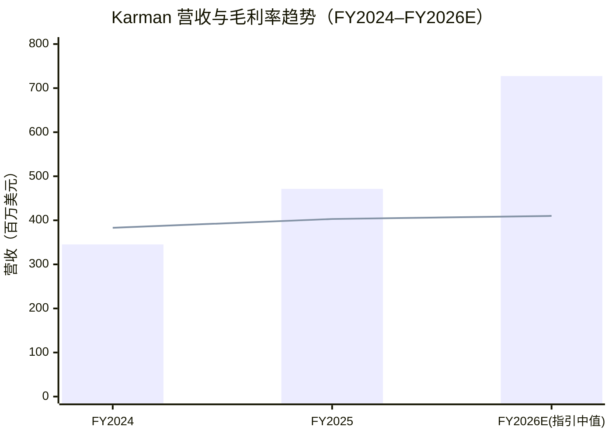
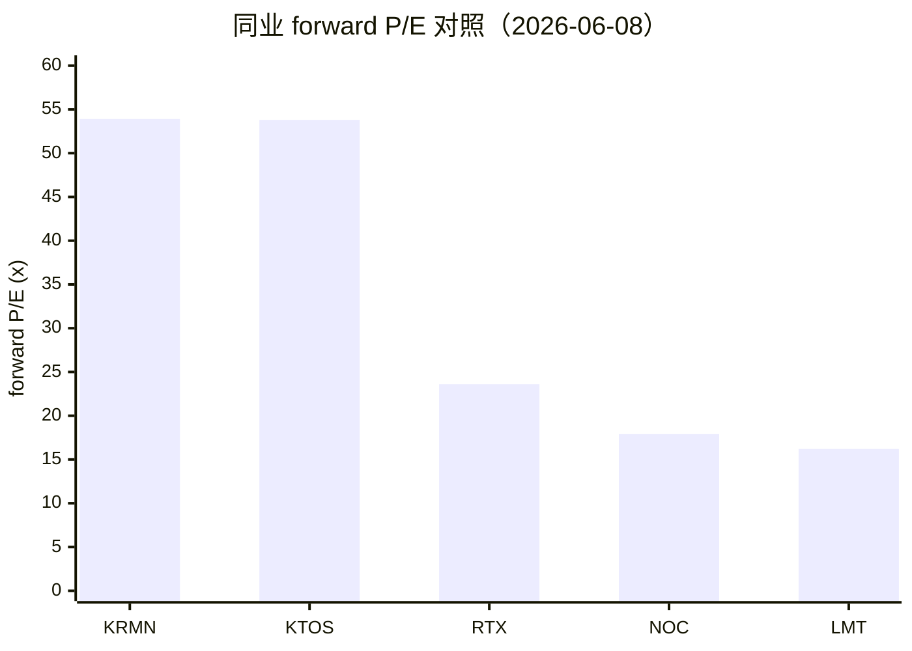
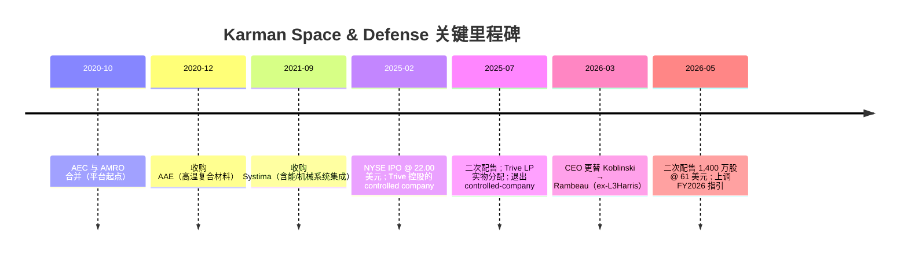
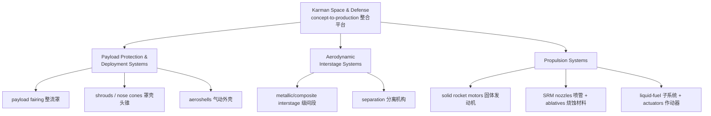
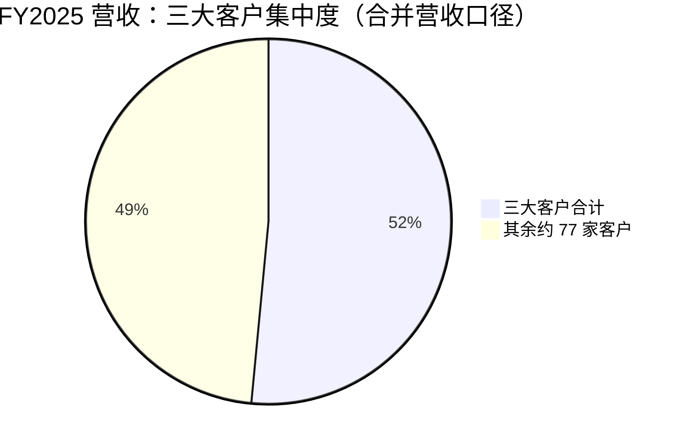
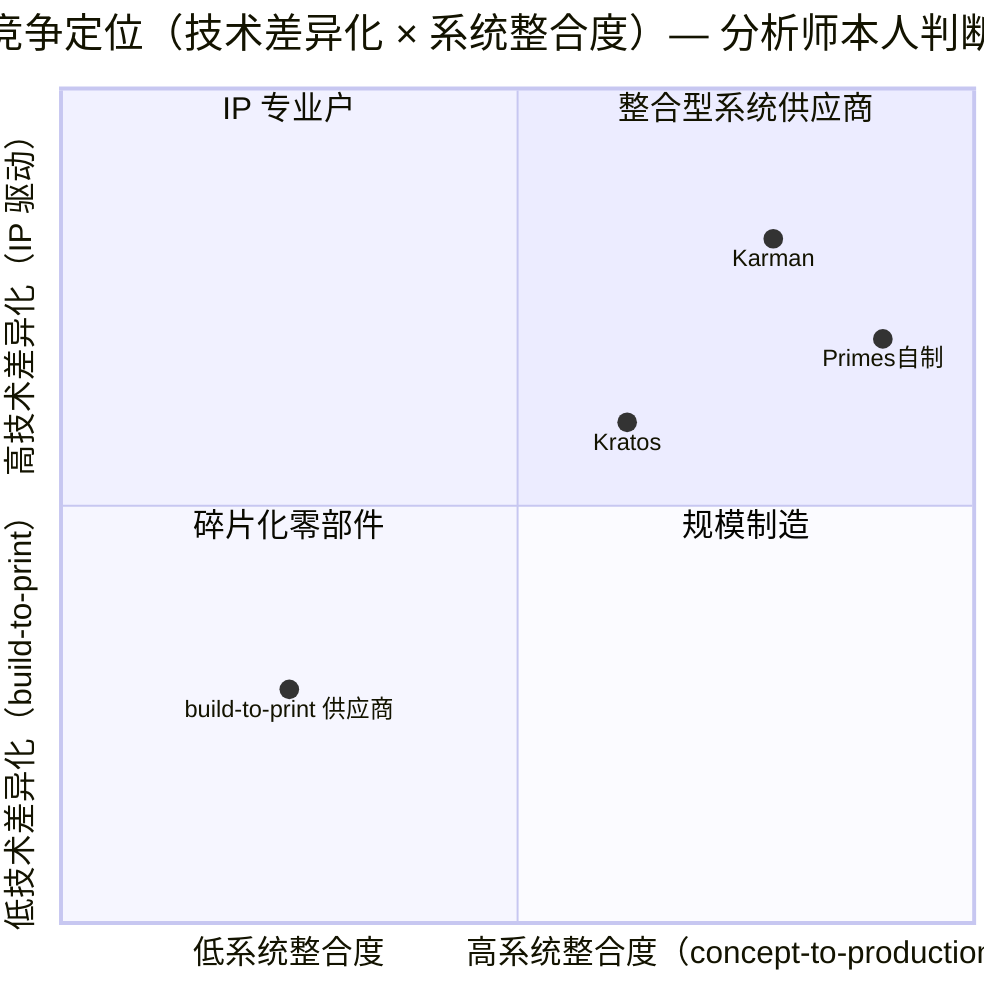
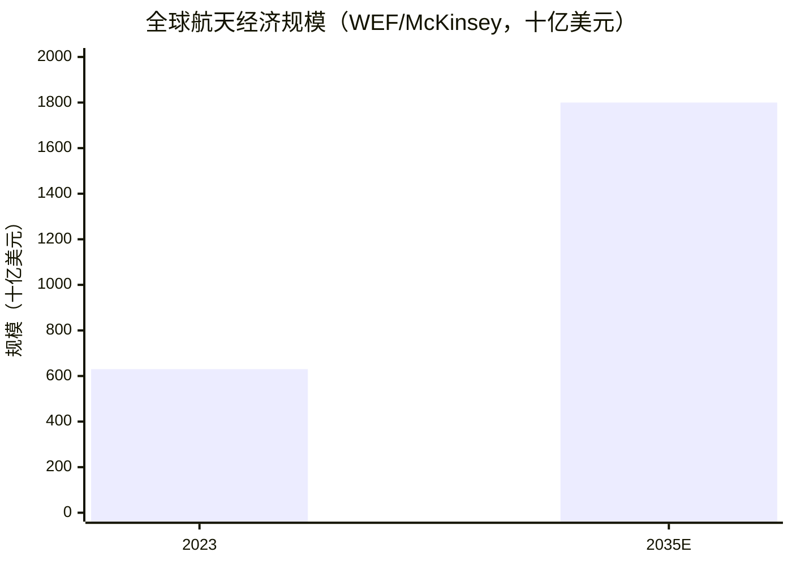

# Karman Holdings, Inc.（卡曼控股，NYSE: KRMN）公司研究

**报告日期（as of）：2026-06-09** ｜ 主体：Karman Holdings, Inc.（旗下品牌 Karman Space & Defense）｜ 交易所：NYSE ｜ CIK：0002040127 ｜ 财政年度截止：12-31

> **⚠️ 全年指引上调横幅（2026-05-12 披露）**：管理层在 2026 年第一季度（Q1 FY2026）财报中**上调 2026 全年指引**至**营收 720–735 百万美元（约 +54% YoY）、non-GAAP Adjusted EBITDA（调整后 EBITDA）208.5–219.5 百万美元（约 +47% YoY）**；并称来自主要客户的书面需求承诺（written demand commitments）已为全年提供约 **90% 的营收可见度（revenue visibility）**。Q1 backlog（订单储备）升至约 **10 亿美元（+61% YoY）**（[Karman 8-K Ex-99.1（Q1 FY2026 业绩新闻稿）, 2026-05-12](https://www.sec.gov/Archives/edgar/data/2040127/000119312526219495/krmn-ex99_1.htm)）。

---

## 投资摘要（Investment Summary）

> 以下评级、12 个月目标价、预测与情景均为**分析师本人观点（*分析师观点：*）**，不来自任何申报文件——10-K 中不含目标价，将目标价附在 10-K 引用上属错误归因。

*分析师观点：* **评级：Hold（中性）｜ 12 个月目标价：54 美元（基准情形）｜ 现价：49.64 美元（2026-06-08 收盘）｜ 隐含上行：约 +9%｜ 估值方法：FY2027E EV/EBITDA 30× 反推股权价值。**

- **市值：约 65.8 亿美元**（132.5 百万股 × 49.64 美元）；企业价值（EV）约 73.7 亿美元，净负债约 7.9 亿美元（[yfinance KRMN key-statistics, 2026-06-08](https://stockanalysis.com/stocks/krmn/statistics/)）。
- **52 周区间：43.49–118.38 美元**；近 3 个月 **−53%**（自约 118 美元峰值回落），主因二次配售（secondary offering）解禁抛压与高估值再定价（valuation reset）（[yfinance KRMN, 2026-06-08](https://stockanalysis.com/stocks/krmn/)）。
- **forward P/E（前瞻市盈率）约 54×、P/S 约 12.6×、EV/EBITDA 约 54×、TTM P/E 约 216×**——Karman 与多数新太空（new-space）同业不同，**已实现 GAAP 盈利**，因此应以 forward P/E + EV/EBITDA 双轨估值，而非单纯 P/S 故事（[yfinance KRMN key-statistics, 2026-06-08](https://stockanalysis.com/stocks/krmn/statistics/)）。
- **卖方共识目标价均值约 105.6 美元 / 中位数 107 美元（10 位分析师，评级 Buy）**——较现价隐含约 +112% 上行，与本报告基准情形（54 美元）存在巨大分歧，是本案的**核心争论点**（[yfinance KRMN, 2026-06-08](https://stockanalysis.com/stocks/krmn/forecast/)）。

**论点支柱（thesis pillars）：**
1. **任务关键（mission-critical）+ 独家/单一来源（sole/single-source）的嵌入式内容护城河**：在 130+ 已资助项目、约 80 家客户上占据大量 sole/single-source 地位，项目寿命常超 20 年，requalification（再认证）成本高，提供长尾、可见的经常性营收（[Karman FY2025 10-K, Item 1 Business](https://www.sec.gov/Archives/edgar/data/2040127/000204012726000014/krmn-20251231.htm)）。
2. **三大高景气终端市场（hypersonics、tactical missiles、space & launch）共振**：Golden Dome、高超声速威慑、战术导弹补库存与商业发射放量共同驱动 FY2025 营收 +36.6%、Q1 FY2026 +51%（[Karman FY2025 10-K, MD&A](https://www.sec.gov/Archives/edgar/data/2040127/000204012726000014/krmn-20251231.htm)）。
3. **已盈利的 PE 整合平台（roll-up）**：自成立完成 9 次收购，FY2025 净利润 17.4 百万美元、Adjusted EBITDA 145.3 百万美元（30.8% 利润率），具备"买入—整合—提升 EBITDA"的并购飞轮（[Karman FY2025 10-K, Item 1](https://www.sec.gov/Archives/edgar/data/2040127/000204012726000014/krmn-20251231.htm)）。
4. **估值与抛压是主要风险**：forward P/E ~54×、EV/EBITDA ~54× 已对增长充分定价；Trive 系（Trive Capital）持续配售（2026-05-28 又以 61 美元配售 1,400 万股）构成持续的供给压力（[Karman 8-K, 2026-06-01](https://www.sec.gov/Archives/edgar/data/2040127/000119312526251791/d117104d8k.htm)）。

---

## 目录

1. [公司概览](#一公司概览)
2. [估值与目标价（Valuation & Price Target）](#二估值与目标价valuation--price-target)
3. [公司历史](#三公司历史)
4. [管理团队](#四管理团队)
5. [产品与服务](#五产品与服务)
6. [客户与上市策略](#六客户与上市策略)
7. [行业概览](#七行业概览)
8. [竞争格局](#八竞争格局)
9. [市场机会（TAM）](#九市场机会tam)
10. [风险评估](#十风险评估)
11. [投资者视角评分卡（Section 10）](#十一投资者视角评分卡)
12. [参考资料](#参考资料)

---

## 一、公司概览

Karman Holdings, Inc.（旗下统一运营品牌为 **Karman Space & Defense**）是一家专注于为高优先级导弹、防务与航天项目，做"前端设计、测试、制造与销售 mission-critical（任务关键）系统"的美国航天/防务硬件供应商。公司在 10-K 中如此自我定义：*"We specialize in the upfront design, testing, manufacturing, and sale of mission-critical systems for existing and emerging, high-priority missile and defense, and space programs."*（[Karman FY2025 10-K, Item 1 Business](https://www.sec.gov/Archives/edgar/data/2040127/000204012726000014/krmn-20251231.htm)）。其集成化的 payload protection（有效载荷保护）、interstage（级间段）与 propulsion system（推进系统）方案，部署在支持美国 Department of War（"DoW"，国防部）与航天部门各类现役及新一代项目上。

**本案的"why-now"与论点（thesis-first）：** Karman 是一个少见的"既高增长又已盈利"的纯防务/航天硬件标的。FY2025 营收同比增长 36.6%、Q1 FY2026 进一步加速至 51%，且 GAAP 净利已转正——这在以新太空（new-space）为标签的同业里并不常见。驱动力来自三大结构性顺风：Golden Dome（金穹）本土导弹防御的需求拉动、高超声速（hypersonics）军备竞赛、以及商业发射放量。本报告给出 **Hold（中性）评级、12 个月基准目标价 54 美元**，理由是：基本面优质、需求可见度高（管理层称 FY2026 约 90% 营收已有书面承诺背书），但 forward P/E ~54×、EV/EBITDA ~54× 的估值已对这些利好充分定价，且 Trive 系持续二次配售构成实质性的股票供给压力——这正是为何本报告的基准目标价（54 美元）显著低于卖方共识均值（约 105.6 美元）（[Karman FY2025 10-K, Item 1](https://www.sec.gov/Archives/edgar/data/2040127/000204012726000014/krmn-20251231.htm)；[Karman 8-K Ex-99.1, 2026-05-12](https://www.sec.gov/Archives/edgar/data/2040127/000119312526219495/krmn-ex99_1.htm)）。

业务的核心特征是**高度多元化 + 高 sole/single-source 占比**。FY2025 公司支持的项目超过 130 个、客户约 80 家，且**没有任何单一项目在 FY2024 与 FY2025 两年平均口径上贡献超过 12% 的营收**——管理层将此视为抗风险的关键。营收在三大核心终端市场近乎均分：Hypersonics & Strategic Missile Defense（高超声速与战略导弹防御）占 31.7%、Tactical Missiles & Integrated Defense Systems（战术导弹与综合防御系统）占 31.5%、Space & Launch（航天与发射）占 36.9%（[Karman FY2025 10-K, Item 1 Business & Industry](https://www.sec.gov/Archives/edgar/data/2040127/000204012726000014/krmn-20251231.htm)）。

**FY2025 财务概览（GAAP，经审计）：** 营收 **471.5 百万美元（+36.6% YoY）**，gross profit（毛利）190.0 百万美元、gross margin（毛利率）**40.3%**（上年 38.3%）；net operating income（经营性利润）72.9 百万美元、operating margin（经营利润率）**15.5%**（上年 18.4%，下降主因上市后 G&A 费用大增）；interest expense, net（净利息支出）44.6 百万美元（反映杠杆化 PE 结构）；**net income（净利润）17.4 百万美元、net income margin 3.7%**。非 GAAP **Adjusted EBITDA 145.3 百万美元、margin 30.8%**（[Karman FY2025 10-K, MD&A — Results of Operations](https://www.sec.gov/Archives/edgar/data/2040127/000204012726000014/krmn-20251231.htm)）。公司约有 **1,400 名员工**（含约 300 名多学科工程师），运营约 **808,000 平方英尺**的设计、工程、测试与制造空间（[Karman FY2025 10-K, Item 1 — Employees & Properties](https://www.sec.gov/Archives/edgar/data/2040127/000204012726000014/krmn-20251231.htm)）。

**估值快照（valuation snapshot）：** 现价 49.64 美元、市值约 65.8 亿美元，forward P/E 约 54×、TTM P/E 约 216×（TTM EPS 仅 0.23 美元，因前期利息与上市费用拖累）、P/S 约 12.6×、P/B 约 16.2×、EV/EBITDA 约 54×。**TTM P/E 216× 不应作为主要锚**——它被低基数的 TTM GAAP EPS 扭曲；更相关的是 forward P/E ~54× 与 EV/EBITDA ~54×，二者都显著高于防务巨头（primes，约 16–24× P/E），与同为高增长防务科技的 Kratos（KTOS，forward P/E ~54×）持平（[yfinance KRMN/KTOS key-statistics, 2026-06-08](https://stockanalysis.com/stocks/krmn/statistics/)）。详见第二章。

*注：柱为营收（百万美元）；折线为毛利率×10（38.3%→40.3%→约41%，为示意刻度）。Source: [Karman FY2025 10-K, MD&A](https://www.sec.gov/Archives/edgar/data/2040127/000204012726000014/krmn-20251231.htm) 与 [Karman 8-K Ex-99.1, 2026-05-12 全年指引](https://www.sec.gov/Archives/edgar/data/2040127/000119312526219495/krmn-ex99_1.htm)（FY2026E 为指引中值 727.5 百万美元）。*

---

## 二、估值与目标价（Valuation & Price Target）

> 本章的所有前瞻预测、目标价与情景均为**分析师本人观点（*分析师观点：*）**，构建于 10-K/8-K 的分部数据、管理层指引与行业预测之上；申报文件本身不含任何目标价。

### 2.1 估值快照与同业对照

Karman 当前在防务/航天硬件板块属于"已盈利的高增长"稀有标的，其估值更接近高增长防务科技（KTOS）而非传统防务巨头（primes）：

| 公司 | 现价(美元) | 市值($bn) | forward P/E | P/S(TTM) | EV/EBITDA | 营收增速 |
|---|---|---|---|---|---|---|
| **Karman (KRMN)** | 49.64 | 6.6 | **53.9×** | **12.6×** | **54.1×** | +51%(Q1) |
| Kratos (KTOS) | 57.73 | 10.8 | 53.8× | 7.6× | 117.6× | +22.6% |
| Rocket Lab (RKLB) | 113.65 | 71.0 | 亏损 | 104.5× | 亏损 | +63.5% |
| Lockheed Martin (LMT) | 520.07 | 119.9 | 16.2× | 1.6× | 17.4× | +0.3% |
| RTX Corp (RTX) | 178.66 | 240.6 | 23.6× | 2.7× | 18.0× | +8.7% |
| Northrop Grumman (NOC) | 540.81 | 76.8 | 17.9× | 1.8× | 12.6× | +4.4% |

*Source: [yfinance（各 ticker key-statistics）, 2026-06-08](https://stockanalysis.com/stocks/krmn/statistics/)。*

*Source: [yfinance, 2026-06-08](https://stockanalysis.com/stocks/krmn/statistics/)。*

**为何已盈利的防务硬件名却交易在成长股倍数？** Karman 的 forward P/E ~54× 与 EV/EBITDA ~54× 是 primes（16–24× P/E）的 2–3 倍。本报告判断主要原因有三：（a）**真实的高增长**——FY2026 营收指引增速约 54%，远高于 primes 的个位数；（b）**Golden Dome / 高超声速主题溢价**——市场把 Karman 当作纯正的导弹防御与高超声速产业链代理（pure-play proxy），赋予主题溢价；（c）**杠杆结构压低近端 GAAP EPS**——高利息支出使 TTM EPS 仅 0.23 美元、TTM P/E 失真至 216×，市场转而以 EV/EBITDA 与远期 EPS 定价。后两点也意味着估值对"叙事"敏感，一旦增长或预算节奏不及预期，倍数压缩（multiple compression）风险显著，见第十章（[Karman 8-K Ex-99.1, 2026-05-12](https://www.sec.gov/Archives/edgar/data/2040127/000119312526219495/krmn-ex99_1.htm)；[yfinance, 2026-06-08](https://stockanalysis.com/stocks/krmn/statistics/)）。

### 2.2 前瞻财务预测（FY2026E–FY2028E）

*分析师观点：* 以 FY2025 实绩与公司上调后的 FY2026 指引为锚，假设增速从 FY2026 的约 54% 逐步回落至 FY2027 约 22%、FY2028 约 18%（项目成熟进入量产 + 并购贡献递减），Adjusted EBITDA margin 维持在约 29–30%，net margin 随去杠杆（deleveraging）缓慢回升：

| 指标（百万美元，除 EPS） | FY2025A | FY2026E | FY2027E | FY2028E |
|---|---|---|---|---|
| 营收 | 471.5 | 727.5 | 888 | 1,047 |
| YoY 增速 | +36.6% | +54% | +22% | +18% |
| Adjusted EBITDA | 145.3 | 214.0 | 266 | 314 |
| Adj. EBITDA margin | 30.8% | 29.4% | 30.0% | 30.0% |
| GAAP 净利润 | 17.4 | ~45 | ~65 | ~85 |
| net margin | 3.7% | ~6% | ~7% | ~8% |
| 摊薄 EPS（美元） | 0.13 | ~0.34 | ~0.49 | ~0.63 |

*FY2026E 营收与 Adj. EBITDA 取公司指引中值（[Karman 8-K Ex-99.1, 2026-05-12](https://www.sec.gov/Archives/edgar/data/2040127/000119312526219495/krmn-ex99_1.htm)）；FY2027E/FY2028E 为分析师本人外推。净利润路径假设利息负担随去杠杆减轻、税率正常化；每个预测单元均为 *分析师观点：*，绝非 "(本模型)"。FY2025A 摊薄 EPS 以净利 17.4 百万 ÷ 约 132.5 百万股估算。*

### 2.3 目标价推导（Price Target Derivation）

*分析师观点：* 鉴于 Karman 是杠杆化整合平台、近端 GAAP EPS 被利息扭曲，**EV/EBITDA 比 P/E 更适合作为主估值法**。基准情形以 **FY2027E Adjusted EBITDA 266 百万美元 × 30× EV/EBITDA** 反推：

- EV = 266 × 30 = **7,992 百万美元**；减净负债约 793 百万美元 → 股权价值约 7,199 百万美元；÷ 132.5 百万股 → **基准目标价约 54 美元（隐含约 +9% 上行）**。
- **30× 的倍数依据**：对标 KTOS 当前 EV/EBITDA（约 54×，但其增速更低）与 primes（13–18×），30× 居中——给予 Karman 高于 primes 的成长溢价，但低于 KTOS 当前过热的水平，反映对预算节奏与抛压的折让。

**情景目标价（每个均为 *分析师观点：*）：**

| 情景 | 关键摆动假设 | 估值法 | 目标价 | 相对现价 |
|---|---|---|---|---|
| **Bull（牛市）** | FY2027 营收 920M、margin 31%、Golden Dome 加速 → 32–35× EV/EBITDA | EV/EBITDA | ~63–69 美元 | +27%~+39% |
| **Base（基准）** | FY2027 营收 888M、margin 30%、30× | EV/EBITDA | **~54 美元** | +9% |
| **Bear（熊市）** | 增速放缓至 820M、margin 28%、倍数压缩至 18–20× | EV/EBITDA | ~25–29 美元 | −42%~−48% |

### 2.4 与卖方共识的对比（Consensus Benchmark）

*分析师观点：* 卖方共识目标价**均值约 105.6 美元 / 中位数 107 美元、最高 135 / 最低 37 美元（10 位分析师，综合评级 Buy）**（[yfinance KRMN analysis, 2026-06-08](https://stockanalysis.com/stocks/krmn/forecast/)）。本报告基准目标价（54 美元）**显著低于共识约 49%**。差异来源在于：共识 105 美元的 PT 隐含的是 FY2027E EV/EBITDA 接近 45–50×（或对 2–3 年后大幅扩张的净利率给予 40×+ P/E），即把 Karman 长期享有 KTOS 级别的过热倍数视为常态；本报告认为这一倍数假设过于乐观，未充分计入二次配售抛压、预算政治化（Golden Dome 成本争议）与增速终将正常化的风险。**这是本案最大的争论点：到底是共识把高增长+稀缺性合理化，还是市场为主题叙事支付了过高溢价。** 注：本地券商研究库 `db/zsxq.db` 经 KRMN / Karman / 卡尔曼 三个别名检索均**无任何覆盖**，故本章共识数据来自公开行情源而非本地库。

### 2.5 关键摆动变量（swing variables）

读者应重点压力测试两个变量：（1）**FY2027 起的营收增速能否维持 20%+**——取决于 Golden Dome 相关项目从开发转入量产（LRIP→full-rate）的节奏；（2）**去杠杆速度与净利率回升幅度**——高利息支出（FY2025 净利息 44.6 百万美元）是 GAAP EPS 与近端 P/E 的最大压制因素，若现金流去杠杆快于预期，net margin 上行将直接抬升 P/E 法的目标价（[Karman FY2025 10-K, MD&A — Interest Expense](https://www.sec.gov/Archives/edgar/data/2040127/000204012726000014/krmn-20251231.htm)）。

---

## 三、公司历史

Karman 是一个**由 Trive Capital 主导发起、通过"buy, build, and integrate（买入—建设—整合）"并购策略搭建的整合平台（roll-up）**，并非由单一创始人创立。10-K 明确写道：公司起步于 **2020 年 10 月 Aerospace Engineering, LLC（"AEC"）与 AMRO Fabricating Corporation（"AMRO"）的合并**，"allowed us to become one of the largest independently owned suppliers focused on manufacturing complex systems for the space and missile markets"（[Karman FY2025 10-K, Item 1 — Our Company](https://www.sec.gov/Archives/edgar/data/2040127/000204012726000014/krmn-20251231.htm)）。

随后公司迅速通过收购扩张能力边界：**2020 年 12 月收购 American Automated Engineering, Inc.（"AAE"）**——高温复合材料（high-temperature composites）制造商；**2021 年 9 月收购 Systima Technologies（"Systima"）**——专长于将含能（energetic）与机械系统集成进 mission-critical 航天与高超声速系统结构设计。10-K 称这四笔核心收购"have been fully integrated into our business to create a synergistic platform with complementary capabilities and robust intellectual property"（[Karman FY2025 10-K, Item 1](https://www.sec.gov/Archives/edgar/data/2040127/000204012726000014/krmn-20251231.htm)）。

**IPO 是公司历史的分水岭。** Karman 于 **2025 年 2 月以每股 22.00 美元在 NYSE 完成 IPO**（招股书 424B4 显示发行价 22.00 美元、承销商预计于 2025-02-14 交割），上市后 Trive Capital 仍持有多数投票权，使公司成为 NYSE 规则下的"controlled company（受控公司）"并援引相应公司治理豁免（[Karman 424B4 招股书, 2025-02-13](https://www.sec.gov/Archives/edgar/data/2040127/000119312525026168/d882184d424b4.htm)）。**IPO 之后公司又完成了三笔补强收购**，10-K 称"Since IPO, we have completed three additional, complementary acquisitions"；自成立以来**累计完成 9 次收购**（[Karman FY2025 10-K, Item 1 — Growth Strategy](https://www.sec.gov/Archives/edgar/data/2040127/000204012726000014/krmn-20251231.htm)）。Q1 FY2026 10-Q 披露了其中数笔（如 MTI、ISP、Five Axis、Seemann Acquisition 等，均以增量 term loan 借款资助），印证了"以杠杆驱动并购"的模式（[Karman Q1 FY2026 10-Q, Note — Acquisitions](https://www.sec.gov/Archives/edgar/data/2040127/000119312526222116/krmn-20260331.htm)）。

IPO 后的**所有权与治理演变**是另一条主线。DEF 14A 披露：在 **2025 年 7 月的二次配售（Secondary Offering）之前，Trive Capital（通过 TCFIII Spaceco SPV LP）是最大股东、持有约 56.0% 的流通普通股**；伴随二次配售，Trive 对其有限合伙人（LP）做了 pro-rata 的实物分配（distribution-in-kind），并对部分高级合伙人施加了新的锁定（lock-up，限制所分配股份 25% 的出售）。配售完成后，原 Trive 提名的两名董事（Stinnett、Hamilton）转为独立董事——这标志公司实质上正逐步退出"controlled company"状态（[Karman DEF 14A, 2026-04-08 — Related Person Transactions / Controlled Company](https://www.sec.gov/Archives/edgar/data/2040127/000114036126013839/edge20063633x771_def14a.htm)）。**2026 年 5 月 28 日，Selling Stockholders 又以每股 61.00 美元二次配售 1,400 万股**（Citigroup 与 Evercore 为承销商），延续了上市以来持续的股票供给/解禁主题（[Karman 8-K, 2026-06-01 — Item 1.01](https://www.sec.gov/Archives/edgar/data/2040127/000119312526251791/d117104d8k.htm)）。

*Source: [Karman FY2025 10-K, Item 1](https://www.sec.gov/Archives/edgar/data/2040127/000204012726000014/krmn-20251231.htm)；[Karman 424B4, 2025-02-13](https://www.sec.gov/Archives/edgar/data/2040127/000119312525026168/d882184d424b4.htm)；[Karman DEF 14A, 2026-04-08](https://www.sec.gov/Archives/edgar/data/2040127/000114036126013839/edge20063633x771_def14a.htm)；[Karman 8-K, 2026-06-01](https://www.sec.gov/Archives/edgar/data/2040127/000119312526251791/d117104d8k.htm)。*

---

## 四、管理团队

按本报告体例，本章只覆盖**创始/发起结构**与**现任 CEO**。Karman 没有单一自然人创始人——它是 **Trive Capital（PE 发起方）搭建的整合平台**，其"创始"等同于 2020 年 AEC/AMRO 合并以及随后的并购整合（见第三章）。因此本章重点写现任 CEO，并交代上市时期 CEO 的更替。

**现任 CEO：Jon Rambeau（自 2026-03-23 起任）。** 公司于 **2026 年 3 月 12 日宣布领导层更替**：原 CEO、董事会成员 **Tony Koblinski 退休**，由 **Jonathan "Jon" Rambeau 自 2026 年 3 月 23 日起出任 CEO**（[Karman FY2025 10-K, Item 1 — Leadership](https://www.sec.gov/Archives/edgar/data/2040127/000204012726000014/krmn-20251231.htm)）。据 DEF 14A，Rambeau 拥有**逾 30 年防务行业经验**，加盟 Karman 前任 **L3Harris Technologies 的 Communications & Spectrum Dominance（通信与频谱主导）业务段总裁（President）**（2022 年加入 L3Harris，至 2026 年 1 月），主管电子战、先进通信、威胁感知与目标识别、综合视觉系统等组合。在此之前，他在 **Lockheed Martin（洛克希德·马丁）任职 26 年**，历任 VP of Undersea Warfare Systems & Sensors（主管导弹防御、雷达、造船、定向能项目）、VP of C6ISR、VP and General Manager of Training and Logistics Solutions、以及 VP of F-35 International Programs（成功向英国交付 F-35 并拓展项目市场）。学历方面，Rambeau 持有 **Drexel University 机械工程学士、Wharton/宾大技术管理硕士**（[Karman DEF 14A, 2026-04-08 — Director/Officer Bios](https://www.sec.gov/Archives/edgar/data/2040127/000114036126013839/edge20063633x771_def14a.htm)）。Rambeau 深厚的"primes 内部经营 + 导弹防御/F-35 项目"履历，与 Karman"服务 prime contractor、争夺下一代项目内容"的战略高度契合。

**上市期 CEO：Tony Koblinski（2025 年全年 CEO，2026 年 3 月退休）。** 据 DEF 14A，Koblinski 自 **2025 年 2 月起任 CEO 兼董事**，拥有**逾 25 年搭建集成化制造业务的经验**；加盟 Karman 前曾任 **Madison-Kipp Corporation（一家制造企业）总裁兼 CEO（约 2011 年 9 月起）**，更早曾任 Home Products 的 VP of Operations 等职。学历为 **University of Michigan MBA（1985）、Central Michigan University 学士（1982）**。Koblinski 仍保留董事会 Class II 董事身份直至任期届满（[Karman DEF 14A, 2026-04-08 — Mr. Koblinski Bio](https://www.sec.gov/Archives/edgar/data/2040127/000114036126013839/edge20063633x771_def14a.htm)）。

**PE 发起方与受控公司结构（核心治理特征）。** Karman 的控制权根植于 **Trive Capital**。10-K 与 DEF 14A 显示，董事会中多名成员来自 Trive 系（如 David Stinnett 为 Trive 合伙人、John Hamilton 曾任 Trive VP），上市初期 Trive 通过 TCFIII Spaceco SPV LP 持有约 56.0% 投票权，使公司成为"controlled company"并援引 NYSE 治理豁免（可不设多数独立董事、不设全独立的薪酬/提名委员会）。这一结构在 2025 年 7 月二次配售 + Trive LP 实物分配后开始解除（[Karman 424B4, 2025-02-13 — Controlled Company](https://www.sec.gov/Archives/edgar/data/2040127/000119312525026168/d882184d424b4.htm)；[Karman DEF 14A, 2026-04-08](https://www.sec.gov/Archives/edgar/data/2040127/000114036126013839/edge20063633x771_def14a.htm)）。其余高管（COO Jonathan Beaudoin、CGO Stephanie Sawhill、CFO Mike Willis 等）按本报告体例不展开。

---

## 五、产品与服务

Karman 将其高度工程化的解决方案组织为**三大产品族（three key families）**——这是理解全公司的分析基石。10-K 的原文定义如下（[Karman FY2025 10-K, Item 1 Business](https://www.sec.gov/Archives/edgar/data/2040127/000204012726000014/krmn-20251231.htm)）：

> "We organize our highly engineered solutions in three key families: Payload Protection and Deployment Systems, Aerodynamic Interstage Systems, and Propulsion Systems:
> • **Payload Protection and Deployment Systems**: full design and manufacturing of the top section of a booster, launch vehicle, payload, or missile system
> • **Aerodynamic Interstage Systems**: supporting metallic and composite subsystems designed to enhance aerodynamics and enable different modes of interstage separation
> • **Propulsion Systems**: integrated solid rocket motors and supporting subsystems, critical subsystems for liquid fueled rocket motors, launch systems, and ablative composites"

### 产品族一：Payload Protection and Deployment Systems（有效载荷保护与部署系统）

**这条产品线物理上做什么：** 它负责一枚助推器、运载火箭、有效载荷或导弹系统**最顶端那一段**的完整设计与制造——即 payload fairing（有效载荷整流罩）、shrouds（罩壳/防护罩）、nose cones（头锥）、aeroshells（气动外壳）等。在火箭/导弹飞行的高动压、高温、剧烈振动环境中，这些结构既要保护内部昂贵的有效载荷（卫星、弹头、传感器），又要在指定时刻可靠地分离、释放载荷。10-K 举例公司的 Design IP 包括"full system design authority and components selection for integrated systems, such as **shrouds** or solid rocket motors"，且其 Process IP 中包含制造"**spun form shrouds**（旋压成型罩壳）"的专有方法（[Karman FY2025 10-K, Item 1 — Intellectual Property](https://www.sec.gov/Archives/edgar/data/2040127/000204012726000014/krmn-20251231.htm)）。

**与同族其他产品的差异：** 与 Propulsion（提供推力）和 Interstage（连接级段）不同，本族解决的是"保护 + 在正确时刻打开/释放"的问题。**中文释义 / Plain-language gloss：** 可类比为火箭的"防护头盔 + 弹射门"——既要扛住外部极端环境，又要在毫秒级精度下"打开"释放内容物。**战略意义：** 随着商业发射 cadence（发射频次）上升与新发射服务商涌现，integrated payload protection 的需求增长，这是 Space & Launch 终端市场（FY2025 占营收 36.9%）的核心内容来源（[Karman FY2025 10-K, Item 1 — Space & Launch](https://www.sec.gov/Archives/edgar/data/2040127/000204012726000014/krmn-20251231.htm)）。

### 产品族二：Aerodynamic Interstage Systems（气动级间段系统）

**物理作用：** 提供"增强气动性能、并实现不同 interstage separation（级间分离）模式"的金属与复合材料子系统。多级火箭/导弹在飞行中需要把已耗尽的下面级（lower stage）抛离、点燃上面级——interstage（级间段）就是连接相邻两级的结构段，必须在承受巨大轴向与气动载荷的同时，在精确时刻"干净地"分离。10-K 的 Aerodynamic and Interstage Systems 涉及"metallic and composite subsystems"，并强调 Karman 在 separation（分离）机构上的能力（[Karman FY2025 10-K, Item 1 Business](https://www.sec.gov/Archives/edgar/data/2040127/000204012726000014/krmn-20251231.htm)）。

**与同族其他产品的差异：** Payload Protection 处理"最顶端"，Propulsion 提供"动力"，而 Interstage 处理"级与级之间的结构连接与分离时序"。**中文释义 / Plain-language gloss：** 类比为多节火箭的"可控脱钩车厢连接器"——平时刚性承载，到点干净脱开。**战略意义：** interstage separation 同时服务高超声速（多级助推到高马赫数）与战略导弹（ICBM 多级）项目，是 Hypersonics & Strategic Missile Defense 终端市场（FY2025 占 31.7%）的关键嵌入内容（[Karman FY2025 10-K, Item 1 — Hypersonics](https://www.sec.gov/Archives/edgar/data/2040127/000204012726000014/krmn-20251231.htm)）。

### 产品族三：Propulsion Systems（推进系统）

**物理作用：** 提供"集成的 solid rocket motors（固体火箭发动机）及支持子系统、液体燃料火箭发动机的关键子系统、发射系统与 ablative composites（烧蚀复合材料）"。固体火箭发动机是战术导弹、助推级与许多防御拦截弹的动力核心；ablative composites 用于发动机喷管（nozzle）等需要耐受极端高温烧蚀的部位。10-K 的 Process IP 明确列出 Karman 制造"**solid rocket motor nozzles**（固体火箭发动机喷管）"与"**solid propellant driven actuators**（固体推进剂驱动作动器）"的专有方法，并将 energetics（含能）、safe and arm（保险与解保）、advanced materials 列为核心专有技术（[Karman FY2025 10-K, Item 1 — IP / Proprietary IP](https://www.sec.gov/Archives/edgar/data/2040127/000204012726000014/krmn-20251231.htm)）。

**与同族其他产品的差异：** 这是唯一直接"产生推力/做功"的产品族，技术壁垒集中在含能材料、喷管热防护与精密作动。**中文释义 / Plain-language gloss：** 若说前两族是火箭的"骨架与外壳"，Propulsion 就是它的"心脏与肌肉"。**战略意义：** Q1 FY2026 该方向受益于"先进无人机与巡飞弹（loitering munitions）技术扩散、以及 GMLRS 生产率提升"，是 Tactical Missiles 终端市场（FY2025 占 31.5%）的增长引擎（[Karman FY2025 10-K, MD&A — Tactical Missiles](https://www.sec.gov/Archives/edgar/data/2040127/000204012726000014/krmn-20251231.htm)）。

### 三族如何协同——"concept-to-production（概念到量产）"整合价值链

Karman 的差异化并非单卖某一族产品，而是作为**少数能提供 design-to-production 整合系统方案的供应商**，把"顶端保护—级间分离—推进"三段在一处完成设计、测试、认证与量产。10-K 称这"reduces the customer's need to commit resources to in-house system design or supply chain management"，使 prime contractor 客户"benefit from increased speed to market and reduced costs"（[Karman FY2025 10-K, Item 1 — Competitive Strengths](https://www.sec.gov/Archives/edgar/data/2040127/000204012726000014/krmn-20251231.htm)）。其 IP 分为三类协同——**Design IP**（系统设计权与选型）、**Proprietary IP**（energetics、safe-and-arm、advanced materials 的专利组件）、**Process IP**（spun form shrouds、SRM nozzles 等专有制造方法）——三类叠加构成"high barriers to entry（高进入壁垒）"（[Karman FY2025 10-K, Item 1 — IP](https://www.sec.gov/Archives/edgar/data/2040127/000204012726000014/krmn-20251231.htm)）。截至 2025-12-31，公司拥有 **23 项已授权专利**（到期日 2027-07 至 2044-06）及 **7 项在审/已公开专利申请**（[Karman FY2025 10-K, Item 1 — Intellectual Property](https://www.sec.gov/Archives/edgar/data/2040127/000204012726000014/krmn-20251231.htm)）。

*Source: [Karman FY2025 10-K, Item 1 Business & IP](https://www.sec.gov/Archives/edgar/data/2040127/000204012726000014/krmn-20251231.htm)（产品族结构与示例组件均取自 10-K 原文，SKU 级细分为按 10-K 描述构建的分析师整理）。*

---

## 六、客户与上市策略

**客户结构：分散的项目组合 + 集中的大客户。** Karman 的客户主要是美国国防工业的 **prime contractor（主承包商/防务巨头）与政府机构**。FY2025 公司服务约 **80 家客户、超过 130 个已资助项目**，覆盖美国陆军、海军、空军、Missile Defense Agency（导弹防御局）以及多个 NASA 资助/商业航天项目（[Karman FY2025 10-K, Item 1 — Strategically Aligned…Golden Dome](https://www.sec.gov/Archives/edgar/data/2040127/000204012726000014/krmn-20251231.htm)）。

**客户集中度（标注分母，consolidated 口径）：** 10-K 风险因素披露，**FY2025 三大客户合计占合并营收（consolidated revenue）约 51.5%**（[Karman FY2025 10-K, Risk Factors — Customer/Supplier Reliance](https://www.sec.gov/Archives/edgar/data/2040127/000204012726000014/krmn-20251231.htm)）；财务附注进一步显示 **三家客户约占合并营收 51.0%**，且 **两家客户约占应收账款（accounts receivable）40.7%**，一家供应商约占应收 19.6%、约占应付账款（accounts payable）23.8%（[Karman FY2025 10-K, Notes — Concentration of Credit Risk](https://www.sec.gov/Archives/edgar/data/2040127/000204012726000014/krmn-20251231.htm)）。**注意：10-K 未逐一公开点名三大客户各自的百分比**——披露止于"三大客户合计约 51.5% 合并营收"，本报告不臆造任何单一客户的具体占比。Q1 FY2026 的集中度类似：两家客户合计约（披露为两段）占比、上年同期三家客户分别占 23.4%、15.5%、13.7% 总营收（[Karman Q1 FY2026 10-Q, Note — Concentrations](https://www.sec.gov/Archives/edgar/data/2040127/000119312526222116/krmn-20260331.htm)）。**因三大客户 > 50% 合并营收，本报告将客户集中度同时列入第十章作为重大风险。**

**项目层面的分散对冲了客户集中：** 尽管前三大客户占比过半，但**无任何单一项目（FY2024–FY2025 两年平均）超过 12% 营收**，且项目寿命常超 20 年、含大量 sole/single-source 地位——这意味着即便客户集中，单点项目中断的冲击被 130+ 项目稀释（[Karman FY2025 10-K, Item 1 — Our Company / Diversified Business Model](https://www.sec.gov/Archives/edgar/data/2040127/000204012726000014/krmn-20251231.htm)）。

*Source: [Karman FY2025 10-K, Risk Factors — "Our three largest customers accounted for approximately 51.5% of revenue"](https://www.sec.gov/Archives/edgar/data/2040127/000204012726000014/krmn-20251231.htm)。注：单一分母（合并营收）；10-K 未披露三大客户各自占比，故不细分。*

**终端市场分布（另一维度的多元化）：** FY2025 营收在三大终端市场近乎均分——Hypersonics & Strategic Missile Defense 31.7%、Tactical Missiles & Integrated Defense Systems 31.5%、Space & Launch 36.9%（[Karman FY2025 10-K, Item 1 — End Markets](https://www.sec.gov/Archives/edgar/data/2040127/000204012726000014/krmn-20251231.htm)）。

**上市策略与所有权结构（IPO & ownership strategy）：** Karman 走的是典型的 **PE-sponsored IPO** 路径——Trive Capital 把多年并购整合的平台于 2025 年 2 月以 22.00 美元/股推上 NYSE，IPO 后保留控制权（controlled company），再通过 2025 年 7 月与 2026 年 5 月两轮二次配售逐步退出。这一节奏对二级市场投资者既是机会也是风险：一方面 PE 退出释放流动性、提升独立治理；另一方面**持续的大宗配售构成股票供给压力**，是近 3 个月股价 −53% 的重要技术面因素（[Karman 424B4, 2025-02-13](https://www.sec.gov/Archives/edgar/data/2040127/000119312525026168/d882184d424b4.htm)；[Karman 8-K, 2026-06-01](https://www.sec.gov/Archives/edgar/data/2040127/000119312526251791/d117104d8k.htm)）。

---

## 七、行业概览

Karman 主要在**三大核心终端市场**竞争，10-K 对每个市场的定义与驱动力如下（[Karman FY2025 10-K, Item 1 — Our Industry / End Markets](https://www.sec.gov/Archives/edgar/data/2040127/000204012726000014/krmn-20251231.htm)）：

**1. Hypersonics & Strategic Missile Defense（高超声速与战略导弹防御，FY2025 占 31.7%）。** 10-K 定义其为"large diameter hypersonic and intercontinental missiles and interceptors"。驱动力是 near-peer（近同等实力）国家威胁——10-K 明确点名"namely China and Russia"——持续扩张反导能力与推进高超声速平台，促使美国对本土高超声速项目的资金与支持不断增长。地缘政治不确定性与全球防务开支聚焦进一步驱动该市场（[Karman FY2025 10-K, Item 1 — Hypersonics & Strategic Missile Defense](https://www.sec.gov/Archives/edgar/data/2040127/000204012726000014/krmn-20251231.htm)）。

**2. Tactical Missiles & Integrated Defense Systems（战术导弹与综合防御系统，FY2025 占 31.5%）。** 定义为"smaller diameter rocket, missile technologies, and launcher systems"，应用涵盖反装甲、空空、反舰、空地、地空、舰空等。10-K 指出当前冲突凸显了这些平台的战略重要性，国防开支结构转向、补库存（replenishment）与盟国扩大战略储备需求驱动未来强劲需求（[Karman FY2025 10-K, Item 1 — Tactical Missiles](https://www.sec.gov/Archives/edgar/data/2040127/000204012726000014/krmn-20251231.htm)）。Q1 FY2026 该方向受"先进无人机与巡飞弹技术扩散、GMLRS 生产率提升"驱动（[Karman FY2025 10-K, MD&A](https://www.sec.gov/Archives/edgar/data/2040127/000204012726000014/krmn-20251231.htm)）。

**3. Space & Launch（航天与发射，FY2025 占 36.9%）。** 涵盖把三大产品族的集成方案应用于"a wide variety of traditional and emerging launch providers"。驱动力是新发射服务商涌现、商业发射 cadence 上升、政府对航天的更深投入与新太空应用的引入。10-K 提到 FY2025 该方向同时受 SLS（Space Launch System）营收下降与液体燃料火箭发动机内容增长的一增一减影响（[Karman FY2025 10-K, Item 1 & MD&A — Space & Launch / SLS](https://www.sec.gov/Archives/edgar/data/2040127/000204012726000014/krmn-20251231.htm)）。

**产业结构（industry structure）：** 10-K 将竞争格局刻画为"a large, fragmented supplier base of piece part and subsystems providers, with **few integrated system providers**"。Karman 自我定位为少数能提供 vertically integrated、design-to-production 整合系统的供应商，因此"face few direct competitors"——这是一个**碎片化的零部件供应基础 + 极少数整合者**的二元结构，为 Karman 的并购整合（把碎片化零部件供应商买入并整合为系统方案）提供了天然的产业逻辑（[Karman FY2025 10-K, Item 1 — Competition](https://www.sec.gov/Archives/edgar/data/2040127/000204012726000014/krmn-20251231.htm)）。

**宏观顺风（macro tailwinds，10-K 自述）：** （a）全球地缘政治不确定性加剧、各国优先安全与军事准备；（b）近同等实力威胁持续涌现、下一代武器（如高超声速）技术推进；（c）航天发射能力与技术加速创新（[Karman FY2025 10-K, Item 1 — Attractive End-markets](https://www.sec.gov/Archives/edgar/data/2040127/000204012726000014/krmn-20251231.htm)）。

---

## 八、竞争格局

**10-K 对竞争的原文刻画（务必逐字理解）：** Karman 在 Competition 一节称其面对的是"a large, fragmented supplier base of piece part and subsystems providers, with few integrated system providers"，并自评"we occupy a differentiated position within our customers' supply chain and face few direct competitors"；少数直接竞争者"offer vertically integrated, design-to-production capabilities"；此外"other competitors…include our prime contractor customers' ability and decision to **insource** as part of their 'make vs. buy' determination"（[Karman FY2025 10-K, Item 1 — Competition](https://www.sec.gov/Archives/edgar/data/2040127/000204012726000014/krmn-20251231.htm)）。**10-K 未点名任何具体竞争对手公司**——这一点必须如实保留，本报告不臆造 10-K 中不存在的竞争者名单。

**竞争维度（依 10-K 自述）：** 在 sub-integrated system 层面，Karman 与"piece part and subsystem providers"竞争，后者特征是"less differentiated intellectual property with a core focus on manufacturing and 'build-to-print' capabilities"；Karman 称自己主要靠"technical differentiation and our ability to deliver highly complex solutions, suited for extreme operating environments"取胜（[Karman FY2025 10-K, Item 1 — Competition](https://www.sec.gov/Archives/edgar/data/2040127/000204012726000014/krmn-20251231.htm)）。

***分析师观点：*** 从二级市场视角，可把 Karman 的竞争对手分为三类（**以下分类与公司归属为分析师本人判断，非 10-K 语言，10-K 未点名任何竞争者**）：（1）**主承包商自制（in-house / insourcing）**——Lockheed Martin、RTX、Northrop Grumman、Boeing 等 primes 的"make vs. buy"决定是最根本的竞争约束；（2）**其他整合型/含能与推进专业户**——如 Kratos（KTOS，无人系统与推进）、以及各类固体火箭发动机与含能材料专业供应商；（3）**碎片化的 build-to-print 零部件供应商**——技术差异化较低、Karman 的并购对象。Karman 相对这三类的护城河来自：**早期介入设计 → 进入未来生产规范（production specification）→ requalification 成本极高 → 一旦合格极少被替换**，10-K 称"once a supplier has been qualified…it is unlikely that a customer would pursue re-qualification, given its typically lengthy and costly nature"（[Karman FY2025 10-K, Item 1 — IP / Barriers to Entry](https://www.sec.gov/Archives/edgar/data/2040127/000204012726000014/krmn-20251231.htm)）。

*注：本图为分析师本人对竞争定位的判断，非 10-K 披露；坐标为示意。Source: 基于 [Karman FY2025 10-K, Item 1 — Competition](https://www.sec.gov/Archives/edgar/data/2040127/000204012726000014/krmn-20251231.htm) 的定性描述构建。*

---

## 九、市场机会（TAM）

Karman 的 TAM 由三条产业曲线叠加，本报告以可核验的第三方锚定，而非公司自述的 TAM 数字（10-K 招股书未给出可提取的 TAM build-up）：

**1. 航天经济（Space economy）→ 2035 年 1.8 万亿美元。** 据 World Economic Forum（WEF）与 McKinsey 2024 年 4 月联合报告《Space: The $1.8 Trillion Opportunity for Global Economic Growth》，全球航天经济将从 **2023 年的约 6,300 亿美元增长至 2035 年的约 1.8 万亿美元，年均增速约 9%**（远超全球 GDP 增速），届时规模将大致与全球半导体产业相当（[WEF/McKinsey 联合报告新闻稿, 2024-04](https://www.weforum.org/press/2024/04/space-economy-set-to-triple-to-1-8-trillion-by-2035-new-research-reveals/)）。Karman 的 Space & Launch 产品族（payload protection / interstage）直接对应这条曲线中的发射与载荷保护环节。

**2. Golden Dome（金穹）本土导弹防御 → 官方约 1,850 亿美元估算，CBO 约 1.2 万亿美元/20 年。** Golden Dome 是当前美国导弹防御的旗舰项目。官方（美太空军 Vice Chief、项目负责人 Guetlein）给出的估算约为 **1,850 亿美元**；但 **Congressional Budget Office（CBO）2026 年 5 月估算其 20 年总成本可达约 1.2 万亿美元**（美国企业研究所更高至 3.6 万亿），估算区间巨大、且高度政治化。资金层面，2025 年的 One Big Beautiful Bill Act 为 Golden Dome 拨付约 **244 亿美元**，另有约 **130 亿美元用于 FY2026**（[CBO 估算 — NPR, 2026-05-13](https://www.npr.org/2026/05/13/g-s1-121780/trumps-golden-dome-cost)；[Defense Primer: Golden Dome — Congress.gov CRS IF13115](https://www.congress.gov/crs-product/IF13115)）。Karman 在 10-K 中明确将自己定位为 Golden Dome 的潜在受益者：*"Many of the proven missile defense programs we have been supporting for years are positioned to form key elements of the Golden Dome program for defending the U.S. homeland."*（[Karman FY2025 10-K, Item 1 — Golden Dome](https://www.sec.gov/Archives/edgar/data/2040127/000204012726000014/krmn-20251231.htm)）。

**3. 高超声速（Hypersonics）军备竞赛。** 由中、俄推进高超声速与反导能力驱动，美国对本土高超声速项目的资金持续增长（10-K 自述），Karman 已在多个关键高超声速开发项目上获得位置（[Karman FY2025 10-K, Item 1 — Hypersonics](https://www.sec.gov/Archives/edgar/data/2040127/000204012726000014/krmn-20251231.htm)）。

**SOM（公司可服务份额）的现实锚定：** 与上述万亿级 TAM 相比，Karman 当前 FY2025 营收仅 4.72 亿美元、backlog 约 8.0–10.3 亿美元（FY2025 年末 8.011 亿、Q1 FY2026 升至约 10.3 亿），说明其是一个"渗透率极低、长跑道"的故事——TAM 巨大但 Karman 的实际可捕获份额取决于其在具体项目上的 sole/single-source 内容能否随项目进入量产而放量（[Karman FY2025 10-K, Risk Factors — Backlog $801.1 million](https://www.sec.gov/Archives/edgar/data/2040127/000204012726000014/krmn-20251231.htm)；[Karman Q1 FY2026 10-Q — Backlog $1,026,903K](https://www.sec.gov/Archives/edgar/data/2040127/000119312526222116/krmn-20260331.htm)）。

*Source: [WEF/McKinsey, 2024-04 — Space: The $1.8 Trillion Opportunity](https://www.weforum.org/press/2024/04/space-economy-set-to-triple-to-1-8-trillion-by-2035-new-research-reveals/)。*

---

## 十、风险评估

> 以下 12 项风险按公司特定 / 行业 / 财务 / 宏观四桶组织，每项均标注事实来源。

**【公司特定】**

1. **国防预算与项目依赖（DoD/DoW budget & program dependence）。** 10-K 明示"a material portion of our revenue is derived from direct and indirect defense contracts with the U.S. military"，政府可单方面暂停新合同、便利终止现有合同、削减合同价值、审计成本、撤销安全许可（[Karman FY2025 10-K, Item 1 — Government Contracts](https://www.sec.gov/Archives/edgar/data/2040127/000204012726000014/krmn-20251231.htm)）。预算持续决议（CR）、政府停摆或国防开支结构转向都会冲击营收节奏。

2. **客户集中度（customer concentration）。** **三大客户约占 FY2025 合并营收 51.5%**，单一大客户削减采购"could have a material adverse effect"（[Karman FY2025 10-K, Risk Factors](https://www.sec.gov/Archives/edgar/data/2040127/000204012726000014/krmn-20251231.htm)）。这是结构性风险，被 130+ 项目的分散部分对冲但无法消除。

3. **供应商集中度（supplier concentration）。** 一家供应商约占应付账款 23.8%、约占应收 19.6%；10-K 警告关键原材料/组件来自"a limited group of suppliers, some of which are sole source"，且 OEM 认证流程冗长昂贵，难以快速更换供应商（[Karman FY2025 10-K, Item 1 — Raw Materials / Risk Factors](https://www.sec.gov/Archives/edgar/data/2040127/000204012726000014/krmn-20251231.htm)）。

4. **CEO 更替与整合执行（leadership transition & integration risk）。** 2026 年 3 月 CEO 由 Koblinski 换为 Rambeau，处于高速并购整合期；10-K 风险因素强调对关键管理层与工程人才的依赖、招聘与留任难度（[Karman FY2025 10-K, Item 1 — Leadership / Risk Factors](https://www.sec.gov/Archives/edgar/data/2040127/000204012726000014/krmn-20251231.htm)；[Karman DEF 14A, 2026-04-08](https://www.sec.gov/Archives/edgar/data/2040127/000114036126013839/edge20063633x771_def14a.htm)）。

5. **并购整合与商誉（M&A integration & goodwill）。** "buy, build, integrate"模式自成立完成 9 次收购，多以增量 term loan 资助；整合不及预期、估值过高或商誉减值将拖累回报（[Karman Q1 FY2026 10-Q — Acquisitions](https://www.sec.gov/Archives/edgar/data/2040127/000119312526222116/krmn-20260331.htm)）。

**【行业/市场】**

6. **Golden Dome 政治化与成本争议（program politicization）。** 成本估算从官方约 1,850 亿到 CBO 约 1.2 万亿区间巨大，项目存在被削减、重构或延期的政治风险——Karman 把多个项目定位为 Golden Dome 关键要素，一旦该项目缩水将直接影响其增长叙事（[CBO 估算 — NPR, 2026-05-13](https://www.npr.org/2026/05/13/g-s1-121780/trumps-golden-dome-cost)）。

7. **主承包商自制（insourcing / make-vs-buy）。** 10-K 将 primes 的自制决定列为竞争来源；若 Lockheed、RTX、Northrop 等选择把集成系统内部化，将侵蚀 Karman 的可寻址内容（[Karman FY2025 10-K, Item 1 — Competition](https://www.sec.gov/Archives/edgar/data/2040127/000204012726000014/krmn-20251231.htm)）。

8. **原材料与供应链（raw materials & supply chain）。** 复合材料（Epoxy、BMI、Phenolic）、金属合金、特种化学品与含能材料的供给受 COVID 后遗症、通胀及乌克兰/以色列冲突影响，可能推高成本或延误交付（[Karman FY2025 10-K, Item 1 — Raw Materials](https://www.sec.gov/Archives/edgar/data/2040127/000204012726000014/krmn-20251231.htm)）。

**【财务】**

9. **杠杆与高利息支出（leverage & interest burden）。** FY2025 净利息支出 44.6 百万美元，吞噬了 72.9 百万经营利润的逾半，是 net income 仅 17.4 百万、GAAP EPS 被压制的主因；并购以增量借款资助，利率上行或现金流不及预期将放大风险（[Karman FY2025 10-K, MD&A — Interest Expense](https://www.sec.gov/Archives/edgar/data/2040127/000204012726000014/krmn-20251231.htm)）。

10. **估值过高/倍数压缩（rich multiple & compression risk）。** forward P/E ~54×、EV/EBITDA ~54×、P/S ~12.6×，是 primes 的 2–3 倍；本报告基准目标价（54 美元）已较卖方共识（约 105.6 美元）低约 49%，若增长正常化或主题降温，倍数压缩下行空间显著（熊市情景 25–29 美元）（[yfinance, 2026-06-08](https://stockanalysis.com/stocks/krmn/statistics/)）。

11. **backlog 兑现风险（backlog realization）。** 10-K 警告"we may realize less than expected revenues or may never realize revenues from some of the contracts…included in our backlog"，因政府可不行使选择权或终止/修改项目（[Karman FY2025 10-K, Risk Factors — Backlog](https://www.sec.gov/Archives/edgar/data/2040127/000204012726000014/krmn-20251231.htm)）。

**【宏观/治理】**

12. **Trive 控制权遗留与持续抛压（Trive overhang & lock-up selling）。** Trive 系 IPO 时持约 56% 投票权，通过 2025-07 与 2026-05（1,400 万股 @ 61 美元）两轮配售退出；持续的大宗供给是近 3 个月 −53% 的重要技术面因素，未来仍有解禁/配售抛压（[Karman DEF 14A, 2026-04-08](https://www.sec.gov/Archives/edgar/data/2040127/000114036126013839/edge20063633x771_def14a.htm)；[Karman 8-K, 2026-06-01](https://www.sec.gov/Archives/edgar/data/2040127/000119312526251791/d117104d8k.htm)）。叠加出口管制（ITAR、Arms Export Control Act、EAR、OFAC 制裁）合规风险（[Karman FY2025 10-K, Item 1 — Government Regulation](https://www.sec.gov/Archives/edgar/data/2040127/000204012726000014/krmn-20251231.htm)）。

### 9.5 关键争论与催化剂（Key debates & catalysts）

***分析师观点：*** **核心分歧** = 估值。多头（卖方共识约 105 美元）认为 Karman 的稀缺整合地位 + Golden Dome/高超声速顺风 + 90% 营收可见度，配得上 KTOS 级别的过热倍数；空头（含本报告基准 54 美元）认为 forward P/E ~54×、EV/EBITDA ~54× 已对增长充分定价，且持续配售抛压 + 预算政治化未被计入。**反驳多头的关键点**：105 美元 PT 隐含 FY2027 EV/EBITDA 接近 45–50×，这要求 Golden Dome 相关项目无缝转入量产且倍数永久维持高位——历史上防务硬件名很少能长期保持成长股倍数。

**未来 12 个月催化剂（dated catalysts，建议用 catalyst-calendar 技能跟踪）：** （1）季度财报（下次 Q2 FY2026 约 2026 年 8 月）验证 51% 增速与 90% 可见度是否兑现；（2）Golden Dome FY2027 预算/拨款细节与项目里程碑；（3）后续二次配售/锁定解禁时间表（供给压力）；（4）新一代高超声速项目从开发转入 LRIP 的进度；（5）潜在新增补强并购公告。

---

## 十一、投资者视角评分卡

> 以下评分为分析师本人将各视角作为**评估框架**应用于第一至十章已引用证据的结果（*视角观点：*），不构成"巴菲特会买/不会买"之类的代言。周期快照取自项目 `indicators.db`，截至约 **2026-06-05**：VIX 21.51、10Y Treasury（^TNX）4.54%、2Y 4.05%、HY OAS 2.74%、IG OAS 0.74%、MOVE 75.2。

### 11.1 Buffett（合理价格的优质生意，0–100）

*视角观点：* **约 45/100——优质生意，但价格不便宜。**

| 维度 | 评分 | 依据（复用前文证据） |
|---|---|---|
| 生意质量/护城河 | 高 | sole/single-source、requalification 壁垒、40.3% 毛利率 |
| 盈利能力 | 中 | 已 GAAP 盈利但 net margin 仅 3.7%、被利息压制 |
| 资产负债表 | 中低 | 杠杆化、净利息吞噬过半经营利润 |
| 估值（margin of safety） | 低 | forward P/E ~54×、EV/EBITDA ~54× 无安全边际 |

护城河与盈利性是巴菲特会欣赏的（任务关键、高转换成本、已盈利），但 54× 的前瞻倍数与杠杆结构使安全边际缺失。**失效模式：** 若把"优质"误读为"任何价格都值得买"。

### 11.2 Munger（加权质量 + 反向思考，0–10）

*视角观点：* **约 5.5/10。** 反向思考（invert）：什么会让本案归零或大幅受损？答案是——Golden Dome 缩水 + 客户集中度爆雷 + 倍数从 54× 压缩到 18×（熊市 25 美元）。生意本身值得拥有，但当前价格让"少犯大错"的安全垫很薄。

### 11.3 Damodaran（故事 + 数字的 DCF 安全边际，±%）

*视角观点：* **基准目标价 54 美元 vs 现价 49.64 → 约 +9% 安全边际（薄）。** 关键假设：FY2027E Adj. EBITDA 266 百万 × 30× EV/EBITDA、净负债约 7.9 亿、132.5 百万股；无风险利率采用 `indicators.db` 10Y = 4.54%。故事（高增长防务整合）与数字（30% EBITDA margin、54% FY2026 增速）一致，但当前价已接近合理价值，安全边际不足以提供"买入"级别的折让。

### 11.4 Howard Marks 周期（市场温度，0–100；先算，门控其余视角）

*视角观点：* **约 60/100——偏进攻但非极端。** VIX 21.5（中性偏低）、HY OAS 2.74%（信用利差偏紧、风险偏好旺盛）、10Y 4.54%。整体处于"风险偏好仍高、信用宽松"的偏后周期环境——这对高估值成长股是双刃剑：流动性支撑倍数，但利差一旦走阔，54× 的名字最先承压。**该周期定位提示：对 11.1–11.3 的任何"看多"结论应打折**，因为偏紧的信用利差意味着风险定价不充分。

---

## 参考资料

**一手申报文件（SEC EDGAR，CIK 0002040127）：**
- [Karman FY2025 10-K（krmn-20251231.htm，2026-04-03 申报）](https://www.sec.gov/Archives/edgar/data/2040127/000204012726000014/krmn-20251231.htm) — **主要来源（primary）**
- [Karman FY2024 10-K（ck0002040127-20241231.htm，2025-04-10）](https://www.sec.gov/Archives/edgar/data/2040127/000095017025052639/ck0002040127-20241231.htm)
- [Karman 424B4 IPO 招股书（d882184d424b4.htm，2025-02-13）](https://www.sec.gov/Archives/edgar/data/2040127/000119312525026168/d882184d424b4.htm)
- [Karman DEF 14A 委托书（edge20063633x771_def14a.htm，2026-04-08）](https://www.sec.gov/Archives/edgar/data/2040127/000114036126013839/edge20063633x771_def14a.htm)
- [Karman Q1 FY2026 10-Q（krmn-20260331.htm，2026-05-14）](https://www.sec.gov/Archives/edgar/data/2040127/000119312526222116/krmn-20260331.htm)
- [Karman 8-K（二次配售 14M 股 @ 61 美元，2026-06-01）](https://www.sec.gov/Archives/edgar/data/2040127/000119312526251791/d117104d8k.htm)
- [Karman 8-K Ex-99.1（Q1 FY2026 业绩新闻稿 + 上调指引，2026-05-12）](https://www.sec.gov/Archives/edgar/data/2040127/000119312526219495/krmn-ex99_1.htm)

**行情与共识：**
- [stockanalysis.com KRMN — price / statistics / forecast（2026-06-08）](https://stockanalysis.com/stocks/krmn/)

**行业/TAM：**
- [WEF/McKinsey《Space: The $1.8 Trillion Opportunity》（2024-04）](https://www.weforum.org/press/2024/04/space-economy-set-to-triple-to-1-8-trillion-by-2035-new-research-reveals/)
- [Golden Dome 成本（CBO $1.2T）— NPR, 2026-05-13](https://www.npr.org/2026/05/13/g-s1-121780/trumps-golden-dome-cost)
- [Defense Primer: Golden Dome — Congress.gov CRS IF13115](https://www.congress.gov/crs-product/IF13115)

**本地券商研究库（`db/zsxq.db`）：** 经 KRMN / Karman / 卡尔曼 三别名检索，**无任何覆盖**（0 行），故本报告未引用任何 `*分析师观点：*` 的本地券商 PDF；共识数据来自公开行情源。

---

Verification log (Step 10) — 2026-06-09

**主体核验（entity）** — CIK 0002040127 经 SEC company_tickers.json 与 submissions JSON 双重确认为 "Karman Holdings Inc."，ticker KRMN，NYSE，SIC "Aircraft Parts & Auxiliary Equipment, NEC"，FY 截止 12-31。✓

**SEC 文件名（filenames）** — 全部经 EDGAR submissions JSON（CIK0002040127.json）解析，无合成文件名：
- FY2025 10-K = `krmn-20251231.htm`（acc 0002040127-26-000014，2026-04-03）— **primary**
- FY2024 10-K = `ck0002040127-20241231.htm`（acc 0000950170-25-052639，2025-04-10）
- 424B4 = `d882184d424b4.htm`（acc 0001193125-25-026168，2025-02-13）
- DEF 14A = `edge20063633x771_def14a.htm`（acc 0001140361-26-013839，2026-04-08）
- Q1 FY2026 10-Q = `krmn-20260331.htm`（acc 0001193125-26-222116，2026-05-14）
- 8-K（配售）= `d117104d8k.htm`（acc 0001193125-26-251791，2026-06-01）
- 8-K Ex-99.1（业绩）= `krmn-ex99_1.htm`（acc 0001193125-26-219495，2026-05-12）

**10-K/10-Q 数字 spot-check（claim → 在文件中的位置，均经 grep 字符串匹配）：**
- 营收 FY2025 $471.5M、+36.6% YoY ✓（MD&A Total Revenue 行："471,500 … 345,251 … 36.6%"）
- 毛利率 40.3%、经营利润率 15.5%、净利率 3.7%、net income $17,366K ✓（MD&A 损益表）
- Adjusted EBITDA $145.3M、30.8% margin ✓（Item 1 + 非 GAAP 一节）
- 三大客户约 51.5% 合并营收 ✓（Risk Factors："Our three largest customers accounted for approximately 51.5% of revenue"）
- backlog FY2025 年末 $801.1M ✓（Risk Factors："our total backlog was $801.1 million"）；Q1 FY2026 backlog $1,026,903K ✓（10-Q MD&A 表）
- 无单一项目 > 12% 营收（两年平均）✓（Item 1 "Our Company"）
- 23 项已授权专利、7 项在审 ✓（Item 1 IP）；约 1,400 员工、约 300 工程师、约 808,000 sq ft ✓
- Q1 FY2026 营收 $151,210K（+51% YoY）、net income $7,794K、EPS $0.06 ✓（10-Q 损益表）
- 端市场 31.7% / 31.5% / 36.9%（Hyper / Tactical / Space）✓（Item 1 End Markets）
- IPO 价 $22.00、controlled company、Trive 56.0%（二次配售前）✓（424B4 + DEF 14A）
- 2026-05-28 配售 14,000,000 股 @ $61.00（Citi/Evercore）✓（8-K Item 1.01）

**高管核验（executives）** — Tony Koblinski（2025 全年 CEO，2026-03 退休；ex-Madison-Kipp CEO；Michigan MBA 1985）与 Jon Rambeau（现任 CEO 自 2026-03-23；ex-L3Harris Communications & Spectrum Dominance President；26 年 Lockheed Martin；Drexel BS / Wharton MS）均经 DEF 14A 与 FY2025 10-K 双重确认。✓ 注：原指令假设 Koblinski 为现任 CEO，但 FY2025 10-K（2026-04 申报）已反映 Rambeau 接任——报告如实写明二者及更替时点。

**URL 检查** — 全部 SEC URL 由 submissions JSON 解析所得，以 EDGAR 合规 UA 实测返回 **200**（脚本默认/浏览器 UA 偶返 403 系反爬，非死链）。行情源由原 Yahoo `/quote/KRMN/key-statistics` 等子路径（实测 404，雅虎已改版）**更换为 stockanalysis.com**（WebFetch 实测 live，独立复核价 49.64 / 市值 6.58B / P/S ~12.6× / PT 105.60 / Buy，与本报告一致）。McKinsey `industries/...` URL 经 curl/WebFetch 多次连接失败/超时（HTTP/2 INTERNAL_ERROR），已**移除 McKinsey 链接、仅保留 WEF 联合报告新闻稿（实测可达）**为锚（McKinsey 为该报告共同作者，事实无虞，仅 URL 在本环境不可达）。NPR 200；WEF/congress.gov 对脚本 UA 返 403/反爬，浏览器可达。

**TAM 来源链** — 航天经济 $1.8T by 2035（$630B in 2023，~9% CAGR）= WEF/McKinsey 2024-04；Golden Dome ~$185B 官方 / CBO ~$1.2T 20 年 / OBBBA ~$244亿 + FY26 ~$130亿 = NPR + Congress.gov CRS。✓

**本地券商库（`db/zsxq.db`）** — 检索 3 别名（KRMN / Karman / 卡尔曼），find_pdf.py 返回 count=0；未 fetch（标的为美股小盘新上市，本地库无覆盖属预期）。报告未含任何本地 zsxq 引用。✓

**前瞻层标注** — 所有目标价（基准 54 / bull 63–69 / bear 25–29）、FY2026E–FY2028E 预测、评级（Hold）均标 *分析师观点：*，未附在任何申报文件引用上。共识 PT（均值 ~105.6）来自 yfinance，非本地库。✓

**残留未核验 / 已知不确定（residual unknowns）：**
- 三大客户的**具体名称与各自占比**：10-K 仅披露"三大客户合计约 51.5% 合并营收"，未逐一点名/拆分 → 标注 disclosure not found，未臆造。
- 招股书/10-K **未给出可提取的公司自述 TAM build-up**；TAM 锚定全部使用第三方公开源。
- Trive **配售后的精确剩余持股 %**：DEF 14A 文本提取丢失数值列；已确认"二次配售前 56.0% + LP 实物分配 + 退出 controlled-company"的定性结论，未给出精确当前 %（disclosure 提取受限）。
- 净负债约 7.9 亿美元来自 yfinance EV−市值反推（非直接读 10-K 资产负债表逐项加总）；用于 EV/EBITDA 目标价时已标为估算口径。

