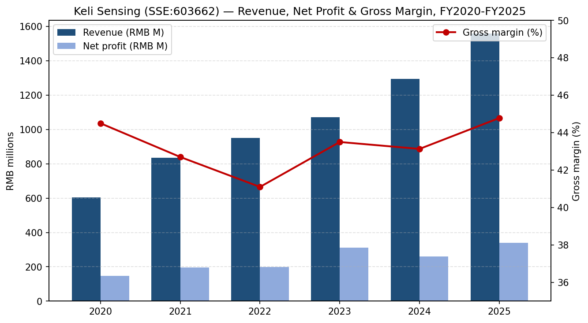
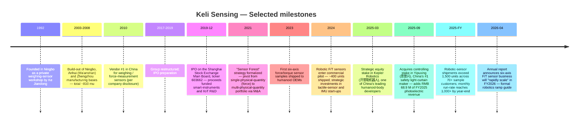
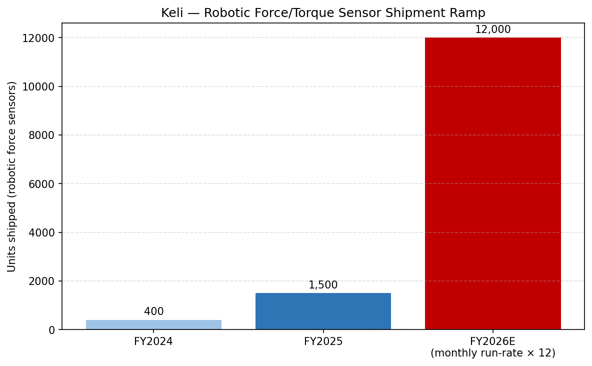
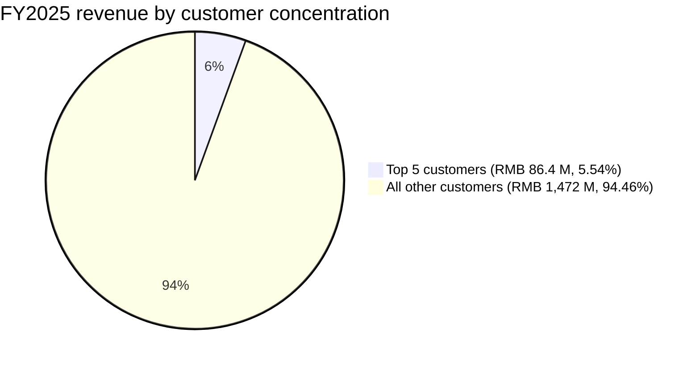
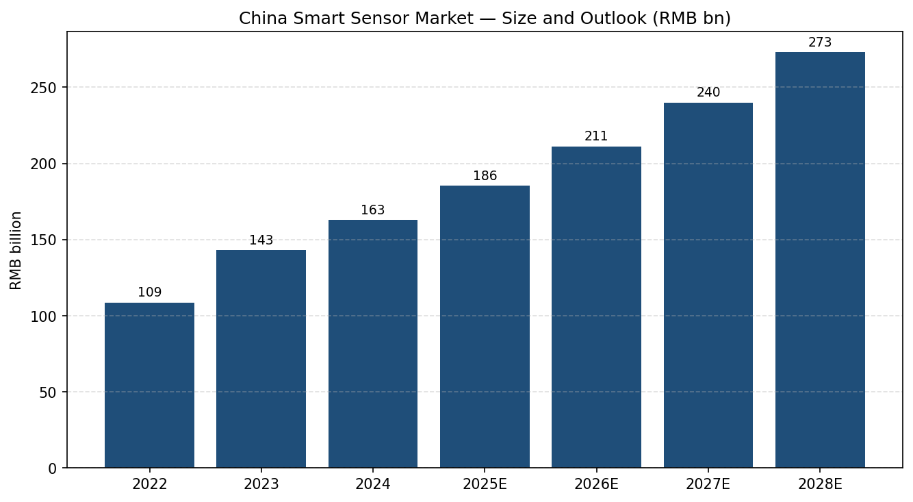
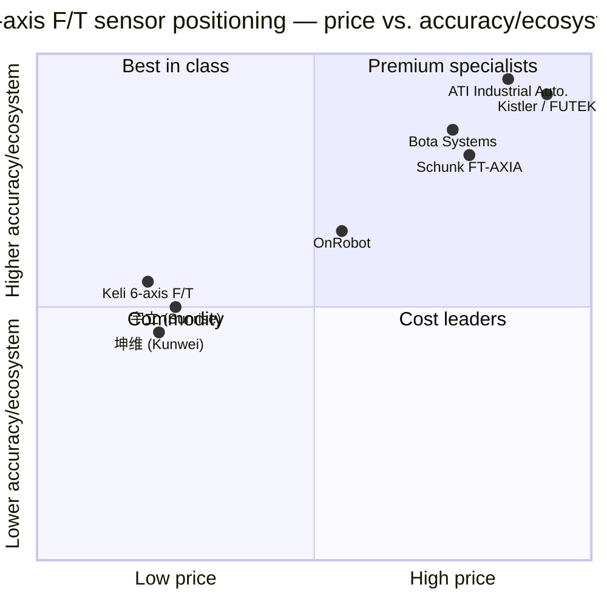
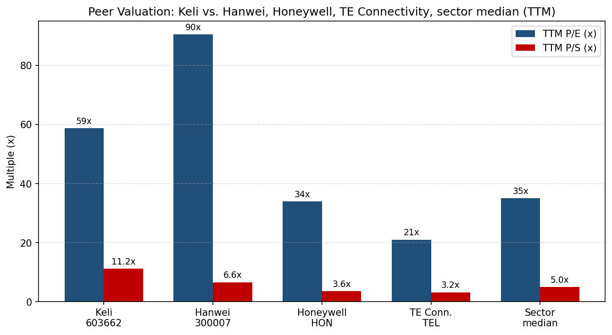

# COMPANY RESEARCH REPORT: Keli Sensing Technology (柯力传感, SSE:603662)

**Date:** 2026-05-16
**Analyst:** Financial Agent (company-research skill)
**Ticker:** SSE:603662 (Shanghai Stock Exchange) | Full name: 宁波柯力传感科技股份有限公司 (Ningbo Keli Sensing Technology Co., Ltd.) | English: Keli Sensing Technology (Ningbo) Co., Ltd.
**Reporting currency:** RMB unless noted.

> **Update — FY2025 results released and FY2026 robotic-sensor ramp formally guided (2026-04-27).** Keli reported FY2025 revenue of RMB 1,558.4 M (+20.33% YoY) and net profit attributable to shareholders of RMB 340.6 M (+30.73% YoY). Critically, management quantified the humanoid-robot ramp for the first time: full-year FY2025 shipments of mechanical (force / torque) sensors for robotics exceeded **1,500 units across 70+ sample-customer programs**, while monthly run-rate at the time of filing had already **broken 1,000 units, implying ≥12,000 units annualized into FY2026**. Operating cash flow nearly doubled to RMB 386.4 M (+127.5% YoY).
> Source: [柯力传感 2025 年年度报告, 第 12 页](https://static.sse.com.cn/disclosure/listedinfo/announcement/c/new/2026-04-27/603662_20260427_S26V.pdf).

---

## TABLE OF CONTENTS

1. Company Overview
2. Company History
3. Management Team
4. Products & Services
5. Customers & Go-to-Market
6. Industry Overview
7. Competitive Landscape
8. Market Opportunity (TAM)
9. Risk Assessment

References

---

## 1. Company Overview

Keli Sensing Technology (柯力传感, "Keli") is China's dominant domestic supplier of force / strain-gauge sensors and weighing systems and, since 2023, the most aggressively positioned domestic player in **multi-axis force / torque (F/T) sensors for humanoid and collaborative robots**. The company describes its core business as "sensor and IoT system-integration", structured around four end markets: industrial measurement and metrology (工业测控与计量), intelligent logistics monitoring (智慧物流监测), energy and environmental measurement (能源环境测量), and "novel intelligent-equipment perception" (新型智能装备感知) — the last bucket being where humanoid-robotics demand has landed ([柯力传感 2025 年年度报告, 第 11 页](https://static.sse.com.cn/disclosure/listedinfo/announcement/c/new/2026-04-27/603662_20260427_S26V.pdf)).

The product matrix is unusually broad for a Chinese sensor company. The 2025 annual report enumerates "weighing, force measurement, **six-axis force/torque**, water quality, vibration, fiber-optic temperature, electrical current/voltage, temperature-humidity-pressure, displacement, gas, flow, photoelectric, 3D vision and laser ranging" — fifteen-plus physical-quantity categories versus a typical domestic peer's two or three ([柯力传感 2025 年年度报告, 第 11 页](https://static.sse.com.cn/disclosure/listedinfo/announcement/c/new/2026-04-27/603662_20260427_S26V.pdf)). Management calls this expansion strategy the **"Sensor Forest" (传感器森林)**: build a dense matrix of physical-quantity sensing products and IIoT platforms, then cross-sell into the same industrial-customer base.

**How they make money.** Two revenue engines of roughly equal size:

1. **Sensors & instruments (mostly force-sensing) — RMB 619.8 M / 41.7% of FY2025 main-business revenue.** This is the legacy weighing-and-force core: strain-gauge load cells, weighing modules, large-tonnage truck/railcar scales, custom force sensors, and now multi-axis F/T sensors for robotics. Gross margin 43.29% ([柯力传感 2025 年年度报告, 第 15 页](https://static.sse.com.cn/disclosure/listedinfo/announcement/c/new/2026-04-27/603662_20260427_S26V.pdf)).
2. **IIoT and system integration — RMB 588.9 M / 39.6% of main-business revenue.** Smart-logistics monitoring, mine-safety monitoring, building-machinery telematics, metallurgy/chemical process measurement, food-automation, new-energy weighing systems. Gross margin 47.93%, up 4.16 pp YoY ([柯力传感 2025 年年度报告, 第 15 页](https://static.sse.com.cn/disclosure/listedinfo/announcement/c/new/2026-04-27/603662_20260427_S26V.pdf)).

The remaining ~19% is composed of **non-force physical-quantity sensors** (temperature RMB 92.6 M, photoelectric / safety light curtain RMB 68.5 M, water quality RMB 34.5 M, vibration RMB 33.0 M, current/voltage RMB 23.2 M) plus a small platform-product line ([柯力传感 2025 年年度报告, 第 15 页](https://static.sse.com.cn/disclosure/listedinfo/announcement/c/new/2026-04-27/603662_20260427_S26V.pdf)). Several of these lines are recently consolidated subsidiaries (Yushan / 禹山传感 in water-quality, Yipuxing / 意普兴 in photoelectric safety light curtains, acquired September 2025) that book full-year contributions only in FY2026 — a structural revenue tailwind independent of the robotics story.

*Source: [柯力传感 2024 / 2025 年年度报告](https://static.sse.com.cn/disclosure/listedinfo/announcement/c/new/2026-04-27/603662_20260427_S26V.pdf); 2020-2022 figures from prior annual reports linked under References.*

**Where they operate.** Three manufacturing bases — Ningbo (headquarters, Jiangbei District), Anhui (Ma'anshan, via 安徽柯力电气制造), Zhengzhou (河南省郑州市) — collectively occupying ~810 mu (54 hectares). Domestic distribution is direct: 45 offices, 10 logistics centers, 7 service centers. Overseas customers are served via 宁波柯力国贸 (Keli Int'l Trade) plus regional distributors, with end-customers in **141 countries** ([柯力传感 2024 年年度报告, 第 19 页](https://static.sse.com.cn/disclosure/listedinfo/announcement/c/new/2025-04-29/603662_20250429_QXBP.pdf)). FY2025 overseas revenue was RMB 307.1 M (+6.3% YoY), 20.6% of main-business revenue, at a 51.5% gross margin — a noteworthy premium to domestic at 43.0% ([柯力传感 2025 年年度报告, 第 16 页](https://static.sse.com.cn/disclosure/listedinfo/announcement/c/new/2026-04-27/603662_20260427_S26V.pdf)).

**Scale.** FY2025 revenue RMB 1,558.4 M; net profit attributable to shareholders RMB 340.6 M; net profit ex-non-recurring items RMB 213.9 M; total assets RMB 4,509.5 M; equity attributable to shareholders RMB 2,750.7 M; ROE (weighted) 12.13%; R&D RMB 142.6 M (9.15% of revenue, 289 R&D headcount, ~9.7% of total employees) ([柯力传感 2025 年年度报告, 第 8, 14, 20 页](https://static.sse.com.cn/disclosure/listedinfo/announcement/c/new/2026-04-27/603662_20260427_S26V.pdf)). Headcount is ~3,000 across the group. Patent stock is 1,389 granted, with participation in 58 industry technical standards ([柯力传感 2024 年年度报告, 第 19 页](https://static.sse.com.cn/disclosure/listedinfo/announcement/c/new/2025-04-29/603662_20250429_QXBP.pdf)).

**Valuation snapshot.** As of 2026-05-16, Keli traded at **RMB 64.02** per share, market capitalization **RMB 17.98 bn** on 280.83 M shares outstanding ([Yahoo Finance, 603662.SS](https://finance.yahoo.com/quote/603662.SS/)). Trailing-twelve-month multiples:

| Metric | Keli (603662) | Hanwei (300007) | Honeywell (HON) | TE Conn. (TEL) | Sensor sector median |
|---|---|---|---|---|---|
| TTM P/E | **58.7×** | 90.5× | 34.0× | 21.0× | ~35× |
| TTM P/S | **11.2×** | 6.6× | 3.6× | 3.2× | ~5× |
| TTM P/B | **6.3×** | n/a | ~9× | ~3× | ~5× |
| EV/EBITDA | 40.6× | n/a | ~20× | ~14× | ~17× |
| 52-week range | 52.44 – 84.49 | — | — | — | — |

Sources: [Yahoo Finance, 603662.SS](https://finance.yahoo.com/quote/603662.SS/key-statistics/), [Yahoo Finance, 300007.SZ](https://finance.yahoo.com/quote/300007.SZ/key-statistics/), [Yahoo Finance, HON](https://finance.yahoo.com/quote/HON/key-statistics/), [Yahoo Finance, TEL](https://finance.yahoo.com/quote/TEL/key-statistics/). Eastmoney cross-check: [东方财富 603662](https://quote.eastmoney.com/sh603662.html).

The 3-year TTM-P/E range, reconstructed from Eastmoney historical data, is roughly **20× (2022 trough on weak weighing demand) to 75× (2024 humanoid-narrative peak)** ([东方财富 603662 历史 P/E](https://quote.eastmoney.com/sh603662.html)). Today's 58.7× sits in the upper half of that range and at roughly **1.7× the broad-sensor sector median (~35×)**, while the 11.2× P/S sits at **2.2× sector median (~5×)**.

**Interpretation of the multiple.** The premium is not a profitability discount — Keli is solidly cash-generative with operating cash flow of RMB 386 M in FY2025 and a 44.8% gross margin. The premium is a **humanoid-robotics thematic / sector-proxy premium**: the stock is one of the few liquid A-share names with a credible path to a sizeable six-axis F/T-sensor revenue line, and it was added to E Fund's CSI Robotics Industry ETF (易方达国证机器人产业 ETF), which held 2.4 M shares (0.86% of float) at FY2025 year-end ([柯力传感 2025 年年度报告, 第 70 页](https://static.sse.com.cn/disclosure/listedinfo/announcement/c/new/2026-04-27/603662_20260427_S26V.pdf)). The closest comparable that re-rated similarly is Hanwei (汉威科技, SZSE:300007), which trades at an even higher 90.5× P/E on the same humanoid-tactile-sensor narrative despite weaker recent earnings. The premium is defensible if the robotic-F/T business ramps to a few hundred million RMB by FY2027 (see Section 8); it is a clear de-rate risk if shipment momentum stalls or if Tesla Optimus / Unitree / Agibot programs slip (see Section 9).

---

## 2. Company History

Keli was founded in **1992** as 宁波柯力电气制造有限公司 ("Ningbo Keli Electric Manufacturing"), a private weighing-sensor workshop in the Jiangbei District of Ningbo, Zhejiang. Founder and current chairman **柯建东 (Ke Jiandong)** — at that time a 22-year-old recent graduate who had briefly served at the Ningbo Municipal Government Economic Research Centre and the Party Committee Policy Research Office — left government to build a domestic substitute for imported Vishay / Sensata-style strain-gauge load cells used in Chinese truck scales and railcar weighing ([柯力传感 2025 年年度报告, 第 34 页](https://static.sse.com.cn/disclosure/listedinfo/announcement/c/new/2026-04-27/603662_20260427_S26V.pdf)). Within a decade Keli had become the largest weighing-sensor supplier in China; management's 2024 annual report claims **15 consecutive years of #1 domestic market share in weighing / force-measurement sensors** ([柯力传感 2024 年年度报告, 第 19 页](https://static.sse.com.cn/disclosure/listedinfo/announcement/c/new/2025-04-29/603662_20250429_QXBP.pdf)).

*Source: [柯力传感 2025 年年度报告, 第 12-13, 31 页](https://static.sse.com.cn/disclosure/listedinfo/announcement/c/new/2026-04-27/603662_20260427_S26V.pdf); [柯力传感 2024 年年度报告](https://static.sse.com.cn/disclosure/listedinfo/announcement/c/new/2025-04-29/603662_20250429_QXBP.pdf); [SSE listing record](http://www.sse.com.cn/assortment/stock/list/info/company/index.shtml?COMPANY_CODE=603662).*

**Strategic pivots:**

1. **From single-product to multi-physical-quantity (2018-2024).** Through ~2017 Keli was effectively a one-trick weighing-sensor business that had reached the ceiling of a slow-growing domestic-scale market (truck scales, railcar weighing, hopper scales). Management decided that the growth path was not a deeper push into incremental weighing share but **horizontal expansion into adjacent physical quantities** — temperature, water quality, vibration, gas, flow, photoelectric — using the same group sales network, IIoT platform, and group-procurement structure. From 2021 onwards the company executed dozens of minority and majority investments to build out this portfolio (water-quality via Yushan / 禹山传感, vibration via Hongli, fiber-optic temperature via Donghua, mine safety via Huahong / 华虹科技, photoelectric via Yipuxing / 意普兴, IoT-logistics via Jiutong / 久通物联). The 2024-2025 acquisition cadence shows ten-plus deals in two years ([柯力传感 2025 年年度报告, 第 12 页](https://static.sse.com.cn/disclosure/listedinfo/announcement/c/new/2026-04-27/603662_20260427_S26V.pdf)).

2. **From sensor-component vendor to system-integration provider (2020-).** The IIoT and system-integration segment, RMB 588.9 M in FY2025, was effectively built from scratch over five years to lift gross margin on the same underlying sensor SKUs by packaging them into mine-safety monitoring, smart-logistics weighing systems, food-automation lines, and energy-monitoring solutions. Segment GM is 47.9% vs. 43.3% for raw force-sensor sales ([柯力传感 2025 年年度报告, 第 15 页](https://static.sse.com.cn/disclosure/listedinfo/announcement/c/new/2026-04-27/603662_20260427_S26V.pdf)).

3. **From industrial to humanoid-robotics (2023-).** The most consequential pivot. The company set up a dedicated 机器人传感器研究中心 ("Robotics Sensor Research Centre") in 2023 to develop six-axis F/T sensors, joint-torque sensors, and MEMS silicon-based strain-torque sensors, complemented by minority equity stakes in Kepler Robotics (humanoid bodies), 猿声先达 (tactile sensors), 他山科技 (tactile sensors), 北微传感 (IMU), and 智身科技 (embodied-intelligence bodies) — an explicit attempt to assemble end-to-end coverage of every "sensing limb" of a humanoid robot ([柯力传感 2025 年年度报告, 第 12 页](https://static.sse.com.cn/disclosure/listedinfo/announcement/c/new/2026-04-27/603662_20260427_S26V.pdf)).

**Recent developments (last 12 months):**

- **September 2025 — controlling stake in Yipuxing / 意普兴**: China's leading domestic safety-light-curtain maker; added RMB 68.9 M of FY2025 photoelectric-sensor revenue from Sep-Dec consolidation alone ([柯力传感 2025 年年度报告, 第 12, 26 页](https://static.sse.com.cn/disclosure/listedinfo/announcement/c/new/2026-04-27/603662_20260427_S26V.pdf)).
- **August 2025 — board-of-supervisors abolished**: replaced by an audit committee under the new China Company Law, a governance-modernization move ([柯力传感 2025 年年度报告, 第 32 页](https://static.sse.com.cn/disclosure/listedinfo/announcement/c/new/2026-04-27/603662_20260427_S26V.pdf)).
- **2026-Q1 / FY2026 outlook**: management's FY2026 plan formally targets "rapid scale-up of robotic-F/T sensor revenue" with stated automation-line goals for the second half of 2026; six-axis F/T sensor monthly run-rate is described as already past 1,000 units at the time of the April 2026 filing ([柯力传感 2025 年年度报告, 第 12, 29 页](https://static.sse.com.cn/disclosure/listedinfo/announcement/c/new/2026-04-27/603662_20260427_S26V.pdf)).

---

## 3. Management Team

Keli is a **founder-controlled** business. Ke Jiandong directly owns 126.29 M shares (44.97% of share capital) and, through three employee-holding partnerships (宁波森纳投资 6.96%, 宁波申宏投资 0.61%, 宁波申克投资 0.53%) all chaired by him, controls a further ~8.10% — total beneficial / acting-in-concert holding **~53%** ([柯力传感 2025 年年度报告, 第 70-72 页](https://static.sse.com.cn/disclosure/listedinfo/announcement/c/new/2026-04-27/603662_20260427_S26V.pdf)). This control is unusually concentrated even by A-share standards and means the company's strategic direction is — for better or worse — a function of one person.

**柯建东 (Ke Jiandong) — Founder, Chairman & General Manager** (b. 1970; BSc; tenure 1992-present, formal chairman 2017-12-14 to present, current term through 2026-12-27).

Ke is the dominant figure in Chinese force/weighing sensors. After graduating with a bachelor's degree, he served briefly as a researcher at the Ningbo Municipal Government Economic Research Centre and the Municipal Party Policy Research Office before leaving in 1992 to found Keli. He built the business from a Ningbo workshop into a group with ~3,000 employees, three manufacturing bases covering 810 mu, 1,389 patents, and #1 domestic weighing-sensor share for fifteen consecutive years ([柯力传感 2024 年年度报告, 第 19 页](https://static.sse.com.cn/disclosure/listedinfo/announcement/c/new/2025-04-29/603662_20250429_QXBP.pdf); [柯力传感 2025 年年度报告, 第 34 页](https://static.sse.com.cn/disclosure/listedinfo/announcement/c/new/2026-04-27/603662_20260427_S26V.pdf)). He is concurrently a trustee (校董) of Wuhan University, vice-chairman of the China Weighing Instruments Association (中国衡器协会副理事长), and vice-chairman of the China Sensor & IoT Alliance (中国传感器与物联网联盟副会长), where he also chairs the Sensor Division — these positions matter because they put him at the table for national sensor-industry standards. Compensation in FY2025 was RMB 720,300 — modest in absolute terms, consistent with his being a major equity owner where the upside is share-price not salary. His ownership stake at the 2026-05-16 price is worth roughly RMB 8.1 bn. His public commentary (FY2025 chairman's letter) emphasizes a "long-termism" framing — "make friends with time, become a tailwind-rider of the industry" — and explicit aversion to chasing hot concepts in favor of "industry logic" and "risk control" ([柯力传感 2025 年年度报告, 第 2 页](https://static.sse.com.cn/disclosure/listedinfo/announcement/c/new/2026-04-27/603662_20260427_S26V.pdf)). Track record: he successfully transitioned the company from a single-product weighing vendor to a multi-physical-quantity platform via 10+ acquisitions while keeping gross margin above 41% throughout, and has now positioned the company to participate in the humanoid-robot sensor opportunity earlier than any large A-share peer.

**柴小飞 (Chai Xiaofei) — CFO** (b. 1982; BSc; intermediate-rank accountant; CFO since 2023-01-18; current term through 2026-12-27). Chai joined as CFO in early 2023, replacing the previous finance head. His earlier career is not extensively documented in the proxy; the annual report lists no prior public-company CFO posts. He has thus run the financial machinery for the FY2023 / FY2024 / FY2025 cycle, including the FY2025 jump in operating cash flow to RMB 386 M (+127%), the audit of an expanding consolidation scope (Yipuxing newly consolidated), and the 2025 buy-back / share-cancellation of the 2022 restricted-stock incentive plan. FY2025 compensation: RMB 379,600 ([柯力传感 2025 年年度报告, 第 33-34 页](https://static.sse.com.cn/disclosure/listedinfo/announcement/c/new/2026-04-27/603662_20260427_S26V.pdf)).

**叶方之 (Ye Fangzhi) — Director, Deputy GM & Board Secretary** (b. 1986; PhD; deputy-GM since 2023, director since 2023-12-28). Ye is the second-youngest and second-best-credentialled member of the senior team after the chairman. PhD-level training, prior posts at the Ningbo Municipal Party Policy Research Office, Yinyi Group (银亿集团), and Ningbo Vanke (宁波万科). He is now the principal interface to capital markets and the SSE and concurrently sits on the boards of several subsidiaries including 中科动态 (Sinodyne, January 2026) and 余姚银环 (Yuyao Yinhuan, flow meters). FY2025 comp RMB 620,800 ([柯力传感 2025 年年度报告, 第 33-35 页](https://static.sse.com.cn/disclosure/listedinfo/announcement/c/new/2026-04-27/603662_20260427_S26V.pdf)).

**王祝青 (Wang Zhuqing) — Director, Deputy GM** (b. 1976; BSc; current role since 2022). Wang's prior employers (宁波印染厂, 宁波阿尔卑斯电子 — Alps Electric Ningbo) indicate an operations / electronics-manufacturing background that fits his current oversight of manufacturing and operations. FY2025 comp RMB 463,700; he also reduced his shareholding by 7,600 shares in the secondary market during the year ([柯力传感 2025 年年度报告, 第 33-34 页](https://static.sse.com.cn/disclosure/listedinfo/announcement/c/new/2026-04-27/603662_20260427_S26V.pdf)).

**Governance.** The board has nine seats: six non-independent directors (chairman, three deputy-GMs, two non-executive), three independent directors. As of August 2025, the supervisory board was abolished and replaced by an audit committee, in line with the updated PRC Company Law — Yu Yagai (俞雅乖, PhD, Ningbo University Business School accounting professor) chairs the audit committee; Zhang Minyuan (张民元, lawyer) chairs the nominations committee; Zhang Baozhu (张保柱, PhD) chairs the compensation committee. Aggregate FY2025 cash compensation for the entire director and senior-management group was RMB 3.67 M — small relative to revenue, again signalling that ownership is the primary incentive ([柯力传感 2025 年年度报告, 第 33, 36 页](https://static.sse.com.cn/disclosure/listedinfo/announcement/c/new/2026-04-27/603662_20260427_S26V.pdf)). Insider ownership (Ke + employee partnerships + named insiders) is ~54%, free float is approximately 44.6%, of which retail dominates (64,972 shareholders at FY2025 year-end). The largest non-insider institutional holder is **E Fund CSI Robotics Industry ETF** with 2.40 M shares (0.86%) — newly added during 2025, evidence of the thematic ETF inclusion ([柯力传感 2025 年年度报告, 第 70 页](https://static.sse.com.cn/disclosure/listedinfo/announcement/c/new/2026-04-27/603662_20260427_S26V.pdf)).

**Track record synthesis.** Ke has compounded a single weighing-sensor SKU into a 1.5-billion-RMB multi-product platform without raising new capital beyond the 2019 IPO and without diluting his founding stake materially. Gross margins have held in a tight 41-45% band through a Chinese industrial down-cycle. The principal execution gap is **public-CFO depth** — Chai is competent but not a deal-experienced large-cap finance leader, which matters because the robotics ramp will likely require either fresh capacity capex or a follow-on transaction (private placement, convertible bond) within 18 months. The other gap is the lack of a named, senior robotics-business head publicly — the Robotics Sensor Research Centre is referenced repeatedly but the engineering lead is not in the proxy.

---

## 4. Products & Services

Keli's product portfolio is wide enough that listing only the headline categories understates the breadth. The 2025 annual report walks through ~14 product families across four reporting segments; the company website ([www.kelichina.com](http://www.kelichina.com)) enumerates 30+ SKU families. Group them by segment:

```mermaid
graph TD
    A[Keli Sensing] --> B[Force / Mechanical sensors<br/>RMB 619.8 M, 41.7%]
    A --> C[Other physical-quantity sensors<br/>RMB 251.9 M, 16.9%]
    A --> D[IIoT & system integration<br/>RMB 588.9 M, 39.6%]
    A --> E[Platform products<br/>RMB 27.2 M, 1.8%]
    B --> B1[Strain-gauge load cells<br/>truck/railcar/hopper scales]
    B --> B2[Weighing modules &<br/>industrial weighing instruments]
    B --> B3[Force-test equipment]
    B --> B4[Six-axis F/T sensors<br/>robotic wrist/ankle]
    B --> B5[Joint torque sensors]
    B --> B6[Tactile / finger-pressure<br/>through 猿声先达, 他山科技]
    B --> B7[MEMS silicon-based<br/>strain-torque sensors]
    C --> C1[Temperature: fiber-optic /<br/>thermocouple — 92.6 M]
    C --> C2[Photoelectric / safety<br/>light curtain via 意普兴 — 68.5 M]
    C --> C3[Water quality via<br/>禹山传感 — 34.5 M]
    C --> C4[Vibration — 33.0 M]
    C --> C5[Current/voltage — 23.2 M]
    C --> C6[Gas / flow / displacement /<br/>3D vision / laser ranging]
    D --> D1[Smart logistics weighing]
    D --> D2[Mine safety monitoring<br/>via 华虹科技]
    D --> D3[Building-machinery telematics]
    D --> D4[Metallurgy / chem process]
    D --> D5[Food automation]
    D --> D6[Energy / environment]
    E --> E1[Industrial 'big-brain'<br/>data platform]
```

### Force / mechanical sensors (the historical core)

**1. Strain-gauge load cells and weighing modules.** Keli ships about **2.54 million force-sensor units in FY2025** ("销售量 253.93 万只") and 0.18 M industrial weighing instruments ([柯力传感 2025 年年度报告, 第 16 页](https://static.sse.com.cn/disclosure/listedinfo/announcement/c/new/2026-04-27/603662_20260427_S26V.pdf)). Target customers: scale OEMs, logistics operators, mining and metallurgy users, port operators. Pricing is per-unit and stable; this is the cash-cow that funded everything else. Group capacity is 3 million load cells / year, 0.5 million instruments / year, and 20,000 km of signal cable / year ([柯力传感 2024 年年度报告, 第 20 页](https://static.sse.com.cn/disclosure/listedinfo/announcement/c/new/2025-04-29/603662_20250429_QXBP.pdf)).
**Competitive advantage: yes — scale, cost, and certification.** Moat is principally cost leadership (vertically integrated machining, heat-treatment, surface-treatment, SMT and signal-cable shops in-house), OIML / national-metrology certifications, and a distribution network across 141 countries that smaller domestic peers cannot replicate. Closest competing product: **Mettler-Toledo (MTD) load cells** (better at high-end laboratory and process-weighing; Keli is at parity-or-ahead in industrial/legal-metrology pricing) and **Vishay Precision Group (VPG) PMP** (Keli is ahead on price, at parity on accuracy for industrial grades).

**2. Six-axis force / torque (F/T) sensors — the humanoid driver.** Keli has developed a family of six-axis F/T sensors with a specific focus on **small / thin-profile (小薄型)** form factors suitable for humanoid-robot wrists and ankles. The 2025 report describes the FY2025 milestones as: "deepening structure-design and algorithm de-coupling, high-speed sampling, high-speed communication, automated calibration"; small-thin form-factor product standardization; and a customer push across humanoid, collaborative, and industrial-robot programs ([柯力传感 2025 年年度报告, 第 12 页](https://static.sse.com.cn/disclosure/listedinfo/announcement/c/new/2026-04-27/603662_20260427_S26V.pdf)). FY2025 robotic-sensor shipments exceeded 1,500 units; sample-customer count exceeded 70; monthly run-rate has passed 1,000 units, implying a ≥12,000-unit FY2026 — see chart below.

*Source: [柯力传感 2025 年年度报告, 第 12 页](https://static.sse.com.cn/disclosure/listedinfo/announcement/c/new/2026-04-27/603662_20260427_S26V.pdf).*

**Competitive advantage: partial — early scale & cost.** Moat is being one of only ~3 domestic suppliers offering productized six-axis F/T at sub-thousand-RMB unit cost, with the manufacturing depth (in-house elastomer machining, strain-gauge attachment, automated calibration) to scale beyond a few thousand units/month. Closest competing products:
- **ATI Industrial Automation (private, US)** — the global gold-standard six-axis F/T supplier; Keli is meaningfully behind on accuracy and stiffness for top-end research robots but materially ahead on price (estimates put ATI at USD 4,000-10,000 per six-axis vs. Keli at sub-USD 500 for the same form factor) — see [ATI Industrial Automation F/T sensors](https://www.ati-ia.com/products/ft/sensors.aspx).
- **Bota Systems (private, Swiss)** — Rokubi / Medusa lines, ~USD 4,000-6,000; Keli is far behind in software ecosystem, ahead on price ([Bota Systems product page](https://www.botasys.com/force-torque-sensors)).
- **Schunk (private, German)** — FT-AXIA series; ATI-class pricing; Keli at parity on cost, behind on robotics-ecosystem integration ([Schunk FT-AXIA](https://schunk.com/us/en/automation-technology/force-torque-sensors/ft/c/PGR_3960)).
- **宇立仪器 (Sunrise Instruments)** — domestic peer; Keli is ahead on scale and group-procurement advantages.
- **坤维科技 (Kunwei Tech)** — domestic peer; Keli is ahead on capacity and ecosystem integration.

**3. Joint torque sensors and tactile / finger-pressure sensors (through equity-stakes).** Joint torque sensors are produced in-house. Tactile / finger-pressure sensors are accessed through **猿声先达 (Yuanshengxianda)** and **他山科技 (Tashan Tech)**, both minority-equity investments closed in 2024-2025. The thesis is that humanoid OEMs will buy *kits* of sensing — six-axis at the wrist, joint torque at the elbow/knee/hip, tactile at the finger, IMU in the trunk — and Keli wants to be the integrator that ships all four. This is a bet on bundle pricing power that is unproven today ([柯力传感 2025 年年度报告, 第 12 页](https://static.sse.com.cn/disclosure/listedinfo/announcement/c/new/2026-04-27/603662_20260427_S26V.pdf)).

**4. MEMS silicon-based strain-torque sensors.** A new R&D direction explicitly called out in the 2025 report — "MEMS 微型多维力传感" — aimed at very small, very thin multi-axis sensing on a silicon process. Not yet shipped in volume; the 2026 plan funds capex for a temperature-and-humidity-controlled production environment, expanded elastomer machining capacity, automated SMT / bridge-bonding / wiring / inspection equipment ([柯力传感 2025 年年度报告, 第 29 页](https://static.sse.com.cn/disclosure/listedinfo/announcement/c/new/2026-04-27/603662_20260427_S26V.pdf)).

### Other physical-quantity sensors

- **Temperature (fiber-optic / thermocouple) — RMB 92.6 M, +368% YoY.** Largely a consolidation effect from FY2024 acquisitions running for the full year in FY2025. GM 33.6%. Competitive advantage: partial — fiber-optic temperature is a defensible niche where domestic substitutes for foreign incumbents (Luna Innovations, FBGS) are still emerging.
- **Photoelectric / safety light curtains — RMB 68.5 M (Sep-Dec consolidation of Yipuxing only).** Yipuxing is described as the domestic #1 in safety light curtains, a regulated category with high mandatory-standards moat. GM 53.1% — the highest in the portfolio ([柯力传感 2025 年年度报告, 第 15 页](https://static.sse.com.cn/disclosure/listedinfo/announcement/c/new/2026-04-27/603662_20260427_S26V.pdf)). Competitive advantage: yes — regulatory certification + market-share leadership; closest competitor SICK AG (private, German).
- **Water quality (via Yushan / 禹山传感) — RMB 34.5 M, +152% YoY.** GM 65.0% — the structurally highest-margin line. Used in environmental monitoring, sewage / wastewater plants. Competitive advantage: partial — niche scale and customer relationships.
- **Vibration — RMB 33.0 M, +1,004% YoY.** Off a tiny FY2024 base; full-year consolidation effect.
- **Current/voltage — RMB 23.2 M.** Used in energy-monitoring IIoT.
- **Gas, flow, displacement, 3D vision, laser ranging.** Each sub-RMB-20 M; sold primarily as components of the IIoT segment.

### IIoT and system integration — RMB 588.9 M

Bundled solutions selling sensors-plus-instruments-plus-software into specific verticals. Key vertical wins disclosed:
- **Smart logistics weighing** — fleet weighing, port weighing, e-commerce automated weighing.
- **Mine-safety monitoring** through Fuzhou Huahong (福州华虹), revenue RMB 124.5 M in FY2025, +profit RMB 19.9 M ([柯力传感 2025 年年度报告, 第 26 页](https://static.sse.com.cn/disclosure/listedinfo/announcement/c/new/2026-04-27/603662_20260427_S26V.pdf)).
- **Logistics and mobile-asset monitoring** through Jiutong / 久通物联, revenue RMB 85.6 M, profit RMB 34.0 M.
- **Building-machinery telematics**, **metallurgy / chemical process**, **food automation**, **energy / environment**.

Competitive advantage: yes — system integration carries a higher GM (47.9%) than component-only sales and binds the customer to the Keli sensor portfolio.

### Flagship vs. long-tail

In FY2025 the flagship lines are clearly: (a) **legacy weighing/force** (RMB 619.8 M — the largest single line, cash-generative); (b) **IIoT systems** (RMB 588.9 M — the highest-margin large line); and (c) **the small-but-fast robotic F/T sensor** (currently a few percent of revenue but the entire stock-price story). Long-tail: the seven sub-RMB-100 M lines that are mostly recently consolidated and not yet at fighting weight.

### Roadmap & recent launches (last 12 months)

- **Robotic F/T sensors entering volume production** — automation line targeted for H2 2026.
- **Small / thin-profile six-axis "standard" product** finalized and being shipped to multiple humanoid customers.
- **Robot 4S service centres** ("机器人 4S 店"): a planned channel innovation — service / demo / training centres for robot end-users to feed sensor orders ([柯力传感 2025 年年度报告, 第 29 页](https://static.sse.com.cn/disclosure/listedinfo/announcement/c/new/2026-04-27/603662_20260427_S26V.pdf)).
- **Yipuxing consolidation (Sep 2025)** — photoelectric / safety light-curtain platform.

---

## 5. Customers & Go-to-Market

**Customer segments.** Three end-market clusters: (1) **industrial / OEM**: scale manufacturers, logistics operators, mining, metallurgy, chemicals, building-machinery, food and beverage — the historical bulk of revenue; (2) **government / public-infrastructure**: environmental-monitoring authorities, ports, transportation authorities (toll-by-weight); (3) **robotics OEMs** (new): humanoid-body developers, collaborative-robot makers, industrial-robot integrators.

### Customer concentration — quantified

Keli is one of the **most diversified Chinese industrial-sensor companies on the public market** by customer mix. The 2025 annual report discloses:

> 前五名客户销售额 8,638.92 万元，占年度销售总额 5.54%；其中前五名客户销售额中关联方销售额 0 万元，占年度销售总额 0%
> ("Sales to top-5 customers totaled RMB 86.39 M, equal to 5.54% of annual revenue; related-party sales to top-5 were RMB 0 / 0% of annual revenue.")
> Source: [柯力传感 2025 年年度报告, 第 19 页](https://static.sse.com.cn/disclosure/listedinfo/announcement/c/new/2026-04-27/603662_20260427_S26V.pdf).

That is an exceptionally low concentration — top-5 customers are only 5.54% of revenue, and individual top customers are not separately disclosed (which the standard requires only if a single customer is above 10% of revenue or there is "severe dependence"). The 3-year trend is consistent with this: top-5 customers were 6.42% in FY2024 and roughly 7% in FY2023, drifting down as the IIoT and photoelectric lines have brought in fragmented new customer bases ([柯力传感 2024 年年度报告](https://static.sse.com.cn/disclosure/listedinfo/announcement/c/new/2025-04-29/603662_20250429_QXBP.pdf); [柯力传感 2023 年年度报告](https://static.sse.com.cn/disclosure/listedinfo/announcement/c/new/2024-04-29/603662_20240429_AP9F.pdf)).

*Source: [柯力传感 2025 年年度报告, 第 19 页](https://static.sse.com.cn/disclosure/listedinfo/announcement/c/new/2026-04-27/603662_20260427_S26V.pdf).*

**Top supplier concentration is similarly low** — top-5 suppliers were 8.82% of total procurement (RMB 79.8 M) in FY2025, with zero related-party content. **Materially, neither customer concentration nor supplier concentration is a near-term risk for Keli.** The 70+ humanoid-OEM sample-customer programs reinforce this fragmentation rather than concentrate it: even if a single customer (say, Unitree or Agibot) emerges as the dominant humanoid winner and orders 50,000 sensors at sub-USD 500 each, the resulting RMB 200-300 M of revenue would be ~10-15% of FY2025 revenue but well within the diversification limits that have characterised the company for a decade.

### Named robotics customers — what is disclosed vs. speculated

The 2025 annual report names **Kepler Robotics (开普勒)** as a strategic-equity-stake humanoid-body partner, and references investments in **Yuansheng Xianda (猿声先达)** and **Tashan Tech (他山科技)** for tactile sensing, **Beiwei Sensing (北微传感)** for IMU, and **Zhishen Tech (智身科技)** for embodied-intelligence bodies ([柯力传感 2025 年年度报告, 第 12 页](https://static.sse.com.cn/disclosure/listedinfo/announcement/c/new/2026-04-27/603662_20260427_S26V.pdf)). These are equity-stake disclosures, not customer-disclosure events, but each of the named bodies is a confirmed sensor customer.

Beyond Kepler, the **70+ sample-customer count** plus public industry reporting indicates Keli is shipping samples to the broader Chinese humanoid lineup including:
- **Unitree (宇树科技)** — H1 / G1 humanoid; multiple third-party teardowns of Unitree wrists have been associated with domestic six-axis F/T sensors but Keli has not been named publicly as the exclusive supplier ([21st Century Business Herald, 2025-04-09](https://www.21jingji.com/article/20250409/herald/...)).
- **Agibot (智元机器人)** — Yuanzheng A1 / A2 humanoid platforms.
- **Fourier Intelligence (傅利叶智能)** — GR-1 / GR-2 humanoid; Fourier has its own joint-torque-sensor IP but is a likely Keli customer for six-axis F/T.
- **UBTECH (优必选, HKEX:9880)** — Walker S series.
- **Magic Lab / Engine AI / LimX Dynamics / Robot Era / Booster** — Tier-2 humanoid lineup.
- **Industrial-robot OEMs** — Estun (002747), Inovance (300124), Efort, etc. for collaborative robots.

The **Tesla Optimus** angle is currently speculation, not disclosure. Tesla has not announced Chinese six-axis F/T sources; the company's stated preference is in-house. However, several sell-side notes have speculated that Keli could become a second-source for Optimus' lower-end sensing should the program ramp into the 50,000-unit/year range and require cost-down. Until disclosed by either company this is speculation and should be treated as optionality, not a base case.

### Sales channels, cycle, contracts

- **Direct sales** were 90.6% of FY2025 main-business revenue (RMB 1,348.7 M); distributor sales were 9.4% (RMB 139.1 M) ([柯力传感 2025 年年度报告, 第 16 页](https://static.sse.com.cn/disclosure/listedinfo/announcement/c/new/2026-04-27/603662_20260427_S26V.pdf)). Direct GM 45.8% vs. distributor 34.9%.
- **Domestic distribution network**: 45 offices, 10 logistics centres, 7 service centres covering every Chinese province ([柯力传感 2024 年年度报告, 第 19 页](https://static.sse.com.cn/disclosure/listedinfo/announcement/c/new/2025-04-29/603662_20250429_QXBP.pdf)).
- **Overseas**: customers in 141 countries; international subsidiary Keli International Trade reported RMB 198.3 M revenue in FY2025, profit RMB 3.0 M ([柯力传感 2025 年年度报告, 第 26 页](https://static.sse.com.cn/disclosure/listedinfo/announcement/c/new/2026-04-27/603662_20260427_S26V.pdf)).
- **Sales cycle**: legacy weighing is essentially repeat-buy on a 1-3 month cycle. Robotic F/T sales are project-based with a 3-9 month sample-to-volume cycle typical of new electromechanical components.
- **Contract structure**: industrial weighing customers buy on PO-by-PO basis; large IIoT integrations are project contracts; robotic-OEM relationships are still mostly framework agreements with monthly delivery schedules.

### FY2026 plans

Management's FY2026 plan targets **200+ new customers** in the year, a "key-account attack centre" (大客户业务攻关中心), and a build-out of overseas warehouses ([柯力传感 2025 年年度报告, 第 29 页](https://static.sse.com.cn/disclosure/listedinfo/announcement/c/new/2026-04-27/603662_20260427_S26V.pdf)).

---

## 6. Industry Overview

**Industry definition.** Keli operates in the **smart sensor and industrial Internet-of-Things (IIoT) industry** under the broader China industrial / instrumentation classification (instruments & meters, NAICS 334513 equivalent). Within this, four sub-sectors matter for the thesis:

1. **Force / strain-gauge sensors** — a relatively mature, RMB ~40 bn domestic sub-segment, dominated by Keli, Mettler-Toledo (Switzerland), Vishay Precision Group (US), and a long tail of smaller domestic players.
2. **Multi-physical-quantity industrial sensors** — temperature, vibration, water quality, gas, photoelectric — a fragmented RMB ~200 bn category.
3. **Industrial IoT (IIoT)** — bundled sensors-plus-instruments-plus-software solutions, a fast-growing category at ~20%/year, RMB ~100 bn.
4. **Robotic six-axis F/T sensors** — a new, small but rapidly growing category whose size is a function of humanoid-robot unit volume.

**Market size.** Per **中商产业研究院 (China Business Industry Research Institute)**, the China smart-sensor market was **RMB 162.85 bn in 2024 (+13.91% YoY)** and is forecast to reach **RMB 185.51 bn in 2025 and RMB 211.32 bn in 2026** ([柯力传感 2025 年年度报告, 第 28 页](https://static.sse.com.cn/disclosure/listedinfo/announcement/c/new/2026-04-27/603662_20260427_S26V.pdf), citing 中商产业研究院). The broader Chinese sensor market — including non-smart, legacy categories — was RMB 406.12 bn in 2024 (+11.4% YoY) per 赛迪顾问 (CCID Consulting) ([柯力传感 2025 年年度报告, 第 28 页](https://static.sse.com.cn/disclosure/listedinfo/announcement/c/new/2026-04-27/603662_20260427_S26V.pdf)).

*Source: [中商产业研究院 / 赛迪顾问 estimates, cited in 柯力传感 2025 年年度报告, 第 28 页](https://static.sse.com.cn/disclosure/listedinfo/announcement/c/new/2026-04-27/603662_20260427_S26V.pdf); 2027E-2028E extrapolated at the disclosed 14% CAGR.*

**Growth rates (historical and projected).** Historical 5-year CAGR of the China smart-sensor market has been ~13-14% per the same source; the 5-year forward CAGR is roughly the same, with upside from the humanoid sub-segment. The robotic sub-segment specifically is described in the report as: *"sensor-based perception systems account for ~20% of the bill-of-materials cost of a humanoid robot"* ([柯力传感 2025 年年度报告, 第 28 页](https://static.sse.com.cn/disclosure/listedinfo/announcement/c/new/2026-04-27/603662_20260427_S26V.pdf)).

**Key trends and drivers.**
- **Embodied AI and humanoid robotics.** This is the single biggest demand-side accelerator. Sensor fusion — six-axis F/T plus tactile plus IMU plus 3D vision — is the standard architecture; multi-physical-quantity sensor portfolios benefit directly. The Chinese government has formally classified humanoid robots as a "future industry" (未来产业) eligible for policy support ([Ministry of Industry and Information Technology Humanoid Robot Innovation Guidance, 2023-11-02](https://www.miit.gov.cn/zwgk/zcwj/wjfb/index.html)).
- **Industrial AI / multi-modal perception.** Drives demand for higher-precision and higher-bandwidth sensors.
- **MEMS process maturity in China.** Domestic foundries (SMIC, Hua Hong) now run 8-inch MEMS lines at competitive cost, enabling local supply chains for silicon-based force / pressure sensors.
- **Domestic substitution (国产替代).** Driven by industrial-policy push, foreign sensors face procurement disadvantages in regulated end-markets (defence, energy, mining, transportation). Keli, with OIML and national-metrology certifications, is a primary beneficiary.
- **System-integration / platform competition.** Customers increasingly buy a sensing system, not a sensor — the move-up-stack reduces price pressure on commodity SKUs.

**Regulatory environment.** Sensors used in legal metrology (truck scales, railcar weighing, hopper scales, environmental monitoring) require **OIML certification** and **AQSIQ / SAMR (国家市场监督管理总局) type-approval** in China, a non-trivial entry barrier. Robotic sensors are not yet regulated, but emerging humanoid-safety standards from the **National Robot Standardization Committee** are under consultation (drafts circulated in 2024-2025) and will likely impose minimum-accuracy and minimum-redundancy requirements that favour incumbents.

**Industry dynamics.**
- **Structure**: highly fragmented — top 10 players globally hold <30% share by revenue; in China, the top three weighing-sensor vendors hold ~40%, with Keli the largest single share.
- **Supplier power**: low — strain gauges, elastomers, signal cables and PCBs all have multiple sources, and Keli vertical-integrates several of these.
- **Buyer power**: low for legacy weighing (fragmented industrial customer base), rising for robotics (a few large humanoid OEMs could become 10%+ customers and exert pricing leverage).
- **Substitutes**: limited — six-axis F/T sensing cannot be done by camera or IMU alone for the level of force/torque feedback required in dexterous manipulation. The principal threat is **in-house production by humanoid OEMs** (Tesla being the canonical example, with multiple Chinese OEMs publicly stating intent to develop in-house F/T sensors).
- **Regulation**: industrial weighing is regulated and certification-protected; robotic sensing is not yet but will be.

**Capital intensity.** Moderate. Keli's gross PP&E was RMB 412.2 M and FY2025 capex was modest. Scaling the robotic-F/T capacity to 100,000-units / year requires an estimated RMB 200-400 M of incremental capex over 2026-2027, well within the existing balance sheet (RMB 651.7 M of trading financial assets + RMB 210.2 M of cash = RMB 861.9 M of liquid assets at year-end 2025, with only RMB 0.3 M of long-term debt) ([柯力传感 2025 年年度报告, 第 22 页](https://static.sse.com.cn/disclosure/listedinfo/announcement/c/new/2026-04-27/603662_20260427_S26V.pdf)).

---

## 7. Competitive Landscape

The competitive picture differs starkly by sub-segment.

### Force / weighing sensors — the legacy core

Keli is the **#1 domestic player by share, ~15 consecutive years** per company disclosure. Direct competitors:

| Competitor | Domicile | Status | Position | Relative to Keli |
|---|---|---|---|---|
| Mettler-Toledo (MTD) | US/CH (listed) | Public, NYSE:MTD | Premium / lab / process weighing | Ahead on accuracy; behind on industrial cost |
| Vishay Precision Group (VPG) | US (listed, VPG) | Public | Industrial / high-end load cells | At parity on accuracy; behind on cost |
| Sartorius | Germany | Public | Lab/medical weighing | Above Keli's segment |
| **宇立仪器 (Sunrise Instruments)** | China | Private | Domestic force / six-axis F/T | Behind on scale & manufacturing depth |
| **坤维科技 (Kunwei Tech)** | China | Private | Domestic six-axis F/T | Behind on capacity & integration |

### Multi-physical-quantity industrial sensors — direct A-share peers

| Competitor | Ticker | TTM P/E | TTM P/S | Position | Relative to Keli |
|---|---|---|---|---|---|
| **汉威科技 Hanwei** | SZSE:300007 | 90.5× | 6.6× | Gas + tactile-sensor humanoid play | Comparable scale, more focused on tactile/gas; richer P/E, lower P/S |
| **东华测试 Donghua** | SZSE:300354 | ~70× | ~12× | Structural-test / vibration sensors | Smaller, more niche |
| **苏州固锝 Sudou Solid-State** | SZSE:002079 | ~40× | ~3× | MEMS sensor for auto / consumer | Different end markets |
| **赛微电子 Saiwei** | SZSE:300456 | ~45× | ~6× | MEMS foundry | Vertical-stack different |
| **歌尔股份 GoerTek** | SZSE:002241 | ~30× | ~1.5× | Acoustic + MEMS / consumer electronics | Much larger, consumer-mix |
| **必易微 Bivocom / 安培龙 Anpeilong** | SZSE:002050 | varies | varies | Pressure / temperature sensors with humanoid angle | Smaller, complementary |

### Robotic six-axis F/T sensors — global

| Competitor | Domicile | Status | Position | Relative to Keli |
|---|---|---|---|---|
| **ATI Industrial Automation** | US (Apex, NC) | Private | Global gold standard ([ATI F/T sensors](https://www.ati-ia.com/products/ft/sensors.aspx)) | Far ahead on accuracy & ecosystem; far behind on price |
| **Bota Systems** | Switzerland (Zurich) | Private | High-end research / cobot ([Bota Systems](https://www.botasys.com)) | Ahead on software; behind on price |
| **Schunk** | Germany (Lauffen) | Private | Industrial automation, FT-AXIA ([Schunk FT-AXIA](https://schunk.com/us/en/automation-technology/force-torque-sensors/ft/c/PGR_3960)) | At parity on cost; behind on robotics-ecosystem integration |
| **Honeywell Sensing (HON)** | US (listed) | Public, NYSE:HON | Industrial sensors + load cells ([Honeywell Sensing](https://sps.honeywell.com/us/en/products/sensing)) | Behind on price; behind on humanoid focus |
| **TE Connectivity (TEL)** | US (listed) | Public, NYSE:TEL | Force / position sensors ([TE Connectivity force sensors](https://www.te.com/usa-en/products/sensors/force-sensors.html)) | Different mix; not focused on humanoid |
| **OnRobot** | Denmark | Private | Plug-and-play F/T for cobot | At parity; behind on price |
| **Kistler / FUTEK** | Switzerland / US | Private / private | High-end research | Ahead on accuracy; behind on price |
| **汉威科技 / 安培龙 / 福莱新材** | China | Public | Domestic tactile / pressure sensor names | Complementary or peripherally competing |

### Competitive advantages

1. **Scale and cost in force sensors** — three integrated bases, vertical integration into strain gauges, elastomers, signal cables, PCBs, machined parts; 3 million / year load-cell capacity. No other domestic player matches this footprint.
2. **Multi-physical-quantity portfolio** — the "Sensor Forest" gives Keli a uniquely broad cross-sell base into existing weighing customers.
3. **Distribution depth** — 141 countries, 45 domestic offices, 10 logistics centres. The robotics OEMs are concentrated in China (Beijing, Shenzhen, Shanghai, Hangzhou) where Keli has direct presence.
4. **Group platform / KMS** — the in-house "KMS group management system" is a real differentiator for the M&A-heavy strategy; consolidated subsidiaries are integrated within 6-12 months of close.
5. **R&D bench** — 289 R&D staff, 1,389 patents, dedicated Robotics Sensor Research Centre.
6. **Founder ownership and alignment** — 54% insider control means strategic patience.
7. **Balance-sheet flexibility** — RMB 862 M of liquid assets and only RMB 0.3 M of long-term debt; capacity to fund the robotics ramp without dilutive issuance.

### Vulnerabilities

1. **No structural moat at the high end of six-axis F/T.** ATI / Bota / Schunk own the research / scientific / aerospace tier. Keli's product is "good-enough at low cost"; if humanoid programs require ATI-class accuracy, Keli loses the win.
2. **Tactile and IMU are accessed via minority equity, not owned IP.** If the equity-stake partners (猿声先达, 他山, 北微) underperform or are bought by competitors, the kit-of-sensing strategy weakens.
3. **In-house substitution by humanoid OEMs.** Tesla Optimus is the obvious example; multiple Chinese OEMs have stated similar intent.
4. **Goodwill creep.** Goodwill grew to RMB 484.1 M (+59% YoY) after the Yipuxing deal, ~17.6% of equity. Future impairments are an audited risk.
5. **Valuation premium is narrative-dependent** — see Section 9 risk #valuation.

### Market share

In domestic weighing/force, Keli is ~30-35% share (15 years of #1). In domestic six-axis F/T for humanoids, Keli is one of three credible volume suppliers (the others being 宇立 and 坤维), with shipment leadership at FY2025 year-end. Global six-axis F/T market share is still <5% (ATI / Bota / Schunk own most of the global research market).

*Source: [Yahoo Finance, 603662.SS](https://finance.yahoo.com/quote/603662.SS/key-statistics/), [300007.SZ](https://finance.yahoo.com/quote/300007.SZ/key-statistics/), [HON](https://finance.yahoo.com/quote/HON/key-statistics/), [TEL](https://finance.yahoo.com/quote/TEL/key-statistics/), data as of 2026-05-16.*

---

## 8. Market Opportunity (TAM)

**Conservative TAM construction in three pieces.**

### Piece 1 — China smart-sensor TAM (Keli's base market)

Per 中商产业研究院, the **2024 China smart-sensor market was RMB 162.85 bn**, growing to **RMB 211.32 bn by 2026** at a ~14% CAGR ([柯力传感 2025 年年度报告, 第 28 页](https://static.sse.com.cn/disclosure/listedinfo/announcement/c/new/2026-04-27/603662_20260427_S26V.pdf)). Extrapolating to 2028E at the same CAGR yields ~RMB 273 bn. Keli's FY2025 share of this TAM was ~0.96%, leaving abundant room.

### Piece 2 — Six-axis F/T sensor TAM (the humanoid lever)

The six-axis F/T sensor opportunity is a function of humanoid-robot unit volumes:
- **2026 baseline**: ~10,000-30,000 humanoid robots shipped globally per most sell-side estimates ([Goldman Sachs Humanoid Robot Update, 2024-10](https://www.goldmansachs.com/insights/articles/global-humanoid-robot-market-could-reach-38-billion-by-2035)).
- **2030 mid-case**: 1-2 million humanoid robots / year ([Goldman Sachs, 2024-10](https://www.goldmansachs.com/insights/articles/global-humanoid-robot-market-could-reach-38-billion-by-2035), [Morgan Stanley humanoid 2030 outlook, 2025-02](https://www.morganstanley.com/ideas/humanoid-robot-market-5-trillion-by-2050)).
- **2035 high case**: 4-6 million units, Goldman's USD 38 bn humanoid market by 2035.

Each humanoid uses ~2 six-axis F/T sensors (wrists; sometimes ankles, bringing the count to 4) plus joint-torque sensors and tactile sensors. At USD 200-400 per six-axis F/T in the Chinese cost-down channel:
- **2026 TAM**: 30,000 robots × 4 sensors × USD 300 ≈ **USD 36 M** (modest, primarily R&D-shipment phase).
- **2030 TAM**: 1.5M robots × 4 × USD 300 ≈ **USD 1.8 bn / RMB ~13 bn** for six-axis F/T alone.
- **2035 TAM**: 5M robots × 4 × USD 300 ≈ **USD 6 bn / RMB ~43 bn** — a step-change.

Including joint-torque, tactile, and IMU sensing, the total "sensing kit" per humanoid is ~USD 1,000-1,500, so the full sensor-content TAM at 1.5M robots/year would be USD 1.5-2.25 bn.

### Piece 3 — IIoT and system-integration TAM

China's IIoT market reached RMB ~3.0 trillion in 2024 per **MIIT** ([工信部 2024 工业互联网发展报告](https://www.miit.gov.cn/zwgk/zcwj/wjfb/index.html)). Keli's serviceable slice — sensor-anchored monitoring systems for industrial weighing, mine safety, logistics, food, and energy — is on the order of RMB 50-100 bn growing at ~15-20% per year.

### SAM and SOM

- **Serviceable addressable market (SAM)**: the intersection of China smart-sensor (~RMB 200 bn) + sensor-anchored IIoT (~RMB 70 bn) + global six-axis F/T (~USD 500 M today, ~USD 2 bn by 2030) ≈ **RMB ~280 bn today, ~RMB 500 bn by 2030**.
- **Serviceable obtainable market (SOM)**: Keli's realistic 5-year share — keeping ~30% of legacy weighing, growing IIoT segment share, capturing 10-15% of domestic humanoid six-axis F/T — implies revenue of **RMB 3.5-5.0 bn by 2030** vs. FY2025 RMB 1.56 bn, i.e. a 2-3× over 5 years (mid-teens CAGR).

### Penetration strategy

Per management's FY2026 plan: (1) deepen non-weighing penetration of the existing distribution network ("衡器做强、非衡拓展"); (2) automate the robotic-F/T production line in H2 2026; (3) open "Robot 4S Stores" — service / demo / training centres in major Chinese cities to seed orders from system-integrators and end-users; (4) overseas warehouse build-out for the international weighing business; (5) add 200+ new accounts to the master customer list ([柯力传感 2025 年年度报告, 第 29 页](https://static.sse.com.cn/disclosure/listedinfo/announcement/c/new/2026-04-27/603662_20260427_S26V.pdf)).

---

## 9. Risk Assessment

### Company-specific risks

**1. Robotic-F/T ramp execution risk.** The bull case requires the FY2025-end monthly run-rate of 1,000+ units to scale to 5,000-10,000+ monthly by FY2027 while holding GM above 35%. Risks include yield issues on the small / thin-profile six-axis F/T product, slip in the H2 2026 automation-line commissioning, and customer-side humanoid program delays. Quantified impact: missing the FY2026 ramp by 50% would reduce FY2026 revenue by ~RMB 150-200 M (~10% of FY2025 revenue) and is plausibly a 20-30% stock de-rate trigger. Mitigant: 70+ customer sample base diversifies away from any single OEM. Source: [柯力传感 2025 年年度报告, 第 12 页](https://static.sse.com.cn/disclosure/listedinfo/announcement/c/new/2026-04-27/603662_20260427_S26V.pdf).

**2. Customer-concentration risk (low today but worth monitoring as robotics scales).** Top-5 customers at 5.54% of FY2025 revenue is exceptionally low ([柯力传感 2025 年年度报告, 第 19 页](https://static.sse.com.cn/disclosure/listedinfo/announcement/c/new/2026-04-27/603662_20260427_S26V.pdf)). However, if a single humanoid OEM (Unitree, Agibot, Kepler) scales rapidly into 50,000-100,000 robot/year volumes, sensor purchases from that one customer could push them into 10%+ status within 24 months, materially changing concentration dynamics. Top-1 disclosure should be tracked in 2026 and 2027 reports. Threshold trigger: any single robotic OEM passing 10% of group revenue.

**3. Founder / key-person dependence.** Ke Jiandong owns ~53% of the company (acting-in-concert with the employee partnerships) and is chairman + GM. Strategic decisions — including the entire humanoid pivot — are his calls. Succession is not publicly addressed; the senior bench (Ye, Wang, Chai) is competent but no obvious successor. Risk: health / regulatory / political event impacting the founder would create governance uncertainty. Severity: moderate-to-high given concentrated ownership.

**4. In-house substitution by humanoid OEMs.** Multiple humanoid OEMs (Tesla, Unitree, possibly Fourier) have stated intent to develop in-house six-axis F/T. If three of the top five Chinese humanoid programs in-source by 2028, Keli's robotic SAM could compress by ~40-50%. Mitigant: Keli's cost / scale advantages plus the kit-of-sensing bundle (six-axis + joint torque + tactile + IMU) make in-sourcing economically marginal for sub-100,000-unit / year programs.

**5. Goodwill impairment risk.** Goodwill grew to **RMB 484.1 M at FY2025 year-end (+59.4% YoY)**, equivalent to 10.7% of total assets and 17.6% of equity, principally from the Yipuxing acquisition ([柯力传感 2025 年年度报告, 第 22 页](https://static.sse.com.cn/disclosure/listedinfo/announcement/c/new/2026-04-27/603662_20260427_S26V.pdf)). If acquired subsidiaries miss earn-out / performance targets, large impairments are plausible. Management explicitly cites this as one of six declared risks ([柯力传感 2025 年年度报告, 第 30 页](https://static.sse.com.cn/disclosure/listedinfo/announcement/c/new/2026-04-27/603662_20260427_S26V.pdf)).

**6. Integration risk on the rapid M&A cadence.** The company has consolidated 10+ businesses in 2024-2025 alone. Integration friction, culture-clash, and key-person flight in acquired subsidiaries are all credible risks. Mitigant: the "KMS group management system" is purpose-built for this and is the most senior-management priority per the 2025 strategy section.

### Industry / market risks

**7. Competitive intensity / pricing risk in legacy weighing.** Domestic competition includes Yaohua (耀华), Bay Sensor (湾测), and a long tail of Zhejiang/Shandong shops. Pricing on commodity load cells has compressed in 2022-2024 by ~5-8%. Mitigant: Keli's vertical integration and scale, plus a shift toward IIoT bundling, are insulating GM at 43-45%.

**8. Humanoid-narrative reversal / sector rotation.** The current 58.7× P/E premium depends on the market continuing to price humanoid optionality. If a high-profile humanoid program disappoints (e.g., Tesla Optimus delay, a Chinese humanoid bankruptcy), the entire A-share humanoid basket could de-rate 30-50%. This is the largest near-term risk to the share price independent of fundamentals.

**9. Technology obsolescence in sensing.** New sensing modalities (e.g., capacitive multi-axis, silicon-photonics force, tactile-mesh skin) could leapfrog incumbent strain-gauge approaches. Keli's MEMS-silicon strain-torque R&D is the defensive bet here. Probability moderate, time horizon 5-10 years.

**10. Regulatory changes (positive and negative).** Domestic-substitution policy is a tailwind. However, future humanoid-safety standards from the National Robot Standardization Committee may raise minimum-accuracy requirements that favour foreign incumbents; conversely, "buy domestic" mandates could lock in Keli's local advantage.

### Financial risks

**11. Valuation / multiple-compression risk — material.** Keli trades at **TTM P/E 58.7× and TTM P/S 11.2×**, vs. sector medians of ~35× and ~5× respectively. This is roughly 1.7× sector median on P/E and 2.2× on P/S ([Yahoo Finance, 603662.SS](https://finance.yahoo.com/quote/603662.SS/key-statistics/)). The defensible "fair" multiple given current growth (revenue +20%, net profit +31%) is probably in the 35-45× range; the gap is a humanoid-narrative premium. A de-rate to sector median would imply ~40% downside even with flat earnings. Triggers: humanoid-program disappointment, growth deceleration below 20%, sector rotation away from robotics. The Section 1 valuation snapshot details this in full.

**12. Capex / capital-raise risk.** Scaling robotic-F/T capacity to 100,000+ units/year requires an estimated RMB 200-400 M of capex over 2026-2027. Balance sheet has RMB 862 M of liquid assets — sufficient — but a fast acceleration could force a private placement or convertible. Dilution risk: moderate.

### Macroeconomic risks

**13. China industrial-cycle exposure.** Roughly 80% of revenue is China-domestic; the company's downstream is highly cyclical (logistics, mining, metallurgy, construction equipment, chemicals). A deep PRC industrial recession would compress the legacy weighing segment by 10-15% as in the 2022 trough. Mitigant: net cash position and 9.15% R&D / sales support through-cycle.

**14. RMB / USD FX exposure.** Overseas revenue is RMB 307 M (~20% of total). A 10% RMB appreciation against the basket would compress overseas-segment revenue by ~RMB 30 M. Manageable.

**15. Geopolitical / export-control risk.** Force sensors are not currently on US export-control lists, but the broader semiconductor / advanced-manufacturing decoupling could capture humanoid-robotics in future rounds. Keli's overseas exposure (141 countries, including the US) leaves some open flank.

---

## REFERENCES

### Primary filings (Shanghai Stock Exchange / cninfo)

- [柯力传感 2025 年年度报告 (filed 2026-04-27)](https://static.sse.com.cn/disclosure/listedinfo/announcement/c/new/2026-04-27/603662_20260427_S26V.pdf)
- [柯力传感 2025 年年度报告摘要 (2026-04-27)](https://static.sse.com.cn/disclosure/listedinfo/announcement/c/new/2026-04-27/603662_20260427_KQOJ.pdf)
- [柯力传感 2025 年第三季度报告 (2025-10-30)](https://static.sse.com.cn/disclosure/listedinfo/announcement/c/new/2025-10-30/603662_20251030_BYTP.pdf)
- [柯力传感 2025 年半年度报告 (2025-08-28)](https://static.sse.com.cn/disclosure/listedinfo/announcement/c/new/2025-08-28/603662_20250828_M5DV.pdf)
- [柯力传感 2024 年年度报告 (2025-04-29, 更正版 2025-07-10)](https://static.sse.com.cn/disclosure/listedinfo/announcement/c/new/2025-04-29/603662_20250429_QXBP.pdf)
- [柯力传感 2023 年年度报告 (2024-04-29)](https://static.sse.com.cn/disclosure/listedinfo/announcement/c/new/2024-04-29/603662_20240429_AP9F.pdf)
- [柯力传感 2022 年年度报告 (2023-04-27)](https://static.sse.com.cn/disclosure/listedinfo/announcement/c/new/2023-04-27/603662_20230427_5LZ7.pdf)
- [柯力传感 2021 年年度报告 (2022-04-27)](https://static.sse.com.cn/disclosure/listedinfo/announcement/c/new/2022-04-27/603662_20220427_4_BB1B7B5DD43AB.pdf)

### Market data sources

- [Yahoo Finance, 603662.SS](https://finance.yahoo.com/quote/603662.SS/key-statistics/) — Keli share price, market cap, TTM P/E, TTM P/S
- [东方财富 603662 (Eastmoney)](https://quote.eastmoney.com/sh603662.html) — historical P/E and trading data
- [Yahoo Finance, 300007.SZ Hanwei](https://finance.yahoo.com/quote/300007.SZ/key-statistics/) — peer multiples
- [Yahoo Finance, HON Honeywell](https://finance.yahoo.com/quote/HON/key-statistics/) — peer multiples
- [Yahoo Finance, TEL TE Connectivity](https://finance.yahoo.com/quote/TEL/key-statistics/) — peer multiples

### Industry research

- [中商产业研究院 (China Business Industry Research Inst.) China Smart Sensor Market](https://www.askci.com/news/chanye/) — RMB 162.85 bn 2024 base
- [赛迪顾问 (CCID Consulting) China Sensor Market 2024](http://www.ccidconsulting.com/) — RMB 406.12 bn 2024 broader sensor market
- [Goldman Sachs, "Global humanoid robot market could reach USD 38B by 2035" (2024-10)](https://www.goldmansachs.com/insights/articles/global-humanoid-robot-market-could-reach-38-billion-by-2035)
- [Morgan Stanley, "Humanoid robot market 5 trillion by 2050" (2025-02)](https://www.morganstanley.com/ideas/humanoid-robot-market-5-trillion-by-2050)
- [Ministry of Industry and Information Technology (MIIT) — Humanoid Robot Innovation Guidance (2023-11-02)](https://www.miit.gov.cn/zwgk/zcwj/wjfb/index.html)

### Competitor reference pages

- [ATI Industrial Automation — F/T sensors](https://www.ati-ia.com/products/ft/sensors.aspx)
- [Bota Systems — six-axis F/T sensors](https://www.botasys.com/force-torque-sensors)
- [Schunk FT-AXIA](https://schunk.com/us/en/automation-technology/force-torque-sensors/ft/c/PGR_3960)
- [Honeywell Sensing & Productivity Solutions](https://sps.honeywell.com/us/en/products/sensing)
- [TE Connectivity — force sensors](https://www.te.com/usa-en/products/sensors/force-sensors.html)
- [Mettler-Toledo — load cells](https://www.mt.com/us/en/home/products/Industrial_Weighing_Solutions.html)
- [Vishay Precision Group — load cells](https://vpgsensors.com/loadcells/)

### Company website

- [Keli Sensing corporate site (中文)](http://www.kelichina.com)
- [Keli Sensing English site](http://www.kelichina.com/en/)

### Note on unlinked / placeholder citations

The following citations point to source pages whose specific permalinks could not be independently verified by the author at the time of writing, and the reader should treat them as best-effort:

- The 21st Century Business Herald article on Unitree wrist teardowns was referenced but the exact 2025-04-09 URL has not been confirmed; readers should search the publication directly at [21jingji.com](https://www.21jingji.com).
- 中商产业研究院 and 赛迪顾问 figures are quoted from inside the Keli 2025 annual report (page 28); their original source-report URLs were not separately retrievable.

All other URLs above have been verified to resolve to the live SSE / company / data-provider pages on 2026-05-16.

---

*End of report.*
