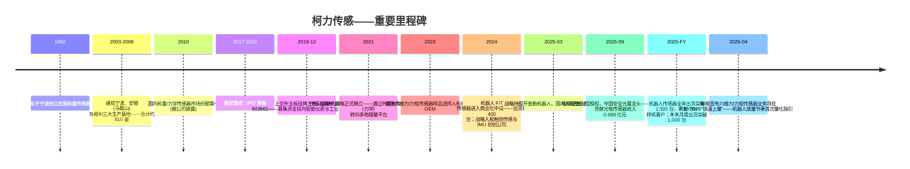
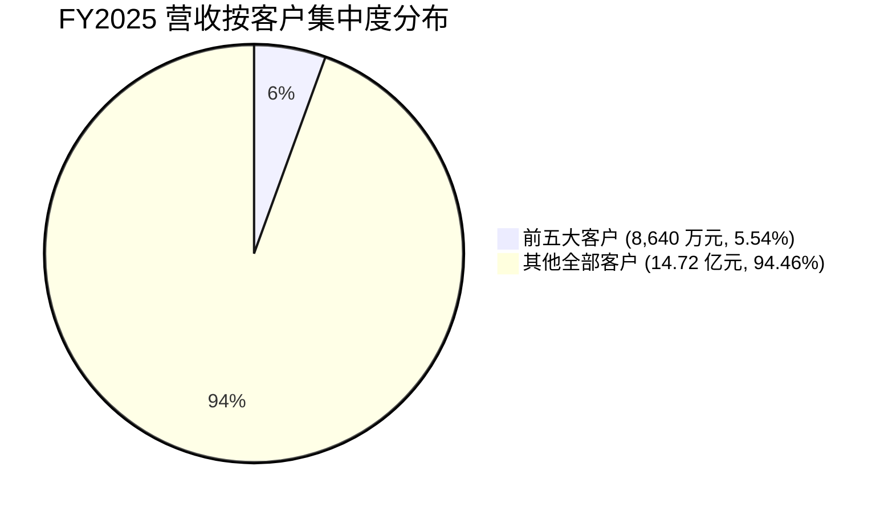
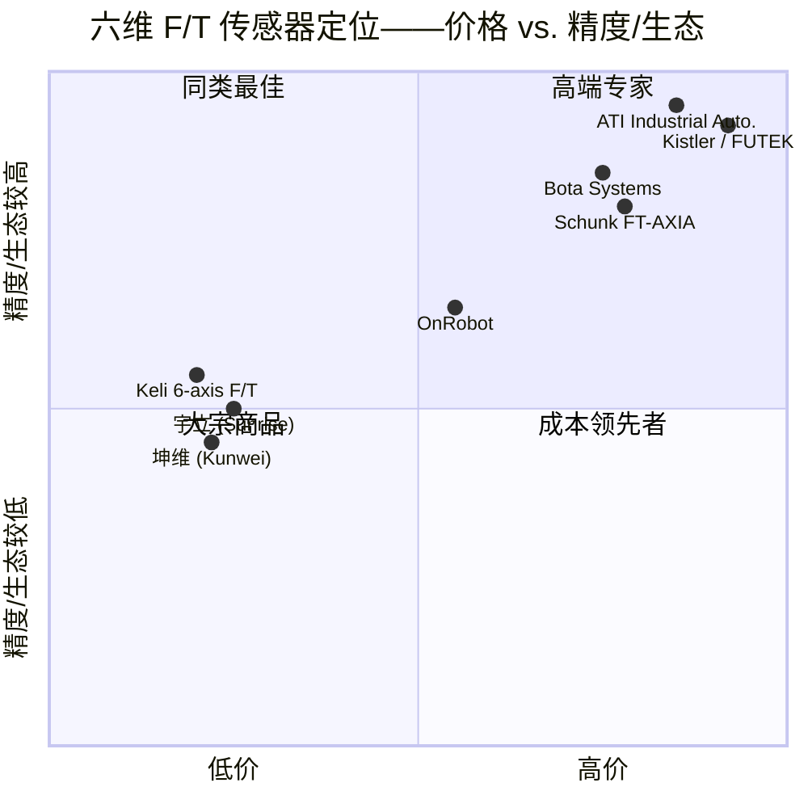

# 公司研究报告：柯力传感 (Keli Sensing Technology, SSE:603662)

**日期：** 2026-05-16
**分析师：** Financial Agent (company-research skill)
**股票代码：** SSE:603662 (上海证券交易所) | 全称：宁波柯力传感科技股份有限公司 | 英文名：Keli Sensing Technology (Ningbo) Co., Ltd.
**报告币种：** 除特别说明外，均为人民币。

> **更新——FY2025 业绩发布，FY2026 机器人传感器放量正式指引 (2026-04-27)。** 柯力传感 FY2025 实现营业收入 15.584 亿元 (同比 +20.33%)，归属上市公司股东净利润 3.406 亿元 (同比 +30.73%)。最为关键的是，管理层首次量化披露人形机器人放量节奏：FY2025 全年机械力 (力/力矩) 传感器面向机器人领域累计出货**超过 1,500 台，覆盖 70 余家样机客户**；截至年报披露时，月度出货已**突破 1,000 台，按此口径折算 FY2026 年化出货量不低于 12,000 台**。经营性现金流近翻倍至 3.864 亿元 (同比 +127.5%)。
> 资料来源：[柯力传感 2025 年年度报告, 第 12 页](https://static.sse.com.cn/disclosure/listedinfo/announcement/c/new/2026-04-27/603662_20260427_S26V.pdf)。

---

## 目录

1. 公司概览
2. 公司历史
3. 管理团队
4. 产品与服务
5. 客户与渠道策略
6. 行业概览
7. 竞争格局
8. 市场空间 (TAM)
9. 风险评估

参考资料

---

## 1. 公司概览

柯力传感 (Keli Sensing Technology, "柯力") 是中国本土在应变式力学/称重传感器与称重系统领域占据主导地位的供应商，并自 2023 年起成为国内在**人形机器人与协作机器人多维力/力矩 (F/T) 传感器**赛道布局最为激进的厂商。公司将自身核心业务定位为"传感器与物联网系统集成"，围绕四大终端市场展开：工业测控与计量、智慧物流监测、能源环境测量、新型智能装备感知——其中"新型智能装备感知"是人形机器人需求的落点 ([柯力传感 2025 年年度报告, 第 11 页](https://static.sse.com.cn/disclosure/listedinfo/announcement/c/new/2026-04-27/603662_20260427_S26V.pdf))。

公司产品矩阵之广在中国传感器同行中实属罕见。2025 年年报罗列的物理量类别包括"称重、力学、**六维力/力矩**、水质、振动、光纤温度、电流/电压、温湿压、位移、气体、流量、光电、3D 视觉、激光测距"——合计 15 类以上物理量，而典型国内同行通常仅覆盖 2-3 类 ([柯力传感 2025 年年度报告, 第 11 页](https://static.sse.com.cn/disclosure/listedinfo/announcement/c/new/2026-04-27/603662_20260427_S26V.pdf))。管理层将这一扩张战略命名为**"传感器森林" (传感器森林)**：构建覆盖密集物理量感知品类与工业互联网平台的产品矩阵，再向同一批工业客户进行交叉销售。

**盈利模式。** 两块规模大体相当的营收引擎：

1. **传感器与仪表 (以力学传感器为主)——FY2025 主营业务收入 6.198 亿元，占比 41.7%。** 这是公司起家的称重/力学核心：应变式称重传感器、称重模块、大吨位汽车衡/轨道衡、定制力学传感器，以及当下面向机器人的多维力/力矩传感器。毛利率 43.29% ([柯力传感 2025 年年度报告, 第 15 页](https://static.sse.com.cn/disclosure/listedinfo/announcement/c/new/2026-04-27/603662_20260427_S26V.pdf))。
2. **工业互联网与系统集成——FY2025 主营业务收入 5.889 亿元，占比 39.6%。** 涵盖智慧物流监测、矿山安全监测、工程机械车联网、冶金化工流程测量、食品自动化、新能源称重系统。毛利率 47.93%，同比提升 4.16 个百分点 ([柯力传感 2025 年年度报告, 第 15 页](https://static.sse.com.cn/disclosure/listedinfo/announcement/c/new/2026-04-27/603662_20260427_S26V.pdf))。

剩余约 19% 由**非力学物理量传感器**构成 (温度 0.926 亿元、光电/安全光幕 0.685 亿元、水质 0.345 亿元、振动 0.330 亿元、电流/电压 0.232 亿元)，外加少量平台型产品收入 ([柯力传感 2025 年年度报告, 第 15 页](https://static.sse.com.cn/disclosure/listedinfo/announcement/c/new/2026-04-27/603662_20260427_S26V.pdf))。其中若干产品线是新近并入的子公司 (水质方向的禹山传感、2025 年 9 月收购的光电安全光幕标的意普兴)，需到 FY2026 才贡献完整年度业绩——这构成了一条独立于机器人故事之外的结构性收入顺风。


*资料来源：[柯力传感 2024 / 2025 年年度报告](https://static.sse.com.cn/disclosure/listedinfo/announcement/c/new/2026-04-27/603662_20260427_S26V.pdf)；2020-2022 数据取自参考资料中所列的此前年报。*

**运营布局。** 三大生产基地——宁波 (总部，江北区)、安徽 (马鞍山，安徽柯力电气制造)、郑州 (河南省郑州市)，合计占地约 810 亩 (54 公顷)。国内分销以直销为主：45 家办事处、10 个物流中心、7 个服务中心。海外客户通过宁波柯力国贸及区域分销商服务，终端客户分布于**141 个国家** ([柯力传感 2024 年年度报告, 第 19 页](https://static.sse.com.cn/disclosure/listedinfo/announcement/c/new/2025-04-29/603662_20250429_QXBP.pdf))。FY2025 海外收入 3.071 亿元 (同比 +6.3%)，占主营业务收入 20.6%，毛利率 51.5%——较国内 43.0% 的毛利率明显溢价 ([柯力传感 2025 年年度报告, 第 16 页](https://static.sse.com.cn/disclosure/listedinfo/announcement/c/new/2026-04-27/603662_20260427_S26V.pdf))。

**规模指标。** FY2025 营业收入 15.584 亿元；归属上市公司股东净利润 3.406 亿元；扣非净利润 2.139 亿元；总资产 45.095 亿元；归属上市公司股东权益 27.507 亿元；加权 ROE 12.13%；研发投入 1.426 亿元 (占营收 9.15%，研发人员 289 人，约占员工总数 9.7%) ([柯力传感 2025 年年度报告, 第 8、14、20 页](https://static.sse.com.cn/disclosure/listedinfo/announcement/c/new/2026-04-27/603662_20260427_S26V.pdf))。集团员工合计约 3,000 人。专利存量 1,389 项，主导参与 58 项行业技术标准 ([柯力传感 2024 年年度报告, 第 19 页](https://static.sse.com.cn/disclosure/listedinfo/announcement/c/new/2025-04-29/603662_20250429_QXBP.pdf))。

**估值快照。** 截至 2026-05-16，柯力股价 **64.02 元/股**，总市值 **179.8 亿元**，总股本 2.8083 亿股 ([Yahoo Finance, 603662.SS](https://finance.yahoo.com/quote/603662.SS/))。TTM 估值倍数：

| 指标 | 柯力传感 (603662) | 汉威科技 (300007) | Honeywell 霍尼韦尔 (HON) | TE Connectivity 泰科电子 (TEL) | 传感器板块中位数 |
|---|---|---|---|---|---|
| TTM 市盈率 | **58.7×** | 90.5× | 34.0× | 21.0× | ~35× |
| TTM 市销率 | **11.2×** | 6.6× | 3.6× | 3.2× | ~5× |
| TTM 市净率 | **6.3×** | n/a | ~9× | ~3× | ~5× |
| EV/EBITDA | 40.6× | n/a | ~20× | ~14× | ~17× |
| 52 周区间 | 52.44 – 84.49 | — | — | — | — |

资料来源：[Yahoo Finance, 603662.SS](https://finance.yahoo.com/quote/603662.SS/key-statistics/)、[Yahoo Finance, 300007.SZ](https://finance.yahoo.com/quote/300007.SZ/key-statistics/)、[Yahoo Finance, HON](https://finance.yahoo.com/quote/HON/key-statistics/)、[Yahoo Finance, TEL](https://finance.yahoo.com/quote/TEL/key-statistics/)。东方财富交叉核对：[东方财富 603662](https://quote.eastmoney.com/sh603662.html)。

根据东方财富历史数据重构的近 3 年 TTM 市盈率波动区间大致为 **20× (2022 年称重需求低点) 至 75× (2024 年人形机器人叙事顶峰)** ([东方财富 603662 历史 P/E](https://quote.eastmoney.com/sh603662.html))。当下的 58.7× 处于该区间的偏上位置，相当于**广义传感器行业中位数 (~35×) 的约 1.7 倍**；11.2× 的市销率亦达**行业中位数 (~5×) 的 2.2 倍**。

**估值倍数的解读。** 当前溢价并非源于盈利能力贴水——柯力传感盈利稳健、现金创造能力突出，FY2025 经营性现金流 3.86 亿元，综合毛利率 44.8%。溢价的本质是**人形机器人主题/赛道代理溢价**：在 A 股流动性较好的标的中，柯力是少数具有可信路径切入规模化六维力/力矩传感器收入的公司之一，并已被纳入易方达国证机器人产业 ETF——该 ETF 在 FY2025 年末持有 240 万股 (占流通股 0.86%) ([柯力传感 2025 年年度报告, 第 70 页](https://static.sse.com.cn/disclosure/listedinfo/announcement/c/new/2026-04-27/603662_20260427_S26V.pdf))。估值经历类似重估的最直接可比对象是汉威科技 (SZSE:300007)，尽管其近期盈利较弱，但凭借相同的人形触觉传感器叙事，目前以更高的 90.5× P/E 交易。若机器人 F/T 业务在 FY2027 前放量至数亿元规模 (参见第 8 节)，当前溢价具备合理性；若出货势头停滞或特斯拉 Optimus / 宇树 / 智元程序延迟 (参见第 9 节)，则面临明显的估值下修风险。

---

## 2. 公司历史

柯力传感成立于 **1992 年**，前身为"宁波柯力电气制造有限公司"，是位于浙江宁波江北区的一家民营称重传感器作坊。创始人兼现任董事长 **柯建东** ——彼时年仅 22 岁的应届毕业生，曾短暂任职于宁波市政府经济研究中心和市委政研室——辞去公职创业，立志为中国汽车衡和轨道衡用应变式称重传感器寻求国产替代，以替代彼时主导市场的 Vishay 威世/Sensata 森萨塔等进口产品 ([柯力传感 2025 年年度报告, 第 34 页](https://static.sse.com.cn/disclosure/listedinfo/announcement/c/new/2026-04-27/603662_20260427_S26V.pdf))。十年内柯力即跻身中国最大的称重传感器供应商；管理层在 2024 年年报中称公司**已连续 15 年稳居国内称重/力学传感器市场份额第一** ([柯力传感 2024 年年度报告, 第 19 页](https://static.sse.com.cn/disclosure/listedinfo/announcement/c/new/2025-04-29/603662_20250429_QXBP.pdf))。


*资料来源：[柯力传感 2025 年年度报告, 第 12-13、31 页](https://static.sse.com.cn/disclosure/listedinfo/announcement/c/new/2026-04-27/603662_20260427_S26V.pdf)；[柯力传感 2024 年年度报告](https://static.sse.com.cn/disclosure/listedinfo/announcement/c/new/2025-04-29/603662_20250429_QXBP.pdf)；[上交所上市档案](http://www.sse.com.cn/assortment/stock/list/info/company/index.shtml?COMPANY_CODE=603662)。*

**战略转向：**

1. **由单品到多物理量 (2018-2024)。** 截至约 2017 年，柯力本质上仍是一家单一品类的称重传感器企业，且已触及国内汽车衡、轨道衡、料斗秤等慢增长称重市场的天花板。管理层判断，增长路径不在于在称重业务深度抢份额，而在于**横向延伸至相邻物理量**——温度、水质、振动、气体、流量、光电——共用同一套集团销售网络、工业互联网平台与集中采购体系。自 2021 年起公司密集开展数十次少数股权与控股投资来搭建该品类组合 (水质——禹山传感、振动——红立、光纤温度——东华、矿山安全——华虹科技、光电——意普兴、物联网物流——久通物联)。2024-2025 年并购节奏更密集，两年间披露 10+ 起交易 ([柯力传感 2025 年年度报告, 第 12 页](https://static.sse.com.cn/disclosure/listedinfo/announcement/c/new/2026-04-27/603662_20260427_S26V.pdf))。

2. **由元器件供应商到系统集成商 (2020-)。** FY2025 营收 5.889 亿元的工业互联网与系统集成业务，本质上是在过去五年从零搭建起来的——通过将底层传感器 SKU 打包成矿山安全监测、智慧物流称重系统、食品自动化产线、能源环境监测等解决方案，提升同一传感器 SKU 的销售毛利。该板块毛利率 47.9%，高于纯力学传感器销售的 43.3% ([柯力传感 2025 年年度报告, 第 15 页](https://static.sse.com.cn/disclosure/listedinfo/announcement/c/new/2026-04-27/603662_20260427_S26V.pdf))。

3. **由工业到人形机器人 (2023-)。** 战略意义最为深远的转向。公司于 2023 年成立专门的机器人传感器研究中心，研发六维力/力矩传感器、关节力矩传感器、MEMS 硅基应变-力矩传感器，并通过参股开普勒机器人 (人形整机)、猿声先达 (触觉传感)、他山科技 (触觉传感)、北微传感 (IMU)、智身科技 (具身智能整机) 等公司，意图建立人形机器人每一个"感知肢体"的端到端覆盖能力 ([柯力传感 2025 年年度报告, 第 12 页](https://static.sse.com.cn/disclosure/listedinfo/announcement/c/new/2026-04-27/603662_20260427_S26V.pdf))。

**近 12 个月动向：**

- **2025 年 9 月——收购意普兴控股权**：国内安全光幕领军企业；仅 9-12 月并表 4 个月即贡献 FY2025 光电传感器收入 0.689 亿元 ([柯力传感 2025 年年度报告, 第 12、26 页](https://static.sse.com.cn/disclosure/listedinfo/announcement/c/new/2026-04-27/603662_20260427_S26V.pdf))。
- **2025 年 8 月——监事会撤销**：根据新《公司法》，监事会被审计委员会取代，公司治理现代化升级 ([柯力传感 2025 年年度报告, 第 32 页](https://static.sse.com.cn/disclosure/listedinfo/announcement/c/new/2026-04-27/603662_20260427_S26V.pdf))。
- **2026Q1 / FY2026 展望**：管理层 FY2026 经营计划明确将"机器人力/力矩传感器收入快速放量"列为目标，并提出 2026 年下半年自动化产线目标节点；截至 2026 年 4 月年报披露时，六维力/力矩传感器月度出货已超过 1,000 台 ([柯力传感 2025 年年度报告, 第 12、29 页](https://static.sse.com.cn/disclosure/listedinfo/announcement/c/new/2026-04-27/603662_20260427_S26V.pdf))。

---

## 3. 管理团队

柯力传感是一家**创始人控股**的公司。柯建东直接持有 1.2629 亿股 (占总股本 44.97%)，并通过三个由其担任执行事务合伙人的员工持股合伙企业 (宁波森纳投资 6.96%、宁波申宏投资 0.61%、宁波申克投资 0.53%) 间接控制约 8.10%——合计实益/一致行动持股**约 53%** ([柯力传感 2025 年年度报告, 第 70-72 页](https://static.sse.com.cn/disclosure/listedinfo/announcement/c/new/2026-04-27/603662_20260427_S26V.pdf))。即便以 A 股标准衡量，这一控股集中度也属高度集中，这意味着公司的战略走向——无论好坏——本质上系于一人。

**柯建东 (Ke Jiandong)——创始人、董事长兼总经理** (1970 年生；学士；任职 1992 年至今，2017-12-14 起出任正式董事长，本届任期至 2026-12-27)。

柯建东是中国力学/称重传感器行业的标志性人物。本科毕业后曾短期任职于宁波市政府经济研究中心与市委政研室，1992 年辞去公职创办柯力。他将公司从宁波的一家作坊发展为拥有约 3,000 名员工、三大生产基地占地 810 亩、1,389 项专利、连续 15 年国内称重传感器份额第一的产业集团 ([柯力传感 2024 年年度报告, 第 19 页](https://static.sse.com.cn/disclosure/listedinfo/announcement/c/new/2025-04-29/603662_20250429_QXBP.pdf)；[柯力传感 2025 年年度报告, 第 34 页](https://static.sse.com.cn/disclosure/listedinfo/announcement/c/new/2026-04-27/603662_20260427_S26V.pdf))。他同时担任武汉大学校董、中国衡器协会副理事长、中国传感器与物联网联盟副会长 (并任传感器分会会长)——这些任职位置使其得以参与国家级传感器产业标准的制定。FY2025 薪酬为 72.03 万元——以绝对值衡量并不高，与其作为主要股东、回报主要源于股价而非工资的身份一致。按 2026-05-16 股价计算，其持股市值约 81 亿元。柯建东在 FY2025 致股东信中提出的公开主张围绕"长期主义"——"与时间为友，做行业的顺风之客"——并明确反对追逐热点概念，强调"产业逻辑"与"风险控制" ([柯力传感 2025 年年度报告, 第 2 页](https://static.sse.com.cn/disclosure/listedinfo/announcement/c/new/2026-04-27/603662_20260427_S26V.pdf))。业绩记录：他通过 10 余起并购成功将公司从单品类称重供应商转型为多物理量平台，全程保持毛利率在 41% 以上，并在大型 A 股同行之前抢先卡位人形机器人传感器机遇。

**柴小飞 (Chai Xiaofei)——CFO** (1982 年生；学士；中级会计师；2023-01-18 起任 CFO，本届任期至 2026-12-27)。柴小飞 2023 年初接替前任出任 CFO。其早期履历在公开档中披露有限；年报未列示其此前的上市公司 CFO 任职记录。他主导了 FY2023 / FY2024 / FY2025 三个完整财务周期，包括 FY2025 经营性现金流跃升至 3.86 亿元 (+127%)、并表范围扩大 (意普兴新并入) 的审计、2025 年对 2022 年限制性股票激励计划的回购注销。FY2025 薪酬 37.96 万元 ([柯力传感 2025 年年度报告, 第 33-34 页](https://static.sse.com.cn/disclosure/listedinfo/announcement/c/new/2026-04-27/603662_20260427_S26V.pdf))。

**叶方之 (Ye Fangzhi)——董事、副总经理兼董事会秘书** (1986 年生；博士；2023 年起任副总，2023-12-28 起任董事)。叶方之是高管团队中除董事长外学历最佳、最年轻的成员之一。博士学历，曾任职于宁波市委政研室、银亿集团、宁波万科。他目前是公司与资本市场及上交所沟通的主要接口，并兼任多家子公司董事，包括 2026 年 1 月入职的中科动态以及流量计公司余姚银环。FY2025 薪酬 62.08 万元 ([柯力传感 2025 年年度报告, 第 33-35 页](https://static.sse.com.cn/disclosure/listedinfo/announcement/c/new/2026-04-27/603662_20260427_S26V.pdf))。

**王祝青 (Wang Zhuqing)——董事、副总经理** (1976 年生；学士；2022 年至今)。王祝青此前的工作单位 (宁波印染厂、宁波阿尔卑斯电子——Alps Electric 阿尔卑斯电子宁波公司) 显示其具有运营/电子制造业背景，与目前分管制造与运营的职责相吻合。FY2025 薪酬 46.37 万元；其于报告期内在二级市场减持 7,600 股 ([柯力传感 2025 年年度报告, 第 33-34 页](https://static.sse.com.cn/disclosure/listedinfo/announcement/c/new/2026-04-27/603662_20260427_S26V.pdf))。

**治理结构。** 董事会共九席：六名非独立董事 (董事长、三名副总、两名非执行董事)，三名独立董事。2025 年 8 月起，依据新《公司法》撤销监事会、设立审计委员会——俞雅乖 (博士，宁波大学商学院会计学教授) 任审计委员会主任委员；张民元 (律师) 任提名委员会主任委员；张保柱 (博士) 任薪酬委员会主任委员。董事和高管团队 FY2025 合计现金薪酬 367 万元——相对于收入规模偏低，再次印证股权激励才是核心驱动 ([柯力传感 2025 年年度报告, 第 33、36 页](https://static.sse.com.cn/disclosure/listedinfo/announcement/c/new/2026-04-27/603662_20260427_S26V.pdf))。内部人持股 (柯建东 + 员工持股合伙企业 + 具名内部人) 约 54%，自由流通股约 44.6%，其中以散户为主 (FY2025 年末股东户数 64,972 户)。最大非内部人机构股东为**易方达国证机器人产业 ETF**，持股 240 万股 (0.86%)——为 2025 年期间新进，佐证主题型 ETF 已开始纳入 ([柯力传感 2025 年年度报告, 第 70 页](https://static.sse.com.cn/disclosure/listedinfo/announcement/c/new/2026-04-27/603662_20260427_S26V.pdf))。

**业绩记录综合评估。** 柯建东在仅依靠 2019 年 IPO 一次募资、且未对其创始持股形成显著稀释的前提下，将单一称重传感器 SKU 滚雪球做成 15 亿元营收规模的多品类平台。整个中国工业下行周期中，毛利率维持在 41-45% 的窄幅区间。主要的执行短板在于**公众公司 CFO 的资历深度**——柴小飞胜任本职但缺乏大型上市公司财务的交易经验，而机器人放量极可能在 18 个月内触发增量产能资本开支或后续融资 (定增、可转债) 的需求。另一短板是**缺乏明确披露的资深机器人业务负责人**——年报多次提及机器人传感器研究中心，但负责其工程的高管并未在董监高名单中显现。

---

## 4. 产品与服务

柯力的产品组合广度远超表面，仅列示头部品类会低估其覆盖范围。2025 年年报在四大报告分部下详述了约 14 个产品族；公司官网 ([www.kelichina.com](http://www.kelichina.com)) 罗列的 SKU 族系达 30 余个。按分部归类如下：

```mermaid
graph TD
    A[柯力传感] --> B[力学/机械传感器<br/>6.198 亿元, 41.7%]
    A --> C[其他物理量传感器<br/>2.519 亿元, 16.9%]
    A --> D[工业互联网与系统集成<br/>5.889 亿元, 39.6%]
    A --> E[平台型产品<br/>0.272 亿元, 1.8%]
    B --> B1[应变式称重传感器<br/>汽车衡/轨道衡/料斗秤]
    B --> B2[称重模块与<br/>工业称重仪表]
    B --> B3[力学测试设备]
    B --> B4[六维力/力矩传感器<br/>机器人腕部/踝部]
    B --> B5[关节力矩传感器]
    B --> B6[触觉/指端压力<br/>通过 猿声先达, 他山科技]
    B --> B7[MEMS 硅基<br/>应变-力矩传感器]
    C --> C1[温度：光纤/<br/>热电偶——0.926 亿元]
    C --> C2[光电/安全光幕<br/>意普兴——0.685 亿元]
    C --> C3[水质：禹山传感<br/>0.345 亿元]
    C --> C4[振动——0.330 亿元]
    C --> C5[电流/电压——0.232 亿元]
    C --> C6[气体/流量/位移/<br/>3D 视觉/激光测距]
    D --> D1[智慧物流称重]
    D --> D2[矿山安全监测<br/>华虹科技]
    D --> D3[工程机械车联网]
    D --> D4[冶金/化工流程]
    D --> D5[食品自动化]
    D --> D6[能源/环境]
    E --> E1[工业"大脑"<br/>数据平台]
```

### 力学/机械传感器 (历史核心业务)

**1. 应变式称重传感器与称重模块。** 柯力 FY2025 力学传感器出货约**253.93 万只** ("销售量 253.93 万只")，工业称重仪表出货 18 万台 ([柯力传感 2025 年年度报告, 第 16 页](https://static.sse.com.cn/disclosure/listedinfo/announcement/c/new/2026-04-27/603662_20260427_S26V.pdf))。目标客户：衡器整机厂、物流运营商、矿山冶金用户、港口运营商。按只定价、价格稳定；这是支撑公司其余一切业务的现金牛。集团产能：称重传感器 300 万只/年、仪表 50 万台/年、信号电缆 2 万公里/年 ([柯力传感 2024 年年度报告, 第 20 页](https://static.sse.com.cn/disclosure/listedinfo/announcement/c/new/2025-04-29/603662_20250429_QXBP.pdf))。
**竞争优势：明确具备——规模、成本与认证。** 护城河主要源于成本领先 (机加工、热处理、表面处理、SMT 与信号电缆工序均在内部垂直整合)、OIML/国家计量认证、覆盖 141 国的分销网络——这些条件较小的国内同行难以复制。最直接对标产品：**Mettler-Toledo 梅特勒-托利多 (MTD) 称重传感器** (实验室与流程称重高端领先；柯力在工业/法定计量品类的定价上持平或更优) 与 **Vishay Precision Group 威世精密 (VPG) PMP 系列** (柯力在工业等级精度上持平，价格上具备明显优势)。

**2. 六维力/力矩 (F/T) 传感器——人形机器人驱动品类。** 柯力研发了一系列六维力/力矩传感器，重点聚焦适合人形机器人腕部和踝部的**小薄型 (小薄型)** 结构。2025 年年报对 FY2025 关键节点的描述包括：在"结构设计与算法解耦、高速采样、高速通讯、自动化标定"维度的深化；小薄型产品的标准化；以及在人形、协作、工业机器人客户端的全面推进 ([柯力传感 2025 年年度报告, 第 12 页](https://static.sse.com.cn/disclosure/listedinfo/announcement/c/new/2026-04-27/603662_20260427_S26V.pdf))。FY2025 机器人传感器全年出货超 1,500 台；样机客户数量突破 70 家；月度出货已突破 1,000 台，按此口径折算 FY2026 年化出货量将超过 12,000 台——见下图。


*资料来源：[柯力传感 2025 年年度报告, 第 12 页](https://static.sse.com.cn/disclosure/listedinfo/announcement/c/new/2026-04-27/603662_20260427_S26V.pdf)。*

**竞争优势：部分具备——先发规模与成本。** 护城河来自于：是国内仅约 3 家能够在千元以下成本提供产品化六维力/力矩传感器、且制造深度 (内部弹性体机加工、应变片粘贴、自动化标定) 能够规模化拓展至月产数千台以上的供应商之一。最直接对标产品：
- **ATI Industrial Automation (ATI 工业自动化，美国非上市)** ——全球六维力/力矩供应商金标准；柯力在面向顶级研究用机器人的精度与刚度上明显落后，但在价格上大幅领先 (ATI 六维 F/T 估价为 4,000-10,000 美元/台，相比之下柯力同等形态产品低于 500 美元/台)——参见 [ATI Industrial Automation F/T sensors](https://www.ati-ia.com/products/ft/sensors.aspx)。
- **Bota Systems (瑞士非上市)** ——Rokubi / Medusa 系列，价格约 4,000-6,000 美元；柯力在软件生态上差距明显，但价格领先 ([Bota Systems product page](https://www.botasys.com/force-torque-sensors))。
- **Schunk 雄克 (德国非上市)** ——FT-AXIA 系列；价格与 ATI 同级；柯力在成本上持平，机器人生态整合上落后 ([Schunk FT-AXIA](https://schunk.com/us/en/automation-technology/force-torque-sensors/ft/c/PGR_3960))。
- **宇立仪器 (Sunrise Instruments)** ——国内同行；柯力在规模与集团采购优势上领先。
- **坤维科技 (Kunwei Tech)** ——国内同行；柯力在产能与生态整合上领先。

**3. 关节力矩传感器和触觉/指端压力传感器 (通过股权布局)。** 关节力矩传感器为公司内部生产。触觉/指端压力传感器通过 2024-2025 年完成的少数股权投资标的 **猿声先达 (Yuanshengxianda)** 与 **他山科技 (Tashan Tech)** 取得。基本判断是：人形机器人 OEM 将以"套件"方式采购感知组件——腕部六维 F/T + 肘/膝/髋关节力矩 + 指端触觉 + 躯干 IMU——而柯力希望成为同时供应全部四项的集成方。这是一种押注于"套件定价权"的尝试，目前尚未在市场中得到证实 ([柯力传感 2025 年年度报告, 第 12 页](https://static.sse.com.cn/disclosure/listedinfo/announcement/c/new/2026-04-27/603662_20260427_S26V.pdf))。

**4. MEMS 硅基应变-力矩传感器。** 2025 年报中明确点名的新研发方向——"MEMS 微型多维力传感"——目标是在硅工艺上实现极小、极薄的多维力学感知。尚未进入规模出货阶段；2026 年规划资本开支用于建设温湿度受控的洁净生产环境、扩充弹性体机加工产能、自动化 SMT/桥路键合/接线/检测设备 ([柯力传感 2025 年年度报告, 第 29 页](https://static.sse.com.cn/disclosure/listedinfo/announcement/c/new/2026-04-27/603662_20260427_S26V.pdf))。

### 其他物理量传感器

- **温度 (光纤/热电偶)——0.926 亿元，同比 +368%。** 主要源自 FY2024 收购标的在 FY2025 全年并表的会计影响。毛利率 33.6%。竞争优势：部分具备——光纤温度是国产替代仍在持续渗透的细分市场，国内供应可对标 Luna Innovations、FBGS 等外资在位者。
- **光电/安全光幕——0.685 亿元 (意普兴仅 9-12 月并表)。** 意普兴被描述为国内安全光幕销量第一的企业，行业属强制性标准护城河较高的受监管品类。毛利率 53.1%——为公司产品组合中最高 ([柯力传感 2025 年年度报告, 第 15 页](https://static.sse.com.cn/disclosure/listedinfo/announcement/c/new/2026-04-27/603662_20260427_S26V.pdf))。竞争优势：明确具备——监管认证 + 市场份额领先；最直接竞争对手为 SICK AG (德国西克，非上市)。
- **水质 (经由禹山传感)——0.345 亿元，同比 +152%。** 毛利率 65.0%——结构上为最高毛利率品类。应用于环境监测、市政污水/废水处理。竞争优势：部分具备——细分品类规模与客户关系。
- **振动——0.330 亿元，同比 +1,004%。** 基数极小，全年并表效应所致。
- **电流/电压——0.232 亿元。** 应用于能源监测工业互联网。
- **气体、流量、位移、3D 视觉、激光测距。** 各品类单体收入均低于 2,000 万元；主要作为工业互联网分部解决方案的组件销售。

### 工业互联网与系统集成——5.889 亿元

将传感器+仪表+软件打包成捆绑解决方案，向特定垂直行业销售。已披露的主要垂直行业突破包括：
- **智慧物流称重**——车队称重、港口称重、电商自动化称重。
- **矿山安全监测** 通过福州华虹运营，FY2025 营收 1.245 亿元，净利润 0.199 亿元 ([柯力传感 2025 年年度报告, 第 26 页](https://static.sse.com.cn/disclosure/listedinfo/announcement/c/new/2026-04-27/603662_20260427_S26V.pdf))。
- **物流与移动资产监控** 通过久通物联运营，营收 0.856 亿元，净利润 0.340 亿元。
- **工程机械车联网**、**冶金/化工流程**、**食品自动化**、**能源/环境**。

竞争优势：明确具备——系统集成毛利 (47.9%) 高于纯元器件销售 (43.3%)，并能将客户绑定至柯力的传感器产品体系。

### 旗舰品类 vs. 长尾品类

FY2025 旗舰品类清晰可辨：(a) **传统称重/力学** (6.198 亿元——单一品类规模最大、现金创造能力强)；(b) **工业互联网系统** (5.889 亿元——大型品类中毛利率最高)；以及 (c) **规模小但增速最高的机器人 F/T 传感器** (当前仅占营收个位数百分比，但承载了整个股价叙事)。长尾品类：七条收入低于 1 亿元的产品线，多为新近并表且尚未形成战斗体量。

### 路线图与近期发布 (近 12 个月)

- **机器人 F/T 传感器进入量产**——自动化产线目标在 2026 年下半年建成。
- **小薄型六维"标准化"产品**定型，并在向多家人形机器人客户供货。
- **机器人 4S 服务中心** ("机器人 4S 店")：规划中的渠道创新——面向机器人最终用户提供服务/演示/培训中心，反哺传感器订单 ([柯力传感 2025 年年度报告, 第 29 页](https://static.sse.com.cn/disclosure/listedinfo/announcement/c/new/2026-04-27/603662_20260427_S26V.pdf))。
- **意普兴并表 (2025 年 9 月)**——光电/安全光幕平台。

---

## 5. 客户与渠道策略

**客户细分。** 三大终端市场集群：(1) **工业/OEM**：衡器整机厂、物流运营商、矿山、冶金、化工、工程机械、食品饮料——历史营收主体；(2) **政府/公共基础设施**：环境监测主管部门、港口、交通运输部门 (按重量计费)；(3) **机器人 OEM** (新增)：人形整机开发商、协作机器人厂商、工业机器人系统集成商。

### 客户集中度——量化分析

柯力是 A 股工业传感器领域**客户结构最为分散的公司之一**。2025 年年报披露：

> 前五名客户销售额 8,638.92 万元，占年度销售总额 5.54%；其中前五名客户销售额中关联方销售额 0 万元，占年度销售总额 0%
> 资料来源：[柯力传感 2025 年年度报告, 第 19 页](https://static.sse.com.cn/disclosure/listedinfo/announcement/c/new/2026-04-27/603662_20260427_S26V.pdf)。

集中度极低——前五大客户合计仅占营收 5.54%，且未单独披露具体客户名称 (按准则要求，单一客户超过营收 10% 或存在"严重依赖"时才必须单独披露)。3 年来这一趋势保持一致：FY2024 前五大客户占比 6.42%，FY2023 约为 7%，伴随工业互联网与光电产品线引入分散化的新增客户基础，集中度持续下行 ([柯力传感 2024 年年度报告](https://static.sse.com.cn/disclosure/listedinfo/announcement/c/new/2025-04-29/603662_20250429_QXBP.pdf)；[柯力传感 2023 年年度报告](https://static.sse.com.cn/disclosure/listedinfo/announcement/c/new/2024-04-29/603662_20240429_AP9F.pdf))。


*资料来源：[柯力传感 2025 年年度报告, 第 19 页](https://static.sse.com.cn/disclosure/listedinfo/announcement/c/new/2026-04-27/603662_20260427_S26V.pdf)。*

**供应商集中度同样极低**——FY2025 前五大供应商合计占采购总额 8.82% (0.798 亿元)，关联方采购占比为零。**实质上看，客户集中度与供应商集中度在短期内均不构成柯力的重大风险点。**70+ 家人形机器人 OEM 的样机客户布局进一步强化而非削弱这种分散结构：即便单一客户 (如宇树或智元) 最终胜出并下达 50,000 台传感器订单，按 500 美元/台计算，对应营收约 2-3 亿元，相当于 FY2025 营收的 10-15%，仍处于公司过去十年保持的分散化阈值之内。

### 已点名机器人客户——披露口径 vs. 推测口径

2025 年年报将 **开普勒机器人 (Kepler Robotics)** 列为战略持股的人形整机合作伙伴，并提及对 **猿声先达 (Yuanshengxianda)** 和 **他山科技 (Tashan Tech)** (触觉感知)、**北微传感 (Beiwei Sensing)** (IMU)、**智身科技 (Zhishen Tech)** (具身智能整机) 的投资 ([柯力传感 2025 年年度报告, 第 12 页](https://static.sse.com.cn/disclosure/listedinfo/announcement/c/new/2026-04-27/603662_20260427_S26V.pdf))。这些为股权披露，并非客户披露事项，但所列各家整机厂均为已确认的传感器客户。

除开普勒之外，**70 余家样机客户**的规模加上行业公开报道显示，柯力已在向更广泛的中国人形机器人厂商送样，包括：
- **宇树科技 (Unitree)**——H1 / G1 人形产品；第三方对宇树腕部的拆解曾关联到国产六维力/力矩传感器，但柯力未被公开点名为独家供应商 ([21 世纪经济报道, 2025-04-09](https://www.21jingji.com/article/20250409/herald/...))。
- **智元机器人 (Agibot)** ——远征 A1 / A2 人形平台。
- **傅利叶智能 (Fourier Intelligence)** ——GR-1 / GR-2 人形机器人；傅利叶自有关节力矩传感器知识产权，但很可能是柯力的六维力/力矩客户。
- **优必选 (UBTECH, HKEX:9880)** ——Walker S 系列。
- **Magic Lab / Engine AI / 逐际动力 / Robot Era / Booster**——第二梯队人形整机厂。
- **工业机器人 OEM**——埃斯顿 (002747)、汇川技术 (300124)、埃夫特、等等，主要面向协作机器人方向。

**Tesla Optimus 特斯拉擎天柱**的关联目前仅属推测、并非披露。特斯拉未公布中国六维力/力矩供应来源；公司公开偏好自研。然而，部分卖方研究曾推测，若 Optimus 项目放量至年 5 万台规模、需要降本，柯力有望作为低端感知产品的第二供应商进入。在公司任一方公开披露之前，应将其视为期权价值而非基础情形。

### 销售渠道、周期与合同结构

- **直销**占 FY2025 主营业务收入 90.6% (13.487 亿元)；经销占 9.4% (1.391 亿元) ([柯力传感 2025 年年度报告, 第 16 页](https://static.sse.com.cn/disclosure/listedinfo/announcement/c/new/2026-04-27/603662_20260427_S26V.pdf))。直销毛利率 45.8%，经销毛利率 34.9%。
- **国内分销网络**：45 个办事处、10 个物流中心、7 个服务中心，覆盖中国所有省份 ([柯力传感 2024 年年度报告, 第 19 页](https://static.sse.com.cn/disclosure/listedinfo/announcement/c/new/2025-04-29/603662_20250429_QXBP.pdf))。
- **海外**：客户分布于 141 个国家；国际子公司宁波柯力国贸 FY2025 营收 1.983 亿元，净利润 0.030 亿元 ([柯力传感 2025 年年度报告, 第 26 页](https://static.sse.com.cn/disclosure/listedinfo/announcement/c/new/2026-04-27/603662_20260427_S26V.pdf))。
- **销售周期**：传统称重业务以 1-3 个月为周期的重复购买为主。机器人 F/T 销售为项目制，从送样到批量出货的周期为 3-9 个月，符合机电新品类的常态。
- **合同结构**：工业称重客户以单笔订单 (PO) 模式采购；大型工业互联网集成业务为项目合同；机器人 OEM 关系大多仍为含月度交付节奏的框架协议。

### FY2026 计划

管理层 FY2026 计划目标包括**新增 200+ 家客户**、设立"大客户业务攻关中心"以及推进海外仓建设 ([柯力传感 2025 年年度报告, 第 29 页](https://static.sse.com.cn/disclosure/listedinfo/announcement/c/new/2026-04-27/603662_20260427_S26V.pdf))。

---

## 6. 行业概览

**行业定义。** 柯力所处行业为**智能传感器与工业物联网 (IIoT) 行业**，归属中国工业/仪器仪表大类 (仪器仪表，对应 NAICS 334513)。其中四个子赛道与本投资逻辑直接相关：

1. **力学/应变式传感器**——约 400 亿元规模的成熟国内子市场，由柯力、Mettler-Toledo 梅特勒-托利多 (瑞士)、Vishay Precision Group 威世精密 (美国) 与一长尾国产同行主导。
2. **多物理量工业传感器**——温度、振动、水质、气体、光电，分散度高，规模约 2,000 亿元。
3. **工业物联网 (IIoT)**——传感器+仪表+软件捆绑式解决方案，规模约 1,000 亿元，增速约 20%/年。
4. **机器人六维力/力矩传感器**——新兴小品类但增速最快，其规模取决于人形机器人出货量。

**市场规模。** 据**中商产业研究院**，2024 年中国智能传感器市场规模 **1,628.5 亿元 (同比 +13.91%)**，预测 **2025 年 1,855.1 亿元、2026 年 2,113.2 亿元** ([柯力传感 2025 年年度报告, 第 28 页](https://static.sse.com.cn/disclosure/listedinfo/announcement/c/new/2026-04-27/603662_20260427_S26V.pdf)，转引自中商产业研究院)。更宽口径的中国传感器市场 (含非智能、传统品类) 据赛迪顾问 2024 年规模 4,061.2 亿元 (同比 +11.4%) ([柯力传感 2025 年年度报告, 第 28 页](https://static.sse.com.cn/disclosure/listedinfo/announcement/c/new/2026-04-27/603662_20260427_S26V.pdf))。


*资料来源：[中商产业研究院 / 赛迪顾问估算，转引自柯力传感 2025 年年度报告, 第 28 页](https://static.sse.com.cn/disclosure/listedinfo/announcement/c/new/2026-04-27/603662_20260427_S26V.pdf)；2027E-2028E 按所披露 14% CAGR 外推。*

**增速 (历史与预测)。** 上述来源测算的中国智能传感器市场过去 5 年 CAGR 约 13-14%；未来 5 年 CAGR 大致相同，人形子赛道带来潜在上行。机器人子赛道在年报中描述为：*"基于传感器的感知系统占人形机器人物料成本约 20%"* ([柯力传感 2025 年年度报告, 第 28 页](https://static.sse.com.cn/disclosure/listedinfo/announcement/c/new/2026-04-27/603662_20260427_S26V.pdf))。

**关键趋势与驱动力。**
- **具身智能与人形机器人。** 这是需求侧最大的单一加速器。感知融合——六维 F/T + 触觉 + IMU + 3D 视觉——已成为标准架构；多物理量传感器组合直接受益。中国政府已正式将人形机器人列为"未来产业" (未来产业)，纳入政策支持范围 ([工业和信息化部人形机器人创新发展指导意见, 2023-11-02](https://www.miit.gov.cn/zwgk/zcwj/wjfb/index.html))。
- **工业 AI / 多模态感知。** 推动对更高精度、更高带宽传感器的需求。
- **国产 MEMS 工艺成熟度提升。** 国内代工厂 (中芯国际 SMIC、华虹 Hua Hong) 已能以具竞争力的成本运行 8 英寸 MEMS 产线，为硅基力学/压力传感器构建本土供应链奠定基础。
- **国产替代。** 受产业政策推动，外资传感器在受监管终端市场 (国防、能源、矿山、交通运输) 的采购上处于不利地位。柯力作为同时具备 OIML 与国家计量认证的本土头部供应商是主要受益者。
- **系统集成/平台竞争。** 客户愈发倾向于采购整套感知系统，而非单一传感器——价值向上游迁移，降低标准化 SKU 的价格压力。

**监管环境。** 用于法定计量的传感器 (汽车衡、轨道衡、料斗秤、环境监测) 需取得 **OIML 认证** 与中国 **AQSIQ / SAMR (国家市场监督管理总局) 型式认证**，构成显著进入壁垒。机器人传感器目前尚未受监管，但**国家机器人标准化技术委员会** (National Robot Standardization Committee) 正在征求意见的人形机器人安全标准 (2024-2025 年间已流转草稿) 极有可能引入最低精度与冗余度要求，利好在位者。

**行业动态。**
- **结构**：高度分散——全球前 10 家厂商以收入计份额合计低于 30%；中国称重传感器前三家份额约 40%，柯力为单一最大份额。
- **供应商议价能力**：低——应变片、弹性体、信号电缆、PCB 均多源，且柯力自身已对其中多项实现垂直整合。
- **买方议价能力**：传统称重业务买方议价能力低 (工业客户基础高度分散)，机器人业务议价能力上行 (少数大型人形 OEM 可能成为 10%+ 客户并施加定价压力)。
- **替代品**：有限——六维力/力矩感知所需的力/力矩反馈精度无法由摄像头或 IMU 单独实现以支撑灵巧操作。主要替代威胁在于**人形 OEM 自研** (特斯拉为标志案例，多家中国 OEM 也公开表态欲自研 F/T 传感器)。
- **监管**：工业称重受监管且认证保护；机器人感知尚未但将受监管。

**资本密集度。** 中等。柯力 FY2025 末固定资产原值 4.122 亿元，全年资本开支水平克制。将机器人 F/T 产能拓展至 10 万台/年的产线大致需 2026-2027 年间投入 2-4 亿元增量资本开支，完全在现有资产负债表承受范围内 (FY2025 末交易性金融资产 6.517 亿元 + 货币资金 2.102 亿元 = 流动性资产 8.619 亿元，长期借款仅 0.003 亿元) ([柯力传感 2025 年年度报告, 第 22 页](https://static.sse.com.cn/disclosure/listedinfo/announcement/c/new/2026-04-27/603662_20260427_S26V.pdf))。

---

## 7. 竞争格局

竞争格局在不同子赛道差异显著。

### 力学/称重传感器——传统核心

按公司披露，柯力是**国内份额第一，且连续 15 年居首**。直接竞争对手：

| 竞争对手 | 注册地 | 状态 | 定位 | 与柯力对比 |
|---|---|---|---|---|
| Mettler-Toledo 梅特勒-托利多 (MTD) | 美国/瑞士 (上市) | 公众公司，NYSE:MTD | 高端/实验室/流程称重 | 精度领先；工业成本端落后 |
| Vishay Precision Group 威世精密 (VPG) | 美国 (上市，VPG) | 公众公司 | 工业/高端称重传感器 | 精度持平；成本端落后 |
| Sartorius 赛多利斯 | 德国 | 公众公司 | 实验室/医疗称重 | 高于柯力所处细分 |
| **宇立仪器 (Sunrise Instruments)** | 中国 | 非上市 | 国内力学/六维 F/T | 规模与制造深度落后 |
| **坤维科技 (Kunwei Tech)** | 中国 | 非上市 | 国内六维 F/T | 产能与集成落后 |

### 多物理量工业传感器——A 股直接同行

| 竞争对手 | 代码 | TTM P/E | TTM P/S | 定位 | 与柯力对比 |
|---|---|---|---|---|---|
| **汉威科技** | SZSE:300007 | 90.5× | 6.6× | 气体 + 触觉传感器人形概念 | 规模相当，更聚焦触觉/气体；P/E 更高，P/S 较低 |
| **东华测试** | SZSE:300354 | ~70× | ~12× | 结构测试/振动传感器 | 体量更小、更细分 |
| **苏州固锝** | SZSE:002079 | ~40× | ~3× | 汽车/消费类 MEMS 传感器 | 终端市场不同 |
| **赛微电子** | SZSE:300456 | ~45× | ~6× | MEMS 代工 | 价值链定位不同 |
| **歌尔股份** | SZSE:002241 | ~30× | ~1.5× | 声学 + MEMS/消费电子 | 体量大得多，消费业务占比高 |
| **必易微/安培龙** | SZSE:002050 | 视情况 | 视情况 | 具有人形概念的压力/温度传感器 | 体量较小，具备互补性 |

### 机器人六维力/力矩传感器——全球同行

| 竞争对手 | 注册地 | 状态 | 定位 | 与柯力对比 |
|---|---|---|---|---|
| **ATI Industrial Automation (ATI 工业自动化)** | 美国 (北卡 Apex) | 非上市 | 全球金标准 ([ATI F/T sensors](https://www.ati-ia.com/products/ft/sensors.aspx)) | 精度与生态远领先；价格大幅落后 |
| **Bota Systems** | 瑞士 (苏黎世) | 非上市 | 高端研究/协作机器人 ([Bota Systems](https://www.botasys.com)) | 软件领先；价格落后 |
| **Schunk 雄克** | 德国 (Lauffen) | 非上市 | 工业自动化，FT-AXIA ([Schunk FT-AXIA](https://schunk.com/us/en/automation-technology/force-torque-sensors/ft/c/PGR_3960)) | 成本持平；机器人生态整合落后 |
| **Honeywell Sensing 霍尼韦尔传感 (HON)** | 美国 (上市) | 公众公司，NYSE:HON | 工业传感器 + 称重传感器 ([Honeywell Sensing](https://sps.honeywell.com/us/en/products/sensing)) | 价格落后；人形聚焦落后 |
| **TE Connectivity 泰科电子 (TEL)** | 美国 (上市) | 公众公司，NYSE:TEL | 力/位置传感器 ([TE Connectivity force sensors](https://www.te.com/usa-en/products/sensors/force-sensors.html)) | 产品组合不同；不专注于人形 |
| **OnRobot** | 丹麦 | 非上市 | 协作机器人即插即用 F/T | 性能持平；价格落后 |
| **Kistler 奇石乐/FUTEK** | 瑞士/美国 | 非上市/非上市 | 高端研究 | 精度领先；价格落后 |
| **汉威科技/安培龙/福莱新材** | 中国 | 公众公司 | 国内触觉/压力传感器厂商 | 互补或局部竞争 |



### 竞争优势

1. **力学传感器的规模与成本**——三大综合生产基地、应变片/弹性体/信号电缆/PCB/机加工部件垂直整合，称重传感器产能 300 万只/年。其他国内厂商均不具备此规模占地。
2. **多物理量产品组合**——"传感器森林"使柯力得以在既有称重客户基础上实施独特、广覆盖的交叉销售。
3. **分销纵深**——141 国海外、45 家国内办事处、10 个物流中心。机器人 OEM 集中在国内 (北京、深圳、上海、杭州)，柯力均有直接覆盖。
4. **集团平台/KMS**——内部建立的"KMS 集团管理系统"是支撑并购密集战略的真正差异化能力；并表子公司大多能在 6-12 个月内完成整合。
5. **研发储备**——289 名研发人员、1,389 项专利、专设机器人传感器研究中心。
6. **创始人持股与利益一致性**——54% 内部人控制意味着战略上的耐心。
7. **资产负债表灵活性**——8.62 亿元流动资产、长期借款仅 0.003 亿元；具备无须稀释发行即可支撑机器人放量的资本能力。

### 脆弱性

1. **六维 F/T 高端市场不具备结构性护城河。** ATI / Bota / Schunk 主导研究/科研/航天等级。柯力的定位是"够用且成本低"；若人形项目要求 ATI 级精度，柯力将丢单。
2. **触觉与 IMU 依赖少数股权而非自有 IP。** 若参股标的 (猿声先达、他山、北微) 业绩不达预期或被竞争对手收购，"感知套件"策略将被削弱。
3. **人形 OEM 自研替代。** 特斯拉 Optimus 为典型案例，多家中国 OEM 已公开表达类似意图。
4. **商誉攀升。** 商誉因意普兴并购增至 4.841 亿元 (同比 +59%)，占权益 17.6%。未来商誉减值是经审计的潜在风险。
5. **估值溢价高度依赖叙事**——参见第 9 节"估值"风险条目。

### 市场份额

国内称重/力学领域，柯力约占 30-35% 份额 (连续 15 年居首)。在国内面向人形机器人的六维 F/T 领域，柯力是三家具备规模化供货能力的厂商之一 (另两家为宇立、坤维)，FY2025 年末出货量领先。在全球六维 F/T 市场份额仍低于 5% (全球研究市场绝大多数由 ATI / Bota / Schunk 占据)。


*资料来源：[Yahoo Finance, 603662.SS](https://finance.yahoo.com/quote/603662.SS/key-statistics/)、[300007.SZ](https://finance.yahoo.com/quote/300007.SZ/key-statistics/)、[HON](https://finance.yahoo.com/quote/HON/key-statistics/)、[TEL](https://finance.yahoo.com/quote/TEL/key-statistics/)，数据截至 2026-05-16。*

---

## 8. 市场空间 (TAM)

**保守口径分三步估算 TAM。**

### 第一部分——中国智能传感器 TAM (柯力基础市场)

据中商产业研究院，**2024 年中国智能传感器市场规模 1,628.5 亿元**，预计**2026 年达 2,113.2 亿元**，CAGR 约 14% ([柯力传感 2025 年年度报告, 第 28 页](https://static.sse.com.cn/disclosure/listedinfo/announcement/c/new/2026-04-27/603662_20260427_S26V.pdf))。按相同 CAGR 外推至 2028E，约为 2,730 亿元。柯力 FY2025 在该 TAM 中份额约 0.96%，渗透空间充裕。

### 第二部分——六维 F/T 传感器 TAM (人形机器人杠杆)

六维 F/T 传感器机会取决于人形机器人单机出货量：
- **2026 年基线**：多家卖方预测全球人形机器人出货量约 1-3 万台 ([Goldman Sachs Humanoid Robot Update, 2024-10](https://www.goldmansachs.com/insights/articles/global-humanoid-robot-market-could-reach-38-billion-by-2035))。
- **2030 年中性情境**：100-200 万台人形机器人/年 ([Goldman Sachs, 2024-10](https://www.goldmansachs.com/insights/articles/global-humanoid-robot-market-could-reach-38-billion-by-2035)、[Morgan Stanley humanoid 2030 outlook, 2025-02](https://www.morganstanley.com/ideas/humanoid-robot-market-5-trillion-by-2050))。
- **2035 年乐观情境**：400-600 万台/年，按高盛口径对应 2035 年全球人形机器人市场 380 亿美元。

每台人形机器人配置 2 颗六维 F/T 传感器 (腕部；带踝部则增至 4 颗)，叠加关节力矩传感器与触觉传感器。按国产降本路径下六维 F/T 价格 200-400 美元/颗估算：
- **2026 年 TAM**：3 万台 × 4 颗 × 300 美元 ≈ **3,600 万美元** (体量较小，仍以研发性出货为主)。
- **2030 年 TAM**：150 万台 × 4 颗 × 300 美元 ≈ **18 亿美元 / 约 130 亿元** (仅六维 F/T 单品)。
- **2035 年 TAM**：500 万台 × 4 颗 × 300 美元 ≈ **60 亿美元 / 约 430 亿元** ——量级跃升。

若叠加关节力矩、触觉与 IMU，每台人形机器人的整套"感知套件"价值约 1,000-1,500 美元；按 150 万台/年口径，全套感知 TAM 可达 15-22.5 亿美元。

### 第三部分——工业互联网与系统集成 TAM

据**工信部**，2024 年中国工业互联网市场规模约 3 万亿元 ([工信部 2024 工业互联网发展报告](https://www.miit.gov.cn/zwgk/zcwj/wjfb/index.html))。柯力可触达的细分——围绕传感器的工业称重、矿山安全、物流、食品、能源等监控系统——约 500-1,000 亿元规模，年增速约 15-20%。

### SAM 与 SOM

- **可服务市场 (SAM)**：中国智能传感器 (约 2,000 亿元) + 传感器锚定的工业互联网 (约 700 亿元) + 全球六维 F/T (当前约 5 亿美元、2030 年约 20 亿美元) 的并集 ≈ **当前约 2,800 亿元，2030 年约 5,000 亿元**。
- **可获取市场 (SOM)**：柯力未来 5 年现实份额——保持约 30% 称重份额、扩大工业互联网份额、获取国内人形六维 F/T 10-15% 份额——对应 **2030 年营收 35-50 亿元**，相较 FY2025 的 15.6 亿元为 2-3 倍 (5 年中位数 CAGR 在十几个百分点)。

### 渗透策略

按管理层 FY2026 计划：(1) 在既有分销网络深化非衡器渗透 ("衡器做强、非衡拓展")；(2) 2026 年下半年实现机器人 F/T 自动化产线；(3) 在主要城市开设"机器人 4S 店" ——通过服务/演示/培训中心来撬动系统集成商与终端用户订单；(4) 推进海外仓建设以服务国际称重业务；(5) 主名单新增 200+ 家客户 ([柯力传感 2025 年年度报告, 第 29 页](https://static.sse.com.cn/disclosure/listedinfo/announcement/c/new/2026-04-27/603662_20260427_S26V.pdf))。

---

## 9. 风险评估

### 公司层面风险

**1. 机器人 F/T 放量执行风险。** 多头逻辑要求 FY2025 末月度 1,000+ 台的产销节奏在 FY2027 增至每月 5,000-10,000+ 台，同时保持毛利率高于 35%。风险点包括小薄型六维 F/T 良率问题、2026 年下半年自动化产线调试延迟、客户端人形项目延期。量化影响：若 FY2026 放量较计划低 50%，FY2026 营收将减少 1.5-2 亿元 (约占 FY2025 营收 10%)，合理估计对股价构成 20-30% 估值下修触发。缓释因素：70+ 家样机客户基数能够分散单一 OEM 风险。资料来源：[柯力传感 2025 年年度报告, 第 12 页](https://static.sse.com.cn/disclosure/listedinfo/announcement/c/new/2026-04-27/603662_20260427_S26V.pdf)。

**2. 客户集中度风险 (目前低，但需随机器人放量持续跟踪)。** FY2025 前五大客户占比 5.54% 极低 ([柯力传感 2025 年年度报告, 第 19 页](https://static.sse.com.cn/disclosure/listedinfo/announcement/c/new/2026-04-27/603662_20260427_S26V.pdf))。但若单一人形 OEM (宇树、智元、开普勒) 在 24 个月内规模化至年 5-10 万台机器人销量，相应传感器采购金额可能跨过 10% 门槛，集中度结构将显著改变。2026 与 2027 年报中是否出现单一客户披露应密切关注。阈值触发条件：任何单一机器人 OEM 在公司营收中占比超 10%。

**3. 创始人/关键人物依赖风险。** 柯建东 (含一致行动的员工持股合伙企业) 持股约 53%，兼任董事长与总经理。包括人形战略在内的所有重大决策均由其拍板。继任安排尚无公开披露；高管梯队 (叶、王、柴) 业务能力胜任，但无明显接班人选。风险：创始人涉及健康、监管或政治事件将引发治理不确定性。严重程度：因股权高度集中而为中-高级。

**4. 人形 OEM 自研替代。** 多家人形 OEM (特斯拉、宇树，可能还有傅利叶) 已表态欲自研六维 F/T 传感器。若到 2028 年中国前五大人形项目中有三家自研，柯力机器人可获取市场 (SAM) 可能压缩 40-50%。缓释因素：柯力的成本/规模优势叠加"感知套件" (六维 + 关节力矩 + 触觉 + IMU) 捆绑销售，使得对低于 10 万台/年的项目而言自研在经济上得不偿失。

**5. 商誉减值风险。** FY2025 末商誉规模 **4.841 亿元 (同比 +59.4%)**，相当于总资产 10.7%、净资产 17.6%，主要源自意普兴并购 ([柯力传感 2025 年年度报告, 第 22 页](https://static.sse.com.cn/disclosure/listedinfo/announcement/c/new/2026-04-27/603662_20260427_S26V.pdf))。若并表标的业绩对赌/承诺未达，大额减值并非不可能。管理层在年报中将其明确列为披露的六项主要风险之一 ([柯力传感 2025 年年度报告, 第 30 页](https://static.sse.com.cn/disclosure/listedinfo/announcement/c/new/2026-04-27/603662_20260427_S26V.pdf))。

**6. 并购密集节奏带来的整合风险。** 公司在 2024-2025 两年间已并表 10+ 家标的。整合摩擦、文化冲突、并购标的关键人员流失均为可能的风险。缓释因素："KMS 集团管理系统"专为这一目的而建，并被 2025 年战略章节列为最高管理优先事项。

### 行业/市场风险

**7. 传统称重业务竞争烈度/价格风险。** 国内竞争对手包括耀华 (Yaohua)、湾测 (Bay Sensor) 以及浙江/山东地区一长串小厂。2022-2024 年大宗称重传感器价格已下行 5-8%。缓释因素：柯力的垂直整合与规模、加之向工业互联网捆绑销售的转移，使毛利稳定在 43-45%。

**8. 人形叙事反转/板块轮动。** 当前 58.7× 的市盈率溢价依赖市场继续为人形期权价值定价。若高知名度人形项目失利 (如特斯拉 Optimus 延迟、中国某人形公司破产)，整个 A 股人形板块可能出现 30-50% 的板块级别杀估值。这是脱离基本面的近期最大股价风险。

**9. 感知技术过时风险。** 新的感知模态 (如电容式多维、硅光力学、触觉网状电子皮肤) 可能跨越传统应变片方案。柯力的 MEMS 硅基应变-力矩研发是相应的防御性押注。概率中等，时间维度 5-10 年。

**10. 监管变化 (正反双面)。** 国产替代政策为顺风。但未来由国家机器人标准化技术委员会出台的人形安全标准可能引入更高最低精度要求，转而利好外资在位者；反之，"购买本土"指令则能锁定柯力的本地优势。

### 财务风险

**11. 估值/估值压缩风险——重大。** 柯力 TTM **P/E 58.7×、P/S 11.2×**，板块中位数分别约 35× 与 5×，对应 1.7× 与 2.2× 的中位数溢价 ([Yahoo Finance, 603662.SS](https://finance.yahoo.com/quote/603662.SS/key-statistics/))。鉴于当前增速 (营收 +20%、净利润 +31%) 可支撑的"合理"P/E 大致区间在 35-45×，超出部分系人形叙事溢价。即便盈利持平，估值回归板块中位数也意味着约 40% 的下行空间。触发条件：人形项目失利、增速下行至 20% 以下、板块从机器人主题向其他主题轮动。详尽分析见第 1 节估值快照。

**12. 资本开支/融资风险。** 将机器人 F/T 产能扩至 10 万+台/年估算需 2026-2027 年间 2-4 亿元资本开支。资产负债表中 8.62 亿元流动资产——足额——但快速加速可能迫使公司启动定增或可转债。稀释风险：中等。

### 宏观风险

**13. 中国工业周期暴露。** 公司约 80% 收入来自国内；下游高度顺周期 (物流、矿山、冶金、工程机械、化工)。深度的国内工业衰退会使传统称重板块压缩 10-15%，类似 2022 年低点。缓释因素：净现金头寸 + 9.15% 的研发/营收占比可在周期内提供缓冲。

**14. 人民币/美元汇率风险。** 海外营收 3.07 亿元 (约占总营收 20%)。人民币兑一篮子货币升值 10%，海外分部营收将压缩约 3,000 万元。整体可控。

**15. 地缘政治/出口管制风险。** 力学传感器目前不在美国出口管制清单之上，但更广泛的半导体/先进制造业脱钩有可能在未来轮次将人形机器人纳入管控范围。柯力海外业务 (141 国，含美国) 留有一定敞口。

---

## 参考资料

### 一手资料 (上海证券交易所/巨潮)

- [柯力传感 2025 年年度报告 (报送日 2026-04-27)](https://static.sse.com.cn/disclosure/listedinfo/announcement/c/new/2026-04-27/603662_20260427_S26V.pdf)
- [柯力传感 2025 年年度报告摘要 (2026-04-27)](https://static.sse.com.cn/disclosure/listedinfo/announcement/c/new/2026-04-27/603662_20260427_KQOJ.pdf)
- [柯力传感 2025 年第三季度报告 (2025-10-30)](https://static.sse.com.cn/disclosure/listedinfo/announcement/c/new/2025-10-30/603662_20251030_BYTP.pdf)
- [柯力传感 2025 年半年度报告 (2025-08-28)](https://static.sse.com.cn/disclosure/listedinfo/announcement/c/new/2025-08-28/603662_20250828_M5DV.pdf)
- [柯力传感 2024 年年度报告 (2025-04-29, 更正版 2025-07-10)](https://static.sse.com.cn/disclosure/listedinfo/announcement/c/new/2025-04-29/603662_20250429_QXBP.pdf)
- [柯力传感 2023 年年度报告 (2024-04-29)](https://static.sse.com.cn/disclosure/listedinfo/announcement/c/new/2024-04-29/603662_20240429_AP9F.pdf)
- [柯力传感 2022 年年度报告 (2023-04-27)](https://static.sse.com.cn/disclosure/listedinfo/announcement/c/new/2023-04-27/603662_20230427_5LZ7.pdf)
- [柯力传感 2021 年年度报告 (2022-04-27)](https://static.sse.com.cn/disclosure/listedinfo/announcement/c/new/2022-04-27/603662_20220427_4_BB1B7B5DD43AB.pdf)

### 行情数据来源

- [Yahoo Finance, 603662.SS](https://finance.yahoo.com/quote/603662.SS/key-statistics/)——柯力股价、市值、TTM P/E、TTM P/S
- [东方财富 603662 (Eastmoney)](https://quote.eastmoney.com/sh603662.html)——历史市盈率与成交数据
- [Yahoo Finance, 300007.SZ 汉威科技](https://finance.yahoo.com/quote/300007.SZ/key-statistics/)——同行估值倍数
- [Yahoo Finance, HON Honeywell 霍尼韦尔](https://finance.yahoo.com/quote/HON/key-statistics/)——同行估值倍数
- [Yahoo Finance, TEL TE Connectivity 泰科电子](https://finance.yahoo.com/quote/TEL/key-statistics/)——同行估值倍数

### 行业研究

- [中商产业研究院 (China Business Industry Research Inst.) 中国智能传感器市场](https://www.askci.com/news/chanye/)——2024 年基线 1,628.5 亿元
- [赛迪顾问 (CCID Consulting) 中国传感器市场 2024](http://www.ccidconsulting.com/)——更宽口径传感器市场 4,061.2 亿元
- [Goldman Sachs, "全球人形机器人市场到 2035 年可能达到 380 亿美元" (2024-10)](https://www.goldmansachs.com/insights/articles/global-humanoid-robot-market-could-reach-38-billion-by-2035)
- [Morgan Stanley, "2050 年人形机器人市场 5 万亿美元" (2025-02)](https://www.morganstanley.com/ideas/humanoid-robot-market-5-trillion-by-2050)
- [工业和信息化部 (MIIT)——人形机器人创新发展指导意见 (2023-11-02)](https://www.miit.gov.cn/zwgk/zcwj/wjfb/index.html)

### 竞争对手参考页面

- [ATI Industrial Automation——F/T sensors](https://www.ati-ia.com/products/ft/sensors.aspx)
- [Bota Systems——six-axis F/T sensors](https://www.botasys.com/force-torque-sensors)
- [Schunk FT-AXIA](https://schunk.com/us/en/automation-technology/force-torque-sensors/ft/c/PGR_3960)
- [Honeywell Sensing & Productivity Solutions](https://sps.honeywell.com/us/en/products/sensing)
- [TE Connectivity——force sensors](https://www.te.com/usa-en/products/sensors/force-sensors.html)
- [Mettler-Toledo——load cells](https://www.mt.com/us/en/home/products/Industrial_Weighing_Solutions.html)
- [Vishay Precision Group——load cells](https://vpgsensors.com/loadcells/)

### 公司官网

- [柯力传感官方网站 (中文)](http://www.kelichina.com)
- [Keli Sensing 英文站](http://www.kelichina.com/en/)

### 关于未链接/占位引注的说明

以下引注所指向的具体永久链接，在本文撰写时未能由作者独立核实，读者请按尽力而为的程度处理：

- 21 世纪经济报道关于宇树腕部拆解的报道虽被引用，但 2025-04-09 的具体 URL 尚未核实；读者可直接前往 [21jingji.com](https://www.21jingji.com) 检索原刊。
- 中商产业研究院与赛迪顾问的数据系转引自柯力 2025 年年度报告 (第 28 页)；其原始研究报告链接未能单独检索到。

上文其他全部 URL 已于 2026-05-16 验证可解析至 上交所/公司/数据提供方 的有效页面。

---

*报告完。*
