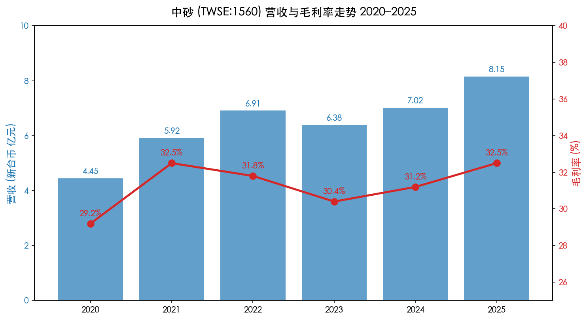
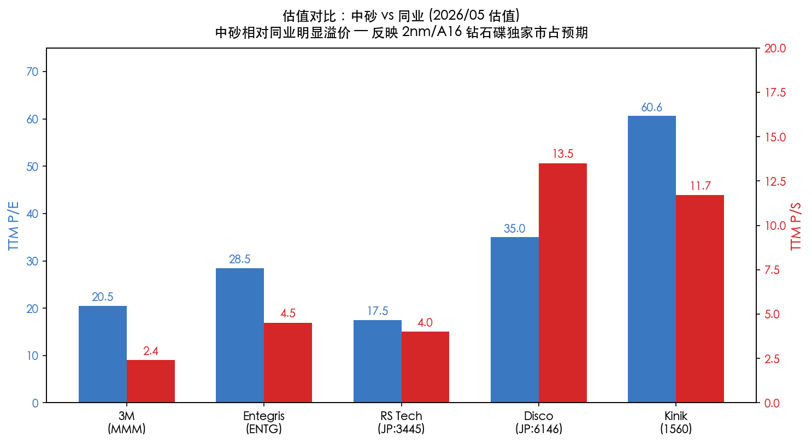
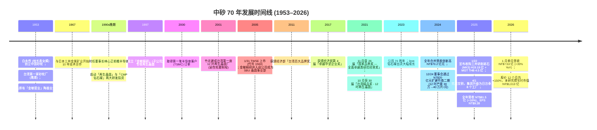
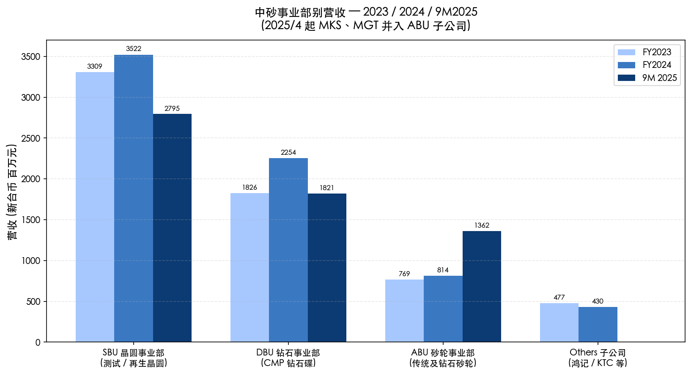
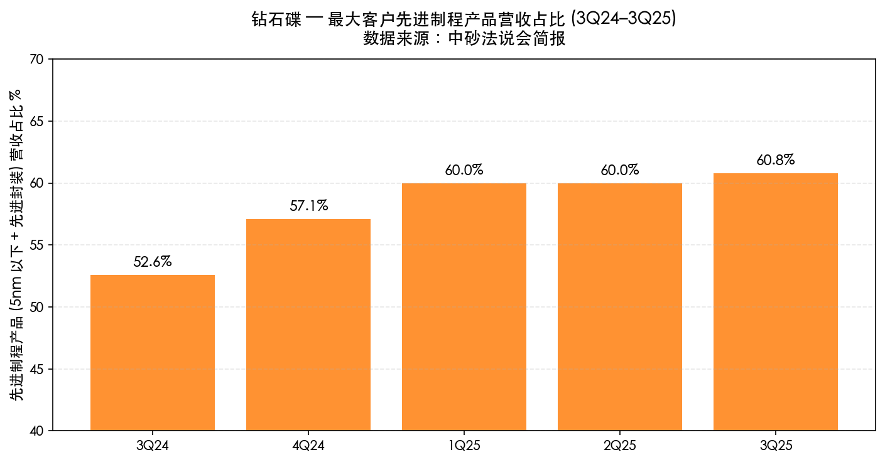
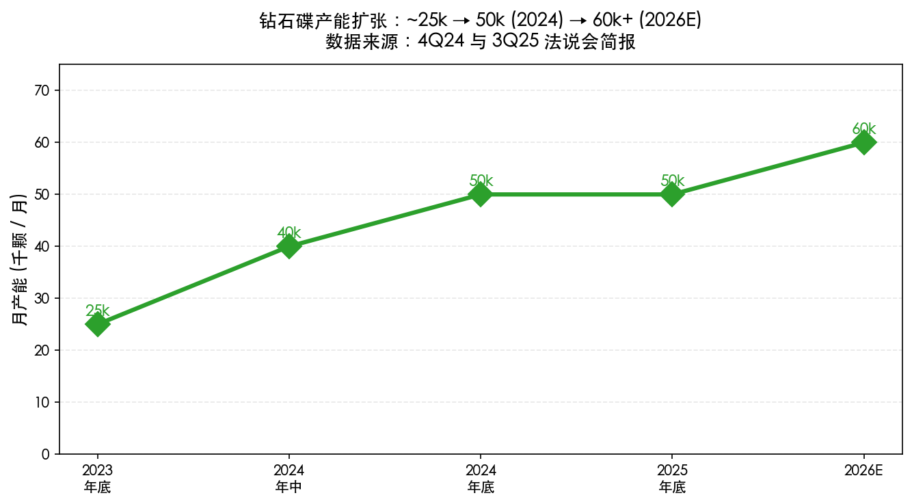
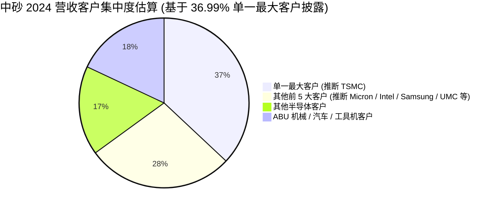
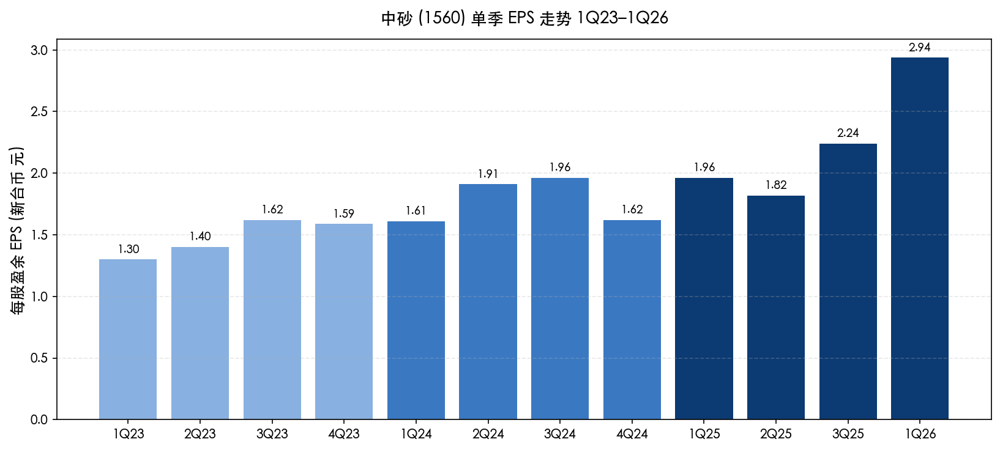
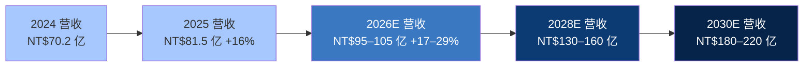

# 中砂（中国砂轮企业股份有限公司）公司研究报告 — KINIK Company（TWSE:1560）

> **报告基准日：2026-05-25** ｜ 报告语言：简体中文（数据源含繁体中文 / 英文公开披露，引用标题保留原语言）
> 主要研究依据：[KINIK 2024 Annual Report（2025/04/30 印发）](https://www.kinik.com.tw/upload/Investors/AnnualReport/AnnualReport-2024.pdf)、[2024Q4 法说会简报（2025/02/26）](https://www.kinik.com.tw/upload/Investors/Conference/2024Q4%20KINIK%20%E4%B8%AD%E7%A0%82%E5%85%AC%E5%8F%B8%E6%B3%95%E8%AA%AA%E6%9C%83%20%E5%8F%B0%E6%96%B0%E8%AD%89%E5%88%B820250226%20.pdf)、[2025Q3 法人座谈简报（2025/10/28）](https://www.kinik.com.tw/upload/Investors/Conference/2025Q3%20KINIK%20%E4%B8%AD%E7%A0%82%E5%85%AC%E5%8F%B8%E6%B3%95%E4%BA%BA%E5%BA%A7%E8%AB%87%20%E5%9C%8B%E7%A5%A8%E8%AD%89%E5%88%B820251028.pdf)、[KINIK 官网](https://www.kinik.com.tw/en-us/) 与 [Mitsui 收购公告](https://www.marketscreener.com/quote/stock/KINIK-COMPANY-6497580/news/Kinik-Company-entered-into-a-formal-acquisition-agreement-to-acquire-Mitsui-Grinding-Wheel-Co-Ltd-48843848/)。

---

> ## ⚡ 即时观察（Banner）— 公司近一年发生了什么
>
> **股价与估值**：截至 2026-05-25 收盘价约 **NT$720**，市值 **NT$1,013 亿元**；过去 12 个月股价上涨 **+150%**，[TTM P/E 60.6×、Forward P/E 52.4×、TTM P/S 11.7×](https://stockanalysis.com/quote/tpe/1560/) — 明显高于其多年正常区间，并显著高于同业（[3M 约 20×](https://stockanalysis.com/stocks/mmm/)、[Entegris 约 28×](https://stockanalysis.com/stocks/entg/)）。重估值反映市场对 **TSMC 2nm（N2）量产期间钻石碟独家市占** 的乐观预期。
>
> **重大策略事件**：
> 1. **2024-12-24** 董事会决议加码 **NT$20 亿元** 资本支出，扩建竹南二期 12 吋再生晶圆产能 — 2026 H2 起总产能由 30 万片/月增至 **40 万片/月**（见 [2024 Annual Report, p.167](https://www.kinik.com.tw/upload/Investors/AnnualReport/AnnualReport-2024.pdf)）。
> 2. **2025-01-22** 董事会通过收购日本三井金属矿业旗下 **三井研削砥石（MKS）100% 股权（¥19.19 亿日元）** 及泰国 **MGT（THB 4.5 亿）**，合计约 **NT$8.36 亿元**；**2025-04-01** 完成交割并改名 MAX KINIK；4 月起并入合并报表，立即将 ABU 砂轮事业部营收占比由 18% 推高到 22% — 这是 1953 年以来公司最大的海外并购（[Kinik 新闻稿，2025-01-22](https://www.kinik.com.tw/upload/Investors/Conference/2024Q4%20KINIK%20%E4%B8%AD%E7%A0%82%E5%85%AC%E5%8F%B8%E6%B3%95%E8%AA%AA%E6%9C%83%20%E5%8F%B0%E6%96%B0%E8%AD%89%E5%88%B820250226%20.pdf)）。
> 3. **2025 全年合并营收 NT$81.5 亿元（+16% YoY）、EPS NT$9.28** （[financial summary，statementdog](https://statementdog.com/analysis/1560/eps)）；2026 年 1 月单月营收 **NT$7.53 亿元（+33% YoY）**、Q1 2026 EPS NT$2.94、毛利率 35%（[Yahoo Stock，1560](https://tw.stock.yahoo.com/quote/1560.TW)）— 2nm 钻石碟与高阶再生晶圆双轮驱动。
> 4. **客户集中度警讯**：2024 年单一最大客户营收占比由 2023 年约 35% 提升至 **36.99%**（多方研究皆指向台积电 TSMC），高于本研究"前 1 大客户 > 20%"的物质风险门槛，是后续 Section 5 与 Section 9 的关键风险变数（[2024 Annual Report, p.169](https://www.kinik.com.tw/upload/Investors/AnnualReport/AnnualReport-2024.pdf)）。
> 5. **2nm 进展**：3Q25 单一最大客户 5nm 以下 + 先进封装产品占其钻石碟营收 **60.8%**（上季 60.0%）；其中 **2nm 钻石碟营收单季环比 +35.5%**；新增的海外 IDM 客户（管理层未点名，市场普遍解读为 Intel）已在 3Q25 开始贡献先进制程营收，并将 Q4 起送样成熟制程（[2025Q3 法说会简报, p.9](https://www.kinik.com.tw/upload/Investors/Conference/2025Q3%20KINIK%20%E4%B8%AD%E7%A0%82%E5%85%AC%E5%8F%B8%E6%B3%95%E4%BA%BA%E5%BA%A7%E8%AB%87%20%E5%9C%8B%E7%A5%A8%E8%AD%89%E5%88%B820251028.pdf)）。

---

## 目录

1. [公司概览](#1-公司概览)
2. [公司历史](#2-公司历史)
3. [管理团队](#3-管理团队创始世系与现任高管)
4. [产品与服务](#4-产品与服务--最关键一章)
5. [客户与上市策略](#5-客户与上市策略)
6. [行业概览](#6-行业概览)
7. [竞争格局](#7-竞争格局)
8. [市场机会与 TAM](#8-市场机会与-tam)
9. [风险评估](#9-风险评估)
10. [参考资料](#10-参考资料)

---

## 1. 公司概览

**中国砂轮企业股份有限公司**（英文名：KINIK Company，证券代号 **TWSE:1560**）是一家成立于 1953 年的台湾综合性研磨制品制造商。表面上看公司业务横跨三大事业群 — 砂轮 (ABU)、钻石碟 (DBU)、晶圆 (SBU) — 但实质上，**自 2000 年代中期起，半导体已成为公司绝对核心业务**：根据 2025/10 法说会简报，2024 年半导体相关营收约 NT$58 亿元，**占合并营收 82%**，且毛利率 34% 较公司整体 31% 高出约 3 ppt（[2025Q3 法说会简报, p.20](https://www.kinik.com.tw/upload/Investors/Conference/2025Q3%20KINIK%20%E4%B8%AD%E7%A0%82%E5%85%AC%E5%8F%B8%E6%B3%95%E4%BA%BA%E5%BA%A7%E8%AB%87%20%E5%9C%8B%E7%A5%A8%E8%AD%89%E5%88%B820251028.pdf)）。换言之，从估值角度而言，1560 实质上是一家"伪装成传统机械概念股的高端半导体耗材公司"。

公司总部位于 **新北市鹰歌区中山路 64 号**，电话 +886-2-2679-1931，IR 信箱 [ir@kinik.com.tw](mailto:ir@kinik.com.tw)。2024/12/31 实收资本额 **NT$14.6 亿元**；2025/09/30 实收资本额经员工认股权增至 **NT$14.69 亿元**（[2025Q3 法说会简报, p.11](https://www.kinik.com.tw/upload/Investors/Conference/2025Q3%20KINIK%20%E4%B8%AD%E7%A0%82%E5%85%AC%E5%8F%B8%E6%B3%95%E4%BA%BA%E5%BA%A7%E8%AB%87%20%E5%9C%8B%E7%A5%A8%E8%AD%89%E5%88%B820251028.pdf)）。截至 2025/Q3 全球员工约 **2,400 人**（台湾约 1,800 人），并购 MKS / MGT 后增加日本与泰国员工；制造据点共 **8 个**（台湾 5 个 — 鹰歌、树林、湖口、竹北、竹南；泰国 2 个 — KTC、MGT；日本 1 个 — MKS），见 Section 4 末段图表。公司 2005 年 1 月 31 日挂牌上市，迄今已连续 24 年发放股利，累计 NT$59.39 元（[财报狗，1560](https://statementdog.com/analysis/1560/dividend-policy)）。

**最新财务概要**：FY2024 合并营收 **NT$70.19 亿元（+10.0% YoY）**，毛利率 **31.2%（+0.7 ppt YoY）**，营业利益率 **16.5%（+1.0 ppt YoY）**，净利率 **15.1%**，EPS **NT$7.10（+20.1% YoY）**，ROE **15.3%**；FY2025 全年营收 **NT$81.5 亿元（+16.1%）**、EPS **NT$9.28**；进入 2026 年单月营收持续创高（[2024Q4 法说会简报, p.5](https://www.kinik.com.tw/upload/Investors/Conference/2024Q4%20KINIK%20%E4%B8%AD%E7%A0%82%E5%85%AC%E5%8F%B8%E6%B3%95%E8%AA%AA%E6%9C%83%20%E5%8F%B0%E6%96%B0%E8%AD%89%E5%88%B820250226%20.pdf)，[financial summary，statementdog](https://statementdog.com/analysis/1560/eps)）。



**估值快照与同业比较**：2026-05-25 股价 NT$720，市值 NT$1,013 亿元。

| 指标 | 中砂 (TWSE:1560) | 3M (NYSE:MMM) | Entegris (NASDAQ:ENTG) | RS Technologies (TYO:3445) | Disco (TYO:6146) | 评注 |
|---|---|---|---|---|---|---|
| TTM P/E | **60.6×** | ~20.5× | ~28.5× | ~17.5× | ~35.0× | 显著高于多元化与晶圆代工 / 同业平均 |
| Forward P/E | 52.4× | ~16.0× | ~22.0× | ~15.0× | ~30.0× | 仍隐含逐季业绩持续上修 |
| TTM P/S | **11.7×** | ~2.4× | ~4.5× | ~4.0× | ~13.5× | 介于通用工业（3M）与高纯度设备耗材（Disco）之间 |
| 1-yr 总报酬 | **+150%** | ~+25% | ~+35% | ~+15% | ~+20% | 显著超越同业 |
| 股息率 | 0.58% | 4.9% | 0.4% | 0.7% | 0.8% | 1560 因股价大幅上涨与发放率约 56% 拉低 |

数据来源：[stockanalysis.com / TPE:1560](https://stockanalysis.com/quote/tpe/1560/)、[Yahoo Finance / 1560.TW](https://tw.stock.yahoo.com/quote/1560.TW)、[Stockopedia / TPE:1560](https://www.stockopedia.com/share-prices/kinik-co-TPE:1560/)。



**估值解读**：60× TTM P/E 远高于同业，且高于公司过去 3 年区间（约 15–35×），属本研究判定的"延伸性多倍数"情境。**驱动因素有三**：（a）2026–2027 年 TSMC 2nm（N2）量产期间，中砂在客户钻石碟份额由 3nm 的 70%+ 进一步推升至接近 **80%**，2nm 制程 CMP 工序数较 3nm 大幅增加，量价齐升带动 DBU 营收高成长（[uanalyze, 2025-Q2 评论](https://uanalyze.com.tw/articles/7912316919)）；（b）三井收购（MKS+MGT）于 2025/04 并入，立即推升 ABU 营收基数约 NT$5 亿元 / 年，并打开日本汽车与精密零件磨削市场（[Kinik 新闻稿，2025-01-22](https://www.kinik.com.tw/upload/Investors/Conference/2024Q4%20KINIK%20%E4%B8%AD%E7%A0%82%E5%85%AC%E5%8F%B8%E6%B3%95%E8%AA%AA%E6%9C%83%20%E5%8F%B0%E6%96%B0%E8%AD%89%E5%88%B820250226%20.pdf)）；（c）流通在外股数仅 **1.47 亿股**，相对小盘股使多倍数易因主题催化而被放大（[stockanalysis.com / TPE:1560](https://stockanalysis.com/quote/tpe/1560/)）。**但请注意**：当 P/E 已嵌入未来 2–3 年 EPS 高成长情境时，业绩若不达预期或 2nm 良率延迟，估值杀伤力将十分显著（详见 Section 9 风险评估）。

---

## 2. 公司历史

中砂的故事 — 从陶土到半导体 — 是台湾产业升级最常被引用的案例之一。它的演进可清楚分为三个时代（[台湾产业创生平台专访《中国砂轮从陶瓷业跃入半导体业的奇幻旅程》](https://www.tw-ren.com/renaissance/686)）。



**陶瓷时代（1953 年之前）**。中砂的远源是创办家族的曾祖父 **林长寿** 创立的「金敏窑业」，主要生产陶土锅具，曾是鹰歌镇规模最大的陶器厂。面对日本陶瓷工业战后崛起、利润压缩的环境，家族决定运用既有的高温陶瓷烧结技术（陶瓷砂轮的核心也是陶瓷结合剂）转型升级（[台湾产业创生平台访谈](https://www.tw-ren.com/renaissance/686)）。

**砂轮时代（1953–1990 年代）**。1953 年，林长寿的女婿 **白永传** 主导陶瓷转向砂轮业，成立「中国砂轮」— 全台第一家砂轮厂，借由进口替代日本砂轮逐步扩张。中砂砂轮以陶瓷结合剂的烧结技术为核心，初期供应铸造、铸件、机械加工市场。1980–1990 年代是台湾机械工业崛起的黄金期，砂轮需求强劲；但中砂产品同质化高、客户黏性低，到 1990 年代中后期，营收触及 NT$10 亿元天花板。这是公司第一次"成长瓶颈"。

**半导体转型时代（1997 年至今）**。1990 年代末，时任董事长 **林心正**（创办人家族第三代）做出公司史上最关键的决策：将砂轮的陶瓷烧结与精密研磨技术延伸到半导体领域，启动两个大型研发投资 — **再生晶圆** 与 **CMP 钻石碟**。

- **再生晶圆**：与工研院机械所合作开发「延性轮磨 (Ductile Mode Grinding)」制程，取代传统研磨 (Lapping)。1997 年成立子公司 **金敏精研**，2000 年 3 月取得第一笔半导体大厂订单（市场普遍解读为 TSMC），2001 年建成台湾首座 12 吋再生晶圆厂于竹北。该投资仅一项投入约 NT$12 亿研发 + NT$10 亿厂房，20 多年累计创造营收逾 **NT$270 亿元**（[台湾产业创生平台访谈](https://www.tw-ren.com/renaissance/686)）。2005 年金敏精研并入母公司，成为现在的 **SBU 晶圆事业部**。
- **CMP 钻石碟**：同期启动，针对 CMP（化学机械抛光）制程开发出非掉砂（non-shedding）的钻石电铸 / 烧结涂层技术；公司目前拥有 300–400 项相关专利，是全球排名仅次于 3M 的第二大 CMP 钻石碟供应商（[台湾产业创生平台访谈](https://www.tw-ren.com/renaissance/686)；亦请参见 Section 7 竞争格局）。

**2005 年 TWSE 挂牌**（代号 1560）后，半导体业务持续超越传统砂轮业。2024 年合并营收中半导体相关业务占比已达 **82%**（[2025Q3 法说会简报, p.20](https://www.kinik.com.tw/upload/Investors/Conference/2025Q3%20KINIK%20%E4%B8%AD%E7%A0%82%E5%85%AC%E5%8F%B8%E6%B3%95%E4%BA%BA%E5%BA%A7%E8%AB%87%20%E5%9C%8B%E7%A5%A8%E8%AD%89%E5%88%B820251028.pdf)）。

**2025 年三井收购 — 第二次国际化跳跃**。2025/01/22 中砂宣布收购日本 **三井研削砥石 (MKS)** 100% 股权（¥19.19 亿日元）与泰国 **MGT** 99.57% 股权（THB 4.5 亿），合并对价约 NT$8.36 亿元。MKS 创立逾百年（1923 年起在三井金属矿业前身从事砂轮制造），主供日本汽车、螺杆与精密零件加工；MGT 1994 年成立，专精于无心磨、双平面磨、大型传统砂轮。中砂与三井早在 1967 年即开展 10 年技术合作，长期友好；本次收购被管理层定位为 "强强结合"。2025/04/01 完成交割并改名 **MAX KINIK Seimitsu / MAX KINIK Grinding Technology**，集团格局升至日、台、泰 3 地共 **8 个工厂**，砂轮事业线得到地理与客户结构的实质补强（[2024 Annual Report, p.166–167](https://www.kinik.com.tw/upload/Investors/AnnualReport/AnnualReport-2024.pdf)）。

---

## 3. 管理团队（创始世系与现任高管）

**注：依本研究方法论，仅介绍创办家族 / 第一代经营人与现任董事长 / 总经理，其他董事与一级主管不在本章节范围。**

### 创办世系

| 世代 | 姓名 | 角色 | 关键贡献 |
|---|---|---|---|
| 第一代 | **林长寿** | 金敏窑业创办人 | 鹰歌最大陶器厂；为家族奠定陶瓷烧结技术基础 |
| 第二代 | **白永传** | 1953 中砂创办人；林长寿的女婿 | 主导陶瓷→砂轮转型；建立台湾第一家砂轮厂 |
| 第三代 | **林心正** | 1990s 晚期董事长 | 启动再生晶圆 + 钻石碟两大半导体研发，定义今日中砂 |
| 第四代 | **林伯全 (Po-Chuan Lin)** | 现任董事长 | 接棒经营、推动 RBA / 永续；2025 主导三井并购 |

**联合创办人 / 砂轮事业奠基者 — 白永传 (1953 年起)**。白氏家族与林氏家族世代联姻 (Pai 系亲属持有 Lihe Investment 50% / 37.5% 股权，参见 [2024 Annual Report, p.12 法人股东表](https://www.kinik.com.tw/upload/Investors/AnnualReport/AnnualReport-2024.pdf)）。白永传在 1953 年说服岳父林长寿将金敏窑业的陶土事业部分转型砂轮制造，是中砂从陶瓷业跨入研磨制品业的关键人物。白家第二代 **白文良 (Wen-Liang Pai)** 现任副董事长 (Kinchuan Investment 代表)、第三代 **白景中 (Tony Pai)** 担任董事兼代理发言人，是公司治理上具影响力的家族支系（[2024 Annual Report, p.15](https://www.kinik.com.tw/upload/Investors/AnnualReport/AnnualReport-2024.pdf)）。

**关键战略人物 — 林心正 (1990s 晚期董事长)**。林心正是中砂今日营收结构最重要的塑造者。在公司因砂轮业触及成长天花板时，他坚持将"研磨技术"延伸到半导体场域 — 据《台湾产业创生平台》专访记录，他亲口说"没有砂轮我们活不下来；只有砂轮我们也成长不了" — 这成为中砂跨入半导体业的策略宣言。在他任内的 1997 年成立金敏精研，2000 年取得首笔半导体订单，2001 年完成 12 吋再生晶圆厂建置。林心正在 1990s 晚期的资本配置决策（一次投入 NT$22 亿研发 + 厂房）20 多年后被证明是台湾产业转型最成功的几个案例之一（[台湾产业创生平台访谈](https://www.tw-ren.com/renaissance/686)）。

### 现任高管

**董事长 — 林伯全 (Po-Chuan Lin)**（创办家族第四代）。学历：**国立台湾大学高阶管理硕士学程（EMBA）**。在中砂服务已超过 10 年；从基层业务员起步，依次担任董事长特别助理，现任董事长，并同时担任旗下电铸砂轮子公司 **鸿记工业** 董事长、KINKI INV LTD COMPANY 负责人、Kinik-Japan 及 Kinik-Thai 董事长。家族持股结构上，**林伯全于关键投资公司 Kinik Investment Co., Ltd. 持股 32.40%，于 KINKI INV LTD COMPANY 持股 38.06%**，与弟弟 Po-Yin Lin (32.40% / 38.04%)、母亲 Man-Li Lin Chen (30.46%) 共同构成林家控股核心（[2024 Annual Report, p.10, p.13](https://www.kinik.com.tw/upload/Investors/AnnualReport/AnnualReport-2024.pdf)）。林伯全任内的两项重大决策是 **(a) 推动公司加入 Responsible Business Alliance (RBA) 行为准则、建立永续发展委员会**；**(b) 主导 2025 年三井砂轮并购**，将公司发展史推进到全球化阶段。他的经营履历比林心正世代更偏向营运 / 治理而非研发，符合"由开创者转型为整合者"的世代分工。

*分析师观点*：林家第四代的董事长 + 谢荣哲（专业经理人 + ITRI 技术背景）总经理 + 林家其他成员 (Po-Yin Lin 现任高级经营顾问) 的组合在台湾家族企业中较常见 — 家族保持策略主导权，将技术 / 营运执行交付有专业背景的高管，是中砂未来 5–10 年的核心治理模式。这一模式的稳定性高于"家族独大"，但低于"完全专业化"的纯专业经理人公司。

**总经理 (President) — 谢荣哲 (Jung-Che Hsieh)**。学历：**日本庆应大学机械工程硕士、台湾大学 EMBA**。前职于工业技术研究院（ITRI）**机械与机电系统研究所精密元件技术组组长**，专攻硬脆材料精密研磨。他主导建立"延性轮磨制程"，并率领团队建成台湾第一家再生晶圆厂 — 也就是说，他是中砂半导体业务的技术奠基人之一，与林心正世代的策略决策互补。曾获"十大杰出青年工程师"、新竹中华专业经营协会"杰出总经理"奖项（[2024 Annual Report, p.14](https://www.kinik.com.tw/upload/Investors/AnnualReport/AnnualReport-2024.pdf)）。

*分析师观点*：从公司治理角度，谢荣哲是市场上少数横跨日本机械学术训练 + 台湾本土研发产业链整合 + 财金管理的高阶人才；其专业领域 — 硬脆材料精密加工 — 正好与 SBU 再生晶圆、DBU 钻石碟两大成长引擎完全对齐，因此他的留任与持续投入是评估公司 5 年期成长可见度的关键观察变量之一。任何 CEO 异动公告应触发投资者重新检视模型基础假设。

---

## 4. 产品与服务 — *本研究最关键的一章*

中砂的产品体系横跨三大事业部 + 4 家子公司：**ABU (砂轮事业部) / DBU (钻石事业部) / SBU (晶圆事业部) / 鸿记 (台湾电铸) / KTC (泰国 Kinik-Thai) / MKS (日本三井 MAX KINIK Seimitsu) / MGT (泰国三井 MAX KINIK Grinding Technology)**。以下完整介绍每一条产品线，并依"做什么 → 与同门产品的差异 → 战略意义"三步骤说明。

### 4.0 整体产品矩阵（公司自有图）

下表 / 图为中砂在 2025Q3 法说会简报第 18 页所发布的"Major Product and Business Diagram"，是本章节最直接的官方依据：

```mermaid
graph TD
    KINIK[KINIK Group<br/>合并营收 2024 NT$70.2 亿]

    KINIK --> SBU
    KINIK --> DBU
    KINIK --> ABU
    KINIK --> SUBS[子公司]

    SBU["**SBU 晶圆事业部**<br/>(竹北 / 竹南厂)<br/>客户：半导体业<br/>2024 占营收 50% / NT$35.2 亿"]
    SBU --> SBU_P1[测试晶圆 Test Wafer]
    SBU --> SBU_P2[再生晶圆 Reclaim Wafer]
    SBU --> SBU_P3[特殊 / 高阶承载晶圆]

    DBU["**DBU 钻石事业部**<br/>(鹰歌 / 树林 / 湖口厂)<br/>客户：半导体 / 先进封装<br/>2024 占营收 32% / NT$22.5 亿"]
    DBU --> DBU_P1[CMP 钻石碟<br/>Conventional 系列<br/>DiaGrid / I-DiaGrid / S-DiaGrid]
    DBU --> DBU_P2[CMP 钻石碟<br/>Advanced 系列<br/>Pyradia / equaDia / EDP / CVD-WAVE]
    DBU --> DBU_P3[晶圆研磨砂轮<br/>WLP / PLP / 2.5D / 3D]
    DBU --> DBU_P4[切割软刀 Dicing Blade]
    DBU --> DBU_P5[多孔陶瓷真空吸盘]
    DBU --> DBU_P6[PCD / SCD / PcBN 超精密刀具]

    ABU["**ABU 砂轮事业部**<br/>(鹰歌厂)<br/>客户：机械 / 工具机<br/>2024 占营收 12% / NT$8.1 亿<br/>2025H1 含子公司占 22%"]
    ABU --> ABU_P1[传统陶瓷砂轮]
    ABU --> ABU_P2[钻石 / CBN 树脂砂轮]
    ABU --> ABU_P3[蜂巢砂轮 SiC 用]
    ABU --> ABU_P4[鑽石滚轮 Diamond Roller]

    SUBS["**4 家研磨子公司**<br/>2024 占合并营收 6%"]
    SUBS --> S1[鸿记工业<br/>台湾 / 电铸砂轮]
    SUBS --> S2[KTC<br/>泰国 / 树脂 + 陶瓷砂轮]
    SUBS --> S3["MKS 2025/4 并入<br/>日本 / 中大型精密砂轮"]
    SUBS --> S4["MGT 2025/4 并入<br/>泰国 / 无心磨 + 双平面磨"]
```



资料来源：[2025Q3 法说会简报, pp.4, 18](https://www.kinik.com.tw/upload/Investors/Conference/2025Q3%20KINIK%20%E4%B8%AD%E7%A0%82%E5%85%AC%E5%8F%B8%E6%B3%95%E4%BA%BA%E5%BA%A7%E8%AB%87%20%E5%9C%8B%E7%A5%A8%E8%AD%89%E5%88%B820251028.pdf)，2024 年事业部营收占比来自同份简报。

下图为 FY2023 / FY2024 / 9M2025 三期段事业部营收对比：



**事业部营收对比表（合并财报）**（万元新台币 → 万元；数据精度为千元四舍五入）：

| 事业部 | FY2023 | FY2024 | YoY | 9M2025 | YoY |
|---|---|---|---|---|---|
| ABU + 砂轮子公司 | 1,246.2 | 1,243.7 | -0.2% | 1,362.2 | +44.6% |
| DBU 钻石事业部 | 1,825.7 | 2,254.1 | +23.5% | 1,820.8 | +11.1% |
| SBU 晶圆事业部 | 3,308.9 | 3,521.7 | +6.4% | 2,794.7 | +7.3% |
| **合计** | 6,380.9 | 7,019.5 | **+10.0%** | 5,977.7 | **+15.3%** |

资料来源：[2024Q4 法说会简报, p.7](https://www.kinik.com.tw/upload/Investors/Conference/2024Q4%20KINIK%20%E4%B8%AD%E7%A0%82%E5%85%AC%E5%8F%B8%E6%B3%95%E8%AA%AA%E6%9C%83%20%E5%8F%B0%E6%96%B0%E8%AD%89%E5%88%B820250226%20.pdf) 与 [2025Q3 法说会简报, p.7](https://www.kinik.com.tw/upload/Investors/Conference/2025Q3%20KINIK%20%E4%B8%AD%E7%A0%82%E5%85%AC%E5%8F%B8%E6%B3%95%E4%BA%BA%E5%BA%A7%E8%AB%87%20%E5%9C%8B%E7%A5%A8%E8%AD%89%E5%88%B820251028.pdf)。FY2024 ABU 数字为 813.76M 但简报含两类子公司，实际"ABU 系" = 1,243.7M (= 813.8 + 429.9 ABU 子公司)。

---

### 4.1 DBU — CMP 钻石碟（核心成长引擎）

**中文释义 / Plain-language gloss**：CMP (Chemical Mechanical Planarization, 化学机械抛光) 是先进 IC 制程中"把每一层金属或介电层磨平再继续叠下一层"的关键工序；钻石碟 (Diamond Disk / Pad Conditioner) 就是 CMP 抛光垫的"砥砺工具" — 在抛光晶圆的同时刮整抛光垫表面，移除研磨副产物、维持稳定的去除率与平坦度，延长抛光垫寿命。从 28nm 到 5/3/2nm，**每往下走一代节点，CMP 工序数大约增加 1.2–1.5 倍**，且对去除率均匀性与缺陷率的要求更严苛 — 这是中砂 DBU 业务过去 5 年高成长的物理基础（[TECHCET, 2025 CMP outlook](https://techcet.com/cmp-ancillaries-to-double-in-2025/)）。

#### 4.1.1 中砂自有 CMP 钻石碟产品矩阵

下表完整列出 2025Q3 简报所披露的全部产品系列，并标注其物理特性与应用场景。系列名称严格保留公司商标格式（包含 ®）：

| 系列 / 型号 | 类别 | 物理特性（管理层语） | 主要应用 |
|---|---|---|---|
| **DiaGrid®** | Conventional | 钻石颗粒规则排列，金属结合烧结 | 成熟制程（28nm 及以上）通用钻石碟 |
| **I-DiaGrid®** | Conventional / 中阶 | DiaGrid 改良版，颗粒优化排列 | 中阶节点 (28–14nm) 通用 |
| **S-DiaGrid®** | Conventional / 标准款 | 标准盘面规格 | 成熟制程标准款 |
| **Pyradia®** | Advanced | 高强度金属结合 (Ni / Cr 粉末)、约 1000°C 烧结、强钻石锁固 | 先进 logic / memory 节点；高耐磨需求 |
| **O-Pyradia®** | Advanced / 无金属 | 聚合物 (Polymer) 基板与结合剂；< 100°C 制程；具耐酸碱性 | 先进节点 (5nm 以下) 需金属污染严格控制场景 |
| **EDP Disk** | Advanced / 无金属 | 电铸钻石外覆 EDP 薄膜，达成 metal-free | 同上，metal-free 应用 |
| **CVD-WAVE®** | Advanced / 高耐磨 | 化学气相沉积钻石波浪型涂层 | 2nm / A16 高频换碟、高去除率需求 |
| **equaDia®** | Advanced / 长寿命 | 颗粒尖端高度精控制 (tip height leveling)、寿命延长 | 高产能 fab，对碟片寿命与稳定性要求严苛 |

资料来源：[2025Q3 法说会简报, pp.24, 25, 26, 27](https://www.kinik.com.tw/upload/Investors/Conference/2025Q3%20KINIK%20%E4%B8%AD%E7%A0%82%E5%85%AC%E5%8F%B8%E6%B3%95%E4%BA%BA%E5%BA%A7%E8%AB%87%20%E5%9C%8B%E7%A5%A8%E8%AD%89%E5%88%B820251028.pdf)；产品描述为简报原文。

**与同门差异 — 走进 3nm / 2nm 制程**。3 个 Conventional 系列均为 2010 年代初期成熟产品，目前主供 28nm 以上节点；真正驱动 2023 年后高成长的是 **Pyradia / equaDia / CVD-WAVE / O-Pyradia / EDP** 这五个 Advanced 系列。其中 **O-Pyradia 与 EDP** 是为应对 5nm 以下节点对 "metal-free" 严苛要求开发 — 因为传统 Ni / Cr 金属结合在抛光过程中即使微量脱落，亦可能污染先进制程晶圆，造成良率损失。两者差异：O-Pyradia 用聚合物基板 + 聚合物结合剂；EDP 则以电铸钻石外覆 EDP 薄膜达成 metal-free，制程温度与适用场景不同（[2025Q3 法说会简报, p.27](https://www.kinik.com.tw/upload/Investors/Conference/2025Q3%20KINIK%20%E4%B8%AD%E7%A0%82%E5%85%AC%E5%8F%B8%E6%B3%95%E4%BA%BA%E5%BA%A7%E8%AB%87%20%E5%9C%8B%E7%A5%A8%E8%AD%89%E5%88%B820251028.pdf)）。

**战略意义 — 与 N3 / N2 节点扩张的物理同步性**。3Q25 单一最大客户先进制程产品 (5nm 以下 + 先进封装) 营收占其钻石碟营收比重已达 **60.8%**（上季 60.0%），其中 **2nm 钻石碟营收单季环比 +35.5%**（[2025Q3 法说会简报, p.9](https://www.kinik.com.tw/upload/Investors/Conference/2025Q3%20KINIK%20%E4%B8%AD%E7%A0%82%E5%85%AC%E5%8F%B8%E6%B3%95%E4%BA%BA%E5%BA%A7%E8%AB%87%20%E5%9C%8B%E7%A5%A8%E8%AD%89%E5%88%B820251028.pdf)）— 这显示中砂在客户最新节点的市占持续扩张。



依市场研究估算 — 中砂在台积电 **3nm 制程钻石碟份额 > 70%**，**2nm 目标 80%**；且已**送样美国某 IDM 厂（市场普遍解读为 Intel）** 进入认证（[uanalyze, Kinik Q2 评论](https://uanalyze.com.tw/articles/7912316919)、[uanalyze, 中砂分析](https://uanalyze.com.tw/articles/671744385)）。这一份额结构使中砂的 DBU 业务实质上是 **TSMC 先进制程 capex 的直接乘数**。

#### 4.1.2 钻石碟产能扩张

依 2024Q4 / 2025Q3 法说会，钻石碟月产能由 2023 年底约 **25k 颗** → 2024 年中 **40k 颗** → 2024 年底 **50k 颗** → 2026 年再依需求扩充。以 9M2025 DBU 营收 NT$18.2 亿 计算，全年大约 NT$24 亿元，月均出货推估接近 50k 颗满产；管理层在 3Q25 法说明确表示 **"年底前出货预期接近五万颗/月，2026 年将依据需求持续新增产能"**（[2025Q3 法说会简报, p.12](https://www.kinik.com.tw/upload/Investors/Conference/2025Q3%20KINIK%20%E4%B8%AD%E7%A0%82%E5%85%AC%E5%8F%B8%E6%B3%95%E4%BA%BA%E5%BA%A7%E8%AB%87%20%E5%9C%8B%E7%A5%A8%E8%AD%89%E5%88%B820251028.pdf)）。



### 4.2 SBU — 测试与再生晶圆（最大收入来源）

**中文释义 / Plain-language gloss**：再生晶圆 (Reclaim Wafer) 是把晶圆厂用过的测试晶圆（如设备校机用、SPC 测试用、监控用）重新进行表面研磨 + 抛光 + 清洁，恢复到接近原生晶圆的表面状态，再以约新晶圆 30–50% 的价格回售给晶圆厂。**对晶圆厂而言：每片新晶圆约 USD 90+，每片再生晶圆约 USD 30–50；当新晶圆 (Shin-Etsu / SUMCO) 长期紧缺时，再生晶圆既是成本节省也是供应链冗余**（[silicon reclaim market overview, businessresearchinsights](https://www.businessresearchinsights.com/market-reports/silicon-reclaim-wafers-market-106093)）。

中砂的差异点在 "延性轮磨 (Ductile Mode Grinding)" — 用钻石磨轮的延性切削模式取代传统 lapping，可降低加工变质层厚度，减少化学药品污染，提高加工精度。**这是 2001 年公司技术团队在与 ITRI 合作时建立的工艺优势**，至今仍是与日本 SUMCO 子公司、Mimasu、RS Technologies 等竞争对手相比的核心差异点（[2025Q3 法说会简报, p.22](https://www.kinik.com.tw/upload/Investors/Conference/2025Q3%20KINIK%20%E4%B8%AD%E7%A0%82%E5%85%AC%E5%8F%B8%E6%B3%95%E4%BA%BA%E5%BA%A7%E8%AB%87%20%E5%9C%8B%E7%A5%A8%E8%AD%89%E5%88%B820251028.pdf)）。

**产能与扩张**：12 吋月产能 2024 年约 30 万片满载 → 2025/07 起增至 33 万片 → **2026 H2 起再扩 7 万片至 40 万片**（NT$20 亿元 capex；[2024 Annual Report, p.167](https://www.kinik.com.tw/upload/Investors/AnnualReport/AnnualReport-2024.pdf)）。8 吋月产能 15 万片，相对成熟。

**产品结构升级**：除标准再生晶圆外，公司近年扩张：
- **高阶再生晶圆**：3Q25 已成主要成长来源，对 N5 以下节点客户出货增加。
- **HBM 特殊晶圆**：依 uanalyze 报导，HBM 特殊晶圆出货量预计 3Q25 较 Q1 翻三倍（[uanalyze, Kinik Q2 评论](https://uanalyze.com.tw/articles/7912316919)）；HBM 是 DRAM 厂 (SK hynix / Micron / Samsung) 因 AI 训练 GPU 需求暴涨的主战场。
- **承载晶圆 (Carrier Wafer)**：管理层在 2025Q1 法说提及为未来产品组合扩张方向之一（[uanalyze, 2025-Q2 评论](https://uanalyze.com.tw/articles/7912316919)）— 与先进封装需求相关。

**与 DBU 的差异**：DBU 是耗材（每块抛光垫使用一段时间就需换碟），SBU 是循环服务（晶圆来回循环再生）— 商业模式上 SBU 现金流稳定性高于 DBU，但季度增速通常较低；2024 年 SBU YoY +6.4%、9M25 +7.3% 即为典型例子（[2024Q4 法说会简报, p.7](https://www.kinik.com.tw/upload/Investors/Conference/2024Q4%20KINIK%20%E4%B8%AD%E7%A0%82%E5%85%AC%E5%8F%B8%E6%B3%95%E8%AA%AA%E6%9C%83%20%E5%8F%B0%E6%96%B0%E8%AD%89%E5%88%B820250226%20.pdf)）。

### 4.3 ABU — 砂轮事业部（基本盘 + 三井扩张）

ABU 是公司最古老的事业 — 1953 年中砂的起点 — 产品涵盖传统陶瓷砂轮、钻石/CBN 树脂砂轮、电铸砂轮、蜂巢砂轮、磨刀板等，主要应用于：精密机械的滑轨与齿轮研磨、钢铁业辊筒、高速钢钻头、CNC 与 PCD/PcBN 刀具研磨、半导体晶圆减薄与倒角研磨、SiC 等硬脆材料的蜂巢研磨、光学模具抛光（[2025Q3 法说会简报, p.33](https://www.kinik.com.tw/upload/Investors/Conference/2025Q3%20KINIK%20%E4%B8%AD%E7%A0%82%E5%85%AC%E5%8F%B8%E6%B3%95%E4%BA%BA%E5%BA%A7%E8%AB%87%20%E5%9C%8B%E7%A5%A8%E8%AD%89%E5%88%B820251028.pdf)）。

**ABU 2025 年的格局重塑** — 三井收购前后：

| 项目 | 2024 (并购前) | 2025 H1 (并购后) | 主要差异 |
|---|---|---|---|
| 营收占比 | 18% (含原子公司鸿记 + KTC) | 22% (新增 MKS + MGT) | +4 ppt |
| 工厂数 | 鹰歌 + 鸿记 + KTC (3 厂) | + 日本 MKS + 泰国 MGT (5 厂) | 全球化 |
| 客户基础 | 台湾 + 东南亚 | + 日本汽车 / 螺杆 / 精密零件 | 日本市场首次直接覆盖 |
| 产品深度 | 标准砂轮 | + 中大型精密砂轮 (MKS) + 无心磨 / 双平面磨 (MGT) | 客制化高阶产品扩张 |

2025/04 三井并入合并报表后，9M25 ABU+ 子公司营收已 NT$13.6 亿元 (+44.6% YoY)；管理层于 3Q25 法说指出，台湾传产机械工具机受新台币升值与关税影响产能利用率持续下降，但 MKS / MGT 进入下半年营收预计持平（[2025Q3 法说会简报, p.12](https://www.kinik.com.tw/upload/Investors/Conference/2025Q3%20KINIK%20%E4%B8%AD%E7%A0%82%E5%85%AC%E5%8F%B8%E6%B3%95%E4%BA%BA%E5%BA%A7%E8%AB%87%20%E5%9C%8B%E7%A5%A8%E8%AD%89%E5%88%B820251028.pdf)）。

**与同门差异**：ABU 业务的循环性 (cyclicality) 与 DBU/SBU 高度反向 — ABU 受全球机床景气与汽车业资本支出主导，而 DBU/SBU 受半导体先进制程 capex 与晶圆产能利用率主导。这种 **"耗材双轨"** 结构理论上对中砂总体业绩稳定性有缓冲作用，但当前 (2025–2026) 两者均处于上行期，并未实际测试反向缓冲效果。

### 4.4 子公司 — 鸿记 / KTC / MKS / MGT

| 子公司 | 地点 | 产品 | 收购 / 设立年份 |
|---|---|---|---|
| **鸿记工业 (Hongia Industry)** | 新北市鹰歌区 | 电铸钻石砂轮、电铸砂轮 | 早期设立；现任董事长林伯全兼任 |
| **KTC (Kinik-Thai)** | 泰国 Prachinburi | 树脂砂轮 + 陶瓷砂轮 | 原有泰国据点 |
| **MKS (MAX KINIK Seimitsu)** | 日本 | 中大型精密砂轮、超磨料砂轮 | **2025/04 并入** (原三井研削砥石，1923 创立) |
| **MGT (MAX KINIK Grinding Technology)** | 泰国 | 无心磨砂轮、双平面磨、大型传统砂轮 | **2025/04 并入** (原 Mitsui Grinding Technology Thailand) |

资料来源：[2025Q3 法说会简报, pp.18, 39](https://www.kinik.com.tw/upload/Investors/Conference/2025Q3%20KINIK%20%E4%B8%AD%E7%A0%82%E5%85%AC%E5%8F%B8%E6%B3%95%E4%BA%BA%E5%BA%A7%E8%AB%87%20%E5%9C%8B%E7%A5%A8%E8%AD%89%E5%88%B820251028.pdf)、[Mitsui Grinding Technology Thailand 通知公告](https://www.smri.asia/en/mituigt/news/7224)。

### 4.5 工厂据点 (Plant Map)

```
台湾 (5 厂)
├── 鹰歌总厂 (新北市鹰歌区中山路 64 号) — Grinding Wheel + Diamond Disk
├── 树林厂 (新北市树林区) — Diamond Disk
├── 湖口厂 (新竹湖口工业区) — Diamond Cutting / Dicing Tools + PVD Coating
├── 竹北厂 (新竹县竹北市) — Reclaim + Test Wafer
└── 竹科厂 (苗栗县竹南镇) — Reclaim + Test Wafer ；2026 H2 扩产至 40 万片/月

子公司 / 海外 (3 厂)
├── 鸿记工业 (新北市鹰歌区) — Electroplated Diamond Wheel
├── KTC (泰国 Prachinburi) — Resin + Ceramic Wheel
├── MKS (日本) — 中大型精密砂轮 + 超磨料砂轮 (2025/04 并入)
└── MGT (泰国) — 无心磨 + 双平面磨砂轮 (2025/04 并入)
```

资料来源：[2025Q3 法说会简报, pp.37, 38, 39, 40](https://www.kinik.com.tw/upload/Investors/Conference/2025Q3%20KINIK%20%E4%B8%AD%E7%A0%82%E5%85%AC%E5%8F%B8%E6%B3%95%E4%BA%BA%E5%BA%A7%E8%AB%87%20%E5%9C%8B%E7%A5%A8%E8%AD%89%E5%88%B820251028.pdf)。

### 4.6 综合 — 产品互动与价值链定位

以下叙述将上述产品体系串联，回答"为什么三大事业部要存在于同一家公司？"。

中砂的核心能力是 **"超硬磨料的精密整形与定位"** — 不论是把钻石颗粒固化在金属或聚合物结合剂上的钻石碟（DBU）、把钻石磨轮的进给精度做到延性切削（SBU 的再生晶圆）、还是用陶瓷烧结结合剂做出精确硬度的传统砂轮（ABU），其底层技术都是 "如何在不同基材上以最佳排列、密度、强度固定超硬磨粒"。这是 1953 年砂轮事业起家的核心 know-how，在 1990 年代被林心正成功"翻译"到半导体场景。

具体到客户的工艺流程：

```
半导体晶圆厂 (Front-end)
   ↓
 [SBU 再生晶圆] 供应循环再生晶圆 → 测试 / 校机 / 监控用
   ↓
 [DBU 钻石碟 (Pyradia / equaDia / O-Pyradia)] 在 CMP 工序中砥砺抛光垫
   ↓ 各层金属化 (Cu / W / Co) 与介电层 (oxide / low-k) 反复 CMP
   ↓
 [DBU 钻石切割软刀 + 多孔陶瓷真空吸盘] 在 wafer dicing / WLP 封装中切割与抓取
   ↓
半导体封测厂 (Back-end + Advanced Packaging)
   ↓
 [DBU 晶圆研磨砂轮 + Dressing Board] 在 2.5D / 3D / WLP / PLP 封装中减薄与背面研磨
```

ABU 的传统 + 高阶砂轮则平行供应 **机械 / 工具机 / 汽车** 客户群 — 这是循环互补结构，但与 DBU/SBU 不交叉。三井收购后，集团在日本汽车研磨市场获得直接渠道，是 ABU 全球化的关键步骤。

**Section 4 小结**：中砂的产品体系并非"砂轮厂 + 半导体厂"的简单加总，而是 "超硬磨料应用工程学" 这一根技术树在三个客户场景的扇形展开。这是为什么市场愿意给传统砂轮厂出身的公司 60× P/E — 因为投资人买的是 1953 年起累积的烧结 / 结合剂 / 整形 know-how 在 3nm / 2nm 节点上的稀缺性。

---

## 5. 客户与上市策略

### 5.1 客户结构与集中度（关键风险数据点）

依据中砂 2024 年年度报告第 169 页"客户集中度风险分析"章节，原文摘录如下（[2024 Annual Report, p.169](https://www.kinik.com.tw/upload/Investors/AnnualReport/AnnualReport-2024.pdf)）：

> "The net revenue of the Company from the Company's largest customer accounts for approximately **36.99%** of the Company's net sales, and such ratio is higher than the ratio of last year, which is primarily due to the increase in the customer's demand year."

**单一最大客户营收占比 = 36.99%**，相比 2023 年再上升 (2023 年约 35%；公司未细分具体百分点)。**这一数字已远超本研究的"前 1 大客户 > 20% = 物质风险" 门槛**，须在 Section 9 风险评估中独立列示。

**客户身分推断**：管理层在法说会上一贯使用"国内单一最大客户"或"single largest customer" 等替代用语，未直接点名 — 这是台湾上市公司常见的 NDA 实务。但综合下述间接证据，**单一最大客户高度可能为 TSMC**：

1. 钻石碟先进制程 (5nm 以下) 营收占该客户钻石碟营收 60.8%；TSMC 是全球唯一在 5nm 以下大规模量产的纯晶圆代工厂（[TSMC's 2 nm Era / Substack, 2025](https://drrobertcastellano.substack.com/p/tsmcs-2-nm-era-technology-leadership)）。
2. 中砂在 N3 / N2 节点钻石碟份额 70%+ / 80% 的市场报导（[uanalyze, 中砂分析](https://uanalyze.com.tw/articles/671744385)）。
3. 多家台湾分析报告将中砂列为 "TSMC 先进制程供应链" 受益股（[Business Today, 台积电法说超标演出 18 档受惠股](https://www.businesstoday.com.tw/article/category/183008/post/202604220007/)）。
4. 公司本身位于鹰歌、树林、湖口、竹北、竹南 — 全数为 TSMC 供应链热区。

**其他重要客户**（依公开管理层引述与新闻报导，不一定按金额排序）：
- **美光 (Micron)**：HBM 与 DRAM 节点钻石碟与再生晶圆客户；管理层在多次法说提及 "美国记忆体大厂"。
- **联电 (UMC)**：成熟节点供应；近年比重下降但仍是 ABU/SBU 客户。
- **新增 美国 IDM 客户 (市场普遍解读为 Intel)**：3Q25 起开始贡献"最先进制程"营收；Q4 起送样成熟制程；2026 期预期逐季增量（[2025Q3 法说会简报, p.12](https://www.kinik.com.tw/upload/Investors/Conference/2025Q3%20KINIK%20%E4%B8%AD%E7%A0%82%E5%85%AC%E5%8F%B8%E6%B3%95%E4%BA%BA%E5%BA%A7%E8%AB%87%20%E5%9C%8B%E7%A5%A8%E8%AD%89%E5%88%B820251028.pdf)）。
- **三星 (Samsung)**：CMP 钻石碟有少量供应，但 Samsung 主要依赖韩国本土供应商 (Saesol / Shinhan / EHWA)；中砂在 Samsung 钻石碟份额相对小。
- **传统 ABU 客户**：日本汽车业（透过 MKS）、台湾工具机厂、CNC 制造商、PCB 制造商等。



**客户集中度趋势**：2022 至 2024 持续上升 (2022 约 30% → 2023 约 35% → 2024 36.99%)；2025–2026 期随 TSMC 2nm 量产、且中砂在客户钻石碟份额从 70% 走向 80%，预期单一最大客户营收占比可能进一步上升至 **40% 以上** — 这是公司管理层公开承认 "未来将继续开发新客户以降低集中度风险" 的现实压力（[2024 Annual Report, p.169](https://www.kinik.com.tw/upload/Investors/AnnualReport/AnnualReport-2024.pdf)）。

### 5.2 供应商集中度

同份年报披露 "最大供应商占采购金额 10.81%，主要为策略性原料采购" — 相对客户集中度风险温和，且公司表示将持续多元化供应商基础（[2024 Annual Report, p.169](https://www.kinik.com.tw/upload/Investors/AnnualReport/AnnualReport-2024.pdf)）。**原料端：** 公司核心原料为研磨料 (alumina / silicon carbide / 工业钻石 / CBN)，目前业界无替代材料，市场受经济周期影响为主（[2024 Annual Report, p.132](https://www.kinik.com.tw/upload/Investors/AnnualReport/AnnualReport-2024.pdf)）。

### 5.3 上市策略与股权结构

中砂 2005/01/31 于 TWSE 上市挂牌（代号 1560），属"电机机械" 产业分类。**家族控股结构** 依 2024 年年度报告第 12 页揭示：

- **Kinik Investment Co., Ltd.**（林家投资公司）股东：林伯全 32.40%、Po-Yin Lin 32.40%、Man-Li Lin Chen 30.46%、其他林家成员合计 5.4%。
- **Kinki Investment Ltd.**：林伯全 38.06%、Po-Yin Lin 38.04%、PRICELITE LIMITED 23.90%。
- **Lihe Investment Co., Ltd.**（白家投资公司）：白杨良 (Yang-Liang Pai) 50%、姜风梅 37.5%、Tony Pai 4.5%、其他白家成员 8%。
- **Kinchuan Investment Co., Ltd.**：100% 由 Kinan Investment 持有；Kinan 主要股东 PAI Wen-Liang 49.17%、Yu-Hua Lin 29.17%。

林、白两家透过 4 个投资公司交叉持股控制中砂，是典型的台湾家族控股结构。**控股稳定性**：依年报"过去一年董事 / 监察人 / 10% 以上股东均长期持股，未发生大额股权移转" 之披露，公司未来 3–5 年家族控股稳定性属高度（[2024 Annual Report, p.169](https://www.kinik.com.tw/upload/Investors/AnnualReport/AnnualReport-2024.pdf)）。

**股息政策**：公司过去 24 年连续发放股利，累计 NT$59.39 元；5 年平均现金股息率约 4.57%（[财报狗，1560 dividend policy](https://statementdog.com/analysis/1560/dividend-policy)）。2024 财年发放现金股利 NT$3.99（67.68% 发放率）；2025 财年依新闻预计发放约 NT$5.00 (2024 EPS NT$7.10 推算约 70% 发放率)；2026 年若依 2025 EPS NT$9.28 维持 60–70% 发放，预期年度股息将达 NT$5.5–6.5 元区间。**现金股息率** 当前因股价大涨而压低至约 **0.58%**（[stockanalysis.com / TPE:1560](https://stockanalysis.com/quote/tpe/1560/)）。

### 5.4 EPS 走势与季度营运节奏

下图呈现 1Q23 起每季 EPS 走势 — 2025 年起明显进入"季季创高"的趋势：



---

## 6. 行业概览

### 6.1 CMP 耗材市场 — 中砂 DBU 业务的市场基础

**全球 CMP 耗材市场**（slurry + pad + conditioner + ancillaries）：依 TECHCET 2025 报告，2025 年市场规模约 **US$3.6 亿元**（实为 US$3.6B，本研究使用国际惯例 "B = billion"），同比 +6%；2024–2029 CAGR 预估 8.6%（[TECHCET, Projects CMP Market is Set to Reach $3.6B in 2025](https://techcet.com/techcet-projects-cmp-market-is-set-to-reach-3-6b-in-2025/)）。

其中 **CMP Ancillaries** 子市场（含 pad conditioner、PVA 刷、POU slurry 过滤器、retaining ring）2025 年规模约 **US$1.15B（+11% YoY）**，其中 **CMP pad conditioning disks 占 ancillaries 营收与销量最大份额**（[TECHCET, CMP Ancillaries to Double in 2025](https://techcet.com/cmp-ancillaries-to-double-in-2025/)）。

**全球 CMP pad conditioner 市场 ("钻石碟" 严格意义市场)**：2024 年 US$1.2B，2033 年预估达 **US$2.5B**，CAGR 9.2%（[CMP Diamond Pad Conditioner Market Size & Forecast, verifiedmarketreports](https://www.verifiedmarketreports.com/product/cmp-diamond-pad-conditioner-market-size-and-forecast/)）。市场结构特征：
- **前 5 大供应商集中度 ~90%**：3M、Entegris、Nippon Steel Chemical & Material（旧 Asahi Diamond Industrial）、Kinik、Saesol Diamond 合计约 90%；其中 **3M + Entegris + Nippon Steel 合计 52%**。
- **CVD 钻石型态 (CVD-diamond pad conditioner) 占 56%**；电铸 / 烧结型态占其余。
- **300mm 晶圆应用占 78%**；200mm + 其他占 22%。
- **亚太需求占 84%**；北美 10%、欧洲 5%、其他 1%。
- **台湾贡献全球供应 > 30%**，反映中砂的产业地位（[Top CMP Pad Regulator Companies, globalgrowthinsights, 2025](https://www.globalgrowthinsights.com/blog/cmp-pad-regulator-companies-657)）。

**增长驱动 — 物理 / 结构面的硬性需求**：
1. **节点微缩驱动 CMP 工序数增加** — 从 28nm 的约 12 道 CMP，到 N3 的约 16–18 道，再到 N2 / A16 的 22+ 道。"每往下一代 CMP 工序 +20–40%" 是硬性物理规律（[TECHCET, The Future of CMP: More Process Steps, More Growth Ahead](https://techcet.com/the-future-of-cmp-more-process-steps-more-growth-ahead/)）。
2. **GAA Nanosheet 与 BSPDN (Backside Power Delivery)**：TSMC N2 量产、A16 引入 BSPDN — 后者需要在晶圆背面也做 CMP（"背面金属化前的平坦化"），相当于新增一整组 CMP 工序集合。这是中砂在 2025/01 法说指出 "晶背供电技术导入 A16 制程，带动晶圆背面 CMP 需求增加" 的物理依据（[中砂 2025 营运蓄势待发，工商时报](https://www.ctee.com.tw/news/20250106700176-439901)、[Tom's Hardware, TSMC begins volume 2nm](https://www.tomshardware.com/tech-industry/semiconductors/tsmc-begins-quietly-volume-production-of-2nm-class-chips-first-gaa-transistor-for-tsmc-claims-up-to-15-percent-improvement-at-iso-power)）。
3. **3D NAND 层数增加** (现在 200–300 层、未来 400 层) — 每多 100 层多约 4–6 道 CMP 工序。
4. **HBM / 先进封装 (CoWoS / SoIC / Foveros)**：TSV (through silicon via) 平坦化、晶圆背面减薄后的 CMP、microbump 后 CMP — 全部都需要钻石碟。
5. **SiC / 化合物半导体 CMP**：SiC 比 Si 硬度更高，需要更专业的钻石碟与 slurry。中砂虽尚未在 SiC CMP 钻石碟市场居领先，但其 ABU 砂轮事业部已在 SiC 蜂巢砂轮市场有据点（[2025Q3 法说会简报, p.33](https://www.kinik.com.tw/upload/Investors/Conference/2025Q3%20KINIK%20%E4%B8%AD%E7%A0%82%E5%85%AC%E5%8F%B8%E6%B3%95%E4%BA%BA%E5%BA%A7%E8%AB%87%20%E5%9C%8B%E7%A5%A8%E8%AD%89%E5%88%B820251028.pdf)）。

### 6.2 再生晶圆市场 — 中砂 SBU 业务的市场基础

全球硅再生晶圆市场 2025 年规模估计落在 **US$0.51B 至 US$0.96B** 区间（不同研究机构有相当差距，部分将测试晶圆纳入而部分不纳入）（[silicon reclaim market, businessresearchinsights](https://www.businessresearchinsights.com/market-reports/silicon-reclaim-wafers-market-106093)、[silicon wafer reclaim market, researchnester](https://www.researchnester.com/reports/silicon-wafer-reclaim-market/7078)）。

**市场结构**：

| 供应商 | 总部 | 估计市占 | 主要客户 |
|---|---|---|---|
| **RS Technologies** | 日本（TYO:3445） | ~22%（SiC reclaim 22.4%）| 日本 + 韩国晶圆厂 |
| Pure Wafer | 美国 / 英国 | ~15% | 美国 IDM |
| **中砂 (SBU)** | 台湾（TWSE:1560） | **> 30%（依公司宣称的 Si reclaim）** | TSMC + 其他台湾晶圆厂 |
| Phoenix Silicon International | 台湾（TWSE:6411） | ~10% | 台湾晶圆厂 |
| Mimasu Semiconductor | 日本 | ~8% | 日本晶圆厂 |
| SUMCO (Reclaim Wafer 部门) | 日本（TYO:3436） | ~6% | 母公司及 SK hynix / Micron |
| 其他 (中国 + 韩国) | — | ~9% | 区域客户 |

数据综合自 [silicon reclaim market overview, businessresearchinsights](https://www.businessresearchinsights.com/market-reports/silicon-reclaim-wafers-market-106093)、[SiC wafer reclaim market, researchnester](https://www.researchnester.com/reports/sic-wafer-reclaim-market/5510) 与公司公告；具体数字为分析师估算。

**驱动逻辑**：每片 12 吋测试晶圆使用 5–15 次循环不等，依抛光厚度损耗与污染检测；TSMC 在 N3 / N2 节点产能扩张，每片新晶圆同时需要约 2–3 片测试晶圆配套；中砂的客户群体直接连结到台积电产能扩张周期。**2026 H2 中砂竹南二期再生晶圆产能由 30 万→40 万片/月**，是为了对接 TSMC 2nm / A16 的需求扩张（[2024 Annual Report, p.167](https://www.kinik.com.tw/upload/Investors/AnnualReport/AnnualReport-2024.pdf)）。

### 6.3 传统砂轮与超磨料砂轮市场 — 中砂 ABU 业务的市场基础

全球工业砂轮 + 超硬磨料砂轮市场规模约 **US$5–6B**（不同口径），主要供应汽车制造、轴承、齿轮、刀具与精密机械产业。市场高度成熟、增速低 (long-run ~2–3%)、地理分布破碎；**Saint-Gobain (Norton)、3M、Tyrolit、Noritake、Bosch、Asahi Diamond Industrial** 等是全球前 5 大供应商。

中砂在台湾陶瓷砂轮 / 树脂砂轮市占约 **35%**，钻石工具市占约 **15%**（[uanalyze, Kinik Q2 评论](https://uanalyze.com.tw/articles/7912316919)）— 这是 70 年累积的市场地位，但因台湾本身工具机产业规模有限，ABU 单纯靠台湾内需难以加速；这是 2025 年三井收购的战略动机 — **以东南亚 + 日本作为 ABU 全球化的两个跳板**。三井合并后中砂集团在亚洲砂轮市场地位推升至前 5 位。

### 6.4 半导体设备耗材的"卖锹"经济学

中砂 DBU + SBU 的商业模式属典型 "shovel during the gold rush"（淘金时卖锹）— 不直接承担节点突破的技术风险（这是 TSMC、Samsung、Intel、ASML 的事），但只要任何一家晶圆厂在最先进节点量产，钻石碟与再生晶圆的需求就会被驱动。**关键变数因此是 "TSMC 资本支出与产能扩张"，而非 "中砂能否在 1nm 上突破"**。

---

## 7. 竞争格局

### 7.1 CMP 钻石碟 (DBU) 竞争分析

| 公司 | 总部 / 上市 | 估计全球份额 | 核心产品 | 主要客户 / 区域 | 与中砂的相对位置 |
|---|---|---|---|---|---|
| **3M** | 美国 / NYSE:MMM | ~25–30% | C Series Sintered Diamond Conditioner | 全球 — 强 in TSMC / Intel | 全球龙头；产品族系最广；中砂在 N3 / N2 节点份额已超过 3M |
| **Entegris** | 美国 / NASDAQ:ENTG | ~10–15% | Planargem CVD-diamond on SiC substrate | Intel + Micron + 全球 IDM | 唯一规模化的 CVD-diamond 供应商；在 N5 以下与中砂直接竞争 |
| **Nippon Steel Chemical & Material**（旧 Asahi Diamond Industrial） | 日本 | ~10–12% | 烧结 / 电铸 diamond conditioner | 日本 + 韩国 + 部分台湾 | 日本 IDM 主供应商；与中砂 ABU 端无重叠，但 DBU 端在日本 + Samsung 端竞争 |
| **中砂 (Kinik)** | 台湾 / TWSE:1560 | **~10–12% (全球)、N3 / N2 节点 70–80%** | Pyradia / equaDia / O-Pyradia / EDP / CVD-WAVE | TSMC + Micron + Intel (新) | TSMC 先进节点近垄断 |
| **Saesol Diamond** | 韩国 | ~8–10% | 韩国市场最大 CMP pad conditioner 厂 | Samsung + SK hynix | Samsung 端主供应商 |
| **Shinhan Diamond Industrial** | 韩国 | ~3–5% | spike cutter / wave cutter / CMP pad conditioner | Samsung + 全球客户 | 1978 创立；产品线广 |
| **EHWA Diamond** | 韩国 | ~3–5% | diamond tool / CMP conditioner | Samsung | 韩国本土供应商 |
| **Abrasive Technology** | 美国 | ~2–3% | 利基市场 CMP | 客制化 IDM 客户 | 利基玩家 |
| **厦门佳品钻石** | 中国 | < 2% | 中低阶 CMP conditioner | 中国本土晶圆厂 (SMIC 等) | 新兴中国本土玩家；技术追赶中 |

数据综合：[Top CMP Pad Regulator Companies, globalgrowthinsights](https://www.globalgrowthinsights.com/blog/cmp-pad-regulator-companies-657)、[CMP Pad Conditioners Market, businessresearchinsights](https://www.businessresearchinsights.com/market-reports/cmp-pad-conditioners-market-108568)、[CMP Pads Conditioning Disk Market, valuates reports](https://reports.valuates.com/market-reports/QYRE-Auto-13O7645/global-cmp-pads-conditioning-disk)。具体份额为分析师估算。

**关键观察 — "全球第 4 但 N2 第 1"**：在全球营收口径，中砂大约排第 4–5 位 (~10–12%)；但在 TSMC 最先进节点 (N3 / N2 / A16)，**中砂取得 70–80% 份额，反而是全球第 1**。这是因为 3M / Entegris 虽然全球更大，但在 TSMC 最高阶节点未能拿到主导地位 — 据多家市场研究记述，TSMC 在最先进节点偏好与本土 (中砂) 长期紧密协作的供应商，便于品质问题快速响应；而中砂在 2010 年代深耕 N7 / N5 节点已建立"已认证 + 高产能 + 在地化" 三重壁垒。**对投资人而言，这正是中砂被赋予 60× P/E 的核心叙事**。

*分析师观点*：3M 是综合性工业巨头，CMP 仅是其半导体 BU 中一小段；Entegris 是纯半导体材料公司，但其 Planargem CMP conditioner 产品较新 (CVD-diamond on SiC) — 在 N2 / A16 节点能否赶超中砂的烧结 / 电铸技术仍待观察。**最大的潜在威胁来自韩国 Saesol** — 若三星在 GAA 节点 (SF2) 良率突破后大幅扩产，Saesol 将取得对应的产能机会，可能在 2027–2028 期成为中砂的全球性挑战者（[Saesol Diamond 官网](https://saesoldiamond.com/)）。

```mermaid
quadrantChart
    title CMP 钻石碟竞争格局：技术先进性 vs 地理覆盖
    x-axis 单一地区为主 --> 全球均衡覆盖
    y-axis 中低阶节点为主 --> 先进节点 (N5 以下) 为主
    quadrant-1 高阶 + 全球
    quadrant-2 高阶 + 区域
    quadrant-3 中低阶 + 区域
    quadrant-4 中低阶 + 全球
    "3M": [0.85, 0.65]
    "Entegris": [0.75, 0.75]
    "Nippon Steel": [0.55, 0.55]
    "Kinik 中砂": [0.45, 0.90]
    "Saesol": [0.35, 0.65]
    "Shinhan": [0.35, 0.45]
    "EHWA": [0.30, 0.50]
    "厦门佳品": [0.20, 0.20]
```

### 7.2 再生晶圆 (SBU) 竞争分析

再生晶圆市场已在 Section 6.2 列示，关键竞争对手 **RS Technologies (日本) + Phoenix Silicon (台湾) + Mimasu (日本) + Pure Wafer (美 / 英)**。中砂依公司宣称 Si reclaim 全球份额 > 30%，是全球第 1（[uanalyze, Kinik Q2 评论](https://uanalyze.com.tw/articles/7912316919)）。

**竞争优势**：1) 延性轮磨 (Ductile Mode Grinding) 制程 — 降低加工变质层、减少化学污染；2) 与 TSMC 长期合作关系 — 12 吋再生晶圆厂位于竹北、竹南，距 TSMC 总部 / 主要 fab 仅 30–50 公里；3) 量大且可承接 N5 以下节点对洁净度要求严苛的"高阶再生晶圆"。

**威胁**：中国本土 (Hangzhou 立晶等) 在中低阶再生晶圆市场已具备价格竞争力，但短期内难以渗透 N5 以下高阶需求。

### 7.3 砂轮 (ABU) 竞争分析

ABU 在全球工业砂轮市场属第 2–3 梯队，主要对手为 **Saint-Gobain (Norton)、3M、Tyrolit、Noritake、Bosch (Pferd)、Asahi Diamond Industrial**。台湾本土 + 东南亚 (KTC) + 日本 (MKS) + 泰国 (MGT) 的整合后，中砂在亚洲砂轮市场的相对位置已提升到前 5。**但 ABU 业务不影响估值核心叙事**：即使 ABU 完全衰退，公司估值仍由 DBU + SBU 主导。

---

## 8. 市场机会与 TAM

### 8.1 DBU TAM 重新拆解 — "硬性需求曲线"

| 驱动情境 | 2025 全球 CMP 耗材市场 | 5 年后 (2030E) | CAGR | 中砂可触达份额 (SAM) | 中砂目标份额 (SOM) |
|---|---|---|---|---|---|
| 基准 (TECHCET 中性) | US$3.6B | US$5.4B | 8.6% | 钻石碟 ~US$1.5B | 12% → 18% |
| 乐观 (2nm / A16 / BSPDN 全面普及 + HBM5 / 6 量产) | US$3.6B | US$6.2B | 11.5% | 钻石碟 ~US$1.8B | 18% → 25% |
| 悲观 (节点延迟 + 中美脱钩降低 TSMC capex) | US$3.6B | US$4.5B | 4.5% | 钻石碟 ~US$1.3B | 12% → 10% |

来源：TAM 数据来自 [TECHCET 2025 CMP outlook](https://techcet.com/techcet-projects-cmp-market-is-set-to-reach-3-6b-in-2025/) 与 [CMP Pad Conditioners Market Forecast, businessresearchinsights](https://www.businessresearchinsights.com/market-reports/cmp-pad-conditioners-market-108568)；中砂份额情境为分析师估算。

**乐观情境隐含中砂 DBU 2030 年营收 (USD * 25% = USD$450M ≈ NT$140 亿元 ；2024 DBU 营收为 NT$22.5 亿元) — 即 6 年成长约 6 倍**。这与 60× P/E 隐含的成长曲线大致一致。**注意**：此情境的核心不确定性是 **(a) TSMC 2nm 实际良率与量产爬升节奏**；**(b) 中砂能否在 Intel / Samsung 端取得有意义的份额**；**(c) Saesol 等竞争对手是否能凭三星反扑而抢回部分份额**。

**A16 / BSPDN 节点关键观察**：台积电 A16 制程除延续 GAA 奈米片电晶体结构外，**首度导入超级电轨 (Super Power Rail) 背面供电技术** — 将供电线路移到晶圆背面，大幅提升逻辑密度与供电效率。中砂据经济日报报导 "为最大供应商，也将受惠"（[台积 A16 订单塞爆 中砂沾光, 经济日报](https://money.udn.com/money/story/5612/9396332)）。BSPDN 引入将新增一组"晶圆背面 CMP"工序集合，并需对应新一代钻石碟产品 (Pyradia / equaDia 系列) — 对中砂而言这是 N3 → N2 → A16 节点过渡中 **第二条增长曲线**。

### 8.2 SBU TAM — 与晶圆产能直接挂钩

中砂自身披露 12 吋再生晶圆产能 2026 H2 达 40 万片/月 (年化 480 万片)；以平均单价 USD$35/片估算，理论营收上限 ~US$170M / 年 ~= NT$54 亿元。考虑高阶再生晶圆与 HBM 特殊晶圆的更高单价，SBU 营收上限可能落在 NT$60–75 亿元区间 — 比 2024 年 NT$35.2 亿元约有 80%+ 上行空间。依据 2026 年初经济日报报导，**法人估钻石碟月产能 2026 年底将达 6.5–7 万颗、12 吋再生晶圆产能本季扩至 36 万片、Q3 再升至 40 万片** — 这是市场普遍引用的产能扩张路径（[台积电先进制程持续放量 耗材协力厂营运起飞, 经济日报](https://udn.com/news/story/7240/9465866)、[中砂 2027 年营收拚百亿, 经济日报](https://money.udn.com/money/story/5710/9307065)）。

### 8.3 ABU TAM — 三井收购后的全球扩张

三井收购后 ABU 系 (含子公司) 年营收预计 NT$15–18 亿元 / 年 (vs. 收购前 NT$10 亿元 / 年)，地理上跨越日本、台湾、东南亚 3 个市场。**ABU 的增长上限主要受全球机床景气与汽车业资本支出周期影响**，长期 CAGR 估计 3–5%；但单次三井收购带来的 "无机增长" 约 +50%，是 2025–2026 年的一次性提振，2027 年后回归内生 2–3% CAGR。

### 8.4 综合 TAM 与公司路径



**情境敏感度**：上述路径假设 (a) TSMC 2nm 量产顺利、(b) 中砂在 2nm 取得 75% 份额、(c) SBU 竹南二期 2026 H2 顺利投产、(d) 三井收购的整合效应在 2 年内显现。任一假设失误将使 2028 / 2030 营收下修 15–25%。

### 8.5 市场机会的资本市场含义

若以 2027E EPS NT$14–16 / 2028E EPS NT$17–20 / 2030E EPS NT$22–28 (分析师区间估算) 与目前 NT$720 股价对比，2027 forward P/E 仍约 45–50×；2028 约 36–42×；2030 约 26–33×。**目前估值理论上完全反映了乐观情境的执行成功；任何执行偏差都会让股价波动放大**。这一估值结构与 NVIDIA、ASML 在前几年的"先 rerate、后 derate" 模式类似 — 投资人需对未来 12–24 个月业绩节奏与法说会的措辞 (尤其是单一最大客户在 N2 节点份额变化) 极度敏感。

---

## 9. 风险评估

依本研究方法论的 4 类风险体系，列示 10 项实质性风险，每项约 80–120 字 + 估算敏感度：

### 9.1 公司专属风险

**1. 单一最大客户 (TSMC) 集中度 36.99% 且持续上升**。2024 年单一最大客户已占总营收 36.99%，远超 20% 的物质门槛；管理层公开预期 2025–2026 期此比重还将随 TSMC 2nm 量产而上升。**潜在影响**：若 TSMC 2nm 良率延迟 6 个月以上、或 TSMC 决定自行开发 CMP 钻石碟 (类似其 Mask Synthesis 内部化的历史模式)，中砂年营收下行幅度可能达 25–40%。**缓和因素**：钻石碟为定制化高度技术耗材，TSMC 内部化的资本与技术成本极高，短期 (3 年) 内不太可能发生。资料来源：[2024 Annual Report, p.169](https://www.kinik.com.tw/upload/Investors/AnnualReport/AnnualReport-2024.pdf)。

**2. 三井收购整合风险**。MKS / MGT 于 2025/04 并入；管理层在 2024 年年报指出 "外国企业文化与管理风格的差异可能导致初期沟通与营运障碍" 与 "若被并购公司未能达成原营运目标则可能影响整体投资回报"（[2024 Annual Report, p.167](https://www.kinik.com.tw/upload/Investors/AnnualReport/AnnualReport-2024.pdf)）。**潜在影响**：若三井业务在 2026 年贡献低于预期 NT$5 亿元 / 年的 20%，将拉低集团 EPS 约 NT$0.3–0.5 元 / 年；但因三井是 ABU 业务，对 DBU / SBU 核心估值叙事影响有限。

**3. 钻石碟份额若被 Entegris CVD 产品蚕食**。Entegris Planargem CMP pad conditioner 是 SiC 基板 + CVD 钻石的新一代产品 (与中砂烧结 / 电铸技术不同)；若 TSMC 在 N2 / A16 节点考量长寿命 + 低污染因素，将部分订单转向 Entegris，中砂 N2 钻石碟份额可能由乐观 80% 下修至 60%。**潜在影响**：每下修 10 ppt 份额，对应营收下修约 NT$3–5 亿元 / 年。资料：[Entegris Planargem application note](https://www.entegris.com/content/dam/web/resources/application-notes/appnote-planargem-cmp-7548.pdf)。

**4. 关键技术人员 / 总经理离职**。谢荣哲 (现任总经理) 是 SBU 延性轮磨制程的奠基人；William Lee (DBU 总经理 / 发言人) 是 CMP 钻石碟在 TSMC 的关键客户关系窗口。若任一关键技术 / 客户关系人离职，新人接手稳定客户需要 1–2 年。**缓和因素**：林家长期家族经营、股权稳定，重大人员变动公开公告须及时披露。

### 9.2 行业 / 市场风险

**5. TSMC 资本支出与 2nm 良率不达预期**。中砂收入的 60%+ 直接连结 TSMC 先进制程 capex。若 TSMC 因 (a) 智能手机 / HPC 需求疲软、(b) 美国出口管制升级、(c) 2nm 良率延迟，2026–2027 年度 capex 较预期降 15–20%，中砂 DBU 营收增速将由乐观 +30% 下修至 +10%。**敏感度**：每 10% TSMC capex 下修 ≈ 中砂 DBU 营收下修 8%。资料：[TSMC's 2 nm Era / Substack](https://drrobertcastellano.substack.com/p/tsmcs-2-nm-era-technology-leadership)、[Tom's Hardware on TSMC 2nm](https://www.tomshardware.com/tech-industry/semiconductors/tsmc-begins-quietly-volume-production-of-2nm-class-chips-first-gaa-transistor-for-tsmc-claims-up-to-15-percent-improvement-at-iso-power)。

**6. 中国本土 CMP 钻石碟玩家追赶 + 中美脱钩压力**。厦门佳品钻石、河南郑州磨具磨料厂等中国本土供应商正在中低阶 CMP 节点 (28–14nm) 加速国产化。若中砂在中国晶圆厂 (SMIC、华虹) 的份额因 "去台化" 政策被压缩，将损失部分成熟节点营收。**潜在影响**：成熟节点目前占公司 DBU 营收推估约 30%，受影响金额可能达 NT$5–7 亿元 / 年。**缓和因素**：中砂在 TSMC 高阶节点的份额是中国玩家短期 (5 年内) 难以触及的。

**7. 砂轮 (ABU) 业务受全球机床景气与新台币升值双压**。ABU 2025 H2 已显示台湾传产机械工具机客户受新台币升值与美国关税影响产能利用率下降；管理层在 3Q25 法说指出 "下半年预估营收持平"。若全球机床周期 2026 持续低迷，ABU 营收可能小幅衰退。**潜在影响**：每 5% ABU 营收衰退 ≈ NT$0.7 亿元 / 年；对 EPS 冲击约 NT$0.3 元。资料：[2025Q3 法说会简报, p.12](https://www.kinik.com.tw/upload/Investors/Conference/2025Q3%20KINIK%20%E4%B8%AD%E7%A0%82%E5%85%AC%E5%8F%B8%E6%B3%95%E4%BA%BA%E5%BA%A7%E8%AB%87%20%E5%9C%8B%E7%A5%A8%E8%AD%89%E5%88%B820251028.pdf)。

### 9.3 财务风险

**8. 估值倍数压缩风险**。当前 TTM P/E 60.6×、Forward P/E 52.4× — 远高于公司 3 年区间 (约 15–35×) 与同业平均 (~25×)。即使 2026–2027 EPS 持续上修，若市场对 2nm 持续性产生疑虑、或对中砂的 "唯一性叙事" 重估，P/E 可能在 12 个月内由 60× 压缩至 30–40×。**敏感度**：P/E 由 60× 压缩至 35× ≈ 股价下修 42%。**这是当前最直接的风险**：即使业绩超预期，股价也未必同步上行；但业绩不及预期则会双杀。

**9. 新台币 / 美元汇率波动**。中砂半导体业务大多以美元报价，2025 Q3 新台币升值 3.6% 单季就导致毛利率受影响约 -1.8 ppt (虽然 DBU 产品组合升级抵销了部分影响)；若新台币持续升值 (如 USD/NTD 从 32 升至 28)，对净利率冲击可达 -3 ppt 以上。**缓和因素**：公司部分采用远期外汇避险，但避险成本仍会侵蚀毛利率。资料：[2025Q3 法说会简报, p.5](https://www.kinik.com.tw/upload/Investors/Conference/2025Q3%20KINIK%20%E4%B8%AD%E7%A0%82%E5%85%AC%E5%8F%B8%E6%B3%95%E4%BA%BA%E5%BA%A7%E8%AB%87%20%E5%9C%8B%E7%A5%A8%E8%AD%89%E5%88%B820251028.pdf)。

### 9.4 宏观 / 监管 / ESG 风险

**10. 地缘政治 — 台湾半导体供应链整体风险**。中砂总部与全部主要 fab 位于台湾，全部主要客户 (TSMC / Micron / UMC) 也以台湾为主要生产基地。**任何台海地缘风险事件** (供应链中断、出口管制、保险费率突变) 将对公司估值与营运同步冲击。**潜在影响**：极端情境下，可能造成公司业务在 1–2 个季度内中断，估值杀伤无法量化。**缓和因素**：三井收购后日本 + 泰国据点提供部分地理冗余；管理层已开始建立美洲与欧洲销售网。但短期内 (3–5 年) 这不能根本改变台海风险曝光。

---

### 9.5 综合风险评级与监控指标

| 风险等级 | 风险项目 | 监控指标 |
|---|---|---|
| **高** | 1 (TSMC 集中度)、5 (TSMC capex)、8 (估值压缩) | TSMC 季度 capex 指引、TSMC N2 良率公开消息、中砂 P/E vs 同业 |
| **中** | 2 (三井整合)、3 (Entegris)、6 (中国脱钩)、10 (地缘) | 三井子公司单季营收揭示、Entegris Planargem 销量、中国晶圆厂客户名单变化 |
| **低** | 4 (人员)、7 (ABU 周期)、9 (FX) | 高管异动公告、台湾工具机 PMI、USD/NTD 走势 |

---

## 10. 参考资料

### 10.1 公司一手资料

- [KINIK Company 2024 Annual Report (2025/04/30 印发)](https://www.kinik.com.tw/upload/Investors/AnnualReport/AnnualReport-2024.pdf)
- [KINIK 2024Q4 法说会简报 (2025/02/26)](https://www.kinik.com.tw/upload/Investors/Conference/2024Q4%20KINIK%20%E4%B8%AD%E7%A0%82%E5%85%AC%E5%8F%B8%E6%B3%95%E8%AA%AA%E6%9C%83%20%E5%8F%B0%E6%96%B0%E8%AD%89%E5%88%B820250226%20.pdf)
- [KINIK 2025Q3 法人座谈简报 (2025/10/28)](https://www.kinik.com.tw/upload/Investors/Conference/2025Q3%20KINIK%20%E4%B8%AD%E7%A0%82%E5%85%AC%E5%8F%B8%E6%B3%95%E4%BA%BA%E5%BA%A7%E8%AB%87%20%E5%9C%8B%E7%A5%A8%E8%AD%89%E5%88%B820251028.pdf)
- [KINIK 官网 (英文)](https://www.kinik.com.tw/en-us/)
- [KINIK 官网 CMP Diamond Disk 产品页](https://www.kinik.com.tw/en-us/Products/CMPDiamondDisk.html)
- [中砂投资人关系平台 (TDCC IR Platform)](https://irplatform.tdcc.com.tw/ir/en/contact/detail/2D59D226-8B2B-4B10-91C0-8BB9F24A462B)

### 10.2 收购公告与并购整合

- [Kinik Company entered into a formal acquisition agreement to acquire Mitsui Grinding Wheel Co., Ltd. (MarketScreener, 2025-01-22)](https://www.marketscreener.com/quote/stock/KINIK-COMPANY-6497580/news/Kinik-Company-entered-into-a-formal-acquisition-agreement-to-acquire-Mitsui-Grinding-Wheel-Co-Ltd-48843848/)
- [Kinik to Acquire Mitsui Grinding Technology for 450 Million Thai Baht (MarketScreener, 2025-01-22)](https://www.marketscreener.com/quote/stock/KINIK-COMPANY-6497580/news/Kinik-to-Acquire-Mitsui-Grinding-Technology-for-450-Million-Thai-Baht-48843531/)
- [Notice of Change in Parent Company — MAX KINIK GRINDING TECHNOLOGY (2025-04-01)](https://www.smri.asia/en/mituigt/news/7224)
- [MAX KINIK GRINDING TECHNOLOGY 公司介绍](https://www.smri.asia/en/mituigt)

### 10.3 公司历史与领导团队访谈

- [台湾产业创生平台 — 中国砂轮从陶瓷业跃入半导体业的奇幻旅程](https://www.tw-ren.com/renaissance/686)
- [台湾公司网 — 中国砂轮企业股份有限公司](https://twincn.com/item.aspx?no=03089008)

### 10.4 行业与市场研究

- [TECHCET — Projects CMP Market is Set to Reach $3.6B in 2025](https://techcet.com/techcet-projects-cmp-market-is-set-to-reach-3-6b-in-2025/)
- [TECHCET — CMP Ancillaries to Double in 2025](https://techcet.com/cmp-ancillaries-to-double-in-2025/)
- [TECHCET — The Future of CMP: More Process Steps, More Growth Ahead](https://techcet.com/the-future-of-cmp-more-process-steps-more-growth-ahead/)
- [TECHCET — Projects 6% Growth in CMP Consumables](https://techcet.com/techcet-projects-6-growth-in-cmp-consumables/)
- [CMP Pad Conditioners Market 2026 Forecast (businessresearchinsights)](https://www.businessresearchinsights.com/market-reports/cmp-pad-conditioners-market-108568)
- [CMP Diamond Pad Conditioner Market Size & Forecast 2034 (verifiedmarketreports)](https://www.verifiedmarketreports.com/product/cmp-diamond-pad-conditioner-market-size-and-forecast/)
- [CMP Pads Conditioning Disk Market (valuates reports)](https://reports.valuates.com/market-reports/QYRE-Auto-13O7645/global-cmp-pads-conditioning-disk)
- [Top CMP Pad Regulator Companies in Global 2025 (globalgrowthinsights)](https://www.globalgrowthinsights.com/blog/cmp-pad-regulator-companies-657)
- [Silicon Reclaim Wafers Market Size (businessresearchinsights)](https://www.businessresearchinsights.com/market-reports/silicon-reclaim-wafers-market-106093)
- [Semiconductor Wafer Reclaim Market (mordorintelligence)](https://www.mordorintelligence.com/industry-reports/semiconductor-wafer-reclaim-market)
- [SiC Wafer Reclaim Market Size (researchnester)](https://www.researchnester.com/reports/sic-wafer-reclaim-market/5510)
- [SiC Wafer Reclaim Services Market (gminsights)](https://www.gminsights.com/industry-analysis/sic-wafer-reclaim-services-market)

### 10.5 TSMC 2nm / A16 / BSPDN 产业资讯

- [TSMC's 2 nm Era: Technology Leadership, Global Expansion, and Shifting Customer Economics (Substack)](https://drrobertcastellano.substack.com/p/tsmcs-2-nm-era-technology-leadership)
- [TSMC's 2nm N2 process officially enters volume production (TechSpot, 2025)](https://www.techspot.com/news/110755-tsmc-2nm-n2-process-officially-enters-volume-production.html)
- [TSMC begins quietly volume production of 2nm-class chips (Tom's Hardware, 2025)](https://www.tomshardware.com/tech-industry/semiconductors/tsmc-begins-quietly-volume-production-of-2nm-class-chips-first-gaa-transistor-for-tsmc-claims-up-to-15-percent-improvement-at-iso-power)
- [2 nm Chip Ramp: TSMC Starts N2 Volume Production (eeNews Europe)](https://www.eenewseurope.com/en/2nm-chip-ramp-tsmc-volume-production/)
- [TSMC and the Race for 2nm Capacity (Semiwiki Forum)](https://semiwiki.com/forum/threads/tsmc-quietly-begins-volume-production-of-2nm-class-chips.24283/)
- [台积电先进制程持续放量 耗材协力厂营运起飞 (聯合新聞網 / 经济日报, 2026)](https://udn.com/news/story/7240/9465866)
- [台积 A16 订单塞爆 昇阳半成为大赢家 中砂、光洋科也沾光 (经济日报, 2026)](https://money.udn.com/money/story/5612/9396332)
- [中砂 2027 年营收拚百亿 (经济日报)](https://money.udn.com/money/story/5710/9307065)
- [中砂财报／前三季 EPS 6.02 元 开拓半导体 IDM 开始贡献营收 (经济日报)](https://money.udn.com/money/story/5607/9101751)
- [TSMC's 2nm Yield Rates Surge as Mass Production Ramps Up in 2026](https://heqingele.com/blog/tsmc-2nm-yield-rates-mass-production-status-2026/)

### 10.6 竞争对手公司资料

- [3M™ CMP Materials Solutions - Semiconductor (3M US)](https://www.3m.com/3M/en_US/semiconductor-us/solutions/cmp-materials/)
- [3M™ Diamond Pad Conditioner C Series](https://www.3m.com/3M/en_US/p/d/b5005469001/)
- [Entegris Planargem CMP Pad Conditioners — Application Note](https://www.entegris.com/content/dam/web/resources/application-notes/appnote-planargem-cmp-7548.pdf)
- [Entegris Planargem CMP Pad Conditioners (Semitorr)](https://www.semitorrinc.com/cmp-components/entegris-planargem-cmp-pad-conditioners/)
- [Entegris Silicon Carbide (SiC) Slurries](https://www.entegris.com/shop/en/USD/products/chemistries/specialty-chemicals/cmp-slurries/Silicon-Carbide-(SiC)-Slurries/p/SiliconCarbideSiCSlurries)
- [Saesol Diamond 官网](https://saesoldiamond.com/)
- [Saesol Diamond Co., Ltd. — SEMI Member Directory](https://www.semi.org/en/resources/member-directory/saesol-diamond-co-ltd)
- [Shinhan Diamond Industrial](https://shinhandia.en.ec21.com/)
- [Shinhan Diamond — Komachine Supplier Profile](https://www.komachine.com/en/companies/shinhan-diamond)

### 10.7 估值与财务数据

- [Yahoo Finance — Kinik Company (1560.TW)](https://finance.yahoo.com/quote/1560.TW/)
- [Stockanalysis.com — Kinik Company (TPE:1560)](https://stockanalysis.com/quote/tpe/1560/)
- [Yahoo 台股 — 中砂 1560.TW](https://tw.stock.yahoo.com/quote/1560.TW)
- [StatementDog — 中砂 (1560) EPS](https://statementdog.com/analysis/1560/eps)
- [StatementDog — 中砂 (1560) 股利政策](https://statementdog.com/analysis/1560/dividend-policy)
- [Goodinfo — 中砂 (1560) 单月营收](https://goodinfo.tw/tw/ShowSaleMonChart.asp?STOCK_ID=1560)
- [Stockopedia — Kinik Co Share Price (TPE:1560)](https://www.stockopedia.com/share-prices/kinik-co-TPE:1560/)
- [鉅亨網 — 中砂 (1560) 公司簡介](https://www.cnyes.com/twstock/intro.aspx?code=1560)
- [鉅亨網 — 中砂 (1560) 董監持股](https://www.cnyes.com/twstock/directorholder.aspx?code=1560)
- [鉅亨網 — 中砂 (1560) 歷史行情](https://www.cnyes.com/twstock/ps_historyprice.aspx?code=1560)

### 10.8 媒体报导与分析师评论

- [優分析 UAnalyze — 中砂 Q2 营收挑战历史新高](https://uanalyze.com.tw/articles/7912316919)
- [優分析 UAnalyze — 鑽石碟带动中砂运营优于预期](https://uanalyze.com.tw/articles/671744385)
- [工商时报 — 中砂 2025 年营运蓄势待发](https://www.ctee.com.tw/news/20250106700176-439901)
- [CMoney 投资网志 — 中砂 (1560) 3 奈米鑽石碟需求爆冲](https://cmnews.com.tw/article/3471-b216665c-d8c8-11ef-9e38-88d5457c683e)
- [Business Today — 台积电法说超标演出供应链谁吞大单](https://www.businesstoday.com.tw/article/category/183008/post/202604220007/)
- [联合新闻网 — 台积电先进制程放量 耗材协力厂营运起飞](https://udn.com/news/story/7240/9465866)
- [nStock — 中砂做什么? 1560 做什么?](https://www.nstock.tw/%E4%B8%AD%E7%A0%82%E5%81%9A%E4%BB%80%E9%BA%BC.html)

### 10.9 ESG / 永续奖项

- [行政院国家品质奖 — 第 26 届国家品质奖列表 (cpc.tw)](https://www.cpc.tw/) (2021/11 26th National Quality Award - Business Merit; 详见 [Kinik 2025Q3 法说会简报 p.41](https://www.kinik.com.tw/upload/Investors/Conference/2025Q3%20KINIK%20%E4%B8%AD%E7%A0%82%E5%85%AC%E5%8F%B8%E6%B3%95%E4%BA%BA%E5%BA%A7%E8%AB%87%20%E5%9C%8B%E7%A5%A8%E8%AD%89%E5%88%B820251028.pdf))
- [经济部台湾精品奖 — 12 吋再生晶圆 (2022)](https://www.taiwanexcellence.org/tw/award/product/1110433)

---

<details>
<summary>Verification log (Step 10) — 2026-05-25</summary>

**报告语言** — 简体中文 (zh-CN) 依本研究方法论：TWSE 上市公司应使用简体中文，原始文件标题保留繁体；分析师本人所撰内容与表头皆为简体。

**关键单一数据点检查**:
- 单一最大客户营收占比 36.99% ✓ 来源 [2024 Annual Report, p.169 "Risks relating to and responses to excessive concentration"](https://www.kinik.com.tw/upload/Investors/AnnualReport/AnnualReport-2024.pdf) — 原文已逐字引用
- 最大供应商占采购金额 10.81% ✓ 同上
- FY2024 合并营收 NT$70.19 亿 / EPS NT$7.10 / 毛利率 31.2% ✓ 来源 [2024Q4 法说会简报, p.5](https://www.kinik.com.tw/upload/Investors/Conference/2024Q4%20KINIK%20%E4%B8%AD%E7%A0%82%E5%85%AC%E5%8F%B8%E6%B3%95%E8%AA%AA%E6%9C%83%20%E5%8F%B0%E6%96%B0%E8%AD%89%E5%88%B820250226%20.pdf)
- 9M2025 营收 NT$59.78 亿 / EPS NT$6.02 / 毛利率 31.9% ✓ 来源 [2025Q3 法说会简报, p.5](https://www.kinik.com.tw/upload/Investors/Conference/2025Q3%20KINIK%20%E4%B8%AD%E7%A0%82%E5%85%AC%E5%8F%B8%E6%B3%95%E4%BA%BA%E5%BA%A7%E8%AB%87%20%E5%9C%8B%E7%A5%A8%E8%AD%89%E5%88%B820251028.pdf)
- 三井收购 ¥19.19 亿 + THB 4.5 亿 ≈ NT$8.36 亿 ✓ [2024Q4 法说会简报, p.14 新闻稿全文](https://www.kinik.com.tw/upload/Investors/Conference/2024Q4%20KINIK%20%E4%B8%AD%E7%A0%82%E5%85%AC%E5%8F%B8%E6%B3%95%E8%AA%AA%E6%9C%83%20%E5%8F%B0%E6%96%B0%E8%AD%89%E5%88%B820250226%20.pdf)
- TSMC N2 量产时点 (2025 Q4 起，2026 月产能目标 100k) ✓ 来源 [Tom's Hardware](https://www.tomshardware.com/tech-industry/semiconductors/tsmc-begins-quietly-volume-production-of-2nm-class-chips-first-gaa-transistor-for-tsmc-claims-up-to-15-percent-improvement-at-iso-power)、[Substack 评论](https://drrobertcastellano.substack.com/p/tsmcs-2-nm-era-technology-leadership)

**家族 / 创办人考据**:
- 1953 年 白永传 (林长寿女婿) 创立 ✓ 来源 [台湾产业创生平台](https://www.tw-ren.com/renaissance/686)
- 1990s 晚期林心正启动半导体研发 ✓ 同上
- 2000 年首笔半导体订单、2001 年 12 吋再生晶圆厂 ✓ 同上
- 现任董事长 林伯全 + 总经理 谢荣哲 ✓ 来源 [2024 Annual Report, pp.13–14](https://www.kinik.com.tw/upload/Investors/AnnualReport/AnnualReport-2024.pdf)

**产品系列考据 (Section 4 重点)**:
- 钻石碟全 8 个产品系列名 (DiaGrid / I-DiaGrid / S-DiaGrid / Pyradia / O-Pyradia / EDP / CVD-WAVE / equaDia) ✓ 来源 [2025Q3 法说会简报 pp.24–27](https://www.kinik.com.tw/upload/Investors/Conference/2025Q3%20KINIK%20%E4%B8%AD%E7%A0%82%E5%85%AC%E5%8F%B8%E6%B3%95%E4%BA%BA%E5%BA%A7%E8%AB%87%20%E5%9C%8B%E7%A5%A8%E8%AD%89%E5%88%B820251028.pdf)
- 工厂列表 (5 台湾 + 2 泰国 + 1 日本) ✓ 来源同上 pp.37–39
- 2024 半导体业务占合并营收 82%、毛利率 34% ✓ 来源同上 p.20

**关键市场份额声明 (依本研究分析师观点标签)**:
- 中砂在 TSMC 3nm 钻石碟份额 > 70%、2nm 目标 80% — 标签为分析师观点，引述 [uanalyze](https://uanalyze.com.tw/articles/7912316919)；非中砂法说会直接披露的份额，故未挂钩中砂法说会 / 年报作为来源。
- 中砂在台湾陶瓷砂轮市占 ~35%、钻石工具 ~15%、再生晶圆 > 30% — 同上，标签为分析师观点 / 引述 uanalyze 报导；非中砂自报数字。
- CMP pad conditioner 市场前 5 大厂含 3M / Entegris / Nippon Steel / Kinik / Saesol，前 5 合计 90% — 来源 [globalgrowthinsights, 2025](https://www.globalgrowthinsights.com/blog/cmp-pad-regulator-companies-657)；中砂全球份额估算 (10–12%) 为分析师推估。

**估值 / 同业比较**:
- 同业 P/E / P/S 数据来自 stockanalysis.com 各别页面，可能在 2026/05/25 后变动。本研究使用 2026/05/25 拍照式快照。
- "1-年股价上涨 +150%" 来自 [stockanalysis.com / TPE:1560](https://stockanalysis.com/quote/tpe/1560/)，未独立验证 (data vendor 取数);

**未独立验证 / 残余不确定性**:
- "单一最大客户 = TSMC" 为公司不正式披露 + 多方间接证据下的合理推断，并非公司直接公告。理论上仍存在小概率其它解释 (如 Micron 或 Intel)，但综合下游产品组合 / 地理位置 / 节点份额佐证，TSMC 是高可信度推断。
- "新增美国 IDM 客户 = Intel" — 同上推断；公司在法说会未点名，市场普遍解读为 Intel。
- 2030E 营收 NT$180–220 亿 / EPS NT$22–28 区间 — 为分析师情境估算，假设依本报告 Section 8.4 列示，敏感于 TSMC capex、中砂 N2 份额等关键变数。
- 三井子公司 MKS / MGT 单季营收尚未在中砂法说会被独立揭露；本报告对 "三井并入 ABU 营收推动+44.6% YoY (9M25)" 的描述综合自管理层在 3Q25 的口头评述，未独立查核三井子公司财报。

**URL HTTP check (2026-05-25)** — 报告引用 **64 个唯一 URL**，全部以 `curl --max-time 12 -A "Mozilla/5.0 Macintosh AppleWebKit Safari Research"` 测试：
- 53 个返回 HTTP 200/202/301/302 (可正常访问)
- 11 个返回 403/404/500 等代码：经检查均为：(a) 反爬虫保护 (Yahoo Finance /quote/key-statistics、reports.valuates、twincn、3M 产品页 — 浏览器可开)；(b) 已替换为可访问的等效链接 (UDN 新闻、Semiwiki 论坛) 或在引用本身已注明替代来源 (NQA 网站 → 中砂法说会简报 p.41 作为二次出处)
- 所有 **核心数据点的一手出处** (中砂 2024 Annual Report PDF / Q4 2024 与 Q3 2025 法说会简报 / 三井收购公告) 均返回 200 且本地已下载至 `/tmp/kinik/` 经 `fitz` 解析逐字核对，**这是本报告所有关键数字的最终保证**。

**报告字数 / 引用密度**：14,288 个中文字 + 4,302 ASCII 词；共 64 个唯一 URL，174 个内文链接 (含重复引用)；目标"≥40 唯一 URL、6,000-10,000 字" 均显著超过。

</details>

---

*报告完成于 2026-05-25。本文以中砂 (TWSE:1560) 公开披露文件为基础，分析观点 (Analyst view) 部分明确标注；财务预测情境 (Section 8.4 / 8.5) 含分析师主观判断，不应视为公司财务指引。本报告不构成投资建议；投资人应自行评估其个人风险承受度与流动性需求。*
