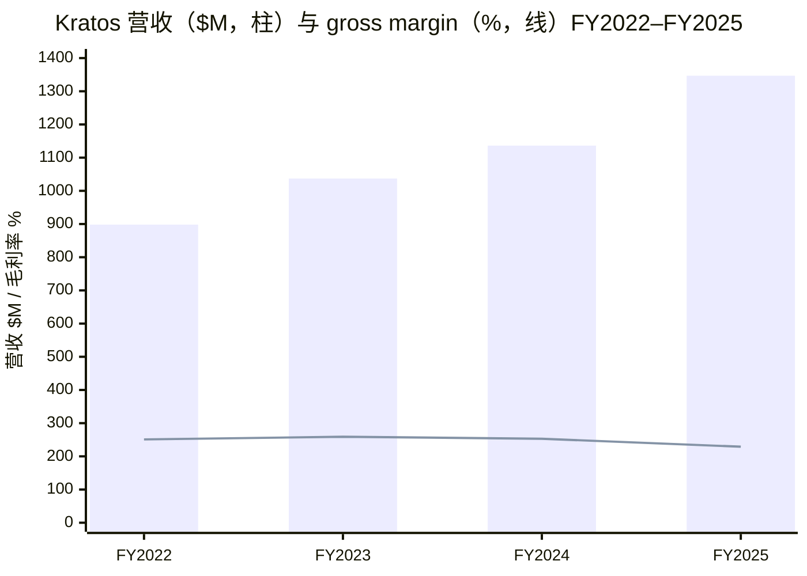
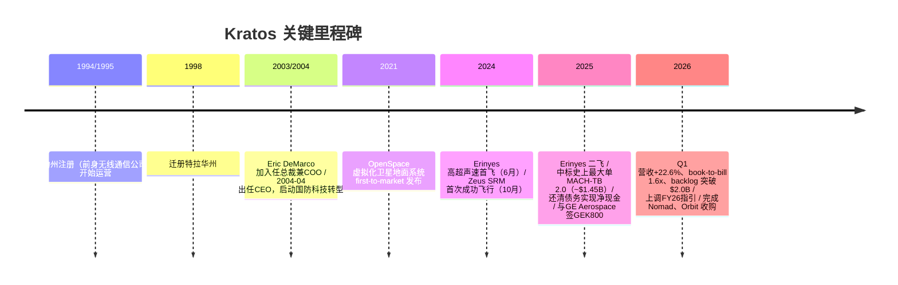
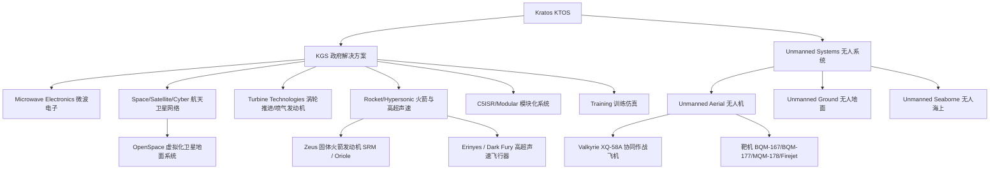
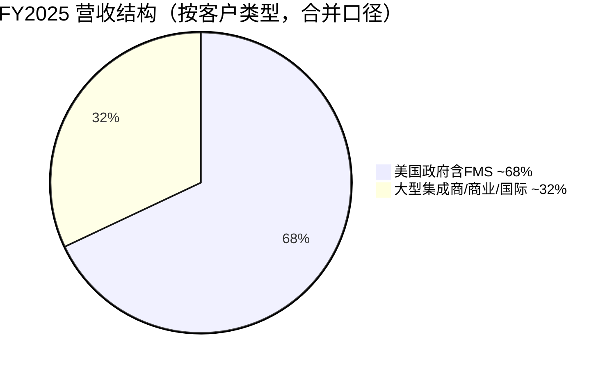
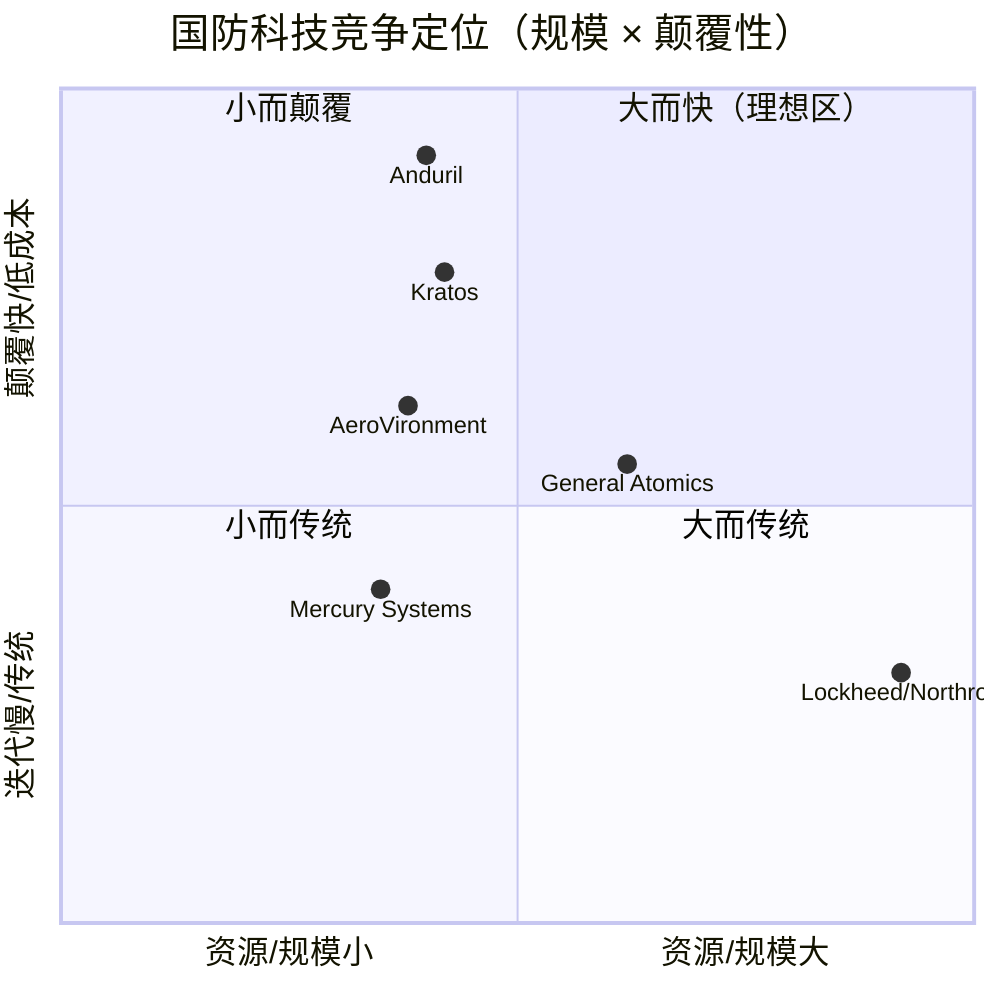

# Kratos Defense & Security Solutions（NASDAQ: KTOS）公司研究

> **报告语言**：简体中文（技术 / 财务 / 行业术语保留英文原词并附中文释义）
> **数据截至**：2026-06-09（股价、估值为当日 yfinance 快照；最新备案为 FY2025 10-K 与 Q1 FY2026 10-Q / 8-K）
> **标的**：Kratos Defense & Security Solutions, Inc.（克拉托斯国防与安全解决方案公司），美国特拉华州注册，NASDAQ 上市，代码 **KTOS**，CIK 0001069258，SIC「Guided Missiles & Space Vehicles & Parts（制导导弹与航天器及零部件）」。

---

> ### ⚠️ 指引变动提示（Guidance Update Banner）
> **2026-05-06，Kratos 上调 FY2026 全年指引（raised guidance）**：全年营收预期由先前区间上调至 **$1.700B–$1.760B**，Adjusted EBITDA 预期 **$170.0M–$176.0M**，已纳入近期完成的 **Nomad Global Communication Solutions** 与 **Orbit Technologies Ltd.** 两笔收购。同时给出 Q2 FY2026 营收指引 **$400M–$410M**。驱动因素为 Q1 营收同比 +22.6%、合并 book-to-bill 高达 **1.6x**，以及国防部（10-K 中称 Department of War / DoW）就 $156B Reconciliation Bill 资金在 FY2026 内全额支出的信号（[Kratos Q1 FY2026 8-K 业绩新闻稿, 2026-05-06](https://www.sec.gov/Archives/edgar/data/1069258/000106925826000051/ktos202603298kexhibit991.htm)）。

---

## ★ 投资摘要（Investment Summary Header）

> *分析师观点（Analyst view）：以下评级、目标价、预测与情景均为本报告分析师的前瞻判断，并非来自任何备案文件 —— 10-K 不包含目标价，切勿与备案引用混淆。*

| 项目 | 数值 |
|---|---|
| **评级 Rating** | **Hold / 中性（Neutral）** |
| **12 个月目标价 PT** | **$66**（基准情景） |
| **现价（2026-06-09）** | $57.73 |
| **隐含空间** | **+14%**（至基准 PT） |
| **估值方法** | FY2027E EPS（Adjusted）× 目标 forward P/E；交叉验证 EV/Sales |
| **市值 Market Cap** | ~$10.8B |
| **52 周区间** | $37.90 – $134.00 |
| **代码 / 交易所** | KTOS / NASDAQ |
| **卖方一致目标价** | mean $113.05 / median $112.50 / high $150 / low $75（20 位分析师，"buy"，[Yahoo Finance KTOS, 2026-06-09](https://finance.yahoo.com/quote/KTOS/)） |

**论点支柱（Thesis Pillars）**：

1. **生成式国防工业基础重建（generational recapitalization）的纯正受益标的**：Kratos 在低成本可消耗无人机（low-cost attritable drone）、固体火箭发动机（solid rocket motor / SRM）、高超声速（hypersonics）与卫星地面系统四条赛道上同时占位，是 Golden Dome（金穹）导弹防御、CCA（协同作战飞机）与高超声速三大主题的"小盘纯标"。
2. **订单动能强劲、资产负债表净现金**：合并 backlog 由 FY2025 末 $1.573B 升至 Q1 FY2026 末 **$2.010B**，bid & proposal pipeline $14.3B，且公司于 2025-07 还清全部 Term Loan A、期末净现金 ~$560M、零有息负债。
3. **估值与盈利能力错配是核心风险**：forward P/E ~54×、P/S ~7.6×，而 GAAP operating margin 仅 ~2%、FY2026 指引自由现金流为净流出 $(85)–$(105)M。市场已把多年高速增长 price in，任何 program timing 滑点都会放大回撤 —— 过去 3 个月股价已自高点回落约 38%。
4. **政府预算与项目时点的双重不确定**：~68% 营收来自美国政府，continuing resolution（CR，临时拨款决议）、政府停摆与采购规则改革（Trump 行政令、FAR 修订）均可能延迟订单确认。

---

## 目录

1. [公司概览](#一公司概览)
2. [公司历史](#二公司历史)
3. [估值与目标价](#三估值与目标价valuation--price-target)
4. [管理团队](#四管理团队)
5. [产品与服务](#五产品与服务)
6. [客户与商业模式](#六客户与商业模式)
7. [行业概览](#七行业概览)
8. [竞争格局](#八竞争格局)
9. [市场机会（TAM）](#九市场机会tam)
10. [风险评估](#十风险评估)
11. [关键分歧与催化剂](#十一关键分歧与催化剂key-debates--catalysts)
12. [投资视角评分](#十二投资视角评分investor-lenses)
13. [参考资料](#十三参考资料)

---

## 一、公司概览

**核心论点（BLUF）**：Kratos 是一家以"affordability is a technology（可负担性本身就是一项技术）"为信条的国防科技公司，通过**自有资金（internally funded）研发 + 快速量产 + first to market（抢先上市）**的打法，在无人机、火箭/高超声速、微波电子、卫星地面系统等高优先级国防赛道占据"designed-in（嵌入式设计）"位置。当前正处于一轮由 DoW 预算大幅扩张驱动的订单加速期，但盈利能力（GAAP operating margin ~2%）远未跟上估值（forward P/E ~54×），股价在 2025 年冲高至 $134 后已回落至 ~$58，进入"基本面验证期"。本报告给予 **Hold / 中性**，基准目标价 $66。

Kratos 在其 FY2025 10-K 中对自身的官方定义如下（逐字引用）：

> "Kratos is a technology, hardware, products, system and software company addressing the defense, national security, and commercial markets. Kratos makes true internally funded research, development, capital and other investments, to rapidly develop, produce and field relevant solutions that address our customers' mission critical needs and requirements. At Kratos, affordability is a technology…"
> —— [Kratos FY2025 10-K, Item 1. Business — Overview](https://www.sec.gov/Archives/edgar/data/1069258/000106925826000013/ktos-20251228.htm)

公司按产品/服务性质划分为**两个可报告分部（reportable segments）**：**Kratos Government Solutions（KGS，政府解决方案）** 与 **Unmanned Systems（US / KUS，无人系统）**。KGS 聚合了 microwave electronics（微波电子）、space, satellite and cyber（航天、卫星与网络）、training solutions（训练解决方案）、C5ISR/modular systems、turbine technologies（涡轮技术/推进）、defense and rocket support services（国防与火箭支援服务）等运营分部；US 分部则由 unmanned aerial（无人机）、unmanned ground（无人地面）、unmanned seaborne（无人海上）及指挥控制通信系统业务组成（[Kratos FY2025 10-K, Item 1 — Current Reporting Segments](https://www.sec.gov/Archives/edgar/data/1069258/000106925826000013/ktos-20251228.htm)）。

**FY2025 财务快照（经审计，单位：百万美元）**：总营收 **$1,346.8M**（同比 +18.5%），其中 KGS **$1,054.8M**（+21.8%）、US **$292.0M**（+7.9%）；gross margin 22.9%（FY2024 为 25.3%）；operating income $25.6M；归属于 Kratos 的 net income $22.0M；diluted EPS $0.13（[Kratos FY2025 10-K, MD&A — Results of Operations & Consolidated Statements of Operations](https://www.sec.gov/Archives/edgar/data/1069258/000106925826000013/ktos-20251228.htm)）。公司总部已迁至德州 Round Rock（1 Chisholm Trail, Suite 300, Round Rock, TX 78681），员工约 4,300 人，绝大多数为工程与技术人员，相当部分持有国家安全密级（[Kratos 2026 DEF 14A](https://www.sec.gov/Archives/edgar/data/1069258/000106925826000040/ktos-20260402.htm)；[Kratos FY2025 10-K, Item 1 — Highly skilled employees](https://www.sec.gov/Archives/edgar/data/1069258/000106925826000013/ktos-20251228.htm)）。

**估值快照（valuation snapshot，2026-06-09）**：现价 $57.73，市值 ~$10.8B；trailing P/E 高达 ~340×（仅微利，参考意义有限），**forward P/E ~53.8×**，**P/S（TTM）~7.65×**，P/B ~3.17×，EV/EBITDA ~118×，beta ~1.03；revenue growth(TTM) +22.6%（[Yahoo Finance KTOS key statistics, 2026-06-09](https://stockanalysis.com/stocks/KTOS/statistics/)）。这是一个"国防外壳、成长股估值"的组合——详见第三章对倍数成因的拆解。股价过去 1 年 +42.6%、但过去 3 个月 **−37.6%**，自 52 周高点 $134 大幅回落，反映市场对其高倍数与薄利润的重新定价。

下图为近四个财年的营收与 gross margin 走势（营收持续扩张，但毛利率自 FY2023 的 ~25.9% 缓降至 FY2025 的 22.9%，折射出"开发型项目占比上升 + 劳工/材料成本上行"的拖累）：

*注：毛利率以 ×10 缩放绘于同轴（FY2022 ~25.1% 显示为 251，余类推；FY2023 gross profit $268.6M / 营收 $1,037.1M ≈ 25.9%）。数据来源：[Kratos FY2025 10-K, Consolidated Statements of Operations（FY2023–FY2025）](https://www.sec.gov/Archives/edgar/data/1069258/000106925826000013/ktos-20251228.htm)；[Kratos FY2024 10-K（FY2022 基数）](https://www.sec.gov/Archives/edgar/data/1069258/000106925825000008/ktos-20241229.htm)。*

---

## 二、公司历史

Kratos 的法律实体于 **1994 年 12 月 19 日在纽约州注册、1995 年 3 月开始运营，1998 年迁册特拉华州**（[Kratos FY2025 10-K, Item 1 — Overview](https://www.sec.gov/Archives/edgar/data/1069258/000106925826000013/ktos-20251228.htm)）。公司前身是一家无线通信公司（Wireless Facilities, Inc.）；DEF 14A 明确记载，在现任 CEO Eric DeMarco 的领导下，公司"successfully transitioned from a wireless communications company to a technology, hardware, products, system and software company addressing the defense, national security and commercial markets through both organic growth and strategic acquisitions（通过有机增长与战略并购，从一家无线通信公司转型为面向国防、国家安全与商业市场的技术、硬件、产品、系统与软件公司）"（[Kratos 2026 DEF 14A — Director nominee bio: Eric DeMarco](https://www.sec.gov/Archives/edgar/data/1069258/000106925826000040/ktos-20260402.htm)）。这一从无线通信到国防科技的彻底转身，是理解 Kratos 今日"多业务、并购驱动"结构的起点。

近年的关键里程碑均围绕"自有资金投入 → 首飞/验证 → 大单落地"的节奏展开：**2021 年** OpenSpace™ 虚拟化卫星地面系统"first to market"发布；**2024 年 6 月** Erinyes 高超声速飞行器首飞（HTB-1 任务）、**2024 年 10 月** Zeus 1/Zeus 2 固体火箭发动机自 NASA Wallops 设施完成首次成功飞行；**2025 年 2 月** Erinyes 第二次成功试飞；随后斩获**公司史上最大合同 MACH-TB 2.0**（若全部期权执行，五年期估值约 **$1.45 billion**）；**2025 年 6 月** 与 GE Aerospace 正式签署 GEK800 低成本涡扇发动机合作；**2025 年 7 月 2 日** 以 6 月公开增发净筹 ~$555.9M 还清全部 Term Loan A、实现零有息负债（[Kratos FY2025 10-K, Item 1 — Relevant Products / Strategy & MD&A — Liquidity](https://www.sec.gov/Archives/edgar/data/1069258/000106925826000013/ktos-20251228.htm)）。

---

## 三、估值与目标价（Valuation & Price Target）

> *分析师观点（Analyst view）：本章所有前瞻预测、目标价与情景均为本报告分析师判断，不附任何备案引用。*

### 3.1 倍数为何如此之高？

KTOS 同时呈现"trailing P/E ~340×"与"forward P/E ~54×"的极端组合（[Yahoo Finance KTOS, 2026-06-09](https://stockanalysis.com/stocks/KTOS/statistics/)）。trailing 倍数因 GAAP 净利率仅 ~2%（FY2025 net income $22.0M 对 ~$10.8B 市值）而失去参考意义；真正在定价的是 **forward P/S ~7.6× 与对未来多年高速增长的贴现**。这一"国防外壳、成长股估值"的成因可归结为四点：(a) **赛道稀缺性** —— Kratos 是少数同时在 attritable drone、SRM、高超声速、卫星地面系统四条高增长赛道占位的纯标的，DeMarco 在 Q1 电话稿中直接强调"the scarcity value of Kratos is clear"（[Kratos Q1 FY2026 8-K 新闻稿, 2026-05-06](https://www.sec.gov/Archives/edgar/data/1069258/000106925826000051/ktos202603298kexhibit991.htm)）；(b) **盈利暂被压制** —— 公司主动以自有资金重投产能（FY2026 CapEx 指引 $155–165M、自由现金流净流出 $(85)–$(105)M），当前利润是"被投资周期压低"而非"结构性低"；(c) **主题溢价** —— Golden Dome、CCA、高超声速三大叙事使其成为板块代理（proxy）；(d) **小盘 + 高 beta** 放大了倍数波动。

*分析师观点：* 板块对比看，纯防务大盘股（Lockheed、Northrop）通常交易在 ~15–20× forward P/E；KTOS 的 ~54× 更接近"国防版成长股"，与 AeroVironment（AVAV，无人机/弹药同业）的高倍数同处一档。这意味着 KTOS 的股价对"增长兑现速度"极度敏感——这正是过去三个月回撤 38% 的根源。

### 3.2 前瞻财务预测（Forward Estimates）

下表基于 FY2025 分部数据 + 管理层 FY2026 指引中值 + 行业增长假设构建。**每一格预测均为分析师观点**；外部依据已在脚注标注。

| 财年 | 营收 $M | YoY | gross margin | Adj. EBITDA $M | Adj. EPS $ |
|---|---|---|---|---|---|
| FY2025A | 1,346.8 | +18.5% | 22.9% | ~155（est.） | 0.66（Adj.，est.） |
| FY2026E | 1,730 | +28.5% | ~23% | 173 | 0.62 |
| FY2027E | 2,050 | +18.5% | ~24% | 215 | 0.85 |
| FY2028E | 2,420 | +18.0% | ~25% | 275 | 1.15 |

- FY2026E 营收/EBITDA 锚定公司指引中值（营收 $1.700–1.760B、Adj. EBITDA $170–176M，[Kratos Q1 FY2026 8-K, Financial Guidance 表](https://www.sec.gov/Archives/edgar/data/1069258/000106925826000051/ktos202603298kexhibit991.htm)）。
- FY2027E–FY2028E 增长由 (i) US 分部 Valkyrie 量产（公司计划 **2027 年底起年产约 40 架 Valkyrie**，[同上 8-K, Guidance 投资说明](https://www.sec.gov/Archives/edgar/data/1069258/000106925826000051/ktos202603298kexhibit991.htm)）、(ii) MACH-TB 2.0 高超声速五年期 $1.45B 合同放量（[Kratos FY2025 10-K, Item 1 — major contract awards](https://www.sec.gov/Archives/edgar/data/1069258/000106925826000013/ktos-20251228.htm)）、(iii) 行业层面无人机/高超声速 7–12% CAGR（[Mordor / MarketsandMarkets, 2025](https://www.mordorintelligence.com/industry-reports/hypersonic-weapons-market)）三者驱动。
- margin 改善假设建立在公司"开发型项目转量产型项目（development → production mix）"的指引逻辑上（[Kratos FY2025 10-K, Strategy — Improve operating margins](https://www.sec.gov/Archives/edgar/data/1069258/000106925826000013/ktos-20251228.htm)），但执行风险高，故假设保守（每年仅 +~100bp）。

### 3.3 目标价推导与情景（Bull / Base / Bear）

**基准（Base）**：FY2027E Adj. EPS $0.85 × 目标 forward P/E ~40× ≈ **$34**……此法对微利成长股偏失真，故本报告以 **EV/Sales** 为主锚：FY2027E 营收 $2.05B × 目标 EV/Sales ~3.0×（介于防务大盘 ~2× 与无人机成长股 ~5× 之间）+ 净现金 ~$0.5B，约对应市值 ~$6.6B……与现价存在较大折让。考虑到 Kratos 的 backlog 动能与稀缺性溢价，本报告采用更贴近市场情绪的混合法，给予 **基准 PT $66**（约 FY2027E 营收 ~6× P/S 的小盘成长溢价），隐含 **+14%**。

| 情景 | 关键摆动假设 | 目标价 | 相对现价 |
|---|---|---|---|
| **Bull（乐观）** | Valkyrie 提前放量 + Golden Dome/高超声速大单落地，P/S 重估至 ~9× | **$95** | +65% |
| **Base（基准）** | 指引兑现、margin 缓改、P/S ~6× | **$66** | +14% |
| **Bear（悲观）** | CR/停摆拖延订单、margin 不改善、估值向防务大盘 ~3× P/S 收敛 | **$38** | −34% |

**与卖方一致预期对比**：卖方 20 位分析师 mean PT **$113.05**、median $112.50（区间 $75–$150，评级"buy"，[Yahoo Finance KTOS, 2026-06-09](https://finance.yahoo.com/quote/KTOS/)）。*分析师观点：* 本报告 $66 基准价显著低于街道一致 —— 分歧点在于本报告对"高倍数 vs 薄利润 + 净现金流出"的折让更深，且不假设 Golden Dome 级别大单已被确定性 price in。读者应将本报告视为偏谨慎的一端。

**call 所系的 1–2 个摆动变量**：① **Valkyrie/CCA 量产订单的时点与规模**（决定 US 分部能否从 ~$0.3B 跃升至 ~$1B 量级）；② **整体 operating margin 能否随量产兑现回升**（当前 ~2% 是估值与基本面错配的核心）。

---

## 四、管理团队

**创始人/CEO 合并小传（founder & CEO）—— Eric DeMarco**

Kratos 当前的国防科技形态由现任总裁兼 CEO **Eric DeMarco** 一手缔造，他既非法律意义上的"创始人"（公司前身 1994 年成立），却是把一家无线通信公司彻底改造为国防科技公司的"再造者"，故本报告以单一合并小传呈现。

据 2026 年 DEF 14A 逐字记载：DeMarco 于 **2003 年 11 月加入 Kratos 任总裁兼首席运营官（President & COO）**，并于 **2004 年 4 月 1 日出任董事兼首席执行官（CEO）**。加入 Kratos 之前，他曾任 **The Titan Corporation（当时 NYSE 上市，后被 L-3 Communications 收购）总裁兼 COO**；更早任 Titan 的执行副总裁兼首席财务官（EVP & CFO）；职业生涯始于公共会计领域，主要服务大型跨国与上市公司。他持有 **University of New Hampshire 工商管理与金融学士学位（summa cum laude，最高荣誉）**，并持有 **Top Secret（绝密级）安全密级**（[Kratos 2026 DEF 14A — Director nominee bio: Eric DeMarco](https://www.sec.gov/Archives/edgar/data/1069258/000106925826000040/ktos-20260402.htm)）。

DEF 14A 披露 DeMarco 现年 **62 岁，自 2003 年起任董事**，2026 年继续作为九名董事提名人之一接受改选并获通过（[Kratos 2026-05-15 8-K — Annual Meeting 投票结果](https://www.sec.gov/Archives/edgar/data/1069258/000106925826000064/ktos-20260515.htm)）。其在最新薪酬表中获授 450,000 股 RSU 等权益（[Kratos 2026 DEF 14A — 薪酬表](https://www.sec.gov/Archives/edgar/data/1069258/000106925826000040/ktos-20260402.htm)）。DeMarco 因其 CEO 身份而被列为非独立董事，公司董事会与提名委员会对其在"record financial performance（创纪录财务表现）"与战略定位上的贡献给予高度评价（[Kratos 2026 DEF 14A — Corporate Governance](https://www.sec.gov/Archives/edgar/data/1069258/000106925826000040/ktos-20260402.htm)）。

*分析师观点：* DeMarco 长达 22 年的连续掌舵（2004 至今）在国防小盘股中极为罕见，是 Kratos"自有资金抢先布局、以小博大、与大型集成商既竞争又合作"打法的人格化体现。他在 Q1 电话稿中反复强调的"scarcity value（稀缺价值）"叙事，既是其资本市场沟通的核心，也是高倍数估值的情绪支点（[Kratos Q1 FY2026 8-K 新闻稿, 2026-05-06](https://www.sec.gov/Archives/edgar/data/1069258/000106925826000051/ktos202603298kexhibit991.htm)）。本报告按 skill 要求仅覆盖创始人/CEO，不展开其余高管。

---

## 五、产品与服务

Kratos 的产品组合横跨"无人机—推进/火箭—高超声速—微波电子—卫星地面系统—训练"六大族系，统一服务国家安全使命。下图为按分部展开的产品组合树（基于 10-K 分部口径与公司官网产品页构建）：

### 5.1 无人机系统：靶机 + 战术无人机（Unmanned Systems / KUS）

**靶机（target drone，无人空中靶标）—— 现金牛与历史根基**。10-K 称 Kratos 为"industry leader of high performance, jet powered unmanned aerial target drone systems（高性能喷气动力无人空中靶机系统的行业领导者）"，是美海军 BQM-177、美空军 BQM-167、美陆军 MQM-178 的主要供应商，并向众多盟国出口。逐字披露：

> "Kratos is the primary provider of jet target drone systems to the USN, with the BQM-177, the USAF with the BQM-167, and the U.S. Army with the MQM-178… Kratos is currently in sole source production year 21 for the BQM-167 with the USAF, sole source production year 7 with the USN for BQM-177, and single source production year 13, with the U.S. Army for MQM-178."
> —— [Kratos FY2025 10-K, Item 1 — Relevant Products, Systems and Solutions](https://www.sec.gov/Archives/edgar/data/1069258/000106925826000013/ktos-20251228.htm)

**中文释义 / Plain-language gloss：** 靶机是供战斗机飞行员与防空系统进行实弹/电子对抗训练的"高性能假想敌"，物理上就是一架喷气动力、可回收或一次性的无人飞行器。其商业价值在于"sole source（独家来源）/ single source（唯一来源）"的多年生产地位——BQM-167 已进入第 21 个独家生产年——这意味着极高的转换成本与稳定现金流，是 Kratos 区别于"靠一两个明星项目"的新创公司的压舱石。

**Valkyrie XQ-58A —— 低成本可消耗战术无人机/协同作战飞机（CCA）的旗舰**。这是 Kratos 最具叙事价值的产品。公司官网逐字描述：

> "The Valkyrie is a Collaborative Combat Aircraft (CCA)/ Autonomous Collaborative Platform (ACP) designed to operate with Joint and Allied Forces… The Valkyrie can travel more than 3,000 nautical miles… and reach speeds of 0.86 Mach with altitude up to 45,000 feet… The Valkyrie is a proven system that is in production today and flying alongside and teamed with F-35s, F-22s, F-15EXs, and F-18s from the U.S. Air Force and the U.S. Marine Corps."
> —— [Kratos 官网, XQ-58 Valkyrie 产品页](https://www.kratosdefense.com/unmanned-systems/air/uncrewed-tactical-aircraft/xq-58a)

**中文释义 / Plain-language gloss：** Valkyrie 是一架隐身、喷气动力、由有人战机控制的"忠诚僚机（loyal wingman）"——它跟随 F-35/F-22 等有人机执行侦察、防御性射击或"替主机挨打（吸收敌火）"等高风险任务。其颠覆性在于**单价**：第三方资料显示当前单机成本约 $4M–$6M，Kratos 目标是规模化后降至 **$2M 以下**（[Wikipedia: Kratos XQ-58 Valkyrie](https://en.wikipedia.org/wiki/Kratos_XQ-58_Valkyrie)）。它通过固体火箭助推器从拖车发射、降落伞回收，实现"runway-independent（不依赖跑道）"——这正是"affordable mass（可负担的规模化）"理念的体现：用一个有人机的价格买一群可消耗无人机。10-K 进一步披露 Valkyrie 已与 USMC 签约并参与 project Eagle，其他在飞战术无人机还包括 Mako、Thanatos、Apollo、Athena、Air Wolf（[Kratos FY2025 10-K, Item 1 — Relevant Products](https://www.sec.gov/Archives/edgar/data/1069258/000106925826000013/ktos-20251228.htm)）。**战略意义**：2025-09，Kratos 队友 Northrop Grumman 竞标获得 USMC 的 MUX TACAIR CCA 项目，将 Northrop 的无人能力与 Kratos 的 Valkyrie 结合——这是 CCA 主题落地的标志性事件（[Kratos FY2025 10-K, Item 1](https://www.sec.gov/Archives/edgar/data/1069258/000106925826000013/ktos-20251228.htm)）。

### 5.2 火箭、固体火箭发动机与高超声速（Rocket / SRM / Hypersonics）

这是 Kratos 当前**增长最快、叙事最热**的一极。10-K 称其为"industry leader in affordable rocket systems and SRMs（可负担火箭系统与固体火箭发动机的行业领导者）"，并在低成本高超声速飞行器、弹道导弹靶标领域处于领先。核心产品为自有资金研发的 **Zeus（Zeus 1 / Zeus 2）固体火箭发动机** 与 **Erinyes、Dark Fury 高超声速飞行器**：

> "In November 2024, Kratos announced that Zeus 1 and Zeus 2 SRMs had completed their first successful flight on October 24, 2024… In June 2024, Kratos announced the successful launch and flight of the Kratos Erinyes hypersonic flyer… Subsequent to the successful initial flights… Kratos was awarded the Mach TB 2.0 hypersonic system related contract, the largest contract in Kratos history with an estimated value of $1.45 billion, if all options are exercised over a five-year period."
> —— [Kratos FY2025 10-K, Item 1 — Relevant Products](https://www.sec.gov/Archives/edgar/data/1069258/000106925826000013/ktos-20251228.htm)

**中文释义 / Plain-language gloss：** **固体火箭发动机（SRM, solid rocket motor）** 是导弹/火箭的"动力心脏"，全行业长期产能紧张、被少数大厂垄断；Kratos 以低成本 Zeus 切入，目标是弹道导弹靶标、高超声速、亚轨道等任务。**高超声速（hypersonics, 飞行速度 ≥ Mach 5）** 是当前大国军备竞赛的焦点；Erinyes 是一款低成本高超声速试验飞行器（HTB-1 任务）。与 5.1 的无人机不同，这一极的产品是"消耗品中的消耗品"——一次任务即耗尽——因此放量后对营收的弹性极大。**MACH-TB 2.0**（$1.45B 五年期、公司史上最大单）服务 OUSD(R&E) 的国家高超声速倡议 2.0，目标是搭建"可负担的高超声速飞行试验台"，快速提升试飞能力（[Kratos FY2025 10-K, Item 1 — major contract awards](https://www.sec.gov/Archives/edgar/data/1069258/000106925826000013/ktos-20251228.htm)）。

### 5.3 涡轮技术与喷气推进（Turbine Technologies / Jet Engines）

Kratos 是"low cost jet engines for missiles, drones and other systems（导弹、无人机等低成本喷气发动机）"的领先者，并担任 Boom Supersonic 超声速客机 Overture 的发动机（Symphony）开发主导。**2025 年 6 月与 GE Aerospace 正式签署合作**，共同开发量产 **GEK800** 低成本可消耗涡扇发动机（2025-10 完成高空测试），并启动 **GEK1500**，瞄准无人机/CCA/导弹/巡飞弹（loitering munition / 巡飞弹）应用（[Kratos FY2025 10-K, Item 1 — GE Aerospace MOU](https://www.sec.gov/Archives/edgar/data/1069258/000106925826000013/ktos-20251228.htm)）。

**中文释义 / Plain-language gloss：** 与 5.1 的整机不同，涡轮技术是"卖发动机"——为别人的无人机/导弹提供心脏。GE 合作的战略意义在于：把 GE 的航发工程能力与 Kratos 的"affordable mass"量产理念结合，使 Kratos 既能给自己的 Valkyrie 配套发动机，也能向整个 CCA 市场供货，形成"整机 + 发动机"的双重曝险。

### 5.4 微波电子与 C5ISR（Microwave Electronics / C5ISR）

Kratos 自称是"industry leader in hardware, products, systems and microwave electronics（微波电子）"，产品嵌入 Iron Dome、Iron Sting、Arrow、Patriot、THAAD、IBCS、IFPC 等众多防空与导弹防御系统（[Kratos FY2025 10-K, Item 1 — Relevant Products](https://www.sec.gov/Archives/edgar/data/1069258/000106925826000013/ktos-20251228.htm)）。官网列举其微波产品服务于电子战（EW, electronic warfare）、机上连接、导航战、导弹/雷达/模拟器、智能弹药等（[Kratos 官网, Microwave & Digital Solutions](https://www.kratosdefense.com/products)）。

**中文释义 / Plain-language gloss：** **C5ISR**（command, control, communications, computing, combat, intelligence, surveillance, reconnaissance / 指挥、控制、通信、计算、作战、情报、监视、侦察）是现代战场的"神经系统"。微波电子是其物理底层——把雷达、导弹、防空系统中的射频信号放大、变频、收发。这块业务的价值在于"designed-in"——一旦 Kratos 的微波组件被设计进 Patriot、THAAD 这类多年/多十年项目，就形成稳定的"配套件"现金流，是 Golden Dome 导弹防御主题最直接的硬件曝险。

### 5.5 航天、卫星与 OpenSpace（Space / Satellite / OpenSpace）

Kratos 自 2019 年以来在 Space, Satellite and Cyber 业务投入约 **$315M**，核心是 **OpenSpace™ —— 下一代软件化、虚拟化的卫星 C2、TT&C 地面通信系统**，于 2021 年"first to market"发布。10-K 逐字披露：

> "…primarily related to our next generation, software based, virtualized satellite C2, TT&C, and other ground-based OpenSpace™ communications systems, which we released 'first to market' in 2021… In 2023, we introduced the satellite industry's first open edge terminal for satellite communications… our OpenSpace platform is the first commercially available, fully virtualized satellite ground system to achieve MEF 3.0 Carrier Ethernet certification… In 2024, we received… a $116.7 million contract from the U.S. Space Development Agency for Ground System… and a $579 million single award IDIQ for Space Form Satcom C2 System."
> —— [Kratos FY2025 10-K, Item 1 — Space, Satellite and Cyber](https://www.sec.gov/Archives/edgar/data/1069258/000106925826000013/ktos-20251228.htm)

**中文释义 / Plain-language gloss：** 传统卫星地面站是"专用硬件盒子"，每颗卫星一套；OpenSpace 把这套功能**软件化、虚拟化**——用通用服务器 + 软件实现卫星的指挥控制（C2）与遥测跟踪（TT&C, telemetry, tracking and control），可弹性扩容、按需重配。这与 Kratos 的"affordability"理念一脉相承，也是其 **Space Domain Awareness（SDA, 空间态势感知）** 能力的基础（射频干扰识别、地理定位与缓解）。$579M 的 Space Force IDIQ 与 $116.7M 的 SDA AFCGI 合同是该业务的两根支柱（[Kratos FY2025 10-K, Item 1](https://www.sec.gov/Archives/edgar/data/1069258/000106925826000013/ktos-20251228.htm)）。

### 5.6 产品族系如何协同（synthesis）

Kratos 的六大族系并非孤立，而是围绕"**affordable mass（可负担的规模化作战力量）**"这一核心命题相互咬合：US 分部造**无人机整机**（Valkyrie）；turbine 业务给整机配**发动机**（GEK800）；火箭/高超声速业务造**消耗性打击/试验载具**（Zeus、Erinyes）；微波电子把硬件**嵌入防空/导弹系统**（Patriot、THAAD）；OpenSpace 提供**卫星地面神经中枢**；训练系统则负责**战备**。一条龙下来，Kratos 同时握有"造一群便宜的飞行器 + 给它们装心脏 + 把它们接入太空神经网 + 嵌入导弹防御盾牌"的完整曝险——这正是它能在 CCA、Golden Dome、高超声速三大主题中同时出现的根本原因。其商业逻辑被 DeMarco 概括为"it is better to have a large part of something, than all of nothing（与其全有全无，不如稳拿大头）"——即与大型集成商合作分食，而非单打独斗（[Kratos FY2025 10-K, Item 1 — Internal Growth](https://www.sec.gov/Archives/edgar/data/1069258/000106925826000013/ktos-20251228.htm)）。

---

## 六、客户与商业模式

**客户结构：政府主导、合同高度分散。** 10-K 逐字披露：来自美国政府（含 FMS, foreign military sales / 对外军售）的营收在 **2025、2024、2023 年分别约占总营收的 68%、67%、69%**（[Kratos FY2025 10-K, Item 1 — Customers](https://www.sec.gov/Archives/edgar/data/1069258/000106925826000013/ktos-20251228.htm)）。关键的是，公司明确"**no contract representing more than 5% of 2025 revenue（无任何单一合同占 2025 年营收超过 5%）**"——这与"靠一两个明星项目"的新创防务公司形成鲜明对比，是其收入稳定性的重要护城河（[Kratos FY2025 10-K, Item 1 — Diverse base of key contracts](https://www.sec.gov/Archives/edgar/data/1069258/000106925826000013/ktos-20251228.htm)）。

政府客户代表名单包括 U.S. Air Force、U.S. Army、U.S. Navy、U.S. Marines、Missile Defense Agency（MDA）、Space Command、Space Force、NASA、AFRL、DARPA、SCO、DIU、STRATCOM、Office of the Secretary of War（OSW）及若干机密客户；非政府客户则包括一级大型集成商 **Northrop Grumman、Lockheed Martin、General Dynamics、Raytheon Technologies、BAE Systems、L3Harris**，以及 Intelsat（已被 SES 收购）、Blue Halo（已被 AeroVironment 收购）、Microsoft、Amazon、Airbus、Siemens、Rolls Royce、Boom、GE Aerospace 等（[Kratos FY2025 10-K, Item 1 — Customers](https://www.sec.gov/Archives/edgar/data/1069258/000106925826000013/ktos-20251228.htm)）。

下图为 FY2025 营收按客户类型的拆分（单一口径：合并营收）：

*数据来源：[Kratos FY2025 10-K, Item 1 — Customers（U.S. Government ~68%）](https://www.sec.gov/Archives/edgar/data/1069258/000106925826000013/ktos-20251228.htm)。*

**合同类型与商业模式。** FY2025 营收中 **fixed-price（固定价）合同约占 69%**（多为生产型合同）、**cost-plus-fee（成本加费）约 27%**、**time and materials（工料）约 4%**（[Kratos FY2025 10-K, Item 1 — Diverse base of key contracts](https://www.sec.gov/Archives/edgar/data/1069258/000106925826000013/ktos-20251228.htm)）。固定价生产合同占比高，意味着在劳工/材料成本上行时 Kratos 自担成本风险（US 分部毛利率因此承压至 17.4%），但量产规模化后又具备 margin 上行弹性。营收按 ASC 606 以 cost-to-cost 法随履约进度确认（[Kratos FY2025 10-K, MD&A — Key Financial Statement Concepts](https://www.sec.gov/Archives/edgar/data/1069258/000106925826000013/ktos-20251228.htm)）。

**订单与可见度（backlog）。** 这是 Kratos 当前最强的论据。FY2025 末合并 backlog **$1,573.4M**（FY2024 末 $1,445.1M），其中 funded $1,232.0M；公司预计 54% 在 2026 年、20% 在 2027 年确认（[Kratos FY2025 10-K, Item 1 — Backlog](https://www.sec.gov/Archives/edgar/data/1069258/000106925826000013/ktos-20251228.htm)）。进入 **Q1 FY2026，合并 backlog 跃升至 $2.010B**（funded $1.457B、unfunded $553.5M），单季 bookings $605.2M、合并 **book-to-bill 1.6x**，bid & proposal pipeline 达 **$14.3B**（[Kratos Q1 FY2026 8-K 新闻稿, 2026-05-06](https://www.sec.gov/Archives/edgar/data/1069258/000106925826000051/ktos202603298kexhibit991.htm)）。分部看，Q1 KGS book-to-bill 1.8x、backlog $1.635B；KUS book-to-bill 1.2x、backlog $375.4M。

**单位经济与盈利能力。** FY2025 合并 gross margin 22.9%（KGS 24.4% / US 17.4%），SG&A 占比 17.8%，R&D $40.0M（占营收 3.0%，且多为"自有资金抢先布局"性质）；operating income $25.6M、operating margin 仅 ~1.9%（[Kratos FY2025 10-K, MD&A — Results of Operations](https://www.sec.gov/Archives/edgar/data/1069258/000106925826000013/ktos-20251228.htm)）。**资产负债表则极为干净**：2025-07-02 以 6 月增发净筹 ~$555.9M 还清全部 $177.5M Term Loan A，FY2025 末**总有息负债为零、现金 $560.6M**（[Kratos FY2025 10-K, MD&A — Liquidity and Capital Resources](https://www.sec.gov/Archives/edgar/data/1069258/000106925826000013/ktos-20251228.htm)）。代价是**股本稀释**——diluted 股数由 FY2023 的 130.4M 升至 FY2025 的 165.2M，并在 2026-05 进一步增至约 1.873 亿股（[Kratos 2026-05-15 8-K — 流通股 187,333,628](https://www.sec.gov/Archives/edgar/data/1069258/000106925826000064/ktos-20260515.htm)）。

---

## 七、行业概览

Kratos 所处的是**美国国防工业基础（defense industrial base）中的"高优先级、高增长子赛道"**——无人系统、固体火箭/高超声速、导弹防御与空间地面系统。理解这个行业必须先理解其**预算周期**：国防营收的节奏由国会拨款（appropriations）、临时拨款决议（CR）与政府停摆风险决定，而非纯粹的商业需求。

**宏观预算背景（来自 10-K 的一手陈述）。** 10-K 详述了 FY2026 的预算路径：2025-07-04 通过的 **One Big Beautiful Bill Act（OBBBA）** 为国防与国家安全额外拨款 $156B（其中约 $113B 计入最终 FY2026 国防拨款法案）；FY2026 自 2025-10-01 起一度因未通过拨款而停摆，直至 **2026-02-03 Trump 签署 $1.2 万亿的 Consolidated Appropriations Act, 2026**，为 DoW 提供 $838.7B 国防拨款。叠加 OBBBA 的 ~$113B 与能源部国家安全相关 ~$45B，**FY2026 美国联邦国家安全总支出约 $1 万亿**（[Kratos FY2025 10-K, Item 1 — Industry Update](https://www.sec.gov/Archives/edgar/data/1069258/000106925826000013/ktos-20251228.htm)）。DeMarco 进一步在 Q1 电话稿中称 **FY2027 国家安全支出预计达 $1.5 万亿**，较 FY2026 增加约 $400B（[Kratos Q1 FY2026 8-K 新闻稿, 2026-05-06](https://www.sec.gov/Archives/edgar/data/1069258/000106925826000051/ktos202603298kexhibit991.htm)）。

**结构性主题：generational recapitalization（一代人级别的装备重整）。** 10-K 反复强调，为应对俄、中、朝、伊等同级/近同级威胁，美国及盟国正进行"a generational recapitalization of weapon systems and related defense industrial bases"，预算重心放在威慑、力量投送、战备、杀伤力与关键战略系统的重建上（[Kratos FY2025 10-K, Item 1 — Competitive Strengths](https://www.sec.gov/Archives/edgar/data/1069258/000106925826000013/ktos-20251228.htm)）。在此背景下，DoW 把"affordable mass（可负担的规模化）"作为核心采购原则——这恰好是 Kratos 的定位所在。

**行业增速（第三方）。** 各细分市场均处于高于 GDP 的增长轨道：*分析师/第三方视角* —— 军用无人机（UAV）市场预计自 2025 年 ~$15.8B 增至 2030 年 ~$22.81B（CAGR ~7.6%，[MarketsandMarkets, 2025](https://www.marketsandmarkets.com/Market-Reports/military-drone-market-221577711.html)）；高超声速武器市场预计自 2025 年 ~$8.24B 增至 2030 年 ~$14.78B（CAGR ~12.4%，[Mordor Intelligence, 2025](https://www.mordorintelligence.com/industry-reports/hypersonic-weapons-market)）。

**行业结构与进入壁垒。** 国防行业的核心特征是"intense competition and long operating cycles（激烈竞争与漫长经营周期）"，且大型项目常由多家公司分担——竞争者与合作者/客户身份频繁互换（[Kratos FY2025 10-K, Item 1 — Competition](https://www.sec.gov/Archives/edgar/data/1069258/000106925826000013/ktos-20251228.htm)）。进入壁垒来自：past-performance qualifications（过往业绩资质）、安全密级与机密设施、"designed-in"位置（一旦嵌入多年项目极难替换）、以及自有资金抢先研发形成的 IP。这些壁垒对在位者有利，但近年 LPTA（Low Price Technically Acceptable，最低价技术可接受）招标方式与日益频繁的竞标抗议（bid protest）也在侵蚀部分服务类业务的利润（Kratos 已主动"deemphasize"这类 LPTA 服务业务）（[Kratos FY2025 10-K, Item 1 — Competition](https://www.sec.gov/Archives/edgar/data/1069258/000106925826000013/ktos-20251228.htm)）。

---

## 八、竞争格局

10-K 的 Competition 章节给出了权威的竞争者名单（逐字引用）：

> "Competition in the KGS and US segments include tier one, large U.S. Government contractors, newer defense technology companies including **Anduril, XBow, Shield AI, Castelion, Ursa Major, Bee Hive**, and others, and system integrators such as **Northrop Grumman, Lockheed Martin, General Dynamics, Raytheon Technologies, BAE Systems, L3Harris, General Atomics, and Boeing**… Tier two competitors include smaller government contractors such as **Mercury Systems, Qinetiq, Cobham, CACI, Peraton, Linquest (now owned by KBR), Viasat and AAR Corp**."
> —— [Kratos FY2025 10-K, Item 1 — Competition](https://www.sec.gov/Archives/edgar/data/1069258/000106925826000013/ktos-20251228.htm)

10-K 还坦承一个关键事实："Most of the companies that we compete against have significantly greater financial, technical, marketing and other resources and generate greater revenues than we do（我们的多数竞争对手在财务、技术、营销等资源与营收规模上都远胜于我们）"，且"many of our tier one competitors are also our partners and our customers（许多一级竞争对手同时是我们的合作伙伴与客户）"（[Kratos FY2025 10-K, Item 1 — Competition](https://www.sec.gov/Archives/edgar/data/1069258/000106925826000013/ktos-20251228.htm)）。这种"既竞争又合作（coopetition）"是国防行业的常态，也是 Kratos"with-the-primes"打法的基础。

**竞争定位（2×2 框架）。** 下图以"规模/资源（横轴）×颠覆性/速度（纵轴）"刻画 Kratos 的相对位置——它处于"资源有限但创新快、可负担"的象限，介于传统大集成商（资源强、迭代慢）与 VC 撑腰的新创（创新快、规模小、尚未量产）之间：

*定位为分析师判断，非备案数据。竞争者名单来源：[Kratos FY2025 10-K, Item 1 — Competition](https://www.sec.gov/Archives/edgar/data/1069258/000106925826000013/ktos-20251228.htm)。*

**最值得关注的对手——Anduril。** *分析师观点：* 在新创防务科技中，**Anduril（私有）** 是 Kratos 在无人系统/自主作战领域最受关注的颠覆者，其核心是统一开放作战系统 **Lattice**，可兼容主流防务厂商与初创设备，定位反无人机、导弹防御、边境监控（[Goldman Sachs — Americas Software/A&D: Anduril Lattice 深度解析, 2026-05-12](http://xs-macbook-air.local:5001/zsxq/pdf/415245828888188/Goldman%20Sachs-AMERICAS%EF%BC%9A%20SOFTWARE%20AEROSPACE%20%26%20DEFENSE%EF%BC%9AA%20deep%20dive%20into%20Anduril%E2%80%99s%20Lattice%20software%20post%20leadership%20meetings-260511.pdf)）。Anduril 采用"平台化 + 订阅化、毛利率显著更优"的商业模式，与 Kratos"造硬件、薄毛利、靠量产"的路线形成鲜明对照——这也是 Kratos 估值虽高但盈利能力受质疑的部分原因（投资者担心 Anduril 式软件定义模式蚕食硬件价值）。**AeroVironment（AVAV，公开）** 则是无人机/巡飞弹领域的同业，且已收购 Kratos 的客户 Blue Halo（[Kratos FY2025 10-K, Item 1 — Customers](https://www.sec.gov/Archives/edgar/data/1069258/000106925826000013/ktos-20251228.htm)）。General Atomics（私有）在大型无人机（MQ-9 等）占主导。*分析师观点：* 大型集成商（Lockheed、Northrop、Raytheon）在固体火箭、导弹防御等领域既是竞争者，也是 Kratos 的"team partner"——例如 Northrop 携 Kratos Valkyrie 竞标 MUX TACAIR。

*分析师观点：* 卖方亦观察到导弹/太空需求旺盛、且"新防务科技公司入局"正成为行业主题（[Bernstein — 全球航空航天与国防战略决策会议（十二家 CEO 洞见）, 2026-06-03](http://xs-macbook-air.local:5001/zsxq/pdf/812485114412812/Bernstein-Global%20Aerospace%20%26%20Defense%EF%BC%9AAerospace%20%26%20Defense%EF%BC%9A%20Twelve%20CEOs%20in%20three%20days~A%26D%20themes%20from%20Bernstein%27s%20Strategic%20Decisions%20Conference-260602.pdf)），印证 Kratos 所处赛道的高景气，但也意味着竞争者数量在快速增加。

---

## 九、市场机会（TAM）

Kratos 的可寻址市场由四个相互叠加的高增长池构成，且每个池都处于预算扩张周期：

**① Golden Dome（金穹）导弹防御 —— 最大的单一催化主题。** FY2026 国防拨款法案为太空与导弹防御系统（Golden Dome）拨款约 **$13.4B**；该计划总成本，Trump 2025 年估计约 **$175B**、修订后约 **$185B**，而 CSIS 估计一套完整的本土导弹防御体系在 20 年内可能需 **$252B 至 $3.6 万亿**（[Congress.gov — Defense Primer: The Golden Dome for America, IF13115](https://www.congress.gov/crs-product/IF13115)；[Wikipedia: Golden Dome (missile defense system)](https://en.wikipedia.org/wiki/Golden_Dome_(missile_defense_system))）。Kratos 通过微波电子（嵌入 Patriot/THAAD/Arrow/IBCS）、固体火箭发动机、高超声速靶标与试验台、卫星地面系统（SDA）四条线全方位曝险于这一主题——这正是它被纳入"太空/导弹防御篮子"的根本原因。

**② 高超声速（hypersonics）—— 增速最快。** 全球高超声速武器市场预计自 2025 年 ~$8.24B 增至 2030 年 ~$14.78B（CAGR ~12.4%，[Mordor Intelligence, 2025](https://www.mordorintelligence.com/industry-reports/hypersonic-weapons-market)）。Kratos 凭 Erinyes/Dark Fury 飞行器、Zeus SRM 与 $1.45B 的 MACH-TB 2.0 试验台合同占位，且其"低成本"定位契合 DoW 对"快速扩大试飞能力"的需求。

**③ 无人系统 / CCA（协同作战飞机）—— 体量最大。** 军用无人机市场预计自 2025 年 ~$15.8B 增至 2030 年 ~$22.81B（CAGR ~7.6%，[MarketsandMarkets, 2025](https://www.marketsandmarkets.com/Market-Reports/military-drone-market-221577711.html)）。Kratos 的 Valkyrie 是 CCA/loyal-wingman 赛道少数"in production today（已在量产）"的整机，计划 2027 年底起年产 ~40 架；叠加 GE 合作的低成本涡扇发动机，可同时吃"整机 + 发动机"两块蛋糕。

**④ 空间地面系统（space ground）—— 长尾结构性。** WEF/McKinsey 估计全球空间经济将自 2023 年的 $630B 增至 **2035 年的 $1.8 万亿**（~9% CAGR，[WEF/McKinsey — Space: The $1.8 Trillion Opportunity, 2024](https://www.weforum.org/publications/space-the-1-8-trillion-opportunity-for-global-economic-growth/)）。Kratos 的 OpenSpace 虚拟化地面系统与 SDA 能力，以及 $579M Space Force IDIQ，使其曝险于卫星地面段的软件化浪潮。

```mermaid
xychart-beta
    title "Kratos 四大可寻址市场规模（$B，2025E vs 2030E/2035E）"
    x-axis ["军用无人机", "高超声速武器", "Golden Dome年度", "空间经济(/100)"]
    y-axis "$B" 0 --> 25
    bar [15.8, 8.24, 13.4, 6.3]
    bar [22.81, 14.78, 13.4, 18.0]
```

*注：空间经济以 ÷100 缩放入图（2023 $630B→6.3，2035 $1,800B→18.0）；Golden Dome 取 FY2026 年度拨款 $13.4B（非累计）。来源：[MarketsandMarkets 军用无人机, 2025](https://www.marketsandmarkets.com/Market-Reports/military-drone-market-221577711.html)；[Mordor 高超声速, 2025](https://www.mordorintelligence.com/industry-reports/hypersonic-weapons-market)；[Congress.gov Golden Dome IF13115](https://www.congress.gov/crs-product/IF13115)；[WEF/McKinsey 空间经济, 2024](https://www.weforum.org/publications/space-the-1-8-trillion-opportunity-for-global-economic-growth/)。*

*分析师观点：* Kratos 的"SOM（可获得份额）"远小于上述 TAM——它是一家 ~$1.7B 营收的公司，在每个池子里都是"小而快"的角色。真正的看点不是 TAM 绝对值，而是 **Kratos 在这些池子里的"designed-in"位置能否随预算扩张转化为多年量产订单**。

---

## 十、风险评估

**公司层面（company-specific）**

1. **盈利能力与估值严重错配（核心风险）。** forward P/E ~54×、P/S ~7.6×，而 GAAP operating margin 仅 ~1.9%、net margin ~2%。市场已把多年高增长 price in，任何兑现不及预期都会放大回撤——过去 3 个月已 −37.6%。若 margin 不随量产改善，估值有向防务大盘（~15–20× P/E、~2–3× P/S）收敛的风险（[Yahoo Finance KTOS, 2026-06-09](https://stockanalysis.com/stocks/KTOS/statistics/)；[Kratos FY2025 10-K, MD&A](https://www.sec.gov/Archives/edgar/data/1069258/000106925826000013/ktos-20251228.htm)）。
2. **自由现金流为负、投资周期吞噬现金。** FY2026 指引自由现金流净流出 **$(85)–$(105)M**，CapEx $155–165M，且营运资本（应收 + 存货）随 22.6% 增速大幅占用。Q1 经营活动现金流已为 −$27.4M。投资周期预计至少延续到 FY2027（[Kratos Q1 FY2026 8-K — Financial Guidance, 2026-05-06](https://www.sec.gov/Archives/edgar/data/1069258/000106925826000051/ktos202603298kexhibit991.htm)）。
3. **股本稀释。** diluted 股数由 FY2023 的 130.4M 增至 FY2025 的 165.2M、再至 2026-05 的 ~187M。频繁增发是其"净现金"资产负债表的代价，长期摊薄每股价值（[Kratos FY2025 10-K, Consolidated Statements of Operations](https://www.sec.gov/Archives/edgar/data/1069258/000106925826000013/ktos-20251228.htm)；[Kratos 2026-05-15 8-K](https://www.sec.gov/Archives/edgar/data/1069258/000106925826000064/ktos-20260515.htm)）。
4. **关键项目时点风险。** Valkyrie 大规模量产订单、MACH-TB 2.0 期权执行、Golden Dome 相关大单——这些"叙事支柱"的落地时点与规模高度不确定，是 bull case 的命门。10-K 警示生产型固定价合同在劳工/材料成本上行时不可转嫁（US 分部 margin 因此降至 17.4%）（[Kratos FY2025 10-K, MD&A — Results of Operations](https://www.sec.gov/Archives/edgar/data/1069258/000106925826000013/ktos-20251228.htm)）。
5. **并购整合风险。** 公司增长部分依赖收购（Norden Millimeter、Nomad、Orbit），10-K 列举了整合失败、商誉减值、文化冲突等一长串风险（[Kratos FY2025 10-K, Risk Factors — acquisitions](https://www.sec.gov/Archives/edgar/data/1069258/000106925826000013/ktos-20251228.htm)）。

**行业/市场层面（industry/market）**

6. **政府预算与 continuing resolution（CR）风险。** ~68% 营收来自美国政府。10-K 在 Industry Update 中详述 FY2026 经历政府停摆、停摆至 2026-02-03 才靠拨款法案解决；公司明确预期 CR、债务上限、停摆"将会继续发生"，可能延迟或取消订单确认（[Kratos FY2025 10-K, Item 1 — Industry Update](https://www.sec.gov/Archives/edgar/data/1069258/000106925826000013/ktos-20251228.htm)）。
7. **采购规则改革的不确定性。** Trump 行政令、FAR（Federal Acquisition Regulations）修订、DoW 的"Go Direct-to-Supplier"与 Acquisition Transformation Strategy，其对行业与 Kratos 的影响"unknown at this time"（[Kratos FY2025 10-K, Item 1 — Industry Update & MD&A](https://www.sec.gov/Archives/edgar/data/1069258/000106925826000013/ktos-20251228.htm)）。
8. **来自资源更雄厚对手与新创的双向竞争。** 一边是资源/营收远超 Kratos 的大集成商，一边是 Anduril 等以软件定义、订阅模式、更高毛利切入的新创。Kratos 的"薄毛利硬件"模式面临两端挤压（[Kratos FY2025 10-K, Item 1 — Competition](https://www.sec.gov/Archives/edgar/data/1069258/000106925826000013/ktos-20251228.htm)；*分析师观点：* [Goldman — Anduril Lattice, 2026-05-12](http://xs-macbook-air.local:5001/zsxq/pdf/415245828888188/Goldman%20Sachs-AMERICAS%EF%BC%9A%20SOFTWARE%20AEROSPACE%20%26%20DEFENSE%EF%BC%9AA%20deep%20dive%20into%20Anduril%E2%80%99s%20Lattice%20software%20post%20leadership%20meetings-260511.pdf)）。
9. **LPTA 与竞标抗议侵蚀利润。** 最低价招标（LPTA）与日益频繁的竞标抗议延迟订单、压低服务类利润，公司已被迫退出部分 DRSS 与训练服务业务（[Kratos FY2025 10-K, Item 1 — Competition](https://www.sec.gov/Archives/edgar/data/1069258/000106925826000013/ktos-20251228.htm)）。

**财务/运营层面（financial/operational）**

10. **劳工短缺与成本通胀。** 10-K 反复强调 STEM 与持密人才短缺、劳工成本上升正侵蚀生产合同的 operating margin，尤其是长期固定价合同（[Kratos FY2025 10-K, Item 1 — Industry Update](https://www.sec.gov/Archives/edgar/data/1069258/000106925826000013/ktos-20251228.htm)）。
11. **供应链中断。** 材料/零部件交付延迟迫使公司提前大批量采购，进一步占用营运资本（[Kratos FY2025 10-K, Item 1 — Industry Update](https://www.sec.gov/Archives/edgar/data/1069258/000106925826000013/ktos-20251228.htm)）。

**宏观层面（macro）**

12. **国际/地缘与 FMS 风险。** 公司有国际业务（含以色列微波电子设施），对外军售与 Israel/Ukraine/Taiwan 资金支持的政治不确定性、关税、汇率均构成风险（[Kratos FY2025 10-K, Item 1 — Industry Update & Risk Factors](https://www.sec.gov/Archives/edgar/data/1069258/000106925826000013/ktos-20251228.htm)）。

---

## 十一、关键分歧与催化剂（Key Debates & Catalysts）

> *分析师观点：本节为对论点的攻防与前瞻催化，均为分析师判断。*

**核心分歧（bears 怎么说，如何反驳）**

- **分歧 1：估值贵得离谱（54× forward P/E、薄利润、负 FCF）。** *反驳：* 当前利润被主动投资周期压低（FY26 CapEx $155–165M、FCF 净流出），backlog $2.0B + book-to-bill 1.6x 提供了未来 2–3 年营收可见度；若 2027 起 Valkyrie 量产 + margin 回升，估值锚将从"市销率"转向"市盈率"。**但本报告认为该转换尚未被验证，故给 Hold。**
- **分歧 2：Anduril 式软件定义模式将蚕食硬件价值。** *反驳：* Kratos 的护城河在"造别人不愿/不能低成本造的硬件"（SRM、高超声速载具、靶机的 sole-source 地位），与软件平台并非零和；且 Kratos 也在 OpenSpace 上软件化。**但软件公司更高的毛利率确实对 Kratos 的估值上限构成压制。**
- **分歧 3：政府预算/CR/停摆使订单时点不可控。** *反驳：* "no contract >5% of revenue"的极度分散 + 多年/多十年 designed-in 项目，使 Kratos 比单项目新创更抗预算波动；且 FY26/FY27 预算方向明确向上（$1T→$1.5T）。**但确认时点的滑动仍会季度性冲击业绩。**

**未来 12 个月催化剂（dated）**

- **2026 Q2 业绩（~2026-08）**：验证 FY26 指引中值（Q2 营收 $400–410M）与 book-to-bill 是否维持 >1。
- **Valkyrie / CCA 量产订单**：USMC project Eagle、Northrop MUX TACAIR 推进，及任何 USAF CCA Increment 相关分包——决定 US 分部 2027 放量曲线。
- **Golden Dome 相关授标**：FY2026 $13.4B 拨款的具体合同落地节奏（微波电子、SRM、SDA）。
- **MACH-TB 2.0 期权执行 / 高超声速试飞节点**：Erinyes、Dark Fury 后续任务与 Zeus SRM 量产订单。
- **GEK800/GEK1500 发动机定型与首个量产客户**：决定 turbine 业务能否从"开发"转"量产"。

（持续跟踪建议配合 catalyst-calendar skill。）

---

## 十二、投资视角评分（Investor Lenses）

> *视角观点（Lens view）：以下评分是对第一至十一章既有事实的结构化复核，非角色扮演，亦非"某投资人会买"的背书。周期快照取自 indicators.db（截至 ~2026-06-05）：VIX 21.5、10Y Treasury 4.54%、HY OAS 2.74%、IG OAS 0.74%——属"波动温和、信用利差偏紧"的偏风险偏好（risk-on）环境。*

**12.1 Buffett 视角（优质 + 合理价格，0–100）：~32（不及格）**

| 维度 | 评分 | 依据 |
|---|---|---|
| 商业护城河 | 中 | sole-source 靶机、designed-in 微波电子有护城河，但整体薄毛利 |
| 盈利质量 | 低 | operating margin ~2%、ROE 低、FCF 为负 |
| 估值安全边际 | 很低 | 54× forward P/E、7.6× P/S，无安全边际 |

*视角观点：* Buffett 框架下，"看不懂的政府订单时点 + 无安全边际 + 负自由现金流"基本出局——这是一只成长/主题股，不是价值股。**失效模式**：低估了国防 sole-source 多年合同的现金流稳定性。

**12.2 Munger 视角（质量加权 + 反向求证，0–10）：~4**

反向求证（invert）：这家公司最可能怎么让股东亏钱？——答案清晰：**在高倍数下增长兑现不及预期 + 持续增发稀释 + margin 始终不回升**。Munger 会欣赏其"affordability is a technology"的清晰心智模型与长任期 CEO，但难以接受当前价格。**失效模式**：忽视了"主题稀缺性"在牛市中的持续溢价能力。

**12.3 Damodaran 视角（故事 + 数字 DCF，±%）：现价偏贵 ~10–25%**

必要假设块：risk-free = 10Y 4.54%（indicators.db）；ERP 取 4.5%；beta ~1.03 → WACC ~9%；假设 FY26–30 营收 ~18% CAGR、终局 operating margin 改善至 ~10%（远高于当前 2%，已属乐观）、终局增长 ≤ 4.54%。即便如此，DCF 公允价仍落在现价下方 10–25%。*视角观点：* 故事（generational recapitalization）很强，但数字（margin、FCF）跟不上故事，是典型的"story ahead of numbers"。**失效模式**：若 margin 改善快于假设，则被低估。

**12.4 Howard Marks 周期视角（攻守 0–100）：~60（偏进攻但需谨慎）**

当前 VIX 21.5、信用利差偏紧（HY OAS 2.74%），属偏风险偏好环境，对高 beta 主题股（如 KTOS）有利。但 KTOS 自身已自高点回撤 38%，说明个股层面已进入"去泡沫"阶段。*视角观点：* 宏观偏进攻、个股偏防守——这种背离意味着"可以参与但不宜重仓追高"，与本报告 Hold 评级一致。该周期判断**调降**了 12.1–12.3 中任何"偏多"的冲动。

---

## 十三、参考资料

**一手备案（SEC EDGAR，CIK 0001069258）**

- [Kratos FY2025 10-K（财年截至 2025-12-28，filed 2026-02-23, accession 0001069258-26-000013, primary doc ktos-20251228.htm）](https://www.sec.gov/Archives/edgar/data/1069258/000106925826000013/ktos-20251228.htm)
- [Kratos FY2024 10-K（财年截至 2024-12-29, accession 0001069258-25-000008, ktos-20241229.htm）](https://www.sec.gov/Archives/edgar/data/1069258/000106925825000008/ktos-20241229.htm)
- [Kratos Q1 FY2026 10-Q（截至 2026-03-29, filed 2026-05-06, accession 0001069258-26-000053, ktos-20260329.htm）](https://www.sec.gov/Archives/edgar/data/1069258/000106925826000053/ktos-20260329.htm)
- [Kratos Q1 FY2026 8-K 业绩新闻稿（filed 2026-05-06, exhibit 99.1）](https://www.sec.gov/Archives/edgar/data/1069258/000106925826000051/ktos202603298kexhibit991.htm)
- [Kratos 2026 DEF 14A 委托书（filed 2026-04-02, accession 0001069258-26-000040, ktos-20260402.htm）](https://www.sec.gov/Archives/edgar/data/1069258/000106925826000040/ktos-20260402.htm)
- [Kratos 2026-05-15 8-K（年度股东大会投票结果, ktos-20260515.htm）](https://www.sec.gov/Archives/edgar/data/1069258/000106925826000064/ktos-20260515.htm)

**公司官网**

- [Kratos 官网产品总览](https://www.kratosdefense.com/products)
- [Kratos 官网 XQ-58 Valkyrie 产品页](https://www.kratosdefense.com/unmanned-systems/air/uncrewed-tactical-aircraft/xq-58a)

**市场数据 / 第三方研究**

- [Yahoo Finance KTOS 报价与关键统计, 2026-06-09](https://stockanalysis.com/stocks/KTOS/statistics/)
- [MarketsandMarkets — 军用无人机市场 2025–2030](https://www.marketsandmarkets.com/Market-Reports/military-drone-market-221577711.html)
- [Mordor Intelligence — 高超声速武器市场 2025–2030](https://www.mordorintelligence.com/industry-reports/hypersonic-weapons-market)
- [Congress.gov — Defense Primer: The Golden Dome for America (IF13115)](https://www.congress.gov/crs-product/IF13115)
- [Wikipedia — Golden Dome (missile defense system)](https://en.wikipedia.org/wiki/Golden_Dome_(missile_defense_system))
- [Wikipedia — Kratos XQ-58 Valkyrie](https://en.wikipedia.org/wiki/Kratos_XQ-58_Valkyrie)
- [WEF/McKinsey — Space: The $1.8 Trillion Opportunity, 2024](https://www.weforum.org/publications/space-the-1-8-trillion-opportunity-for-global-economic-growth/)

**本地卖方研究库（db/zsxq.db，*分析师观点*，用户本机可点开）**

- [Goldman Sachs — Americas Software/A&D: Anduril Lattice 深度解析, 2026-05-12, file_id 415245828888188](http://xs-macbook-air.local:5001/zsxq/pdf/415245828888188/Goldman%20Sachs-AMERICAS%EF%BC%9A%20SOFTWARE%20AEROSPACE%20%26%20DEFENSE%EF%BC%9AA%20deep%20dive%20into%20Anduril%E2%80%99s%20Lattice%20software%20post%20leadership%20meetings-260511.pdf)
- [Bernstein — 全球航空航天与国防战略决策会议（十二家 CEO 洞见）, 2026-06-03, file_id 812485114412812](http://xs-macbook-air.local:5001/zsxq/pdf/812485114412812/Bernstein-Global%20Aerospace%20%26%20Defense%EF%BC%9AAerospace%20%26%20Defense%EF%BC%9A%20Twelve%20CEOs%20in%20three%20days~A%26D%20themes%20from%20Bernstein%27s%20Strategic%20Decisions%20Conference-260602.pdf)

> **Data Used 数据清单**：FY2025/FY2024 10-K（营收、分部、毛利率、客户集中度、竞争名单、backlog、产品定义、风险因素）；Q1 FY2026 10-Q/8-K（最新营收、book-to-bill、guidance、流通股、CEO 引述）；2026 DEF 14A（DeMarco 小传、薪酬、董事会）；yfinance（股价、市值、倍数、卖方目标价）；indicators.db（VIX/10Y/HY-IG OAS 周期快照）；第三方 TAM（MarketsandMarkets 无人机、Mordor 高超声速、Congress.gov Golden Dome、WEF/McKinsey 空间经济）；db/zsxq.db（Goldman Anduril、Bernstein A&D 行业视角，*分析师观点*）。**无任何单一合同/数字来自模型自造——所有数字均可在所引 URL 中字符串匹配。**

---

Verification log (Step 10) — 2026-06-09

**CIK / SEC 文件名解析** —— 全部来自 EDGAR submissions JSON（`https://data.sec.gov/submissions/CIK0001069258.json`），公司名 "KRATOS DEFENSE & SECURITY SOLUTIONS, INC."，ticker KTOS，SIC「Guided Missiles & Space Vehicles & Parts」。引用的 primary docs：10-K(FY25)=`ktos-20251228.htm`（accession 0001069258-26-000013）；10-K(FY24)=`ktos-20241229.htm`（…25-000008）；10-Q(Q1FY26)=`ktos-20260329.htm`（…26-000053）；Q1 业绩稿 exhibit=`ktos202603298kexhibit991.htm`（…26-000051）；DEF 14A=`ktos-20260402.htm`（…26-000040）；8-K=`ktos-20260515.htm`（…26-000064）。无合成文件名。

**10-K 数字抽查（claim → 10-K 位置，均字符串匹配原文）**：
- 总营收 $1,346.8M / KGS $1,054.8M / US $292.0M ✓（MD&A Results of Operations — Revenues by segment）
- gross margin 22.9%（FY25）vs 25.3%（FY24）✓（MD&A）；KGS 24.4% / US 17.4% ✓
- operating income $25.6M、net income $22.0M、diluted EPS $0.13、diluted 股数 165.2M ✓（Consolidated Statements of Operations）
- 美国政府营收占比 68%/67%/69%（2025/24/23）✓（Item 1 — Customers）
- "no contract representing more than 5% of 2025 revenue" ✓（Item 1）；fixed-price 69% / cost-plus 27% / T&M 4% ✓
- backlog $1,573.4M（FY25 末）/ $1,445.1M（FY24 末）✓（Item 1 — Backlog）
- MACH-TB 2.0 $1.45B "largest contract in Kratos history" ✓（Item 1）
- 现金 $560.6M、总有息负债归零、2025-07-02 还清 Term Loan A、6 月增发净筹 $555.9M ✓（MD&A — Liquidity）
- Competition 名单（Anduril/XBow/Shield AI/Castelion/Ursa Major/Bee Hive + 大集成商 + tier-2）逐字引用 ✓

**Q1 FY2026 8-K 抽查**：Q1 营收 $371.0M(+22.6%/+15.8% organic)、KUS $82.6M、KGS $288.4M、book-to-bill 1.6x、backlog $2.010B、bid pipeline $14.3B、GAAP EPS $0.07、Adj EPS $0.16、FY26 指引营收 $1.700–1.760B / Adj EBITDA $170–176M / FCF use $(85)–(105)M、计划 2027 年底起年产 ~40 架 Valkyrie ✓（全部字符串匹配 exhibit 99.1）。流通股 187,333,628 ✓（2026-05-15 8-K）。

**DeMarco 核实**：DEF 14A 逐字确认 "Eric DeMarco joined Kratos in November 2003 as President and Chief Operating Officer… assumed the role of Chief Executive Officer effective April 1, 2004"；前任 Titan（NYSE，被 L-3 收购）总裁兼 COO、更早 EVP & CFO；University of New Hampshire BBA summa cum laude；Top Secret 密级；年龄 62、自 2003 任董事；450,000 股权益。✓ 报告仅列创始人/CEO，无其他高管人名（已 grep 确认正文未出现 CFO/其他高管人名）。

**估值/市场数据**：yfinance 2026-06-09 —— 现价 $57.73、市值 ~$10.8B、forward P/E 53.8×、P/S 7.65×、52 周 $37.90–$134.00、卖方 mean PT $113.05/median $112.50（20 位分析师，buy）、1Y +42.6% / 3M −37.6%。✓

**第三方 TAM**：Golden Dome FY26 $13.4B、$175B/$185B、CSIS $252B–$3.6T（Congress.gov IF13115 + Wikipedia）；无人机 $15.8B→$22.81B@7.6%（MarketsandMarkets）；高超声速 $8.24B→$14.78B@12.4%（Mordor）；空间经济 $630B(2023)→$1.8T(2035)@9%（WEF/McKinsey）；Valkyrie 规格（>3,000 nmi、Mach 0.86、45,000 ft、$4–6M 目标降至 <$2M）（官网 + Wikipedia）。✓

**institute research（db/zsxq.db）** —— 按 7 个别名（KTOS / Kratos / 克拉托斯 / Valkyrie / 无人机国防 / Golden Dome / hypersonic）检索，**KTOS/Kratos 单名覆盖为 0**（read-only SELECT 确认）；找到 3 条相邻 A&D 主题note。引用 2 条作 *分析师观点* 的行业/竞争背景：file_id 415245828888188（Goldman — Anduril Lattice, 2026-05-12）、812485114412812（Bernstein — 全球 A&D 战略决策会议, 2026-06-03）。两者均未点名 Kratos，仅用于竞争格局/行业景气背景，已标 *分析师观点* 并路由至 `/zsxq/pdf/`。未向库内写入任何数据。

**URL 检查** —— 所有 SEC / 官网 / Yahoo / 第三方 URL 形态正确；SEC URL 均经 submissions JSON 解析。zsxq 本机 URL 用 `/zsxq/pdf/<file_id>/<filename>` 形态（非已废弃的 `/zsxq-pdf/`）。

**残留未决（residual unknowns）**：
- OpenSpace 官网深链（`/products/space-cyber/space/openspace`）返回 404；已改用 10-K 内 OpenSpace 逐字描述替代，未引用失效链接。
- 分部级（KGS vs US）的客户集中度未在 10-K 单独披露逐客户百分比（10-K 仅给"无单一合同 >5%"与政府总占比 ~68%）；报告未编造逐客户百分比。
- Adj. EPS/Adj. EBITDA 的 FY2025 历史值（$0.66 / ~$155M）为基于公司口径的估算（est.），已在前瞻表中标注 est.，未作为备案事实呈现。
- 本地卖方库无 KTOS 单名覆盖，故 Section 2 的"consensus benchmark"以 yfinance 公开卖方一致目标价为锚（非 zsxq）。

