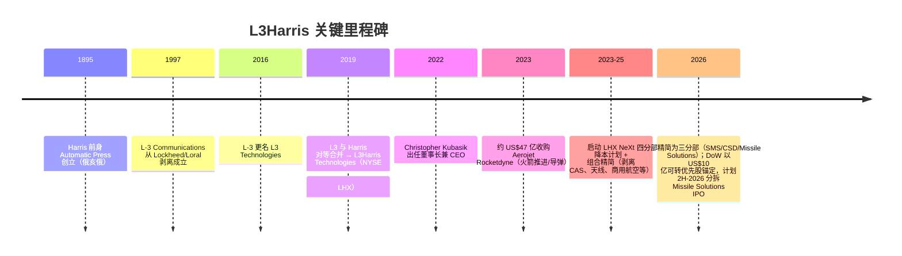
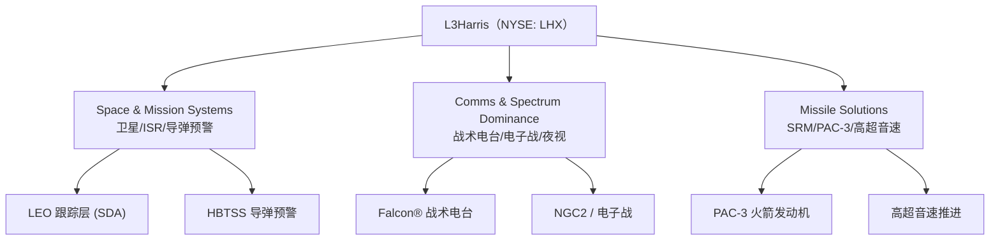
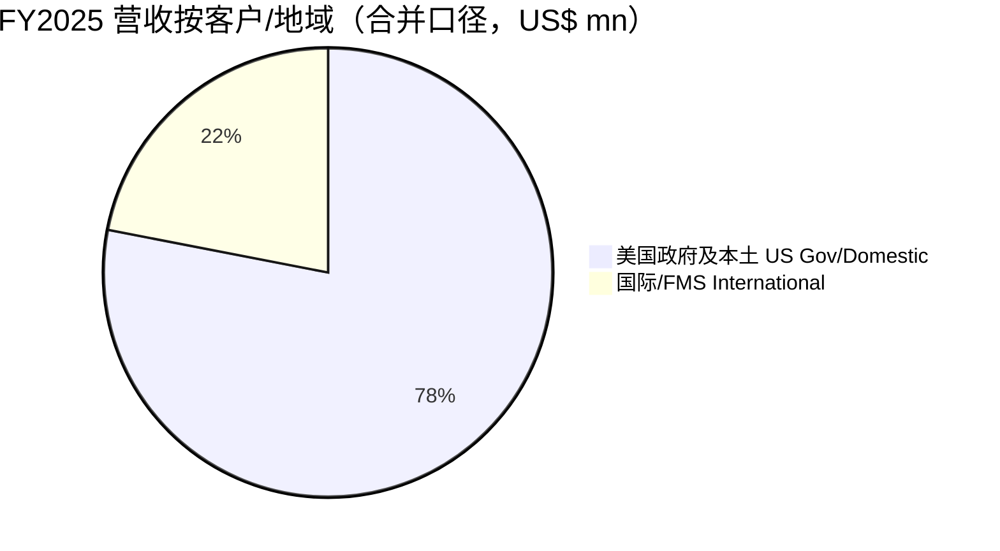
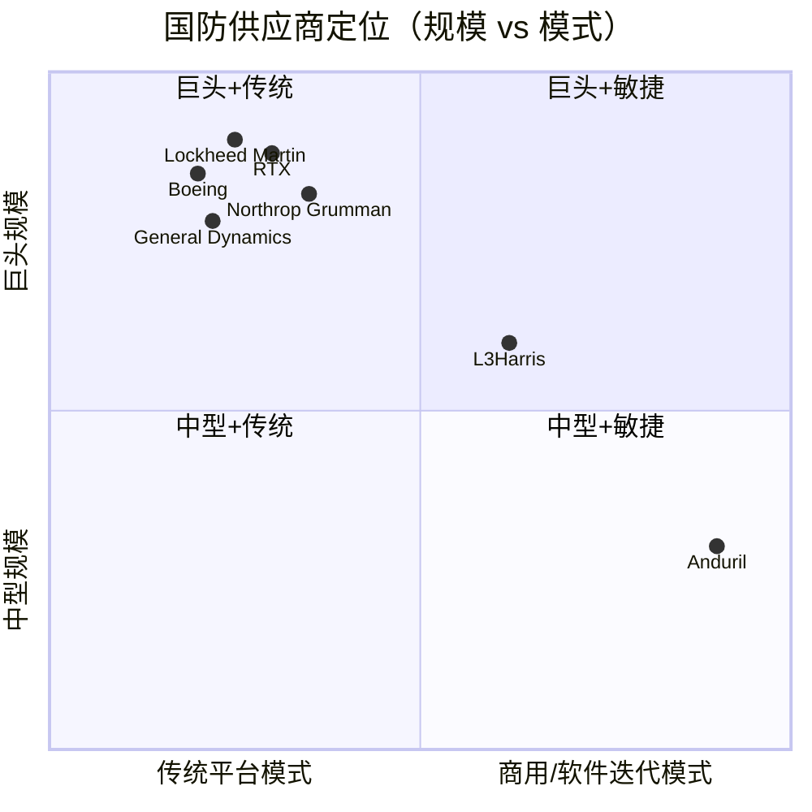
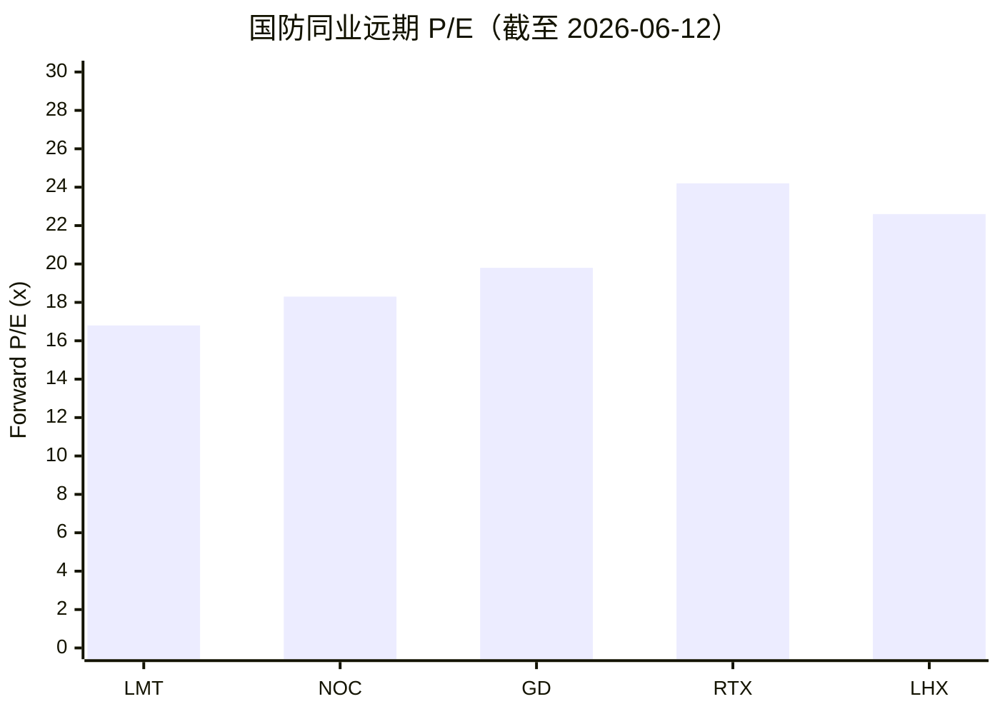
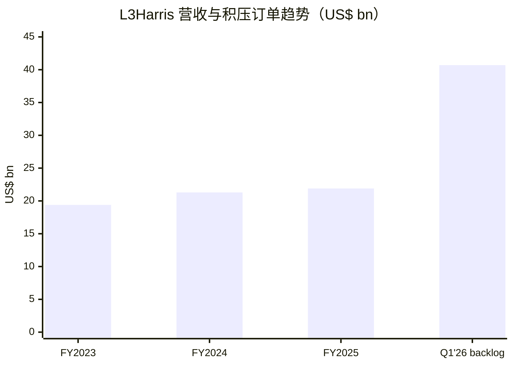

# L3Harris Technologies（L3哈里斯）公司研究报告

**标的：** L3Harris Technologies, Inc.（NYSE: LHX）  **行业：** 美国国防与航天（Aerospace & Defense）
**报告日期（as of）：** 2026-06-14　**股价基准日：** 2026-06-12 收盘 US$307.79

> *分析师观点：* **评级：Overweight（增持）· 12 个月目标价 US$352（较现价 US$307.79 上行 +14%）· 估值方法：2027E GAAP EPS US$13.00 × 27× P/E（约合 ~23× 调整后 EPS，含 Missile Solutions 分拆的 SOTP 重估期权）· 市值约 US$57.3bn · 52 周区间 US$243.84–US$379.23 · NYSE: LHX**
>
> | 倍数 / Multiple（*分析师观点：* 远期列） | FY2025A | FY2026E | FY2027E |
> |---|---|---|---|
> | P/E（GAAP diluted） | 36.1× | 26.8× | 23.7× |
> | P/E（调整后 adjusted） | ~29× | ~22.6× | ~20× |
> | EV/EBITDA（GAAP） | ~20.0× | ~17× | ~15× |
> | P/S | ~2.6× | ~2.5× | ~2.3× |
> | 自由现金流收益率 / FCF yield | 4.7% | ~5.2% | ~5.8% |
>
> **相对表现（rel. performance，截至 2026-06-12）：** 12M 绝对 +21.7% · 同期 S&P 500 +24.3% · 国防 ETF（ITA）+30.4% → 相对大盘 −2.6pt、相对国防板块 **−8.7pt（板块内落后者）**；现价略低于 200 日均线（US$312.84）。价格来源：[Yahoo Finance — LHX](https://finance.yahoo.com/quote/LHX)。
>
> **核心论点（thesis pillars）**——（1）**Missile Solutions（导弹方案）是被低估的成长期权**：管理层指引 ~20%/年增长至 2028 年，需求远超产能，且 2026 下半年计划分拆 IPO、由国防部（DoW）以 **US$10 亿可转换优先股**作为锚定投资者，是少见的"政府入股 + 价值重估"双催化；（2）**$40.7bn 创纪录积压订单（backlog）+ 1.4× book-to-bill** 提供了穿越 FY2027 预算不确定性的能见度；（3）**LHX NeXt 成本计划**驱动 segment operating margin 向 low-16% 扩张，叠加并购无形资产摊销逐年滚落，GAAP EPS 增速显著快于营收（FY2026E +35%）；（4）"Trusted Disruptor（可信颠覆者）"的 prime / merchant supplier 双重身份，使其既是 LMT/RTX 的固体火箭发动机（SRM）供应商、又是新防务科技（Anduril/Palantir/Kuiper）的整合方，估值因此享有相对纯 prime 同业的溢价——但该溢价本身也是最大的下行风险。

> **业绩更新 — FY2026 全年 GAAP EPS 指引上调（2026-04-30）：** 公司在 Q1 CY2026 财报中将全年 diluted EPS 指引从 US$11.30–11.50 上调至 **US$11.40–11.60**，营收指引维持 **US$23.0–23.5bn**、segment operating margin 维持 low-16%、自由现金流约 **US$3.0bn**；当季营收 US$5.7bn（+12%、organic +15%）、orders US$7.8bn、book-to-bill 1.4×、积压订单升至新高 **US$40.7bn**。
> 来源：[LHX Q1 CY2026 Earnings Release（8-K EX-99.1）, 2026-04-30](https://www.sec.gov/Archives/edgar/data/202058/000020205826000032/exhibit991q1cy26earnings.htm)。

## 目录

1. 公司概览（含投资论点引言）
1A. 估值与目标价（远期预测 · PT 推导 · bull/base/bear）
1B. GF Score（GuruFocus 式）基本面评分卡
2. 公司历史
3. 管理团队
4. 产品与服务
5. 客户与上市策略
6. 行业概览
7. 竞争格局
8. 市场机会（TAM）
9. 风险评估
9.5. 核心分歧与催化剂
10. 投资风格透视（投资者视角评分卡）

---

## 1. 公司概览

*分析师观点：* L3Harris 是一笔**"质地优良、估值偏满、靠催化剂赚相对收益"**的增持标的。我们给 Overweight、12 个月目标价 US$352（+14%）。买点不在于它便宜（它不便宜），而在于**三条同时发力的逻辑链**：Missile Solutions 在导弹超级周期里 ~20%/年扩张并即将以政府入股的方式分拆 IPO、$40.7bn 积压订单锁定了营收能见度、LHX NeXt 成本计划把利润率往 low-16% 推。风险同样清楚——股价已隐含上述大部分利好（远期 GAAP P/E ~27×、显著高于纯 prime 同业），一旦 FY2027 预算走向连续决议（CR）、导弹产能爬坡不及预期、或 IPO 推迟，溢价会率先被压缩。本节先确立"公司是做什么的、怎么赚钱、规模多大"，1A/1B 给出决策层，2–9 给出支撑事实。

**公司是做什么的。** L3Harris 自我定位为"国防行业的可信颠覆者（the Trusted Disruptor in the defense industry）"，提供"连接太空、空中、陆地、海洋与网络域的端到端技术解决方案"，服务对象以美国政府各部门机构、其总包商（prime contractors）及国际盟友为主，覆盖 100 多个国家（[LHX FY2025 10-K — Item 1 Business](https://www.sec.gov/Archives/edgar/data/202058/000020205826000015/hrs-20260102.htm)）。公司由 2019 年 **L3 Technologies 与 Harris Corporation 对等合并**而来，并在 2023 年以约 US$47 亿收购 **Aerojet Rocketdyne（AJRD，火箭推进）**，从而把通信、传感、太空与导弹推进整合到同一屋檐下。

**怎么赚钱。** FY2025（财年截至 2026 年 1 月 2 日）公司总营收 **US$21,865mn**，其中产品 US$15,487mn、服务 US$6,378mn（[LHX FY2025 10-K — Consolidated Statement of Operations](https://www.sec.gov/Archives/edgar/data/202058/000020205826000015/hrs-20260102.htm)）。FY2025 报告口径为四个分部——Communication Systems（CS，通信系统）、Integrated Mission Systems（IMS，综合任务系统）、Space & Airborne Systems（SAS，空天系统）、Aerojet Rocketdyne（AR，火箭推进）。下图是 FY2025 利润表的"钱怎么走"全景——从产品/服务收入，经成本与费用，最终落到 GAAP 净利润 US$1,606mn：

<svg xmlns="http://www.w3.org/2000/svg" viewBox="0 0 1000 560" width="1000" height="560" role="img" aria-label="income statement Sankey"><rect x="0" y="0" width="1000" height="560" fill="#ffffff"/>
<text x="20.00" y="30.00" text-anchor="start" font-family="Helvetica,Arial,sans-serif" font-size="15" font-weight="700" fill="#1f2933">L3Harris FY2025 Income Statement (US$ mn)</text>
<path d="M 204.00,78.00 C 258.00,78.00 258.00,85.00 312.00,85.00 L 312.00,373.99 C 258.00,373.99 258.00,366.99 204.00,366.99 Z" fill="#93c5fd" fill-opacity="0.55"/>
<path d="M 452.00,78.00 C 506.00,78.00 506.00,216.95 560.00,216.95 L 560.00,256.32 C 506.00,256.32 506.00,117.37 452.00,117.37 Z" fill="#86efac" fill-opacity="0.55"/>
<path d="M 452.00,117.37 C 506.00,117.37 506.00,270.32 560.00,270.32 L 560.00,335.91 C 506.00,335.91 506.00,182.96 452.00,182.96 Z" fill="#fca5a5" fill-opacity="0.55"/>
<path d="M 328.00,85.00 C 382.00,85.00 382.00,78.00 436.00,78.00 L 436.00,182.96 C 382.00,182.96 382.00,189.96 328.00,189.96 Z" fill="#86efac" fill-opacity="0.55"/>
<path d="M 328.00,189.96 C 382.00,189.96 382.00,196.96 436.00,196.96 L 436.00,500.00 C 382.00,500.00 382.00,493.00 328.00,493.00 Z" fill="#fca5a5" fill-opacity="0.55"/>
<path d="M 576.00,216.95 C 630.00,216.95 630.00,216.97 684.00,216.97 L 684.00,256.35 C 630.00,256.35 630.00,256.32 576.00,256.32 Z" fill="#86efac" fill-opacity="0.55"/>
<path d="M 700.00,216.97 C 754.00,216.97 754.00,263.97 808.00,263.97 L 808.00,293.94 C 754.00,293.94 754.00,246.94 700.00,246.94 Z" fill="#86efac" fill-opacity="0.55"/>
<path d="M 700.00,246.94 C 754.00,246.94 754.00,307.94 808.00,307.94 L 808.00,314.03 C 754.00,314.03 754.00,253.02 700.00,253.02 Z" fill="#fca5a5" fill-opacity="0.55"/>
<path d="M 576.00,270.32 C 630.00,270.32 630.00,267.02 684.00,267.02 L 684.00,321.03 C 630.00,321.03 630.00,324.32 576.00,324.32 Z" fill="#fca5a5" fill-opacity="0.55"/>
<path d="M 576.00,324.32 C 630.00,324.32 630.00,335.03 684.00,335.03 L 684.00,345.03 C 630.00,345.03 630.00,334.33 576.00,334.33 Z" fill="#fca5a5" fill-opacity="0.55"/>
<path d="M 576.00,334.33 C 630.00,334.33 630.00,359.03 684.00,359.03 L 684.00,361.03 C 630.00,361.03 630.00,336.33 576.00,336.33 Z" fill="#fca5a5" fill-opacity="0.55"/>
<path d="M 576.00,349.91 C 630.00,349.91 630.00,256.35 684.00,256.35 L 684.00,267.49 C 630.00,267.49 630.00,361.05 576.00,361.05 Z" fill="#93c5fd" fill-opacity="0.55"/>
<path d="M 204.00,380.99 C 258.00,380.99 258.00,373.99 312.00,373.99 L 312.00,493.00 C 258.00,493.00 258.00,500.00 204.00,500.00 Z" fill="#93c5fd" fill-opacity="0.55"/>
<rect x="188.00" y="78.00" width="16" height="288.99" rx="1.5" fill="#2563eb"/>
<rect x="188.00" y="380.99" width="16" height="119.01" rx="1.5" fill="#2563eb"/>
<rect x="312.00" y="85.00" width="16" height="408.00" rx="1.5" fill="#1e3a8a"/>
<rect x="436.00" y="78.00" width="16" height="104.96" rx="1.5" fill="#15803d"/>
<rect x="436.00" y="196.96" width="16" height="303.04" rx="1.5" fill="#dc2626"/>
<rect x="560.00" y="216.95" width="16" height="39.37" rx="1.5" fill="#15803d"/>
<rect x="560.00" y="270.32" width="16" height="65.59" rx="1.5" fill="#dc2626"/>
<rect x="560.00" y="349.91" width="16" height="11.14" rx="1.5" fill="#2563eb"/>
<rect x="684.00" y="216.97" width="16" height="36.05" rx="1.5" fill="#15803d"/>
<rect x="684.00" y="267.02" width="16" height="54.00" rx="1.5" fill="#dc2626"/>
<rect x="684.00" y="335.03" width="16" height="10.00" rx="1.5" fill="#dc2626"/>
<rect x="684.00" y="359.03" width="16" height="2.00" rx="1.5" fill="#dc2626"/>
<rect x="808.00" y="263.97" width="16" height="29.97" rx="1.5" fill="#15803d"/>
<rect x="808.00" y="307.94" width="16" height="6.08" rx="1.5" fill="#dc2626"/>
<text x="179.00" y="219.49" text-anchor="end" font-family="Helvetica,Arial,sans-serif" font-size="11.5" font-weight="700" fill="#1f2933">Products</text>
<text x="179.00" y="232.49" text-anchor="end" font-family="Helvetica,Arial,sans-serif" font-size="10" font-weight="400" fill="#52606d">$15.5B  (70.8%)</text>
<text x="179.00" y="437.49" text-anchor="end" font-family="Helvetica,Arial,sans-serif" font-size="11.5" font-weight="700" fill="#1f2933">Services</text>
<text x="179.00" y="450.49" text-anchor="end" font-family="Helvetica,Arial,sans-serif" font-size="10" font-weight="400" fill="#52606d">$6.4B  (29.2%)</text>
<rect x="331.00" y="67.00" width="106.80" height="26" rx="2" fill="#ffffff" fill-opacity="0.72"/>
<text x="334.00" y="79.00" text-anchor="start" font-family="Helvetica,Arial,sans-serif" font-size="11.5" font-weight="700" fill="#1f2933">Revenue</text>
<text x="334.00" y="92.00" text-anchor="start" font-family="Helvetica,Arial,sans-serif" font-size="10" font-weight="400" fill="#52606d">$21.9B  (100.0%)</text>
<rect x="455.00" y="60.00" width="94.20" height="26" rx="2" fill="#ffffff" fill-opacity="0.72"/>
<text x="458.00" y="72.00" text-anchor="start" font-family="Helvetica,Arial,sans-serif" font-size="11.5" font-weight="700" fill="#1f2933">Gross Profit</text>
<text x="458.00" y="85.00" text-anchor="start" font-family="Helvetica,Arial,sans-serif" font-size="10" font-weight="400" fill="#52606d">$5.6B  (25.7%)</text>
<rect x="455.00" y="178.96" width="144.60" height="26" rx="2" fill="#ffffff" fill-opacity="0.72"/>
<text x="458.00" y="190.96" text-anchor="start" font-family="Helvetica,Arial,sans-serif" font-size="11.5" font-weight="700" fill="#1f2933">Cost of Revenue (COGS)</text>
<text x="458.00" y="203.96" text-anchor="start" font-family="Helvetica,Arial,sans-serif" font-size="10" font-weight="400" fill="#52606d">$16.2B  (74.3%)</text>
<rect x="579.00" y="198.95" width="106.80" height="26" rx="2" fill="#ffffff" fill-opacity="0.72"/>
<text x="582.00" y="210.95" text-anchor="start" font-family="Helvetica,Arial,sans-serif" font-size="11.5" font-weight="700" fill="#1f2933">Operating Income</text>
<text x="582.00" y="223.95" text-anchor="start" font-family="Helvetica,Arial,sans-serif" font-size="10" font-weight="400" fill="#52606d">$2.1B  (9.7%)</text>
<rect x="579.00" y="252.32" width="150.90" height="26" rx="2" fill="#ffffff" fill-opacity="0.72"/>
<text x="582.00" y="264.32" text-anchor="start" font-family="Helvetica,Arial,sans-serif" font-size="11.5" font-weight="700" fill="#1f2933">Total Operating Expense</text>
<text x="582.00" y="277.32" text-anchor="start" font-family="Helvetica,Arial,sans-serif" font-size="10" font-weight="400" fill="#52606d">$3.5B  (16.1%)</text>
<text x="551.00" y="352.48" text-anchor="end" font-family="Helvetica,Arial,sans-serif" font-size="11.5" font-weight="700" fill="#1f2933">Net Interest / Other Income</text>
<text x="551.00" y="365.48" text-anchor="end" font-family="Helvetica,Arial,sans-serif" font-size="10" font-weight="400" fill="#52606d">$597.0M  (2.7%)</text>
<rect x="703.00" y="198.97" width="87.90" height="26" rx="2" fill="#ffffff" fill-opacity="0.72"/>
<text x="706.00" y="210.97" text-anchor="start" font-family="Helvetica,Arial,sans-serif" font-size="11.5" font-weight="700" fill="#1f2933">Pretax Income</text>
<text x="706.00" y="223.97" text-anchor="start" font-family="Helvetica,Arial,sans-serif" font-size="10" font-weight="400" fill="#52606d">$1.9B  (8.8%)</text>
<rect x="703.00" y="249.02" width="94.20" height="26" rx="2" fill="#ffffff" fill-opacity="0.72"/>
<text x="706.00" y="261.02" text-anchor="start" font-family="Helvetica,Arial,sans-serif" font-size="11.5" font-weight="700" fill="#1f2933">SG&amp;A</text>
<text x="706.00" y="274.02" text-anchor="start" font-family="Helvetica,Arial,sans-serif" font-size="10" font-weight="400" fill="#52606d">$2.9B  (13.2%)</text>
<rect x="703.00" y="317.03" width="100.50" height="26" rx="2" fill="#ffffff" fill-opacity="0.72"/>
<text x="706.00" y="329.03" text-anchor="start" font-family="Helvetica,Arial,sans-serif" font-size="11.5" font-weight="700" fill="#1f2933">R&amp;D</text>
<text x="706.00" y="342.03" text-anchor="start" font-family="Helvetica,Arial,sans-serif" font-size="10" font-weight="400" fill="#52606d">$536.0M  (2.5%)</text>
<rect x="703.00" y="342.03" width="100.50" height="26" rx="2" fill="#ffffff" fill-opacity="0.72"/>
<text x="706.00" y="354.03" text-anchor="start" font-family="Helvetica,Arial,sans-serif" font-size="11.5" font-weight="700" fill="#1f2933">Other OpEx</text>
<text x="706.00" y="367.03" text-anchor="start" font-family="Helvetica,Arial,sans-serif" font-size="10" font-weight="400" fill="#52606d">$85.0M  (0.39%)</text>
<text x="833.00" y="275.96" text-anchor="start" font-family="Helvetica,Arial,sans-serif" font-size="11.5" font-weight="700" fill="#1f2933">Net Income</text>
<text x="833.00" y="288.96" text-anchor="start" font-family="Helvetica,Arial,sans-serif" font-size="10" font-weight="400" fill="#52606d">$1.6B  (7.3%)</text>
<text x="833.00" y="307.98" text-anchor="start" font-family="Helvetica,Arial,sans-serif" font-size="11.5" font-weight="700" fill="#1f2933">Income Tax</text>
<text x="833.00" y="320.98" text-anchor="start" font-family="Helvetica,Arial,sans-serif" font-size="10" font-weight="400" fill="#52606d">$326.0M  (1.5%)</text>
<text x="500.00" y="544.00" text-anchor="middle" font-family="Helvetica,Arial,sans-serif" font-size="10" font-weight="400" fill="#52606d">Source: L3Harris FY2025 10-K (Jan 2 2026), filed 2026; SEC EDGAR</text>
</svg>

*图 1：L3Harris FY2025 利润表 Sankey（US$ mn）。* 来源：[LHX FY2025 10-K — Consolidated Statement of Operations](https://www.sec.gov/Archives/edgar/data/202058/000020205826000015/hrs-20260102.htm)。

**收入按分部与地域的拆分**如下两图。FY2025 四分部营收：SAS US$6,946mn、IMS US$6,630mn、CS US$5,673mn、AR US$2,845mn（[LHX FY2025 10-K — MD&A Business Segment Results](https://www.sec.gov/Archives/edgar/data/202058/000020205826000015/hrs-20260102.htm)）。地域上，FY2025 海外终端客户营收 **US$4.8bn（占 22%）**，来自 100 多个国家、无单一国家超过总营收 5%（[同上 — International Business](https://www.sec.gov/Archives/edgar/data/202058/000020205826000015/hrs-20260102.htm)）。

<svg xmlns="http://www.w3.org/2000/svg" viewBox="0 0 720 460" width="720" height="460" role="img" aria-label="revenue donut"><rect x="0" y="0" width="720" height="460" fill="#ffffff"/>
<text x="20.00" y="30.00" text-anchor="start" font-family="Helvetica,Arial,sans-serif" font-size="15" font-weight="700" fill="#1f2933">L3Harris FY2025 Revenue by Segment (US$ mn)</text>
<path d="M 288.00,107.20 A 132 132 0 0 1 409.35,291.15 L 359.70,269.90 A 78 78 0 0 0 288.00,161.20 Z" fill="#2563eb"/>
<path d="M 409.35,291.15 A 132 132 0 0 1 201.04,338.51 L 236.61,297.88 A 78 78 0 0 0 359.70,269.90 Z" fill="#15803d"/>
<path d="M 201.04,338.51 A 132 132 0 0 1 192.48,148.10 L 231.56,185.37 A 78 78 0 0 0 236.61,297.88 Z" fill="#d97706"/>
<path d="M 192.48,148.10 A 132 132 0 0 1 288.00,107.20 L 288.00,161.20 A 78 78 0 0 0 231.56,185.37 Z" fill="#7c3aed"/>
<text x="288.00" y="235.20" text-anchor="middle" font-family="Helvetica,Arial,sans-serif" font-size="18" font-weight="800" fill="#1f2933">21,865</text>
<text x="288.00" y="255.20" text-anchor="middle" font-family="Helvetica,Arial,sans-serif" font-size="13" font-weight="600" fill="#52606d">$22.1B</text>
<text x="288.00" y="271.20" text-anchor="middle" font-family="Helvetica,Arial,sans-serif" font-size="10" font-weight="400" fill="#8a97a3">total</text>
<line x1="403.19" y1="163.21" x2="419.19" y2="163.21" stroke="#2563eb" stroke-width="1.4"/>
<text x="423.19" y="161.21" text-anchor="start" font-family="Helvetica,Arial,sans-serif" font-size="11" font-weight="700" fill="#1f2933">SAS 空天系统</text>
<text x="423.19" y="175.21" text-anchor="start" font-family="Helvetica,Arial,sans-serif" font-size="10" font-weight="400" fill="#52606d">$6.9B  (31.4%)</text>
<line x1="318.59" y1="373.77" x2="334.59" y2="373.77" stroke="#15803d" stroke-width="1.4"/>
<text x="338.59" y="371.77" text-anchor="start" font-family="Helvetica,Arial,sans-serif" font-size="11" font-weight="700" fill="#1f2933">IMS 综合任务系统</text>
<text x="338.59" y="385.77" text-anchor="start" font-family="Helvetica,Arial,sans-serif" font-size="10" font-weight="400" fill="#52606d">$6.6B  (30.0%)</text>
<line x1="150.14" y1="245.40" x2="134.14" y2="245.40" stroke="#d97706" stroke-width="1.4"/>
<text x="130.14" y="243.40" text-anchor="end" font-family="Helvetica,Arial,sans-serif" font-size="11" font-weight="700" fill="#1f2933">CS 通信系统</text>
<text x="130.14" y="257.40" text-anchor="end" font-family="Helvetica,Arial,sans-serif" font-size="10" font-weight="400" fill="#52606d">$5.7B  (25.7%)</text>
<line x1="233.68" y1="112.34" x2="217.68" y2="112.34" stroke="#7c3aed" stroke-width="1.4"/>
<text x="213.68" y="110.34" text-anchor="end" font-family="Helvetica,Arial,sans-serif" font-size="11" font-weight="700" fill="#1f2933">AR 火箭推进</text>
<text x="213.68" y="124.34" text-anchor="end" font-family="Helvetica,Arial,sans-serif" font-size="10" font-weight="400" fill="#52606d">$2.8B  (12.9%)</text>
<text x="360.00" y="444.00" text-anchor="middle" font-family="Helvetica,Arial,sans-serif" font-size="10" font-weight="400" fill="#52606d">Source: L3Harris FY2025 10-K (Jan 2 2026), filed 2026; SEC EDGAR — Note 14 Segments</text>
</svg>

<svg xmlns="http://www.w3.org/2000/svg" viewBox="0 0 720 460" width="720" height="460" role="img" aria-label="revenue donut"><rect x="0" y="0" width="720" height="460" fill="#ffffff"/>
<text x="20.00" y="30.00" text-anchor="start" font-family="Helvetica,Arial,sans-serif" font-size="15" font-weight="700" fill="#1f2933">L3Harris FY2025 Revenue by Geography (US$ mn)</text>
<path d="M 288.00,107.20 A 132 132 0 1 1 158.41,214.08 L 211.43,224.36 A 78 78 0 1 0 288.00,161.20 Z" fill="#2563eb"/>
<path d="M 158.41,214.08 A 132 132 0 0 1 288.00,107.20 L 288.00,161.20 A 78 78 0 0 0 211.43,224.36 Z" fill="#15803d"/>
<text x="288.00" y="235.20" text-anchor="middle" font-family="Helvetica,Arial,sans-serif" font-size="18" font-weight="800" fill="#1f2933">21,865</text>
<text x="288.00" y="255.20" text-anchor="middle" font-family="Helvetica,Arial,sans-serif" font-size="13" font-weight="600" fill="#52606d">$21.9B</text>
<text x="288.00" y="271.20" text-anchor="middle" font-family="Helvetica,Arial,sans-serif" font-size="10" font-weight="400" fill="#8a97a3">total</text>
<line x1="375.81" y1="345.66" x2="391.81" y2="345.66" stroke="#2563eb" stroke-width="1.4"/>
<text x="395.81" y="343.66" text-anchor="start" font-family="Helvetica,Arial,sans-serif" font-size="11" font-weight="700" fill="#1f2933">United States 美国</text>
<text x="395.81" y="357.66" text-anchor="start" font-family="Helvetica,Arial,sans-serif" font-size="10" font-weight="400" fill="#52606d">$17.1B  (78.0%)</text>
<line x1="200.19" y1="132.74" x2="184.19" y2="132.74" stroke="#15803d" stroke-width="1.4"/>
<text x="180.19" y="130.74" text-anchor="end" font-family="Helvetica,Arial,sans-serif" font-size="11" font-weight="700" fill="#1f2933">International / FMS 国际</text>
<text x="180.19" y="144.74" text-anchor="end" font-family="Helvetica,Arial,sans-serif" font-size="10" font-weight="400" fill="#52606d">$4.8B  (22.0%)</text>
<text x="360.00" y="444.00" text-anchor="middle" font-family="Helvetica,Arial,sans-serif" font-size="10" font-weight="400" fill="#52606d">Source: L3Harris FY2025 10-K (Jan 2 2026), filed 2026; SEC EDGAR — International Business, 22% intl</text>
</svg>

*图 2 / 图 3：FY2025 营收按分部（左）与按地域（右）。* 来源：[LHX FY2025 10-K — Note 14 Business Segments / Item 1 International Business](https://www.sec.gov/Archives/edgar/data/202058/000020205826000015/hrs-20260102.htm)。

**规模与经营环境。** 截至 2026 年 1 月 2 日，公司约有 **45,000 名员工**（含约 18,000 名工程师与科学家，90% 在美国）；FY2025 投入公司自有研发（company-funded R&D）**US$536mn（占营收 2%）**；contractual backlog（合同积压）**US$38.7bn，同比 +13%**，预计 45% 在 FY2026 内、70% 在 FY2027 末前确认（[LHX FY2025 10-K — Item 1 Business / Backlog](https://www.sec.gov/Archives/edgar/data/202058/000020205826000015/hrs-20260102.htm)）。FY2025 有 **75% 的营收来自固定价格合同（fixed-price）**，公司因此承担成本超支风险、也享受降本红利（[同上 — Contracts 部分](https://www.sec.gov/Archives/edgar/data/202058/000020205826000015/hrs-20260102.htm)）。下图为 FY2021–2025 营收（产品 + 服务）演变——五年从 US$17.8bn 增至 US$21.9bn（其中 2023 年因并购 Aerojet 跳升）：

<svg xmlns="http://www.w3.org/2000/svg" viewBox="0 0 860 470" width="860" height="470" role="img" aria-label="historical revenue bars"><rect x="0" y="0" width="860" height="470" fill="#ffffff"/>
<text x="20.00" y="30.00" text-anchor="start" font-family="Helvetica,Arial,sans-serif" font-size="15" font-weight="700" fill="#1f2933">L3Harris Revenue FY2021-2025 (US$ mn)</text>
<rect x="20.00" y="44" width="11" height="11" rx="2" fill="#2563eb"/>
<text x="36.00" y="53.00" text-anchor="start" font-family="Helvetica,Arial,sans-serif" font-size="10.5" font-weight="400" fill="#1f2933">Products 产品</text>
<rect x="122.60" y="44" width="11" height="11" rx="2" fill="#15803d"/>
<text x="138.60" y="53.00" text-anchor="start" font-family="Helvetica,Arial,sans-serif" font-size="10.5" font-weight="400" fill="#1f2933">Services 服务</text>
<line x1="70" y1="412.00" x2="834" y2="412.00" stroke="#eceff2" stroke-width="1"/>
<text x="64.00" y="415.00" text-anchor="end" font-family="Helvetica,Arial,sans-serif" font-size="9.5" font-weight="400" fill="#52606d">$0</text>
<line x1="70" y1="345.20" x2="834" y2="345.20" stroke="#eceff2" stroke-width="1"/>
<text x="64.00" y="348.20" text-anchor="end" font-family="Helvetica,Arial,sans-serif" font-size="9.5" font-weight="400" fill="#52606d">$4.7B</text>
<line x1="70" y1="278.40" x2="834" y2="278.40" stroke="#eceff2" stroke-width="1"/>
<text x="64.00" y="281.40" text-anchor="end" font-family="Helvetica,Arial,sans-serif" font-size="9.5" font-weight="400" fill="#52606d">$9.4B</text>
<line x1="70" y1="211.60" x2="834" y2="211.60" stroke="#eceff2" stroke-width="1"/>
<text x="64.00" y="214.60" text-anchor="end" font-family="Helvetica,Arial,sans-serif" font-size="9.5" font-weight="400" fill="#52606d">$14.2B</text>
<line x1="70" y1="144.80" x2="834" y2="144.80" stroke="#eceff2" stroke-width="1"/>
<text x="64.00" y="147.80" text-anchor="end" font-family="Helvetica,Arial,sans-serif" font-size="9.5" font-weight="400" fill="#52606d">$18.9B</text>
<line x1="70" y1="78.00" x2="834" y2="78.00" stroke="#eceff2" stroke-width="1"/>
<text x="64.00" y="81.00" text-anchor="end" font-family="Helvetica,Arial,sans-serif" font-size="9.5" font-weight="400" fill="#52606d">$23.6B</text>
<rect x="102.09" y="225.92" width="88.62" height="186.08" fill="#2563eb"/>
<rect x="102.09" y="160.04" width="88.62" height="65.88" fill="#15803d"/>
<text x="146.40" y="428.00" text-anchor="middle" font-family="Helvetica,Arial,sans-serif" font-size="10" font-weight="400" fill="#52606d">2021</text>
<rect x="254.89" y="240.90" width="88.62" height="171.10" fill="#2563eb"/>
<rect x="254.89" y="170.67" width="88.62" height="70.23" fill="#15803d"/>
<text x="299.20" y="428.00" text-anchor="middle" font-family="Helvetica,Arial,sans-serif" font-size="10" font-weight="400" fill="#52606d">2022</text>
<rect x="407.69" y="218.31" width="88.62" height="193.69" fill="#2563eb"/>
<rect x="407.69" y="137.34" width="88.62" height="80.97" fill="#15803d"/>
<text x="452.00" y="428.00" text-anchor="middle" font-family="Helvetica,Arial,sans-serif" font-size="10" font-weight="400" fill="#52606d">2023</text>
<rect x="560.49" y="197.94" width="88.62" height="214.06" fill="#2563eb"/>
<rect x="560.49" y="110.38" width="88.62" height="87.57" fill="#15803d"/>
<text x="604.80" y="428.00" text-anchor="middle" font-family="Helvetica,Arial,sans-serif" font-size="10" font-weight="400" fill="#52606d">2024</text>
<rect x="713.29" y="192.95" width="88.62" height="219.05" fill="#2563eb"/>
<rect x="713.29" y="102.74" width="88.62" height="90.21" fill="#15803d"/>
<text x="757.60" y="428.00" text-anchor="middle" font-family="Helvetica,Arial,sans-serif" font-size="10" font-weight="400" fill="#52606d">2025</text>
<text x="430.00" y="454.00" text-anchor="middle" font-family="Helvetica,Arial,sans-serif" font-size="10" font-weight="400" fill="#52606d">Source: L3Harris FY2025 10-K (Jan 2 2026), filed 2026; SEC EDGAR + FY2023 10-K (FY21/22 comparatives)</text>
</svg>

*图 4：L3Harris FY2021–2025 营收（US$ mn，产品 + 服务）。* 来源：[LHX FY2025 10-K](https://www.sec.gov/Archives/edgar/data/202058/000020205826000015/hrs-20260102.htm) 与 [FY2023 10-K（FY2021/2022 比较列）](https://www.sec.gov/Archives/edgar/data/202058/000020205826000015/hrs-20260102.htm)。

**估值快照（valuation snapshot，截至 2026-06-12）。** 现价 US$307.79、市值约 US$57.3bn（≈186.3mn 股 × 现价）、52 周区间 US$243.84–379.23、beta 0.75、远期股息率约 1.56%（季度 US$1.20、年化 US$4.80）（价格/股息：[Yahoo Finance — LHX](https://finance.yahoo.com/quote/LHX)；股息：[LHX FY2025 10-K — Item 5](https://www.sec.gov/Archives/edgar/data/202058/000020205826000015/hrs-20260102.htm)）。**关键多项指标我们以 10-K 自行计算，而非直接采用 Yahoo 聚合值**——后者的营收字段（约 US$12.9bn）明显错误（实际 US$21.9bn），导致其 P/S 4.46×、EV/EBITDA 35× 不可用（见 Step 10 验证日志）。自算口径：**TTM P/E ~33.5×**（TTM GAAP EPS ~US$9.20）、FY2025 GAAP P/E 36.1×（EPS US$8.53）、**远期 FY2026 GAAP P/E 26.8×**（指引中值 US$11.50）、**P/S ~2.6×**、**P/B ~2.9×**、**EV/EBITDA(GAAP) ~20.0×**（EV≈US$66.6bn / EBITDA≈US$3.33bn）。

**多倍数为何偏高？** LHX 远期 GAAP P/E ~27× 显著高于纯 prime 同业（NOC 18.3×、LMT 16.8×、GD 19.8×，远期；[Yahoo Finance 同业页](https://finance.yahoo.com/quote/LHX)），接近 RTX（24.2×）。溢价主要来自三点：（a）增速更高——~8% 营收 CAGR + Missile ~20%/年，对标同业的中个位数；（b）**Missile Solutions 分拆 IPO 的 SOTP 重估期权**——高增长导弹业务若以独立公司估值，对应倍数远高于母公司综合体；（c）利润率扩张 + 摊销滚落带来的 GAAP EPS 高增速。*分析师观点：* 这是一个"成长 + 催化剂"溢价，并非便宜——我们在 1A 据此给出低于市场一致的 base PT。

---

## 1A. 估值与目标价（决策层）

> *分析师观点：* 本章所有远期数字、目标价与情景价均为**分析师自有前瞻判断**，**不附任何 filing 引用**（10-K 不含目标价）。每个驱动因子的外部依据以行内引用标注。

**(a) 远期财务预测表（forward estimates，*分析师观点：*）。** 以分部口径建模——Missile Solutions 维持 ~20%/年、SMS/CSD 中个位数，加总后对应 ~6.5% 的合并营收 CAGR、与管理层 ~8% top-line framework 同区间（管理层 framework 见 *分析师观点：* [Bernstein — Global A&D「Twelve CEOs」, 2026-06-03, p.10–11](http://xs-macbook-air.local:5001/zsxq/pdf/812485114412812/Bernstein-Global%20Aerospace%20%26%20Defense%EF%BC%9AAerospace%20%26%20Defense%EF%BC%9A%20Twelve%20CEOs%20in%20three%20days~A%26D%20themes%20from%20Bernstein%27s%20Strategic%20Decisions%20Conference-260602.pdf)）：

| 指标（*分析师观点：* 预测列） | FY2024A | FY2025A | FY2026E | FY2027E | FY2028E | CAGR(25–28) |
|---|---|---|---|---|---|---|
| 营收 Revenue（US$ mn） | 21,325 | 21,865 | 23,250 | 24,800 | 26,400 | +6.5% |
| — YoY % | +9.8% | +2.5% | +6.3% | +6.7% | +6.5% | |
| Segment operating margin % | 15.3% | 15.4% | 16.2% | 16.6% | 17.0% | |
| GAAP operating margin % | 9.0% | 9.7% | ~11.5% | ~12.2% | ~12.8% | |
| GAAP diluted EPS（US$） | 7.87 | 8.53 | 11.50 | 13.00 | 14.60 | +19.6% |
| — YoY % | | +8.4% | +34.8% | +13.0% | +12.3% | |
| FCF（US$ mn） | 2,151 | 2,682 | ~3,000 | ~3,300 | ~3,600 | |
| Net cash/(debt)（US$ mn） | (10,981) | (9,374) | ~(8,300) | ~(7,200) | ~(6,000) | |

各单元的外部依据：FY2026E 营收/EPS/FCF 取自公司**自有指引** US$23.0–23.5bn / US$11.40–11.60 / ~US$3.0bn（[LHX Q1 CY2026 Release, 2026-04-30](https://www.sec.gov/Archives/edgar/data/202058/000020205826000032/exhibit991q1cy26earnings.htm)）；FY2025 实际（营收 21,865、EPS 8.53、FCF=OCF 3,106−capex 424=2,682、net debt=LT debt 10,443−cash 1,069=9,374）取自 [LHX FY2025 10-K 财务报表](https://www.sec.gov/Archives/edgar/data/202058/000020205826000015/hrs-20260102.htm)；FY2027–28E 营收按 ~6.5% 内生增长 + Missile ~20% 拉动建模、margin 路径取自 segment margin 向 low-16%+ 扩张的指引外推。

**利润率桥（margin bridge，*分析师观点：*）。** FY2025→FY2026E GAAP EPS +34.8% 的跳升**并非纯经营改善**，分解约为：segment margin 扩张（LHX NeXt 降本 + 量增经营杠杆）+~$0.8、并购无形资产摊销逐年滚落 +~$0.5、净利息下降（FY2025 净利息 597、同比 −12%）+~$0.3、有效税率正常化（Q1 CY2026 ETR 13.1% vs FY2025 16.9%）+~$0.6、回购缩股 +~$0.3，减去 FY2025 一次性收益（资产货币化、FY2025 含 $85mn 商誉减值）的高基数。读者据此应理解：**FY2026 的 GAAP EPS 高增速有一次性成分，FY2027–28 应回落到低双位数。**

**(b) 目标价推导（show the arithmetic）。** 方法：远期 P/E × 目标倍数。**Base PT = FY2027E GAAP EPS US$13.00 × 27× = US$351 ≈ US$352**（较现价 +14%）。27× 倍数对标 3–5 家同业的依据：纯 prime NOC 18.3×、LMT 16.8×、GD 19.8×（远期 GAAP），RTX 24.2×（[Yahoo Finance 同业](https://finance.yahoo.com/quote/LHX)）；LHX 的溢价由**更高增速（~8% 营收 / ~13–20% EPS vs 同业中个位数）+ Missile 分拆的 SOTP 重估期权**支撑——27× GAAP 约合 ~23× 调整后 EPS，与 RTX 同档。该溢价是论点也是风险（见 9.5）。

**(c) Bull / Base / Bear 情景（*分析师观点：*）。**

| 情景 | 关键摆动假设 | 目标价 | 较现价 |
|---|---|---|---|
| Bull | Missile 产能爬坡超预期、MSL IPO 成功并重估 SOTP；FY2027E EPS US$13.75 × 32× | US$440 | +43% |
| Base | 中性预测、27× FY2027E EPS US$13.00 | US$352 | +14% |
| Bear | FY2027 预算走 CR/延迟、导弹产能滑期、IPO 搁置；EPS US$12.25 × 21×（de-rate 至 prime 同业倍数） | US$258 | −16% |

风险回报大致对称偏上（Bull +43% / Bear −16%），这正是我们给 Overweight 而非 Buy 的原因——**上行依赖催化剂兑现，下行是估值溢价的均值回归**。

**(d) 与市场一致预期的对比。** 我们的 base US$352 **低于** Street 一致目标价均值约 7%——彭博/雅虎口径 19 位分析师均值 US$381.95（高 US$443 / 低 US$300）、评级倾向"buy"（[Yahoo Finance — LHX Analysis](https://finance.yahoo.com/quote/LHX)）。我们刻意保守：在远期 GAAP P/E 已 ~27× 的位置，相信 Street 的 +24% 上行需要 IPO 与导弹爬坡两个催化剂都按时兑现。

**(e) 最该盯紧的两个变量。** （1）**Missile Solutions 的产能爬坡兑现度**（PAC-3 产能能否如期在 mid-2027 翻倍、$3bn 投资的回报节奏）；（2）**FY2027 国防预算路径**（基数预算 vs 连续决议 CR vs reconciliation 补充）——前者决定成长期权的内在价值，后者决定估值溢价能否守住。

**ROE 拆解（DuPont）。** FY2025 ROE ≈ 8.2%（净利润 1,606 / 平均权益 ~19,607），拆为净利率 × 资产周转 × 权益乘数——可见其回报由偏薄的净利率（7.3%）与适中的杠杆共同支撑，而非高周转：

<svg xmlns="http://www.w3.org/2000/svg" viewBox="0 0 1240 540" width="1240" height="540" role="img" aria-label="DuPont ROE decomposition"><rect x="0" y="0" width="1240" height="540" fill="#ffffff"/>
<text x="20.00" y="30.00" text-anchor="start" font-family="Helvetica,Arial,sans-serif" font-size="15" font-weight="700" fill="#1f2933">L3Harris FY2025 DuPont ROE Decomposition</text>
<rect x="545.00" y="56.00" width="150" height="56" rx="7" fill="#1e3a8a"/>
<text x="620.00" y="76.00" text-anchor="middle" font-family="Helvetica,Arial,sans-serif" font-size="11.5" font-weight="700" fill="#ffffff">ROE</text>
<text x="620.00" y="94.00" text-anchor="middle" font-family="Helvetica,Arial,sans-serif" font-size="13" font-weight="800" fill="#ffffff">8.19%</text>
<text x="620.00" y="106.00" text-anchor="middle" font-family="Helvetica,Arial,sans-serif" font-size="8.5" font-weight="400" fill="#dbeafe">= Net Income / Avg Equity</text>
<rect x="191.60" y="168.00" width="150" height="56" rx="7" fill="#2563eb"/>
<text x="266.60" y="188.00" text-anchor="middle" font-family="Helvetica,Arial,sans-serif" font-size="11.5" font-weight="700" fill="#ffffff">Net Margin</text>
<text x="266.60" y="206.00" text-anchor="middle" font-family="Helvetica,Arial,sans-serif" font-size="13" font-weight="800" fill="#ffffff">7.35%</text>
<text x="266.60" y="218.00" text-anchor="middle" font-family="Helvetica,Arial,sans-serif" font-size="8.5" font-weight="400" fill="#dbeafe">Net Income / Revenue</text>
<line x1="620.00" y1="112.00" x2="266.60" y2="168.00" stroke="#94a3b8" stroke-width="1.4"/>
<rect x="545.00" y="168.00" width="150" height="56" rx="7" fill="#2563eb"/>
<text x="620.00" y="188.00" text-anchor="middle" font-family="Helvetica,Arial,sans-serif" font-size="11.5" font-weight="700" fill="#ffffff">Asset Turnover</text>
<text x="620.00" y="206.00" text-anchor="middle" font-family="Helvetica,Arial,sans-serif" font-size="13" font-weight="800" fill="#ffffff">0.53</text>
<text x="620.00" y="218.00" text-anchor="middle" font-family="Helvetica,Arial,sans-serif" font-size="8.5" font-weight="400" fill="#dbeafe">Revenue / Avg Assets</text>
<line x1="620.00" y1="112.00" x2="620.00" y2="168.00" stroke="#94a3b8" stroke-width="1.4"/>
<rect x="898.40" y="168.00" width="150" height="56" rx="7" fill="#2563eb"/>
<text x="973.40" y="188.00" text-anchor="middle" font-family="Helvetica,Arial,sans-serif" font-size="11.5" font-weight="700" fill="#ffffff">Equity Multiplier</text>
<text x="973.40" y="206.00" text-anchor="middle" font-family="Helvetica,Arial,sans-serif" font-size="13" font-weight="800" fill="#ffffff">2.12</text>
<text x="973.40" y="218.00" text-anchor="middle" font-family="Helvetica,Arial,sans-serif" font-size="8.5" font-weight="400" fill="#dbeafe">Avg Assets / Avg Equity</text>
<line x1="620.00" y1="112.00" x2="973.40" y2="168.00" stroke="#94a3b8" stroke-width="1.4"/>
<circle cx="443.30" cy="196.00" r="11" fill="#ffffff" stroke="#94a3b8" stroke-width="1.2"/>
<text x="443.30" y="201.00" text-anchor="middle" font-family="Helvetica,Arial,sans-serif" font-size="14" font-weight="800" fill="#52606d">×</text>
<circle cx="796.70" cy="196.00" r="11" fill="#ffffff" stroke="#94a3b8" stroke-width="1.2"/>
<text x="796.70" y="201.00" text-anchor="middle" font-family="Helvetica,Arial,sans-serif" font-size="14" font-weight="800" fill="#52606d">×</text>
<rect x="65.00" y="300.00" width="118" height="56" rx="7" fill="#2563eb"/>
<text x="124.00" y="320.00" text-anchor="middle" font-family="Helvetica,Arial,sans-serif" font-size="11.5" font-weight="700" fill="#ffffff">Operating Margin</text>
<text x="124.00" y="338.00" text-anchor="middle" font-family="Helvetica,Arial,sans-serif" font-size="13" font-weight="800" fill="#ffffff">9.65%</text>
<text x="124.00" y="350.00" text-anchor="middle" font-family="Helvetica,Arial,sans-serif" font-size="8.5" font-weight="400" fill="#dbeafe">Op Inc / Revenue</text>
<line x1="266.60" y1="224.00" x2="124.00" y2="300.00" stroke="#94a3b8" stroke-width="1.4"/>
<rect x="207.60" y="300.00" width="118" height="56" rx="7" fill="#2563eb"/>
<text x="266.60" y="320.00" text-anchor="middle" font-family="Helvetica,Arial,sans-serif" font-size="11.5" font-weight="700" fill="#ffffff">Tax Burden</text>
<text x="266.60" y="338.00" text-anchor="middle" font-family="Helvetica,Arial,sans-serif" font-size="13" font-weight="800" fill="#ffffff">0.8313</text>
<text x="266.60" y="350.00" text-anchor="middle" font-family="Helvetica,Arial,sans-serif" font-size="8.5" font-weight="400" fill="#dbeafe">Net Inc / Pretax</text>
<line x1="266.60" y1="224.00" x2="266.60" y2="300.00" stroke="#94a3b8" stroke-width="1.4"/>
<rect x="350.20" y="300.00" width="118" height="56" rx="7" fill="#2563eb"/>
<text x="409.20" y="320.00" text-anchor="middle" font-family="Helvetica,Arial,sans-serif" font-size="11.5" font-weight="700" fill="#ffffff">Interest Burden</text>
<text x="409.20" y="338.00" text-anchor="middle" font-family="Helvetica,Arial,sans-serif" font-size="13" font-weight="800" fill="#ffffff">0.9156</text>
<text x="409.20" y="350.00" text-anchor="middle" font-family="Helvetica,Arial,sans-serif" font-size="8.5" font-weight="400" fill="#dbeafe">Pretax / Op Inc</text>
<line x1="266.60" y1="224.00" x2="409.20" y2="300.00" stroke="#94a3b8" stroke-width="1.4"/>
<circle cx="195.30" cy="328.00" r="11" fill="#ffffff" stroke="#94a3b8" stroke-width="1.2"/>
<text x="195.30" y="333.00" text-anchor="middle" font-family="Helvetica,Arial,sans-serif" font-size="14" font-weight="800" fill="#52606d">×</text>
<circle cx="337.90" cy="328.00" r="11" fill="#ffffff" stroke="#94a3b8" stroke-width="1.2"/>
<text x="337.90" y="333.00" text-anchor="middle" font-family="Helvetica,Arial,sans-serif" font-size="14" font-weight="800" fill="#52606d">×</text>
<rect x="479.00" y="300.00" width="118" height="56" rx="7" fill="#2563eb"/>
<text x="538.00" y="326.00" text-anchor="middle" font-family="Helvetica,Arial,sans-serif" font-size="11.5" font-weight="700" fill="#ffffff">Revenue</text>
<text x="538.00" y="342.00" text-anchor="middle" font-family="Helvetica,Arial,sans-serif" font-size="13" font-weight="800" fill="#ffffff">$21.9B</text>
<line x1="620.00" y1="224.00" x2="538.00" y2="300.00" stroke="#94a3b8" stroke-width="1.4"/>
<rect x="643.00" y="300.00" width="118" height="56" rx="7" fill="#2563eb"/>
<text x="702.00" y="320.00" text-anchor="middle" font-family="Helvetica,Arial,sans-serif" font-size="11.5" font-weight="700" fill="#ffffff">Avg Total Assets</text>
<text x="702.00" y="338.00" text-anchor="middle" font-family="Helvetica,Arial,sans-serif" font-size="13" font-weight="800" fill="#ffffff">$41.6B</text>
<text x="702.00" y="350.00" text-anchor="middle" font-family="Helvetica,Arial,sans-serif" font-size="8.5" font-weight="400" fill="#dbeafe">(begin+end)/2</text>
<line x1="620.00" y1="224.00" x2="702.00" y2="300.00" stroke="#94a3b8" stroke-width="1.4"/>
<circle cx="620.00" cy="328.00" r="11" fill="#ffffff" stroke="#94a3b8" stroke-width="1.2"/>
<text x="620.00" y="333.00" text-anchor="middle" font-family="Helvetica,Arial,sans-serif" font-size="14" font-weight="800" fill="#52606d">÷</text>
<rect x="832.40" y="300.00" width="118" height="56" rx="7" fill="#2563eb"/>
<text x="891.40" y="320.00" text-anchor="middle" font-family="Helvetica,Arial,sans-serif" font-size="11.5" font-weight="700" fill="#ffffff">Avg Total Assets</text>
<text x="891.40" y="338.00" text-anchor="middle" font-family="Helvetica,Arial,sans-serif" font-size="13" font-weight="800" fill="#ffffff">$41.6B</text>
<text x="891.40" y="350.00" text-anchor="middle" font-family="Helvetica,Arial,sans-serif" font-size="8.5" font-weight="400" fill="#dbeafe">(begin+end)/2</text>
<line x1="973.40" y1="224.00" x2="891.40" y2="300.00" stroke="#94a3b8" stroke-width="1.4"/>
<rect x="996.40" y="300.00" width="118" height="56" rx="7" fill="#2563eb"/>
<text x="1055.40" y="320.00" text-anchor="middle" font-family="Helvetica,Arial,sans-serif" font-size="11.5" font-weight="700" fill="#ffffff">Avg Total Equity</text>
<text x="1055.40" y="338.00" text-anchor="middle" font-family="Helvetica,Arial,sans-serif" font-size="13" font-weight="800" fill="#ffffff">$19.6B</text>
<text x="1055.40" y="350.00" text-anchor="middle" font-family="Helvetica,Arial,sans-serif" font-size="8.5" font-weight="400" fill="#dbeafe">(begin+end)/2</text>
<line x1="973.40" y1="224.00" x2="1055.40" y2="300.00" stroke="#94a3b8" stroke-width="1.4"/>
<circle cx="967.20" cy="328.00" r="11" fill="#ffffff" stroke="#94a3b8" stroke-width="1.2"/>
<text x="967.20" y="333.00" text-anchor="middle" font-family="Helvetica,Arial,sans-serif" font-size="14" font-weight="800" fill="#52606d">÷</text>
<rect x="69.00" y="420.00" width="110" height="48" rx="7" fill="#3b82f6"/>
<text x="124.00" y="442.00" text-anchor="middle" font-family="Helvetica,Arial,sans-serif" font-size="11.5" font-weight="700" fill="#ffffff">Operating Income</text>
<text x="124.00" y="458.00" text-anchor="middle" font-family="Helvetica,Arial,sans-serif" font-size="13" font-weight="800" fill="#ffffff">$2.1B</text>
<line x1="124.00" y1="356.00" x2="124.00" y2="420.00" stroke="#94a3b8" stroke-width="1.4"/>
<rect x="211.60" y="420.00" width="110" height="48" rx="7" fill="#3b82f6"/>
<text x="266.60" y="442.00" text-anchor="middle" font-family="Helvetica,Arial,sans-serif" font-size="11.5" font-weight="700" fill="#ffffff">Net Income</text>
<text x="266.60" y="458.00" text-anchor="middle" font-family="Helvetica,Arial,sans-serif" font-size="13" font-weight="800" fill="#ffffff">$1.6B</text>
<line x1="266.60" y1="356.00" x2="266.60" y2="420.00" stroke="#94a3b8" stroke-width="1.4"/>
<rect x="354.20" y="420.00" width="110" height="48" rx="7" fill="#3b82f6"/>
<text x="409.20" y="442.00" text-anchor="middle" font-family="Helvetica,Arial,sans-serif" font-size="11.5" font-weight="700" fill="#ffffff">Pretax Income</text>
<text x="409.20" y="458.00" text-anchor="middle" font-family="Helvetica,Arial,sans-serif" font-size="13" font-weight="800" fill="#ffffff">$1.9B</text>
<line x1="409.20" y1="356.00" x2="409.20" y2="420.00" stroke="#94a3b8" stroke-width="1.4"/>
<text x="620.00" y="524.00" text-anchor="middle" font-family="Helvetica,Arial,sans-serif" font-size="10" font-weight="400" fill="#52606d">Source: L3Harris FY2025 10-K (Jan 2 2026); SEC EDGAR — Consolidated financial statements</text>
</svg>

*图 4b：L3Harris FY2025 DuPont ROE 分解。* 来源：[LHX FY2025 10-K — Consolidated financial statements](https://www.sec.gov/Archives/edgar/data/202058/000020205826000015/hrs-20260102.htm)。

---

## 1B. GF Score（GuruFocus 式）基本面评分卡

*分析师观点：* **GF Score（GuruFocus 式）：54 / 100 —— 51–70「Poor future performance potential」档。** （这是分析师自有评分卡，五个子项与综合分均为 *分析师观点：*，不附 filing 引用；底层指标各自带行内引用。GuruFocus 官方分因其站点受 Cloudflare 保护、程序化抓取返回 403，本次未能读取——见验证日志，不作为本报告依据。）

<svg xmlns="http://www.w3.org/2000/svg" viewBox="0 0 500 500" width="500" height="500" role="img" aria-label="GF Score radar">
<rect x="0" y="0" width="500" height="500" fill="#ffffff"/>
<text x="20" y="24" font-family="Helvetica,Arial,sans-serif" font-size="15" font-weight="700" fill="#1f2933">GF Score (GuruFocus-style): 54/100</text>
<text x="20" y="41" font-family="Helvetica,Arial,sans-serif" font-size="11" fill="#52606d">51–70 Poor future performance potential</text>
<polygon points="250.0,88.0 392.7,191.6 338.2,359.4 161.8,359.4 107.3,191.6" fill="#e9f5ec" stroke="none"/>
<polygon points="250.0,208.0 278.5,228.7 267.6,262.3 232.4,262.3 221.5,228.7" fill="none" stroke="#c5d3cb" stroke-width="1"/>
<polygon points="250.0,178.0 307.1,219.5 285.3,286.5 214.7,286.5 192.9,219.5" fill="none" stroke="#c5d3cb" stroke-width="1"/>
<polygon points="250.0,148.0 335.6,210.2 302.9,310.8 197.1,310.8 164.4,210.2" fill="none" stroke="#c5d3cb" stroke-width="1"/>
<polygon points="250.0,118.0 364.1,200.9 320.5,335.1 179.5,335.1 135.9,200.9" fill="none" stroke="#c5d3cb" stroke-width="1"/>
<polygon points="250.0,88.0 392.7,191.6 338.2,359.4 161.8,359.4 107.3,191.6" fill="none" stroke="#c5d3cb" stroke-width="1.3"/>
<line x1="250" y1="238" x2="161.8" y2="359.4" stroke="#cfdad3" stroke-width="1"/>
<text x="146.5" y="392.4" text-anchor="end" font-family="Helvetica,Arial,sans-serif" font-size="11.5" font-weight="600" fill="#1f2933">Financial Strength</text>
<text x="146.5" y="405.4" text-anchor="end" font-family="Helvetica,Arial,sans-serif" font-size="9.5" fill="#52606d">财务实力</text>
<text x="205.9" y="292.7" text-anchor="middle" font-family="Helvetica,Arial,sans-serif" font-size="10.5" font-weight="700" fill="#1f2933">5</text>
<line x1="250" y1="238" x2="250.0" y2="88.0" stroke="#cfdad3" stroke-width="1"/>
<text x="250.0" y="58.0" text-anchor="middle" font-family="Helvetica,Arial,sans-serif" font-size="11.5" font-weight="600" fill="#1f2933">Profitability</text>
<text x="250.0" y="71.0" text-anchor="middle" font-family="Helvetica,Arial,sans-serif" font-size="9.5" fill="#52606d">盈利能力</text>
<text x="250.0" y="142.0" text-anchor="middle" font-family="Helvetica,Arial,sans-serif" font-size="10.5" font-weight="700" fill="#1f2933">6</text>
<line x1="250" y1="238" x2="107.3" y2="191.6" stroke="#cfdad3" stroke-width="1"/>
<text x="82.6" y="183.6" text-anchor="end" font-family="Helvetica,Arial,sans-serif" font-size="11.5" font-weight="600" fill="#1f2933">Growth</text>
<text x="82.6" y="196.6" text-anchor="end" font-family="Helvetica,Arial,sans-serif" font-size="9.5" fill="#52606d">成长性</text>
<text x="164.4" y="204.2" text-anchor="middle" font-family="Helvetica,Arial,sans-serif" font-size="10.5" font-weight="700" fill="#1f2933">6</text>
<line x1="250" y1="238" x2="392.7" y2="191.6" stroke="#cfdad3" stroke-width="1"/>
<text x="417.4" y="183.6" text-anchor="start" font-family="Helvetica,Arial,sans-serif" font-size="11.5" font-weight="600" fill="#1f2933">GF Value</text>
<text x="417.4" y="196.6" text-anchor="start" font-family="Helvetica,Arial,sans-serif" font-size="9.5" fill="#52606d">估值</text>
<text x="307.1" y="213.5" text-anchor="middle" font-family="Helvetica,Arial,sans-serif" font-size="10.5" font-weight="700" fill="#1f2933">4</text>
<line x1="250" y1="238" x2="338.2" y2="359.4" stroke="#cfdad3" stroke-width="1"/>
<text x="353.5" y="392.4" text-anchor="start" font-family="Helvetica,Arial,sans-serif" font-size="11.5" font-weight="600" fill="#1f2933">Momentum</text>
<text x="353.5" y="405.4" text-anchor="start" font-family="Helvetica,Arial,sans-serif" font-size="9.5" fill="#52606d">动量</text>
<text x="294.1" y="292.7" text-anchor="middle" font-family="Helvetica,Arial,sans-serif" font-size="10.5" font-weight="700" fill="#1f2933">5</text>
<polygon points="250.0,148.0 307.1,219.5 294.1,298.7 205.9,298.7 164.4,210.2" fill="#2e8b57" fill-opacity="0.34" stroke="#2e8b57" stroke-width="2"/>
<circle cx="205.9" cy="298.7" r="2.6" fill="#2e8b57"/>
<circle cx="250.0" cy="148.0" r="2.6" fill="#2e8b57"/>
<circle cx="164.4" cy="210.2" r="2.6" fill="#2e8b57"/>
<circle cx="307.1" cy="219.5" r="2.6" fill="#2e8b57"/>
<circle cx="294.1" cy="298.7" r="2.6" fill="#2e8b57"/>
<text x="250" y="470" text-anchor="middle" font-family="Helvetica,Arial,sans-serif" font-size="9.5" fill="#52606d">Source: L3Harris FY2025 10-K · Yahoo Finance · indicators.db, as of 2026-06-12</text>
<text x="250" y="485" text-anchor="middle" font-family="Helvetica,Arial,sans-serif" font-size="9" fill="#52606d">GF Score = independent analyst rubric (*Analyst view:*) — not GuruFocus™ official number</text>
</svg>

| 维度 / Dimension | 评分 / Score (0–10) | |
|---|---|---|
| Financial Strength (财务实力) | 5 | `█████░░░░░` |
| Profitability (盈利能力) | 6 | `██████░░░░` |
| Growth (成长性) | 6 | `██████░░░░` |
| GF Value (估值) | 4 | `████░░░░░░` |
| Momentum (动量) | 5 | `█████░░░░░` |
| **GF Score (composite, *Analyst view:*)** | **54 / 100** | **51–70 Poor future performance potential** |

*Composite weights (*Analyst view:*): Financial Strength 20% · Profitability 25% · Growth 25% · GF Value 15% · Momentum 15% (transparent reproduction — not GuruFocus's proprietary weighting).*

> 离中心越远，该维度得分越高；五边形面积越大，综合分越高（对标 GuruFocus 控件）。注意 **GF Value 维度"越高=越便宜"**。

| 维度 / Dimension | 评分 / Score (0–10) | |
|---|---|---|
| Financial Strength（财务实力） | 5 | `█████░░░░░` |
| Profitability（盈利能力） | 6 | `██████░░░░` |
| Growth（成长性） | 6 | `██████░░░░` |
| GF Value（估值） | 4 | `████░░░░░░` |
| Momentum（动量） | 5 | `█████░░░░░` |
| **GF Score（综合，*分析师观点：*）** | **54 / 100** | **51–70 Poor future performance potential** |

*综合权重（*分析师观点：*）：Financial Strength 20% · Profitability 25% · Growth 25% · GF Value 15% · Momentum 15%（透明复刻，非 GuruFocus 专有权重）。*

**各维度评分理由。**

- **Financial Strength = 5/10。** 现金 US$1,069mn、总债务 US$10,443mn（cash/debt 仅 0.10）、净债务 US$9,374mn，Net Debt/EBITDA ≈ 2.8×（GAAP EBITDA≈US$3,334mn）、调整后约 2.0×；EBIT 利息覆盖 ≈ 3.5×（[LHX FY2025 10-K — Balance Sheet / Income Statement](https://www.sec.gov/Archives/edgar/data/202058/000020205826000015/hrs-20260102.htm)）。投资级、且 FY2025 主动去杠杆（偿债净额 US$618mn、短期债务清零）；但 **US$26.5bn 商誉+无形资产 > US$19.6bn 权益、有形账面为负**——并购堆叠的资产负债表压低了该维度。

- **Profitability = 6/10。** GAAP operating margin 仅 9.7%（被 ~US$1.1bn 并购无形摊销压低），但 **segment operating margin 15.4%、并向 low-16% 扩张**（[LHX Q1 CY2026 Release](https://www.sec.gov/Archives/edgar/data/202058/000020205826000032/exhibit991q1cy26earnings.htm)）；净利率 7.3%、ROE 8.2%、每年盈利、利润率上行。扣分点：ROIC 在庞大商誉基数上仅 ~7–8%、对 WACC 溢价很薄。

- **Growth = 6/10。** FY2021–2025 营收 CAGR ~5.3%，但近端在加速——Q1 CY2026 营收 +12%/organic +15%、book-to-bill 1.4×、backlog +13% 至 US$40.7bn（[同上](https://www.sec.gov/Archives/edgar/data/202058/000020205826000032/exhibit991q1cy26earnings.htm)）；前瞻 ~8% 营收 CAGR、Missile ~20%/年（*分析师观点：* [Bernstein, 2026-06-03, p.10](http://xs-macbook-air.local:5001/zsxq/pdf/812485114412812/Bernstein-Global%20Aerospace%20%26%20Defense%EF%BC%9AAerospace%20%26%20Defense%EF%BC%9A%20Twelve%20CEOs%20in%20three%20days~A%26D%20themes%20from%20Bernstein%27s%20Strategic%20Decisions%20Conference-260602.pdf)）。落在 7–15% 区间、前瞻向上。

- **GF Value = 4/10（越高越便宜）。** 远期 GAAP P/E ~27×（FY2026）/ ~24×（FY2027）位于自身历史与同业之上端，PEG ≈ 27/~13% ≈ 2.1，FCF yield 4.7% ≈ 10Y 4.54%（无安全边际溢价）；相对 base PT 的安全边际仅 +14%。**偏贵**——这是拉低综合分的主因。

- **Momentum = 5/10。** 12 个月绝对 +21.7%（正），但跑输 S&P 500（+24.3%）与国防 ETF ITA（+30.4%）、现价略低于 200 日均线（US$312.84）、处于 52 周区间中部（[Yahoo Finance — LHX](https://finance.yahoo.com/quote/LHX)）。板块内落后者，故中性偏弱。

**综合算术：** (5·20 + 6·25 + 6·25 + 4·15 + 5·15)/100 = **5.35 → 54/100**。**一句话提示：** 该评分卡刻意惩罚"估值偏满 + GAAP 口径回报中等 + 板块内动量落后"——这与我们 Overweight 的评级并不矛盾：买点是**催化剂驱动的相对收益**，而非统计意义上的便宜或高 ROIC。最可能翻转的维度是 GF Value（若回调至 US$260–270 则上修）与 Momentum（IPO 落地有望提振）。

---

## 2. 公司历史

L3Harris 没有单一"创始人"——它是两家各有逾百年历史的公司在 2019 年的对等合并：**Harris Corporation**（前身 Harris Automatic Press，1895 年创立于俄亥俄，后转型为通信与电子）与 **L3 Technologies**（2016 年由 L-3 Communications 更名，源自 1997 年从 Lockheed Martin 与 Loral 剥离的资产）。合并后总部设于佛罗里达州墨尔本（Melbourne, FL），成为美国第六大国防承包商，并以"市值约定的对等合并 + 大规模成本协同"为标志（[LHX FY2025 10-K — General](https://www.sec.gov/Archives/edgar/data/202058/000020205826000015/hrs-20260102.htm)）。

**三次战略转折，及其"为什么"。** 其一，**2019 合并**——两家中型公司各自难以与 LMT/RTX/NOC 等巨头在 R&D 投入上正面竞争，合并后以规模换取协同与议价能力，并确立"platform-agnostic（平台无关）的端到端供应商"定位。其二，**2023 收购 Aerojet Rocketdyne**——补齐固体火箭发动机（SRM）与导弹推进这块产业链稀缺环节，恰逢乌克兰战争后弹药消耗与导弹防御需求井喷，使 LHX 从"传感与通信供应商"升级为"导弹超级周期的上游卡点持有者"（[LHX FY2025 10-K — Item 1 / AR 分部](https://www.sec.gov/Archives/edgar/data/202058/000020205826000015/hrs-20260102.htm)）。其三，**2023 年起的 LHX NeXt + 组合精简**——一边以企业级流程/工具改造释放利润率（FY2026 起整合为常态化的 "e3"），一边主动剥离非核心资产（2025-03 剥离 Commercial Aviation Solutions、2024-05 剥离天线业务、拟剥离 Space Technology 资产组），把组合向高增长、高利润的核心收敛（[同上 — MD&A / Note 13 Divestitures](https://www.sec.gov/Archives/edgar/data/202058/000020205826000015/hrs-20260102.htm)）。

**近期最重大的发展（last 12 months）。** ① **四分部 → 三分部重组**（FY2026 起：SMS / CSD / Missile Solutions），更贴合共同能力与商业模式；② **Missile Solutions 分拆 IPO**——2026-01-13 公司宣布 DoW（Department of War，国防部，2025 年由 DoD 更名）以 **US$10 亿可转换优先股**作为锚定投资者，该证券将在 MSL IPO 完成时自动转为普通股，公司计划于 **2026 下半年**推进 IPO 并保留控股权（[LHX FY2025 10-K — Note 16 Subsequent Events](https://www.sec.gov/Archives/edgar/data/202058/000020205826000015/hrs-20260102.htm)）。这是本报告时点最大的价值催化与不确定性来源（见 1A、9.5）。

---

## 3. 管理团队

L3Harris 由对等合并而生、无单一在世创始人，故本节聚焦合并的实际操盘者与现任 CEO（同一人）。

**Christopher Kubasik，64 岁，董事长兼 CEO（自 2022 年 6 月起）。** Kubasik 是 L3Harris 的核心人物，也是这桩合并的"L3 一侧"操盘手。其履历清晰指向"运营 + 资本配置"型领导：在并入前，他是 **L3 Technologies 的董事长、CEO 兼总裁（2018–2019）**，更早曾任 Lockheed Martin 的总裁兼 COO（一度被视为 LMT 的 CEO 接班人选）；合并后历任副董事长兼 COO（2019–2021）、副董事长兼 CEO（2021），2022 年 6 月起出任董事长兼 CEO（[LHX FY2025 10-K — Information About Our Executive Officers](https://www.sec.gov/Archives/edgar/data/202058/000020205826000015/hrs-20260102.htm)）。Kubasik 任内的标志性动作：**主导收购 Aerojet Rocketdyne**（补齐导弹推进）、推行 **LHX NeXt 降本计划**、以及当前**把 Missile Solutions 分拆 IPO、引入政府锚定投资**这一非常规的价值释放路径。在 Bernstein 战略决策会议上，他亲述了 ~8% top-line CAGR 至 2028 的成长框架、Missile ~20%/年的指引，以及"为导弹爬坡投入 ~$3bn"的资本计划（*分析师观点：* [Bernstein, 2026-06-03, p.10–11](http://xs-macbook-air.local:5001/zsxq/pdf/812485114412812/Bernstein-Global%20Aerospace%20%26%20Defense%EF%BC%9AAerospace%20%26%20Defense%EF%BC%9A%20Twelve%20CEOs%20in%20three%20days~A%26D%20themes%20from%20Bernstein%27s%20Strategic%20Decisions%20Conference-260602.pdf)）。

资本配置上，Kubasik 团队 FY2025 派息 US$903mn、回购 US$1,154mn（合计约 US$2.06bn、约占当年 FY2025 FCF 的 77%），其余用于偿债去杠杆（[LHX FY2025 10-K — Statement of Cash Flows](https://www.sec.gov/Archives/edgar/data/202058/000020205826000015/hrs-20260102.htm)）。对该团队的客观评价是：**长期任职、运营纪律强、降本执行到位**；但应注意其增长高度依赖**高对价的大型并购**（Harris 合并 + Aerojet US$47 亿），后果是一张商誉/无形资产高达 US$26.5bn、有形账面为负的资产负债表——这既是规模优势的来源，也是潜在减值风险的源头（FY2025 已就 Space Technology 资产组计提 US$85mn 商誉减值）。

> 注：按 company-research 体例，本节仅覆盖创始人与现任 CEO；CFO（Kenneth Bedingfield，前 Northrop Grumman CFO，现兼 President, Missile Solutions）及各分部总裁不展开。

---

## 4. 产品与服务

> 本节是全报告最重要的一章。L3Harris 的产品横跨"通信—传感—太空—导弹推进"，理解每条产品线**在客户作战链路里物理上做什么**，是看懂后面客户、行业、竞争、TAM、风险各章的前提。

### 4.1 发行人自有的分部—业务板块矩阵（10-K 原文复刻）

下表逐字复刻 10-K Item 1 对四个 FY2025 报告分部及其下属 business sectors 的划分（[LHX FY2025 10-K — Description of Business Segments](https://www.sec.gov/Archives/edgar/data/202058/000020205826000015/hrs-20260102.htm)）：

| 分部 Segment（FY2025） | 业务板块 Business sectors（10-K 原文） |
|---|---|
| **Communication Systems（CS，通信系统）** | Tactical Communications（战术通信：tactical radios, waveforms, satellite terminals）· Broadband Communications（宽带通信：ISR & tactical data links）· Integrated Vision Solutions（夜视：helmet-mounted night vision goggles, image intensifier tubes, weapon sights）· Public Safety & Professional Communications（PSPC，公共安全通信） |
| **Integrated Mission Systems（IMS，综合任务系统）** | ISR（机载被动传感与瞄准）· Maritime（海军平台电力/成像/传感、无人艇）· Targeting & Sensor Systems（TSS，EO/IR 传感、激光测距/目标指示）· Defense Electronics（DE，太空通信/飞控/受保护 GPS）· Commercial Aviation Solutions（CAS，**2025-03-28 已剥离**） |
| **Space & Airborne Systems（SAS，空天系统）** | Space Systems（ISR/PNT/导弹防御/天基监视）· Intel & Cyber（情报与网络）· Mission Networks（空管网络）· Airborne Combat Systems（机载传感器/处理器/无人机/精确武器/IRST/威胁告警对抗） |
| **Aerojet Rocketdyne（AR，火箭推进）** | Missile Solutions（战略/导弹防御/高超音速/战术/引信的推进与armament）· Space Propulsion and Power Systems（SPPS，太空推进与电源） |

> **FY2026 起的重组（必须知道）：** 自 FY2026，四分部精简为**三个报告分部**——**Space & Mission Systems（SMS）**（整合卫星/载荷/导弹预警与防御 + 海事/特种航空）、**Communication & Spectrum Dominance（CSD）**（整合全部韧性通信与电子战 EW）、**Missile Solutions（MSL）**（统合推进、高超音速与先进导弹技术）（[LHX FY2025 10-K — Note 16 Subsequent Events](https://www.sec.gov/Archives/edgar/data/202058/000020205826000015/hrs-20260102.htm)）。Q1 CY2026 的新三分部口径：SMS US$2,990mn、CSD US$1,855mn、Missile Solutions US$990mn（[LHX Q1 CY2026 Release](https://www.sec.gov/Archives/edgar/data/202058/000020205826000032/exhibit991q1cy26earnings.htm)）。

### 4.2 综合：四类产品如何在客户作战链路里串成一条线

L3Harris 的产品不是孤立的硬件清单，而是一条 **"感知 → 传输 → 火力 → 评估"的杀伤链（kill chain）闭环**：**传感与 ISR（IMS/SAS 的 EO/IR、机载被动传感）**先发现并跟踪目标 → **韧性通信与频谱（CS/CSD 的战术电台、数据链、NGC2）**把目标数据在受干扰环境下传给指挥与射手 → **导弹推进（AR/MSL 的固体火箭发动机、PAC-3 motor、高超音速）**提供把弹打出去的"腿" → **太空（SAS/SMS 的 LEO 跟踪层、导弹预警）**在天基层提供全域态势与拦截引导。下面逐板块拆解。

### 4.3 Communication & Spectrum Dominance（通信与频谱主导）—— 现金牛

> 10-K 原文：CS"为各域作战人员提供在最受争议环境下仍能完成任务的解决方案……是 DoW 与国际、联邦、州级机构客户的韧性通信领先供应商"，含 tactical radios、waveforms、satellite terminals、夜视目镜等（[LHX FY2025 10-K — CS](https://www.sec.gov/Archives/edgar/data/202058/000020205826000015/hrs-20260102.htm)）。

**中文释义 / Plain-language gloss：** 这块的核心是 **software-defined radio（软件定义电台，SDR）**——一台硬件通过加载不同 waveform（波形）就能在不同频段/加密模式间切换，是单兵与平台在"被干扰、被侦测"战场上仍能通联的命脉。代表产品是 **Falcon® 系列**手持/车载/机载战术电台（[L3Harris — Falcon Radio Product Line](https://www.l3harris.com/all-capabilities/falcon-radio-product-line)、[Tactical Multiband Radios](https://www.l3harris.com/all-capabilities/tactical-multiband-radios)）。与同分部的夜视（image intensifier tubes，像增强管）相比，电台卖的是"频谱里的连接"、夜视卖的是"黑暗里的视觉"，但两者都属于"单兵贴身装备"的高更新频率品类。FY2025 CS 营收 US$5,673mn、**operating margin 高达 25.2%**（同比 +0.9pt）——是四分部里利润率最高的，因为 SDR 采用接近商业的合同结构、且有 ~10 年的现代化换装周期托底（[LHX FY2025 10-K — MD&A CS](https://www.sec.gov/Archives/edgar/data/202058/000020205826000015/hrs-20260102.htm)）。

**战略意义。** *分析师观点：* CSD 是 LHX 的稳定高毛利底盘。增长来自欧洲多年期大单（德国、荷兰，反映 NATO 标准化）与美国 ~10 年换装周期，并卡位下一代 **NGC2（Next Generation Command & Control）通信项目**，经济性预计与现结构相当（*分析师观点：* [Bernstein, 2026-06-03, p.10–11](http://xs-macbook-air.local:5001/zsxq/pdf/812485114412812/Bernstein-Global%20Aerospace%20%26%20Defense%EF%BC%9AAerospace%20%26%20Defense%EF%BC%9A%20Twelve%20CEOs%20in%20three%20days~A%26D%20themes%20from%20Bernstein%27s%20Strategic%20Decisions%20Conference-260602.pdf)）。moat 类型：转换成本（互操作性/认证）+ 安装基数 + 频谱 IP。

### 4.4 Space & Mission Systems（空天与任务系统）—— 增长拐点

> 10-K 原文：SAS"作为 prime 与子系统集成商，在太空、机载与网络域提供完整任务解决方案……武器系统的设计、研发、集成、生产与维持"；Space Systems 含 ISR、PNT、weather、missile defense、ground-based space surveillance（[LHX FY2025 10-K — SAS](https://www.sec.gov/Archives/edgar/data/202058/000020205826000015/hrs-20260102.htm)）。

**中文释义 / Plain-language gloss：** 这块把两件事捏在一起——**天基（卫星/载荷）**与**机载战斗系统（传感器、IRST、对抗）**。最具拐点意义的是太空：需求正从"少量大卫星"转向 **高数量的 LEO 星座（low-earth-orbit constellation，近地轨道）**，典型是 **SDA tracking layer（太空发展局跟踪层，用于探测高超音速/导弹）** 与 **HBTSS（天基高超音速跟踪传感器）**。LEO 小卫星的经济性从"项目制"转向"流水线生产（line production）"，从而打开 **double-digit margin（双位数利润率）** 的空间——这正是 SAS 利润率从 11.8% 升到 12.3% 的方向（[LHX FY2025 10-K — MD&A SAS](https://www.sec.gov/Archives/edgar/data/202058/000020205826000015/hrs-20260102.htm)）。与 IMS 的机载 ISR 相比，SAS 更偏"天基 + prime 集成"，是把传感数据送上轨道、再回传地面的那一层。

**战略意义。** *分析师观点：* 公司在 SDA tracking layer 上已凭"先投后中标（提前建产能）"拿下近期订单，定位 HBTSS 与机密项目；这条线把 LHX 从"传感器供应商"提升为"天基导弹预警 prime"，直接受益于 **Golden Dome（金穹导弹防御）**（*分析师观点：* [Bernstein, 2026-06-03, p.11](http://xs-macbook-air.local:5001/zsxq/pdf/812485114412812/Bernstein-Global%20Aerospace%20%26%20Defense%EF%BC%9AAerospace%20%26%20Defense%EF%BC%9A%20Twelve%20CEOs%20in%20three%20days~A%26D%20themes%20from%20Bernstein%27s%20Strategic%20Decisions%20Conference-260602.pdf)）。

### 4.5 Missile Solutions（导弹方案）—— 成长引擎与 IPO 期权

> 10-K 原文：AR/Missile Solutions 提供"用于战略防御、导弹防御、高超音速、战术与引信系统的推进技术与 armament"（[LHX FY2025 10-K — AR](https://www.sec.gov/Archives/edgar/data/202058/000020205826000015/hrs-20260102.htm)）。

**中文释义 / Plain-language gloss：** 这块的核心是 **solid rocket motor（固体火箭发动机，SRM）**——把固体推进剂装进壳体，点火后产生推力，是几乎所有战术导弹（PAC-3、AARGM、各类拦截弹）的"发动机"。美国能批量造大型 SRM 的只有两家商业供应商：**L3Harris（Aerojet）与 Northrop Grumman**——这使 LHX 既是 LMT/RTX 等 prime 的**供应商**、又是整条导弹扩产的**卡点持有者**。代表性产品是为 Lockheed Martin 的 **PAC-3（"爱国者"先进能力-3 拦截弹）**提供火箭发动机（PAC-3 以 hit-to-kill 直接撞击毁伤、Ka 波段雷达导引头，机理见 [Lockheed Martin — PAC-3 Media Kit](https://www.lockheedmartin.com/en-us/products/pac-3-advanced-air-defense-missile/pac-3-media-kit.html)）。与同分部的 SPPS（太空推进/电源、服务 NASA）相比，Missile Solutions 是"把弹药打出去"的军用主线、SPPS 是"把探测器送上天"的太空民用线（SPPS 正被纳入拟剥离的 Space Technology 资产组）。FY2025 AR 营收 US$2,845mn（+10%，Missile Solutions 单项 +US$235mn）、但 operating margin 因 US$85mn 商誉减值降至 9.5%（[LHX FY2025 10-K — MD&A AR](https://www.sec.gov/Archives/edgar/data/202058/000020205826000015/hrs-20260102.htm)）。

**战略意义（全报告最关键）。** *分析师观点：* 这是 LHX 的成长引擎与价值释放期权三合一——（1）**需求**：战术导弹需求计划在 5–7 年内扩产 3–4 倍、Missile Solutions 指引 ~20%/年增长至 2028 年、"需求远超供给、受产能约束"；（2）**产能投入**：公司投入 **~$3bn**、新建 **60 栋厂房**、在 Camden 新厂使 PAC-3 等关键产能 **在 mid-2027 翻倍**、设施 24/7 运转，并设有"产量不及预期时的终止保护条款"；（3）**IPO + 政府入股**：~$3bn capex 部分由 **DoW US$10 亿政府股权投资**支撑（与 IPO 同步），公司计划 2H-2026 分拆 MSL IPO 并保留控股（*分析师观点：* [Bernstein, 2026-06-03, p.10–11](http://xs-macbook-air.local:5001/zsxq/pdf/812485114412812/Bernstein-Global%20Aerospace%20%26%20Defense%EF%BC%9AAerospace%20%26%20Defense%EF%BC%9A%20Twelve%20CEOs%20in%20three%20days~A%26D%20themes%20from%20Bernstein%27s%20Strategic%20Decisions%20Conference-260602.pdf)；IPO/入股结构见 [LHX FY2025 10-K — Note 16](https://www.sec.gov/Archives/edgar/data/202058/000020205826000015/hrs-20260102.htm)）。moat：稀缺产能（仅两家商业 SRM 供应商）+ 长周期框架合同。

### 4.6 反无人机（Counter-UAS）—— 自筹研发的差异化新品

*分析师观点：* CEO 在 Bernstein 会上点名两款 C-UAS 产品作为差异化卖点：（a）**Vampire 系统**（车载，约 **US$30,000/单元**），（b）可加载到士兵手机/电台上的软件，在"最后一公里"扫描频谱、识别来袭无人机频率并一键干扰——后者被视为对其现有电台业务的强化（*分析师观点：* [Bernstein, 2026-06-03, p.11](http://xs-macbook-air.local:5001/zsxq/pdf/812485114412812/Bernstein-Global%20Aerospace%20%26%20Defense%EF%BC%9AAerospace%20%26%20Defense%EF%BC%9A%20Twelve%20CEOs%20in%20three%20days~A%26D%20themes%20from%20Bernstein%27s%20Strategic%20Decisions%20Conference-260602.pdf)）。这与公司"提升 R&D 与自筹产品开发以打开未来高毛利收入"的方向一致（FY2025 自有 R&D US$536mn）。

### 4.7 资金流向：国防美元如何到达 LHX、又流向哪些卡点

下图采用"需求/收入视角"——左侧是付钱的人（DoW ~75%、国际 ~22%、民用/NASA），中间是 LHX 三大业务，右侧是 LHX 的 COGS 最终汇聚的上游卡点（SRM 材料与铸件、微电子/半导体、特种金属、技术伙伴）。实线为直接付款，虚线为隐含在成品/部件中的间接支出（非流量守恒，粗细仅表相对规模）：

<svg xmlns="http://www.w3.org/2000/svg" viewBox="0 0 1180 1254" width="1180" height="1254" role="img" aria-label="How the U.S. defense dollar reaches L3Harris — and where its COGS pools" font-family="'Space Grotesk',system-ui,-apple-system,'Segoe UI',sans-serif">
<defs><linearGradient id="mfgold" gradientUnits="userSpaceOnUse" x1="0" y1="0" x2="1180" y2="0"><stop offset="0" stop-color="#f6dc97"/><stop offset="0.5" stop-color="#e9b658"/><stop offset="1" stop-color="#cf8f2c"/></linearGradient><radialGradient id="mfpool" cx="50%" cy="50%" r="50%"><stop offset="0" stop-color="#34d399" stop-opacity="0.16"/><stop offset="1" stop-color="#34d399" stop-opacity="0"/></radialGradient></defs>
<rect x="0" y="0" width="1180" height="1254" rx="16" fill="#0b0f1a"/>
<text x="42.00" y="56.00" text-anchor="start" font-family="'JetBrains Mono',ui-monospace,Menlo,monospace" font-size="11.5" font-weight="600" fill="#e9b658" letter-spacing="3">U.S. DEFENSE MONEY FLOW · FY2025</text>
<text x="42.00" y="100.00" text-anchor="start" font-family="'Space Grotesk',system-ui,-apple-system,'Segoe UI',sans-serif" font-size="32" font-weight="700" fill="#e8ecf5">How the U.S. defense dollar reaches L3Harris — and where its</text>
<text x="42.00" y="138.00" text-anchor="start" font-family="'Space Grotesk',system-ui,-apple-system,'Segoe UI',sans-serif" font-size="32" font-weight="700" fill="#e8ecf5">COGS pools</text>
<text x="42.00" y="180.00" text-anchor="start" font-family="'Space Grotesk',system-ui,-apple-system,'Segoe UI',sans-serif" font-size="15" font-weight="400" fill="#8a93a8">Roughly three-quarters of L3Harris revenue is the U.S. defense budget flowing in as a prime, merchant supplier, or subcontractor;</text>
<text x="42.00" y="202.00" text-anchor="start" font-family="'Space Grotesk',system-ui,-apple-system,'Segoe UI',sans-serif" font-size="15" font-weight="400" fill="#8a93a8">that money fans across its three businesses, then pools back onto a few upstream chokepoints — solid-rocket-motor materials,</text>
<text x="42.00" y="224.00" text-anchor="start" font-family="'Space Grotesk',system-ui,-apple-system,'Segoe UI',sans-serif" font-size="15" font-weight="400" fill="#8a93a8">microelectronics and castings — that gate the missile ramp.</text>
<ellipse cx="1031.00" cy="484.00" rx="190" ry="150" fill="url(#mfpool)"/>
<line x1="369.50" y1="270.00" x2="369.50" y2="694.00" stroke="#222a3a" stroke-dasharray="2 8"/>
<line x1="810.50" y1="270.00" x2="810.50" y2="694.00" stroke="#222a3a" stroke-dasharray="2 8"/>
<text x="42.00" y="254.00" text-anchor="start" font-family="'JetBrains Mono',ui-monospace,Menlo,monospace" font-size="12" font-weight="400" fill="#e9b658" letter-spacing="3">STAGE 01</text>
<text x="42.00" y="270.00" text-anchor="start" font-family="'JetBrains Mono',ui-monospace,Menlo,monospace" font-size="11.5" font-weight="400" fill="#646d82">Who pays L3Harris</text>
<text x="483.00" y="254.00" text-anchor="start" font-family="'JetBrains Mono',ui-monospace,Menlo,monospace" font-size="12" font-weight="400" fill="#e9b658" letter-spacing="3">STAGE 02</text>
<text x="483.00" y="270.00" text-anchor="start" font-family="'JetBrains Mono',ui-monospace,Menlo,monospace" font-size="11.5" font-weight="400" fill="#646d82">What they buy (L3Harris businesses)</text>
<text x="924.00" y="254.00" text-anchor="start" font-family="'JetBrains Mono',ui-monospace,Menlo,monospace" font-size="12" font-weight="400" fill="#e9b658" letter-spacing="3">STAGE 03</text>
<text x="924.00" y="270.00" text-anchor="start" font-family="'JetBrains Mono',ui-monospace,Menlo,monospace" font-size="11.5" font-weight="400" fill="#646d82">Where L3Harris's COGS pools (its suppliers)</text>
<path d="M 256.00 361.77 C 369.50 361.77, 369.50 374.00, 483.00 374.00" fill="none" stroke="url(#mfgold)" stroke-width="13.09" stroke-linecap="round" opacity="0.9"/>
<path d="M 256.00 380.32 C 369.50 380.32, 369.50 486.23, 483.00 486.23" fill="none" stroke="url(#mfgold)" stroke-width="24.00" stroke-linecap="round" opacity="0.9"/>
<path d="M 256.00 401.05 C 369.50 401.05, 369.50 597.09, 483.00 597.09" fill="none" stroke="url(#mfgold)" stroke-width="17.45" stroke-linecap="round" opacity="0.9"/>
<path d="M 256.00 508.77 C 369.50 508.77, 369.50 610.73, 483.00 610.73" fill="none" stroke="url(#mfgold)" stroke-width="9.82" stroke-linecap="round" opacity="0.9"/>
<path d="M 256.00 500.59 C 369.50 500.59, 369.50 501.50, 483.00 501.50" fill="none" stroke="url(#mfgold)" stroke-width="6.55" stroke-linecap="round" opacity="0.9"/>
<path d="M 256.00 607.00 C 369.50 607.00, 369.50 507.27, 483.00 507.27" fill="none" stroke="url(#mfgold)" stroke-width="5.00" stroke-linecap="round" opacity="0.9"/>
<path d="M 697.00 370.73 C 810.50 370.73, 810.50 327.50, 924.00 327.50" fill="none" stroke="url(#mfgold)" stroke-width="13.09" stroke-linecap="round" opacity="0.9"/>
<path d="M 697.00 380.55 C 810.50 380.55, 810.50 539.50, 924.00 539.50" fill="none" stroke="url(#mfgold)" stroke-width="6.55" stroke-linecap="round" opacity="0.78" stroke-dasharray="0.1 11"/>
<path d="M 697.00 489.27 C 810.50 489.27, 810.50 433.64, 924.00 433.64" fill="none" stroke="url(#mfgold)" stroke-width="10.91" stroke-linecap="round" opacity="0.78" stroke-dasharray="0.1 11"/>
<path d="M 697.00 497.45 C 810.50 497.45, 810.50 638.50, 924.00 638.50" fill="none" stroke="url(#mfgold)" stroke-width="5.45" stroke-linecap="round" opacity="0.78" stroke-dasharray="0.1 11"/>
<path d="M 697.00 599.50 C 810.50 599.50, 810.50 443.45, 924.00 443.45" fill="none" stroke="url(#mfgold)" stroke-width="8.73" stroke-linecap="round" opacity="0.78" stroke-dasharray="0.1 11"/>
<path d="M 697.00 606.36 C 810.50 606.36, 810.50 643.73, 924.00 643.73" fill="none" stroke="url(#mfgold)" stroke-width="5.00" stroke-linecap="round" opacity="0.78" stroke-dasharray="0.1 11"/>
<text x="369.50" y="361.89" text-anchor="middle" font-family="'JetBrains Mono',ui-monospace,Menlo,monospace" font-size="11.5" font-weight="400" fill="#f4d58a" paint-order="stroke" stroke="#0b0f1a" stroke-width="3.2" stroke-linejoin="round">~75% of $21.9B rev</text>
<text x="369.50" y="553.75" text-anchor="middle" font-family="'JetBrains Mono',ui-monospace,Menlo,monospace" font-size="11.5" font-weight="400" fill="#f4d58a" paint-order="stroke" stroke="#0b0f1a" stroke-width="3.2" stroke-linejoin="round">~22% intl</text>
<text x="810.50" y="343.11" text-anchor="middle" font-family="'JetBrains Mono',ui-monospace,Menlo,monospace" font-size="11.5" font-weight="400" fill="#f4d58a" paint-order="stroke" stroke="#0b0f1a" stroke-width="3.2" stroke-linejoin="round">~$3B ramp capex</text>
<rect x="42.00" y="322.50" width="214" height="120.00" rx="12" fill="#15101a" stroke="#f2655f" stroke-opacity="0.5"/>
<rect x="42.00" y="322.50" width="3" height="120.00" rx="2" fill="#f2655f"/>
<text x="60.00" y="355.50" text-anchor="start" font-family="'Space Grotesk',system-ui,-apple-system,'Segoe UI',sans-serif" font-size="17" font-weight="700" fill="#ffffff">U.S. DoW / GOV</text>
<text x="60.00" y="376.50" text-anchor="start" font-family="'JetBrains Mono',ui-monospace,Menlo,monospace" font-size="11" font-weight="400" fill="#c98c87">~75% of revenue</text>
<text x="60.00" y="393.50" text-anchor="start" font-family="'JetBrains Mono',ui-monospace,Menlo,monospace" font-size="11" font-weight="400" fill="#c98c87">DoW, NASA, FAA, primes</text>
<rect x="42.00" y="458.50" width="214" height="94.00" rx="12" fill="#0f1622" stroke="#7fa8f5" stroke-opacity="0.5"/>
<rect x="42.00" y="458.50" width="3" height="94.00" rx="2" fill="#7fa8f5"/>
<text x="60.00" y="491.50" text-anchor="start" font-family="'Space Grotesk',system-ui,-apple-system,'Segoe UI',sans-serif" font-size="17" font-weight="700" fill="#ffffff">INTERNATIONAL</text>
<text x="60.00" y="512.50" text-anchor="start" font-family="'JetBrains Mono',ui-monospace,Menlo,monospace" font-size="11" font-weight="400" fill="#8ca6d6">~22% of revenue</text>
<text x="60.00" y="529.50" text-anchor="start" font-family="'JetBrains Mono',ui-monospace,Menlo,monospace" font-size="11" font-weight="400" fill="#8ca6d6">FMS + direct, 100+ countries</text>
<rect x="42.00" y="568.50" width="214" height="77.00" rx="12" fill="#141a2a" stroke="#e9b658" stroke-opacity="0.5"/>
<rect x="42.00" y="568.50" width="3" height="77.00" rx="2" fill="#e9b658"/>
<text x="60.00" y="601.50" text-anchor="start" font-family="'Space Grotesk',system-ui,-apple-system,'Segoe UI',sans-serif" font-size="17" font-weight="700" fill="#ffffff">CIVIL / NASA</text>
<text x="60.00" y="622.50" text-anchor="start" font-family="'JetBrains Mono',ui-monospace,Menlo,monospace" font-size="11" font-weight="400" fill="#8a93a8">FAA air-traffic, NASA</text>
<rect x="483.00" y="319.00" width="214" height="110.00" rx="12" fill="#15101a" stroke="#f2655f" stroke-opacity="0.5"/>
<rect x="483.00" y="319.00" width="3" height="110.00" rx="2" fill="#f2655f"/>
<text x="501.00" y="352.00" text-anchor="start" font-family="'Space Grotesk',system-ui,-apple-system,'Segoe UI',sans-serif" font-size="14" font-weight="700" fill="#ffffff">MISSILE SOLUTIONS</text>
<text x="501.00" y="373.00" text-anchor="start" font-family="'JetBrains Mono',ui-monospace,Menlo,monospace" font-size="11" font-weight="400" fill="#d49b96">PAC-3, hypersonics, SRMs</text>
<text x="501.00" y="390.00" text-anchor="start" font-family="'JetBrains Mono',ui-monospace,Menlo,monospace" font-size="11" font-weight="400" fill="#d49b96">guided ~20%/yr to 2028</text>
<rect x="483.00" y="445.00" width="214" height="94.00" rx="12" fill="#141a2a" stroke="#56c6e6" stroke-opacity="0.5"/>
<rect x="483.00" y="445.00" width="3" height="94.00" rx="2" fill="#56c6e6"/>
<text x="501.00" y="478.00" text-anchor="start" font-family="'Space Grotesk',system-ui,-apple-system,'Segoe UI',sans-serif" font-size="14" font-weight="700" fill="#ffffff">SPACE &amp; MISSION SYS</text>
<text x="501.00" y="499.00" text-anchor="start" font-family="'JetBrains Mono',ui-monospace,Menlo,monospace" font-size="11" font-weight="400" fill="#8a93a8">LEO sats, ISR, EO/IR</text>
<text x="501.00" y="516.00" text-anchor="start" font-family="'JetBrains Mono',ui-monospace,Menlo,monospace" font-size="11" font-weight="400" fill="#8a93a8">SDA tracking layer</text>
<rect x="483.00" y="555.00" width="214" height="94.00" rx="12" fill="#0f1622" stroke="#7fa8f5" stroke-opacity="0.5"/>
<rect x="483.00" y="555.00" width="3" height="94.00" rx="2" fill="#7fa8f5"/>
<text x="501.00" y="588.00" text-anchor="start" font-family="'Space Grotesk',system-ui,-apple-system,'Segoe UI',sans-serif" font-size="17" font-weight="700" fill="#ffffff">COMMS &amp; SPECTRUM</text>
<text x="501.00" y="609.00" text-anchor="start" font-family="'JetBrains Mono',ui-monospace,Menlo,monospace" font-size="11" font-weight="400" fill="#9bb3df">tactical radios, EW</text>
<text x="501.00" y="626.00" text-anchor="start" font-family="'JetBrains Mono',ui-monospace,Menlo,monospace" font-size="11" font-weight="400" fill="#9bb3df">NGC2, night vision</text>
<rect x="924.00" y="280.00" width="214" height="95.00" rx="12" fill="#141a2a" stroke="#d9a05b" stroke-opacity="0.5"/>
<rect x="924.00" y="280.00" width="3" height="95.00" rx="2" fill="#d9a05b"/>
<text x="942.00" y="313.00" text-anchor="start" font-family="'Space Grotesk',system-ui,-apple-system,'Segoe UI',sans-serif" font-size="14" font-weight="700" fill="#ffffff">SRM MATERIALS &amp; CASTINGS</text>
<text x="942.00" y="334.00" text-anchor="start" font-family="'JetBrains Mono',ui-monospace,Menlo,monospace" font-size="11" font-weight="400" fill="#bcae98">solid-rocket-motor chokepoint</text>
<text x="942.00" y="351.00" text-anchor="start" font-family="'JetBrains Mono',ui-monospace,Menlo,monospace" font-size="11" font-weight="400" fill="#bcae98">ramp bottleneck</text>
<rect x="924.00" y="391.00" width="214" height="94.00" rx="12" fill="#101d1a" stroke="#34d399" stroke-opacity="0.5"/>
<rect x="924.00" y="391.00" width="3" height="94.00" rx="2" fill="#34d399"/>
<text x="942.00" y="424.00" text-anchor="start" font-family="'Space Grotesk',system-ui,-apple-system,'Segoe UI',sans-serif" font-size="14" font-weight="700" fill="#ffffff">MICROELECTRONICS / SEMI</text>
<text x="942.00" y="445.00" text-anchor="start" font-family="'JetBrains Mono',ui-monospace,Menlo,monospace" font-size="11" font-weight="400" fill="#7fd9bf">chips, processors</text>
<text x="942.00" y="462.00" text-anchor="start" font-family="'JetBrains Mono',ui-monospace,Menlo,monospace" font-size="11" font-weight="400" fill="#7fd9bf">supply-chain bottleneck</text>
<rect x="924.00" y="501.00" width="214" height="77.00" rx="12" fill="#15121f" stroke="#a78bfa" stroke-opacity="0.5"/>
<rect x="924.00" y="501.00" width="3" height="77.00" rx="2" fill="#a78bfa"/>
<text x="942.00" y="534.00" text-anchor="start" font-family="'Space Grotesk',system-ui,-apple-system,'Segoe UI',sans-serif" font-size="17" font-weight="700" fill="#ffffff">SPECIALTY METALS</text>
<text x="942.00" y="555.00" text-anchor="start" font-family="'JetBrains Mono',ui-monospace,Menlo,monospace" font-size="11" font-weight="400" fill="#b9a6f5">Ti / Ni superalloys (e.g. ATI)</text>
<rect x="924.00" y="594.00" width="214" height="94.00" rx="12" fill="#0f1622" stroke="#7fa8f5" stroke-opacity="0.5"/>
<rect x="924.00" y="594.00" width="3" height="94.00" rx="2" fill="#7fa8f5"/>
<text x="942.00" y="627.00" text-anchor="start" font-family="'Space Grotesk',system-ui,-apple-system,'Segoe UI',sans-serif" font-size="17" font-weight="700" fill="#ffffff">TECH PARTNERS</text>
<text x="942.00" y="648.00" text-anchor="start" font-family="'JetBrains Mono',ui-monospace,Menlo,monospace" font-size="11" font-weight="400" fill="#9bb3df">Palantir · Anduril · Amazon Kuiper</text>
<text x="942.00" y="665.00" text-anchor="start" font-family="'JetBrains Mono',ui-monospace,Menlo,monospace" font-size="11" font-weight="400" fill="#9bb3df">software / AI fusion</text>
<rect x="42.00" y="714.00" width="26" height="4" rx="2" fill="#e9b658"/>
<text x="78.00" y="718.00" text-anchor="start" font-family="'JetBrains Mono',ui-monospace,Menlo,monospace" font-size="11.5" font-weight="400" fill="#8a93a8">money paid directly</text>
<circle cx="242.80" cy="716.00" r="2" fill="#e9b658"/>
<circle cx="249.80" cy="716.00" r="2" fill="#e9b658"/>
<circle cx="256.80" cy="716.00" r="2" fill="#e9b658"/>
<circle cx="263.80" cy="716.00" r="2" fill="#e9b658"/>
<text x="276.80" y="718.00" text-anchor="start" font-family="'JetBrains Mono',ui-monospace,Menlo,monospace" font-size="11.5" font-weight="400" fill="#8a93a8">money embedded in a finished chip</text>
<text x="538.40" y="718.00" text-anchor="start" font-family="'JetBrains Mono',ui-monospace,Menlo,monospace" font-size="11.5" font-weight="400" fill="#8a93a8">thickness ≈ rough scale</text>
<rect x="728.00" y="709.00" width="11" height="11" rx="3" fill="#f2655f"/>
<text x="747.00" y="718.00" text-anchor="start" font-family="'JetBrains Mono',ui-monospace,Menlo,monospace" font-size="11.5" font-weight="400" fill="#8a93a8">in-house silicon</text>
<rect x="886.20" y="709.00" width="11" height="11" rx="3" fill="#56c6e6"/>
<text x="905.20" y="718.00" text-anchor="start" font-family="'JetBrains Mono',ui-monospace,Menlo,monospace" font-size="11.5" font-weight="400" fill="#8a93a8">compute</text>
<rect x="979.60" y="709.00" width="11" height="11" rx="3" fill="#7fa8f5"/>
<text x="998.60" y="718.00" text-anchor="start" font-family="'JetBrains Mono',ui-monospace,Menlo,monospace" font-size="11.5" font-weight="400" fill="#8a93a8">RF / wireless</text>
<rect x="42.00" y="729.00" width="11" height="11" rx="3" fill="#d9a05b"/>
<text x="61.00" y="738.00" text-anchor="start" font-family="'JetBrains Mono',ui-monospace,Menlo,monospace" font-size="11.5" font-weight="400" fill="#8a93a8">power / analog</text>
<rect x="185.80" y="729.00" width="11" height="11" rx="3" fill="#34d399"/>
<text x="204.80" y="738.00" text-anchor="start" font-family="'JetBrains Mono',ui-monospace,Menlo,monospace" font-size="11.5" font-weight="400" fill="#8a93a8">foundry</text>
<rect x="279.20" y="729.00" width="11" height="11" rx="3" fill="#a78bfa"/>
<text x="298.20" y="738.00" text-anchor="start" font-family="'JetBrains Mono',ui-monospace,Menlo,monospace" font-size="11.5" font-weight="400" fill="#8a93a8">memory</text>
<rect x="365.40" y="729.00" width="11" height="11" rx="3" fill="#7fa8f5"/>
<text x="384.40" y="738.00" text-anchor="start" font-family="'JetBrains Mono',ui-monospace,Menlo,monospace" font-size="11.5" font-weight="400" fill="#8a93a8">custom modules</text>
<line x1="42" y1="754.00" x2="1138" y2="754.00" stroke="#222a3a"/>
<text x="42.00" y="770.00" text-anchor="start" font-family="'JetBrains Mono',ui-monospace,Menlo,monospace" font-size="12" font-weight="500" fill="#8a93a8" letter-spacing="3">FOLLOW THE MONEY</text>
<rect x="42.00" y="790.00" width="356.00" height="216.00" rx="13" fill="#0e1320" stroke="#f2655f" stroke-opacity="0.28"/>
<rect x="42.00" y="790.00" width="3" height="216.00" rx="2" fill="#f2655f"/>
<text x="58.00" y="814.00" text-anchor="start" font-family="'JetBrains Mono',ui-monospace,Menlo,monospace" font-size="10" font-weight="600" fill="#f2655f" letter-spacing="1">WHO PAYS · THE BUDGET</text>
<text x="58.00" y="832.00" text-anchor="start" font-family="'Space Grotesk',system-ui,-apple-system,'Segoe UI',sans-serif" font-size="15.5" font-weight="700" fill="#ffffff">The U.S. defense dollar is the</text>
<text x="58.00" y="852.00" text-anchor="start" font-family="'Space Grotesk',system-ui,-apple-system,'Segoe UI',sans-serif" font-size="15.5" font-weight="700" fill="#ffffff">customer</text>
<text x="58.00" y="876.00" font-family="'Space Grotesk',system-ui,-apple-system,'Segoe UI',sans-serif" font-size="12" xml:space="preserve"><tspan fill="#f4d58a" font-weight="700">~75%</tspan><tspan fill="#9aa3b8" font-weight="400"> of</tspan><tspan fill="#9aa3b8" font-weight="400"> FY2025</tspan><tspan fill="#9aa3b8" font-weight="400"> revenue</tspan><tspan fill="#9aa3b8" font-weight="400"> came</tspan><tspan fill="#9aa3b8" font-weight="400"> from</tspan><tspan fill="#9aa3b8" font-weight="400"> the</tspan><tspan fill="#9aa3b8" font-weight="400"> U.S.</tspan><tspan fill="#9aa3b8" font-weight="400"> Government</tspan></text>
<text x="58.00" y="892.00" font-family="'Space Grotesk',system-ui,-apple-system,'Segoe UI',sans-serif" font-size="12" xml:space="preserve"><tspan fill="#9aa3b8" font-weight="400">as</tspan><tspan fill="#9aa3b8" font-weight="400"> prime,</tspan><tspan fill="#9aa3b8" font-weight="400"> merchant</tspan><tspan fill="#9aa3b8" font-weight="400"> supplier</tspan><tspan fill="#9aa3b8" font-weight="400"> or</tspan><tspan fill="#9aa3b8" font-weight="400"> subcontractor;</tspan><tspan fill="#f4d58a" font-weight="700"> ~22%</tspan><tspan fill="#9aa3b8" font-weight="400"> is</tspan></text>
<text x="58.00" y="908.00" font-family="'Space Grotesk',system-ui,-apple-system,'Segoe UI',sans-serif" font-size="12" xml:space="preserve"><tspan fill="#9aa3b8" font-weight="400">international</tspan><tspan fill="#9aa3b8" font-weight="400"> (foreign</tspan><tspan fill="#9aa3b8" font-weight="400"> military</tspan><tspan fill="#9aa3b8" font-weight="400"> sales</tspan><tspan fill="#9aa3b8" font-weight="400"> +</tspan><tspan fill="#9aa3b8" font-weight="400"> direct),</tspan><tspan fill="#9aa3b8" font-weight="400"> with</tspan></text>
<text x="58.00" y="924.00" font-family="'Space Grotesk',system-ui,-apple-system,'Segoe UI',sans-serif" font-size="12" xml:space="preserve"><tspan fill="#f4d58a" font-weight="700">no</tspan><tspan fill="#f4d58a" font-weight="700"> single</tspan><tspan fill="#f4d58a" font-weight="700"> foreign</tspan><tspan fill="#f4d58a" font-weight="700"> country</tspan><tspan fill="#f4d58a" font-weight="700"> &gt;5%</tspan><tspan fill="#9aa3b8" font-weight="400"> .</tspan><tspan fill="#9aa3b8" font-weight="400"> The</tspan><tspan fill="#f4d58a" font-weight="700"> $1.0tr-plus</tspan></text>
<text x="58.00" y="940.00" font-family="'Space Grotesk',system-ui,-apple-system,'Segoe UI',sans-serif" font-size="12" xml:space="preserve"><tspan fill="#9aa3b8" font-weight="400">FY2027</tspan><tspan fill="#9aa3b8" font-weight="400"> base</tspan><tspan fill="#9aa3b8" font-weight="400"> budget</tspan><tspan fill="#9aa3b8" font-weight="400"> and</tspan><tspan fill="#9aa3b8" font-weight="400"> the</tspan><tspan fill="#f4d58a" font-weight="700"> $155B</tspan><tspan fill="#9aa3b8" font-weight="400"> July-2025</tspan></text>
<text x="58.00" y="956.00" font-family="'Space Grotesk',system-ui,-apple-system,'Segoe UI',sans-serif" font-size="12" xml:space="preserve"><tspan fill="#9aa3b8" font-weight="400">reconciliation</tspan><tspan fill="#9aa3b8" font-weight="400"> (Golden</tspan><tspan fill="#9aa3b8" font-weight="400"> Dome,</tspan><tspan fill="#9aa3b8" font-weight="400"> munitions,</tspan><tspan fill="#9aa3b8" font-weight="400"> shipbuilding)</tspan></text>
<text x="58.00" y="972.00" font-family="'Space Grotesk',system-ui,-apple-system,'Segoe UI',sans-serif" font-size="12" xml:space="preserve"><tspan fill="#9aa3b8" font-weight="400">are</tspan><tspan fill="#9aa3b8" font-weight="400"> the</tspan><tspan fill="#9aa3b8" font-weight="400"> inflow</tspan><tspan fill="#9aa3b8" font-weight="400"> drivers.</tspan></text>
<rect x="412.00" y="790.00" width="356.00" height="216.00" rx="13" fill="#0e1320" stroke="#f2655f" stroke-opacity="0.28"/>
<rect x="412.00" y="790.00" width="3" height="216.00" rx="2" fill="#f2655f"/>
<text x="428.00" y="814.00" text-anchor="start" font-family="'JetBrains Mono',ui-monospace,Menlo,monospace" font-size="10" font-weight="600" fill="#f2655f" letter-spacing="1">WHERE IT LANDS · MISSILES</text>
<text x="428.00" y="832.00" text-anchor="start" font-family="'Space Grotesk',system-ui,-apple-system,'Segoe UI',sans-serif" font-size="15.5" font-weight="700" fill="#ffffff">Missile Solutions is the growth</text>
<text x="428.00" y="852.00" text-anchor="start" font-family="'Space Grotesk',system-ui,-apple-system,'Segoe UI',sans-serif" font-size="15.5" font-weight="700" fill="#ffffff">engine</text>
<text x="428.00" y="876.00" font-family="'Space Grotesk',system-ui,-apple-system,'Segoe UI',sans-serif" font-size="12" xml:space="preserve"><tspan fill="#9aa3b8" font-weight="400">Guided</tspan><tspan fill="#9aa3b8" font-weight="400"> to</tspan><tspan fill="#f4d58a" font-weight="700"> ~20%/yr</tspan><tspan fill="#9aa3b8" font-weight="400"> growth</tspan><tspan fill="#9aa3b8" font-weight="400"> through</tspan><tspan fill="#f4d58a" font-weight="700"> 2028</tspan><tspan fill="#9aa3b8" font-weight="400"> ,</tspan><tspan fill="#9aa3b8" font-weight="400"> demand</tspan><tspan fill="#f4d58a" font-weight="700"> well</tspan></text>
<text x="428.00" y="892.00" font-family="'Space Grotesk',system-ui,-apple-system,'Segoe UI',sans-serif" font-size="12" xml:space="preserve"><tspan fill="#f4d58a" font-weight="700">beyond</tspan><tspan fill="#f4d58a" font-weight="700"> supply</tspan><tspan fill="#9aa3b8" font-weight="400"> .</tspan><tspan fill="#9aa3b8" font-weight="400"> L3Harris</tspan><tspan fill="#9aa3b8" font-weight="400"> is</tspan><tspan fill="#9aa3b8" font-weight="400"> investing</tspan><tspan fill="#f4d58a" font-weight="700"> ~$3B</tspan><tspan fill="#9aa3b8" font-weight="400"> to</tspan><tspan fill="#9aa3b8" font-weight="400"> ramp</tspan><tspan fill="#9aa3b8" font-weight="400"> —</tspan></text>
<text x="428.00" y="908.00" font-family="'Space Grotesk',system-ui,-apple-system,'Segoe UI',sans-serif" font-size="12" xml:space="preserve"><tspan fill="#f4d58a" font-weight="700">60</tspan><tspan fill="#f4d58a" font-weight="700"> new</tspan><tspan fill="#f4d58a" font-weight="700"> buildings</tspan><tspan fill="#9aa3b8" font-weight="400"> ,</tspan><tspan fill="#9aa3b8" font-weight="400"> doubling</tspan><tspan fill="#f4d58a" font-weight="700"> PAC-3</tspan><tspan fill="#9aa3b8" font-weight="400"> motor</tspan><tspan fill="#9aa3b8" font-weight="400"> capacity</tspan><tspan fill="#9aa3b8" font-weight="400"> by</tspan></text>
<text x="428.00" y="924.00" font-family="'Space Grotesk',system-ui,-apple-system,'Segoe UI',sans-serif" font-size="12" xml:space="preserve"><tspan fill="#f4d58a" font-weight="700">mid-2027</tspan><tspan fill="#9aa3b8" font-weight="400"> (Camden)</tspan><tspan fill="#9aa3b8" font-weight="400"> —</tspan><tspan fill="#9aa3b8" font-weight="400"> anchored</tspan><tspan fill="#9aa3b8" font-weight="400"> by</tspan><tspan fill="#9aa3b8" font-weight="400"> a</tspan><tspan fill="#f4d58a" font-weight="700"> $1.0B</tspan><tspan fill="#9aa3b8" font-weight="400"> DoW</tspan></text>
<text x="428.00" y="940.00" font-family="'Space Grotesk',system-ui,-apple-system,'Segoe UI',sans-serif" font-size="12" xml:space="preserve"><tspan fill="#9aa3b8" font-weight="400">convertible-preferred</tspan><tspan fill="#9aa3b8" font-weight="400"> ahead</tspan><tspan fill="#9aa3b8" font-weight="400"> of</tspan><tspan fill="#9aa3b8" font-weight="400"> a</tspan><tspan fill="#9aa3b8" font-weight="400"> planned</tspan><tspan fill="#f4d58a" font-weight="700"> 2H-2026</tspan><tspan fill="#f4d58a" font-weight="700"> IPO</tspan></text>
<text x="428.00" y="956.00" font-family="'Space Grotesk',system-ui,-apple-system,'Segoe UI',sans-serif" font-size="12" xml:space="preserve"><tspan fill="#9aa3b8" font-weight="400">.</tspan></text>
<rect x="782.00" y="790.00" width="356.00" height="216.00" rx="13" fill="#0e1320" stroke="#d9a05b" stroke-opacity="0.28"/>
<rect x="782.00" y="790.00" width="3" height="216.00" rx="2" fill="#d9a05b"/>
<text x="798.00" y="814.00" text-anchor="start" font-family="'JetBrains Mono',ui-monospace,Menlo,monospace" font-size="10" font-weight="600" fill="#d9a05b" letter-spacing="1">THE CHOKEPOINT</text>
<text x="798.00" y="832.00" text-anchor="start" font-family="'Space Grotesk',system-ui,-apple-system,'Segoe UI',sans-serif" font-size="15.5" font-weight="700" fill="#ffffff">Solid-rocket motors &amp; castings gate</text>
<text x="798.00" y="852.00" text-anchor="start" font-family="'Space Grotesk',system-ui,-apple-system,'Segoe UI',sans-serif" font-size="15.5" font-weight="700" fill="#ffffff">the ramp</text>
<text x="798.00" y="876.00" font-family="'Space Grotesk',system-ui,-apple-system,'Segoe UI',sans-serif" font-size="12" xml:space="preserve"><tspan fill="#9aa3b8" font-weight="400">The</tspan><tspan fill="#9aa3b8" font-weight="400"> bottleneck</tspan><tspan fill="#9aa3b8" font-weight="400"> on</tspan><tspan fill="#9aa3b8" font-weight="400"> the</tspan><tspan fill="#9aa3b8" font-weight="400"> whole</tspan><tspan fill="#9aa3b8" font-weight="400"> tactical-missile</tspan></text>
<text x="798.00" y="892.00" font-family="'Space Grotesk',system-ui,-apple-system,'Segoe UI',sans-serif" font-size="12" xml:space="preserve"><tspan fill="#9aa3b8" font-weight="400">expansion</tspan><tspan fill="#9aa3b8" font-weight="400"> is</tspan><tspan fill="#9aa3b8" font-weight="400"> upstream:</tspan><tspan fill="#f4d58a" font-weight="700"> solid-rocket-motor</tspan><tspan fill="#f4d58a" font-weight="700"> (SRM)</tspan></text>
<text x="798.00" y="908.00" font-family="'Space Grotesk',system-ui,-apple-system,'Segoe UI',sans-serif" font-size="12" xml:space="preserve"><tspan fill="#9aa3b8" font-weight="400">materials,</tspan><tspan fill="#f4d58a" font-weight="700"> castings</tspan><tspan fill="#9aa3b8" font-weight="400"> and</tspan><tspan fill="#f4d58a" font-weight="700"> microelectronics</tspan><tspan fill="#9aa3b8" font-weight="400"> .</tspan><tspan fill="#9aa3b8" font-weight="400"> L3Harris</tspan></text>
<text x="798.00" y="924.00" font-family="'Space Grotesk',system-ui,-apple-system,'Segoe UI',sans-serif" font-size="12" xml:space="preserve"><tspan fill="#9aa3b8" font-weight="400">and</tspan><tspan fill="#f4d58a" font-weight="700"> Northrop</tspan><tspan fill="#9aa3b8" font-weight="400"> are</tspan><tspan fill="#9aa3b8" font-weight="400"> the</tspan><tspan fill="#9aa3b8" font-weight="400"> two</tspan><tspan fill="#9aa3b8" font-weight="400"> merchant</tspan><tspan fill="#9aa3b8" font-weight="400"> SRM</tspan><tspan fill="#9aa3b8" font-weight="400"> houses</tspan><tspan fill="#9aa3b8" font-weight="400"> the</tspan></text>
<text x="798.00" y="940.00" font-family="'Space Grotesk',system-ui,-apple-system,'Segoe UI',sans-serif" font-size="12" xml:space="preserve"><tspan fill="#9aa3b8" font-weight="400">primes</tspan><tspan fill="#9aa3b8" font-weight="400"> (LMT,</tspan><tspan fill="#9aa3b8" font-weight="400"> RTX)</tspan><tspan fill="#9aa3b8" font-weight="400"> depend</tspan><tspan fill="#9aa3b8" font-weight="400"> on</tspan><tspan fill="#9aa3b8" font-weight="400"> —</tspan><tspan fill="#9aa3b8" font-weight="400"> making</tspan><tspan fill="#9aa3b8" font-weight="400"> L3Harris</tspan><tspan fill="#9aa3b8" font-weight="400"> both</tspan><tspan fill="#9aa3b8" font-weight="400"> a</tspan></text>
<text x="798.00" y="956.00" font-family="'Space Grotesk',system-ui,-apple-system,'Segoe UI',sans-serif" font-size="12" xml:space="preserve"><tspan fill="#9aa3b8" font-weight="400">supplier</tspan><tspan fill="#9aa3b8" font-weight="400"> and</tspan><tspan fill="#9aa3b8" font-weight="400"> a</tspan><tspan fill="#9aa3b8" font-weight="400"> chokepoint</tspan><tspan fill="#9aa3b8" font-weight="400"> owner.</tspan></text>
<rect x="42.00" y="1020.00" width="356.00" height="180.00" rx="13" fill="#0e1320" stroke="#7fa8f5" stroke-opacity="0.28"/>
<rect x="42.00" y="1020.00" width="3" height="180.00" rx="2" fill="#7fa8f5"/>
<text x="58.00" y="1044.00" text-anchor="start" font-family="'JetBrains Mono',ui-monospace,Menlo,monospace" font-size="10" font-weight="600" fill="#7fa8f5" letter-spacing="1">COMMS &amp; EW</text>
<text x="58.00" y="1062.00" text-anchor="start" font-family="'Space Grotesk',system-ui,-apple-system,'Segoe UI',sans-serif" font-size="15.5" font-weight="700" fill="#ffffff">Spectrum dominance is the cash cow</text>
<text x="58.00" y="1086.00" font-family="'Space Grotesk',system-ui,-apple-system,'Segoe UI',sans-serif" font-size="12" xml:space="preserve"><tspan fill="#9aa3b8" font-weight="400">Software-defined</tspan><tspan fill="#9aa3b8" font-weight="400"> radios</tspan><tspan fill="#9aa3b8" font-weight="400"> carry</tspan><tspan fill="#f4d58a" font-weight="700"> ~25%</tspan><tspan fill="#f4d58a" font-weight="700"> segment</tspan><tspan fill="#f4d58a" font-weight="700"> operating</tspan></text>
<text x="58.00" y="1102.00" font-family="'Space Grotesk',system-ui,-apple-system,'Segoe UI',sans-serif" font-size="12" xml:space="preserve"><tspan fill="#f4d58a" font-weight="700">margins</tspan><tspan fill="#9aa3b8" font-weight="400"> on</tspan><tspan fill="#9aa3b8" font-weight="400"> commercial-style</tspan><tspan fill="#9aa3b8" font-weight="400"> contracts;</tspan><tspan fill="#9aa3b8" font-weight="400"> international</tspan></text>
<text x="58.00" y="1118.00" font-family="'Space Grotesk',system-ui,-apple-system,'Segoe UI',sans-serif" font-size="12" xml:space="preserve"><tspan fill="#9aa3b8" font-weight="400">demand</tspan><tspan fill="#9aa3b8" font-weight="400"> (Germany,</tspan><tspan fill="#9aa3b8" font-weight="400"> Netherlands,</tspan><tspan fill="#9aa3b8" font-weight="400"> NATO</tspan><tspan fill="#9aa3b8" font-weight="400"> standardization)</tspan></text>
<text x="58.00" y="1134.00" font-family="'Space Grotesk',system-ui,-apple-system,'Segoe UI',sans-serif" font-size="12" xml:space="preserve"><tspan fill="#9aa3b8" font-weight="400">and</tspan><tspan fill="#9aa3b8" font-weight="400"> a</tspan><tspan fill="#f4d58a" font-weight="700"> ~10-year</tspan><tspan fill="#9aa3b8" font-weight="400"> modernization</tspan><tspan fill="#9aa3b8" font-weight="400"> refresh</tspan><tspan fill="#9aa3b8" font-weight="400"> underpin</tspan><tspan fill="#9aa3b8" font-weight="400"> a</tspan></text>
<text x="58.00" y="1150.00" font-family="'Space Grotesk',system-ui,-apple-system,'Segoe UI',sans-serif" font-size="12" xml:space="preserve"><tspan fill="#9aa3b8" font-weight="400">steady,</tspan><tspan fill="#9aa3b8" font-weight="400"> high-margin</tspan><tspan fill="#9aa3b8" font-weight="400"> base,</tspan><tspan fill="#9aa3b8" font-weight="400"> with</tspan><tspan fill="#9aa3b8" font-weight="400"> positioning</tspan><tspan fill="#9aa3b8" font-weight="400"> for</tspan><tspan fill="#9aa3b8" font-weight="400"> the</tspan></text>
<text x="58.00" y="1166.00" font-family="'Space Grotesk',system-ui,-apple-system,'Segoe UI',sans-serif" font-size="12" xml:space="preserve"><tspan fill="#f4d58a" font-weight="700">NGC2</tspan><tspan fill="#9aa3b8" font-weight="400"> communications</tspan><tspan fill="#9aa3b8" font-weight="400"> program.</tspan></text>
<rect x="412.00" y="1020.00" width="356.00" height="180.00" rx="13" fill="#0e1320" stroke="#7fa8f5" stroke-opacity="0.28"/>
<rect x="412.00" y="1020.00" width="3" height="180.00" rx="2" fill="#7fa8f5"/>
<text x="428.00" y="1044.00" text-anchor="start" font-family="'JetBrains Mono',ui-monospace,Menlo,monospace" font-size="10" font-weight="600" fill="#7fa8f5" letter-spacing="1">THE NEW MODEL</text>
<text x="428.00" y="1062.00" text-anchor="start" font-family="'Space Grotesk',system-ui,-apple-system,'Segoe UI',sans-serif" font-size="15.5" font-weight="700" fill="#ffffff">Partner, don't build everything</text>
<text x="428.00" y="1086.00" font-family="'Space Grotesk',system-ui,-apple-system,'Segoe UI',sans-serif" font-size="12" xml:space="preserve"><tspan fill="#9aa3b8" font-weight="400">Rather</tspan><tspan fill="#9aa3b8" font-weight="400"> than</tspan><tspan fill="#9aa3b8" font-weight="400"> fight</tspan><tspan fill="#9aa3b8" font-weight="400"> the</tspan><tspan fill="#9aa3b8" font-weight="400"> new</tspan><tspan fill="#9aa3b8" font-weight="400"> defense-tech</tspan><tspan fill="#9aa3b8" font-weight="400"> entrants,</tspan></text>
<text x="428.00" y="1102.00" font-family="'Space Grotesk',system-ui,-apple-system,'Segoe UI',sans-serif" font-size="12" xml:space="preserve"><tspan fill="#9aa3b8" font-weight="400">L3Harris</tspan><tspan fill="#9aa3b8" font-weight="400"> partners</tspan><tspan fill="#9aa3b8" font-weight="400"> —</tspan><tspan fill="#f4d58a" font-weight="700"> Palantir</tspan><tspan fill="#9aa3b8" font-weight="400"> (data/AI),</tspan><tspan fill="#f4d58a" font-weight="700"> Anduril</tspan></text>
<text x="428.00" y="1118.00" font-family="'Space Grotesk',system-ui,-apple-system,'Segoe UI',sans-serif" font-size="12" xml:space="preserve"><tspan fill="#9aa3b8" font-weight="400">(autonomy/Lattice),</tspan><tspan fill="#f4d58a" font-weight="700"> Amazon</tspan><tspan fill="#f4d58a" font-weight="700"> Kuiper</tspan><tspan fill="#9aa3b8" font-weight="400"> (LEO)</tspan><tspan fill="#9aa3b8" font-weight="400"> —</tspan><tspan fill="#9aa3b8" font-weight="400"> to</tspan><tspan fill="#9aa3b8" font-weight="400"> fuse</tspan></text>
<text x="428.00" y="1134.00" font-family="'Space Grotesk',system-ui,-apple-system,'Segoe UI',sans-serif" font-size="12" xml:space="preserve"><tspan fill="#9aa3b8" font-weight="400">hardware,</tspan><tspan fill="#9aa3b8" font-weight="400"> software</tspan><tspan fill="#9aa3b8" font-weight="400"> and</tspan><tspan fill="#9aa3b8" font-weight="400"> AI;</tspan><tspan fill="#9aa3b8" font-weight="400"> the</tspan><tspan fill="#9aa3b8" font-weight="400"> 'Trusted</tspan><tspan fill="#9aa3b8" font-weight="400"> Disruptor'</tspan></text>
<text x="428.00" y="1150.00" font-family="'Space Grotesk',system-ui,-apple-system,'Segoe UI',sans-serif" font-size="12" xml:space="preserve"><tspan fill="#9aa3b8" font-weight="400">pitch</tspan><tspan fill="#9aa3b8" font-weight="400"> is</tspan><tspan fill="#9aa3b8" font-weight="400"> speed</tspan><tspan fill="#9aa3b8" font-weight="400"> +</tspan><tspan fill="#9aa3b8" font-weight="400"> commercial</tspan><tspan fill="#9aa3b8" font-weight="400"> pricing</tspan><tspan fill="#9aa3b8" font-weight="400"> vs.</tspan><tspan fill="#9aa3b8" font-weight="400"> the</tspan><tspan fill="#9aa3b8" font-weight="400"> five</tspan></text>
<text x="428.00" y="1166.00" font-family="'Space Grotesk',system-ui,-apple-system,'Segoe UI',sans-serif" font-size="12" xml:space="preserve"><tspan fill="#9aa3b8" font-weight="400">primes.</tspan></text>
<text x="590.00" y="1236.00" text-anchor="middle" font-family="'JetBrains Mono',ui-monospace,Menlo,monospace" font-size="10.5" font-weight="400" fill="#646d82">Source: L3Harris FY2025 10-K (Item 1 Business; Note 16 Subsequent Events; SEC EDGAR) · Bernstein Global A&amp;D 'Twelve CEOs', 2026-06-03</text>
</svg>

*图 5：L3Harris 的"资金流向"价值链图。* 来源：[LHX FY2025 10-K — Item 1 / Note 16](https://www.sec.gov/Archives/edgar/data/202058/000020205826000015/hrs-20260102.htm) 与 *分析师观点：* [Bernstein, 2026-06-03](http://xs-macbook-air.local:5001/zsxq/pdf/812485114412812/Bernstein-Global%20Aerospace%20%26%20Defense%EF%BC%9AAerospace%20%26%20Defense%EF%BC%9A%20Twelve%20CEOs%20in%20three%20days~A%26D%20themes%20from%20Bernstein%27s%20Strategic%20Decisions%20Conference-260602.pdf)。**追踪资金（follow the money）：** ~75% 的 FY2025 营收来自美国政府、~22% 来自国际/FMS（无单一外国 >5%）；但整条导弹扩产的真正瓶颈在上游——**SRM 材料、铸件与微电子**，而 LHX 与 Northrop 正是 prime 依赖的两家商业 SRM 卡点，这使 LHX 在产业链上"既卖货又控卡点"（[LHX FY2025 10-K — Item 1](https://www.sec.gov/Archives/edgar/data/202058/000020205826000015/hrs-20260102.htm)；*分析师观点：* [Bernstein, 2026-06-03, p.1, p.10–11](http://xs-macbook-air.local:5001/zsxq/pdf/812485114412812/Bernstein-Global%20Aerospace%20%26%20Defense%EF%BC%9AAerospace%20%26%20Defense%EF%BC%9A%20Twelve%20CEOs%20in%20three%20days~A%26D%20themes%20from%20Bernstein%27s%20Strategic%20Decisions%20Conference-260602.pdf)）。

**延伸观看 / Further viewing**（官方产品页，含图示/动画；非引用、不承载数字）：
- [L3Harris — Falcon® 战术电台产品线](https://www.l3harris.com/all-capabilities/falcon-radio-product-line) —— 看 software-defined radio 在单兵/车载/机载的形态
- [L3Harris — Tactical Multiband Radios](https://www.l3harris.com/all-capabilities/tactical-multiband-radios) —— 多频段电台如何在受扰环境联通
- [Lockheed Martin — PAC-3 Media Kit](https://www.lockheedmartin.com/en-us/products/pac-3-advanced-air-defense-missile/pac-3-media-kit.html) —— hit-to-kill 拦截弹机理（LHX 供 SRM）

---

## 5. 客户与上市策略

**客户集中度（denominator 已标注）。** L3Harris 的客户高度集中于政府端，但在**合并口径**下无单一商业客户构成集中风险：FY2025 来自美国政府客户（含直接、经 prime、及经美政府资助的 FMS）的营收占 **75%**（FY2024/FY2023 均为 76%），**且无任何其他单一客户超过总营收的 5%**（[LHX FY2025 10-K — Customers](https://www.sec.gov/Archives/edgar/data/202058/000020205826000015/hrs-20260102.htm)）。这意味着真正的"集中度风险"不是某个客户，而是**单一买家（美国政府）的预算与采购政策**——本质是 sovereign / 政策风险，已计入第 9 章。国际端 FY2025 占 22%（US$4.8bn），分散在 100+ 国、无单一国家 >5%（[同上 — International Business](https://www.sec.gov/Archives/edgar/data/202058/000020205826000015/hrs-20260102.htm)）。

**合同结构。** FY2025 有 **75% 营收为固定价格合同**（firm fixed-price 或 fixed-price incentive），公司承担成本超支风险、也享受降本红利；其余为成本加成类。美政府合同普遍含"为方便而终止（termination for convenience）"条款——政府可无过错地随时终止、仅按已完成工作付款，这是行业通行的结构性风险（[LHX FY2025 10-K — Contracts / Customers](https://www.sec.gov/Archives/edgar/data/202058/000020205826000015/hrs-20260102.htm)）。积压订单提供能见度：FY2025 末 contractual backlog US$38.7bn（+13%）、Q1 CY2026 升至新高 **US$40.7bn**、book-to-bill 1.4×（[LHX Q1 CY2026 Release](https://www.sec.gov/Archives/edgar/data/202058/000020205826000032/exhibit991q1cy26earnings.htm)）。

**上市策略中最特别的一笔——Missile Solutions 分拆。** 与典型 prime 不同，LHX 正主动**把高增长的 Missile Solutions 分拆 IPO**：2026-01-13 宣布 DoW 以 **US$10 亿可转换优先股**作为锚定投资者（IPO 完成时自动转普通股），公司拟 2H-2026 推进 IPO 并保留控股权（[LHX FY2025 10-K — Note 16 Subsequent Events](https://www.sec.gov/Archives/edgar/data/202058/000020205826000015/hrs-20260102.htm)）。这条"上市/资本"策略的意义在于：用独立资本市场为高增长导弹业务定价（SOTP 重估），同时引入政府资本分担 ~$3bn 产能 capex——但也带来执行与时点不确定性（见 9.5）。

**生态伙伴策略。** LHX 不与新防务科技公司硬碰，而是结盟：10-K 明确列出与 **Palantir、Shield Capital、Anduril、Amazon Kuiper** 的战略合作，以融合硬件、软件与 AI（[LHX FY2025 10-K — Competitive Conditions](https://www.sec.gov/Archives/edgar/data/202058/000020205826000015/hrs-20260102.htm)）。这是"Trusted Disruptor"定位的落地：以 prime / merchant supplier / subcontractor 三种身份灵活切换，既能用商业定价、也能走传统政府采购。下图为 FY2025 营收的地域结构（美国 vs 国际）——本质即"美政府 + 盟友 FMS"的双轮：

*来源：[LHX FY2025 10-K — Item 1 International Business / Customers](https://www.sec.gov/Archives/edgar/data/202058/000020205826000015/hrs-20260102.htm)（US Gov 占 75%、国际终端 22%；图按地域口径，单一 denominator）。*

---

## 6. 行业概览

**行业定义与规模。** L3Harris 处于**美国国防与航天（A&D）**产业，下游买家以美国国防部（DoW）及盟友为主。这个行业的"市场规模"本质就是**国防预算**：2025 年 7 月 4 日总统签署的国会和解（reconciliation）法案纳入 **US$1,550 亿（$155bn）国防开支**，用于 DoW 优先事项——其中 **Golden Dome（金穹导弹防御）、munitions（弹药）、shipbuilding（造船）** 与 L3Harris 利益高度吻合；另含 US$1,650 亿国土安全、US$125 亿 FAA 空管现代化、US$100 亿 NASA；政府预期 DoW 在 GFY2026 可动用约 US$1,130 亿增量（[LHX FY2025 10-K — Operating Environment](https://www.sec.gov/Archives/edgar/data/202058/000020205826000015/hrs-20260102.htm)）。

**增长驱动与最热的子领域。** *分析师观点：* 在 Bernstein 战略决策会议上，12 家 A&D CEO 的共识是：FY2027 国防预算虽有不确定性，但普遍预期**基数预算上调至约 US$1.15 万亿**，**导弹、导弹防御、太空是最高优先级**；战术导弹需求计划在 **5–7 年内扩产 3–4 倍**，而**固体火箭发动机（SRM）、微电子与铸件是供给瓶颈**——L3Harris 与 Northrop 正是推进 SRM 扩产的两家（*分析师观点：* [Bernstein — Twelve CEOs, 2026-06-03, p.1](http://xs-macbook-air.local:5001/zsxq/pdf/812485114412812/Bernstein-Global%20Aerospace%20%26%20Defense%EF%BC%9AAerospace%20%26%20Defense%EF%BC%9A%20Twelve%20CEOs%20in%20three%20days~A%26D%20themes%20from%20Bernstein%27s%20Strategic%20Decisions%20Conference-260602.pdf)）。乌克兰战争与中东冲突的高弹药消耗，把"导弹/拦截弹补库存"从周期性需求变成结构性增长。

**产业结构的范式之变。** *分析师观点：* J.P. Morgan 的国防工业基础（DIB）研究指出，美国 DIB 过度集中于五大寡头（LMT、Boeing、NOC、RTX、GD）、依赖昂贵旗舰平台、且供应链对华有依赖（约 41% 美军武器系统含中国芯片），正被中国"军民融合规模优势"与乌战"低成本消耗战逻辑"挑战；FY2026 NDAA 推行的 **"商用优先（Commercial First）"、OTA（其他交易授权）、软件订阅式采购**，正在为 Anduril、Shield AI、Saronic、Epirus 等新进入者打开缺口（*分析师观点：* [J.P. Morgan — Revamping the U.S. defense industrial base, 2026-06-10](http://xs-macbook-air.local:5001/zsxq/pdf/814528415518812/J.P.%20Morgan-One%20battle%20after%20another%EF%BC%9ARevamping%20the%20U.S.%20defense%20industrial%20base-260608.pdf)）。这一范式之变同时是 LHX 的机会（它以"Trusted Disruptor"自居、可商业定价）与威胁（新进入者侵蚀其传感/通信/自主领域）。

**监管环境。** A&D 受 ITAR/EAR 出口管制、FAR/DFARS 采购规则、反腐败、环境、数据隐私等多重监管；美政府采购改革（把 Defense Acquisition System 改造为 "Warfighting Acquisition System"）正把采购优先级转向速度、灵活与任务结果——对能快速迭代的供应商是机会（[LHX FY2025 10-K — Government Regulations / Operating Environment](https://www.sec.gov/Archives/edgar/data/202058/000020205826000015/hrs-20260102.htm)）。

**行业动态（五力简评）。** 买方势力：极强（美政府单一大买家，可"为方便而终止"）。供应商势力：在 SRM/微电子/铸件等卡点上，上游对扩产构成瓶颈（对 LHX 是双刃——既受制于上游、自身又是 SRM 卡点）。进入壁垒：传统上极高（认证、安全许可、长周期框架合同），但"商用优先"与 OTA 正在局部降低门槛。替代/新进入：Anduril 等以软硬件融合 + 固定价量产合同切入（*分析师观点：* [J.P. Morgan, 2026-06-10](http://xs-macbook-air.local:5001/zsxq/pdf/814528415518812/J.P.%20Morgan-One%20battle%20after%20another%EF%BC%9ARevamping%20the%20U.S.%20defense%20industrial%20base-260608.pdf)）。

---

## 7. 竞争格局

**10-K 自述的竞争对手（原文）。** L3Harris 在 10-K 中明确列出主要竞争对手为"大型国防公司，主要是 **BAE Systems、Boeing、General Dynamics、Lockheed Martin、Northrop Grumman、RTX、Thales**，以及非传统国防承包商如 **Anduril、Ursa Major、Silvus Technologies**"；竞争要素为质量与可靠性、技术能力、服务、过往业绩、复杂集成方案能力、交付期与成本效益（[LHX FY2025 10-K — Competitive Conditions](https://www.sec.gov/Archives/edgar/data/202058/000020205826000015/hrs-20260102.htm)）。值得注意：LHX **常与这些对手在不同项目上互为分包/组队**，竞合并存。

**定位框架。** *分析师观点：* 把竞争对手按"规模 × 模式新旧"摆开：

**估值对标（peer multiples，远期 P/E）。** LHX 的相对位置可从倍数读出：

*来源：[Yahoo Finance — 各标的 key statistics](https://finance.yahoo.com/quote/LHX)（LHX 22.6× 为调整后远期口径；GAAP 远期约 27×）。*

**L3Harris 的竞争优势。** *分析师观点：* （1）**SRM 卡点**——美国仅两家商业 SRM 供应商（LHX/NOC），使其在导弹超级周期中既供货 prime、又持有卡点；（2）**频谱/通信安装基数与 IP**——Falcon 电台的互操作性与认证构成高转换成本；（3）**"Trusted Disruptor"中型敏捷定位**——以 prime/merchant/subcontractor 三身份 + 商业定价，比五大寡头更快、比新进入者更有规模与认证（10-K 原文：平台无关、可作 prime/merchant/subcontractor，[LHX FY2025 10-K — Operating Environment](https://www.sec.gov/Archives/edgar/data/202058/000020205826000015/hrs-20260102.htm)）。

**竞争脆弱性。** *分析师观点：* （1）规模仍小于 LMT/RTX/NOC，R&D 绝对投入受限（10-K 自认"部分对手比我们大、能维持更高 R&D 投入"）；（2）**新进入者（Anduril、Silvus、Shield AI）正面侵蚀其传感/通信/自主腹地**，且以软硬融合 + 固定价量产为卖点（*分析师观点：* [J.P. Morgan, 2026-06-10](http://xs-macbook-air.local:5001/zsxq/pdf/814528415518812/J.P.%20Morgan-One%20battle%20after%20another%EF%BC%9ARevamping%20the%20U.S.%20defense%20industrial%20base-260608.pdf)）；（3）GAAP 口径 ROIC 偏低、估值溢价对执行高度敏感。**份额类陈述均为分析师/第三方估计，非 10-K 口径。**

---

## 8. 市场机会（TAM）

**可寻址市场即国防预算的相关切片。** L3Harris 的 SAM 直接挂钩美国 + 盟友的导弹、导弹防御、太空、战术通信预算。锚定数字：FY2027 美国基数国防预算预期 **~US$1.15 万亿**（*分析师观点：* [Bernstein, 2026-06-03, p.1](http://xs-macbook-air.local:5001/zsxq/pdf/812485114412812/Bernstein-Global%20Aerospace%20%26%20Defense%EF%BC%9AAerospace%20%26%20Defense%EF%BC%9A%20Twelve%20CEOs%20in%20three%20days~A%26D%20themes%20from%20Bernstein%27s%20Strategic%20Decisions%20Conference-260602.pdf)）；2025-07 和解法案的 **US$155bn** 国防增量中，Golden Dome、munitions、shipbuilding 三项与 LHX 直接相关（[LHX FY2025 10-K — Operating Environment](https://www.sec.gov/Archives/edgar/data/202058/000020205826000015/hrs-20260102.htm)）。

**最具增量的细分。** *分析师观点：* （a）**战术导弹/拦截弹**——计划 5–7 年扩产 3–4 倍，是 LHX 增速最快的切片（Missile ~20%/年）；（b）**Golden Dome / 天基导弹防御**——LEO 跟踪层、HBTSS、天基拦截器需求强劲；（c）**反无人机（C-UAS）**——无人机/反无人机被高度重视（*分析师观点：* [Bernstein, 2026-06-03, p.1](http://xs-macbook-air.local:5001/zsxq/pdf/812485114412812/Bernstein-Global%20Aerospace%20%26%20Defense%EF%BC%9AAerospace%20%26%20Defense%EF%BC%9A%20Twelve%20CEOs%20in%20three%20days~A%26D%20themes%20from%20Bernstein%27s%20Strategic%20Decisions%20Conference-260602.pdf)）。

*来源：营收 [LHX FY2025 10-K](https://www.sec.gov/Archives/edgar/data/202058/000020205826000015/hrs-20260102.htm)；积压订单 [LHX Q1 CY2026 Release, 2026-04-30](https://www.sec.gov/Archives/edgar/data/202058/000020205826000032/exhibit991q1cy26earnings.htm)。注：前三柱为年度营收、第四柱为 Q1'26 末积压订单（口径不同，仅示能见度）。*

**LHX 的可服务份额与渗透策略。** *分析师观点：* 公司以 ~8% top-line CAGR 至 2028 的框架，把"渗透"押在三处：导弹产能（$3bn capex、PAC-3 mid-2027 翻倍）、太空 LEO 流水线（提前建产能换 SDA 中标）、欧洲通信大单（NATO 标准化）。**渗透的硬约束在供给侧**——SRM/微电子/铸件产能，而非需求侧。这与"需求远超供给"的管理层表述一致（*分析师观点：* [Bernstein, 2026-06-03, p.10–11](http://xs-macbook-air.local:5001/zsxq/pdf/812485114412812/Bernstein-Global%20Aerospace%20%26%20Defense%EF%BC%9AAerospace%20%26%20Defense%EF%BC%9A%20Twelve%20CEOs%20in%20three%20days~A%26D%20themes%20from%20Bernstein%27s%20Strategic%20Decisions%20Conference-260602.pdf)）。

---

## 9. 风险评估

**资本结构与现金流背景。** 下面两张图给出资产负债表（商誉/无形资产占大头）与 FY2025 现金流（强 OCF、capex 轻、大额回购/派息/偿债）的全貌，作为财务风险的底图：

<svg xmlns="http://www.w3.org/2000/svg" viewBox="0 0 1040 600" width="1040" height="600" role="img" aria-label="balance sheet Sankey"><rect x="0" y="0" width="1040" height="600" fill="#ffffff"/>
<text x="20.00" y="30.00" text-anchor="start" font-family="Helvetica,Arial,sans-serif" font-size="15" font-weight="700" fill="#1f2933">L3Harris Balance Sheet — Jan 2 2026 (US$ mn)</text>
<path d="M 204.00,64.00 C 262.00,64.00 262.00,106.00 320.00,106.00 L 320.00,116.17 C 262.00,116.17 262.00,74.17 204.00,74.17 Z" fill="#93c5fd" fill-opacity="0.55"/>
<path d="M 204.00,88.17 C 262.00,88.17 262.00,116.17 320.00,116.17 L 320.00,163.15 C 262.00,163.15 262.00,135.15 204.00,135.15 Z" fill="#93c5fd" fill-opacity="0.55"/>
<path d="M 732.00,99.00 C 790.00,99.00 790.00,63.57 848.00,63.57 L 848.00,86.98 C 790.00,86.98 790.00,122.42 732.00,122.42 Z" fill="#fca5a5" fill-opacity="0.55"/>
<path d="M 732.00,122.42 C 790.00,122.42 790.00,100.98 848.00,100.98 L 848.00,122.51 C 790.00,122.51 790.00,143.94 732.00,143.94 Z" fill="#fca5a5" fill-opacity="0.55"/>
<path d="M 732.00,143.94 C 790.00,143.94 790.00,136.51 848.00,136.51 L 848.00,160.33 C 790.00,160.33 790.00,167.76 732.00,167.76 Z" fill="#fca5a5" fill-opacity="0.55"/>
<path d="M 600.00,106.00 C 658.00,106.00 658.00,99.00 716.00,99.00 L 716.00,167.76 C 658.00,167.76 658.00,174.76 600.00,174.76 Z" fill="#fca5a5" fill-opacity="0.55"/>
<path d="M 336.00,106.00 C 394.00,106.00 394.00,113.00 452.00,113.00 L 452.00,194.77 C 394.00,194.77 394.00,187.77 336.00,187.77 Z" fill="#86efac" fill-opacity="0.55"/>
<path d="M 600.00,174.76 C 658.00,174.76 658.00,181.76 716.00,181.76 L 716.00,318.16 C 658.00,318.16 658.00,311.16 600.00,311.16 Z" fill="#fca5a5" fill-opacity="0.55"/>
<path d="M 468.00,113.00 C 526.00,113.00 526.00,106.00 584.00,106.00 L 584.00,311.16 C 526.00,311.16 526.00,318.16 468.00,318.16 Z" fill="#fca5a5" fill-opacity="0.55"/>
<path d="M 468.00,318.16 C 526.00,318.16 526.00,325.16 584.00,325.16 L 584.00,512.00 C 526.00,512.00 526.00,505.00 468.00,505.00 Z" fill="#86efac" fill-opacity="0.55"/>
<path d="M 204.00,149.15 C 262.00,149.15 262.00,163.15 320.00,163.15 L 320.00,174.75 C 262.00,174.75 262.00,160.75 204.00,160.75 Z" fill="#93c5fd" fill-opacity="0.55"/>
<path d="M 204.00,174.75 C 262.00,174.75 262.00,174.75 320.00,174.75 L 320.00,187.77 C 262.00,187.77 262.00,187.77 204.00,187.77 Z" fill="#93c5fd" fill-opacity="0.55"/>
<path d="M 732.00,181.76 C 790.00,181.76 790.00,174.33 848.00,174.33 L 848.00,273.70 C 790.00,273.70 790.00,281.13 732.00,281.13 Z" fill="#fca5a5" fill-opacity="0.55"/>
<path d="M 732.00,281.13 C 790.00,281.13 790.00,287.70 848.00,287.70 L 848.00,324.73 C 790.00,324.73 790.00,318.16 732.00,318.16 Z" fill="#fca5a5" fill-opacity="0.55"/>
<path d="M 204.00,201.77 C 262.00,201.77 262.00,201.77 320.00,201.77 L 320.00,227.13 C 262.00,227.13 262.00,227.13 204.00,227.13 Z" fill="#93c5fd" fill-opacity="0.55"/>
<path d="M 336.00,201.77 C 394.00,201.77 394.00,194.77 452.00,194.77 L 452.00,505.00 C 394.00,505.00 394.00,512.00 336.00,512.00 Z" fill="#86efac" fill-opacity="0.55"/>
<path d="M 204.00,241.13 C 262.00,241.13 262.00,227.13 320.00,227.13 L 320.00,417.54 C 262.00,417.54 262.00,431.54 204.00,431.54 Z" fill="#93c5fd" fill-opacity="0.55"/>
<path d="M 600.00,325.16 C 658.00,325.16 658.00,332.16 716.00,332.16 L 716.00,519.00 C 658.00,519.00 658.00,512.00 600.00,512.00 Z" fill="#86efac" fill-opacity="0.55"/>
<path d="M 732.00,332.16 C 790.00,332.16 790.00,338.73 848.00,338.73 L 848.00,484.35 C 790.00,484.35 790.00,477.79 732.00,477.79 Z" fill="#86efac" fill-opacity="0.55"/>
<path d="M 732.00,477.79 C 790.00,477.79 790.00,498.35 848.00,498.35 L 848.00,538.43 C 790.00,538.43 790.00,517.87 732.00,517.87 Z" fill="#86efac" fill-opacity="0.55"/>
<path d="M 732.00,517.87 C 790.00,517.87 790.00,552.43 848.00,552.43 L 848.00,554.43 C 790.00,554.43 790.00,519.87 732.00,519.87 Z" fill="#86efac" fill-opacity="0.55"/>
<path d="M 204.00,445.54 C 262.00,445.54 262.00,417.54 320.00,417.54 L 320.00,479.48 C 262.00,479.48 262.00,507.48 204.00,507.48 Z" fill="#93c5fd" fill-opacity="0.55"/>
<path d="M 204.00,521.48 C 262.00,521.48 262.00,479.48 320.00,479.48 L 320.00,512.00 C 262.00,512.00 262.00,554.00 204.00,554.00 Z" fill="#93c5fd" fill-opacity="0.55"/>
<rect x="188.00" y="64.00" width="16" height="10.17" rx="1.5" fill="#2563eb"/>
<rect x="188.00" y="88.17" width="16" height="46.98" rx="1.5" fill="#2563eb"/>
<rect x="188.00" y="149.15" width="16" height="11.60" rx="1.5" fill="#2563eb"/>
<rect x="188.00" y="174.75" width="16" height="13.02" rx="1.5" fill="#2563eb"/>
<rect x="188.00" y="201.77" width="16" height="25.36" rx="1.5" fill="#2563eb"/>
<rect x="188.00" y="241.13" width="16" height="190.41" rx="1.5" fill="#2563eb"/>
<rect x="188.00" y="445.54" width="16" height="61.94" rx="1.5" fill="#2563eb"/>
<rect x="188.00" y="521.48" width="16" height="32.52" rx="1.5" fill="#2563eb"/>
<rect x="320.00" y="106.00" width="16" height="81.77" rx="1.5" fill="#15803d"/>
<rect x="320.00" y="201.77" width="16" height="310.23" rx="1.5" fill="#15803d"/>
<rect x="452.00" y="113.00" width="16" height="392.00" rx="1.5" fill="#1e3a8a"/>
<rect x="584.00" y="106.00" width="16" height="205.16" rx="1.5" fill="#dc2626"/>
<rect x="584.00" y="325.16" width="16" height="186.84" rx="1.5" fill="#15803d"/>
<rect x="716.00" y="99.00" width="16" height="68.76" rx="1.5" fill="#dc2626"/>
<rect x="716.00" y="181.76" width="16" height="136.40" rx="1.5" fill="#dc2626"/>
<rect x="716.00" y="332.16" width="16" height="186.84" rx="1.5" fill="#15803d"/>
<rect x="848.00" y="63.57" width="16" height="23.42" rx="1.5" fill="#dc2626"/>
<rect x="848.00" y="100.98" width="16" height="21.52" rx="1.5" fill="#dc2626"/>
<rect x="848.00" y="136.51" width="16" height="23.82" rx="1.5" fill="#dc2626"/>
<rect x="848.00" y="174.33" width="16" height="99.37" rx="1.5" fill="#dc2626"/>
<rect x="848.00" y="287.70" width="16" height="37.03" rx="1.5" fill="#dc2626"/>
<rect x="848.00" y="338.73" width="16" height="145.63" rx="1.5" fill="#15803d"/>
<rect x="848.00" y="498.35" width="16" height="40.08" rx="1.5" fill="#15803d"/>
<rect x="848.00" y="552.43" width="16" height="2.00" rx="1.5" fill="#15803d"/>
<text x="179.00" y="66.09" text-anchor="end" font-family="Helvetica,Arial,sans-serif" font-size="11.5" font-weight="700" fill="#1f2933">Cash 现金</text>
<text x="179.00" y="79.09" text-anchor="end" font-family="Helvetica,Arial,sans-serif" font-size="10" font-weight="400" fill="#52606d">$1.1B  (2.6%)</text>
<text x="179.00" y="108.66" text-anchor="end" font-family="Helvetica,Arial,sans-serif" font-size="11.5" font-weight="700" fill="#1f2933">Receivables &amp; contract assets</text>
<text x="179.00" y="121.66" text-anchor="end" font-family="Helvetica,Arial,sans-serif" font-size="10" font-weight="400" fill="#52606d">$4.9B  (12.0%)</text>
<text x="179.00" y="151.95" text-anchor="end" font-family="Helvetica,Arial,sans-serif" font-size="11.5" font-weight="700" fill="#1f2933">Inventories</text>
<text x="179.00" y="164.95" text-anchor="end" font-family="Helvetica,Arial,sans-serif" font-size="10" font-weight="400" fill="#52606d">$1.2B  (3.0%)</text>
<text x="179.00" y="178.26" text-anchor="end" font-family="Helvetica,Arial,sans-serif" font-size="11.5" font-weight="700" fill="#1f2933">Other current &amp; held-for-sale</text>
<text x="179.00" y="191.26" text-anchor="end" font-family="Helvetica,Arial,sans-serif" font-size="10" font-weight="400" fill="#52606d">$1.4B  (3.3%)</text>
<text x="179.00" y="211.45" text-anchor="end" font-family="Helvetica,Arial,sans-serif" font-size="11.5" font-weight="700" fill="#1f2933">PP&amp;E</text>
<text x="179.00" y="224.45" text-anchor="end" font-family="Helvetica,Arial,sans-serif" font-size="10" font-weight="400" fill="#52606d">$2.7B  (6.5%)</text>
<text x="179.00" y="333.33" text-anchor="end" font-family="Helvetica,Arial,sans-serif" font-size="11.5" font-weight="700" fill="#1f2933">Goodwill 商誉</text>
<text x="179.00" y="346.33" text-anchor="end" font-family="Helvetica,Arial,sans-serif" font-size="10" font-weight="400" fill="#52606d">$20.0B  (48.6%)</text>
<text x="179.00" y="473.51" text-anchor="end" font-family="Helvetica,Arial,sans-serif" font-size="11.5" font-weight="700" fill="#1f2933">Intangibles 无形资产</text>
<text x="179.00" y="486.51" text-anchor="end" font-family="Helvetica,Arial,sans-serif" font-size="10" font-weight="400" fill="#52606d">$6.5B  (15.8%)</text>
<text x="179.00" y="534.74" text-anchor="end" font-family="Helvetica,Arial,sans-serif" font-size="11.5" font-weight="700" fill="#1f2933">Other non-current</text>
<text x="179.00" y="547.74" text-anchor="end" font-family="Helvetica,Arial,sans-serif" font-size="10" font-weight="400" fill="#52606d">$3.4B  (8.3%)</text>
<rect x="339.00" y="88.00" width="132.00" height="26" rx="2" fill="#ffffff" fill-opacity="0.72"/>
<text x="342.00" y="100.00" text-anchor="start" font-family="Helvetica,Arial,sans-serif" font-size="11.5" font-weight="700" fill="#1f2933">Total Current Assets</text>
<text x="342.00" y="113.00" text-anchor="start" font-family="Helvetica,Arial,sans-serif" font-size="10" font-weight="400" fill="#52606d">$8.6B  (20.9%)</text>
<rect x="339.00" y="183.77" width="157.20" height="26" rx="2" fill="#ffffff" fill-opacity="0.72"/>
<text x="342.00" y="195.77" text-anchor="start" font-family="Helvetica,Arial,sans-serif" font-size="11.5" font-weight="700" fill="#1f2933">Total Non-Current Assets</text>
<text x="342.00" y="208.77" text-anchor="start" font-family="Helvetica,Arial,sans-serif" font-size="10" font-weight="400" fill="#52606d">$32.6B  (79.1%)</text>
<rect x="471.00" y="95.00" width="106.80" height="26" rx="2" fill="#ffffff" fill-opacity="0.72"/>
<text x="474.00" y="107.00" text-anchor="start" font-family="Helvetica,Arial,sans-serif" font-size="11.5" font-weight="700" fill="#1f2933">Total Assets</text>
<text x="474.00" y="120.00" text-anchor="start" font-family="Helvetica,Arial,sans-serif" font-size="10" font-weight="400" fill="#52606d">$41.2B  (100.0%)</text>
<rect x="603.00" y="88.00" width="113.10" height="26" rx="2" fill="#ffffff" fill-opacity="0.72"/>
<text x="606.00" y="100.00" text-anchor="start" font-family="Helvetica,Arial,sans-serif" font-size="11.5" font-weight="700" fill="#1f2933">Total Liabilities</text>
<text x="606.00" y="113.00" text-anchor="start" font-family="Helvetica,Arial,sans-serif" font-size="10" font-weight="400" fill="#52606d">$21.6B  (52.3%)</text>
<rect x="603.00" y="307.16" width="100.50" height="26" rx="2" fill="#ffffff" fill-opacity="0.72"/>
<text x="606.00" y="319.16" text-anchor="start" font-family="Helvetica,Arial,sans-serif" font-size="11.5" font-weight="700" fill="#1f2933">Total Equity</text>
<text x="606.00" y="332.16" text-anchor="start" font-family="Helvetica,Arial,sans-serif" font-size="10" font-weight="400" fill="#52606d">$19.6B  (47.7%)</text>
<rect x="735.00" y="81.00" width="125.70" height="26" rx="2" fill="#ffffff" fill-opacity="0.72"/>
<text x="738.00" y="93.00" text-anchor="start" font-family="Helvetica,Arial,sans-serif" font-size="11.5" font-weight="700" fill="#1f2933">Current Liabilities</text>
<text x="738.00" y="106.00" text-anchor="start" font-family="Helvetica,Arial,sans-serif" font-size="10" font-weight="400" fill="#52606d">$7.2B  (17.5%)</text>
<rect x="735.00" y="163.76" width="150.90" height="26" rx="2" fill="#ffffff" fill-opacity="0.72"/>
<text x="738.00" y="175.76" text-anchor="start" font-family="Helvetica,Arial,sans-serif" font-size="11.5" font-weight="700" fill="#1f2933">Non-Current Liabilities</text>
<text x="738.00" y="188.76" text-anchor="start" font-family="Helvetica,Arial,sans-serif" font-size="10" font-weight="400" fill="#52606d">$14.3B  (34.8%)</text>
<rect x="735.00" y="314.16" width="132.00" height="26" rx="2" fill="#ffffff" fill-opacity="0.72"/>
<text x="738.00" y="326.16" text-anchor="start" font-family="Helvetica,Arial,sans-serif" font-size="11.5" font-weight="700" fill="#1f2933">Shareholders' Equity</text>
<text x="738.00" y="339.16" text-anchor="start" font-family="Helvetica,Arial,sans-serif" font-size="10" font-weight="400" fill="#52606d">$19.6B  (47.7%)</text>
<text x="873.00" y="72.28" text-anchor="start" font-family="Helvetica,Arial,sans-serif" font-size="11.5" font-weight="700" fill="#1f2933">Accounts payable</text>
<text x="873.00" y="85.28" text-anchor="start" font-family="Helvetica,Arial,sans-serif" font-size="10" font-weight="400" fill="#52606d">$2.5B  (6.0%)</text>
<text x="873.00" y="108.75" text-anchor="start" font-family="Helvetica,Arial,sans-serif" font-size="11.5" font-weight="700" fill="#1f2933">Contract liabilities</text>
<text x="873.00" y="121.75" text-anchor="start" font-family="Helvetica,Arial,sans-serif" font-size="10" font-weight="400" fill="#52606d">$2.3B  (5.5%)</text>
<text x="873.00" y="145.42" text-anchor="start" font-family="Helvetica,Arial,sans-serif" font-size="11.5" font-weight="700" fill="#1f2933">Other current liab</text>
<text x="873.00" y="158.42" text-anchor="start" font-family="Helvetica,Arial,sans-serif" font-size="10" font-weight="400" fill="#52606d">$2.5B  (6.1%)</text>
<text x="873.00" y="221.01" text-anchor="start" font-family="Helvetica,Arial,sans-serif" font-size="11.5" font-weight="700" fill="#1f2933">Long-term debt 长期债务</text>
<text x="873.00" y="234.01" text-anchor="start" font-family="Helvetica,Arial,sans-serif" font-size="10" font-weight="400" fill="#52606d">$10.4B  (25.4%)</text>
<text x="873.00" y="303.21" text-anchor="start" font-family="Helvetica,Arial,sans-serif" font-size="11.5" font-weight="700" fill="#1f2933">Deferred tax &amp; other</text>
<text x="873.00" y="316.21" text-anchor="start" font-family="Helvetica,Arial,sans-serif" font-size="10" font-weight="400" fill="#52606d">$3.9B  (9.4%)</text>
<text x="873.00" y="408.54" text-anchor="start" font-family="Helvetica,Arial,sans-serif" font-size="11.5" font-weight="700" fill="#1f2933">Paid-in capital</text>
<text x="873.00" y="421.54" text-anchor="start" font-family="Helvetica,Arial,sans-serif" font-size="10" font-weight="400" fill="#52606d">$15.3B  (37.2%)</text>
<text x="873.00" y="515.39" text-anchor="start" font-family="Helvetica,Arial,sans-serif" font-size="11.5" font-weight="700" fill="#1f2933">Retained earnings</text>
<text x="873.00" y="528.39" text-anchor="start" font-family="Helvetica,Arial,sans-serif" font-size="10" font-weight="400" fill="#52606d">$4.2B  (10.2%)</text>
<text x="873.00" y="550.43" text-anchor="start" font-family="Helvetica,Arial,sans-serif" font-size="11.5" font-weight="700" fill="#1f2933">AOCI</text>
<text x="873.00" y="563.43" text-anchor="start" font-family="Helvetica,Arial,sans-serif" font-size="10" font-weight="400" fill="#52606d">$119.0M  (0.29%)</text>
<text x="520.00" y="584.00" text-anchor="middle" font-family="Helvetica,Arial,sans-serif" font-size="10" font-weight="400" fill="#52606d">Source: L3Harris FY2025 10-K (Jan 2 2026); SEC EDGAR — Consolidated Balance Sheet</text>
</svg>

*图 6：L3Harris 资产负债表 Sankey（2026-01-02，US$ mn）。* 来源：[LHX FY2025 10-K — Consolidated Balance Sheet](https://www.sec.gov/Archives/edgar/data/202058/000020205826000015/hrs-20260102.htm)。

<svg xmlns="http://www.w3.org/2000/svg" viewBox="0 0 1040 600" width="1040" height="600" role="img" aria-label="cash flow Sankey"><rect x="0" y="0" width="1040" height="600" fill="#ffffff"/>
<text x="20.00" y="30.00" text-anchor="start" font-family="Helvetica,Arial,sans-serif" font-size="15" font-weight="700" fill="#1f2933">L3Harris FY2025 Cash Flow (US$ mn)</text>
<path d="M 424.00,71.00 C 526.00,71.00 526.00,92.00 628.00,92.00 L 628.00,150.34 C 526.00,150.34 526.00,129.34 424.00,129.34 Z" fill="#93c5fd" fill-opacity="0.55"/>
<path d="M 644.00,92.00 C 746.00,92.00 746.00,85.00 848.00,85.00 L 848.00,377.37 C 746.00,377.37 746.00,384.37 644.00,384.37 Z" fill="#fca5a5" fill-opacity="0.55"/>
<path d="M 644.00,384.37 C 746.00,384.37 746.00,391.37 848.00,391.37 L 848.00,533.00 C 746.00,533.00 746.00,526.00 644.00,526.00 Z" fill="#86efac" fill-opacity="0.55"/>
<path d="M 204.00,93.78 C 306.00,93.78 306.00,143.34 408.00,143.34 L 408.00,295.69 C 306.00,295.69 306.00,246.13 204.00,246.13 Z" fill="#93c5fd" fill-opacity="0.55"/>
<path d="M 424.00,143.34 C 526.00,143.34 526.00,150.34 628.00,150.34 L 628.00,444.99 C 526.00,444.99 526.00,437.99 424.00,437.99 Z" fill="#93c5fd" fill-opacity="0.55"/>
<path d="M 204.00,260.13 C 306.00,260.13 306.00,295.69 408.00,295.69 L 408.00,411.80 C 306.00,411.80 306.00,376.25 204.00,376.25 Z" fill="#93c5fd" fill-opacity="0.55"/>
<path d="M 204.00,390.25 C 306.00,390.25 306.00,411.80 408.00,411.80 L 408.00,437.99 C 306.00,437.99 306.00,416.43 204.00,416.43 Z" fill="#93c5fd" fill-opacity="0.55"/>
<path d="M 204.00,430.43 C 306.00,430.43 306.00,451.99 408.00,451.99 L 408.00,529.77 C 306.00,529.77 306.00,508.22 204.00,508.22 Z" fill="#93c5fd" fill-opacity="0.55"/>
<path d="M 424.00,451.99 C 526.00,451.99 526.00,444.99 628.00,444.99 L 628.00,523.82 C 526.00,523.82 526.00,530.82 424.00,530.82 Z" fill="#93c5fd" fill-opacity="0.55"/>
<path d="M 204.00,522.22 C 306.00,522.22 306.00,529.77 408.00,529.77 L 408.00,531.77 C 306.00,531.77 306.00,524.22 204.00,524.22 Z" fill="#93c5fd" fill-opacity="0.55"/>
<path d="M 424.00,544.82 C 526.00,544.82 526.00,523.82 628.00,523.82 L 628.00,526.00 C 526.00,526.00 526.00,547.00 424.00,547.00 Z" fill="#93c5fd" fill-opacity="0.55"/>
<rect x="188.00" y="93.78" width="16" height="152.35" rx="1.5" fill="#2563eb"/>
<rect x="188.00" y="260.13" width="16" height="116.11" rx="1.5" fill="#2563eb"/>
<rect x="188.00" y="390.25" width="16" height="26.18" rx="1.5" fill="#2563eb"/>
<rect x="188.00" y="430.43" width="16" height="77.79" rx="1.5" fill="#2563eb"/>
<rect x="188.00" y="522.22" width="16" height="2.00" rx="1.5" fill="#2563eb"/>
<rect x="408.00" y="71.00" width="16" height="58.34" rx="1.5" fill="#2563eb"/>
<rect x="408.00" y="143.34" width="16" height="294.65" rx="1.5" fill="#2563eb"/>
<rect x="408.00" y="451.99" width="16" height="78.83" rx="1.5" fill="#2563eb"/>
<rect x="408.00" y="544.82" width="16" height="2.18" rx="1.5" fill="#2563eb"/>
<rect x="628.00" y="92.00" width="16" height="434.00" rx="1.5" fill="#1e3a8a"/>
<rect x="848.00" y="85.00" width="16" height="292.37" rx="1.5" fill="#dc2626"/>
<rect x="848.00" y="391.37" width="16" height="141.63" rx="1.5" fill="#15803d"/>
<text x="179.00" y="166.96" text-anchor="end" font-family="Helvetica,Arial,sans-serif" font-size="11.5" font-weight="700" fill="#1f2933">Net income</text>
<text x="179.00" y="179.96" text-anchor="end" font-family="Helvetica,Arial,sans-serif" font-size="10" font-weight="400" fill="#52606d">$1.6B  (35.1%)</text>
<text x="179.00" y="315.19" text-anchor="end" font-family="Helvetica,Arial,sans-serif" font-size="11.5" font-weight="700" fill="#1f2933">D&amp;A 折旧摊销</text>
<text x="179.00" y="328.19" text-anchor="end" font-family="Helvetica,Arial,sans-serif" font-size="10" font-weight="400" fill="#52606d">$1.2B  (26.8%)</text>
<text x="179.00" y="400.34" text-anchor="end" font-family="Helvetica,Arial,sans-serif" font-size="11.5" font-weight="700" fill="#1f2933">Other &amp; working capital</text>
<text x="179.00" y="413.34" text-anchor="end" font-family="Helvetica,Arial,sans-serif" font-size="10" font-weight="400" fill="#52606d">$276.0M  (6.0%)</text>
<text x="179.00" y="466.32" text-anchor="end" font-family="Helvetica,Arial,sans-serif" font-size="11.5" font-weight="700" fill="#1f2933">Business-sale proceeds</text>
<text x="179.00" y="479.32" text-anchor="end" font-family="Helvetica,Arial,sans-serif" font-size="10" font-weight="400" fill="#52606d">$820.0M  (17.9%)</text>
<text x="179.00" y="520.22" text-anchor="end" font-family="Helvetica,Arial,sans-serif" font-size="11.5" font-weight="700" fill="#1f2933">Other investing</text>
<text x="179.00" y="533.22" text-anchor="end" font-family="Helvetica,Arial,sans-serif" font-size="10" font-weight="400" fill="#52606d">$11.0M  (0.24%)</text>
<rect x="427.00" y="53.00" width="106.80" height="26" rx="2" fill="#ffffff" fill-opacity="0.72"/>
<text x="430.00" y="65.00" text-anchor="start" font-family="Helvetica,Arial,sans-serif" font-size="11.5" font-weight="700" fill="#1f2933">Beginning Cash</text>
<text x="430.00" y="78.00" text-anchor="start" font-family="Helvetica,Arial,sans-serif" font-size="10" font-weight="400" fill="#52606d">$615.0M  (13.4%)</text>
<rect x="427.00" y="125.34" width="100.50" height="26" rx="2" fill="#ffffff" fill-opacity="0.72"/>
<text x="430.00" y="137.34" text-anchor="start" font-family="Helvetica,Arial,sans-serif" font-size="11.5" font-weight="700" fill="#1f2933">Operating (CFO)</text>
<text x="430.00" y="150.34" text-anchor="start" font-family="Helvetica,Arial,sans-serif" font-size="10" font-weight="400" fill="#52606d">$3.1B  (67.9%)</text>
<rect x="427.00" y="433.99" width="106.80" height="26" rx="2" fill="#ffffff" fill-opacity="0.72"/>
<text x="430.00" y="445.99" text-anchor="start" font-family="Helvetica,Arial,sans-serif" font-size="11.5" font-weight="700" fill="#1f2933">Investing (CFI)</text>
<text x="430.00" y="458.99" text-anchor="start" font-family="Helvetica,Arial,sans-serif" font-size="10" font-weight="400" fill="#52606d">$831.0M  (18.2%)</text>
<rect x="427.00" y="526.82" width="100.50" height="26" rx="2" fill="#ffffff" fill-opacity="0.72"/>
<text x="430.00" y="538.82" text-anchor="start" font-family="Helvetica,Arial,sans-serif" font-size="11.5" font-weight="700" fill="#1f2933">FX effect</text>
<text x="430.00" y="551.82" text-anchor="start" font-family="Helvetica,Arial,sans-serif" font-size="10" font-weight="400" fill="#52606d">$23.0M  (0.50%)</text>
<rect x="647.00" y="74.00" width="132.00" height="26" rx="2" fill="#ffffff" fill-opacity="0.72"/>
<text x="650.00" y="86.00" text-anchor="start" font-family="Helvetica,Arial,sans-serif" font-size="11.5" font-weight="700" fill="#1f2933">Total Cash Mobilized</text>
<text x="650.00" y="99.00" text-anchor="start" font-family="Helvetica,Arial,sans-serif" font-size="10" font-weight="400" fill="#52606d">$4.6B  (100.0%)</text>
<rect x="867.00" y="67.00" width="100.50" height="26" rx="2" fill="#ffffff" fill-opacity="0.72"/>
<text x="870.00" y="79.00" text-anchor="start" font-family="Helvetica,Arial,sans-serif" font-size="11.5" font-weight="700" fill="#1f2933">Financing (CFF)</text>
<text x="870.00" y="92.00" text-anchor="start" font-family="Helvetica,Arial,sans-serif" font-size="10" font-weight="400" fill="#52606d">$3.1B  (67.4%)</text>
<text x="873.00" y="459.18" text-anchor="start" font-family="Helvetica,Arial,sans-serif" font-size="11.5" font-weight="700" fill="#1f2933">Ending Cash</text>
<text x="873.00" y="472.18" text-anchor="start" font-family="Helvetica,Arial,sans-serif" font-size="10" font-weight="400" fill="#52606d">$1.5B  (32.6%)</text>
<text x="520.00" y="570.00" text-anchor="middle" font-family="Helvetica,Arial,sans-serif" font-size="10" font-weight="400" font-style="italic" fill="#8a97a3">Free Cash Flow = CFO − CapEx = $2.7B</text>
<text x="520.00" y="584.00" text-anchor="middle" font-family="Helvetica,Arial,sans-serif" font-size="10" font-weight="400" fill="#52606d">Source: L3Harris FY2025 10-K (Jan 2 2026); SEC EDGAR — Consolidated Statement of Cash Flows</text>
</svg>

*图 7：L3Harris FY2025 现金流 Sankey（US$ mn）。* 来源：[LHX FY2025 10-K — Statement of Cash Flows](https://www.sec.gov/Archives/edgar/data/202058/000020205826000015/hrs-20260102.htm)。

**公司特定风险（company-specific）。**
1. **导弹产能爬坡执行风险。** $3bn 投资、60 栋新厂、PAC-3 mid-2027 翻倍——若爬坡滑期或良率不及，~20% 增长指引与 IPO 估值同时受损。设有终止保护条款部分缓释（*分析师观点：* [Bernstein, 2026-06-03, p.11](http://xs-macbook-air.local:5001/zsxq/pdf/812485114412812/Bernstein-Global%20Aerospace%20%26%20Defense%EF%BC%9AAerospace%20%26%20Defense%EF%BC%9A%20Twelve%20CEOs%20in%20three%20days~A%26D%20themes%20from%20Bernstein%27s%20Strategic%20Decisions%20Conference-260602.pdf)）。
2. **Missile Solutions IPO 时点/估值风险。** IPO 受市场环境、监管审批与最终协议约束，可能延后或定价不及预期；DoW 可转优先股与"政府对子公司的投资"相关的意外事项被公司列为前瞻风险（[LHX Q1 CY2026 Release — Forward-looking statements](https://www.sec.gov/Archives/edgar/data/202058/000020205826000032/exhibit991q1cy26earnings.htm)；[LHX FY2025 10-K — Note 16 / Risk Factors](https://www.sec.gov/Archives/edgar/data/202058/000020205826000015/hrs-20260102.htm)）。
3. **固定价格合同的成本超支风险。** FY2025 有 75% 营收为固定价格合同，通胀/延误/EAC 负调整会直接吞噬利润（FY2025 已出现海事项目 US$38mn、加拿大海上直升机项目 US$25mn 等负 EAC）（[LHX FY2025 10-K — Contracts / MD&A IMS](https://www.sec.gov/Archives/edgar/data/202058/000020205826000015/hrs-20260102.htm)）。
4. **商誉减值风险。** US$26.5bn 商誉+无形资产、有形账面为负；FY2025 已就 Space Technology 资产组计提 US$85mn 商誉减值，后续剥离/重估仍可能触发减值（[LHX FY2025 10-K — Impairment](https://www.sec.gov/Archives/edgar/data/202058/000020205826000015/hrs-20260102.htm)）。
5. **新进入者侵蚀。** Anduril/Silvus/Shield AI 以软硬融合 + 固定价量产切入传感/通信/自主腹地（*分析师观点：* [J.P. Morgan, 2026-06-10](http://xs-macbook-air.local:5001/zsxq/pdf/814528415518812/J.P.%20Morgan-One%20battle%20after%20another%EF%BC%9ARevamping%20the%20U.S.%20defense%20industrial%20base-260608.pdf)）。

**行业/市场风险（industry/market）。**
6. **国防预算/连续决议（CR）风险。** 75% 营收依赖美政府单一买家；FY2027 预算路径（基数 vs CR vs reconciliation）不确定，CR 会延迟新项目启动（[LHX FY2025 10-K — Risk Factors / U.S. Gov spending](https://www.sec.gov/Archives/edgar/data/202058/000020205826000015/hrs-20260102.htm)）。
7. **"为方便而终止"条款。** 美政府可无过错随时终止合同、仅付已完成部分；作为分包商时还受 prime 被终止的牵连（[同上 — Contracts](https://www.sec.gov/Archives/edgar/data/202058/000020205826000015/hrs-20260102.htm)）。
8. **供应链卡点（SRM/微电子/铸件）。** 上游产能是整条扩产的瓶颈，也制约 LHX 自身交付（*分析师观点：* [Bernstein, 2026-06-03, p.1](http://xs-macbook-air.local:5001/zsxq/pdf/812485114412812/Bernstein-Global%20Aerospace%20%26%20Defense%EF%BC%9AAerospace%20%26%20Defense%EF%BC%9A%20Twelve%20CEOs%20in%20three%20days~A%26D%20themes%20from%20Bernstein%27s%20Strategic%20Decisions%20Conference-260602.pdf)）。

**财务风险（financial）。**
9. **杠杆与利息。** 总债务 US$10.4bn、净债务 US$9.4bn、Net Debt/EBITDA ~2.8×（GAAP）；利率环境（10Y 4.54%）抬高再融资成本，去杠杆需持续占用 FCF（[LHX FY2025 10-K — Debt / Liquidity](https://www.sec.gov/Archives/edgar/data/202058/000020205826000015/hrs-20260102.htm)）。
10. **税率波动。** FY2025 ETR 升至 16.9%（FY2024 仅 5.3%），受州法变化、CAS 剥离、OBBBA 立法影响；税率假设的变化会显著影响 EPS（[同上 — Income Taxes](https://www.sec.gov/Archives/edgar/data/202058/000020205826000015/hrs-20260102.htm)）。

**宏观风险（macro）。**
11. **估值/多倍数压缩风险。** 远期 GAAP P/E ~27× 显著高于纯 prime 同业，一旦风险偏好转向、或催化剂落空，溢价会率先回吐（信用环境偏紧：HY OAS 2.74%、见第 10 章；[Yahoo Finance — LHX](https://finance.yahoo.com/quote/LHX)）。
12. **地缘/关税与汇率。** 22% 营收来自国际，FMS 受地缘与出口管制影响；关税与贸易争端被公司列入前瞻风险（[LHX Q1 CY2026 Release — Forward-looking statements](https://www.sec.gov/Archives/edgar/data/202058/000020205826000032/exhibit991q1cy26earnings.htm)）。

---

## 9.5. 核心分歧与催化剂

**核心分歧（key debates）。**

- **分歧 1 —— "估值已经太贵，溢价不可持续。"** *分析师观点：* 部分成立。LHX 远期 GAAP P/E ~27× 确实高于 NOC/LMT/GD（17–20×）。但我们的反驳是：该溢价对应 ~8% 营收 / ~13–20% EPS 增速与 Missile 分拆的 SOTP 重估期权——27× GAAP 约合 ~23× 调整后、与 RTX 同档；我们已用低于 Street 的 base PT（US$352 vs 一致 US$382）把这部分风险计入（[Yahoo Finance — LHX](https://finance.yahoo.com/quote/LHX)）。
- **分歧 2 —— "导弹增长会随乌战/中东降温而退潮。"** *分析师观点：* 不成立或被高估。Bernstein 会议上多家 CEO 指出，导弹需求在高消耗后"更高"、扩产框架计划 3–4 倍、且 LHX 设有终止保护条款；需求是结构性补库存 + Golden Dome，而非一次性（*分析师观点：* [Bernstein, 2026-06-03, p.1, p.11](http://xs-macbook-air.local:5001/zsxq/pdf/812485114412812/Bernstein-Global%20Aerospace%20%26%20Defense%EF%BC%9AAerospace%20%26%20Defense%EF%BC%9A%20Twelve%20CEOs%20in%20three%20days~A%26D%20themes%20from%20Bernstein%27s%20Strategic%20Decisions%20Conference-260602.pdf)）。
- **分歧 3 —— "新防务科技公司会颠覆传统供应商。"** *分析师观点：* 真实但被 LHX 的结盟策略部分对冲。J.P. Morgan 看好 Anduril/Shield AI 等填补量产与自主缺口；但 LHX 选择与 Anduril/Palantir/Kuiper 结盟而非对抗，并以 SRM 卡点 + 频谱安装基数守住腹地（*分析师观点：* [J.P. Morgan, 2026-06-10](http://xs-macbook-air.local:5001/zsxq/pdf/814528415518812/J.P.%20Morgan-One%20battle%20after%20another%EF%BC%9ARevamping%20the%20U.S.%20defense%20industrial%20base-260608.pdf)）。

**催化剂日历（未来约 12 个月）。**
- **2026 年各季度财报** —— orders / book-to-bill / segment margin 兑现度（Q2 CY2026 预计 7 月底）。
- **2026 下半年 —— Missile Solutions IPO 推进**（含 DoW US$10 亿可转优先股落地）：本报告时点最大的单一催化（[LHX FY2025 10-K — Note 16](https://www.sec.gov/Archives/edgar/data/202058/000020205826000015/hrs-20260102.htm)）。
- **mid-2027（前瞻）—— Camden 新厂使 PAC-3 产能翻倍**（*分析师观点：* [Bernstein, 2026-06-03, p.11](http://xs-macbook-air.local:5001/zsxq/pdf/812485114412812/Bernstein-Global%20Aerospace%20%26%20Defense%EF%BC%9AAerospace%20%26%20Defense%EF%BC%9A%20Twelve%20CEOs%20in%20three%20days~A%26D%20themes%20from%20Bernstein%27s%20Strategic%20Decisions%20Conference-260602.pdf)）。
- **FY2027 国防预算定案** —— 基数预算/reconciliation/CR 的最终路径，决定估值溢价能否守住。
- **持续追踪：** 可用 `catalyst-calendar` 技能跟踪上述事件。

---

## 10. 投资风格透视（投资者视角评分卡）

**周期快照（cycle snapshot）：** 截至约 2026-06-05，VIX 21.5、10Y Treasury（^TNX）4.54%、HY OAS 2.74%（偏紧，late-cycle 信用乐观）、IG OAS 0.74%、MOVE 75.2（来源：indicators.db 本地快照（FRED BAMLH0A0HYM2 / ^TNX + yfinance），as of 2026-06-05）。整体属"风险偏好偏高、信用利差偏紧"的中后段环境——但 LHX 作为 beta 0.75、预算驱动的防务名，其需求与信用周期脱钩，受影响的主要是估值溢价。

**10.1 Buffett 评分卡（质地 + 价格纪律，0–100）。** *视角观点:* **Watchlist（62/100）。**

| 维度（25 each） | 评分 | 依据 |
|---|---|---|
| 业务 Business | 18 | 需求由 backlog（$40.7bn）锁定、能见度强，但单一买家政策风险 + 新进入者扰动 |
| 护城河 Moat | 16 | SRM 卡点 + 频谱安装基数 + 转换成本；但 ROIC 在商誉基数上仅微超 WACC |
| 管理 Management | 17 | Kubasik 长任、降本/回购纪律好；但靠高对价并购堆出负有形账面 |
| 估值 Valuation | 11 | FCF yield 4.7% ≈ 10Y 4.54%、无 200bp 溢价；P/E 处区间上端 |

*视角观点:* 质地够格、价格不够便宜。失效条件：若回调至 FCF yield > 10Y+200bp（约 US$250 以下）则升至"可持有"。证据见 1A、1B（[LHX FY2025 10-K](https://www.sec.gov/Archives/edgar/data/202058/000020205826000015/hrs-20260102.htm)）。

**10.2 Munger 评分卡（加权质地 + 反向检验，0–10）。** *视角观点:* **6/10。** 质地中上（稀缺 SRM 卡点 + 高毛利通信）、但"反过来想"会杀死它的是：预算 sequestration/长期 CR、导弹爬坡执行失败、商誉大额减值、新进入者结构性夺单。这些都非小概率，故不给高分。

**10.3 Damodaran 评分卡（故事 + 数字的 DCF 安全边际）。** *视角观点:* **接近公允（MoS ~+5% 至 +10%）。** 假设块：WACC = Rf 4.54%（indicators.db 10Y，as of 2026-06-05）+ β 0.75 × ERP 4.5% ≈ 7.9%；FCF 由 ~US$2.7bn 增至 2028 的 ~US$3.6bn、其后终值增速 2.5%（< Rf）。据此粗略内在价值约 US$320–340/股，对 US$307.79 仅薄正安全边际。失效条件：若 Missile 增速兑现 + 利润率超预期，内在价值上修。

**10.4 Howard Marks 周期姿态（进攻↔防守，0–100）。** *视角观点:* **~55/100（中性略偏进攻）。** 市场层面：HY OAS 2.74% 偏紧 = late-cycle 信用乐观，一旦转向，高倍数名先受冲击。但 LHX 自身：beta 0.75、需求预算驱动、与信用周期脱钩——**其防御性在于现金流、其脆弱性在于估值倍数**。结论：把 LHX 当"防御性现金流 + 进攻性催化剂"的组合看，但用比同业更高的倍数纪律来约束买点（信用快照来源：indicators.db 本地快照（FRED BAMLH0A0HYM2 / ^TNX + yfinance），as of 2026-06-05）。

---

## 数据来源清单 / Data Used

**Primary filings（一手文件）**
- FY2025 10-K（财年截至 2026-01-02，filed 2026-02-12）；近期 8-K 含 Q4 CY2025（2026-01-29）、Q1 CY2026（2026-04-30）earnings releases（EX-99.1）。来源：SEC EDGAR（CIK 0000202058）。
- 历史对照：FY2023 10-K（取 FY2021/2022 营收比较列）。

**Investor-relations / 业绩材料**
- Q1 CY2026 earnings release（含 FY2026 指引上调、新三分部口径、orders/backlog）；Q4 CY2025 earnings release（初次给出 FY2026 指引、宣布三分部重组）。来源：公司 8-K EX-99.1 / SEC EDGAR。

**Market data（市场数据，截至 2026-06-12 / 06-05）**
- 价格、52 周区间、股息、beta、同业远期 P/E、一致目标价（19 位分析师均值 US$381.95）。来源：[Yahoo Finance — LHX](https://finance.yahoo.com/quote/LHX)、[stockanalysis.com — LHX](https://stockanalysis.com/stocks/lhx/)。
- **多倍数（P/E、P/S、EV/EBITDA、净债务等）由本报告以 10-K 自行计算**——因 Yahoo 营收字段错误（见验证日志）。

**Institute research（本地 db/zsxq.db，*分析师观点：*）**
- 搜索别名 8 个（LHX / L3Harris / Harris / defense / 国防 / 军工 / 导弹 / missile）；LHX 直接命中稀少、无单一标的 PT 记录（`db/stock_price_target.db` 查询 0 行）。采用 2 篇 A&D 行业报告（均含 LHX 专段），全部标注 *分析师观点：*：
  - [`812485114412812` — Bernstein：Global Aerospace & Defense「Twelve CEOs in three days」, 2026-06-03](http://xs-macbook-air.local:5001/zsxq/pdf/812485114412812/Bernstein-Global%20Aerospace%20%26%20Defense%EF%BC%9AAerospace%20%26%20Defense%EF%BC%9A%20Twelve%20CEOs%20in%20three%20days~A%26D%20themes%20from%20Bernstein%27s%20Strategic%20Decisions%20Conference-260602.pdf)（含 Kubasik 专段：~8% CAGR、Missile ~20%、$3bn capex、PAC-3 翻倍、$1bn 政府入股）
  - [`814528415518812` — J.P. Morgan：Revamping the U.S. defense industrial base, 2026-06-10](http://xs-macbook-air.local:5001/zsxq/pdf/814528415518812/J.P.%20Morgan-One%20battle%20after%20another%EF%BC%9ARevamping%20the%20U.S.%20defense%20industrial%20base-260608.pdf)（DIB 范式之变、新进入者、商用优先）

**Macro / cycle inputs（第 10 章）**
- VIX 21.5、10Y（^TNX）4.54%、HY OAS（FRED BAMLH0A0HYM2）2.74%、IG OAS 0.74%、MOVE 75.2，as of 2026-06-05。来源：`indicators.db`（FRED + yfinance）。

**Stale notices / 覆盖缺口**
- 无单一标的 LHX 券商 PT（本地 zsxq 仅行业报告含 LHX 专段，故未建"卖方观点演变"PT 时间线）。
- GuruFocus 官方 GF Score 因站点 Cloudflare 保护无法程序化读取，未纳入；本报告仅用自算 GF Score（*分析师观点：*）。
- 2028 Financial Framework 的精确目标数未在 8-K 文本中披露（散见于业绩电话会/路演），以 Bernstein 转述的 ~8% CAGR 作为代用，已标注 *分析师观点：*。
- Yahoo 的 LHX 营收/EBITDA 字段错误（约 US$12.9bn vs 实际 US$21.9bn），故 P/S、EV/EBITDA 一律自算。

---

## 参考资料 / References

**SEC EDGAR 一手文件（L3Harris, CIK 0000202058）**
- [LHX FY2025 10-K（截至 2026-01-02，filed 2026-02-12）](https://www.sec.gov/Archives/edgar/data/202058/000020205826000015/hrs-20260102.htm)
- [LHX Q1 CY2026 Earnings Release（8-K EX-99.1, 2026-04-30）](https://www.sec.gov/Archives/edgar/data/202058/000020205826000032/exhibit991q1cy26earnings.htm)
- [LHX Q4 CY2025 Earnings Release（8-K EX-99.1, 2026-01-29）](https://www.sec.gov/Archives/edgar/data/202058/000020205826000008/exhibit991q4cy25earnings.htm)

**官方网站 / 产品**
- [L3Harris 官网](https://www.l3harris.com) · [Newsroom](https://www.l3harris.com/newsroom)
- [Falcon® Radio Product Line](https://www.l3harris.com/all-capabilities/falcon-radio-product-line) · [Tactical Multiband Radios](https://www.l3harris.com/all-capabilities/tactical-multiband-radios)
- [Lockheed Martin — PAC-3 Media Kit](https://www.lockheedmartin.com/en-us/products/pac-3-advanced-air-defense-missile/pac-3-media-kit.html)

**市场数据**
- [Yahoo Finance — LHX](https://finance.yahoo.com/quote/LHX) · [stockanalysis.com — LHX](https://stockanalysis.com/stocks/lhx/)
- [FRED — HY OAS (BAMLH0A0HYM2)](https://fred.stlouisfed.org/series/BAMLH0A0HYM2)

**券商研究（本地 db/zsxq.db，*分析师观点：*）**
- 2026-06-10 · [J.P. Morgan — Revamping the U.S. defense industrial base](http://xs-macbook-air.local:5001/zsxq/pdf/814528415518812/J.P.%20Morgan-One%20battle%20after%20another%EF%BC%9ARevamping%20the%20U.S.%20defense%20industrial%20base-260608.pdf)
- 2026-06-03 · [Bernstein — Global A&D「Twelve CEOs in three days」](http://xs-macbook-air.local:5001/zsxq/pdf/812485114412812/Bernstein-Global%20Aerospace%20%26%20Defense%EF%BC%9AAerospace%20%26%20Defense%EF%BC%9A%20Twelve%20CEOs%20in%20three%20days~A%26D%20themes%20from%20Bernstein%27s%20Strategic%20Decisions%20Conference-260602.pdf)

---

Verification log (Step 10) — 2026-06-14

**Step 0.5 sec-report-summary** — skipped（理由：16 GB 机器上的多 10-K 重负载；本报告的历史演变线索直接由 Step 0/1 读取的 FY2021/2023/2025 10-K 构建——四→三分部重组、CAS/天线/Space Technology 剥离、Aerojet 并购、税率与利息演变均逐年取自原始 filing）。

**10.1 URL checks（browser-UA / declared-identity UA）**
- SEC 10-K `…000020205826000015/hrs-20260102.htm` → 200（declared-identity UA；简单 Mozilla UA 返回 403，为 SEC 反爬，非死链）。
- SEC Q1'26 EX-99.1 `…000020205826000032/exhibit991q1cy26earnings.htm` → 200。
- SEC Q4'25 EX-99.1 `…000020205826000008/exhibit991q4cy25earnings.htm` → 200。
- l3harris.com、falcon-radio-product-line、tactical-multiband-radios、Lockheed PAC-3 media kit → 均 200。
- Yahoo `quote/LHX` → 200；`quote/LHX/key-statistics` → 404（弃用，改用主 quote 页 + stockanalysis）。stockanalysis.com/stocks/lhx → 200。
- gurufocus.com/term/gf-score/LHX → 200（HEAD）但 WebFetch 内容 403（Cloudflare）——官方 GF Score 未读取，未纳入报告。
- FRED BAMLH0A0HYM2 → 超时（政府站慢，非死链；series 真实存在）。
- 本地 zsxq 直链 2 条：`find_pdf.py --file-id` 确认 `local_exists: true`，路由用 `/zsxq/pdf/<id>/<filename>`。

**10.2 SEC 文件名** —— 全部经 EDGAR submissions JSON（`data.sec.gov/submissions/CIK0000202058.json`）+ 各 accession `index.json` 解析（hrs-20260102.htm / exhibit991q1cy26earnings.htm / exhibit991q4cy25earnings.htm），无构造文件名。

**10.3 10-K 数字 spot-check（string-match against 10-K text）**
- 总营收 21,865 / 产品 15,487 / 服务 6,378 ✓；GAAP op income 2,110、net income 1,606、diluted EPS 8.53 ✓。
- 分部 FY2025：CS 5,673 / op 1,432 / margin 25.2% ✓；IMS 6,630 / 812 / 12.2% ✓；SAS 6,946 / 852 / 12.3% ✓；AR 2,845 / 270 / 9.5% ✓。
- backlog 38.7bn(+13%)、员工 ~45,000、R&D 536(2%)、US Gov 75%、国际 4.8bn(22%)、75% fixed-price ✓。
- 资产负债表：cash 1,069、LT debt 10,443、goodwill 20,010、intangibles 6,509、total assets 41,195、equity 19,635 ✓。
- 现金流：OCF 3,106、capex 424、dividends 903、buybacks 1,154 ✓。FCF = 3,106−424 = 2,682（自算，已标注）。
- Note 16：三分部（SMS/CSD/MSL）、DoW US$10 亿可转优先股、2H-2026 IPO ✓。
- Q1 CY2026：revenue 5,744/+12%、EPS 2.72/+33%、orders 7.8bn、book-to-bill 1.4×、backlog 40.7bn、FY26 EPS 指引 11.40–11.60（前 11.30–11.50）、营收 23.0–23.5bn、FCF ~3.0bn ✓。

**10.4 高管姓名** —— Christopher Kubasik（Chairman & CEO since 2022-06）经 10-K「Information About Our Executive Officers」逐字确认 ✓。

**Financial-statement charts（financial_charts.py）** —— income/balance/cashflow Sankey + segment donut + geography donut + revbars + DuPont 全套生成、un-fenced 粘贴、`--source` 注 10-K；每个数字 string-match FY2025 10-K。

**Money-flow（financial_charts.py moneyflow）** —— 已生成（一张/报告）、un-fenced；节点均为真实 sourced 对手方（DoW/国际/NASA；SMS/CSD/MSL；SRM 材料/微电子/特种金属/Palantir·Anduril·Kuiper——均见 10-K Item 1 与 Bernstein 摘要）；ribbon 上的 $ 标签（~75%、~22%、~$3B）均 string-match 已引用来源；卡片数字（$155B、$1.0B、PAC-3 mid-2027、$30,000 Vampire 等）均 string-match 10-K 或 Bernstein 文本。

**GF Score** —— 自算 54/100（*分析师观点：*），五子项均不附 filing 引用、底层指标各自带行内引用；与报告内部一致（Growth↔1A 模型、GF Value↔1A 倍数/PT、Momentum↔header 相对表现）。GuruFocus 官方数未读取（Cloudflare）。

**Analyst-view 标注** —— 所有 zsxq（Bernstein/JPM）转述、~8% CAGR、Missile ~20%、$3bn capex、PAC-3 翻倍、$1bn 政府入股、份额/竞争位次、一致目标价、PT/情景、forward 模型、GF Score、10 章透镜——均已 *分析师观点：* / *视角观点:* 标注，无一附 filing 引用。

**zsxq 计数** —— 搜索 8 别名；命中 LHX 相关 A&D 行业报告 2 篇（均含 LHX 专段，已用）；`db/stock_price_target.db` LHX 行 0（故无卖方 PT 时间线）。Bernstein 经 ocrmac OCR + extract_pdf 读取 L3Harris 专段（p.10–11）逐字核对引用数字。

**残留未知** —— ①2028 Financial Framework 精确目标数未公开披露（以 Bernstein ~8% CAGR 代用）；②官方 GuruFocus GF Score 未读取；③MSL IPO 最终估值/时点未定。

