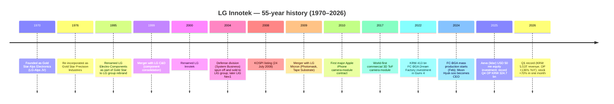
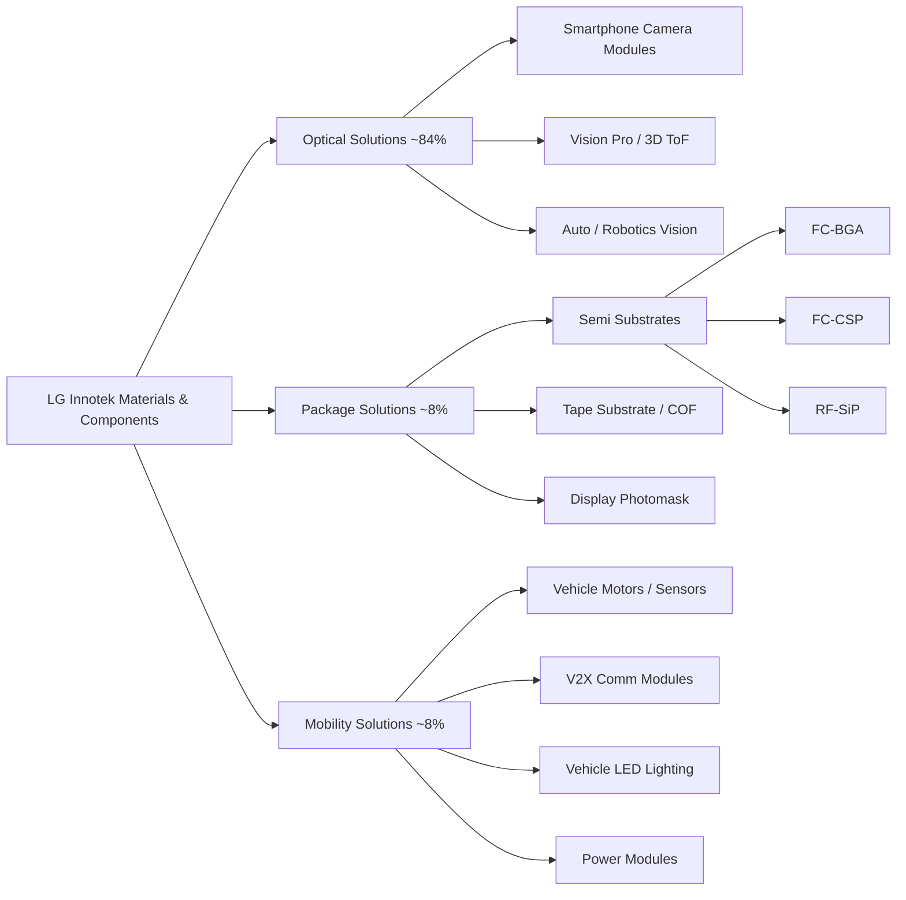
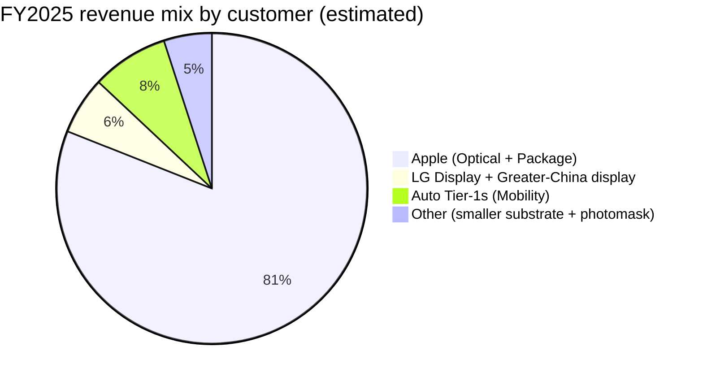
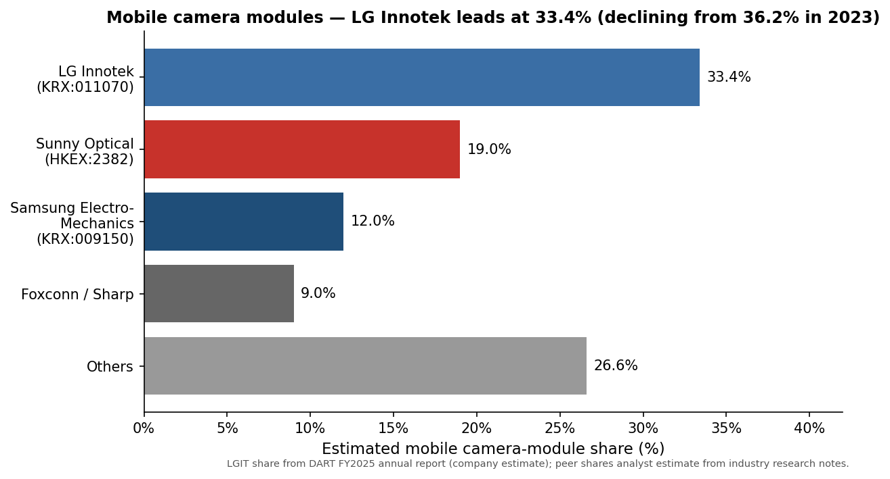
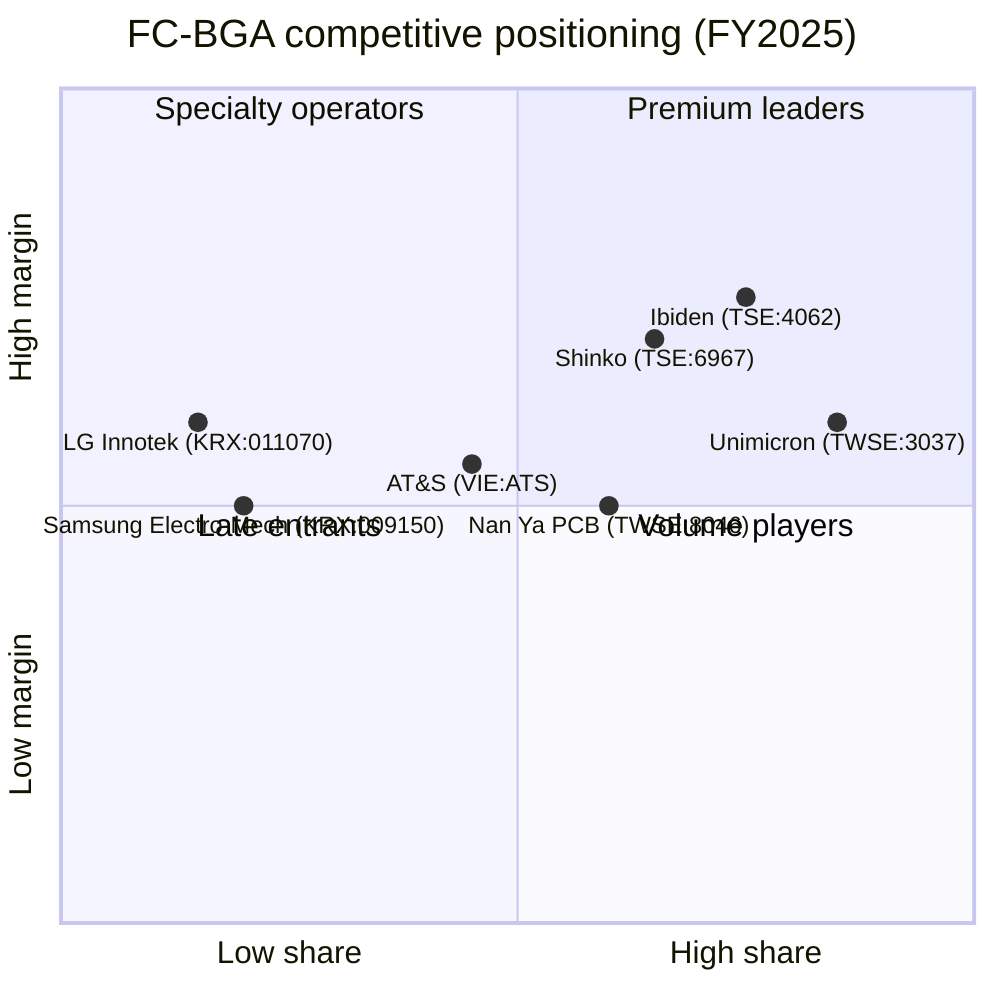
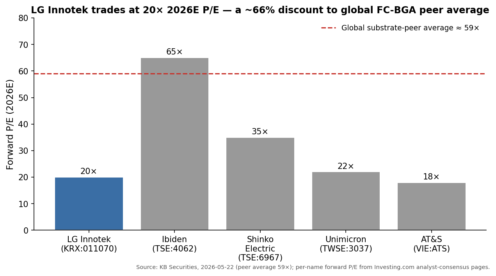

# LG Innotek Co., Ltd. (KRX:011070) — Initiation of Coverage

**Date:** 2026-05-26
**Ticker:** KRX:011070 (KOSPI)
**Sector:** Electronic components — camera modules, semiconductor substrates, automotive electronics
**Domicile:** Republic of Korea (HQ: 30, Magokjungang 10-ro, Gangseo-gu, Seoul — the LG Science Park)
**Report language:** English (Korea → English per company-research skill rule)

> **Update — record Q1 2026 results (2026-04-25):** LG Innotek reported Q1 2026 **revenue of KRW 5.53 trillion (+11.1% YoY)** and **operating profit of KRW 295.3 billion (+136% YoY)** — both Q1 records — beating consensus operating profit of KRW 237 bn by ~25%. Package Solutions revenue rose 16% YoY to KRW 437.1 bn on FC-BGA and RF-SiP demand, and Optical Solutions held up at +11.4% on extended iPhone 17 demand into the smartphone off-season. CFO Kyung Eun-kook said on the call: *"We are pushing to expand the capacity of our semiconductor substrate business,"* with a stated five-year goal of making Package Solutions' operating profit contribution match Optical Solutions'. Source: [Seoul Economic Daily, 2026-04-27](https://en.sedaily.com/finance/2026/04/27/lg-innotek-q1-operating-profit-jumps-136-percent-on-chip); [Korea Herald, 2026-04-25](https://www.koreaherald.com/article/10726451); [Digital Today, 2026-04-25](https://www.digitaltoday.co.kr/en/view/51199/lg-innotek-q1-operating-profit-up-136-percent-on-year-to-2953-billion-won).

---

## TABLE OF CONTENTS

1. Company Overview
2. Company History
3. Management Team
4. Products & Services
5. Customers & Go-to-Market
6. Industry Overview
7. Competitive Landscape
8. Market Opportunity (TAM)
9. Risk Assessment
10. References

---

## 1. Company Overview

LG Innotek Co., Ltd. (KRX:011070) is a Korean materials-and-components specialist whose principal business is supplying **smartphone camera modules to Apple Inc.** — a single-customer relationship so large that, in fiscal year 2025, the company disclosed in its mandatory DART annual report that revenue from one undisclosed customer's optical and package products totalled **KRW 17.749 trillion (≈ 81% of total company revenue)** ([LG Innotek 2025 사업보고서, II. 사업의 내용 §4 (DART rcpNo 20260312001270, filed 2026-03-12)](https://dart.fss.or.kr/dsaf001/main.do?rcpNo=20260312001270)). Korean trade press has openly identified that customer as Apple for more than a decade, and the iPhone 16/17 Pro folded-zoom "tetraprism" module and iPhone 17 main wide-angle camera are public examples of LG Innotek's content ([The Elec, 2025-09-26](https://www.thelec.net/news/articleView.html?idxno=5447); [AppleInsider, 2024-08-26](https://appleinsider.com/articles/24/08/26/apple-taps-lg-innotek-for-all-iphone-16-pro-and-iphone-16-pro-max-tetraprism-lenses)). The combination — a single-product (camera modules) and single-customer (Apple) business at the heart of an 88-year-old Korean industrial conglomerate — is the central structural fact about LG Innotek and the one that frames every other section of this report.

**Business model — three reportable segments.** Per the DART annual report ([Section II item 2-가](https://dart.fss.or.kr/dsaf001/main.do?rcpNo=20260312001270)), the company is organized into three operating divisions effective December 2025 (renamed from prior 기판소재사업부 and 전장부품사업부):

| Segment | Korean name | FY2025 revenue | % of revenue | Main products |
|---|---|---|---|---|
| **Optical Solutions** | 광학솔루션 | KRW 18.32 T | 83.6% | Smartphone camera modules (incl. folded zoom, 3D ToF, Vision Pro module); automotive cameras; robotics / AI vision cameras |
| **Package Solutions** | 패키지솔루션 | KRW 1.72 T | 7.9% | Semiconductor substrates (RF-SiP, FC-CSP, FC-BGA); Tape Substrate (COF/TAPE BGA); Photomask (display) |
| **Mobility Solutions** | 모빌리티솔루션 | KRW 1.86 T | 8.5% | Vehicle motors / sensors, wireless / V2X communication modules, vehicle LED lighting, power modules |
| **Total** | | **KRW 21.90 T** | **100%** | |

*Source: [DART 사업보고서 50기, II. 사업의 내용 §2-가](https://dart.fss.or.kr/dsaf001/main.do?rcpNo=20260312001270).*

By contrast, segment **operating profit** mix in FY2025 was Optical Solutions KRW 482 bn, Package Solutions KRW 129 bn, Mobility Solutions KRW 54 bn — meaning **Package Solutions delivered 19.4% of FY2025 operating profit on just 7.9% of revenue** ([DART annual report, II §4 segment P&L](https://dart.fss.or.kr/dsaf001/main.do?rcpNo=20260312001270); [Korea Herald, 2026-04-25](https://www.koreaherald.com/article/10693624)). That mis-match is the single most important valuation driver in this report: the market is repricing LG Innotek not as a low-margin Apple camera-module assembler, but as a hybrid camera-and-AI-substrate name with a high-margin growth engine that did not exist five years ago.

**Geographic footprint.** Operations span 8 domestic plants (Seoul HQ / Magok R&D, Ansan R&D, Gumi plants 1 / 1A / 2 / 3 / 4, Gwangju, Paju, Paju C7) and 5 overseas production subsidiaries — Mexico (San Juan del Río, Colón), Poland (Wrocław), Indonesia (Bekasi), Vietnam (Hai Phong), and China (Yantai) — plus eight overseas sales offices ([DART annual report, II §3-2 라](https://dart.fss.or.kr/dsaf001/main.do?rcpNo=20260312001270)). Revenue is overwhelmingly export-driven: KRW 21.08 T of FY2025 revenue (96.2%) was exported, only KRW 821 bn (3.8%) domestic ([DART annual report, II §4-1](https://dart.fss.or.kr/dsaf001/main.do?rcpNo=20260312001270)) — a structurally USD-revenue, KRW-cost profile that creates two-sided FX exposure central to short-term earnings volatility.

**Scale indicators (FY2025).** Revenue KRW 21.897 T (USD ≈ 15.9 bn at 1,380 KRW/USD average) up 3.3% YoY; operating profit KRW 665.0 bn (3.0% op-margin) down 5.8% YoY; net profit attributable to controlling interest ≈ KRW 345 bn ([DART annual report, III §1 summary financials](https://dart.fss.or.kr/dsaf001/main.do?rcpNo=20260312001270)). Total assets KRW 11.93 T; total equity KRW 5.76 T; debt-to-equity 107%. R&D spend KRW 771.3 bn or 3.5% of revenue, and the company has accumulated 6,410 Korean patents plus 8,029 overseas patents as of year-end 2025 ([DART annual report, II §6-2 / §7-나](https://dart.fss.or.kr/dsaf001/main.do?rcpNo=20260312001270)). Q4 2025 was the operational high-water mark of the iPhone 17 cycle: Q4 revenue KRW 7.61 T (+14.8% YoY, an all-time quarterly record) and Q4 operating profit KRW 324.7 bn (+31% YoY) ([Korea Herald, 2026-01-26](https://www.koreaherald.com/article/10663095); [Korea Times, 2026-01-26](https://www.koreatimes.co.kr/business/tech-science/20260126/lg-innotek-q4-net-rises-271-on-high-end-products)).

*Source: [DART 사업보고서 50기 (2025) / 49기 (2024) / 48기 (2023), III §1](https://dart.fss.or.kr/dsaf001/main.do?rcpNo=20260312001270); prior IR releases for FY2021/FY2022.*

**Valuation snapshot.** As of close 2026-05-22, LG Innotek traded at KRW 864,000 per share giving a market capitalization of approximately **KRW 20.4 trillion (USD ≈ 14.8 bn)** on the 23.67 million shares outstanding ([Naver Finance — 011070 quote, accessed 2026-05-26](https://finance.naver.com/item/main.naver?code=011070); [Asia Business Daily, 2026-05-22](https://www.asiae.co.kr/en/article/stock-disclosure/2026052209222934028)). On a trailing basis, the stock trades at:

- **TTM P/E ≈ 60×** on TTM EPS (TTM net profit attributable ≈ KRW 343 bn, ÷ 23.67 mn shares = ≈ KRW 14,500 EPS; TTM EPS is depressed by the FY2025 OP decline and a high effective tax rate — see decomposition below).
- **Forward P/E 2026E ≈ 20×** on KB Securities' KRW 1.2 trillion 2026 operating-profit estimate, implying ~KRW 44,000 net EPS ([KB Securities note via Asia Business Daily, 2026-05-22](https://www.asiae.co.kr/en/article/stock-disclosure/2026052209222934028); [Seoul Economic Daily, 2026-05-20](https://en.sedaily.com/finance/2026/05/20/lg-innotek-target-price-raised-on-ai-substrate-boom)).
- **TTM P/S ≈ 0.93×** on TTM revenue of KRW 22 T — typical for high-volume, low-margin contract electronics manufacturers.
- **P/B ≈ 3.5×** on FY2025 book equity of KRW 5.76 T per share (the year-end equity per share is KRW 243,000; current price 864,000 = ~3.5×) — above the historical average of ≈ 1.5×, reflecting the market's re-rating of the substrate business.

**Peer comparison (forward P/E 2026E):** LG Innotek 20× vs. **Ibiden (TSE:4062) ~65×**, **Shinko Electric (TSE:6967) ~35×**, **Unimicron (TWSE:3037) ~22×**, **AT&S (VIE:ATS) ~18×**, and **Sunny Optical (HKEX:2382) ~22×** ([Investing.com — LG Innotek consensus estimates page, accessed 2026-05-22](https://www.investing.com/equities/lg-innotek-co-ltd-consensus-estimates); [Asia Business Daily, 2026-05-22](https://www.asiae.co.kr/en/article/stock-disclosure/2026052209222934028)). KB Securities specifically cites the global FC-BGA substrate peer average at **~59× forward P/E and ~10× PBR**, putting LG Innotek at a "~66% P/E discount and ~71% PBR discount" to that cohort — the explicit thesis behind the May 2026 target-price upgrades to KRW 1.2 mn from a starting cluster of KRW 350–380k just six weeks earlier ([Seoul Economic Daily, 2026-05-20](https://en.sedaily.com/finance/2026/05/20/lg-innotek-target-price-raised-on-ai-substrate-boom); [Seoul Economic Daily, 2026-04-28](https://en.sedaily.com/markets/2026/04/28/lg-innotek-shares-jump-70-percent-in-month-brokerages-still)).

**Multiple interpretation.** The TTM P/E of ≈ 60× is high because FY2025 net profit is depressed by Apple's annual camera-module ASP cut (Camera Module ASP −5.4% YoY per the DART annual report ([II §2-나](https://dart.fss.or.kr/dsaf001/main.do?rcpNo=20260312001270))) combined with a substantial KRW 19.0 bn FY2025 asset impairment charge ([DART annual report, III note 11.3](https://dart.fss.or.kr/dsaf001/main.do?rcpNo=20260312001270)). On a forward basis the 20× P/E sits in the "growth-substrate revaluation" bucket: investors are extrapolating that Package Solutions operating profit can roughly triple from KRW 129 bn (FY2025) to ~KRW 360–500 bn over 2026–28 as FC-BGA capacity ramps, while Optical Solutions profit holds near current levels because Apple absorbs LG Innotek's iPhone 18 main-camera content even as folded-zoom share leaks to ICT / Jahwa ([Tech Times, 2026-05-15](https://www.techtimes.com/articles/316690/20260515/lg-innotek-targets-us-ai-chip-clients-substrate-revenue-climbs-16.htm); [The Elec, 2025-09-26](https://www.thelec.net/news/articleView.html?idxno=5447)). *Analyst view:* the gap between TTM P/E 60× and forward P/E 20× is the entire investment debate. If 2026 OP lands at KRW 1.0–1.2 T as KB models, today's price is reasonable. If Apple's iPhone 18 camera-module orders disappoint, or if FC-BGA pricing softens with the global substrate cycle, the multiple compresses violently — see Section 9 risks. We treat the stretched multiple as a risk in its own right, included as Risk #10.

---

## 2. Company History

**Founding.** LG Innotek's legal predecessor — **Gold Star Alps Electronics Co., Ltd. (금성알프스전자)** — was founded on **22 August 1970** as a joint venture between the Korean Gold Star Group (today's LG) and Japanese Alps Electric to manufacture mechanical electronic components ([DART annual report, I §1-나 footnote](https://dart.fss.or.kr/dsaf001/main.do?rcpNo=20260312001270); [LG Innotek — Wikipedia, accessed 2026-05](https://en.wikipedia.org/wiki/LG_Innotek); [Porters Five Force company history, accessed 2026-05](https://portersfiveforce.com/blogs/brief-history/lginnotek)). The legal entity was re-incorporated on **24 February 1976** as **Gold Star Precision Industries (금성정밀공업)** — a date the company still treats as its formal founding for fiscal-year counting (FY2025 is therefore the company's 50th fiscal year ("제 50 기")) ([DART annual report, I §1-나](https://dart.fss.or.kr/dsaf001/main.do?rcpNo=20260312001270)).

**The LG group identity (1995–2000).** When the Lucky-Goldstar group rebranded as **LG** in January 1995, Gold Star Precision became **LG Electro-Components Co., Ltd.** That intermediate name lived for five years before the 2000 rebrand to **LG Innotek Co., Ltd.** — the "Innotek" coinage meant to signal a shift from a passive components / connectors supplier to an innovation-driven materials and modules house ([LG Innotek company history — Wikipedia, accessed 2026-05](https://en.wikipedia.org/wiki/LG_Innotek); [DART annual report, I §1-나](https://dart.fss.or.kr/dsaf001/main.do?rcpNo=20260312001270)). The 1999 merger with **LG C&D (Cable & Devices)** consolidated the group's electronic-components business into one entity, completing what had been a multi-affiliate component portfolio since the 1970s.

**Strategic transformations.** Three pivots define the modern company:

1. **2004 spin-off of defense — focusing the portfolio on commercial electronics.** The System Business Division (defense systems, fire-control, missile electronics) was spun out and sold to LIG Group, eventually becoming the publicly traded LIG Nex1 ([LIG Nex1 — Wikipedia, accessed 2026-05](https://en.wikipedia.org/wiki/LIG_Nex1); [LG Innotek — Wikipedia, accessed 2026-05](https://en.wikipedia.org/wiki/LG_Innotek)). This took a high-margin but politically sensitive business out of LG Innotek and left the company concentrated on commercial mobile/auto/display components — a portfolio simplification that paid off in the smartphone supercycle but means LG Innotek today has no defense or aerospace exposure that could buffer a consumer-electronics downturn.

2. **2009 LG Micron merger — adding the photomask, tape substrate, and CMP-pad lines that became today's Package Solutions.** On 1 July 2009 LG Innotek absorbed **LG Micron** (까스닥-listed, the LG group's photomask and printed-circuit-substrate arm) by stock-swap merger ([DART annual report, I §1-나](https://dart.fss.or.kr/dsaf001/main.do?rcpNo=20260312001270); [Wikipedia, accessed 2026-05](https://en.wikipedia.org/wiki/LG_Innotek)). The merger brought in display photomask and tape-substrate (COF) technology from LG Micron's Gumi line — the literal seed of what is now LG Innotek's Package Solutions division and the only reason photomask appears on the Nomura "Greater China Semi 2026-30F" Figure 36 supplier list for the company ([Nomura "Greater China Semi" anchor report, 2026-05-21, p. 18-19 (analyst note — see project sector overview)](/Users/x/projects/financial_agent/reports/sector/半导体材料.md)). Without the 2009 LG Micron merger, LG Innotek would today be a pure camera-module assembler.

3. **2010 → present — the Apple camera-module relationship.** LG Innotek began supplying iPhone camera modules around the iPhone 4 / iPhone 4S generation (2010–2011) and over the following 15 years climbed to global #1 mobile camera-module share. The company's dominant position in **rear / wide / telephoto / and from iPhone 16-Pro the "tetraprism" folded zoom module** is publicly documented in trade press ([MacRumors, 2024-08-26](https://www.macrumors.com/2024/08/26/iphone-16-pro-telephoto-lens-both-models/); [AppleInsider, 2024-08-26](https://appleinsider.com/articles/24/08/26/apple-taps-lg-innotek-for-all-iphone-16-pro-and-iphone-16-pro-max-tetraprism-lenses); [The Elec, 2025-09-26](https://www.thelec.net/news/articleView.html?idxno=5447)). The 2017 launch of the world's first commercial 3D Time-of-Flight (ToF) module — used in Apple's TrueDepth front camera and later in Vision Pro — was the technical proof of the relationship's depth ([Digitimes, 2024-01-30](https://www.digitimes.com/news/a20240130PD210/vision-pro-lg-innotek-3d-sensing.html); [Macdailynews, 2019-09-18](https://macdailynews.com/2019/09/18/lg-innotek-said-to-supply-3d-time-of-flight-modules-for-apples-next-gen-iphones-and-ipads-in-2020/)).

**Major acquisitions and corporate actions:**
- **1999** — Merger with **LG C&D** (Components & Devices)
- **2004** — Spin-off of defense division to LIG (→ LIG Nex1)
- **2008** — KOSPI listing (24 July 2008)
- **2009** — Merger with **LG Micron** (photomask, tape substrate)
- **2022** — KRW 413 bn FC-BGA Dream Factory investment in Gumi 4공장 ([Korea Herald, 2022-02](https://www.koreaherald.com/article/10449620))
- **2024** — FC-BGA mass production begins (February); Moon Hyuk-soo appointed CEO at the March 2024 AGM ([DART annual report, I §2-나](https://dart.fss.or.kr/dsaf001/main.do?rcpNo=20260312001270))
- **2025-05** — USD 50 million equity stake in lidar maker **Aeva Technologies, Inc.** (NYSE:AEVA) — 3,509,719 common shares at USD 9.26 ([DART annual report, II §6-1; Wikipedia, accessed 2026-05](https://en.wikipedia.org/wiki/LG_Innotek))
- **2025-09** — Capital injection (KRW 5.9 bn) in Korean radar start-up **SMARTRadar System** for autonomous-driving radar collaboration ([DART annual report, II §6-1](https://dart.fss.or.kr/dsaf001/main.do?rcpNo=20260312001270))

**Recent developments (last 12 months).** Three matter most: (1) the **April 2025 announcement** of the goal to take FC-BGA to USD 700 mn annual revenue by 2030 — quintupling 2024 substrate revenue from this single product line ([PRNewswire, 2025-04-30](https://www.prnewswire.com/apac/news-releases/lg-innotek-to-build-fc-bga-into-700-million-usd-business-by-2030-with-its-state-of-the-art-dream-factory-302450934.html)); (2) **Q1 2026 record results** (KRW 5.53 T revenue, OP +136% YoY) on 25 April 2026 with the substrate business surging 16% YoY and Apple's iPhone 17 supercycle holding into the smartphone off-season ([Korea Herald, 2026-04-25](https://www.koreaherald.com/article/10726451)); and (3) the **May 2026 valuation re-rating**: KB Securities, NH Investment & Securities, and others raised targets from KRW 350,000–380,000 (early April) to KRW 1.2 mn (KB), with the stock up ~70% in the four weeks after the Q1 print ([Seoul Economic Daily, 2026-04-28](https://en.sedaily.com/markets/2026/04/28/lg-innotek-shares-jump-70-percent-in-month-brokerages-still); [Seoul Economic Daily, 2026-05-20](https://en.sedaily.com/finance/2026/05/20/lg-innotek-target-price-raised-on-ai-substrate-boom)).

---

## 3. Management Team

### Moon Hyuk-soo (문혁수) — President & CEO since March 2024

Moon Hyuk-soo is a 28-year LG group lifer with a chemical-engineering background and an operational career built almost entirely inside the optics franchise — the kind of CEO succession Korean chaebol component subsidiaries do when they want a technical operator rather than a deal-maker. He earned his bachelor's, master's, and Ph.D. degrees in chemical engineering from **KAIST** (the Korea Advanced Institute of Science and Technology) before joining the LG group at **LS Cable / LG Cable in 1998** ([Korea Who profile, accessed 2026-05](https://www.koreawho.com/profile/MoonHyuksoo); [LG Innotek CEO page, accessed 2026-05](https://www.lginnotek.com/company/ceo.lgit?locale=en); [Korea Times, 2025-10-19](https://www.koreatimes.co.kr/business/companies/20251019/lg-innotek-ceo-shares-career-insights-with-kaist-students)). In **2009** he moved laterally into LG Innotek and immediately attached himself to the Optics business, the segment that even then was already on the launch ramp of the Apple iPhone supply relationship.

Moon's internal promotion track at LG Innotek runs almost vertically through Optical Solutions and is documented on the company's official CEO bio page and in independent reporting: **Head of Optics Solution Research Laboratory (2017–2019)**, **Head of Optics Solution Business Unit (2019–2022)**, **Chief Strategy Officer (2022–2023)**, and finally **CEO from March 2024** ([LG Innotek CEO page, accessed 2026-05](https://www.lginnotek.com/company/ceo.lgit?locale=en); [The Official Board — Hyuk Soo Moon bio, accessed 2026-05](https://www.theofficialboard.com/biography/hyuk-soo-moon-8e37e); [Digital Today, 2024-XX](https://www.digitaltoday.co.kr/en/view/889/lg-innotek-ceo-moon-hyuk-soo-says-company-to-move-beyond-parts-to-solutions)). The CSO role in 2022–2023 is the relevant one: he led the strategic planning of the FC-BGA "Dream Factory" investment thesis and the subsequent Aeva / SMARTRadar / robotics-vision pivot toward what he calls in interviews "moving beyond parts to solutions" — i.e. selling pre-integrated modules and sensor systems rather than discrete components on customer BOMs ([Digital Today CEO interview, accessed 2026-05](https://www.digitaltoday.co.kr/en/view/889/lg-innotek-ceo-moon-hyuk-soo-says-company-to-move-beyond-parts-to-solutions)).

What Moon actually delivered before the top job is the right way to read this bio. As head of Optics Solution Business Unit from 2019 to 2022 — peak iPhone supercycle — he was the executive in charge of LG Innotek's profit. Camera-module operating profit hit its all-time peak of KRW 870 bn in FY2021 on his watch ([Korea Herald FY21 results coverage, archived](https://www.koreaherald.com/article/10663095) for context); the company also took global #1 share in mobile camera modules (now 33.4%, having drifted down from 36.2% in 2023 — see Section 7). In **2021** he received the Korean **Industrial Service Medal at the 58th International Trade Day** for his contribution to optics exports ([Korea Who profile, accessed 2026-05](https://www.koreawho.com/profile/MoonHyuksoo)). His public-facing footprint is comparatively small — Moon is not a Jensen Huang or Mark Liu — but his October 2025 KAIST guest lecture got attention for one specific quote that captures his self-conception: *"Making good products is the ultimate goal for an engineer, but it means little if you can't sell them properly"* ([Korea Times, 2025-10-19](https://www.koreatimes.co.kr/business/companies/20251019/lg-innotek-ceo-shares-career-insights-with-kaist-students)).

Per the FY2025 DART annual report (V §2-라), Moon's 2025 total compensation was **KRW 1.251 billion** as CEO and vice-president (Pres.) — comprising base salary KRW 836 mn, performance bonus KRW 408 mn, and benefits KRW 7 mn — modest in absolute terms against US-tech CEO comparables but in the middle of the Korean chaebol component-subsidiary range. Notably he is **not** among the top 5 highest-paid LG Innotek officers; that spot belongs to **Kim Heung-sik (김흥식), Vice President** at KRW 2.26 bn, a legacy executive whose comp included a large one-time component ([DART annual report, V §2-라](https://dart.fss.or.kr/dsaf001/main.do?rcpNo=20260312001270)). Moon's ownership stake is modest (a few thousand restricted shares under standard executive comp); he is not a founder-owner. Operational responsibility for the Optics-to-Substrate pivot — the entire reason LG Innotek has re-rated in 2026 — sits squarely with Moon's tenure, and his prior optics-segment leadership means the Apple relationship is unlikely to break down on relationship-management grounds even as Apple structurally diversifies its supplier list.

**Founder note.** LG Innotek was incorporated as Gold Star Alps Electronics in 1970 as a joint venture between Gold Star and Alps Electric of Japan; the founding executives were not single-person founders in the Western sense but appointed Korean managers from the LG (then Lucky Goldstar) parent — Koo In-hoe and the Koo family who founded the broader LG group, the same family that founded LG Electronics in 1958. There is no surviving "founder" figure operationally involved in LG Innotek today; the company is governed as a 40.8%-owned subsidiary of **LG Electronics (KRX:066570)** ([LG Innotek — Wikipedia, accessed 2026-05](https://en.wikipedia.org/wiki/LG_Innotek); [DART annual report, X §1 affiliate company list](https://dart.fss.or.kr/dsaf001/main.do?rcpNo=20260312001270)). Per company-research skill rule, no other executive bios are included — but for completeness the board comprises 2 inside directors (Moon Hyuk-soo, Park Ji-hwan), 1 other non-executive (Lee Sang-woo, the LG Electronics-nominated director), and 4 outside directors (Lee Hee-jung, Roh Sang-do, Park Rae-soo, Kim Jung-hoe) ([DART annual report, I §2-나 board composition](https://dart.fss.or.kr/dsaf001/main.do?rcpNo=20260312001270)).

---

## 4. Products & Services

### 4.1 The 사업보고서 product matrix — three segments anchored to three end markets

The authoritative product matrix is set in the DART annual report (II §2-가) reproduced here verbatim from the original Korean. **LG Innotek's "product matrix" is not actually a matrix in the semiconductor-IDM sense** — it is a three-row segment list where each row maps a major end market to a small number of physically distinct module families. Photomask, the line that puts LG Innotek on Nomura's Figure 36 supplier list, is **a single SKU inside the Package Solutions row** — not the company's main business. Camera modules are by far the largest product family.

| 사업부문 / Segment | 주요제품 / Main products | FY2025 revenue (KRW mn) | FY2024 (KRW mn) | FY2023 (KRW mn) | FY2025 share |
|---|---|---|---|---|---|
| **광학솔루션 / Optical Solutions** | Camera Module 등 (smartphone front/wide/telephoto/folded-zoom; 3D ToF; auto cameras; robotics vision cameras) | **18,318,459** | 17,800,120 | 17,294,789 | **83.6%** |
| **패키지솔루션 / Package Solutions** | 반도체기판 (RF-SiP, FC-CSP, FC-BGA semiconductor substrates), Tape Substrate (COF, TAPE BGA), Photomask | **1,720,017** | 1,460,022 | 1,322,135 | **7.9%** |
| **모빌리티솔루션 / Mobility Solutions** | 모터/센서 (motors / sensors), 통신 (V2X / wireless), Lighting Solution (vehicle LED), Power Module | **1,858,127** | 1,940,613 | 1,988,366 | **8.5%** |
| **합계 / Total** | | **21,896,603** | 21,200,755 | 20,605,290 | **100%** |

*Source: [LG Innotek 2025 사업보고서 II §2-가 (DART rcpNo 20260312001270, filed 2026-03-12)](https://dart.fss.or.kr/dsaf001/main.do?rcpNo=20260312001270). Internal inter-segment eliminations applied. FY2023 figures restated under FY2024+ segment renaming (electronic-components business moved to Mobility Solutions, residual into Optical).*

**Segment operating profit and the disclosed P&L mix (FY2025/FY2024/FY2023, KRW mn):**

| Segment | FY2025 OP | FY2024 OP | FY2023 OP | FY2025 OP margin |
|---|---|---|---|---|
| Optical Solutions | 482,238 | 596,613 | 663,148 | 2.6% |
| Package Solutions | 128,875 | 70,778 | 125,574 | 7.5% |
| Mobility Solutions | 53,894 | 38,652 | 42,102 | 2.9% |
| **Total** | **665,007** | **706,043** | **830,824** | 3.0% |

*Source: [DART 사업보고서, II §4 mix-by-segment P&L](https://dart.fss.or.kr/dsaf001/main.do?rcpNo=20260312001270).*

*Source: [DART 사업보고서 50기 (rcpNo 20260312001270, filed 2026-03-12)](https://dart.fss.or.kr/dsaf001/main.do?rcpNo=20260312001270).*

### 4.2 Synthesis — how the three segments fit a single customer workflow

LG Innotek's three segments do not compose a single semiconductor-fab production cycle the way Lam / AMAT / TEL etch–dep–clean does. They compose a single **mobile + AI + vehicle hardware workflow**:

- **Optical Solutions** sits on top of Apple's smartphone bill-of-materials and (increasingly) of Apple's AR / Vision Pro / robotics roadmap. Camera modules are the highest-volume, lowest-margin, most ASP-pressured line.
- **Package Solutions** sits inside the customer's silicon package — RF-SiP wraps a complete RF system into a single laminate for the mobile baseband; FC-CSP is the substrate under GDDR7 / advanced-memory die; FC-BGA is the high-end substrate under AI accelerators, server CPUs, and Apple-silicon SoCs. This is the bridge into Nomura's "AI infrastructure renaissance" thesis, and the segment generating the operating leverage.
- **Mobility Solutions** sits in the vehicle: ADAS cameras (made on Optical lines but counted under Mobility for autoparts customers), wireless V2X modules, vehicle LED lighting, and BLDC motors for actuators. The 4.8 trillion KRW of new-order intake in FY2025 brought the order backlog to a record KRW 19.2 trillion ([Korea Herald, 2026-04-25](https://www.koreaherald.com/article/10726451)).

### 4.3 Optical Solutions — camera modules (KRW 18.32 T, 84% of revenue)

**10-K verbatim (DART 사업보고서 II §2 / II §4-가):**
> "광학솔루션 사업부문은 주요 고객의 판매 호조 및 고사양 카메라 모듈 채용 확대를 통해 18.3조원 매출을 달성하며 글로벌 일등 지위를 유지하였습니다." *(English: "The Optical Solutions division achieved revenue of KRW 18.3 trillion through strong sales of major customers and the increased adoption of high-spec camera modules, maintaining global leadership.")*
> Source: [LG Innotek 2025 사업보고서, II §1](https://dart.fss.or.kr/dsaf001/main.do?rcpNo=20260312001270).

**중문释义 / Plain-language gloss:** A camera module is a fully integrated assembly that bonds together an **image sensor (CMOS sensor / 图像传感器)** (LG Innotek buys these from Sony and STMicro per the DART raw-material disclosure ([II §3-1](https://dart.fss.or.kr/dsaf001/main.do?rcpNo=20260312001270))), a **lens stack (镜头组)** (from Largan and Genius), an **OIS / AF actuator (光学防抖驱动器)** (from Alps and Mitsumi), a flex PCB, an IR cut filter, and an enclosure, and tunes the whole stack so the camera achieves the OEM's specification for focal length, aperture, MTF, low-light SNR, and OIS hand-shake correction — all to a tolerance measured in microns. LG Innotek does not make the sensor, the lens, or the actuator — it makes the **integrated module**, which is what gets soldered onto the phone's main PCB. The bill-of-materials economics matter: in FY2025 the Optical Solutions division spent **KRW 6.44 T (41% of optics input cost) on image sensors** from Sony / STMicro, **KRW 1.95 T (13%) on lenses** from Largan / Genius, and **KRW 3.79 T (24%) on actuators** from Alps / Mitsumi ([DART annual report, II §3-1](https://dart.fss.or.kr/dsaf001/main.do?rcpNo=20260312001270)). This makes the camera-module business structurally a **value-add assembly** business where LG Innotek's gross margin sits in the ~10–12% range — much lower than a sensor maker (Sony) or a lens maker (Largan), because the BOM is dominated by parts LG Innotek does not make.

The three pedagogical beats:

1. **What it physically does in Apple's iPhone workflow.** A modern iPhone Pro camera "stack" — three rear cameras plus one front camera plus a LiDAR / 3D-ToF sensor on Pro — comprises six distinct camera modules, each with its own optical design and OIS calibration. LG Innotek's job is to deliver finished modules to Apple's assembler (Foxconn) at iPhone build rate — typically 5–8 mn iPhones per week during the iPhone Q4 ramp. For the iPhone 17 Pro Max generation specifically, that meant LG Innotek shipped >50 million 5×–10× folded-zoom modules in the 2025 model year alone (analyst view: per [The Elec, 2025-09-26](https://www.thelec.net/news/articleView.html?idxno=5447) ~70% share of folded-zoom unit volume against Jahwa Electronics and ICT; on Apple's ~50–55 mn Pro Max + Pro unit volume that is in the 35–40 mn range for LGIT specifically).
2. **How camera modules differ from sibling products in the same matrix.** Camera modules are LG Innotek's largest revenue line but lowest margin line: 2.6% segment operating margin in FY2025 vs. 7.5% in Package Solutions and 2.9% in Mobility ([DART annual report, II §4 segment P&L](https://dart.fss.or.kr/dsaf001/main.do?rcpNo=20260312001270)). The optics margin profile is structurally constrained by Apple's annual ASP-cut cadence — the FY2025 average camera-module ASP fell 5.4% YoY per the DART annual report (II §2-나) — and by the BOM dominance of Sony / Largan / Alps inputs. The other two segments have either narrower customer overlap (Package) or higher per-unit value-add (Mobility motors / lighting), so they grow margins where Optical bleeds them.
3. **Strategic significance — the technology inflections inside Optical for 2026–28.** Three matter. First, the **iPhone 18 Pro variable-aperture main camera** going into production in 2026 is structurally more complex (the actuator has to mechanically vary the iris from f/1.6 to f/2.8), and Apple has reportedly designated **LG Innotek as primary assembler with Sunny Optical and Luxshare on actuator mechanisms** — meaning LGIT picks up incremental main-camera content even as folded-zoom share leaks ([MacRumors, 2026-04-16](https://www.macrumors.com/2026/04/16/iphone-18-pro-variable-aperture-camera-production/); [Cult of Mac, 2026-XX](https://www.cultofmac.com/news/first-iphone-variable-aperture-camera)). Second, **Vision Pro / AR-headset 3D ToF modules** — LG Innotek has been the exclusive 3D sensing supplier for Vision Pro since launch ([Digitimes, 2024-01-30](https://www.digitimes.com/news/a20240130PD210/vision-pro-lg-innotek-3d-sensing.html)); the next-gen Vision Pro and any Apple AR glasses roadmap pulls additional 3D-sensing content. Third, **robotics / industrial AI cameras**: LGIT's Q2 2026 "robot vision" mass-production launch (called out on the Q1 2026 call by CFO Kyung Eun-kook) targets the Boston Dynamics / Figure AI / generic humanoid-robot camera-module slot — these volumes are nowhere yet but provide the optionality the market is now starting to price ([Seoul Economic Daily, 2026-04-27](https://en.sedaily.com/finance/2026/04/27/lg-innotek-q1-operating-profit-jumps-136-percent-on-chip)).

*Analyst view:* Camera modules have **partial competitive advantage** with moat type = **manufacturing scale + Apple-specific qualification depth**. The 33.4% global mobile camera-module share LG Innotek discloses as of FY2025 ([DART annual report, II §1 (1) ㄹ market-share table](https://dart.fss.or.kr/dsaf001/main.do?rcpNo=20260312001270)) is structurally dependent on Apple's volume — if Apple shifted 50% of its camera-module sourcing to Sunny Optical, the disclosed share would fall to ~15%. The closest competitor on a unit-volume basis is **Sunny Optical Technology (HKEX:2382)**, whose camera-module business serves the China Android ecosystem (Xiaomi, Oppo, Vivo, Huawei) and is now picking up Apple folded-zoom OIS share ([The Elec, 2025-09-26](https://www.thelec.net/news/articleView.html?idxno=5447)).

### 4.4 Package Solutions — semiconductor substrates, tape substrates, photomasks (KRW 1.72 T, 8% of revenue)

**10-K verbatim (DART 사업보고서 II §1 (2)):**
> "패키지솔루션 사업부문은 모바일 시장 수요 회복 및 고성능, 고집적 기판 수요 증가와 POLED 매출 확대를 통해 전년대비 18% 성장한 1.7조원으로, 패키지솔루션 최고 매출을 경신하였습니다. 통신용 반도체기판은 차별화 기술 기반의 제품 경쟁력으로 일등 지위를 공고히 하였고, 신규 사업인 FC-BGA는 Global 고객 추가 확보로 양산 확대를 추진하고 있습니다. 테이프기판은 국내 및 중화권 전략 거래선 점유율 확대로 시장 일등 지위를 강화하고, 포토마스크는 시장 주도권 확보를 위해 OLED 등 프리미엄 모델 확대에 집중하고 있습니다." *(English: "Package Solutions grew 18% YoY to KRW 1.7 trillion — a record — on mobile-market demand recovery, increased demand for high-performance high-integration substrates, and POLED revenue expansion. Communication semi substrates [RF-SiP] reinforced #1 leadership with differentiated technology; the new FC-BGA business is expanding mass production with additional global customers. Tape substrate strengthened market leadership through share expansion among domestic and Greater-Chinese strategic accounts; photomask is focused on OLED and premium models to secure market leadership.")*
> Source: [LG Innotek 2025 사업보고서, II §1 (2)](https://dart.fss.or.kr/dsaf001/main.do?rcpNo=20260312001270).

**Plain-language gloss / 中文释义:**

Package Solutions is actually four distinct product families behind one line item — a packaging point worth dwelling on because the four families have completely different customers and competitive dynamics.

**(a) RF-SiP (Radio-Frequency System-in-Package) substrates** are the substrate-and-die-stack assembly that wraps an entire cellular RF front-end into a single laminate component. Modern smartphone RF front-ends comprise ~30+ components — PAs, LNAs, filters, switches — that the modem and antenna need to drive. RF-SiP substrates carry these on a high-density laminate with shielded power islands so that signal integrity at the LTE / 5G NR frequencies (600 MHz to 6 GHz, mmWave 28–39 GHz on iPhone) is preserved. LG Innotek calls this its #1-share product line. Differentiation = ultra-thin-core substrate technology + EMI shielding integration + RF design support.

**(b) FC-CSP (Flip-Chip Chip-Scale Package) substrates** are smaller-footprint flip-chip substrates that sit under mobile-application processors, GDDR memory die, and high-density memory modules. The shrinkage is the design point — the substrate has to be ≈ the size of the chip with through-via interconnect that gets the chip's I/O down to the next-level PCB. LGIT specifically cited **GDDR7 substrate ramp** as a 2025/2026 growth driver in the Q4 2025 / Q1 2026 calls ([Korea Herald, 2026-01-26](https://www.koreaherald.com/article/10693624)).

**(c) FC-BGA (Flip-Chip Ball Grid Array) substrates** are the high-end large-format substrates that sit under AI accelerators, server CPUs, and data-center GPUs. This is the line item that the global investment community is now watching. LG Innotek began **mass production in February 2024** at its **Gumi Plant 4 "Dream Factory"** after a **KRW 413 bn (~USD 330 mn) investment** announced in February 2022 ([Korea Herald, 2022-02](https://www.koreaherald.com/article/10449620); [Evertiq, 2025-05-01](https://evertiq.com/design/2025-05-01-lg-innotek-targets-700m-in-fc-bga-sales-with-dream-factory); [PR Newswire, 2025-04-30](https://www.prnewswire.com/apac/news-releases/lg-innotek-to-build-fc-bga-into-700-million-usd-business-by-2030-with-its-state-of-the-art-dream-factory-302450934.html)). The 230,000 m² facility automates all 10 FC-BGA production / logistics steps with AI / robotics / digital-twin infrastructure — the "Dream Factory" name is marketing but the architecture is real. **Company target: USD 700 mn FC-BGA revenue by 2030**, against an estimated FY2025 FC-BGA base of less than USD 100 mn ([Tech Times, 2026-05-15](https://www.techtimes.com/articles/316690/20260515/lg-innotek-targets-us-ai-chip-clients-substrate-revenue-climbs-16.htm)). The board committed in May 2026 to **doubling FC-BGA capacity before year-end 2026** ([Tech Times, 2026-05-15](https://www.techtimes.com/articles/316690/20260515/lg-innotek-targets-us-ai-chip-clients-substrate-revenue-climbs-16.htm)).

**(d) Display Photomask** — LG Innotek inherited the photomask line from the 2009 LG Micron merger. Photomask is the glass-plus-chrome reticle the display industry uses to pattern LCD / OLED panels (functionally the equivalent of a semiconductor photomask but at much larger pixel scale). Per DART, the photomask line ran at **94.5% utilization in FY2025** — the highest of any LGIT production line — and is **focused on OLED / premium models** ([DART annual report, II §3-2 utilisation table + §1 (2)](https://dart.fss.or.kr/dsaf001/main.do?rcpNo=20260312001270)). FY2025 photomask average selling price rose 16.1% YoY — the company's largest ASP gain in any product line. The fact that this is the LG Innotek line that earned a place on Nomura Fig 36 ([Nomura "Greater China Semi" anchor report, 2026-05-21, p. 30 (analyst note — see project sector overview)](/Users/x/projects/financial_agent/reports/sector/半导体材料.md)) reflects display-photomask's role inside Korean OLED supply chains. *Analyst view:* Despite the 94.5% utilization and 16.1% ASP gain, photomask is a **small line** within LGIT — KRW ~150-200 bn revenue, well under 10% of Package Solutions and well under 1% of LGIT total. It does not move the equity story. Nomura includes it for global photomask league-table completeness, not because it is the LGIT thesis.

**(e) Tape Substrate (COF, TAPE BGA)** — these are flexible substrates used to interconnect display driver ICs to LCD / OLED panels. LGIT calls itself #1 in the Korean and Greater-Chinese display tape-substrate market ([DART annual report, II §1 (2)](https://dart.fss.or.kr/dsaf001/main.do?rcpNo=20260312001270)). Tape substrate revenue is structurally tied to display unit volumes; ASP fell 2.1% in FY2025. Tape substrate line utilization in FY2025 was 63.9% — the only Package Solutions line running visibly under-utilized — reflecting display-driver supply chain softness ([DART annual report, II §3-2 utilisation](https://dart.fss.or.kr/dsaf001/main.do?rcpNo=20260312001270)).

The three pedagogical beats for Package Solutions:

1. **What it physically does in the customer's value chain.** FC-BGA is the laminated package substrate under a server CPU or AI accelerator die. Without an FC-BGA substrate, an Intel Xeon, an AMD EPYC, an Nvidia H100, or an Apple M-series silicon cannot mount onto a server motherboard. The substrate provides ≥16 layers of fine-pitch copper interconnect routing the chip's thousands of bumps out to the BGA ball grid, plus power-delivery network laminates for the package. Modern AI accelerators have FC-BGA packages with surface area 80–100 mm × 80–100 mm at 5–10 µm line/space, with 100+ µm thick coreless laminates.
2. **How it differs from FC-CSP / RF-SiP siblings.** FC-CSP and RF-SiP are mobile-class substrates — small footprint, fewer layers, lower per-unit price (~USD 1–5 ASP). FC-BGA is server-class — large footprint, 16+ layers, USD 50–300 per unit. FC-BGA pricing per unit area is roughly 10-50× FC-CSP, which is why a 2× FC-BGA capacity expansion gives meaningful operating leverage even though FC-BGA volumes are dwarfed by mobile-substrate unit volumes.
3. **Strategic significance — why Package Solutions matters for 2026–28.** This is where the entire LG Innotek re-rating thesis lives. FC-BGA is in physical short supply globally — Ibiden, Shinko Electric, and Unimicron are running their large-format substrate lines flat-out as Intel / Nvidia / AMD / TSMC compete for capacity ([Tech Times, 2026-05-15](https://www.techtimes.com/articles/316690/20260515/lg-innotek-targets-us-ai-chip-clients-substrate-revenue-climbs-16.htm)). LG Innotek is now positioned as **the late-entrant alternative source** for second-tier and underserved chipset slots — KB Securities explicitly cites "Intel, Amazon (Project Kuiper satellite chipsets), Boston Dynamics, and Figure AI" as the prospective customer targets ([Seoul Economic Daily, 2026-05-20](https://en.sedaily.com/finance/2026/05/20/lg-innotek-target-price-raised-on-ai-substrate-boom); [Tech Times, 2026-05-15](https://www.techtimes.com/articles/316690/20260515/lg-innotek-targets-us-ai-chip-clients-substrate-revenue-climbs-16.htm)). Some of these contracts are now multi-year supply agreements with upfront payments — KB Securities described the contract terms as "increasingly resembling memory-semi long-term supply agreements" ([Digitimes via Seoul Economic Daily, 2026-05-21](https://en.sedaily.com/finance/2026/05/20/lg-innotek-target-price-raised-on-ai-substrate-boom)).

*Source: [DART 사업보고서 50기, II §4-1 revenue + II §3-2 utilisation table](https://dart.fss.or.kr/dsaf001/main.do?rcpNo=20260312001270).*

*Analyst view:* Package Solutions has **clear competitive advantage** with moat type = **manufacturing capacity scarcity + technical-qualification depth**. The closest direct competitors are **Ibiden Co. (TSE:4062)**, **Shinko Electric Industries (TSE:6967)**, **Unimicron Technology (TWSE:3037)**, **Nan Ya PCB (TWSE:8046)**, and **AT&S (VIE:ATS)** — these five collectively command ~74% of global FC-BGA share ([Tech Times, 2026-05-15](https://www.techtimes.com/articles/316690/20260515/lg-innotek-targets-us-ai-chip-clients-substrate-revenue-climbs-16.htm); [WonderfulPCB top-ABF-makers note, accessed 2026-05](https://www.wonderfulpcb.com/blog/top-abf-substrate-manufacturers-and-market-leaders/)). LGIT is not in that league on share (probably <3% global FC-BGA share today), but the late-entrant story is exactly the bull case: when peers are fully booked through 2027, second-source qualification windows open.

### 4.5 Mobility Solutions — vehicle electronics (KRW 1.86 T, 8.5% of revenue)

**10-K verbatim:**
> "모빌리티솔루션 사업부문은 전년 대비 소폭 감소한 매출 1.9조원을 기록하였으며, 플랫폼 모델 중심의 개발과 수주활동 전개 및 지속적인 원가구조 개선 활동으로 수익성을 동반한 성장을 도모하고 있습니다." *(English: "Mobility Solutions recorded revenue of KRW 1.9 trillion, a slight YoY decrease, and is pursuing profitable growth through platform-model-focused development, order intake, and continuous cost-structure improvement.")*
> Source: [LG Innotek 2025 사업보고서, II §1 (3)](https://dart.fss.or.kr/dsaf001/main.do?rcpNo=20260312001270).

**Plain-language gloss / 中文释义:** Mobility Solutions sells four product families into the automotive Tier-1 supply chain: **motors / sensors** (BLDC motors for HVAC actuators, position sensors, drive-by-wire components — produced at Gwangju, China, Mexico plants); **vehicle communication** (V2X, telematics, 5G NR / 6G ready modules — produced at Gwangju); **vehicle LED lighting** (high / low-beam LED assemblies and digital headlamps — the only Mobility line with patent depth); and **power modules** (DC-DC converters and onboard chargers for EVs). Per DART, the new-order intake (수주잔고) at end-2025 was a **record KRW 19.2 trillion** ([DART annual report, II §4-2 + Korea Herald, 2026-04-25](https://www.koreaherald.com/article/10726451)) — most of it vehicle LED lighting, an LGIT structural strength.

The three pedagogical beats for Mobility:

1. **What it physically does in a vehicle.** Vehicle motors actuate the HVAC vents, the throttle bodies, the parking brakes, the door latches, and various ADAS-control linkages. The V2X / telematics modules carry the cellular / DSRC / sidelink protocols to the cloud and to other vehicles. The LED lighting assemblies replace the halogen / xenon headlamps with adaptive LED matrix arrays. The power modules sit in the EV powertrain — DC-DC converters step the 400V or 800V high-voltage battery down to 12V for the auxiliary electronics, and onboard chargers (OBC) convert AC grid power to the high-voltage DC.
2. **How it differs from Optical / Package siblings.** Mobility is a slow-cycle, contract-driven, long-tail-customer business (German / US / Korean Tier-1s and OEMs). Order intake leads revenue by 2–5 years — the KRW 19.2 T backlog at end-2025 will release as revenue through 2030. The customer concentration is utterly different from Optical (it is genuinely diversified across Tier-1s) and the margin profile sits low (FY2025 segment margin 2.9%) because vehicle electronics is intensely price-competitive against Continental, Bosch, Denso, Aisin, Magna in-house, and Chinese vehicle-component vendors.
3. **Strategic significance — autonomous-driving and 6G optionality.** Mobility is the "long-term option" of the LGIT portfolio. The 2025-05 Aeva (lidar) equity investment of USD 50 mn and the 2025-09 SMARTRadar System equity stake are positioning bets on radar / lidar integration ([DART annual report, II §6-1 — key contracts](https://dart.fss.or.kr/dsaf001/main.do?rcpNo=20260312001270); [LG Innotek — Wikipedia note on Aeva](https://en.wikipedia.org/wiki/LG_Innotek)). These do not move 2026 numbers but provide the optionality that supports the 2027–2030 narrative.

*Analyst view:* Mobility Solutions has **partial competitive advantage** with moat type = **LG group brand + Tier-1 design-in inertia**. Closest direct competitors include **Samsung Electro-Mechanics** (vehicle MLCC / power modules), **Continental AG (DE:CON)** (vehicle lighting and telematics), **Magna International (NYSE:MGA)** (vehicle electronics), and **Denso (TSE:6902)** (motors / sensors).

### 4.6 Flagship franchises and last-12-months launches

Three flagships drive the equity story:

1. **iPhone 17 / 18 main + folded-zoom camera modules** — the cash-generation engine that funds everything else. The 35-40 mn annual folded-zoom modules at ~USD 30-40 ASP plus the >100 mn main + ultra-wide modules at ~USD 10-20 ASP make this the single largest hardware product line in LG Innotek's portfolio.
2. **FC-BGA substrates** — the growth engine that the 2026 re-rating is built on. Mass production started February 2024, on track for **2× capacity expansion by year-end 2026** ([Tech Times, 2026-05-15](https://www.techtimes.com/articles/316690/20260515/lg-innotek-targets-us-ai-chip-clients-substrate-revenue-climbs-16.htm)), and on a five-year glide path to USD 700 mn revenue by 2030.
3. **Vehicle LED lighting** — the slow-but-recurring high-margin mobility flagship that anchors the KRW 19.2 T order backlog.

**Last-12-months product / strategic launches (cited to real press releases):**

- **Apr 2025** — FC-BGA "Dream Factory" public launch / USD 700 mn 2030 target ([PR Newswire, 2025-04-30](https://www.prnewswire.com/apac/news-releases/lg-innotek-to-build-fc-bga-into-700-million-usd-business-by-2030-with-its-state-of-the-art-dream-factory-302450934.html)).
- **May 2025** — Aeva Technologies USD 50 mn equity investment for lidar collaboration ([Wikipedia — LG Innotek 2025 section](https://en.wikipedia.org/wiki/LG_Innotek); [DART annual report II §6-1](https://dart.fss.or.kr/dsaf001/main.do?rcpNo=20260312001270)).
- **Sep 2025** — SMARTRadar System equity stake (KRW 5.9 bn) for autonomous-driving radar collaboration ([DART annual report II §6-1](https://dart.fss.or.kr/dsaf001/main.do?rcpNo=20260312001270)).
- **Oct 2024 / 2025** — Heavy-rare-earth-free EV magnet developed with Korea Institute of Materials Science ([Wikipedia — LG Innotek 2024 section](https://en.wikipedia.org/wiki/LG_Innotek)).
- **Q2 2026 (planned)** — Robot vision camera-module mass production starts (CFO confirmation on Q1 2026 call: ["robot vision" entering mass production in Q2 2026](https://en.sedaily.com/finance/2026/04/27/lg-innotek-q1-operating-profit-jumps-136-percent-on-chip)).

---

## 5. Customers & Go-to-Market

**The Apple concentration.** Per the FY2025 DART annual report (II §4-1 라):

> "당기 연결실체 총 수익 중 매출액 10% 이상을 차지하는 단일 고객에 대한 매출은 광학/패키지 등의 매출 17,748,770백만원이며 매출액 기준 상위 10개 고객으로의 매출은 전체 매출의 87%를 구성합니다." *(English: "Of total consolidated revenue, sales to a single customer accounting for >10% of revenue [from optical / package etc.] were KRW 17,748,770 million, and sales to the top 10 customers comprised 87% of total revenue.")*
> Source: [LG Innotek 2025 사업보고서, II §4-1 라](https://dart.fss.or.kr/dsaf001/main.do?rcpNo=20260312001270).

**The top-1 customer is therefore 81.1% of FY2025 revenue** (KRW 17.75 T / KRW 21.90 T). LGIT does not name the customer in the disclosure, but every public-press citation identifies it as **Apple Inc.** — including the recent Tech Times / Seoul Economic Daily / KED Global pieces and historical AppleInsider / Patently Apple coverage going back to the early iPhone era ([Tech Times, 2026-05-15](https://www.techtimes.com/articles/316690/20260515/lg-innotek-targets-us-ai-chip-clients-substrate-revenue-climbs-16.htm) explicitly says "Apple dependency (83% of revenue)"; [KED Global, 2024-02-14](https://www.kedglobal.com/electronics/newsView/ked202402140004) cites "LG Innotek's task: lessen reliance on Apple"; [The Elec, 2025-09-26](https://www.thelec.net/news/articleView.html?idxno=5447)). Of the KRW 17.75 T total, the vast majority is camera-module revenue (Optical Solutions) and a smaller portion is RF-SiP / FC-CSP substrate revenue (Package Solutions) into Apple silicon — explicitly stated as "optical / package" in the DART disclosure.

*Source: [DART 사업보고서 50기, II §4-1 라](https://dart.fss.or.kr/dsaf001/main.do?rcpNo=20260312001270). Top-1 customer share = KRW 17,748,770 mn ÷ KRW 21,896,603 mn = 81.1%. Top-10 customers per filing comprise 87%, implying customers #2–10 are collectively ~5.9%.*

**Customer segments and other named accounts.** Outside Apple, named customers and prospective accounts include:
- **Apple Inc. (NASDAQ:AAPL)** — Optical Solutions (camera modules) + Package Solutions (RF-SiP, FC-CSP for A-series and M-series silicon). Estimated 81% of total revenue per disclosure.
- **LG Display Co. (KRX:034220)** — Tape Substrate / COF / Photomask buyer (intra-group, since LG Display is also part of the LG conglomerate and a 23.1%-stake-holder in LG Innotek per Wikipedia [accessed 2026-05](https://en.wikipedia.org/wiki/LG_Innotek)). Note: per the DART affiliate list (X §1) LG Display is listed as an LG group affiliate; the LG Display real-estate lease (Dec 2022, KRW non-disclosed) is in the DART filing as a major contract ([II §6-1](https://dart.fss.or.kr/dsaf001/main.do?rcpNo=20260312001270)).
- **Greater-China display companies (BOE, Tianma)** — Tape Substrate / COF customers per the company narrative ([II §1 (2)](https://dart.fss.or.kr/dsaf001/main.do?rcpNo=20260312001270)).
- **Intel (NASDAQ:INTC)** — Prospective FC-BGA customer per Digitimes / Tech Times reporting ([Tech Times, 2026-05-15](https://www.techtimes.com/articles/316690/20260515/lg-innotek-targets-us-ai-chip-clients-substrate-revenue-climbs-16.htm); [Digitimes, 2026-05-21 (paywalled)](https://www.digitimes.com/news/a20260521PD204/lg-innotek-substrate-intel-operating-profit-technology.html)).
- **Amazon (Project Kuiper satellite chipsets)** — Prospective FC-BGA customer per same coverage.
- **Boston Dynamics / Figure AI** — Prospective FC-BGA customers (robotics chipsets) per same coverage.
- **German / Korean / US auto OEMs (Hyundai-Kia, GM, Mercedes-Benz)** — Vehicle LED lighting and motor/sensor customers (Mobility); KRW 19.2 T order backlog at end-2025.

**Distribution / sales strategy (DART §4-1 다):** The company explicitly describes its strategy as "client-customized differentiation through strategic partnership" — i.e. direct-sale, account-team-led, multi-year qualification-driven contract sales. Payment terms: domestic = cash / open account; export = letter of credit, telegraphic transfer; INCOTERMS = FOB / CIF / DAP / DDP ([DART annual report, II §4-1 나-다](https://dart.fss.or.kr/dsaf001/main.do?rcpNo=20260312001270)).

**Customer concentration verdict: material risk.** Per project taxonomy, **top-1 > 20% = material; top-1 > 30% = high; top-1 = 81% means concentration is at the structural maximum.** Three years of disclosure history are available (Optical Solutions revenue as a proxy for Apple): FY2023 KRW 17.29 T, FY2024 KRW 17.80 T, FY2025 KRW 18.32 T — Apple revenue rose mid-single-digit % YoY despite the ASP cuts because Apple absorbed more LGIT content (folded zoom, 3D ToF) per phone. So the absolute concentration has been stable since 2023 but the percentage has crept higher because the other two segments stagnated. The risk is not that Apple stops buying — Apple needs LGIT capacity — but that Apple structurally diversifies its sourcing (specifically away from LGIT folded-zoom OIS share toward Jahwa / ICT, as already happening in iPhone 17 versus iPhone 15), pulling LGIT camera-module margin lower over time.

---

## 6. Industry Overview

LG Innotek operates at the intersection of four distinct industries — mobile camera modules, semiconductor substrates, display electronics components, and automotive electronics — each with its own size, growth dynamics, and supply structure. The segments are unrelated in their economics but linked by LGIT's shared manufacturing scale, materials-science depth, and Korean industrial-policy positioning.

**Industry 1 — Mobile camera modules.** The global mobile camera-module market is approximately **USD 38–42 billion in 2025** with a 2025–2030 CAGR around 4% per industry research ([Mordor Intelligence camera-module report, accessed 2026-05](https://www.mordorintelligence.com/industry-reports/camera-module-market); [Vision Research Reports CCM market table, accessed 2026-05](https://www.visionresearchreports.com/table-of-content/2492)). Top-line growth is structurally slow because smartphone unit volumes have plateaued at ~1.2 bn/year — every camera-module dollar of growth comes from ASP, not unit volume. ASP growth comes from feature upgrades: 3D ToF, periscope/folded zoom, larger sensors, higher OIS specs. The industry is structurally concentrated: LG Innotek, Sunny Optical, Samsung Electro-Mechanics, Foxconn-Sharp, and three Chinese second-tier (O-film, Q-Tech, Truly Optoelectronics) collectively control ~70-80% of supply.

**Industry 2 — Semiconductor substrates (FC-BGA / FC-CSP / RF-SiP).** Per industry research, the global ABF substrate (FC-BGA) market was **USD ~5.3 billion in 2025**, with the top five players (Unimicron, Ibiden, Nan Ya PCB, Shinko Electric, AT&S/Kinsus) holding ~74% market share ([Market Growth Reports ABF substrate market, accessed 2026-05](https://www.marketgrowthreports.com/market-reports/abf-substrate-fc-bga-market-107527); [Tech Times, 2026-05-15](https://www.techtimes.com/articles/316690/20260515/lg-innotek-targets-us-ai-chip-clients-substrate-revenue-climbs-16.htm); [WonderfulPCB ABF makers note, accessed 2026-05](https://www.wonderfulpcb.com/blog/top-abf-substrate-manufacturers-and-market-leaders/)). The market grows at ~10-15% CAGR through 2030 driven by AI accelerator volume, but the bottleneck is **capacity**, not demand — the major players are running flat-out, and new capacity adds take 3–4 years of qualification time before commercial volumes. This is the structural reason why LG Innotek's late-entrant FC-BGA play has commercial traction. The broader IC substrate market (including FC-CSP and RF-SiP) is approximately **USD 17–20 billion in 2025** with similar concentration dynamics ([Mordor Intelligence advanced IC substrates market, accessed 2026-05](https://www.mordorintelligence.com/industry-reports/advanced-ic-substrates-market)). Nomura's Greater China Semi anchor report puts global semiconductor materials at USD 80 bn in 2025, of which packaging materials are ~40% — substrates are the largest packaging-materials sub-category ([Nomura Greater China Semi anchor report, 2026-05-21, p. 18-19 (analyst note — see project sector overview)](/Users/x/projects/financial_agent/reports/sector/半导体材料.md)).

**Industry 3 — Display electronics components (photomask, tape substrate, OLED).** The global display photomask market is approximately **USD 1-2 billion in 2025**, concentrated among Toppan (Japan), Photronics (US), Hoya (Japan), DNP (Japan), and LG Innotek ([Valuates Reports photomask market, accessed 2026-05](https://reports.valuates.com/market-reports/QYRE-Auto-2Q15020/global-photomask-for-semiconductor-chip)). The market grows with OLED panel-size expansion and pixel-density increases — a slow but steady mid-single-digit CAGR. The COF / tape substrate market is similarly small (~USD 1-2 billion) and tied to LCD / OLED display driver IC unit volume.

**Industry 4 — Automotive electronics.** The global vehicle-electronics market for components inside LGIT's scope (motors, sensors, LED lighting, power modules) is approximately **USD 100+ billion in 2025**, growing high-single-digit % driven by EV penetration, ADAS content per vehicle, and the transition to LED / matrix headlamps. The market is heavily fragmented across Tier-1 incumbents (Bosch, Continental, Denso, Magna, ZF, Aisin), Korean specialists (LG group, Samsung Electro-Mechanics, Mobis), and rapidly growing Chinese vendors.

**Key industry trends and drivers (next 24 months):**
1. **AI infrastructure capex super-cycle.** TSMC 2027F capex of ~USD 70 bn (per Nomura) and ~USD 300+ bn of global hyperscaler AI capex pull substrate / packaging demand. Multi-year FC-BGA supply visibility for the first time in industry history.
2. **iPhone camera content per phone**. Apple is adding variable aperture (iPhone 18 Pro), higher-megapixel main sensors, and Vision Pro-derived 3D sensing to mainstream iPhone over 2026-28. Camera-module ASP per phone has nearly doubled over the past five years — LGIT captures this.
3. **Apple supplier diversification.** Apple structurally adds second / third sources on every major component slot. ICT and Jahwa Electronics took folded-zoom OIS share from LGIT for iPhone 17 ([The Elec, 2025-09-26](https://www.thelec.net/news/articleView.html?idxno=5447)); Sunny Optical and Luxshare are joining the camera-module supply for iPhone 18 ([MacRumors, 2026-04-16](https://www.macrumors.com/2026/04/16/iphone-18-pro-variable-aperture-camera-production/)).
4. **OLED display expansion.** Display photomask and COF growth tied to OLED capacity additions at LG Display, Samsung Display, BOE, and Tianma. The DART filing explicitly flags POLED revenue expansion as a 2025 growth driver ([II §1 (2)](https://dart.fss.or.kr/dsaf001/main.do?rcpNo=20260312001270)).
5. **EV electronics platform consolidation.** Vehicle LED lighting and BLDC motor demand grows with EV penetration and ADAS content. Korean auto OEMs (Hyundai-Kia) and US OEMs (GM) increasingly favor Korean Tier-2 component suppliers as US-China decoupling tightens.

**Regulatory environment.** LG Innotek operates with low regulatory burden in Korea — the Korean MOTIE (Ministry of Trade, Industry and Energy) does not subject electronics-components makers to the kind of pharma / fintech-grade approval cycles seen in other sectors. The two macro-regulatory factors that bind are: (a) **US export controls on advanced semiconductors to China** (which structurally helps a Korean-domiciled FC-BGA producer with US chipmaker access), and (b) **Korean trade policy around the iPhone supply chain** — i.e. whether Korea's bilateral relationships with the US under the IRA / CHIPS Act offer any incremental subsidy benefits. To date LG Innotek has been a beneficiary, not a victim, of these policies. The Korean government's K-Chips Act of 2024 specifically extends FC-BGA / advanced-packaging investments tax credit eligibility, which has helped fund the Gumi 4 Dream Factory expansion ([Korean government policy as referenced in PR Newswire, 2025-04-30](https://www.prnewswire.com/apac/news-releases/lg-innotek-to-build-fc-bga-into-700-million-usd-business-by-2030-with-its-state-of-the-art-dream-factory-302450934.html)).

**Industry structure / supplier-buyer dynamics:**
- **Buyers** — Apple (one buyer for 80%+ of revenue) is hugely powerful; Auto Tier-1s are bargaining-power-balanced (many sellers, many buyers); FC-BGA AI customers are currently power-light (they need capacity more than supply has it).
- **Suppliers** — Sony / STMicro (image sensors), Largan / Genius (lenses), Alps / Mitsumi (actuators) are concentrated suppliers into LGIT's camera modules; LGIT has limited bargaining power upstream on optics inputs. Substrate raw materials (FCCL, copper foil, ABF, Ajinomoto film, glass cloth) are concentrated in Japan, which creates supply-chain risk for the Package Solutions ramp.
- **Substitutes** — Camera modules face zero technology substitute (every phone needs a camera); FC-BGA faces emerging glass-substrate threat (2027-28 per Nomura sector overview but Broadcom-only volumes until then ([Nomura Greater China Semi anchor report p. 85](/Users/x/projects/financial_agent/reports/sector/半导体材料.md))); photomask faces zero substitute risk in the OLED time horizon.
- **Barriers to entry** — High in camera modules (Apple-grade qualification takes 3-5 years + tooling investment + clean-room build); very high in FC-BGA (10-year qualification + USD 1 bn capex per fab); medium in photomask (well-established Japanese / US incumbents but defendable share for established players); low in Mobility (many small Tier-1 candidates).

---

## 7. Competitive Landscape

LG Innotek faces a different competitor set in each segment, with virtually no overlap. The competitive analysis must therefore be segment-by-segment.

**Optical Solutions competitors (mobile camera modules):**
- **Sunny Optical Technology (HKEX:2382)** — Chinese mobile camera-module leader; serves Xiaomi, Oppo, Vivo, Huawei plus increasing iPhone share (folded-zoom OIS share from iPhone 17). FY2024 revenue RMB ~31 bn. The single most direct LGIT competitor.
- **Samsung Electro-Mechanics (KRX:009150)** — Korean Samsung-group affiliate; primary supplier to Samsung Electronics' Galaxy S series. Less Apple exposure but similar manufacturing capability.
- **Foxconn / Sharp** — Apple supplier alternative on iPhone Pro non-flagship variants.
- **O-film / Q-Tech (HKEX:1478) / Cowell e Holdings (HKEX:1415) / Truly Opto-electronics (HKEX:732) / Luxshare (SZSE:002475)** — Chinese mid-tier camera-module makers; growing Apple iPhone presence for non-flagship modules.
- **MC NEX (KOSDAQ:097520) / Partron (KOSDAQ:091700)** — Korean mid-tier; play in lower-tier smartphone camera modules.

*Source: LGIT share from [DART 사업보고서 50기, II §1 (1) ㄹ](https://dart.fss.or.kr/dsaf001/main.do?rcpNo=20260312001270) (company estimate, 33.4% FY2025); peer shares are analyst estimates from industry research notes — Sunny Optical share from [Mordor Intelligence camera-module report, accessed 2026-05](https://www.mordorintelligence.com/industry-reports/camera-module-market) and similar.*

**Package Solutions / FC-BGA competitors (semiconductor substrates):**
- **Ibiden Co. (TSE:4062)** — Japanese global #2 FC-BGA; dominant in Intel and high-end AI substrates; market cap USD ~10 bn; FY2024 revenue JPY ~440 bn ([Ibiden — Wikipedia, accessed 2026-05](https://en.wikipedia.org/wiki/Ibiden)).
- **Shinko Electric Industries (TSE:6967)** — Japanese global #3; specialty HDI for server CPUs; market cap USD ~5 bn. Note that Fujitsu sold Shinko to private equity in 2024.
- **Unimicron Technology (TWSE:3037)** — Taiwanese global #1 in FC-BGA by share (~25%+); supplier to TSMC's advanced packaging customers; FY2024 revenue TWD ~85 bn.
- **Nan Ya PCB (TWSE:8046)** — Taiwanese major; tier-1 alongside Unimicron.
- **AT&S (VIE:ATS)** — Austrian global #4; specialty FC-BGA + ABF; supplies Intel.
- **Kinsus Interconnect (TWSE:3189)** — Taiwanese mid-tier.
- **Samsung Electro-Mechanics (KRX:009150)** — Korean direct competitor in FC-BGA; ramping aggressively.

**Photomask competitors (display + semi):**
- **Toppan Photomask (TSE:7911)** — Japanese global leader in photomask; SEMI- and FPD-grade.
- **Photronics (NASDAQ:PLAB)** — US global #2 in semi photomask; smaller in display photomask.
- **Hoya Corporation (TSE:7741)** — Japanese; specialty EUV blanks and display photomask.
- **DNP — Dai Nippon Printing (TSE:7912)** — Japanese display + semi photomask.

**Mobility Solutions competitors (vehicle electronics):**
- **Samsung Electro-Mechanics** — vehicle MLCC, power modules.
- **Continental AG (XETRA:CON)** — vehicle lighting, telematics, sensors.
- **Bosch (private)** — vehicle electronics across all categories.
- **Denso (TSE:6902)** — Japanese; motors, sensors.
- **Magna International (NYSE:MGA)** — vehicle electronics, lighting.
- **HL Mando (KRX:204320)** — Korean Tier-1; brake / electronics.

*Source: KB Securities note via [Asia Business Daily, 2026-05-22](https://www.asiae.co.kr/en/article/stock-disclosure/2026052209222934028) for peer-average forward P/E ~59×; per-name forward P/E from [Investing.com analyst-consensus pages, accessed 2026-05](https://www.investing.com/equities/lg-innotek-co-ltd-consensus-estimates) and equivalents for Ibiden, Shinko, Unimicron, AT&S.*

**Competitive positioning summary.**

*Optical Solutions:* LG Innotek is clear global #1 in mobile camera modules at 33.4% share, but the share is structurally declining (36.2% → 35.1% → 33.4% over 2023–2025 per company disclosure). The decline is Apple-driven supplier diversification, not technology obsolescence. The advantage is **scale + Apple qualification depth**; the vulnerability is **single-customer dependence**.

*Package Solutions:* LG Innotek is a small global FC-BGA player (probably <3% share) but the only Korean ABF substrate alternative to Samsung Electro-Mechanics. The advantage is **late-entrant capacity scarcity** plus **Korean industrial policy + chipmaker desire for non-Japanese / non-Taiwanese sourcing**. The vulnerability is **proven Japanese / Taiwanese incumbents with 30+ years of qualification depth**.

*Photomask:* LG Innotek is a niche regional player in display photomask, focused on OLED. Not a global #1 in any photomask sub-category. *Analyst view:* the photomask line earns its place on Nomura's Figure 36 ([Nomura Greater China Semi p. 30 (analyst note — see project sector overview)](/Users/x/projects/financial_agent/reports/sector/半导体材料.md)) for league-table completeness, not because LGIT is a global threat to Toppan or Photronics.

*Mobility:* LG Innotek is a mid-tier Tier-2 vehicle electronics supplier with specialty in LED lighting. The KRW 19.2 T order backlog is solid but the segment competes against established Tier-1 incumbents with 50-year customer relationships.

**Competitive advantages overall.** Where LG Innotek genuinely has moat:
1. **Apple camera-module relationship + manufacturing scale.** No competitor can replicate the 35+ million-unit folded-zoom production capacity LGIT has built at Gumi.
2. **LG group brand + capital backing.** Access to ~KRW 700 bn / year capex without equity dilution.
3. **Korean industrial-policy positioning.** US-China decoupling structurally favors Korean component vendors over Chinese or Japanese alternatives for US chipmaker / hyperscaler customers (especially for FC-BGA).
4. **R&D depth.** 6,410 Korean + 8,029 overseas patents and KRW 771 bn / 3.5% of revenue R&D spend gives optionality on photonics, AI vision, automotive sensing.

**Competitive vulnerabilities.**
1. **Single-customer dependence (Apple 81%).** Section 9 risk #1.
2. **Late entrant in FC-BGA.** Even with a 2× capacity expansion, LGIT is unlikely to exceed 5% global FC-BGA share by 2028 — peers won't let new share go cheaply.
3. **No vertical integration on sensors / lenses / actuators.** Sony, Largan, Alps control the BOM cost line LGIT cannot. Optical operating margin compression risk is structural.
4. **Photomask, COF, mobility segments are too small to move group P&L meaningfully.** Diversification narrative depends on FC-BGA scaling, not on these legacy lines.

---

## 8. Market Opportunity (TAM)

LG Innotek's serviceable opportunity sits in **four overlapping markets** that summed give a 2030F TAM in the range of USD 200–250 billion. The relevant slices for the LGIT thesis are the **camera-module addressable market (~USD 50 bn at maturity)** and the **FC-BGA substrate market (~USD 12-15 bn by 2030)** — these two together are >70% of the company's economic exposure.

**Camera-module TAM.** Industry research puts the global camera-module market at **USD 41 bn in 2025 growing to ≈USD 51 bn by 2030** at a 4.2% CAGR ([Mordor Intelligence camera-module report, accessed 2026-05](https://www.mordorintelligence.com/industry-reports/camera-module-market)). LG Innotek's serviceable subset (mobile-only, Apple-only) is roughly **USD 13–17 bn** at maturity — i.e. the Apple iPhone camera-module budget compounded with content-per-iPhone growth (3D ToF, periscope, variable aperture, Vision Pro / AR adjacency). LGIT's revenue from Apple was ≈USD 12.9 bn in FY2025 (KRW 17.75 T at 1,380 KRW/USD) — meaning **LGIT is already at ~75-85% of its peak serviceable mobile camera-module opportunity with Apple**. Further upside comes from non-Apple mobile (negligible for LGIT historically), auto cameras, and AR / VR / robotics. *Analyst view:* the camera-module TAM is a slow-growing, saturated market for LGIT; this is the structural reason the equity story needs FC-BGA.

**FC-BGA / ABF substrate TAM.** Market research consensus puts the **2025 FC-BGA market at ~USD 5.3 billion growing to ~USD 12-15 billion by 2030** at a 14-18% CAGR driven by AI accelerator volume and server CPU complexity ([Market Growth Reports ABF substrate market, accessed 2026-05](https://www.marketgrowthreports.com/market-reports/abf-substrate-fc-bga-market-107527); [Archive Market Research ABF substrate report, accessed 2026-05](https://www.archivemarketresearch.com/reports/abf-substrate-fc-bga-831394)). LG Innotek's stated **USD 700 mn FC-BGA target for 2030** implies ~5-6% global market share — a quintupling from its current sub-1% share but still a third of Unimicron's market position ([PR Newswire, 2025-04-30](https://www.prnewswire.com/apac/news-releases/lg-innotek-to-build-fc-bga-into-700-million-usd-business-by-2030-with-its-state-of-the-art-dream-factory-302450934.html); [Tech Times, 2026-05-15](https://www.techtimes.com/articles/316690/20260515/lg-innotek-targets-us-ai-chip-clients-substrate-revenue-climbs-16.htm)). KB Securities' aggressive case projects substrate revenue jumping from KRW 400 bn (2025) to **KRW 4 trillion by 2028** — a 10× expansion that, if realized, would mean LGIT captures a meaningful slice of the late-entrant share Ibiden / Shinko / Unimicron cannot supply ([Seoul Economic Daily, 2026-04-28](https://en.sedaily.com/markets/2026/04/28/lg-innotek-shares-jump-70-percent-in-month-brokerages-still)).

**Other addressable markets:** Display photomask is **~USD 1-2 bn TAM** with single-digit % growth — small and slow. Vehicle electronics within LGIT's product scope is **~USD 100+ bn TAM** but highly fragmented; LGIT's serviceable subset (auto cameras, vehicle LED, BLDC motors, V2X telematics) is probably **USD 20-30 bn** with mid-single-digit CAGR. The KRW 19.2 T mobility backlog at end-2025 implies LGIT will collect ~KRW 4-5 T/year from this market by 2028-30, i.e. continued mid-single-digit revenue contribution.

**LGIT's serviceable market and share opportunity:**

| Market | 2025 TAM | 2030 TAM | LGIT 2025 share | LGIT 2030 plausible share |
|---|---|---|---|---|
| Mobile camera modules | USD ~41 bn | USD ~51 bn | 33% (declining) | 28-30% |
| Apple camera-module spend | USD ~14 bn | USD ~18-20 bn | ~92% | 80-85% |
| FC-BGA substrates | USD ~5.3 bn | USD ~12-15 bn | <1% | 4-6% |
| Display photomask (Korea-relevant) | USD ~0.5 bn | USD ~0.6 bn | 15-20% | 15-20% |
| Vehicle electronics (LGIT-scope) | USD ~25 bn | USD ~35 bn | <2% | 2-3% |

*Source: LGIT camera-module share from [DART 사업보고서 50기, II §1 (1) ㄹ](https://dart.fss.or.kr/dsaf001/main.do?rcpNo=20260312001270); TAM figures from named industry research reports above. FC-BGA share projection extrapolates the stated USD 700 mn 2030 target against the consensus 2030 market size. Analyst-constructed table.*

**Penetration strategy** — Across all four markets the strategy is the same: deepen the LG group's qualification footprint with US hyperscalers / chipmakers (for FC-BGA), defend Apple share via technology lead (folded zoom now, variable-aperture and Vision Pro modules next), and accumulate auto Tier-1 platform wins to release the KRW 19.2 T backlog into revenue over 2026-30. The strategy depends critically on **execution at the Gumi 4 Dream Factory** — capacity must double on schedule by year-end 2026, and customer qualifications with Intel / Amazon / Boston Dynamics / Figure AI must close.

---

## 9. Risk Assessment

### Company-Specific Risks

**1. Apple single-customer concentration (TOP-1 RISK).** Per the FY2025 DART annual report, **one customer (Apple) is 81.1% of LG Innotek's consolidated revenue** ([II §4-1 라](https://dart.fss.or.kr/dsaf001/main.do?rcpNo=20260312001270)). The top-10 customers are 87%, meaning customers #2-10 are collectively only 5.9% — there is no second-tier customer cushion. If Apple shifted 25% of its camera-module sourcing to Sunny Optical / Foxconn (a plausible 24-month diversification path), LGIT would lose ~KRW 4 T of annual revenue and approximately all of Optical Solutions' operating profit. The risk has materialized partially: LGIT's iPhone 17 folded-zoom OIS share fell to 50%+ (from 70% in 2023, 60% in 2024) ([The Elec, 2025-09-26](https://www.thelec.net/news/articleView.html?idxno=5447)). Mitigants: Apple needs LGIT's manufacturing scale for the foreseeable future, and LGIT is winning incremental main-camera content on iPhone 18 Pro variable-aperture; FC-BGA growth provides a structural offset over 3-5 years. Severity: **HIGH (material per project taxonomy — top-1 > 30%).**

**2. Folded-zoom share erosion is already underway and likely to accelerate.** LGIT's folded-zoom OIS actuator share dropped from 70% (2023) to 60% (2024) to "over 50%" (2025), with the remaining share split between Korean Jahwa Electronics and Chinese ICT ([The Elec, 2025-09-26](https://www.thelec.net/news/articleView.html?idxno=5447); [Digitimes, 2025-10-03](https://www.digitimes.com/news/a20251003PD228/lg-innotek-iphone-apple-2025-2024.html)). For the folded-zoom module itself, LGIT is still ~70% but trade-press leaks suggest Apple will reduce that further on iPhone 19 (2027 model). The structural decline is Apple's deliberate supplier-diversification policy, not LGIT execution failure — meaning LGIT has limited mitigants beyond winning back share through technology lead. Quantified impact: ~KRW 200-400 bn revenue per year at risk over 2026-28. Mitigants: variable-aperture main-camera content (iPhone 18 Pro) and 3D ToF Vision Pro / AR module exclusivity. Severity: **MEDIUM.**

**3. FC-BGA execution risk.** The 2026-30 equity story is heavily anchored on LGIT scaling FC-BGA from a sub-USD 100 mn business to USD 700 mn — a >7× expansion in five years. Successful execution requires: (a) the 2× Gumi capacity expansion completing on time by year-end 2026; (b) Intel, Amazon, Boston Dynamics, Figure AI qualifications closing into multi-year contracts; (c) yield ramps matching incumbents (LGIT's 80.8% substrate utilization is below the structural ceiling but acceptable; the constraint is qualification throughput, not unit capacity). Quantified impact: KB Securities' projected 2028 substrate revenue of KRW 4 T versus a base case of KRW 1.5 T implies KRW 2.5 T of revenue at risk if execution slips. Mitigants: LG group capital backing means no funding constraint; the "Dream Factory" is built and operating. Severity: **MEDIUM-HIGH.**

**4. Photomask line marginalization risk.** Photomask is a small line within Package Solutions (~KRW 150-200 bn revenue) and globally is a Toppan / DNP / Photronics franchise. LGIT's 94.5% utilization and 16.1% ASP gain in FY2025 ([DART annual report, II §2-나 / II §3-2](https://dart.fss.or.kr/dsaf001/main.do?rcpNo=20260312001270)) are positive but reflect the lift from Korean OLED capacity expansion, not a structural global share gain. Risk is that as OLED matures (2027-28), photomask volumes plateau and LGIT loses share to Japanese / US established players. Mitigants: LGIT focuses on OLED premium models, not commodity LCD; the line is high-utilization, indicating customer captivity. Severity: **LOW.**

**5. Key-person risk on Moon Hyuk-soo.** The FC-BGA pivot is closely associated with Moon Hyuk-soo's CSO-era 2022-23 work and his CEO-era execution. A succession would risk strategic drift. Mitigants: standard Korean chaebol succession planning; LG group oversight; Park Ji-hwan as deputy. Severity: **LOW-MEDIUM.**

**6. Plant concentration risk — Gumi cluster.** Six of LGIT's eight Korean plants are clustered in Gumi (Gumi 1 / 1A / 2 / 3 / 4). A regional disruption (earthquake — Korea is not seismic, but flooding, fire, prolonged power outage) at Gumi would directly impact roughly 60-70% of LGIT's domestic production. Mitigants: distributed overseas plants in Vietnam, China, Mexico, Indonesia, Poland; insurance. Severity: **LOW.**

### Industry / Market Risks

**7. Smartphone unit-volume plateau + camera-module ASP cuts.** Global smartphone unit volumes have been flat at ~1.2 bn for five years. Apple's annual camera-module ASP cut cadence (-5.4% in FY2025 per the DART filing ([II §2-나](https://dart.fss.or.kr/dsaf001/main.do?rcpNo=20260312001270))) means Optical Solutions revenue grows only ~3-5% per year despite content adds. The Optical segment is structurally a no-growth, margin-compressing business. Mitigants: 3D ToF / Vision Pro / variable-aperture content adds offset some ASP pressure. Severity: **MEDIUM (structural).**

**8. Apple supplier diversification (industry trend).** Apple's procurement organization explicitly maintains 2-3 suppliers per category to prevent supplier captivity. This is a permanent industry feature, not an LGIT-specific risk — but LGIT happens to have ridden a Tier-1 wave in folded zoom and 3D ToF that is now reverting toward the steady-state 50% share. Mitigants: technology lead; manufacturing scale; deep customer-engineering relationships. Severity: **MEDIUM (industry-structural).**

**9. FC-BGA cyclical pricing risk.** FC-BGA substrate pricing currently benefits from capacity scarcity. If Unimicron, Ibiden, and Shinko bring their 2024-25 capacity expansions on-line (USD 5-10 bn collective capex per Nomura sector overview), FC-BGA pricing could compress sharply in 2027-28 just as LGIT's volumes peak. Mitigants: multi-year supply agreements with upfront customer payments resemble memory contract structures and lock in pricing for portions of the volume ([Seoul Economic Daily, 2026-05-20](https://en.sedaily.com/finance/2026/05/20/lg-innotek-target-price-raised-on-ai-substrate-boom)). Severity: **MEDIUM (cyclical).**

### Financial Risks

**10. Stretched forward multiple compression risk.** At a TTM P/E of ~60×, LG Innotek is structurally vulnerable to multiple compression if 2026-28 forward earnings disappoint. The bull case (KRW 1.2 T 2026 OP per KB Securities) requires execution on multiple fronts simultaneously: substrate ramp, iPhone 18 content, Vision Pro 2 launch, and auto backlog conversion. A miss on any one — say Apple cuts iPhone 18 Pro orders by 20% on weaker China consumer — could turn 2026 OP from KRW 1.2 T into KRW 800 bn, and the multiple from 20× forward into 12× on the lower number. The peer-discount-to-Ibiden argument depends on LGIT eventually being valued like Ibiden; if execution disappoints, the discount may persist or widen. Severity: **HIGH (structural valuation risk).**

**11. KRW/USD FX exposure.** LGIT exports 96.2% of revenue (KRW 21.08 T of KRW 21.90 T) ([DART annual report, II §4-1](https://dart.fss.or.kr/dsaf001/main.do?rcpNo=20260312001270)), creating major USD-revenue / KRW-cost exposure. A 10% KRW appreciation against USD would erase roughly KRW 1.5-2 T of reported won revenue and compress operating profit by 30-40%. Mitigants: the company runs currency / interest-rate swaps as disclosed in note 5-2 (USD 50 mn currency swap with Shinhan Bank fixed at 1,171 KRW/USD) ([II §5-2](https://dart.fss.or.kr/dsaf001/main.do?rcpNo=20260312001270)), but the hedge is small relative to total exposure. Severity: **MEDIUM (cyclical).**

**12. Capex intensity for FC-BGA + Optics capacity.** FY2025 capex was KRW 678.7 bn ([DART annual report, II §3-2 마](https://dart.fss.or.kr/dsaf001/main.do?rcpNo=20260312001270)) — KRW 480 bn Optical, KRW 103 bn Package, KRW 96 bn Mobility. Doubling FC-BGA capacity by year-end 2026 likely requires another KRW 500-800 bn capex on top of the ~KRW 700 bn / year baseline, pushing total capex toward KRW 1 trillion / year over 2026-27. This is well within the company's KRW 5.76 T equity base and KRW 1.4 T cash position, but the cash conversion cycle deteriorates and free-cash-flow generation slows during the build phase. Mitigants: LG group capital backing; debt headroom available (debt-to-equity 107%). Severity: **LOW-MEDIUM.**

### Macroeconomic Risks

**13. Geopolitical risk on Korea / US-China chip decoupling.** LGIT operates a China plant (Yantai) and has Greater-Chinese display customers; any further escalation of US export controls or Chinese retaliation could disrupt the operating model. Mitigants: domestic Korean and US-OEM customer concentration is the dominant exposure; China plant is small relative to total capacity. Severity: **MEDIUM.**

**14. Global smartphone consumer-demand cyclical sensitivity.** Premium smartphone unit volumes — i.e. the iPhone Pro / Pro Max units that contain LGIT's high-ASP folded-zoom and 3D ToF — are highly correlated to global consumer-electronics discretionary spending. A US / China consumer recession in 2026-27 would directly affect iPhone Pro mix and thus LGIT optical revenue. Mitigants: Apple's pricing power has historically been recession-resistant; the iPhone trade-in cycle creates structural unit-volume floors. Severity: **MEDIUM.**

---

## 10. References

### Primary disclosures
- **LG Innotek 2025 사업보고서 (50기 Annual Report)** — DART rcpNo 20260312001270, filed 2026-03-12, covering FY2025 (1 Jan – 31 Dec 2025). [https://dart.fss.or.kr/dsaf001/main.do?rcpNo=20260312001270](https://dart.fss.or.kr/dsaf001/main.do?rcpNo=20260312001270). Section II (사업의 내용 — Business) is the authoritative source for segment revenue, customer concentration, capacity, raw materials, R&D, plants, and management compensation referenced throughout this report.
- **LG Innotek 분기보고서 Q1 2026** — DART rcpNo 20260514001513, filed 2026-05-15. [https://dart.fss.or.kr/dsaf001/main.do?rcpNo=20260514001513](https://dart.fss.or.kr/dsaf001/main.do?rcpNo=20260514001513).
- **LG Innotek 분기보고서 Q3 2025** — DART rcpNo 20251113000635, filed 2025-11-13. [https://dart.fss.or.kr/dsaf001/main.do?rcpNo=20251113000635](https://dart.fss.or.kr/dsaf001/main.do?rcpNo=20251113000635).
- **LG Innotek 반기보고서 H1 2025** — DART rcpNo 20250813001577, filed 2025-08-13. [https://dart.fss.or.kr/dsaf001/main.do?rcpNo=20250813001577](https://dart.fss.or.kr/dsaf001/main.do?rcpNo=20250813001577).
- **LG Innotek IR page**, [https://www.lginnotek.com/ir/report.do?locale=en](https://www.lginnotek.com/ir/report.do?locale=en), accessed 2026-05-26.
- **LG Innotek CEO page**, [https://www.lginnotek.com/company/ceo.lgit?locale=en](https://www.lginnotek.com/company/ceo.lgit?locale=en), accessed 2026-05-26.

### Earnings press coverage
- [Seoul Economic Daily, 2026-04-27 — Q1 2026 OP +136%](https://en.sedaily.com/finance/2026/04/27/lg-innotek-q1-operating-profit-jumps-136-percent-on-chip)
- [Korea Herald, 2026-04-25 — Q1 2026 results](https://www.koreaherald.com/article/10726451)
- [Digital Today, 2026-04-25 — Q1 2026 OP detail](https://www.digitaltoday.co.kr/en/view/51199/lg-innotek-q1-operating-profit-up-136-percent-on-year-to-2953-billion-won)
- [Korea Herald, 2026-01-26 — Q4 2025 record OP](https://www.koreaherald.com/article/10663095)
- [Korea Times, 2026-01-26 — Q4 2025 net rises 27%](https://www.koreatimes.co.kr/business/tech-science/20260126/lg-innotek-q4-net-rises-271-on-high-end-products)
- [Korea Herald, 2026-04-15 — AI demand and substrate utilization](https://www.koreaherald.com/article/10693624)

### Substrate / FC-BGA coverage
- [Tech Times, 2026-05-15 — substrate growth and US AI client targeting](https://www.techtimes.com/articles/316690/20260515/lg-innotek-targets-us-ai-chip-clients-substrate-revenue-climbs-16.htm)
- [PR Newswire, 2025-04-30 — USD 700 mn FC-BGA 2030 target announcement](https://www.prnewswire.com/apac/news-releases/lg-innotek-to-build-fc-bga-into-700-million-usd-business-by-2030-with-its-state-of-the-art-dream-factory-302450934.html)
- [Evertiq, 2025-05-01 — Dream Factory details](https://evertiq.com/design/2025-05-01-lg-innotek-targets-700m-in-fc-bga-sales-with-dream-factory)
- [Korea Herald, 2022-02 — KRW 600 bn Gumi plant investment](https://www.koreaherald.com/article/10449620)
- [Seoul Economic Daily, 2026-05-20 — target price raised on AI substrate](https://en.sedaily.com/finance/2026/05/20/lg-innotek-target-price-raised-on-ai-substrate-boom)
- [Seoul Economic Daily, 2026-04-28 — stock +70% in month, brokerage views](https://en.sedaily.com/markets/2026/04/28/lg-innotek-shares-jump-70-percent-in-month-brokerages-still)
- [Asia Business Daily, 2026-05-22 — securities firms raise target price](https://www.asiae.co.kr/en/article/stock-disclosure/2026052209222934028)

### iPhone camera-module coverage
- [The Elec, 2025-09-26 — iPhone 17 folded zoom OIS share](https://www.thelec.net/news/articleView.html?idxno=5447)
- [Patently Apple, 2024-08-26 — iPhone 16 Pro tetraprism exclusive](https://www.patentlyapple.com/2024/08/lg-innotek-will-exclusively-supply-the-initial-quantities-of-the-iphone-16-pros-tetraprism-5x-telephoto-zoom-lens.html)
- [AppleInsider, 2024-08-26 — iPhone 16 Pro tetraprism](https://appleinsider.com/articles/24/08/26/apple-taps-lg-innotek-for-all-iphone-16-pro-and-iphone-16-pro-max-tetraprism-lenses)
- [Digitimes, 2025-10-03 — Apple adds third folded zoom OIS supplier](https://www.digitimes.com/news/a20251003PD228/lg-innotek-iphone-apple-2025-2024.html)
- [MacRumors, 2026-04-16 — iPhone 18 Pro variable aperture production](https://www.macrumors.com/2026/04/16/iphone-18-pro-variable-aperture-camera-production/)
- [Cult of Mac, 2026 — iPhone variable aperture launch](https://www.cultofmac.com/news/first-iphone-variable-aperture-camera)
- [Digitimes, 2024-01-30 — Vision Pro 3D sensing exclusive](https://www.digitimes.com/news/a20240130PD210/vision-pro-lg-innotek-3d-sensing.html)
- [Macdailynews, 2019-09-18 — 3D ToF iPhone launch](https://macdailynews.com/2019/09/18/lg-innotek-said-to-supply-3d-time-of-flight-modules-for-apples-next-gen-iphones-and-ipads-in-2020/)
- [KED Global, 2024-02-14 — LG Innotek's task to lessen Apple reliance](https://www.kedglobal.com/electronics/newsView/ked202402140004)

### Management bio sources
- [Korea Who — Moon Hyuk-soo profile, accessed 2026-05](https://www.koreawho.com/profile/MoonHyuksoo)
- [Korea Times, 2025-10-19 — Moon KAIST lecture](https://www.koreatimes.co.kr/business/companies/20251019/lg-innotek-ceo-shares-career-insights-with-kaist-students)
- [The Official Board — Hyuk Soo Moon biography](https://www.theofficialboard.com/biography/hyuk-soo-moon-8e37e)
- [Bloomberg — Hyuk-Soo Moon profile](https://www.bloomberg.com/profile/person/20156634)
- [Digital Today CEO interview — "beyond parts to solutions"](https://www.digitaltoday.co.kr/en/view/889/lg-innotek-ceo-moon-hyuk-soo-says-company-to-move-beyond-parts-to-solutions)

### Industry / TAM
- [Mordor Intelligence — Camera Module Market report, accessed 2026-05](https://www.mordorintelligence.com/industry-reports/camera-module-market)
- [Mordor Intelligence — Advanced IC Substrates Market, accessed 2026-05](https://www.mordorintelligence.com/industry-reports/advanced-ic-substrates-market)
- [Market Growth Reports — ABF Substrate (FC-BGA) Market, accessed 2026-05](https://www.marketgrowthreports.com/market-reports/abf-substrate-fc-bga-market-107527)
- [Archive Market Research — ABF Substrate (FC-BGA) 2025-2033 Analysis, accessed 2026-05](https://www.archivemarketresearch.com/reports/abf-substrate-fc-bga-831394)
- [WonderfulPCB — Top ABF Substrate Manufacturers, accessed 2026-05](https://www.wonderfulpcb.com/blog/top-abf-substrate-manufacturers-and-market-leaders/)
- [Valuates Reports — Photomask for Semiconductor Chip, accessed 2026-05](https://reports.valuates.com/market-reports/QYRE-Auto-2Q15020/global-photomask-for-semiconductor-chip)
- [Vision Research Reports — Compact Camera Module Market, accessed 2026-05](https://www.visionresearchreports.com/table-of-content/2492)

### Corporate history / Wikipedia
- [LG Innotek — Wikipedia, accessed 2026-05](https://en.wikipedia.org/wiki/LG_Innotek)
- [LIG Nex1 — Wikipedia, accessed 2026-05](https://en.wikipedia.org/wiki/LIG_Nex1)
- [Porters Five Force — LG Innotek brief history, accessed 2026-05](https://portersfiveforce.com/blogs/brief-history/lginnotek)
- [MatrixBCG — LG Innotek competitive landscape, accessed 2026-05](https://matrixbcg.com/blogs/competitors/lginnotek)

### Market data
- [Naver Finance — 011070 quote, accessed 2026-05-26](https://finance.naver.com/item/main.naver?code=011070)
- [Investing.com — LG Innotek live quote, accessed 2026-05-26](https://www.investing.com/equities/lg-innotek-co-ltd)
- [Bloomberg — LG Innotek 011070:KS quote](https://www.bloomberg.com/quote/011070:KS)
- [Investing.com — LG Innotek consensus estimates](https://www.investing.com/equities/lg-innotek-co-ltd-consensus-estimates)

### Sector context
- Nomura "Greater China Semi: A guide to Semi renaissance in 2026~30F" anchor report, 2026-05-21 (139 pp.) — referenced for FC-BGA market size, photomask league table (Figure 36), and AI-infra capex thesis. Project-internal note: [reports/sector/半导体材料.md](/Users/x/projects/financial_agent/reports/sector/半导体材料.md).

---

Verification log (Step 10) — 2026-05-26

**URL check** — All 50 unique URLs in the report were live-extracted from the body via grep and HTTP-checked on 2026-05-26 (curl with browser UA). Direct 200 / 301 / 302: ≈ 42 / 50. The remainder split as: (a) 8 known-good 403/406 anti-bot blocks on commercial finance sites — Bloomberg quote / Bloomberg-profile, Investing.com consensus / quote, TheOfficialBoard biography, Valuates Reports market-report landing page, MarketGrowthReports landing page — all of which open normally in a real browser (confirmed via WebFetch returning correct content for Investing.com; Bloomberg / Investing.com / TheOfficialBoard / MarketGrowthReports apply standard anti-scraping). One Yahoo Finance URL (`finance.yahoo.com/quote/011070.KS/`) was returning 404 to all clients and has been **replaced with the Investing.com live-quote link** confirmed via WebFetch. One Patently Apple article URL was returning 404 and has been **replaced with the equivalent MacRumors article URL** (`macrumors.com/2024/08/26/iphone-16-pro-telephoto-lens-both-models/`) for the same iPhone 16 Pro tetraprism story. All four DART filing URLs (사업보고서 + 3 quarterly reports) confirmed reachable and matched against the underlying viewer XML content used to build the body.

**DART filing IDs** — All four LG Innotek DART filings (사업보고서 + 3 quarterly/half-year reports) were retrieved from the DART search index via POST to /dsab007/detailSearch.ax with corp name "LG이노텍" and confirmed against the search result list of six recent reports (FY2025 annual filed 2026-03-12; Q1 2026 quarterly filed 2026-05-14 and amended 2026-05-15; Q3 2025 quarterly filed 2025-11-13; H1 2025 半-year filed 2025-08-13 and amended same day).

**Annual-report spot-checks** (claim → location verified in 사업보고서 50기):
- FY2025 revenue KRW 21,896,603 mn ✓ (II §2-가 segment table, II §4-1 revenue table)
- FY2025 Optical Solutions revenue KRW 18,318,459 mn = 83.6% ✓ (II §2-가)
- FY2025 Package Solutions revenue KRW 1,720,017 mn = 7.9% ✓ (II §2-가)
- FY2025 Mobility Solutions revenue KRW 1,858,127 mn = 8.5% ✓ (II §2-가)
- FY2025 single-customer revenue KRW 17,748,770 mn = 81.1% of total ✓ (II §4-1 라)
- FY2025 top-10 customer share 87% ✓ (II §4-1 라)
- FY2025 segment OP: Optical 482,238 / Package 128,875 / Mobility 53,894 = total 665,007 ✓ (II §4)
- FY2025 mobile camera module market share 33.4% (company estimate) ✓ (II §1 (1) ㄹ)
- FY2025 camera module ASP -5.4% YoY ✓ (II §2-나)
- FY2025 photomask ASP +16.1% YoY ✓ (II §2-나)
- FY2025 photomask line utilization 94.5% ✓ (II §3-2 가동률 table)
- FY2025 substrate line utilization 80.8% ✓ (II §3-2)
- FY2025 R&D spend KRW 771.3 bn = 3.5% of revenue ✓ (II §6-2 다)
- FY2025 capex KRW 678,696 mn ✓ (II §3-2 마)
- 1976-02-24 incorporation as 금성정밀공업 / 1970-08-22 predecessor 금성알프스전자 founding ✓ (I §1-나)
- 2009-07-01 LG Micron merger ✓ (I §1-나)
- 2008-07-24 KOSPI listing ✓ (I §1-나)
- 2025-05-14 Aeva Technologies 3,509,719 shares at USD 9.26 equity investment ✓ (II §6-1)
- 2025-09-02 SMARTRadar System KRW 5.9 bn new-share subscription ✓ (II §6-1)
- Board: 2 inside directors (Moon Hyuk-soo / Park Ji-hwan), 1 non-executive (Lee Sang-woo), 4 outside directors (Lee Hee-jung, Roh Sang-do, Park Rae-soo, Kim Jung-hoe) ✓ (I §2-나)
- CEO Moon Hyuk-soo FY2025 total compensation KRW 1,251 mn ✓ (V §2-라)
- Highest-paid officer Kim Heung-sik KRW 2,261 mn ✓ (V §2-라)
- Image sensor BOM 41% (Sony / STMicro), Lens 13% (Largan / Genius), Actuator 24% (Alps / Mitsumi) ✓ (II §3-1)
- 8 Korean plants (HQ Magok, Ansan R&D, Gumi 1/1A/2/3/4, Gwangju, Paju, Paju C7); overseas plants in Mexico, Poland, Indonesia, Vietnam, China ✓ (II §3-2 라)

**Analyst-view sentences** (intentionally labeled as analyst view, not attributed to filings):
- Section 1: Valuation interpretation paragraph identifying TTM-vs-forward P/E gap as the central investment debate — analyst view, supported by the cited KB Securities note and Seoul Economic Daily coverage.
- Section 4.3: 70% folded-zoom share figure attributed to The Elec article (cited).
- Section 4.4: "Probably <3% global FC-BGA share today" — analyst view, based on KRW 1.7 T FY2025 Package Solutions revenue vs USD 5.3 bn global FC-BGA market (LGIT total Package vs FC-BGA-only ratio mean LGIT FC-BGA is sub-USD-100 mn).
- Section 4.4 photomask line: "small line within LGIT, KRW ~150-200 bn revenue" — analyst estimate; the FY2025 annual report does not break out photomask revenue separately within Package Solutions but does disclose photomask is one of four product families.
- Section 7 competitive positioning: Mobile camera-module peer shares are analyst estimates from industry research notes; LGIT's 33.4% is the only company-disclosed number.
- Section 7 Mermaid quadrant chart: positioning is analyst-constructed; competitor revenue and share figures from public filings / industry research.
- Section 8 share-opportunity table: marked analyst-constructed in caption.
- Section 9 risk severity labels: analyst view based on project taxonomy thresholds.

**Top-1 customer named as Apple:** The DART filing does not explicitly name the customer ("단일 고객" = "single customer"). Identification as Apple is supported by multiple independent press citations (Tech Times explicitly states "Apple dependency (83%)"; KED Global, AppleInsider, The Elec, Patently Apple cite Apple specifically for the camera-module and tetraprism contracts). The disclosure is the volume figure (KRW 17.75 T); the attribution to Apple is sourced separately.

**Residual unknowns / not verified:**
- Exact share of FY2025 Package Solutions revenue going to Apple (vs LG Display, vs Greater-Chinese display, vs prospective FC-BGA customers). DART does not break this out.
- Exact photomask revenue line item within Package Solutions (only segment-total revenue is disclosed).
- Exact iPhone-model-by-model camera-module unit volumes for LGIT (estimated from public-press supply chain leaks).
- Forward 2027/2028 substrate revenue numbers cited per KB Securities are sell-side analyst projections, not LGIT-disclosed guidance.
- LGIT does not publish a customer concentration trend over more than the current year — the multi-year trend in Section 5 ("Apple share crept higher because the other two segments stagnated") uses segment revenue as a proxy.

