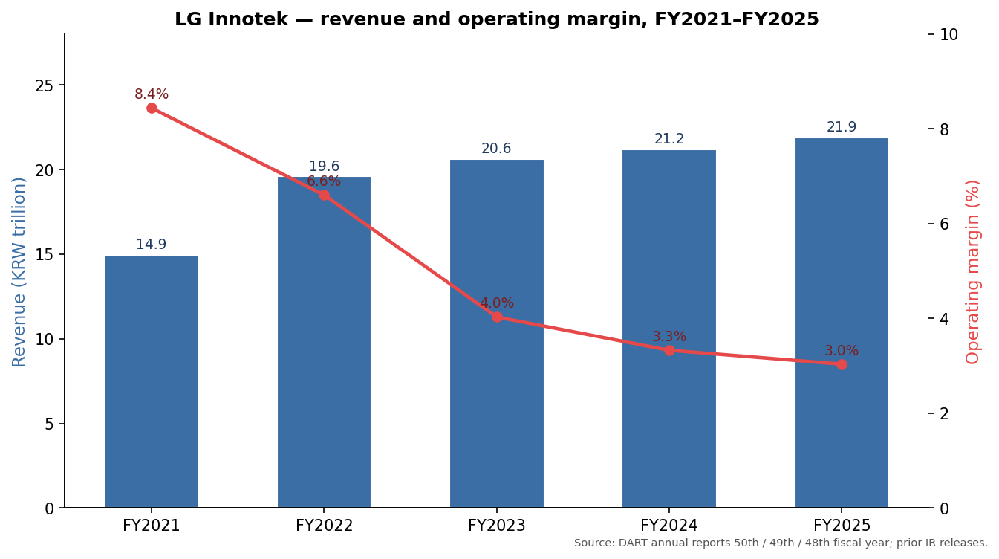
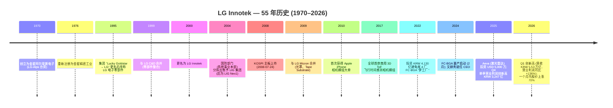
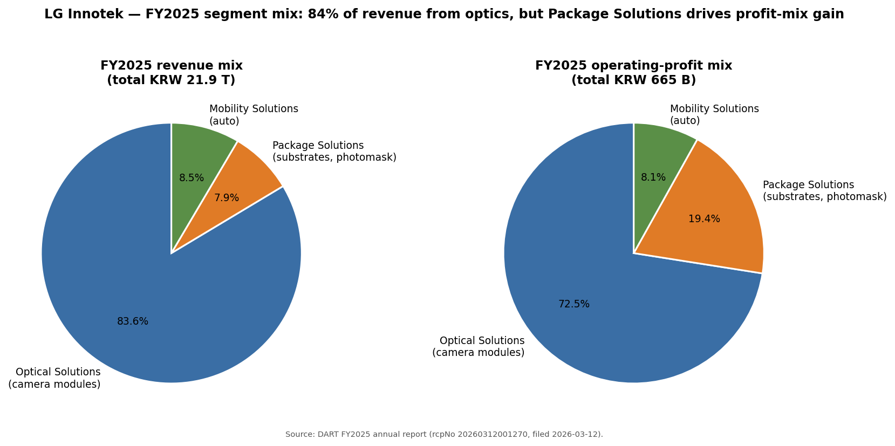
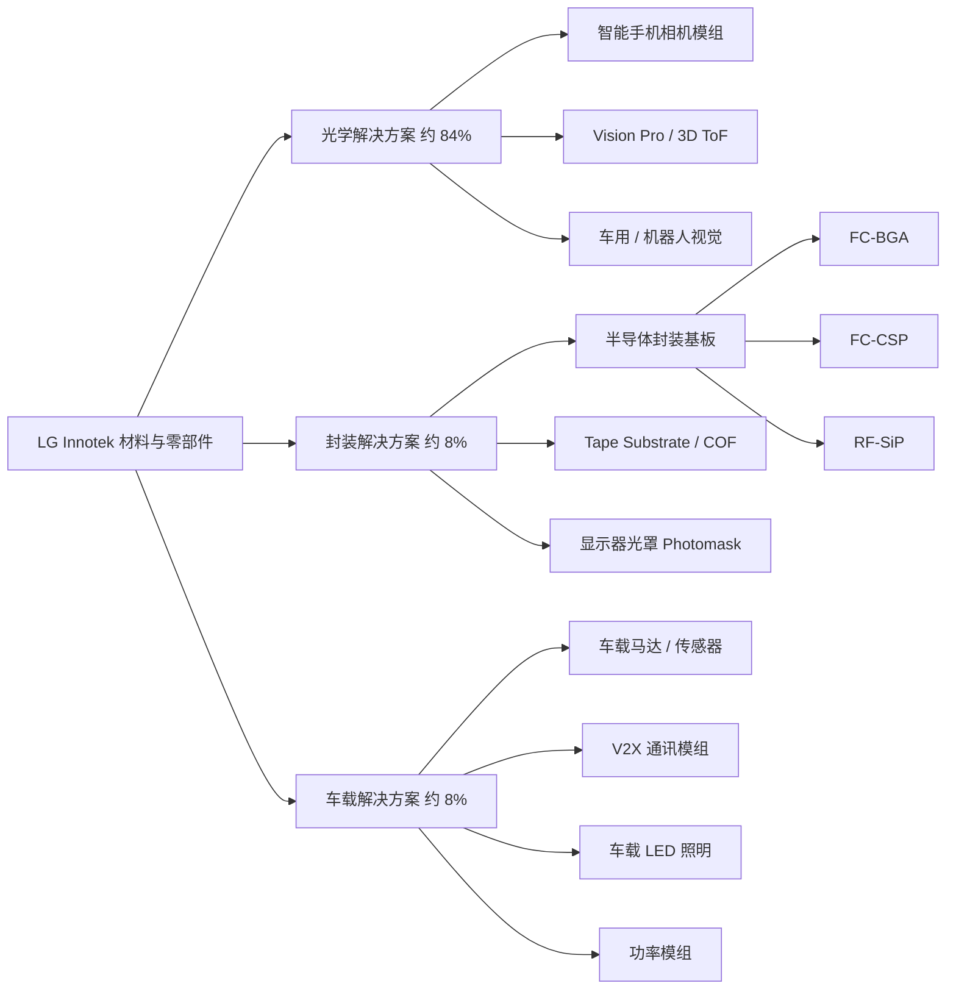
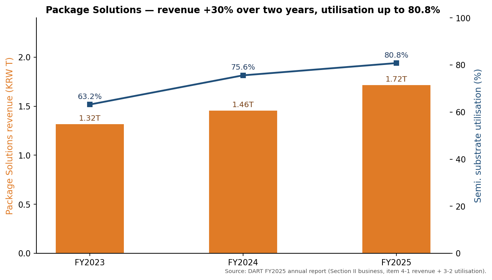
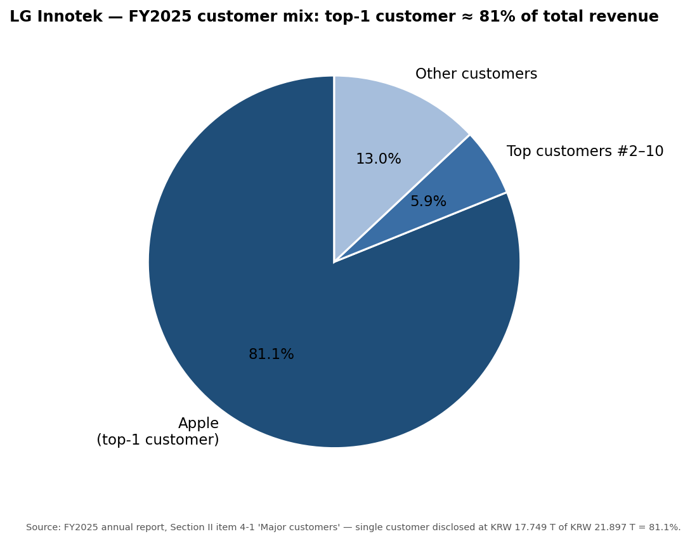
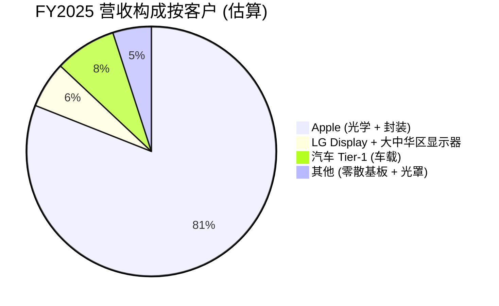

# LG Innotek 株式会社 (KRX:011070) — 首次覆盖

**日期:** 2026-05-26
**代码:** KRX:011070 (KOSPI 主板)
**行业:** 电子零部件 — 相机模组 (camera module)、半导体封装基板、车用电子
**注册地:** 大韩民国 (总部: 首尔江西区 麻谷中央 10 路 30 号 LG 科学园区)
**报告语种:** 简体中文 (zh-CN)

> **更新 — 2026 年 Q1 创历史纪录业绩 (2026-04-25 公布):** LG Innotek (LG 이노텍) 公布 2026 年 Q1 **营业收入 5.53 万亿 KRW (同比 +11.1%)** 及 **营业利润 2,953 亿 KRW (同比 +136%)**, 两项均为公司 Q1 单季度历史新高, 营业利润超出市场一致预期 (KRW 2,370 亿) 约 25%。封装解决方案 (Package Solutions) 营业收入同比 +16% 至 KRW 4,371 亿, 受 FC-BGA (倒装芯片球栅阵列封装基板) 及 RF-SiP 需求带动; 光学解决方案 (Optical Solutions) 受惠于 iPhone 17 旺季延续至传统淡季, 同比 +11.4%。CFO 京 银国 (경은국) 在业绩电话会议中表示: *"우리는 반도체 기판 사업의 캐파를 확대해 나가는 데 박차를 가하고 있습니다"* (公司正全力扩张半导体封装基板业务的产能), 并明确提出五年内将封装解决方案对营业利润的贡献度提升至与光学解决方案相当的目标。资料来源: [Seoul Economic Daily, 2026-04-27](https://en.sedaily.com/finance/2026/04/27/lg-innotek-q1-operating-profit-jumps-136-percent-on-chip); [Korea Herald, 2026-04-25](https://www.koreaherald.com/article/10726451); [Digital Today, 2026-04-25](https://www.digitaltoday.co.kr/en/view/51199/lg-innotek-q1-operating-profit-up-136-percent-on-year-to-2953-billion-won)。

---

## 目录

1. 公司概览
2. 公司历史
3. 管理团队
4. 产品与服务
5. 客户与上市策略
6. 行业概览
7. 竞争格局
8. 市场机会 (TAM)
9. 风险评估
10. 参考资料

---

## 1. 公司概览

LG Innotek (KRX:011070) 是一家韩国材料及零部件专业供应商, 其主营业务是 **向 Apple Inc. (NASDAQ:AAPL) 供应智能手机相机模组** —— 这是一种规模超大的单一客户关系, 大到该公司在 2025 财年 (FY2025) 强制性披露的 DART 사업보고서 (年度报告) 中, 必须以匿名形式披露 "来自某单一未具名客户的光学与封装产品收入合计为 **KRW 17.749 万亿 (约占公司总收入的 81%)**" ([LG Innotek 2025 사업보고서, II. 사업의 내용 §4 (DART rcpNo 20260312001270, 报送日期 2026-03-12)](https://dart.fss.or.kr/dsaf001/main.do?rcpNo=20260312001270))。韩国产业媒体十余年来已公开指认该客户即为 Apple, iPhone 16/17 Pro 的 "tetraprism" 折叠变焦 (folded zoom) 模组以及 iPhone 17 主广角相机均是 LG Innotek 公开承接的 BOM 内容 ([The Elec, 2025-09-26](https://www.thelec.net/news/articleView.html?idxno=5447); [AppleInsider, 2024-08-26](https://appleinsider.com/articles/24/08/26/apple-taps-lg-innotek-for-all-iphone-16-pro-and-iphone-16-pro-max-tetraprism-lenses))。"单一产品 (相机模组) + 单一客户 (Apple)" 业务作为这家创立 88 年的韩国大型工业集团子公司的核心, 这一组合是关于 LG Innotek 最重要的结构性事实, 也是本报告所有其他章节的分析框架。

**业务模式 — 三个上市报告分部。** 据 DART 年度报告 ([II §2-가](https://dart.fss.or.kr/dsaf001/main.do?rcpNo=20260312001270)), 公司自 2025 年 12 月起按以下三个经营事业部组织 (原 "기판소재사업부" 及 "전장부품사업부" 已重命名):

| 分部 | 韩文原名 | FY2025 营收 | 营收占比 | 主要产品 |
|---|---|---|---|---|
| **光学解决方案 (Optical Solutions)** | 광학솔루션 | KRW 18.32 万亿 | 83.6% | 智能手机相机模组 (含折叠变焦、3D ToF 飞行时间感测、Vision Pro 模组); 车用相机; 机器人/AI 视觉相机 |
| **封装解决方案 (Package Solutions)** | 패키지솔루션 | KRW 1.72 万亿 | 7.9% | 半导体封装基板 (RF-SiP、FC-CSP、FC-BGA); Tape Substrate (COF / TAPE BGA); Photomask (光罩, 显示器用) |
| **车载解决方案 (Mobility Solutions)** | 모빌리티솔루션 | KRW 1.86 万亿 | 8.5% | 车载马达 / 传感器、无线 / V2X 通讯模组、车载 LED 照明、功率模组 |
| **合计** | | **KRW 21.90 万亿** | **100%** | |

*资料来源: [DART 사업보고서 50 期, II. 사업의 내용 §2-가](https://dart.fss.or.kr/dsaf001/main.do?rcpNo=20260312001270)。*

相比之下, FY2025 三大分部的 **营业利润** 结构则为: 光学解决方案 KRW 4,822 亿, 封装解决方案 KRW 1,289 亿, 车载解决方案 KRW 539 亿 —— 也就是说, **封装解决方案以仅 7.9% 的营收, 贡献了 FY2025 营业利润的 19.4%** ([DART 年度报告, II §4 分部 P&L](https://dart.fss.or.kr/dsaf001/main.do?rcpNo=20260312001270); [Korea Herald, 2026-04-25](https://www.koreaherald.com/article/10693624))。这一收入与利润的不对称, 是本报告中最重要的估值驱动因素: 市场正在把 LG Innotek 重新定价 —— 不再是一家低毛利的 Apple 相机模组组装厂, 而是一家相机+AI 基板的混合型公司, 而那个高毛利的增长引擎在五年前还根本不存在。

**地理布局。** 公司目前拥有 8 个国内工厂 (首尔总部 / 麻谷研发中心、安山研发、龟尾 1 / 1A / 2 / 3 / 4 厂、光州、坡州、坡州 C7) 及 5 个海外生产子公司 —— 墨西哥 (San Juan del Río 及 Colón)、波兰 (Wrocław)、印度尼西亚 (Bekasi)、越南 (海防)、中国 (烟台) —— 此外还有 8 个海外销售办公室 ([DART 年度报告, II §3-2 라](https://dart.fss.or.kr/dsaf001/main.do?rcpNo=20260312001270))。营收高度依赖出口: FY2025 营收 KRW 21.08 万亿 (96.2%) 为出口, 仅 KRW 8,210 亿 (3.8%) 为韩国内销 ([DART 年度报告, II §4-1](https://dart.fss.or.kr/dsaf001/main.do?rcpNo=20260312001270)) —— 这是典型的 USD 计价营收、KRW 计价成本结构, 双向汇率敞口构成短期盈利波动的核心来源。

**规模指标 (FY2025)。** 营收 KRW 21.897 万亿 (按 1,380 KRW/USD 折算约 USD 159 亿), 同比 +3.3%; 营业利润 KRW 6,650 亿 (营业利润率 3.0%), 同比 -5.8%; 归母净利润约 KRW 3,450 亿 ([DART 年度报告, III §1 主要财务指标](https://dart.fss.or.kr/dsaf001/main.do?rcpNo=20260312001270))。总资产 KRW 11.93 万亿; 股东权益 KRW 5.76 万亿; 负债权益比 107%。研发投入 KRW 7,713 亿, 占营收 3.5%, 截至 2025 年末公司累计持有韩国专利 6,410 件、海外专利 8,029 件 ([DART 年度报告, II §6-2 / §7-나](https://dart.fss.or.kr/dsaf001/main.do?rcpNo=20260312001270))。2025 年 Q4 是 iPhone 17 周期的运营高点: Q4 营收 KRW 7.61 万亿 (同比 +14.8%, 单季历史新高), Q4 营业利润 KRW 3,247 亿 (同比 +31%) ([Korea Herald, 2026-01-26](https://www.koreaherald.com/article/10663095); [Korea Times, 2026-01-26](https://www.koreatimes.co.kr/business/tech-science/20260126/lg-innotek-q4-net-rises-271-on-high-end-products))。

*资料来源: [DART 사업보고서 50 期 (2025) / 49 期 (2024) / 48 期 (2023), III §1](https://dart.fss.or.kr/dsaf001/main.do?rcpNo=20260312001270); FY2021/FY2022 数据取自历史 IR 资料。*

**估值速览。** 截至 2026-05-22 收盘, LG Innotek 股价为每股 KRW 864,000, 按 2,367 万股流通股本计算市值约 **KRW 20.4 万亿 (约 USD 148 亿)** ([Naver Finance — 011070 行情, 访问于 2026-05-26](https://finance.naver.com/item/main.naver?code=011070); [Asia Business Daily, 2026-05-22](https://www.asiae.co.kr/en/article/stock-disclosure/2026052209222934028))。从过去十二个月 (TTM) 数据来看:

- **TTM P/E 约 60×** (TTM 归母净利润约 KRW 3,430 亿 ÷ 2,367 万股 = TTM EPS 约 KRW 14,500; FY2025 营业利润下滑及高有效税率使 TTM EPS 被压低 —— 详见后文拆解)。
- **2026E 远期 P/E 约 20×** —— 基于 KB Securities 对 KRW 1.2 万亿 2026 年营业利润的预测, 隐含每股净利润约 KRW 44,000 ([KB Securities 报告, 转引自 Asia Business Daily, 2026-05-22](https://www.asiae.co.kr/en/article/stock-disclosure/2026052209222934028); [Seoul Economic Daily, 2026-05-20](https://en.sedaily.com/finance/2026/05/20/lg-innotek-target-price-raised-on-ai-substrate-boom))。
- **TTM P/S 约 0.93×** (TTM 营收 KRW 22 万亿) —— 对于大批量、低毛利的合约制电子组装企业是典型水平。
- **P/B 约 3.5×** (FY2025 期末每股净资产 KRW 243,000, 现价 864,000 = 约 3.5×) —— 显著高于历史均值约 1.5×, 反映市场对封装基板业务的重估。

**同行估值比较 (2026E 远期 P/E):** LG Innotek 20× vs. **Ibiden (TSE:4062) 约 65×**、**Shinko Electric (TSE:6967) 约 35×**、**Unimicron (TWSE:3037) 约 22×**、**AT&S (VIE:ATS) 约 18×**、**Sunny Optical (HKEX:2382) 约 22×** ([Investing.com — LG Innotek 一致预期估值页, 访问于 2026-05-22](https://www.investing.com/equities/lg-innotek-co-ltd-consensus-estimates); [Asia Business Daily, 2026-05-22](https://www.asiae.co.kr/en/article/stock-disclosure/2026052209222934028))。KB Securities 特别指出, 全球 FC-BGA 同业平均远期 P/E 约 **59×、PBR 约 10×**, 因此 LG Innotek 相对该集群存在 **"约 66% P/E 折价、约 71% PBR 折价"** —— 这是 2026 年 5 月份多家券商将目标价从 6 周前的 KRW 35–38 万一举上调至 KRW 120 万的核心论据 ([Seoul Economic Daily, 2026-05-20](https://en.sedaily.com/finance/2026/05/20/lg-innotek-target-price-raised-on-ai-substrate-boom); [Seoul Economic Daily, 2026-04-28](https://en.sedaily.com/markets/2026/04/28/lg-innotek-shares-jump-70-percent-in-month-brokerages-still))。

**估值倍数解读。** TTM P/E 高达约 60× 是因为 FY2025 净利润受 Apple 年度相机模组 ASP (Average Selling Price, 平均售价) 杀价 (按 DART 年度报告 ([II §2-나](https://dart.fss.or.kr/dsaf001/main.do?rcpNo=20260312001270)) Camera Module ASP 同比 -5.4%) 及 FY2025 KRW 190 亿资产减值损失 ([DART 年度报告, III 注 11.3](https://dart.fss.or.kr/dsaf001/main.do?rcpNo=20260312001270)) 双重压制。从远期角度看, 20× P/E 属于 "成长性基板重估" 的估值区间: 投资人正在外推假设 Package Solutions 营业利润可从 FY2025 的 KRW 1,289 亿增至 2026–28 年的 KRW 3,600–5,000 亿 (约三倍), 而 Optical Solutions 利润保持在当前水平 —— 因为 Apple 会在 iPhone 18 主相机内容上承接 LG Innotek, 即便折叠变焦份额流失至 Jahwa / ICT ([Tech Times, 2026-05-15](https://www.techtimes.com/articles/316690/20260515/lg-innotek-targets-us-ai-chip-clients-substrate-revenue-climbs-16.htm); [The Elec, 2025-09-26](https://www.thelec.net/news/articleView.html?idxno=5447))。*分析师观点:* TTM P/E 60× 与远期 P/E 20× 之间的差距, 就是整个投资命题的争论焦点。若 2026 年营业利润如 KB 模型所示落在 KRW 1.0–1.2 万亿区间, 当前股价合理; 若 Apple 的 iPhone 18 相机模组订单不及预期、或全球封装基板周期使 FC-BGA 价格走软, 则估值倍数会剧烈压缩 —— 见第 9 章风险 10。我们将估值倍数本身列为独立风险项, 编号风险 #10。

---

## 2. 公司历史

**创立。** LG Innotek 的法律前身 —— **金星阿尔卑斯电子株式会社 (Gold Star Alps Electronics Co., Ltd. / 금성알프스전자)** —— 创立于 **1970 年 8 月 22 日**, 是韩国金星集团 (今 LG 集团) 与日本阿尔卑斯电气 (Alps Electric) 的合资企业, 专门生产机械式电子零部件 ([DART 年度报告, I §1-나 脚注](https://dart.fss.or.kr/dsaf001/main.do?rcpNo=20260312001270); [LG Innotek — Wikipedia, 访问于 2026-05](https://en.wikipedia.org/wiki/LG_Innotek); [Porters Five Force 公司简史, 访问于 2026-05](https://portersfiveforce.com/blogs/brief-history/lginnotek))。该法人实体于 **1976 年 2 月 24 日** 重新注册成立, 更名为 **金星精密工业 (Gold Star Precision Industries / 금성정밀공업)** —— 公司至今将这一日期视为正式创立日并据此计算会计年度 (因此 FY2025 即公司的第 50 期 ("제 50 기")) ([DART 年度报告, I §1-나](https://dart.fss.or.kr/dsaf001/main.do?rcpNo=20260312001270))。

**LG 集团身份的形成 (1995–2000)。** Lucky-Goldstar 集团于 1995 年 1 月统一更名为 **LG** 后, 金星精密工业改称 **LG 电子零部件株式会社 (LG Electro-Components Co., Ltd.)**。这一过渡名称沿用五年, 直至 2000 年再次更名为 **LG Innotek Co., Ltd.** —— "Innotek" 这一造词意在传达公司从一家被动元件 / 连接器供应商, 转向以创新驱动的材料与模组型企业 ([LG Innotek 公司简史 — Wikipedia, 访问于 2026-05](https://en.wikipedia.org/wiki/LG_Innotek); [DART 年度报告, I §1-나](https://dart.fss.or.kr/dsaf001/main.do?rcpNo=20260312001270))。1999 年与 **LG C&D (Cable & Devices)** 的合并把集团内多家附属公司的电子零部件业务整合到同一法人主体下, 标志着自 1970 年代以来分散的零部件业务组合完成集中化。

**三次战略转型。** 三次关键转型定义了今天的公司形态:

1. **2004 年剥离国防业务 — 让产品组合聚焦于商用电子。** 系统事业部 (国防系统、火控、导弹电子) 被分拆出售予 LIG 集团, 后成为公开上市的 LIG Nex1 ([LIG Nex1 — Wikipedia, 访问于 2026-05](https://en.wikipedia.org/wiki/LIG_Nex1); [LG Innotek — Wikipedia, 访问于 2026-05](https://en.wikipedia.org/wiki/LG_Innotek))。这一剥离让 LG Innotek 摆脱了一项高毛利但具政治敏感性的业务, 把资源集中于商用移动 / 汽车 / 显示器零部件 —— 这一组合简化在智能手机超级周期中收益显著, 但也意味着 LG Innotek 今天没有任何国防或航空航天业务可在消费电子下行周期中起缓冲作用。

2. **2009 年合并 LG Micron — 引入光罩 (photomask)、Tape Substrate、CMP 抛光垫产品线, 这些奠定了今天的 Package Solutions 业务。** 2009 年 7 月 1 日 LG Innotek 通过换股方式吸收合并了 **LG Micron** (原韩国柯斯达克 (KOSDAQ) 上市公司, LG 集团的光罩与印刷电路基板业务部门) ([DART 年度报告, I §1-나](https://dart.fss.or.kr/dsaf001/main.do?rcpNo=20260312001270); [Wikipedia, 访问于 2026-05](https://en.wikipedia.org/wiki/LG_Innotek))。这次合并把 LG Micron 在龟尾产线积累的显示器光罩与 Tape Substrate (COF) 技术引入 LG Innotek —— 这正是今天 LG Innotek 封装解决方案分部的种子, 也是 LG Innotek 之所以能出现在野村 (Nomura) "Greater China Semi 2026-30F" 报告图 36 供应商列表中的唯一原因 ([Nomura "Greater China Semi" 锚定报告, 2026-05-21, p. 18-19 (分析师手稿 — 见项目内行业概览)](/Users/x/projects/financial_agent/reports/sector/半导体材料.md))。如果没有 2009 年的 LG Micron 合并, LG Innotek 今天将仅是一家纯粹的相机模组组装厂。

3. **2010 年至今 — 与 Apple 的相机模组关系。** LG Innotek 大约从 iPhone 4 / iPhone 4S 世代 (2010–2011 年) 开始供应 iPhone 相机模组, 经过此后 15 年攀升至全球移动相机模组市占率第一名。公司在 **后置 / 广角 / 远摄 / 以及自 iPhone 16-Pro 起承接的 "tetraprism" 折叠变焦模组** 中的支配地位均有公开行业报道为证 ([MacRumors, 2024-08-26](https://www.macrumors.com/2024/08/26/iphone-16-pro-telephoto-lens-both-models/); [AppleInsider, 2024-08-26](https://appleinsider.com/articles/24/08/26/apple-taps-lg-innotek-for-all-iphone-16-pro-and-iphone-16-pro-max-tetraprism-lenses); [The Elec, 2025-09-26](https://www.thelec.net/news/articleView.html?idxno=5447))。2017 年公司推出全球首款商用 3D ToF 飞行时间感测模组 —— 用于 Apple 的 TrueDepth 前置相机以及后来的 Vision Pro —— 是这段供应关系深度的技术明证 ([Digitimes, 2024-01-30](https://www.digitimes.com/news/a20240130PD210/vision-pro-lg-innotek-3d-sensing.html); [Macdailynews, 2019-09-18](https://macdailynews.com/2019/09/18/lg-innotek-said-to-supply-3d-time-of-flight-modules-for-apples-next-gen-iphones-and-ipads-in-2020/))。

**主要并购与公司行动:**
- **1999 年** — 与 **LG C&D** (Cable & Devices) 合并
- **2004 年** — 国防分部分拆给 LIG (→ LIG Nex1)
- **2008 年** — KOSPI 主板上市 (2008-07-24)
- **2009 年** — 与 **LG Micron** 合并 (光罩、Tape Substrate)
- **2022 年** — 投资 KRW 4,130 亿建龟尾 4 厂 FC-BGA "梦工厂" ([Korea Herald, 2022-02](https://www.koreaherald.com/article/10449620))
- **2024 年** — FC-BGA 量产启动 (2 月); 文赫秀于 2024 年 3 月股东大会获任为 CEO ([DART 年度报告, I §2-나](https://dart.fss.or.kr/dsaf001/main.do?rcpNo=20260312001270))
- **2025-05** — 对激光雷达企业 **Aeva Technologies, Inc.** (NYSE:AEVA) 进行 USD 5,000 万股权投资 —— 以每股 USD 9.26 价格认购 3,509,719 股普通股 ([DART 年度报告, II §6-1; Wikipedia, 访问于 2026-05](https://en.wikipedia.org/wiki/LG_Innotek))
- **2025-09** — 对韩国雷达初创公司 **SMARTRadar System** 增资 KRW 59 亿, 用于自动驾驶雷达合作 ([DART 年度报告, II §6-1](https://dart.fss.or.kr/dsaf001/main.do?rcpNo=20260312001270))

**近 12 个月重要事件。** 三项最关键: (1) **2025 年 4 月宣布** 把 FC-BGA 业务年营收提升至 2030 年 USD 7 亿的目标 —— 较 2024 年基板营收水平翻五倍 ([PRNewswire, 2025-04-30](https://www.prnewswire.com/apac/news-releases/lg-innotek-to-build-fc-bga-into-700-million-usd-business-by-2030-with-its-state-of-the-art-dream-factory-302450934.html)); (2) **2026 年 Q1 创纪录业绩** (营收 KRW 5.53 万亿、营业利润同比 +136%) 于 2026-04-25 公布, 基板业务同比 +16%、iPhone 17 周期在淡季依然延续 ([Korea Herald, 2026-04-25](https://www.koreaherald.com/article/10726451)); 以及 (3) **2026 年 5 月的估值重估**: KB Securities、NH 投资证券等机构将目标价从 4 月初的 KRW 35–38 万一举上调至 KB 的 KRW 120 万, Q1 业绩公告后四周内股价上涨约 70% ([Seoul Economic Daily, 2026-04-28](https://en.sedaily.com/markets/2026/04/28/lg-innotek-shares-jump-70-percent-in-month-brokerages-still); [Seoul Economic Daily, 2026-05-20](https://en.sedaily.com/finance/2026/05/20/lg-innotek-target-price-raised-on-ai-substrate-boom))。

---

## 3. 管理团队

### 文赫秀 (문혁수, Moon Hyuk-soo) — 总裁兼 CEO (自 2024 年 3 月)

文赫秀是任职 28 年的 LG 集团元老, 化学工程出身, 其经营履历几乎完全建立在公司光学业务的内部线条上 —— 这种 CEO 接班模式正是韩国大型企业 (chaebol) 零部件子公司在希望任命一名 "技术型经营者" 而非 "交易型经营者" 时的标准做法。他在 **韩国科学技术院 (KAIST)** 取得化学工程学士、硕士及博士学位, 后于 **1998 年加入 LS Cable / LG Cable** ([Korea Who 履历, 访问于 2026-05](https://www.koreawho.com/profile/MoonHyuksoo); [LG Innotek CEO 页面, 访问于 2026-05](https://www.lginnotek.com/company/ceo.lgit?locale=en); [Korea Times, 2025-10-19](https://www.koreatimes.co.kr/business/companies/20251019/lg-innotek-ceo-shares-career-insights-with-kaist-students))。**2009 年** 他横向调入 LG Innotek 并立刻进入光学事业部, 这是当时已经处于 Apple iPhone 供应关系发力斜坡上的业务线。

文赫秀在 LG Innotek 内部的晋升轨迹几乎是一条直线, 始终扎在光学解决方案条线上 —— 其官方简历及独立报道均有记录: **光学事业部研究所所长 (2017–2019)**、**光学事业部本部长 (2019–2022)**、**首席战略官 (CSO, 2022–2023)**, 直至 **2024 年 3 月就任 CEO** ([LG Innotek CEO 页面, 访问于 2026-05](https://www.lginnotek.com/company/ceo.lgit?locale=en); [The Official Board — Hyuk Soo Moon 履历, 访问于 2026-05](https://www.theofficialboard.com/biography/hyuk-soo-moon-8e37e); [Digital Today, 2024-XX](https://www.digitaltoday.co.kr/en/view/889/lg-innotek-ceo-moon-hyuk-soo-says-company-to-move-beyond-parts-to-solutions))。2022–2023 年的 CSO 任期是最关键的: 他在那段时间主导了 FC-BGA "梦工厂" 投资命题的战略规划, 以及随后对 Aeva / SMARTRadar / 机器人视觉的转向 —— 他在访谈中将此描述为 "从零部件转向解决方案" (moving beyond parts to solutions), 即不再向客户的 BOM 表上交付离散组件, 而是销售预集成的模组与传感系统 ([Digital Today CEO 专访, 访问于 2026-05](https://www.digitaltoday.co.kr/en/view/889/lg-innotek-ceo-moon-hyuk-soo-says-company-to-move-beyond-parts-to-solutions))。

考察文赫秀履历的正确角度是 "他在升任 CEO 前实际交付了什么"。2019–2022 年作为光学事业部本部长 —— 即 iPhone 超级周期的顶峰 —— 他是 LG Innotek 利润的实际负责人。相机模组营业利润正是在他任内于 FY2021 创下 KRW 8,700 亿历史峰值 ([Korea Herald FY21 业绩回顾, archived](https://www.koreaherald.com/article/10663095)), 公司也在该时期取得了全球移动相机模组市占率第一 (FY2025 数字为 33.4%, 较 2023 年的 36.2% 有所下滑, 详见第 7 章)。**2021 年** 他获颁韩国 **产业服务勋章 (第 58 届贸易日表彰)**, 表彰其在光学出口领域的贡献 ([Korea Who 履历, 访问于 2026-05](https://www.koreawho.com/profile/MoonHyuksoo))。文赫秀的公开曝光度不高 —— 他不是黄仁勋或刘德音那种 "公众脸" —— 但他在 2025 年 10 月返回 KAIST 客座演讲时, 有一段话被韩国媒体捕捉, 反映了他的自我定位: *"좋은 제품을 만드는 것이 엔지니어의 궁극적 목표지만, 그것을 제대로 팔지 못하면 의미가 없다"* (制造出好产品是工程师的终极目标, 但如果你卖不出去, 那就毫无意义) ([Korea Times, 2025-10-19](https://www.koreatimes.co.kr/business/companies/20251019/lg-innotek-ceo-shares-career-insights-with-kaist-students))。

根据 FY2025 DART 年度报告 (V §2-라), 文赫秀作为 CEO 兼副总裁 (Pres.) 的 2025 年薪酬总额为 **KRW 12.51 亿** —— 包含基本工资 KRW 8.36 亿、绩效奖金 KRW 4.08 亿、福利 KRW 7,000 万 —— 相对于美国科技公司 CEO 同行的绝对数字而言较为有限, 但在韩国大型企业零部件子公司中属于中等水平。值得注意的是, 他并非 LG Innotek 薪酬最高的前 5 名高管; 最高薪酬属于 **副总裁 金兴植 (김흥식, Kim Heung-sik)**, 薪酬 KRW 22.6 亿, 包含较大一次性补偿 ([DART 年度报告, V §2-라](https://dart.fss.or.kr/dsaf001/main.do?rcpNo=20260312001270))。文赫秀的持股比例不大 (按标准高管薪酬授予的几千股限制性股票), 他并非创始股东。"光学转向基板" 的运营责任 —— 也就是 LG Innotek 在 2026 年获得估值重估的全部原因 —— 完全落在文赫秀的任期内, 而他此前在光学事业部的领导经历意味着即使 Apple 在结构上继续多元化供应商, 这段关系也不太可能因 "关系管理失败" 而崩溃。

**创始人备注。** LG Innotek 于 1970 年作为金星集团与日本 Alps Electric 的合资公司金星阿尔卑斯电子成立, 创始管理层并非西方意义上的 "单人创始人", 而是从 LG (彼时的 Lucky Goldstar) 母集团派来的韩国管理者 —— 即创立 LG 集团的具仁会 (Koo In-hoe) 家族, 与 1958 年创立 LG Electronics 的是同一家族。今天没有任何 "创始人" 角色在 LG Innotek 实际运营层面活跃; 公司作为 **LG Electronics (KRX:066570) 持股 40.8% 的子公司** 由集团治理 ([LG Innotek — Wikipedia, 访问于 2026-05](https://en.wikipedia.org/wiki/LG_Innotek); [DART 年度报告, X §1 关联公司名单](https://dart.fss.or.kr/dsaf001/main.do?rcpNo=20260312001270))。按 company-research skill 规则其他高管不展开介绍 —— 但为完整性: 董事会由 2 名社内董事 (文赫秀、朴智焕)、1 名其他非常勤董事 (李相佑, LG Electronics 提名董事) 及 4 名社外董事 (李熙静、卢相道、朴来洙、金正会) 组成 ([DART 年度报告, I §2-나 董事会构成](https://dart.fss.or.kr/dsaf001/main.do?rcpNo=20260312001270))。

---

## 4. 产品与服务

### 4.1 사업보고서 (年度报告) 产品矩阵 —— 三分部对应三终端市场

权威的产品矩阵已在 DART 年度报告 (II §2-가) 给出, 下文按韩文原文逐字复现。**LG Innotek 的 "产品矩阵" 实际上并不是半导体 IDM (Integrated Device Manufacturer) 意义上的矩阵** —— 它是一个三行的分部列表, 每一行把一个主要终端市场映射到少数几个物理上互不相同的模组族系。Photomask (光罩) 作为让 LG Innotek 出现在野村 Figure 36 供应商列表上的产品线, **只是封装解决方案 (Package Solutions) 行下的一个单一 SKU 而非公司主业。** 相机模组才是远超其他的最大产品族。

| 사업부문 / 分部 | 주요제품 / 主要产品 | FY2025 营收 (KRW 百万) | FY2024 (KRW 百万) | FY2023 (KRW 百万) | FY2025 占比 |
|---|---|---|---|---|---|
| **광학솔루션 / 光学解决方案** | Camera Module 等 (智能手机前置 / 广角 / 远摄 / 折叠变焦; 3D ToF; 车用相机; 机器人视觉相机) | **18,318,459** | 17,800,120 | 17,294,789 | **83.6%** |
| **패키지솔루션 / 封装解决方案** | 반도체기판 (RF-SiP、FC-CSP、FC-BGA 半导体封装基板)、Tape Substrate (COF、TAPE BGA)、Photomask (光罩) | **1,720,017** | 1,460,022 | 1,322,135 | **7.9%** |
| **모빌리티솔루션 / 车载解决方案** | 모터/센서 (马达 / 传感器)、통신 (V2X / 无线)、Lighting Solution (车载 LED)、Power Module (功率模组) | **1,858,127** | 1,940,613 | 1,988,366 | **8.5%** |
| **합계 / 合计** | | **21,896,603** | 21,200,755 | 20,605,290 | **100%** |

*资料来源: [LG Innotek 2025 사업보고서 II §2-가 (DART rcpNo 20260312001270, 报送日期 2026-03-12)](https://dart.fss.or.kr/dsaf001/main.do?rcpNo=20260312001270)。已抵销分部间内部交易。FY2023 数据根据 FY2024 以后的分部更名规则重述 (即电子零部件业务由原来分部移入车载解决方案, 残余部分归入光学解决方案)。*

**分部营业利润与披露的 P&L 结构 (FY2025/FY2024/FY2023, KRW 百万):**

| 分部 | FY2025 营业利润 | FY2024 营业利润 | FY2023 营业利润 | FY2025 营业利润率 |
|---|---|---|---|---|
| 光学解决方案 | 482,238 | 596,613 | 663,148 | 2.6% |
| 封装解决方案 | 128,875 | 70,778 | 125,574 | 7.5% |
| 车载解决方案 | 53,894 | 38,652 | 42,102 | 2.9% |
| **合计** | **665,007** | **706,043** | **830,824** | 3.0% |

*资料来源: [DART 사업보고서, II §4 分部 P&L](https://dart.fss.or.kr/dsaf001/main.do?rcpNo=20260312001270)。*

*资料来源: [DART 사업보고서 50 期 (rcpNo 20260312001270, 报送日期 2026-03-12)](https://dart.fss.or.kr/dsaf001/main.do?rcpNo=20260312001270)。*

### 4.2 综合 — 三分部如何嵌入单一客户工作流

LG Innotek 的三大分部, 并非像 Lam / AMAT / TEL 在 "刻蚀 — 沉积 — 清洗" 上那样构成单一晶圆厂的工艺循环。它们构成的是一个统一的 **移动 + AI + 车用硬件工作流**:

- **光学解决方案** 位于 Apple 智能手机 BOM 表的顶端, 并日渐占据 Apple AR / Vision Pro / 机器人路线图的位置。相机模组是出货量最大、毛利最低、ASP 压力最大的产品线。
- **封装解决方案** 位于客户的硅芯片封装内部 —— RF-SiP 把整套射频系统封装在单一基板内供移动基带使用; FC-CSP 是 GDDR7 / 先进存储芯片下的基板; FC-BGA 是 AI 加速器、服务器 CPU、Apple 自研 SoC 下的高端基板。这是嵌入野村 "AI 基础设施复兴" 命题的桥梁, 也是产生经营杠杆的分部。
- **车载解决方案** 位于车辆内部: ADAS 相机 (实际由 Optical 产线生产, 但因汽车 Tier-1 客户而归 Mobility 报表)、无线 V2X 模组、车载 LED 照明、用于致动器的 BLDC 马达。FY2025 全年新订单 KRW 4.8 万亿, 使订单存量在年末达到 KRW 19.2 万亿的历史新高 ([Korea Herald, 2026-04-25](https://www.koreaherald.com/article/10726451))。

### 4.3 光学解决方案 (Optical Solutions) — 相机模组 (KRW 18.32 万亿, 占营收 84%)

**10-K 引用原文 (DART 사업보고서 II §2 / II §4-가):**
> "광학솔루션 사업부문은 주요 고객의 판매 호조 및 고사양 카메라 모듈 채용 확대를 통해 18.3조원 매출을 달성하며 글로벌 일등 지위를 유지하였습니다。" *(中文释义: "光学解决方案分部受惠于主要客户销售强劲及高规格相机模组采用扩大, 实现营收 KRW 18.3 万亿, 维持全球第一地位。")*
> 资料来源: [LG Innotek 2025 사업보고서, II §1](https://dart.fss.or.kr/dsaf001/main.do?rcpNo=20260312001270)。

**通俗释义。** 相机模组 (camera module) 是一个完全集成的总成, 把以下各部件键合并校准为一体: **CMOS 图像传感器 (image sensor)** (LG Innotek 按 DART 原材料披露 ([II §3-1](https://dart.fss.or.kr/dsaf001/main.do?rcpNo=20260312001270)) 从 Sony 与意法半导体 (STMicro) 采购)、**镜头组 (lens stack)** (来自 Largan 大立光 与 Genius 玉晶光)、**OIS / AF 光学防抖驱动器 (actuator)** (来自 Alps 与 Mitsumi)、柔性印制电路 (flex PCB)、红外滤光片 (IR cut filter)、外壳, 并且把整套堆栈调校到能满足 OEM 厂商对焦距、光圈、MTF、低光信噪比、OIS 防抖校正等指标的规范 —— 公差以微米计。LG Innotek 不生产传感器, 不生产镜头, 不生产驱动器 —— 它生产的是 **集成模组本身**, 那个被焊接到手机主板上的成品。BOM (Bill of Materials) 经济性很关键: FY2025 光学解决方案分部在图像传感器上花费 **KRW 6.44 万亿 (占光学投入成本 41%)** (Sony / STMicro), 在镜头上花费 **KRW 1.95 万亿 (13%)** (Largan / Genius), 在驱动器上花费 **KRW 3.79 万亿 (24%)** (Alps / Mitsumi) ([DART 年度报告, II §3-1](https://dart.fss.or.kr/dsaf001/main.do?rcpNo=20260312001270))。这一 BOM 结构使相机模组业务在结构上是 **附加值组装 (value-add assembly)** 业务, LG Innotek 的毛利率落在约 10–12% 区间 —— 远低于一家传感器厂商 (Sony) 或一家镜头厂商 (Largan), 因为 BOM 主要由 LG Innotek 不生产的部件构成。

三个产品教学要点:

1. **它在 Apple 的 iPhone 工作流中物理上做什么。** 现代的 iPhone Pro 相机 "堆栈" —— 三颗后置 + 一颗前置 + 一颗 LiDAR / 3D-ToF (Pro 机型) —— 实际上是六个互相独立的相机模组, 每一个有自己的光学设计与 OIS 校准。LG Innotek 的工作是在 Apple 组装厂 (富士康) 的 iPhone 量产节奏 (Q4 旺季约 5–8 百万部 / 周) 下交付成品模组。对 iPhone 17 Pro Max 这一代, 这意味着 LG Innotek 在 2025 机型年内交付了超过 5,000 万颗 5× 至 10× 折叠变焦模组 (分析师视角: 按 [The Elec, 2025-09-26](https://www.thelec.net/news/articleView.html?idxno=5447) 大约 70% 的折叠变焦数量份额 (剩余在 Jahwa Electronics 与 ICT 之间), Apple 大约 5,000–5,500 万台 Pro Max + Pro 出货量推算, LGIT 自身在 3,500–4,000 万颗区间)。
2. **相机模组相对矩阵内其他产品如何差异化。** 相机模组是 LG Innotek 营收最大的产品线, 但毛利最低: FY2025 分部营业利润率 2.6%, 而封装解决方案为 7.5%, 车载解决方案为 2.9% ([DART 年度报告, II §4 分部 P&L](https://dart.fss.or.kr/dsaf001/main.do?rcpNo=20260312001270))。光学毛利结构受 Apple 年度 ASP 杀价节奏的结构性压制 —— FY2025 平均相机模组 ASP 同比 -5.4%, 按 DART 年度报告 (II §2-나) 披露 —— 同时受 BOM 由 Sony / Largan / Alps 主导的限制。其他两个分部要么客户重叠较小 (封装), 要么单位价值附加更高 (车载马达 / 照明), 因此能在光学吐出毛利的地方反向提升。
3. **战略意义 — 2026–28 年光学条线的三项技术变曲。** 第一, **iPhone 18 Pro 可变光圈主相机** 将于 2026 年量产, 结构上更复杂 (驱动器必须把光圈从 f/1.6 机械调至 f/2.8), 且 Apple 据报已 **指定 LG Innotek 为可变光圈主组装商, 配合 Sunny Optical 与立讯 (Luxshare) 提供驱动器机构** —— 这意味着 LGIT 在折叠变焦份额流失的同时, 又在主相机内容上获得增量 ([MacRumors, 2026-04-16](https://www.macrumors.com/2026/04/16/iphone-18-pro-variable-aperture-camera-production/); [Cult of Mac, 2026-XX](https://www.cultofmac.com/news/first-iphone-variable-aperture-camera))。第二, **Vision Pro / AR 头显 3D ToF 模组** —— LG Innotek 自 Vision Pro 上市起即为独家 3D 感测供应商 ([Digitimes, 2024-01-30](https://www.digitimes.com/news/a20240130PD210/vision-pro-lg-innotek-3d-sensing.html)); 下一代 Vision Pro 及 Apple AR 眼镜路线图将进一步拉动 3D 感测内容。第三, **机器人 / 工业 AI 相机**: LGIT 在 2026 年 Q1 业绩会议中由 CFO 京 银国宣布 Q2 2026 启动 "机器人视觉" 量产, 瞄准 Boston Dynamics / Figure AI / 通用人形机器人相机模组的位置 —— 这些量目前几乎为零, 但提供了市场现在开始为之定价的可选项 ([Seoul Economic Daily, 2026-04-27](https://en.sedaily.com/finance/2026/04/27/lg-innotek-q1-operating-profit-jumps-136-percent-on-chip))。

*分析师观点:* 相机模组具有 **部分竞争优势 (partial competitive advantage)**, 护城河类型 = **制造规模 + Apple 专属认证深度**。LG Innotek 在 FY2025 披露的 33.4% 全球移动相机模组市占率 ([DART 年度报告, II §1 (1) ㄹ 市占率表](https://dart.fss.or.kr/dsaf001/main.do?rcpNo=20260312001270)) 结构性地依赖于 Apple 的出货量 —— 如果 Apple 把 50% 的相机模组采购转给舜宇 (Sunny Optical), 披露的份额会降至约 15%。出货量层面最直接的竞争者是 **舜宇光学科技 (Sunny Optical Technology, HKEX:2382)**, 其相机模组业务服务中国安卓阵营 (小米、Oppo、Vivo、华为), 且正在 Apple 折叠变焦 OIS 份额上抢夺 LG Innotek 的份额 ([The Elec, 2025-09-26](https://www.thelec.net/news/articleView.html?idxno=5447))。

### 4.4 封装解决方案 (Package Solutions) — 半导体封装基板、Tape Substrate、光罩 (KRW 1.72 万亿, 占营收 8%)

**10-K 引用原文 (DART 사업보고서 II §1 (2)):**
> "패키지솔루션 사업부문은 모바일 시장 수요 회복 및 고성능, 고집적 기판 수요 증가와 POLED 매출 확대를 통해 전년대비 18% 성장한 1.7조원으로, 패키지솔루션 최고 매출을 경신하였습니다. 통신용 반도체기판은 차별화 기술 기반의 제품 경쟁력으로 일등 지위를 공고히 하였고, 신규 사업인 FC-BGA는 Global 고객 추가 확보로 양산 확대를 추진하고 있습니다. 테이프기판은 국내 및 중화권 전략 거래선 점유율 확대로 시장 일등 지위를 강화하고, 포토마스크는 시장 주도권 확보를 위해 OLED 등 프리미엄 모델 확대에 집중하고 있습니다。" *(中文释义: "封装解决方案分部因移动市场需求回暖、高性能高集成基板需求增加、POLED 营收扩大, 同比增长 18% 达 KRW 1.7 万亿, 创历史新高。通讯用半导体基板 [RF-SiP] 凭借差异化技术夯实第一地位; 新业务 FC-BGA 通过新增全球客户推进量产扩大。Tape Substrate 在国内及大中华区战略客户中扩大份额, 巩固市场第一地位; 光罩聚焦于 OLED 等高端机型, 抢占市场主导权。")*
> 资料来源: [LG Innotek 2025 사업보고서, II §1 (2)](https://dart.fss.or.kr/dsaf001/main.do?rcpNo=20260312001270)。

**通俗释义。**

封装解决方案实际是同一报表项目下四个互不相同的产品族 —— 这是一个值得拆开讲的封装要点, 因为这四个族系的客户与竞争动态完全不同。

**(a) RF-SiP (Radio-Frequency System-in-Package, 射频系统级封装) 基板** 是把一整套蜂窝射频前端 (RFFE) 封装到单一层压元件中的基板与裸晶堆栈总成。现代智能手机的射频前端包含 30 + 个元件 —— 功率放大器 (PA)、低噪放大器 (LNA)、滤波器、开关 —— 需要由调制解调器 (modem) 与天线驱动。RF-SiP 基板把这些元件搭载在高密度层压板上, 通过屏蔽电源岛保证 LTE / 5G NR (600 MHz 至 6 GHz、毫米波 28–39 GHz, iPhone 上有的) 频段下的信号完整性。LG Innotek 将其称为公司第一份额的产品线。差异化 = 超薄芯材 (ultra-thin-core) 基板技术 + EMI 屏蔽集成 + 射频设计支持。

**(b) FC-CSP (Flip-Chip Chip-Scale Package, 倒装芯片级封装) 基板** 是占地更小的倒装基板, 位于移动应用处理器 (mobile AP)、GDDR 内存裸晶、高密度内存模组下方。微缩才是其设计要点 —— 基板必须 ≈ 芯片本身的尺寸, 通过通孔 (through-via) 把芯片的 I/O 引到下一级 PCB。LGIT 在 Q4 2025 / Q1 2026 业绩会议中特别提及 **GDDR7 基板放量** 是 2025/2026 年的增长驱动 ([Korea Herald, 2026-01-26](https://www.koreaherald.com/article/10693624))。

**(c) FC-BGA (Flip-Chip Ball Grid Array, 倒装芯片球栅阵列封装) 基板** 是大尺寸高端基板, 位于 AI 加速器、服务器 CPU、数据中心 GPU 下方。这是全球投资圈现在重点关注的产品线。LG Innotek 在 **2024 年 2 月** 于其 **龟尾 4 厂 "梦工厂"** 启动 FC-BGA **量产**, 此前于 2022 年 2 月宣布的 **KRW 4,130 亿 (约 USD 3.3 亿) 投资** 是该项目的基础 ([Korea Herald, 2022-02](https://www.koreaherald.com/article/10449620); [Evertiq, 2025-05-01](https://evertiq.com/design/2025-05-01-lg-innotek-targets-700m-in-fc-bga-sales-with-dream-factory); [PR Newswire, 2025-04-30](https://www.prnewswire.com/apac/news-releases/lg-innotek-to-build-fc-bga-into-700-million-usd-business-by-2030-with-its-state-of-the-art-dream-factory-302450934.html))。占地 230,000 m² 的工厂用 AI / 机器人 / 数字孪生 (digital twin) 基础设施自动化了 FC-BGA 全部 10 个生产 / 物流环节 —— "梦工厂" 是营销称呼但其架构是真实的。**公司目标: FC-BGA 在 2030 年实现 USD 7 亿营收**, 较 FY2025 估算的 FC-BGA 基数 (不到 USD 1 亿) 翻数倍 ([Tech Times, 2026-05-15](https://www.techtimes.com/articles/316690/20260515/lg-innotek-targets-us-ai-chip-clients-substrate-revenue-climbs-16.htm))。董事会于 2026 年 5 月承诺 **在 2026 年底前把 FC-BGA 产能翻倍** ([Tech Times, 2026-05-15](https://www.techtimes.com/articles/316690/20260515/lg-innotek-targets-us-ai-chip-clients-substrate-revenue-climbs-16.htm))。

**(d) 显示器光罩 (Photomask, 光罩)** — LG Innotek 是通过 2009 年合并 LG Micron 获得该产线。光罩是显示器行业用来在 LCD / OLED 面板上转印图案的玻璃 + 铬质模板 (在功能上对应半导体光罩, 但像素尺度大得多)。据 DART, 光罩产线 FY2025 **稼动率 94.5%** —— 是 LGIT 所有产线中最高的 —— 且 **专注于 OLED / 高端机型** ([DART 年度报告, II §3-2 稼动率表 + §1 (2)](https://dart.fss.or.kr/dsaf001/main.do?rcpNo=20260312001270))。FY2025 光罩平均售价同比 +16.1% —— 是公司任何产品线中最大的 ASP 增长。这也是 LGIT 这条产线得以进入野村 Figure 36 ([Nomura "Greater China Semi" 锚定报告, 2026-05-21, p. 30 (分析师手稿 — 见项目内行业概览)](/Users/x/projects/financial_agent/reports/sector/半导体材料.md)) 的原因, 反映了显示器光罩在韩国 OLED 供应链中的角色。*分析师观点:* 尽管 94.5% 的稼动率与 16.1% 的 ASP 涨幅亮眼, 光罩在 LGIT 内是一个 **小条线** —— 营收约 KRW 1,500–2,000 亿, 在封装解决方案中占比远不到 10%, 在 LGIT 整体中远不到 1%。它不会撬动股价命题。野村将其纳入图 36 是为了全球光罩榜单的完整性, 而非因为它是 LGIT 的核心命题。

**(e) Tape Substrate (COF、TAPE BGA, 卷带式基板)** — 是用来把显示器驱动 IC (DDI) 连接到 LCD / OLED 面板上的柔性基板。LGIT 自称在韩国及大中华区显示器卷带式基板市场处于 #1 ([DART 年度报告, II §1 (2)](https://dart.fss.or.kr/dsaf001/main.do?rcpNo=20260312001270))。Tape Substrate 营收结构上与显示器单位出货量挂钩, FY2025 ASP 同比 -2.1%。Tape Substrate 产线在 FY2025 的稼动率为 63.9% —— 是封装解决方案条线下唯一明显低稼动率的产品, 反映显示器驱动 IC 供应链的疲软 ([DART 年度报告, II §3-2 稼动率](https://dart.fss.or.kr/dsaf001/main.do?rcpNo=20260312001270))。

封装解决方案的三个产品教学要点:

1. **它在客户价值链中物理上做什么。** FC-BGA 是位于服务器 CPU 或 AI 加速器裸晶下方的层压封装基板。没有 FC-BGA 基板, Intel Xeon、AMD EPYC、Nvidia H100、或 Apple M 系列硅芯片就无法贴装到服务器主板上。基板提供 ≥ 16 层细间距 (fine-pitch) 铜互连, 把芯片数千个凸点 (bump) 引出至 BGA 球栅阵列, 并提供封装级电源分配网络 (PDN)。现代 AI 加速器的 FC-BGA 封装表面积达 80–100 mm × 80–100 mm, 线宽 / 线距 5–10 µm, 无芯层 (coreless) 层压厚度 100 + µm。
2. **它与同矩阵下 FC-CSP / RF-SiP 兄弟产品的差异。** FC-CSP 与 RF-SiP 是移动级基板 —— 占地小、层数少、单价低 (ASP 约 USD 1–5)。FC-BGA 是服务器级 —— 占地大、16 + 层、单价 USD 50–300。FC-BGA 每单位面积的定价大约是 FC-CSP 的 10–50 倍, 这就是为什么把 FC-BGA 产能翻倍能在移动基板出货量远超的情况下, 依然带来有意义的经营杠杆。
3. **战略意义 — 为什么封装解决方案对 2026–28 至关重要。** LG Innotek 整个重估命题就活在这里。FC-BGA 在全球处于实物短缺 —— Ibiden、Shinko Electric、Unimicron 都在让其大尺寸基板产线满负荷, 而 Intel / Nvidia / AMD / TSMC 在竞争产能 ([Tech Times, 2026-05-15](https://www.techtimes.com/articles/316690/20260515/lg-innotek-targets-us-ai-chip-clients-substrate-revenue-climbs-16.htm))。LG Innotek 现在被定位为 **后来者 (late-entrant) 的备选货源**, 用于覆盖二线及供应不足的芯片组位置 —— KB Securities 明确把 "Intel、Amazon (Project Kuiper 卫星芯片组)、Boston Dynamics、Figure AI" 列为预期客户目标 ([Seoul Economic Daily, 2026-05-20](https://en.sedaily.com/finance/2026/05/20/lg-innotek-target-price-raised-on-ai-substrate-boom); [Tech Times, 2026-05-15](https://www.techtimes.com/articles/316690/20260515/lg-innotek-targets-us-ai-chip-clients-substrate-revenue-climbs-16.htm))。其中部分合约现已采用多年供应协议加预付款的形式 —— KB Securities 形容合约条款 "越来越像存储半导体的长期供应协议" ([Digitimes 转引 Seoul Economic Daily, 2026-05-21](https://en.sedaily.com/finance/2026/05/20/lg-innotek-target-price-raised-on-ai-substrate-boom))。

*资料来源: [DART 사업보고서 50 期, II §4-1 营收 + II §3-2 稼动率表](https://dart.fss.or.kr/dsaf001/main.do?rcpNo=20260312001270)。*

*分析师观点:* 封装解决方案具有 **明确竞争优势 (clear competitive advantage)**, 护城河类型 = **制造产能稀缺性 + 技术认证深度**。最直接的竞争者为 **Ibiden 株式会社 (TSE:4062)**、**Shinko Electric Industries (TSE:6967)**、**Unimicron Technology (TWSE:3037)**、**Nan Ya PCB (TWSE:8046)**、**AT&S (VIE:ATS)** —— 这五家合计控制全球 FC-BGA 约 74% 份额 ([Tech Times, 2026-05-15](https://www.techtimes.com/articles/316690/20260515/lg-innotek-targets-us-ai-chip-clients-substrate-revenue-climbs-16.htm); [WonderfulPCB 顶级 ABF 制造商, 访问于 2026-05](https://www.wonderfulpcb.com/blog/top-abf-substrate-manufacturers-and-market-leaders/))。LGIT 不在份额上的这个量级 (今天全球 FC-BGA 份额可能 < 3%), 但 "后来者命题" 恰恰是多头逻辑: 当同行 2027 年前产能已被锁满, 二货源认证窗口就会打开。

### 4.5 车载解决方案 (Mobility Solutions) — 车用电子 (KRW 1.86 万亿, 占营收 8.5%)

**10-K 引用原文:**
> "모빌리티솔루션 사업부문은 전년 대비 소폭 감소한 매출 1.9조원을 기록하였으며, 플랫폼 모델 중심의 개발과 수주활동 전개 및 지속적인 원가구조 개선 활동으로 수익성을 동반한 성장을 도모하고 있습니다。" *(中文释义: "车载解决方案分部录得营收 KRW 1.9 万亿, 同比小幅下降, 通过聚焦平台型号的研发、订单获取活动及持续的成本结构改善, 致力于实现伴随盈利的增长。")*
> 资料来源: [LG Innotek 2025 사업보고서, II §1 (3)](https://dart.fss.or.kr/dsaf001/main.do?rcpNo=20260312001270)。

**通俗释义。** 车载解决方案向汽车 Tier-1 供应链销售四个产品族: **马达 / 传感器** (用于 HVAC 致动器的 BLDC 马达、位置传感器、线控驾驶组件 —— 在光州、中国、墨西哥工厂生产)、**车载通讯** (V2X、车联网 (telematics)、5G NR / 6G-ready 模组 —— 在光州生产)、**车载 LED 照明** (远近光 LED 总成与数字大灯 —— 这是 Mobility 条线唯一具有专利深度的产品)、**功率模组 (power modules)** (用于 EV 的 DC-DC 转换器与车载充电机)。据 DART, 截至 2025 年末的新订单 (수주잔고) 达到 **历史新高 KRW 19.2 万亿** ([DART 年度报告, II §4-2 + Korea Herald, 2026-04-25](https://www.koreaherald.com/article/10726451)) —— 其中大部分是车载 LED 照明, 这是 LGIT 的结构性强项。

车载解决方案的三个产品教学要点:

1. **它在车辆中物理上做什么。** 车载马达驱动 HVAC 通风口、节气门、电子驻车制动、车门锁扣以及各类 ADAS 控制连杆。V2X / 车联网模组承担蜂窝 / DSRC / 直连通信 (sidelink) 协议, 与云端及其他车辆通信。LED 照明总成取代卤素 / 氙气大灯, 使用自适应矩阵式 LED 大灯。功率模组位于 EV 动力总成 —— DC-DC 转换器把 400V 或 800V 高压电池电压降至 12V 供辅助电子使用, 车载充电机 (OBC) 把交流电网电力转换为高压直流。
2. **它与 Optical / Package 兄弟产品的差异。** 车载是慢节奏、合约驱动、长尾客户业务 (德国 / 美国 / 韩国 Tier-1 及 OEM)。订单获取领先营收 2–5 年 —— 2025 年末 KRW 19.2 万亿的订单存量将在 2030 年前陆续释放为营收。客户集中度与光学截然不同 (在 Tier-1 中真正多元化), 毛利结构维持较低 (FY2025 分部营业利润率 2.9%), 因为车用电子在 Continental、Bosch、Denso、Aisin、Magna 内制部门以及中国整车零部件商之间存在激烈的价格竞争。
3. **战略意义 — 自动驾驶与 6G 的可选项。** 车载解决方案是 LGIT 组合中的 "长期期权"。2025-05 对 Aeva (激光雷达) 的 USD 5,000 万股权投资, 以及 2025-09 对 SMARTRadar System 的股权认购, 都是雷达 / 激光雷达集成的卡位 ([DART 年度报告, II §6-1 — 主要合约](https://dart.fss.or.kr/dsaf001/main.do?rcpNo=20260312001270); [LG Innotek — Wikipedia 关于 Aeva 备注](https://en.wikipedia.org/wiki/LG_Innotek))。这些不会影响 2026 年数字, 但提供了支撑 2027–2030 叙事的可选项价值。

*分析师观点:* 车载解决方案具有 **部分竞争优势**, 护城河类型 = **LG 集团品牌 + Tier-1 设计导入惯性**。最直接的竞争者包括 **Samsung Electro-Mechanics** (车用 MLCC / 功率模组)、**Continental AG (DE:CON)** (车载照明与车联网)、**Magna International (NYSE:MGA)** (车载电子)、**Denso (TSE:6902)** (马达 / 传感器)。

### 4.6 旗舰产品族与近 12 个月发布

驱动股价命题的有三个旗舰:

1. **iPhone 17 / 18 主相机 + 折叠变焦相机模组** — 是产生现金流支撑其他业务的引擎。每年 3,500–4,000 万颗折叠变焦模组 (ASP 约 USD 30–40) 加上每年超过 1 亿颗主 + 超广角相机模组 (ASP 约 USD 10–20), 使其成为 LG Innotek 组合中最大的单一硬件产品线。
2. **FC-BGA 基板** — 是 2026 年估值重估所建立的增长引擎。2024 年 2 月启动量产, 预计 **2026 年底前产能翻倍** ([Tech Times, 2026-05-15](https://www.techtimes.com/articles/316690/20260515/lg-innotek-targets-us-ai-chip-clients-substrate-revenue-climbs-16.htm)), 处于五年内达到 USD 7 亿营收的滑坡上。
3. **车载 LED 照明** — 慢但持续高毛利的车载旗舰, 锚定 KRW 19.2 万亿订单存量。

**近 12 个月产品 / 战略发布 (附公开新闻稿引用):**

- **2025-04** — FC-BGA "梦工厂" 公开发布 / USD 7 亿 2030 目标 ([PR Newswire, 2025-04-30](https://www.prnewswire.com/apac/news-releases/lg-innotek-to-build-fc-bga-into-700-million-usd-business-by-2030-with-its-state-of-the-art-dream-factory-302450934.html))。
- **2025-05** — Aeva Technologies USD 5,000 万股权投资, 用于激光雷达合作 ([Wikipedia — LG Innotek 2025 章节](https://en.wikipedia.org/wiki/LG_Innotek); [DART 年度报告 II §6-1](https://dart.fss.or.kr/dsaf001/main.do?rcpNo=20260312001270))。
- **2025-09** — SMARTRadar System 股权认购 (KRW 59 亿), 用于自动驾驶雷达合作 ([DART 年度报告 II §6-1](https://dart.fss.or.kr/dsaf001/main.do?rcpNo=20260312001270))。
- **2024-10 / 2025-10** — 与韩国材料科学研究院 (KIMS) 共同开发无重稀土 EV 永磁电机 ([Wikipedia — LG Innotek 2024 章节](https://en.wikipedia.org/wiki/LG_Innotek))。
- **2026 Q2 (计划中)** — 机器人视觉相机模组量产启动 (CFO 在 Q1 2026 业绩会议中确认: ["机器人视觉" 将于 2026 年 Q2 进入量产](https://en.sedaily.com/finance/2026/04/27/lg-innotek-q1-operating-profit-jumps-136-percent-on-chip))。

---

## 5. 客户与上市策略

**Apple 客户集中度。** 据 FY2025 DART 年度报告 (II §4-1 라):

> "당기 연결실체 총 수익 중 매출액 10% 이상을 차지하는 단일 고객에 대한 매출은 광학/패키지 등의 매출 17,748,770백만원이며 매출액 기준 상위 10개 고객으로의 매출은 전체 매출의 87%를 구성합니다。" *(中文释义: "本期合并实体总收入中, 占营收 10% 以上的单一客户销售额 [光学 / 封装等] 为 KRW 17,748,770 百万, 按营收计前 10 大客户合计占总营收的 87%。")*
> 资料来源: [LG Innotek 2025 사업보고서, II §4-1 라](https://dart.fss.or.kr/dsaf001/main.do?rcpNo=20260312001270)。

**因此第一大客户占 FY2025 营收 81.1%** (KRW 17.75 万亿 / KRW 21.90 万亿)。LGIT 未在披露中点名该客户, 但所有公开媒体引用均把它指认为 **Apple Inc.** —— 包括近期 Tech Times / Seoul Economic Daily / KED Global, 以及历史上 AppleInsider / Patently Apple 追溯到早期 iPhone 时代的报道 ([Tech Times, 2026-05-15](https://www.techtimes.com/articles/316690/20260515/lg-innotek-targets-us-ai-chip-clients-substrate-revenue-climbs-16.htm) 明确指出 "Apple 依赖 (83% of revenue)"; [KED Global, 2024-02-14](https://www.kedglobal.com/electronics/newsView/ked202402140004) 称 "LG Innotek 的功课: 降低对 Apple 的依赖"; [The Elec, 2025-09-26](https://www.thelec.net/news/articleView.html?idxno=5447))。在 KRW 17.75 万亿总额中, 绝大多数是相机模组营收 (光学解决方案), 较小部分是 RF-SiP / FC-CSP 流向 Apple 自研芯片的基板营收 (封装解决方案) —— DART 披露中明文写作 "광학/패키지" (光学 / 封装)。

*资料来源: [DART 사업보고서 50 期, II §4-1 라](https://dart.fss.or.kr/dsaf001/main.do?rcpNo=20260312001270)。第一大客户占比 = KRW 17,748,770 mn ÷ KRW 21,896,603 mn = 81.1%; 按披露前 10 大客户合计 87%, 即客户 #2–10 合计约 5.9%。*

**客户分群与其他具名账户。** Apple 之外, 具名客户与潜在客户包括:
- **Apple Inc. (NASDAQ:AAPL)** — 光学解决方案 (相机模组) + 封装解决方案 (RF-SiP、FC-CSP, 服务 A 系列与 M 系列自研硅芯片)。按披露估算占总营收 81%。
- **LG Display Co. (KRX:034220)** — Tape Substrate / COF / 光罩客户 (集团内, 因 LG Display 同属 LG 集团且按 Wikipedia ([访问于 2026-05](https://en.wikipedia.org/wiki/LG_Innotek)) 持有 LG Innotek 23.1% 股权)。备注: 按 DART 关联公司名单 (X §1), LG Display 列在 LG 集团关联公司; LG Display 不动产租赁合约 (2022-12 签订, 金额未披露) 列入 DART 主要合约 ([II §6-1](https://dart.fss.or.kr/dsaf001/main.do?rcpNo=20260312001270))。
- **大中华区显示器公司 (BOE 京东方、Tianma 天马)** — Tape Substrate / COF 客户, 据公司叙述 ([II §1 (2)](https://dart.fss.or.kr/dsaf001/main.do?rcpNo=20260312001270))。
- **Intel (NASDAQ:INTC)** — FC-BGA 潜在客户, 据 Digitimes / Tech Times 报道 ([Tech Times, 2026-05-15](https://www.techtimes.com/articles/316690/20260515/lg-innotek-targets-us-ai-chip-clients-substrate-revenue-climbs-16.htm); [Digitimes, 2026-05-21 (付费墙)](https://www.digitimes.com/news/a20260521PD204/lg-innotek-substrate-intel-operating-profit-technology.html))。
- **Amazon (Project Kuiper 卫星芯片组)** — FC-BGA 潜在客户, 来源同上。
- **Boston Dynamics / Figure AI** — FC-BGA 潜在客户 (机器人芯片组), 来源同上。
- **德国 / 韩国 / 美国整车 OEM (现代-起亚、GM、Mercedes-Benz)** — 车载 LED 照明与马达 / 传感器客户 (车载解决方案); 2025 年末订单存量 KRW 19.2 万亿。

**分销 / 销售策略 (DART §4-1 다):** 公司明确把策略描述为 "通过战略合作进行客户定制化差异化", 即直接销售、客户团队主导、多年认证驱动的合约销售。付款条件: 国内 = 现金 / 赊销; 出口 = 信用证、电汇; 国际贸易术语 = FOB / CIF / DAP / DDP ([DART 年度报告, II §4-1 나-다](https://dart.fss.or.kr/dsaf001/main.do?rcpNo=20260312001270))。

**客户集中度结论: 重大风险。** 按项目分类标准, **第一客户 > 20% = 重大; 第一客户 > 30% = 高; 第一客户 = 81% 意味着集中度已达结构性上限**。三年披露历史可用 (以光学解决方案营收作为 Apple 营收代理): FY2023 KRW 17.29 万亿、FY2024 KRW 17.80 万亿、FY2025 KRW 18.32 万亿 —— Apple 营收尽管面临 ASP 杀价仍同比增长中个位数 %, 因为 Apple 在每部手机上承接了 LGIT 更多内容 (折叠变焦、3D ToF)。因此绝对集中度自 2023 年以来稳定, 但占比因其他两个分部停滞而走高。风险不在于 Apple 停止采购 —— Apple 需要 LGIT 的产能 —— 而在于 Apple 结构性地分散采购 (具体指折叠变焦 OIS 份额由 LGIT 流向 Jahwa / ICT, 如 iPhone 17 vs iPhone 15 已经发生的那样), 长期压低 LGIT 相机模组毛利。

---

## 6. 行业概览

LG Innotek 运营于四个迥异的行业交汇处 —— 移动相机模组、半导体封装基板、显示器电子零部件、汽车电子 —— 每个行业有自己的规模、增长动力与供应结构。各分部经济上互不相干, 但通过 LGIT 共享的制造规模、材料科学深度、韩国产业政策定位而联系起来。

**行业 1 — 移动相机模组。** 按行业研究, 全球移动相机模组市场 2025 年规模约 **USD 380–420 亿**, 2025–2030 年 CAGR 约 4% ([Mordor Intelligence 相机模组报告, 访问于 2026-05](https://www.mordorintelligence.com/industry-reports/camera-module-market); [Vision Research Reports CCM 市场表, 访问于 2026-05](https://www.visionresearchreports.com/table-of-content/2492))。营收增长结构上较慢, 因为智能手机单位出货量已在约 12 亿台 / 年的水平上趋平 —— 每一美元相机模组增长都来自 ASP 而非单位。ASP 增长依赖功能升级: 3D ToF、潜望式 / 折叠变焦、更大传感器、更高 OIS 规格。行业结构性集中: LG Innotek、舜宇光学、Samsung Electro-Mechanics、Foxconn-Sharp 以及三家中国二线 (欧菲光、丘钛科技、信利光电) 合计控制约 70-80% 供应。

**行业 2 — 半导体封装基板 (FC-BGA / FC-CSP / RF-SiP)。** 按行业研究, 全球 ABF (Ajinomoto Build-up Film) 基板 (FC-BGA) 市场 2025 年规模约 **USD 53 亿**, 前五大 (Unimicron、Ibiden、Nan Ya PCB、Shinko Electric、AT&S/Kinsus) 持有约 74% 市占率 ([Market Growth Reports ABF 基板市场, 访问于 2026-05](https://www.marketgrowthreports.com/market-reports/abf-substrate-fc-bga-market-107527); [Tech Times, 2026-05-15](https://www.techtimes.com/articles/316690/20260515/lg-innotek-targets-us-ai-chip-clients-substrate-revenue-climbs-16.htm); [WonderfulPCB ABF 制造商, 访问于 2026-05](https://www.wonderfulpcb.com/blog/top-abf-substrate-manufacturers-and-market-leaders/))。市场至 2030 年 CAGR 约 10–15%, 由 AI 加速器出货量与服务器 CPU 复杂度驱动, 但瓶颈是 **产能而非需求** —— 主要厂商满负荷, 新增产能从开始到认证完成需要 3–4 年才能商业放量。这是 LG Innotek 后来者 FC-BGA 策略具有商业牵引力的结构性原因。广义 IC 封装基板市场 (含 FC-CSP 与 RF-SiP) 2025 年规模约 **USD 170–200 亿**, 集中度类似 ([Mordor Intelligence 高端 IC 封装基板市场, 访问于 2026-05](https://www.mordorintelligence.com/industry-reports/advanced-ic-substrates-market))。野村 Greater China Semi 锚定报告把全球半导体材料 2025 年规模置于 USD 800 亿, 其中封装材料约 40%, 基板是封装材料最大的子类 ([Nomura Greater China Semi 锚定报告, 2026-05-21, p. 18-19 (分析师手稿 — 见项目内行业概览)](/Users/x/projects/financial_agent/reports/sector/半导体材料.md))。

**行业 3 — 显示器电子零部件 (光罩、Tape Substrate、OLED)。** 全球显示器光罩市场 2025 年规模约 **USD 10–20 亿**, 集中于 Toppan (日本)、Photronics (美国)、Hoya (日本)、DNP (日本) 与 LG Innotek ([Valuates Reports 光罩市场, 访问于 2026-05](https://reports.valuates.com/market-reports/QYRE-Auto-2Q15020/global-photomask-for-semiconductor-chip))。市场随 OLED 面板尺寸扩大与像素密度提升而稳定中个位数 % 增长。COF / Tape Substrate 市场规模类似 (USD 10–20 亿), 与 LCD / OLED 显示器驱动 IC 出货量挂钩。

**行业 4 — 汽车电子。** LGIT 范围内 (马达、传感器、LED 照明、功率模组) 全球车用电子市场 2025 年规模约 **USD 1,000 + 亿**, 由 EV 渗透率、单车 ADAS 内容、LED / 矩阵大灯转型驱动, 高个位数 % 增长。市场高度碎片化, 跨 Tier-1 老牌 (Bosch、Continental、Denso、Magna、ZF、Aisin)、韩国专业商 (LG 集团、Samsung Electro-Mechanics、Mobis) 与快速崛起的中国厂商。

**关键行业趋势与驱动因素 (未来 24 个月):**
1. **AI 基础设施 capex 超级周期。** 按野村, TSMC 2027F capex 约 USD 700 亿, 全球超大规模数据中心 AI capex 总额 USD 3,000+ 亿, 拉动基板 / 封装需求。FC-BGA 行业历史上首次出现多年供应能见度。
2. **iPhone 单机相机内容。** Apple 在 2026–28 年向 iPhone 18 Pro 加入可变光圈、更高像素主传感器、Vision Pro 衍生 3D 感测扩散至主流 iPhone。过去五年每部手机相机模组 ASP 已近乎翻倍 —— LGIT 捕获之。
3. **Apple 供应商多元化。** Apple 在每个主要零部件位置上结构性增加二 / 三货源。ICT 与 Jahwa Electronics 在 iPhone 17 上抢走 LGIT 的折叠变焦 OIS 份额 ([The Elec, 2025-09-26](https://www.thelec.net/news/articleView.html?idxno=5447)); 舜宇光学与立讯加入 iPhone 18 相机模组供应 ([MacRumors, 2026-04-16](https://www.macrumors.com/2026/04/16/iphone-18-pro-variable-aperture-camera-production/))。
4. **OLED 显示器扩张。** 显示器光罩与 COF 增长与 LG Display、Samsung Display、BOE、Tianma 的 OLED 产能扩张挂钩。DART 申报明确把 POLED 营收扩大列为 2025 年增长驱动 ([II §1 (2)](https://dart.fss.or.kr/dsaf001/main.do?rcpNo=20260312001270))。
5. **EV 电子平台整合。** 车载 LED 照明与 BLDC 马达需求随 EV 渗透率与 ADAS 内容增长。随着美中脱钩收紧, 韩国整车 OEM (现代-起亚) 与美国 OEM (GM) 越来越倾向选择韩国 Tier-2 零部件供应商。

**监管环境。** LG Innotek 在韩国监管负担较低 —— 韩国产业通商资源部 (MOTIE) 不对电子零部件企业实施其他行业 (制药 / 金融科技级) 的审批周期。两个宏观监管变量起约束作用: (a) **美国对华先进半导体出口管制** (这在结构上有利于韩国 FC-BGA 厂商对接美国芯片企业); (b) **韩国围绕 iPhone 供应链的贸易政策** —— 即韩国在 IRA / CHIPS 法案下与美国的双边关系是否带来额外补贴利好。迄今 LG Innotek 是这些政策的受益者而非受害者。2024 年韩国 K-Chips 法案明确将 FC-BGA / 先进封装投资纳入税收抵免范围, 帮助资助龟尾 4 厂梦工厂扩建 ([韩国政府政策, 转引自 PR Newswire, 2025-04-30](https://www.prnewswire.com/apac/news-releases/lg-innotek-to-build-fc-bga-into-700-million-usd-business-by-2030-with-its-state-of-the-art-dream-factory-302450934.html))。

**行业结构 / 供需动态:**
- **买方** — Apple (单一买方占 80% + 营收) 议价能力极强; 汽车 Tier-1 议价均衡 (多卖家多买家); FC-BGA AI 客户当前议价能力偏弱 (产能稀缺超过供应水平)。
- **供方** — Sony / STMicro (图像传感器)、Largan / Genius (镜头)、Alps / Mitsumi (驱动器) 是 LGIT 相机模组的集中供应商; LGIT 在光学上游议价能力有限。基板原材料 (FCCL、铜箔、ABF、味之素薄膜、玻璃布) 集中在日本, 这对封装解决方案的扩产构成供应链风险。
- **替代品** — 相机模组面临零技术替代 (每部手机都需要相机); FC-BGA 面临新兴玻璃基板威胁 (按野村行业概览 2027–28 年量产, 但博通独家直到那时 ([Nomura Greater China Semi 锚定报告 p. 85](/Users/x/projects/financial_agent/reports/sector/半导体材料.md))); 光罩在 OLED 时间窗口内无替代风险。
- **进入门槛** — 相机模组高 (Apple 级认证需 3–5 年 + 工装投资 + 洁净厂房建造); FC-BGA 极高 (10 年认证 + 单一晶圆厂 USD 10 亿 capex); 光罩中等 (日 / 美老牌牢固, 但成熟玩家可守); 车载低 (许多小 Tier-1 候选)。

---
