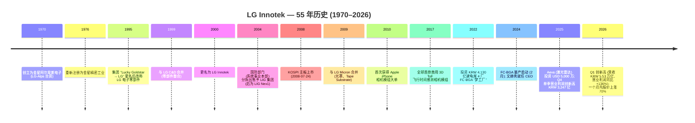

# LG Innotek 株式会社 (KRX:011070) — 首次覆盖

**日期:** 2026-05-26
**代码:** KRX:011070 (KOSPI 主板)
**行业:** 电子零部件 — 相机模组 (camera module)、半导体封装基板、车用电子
**注册地:** 大韩民国 (总部: 首尔江西区 麻谷中央 10 路 30 号 LG 科学园区)
**报告语种:** 简体中文 (zh-CN)

> **更新 — 2026 年 Q1 创历史纪录业绩 (2026-04-25 公布):** LG Innotek (LG 이노텍) 公布 2026 年 Q1 **营业收入 5.53 万亿 KRW (同比 +11.1%)** 及 **营业利润 2,953 亿 KRW (同比 +136%)**, 两项均为公司 Q1 单季度历史新高, 营业利润超出市场一致预期 (KRW 2,370 亿) 约 25%。封装解决方案 (Package Solutions) 营业收入同比 +16% 至 KRW 4,371 亿, 受 FC-BGA (倒装芯片球栅阵列封装基板) 及 RF-SiP 需求带动; 光学解决方案 (Optical Solutions) 受惠于 iPhone 17 旺季延续至传统淡季, 同比 +11.4%。CFO 京 银国 (경은국) 在业绩电话会议中表示: *"우리는 반도체 기판 사업의 캐파를 확대해 나가는 데 박차를 가하고 있습니다"* (公司正全力扩张半导体封装基板业务的产能), 并明确提出五年内将封装解决方案对营业利润的贡献度提升至与光学解决方案相当的目标。资料来源: [Seoul Economic Daily, 2026-04-27](https://en.sedaily.com/finance/2026/04/27/lg-innotek-q1-operating-profit-jumps-136-percent-on-chip); [Korea Herald, 2026-04-25](https://www.koreaherald.com/article/10726451); [Digital Today, 2026-04-25](https://www.digitaltoday.co.kr/en/view/51199/lg-innotek-q1-operating-profit-up-136-percent-on-year-to-2953-billion-won)。

---

## 目录

1. 公司概览
2. 公司历史
3. 管理团队
4. 产品与服务
5. 客户与上市策略
6. 行业概览
7. 竞争格局
8. 市场机会 (TAM)
9. 风险评估
10. 参考资料

---

## 1. 公司概览

LG Innotek (KRX:011070) 是一家韩国材料及零部件专业供应商, 其主营业务是 **向 Apple Inc. (NASDAQ:AAPL) 供应智能手机相机模组** —— 这是一种规模超大的单一客户关系, 大到该公司在 2025 财年 (FY2025) 强制性披露的 DART 사업보고서 (年度报告) 中, 必须以匿名形式披露 "来自某单一未具名客户的光学与封装产品收入合计为 **KRW 17.749 万亿 (约占公司总收入的 81%)**" ([LG Innotek 2025 사업보고서, II. 사업의 내용 §4 (DART rcpNo 20260312001270, 报送日期 2026-03-12)](https://dart.fss.or.kr/dsaf001/main.do?rcpNo=20260312001270))。韩国产业媒体十余年来已公开指认该客户即为 Apple, iPhone 16/17 Pro 的 "tetraprism" 折叠变焦 (folded zoom) 模组以及 iPhone 17 主广角相机均是 LG Innotek 公开承接的 BOM 内容 ([The Elec, 2025-09-26](https://www.thelec.net/news/articleView.html?idxno=5447); [AppleInsider, 2024-08-26](https://appleinsider.com/articles/24/08/26/apple-taps-lg-innotek-for-all-iphone-16-pro-and-iphone-16-pro-max-tetraprism-lenses))。"单一产品 (相机模组) + 单一客户 (Apple)" 业务作为这家创立 88 年的韩国大型工业集团子公司的核心, 这一组合是关于 LG Innotek 最重要的结构性事实, 也是本报告所有其他章节的分析框架。

**业务模式 — 三个上市报告分部。** 据 DART 年度报告 ([II §2-가](https://dart.fss.or.kr/dsaf001/main.do?rcpNo=20260312001270)), 公司自 2025 年 12 月起按以下三个经营事业部组织 (原 "기판소재사업부" 及 "전장부품사업부" 已重命名):

| 分部 | 韩文原名 | FY2025 营收 | 营收占比 | 主要产品 |
|---|---|---|---|---|
| **光学解决方案 (Optical Solutions)** | 광학솔루션 | KRW 18.32 万亿 | 83.6% | 智能手机相机模组 (含折叠变焦、3D ToF 飞行时间感测、Vision Pro 模组); 车用相机; 机器人/AI 视觉相机 |
| **封装解决方案 (Package Solutions)** | 패키지솔루션 | KRW 1.72 万亿 | 7.9% | 半导体封装基板 (RF-SiP、FC-CSP、FC-BGA); Tape Substrate (COF / TAPE BGA); Photomask (光罩, 显示器用) |
| **车载解决方案 (Mobility Solutions)** | 모빌리티솔루션 | KRW 1.86 万亿 | 8.5% | 车载马达 / 传感器、无线 / V2X 通讯模组、车载 LED 照明、功率模组 |
| **合计** | | **KRW 21.90 万亿** | **100%** | |

*资料来源: [DART 사업보고서 50 期, II. 사업의 내용 §2-가](https://dart.fss.or.kr/dsaf001/main.do?rcpNo=20260312001270)。*

相比之下, FY2025 三大分部的 **营业利润** 结构则为: 光学解决方案 KRW 4,822 亿, 封装解决方案 KRW 1,289 亿, 车载解决方案 KRW 539 亿 —— 也就是说, **封装解决方案以仅 7.9% 的营收, 贡献了 FY2025 营业利润的 19.4%** ([DART 年度报告, II §4 分部 P&L](https://dart.fss.or.kr/dsaf001/main.do?rcpNo=20260312001270); [Korea Herald, 2026-04-25](https://www.koreaherald.com/article/10693624))。这一收入与利润的不对称, 是本报告中最重要的估值驱动因素: 市场正在把 LG Innotek 重新定价 —— 不再是一家低毛利的 Apple 相机模组组装厂, 而是一家相机+AI 基板的混合型公司, 而那个高毛利的增长引擎在五年前还根本不存在。

**地理布局。** 公司目前拥有 8 个国内工厂 (首尔总部 / 麻谷研发中心、安山研发、龟尾 1 / 1A / 2 / 3 / 4 厂、光州、坡州、坡州 C7) 及 5 个海外生产子公司 —— 墨西哥 (San Juan del Río 及 Colón)、波兰 (Wrocław)、印度尼西亚 (Bekasi)、越南 (海防)、中国 (烟台) —— 此外还有 8 个海外销售办公室 ([DART 年度报告, II §3-2 라](https://dart.fss.or.kr/dsaf001/main.do?rcpNo=20260312001270))。营收高度依赖出口: FY2025 营收 KRW 21.08 万亿 (96.2%) 为出口, 仅 KRW 8,210 亿 (3.8%) 为韩国内销 ([DART 年度报告, II §4-1](https://dart.fss.or.kr/dsaf001/main.do?rcpNo=20260312001270)) —— 这是典型的 USD 计价营收、KRW 计价成本结构, 双向汇率敞口构成短期盈利波动的核心来源。

**规模指标 (FY2025)。** 营收 KRW 21.897 万亿 (按 1,380 KRW/USD 折算约 USD 159 亿), 同比 +3.3%; 营业利润 KRW 6,650 亿 (营业利润率 3.0%), 同比 -5.8%; 归母净利润约 KRW 3,450 亿 ([DART 年度报告, III §1 主要财务指标](https://dart.fss.or.kr/dsaf001/main.do?rcpNo=20260312001270))。总资产 KRW 11.93 万亿; 股东权益 KRW 5.76 万亿; 负债权益比 107%。研发投入 KRW 7,713 亿, 占营收 3.5%, 截至 2025 年末公司累计持有韩国专利 6,410 件、海外专利 8,029 件 ([DART 年度报告, II §6-2 / §7-나](https://dart.fss.or.kr/dsaf001/main.do?rcpNo=20260312001270))。2025 年 Q4 是 iPhone 17 周期的运营高点: Q4 营收 KRW 7.61 万亿 (同比 +14.8%, 单季历史新高), Q4 营业利润 KRW 3,247 亿 (同比 +31%) ([Korea Herald, 2026-01-26](https://www.koreaherald.com/article/10663095); [Korea Times, 2026-01-26](https://www.koreatimes.co.kr/business/tech-science/20260126/lg-innotek-q4-net-rises-271-on-high-end-products))。

*资料来源: [DART 사업보고서 50 期 (2025) / 49 期 (2024) / 48 期 (2023), III §1](https://dart.fss.or.kr/dsaf001/main.do?rcpNo=20260312001270); FY2021/FY2022 数据取自历史 IR 资料。*

**估值速览。** 截至 2026-05-22 收盘, LG Innotek 股价为每股 KRW 864,000, 按 2,367 万股流通股本计算市值约 **KRW 20.4 万亿 (约 USD 148 亿)** ([Naver Finance — 011070 行情, 访问于 2026-05-26](https://finance.naver.com/item/main.naver?code=011070); [Asia Business Daily, 2026-05-22](https://www.asiae.co.kr/en/article/stock-disclosure/2026052209222934028))。从过去十二个月 (TTM) 数据来看:

- **TTM P/E 约 60×** (TTM 归母净利润约 KRW 3,430 亿 ÷ 2,367 万股 = TTM EPS 约 KRW 14,500; FY2025 营业利润下滑及高有效税率使 TTM EPS 被压低 —— 详见后文拆解)。
- **2026E 远期 P/E 约 20×** —— 基于 KB Securities 对 KRW 1.2 万亿 2026 年营业利润的预测, 隐含每股净利润约 KRW 44,000 ([KB Securities 报告, 转引自 Asia Business Daily, 2026-05-22](https://www.asiae.co.kr/en/article/stock-disclosure/2026052209222934028); [Seoul Economic Daily, 2026-05-20](https://en.sedaily.com/finance/2026/05/20/lg-innotek-target-price-raised-on-ai-substrate-boom))。
- **TTM P/S 约 0.93×** (TTM 营收 KRW 22 万亿) —— 对于大批量、低毛利的合约制电子组装企业是典型水平。
- **P/B 约 3.5×** (FY2025 期末每股净资产 KRW 243,000, 现价 864,000 = 约 3.5×) —— 显著高于历史均值约 1.5×, 反映市场对封装基板业务的重估。

**同行估值比较 (2026E 远期 P/E):** LG Innotek 20× vs. **Ibiden (TSE:4062) 约 65×**、**Shinko Electric (TSE:6967) 约 35×**、**Unimicron (TWSE:3037) 约 22×**、**AT&S (VIE:ATS) 约 18×**、**Sunny Optical (HKEX:2382) 约 22×** ([Investing.com — LG Innotek 一致预期估值页, 访问于 2026-05-22](https://www.investing.com/equities/lg-innotek-co-ltd-consensus-estimates); [Asia Business Daily, 2026-05-22](https://www.asiae.co.kr/en/article/stock-disclosure/2026052209222934028))。KB Securities 特别指出, 全球 FC-BGA 同业平均远期 P/E 约 **59×、PBR 约 10×**, 因此 LG Innotek 相对该集群存在 **"约 66% P/E 折价、约 71% PBR 折价"** —— 这是 2026 年 5 月份多家券商将目标价从 6 周前的 KRW 35–38 万一举上调至 KRW 120 万的核心论据 ([Seoul Economic Daily, 2026-05-20](https://en.sedaily.com/finance/2026/05/20/lg-innotek-target-price-raised-on-ai-substrate-boom); [Seoul Economic Daily, 2026-04-28](https://en.sedaily.com/markets/2026/04/28/lg-innotek-shares-jump-70-percent-in-month-brokerages-still))。

**估值倍数解读。** TTM P/E 高达约 60× 是因为 FY2025 净利润受 Apple 年度相机模组 ASP (Average Selling Price, 平均售价) 杀价 (按 DART 年度报告 ([II §2-나](https://dart.fss.or.kr/dsaf001/main.do?rcpNo=20260312001270)) Camera Module ASP 同比 -5.4%) 及 FY2025 KRW 190 亿资产减值损失 ([DART 年度报告, III 注 11.3](https://dart.fss.or.kr/dsaf001/main.do?rcpNo=20260312001270)) 双重压制。从远期角度看, 20× P/E 属于 "成长性基板重估" 的估值区间: 投资人正在外推假设 Package Solutions 营业利润可从 FY2025 的 KRW 1,289 亿增至 2026–28 年的 KRW 3,600–5,000 亿 (约三倍), 而 Optical Solutions 利润保持在当前水平 —— 因为 Apple 会在 iPhone 18 主相机内容上承接 LG Innotek, 即便折叠变焦份额流失至 Jahwa / ICT ([Tech Times, 2026-05-15](https://www.techtimes.com/articles/316690/20260515/lg-innotek-targets-us-ai-chip-clients-substrate-revenue-climbs-16.htm); [The Elec, 2025-09-26](https://www.thelec.net/news/articleView.html?idxno=5447))。*分析师观点:* TTM P/E 60× 与远期 P/E 20× 之间的差距, 就是整个投资命题的争论焦点。若 2026 年营业利润如 KB 模型所示落在 KRW 1.0–1.2 万亿区间, 当前股价合理; 若 Apple 的 iPhone 18 相机模组订单不及预期、或全球封装基板周期使 FC-BGA 价格走软, 则估值倍数会剧烈压缩 —— 见第 9 章风险 10。我们将估值倍数本身列为独立风险项, 编号风险 #10。

---

## 2. 公司历史

**创立。** LG Innotek 的法律前身 —— **金星阿尔卑斯电子株式会社 (Gold Star Alps Electronics Co., Ltd. / 금성알프스전자)** —— 创立于 **1970 年 8 月 22 日**, 是韩国金星集团 (今 LG 集团) 与日本阿尔卑斯电气 (Alps Electric) 的合资企业, 专门生产机械式电子零部件 ([DART 年度报告, I §1-나 脚注](https://dart.fss.or.kr/dsaf001/main.do?rcpNo=20260312001270); [LG Innotek — Wikipedia, 访问于 2026-05](https://en.wikipedia.org/wiki/LG_Innotek); [Porters Five Force 公司简史, 访问于 2026-05](https://portersfiveforce.com/blogs/brief-history/lginnotek))。该法人实体于 **1976 年 2 月 24 日** 重新注册成立, 更名为 **金星精密工业 (Gold Star Precision Industries / 금성정밀공업)** —— 公司至今将这一日期视为正式创立日并据此计算会计年度 (因此 FY2025 即公司的第 50 期 ("제 50 기")) ([DART 年度报告, I §1-나](https://dart.fss.or.kr/dsaf001/main.do?rcpNo=20260312001270))。

**LG 集团身份的形成 (1995–2000)。** Lucky-Goldstar 集团于 1995 年 1 月统一更名为 **LG** 后, 金星精密工业改称 **LG 电子零部件株式会社 (LG Electro-Components Co., Ltd.)**。这一过渡名称沿用五年, 直至 2000 年再次更名为 **LG Innotek Co., Ltd.** —— "Innotek" 这一造词意在传达公司从一家被动元件 / 连接器供应商, 转向以创新驱动的材料与模组型企业 ([LG Innotek 公司简史 — Wikipedia, 访问于 2026-05](https://en.wikipedia.org/wiki/LG_Innotek); [DART 年度报告, I §1-나](https://dart.fss.or.kr/dsaf001/main.do?rcpNo=20260312001270))。1999 年与 **LG C&D (Cable & Devices)** 的合并把集团内多家附属公司的电子零部件业务整合到同一法人主体下, 标志着自 1970 年代以来分散的零部件业务组合完成集中化。

**三次战略转型。** 三次关键转型定义了今天的公司形态:

1. **2004 年剥离国防业务 — 让产品组合聚焦于商用电子。** 系统事业部 (国防系统、火控、导弹电子) 被分拆出售予 LIG 集团, 后成为公开上市的 LIG Nex1 ([LIG Nex1 — Wikipedia, 访问于 2026-05](https://en.wikipedia.org/wiki/LIG_Nex1); [LG Innotek — Wikipedia, 访问于 2026-05](https://en.wikipedia.org/wiki/LG_Innotek))。这一剥离让 LG Innotek 摆脱了一项高毛利但具政治敏感性的业务, 把资源集中于商用移动 / 汽车 / 显示器零部件 —— 这一组合简化在智能手机超级周期中收益显著, 但也意味着 LG Innotek 今天没有任何国防或航空航天业务可在消费电子下行周期中起缓冲作用。

2. **2009 年合并 LG Micron — 引入光罩 (photomask)、Tape Substrate、CMP 抛光垫产品线, 这些奠定了今天的 Package Solutions 业务。** 2009 年 7 月 1 日 LG Innotek 通过换股方式吸收合并了 **LG Micron** (原韩国柯斯达克 (KOSDAQ) 上市公司, LG 集团的光罩与印刷电路基板业务部门) ([DART 年度报告, I §1-나](https://dart.fss.or.kr/dsaf001/main.do?rcpNo=20260312001270); [Wikipedia, 访问于 2026-05](https://en.wikipedia.org/wiki/LG_Innotek))。这次合并把 LG Micron 在龟尾产线积累的显示器光罩与 Tape Substrate (COF) 技术引入 LG Innotek —— 这正是今天 LG Innotek 封装解决方案分部的种子, 也是 LG Innotek 之所以能出现在野村 (Nomura) "Greater China Semi 2026-30F" 报告图 36 供应商列表中的唯一原因 ([Nomura "Greater China Semi" 锚定报告, 2026-05-21, p. 18-19 (分析师手稿 — 见项目内行业概览)](/Users/x/projects/financial_agent/reports/sector/半导体材料.md))。如果没有 2009 年的 LG Micron 合并, LG Innotek 今天将仅是一家纯粹的相机模组组装厂。

3. **2010 年至今 — 与 Apple 的相机模组关系。** LG Innotek 大约从 iPhone 4 / iPhone 4S 世代 (2010–2011 年) 开始供应 iPhone 相机模组, 经过此后 15 年攀升至全球移动相机模组市占率第一名。公司在 **后置 / 广角 / 远摄 / 以及自 iPhone 16-Pro 起承接的 "tetraprism" 折叠变焦模组** 中的支配地位均有公开行业报道为证 ([MacRumors, 2024-08-26](https://www.macrumors.com/2024/08/26/iphone-16-pro-telephoto-lens-both-models/); [AppleInsider, 2024-08-26](https://appleinsider.com/articles/24/08/26/apple-taps-lg-innotek-for-all-iphone-16-pro-and-iphone-16-pro-max-tetraprism-lenses); [The Elec, 2025-09-26](https://www.thelec.net/news/articleView.html?idxno=5447))。2017 年公司推出全球首款商用 3D ToF 飞行时间感测模组 —— 用于 Apple 的 TrueDepth 前置相机以及后来的 Vision Pro —— 是这段供应关系深度的技术明证 ([Digitimes, 2024-01-30](https://www.digitimes.com/news/a20240130PD210/vision-pro-lg-innotek-3d-sensing.html); [Macdailynews, 2019-09-18](https://macdailynews.com/2019/09/18/lg-innotek-said-to-supply-3d-time-of-flight-modules-for-apples-next-gen-iphones-and-ipads-in-2020/))。

**主要并购与公司行动:**
- **1999 年** — 与 **LG C&D** (Cable & Devices) 合并
- **2004 年** — 国防分部分拆给 LIG (→ LIG Nex1)
- **2008 年** — KOSPI 主板上市 (2008-07-24)
- **2009 年** — 与 **LG Micron** 合并 (光罩、Tape Substrate)
- **2022 年** — 投资 KRW 4,130 亿建龟尾 4 厂 FC-BGA "梦工厂" ([Korea Herald, 2022-02](https://www.koreaherald.com/article/10449620))
- **2024 年** — FC-BGA 量产启动 (2 月); 文赫秀于 2024 年 3 月股东大会获任为 CEO ([DART 年度报告, I §2-나](https://dart.fss.or.kr/dsaf001/main.do?rcpNo=20260312001270))
- **2025-05** — 对激光雷达企业 **Aeva Technologies, Inc.** (NYSE:AEVA) 进行 USD 5,000 万股权投资 —— 以每股 USD 9.26 价格认购 3,509,719 股普通股 ([DART 年度报告, II §6-1; Wikipedia, 访问于 2026-05](https://en.wikipedia.org/wiki/LG_Innotek))
- **2025-09** — 对韩国雷达初创公司 **SMARTRadar System** 增资 KRW 59 亿, 用于自动驾驶雷达合作 ([DART 年度报告, II §6-1](https://dart.fss.or.kr/dsaf001/main.do?rcpNo=20260312001270))

**近 12 个月重要事件。** 三项最关键: (1) **2025 年 4 月宣布** 把 FC-BGA 业务年营收提升至 2030 年 USD 7 亿的目标 —— 较 2024 年基板营收水平翻五倍 ([PRNewswire, 2025-04-30](https://www.prnewswire.com/apac/news-releases/lg-innotek-to-build-fc-bga-into-700-million-usd-business-by-2030-with-its-state-of-the-art-dream-factory-302450934.html)); (2) **2026 年 Q1 创纪录业绩** (营收 KRW 5.53 万亿、营业利润同比 +136%) 于 2026-04-25 公布, 基板业务同比 +16%、iPhone 17 周期在淡季依然延续 ([Korea Herald, 2026-04-25](https://www.koreaherald.com/article/10726451)); 以及 (3) **2026 年 5 月的估值重估**: KB Securities、NH 投资证券等机构将目标价从 4 月初的 KRW 35–38 万一举上调至 KB 的 KRW 120 万, Q1 业绩公告后四周内股价上涨约 70% ([Seoul Economic Daily, 2026-04-28](https://en.sedaily.com/markets/2026/04/28/lg-innotek-shares-jump-70-percent-in-month-brokerages-still); [Seoul Economic Daily, 2026-05-20](https://en.sedaily.com/finance/2026/05/20/lg-innotek-target-price-raised-on-ai-substrate-boom))。

---

## 3. 管理团队

### 文赫秀 (문혁수, Moon Hyuk-soo) — 总裁兼 CEO (自 2024 年 3 月)

文赫秀是任职 28 年的 LG 集团元老, 化学工程出身, 其经营履历几乎完全建立在公司光学业务的内部线条上 —— 这种 CEO 接班模式正是韩国大型企业 (chaebol) 零部件子公司在希望任命一名 "技术型经营者" 而非 "交易型经营者" 时的标准做法。他在 **韩国科学技术院 (KAIST)** 取得化学工程学士、硕士及博士学位, 后于 **1998 年加入 LS Cable / LG Cable** ([Korea Who 履历, 访问于 2026-05](https://www.koreawho.com/profile/MoonHyuksoo); [LG Innotek CEO 页面, 访问于 2026-05](https://www.lginnotek.com/company/ceo.lgit?locale=en); [Korea Times, 2025-10-19](https://www.koreatimes.co.kr/business/companies/20251019/lg-innotek-ceo-shares-career-insights-with-kaist-students))。**2009 年** 他横向调入 LG Innotek 并立刻进入光学事业部, 这是当时已经处于 Apple iPhone 供应关系发力斜坡上的业务线。

文赫秀在 LG Innotek 内部的晋升轨迹几乎是一条直线, 始终扎在光学解决方案条线上 —— 其官方简历及独立报道均有记录: **光学事业部研究所所长 (2017–2019)**、**光学事业部本部长 (2019–2022)**、**首席战略官 (CSO, 2022–2023)**, 直至 **2024 年 3 月就任 CEO** ([LG Innotek CEO 页面, 访问于 2026-05](https://www.lginnotek.com/company/ceo.lgit?locale=en); [The Official Board — Hyuk Soo Moon 履历, 访问于 2026-05](https://www.theofficialboard.com/biography/hyuk-soo-moon-8e37e); [Digital Today, 2024-XX](https://www.digitaltoday.co.kr/en/view/889/lg-innotek-ceo-moon-hyuk-soo-says-company-to-move-beyond-parts-to-solutions))。2022–2023 年的 CSO 任期是最关键的: 他在那段时间主导了 FC-BGA "梦工厂" 投资命题的战略规划, 以及随后对 Aeva / SMARTRadar / 机器人视觉的转向 —— 他在访谈中将此描述为 "从零部件转向解决方案" (moving beyond parts to solutions), 即不再向客户的 BOM 表上交付离散组件, 而是销售预集成的模组与传感系统 ([Digital Today CEO 专访, 访问于 2026-05](https://www.digitaltoday.co.kr/en/view/889/lg-innotek-ceo-moon-hyuk-soo-says-company-to-move-beyond-parts-to-solutions))。

考察文赫秀履历的正确角度是 "他在升任 CEO 前实际交付了什么"。2019–2022 年作为光学事业部本部长 —— 即 iPhone 超级周期的顶峰 —— 他是 LG Innotek 利润的实际负责人。相机模组营业利润正是在他任内于 FY2021 创下 KRW 8,700 亿历史峰值 ([Korea Herald FY21 业绩回顾, archived](https://www.koreaherald.com/article/10663095)), 公司也在该时期取得了全球移动相机模组市占率第一 (FY2025 数字为 33.4%, 较 2023 年的 36.2% 有所下滑, 详见第 7 章)。**2021 年** 他获颁韩国 **产业服务勋章 (第 58 届贸易日表彰)**, 表彰其在光学出口领域的贡献 ([Korea Who 履历, 访问于 2026-05](https://www.koreawho.com/profile/MoonHyuksoo))。文赫秀的公开曝光度不高 —— 他不是黄仁勋或刘德音那种 "公众脸" —— 但他在 2025 年 10 月返回 KAIST 客座演讲时, 有一段话被韩国媒体捕捉, 反映了他的自我定位: *"좋은 제품을 만드는 것이 엔지니어의 궁극적 목표지만, 그것을 제대로 팔지 못하면 의미가 없다"* (制造出好产品是工程师的终极目标, 但如果你卖不出去, 那就毫无意义) ([Korea Times, 2025-10-19](https://www.koreatimes.co.kr/business/companies/20251019/lg-innotek-ceo-shares-career-insights-with-kaist-students))。

根据 FY2025 DART 年度报告 (V §2-라), 文赫秀作为 CEO 兼副总裁 (Pres.) 的 2025 年薪酬总额为 **KRW 12.51 亿** —— 包含基本工资 KRW 8.36 亿、绩效奖金 KRW 4.08 亿、福利 KRW 7,000 万 —— 相对于美国科技公司 CEO 同行的绝对数字而言较为有限, 但在韩国大型企业零部件子公司中属于中等水平。值得注意的是, 他并非 LG Innotek 薪酬最高的前 5 名高管; 最高薪酬属于 **副总裁 金兴植 (김흥식, Kim Heung-sik)**, 薪酬 KRW 22.6 亿, 包含较大一次性补偿 ([DART 年度报告, V §2-라](https://dart.fss.or.kr/dsaf001/main.do?rcpNo=20260312001270))。文赫秀的持股比例不大 (按标准高管薪酬授予的几千股限制性股票), 他并非创始股东。"光学转向基板" 的运营责任 —— 也就是 LG Innotek 在 2026 年获得估值重估的全部原因 —— 完全落在文赫秀的任期内, 而他此前在光学事业部的领导经历意味着即使 Apple 在结构上继续多元化供应商, 这段关系也不太可能因 "关系管理失败" 而崩溃。

**创始人备注。** LG Innotek 于 1970 年作为金星集团与日本 Alps Electric 的合资公司金星阿尔卑斯电子成立, 创始管理层并非西方意义上的 "单人创始人", 而是从 LG (彼时的 Lucky Goldstar) 母集团派来的韩国管理者 —— 即创立 LG 集团的具仁会 (Koo In-hoe) 家族, 与 1958 年创立 LG Electronics 的是同一家族。今天没有任何 "创始人" 角色在 LG Innotek 实际运营层面活跃; 公司作为 **LG Electronics (KRX:066570) 持股 40.8% 的子公司** 由集团治理 ([LG Innotek — Wikipedia, 访问于 2026-05](https://en.wikipedia.org/wiki/LG_Innotek); [DART 年度报告, X §1 关联公司名单](https://dart.fss.or.kr/dsaf001/main.do?rcpNo=20260312001270))。按 company-research skill 规则其他高管不展开介绍 —— 但为完整性: 董事会由 2 名社内董事 (文赫秀、朴智焕)、1 名其他非常勤董事 (李相佑, LG Electronics 提名董事) 及 4 名社外董事 (李熙静、卢相道、朴来洙、金正会) 组成 ([DART 年度报告, I §2-나 董事会构成](https://dart.fss.or.kr/dsaf001/main.do?rcpNo=20260312001270))。

---
