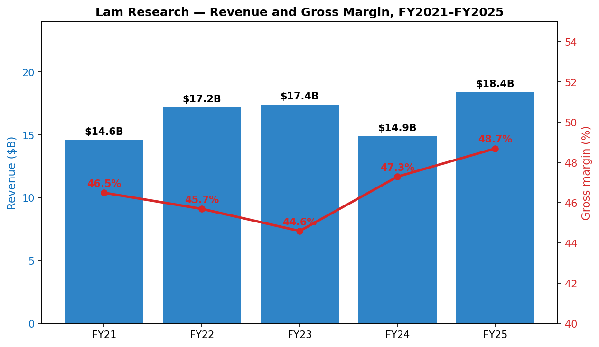
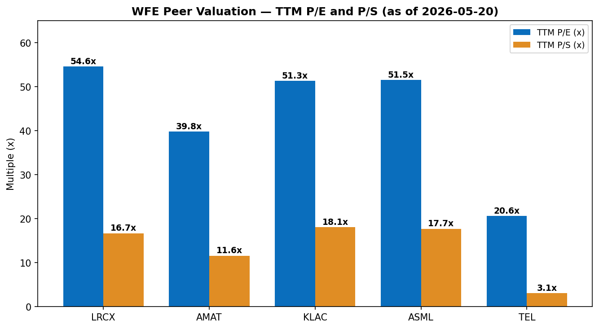
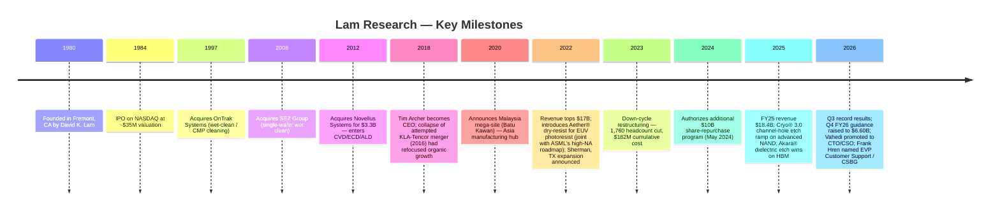
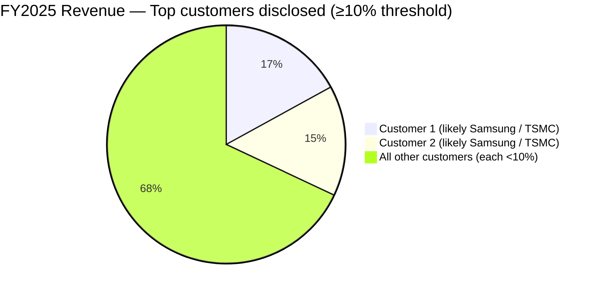
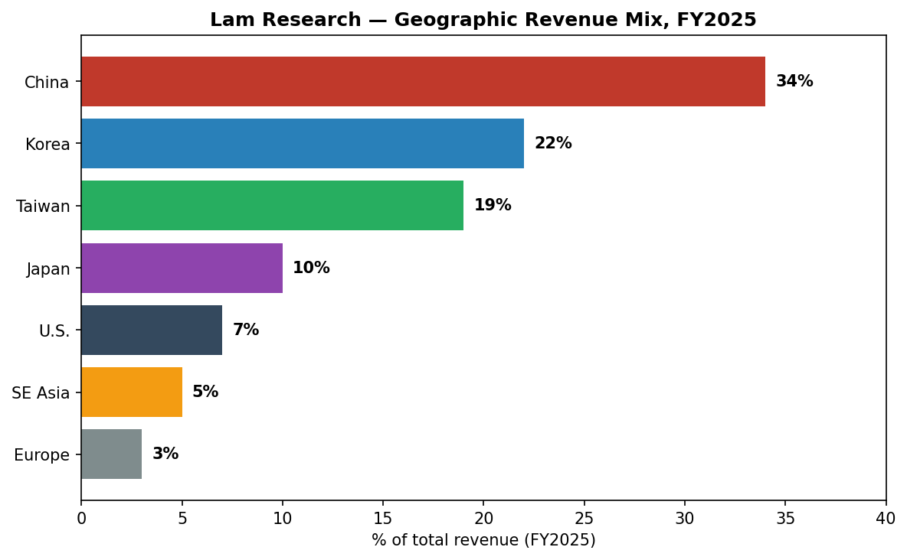
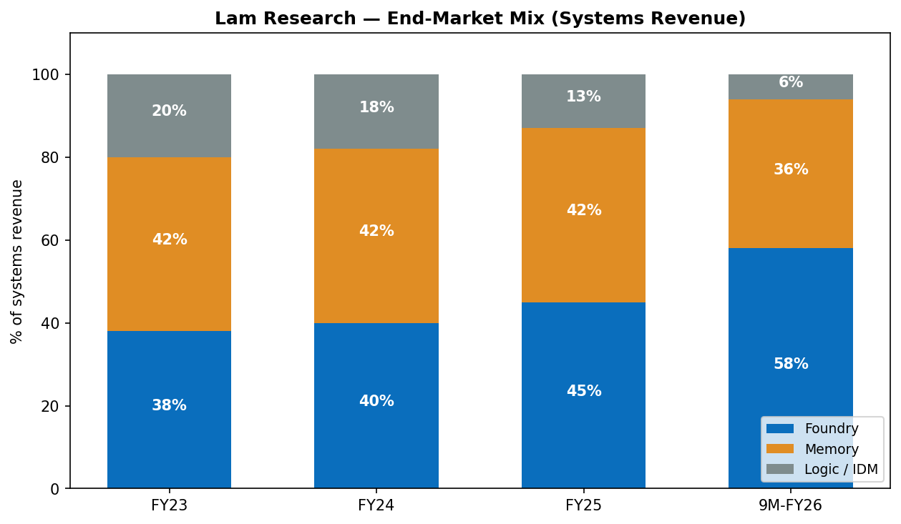
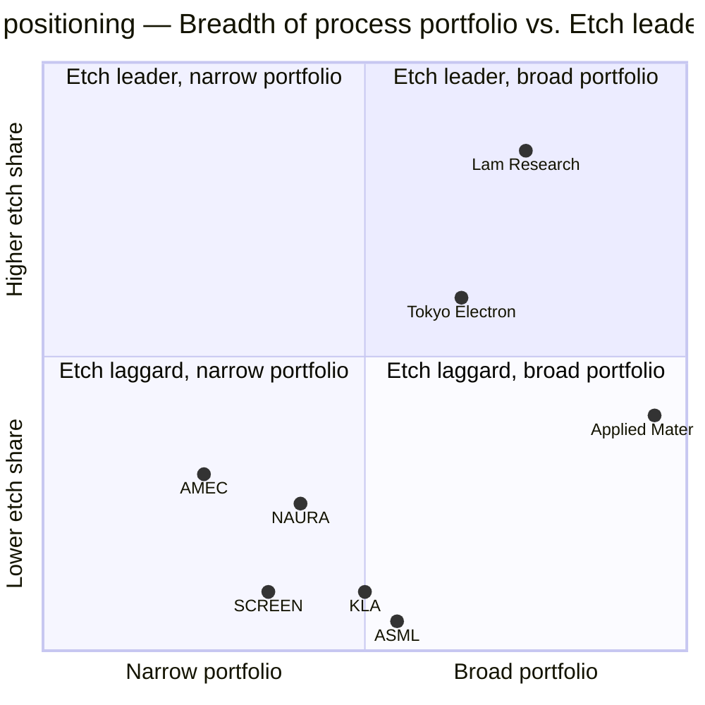

# COMPANY RESEARCH REPORT: Lam Research Corporation (NASDAQ: LRCX)

**Date:** 2026-05-20
**Analyst note:** Lam's fiscal year ends in late June (FY2025 ended June 29, 2025). Where the report uses calendar-year context, it labels accordingly. All dollar figures are USD unless noted.

> **Update — Q3 FY2026 results beat and Q4 FY2026 guidance raised (2026-04-22):** Lam reported record revenue of $5.84B and non-GAAP diluted EPS of $1.47 for the quarter ended March 29, 2026 (+9% Q/Q, +24% Y/Y on revenue; +16% Q/Q, +43% Y/Y on EPS). Management guided Q4 FY2026 (June 2026 quarter) revenue to **$6.60B ± $400M** (up roughly +13% Q/Q at the mid-point) and non-GAAP EPS to **$1.65 ± $0.15**, vs. consensus that had been near $6.1B / $1.55. CEO Tim Archer attributed the strength to "AI-driven demand reshap[ing] the semiconductor industry" and Lam's execution on customer roadmaps in HBM, gate-all-around (GAA) logic and advanced NAND. Source: [Q3 FY2026 earnings press release (Exhibit 99.1), 2026-04-22](https://www.sec.gov/Archives/edgar/data/707549/000070754926000020/lrcx_exhibitx991xq3x2026.htm).

---

## Table of Contents

1. Company Overview
2. Company History
3. Management Team
4. Products & Services
5. Customers & Go-to-Market
6. Industry Overview
7. Competitive Landscape
8. Market Opportunity (TAM)
9. Risk Assessment
10. References

---

## 1. Company Overview

Lam Research Corporation ("Lam," NASDAQ: LRCX) is one of the world's three largest suppliers of **wafer fabrication equipment ("WFE")** to the semiconductor industry, alongside Applied Materials (AMAT) and ASML. Lam's tools sit between lithography (ASML's domain) and metrology (KLA's domain) in the wafer-processing flow, building the conductive and insulating layers that form each transistor and interconnect on a chip. The company is the **clear global #1 in plasma etch**, holds a co-leadership position with AMAT in several **deposition** sub-markets (ALD, PECVD, ECD/copper plating, tungsten/molybdenum CVD), and is the only meaningful Western supplier of advanced **wet and dry single-wafer wafer cleaning** equipment, framed in its product taxonomy as the "deposition, etch and clean" portfolio ([2025 Form 10-K, p.4](https://www.sec.gov/Archives/edgar/data/707549/000070754925000075/2025_10K_10-K_0000707549_25_000075.htm)).

**Business model.** Roughly two-thirds of revenue is new equipment ("Systems revenue") sold to fabs running 200mm and 300mm silicon wafers; the remainder is a deep, recurring service annuity called **Customer Support Business Group ("CSBG")** — spare parts, upgrades, productivity software (Equipment Intelligence®), and refurbished non-leading-edge equipment under the **Reliant®** brand. In FY2025 Systems revenue was **$11.49B (62.3% of total)** and CSBG revenue was **$6.94B (37.7% of total)** on consolidated revenue of $18.44B ([2025 Form 10-K, Results of Operations](https://www.sec.gov/Archives/edgar/data/707549/000070754925000075/2025_10K_10-K_0000707549_25_000075.htm)). The CSBG share of revenue rose to ~40% during the FY2024 trough (when Systems shipments contracted) and falls back toward the mid-30s in equipment up-cycles — illustrating how the recurring book dampens cyclicality. Lam's other commercial model element is its **deferred revenue balance**, which doubled from $1.4B at the end of FY2023 to **$2.7B at June 29, 2025** before easing slightly to $2.2B at March 29, 2026 — a measure of forward shipments and customer down payments ([2025 10-K MD&A](https://www.sec.gov/Archives/edgar/data/707549/000070754925000075/2025_10K_10-K_0000707549_25_000075.htm); [Q3 FY2026 release](https://www.sec.gov/Archives/edgar/data/707549/000070754926000020/lrcx_exhibitx991xq3x2026.htm)).

**Geographic footprint.** Headquartered in Fremont, California, Lam has approximately **19,000 regular full-time employees** as of August 7, 2025, of which over 29% are in R&D and roughly 43% are in the U.S., 50% in Asia and 7% in Europe ([2025 10-K, p.10](https://www.sec.gov/Archives/edgar/data/707549/000070754925000075/2025_10K_10-K_0000707549_25_000075.htm)). The customer base is heavily Asian: in FY2025, **non-U.S. sales were ~93% of total revenue**; China was 34%, Korea 22%, Taiwan 19%, Japan 10%, U.S. 7%, Southeast Asia 5%, and Europe 3% ([2025 10-K, Results of Operations](https://www.sec.gov/Archives/edgar/data/707549/000070754925000075/2025_10K_10-K_0000707549_25_000075.htm)). For the nine months ended March 29, 2026 China increased back to ~37% as mature-node Chinese fab build-out re-accelerated ([Q3 FY2026 10-Q, p.20](https://www.sec.gov/Archives/edgar/data/707549/000070754926000022/2026Q1_10-Q_0000707549_26_000022.htm)). Manufacturing is concentrated in **Tualatin, Oregon; Sherman, Texas (new build for U.S. capacity expansion); Batu Kawan, Malaysia (a large Asia-hub plant ramped over 2018-2022); Yongin, Korea**; and through a network of supplier-managed sites in Taiwan and Japan.

**Scale and operating economics.** FY2025 revenue grew **+23.7% Y/Y to $18.44B**, gross margin expanded **+140bps to 48.7%**, operating margin reached 32.0%, and diluted EPS jumped **+43.1% to $4.15**. Operating cash flow was **$6.17B** (33.5% of revenue) and free cash flow was **$5.41B** ([2025 10-K MD&A](https://www.sec.gov/Archives/edgar/data/707549/000070754925000075/2025_10K_10-K_0000707549_25_000075.htm)). For the most recent quarter (Q3 FY2026, ended March 29, 2026), revenue was **$5.84B**, GAAP gross margin **49.8%**, GAAP operating margin **35.0%**, and diluted EPS **$1.45** — all sequential records — with the trailing-12-month run-rate now approaching **$21B** in revenue and **$5.7B** in net income on an annualized basis ([Q3 FY2026 release](https://www.sec.gov/Archives/edgar/data/707549/000070754926000020/lrcx_exhibitx991xq3x2026.htm)).

*Source: [Lam Research 2025 Form 10-K — MD&A](https://www.sec.gov/Archives/edgar/data/707549/000070754925000075/2025_10K_10-K_0000707549_25_000075.htm); FY2022 10-K for FY2021 figures.*

**Valuation snapshot (as of 2026-05-20).** LRCX closed at **$289.41**, giving a market cap of **~$362B**, against 1.25B diluted shares outstanding ([Yahoo Finance / yfinance API, 2026-05-20](https://finance.yahoo.com/quote/LRCX/key-statistics/)). TTM and forward multiples (Yahoo Finance):

| Multiple | LRCX | AMAT | KLAC | ASML | TEL (peer median) |
|---|---|---|---|---|---|
| TTM P/E | **54.6×** | 39.8× | 51.3× | 51.5× | 20.6× |
| Forward P/E | 36.5× | 26.2× | 36.4× | 32.4× | 16.0× |
| TTM P/S | **16.7×** | 11.6× | 18.1× | 17.7× | 3.1× |
| TTM EV/EBITDA | 43.4× | 34.6× | 39.1× | 43.8× | 13.1× |
| Dividend yield | 0.38% | 0.52% | 0.53% | 0.60% | 1.48% |
| 52-wk range | $79.49 – $302.00 | $153 – $448 | $740 – $1,939 | $683 – $1,604 | n/a |

LRCX trades near its 52-week high after a near-quadrupling from the April-2025 low of ~$80 (driven by the tariff/export-control sell-off and subsequent AI-WFE rotation; see [Simply Wall St — LRCX valuation after US export curbs, 2025-09](https://simplywall.st/stocks/us/semiconductors/nasdaq-lrcx/lam-research/news/a-look-at-lam-research-lrcx-valuation-after-new-us-export-cu)). The **TTM P/E of 54.6× is roughly +30% above the AMAT comp** and roughly in line with KLAC and ASML, all of which the market has re-rated as "AI infrastructure picks-and-shovels" ([Yahoo Finance — LRCX statistics](https://finance.yahoo.com/quote/LRCX/key-statistics/)). It is well **above 2× the WFE peer median including TEL** (a connector/interconnect peer included per the brief), so the multiple needs a structural explanation:

- **Driver #1 — AI-driven WFE growth premium.** Management and recent earnings commentary attribute the re-rating to AI-server demand pulling HBM (3D DRAM stacking), GAA-logic etch intensity, and advanced-packaging capacity, all areas where Lam's etch/deposition franchise is over-indexed; CEO Tim Archer described "AI-driven demand reshap[ing] the semiconductor industry" in the Q3 FY2026 release ([Q3 FY2026 earnings press release, 2026-04-22](https://www.sec.gov/Archives/edgar/data/707549/000070754926000020/lrcx_exhibitx991xq3x2026.htm)). The forward P/E of 36.5× implies the market expects EPS to grow ~50% from TTM to FY+1, which is roughly consistent with the FY2026 EPS implied by Lam's Q4 FY2026 guidance ($1.65 ± $0.15) annualized ([Q3 FY2026 release](https://www.sec.gov/Archives/edgar/data/707549/000070754926000020/lrcx_exhibitx991xq3x2026.htm)).
- **Driver #2 — Cyclical re-rate.** FY2024 was a memory-led trough; gross margin compressed and EPS hit a multi-year low. The TTM denominator is still partly weighted by trough quarters, inflating the TTM multiple vs. forward ([2025 10-K MD&A](https://www.sec.gov/Archives/edgar/data/707549/000070754925000075/2025_10K_10-K_0000707549_25_000075.htm)).
- **Driver #3 — Capital return.** $4.6B returned in FY2025 (76% as buybacks at an accretive share count) ([2025 10-K Statement of Cash Flows](https://www.sec.gov/Archives/edgar/data/707549/000070754925000075/2025_10K_10-K_0000707549_25_000075.htm)), plus an additional $10B repurchase authorization announced May 2024 ([8-K — $10B Repurchase Authorization and 10-for-1 Stock Split, 2024-05-21](https://www.sec.gov/Archives/edgar/data/707549/000070754924000076/lrcx_exx991xmayx21x2024.htm)) and a 13% dividend hike in February 2026 (to $0.26 per quarter from $0.23) ([Lam Research declares quarterly dividend, 2026-02-05](https://newsroom.lamresearch.com/2026-02-05-Lam-Research-Corporation-Declares-Quarterly-Dividend)). Per-share growth is structurally amplified.

The multiple is consistent with the WFE oligopoly group but leaves modest room for disappointment if China revenue compresses further on export-controls or if NAND CapEx stalls — KLAC, ASML and LRCX trade in a similar "AI-infra picks-and-shovels" multiple band per Yahoo Finance comps ([KLAC](https://finance.yahoo.com/quote/KLAC/key-statistics/); [ASML](https://finance.yahoo.com/quote/ASML/key-statistics/)). We flag valuation multiple-compression as a risk in Section 9.

*Source: Yahoo Finance via yfinance API, 2026-05-20 ([LRCX statistics page](https://finance.yahoo.com/quote/LRCX/key-statistics/)).*

---

## 2. Company History

Lam was founded in **1980 in Fremont, California, by David K. Lam**, a Chinese-born engineer who had previously worked at Xerox, Hewlett-Packard, and Texas Instruments ([SEMI — Oral History Interview: David K. Lam](https://www.semi.org/en/Oral-History-Interview-David-Lam); [Lam Research — Company history](https://www.lamresearch.com/company/history/)). Dr. Lam recognized that as IC feature sizes shrank, the industry needed plasma etching with far better selectivity and uniformity than the wet-chemistry tools then in use. He launched the Lam AutoEtch 480 in 1982 — the industry's first fully automated plasma etching system — and quickly displaced earlier-generation etchers ([Lam Research — Company history](https://www.lamresearch.com/company/history/)). The company **IPO'd on NASDAQ in May 1984** (ticker LRCX), making David K. Lam the first Asian-American to take a company public on the Nasdaq exchange ([SEMI — Oral History Interview: David K. Lam](https://www.semi.org/en/Oral-History-Interview-David-Lam)), and built itself into the dominant pure-play etch supplier through the 1990s.

**Transformational events.**
- **1997 — OnTrak Systems acquisition.** Brought wet-clean (post-CMP cleaning) into Lam's portfolio. This eventually became the franchise SP Series and EOS® wet platforms ([Lam Research — Company history](https://www.lamresearch.com/company/history/)).
- **2008 — SEZ Group acquisition.** Lam paid approximately $568M (≈$447M net of cash acquired) to buy SEZ Holding AG (Austria), a leading supplier of single-wafer wet-clean technology, accelerating Lam's clean position into 32nm-and-below logic where dry-strip plus single-wafer wet became standard ([Lam Research — Successful Preliminary Results of SEZ Tender Offer, 2008-02-11](https://newsroom.lamresearch.com/2008-02-11-Lam-Research-Corporation-Announces-Successful-Preliminary-Results-of-Public-Tender-Offer-for-Registered-Shares-of-SEZ-Holding-AG); [Lam Research FY2008 10-K](https://www.sec.gov/Archives/edgar/data/0000707549/000095013408015947/f43373e10vk.htm)).
- **2012 — Novellus Systems acquisition ($3.3B, all-stock).** The strategic pivot of the company. Novellus stockholders received 1.125 shares of LRCX for each Novellus share in a tax-free exchange ([Lam Research — Combine in $3.3 Billion All-Stock Transaction press release](https://investor.lamresearch.com/news-releases/news-release-details/lam-research-and-novellus-systems-combine-33-billion-all-stock); [Jones Day — Lam acquires Novellus Systems in $3.3B all-stock transaction](https://www.jonesday.com/en/practices/experience/2011/12/lam-research-acquires-semiconductor-equipment-maker-novellus-systems-in-33-billion-allstock-transaction)). Novellus contributed PECVD (VECTOR® / Striker®), HDP-CVD (SPEED®), tungsten/molybdenum ALD/CVD (ALTUS®), and electrochemical-deposition copper plating (SABRE®). Overnight Lam became a credible **#1 or #2** in deposition and a true "deposition + etch + clean" multi-product supplier, the structural basis for everything since. Most of today's product groups under SVP Sesha Varadarajan trace to Novellus DNA.
- **2015–2016 — Attempted KLA-Tencor merger ($10.6B).** Lam announced an offer to acquire KLA-Tencor in late 2015 to add metrology/inspection. After the DOJ signaled it would not approve the parties' negotiated consent decree, the deal was mutually terminated on October 5, 2016 — a combined Lam-KLA would have controlled an estimated 42% of WFE ([Lam Research 8-K — Termination of Merger, 2016-10-05](https://www.sec.gov/Archives/edgar/data/0000707549/000119312516731756/d271204dex991.htm); [KLA-Tencor 8-K — Termination of Merger, 2016-10-05](https://www.sec.gov/Archives/edgar/data/0000319201/000031920116000095/exhibit991pressreleaserete.htm)). The episode crystallized Lam's go-it-alone strategy and accelerated organic R&D investment.
- **2020–2022 — Malaysia ramp & supply-chain repositioning.** In February 2020 Lam announced an RM1B investment in a new ~700,000 sq ft Batu Kawan, Penang plant ([Lam Research — Expand Global Footprint, 2020-02-03](https://newsroom.lamresearch.com/2020-02-03-Lam-Research-to-Expand-Global-Footprint)). The Batu Kawan campus opened in May 2021 and became Lam's largest manufacturing footprint by 2022 ([SEMI — Spotlight on Lam Research expanding global capacity](https://www.semi.org/en/blogs/technology-trends/spotlight-on-lam-research-expanding-global-capacity)); it has also become a periodic friction point with U.S. export-control rules.
- **2023–2024 — Cyclical reset and restructuring.** As NAND CapEx collapsed in calendar-2023, Lam announced a restructuring of approximately 1,300 employee positions (~7% of headcount) on January 23, 2023 ([8-K — Restructuring Plan, 2023-01-23](https://www.sec.gov/Archives/edgar/data/0000707549/000070754923000005/lrcx-20230123.htm)). Cumulative restructuring charges reached **$181.9M through fiscal year 2024** ([2025 10-K, Note 20](https://www.sec.gov/Archives/edgar/data/707549/000070754925000075/2025_10K_10-K_0000707549_25_000075.htm)). No restructuring costs were recorded in FY2025; the plan is described as "substantially completed."
- **2025-2026 — AI-WFE up-cycle.** Memory (HBM, advanced DRAM) and GAA-logic (selective etch, multi-step deposition) drove a return to record growth ([Q3 FY2026 earnings release, 2026-04-22](https://www.sec.gov/Archives/edgar/data/707549/000070754926000020/lrcx_exhibitx991xq3x2026.htm)). China revenue normalized from the FY2024 spike (42%) back toward the mid-30s ([2025 10-K, Results of Operations](https://www.sec.gov/Archives/edgar/data/707549/000070754925000075/2025_10K_10-K_0000707549_25_000075.htm)).

**Recent developments (2025-26).** In addition to the financial milestones above, Lam announced a **management transition in February 2026** — Sesha Varadarajan transitioned to COO effective March 6, 2026 (succeeding Patrick Lord, who retired), Vahid Vahedi assumed an expanded role as Chief Technology and Sustainability Officer, and Cadence CEO Anirudh Devgan was appointed to the board ([8-K — Management Transitions, 2026-02-03](https://www.sec.gov/Archives/edgar/data/707549/000070754926000012/lrcx_exx992managementtrans.htm); [8-K — Director Appointment, 2026-02-03](https://www.sec.gov/Archives/edgar/data/707549/000070754926000012/lrcx_exx991directorappoint.htm); [8-K/A, 2026-02-04](https://www.sec.gov/Archives/edgar/data/707549/000070754926000014/lrcxex991directorappointme.htm)). Lam continues to expand its U.S. manufacturing footprint in Sherman, Texas, partly to support customers seeking onshore supply, including TSMC's Arizona expansion (now expanded to a $165B investment program — [TSMC 6-K — Expand investment in the U.S., 2025](https://www.sec.gov/Archives/edgar/data/0001046179/000104617925000024/tsmcexpandinvestmentintheu.htm)) and Samsung's Taylor, Texas fab.

---

## 3. Management Team

Lam is led by a long-tenured executive group, the majority of whom joined through the **2012 Novellus acquisition** and have stayed with the company for more than a decade. Compensation skews heavily toward performance-linked equity (Market-based PRSUs tied to relative TSR vs. the SOX index), and the proxy describes the program as targeting median of an industry peer group ([2025 DEF 14A](https://www.sec.gov/Archives/edgar/data/707549/000114036125036012/2025_DEF%2014A_DEF%2014A_0001140361_25_036012.htm)).

### Timothy M. Archer — President and CEO (age 58)

Tim Archer has been CEO since **December 2018** and is the second CEO of Lam's modern era (succeeding Martin Anstice, who departed in late 2017). Archer spent **18 years at Novellus Systems** (1994–2012) in technology and business roles, including chief operating officer from January 2011 until Lam's acquisition of Novellus in June 2012. At Lam, he served as EVP and COO from 2012, then president and COO in January 2018, before being named president and CEO in December 2018 ([2025 10-K, p.10-11](https://www.sec.gov/Archives/edgar/data/707549/000070754925000075/2025_10K_10-K_0000707549_25_000075.htm)).

Archer holds a **B.S. in Applied Physics from Caltech** and completed the Program for Management Development at Harvard Business School ([Lam Research — Company Overview](https://www.lamresearch.com/company/company-overview/)). He also serves on the board of **Johnson Controls International** (since 2024) and on the International Board of Directors for **SEMI**, the industry trade group — affiliations that signal his standing within the broader semiconductor ecosystem ([SEMICON Taiwan — Tim Archer profile](https://www.semicontaiwan.org/en/node/8511); [Tim Archer LinkedIn](https://www.linkedin.com/in/tim-archer-b7a9aa3/)).

Under Archer's tenure (Dec 2018 — present), Lam revenue has grown from **$11.1B (CY2018, calendar)** to **~$21B run-rate (CY2026, calendar)**, gross margin has expanded from the low-46% range to ~50%, and the share price has compounded at roughly **20%+ CAGR** including dividends — a track record that places him among the top operational performers in semicap. He has navigated three full WFE cycles (2019 mini-trough, 2022 super-cycle, 2023 memory bust, 2025–26 AI up-cycle), with each successive trough higher and each peak more profitable. Archer's external profile is lower than Gary Dickerson (AMAT) or Christophe Fouquet (ASML) — he rarely appears in mainstream media — but he speaks regularly at SEMI industry events and on Lam's quarterly calls, with a consistent emphasis on **"technology inflections"** (the shift to 3D/vertical scaling in memory, GAA in logic, advanced packaging for AI) and on multi-product customer wins. According to the proxy, his calendar-2025 base salary was raised 8.3% Y/Y ([2025 DEF 14A, CD&A](https://www.sec.gov/Archives/edgar/data/707549/000114036125036012/2025_DEF%2014A_DEF%2014A_0001140361_25_036012.htm)).

### Douglas R. Bettinger — EVP and CFO (age 58)

Doug Bettinger joined Lam as CFO in **2013** and has held the role for 12+ years across multiple semiconductor cycles. Prior to Lam, he was **CFO of Avago Technologies (now Broadcom) from 2008 to 2013**, taking Avago through its 2009 IPO and the early phase of its acquisitive transformation. Before Avago he held senior finance roles at Xilinx and **Intel (1993–2004)** in corporate planning, reporting and Malaysia site operations. He is a director of **Lattice Semiconductor** and serves on the SEMI Board of Industry Leaders and the University of Wisconsin College of Engineering's Industrial Advisory Board. His degrees are an MBA in Finance from the University of Michigan and a B.S. in Economics from the University of Wisconsin. Bettinger has been instrumental in Lam's capital-return discipline — Lam has returned over $30B to shareholders through buybacks and dividends since FY2014 — and in maintaining investment-grade balance-sheet flexibility through both up- and down-cycles. The 10-K shows **$4.5B in fixed-rate long-term debt** at June 29, 2025, with a $1.5B revolver and a $1.5B commercial-paper program providing liquidity ([2025 10-K MD&A](https://www.sec.gov/Archives/edgar/data/707549/000070754925000075/2025_10K_10-K_0000707549_25_000075.htm)).

### Patrick J. Lord — EVP and COO (age 59)

Dr. Patrick "Pat" Lord became COO on March 1, 2023 with responsibility for global operations, customer support, quality, EHS, government affairs / trade, IT/cyber, and resilience — a broad mandate spanning Lam's most critical execution levers ([Lam Research — Announces New Executive Appointments, 2023-02-21](https://newsroom.lamresearch.com/2023-02-21-Lam-Research-Announces-New-Executive-Appointments-to-Extend-Innovation-Leadership-and-Position-the-Company-for-Long-Term-Growth)). He previously ran **CSBG and Global Operations (2020–2023)** and was GM of CSBG from 2016 to 2020, meaning the high-margin recurring business is essentially his creation in its modern form. Before that he led Novellus's Direct Metals, GapFill and CMP businesses and spent six years at KLA-Tencor early in his career. He earned his **Ph.D., M.S. and B.S. in mechanical engineering from MIT** — a rare full MIT engineering pedigree at the C-suite of a fab-equipment maker ([SEMICON Korea — Patrick Lord biography](https://semiconkorea.org/en/node/7371); [Lam Research — Company Overview](https://www.lamresearch.com/company/company-overview/)). His operational legacy is most visible in CSBG's revenue trajectory: from roughly $3.4B in FY2020 to **$6.94B in FY2025** — a doubling that has materially improved Lam's through-cycle gross margin ([2025 10-K — Results of Operations](https://www.sec.gov/Archives/edgar/data/707549/000070754925000075/2025_10K_10-K_0000707549_25_000075.htm)). Lord retired as COO effective March 6, 2026 and was succeeded by Sesha Varadarajan ([8-K — Management Transitions, 2026-02-03](https://www.sec.gov/Archives/edgar/data/707549/000070754926000012/lrcx_exx992managementtrans.htm)).

### Vahid Vahedi — SVP, Chief Technology and Sustainability Officer (age 59)

Dr. Vahid Vahedi is Lam's technology head and the **public face of Lam's etch leadership**. He has been at Lam since 1995 — a 30+ year tenure — including GM of the Etch business unit (2018–2023) and various dielectric and conductor-etch leadership roles before that. His Ph.D. is in EE/CS from UC Berkeley. The 2026-02-03 8-K announced an additional element to his role (CTO + Chief Sustainability Officer combined) effective early 2026 ([8-K, 2026-02-03](https://www.sec.gov/Archives/edgar/data/707549/000070754926000012/)). Vahedi is one of the small handful of executives globally who can credibly evaluate the next decade of etch and selective-deposition roadmaps — he is regularly listed among the industry's most-cited plasma scientists. His sustained presence is one of the under-appreciated reasons Lam has compounded etch market share through multiple device-architecture transitions.

### Sesha Varadarajan — SVP, Global Products Group (COO designate March 2026)

Sesha Varadarajan runs the Global Products Group, which consolidates all Lam product business units (deposition, etch, clean) outside of CSBG ([Lam Research — Company Overview](https://www.lamresearch.com/company/company-overview/)). He joined Novellus in 1999 as a process engineer and rose through PECVD/ECD product leadership before the 2012 Lam acquisition. His current scope means he owns the product roadmaps that drive new-tool revenue — the most cyclical line in the business. Varadarajan was named COO effective March 6, 2026, succeeding Pat Lord, per the company's February 2026 management-transition disclosures ([8-K — Management Transitions, 2026-02-03](https://www.sec.gov/Archives/edgar/data/707549/000070754926000012/lrcx_exx992managementtrans.htm)).

### Governance

- **Board independence:** 10 of 11 director nominees in the 2025 proxy are independent; Tim Archer is the only inside director. The board chair (Abhi Talwalkar) is independent.
- **Insider ownership:** Officers and directors as a group held less than 1% of common shares outstanding at the 2025 record date ([2025 DEF 14A, Beneficial Ownership table](https://www.sec.gov/Archives/edgar/data/707549/000114036125036012/2025_DEF%2014A_DEF%2014A_0001140361_25_036012.htm)) — consistent with Lam having no founder-CEO and a long-tenured professional management team rather than concentrated insider holdings. There is no super-voting structure.
- **Compensation mix:** The proxy reports that for calendar-2025 the average NEO target pay mix was approximately **5% base salary, 15% cash bonus, 80% long-term equity** with the long-term equity itself **55% Market-based PRSUs (tied to relative TSR vs. SOX), 15% stock options, 30% time-vested RSUs**. This is heavily weighted toward sustained outperformance versus the semi sector ([2025 DEF 14A, CD&A](https://www.sec.gov/Archives/edgar/data/707549/000114036125036012/2025_DEF%2014A_DEF%2014A_0001140361_25_036012.htm)).
- **Related-party transactions:** None disclosed of material size in the 2025 proxy.

### Track-record synthesis

The team has delivered through two complete cycles. Strengths: deep technical bench (Vahedi, Lord, Varadarajan all have decades in the technology); disciplined capital allocation under Bettinger; and Archer's strategic willingness to invest counter-cyclically in R&D ([2025 10-K — R&D and capital allocation](https://www.sec.gov/Archives/edgar/data/707549/000070754925000075/2025_10K_10-K_0000707549_25_000075.htm)). Gaps: there has not yet been a CEO transition under this configuration (no public succession pipeline beyond the 2026 reshuffle, [8-K, 2026-02-03](https://www.sec.gov/Archives/edgar/data/707549/000070754926000012/lrcx_exx992managementtrans.htm)); insider ownership is low ([2025 DEF 14A, Beneficial Ownership table](https://www.sec.gov/Archives/edgar/data/707549/000114036125036012/2025_DEF%2014A_DEF%2014A_0001140361_25_036012.htm)); and the team's collective semi background is heavily Novellus/Lam — there is limited diversity of external operating experience at the very top.

---

## 4. Products & Services

Lam organizes its portfolio around **three process categories — Deposition, Etch, and Clean** — plus the recurring CSBG service business. This taxonomy is reproduced verbatim in the 10-K's product table ([2025 10-K, p.4](https://www.sec.gov/Archives/edgar/data/707549/000070754925000075/2025_10K_10-K_0000707549_25_000075.htm)).

```mermaid
graph TD
    LAM[Lam Research] --> DEP[Deposition]
    LAM --> ETCH[Etch]
    LAM --> CLEAN[Clean]
    LAM --> CSBG[Customer Support Business Group / CSBG]
    DEP --> ECD[ECD - Copper plating - SABRE® / SABRE® 3D]
    DEP --> WCVD[Tungsten/Moly CVD/ALD - ALTUS® / ALTUS® Halo]
    DEP --> PECVD[PECVD - VECTOR® / Striker®]
    DEP --> HDPCVD[HDP-CVD gapfill - SPEED®]
    ETCH --> COND[Conductor Etch - Kiyo® / Versys® Metal]
    ETCH --> DIEL[Dielectric Etch - Flex® / Vantex® / Akara®]
    ETCH --> TSV[TSV Deep RIE - Syndion®]
    ETCH --> CRYO[Cryogenic etch - Cryo® 3.0 for 3D NAND channel hole]
    CLEAN --> WET[Wet Clean - EOS® / DV-Prime® / Da Vinci® / SP Series]
    CLEAN --> BEVEL[Bevel & post-etch dry plasma clean - Coronus®]
    CSBG --> SERV[Service, spares, EI software]
    CSBG --> UPG[Upgrades / refurb]
    CSBG --> RELIANT[Reliant® refurbished non-leading-edge equipment]
```

### 4.1 Deposition (35-40% of Systems revenue, est.)

**Electrochemical deposition (ECD) — SABRE® / SABRE® 3D family.** Lam's copper-plating tool is the de facto standard for **dual-damascene copper interconnect** in logic and DRAM and, increasingly, for **wafer-level packaging (WLP), fan-out, and HBM through-silicon via (TSV) fill** via the SABRE 3D platform. Competitive position: **dominant moat (technology + scale).** AMAT and several Japanese firms (Ebara, TEL) compete but Lam has held the leading position for two decades; switching costs are extreme because process-of-record qualification on a leading-edge node can take 12-18 months. Closest competitor product is Applied's NOKOTA / Raider ECD platform — Lam is regarded as ahead, particularly for advanced packaging ([2025 10-K product description](https://www.sec.gov/Archives/edgar/data/707549/000070754925000075/2025_10K_10-K_0000707549_25_000075.htm)).

**Tungsten / Molybdenum CVD-ALD — ALTUS® / ALTUS® Halo family.** Forms the tungsten plugs and word-lines critical to logic contacts and 3D NAND word-lines. **Moly** is replacing tungsten for high-aspect-ratio fill in advanced NAND because of better resistivity at thin films. ALTUS Halo, launched February 2025, is Lam's first high-volume ALD tool designed for molybdenum metallization and delivers a 50%+ reduction in word-line resistance over tungsten; Micron is an early adopter in advanced NAND ([Lam Research — Ushers in New Era with ALTUS® Halo, 2025-02-19](https://newsroom.lamresearch.com/2025-02-19-Lam-Research-Ushers-in-New-Era-of-Semiconductor-Metallization-with-ALTUS-R-Halo-for-Molybdenum-Atomic-Layer-Deposition)). Competitive position: **strong moat.** AMAT has a competing offering (Endura W) but Lam is generally considered to have the leading moly position; this is a thesis-critical product family for the NAND >300-layer roadmap ([2025 10-K — Products](https://www.sec.gov/Archives/edgar/data/707549/000070754925000075/2025_10K_10-K_0000707549_25_000075.htm)).

**PECVD — VECTOR® / Striker® family.** Plasma-enhanced CVD for dielectric films — critical for interlayer dielectric and gapfill ([2025 10-K — Products](https://www.sec.gov/Archives/edgar/data/707549/000070754925000075/2025_10K_10-K_0000707549_25_000075.htm)). Competitive position: **co-leader.** AMAT's Producer® platform is the closest competitor and is roughly at parity for many applications; Lam's Striker is regarded as particularly strong on high-aspect-ratio fill for advanced NAND ([AMAT FY2025 10-K](https://www.sec.gov/Archives/edgar/data/0000006951/000162828025056742/0001628280-25-056742-index.htm)).

**HDP-CVD — SPEED® family.** High-density plasma CVD for legacy gapfill, increasingly displaced by ALD in the most advanced nodes but still high-volume in mature flows ([2025 10-K — Products](https://www.sec.gov/Archives/edgar/data/707549/000070754925000075/2025_10K_10-K_0000707549_25_000075.htm)).

**ALD (specialised).** Lam runs ALD across multiple tool platforms (ALTUS, Striker) and added a new dry-photoresist solution (Aether®) jointly developed with ASML and IMEC for EUV / high-NA EUV lithography, an emerging franchise with very high strategic value ([Lam Research — Entegris/Gelest dry resist ecosystem, 2022-07-12](https://newsroom.lamresearch.com/2022-07-12-Lam-Research,-Entegris,-Gelest-Team-Up-to-Advance-EUV-Dry-Resist-Technology-Ecosystem); SK hynix qualified Lam's dry resist for advanced DRAM in mid-2022, [Lam Research / SK hynix press release](https://www.prnewswire.com/news-releases/lam-research-teams-up-with-sk-hynix-to-enhance-dram-production-cost-efficiency-with-breakthrough-dry-resist-euv-technology-301567359.html)).

### 4.2 Etch (~45–50% of Systems revenue, est.)

**Conductor etch — Kiyo® and Versys® Metal families.** Removes silicon, polysilicon, and metal materials with atomic precision. Critical applications include **gate-all-around (GAA) selective etch** for sub-3nm logic nodes (TSMC N2, Samsung SF2, Intel 18A/14A) — one of the largest single-application revenue inflections in Lam's pipeline because GAA nanosheet construction requires precision lateral etch steps not present in FinFET ([Akara® — A Generational Leap in Semiconductor Etch](https://newsroom.lamresearch.com/everything-about-akara); [2025 10-K — Products](https://www.sec.gov/Archives/edgar/data/707549/000070754925000075/2025_10K_10-K_0000707549_25_000075.htm)). Competitive position: **dominant in conductor etch.** TEL is the principal competitor ([TEL FY2025 Q4 results presentation, 2025-05](https://www.tel.com/ir/library/report/l8gqgo00000000gl-att/fy25q4presentations-e.pdf)).

**Dielectric etch — Flex® / Vantex® / Akara® families.** Dielectric etch is the highest-aspect-ratio process in the fab, drilling channel holes in 3D NAND that now exceed **400 layers in advanced devices and target ~1,000 layers by 2030** ([Lam Research — The Road to 1000 Layer 3D NAND](https://newsroom.lamresearch.com/road-1000-layer-3D-NAND); [TrendForce — Samsung targets 1,000-layer NAND by 2030, 2025-02-26](https://www.trendforce.com/news/2025/02/26/news-samsung-reportedly-targets-1000-layer-nand-by-2030-rolls-out-wafer-bonding-at-400-layers/)). Lam's Cryo® 3.0 cryogenic-etch upgrade (announced July 2024) etches channels >10µm deep at <0.1% critical-dimension deviation and 2.5× faster than prior generations ([Lam Research — Introduces Lam Cryo™ 3.0, 2024-07-31](https://newsroom.lamresearch.com/2024-07-31-Lam-Research-Introduces-Lam-Cryo-TM-3-0-Cryogenic-Etch-Technology-to-Accelerate-Scaling-of-3D-NAND-for-the-AI-Era)); the Akara® dielectric etch platform launched February 2025 and has secured multiple wins at a leading DRAM maker for HBM ([Lam Research — Unveils Akara® conductor etch, 2025-02-19](https://investor.lamresearch.com/2025-02-19-Lam-Research-Unveils-Industrys-Most-Advanced-Conductor-Etch-Technology-to-Date)). Competitive position: **dominant moat in 3D NAND channel-hole etch.** TEL is the only direct competitor, having developed its own cryogenic dielectric etch for 400+ layer NAND ([TechPowerUp — TEL channel-hole etch for 400-layer NAND](https://www.techpowerup.com/309892/tokyo-electron-develops-memory-channel-hole-etching-for-400-layer-3d-nand-flash)).

**Through-silicon via (TSV) etch — Syndion®.** Deep reactive-ion etch for 3D packaging — high relevance for HBM and chiplet integration. Lam is reportedly the exclusive supplier of TSV etch for HBM production at Samsung and SK hynix ([iNEWS — Lam exclusively supplies TSV for HBM, 2025](https://inf.news/en/tech/93e514891b03af13b5df9e4ea8305fb8.html); [Lam Research — Etch processes](https://www.lamresearch.com/products/our-processes/etch/)).

### 4.3 Clean (~10–15% of Systems revenue, est.)

**Wet single-wafer clean — EOS®, DV-Prime®, Da Vinci®, SP Series.** Removes residues after etch/CMP and prepares wafer surfaces for next-step deposition; particle counts are increasingly yield-limiting at advanced nodes ([2025 10-K — Products](https://www.sec.gov/Archives/edgar/data/707549/000070754925000075/2025_10K_10-K_0000707549_25_000075.htm)). Competitive position: **co-leader with SCREEN (DNS) of Japan**; LRCX is generally considered #2 globally by share behind SCREEN but with stronger position at U.S./Korea customers ([SCREEN Holdings — Investor Relations](https://www.screen.co.jp/en/ir)).

**Bevel / dry plasma clean — Coronus® family.** Niche but high-margin; cleans the wafer edge and removes contamination after etch ([2025 10-K — Products](https://www.sec.gov/Archives/edgar/data/707549/000070754925000075/2025_10K_10-K_0000707549_25_000075.htm)).

### 4.4 Customer Support Business Group (CSBG)

The recurring business consists of:

1. **Spares & service contracts** — break-fix, preventive maintenance, fleet-level support
2. **Upgrades** — selling new capability into installed-base tools (often margin-rich because the chamber is already paid for)
3. **Equipment Intelligence® software** — fleet productivity / predictive-maintenance SaaS-like layer
4. **Reliant®** — refurbished, used, and recertified non-leading-edge equipment for trailing-node fabs

CSBG revenue reached **$6.94B in FY2025**, up from $5.98B in FY2024 (+16%), and continued to grow into Q3 FY2026 ($2.11B in the quarter, vs. $1.68B Y/Y, +25%) ([Q3 FY2026 release, Three-month revenue table](https://www.sec.gov/Archives/edgar/data/707549/000070754926000020/lrcx_exhibitx991xq3x2026.htm)). The installed-base economics are powerful: industry-standard CSBG margin is approximately **+200 to +400bps above corporate gross margin** at maturity (Lam does not break this out, but management has alluded to it on earnings calls), and the recurring annuity grows at roughly the rate of cumulative installed-tool count — currently growing at high-single-digit percentages annually.

*Source: [2025 Form 10-K — Revenue disaggregation note](https://www.sec.gov/Archives/edgar/data/707549/000070754925000075/2025_10K_10-K_0000707549_25_000075.htm).*

### 4.5 Flagship vs. long-tail; recent launches

The **three flagship product franchises driving Lam's mix today** are (i) **3D NAND dielectric etch (Flex/Vantex + Cryo 3.0)** — high-aspect-ratio channel-hole etch where Lam has near-monopoly share ([Lam Research — Cryo 3.0 introduction](https://newsroom.lamresearch.com/2024-07-31-Lam-Research-Introduces-Lam-Cryo-TM-3-0-Cryogenic-Etch-Technology-to-Accelerate-Scaling-of-3D-NAND-for-the-AI-Era)), (ii) **GAA selective etch (Kiyo / Akara)** for the N2 / SF2 / 18A logic ramp at TSMC, Samsung, and Intel ([TSMC officially enters HVM for 2nm N2 — Embedded.com](https://www.embedded.com/tsmcs-2nm-technology-almost-ready-for-mass-production/)), and (iii) **HBM/advanced-packaging ECD and TSV etch (SABRE 3D + Syndion)** for SK hynix, Micron, and Samsung memory ([Lam Research — Etch processes](https://www.lamresearch.com/products/our-processes/etch/)). Together these three thematic areas likely generate the majority of Lam's incremental revenue growth FY25-FY27.

**Launches in the last 12 months:** Cryo® 3.0 channel-hole etch upgrade ([Lam Research, 2024-07-31](https://newsroom.lamresearch.com/2024-07-31-Lam-Research-Introduces-Lam-Cryo-TM-3-0-Cryogenic-Etch-Technology-to-Accelerate-Scaling-of-3D-NAND-for-the-AI-Era)), **Akara®** dielectric/conductor etch (Feb 2025 launch — HBM-tied) ([Lam Research, 2025-02-19](https://investor.lamresearch.com/2025-02-19-Lam-Research-Unveils-Industrys-Most-Advanced-Conductor-Etch-Technology-to-Date)), **ALTUS® Halo** moly ALD ([Lam Research, 2025-02-19](https://newsroom.lamresearch.com/2025-02-19-Lam-Research-Ushers-in-New-Era-of-Semiconductor-Metallization-with-ALTUS-R-Halo-for-Molybdenum-Atomic-Layer-Deposition)), and **Aether®** dry resist (joint with ASML, for high-NA EUV) ([Lam Research, 2022-07-12](https://newsroom.lamresearch.com/2022-07-12-Lam-Research,-Entegris,-Gelest-Team-Up-to-Advance-EUV-Dry-Resist-Technology-Ecosystem)). No material sunsets announced.

---

## 5. Customers & Go-to-Market

**Customer base.** Lam's customers are the world's leading semiconductor manufacturers in three segments — Foundry, Memory, and Logic / Integrated Device Manufacturing (IDM). The 10-K names **Samsung Electronics and Taiwan Semiconductor Manufacturing Company (TSMC)** as the most significant customers in fiscal years 2025, 2024 and 2023 ([2025 10-K, p.7](https://www.sec.gov/Archives/edgar/data/707549/000070754925000075/2025_10K_10-K_0000707549_25_000075.htm)).

**Customer concentration (quantified).** Per Note 19 (Segment Reporting) of the FY2025 10-K: *"In fiscal year 2025, two customers accounted for approximately **17% and 15%** of total revenues, respectively. In fiscal year 2024, one customer accounted for approximately 17% of total revenues. In fiscal year 2023, two customers accounted for approximately 22% and 16% of total revenues, respectively. No other customers accounted for 10% or more of total revenues."* ([2025 10-K, p.65](https://www.sec.gov/Archives/edgar/data/707549/000070754925000075/2025_10K_10-K_0000707549_25_000075.htm)). Combined, the top-2 disclosed customers were **32% in FY2025, ~17%+ in FY2024 (only one >10% disclosed), and 38% in FY2023**.

*Source: [2025 Form 10-K, Note 19](https://www.sec.gov/Archives/edgar/data/707549/000070754925000075/2025_10K_10-K_0000707549_25_000075.htm). Lam discloses the magnitude of each ≥10% customer but does not name the specific customer for each percentage — only that Samsung and TSMC are the "most significant" customers in the period. We do not assign names to the 17% or 15% specifically.*

Customer concentration is material — **top-2 = 32% in FY2025; non-U.S. = 93%** — and concentrated in a small group of leading-edge chipmakers (TSMC, Samsung, SK hynix, Micron, Intel, plus a growing cohort of Chinese customers including SMIC, YMTC, CXMT, Hua Hong, and Nexchip) ([2025 10-K, Note 19](https://www.sec.gov/Archives/edgar/data/707549/000070754925000075/2025_10K_10-K_0000707549_25_000075.htm)). Because top-2 > 20% (single customers 17% and 15%) and top customers are likely **vertically integrating in some areas** (Samsung Electronics' affiliate **SEMES** is its internal equipment supplier — [SEMES corporate website](https://www.semes.com/en/)), we treat this as a **material risk** carried into Section 9.

**Contract structure.** WFE is generally **purchase-order based** rather than long-term contracted, but underlying multi-year capacity-build agreements (often signed during fab construction) provide visibility. Lam's **deferred revenue balance of $2.7B at FY2025 end** and **$2.2B at Q3 FY2026** reflects advance deposits and shipments awaiting customer acceptance — a meaningful indicator of forward demand. Japan shipments are classified as inventory (not deferred revenue) until customer acceptance; estimated future Japan revenue at March 29, 2026 was $434M ([Q3 FY2026 release](https://www.sec.gov/Archives/edgar/data/707549/000070754926000020/lrcx_exhibitx991xq3x2026.htm)).

**Geographic and end-market mix.** The FY2025 revenue breakdown ([2025 10-K, p.30](https://www.sec.gov/Archives/edgar/data/707549/000070754925000075/2025_10K_10-K_0000707549_25_000075.htm)) is shown below.

*Source: [2025 Form 10-K — Results of Operations geographic table](https://www.sec.gov/Archives/edgar/data/707549/000070754925000075/2025_10K_10-K_0000707549_25_000075.htm).*

By end-market segment, FY2025 was 45% Foundry / 42% Memory / 13% Logic-IDM; the nine months ended March 29, 2026 shifted further toward Foundry at **58%** as TSMC N2 ramp and Samsung GAA spending accelerated, with Memory at 36% (HBM-led DRAM strength offset by softer NAND) and Logic-IDM at just 6% as the Intel 18A capacity build slowed ([Q3 FY2026 10-Q, p.20](https://www.sec.gov/Archives/edgar/data/707549/000070754926000022/2026Q1_10-Q_0000707549_26_000022.htm)).

*Source: [Q3 FY2026 10-Q](https://www.sec.gov/Archives/edgar/data/707549/000070754926000022/2026Q1_10-Q_0000707549_26_000022.htm) for FY26 9-month figures; [2025 10-K](https://www.sec.gov/Archives/edgar/data/707549/000070754925000075/2025_10K_10-K_0000707549_25_000075.htm) for FY23-FY25.*

**Go-to-market.** Lam sells direct via field-engineering teams co-located at customer fabs ([2025 10-K, p.5](https://www.sec.gov/Archives/edgar/data/707549/000070754925000075/2025_10K_10-K_0000707549_25_000075.htm)). Each leading-edge customer has an embedded Lam team of process engineers, field service technicians and customer-program managers — often dozens of people per fab — that supports tool installation, qualification, ramp, and ongoing process tuning. This embedded-engineer model is one of the deeper competitive moats in WFE: it both creates very high switching costs (the customer's process recipes are jointly tuned with Lam) and provides Lam an information advantage on customer roadmaps that informs R&D prioritization.

**Channel partners.** Limited reliance on distributors. Distribution is direct ([2025 10-K, p.6](https://www.sec.gov/Archives/edgar/data/707549/000070754925000075/2025_10K_10-K_0000707549_25_000075.htm)). Software (Equipment Intelligence®) and select non-leading-edge Reliant tools can flow through regional partners in trailing-edge Asian markets.

**Named customer wins (recent).** Lam does not disclose specific named-win revenue but referenced strength on the FY26 calls in: **(a)** TSMC N2 GAA tool selection (Kiyo conductor etch, ALTUS Halo moly fill) ([Q3 FY2026 release, 2026-04-22](https://www.sec.gov/Archives/edgar/data/707549/000070754926000020/lrcx_exhibitx991xq3x2026.htm)); **(b)** SK hynix HBM4 capacity build (SABRE 3D, Akara dielectric etch) ([Digitimes — SK hynix HBM4 equipment ordering, 2025-11-13](https://www.digitimes.com/news/a20251113PD246/sk-hynix-hbm4-equipment-production-2025.html)); **(c)** Samsung Pyeongtaek P3/P5 advanced memory and foundry; **(d)** Chinese mature-node expansion (SMIC, Hua Hong, Nexchip — Reliant 200mm/300mm tools) ([2025 10-K — China customer base discussion](https://www.sec.gov/Archives/edgar/data/707549/000070754925000075/2025_10K_10-K_0000707549_25_000075.htm)). Specific share-of-wallet percentages are not disclosed.

---

## 6. Industry Overview

**Industry definition.** Lam operates in **wafer fabrication equipment (WFE)** — the capital tools that semiconductor manufacturers use to convert blank silicon wafers into finished integrated circuits. WFE is one of three legs of "semiconductor capital equipment" alongside assembly/test (Teradyne, Advantest) and back-end packaging. Within WFE, the relevant Lam sub-categories are **deposition, etch, single-wafer wet/dry clean, and CMP** (Lam does not participate in CMP).

**Market size.** Industry consultancy **Gartner** estimates total 2025 WFE spending was **~$118B**, growing to ~$130-135B in 2026 (most recent estimates as of Q1 2026, [SEMI World Fab Forecast](https://www.semi.org/en/products-services/market-data/world-fab-forecast)). **SEMI** publishes a complementary "World Fab Forecast" with similar magnitudes. Of total WFE, deposition+etch+clean (Lam's served market) is roughly **45-50% of WFE**, putting Lam's served available market (SAM) at approximately **$55-60B in 2025** — implying Lam captured around **30%+ share of its SAM** in FY2025.

**Growth rates.** WFE has been highly cyclical historically: from **$36B (2010)** to **$98B (2022) peak** to **$87B (2023 trough)** to **~$118B (2025)** to forecast **~$140B+ (2027)**. The long-run CAGR is ~10%, but quarterly volatility is large. Three structural drivers underpin durable secular growth:

1. **AI accelerator capacity.** Each AI accelerator (NVIDIA H100/B100/B200, AMD MI300/MI400, Google/Amazon custom silicon) drives multiples of standard-logic die area at leading-edge nodes, plus HBM stacks of 4–12 DRAM dies each. SEMI estimates AI-driven wafer demand will add **$30-50B of incremental WFE TAM through 2030**.
2. **HBM and advanced packaging.** Each HBM stack uses TSV etch, micro-bump ECD, and 3D-stacking deposition steps — all Lam product domains. HBM bit-shipments are projected to grow at **~50% CAGR through 2028** (per Yole / TrendForce, mid-2025).
3. **Gate-all-around (GAA) and 2nm-class logic.** GAA structures require additional **selective etch** steps not present in FinFET, expanding etch-tool intensity per wafer by approximately **15-25%** at the 2nm node transition (per industry analyst estimates).

**Trends and inflections.**
- **3D scaling everywhere.** NAND has been 3D since 2014; DRAM is transitioning to 3D (vertical-channel/4F²) starting in the late-2020s; logic is becoming 3D via stacked CFET in the 2030s. Each transition increases etch and deposition steps per wafer.
- **Advanced packaging (CoWoS, FOPLP, HBM stacking).** Adds steps that map well to Lam's ECD/etch/clean franchises and broadens the served market beyond pure-front-end WFE.
- **EUV / high-NA EUV.** Pure lithography (ASML) but with second-order effects on Lam: high-NA requires new dry-resist (Aether®, Lam+ASML), new under-layer films, and tighter etch CD-control.
- **Onshore manufacturing (CHIPS Act, EU Chips Act, Korea K-Chips, Japan Rapidus).** Net positive for Lam; new fabs in U.S./EU/Japan increase tool buys regardless of demand cycle.

**Regulatory environment.** **U.S. export controls** are the single most important regulatory driver. The October 2022 / October 2023 / December 2024 U.S. Department of Commerce rules restrict Lam's ability to ship advanced equipment to certain Chinese customers and require licenses for many transactions involving Huawei and its affiliates. The 10-K devotes a multi-page risk-factor section to this topic ([2025 10-K, Risk Factors, p.19-21](https://www.sec.gov/Archives/edgar/data/707549/000070754925000075/2025_10K_10-K_0000707549_25_000075.htm)). The **EU Chips Act ($43B)** and **U.S. CHIPS Act ($52B funding)** are demand tailwinds via new fab projects in the West.

**Industry structure (oligopoly).** WFE is one of the most consolidated industries in capital goods. **Top-5 vendors — Applied Materials, ASML, Lam Research, Tokyo Electron (TEL), and KLA — together account for ~70-75% of WFE spend** (industry estimates). Within Lam's etch/deposition/clean SAM, Lam and AMAT typically each take 30-40% of segment revenue; TEL and SCREEN account for most of the remainder; smaller niche players (Hitachi High-Tech, Plasma-Therm) take low single-digit share. **Barriers to entry are extreme**: process-of-record qualification cycles are 12-24 months, each leading-edge customer co-develops over many years, IP libraries are deep, and the capital cost of building competitive R&D (Lam spends >$2B/yr on R&D, 11% of revenue) is prohibitive for new entrants. Chinese tool makers (NAURA, AMEC) have grown share in trailing-edge etch and deposition but remain absent from leading-edge logic and DRAM, with the gap widening at sub-5nm.

---

## 7. Competitive Landscape

**Key competitors.**

1. **Applied Materials (AMAT, NASDAQ).** The broadest WFE portfolio — deposition, etch, ion implant, CMP, metrology. The principal direct competitor to Lam across **deposition (PECVD, CVD, W-CVD)** and **conductor etch**. AMAT's TTM P/S of 11.6× is meaningfully below Lam's 16.7× ([Yahoo Finance](https://finance.yahoo.com/quote/AMAT/key-statistics/)), suggesting the market views Lam as the more etch-pure / memory-AI levered name. AMAT competes most directly in deposition and conductor etch but has lower share in 3D-NAND channel-hole dielectric etch (Lam's signature franchise).

2. **Tokyo Electron (TEL, TSE:8035).** Japanese WFE leader. Direct competitor in **conductor etch and clean (single-wafer wet), CVD, and coater/developer (tracks)**. TEL is the closest substitute to Lam in conductor etch, particularly at Japanese / Korean memory customers. TEL has a stronger relative position at Kioxia and certain Japanese logic, while Lam has stronger position at Samsung memory and TSMC. (Note: "TEL" in the user brief refers to TE Connectivity, NYSE:TEL — included in the peer table — but as a WFE competitor we discuss Tokyo Electron, TSE:8035, here.)

3. **ASML Holding (ASML, AMS / NASDAQ).** Not a direct product competitor — ASML's lithography is upstream of Lam's etch — but ASML is a strategic partner via the **Aether® dry-resist joint development** and a critical determinant of WFE-segment growth. ASML's TTM P/E of 51.5× is roughly equal to Lam's 51.3-54.6× range.

4. **KLA Corporation (KLAC, NASDAQ).** Metrology/inspection leader (>50% global share). No direct etch/dep overlap, but a peer for "AI-WFE pick" trading. KLAC's TTM multiples are very similar to Lam's, supporting the thesis that the market prices the top-3 U.S. semicap names in a similar "AI-infra" multiple band.

5. **Screen Holdings (SCREEN, TSE:7735).** Japanese leader in single-wafer wet clean. Closest competitor to Lam's EOS®/Da Vinci® clean franchise. Higher share at non-leading-edge logic, lower share at leading-edge memory.

6. **Hitachi High-Tech (subsidiary of Hitachi Ltd).** Niche etch (specialty applications, MRAM, image sensors). Small relative to Lam in volume but technically credible.

7. **NAURA Technology (SHE:002371).** Chinese state-aligned WFE supplier. Growing in trailing-edge etch and deposition; serves SMIC, YMTC, CXMT under increased Chinese-government push for "self-sufficient" equipment. Public estimate: NAURA WFE revenue grew from <$1B in 2020 to **$3-4B (run-rate) in 2025**.

8. **AMEC (Advanced Micro-Fabrication Equipment, SSE:688012).** Chinese etch specialist. Direct competitor to Lam in conductor and dielectric etch — though still subscale at sub-7nm. Has been gaining position in Chinese mature-node DRAM and logic; would be the principal Chinese alternative if Lam's exports were further restricted.

9. **Plasma-Therm, Oxford Instruments PT, SAMCO** — niche etch suppliers focused on compound semiconductors, MEMS, R&D. Not material to leading-edge logic/memory volume.

10. **Hua Wei Equipment, Shanghai Micro Electronics Equipment (SMEE)** — emerging Chinese tool makers, particularly relevant if China continues to localize WFE supply.

**Lam's competitive advantages.** (a) **Etch share leadership** in both conductor and dielectric, particularly entrenched at 3D NAND channel-hole and HBM TSV; (b) **integrated deposition + etch portfolio** that allows multi-product win bids — a structural reason Lam grew share through the 2012-2025 period; (c) **CSBG installed base** of ~80,000+ chambers globally, generating a high-margin recurring annuity that competitors of similar etch share (e.g., TEL) cannot match in scale; (d) **deep customer engineering co-location** that lowers customer switching propensity; (e) **R&D investment scale** ($2.1B FY25, 11.4% of revenue) supporting next-generation roadmaps.

**Competitive vulnerabilities.** (a) **No CMP** (vs. AMAT's Reflexion® and Ebara — Lam exited CMP after the Novellus deal and has not re-entered); (b) **no metrology / inspection** — KLA is a complement but Lam cannot capture process-control data the way KLA can; (c) **no lithography** — ASML retains lithography revenue and roadmap leverage; (d) **growing Chinese alternatives** (NAURA, AMEC) at trailing nodes (5-28nm) where customer churn risk is highest if U.S. export controls escalate; (e) **export-control exposure** is more acute for Lam than for some peers because of Lam's higher historic China share (FY24 42%) — a vulnerability that compounded the FY24 trough.

---

## 8. Market Opportunity (TAM)

**TAM sizing.** As noted in Section 6, total WFE was approximately **$118B in 2025** (Gartner / SEMI estimates, latest publication Q1 2026), of which Lam's served market in **deposition + etch + clean** is approximately **$55-60B** (~45-50% of WFE). With Lam's FY2025 revenue of **$18.4B**, implied share is **~31-33%** of SAM.

**TAM growth.** **SEMI's World Fab Forecast** (Q1 2026 edition, [SEMI](https://www.semi.org/en/products-services/market-data/world-fab-forecast)) projects WFE to grow at a **~10-12% CAGR through 2028**, reaching **$170-180B by 2028-2030**. Of this growth, three subsectors disproportionately benefit Lam:

- **HBM DRAM** — TSV etch, micro-bump ECD, advanced deposition. SK hynix, Micron, Samsung have all announced multi-year HBM capacity build-outs supporting NVIDIA Blackwell / Rubin and AMD MI400 roadmaps. Industry analysts (Yole, TrendForce) project HBM-driven WFE to grow from ~$3B in 2024 to **$15-20B by 2028**.
- **GAA logic (N2 / SF2 / 18A)** — added selective-etch steps. TSMC announced N2 high-volume manufacturing for late-2025/early-2026; Samsung SF2 ramping. Lam estimates GAA increases etch and deposition tool intensity per wafer by ~15-25%.
- **Advanced 3D NAND (≥400 layers)** — Cryo® 3.0 dielectric etch is the critical enabler. SK hynix, Samsung, Kioxia, and Micron are all in the 400-layer transition; YMTC at trailing nodes.

**Penetration strategy.** Lam's stated approach (paraphrased from the 10-K and recent calls): (i) **invest counter-cyclically in R&D** during down-years to capture the share at the next up-cycle inflection; (ii) **broaden CSBG penetration** through software (Equipment Intelligence) and refurbished tool sales (Reliant); (iii) **expand U.S. and Korean manufacturing** (Sherman, Texas; Yongin, Korea) to reduce China-based supply-chain exposure; (iv) **deepen multi-product solutions** that bundle deposition + etch + clean — capturing more $/wafer at each customer.

**Lam SOM trajectory.** Assuming Lam holds its current ~32% share of WFE deposition+etch+clean and the SAM grows at 11% CAGR, Lam's FY2025 $18.4B becomes **~$28-30B by FY2028-29** at constant share. Each +200bps of incremental share (e.g., from gains in HBM TSV and GAA selective etch) would add roughly **$1.2B of annual revenue** at that scale. The combination of share gain plus market growth is what supports the market's forward P/E of ~36×.

**Adjacent expansion candidates.** Areas where Lam could expand are (i) **CMP** (re-entry — though strategically unlikely after exiting in 2012); (ii) **back-end packaging tooling** beyond Reliant; (iii) **fab-services software** (Equipment Intelligence as a standalone SaaS); and (iv) **clean-tech adjacencies** (substrate processing for compound semiconductors, advanced batteries — niche). M&A is possible but constrained: the failed 2016 KLA deal showed regulators are wary of further WFE consolidation, and the post-Novellus organic strategy has worked well enough that large M&A is not strategically necessary.

---

## 9. Risk Assessment

We identify 11 risks across four buckets.

### Company-Specific Risks

1. **Customer concentration — top-2 = 32% of FY25 revenue.** Per Note 19 of the 10-K, two customers each accounted for 17% and 15% of FY2025 revenue. The customers (very likely Samsung and TSMC) have outsized bargaining power on price and timing. A meaningful pause from either customer would materially compress Lam's revenue. *Mitigant:* Lam supplies multiple product families to each top customer (deposition + etch + clean) which raises switching costs; recent expansion of the customer base in China and SK hynix HBM diversifies the book over time.

2. **Cyclical NAND/DRAM exposure.** Memory was 42% of FY25 systems revenue (and 43% YTD-FY25 prior). NAND CapEx fell ~50% in 2023, and Lam's revenue dropped from $17.4B (FY23) to $14.9B (FY24). Lam is **structurally over-indexed to memory** relative to AMAT and the China-mature-node story. *Mitigant:* HBM (memory-but-different-cycle) has decoupled from commodity DRAM; CSBG dampens the absolute decline.

3. **Export controls and China revenue.** China was 34% of FY2025 revenue and 37% in YTD-FY26, but down from 42% in FY24. Further restrictions on advanced equipment to mature-node Chinese customers (CXMT, YMTC, SMIC) would create immediate revenue exposure. *Mitigant:* Lam files licenses where required; non-leading-edge tools (Reliant) face fewer restrictions; ongoing dialogue with Commerce / BIS.

4. **Management transition risk.** Tim Archer is 58; no public successor named. The February 2026 reshuffle (Vahedi → CTO/CSO, others) shifts the leadership team but does not address top-of-house succession. *Mitigant:* deep bench (Lord, Bettinger, Varadarajan, Vahedi); committed board independence.

5. **Competitive share loss in legacy nodes to Chinese OEMs.** NAURA and AMEC are gaining share in Chinese mature-node deposition and etch. Lam's Reliant business is partly competing with these alternatives. *Mitigant:* leading-edge gap remains 5+ years; Lam's etch leadership at HBM TSV and GAA selective remains structural.

### Industry / Market Risks

6. **WFE down-cycle.** WFE spending is highly cyclical; a NAND/DRAM oversupply or AI accelerator demand pause would deflate WFE 15-30% peak-to-trough. The last trough was 2023; the current 2025-26 up-cycle has been long-running. *Mitigant:* CSBG, geographic and end-market diversification.

7. **Lithography (ASML) bottleneck shift.** If ASML's high-NA EUV faces delays or yield issues, the entire leading-edge node roadmap (N2, SF2, A14) compresses, reducing etch/dep tool buys. *Mitigant:* trailing-edge and packaging still buy tools; the joint Aether® program gives Lam direct visibility into the high-NA timeline.

8. **HBM oversupply.** A 2026-27 NVIDIA/AMD AI accelerator demand pause could leave HBM capacity ahead of demand; SK hynix, Samsung, Micron would slow further HBM CapEx, hitting Lam's TSV etch and SABRE 3D franchises. *Mitigant:* HBM bit demand per AI accelerator continues to grow (HBM3E → HBM4 → HBM4E roadmap doubles bytes per package).

### Financial Risks

9. **Valuation multiple compression.** TTM P/E of **54.6×** is roughly +30% above AMAT and 2× the broader-cyclical peer median (TEL/Connectivity at 20.6×). The forward P/E of 36.5× still requires sustained high-teens revenue growth and margin expansion; any miss to consensus EPS could trigger a 20-30% multiple-compression event of the kind seen in early 2025 (LRCX bottomed near $80 in April-May 2025 from $115 in late-2024 on the China tariff scare). *Mitigant:* heavy capital return at progressive cadence supports per-share economics.

10. **Capital-return funding constraints.** Capital return in FY2025 was $4.6B vs. operating cash flow of $6.2B and FCF of $5.4B. The May 2024 $10B repurchase authorization has been heavily drawn (April 2025 ASR alone was $500M; FY25 buybacks $3.4B; Q3 FY26 alone $1.16B in buybacks). At the current cadence the authorization will require renewal by mid-FY27. *Mitigant:* board has historically refreshed authorizations every 18-24 months; FCF generation supports sustained return.

### Macroeconomic / Regulatory Risks

11. **U.S. - China trade friction and tariffs.** Tariffs on equipment imported to either the U.S. or China (e.g., from Lam's Malaysia or Korea hubs into U.S. customers, or Tualatin/Sherman output into Chinese customers) and retaliatory restrictions are ongoing. The 10-K's Risk Factors highlight this explicitly ([2025 10-K, Risk Factors](https://www.sec.gov/Archives/edgar/data/707549/000070754925000075/2025_10K_10-K_0000707549_25_000075.htm)). *Mitigant:* multiple manufacturing footprints (Oregon, Texas, Malaysia, Korea); ongoing export-license process.

*Source: [2025 10-K Consolidated Statement of Cash Flows](https://www.sec.gov/Archives/edgar/data/707549/000070754925000075/2025_10K_10-K_0000707549_25_000075.htm); [FY2022 10-K](https://www.sec.gov/Archives/edgar/data/707549/000070754922000107/) for FY2022.*

*Source: [2025 10-K Consolidated Statement of Cash Flows](https://www.sec.gov/Archives/edgar/data/707549/000070754925000075/2025_10K_10-K_0000707549_25_000075.htm).*

*Source: [2025 10-K, Risk Factor disclosures](https://www.sec.gov/Archives/edgar/data/707549/000070754925000075/2025_10K_10-K_0000707549_25_000075.htm); [Q3 FY2026 10-Q for 9M FY26](https://www.sec.gov/Archives/edgar/data/707549/000070754926000022/2026Q1_10-Q_0000707549_26_000022.htm).*

---

## 10. References

### Primary — Lam Research SEC filings

- [Lam Research Corporation Form 10-K (fiscal year ended June 29, 2025), filed 2025-08-11](https://www.sec.gov/Archives/edgar/data/707549/000070754925000075/2025_10K_10-K_0000707549_25_000075.htm) — local: `financial_reports/LRCX/2025_10K_10-K_0000707549_25_000075.htm`
- [Form 10-Q for the quarter ended March 29, 2026, filed 2026-04-23](https://www.sec.gov/Archives/edgar/data/707549/000070754926000022/2026Q1_10-Q_0000707549_26_000022.htm) — local: `financial_reports/LRCX/2026Q1_10-Q_0000707549_26_000022.htm`
- [Form 8-K — Q3 FY2026 earnings press release, Exhibit 99.1, dated 2026-04-22](https://www.sec.gov/Archives/edgar/data/707549/000070754926000020/lrcx_exhibitx991xq3x2026.htm) — local: `financial_reports/LRCX/2026-04-22_Earnings_Results_8-K_0000707549_26_000020_lrcx_exhibitx991xq3x2026.htm`
- [Form 8-K — Director / Management Transition disclosures, dated 2026-02-03 and 2026-02-04](https://www.sec.gov/cgi-bin/browse-edgar?action=getcompany&CIK=0000707549&type=8-K&dateb=&owner=include&count=40)
- [Lam Research Corporation Definitive Proxy Statement (DEF 14A), filed 2025-09-24 for the 2025 Annual Meeting](https://www.sec.gov/Archives/edgar/data/707549/000114036125036012/2025_DEF%2014A_DEF%2014A_0001140361_25_036012.htm) — local: `financial_reports/LRCX/2025_DEF 14A_DEF 14A_0001140361_25_036012.htm`
- [Form 10-K for fiscal year ended June 26, 2022, filed 2022-08-12](https://www.sec.gov/Archives/edgar/data/707549/000070754922000107/) — local: `financial_reports/LRCX/2022_10K_10-K_0000707549_22_000107.htm` (used for FY2020-FY2021 figures)
- [Form 8-K — Q2 FY2026 earnings press release, Exhibit 99.1, dated 2026-01-28](https://www.sec.gov/Archives/edgar/data/707549/000070754926000006/lrcx_exhibitx991xq2x2026.htm) — local: `financial_reports/LRCX/2026-01-28_Earnings_Results_8-K_0000707549_26_000006_lrcx_exhibitx991xq2x2026.htm`

### Market data

- [Yahoo Finance — LRCX Statistics (key statistics, snapshot 2026-05-20)](https://finance.yahoo.com/quote/LRCX/key-statistics/) — accessed via yfinance Python library
- [Yahoo Finance — AMAT Statistics](https://finance.yahoo.com/quote/AMAT/key-statistics/)
- [Yahoo Finance — KLAC Statistics](https://finance.yahoo.com/quote/KLAC/key-statistics/)
- [Yahoo Finance — ASML Statistics](https://finance.yahoo.com/quote/ASML/key-statistics/)
- [Yahoo Finance — TEL (TE Connectivity) Statistics](https://finance.yahoo.com/quote/TEL/key-statistics/)

### Industry / market research

- [SEMI — World Fab Forecast (Q1 2026 edition)](https://www.semi.org/en/products-services/market-data/world-fab-forecast)
- [SEMI — Worldwide Semiconductor Equipment Market Statistics](https://www.semi.org/en/products-services/market-data)
- Gartner — *Forecast: Semiconductor Wafer Fab Equipment Spending, Worldwide* (Q1 2026 update; subscription)

### Company website

- [Lam Research — Products & Services](https://www.lamresearch.com/products/)
- [Lam Research — Investor Relations](https://investor.lamresearch.com/)
- [Lam Research — Newsroom](https://www.lamresearch.com/company/newsroom/)

---

*End of Report.*
