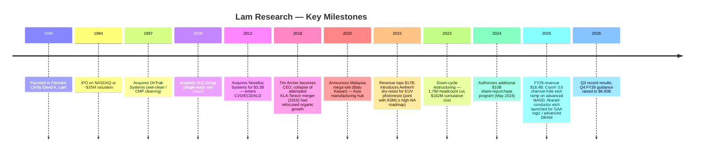
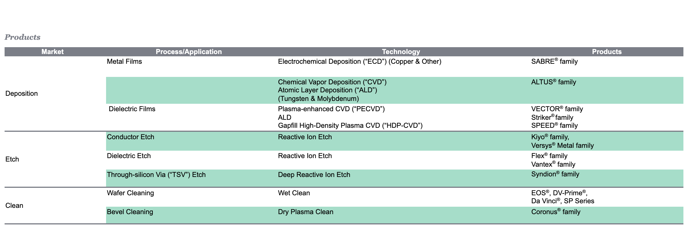
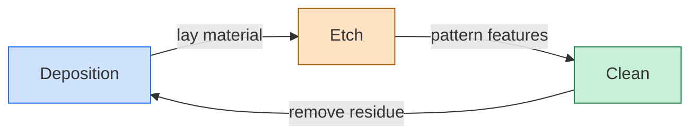
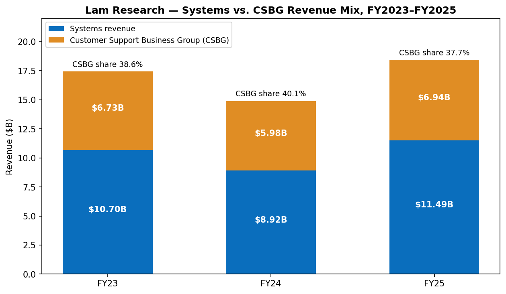
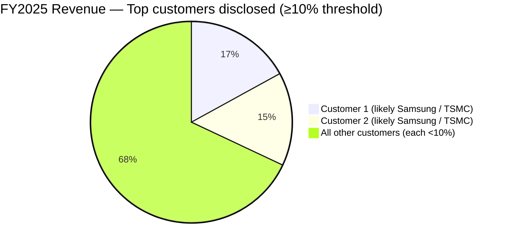
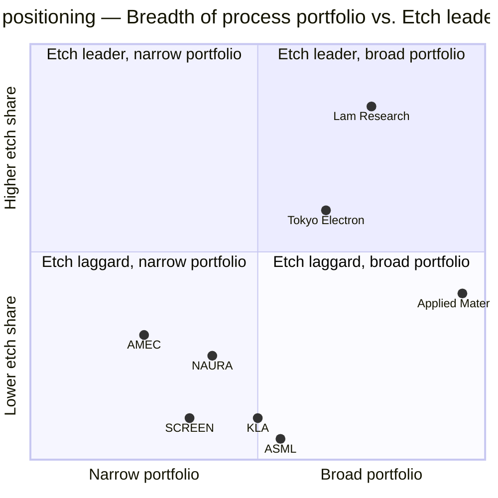
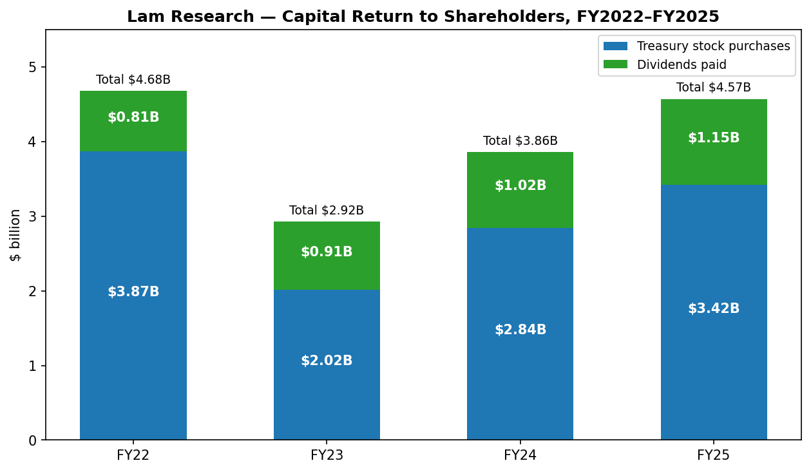
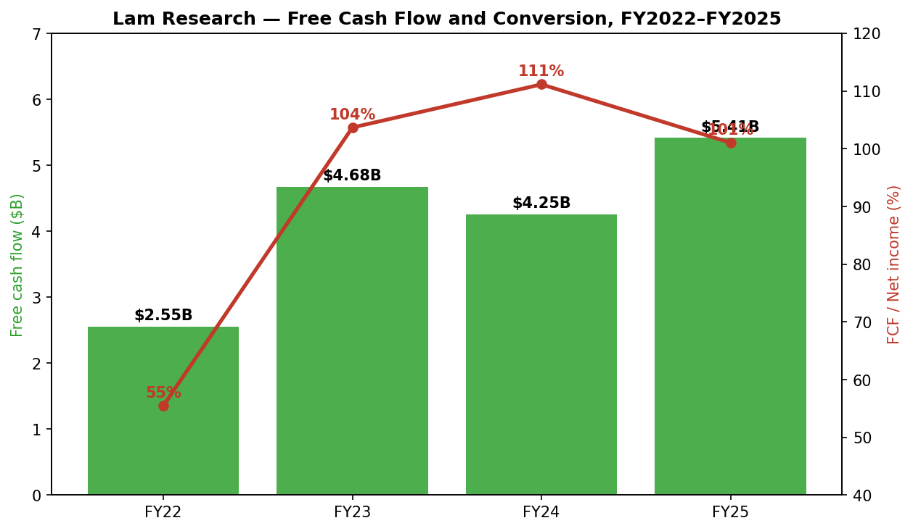
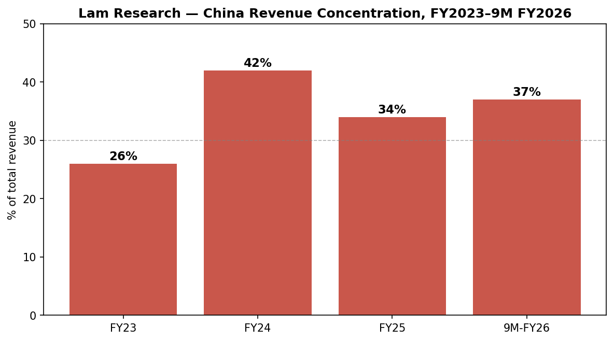

# COMPANY RESEARCH REPORT: Lam Research Corporation (NASDAQ: LRCX)

**Date:** 2026-05-20
**Analyst note:** Lam's fiscal year ends in late June (FY2025 ended June 29, 2025). Where the report uses calendar-year context, it labels accordingly. All dollar figures are USD unless noted.

> **Update — Q3 FY2026 results beat and Q4 FY2026 guidance raised (2026-04-22):** Lam reported record revenue of $5.84B and non-GAAP diluted EPS of $1.47 for the quarter ended March 29, 2026 (+9% Q/Q, +24% Y/Y on revenue; +16% Q/Q, +43% Y/Y on EPS). Management guided Q4 FY2026 (June 2026 quarter) revenue to **$6.60B ± $400M** (up roughly +13% Q/Q at the mid-point) and non-GAAP EPS to **$1.65 ± $0.15**, vs. consensus that had been near $6.1B / $1.55. CEO Tim Archer attributed the strength to "AI-driven demand reshap[ing] the semiconductor industry" and Lam's execution on customer roadmaps in HBM, gate-all-around (GAA) logic and advanced NAND. Source: [Q3 FY2026 earnings press release (Exhibit 99.1), 2026-04-22](https://www.sec.gov/Archives/edgar/data/707549/000070754926000020/lrcx_exhibitx991xq3x2026.htm).

---

## Table of Contents

1. Company Overview
2. Company History
3. Management Team
4. Products & Services
5. Customers & Go-to-Market
6. Industry Overview
7. Competitive Landscape
8. Market Opportunity (TAM)
9. Risk Assessment
10. References

---

## 1. Company Overview

Lam Research Corporation ("Lam," NASDAQ: LRCX) is one of the world's three largest suppliers of **wafer fabrication equipment ("WFE")** to the semiconductor industry, alongside Applied Materials (AMAT) and ASML. Lam's tools sit between lithography (ASML's domain) and metrology (KLA's domain) in the wafer-processing flow, building the conductive and insulating layers that form each transistor and interconnect on a chip. The company is the **clear global #1 in plasma etch**, holds a co-leadership position with AMAT in several **deposition** sub-markets (ALD, PECVD, ECD/copper plating, tungsten/molybdenum CVD), and ranks **#2 globally behind Japan's SCREEN Holdings** in **single-wafer wet cleaning** — with stronger relative positioning at U.S. and Korean customers and an adjacent franchise in **bevel / dry plasma clean** (Coronus®) — framed in its product taxonomy as the "deposition, etch and clean" portfolio ([2025 Form 10-K, p.4](https://www.sec.gov/Archives/edgar/data/707549/000070754925000075/lrcx-20250629.htm); [SCREEN Holdings — Investor Relations](https://www.screen.co.jp/en/ir)).

**Business model.** Roughly two-thirds of revenue is new equipment ("Systems revenue") sold to fabs running 200mm and 300mm silicon wafers; the remainder is a deep, recurring service annuity called **Customer Support Business Group ("CSBG")** — spare parts, upgrades, productivity software (Equipment Intelligence®), and refurbished non-leading-edge equipment under the **Reliant®** brand. In FY2025 Systems revenue was **$11.49B (62.3% of total)** and CSBG revenue was **$6.94B (37.7% of total)** on consolidated revenue of $18.44B ([2025 Form 10-K, Results of Operations](https://www.sec.gov/Archives/edgar/data/707549/000070754925000075/lrcx-20250629.htm)). The CSBG share of revenue rose to ~40% during the FY2024 trough (when Systems shipments contracted) and falls back toward the mid-30s in equipment up-cycles — illustrating how the recurring book dampens cyclicality. Lam's other commercial model element is its **deferred revenue balance**, which doubled from $1.4B at the end of FY2023 to **$2.7B at June 29, 2025** before easing slightly to $2.2B at March 29, 2026 — a measure of forward shipments and customer down payments ([2025 10-K MD&A](https://www.sec.gov/Archives/edgar/data/707549/000070754925000075/lrcx-20250629.htm); [Q3 FY2026 release](https://www.sec.gov/Archives/edgar/data/707549/000070754926000020/lrcx_exhibitx991xq3x2026.htm)).

**Geographic footprint.** Headquartered in Fremont, California, Lam has approximately **19,000 regular full-time employees** as of August 7, 2025, of which over 29% are in R&D and roughly 43% are in the U.S., 50% in Asia and 7% in Europe ([2025 10-K, p.10](https://www.sec.gov/Archives/edgar/data/707549/000070754925000075/lrcx-20250629.htm)). The customer base is heavily Asian: in FY2025, **non-U.S. sales were ~93% of total revenue**; China was 34%, Korea 22%, Taiwan 19%, Japan 10%, U.S. 7%, Southeast Asia 5%, and Europe 3% ([2025 10-K, Results of Operations](https://www.sec.gov/Archives/edgar/data/707549/000070754925000075/lrcx-20250629.htm)). For the nine months ended March 29, 2026 China increased back to ~37% as mature-node Chinese fab build-out re-accelerated ([Q3 FY2026 10-Q, p.20](https://www.sec.gov/Archives/edgar/data/707549/000070754926000022/lrcx-20260329.htm)). Per the 10-K Properties section, principal R&D and operating facilities are in **Fremont and Livermore, California; Tualatin, Oregon; Yongin, Gyeonggi Province, Korea; Bengaluru, India; and Salzburg & Villach, Austria**, with owned/leased manufacturing facilities in **California, Ohio, Oregon, Austria, Korea, Malaysia (Batu Kawan), and Taiwan** ([2025 10-K, Item 2 Properties](https://www.sec.gov/Archives/edgar/data/707549/000070754925000075/lrcx-20250629.htm)).

**Scale and operating economics.** FY2025 revenue grew **+23.7% Y/Y to $18.44B**, gross margin expanded **+140bps to 48.7%**, operating margin reached 32.0%, and diluted EPS jumped **+43.1% to $4.15**. Operating cash flow was **$6.17B** (33.5% of revenue) and free cash flow was **$5.41B** ([2025 10-K MD&A](https://www.sec.gov/Archives/edgar/data/707549/000070754925000075/lrcx-20250629.htm)). For the most recent quarter (Q3 FY2026, ended March 29, 2026), revenue was **$5.84B**, GAAP gross margin **49.8%**, GAAP operating margin **35.0%**, and diluted EPS **$1.45** — all sequential records — with the trailing-12-month run-rate now approaching **$21B** in revenue and **$5.7B** in net income on an annualized basis ([Q3 FY2026 release](https://www.sec.gov/Archives/edgar/data/707549/000070754926000020/lrcx_exhibitx991xq3x2026.htm)).

*Source: [Lam Research 2025 Form 10-K — MD&A](https://www.sec.gov/Archives/edgar/data/707549/000070754925000075/lrcx-20250629.htm); FY2022 10-K for FY2021 figures.*

**Valuation snapshot (as of 2026-05-20).** LRCX closed at **$289.41**, giving a market cap of **~$362B**, against 1.25B diluted shares outstanding ([Yahoo Finance / yfinance API, 2026-05-20](https://finance.yahoo.com/quote/LRCX/key-statistics/)). TTM and forward multiples (Yahoo Finance):

| Multiple | LRCX | AMAT | KLAC | ASML | TEL (peer median) |
|---|---|---|---|---|---|
| TTM P/E | **54.6×** | 39.8× | 51.3× | 51.5× | 20.6× |
| Forward P/E | 36.5× | 26.2× | 36.4× | 32.4× | 16.0× |
| TTM P/S | **16.7×** | 11.6× | 18.1× | 17.7× | 3.1× |
| TTM EV/EBITDA | 43.4× | 34.6× | 39.1× | 43.8× | 13.1× |
| Dividend yield | 0.38% | 0.52% | 0.53% | 0.60% | 1.48% |
| 52-wk range | $79.49 – $302.00 | $153 – $448 | $740 – $1,939 | $683 – $1,604 | n/a |

LRCX trades near its 52-week high after a near-quadrupling from the April-2025 low of ~$80 (driven by the tariff/export-control sell-off and subsequent AI-WFE rotation; see [Simply Wall St — LRCX valuation after US export curbs, 2025-09](https://simplywall.st/stocks/us/semiconductors/nasdaq-lrcx/lam-research/news/a-look-at-lam-research-lrcx-valuation-after-new-us-export-cu)). The **TTM P/E of 54.6× is roughly +30% above the AMAT comp** and roughly in line with KLAC and ASML, all of which the market has re-rated as "AI infrastructure picks-and-shovels" ([Yahoo Finance — LRCX statistics](https://finance.yahoo.com/quote/LRCX/key-statistics/)). It is well **above 2× the WFE peer median including TEL** (a connector/interconnect peer included per the brief), so the multiple needs a structural explanation:

- **Driver #1 — AI-driven WFE growth premium.** Management and recent earnings commentary attribute the re-rating to AI-server demand pulling HBM (3D DRAM stacking), GAA-logic etch intensity, and advanced-packaging capacity, all areas where Lam's etch/deposition franchise is over-indexed; CEO Tim Archer described "AI-driven demand reshap[ing] the semiconductor industry" in the Q3 FY2026 release ([Q3 FY2026 earnings press release, 2026-04-22](https://www.sec.gov/Archives/edgar/data/707549/000070754926000020/lrcx_exhibitx991xq3x2026.htm)). The forward P/E of 36.5× implies the market expects EPS to grow ~50% from TTM to FY+1, which is roughly consistent with the FY2026 EPS implied by Lam's Q4 FY2026 guidance ($1.65 ± $0.15) annualized ([Q3 FY2026 release](https://www.sec.gov/Archives/edgar/data/707549/000070754926000020/lrcx_exhibitx991xq3x2026.htm)).
- **Driver #2 — Cyclical re-rate.** FY2024 was a memory-led trough; gross margin compressed and EPS hit a multi-year low. The TTM denominator is still partly weighted by trough quarters, inflating the TTM multiple vs. forward ([2025 10-K MD&A](https://www.sec.gov/Archives/edgar/data/707549/000070754925000075/lrcx-20250629.htm)).
- **Driver #3 — Capital return.** $4.6B returned in FY2025 (76% as buybacks at an accretive share count) ([2025 10-K Statement of Cash Flows](https://www.sec.gov/Archives/edgar/data/707549/000070754925000075/lrcx-20250629.htm)), plus an additional $10B repurchase authorization announced May 2024 ([8-K — $10B Repurchase Authorization and 10-for-1 Stock Split, 2024-05-21](https://www.sec.gov/Archives/edgar/data/707549/000070754924000076/lrcx_exx991xmayx21x2024.htm)) and a 13% dividend hike in February 2026 (to $0.26 per quarter from $0.23) ([Lam Research declares quarterly dividend, 2026-02-05](https://newsroom.lamresearch.com/2026-02-05-Lam-Research-Corporation-Declares-Quarterly-Dividend)). Per-share growth is structurally amplified.

The multiple is consistent with the WFE oligopoly group but leaves modest room for disappointment if China revenue compresses further on export-controls or if NAND CapEx stalls — KLAC, ASML and LRCX trade in a similar "AI-infra picks-and-shovels" multiple band per Yahoo Finance comps ([KLAC](https://finance.yahoo.com/quote/KLAC/key-statistics/); [ASML](https://finance.yahoo.com/quote/ASML/key-statistics/)). We flag valuation multiple-compression as a risk in Section 9.

*Source: Yahoo Finance via yfinance API, 2026-05-20 ([LRCX statistics page](https://finance.yahoo.com/quote/LRCX/key-statistics/)).*

---

## 2. Company History

Lam was founded in **1980 in Fremont, California, by David K. Lam**, a Chinese-born engineer who had previously worked at Xerox, Hewlett-Packard, and Texas Instruments ([SEMI — Oral History Interview: David K. Lam](https://www.semi.org/en/Oral-History-Interview-David-Lam); [Lam Research — Company history](https://www.lamresearch.com/company/history/)). Dr. Lam recognized that as IC feature sizes shrank, the industry needed plasma etching with far better selectivity and uniformity than the wet-chemistry tools then in use. He launched the Lam AutoEtch 480 in 1982 — the industry's first fully automated plasma etching system — and quickly displaced earlier-generation etchers ([Lam Research — Company history](https://www.lamresearch.com/company/history/)). The company **IPO'd on NASDAQ in May 1984** (ticker LRCX), making David K. Lam the first Asian-American to take a company public on the Nasdaq exchange ([SEMI — Oral History Interview: David K. Lam](https://www.semi.org/en/Oral-History-Interview-David-Lam)), and built itself into the dominant pure-play etch supplier through the 1990s.

**Transformational events.**
- **1997 — OnTrak Systems acquisition.** Brought wet-clean (post-CMP cleaning) into Lam's portfolio. This eventually became the franchise SP Series and EOS® wet platforms ([Lam Research — Company history](https://www.lamresearch.com/company/history/)).
- **2008 — SEZ Group acquisition.** Lam paid approximately $568M (≈$447M net of cash acquired) to buy SEZ Holding AG (Austria), a leading supplier of single-wafer wet-clean technology, accelerating Lam's clean position into 32nm-and-below logic where dry-strip plus single-wafer wet became standard ([Lam Research — Successful Preliminary Results of SEZ Tender Offer, 2008-02-11](https://newsroom.lamresearch.com/2008-02-11-Lam-Research-Corporation-Announces-Successful-Preliminary-Results-of-Public-Tender-Offer-for-Registered-Shares-of-SEZ-Holding-AG); [Lam Research FY2008 10-K](https://www.sec.gov/Archives/edgar/data/0000707549/000095013408015947/f43373e10vk.htm)).
- **2012 — Novellus Systems acquisition ($3.3B, all-stock).** The strategic pivot of the company. Novellus stockholders received 1.125 shares of LRCX for each Novellus share in a tax-free exchange ([Lam Research — Combine in $3.3 Billion All-Stock Transaction press release](https://newsroom.lamresearch.com/2011-12-15-Lam-Research-and-Novellus-Systems-to-Combine-in-3-3-Billion-All-Stock-Transaction); [Jones Day — Lam acquires Novellus Systems in $3.3B all-stock transaction](https://www.jonesday.com/en/practices/experience/2011/12/lam-research-acquires-semiconductor-equipment-maker-novellus-systems-in-33-billion-allstock-transaction)). Novellus contributed PECVD (VECTOR® / Striker®), HDP-CVD (SPEED®), tungsten/molybdenum ALD/CVD (ALTUS®), and electrochemical-deposition copper plating (SABRE®). Overnight Lam became a credible **#1 or #2** in deposition and a true "deposition + etch + clean" multi-product supplier, the structural basis for everything since. Most of today's deposition product groups trace their lineage to the Novellus portfolio.
- **2015–2016 — Attempted KLA-Tencor merger ($10.6B).** Lam announced an offer to acquire KLA-Tencor in late 2015 to add metrology/inspection. After the DOJ signaled it would not approve the parties' negotiated consent decree, the deal was mutually terminated on October 5, 2016 — a combined Lam-KLA would have controlled an estimated 42% of WFE ([Lam Research 8-K — Termination of Merger, 2016-10-05](https://www.sec.gov/Archives/edgar/data/0000707549/000119312516731756/d271204dex991.htm); [KLA-Tencor 8-K — Termination of Merger, 2016-10-05](https://www.sec.gov/Archives/edgar/data/0000319201/000031920116000095/exhibit991pressreleaserete.htm)). The episode crystallized Lam's go-it-alone strategy and accelerated organic R&D investment.
- **2020–2022 — Malaysia ramp & supply-chain repositioning.** In February 2020 Lam announced an RM1B investment in a new ~700,000 sq ft Batu Kawan, Penang plant ([Lam Research — Expand Global Footprint, 2020-02-03](https://newsroom.lamresearch.com/2020-02-03-Lam-Research-to-Expand-Global-Footprint)). The Batu Kawan campus opened in May 2021 and became Lam's largest manufacturing footprint by 2022 ([SEMI — Spotlight on Lam Research expanding global capacity](https://www.semi.org/en/blogs/technology-trends/spotlight-on-lam-research-expanding-global-capacity)); it has also become a periodic friction point with U.S. export-control rules.
- **2023–2024 — Cyclical reset and restructuring.** As NAND CapEx collapsed in calendar-2023, Lam announced a workforce-reduction restructuring plan on January 23, 2023 ([8-K — Restructuring Plan, 2023-01-23](https://www.sec.gov/Archives/edgar/data/0000707549/000070754923000005/lrcx-20230123.htm)). Through June 30, 2024 the plan terminated **approximately 1,760 employees** (~10% of pre-restructuring headcount), with cumulative restructuring charges of **$181.9M through fiscal year 2024** ([2025 10-K, Note 20](https://www.sec.gov/Archives/edgar/data/707549/000070754925000075/lrcx-20250629.htm)). No restructuring costs were recorded in FY2025; the plan is described as "substantially completed."
- **2025-2026 — AI-WFE up-cycle.** Memory (HBM, advanced DRAM) and GAA-logic (selective etch, multi-step deposition) drove a return to record growth ([Q3 FY2026 earnings release, 2026-04-22](https://www.sec.gov/Archives/edgar/data/707549/000070754926000020/lrcx_exhibitx991xq3x2026.htm)). China revenue normalized from the FY2024 spike (42%) back toward the mid-30s ([2025 10-K, Results of Operations](https://www.sec.gov/Archives/edgar/data/707549/000070754925000075/lrcx-20250629.htm)).

**Recent developments (2025-26).** U.S. customer onshore build-outs continue to support Lam's served-market growth — most notably TSMC's Arizona expansion, now a **$165B** total U.S. investment program ([TSMC 6-K — Expand Investment in the U.S., 2025](https://www.sec.gov/Archives/edgar/data/0001046179/000104617925000024/tsmcexpandinvestmentintheu.htm)) and Samsung's Taylor, Texas fab. On governance, Cadence CEO Anirudh Devgan joined Lam's board in February 2026 ([8-K — Director Appointment, 2026-02-03](https://www.sec.gov/Archives/edgar/data/707549/000070754926000012/lrcx_exx991directorappoint.htm)).

---

## 3. Management Team

### Timothy M. Archer — President and CEO (age 58)

Tim Archer has been CEO since **December 2018** and is the second CEO of Lam's modern era (succeeding Martin Anstice, who departed in late 2017). Archer spent **18 years at Novellus Systems** (1994–2012) in technology and business roles, including chief operating officer from January 2011 until Lam's acquisition of Novellus in June 2012. At Lam, he served as EVP and COO from 2012, then president and COO in January 2018, before being named president and CEO in December 2018 ([2025 10-K, p.10-11](https://www.sec.gov/Archives/edgar/data/707549/000070754925000075/lrcx-20250629.htm)).

Archer holds a **B.S. in Applied Physics from Caltech** and completed the Program for Management Development at Harvard Business School ([Lam Research — Company Overview](https://www.lamresearch.com/company/company-overview/)). He also serves on the board of **Johnson Controls International** (since 2024) and on the International Board of Directors for **SEMI**, the industry trade group ([SEMICON Taiwan — Tim Archer profile](https://www.semicontaiwan.org/en/node/8511)).

Under Archer's tenure (Dec 2018 — present), Lam revenue has grown from **$11.1B (CY2018, calendar)** to **~$21B run-rate (CY2026, calendar)**, gross margin has expanded from the low-46% range to ~50%, and the share price has compounded at roughly **20%+ CAGR** including dividends — a track record that places him among the top operational performers in semicap. He has navigated three full WFE cycles (2019 mini-trough, 2022 super-cycle, 2023 memory bust, 2025–26 AI up-cycle), with each successive trough higher and each peak more profitable. Archer's external profile is lower than Gary Dickerson (AMAT) or Christophe Fouquet (ASML) — he rarely appears in mainstream media — but he speaks regularly at SEMI industry events and on Lam's quarterly calls, with a consistent emphasis on **"technology inflections"** (the shift to 3D/vertical scaling in memory, GAA in logic, advanced packaging for AI) and on multi-product customer wins. According to the proxy, his calendar-2025 base salary was raised 8.3% Y/Y ([2025 DEF 14A, CD&A](https://www.sec.gov/Archives/edgar/data/707549/000114036125036012/ny20050572x2_def14a.htm)).

---

## 4. Products & Services

### 4.1 The 10-K product matrix — the spine of this section

This section is anchored to Lam's own product matrix as it appears in the **2025 Form 10-K, Item 1 Business — Products** ([10-K, Products section](https://www.sec.gov/Archives/edgar/data/707549/000070754925000075/lrcx-20250629.htm)). The original 10-K table is rendered below, followed by a markdown reproduction for searchability; each subsection below walks one row of the table, **quoting Lam's own 10-K description verbatim** before adding any analyst color. Chinese explanations (中文释义) are inserted where the underlying physics or process step is technical enough that a one-line English description would lose the reader.

*Source: [Lam Research 2025 Form 10-K, Item 1 Business — Products](https://www.sec.gov/Archives/edgar/data/707549/000070754925000075/lrcx-20250629.htm).*

| Market | Process / Application | Technology | Products |
|---|---|---|---|
| **Deposition** | Metal Films | Electrochemical Deposition ("ECD") — Copper & Other | **SABRE® family** |
|  | Metal Films | Chemical Vapor Deposition ("CVD") / Atomic Layer Deposition ("ALD") — Tungsten & Molybdenum | **ALTUS® family** |
|  | Dielectric Films | Plasma-enhanced CVD ("PECVD") / ALD / Gapfill High-Density Plasma CVD ("HDP-CVD") | **VECTOR® / Striker® / SPEED® families** |
| **Etch** | Conductor Etch | Reactive Ion Etch | **Kiyo® family / Versys® Metal family** |
|  | Dielectric Etch | Reactive Ion Etch | **Flex® family / Vantex® family** |
|  | Through-silicon Via ("TSV") Etch | Deep Reactive Ion Etch | **Syndion® family** |
| **Clean** | Wafer Cleaning | Wet Clean | **EOS® / DV-Prime® / Da Vinci® / SP Series** |
|  | Bevel Cleaning | Dry Plasma Clean | **Coronus® family** |

Sitting *outside* this product matrix is the **Customer Support Business Group (CSBG)** — a separate business group covering services, spares, upgrades, productivity software (Equipment Intelligence®), and refurbished non-leading-edge equipment under the Reliant® brand ([2025 10-K, Item 1 Business — CSBG description](https://www.sec.gov/Archives/edgar/data/707549/000070754925000075/lrcx-20250629.htm)). For financial reporting Lam operates as a **single reportable segment**, with revenue split into just two lines — **Systems revenue** (new leading-edge deposition, etch, clean and other WFE equipment) and **Customer support-related revenue and other** (CSBG plus Reliant). The 10-K does not publish revenue percentages by process category; any sub-segment splits below are explicitly labeled as analyst estimates.

### 4.2 Synthesis — how Deposition, Etch and Clean compose a single chip-build cycle

Each layer of a modern integrated circuit is built by cycling through Lam's three categories, repeated hundreds of times to stack a logic die or a 3D NAND array:

1. **Deposition lays down material** — a copper interconnect line (**SABRE**), a tungsten or molybdenum contact / NAND wordline (**ALTUS**), or a dielectric insulator (**VECTOR / Striker / SPEED**).
2. **Etch removes material** — patterning gates and metal lines (**Kiyo / Versys / Akara**), drilling deep channel holes in 3D NAND (**Flex / Vantex** with **Cryo® 3.0**), or punching TSVs through bulk silicon for HBM stacks (**Syndion**).
3. **Clean removes the residue from the previous step** — wet-chemistry rinse over the wafer surface (**EOS / DV-Prime / Da Vinci / SP Series**) or a dry-plasma scrub of the wafer's outer rim (**Coronus**). Particle counts are directly yield-limiting at advanced nodes, so clean tools sit between essentially every Deposition and Etch step.

The same cycle runs at TSMC, Samsung, SK hynix, Intel, Micron, and the leading Chinese fabs. Differentiation between vendors is technology / precision at the leading edge, throughput at the mature edge, and the depth of installed-base service.

### 4.3 Deposition — "building up"

Deposition tools *add* material to the wafer surface; together they build the metal interconnects, transistor contacts and dielectric insulation that compose a chip's vertical stack. The 10-K Competition section names **Applied Materials** as Lam's primary competitor in dielectric and metals deposition, with **ASM International** and **Wonik IPS** added for ALD and PECVD specifically ([2025 10-K — Competition](https://www.sec.gov/Archives/edgar/data/707549/000070754925000075/lrcx-20250629.htm)).

#### SABRE® / SABRE® 3D — Electrochemical deposition (Copper and Other Metals)

**10-K verbatim** ([2025 10-K — SABRE Product Family](https://www.sec.gov/Archives/edgar/data/707549/000070754925000075/lrcx-20250629.htm)):

> "Copper deposition lays down the electrical wiring for most semiconductor devices. Even the smallest defect — say, a microscopic pinhole or dust particle — in these conductive structures can impact device performance, from loss of speed to complete failure. The SABRE ECD product family, which helped pioneer the copper interconnect transition, offers the precision needed for copper damascene manufacturing in logic and memory. System capabilities include cobalt deposition for logic applications and copper deposition directly on various liner materials..."

**中文释义 / Plain-language gloss:** SABRE 做的是 **电镀铜 / Cu electroplating (ECD, electrochemical deposition)** —— 通过电化学反应把 copper 长在 wafer 上，形成连接每个 transistor 的 **互连线 / interconnect**（也就是芯片里的"金属导线"）。**Damascene 工艺 / 大马士革工艺** 指的是 "dig-then-fill" 的流程：先在 **介质层 / dielectric layer** 上挖出 trench / 沟槽 和 via / 通孔，然后电镀填铜，最后用 **CMP / 化学机械抛光** 把表面多余的铜磨平 —— 是逻辑芯片和 DRAM 后段 metal layers（BEOL, back-end-of-line）的行业标准。**SABRE 3D** 把同一工艺扩展到 **3D packaging / 三维先进封装**：HBM 高带宽内存的 **TSV / 硅通孔 (through-silicon via)** 充铜、wafer-level packaging (WLP, 晶圆级封装)、fan-out 扇出型封装 —— 相当于在堆叠 DRAM 之间打通垂直的"电梯通道"。每一颗 HBM 堆叠 + 每一片 advanced-packaging interposer 都拉动 SABRE 3D 的设备需求。

***Analyst view:*** widely regarded as the leading single-wafer Cu ECD supplier for two decades; AMAT (NOKOTA / Raider) and Ebara are the nearest external competitors, with Lam particularly entrenched in advanced packaging.

#### ALTUS® / ALTUS® Halo — Tungsten & Molybdenum CVD-ALD

**10-K verbatim** ([2025 10-K — ALTUS Product Family](https://www.sec.gov/Archives/edgar/data/707549/000070754925000075/lrcx-20250629.htm)):

> "Tungsten and/or molybdenum deposition is used to form conductive features such as contacts, vias, and wordlines on a chip. These features are small, often narrow, and use only a small amount of metal, so minimizing resistance and achieving complete fill can be difficult. At these nanoscale dimensions, even slight imperfections can impact device performance or cause a chip to fail. Our ALTUS systems combine CVD and ALD technologies to deposit the highly conformal or selective films as needed for advanced tungsten or molybdenum metallization (ALTUS Halo) applications in both [logic and memory]. The Multi-Station Sequential Deposition architecture enables nucleation layer formation and bulk CVD/ALD fill to be performed in the same chamber (in situ)."

**中文释义 / Plain-language gloss:** ALTUS 做的是 **钨 (tungsten, W) 和钼 (molybdenum, Mo) 金属沉积** —— 填的是 **逻辑芯片的 contact / 接触孔** 和 via / 通孔，以及 **3D NAND 的 wordline / 字线** —— 也就是芯片里最深、最窄的"金属插塞 / metal plug"。两种核心技术：**CVD (化学气相沉积 / chemical vapor deposition)** 用气态反应物在 wafer 上发生化学反应、把固态膜"长"出来；**ALD (原子层沉积 / atomic layer deposition)** 是 CVD 的精度极致版 —— 一次只让一层 atomic-thickness 的膜长出来，可以做到 sub-nm 的厚度控制。ALTUS 把两种技术放在同一个 **Multi-Station Sequential Deposition (多腔体串联沉积)** 腔室里：先用 ALD 长一层 **nucleation layer / 种子层** 打底（保证后续金属能均匀附着），再用 CVD 把剩余体积填满，确保整个孔 **void-free / 无空洞**。**ALTUS Halo**（2025 年 2 月发布）是 Lam 第一台大批量出货的 **钼金属 ALD / molybdenum ALD** 工具 —— 为什么用 Mo 替代 W？随着 3D NAND wordline 越叠越多、每条 wordline 越来越细，**resistivity / 电阻率** 成为瓶颈：Mo 在薄膜厚度下的电阻率低于 W，Lam 宣称 ALTUS Halo 可让 wordline 电阻降低 50%+；Micron 已被列为 early adopter / 早期客户。

***Analyst view:*** AMAT competes with Endura W; the moly transition is a key incremental opportunity for Lam through the >300-layer NAND roadmap ([Lam Research — Ushers in New Era with ALTUS® Halo, 2025-02-19](https://newsroom.lamresearch.com/2025-02-19-Lam-Research-Ushers-in-New-Era-of-Semiconductor-Metallization-with-ALTUS-R-Halo-for-Molybdenum-Atomic-Layer-Deposition)).

#### VECTOR® — Plasma-enhanced CVD (PECVD) for Dielectric Films

**10-K verbatim** ([2025 10-K — VECTOR Product Family](https://www.sec.gov/Archives/edgar/data/707549/000070754925000075/lrcx-20250629.htm)):

> "Dielectric film deposition processes are used to form some of the most difficult-to-produce insulating layers in a semiconductor device, including those used in the latest transistors and 3D structures. In some applications, these films require dielectric films to be exceptionally uniform and defect free since slight imperfections are multiplied greatly in subsequent layers. Our VECTOR PECVD products are designed to provide the performance and flexibility needed to create these enabling structures within a wide range of challenging device applications."

**中文释义 / Plain-language gloss:** **介质沉积 / dielectric film deposition** 做的是 **绝缘层 / insulator layer**（不导电的 SiO₂ 二氧化硅 或 low-k 低介电常数 materials），目的不是 conduct 电流，而是 **隔离 / isolate** 两条挨得很近的 metal lines —— 防止 **漏电 / leakage** 和 **信号串扰 / signal crosstalk**。**PECVD (Plasma-enhanced CVD, 等离子体增强化学气相沉积)** 用 plasma / 等离子体 激活化学反应，可以在 **较低温度 / lower temperature** 下长出均匀薄膜 —— 这对已经沉积过 metal layers 的 wafer 很重要（高温会损坏下层金属）。VECTOR 是 Lam 的主力 PECVD 平台，主要用在 **inter-layer dielectric (ILD, 层间介质)** 和 gapfill / 间隙填充 等应用。

#### Striker® — ALD for advanced Dielectric Films

**10-K verbatim** ([2025 10-K — Striker Product Family](https://www.sec.gov/Archives/edgar/data/707549/000070754925000075/lrcx-20250629.htm)):

> "The latest memory, logic, and imaging devices require extremely thin, highly conformal dielectric films for continued device performance improvement and scaling. For example, ALD films are critical for low-k spacers for device power consumption/speed, dielectric gapfills in high aspect ratio features for isolation and device performance, as well as for spacer-based multiple patterning schemes where the spacers help define critical dimensions. These applications have little tolerance for voids and even the smallest defect. The Striker single-wafer ALD products provide [these capabilities]…"

**中文释义 / Plain-language gloss:** Striker 是 Lam 的 **介质 ALD / dielectric ALD 平台** —— 一层 atom 一层 atom 地长出极薄、极均匀的 insulator films。典型应用：**low-k spacers / 低介电常数间隔层**（决定 transistor gate / 晶体管栅极 的宽度，进而决定芯片速度和 power consumption / 功耗）、**SAQP / SADP (self-aligned quadruple / double patterning, 自对准多重图形化) 的 spacer layer**（在 EUV 普及之前是定义先进 node 关键 CD / critical dimension 的核心工艺）、以及 3D NAND **high aspect ratio (HAR, 高纵横比)** 沟道的 dielectric fill。一句话总结：Striker = "atomic-level precision dielectric ALD / 原子级精度的介质 ALD"，常被部署在最难、最 zero-defect-tolerance 的工艺步骤上。

#### SPEED® — HDP-CVD gapfill for legacy dielectric gapfill

**10-K verbatim** ([2025 10-K — SPEED Product Family](https://www.sec.gov/Archives/edgar/data/707549/000070754925000075/lrcx-20250629.htm)):

> "Dielectric gapfill processes deposit critical insulation layers between conductive and/or active areas by filling openings of various aspect ratios between conducting lines and between devices. With advanced devices, the structures being filled can be very tall and narrow. As a result, high-quality dielectric films are especially important due to the ever-increasing possibility of cross-talk and device failure. Our SPEED HDP-CVD products provide a multiple dielectric film solution for high-quality gapfill with industry-leading throughput and reliability."

**中文释义 / Plain-language gloss:** **HDP-CVD (High-Density Plasma CVD, 高密度等离子体化学气相沉积)** 适合 **mature node / 传统节点 / 成熟工艺** 的 **gapfill / 间隙填充** —— 在 transistor 与 transistor 之间、metal line 与 metal line 之间填 insulator。其优势是 **high throughput / 高吞吐量、高 reliability / 可靠性**，但在 leading-edge nodes / 最先进节点 已经在被 ALD 替代（ALD 精度更高、可填更窄的缝）。SPEED 因此是 Lam 在 mature-node 市场（28nm 及以上的成熟工艺）的主力 deposition 工具，尤其重要于中国大陆和台湾的成熟节点 fab 扩产周期。

***Analyst view (VECTOR / Striker / SPEED):*** AMAT's Producer platform is the principal external competitor for many of these PECVD applications; relative positioning varies by film stack and customer.

#### Aether® — dry photoresist (joint ASML / IMEC)

Lam runs ALD across the ALTUS and Striker platforms and is co-developing a **dry-photoresist / 干法光刻胶** solution (Aether®) with ASML and IMEC for EUV / high-NA EUV lithography ([Lam Research — Entegris/Gelest dry resist ecosystem, 2022-07-12](https://newsroom.lamresearch.com/2022-07-12-Lam-Research,-Entegris,-Gelest-Team-Up-to-Advance-EUV-Dry-Resist-Technology-Ecosystem); [SK hynix dry-resist qualification, mid-2022](https://www.prnewswire.com/news-releases/lam-research-teams-up-with-sk-hynix-to-enhance-dram-production-cost-efficiency-with-breakthrough-dry-resist-euv-technology-301567359.html)). **中文释义 / Plain-language gloss:** 传统 photolithography / 光刻 使用 **spin-coated wet photoresist / 旋涂的湿法光刻胶**（液态 resist 滴在 wafer 上、高速旋转、形成均匀薄膜）。Aether 是 **dry photoresist / 干法光刻胶** —— 直接用 ALD 在 wafer 上长出一层 photoresist film，没有 spin-coating 带来的 thickness uniformity 问题，在 EUV / high-NA EUV 节点能拿到更细的 pattern resolution / 图形精度。Lam 不做 scanner / 光刻机，但通过 Aether 切入 EUV photoresist 生态，跟着 ASML 的 high-NA roadmap 受益。

### 4.4 Etch — "patterning down"

Etch tools *remove* material with atomic precision — taking the films Deposition has laid down and patterning them into the chip's actual features (gates, channels, contacts, holes). The 10-K Competition section names **Applied Materials, Hitachi Ltd., and Tokyo Electron** as Lam's primary etch competitors ([2025 10-K — Competition](https://www.sec.gov/Archives/edgar/data/707549/000070754925000075/lrcx-20250629.htm)).

#### Kiyo® — Conductor Etch (Reactive Ion Etch)

**10-K verbatim** ([2025 10-K — Kiyo Product Family](https://www.sec.gov/Archives/edgar/data/707549/000070754925000075/lrcx-20250629.htm)):

> "Conductor etch helps shape the electrically active materials used in the parts of a semiconductor device. Even a slight variation in these miniature structures can degrade device performance. In fact, these structures are so tiny and sensitive that etch processes push the boundaries of the basic laws of physics and chemistry. Our Kiyo product family delivers the high-performance capabilities needed to precisely and consistently form these features precisely and with high productivity. Proprietary Hydra technology in Kiyo products improves CD uniformity by correcting for incoming pattern variability, and atomic-scale variability control with production-worthy throughput."

**中文释义 / Plain-language gloss:** **导体刻蚀 / conductor etch** 是在 silicon / 硅、polysilicon / 多晶硅、metal / 金属 这些 conductive materials / 会导电的材料 上做"减法"—— 典型的活儿就是定义 transistor 的 **gate / 栅极** 和 metal interconnect lines / 金属互连线。在 sub-3nm logic nodes（TSMC N2、Samsung SF2、Intel 18A/14A），关键工艺步是 **gate-all-around selective etch / 栅极环绕选择性刻蚀** —— 必须 lateral / 横向 地把多余 Si 蚀刻干净，留下 **nanosheet / 纳米片** 形成 transistor channel；这是 FinFET 时代没有的工艺。**Hydra** 是 Kiyo 的 in-chamber tuning / 腔内调节 技术：可以在同一个 chamber / 腔室 内部针对 wafer 上不同 zones / 区域 独立调整刻蚀均匀性，对入站 wafer 的 incoming pattern variability / 图形偏差 做出 adaptive / 自适应 补偿 —— 是先进节点拿到 CD uniformity / 关键尺寸一致性 的核心。

#### Versys® Metal — Conductor Etch (Metal hardmask / interconnect)

**10-K verbatim** ([2025 10-K — Versys Metal Product Family](https://www.sec.gov/Archives/edgar/data/707549/000070754925000075/lrcx-20250629.htm)):

> "Metal etch processes play a key role in connecting the individual components that form an IC, such as forming wires and electrical connections. These processes can also be used to drill through metal hardmasks that are used to form the wiring for advanced devices. To enable these critical etch steps, the Versys Metal product family provides high-productivity capability on a flexible platform. Superior CD, profile uniformity, and uniformity control are enabled by a symmetrical chamber design with independent process [controls]…"

**中文释义 / Plain-language gloss:** Versys Metal 专做 **metal etch / 金属刻蚀** —— 既包括直接刻 metal interconnect lines / 金属导线，也包括刻 **metal hardmask / 金属硬掩膜**。在先进 logic nodes，photoresist / 光刻胶 太薄撑不住后续的 deep etch / 深刻蚀，行业普遍用 **metal hardmask**（典型材料是 TiN / 氮化钛 或 W / 钨）作为掩膜层：先在 metal layer 上做 patterning / 图形化、再用这个"硬掩膜"去导引下层 dielectric / 介质 的深刻蚀。Versys 的卖点是 **symmetrical chamber design / 对称腔体设计** + **independent process control / 独立工艺控制** = 优秀的 CD uniformity 和 profile uniformity / 轮廓均匀性。

#### Akara® — newest Conductor Etch platform (Feb 2025 launch)

**Lam press release verbatim** ([Lam Research — Unveils Akara® Conductor Etch, 2025-02-19](https://investor.lamresearch.com/2025-02-19-Lam-Research-Unveils-Industrys-Most-Advanced-Conductor-Etch-Technology-to-Date)):

> "Akara, a breakthrough innovation in plasma etch and the most advanced conductor etch tool available. Akara delivers novel plasma processing technologies that enable the unmatched etch precision and performance… Integrated on Lam's high-productivity Sense.i platform, Akara leverages Lam's proprietary DirectDrive technology to deliver the controlled creation of atomic-scale features with plasma responses that are 100× faster…"

**中文释义 / Plain-language gloss:** Akara 是 Lam 2025 年 2 月发布的下一代 **conductor etch / 导体刻蚀** 平台（注意：是 conductor etch，不是 dielectric etch —— Lam 自己的 press release 明确把 Akara 定位为 "the most advanced conductor etch tool available"），主打四大 target applications：**GAA logic / 栅极环绕逻辑、4F² DRAM、CFET (complementary FET, 互补场效应管)、3D DRAM**。它构建在 **Sense.i®** high-productivity platform / 高产能平台 上，用 **DirectDrive®** plasma control / 等离子体控制 技术 —— 号称 plasma response / 等离子体响应速度 比上一代快 100×。这意味着可以在 **sub-nanometer / 亚纳米** 级别精细控制 etch depth / 刻蚀深度。Akara 是 Lam 在 2025-2027 年 GAA node ramp / 节点放量周期 最重要的 product launch。

***Analyst view (Kiyo / Versys / Akara):*** Tokyo Electron is generally regarded as the most direct external competitor in advanced conductor etch ([TEL FY2025 Q4 results presentation, 2025-05](https://www.tel.com/ir/library/report/l8gqgo00000000gl-att/fy25q4presentations-e.pdf)).

#### Flex® — Dielectric Etch (multi-frequency confined plasma)

**10-K verbatim** ([2025 10-K — Flex Product Family](https://www.sec.gov/Archives/edgar/data/707549/000070754925000075/lrcx-20250629.htm)):

> "Dielectric etch carves patterns in insulating materials to create barriers between the electrically conductive parts of a semiconductor device. For advanced devices, these structures can be extremely tall and thin and involve complex, sensitive materials. Slight deviations from the target feature profile — even at the atomic level — can negatively affect electrical properties of the device. To precisely create these challenging structures, our Flex product family offers differentiated technologies and application-focused capabilities for critical dielectric etch applications."

**中文释义 / Plain-language gloss:** Flex 做的是 **dielectric etch / 介质刻蚀** —— 在 insulating materials / 绝缘材料（SiO₂ / 二氧化硅, low-k dielectrics / 低介电常数介质）上挖图形。和 conductor etch / 导体刻蚀（Kiyo）的区分：conductor etch 刻"会导电"的部分（gate / 栅极、metal lines / 金属线），dielectric etch 刻"不导电"的部分（insulator / 绝缘层）。Flex 的核心特征是 **multi-frequency confined plasma / 多频率受限等离子体** 设计 —— 通过多个 RF frequencies / 射频 分别独立调谐 "what to etch / 刻什么" 和 "how to etch / 怎么刻"，例如同时控制 etch rate / 刻蚀速率、verticality / 垂直度、selectivity / 选择性 —— 是 high aspect ratio (HAR, 高深宽比) channels / 沟道 的核心工艺。

#### Vantex® — Dielectric Etch for 3D NAND (Sense.i platform)

**10-K verbatim** ([2025 10-K — Vantex Product Family](https://www.sec.gov/Archives/edgar/data/707549/000070754925000075/lrcx-20250629.htm)):

> "Dielectric etch processes remove non-conductive materials during the manufacturing of a semiconductor device. Leading-edge memory devices have especially challenging structures, such as extremely deep holes and trenches, that must be manufactured with tight tolerances. Our latest dielectric etch system, Vantex creates high aspect ratio device features while maintaining critical dimension (CD) uniformity and selectivity. Vantex is part of our Sense.i platform and offers advanced RF technology and repeatable wafer-to-wafer performance enabled by Equipment Intelligence solutions to meet the needs of advanced memory manufacturing, primarily in 3D NAND high aspect ratio hole, trench, contact, and capacitor cell applications."

**中文释义 / Plain-language gloss:** Vantex 是 Flex 的下一代 dielectric etch / 介质刻蚀 系统，是 Lam 当前最新（latest）的介质刻蚀工具，专为 **3D NAND 的 HAR (high aspect ratio, 高纵横比) holes / 孔、trenches / 沟槽、contacts / 接触孔 和 capacitor cells / 电容单元** 而设计。3D NAND 现在已经叠到 400+ layers / 400 层以上，单条 channel hole / 沟道孔 的 aspect ratio / 纵横比 超过 60:1 —— 要 vertically 打穿 400 层堆叠 dielectric 而不让上下层 CD / 关键尺寸 偏差超过 0.1%，是整个 wafer fab / 晶圆制造 里最难的刻蚀工艺。Vantex 建在 **Sense.i** 平台上，配合 Lam 的 **Equipment Intelligence® / 设备智能化** software 做 **wafer-to-wafer / 逐片** 工艺补偿（每片 wafer 独立优化参数）—— 是 NAND 进入 400-1000 layer / 层 时代的核心工具。

#### Cryo® 3.0 — cryogenic dielectric etch upgrade

Lam's **Cryo® 3.0** cryogenic-etch upgrade (announced July 2024) is an upgrade to the Flex/Vantex platforms: it cools the wafer to extremely low temperatures during etch, which improves selectivity and lets the tool drill **channels >10µm deep at <0.1% critical-dimension deviation and 2.5× faster** than prior generations ([Lam Research — Introduces Lam Cryo™ 3.0, 2024-07-31](https://newsroom.lamresearch.com/2024-07-31-Lam-Research-Introduces-Lam-Cryo-TM-3-0-Cryogenic-Etch-Technology-to-Accelerate-Scaling-of-3D-NAND-for-the-AI-Era)). **中文释义 / Plain-language gloss:** **Cryogenic etch / 低温刻蚀** 通过把 wafer 冷却到极低温度（典型 **-50 °C 至 -100 °C** 区间），让 plasma byproducts / 等离子体副产物 在 **sidewall / 侧壁** 上瞬间凝结、阻挡 lateral etch / 侧向刻蚀 —— 结果是 vertical / 垂直方向 刻得更深、horizontal deviation / 横向偏差 更小。Cryo 3.0 是 NAND 突破 400 layers / 层 的关键工艺 enabler；3D NAND industry roadmap / 行业路线图 目标是 2030 年达到 **~1000 layers / 层** ([Lam Research — The Road to 1000 Layer 3D NAND](https://newsroom.lamresearch.com/road-1000-layer-3D-NAND); [TrendForce — Samsung targets 1,000-layer NAND by 2030, 2025-02-26](https://www.trendforce.com/news/2025/02/26/news-samsung-reportedly-targets-1000-layer-nand-by-2030-rolls-out-wafer-bonding-at-400-layers/))。

***Analyst view (Flex / Vantex / Cryo 3.0):*** Tokyo Electron has developed its own cryogenic dielectric etch for 400+ layer NAND, positioning itself as the most direct competitor at this node ([TechPowerUp — TEL channel-hole etch for 400-layer NAND](https://www.techpowerup.com/309892/tokyo-electron-develops-memory-channel-hole-etching-for-400-layer-3d-nand-flash)).

#### Syndion® — Through-silicon Via (TSV) Etch (Deep RIE)

**10-K verbatim** ([2025 10-K — Syndion Product Family](https://www.sec.gov/Archives/edgar/data/707549/000070754925000075/lrcx-20250629.htm)):

> "Plasma etch processes used to remove silicon and other materials deep into the wafer are collectively referred to as deep silicon etch. These may be deep trenches for CMOS image sensors, trenches for power and other devices, TSVs for HBM and advanced packaging, and other high aspect ratio features. These are created by etching through multiple materials sequentially, where each new material involves a change in the etch process. The Syndion etch product family is optimized for deep silicon etch, providing the fast process switching with depth and cross-wafer uniformity [control]…"

**中文释义 / Plain-language gloss:** Syndion 做的是 **deep silicon etch / 深硅刻蚀** —— 直接在 silicon wafer / 硅晶圆 上刻穿，而不是刻 dielectric / 介质。三大典型应用：(1) **HBM 和 advanced packaging 的 TSV (through-silicon via, 硅通孔)** —— 也就是为 HBM 堆叠里上下层 DRAM 之间打通的"vertical elevator / 垂直电梯"；(2) **CMOS image sensor / 图像传感器** 的 deep trenches / 深沟槽；(3) **power devices / 功率器件**（power MOSFET、IGBT 等）的 trench。核心难度：要在 temperature / 温度、selectivity / 选择性、depth / 深度 三个维度同时稳定 —— 还要刻穿数十 microns / 微米 的 Si，并且整片 wafer 上数千个 vias 的深度必须 uniform / 均一 —— Syndion 通过 **fast process switching / 快速工艺切换** 解决：在不同阶段切换等离子体配方（钝化-刻蚀-钝化-刻蚀，称为 Bosch process / 博世工艺 或其变体）。每一颗 HBM3E / HBM4 堆叠都要拉 Syndion 的设备。

***Analyst view:*** third-party reporting indicates Lam is a primary supplier of TSV etch for HBM at Samsung and SK hynix, although neither side discloses tool-by-tool sourcing ([iNEWS — Lam supplies TSV for HBM, 2025](https://inf.news/en/tech/93e514891b03af13b5df9e4ea8305fb8.html)).

### 4.5 Clean — "particle control"

Clean tools are the chip-fab equivalent of the surgical sterile field — they sit between essentially every Deposition and every Etch step, removing residues and particles that would otherwise destroy yield. The 10-K Competition section names **Screen Holdings, SEMES, and Tokyo Electron** as Lam's primary wet-clean competitors ([2025 10-K — Competition](https://www.sec.gov/Archives/edgar/data/707549/000070754925000075/lrcx-20250629.htm)).

#### EOS® / DV-Prime® / Da Vinci® / SP Series — Wafer Cleaning (Wet Clean)

The 10-K table groups all four Lam wet-clean platforms together under "Wafer Cleaning — Wet Clean" without splitting them into separate Product Family blocks. Per the 10-K narrative on wafer cleaning:

> "Wafer surface conditioning, also referred to as cleaning, removes contaminants such as particles, residues, films, and other unwanted materials that accumulate on the wafer surface throughout the chip manufacturing process. Even microscopic particles left over from an etch step or a chemical mechanical planarization (CMP) step can degrade or destroy the functionality of the chip if they are not removed before the next process step." ([2025 10-K — Wafer Cleaning narrative](https://www.sec.gov/Archives/edgar/data/707549/000070754925000075/lrcx-20250629.htm))

**中文释义 / Plain-language gloss:** **Wet clean / 湿法清洗** 用 chemical solutions / 化学药液（HF / 氢氟酸、SC-1、SC-2、稀释氨水等）配合 ultra-pure water (UPW, 超纯水) 对 wafer surface / 晶圆表面 做"sterile wash"——把上一道 etch / 刻蚀 或 CMP (chemical-mechanical planarization, 化学机械抛光) 留下的 particles / 颗粒、film residues / 薄膜残留、metal ions / 金属离子 统统冲掉。**Single-wafer wet clean / 单晶圆湿法清洗** 取代了上一代的 **batch clean / 批清洗**（一次浸几十片到 chemical tank / 化学槽 里），优势是每片 wafer 都获得相同处理、避免 batch-to-batch contamination crossover / 批次间污染交叉。Lam 四个清洗平台的定位：

- **EOS®** —— 综合性 single-wafer wet clean / 单晶圆湿清洗 主力平台；
- **DV-Prime®** —— 定位 leading-edge nodes / 先进节点 的 high-throughput / 高产能 清洗；
- **Da Vinci®** —— interconnect / 金属互连 相关的清洗；
- **SP Series** —— general-purpose / 通用清洗（Lam 历史最久的清洗品牌之一，2008 年从奥地利 SEZ Group 收购而来）。

清洗在先进 node / 节点 的重要性来自一个数学事实：一片 wafer 要经历数百道 process steps / 工艺步骤，每一道都有 yield loss / 良率损失。如果 particle control / 颗粒控制 不到位，cumulative yield / 累积良率 会从 99% 变成 50% —— **particle count / 颗粒计数** 直接决定先进节点的良率，因此清洗工具的需求随节点 scaling 而上升。

***Analyst view:*** **Screen Holdings (Japan)** is widely regarded as the global market leader in single-wafer wet clean; Lam is generally considered #2 by share, with stronger relative positioning at U.S. and Korean customers ([SCREEN Holdings — Investor Relations](https://www.screen.co.jp/en/ir)).

#### Coronus® — Bevel Cleaning (Dry Plasma Clean)

**10-K verbatim** ([2025 10-K — Coronus Product Family](https://www.sec.gov/Archives/edgar/data/707549/000070754925000075/lrcx-20250629.htm)):

> "Bevel cleaning removes unwanted masks, residues, and films from the edge of a wafer between manufacturing steps. If not cleaned, these materials become defect sources. For instance, they can flake off and re-deposit on the device area during subsequent processes. Even a single particle that lands on a critical part of a device can ruin the entire chip. By inserting bevel clean processes at strategic points, these potential defect sources can be eliminated and more functional chips produced. By combining the precise control and flexibility of plasma with technology that p[recisely targets the bevel]…"

**中文释义 / Plain-language gloss:** **Bevel / 晶圆边缘** 指 wafer 最外圈的一小条"圆边"—— 300mm wafer 的 bevel 大约 2-3mm 宽，但所有 process steps 都不会刻意覆盖这一圈。问题是：wafer 在 process chamber / 工艺腔体 里被 clamps / 夹具 夹住、高速旋转、film deposition / 薄膜沉积 在 bevel 上也会发生 —— 这些薄膜在边缘是"half-finished / 半成品"，structurally fragile / 结构脆弱，在下一道工序的高温或机械应力下可能 **flake off / 剥落** 飞回到 wafer center 的 device area / 器件区，瞬间毁掉整片 wafer。Coronus 用 **dry plasma / 干法等离子体** 专门 strip / 剥离 这一圈 bevel 上的 film flakes —— 和 front-side wet clean / 正面湿清洗 不同的是，Coronus 只对准 bevel ring，不会污染 wafer 正面。是一个 **small-volume but high-margin / 小但毛利率高** 的细分市场，也是 Lam 在 clean / 清洗 类别里相对独享的工艺。

### 4.6 Customer Support Business Group (CSBG) — the recurring annuity outside the product matrix

The recurring business consists of:

1. **Spares & service contracts** — break-fix, preventive maintenance, fleet-level support
2. **Upgrades** — selling new capability into installed-base tools (often margin-rich because the chamber is already paid for)
3. **Equipment Intelligence® software** — fleet productivity / predictive-maintenance SaaS-like layer
4. **Reliant®** — refurbished, used, and recertified non-leading-edge equipment for trailing-node fabs

CSBG revenue reached **$6.94B in FY2025**, up from $5.98B in FY2024 (+16%), and continued to grow into Q3 FY2026 ($2.11B in the quarter, vs. $1.68B Y/Y, +25%) ([Q3 FY2026 release, Three-month revenue table](https://www.sec.gov/Archives/edgar/data/707549/000070754926000020/lrcx_exhibitx991xq3x2026.htm)). The installed-base economics are powerful: industry-standard CSBG margin is approximately **+200 to +400bps above corporate gross margin** at maturity (Lam does not break this out, but management has alluded to it on earnings calls), and the recurring annuity grows at roughly the rate of cumulative installed-tool count — currently growing at high-single-digit percentages annually.

*Source: [2025 Form 10-K — Revenue disaggregation note](https://www.sec.gov/Archives/edgar/data/707549/000070754925000075/lrcx-20250629.htm).*

### 4.7 Flagship franchises and recent launches

The **three flagship product franchises driving Lam's mix today** (analyst view, based on Lam product disclosures and end-market sizing — not separately broken out in the 10-K) are (i) **3D NAND dielectric etch (Flex/Vantex + Cryo 3.0)** — high-aspect-ratio channel-hole etch where Tokyo Electron is the only 10-K-named direct competitor at the 400+ layer node ([Lam Research — Cryo 3.0 introduction](https://newsroom.lamresearch.com/2024-07-31-Lam-Research-Introduces-Lam-Cryo-TM-3-0-Cryogenic-Etch-Technology-to-Accelerate-Scaling-of-3D-NAND-for-the-AI-Era)); (ii) **GAA selective etch (Kiyo / Akara)** for the N2 / SF2 / 18A logic ramp at TSMC, Samsung, and Intel ([TSMC officially enters HVM for 2nm N2 — Embedded.com](https://www.embedded.com/tsmcs-2nm-technology-almost-ready-for-mass-production/)); and (iii) **HBM/advanced-packaging ECD and TSV etch (SABRE 3D + Syndion)** for SK hynix, Micron, and Samsung memory ([Lam Research — Etch processes](https://www.lamresearch.com/products/our-processes/etch/)). Together these three thematic areas likely generate the majority of Lam's incremental revenue growth FY25-FY27.

**Launches in the last 12 months:** Cryo® 3.0 channel-hole etch upgrade ([Lam Research, 2024-07-31](https://newsroom.lamresearch.com/2024-07-31-Lam-Research-Introduces-Lam-Cryo-TM-3-0-Cryogenic-Etch-Technology-to-Accelerate-Scaling-of-3D-NAND-for-the-AI-Era)), **Akara®** conductor etch (Feb 2025 launch — GAA logic / advanced DRAM) ([Lam Research, 2025-02-19](https://investor.lamresearch.com/2025-02-19-Lam-Research-Unveils-Industrys-Most-Advanced-Conductor-Etch-Technology-to-Date)), **ALTUS® Halo** moly ALD ([Lam Research, 2025-02-19](https://newsroom.lamresearch.com/2025-02-19-Lam-Research-Ushers-in-New-Era-of-Semiconductor-Metallization-with-ALTUS-R-Halo-for-Molybdenum-Atomic-Layer-Deposition)), and **Aether®** dry resist (joint with ASML, for high-NA EUV) ([Lam Research, 2022-07-12](https://newsroom.lamresearch.com/2022-07-12-Lam-Research,-Entegris,-Gelest-Team-Up-to-Advance-EUV-Dry-Resist-Technology-Ecosystem)). No material sunsets announced.

---

## 5. Customers & Go-to-Market

**Customer base.** Lam's customers are the world's leading semiconductor manufacturers in three segments — Foundry, Memory, and Logic / Integrated Device Manufacturing (IDM). The 10-K names **Samsung Electronics and Taiwan Semiconductor Manufacturing Company (TSMC)** as the most significant customers in fiscal years 2025, 2024 and 2023 ([2025 10-K, p.7](https://www.sec.gov/Archives/edgar/data/707549/000070754925000075/lrcx-20250629.htm)).

**Customer concentration (quantified).** Per Note 19 (Segment Reporting) of the FY2025 10-K: *"In fiscal year 2025, two customers accounted for approximately **17% and 15%** of total revenues, respectively. In fiscal year 2024, one customer accounted for approximately 17% of total revenues. In fiscal year 2023, two customers accounted for approximately 22% and 16% of total revenues, respectively. No other customers accounted for 10% or more of total revenues."* ([2025 10-K, p.65](https://www.sec.gov/Archives/edgar/data/707549/000070754925000075/lrcx-20250629.htm)). Combined, the top-2 disclosed customers were **32% in FY2025, ~17%+ in FY2024 (only one >10% disclosed), and 38% in FY2023**.

*Source: [2025 Form 10-K, Note 19](https://www.sec.gov/Archives/edgar/data/707549/000070754925000075/lrcx-20250629.htm). Lam discloses the magnitude of each ≥10% customer but does not name the specific customer for each percentage — only that Samsung and TSMC are the "most significant" customers in the period. We do not assign names to the 17% or 15% specifically.*

Customer concentration is material — **top-2 = 32% in FY2025; non-U.S. = 93%** — and concentrated in a small group of leading-edge chipmakers (TSMC, Samsung, SK hynix, Micron, Intel, plus a growing cohort of Chinese customers including SMIC, YMTC, CXMT, Hua Hong, and Nexchip) ([2025 10-K, Note 19](https://www.sec.gov/Archives/edgar/data/707549/000070754925000075/lrcx-20250629.htm)). Because top-2 > 20% (single customers 17% and 15%) and top customers are likely **vertically integrating in some areas** (Samsung Electronics' affiliate **SEMES** is its internal equipment supplier — [SEMES corporate website](https://www.semes.com/en/)), we treat this as a **material risk** carried into Section 9.

**Contract structure.** WFE is generally **purchase-order based** rather than long-term contracted, but underlying multi-year capacity-build agreements (often signed during fab construction) provide visibility. Lam's **deferred revenue balance of $2.7B at FY2025 end** and **$2.2B at Q3 FY2026** reflects advance deposits and shipments awaiting customer acceptance — a meaningful indicator of forward demand. Japan shipments are classified as inventory (not deferred revenue) until customer acceptance; estimated future Japan revenue at March 29, 2026 was $434M ([Q3 FY2026 release](https://www.sec.gov/Archives/edgar/data/707549/000070754926000020/lrcx_exhibitx991xq3x2026.htm)).

**Geographic and end-market mix.** The FY2025 revenue breakdown ([2025 10-K, p.30](https://www.sec.gov/Archives/edgar/data/707549/000070754925000075/lrcx-20250629.htm)) is shown below.

*Source: [2025 Form 10-K — Results of Operations geographic table](https://www.sec.gov/Archives/edgar/data/707549/000070754925000075/lrcx-20250629.htm).*

By end-market segment, FY2025 was 45% Foundry / 42% Memory / 13% Logic-IDM; the nine months ended March 29, 2026 shifted further toward Foundry at **58%** as TSMC N2 ramp and Samsung GAA spending accelerated, with Memory at 36% (HBM-led DRAM strength offset by softer NAND) and Logic-IDM at just 6% as the Intel 18A capacity build slowed ([Q3 FY2026 10-Q, p.20](https://www.sec.gov/Archives/edgar/data/707549/000070754926000022/lrcx-20260329.htm)).

*Source: [Q3 FY2026 10-Q](https://www.sec.gov/Archives/edgar/data/707549/000070754926000022/lrcx-20260329.htm) for FY26 9-month figures; [2025 10-K](https://www.sec.gov/Archives/edgar/data/707549/000070754925000075/lrcx-20250629.htm) for FY23-FY25.*

**Go-to-market.** Lam sells direct via field-engineering teams co-located at customer fabs ([2025 10-K, p.5](https://www.sec.gov/Archives/edgar/data/707549/000070754925000075/lrcx-20250629.htm)). Each leading-edge customer has an embedded Lam team of process engineers, field service technicians and customer-program managers — often dozens of people per fab — that supports tool installation, qualification, ramp, and ongoing process tuning. This embedded-engineer model is one of the deeper competitive moats in WFE: it both creates very high switching costs (the customer's process recipes are jointly tuned with Lam) and provides Lam an information advantage on customer roadmaps that informs R&D prioritization.

**Channel partners.** Limited reliance on distributors. Distribution is direct ([2025 10-K, p.6](https://www.sec.gov/Archives/edgar/data/707549/000070754925000075/lrcx-20250629.htm)). Software (Equipment Intelligence®) and select non-leading-edge Reliant tools can flow through regional partners in trailing-edge Asian markets.

**Named customer wins (recent).** Lam does not disclose specific named-win revenue but referenced strength on the FY26 calls in: **(a)** TSMC N2 GAA tool selection (Kiyo conductor etch, ALTUS Halo moly fill) ([Q3 FY2026 release, 2026-04-22](https://www.sec.gov/Archives/edgar/data/707549/000070754926000020/lrcx_exhibitx991xq3x2026.htm)); **(b)** SK hynix HBM4 capacity build (SABRE® 3D ECD, Syndion® TSV deep RIE) ([Digitimes — SK hynix HBM4 equipment ordering, 2025-11-13](https://www.digitimes.com/news/a20251113PD246/sk-hynix-hbm4-equipment-production-2025.html)); **(c)** Samsung Pyeongtaek P3/P5 advanced memory and foundry; **(d)** Chinese mature-node expansion (SMIC, Hua Hong, Nexchip — Reliant 200mm/300mm tools) ([2025 10-K — China customer base discussion](https://www.sec.gov/Archives/edgar/data/707549/000070754925000075/lrcx-20250629.htm)). Specific share-of-wallet percentages are not disclosed.

---

## 6. Industry Overview

**Industry definition.** Lam operates in **wafer fabrication equipment (WFE)** — the capital tools that semiconductor manufacturers use to convert blank silicon wafers into finished integrated circuits ([2025 10-K, p.4](https://www.sec.gov/Archives/edgar/data/707549/000070754925000075/lrcx-20250629.htm)). WFE is one of three legs of "semiconductor capital equipment" alongside assembly/test (Teradyne, Advantest) and back-end packaging. Within WFE, the relevant Lam sub-categories are **deposition, etch, single-wafer wet/dry clean, and CMP** (Lam does not participate in CMP).

**Market size.** **SEMI's mid-2025 forecast** put global fab equipment investment at **~$110B in 2025** ([SEMI — Global Fab Equipment Investment to Reach $110B in 2025](https://www.semi.org/en/semi-press-release/global-fab-equipment-investment-expected-to-reach-110-billion-dollar-in-2025)). SEMI separately projects **300mm fab equipment** spending — a narrower category than total WFE — at **$133B in 2026** and **$151B in 2027** ([SEMI — Double-Digit Growth in Global 300mm Fab Equipment Spending, 2025-12](https://www.semi.org/en/semi-press-release/semi-projects-double-digit-growth-in-global-300mm-fab-equipment-spending-for-2026-and-2027); [SEMI World Fab Forecast](https://www.semi.org/en/products-services/market-data/world-fab-forecast)). *Analyst view:* deposition + etch + clean (Lam's served processes) is generally estimated at **~45-50% of WFE** — putting Lam's served available market (SAM) at roughly **$50-58B in 2025**, with Lam's FY2025 revenue of $18.4B ([2025 10-K — Results of Operations](https://www.sec.gov/Archives/edgar/data/707549/000070754925000075/lrcx-20250629.htm)) implying **~30-35% share** of that SAM (the report's SAM split is an analyst estimate; Lam does not disclose it).

**Growth rates.** WFE has been highly cyclical historically: from **$36B (2010)** to **$98B (2022) peak** to **$87B (2023 trough)** to **~$118B (2025)** ([SEMI — Global Fab Equipment Investment, 2025-12](https://www.semi.org/en/semi-press-release/global-fab-equipment-investment-expected-to-reach-110-billion-dollar-in-2025); [SEMI — Semiconductor Equipment Sales projected $156B in 2027](https://www.semi.org/en/semi-press-release/global-semiconductor-equipment-sales-projected-to-reach-a-record-of-156-billion-dollars-in-2027-semi-reports)). The long-run CAGR is ~10%, but quarterly volatility is large. Three structural drivers underpin durable secular growth:

1. **AI accelerator capacity.** Each AI accelerator (NVIDIA H100/B100/B200, AMD MI300/MI400, Google/Amazon custom silicon) drives multiples of standard-logic die area at leading-edge nodes, plus HBM stacks of 4–12 DRAM dies each ([SEMI — Semiconductor Equipment Sales projected $156B in 2027](https://www.semi.org/en/semi-press-release/global-semiconductor-equipment-sales-projected-to-reach-a-record-of-156-billion-dollars-in-2027-semi-reports)).
2. **HBM and advanced packaging.** Each HBM stack uses TSV etch, micro-bump ECD, and 3D-stacking deposition steps — all Lam product domains. **Yole Group** projects HBM revenue grows at a 33% CAGR through 2030, ultimately exceeding 50% of the DRAM market ([Yole — Memory market surges beyond expectations, 2025](https://www.yolegroup.com/press-release/memory-market-surges-beyond-expectations-almost-200-billion-in-2025-driven-by-hbm-ai/)); TrendForce sees 16-layer HBM4 launching in 2026 ([TrendForce — SK hynix Debuts 16-Layer 48GB HBM4 at CES 2026, 2026-01-06](https://www.trendforce.com/news/2026/01/06/news-sk-hynix-debuts-16-layer-48gb-hbm4/)).
3. **Gate-all-around (GAA) and 2nm-class logic.** GAA nanosheet structures require additional **selective etch** steps not present in FinFET ([Lam Research — Akara® generational leap](https://newsroom.lamresearch.com/everything-about-akara); [Semiconductor Engineering — GAA FET knowledge center](https://semiengineering.com/knowledge_centers/integrated-circuit/transistors/3d/gate-all-around-fet/)); TSMC's N2 entered HVM in Q4 2025, marking the foundry industry's first production-grade nanosheet GAA node ([Embedded — TSMC's 2nm Almost Ready for Mass Production](https://www.embedded.com/tsmcs-2nm-technology-almost-ready-for-mass-production/)).

**Trends and inflections.**
- **3D scaling everywhere.** NAND has been 3D since 2014; DRAM is transitioning to 3D (vertical-channel/4F²) starting in the late-2020s; logic is becoming 3D via stacked CFET in the 2030s ([Counterpoint / Lam — Scaling to 1,000-Layer 3D NAND in the AI Era](https://filecache.mediaroom.com/mr5mr_lamresearch/182770/Counterpoint_Research_Paper_Scaling_to_1000-Layer_3D_NAND_in_the_AI_Era.pdf)). Each transition increases etch and deposition steps per wafer.
- **Advanced packaging (CoWoS, FOPLP, HBM stacking).** Adds steps that map well to Lam's ECD/etch/clean franchises and broadens the served market beyond pure-front-end WFE ([Lam Research — Etch processes](https://www.lamresearch.com/products/our-processes/etch/)).
- **EUV / high-NA EUV.** Pure lithography (ASML) but with second-order effects on Lam: high-NA requires new dry-resist (Aether®, Lam+ASML), new under-layer films, and tighter etch CD-control ([Lam Research — Entegris/Gelest dry resist ecosystem, 2022-07-12](https://newsroom.lamresearch.com/2022-07-12-Lam-Research,-Entegris,-Gelest-Team-Up-to-Advance-EUV-Dry-Resist-Technology-Ecosystem)).
- **Onshore manufacturing (CHIPS Act, EU Chips Act, Korea K-Chips, Japan Rapidus).** Net positive for Lam; new fabs in U.S./EU/Japan increase tool buys regardless of demand cycle ([Euronews — EU Chips Act €43B deal, 2023-04-19](https://www.euronews.com/next/2023/04/19/eu-strikes-deal-to-boost-semiconductor-chip-production); [Congressional Research Service — CHIPS Act of 2022 FAQs](https://www.congress.gov/crs-product/R47523)).

**Regulatory environment.** **U.S. export controls** are the single most important regulatory driver. The October 2022 / October 2023 / December 2024 U.S. Department of Commerce rules restrict Lam's ability to ship advanced equipment to certain Chinese customers and require licenses for many transactions involving Huawei and its affiliates ([Federal Register — Oct 2022 Advanced Computing rule](https://www.federalregister.gov/documents/2022/10/13/2022-21658/implementation-of-additional-export-controls-certain-advanced-computing-and-semiconductor); [BIS — Dec 2024 export controls press release](https://www.bis.gov/press-release/commerce-strengthens-export-controls-restrict-chinas-capability-produce-advanced-semiconductors-military)). The 10-K devotes a multi-page risk-factor section to this topic ([2025 10-K, Risk Factors, p.19-21](https://www.sec.gov/Archives/edgar/data/707549/000070754925000075/lrcx-20250629.htm)). The **EU Chips Act (€43B)** ([Euronews, 2023-04-19](https://www.euronews.com/next/2023/04/19/eu-strikes-deal-to-boost-semiconductor-chip-production)) and **U.S. CHIPS Act ($52.7B funding)** ([CRS — R47523](https://www.congress.gov/crs-product/R47523)) are demand tailwinds via new fab projects in the West.

**Industry structure (oligopoly).** WFE is one of the most consolidated industries in capital goods. *Analyst aggregation (not a disclosure by any single vendor):* summing the reported revenues of the five largest WFE vendors — Applied Materials ([AMAT FY2024 10-K](https://www.sec.gov/Archives/edgar/data/0000006951/000000695124000044/0000006951-24-000044-index.htm)), ASML ([ASML 2025 20-F](https://www.sec.gov/Archives/edgar/data/0000937966/000093796625000009/0000937966-25-000009-index.htm)), Lam Research, Tokyo Electron ([TEL FY2025 Q4 Presentation](https://www.tel.com/ir/library/report/l8gqgo00000000gl-att/fy25q4presentations-e.pdf)), and KLA ([KLA FY2025 10-K](https://www.sec.gov/Archives/edgar/data/0000319201/000031920125000024/0000319201-25-000024-index.htm)) — and dividing by SEMI's total WFE estimate yields a combined ~70-75% share of WFE spend; none of those filings make this aggregate claim directly. Within Lam's deposition/etch/clean served market, analysts generally describe Lam and AMAT as the two largest participants with TEL and SCREEN as the next tier, but tool-by-tool share is not disclosed in any of the company filings. **Barriers to entry are extreme**: process-of-record qualification cycles run 12-24 months, each leading-edge customer co-develops over many years, IP libraries are deep, and the capital cost of building competitive R&D (Lam spends >$2B/yr on R&D, 11% of revenue, per [2025 10-K MD&A](https://www.sec.gov/Archives/edgar/data/707549/000070754925000075/lrcx-20250629.htm)) is prohibitive for new entrants. Chinese tool makers (NAURA, AMEC) have grown share in trailing-edge etch and deposition but remain absent from leading-edge logic and DRAM, with the gap widening at sub-5nm ([TrendForce — Chinese Semi Equipment Makers Set New Records, 2025-01-23](https://www.trendforce.com/news/2025/01/23/news-chinese-semiconductor-equipment-manufacturers-set-new-records/)).

---

## 7. Competitive Landscape

**Key competitors.**

1. **Applied Materials (AMAT, NASDAQ).** The broadest WFE portfolio — deposition, etch, ion implant, CMP, metrology ([AMAT FY2024 10-K](https://www.sec.gov/Archives/edgar/data/0000006951/000000695124000044/0000006951-24-000044-index.htm)). The principal direct competitor to Lam across **deposition (PECVD, CVD, W-CVD)** and **conductor etch**. AMAT's TTM P/S of 11.6× is meaningfully below Lam's 16.7× ([Yahoo Finance — AMAT](https://finance.yahoo.com/quote/AMAT/key-statistics/)), suggesting the market views Lam as the more etch-pure / memory-AI levered name. AMAT competes most directly in deposition and conductor etch but has lower share in 3D-NAND channel-hole dielectric etch (Lam's signature franchise).

2. **Tokyo Electron (TEL, TSE:8035).** Japanese WFE leader. Direct competitor in **conductor etch and clean (single-wafer wet), CVD, and coater/developer (tracks)** ([TEL FY2025 Q4 Earnings Presentation](https://www.tel.com/ir/library/report/l8gqgo00000000gl-att/fy25q4presentations-e.pdf)). TEL is the closest substitute to Lam in conductor etch, particularly at Japanese / Korean memory customers. TEL has a stronger relative position at Kioxia and certain Japanese logic, while Lam has stronger position at Samsung memory and TSMC. (Note: "TEL" in the user brief refers to TE Connectivity, NYSE:TEL — included in the peer table — but as a WFE competitor we discuss Tokyo Electron, TSE:8035, here.)

3. **ASML Holding (ASML, AMS / NASDAQ).** Not a direct product competitor — ASML's lithography is upstream of Lam's etch — but ASML is a strategic partner via the **Aether® dry-resist joint development** ([Lam Research, 2022-07-12](https://newsroom.lamresearch.com/2022-07-12-Lam-Research,-Entegris,-Gelest-Team-Up-to-Advance-EUV-Dry-Resist-Technology-Ecosystem)) and a critical determinant of WFE-segment growth. ASML's TTM P/E of 51.5× is roughly equal to Lam's 51.3-54.6× range ([Yahoo Finance — ASML](https://finance.yahoo.com/quote/ASML/key-statistics/); [ASML 2025 20-F](https://www.sec.gov/Archives/edgar/data/0000937966/000093796625000009/0000937966-25-000009-index.htm)).

4. **KLA Corporation (KLAC, NASDAQ).** Process-control (metrology and inspection) leader; KLA's own filings describe it as a leader in process control without publishing a specific share percentage ([KLA FY2025 10-K](https://www.sec.gov/Archives/edgar/data/0000319201/000031920125000024/0000319201-25-000024-index.htm)). *Analyst view:* third-party trackers commonly cite KLA's process-control share in the 50%+ range, though this is not company-disclosed. No direct etch/dep overlap with Lam, but a peer for "AI-WFE pick" trading; KLAC's TTM multiples track Lam's closely ([Yahoo Finance — KLAC](https://finance.yahoo.com/quote/KLAC/key-statistics/)), supporting the thesis that the market prices the top-3 U.S. semicap names in a similar "AI-infra" multiple band.

5. **Screen Holdings (SCREEN, TSE:7735).** Japanese leader in single-wafer wet clean. Closest competitor to Lam's EOS®/Da Vinci® clean franchise. Higher share at non-leading-edge logic, lower share at leading-edge memory ([SCREEN Holdings — Investor Relations](https://www.screen.co.jp/en/ir)).

6. **Hitachi High-Tech (subsidiary of Hitachi Ltd).** Niche etch (specialty applications, MRAM, image sensors). Small relative to Lam in volume but technically credible ([Hitachi High-Tech — Semiconductor processing](https://www.hitachi-hightech.com/global/en/products/device/semicon-equipment/)).

7. **NAURA Technology (SHE:002371).** Chinese state-aligned WFE supplier. Growing in trailing-edge etch and deposition; serves SMIC, YMTC, CXMT under increased Chinese-government push for "self-sufficient" equipment. NAURA reported approximately **¥27.30B (+33% Y/Y)** in revenue for the first nine months of 2025, with full-year 2024 revenue at ¥29.8B (+35.1% Y/Y) — making it the largest Chinese WFE supplier ([SCMP — NAURA revenue surges amid US trade tensions, 2025](https://www.scmp.com/tech/big-tech/article/3305688/chinas-top-chip-tool-maker-naura-sees-revenue-surge-amid-us-trade-tensions); [TechInsights — NAURA's $5B Surge](https://www.techinsights.com/blog/china-analysis-nauras-5b-surge-and-chinas-semiconductor-equipment-consolidation-wave)).

8. **AMEC (Advanced Micro-Fabrication Equipment, SSE:688012).** Chinese etch specialist. Direct competitor to Lam in conductor and dielectric etch — though still subscale at sub-7nm. AMEC reported **2024 revenue of ¥9.07B (+44.7% Y/Y)** and would be the principal Chinese etch alternative if Lam's exports were further restricted ([TrendForce — Chinese Semi Equipment Makers Set New Records, 2025-01-23](https://www.trendforce.com/news/2025/01/23/news-chinese-semiconductor-equipment-manufacturers-set-new-records/)).

9. **Plasma-Therm, Oxford Instruments PT, SAMCO** — niche etch suppliers focused on compound semiconductors, MEMS, R&D. Not material to leading-edge logic/memory volume ([Plasma-Therm — Company website](https://www.plasmatherm.com/)).

10. **Hua Wei Equipment, Shanghai Micro Electronics Equipment (SMEE)** — emerging Chinese tool makers, particularly relevant if China continues to localize WFE supply ([TrendForce — Chinese Semi Equipment Makers Set New Records, 2025-01-23](https://www.trendforce.com/news/2025/01/23/news-chinese-semiconductor-equipment-manufacturers-set-new-records/)).

**Lam's competitive advantages.** (a) **Etch share leadership** in both conductor and dielectric, particularly entrenched at 3D NAND channel-hole and HBM TSV ([Lam Research — Etch processes](https://www.lamresearch.com/products/our-processes/etch/)); (b) **integrated deposition + etch portfolio** that allows multi-product win bids — a structural reason Lam grew share through the 2012-2025 period ([2025 10-K, Products](https://www.sec.gov/Archives/edgar/data/707549/000070754925000075/lrcx-20250629.htm)); (c) **CSBG installed base** generating a high-margin recurring annuity ($6.94B FY2025) that competitors of similar etch share (e.g., TEL) cannot match in scale ([2025 10-K — CSBG](https://www.sec.gov/Archives/edgar/data/707549/000070754925000075/lrcx-20250629.htm)); (d) **deep customer engineering co-location** that lowers customer switching propensity; (e) **R&D investment scale** ($2.1B FY25, 11.4% of revenue) supporting next-generation roadmaps ([2025 10-K MD&A](https://www.sec.gov/Archives/edgar/data/707549/000070754925000075/lrcx-20250629.htm)).

**Competitive vulnerabilities.** (a) **No CMP** (vs. AMAT's Reflexion® — Lam exited CMP after the Novellus deal and has not re-entered) ([AMAT FY2024 10-K](https://www.sec.gov/Archives/edgar/data/0000006951/000000695124000044/0000006951-24-000044-index.htm)); (b) **no metrology / inspection** — KLA is a complement but Lam cannot capture process-control data the way KLA can ([KLA FY2025 10-K](https://www.sec.gov/Archives/edgar/data/0000319201/000031920125000024/0000319201-25-000024-index.htm)); (c) **no lithography** — ASML retains lithography revenue and roadmap leverage ([ASML 2025 20-F](https://www.sec.gov/Archives/edgar/data/0000937966/000093796625000009/0000937966-25-000009-index.htm)); (d) **growing Chinese alternatives** (NAURA, AMEC) at trailing nodes (5-28nm) where customer churn risk is highest if U.S. export controls escalate ([SCMP — NAURA growth, 2025](https://www.scmp.com/tech/big-tech/article/3305688/chinas-top-chip-tool-maker-naura-sees-revenue-surge-amid-us-trade-tensions)); (e) **export-control exposure** is more acute for Lam than for some peers because of Lam's higher historic China share (FY24 42%) ([2025 10-K, Risk Factors](https://www.sec.gov/Archives/edgar/data/707549/000070754925000075/lrcx-20250629.htm)) — a vulnerability that compounded the FY24 trough.

---

## 8. Market Opportunity (TAM)

**TAM sizing.** As noted in Section 6, SEMI's mid-2025 forecast put total fab equipment investment at **~$110B in 2025** ([SEMI — Global Fab Equipment Investment 2025](https://www.semi.org/en/semi-press-release/global-fab-equipment-investment-expected-to-reach-110-billion-dollar-in-2025)). *Analyst estimate:* Lam's served market in deposition + etch + clean is roughly **~$50-58B** at ~45-50% of WFE (Lam does not disclose this split). With Lam's FY2025 revenue of **$18.4B**, implied share is **~30-35%** of SAM ([2025 10-K — Results of Operations](https://www.sec.gov/Archives/edgar/data/707549/000070754925000075/lrcx-20250629.htm)).

**TAM growth.** **SEMI's World Fab Forecast** projects **300mm fab equipment** spending (narrower than total WFE) to reach **$133B in 2026** and **$151B in 2027** — a double-digit growth trajectory ([SEMI — Double-Digit Growth in Global 300mm Fab Equipment Spending, 2025-12](https://www.semi.org/en/semi-press-release/semi-projects-double-digit-growth-in-global-300mm-fab-equipment-spending-for-2026-and-2027)). SEMI's broader semiconductor equipment market forecast (which includes back-end equipment) is projected at **$156B in 2027** ([SEMI — Global Semiconductor Equipment Sales to Reach $156B in 2027](https://www.semi.org/en/semi-press-release/global-semiconductor-equipment-sales-projected-to-reach-a-record-of-156-billion-dollars-in-2027-semi-reports)). Of this growth, three subsectors disproportionately benefit Lam:

- **HBM DRAM** — TSV etch, micro-bump ECD, advanced deposition. SK hynix, Micron, Samsung have all announced multi-year HBM capacity build-outs supporting NVIDIA Blackwell / Rubin and AMD MI400 roadmaps ([SK hynix — AI Memory and HBM4 at SC25, 2025-11](https://news.skhynix.com/sk-hynix-showcases-advanced-ai-memory-at-sc25/)). Yole Group projects HBM revenue to compound at a 33% CAGR through 2030, exceeding 50% of the DRAM market ([Yole — Memory market press release, 2025](https://www.yolegroup.com/press-release/memory-market-surges-beyond-expectations-almost-200-billion-in-2025-driven-by-hbm-ai/)).
- **GAA logic (N2 / SF2 / 18A)** — added selective-etch steps. TSMC began N2 high-volume manufacturing in Q4 2025 ([Embedded — TSMC 2nm HVM](https://www.embedded.com/tsmcs-2nm-technology-almost-ready-for-mass-production/)); Samsung SF2 began mass production in 2025 for the Exynos 2600 ([Sammy Fans — Samsung 2nm GAA production, 2025-12-31](https://www.sammyfans.com/2025/12/31/samsung-rival-tsmc-launches-2nm-gaa-chip-technology/)).
- **Advanced 3D NAND (≥400 layers)** — Cryo® 3.0 dielectric etch is the critical enabler ([Lam Research — Cryo 3.0 launch, 2024-07-31](https://newsroom.lamresearch.com/2024-07-31-Lam-Research-Introduces-Lam-Cryo-TM-3-0-Cryogenic-Etch-Technology-to-Accelerate-Scaling-of-3D-NAND-for-the-AI-Era)). SK hynix, Samsung, Kioxia, and Micron are all in the 400-layer transition; YMTC at trailing nodes ([TrendForce — Samsung targets 1,000-layer NAND by 2030, 2025-02-26](https://www.trendforce.com/news/2025/02/26/news-samsung-reportedly-targets-1000-layer-nand-by-2030-rolls-out-wafer-bonding-at-400-layers/)).

**Penetration strategy.** Lam's stated approach (paraphrased from the 10-K and recent calls): (i) **invest counter-cyclically in R&D** during down-years to capture the share at the next up-cycle inflection; (ii) **broaden CSBG penetration** through software (Equipment Intelligence) and refurbished tool sales (Reliant); (iii) **expand U.S. and Korean manufacturing** (Tualatin, Oregon; Yongin, Korea) to reduce China-based supply-chain exposure; (iv) **deepen multi-product solutions** that bundle deposition + etch + clean — capturing more $/wafer at each customer ([2025 10-K — Business strategy and Properties](https://www.sec.gov/Archives/edgar/data/707549/000070754925000075/lrcx-20250629.htm)).

**Lam SOM trajectory.** Assuming Lam holds its current ~32% share of WFE deposition+etch+clean and the SAM grows at 11% CAGR (built on [2025 10-K segment data](https://www.sec.gov/Archives/edgar/data/707549/000070754925000075/lrcx-20250629.htm) and the [SEMI World Fab Forecast](https://www.semi.org/en/products-services/market-data/world-fab-forecast)), Lam's FY2025 $18.4B becomes **~$28-30B by FY2028-29** at constant share. Each +200bps of incremental share (e.g., from gains in HBM TSV and GAA selective etch) would add roughly **$1.2B of annual revenue** at that scale. The combination of share gain plus market growth is what supports the market's forward P/E of ~36× ([Yahoo Finance — LRCX](https://finance.yahoo.com/quote/LRCX/key-statistics/)).

**Adjacent expansion candidates.** Areas where Lam could expand are (i) **CMP** (re-entry — though strategically unlikely after exiting in 2012); (ii) **back-end packaging tooling** beyond Reliant; (iii) **fab-services software** (Equipment Intelligence as a standalone SaaS); and (iv) **clean-tech adjacencies** (substrate processing for compound semiconductors, advanced batteries — niche). M&A is possible but constrained: the failed 2016 KLA deal showed regulators are wary of further WFE consolidation ([Lam Research 8-K — Merger termination, 2016-10-05](https://www.sec.gov/Archives/edgar/data/0000707549/000119312516731756/d271204dex991.htm)), and the post-Novellus organic strategy has worked well enough that large M&A is not strategically necessary.

---

## 9. Risk Assessment

We identify 11 risks across four buckets.

### Company-Specific Risks

1. **Customer concentration — top-2 = 32% of FY25 revenue.** Per Note 19 of the 10-K, two customers each accounted for 17% and 15% of FY2025 revenue ([2025 10-K, Note 19](https://www.sec.gov/Archives/edgar/data/707549/000070754925000075/lrcx-20250629.htm)). The customers (very likely Samsung and TSMC) have outsized bargaining power on price and timing. A meaningful pause from either customer would materially compress Lam's revenue. *Mitigant:* Lam supplies multiple product families to each top customer (deposition + etch + clean) which raises switching costs; recent expansion of the customer base in China and SK hynix HBM diversifies the book over time.

2. **Cyclical NAND/DRAM exposure.** Memory was **42% of FY25 total revenue** (and similarly ~42% in FY24 and FY23). NAND CapEx fell ~50% in 2023, and Lam's revenue dropped from $17.4B (FY23) to $14.9B (FY24) ([2025 10-K MD&A](https://www.sec.gov/Archives/edgar/data/707549/000070754925000075/lrcx-20250629.htm)). Lam is **structurally over-indexed to memory** relative to AMAT and the China-mature-node story ([AMAT FY2024 10-K](https://www.sec.gov/Archives/edgar/data/0000006951/000000695124000044/0000006951-24-000044-index.htm)). *Mitigant:* HBM (memory-but-different-cycle) has decoupled from commodity DRAM; CSBG dampens the absolute decline.

3. **Export controls and China revenue.** China was 34% of FY2025 revenue and 37% in YTD-FY26, but down from 42% in FY24 ([2025 10-K, Risk Factors and Results of Operations](https://www.sec.gov/Archives/edgar/data/707549/000070754925000075/lrcx-20250629.htm); [Q3 FY2026 10-Q](https://www.sec.gov/Archives/edgar/data/707549/000070754926000022/lrcx-20260329.htm)). Further restrictions on advanced equipment to mature-node Chinese customers (CXMT, YMTC, SMIC) would create immediate revenue exposure ([BIS — Dec 2024 export-controls press release](https://www.bis.gov/press-release/commerce-strengthens-export-controls-restrict-chinas-capability-produce-advanced-semiconductors-military)). *Mitigant:* Lam files licenses where required; non-leading-edge tools (Reliant) face fewer restrictions; ongoing dialogue with Commerce / BIS.

4. **CEO succession risk.** Tim Archer is 58; no public successor has been named ([2025 DEF 14A](https://www.sec.gov/Archives/edgar/data/707549/000114036125036012/ny20050572x2_def14a.htm)). *Mitigant:* committed board independence; a long-tenured C-suite provides bench depth.

5. **Competitive share loss in legacy nodes to Chinese OEMs.** NAURA and AMEC are gaining share in Chinese mature-node deposition and etch — NAURA grew ~35% in 2024 (and ~33% in 9M-2025), and AMEC grew ~45% in 2024 ([TrendForce — Chinese Semi Equipment Makers Set Records, 2025-01-23](https://www.trendforce.com/news/2025/01/23/news-chinese-semiconductor-equipment-manufacturers-set-new-records/); [SCMP — NAURA revenue surge](https://www.scmp.com/tech/big-tech/article/3305688/chinas-top-chip-tool-maker-naura-sees-revenue-surge-amid-us-trade-tensions)). Lam's Reliant business is partly competing with these alternatives. *Mitigant:* leading-edge gap remains 5+ years; Lam's etch leadership at HBM TSV and GAA selective remains structural.

### Industry / Market Risks

6. **WFE down-cycle.** WFE spending is highly cyclical; a NAND/DRAM oversupply or AI accelerator demand pause would deflate WFE 15-30% peak-to-trough. The last trough was 2023; the current 2025-26 up-cycle has been long-running ([SEMI — Equipment market statistics history](https://www.semi.org/en/products-services/market-data); [2025 10-K — Industry Cyclicality](https://www.sec.gov/Archives/edgar/data/707549/000070754925000075/lrcx-20250629.htm)). *Mitigant:* CSBG, geographic and end-market diversification.

7. **Lithography (ASML) bottleneck shift.** If ASML's high-NA EUV faces delays or yield issues, the entire leading-edge node roadmap (N2, SF2, A14) compresses, reducing etch/dep tool buys ([ASML 2025 20-F](https://www.sec.gov/Archives/edgar/data/0000937966/000093796625000009/0000937966-25-000009-index.htm)). *Mitigant:* trailing-edge and packaging still buy tools; the joint Aether® program gives Lam direct visibility into the high-NA timeline ([Lam Research — Entegris/Gelest dry resist ecosystem, 2022-07-12](https://newsroom.lamresearch.com/2022-07-12-Lam-Research,-Entegris,-Gelest-Team-Up-to-Advance-EUV-Dry-Resist-Technology-Ecosystem)).

8. **HBM oversupply.** A 2026-27 NVIDIA/AMD AI accelerator demand pause could leave HBM capacity ahead of demand; SK hynix, Samsung, Micron would slow further HBM CapEx, hitting Lam's TSV etch and SABRE 3D franchises ([TrendForce — SK hynix 16-Layer 48GB HBM4 at CES 2026, 2026-01-06](https://www.trendforce.com/news/2026/01/06/news-sk-hynix-debuts-16-layer-48gb-hbm4/)). *Mitigant:* HBM bit demand per AI accelerator continues to grow (HBM3E → HBM4 → HBM4E roadmap doubles bytes per package) ([SK hynix — HBM4 at SC25, 2025](https://news.skhynix.com/sk-hynix-showcases-advanced-ai-memory-at-sc25/)).

### Financial Risks

9. **Valuation multiple compression.** TTM P/E of **54.6×** is roughly +30% above AMAT and 2× the broader-cyclical peer median (TEL/Connectivity at 20.6×) ([Yahoo Finance — LRCX](https://finance.yahoo.com/quote/LRCX/key-statistics/); [Yahoo Finance — AMAT](https://finance.yahoo.com/quote/AMAT/key-statistics/); [Yahoo Finance — TEL](https://finance.yahoo.com/quote/TEL/key-statistics/)). The forward P/E of 36.5× still requires sustained high-teens revenue growth and margin expansion; any miss to consensus EPS could trigger a 20-30% multiple-compression event of the kind seen in early 2025 (LRCX bottomed near $80 in April-May 2025 from $115 in late-2024 on the China tariff scare — [Simply Wall St — Valuation after US export curbs](https://simplywall.st/stocks/us/semiconductors/nasdaq-lrcx/lam-research/news/a-look-at-lam-research-lrcx-valuation-after-new-us-export-cu)). *Mitigant:* heavy capital return at progressive cadence supports per-share economics.

10. **Capital-return funding constraints.** Capital return in FY2025 was $4.6B vs. operating cash flow of $6.2B and FCF of $5.4B ([2025 10-K Statement of Cash Flows](https://www.sec.gov/Archives/edgar/data/707549/000070754925000075/lrcx-20250629.htm)). The May 2024 $10B repurchase authorization has been heavily drawn (FY25 buybacks $3.4B; Q3 FY26 alone $1.16B in buybacks per the latest 10-Q) ([8-K — $10B Repurchase Authorization, 2024-05-21](https://www.sec.gov/Archives/edgar/data/707549/000070754924000076/lrcx_exx991xmayx21x2024.htm); [Q3 FY2026 10-Q](https://www.sec.gov/Archives/edgar/data/707549/000070754926000022/lrcx-20260329.htm)). At the current cadence the authorization will require renewal by mid-FY27. *Mitigant:* board has historically refreshed authorizations every 18-24 months; FCF generation supports sustained return.

### Macroeconomic / Regulatory Risks

11. **U.S. - China trade friction and tariffs.** Tariffs on equipment imported to either the U.S. or China (e.g., from Lam's Malaysia or Korea hubs into U.S. customers, or Tualatin / California / Ohio output into Chinese customers) and retaliatory restrictions are ongoing. The 10-K's Risk Factors highlight this explicitly ([2025 10-K, Risk Factors](https://www.sec.gov/Archives/edgar/data/707549/000070754925000075/lrcx-20250629.htm)). *Mitigant:* multiple manufacturing footprints across California, Ohio, Oregon, Austria, Korea, Malaysia, and Taiwan; ongoing export-license process.

*Source: [2025 10-K Consolidated Statement of Cash Flows](https://www.sec.gov/Archives/edgar/data/707549/000070754925000075/lrcx-20250629.htm); [FY2022 10-K](https://www.sec.gov/Archives/edgar/data/707549/000070754922000107/) for FY2022.*

*Source: [2025 10-K Consolidated Statement of Cash Flows](https://www.sec.gov/Archives/edgar/data/707549/000070754925000075/lrcx-20250629.htm).*

*Source: [2025 10-K, Risk Factor disclosures](https://www.sec.gov/Archives/edgar/data/707549/000070754925000075/lrcx-20250629.htm); [Q3 FY2026 10-Q for 9M FY26](https://www.sec.gov/Archives/edgar/data/707549/000070754926000022/lrcx-20260329.htm).*

---

## 10. References

### Primary — Lam Research SEC filings

- [Lam Research Corporation Form 10-K (fiscal year ended June 29, 2025), filed 2025-08-11](https://www.sec.gov/Archives/edgar/data/707549/000070754925000075/lrcx-20250629.htm) — local: `financial_reports/LRCX/lrcx-20250629.htm`
- [Form 10-Q for the quarter ended March 29, 2026, filed 2026-04-23](https://www.sec.gov/Archives/edgar/data/707549/000070754926000022/lrcx-20260329.htm) — local: `financial_reports/LRCX/lrcx-20260329.htm`
- [Form 8-K — Q3 FY2026 earnings press release, Exhibit 99.1, dated 2026-04-22](https://www.sec.gov/Archives/edgar/data/707549/000070754926000020/lrcx_exhibitx991xq3x2026.htm) — local: `financial_reports/LRCX/2026-04-22_Earnings_Results_8-K_0000707549_26_000020_lrcx_exhibitx991xq3x2026.htm`
- [Form 8-K — Director / Management Transition disclosures, dated 2026-02-03 and 2026-02-04](https://www.sec.gov/cgi-bin/browse-edgar?action=getcompany&CIK=0000707549&type=8-K&dateb=&owner=include&count=40)
- [Lam Research Corporation Definitive Proxy Statement (DEF 14A), filed 2025-09-24 for the 2025 Annual Meeting](https://www.sec.gov/Archives/edgar/data/707549/000114036125036012/ny20050572x2_def14a.htm) — local: `financial_reports/LRCX/2025_DEF 14A_DEF 14A_0001140361_25_036012.htm`
- [Form 10-K for fiscal year ended June 26, 2022, filed 2022-08-12](https://www.sec.gov/Archives/edgar/data/707549/000070754922000107/) — local: `financial_reports/LRCX/2022_10K_10-K_0000707549_22_000107.htm` (used for FY2020-FY2021 figures)
- [Form 8-K — Q2 FY2026 earnings press release, Exhibit 99.1, dated 2026-01-28](https://www.sec.gov/Archives/edgar/data/707549/000070754926000006/lrcx_exhibitx991xq2x2026.htm) — local: `financial_reports/LRCX/2026-01-28_Earnings_Results_8-K_0000707549_26_000006_lrcx_exhibitx991xq2x2026.htm`

### Market data

- [Yahoo Finance — LRCX Statistics (key statistics, snapshot 2026-05-20)](https://finance.yahoo.com/quote/LRCX/key-statistics/) — accessed via yfinance Python library
- [Yahoo Finance — AMAT Statistics](https://finance.yahoo.com/quote/AMAT/key-statistics/)
- [Yahoo Finance — KLAC Statistics](https://finance.yahoo.com/quote/KLAC/key-statistics/)
- [Yahoo Finance — ASML Statistics](https://finance.yahoo.com/quote/ASML/key-statistics/)
- [Yahoo Finance — TEL (TE Connectivity) Statistics](https://finance.yahoo.com/quote/TEL/key-statistics/)

### Industry / market research

- [SEMI — World Fab Forecast (Q1 2026 edition)](https://www.semi.org/en/products-services/market-data/world-fab-forecast)
- [SEMI — Worldwide Semiconductor Equipment Market Statistics](https://www.semi.org/en/products-services/market-data)
- Gartner — *Forecast: Semiconductor Wafer Fab Equipment Spending, Worldwide* (Q1 2026 update; subscription)

### Company website

- [Lam Research — Products & Services](https://www.lamresearch.com/products/)
- [Lam Research — Investor Relations](https://investor.lamresearch.com/)
- [Lam Research — Newsroom](https://www.lamresearch.com/company/newsroom/)

---

*End of Report.*
