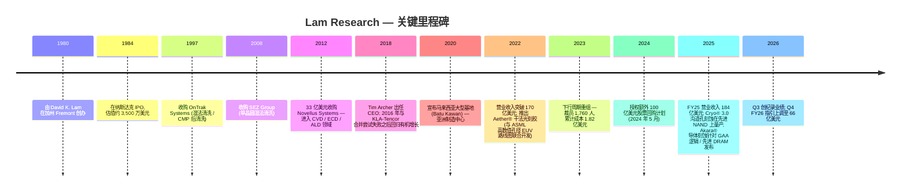
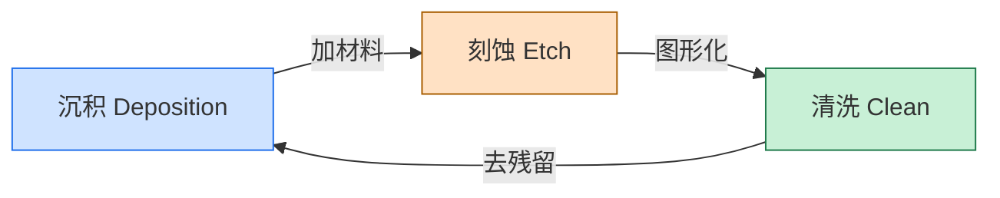
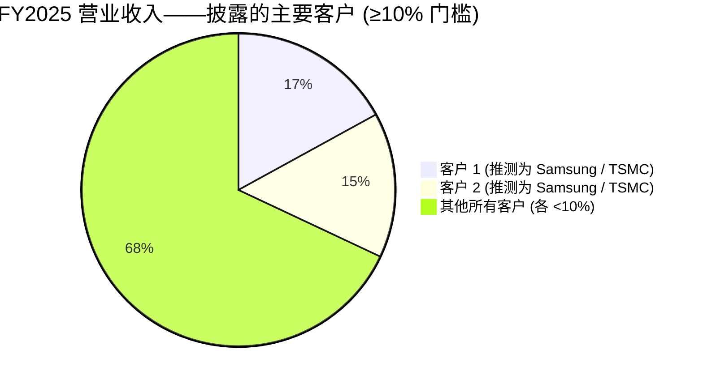
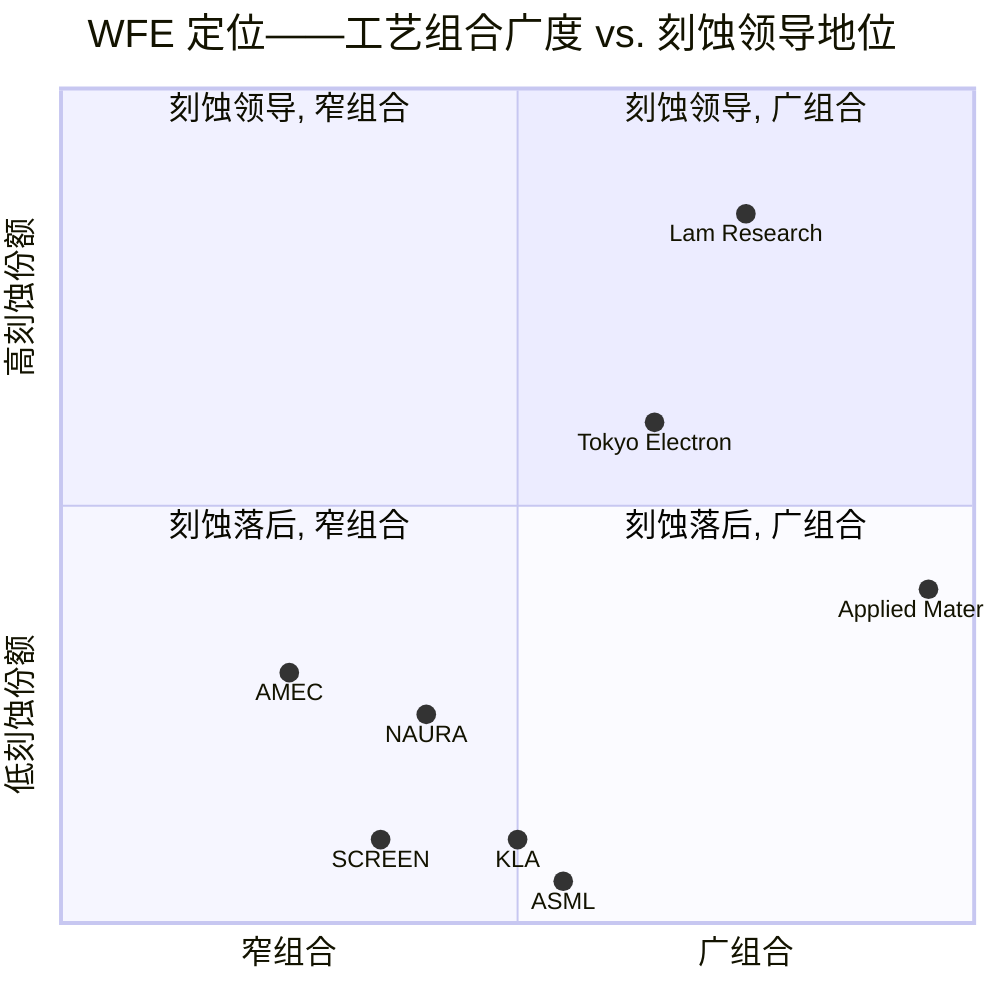

# Lam Research Corporation (NASDAQ:LRCX) — 公司研究报告

**截至日期: 2026-05-20**
**上市地: 纳斯达克全球精选市场, 代码 LRCX**
**注册地: 美国加利福尼亚州弗里蒙特 (Fremont, California)**
**报告语言: 简体中文 (英文版同时存在于本目录)**

**分析师备注:** Lam 财年在 6 月底结束 (2025 财年于 2025 年 6 月 29 日结束)。涉及日历年口径之处, 文中会明确标注。所有美元金额除非另行说明, 均为美元 (USD)。

> **业绩更新——2026 财年 Q3 业绩超预期, Q4 FY2026 指引上调 (2026-04-22):** Lam 公布截至 2026 年 3 月 29 日的季度营业收入创下 **58.4 亿美元** 历史新高, non-GAAP 稀释每股收益 (EPS) **1.47 美元** (营业收入环比 +9%、同比 +24%; EPS 环比 +16%、同比 +43%)。管理层指引 2026 财年 Q4 (2026 年 6 月度结束季度) 营业收入 **66.0 亿美元 ± 4 亿美元** (中位数环比约 +13%), non-GAAP EPS **1.65 美元 ± 0.15 美元**, 显著高于此前市场一致预期约 61 亿美元 / 1.55 美元。CEO Tim Archer 将业绩强势归因于"AI 驱动的需求正在重塑半导体行业 (AI-driven demand reshaping the semiconductor industry)", 以及 Lam 在 HBM (高带宽内存)、GAA (gate-all-around, 全栅极环绕) 逻辑制程及先进 NAND 客户路线图上的执行。来源: [2026 财年 Q3 业绩公告 (附件 99.1), 2026-04-22](https://www.sec.gov/Archives/edgar/data/707549/000070754926000020/lrcx_exhibitx991xq3x2026.htm)。

---

## 目录

1. 公司概览
2. 公司历史
3. 管理团队
4. 产品与服务
5. 客户与上市策略
6. 行业概览
7. 竞争格局
8. 市场机会 (TAM)
9. 风险评估
10. 参考资料

---

## 1. 公司概览

Lam Research Corporation ("Lam", NASDAQ:LRCX) 是全球三大 **半导体设备 (wafer fabrication equipment, WFE, 晶圆制造设备)** 供应商之一, 与 Applied Materials (AMAT, 应用材料) 及 ASML (阿斯麦) 并列。Lam 的设备在晶圆处理流程中夹在 lithography / 光刻 (ASML 主导领域) 与 metrology / 量测 (KLA 主导领域) 之间, 构建芯片中每一颗晶体管与互连线 (interconnect) 的导电层与绝缘层。公司是 **plasma etch / 等离子体刻蚀** 领域的全球**毫无争议的第一**, 在多个 **deposition / 沉积** 细分市场 (ALD / 原子层沉积、PECVD / 等离子增强化学气相沉积、ECD / 电化学沉积铜电镀、tungsten/molybdenum CVD / 钨钼化学气相沉积) 与 AMAT 共同位居领导地位, 并在 **单晶圆湿法清洗 (single-wafer wet cleaning)** 上排名**全球第二, 仅次于日本 SCREEN Holdings (大日本网屏)**——在美国与韩国客户处相对地位更强, 同时在 **bevel / 干法等离子清洗 (Coronus®)** 领域拥有相邻业务——这一组合在产品分类中被称为"沉积、刻蚀与清洗 (deposition, etch and clean)"产品组合 ([2025 Form 10-K, p.4](https://www.sec.gov/Archives/edgar/data/707549/000070754925000075/lrcx-20250629.htm); [SCREEN Holdings — 投资者关系](https://www.screen.co.jp/en/ir))。

**盈利方式。** 营业收入大约三分之二为新设备销售 ("Systems revenue / 系统收入"), 销售给运行 200mm 与 300mm 硅片的晶圆厂; 其余为深厚的、循环性的**服务年金 (recurring service annuity)** 业务——**客户支持业务集团 (Customer Support Business Group, CSBG)**——含备件、升级、生产力软件 (Equipment Intelligence® / 设备智能化) 以及以 **Reliant®** 品牌销售的非先进节点 (non-leading-edge) 翻新设备。2025 财年系统收入为 **114.9 亿美元 (占总营业收入 62.3%)**, CSBG 收入为 **69.4 亿美元 (占总营业收入 37.7%)**, 合并营业收入为 184.4 亿美元 ([2025 Form 10-K — 经营成果](https://www.sec.gov/Archives/edgar/data/707549/000070754925000075/lrcx-20250629.htm))。CSBG 在 2024 财年低谷期 (新设备出货收缩) 占比上升至约 40%, 而在设备上行周期回落至 30 多个百分点——展示了循环业务对周期波动的缓冲效应。Lam 商业模式的另一要素是其**递延收入 (deferred revenue) 余额**: 从 2023 财年末 14 亿美元翻倍至 2025 年 6 月 29 日的 **27 亿美元**, 随后于 2026 年 3 月 29 日略降至 22 亿美元——反映前置出货量及客户预付款的指标 ([2025 10-K MD&A](https://www.sec.gov/Archives/edgar/data/707549/000070754925000075/lrcx-20250629.htm); [Q3 FY2026 业绩公告](https://www.sec.gov/Archives/edgar/data/707549/000070754926000020/lrcx_exhibitx991xq3x2026.htm))。

**地理布局。** 总部位于加州弗里蒙特, 截至 2025 年 8 月 7 日, Lam 拥有约 **19,000 名正式全职员工**, 其中超过 29% 在 R&D, 约 43% 位于美国、50% 位于亚洲、7% 位于欧洲 ([2025 10-K, p.10](https://www.sec.gov/Archives/edgar/data/707549/000070754925000075/lrcx-20250629.htm))。客户基础严重偏向亚洲: 2025 财年**非美国销售约占总营业收入 93%**, 中国 34%、韩国 22%、台湾 19%、日本 10%、美国 7%、东南亚 5%、欧洲 3% ([2025 10-K — 经营成果](https://www.sec.gov/Archives/edgar/data/707549/000070754925000075/lrcx-20250629.htm))。截至 2026 年 3 月 29 日止的九个月期间, 中国回升至约 37%, 因中国成熟节点晶圆厂建设再加速 ([Q3 FY2026 10-Q, p.20](https://www.sec.gov/Archives/edgar/data/707549/000070754926000022/lrcx-20260329.htm))。根据 10-K 物业 (Properties) 章节, 主要研发与运营设施位于**加州 Fremont 与 Livermore、俄勒冈州 Tualatin、韩国京畿道 Yongin (龙仁)、印度 Bengaluru (班加罗尔), 以及奥地利 Salzburg 与 Villach**, 自有 / 租赁制造设施分布于**加州、俄亥俄州、俄勒冈州、奥地利、韩国、马来西亚 (Batu Kawan / 槟城高峡湾) 及台湾** ([2025 10-K, Item 2 Properties](https://www.sec.gov/Archives/edgar/data/707549/000070754925000075/lrcx-20250629.htm))。

**规模与经营经济性。** 2025 财年营业收入同比 **+23.7% 至 184.4 亿美元**, 毛利率 (gross margin) 同比扩张 **140 个基点至 48.7%**, 营业利润率达 32.0%, 稀释 EPS 同比 **+43.1% 至 4.15 美元**。经营性现金流为 **61.7 亿美元** (占营收 33.5%), 自由现金流为 **54.1 亿美元** ([2025 10-K MD&A](https://www.sec.gov/Archives/edgar/data/707549/000070754925000075/lrcx-20250629.htm))。最近一个季度 (2026 财年 Q3, 截至 2026 年 3 月 29 日), 营业收入 **58.4 亿美元**、GAAP 毛利率 **49.8%**、GAAP 营业利润率 **35.0%**、稀释 EPS **1.45 美元**——全部为连续新高——过去 12 个月 (TTM) 年化营业收入接近 **210 亿美元**, 年化净利润约 **57 亿美元** ([Q3 FY2026 业绩公告](https://www.sec.gov/Archives/edgar/data/707549/000070754926000020/lrcx_exhibitx991xq3x2026.htm))。

*来源: [Lam Research 2025 Form 10-K — MD&A](https://www.sec.gov/Archives/edgar/data/707549/000070754925000075/lrcx-20250629.htm); FY2022 10-K 提供 FY2021 数据。*

**估值快照 (截至 2026-05-20)。** LRCX 收盘价 **289.41 美元**, 对应市值约 **3,620 亿美元**, 稀释股本 12.5 亿股 ([Yahoo Finance / yfinance API, 2026-05-20](https://finance.yahoo.com/quote/LRCX/key-statistics/))。TTM 与前瞻倍数 (Yahoo Finance):

| 倍数 | LRCX | AMAT | KLAC | ASML | TEL (同业中位) |
|---|---|---|---|---|---|
| TTM P/E | **54.6×** | 39.8× | 51.3× | 51.5× | 20.6× |
| 前瞻 P/E | 36.5× | 26.2× | 36.4× | 32.4× | 16.0× |
| TTM P/S | **16.7×** | 11.6× | 18.1× | 17.7× | 3.1× |
| TTM EV/EBITDA | 43.4× | 34.6× | 39.1× | 43.8× | 13.1× |
| 股息率 | 0.38% | 0.52% | 0.53% | 0.60% | 1.48% |
| 52 周区间 | 79.49 – 302.00 美元 | 153 – 448 美元 | 740 – 1,939 美元 | 683 – 1,604 美元 | n/a |

LRCX 接近 52 周高点, 自 2025 年 4 月低点约 80 美元 (受关税 / 出口管制抛售及随后 AI-WFE 板块轮动驱动) 起涨幅接近四倍 ([Simply Wall St — LRCX 估值与美国出口管制, 2025-09](https://simplywall.st/stocks/us/semiconductors/nasdaq-lrcx/lam-research/news/a-look-at-lam-research-lrcx-valuation-after-new-us-export-cu))。**TTM P/E 54.6× 较 AMAT 高约 +30%**, 与 KLAC 和 ASML 大致持平, 而后者已被市场重新定价为"AI 基础设施铲子卖家 (AI infrastructure picks-and-shovels)" ([Yahoo Finance — LRCX 统计](https://finance.yahoo.com/quote/LRCX/key-statistics/))。这一倍数显著**高于 WFE 同业中位 (含 TE Connectivity TEL) 的 2 倍以上**, 因此需要结构性解释:

- **驱动 #1 — AI 驱动 WFE 增长溢价。** 管理层与近期业绩评论将估值重定调归因于 AI 服务器需求拉动 HBM (3D DRAM 堆叠)、GAA 逻辑刻蚀工艺密度、以及先进封装 (advanced packaging) 产能, 这些恰恰是 Lam 刻蚀 / 沉积业务超配的领域; CEO Tim Archer 在 Q3 FY2026 业绩公告中描述"AI 驱动需求正在重塑半导体行业"([Q3 FY2026 业绩公告, 2026-04-22](https://www.sec.gov/Archives/edgar/data/707549/000070754926000020/lrcx_exhibitx991xq3x2026.htm))。前瞻 P/E 36.5× 意味着市场预期 EPS 从 TTM 至下一财年增长约 50%, 这与 Lam Q4 FY2026 指引 (1.65 ± 0.15 美元) 年化所隐含的 FY2026 EPS 大致吻合 ([Q3 FY2026 业绩公告](https://www.sec.gov/Archives/edgar/data/707549/000070754926000020/lrcx_exhibitx991xq3x2026.htm))。
- **驱动 #2 — 周期再定价。** 2024 财年为存储器主导的低谷; 毛利率受压、EPS 触多年低点。TTM 分母仍部分被低谷季度拖累, 拉高 TTM 倍数 vs 前瞻 ([2025 10-K MD&A](https://www.sec.gov/Archives/edgar/data/707549/000070754925000075/lrcx-20250629.htm))。
- **驱动 #3 — 资本回报。** 2025 财年返还 46 亿美元 (76% 通过回购在更低股数基础上具增厚效应) ([2025 10-K 现金流量表](https://www.sec.gov/Archives/edgar/data/707549/000070754925000075/lrcx-20250629.htm)), 加上 2024 年 5 月公告的额外 100 亿美元回购授权 ([8-K — 100 亿美元回购授权 + 1 拆 10 股票分拆, 2024-05-21](https://www.sec.gov/Archives/edgar/data/707549/000070754924000076/lrcx_exx991xmayx21x2024.htm)), 以及 2026 年 2 月股息上调 13% (每季度从 0.23 美元增至 0.26 美元) ([Lam Research 季度股息宣布, 2026-02-05](https://newsroom.lamresearch.com/2026-02-05-Lam-Research-Corporation-Declares-Quarterly-Dividend))。每股增长被结构性放大。

该倍数与 WFE 寡头集团一致, 但若中国收入进一步因出口管制压缩、或 NAND 资本开支停滞, 仍有一定下行空间——KLAC、ASML 与 LRCX 按 Yahoo Finance 同业可比交易于类似的"AI 基础设施铲子卖家"倍数区间 ([KLAC](https://finance.yahoo.com/quote/KLAC/key-statistics/); [ASML](https://finance.yahoo.com/quote/ASML/key-statistics/))。我们在第 9 章中将估值倍数压缩列为风险项。

*来源: Yahoo Finance via yfinance API, 2026-05-20 ([LRCX 统计页](https://finance.yahoo.com/quote/LRCX/key-statistics/))。*

---

## 2. 公司历史

Lam 由 **David K. Lam (林杰屏) 于 1980 年在加州 Fremont 创办**, 是中国出生的工程师, 曾先后在 Xerox、Hewlett-Packard 及 Texas Instruments 工作 ([SEMI — David K. Lam 口述历史访谈](https://www.semi.org/en/Oral-History-Interview-David-Lam); [Lam Research — 公司历史](https://www.lamresearch.com/company/history/))。Dr. Lam 当时识别出: 随着 IC 特征尺寸缩小, 行业需要 plasma etching / 等离子体刻蚀的 selectivity / 选择性 与 uniformity / 均匀性 远优于当时使用的湿法工艺。他于 1982 年推出 Lam AutoEtch 480——业界首台全自动 plasma etching system, 并迅速取代上一代刻蚀机 ([Lam Research — 公司历史](https://www.lamresearch.com/company/history/))。公司 **1984 年 5 月于纳斯达克 (NASDAQ) 上市** (代码 LRCX), 使 David K. Lam 成为首位在 Nasdaq 交易所带领公司上市的亚裔美国人 ([SEMI — David K. Lam 口述历史](https://www.semi.org/en/Oral-History-Interview-David-Lam)), 并在 1990 年代成为主导性纯 etch 供应商。

**变革性事件。**
- **1997 年——收购 OnTrak Systems。** 将 wet-clean / 湿法清洗 (post-CMP cleaning / CMP 后清洗) 引入 Lam 产品组合。这最终演化为 SP 系列与 EOS® 湿法平台业务 ([Lam Research — 公司历史](https://www.lamresearch.com/company/history/))。
- **2008 年——收购 SEZ Group。** Lam 出资约 5.68 亿美元 (扣除已收购现金后净额约 4.47 亿美元) 收购奥地利 SEZ Holding AG, 后者是单晶圆湿法清洗的领先供应商, 加速 Lam 在 32nm 及以下逻辑制程的 clean 业务布局——在该制程节点 dry-strip 加单晶圆湿法已成标准工艺 ([Lam Research — SEZ 要约收购初步成功结果, 2008-02-11](https://newsroom.lamresearch.com/2008-02-11-Lam-Research-Corporation-Announces-Successful-Preliminary-Results-of-Public-Tender-Offer-for-Registered-Shares-of-SEZ-Holding-AG); [Lam Research FY2008 10-K](https://www.sec.gov/Archives/edgar/data/0000707549/000095013408015947/f43373e10vk.htm))。
- **2012 年——收购 Novellus Systems (33 亿美元, 全股票交易)。** 公司的战略转折点。Novellus 股东每股 Novellus 股票换取 1.125 股 LRCX, 为免税换股 ([Lam Research — 33 亿美元全股票交易合并新闻稿](https://newsroom.lamresearch.com/2011-12-15-Lam-Research-and-Novellus-Systems-to-Combine-in-3-3-Billion-All-Stock-Transaction); [Jones Day — Lam 33 亿美元全股票收购 Novellus](https://www.jonesday.com/en/practices/experience/2011/12/lam-research-acquires-semiconductor-equipment-maker-novellus-systems-in-33-billion-allstock-transaction))。Novellus 带来 PECVD (VECTOR® / Striker®)、HDP-CVD (SPEED®)、tungsten/molybdenum ALD/CVD (ALTUS®) 以及 electrochemical-deposition 铜电镀 (SABRE®) 业务。一夜之间 Lam 在 deposition / 沉积领域跃升为可信的 **#1 或 #2**, 真正成为"deposition + etch + clean"多产品供应商, 这是自此以来一切发展的结构性基石。今天的多数 deposition 产品序列均可追溯至 Novellus 产品组合。
- **2015–2016 年——与 KLA-Tencor 合并尝试 (106 亿美元)。** Lam 2015 年末宣布要约收购 KLA-Tencor 以加入 metrology / inspection 业务。在 DOJ (美国司法部) 表示不会批准双方协商的同意令后, 交易于 2016 年 10 月 5 日合意终止——Lam-KLA 合并后将控制 WFE 估计约 42% 份额 ([Lam Research 8-K — 合并终止, 2016-10-05](https://www.sec.gov/Archives/edgar/data/0000707549/000119312516731756/d271204dex991.htm); [KLA-Tencor 8-K — 合并终止, 2016-10-05](https://www.sec.gov/Archives/edgar/data/0000319201/000031920116000095/exhibit991pressreleaserete.htm))。这一事件强化了 Lam 独立成长的战略, 并加速了有机研发投入。
- **2020–2022 年——马来西亚扩产与供应链重新布局。** 2020 年 2 月 Lam 宣布在马来西亚槟城 Batu Kawan 投资 10 亿马币、约 700,000 平方英尺 (约 65,000 平米) 新厂 ([Lam Research — 全球布局扩张, 2020-02-03](https://newsroom.lamresearch.com/2020-02-03-Lam-Research-to-Expand-Global-Footprint))。Batu Kawan 园区于 2021 年 5 月开幕, 2022 年成为 Lam 最大制造基地 ([SEMI — Lam Research 扩展全球产能聚焦报道](https://www.semi.org/en/blogs/technology-trends/spotlight-on-lam-research-expanding-global-capacity)); 它也间歇性成为与美国出口管制规则摩擦的焦点。
- **2023–2024 年——周期性重置与重组。** 2023 历年 NAND 资本开支崩塌, Lam 于 2023 年 1 月 23 日宣布裁员重组计划 ([8-K — 重组计划, 2023-01-23](https://www.sec.gov/Archives/edgar/data/0000707549/000070754923000005/lrcx-20230123.htm))。至 2024 年 6 月 30 日, 该计划终结**约 1,760 名员工** (约占重组前员工总数的 10%), 累计重组费用至 2024 财年达 **1.819 亿美元** ([2025 10-K, Note 20](https://www.sec.gov/Archives/edgar/data/707549/000070754925000075/lrcx-20250629.htm))。2025 财年未记录重组成本; 该计划被描述为"基本完成"。
- **2025-2026 年——AI-WFE 上行周期。** Memory (HBM、先进 DRAM) 与 GAA 逻辑 (selective etch / 选择性刻蚀、多步沉积) 推动公司重回创纪录增长 ([Q3 FY2026 业绩公告, 2026-04-22](https://www.sec.gov/Archives/edgar/data/707549/000070754926000020/lrcx_exhibitx991xq3x2026.htm))。中国营业收入从 2024 财年峰值 (42%) 回归至 30 多个百分点 ([2025 10-K — 经营成果](https://www.sec.gov/Archives/edgar/data/707549/000070754925000075/lrcx-20250629.htm))。

**近期动态 (2025–26)。** 美国客户本土建厂持续支撑 Lam 服务市场的增长——其中最显著的是台积电 (TSMC) 在亚利桑那州扩张, 美国本土投资总额已达 **1,650 亿美元** ([TSMC 6-K — 扩大美国投资, 2025](https://www.sec.gov/Archives/edgar/data/0001046179/000104617925000024/tsmcexpandinvestmentintheu.htm)), 以及 Samsung 在德州 Taylor 的工厂。在治理方面, Cadence (铿腾电子) CEO Anirudh Devgan 于 2026 年 2 月加入 Lam 董事会 ([8-K — 董事任命, 2026-02-03](https://www.sec.gov/Archives/edgar/data/707549/000070754926000012/lrcx_exx991directorappoint.htm))。

---

## 3. 管理团队

### Timothy M. Archer — 总裁兼 CEO (58 岁)

Tim Archer 自 **2018 年 12 月** 担任 CEO, 是 Lam 现代经营时期的第二任 CEO (接替 2017 年底离职的 Martin Anstice)。Archer 在 Novellus Systems 工作 **18 年 (1994–2012)**, 历任技术与业务岗位, 自 2011 年 1 月至 2012 年 6 月 Lam 收购 Novellus 为止担任首席运营官 (COO)。加入 Lam 后, 他自 2012 年起担任 EVP 兼 COO, 2018 年 1 月升任总裁兼 COO, 2018 年 12 月被任命为总裁兼 CEO ([2025 10-K, p.10-11](https://www.sec.gov/Archives/edgar/data/707549/000070754925000075/lrcx-20250629.htm))。

Archer 拥有 **加州理工学院 (Caltech) 应用物理学学士学位**, 并完成了哈佛商学院的管理发展项目 (Program for Management Development) ([Lam Research — 公司概况](https://www.lamresearch.com/company/company-overview/))。他还担任 **Johnson Controls International** 董事 (2024 年起) 以及行业贸易组织 **SEMI 国际董事会** 成员 ([SEMICON Taiwan — Tim Archer 简介](https://www.semicontaiwan.org/en/node/8511))。

在 Archer 任内 (2018 年 12 月至今), Lam 营业收入从 **111 亿美元 (CY2018, 日历年)** 增长至 **约 210 亿美元年化 (CY2026, 日历年)**, 毛利率从 46% 低位扩张至约 50%, 股价含股息年化复合回报约 **20% 以上**——这一业绩使其跻身半导体设备业最优秀的运营领导者之列。他驾驭了三轮完整的 WFE 周期 (2019 年小幅低谷、2022 年超级周期、2023 年存储器崩塌、2025–26 年 AI 上行周期), 每一个低谷高于前一个、每一个高峰更具盈利能力。Archer 的对外曝光度低于 Gary Dickerson (AMAT) 或 Christophe Fouquet (ASML)——他鲜少出现在主流媒体——但他经常在 SEMI 行业活动与 Lam 季度业绩说明会上发言, 始终强调**"技术拐点 (technology inflections)"** (存储器向 3D / 垂直堆叠的转变、逻辑制程的 GAA、AI 用先进封装) 与多产品客户胜出。根据 proxy / 股东大会代理声明披露, 他 2025 历年基薪同比上调 8.3% ([2025 DEF 14A, CD&A](https://www.sec.gov/Archives/edgar/data/707549/000114036125036012/ny20050572x2_def14a.htm))。

---

## 4. 产品与服务

### 4.1 10-K 产品矩阵——本章节的主干

本章节以 Lam 自己的产品矩阵为锚定基础, 引自 **2025 Form 10-K, Item 1 Business — Products** ([10-K, 产品章节](https://www.sec.gov/Archives/edgar/data/707549/000070754925000075/lrcx-20250629.htm))。下方先呈现 10-K 原始表格, 再附上可搜索的 markdown 复现; 接下来的各小节逐行展开该表, **逐字引用 Lam 自己的 10-K 描述**, 再附上分析师评论。中文释义 (Plain-language gloss) 在底层物理或工艺步骤足够技术化、单行英文无法说明时插入。

*来源: [Lam Research 2025 Form 10-K, Item 1 Business — Products](https://www.sec.gov/Archives/edgar/data/707549/000070754925000075/lrcx-20250629.htm)。*

| 市场 | 工艺 / 应用 | 技术 | 产品 |
|---|---|---|---|
| **沉积 (Deposition)** | 金属薄膜 | 电化学沉积 ("ECD") — 铜与其他金属 | **SABRE® 系列** |
|  | 金属薄膜 | 化学气相沉积 ("CVD") / 原子层沉积 ("ALD") — 钨与钼 | **ALTUS® 系列** |
|  | 介质薄膜 | 等离子增强 CVD ("PECVD") / ALD / 高密度等离子 Gapfill CVD ("HDP-CVD") | **VECTOR® / Striker® / SPEED® 系列** |
| **刻蚀 (Etch)** | 导体刻蚀 | Reactive Ion Etch / 反应性离子刻蚀 | **Kiyo® 系列 / Versys® Metal 系列** |
|  | 介质刻蚀 | Reactive Ion Etch | **Flex® 系列 / Vantex® 系列** |
|  | 硅通孔 ("TSV") 刻蚀 | Deep Reactive Ion Etch / 深反应性离子刻蚀 | **Syndion® 系列** |
| **清洗 (Clean)** | 晶圆清洗 | Wet Clean / 湿法清洗 | **EOS® / DV-Prime® / Da Vinci® / SP 系列** |
|  | 晶圆边缘清洗 | Dry Plasma Clean / 干法等离子体清洗 | **Coronus® 系列** |

位于产品矩阵*之外*的是 **Customer Support Business Group (CSBG, 客户支持业务集团)**——独立业务集团, 涵盖服务、备件、升级、生产力软件 (Equipment Intelligence®) 以及以 Reliant® 品牌销售的非先进节点翻新设备 ([2025 10-K, Item 1 Business — CSBG 描述](https://www.sec.gov/Archives/edgar/data/707549/000070754925000075/lrcx-20250629.htm))。在财务报告中, Lam 作为**单一可报告分部**经营, 营业收入分为两类——**系统收入 (Systems revenue)** (新一代沉积、刻蚀、清洗及其他先进节点 WFE 设备) 与**客户支持相关营业收入 (Customer support-related revenue and other)** (CSBG 与 Reliant)。10-K 不按工艺细分发布营业收入百分比; 下文任何子细分均明确标注为分析师估算。

### 4.2 综合视图——沉积、刻蚀、清洗如何构成一个完整的芯片制造循环

现代集成电路每一层都通过循环 Lam 的三个产品类别构建, 重复数百次以堆叠逻辑芯片或 3D NAND 阵列:

1. **沉积负责加上材料 (Deposition lays down material)**——一条铜互连线 (**SABRE**)、一个钨或钼接触点 / NAND 字线 (**ALTUS**), 或者一层介质绝缘层 (**VECTOR / Striker / SPEED**)。
2. **刻蚀负责去掉材料 (Etch removes material)**——图形化栅极与金属线 (**Kiyo / Versys / Akara**)、在 3D NAND 上打深沟道孔 (**Flex / Vantex** 加 **Cryo® 3.0**), 或为 HBM 堆栈打穿大块硅做 TSV (**Syndion**)。
3. **清洗负责去除上一步留下的残留 (Clean removes the residue from the previous step)**——湿法化学清洗冲洗晶圆表面 (**EOS / DV-Prime / Da Vinci / SP 系列**) 或晶圆外缘的干法等离子体扫除 (**Coronus**)。粒子计数 (particle count) 在先进节点直接限制良率, 因此清洗工具几乎位于每一道沉积与刻蚀步骤之间。

相同的循环在台积电 (TSMC)、三星 (Samsung)、SK 海力士、Intel、美光 (Micron) 以及中国大陆领先晶圆厂均在运行。不同供应商之间的差异在于先进节点的工艺 / 精度、成熟节点的产能, 以及安装基数 (installed base) 服务深度。

### 4.3 沉积 (Deposition)——"建上去"

沉积工具*增加*晶圆表面的材料; 它们共同构建芯片纵向堆叠的金属互连线、晶体管接触点与介质绝缘层。10-K 竞争章节将 **Applied Materials** 列为 Lam 在介质与金属沉积领域的主要竞争对手, 并在 ALD 与 PECVD 特别细分中加入了 **ASM International** 与 **Wonik IPS** ([2025 10-K — 竞争](https://www.sec.gov/Archives/edgar/data/707549/000070754925000075/lrcx-20250629.htm))。

#### SABRE® / SABRE® 3D——电化学沉积 (铜与其他金属)

**10-K 原文** ([2025 10-K — SABRE 产品系列](https://www.sec.gov/Archives/edgar/data/707549/000070754925000075/lrcx-20250629.htm)):

> "铜沉积为大多数半导体器件铺设导电线路。即便是最微小的缺陷——例如一个微观针孔或一粒灰尘——在这些导电结构中也会影响器件性能, 从速度损失到完全失效不等。SABRE ECD 产品系列协助引领了铜互连的转型, 为逻辑与存储器中的铜大马士革 (copper damascene) 制造提供所需精度。系统能力包括为逻辑应用沉积钴, 以及在各种 liner 材料上直接沉积铜……"

**中文释义 / Plain-language gloss:** SABRE 做的是 **电镀铜 / Cu electroplating (ECD, electrochemical deposition)** ——通过电化学反应把铜长在 wafer 上, 形成连接每个晶体管的 **互连线 / interconnect** (即芯片里的"金属导线")。**Damascene 工艺 / 大马士革工艺** 指的是 "dig-then-fill / 先挖后填" 的流程: 先在 **介质层 / dielectric layer** 上挖出 trench / 沟槽 和 via / 通孔, 然后电镀填铜, 最后用 **CMP / 化学机械抛光** 把表面多余的铜磨平——是逻辑芯片和 DRAM 后段 metal layers (BEOL, back-end-of-line / 后段制程) 的行业标准。**SABRE 3D** 把同一工艺扩展到 **3D packaging / 三维先进封装**: HBM 高带宽内存的 **TSV / 硅通孔 (through-silicon via)** 充铜、wafer-level packaging (WLP, 晶圆级封装)、fan-out / 扇出型封装——相当于在堆叠 DRAM 之间打通垂直的"电梯通道"。每一颗 HBM 堆叠 + 每一片 advanced-packaging interposer / 先进封装中介层 都拉动 SABRE 3D 的设备需求。

***分析师观点:*** 业内公认 Lam 是单晶圆 Cu ECD 的领头羊已二十年; AMAT (NOKOTA / Raider) 与 Ebara (荏原) 是最接近的外部竞争对手, Lam 在先进封装领域尤其根深蒂固。

#### ALTUS® / ALTUS® Halo——钨与钼 CVD-ALD

**10-K 原文** ([2025 10-K — ALTUS 产品系列](https://www.sec.gov/Archives/edgar/data/707549/000070754925000075/lrcx-20250629.htm)):

> "钨和 / 或钼沉积用于在芯片上形成导电特征, 例如接触孔 (contacts)、通孔 (vias) 和字线 (wordlines)。这些特征尺寸小、通常窄, 仅使用少量金属, 因此最小化电阻并实现完全填充难度很大。在这些纳米级尺寸下, 即便是轻微的瑕疵也会影响器件性能或导致芯片失效。我们的 ALTUS 系统结合 CVD 与 ALD 技术, 沉积满足先进钨或钼金属化 (ALTUS Halo) 应用所需的高度保形或选择性薄膜, 应用于逻辑与存储器。多腔体顺序沉积 (Multi-Station Sequential Deposition) 架构能够在同一腔体 (in situ) 内进行成核层 (nucleation layer) 形成与 bulk CVD/ALD 填充。"

**中文释义 / Plain-language gloss:** ALTUS 做的是 **钨 (tungsten, W) 和钼 (molybdenum, Mo) 金属沉积**——填的是 **逻辑芯片的 contact / 接触孔** 和 via / 通孔, 以及 **3D NAND 的 wordline / 字线**——也就是芯片里最深、最窄的"金属插塞 / metal plug"。两种核心技术: **CVD (化学气相沉积 / chemical vapor deposition)** 用气态反应物在 wafer 上发生化学反应、把固态膜"长"出来; **ALD (原子层沉积 / atomic layer deposition)** 是 CVD 的精度极致版——一次只让一层 atomic-thickness 的膜长出来, 可以做到 sub-nm 的厚度控制。ALTUS 把两种技术放在同一个 **Multi-Station Sequential Deposition (多腔体串联沉积)** 腔室里: 先用 ALD 长一层 **nucleation layer / 种子层** 打底 (保证后续金属能均匀附着), 再用 CVD 把剩余体积填满, 确保整个孔 **void-free / 无空洞**。**ALTUS Halo** (2025 年 2 月发布) 是 Lam 第一台大批量出货的 **钼金属 ALD / molybdenum ALD** 工具——为什么用 Mo 替代 W? 随着 3D NAND wordline 越叠越多、每条 wordline 越来越细, **resistivity / 电阻率** 成为瓶颈: Mo 在薄膜厚度下的电阻率低于 W, Lam 宣称 ALTUS Halo 可让 wordline 电阻降低 50%+; Micron 已被列为 early adopter / 早期客户。

***分析师观点:*** AMAT 以 Endura W 与之竞争; 钼制程 (moly transition) 是 Lam 在 300 层以上 NAND 路线图上的关键增量机会 ([Lam Research — ALTUS® Halo 开启金属化新时代, 2025-02-19](https://newsroom.lamresearch.com/2025-02-19-Lam-Research-Ushers-in-New-Era-of-Semiconductor-Metallization-with-ALTUS-R-Halo-for-Molybdenum-Atomic-Layer-Deposition))。

#### VECTOR®——介质薄膜的等离子增强 CVD (PECVD)

**10-K 原文** ([2025 10-K — VECTOR 产品系列](https://www.sec.gov/Archives/edgar/data/707549/000070754925000075/lrcx-20250629.htm)):

> "介质薄膜沉积工艺用于形成半导体器件中最难制造的部分绝缘层, 包括最新型晶体管与 3D 结构所用的绝缘层。某些应用要求介质薄膜异常均匀且无缺陷, 因为轻微瑕疵会在后续层上被显著放大。我们的 VECTOR PECVD 产品旨在为各种富有挑战性的器件应用提供构建这些关键结构所需的性能与灵活性。"

**中文释义 / Plain-language gloss:** **介质沉积 / dielectric film deposition** 做的是 **绝缘层 / insulator layer** (不导电的 SiO₂ 二氧化硅 或 low-k 低介电常数 materials), 目的不是 conduct 电流, 而是 **隔离 / isolate** 两条挨得很近的 metal lines——防止 **漏电 / leakage** 和 **信号串扰 / signal crosstalk**。**PECVD (Plasma-enhanced CVD, 等离子体增强化学气相沉积)** 用 plasma / 等离子体 激活化学反应, 可以在 **较低温度 / lower temperature** 下长出均匀薄膜——这对已经沉积过 metal layers 的 wafer 很重要 (高温会损坏下层金属)。VECTOR 是 Lam 的主力 PECVD 平台, 主要用在 **inter-layer dielectric (ILD, 层间介质)** 和 gapfill / 间隙填充 等应用。

#### Striker®——先进介质薄膜的 ALD

**10-K 原文** ([2025 10-K — Striker 产品系列](https://www.sec.gov/Archives/edgar/data/707549/000070754925000075/lrcx-20250629.htm)):

> "最新型存储器、逻辑与图像传感器器件需要极薄、高度保形的介质薄膜以持续提升器件性能与缩小尺寸。例如, ALD 薄膜对器件功耗 / 速度的低 k 间隔层 (low-k spacers)、高深宽比 (high aspect ratio) 特征的介质 gapfill 用于隔离和器件性能, 以及基于间隔层的多重图形化方案 (其间隔层帮助定义关键尺寸) 都至关重要。这些应用对空洞 (voids) 与最微小的缺陷几乎零容忍。Striker 单晶圆 ALD 产品提供了这些能力……"

**中文释义 / Plain-language gloss:** Striker 是 Lam 的 **介质 ALD / dielectric ALD 平台**——一层 atom 一层 atom 地长出极薄、极均匀的 insulator films。典型应用: **low-k spacers / 低介电常数间隔层** (决定 transistor gate / 晶体管栅极 的宽度, 进而决定芯片速度和 power consumption / 功耗)、**SAQP / SADP (self-aligned quadruple / double patterning, 自对准多重图形化) 的 spacer layer** (在 EUV 普及之前是定义先进 node 关键 CD / critical dimension 的核心工艺), 以及 3D NAND **high aspect ratio (HAR, 高纵横比)** 沟道的 dielectric fill。一句话总结: Striker = "atomic-level precision dielectric ALD / 原子级精度的介质 ALD", 常被部署在最难、最 zero-defect-tolerance 的工艺步骤上。

#### SPEED®——传统介质 gapfill 的 HDP-CVD

**10-K 原文** ([2025 10-K — SPEED 产品系列](https://www.sec.gov/Archives/edgar/data/707549/000070754925000075/lrcx-20250629.htm)):

> "介质 gapfill 工艺通过填充各种深宽比的开口 (在导电线和器件之间) 沉积关键的绝缘层, 介于导电线 / 活动区之间。对于先进器件而言, 被填充的结构可以非常高和窄。结果是高质量的介质薄膜尤为重要, 因为串扰 (cross-talk) 和器件失效的可能性持续上升。我们的 SPEED HDP-CVD 产品提供多种介质薄膜方案, 在高吞吐量与可靠性方面具备行业领先水平。"

**中文释义 / Plain-language gloss:** **HDP-CVD (High-Density Plasma CVD, 高密度等离子体化学气相沉积)** 适合 **mature node / 传统节点 / 成熟工艺** 的 **gapfill / 间隙填充**——在 transistor 与 transistor 之间、metal line 与 metal line 之间填 insulator。其优势是 **high throughput / 高吞吐量、高 reliability / 可靠性**, 但在 leading-edge nodes / 最先进节点 已经在被 ALD 替代 (ALD 精度更高、可填更窄的缝)。SPEED 因此是 Lam 在 mature-node 市场 (28nm 及以上的成熟工艺) 的主力 deposition 工具, 尤其重要于中国大陆和台湾的成熟节点 fab 扩产周期。

***分析师观点 (VECTOR / Striker / SPEED):*** AMAT 的 Producer 平台是这些 PECVD 应用的主要外部竞争对手; 相对地位因薄膜堆栈与客户而异。

#### Aether®——干法光刻胶 (ASML / IMEC 联合开发)

Lam 在 ALTUS 与 Striker 两个平台上运行 ALD, 同时与 ASML 及 IMEC 联合开发 **干法光刻胶 / dry-photoresist** 解决方案 (Aether®), 用于 EUV / high-NA EUV 光刻 ([Lam Research — Entegris/Gelest 干法光刻胶生态, 2022-07-12](https://newsroom.lamresearch.com/2022-07-12-Lam-Research,-Entegris,-Gelest-Team-Up-to-Advance-EUV-Dry-Resist-Technology-Ecosystem); [SK 海力士干法光刻胶认证, 2022 年中](https://www.prnewswire.com/news-releases/lam-research-teams-up-with-sk-hynix-to-enhance-dram-production-cost-efficiency-with-breakthrough-dry-resist-euv-technology-301567359.html))。**中文释义 / Plain-language gloss:** 传统 photolithography / 光刻 使用 **spin-coated wet photoresist / 旋涂的湿法光刻胶** (液态 resist 滴在 wafer 上、高速旋转、形成均匀薄膜)。Aether 是 **dry photoresist / 干法光刻胶**——直接用 ALD 在 wafer 上长出一层 photoresist film, 没有 spin-coating 带来的 thickness uniformity 问题, 在 EUV / high-NA EUV 节点能拿到更细的 pattern resolution / 图形精度。Lam 不做 scanner / 光刻机, 但通过 Aether 切入 EUV photoresist 生态, 跟着 ASML 的 high-NA roadmap 受益。

### 4.4 刻蚀 (Etch)——"图形化下去"

刻蚀工具以原子级精度*去除*材料——把沉积所铺设的薄膜图形化为芯片的真实特征 (栅极、沟道、接触点、孔)。10-K 竞争章节将 **Applied Materials、Hitachi Ltd. (日立) 与 Tokyo Electron (东京电子)** 列为 Lam 在刻蚀领域的主要竞争对手 ([2025 10-K — 竞争](https://www.sec.gov/Archives/edgar/data/707549/000070754925000075/lrcx-20250629.htm))。

#### Kiyo®——导体刻蚀 (反应性离子刻蚀, Reactive Ion Etch)

**10-K 原文** ([2025 10-K — Kiyo 产品系列](https://www.sec.gov/Archives/edgar/data/707549/000070754925000075/lrcx-20250629.htm)):

> "导体刻蚀帮助塑造半导体器件中电活动部分使用的电活性材料。即使是这些微型结构的微小变化也会降低器件性能。事实上, 这些结构非常微小且敏感, 刻蚀工艺挑战物理与化学基本规律的边界。我们的 Kiyo 产品系列为以高精度与高生产力一致地形成这些特征提供了高性能能力。Kiyo 产品中的专有 Hydra 技术通过校正入站图形偏差 (incoming pattern variability) 来改善 CD 均匀性, 并在生产级吞吐量下实现原子级偏差控制。"

**中文释义 / Plain-language gloss:** **导体刻蚀 / conductor etch** 是在 silicon / 硅、polysilicon / 多晶硅、metal / 金属 这些 conductive materials / 会导电的材料 上做"减法"——典型的活儿就是定义 transistor 的 **gate / 栅极** 和 metal interconnect lines / 金属互连线。在 sub-3nm logic nodes (TSMC N2、Samsung SF2、Intel 18A/14A), 关键工艺步是 **gate-all-around selective etch / 栅极环绕选择性刻蚀**——必须 lateral / 横向 地把多余 Si 蚀刻干净, 留下 **nanosheet / 纳米片** 形成 transistor channel; 这是 FinFET 时代没有的工艺。**Hydra** 是 Kiyo 的 in-chamber tuning / 腔内调节 技术: 可以在同一个 chamber / 腔室 内部针对 wafer 上不同 zones / 区域 独立调整刻蚀均匀性, 对入站 wafer 的 incoming pattern variability / 图形偏差 做出 adaptive / 自适应 补偿——是先进节点拿到 CD uniformity / 关键尺寸一致性 的核心。

#### Versys® Metal——导体刻蚀 (金属硬掩膜 / 互连线)

**10-K 原文** ([2025 10-K — Versys Metal 产品系列](https://www.sec.gov/Archives/edgar/data/707549/000070754925000075/lrcx-20250629.htm)):

> "金属刻蚀工艺在连接构成 IC 的各组件中发挥关键作用, 例如形成导线和电气连接。这些工艺也可用于穿透金属硬掩膜 (metal hardmasks), 这些硬掩膜用于形成先进器件的布线。为了实现这些关键的刻蚀步骤, Versys Metal 产品系列在灵活平台上提供高产能能力。优秀的 CD、轮廓均匀性和均匀性控制由对称腔体设计 (symmetrical chamber design) 与独立工艺控制 (independent process controls) 实现……"

**中文释义 / Plain-language gloss:** Versys Metal 专做 **metal etch / 金属刻蚀**——既包括直接刻 metal interconnect lines / 金属导线, 也包括刻 **metal hardmask / 金属硬掩膜**。在先进 logic nodes, photoresist / 光刻胶 太薄撑不住后续的 deep etch / 深刻蚀, 行业普遍用 **metal hardmask** (典型材料是 TiN / 氮化钛 或 W / 钨) 作为掩膜层: 先在 metal layer 上做 patterning / 图形化、再用这个"硬掩膜"去导引下层 dielectric / 介质 的深刻蚀。Versys 的卖点是 **symmetrical chamber design / 对称腔体设计** + **independent process control / 独立工艺控制** = 优秀的 CD uniformity 和 profile uniformity / 轮廓均匀性。

#### Akara®——最新一代导体刻蚀平台 (2025 年 2 月发布)

**Lam 新闻稿原文** ([Lam Research — 揭幕 Akara® 导体刻蚀, 2025-02-19](https://investor.lamresearch.com/2025-02-19-Lam-Research-Unveils-Industrys-Most-Advanced-Conductor-Etch-Technology-to-Date)):

> "Akara 是 plasma etch 中的突破性创新, 也是目前可获得的最先进导体刻蚀工具。Akara 提供了新颖的等离子体处理技术, 实现了无可匹敌的刻蚀精度与性能……集成于 Lam 的高产能 Sense.i 平台之上, Akara 利用 Lam 专有的 DirectDrive 技术, 实现原子级特征的可控制创建, 其等离子体响应速度比上一代快 100×……"

**中文释义 / Plain-language gloss:** Akara 是 Lam 2025 年 2 月发布的下一代 **conductor etch / 导体刻蚀** 平台 (注意: 是 conductor etch, 不是 dielectric etch——Lam 自己的 press release 明确把 Akara 定位为 "the most advanced conductor etch tool available"), 主打四大 target applications: **GAA logic / 栅极环绕逻辑、4F² DRAM、CFET (complementary FET, 互补场效应管)、3D DRAM**。它构建在 **Sense.i®** high-productivity platform / 高产能平台 上, 用 **DirectDrive®** plasma control / 等离子体控制 技术——号称 plasma response / 等离子体响应速度 比上一代快 100×。这意味着可以在 **sub-nanometer / 亚纳米** 级别精细控制 etch depth / 刻蚀深度。Akara 是 Lam 在 2025-2027 年 GAA node ramp / 节点放量周期 最重要的 product launch。

***分析师观点 (Kiyo / Versys / Akara):*** Tokyo Electron 通常被视为先进导体刻蚀的最直接外部竞争对手 ([TEL FY2025 Q4 业绩演示, 2025-05](https://www.tel.com/ir/library/report/l8gqgo00000000gl-att/fy25q4presentations-e.pdf))。

#### Flex®——介质刻蚀 (多频限制等离子体)

**10-K 原文** ([2025 10-K — Flex 产品系列](https://www.sec.gov/Archives/edgar/data/707549/000070754925000075/lrcx-20250629.htm)):

> "介质刻蚀在绝缘材料上雕刻图形, 在半导体器件电气导电部分之间形成屏障。对先进器件而言, 这些结构可以非常高、薄, 涉及复杂、敏感的材料。即使是原子级偏离目标特征轮廓的微小偏差也会对器件电气特性产生负面影响。为了精确创建这些具有挑战性的结构, 我们的 Flex 产品系列为关键介质刻蚀应用提供差异化技术与应用聚焦能力。"

**中文释义 / Plain-language gloss:** Flex 做的是 **dielectric etch / 介质刻蚀**——在 insulating materials / 绝缘材料 (SiO₂ / 二氧化硅、low-k dielectrics / 低介电常数介质) 上挖图形。和 conductor etch / 导体刻蚀 (Kiyo) 的区分: conductor etch 刻"会导电"的部分 (gate / 栅极、metal lines / 金属线), dielectric etch 刻"不导电"的部分 (insulator / 绝缘层)。Flex 的核心特征是 **multi-frequency confined plasma / 多频率受限等离子体** 设计——通过多个 RF frequencies / 射频 分别独立调谐 "what to etch / 刻什么" 和 "how to etch / 怎么刻", 例如同时控制 etch rate / 刻蚀速率、verticality / 垂直度、selectivity / 选择性——是 high aspect ratio (HAR, 高深宽比) channels / 沟道 的核心工艺。

#### Vantex®——针对 3D NAND 的介质刻蚀 (Sense.i 平台)

**10-K 原文** ([2025 10-K — Vantex 产品系列](https://www.sec.gov/Archives/edgar/data/707549/000070754925000075/lrcx-20250629.htm)):

> "介质刻蚀工艺在半导体器件制造期间去除非导电材料。先进存储器件具有特别具挑战性的结构, 例如极深的孔与沟槽, 必须以严苛的公差制造。我们最新的介质刻蚀系统 Vantex 在保持关键尺寸 (CD) 均匀性与选择性的同时, 创造高深宽比的器件特征。Vantex 是 Sense.i 平台的一部分, 通过 Equipment Intelligence 解决方案启用先进 RF 技术与可重复的 wafer-to-wafer 性能, 以满足先进存储器制造的需要, 主要应用于 3D NAND 高深宽比孔、沟槽、接触和电容单元应用。"

**中文释义 / Plain-language gloss:** Vantex 是 Flex 的下一代 dielectric etch / 介质刻蚀 系统, 是 Lam 当前最新 (latest) 的介质刻蚀工具, 专为 **3D NAND 的 HAR (high aspect ratio, 高纵横比) holes / 孔、trenches / 沟槽、contacts / 接触孔 和 capacitor cells / 电容单元** 而设计。3D NAND 现在已经叠到 400+ layers / 400 层以上, 单条 channel hole / 沟道孔 的 aspect ratio / 纵横比 超过 60:1——要 vertically 打穿 400 层堆叠 dielectric 而不让上下层 CD / 关键尺寸 偏差超过 0.1%, 是整个 wafer fab / 晶圆制造 里最难的刻蚀工艺。Vantex 建在 **Sense.i** 平台上, 配合 Lam 的 **Equipment Intelligence® / 设备智能化** software 做 **wafer-to-wafer / 逐片** 工艺补偿 (每片 wafer 独立优化参数)——是 NAND 进入 400-1000 layer / 层 时代的核心工具。

#### Cryo® 3.0——低温介质刻蚀升级

Lam 的 **Cryo® 3.0** cryogenic-etch / 低温刻蚀 升级 (2024 年 7 月发布) 是 Flex/Vantex 平台的升级: 它在刻蚀过程中将晶圆冷却至极低温度, 提升 selectivity / 选择性, 让设备能够 **drill / 钻 出 >10µm 深的沟道, 关键尺寸偏差 <0.1%, 速度比前一代快 2.5×** ([Lam Research — 发布 Lam Cryo™ 3.0, 2024-07-31](https://newsroom.lamresearch.com/2024-07-31-Lam-Research-Introduces-Lam-Cryo-TM-3-0-Cryogenic-Etch-Technology-to-Accelerate-Scaling-of-3D-NAND-for-the-AI-Era))。**中文释义 / Plain-language gloss:** **Cryogenic etch / 低温刻蚀** 通过把 wafer 冷却到极低温度 (典型 **-50 °C 至 -100 °C** 区间), 让 plasma byproducts / 等离子体副产物 在 **sidewall / 侧壁** 上瞬间凝结、阻挡 lateral etch / 侧向刻蚀——结果是 vertical / 垂直方向 刻得更深、horizontal deviation / 横向偏差 更小。Cryo 3.0 是 NAND 突破 400 layers / 层 的关键工艺 enabler; 3D NAND industry roadmap / 行业路线图 目标是 2030 年达到 **~1000 layers / 层** ([Lam Research — 通向 1000 层 3D NAND 之路](https://newsroom.lamresearch.com/road-1000-layer-3D-NAND); [TrendForce — 三星目标 2030 年实现 1000 层 NAND, 2025-02-26](https://www.trendforce.com/news/2025/02/26/news-samsung-reportedly-targets-1000-layer-nand-by-2030-rolls-out-wafer-bonding-at-400-layers/))。

***分析师观点 (Flex / Vantex / Cryo 3.0):*** Tokyo Electron 已为 400+ 层 NAND 开发了自己的 cryogenic dielectric etch, 在该节点上将自身定位为最直接的竞争对手 ([TechPowerUp — TEL 针对 400 层 NAND 的沟道孔刻蚀](https://www.techpowerup.com/309892/tokyo-electron-develops-memory-channel-hole-etching-for-400-layer-3d-nand-flash))。

#### Syndion®——硅通孔 (TSV) 刻蚀 (深 RIE)

**10-K 原文** ([2025 10-K — Syndion 产品系列](https://www.sec.gov/Archives/edgar/data/707549/000070754925000075/lrcx-20250629.htm)):

> "用于深入晶圆去除硅与其他材料的等离子体刻蚀工艺统称为深硅刻蚀 (deep silicon etch)。这些可以是用于 CMOS 图像传感器的深沟槽、用于功率与其他器件的沟槽、用于 HBM 和先进封装的 TSV, 以及其他高深宽比特征。这些通过顺序刻蚀多种材料创建, 其中每种新材料都涉及刻蚀工艺的变化。Syndion 刻蚀产品系列针对深硅刻蚀进行了优化, 提供了快速工艺切换、深度与跨晶圆均匀性控制能力……"

**中文释义 / Plain-language gloss:** Syndion 做的是 **deep silicon etch / 深硅刻蚀**——直接在 silicon wafer / 硅晶圆 上刻穿, 而不是刻 dielectric / 介质。三大典型应用: (1) **HBM 和 advanced packaging 的 TSV (through-silicon via, 硅通孔)**——也就是为 HBM 堆叠里上下层 DRAM 之间打通的"vertical elevator / 垂直电梯"; (2) **CMOS image sensor / 图像传感器** 的 deep trenches / 深沟槽; (3) **power devices / 功率器件** (power MOSFET、IGBT 等) 的 trench。核心难度: 要在 temperature / 温度、selectivity / 选择性、depth / 深度 三个维度同时稳定——还要刻穿数十 microns / 微米 的 Si, 并且整片 wafer 上数千个 vias 的深度必须 uniform / 均一——Syndion 通过 **fast process switching / 快速工艺切换** 解决: 在不同阶段切换等离子体配方 (钝化-刻蚀-钝化-刻蚀, 称为 Bosch process / 博世工艺 或其变体)。每一颗 HBM3E / HBM4 堆叠都要拉 Syndion 的设备。

***分析师观点:*** 第三方报告显示 Lam 是三星与 SK 海力士 HBM 的 TSV 刻蚀主要供应商, 尽管双方未披露逐工具采购明细 ([iNEWS — Lam 为 HBM 供应 TSV, 2025](https://inf.news/en/tech/93e514891b03af13b5df9e4ea8305fb8.html))。

### 4.5 清洗 (Clean)——"粒子控制"

清洗工具相当于芯片厂的手术无菌环境——它们位于几乎每一道沉积与刻蚀步骤之间, 去除残留物与粒子, 否则将摧毁良率。10-K 竞争章节将 **Screen Holdings、SEMES (三星电子子公司) 与 Tokyo Electron** 列为 Lam 湿法清洗领域的主要竞争对手 ([2025 10-K — 竞争](https://www.sec.gov/Archives/edgar/data/707549/000070754925000075/lrcx-20250629.htm))。

#### EOS® / DV-Prime® / Da Vinci® / SP 系列——晶圆清洗 (湿法清洗)

10-K 表格将 Lam 全部四个湿法清洗平台归类于"Wafer Cleaning — Wet Clean", 并未拆分为独立的产品系列块。根据 10-K 关于晶圆清洗的叙述:

> "晶圆表面调理 (也称清洗) 去除晶圆表面在芯片制造过程中累积的污染物, 如颗粒、残留物、薄膜和其他不需要的材料。即便是刻蚀步骤或化学机械抛光 (CMP) 步骤留下的微观颗粒, 如果在下一步工艺前未被去除, 也会降低或破坏芯片的功能。"([2025 10-K — 晶圆清洗叙述](https://www.sec.gov/Archives/edgar/data/707549/000070754925000075/lrcx-20250629.htm))

**中文释义 / Plain-language gloss:** **Wet clean / 湿法清洗** 用 chemical solutions / 化学药液 (HF / 氢氟酸、SC-1、SC-2、稀释氨水等) 配合 ultra-pure water (UPW, 超纯水) 对 wafer surface / 晶圆表面 做"sterile wash"——把上一道 etch / 刻蚀 或 CMP (chemical-mechanical planarization, 化学机械抛光) 留下的 particles / 颗粒、film residues / 薄膜残留、metal ions / 金属离子 统统冲掉。**Single-wafer wet clean / 单晶圆湿法清洗** 取代了上一代的 **batch clean / 批清洗** (一次浸几十片到 chemical tank / 化学槽 里), 优势是每片 wafer 都获得相同处理、避免 batch-to-batch contamination crossover / 批次间污染交叉。Lam 四个清洗平台的定位:

- **EOS®**——综合性 single-wafer wet clean / 单晶圆湿清洗 主力平台;
- **DV-Prime®**——定位 leading-edge nodes / 先进节点 的 high-throughput / 高产能 清洗;
- **Da Vinci®**——interconnect / 金属互连 相关的清洗;
- **SP 系列**——general-purpose / 通用清洗 (Lam 历史最久的清洗品牌之一, 2008 年从奥地利 SEZ Group 收购而来)。

清洗在先进 node / 节点 的重要性来自一个数学事实: 一片 wafer 要经历数百道 process steps / 工艺步骤, 每一道都有 yield loss / 良率损失。如果 particle control / 颗粒控制 不到位, cumulative yield / 累积良率 会从 99% 变成 50%——**particle count / 颗粒计数** 直接决定先进节点的良率, 因此清洗工具的需求随节点 scaling 而上升。

***分析师观点:*** **Screen Holdings (日本)** 被广泛视为单晶圆湿法清洗的全球市场领导者; Lam 一般被认为份额第二, 在美国与韩国客户处相对地位更强 ([SCREEN Holdings — 投资者关系](https://www.screen.co.jp/en/ir))。

#### Coronus®——晶圆边缘清洗 (干法等离子体清洗)

**10-K 原文** ([2025 10-K — Coronus 产品系列](https://www.sec.gov/Archives/edgar/data/707549/000070754925000075/lrcx-20250629.htm)):

> "晶圆边缘清洗 (bevel cleaning) 在制造步骤之间从晶圆边缘去除不需要的掩膜、残留物和薄膜。如果不清洗, 这些材料会成为缺陷源。例如, 它们可能在后续工艺中剥落并重新沉积在器件区域。即使是落在器件关键部分的单个颗粒也可能毁掉整个芯片。通过在策略性位置插入晶圆边缘清洗工艺, 可以消除这些潜在缺陷源, 生产出更多功能芯片。通过将等离子体的精确控制与灵活性, 与精确定位晶圆边缘的技术相结合……"

**中文释义 / Plain-language gloss:** **Bevel / 晶圆边缘** 指 wafer 最外圈的一小条"圆边"——300mm wafer 的 bevel 大约 2-3mm 宽, 但所有 process steps 都不会刻意覆盖这一圈。问题是: wafer 在 process chamber / 工艺腔体 里被 clamps / 夹具 夹住、高速旋转、film deposition / 薄膜沉积 在 bevel 上也会发生——这些薄膜在边缘是"half-finished / 半成品", structurally fragile / 结构脆弱, 在下一道工序的高温或机械应力下可能 **flake off / 剥落** 飞回到 wafer center 的 device area / 器件区, 瞬间毁掉整片 wafer。Coronus 用 **dry plasma / 干法等离子体** 专门 strip / 剥离 这一圈 bevel 上的 film flakes——和 front-side wet clean / 正面湿清洗 不同的是, Coronus 只对准 bevel ring, 不会污染 wafer 正面。是一个 **small-volume but high-margin / 小但毛利率高** 的细分市场, 也是 Lam 在 clean / 清洗 类别里相对独享的工艺。

### 4.6 CSBG (客户支持业务集团)——产品矩阵之外的循环年金业务

循环业务由以下部分构成:

1. **备件与服务合约**——故障维修、预防性维护、车队级支持
2. **升级**——把新能力卖给已安装基础设备 (因为腔体已经付清, 通常毛利丰厚)
3. **Equipment Intelligence® 软件**——设备车队生产力 / 预测性维护类 SaaS 软件层
4. **Reliant®**——翻新、二手、再认证的非先进节点设备, 服务后段制程晶圆厂

CSBG 营业收入在 2025 财年达 **69.4 亿美元**, 较 FY2024 的 59.8 亿美元增长 16%, 并在 2026 财年 Q3 继续增长 (季度 21.1 亿美元, 同比 16.8 亿美元, +25%) ([Q3 FY2026 业绩公告, 三月营收表](https://www.sec.gov/Archives/edgar/data/707549/000070754926000020/lrcx_exhibitx991xq3x2026.htm))。安装基数经济学非常强大: 行业标准 CSBG 毛利率在成熟期约**比公司毛利率高 200 至 400 个基点** (Lam 未单独披露, 但管理层在业绩说明会上有此暗示), 循环年金业务大致以累计安装设备数量增速增长——目前年增长高个位数百分点。

*来源: [2025 Form 10-K — 营业收入分解附注](https://www.sec.gov/Archives/edgar/data/707549/000070754925000075/lrcx-20250629.htm)。*

### 4.7 旗舰业务与近期发布

Lam 今天推动收入结构的**三大旗舰产品业务** (分析师观点, 基于 Lam 产品披露与终端市场规模测算——10-K 未单独披露) 为: (i) **3D NAND 介质刻蚀 (Flex/Vantex + Cryo 3.0)**——高深宽比沟道孔刻蚀, 其中 Tokyo Electron 是 10-K 唯一点名的 400+ 层节点直接竞争对手 ([Lam Research — Cryo 3.0 发布](https://newsroom.lamresearch.com/2024-07-31-Lam-Research-Introduces-Lam-Cryo-TM-3-0-Cryogenic-Etch-Technology-to-Accelerate-Scaling-of-3D-NAND-for-the-AI-Era)); (ii) **GAA 选择性刻蚀 (Kiyo / Akara)**——服务台积电、三星、Intel 的 N2 / SF2 / 18A 逻辑爬坡 ([TSMC 2nm N2 进入量产 — Embedded.com](https://www.embedded.com/tsmcs-2nm-technology-almost-ready-for-mass-production/)); (iii) **HBM/先进封装 ECD 与 TSV 刻蚀 (SABRE 3D + Syndion)**——服务 SK 海力士、Micron 与 Samsung 存储 ([Lam Research — 刻蚀工艺](https://www.lamresearch.com/products/our-processes/etch/))。这三大主题领域共同可能贡献 Lam 在 FY25-FY27 的大部分增量营业收入增长。

**过去 12 个月的发布:** Cryo® 3.0 沟道孔刻蚀升级 ([Lam Research, 2024-07-31](https://newsroom.lamresearch.com/2024-07-31-Lam-Research-Introduces-Lam-Cryo-TM-3-0-Cryogenic-Etch-Technology-to-Accelerate-Scaling-of-3D-NAND-for-the-AI-Era))、**Akara®** 导体刻蚀 (2025 年 2 月发布——GAA 逻辑 / 先进 DRAM) ([Lam Research, 2025-02-19](https://investor.lamresearch.com/2025-02-19-Lam-Research-Unveils-Industrys-Most-Advanced-Conductor-Etch-Technology-to-Date))、**ALTUS® Halo** 钼 ALD ([Lam Research, 2025-02-19](https://newsroom.lamresearch.com/2025-02-19-Lam-Research-Ushers-in-New-Era-of-Semiconductor-Metallization-with-ALTUS-R-Halo-for-Molybdenum-Atomic-Layer-Deposition))、以及 **Aether®** 干法光刻胶 (与 ASML 联合, 服务 high-NA EUV) ([Lam Research, 2022-07-12](https://newsroom.lamresearch.com/2022-07-12-Lam-Research,-Entegris,-Gelest-Team-Up-to-Advance-EUV-Dry-Resist-Technology-Ecosystem))。无重要产品停产公告。

---

## 5. 客户与上市策略

**客户基础。** Lam 的客户群是全球领先半导体制造商, 分为三大类——Foundry / 代工厂、Memory / 存储器, 以及 Logic / Integrated Device Manufacturing (IDM) / 集成器件制造商。10-K 将 **Samsung Electronics 与 Taiwan Semiconductor Manufacturing Company (TSMC)** 列为 2025、2024、2023 财年最重要的客户 ([2025 10-K, p.7](https://www.sec.gov/Archives/edgar/data/707549/000070754925000075/lrcx-20250629.htm))。

**客户集中度 (定量披露)。** 根据 FY2025 10-K 的 Note 19 (分部报告): *"2025 财年, 两位客户分别约占总营业收入的 **17% 与 15%**; 2024 财年, 一位客户约占总营业收入的 17%; 2023 财年, 两位客户分别约占总营业收入的 22% 与 16%。无其他客户占总营业收入 10% 或以上。"*([2025 10-K, p.65](https://www.sec.gov/Archives/edgar/data/707549/000070754925000075/lrcx-20250629.htm))。合计, 披露的前 2 大客户在 FY2025 为 **32%**, 在 FY2024 为 **17%+** (仅一位 >10% 披露), 在 FY2023 为 **38%**。

*来源: [2025 Form 10-K, Note 19](https://www.sec.gov/Archives/edgar/data/707549/000070754925000075/lrcx-20250629.htm)。Lam 披露各 ≥10% 客户的占比但不点名——仅披露 Samsung 与 TSMC 为当期"最重要"的客户。我们不在 17% 或 15% 具体上配指特定客户名。*

客户集中度具有实质性意义——**前 2 大 = FY25 32%; 非美国 = 93%**——并集中于一小群先进节点芯片制造商 (TSMC、Samsung、SK 海力士、Micron、Intel, 以及一群不断壮大的中国客户群, 包括 SMIC / 中芯国际、YMTC / 长江存储、CXMT / 长鑫存储、Hua Hong / 华虹、Nexchip / 晶合集成) ([2025 10-K, Note 19](https://www.sec.gov/Archives/edgar/data/707549/000070754925000075/lrcx-20250629.htm))。由于前 2 > 20% (单一客户 17% 和 15%) 且 top 客户在某些领域可能**部分纵向整合** (Samsung Electronics 旗下的 **SEMES** 为其内部设备供应商——[SEMES 公司网站](https://www.semes.com/en/)), 我们将其作为**实质性风险**带入第 9 章。

**合同结构。** WFE 通常**基于采购订单 (purchase order)** 而非长期合同, 但基础多年期产能建设协议 (通常在晶圆厂施工期签订) 提供了可见度。Lam 在 **FY2025 末递延收入余额 27 亿美元**, **Q3 FY2026 22 亿美元**, 反映预付存款与已发运但尚未通过客户验收的设备——是前向需求的重要指标。日本发运被分类为存货 (而非递延收入), 直至客户验收; 截至 2026 年 3 月 29 日, 日本未来营业收入估计为 4.34 亿美元 ([Q3 FY2026 业绩公告](https://www.sec.gov/Archives/edgar/data/707549/000070754926000020/lrcx_exhibitx991xq3x2026.htm))。

**地理与终端市场结构。** FY2025 营业收入细分 ([2025 10-K, p.30](https://www.sec.gov/Archives/edgar/data/707549/000070754925000075/lrcx-20250629.htm)) 见下图。

*来源: [2025 Form 10-K — 经营成果地理表](https://www.sec.gov/Archives/edgar/data/707549/000070754925000075/lrcx-20250629.htm)。*

按终端市场分部, FY2025 为 45% Foundry / 42% Memory / 13% Logic-IDM; 截至 2026 年 3 月 29 日止 9 个月期间, 进一步向 Foundry 倾斜至 **58%**, 因 TSMC N2 爬坡与 Samsung GAA 投入加速, Memory 36% (HBM 主导的 DRAM 强势抵消 NAND 疲软), Logic-IDM 仅 6%, 因 Intel 18A 产能建设放缓 ([Q3 FY2026 10-Q, p.20](https://www.sec.gov/Archives/edgar/data/707549/000070754926000022/lrcx-20260329.htm))。

*来源: [Q3 FY2026 10-Q](https://www.sec.gov/Archives/edgar/data/707549/000070754926000022/lrcx-20260329.htm) 提供 FY26 9 个月数据; [2025 10-K](https://www.sec.gov/Archives/edgar/data/707549/000070754925000075/lrcx-20250629.htm) 提供 FY23-FY25 数据。*

**上市策略 (Go-to-market)。** Lam 通过驻客户晶圆厂现场的现场工程团队直销 ([2025 10-K, p.5](https://www.sec.gov/Archives/edgar/data/707549/000070754925000075/lrcx-20250629.htm))。每家先进节点客户都有一支嵌入式的 Lam 团队 (工艺工程师、现场服务技术员、客户项目经理)——通常每个晶圆厂有几十人——支持工具安装、认证、爬坡与持续工艺调优。这种"嵌入式工程师"模式是 WFE 行业最深的竞争护城河之一: 它既造就了客户极高的切换成本 (客户工艺配方与 Lam 共同调优), 又为 Lam 提供了客户路线图信息优势, 指导 R&D 优先级。

**渠道合作伙伴。** 对经销商依赖有限。分销为直销 ([2025 10-K, p.6](https://www.sec.gov/Archives/edgar/data/707549/000070754925000075/lrcx-20250629.htm))。软件 (Equipment Intelligence®) 及部分非先进节点 Reliant 设备可通过亚洲后段制程区域合作伙伴流通。

**已点名客户胜出 (近期)。** Lam 未披露具体已点名胜出营业收入, 但在 FY26 业绩说明会上提及强势板块: **(a)** TSMC N2 GAA 工具选型 (Kiyo 导体刻蚀、ALTUS Halo 钼填充) ([Q3 FY2026 业绩公告, 2026-04-22](https://www.sec.gov/Archives/edgar/data/707549/000070754926000020/lrcx_exhibitx991xq3x2026.htm)); **(b)** SK 海力士 HBM4 产能建设 (SABRE® 3D ECD、Syndion® TSV 深 RIE) ([Digitimes — SK 海力士 HBM4 设备订购, 2025-11-13](https://www.digitimes.com/news/a20251113PD246/sk-hynix-hbm4-equipment-production-2025.html)); **(c)** Samsung 平泽 P3/P5 先进存储与代工; **(d)** 中国成熟节点扩张 (SMIC、Hua Hong、Nexchip——Reliant 200mm/300mm 工具) ([2025 10-K — 中国客户基础讨论](https://www.sec.gov/Archives/edgar/data/707549/000070754925000075/lrcx-20250629.htm))。具体钱包占比未披露。

---

## 6. 行业概览

**行业定义。** Lam 经营于 **wafer fabrication equipment (WFE, 晶圆制造设备)**——半导体制造商用于将空白硅片转换为成品集成电路的资本工具 ([2025 10-K, p.4](https://www.sec.gov/Archives/edgar/data/707549/000070754925000075/lrcx-20250629.htm))。WFE 是"半导体资本设备"的三大支柱之一, 与封装测试 (Teradyne / 泰瑞达、Advantest / 爱德万) 和后段封装并列。在 WFE 内, 与 Lam 相关的子类别为 **沉积 (deposition)、刻蚀 (etch)、单晶圆湿法 / 干法清洗, 以及 CMP / 化学机械抛光** (Lam 不参与 CMP)。

**市场规模。** **SEMI 2025 年中期预测** 将 2025 年全球晶圆厂设备投资额定为 **约 1,100 亿美元** ([SEMI — 全球晶圆厂设备投资预计 2025 年达 1,100 亿美元](https://www.semi.org/en/semi-press-release/global-fab-equipment-investment-expected-to-reach-110-billion-dollar-in-2025))。SEMI 单独预测 **300mm 晶圆厂设备**支出 (比总 WFE 更窄的类别) 将在 **2026 年达 1,330 亿美元**, **2027 年达 1,510 亿美元** ([SEMI — 全球 300mm 晶圆厂设备支出双位数增长, 2025-12](https://www.semi.org/en/semi-press-release/semi-projects-double-digit-growth-in-global-300mm-fab-equipment-spending-for-2026-and-2027); [SEMI World Fab Forecast](https://www.semi.org/en/products-services/market-data/world-fab-forecast))。*分析师观点:* 沉积 + 刻蚀 + 清洗 (Lam 服务工艺) 一般估算约为 **WFE 的 45-50%**——将 Lam 的 SAM (served available market, 可服务市场) 定为约 2025 年 **500-580 亿美元**, Lam FY2025 营业收入 184 亿美元 ([2025 10-K — 经营成果](https://www.sec.gov/Archives/edgar/data/707549/000070754925000075/lrcx-20250629.htm)), 意味着**约 30-35% 份额** (该 SAM 分拆为分析师估算; Lam 未披露)。

**增长率。** WFE 历史上呈高度周期性: 从 **$36B (2010)** 到 **$98B (2022 高峰)** 到 **$87B (2023 低谷)** 再到 **~$118B (2025)** ([SEMI — 全球晶圆厂设备投资, 2025-12](https://www.semi.org/en/semi-press-release/global-fab-equipment-investment-expected-to-reach-110-billion-dollar-in-2025); [SEMI — 半导体设备销售预计 2027 年达 1,560 亿美元](https://www.semi.org/en/semi-press-release/global-semiconductor-equipment-sales-projected-to-reach-a-record-of-156-billion-dollars-in-2027-semi-reports))。长期 CAGR 约 10%, 但季度波动很大。三大结构性驱动支撑持久的长期增长:

1. **AI 加速器产能。** 每颗 AI 加速器 (NVIDIA H100/B100/B200、AMD MI300/MI400、Google/Amazon 自研芯片) 在先进节点上推动多倍标准逻辑面积, 加上每颗 4–12 颗 DRAM 的 HBM 堆栈 ([SEMI — 半导体设备销售预计 2027 年达 1,560 亿美元](https://www.semi.org/en/semi-press-release/global-semiconductor-equipment-sales-projected-to-reach-a-record-of-156-billion-dollars-in-2027-semi-reports))。
2. **HBM 与先进封装。** 每个 HBM 堆栈使用 TSV 刻蚀、micro-bump ECD 以及 3D 堆叠沉积步骤——全部为 Lam 产品领域。**Yole Group** 预测 HBM 营业收入将以 33% CAGR 增长至 2030 年, 最终超过 DRAM 市场的 50% ([Yole — 存储市场超出预期, 2025](https://www.yolegroup.com/press-release/memory-market-surges-beyond-expectations-almost-200-billion-in-2025-driven-by-hbm-ai/)); TrendForce 预测 16 层 HBM4 将于 2026 年推出 ([TrendForce — SK 海力士在 CES 2026 上首发 16 层 48GB HBM4, 2026-01-06](https://www.trendforce.com/news/2026/01/06/news-sk-hynix-debuts-16-layer-48gb-hbm4/))。
3. **GAA (栅极环绕) 与 2nm 级逻辑。** GAA 纳米片结构需要 FinFET 不存在的额外**选择性刻蚀**步骤 ([Lam Research — Akara® 代际飞跃](https://newsroom.lamresearch.com/everything-about-akara); [Semiconductor Engineering — GAA FET 知识中心](https://semiengineering.com/knowledge_centers/integrated-circuit/transistors/3d/gate-all-around-fet/)); TSMC 的 N2 在 2025 年 Q4 进入 HVM (high-volume manufacturing, 大批量生产), 标志着代工业首个量产级纳米片 GAA 节点 ([Embedded — TSMC 2nm 工艺接近大批量生产](https://www.embedded.com/tsmcs-2nm-technology-almost-ready-for-mass-production/))。

**趋势与拐点。**
- **3D 缩放无处不在。** NAND 自 2014 年起即为 3D; DRAM 自 2020 年代末开始向 3D (垂直沟道 / 4F²) 过渡; 逻辑制程将在 2030 年代通过堆叠 CFET 成为 3D ([Counterpoint / Lam — AI 时代下迈向 1,000 层 3D NAND 的扩展](https://filecache.mediaroom.com/mr5mr_lamresearch/182770/Counterpoint_Research_Paper_Scaling_to_1000-Layer_3D_NAND_in_the_AI_Era.pdf))。每次过渡都增加每片 wafer 的刻蚀与沉积步骤。
- **先进封装 (CoWoS、FOPLP、HBM 堆叠)。** 增加与 Lam ECD / 刻蚀 / 清洗业务良好对接的步骤, 并将服务市场拓展至纯前段 WFE 之外 ([Lam Research — 刻蚀工艺](https://www.lamresearch.com/products/our-processes/etch/))。
- **EUV / high-NA EUV。** 纯光刻 (ASML) 但对 Lam 有二阶效应: high-NA 需要新型干法光刻胶 (Aether®, Lam+ASML)、新型下层膜、以及更严格的刻蚀 CD 控制 ([Lam Research — Entegris/Gelest 干法光刻胶生态, 2022-07-12](https://newsroom.lamresearch.com/2022-07-12-Lam-Research,-Entegris,-Gelest-Team-Up-to-Advance-EUV-Dry-Resist-Technology-Ecosystem))。
- **本土制造 (CHIPS 法案、欧盟芯片法案、韩国 K-Chips、日本 Rapidus)。** 对 Lam 整体利好; 美国 / 欧盟 / 日本新晶圆厂不论需求周期如何都会增加工具采购 ([Euronews — 欧盟芯片法案达成 430 亿欧元协议, 2023-04-19](https://www.euronews.com/next/2023/04/19/eu-strikes-deal-to-boost-semiconductor-chip-production); [国会研究服务局 — 2022 年 CHIPS 法案 FAQ](https://www.congress.gov/crs-product/R47523))。

**监管环境。** **美国出口管制** 是最重要的单一监管驱动因素。2022 年 10 月 / 2023 年 10 月 / 2024 年 12 月美国商务部规则限制了 Lam 向某些中国客户出货先进设备的能力, 并要求许多涉及华为及其关联方的交易必须申请许可证 ([Federal Register — 2022 年 10 月先进计算规则](https://www.federalregister.gov/documents/2022/10/13/2022-21658/implementation-of-additional-export-controls-certain-advanced-computing-and-semiconductor); [BIS — 2024 年 12 月出口管制新闻稿](https://www.bis.gov/press-release/commerce-strengthens-export-controls-restrict-chinas-capability-produce-advanced-semiconductors-military))。10-K 用多页风险因素章节专门论述这一议题 ([2025 10-K, 风险因素, p.19-21](https://www.sec.gov/Archives/edgar/data/707549/000070754925000075/lrcx-20250629.htm))。**欧盟芯片法案 (430 亿欧元)** ([Euronews, 2023-04-19](https://www.euronews.com/next/2023/04/19/eu-strikes-deal-to-boost-semiconductor-chip-production)) 与**美国 CHIPS 法案 (527 亿美元资金)** ([CRS — R47523](https://www.congress.gov/crs-product/R47523)) 通过西方新晶圆厂项目为需求带来顺风。

**行业结构 (寡头垄断)。** WFE 是资本货物中最集中的行业之一。*分析师合计 (并非任何单一供应商披露):* 将最大五家 WFE 供应商的营业收入相加——Applied Materials ([AMAT FY2024 10-K](https://www.sec.gov/Archives/edgar/data/0000006951/000000695124000044/0000006951-24-000044-index.htm))、ASML ([ASML 2025 20-F](https://www.sec.gov/Archives/edgar/data/0000937966/000093796625000009/0000937966-25-000009-index.htm))、Lam Research、Tokyo Electron ([TEL FY2025 Q4 演示](https://www.tel.com/ir/library/report/l8gqgo00000000gl-att/fy25q4presentations-e.pdf)) 与 KLA ([KLA FY2025 10-K](https://www.sec.gov/Archives/edgar/data/0000319201/000031920125000024/0000319201-25-000024-index.htm))——再除以 SEMI 总 WFE 估值, 合计约占 WFE 支出 70-75% 份额; 这些文件均未直接做出该总体性声明。在 Lam 的沉积 / 刻蚀 / 清洗服务市场内, 分析师一般描述 Lam 与 AMAT 为两大参与者, TEL 与 SCREEN 为下一梯队, 但具体工具份额未在任何公司文件中披露。**进入壁垒极高**: process-of-record / 工艺备案 资格认证周期为 12-24 个月, 每家先进节点客户合作多年, IP 库深厚, 建立有竞争力 R&D 的资本成本巨大 (Lam 每年 R&D 支出 >20 亿美元, 占营收 11%, 见 [2025 10-K MD&A](https://www.sec.gov/Archives/edgar/data/707549/000070754925000075/lrcx-20250629.htm)) 对新进入者构成实质性障碍。中国本土工具制造商 (NAURA / 北方华创、AMEC / 中微公司) 在后段刻蚀与沉积中份额增长, 但在先进逻辑与 DRAM 仍处缺位, 5nm 以下差距还在扩大 ([TrendForce — 中国半导体设备厂商创新纪录, 2025-01-23](https://www.trendforce.com/news/2025/01/23/news-chinese-semiconductor-equipment-manufacturers-set-new-records/))。

---

## 7. 竞争格局

**主要竞争对手。**

1. **Applied Materials (AMAT, NASDAQ)。** 最广的 WFE 产品组合——沉积、刻蚀、离子注入、CMP、量测 ([AMAT FY2024 10-K](https://www.sec.gov/Archives/edgar/data/0000006951/000000695124000044/0000006951-24-000044-index.htm))。Lam 在**沉积 (PECVD、CVD、W-CVD)** 与**导体刻蚀**领域跨产品组合的主要直接竞争对手。AMAT 的 TTM P/S 11.6× 明显低于 Lam 的 16.7× ([Yahoo Finance — AMAT](https://finance.yahoo.com/quote/AMAT/key-statistics/)), 表明市场视 Lam 为更纯刻蚀 / 存储器 AI 关联的标的。AMAT 在沉积与导体刻蚀最直接竞争, 但在 3D NAND 沟道孔介质刻蚀 (Lam 的标志性业务) 份额较低。

2. **Tokyo Electron (TEL, TSE:8035)。** 日本 WFE 领导者。在**导体刻蚀与清洗 (单晶圆湿法)、CVD 以及涂胶 / 显影机 (tracks)** 领域为直接竞争对手 ([TEL FY2025 Q4 业绩演示](https://www.tel.com/ir/library/report/l8gqgo00000000gl-att/fy25q4presentations-e.pdf))。TEL 是 Lam 在导体刻蚀的最接近替代, 尤其在日本 / 韩国存储客户处。TEL 在 Kioxia (铠侠) 及某些日本逻辑公司处相对地位更强, 而 Lam 在 Samsung 存储与 TSMC 处地位更强。(注: 用户简报中的"TEL"指 TE Connectivity NYSE:TEL——已纳入同业表——但作为 WFE 竞争对手, 我们此处讨论的是 Tokyo Electron TSE:8035。)

3. **ASML Holding (ASML, AMS / NASDAQ)。** 非直接产品竞争对手——ASML 的光刻位于 Lam 刻蚀上游——但通过 **Aether® 干法光刻胶联合开发**, ASML 是战略合作伙伴 ([Lam Research, 2022-07-12](https://newsroom.lamresearch.com/2022-07-12-Lam-Research,-Entegris,-Gelest-Team-Up-to-Advance-EUV-Dry-Resist-Technology-Ecosystem)), 也是 WFE 板块增长的关键决定因素。ASML 的 TTM P/E 51.5× 与 Lam 51.3-54.6× 范围大致相等 ([Yahoo Finance — ASML](https://finance.yahoo.com/quote/ASML/key-statistics/); [ASML 2025 20-F](https://www.sec.gov/Archives/edgar/data/0000937966/000093796625000009/0000937966-25-000009-index.htm))。

4. **KLA Corporation (KLAC, NASDAQ)。** 工艺控制 (量测与检测) 领导者; KLA 自己的文件描述其为工艺控制领域的领先者, 未发布具体份额百分比 ([KLA FY2025 10-K](https://www.sec.gov/Archives/edgar/data/0000319201/000031920125000024/0000319201-25-000024-index.htm))。*分析师观点:* 第三方追踪通常引用 KLA 工艺控制份额在 50%+ 范围内, 但这并非公司披露。与 Lam 无直接刻蚀 / 沉积重叠, 但作为"AI-WFE 选股"交易的同业; KLAC 的 TTM 倍数与 Lam 紧密对应 ([Yahoo Finance — KLAC](https://finance.yahoo.com/quote/KLAC/key-statistics/)), 支持市场对三大美国半导体设备名字按类似"AI 基础设施"倍数区间定价的论点。

5. **Screen Holdings (SCREEN, TSE:7735)。** 日本单晶圆湿法清洗领导者。是 Lam EOS®/Da Vinci® 清洗业务的最接近竞争对手。在非先进节点逻辑领域份额更高, 在先进节点存储器领域份额较低 ([SCREEN Holdings — 投资者关系](https://www.screen.co.jp/en/ir))。

6. **Hitachi High-Tech (日立高新, Hitachi Ltd. 子公司)。** 细分刻蚀 (专门应用、MRAM、图像传感器)。相对 Lam 体量较小但技术可信 ([Hitachi High-Tech — 半导体加工](https://www.hitachi-hightech.com/global/en/products/device/semicon-equipment/))。

7. **NAURA Technology / 北方华创 (SHE:002371)。** 中国国资背景 WFE 供应商。在后段刻蚀与沉积中份额增长, 在中国政府推动"自主可控"设备的压力下服务 SMIC、YMTC、CXMT。NAURA 在 2025 年前 9 个月营业收入约 **273 亿人民币 (+33% 同比)**, 2024 全年营业收入达 298 亿人民币 (+35.1% 同比)——使其成为中国最大的 WFE 供应商 ([SCMP — NAURA 营业收入在中美贸易紧张下激增, 2025](https://www.scmp.com/tech/big-tech/article/3305688/chinas-top-chip-tool-maker-naura-sees-revenue-surge-amid-us-trade-tensions); [TechInsights — NAURA 50 亿美元营业收入暴增](https://www.techinsights.com/blog/china-analysis-nauras-5b-surge-and-chinas-semiconductor-equipment-consolidation-wave))。

8. **AMEC / 中微公司 (Advanced Micro-Fabrication Equipment, SSE:688012)。** 中国刻蚀专家。是 Lam 在导体与介质刻蚀的直接竞争对手——尽管在 7nm 以下仍处子规模。AMEC 2024 年营业收入 **90.7 亿人民币 (+44.7% 同比)**, 如果 Lam 的出口进一步受限, 它将是主要中国刻蚀替代选择 ([TrendForce — 中国半导体设备厂商创新纪录, 2025-01-23](https://www.trendforce.com/news/2025/01/23/news-chinese-semiconductor-equipment-manufacturers-set-new-records/))。

9. **Plasma-Therm、Oxford Instruments PT、SAMCO**——细分刻蚀供应商, 聚焦化合物半导体、MEMS、R&D。对先进节点逻辑 / 存储量产无重大影响 ([Plasma-Therm — 公司网站](https://www.plasmatherm.com/))。

10. **Hua Wei Equipment、上海微电子装备 (SMEE)**——新兴中国工具制造商, 特别是中国如果继续本土化 WFE 供应链的话尤为相关 ([TrendForce — 中国半导体设备厂商创新纪录, 2025-01-23](https://www.trendforce.com/news/2025/01/23/news-chinese-semiconductor-equipment-manufacturers-set-new-records/))。

**Lam 的竞争优势。** (a) **刻蚀份额领导地位**, 涵盖导体与介质刻蚀, 在 3D NAND 沟道孔与 HBM TSV 尤其根深蒂固 ([Lam Research — 刻蚀工艺](https://www.lamresearch.com/products/our-processes/etch/)); (b) **集成沉积 + 刻蚀产品组合**, 允许多产品中标——这是 Lam 在 2012-2025 期间份额增长的结构性原因 ([2025 10-K, 产品](https://www.sec.gov/Archives/edgar/data/707549/000070754925000075/lrcx-20250629.htm)); (c) **CSBG 安装基数**, 创造高毛利率循环年金 (FY2025 69.4 亿美元), 同类刻蚀份额竞争对手 (如 TEL) 在规模上无法匹敌 ([2025 10-K — CSBG](https://www.sec.gov/Archives/edgar/data/707549/000070754925000075/lrcx-20250629.htm)); (d) **深度客户工程现场协作**, 降低客户切换倾向; (e) **R&D 投入规模** (FY25 21 亿美元, 占营收 11.4%) 支持下一代路线图 ([2025 10-K MD&A](https://www.sec.gov/Archives/edgar/data/707549/000070754925000075/lrcx-20250629.htm))。

**竞争弱点。** (a) **没有 CMP** (相对于 AMAT 的 Reflexion®——Lam 在 Novellus 交易后退出了 CMP 业务, 至今未重新进入) ([AMAT FY2024 10-K](https://www.sec.gov/Archives/edgar/data/0000006951/000000695124000044/0000006951-24-000044-index.htm)); (b) **没有量测 / 检测**——KLA 是互补品, 但 Lam 无法以 KLA 的方式捕获工艺控制数据 ([KLA FY2025 10-K](https://www.sec.gov/Archives/edgar/data/0000319201/000031920125000024/0000319201-25-000024-index.htm)); (c) **没有光刻**——ASML 保留光刻收入与路线图杠杆 ([ASML 2025 20-F](https://www.sec.gov/Archives/edgar/data/0000937966/000093796625000009/0000937966-25-000009-index.htm)); (d) **不断增长的中国替代** (NAURA、AMEC) 在后段节点 (5-28nm) 中——客户流失风险在美国出口管制升级时此处最高 ([SCMP — NAURA 增长, 2025](https://www.scmp.com/tech/big-tech/article/3305688/chinas-top-chip-tool-maker-naura-sees-revenue-surge-amid-us-trade-tensions)); (e) **出口管制风险敞口** 对 Lam 比对某些同业更严重, 因为 Lam 历史中国占比较高 (FY24 42%) ([2025 10-K, 风险因素](https://www.sec.gov/Archives/edgar/data/707549/000070754925000075/lrcx-20250629.htm))——这一弱点加剧了 FY24 低谷。

---

## 8. 市场机会 (TAM)

**TAM 测算。** 如第 6 章所述, SEMI 2025 年中期预测将晶圆厂设备总投资额定为 **2025 年约 1,100 亿美元** ([SEMI — 全球晶圆厂设备投资 2025](https://www.semi.org/en/semi-press-release/global-fab-equipment-investment-expected-to-reach-110-billion-dollar-in-2025))。*分析师估算:* Lam 服务市场 (沉积 + 刻蚀 + 清洗) 约为 **500-580 亿美元**, 占 WFE 约 45-50% (Lam 未披露此拆分)。以 Lam FY2025 营业收入 **184 亿美元** 计, 隐含份额为**约 30-35%** 的 SAM ([2025 10-K — 经营成果](https://www.sec.gov/Archives/edgar/data/707549/000070754925000075/lrcx-20250629.htm))。

**TAM 增长。** **SEMI 世界晶圆厂预测** 预计 **300mm 晶圆厂设备**支出 (比总 WFE 范围更窄) 将达 **2026 年 1,330 亿美元**, **2027 年 1,510 亿美元**——双位数增长轨迹 ([SEMI — 全球 300mm 晶圆厂设备支出双位数增长, 2025-12](https://www.semi.org/en/semi-press-release/semi-projects-double-digit-growth-in-global-300mm-fab-equipment-spending-for-2026-and-2027))。SEMI 更广泛的半导体设备市场预测 (含后段设备) 预计 **2027 年 1,560 亿美元** ([SEMI — 全球半导体设备销售 2027 年达 1,560 亿美元](https://www.semi.org/en/semi-press-release/global-semiconductor-equipment-sales-projected-to-reach-a-record-of-156-billion-dollars-in-2027-semi-reports))。在这一增长中, 三个子板块不成比例地利好 Lam:

- **HBM DRAM**——TSV 刻蚀、micro-bump ECD、先进沉积。SK 海力士、Micron、Samsung 均已宣布支持 NVIDIA Blackwell / Rubin 与 AMD MI400 路线图的多年 HBM 产能建设 ([SK 海力士 — 在 SC25 展示先进 AI 存储与 HBM4, 2025-11](https://news.skhynix.com/sk-hynix-showcases-advanced-ai-memory-at-sc25/))。Yole Group 预测 HBM 营业收入将以 33% CAGR 复合至 2030, 超过 DRAM 市场的 50% ([Yole — 存储市场新闻稿, 2025](https://www.yolegroup.com/press-release/memory-market-surges-beyond-expectations-almost-200-billion-in-2025-driven-by-hbm-ai/))。
- **GAA 逻辑 (N2 / SF2 / 18A)**——增加了选择性刻蚀步骤。TSMC 在 2025 年 Q4 开始 N2 大批量生产 ([Embedded — TSMC 2nm HVM](https://www.embedded.com/tsmcs-2nm-technology-almost-ready-for-mass-production/)); Samsung SF2 在 2025 年开始为 Exynos 2600 量产 ([Sammy Fans — Samsung 2nm GAA 量产, 2025-12-31](https://www.sammyfans.com/2025/12/31/samsung-rival-tsmc-launches-2nm-gaa-chip-technology/))。
- **先进 3D NAND (≥400 层)**——Cryo® 3.0 介质刻蚀是关键 enabler ([Lam Research — Cryo 3.0 发布, 2024-07-31](https://newsroom.lamresearch.com/2024-07-31-Lam-Research-Introduces-Lam-Cryo-TM-3-0-Cryogenic-Etch-Technology-to-Accelerate-Scaling-of-3D-NAND-for-the-AI-Era))。SK 海力士、Samsung、Kioxia 与 Micron 均处于 400 层过渡; YMTC 处于后段节点 ([TrendForce — 三星目标 2030 年实现 1,000 层 NAND, 2025-02-26](https://www.trendforce.com/news/2025/02/26/news-samsung-reportedly-targets-1000-layer-nand-by-2030-rolls-out-wafer-bonding-at-400-layers/))。

**渗透策略。** Lam 公开陈述 (从 10-K 与近期业绩会改写): (i) **逆周期 R&D 投资**——在下行年份投入研发, 以捕捉下一个上行周期的份额; (ii) **拓宽 CSBG 渗透**, 通过软件 (Equipment Intelligence) 与翻新工具销售 (Reliant); (iii) **扩大美国与韩国制造** (俄勒冈州 Tualatin、韩国 Yongin), 降低基于中国的供应链敞口; (iv) **深化多产品解决方案**——捆绑沉积 + 刻蚀 + 清洗——在每个客户处捕获更多 $/wafer ([2025 10-K — 业务策略与物业](https://www.sec.gov/Archives/edgar/data/707549/000070754925000075/lrcx-20250629.htm))。

**Lam SOM 轨迹。** 假设 Lam 保持当前约 32% 的 WFE 沉积 + 刻蚀 + 清洗份额, 且 SAM 以 11% CAGR 增长 (基于 [2025 10-K 分部数据](https://www.sec.gov/Archives/edgar/data/707549/000070754925000075/lrcx-20250629.htm) 与 [SEMI World Fab Forecast](https://www.semi.org/en/products-services/market-data/world-fab-forecast)), Lam FY2025 的 184 亿美元在恒定份额下可达 **FY2028-29 约 280-300 亿美元**。每增加 200 个基点的份额 (例如来自 HBM TSV 与 GAA 选择性刻蚀的收益) 将在该规模下额外贡献约 **12 亿美元年营业收入**。份额增长加市场增长的组合, 支持市场前瞻 P/E 约 36× ([Yahoo Finance — LRCX](https://finance.yahoo.com/quote/LRCX/key-statistics/))。

**相邻扩张候选。** Lam 可能扩张的领域是: (i) **CMP** (重新进入——尽管 2012 年退出后战略上不太可能); (ii) **后段封装工具**, 超出 Reliant 范围; (iii) **fab 服务软件** (Equipment Intelligence 作为独立 SaaS); (iv) **清洁技术相邻业务** (化合物半导体衬底处理、先进电池——细分市场)。M&A 可能但受限: 2016 年失败的 KLA 交易表明监管者对进一步 WFE 整合持谨慎态度 ([Lam Research 8-K — 合并终止, 2016-10-05](https://www.sec.gov/Archives/edgar/data/0000707549/000119312516731756/d271204dex991.htm)), 而 Novellus 后的有机策略已经足够成功, 大型 M&A 在战略上并非必要。

---

## 9. 风险评估

我们在四个类别中识别 11 项风险。

### 公司特有风险

1. **客户集中度——前 2 = FY25 营业收入 32%。** 根据 10-K 的 Note 19, 两位客户在 FY2025 营业收入中分别占 17% 与 15% ([2025 10-K, Note 19](https://www.sec.gov/Archives/edgar/data/707549/000070754925000075/lrcx-20250629.htm))。客户 (极可能是 Samsung 与 TSMC) 在价格与时机上拥有超大议价能力。任一客户的有意义停顿都会显著压缩 Lam 营业收入。*缓解:* Lam 向每位 top 客户供应多个产品系列 (沉积 + 刻蚀 + 清洗), 提高切换成本; 中国客户基础扩张与 SK 海力士 HBM 随时间分散客户结构。

2. **周期性 NAND/DRAM 敞口。** 存储器在 FY25 占总营业收入 **42%** (FY24 与 FY23 也类似 ~42%)。NAND 资本开支在 2023 年下降约 50%, Lam 营业收入从 174 亿美元 (FY23) 降至 149 亿美元 (FY24) ([2025 10-K MD&A](https://www.sec.gov/Archives/edgar/data/707549/000070754925000075/lrcx-20250629.htm))。Lam **结构性地在存储器上超配**, 相对于 AMAT 与中国成熟节点故事而言 ([AMAT FY2024 10-K](https://www.sec.gov/Archives/edgar/data/0000006951/000000695124000044/0000006951-24-000044-index.htm))。*缓解:* HBM (存储器但周期不同) 已与商品 DRAM 脱钩; CSBG 缓和绝对下降。

3. **出口管制与中国营业收入。** 中国占 FY2025 营业收入 34%, YTD-FY26 37%, 但低于 FY24 42% ([2025 10-K, 风险因素与经营成果](https://www.sec.gov/Archives/edgar/data/707549/000070754925000075/lrcx-20250629.htm); [Q3 FY2026 10-Q](https://www.sec.gov/Archives/edgar/data/707549/000070754926000022/lrcx-20260329.htm))。对成熟节点中国客户 (CXMT、YMTC、SMIC) 的先进设备进一步限制将造成立即营业收入敞口 ([BIS — 2024 年 12 月出口管制新闻稿](https://www.bis.gov/press-release/commerce-strengthens-export-controls-restrict-chinas-capability-produce-advanced-semiconductors-military))。*缓解:* Lam 在需要时申请许可证; 非先进节点工具 (Reliant) 面临较少限制; 与商务部 / BIS 持续对话。

4. **CEO 接任风险。** Tim Archer 58 岁; 未公开点名继任者 ([2025 DEF 14A](https://www.sec.gov/Archives/edgar/data/707549/000114036125036012/ny20050572x2_def14a.htm))。*缓解:* 已承诺的董事会独立性; 长任期的 C 层提供后备深度。

5. **传统节点对中国 OEM 的份额竞争损失。** NAURA 与 AMEC 在中国成熟节点沉积与刻蚀中份额增长——NAURA 在 2024 年增长约 35% (在 9M-2025 增长 33%), AMEC 在 2024 年增长约 45% ([TrendForce — 中国半导体设备厂商创新纪录, 2025-01-23](https://www.trendforce.com/news/2025/01/23/news-chinese-semiconductor-equipment-manufacturers-set-new-records/); [SCMP — NAURA 营业收入激增](https://www.scmp.com/tech/big-tech/article/3305688/chinas-top-chip-tool-maker-naura-sees-revenue-surge-amid-us-trade-tensions))。Lam 的 Reliant 业务部分与这些替代竞争。*缓解:* 先进节点差距仍超过 5 年; Lam 在 HBM TSV 与 GAA 选择性的刻蚀领导地位仍具结构性。

### 行业 / 市场风险

6. **WFE 下行周期。** WFE 支出高度周期性; NAND/DRAM 供给过剩或 AI 加速器需求停顿将使 WFE 在高点至低点之间收缩 15-30%。上一次低谷是 2023 年; 当前 2025-26 上行周期已持续较久 ([SEMI — 设备市场统计历史](https://www.semi.org/en/products-services/market-data); [2025 10-K — 行业周期性](https://www.sec.gov/Archives/edgar/data/707549/000070754925000075/lrcx-20250629.htm))。*缓解:* CSBG、地理与终端市场多元化。

7. **光刻 (ASML) 瓶颈转移。** 如果 ASML high-NA EUV 延迟或良率问题, 整个先进节点路线图 (N2、SF2、A14) 将被压缩, 减少刻蚀 / 沉积工具采购 ([ASML 2025 20-F](https://www.sec.gov/Archives/edgar/data/0000937966/000093796625000009/0000937966-25-000009-index.htm))。*缓解:* 后段节点与封装仍然采购工具; 与 ASML 联合的 Aether® 项目为 Lam 提供 high-NA 时间表的直接可视性 ([Lam Research — Entegris/Gelest 干法光刻胶生态, 2022-07-12](https://newsroom.lamresearch.com/2022-07-12-Lam-Research,-Entegris,-Gelest-Team-Up-to-Advance-EUV-Dry-Resist-Technology-Ecosystem))。

8. **HBM 过剩供给。** 2026-27 年 NVIDIA/AMD AI 加速器需求停顿可能让 HBM 产能领先于需求; SK 海力士、Samsung、Micron 将进一步放缓 HBM 资本开支, 冲击 Lam 的 TSV 刻蚀与 SABRE 3D 业务 ([TrendForce — SK 海力士在 CES 2026 上首发 16 层 48GB HBM4, 2026-01-06](https://www.trendforce.com/news/2026/01/06/news-sk-hynix-debuts-16-layer-48gb-hbm4/))。*缓解:* 每颗 AI 加速器的 HBM bit 需求继续增长 (HBM3E → HBM4 → HBM4E 路线图每代翻倍每包字节数) ([SK 海力士 — HBM4 在 SC25, 2025](https://news.skhynix.com/sk-hynix-showcases-advanced-ai-memory-at-sc25/))。

### 财务风险

9. **估值倍数压缩。** TTM P/E **54.6×** 较 AMAT 高约 +30%, 较更广周期同业中位 (TEL / Connectivity 20.6×) 高 2× ([Yahoo Finance — LRCX](https://finance.yahoo.com/quote/LRCX/key-statistics/); [Yahoo Finance — AMAT](https://finance.yahoo.com/quote/AMAT/key-statistics/); [Yahoo Finance — TEL](https://finance.yahoo.com/quote/TEL/key-statistics/))。前瞻 P/E 36.5× 仍要求持续高十几的营业收入增长与毛利率扩张; 任何对市场一致 EPS 预期的不及预期都可能触发 20-30% 倍数压缩事件, 如同 2025 年初出现的——LRCX 在 2025 年 4-5 月触底约 80 美元, 从 2024 年末的 115 美元 (中国关税恐慌——[Simply Wall St — 美国出口管制后估值](https://simplywall.st/stocks/us/semiconductors/nasdaq-lrcx/lam-research/news/a-look-at-lam-research-lrcx-valuation-after-new-us-export-cu))。*缓解:* 持续大额资本回报支持每股经济性。

10. **资本回报资金约束。** FY2025 资本回报为 46 亿美元, 相对经营性现金流 62 亿美元、FCF 54 亿美元 ([2025 10-K 现金流量表](https://www.sec.gov/Archives/edgar/data/707549/000070754925000075/lrcx-20250629.htm))。2024 年 5 月的 100 亿美元回购授权已被大量动用 (FY25 回购 34 亿美元; Q3 FY26 单季 11.6 亿美元回购, 见最新 10-Q) ([8-K — 100 亿美元回购授权, 2024-05-21](https://www.sec.gov/Archives/edgar/data/707549/000070754924000076/lrcx_exx991xmayx21x2024.htm); [Q3 FY2026 10-Q](https://www.sec.gov/Archives/edgar/data/707549/000070754926000022/lrcx-20260329.htm))。按目前节奏, 该授权将在 FY27 年中需要更新。*缓解:* 董事会历史上每 18-24 个月更新一次授权; FCF 生成支持持续回报。

### 宏观经济 / 监管风险

11. **美中贸易摩擦与关税。** 进入美国或中国的设备关税 (例如 Lam 从马来西亚或韩国基地进入美国客户, 或 Tualatin / 加州 / 俄亥俄输出进入中国客户) 以及报复性限制持续存在。10-K 风险因素明确强调这一点 ([2025 10-K, 风险因素](https://www.sec.gov/Archives/edgar/data/707549/000070754925000075/lrcx-20250629.htm))。*缓解:* 跨加州、俄亥俄、俄勒冈、奥地利、韩国、马来西亚、台湾的多个制造基地; 持续的出口许可流程。

*来源: [2025 10-K 合并现金流量表](https://www.sec.gov/Archives/edgar/data/707549/000070754925000075/lrcx-20250629.htm); [FY2022 10-K](https://www.sec.gov/Archives/edgar/data/707549/000070754922000107/) 提供 FY2022 数据。*

*来源: [2025 10-K 合并现金流量表](https://www.sec.gov/Archives/edgar/data/707549/000070754925000075/lrcx-20250629.htm)。*

*来源: [2025 10-K, 风险因素披露](https://www.sec.gov/Archives/edgar/data/707549/000070754925000075/lrcx-20250629.htm); [Q3 FY2026 10-Q 提供 9M FY26 数据](https://www.sec.gov/Archives/edgar/data/707549/000070754926000022/lrcx-20260329.htm)。*

---

## 10. 参考资料

以下参考资料按来源类型分组列示。所有外部链接均为原始 URL 直链。

### 一手——Lam Research SEC 文件

- [Lam Research Corporation Form 10-K (2025 财年, 截至 2025 年 6 月 29 日), 提交日 2025-08-11](https://www.sec.gov/Archives/edgar/data/707549/000070754925000075/lrcx-20250629.htm) — 本地: `financial_reports/LRCX/lrcx-20250629.htm`
- [Form 10-Q (截至 2026 年 3 月 29 日季度), 提交日 2026-04-23](https://www.sec.gov/Archives/edgar/data/707549/000070754926000022/lrcx-20260329.htm) — 本地: `financial_reports/LRCX/lrcx-20260329.htm`
- [Form 8-K — Q3 FY2026 业绩公告, 附件 99.1, 日期 2026-04-22](https://www.sec.gov/Archives/edgar/data/707549/000070754926000020/lrcx_exhibitx991xq3x2026.htm) — 本地: `financial_reports/LRCX/2026-04-22_Earnings_Results_8-K_0000707549_26_000020_lrcx_exhibitx991xq3x2026.htm`
- [Form 8-K — 董事 / 管理层过渡披露, 日期 2026-02-03 与 2026-02-04](https://www.sec.gov/cgi-bin/browse-edgar?action=getcompany&CIK=0000707549&type=8-K&dateb=&owner=include&count=40)
- [Lam Research Corporation 决议代理声明 (DEF 14A), 2025 年度大会, 提交日 2025-09-24](https://www.sec.gov/Archives/edgar/data/707549/000114036125036012/ny20050572x2_def14a.htm) — 本地: `financial_reports/LRCX/2025_DEF 14A_DEF 14A_0001140361_25_036012.htm`
- [Form 10-K (2022 财年, 截至 2022 年 6 月 26 日), 提交日 2022-08-12](https://www.sec.gov/Archives/edgar/data/707549/000070754922000107/) — 本地: `financial_reports/LRCX/2022_10K_10-K_0000707549_22_000107.htm` (用于 FY2020-FY2021 数据)
- [Form 8-K — Q2 FY2026 业绩公告, 附件 99.1, 日期 2026-01-28](https://www.sec.gov/Archives/edgar/data/707549/000070754926000006/lrcx_exhibitx991xq2x2026.htm) — 本地: `financial_reports/LRCX/2026-01-28_Earnings_Results_8-K_0000707549_26_000006_lrcx_exhibitx991xq2x2026.htm`

### 市场数据

- [Yahoo Finance — LRCX 统计 (关键统计快照 2026-05-20)](https://finance.yahoo.com/quote/LRCX/key-statistics/) — 通过 yfinance Python 库访问
- [Yahoo Finance — AMAT 统计](https://finance.yahoo.com/quote/AMAT/key-statistics/)
- [Yahoo Finance — KLAC 统计](https://finance.yahoo.com/quote/KLAC/key-statistics/)
- [Yahoo Finance — ASML 统计](https://finance.yahoo.com/quote/ASML/key-statistics/)
- [Yahoo Finance — TEL (TE Connectivity) 统计](https://finance.yahoo.com/quote/TEL/key-statistics/)

### 行业 / 市场研究

- [SEMI — World Fab Forecast (Q1 2026 版)](https://www.semi.org/en/products-services/market-data/world-fab-forecast)
- [SEMI — 全球半导体设备市场统计](https://www.semi.org/en/products-services/market-data)
- Gartner — *半导体晶圆制造设备支出全球预测* (Q1 2026 更新; 订阅)

### 公司网站

- [Lam Research — 产品与服务](https://www.lamresearch.com/products/)
- [Lam Research — 投资者关系](https://investor.lamresearch.com/)
- [Lam Research — 新闻发布室](https://www.lamresearch.com/company/newsroom/)

---

*本报告结束。*
