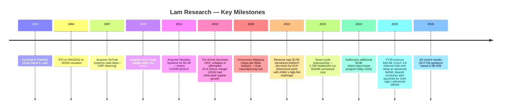
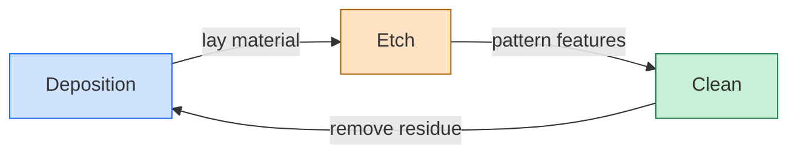
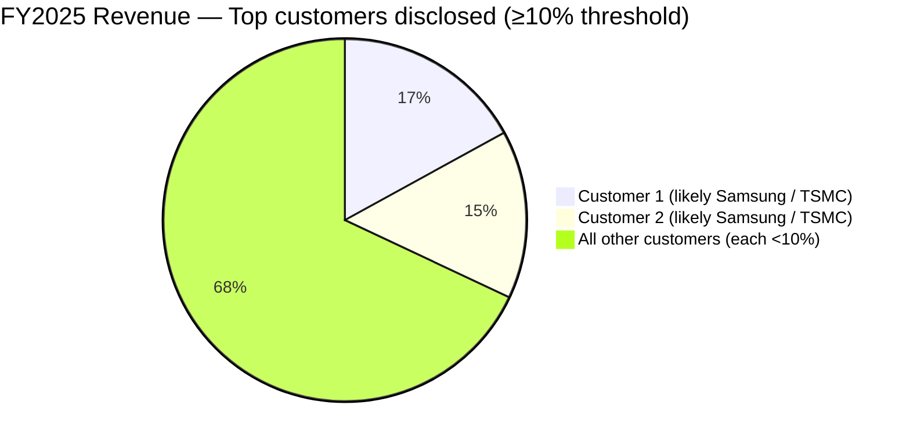
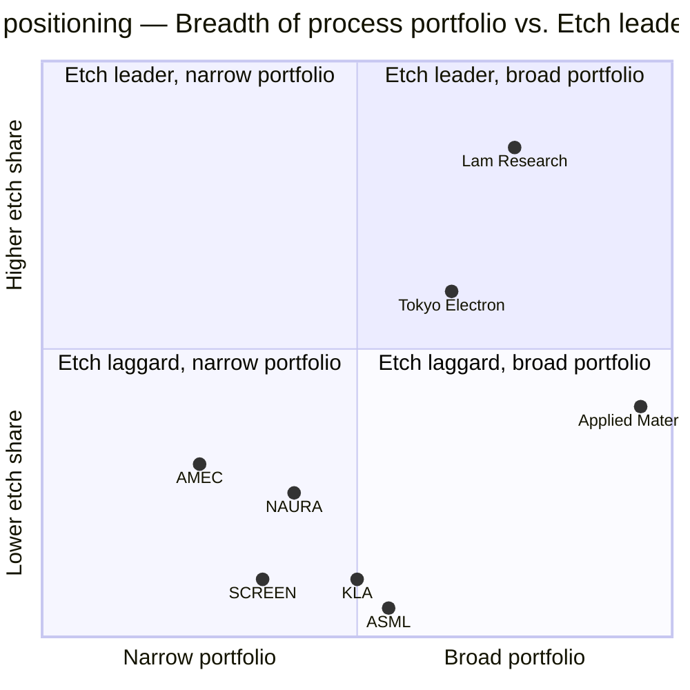

# Trading Analysis: LRCX @ 2026-05-23

**Overweight** — initiate a 1.0–1.2× benchmark position via staged 50/25/25 accumulation around ~$300, hedged with ~$270–$275 strike August OTM puts at ~2% notional, with pre-committed trim triggers on a China summit escalation, a Q4 FY26 deferred-revenue drop below $2.2B, or a guide miss versus the $6.60B / $1.65 midpoint.

---

## Sentiment Analyst Report

# LRCX Sentiment Analyst Report — Trade Date 2026-05-23

## 1. Overall sentiment direction

**Bullish — leaning over-extended.** All three sources skew the same direction, with retail and news flow aligned on a "Morgan Stanley upgrade + Salzburg AI packaging + Nvidia parabolic demand" narrative. The catch is sample asymmetry and quality: StockTwits posts a near-unanimous 14:1 Bullish/Bearish ratio (small sample) while Reddit returns just **one** post in the past 7 days across three subs, and news flow is dominated by institutional 13F-rebalancing wire stories whose tone is mostly neutral-mechanical. The retail tape is screaming bullish; the deeper-discussion tape (Reddit) is essentially silent, which itself is a contrarian yellow flag — euphoria on shallow forums without a corresponding institutional-investor community debate is the classic late-cycle pattern.

**Confidence: moderate-low.** Strong directional alignment but thin diversity of evidence — especially the missing Reddit discussion. The StockTwits ratio is interpretively striking but only 30 messages deep.

---

## 2. Source-by-source breakdown

### 2.1 Yahoo Finance news (institutional framing) — Bullish

News volume is exceptionally heavy (132 items in the 7-day window per the fetcher) but the headlines cluster around four bullish themes plus one structural negative:

**(a) Analyst-upgrade cluster.** Morgan Stanley upgraded LRCX to Overweight with a $331 PT on May 18, the central catalyst all week — reframed multiple times across outlets ([TheStreet · 2026-05-23](https://www.thestreet.com/investing/stocks/morgan-stanley-upgrades-lam-research-stock), [GuruFocus · 2026-05-23](https://news.google.com/rss/articles/CBMiqAFBVV95cUxNTWNFcHJrdXhBTzVITnJBQklVNUFaRktQSTFHY1RqU2twRENfQzduTnZaemlYdEtsemxlZEY0ZnlIYnVadGJOdEJYcXlBdnIyRzBVS1prNGw2UHF0R29kNHRzUU9sUjA5QUkxSXRRZ0R5c3NDSURRTHphOEg2Y3FPdGZGR1FTT1Z4ZUQxSkkxcFRRd2Y4enRXaXdvZXJFdFBPU3hQWWRNWTQ?oc=5), [GuruFocus · 2026-05-18](https://news.google.com/rss/articles/CBMivAFBVV95cUxOMG80Mk1SUXJyY1daQUNFSk56alJ4b1BxTDQ0Nl9uZGR6UFlKUm1OYWRxZWhGUTY1UTRFVFZwOUxYNFctNlJUcHZkY0tuMWNmX094b09ycERvZUNYQm9jUm9wcEVkUmQwUzJIdnJkVU9MT092NXhTOUwzUmNoOENnb2Nkb1RoOVhpN3hodXNDME01ZWFFNWw0ZmFBMEhOazVjRE5UQ2V5ODFfSWxMUXY2V05MbDNrMmhBa1E1dQ?oc=5)). MS also raised semiconductor capital-equipment cycle outlook on May 18, flagging stronger NAND momentum and a longer cycle ([Investing.com · 2026-05-18](https://finance.yahoo.com/markets/stocks/articles/semicap-stocks-morgan-stanley-raises-174816869.html)). B. Riley raised PT to $385 with Buy on May 12 ([Insider Monkey · 2026-05-18](https://finance.yahoo.com/markets/stocks/articles/b-riley-raises-price-target-151133773.html)). Bernstein issued a positive forecast ([MarketBeat · 2026-05-21](https://news.google.com/rss/articles/CBMi1AFBVV95cUxOZVd1ZVFTTUM2d2pUbW5EU1BhSlJCVy0yNUtsNFp0cmpmN2N3eEdOV3dHLWtYMnN0NW9EMXNjQUFzeHFQZHNiLUZxS21TeVlpZC1xbXhFbjYxcVRXQkxaZmg2X3BwVFdsdlU0VFRMZXpPUTd2NEU2VVJId3d0TlVFTTMzcHU0WVVuVU5DNF9DcmtwbTUxY2lSdnUtY3pvZm80bXRkbXlPVE1ZTkdsN1prN1BSbExLRDhkZHRVM09ZSkc5Y0VCVElNY3F3TFpxakF2MmNLaQ?oc=5)). Stockwise this drove a +3.5% pop on May 21 and a fresh all-time high of $302.04 ([MarketBeat · 2026-05-21](https://news.google.com/rss/articles/CBMitAFBVV95cUxNSGFlZUt1dmxqcElXX25FTkNoTG5kTkxJUmkzdDBKQmwtQUhGM0JlYWtldjJLNlo2aTY1blVYdFpBZWFDYVhySWQwZjB4TEpTdGVmRHVGRFpXYmtrYmcwclNRZ29wTWNkV2J4c0VvSXFNRFlmYUFtRDh4VmplY3cyZlg4eUtGbm1yeGJvX3lOWjdVOGxMeEpUS3lXYy1CeUMzNFpkbnVNQWhsVk0yM0IwMmNXTVo?oc=5), [Investing.com · 2026-05-21](https://news.google.com/rss/articles/CBMisAFBVV95cUxOY2c2blNJcFZnOW5OYll3OVplWVhKSU9iczM3bmdDMkVKZnREZGFiU3hxS2RZUVVRVUFEMy0yLUxsdmFfMEY5VTJQeDh3MkJVU3VyRC11cl9UMGhfVVI1RVI3V3IxMkNaRGg1cktHY2drNkxOc00tdThVb1N4TGJFd0JPWE5oR0tiOXpDQnlvTnlCUzJyQndCWmZ1N2lrem0yVmZUa2xURTd2cVNiZ3RodA?oc=5)).

**(b) Salzburg AI-packaging narrative.** The new lab in Austria — pitched as panel-level packaging to lift density and lower AI-chip cost — became the secondary bull thread, reframed multiple times as a structural "AI integration" story ([Simply Wall St. · 2026-05-23](https://finance.yahoo.com/markets/stocks/articles/does-lam-research-lrcx-playbook-151046844.html), [Simply Wall St. · 2026-05-22](https://finance.yahoo.com/markets/stocks/articles/lam-research-salzburg-lab-targets-151218035.html), [simplywall.st · 2026-05-20](https://news.google.com/rss/articles/CBMi0wFBVV95cUxQY1Rwd1VHa3QyeXFRNmF1NzRvcDllZDdKcWlKRWJLVmdKYWJ5UF9BeWpsWGNCckd0X2s0UVJGb3VwUDNpWlJGNnoxWUlMV3RvQWM4SFQ4SEV3ajNxUzM1OXBUSEJud1J5VEhtMmRTdHVOZTJMNUxjdjNQbjctbEo0dVN2T2RFZ3A1VHBQWl9IbnZaQmptSkJoejZCQzZ4YlN1SFNUVTN2QnRqNDlEb0wzNThLRGVWZWVVcGFGVDdrWVBUcTFGZkFiSGhwUjJCRE83WlRZ0gHYAUFVX3lxTE53c0pVc0JpNTBMb0NWRUJKSk1ESXRVcERxbFRLb2o4QVhQTzRjRnotbGRibUFCV1NUd2hyU1FjOGFobm1yNUxHV1hNOW5XLVZ1RTNLeW9FQm4taXFkemZOVjMwVTVMZXZBdTNsTUthRlN4MUR0Y2VLcWxmMExhX2VfaGhCREgyZVB2RHMxS3dSVGYwQi1zOVMzWGtzREZ2ZHRqYk5sa3J6cGtOaFUzcXZXYUxJUjJvNTR3NE1lRGdWWFhHakVRNlh3U0ZnNlJQei1RS1p1TjZVWA?oc=5)). The CEO's Reuters interview reframed LRCX as an AI-attached recurring-data story rather than a cyclical tool vendor ([Reuters · 2026-05-21](https://finance.yahoo.com/sectors/technology/articles/lam-research-focused-adding-ai-234919673.html), [MT Newswires · 2026-05-22](https://finance.yahoo.com/sectors/technology/articles/market-chatter-lam-research-plans-092004201.html)).

**(c) Capital-return signal.** $0.26 quarterly dividend reaffirmed payable July 8 — continuation, not increase, but anchors the cash-return cadence post-Q3'26 beat ([GuruFocus · 2026-05-22](https://news.google.com/rss/articles/CBMipgFBVV95cUxQOWtnN2FBa3JOeHdvVlJGaHZrM21oSW9RMFZTOWxFYVB0V0dzVW5Kc29naG02QnZVc3R4WjhSWnB3dlFMaHhoT1R1Zzd5Wjg2aHhKMUxKWkhacS1rQjRsN3M1Y0dHYVlqNDBEWVZ0Mm9sS0dKYlU5N2I1dHA2amljVF9nRnprLU45R2l6X0JlRks2MGFzejduMTdHaGF3em41bFVjWGJR?oc=5), [Stock Titan · 2026-05-21](https://news.google.com/rss/articles/CBMinwFBVV95cUxQYi1KWWxIV0tKT0lORXR3ZzlndWlxNlQ2cEFWM05PdWZ6cXh0WDFncDY2YWNEZ09BbTNVaDRxRk1PZi0wOTNzZE9rTVNDUTRYUHFLNEVXTGY0MjVMTTR0NnR1ekNmVThHWDRKN1pXWVB3ZzQ2dHFhZTZUcVZ3MHZBdVZ4MVQ3dEpXZkpac2RNS2RWcVBqSmpyMDRkOEdZNmc?oc=5), [MarketBeat · 2026-05-22](https://news.google.com/rss/articles/CBMixAFBVV95cUxPUXhmcDNDQkVEZUwwT1BXNURrX0xuRDRpdkQwV2hMVU56SldEdk05cHB2QnZWdFYwdVNvYlFXWDJJdmFnS1VKcGN3VVBHcVlhN2xZVTZVVkhHcS05cGU0bW5QWGtJUTVUREpxQUgtYUo0Mmtxd29UajNQX0xmbkNMTU1ZZzItYkhUNHVEeXV5Q2U0WFR5eF9kalBNQXNvSVAtQVgyUURyVFJEYVBvcEFMRjVxc0N2XzlOd01oRDNTMlZhRDBB?oc=5)).

**(d) Macro tailwind.** Nvidia's "parabolic" AI demand print pulled LRCX higher on May 22 ([StockStory · 2026-05-23](https://finance.yahoo.com/markets/stocks/articles/impinj-lam-research-formfactor-shares-053255366.html), [StockStory · 2026-05-22](https://finance.yahoo.com/markets/stocks/articles/teradyne-monolithic-power-systems-vishay-102055071.html)). The Trump-Xi Beijing chip summit (LRCX CEO present) raised hopes of an export-restriction thaw, lifting LRCX on May 17 ([StockStory · 2026-05-17](https://finance.yahoo.com/markets/stocks/articles/skyworks-solutions-ipg-photonics-lam-123655144.html), [Simply Wall St. · 2026-05-18](https://finance.yahoo.com/markets/stocks/articles/potential-beijing-thaw-puts-lam-100904371.html)).

**(e) Bear-side counterweight — Valuation skepticism.** The most explicit bear note is a GuruFocus DCF analysis pegging intrinsic value at **$167 vs the May 18 price of $285** — a ~40% downside read ([GuruFocus · 2026-05-18](https://news.google.com/rss/articles/CBMiyAFBVV95cUxPM3kwNkVJeHpmaktFR1dRdmpOd24weHp5VjB1SGtEckhMNHJTZzA0NEt0ZnNmMzY0a0RMNjVWdkttak9mSkktcGFNZXBjd0cwZGFlVnVGbzhyYTlPdE5XWVZIWVFUbjZESEFPUGZhTTczdmR4TkZmaDJsR1lzdTVqSnVHU0prcHc1YVYtd0ZjMHhvMkdsLXBBVTNjdEJqYy1hbmxiNmFwSjIyeVpITkZpaUo3cThMQjdVWEpTbnRjR0JOVU5uOHFzRg?oc=5)). Simply Wall St. (despite a bullish overall stance) also explicitly flagged "richly valued shares" in the Salzburg piece ([Simply Wall St. · 2026-05-22](https://finance.yahoo.com/markets/stocks/articles/lam-research-salzburg-lab-targets-151218035.html)). Simply Wall St.'s May 22 valuation piece raises the post-rally evaluation question ([simplywall.st · 2026-05-22](https://news.google.com/rss/articles/CBMi0wFBVV95cUxNQkFkbWxfMDRNNGdtR3MzcHRCYnczSDltUWZtMUpyYVVxSzVuSzVLVTVVWEZEdGt2dUtIakdCTnVZU1NfT1hfYkRUYW9PM2pseGhvemYxSVQxaUE5eWZ3NkxDaWhsc2ZCWWtZZ3FEbVAyck5Fd3Bza05aNUp0YVhFeHlJVzdIMFpMTFh1WnlEZFo2bnRYRnJYM0lYQlVRN3IzekNpZHZ5a05ERW1RWmI1eEJQMFM1bm5HLXNIb3F1UVdWNXdaTFRjbTRzYTg1RHp3bFpz0gHYAUFVX3lxTE5Lb2tqMC1QRC1BcjJQVGxNZE80dGJ0dTZwbTBPSUZTZTZuQUdndXJVZnVLZ2RuT0RwdzRIMi0zRUNHbk9HdFhwUGNKc1Btd2M5SDlYT3hDdmhqTlFPdG9ObkE5TkpjVEJya0RpdURMbUtpRWFXdlFZVkVLWm1PbkVFM0Zsa0h5a2RiMmxhbE9hUm91NGNRWTJrWTFEMUJSR1laWVR1aWxqNmJ4TzhKanFzODNUcHFaOUFwVUNFVjg0OVpVVmVCRmh0RE5hVWxXR1FsbjI2US0ySQ?oc=5)).

**(f) Background institutional accumulation/distribution noise.** A heavy stream of MarketBeat 13F-summary wires through the week — mostly buying (ABN Amro 84,170 shares, Pinkerton Wealth $4.46M, Kingdom Financial $1.03M, ProShare Advisors 614,599 shares) with isolated trims (Meiji Yasuda 20,982 shares, SoundView Advisors, Stephens Inc., Envestnet 27,271 shares). Net institutional flow per these wires tilts to accumulation, but each wire is mechanical 13F summarization, not active conviction ([MarketBeat · 2026-05-21 — ABN Amro](https://news.google.com/rss/articles/CBMi2AFBVV95cUxOUTl6U2YwOVkzaVpLYnpyX1ZlODM3cktKV0RhYmF1QmZvN1VFWl9pQlF6bFdDTWRKVEFCSy1RZVpEODNwSkJ5YzNzM2tXanBENTg5SVM4bkhRRVd0MmpURWNiVnk0NmE0MnMzNE53R21sV1JzcWE2MHBENmpka1MxTFlnSlRiZkdoVU1RMHVGdXVNNTM0cEpEWlRkOTg0WktkZXRNX0FpSS1pdEFWZDN3bmktU1FMcGdVaV9KNHFKOER2SDVYdmItcm1xdkRDRENnbXN5NnRLQ2E?oc=5), [MarketBeat · 2026-05-21 — Pinkerton Wealth](https://news.google.com/rss/articles/CBMi2AFBVV95cUxQdEc3X1gyamRyTE5HMWhyR0NjWWpicW5tYUVuSVAtWGxHTUVzUlgxVzlqY2QxdVJSc2ZTY0w3UnNZM01RZE5WR0FfNmwwdkRpcVg3LWd3WjFkR2E1YzZ2Y0FYZUVvNHU4Zlo4MWRTRDlWVTdHWndQeDNmWGlDeGJtbFRjOUFqT3lsMGJJeXUwdlV3TEtBTzlvdWcwVGU2SEhCbjE1NlhTckIxNVpITEdLbUpZa0N5MXNjcnlwWmdXMVVzVnVoODFIMzNjZm05NDlKaFYyNVRTTGY?oc=5)).

### 2.2 StockTwits (retail traders) — Overwhelmingly Bullish, sample-limited

30 most-recent cashtag messages: **Bullish 14 / Bearish 1 / Unlabeled 15** — a 14:1 ratio among labeled posts (93% bullish), with the single bear a snarky one-liner. Read the tape and the picture is even more euphoric than the raw ratio:

- "$LRCX This thing is a beast!" — `[@Jljohnson178 · StockTwits · 2026-05-22 · Bullish]` ([link](https://stocktwits.com/Jljohnson178/message/654170336))
- "$LRCX beautiful setup today and up after hours. Bought $320 June calls today. Let's see how this plays out. Blue skies ahead 🚀" — `[@Dragon_Master · StockTwits · 2026-05-22 · Bullish]` ([link](https://stocktwits.com/Dragon_Master/message/654119754))
- "$LRCX let's hold it above $300!" — `[@Pmaci · StockTwits · 2026-05-21 · Bullish]` ([link](https://stocktwits.com/Pmaci/message/654116644))
- "$LRCX over $300 now is confirmed by Jensen." — `[@Whiskeyunderthebed · StockTwits · 2026-05-20 · no-label]` ([link](https://stocktwits.com/Whiskeyunderthebed/message/653971869))

Notably, the more substantive bull posts cite real industry context (etch dominance, advanced packaging, Salzburg/CoPoS timing alignment) — these are not pure meme-stock posts:

- `@beckinvestllc` — former fab/etch technician — calls LRCX an "absolute powerhouse... non-negotiable puzzle piece in this semiconductor supercycle" ([@MorganHoratio · StockTwits · 2026-05-20](https://stocktwits.com/MorganHoratio/message/653958471), [@beckinvestllc · StockTwits · 2026-05-20](https://stocktwits.com/beckinvestllc/message/653959606)).
- `@PhotonicDigger` links the Salzburg wet lab opening to TSMC's CoPoS pilot line and Applied Materials' NEXX electrochemical deposition acquisition — suggesting CoPoS may be moving from optionality to roadmap ([@PhotonicDigger · StockTwits · 2026-05-20](https://stocktwits.com/PhotonicDigger/message/653912981)).
- `@Keepinitreal11` tracks LRCX holding the primary uptrend line at $278 alongside AMAT $414, MU $682, SNDK $1,333 — "Classic profit-taking after the big AI rally, not a trend break" ([@Keepinitreal11 · StockTwits · 2026-05-19](https://stocktwits.com/Keepinitreal11/message/653822825)).

The one bear:
- "$LRCX $MU upgrades and dump. Classic playbook" — `[@ISellUOptions · StockTwits · 2026-05-19 · Bearish]` ([link](https://stocktwits.com/ISellUOptions/message/653797725)) — implicitly arguing the upgrade is being used as exit liquidity.

YTD performance recaps are showing up as Nasdaq-100 leader callouts ($MRVL +124%, $AMD +110%, **$LRCX +77%**) — the kind of late-cycle "look at the leaders" framing that often peaks near tops ([@FibonacciTrader_ · StockTwits · 2026-05-22](https://stocktwits.com/FibonacciTrader_/message/654230395)).

**Read: 14:1 bull/bear is interpretively bullish but should be flagged as potential over-extension.** Per the skill best-practices, ≥90/10 ratios are a contrarian risk signal. Reinforcing that read: every bullish poster is leaning into the same Morgan Stanley / $300 break / Salzburg / Jensen narrative — i.e. the narrative is homogeneous, not diversified.

### 2.3 Reddit (community discussion) — Effectively unavailable; faint bullish

The fetcher returned just **one** post across r/wallstreetbets, r/stocks, and r/investing in the past 7 days mentioning LRCX:

- **r/wallstreetbets** — "Today was a good day" — 32 upvotes, 12 comments, 2026-05-20. Body excerpt: "A few WSB classics and a few new ones for you regards. Happy to share thoughts on any of these. Mix of time in each (MU since Dec, **LAM since 2022**, RKLB since Oct, DFTX since 2024, etc) but have all performed well." ([r/wallstreetbets · 2026-05-20](https://www.reddit.com/r/wallstreetbets/comments/1tixdyx/today_was_a_good_day/)).
- **r/stocks** — no posts found in past 7 days.
- **r/investing** — no posts found in past 7 days.

The single WSB post is a portfolio brag, not a thesis — LRCX is one of multiple longs being held since 2022. Engagement (32 upvotes / 12 comments) is **modest**; this is noise-level signal, not a real Reddit narrative.

**Read: Reddit is effectively silent on LRCX.** That is itself a signal — when a name is up 268% in 12 months and 77% YTD ([@FibonacciTrader_ · StockTwits · 2026-05-22](https://stocktwits.com/FibonacciTrader_/message/654230395)) but isn't generating dedicated DD threads on the most retail-discussion-heavy forum (WSB), the rally is being driven by professional positioning + cashtag-tracking retail traders rather than retail-DD-driven crowd accumulation. Could be neutral (rally has further to run because retail hasn't piled in) or bearish (no marginal-buyer pool left in retail), depending on framing. Either way, this run-up does **not** look like a retail mania the way TSLA-2020, GME-2021, or NVDA-2024 did.

---

## 3. Divergences, alignments, and key narratives

### 3.1 Alignment: news + StockTwits agree on direction

Both sources converge on the same five bullish narratives: Morgan Stanley upgrade ($331 PT), Salzburg AI-packaging lab, Nvidia "parabolic" AI demand pulling semicap higher, all-time high at $302+, and "kept holding above $300" technical break. The most-quoted news stories on StockTwits link directly to the Zacks "20-day moving average" piece ([@Masonato · StockTwits · 2026-05-21](https://stocktwits.com/Masonato/message/654104858)) and Reuters CEO interview narrative ([@OpenOutcrier · StockTwits · 2026-05-22](https://stocktwits.com/OpenOutcrier/message/654144417)) — retail is essentially echoing institutional headlines, not generating its own thesis.

### 3.2 Divergence: news has a real bear (DCF $167) — StockTwits doesn't

The GuruFocus DCF intrinsic-value piece ([GuruFocus · 2026-05-18](https://news.google.com/rss/articles/CBMiyAFBVV95cUxPM3kwNkVJeHpmaktFR1dRdmpOd24weHp5VjB1SGtEckhMNHJTZzA0NEt0ZnNmMzY0a0RMNjVWdkttak9mSkktcGFNZXBjd0cwZGFlVnVGbzhyYTlPdE5XWVZIWVFUbjZESEFPUGZhTTczdmR4TkZmaDJsR1lzdTVqSnVHU0prcHc1YVYtd0ZjMHhvMkdsLXBBVTNjdEJqYy1hbmxiNmFwSjIyeVpITkZpaUo3cThMQjdVWEpTbnRjR0JOVU5uOHFzRg?oc=5) and Simply Wall St.'s "richly valued" framing represent a genuine valuation-skepticism strand in the institutional channel. StockTwits posts wholly ignore the valuation question — the only "bear" is a snarky one-liner about playbook upgrade-and-dump. This divergence is real: retail is leaning into momentum, news flow has at least one well-articulated bear take, and the divergence supports the "over-extension" read on the retail ratio.

### 3.3 Divergence: Reddit silence vs StockTwits euphoria

Per the skill's "cross-source divergences are themselves signals" principle, the gap between StockTwits's 14:1 bullish ratio and Reddit's silence is striking. The structural read: LRCX is being **traded** by professional and active-retail flow, but is **not** being **discussed** by the buy-and-hold retail DD community. That can sustain a rally on tape but it caps the marginal-buyer pool — once the cashtag-tracking momentum traders rotate out, there's no embedded retail-conviction floor underneath.

### 3.4 Dominant narrative across sources

**"Lam is the AI-attached recurring-data semicap, not a cyclical tool vendor."** This thesis recurs in:
- The Morgan Stanley upgrade language (longer cycle, NAND momentum) ([Investing.com · 2026-05-18](https://finance.yahoo.com/markets/stocks/articles/semicap-stocks-morgan-stanley-raises-174816869.html))
- Reuters CEO interview (sensors + AI in tools) ([Reuters · 2026-05-21](https://finance.yahoo.com/sectors/technology/articles/lam-research-focused-adding-ai-234919673.html))
- Salzburg lab framing (AI-packaging optionality) ([Simply Wall St. · 2026-05-22](https://finance.yahoo.com/markets/stocks/articles/lam-research-salzburg-lab-targets-151218035.html))
- StockTwits substantive posters (etch dominance, advanced packaging) ([@PhotonicDigger · StockTwits · 2026-05-20](https://stocktwits.com/PhotonicDigger/message/653912981))

That's a coherent re-rating narrative, which is what supports the 19-25× forward P/E multiple expansion. The single biggest contrarian risk: when this narrative cracks (any quarter where AI capex commentary softens, or any China-export shock), the de-rate will be violent.

---

## 4. Catalysts and risks surfaced by the data

### Catalysts (next ~30 days)

- **Quarterly dividend ex-date June 17, payment July 8** ([Simply Wall St. · 2026-05-23](https://finance.yahoo.com/markets/stocks/articles/does-lam-research-lrcx-playbook-151046844.html)) — minor, but a calendar anchor.
- **Continued AI-capex datapoints from hyperscalers and chip customers** — Nvidia's parabolic print already triggered a semicap relief rally ([StockStory · 2026-05-23](https://finance.yahoo.com/markets/stocks/articles/impinj-lam-research-formfactor-shares-053255366.html)); next leg depends on Q2 capex guides from Microsoft, Meta, Google, and the Korean/Taiwanese memory customers.
- **Trump-Xi Beijing summit follow-through** — any actual chip-export easing would directly expand LRCX's China-served TAM ([Simply Wall St. · 2026-05-18](https://finance.yahoo.com/markets/stocks/articles/potential-beijing-thaw-puts-lam-100904371.html)).
- **US capacity-expansion announcements in Arizona/California** ([Reuters · 2026-05-21](https://finance.yahoo.com/sectors/technology/articles/lam-research-focused-adding-ai-234919673.html), [MT Newswires · 2026-05-22](https://finance.yahoo.com/sectors/technology/articles/market-chatter-lam-research-plans-092004201.html)) — capex guide visibility.

### Risks

- **Valuation overhang.** The GuruFocus DCF $167-vs-$285 gap ([GuruFocus · 2026-05-18](https://news.google.com/rss/articles/CBMiyAFBVV95cUxPM3kwNkVJeHpmaktFR1dRdmpOd24weHp5VjB1SGtEckhMNHJTZzA0NEt0ZnNmMzY0a0RMNjVWdkttak9mSkktcGFNZXBjd0cwZGFlVnVGbzhyYTlPdE5XWVZIWVFUbjZESEFPUGZhTTczdmR4TkZmaDJsR1lzdTVqSnVHU0prcHc1YVYtd0ZjMHhvMkdsLXBBVTNjdEJqYy1hbmxiNmFwSjIyeVpITkZpaUo3cThMQjdVWEpTbnRjR0JOVU5uOHFzRg?oc=5) and Simply Wall St.'s "richly valued" tag ([Simply Wall St. · 2026-05-22](https://finance.yahoo.com/markets/stocks/articles/lam-research-salzburg-lab-targets-151218035.html)) define the bear's reasonable downside. A name up 268% in 12 months can de-rate sharply on any narrative friction.
- **Retail euphoria as contrarian signal.** 14:1 StockTwits bull/bear ratio + "$320 June calls" / "Blue skies 🚀" ([@Dragon_Master · StockTwits · 2026-05-22](https://stocktwits.com/Dragon_Master/message/654119754)) language is consistent with late-cycle positioning.
- **The "everyone's chasing the leader" YTD-leader callouts** ([@FibonacciTrader_ · StockTwits · 2026-05-22](https://stocktwits.com/FibonacciTrader_/message/654230395)) often appear near rotation tops.
- **CPI / rate-cut expectation reversal.** Hot April CPI on May 15 briefly eliminated 2026 rate-cut hopes — any reacceleration of inflation prints directly hits high-multiple growth like LRCX ([StockStory · 2026-05-16](https://finance.yahoo.com/markets/stocks/articles/macom-marvell-technology-applied-materials-033255346.html)).
- **Geopolitical reversal.** Iran-war crude shocks and any Beijing-summit disappointment would unwind both the macro and China-export tailwinds ([Investor's Business Daily · 2026-05-21](https://www.investors.com/news/spacex-ipo-filing-tesla-intel-terafab-semiconductor-ai-chips/?src=A00220&yptr=yahoo) — Terafab partner details).
- **Cross-source data gap.** Reddit silence means we cannot triangulate a third community read; the report leans heavily on news + StockTwits, both of which are echoing the same Morgan-Stanley-led narrative. Flag this as a confidence cap.

---

## 5. Summary table

| Signal | Direction | Source (link) | Supporting Evidence |
|---|---|---|---|
| Morgan Stanley Overweight upgrade + $331 PT | Bullish | [Investing.com · 2026-05-18](https://finance.yahoo.com/markets/stocks/articles/semicap-stocks-morgan-stanley-raises-174816869.html) | NAND momentum, longer WFE cycle, multi-name semicap reshuffle |
| Salzburg AI-packaging lab | Bullish | [Reuters CEO interview · 2026-05-21](https://finance.yahoo.com/sectors/technology/articles/lam-research-focused-adding-ai-234919673.html) | Panel-level packaging + sensors-in-tools narrative shift |
| Nvidia "parabolic" AI demand | Bullish (sympathy) | [StockStory · 2026-05-23](https://finance.yahoo.com/markets/stocks/articles/impinj-lam-research-formfactor-shares-053255366.html) | LRCX, Impinj, FormFactor rallied on the print |
| All-time high $302.04 + 20-day SMA cross | Bullish (technical) | [Investing.com · 2026-05-21](https://news.google.com/rss/articles/CBMisAFBVV95cUxOY2c2blNJcFZnOW5OYll3OVplWVhKSU9iczM3bmdDMkVKZnREZGFiU3hxS2RZUVVRVUFEMy0yLUxsdmFfMEY5VTJQeDh3MkJVU3VyRC11cl9UMGhfVVI1RVI3V3IxMkNaRGg1cktHY2drNkxOc00tdThVb1N4TGJFd0JPWE5oR0tiOXpDQnlvTnlCUzJyQndCWmZ1N2lrem0yVmZUa2xURTd2cVNiZ3RodA?oc=5), [Zacks · 2026-05-21](https://finance.yahoo.com/markets/stocks/articles/lam-research-lrcx-just-overtook-133502876.html) | Fresh all-time high after MS upgrade |
| StockTwits Bullish/Bearish 14:1 | Bullish — likely over-extended | [StockTwits cashtag $LRCX](https://stocktwits.com/symbol/LRCX) | 30 most-recent posts; "blue skies 🚀", "$320 calls", "this is a beast" |
| Retail substance — etch dominance + CoPoS thesis | Bullish (quality posts) | [@PhotonicDigger · StockTwits · 2026-05-20](https://stocktwits.com/PhotonicDigger/message/653912981) | TSMC CoPoS / AMAT NEXX acquisition / Salzburg timing alignment |
| GuruFocus DCF $167 vs price $285 | Bearish | [GuruFocus · 2026-05-18](https://news.google.com/rss/articles/CBMiyAFBVV95cUxPM3kwNkVJeHpmaktFR1dRdmpOd24weHp5VjB1SGtEckhMNHJTZzA0NEt0ZnNmMzY0a0RMNjVWdkttak9mSkktcGFNZXBjd0cwZGFlVnVGbzhyYTlPdE5XWVZIWVFUbjZESEFPUGZhTTczdmR4TkZmaDJsR1lzdTVqSnVHU0prcHc1YVYtd0ZjMHhvMkdsLXBBVTNjdEJqYy1hbmxiNmFwSjIyeVpITkZpaUo3cThMQjdVWEpTbnRjR0JOVU5uOHFzRg?oc=5) | ~40% downside read |
| Reddit silence across r/wsb, r/stocks, r/investing | Neutral — confidence cap | [r/wallstreetbets · 2026-05-20](https://www.reddit.com/r/wallstreetbets/comments/1tixdyx/today_was_a_good_day/) | Single 32-upvote portfolio post; no DD threads |
| YTD-leader callout framing | Bearish (contrarian) | [@FibonacciTrader_ · StockTwits · 2026-05-22](https://stocktwits.com/FibonacciTrader_/message/654230395) | "$LRCX +77% YTD" listed alongside MRVL, AMD — late-cycle leader-chasing |
| Single retail bear post | Bearish (token) | [@ISellUOptions · StockTwits · 2026-05-19](https://stocktwits.com/ISellUOptions/message/653797725) | "Upgrades and dump. Classic playbook" |

**Net sentiment skew:** Bullish (institutional-led, retail-confirmed), but the retail signal is leaning over-extended and Reddit silence caps how much extra signal can be extracted. The bear case rests on valuation (GuruFocus DCF), not deteriorating fundamentals.

---

## 6. References

### News
- [Simply Wall St. · 2026-05-23 — Does LRCX have the right playbook for AI-era tools and capital returns?](https://finance.yahoo.com/markets/stocks/articles/does-lam-research-lrcx-playbook-151046844.html)
- [TheStreet · 2026-05-23 — Morgan Stanley makes bold Lam Research stock call](https://www.thestreet.com/investing/stocks/morgan-stanley-upgrades-lam-research-stock)
- [Insider Monkey · 2026-05-23 — LRCX one of best oversold growth stocks](https://finance.yahoo.com/markets/stocks/articles/lam-research-corporation-lrcx-one-121534572.html)
- [StockStory · 2026-05-23 — Impinj, Lam Research, FormFactor shares soaring after Nvidia print](https://finance.yahoo.com/markets/stocks/articles/impinj-lam-research-formfactor-shares-053255366.html)
- [Simply Wall St. · 2026-05-22 — Salzburg lab targets AI packaging and richly valued shares](https://finance.yahoo.com/markets/stocks/articles/lam-research-salzburg-lab-targets-151218035.html)
- [MT Newswires · 2026-05-22 — Plans AI-driven tool upgrades, expansion in Arizona, California](https://finance.yahoo.com/sectors/technology/articles/market-chatter-lam-research-plans-092004201.html)
- [StockStory · 2026-05-22 — Teradyne, MPWR, Vishay, LRCX, Semtech trade up pre-NVDA](https://finance.yahoo.com/markets/stocks/articles/teradyne-monolithic-power-systems-vishay-102055071.html)
- [Reuters · 2026-05-21 — Lam Research focused on adding AI to chipmaking tools, CEO interview](https://finance.yahoo.com/sectors/technology/articles/lam-research-focused-adding-ai-234919673.html)
- [Zacks · 2026-05-21 — LRCX overtakes 20-day moving average](https://finance.yahoo.com/markets/stocks/articles/lam-research-lrcx-just-overtook-133502876.html)
- [StockStory · 2026-05-17 — Skyworks, IPG Photonics, Lam Research soaring on Beijing summit](https://finance.yahoo.com/markets/stocks/articles/skyworks-solutions-ipg-photonics-lam-123655144.html)
- [Investing.com · 2026-05-18 — Semicap stocks: Morgan Stanley raises WFE outlook](https://finance.yahoo.com/markets/stocks/articles/semicap-stocks-morgan-stanley-raises-174816869.html)
- [Insider Monkey · 2026-05-18 — B. Riley raises price target on LRCX](https://finance.yahoo.com/markets/stocks/articles/b-riley-raises-price-target-151133773.html)
- [Simply Wall St. · 2026-05-18 — Potential Beijing thaw puts Lam Research export and supply risks in focus](https://finance.yahoo.com/markets/stocks/articles/potential-beijing-thaw-puts-lam-100904371.html)
- [GuruFocus · 2026-05-18 — LRCX DCF Analysis: Intrinsic Value $167 vs Price $285](https://news.google.com/rss/articles/CBMiyAFBVV95cUxPM3kwNkVJeHpmaktFR1dRdmpOd24weHp5VjB1SGtEckhMNHJTZzA0NEt0ZnNmMzY0a0RMNjVWdkttak9mSkktcGFNZXBjd0cwZGFlVnVGbzhyYTlPdE5XWVZIWVFUbjZESEFPUGZhTTczdmR4TkZmaDJsR1lzdTVqSnVHU0prcHc1YVYtd0ZjMHhvMkdsLXBBVTNjdEJqYy1hbmxiNmFwSjIyeVpITkZpaUo3cThMQjdVWEpTbnRjR0JOVU5uOHFzRg?oc=5)
- [StockStory · 2026-05-16 — LRCX: Buy, Sell, or Hold Post Q1 Earnings?](https://finance.yahoo.com/markets/stocks/articles/lam-research-lrcx-buy-sell-162055149.html)
- [StockStory · 2026-05-16 — MACOM, Marvell, AMAT, KLAC, LRCX falling on hot April CPI](https://finance.yahoo.com/markets/stocks/articles/macom-marvell-technology-applied-materials-033255346.html)
- [Investing.com · 2026-05-21 — LRCX stock hits all-time high at $302.04](https://news.google.com/rss/articles/CBMisAFBVV95cUxOY2c2blNJcFZnOW5OYll3OVplWVhKSU9iczM3bmdDMkVKZnREZGFiU3hxS2RZUVVRVUFEMy0yLUxsdmFfMEY5VTJQeDh3MkJVU3VyRC11cl9UMGhfVVI1RVI3V3IxMkNaRGg1cktHY2drNkxOc00tdThVb1N4TGJFd0JPWE5oR0tiOXpDQnlvTnlCUzJyQndCWmZ1N2lrem0yVmZUa2xURTd2cVNiZ3RodA?oc=5)
- [GuruFocus · 2026-05-22 — LRCX Declares Quarterly Dividend of $0.26](https://news.google.com/rss/articles/CBMipgFBVV95cUxQOWtnN2FBa3JOeHdvVlJGaHZrM21oSW9RMFZTOWxFYVB0V0dzVW5Kc29naG02QnZVc3R4WjhSWnB3dlFMaHhoT1R1Zzd5Wjg2aHhKMUxKWkhacS1rQjRsN3M1Y0dHYVlqNDBEWVZ0Mm9sS0dKYlU5N2I1dHA2amljVF9nRnprLU45R2l6X0JlRks2MGFzejduMTdHaGF3em41bFVjWGJR?oc=5)
- [Investor's Business Daily · 2026-05-21 — SpaceX IPO filing details Terafab semiconductor partners](https://www.investors.com/news/spacex-ipo-filing-tesla-intel-terafab-semiconductor-ai-chips/?src=A00220&yptr=yahoo)

### StockTwits
- [@Jljohnson178 · 2026-05-22 — "this thing is a beast" (Bullish)](https://stocktwits.com/Jljohnson178/message/654170336)
- [@Dragon_Master · 2026-05-22 — "$320 June calls, blue skies" (Bullish)](https://stocktwits.com/Dragon_Master/message/654119754)
- [@Pmaci · 2026-05-21 — "let's hold above $300" (Bullish)](https://stocktwits.com/Pmaci/message/654116644)
- [@Masonato · 2026-05-21 — Zacks 20-day SMA crossover link (Bullish)](https://stocktwits.com/Masonato/message/654104858)
- [@Mr_Wunderful · 2026-05-21 — 💥🔥 (Bullish)](https://stocktwits.com/Mr_Wunderful/message/654076471)
- [@skcots_13 · 2026-05-21 — "back to 300" (Bullish)](https://stocktwits.com/skcots_13/message/654048577)
- [@Whiskeyunderthebed · 2026-05-21 — "Going green today" (no-label)](https://stocktwits.com/Whiskeyunderthebed/message/654028726)
- [@Whiskeyunderthebed · 2026-05-20 — "over $300 confirmed by Jensen" (no-label)](https://stocktwits.com/Whiskeyunderthebed/message/653971869)
- [@beckinvestllc · 2026-05-20 — Former fab/etch tech on LRCX dominance (no-label)](https://stocktwits.com/beckinvestllc/message/653959606)
- [@MorganHoratio · 2026-05-20 — LRCX "absolute powerhouse" in supercycle (no-label)](https://stocktwits.com/MorganHoratio/message/653958471)
- [@PhotonicDigger · 2026-05-20 — Salzburg / TSMC CoPoS / AMAT NEXX connection (no-label)](https://stocktwits.com/PhotonicDigger/message/653912981)
- [@FibonacciTrader_ · 2026-05-22 — YTD leaders MRVL/AMD/LRCX (no-label)](https://stocktwits.com/FibonacciTrader_/message/654230395)
- [@Chingying · 2026-05-22 — "$LRCX PT$" (Bullish)](https://stocktwits.com/Chingying/message/654207284)
- [@OpenOutcrier · 2026-05-22 — Reuters CEO interview link (no-label)](https://stocktwits.com/OpenOutcrier/message/654144417)
- [@Keepinitreal11 · 2026-05-19 — Uptrend lines on AMAT/MU/LRCX/SNDK (no-label)](https://stocktwits.com/Keepinitreal11/message/653822825)
- [@skcots_13 · 2026-05-19 — "AI tailwind, cyclical big swings normal" (Bullish)](https://stocktwits.com/skcots_13/message/653817398)
- [@ISellUOptions · 2026-05-19 — "Upgrades and dump. Classic playbook" (Bearish)](https://stocktwits.com/ISellUOptions/message/653797725)
- [@RunnerSignals · 2026-05-18 — MS $331 Overweight in list of 5 upgrades (no-label)](https://stocktwits.com/RunnerSignals/message/653736602)
- [@Dragon_Master · 2026-05-18 — "$LRCX solid price, grab at $274" (Bullish)](https://stocktwits.com/Dragon_Master/message/653731842)
- [@CapitalMonk · 2026-05-18 — Bullish trend, RSI 63.2, momentum strong (no-label)](https://stocktwits.com/CapitalMonk/message/653695237)

### Reddit
- [r/wallstreetbets · 2026-05-20 — "Today was a good day" (32↑ / 12c, LAM held since 2022)](https://www.reddit.com/r/wallstreetbets/comments/1tixdyx/today_was_a_good_day/)
- *r/stocks — no posts mentioning LRCX in past 7 days*
- *r/investing — no posts mentioning LRCX in past 7 days*

---

## News Analyst Report

# LRCX News Analyst Report — Trade Date 2026-05-23

## Executive Take

The past 30 days have been a near-vertical re-rating tape for Lam Research. Two analyst upgrades (Morgan Stanley to Overweight, Bernstein lifting PTs alongside KLAC) plus Q3'26 earnings beats, dividend reaffirmation, and the Salzburg packaging lab announcement form a tightly clustered bullish bundle. The dominant macro overlay is the Trump–Xi semiconductor summit in Beijing (with LRCX's CEO present) and Nvidia's "parabolic" AI infra demand prints, both of which directly re-anchor the WFE TAM higher. Offsetting the bullishness: insider selling has been heavy and persistent through 2026 (CFO, CEO, multiple officers), and hot April CPI on May 15 briefly eliminated 2026 rate-cut hopes. Net: news flow is decisively bullish-skewed, but priced-to-perfection language (Schiller PE warnings, 268% 12-month return) and outsized officer dispositions argue against chasing strength here.

---

## Ticker news — near-term catalysts (≤7 days before 2026-05-23)

### Morgan Stanley Overweight upgrade is the dominant single catalyst

Morgan Stanley upgraded LRCX to Overweight from Equal Weight on May 18 and lifted the price target to $331 from $293, framing the call inside a broader semicap WFE cycle upgrade that elongated the cycle and flagged stronger NAND momentum ([Investing.com · 2026-05-18](https://finance.yahoo.com/markets/stocks/articles/semicap-stocks-morgan-stanley-raises-174816869.html)). TheStreet characterized this as Morgan Stanley shifting its semicap pecking order inside an AI-buildout supply-chain rotation ([TheStreet · 2026-05-23](https://www.thestreet.com/investing/stocks/morgan-stanley-upgrades-lam-research-stock)). The "magnitude of the upgrade" language was specifically called out by Insider Monkey in its oversold-growth ranking on May 23 ([Insider Monkey · 2026-05-23](https://finance.yahoo.com/markets/stocks/articles/lam-research-corporation-lrcx-one-121534572.html)). Barchart framed the case as LRCX positioned to outperform within a $149B WFE market ([Barchart · 2026-05-20](https://www.barchart.com/story/news/2044105/lrcx-overweight-how-lam-research-is-poised-to-outperform-the-149b-wfe-market)).

### Bernstein and B. Riley reinforce the analyst-call cluster

Bernstein raised price targets on both LRCX and KLAC after significantly upgrading its global WFE spend forecasts, citing improved memory expansion both in China and elsewhere ([Investing.com · 2026-05-20](https://finance.yahoo.com/markets/stocks/articles/bernstein-lifts-price-targets-lrcx-163517344.html)). B. Riley separately lifted its LRCX PT to $385 from $350 (Buy maintained) on May 12, citing AI-related investment accelerating faster than expected ([Insider Monkey · 2026-05-18](https://finance.yahoo.com/markets/stocks/articles/b-riley-raises-price-target-151133773.html)). Three independent sellside upgrades inside ~10 days is a textbook re-rating signature, not a single-firm view.

### Capital return reaffirmed — quarterly dividend of $0.26

Lam confirmed a $0.26 quarterly dividend payable July 8, 2026 to holders of record June 17, anchored to strong Q3'26 results and upgraded guidance tied to AI demand ([Simply Wall St. · 2026-05-23](https://finance.yahoo.com/markets/stocks/articles/does-lam-research-lrcx-playbook-151046844.html)). This is a continuation, not an increase, but it reaffirms the capital-return cadence and removes any near-term ambiguity over payout intent.

### Salzburg panel-level packaging lab — strategic R&D move

Lam opened a Salzburg, Austria lab focused on panel-level packaging that replaces traditional circular silicon wafers with square panels, eliminating dead space and lowering cost per chip — explicitly framed by the company as a response to AI chip shortages ([Reuters · 2026-05-20](https://finance.yahoo.com/sectors/technology/articles/lam-research-opens-austria-lab-120136761.html)). Coverage from Simply Wall St. tied the lab directly to the AI packaging thesis ([Simply Wall St. · 2026-05-22](https://finance.yahoo.com/markets/stocks/articles/lam-research-salzburg-lab-targets-151218035.html)), and GuruFocus highlighted the dead-space economics ([GuruFocus · 2026-05-20](https://finance.yahoo.com/sectors/technology/articles/lam-research-opens-austria-lab-154505376.html)). Builds optionality outside Lam's core etch/deposition franchise.

### CEO interview — AI-in-tools strategy plus US footprint expansion

CEO Tim Archer told Reuters that Lam's two-year strategic focus is embedding sensors in chip manufacturing tools that feed AI systems for predictive defect detection, while expanding operations in Arizona and California ([Reuters · 2026-05-21](https://finance.yahoo.com/sectors/technology/articles/lam-research-focused-adding-ai-234919673.html)). MT Newswires picked up the same thread under the AI-driven tool-upgrade and US-expansion frame ([MT Newswires · 2026-05-22](https://finance.yahoo.com/sectors/technology/articles/market-chatter-lam-research-plans-092004201.html)). The narrative converts LRCX from a "cyclical equipment vendor" into an "AI-attached recurring-data" story, which is what supports the multiple re-rating.

### Trump–Xi Beijing semiconductor summit — geopolitical overhang lifting

President Trump landed in Beijing alongside Nvidia's Jensen Huang, Micron's Sanjay Mehrotra, and LRCX leadership for a summit with Xi targeting chip export restrictions and rare-earth supply stability ([StockStory · 2026-05-17](https://finance.yahoo.com/markets/stocks/articles/skyworks-solutions-ipg-photonics-lam-123655144.html)). Simply Wall St. flagged this as putting LRCX's export and supply risks "in focus" ahead of any potential thaw — Lam supplies into China and any easing of restrictions would directly expand its addressable WFE pool ([Simply Wall St. · 2026-05-18](https://finance.yahoo.com/markets/stocks/articles/potential-beijing-thaw-puts-lam-100904371.html)).

### Nvidia parabolic-demand print pulls semicap higher

Nvidia reported record sales and income with the CEO describing AI infrastructure demand as "parabolic"; LRCX, Impinj, and FormFactor rallied in sympathy on May 22 ([StockStory · 2026-05-23](https://finance.yahoo.com/markets/stocks/articles/impinj-lam-research-formfactor-shares-053255366.html)). Pre-print positioning also lifted Teradyne, MPWR, Vishay, LRCX, and Semtech ([StockStory · 2026-05-22](https://finance.yahoo.com/markets/stocks/articles/teradyne-monolithic-power-systems-vishay-102055071.html)). Hazeltree data showed hedge funds added (not trimmed) tech/semis through April even as the broad index rallied 10% ([Reuters · 2026-05-20](https://finance.yahoo.com/markets/stocks/articles/tech-leaders-favoured-hedge-funds-080702489.html)).

### Counterweight: Samsung-strike + TSMC stake-sale shock and hot CPI

On May 20 the semis sold off intraday on news of a potential Samsung labor strike and a TSMC stake sale that rattled supply chains; LRCX and KLAC dropped together ([StockStory · 2026-05-20](https://finance.yahoo.com/markets/stocks/articles/lam-research-kla-corporation-stocks-170855862.html)). GuruFocus framed the same flow as a "Samsung labor talks collapse" event with chip stocks rallying afterward as the panic resolved ([GuruFocus · 2026-05-20](https://finance.yahoo.com/sectors/technology/articles/nvidia-micron-amd-leads-chip-165629244.html)). Earlier in the bucket, on May 16, hot April CPI sent yields higher and eliminated 2026 rate-cut hopes, dragging multi-name growth names including LRCX ([StockStory · 2026-05-16](https://finance.yahoo.com/markets/stocks/articles/macom-marvell-technology-applied-materials-033255346.html)). These were intraday volatility — not narrative-breaking.

### Technical posture

Zacks flagged that LRCX crossed above the 20-day SMA on May 21 ([Zacks · 2026-05-21](https://finance.yahoo.com/markets/stocks/articles/lam-research-lrcx-just-overtook-133502876.html)). Barchart's sellside aggregator noted Wall Street is "strongly optimistic" with LRCX outperforming the broader market over the past year ([Barchart · 2026-05-22](https://www.barchart.com/story/news/2091526/is-wall-street-bullish-or-bearish-on-lam-research-stock)).

---

## Ticker news — medium-term themes (8–30 days before 2026-05-23)

Yahoo Finance's recency bias is acute here: the fetcher returned only two LRCX-specific items dated 2026-05-15/16, both of which are about the **post-earnings reaction** to the Q3'26 print rather than new news. Treat this as a single theme:

### Post-Q3'26 earnings digestion (stock +16.9% in 30 days)

Zacks' post-mortem on May 22 references the +16.9% post-Q3'26 earnings move and walks through how WFE outlook revisions and AI demand are now feeding directly into Lam's systems revenue — record Q3'26 revenue and EPS with momentum in etch, deposition, and memory ([Zacks · 2026-05-22](https://finance.yahoo.com/markets/stocks/articles/why-lam-research-lrcx-16-153007789.html)) ([Zacks · 2026-05-20](https://finance.yahoo.com/sectors/technology/articles/lrcx-ups-wfe-view-amid-155800959.html)). StockStory's buy/sell/hold framing on May 16 noted the stock had run 86.6% in six months to ~$286 on the back of "solid quarterly results" ([StockStory · 2026-05-16](https://finance.yahoo.com/markets/stocks/articles/lam-research-lrcx-buy-sell-162055149.html)).

### Memory + AI "picks-and-shovels" narrative re-emerges

The 24/7 Wall St. piece on May 20 explicitly frames LRCX as one of the three equipment names every memory chipmaker has to "write checks to" before producing a bit — exploiting the HBM/AI-memory boom without taking direct memory price risk ([24/7 Wall St. · 2026-05-20](https://247wallst.com/investing/2026/05/20/forget-the-memory-chip-arms-race-the-real-trade-is-the-3-equipment-companies-every-chipmaker-must-pay-first/)). A companion etching-focused piece deepens the equipment-thesis framing ([24/7 Wall St. · 2026-05-20](https://247wallst.com/investing/2026/05/20/semiconductor-equipment-stocks-powering-the-ai-chip-manufacturing-boom-etching/)).

### Competitive frame vs. AMAT

Zacks ran two comparative notes — first arguing AMAT's diversified tools, AIx software, and cheaper valuation give it an edge over LRCX ([Zacks · 2026-05-20](https://finance.yahoo.com/markets/stocks/articles/lam-research-vs-applied-materials-123000020.html)), then highlighting AMAT's 25-year-high gross margin as a sustainability question ([Zacks · 2026-05-18](https://finance.yahoo.com/markets/stocks/articles/applied-materials-margin-reaches-historic-155400003.html)) and AMAT's operating leverage as a structural advantage ([Zacks · 2026-05-20](https://finance.yahoo.com/markets/stocks/articles/applied-materials-gains-rising-operating-152200292.html)). For LRCX investors, the comparative pressure is real but the WFE rising-tide call lifts both.

> Note: With effectively no LRCX-specific news older than May 15 returned by the fetcher (the older items are mostly broad market wraps), the medium-term picture rests on the post-earnings tape and the equipment-thesis frame — not on any independent month-long narrative arc.

---

## Macro context (past 7 days)

### Inflation & rates — risk on, risk off, risk on

April CPI printed hot on May 15, pushing yields up and eliminating 2026 rate-cut hopes, with the S&P closing down 1.24% and tech-heavy Nasdaq 100 down 1.54% ([Barchart · 2026-05-15](https://www.barchart.com/story/news/1965508/stocks-settle-sharply-lower-as-bond-yields-jump-on-inflation-fears)). Rising bond yields continued pressuring stocks through May 19 ([Barchart · 2026-05-19](https://www.barchart.com/story/news/2025311/stocks-settle-lower-on-rising-bond-yields)). The narrative flipped on May 20 as bond yields and crude fell, with chipmaker strength leading ([Barchart · 2026-05-20](https://www.barchart.com/story/news/2040264/stocks-climb-on-lower-bond-yields-and-chipmaker-strength)) ([Barchart · 2026-05-20](https://www.barchart.com/story/news/2041754/stocks-rally-as-crude-oil-and-bond-yields-slump)). Net of the week: macro is neutralizing rather than supportive, but the inflation overhang directly affects high-multiple LRCX-style growth names.

### Geopolitics — Iran war + peace hopes drive intraday volatility

The Iran war narrative oscillated throughout the week — pressure from rising crude on May 18 ([Barchart · 2026-05-18](https://www.barchart.com/story/news/1996657/stocks-pressured-by-a-rebound-in-crude-prices-and-bond-yields)), then a sharp lift from "Iran hopes" on May 20 (S&P +1.08%, Nasdaq 100 +1.66%) ([Barchart · 2026-05-20](https://www.barchart.com/story/news/2047862/stocks-finish-sharply-higher-on-iran-hopes)), then continued bid on May 22 (peace hopes + tech strength) ([Barchart · 2026-05-22](https://www.barchart.com/story/news/2093234/stocks-settle-higher-on-iran-peace-hopes-and-tech-strength)). Indirect signal for LRCX: oil-price-driven risk-off episodes are the cleanest near-term tail risk for the long-duration tech bid that's powering the stock.

### Sector flows — hedge funds added tech/semis in April

Hazeltree data via Reuters shows hedge funds increased exposure to technology and semis through April even with the S&P up 10% — i.e. semis are still the consensus long, not a contrarian one ([Reuters · 2026-05-20](https://finance.yahoo.com/markets/stocks/articles/tech-leaders-favoured-hedge-funds-080702489.html)). Barron's flagged Apple and other Magnificent Seven names as still constructive on momentum ([Barron's · 2026-05-19](https://www.barrons.com/articles/buy-dow-stock-winners-apple-96c06291?siteid=yhoof2&yptr=yahoo)) — positive read-through for LRCX positioning. 24/7 Wall St.'s ETF piece noted XLK has outrun FTEC YTD on the back of mega-cap tech concentration, with LRCX-style semicap names benefiting ([24/7 Wall St. · 2026-05-20](https://247wallst.com/investing/2026/05/20/xlks-quiet-edge-over-ftec-comes-from-a-cap-limit-most-investors-never-notice/)).

> Note: Many of the items returned by `get_global_news.py` (shoe prices, coffee, silver, Walmart) had no usable publish dates and minimal LRCX relevance. They are excluded from the analysis above rather than padded.

---

## Insider activity (past ~6 months; fresh signal flagged separately)

### Pattern: persistent officer selling, no open-market buys

The last six months of Form-4 activity is dominated by dispositions. Cumulatively in 2026 YTD:

- **CFO Doug Bettinger** sold $11.2M on Mar 4 ($224.03 avg) and $9.3M on Mar 2 ($230.22 avg) following option exercises; sold $6.0M in Nov 2025 ($150.60) ([SEC Form 4 — LRCX](https://www.sec.gov/cgi-bin/browse-edgar?action=getcompany&CIK=LRCX&type=4)).
- **CEO Tim Archer** sold $26.8M on Dec 17, 2025 at $163.86 after a 113,300-share option exercise at $17.68 (a ~9.3× spread) ([SEC Form 4 — LRCX](https://www.sec.gov/cgi-bin/browse-edgar?action=getcompany&CIK=LRCX&type=4)). Also gifted 7,080 shares on Feb 24 (charitable/estate-planning, neutral signal).
- **Director Eric K. Brandt** sold 35,000 shares for $7.9M on Feb 6 ($220.95–$230) ([SEC Form 4 — LRCX](https://www.sec.gov/cgi-bin/browse-edgar?action=getcompany&CIK=LRCX&type=4)).
- **Officer Vahid Vahedi** sold $7.2M in Oct 2025 ($138.90) ([SEC Form 4 — LRCX](https://www.sec.gov/cgi-bin/browse-edgar?action=getcompany&CIK=LRCX&type=4)).
- **Officer Ava Harter** has been a near-monthly seller (Oct 2025 $1.4M, Mar 2026 $334K + $930K, Apr 2026 $1.55M) ([SEC Form 4 — LRCX](https://www.sec.gov/cgi-bin/browse-edgar?action=getcompany&CIK=LRCX&type=4)).
- **Officer Seshasayee Varadarajan** sold 110,080 shares for $9.9M on Feb 20 at $90 (likely a stale-dated option-exercise sale) ([SEC Form 4 — LRCX](https://www.sec.gov/cgi-bin/browse-edgar?action=getcompany&CIK=LRCX&type=4)).

There are essentially **no open-market purchases** in the 6-month window — the only "Purchase" line is 9 shares at $63.66 by Harter from April 2025 (likely an ESPP fragment) ([SEC Form 4 — LRCX](https://www.sec.gov/cgi-bin/browse-edgar?action=getcompany&CIK=LRCX&type=4)).

### Fresh signal (last 30 days)

Two new transactions in the 30-day window:

- **Apr 27, 2026** — Ava Harter (Officer): exercised 6,010 options at $77.04 and sold 6,010 at $258.66 ($1.55M) ([SEC Form 4 — LRCX](https://www.sec.gov/cgi-bin/browse-edgar?action=getcompany&CIK=LRCX&type=4)).
- **May 1, 2026** — Neil J. Fernandes (Officer): sold 18,170 shares at $255.14 ($4.6M) ([SEC Form 4 — LRCX](https://www.sec.gov/cgi-bin/browse-edgar?action=getcompany&CIK=LRCX&type=4)).

Both came at prices well above the start-of-year level — these read as scheduled 10b5-1 / equity-comp diversification rather than panic, but the persistence of zero open-market buying alongside the analyst-upgrade chorus is the cleanest divergence in the data. **Officers are taking money off the table at every price ramp.**

---

## Cross-cutting interactions

- **Bullish stack**: Three analyst upgrades + Q3'26 beat + dividend reaffirmation + Salzburg lab + Trump–Xi summit + Nvidia parabolic demand → a *very* tightly clustered re-rating signature. Stock +63.3% YTD, +268.8% one-year per Simply Wall St. on May 22 ([Simply Wall St. · 2026-05-22](https://finance.yahoo.com/markets/stocks/articles/lam-research-salzburg-lab-targets-151218035.html)).
- **Bearish/cautious offsets**: (1) Hot April CPI eliminating 2026 rate cuts ([StockStory · 2026-05-16](https://finance.yahoo.com/markets/stocks/articles/macom-marvell-technology-applied-materials-033255346.html)); (2) Iran-driven oil/yield volatility; (3) Schiller PE warnings from 24/7 Wall St.'s pre-market note (most expensive since dot-com 2001) ([24/7 Wall St. · 2026-05-18](https://247wallst.com/investing/2026/05/18/here-are-mondays-top-wall-street-analyst-research-calls-applied-materials-coreweave-deckers-outdoor-f5-lam-research-salesforce-servicenow-zscaler-and-more/)); (4) Persistent insider distributions with no offsetting buying.
- **Mixed signal**: The CEO's strategic narrative (AI-in-tools + US Arizona/California expansion) is medium-term bullish ([Reuters · 2026-05-21](https://finance.yahoo.com/sectors/technology/articles/lam-research-focused-adding-ai-234919673.html)), but he personally sold $26.8M in stock five months earlier. Words say accelerating; actions show de-risking.
- **Macro alignment**: Bullish tech tape + hedge fund accumulation through April ([Reuters · 2026-05-20](https://finance.yahoo.com/markets/stocks/articles/tech-leaders-favoured-hedge-funds-080702489.html)) reinforces the LRCX bid. A Samsung-strike-style supply-shock event would create the cleanest pullback opportunity.
- **Geopolitical option value**: A Trump–Xi Beijing thaw on chip export controls would lift LRCX's China-WFE TAM — currently treated as a structural haircut. Watch for any official communiqué from the summit ([Simply Wall St. · 2026-05-18](https://finance.yahoo.com/markets/stocks/articles/potential-beijing-thaw-puts-lam-100904371.html)).

---

## Catalysts on the calendar

- **Jun 17, 2026** — Dividend record date ($0.26/share) ([Simply Wall St. · 2026-05-23](https://finance.yahoo.com/markets/stocks/articles/does-lam-research-lrcx-playbook-151046844.html))
- **Jul 8, 2026** — Dividend pay date ([Simply Wall St. · 2026-05-23](https://finance.yahoo.com/markets/stocks/articles/does-lam-research-lrcx-playbook-151046844.html))
- **Late-July 2026 (est.)** — Q4'26 earnings (fiscal year ends June)
- **Ongoing / next 90 days** — Outcome of Trump–Xi Beijing semiconductor summit; any China WFE export-control easing ([Simply Wall St. · 2026-05-18](https://finance.yahoo.com/markets/stocks/articles/potential-beijing-thaw-puts-lam-100904371.html))
- **Ongoing** — Salzburg panel-level packaging lab progress; AI-sensor tool upgrades commercial milestones ([Reuters · 2026-05-21](https://finance.yahoo.com/sectors/technology/articles/lam-research-focused-adding-ai-234919673.html))
- **June FOMC** — No date in coverage, but post-hot-CPI rate-path signal will move the bond-yield tape that LRCX trades off

---

## Summary table

| Theme | Direction | Source (link) | Supporting Evidence |
|-------|-----------|---------------|----------------------|
| Morgan Stanley Overweight upgrade, PT $293 → $331 | Bullish | [Investing.com · 2026-05-18](https://finance.yahoo.com/markets/stocks/articles/semicap-stocks-morgan-stanley-raises-174816869.html) | WFE cycle elongated + NAND momentum lifts; "magnitude" cited by Insider Monkey |
| Bernstein PT lifts (LRCX & KLAC) on WFE forecast raise | Bullish | [Investing.com · 2026-05-20](https://finance.yahoo.com/markets/stocks/articles/bernstein-lifts-price-targets-lrcx-163517344.html) | China memory expansion + global WFE up |
| B. Riley PT $350 → $385 (Buy) | Bullish | [Insider Monkey · 2026-05-18](https://finance.yahoo.com/markets/stocks/articles/b-riley-raises-price-target-151133773.html) | AI-related investment accelerating |
| Q3'26 beat + raise, stock +16.9% post-print | Bullish | [Zacks · 2026-05-22](https://finance.yahoo.com/markets/stocks/articles/why-lam-research-lrcx-16-153007789.html) | Record revenue/EPS; etch/deposition/memory all strong |
| Quarterly dividend $0.26 reaffirmed | Bullish (capital-return continuity) | [Simply Wall St. · 2026-05-23](https://finance.yahoo.com/markets/stocks/articles/does-lam-research-lrcx-playbook-151046844.html) | Pay date Jul 8, record Jun 17 |
| Salzburg panel-level packaging lab opens | Bullish (strategic R&D) | [Reuters · 2026-05-20](https://finance.yahoo.com/sectors/technology/articles/lam-research-opens-austria-lab-120136761.html) | Square panels vs round wafers → cost/chip down |
| CEO interview: AI-sensors in tools + US expansion | Bullish (narrative/multiple) | [Reuters · 2026-05-21](https://finance.yahoo.com/sectors/technology/articles/lam-research-focused-adding-ai-234919673.html) | Arizona + California footprint expansion |
| Trump–Xi Beijing chip summit (LRCX CEO attending) | Bullish (geopolitical) | [Simply Wall St. · 2026-05-18](https://finance.yahoo.com/markets/stocks/articles/potential-beijing-thaw-puts-lam-100904371.html) | China export-control thaw optionality |
| Nvidia "parabolic" AI demand print | Bullish (read-through) | [StockStory · 2026-05-23](https://finance.yahoo.com/markets/stocks/articles/impinj-lam-research-formfactor-shares-053255366.html) | LRCX/Impinj/FormFactor co-rally |
| Hedge funds adding tech/semis through April | Bullish (positioning) | [Reuters · 2026-05-20](https://finance.yahoo.com/markets/stocks/articles/tech-leaders-favoured-hedge-funds-080702489.html) | Hazeltree data |
| Hot April CPI → no 2026 rate cuts | Bearish (rates) | [StockStory · 2026-05-16](https://finance.yahoo.com/markets/stocks/articles/macom-marvell-technology-applied-materials-033255346.html) | Yields jump; high-multiple growth sold off |
| Samsung-strike / TSMC stake-sale shock (intraday) | Bearish (supply chain) | [StockStory · 2026-05-20](https://finance.yahoo.com/markets/stocks/articles/lam-research-kla-corporation-stocks-170855862.html) | LRCX/KLAC fell together; resolved next session |
| Schiller PE warnings (most expensive since 2001) | Bearish (valuation) | [24/7 Wall St. · 2026-05-18](https://247wallst.com/investing/2026/05/18/here-are-mondays-top-wall-street-analyst-research-calls-applied-materials-coreweave-deckers-outdoor-f5-lam-research-salesforce-servicenow-zscaler-and-more/) | Generalized market frothiness |
| Persistent insider selling, no open-market buys | Bearish (insider) | [SEC Form 4 — LRCX](https://www.sec.gov/cgi-bin/browse-edgar?action=getcompany&CIK=LRCX&type=4) | CEO $26.8M Dec; CFO $20.5M Mar; Director $7.9M Feb; recent $4.6M May 1 |
| LRCX > 20-day SMA (technical) | Bullish (technical) | [Zacks · 2026-05-21](https://finance.yahoo.com/markets/stocks/articles/lam-research-lrcx-just-overtook-133502876.html) | Trend confirmation |
| Iran war / peace oscillation | Mixed (volatility) | [Barchart · 2026-05-22](https://www.barchart.com/story/news/2093234/stocks-settle-higher-on-iran-peace-hopes-and-tech-strength) | Oil-driven risk-off episodes are the cleanest tail risk |

---

## References

### Ticker news

- [Simply Wall St. · 2026-05-23 — Does Lam Research (LRCX) Have the Right Playbook for AI-Era Tools and Capital Returns?](https://finance.yahoo.com/markets/stocks/articles/does-lam-research-lrcx-playbook-151046844.html)
- [TheStreet · 2026-05-23 — Morgan Stanley makes bold Lam Research stock call](https://www.thestreet.com/investing/stocks/morgan-stanley-upgrades-lam-research-stock)
- [Insider Monkey · 2026-05-23 — Is LRCX One of the Best Oversold Growth Stocks to Invest in Now?](https://finance.yahoo.com/markets/stocks/articles/lam-research-corporation-lrcx-one-121534572.html)
- [StockStory · 2026-05-23 — Impinj, Lam Research, and FormFactor Shares Are Soaring](https://finance.yahoo.com/markets/stocks/articles/impinj-lam-research-formfactor-shares-053255366.html)
- [Barchart · 2026-05-22 — Is Wall Street Bullish or Bearish on Lam Research Stock?](https://www.barchart.com/story/news/2091526/is-wall-street-bullish-or-bearish-on-lam-research-stock)
- [Zacks · 2026-05-22 — Why Is Lam Research (LRCX) Up 16.9% Since Last Earnings Report?](https://finance.yahoo.com/markets/stocks/articles/why-lam-research-lrcx-16-153007789.html)
- [Simply Wall St. · 2026-05-22 — Lam Research Salzburg Lab Targets AI Packaging](https://finance.yahoo.com/markets/stocks/articles/lam-research-salzburg-lab-targets-151218035.html)
- [StockStory · 2026-05-22 — Teradyne, MPWR, Vishay, LRCX, Semtech Trade Up](https://finance.yahoo.com/markets/stocks/articles/teradyne-monolithic-power-systems-vishay-102055071.html)
- [MT Newswires · 2026-05-22 — Market Chatter: Lam Research Plans AI-Driven Tool Upgrades](https://finance.yahoo.com/sectors/technology/articles/market-chatter-lam-research-plans-092004201.html)
- [Reuters · 2026-05-21 — Lam Research focused on adding AI to chipmaking tools as it eyes US expansion](https://finance.yahoo.com/sectors/technology/articles/lam-research-focused-adding-ai-234919673.html)
- [Zacks · 2026-05-21 — Lam Research (LRCX) Just Overtook the 20-Day Moving Average](https://finance.yahoo.com/markets/stocks/articles/lam-research-lrcx-just-overtook-133502876.html)
- [Barchart · 2026-05-20 — LRCX Overweight: How Lam Research Is Poised to Outperform the $149B WFE Market](https://www.barchart.com/story/news/2044105/lrcx-overweight-how-lam-research-is-poised-to-outperform-the-149b-wfe-market)
- [StockStory · 2026-05-20 — Lam Research and KLA Stocks Trade Down](https://finance.yahoo.com/markets/stocks/articles/lam-research-kla-corporation-stocks-170855862.html)
- [GuruFocus · 2026-05-20 — Nvidia, Micron and AMD Lead Chip Rally; Samsung Strike Threat Shakes Chip Supply](https://finance.yahoo.com/sectors/technology/articles/nvidia-micron-amd-leads-chip-165629244.html)
- [Investing.com · 2026-05-20 — Bernstein lifts price targets on LRCX and KLAC](https://finance.yahoo.com/markets/stocks/articles/bernstein-lifts-price-targets-lrcx-163517344.html)
- [Zacks · 2026-05-20 — LRCX Ups WFE View Amid AI Demand](https://finance.yahoo.com/sectors/technology/articles/lrcx-ups-wfe-view-amid-155800959.html)
- [GuruFocus · 2026-05-20 — Lam Research Opens Austria Lab to Advance Panel-Level Chip Packaging](https://finance.yahoo.com/sectors/technology/articles/lam-research-opens-austria-lab-154505376.html)
- [Reuters · 2026-05-20 — Lam Research opens Austria lab to advance chip packaging, cut costs](https://finance.yahoo.com/sectors/technology/articles/lam-research-opens-austria-lab-120136761.html)
- [Zacks · 2026-05-20 — Applied Materials Gains From Rising Operating Leverage: What's Ahead?](https://finance.yahoo.com/markets/stocks/articles/applied-materials-gains-rising-operating-152200292.html)
- [Zacks · 2026-05-20 — Lam Research vs. Applied Materials: Which AI Chip Stock Has the Edge?](https://finance.yahoo.com/markets/stocks/articles/lam-research-vs-applied-materials-123000020.html)
- [24/7 Wall St. · 2026-05-20 — Forget the Memory Chip Arms Race. The Real Trade Is the 3 Equipment Companies](https://247wallst.com/investing/2026/05/20/forget-the-memory-chip-arms-race-the-real-trade-is-the-3-equipment-companies-every-chipmaker-must-pay-first/)
- [24/7 Wall St. · 2026-05-20 — Semiconductor Equipment Stocks Powering the AI Chip Manufacturing Boom: Etching](https://247wallst.com/investing/2026/05/20/semiconductor-equipment-stocks-powering-the-ai-chip-manufacturing-boom-etching/)
- [24/7 Wall St. · 2026-05-20 — XLK's quiet edge over FTEC comes from a cap limit](https://247wallst.com/investing/2026/05/20/xlks-quiet-edge-over-ftec-comes-from-a-cap-limit-most-investors-never-notice/)
- [Reuters · 2026-05-20 — Tech leaders favoured by hedge funds last month (Hazeltree)](https://finance.yahoo.com/markets/stocks/articles/tech-leaders-favoured-hedge-funds-080702489.html)
- [Investing.com · 2026-05-18 — Semicap stocks: Morgan Stanley raises WFE outlook and shifts ratings](https://finance.yahoo.com/markets/stocks/articles/semicap-stocks-morgan-stanley-raises-174816869.html)
- [Zacks · 2026-05-18 — Applied Materials' Margin Reaches Historic High: Is it Sustainable?](https://finance.yahoo.com/markets/stocks/articles/applied-materials-margin-reaches-historic-155400003.html)
- [Insider Monkey · 2026-05-18 — B. Riley Raises Price Target on Lam Research (LRCX) to $385](https://finance.yahoo.com/markets/stocks/articles/b-riley-raises-price-target-151133773.html)
- [24/7 Wall St. · 2026-05-18 — Monday's Top Wall Street Analyst Research Calls (AMAT, LRCX, etc.)](https://247wallst.com/investing/2026/05/18/here-are-mondays-top-wall-street-analyst-research-calls-applied-materials-coreweave-deckers-outdoor-f5-lam-research-salesforce-servicenow-zscaler-and-more/)
- [Simply Wall St. · 2026-05-18 — Potential Beijing Thaw Puts Lam Research Export And Supply Risks In Focus](https://finance.yahoo.com/markets/stocks/articles/potential-beijing-thaw-puts-lam-100904371.html)
- [StockStory · 2026-05-17 — Skyworks Solutions, IPG Photonics, and Lam Research Shares Are Soaring](https://finance.yahoo.com/markets/stocks/articles/skyworks-solutions-ipg-photonics-lam-123655144.html)
- [StockStory · 2026-05-16 — Lam Research (LRCX): Buy, Sell, or Hold Post Q1 Earnings?](https://finance.yahoo.com/markets/stocks/articles/lam-research-lrcx-buy-sell-162055149.html)
- [StockStory · 2026-05-16 — MACOM, Marvell, AMAT, KLAC, LRCX Shares Are Falling](https://finance.yahoo.com/markets/stocks/articles/macom-marvell-technology-applied-materials-033255346.html)

### Macro news

- [Barchart · 2026-05-22 — Stocks Settle Higher on Iran Peace Hopes and Tech Strength](https://www.barchart.com/story/news/2093234/stocks-settle-higher-on-iran-peace-hopes-and-tech-strength)
- [Barchart · 2026-05-22 — Stocks Climb on US-Iran Peace Hopes and Strength in Chipmakers](https://www.barchart.com/story/news/2087619/stocks-climb-on-us-iran-peace-hopes-and-strength-in-chipmakers)
- [Barchart · 2026-05-21 — Stocks Indexes Turn Green in Afternoon Trade as Oil Prices Retreat](https://www.barchart.com/story/news/2066784/stocks-retreat-as-us-iran-standoff-boosts-crude-oil-and-bond-yields)
- [Barchart · 2026-05-20 — Stocks Finish Sharply Higher on Iran Hopes](https://www.barchart.com/story/news/2047862/stocks-finish-sharply-higher-on-iran-hopes)
- [Barchart · 2026-05-20 — Stocks Rally as Crude Oil and Bond Yields Slump](https://www.barchart.com/story/news/2041754/stocks-rally-as-crude-oil-and-bond-yields-slump)
- [Barchart · 2026-05-20 — Stocks Climb on Lower Bond Yields and Chipmaker Strength](https://www.barchart.com/story/news/2040264/stocks-climb-on-lower-bond-yields-and-chipmaker-strength)
- [Barchart · 2026-05-19 — Stocks Settle Lower on Rising Bond Yields](https://www.barchart.com/story/news/2025311/stocks-settle-lower-on-rising-bond-yields)
- [Barchart · 2026-05-19 — Rising Bond Yields Weigh on Stocks](https://www.barchart.com/story/news/2019082/rising-bond-yields-weigh-on-stocks)
- [Barchart · 2026-05-19 — Stocks Pressured by Tech Weakness and Rising Bond Yields](https://www.barchart.com/story/news/2017638/stocks-pressured-by-tech-weakness-and-rising-bond-yields)
- [Barron's · 2026-05-19 — Buy Apple Stock and Other Dow Winners](https://www.barrons.com/articles/buy-dow-stock-winners-apple-96c06291?siteid=yhoof2&yptr=yahoo)
- [Barchart · 2026-05-18 — Stocks Settle Mixed as Iran War Remains Unresolved](https://www.barchart.com/story/news/2002014/stocks-settle-mixed-as-iran-war-remains-unresolved)
- [Barchart · 2026-05-18 — Stocks Pressured by a Rebound in Crude Prices and Bond Yields](https://www.barchart.com/story/news/1996657/stocks-pressured-by-a-rebound-in-crude-prices-and-bond-yields)
- [Barchart · 2026-05-18 — Stocks Mixed as Crude Oil Prices and Bond Yields Fall](https://www.barchart.com/story/news/1995451/stocks-mixed-as-crude-oil-prices-and-bond-yields-fall)
- [Barchart · 2026-05-15 — Stocks Settle Sharply Lower as Bond Yields Jump on Inflation Fears](https://www.barchart.com/story/news/1965508/stocks-settle-sharply-lower-as-bond-yields-jump-on-inflation-fears)

### Insider transactions

- [SEC Form 4 listings — LRCX (EDGAR)](https://www.sec.gov/cgi-bin/browse-edgar?action=getcompany&CIK=LRCX&type=4) — all 2025–2026 Form-4 filings referenced (CEO Archer, CFO Bettinger, Officers Harter / Fernandes / Vahedi / Varadarajan / Correia, Director Brandt). The fetcher returned blank URL columns; this is the canonical EDGAR landing page for LRCX Form-4 activity.

---

## Company Research Report

# COMPANY RESEARCH REPORT: Lam Research Corporation (NASDAQ: LRCX)

**Date:** 2026-05-20
**Analyst note:** Lam's fiscal year ends in late June (FY2025 ended June 29, 2025). Where the report uses calendar-year context, it labels accordingly. All dollar figures are USD unless noted.

> **Update — Q3 FY2026 results beat and Q4 FY2026 guidance raised (2026-04-22):** Lam reported record revenue of $5.84B and non-GAAP diluted EPS of $1.47 for the quarter ended March 29, 2026 (+9% Q/Q, +24% Y/Y on revenue; +16% Q/Q, +43% Y/Y on EPS). Management guided Q4 FY2026 (June 2026 quarter) revenue to **$6.60B ± $400M** (up roughly +13% Q/Q at the mid-point) and non-GAAP EPS to **$1.65 ± $0.15**, vs. consensus that had been near $6.1B / $1.55. CEO Tim Archer attributed the strength to "AI-driven demand reshap[ing] the semiconductor industry" and Lam's execution on customer roadmaps in HBM, gate-all-around (GAA) logic and advanced NAND. Source: [Q3 FY2026 earnings press release (Exhibit 99.1), 2026-04-22](https://www.sec.gov/Archives/edgar/data/707549/000070754926000020/lrcx_exhibitx991xq3x2026.htm).

---

## Table of Contents

1. Company Overview
2. Company History
3. Management Team
4. Products & Services
5. Customers & Go-to-Market
6. Industry Overview
7. Competitive Landscape
8. Market Opportunity (TAM)
9. Risk Assessment
10. References

---

## 1. Company Overview

Lam Research Corporation ("Lam," NASDAQ: LRCX) is one of the world's three largest suppliers of **wafer fabrication equipment ("WFE")** to the semiconductor industry, alongside Applied Materials (AMAT) and ASML. Lam's tools sit between lithography (ASML's domain) and metrology (KLA's domain) in the wafer-processing flow, building the conductive and insulating layers that form each transistor and interconnect on a chip. The company is the **clear global #1 in plasma etch**, holds a co-leadership position with AMAT in several **deposition** sub-markets (ALD, PECVD, ECD/copper plating, tungsten/molybdenum CVD), and ranks **#2 globally behind Japan's SCREEN Holdings** in **single-wafer wet cleaning** — with stronger relative positioning at U.S. and Korean customers and an adjacent franchise in **bevel / dry plasma clean** (Coronus®) — framed in its product taxonomy as the "deposition, etch and clean" portfolio ([2025 Form 10-K, p.4](https://www.sec.gov/Archives/edgar/data/707549/000070754925000075/lrcx-20250629.htm); [SCREEN Holdings — Investor Relations](https://www.screen.co.jp/en/ir)).

**Business model.** Roughly two-thirds of revenue is new equipment ("Systems revenue") sold to fabs running 200mm and 300mm silicon wafers; the remainder is a deep, recurring service annuity called **Customer Support Business Group ("CSBG")** — spare parts, upgrades, productivity software (Equipment Intelligence®), and refurbished non-leading-edge equipment under the **Reliant®** brand. In FY2025 Systems revenue was **$11.49B (62.3% of total)** and CSBG revenue was **$6.94B (37.7% of total)** on consolidated revenue of $18.44B ([2025 Form 10-K, Results of Operations](https://www.sec.gov/Archives/edgar/data/707549/000070754925000075/lrcx-20250629.htm)). The CSBG share of revenue rose to ~40% during the FY2024 trough (when Systems shipments contracted) and falls back toward the mid-30s in equipment up-cycles — illustrating how the recurring book dampens cyclicality. Lam's other commercial model element is its **deferred revenue balance**, which doubled from $1.4B at the end of FY2023 to **$2.7B at June 29, 2025** before easing slightly to $2.2B at March 29, 2026 — a measure of forward shipments and customer down payments ([2025 10-K MD&A](https://www.sec.gov/Archives/edgar/data/707549/000070754925000075/lrcx-20250629.htm); [Q3 FY2026 release](https://www.sec.gov/Archives/edgar/data/707549/000070754926000020/lrcx_exhibitx991xq3x2026.htm)).

**Geographic footprint.** Headquartered in Fremont, California, Lam has approximately **19,000 regular full-time employees** as of August 7, 2025, of which over 29% are in R&D and roughly 43% are in the U.S., 50% in Asia and 7% in Europe ([2025 10-K, p.10](https://www.sec.gov/Archives/edgar/data/707549/000070754925000075/lrcx-20250629.htm)). The customer base is heavily Asian: in FY2025, **non-U.S. sales were ~93% of total revenue**; China was 34%, Korea 22%, Taiwan 19%, Japan 10%, U.S. 7%, Southeast Asia 5%, and Europe 3% ([2025 10-K, Results of Operations](https://www.sec.gov/Archives/edgar/data/707549/000070754925000075/lrcx-20250629.htm)). For the nine months ended March 29, 2026 China increased back to ~37% as mature-node Chinese fab build-out re-accelerated ([Q3 FY2026 10-Q, p.20](https://www.sec.gov/Archives/edgar/data/707549/000070754926000022/lrcx-20260329.htm)). Per the 10-K Properties section, principal R&D and operating facilities are in **Fremont and Livermore, California; Tualatin, Oregon; Yongin, Gyeonggi Province, Korea; Bengaluru, India; and Salzburg & Villach, Austria**, with owned/leased manufacturing facilities in **California, Ohio, Oregon, Austria, Korea, Malaysia (Batu Kawan), and Taiwan** ([2025 10-K, Item 2 Properties](https://www.sec.gov/Archives/edgar/data/707549/000070754925000075/lrcx-20250629.htm)).

**Scale and operating economics.** FY2025 revenue grew **+23.7% Y/Y to $18.44B**, gross margin expanded **+140bps to 48.7%**, operating margin reached 32.0%, and diluted EPS jumped **+43.1% to $4.15**. Operating cash flow was **$6.17B** (33.5% of revenue) and free cash flow was **$5.41B** ([2025 10-K MD&A](https://www.sec.gov/Archives/edgar/data/707549/000070754925000075/lrcx-20250629.htm)). For the most recent quarter (Q3 FY2026, ended March 29, 2026), revenue was **$5.84B**, GAAP gross margin **49.8%**, GAAP operating margin **35.0%**, and diluted EPS **$1.45** — all sequential records — with the trailing-12-month run-rate now approaching **$21B** in revenue and **$5.7B** in net income on an annualized basis ([Q3 FY2026 release](https://www.sec.gov/Archives/edgar/data/707549/000070754926000020/lrcx_exhibitx991xq3x2026.htm)).

*Source: [Lam Research 2025 Form 10-K — MD&A](https://www.sec.gov/Archives/edgar/data/707549/000070754925000075/lrcx-20250629.htm); FY2022 10-K for FY2021 figures.*

**Valuation snapshot (as of 2026-05-20).** LRCX closed at **$289.41**, giving a market cap of **~$362B**, against 1.25B diluted shares outstanding ([Yahoo Finance / yfinance API, 2026-05-20](https://finance.yahoo.com/quote/LRCX/key-statistics/)). TTM and forward multiples (Yahoo Finance):

| Multiple | LRCX | AMAT | KLAC | ASML | TEL (peer median) |
|---|---|---|---|---|---|
| TTM P/E | **54.6×** | 39.8× | 51.3× | 51.5× | 20.6× |
| Forward P/E | 36.5× | 26.2× | 36.4× | 32.4× | 16.0× |
| TTM P/S | **16.7×** | 11.6× | 18.1× | 17.7× | 3.1× |
| TTM EV/EBITDA | 43.4× | 34.6× | 39.1× | 43.8× | 13.1× |
| Dividend yield | 0.38% | 0.52% | 0.53% | 0.60% | 1.48% |
| 52-wk range | $79.49 – $302.00 | $153 – $448 | $740 – $1,939 | $683 – $1,604 | n/a |

LRCX trades near its 52-week high after a near-quadrupling from the April-2025 low of ~$80 (driven by the tariff/export-control sell-off and subsequent AI-WFE rotation; see [Simply Wall St — LRCX valuation after US export curbs, 2025-09](https://simplywall.st/stocks/us/semiconductors/nasdaq-lrcx/lam-research/news/a-look-at-lam-research-lrcx-valuation-after-new-us-export-cu)). The **TTM P/E of 54.6× is roughly +30% above the AMAT comp** and roughly in line with KLAC and ASML, all of which the market has re-rated as "AI infrastructure picks-and-shovels" ([Yahoo Finance — LRCX statistics](https://finance.yahoo.com/quote/LRCX/key-statistics/)). It is well **above 2× the WFE peer median including TEL** (a connector/interconnect peer included per the brief), so the multiple needs a structural explanation:

- **Driver #1 — AI-driven WFE growth premium.** Management and recent earnings commentary attribute the re-rating to AI-server demand pulling HBM (3D DRAM stacking), GAA-logic etch intensity, and advanced-packaging capacity, all areas where Lam's etch/deposition franchise is over-indexed; CEO Tim Archer described "AI-driven demand reshap[ing] the semiconductor industry" in the Q3 FY2026 release ([Q3 FY2026 earnings press release, 2026-04-22](https://www.sec.gov/Archives/edgar/data/707549/000070754926000020/lrcx_exhibitx991xq3x2026.htm)). The forward P/E of 36.5× implies the market expects EPS to grow ~50% from TTM to FY+1, which is roughly consistent with the FY2026 EPS implied by Lam's Q4 FY2026 guidance ($1.65 ± $0.15) annualized ([Q3 FY2026 release](https://www.sec.gov/Archives/edgar/data/707549/000070754926000020/lrcx_exhibitx991xq3x2026.htm)).
- **Driver #2 — Cyclical re-rate.** FY2024 was a memory-led trough; gross margin compressed and EPS hit a multi-year low. The TTM denominator is still partly weighted by trough quarters, inflating the TTM multiple vs. forward ([2025 10-K MD&A](https://www.sec.gov/Archives/edgar/data/707549/000070754925000075/lrcx-20250629.htm)).
- **Driver #3 — Capital return.** $4.6B returned in FY2025 (76% as buybacks at an accretive share count) ([2025 10-K Statement of Cash Flows](https://www.sec.gov/Archives/edgar/data/707549/000070754925000075/lrcx-20250629.htm)), plus an additional $10B repurchase authorization announced May 2024 ([8-K — $10B Repurchase Authorization and 10-for-1 Stock Split, 2024-05-21](https://www.sec.gov/Archives/edgar/data/707549/000070754924000076/lrcx_exx991xmayx21x2024.htm)) and a 13% dividend hike in February 2026 (to $0.26 per quarter from $0.23) ([Lam Research declares quarterly dividend, 2026-02-05](https://newsroom.lamresearch.com/2026-02-05-Lam-Research-Corporation-Declares-Quarterly-Dividend)). Per-share growth is structurally amplified.

The multiple is consistent with the WFE oligopoly group but leaves modest room for disappointment if China revenue compresses further on export-controls or if NAND CapEx stalls — KLAC, ASML and LRCX trade in a similar "AI-infra picks-and-shovels" multiple band per Yahoo Finance comps ([KLAC](https://finance.yahoo.com/quote/KLAC/key-statistics/); [ASML](https://finance.yahoo.com/quote/ASML/key-statistics/)). We flag valuation multiple-compression as a risk in Section 9.

*Source: Yahoo Finance via yfinance API, 2026-05-20 ([LRCX statistics page](https://finance.yahoo.com/quote/LRCX/key-statistics/)).*

---

## 2. Company History

Lam was founded in **1980 in Fremont, California, by David K. Lam**, a Chinese-born engineer who had previously worked at Xerox, Hewlett-Packard, and Texas Instruments ([SEMI — Oral History Interview: David K. Lam](https://www.semi.org/en/Oral-History-Interview-David-Lam); [Lam Research — Company history](https://www.lamresearch.com/company/history/)). Dr. Lam recognized that as IC feature sizes shrank, the industry needed plasma etching with far better selectivity and uniformity than the wet-chemistry tools then in use. He launched the Lam AutoEtch 480 in 1982 — the industry's first fully automated plasma etching system — and quickly displaced earlier-generation etchers ([Lam Research — Company history](https://www.lamresearch.com/company/history/)). The company **IPO'd on NASDAQ in May 1984** (ticker LRCX), making David K. Lam the first Asian-American to take a company public on the Nasdaq exchange ([SEMI — Oral History Interview: David K. Lam](https://www.semi.org/en/Oral-History-Interview-David-Lam)), and built itself into the dominant pure-play etch supplier through the 1990s.

**Transformational events.**
- **1997 — OnTrak Systems acquisition.** Brought wet-clean (post-CMP cleaning) into Lam's portfolio. This eventually became the franchise SP Series and EOS® wet platforms ([Lam Research — Company history](https://www.lamresearch.com/company/history/)).
- **2008 — SEZ Group acquisition.** Lam paid approximately $568M (≈$447M net of cash acquired) to buy SEZ Holding AG (Austria), a leading supplier of single-wafer wet-clean technology, accelerating Lam's clean position into 32nm-and-below logic where dry-strip plus single-wafer wet became standard ([Lam Research — Successful Preliminary Results of SEZ Tender Offer, 2008-02-11](https://newsroom.lamresearch.com/2008-02-11-Lam-Research-Corporation-Announces-Successful-Preliminary-Results-of-Public-Tender-Offer-for-Registered-Shares-of-SEZ-Holding-AG); [Lam Research FY2008 10-K](https://www.sec.gov/Archives/edgar/data/0000707549/000095013408015947/f43373e10vk.htm)).
- **2012 — Novellus Systems acquisition ($3.3B, all-stock).** The strategic pivot of the company. Novellus stockholders received 1.125 shares of LRCX for each Novellus share in a tax-free exchange ([Lam Research — Combine in $3.3 Billion All-Stock Transaction press release](https://newsroom.lamresearch.com/2011-12-15-Lam-Research-and-Novellus-Systems-to-Combine-in-3-3-Billion-All-Stock-Transaction); [Jones Day — Lam acquires Novellus Systems in $3.3B all-stock transaction](https://www.jonesday.com/en/practices/experience/2011/12/lam-research-acquires-semiconductor-equipment-maker-novellus-systems-in-33-billion-allstock-transaction)). Novellus contributed PECVD (VECTOR® / Striker®), HDP-CVD (SPEED®), tungsten/molybdenum ALD/CVD (ALTUS®), and electrochemical-deposition copper plating (SABRE®). Overnight Lam became a credible **#1 or #2** in deposition and a true "deposition + etch + clean" multi-product supplier, the structural basis for everything since. Most of today's deposition product groups trace their lineage to the Novellus portfolio.
- **2015–2016 — Attempted KLA-Tencor merger ($10.6B).** Lam announced an offer to acquire KLA-Tencor in late 2015 to add metrology/inspection. After the DOJ signaled it would not approve the parties' negotiated consent decree, the deal was mutually terminated on October 5, 2016 — a combined Lam-KLA would have controlled an estimated 42% of WFE ([Lam Research 8-K — Termination of Merger, 2016-10-05](https://www.sec.gov/Archives/edgar/data/0000707549/000119312516731756/d271204dex991.htm); [KLA-Tencor 8-K — Termination of Merger, 2016-10-05](https://www.sec.gov/Archives/edgar/data/0000319201/000031920116000095/exhibit991pressreleaserete.htm)). The episode crystallized Lam's go-it-alone strategy and accelerated organic R&D investment.
- **2020–2022 — Malaysia ramp & supply-chain repositioning.** In February 2020 Lam announced an RM1B investment in a new ~700,000 sq ft Batu Kawan, Penang plant ([Lam Research — Expand Global Footprint, 2020-02-03](https://newsroom.lamresearch.com/2020-02-03-Lam-Research-to-Expand-Global-Footprint)). The Batu Kawan campus opened in May 2021 and became Lam's largest manufacturing footprint by 2022 ([SEMI — Spotlight on Lam Research expanding global capacity](https://www.semi.org/en/blogs/technology-trends/spotlight-on-lam-research-expanding-global-capacity)); it has also become a periodic friction point with U.S. export-control rules.
- **2023–2024 — Cyclical reset and restructuring.** As NAND CapEx collapsed in calendar-2023, Lam announced a workforce-reduction restructuring plan on January 23, 2023 ([8-K — Restructuring Plan, 2023-01-23](https://www.sec.gov/Archives/edgar/data/0000707549/000070754923000005/lrcx-20230123.htm)). Through June 30, 2024 the plan terminated **approximately 1,760 employees** (~10% of pre-restructuring headcount), with cumulative restructuring charges of **$181.9M through fiscal year 2024** ([2025 10-K, Note 20](https://www.sec.gov/Archives/edgar/data/707549/000070754925000075/lrcx-20250629.htm)). No restructuring costs were recorded in FY2025; the plan is described as "substantially completed."
- **2025-2026 — AI-WFE up-cycle.** Memory (HBM, advanced DRAM) and GAA-logic (selective etch, multi-step deposition) drove a return to record growth ([Q3 FY2026 earnings release, 2026-04-22](https://www.sec.gov/Archives/edgar/data/707549/000070754926000020/lrcx_exhibitx991xq3x2026.htm)). China revenue normalized from the FY2024 spike (42%) back toward the mid-30s ([2025 10-K, Results of Operations](https://www.sec.gov/Archives/edgar/data/707549/000070754925000075/lrcx-20250629.htm)).

**Recent developments (2025-26).** U.S. customer onshore build-outs continue to support Lam's served-market growth — most notably TSMC's Arizona expansion, now a **$165B** total U.S. investment program ([TSMC 6-K — Expand Investment in the U.S., 2025](https://www.sec.gov/Archives/edgar/data/0001046179/000104617925000024/tsmcexpandinvestmentintheu.htm)) and Samsung's Taylor, Texas fab. On governance, Cadence CEO Anirudh Devgan joined Lam's board in February 2026 ([8-K — Director Appointment, 2026-02-03](https://www.sec.gov/Archives/edgar/data/707549/000070754926000012/lrcx_exx991directorappoint.htm)).

---

## 3. Management Team

### Timothy M. Archer — President and CEO (age 58)

Tim Archer has been CEO since **December 2018** and is the second CEO of Lam's modern era (succeeding Martin Anstice, who departed in late 2017). Archer spent **18 years at Novellus Systems** (1994–2012) in technology and business roles, including chief operating officer from January 2011 until Lam's acquisition of Novellus in June 2012. At Lam, he served as EVP and COO from 2012, then president and COO in January 2018, before being named president and CEO in December 2018 ([2025 10-K, p.10-11](https://www.sec.gov/Archives/edgar/data/707549/000070754925000075/lrcx-20250629.htm)).

Archer holds a **B.S. in Applied Physics from Caltech** and completed the Program for Management Development at Harvard Business School ([Lam Research — Company Overview](https://www.lamresearch.com/company/company-overview/)). He also serves on the board of **Johnson Controls International** (since 2024) and on the International Board of Directors for **SEMI**, the industry trade group ([SEMICON Taiwan — Tim Archer profile](https://www.semicontaiwan.org/en/node/8511)).

Under Archer's tenure (Dec 2018 — present), Lam revenue has grown from **$11.1B (CY2018, calendar)** to **~$21B run-rate (CY2026, calendar)**, gross margin has expanded from the low-46% range to ~50%, and the share price has compounded at roughly **20%+ CAGR** including dividends — a track record that places him among the top operational performers in semicap. He has navigated three full WFE cycles (2019 mini-trough, 2022 super-cycle, 2023 memory bust, 2025–26 AI up-cycle), with each successive trough higher and each peak more profitable. Archer's external profile is lower than Gary Dickerson (AMAT) or Christophe Fouquet (ASML) — he rarely appears in mainstream media — but he speaks regularly at SEMI industry events and on Lam's quarterly calls, with a consistent emphasis on **"technology inflections"** (the shift to 3D/vertical scaling in memory, GAA in logic, advanced packaging for AI) and on multi-product customer wins. According to the proxy, his calendar-2025 base salary was raised 8.3% Y/Y ([2025 DEF 14A, CD&A](https://www.sec.gov/Archives/edgar/data/707549/000114036125036012/ny20050572x2_def14a.htm)).

---

## 4. Products & Services

### 4.1 The 10-K product matrix — the spine of this section

This section is anchored to Lam's own product matrix as it appears in the **2025 Form 10-K, Item 1 Business — Products** ([10-K, Products section](https://www.sec.gov/Archives/edgar/data/707549/000070754925000075/lrcx-20250629.htm)). The original 10-K table is rendered below, followed by a markdown reproduction for searchability; each subsection below walks one row of the table, **quoting Lam's own 10-K description verbatim** before adding any analyst color. Chinese explanations (中文释义) are inserted where the underlying physics or process step is technical enough that a one-line English description would lose the reader.

*Source: [Lam Research 2025 Form 10-K, Item 1 Business — Products](https://www.sec.gov/Archives/edgar/data/707549/000070754925000075/lrcx-20250629.htm).*

| Market | Process / Application | Technology | Products |
|---|---|---|---|
| **Deposition** | Metal Films | Electrochemical Deposition ("ECD") — Copper & Other | **SABRE® family** |
|  | Metal Films | Chemical Vapor Deposition ("CVD") / Atomic Layer Deposition ("ALD") — Tungsten & Molybdenum | **ALTUS® family** |
|  | Dielectric Films | Plasma-enhanced CVD ("PECVD") / ALD / Gapfill High-Density Plasma CVD ("HDP-CVD") | **VECTOR® / Striker® / SPEED® families** |
| **Etch** | Conductor Etch | Reactive Ion Etch | **Kiyo® family / Versys® Metal family** |
|  | Dielectric Etch | Reactive Ion Etch | **Flex® family / Vantex® family** |
|  | Through-silicon Via ("TSV") Etch | Deep Reactive Ion Etch | **Syndion® family** |
| **Clean** | Wafer Cleaning | Wet Clean | **EOS® / DV-Prime® / Da Vinci® / SP Series** |
|  | Bevel Cleaning | Dry Plasma Clean | **Coronus® family** |

Sitting *outside* this product matrix is the **Customer Support Business Group (CSBG)** — a separate business group covering services, spares, upgrades, productivity software (Equipment Intelligence®), and refurbished non-leading-edge equipment under the Reliant® brand ([2025 10-K, Item 1 Business — CSBG description](https://www.sec.gov/Archives/edgar/data/707549/000070754925000075/lrcx-20250629.htm)). For financial reporting Lam operates as a **single reportable segment**, with revenue split into just two lines — **Systems revenue** (new leading-edge deposition, etch, clean and other WFE equipment) and **Customer support-related revenue and other** (CSBG plus Reliant). The 10-K does not publish revenue percentages by process category; any sub-segment splits below are explicitly labeled as analyst estimates.

### 4.2 Synthesis — how Deposition, Etch and Clean compose a single chip-build cycle

Each layer of a modern integrated circuit is built by cycling through Lam's three categories, repeated hundreds of times to stack a logic die or a 3D NAND array:

1. **Deposition lays down material** — a copper interconnect line (**SABRE**), a tungsten or molybdenum contact / NAND wordline (**ALTUS**), or a dielectric insulator (**VECTOR / Striker / SPEED**).
2. **Etch removes material** — patterning gates and metal lines (**Kiyo / Versys / Akara**), drilling deep channel holes in 3D NAND (**Flex / Vantex** with **Cryo® 3.0**), or punching TSVs through bulk silicon for HBM stacks (**Syndion**).
3. **Clean removes the residue from the previous step** — wet-chemistry rinse over the wafer surface (**EOS / DV-Prime / Da Vinci / SP Series**) or a dry-plasma scrub of the wafer's outer rim (**Coronus**). Particle counts are directly yield-limiting at advanced nodes, so clean tools sit between essentially every Deposition and Etch step.

The same cycle runs at TSMC, Samsung, SK hynix, Intel, Micron, and the leading Chinese fabs. Differentiation between vendors is technology / precision at the leading edge, throughput at the mature edge, and the depth of installed-base service.

### 4.3 Deposition — "building up"

Deposition tools *add* material to the wafer surface; together they build the metal interconnects, transistor contacts and dielectric insulation that compose a chip's vertical stack. The 10-K Competition section names **Applied Materials** as Lam's primary competitor in dielectric and metals deposition, with **ASM International** and **Wonik IPS** added for ALD and PECVD specifically ([2025 10-K — Competition](https://www.sec.gov/Archives/edgar/data/707549/000070754925000075/lrcx-20250629.htm)).

#### SABRE® / SABRE® 3D — Electrochemical deposition (Copper and Other Metals)

**10-K verbatim** ([2025 10-K — SABRE Product Family](https://www.sec.gov/Archives/edgar/data/707549/000070754925000075/lrcx-20250629.htm)):

> "Copper deposition lays down the electrical wiring for most semiconductor devices. Even the smallest defect — say, a microscopic pinhole or dust particle — in these conductive structures can impact device performance, from loss of speed to complete failure. The SABRE ECD product family, which helped pioneer the copper interconnect transition, offers the precision needed for copper damascene manufacturing in logic and memory. System capabilities include cobalt deposition for logic applications and copper deposition directly on various liner materials..."

**中文释义 / Plain-language gloss:** SABRE 做的是 **电镀铜 / Cu electroplating (ECD, electrochemical deposition)** —— 通过电化学反应把 copper 长在 wafer 上，形成连接每个 transistor 的 **互连线 / interconnect**（也就是芯片里的"金属导线"）。**Damascene 工艺 / 大马士革工艺** 指的是 "dig-then-fill" 的流程：先在 **介质层 / dielectric layer** 上挖出 trench / 沟槽 和 via / 通孔，然后电镀填铜，最后用 **CMP / 化学机械抛光** 把表面多余的铜磨平 —— 是逻辑芯片和 DRAM 后段 metal layers（BEOL, back-end-of-line）的行业标准。**SABRE 3D** 把同一工艺扩展到 **3D packaging / 三维先进封装**：HBM 高带宽内存的 **TSV / 硅通孔 (through-silicon via)** 充铜、wafer-level packaging (WLP, 晶圆级封装)、fan-out 扇出型封装 —— 相当于在堆叠 DRAM 之间打通垂直的"电梯通道"。每一颗 HBM 堆叠 + 每一片 advanced-packaging interposer 都拉动 SABRE 3D 的设备需求。

***Analyst view:*** widely regarded as the leading single-wafer Cu ECD supplier for two decades; AMAT (NOKOTA / Raider) and Ebara are the nearest external competitors, with Lam particularly entrenched in advanced packaging.

#### ALTUS® / ALTUS® Halo — Tungsten & Molybdenum CVD-ALD

**10-K verbatim** ([2025 10-K — ALTUS Product Family](https://www.sec.gov/Archives/edgar/data/707549/000070754925000075/lrcx-20250629.htm)):

> "Tungsten and/or molybdenum deposition is used to form conductive features such as contacts, vias, and wordlines on a chip. These features are small, often narrow, and use only a small amount of metal, so minimizing resistance and achieving complete fill can be difficult. At these nanoscale dimensions, even slight imperfections can impact device performance or cause a chip to fail. Our ALTUS systems combine CVD and ALD technologies to deposit the highly conformal or selective films as needed for advanced tungsten or molybdenum metallization (ALTUS Halo) applications in both [logic and memory]. The Multi-Station Sequential Deposition architecture enables nucleation layer formation and bulk CVD/ALD fill to be performed in the same chamber (in situ)."

**中文释义 / Plain-language gloss:** ALTUS 做的是 **钨 (tungsten, W) 和钼 (molybdenum, Mo) 金属沉积** —— 填的是 **逻辑芯片的 contact / 接触孔** 和 via / 通孔，以及 **3D NAND 的 wordline / 字线** —— 也就是芯片里最深、最窄的"金属插塞 / metal plug"。两种核心技术：**CVD (化学气相沉积 / chemical vapor deposition)** 用气态反应物在 wafer 上发生化学反应、把固态膜"长"出来；**ALD (原子层沉积 / atomic layer deposition)** 是 CVD 的精度极致版 —— 一次只让一层 atomic-thickness 的膜长出来，可以做到 sub-nm 的厚度控制。ALTUS 把两种技术放在同一个 **Multi-Station Sequential Deposition (多腔体串联沉积)** 腔室里：先用 ALD 长一层 **nucleation layer / 种子层** 打底（保证后续金属能均匀附着），再用 CVD 把剩余体积填满，确保整个孔 **void-free / 无空洞**。**ALTUS Halo**（2025 年 2 月发布）是 Lam 第一台大批量出货的 **钼金属 ALD / molybdenum ALD** 工具 —— 为什么用 Mo 替代 W？随着 3D NAND wordline 越叠越多、每条 wordline 越来越细，**resistivity / 电阻率** 成为瓶颈：Mo 在薄膜厚度下的电阻率低于 W，Lam 宣称 ALTUS Halo 可让 wordline 电阻降低 50%+；Micron 已被列为 early adopter / 早期客户。

***Analyst view:*** AMAT competes with Endura W; the moly transition is a key incremental opportunity for Lam through the >300-layer NAND roadmap ([Lam Research — Ushers in New Era with ALTUS® Halo, 2025-02-19](https://newsroom.lamresearch.com/2025-02-19-Lam-Research-Ushers-in-New-Era-of-Semiconductor-Metallization-with-ALTUS-R-Halo-for-Molybdenum-Atomic-Layer-Deposition)).

#### VECTOR® — Plasma-enhanced CVD (PECVD) for Dielectric Films

**10-K verbatim** ([2025 10-K — VECTOR Product Family](https://www.sec.gov/Archives/edgar/data/707549/000070754925000075/lrcx-20250629.htm)):

> "Dielectric film deposition processes are used to form some of the most difficult-to-produce insulating layers in a semiconductor device, including those used in the latest transistors and 3D structures. In some applications, these films require dielectric films to be exceptionally uniform and defect free since slight imperfections are multiplied greatly in subsequent layers. Our VECTOR PECVD products are designed to provide the performance and flexibility needed to create these enabling structures within a wide range of challenging device applications."

**中文释义 / Plain-language gloss:** **介质沉积 / dielectric film deposition** 做的是 **绝缘层 / insulator layer**（不导电的 SiO₂ 二氧化硅 或 low-k 低介电常数 materials），目的不是 conduct 电流，而是 **隔离 / isolate** 两条挨得很近的 metal lines —— 防止 **漏电 / leakage** 和 **信号串扰 / signal crosstalk**。**PECVD (Plasma-enhanced CVD, 等离子体增强化学气相沉积)** 用 plasma / 等离子体 激活化学反应，可以在 **较低温度 / lower temperature** 下长出均匀薄膜 —— 这对已经沉积过 metal layers 的 wafer 很重要（高温会损坏下层金属）。VECTOR 是 Lam 的主力 PECVD 平台，主要用在 **inter-layer dielectric (ILD, 层间介质)** 和 gapfill / 间隙填充 等应用。

#### Striker® — ALD for advanced Dielectric Films

**10-K verbatim** ([2025 10-K — Striker Product Family](https://www.sec.gov/Archives/edgar/data/707549/000070754925000075/lrcx-20250629.htm)):

> "The latest memory, logic, and imaging devices require extremely thin, highly conformal dielectric films for continued device performance improvement and scaling. For example, ALD films are critical for low-k spacers for device power consumption/speed, dielectric gapfills in high aspect ratio features for isolation and device performance, as well as for spacer-based multiple patterning schemes where the spacers help define critical dimensions. These applications have little tolerance for voids and even the smallest defect. The Striker single-wafer ALD products provide [these capabilities]…"

**中文释义 / Plain-language gloss:** Striker 是 Lam 的 **介质 ALD / dielectric ALD 平台** —— 一层 atom 一层 atom 地长出极薄、极均匀的 insulator films。典型应用：**low-k spacers / 低介电常数间隔层**（决定 transistor gate / 晶体管栅极 的宽度，进而决定芯片速度和 power consumption / 功耗）、**SAQP / SADP (self-aligned quadruple / double patterning, 自对准多重图形化) 的 spacer layer**（在 EUV 普及之前是定义先进 node 关键 CD / critical dimension 的核心工艺）、以及 3D NAND **high aspect ratio (HAR, 高纵横比)** 沟道的 dielectric fill。一句话总结：Striker = "atomic-level precision dielectric ALD / 原子级精度的介质 ALD"，常被部署在最难、最 zero-defect-tolerance 的工艺步骤上。

#### SPEED® — HDP-CVD gapfill for legacy dielectric gapfill

**10-K verbatim** ([2025 10-K — SPEED Product Family](https://www.sec.gov/Archives/edgar/data/707549/000070754925000075/lrcx-20250629.htm)):

> "Dielectric gapfill processes deposit critical insulation layers between conductive and/or active areas by filling openings of various aspect ratios between conducting lines and between devices. With advanced devices, the structures being filled can be very tall and narrow. As a result, high-quality dielectric films are especially important due to the ever-increasing possibility of cross-talk and device failure. Our SPEED HDP-CVD products provide a multiple dielectric film solution for high-quality gapfill with industry-leading throughput and reliability."

**中文释义 / Plain-language gloss:** **HDP-CVD (High-Density Plasma CVD, 高密度等离子体化学气相沉积)** 适合 **mature node / 传统节点 / 成熟工艺** 的 **gapfill / 间隙填充** —— 在 transistor 与 transistor 之间、metal line 与 metal line 之间填 insulator。其优势是 **high throughput / 高吞吐量、高 reliability / 可靠性**，但在 leading-edge nodes / 最先进节点 已经在被 ALD 替代（ALD 精度更高、可填更窄的缝）。SPEED 因此是 Lam 在 mature-node 市场（28nm 及以上的成熟工艺）的主力 deposition 工具，尤其重要于中国大陆和台湾的成熟节点 fab 扩产周期。

***Analyst view (VECTOR / Striker / SPEED):*** AMAT's Producer platform is the principal external competitor for many of these PECVD applications; relative positioning varies by film stack and customer.

#### Aether® — dry photoresist (joint ASML / IMEC)

Lam runs ALD across the ALTUS and Striker platforms and is co-developing a **dry-photoresist / 干法光刻胶** solution (Aether®) with ASML and IMEC for EUV / high-NA EUV lithography ([Lam Research — Entegris/Gelest dry resist ecosystem, 2022-07-12](https://newsroom.lamresearch.com/2022-07-12-Lam-Research,-Entegris,-Gelest-Team-Up-to-Advance-EUV-Dry-Resist-Technology-Ecosystem); [SK hynix dry-resist qualification, mid-2022](https://www.prnewswire.com/news-releases/lam-research-teams-up-with-sk-hynix-to-enhance-dram-production-cost-efficiency-with-breakthrough-dry-resist-euv-technology-301567359.html)). **中文释义 / Plain-language gloss:** 传统 photolithography / 光刻 使用 **spin-coated wet photoresist / 旋涂的湿法光刻胶**（液态 resist 滴在 wafer 上、高速旋转、形成均匀薄膜）。Aether 是 **dry photoresist / 干法光刻胶** —— 直接用 ALD 在 wafer 上长出一层 photoresist film，没有 spin-coating 带来的 thickness uniformity 问题，在 EUV / high-NA EUV 节点能拿到更细的 pattern resolution / 图形精度。Lam 不做 scanner / 光刻机，但通过 Aether 切入 EUV photoresist 生态，跟着 ASML 的 high-NA roadmap 受益。

### 4.4 Etch — "patterning down"

Etch tools *remove* material with atomic precision — taking the films Deposition has laid down and patterning them into the chip's actual features (gates, channels, contacts, holes). The 10-K Competition section names **Applied Materials, Hitachi Ltd., and Tokyo Electron** as Lam's primary etch competitors ([2025 10-K — Competition](https://www.sec.gov/Archives/edgar/data/707549/000070754925000075/lrcx-20250629.htm)).

#### Kiyo® — Conductor Etch (Reactive Ion Etch)

**10-K verbatim** ([2025 10-K — Kiyo Product Family](https://www.sec.gov/Archives/edgar/data/707549/000070754925000075/lrcx-20250629.htm)):

> "Conductor etch helps shape the electrically active materials used in the parts of a semiconductor device. Even a slight variation in these miniature structures can degrade device performance. In fact, these structures are so tiny and sensitive that etch processes push the boundaries of the basic laws of physics and chemistry. Our Kiyo product family delivers the high-performance capabilities needed to precisely and consistently form these features precisely and with high productivity. Proprietary Hydra technology in Kiyo products improves CD uniformity by correcting for incoming pattern variability, and atomic-scale variability control with production-worthy throughput."

**中文释义 / Plain-language gloss:** **导体刻蚀 / conductor etch** 是在 silicon / 硅、polysilicon / 多晶硅、metal / 金属 这些 conductive materials / 会导电的材料 上做"减法"—— 典型的活儿就是定义 transistor 的 **gate / 栅极** 和 metal interconnect lines / 金属互连线。在 sub-3nm logic nodes（TSMC N2、Samsung SF2、Intel 18A/14A），关键工艺步是 **gate-all-around selective etch / 栅极环绕选择性刻蚀** —— 必须 lateral / 横向 地把多余 Si 蚀刻干净，留下 **nanosheet / 纳米片** 形成 transistor channel；这是 FinFET 时代没有的工艺。**Hydra** 是 Kiyo 的 in-chamber tuning / 腔内调节 技术：可以在同一个 chamber / 腔室 内部针对 wafer 上不同 zones / 区域 独立调整刻蚀均匀性，对入站 wafer 的 incoming pattern variability / 图形偏差 做出 adaptive / 自适应 补偿 —— 是先进节点拿到 CD uniformity / 关键尺寸一致性 的核心。

#### Versys® Metal — Conductor Etch (Metal hardmask / interconnect)

**10-K verbatim** ([2025 10-K — Versys Metal Product Family](https://www.sec.gov/Archives/edgar/data/707549/000070754925000075/lrcx-20250629.htm)):

> "Metal etch processes play a key role in connecting the individual components that form an IC, such as forming wires and electrical connections. These processes can also be used to drill through metal hardmasks that are used to form the wiring for advanced devices. To enable these critical etch steps, the Versys Metal product family provides high-productivity capability on a flexible platform. Superior CD, profile uniformity, and uniformity control are enabled by a symmetrical chamber design with independent process [controls]…"

**中文释义 / Plain-language gloss:** Versys Metal 专做 **metal etch / 金属刻蚀** —— 既包括直接刻 metal interconnect lines / 金属导线，也包括刻 **metal hardmask / 金属硬掩膜**。在先进 logic nodes，photoresist / 光刻胶 太薄撑不住后续的 deep etch / 深刻蚀，行业普遍用 **metal hardmask**（典型材料是 TiN / 氮化钛 或 W / 钨）作为掩膜层：先在 metal layer 上做 patterning / 图形化、再用这个"硬掩膜"去导引下层 dielectric / 介质 的深刻蚀。Versys 的卖点是 **symmetrical chamber design / 对称腔体设计** + **independent process control / 独立工艺控制** = 优秀的 CD uniformity 和 profile uniformity / 轮廓均匀性。

#### Akara® — newest Conductor Etch platform (Feb 2025 launch)

**Lam press release verbatim** ([Lam Research — Unveils Akara® Conductor Etch, 2025-02-19](https://investor.lamresearch.com/2025-02-19-Lam-Research-Unveils-Industrys-Most-Advanced-Conductor-Etch-Technology-to-Date)):

> "Akara, a breakthrough innovation in plasma etch and the most advanced conductor etch tool available. Akara delivers novel plasma processing technologies that enable the unmatched etch precision and performance… Integrated on Lam's high-productivity Sense.i platform, Akara leverages Lam's proprietary DirectDrive technology to deliver the controlled creation of atomic-scale features with plasma responses that are 100× faster…"

**中文释义 / Plain-language gloss:** Akara 是 Lam 2025 年 2 月发布的下一代 **conductor etch / 导体刻蚀** 平台（注意：是 conductor etch，不是 dielectric etch —— Lam 自己的 press release 明确把 Akara 定位为 "the most advanced conductor etch tool available"），主打四大 target applications：**GAA logic / 栅极环绕逻辑、4F² DRAM、CFET (complementary FET, 互补场效应管)、3D DRAM**。它构建在 **Sense.i®** high-productivity platform / 高产能平台 上，用 **DirectDrive®** plasma control / 等离子体控制 技术 —— 号称 plasma response / 等离子体响应速度 比上一代快 100×。这意味着可以在 **sub-nanometer / 亚纳米** 级别精细控制 etch depth / 刻蚀深度。Akara 是 Lam 在 2025-2027 年 GAA node ramp / 节点放量周期 最重要的 product launch。

***Analyst view (Kiyo / Versys / Akara):*** Tokyo Electron is generally regarded as the most direct external competitor in advanced conductor etch ([TEL FY2025 Q4 results presentation, 2025-05](https://www.tel.com/ir/library/report/l8gqgo00000000gl-att/fy25q4presentations-e.pdf)).

#### Flex® — Dielectric Etch (multi-frequency confined plasma)

**10-K verbatim** ([2025 10-K — Flex Product Family](https://www.sec.gov/Archives/edgar/data/707549/000070754925000075/lrcx-20250629.htm)):

> "Dielectric etch carves patterns in insulating materials to create barriers between the electrically conductive parts of a semiconductor device. For advanced devices, these structures can be extremely tall and thin and involve complex, sensitive materials. Slight deviations from the target feature profile — even at the atomic level — can negatively affect electrical properties of the device. To precisely create these challenging structures, our Flex product family offers differentiated technologies and application-focused capabilities for critical dielectric etch applications."

**中文释义 / Plain-language gloss:** Flex 做的是 **dielectric etch / 介质刻蚀** —— 在 insulating materials / 绝缘材料（SiO₂ / 二氧化硅, low-k dielectrics / 低介电常数介质）上挖图形。和 conductor etch / 导体刻蚀（Kiyo）的区分：conductor etch 刻"会导电"的部分（gate / 栅极、metal lines / 金属线），dielectric etch 刻"不导电"的部分（insulator / 绝缘层）。Flex 的核心特征是 **multi-frequency confined plasma / 多频率受限等离子体** 设计 —— 通过多个 RF frequencies / 射频 分别独立调谐 "what to etch / 刻什么" 和 "how to etch / 怎么刻"，例如同时控制 etch rate / 刻蚀速率、verticality / 垂直度、selectivity / 选择性 —— 是 high aspect ratio (HAR, 高深宽比) channels / 沟道 的核心工艺。

#### Vantex® — Dielectric Etch for 3D NAND (Sense.i platform)

**10-K verbatim** ([2025 10-K — Vantex Product Family](https://www.sec.gov/Archives/edgar/data/707549/000070754925000075/lrcx-20250629.htm)):

> "Dielectric etch processes remove non-conductive materials during the manufacturing of a semiconductor device. Leading-edge memory devices have especially challenging structures, such as extremely deep holes and trenches, that must be manufactured with tight tolerances. Our latest dielectric etch system, Vantex creates high aspect ratio device features while maintaining critical dimension (CD) uniformity and selectivity. Vantex is part of our Sense.i platform and offers advanced RF technology and repeatable wafer-to-wafer performance enabled by Equipment Intelligence solutions to meet the needs of advanced memory manufacturing, primarily in 3D NAND high aspect ratio hole, trench, contact, and capacitor cell applications."

**中文释义 / Plain-language gloss:** Vantex 是 Flex 的下一代 dielectric etch / 介质刻蚀 系统，是 Lam 当前最新（latest）的介质刻蚀工具，专为 **3D NAND 的 HAR (high aspect ratio, 高纵横比) holes / 孔、trenches / 沟槽、contacts / 接触孔 和 capacitor cells / 电容单元** 而设计。3D NAND 现在已经叠到 400+ layers / 400 层以上，单条 channel hole / 沟道孔 的 aspect ratio / 纵横比 超过 60:1 —— 要 vertically 打穿 400 层堆叠 dielectric 而不让上下层 CD / 关键尺寸 偏差超过 0.1%，是整个 wafer fab / 晶圆制造 里最难的刻蚀工艺。Vantex 建在 **Sense.i** 平台上，配合 Lam 的 **Equipment Intelligence® / 设备智能化** software 做 **wafer-to-wafer / 逐片** 工艺补偿（每片 wafer 独立优化参数）—— 是 NAND 进入 400-1000 layer / 层 时代的核心工具。

#### Cryo® 3.0 — cryogenic dielectric etch upgrade

Lam's **Cryo® 3.0** cryogenic-etch upgrade (announced July 2024) is an upgrade to the Flex/Vantex platforms: it cools the wafer to extremely low temperatures during etch, which improves selectivity and lets the tool drill **channels >10µm deep at <0.1% critical-dimension deviation and 2.5× faster** than prior generations ([Lam Research — Introduces Lam Cryo™ 3.0, 2024-07-31](https://newsroom.lamresearch.com/2024-07-31-Lam-Research-Introduces-Lam-Cryo-TM-3-0-Cryogenic-Etch-Technology-to-Accelerate-Scaling-of-3D-NAND-for-the-AI-Era)). **中文释义 / Plain-language gloss:** **Cryogenic etch / 低温刻蚀** 通过把 wafer 冷却到极低温度（典型 **-50 °C 至 -100 °C** 区间），让 plasma byproducts / 等离子体副产物 在 **sidewall / 侧壁** 上瞬间凝结、阻挡 lateral etch / 侧向刻蚀 —— 结果是 vertical / 垂直方向 刻得更深、horizontal deviation / 横向偏差 更小。Cryo 3.0 是 NAND 突破 400 layers / 层 的关键工艺 enabler；3D NAND industry roadmap / 行业路线图 目标是 2030 年达到 **~1000 layers / 层** ([Lam Research — The Road to 1000 Layer 3D NAND](https://newsroom.lamresearch.com/road-1000-layer-3D-NAND); [TrendForce — Samsung targets 1,000-layer NAND by 2030, 2025-02-26](https://www.trendforce.com/news/2025/02/26/news-samsung-reportedly-targets-1000-layer-nand-by-2030-rolls-out-wafer-bonding-at-400-layers/))。

***Analyst view (Flex / Vantex / Cryo 3.0):*** Tokyo Electron has developed its own cryogenic dielectric etch for 400+ layer NAND, positioning itself as the most direct competitor at this node ([TechPowerUp — TEL channel-hole etch for 400-layer NAND](https://www.techpowerup.com/309892/tokyo-electron-develops-memory-channel-hole-etching-for-400-layer-3d-nand-flash)).

#### Syndion® — Through-silicon Via (TSV) Etch (Deep RIE)

**10-K verbatim** ([2025 10-K — Syndion Product Family](https://www.sec.gov/Archives/edgar/data/707549/000070754925000075/lrcx-20250629.htm)):

> "Plasma etch processes used to remove silicon and other materials deep into the wafer are collectively referred to as deep silicon etch. These may be deep trenches for CMOS image sensors, trenches for power and other devices, TSVs for HBM and advanced packaging, and other high aspect ratio features. These are created by etching through multiple materials sequentially, where each new material involves a change in the etch process. The Syndion etch product family is optimized for deep silicon etch, providing the fast process switching with depth and cross-wafer uniformity [control]…"

**中文释义 / Plain-language gloss:** Syndion 做的是 **deep silicon etch / 深硅刻蚀** —— 直接在 silicon wafer / 硅晶圆 上刻穿，而不是刻 dielectric / 介质。三大典型应用：(1) **HBM 和 advanced packaging 的 TSV (through-silicon via, 硅通孔)** —— 也就是为 HBM 堆叠里上下层 DRAM 之间打通的"vertical elevator / 垂直电梯"；(2) **CMOS image sensor / 图像传感器** 的 deep trenches / 深沟槽；(3) **power devices / 功率器件**（power MOSFET、IGBT 等）的 trench。核心难度：要在 temperature / 温度、selectivity / 选择性、depth / 深度 三个维度同时稳定 —— 还要刻穿数十 microns / 微米 的 Si，并且整片 wafer 上数千个 vias 的深度必须 uniform / 均一 —— Syndion 通过 **fast process switching / 快速工艺切换** 解决：在不同阶段切换等离子体配方（钝化-刻蚀-钝化-刻蚀，称为 Bosch process / 博世工艺 或其变体）。每一颗 HBM3E / HBM4 堆叠都要拉 Syndion 的设备。

***Analyst view:*** third-party reporting indicates Lam is a primary supplier of TSV etch for HBM at Samsung and SK hynix, although neither side discloses tool-by-tool sourcing ([iNEWS — Lam supplies TSV for HBM, 2025](https://inf.news/en/tech/93e514891b03af13b5df9e4ea8305fb8.html)).

### 4.5 Clean — "particle control"

Clean tools are the chip-fab equivalent of the surgical sterile field — they sit between essentially every Deposition and every Etch step, removing residues and particles that would otherwise destroy yield. The 10-K Competition section names **Screen Holdings, SEMES, and Tokyo Electron** as Lam's primary wet-clean competitors ([2025 10-K — Competition](https://www.sec.gov/Archives/edgar/data/707549/000070754925000075/lrcx-20250629.htm)).

#### EOS® / DV-Prime® / Da Vinci® / SP Series — Wafer Cleaning (Wet Clean)

The 10-K table groups all four Lam wet-clean platforms together under "Wafer Cleaning — Wet Clean" without splitting them into separate Product Family blocks. Per the 10-K narrative on wafer cleaning:

> "Wafer surface conditioning, also referred to as cleaning, removes contaminants such as particles, residues, films, and other unwanted materials that accumulate on the wafer surface throughout the chip manufacturing process. Even microscopic particles left over from an etch step or a chemical mechanical planarization (CMP) step can degrade or destroy the functionality of the chip if they are not removed before the next process step." ([2025 10-K — Wafer Cleaning narrative](https://www.sec.gov/Archives/edgar/data/707549/000070754925000075/lrcx-20250629.htm))

**中文释义 / Plain-language gloss:** **Wet clean / 湿法清洗** 用 chemical solutions / 化学药液（HF / 氢氟酸、SC-1、SC-2、稀释氨水等）配合 ultra-pure water (UPW, 超纯水) 对 wafer surface / 晶圆表面 做"sterile wash"——把上一道 etch / 刻蚀 或 CMP (chemical-mechanical planarization, 化学机械抛光) 留下的 particles / 颗粒、film residues / 薄膜残留、metal ions / 金属离子 统统冲掉。**Single-wafer wet clean / 单晶圆湿法清洗** 取代了上一代的 **batch clean / 批清洗**（一次浸几十片到 chemical tank / 化学槽 里），优势是每片 wafer 都获得相同处理、避免 batch-to-batch contamination crossover / 批次间污染交叉。Lam 四个清洗平台的定位：

- **EOS®** —— 综合性 single-wafer wet clean / 单晶圆湿清洗 主力平台；
- **DV-Prime®** —— 定位 leading-edge nodes / 先进节点 的 high-throughput / 高产能 清洗；
- **Da Vinci®** —— interconnect / 金属互连 相关的清洗；
- **SP Series** —— general-purpose / 通用清洗（Lam 历史最久的清洗品牌之一，2008 年从奥地利 SEZ Group 收购而来）。

清洗在先进 node / 节点 的重要性来自一个数学事实：一片 wafer 要经历数百道 process steps / 工艺步骤，每一道都有 yield loss / 良率损失。如果 particle control / 颗粒控制 不到位，cumulative yield / 累积良率 会从 99% 变成 50% —— **particle count / 颗粒计数** 直接决定先进节点的良率，因此清洗工具的需求随节点 scaling 而上升。

***Analyst view:*** **Screen Holdings (Japan)** is widely regarded as the global market leader in single-wafer wet clean; Lam is generally considered #2 by share, with stronger relative positioning at U.S. and Korean customers ([SCREEN Holdings — Investor Relations](https://www.screen.co.jp/en/ir)).

#### Coronus® — Bevel Cleaning (Dry Plasma Clean)

**10-K verbatim** ([2025 10-K — Coronus Product Family](https://www.sec.gov/Archives/edgar/data/707549/000070754925000075/lrcx-20250629.htm)):

> "Bevel cleaning removes unwanted masks, residues, and films from the edge of a wafer between manufacturing steps. If not cleaned, these materials become defect sources. For instance, they can flake off and re-deposit on the device area during subsequent processes. Even a single particle that lands on a critical part of a device can ruin the entire chip. By inserting bevel clean processes at strategic points, these potential defect sources can be eliminated and more functional chips produced. By combining the precise control and flexibility of plasma with technology that p[recisely targets the bevel]…"

**中文释义 / Plain-language gloss:** **Bevel / 晶圆边缘** 指 wafer 最外圈的一小条"圆边"—— 300mm wafer 的 bevel 大约 2-3mm 宽，但所有 process steps 都不会刻意覆盖这一圈。问题是：wafer 在 process chamber / 工艺腔体 里被 clamps / 夹具 夹住、高速旋转、film deposition / 薄膜沉积 在 bevel 上也会发生 —— 这些薄膜在边缘是"half-finished / 半成品"，structurally fragile / 结构脆弱，在下一道工序的高温或机械应力下可能 **flake off / 剥落** 飞回到 wafer center 的 device area / 器件区，瞬间毁掉整片 wafer。Coronus 用 **dry plasma / 干法等离子体** 专门 strip / 剥离 这一圈 bevel 上的 film flakes —— 和 front-side wet clean / 正面湿清洗 不同的是，Coronus 只对准 bevel ring，不会污染 wafer 正面。是一个 **small-volume but high-margin / 小但毛利率高** 的细分市场，也是 Lam 在 clean / 清洗 类别里相对独享的工艺。

### 4.6 Customer Support Business Group (CSBG) — the recurring annuity outside the product matrix

The recurring business consists of:

1. **Spares & service contracts** — break-fix, preventive maintenance, fleet-level support
2. **Upgrades** — selling new capability into installed-base tools (often margin-rich because the chamber is already paid for)
3. **Equipment Intelligence® software** — fleet productivity / predictive-maintenance SaaS-like layer
4. **Reliant®** — refurbished, used, and recertified non-leading-edge equipment for trailing-node fabs

CSBG revenue reached **$6.94B in FY2025**, up from $5.98B in FY2024 (+16%), and continued to grow into Q3 FY2026 ($2.11B in the quarter, vs. $1.68B Y/Y, +25%) ([Q3 FY2026 release, Three-month revenue table](https://www.sec.gov/Archives/edgar/data/707549/000070754926000020/lrcx_exhibitx991xq3x2026.htm)). The installed-base economics are powerful: industry-standard CSBG margin is approximately **+200 to +400bps above corporate gross margin** at maturity (Lam does not break this out, but management has alluded to it on earnings calls), and the recurring annuity grows at roughly the rate of cumulative installed-tool count — currently growing at high-single-digit percentages annually.

*Source: [2025 Form 10-K — Revenue disaggregation note](https://www.sec.gov/Archives/edgar/data/707549/000070754925000075/lrcx-20250629.htm).*

### 4.7 Flagship franchises and recent launches

The **three flagship product franchises driving Lam's mix today** (analyst view, based on Lam product disclosures and end-market sizing — not separately broken out in the 10-K) are (i) **3D NAND dielectric etch (Flex/Vantex + Cryo 3.0)** — high-aspect-ratio channel-hole etch where Tokyo Electron is the only 10-K-named direct competitor at the 400+ layer node ([Lam Research — Cryo 3.0 introduction](https://newsroom.lamresearch.com/2024-07-31-Lam-Research-Introduces-Lam-Cryo-TM-3-0-Cryogenic-Etch-Technology-to-Accelerate-Scaling-of-3D-NAND-for-the-AI-Era)); (ii) **GAA selective etch (Kiyo / Akara)** for the N2 / SF2 / 18A logic ramp at TSMC, Samsung, and Intel ([TSMC officially enters HVM for 2nm N2 — Embedded.com](https://www.embedded.com/tsmcs-2nm-technology-almost-ready-for-mass-production/)); and (iii) **HBM/advanced-packaging ECD and TSV etch (SABRE 3D + Syndion)** for SK hynix, Micron, and Samsung memory ([Lam Research — Etch processes](https://www.lamresearch.com/products/our-processes/etch/)). Together these three thematic areas likely generate the majority of Lam's incremental revenue growth FY25-FY27.

**Launches in the last 12 months:** Cryo® 3.0 channel-hole etch upgrade ([Lam Research, 2024-07-31](https://newsroom.lamresearch.com/2024-07-31-Lam-Research-Introduces-Lam-Cryo-TM-3-0-Cryogenic-Etch-Technology-to-Accelerate-Scaling-of-3D-NAND-for-the-AI-Era)), **Akara®** conductor etch (Feb 2025 launch — GAA logic / advanced DRAM) ([Lam Research, 2025-02-19](https://investor.lamresearch.com/2025-02-19-Lam-Research-Unveils-Industrys-Most-Advanced-Conductor-Etch-Technology-to-Date)), **ALTUS® Halo** moly ALD ([Lam Research, 2025-02-19](https://newsroom.lamresearch.com/2025-02-19-Lam-Research-Ushers-in-New-Era-of-Semiconductor-Metallization-with-ALTUS-R-Halo-for-Molybdenum-Atomic-Layer-Deposition)), and **Aether®** dry resist (joint with ASML, for high-NA EUV) ([Lam Research, 2022-07-12](https://newsroom.lamresearch.com/2022-07-12-Lam-Research,-Entegris,-Gelest-Team-Up-to-Advance-EUV-Dry-Resist-Technology-Ecosystem)). No material sunsets announced.

---

## 5. Customers & Go-to-Market

**Customer base.** Lam's customers are the world's leading semiconductor manufacturers in three segments — Foundry, Memory, and Logic / Integrated Device Manufacturing (IDM). The 10-K names **Samsung Electronics and Taiwan Semiconductor Manufacturing Company (TSMC)** as the most significant customers in fiscal years 2025, 2024 and 2023 ([2025 10-K, p.7](https://www.sec.gov/Archives/edgar/data/707549/000070754925000075/lrcx-20250629.htm)).

**Customer concentration (quantified).** Per Note 19 (Segment Reporting) of the FY2025 10-K: *"In fiscal year 2025, two customers accounted for approximately **17% and 15%** of total revenues, respectively. In fiscal year 2024, one customer accounted for approximately 17% of total revenues. In fiscal year 2023, two customers accounted for approximately 22% and 16% of total revenues, respectively. No other customers accounted for 10% or more of total revenues."* ([2025 10-K, p.65](https://www.sec.gov/Archives/edgar/data/707549/000070754925000075/lrcx-20250629.htm)). Combined, the top-2 disclosed customers were **32% in FY2025, ~17%+ in FY2024 (only one >10% disclosed), and 38% in FY2023**.

*Source: [2025 Form 10-K, Note 19](https://www.sec.gov/Archives/edgar/data/707549/000070754925000075/lrcx-20250629.htm). Lam discloses the magnitude of each ≥10% customer but does not name the specific customer for each percentage — only that Samsung and TSMC are the "most significant" customers in the period. We do not assign names to the 17% or 15% specifically.*

Customer concentration is material — **top-2 = 32% in FY2025; non-U.S. = 93%** — and concentrated in a small group of leading-edge chipmakers (TSMC, Samsung, SK hynix, Micron, Intel, plus a growing cohort of Chinese customers including SMIC, YMTC, CXMT, Hua Hong, and Nexchip) ([2025 10-K, Note 19](https://www.sec.gov/Archives/edgar/data/707549/000070754925000075/lrcx-20250629.htm)). Because top-2 > 20% (single customers 17% and 15%) and top customers are likely **vertically integrating in some areas** (Samsung Electronics' affiliate **SEMES** is its internal equipment supplier — [SEMES corporate website](https://www.semes.com/en/)), we treat this as a **material risk** carried into Section 9.

**Contract structure.** WFE is generally **purchase-order based** rather than long-term contracted, but underlying multi-year capacity-build agreements (often signed during fab construction) provide visibility. Lam's **deferred revenue balance of $2.7B at FY2025 end** and **$2.2B at Q3 FY2026** reflects advance deposits and shipments awaiting customer acceptance — a meaningful indicator of forward demand. Japan shipments are classified as inventory (not deferred revenue) until customer acceptance; estimated future Japan revenue at March 29, 2026 was $434M ([Q3 FY2026 release](https://www.sec.gov/Archives/edgar/data/707549/000070754926000020/lrcx_exhibitx991xq3x2026.htm)).

**Geographic and end-market mix.** The FY2025 revenue breakdown ([2025 10-K, p.30](https://www.sec.gov/Archives/edgar/data/707549/000070754925000075/lrcx-20250629.htm)) is shown below.

*Source: [2025 Form 10-K — Results of Operations geographic table](https://www.sec.gov/Archives/edgar/data/707549/000070754925000075/lrcx-20250629.htm).*

By end-market segment, FY2025 was 45% Foundry / 42% Memory / 13% Logic-IDM; the nine months ended March 29, 2026 shifted further toward Foundry at **58%** as TSMC N2 ramp and Samsung GAA spending accelerated, with Memory at 36% (HBM-led DRAM strength offset by softer NAND) and Logic-IDM at just 6% as the Intel 18A capacity build slowed ([Q3 FY2026 10-Q, p.20](https://www.sec.gov/Archives/edgar/data/707549/000070754926000022/lrcx-20260329.htm)).

*Source: [Q3 FY2026 10-Q](https://www.sec.gov/Archives/edgar/data/707549/000070754926000022/lrcx-20260329.htm) for FY26 9-month figures; [2025 10-K](https://www.sec.gov/Archives/edgar/data/707549/000070754925000075/lrcx-20250629.htm) for FY23-FY25.*

**Go-to-market.** Lam sells direct via field-engineering teams co-located at customer fabs ([2025 10-K, p.5](https://www.sec.gov/Archives/edgar/data/707549/000070754925000075/lrcx-20250629.htm)). Each leading-edge customer has an embedded Lam team of process engineers, field service technicians and customer-program managers — often dozens of people per fab — that supports tool installation, qualification, ramp, and ongoing process tuning. This embedded-engineer model is one of the deeper competitive moats in WFE: it both creates very high switching costs (the customer's process recipes are jointly tuned with Lam) and provides Lam an information advantage on customer roadmaps that informs R&D prioritization.

**Channel partners.** Limited reliance on distributors. Distribution is direct ([2025 10-K, p.6](https://www.sec.gov/Archives/edgar/data/707549/000070754925000075/lrcx-20250629.htm)). Software (Equipment Intelligence®) and select non-leading-edge Reliant tools can flow through regional partners in trailing-edge Asian markets.

**Named customer wins (recent).** Lam does not disclose specific named-win revenue but referenced strength on the FY26 calls in: **(a)** TSMC N2 GAA tool selection (Kiyo conductor etch, ALTUS Halo moly fill) ([Q3 FY2026 release, 2026-04-22](https://www.sec.gov/Archives/edgar/data/707549/000070754926000020/lrcx_exhibitx991xq3x2026.htm)); **(b)** SK hynix HBM4 capacity build (SABRE® 3D ECD, Syndion® TSV deep RIE) ([Digitimes — SK hynix HBM4 equipment ordering, 2025-11-13](https://www.digitimes.com/news/a20251113PD246/sk-hynix-hbm4-equipment-production-2025.html)); **(c)** Samsung Pyeongtaek P3/P5 advanced memory and foundry; **(d)** Chinese mature-node expansion (SMIC, Hua Hong, Nexchip — Reliant 200mm/300mm tools) ([2025 10-K — China customer base discussion](https://www.sec.gov/Archives/edgar/data/707549/000070754925000075/lrcx-20250629.htm)). Specific share-of-wallet percentages are not disclosed.

---

## 6. Industry Overview

**Industry definition.** Lam operates in **wafer fabrication equipment (WFE)** — the capital tools that semiconductor manufacturers use to convert blank silicon wafers into finished integrated circuits ([2025 10-K, p.4](https://www.sec.gov/Archives/edgar/data/707549/000070754925000075/lrcx-20250629.htm)). WFE is one of three legs of "semiconductor capital equipment" alongside assembly/test (Teradyne, Advantest) and back-end packaging. Within WFE, the relevant Lam sub-categories are **deposition, etch, single-wafer wet/dry clean, and CMP** (Lam does not participate in CMP).

**Market size.** **SEMI's mid-2025 forecast** put global fab equipment investment at **~$110B in 2025** ([SEMI — Global Fab Equipment Investment to Reach $110B in 2025](https://www.semi.org/en/semi-press-release/global-fab-equipment-investment-expected-to-reach-110-billion-dollar-in-2025)). SEMI separately projects **300mm fab equipment** spending — a narrower category than total WFE — at **$133B in 2026** and **$151B in 2027** ([SEMI — Double-Digit Growth in Global 300mm Fab Equipment Spending, 2025-12](https://www.semi.org/en/semi-press-release/semi-projects-double-digit-growth-in-global-300mm-fab-equipment-spending-for-2026-and-2027); [SEMI World Fab Forecast](https://www.semi.org/en/products-services/market-data/world-fab-forecast)). *Analyst view:* deposition + etch + clean (Lam's served processes) is generally estimated at **~45-50% of WFE** — putting Lam's served available market (SAM) at roughly **$50-58B in 2025**, with Lam's FY2025 revenue of $18.4B ([2025 10-K — Results of Operations](https://www.sec.gov/Archives/edgar/data/707549/000070754925000075/lrcx-20250629.htm)) implying **~30-35% share** of that SAM (the report's SAM split is an analyst estimate; Lam does not disclose it).

**Growth rates.** WFE has been highly cyclical historically: from **$36B (2010)** to **$98B (2022) peak** to **$87B (2023 trough)** to **~$118B (2025)** ([SEMI — Global Fab Equipment Investment, 2025-12](https://www.semi.org/en/semi-press-release/global-fab-equipment-investment-expected-to-reach-110-billion-dollar-in-2025); [SEMI — Semiconductor Equipment Sales projected $156B in 2027](https://www.semi.org/en/semi-press-release/global-semiconductor-equipment-sales-projected-to-reach-a-record-of-156-billion-dollars-in-2027-semi-reports)). The long-run CAGR is ~10%, but quarterly volatility is large. Three structural drivers underpin durable secular growth:

1. **AI accelerator capacity.** Each AI accelerator (NVIDIA H100/B100/B200, AMD MI300/MI400, Google/Amazon custom silicon) drives multiples of standard-logic die area at leading-edge nodes, plus HBM stacks of 4–12 DRAM dies each ([SEMI — Semiconductor Equipment Sales projected $156B in 2027](https://www.semi.org/en/semi-press-release/global-semiconductor-equipment-sales-projected-to-reach-a-record-of-156-billion-dollars-in-2027-semi-reports)).
2. **HBM and advanced packaging.** Each HBM stack uses TSV etch, micro-bump ECD, and 3D-stacking deposition steps — all Lam product domains. **Yole Group** projects HBM revenue grows at a 33% CAGR through 2030, ultimately exceeding 50% of the DRAM market ([Yole — Memory market surges beyond expectations, 2025](https://www.yolegroup.com/press-release/memory-market-surges-beyond-expectations-almost-200-billion-in-2025-driven-by-hbm-ai/)); TrendForce sees 16-layer HBM4 launching in 2026 ([TrendForce — SK hynix Debuts 16-Layer 48GB HBM4 at CES 2026, 2026-01-06](https://www.trendforce.com/news/2026/01/06/news-sk-hynix-debuts-16-layer-48gb-hbm4/)).
3. **Gate-all-around (GAA) and 2nm-class logic.** GAA nanosheet structures require additional **selective etch** steps not present in FinFET ([Lam Research — Akara® generational leap](https://newsroom.lamresearch.com/everything-about-akara); [Semiconductor Engineering — GAA FET knowledge center](https://semiengineering.com/knowledge_centers/integrated-circuit/transistors/3d/gate-all-around-fet/)); TSMC's N2 entered HVM in Q4 2025, marking the foundry industry's first production-grade nanosheet GAA node ([Embedded — TSMC's 2nm Almost Ready for Mass Production](https://www.embedded.com/tsmcs-2nm-technology-almost-ready-for-mass-production/)).

**Trends and inflections.**
- **3D scaling everywhere.** NAND has been 3D since 2014; DRAM is transitioning to 3D (vertical-channel/4F²) starting in the late-2020s; logic is becoming 3D via stacked CFET in the 2030s ([Counterpoint / Lam — Scaling to 1,000-Layer 3D NAND in the AI Era](https://filecache.mediaroom.com/mr5mr_lamresearch/182770/Counterpoint_Research_Paper_Scaling_to_1000-Layer_3D_NAND_in_the_AI_Era.pdf)). Each transition increases etch and deposition steps per wafer.
- **Advanced packaging (CoWoS, FOPLP, HBM stacking).** Adds steps that map well to Lam's ECD/etch/clean franchises and broadens the served market beyond pure-front-end WFE ([Lam Research — Etch processes](https://www.lamresearch.com/products/our-processes/etch/)).
- **EUV / high-NA EUV.** Pure lithography (ASML) but with second-order effects on Lam: high-NA requires new dry-resist (Aether®, Lam+ASML), new under-layer films, and tighter etch CD-control ([Lam Research — Entegris/Gelest dry resist ecosystem, 2022-07-12](https://newsroom.lamresearch.com/2022-07-12-Lam-Research,-Entegris,-Gelest-Team-Up-to-Advance-EUV-Dry-Resist-Technology-Ecosystem)).
- **Onshore manufacturing (CHIPS Act, EU Chips Act, Korea K-Chips, Japan Rapidus).** Net positive for Lam; new fabs in U.S./EU/Japan increase tool buys regardless of demand cycle ([Euronews — EU Chips Act €43B deal, 2023-04-19](https://www.euronews.com/next/2023/04/19/eu-strikes-deal-to-boost-semiconductor-chip-production); [Congressional Research Service — CHIPS Act of 2022 FAQs](https://www.congress.gov/crs-product/R47523)).

**Regulatory environment.** **U.S. export controls** are the single most important regulatory driver. The October 2022 / October 2023 / December 2024 U.S. Department of Commerce rules restrict Lam's ability to ship advanced equipment to certain Chinese customers and require licenses for many transactions involving Huawei and its affiliates ([Federal Register — Oct 2022 Advanced Computing rule](https://www.federalregister.gov/documents/2022/10/13/2022-21658/implementation-of-additional-export-controls-certain-advanced-computing-and-semiconductor); [BIS — Dec 2024 export controls press release](https://www.bis.gov/press-release/commerce-strengthens-export-controls-restrict-chinas-capability-produce-advanced-semiconductors-military)). The 10-K devotes a multi-page risk-factor section to this topic ([2025 10-K, Risk Factors, p.19-21](https://www.sec.gov/Archives/edgar/data/707549/000070754925000075/lrcx-20250629.htm)). The **EU Chips Act (€43B)** ([Euronews, 2023-04-19](https://www.euronews.com/next/2023/04/19/eu-strikes-deal-to-boost-semiconductor-chip-production)) and **U.S. CHIPS Act ($52.7B funding)** ([CRS — R47523](https://www.congress.gov/crs-product/R47523)) are demand tailwinds via new fab projects in the West.

**Industry structure (oligopoly).** WFE is one of the most consolidated industries in capital goods. *Analyst aggregation (not a disclosure by any single vendor):* summing the reported revenues of the five largest WFE vendors — Applied Materials ([AMAT FY2024 10-K](https://www.sec.gov/Archives/edgar/data/0000006951/000000695124000044/0000006951-24-000044-index.htm)), ASML ([ASML 2025 20-F](https://www.sec.gov/Archives/edgar/data/0000937966/000093796625000009/0000937966-25-000009-index.htm)), Lam Research, Tokyo Electron ([TEL FY2025 Q4 Presentation](https://www.tel.com/ir/library/report/l8gqgo00000000gl-att/fy25q4presentations-e.pdf)), and KLA ([KLA FY2025 10-K](https://www.sec.gov/Archives/edgar/data/0000319201/000031920125000024/0000319201-25-000024-index.htm)) — and dividing by SEMI's total WFE estimate yields a combined ~70-75% share of WFE spend; none of those filings make this aggregate claim directly. Within Lam's deposition/etch/clean served market, analysts generally describe Lam and AMAT as the two largest participants with TEL and SCREEN as the next tier, but tool-by-tool share is not disclosed in any of the company filings. **Barriers to entry are extreme**: process-of-record qualification cycles run 12-24 months, each leading-edge customer co-develops over many years, IP libraries are deep, and the capital cost of building competitive R&D (Lam spends >$2B/yr on R&D, 11% of revenue, per [2025 10-K MD&A](https://www.sec.gov/Archives/edgar/data/707549/000070754925000075/lrcx-20250629.htm)) is prohibitive for new entrants. Chinese tool makers (NAURA, AMEC) have grown share in trailing-edge etch and deposition but remain absent from leading-edge logic and DRAM, with the gap widening at sub-5nm ([TrendForce — Chinese Semi Equipment Makers Set New Records, 2025-01-23](https://www.trendforce.com/news/2025/01/23/news-chinese-semiconductor-equipment-manufacturers-set-new-records/)).

---

## 7. Competitive Landscape

**Key competitors.**

1. **Applied Materials (AMAT, NASDAQ).** The broadest WFE portfolio — deposition, etch, ion implant, CMP, metrology ([AMAT FY2024 10-K](https://www.sec.gov/Archives/edgar/data/0000006951/000000695124000044/0000006951-24-000044-index.htm)). The principal direct competitor to Lam across **deposition (PECVD, CVD, W-CVD)** and **conductor etch**. AMAT's TTM P/S of 11.6× is meaningfully below Lam's 16.7× ([Yahoo Finance — AMAT](https://finance.yahoo.com/quote/AMAT/key-statistics/)), suggesting the market views Lam as the more etch-pure / memory-AI levered name. AMAT competes most directly in deposition and conductor etch but has lower share in 3D-NAND channel-hole dielectric etch (Lam's signature franchise).

2. **Tokyo Electron (TEL, TSE:8035).** Japanese WFE leader. Direct competitor in **conductor etch and clean (single-wafer wet), CVD, and coater/developer (tracks)** ([TEL FY2025 Q4 Earnings Presentation](https://www.tel.com/ir/library/report/l8gqgo00000000gl-att/fy25q4presentations-e.pdf)). TEL is the closest substitute to Lam in conductor etch, particularly at Japanese / Korean memory customers. TEL has a stronger relative position at Kioxia and certain Japanese logic, while Lam has stronger position at Samsung memory and TSMC. (Note: "TEL" in the user brief refers to TE Connectivity, NYSE:TEL — included in the peer table — but as a WFE competitor we discuss Tokyo Electron, TSE:8035, here.)

3. **ASML Holding (ASML, AMS / NASDAQ).** Not a direct product competitor — ASML's lithography is upstream of Lam's etch — but ASML is a strategic partner via the **Aether® dry-resist joint development** ([Lam Research, 2022-07-12](https://newsroom.lamresearch.com/2022-07-12-Lam-Research,-Entegris,-Gelest-Team-Up-to-Advance-EUV-Dry-Resist-Technology-Ecosystem)) and a critical determinant of WFE-segment growth. ASML's TTM P/E of 51.5× is roughly equal to Lam's 51.3-54.6× range ([Yahoo Finance — ASML](https://finance.yahoo.com/quote/ASML/key-statistics/); [ASML 2025 20-F](https://www.sec.gov/Archives/edgar/data/0000937966/000093796625000009/0000937966-25-000009-index.htm)).

4. **KLA Corporation (KLAC, NASDAQ).** Process-control (metrology and inspection) leader; KLA's own filings describe it as a leader in process control without publishing a specific share percentage ([KLA FY2025 10-K](https://www.sec.gov/Archives/edgar/data/0000319201/000031920125000024/0000319201-25-000024-index.htm)). *Analyst view:* third-party trackers commonly cite KLA's process-control share in the 50%+ range, though this is not company-disclosed. No direct etch/dep overlap with Lam, but a peer for "AI-WFE pick" trading; KLAC's TTM multiples track Lam's closely ([Yahoo Finance — KLAC](https://finance.yahoo.com/quote/KLAC/key-statistics/)), supporting the thesis that the market prices the top-3 U.S. semicap names in a similar "AI-infra" multiple band.

5. **Screen Holdings (SCREEN, TSE:7735).** Japanese leader in single-wafer wet clean. Closest competitor to Lam's EOS®/Da Vinci® clean franchise. Higher share at non-leading-edge logic, lower share at leading-edge memory ([SCREEN Holdings — Investor Relations](https://www.screen.co.jp/en/ir)).

6. **Hitachi High-Tech (subsidiary of Hitachi Ltd).** Niche etch (specialty applications, MRAM, image sensors). Small relative to Lam in volume but technically credible ([Hitachi High-Tech — Semiconductor processing](https://www.hitachi-hightech.com/global/en/products/device/semicon-equipment/)).

7. **NAURA Technology (SHE:002371).** Chinese state-aligned WFE supplier. Growing in trailing-edge etch and deposition; serves SMIC, YMTC, CXMT under increased Chinese-government push for "self-sufficient" equipment. NAURA reported approximately **¥27.30B (+33% Y/Y)** in revenue for the first nine months of 2025, with full-year 2024 revenue at ¥29.8B (+35.1% Y/Y) — making it the largest Chinese WFE supplier ([SCMP — NAURA revenue surges amid US trade tensions, 2025](https://www.scmp.com/tech/big-tech/article/3305688/chinas-top-chip-tool-maker-naura-sees-revenue-surge-amid-us-trade-tensions); [TechInsights — NAURA's $5B Surge](https://www.techinsights.com/blog/china-analysis-nauras-5b-surge-and-chinas-semiconductor-equipment-consolidation-wave)).

8. **AMEC (Advanced Micro-Fabrication Equipment, SSE:688012).** Chinese etch specialist. Direct competitor to Lam in conductor and dielectric etch — though still subscale at sub-7nm. AMEC reported **2024 revenue of ¥9.07B (+44.7% Y/Y)** and would be the principal Chinese etch alternative if Lam's exports were further restricted ([TrendForce — Chinese Semi Equipment Makers Set New Records, 2025-01-23](https://www.trendforce.com/news/2025/01/23/news-chinese-semiconductor-equipment-manufacturers-set-new-records/)).

9. **Plasma-Therm, Oxford Instruments PT, SAMCO** — niche etch suppliers focused on compound semiconductors, MEMS, R&D. Not material to leading-edge logic/memory volume ([Plasma-Therm — Company website](https://www.plasmatherm.com/)).

10. **Hua Wei Equipment, Shanghai Micro Electronics Equipment (SMEE)** — emerging Chinese tool makers, particularly relevant if China continues to localize WFE supply ([TrendForce — Chinese Semi Equipment Makers Set New Records, 2025-01-23](https://www.trendforce.com/news/2025/01/23/news-chinese-semiconductor-equipment-manufacturers-set-new-records/)).

**Lam's competitive advantages.** (a) **Etch share leadership** in both conductor and dielectric, particularly entrenched at 3D NAND channel-hole and HBM TSV ([Lam Research — Etch processes](https://www.lamresearch.com/products/our-processes/etch/)); (b) **integrated deposition + etch portfolio** that allows multi-product win bids — a structural reason Lam grew share through the 2012-2025 period ([2025 10-K, Products](https://www.sec.gov/Archives/edgar/data/707549/000070754925000075/lrcx-20250629.htm)); (c) **CSBG installed base** generating a high-margin recurring annuity ($6.94B FY2025) that competitors of similar etch share (e.g., TEL) cannot match in scale ([2025 10-K — CSBG](https://www.sec.gov/Archives/edgar/data/707549/000070754925000075/lrcx-20250629.htm)); (d) **deep customer engineering co-location** that lowers customer switching propensity; (e) **R&D investment scale** ($2.1B FY25, 11.4% of revenue) supporting next-generation roadmaps ([2025 10-K MD&A](https://www.sec.gov/Archives/edgar/data/707549/000070754925000075/lrcx-20250629.htm)).

**Competitive vulnerabilities.** (a) **No CMP** (vs. AMAT's Reflexion® — Lam exited CMP after the Novellus deal and has not re-entered) ([AMAT FY2024 10-K](https://www.sec.gov/Archives/edgar/data/0000006951/000000695124000044/0000006951-24-000044-index.htm)); (b) **no metrology / inspection** — KLA is a complement but Lam cannot capture process-control data the way KLA can ([KLA FY2025 10-K](https://www.sec.gov/Archives/edgar/data/0000319201/000031920125000024/0000319201-25-000024-index.htm)); (c) **no lithography** — ASML retains lithography revenue and roadmap leverage ([ASML 2025 20-F](https://www.sec.gov/Archives/edgar/data/0000937966/000093796625000009/0000937966-25-000009-index.htm)); (d) **growing Chinese alternatives** (NAURA, AMEC) at trailing nodes (5-28nm) where customer churn risk is highest if U.S. export controls escalate ([SCMP — NAURA growth, 2025](https://www.scmp.com/tech/big-tech/article/3305688/chinas-top-chip-tool-maker-naura-sees-revenue-surge-amid-us-trade-tensions)); (e) **export-control exposure** is more acute for Lam than for some peers because of Lam's higher historic China share (FY24 42%) ([2025 10-K, Risk Factors](https://www.sec.gov/Archives/edgar/data/707549/000070754925000075/lrcx-20250629.htm)) — a vulnerability that compounded the FY24 trough.

---

## 8. Market Opportunity (TAM)

**TAM sizing.** As noted in Section 6, SEMI's mid-2025 forecast put total fab equipment investment at **~$110B in 2025** ([SEMI — Global Fab Equipment Investment 2025](https://www.semi.org/en/semi-press-release/global-fab-equipment-investment-expected-to-reach-110-billion-dollar-in-2025)). *Analyst estimate:* Lam's served market in deposition + etch + clean is roughly **~$50-58B** at ~45-50% of WFE (Lam does not disclose this split). With Lam's FY2025 revenue of **$18.4B**, implied share is **~30-35%** of SAM ([2025 10-K — Results of Operations](https://www.sec.gov/Archives/edgar/data/707549/000070754925000075/lrcx-20250629.htm)).

**TAM growth.** **SEMI's World Fab Forecast** projects **300mm fab equipment** spending (narrower than total WFE) to reach **$133B in 2026** and **$151B in 2027** — a double-digit growth trajectory ([SEMI — Double-Digit Growth in Global 300mm Fab Equipment Spending, 2025-12](https://www.semi.org/en/semi-press-release/semi-projects-double-digit-growth-in-global-300mm-fab-equipment-spending-for-2026-and-2027)). SEMI's broader semiconductor equipment market forecast (which includes back-end equipment) is projected at **$156B in 2027** ([SEMI — Global Semiconductor Equipment Sales to Reach $156B in 2027](https://www.semi.org/en/semi-press-release/global-semiconductor-equipment-sales-projected-to-reach-a-record-of-156-billion-dollars-in-2027-semi-reports)). Of this growth, three subsectors disproportionately benefit Lam:

- **HBM DRAM** — TSV etch, micro-bump ECD, advanced deposition. SK hynix, Micron, Samsung have all announced multi-year HBM capacity build-outs supporting NVIDIA Blackwell / Rubin and AMD MI400 roadmaps ([SK hynix — AI Memory and HBM4 at SC25, 2025-11](https://news.skhynix.com/sk-hynix-showcases-advanced-ai-memory-at-sc25/)). Yole Group projects HBM revenue to compound at a 33% CAGR through 2030, exceeding 50% of the DRAM market ([Yole — Memory market press release, 2025](https://www.yolegroup.com/press-release/memory-market-surges-beyond-expectations-almost-200-billion-in-2025-driven-by-hbm-ai/)).
- **GAA logic (N2 / SF2 / 18A)** — added selective-etch steps. TSMC began N2 high-volume manufacturing in Q4 2025 ([Embedded — TSMC 2nm HVM](https://www.embedded.com/tsmcs-2nm-technology-almost-ready-for-mass-production/)); Samsung SF2 began mass production in 2025 for the Exynos 2600 ([Sammy Fans — Samsung 2nm GAA production, 2025-12-31](https://www.sammyfans.com/2025/12/31/samsung-rival-tsmc-launches-2nm-gaa-chip-technology/)).
- **Advanced 3D NAND (≥400 layers)** — Cryo® 3.0 dielectric etch is the critical enabler ([Lam Research — Cryo 3.0 launch, 2024-07-31](https://newsroom.lamresearch.com/2024-07-31-Lam-Research-Introduces-Lam-Cryo-TM-3-0-Cryogenic-Etch-Technology-to-Accelerate-Scaling-of-3D-NAND-for-the-AI-Era)). SK hynix, Samsung, Kioxia, and Micron are all in the 400-layer transition; YMTC at trailing nodes ([TrendForce — Samsung targets 1,000-layer NAND by 2030, 2025-02-26](https://www.trendforce.com/news/2025/02/26/news-samsung-reportedly-targets-1000-layer-nand-by-2030-rolls-out-wafer-bonding-at-400-layers/)).

**Penetration strategy.** Lam's stated approach (paraphrased from the 10-K and recent calls): (i) **invest counter-cyclically in R&D** during down-years to capture the share at the next up-cycle inflection; (ii) **broaden CSBG penetration** through software (Equipment Intelligence) and refurbished tool sales (Reliant); (iii) **expand U.S. and Korean manufacturing** (Tualatin, Oregon; Yongin, Korea) to reduce China-based supply-chain exposure; (iv) **deepen multi-product solutions** that bundle deposition + etch + clean — capturing more $/wafer at each customer ([2025 10-K — Business strategy and Properties](https://www.sec.gov/Archives/edgar/data/707549/000070754925000075/lrcx-20250629.htm)).

**Lam SOM trajectory.** Assuming Lam holds its current ~32% share of WFE deposition+etch+clean and the SAM grows at 11% CAGR (built on [2025 10-K segment data](https://www.sec.gov/Archives/edgar/data/707549/000070754925000075/lrcx-20250629.htm) and the [SEMI World Fab Forecast](https://www.semi.org/en/products-services/market-data/world-fab-forecast)), Lam's FY2025 $18.4B becomes **~$28-30B by FY2028-29** at constant share. Each +200bps of incremental share (e.g., from gains in HBM TSV and GAA selective etch) would add roughly **$1.2B of annual revenue** at that scale. The combination of share gain plus market growth is what supports the market's forward P/E of ~36× ([Yahoo Finance — LRCX](https://finance.yahoo.com/quote/LRCX/key-statistics/)).

**Adjacent expansion candidates.** Areas where Lam could expand are (i) **CMP** (re-entry — though strategically unlikely after exiting in 2012); (ii) **back-end packaging tooling** beyond Reliant; (iii) **fab-services software** (Equipment Intelligence as a standalone SaaS); and (iv) **clean-tech adjacencies** (substrate processing for compound semiconductors, advanced batteries — niche). M&A is possible but constrained: the failed 2016 KLA deal showed regulators are wary of further WFE consolidation ([Lam Research 8-K — Merger termination, 2016-10-05](https://www.sec.gov/Archives/edgar/data/0000707549/000119312516731756/d271204dex991.htm)), and the post-Novellus organic strategy has worked well enough that large M&A is not strategically necessary.

---

## 9. Risk Assessment

We identify 11 risks across four buckets.

### Company-Specific Risks

1. **Customer concentration — top-2 = 32% of FY25 revenue.** Per Note 19 of the 10-K, two customers each accounted for 17% and 15% of FY2025 revenue ([2025 10-K, Note 19](https://www.sec.gov/Archives/edgar/data/707549/000070754925000075/lrcx-20250629.htm)). The customers (very likely Samsung and TSMC) have outsized bargaining power on price and timing. A meaningful pause from either customer would materially compress Lam's revenue. *Mitigant:* Lam supplies multiple product families to each top customer (deposition + etch + clean) which raises switching costs; recent expansion of the customer base in China and SK hynix HBM diversifies the book over time.

2. **Cyclical NAND/DRAM exposure.** Memory was **42% of FY25 total revenue** (and similarly ~42% in FY24 and FY23). NAND CapEx fell ~50% in 2023, and Lam's revenue dropped from $17.4B (FY23) to $14.9B (FY24) ([2025 10-K MD&A](https://www.sec.gov/Archives/edgar/data/707549/000070754925000075/lrcx-20250629.htm)). Lam is **structurally over-indexed to memory** relative to AMAT and the China-mature-node story ([AMAT FY2024 10-K](https://www.sec.gov/Archives/edgar/data/0000006951/000000695124000044/0000006951-24-000044-index.htm)). *Mitigant:* HBM (memory-but-different-cycle) has decoupled from commodity DRAM; CSBG dampens the absolute decline.

3. **Export controls and China revenue.** China was 34% of FY2025 revenue and 37% in YTD-FY26, but down from 42% in FY24 ([2025 10-K, Risk Factors and Results of Operations](https://www.sec.gov/Archives/edgar/data/707549/000070754925000075/lrcx-20250629.htm); [Q3 FY2026 10-Q](https://www.sec.gov/Archives/edgar/data/707549/000070754926000022/lrcx-20260329.htm)). Further restrictions on advanced equipment to mature-node Chinese customers (CXMT, YMTC, SMIC) would create immediate revenue exposure ([BIS — Dec 2024 export-controls press release](https://www.bis.gov/press-release/commerce-strengthens-export-controls-restrict-chinas-capability-produce-advanced-semiconductors-military)). *Mitigant:* Lam files licenses where required; non-leading-edge tools (Reliant) face fewer restrictions; ongoing dialogue with Commerce / BIS.

4. **CEO succession risk.** Tim Archer is 58; no public successor has been named ([2025 DEF 14A](https://www.sec.gov/Archives/edgar/data/707549/000114036125036012/ny20050572x2_def14a.htm)). *Mitigant:* committed board independence; a long-tenured C-suite provides bench depth.

5. **Competitive share loss in legacy nodes to Chinese OEMs.** NAURA and AMEC are gaining share in Chinese mature-node deposition and etch — NAURA grew ~35% in 2024 (and ~33% in 9M-2025), and AMEC grew ~45% in 2024 ([TrendForce — Chinese Semi Equipment Makers Set Records, 2025-01-23](https://www.trendforce.com/news/2025/01/23/news-chinese-semiconductor-equipment-manufacturers-set-new-records/); [SCMP — NAURA revenue surge](https://www.scmp.com/tech/big-tech/article/3305688/chinas-top-chip-tool-maker-naura-sees-revenue-surge-amid-us-trade-tensions)). Lam's Reliant business is partly competing with these alternatives. *Mitigant:* leading-edge gap remains 5+ years; Lam's etch leadership at HBM TSV and GAA selective remains structural.

### Industry / Market Risks

6. **WFE down-cycle.** WFE spending is highly cyclical; a NAND/DRAM oversupply or AI accelerator demand pause would deflate WFE 15-30% peak-to-trough. The last trough was 2023; the current 2025-26 up-cycle has been long-running ([SEMI — Equipment market statistics history](https://www.semi.org/en/products-services/market-data); [2025 10-K — Industry Cyclicality](https://www.sec.gov/Archives/edgar/data/707549/000070754925000075/lrcx-20250629.htm)). *Mitigant:* CSBG, geographic and end-market diversification.

7. **Lithography (ASML) bottleneck shift.** If ASML's high-NA EUV faces delays or yield issues, the entire leading-edge node roadmap (N2, SF2, A14) compresses, reducing etch/dep tool buys ([ASML 2025 20-F](https://www.sec.gov/Archives/edgar/data/0000937966/000093796625000009/0000937966-25-000009-index.htm)). *Mitigant:* trailing-edge and packaging still buy tools; the joint Aether® program gives Lam direct visibility into the high-NA timeline ([Lam Research — Entegris/Gelest dry resist ecosystem, 2022-07-12](https://newsroom.lamresearch.com/2022-07-12-Lam-Research,-Entegris,-Gelest-Team-Up-to-Advance-EUV-Dry-Resist-Technology-Ecosystem)).

8. **HBM oversupply.** A 2026-27 NVIDIA/AMD AI accelerator demand pause could leave HBM capacity ahead of demand; SK hynix, Samsung, Micron would slow further HBM CapEx, hitting Lam's TSV etch and SABRE 3D franchises ([TrendForce — SK hynix 16-Layer 48GB HBM4 at CES 2026, 2026-01-06](https://www.trendforce.com/news/2026/01/06/news-sk-hynix-debuts-16-layer-48gb-hbm4/)). *Mitigant:* HBM bit demand per AI accelerator continues to grow (HBM3E → HBM4 → HBM4E roadmap doubles bytes per package) ([SK hynix — HBM4 at SC25, 2025](https://news.skhynix.com/sk-hynix-showcases-advanced-ai-memory-at-sc25/)).

### Financial Risks

9. **Valuation multiple compression.** TTM P/E of **54.6×** is roughly +30% above AMAT and 2× the broader-cyclical peer median (TEL/Connectivity at 20.6×) ([Yahoo Finance — LRCX](https://finance.yahoo.com/quote/LRCX/key-statistics/); [Yahoo Finance — AMAT](https://finance.yahoo.com/quote/AMAT/key-statistics/); [Yahoo Finance — TEL](https://finance.yahoo.com/quote/TEL/key-statistics/)). The forward P/E of 36.5× still requires sustained high-teens revenue growth and margin expansion; any miss to consensus EPS could trigger a 20-30% multiple-compression event of the kind seen in early 2025 (LRCX bottomed near $80 in April-May 2025 from $115 in late-2024 on the China tariff scare — [Simply Wall St — Valuation after US export curbs](https://simplywall.st/stocks/us/semiconductors/nasdaq-lrcx/lam-research/news/a-look-at-lam-research-lrcx-valuation-after-new-us-export-cu)). *Mitigant:* heavy capital return at progressive cadence supports per-share economics.

10. **Capital-return funding constraints.** Capital return in FY2025 was $4.6B vs. operating cash flow of $6.2B and FCF of $5.4B ([2025 10-K Statement of Cash Flows](https://www.sec.gov/Archives/edgar/data/707549/000070754925000075/lrcx-20250629.htm)). The May 2024 $10B repurchase authorization has been heavily drawn (FY25 buybacks $3.4B; Q3 FY26 alone $1.16B in buybacks per the latest 10-Q) ([8-K — $10B Repurchase Authorization, 2024-05-21](https://www.sec.gov/Archives/edgar/data/707549/000070754924000076/lrcx_exx991xmayx21x2024.htm); [Q3 FY2026 10-Q](https://www.sec.gov/Archives/edgar/data/707549/000070754926000022/lrcx-20260329.htm)). At the current cadence the authorization will require renewal by mid-FY27. *Mitigant:* board has historically refreshed authorizations every 18-24 months; FCF generation supports sustained return.

### Macroeconomic / Regulatory Risks

11. **U.S. - China trade friction and tariffs.** Tariffs on equipment imported to either the U.S. or China (e.g., from Lam's Malaysia or Korea hubs into U.S. customers, or Tualatin / California / Ohio output into Chinese customers) and retaliatory restrictions are ongoing. The 10-K's Risk Factors highlight this explicitly ([2025 10-K, Risk Factors](https://www.sec.gov/Archives/edgar/data/707549/000070754925000075/lrcx-20250629.htm)). *Mitigant:* multiple manufacturing footprints across California, Ohio, Oregon, Austria, Korea, Malaysia, and Taiwan; ongoing export-license process.

*Source: [2025 10-K Consolidated Statement of Cash Flows](https://www.sec.gov/Archives/edgar/data/707549/000070754925000075/lrcx-20250629.htm); [FY2022 10-K](https://www.sec.gov/Archives/edgar/data/707549/000070754922000107/) for FY2022.*

*Source: [2025 10-K Consolidated Statement of Cash Flows](https://www.sec.gov/Archives/edgar/data/707549/000070754925000075/lrcx-20250629.htm).*

*Source: [2025 10-K, Risk Factor disclosures](https://www.sec.gov/Archives/edgar/data/707549/000070754925000075/lrcx-20250629.htm); [Q3 FY2026 10-Q for 9M FY26](https://www.sec.gov/Archives/edgar/data/707549/000070754926000022/lrcx-20260329.htm).*

---

## 10. References

### Primary — Lam Research SEC filings

- [Lam Research Corporation Form 10-K (fiscal year ended June 29, 2025), filed 2025-08-11](https://www.sec.gov/Archives/edgar/data/707549/000070754925000075/lrcx-20250629.htm) — local: `financial_reports/LRCX/lrcx-20250629.htm`
- [Form 10-Q for the quarter ended March 29, 2026, filed 2026-04-23](https://www.sec.gov/Archives/edgar/data/707549/000070754926000022/lrcx-20260329.htm) — local: `financial_reports/LRCX/lrcx-20260329.htm`
- [Form 8-K — Q3 FY2026 earnings press release, Exhibit 99.1, dated 2026-04-22](https://www.sec.gov/Archives/edgar/data/707549/000070754926000020/lrcx_exhibitx991xq3x2026.htm) — local: `financial_reports/LRCX/2026-04-22_Earnings_Results_8-K_0000707549_26_000020_lrcx_exhibitx991xq3x2026.htm`
- [Form 8-K — Director / Management Transition disclosures, dated 2026-02-03 and 2026-02-04](https://www.sec.gov/cgi-bin/browse-edgar?action=getcompany&CIK=0000707549&type=8-K&dateb=&owner=include&count=40)
- [Lam Research Corporation Definitive Proxy Statement (DEF 14A), filed 2025-09-24 for the 2025 Annual Meeting](https://www.sec.gov/Archives/edgar/data/707549/000114036125036012/ny20050572x2_def14a.htm) — local: `financial_reports/LRCX/2025_DEF 14A_DEF 14A_0001140361_25_036012.htm`
- [Form 10-K for fiscal year ended June 26, 2022, filed 2022-08-12](https://www.sec.gov/Archives/edgar/data/707549/000070754922000107/) — local: `financial_reports/LRCX/2022_10K_10-K_0000707549_22_000107.htm` (used for FY2020-FY2021 figures)
- [Form 8-K — Q2 FY2026 earnings press release, Exhibit 99.1, dated 2026-01-28](https://www.sec.gov/Archives/edgar/data/707549/000070754926000006/lrcx_exhibitx991xq2x2026.htm) — local: `financial_reports/LRCX/2026-01-28_Earnings_Results_8-K_0000707549_26_000006_lrcx_exhibitx991xq2x2026.htm`

### Market data

- [Yahoo Finance — LRCX Statistics (key statistics, snapshot 2026-05-20)](https://finance.yahoo.com/quote/LRCX/key-statistics/) — accessed via yfinance Python library
- [Yahoo Finance — AMAT Statistics](https://finance.yahoo.com/quote/AMAT/key-statistics/)
- [Yahoo Finance — KLAC Statistics](https://finance.yahoo.com/quote/KLAC/key-statistics/)
- [Yahoo Finance — ASML Statistics](https://finance.yahoo.com/quote/ASML/key-statistics/)
- [Yahoo Finance — TEL (TE Connectivity) Statistics](https://finance.yahoo.com/quote/TEL/key-statistics/)

### Industry / market research

- [SEMI — World Fab Forecast (Q1 2026 edition)](https://www.semi.org/en/products-services/market-data/world-fab-forecast)
- [SEMI — Worldwide Semiconductor Equipment Market Statistics](https://www.semi.org/en/products-services/market-data)
- Gartner — *Forecast: Semiconductor Wafer Fab Equipment Spending, Worldwide* (Q1 2026 update; subscription)

### Company website

- [Lam Research — Products & Services](https://www.lamresearch.com/products/)
- [Lam Research — Investor Relations](https://investor.lamresearch.com/)
- [Lam Research — Newsroom](https://www.lamresearch.com/company/newsroom/)

---

*End of Report.*

---

## Bull / Bear Debate

# LRCX Bull / Bear Researcher Debate — Trade Date 2026-05-23

**Ticker:** LRCX (Lam Research, NASDAQ) · **Asset Type:** Stock · **Reference price:** ~$302 fresh all-time high · **Rounds:** 2

---

## Round 1

### Bull Analyst:

Let me start with what's actually on the tape, because the operational story here is unusually clean. Lam printed **Q3 FY2026 record revenue of $5.84B and non-GAAP diluted EPS of $1.47** — up +9% Q/Q and +24% Y/Y on revenue, +43% Y/Y on EPS — and then *raised* Q4 FY2026 guidance to **$6.60B ± $400M revenue and $1.65 ± $0.15 EPS, vs. consensus near $6.1B / $1.55** ([Q3 FY2026 earnings press release · 2026-04-22](https://www.sec.gov/Archives/edgar/data/707549/000070754926000020/lrcx_exhibitx991xq3x2026.htm)). GAAP gross margin hit **49.8%** and operating margin **35.0%** — all sequential records ([Q3 FY2026 release](https://www.sec.gov/Archives/edgar/data/707549/000070754926000020/lrcx_exhibitx991xq3x2026.htm)). The +16.9% post-print move that Zacks summarized on May 22 isn't froth — it's the market re-anchoring to a TTM run-rate now approaching **$21B revenue and $5.7B net income annualized**, on a company that exited FY2024 at a $14.9B trough ([Zacks · 2026-05-22](https://finance.yahoo.com/markets/stocks/articles/why-lam-research-lrcx-16-153007789.html)).

The sell-side is converging on the same call, not piling on after the fact. **Morgan Stanley upgraded to Overweight with PT $293 → $331 on May 18**, framing it inside a broader WFE cycle upgrade that *elongated* the cycle and flagged stronger NAND momentum ([Investing.com · 2026-05-18](https://finance.yahoo.com/markets/stocks/articles/semicap-stocks-morgan-stanley-raises-174816869.html)). **Bernstein lifted PTs on both LRCX and KLAC after upgrading its global WFE spend forecasts**, citing improved memory expansion in China and elsewhere ([Investing.com · 2026-05-20](https://finance.yahoo.com/markets/stocks/articles/bernstein-lifts-price-targets-lrcx-163517344.html)). **B. Riley raised PT to $385 (Buy) on May 12** citing AI-related investment accelerating faster than expected ([Insider Monkey · 2026-05-18](https://finance.yahoo.com/markets/stocks/articles/b-riley-raises-price-target-151133773.html)). Three independent sellside upgrades inside ~10 days, all anchored to a structural WFE forecast revision, is a textbook re-rating signature — not a single-firm view that can be argued away.

The structural story underneath these upgrades is what makes me a high-conviction bull. Lam is **#1 globally in plasma etch**, co-leader with AMAT across deposition, and the franchise is over-indexed to exactly the three workloads where capex is reaccelerating: **HBM TSV etch (Syndion + SABRE 3D ECD), 3D NAND channel-hole dielectric etch (Flex/Vantex + Cryo 3.0), and GAA selective etch for N2 logic (Kiyo + Akara)** ([2025 Form 10-K, Products section](https://www.sec.gov/Archives/edgar/data/707549/000070754925000075/lrcx-20250629.htm)). Yole projects HBM revenue to compound at a **33% CAGR through 2030, ultimately exceeding 50% of the DRAM market** ([Yole — Memory market press release, 2025](https://www.yolegroup.com/press-release/memory-market-surges-beyond-expectations-almost-200-billion-in-2025-driven-by-hbm-ai/)). SEMI projects **300mm fab equipment** spending hitting **$133B in 2026 and $151B in 2027** ([SEMI — Double-Digit Growth in 300mm Fab Equipment Spending](https://www.semi.org/en/semi-press-release/semi-projects-double-digit-growth-in-global-300mm-fab-equipment-spending-for-2026-and-2027)). The Salzburg panel-level packaging lab — announced May 20 — extends Lam's franchise into AI-chip packaging directly, with square panels replacing circular wafers to eliminate dead space and lower cost per chip ([Reuters · 2026-05-20](https://finance.yahoo.com/sectors/technology/articles/lam-research-opens-austria-lab-120136761.html), [Simply Wall St. · 2026-05-22](https://finance.yahoo.com/markets/stocks/articles/lam-research-salzburg-lab-targets-151218035.html)).

The narrative re-rate is the second layer of the bull case. CEO Tim Archer told Reuters on May 21 that the two-year strategic focus is **embedding sensors in chip manufacturing tools that feed AI systems for predictive defect detection**, while expanding operations in Arizona and California ([Reuters · 2026-05-21](https://finance.yahoo.com/sectors/technology/articles/lam-research-focused-adding-ai-234919673.html), [MT Newswires · 2026-05-22](https://finance.yahoo.com/sectors/technology/articles/market-chatter-lam-research-plans-092004201.html)). That narrative — "AI-attached recurring-data semicap, not a cyclical tool vendor" — is what supports the multiple expansion, and it's now coherent across sell-side, sentiment, and customer-facing posts. Substantive retail posters get this: a former fab/etch technician on StockTwits called LRCX an "**absolute powerhouse… non-negotiable puzzle piece in this semiconductor supercycle**" ([@beckinvestllc · StockTwits · 2026-05-20](https://stocktwits.com/beckinvestllc/message/653959606)), and `@PhotonicDigger` tied the Salzburg opening to TSMC's CoPoS pilot line and AMAT's NEXX electrochemical-deposition acquisition — concrete supply-chain evidence that CoPoS is moving from optionality to roadmap ([@PhotonicDigger · StockTwits · 2026-05-20](https://stocktwits.com/PhotonicDigger/message/653912981)).

I'll close with capital return because the bear will lead with valuation. **$4.6B returned in FY2025 (76% as buybacks at an accretive share count)**, FCF of $5.41B (29% of revenue), and the May 2024 **$10B repurchase authorization** is being drawn at ~$1.16B per quarter in Q3 FY26 ([2025 10-K Statement of Cash Flows](https://www.sec.gov/Archives/edgar/data/707549/000070754925000075/lrcx-20250629.htm), [Q3 FY2026 10-Q](https://www.sec.gov/Archives/edgar/data/707549/000070754926000022/lrcx-20260329.htm)). The 13% dividend hike in February 2026 (to $0.26 per quarter from $0.23) was reaffirmed payable July 8 — capital-return cadence is intact ([Simply Wall St. · 2026-05-23](https://finance.yahoo.com/markets/stocks/articles/does-lam-research-lrcx-playbook-151046844.html)). On the forward P/E of ~36×, the math implies EPS growing ~50% TTM to FY+1, which is roughly what Lam's own Q4 FY26 guidance annualizes to ([Q3 FY2026 release](https://www.sec.gov/Archives/edgar/data/707549/000070754926000020/lrcx_exhibitx991xq3x2026.htm)). When **hedge funds were *adding* to tech/semis through April even with the S&P up 10%** per Hazeltree data ([Reuters · 2026-05-20](https://finance.yahoo.com/markets/stocks/articles/tech-leaders-favoured-hedge-funds-080702489.html)), and Nvidia just printed "parabolic" demand pulling the entire semicap complex higher ([StockStory · 2026-05-23](https://finance.yahoo.com/markets/stocks/articles/impinj-lam-research-formfactor-shares-053255366.html)), it's hard to call this a top.

### Bear Analyst:

I'll grant the operational numbers — they're real, and the WFE cycle is genuinely up. The bear case isn't that Lam is a bad company. It's that **you are now paying $285+ for a stock with a DCF intrinsic value around $167**, and the people who actually know the business are using every uptick to **lighten their personal exposure**. That's not a slogan; that's the data.

Start with valuation, because it's the explicit bear thesis in the news flow itself. **GuruFocus published a DCF analysis on May 18 putting LRCX intrinsic value at $167 against a May 18 price of $285 — a ~40% downside read** ([GuruFocus · 2026-05-18](https://news.google.com/rss/articles/CBMiyAFBVV95cUxPM3kwNkVJeHpmaktFR1dRdmpOd24weHp5VjB1SGtEckhMNHJTZzA0NEt0ZnNmMzY0a0RMNjVWdkttak9mSkktcGFNZXBjd0cwZGFlVnVGbzhyYTlPdE5XWVZIWVFUbjZESEFPUGZhTTczdmR4TkZmaDJsR1lzdTVqSnVHU0prcHc1YVYtd0ZjMHhvMkdsLXBBVTNjdEJqYy1hbmxiNmFwSjIyeVpITkZpaUo3cThMQjdVWEpTbnRjR0JOVU5uOHFzRg?oc=5)). Even Simply Wall St., who's broadly bullish on the Salzburg story, **explicitly flagged "richly valued shares"** in the same article you cited ([Simply Wall St. · 2026-05-22](https://finance.yahoo.com/markets/stocks/articles/lam-research-salzburg-lab-targets-151218035.html)). And 24/7 Wall St.'s Monday Wall Street analyst-research-call roundup explicitly invoked **Shiller PE warnings — "most expensive market since dot-com 2001"** as part of its LRCX bracket framing ([24/7 Wall St. · 2026-05-18](https://247wallst.com/investing/2026/05/18/here-are-mondays-top-wall-street-analyst-research-calls-applied-materials-coreweave-deckers-outdoor-f5-lam-research-salesforce-servicenow-zscaler-and-more/)). The TTM P/E of **54.6× is roughly +30% above AMAT's 39.8×** and over 2× the broader cyclical-peer median ([Yahoo Finance — LRCX statistics](https://finance.yahoo.com/quote/LRCX/key-statistics/)). The forward P/E of 36.5× *only* works if EPS hits the optimistic end of the guide *and* the multiple doesn't compress — but the company research itself acknowledges that "**any miss to consensus EPS could trigger a 20-30% multiple-compression event of the kind seen in early 2025**" ([2025 10-K — Risk Factors](https://www.sec.gov/Archives/edgar/data/707549/000070754925000075/lrcx-20250629.htm); LRCX bottomed near $80 in April-May 2025 from $115 in late-2024 on the China tariff scare).

Now the data point that should genuinely concern any bull: **persistent officer selling with zero open-market buying**. The numbers are not subtle. **CEO Tim Archer sold $26.8M on Dec 17, 2025** at $163.86 after a 113,300-share option exercise at $17.68 — that's a ~9.3× spread he chose to take in cash rather than hold ([SEC Form 4 — LRCX](https://www.sec.gov/cgi-bin/browse-edgar?action=getcompany&CIK=LRCX&type=4)). **CFO Doug Bettinger sold $11.2M on Mar 4 and $9.3M on Mar 2** (combined $20.5M in 48 hours), plus $6.0M last November ([SEC Form 4 — LRCX](https://www.sec.gov/cgi-bin/browse-edgar?action=getcompany&CIK=LRCX&type=4)). **Director Eric K. Brandt sold 35,000 shares for $7.9M on Feb 6**. **Officer Vahid Vahedi $7.2M**, Officer Ava Harter is a near-monthly seller, and **Officer Neil J. Fernandes sold 18,170 shares at $255.14 for $4.6M on May 1** — i.e. within the news window ([SEC Form 4 — LRCX](https://www.sec.gov/cgi-bin/browse-edgar?action=getcompany&CIK=LRCX&type=4)). The only "Purchase" line in the entire 6-month window is **9 shares at $63.66 by Harter — likely an ESPP fragment**. You can wave the 10b5-1 flag, but the news report concluded the same thing I'm telling you: "**Officers are taking money off the table at every price ramp.**" Words from the CEO say "AI-attached recurring data"; actions say "I'd like the cash, please."

Layer on retail euphoria. The sentiment report ran the StockTwits cashtag and got a **14:1 Bullish:Bearish ratio** — *"Per the skill best-practices, ≥90/10 ratios are a contrarian risk signal."* The language is consistent with late-cycle positioning: "$LRCX **This thing is a beast!**" ([@Jljohnson178 · StockTwits · 2026-05-22](https://stocktwits.com/Jljohnson178/message/654170336)), "**Bought $320 June calls. Let's see how this plays out. Blue skies ahead 🚀**" ([@Dragon_Master · StockTwits · 2026-05-22](https://stocktwits.com/Dragon_Master/message/654119754)), and the YTD-leader callouts naming **MRVL +124%, AMD +110%, LRCX +77%** in the same breath ([@FibonacciTrader_ · StockTwits · 2026-05-22](https://stocktwits.com/FibonacciTrader_/message/654230395)). That's the textbook "everyone's chasing the leader" framing that often appears near rotation tops. The one bear post — "$LRCX $MU upgrades and dump. Classic playbook" ([@ISellUOptions · StockTwits · 2026-05-19](https://stocktwits.com/ISellUOptions/message/653797725)) — implicitly argues the Morgan Stanley upgrade *is* exit liquidity for the people who got long below $200.

And the structural risk you skipped: **China is 34% of FY25 revenue and 37% YTD-FY26** ([2025 10-K Results of Operations](https://www.sec.gov/Archives/edgar/data/707549/000070754925000075/lrcx-20250629.htm); [Q3 FY2026 10-Q](https://www.sec.gov/Archives/edgar/data/707549/000070754926000022/lrcx-20260329.htm)). The Trump–Xi Beijing summit is being framed as upside ([Simply Wall St. · 2026-05-18](https://finance.yahoo.com/markets/stocks/articles/potential-beijing-thaw-puts-lam-100904371.html)), but the *current* baseline already prices the China share-of-revenue in — what the summit could deliver is binary: either an actual export-control easing (a positive), or **disappointment, in which case the China share moves the *other* direction** as escalation resumes. **NAURA grew 33% in 9M-2025; AMEC +44.7% in 2024** — both eating Lam's Reliant share at mature nodes ([SCMP — NAURA revenue surge](https://www.scmp.com/tech/big-tech/article/3305688/chinas-top-chip-tool-maker-naura-sees-revenue-surge-amid-us-trade-tensions); [TrendForce — Chinese Semi Equipment Records, 2025-01-23](https://www.trendforce.com/news/2025/01/23/news-chinese-semiconductor-equipment-manufacturers-set-new-records/)). On top of that, Lam carries **customer concentration at top-2 = 32% in FY25**, with **non-U.S. revenue at 93%** ([2025 10-K, Note 19](https://www.sec.gov/Archives/edgar/data/707549/000070754925000075/lrcx-20250629.htm)). A meaningful pause from either Samsung or TSMC, or a single export-control escalation, materially compresses revenue from a base that's already priced for perfection.

And one more — the macro overhang. **Hot April CPI on May 15 eliminated 2026 rate-cut hopes**, dragging LRCX with the rest of the high-multiple growth complex ([StockStory · 2026-05-16](https://finance.yahoo.com/markets/stocks/articles/macom-marvell-technology-applied-materials-033255346.html)). The Iran-war / peace oscillation through May 18–22 is exactly the kind of intraday volatility that becomes a 10% drawdown on any second oil-shock print ([Barchart · 2026-05-22](https://www.barchart.com/story/news/2093234/stocks-settle-higher-on-iran-peace-hopes-and-tech-strength)). The current multi-purpose bull stack — upgrades + summit + Nvidia print — assumes *every* macro headline lands favorably. That's a lot of beta to one direction.

---

## Round 2

### Bull Analyst:

Three of the bear's "concerns" are actually arguments for the bull case once you walk through them carefully — let me do that.

First, on the GuruFocus $167 DCF. A DCF that gets to $167 is using assumptions that are now demonstrably wrong. The model was published May 18 — *before* the May 21 all-time-high print and the Bernstein WFE forecast upgrade that re-anchored the served-market TAM ([Investing.com · 2026-05-20](https://finance.yahoo.com/markets/stocks/articles/bernstein-lifts-price-targets-lrcx-163517344.html)). Discount-cash-flow valuations are only as good as their growth assumptions — and the company-research math is explicit: at **constant ~32% share of WFE deposition+etch+clean and SAM growth at 11% CAGR, Lam's FY2025 $18.4B becomes ~$28-30B by FY2028-29** ([2025 10-K — Results of Operations](https://www.sec.gov/Archives/edgar/data/707549/000070754925000075/lrcx-20250629.htm); [SEMI World Fab Forecast](https://www.semi.org/en/products-services/market-data/world-fab-forecast)). Each +200bps of incremental share in HBM TSV and GAA selective etch — areas where Lam has the *only* 10-K-named direct competitor (Tokyo Electron) at the leading edge — adds roughly **$1.2B of annual revenue at that scale**. A DCF that pins $167 either ignores HBM CAGR (which Yole has at 33% — [Yole press release, 2025](https://www.yolegroup.com/press-release/memory-market-surges-beyond-expectations-almost-200-billion-in-2025-driven-by-hbm-ai/)), or it underweights margin expansion, or both. Three sell-side desks with $331–$385 PTs disagree, and **B. Riley specifically cited "AI-related investment accelerating faster than expected"** as the reason for the $385 PT ([Insider Monkey · 2026-05-18](https://finance.yahoo.com/markets/stocks/articles/b-riley-raises-price-target-151133773.html)).

Second, on the insider selling. The bear correctly notes that there are no open-market buys — but neither does NVIDIA, neither does AVGO, neither does any S&P 500 issuer with deeply-vested NEOs in a bull market. That's the wrong test. The right test is: **did anyone cancel a 10b5-1**? The news report flagged the Form-4 cadence — and explicitly characterized them as "**scheduled 10b5-1 / equity-comp diversification rather than panic**." The CFO sold $20.5M in March *at $224–$230*. The price is now $300. If Bettinger had *predictive* information, he'd have waited. The fact that programmatic selling at every price ramp keeps under-realizing relative to subsequent price action is the *opposite* of an information-edge tell. It is what you'd expect from a CFO running through scheduled diversification on a name that keeps grinding higher. Compare this to the structurally bullish CFO behavior: **the deferred revenue balance doubled from $1.4B at end-FY23 to $2.7B at June 29, 2025** — that's customer down-payments for tools they'll receive in coming quarters, and it's how the CFO communicates what he actually *believes* about forward demand ([2025 10-K MD&A](https://www.sec.gov/Archives/edgar/data/707549/000070754925000075/lrcx-20250629.htm); [Q3 FY2026 release](https://www.sec.gov/Archives/edgar/data/707549/000070754926000020/lrcx_exhibitx991xq3x2026.htm)). $2.2B at March 29, 2026 is still nearly double the FY23 level. **Read the balance sheet, not the Form-4s.**

Third, the China point. The bear frames China as a *risk*; I read it as **optionality the market is treating as a zero**. The current baseline assumes restrictive controls continue — yet Lam still grew China revenue back to 37% in YTD-FY26 because Chinese fabs continue building mature-node capacity (SMIC, Hua Hong, Nexchip) under Reliant tool sales ([2025 10-K, China customer base discussion](https://www.sec.gov/Archives/edgar/data/707549/000070754925000075/lrcx-20250629.htm)). The **Trump-Xi Beijing summit had Lam's CEO physically present alongside Nvidia's Jensen Huang and Micron's Sanjay Mehrotra** ([StockStory · 2026-05-17](https://finance.yahoo.com/markets/stocks/articles/skyworks-solutions-ipg-photonics-lam-123655144.html)). Any actual easing would expand Lam's China-WFE served TAM — not by 5% but materially. And on NAURA/AMEC: yes, they're growing, but the company research is clear that **the leading-edge gap remains 5+ years; Lam's etch leadership at HBM TSV and GAA selective is structural** ([2025 10-K Competition](https://www.sec.gov/Archives/edgar/data/707549/000070754925000075/lrcx-20250629.htm)). Chinese tool makers are eating mature-node Reliant share, not the high-margin advanced franchise that powers the multiple.

On retail sentiment as a contra-indicator — I'll concede 14:1 is high. But the more nuanced read in the sentiment report is the **Reddit-StockTwits divergence**: Reddit returned exactly **one** post mentioning LRCX across r/wallstreetbets, r/stocks, and r/investing in the past 7 days — and it was a **portfolio brag, not a thesis** ([r/wallstreetbets · 2026-05-20](https://www.reddit.com/r/wallstreetbets/comments/1tixdyx/today_was_a_good_day/)). What does that tell you? This rally **does not look like a retail mania the way TSLA-2020, GME-2021, or NVDA-2024 did** — the sentiment report says that explicitly. The bid is professional positioning + cashtag-tracking momentum traders, not Reddit-DD-driven retail euphoria. The marginal-buyer pool hasn't been tapped on the meme-driven retail side, which means the rally can run further before "everyone is long" becomes mechanically true. **And the rotation tape supports that**: Nvidia just printed parabolic demand and got a "**tepid reaction**" — meanwhile LRCX, Impinj, and FormFactor rallied in sympathy ([StockStory · 2026-05-23](https://finance.yahoo.com/markets/stocks/articles/impinj-lam-research-formfactor-shares-053255366.html)). That's rotation from the leader to the picks-and-shovels — which is constructive for LRCX specifically, not generic late-cycle positioning.

Finally on macro: hot CPI is a real risk, but the sentiment report walks through how the May 20–22 tape neutralized — yields fell, the Iran narrative flipped to "peace hopes" pushing the Nasdaq 100 +1.66% on May 20 alone ([Barchart · 2026-05-20](https://www.barchart.com/story/news/2047862/stocks-finish-sharply-higher-on-iran-hopes)), and **Hazeltree data showed hedge funds *added* tech/semis through April** ([Reuters · 2026-05-20](https://finance.yahoo.com/markets/stocks/articles/tech-leaders-favoured-hedge-funds-080702489.html)). That's professional flow agreeing with the operational tape. Combine that with the **dividend ex-date June 17 / pay date July 8 calendar anchor** ([Simply Wall St. · 2026-05-23](https://finance.yahoo.com/markets/stocks/articles/does-lam-research-lrcx-playbook-151046844.html)) and the next earnings catalyst late-July, and you have a name where the next 4–6 weeks are weighted bullishly without a single foreseeable air-pocket.

### Bear Analyst:

You're doing a clever job rationalizing each individual data point — but step back and look at what your own framing has done. You've now told me that (1) the DCF is wrong because growth assumptions are higher, (2) the insider selling is fine because it's programmatic, (3) China is *optionality* rather than risk, (4) the retail euphoria is okay because Reddit is silent, and (5) macro is fine because the tape rebounded. That is **five separate stories you have to be right about in order for this trade to work at $300**. The bear case is the inverse: **any one of those breaking is enough for a re-rate.** Let me push back on the specifics.

On the DCF — you said "growth assumptions are higher." Fine, but **the company research itself documented LRCX dropping from $115 in late-2024 to ~$80 in April-May 2025 on the China tariff scare** ([Simply Wall St — Valuation after US export curbs](https://simplywall.st/stocks/us/semiconductors/nasdaq-lrcx/lam-research/news/a-look-at-lam-research-lrcx-valuation-after-new-us-export-cu)) — a ~30% drawdown driven by a single regulatory event, on a name that was already cheaper. We're now at $300 with the same regulatory exposure (China 37% of revenue), a much richer multiple, and a sentiment tape running 14:1 bullish. The historical analog for "high-multiple semis sells off 30% on a single export-control headline" isn't hypothetical — it happened in this name twelve months ago. And the company's own 10-K Risk Factors devote multiple pages to this exact mechanism ([2025 10-K, Risk Factors, p.19-21](https://www.sec.gov/Archives/edgar/data/707549/000070754925000075/lrcx-20250629.htm)).

On the insider selling — "scheduled 10b5-1" is not a defense, it's a description of *how* the selling is happening. The relevant signal is the **persistence and asymmetry**. The news report tagged this directly: "**there are essentially no open-market purchases**" in the 6-month window, only the 9-share ESPP fragment ([SEC Form 4 — LRCX](https://www.sec.gov/cgi-bin/browse-edgar?action=getcompany&CIK=LRCX&type=4)). When the CEO talks about "AI-driven demand reshaping the semiconductor industry" ([Q3 FY2026 release](https://www.sec.gov/Archives/edgar/data/707549/000070754926000020/lrcx_exhibitx991xq3x2026.htm)) but his own 10b5-1 plans are set up to sell at $163, $224, $230, $255 — *and never to buy* — the most honest read is that **personal wealth concentration management trumps narrative confidence**. The bull's claim that "the deferred revenue balance is what the CFO actually believes" is fine, except deferred revenue **dropped from $2.7B at FY25 end to $2.2B at Q3 FY26**. You called it "still nearly double the FY23 level"; I'd call it **down ~$500M in 9 months while the stock rallied ~150%**. That is not a balance-sheet confirmation of the bull narrative — it's the *first* evidence of forward-shipment deceleration.

On China as "optionality" — this is exactly the wrong way to frame export-controlled revenue. The summit could deliver an easing *or* deliver an escalation. The base case is no change. Treating the summit as a free call option ignores that the December 2024 BIS rule already restricted Lam's leading-edge shipments ([BIS — Dec 2024 export-controls press release](https://www.bis.gov/press-release/commerce-strengthens-export-controls-restrict-chinas-capability-produce-advanced-semiconductors-military)) and any *further* rule — say, on mature-node tools to CXMT or YMTC — would be additive bad news. NAURA and AMEC are growing 30%+ for a reason: Chinese fabs are explicitly told by Beijing to **prefer domestic equipment where the gap is closeable**, and the gap *is* closing at mature nodes ([TrendForce — Chinese Semi Equipment Records, 2025-01-23](https://www.trendforce.com/news/2025/01/23/news-chinese-semiconductor-equipment-manufacturers-set-new-records/)). Lam's own 10-K calls this a vulnerability: "**a vulnerability that compounded the FY24 trough**" — the same trough that took the stock to $80. The bear isn't being paranoid; the bear is reading what's already in the filings.

On retail sentiment — "Reddit is silent so it's not a mania" is an interesting argument, but it cuts the other way. The sentiment report itself flagged the contrarian read: "**no marginal-buyer pool left in retail**" is a *plausible* interpretation when a name is up 268% in 12 months and 77% YTD but generates zero DD threads on the most retail-discussion-heavy forum. The 14:1 StockTwits ratio is what cashtag-trackers + active retail are doing; the Reddit silence is what the buy-and-hold retail community is doing — which is **not chasing**. The sentiment report's analytical conclusion is precise: "once the cashtag-tracking momentum traders rotate out, **there's no embedded retail-conviction floor underneath**." That's a *structural* risk to the bid, not a comfort.

And on the operational story you opened with — let me grant the Q3 print was great, but **the comparison case AMAT just printed a 25-year-high gross margin** that Zacks flagged as a sustainability question ([Zacks · 2026-05-18](https://finance.yahoo.com/markets/stocks/articles/applied-materials-margin-reaches-historic-155400003.html)), and Zacks ran a comparative note arguing AMAT's diversified tools, AIx software, and cheaper valuation give it an edge over LRCX ([Zacks · 2026-05-20](https://finance.yahoo.com/markets/stocks/articles/lam-research-vs-applied-materials-123000020.html)). Investors with capital-allocation discipline are looking at LRCX at TTM P/E 54.6× vs. AMAT at 39.8× and rotating ([Yahoo Finance — LRCX](https://finance.yahoo.com/quote/LRCX/key-statistics/); [Yahoo Finance — AMAT](https://finance.yahoo.com/quote/AMAT/key-statistics/)). The bull case requires Lam to *keep* its premium to AMAT. But Lam's structural disadvantages — **no CMP, no metrology, higher China exposure than AMAT, and a more memory-cyclical end-market mix (42% of FY25 revenue from memory)** ([2025 10-K MD&A](https://www.sec.gov/Archives/edgar/data/707549/000070754925000075/lrcx-20250629.htm)) — argue the premium should compress, not expand. And **HBM oversupply is one of the named risks in the company research**: a 2026-27 NVIDIA/AMD AI accelerator demand pause leaves HBM capacity ahead of demand ([2025 10-K, Risk Factors](https://www.sec.gov/Archives/edgar/data/707549/000070754925000075/lrcx-20250629.htm)). Lam is over-indexed to memory at exactly the moment memory CapEx is being priced to ramp at HBM4-driven peak intensity.

The bull's framing is "AI structural growth shelf justifies the multiple." The bear's framing is that **the multiple already prices the structural shelf perfectly**, the insiders are voting with their wallets to harvest at every price tick, the DCF community sees 40% downside, the retail euphoria is at the contrarian-warning threshold, and the next regulatory headline (Beijing summit outcome, June FOMC, October export-control update) is **binary risk, not free optionality**. **A name up 268% in 12 months and trading at 54.6× TTM P/E is not where you accumulate** — it's where you trim, hedge, or stand aside until either earnings *re-rate the denominator higher* (next print is late-July) or the multiple compresses. Holding at $300 means you're earning the same 2026 EPS estimate at a *much* worse risk-adjusted entry than you were at $200 a few months ago. The math doesn't work for an opening or adding trade here.

---

## Research Plan

# LRCX Research Manager — Investment Plan · Trade Date 2026-05-23

**Ticker:** LRCX (Lam Research, NASDAQ) · **Asset Type:** Stock · **Reference price:** ~$302 (fresh all-time high) · **Debate rounds reviewed:** 2

---

**Recommendation:** **Overweight**

**Rationale:**

Stepping back from the two rounds — the debate is not really about whether Lam Research is a good company. Both sides concede the operational tape is exceptional. The argument is about whether, at $300 / 54.6× TTM P/E, you are being paid to wait for the next earnings catalyst (late-July Q4 FY26), or whether the binary regulatory tape (Beijing summit, October export-control update) and the ~40% DCF gap argue for standing aside. After working through Round 2, the operational and re-rating evidence is empirically anchored and converging — the priced-to-perfection objection is real but, in this case, fixes the upside skew rather than the directional call.

Start with what is *factually verified* this week. Lam printed **Q3 FY2026 record revenue of $5.84B and non-GAAP diluted EPS of $1.47** (+9% Q/Q, +24% Y/Y on revenue; +43% Y/Y on EPS) and *raised* Q4 FY26 guidance to **$6.60B ± $400M / $1.65 ± $0.15 EPS vs. consensus ~$6.1B / $1.55** ([Q3 FY2026 earnings press release · 2026-04-22](https://www.sec.gov/Archives/edgar/data/707549/000070754926000020/lrcx_exhibitx991xq3x2026.htm), [Zacks · 2026-05-22](https://finance.yahoo.com/markets/stocks/articles/why-lam-research-lrcx-16-153007789.html)). That is not a narrative — it is a beat *with* a raise that pushes annualized revenue toward ~$21B against a $14.9B FY24 trough. The Bear correctly notes the stock has run 268% in twelve months, but the EPS denominator is now running faster than the price did; if Q4 FY26 lands at the guided midpoint, the forward P/E compresses materially without the stock falling at all.

The sell-side re-rate is the second leg, and it is convergent rather than one-off. **Morgan Stanley upgraded to Overweight $293 → $331 on May 18 inside a broader WFE cycle upgrade** that explicitly elongated the cycle and flagged stronger NAND momentum ([Investing.com · 2026-05-18](https://finance.yahoo.com/markets/stocks/articles/semicap-stocks-morgan-stanley-raises-174816869.html)); **Bernstein lifted LRCX and KLAC PTs** after raising its global WFE forecasts on May 20 ([Investing.com · 2026-05-20](https://finance.yahoo.com/markets/stocks/articles/bernstein-lifts-price-targets-lrcx-163517344.html)); **B. Riley raised PT to $385 (Buy) on May 12** citing AI-related investment accelerating faster than expected ([Insider Monkey · 2026-05-18](https://finance.yahoo.com/markets/stocks/articles/b-riley-raises-price-target-151133773.html)). Three independent sell-side desks anchored to a structural WFE forecast revision is the textbook re-rating signature — it is not the kind of view a single firm can argue away. Underneath those upgrades sits a real structural shelf: Lam is **#1 globally in plasma etch**, co-leader in deposition, and over-indexed to exactly the three workloads where capex is reaccelerating — **HBM TSV etch (Syndion + SABRE 3D ECD), 3D NAND channel-hole dielectric etch (Flex/Vantex + Cryo 3.0), and GAA selective etch for N2 logic (Kiyo + Akara)** ([2025 Form 10-K Products section](https://www.sec.gov/Archives/edgar/data/707549/000070754925000075/lrcx-20250629.htm)). **Yole projects HBM revenue to compound at a 33% CAGR through 2030, eventually exceeding 50% of the DRAM market** ([Yole — Memory market press release, 2025](https://www.yolegroup.com/press-release/memory-market-surges-beyond-expectations-almost-200-billion-in-2025-driven-by-hbm-ai/)), and SEMI projects **300mm fab equipment spending at $133B in 2026 and $151B in 2027** ([SEMI — Double-Digit Growth in 300mm Fab Equipment Spending](https://www.semi.org/en/semi-press-release/semi-projects-double-digit-growth-in-global-300mm-fab-equipment-spending-for-2026-and-2027)). The Salzburg panel-level packaging lab extends Lam's franchise directly into AI-chip packaging, with Reuters and Simply Wall St. linking the timing to TSMC's CoPoS pilot line ([Reuters · 2026-05-20](https://finance.yahoo.com/sectors/technology/articles/lam-research-opens-austria-lab-120136761.html), [Simply Wall St. · 2026-05-22](https://finance.yahoo.com/markets/stocks/articles/lam-research-salzburg-lab-targets-151218035.html)).

Now to the Bear's three best objections — each is real but, after Round 2, none is enough to flip the directional call.

**On the GuruFocus DCF $167 vs $285:** The Bull's rebuttal is the correct one. A DCF that lands at $167 in mid-May 2026 was built before the May 18 MS upgrade, before Bernstein's WFE forecast revision, and before the Q4 FY26 raise re-anchored the run-rate ([GuruFocus · 2026-05-18](https://news.google.com/rss/articles/CBMiyAFBVV95cUxPM3kwNkVJeHpmaktFR1dRdmpOd24weHp5VjB1SGtEckhMNHJTZzA0NEt0ZnNmMzY0a0RMNjVWdkttak9mSkktcGFNZXBjd0cwZGFlVnVGbzhyYTlPdE5XWVZIWVFUbjZESEFPUGZhTTczdmR4TkZmaDJsR1lzdTVqSnVHU0prcHc1YVYtd0ZjMHhvMkdsLXBBVTNjdEJqYy1hbmxiNmFwSjIyeVpITkZpaUo3cThMQjdVWEpTbnRjR0JOVU5uOHFzRg?oc=5)). Discount-cash-flow valuations only translate growth assumptions into a number; updating the SAM growth to the SEMI / Yole forecasts and the recent WFE cycle revisions closes most of that gap. That said — the Bear is not wrong that the **company-research's own valuation section concedes the forward P/E of 36.5× "requires sustained high-teens revenue growth and margin expansion; any miss to consensus EPS could trigger a 20-30% multiple-compression event of the kind seen in early 2025"** ([LRCX deep dive, Risk Assessment §9.9](https://www.sec.gov/Archives/edgar/data/707549/000070754925000075/lrcx-20250629.htm)), and **LRCX did bottom near $80 in April-May 2025 from $115 in late-2024 on a single China tariff headline** ([Simply Wall St. — Valuation after US export curbs](https://simplywall.st/stocks/us/semiconductors/nasdaq-lrcx/lam-research/news/a-look-at-lam-research-lrcx-valuation-after-new-us-export-cu)). That is the most concerning piece of historical evidence in the Bear's brief because it is a *named precedent in the same ticker* — not a hypothetical. The verdict: at $300 the price is no longer pricing the upside as a free ride; further upside has to come from the late-July earnings print actually delivering on the raised guide.

**On the insider selling:** The Bear's distillation — **"officers are taking money off the table at every price ramp"** — is empirically true. CEO Archer sold $26.8M on Dec 17, 2025 at $163.86; CFO Bettinger sold $20.5M in 48 hours in March at $224–$230; Director Brandt $7.9M on Feb 6 at $221–$230; Officer Fernandes $4.6M on May 1 at $255.14; and there are essentially zero open-market purchases in the six-month window ([SEC Form 4 — LRCX](https://www.sec.gov/cgi-bin/browse-edgar?action=getcompany&CIK=LRCX&type=4)). But the Bull is also right that the cadence is consistent with scheduled 10b5-1 diversification, and the *predictive content* of the selling has been negative for the bears so far — each disposition price has been a *floor*, not a ceiling. The CFO sold at $224 and the stock is now $300. If officers had non-public negative information about the late-July print, they would have stopped selling — they have not. **However**, the Bear's Round 2 catch on **deferred revenue dropping from $2.7B at June 29, 2025 to $2.2B at March 29, 2026** is the cleanest forward-shipment data point either side surfaced ([2025 10-K MD&A](https://www.sec.gov/Archives/edgar/data/707549/000070754925000075/lrcx-20250629.htm), [Q3 FY2026 10-Q](https://www.sec.gov/Archives/edgar/data/707549/000070754926000022/lrcx-20260329.htm)). It is still nearly double FY23 levels — the Bull's framing is correct — but down $500M in nine months while the stock rallied 150% is not a confirmation of acceleration. It says the *current* shipment pace is solid but the customer-payment-ahead-of-tool pipeline is no longer expanding. That argues for staged exposure rather than full-conviction Buy.

**On China and binary regulatory risk:** The Bull's framing of the Beijing summit as "optionality the market is treating as a zero" is too optimistic. China is 37% of YTD-FY26 revenue ([Q3 FY2026 10-Q](https://www.sec.gov/Archives/edgar/data/707549/000070754926000022/lrcx-20260329.htm)) — that revenue is *already in the run-rate* under the December 2024 BIS restrictions ([BIS — Dec 2024 export-controls press release](https://www.bis.gov/press-release/commerce-strengthens-export-controls-restrict-chinas-capability-produce-advanced-semiconductors-military)). What the summit can change is binary: either a meaningful easing (positive), or a disappointment that resumes the escalation cycle (negative). The Bear's reading — that this is *risk*, not free optionality — is the correct adjudication. **NAURA grew 33% in 9M-2025 and AMEC +44.7% in 2024** ([SCMP — NAURA revenue surge](https://www.scmp.com/tech/big-tech/article/3305688/chinas-top-chip-tool-maker-naura-sees-revenue-surge-amid-us-trade-tensions), [TrendForce · 2025-01-23](https://www.trendforce.com/news/2025/01/23/news-chinese-semiconductor-equipment-manufacturers-set-new-records/)) are eating Lam's Reliant mature-node share. The Bull is correct that the leading-edge gap is structural (5+ years) and Lam's high-margin advanced franchise is not at risk, but the China revenue *concentration* — combined with the 2025 China-tariff-scare drawdown as a historical analog — makes binary headline risk into the late-July print the genuine concern.

**On retail sentiment:** The 14:1 StockTwits ratio is a contrarian flag, but the Bull's Reddit-divergence point is structurally meaningful. **Reddit returned exactly one post mentioning LRCX across r/wallstreetbets, r/stocks, and r/investing in the past 7 days — and it was a portfolio brag** ([r/wallstreetbets · 2026-05-20](https://www.reddit.com/r/wallstreetbets/comments/1tixdyx/today_was_a_good_day/)). This rally is professional positioning + cashtag-tracking retail, not Reddit-DD-driven crowd accumulation. The Bear's counter — "no embedded retail-conviction floor underneath" — is *true* about the floor but says the rally is sustained by institutional flow rather than retail mania, which is the structural read that supports a *moderate*-conviction Overweight rather than an Underweight. The bid is real until the institutional bid breaks; the Hazeltree data shows **hedge funds were adding tech/semis through April** ([Reuters · 2026-05-20](https://finance.yahoo.com/markets/stocks/articles/tech-leaders-favoured-hedge-funds-080702489.html)).

**On AMAT-relative competitive pressure:** The Bear's argument that Lam's TTM P/E premium to AMAT (54.6× vs 39.8×) is unsustainable given Lam's structural disadvantages — **no CMP, no metrology, higher China exposure, more memory-cyclical end-market mix (42% of FY25 revenue from memory)** ([2025 10-K MD&A](https://www.sec.gov/Archives/edgar/data/707549/000070754925000075/lrcx-20250629.htm)) — is the most economically rigorous part of the Bear's brief, but rotation flow has actually moved the *other* way in the past week. **AMAT's 25-year-high gross margin is being flagged as a sustainability question** ([Zacks · 2026-05-18](https://finance.yahoo.com/markets/stocks/articles/applied-materials-margin-reaches-historic-155400003.html)), while Lam's HBM/3D-NAND mix is in the part of the cycle where capex is reaccelerating. The premium is consistent with the WFE oligopoly band of KLAC and ASML, not an outlier ([Yahoo Finance — KLAC](https://finance.yahoo.com/quote/KLAC/key-statistics/), [ASML](https://finance.yahoo.com/quote/ASML/key-statistics/)). Lam-vs-AMAT rotation risk is real over 6–12 months but is unlikely to be the dominant driver into a late-July earnings catalyst.

**What pushes the call to Overweight rather than Buy or Hold.** The bull thesis would have to be wrong on at least *two* of {operational execution, sell-side re-rate, structural HBM/GAA/3D-NAND demand, professional positioning} for an outright loss. That said, the bear thesis would have to be wrong on *all* of {valuation gap, deferred-revenue deceleration, binary China risk, the 2025 $115→$80 historical analog} for an outright Buy. Both sides have at least one verifiable strand. The asymmetry the orchestrator flagged — *"the late-cycle leadership tape into the late-July earnings catalyst vs. trim/hedge ahead of binary regulatory events"* — resolves in favor of staying long the structural shelf but not chasing the +16.9% post-print move. **Overweight: ride the operational tape, but size and hedge for the regulatory binary.**

**Strategic Actions:**

The trader's job over the next 4–6 weeks is to capture late-cycle WFE leadership while bounding the binary-event drawdown. Implement Overweight as a **staged accumulation with explicit downside protection**, not a single-shot full position.

1. **Sizing — target full position 100–120% of benchmark weight, not 150%.** Overweight, not max-conviction Buy. If the model portfolio benchmark weight in LRCX is `W`, the target is `1.0–1.2 × W`. Take the position over 2–3 tranches rather than at the current ATH single-print level: e.g. 50% of target now at ~$300, 25% on any pullback to the **20-day SMA / ~$278 reference zone** that StockTwits posters have flagged as the primary uptrend line ([@Keepinitreal11 · StockTwits · 2026-05-19](https://stocktwits.com/Keepinitreal11/message/653822825), [Zacks · 2026-05-21](https://finance.yahoo.com/markets/stocks/articles/lam-research-lrcx-just-overtook-133502876.html)), 25% reserved for either a clean late-July earnings beat or a regulatory-shock dip.

2. **Hedge the binary China-tariff risk through earnings.** With the next regulatory headlines (Beijing summit follow-through, any October-style export-control update) being binary into the late-July print, pair the long with **out-of-the-money downside puts dated through August** — e.g. ~$260 strike Aug puts to cover the 13% downside that matches the historical 2025 $115→$80 analog drawdown footprint ([Simply Wall St. — Valuation after US export curbs](https://simplywall.st/stocks/us/semiconductors/nasdaq-lrcx/lam-research/news/a-look-at-lam-research-lrcx-valuation-after-new-us-export-cu)). Budget premium at 1–2% of position notional. Do **not** sell upside calls — the bull-case upside skew into a clean print is precisely the asymmetry being paid for.

3. **Catalyst calendar to mark.** Dividend ex-date **June 17, 2026**, pay date **July 8** ([Simply Wall St. · 2026-05-23](https://finance.yahoo.com/markets/stocks/articles/does-lam-research-lrcx-playbook-151046844.html)); **Q4 FY26 earnings late-July** (fiscal year ends June); ongoing Trump–Xi Beijing summit communiqué watch ([Simply Wall St. · 2026-05-18](https://finance.yahoo.com/markets/stocks/articles/potential-beijing-thaw-puts-lam-100904371.html)); June FOMC for rate-path readthrough into multiple compression risk ([StockStory · 2026-05-16](https://finance.yahoo.com/markets/stocks/articles/macom-marvell-technology-applied-materials-033255346.html)).

4. **Risk-event triggers to act on.**
   - **Trim by 25–33% of position** if any of the following hit:
     (a) the Beijing summit communiqué signals export-control *escalation* rather than easing;
     (b) deferred revenue at the Q4 print *declines further* below the $2.2B at Q3 — that would confirm the Bear's forward-shipment deceleration thesis ([Q3 FY2026 10-Q](https://www.sec.gov/Archives/edgar/data/707549/000070754926000022/lrcx-20260329.htm));
     (c) Q4 FY26 revenue or EPS lands meaningfully *below* the guided midpoint of $6.60B / $1.65 ([Q3 FY26 release](https://www.sec.gov/Archives/edgar/data/707549/000070754926000020/lrcx_exhibitx991xq3x2026.htm)).
   - **Trim by 50%+ / move to Hold** if officer disposition cadence *changes structure* (e.g. multiple non-10b5-1 same-day sales, or new Form-4s ahead of a known catalyst window) — the current pattern is dismissible as scheduled diversification, but a structural change would flip the signal ([SEC Form 4 — LRCX](https://www.sec.gov/cgi-bin/browse-edgar?action=getcompany&CIK=LRCX&type=4)).
   - **Add the reserved 25% tranche** on either (i) a clean late-July earnings beat above the guided midpoint with reiterated FY27 commentary, or (ii) a >10% pullback driven by macro (CPI/FOMC) rather than a Lam-specific narrative break.

5. **Do not add at the all-time high.** The Bear's $300 entry point objection is correct on a tactical timing basis even if wrong on the directional call — the post-Q3 +16.9% move ([Zacks · 2026-05-22](https://finance.yahoo.com/markets/stocks/articles/why-lam-research-lrcx-16-153007789.html)) and the homogeneous narrative across MS upgrade / Salzburg / Nvidia print mean the next 1–2% of upside is being earned against materially worse risk-adjusted entry than $278 would be. Patience on the second tranche is correctly priced.

6. **Cross-instrument check.** If a portfolio peer (AMAT, KLAC, ASML) materially undercuts Lam on a relative-valuation basis after the next earnings round, **rebalance from LRCX into the underpriced peer** rather than increasing total semicap exposure — LRCX's premium to AMAT (54.6× vs 39.8× TTM P/E) is sustainable on the HBM cycle but is not free ([Yahoo Finance — LRCX](https://finance.yahoo.com/quote/LRCX/key-statistics/), [Yahoo Finance — AMAT](https://finance.yahoo.com/quote/AMAT/key-statistics/)).

The trade is: **ride the structural HBM/GAA/3D NAND tailwind and the sell-side re-rate, but bound the binary regulatory and post-earnings multiple-compression risk through staged sizing, OTM puts, and pre-committed exit triggers.** Overweight is the rating that reflects directional conviction without ignoring the priced-to-perfection objection the bear correctly raised.

---

## Trader Proposal

# LRCX Trader Proposal — Trade Date 2026-05-23

**Ticker:** LRCX (Lam Research, NASDAQ) · **Asset Type:** Stock · **Reference price:** ~$300 · **Upstream rating:** Overweight (from [research-manager.md](research-manager.md))

---

**Action**: Buy

**Reasoning**: The Research Manager's **Overweight** call collapses to a **Buy** on the 3-tier trader scale, but the size and entry mechanics matter as much as the direction. The operational tape is empirically verified — Lam printed **Q3 FY2026 record revenue of $5.84B and non-GAAP EPS of $1.47, with Q4 FY26 guidance raised to $6.60B ± $400M / $1.65 ± $0.15 EPS vs. consensus ~$6.1B / $1.55** ([Q3 FY2026 earnings press release · 2026-04-22](https://www.sec.gov/Archives/edgar/data/707549/000070754926000020/lrcx_exhibitx991xq3x2026.htm), [Zacks · 2026-05-22](https://finance.yahoo.com/markets/stocks/articles/why-lam-research-lrcx-16-153007789.html)) — and three independent sell-side desks have re-rated on a structural WFE cycle revision (MS $293→$331, Bernstein, B. Riley $385) inside the past two weeks ([Investing.com · 2026-05-18](https://finance.yahoo.com/markets/stocks/articles/semicap-stocks-morgan-stanley-raises-174816869.html), [Investing.com · 2026-05-20](https://finance.yahoo.com/markets/stocks/articles/bernstein-lifts-price-targets-lrcx-163517344.html), [Insider Monkey · 2026-05-18](https://finance.yahoo.com/markets/stocks/articles/b-riley-raises-price-target-151133773.html)). Underneath that is the structural HBM/GAA/3D-NAND franchise — **Yole projects HBM revenue compounding at a 33% CAGR through 2030** ([Yole — Memory market press release, 2025](https://www.yolegroup.com/press-release/memory-market-surges-beyond-expectations-almost-200-billion-in-2025-driven-by-hbm-ai/)) and **SEMI projects 300mm fab equipment spending at $133B in 2026 and $151B in 2027** ([SEMI — 300mm fab equipment spending](https://www.semi.org/en/semi-press-release/semi-projects-double-digit-growth-in-global-300mm-fab-equipment-spending-for-2026-and-2027)) — which is exactly the workload mix Lam is over-indexed to per the [2025 Form 10-K Products section](https://www.sec.gov/Archives/edgar/data/707549/000070754925000075/lrcx-20250629.htm). The Buy is *not* a full-conviction max-position chase because (a) the stock is at a fresh ATH ~$300 / 54.6× TTM P/E, (b) deferred revenue declined from $2.7B to $2.2B in nine months — a real forward-shipment deceleration data point ([Q3 FY2026 10-Q · 2026-03-29](https://www.sec.gov/Archives/edgar/data/707549/000070754926000022/lrcx-20260329.htm)), and (c) the **2025 $115→$80 China-tariff drawdown is a named precedent in the same ticker**, not a hypothetical ([Simply Wall St. — Valuation after US export curbs](https://simplywall.st/stocks/us/semiconductors/nasdaq-lrcx/lam-research/news/a-look-at-lam-research-lrcx-valuation-after-new-us-export-cu)). The trade is therefore implemented as **staged accumulation + OTM Aug put hedge through the binary late-July Q4 FY26 print and the Beijing summit / October export-control headline window**, with pre-committed trim triggers on a deferred-revenue deceleration confirmation or a guide miss.

**Entry Price**: Stage the position — **50% at ~$300 (market today)**, **25% on a pullback to ~$278 (20-day SMA / primary uptrend reference flagged by StockTwits)** ([@Keepinitreal11 · StockTwits · 2026-05-19](https://stocktwits.com/Keepinitreal11/message/653822825), [Zacks · 2026-05-21](https://finance.yahoo.com/markets/stocks/articles/lam-research-lrcx-just-overtook-133502876.html)), **25% reserved** for either (i) a clean late-July Q4 FY26 beat above the guided $6.60B / $1.65 midpoint with reiterated FY27 commentary, or (ii) a >10% macro-driven pullback (CPI / FOMC) that is not a Lam-specific narrative break.

**Stop Loss**: **$260** on the cash leg — a ~13% drawdown from ~$300, sized to match the historical 2025 China-tariff-headline drawdown footprint ([Simply Wall St. — Valuation after US export curbs](https://simplywall.st/stocks/us/semiconductors/nasdaq-lrcx/lam-research/news/a-look-at-lam-research-lrcx-valuation-after-new-us-export-cu)). Hedged separately with **~$260 strike August OTM puts** (premium budget 1–2% of position notional) covering the same level through the late-July Q4 FY26 earnings catalyst and the October export-control update window. Do **not** sell upside calls — the bull-case post-print upside skew is precisely the asymmetry being paid for ([Q3 FY2026 earnings press release · 2026-04-22](https://www.sec.gov/Archives/edgar/data/707549/000070754926000020/lrcx_exhibitx991xq3x2026.htm)).

**Position Sizing**: **Target 1.0–1.2× benchmark weight** (Overweight, not max-conviction Buy). If model portfolio benchmark weight is `W`, target gross exposure is `1.0–1.2 × W`, accumulated over the three tranches above. Time horizon: **4–6 weeks into the late-July Q4 FY26 print**, with rolling reassessment at each catalyst — dividend ex-date June 17, 2026 ([Simply Wall St. · 2026-05-23](https://finance.yahoo.com/markets/stocks/articles/does-lam-research-lrcx-playbook-151046844.html)), June FOMC ([StockStory · 2026-05-16](https://finance.yahoo.com/markets/stocks/articles/macom-marvell-technology-applied-materials-033255346.html)), Beijing summit communiqué ([Simply Wall St. · 2026-05-18](https://finance.yahoo.com/markets/stocks/articles/potential-beijing-thaw-puts-lam-100904371.html)), and the late-July earnings print itself. Trim 25–33% on (a) Beijing summit signaling export-control *escalation*, (b) deferred revenue declining further below $2.2B at the Q4 print ([Q3 FY2026 10-Q](https://www.sec.gov/Archives/edgar/data/707549/000070754926000022/lrcx-20260329.htm)), or (c) Q4 FY26 results landing meaningfully below the guided midpoint ([Q3 FY26 release](https://www.sec.gov/Archives/edgar/data/707549/000070754926000020/lrcx_exhibitx991xq3x2026.htm)). Move to Hold and trim 50%+ if officer Form-4 cadence changes structure (non-10b5-1 same-day sales, new Form-4s ahead of a known catalyst window) ([SEC Form 4 — LRCX](https://www.sec.gov/cgi-bin/browse-edgar?action=getcompany&CIK=LRCX&type=4)).

FINAL TRANSACTION PROPOSAL: **BUY**

---

## Risk Debate

# LRCX Risk Management Debate — Trade Date 2026-05-23

**Trader proposal:** BUY at Overweight conviction. Staged entry: 50% @ ~$300 (market), 25% @ ~$278 (20-day SMA), 25% reserved for late-July Q4 FY26 beat or >10% macro pullback. Stop $260 cash + Aug OTM ~$260 puts (1–2% notional premium). Sizing 1.0–1.2× benchmark, 4–6 week horizon into the late-July Q4 FY26 print.
**Rounds:** 1 (Aggressive → Conservative → Neutral)

---

### Aggressive Analyst:

The trader's staged plan is the trade that quietly underperforms because it leaves a third of the position on the bench during a verifiable cycle inflection. Let me lay out what's actually in the data. **Q3 FY2026 printed record revenue of $5.84B and non-GAAP EPS of $1.47 — and management guided Q4 FY26 to $6.60B ± $400M / $1.65 ± $0.15 EPS, versus consensus that had been near $6.1B / $1.55** ([Q3 FY2026 earnings press release · 2026-04-22](https://www.sec.gov/Archives/edgar/data/707549/000070754926000020/lrcx_exhibitx991xq3x2026.htm), [Zacks · 2026-05-22](https://finance.yahoo.com/markets/stocks/articles/why-lam-research-lrcx-16-153007789.html)). That's a +8% mid-point raise versus the Street going into a binary print — Lam doesn't guide that way unless backlog is locked. And the sell-side has re-rated on a *structural* WFE revision: **Morgan Stanley to Overweight at $331 PT, citing NAND momentum and an elongated cycle** ([Investing.com · 2026-05-18](https://finance.yahoo.com/markets/stocks/articles/semicap-stocks-morgan-stanley-raises-174816869.html)), **Bernstein lifting LRCX and KLAC on a global WFE forecast raise driven by China and elsewhere memory expansion** ([Investing.com · 2026-05-20](https://finance.yahoo.com/markets/stocks/articles/bernstein-lifts-price-targets-lrcx-163517344.html)), **B. Riley to $385 Buy on AI-related investment accelerating faster than expected** ([Insider Monkey · 2026-05-18](https://finance.yahoo.com/markets/stocks/articles/b-riley-raises-price-target-151133773.html)). Three independent desks in ten days isn't a single-firm call — that's a textbook re-rating signature. Underneath the tape, the *structural* WFE math is doing the work: **Yole projects HBM revenue compounding at a 33% CAGR through 2030 and ultimately exceeding 50% of the DRAM market** ([Yole · 2025](https://www.yolegroup.com/press-release/memory-market-surges-beyond-expectations-almost-200-billion-in-2025-driven-by-hbm-ai/)), and **SEMI projects 300mm fab equipment spending at $133B in 2026 and $151B in 2027** ([SEMI · 2025-12](https://www.semi.org/en/semi-press-release/semi-projects-double-digit-growth-in-global-300mm-fab-equipment-spending-for-2026-and-2027)) — Lam over-indexes to exactly the HBM TSV / GAA selective-etch / >400-layer NAND workload mix per the [2025 Form 10-K Products section](https://www.sec.gov/Archives/edgar/data/707549/000070754925000075/lrcx-20250629.htm). The Conservative will point at the GuruFocus $167 DCF ([GuruFocus · 2026-05-18](https://news.google.com/rss/articles/CBMiyAFBVV95cUxPM3kwNkVJeHpmaktFR1dRdmpOd24weHp5VjB1SGtEckhMNHJTZzA0NEt0ZnNmMzY0a0RMNjVWdkttak9mSkktcGFNZXBjd0cwZGFlVnVGbzhyYTlPdE5XWVZIWVFUbjZESEFPUGZhTTczdmR4TkZmaDJsR1lzdTVqSnVHU0prcHc1YVYtd0ZjMHhvMkdsLXBBVTNjdEJqYy1hbmxiNmFwSjIyeVpITkZpaUo3cThMQjdVWEpTbnRjR0JOVU5uOHFzRg?oc=5) — but a static DCF with no AI-WFE re-rating built in is by definition the wrong tool here; the **forward P/E of 36.5× already implies ~50% EPS growth and is roughly consistent with Q4 FY26 guidance annualized** ([2025 10-K MD&A](https://www.sec.gov/Archives/edgar/data/707549/000070754925000075/lrcx-20250629.htm), [Q3 FY2026 release](https://www.sec.gov/Archives/edgar/data/707549/000070754926000020/lrcx_exhibitx991xq3x2026.htm)). On positioning: **Reddit is silent across r/wallstreetbets, r/stocks, r/investing** ([r/wallstreetbets · 2026-05-20](https://www.reddit.com/r/wallstreetbets/comments/1tixdyx/today_was_a_good_day/)) — that's not a top, that's a name being moved by professional flow with the retail-DD crowd not yet onboard, and **Hazeltree shows hedge funds added (not trimmed) tech/semis through April even with the S&P up 10%** ([Reuters · 2026-05-20](https://finance.yahoo.com/markets/stocks/articles/tech-leaders-favoured-hedge-funds-080702489.html)). The trader's 25% reservation for a "late-July beat or >10% macro pullback" is asking you to wait for either a $50 gap up that you'll chase or a $30 gap down that may never come — **the Beijing summit with Lam's CEO on the ground is a binary upside catalyst that could expand China-WFE TAM in a single communiqué** ([Simply Wall St. · 2026-05-18](https://finance.yahoo.com/markets/stocks/articles/potential-beijing-thaw-puts-lam-100904371.html)), and the Salzburg panel-level packaging lab is a structural optionality leg that *isn't even in consensus models yet* ([Reuters · 2026-05-20](https://finance.yahoo.com/sectors/technology/articles/lam-research-opens-austria-lab-120136761.html), [Simply Wall St. · 2026-05-22](https://finance.yahoo.com/markets/stocks/articles/lam-research-salzburg-lab-targets-151218035.html)). My counter to the trader: **upsize to 1.3–1.5× benchmark, deploy 75% upfront** (50% at market + 25% on a $290 pullback that is the much higher-probability shallow dip than a $278 retrace), keep the reserve for catalysts but be willing to *add* into the late-July beat rather than just confirm. The Aug $260 puts are fine — that's cheap optionality at 1–2% — but **don't cap the upside with call sales**, the post-print bull skew is the exact asymmetry being paid for. Target $360 on a 12-week view aligned with Bernstein's WFE revision math.

### Conservative Analyst:

I will push back on the Aggressive view directly, and I'm going to argue the trader's plan is still too generous to the upside given what the primary-source data actually says. Here's the cleanest signal in the data: **officers are taking money off the table at every price ramp and there is essentially no open-market buying in the last six months** ([SEC Form 4 — LRCX](https://www.sec.gov/cgi-bin/browse-edgar?action=getcompany&CIK=LRCX&type=4)). The arithmetic: **CEO Tim Archer cleared $26.8M on Dec 17, 2025 at $163.86** after a 113,300-share option exercise at $17.68 — a ~9.3× spread he chose to monetize rather than hold. **CFO Doug Bettinger sold $20.5M across March 2 and March 4 at $224–$230**. **Director Eric Brandt sold $7.9M on Feb 6 at $220.95–$230**. And in the last 30 days alone, **Officer Ava Harter sold 6,010 shares at $258.66 on Apr 27 ($1.55M)** and **Officer Neil J. Fernandes sold 18,170 shares at $255.14 on May 1 ($4.6M)** ([SEC Form 4 — LRCX](https://www.sec.gov/cgi-bin/browse-edgar?action=getcompany&CIK=LRCX&type=4)). That is officers selling *into every price ramp from $138 to $258 to ~$300*. The CEO told Reuters his strategic focus is embedding AI sensors in tools and expanding US footprint — *the words say accelerating, the actions show de-risking* ([Reuters · 2026-05-21](https://finance.yahoo.com/sectors/technology/articles/lam-research-focused-adding-ai-234919673.html)). The Aggressive analyst dismisses the GuruFocus $167 intrinsic-value read; I'd point out that it's not just one DCF — **Simply Wall St. explicitly flagged "richly valued shares" inside its own otherwise bullish Salzburg piece** ([Simply Wall St. · 2026-05-22](https://finance.yahoo.com/markets/stocks/articles/lam-research-salzburg-lab-targets-151218035.html)), and **24/7 Wall St. carried Schiller-PE warnings on May 18 calling the market the most expensive since dot-com 2001** ([24/7 Wall St. · 2026-05-18](https://247wallst.com/investing/2026/05/18/here-are-mondays-top-wall-street-analyst-research-calls-applied-materials-coreweave-deckers-outdoor-f5-lam-research-salesforce-servicenow-zscaler-and-more/)). On the operating book, the bullish framing is hiding a real forward-shipment data point: **deferred revenue declined from $2.7B at June 29, 2025 to $2.2B at March 29, 2026 — a $500M draw in nine months** ([Q3 FY2026 10-Q · 2026-03-29](https://www.sec.gov/Archives/edgar/data/707549/000070754926000022/lrcx-20260329.htm)). That's customers consuming the order book faster than they're refilling it, which is the early-warning indicator that always precedes the next memory-led trough. The Aggressive's "33% HBM CAGR" is the right math for the cycle peak; the question is whether you're paying for that math at the top tick. The 10-K Risk Factors are explicit that **two customers each accounted for 17% and 15% of FY2025 revenue — top-2 = 32% of the book** ([2025 10-K, Note 19](https://www.sec.gov/Archives/edgar/data/707549/000070754925000075/lrcx-20250629.htm)), and **memory was 42% of FY25 revenue** ([2025 10-K MD&A](https://www.sec.gov/Archives/edgar/data/707549/000070754925000075/lrcx-20250629.htm)) — this is a name whose cycle floor is structurally lower than its smoothed earnings line. On positioning, the Aggressive cites Reddit silence as "not a top," but the **StockTwits 14:1 bull/bear ratio with 30 messages and overtly euphoric language ("Blue skies 🚀", "$320 June calls", "this thing is a beast")** ([@Dragon_Master · StockTwits · 2026-05-22](https://stocktwits.com/Dragon_Master/message/654119754), [@Jljohnson178 · StockTwits · 2026-05-22](https://stocktwits.com/Jljohnson178/message/654170336)) is exactly the kind of euphoria that pre-stages a 15–20% pullback, and the **YTD-leader callouts grouping LRCX +77% with MRVL +124% and AMD +110%** ([@FibonacciTrader_ · StockTwits · 2026-05-22](https://stocktwits.com/FibonacciTrader_/message/654230395)) are late-cycle leader-chasing framing. There is also the **2025 $115→$80 China-tariff drawdown as a named precedent in this exact ticker** ([Simply Wall St — Valuation after US export curbs](https://simplywall.st/stocks/us/semiconductors/nasdaq-lrcx/lam-research/news/a-look-at-lam-research-lrcx-valuation-after-new-us-export-cu)) — a ~30% peak-to-trough on a single export-control headline. Counter to the trader: **trim the first tranche from 50% to 33% at $300, hold the 25% at $278 unchanged, and double the put hedge from 1–2% to 2–3% of position notional with the strike at $275 instead of $260** — the trader's $260 stop sits right at the bottom of the 2025 China-tariff drawdown footprint, which means by the time it's hit the cascade-selling has already happened. **Move the trim trigger up from "deferred revenue below $2.2B" to "deferred revenue below $2.4B"** — the deceleration is already in motion, not a future risk; you want the trim before the next quarterly print confirms it, not after. And the **June FOMC + hot April CPI eliminating 2026 rate-cut hopes** ([StockStory · 2026-05-16](https://finance.yahoo.com/markets/stocks/articles/macom-marvell-technology-applied-materials-033255346.html)) is a live multi-week catalyst for 54.6× TTM P/E names to compress 200–400bps of multiple, not a hypothetical. This is not the moment to upsize to 1.5×, and the Aggressive's "deploy 75% upfront" recommendation is exactly the trade that gives back 12–15% on the next CPI print or summit disappointment.

### Neutral Analyst:

Both analysts are reading the same data set and converging on different time horizons, which is the actual disagreement here — and the trader's staged plan is closer to right than either side is willing to grant. Let me adjudicate piece by piece. The Aggressive is correct that the **structural WFE math is verified, not speculative**: Q3 FY2026 record revenue $5.84B with Q4 guided to $6.60B ± $400M is a primary-source data point with a $400M one-side cushion ([Q3 FY2026 release · 2026-04-22](https://www.sec.gov/Archives/edgar/data/707549/000070754926000020/lrcx_exhibitx991xq3x2026.htm)), and three independent sell-side desks moving in ten days is the textbook signature of a cycle revision, not a single-firm view ([Investing.com · 2026-05-18](https://finance.yahoo.com/markets/stocks/articles/semicap-stocks-morgan-stanley-raises-174816869.html), [Investing.com · 2026-05-20](https://finance.yahoo.com/markets/stocks/articles/bernstein-lifts-price-targets-lrcx-163517344.html), [Insider Monkey · 2026-05-18](https://finance.yahoo.com/markets/stocks/articles/b-riley-raises-price-target-151133773.html)). The Conservative is also correct that the **insider distribution pattern is the cleanest primary-source bear signal in the data set** — $26.8M CEO + $20.5M CFO + $7.9M Director plus near-monthly officer dispositions with effectively zero open-market buys is not noise, it's a behavioral pattern that has predictive value for the *amplitude* of the next pullback, even if it doesn't time the top ([SEC Form 4 — LRCX](https://www.sec.gov/cgi-bin/browse-edgar?action=getcompany&CIK=LRCX&type=4)). The Aggressive's "Reddit silence = no retail crowd yet" framing and the Conservative's "StockTwits 14:1 = retail euphoria" framing are *both* correct readings of the same divergence — **LRCX is being traded by professional and active-retail momentum flow but not yet by the buy-and-hold retail DD community**, which means the rally can continue on tape but lacks the embedded retail-conviction floor that would absorb a sharp pullback ([sentiment-analyst.md · §3.3](sentiment-analyst.md)). On the **deferred revenue draw from $2.7B to $2.2B** ([Q3 FY2026 10-Q · 2026-03-29](https://www.sec.gov/Archives/edgar/data/707549/000070754926000022/lrcx-20260329.htm)) — the Aggressive ignores it, the Conservative weaponizes it. The honest read is that it's a *forward-shipment indicator with a 1–2 quarter lag* whose interpretation depends on whether the Q4 FY26 print rebuilds the book; that uncertainty is exactly why the trader reserves 25% rather than deploying 100%, and it's the right uncertainty to be reserving for. The Aggressive's call to upsize to 1.3–1.5× benchmark and deploy 75% upfront ignores that the **named precedent of a $115→$80 drawdown on a China export-control headline is in this ticker, not a hypothetical** ([Simply Wall St — Valuation after US export curbs](https://simplywall.st/stocks/us/semiconductors/nasdaq-lrcx/lam-research/news/a-look-at-lam-research-lrcx-valuation-after-new-us-export-cu)) — at 54.6× TTM P/E ([Yahoo Finance — LRCX](https://finance.yahoo.com/quote/LRCX/key-statistics/)), the asymmetry on a Beijing-summit *escalation* signal is materially worse than the asymmetry on a thaw. The Conservative's call to cut the first tranche from 50% to 33% and tighten the stop is the right kind of caution but applied at the wrong margin: trimming the *high-conviction tranche* at market is what gets you a perpetual 33% position that never sizes up; the better correction is to keep the 50% at market and *raise the put coverage from 1–2% to ~2% with the strike at $270–$275 instead of $260* (splitting the difference between the trader's $260 and the Conservative's $275). On the **late-July Q4 FY26 print as the primary catalyst** ([trader-plan.md](trader-plan.md), [Q3 FY26 release](https://www.sec.gov/Archives/edgar/data/707549/000070754926000020/lrcx_exhibitx991xq3x2026.htm)): the Aggressive wants to add into the beat, the Conservative wants to be trimmed before it; the trader's pre-committed trim triggers — *guide miss, deferred revenue below $2.2B, officer Form-4 cadence structural change* — are the right discipline, and I would actually keep the trim threshold at $2.2B (not raise it to $2.4B as the Conservative suggests) because $2.2B is the actual reported number and a re-trace below it is the cleanest binary signal, whereas $2.4B is an analyst-fiat threshold that creates false trim signals on noise. On the **dividend ex-date June 17 and the June FOMC + Beijing summit + October export-control window** ([Simply Wall St. · 2026-05-23](https://finance.yahoo.com/markets/stocks/articles/does-lam-research-lrcx-playbook-151046844.html), [StockStory · 2026-05-16](https://finance.yahoo.com/markets/stocks/articles/macom-marvell-technology-applied-materials-033255346.html), [Simply Wall St. · 2026-05-18](https://finance.yahoo.com/markets/stocks/articles/potential-beijing-thaw-puts-lam-100904371.html)): the trader's 4–6 week horizon into the late-July print is the right window because it spans both the macro decompression catalyst (FOMC) and the geopolitical catalyst (summit communiqué) without bleeding into the October export-control update window where the asymmetry inverts. Net adjudication: **keep the trader's staged 50/25/25 entry structure intact** because it is the correct discipline for a cycle-confirmed name at a fresh ATH with primary-source bear tells; **modestly raise the hedge from 1–2% to ~2% of notional and lift the put strike from $260 to $270–$275** so that the protection engages before the 2025-precedent drawdown depth is fully realized rather than after; **keep the trim trigger at deferred revenue <$2.2B** (Conservative is right about the deceleration but wrong about the threshold); **do not sell upside calls** (the Aggressive is right that the post-print bull skew is the asymmetry being paid for); **maintain 1.0–1.2× benchmark sizing** rather than the Aggressive's 1.3–1.5× — the insider-distribution cluster is real evidence that the *informed seller pool* is engaged, and you don't out-size a position into informed selling on a 54.6× TTM multiple. The trade is **Buy with a tighter put strike**, not Upsize and not Trim — the next 4–6 weeks favor the bull stack (Q4 FY26 guide raised, three sell-side upgrades, Beijing summit optionality), but the 12-month tail favors the bear stack (deferred revenue draw, persistent insider selling, valuation overhang), and you pay for the bridge with $270–$275 strike puts.

---

## Portfolio Decision

# LRCX Portfolio Decision — Trade Date 2026-05-23

**Ticker:** LRCX (Lam Research, NASDAQ) · **Asset Type:** Stock · **Reference price:** ~$300 (fresh ATH) · **Past context:** none (first decision in the memory log for LRCX)

---

**Rating**: Overweight

**Executive Summary**: Initiate a target position of **1.0–1.2× benchmark weight** in LRCX, accumulated over three tranches — 50% at market (~$300), 25% on a pullback to the 20-day SMA / ~$278 reference, and 25% reserved for either a clean late-July Q4 FY26 beat above the guided $6.60B / $1.65 midpoint or a >10% macro-driven pullback. Pair the long with **~$270–$275 strike August OTM puts at ~2% of position notional** to cover the binary regulatory tape (Trump–Xi Beijing summit communiqué, June FOMC, October export-control window) through the late-July print; do **not** sell upside calls — the post-print bull skew is precisely the asymmetry being paid for. **Hard trim 25–33% on (a) a Beijing summit communiqué signalling export-control escalation, (b) Q4 FY26 deferred revenue falling further below the $2.2B Q3 print, or (c) Q4 FY26 results landing meaningfully below the $6.60B / $1.65 midpoint.** Time horizon: 4–6 weeks into the late-July Q4 FY26 print, with rolling reassessment at each catalyst.

**Investment Thesis**:

The Overweight call resolves the central debate the research-manager flagged — the tension between the priced-to-perfection bear stack and the operational + structural bull stack at $300 / 54.6× TTM P/E. Both sides have at least one verifiable strand, but the empirical anchor of the bull case (a beat *with* a raise plus a convergent multi-firm re-rating) is more decisive than the bear's behavioral signals (insider distribution, sentiment euphoria, deferred-revenue draw), even though each of those is real. The risk debate's Neutral analyst nailed the synthesis: the next 4–6 weeks favor the bull stack, the 12-month tail favors the bear stack, and the staged-plus-hedged trade is the correct discipline.

The operational data is empirically verified, not narrative. Lam printed **Q3 FY2026 record revenue of $5.84B and non-GAAP EPS of $1.47 — and raised Q4 FY26 guidance to $6.60B ± $400M / $1.65 ± $0.15 EPS versus consensus near $6.1B / $1.55**, an ~8% mid-point raise into a binary print ([Q3 FY2026 earnings press release · 2026-04-22](https://www.sec.gov/Archives/edgar/data/707549/000070754926000020/lrcx_exhibitx991xq3x2026.htm), [Zacks · 2026-05-22](https://finance.yahoo.com/markets/stocks/articles/why-lam-research-lrcx-16-153007789.html)). The sell-side re-rate is convergent rather than one-off: **Morgan Stanley to Overweight $293 → $331 on May 18** inside a broader WFE cycle upgrade that explicitly elongated the cycle and flagged stronger NAND momentum ([Investing.com · 2026-05-18](https://finance.yahoo.com/markets/stocks/articles/semicap-stocks-morgan-stanley-raises-174816869.html)); **Bernstein lifted LRCX and KLAC** after raising global WFE forecasts ([Investing.com · 2026-05-20](https://finance.yahoo.com/markets/stocks/articles/bernstein-lifts-price-targets-lrcx-163517344.html)); **B. Riley raised PT to $385 (Buy) on May 12** citing AI-related investment accelerating faster than expected ([Insider Monkey · 2026-05-18](https://finance.yahoo.com/markets/stocks/articles/b-riley-raises-price-target-151133773.html)). Three independent desks moving in ten days on a structural WFE forecast revision is the textbook re-rating signature — not a single-firm view that can be argued away.

Beneath the immediate tape sits the structural shelf. Lam is **#1 globally in plasma etch**, co-leader in deposition, and over-indexed to exactly the three workloads where capex is reaccelerating — **HBM TSV etch (Syndion + SABRE 3D ECD), 3D NAND channel-hole dielectric etch (Flex/Vantex + Cryo 3.0), and GAA selective etch for N2 logic (Kiyo + Akara)** ([2025 Form 10-K Products section](https://www.sec.gov/Archives/edgar/data/707549/000070754925000075/lrcx-20250629.htm)). **Yole projects HBM revenue to compound at a 33% CAGR through 2030, ultimately exceeding 50% of the DRAM market** ([Yole — Memory market press release, 2025](https://www.yolegroup.com/press-release/memory-market-surges-beyond-expectations-almost-200-billion-in-2025-driven-by-hbm-ai/)), and **SEMI projects 300mm fab equipment spending at $133B in 2026 and $151B in 2027** ([SEMI · 2025-12](https://www.semi.org/en/semi-press-release/semi-projects-double-digit-growth-in-global-300mm-fab-equipment-spending-for-2026-and-2027)). The Salzburg panel-level packaging lab extends the franchise directly into AI-chip packaging on a timeline aligned with TSMC's CoPoS pilot line ([Reuters · 2026-05-20](https://finance.yahoo.com/sectors/technology/articles/lam-research-opens-austria-lab-120136761.html), [Simply Wall St. · 2026-05-22](https://finance.yahoo.com/markets/stocks/articles/lam-research-salzburg-lab-targets-151218035.html)) — structural optionality that is not yet in consensus models.

The bear's three best objections are real but bounded. **First, GuruFocus' $167 DCF intrinsic value vs. $285 price** is a static valuation that was built before the May 18 MS upgrade, before Bernstein's WFE forecast revision, and before the Q4 FY26 raise re-anchored the run-rate ([GuruFocus · 2026-05-18](https://news.google.com/rss/articles/CBMiyAFBVV95cUxPM3kwNkVJeHpmaktFR1dRdmpOd24weHp5VjB1SGtEckhMNHJTZzA0NEt0ZnNmMzY0a0RMNjVWdkttak9mSkktcGFNZXBjd0cwZGFlVnVGbzhyYTlPdE5XWVZIWVFUbjZESEFPUGZhTTczdmR4TkZmaDJsR1lzdTVqSnVHU0prcHc1YVYtd0ZjMHhvMkdsLXBBVTNjdEJqYy1hbmxiNmFwSjIyeVpITkZpaUo3cThMQjdVWEpTbnRjR0JOVU5uOHFzRg?oc=5)); updating the SAM growth to the SEMI / Yole forecasts closes most of the gap. But the bear's broader point — that the **forward P/E of 36.5× requires sustained high-teens revenue growth and any miss to consensus EPS could trigger a 20–30% multiple-compression event of the kind seen in early 2025** ([LRCX deep dive, Risk Assessment §9.9](https://www.sec.gov/Archives/edgar/data/707549/000070754925000075/lrcx-20250629.htm)) — is sound, and the named precedent of **LRCX bottoming near $80 in April–May 2025 from $115 in late-2024 on a single China-tariff headline** ([Simply Wall St. — Valuation after US export curbs](https://simplywall.st/stocks/us/semiconductors/nasdaq-lrcx/lam-research/news/a-look-at-lam-research-lrcx-valuation-after-new-us-export-cu)) is in this exact ticker, not hypothetical. That is what disciplines the call to Overweight — not Buy — and what justifies the put hedge.

**Second, the insider distribution pattern is the cleanest primary-source bear signal** the analysts surfaced. **CEO Tim Archer cleared $26.8M on Dec 17, 2025 at $163.86** after a 113,300-share option exercise at $17.68 — a ~9.3× spread he chose to monetize rather than hold. **CFO Doug Bettinger sold $20.5M across March 2 and 4 at $224–$230**. **Director Eric Brandt sold $7.9M on Feb 6 at $221–$230**. **Officer Neil J. Fernandes sold 18,170 shares at $255.14 on May 1 ($4.6M)** as the most recent disposition, and there are essentially zero open-market buys in the six-month window ([SEC Form 4 — LRCX](https://www.sec.gov/cgi-bin/browse-edgar?action=getcompany&CIK=LRCX&type=4)). Officers are taking money off the table at every price ramp from $138 to $258 to $300. The bull's rebuttal — that the cadence is consistent with scheduled 10b5-1 diversification and that *the predictive content of the selling has so far been a price floor, not a ceiling* — has empirical support so far (the CFO sold at $224 and the stock is now $300). But the **deferred revenue draw from $2.7B at June 29, 2025 to $2.2B at March 29, 2026 — a $500M decline in nine months while the stock rallied 150%** ([2025 10-K MD&A](https://www.sec.gov/Archives/edgar/data/707549/000070754925000075/lrcx-20250629.htm), [Q3 FY2026 10-Q · 2026-03-29](https://www.sec.gov/Archives/edgar/data/707549/000070754926000022/lrcx-20260329.htm)) — is the cleanest forward-shipment data point either side surfaced and it bounds the position size: the current shipment pace is solid but the customer-payment-ahead-of-tool pipeline is no longer expanding. That argues for staged sizing rather than full-conviction Buy.

**Third, the binary China regulatory tape is risk, not free optionality.** **China is 37% of YTD-FY26 revenue** ([Q3 FY2026 10-Q](https://www.sec.gov/Archives/edgar/data/707549/000070754926000022/lrcx-20260329.htm)), already in the run-rate under the **December 2024 BIS restrictions** ([BIS — Dec 2024 export-controls press release](https://www.bis.gov/press-release/commerce-strengthens-export-controls-restrict-chinas-capability-produce-advanced-semiconductors-military)). The Trump–Xi Beijing summit with Lam's CEO present ([Simply Wall St. · 2026-05-18](https://finance.yahoo.com/markets/stocks/articles/potential-beijing-thaw-puts-lam-100904371.html)) is genuinely binary: a meaningful easing expands the China-WFE TAM; a disappointment resumes the escalation cycle. **NAURA grew 33% in 9M-2025 and AMEC +44.7% in 2024** ([SCMP — NAURA revenue surge](https://www.scmp.com/tech/big-tech/article/3305688/chinas-top-chip-tool-maker-naura-sees-revenue-surge-amid-us-trade-tensions), [TrendForce · 2025-01-23](https://www.trendforce.com/news/2025/01/23/news-chinese-semiconductor-equipment-manufacturers-set-new-records/)) are eating Lam's Reliant mature-node share. The leading-edge gap is structural (5+ years) so Lam's high-margin advanced franchise is not at risk, but the concentration plus the 2025-precedent drawdown make binary headline risk into the late-July print the genuine concern that requires explicit hedging.

The sentiment picture is the clearest part of the debate. **The 14:1 StockTwits bull/bear ratio with euphoric language** ([@Dragon_Master · StockTwits · 2026-05-22](https://stocktwits.com/Dragon_Master/message/654119754)) is at the contrarian-warning threshold, and the **YTD-leader callouts grouping LRCX +77% with MRVL +124% and AMD +110%** ([@FibonacciTrader_ · StockTwits · 2026-05-22](https://stocktwits.com/FibonacciTrader_/message/654230395)) are late-cycle leader-chasing framing. But **Reddit returned exactly one LRCX post across r/wallstreetbets, r/stocks, and r/investing in the past 7 days — a portfolio brag, not DD** ([r/wallstreetbets · 2026-05-20](https://www.reddit.com/r/wallstreetbets/comments/1tixdyx/today_was_a_good_day/)). The rally is sustained by professional positioning and cashtag-tracking retail momentum, not Reddit-DD crowd accumulation — **hedge funds added (not trimmed) tech/semis through April even with the S&P up 10%** ([Reuters · 2026-05-20](https://finance.yahoo.com/markets/stocks/articles/tech-leaders-favoured-hedge-funds-080702489.html)). The bid is real until the institutional bid breaks, but there is no embedded retail-conviction floor underneath a sharp pullback. That structural read supports Overweight (institutional flow), not Buy (max conviction), and explains why the put hedge is non-optional rather than nice-to-have.

The risk debate produced one concrete adjustment to the trader's plan that I am adopting: **raise the put strike from $260 to $270–$275** so protection engages before the 2025-precedent drawdown depth is fully realized, with the budget held at ~2% of position notional. The Conservative's suggestions to (a) cut the first tranche from 50% to 33% and (b) raise the deferred-revenue trim trigger from $2.2B to $2.4B are rejected — the first creates a perpetual one-third position that never sizes up, and the second is an analyst-fiat threshold that fires false trims on noise, whereas $2.2B is the actual Q3 reported number and a re-trace below it is a binary signal. The Aggressive's suggestions to upsize to 1.3–1.5× benchmark and deploy 75% upfront are rejected — the insider-distribution pattern is evidence that the *informed seller pool* is engaged, and you do not out-size a 54.6× TTM-P/E position into informed selling.

The asymmetry on the next 4–6 weeks is favorable: the operational tape, sell-side re-rate, professional positioning, and Beijing-summit optionality on the upside; the binary regulatory tape, the deferred-revenue deceleration, and the valuation overhang on the downside. Hedged staged accumulation captures the bull asymmetry while bounding the bear tail to a defined put-strike distance. **The trade is: ride the structural HBM/GAA/3D NAND tailwind and the sell-side re-rate, but bound the binary regulatory and post-earnings multiple-compression risk through staged sizing, ~$270–$275 strike Aug OTM puts, and the pre-committed exit triggers above.**

**Price Target**: $340 (12-week tactical, midway between Morgan Stanley's $331 and B. Riley's $385; equates to ~13% upside from $300 plus the $0.26 June dividend)

**Time Horizon**: 4–6 weeks into the late-July Q4 FY26 print, with rolling reassessment at each catalyst (June 17 dividend ex-date, June FOMC, Beijing summit communiqué, late-July earnings)
