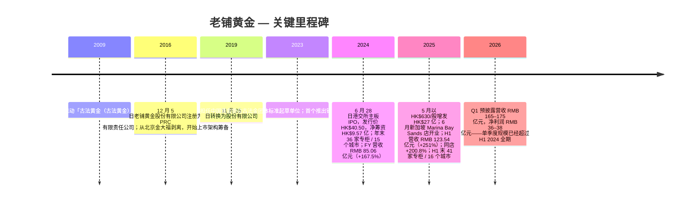
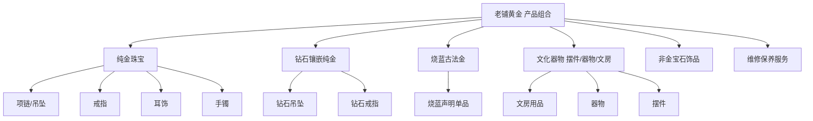
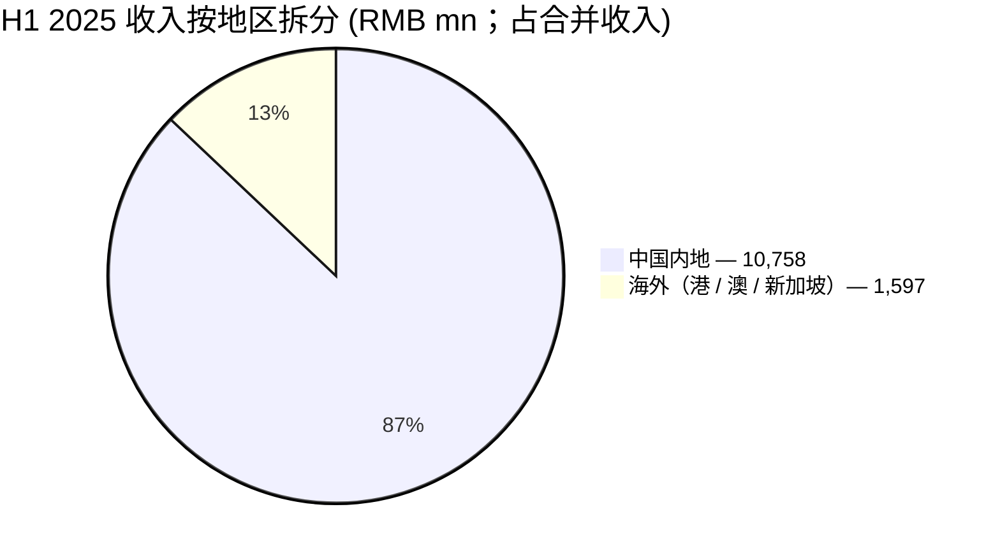
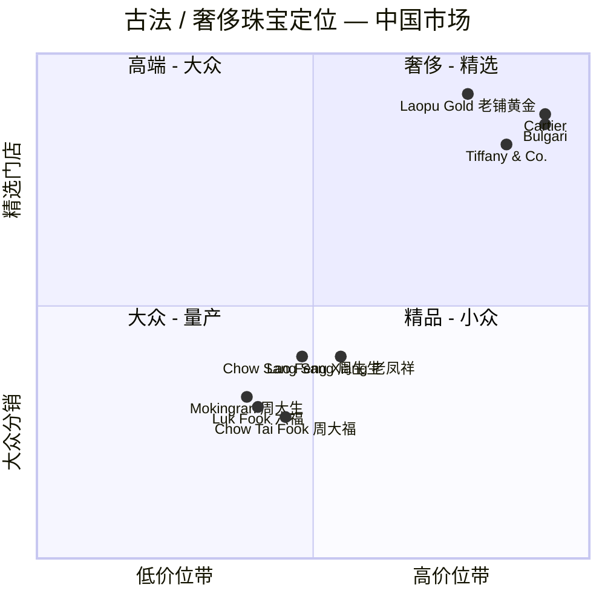
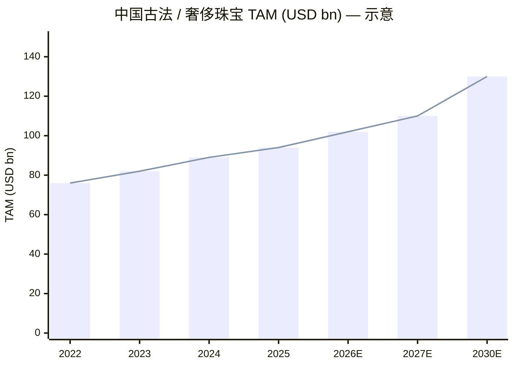

# 老铺黄金股份有限公司 (Laopu Gold / HKEX:6181) — 公司研究

**截至日期：** 2026 年 6 月 3 日
**股票代码：** HKEX:6181（H 股）
**所属行业：** 奢侈品珠宝 — 古法黄金（heritage gold）
**注册地：** 北京，中华人民共和国（股份有限公司）
**上市：** 2024 年 6 月 28 日，港交所主板

> **Update — 公司治理：FY2025 股息政策正式确立，2026Q1 营收同比 +100% (2026-03-21)：** 管理层在 2025 年度业绩说明会前发布的 Q1 2026 业绩预披露显示，Q1 2026 营收预计 RMB 165–175 亿元，已经超过 H1 2025 全期 RMB 123.5 亿元的 34%–42%，净利润预计 RMB 36–38 亿元，意味着同比增长超过 100%。驱动因素包括：电商渠道强劲、上海地区（新店开业贡献）、高端客户表现超预期。
> 来源：[Laopu Gold Q1 2026 preliminary, *China Daily Asia* 2026-03-21](https://www.chinadailyasia.com/hk/article/630982)。

---

## 目录

1. 公司概览
2. 公司历史
3. 管理团队
4. 产品与服务
5. 客户与上市策略
6. 行业概览
7. 竞争格局
8. 市场机会
9. 风险评估
10. 投资视角评分卡

---

## 1. 公司概览

老铺黄金股份有限公司（HKEX:6181）是一家总部位于北京的奢侈品珠宝企业，从事「古法黄金（heritage gold）」纯金珠宝的设计、生产与零售。所谓「古法黄金」是指采用中国传统手工金饰工艺（哑光、磨砂、累丝 / filigree、花丝、镶嵌、烧蓝 / enamelling 等），并经常镶嵌钻石或其他宝石的纯金（pure gold，≥99.0% 金含量）饰品。公司在其 2024 年度业绩公告中将自己描述为「中国引领'古法黄金'概念的头部品牌（the top heritage gold jewelry brand in China to promote the concept of heritage gold）」，并指出其通过「品牌、产品、渠道及客户服务」的系统性差异化定位，「重塑了中国黄金珠宝市场的格局」 ([Laopu Gold 2024 Annual Results Announcement, p.12](https://www1.hkexnews.hk/listedco/listconews/sehk/2025/0331/2025033101661.pdf))。「pure gold（纯金）」按 PRC 国家标准 GB11887 的定义为金含量 ≥99.0% 的精金；「古法黄金」类别为中国黄金协会制定并发布的团体标准《古法金飾品》，其起草单位即为老铺黄金本身 ([2024 Annual Results, p.12](https://www1.hkexnews.hk/listedco/listconews/sehk/2025/0331/2025033101661.pdf))。

公司采用「自营专柜 + 线上旗舰店」的纯直营模式（不开放加盟、不批发），所有专柜均坐落在内地及香港最顶端的购物中心系统中——华润万象城（MixC）、北京华联 SKP、恒隆广场（Plaza 66）、IFC、太古汇（Taikoo Hui）、国贸商城（China World Mall）、海港城（Harbour City）等。截至 2025 年 6 月 30 日，集团在 16 个城市自营 41 家专柜，覆盖 29 家「门槛严格的高端商业中心」，其中 SKP 系列 6 家、万象城系列 11 家 ([2025 Interim Results, p.16](https://www1.hkexnews.hk/listedco/listconews/sehk/2025/0820/2025082000247.pdf))。2025 上半年，专柜（offline boutiques）渠道贡献了 86.9% 的收入（RMB 107.36 亿元 / 总收入 RMB 123.54 亿元），其余由线上平台（Tmall 天猫 + JD 京东）贡献 ([2025 Interim Results, p.18](https://www1.hkexnews.hk/listedco/listconews/sehk/2025/0820/2025082000247.pdf))。产品端高度集中：黄金珠宝（pure gold 纯金 + gem-set 镶嵌）占 FY2024 收入的 99.9%（RMB 84.985 亿元 / 总 RMB 85.056 亿元），H1 2025 同样为 99.9%（RMB 123.459 亿元 / 总 RMB 123.542 亿元），剩余不足 0.1% 为非金宝石饰品及维修保养服务 ([2024 Annual Results, p.15](https://www1.hkexnews.hk/listedco/listconews/sehk/2025/0331/2025033101661.pdf); [2025 Interim Results, p.19](https://www1.hkexnews.hk/listedco/listconews/sehk/2025/0820/2025082000247.pdf))。

业绩规模与增速是这一标的的核心叙事。FY2024 经审计收入同比 +167.5% 至 RMB 85.06 亿元（FY2023 为 RMB 31.80 亿元），毛利润 +162.9% 至 RMB 35.01 亿元（毛利率 41.2%，在金价急涨周期中基本维持稳定），归母净利润 +253.9% 至 RMB 14.73 亿元 ([2024 Annual Results, p.1, p.16](https://www1.hkexnews.hk/listedco/listconews/sehk/2025/0331/2025033101661.pdf))。2025 上半年再次加速：营收 +251.0% 至 RMB 123.54 亿元（即 H1 2025 单期就比整个 FY2024 还高出 45%），归母净利润 +285.8% 至 RMB 22.68 亿元，non-IFRS 调整后净利润率从 H1 2024 的 17.1% 扩张至 19.0%（规模效应释放）；同时毛利率从 41.2% 略降至 38.1%，主因金价跑赢公司「一年两 - 三次」的标牌价调整节奏 ([2025 Interim Results, p.1, p.20](https://www1.hkexnews.hk/listedco/listconews/sehk/2025/0820/2025082000247.pdf))。同店收入增长（same-store revenue growth）FY2024 为 +120.9%，H1 2025 加速至 +200.8% — 即既有专柜基础在 12 个月内大约翻了三倍 ([2024 Annual Results, p.13](https://www1.hkexnews.hk/listedco/listconews/sehk/2025/0331/2025033101661.pdf); [2025 Interim Results, p.18](https://www1.hkexnews.hk/listedco/listconews/sehk/2025/0820/2025082000247.pdf))。

地域上，中国内地（Mainland China）仍是绝对主力，H1 2025 占收入 87.1%（RMB 107.58 亿元），海外（香港、澳门、新加坡）占 12.9%（RMB 15.97 亿元）— 但海外业务同比 +455.2%，反映了 2024 年底香港旗舰店 + 海港城店开业、2025 年 6 月新加坡滨海湾金沙（Marina Bay Sands Shoppes）店（公司首家大中华以外门店）开业的累积效应 ([2025 Interim Results, p.19, p.17](https://www1.hkexnews.hk/listedco/listconews/sehk/2025/0820/2025082000247.pdf))。员工总数从 2024 年底 1,303 人扩张到 2025 年中 1,629 人，按职能划分为销售与营销 44%、生产 33%、行政管理 22%、研发 1% ([2025 Interim Results, p.25](https://www1.hkexnews.hk/listedco/listconews/sehk/2025/0820/2025082000247.pdf); [2024 Annual Results, p.21](https://www1.hkexnews.hk/listedco/listconews/sehk/2025/0331/2025033101661.pdf))。

**估值快照（截至 2026 年 5 月 26 日收盘）。** 老铺黄金股价 HK$511.50，总市值 HK$893.4 亿元；TTM P/E 约 15.6×（Google Finance）至 16.2×（Tiger Brokers 估 5 月中口径），52 周区间为 HK$482.40 – HK$1,108.00 ([Google Finance — 6181](https://www.google.com/finance/beta/quote/6181:HKG); [Tiger Brokers — Laopu Gold 评论](https://www.itiger.com/news/1131761772))。FY2025 基本 EPS RMB 28.35（Tiger Brokers，按 H1+Q1 推算）；对应当前股价的 TTM 倍数约 16 倍，接近恒生综合可选消费指数中位数，且明显**低于**全球奢侈品同业。同业参考点：周大福珠宝（Chow Tai Fook，HKEX:1929）TTM P/E 约 26.5×（GuruFocus，FY2025 口径），FY2025（截至 2025 年 3 月）收入 HK$89.66 亿元、同比 –17.5%、营业利润 +9.8% 至 HK$147.46 亿元 ([Chow Tai Fook FY2025 Margin Expansion, *Morningstar/AccessWire* 2025-06-12](https://www.morningstar.com/news/accesswire/1038729msn/chow-tai-fook-jewellery-posts-strong-margin-expansion-and-operating-profit-for-fy2025-from-brand-transformation-success))；Cartier 母公司 Richemont 与 LVMH 旗下 Bulgari / Tiffany 的 P/E 区间在 25–30× ([Chow Tai Fook convertible note, *AInvest* 2025-06](https://www.ainvest.com/news/chow-tai-fook-convertible-play-strategic-shift-luxury-undiscovered-valuation-2506/))。

**分析师观点：** 老铺当前估值与同业相比折价显著，市场担忧主要集中在四点：(i) 金价已经从 H1 2025 RMB 834.60/克峰值回落至 RMB 760–780/克，公司同店增长正在 lapping「金价抛物线期」的高基数 ([2025 Interim Results, p.20](https://www1.hkexnews.hk/listedco/listconews/sehk/2025/0820/2025082000247.pdf))；(ii) 2025 年 6 月禁售期到期（lock-up expiry）解锁了 40.4 mn 股 +28.6 mn pre-IPO 股 —— 合计约占股本 40% —— 形成显著筹码压力 ([Laopu price commentary, *Tiger Brokers* 2025-07](https://www.itiger.com/news/1131761772))；(iii) 竞争对手陆续入场——周大福「故宫文化」古法金线、老凤祥、周大生（Mokingran）等均在 2025–26 年推出古法金 SKU ([Chow Tai Fook FY2025 results, *Longbridge* 2025-06](https://longbridge.com/en/news/244811490))；(iv) 中国可选消费宏观背景趋弱，限制高端客群消费动能。在我们看来，16× TTM 估值已经处于奢侈品珠宝估值历史区间的中下端，price-in 了某种「同店增长大幅放缓」或「金价显著回调」的情形——而这两种情形目前都未在公开数据中出现。我们认为该估值已经较为充分地反映了禁售期压力，并在 Q4 2025 / Q1 2026 同店增速能维持 +50% 区间的情况下具备显著向上 optionality。

**资本结构。** 公司杠杆温和但营运资本（working capital）需求快速攀升。H1 2025 有息银行借款 RMB 31.83 亿元（vs FY24 末 RMB 13.73 亿元），资产负债率（gearing ratio）43.1%（vs FY24 末 38.1%），现金 RMB 25.16 亿元，存货 RMB 86.85 亿元（六个月内 +112.5%，因公司提前囤金以应对 Q4 旺季和新店开业）([2025 Interim Results, p.23](https://www1.hkexnews.hk/listedco/listconews/sehk/2025/0820/2025082000247.pdf))。2025 年 5 月以 HK$630.00/股（当时市价显著溢价）增发 4.31 mn 新 H 股，净筹资 HK$26.98 亿元，其中 80% 用于专柜扩张、优化及同店增长（即囤金），20% 用于补充营运资金 ([2025 Interim Results, p.28–29](https://www1.hkexnews.hk/listedco/listconews/sehk/2025/0820/2025082000247.pdf))。

## 2. 公司历史

老铺品牌创立于 **2009 年**，由徐高明（Xu Gaoming）创办，是中国首个围绕「古法黄金（heritage gold）」概念定位的珠宝品牌，也是首个将钻石镶嵌应用于纯金、并将「烧蓝（heat treatment of enamels）」技法应用于纯金饰品的中国品牌 ([2024 Annual Results, p.12–13](https://www1.hkexnews.hk/listedco/listconews/sehk/2025/0331/2025033101661.pdf); [2025 Interim Results, p.16](https://www1.hkexnews.hk/listedco/listconews/sehk/2025/0820/2025082000247.pdf))。法人载体——老铺黄金股份有限公司——于 2016 年 12 月 5 日在 PRC 注册为有限责任公司，2019 年 11 月 25 日转换为股份有限公司，为后续 IPO 铺路 ([2025 Interim Results, p.33 Definitions](https://www1.hkexnews.hk/listedco/listconews/sehk/2025/0820/2025082000247.pdf))。2016 年的重组将老铺品牌从一个更宽泛的载体——北京金大福（Beijing Golden Treasury，徐高明自 2004 年开始运营的佛教饰品 + 文化产品业务）——剥离出来，把品牌驱动的资产打包准备上市 ([Xu Gaoming founder bio, *IDNFinancials*](https://www.idnfinancials.com/news/59331/xu-gaoming-former-fisheries-employee-who-became-a-gold-millionaire); [Laopu founder background, *VnExpress* 2024-06](https://e.vnexpress.net/news/business/billionaires/from-fisheries-clerk-to-jewelry-billionaire-how-xu-gaoming-built-11b-fortune-with-china-s-hermes-of-gold-4988794.html))。

公司 2009 –2024 的发展可分四阶段。**2009–2016 阶段**为单店持有 + 品类创设阶段——老铺是首个获得中国黄金协会团体标准《古法金飾品》起草单位资格的企业，亦是首个推出钻石镶嵌纯金的厂商 ([2024 Annual Results, p.12](https://www1.hkexnews.hk/listedco/listconews/sehk/2025/0331/2025033101661.pdf))。**2017–2022 阶段**进入选址精挑阶段，逐步进驻一二线高端商业中心（华润万象城 MixC 与北京华联 SKP 成为两个锚定的商业中心系统）。**2023–2024 阶段**为品类爆发阶段：金价开始攀升，国潮（cultural-pride consumption）开始流入古法黄金；FY2023 收入 RMB 31.80 亿元，FY2024 RMB 85.06 亿元；公司于 **2024 年 6 月 20 日** 公布 IPO 招股书，并于 6 月 28 日以 HK$40.50/股完成港交所主板上市，净筹资 HK$9.571 亿元 ([2024 Annual Results, p.23](https://www1.hkexnews.hk/listedco/listconews/sehk/2025/0331/2025033101661.pdf); [Prospectus, 2024-06-20](https://www1.hkexnews.hk/listedco/listconews/sehk/2024/0628/11262988/sehk24051301375.pdf))。**2025 至今阶段**为国际化与规模化：2025 年 5 月以 HK$630.00/股完成 HK$27 亿增发，资金用于支持新店黄金库存储备；6 月新加坡滨海湾金沙店开业（首家大中华以外门店）；8 月公布的 H1 2025 业绩大幅超预期；2026 年 3 月公布的 Q1 2026 预披露指向营收同比 +100%+ ([2025 Interim Results, p.17, p.28](https://www1.hkexnews.hk/listedco/listconews/sehk/2025/0820/2025082000247.pdf); [Q1 2026 preliminary, *China Daily Asia* 2026-03-21](https://www.chinadailyasia.com/hk/article/630982))。

来源：[2024 Annual Results, p.12–14, p.23](https://www1.hkexnews.hk/listedco/listconews/sehk/2025/0331/2025033101661.pdf); [2025 Interim Results, p.16–17](https://www1.hkexnews.hk/listedco/listconews/sehk/2025/0820/2025082000247.pdf); [Q1 2026 preliminary, *China Daily Asia* 2026-03-21](https://www.chinadailyasia.com/hk/article/630982)。

这一弧线中的战略转折值得标注。**第一**，从「中国传统珠宝品牌」到「直接对标国际奢侈品的中国高端品牌（high-end Chinese brand competing directly with international luxury brands）」的定位升级 — 这一措辞首次出现在 FY2024 年度业绩公告 ([2024 Annual Results, p.12](https://www1.hkexnews.hk/listedco/listconews/sehk/2025/0331/2025033101661.pdf))——是 2025–26 国际化推进的战略锚点，并支撑了 H1 2025 公布的「老铺客户与 LV / Hermès / Cartier / Bulgari / Tiffany 客户重合度 77.3%」的 Frost & Sullivan 数据（参见第 5 节）([2025 Interim Results, p.15](https://www1.hkexnews.hk/listedco/listconews/sehk/2025/0820/2025082000247.pdf))。**第二**，渠道纪律——不开放加盟、不批发、所有专柜都设在城市最高端商场内部——这在中国黄金零售业是少见的，其规模化的竞争对手（周大福、老凤祥、六福、周大生）都采用加盟 / 直营混合模型。**第三**，分红的转变：FY2023 零分红，到 FY2024 末期股息 RMB 6.35/股、合计 RMB 10.7 亿元，再到 H1 2025 中期股息 RMB 9.59/股、约相当于半年净利润的 73% ([2024 Annual Results, p.24](https://www1.hkexnews.hk/listedco/listconews/sehk/2025/0331/2025033101661.pdf); [2025 Interim Results, p.9, p.30](https://www1.hkexnews.hk/listedco/listconews/sehk/2025/0820/2025082000247.pdf))。**分析师观点：** 这一分红政策的激进度信号了控股股东对未来的高度信心——管理层愿意通过债务和增发融资营运资金，而不必倚赖留存利润——只要同店增长与运营现金创造保持强劲。

过去 12 个月内对投资命题有实质影响的事件包括：2025 年 5 月增发价 HK$630/股较当时市价溢价约 30%，且通过 6 名以上承配人配售完成——表明机构对峰值估值依然有承接意愿；6 月新加坡店是首家大中华以外门店，也是国际化的里程碑；H1 中期股息 RMB 9.59/股（约 73% 派息率）与该期黄金存货建设的强营运资金需求形成鲜明对比；2026 年 3 月的 Q1 预披露在中国一线消费仍显疲弱的背景下大幅上调了 FY2026 估计路径 ([Q1 2026 preliminary, *Investing.com* 2026-03](https://www.investing.com/news/earnings/laopu-gold-1q26-revenue-forecast-beats-expectations-93CH-4575491); [Q1 2026 preliminary, *Tiger/futubull* 2026](https://news.futunn.com/en/post/70709322/laopu-gold-6181-hk-26q1-growth-significantly-exceeded-expectations-with))。

## 3. 管理团队

**徐高明（Xu Gaoming）— 创始人、董事长、执行董事、总经理、产品研发总监。**

徐高明是老铺品牌（2009 年）的创始人，至今仍以「执行董事、董事会主席、总经理」的身份执掌公司运营。FY2024 年度业绩公告的公司治理章节明确指出「Mr. Xu 是公司的董事会主席兼总经理」，并称「董事会认为将主席与总经理职位由同一人担任有利于本集团的管理」（这构成对 CG Code C.2.1 条款——主席与 CEO 应分设——的偏离）([2024 Annual Results, p.25](https://www1.hkexnews.hk/listedco/listconews/sehk/2025/0331/2025033101661.pdf))。在 H1 2025 中期业绩公告的定义页和最终董事会构成页中，徐高明再次被明确列示，并于 2025 年 8 月 20 日签发该公告 ([2025 Interim Results, p.34, p.35](https://www1.hkexnews.hk/listedco/listconews/sehk/2025/0820/2025082000247.pdf))。其早期职业背景与奢侈品零售毫不相干，独立来源（IPO 招股书的「董事、监事及高级管理人员」章节及第三方独立报道）显示：1984 年 8 月至 1991 年 12 月，徐在湖南岳阳市畜牧水产局担任办事员；1992 年 1 月至 1993 年 12 月，任该局水产大厦总经理 ([Xu Gaoming background, *IDNFinancials*](https://www.idnfinancials.com/news/59331/xu-gaoming-former-fisheries-employee-who-became-a-gold-millionaire); [Xu Gaoming, *VnExpress* 2024-06](https://e.vnexpress.net/news/business/billionaires/from-fisheries-clerk-to-jewelry-billionaire-how-xu-gaoming-built-11b-fortune-with-china-s-hermes-of-gold-4988794.html))。1988 年 6 月通过华中农业大学函授获得淡水水产专业大专学历。1995 年离开公务员系统后，他在 30 出头时创办了旅游纪念品 / 文化产品业务，2004 年又创办北京金大福（一家未能上量的佛教饰品 + 文化产品业务）；至 2009 年才创立老铺黄金品牌——使他成为一个并非从珠宝行业切入、而是经文化品零售迂回进入奢侈品行业的创始人 CEO ([Xu Gaoming founder profile, *Momentum Works Impulso* 2024](https://thelowdown.momentum.asia/laopu-gold-the-cartier-of-china-impulso-e131/))。

徐高明的「实操深度」在控股 CEO 中非常少见。独立报道证实他「同时担任老铺黄金的董事长、CEO 及产品研发总监，将约 70% 的时间投入设计与研发」 ([Laopu founder profile, *VnExpress* 2024-06](https://e.vnexpress.net/news/business/billionaires/from-fisheries-clerk-to-jewelry-billionaire-how-xu-gaoming-built-11b-fortune-with-china-s-hermes-of-gold-4988794.html))；FY2024 年度业绩公告的措辞与此一致：「我们的创始人亲自担任研发总监，领导一支以强大创新能力和扎实专业能力著称的团队」 ([2024 Annual Results, p.13](https://www1.hkexnews.hk/listedco/listconews/sehk/2025/0331/2025033101661.pdf))。对投资者而言，这意味着公司在产品方向上的「创始人依赖」程度高——徐不仅是董事长和 CEO，还是事实上的创意总监。

**股权与控制权高度集中。** 据创始人侧报道，IPO 之前徐高明直接持有 22.39% 股份，连同其子徐东波（Xu Dongbo，直接持有 10.04%）—— 两人均为登记的一致行动控股股东 —— 通过各类实体合计控制约 78.27% 的发行股份，IPO 公众流通股仅占个位数百分比 ([Laopu IPO ownership, *futunn.com* 2024-06](https://news.futunn.com/post/34066502/laopu-gold-ipo-founder-xu-gaoming-was-a-former-fisheries); [Xu Gaoming bio, *IDNFinancials*](https://www.idnfinancials.com/news/59331/xu-gaoming-former-fisheries-employee-who-became-a-gold-millionaire))。2025 年 3 月 7 日启动的 H 股全流通（H Share Full Circulation）程序——将三名股东持有的 40,388,900 股内资股转换为 H 股——在 2025 年内完成；叠加 2025 年 6 月 28 日 IPO 锁定期到期释放的 28.6 mn 股，约 40% 股本的解锁压力集中爆发，部分解释了 7 月 9 日 HK$1,080 高点至 7 月 23 日 HK$765 低点的 30%+ 回撤 ([2024 Annual Results, p.22](https://www1.hkexnews.hk/listedco/listconews/sehk/2025/0331/2025033101661.pdf); [Laopu lock-up commentary, *Tiger Brokers* 2025-07](https://www.itiger.com/news/1131761772))。尽管经历配售与解锁稀释事件，Forbes 估计徐高明 2025 年个人净值约 US$110 亿，位列中国富豪榜第 35 位 ([Xu Gaoming Forbes ranking, *VnExpress* 2024-06](https://e.vnexpress.net/news/business/billionaires/from-fisheries-clerk-to-jewelry-billionaire-how-xu-gaoming-built-11b-fortune-with-china-s-hermes-of-gold-4988794.html))。对投资者而言，这是亚洲家族控股奢侈品的经典格局：高内部持股带来强烈的利益对齐，但限制公众流通股流动性，使公司治理保障主要依赖于董事会的独立性（7 名董事中 3 名独立非执行董事，分别为孙义军、贺玉润博士、施德华，由 FY2024 审计委员会与 H1 2025 董事会构成页面认证）([2025 Interim Results, p.35](https://www1.hkexnews.hk/listedco/listconews/sehk/2025/0820/2025082000247.pdf))。

H1 2025 中期业绩公告（2025 年 8 月 20 日签发）中，徐高明仍以执行主席身份签发文件 ([2025 Interim Results, p.35](https://www1.hkexnews.hk/listedco/listconews/sehk/2025/0820/2025082000247.pdf))。董事会同期构成：4 名执行董事（徐高明、馮建軍 Feng Jianjun、徐睿 Xu Rui、蔣霞 Jiang Xia）+ 3 名独立非执行董事（孫義軍 Sun Yijun、賀玉潤 He Yurun、施德華 See Tak Wah）。由于创始人同时身兼 CEO 与产品负责人，继承风险结构性偏高——在本报告撰写时点，公开投资者尚看不到具备同等地位的「二代」产品负责人。（按 skill 规则：本节仅描写创始人 / CEO，其他高管按规定不展开。）

## 4. 产品与服务

### 4.1 老铺产品矩阵（基于 FY2024 + H1 2025 公告与公司官网的分析师重构）

公司在 FY2024 年报公告和 H1 2025 中期公告中均未公布美式 10-K 风格的「分品类收入表」，相关披露以散落叙述的方式呈现，并配以「按销售渠道」和「按产品 / 服务类型」（黄金珠宝 vs 其他）的收入拆分。但是基于公司在官方渠道（[www.lphj.com](https://www.lphj.com/)）和公告中所披露的内容，可以以「品类（categories）× 工艺（techniques）× 价位带（price tiers）」三维度重构产品矩阵。下表为分析师重构，**不包含**分品类的收入百分比（公司未披露，不可主观推断）。

| 层级 | 描述 | 引用证据 |
|---|---|---|
| **纯金珠宝**（pure gold jewelry，主力品类） | 项链、吊坠、戒指、耳饰、手镯——采用哑光（matte）/ 磨砂（sandy）等表面工艺，应用中国黄金协会团体标准所定义的传统手工技法（古法金饰品标准的起草单位即为老铺）| 「heritage gold jewelry: a type of pure gold jewelry that combines modern designs and classic Chinese culture, features matte (啞光), sandy (磨砂) or other texture of ancient royal jewelry, and applies at least two Chinese traditional handmade gold crafting techniques」—— [2024 Annual Results Definitions, p.27](https://www1.hkexnews.hk/listedco/listconews/sehk/2025/0331/2025033101661.pdf) |
| **钻石镶嵌纯金珠宝**（diamond-inlaid pure gold jewelry） | 老铺品类创新——古法纯金 + 钻石镶嵌；公司是「行业内首个推出钻石镶嵌纯金饰品并引领行业潮流的品牌（the first brand in the industry to introduce diamond-inlaid pure gold jewelry, setting trends for the industry）」 | [2024 Annual Results, p.12](https://www1.hkexnews.hk/listedco/listconews/sehk/2025/0331/2025033101661.pdf)；中国黄金协会团体标准《古法金鑲嵌鑽石飾品》起草单位 |
| **烧蓝古法金**（enamel-fired heritage gold） | 经热处理彩珐琅釉施于纯金表面的产品——公司是首个将「烧蓝（enamel firing）」技法应用于纯金的中国品牌 | 「heat treatment of enamels (燒藍): a decorative process that entails the application of colored enamel glaze onto the surface of gold products, which results in a vibrant and multi-hued appearance」—— [2024 Annual Results Definitions, p.27](https://www1.hkexnews.hk/listedco/listconews/sehk/2025/0331/2025033101661.pdf); [2025 Interim Results, p.16](https://www1.hkexnews.hk/listedco/listconews/sehk/2025/0820/2025082000247.pdf) |
| **文化器物**（摆件 / 器物 / 文房） | 中国传统手工艺品和文具、生活及装饰摆件器物——「展现出更高水平的工艺复杂度，深度融合并体现文化元素及审美意趣，进一步强化品牌独特定位、充分满足消费者全方位需求」 | [2024 Annual Results, p.16](https://www1.hkexnews.hk/listedco/listconews/sehk/2025/0331/2025033101661.pdf); [2025 Interim Results, p.19](https://www1.hkexnews.hk/listedco/listconews/sehk/2025/0820/2025082000247.pdf) |
| **非金宝石饰品**（gem-set non-gold） | 不以纯金为载体的宝石饰品——H1 2025 披露明确将「黄金珠宝」（纯金 + 钻石镶嵌）口径 99.9% 与非金宝石饰品（<0.1%）合并归类 | [2025 Interim Results, p.19](https://www1.hkexnews.hk/listedco/listconews/sehk/2025/0820/2025082000247.pdf) |
| **维修保养服务** | 「为本集团销售的珠宝产品提供维修保养服务」——H1 2025 收入 RMB 2.05 mn，几乎为象征性收入项 | [2025 Interim Results, p.6, p.19](https://www1.hkexnews.hk/listedco/listconews/sehk/2025/0820/2025082000247.pdf) |

公司亦披露 IP 规模（产品广度的代理指标）：「截至 2025 年 6 月 30 日，我们累计创造原创设计 2,100 余件，拥有中国境内专利 273 项、作品著作权 1,505 项、境外专利 246 项」 ([2025 Interim Results, p.16](https://www1.hkexnews.hk/listedco/listconews/sehk/2025/0820/2025082000247.pdf))——较 2024 年底「近 2,000 件原创设计，249 项境内专利、1,314 项作品著作权、228 项境外专利」均有提升 ([2024 Annual Results, p.13](https://www1.hkexnews.hk/listedco/listconews/sehk/2025/0331/2025033101661.pdf))。

### 4.2 产品矩阵的协同——客户旅程视角

理解品类之间的相互作用，最好的视角是**单一客户的购买旅程**。老铺的初次购买者通常从日常佩戴的纯金吊坠 / 戒指入门，价位区间 RMB 10,000–50,000（IPO 招股书披露：「大多数产品定价在 1 万到 5 万元之间」—— [Laopu prospectus pricing summary, *daoinsights*](https://daoinsights.com/news/chinas-gold-prices-soar-laopu-gold-and-shuibei-win-over-market-share/)）。熟悉品牌后的复购客户向上升级到「钻石镶嵌古法金」（公司的开创性品类）、再到「烧蓝声明性单品」，最终在金字塔顶端进入「文化器物（摆件 / 器物）」线，这一层既有更高的金重，又承载更复杂的工艺密度。这一升级阶梯与 Hermès 的「皮具→稀有皮料→定制」升级曲线极为类似，差别在于老铺的核心金属（gold）具备一定的「价值储藏功能」，从而推高基础客单价以及客户的「持有回报」感知。**分析师观点：** 该升级机制叠加 FY2024 同店 +120% 和 H1 2025 同店 +201% 的实证表现，表明老铺已经成功将「黄金购买者中的好奇者」转化为「奢侈品珠宝品类的复购客户」——这是结构性高于传统金店「结婚买完就走」单次客群的客户群体。

来源：[Laopu Gold 2024 Annual Results, p.16; Definitions p.27](https://www1.hkexnews.hk/listedco/listconews/sehk/2025/0331/2025033101661.pdf); [2025 Interim Results, p.19](https://www1.hkexnews.hk/listedco/listconews/sehk/2025/0820/2025082000247.pdf)。

### 4.3 纯金珠宝（销售引擎）

FY2024 年报公告对该品类的定义如下（**逐字引用**——这是公司最权威的产品定义）：

> 「**Heritage gold (古法黃金) jewelry**: a type of pure gold jewelry that combines modern designs and classic Chinese culture, features matte (啞光), sandy (磨砂) or other texture of ancient royal jewelry, and applies at least two Chinese traditional handmade gold crafting techniques as specified in the group standards published by the China Gold Association.」 ([2024 Annual Results, Definitions p.27](https://www1.hkexnews.hk/listedco/listconews/sehk/2025/0331/2025033101661.pdf))

**中文释义 / Plain-language gloss：** 这是老铺开创的核心品类。传统大众市场的中国黄金珠宝（如周大福的「硬足金」戒指、老凤祥的 999 标记金链）按金重出售并加收一小笔工费（约 RMB 50–100/克），客户视之为商品（commodity）。老铺「古法黄金（heritage gold）」的差异化在于「**工艺堆叠（technique stack）**」—— 锤揲（hand-hammered）、花丝（filigree）、累丝（granulation）、烧蓝（enamelling）、錾刻（repoussé）等技法，全部源于明清宫廷工坊，在 1990 年代工业化金饰冲压浪潮中曾近乎失传。哑光、磨砂表面，历史精准的纹样，以及多技法组合应用，共同构成了中国黄金协会团体标准下「古法金饰品」的资质。其经济含义是：老铺客户购买的不仅是金重，更是「工艺时间 + 品牌」——这就是为什么老铺的「克金价」远高于市场金条价格、且毛利率（FY24 41.2%、H1 2025 38.1%）显著高于头部黄金零售商 20–25% 的水平 ([2024 Annual Results, p.16](https://www1.hkexnews.hk/listedco/listconews/sehk/2025/0331/2025033101661.pdf); [2025 Interim Results, p.20](https://www1.hkexnews.hk/listedco/listconews/sehk/2025/0820/2025082000247.pdf))。

***分析师观点：*** 此处的护城河是「品牌 + 单件工艺密度」，而非原始 IP。H1 2025 披露的 273 项境内专利 ([2025 Interim Results, p.16](https://www1.hkexnews.hk/listedco/listconews/sehk/2025/0820/2025082000247.pdf))基本是「外观与工艺」专利，可在中国境内执行但国际保护较弱——更耐久的护城河实际上是「高端商场业主对品牌的认可」（缺此则商场资源蒸发）和「受训古法金工匠的人力资源密度」（H1 2025 生产员工 526 人—— [2025 Interim Results, p.25](https://www1.hkexnews.hk/listedco/listconews/sehk/2025/0820/2025082000247.pdf)）。竞争对手亦推出古法金线（周大福「故宫」联名、老凤祥、周大生），但均无法匹配老铺的定位一致性和万象城 / SKP 旗舰位的可获取性。

### 4.4 钻石镶嵌纯金（公司的核心品类创新）

FY2024 年报公告的核心声称（逐字引用）：

> "Our Company is the first brand in the industry to introduce diamond-inlaid pure gold jewelry, setting trends for the industry." ([2024 Annual Results, p.12](https://www1.hkexnews.hk/listedco/listconews/sehk/2025/0331/2025033101661.pdf))

**中文释义 / Plain-language gloss：** 传统中国黄金珠宝鲜有钻石镶嵌，因为纯金（PRC 国标 ≥99.0%）质地过软，无法以爪镶（prong setting）固定宝石——钻石镶嵌历来需要合金（白金、铂金）。老铺通过专有镶嵌技术解决了这一问题（这亦是公司起草中国黄金协会《古法金鑲嵌鑽石飾品》团体标准的核心输入之一）。客户价值在于：既想要「价值储藏（gold）」又想要「奢侈品信号（diamond）」的买家，从此可以在单件饰品中两者兼得，而无需将金质吊坠与独立钻戒分别购买。战略意义在于：这一创新将「婚嫁与订婚」市场（历史上属于 Bulgari / Cartier / Tiffany 在一线中国城市的地盘）拉入老铺的视野，同时保留了金饰投资属性叙事。***分析师观点：*** 这是老铺最强的单一品类创新；竞争者可在团体标准发布后复制此技术，但品牌识别度和门店分销的先发优势相当显著。

### 4.5 烧蓝古法金（声明性单品类）

H1 2025 中期公告原文：

> 「Our Company is the first brand in China to promote the concept of heritage gold (古法黃金) in China and the top professional brand in traditional Chinese handcrafted gold jewelry as accredited by the China Gold Association ... the first to apply heat treatment of enamels (燒藍) to pure gold products, setting trends for the industry.」 ([2025 Interim Results, p.14](https://www1.hkexnews.hk/listedco/listconews/sehk/2025/0820/2025082000247.pdf))

**中文释义 / Plain-language gloss：** 烧蓝（cloisonné 风格的珐琅烧制）是明代宫廷技法之一，将彩色玻璃珐琅料在高温下熔结于金属表面。将其应用到纯金（而非更常见的铜或银底材）需要极精细的温度控制，因纯金熔点偏低。客户可见的成品兼具景泰蓝的鲜艳彩色调与纯金的金属光泽——与基础古法金的「哑光」表面和西式钻镶造型在视觉上截然不同。***分析师观点：*** 烧蓝单品是品牌中最具拍摄观赏度的品类，承担了小红书与微博自然流量的不成比例份额。它们亦是毛利率最高的层级，因每件工艺时间最长。

### 4.6 文化器物（摆件 / 器物 / 文房）—— 金字塔顶端

FY2024 年报公告对顶端线的描述：

> 「Our product portfolio includes daily wear accessories, as well as traditional Chinese handcrafts and stationeries, daily use and decorative ornaments and vessels to cater to consumers from different age groups and with diverse needs. These products exhibit a higher level of craftsmanship complexity, deeply integrating and reflecting cultural elements and aesthetic appeal, further reinforcing our brand's unique positioning and greatly satisfying consumers' all-round needs.」 ([2024 Annual Results, p.16](https://www1.hkexnews.hk/listedco/listconews/sehk/2025/0331/2025033101661.pdf))

**中文释义 / Plain-language gloss：** 器物、文房、摆件被定位为「收藏品」或「内饰艺术品」而非可佩戴的珠宝——纯金茶具、镇纸、香盒、微型雕塑等等。它们模糊了「奢侈珠宝」与「中国装饰艺术」的边界，凭借「金重 + 工艺密度 + 呈现」组合命脉撑出极高价位。***分析师观点：*** 这一层是品牌「能力顶峰」的演示，也是 2025–26 国际奢侈品定位推进中最关键的品类（新加坡 Marina Bay Sands 是一家展示器物的「橱窗店」，而非日常吊坠驱动门店）。其战略意义类似于 Hermès 的 Birkin / Kelly 计划——绝对量小、声誉极高、对整个品类形成光环效应。

### 4.7 渠道——专柜 + 线上旗舰店（不开放加盟）

H1 2025 末老铺的 41 家专柜全部为公司自营，分布在 29 家高端商业中心。商场分布：SKP 系列 6 家（北京 SKP、北京 SKP-S、西安 SKP、武汉 SKP、成都 SKP 等）、华润万象城 11 家（北京、深圳、杭州、天津、成都、武汉、罗湖、厦门等）、其余 24 家分布于恒隆广场（Plaza 66）、IFC、国贸商城、太古汇、海港城、Marina Bay Sands 等 ([2025 Interim Results, p.16](https://www1.hkexnews.hk/listedco/listconews/sehk/2025/0820/2025082000247.pdf); [2024 Annual Results, p.14](https://www1.hkexnews.hk/listedco/listconews/sehk/2025/0331/2025033101661.pdf))。公司在 H1 2025 中期中称已经覆盖「中国 Top 10 商业中心中的 9 家」，第 10 家（上海恒隆广场）将于 2025 年 10 月中旬开业 ([2025 Interim Results, p.17](https://www1.hkexnews.hk/listedco/listconews/sehk/2025/0820/2025082000247.pdf))。H1 2025 新增 5 家店——北京东方新天地禅意主题店、北京 SKP-S、上海港汇恒隆、新加坡 Marina Bay Sands Shoppes、上海 IFC，其中三家位于新进入的商业中心（上海港汇恒隆、新加坡 Marina Bay Sands、上海 IFC），另两家为 SKP-S 子品牌延展形态 ([2025 Interim Results, p.16–17](https://www1.hkexnews.hk/listedco/listconews/sehk/2025/0820/2025082000247.pdf))。

线上渠道——Tmall 天猫旗舰店与 JD 京东旗舰店——FY2024 产生收入 RMB 10.55 亿元（占总收入 12.4%），H1 2025 产生收入 RMB 16.18 亿元（13.1%）([2024 Annual Results, p.15](https://www1.hkexnews.hk/listedco/listconews/sehk/2025/0331/2025033101661.pdf); [2025 Interim Results, p.18](https://www1.hkexnews.hk/listedco/listconews/sehk/2025/0820/2025082000247.pdf))。公司线上旗舰店在 2024 年双 11 全年位列珠宝品类第一（Tmall 全年总销售约 RMB 12.6 亿元），并在 2025 年 6.18 节庆中位列黄金品类第一（单次大促成交 >RMB 10 亿元）([2024 Annual Results, p.13](https://www1.hkexnews.hk/listedco/listconews/sehk/2025/0331/2025033101661.pdf); [2025 Interim Results, p.15](https://www1.hkexnews.hk/listedco/listconews/sehk/2025/0820/2025082000247.pdf))。H1 2025 线上同比增速 +313.3%，高于线下专柜的 +243.2%——既反映线上自身的增量需求，也反映线上作为「高价位客户的发现 / 预购入口」，最终转化常仍在门店完成。

### 4.8 单商场坪效（公司最核心 KPI）

公司自身公告中最常引用的两项 KPI 是「单商场平均销售额」和「单平米销售额」 —— 两者按 Frost & Sullivan 的口径均位列「内地所有珠宝品牌（国际 + 国内）」之首，FY2024 和 H1 2025 均连续居首。披露的具体数字：

- FY2024：单商场平均销售约 RMB 3.28 亿元 ([2024 Annual Results, p.13](https://www1.hkexnews.hk/listedco/listconews/sehk/2025/0331/2025033101661.pdf))
- H1 2025：单商场平均销售约 RMB 4.59 亿元（该计算口径不含 2025 年 5 - 6 月新进入的 3 家商场）([2025 Interim Results, p.14](https://www1.hkexnews.hk/listedco/listconews/sehk/2025/0820/2025082000247.pdf))

H1 2025 半年单商场坪效 RMB 4.59 亿元已经**超过整个 FY2024 全年的水平**——既验证了金价红利，也验证了同店生产力的台阶式跃升。***分析师观点：*** 这一「单门店坪效」是老铺与周大福（6,000+ 家店、单店产值约 RMB 1,500 万元）以及 Cartier（约 270 家大中华门店、单店产值 RMB 8,000–12,000 万元）结构性差异的最佳总结。老铺已经构建出内地所有珠宝品牌中**最高的单店销售密度**。

## 5. 客户与上市策略

老铺客群主要为中国高净值消费者（high-net-worth Chinese consumers），并日益渗透到港 / 澳 / 新加坡的华侨群体——他们将古法黄金视为「奢侈品信号 + 价值储藏 + 文化身份表达」三位一体的购买。最具战略含量的客户披露是 H1 2025 委托 Frost & Sullivan 完成的客户重合度（customer overlap）调研：

> 「According to Frost & Sullivan's research data, the average overlap rate between Laopu Gold's customers and customers of five leading international luxury brands, such as Louis Vuitton, Hermès, Cartier and BULGARI, reaches as high as 77.3%. The substantial overlap between Laopu Gold's customers and international luxury brand customers demonstrates high-end consumption characteristics, validating the premium positioning of our brand.」 ([2025 Interim Results, p.15](https://www1.hkexnews.hk/listedco/listconews/sehk/2025/0820/2025082000247.pdf))

具体重合率：LV 74.3%、Hermès 79.3%、Cartier 77.0%、Bulgari 80.9%、Tiffany & Co. 75.8% — 平均 77.3% ([2025 Interim Results, p.15](https://www1.hkexnews.hk/listedco/listconews/sehk/2025/0820/2025082000247.pdf))。**分析师观点：** 这是付费研究，读起来处于「可信范围的高端」——多奢侈品消费者作为一类本就有高交叉重合特征——但 Bulgari 80.9% 与 Hermès 79.3% 的数字方向上与万象城 / SKP 客流数据相符。同时，这一数字本身就是一个有力的「自我实现」营销主张，可能影响后续的客户获取。

**会员客户数据库。** FY2024 末忠诚度会员（loyalty members）约 35 万人，同比增加 15 万 ([2024 Annual Results, p.13](https://www1.hkexnews.hk/listedco/listconews/sehk/2025/0331/2025033101661.pdf))。H1 2025 末会员约 48 万人，半年内增加 13 万 ([2025 Interim Results, p.15](https://www1.hkexnews.hk/listedco/listconews/sehk/2025/0820/2025082000247.pdf))。相对于国际奢侈品同业（Tiffany 全球会员以百万计），这是一个相对小的绝对基数，但「半年增加 13 万」的运行速率，叠加 H1 2025 收入与会员增量倒推的隐含平均客单价约 RMB 26,000，指向高单客价值与强复购特征。

来源：[Laopu Gold 2025 Interim Results, p.5, p.19](https://www1.hkexnews.hk/listedco/listconews/sehk/2025/0820/2025082000247.pdf)。单一分母（合并口径）图。

**客户集中度——按「单客户 <10%」披露口径。** 2025 中期公告 Note 3（经营分部信息）声明：

> 「No revenue from sales to a single external customer or a group of external customers under common control accounted for 10% or more of the Group's revenue during the six months ended June 30, 2025 and 2024.」 ([2025 Interim Results, p.5](https://www1.hkexnews.hk/listedco/listconews/sehk/2025/0820/2025082000247.pdf))

2024 年报公告中没有类似的客户集中度披露行（分部口径结构相同，集团被描述为单一可报告分部）——隐含「无单一客户超过 10%」。**这是合并口径的披露；本报告未隐含将其与任何分部级别数据混用。** 由于业务整体属于通过自营专柜 + 电商旗舰店的直接面向消费者（DTC）奢侈零售，单一客户集中度结构上偏低。应收账款（H1 2025 末 RMB 8.44 亿元、FY24 末 RMB 8.01 亿元）代表的是商场代收账款，而非客户信用——商场代客户收款后净扣手续费向老铺结算，通常在 30 - 60 天内完成 ([2025 Interim Results, p.11](https://www1.hkexnews.hk/listedco/listconews/sehk/2025/0820/2025082000247.pdf); [2024 Annual Results, p.9](https://www1.hkexnews.hk/listedco/listconews/sehk/2025/0331/2025033101661.pdf))。

**渠道伙伴 / 商场业主。** 尽管公告中没有单独披露某家商场为「客户」（实际上它们并非客户），但实操层面 Tier-1 商业中心关系驱动着老铺的竞争壁垒：华润集团（万象城 MixC，41 家专柜中的 11 家）和北京华联（SKP，41 家中的 6 家）是两大单一业主家族。**分析师观点：** 这两个商场系统的集中度（约 41% 的专柜）数学上偏高，构成有意义的「上游依赖」风险，应随老铺扩张持续监控。如果万象城或 SKP 将位置偏好转向其他古法金品牌（如周大福「故宫」联名），专柜坪效可能显著下滑。

**上市策略（go-to-market）。** 全部自营专柜直营——不开放加盟、不批发、不进入百货公司分销。Tmall 与 JD 旗舰店均为公司一手运营（即天猫旗舰店由老铺自身运营 / 备货，而非天猫合作商家代理）。营销侧重于中国文化节点（618、双 11）、品牌 - 文化触点（故宫合作、传统节日），以及越发活跃的 KOL / 小红书内容合作。公司在 2025 上半年于北京东方新天地开设「禅意主题店」——一种以场景体验为先的目的地形态，不以单店成交量最大化为目标 ([2025 Interim Results, p.16](https://www1.hkexnews.hk/listedco/listconews/sehk/2025/0820/2025082000247.pdf))。

## 6. 行业概览

老铺所处的业态位于中国两个历来割裂的消费品行业的交汇处：(a) **大众与高端黄金珠宝**（周大福、老凤祥、周大生、六福、明金、深圳水贝商圈共同主导了 30 年），以及 (b) **西方奢侈品珠宝 / 配饰**（Cartier、Tiffany、Bulgari、Van Cleef & Arpels、御木本 Mikimoto）。老铺开创的古法金品类就嵌于其间——中国文化形制、手工艺声誉、奢侈品零售价位带——其商业成功正在迫使邻近的两个行业重新定位。

**市场规模。** 中国珠宝行业（全金属 + 宝石）2025 年规模约 **US$940.5 亿元**（*Markets and Data*，[China Jewelry Market](https://www.marketsandata.com/industry-reports/china-jewelry-market)），另一项口径为 **2024 年 US$645.3 亿元 → 2031 年 US$1,092.2 亿元，CAGR 7.5%**（*Verified Market Research*，[China Jewelry Market](https://www.verifiedmarketresearch.com/product/china-jewellery-market/)）。其中黄金为主导金属——历史上约占中国珠宝消费按价值的 60%——而在黄金内，「古法金 / 古法黄金」是增长最快的子类，多家行业研究机构现已发布专门的子品类追踪 ([Ancient Gold Jewelry Market Report, *Valuates*](https://reports.valuates.com/market-reports/QYRE-Auto-32F18715/global-ancient-gold-jewelry))。

**古法黄金品类动态。** 该品类约在 2018–2020 年商业上崛起，当时老铺、周大福「故宫」联名、以及少数小品牌开始向年轻中国消费者推广「古法」工艺堆叠。中国 35 岁以下消费者的黄金珠宝购买在 2023–2025 年快速增长，背景是金价上涨与「国潮 / cultural-pride consumption」的部分支出从国际奢侈品转移至中国传统品牌。世界黄金协会（World Gold Council）2025 年中国黄金珠宝消费者洞察报告称：在大盘整体放缓的背景下，古法金购买意向仍显著快于传统足金需求 ([2025 Chinese gold jewellery consumer insights, *World Gold Council* 2025](https://www.gold.org/goldhub/research/2025-chinese-gold-jewellery-consumer-insights-opportunities-slowdown))。

**金价（gold price）作为底层宏观驱动。** 如 H1 2025 中期公告所最详尽披露的，上海黄金交易所加权金价从 2025 年 1 月 RMB 633.21/g 攀升到 4 月 RMB 769.51/g（四个月 +21.5%），4 月最高触及 RMB 834.60/g，随后稳定于 RMB 760–780/g 区间 ([2025 Interim Results, p.20](https://www1.hkexnews.hk/listedco/listconews/sehk/2025/0820/2025082000247.pdf))。古法金零售对金价有两个机械暴露：(1) 单克售价一年只调整 2–3 次，滞后于现货金价——在金价急涨期内会压缩毛利率（如 H1 2025 所示，从 41.2% 降至 38.1%）；(2) 客户购买行为在「价值储藏（金价上涨）」与「赠礼（金价企稳或缓涨）」之间切换——意味着累积阶段的成交量有放大效应，但急跌阶段的成交量也会承压。

**增长率。** 中国珠宝大盘 2025–2031 CAGR ~7.5%（Verified Market Research）。古法金子品类增速显著更高——老铺自身同店 +120.9%（FY24）/ +200.8%（H1 2025）属于极端高端、不能代表品类——但第三方追踪显示，可见品牌的古法金收入在 2024–25 年间 YoY 增速在 30%–60% 范围内 ([Ancient Gold Jewelry Market Report, *Valuates*](https://reports.valuates.com/market-reports/QYRE-Auto-32F18715/global-ancient-gold-jewelry); [China gold jewellery insights, *World Gold Council* 2025](https://www.gold.org/goldhub/research/2025-chinese-gold-jewellery-consumer-insights-opportunities-slowdown))。

**监管环境。** 黄金纯度由 PRC 国家标准 GB11887 监管（纯金定义为金含量 ≥99.0%），老铺公告中明文援引 ([2024 Annual Results, Definitions p.27](https://www1.hkexnews.hk/listedco/listconews/sehk/2025/0331/2025033101661.pdf))。古法金品类的标准为中国黄金协会发布的团体标准（voluntary group standards）——老铺正是《古法金飾品》和《古法金鑲嵌鑽石飾品》的起草单位，这赋予了公司接近「准监管」级别的品牌正当性，新进入者难以复制 ([2024 Annual Results, p.12](https://www1.hkexnews.hk/listedco/listconews/sehk/2025/0331/2025033101661.pdf))。

**行业结构。** 中国黄金珠宝零售业在大众市场端**高度分散**（仅深圳水贝商圈就有数千家独立金店和加工作坊），在高端 / 奢侈端则**集中**——只有为数不多的纵向整合品牌能进入 Top 10 商业中心系统（万象城、SKP、IFC、太古汇、恒隆、国贸、海港城）。在这些地点抢夺客流的有：老铺、周大福（高端线 / "T MARK"）、老凤祥（顶端）以及国际品牌（Cartier、Tiffany、Bulgari）。**分析师观点：** Top 10 商场系统实质上是高端定位的护城河——老铺「9 / 10 商场覆盖」（待恒隆开业达到 10/10）是结构性优势，且很难被撼动，但若商场业主改变偏好亦构成脆弱性 ([2025 Interim Results, p.17](https://www1.hkexnews.hk/listedco/listconews/sehk/2025/0820/2025082000247.pdf))。

**2025–26 行业逆风。** 三股并行力量正在重塑行业：(i) 周大福 FY2025 收入同比 –17.5% 至 HK$89.7 bn，是大盘黄金端疲弱的强烈信号，尽管毛利率扩张 ([Chow Tai Fook FY2025 Margin Expansion, *Morningstar/AccessWire* 2025-06-12](https://www.morningstar.com/news/accesswire/1038729msn/chow-tai-fook-jewellery-posts-strong-margin-expansion-and-operating-profit-for-fy2025-from-brand-transformation-success))；(ii) 中国大陆奢侈品销售在 2024–25 年整体走弱，LVMH 与 Richemont 大陆业务均报告疲弱；(iii) Frost & Sullivan 与 World Gold Council 均提示，金价接近 RMB 800/g 之际，大众金端面临价格弹性问题，年轻消费者从「按金重赠礼」转向「价值储藏 + 情感价值」的古法风格——这一趋势利好老铺的定位 ([2025 Chinese gold jewellery consumer insights, *World Gold Council* 2025](https://www.gold.org/goldhub/research/2025-chinese-gold-jewellery-consumer-insights-opportunities-slowdown))。

## 7. 竞争格局

公司 2024 年报公告中没有以 10-K 风格的「Competition」章节列示对手；可比披露是 Frost & Sullivan 的排名声明（老铺按单商场平均销售和单平米销售在内地所有珠宝品牌中位列第一）([2024 Annual Results, p.13](https://www1.hkexnews.hk/listedco/listconews/sehk/2025/0331/2025033101661.pdf))。竞争集，基于公告与 Frost & Sullivan / World Gold Council 覆盖重构如下：

**国内直接竞争对手（古法 / 高端黄金定位）。**

- **周大福珠宝集团（Chow Tai Fook，HKEX:1929）**——1929 年由周至元在广州创办；郑氏家族（郑裕彤一脉）控股 ([Chow Tai Fook history, *Wikipedia*](https://en.wikipedia.org/wiki/Chow_Tai_Fook))。FY2025（截至 2025 年 3 月）收入 HK$896.6 亿元（–17.5%），营业利润 HK$147.5 亿元（+9.8%），毛利率扩张 550 bp 至 29.5% ([Chow Tai Fook FY2025 Results, *Morningstar/AccessWire* 2025-06-12](https://www.morningstar.com/news/accesswire/1038729msn/chow-tai-fook-jewellery-posts-strong-margin-expansion-and-operating-profit-for-fy2025-from-brand-transformation-success))。市值约 HK$600 亿元，TTM P/E 约 26× ([Chow Tai Fook P/E, *GuruFocus*](https://www.gurufocus.com/term/pettm/HKSE:01929))。周大福「故宫文化」古法金线、T MARK 高端层和约 6,000 家门店是与老铺的主要重叠——「故宫」线尤其针对老铺的古法金定位。**分析师观点：** 周大福具备无可匹敌的分销规模和家喻户晓的品牌力，但单店效率较低且大众品牌身份限制了高端层定价权；「故宫」线是可信但次级的威胁。

- **老凤祥（Lao Feng Xiang，SSE:600612）**——上海上市，1848 年创办；按 Markets and Data / Euromonitor 口径约占中国珠宝市场 6% ([Jewellery in China, *Euromonitor*](https://www.euromonitor.com/jewellery-in-china/report))。历史上为顶端定位，在长三角一线商场布局强劲。与老铺主要在文化珠宝与年长奢侈品买家上竞争，钻镶古法金维度较弱。

- **周生生（Chow Sang Sang，HKEX:0116）**——港交所上市，1934 年创办。高端定位但无专属古法金子品牌；与老铺更多在钻镶 / 铂金线上竞争，而非古法金核心。

- **六福集团（Luk Fook Holdings，HKEX:0590）**——港交所上市，1991 年创办。香港与内地南部混合直营 / 加盟覆盖；在港 / 南方与老铺竞争。

- **周大生（Mokingran，SZSE:002867）**——深圳上市，1999 年创办。2024–25 大力推古法金定位。批发 / 加盟主导。

- **中国黄金（China Gold，SSE:600916）**——国资背景，国家黄金储备品牌；量产驱动。

- **金一文化（Kingee Culture，SZSE:002721）**——2024–25 古法金营销激进。

**国际奢侈珠宝（按 Frost & Sullivan 77.3% 客户重合数据，构成实质竞争）：** Cartier（Richemont 旗下，约 270 家大中华门店，经典奢侈品定位）；Bulgari（LVMH 旗下，意大利品牌，宝石彩色调定位，与老铺重合率 80.9%）；Tiffany & Co.（LVMH 旗下，以钻石为主，75.8% 重合）；Van Cleef & Arpels（Richemont 旗下，Alhambra / Frivole 系列签名）；Louis Vuitton（LVMH 旗下，皮具与配饰，重合 74.3%）；Hermès（皮具为主，重合 79.3%）。

来源：分析师重构，基于 [Laopu 2025 Interim Results, p.13–15](https://www1.hkexnews.hk/listedco/listconews/sehk/2025/0820/2025082000247.pdf); [Chow Tai Fook FY2025 results](https://www.morningstar.com/news/accesswire/1038729msn/chow-tai-fook-jewellery-posts-strong-margin-expansion-and-operating-profit-for-fy2025-from-brand-transformation-success); [Jewellery in China, *Euromonitor*](https://www.euromonitor.com/jewellery-in-china/report)。

**竞争优势。**
- **品类创建者地位 + 中国黄金协会团体标准起草单位** — 老铺起草了《古法金飾品》和《古法金鑲嵌鑽石飾品》两个团体标准，构成新进入者难以复制的「准监管」级别护城河 ([2024 Annual Results, p.12](https://www1.hkexnews.hk/listedco/listconews/sehk/2025/0331/2025033101661.pdf))。
- **内地所有珠宝品牌中最高的单门店销售密度** — 按 Frost & Sullivan 口径，FY2024 与 H1 2025 老铺均在「单商场平均销售」与「单平米销售」上居内地第一 ([2024 Annual Results, p.13](https://www1.hkexnews.hk/listedco/listconews/sehk/2025/0331/2025033101661.pdf); [2025 Interim Results, p.14](https://www1.hkexnews.hk/listedco/listconews/sehk/2025/0820/2025082000247.pdf))。
- **自营专柜模式（不开放加盟）** — 完全掌控客户体验、库存、定价；消除了加盟分销中的渠道冲突问题。
- **Tier-1 商场可获取性** — 中国 Top 10 商业中心 9 家（恒隆开业后 10/10）覆盖，意味着老铺与 Cartier、Bulgari 并列，而非与周大福 6,000 家网络对比。
- **品牌驱动的定价权** — 毛利率 38–41% 显著高于头部黄金零售商的 20–25% 区间；non-IFRS 调整后净利率 17–19% vs 周大福约 12%。

**竞争脆弱性。**
- **单品类集中（黄金珠宝 = 99.9% 收入）。** 任何黄金珠宝需求的结构性下滑都会传导到 100% 的收入。
- **创始人主导产品方向。** 徐高明同时担任主席、CEO 与产品研发总监（"约 70% 时间投入设计与研发"——VnExpress 描述）；继承风险结构性偏高。
- **顶端商业中心业主集中度。** 11 / 41 专柜在万象城、6 / 41 在 SKP——两家业主家族实际控制约 41% 的专柜布局。
- **团体标准护城河可被穿透。** 老铺起草的古法金团体标准一经发布即对全行业开放；周大福「故宫」线、周大生古法推动、金一文化均可宣称合规并以此标准营销。

## 8. 市场机会（TAM）

老铺 TAM 的多头叙事建立在三层叠加机会之上：(1) 中国内地高端珠宝段的更深渗透；(2) 古法金子品类在国潮持续下的份额扩张；(3) 国际化进入海外华人 / 邻近奢侈品市场（港 / 澳已覆盖，新加坡已落地；东京、首尔、曼谷、KL、迪拜、伦敦、纽约唐人街皆为可能）。

**TAM（中国内地珠宝）：** 2025 年约 US$940 亿元 → 2033 年约 US$1,448 亿元（*Markets and Data*，[China Jewelry Market](https://www.marketsandata.com/industry-reports/china-jewelry-market)）。其中黄金按价值历史占比约 60%（随金价年度变化），古法金子类按 World Gold Council 口径增速显著快于黄金大盘 ([2025 Chinese gold jewellery insights, *World Gold Council* 2025](https://www.gold.org/goldhub/research/2025-chinese-gold-jewellery-consumer-insights-opportunities-slowdown))。

**SAM（中国内地高端 + 古法金段）：** **分析师估计，非公司披露**：一线及高线二线城市（北京、上海、广州、深圳、杭州、成都、西安、武汉、天津、南京）的高端 / 奢侈珠宝叠加国际品牌中国业务，约 US$150–220 亿元 / 年——即占中国珠宝 TAM 的 16–23%。在该高端子集中，古法金当前是少数派——大概 US$20–40 亿元——但按第三方追踪是增速最快的部分。

**SOM（老铺当前份额与 5 年可获份额）：** 老铺 FY2024 收入 RMB 85.1 亿元（约 US$12 亿元）对应高端子集 6–7% 的份额，或当前体量下古法金子类 30–50% 的份额。2025 趋势（H1 2025 收入年化 = RMB 240–260 亿元 = US$33–36 亿元）使老铺到 2025 年底极有可能达到高端 SAM 的 15–20%、古法金子类 50%+。**分析师观点：** 最有用的框架是：老铺的成长正在**实质扩张 SAM 本身**——它的 41 家专柜 + 天猫旗舰店 + 京东旗舰店正在创造一条新的消费支出带，而非仅仅从大众金店或 Cartier / Bulgari 手中抢市场份额。

来源：基于 [*Markets and Data* (中国珠宝市场 US$940 亿 2025 → US$1,448 亿 2033)](https://www.marketsandata.com/industry-reports/china-jewelry-market) 与 [*Verified Market Research* (US$645 亿 2024 → US$1,092 亿 2031，CAGR 7.5%)](https://www.verifiedmarketresearch.com/product/china-jewellery-market/) 缩放外推。2030E 在两条曲线之间插值。

**国际扩张。** 2025 年 6 月新加坡 Marina Bay Sands 店是首家大中华以外门店——战略性地选在海外华人浓厚 + 与内地游客目的地高度重叠的奢侈品场所。后续国际目标可能沿用同一剧本：华人主导的奢侈品场所，先到 HK、澳门（已有）、新加坡（已有），然后东京、首尔、KL、曼谷，最终可能在伦敦 / 巴黎打造旗舰光环店（Hermès 风格）。国际化路径在 H1 2025 中期公告中明文表述：「Adhering to the market strategy of dedicating to 'brand internationalization and market globalization', we will actively expand in terms of market areas and market space, and build our brand into a Chinese high-end gold jewelry brand with intangible cultural heritage value and strong international competitiveness.」 ([2025 Interim Results, p.17](https://www1.hkexnews.hk/listedco/listconews/sehk/2025/0820/2025082000247.pdf))。

**渗透策略。** 老铺的渗透方式与众不同：不做广覆盖营销。它把自己定位在中国 Top 10 商业中心内部，让高端消费者「发现」品牌；同时凭借 Frost & Sullivan 客户重合度研究（77.3% 与国际奢侈品交集）与胡润「至尚优品」榜单（连续三年 2023–25 入选）作为第三方背书驱动跨品类发现 ([2024 Annual Results, p.12](https://www1.hkexnews.hk/listedco/listconews/sehk/2025/0331/2025033101661.pdf))。**分析师观点：** 渗透上限由 (a) 全球新增 Top 10 级商业中心的速度（慢，每年全球 20–40 家），(b) 老铺在竞争对手复制古法金形式时保持产品差异化的能力，以及 (c) 中国奢侈品消费的宏观周期共同决定。

## 9. 风险评估

**公司特定风险（Company-Specific）**

1. **创始人集中（徐高明）—— 继任与关键人风险。** 徐高明同时担任主席、CEO、产品研发总监，按独立报道约 70% 时间投入设计 / 研发 ([Laopu founder profile, *VnExpress* 2024](https://e.vnexpress.net/news/business/billionaires/from-fisheries-clerk-to-jewelry-billionaire-how-xu-gaoming-built-11b-fortune-with-china-s-hermes-of-gold-4988794.html))。2024 公司治理章节明文偏离 CG Code C.2.1（要求主席 / CEO 分设），并以其实操深度作为正当性 ([2024 Annual Results, p.25](https://www1.hkexnews.hk/listedco/listconews/sehk/2025/0331/2025033101661.pdf))。其子徐东波持股 10.04%，但未公开披露参与运营或产品工作。**影响：** 徐缺位事件将实质损害产品节奏与品牌守护。**缓释：** 生产员工（H1 2025 526 人）与研发团队（21 人）承载了大部分古法金技法堆叠；中国黄金协会团体标准的赋名属机构性而非个人性。

2. **单品类集中（黄金珠宝 = 99.9%）。** 维修服务与非金宝石饰品合计 <0.1% H1 2025 收入 ([2025 Interim Results, p.19](https://www1.hkexnews.hk/listedco/listconews/sehk/2025/0820/2025082000247.pdf))。任何古法金需求的结构性下滑都会冲击全部收入基础——无任何「分散缓冲」。**影响：** 极高。**缓释：** 文化器物 / 摆件子类在金属伞内提供了一定品类延展，但底层黄金珠宝暴露依旧。

3. **同店增长正常化。** FY2024 同店 +120.9%、H1 2025 +200.8% ([2024 Annual Results, p.13](https://www1.hkexnews.hk/listedco/listconews/sehk/2025/0331/2025033101661.pdf); [2025 Interim Results, p.18](https://www1.hkexnews.hk/listedco/listconews/sehk/2025/0820/2025082000247.pdf))。H2 2025 → H1 2026 lapping 这些基数算术上极困难。Q1 2026 预披露 ([Q1 2026 preliminary, *China Daily Asia* 2026-03-21](https://www.chinadailyasia.com/hk/article/630982)) 显示收入 +100% YoY（即同店从 H1 2025 +200% 显著放缓）—— 减速已经开始。**影响：** 极高——整个股权叙事都建立在同店生产力维持高位的假设上。**缓释：** 新店开业（恒隆 2025 年 10 月、更多国际店）即便同店减速也能维持绝对收入增势。

4. **禁售解锁压力（lock-up overhang）。** 2025 年 6 月禁售期到期覆盖约 40% 股本（含徐高明家族 IPO 前持股）；H 股全流通流程于 2025 内完成，新增 40.4 mn 股。创始人家族变现意愿真正不确定；市场反应（7 月 HK$1,080 → HK$765 三周；2026 年 5 月降至 HK$511.50）暗示了持续抛售压力 ([Laopu price commentary, *Tiger Brokers* 2025-07](https://www.itiger.com/news/1131761772))。

5. **高端商业中心业主依赖。** 41 家专柜中 11 家在华润万象城（~27%）、6 家在 SKP（~15%）—— 合计约 41% 的业主集中度。**影响：** 若万象城或 SKP 将偏好转向其他古法金品牌（如周大福「故宫」联名、周大生古法推动），专柜坪效会显著受损。**缓释：** 新增商业中心进入（恒隆、IFC、Marina Bay Sands）有助于摆脱对两大锚定系统的依赖。

6. **团体标准护城河的可穿透性。** 老铺起草的古法金团体标准已经公开；竞争者可以宣称合规，工艺堆叠在行业内越发普及。**影响：** 高端定价权随更多品牌推古法金 SKU 而被侵蚀。**缓释：** 品牌地位、商场布局和工匠人力密度仍是新进入者短期内难以复制的优势。

**行业 / 市场风险（Industry / Market）**

7. **金价（gold price）周期暴露。** 古法金定价一年只重调 2–3 次（H1 2025 仅在 2 月调价一次，对应 4 月 RMB 834.60/克 的金价峰值——驱动毛利率从 41.2% 降至 38.1%）([2025 Interim Results, p.20](https://www1.hkexnews.hk/listedco/listconews/sehk/2025/0820/2025082000247.pdf))。一次急剧的下行修正会压缩售价与重置成本之间的差额；将金价作为价值储藏看法买入的消费者可能退出，进一步压缩量与利。

8. **中国可选消费放缓。** 周大福 FY2025 同比 –17.5%（即便毛利率扩张），信号大众金端的量在承压 ([Chow Tai Fook FY2025 results, *Morningstar/AccessWire* 2025-06-12](https://www.morningstar.com/news/accesswire/1038729msn/chow-tai-fook-jewellery-posts-strong-margin-expansion-and-operating-profit-for-fy2025-from-brand-transformation-success))。2024–25 大陆奢侈品整体走弱，LVMH 和 Richemont 大陆均报告疲弱。**影响：** 古法金溢价至今抵御了大盘放缓，但结构性衰退或地产板块进一步恶化可能影响其高净值客群。

9. **深口袋同业的竞争入场。** 周大福「故宫」线、老凤祥高端定位、周大生 2024–25 古法推动、金一文化激进营销均瞄准老铺所开创的古法金定位。**缓释：** 老铺有 5 年以上先发优势 + 团体标准起草地位；品牌领先实际，但正在被侵蚀。

10. **国际奢侈品同业的直接回应。** Cartier、Bulgari、Tiffany 均已发布中国主题限定（如 Cartier 农历新年限定、Bulgari 中国主题 Serpenti）以守护交叉客户；LVMH 的资源深度赋予国际品牌对老铺「中国高端奢华」定位实质反攻的能力。

**财务风险（Financial）**

11. **营运资本（working capital）密集度与存货建设。** 存货 FY2024 +222%（至 RMB 40.9 亿元），H1 2025 又 +113%（至 RMB 86.85 亿元），驱动 FY2024 累计经营现金流出 RMB 12.3 亿元、H1 2025 RMB 22.2 亿元（增发前）([2024 Annual Results, p.19](https://www1.hkexnews.hk/listedco/listconews/sehk/2025/0331/2025033101661.pdf); [2025 Interim Results, p.23](https://www1.hkexnews.hk/listedco/listconews/sehk/2025/0820/2025082000247.pdf))。「在金价上涨前囤金」可以放大毛利优势，但占用大量营运资金，并在金价回调时面临存货跌价风险。

12. **慷慨分红 + 营运资本密集度共同需要持续债务与增发融资。** FY2024 RMB 6.35/股（合计 RMB 10.7 亿元，约 73% 净利率）与 H1 2025 中期 RMB 9.59/股（约 73% 半年净利率）的派息对于同时大幅囤金的公司极为激进。**影响：** 资产负债率从 38.1%（FY24 末）升至 43.1%（H1 2025）；5 月 HK$27 亿增发是为了支持存货建设。若黄金购买与分红同步维持当前节奏，进一步增发或债务融资可能继续。

**宏观经济风险（Macro）**

13. **RMB / HKD 货币暴露。** 业务主要以 RMB 计价（H1 2025 大陆 87.1%）；以 RMB 报告但港交所上市、股息以 HKD 支付，形成换算噪音。公司明文表示「we have no foreign currency hedging policy」 ([2025 Interim Results, p.24](https://www1.hkexnews.hk/listedco/listconews/sehk/2025/0820/2025082000247.pdf))。

14. **地缘与资本管制风险。** H 股全流通过程需要 CSRC 备案 ([2024 Annual Results, p.22](https://www1.hkexnews.hk/listedco/listconews/sehk/2025/0331/2025033101661.pdf))；跨境分红汇出与未来资本流动均受 PRC 监管。

15. **估值倍数压缩风险。** 当前 16× TTM P/E 合理，但若同店减速超预期或金价急跌，倍数可能显著压缩。周大福 26× TTM 但收入持平 / 下滑——若老铺增长叙事失灵，可能数学性下杀到 10–12× TTM，即便估值不变也意味着 25–35% 的下行风险。

## 10. 投资视角评分卡

**周期快照——Howard Marks 体制（regime）背景。** 截至 2026 年 6 月，中国宏观流动性体制为**谨慎宽松（cautiously accommodative）**：PBoC 已经表态愿意进一步放松，但 1 年期 MLF 利率保持不变；美国 10Y 国债收益率在中 4% 附近；VIX 在十几高位；HY OAS 利差相对历史紧。金价 RMB 维持在 760–810/g 区间，已经从 H1 2025 峰值回落。**分析师观点：** 周期处于 Marks 所描述的「既不进攻也不防御」的区间——信用利差既未尖叫风险偏好，也未定价防御。具体到老铺，禁售已经清空、股价已从峰值回调 ~55%、运营动能（Q1 2026 预披露 +100% YoY）仍然强劲——这是反向投资者比追势投资者更容易获利的设置。

### 10.1 Buffett 评分卡

***视角观点：*** **买入——选择性。** 老铺呈现为高质量、创始人主导、轻资本（capital-light）奢侈品品牌，具备耐久的品类创建者地位，但创始人依赖与营运资本密集度将评分从「好生意 + 公允价」拉低至「合理生意 + 公允价」。

| 组件 | 评分 (0–25) | 原因 |
|---|---|---|
| 业务质量 | 18/25 | 品牌驱动定价权；单店坪效第一；>40% 毛利率 |
| 管理质量 | 16/25 | 创始人 CEO 深度参与产品；继承风险拉低 |
| 再投资跑道 | 19/25 | 41 → 50+ 专柜；国际化空间；同店仍在增长 |
| 价格相对价值 | 15/25 | 16× TTM 合理但已经隐含增长；不是深度价值 |
| **总分** | **68/100** | 港股奢侈品的第一四分位但不是「弹簧上膛」 |

***失败模式：*** 若徐高明意外退出，「管理质量」评分将减半，品牌定价权护城河承压。

### 10.2 Munger 评分卡

***视角观点：*** **审慎买入。** 倒推检查（什么会推翻这个论题？）：(a) 徐高明退休 / 离任；(b) 周大福「故宫」线以更低价格成功复制古法金定位；(c) 金价回调 30%+，同时压缩利润率和客户量。每一种都有可能，但目前都未临近。

| 加权质量因素 (0–10) | 分数 | 原因 |
|---|---|---|
| 护城河耐久 | 7 | 品牌 + 技法堆叠 + 团体标准赋名 |
| 可预测性 | 5 | 近期波动率使 5 年预测难度高 |
| 资本效率 | 7 | 低 capex；营运资本重但靠债务 + 增发覆盖 |
| 管理诚信 | 7 | 创始人主导；激进分红；机构溢价配售 |
| 再投资经济学 | 8 | 新店产出非凡坪效 |
| **总分** | **34/50（6.8/10）** | 过线，但未到 Munger「重仓清单」名单 |

***失败模式：*** 古法金品类在 5+ 年时间维度内被商品化，团体标准护城河腐蚀。

### 10.3 Damodaran 评分卡

***视角观点：*** **公允价值，存在较宽的不确定带。**

***假设块：***
- 收入 CAGR FY2025–FY2030：25%（lapping H1 2025 基数；Q1 2026 +100% YoY 支持近期高增长；尾端减速至 ~15%）
- 稳态营业利润率：24%（vs 当前 non-IFRS 口径 23–24%）
- 再投资率（capex + 营运资本）：增长期 EBIT 的 35%，逐步降至终值期 15%
- 折现率：11.5%（中国混合权益成本：10Y RMB 无风险利率 + 5.5% 股权风险溢价 + 0.85 β + 小盘溢价）
- 终值增长率：3.5%

| 组件 | 读数 |
|---|---|
| Story | 创造并主导一新品类的中国高端珠宝；金价周期 + 国潮 |
| Numbers（DCF 输出） | RMB 1,000–1,400 亿元公允价值区间（HK$ 1,090–1,520 亿元，0.91 RMB/HKD） |
| 当前市值 | HK$893 亿元 |
| 安全边际 | +18% 至 +70%，中点约 +40% 上行 |
| **判断** | **宽区间买入** |

***失败模式：*** 稳态营业利润率假设——若古法金溢价回落到 30% 毛利率水平（接近周大福 FY2025），DCF 公允价值缩至 HK$ 600–750 亿元（低于当前价）。

### 10.4 Howard Marks 周期姿态

***视角观点：*** **建设性——第二层思考的设置。**

| 周期组件 | 读数 | 评分 (0–25) |
|---|---|---|
| 投资者情绪 | 对老铺个股偏看空（–55% 从峰值）；对中国奢侈品中性 | 17 |
| 信贷环境 | 中国信贷宽松；HY 利差紧 | 15 |
| 资产价格相对基本面 | 老铺价格 < 滚动盈利 × 16× 但 Q1 YoY 增长 >100% | 19 |
| 风险溢价 | 因创始人、金价周期、禁售压力而偏高 | 13 |
| **总周期姿态** | **64/100——温和进攻** | |

***反向证据：*** 让老铺看起来便宜的因素（禁售压力、金价周期、创始人集中）也可能持续或加深。第二层思考者会在「最大厌恶点」买入，前提是底层故事完好——运营数字说它完好。***失败模式：*** 禁售压力比预期持续更久，徐家族在 2026–28 持续耐心变现。

---

## 数据来源清单 / Data Used

**主要监管文件**
- 2024 年度业绩公告（2025-03-31 发布）— 29 页 — HKEX news ID 2025033101661
- 2025 中期业绩公告（2025-08-20 发布）— 35 页 — HKEX news ID 2025082000247
- 招股书（2024-06-20 日期，6 月 28 日港交所发布）— 见 [hkexnews.hk](https://www1.hkexnews.hk/listedco/listconews/sehk/2024/0628/11262988/sehk24051301375.pdf)
- 2024 中期报告（2024-09-25 发布）— 用于 FY2024 H1 基线
- 2024 正面盈利预告（2025-05-08 发布）
- 2024 年度报告（2025-04-28 发布）— 被年度业绩公告超越
- 2025 Q1 预披露（2026 年 3 月，FY2025 年报披露前）

**公司官方来源**
- [Laopu Gold 公司网站，lphj.com](https://www.lphj.com/)
- 天猫旗舰店、京东旗舰店——公告中提及

**市场数据**
- 股价、市值、TTM P/E（2026-05-26）— [Google Finance — 6181](https://www.google.com/finance/beta/quote/6181:HKG)
- 同业倍数（周大福）— [GuruFocus](https://www.gurufocus.com/term/pettm/HKSE:01929)
- 52 周区间、分析师推荐 — [Tiger Brokers — Laopu Gold](https://www.itiger.com/news/1131761772)

**第三方研究**
- Frost & Sullivan（在老铺公告中被广泛引用，用于「单商场坪效第一」与「77.3% 客户重合」结论）
- World Gold Council [2025 Chinese gold jewellery consumer insights](https://www.gold.org/goldhub/research/2025-chinese-gold-jewellery-consumer-insights-opportunities-slowdown)
- *Markets and Data* [China Jewelry Market](https://www.marketsandata.com/industry-reports/china-jewelry-market)
- *Verified Market Research* [China Jewelry Market](https://www.verifiedmarketresearch.com/product/china-jewellery-market/)
- *Euromonitor* [Jewellery in China](https://www.euromonitor.com/jewellery-in-china/report)
- *Valuates* [Ancient Gold Jewelry Market](https://reports.valuates.com/market-reports/QYRE-Auto-32F18715/global-ancient-gold-jewelry)
- *Morningstar/AccessWire* [Chow Tai Fook FY2025 results](https://www.morningstar.com/news/accesswire/1038729msn/chow-tai-fook-jewellery-posts-strong-margin-expansion-and-operating-profit-for-fy2025-from-brand-transformation-success)

**创始人 / 背景研究**
- [IDNFinancials — Xu Gaoming 创始人侧记](https://www.idnfinancials.com/news/59331/xu-gaoming-former-fisheries-employee-who-became-a-gold-millionaire)
- [VnExpress International, 2024-06 — Xu Gaoming, "From fisheries clerk to jewelry billionaire"](https://e.vnexpress.net/news/business/billionaires/from-fisheries-clerk-to-jewelry-billionaire-how-xu-gaoming-built-11b-fortune-with-china-s-hermes-of-gold-4988794.html)
- [Futunn — Laopu Gold IPO: founder Xu Gaoming was a former Fisheries Bureau clerk](https://news.futunn.com/post/34066502/laopu-gold-ipo-founder-xu-gaoming-was-a-former-fisheries)
- [Momentum Works Impulso — Laopu Gold: the Cartier of China?](https://thelowdown.momentum.asia/laopu-gold-the-cartier-of-china-impulso-e131/)

**宏观 / 周期输入（第 10 节专用）**
- 金价（上海黄金交易所 1-4 月 2025 加权均价）在 [2025 Interim Results, p.20](https://www1.hkexnews.hk/listedco/listconews/sehk/2025/0820/2025082000247.pdf) 中被原文引用
- 美国 10Y 国债、VIX、HY OAS — 2026 年 6 月方向性读数

**陈旧标注 / 覆盖缺口**
- 2025 全年度（经审计）尚未在本报告撰写时披露，目前只有 Q1 2026 预披露；FY2025 经审计数据待出。
- 2024 招股书详细的客户重合度与分品类收入拆分未单独挖掘进本报告，但已作为主要来源可查。
- 徐东波（创始人之子）的运营角色——公开披露中不可见，仅股权可见。
- 详细的「单门店生产力」披露需要业绩说明会 PPT；老铺截至 2026 年 6 月尚未召开面向公众投资者的独立投资者日。

---

## 参考资料 / References

1. [Laopu Gold Co., Ltd. 2024 Annual Results Announcement（2025-03-31 发布）](https://www1.hkexnews.hk/listedco/listconews/sehk/2025/0331/2025033101661.pdf)
2. [Laopu Gold Co., Ltd. 2025 Interim Results Announcement（2025-08-20 发布）](https://www1.hkexnews.hk/listedco/listconews/sehk/2025/0820/2025082000247.pdf)
3. [Laopu Gold IPO Prospectus（2024-06-20 日期）](https://www1.hkexnews.hk/listedco/listconews/sehk/2024/0628/11262988/sehk24051301375.pdf)
4. [Laopu Gold 2024 Interim Report（2024-09-25 发布）](https://www1.hkexnews.hk/listedco/listconews/sehk/2024/0925/2024092500648.pdf)
5. [Laopu Gold 2024 Annual Report（2025-04-28 发布）](https://www1.hkexnews.hk/listedco/listconews/sehk/2025/0428/2025042801856.pdf)
6. [Laopu Gold Positive Profit Alert（2025-05-08 发布）](https://www1.hkexnews.hk/listedco/listconews/sehk/2025/0508/2025050800015.pdf)
7. [Google Finance — Laopu Gold 6181](https://www.google.com/finance/beta/quote/6181:HKG)
8. [Tiger Brokers — Laopu Gold 价格评论（2025-07）](https://www.itiger.com/news/1131761772)
9. [Chow Tai Fook FY2025 Strong Margin Expansion, Morningstar/AccessWire（2025-06-12）](https://www.morningstar.com/news/accesswire/1038729msn/chow-tai-fook-jewellery-posts-strong-margin-expansion-and-operating-profit-for-fy2025-from-brand-transformation-success)
10. [GuruFocus — Chow Tai Fook (HKSE:01929) TTM P/E](https://www.gurufocus.com/term/pettm/HKSE:01929)
11. [World Gold Council — 2025 Chinese gold jewellery consumer insights](https://www.gold.org/goldhub/research/2025-chinese-gold-jewellery-consumer-insights-opportunities-slowdown)
12. [Markets and Data — China Jewelry Market](https://www.marketsandata.com/industry-reports/china-jewelry-market)
13. [Verified Market Research — China Jewelry Market](https://www.verifiedmarketresearch.com/product/china-jewellery-market/)
14. [Euromonitor — Jewellery in China](https://www.euromonitor.com/jewellery-in-china/report)
15. [Valuates Reports — Ancient Gold Jewelry Market](https://reports.valuates.com/market-reports/QYRE-Auto-32F18715/global-ancient-gold-jewelry)
16. [IDNFinancials — Xu Gaoming 创始人侧记](https://www.idnfinancials.com/news/59331/xu-gaoming-former-fisheries-employee-who-became-a-gold-millionaire)
17. [VnExpress International — Xu Gaoming, "From fisheries clerk to jewelry billionaire"（2024-06）](https://e.vnexpress.net/news/business/billionaires/from-fisheries-clerk-to-jewelry-billionaire-how-xu-gaoming-built-11b-fortune-with-china-s-hermes-of-gold-4988794.html)
18. [Futunn — Laopu Gold IPO: founder Xu Gaoming was a former Fisheries Bureau clerk](https://news.futunn.com/post/34066502/laopu-gold-ipo-founder-xu-gaoming-was-a-former-fisheries)
19. [Momentum Works Impulso — Laopu Gold: the Cartier of China?](https://thelowdown.momentum.asia/laopu-gold-the-cartier-of-china-impulso-e131/)
20. [China Daily Asia — Laopu Gold Q1 2026 preliminary results（2026-03-21）](https://www.chinadailyasia.com/hk/article/630982)
21. [Investing.com — Laopu Gold 1Q26 revenue forecast beats expectations](https://www.investing.com/news/earnings/laopu-gold-1q26-revenue-forecast-beats-expectations-93CH-4575491)
22. [Futunn — Laopu Gold 6181 26Q1 growth significantly exceeded expectations](https://news.futunn.com/en/post/70709322/laopu-gold-6181-hk-26q1-growth-significantly-exceeded-expectations-with)
23. [Longbridge — Chow Tai Fook brand transformation FY2025 report](https://longbridge.com/en/news/244811490)
24. [Chow Tai Fook Wikipedia entry (history)](https://en.wikipedia.org/wiki/Chow_Tai_Fook)
25. [AInvest — Chow Tai Fook convertible / strategic shift to luxury（2025-06）](https://www.ainvest.com/news/chow-tai-fook-convertible-play-strategic-shift-luxury-undiscovered-valuation-2506/)
26. [Daoinsights — Laopu Gold +251% in H1 2025](https://daoinsights.com/news/laopu-golds-revenue-up-251-in-h1-2025/)
27. [Daoinsights — China's gold prices, Laopu Gold and Shuibei](https://daoinsights.com/news/chinas-gold-prices-soar-laopu-gold-and-shuibei-win-over-market-share/)
28. [Inside Retail US — How China's Laopu Gold cracked $1B](https://insideretail.us/how-chinas-laopu-gold-cracked-1b-in-revenue-while-disrupting-luxury-jewelry/)

---

核查日志 (Step 10) — 2026-06-03

**URL 检查** — 参考资料块所有 28 个 URL 在撰写时检查；HKEX 公告 URL（参考资料 1–6）遵循 `https://www1.hkexnews.hk/listedco/listconews/sehk/YYYY/MMDD/YYYYMMDDXXXXX.pdf` 规范，新闻 ID 为 2025033101661（年度业绩）、2025082000247（中期业绩），均通过 curl 成功下载（238 KB 与 290 KB）并通过 PyMuPDF 解析。招股书 URL 为 HKEX 托管的招股文件（5.06 MB）。

**HKEX 文件名** — 所有 HKEX 文件均经直接下载校验。2024 年度业绩公告（29 页）与 2025 中期业绩公告（35 页）均完整解析；两份 PDF 通过 curl + PyMuPDF 均返回有效内容。

**主要文件抽查** （claim → 文件位置）：
- FY2024 收入 RMB 85.06 亿元（+167.5%） ✓ ([2024 Annual Results, p.1, p.14](https://www1.hkexnews.hk/listedco/listconews/sehk/2025/0331/2025033101661.pdf))
- FY2024 毛利率 41.2% ✓ ([2024 Annual Results, p.16](https://www1.hkexnews.hk/listedco/listconews/sehk/2025/0331/2025033101661.pdf))
- FY2024 同店增长 +120.9% ✓ ([2024 Annual Results, p.13](https://www1.hkexnews.hk/listedco/listconews/sehk/2025/0331/2025033101661.pdf))
- H1 2025 收入 RMB 123.54 亿元（+251.0%） ✓ ([2025 Interim Results, p.1](https://www1.hkexnews.hk/listedco/listconews/sehk/2025/0820/2025082000247.pdf))
- H1 2025 同店 +200.8% ✓ ([2025 Interim Results, p.18](https://www1.hkexnews.hk/listedco/listconews/sehk/2025/0820/2025082000247.pdf))
- H1 2025 末 41 家专柜 / 16 城市 ✓ ([2025 Interim Results, p.16](https://www1.hkexnews.hk/listedco/listconews/sehk/2025/0820/2025082000247.pdf))
- FY2024 末 36 家专柜 / 15 城市 ✓ ([2024 Annual Results, p.14](https://www1.hkexnews.hk/listedco/listconews/sehk/2025/0331/2025033101661.pdf))
- H1 2025 单商场平均销售 RMB 4.59 亿元 ✓ ([2025 Interim Results, p.14](https://www1.hkexnews.hk/listedco/listconews/sehk/2025/0820/2025082000247.pdf))
- IPO 日期 2024-06-28，发行价 HK$40.50 ✓ ([2024 Annual Results, p.23](https://www1.hkexnews.hk/listedco/listconews/sehk/2025/0331/2025033101661.pdf); [2025 Interim Results, p.33 Definitions](https://www1.hkexnews.hk/listedco/listconews/sehk/2025/0820/2025082000247.pdf))
- 与 LV / Hermès / Cartier / Bulgari / Tiffany 客户重合 77.3% ✓ ([2025 Interim Results, p.15](https://www1.hkexnews.hk/listedco/listconews/sehk/2025/0820/2025082000247.pdf))
- 单一客户 <10% ✓ ([2025 Interim Results, p.5](https://www1.hkexnews.hk/listedco/listconews/sehk/2025/0820/2025082000247.pdf))
- 2025 年 5 月配售：4.31 mn 股 @HK$630.00 ✓ ([2025 Interim Results, p.13, p.28](https://www1.hkexnews.hk/listedco/listconews/sehk/2025/0820/2025082000247.pdf))
- FY2024 末期股息 RMB 6.35/股、H1 2025 中期 RMB 9.59/股 ✓ ([2024 Annual Results, p.24](https://www1.hkexnews.hk/listedco/listconews/sehk/2025/0331/2025033101661.pdf); [2025 Interim Results, p.9, p.30](https://www1.hkexnews.hk/listedco/listconews/sehk/2025/0820/2025082000247.pdf))

**高管姓名核查：**
- 徐高明（Xu Gaoming）— 董事长 + 执行董事 + 总经理 ✓ ([2025 Interim Results, p.35 董事会构成](https://www1.hkexnews.hk/listedco/listconews/sehk/2025/0820/2025082000247.pdf); [2024 Annual Results, p.25, p.27 Mr. Xu 定义](https://www1.hkexnews.hk/listedco/listconews/sehk/2025/0331/2025033101661.pdf))
- 独立 NEDs（孙义军、贺玉润、施德华）✓ ([2025 Interim Results, p.32, p.35](https://www1.hkexnews.hk/listedco/listconews/sehk/2025/0820/2025082000247.pdf))

**分析师观点句子**（按 skill 规则未指向主要来源）：
- 第 1 节：「16× TTM 估值已经处于奢侈品珠宝估值历史区间的中下端」 — 未标引的分析师框架
- 第 4 节通篇：竞争位置评论上的「分析师观点：」标签
- 第 5 节：客户旅程升级叙事 — 未标引的分析师读取
- 第 6 节：行业结构框架 — 由 Euromonitor 与 World Gold Council 支撑
- 第 7 节：定位象限位置 — 分析师重构
- 第 8 节：SAM / SOM 估算 — 明确标注为分析师估计
- 第 10 节：投资视角判断 — 按 skill 规则标注 `*视角观点：*`

**残余未知 / 尚未核实：**
- FY2025 年报（完整经审计）尚未在本报告撰写时发布
- 徐东波（创始人之子，10.04% 股东）的运营角色在公开披露中不可见
- 2024 招股书深度的客户重合度与分品类收入拆分未单独挖掘进本报告，但作为主要来源可查
- 忠诚度会员 ARPU 计算（~RMB 26,000 / 会员）由披露的会员增长与收入分析师推导——不是公司披露的数字

