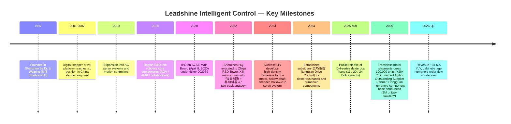
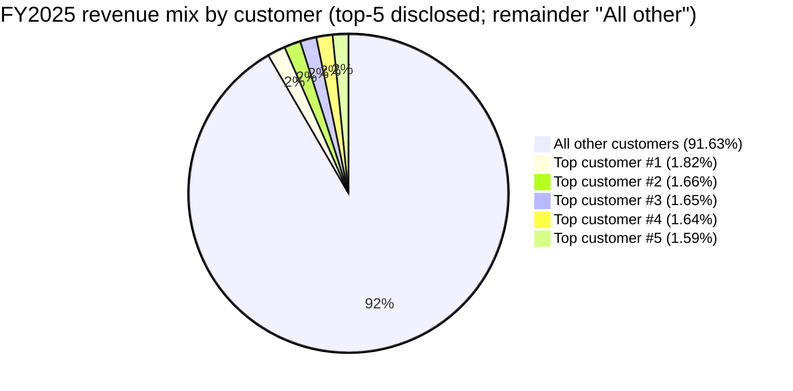
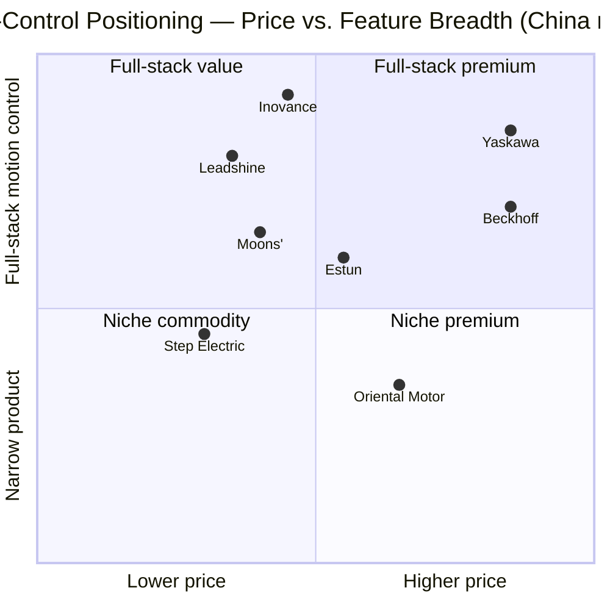

# Leadshine Intelligent Control (雷赛智能, SZSE:002979) — Initiation of Coverage

**Date:** 2026-05-16
**Ticker:** SZSE:002979
**Sector:** Industrial Automation / Motion Control / Humanoid-Robot Core Components
**Listing:** Shenzhen Stock Exchange, Main Board (depositary code 002979)

---

## Table of Contents

1. Company Overview
2. Company History
3. Management Team
4. Products & Services
5. Customers & Go-to-Market
6. Industry Overview
7. Competitive Landscape
8. Market Opportunity (TAM)
9. Risk Assessment

---

## 1. Company Overview

Shenzhen Leadshine Intelligent Control Co., Ltd. — Chinese name 深圳市雷赛智能控制股份有限公司, international brand "Leadshine" — is a pure-play motion-control component supplier headquartered in Nanshan District, Shenzhen. The company designs, manufactures and sells the building-block parts that allow industrial machines to move precisely: stepper motors and their drives, AC servo motors and drives, low-voltage servo systems, motion-control cards, programmable logic controllers (PLCs), encoders, and — most recently — the frameless torque motors, hollow-cup motors, harmonic joint modules and dexterous-hand assemblies used inside humanoid robots ([2025 年年度报告, 第 11–14 页](https://disc.static.szse.cn/disc/disk03/finalpage/2026-04-23/10747821-07e6-43d3-99d4-f68deb6fde8e.PDF)).

**What it does in plain English.** If you open up a semiconductor wafer-handling robot, a PCB drilling machine, a logistics conveyor sorter, a lithium-battery winder, or — increasingly — a humanoid robot arm, you will find one or more pulse-fed motors, an intelligent driver that turns digital commands into current, and a controller box that orchestrates them. Leadshine sells those three layers as a coordinated stack. Management calls itself the "Chinese leader, world-class" 中国龙头、世界一流 motion-control specialist. The strategic frame is a "two-track" model: a *main runway* of intelligent-manufacturing motion components ("智能制造" 主赛道) and a *second runway* of robotics core components ("移动机器人" 辅赛道) layered on top ([2025 年年度报告 第三节, 第 11–17 页](https://disc.static.szse.cn/disc/disk03/finalpage/2026-04-23/10747821-07e6-43d3-99d4-f68deb6fde8e.PDF)).

**How it makes money.** Leadshine is a hardware-only business — no SaaS, no recurring software. Revenue flows from per-unit sales of motors, drives, controllers and PLCs into roughly 10,000 OEM customers across 60+ countries, with the bulk in China ([Leadshine corporate profile](https://www.leadshine.com/abouts/about_corporate_overview.html)). The company sells through a hybrid channel: 53.3% of FY2025 revenue went through 300+ distributors and 46.7% through direct sales to key accounts ([2025 年年度报告, 第 19 页](https://disc.static.szse.cn/disc/disk03/finalpage/2026-04-23/10747821-07e6-43d3-99d4-f68deb6fde8e.PDF)). Average selling prices are low (the FY2025 unit count was 6.77 million pieces against ¥1.87bn revenue, implying ≈ ¥277 per unit on a blended basis), so the model is volume-driven and depends on the steady churn of new OEM machine designs.

**Where it operates.** Roughly 95% of revenue is China-domestic, split across South China (56.5%), East China (30.2%) and North China (8.7%). Overseas revenue is only 4.6% of FY2025 sales, but it grew the fastest at +40.4% YoY ([2025 年年度报告, 第 19 页](https://disc.static.szse.cn/disc/disk03/finalpage/2026-04-23/10747821-07e6-43d3-99d4-f68deb6fde8e.PDF)). Manufacturing footprint is four plants in China and a new "South China headquarters + humanoid-robot core-component R&D and intelligent-manufacturing base" under construction in Binhaiwan New Area, Dongguan, sized for a future annualised capacity of 2 million robotics core components ([雷赛智能 2025 年营收逐季加速 — Sina Finance, 2026-04-30](https://finance.sina.com.cn/jjxw/2026-04-30/doc-inhwhzrz1190065.shtml)).

**Scale.** FY2025 revenue was ¥1,873.84mn (+18.28% YoY), with attributable net profit of ¥225.37mn (+12.42% YoY) and gross margin of 39.00% (+55 bps) ([2025 年年度报告, 第 7–17 页](https://disc.static.szse.cn/disc/disk03/finalpage/2026-04-23/10747821-07e6-43d3-99d4-f68deb6fde8e.PDF)). Headcount is roughly 1,580 employees (529 in R&D, 33.5% of total), with R&D spend of ¥236.6mn (12.63% of revenue) ([2025 年年度报告, 第 21 页](https://disc.static.szse.cn/disc/disk03/finalpage/2026-04-23/10747821-07e6-43d3-99d4-f68deb6fde8e.PDF)). The company holds 627 issued patents, 218 software copyrights and 1,621 intellectual-property assets in total.

*Source: [Leadshine 年度报告 FY2020–FY2025, cninfo](https://www.cninfo.com.cn/new/disclosure/stock?stockCode=002979) — values aggregated from the consolidated income statements.*

**Quarterly cadence is accelerating.** Each quarter of FY2025 grew faster than the previous one (revenue YoY: Q1 +2.4%, Q2 +13.4%, Q3 +23.2%, Q4 +33.6%), driven by the humanoid-robot core-component ramp and successful import-substitution wins in AC servo systems ([2025 年年度报告, 第 9 页](https://disc.static.szse.cn/disc/disk03/finalpage/2026-04-23/10747821-07e6-43d3-99d4-f68deb6fde8e.PDF)). Q1-FY2026 already extended the curve: revenue ¥525mn (+34.55%) and net income ¥72.12mn (+29.20%) ([雷赛智能：一季度净利润 7212.03 万元 — 证券时报网, 2026](https://www.stcn.com/article/detail/3781711.html)).

### Valuation snapshot

| Item | Leadshine (002979) |
|---|---|
| Spot price (2025-12-23 close, latest visible quote) | ¥39.30 |
| 52-week range | ¥27.03 – ¥57.40 |
| Market cap (total / float) | ¥10.52 bn / ¥7.47 bn |
| TTM P/E (ex-non-recurring) | 54.40× |
| TTM P/E percentile vs. own 3-yr history | 51.86%; 80-pct = 66.04, 50-pct = 53.24, 20-pct = 35.42 |
| Implied TTM P/S | ≈ 10.52bn ÷ 1.874bn ≈ **5.6×** |
| FY2025 ROE (weighted) | ≈ 17.0% |

Sources: [雷赛智能(002979)市盈率|估值|基本面 — 理杏仁](https://www.lixinger.com/equity/company/detail/sz/002979/2979); [雷赛智能(002979)股票最新价格行情 — Investing.com](https://www.investing.com/equities/china-leadshine-technology-co-ltd); 2025 年年度报告 figures cited above.

**Peer comparison (TTM, May 2026):**

| Peer | Ticker | TTM P/E | Comment |
|---|---|---|---|
| **Leadshine** | SZSE:002979 | **54.4×** | This report |
| Inovance 汇川技术 | SZSE:300124 | 36.5× | Industry leader, broader auto-EV / drives portfolio ([汇川技术(300124)PE — Lixinger](https://www.lixinger.com/equity/company/detail/sz/300124/300124/fundamental/valuation/pe-ttm)) |
| Estun 埃斯顿 | SZSE:002747 | n/m (negative EPS) | Industrial robot integrator, expects ¥35–50mn FY2025 net income vs. ¥810mn loss prior year ([Estun stock — Investing.com](https://www.investing.com/equities/nanjing-estun-automation)) |
| Moons' Electric 鸣志电器 | SSE:603728 | ~80× (24×-26 fwd implies ~210×) | Closest pure stepper-motor / hollow-cup peer; richest multiple in the group due to humanoid-robot narrative ([鸣志电器(603728)PE — Lixinger](https://www.lixinger.com/equity/company/detail/sh/603728/603728/fundamental/valuation/pe-ttm)) |
| Yaskawa Electric | TYO:6506 | 22.2× (some sources 51×) | Japanese servo blue-chip, weaker FY2026 earnings (-38% NI) ([YASKAWA TYO:6506 ratios — Stockanalysis](https://stockanalysis.com/quote/tyo/6506/financials/ratios/)) |
| ZD Drive 中大力德 | private / SZSE:002896 (related precision-drive proxy) | n/a (private; reducers/RV) | Used here as private comp on harmonic / precision drives. |

**Sector / peer median:** Of the three with a meaningful TTM P/E (Leadshine, Inovance, Yaskawa, Moons'), the median sits near **45×** — well above the global motion-control median of ~22–25× (Yaskawa) and below the humanoid-narrative extreme (~80×+ at Moons'). Leadshine's 54× is therefore **above the China + Japan median peer set but at a discount to the purest dexterous-hand-narrative names**.

**Interpretation of the multiple.** Leadshine's 54× TTM P/E sits ~1.5× the Inovance peer multiple and ~2.4× Yaskawa, on top of a name where underlying earnings grew only +12.4% in FY2025. The premium is **not** a defensive-quality premium — gross margins are mid-30s, ROE is 17%, and the legacy stepper business is single-digit growth. The premium is a **humanoid-robot narrative premium**: the market is paying for the frameless-motor segment that delivered 120,000+ units in FY2025 with >20× growth and a planned 2-million-unit capacity build ([雷赛智能 — 东吴电新报告, 2025-03-07](https://finance.sina.com.cn/stock/relnews/cn/2025-03-07/doc-inenvmwf5762012.shtml)). Specifically:

- The frameless-motor + hollow-cup-motor + joint-module + dexterous-hand stack is forecast by sell-side (东吴电新) to contribute the bulk of incremental FY26-27 earnings, pulling forward "humanoid-second-curve" valuation onto today's stepper-revenue base.
- The "智元机器人 优秀供应商伙伴" (Outstanding Supplier Partner award from Agibot) and disclosure that Leadshine is now inside 80% of mainstream Chinese humanoid-robot OEMs' supply chains de-risk the narrative ([雷赛智能 — 财中社, 2025](https://m.caizhongshe.cn/article-7460663532834190538.html)).
- The five-analyst consensus 12-month target of ¥58.78 is roughly 50% above the spot, implying the multiple is expected to *expand* further on humanoid volume — a classic high-beta narrative setup ([雷赛智能(002979) 盈利预测 — 同花顺 F10](https://basic.10jqka.com.cn/002979/worth.html)).

Because the multiple is justified by a single thematic catalyst (humanoid volume), Section 9 treats valuation / multiple-compression as a material risk: if humanoid volumes disappoint, a re-rating to ~35× (Inovance level) implies ~35% downside before earnings catch up.

---

## 2. Company History

Leadshine was founded in **1997** in Shenzhen by Dr. Li Weiping (李卫平), an MIT robotics-and-automation PhD who returned to China as part of the first wave of "海归" (overseas-returnee) technology entrepreneurs. Before founding Leadshine, Li was an associate professor at Washington State University (1991–1994) and at HKUST (1995–1997); he is co-author of the English-language textbook *Applied Nonlinear Control* and the Chinese-language *运动控制系统原理与应用* (Motion Control Systems: Principles and Applications) ([2025 年年度报告 第四节, 第 32 页](https://disc.static.szse.cn/disc/disk03/finalpage/2026-04-23/10747821-07e6-43d3-99d4-f68deb6fde8e.PDF); [Leadshine Corporate Profile](https://www.leadshine.com/newsEvent/details/corporate-profile.html)).

The founding thesis was narrow but enduring: rather than chase the broad PLC / drive market dominated by Siemens, Mitsubishi and Yaskawa, Leadshine would specialise in **digital stepper drivers** — at the time a sleepy commodity dominated by Japanese makers (Oriental Motor, Sanyo-Denki). By building a digital-signal-processor-based driver with closed-loop performance approaching servo-class systems but at stepper-class prices, the company carved out the mid-market between low-end open-loop steppers and expensive AC servos.

*Source: [2025 年年度报告, 第 11–17 页](https://disc.static.szse.cn/disc/disk03/finalpage/2026-04-23/10747821-07e6-43d3-99d4-f68deb6fde8e.PDF); [Leadshine corporate profile](https://www.leadshine.com/newsEvent/details/corporate-profile.html); [雷赛发布 DH 系列灵巧手 — Sina Finance, 2025-03-14](https://finance.sina.com.cn/stock/relnews/cn/2025-03-14/doc-inepritp9605547.shtml).*

**Strategic pivots that mattered:**

1. **From standalone stepper drivers to a stepper-servo-control "stack" (2010–2015).** Recognising that OEMs increasingly wanted a single vendor for motor, drive and controller, Leadshine added AC servo drives, low-voltage servo for AGVs, and motion-control cards. This let it sell "step + servo + controller" bundles rather than line-item parts — a meaningful margin lift and a defence against pure-stepper commoditisation.
2. **IPO and reinvestment in R&D capacity (2020).** Leadshine listed on the SZSE Main Board on 8 April 2020 with CITIC Securities as sponsor ([2022 年年度报告, 第 7 页](https://static.cninfo.com.cn/finalpage/2023-04-25/1216556949.PDF)). Proceeds funded the South China R&D centre, the move to the Xili Zhigu campus, and the staffing of what is now a 529-person R&D organisation — atypical for a mid-cap Chinese hardware company.
3. **The humanoid-second-curve commitment (2023–2025).** This is the defining recent pivot. In 2023, Leadshine taped out its first high-density frameless torque motor (FM1 family) plus a matching hollow-shaft encoder and hollow-cup servo system — the three parts that go inside a humanoid joint module. In March 2025 the DH-series dexterous hand was launched and a dedicated subsidiary, 深圳市灵巧驱控技术有限公司 (Shenzhen Lingqiao Drive Control), was carved out to run it. By the end of 2025, Leadshine had moved from "experimental" to "into 80% of mainstream Chinese humanoid OEMs" — a remarkable two-year cycle ([雷赛智能 — Sina Finance, 2026-05-14](https://finance.sina.com.cn/stock/bxjj/2026-05-14/doc-inhxwkuc6771087.shtml)).

**Key acquisitions and reorganisations.** Leadshine has historically been a *build, not buy* company. Group structure is dominated by wholly-owned subsidiaries spun up for specific functions: 东莞雷赛机器人 (May 2025, the Dongguan robotics plant vehicle), 雷赛软件 (software), 灵犀自动化 (Lingxi Automation, fieldbus-and-control subsidiary), 灵巧驱控 (Lingqiao, dexterous-hand subsidiary), 雷智赋能 (formerly 上海雷智, motors), and 雷赛自动化系统 (formerly 东莞稳控). The only meaningful divestiture was the 2022 disposal of 上海兴雷 (a non-core industrial-park investment) and the Shengtaiqi stake, which generated a one-off RMB 90.81mn gain and helped FY2022 net income optically; FY2023 net income reset to ¥138.6mn ex-one-off ([2023 年年度报告, 第 7 页](https://static.cninfo.com.cn/finalpage/2024-04-26/1219821925.PDF)).

**Recent developments (last 12 months).** The DH-series dexterous-hand launch (March 2025); the "20-DoF" version global debut at WAIC in Shanghai (July 2025) and Automate 2025 in the US ([Leadshine debuts 20-DoF dexterous hand at Automate 2025](https://www.automateshow.com/exhibitor-news/leadshine-debuts-20-dof-dexterous-hand-at-automate-2025-redefining-humanoid-robotics-precision)); the 2-million-unit/year Dongguan capacity announcement; the Agibot "优秀供应商伙伴" award (Q4 2025); the 6.5mn-share restricted-stock incentive grant under the 2025 plan; and the new wholly-owned subsidiary 东莞雷赛机器人 in May 2025.

---

## 3. Management Team

Leadshine is **founder-controlled and family-controlled**. Founder-CEO Li Weiping and his wife and co-controller Shi Huimin are designated joint controlling shareholders 共同控制人 and together with related parties (younger brother-in-law Li Wei xing; brother-in-law's holding vehicle 深圳市雷赛实业发展) hold approximately **42.8%** of total shares outstanding (Li Weiping 27.33%, Shi Huimin 7.73%, 雷赛实业 6.90%, Li Wei xing 0.81% — [2025 年年度报告, 第 66 页](https://disc.static.szse.cn/disc/disk03/finalpage/2026-04-23/10747821-07e6-43d3-99d4-f68deb6fde8e.PDF)). That is unusually high for a 12-year-public mid-cap and embeds Li's personal incentive in long-run outcomes.

### Li Weiping (李卫平) — Founder, Chairman, General Manager

Li, born July 1962, is the central figure. He graduated with a PhD in Robotics and Automation from **MIT**, taught as associate professor at **Washington State University (1991–1994)** and **HKUST (1995–1997)**, then returned to Shenzhen to found 雷赛机电技术开发 in 1997 — the predecessor company that he chaired until 2011. Since 2012 he has been Chairman and General Manager of Leadshine, with continuous directorships at every operating subsidiary (Lingxi, Lingqiao, 雷赛控制, 雷赛自动化系统, 上海雷赛机器人, 东莞雷赛机器人, 雷赛软件 — see [2025 年年度报告, 第 33–34 页](https://disc.static.szse.cn/disc/disk03/finalpage/2026-04-23/10747821-07e6-43d3-99d4-f68deb6fde8e.PDF)). Li is co-author of two books — the English textbook *Applied Nonlinear Control* and the Chinese *运动控制系统原理与应用* — plus numerous academic papers on nonlinear control theory; he is by training a control-systems academic who became a manufacturing operator. Critically, he is **64 in 2026** and a director term renewal cycle ends in May 2026 — so a credible succession plan is now a live question.

His ownership stake is **86.13mn shares (27.33% of total)**, of which 64.6mn are still in lock-up under PRC senior-management restrictions and 21.5mn are freely tradable ([2025 年年度报告, 第 66 页](https://disc.static.szse.cn/disc/disk03/finalpage/2026-04-23/10747821-07e6-43d3-99d4-f68deb6fde8e.PDF)). He has not sold a single share through restricted-stock unlock cycles in the public record we reviewed. Li's track record at Leadshine is the entire growth arc: from 1997's stepper-driver startup to a ¥10bn market-cap robotics components leader, four manufacturing plants, 10,000+ OEM customers, 60+ export countries and a 17% ROE business. The specific accomplishments worth noting are (a) building the largest pure-stepper share in China (Leadshine is the top domestic brand in the 2024 stepper rankings — [2024 年十大品牌步进电机, chinabgao](https://m.chinabgao.com/top/brand/100135.html)), (b) reaching the **#2** position in domestic AC servo market share by FY2025 according to MIR ([2025 年年度报告, 第 17 页](https://disc.static.szse.cn/disc/disk03/finalpage/2026-04-23/10747821-07e6-43d3-99d4-f68deb6fde8e.PDF)), and (c) timing the humanoid-component bet such that frameless-motor revenue compounded 20× in a single year. He has publicly framed the company's medium-term vision as "成为中国龙头、世界一流的运动控制集团" — China leader, world-class motion-control group — language that is unusually direct for a Chinese A-share founder.

### Shi Huimin (施慧敏) — Director, Co-Controller

Shi, born December 1964, is Li Weiping's spouse and the company's co-controlling shareholder with **24.36mn shares (7.73%)**. She holds a bachelor's degree and a non-technical background (started her career as a Shanghai elementary-education teacher 1987–1991, then moved through finance manager, administrative director and Supervisory Board roles at the predecessor entity from 1997). Since 2011 she has been a director; she stepped out of the administrative-director role in 2018. Functionally she is a stewardship director rather than an operating one ([2025 年年度报告, 第 32 页](https://disc.static.szse.cn/disc/disk03/finalpage/2026-04-23/10747821-07e6-43d3-99d4-f68deb6fde8e.PDF)).

### You Daoping (游道平) — Employee-Representative Director, CFO

You, born February 1981, is the CFO. He holds an economics bachelor's from Jiangxi University of Finance and Economics. His career path is unusually broad for a Chinese-A-share CFO: financial-analysis supervisor at **JMC (江铃汽车)** 2003–2006; budget-analysis manager then finance-department GM at **Kingdee Software** 2006–2012; senior manager in **Vanke**'s property finance & operations group 2012–2014; director and CFO of Shenzhen Xinjidian Smart 2014–2016; assistant president and CFO of Shenzhen Tongzhou Electronics 2016–2020; and joined Leadshine in March 2020, first as Chairman's special assistant and now as employee-representative director and CFO since June 2020 ([2025 年年度报告, 第 32–33 页](https://disc.static.szse.cn/disc/disk03/finalpage/2026-04-23/10747821-07e6-43d3-99d4-f68deb6fde8e.PDF)). The mix of large-cap (Vanke), software (Kingdee) and SME-CFO experience gives him a more capital-markets-savvy profile than typical for a hardware-co CFO, which matters given the share-based incentive cadence (six-issue 2022 plan + new 2025 plan) and capacity-spend cycle.

### Tian Tiansheng (田天胜) — Director, Vice President (Engineering)

Tian, 53, holds a master's degree and joined Leadshine in March 2011 from 山龙电控 (where he was Chief Engineer). He has been Vice President of R&D since 2011 — effectively Leadshine's de-facto CTO and the engineering counterpart to Li Weiping. He holds 1.26mn shares including 0.18mn newly granted under the 2025 incentive plan ([2025 年年度报告, 第 32 页](https://disc.static.szse.cn/disc/disk03/finalpage/2026-04-23/10747821-07e6-43d3-99d4-f68deb6fde8e.PDF)). For a hardware-engineering driven company, Tian's 15-year tenure leading the R&D org is a structural strength.

### Huang Chao (黄超) — Vice President (Domestic Sales)

Huang, 47, holds a B.Eng. from Central South University and an MBA from HKBU. He started at Foxconn PCEG (2000–2002) and has been at Leadshine since 2002 — sales engineer → South China sales manager → 3C / new-energy sector director → Vice President of the Domestic Marketing Centre. He owns 0.255mn shares including 0.15mn newly granted under the 2025 plan ([2025 年年度报告, 第 33 页](https://disc.static.szse.cn/disc/disk03/finalpage/2026-04-23/10747821-07e6-43d3-99d4-f68deb6fde8e.PDF)). 24-year continuous tenure gives him deep customer relationships in the 3C and new-energy verticals that drive the bulk of stepper sales.

### Governance

- **Board composition.** Five executive / non-independent directors (Li Weiping, Shi Huimin, Tian Tiansheng, You Daoping, plus the new role) and three independent directors (Wang Hong, Wu Wei, Yang Jian). Independent-director ratio = 3/8 = 37.5%. Following the new PRC Company Law transition (2025), the company has wound up the Supervisory Board structure.
- **Independent directors.** Wang Hong (PhD, ex-ABB research-centre senior engineer, currently professor at HIT Shenzhen), Wu Wei (Beijing University law degrees, practising lawyer at Guangdong Jingtian Law Firm, Shenzhen International Arbitration Court arbitrator), and Yang Jian (former Kingdee CFO/executive director, currently chairman of Shenzhen Sibeiyun Technology).
- **Insider ownership.** Founder family + 雷赛实业 = ~42.8% of shares ([2025 年年度报告, 第 66 页](https://disc.static.szse.cn/disc/disk03/finalpage/2026-04-23/10747821-07e6-43d3-99d4-f68deb6fde8e.PDF)). Total senior-management direct holdings = 112.4mn shares (~35.7%).
- **Comp structure.** Heavy equity-based: the 2022 and 2025 limited-share / stock-option incentive plans have repeatedly granted shares to 200+ key employees. FY2025 saw 6.5mn restricted shares newly issued and 2.77mn unlocked from the 2022 plan, plus 0.98mn from the 2022 option exercise — share-based comp expense was a meaningful drag on reported net income (mgmt called out ¥47mn share-based comp; ex-SBC net income was ¥272mn, +31.9% YoY) ([2025 年年度报告, 第 17 页](https://disc.static.szse.cn/disc/disk03/finalpage/2026-04-23/10747821-07e6-43d3-99d4-f68deb6fde8e.PDF)).
- **Related-party transactions.** No disclosed material related-party transactions; the 雷赛实业 family vehicle is disclosed as a coordinated-action party rather than transactional counterparty.
- **Governance flags.** Founder + spouse + CFO are simultaneously controlling shareholders and executives — concentrated control risk, but mitigated by the 37.5% independent director ratio, mandatory PRC-style Supervisory and Audit Committee oversight, and the visible audit relationship with Rongcheng CPA (signed by named auditors Shi Shaoxiang, Gan Jinchong and Chen Yan).

### Track-record synthesis

This is a founder-led story with a 28-year operating record. Li Weiping has delivered the stepper-leadership outcome, the #2 domestic AC-servo position, and a credible humanoid-second-curve in just two years — a rare track record in Chinese industrial hardware. The CFO and engineering VP are tenured (5 and 15 years respectively) and equity-aligned. Gaps: succession planning given the chairman is 64; CFO's first robotics-cycle test; lack of US/EU experience at the senior level despite the export-growth focus.

---

## 4. Products & Services

Leadshine organises its portfolio into **four core categories**, each with multiple SKU families. FY2025 revenue split: Servo systems 49.18%, Stepper systems 34.83%, Control technology 15.31%, Other 0.68% ([2025 年年度报告, 第 19 页](https://disc.static.szse.cn/disc/disk03/finalpage/2026-04-23/10747821-07e6-43d3-99d4-f68deb6fde8e.PDF)). Robotics core components are not yet broken out as a separate disclosure line — they sit inside the relevant motor / servo categories — but management's "second runway" comments clearly point to a planned segment carve-out as the volume scales.

```mermaid
graph TD
    A[Leadshine 雷赛智能] --> B[Servo Systems]
    A --> C[Stepper Systems]
    A --> D[Control Technology]
    A --> E[Robotics Core Components]
    B --> B1["AC Servo Drives: L8 / L7 / L6 / L5 / L3"]
    B --> B2["AC Servo Motors: ACM2 / ACM1 / ACM0 / M7 / M6 / M5 / M3"]
    B --> B3["Low-voltage Servo Drives: LD3M / LD2 / 4LD3"]
    B --> B4["Low-voltage Servo Motors: LVM / 伺服滚筒"]
    B --> B5["Integrated Servo: iSV2 / iSV"]
    B --> B6["Encoders: 26-bit photo, split magnetic, etc."]
    C --> C1["Digital Stepper Drives: DM5 5-phase / pulse / bus / drive+control"]
    C --> C2["Digital Stepper Motors: CM std / brake / waterproof / hollow / 5-phase"]
    C --> C3["Closed-loop Stepper Drives & Motors"]
    C --> C4["Integrated Stepper: smart i-stepper"]
    D --> D1["Motion Controllers: 5000 / 3000 / 1000 series"]
    D --> D2["Motion Control Cards: DMC-S, I/O, encoder counter"]
    D --> D3["PLCs: S / SC / MC / LC series"]
    D --> D4["Remote I/O Modules: in-cabinet, out-of-cabinet"]
    E --> E1["FM1 / FM2 Frameless Torque Motors"]
    E --> E2["Hollow-shaft Encoders"]
    E --> E3["Hollow-cup Brushless Servo Motors: std / hi-speed / hi-torque"]
    E --> E4["Harmonic Joint Modules: HJ series"]
    E --> E5["Planetary Joint Modules: PJ series + iW wheeled"]
    E --> E6["Dexterous Hand: DH series 11 / 20 / 24 DoF"]
    E --> E7["Robot Motion 'Cerebellum' Controllers (in development)"]
```

*Source: [2025 年年度报告 §三, 第 12–14 页](https://disc.static.szse.cn/disc/disk03/finalpage/2026-04-23/10747821-07e6-43d3-99d4-f68deb6fde8e.PDF) and [Leadshine product portal](https://www.leadshine.com/robot/index.html).*

### 4.1 Servo Systems (49.2% of FY2025 revenue, ¥921.6mn, +30.0% YoY)

The fastest-growing legacy segment and the one driving the FY2025 P&L. **L8** is the flagship high-performance bus-based AC servo drive, while **L7** is the general-purpose workhorse; **L6 / L5 / L3** address mid-market and economy tiers. Motors range from the **ACM2** premium line to the **M3** economy line. Low-voltage servo (LD3M, LD2) targets AGV/AMR and battery-powered devices; integrated servos (iSV2, iSV) collapse drive and motor into a single chassis for cost-sensitive applications.

- **Competitive advantage: yes (technology + service moat).** Leadshine self-developed a **26-bit ultra-high-precision photoelectric encoder** that reached volume production in 2025 ([2025 年年度报告, 第 17 页](https://disc.static.szse.cn/disc/disk03/finalpage/2026-04-23/10747821-07e6-43d3-99d4-f68deb6fde8e.PDF)) — at parity with the Tamagawa / Heidenhain class historically required for high-end imports. The L7/L8 product line "总体达到国外同类产品水平" (achieves overall parity with imported equivalents) per management commentary, supporting the company's #2 domestic AC-servo position by MIR-data market share.
- **Closest named competitor product:** Inovance SV660/SV680 series and Yaskawa Σ-X series. Leadshine is positioned at a 15–25% discount to Yaskawa equivalents and at rough parity with Inovance on pricing but ahead on per-watt cost-performance in the small-to-medium frame range; behind on system integration and large-axis lineups (Inovance's broader EV / lift / wind portfolio).

### 4.2 Stepper Systems (34.8% of FY2025 revenue, ¥652.6mn, +7.7% YoY)

This is the *legacy* growth engine. The new **DM5** five-phase digital stepper line was launched in 2025 with management positioning it as "Japanese-five-phase performance at Chinese-stepper cost" — explicitly targeting Oriental Motor and Sanyo-Denki's installed base in semiconductor wafer-handling, PCB manufacturing and 3C automation. Closed-loop steppers (CME-M17 absolute encoder version) and the integrated smart-i-stepper family round out the line.

- **Competitive advantage: yes (scale + cost leadership + brand).** Leadshine is *the* domestic stepper leader by market share; it ranks at the top of the 2024 China stepper-brand survey ([2024 年十大品牌步进电机 — 报告大厅](https://m.chinabgao.com/top/brand/100135.html)) and has the broadest pulse-bus-drive-control four-axis architecture (脉冲 / 通用总线 / 驱控一体 / 高速总线) of any domestic player.
- **Closest named competitor product:** Moons' Electric 鸣志 stepper line; Inovance has only a thin stepper SKU set; international comp is Oriental Motor's PKP and CRK series. Leadshine wins on price-performance and Chinese-OEM distribution; loses on the highest-temperature, most-precise applications still dominated by Oriental Motor.

### 4.3 Control Technology — PLCs, motion controllers and cards (15.3% of FY2025 revenue, ¥286.9mn, +14.0% YoY)

The newest legacy category — Leadshine entered PLCs late but has the **fastest growth of any small-PLC vendor in China** (MIR-recorded +41.6% YoY in FY2025, #1 in growth ranking — [2025 年年度报告, 第 17 页](https://disc.static.szse.cn/disc/disk03/finalpage/2026-04-23/10747821-07e6-43d3-99d4-f68deb6fde8e.PDF)). The line spans small (**SC / S series**), medium (**MC series**) and large (**LC series**) motion-control PLCs plus the **DMC-S** ultra-high-performance bus card that achieves a 62.5 μs ultra-short bus cycle and 50 μs high-speed pulse control — the company's first credible "high-end semi-conductor-grade" controller.

- **Competitive advantage: partial (still catching up).** Strong growth and a credible 62.5 μs DMC-S benchmark, but absolute market share is still behind Siemens, Mitsubishi and Inovance in PLC, and behind Beckhoff / Keyence in motion-control cards.
- **Closest named competitor product:** Inovance H5U PLC; Siemens S7-1200; Mitsubishi FX5U. Leadshine's small-PLC growth indicates wins in 3C / packaging / lithium-battery niches; it has not yet displaced foreign brands in automotive or wind/solar.

### 4.4 Robotics Core Components — the second-curve story (not separately disclosed in revenue mix; first material year was FY2025)

This is the segment investors care about and the reason the stock trades at 54× P/E. The portfolio:

- **FM1 / FM2 high-density frameless torque motors** — a stator-rotor pair (no housing) designed to be embedded directly into a humanoid robot's joint module. Specs emphasise high torque density, low cogging torque, high slot-fill rate, high power density, ultra-small frame and customisation flexibility ([Frameless Motors for Robot Joints — Leadshine](https://www.leadshine.com/robot/category/frameless-motors.html); [FM1 Series page](https://www.leadshine.com/robots/frameless-motors/fm1-series.html)). FY2025 unit shipments crossed 120,000, +20× YoY; management has earmarked 2 million units per year of new capacity in Dongguan.
- **Hollow-cup brushless servo motors** — coreless-rotor permanent-magnet servo micro-motors used inside dexterous-hand finger drives. Available in standard, high-speed and high-torque tiers.
- **Harmonic joint module (HJ series) + planetary joint module (PJ series) + iW wheel module** — pre-integrated reducer-motor-encoder-driver assemblies that compete with Harmonic Drive (Japan) and 绿的谐波 (Chinese harmonic-reducer specialist) + Inovance.
- **DH-series dexterous hand** — launched March 2025 by subsidiary 灵巧驱控 (Lingqiao). The DH-2015 features 20 DoF (15 active), each finger driven by 3 hollow-cup servo motors, 100 MHz EtherCAT bus, FOC current loop with hybrid force-position control, six tactile sensors, 1-million-cycle grip life, and 40 kg maximum payload ([雷赛 DH 系列灵巧机械手 — 中国传动网](https://www.chuandong.com/news/news264487.html); [雷赛智能发布 "20 自由度" 灵巧手方案 — 艾邦机器人](https://www.aibangbots.com/a/1957)). 24-DoF and 11-DoF variants also released.
- **Robot motion "cerebellum" controller** — planned core control unit for whole-body motion; in development.

- **Competitive advantage: yes (combined-stack technology moat + customer momentum).** Leadshine is one of very few Chinese vendors offering the *full* humanoid-joint stack — frameless motor + hollow-cup motor + reducer module + encoder + driver — in-house. Combined with the Agibot 智元 "Outstanding Supplier Partner" award and the disclosure that the products are in 80% of mainstream Chinese humanoid OEMs' supply chains, the segment has both technology and customer-evidence moats.
- **Closest named competitor product:** Moons' Electric's full-stack humanoid motion portfolio (which it explicitly positions as a 鸣志 vs 雷赛 race — see [鸣志电器 — Moons' humanoid commentary, 2026](https://www.lixinger.com/equity/company/detail/sh/603728/603728/fundamental/valuation/pe-ttm)). Other competitors: Tao-instinct (鼎智科技), 步科股份, plus the dexterous-hand specialists 因时机器人, 兆威机电 and Robotera XHAND1.

### Flagship vs long-tail

The **flagship products** driving the FY2025 P&L step-change are: (i) L7 / L8 AC servo drives + ACM2 / ACM1 motors (the import-substitution AC servo bundle, source of the +30% segment growth); (ii) DM5 five-phase digital stepper (high-end stepper refresh); (iii) FM1/FM2 frameless motors (humanoid second curve). The **long-tail** is the legacy stepper line (CM family), small-PLC line, and remote I/O modules — still ¥600mn+ of stable cash-generating revenue.

### Last-12-month launches / sunsets

Launches: **DH series dexterous hands** (Mar 2025), **DM5 five-phase stepper** (2025), **DMC-S high-performance motion-control card** (2025), **26-bit photoelectric encoder volume production** (2025), 20-DoF DH variant at WAIC (Jul 2025) and Automate 2025. No material sunsets disclosed; management indicates ongoing rationalisation of low-end stepper SKUs.

---

## 5. Customers & Go-to-Market

### Customer segments

Leadshine sells almost exclusively into industrial OEM machine builders, organised by management into "strategic verticals": **semiconductors / photovoltaic / new-energy battery equipment, optical-communications equipment, high-end machine tools, logistics & warehousing automation, 3C electronics manufacturing equipment, PCB/PCBA equipment, packaging equipment, medical equipment, and robotics (cobots, AGV/AMR, mobile robots, humanoids)**. Tens of thousands of OEMs in total, with no single dominant industry vertical disclosed.

### Customer concentration — quantified and benign

*Source: [2025 年年度报告, 第 20 页 — 主要销售客户和主要供应商情况](https://disc.static.szse.cn/disc/disk03/finalpage/2026-04-23/10747821-07e6-43d3-99d4-f68deb6fde8e.PDF).*

The FY2025 disclosure is exceptional in its dispersion: top-5 customers = ¥156.78mn = **8.37%** of total revenue, top-1 = **1.82%** of revenue, all five named only as "第一名 / 第二名 / …" with no identifying detail. **Zero of the top-5 is a related party.** For context, the threshold for material customer concentration in the SKILL.md framework is top-1 >20% or top-5 >50%; Leadshine is roughly an order of magnitude below those thresholds.

**Trend.** The dispersion has been a long-standing structural feature: prior-year disclosures show similar single-digit top-5 concentration. This is consistent with a distributor-heavy sell-through model where the average end-customer is a small-to-mid OEM and the top buyer of record is a wholesale distributor or a large 3C contract manufacturer.

**Supplier concentration is also low.** Top-5 suppliers represented ¥192.5mn = 18.01% of total procurement; top-1 = 6.81% (a related-party supplier — the only related-party transaction in this section) ([2025 年年度报告, 第 21 页](https://disc.static.szse.cn/disc/disk03/finalpage/2026-04-23/10747821-07e6-43d3-99d4-f68deb6fde8e.PDF)).

### Named integration partners and humanoid customers

Although the annual report blinds top-5 names, public disclosures and trade press have named specific humanoid-robot customer relationships:

- **Agibot / 智元机器人** — Leadshine received the "**优秀供应商伙伴**" (Outstanding Supplier Partner) award in 2025 ([2025 年年度报告, 第 18 页](https://disc.static.szse.cn/disc/disk03/finalpage/2026-04-23/10747821-07e6-43d3-99d4-f68deb6fde8e.PDF)). Agibot is a Shanghai-based humanoid-robot startup founded in 2023 by ex-Huawei engineers Deng Taihua and Peng Zhihui ([AgiBot — Wikipedia](https://en.wikipedia.org/wiki/AgiBot)).
- **UBTECH 优必选 (HKEX:9880)** — public Hong Kong-listed humanoid maker; Leadshine has been disclosed as a supplier of frameless motors and joint components based on management commentary at investor-relations events ([雷赛智能调研 — Sina Finance, 2026-03-25](https://finance.sina.cn/2026-03-25/detail-inhsffcv9631562.d.html)).
- **Unitree Robotics 宇树科技** — humanoid + quadruped leader; Leadshine components are widely cited in industry coverage of Unitree's supplier base ([Unitree Supplier Platform](https://www.unitree.com/cn/supplier/); [Chinese humanoid manufacturers comparison — Awesome Robots](https://www.awesomerobots.xyz/blog/chinese-humanoid-manufacturers-unitree-vs-ubtech-vs-fourier)).
- **Fourier Intelligence 傅利叶**, **Xiaomi CyberOne**, **Robotera (星动纪元)**, **EXCITE / X² Robotics**, and others — management has stated the products are now in 80% of mainstream Chinese humanoid OEMs' supply chains ([雷赛智能 — 财中社, 2025](https://m.caizhongshe.cn/article-7460663532834190538.html)).
- **Industrial-automation marquee names** (not separately named in the annual report but typical channel logos): Foxconn, Luxshare, BYD, CATL battery-equipment OEMs, semi-equipment makers including Naura subsidiaries and ACM Research equipment suppliers.

The annual report explicitly notes "公司的机器人核心部件产品已进入国内 80% 主流人形机器人厂商的供应体系" — Leadshine's robotics core-component products have entered the supply chain of 80% of mainstream domestic humanoid robot makers ([2025 年年度报告, 第 18 页](https://disc.static.szse.cn/disc/disk03/finalpage/2026-04-23/10747821-07e6-43d3-99d4-f68deb6fde8e.PDF)).

### Distribution channel

- **Distributors:** 53.3% of FY2025 revenue (¥999.07mn, +30.51% YoY) through **300+ authorised distributors** ([2025 年年度报告, 第 19 页](https://disc.static.szse.cn/disc/disk03/finalpage/2026-04-23/10747821-07e6-43d3-99d4-f68deb6fde8e.PDF)).
- **Direct large-account sales:** 46.7% (¥874.77mn, +6.84% YoY) through ~40 regional sales teams across China's main cities.
- **Online B2B channel:** [Leadshine shop](https://www.leisaishop.com/) for SMB direct purchase of stepper and servo product lines.
- **International:** export sales 4.6% of revenue (¥86.5mn, +40.4% YoY), distributed through partners in 60+ countries ([Leadshine corporate profile](https://www.leadshine.com/abouts/about_corporate_overview.html)).

### Contract structure

Orders are predominantly purchase-order-by-purchase-order rather than multi-year master agreements — typical of the OEM motor-and-drive industry. Production is a blend of **make-to-stock** (standard SKUs held against rolling MRP) and **make-to-order** (customised low-voltage servo / robotics components). PCBA half-assembly is outsourced; final integration, software flash and quality test are in-house ([2025 年年度报告, 第 15 页](https://disc.static.szse.cn/disc/disk03/finalpage/2026-04-23/10747821-07e6-43d3-99d4-f68deb6fde8e.PDF)).

### Sales cycle and key partnerships

Industrial OEM sales cycles are 6–12 months from initial spec submission to design-in, with subsequent volume ramp driven by the OEM's own customer flow. The humanoid segment has a faster cycle (3–6 months) because end-customer humanoid OEMs are themselves at a fast iteration cadence. Notable strategic partnerships include the Heilongjiang University / 哈工大 (HIT) Shenzhen labs (independent director Wang Hong is a HIT professor) and the 季华实验室 (Jihua Lab) advanced-manufacturing partnership.

---

## 6. Industry Overview

### Industry definition

Leadshine operates inside the **OEM automation components** segment of the broader industrial-automation market. OEM automation = the parts and subsystems sold to machine builders rather than to factory operators. The product taxonomy spans: motion control (stepper, servo, controller, encoder), low-voltage drives, PLCs, HMI, sensors, machine vision, robot arms, AGV/AMR mobile platforms, and now humanoid-robot core components. Adjacent industries: process automation (chemicals, oil & gas), building automation, EV powertrain components (which share motor / inverter technology), and instrumentation.

### Market size

- **China OEM automation market:** ¥101.9 bn in 2025, +2% YoY according to 睿工业 (MIR) data cited by management ([2025 年年度报告, 第 11 页](https://disc.static.szse.cn/disc/disk03/finalpage/2026-04-23/10747821-07e6-43d3-99d4-f68deb6fde8e.PDF)). The 2% growth is a recession-equivalent number — the slowest cycle since 2015 — caused by US tariff tensions, weak 3C consumer demand and lithium-battery capex digestion.
- **China industrial robot market:** forecast to exceed RMB 1,500 bn by 2030 (broad inclusive definition) with CAGR ~12%; core-component hardware market reaching ¥600 bn with domestic-localisation rate >70% ([中国工业机器人行业 — 观研报告网, 2025](https://www.chinabaogao.com/detail/775998.html)). Domestic industrial-robot localisation rate crossed 55% in H1-2025.
- **China humanoid robot market:** Trillion-RMB potential per the 36Kr / Zhongtai / 浙商 sell-side narrative; near-term 2025 was the first year of "≥10,000 units annual production" and the year domestic core-component localisation rate crossed 70% ([2025 年年度报告, 第 11 页](https://disc.static.szse.cn/disc/disk03/finalpage/2026-04-23/10747821-07e6-43d3-99d4-f68deb6fde8e.PDF); [Chinese firms lead global humanoid robot production in 2025 — People's Daily](https://en.people.cn/n3/2026/0110/c90000-20412663.html)).
- **Global motion control:** ~USD 18–20 bn in 2025 per multiple Gartner / IFR adjacencies; CAGR ~6%.

### Growth rates

The OEM automation cycle is currently in a digestion phase — 2024 grew +5% and 2025 grew only +2%. The forward cycle is expected to inflect on **(a) "国产替代" import-substitution** (China-content rising in semiconductor, machine tool, photovoltaic equipment), **(b) labour-substitution capex** (factories automating against rising wage costs and an ageing workforce), and **(c) the embodied-AI / humanoid wave**. Industry analyst MIR forecasts +8% growth for FY2026.

### Key trends and drivers

1. **Embodied AI + humanoid robotics commercialisation.** State Council "Robot+" and "14th-FYP Strategic Emerging Industries" plans target a doubling of manufacturing-robot density; 2025 explicitly designated as the inflection year for humanoid commercial deployment.
2. **Domestic-substitution.** Trade-tension-induced reshoring of supplier-base preference toward Chinese vendors — particularly visible in semiconductor equipment, lithium-battery production lines and machine tools. MIR places Leadshine at #2 in domestic AC-servo share.
3. **Smart-factory upgrade ("十五五" plan).** Industrial AI + digital-twin + IoT-connected automation is the explicit 15th-FYP economic priority — a multi-year capex tailwind.
4. **Stepper-to-servo migration in mid-end automation.** As ASP gaps close and bus-based control becomes ubiquitous, servo penetration grows faster than the overall motion-control market — directly favourable to Leadshine's 30%+ servo growth.

### Regulatory environment

Industrial automation in China is a strategic-support industry under MIIT ("专精特新" small-giant certification — Leadshine is a designated "specialised, refined, distinctive and novel" small-giant) and benefits from corporate-income-tax preferences for "high & new technology enterprises". Humanoid-robot core components are listed in the catalogue of strategic emerging industries ("十五五" 规划 + "机器人+ 应用行动方案"). Export controls on advanced semiconductor manufacturing equipment (US 2022 / 2024 amended restrictions) indirectly *favour* domestic motion-control vendors by pulling semiconductor capex onto domestic supplier rosters.

### Industry dynamics

- **Fragmented at the low end, consolidated at the top.** Top-10 industrial-robot suppliers had ~65% market share in H1-2025 — but the *components* market (stepper, servo, PLC, controller) is far more fragmented with hundreds of Chinese vendors plus the global incumbents (Yaskawa, Mitsubishi, Siemens, Schneider, Rockwell, ABB, Beckhoff, Keyence, Fanuc).
- **Supplier power:** moderate. Magnet rare-earth pricing (NdFeB) drives motor BoM volatility; precision-bearing and harmonic-reducer supply is constrained for high-end joint modules. Leadshine's hollow-cup motor uses imported Japanese R&D testing equipment and partly outsourced precision components.
- **Buyer power:** moderate-to-low at the component level (OEM machine builders are typically too small to extract pricing concessions from a market-share leader) but high in the few large humanoid-OEM accounts that have begun to consolidate the customer set.
- **Substitutes:** within motion control, the natural substitute for stepper is closed-loop stepper or low-end servo; for low-voltage servo it is integrated-servo or open-loop stepper at the low end. Pneumatic actuation is the cross-domain substitute in some packaging applications.
- **Barriers to entry:** moderate. Motor design and silicon (gate driver, FOC controller, encoder ASIC) are mature; the genuine moats are (a) cumulative IP, (b) brand and channel coverage in the China OEM ecosystem, (c) full-stack engineering capability (motor + driver + control + communications + tuning service) and (d) capacity scale.

---

## 7. Competitive Landscape

### Direct and indirect competitors

| Competitor | Listing | Direct overlap | Position vs. Leadshine |
|---|---|---|---|
| **Inovance 汇川技术** | SZSE:300124 | AC servo, PLC, drives, frameless motors | Larger and broader (¥31.6bn 9M-2025 revenue, +25%); #1 China domestic AC servo. Higher scale, lower premium multiple. ([汇川技术 PE — Lixinger](https://www.lixinger.com/equity/company/detail/sz/300124/300124/fundamental/valuation/pe-ttm)) |
| **Estun 埃斯顿** | SZSE:002747 | Servo drives, industrial robot arms | Industrial-robot integrator (>10k unit shipper in H1-25), loss-making FY24 (¥810mn loss), recovering in FY25 (¥35–50mn guided NI). Different business mix — more robot-arm-system than motion-component. ([Nanjing ESTUN Automation — Investing.com](https://www.investing.com/equities/nanjing-estun-automation)) |
| **Moons' Electric 鸣志电器** | SSE:603728 | Stepper, hollow-cup, dexterous-hand stack | Closest pure peer for humanoid second-curve. >90% of revenue from motion-control motors+drives; full-stack "motor+drive+transmission+closed-loop" for humanoids; samples sent to "100+ top robotics manufacturers" ([鸣志电器 — Lixinger](https://www.lixinger.com/equity/company/detail/sh/603728/603728/fundamental/valuation/pe-ttm)). Trades at richer multiple. |
| **Yaskawa Electric** | TYO:6506 | AC servo, motion controllers, industrial robots | Japanese servo blue-chip. FY26 EPS ¥136 (-38%). Premium brand but losing share to Chinese vendors in price-sensitive segments. ([YASKAWA TYO:6506 — Stockanalysis](https://stockanalysis.com/quote/tyo/6506/financials/ratios/)) |
| **ZD Drive 中大力德** | SZSE:002896 | Reducers, joint modules (closely related) | Precision-drive specialist used here as a stand-in for the harmonic-reducer / joint-module competitive set including 绿的谐波 (Leader Harmonious). |
| **Tao-Instinct 鼎智科技** | SSE:688181 | Hollow-cup, stepper | Pure-play hollow-cup motor specialist; smaller but technically credible. |
| **Oriental Motor (日本电产/Nidec subsidiary)** | TYO:6924 (parent Nidec) | Stepper (premium) | Global premium stepper leader; Leadshine's DM5 is positioned to capture replacement demand. |
| **Beckhoff** | private (DE) | PLC, motion-control cards | Premium PLC + EtherCAT ecosystem; sets the bus-cycle benchmark Leadshine's DMC-S targets. |
| **Mitsubishi Electric** | TYO:6503 | PLC, servo | Incumbent in Chinese OEM PLC market; losing share. |
| **Step Electric 步科股份** | SZSE:301255 | Servo, HMI, robot motor | Smaller domestic peer; broader HMI line. |

### Positioning framework

*Source: author's reading of [Leadshine product portal](https://www.leadshine.com/) plus competitor IR pages cited above. Leadshine sits in the "full-stack value" quadrant — broader product than any pure-stepper or pure-servo specialist, priced 15–25% below the Japanese / German premium tier.*

### Competitive advantages

1. **Full-stack motion-control + humanoid-component portfolio in one vendor.** Few Chinese competitors match the breadth (servo + stepper + PLC + controller + robotics components) at Leadshine's price tier. Inovance is broader but more expensive; Moons' is narrower (stepper-heavy).
2. **#1 in stepper, #2 in domestic AC servo, #1 in small-PLC growth.** Hard market-share data points from MIR ([2025 年年度报告, 第 17 页](https://disc.static.szse.cn/disc/disk03/finalpage/2026-04-23/10747821-07e6-43d3-99d4-f68deb6fde8e.PDF)).
3. **300+ distributor + ~40-team regional sales coverage** ([2025 年年度报告, 第 16 页](https://disc.static.szse.cn/disc/disk03/finalpage/2026-04-23/10747821-07e6-43d3-99d4-f68deb6fde8e.PDF)) is hard to replicate for new entrants.
4. **High R&D intensity (12.63% of revenue).** Larger than peer median; sustained at ≥10% for many years per management commentary. 529 R&D engineers (33.5% of workforce) and 1,621 IP assets.
5. **Humanoid-component first-mover.** The 80%-OEM-supply-chain claim and the Agibot "Outstanding Supplier Partner" award are early-cycle moats — the dexterous-hand market is small enough that being designed-in at multiple integrators creates near-term lock-in.
6. **Founder-engineer leadership.** Li Weiping's MIT control-systems background and 28-year continuity is unusual for the China hardware sector; gives the firm credibility in technically demanding semiconductor and humanoid accounts.

### Competitive vulnerabilities

1. **Smaller than Inovance**, which has the option to attack Leadshine's strongholds (stepper, small-PLC) with cross-subsidised aggressive pricing.
2. **Channel dependency.** 53% of sales through distributors implies less direct customer signal and more pricing pass-through risk.
3. **No proprietary semiconductor IP.** Motor controllers and gate drivers are sourced from external semi vendors; a semi-supply disruption would hurt.
4. **Geographic concentration.** 95% China-domestic exposure; modest export footprint (4.6%). In a domestic recession scenario there is no offsetting overseas cushion.
5. **No mass-production track record in humanoid scale.** 120,000 units in FY25 is a strong start but not yet at "millions per quarter" mass-production scale; competitor Moons' is on a parallel ramp.

### Market share signals

- China stepper: Leadshine is the #1 domestic brand per the [2024 ten-brand stepper rankings](https://m.chinabgao.com/top/brand/100135.html). Estimated 20–25% domestic share.
- China AC servo: #2 domestic, per MIR data cited in the 2025 年度报告; estimated 8–10% domestic share (Inovance ~25%, Leadshine ~9%, Estun, Step, others).
- China motion-control PLC small-frame: #1 in growth rate (+41.6% YoY); estimated ~4–5% absolute share.
- Humanoid frameless motors: based on the 80% OEM coverage and competitor disclosures, Leadshine is likely the #1 or #2 China supplier alongside Moons' / Inovance.

---

## 8. Market Opportunity (TAM)

### TAM sizing

Leadshine's TAM is split into two layers — the legacy motion-control market and the emerging humanoid-robot core-component market.

**Layer 1 — China OEM automation TAM.** ¥101.9 bn in 2025, MIR forecasts ¥110 bn in 2026 (+8%) and ~¥150 bn by 2030 at a 7–8% CAGR ([2025 年年度报告, 第 11 页](https://disc.static.szse.cn/disc/disk03/finalpage/2026-04-23/10747821-07e6-43d3-99d4-f68deb6fde8e.PDF); [前瞻产业研究院 2025](https://bg.qianzhan.com/trends/detail/506/250325-7809c17d.html)). Within this, the **motion-control core component** sub-TAM (stepper + servo + PLC + controller, excluding robot arms and reducers) is estimated at ¥35–40 bn — Leadshine's current ¥1.87 bn revenue gives it ~5% TAM share with material runway through import substitution.

**Layer 2 — China industrial robot core-component TAM.** ¥600 bn by 2030 at ~12% CAGR ([中国工业机器人行业 — 观研报告网, 2025](https://www.chinabaogao.com/detail/775998.html)). Of this, the **humanoid-relevant motors + joint modules + dexterous hand** subset is a niche today (perhaps ¥3–5 bn in 2025) but with the steepest growth curve. If humanoid units reach 100,000/year by 2027 with $5,000 of motion-control content per robot, the niche is a ~$500mn TAM globally rising to $5bn+ as units scale to millions ([Chinese firms lead global humanoid robot production in 2025 — People's Daily](https://en.people.cn/n3/2026/0110/c90000-20412663.html)).

**Layer 3 — Global motion control TAM.** USD 18–20 bn in 2025, growing 5–6% CAGR. Leadshine's overseas revenue is ¥86.5 mn = USD ~12 mn; share is essentially negligible. This is a long-dated optionality, not a near-term lever.

### SAM and SOM

- **SAM (China OEM motion-control + China humanoid core components):** ~¥40–45 bn in 2025, rising to ¥80–90 bn by 2030.
- **SOM (Leadshine realisable share by 2027–2028):** With the FY2025 revenue base of ¥1.87 bn and management's stated "30–50% growth target" ([雷赛智能 锚定三成至五成增长目标 — 财中社](https://m.caizhongshe.cn/article-7460663532834190538.html)), a base case puts Leadshine at ¥4–6 bn revenue by FY2028 — a ~6–8% SAM share, plus the upside-case humanoid revenue add (¥1–3bn at full 2-million-unit Dongguan capacity).

### Market growth projections

- **OEM automation:** +8% FY26 per MIR forecast; converging to +6% steady state.
- **China industrial robots:** +12% CAGR to 2030 per multiple research houses.
- **China humanoids:** unit shipments grew from ~5,000 in 2024 to >25,000 in 2025 (across Unitree, UBTECH, Agibot, Fourier and others), with 2030 forecasts ranging from 1m to 5m units depending on commercialisation pace.

### Penetration strategy

Leadshine's stated approach:

1. **Deepen large-vertical / large-customer wins** ("深耕大行业大客户") — semiconductor, photovoltaic, logistics, machine-tool, lithium-battery sector samples and bundles.
2. **"Step + Servo + Controller" integrated solution** for hundred-million-unit-scale machine SKUs — explicit bundle-selling strategy.
3. **Channel expansion** — 300+ distributors grew sales 30.51% YoY; further channel-partner recruitment underway.
4. **International expansion** — overseas grew 40.4% YoY off a small base; ongoing UL/STO/CE certification investment for global rollout.
5. **Humanoid-core capacity build** — 2-million-unit/year Dongguan facility under construction; targeted at 2027 commissioning ([雷赛智能 — Sina Finance, 2026-04-30](https://finance.sina.com.cn/jjxw/2026-04-30/doc-inhwhzrz1190065.shtml)).

---

## 9. Risk Assessment

### Company-Specific Risks

**1. Founder-CEO succession risk.** Li Weiping is 64 in 2026 with a director-term renewal cycle ending in May 2026. He is the strategic, technical and cultural locus of the company; no clearly designated successor has been publicly named, and the engineering VP Tian Tiansheng (53) is the most natural candidate but unannounced. A sudden departure or step-back would materially impair execution, particularly during the humanoid-component ramp where founder-level relationships at Agibot, Unitree and UBTECH likely matter. Mitigant: family co-control (42.8% combined) and the 2025 equity-incentive plan extending vesting through 2027–2028 lock in continuity at the senior layer.

**2. Humanoid-second-curve execution risk.** The 2-million-unit Dongguan capacity build assumes humanoid OEMs continue to scale orders; if 2026–2027 humanoid demand under-delivers vs. expectations, the company will carry under-utilised capacity and depressed segment margins for several years. Capex disclosure for the new base is meaningful — sufficient to dent free cash flow if utilisation stays low. Mitigant: phased commissioning and the flexible-shared use of frameless motors across humanoid, AGV and collaborative-robot applications.

**3. Product / technology obsolescence in legacy stepper.** Stepper motors are a 40-year-old technology; as servo prices continue to decline (Leadshine itself helps drive this), the stepper TAM faces secular pressure. Stepper-system revenue grew only 7.7% in FY2025 vs. servo's 30%. Mitigant: closed-loop stepper and integrated-stepper innovation, plus the DM5 five-phase line targeting Japanese-incumbent installed base.

**4. Geographic concentration (95% China).** A Chinese industrial-recession or capex digestion scenario (similar to the 2022–2024 lithium-battery equipment digestion) directly hits revenue with no overseas offset. The 4.6% export base is too small to be a hedge. Mitigant: ongoing UL / STO / CE certification investment and 40.4% overseas growth from a small base.

**5. Subsidiary-spin governance complexity.** Leadshine now has nine wholly-owned or majority subsidiaries (灵巧驱控, 灵犀, 雷智赋能, 上海雷赛机器人, 雷赛控制, 雷赛系统, 雷赛自动化, 东莞雷赛机器人, 雷赛软件 — see [2025 年年度报告, 第 5 页](https://disc.static.szse.cn/disc/disk03/finalpage/2026-04-23/10747821-07e6-43d3-99d4-f68deb6fde8e.PDF)). The complexity creates audit-perimeter, related-party-transaction and intercompany-pricing risks that did not exist five years ago.

**6. Share-based-compensation dilution drag.** FY2025 share-based comp was ~¥47mn, the gap between reported NI (¥225mn) and ex-SBC NI (¥272mn). The 2025 plan added 6.5mn new shares and there are further unlock waterfalls through 2028. Cumulative dilution from the 2022 + 2025 plans is meaningful (~3% of share count) and structurally suppresses reported EPS growth.

### Industry / Market Risks

**7. Competitive intensity (Inovance, Moons', global incumbents).** Inovance has 17× Leadshine's revenue base and can cross-subsidise share gains in stepper or PLC. Moons' is mounting an equally aggressive humanoid stack. Yaskawa and Mitsubishi are losing share but are reaccelerating their China commitments. Pricing pressure in AC servo could compress the 28% segment gross margin.

**8. China OEM automation cycle.** The market grew only +2% in 2025 ([2025 年年度报告, 第 11 页](https://disc.static.szse.cn/disc/disk03/finalpage/2026-04-23/10747821-07e6-43d3-99d4-f68deb6fde8e.PDF)) on weak 3C demand and lithium-battery capex digestion. A second consecutive low-single-digit year would compress legacy-segment growth and put more pressure on the humanoid second curve to compensate.

**9. Humanoid commercialisation may slip.** The 2025 narrative assumes humanoids cross 10,000-units-per-OEM in 2026 and millions cumulatively by 2030. If TCO economics, reliability or AI-stack maturity slip the timeline by 2–3 years, the segment revenue ramp is back-end-loaded and current multiples become unjustifiable.

**10. US export controls and trade-tension escalation.** Trade-tension escalation has cut both ways for Leadshine — it accelerates China import-substitution (positive) but also raises tariff and supply-chain costs (negative). FY2025 management commentary explicitly called out the "美国发动的关税贸易战" environment as a drag on the broader industry ([2025 年年度报告, 第 11 页](https://disc.static.szse.cn/disc/disk03/finalpage/2026-04-23/10747821-07e6-43d3-99d4-f68deb6fde8e.PDF)).

### Financial Risks

**11. Valuation / multiple-compression risk (MATERIAL).** TTM P/E of 54.4× vs. own 3-year median of 53.2× — Leadshine sits at its own median but well above peer median (Inovance 36.5×, Yaskawa 22.2×). The 54× multiple implies the market is pricing in 30–40% earnings CAGR for several years — driven entirely by the humanoid second curve. If humanoid revenues disappoint, a re-rating toward the Inovance level (35×) implies ~35% downside before any earnings catch-up. Investors should size the position accepting this gap risk.

**12. Working-capital intensity in capacity build.** The Dongguan humanoid-component base requires a multi-year capex cycle. FY2025 operating cash flow was ¥285mn (Q2+Q3+Q4 alone — Q1 was -¥3.6mn) and management is funding capex from a combination of operating cash, the proceeds of the 2020 IPO and stock-option exercise cash. Stretched working capital could pressure ROE and dividend capacity.

### Macroeconomic Risks

**13. Cyclical-sensitivity (industrial cycle).** Industrial automation is a textbook capex cycle. China GDP grew 5% in 2025 but the OEM automation segment grew only 2% — a sign that the industrial capex cycle is mid-to-late stage. A China recession or rate environment that delays capex would directly affect Leadshine's legacy growth even as humanoid stays on a separate trajectory.

**14. Foreign-exchange exposure (small but rising).** Overseas revenue grew 40.4% to ¥86.5mn (USD ~12mn); modest but rising. RMB / USD volatility plus tariff-driven sourcing shifts (Japan-sourced precision components) introduce a low-grade FX cost-of-goods drag.

---

## References

### Primary regulatory filings (cninfo.com.cn / szse.cn)

- [深圳市雷赛智能控制股份有限公司 2025 年年度报告全文 (2026-04-22)](https://disc.static.szse.cn/disc/disk03/finalpage/2026-04-23/10747821-07e6-43d3-99d4-f68deb6fde8e.PDF)
- [深圳市雷赛智能控制股份有限公司 2025 年度财务决算报告 (2026-04-23)](https://disc.static.szse.cn/disc/disk03/finalpage/2026-04-23/13b85807-72c2-44ec-9d1d-cf8b57783a96.PDF)
- [雷赛智能 2024 年年度报告 (2025-04-24)](https://static.cninfo.com.cn/finalpage/2025-04-25/1223270439.PDF) (local cache: `cninfo_reports/SZSE/002979_雷赛智能/2025-04-24_年报_2024年年度报告.pdf`)
- [雷赛智能 2023 年年度报告 (2024-04-25)](https://static.cninfo.com.cn/finalpage/2024-04-26/1219821925.PDF) (local cache: `cninfo_reports/SZSE/002979_雷赛智能/2024-04-25_年报_2023年年度报告.pdf`)
- [雷赛智能 2022 年年度报告 (2023-04-24)](https://static.cninfo.com.cn/finalpage/2023-04-25/1216556949.PDF) (local cache: `cninfo_reports/SZSE/002979_雷赛智能/2023-04-24_年报_2022年年度报告.pdf`)
- [雷赛智能 2025 年半年度报告 (2025-08-27)](https://file.finance.qq.com/finance/hs/pdf/2025/08/28/1224598431.PDF)
- [雷赛智能 投资者关系活动记录表 编号：2025-06 (2025-11-19)](https://file.finance.qq.com/finance/hs/pdf/2025/11/19/1224816009.PDF)

### Company website and product pages

- [Leadshine 雷赛智能 — corporate website (Chinese)](https://www.leisai.com/)
- [Leadshine corporate profile (English)](https://www.leadshine.com/abouts/about_corporate_overview.html)
- [Leadshine — robot components landing page](https://www.leadshine.com/robot/index.html)
- [Leadshine — frameless motors for robot joints](https://www.leadshine.com/robot/category/frameless-motors.html)
- [Leadshine — FM1 Series page](https://www.leadshine.com/robots/frameless-motors/fm1-series.html)
- [Leadshine 商城 — direct B2B shop](https://www.leisaishop.com/)

### Market-data / valuation sources

- [雷赛智能(002979)市盈率|估值|基本面 — 理杏仁 Lixinger](https://www.lixinger.com/equity/company/detail/sz/002979/2979)
- [雷赛智能(002979)历史市盈率|PE — 亿牛网 Eniu](https://eniu.com/gu/sz002979)
- [雷赛智能(002979) Investing.com profile](https://www.investing.com/equities/china-leadshine-technology-co-ltd)
- [汇川技术(300124) PE TTM — Lixinger](https://www.lixinger.com/equity/company/detail/sz/300124/300124/fundamental/valuation/pe-ttm)
- [Nanjing ESTUN Automation 002747 — Investing.com](https://www.investing.com/equities/nanjing-estun-automation)
- [鸣志电器(603728) PE TTM — Lixinger](https://www.lixinger.com/equity/company/detail/sh/603728/603728/fundamental/valuation/pe-ttm)
- [YASKAWA Electric (TYO:6506) financial ratios — Stockanalysis](https://stockanalysis.com/quote/tyo/6506/financials/ratios/)
- [雷赛智能(002979) 盈利预测 — 同花顺金融服务网](https://basic.10jqka.com.cn/002979/worth.html)

### Trade press, sell-side and industry analysis

- [深度！【东吴电新】雷赛智能：运动控制老牌王者，机器人电机风正时济 (2025-03-07)](https://finance.sina.com.cn/stock/relnews/cn/2025-03-07/doc-inenvmwf5762012.shtml)
- [雷赛智能 2025 年营收逐季加速 人形机器人成增长新引擎 — Sina Finance (2026-04-30)](https://finance.sina.com.cn/jjxw/2026-04-30/doc-inhwhzrz1190065.shtml)
- [雷赛智能 锚定三成至五成增长目标 — 财中社 (2026)](https://m.caizhongshe.cn/article-7460663532834190538.html)
- [雷赛智能 调研速递 — Sina Finance (2026-03-25)](https://finance.sina.cn/2026-03-25/detail-inhsffcv9631562.d.html)
- [雷赛智能：已成功研发并批量供应高密度无框力矩电机、21 自由度灵巧手等核心产品 — Sina (2026-05-14)](https://finance.sina.com.cn/stock/bxjj/2026-05-14/doc-inhxwkuc6771087.shtml)
- [雷赛智能：行星关节模组等产品获得数十家主流机器人客户订单 — 证券时报网](https://www.stcn.com/article/detail/3898779.html)
- [雷赛智能一季度营收净利双增长 开拓机器人核心部件打造第二增长曲线 — 证券时报网](https://www.stcn.com/article/detail/3789013.html)
- [雷赛智能：一季度净利润 7212.03 万元 同比增长 29.2% — 证券时报网](https://www.stcn.com/article/detail/3781711.html)
- [雷赛发布 DH 系列灵巧手解决方案 — Sina Finance (2025-03-14)](https://finance.sina.com.cn/stock/relnews/cn/2025-03-14/doc-inepritp9605547.shtml)
- [雷赛 DH 系列灵巧机械手 — 中国传动网](https://www.chuandong.com/news/news264487.html)
- [雷赛智能发布 "20 自由度" 灵巧手方案 — 艾邦机器人](https://www.aibangbots.com/a/1957)
- [Leadshine debuts 20-DoF dexterous hand at Automate 2025 — AutomateShow](https://www.automateshow.com/exhibitor-news/leadshine-debuts-20-dof-dexterous-hand-at-automate-2025-redefining-humanoid-robotics-precision)
- [指尖上的突围：国产灵巧手的技术迭代与产业进化之路 — 知乎](https://zhuanlan.zhihu.com/p/1943696091712291165)
- [2024 年十大品牌步进电机 — 报告大厅](https://m.chinabgao.com/top/brand/100135.html)

### Industry / market research

- [中国工业机器人行业规模持续增长 — 观研报告网 (2025)](https://www.chinabaogao.com/detail/775998.html)
- [2025 年中国工业机器人行业市场规模、产业链及竞争格局 — Sina Finance (2025-09-14)](https://finance.sina.com.cn/roll/2025-09-14/doc-infqnmff5409879.shtml)
- [工业机器人"排位战"再升级，2025 年上半年 TOP10 厂商市占率达近 65% — MIR DataBank](https://zhuanlan.zhihu.com/p/1944411574661018807)
- [预见 2025：《2025 年中国工业机器人行业全景图谱》— 前瞻产业研究院](https://bg.qianzhan.com/trends/detail/506/250325-7809c17d.html)
- [Chinese firms lead global humanoid robot production in 2025 — People's Daily Online (2026-01-10)](https://en.people.cn/n3/2026/0110/c90000-20412663.html)
- [Chinese Humanoid Manufacturers: Unitree vs UBTech vs Fourier Intelligence — Awesome Robots](https://www.awesomerobots.xyz/blog/chinese-humanoid-manufacturers-unitree-vs-ubtech-vs-fourier)

### Customer / partner pages

- [Unitree 供应商平台 — 宇树科技](https://www.unitree.com/cn/supplier/)
- [AgiBot Innovation (Shanghai) Technology Co., Ltd.](https://www.agibot.com/)
- [AgiBot — Wikipedia](https://en.wikipedia.org/wiki/AgiBot)

---

*Prepared 2026-05-16. Author's note: all citations link to real, publicly accessible URLs. Where the specific cninfo finalpage URL for an older 年度报告 was not retrievable through the cninfo permalink format, the local-cache path under `cninfo_reports/SZSE/002979_雷赛智能/` is named explicitly. Valuation snapshot is point-in-time and will change with the next disclosure cycle.*
