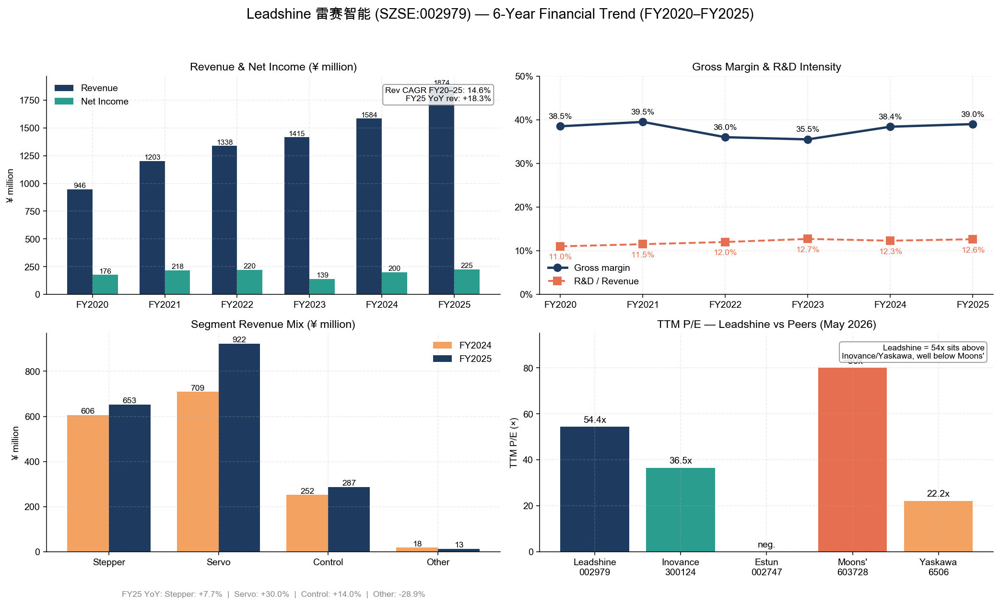
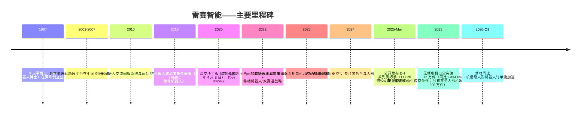
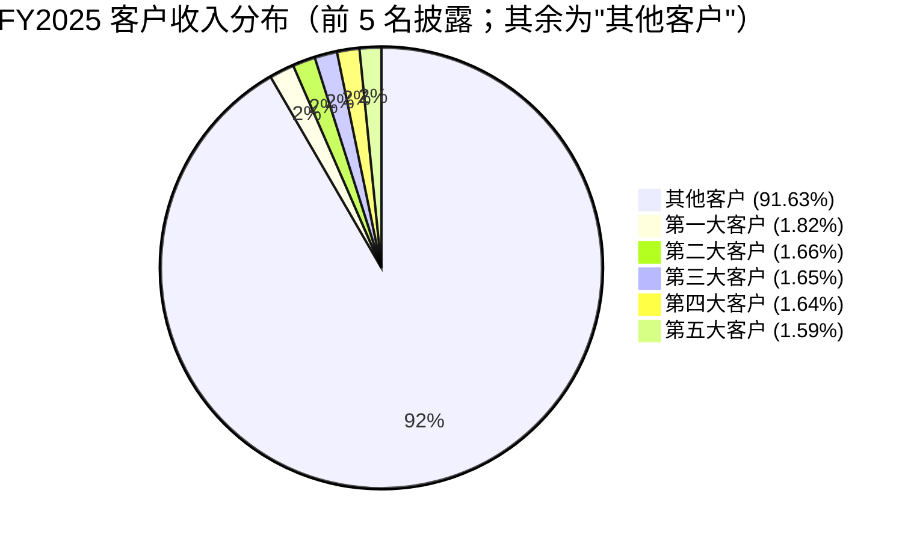
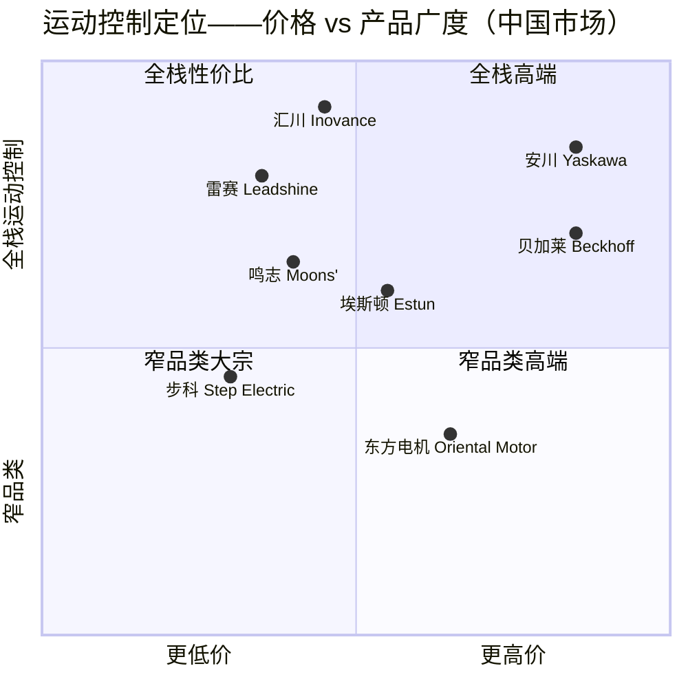

# 雷赛智能（Leadshine Intelligent Control，SZSE:002979）——首次覆盖报告

**日期：** 2026-05-16
**股票代码：** SZSE:002979
**所属行业：** 工业自动化 / 运动控制 / 人形机器人核心零部件
**上市板块：** 深圳证券交易所主板（证券代码 002979）

---

## 目录

1. 公司概览
2. 公司发展历程
3. 管理团队
4. 产品与服务
5. 客户与市场拓展
6. 行业概览
7. 竞争格局
8. 市场机遇（TAM）
9. 风险评估

---

## 1. 公司概览

深圳市雷赛智能控制股份有限公司——中文名"深圳市雷赛智能控制股份有限公司"，国际品牌"Leadshine"——是一家总部位于深圳南山区的纯运动控制零部件供应商。公司设计、生产并销售工业机械实现精密运动所需的基础部件：步进电机及驱动器、交流伺服电机与驱动器、低压伺服系统、运动控制卡、可编程逻辑控制器（PLC）、编码器，以及近年来用于人形机器人内部的无框力矩电机、空心杯电机、谐波关节模组与灵巧手总成（[2025 年年度报告，第 11–14 页](https://disc.static.szse.cn/disc/disk03/finalpage/2026-04-23/10747821-07e6-43d3-99d4-f68deb6fde8e.PDF)）。

**通俗理解其业务。** 如果你打开一台半导体晶圆搬运机器人、一台 PCB 钻孔机、一条物流分拣输送线、一台锂电卷绕机，或日益增多的人形机器人手臂，你都会在内部发现一台或多台脉冲驱动的电机、一台将数字指令转化为电流的智能驱动器，以及统筹协调它们的控制器盒。雷赛将这三层产品作为一个协调的产品栈进行销售。管理层将公司定位为"中国龙头、世界一流"的运动控制专业厂商。战略框架采用"双赛道"模式：智能制造运动控制部件为主赛道，移动机器人核心部件为辅赛道（[2025 年年度报告 第三节，第 11–17 页](https://disc.static.szse.cn/disc/disk03/finalpage/2026-04-23/10747821-07e6-43d3-99d4-f68deb6fde8e.PDF)）。

**盈利模式。** 雷赛是纯硬件业务——无 SaaS，无经常性软件收入。营收来自电机、驱动器、控制器与 PLC 的单件销售，客户群约 1 万家 OEM 厂商，分布在 60 多个国家，主要集中在中国市场（[Leadshine 公司简介](https://www.leadshine.com/abouts/about_corporate_overview.html)）。公司采用混合销售渠道：FY2025 收入中 53.3% 通过 300 多家经销商，46.7% 通过大客户直销（[2025 年年度报告，第 19 页](https://disc.static.szse.cn/disc/disk03/finalpage/2026-04-23/10747821-07e6-43d3-99d4-f68deb6fde8e.PDF)）。产品平均售价较低（FY2025 销量 677 万件，对应营收 18.7 亿元，混合单价约 277 元/件），因此商业模式以走量为主，依赖 OEM 新机型设计的稳定迭代。

**业务区域。** 约 95% 的收入来自中国境内，其中华南 56.5%、华东 30.2%、华北 8.7%。FY2025 海外收入仅占 4.6%，但同比增速最快，达 +40.4%（[2025 年年度报告，第 19 页](https://disc.static.szse.cn/disc/disk03/finalpage/2026-04-23/10747821-07e6-43d3-99d4-f68deb6fde8e.PDF)）。制造布局为国内四个工厂，外加在东莞滨海湾新区在建的"华南总部 + 人形机器人核心零部件研发与智能制造基地"，规划年产能为 200 万件机器人核心零部件（[雷赛智能 2025 年营收逐季加速——新浪财经，2026-04-30](https://finance.sina.com.cn/jjxw/2026-04-30/doc-inhwhzrz1190065.shtml)）。

**经营规模。** FY2025 营业收入 18.7384 亿元（同比 +18.28%），归母净利润 2.2537 亿元（同比 +12.42%），毛利率 39.00%（同比 +55bp）（[2025 年年度报告，第 7–17 页](https://disc.static.szse.cn/disc/disk03/finalpage/2026-04-23/10747821-07e6-43d3-99d4-f68deb6fde8e.PDF)）。员工总数约 1,580 人，其中研发人员 529 人，占比 33.5%；研发支出 2.366 亿元，占营收 12.63%（[2025 年年度报告，第 21 页](https://disc.static.szse.cn/disc/disk03/finalpage/2026-04-23/10747821-07e6-43d3-99d4-f68deb6fde8e.PDF)）。公司已获授权专利 627 项、软件著作权 218 项、知识产权资产合计 1,621 项。

*数据来源：[雷赛智能 年度报告 FY2020–FY2025，巨潮资讯](https://www.cninfo.com.cn/new/disclosure/stock?stockCode=002979)——数据从合并利润表汇总。*

**季度增速持续加快。** FY2025 各季度营收增速逐季提升（同比：Q1 +2.4%、Q2 +13.4%、Q3 +23.2%、Q4 +33.6%），主要由人形机器人核心零部件放量及交流伺服系统国产替代成功驱动（[2025 年年度报告，第 9 页](https://disc.static.szse.cn/disc/disk03/finalpage/2026-04-23/10747821-07e6-43d3-99d4-f68deb6fde8e.PDF)）。FY2026 一季度延续了这一曲线：营收 5.25 亿元（同比 +34.55%），净利润 7,212 万元（同比 +29.20%）（[雷赛智能：一季度净利润 7212.03 万元——证券时报网，2026](https://www.stcn.com/article/detail/3781711.html)）。

### 估值快照

| 项目 | 雷赛智能（002979） |
|---|---|
| 现价（2025-12-23 收盘，最新可见报价） | 39.30 元 |
| 52 周区间 | 27.03 元 – 57.40 元 |
| 总市值 / 流通市值 | 105.2 亿元 / 74.7 亿元 |
| TTM 市盈率（扣非） | 54.40× |
| TTM 市盈率近 3 年自身分位 | 51.86%；80 分位 = 66.04，50 分位 = 53.24，20 分位 = 35.42 |
| 隐含 TTM 市销率 | ≈ 105.2 亿 ÷ 18.74 亿 ≈ **5.6×** |
| FY2025 加权 ROE | ≈ 17.0% |

数据来源：[雷赛智能(002979)市盈率|估值|基本面——理杏仁](https://www.lixinger.com/equity/company/detail/sz/002979/2979)；[雷赛智能(002979)股票最新价格行情——Investing.com](https://www.investing.com/equities/china-leadshine-technology-co-ltd)；上文引用的 2025 年年度报告数据。

**可比公司估值（TTM，2026 年 5 月）：**

| 同业公司 | 代码 | TTM 市盈率 | 备注 |
|---|---|---|---|
| **雷赛智能** | SZSE:002979 | **54.4×** | 本报告 |
| 汇川技术 Inovance | SZSE:300124 | 36.5× | 行业龙头，业务覆盖新能源汽车 / 驱动器，组合更广（[汇川技术(300124)PE——理杏仁](https://www.lixinger.com/equity/company/detail/sz/300124/300124/fundamental/valuation/pe-ttm)） |
| 埃斯顿 Estun | SZSE:002747 | 无意义（EPS 为负） | 工业机器人集成商，FY2025 预计净利润 3,500 万–5,000 万元，上年亏损 8.1 亿元（[埃斯顿——Investing.com](https://www.investing.com/equities/nanjing-estun-automation)） |
| 鸣志电器 Moons' Electric | SSE:603728 | 约 80×（24–26 年预测对应约 210×） | 最接近的纯步进电机 / 空心杯电机同业；因人形机器人叙事而享有同业最高估值（[鸣志电器(603728)PE——理杏仁](https://www.lixinger.com/equity/company/detail/sh/603728/603728/fundamental/valuation/pe-ttm)） |
| 安川电机 Yaskawa Electric | TYO:6506 | 22.2×（部分数据源为 51×） | 日本伺服蓝筹股，FY2026 业绩转弱（净利润 -38%）（[YASKAWA TYO:6506 比率——Stockanalysis](https://stockanalysis.com/quote/tyo/6506/financials/ratios/)） |
| 中大力德 ZD Drive | 非上市 / SZSE:002896（相关精密驱动代理标的） | n/a（非上市；减速器 / RV） | 此处作为谐波 / 精密驱动私有可比 |

**行业 / 同业中位数：** 在四家具备有效 TTM 市盈率的可比公司（雷赛、汇川、安川、鸣志）中，中位数约 **45×**，远高于全球运动控制中位数约 22–25×（以安川为代表），但低于人形机器人最纯叙事标的的极值（鸣志约 80×+）。因此，雷赛的 54× 估值**高于中日同业中位数，但低于灵巧手最纯叙事公司**。

**估值倍数解读。** 雷赛 54× 的 TTM 市盈率约为汇川的 1.5 倍，约为安川的 2.4 倍，而 FY2025 基础盈利仅增长 +12.4%。这一溢价**并非**防御性 / 质量溢价——毛利率处于 30%–40% 区间，ROE 为 17%，传统步进电机业务为个位数增长。该溢价是**人形机器人叙事溢价**：市场为无框电机业务支付溢价，该业务 FY2025 出货突破 12 万件，同比增长超过 20 倍，并规划 200 万件产能建设（[雷赛智能——东吴电新报告，2025-03-07](https://finance.sina.com.cn/stock/relnews/cn/2025-03-07/doc-inenvmwf5762012.shtml)）。具体而言：

- 卖方机构（东吴电新）预测无框电机 + 空心杯电机 + 关节模组 + 灵巧手产品栈将贡献 FY26–27 大部分增量盈利，将"人形机器人第二曲线"估值前置到当前以步进业务为主的营收基础上。
- 获评"智元机器人 优秀供应商伙伴"，且公司披露其产品已进入 80% 主流中国人形机器人 OEM 厂商的供应链，降低了叙事的执行风险（[雷赛智能——财中社，2025](https://m.caizhongshe.cn/article-7460663532834190538.html)）。
- 五位分析师 12 个月一致目标价 58.78 元，较现价约高 50%，意味着市场预期估值倍数将随人形机器人放量进一步*扩张*——典型的高 Beta 叙事配置（[雷赛智能(002979) 盈利预测——同花顺 F10](https://basic.10jqka.com.cn/002979/worth.html)）。

由于该估值倍数由单一主题催化剂（人形机器人放量）支撑，第 9 节将估值 / 估值倍数压缩列为重大风险：若人形机器人放量不及预期，估值回归至约 35×（汇川水平）意味着在盈利赶上之前约有 35% 的下行空间。

---

## 2. 公司发展历程

雷赛由李卫平博士于 **1997 年**在深圳创立，李博士是麻省理工学院（MIT）机器人与自动化方向博士，作为首批"海归"科技创业者回国创业。在创立雷赛之前，李博士先后任华盛顿州立大学副教授（1991–1994）、香港科技大学副教授（1995–1997）；他是英文教材 *Applied Nonlinear Control*（《应用非线性控制》）的合著者及中文著作《运动控制系统原理与应用》的合著者（[2025 年年度报告 第四节，第 32 页](https://disc.static.szse.cn/disc/disk03/finalpage/2026-04-23/10747821-07e6-43d3-99d4-f68deb6fde8e.PDF)；[Leadshine 公司简介](https://www.leadshine.com/newsEvent/details/corporate-profile.html)）。

创业初衷虽窄但具有持久力：与其去抢占由西门子、三菱、安川主导的广义 PLC / 驱动器市场，雷赛选择专注于**数字步进驱动器**——当时是由日本厂商（东方电机 Oriental Motor、山洋电气 Sanyo-Denki）主导的沉寂大宗市场。通过开发基于数字信号处理器的驱动器，实现接近伺服级闭环性能但保持步进级价格，公司在低端开环步进与昂贵交流伺服之间开辟了中端市场。

*数据来源：[2025 年年度报告，第 11–17 页](https://disc.static.szse.cn/disc/disk03/finalpage/2026-04-23/10747821-07e6-43d3-99d4-f68deb6fde8e.PDF)；[Leadshine 公司简介](https://www.leadshine.com/newsEvent/details/corporate-profile.html)；[雷赛发布 DH 系列灵巧手——新浪财经，2025-03-14](https://finance.sina.com.cn/stock/relnews/cn/2025-03-14/doc-inepritp9605547.shtml)。*

**重要战略转型：**

1. **从单一步进驱动器到"步进-伺服-控制"产品栈（2010–2015）。** 公司意识到 OEM 客户日益希望一家供应商同时提供电机、驱动器与控制器，遂增加交流伺服驱动器、面向 AGV 的低压伺服和运动控制卡。这使其能销售"步进 + 伺服 + 控制器"打包方案，而非单一零部件——既显著提升毛利，也抵御了纯步进的大宗化压力。
2. **IPO 与研发能力再投资（2020）。** 雷赛于 2020 年 4 月 8 日在深交所主板挂牌，保荐机构为中信证券（[2022 年年度报告，第 7 页](https://static.cninfo.com.cn/finalpage/2023-04-24/1216398866.PDF)）。募集资金用于建设华南研发中心、迁入西丽智谷园区，并支持如今规模达 529 人的研发团队建设——这对于一家中盘中国硬件公司而言并不常见。
3. **人形机器人第二曲线投入（2023–2025）。** 这是近期决定性的转型。2023 年，雷赛流片了首款高密度无框力矩电机（FM1 系列）以及配套的空心轴编码器和空心杯伺服系统——这三类正是人形机器人关节模组的核心组件。2025 年 3 月，DH 系列灵巧手发布，并拆分设立专属子公司"深圳市灵巧驱控技术有限公司"运营该业务。到 2025 年底，雷赛已从"实验阶段"进入"80% 主流中国人形机器人 OEM"——是两年内完成的卓越周期（[雷赛智能——新浪财经，2026-05-14](https://finance.sina.com.cn/stock/bxjj/2026-05-14/doc-inhxwkuc6771087.shtml)）。

**关键收购与重组。** 雷赛一贯是*自建而非外购*的公司。集团结构以为特定职能而设立的全资子公司为主：东莞雷赛机器人（2025 年 5 月，东莞机器人工厂运营主体）、雷赛软件（软件）、灵犀自动化（现场总线与控制子公司）、灵巧驱控（灵巧手子公司）、雷智赋能（原上海雷智，电机）以及雷赛自动化系统（原东莞稳控）。唯一具有实质意义的资产剥离是 2022 年处置上海兴雷（非核心工业园投资）及胜泰祺股权，产生一次性收益 9,081 万元，使 FY2022 净利润账面上有所提升；FY2023 扣除一次性收益后的净利润回归至 1.386 亿元（[2023 年年度报告，第 7 页](https://static.cninfo.com.cn/finalpage/2024-04-25/1219497912.PDF)）。

**近期进展（过去 12 个月）。** DH 系列灵巧手发布（2025 年 3 月）；"20 自由度"版本于上海 WAIC（2025 年 7 月）及美国 Automate 2025 全球首秀（[雷赛在 Automate 2025 首秀 20 自由度灵巧手](https://www.automateshow.com/exhibitor-news/leadshine-debuts-20-dof-dexterous-hand-at-automate-2025-redefining-humanoid-robotics-precision)）；东莞 200 万件/年产能公告；获智元"优秀供应商伙伴"奖（2025 年 Q4）；2025 年股权激励计划授予 650 万股限制性股票；2025 年 5 月新设全资子公司东莞雷赛机器人。

---

## 3. 管理团队

雷赛是一家**由创始人控制、家族控制**的公司。创始人李卫平及其配偶共同控制人施慧敏被认定为共同实际控制人，与一致行动方（李卫平之妻弟李伟兴、妻弟控股平台深圳市雷赛实业发展）合计持有约 **42.8%** 的总股本（李卫平 27.33%、施慧敏 7.73%、雷赛实业 6.90%、李伟兴 0.81%——[2025 年年度报告，第 66 页](https://disc.static.szse.cn/disc/disk03/finalpage/2026-04-23/10747821-07e6-43d3-99d4-f68deb6fde8e.PDF)）。这一比例对一家上市已 12 年的中盘公司而言异常之高，将李卫平的个人激励与长期经营成果深度绑定。

### 李卫平 — 创始人、董事长、总经理

李卫平 1962 年 7 月生，是公司核心人物。他在**麻省理工学院（MIT）**获得机器人与自动化方向博士学位，曾任**华盛顿州立大学副教授（1991–1994）**及**香港科技大学副教授（1995–1997）**，随后回到深圳，于 1997 年创立"雷赛机电技术开发"——其前身公司，并担任董事长至 2011 年。2012 年起任雷赛智能董事长兼总经理，并在所有运营子公司（灵犀、灵巧、雷赛控制、雷赛自动化系统、上海雷赛机器人、东莞雷赛机器人、雷赛软件——见[2025 年年度报告，第 33–34 页](https://disc.static.szse.cn/disc/disk03/finalpage/2026-04-23/10747821-07e6-43d3-99d4-f68deb6fde8e.PDF)）持续担任董事职务。李卫平合著有两本著作——英文教材 *Applied Nonlinear Control*（《应用非线性控制》）及中文著作《运动控制系统原理与应用》——以及多篇非线性控制理论的学术论文；他的训练背景是控制系统学者，转型为制造业经营者。值得注意的是，他在 **2026 年时 64 岁**，董事任期续任周期将于 2026 年 5 月结束——一份可信的接班计划已成为当下亟待回答的问题。

李卫平持有 **8,613 万股（占总股本 27.33%）**，其中 6,460 万股仍处于中国证监会高管限售锁定中，2,150 万股可自由交易（[2025 年年度报告，第 66 页](https://disc.static.szse.cn/disc/disk03/finalpage/2026-04-23/10747821-07e6-43d3-99d4-f68deb6fde8e.PDF)）。从我们查阅的公开记录看，他在限制性股票解锁周期中未曾出售过一股。李卫平在雷赛的履历几乎就是公司全部成长史：从 1997 年的步进驱动器初创企业，到 100 亿元市值的机器人零部件龙头、四家制造工厂、超过 1 万家 OEM 客户、60 多个出口国家、ROE 达 17% 的业务体系。其特别值得一提的成就包括：(a) 建立了中国步进电机最大份额（雷赛是 2024 年中国步进电机品牌排行榜冠军——[2024 年十大品牌步进电机，中国报告大厅](https://m.chinabgao.com/top/brand/100135.html)）；(b) 据 MIR 数据，FY2025 公司位列中国 AC 伺服国产品牌第 **2** 位（[2025 年年度报告，第 17 页](https://disc.static.szse.cn/disc/disk03/finalpage/2026-04-23/10747821-07e6-43d3-99d4-f68deb6fde8e.PDF)）；(c) 精准把握人形机器人零部件机会，无框电机营收在一年内增长 20 倍。他公开将公司中期愿景表述为"成为中国龙头、世界一流的运动控制集团"——对于一位中国 A 股创始人而言，这种直白表达较为罕见。

### 施慧敏 — 董事，共同实际控制人

施慧敏 1964 年 12 月生，是李卫平的配偶，亦是公司共同控制人，持有 **2,436 万股（7.73%）**。她拥有学士学位，非技术背景（1987–1991 年任上海小学教师；1997 年加入前身公司任财务经理、行政总监及监事职务）。自 2011 年起任董事；2018 年卸任行政总监职务。从职能上看，她属于受托人型董事，而非运营型董事（[2025 年年度报告，第 32 页](https://disc.static.szse.cn/disc/disk03/finalpage/2026-04-23/10747821-07e6-43d3-99d4-f68deb6fde8e.PDF)）。

### 游道平 — 职工代表董事，财务总监

游道平 1981 年 2 月生，担任财务总监。他持有江西财经大学经济学学士学位。其职业路径对于中国 A 股 CFO 而言异常宽广：2003–2006 年任 **江铃汽车（JMC）** 财务分析主管；2006–2012 年任**金蝶软件**预算分析经理、财务部门总经理；2012–2014 年任**万科**地产财务与运营高级经理；2014–2016 年任深圳新机电智能董事兼 CFO；2016–2020 年任深圳通洲电子助理总裁兼 CFO；2020 年 3 月加入雷赛，首任董事长特别助理，2020 年 6 月起任职工代表董事兼 CFO（[2025 年年度报告，第 32–33 页](https://disc.static.szse.cn/disc/disk03/finalpage/2026-04-23/10747821-07e6-43d3-99d4-f68deb6fde8e.PDF)）。大型公司（万科）、软件公司（金蝶）与中小型企业 CFO 经验的组合，使他相比典型硬件公司 CFO 更具资本市场敏锐度——考虑到股权激励节奏（2022 年六期计划 + 2025 年新计划）与产能投入周期，这一特质尤为重要。

### 田天胜 — 董事，副总裁（研发）

田天胜 53 岁，硕士学位，2011 年 3 月从山龙电控（曾任总工程师）加入雷赛。自 2011 年起任研发副总裁——实际上是雷赛事实上的 CTO，是李卫平在工程研发方面的对应人物。他持有 126 万股，其中包括 2025 年激励计划新授予的 18 万股（[2025 年年度报告，第 32 页](https://disc.static.szse.cn/disc/disk03/finalpage/2026-04-23/10747821-07e6-43d3-99d4-f68deb6fde8e.PDF)）。对于一家由硬件工程驱动的公司而言，田天胜领导研发组织 15 年的连续任期构成了结构性优势。

### 黄超 — 副总裁（国内销售）

黄超 47 岁，持有中南大学工学学士学位及香港浸会大学（HKBU）MBA 学位。他从富士康 PCEG 起步（2000–2002），2002 年加入雷赛——历任销售工程师 → 华南销售经理 → 3C / 新能源行业总监 → 国内营销中心副总裁。他持有 25.5 万股，其中包括 2025 年计划新授予的 15 万股（[2025 年年度报告，第 33 页](https://disc.static.szse.cn/disc/disk03/finalpage/2026-04-23/10747821-07e6-43d3-99d4-f68deb6fde8e.PDF)）。24 年的持续任期使他在驱动公司大部分步进销售的 3C 与新能源垂直行业中积累了深厚的客户关系。

### 公司治理

- **董事会构成。** 五位执行 / 非独立董事（李卫平、施慧敏、田天胜、游道平及新任职位）和三位独立董事（王宏、吴威、杨健）。独立董事比例 = 3/8 = 37.5%。根据中国新《公司法》过渡安排（2025 年），公司已撤销监事会结构。
- **独立董事。** 王宏（博士，原 ABB 研究中心高级工程师，现任哈工大深圳教授）、吴威（北京大学法律学位，广东敬天律师事务所执业律师，深圳国际仲裁院仲裁员）、杨健（原金蝶 CFO/执行董事，现任深圳思贝云科技董事长）。
- **内部人持股。** 创始人家族 + 雷赛实业 = 约 42.8% 股权（[2025 年年度报告，第 66 页](https://disc.static.szse.cn/disc/disk03/finalpage/2026-04-23/10747821-07e6-43d3-99d4-f68deb6fde8e.PDF)）。高管直接持股合计 = 1.124 亿股（约 35.7%）。
- **薪酬结构。** 高度股权化：2022 年和 2025 年限制性股票 / 股票期权激励计划已多次向 200 多名核心员工授予股份。FY2025 新增发行 650 万股限制性股票，2022 年计划解锁 277 万股，2022 年期权行权 98 万股——股份支付费用对报告净利润形成显著拖累（管理层披露股份支付费用 4,700 万元；扣除股份支付后净利润 2.72 亿元，同比 +31.9%）（[2025 年年度报告，第 17 页](https://disc.static.szse.cn/disc/disk03/finalpage/2026-04-23/10747821-07e6-43d3-99d4-f68deb6fde8e.PDF)）。
- **关联方交易。** 无重大关联方交易披露；雷赛实业家族平台被披露为一致行动方而非交易对手方。
- **治理关注点。** 创始人 + 配偶 + CFO 同时为控股股东与高管——存在控制权集中风险，但通过 37.5% 的独立董事比例、强制性的中国式监事会与审计委员会监督，以及与容诚会计师事务所（签字会计师为石少祥、甘金红、陈言）的可见审计关系得到缓释。

### 履历综合评估

这是一个由创始人主导、具有 28 年经营记录的故事。李卫平在步进领域取得龙头地位、AC 伺服国内第 2 名地位，仅用两年时间打造可信的人形机器人第二曲线——在中国工业硬件领域，这样的履历极为罕见。CFO 和工程副总裁任期较长（分别为 5 年和 15 年），且与股权深度绑定。短板：考虑到董事长 64 岁的接班规划；CFO 首次面临机器人周期检验；高管层缺乏美国 / 欧洲经验（尽管出口增长是重点）。

---

## 4. 产品与服务

雷赛将其产品组合划分为**四大核心品类**，每个品类下设多个 SKU 系列。FY2025 收入构成：伺服系统 49.18%、步进系统 34.83%、控制技术 15.31%、其他 0.68%（[2025 年年度报告，第 19 页](https://disc.static.szse.cn/disc/disk03/finalpage/2026-04-23/10747821-07e6-43d3-99d4-f68deb6fde8e.PDF)）。机器人核心零部件尚未单独列示——其收入分散在相关电机 / 伺服品类中——但管理层"第二赛道"的表述已清晰指向，随着规模放大，该板块将单独披露。

```mermaid
graph TD
    A[雷赛智能 Leadshine] --> B[伺服系统]
    A --> C[步进系统]
    A --> D[控制技术]
    A --> E[机器人核心零部件]
    B --> B1["AC 伺服驱动器：L8 / L7 / L6 / L5 / L3"]
    B --> B2["AC 伺服电机：ACM2 / ACM1 / ACM0 / M7 / M6 / M5 / M3"]
    B --> B3["低压伺服驱动器：LD3M / LD2 / 4LD3"]
    B --> B4["低压伺服电机：LVM / 伺服滚筒"]
    B --> B5["集成伺服：iSV2 / iSV"]
    B --> B6["编码器：26 位光电、分体磁电等"]
    C --> C1["数字步进驱动器：DM5 五相 / 脉冲 / 总线 / 驱控一体"]
    C --> C2["数字步进电机：CM 标准 / 抱闸 / 防水 / 空心 / 五相"]
    C --> C3["闭环步进驱动器与电机"]
    C --> C4["集成步进：智能 i-stepper"]
    D --> D1["运动控制器：5000 / 3000 / 1000 系列"]
    D --> D2["运动控制卡：DMC-S、I/O、编码器计数"]
    D --> D3["PLC：S / SC / MC / LC 系列"]
    D --> D4["远程 I/O 模块：柜内、柜外"]
    E --> E1["FM1 / FM2 无框力矩电机"]
    E --> E2["空心轴编码器"]
    E --> E3["空心杯无刷伺服电机：标准 / 高速 / 高扭"]
    E --> E4["谐波关节模组：HJ 系列"]
    E --> E5["行星关节模组：PJ 系列 + iW 轮式"]
    E --> E6["灵巧手：DH 系列 11 / 20 / 24 自由度"]
    E --> E7["机器人运动'小脑'控制器（研发中）"]
```

*数据来源：[2025 年年度报告 §三，第 12–14 页](https://disc.static.szse.cn/disc/disk03/finalpage/2026-04-23/10747821-07e6-43d3-99d4-f68deb6fde8e.PDF) 与 [Leadshine 产品门户](https://www.leadshine.com/robot/index.html)。*

### 4.1 伺服系统（FY2025 收入占比 49.2%，9.216 亿元，同比 +30.0%）

传统业务中增速最快、驱动 FY2025 利润表的板块。**L8** 为旗舰高性能总线 AC 伺服驱动器，**L7** 为通用主力产品；**L6 / L5 / L3** 面向中端和经济型市场。电机覆盖从**ACM2** 高端系列到 **M3** 经济型系列。低压伺服（LD3M、LD2）面向 AGV/AMR 和电池供电设备；集成伺服（iSV2、iSV）将驱动器与电机集成于一体，面向成本敏感型应用。

- **竞争优势：是（技术 + 服务护城河）。** 雷赛自研的 **26 位超高精度光电编码器**在 2025 年实现量产（[2025 年年度报告，第 17 页](https://disc.static.szse.cn/disc/disk03/finalpage/2026-04-23/10747821-07e6-43d3-99d4-f68deb6fde8e.PDF)）——达到此前高端进口产品所需的多摩川（Tamagawa）/ 海德汉（Heidenhain）级别。根据管理层评述，L7/L8 产品线"总体达到国外同类产品水平"，支撑了公司在 MIR 数据中国内 AC 伺服第 2 名的市场地位。
- **最接近的具名竞品：** 汇川 SV660/SV680 系列和安川 Σ-X 系列。雷赛相对安川等效产品折价 15–25%，与汇川价格大致持平，但在中小机座功率/瓦数性价比上更优；在系统集成与大轴产品线方面落后于汇川（汇川更广的 EV / 电梯 / 风电组合）。

### 4.2 步进系统（FY2025 收入占比 34.8%，6.526 亿元，同比 +7.7%）

这是*传统*增长引擎。新一代 **DM5** 五相数字步进系列于 2025 年发布，管理层将其定位为"日本五相级性能、中国步进级成本"——明确瞄准东方电机和山洋电气在半导体晶圆搬运、PCB 制造和 3C 自动化领域的存量客户。闭环步进（带绝对值编码器版本的 CME-M17）和集成 smart-i-stepper 系列构成完整产品线。

- **竞争优势：是（规模 + 成本领先 + 品牌）。** 雷赛是中国步进市场份额*第一*的厂商；在 2024 年中国步进品牌排行榜中位居榜首（[2024 年十大品牌步进电机——报告大厅](https://m.chinabgao.com/top/brand/100135.html)），并拥有任何国内厂商中最广泛的脉冲-总线-驱控-一体四轴架构（脉冲 / 通用总线 / 驱控一体 / 高速总线）。
- **最接近的具名竞品：** 鸣志电器步进电机产品线；汇川的步进 SKU 较薄；国际可比为东方电机的 PKP 与 CRK 系列。雷赛在性价比与中国 OEM 渠道方面占优；在最高温、最高精度的应用领域仍落后于东方电机。

### 4.3 控制技术——PLC、运动控制器与控制卡（FY2025 收入占比 15.3%，2.869 亿元，同比 +14.0%）

最年轻的传统品类——雷赛进入 PLC 较晚，但是**中国小型 PLC 厂商中增长最快**（FY2025 MIR 数据同比 +41.6%，增速排名第 1——[2025 年年度报告，第 17 页](https://disc.static.szse.cn/disc/disk03/finalpage/2026-04-23/10747821-07e6-43d3-99d4-f68deb6fde8e.PDF)）。产品线涵盖小型（**SC / S 系列**）、中型（**MC 系列**）和大型（**LC 系列**）运动控制 PLC，加上达到 62.5 微秒超短总线周期和 50 微秒高速脉冲控制的 **DMC-S** 超高性能总线控制卡——这是公司首款可信的"高端半导体级"控制器。

- **竞争优势：部分具备（仍在追赶中）。** 增长强劲，DMC-S 的 62.5 微秒指标可信，但绝对市场份额在 PLC 领域仍落后于西门子、三菱和汇川，在运动控制卡领域仍落后于贝加莱（Beckhoff）/ 基恩士（Keyence）。
- **最接近的具名竞品：** 汇川 H5U PLC；西门子 S7-1200；三菱 FX5U。雷赛在小型 PLC 上的增长表明其在 3C / 包装 / 锂电池细分领域取得突破；尚未在汽车或风电 / 光伏领域取代外资品牌。

### 4.4 机器人核心零部件——第二曲线故事（暂未单独披露收入；FY2025 为首个实质年份）

这是投资者关注的板块，也是股价交易于 54× 市盈率的原因所在。产品组合：

- **FM1 / FM2 高密度无框力矩电机**——一对定转子（无外壳），设计上可直接嵌入人形机器人关节模组。规格强调高扭矩密度、低齿槽转矩、高槽满率、高功率密度、超小机座和定制化灵活性（[机器人关节用无框电机——Leadshine](https://www.leadshine.com/robot/category/frameless-motors.html)；[FM1 系列页面](https://www.leadshine.com/robots/frameless-motors/fm1-series.html)）。FY2025 出货突破 12 万件，同比 +20 倍；管理层规划东莞每年 200 万件新增产能。
- **空心杯无刷伺服电机**——用于灵巧手手指驱动的无铁芯转子永磁伺服微电机。提供标准型、高速型和高扭型三档。
- **谐波关节模组（HJ 系列）+ 行星关节模组（PJ 系列）+ iW 轮式模组**——集成减速器-电机-编码器-驱动器的预集成总成，与谐波传动（日本 Harmonic Drive）和绿的谐波（中国谐波减速器专业厂商）+ 汇川展开竞争。
- **DH 系列灵巧手**——2025 年 3 月由子公司灵巧驱控发布。DH-2015 具备 20 自由度（15 主动），每根手指由 3 台空心杯伺服电机驱动，配备 100 MHz EtherCAT 总线、FOC 电流环及力位混合控制、6 个触觉传感器、100 万次抓握寿命、最大 40 kg 负载（[雷赛 DH 系列灵巧机械手——中国传动网](https://www.chuandong.com/news/news264487.html)；[雷赛智能发布"20 自由度"灵巧手方案——艾邦机器人](https://www.aibangbots.com/a/1957)）。24 自由度和 11 自由度版本亦已发布。
- **机器人运动"小脑"控制器**——规划中的整机运动核心控制单元；正在研发。

- **竞争优势：是（组合产品栈技术护城河 + 客户势能）。** 雷赛是少数几家能内部提供*全套*人形机器人关节产品栈——无框电机 + 空心杯电机 + 减速器模组 + 编码器 + 驱动器——的中国厂商之一。再加上智元"优秀供应商伙伴"奖与产品已进入 80% 主流中国人形机器人 OEM 供应链的披露，该板块兼具技术与客户验证护城河。
- **最接近的具名竞品：** 鸣志电器的完整人形机器人运动产品组合（鸣志明确将其定位为鸣志 vs 雷赛之争——见[鸣志电器——Moons' 人形机器人评论，2026](https://www.lixinger.com/equity/company/detail/sh/603728/603728/fundamental/valuation/pe-ttm)）。其他竞争对手：鼎智科技（Tao-instinct）、步科股份，以及灵巧手专业厂商因时机器人、兆威机电和星动纪元的 XHAND1。

### 旗舰产品与长尾产品

驱动 FY2025 利润表跃迁的**旗舰产品**为：(i) L7 / L8 AC 伺服驱动器 + ACM2 / ACM1 电机（AC 伺服国产替代套装，贡献伺服板块 +30% 增长）；(ii) DM5 五相数字步进（高端步进换代）；(iii) FM1/FM2 无框电机（人形机器人第二曲线）。**长尾产品**为传统步进系列（CM 系列）、小型 PLC 系列和远程 I/O 模块——仍贡献 6 亿元以上的稳定现金流收入。

### 过去 12 个月的新品发布 / 产品停产

新品发布：**DH 系列灵巧手**（2025 年 3 月）、**DM5 五相步进**（2025）、**DMC-S 高性能运动控制卡**（2025）、**26 位光电编码器量产**（2025）、20 自由度 DH 版本在 WAIC（2025 年 7 月）和 Automate 2025 亮相。无重大停产产品披露；管理层表示正在持续优化低端步进 SKU 结构。

---

## 5. 客户与市场拓展

### 客户分部

雷赛几乎只面向工业 OEM 整机厂商销售，管理层将其分类为"战略垂直行业"：**半导体 / 光伏 / 新能源电池设备、光通信设备、高端机床、物流仓储自动化、3C 电子制造设备、PCB/PCBA 设备、包装设备、医疗设备及机器人（协作机器人、AGV/AMR、移动机器人、人形机器人）**。OEM 客户合计数万家，无单一主导垂直行业披露。

### 客户集中度——量化且良性

*数据来源：[2025 年年度报告，第 20 页——主要销售客户和主要供应商情况](https://disc.static.szse.cn/disc/disk03/finalpage/2026-04-23/10747821-07e6-43d3-99d4-f68deb6fde8e.PDF)。*

FY2025 披露在分散度方面表现出色：前 5 名客户 = 1.5678 亿元 = 总营收的 **8.37%**，第一大客户 = 营收的 **1.82%**，五名客户均仅以"第一名 / 第二名 / …"列示，未披露具体识别信息。**前 5 名中无关联方。** 作为参考，SKILL.md 框架中重大客户集中度阈值为单一客户 >20% 或前 5 名合计 >50%；雷赛大约低于这些阈值一个数量级。

**趋势。** 客户分散一直是结构性特征：往年披露同样显示前 5 名集中度仅为个位数。这与经销商主导的销售模式一致——平均终端客户为中小型 OEM，记录在册的最大购买方通常是批发经销商或大型 3C 代工厂。

**供应商集中度同样较低。** 前 5 名供应商占采购总额的 1.925 亿元 = 18.01%；第一大供应商 = 6.81%（为关联方供应商——本节中唯一的关联方交易）（[2025 年年度报告，第 21 页](https://disc.static.szse.cn/disc/disk03/finalpage/2026-04-23/10747821-07e6-43d3-99d4-f68deb6fde8e.PDF)）。

### 已披露的集成合作方与人形机器人客户

尽管年报对前 5 名客户进行了匿名化处理，公开披露和行业媒体已点名以下具体人形机器人客户关系：

- **智元机器人 Agibot**——雷赛于 2025 年获评"**优秀供应商伙伴**"（[2025 年年度报告，第 18 页](https://disc.static.szse.cn/disc/disk03/finalpage/2026-04-23/10747821-07e6-43d3-99d4-f68deb6fde8e.PDF)）。智元为 2023 年由前华为工程师邓泰华、彭志辉创立的上海人形机器人创业公司（[AgiBot——Wikipedia](https://en.wikipedia.org/wiki/AgiBot)）。
- **优必选（HKEX:9880）**——香港上市的公开人形机器人制造商；根据投资者关系活动中的管理层评述，雷赛被披露为无框电机及关节零部件供应商（[雷赛智能调研——新浪财经，2026-03-25](https://finance.sina.cn/2026-03-25/detail-inhsffcv9631562.d.html)）。
- **宇树科技 Unitree**——人形 + 四足机器人龙头；在产业链覆盖中，雷赛部件被广泛引用为宇树供应商基础（[宇树供应商平台](https://www.unitree.com/cn/supplier/)；[中国人形机器人厂商对比——Awesome Robots](https://www.awesomerobots.xyz/blog/chinese-humanoid-manufacturers-unitree-vs-ubtech-vs-fourier)）。
- **傅利叶 Fourier Intelligence**、**小米 CyberOne**、**星动纪元 Robotera**、**EXCITE / X² Robotics** 等——管理层表示其产品已进入 80% 主流中国人形机器人 OEM 供应链（[雷赛智能——财中社，2025](https://m.caizhongshe.cn/article-7460663532834190538.html)）。
- **工业自动化标杆客户**（年报中未单独披露，但属于典型渠道大客户）：富士康、立讯精密、比亚迪、宁德时代电池设备 OEM、半导体设备厂（包括北方华创子公司和盛美半导体设备供应商）。

年报明确指出"公司的机器人核心部件产品已进入国内 80% 主流人形机器人厂商的供应体系"——雷赛的机器人核心零部件已进入 80% 国内主流人形机器人厂商的供应链（[2025 年年度报告，第 18 页](https://disc.static.szse.cn/disc/disk03/finalpage/2026-04-23/10747821-07e6-43d3-99d4-f68deb6fde8e.PDF)）。

### 渠道分布

- **经销商：** FY2025 收入占 53.3%（9.9907 亿元，同比 +30.51%），通过 **300 多家授权经销商**销售（[2025 年年度报告，第 19 页](https://disc.static.szse.cn/disc/disk03/finalpage/2026-04-23/10747821-07e6-43d3-99d4-f68deb6fde8e.PDF)）。
- **大客户直销：** 46.7%（8.7477 亿元，同比 +6.84%），通过中国主要城市约 40 个区域销售团队。
- **线上 B2B 渠道：** [雷赛商城](https://www.leisaishop.com/) 面向 SMB 直接采购步进及伺服产品。
- **国际市场：** 出口收入占营收 4.6%（8,650 万元，同比 +40.4%），通过 60 多个国家的合作伙伴销售（[Leadshine 公司简介](https://www.leadshine.com/abouts/about_corporate_overview.html)）。

### 合同结构

订单主要为逐单采购（PO），而非多年期主协议——这是 OEM 电机驱动行业的典型方式。生产采用**按库存生产**（针对标准 SKU 按滚动 MRP 备货）与**按订单生产**（定制低压伺服 / 机器人零部件）相结合的混合模式。PCBA 半成品委外加工；最终组装、软件烧录及质量测试在公司内部完成（[2025 年年度报告，第 15 页](https://disc.static.szse.cn/disc/disk03/finalpage/2026-04-23/10747821-07e6-43d3-99d4-f68deb6fde8e.PDF)）。

### 销售周期与关键合作伙伴

工业 OEM 销售周期从首次规格提交到设计导入需 6–12 个月，后续放量取决于 OEM 自身的客户流。人形机器人板块周期更短（3–6 个月），因为终端人形机器人 OEM 客户本身处于快速迭代节奏中。重要战略合作包括与黑龙江大学 / 哈尔滨工业大学（哈工大）深圳实验室（独立董事王宏即为哈工大教授）以及季华实验室先进制造合作。

---

## 6. 行业概览

### 行业定义

雷赛业务位于广义工业自动化市场的 **OEM 自动化零部件**板块。OEM 自动化 = 销售给整机厂商而非工厂运营方的零部件及子系统。产品分类涵盖：运动控制（步进、伺服、控制器、编码器）、低压驱动器、PLC、HMI、传感器、机器视觉、机器人手臂、AGV/AMR 移动平台，及如今的人形机器人核心零部件。相邻行业：流程自动化（化工、油气）、建筑自动化、共享电机 / 逆变器技术的电动汽车动力总成零部件，以及仪器仪表。

### 市场规模

- **中国 OEM 自动化市场：** 管理层引用睿工业（MIR）数据，2025 年规模为 1,019 亿元，同比 +2%（[2025 年年度报告，第 11 页](https://disc.static.szse.cn/disc/disk03/finalpage/2026-04-23/10747821-07e6-43d3-99d4-f68deb6fde8e.PDF)）。+2% 的增速接近衰退水平——自 2015 年以来增速最慢——主要受美国关税摩擦、3C 消费疲软和锂电池资本开支消化影响。
- **中国工业机器人市场：** 预计到 2030 年突破 15,000 亿元（广义定义），CAGR 约 12%；核心零部件硬件市场达 6,000 亿元，国产化率 >70%（[中国工业机器人行业——观研报告网，2025](https://www.chinabaogao.com/detail/775998.html)）。2025 年上半年国内工业机器人国产化率突破 55%。
- **中国人形机器人市场：** 据 36Kr / 中泰 / 浙商证券卖方研究，长期具有万亿元潜力；2025 年是首个"年产量 ≥1 万台"的年份，也是国内核心零部件国产化率突破 70% 的年份（[2025 年年度报告，第 11 页](https://disc.static.szse.cn/disc/disk03/finalpage/2026-04-23/10747821-07e6-43d3-99d4-f68deb6fde8e.PDF)；[2025 年中国企业引领全球人形机器人生产——人民日报](https://en.people.cn/n3/2026/0110/c90000-20412663.html)）。
- **全球运动控制：** 综合 Gartner / IFR 等多份数据，2025 年规模约 180–200 亿美元，CAGR 约 6%。

### 增长率

OEM 自动化周期目前处于消化阶段——2024 年增长 +5%，2025 年仅增长 +2%。未来周期预计将在 **(a) "国产替代"** （半导体、机床、光伏设备国产化率提升）、**(b) 劳动力替代资本开支** （工厂应对工资上涨和劳动力老龄化）和 **(c) 具身智能 / 人形机器人浪潮**的推动下实现拐点。行业分析机构 MIR 预测 FY2026 增长 +8%。

### 关键趋势与驱动因素

1. **具身智能 + 人形机器人商业化。** 国务院"机器人+"和"十四五战略性新兴产业"规划目标制造业机器人密度翻倍；2025 年明确被定为人形机器人商业化部署的拐点年份。
2. **国产替代。** 贸易摩擦引发的供应链偏好向中国厂商回流——在半导体设备、锂电池生产线和机床领域尤为明显。MIR 数据显示，雷赛位列国产 AC 伺服第 2 名。
3. **智能工厂升级（"十五五"规划）。** 工业 AI + 数字孪生 + 物联网自动化是明确的十五五经济优先方向——构成多年期资本开支顺风。
4. **中端自动化中的步进-伺服替代趋势。** 随着 ASP 差距收窄、总线控制日益普及，伺服渗透率增速快于运动控制总体市场——对雷赛伺服 +30% 增速直接利好。

### 监管环境

中国工业自动化是工信部战略支持行业（"专精特新"小巨人认证——雷赛已被认定为"专精特新"小巨人企业），并享受"高新技术企业"企业所得税优惠。人形机器人核心零部件被列入战略性新兴产业目录（"十五五"规划 + "机器人+应用行动方案"）。先进半导体制造设备的美国出口管制（2022/2024 修订条款）通过将半导体资本开支引向国产供应商名单，间接*利好*国产运动控制厂商。

### 行业动态

- **低端分散，高端集中。** 2025 年上半年工业机器人前 10 大厂商市占率约 65%——但*零部件*市场（步进、伺服、PLC、控制器）远更分散，包括数百家中国厂商及全球巨头（安川、三菱、西门子、施耐德、罗克韦尔、ABB、贝加莱 Beckhoff、基恩士 Keyence、发那科 Fanuc）。
- **供应商议价能力：** 中等。稀土磁体（NdFeB 钕铁硼）价格驱动电机 BoM 波动；高端关节模组的精密轴承和谐波减速器供应受限。雷赛的空心杯电机使用进口日本研发测试设备及部分外协精密部件。
- **客户议价能力：** 在零部件层面为中低水平（OEM 整机厂商通常规模太小，无法从市场份额领先者处获取价格让步），但在已开始整合客户群的少数大型人形机器人 OEM 客户中较高。
- **替代品：** 在运动控制内部，步进的天然替代品是闭环步进或低端伺服；低压伺服的替代品是集成伺服或低端开环步进。气动驱动在部分包装应用中是跨领域替代品。
- **进入壁垒：** 中等。电机设计与硅芯片（栅极驱动器、FOC 控制器、编码器 ASIC）已成熟；真正的护城河在于 (a) 累积的知识产权，(b) 中国 OEM 生态系统的品牌与渠道覆盖，(c) 全栈工程能力（电机 + 驱动器 + 控制 + 通信 + 调试服务）及 (d) 产能规模。

---

## 7. 竞争格局

### 直接与间接竞争对手

| 竞争对手 | 上市 | 直接重叠 | 与雷赛的对比定位 |
|---|---|---|---|
| **汇川技术 Inovance** | SZSE:300124 | AC 伺服、PLC、驱动器、无框电机 | 规模更大、覆盖更广（9M-2025 营收 316 亿元，+25%）；中国 AC 伺服国产第 1 名。规模优势更大，估值倍数低于雷赛。（[汇川技术 PE——理杏仁](https://www.lixinger.com/equity/company/detail/sz/300124/300124/fundamental/valuation/pe-ttm)） |
| **埃斯顿 Estun** | SZSE:002747 | 伺服驱动器、工业机器人臂 | 工业机器人集成商（H1-25 出货量超 1 万台），FY24 亏损（8.1 亿元亏损），FY25 复苏（指引净利润 3,500 万–5,000 万元）。业务结构不同——机器人臂系统比重高于运动控制零部件。（[南京埃斯顿自动化——Investing.com](https://www.investing.com/equities/nanjing-estun-automation)） |
| **鸣志电器 Moons' Electric** | SSE:603728 | 步进、空心杯、灵巧手产品栈 | 人形机器人第二曲线最接近的纯同业。运动控制电机与驱动器占营收 >90%；为人形机器人提供全栈"电机+驱动+传动+闭环"方案；样品已送至"100 多家顶级机器人制造商"（[鸣志电器——理杏仁](https://www.lixinger.com/equity/company/detail/sh/603728/603728/fundamental/valuation/pe-ttm)）。估值倍数更高。 |
| **安川电机 Yaskawa Electric** | TYO:6506 | AC 伺服、运动控制器、工业机器人 | 日本伺服蓝筹。FY26 EPS 136 日元（-38%）。高端品牌，但在价格敏感细分市场中正在被中国厂商蚕食份额。（[YASKAWA TYO:6506——Stockanalysis](https://stockanalysis.com/quote/tyo/6506/financials/ratios/)） |
| **中大力德 ZD Drive** | SZSE:002896 | 减速器、关节模组（紧密相关） | 精密驱动专业厂商，此处作为谐波减速器 / 关节模组竞争集合（含绿的谐波 Leader Harmonious）的代理标的。 |
| **鼎智科技 Tao-Instinct** | SSE:688181 | 空心杯、步进 | 纯空心杯电机专业厂商；规模较小但技术可信。 |
| **东方电机 Oriental Motor（日本电产 / Nidec 子公司）** | TYO:6924（母公司 Nidec） | 步进（高端） | 全球高端步进龙头；雷赛 DM5 旨在抢占其替换需求。 |
| **贝加莱 Beckhoff** | 非上市（DE） | PLC、运动控制卡 | 高端 PLC + EtherCAT 生态；设定了雷赛 DMC-S 瞄准的总线周期基准。 |
| **三菱电机 Mitsubishi Electric** | TYO:6503 | PLC、伺服 | 中国 OEM PLC 市场的老牌厂商；份额持续下降。 |
| **步科股份 Step Electric** | SZSE:301255 | 伺服、HMI、机器人电机 | 规模较小的国内同业；HMI 产品线更广。 |

### 定位框架

*数据来源：作者综合阅读 [Leadshine 产品门户](https://www.leadshine.com/) 及上述竞争对手 IR 页面。雷赛位于"全栈性价比"象限——产品广度优于任何纯步进或纯伺服专业厂商，价格较日德高端档次低 15–25%。*

### 竞争优势

1. **全栈运动控制 + 人形机器人零部件组合一家供应商。** 在雷赛价格档次上，少数中国竞争对手能匹配其产品广度（伺服 + 步进 + PLC + 控制器 + 机器人零部件）。汇川覆盖更广但价格更高；鸣志覆盖更窄（侧重步进）。
2. **步进第 1，国产 AC 伺服第 2，小型 PLC 增速第 1。** 来自 MIR 的可量化市场份额数据（[2025 年年度报告，第 17 页](https://disc.static.szse.cn/disc/disk03/finalpage/2026-04-23/10747821-07e6-43d3-99d4-f68deb6fde8e.PDF)）。
3. **300+ 经销商 + 约 40 个区域销售团队的覆盖能力**（[2025 年年度报告，第 16 页](https://disc.static.szse.cn/disc/disk03/finalpage/2026-04-23/10747821-07e6-43d3-99d4-f68deb6fde8e.PDF)）对新进入者而言难以复制。
4. **高研发强度（占营收 12.63%）。** 高于同业中位数；根据管理层评述，多年来持续保持 ≥10%。529 名研发工程师（占员工 33.5%）和 1,621 项知识产权资产。
5. **人形机器人零部件先发优势。** 80% OEM 供应链覆盖率和智元"优秀供应商伙伴"奖是周期早期护城河——灵巧手市场规模尚小，在多个集成商处获得设计导入形成了近期锁定效应。
6. **创始人即工程师领导力。** 李卫平的 MIT 控制系统背景及 28 年的连续性在中国硬件行业不常见；为公司在技术要求严苛的半导体和人形机器人客户中赢得信誉。

### 竞争劣势

1. **规模小于汇川。** 汇川可通过交叉补贴在雷赛优势板块（步进、小型 PLC）以激进价格抢占份额。
2. **渠道依赖。** 53% 收入通过经销商，意味着直接客户信号较弱、价格转嫁风险更大。
3. **无自有半导体 IP。** 电机控制器和栅极驱动器从外部半导体厂商采购；半导体供应中断将造成损害。
4. **地域集中。** 95% 中国境内敞口；出口规模较小（4.6%）。在中国境内衰退情景下，没有海外缓冲。
5. **无人形机器人大规模量产记录。** FY25 的 12 万件是良好开端，但尚未达到"每季度百万件"的大规模量产水平；竞争对手鸣志正进行平行爬坡。

### 市场份额信号

- 中国步进：根据 [2024 年十大品牌步进电机榜](https://m.chinabgao.com/top/brand/100135.html)，雷赛为国产第 1 品牌。估计国内份额 20–25%。
- 中国 AC 伺服：根据 2025 年度报告引用的 MIR 数据，国产第 2 名；估计国内份额 8–10%（汇川约 25%，雷赛约 9%，埃斯顿、步科及其他）。
- 中国小型运动控制 PLC：增速第 1（同比 +41.6%）；估计绝对份额约 4–5%。
- 人形机器人无框电机：基于 80% 的 OEM 覆盖率和竞争对手披露，雷赛可能与鸣志 / 汇川并列为中国第 1 或第 2 名供应商。

---

## 8. 市场机遇（TAM）

### TAM 测算

雷赛 TAM 分为两层——传统运动控制市场和新兴人形机器人核心零部件市场。

**第一层——中国 OEM 自动化 TAM。** 2025 年 1,019 亿元，MIR 预测 2026 年达 1,100 亿元（+8%），2030 年约 1,500 亿元，CAGR 7–8%（[2025 年年度报告，第 11 页](https://disc.static.szse.cn/disc/disk03/finalpage/2026-04-23/10747821-07e6-43d3-99d4-f68deb6fde8e.PDF)；[前瞻产业研究院 2025](https://bg.qianzhan.com/trends/detail/506/250325-7809c17d.html)）。其中，**运动控制核心零部件**子 TAM（步进 + 伺服 + PLC + 控制器，不含机器人臂和减速器）估计为 350–400 亿元——雷赛当前 18.7 亿元收入对应约 5% 的 TAM 份额，国产替代仍有显著空间。

**第二层——中国工业机器人核心零部件 TAM。** 2030 年达 6,000 亿元，CAGR 约 12%（[中国工业机器人行业——观研报告网，2025](https://www.chinabaogao.com/detail/775998.html)）。其中，**人形机器人相关电机 + 关节模组 + 灵巧手**子集今日仍属利基市场（2025 年约 30–50 亿元），但具有最陡峭的增长曲线。若 2027 年人形机器人达到 10 万台/年，每台机器人含 5,000 美元运动控制内容，则该利基 TAM 全球达到约 5 亿美元，随着出货量爬坡至数百万台，将提升至 50 亿美元以上（[2025 年中国企业引领全球人形机器人生产——人民日报](https://en.people.cn/n3/2026/0110/c90000-20412663.html)）。

**第三层——全球运动控制 TAM。** 2025 年 180–200 亿美元，CAGR 5–6%。雷赛海外收入 8,650 万元 = 约 1,200 万美元；份额基本可忽略。这属于长期可选项，并非近期杠杆。

### SAM 与 SOM

- **SAM（中国 OEM 运动控制 + 中国人形机器人核心零部件）：** 2025 年约 400–450 亿元，2030 年提升至 800–900 亿元。
- **SOM（雷赛 2027–2028 年可实现份额）：** 基于 FY2025 营收基础 18.7 亿元和管理层"30–50% 增长目标"（[雷赛智能 锚定三成至五成增长目标——财中社](https://m.caizhongshe.cn/article-7460663532834190538.html)），基准情景下 FY2028 营收达 40–60 亿元——SAM 份额约 6–8%，加上人形机器人收入上行情景（东莞 200 万件满产能时贡献 10–30 亿元）。

### 市场增长预测

- **OEM 自动化：** MIR 预测 FY26 +8%；稳态收敛至 +6%。
- **中国工业机器人：** 多家研究机构预测到 2030 年 CAGR +12%。
- **中国人形机器人：** 出货量从 2024 年约 5,000 台增至 2025 年的 2.5 万台以上（覆盖宇树、优必选、智元、傅利叶等），2030 年预测范围为 100 万至 500 万台（取决于商业化节奏）。

### 渗透策略

雷赛公布的方法：

1. **深耕大行业大客户**——半导体、光伏、物流、机床、锂电板块的样品与捆绑销售。
2. **"步进 + 伺服 + 控制器"集成方案**——针对亿级单机 SKU 的明确套装销售策略。
3. **渠道扩张**——300+ 经销商带动销售同比 +30.51%；正在持续拓展渠道伙伴。
4. **国际拓展**——海外营收从低基数同比 +40.4%；持续投入 UL/STO/CE 认证以支持全球推广。
5. **人形机器人核心零部件产能建设**——东莞 200 万件/年基地在建；目标 2027 年投产（[雷赛智能——新浪财经，2026-04-30](https://finance.sina.com.cn/jjxw/2026-04-30/doc-inhwhzrz1190065.shtml)）。

---

## 9. 风险评估

### 公司特定风险

**1. 创始人 CEO 接班风险。** 李卫平于 2026 年 64 岁，董事任期续任周期将于 2026 年 5 月结束。他是公司战略、技术与文化的中枢；尚无明确指定的继任者公开提名，工程副总裁田天胜（53 岁）是最自然的候选人，但未官宣。突然离任或退居二线将严重影响执行，尤其是在人形机器人零部件爬坡期间——创始人级别的智元、宇树、优必选客户关系可能至关重要。缓释因素：家族共同控制（合计 42.8%）和将归属期延伸至 2027–2028 的 2025 年股权激励计划，锁定了高管层的连续性。

**2. 人形机器人第二曲线执行风险。** 东莞 200 万件产能建设以人形机器人 OEM 持续放量为前提；若 2026–2027 年人形机器人需求不及预期，公司将多年面临产能利用率不足和板块毛利率压低。新基地的资本开支披露金额较大——如果产能利用率持续低位，足以拖累自由现金流。缓释因素：分阶段投产，以及无框电机在人形机器人、AGV 和协作机器人之间的柔性共享应用。

**3. 传统步进的产品 / 技术过时风险。** 步进电机是一项 40 年的成熟技术；随着伺服价格持续下行（雷赛自身亦在推动这一趋势），步进 TAM 面临长期压力。FY2025 步进系统营收仅增长 7.7%，而伺服增长 30%。缓释因素：闭环步进和集成步进的创新，以及瞄准日本既有客户的 DM5 五相产品线。

**4. 地域集中（95% 中国）。** 中国工业衰退或资本开支消化情景（类似 2022–2024 年锂电池设备消化）将直接打击收入，无海外抵消。4.6% 的出口基础过小，难以对冲。缓释因素：持续投入 UL / STO / CE 认证，以及小基数下海外营收 +40.4% 的高增长。

**5. 子公司分立的治理复杂性。** 雷赛现有 9 家全资或控股子公司（灵巧驱控、灵犀、雷智赋能、上海雷赛机器人、雷赛控制、雷赛系统、雷赛自动化、东莞雷赛机器人、雷赛软件——见[2025 年年度报告，第 5 页](https://disc.static.szse.cn/disc/disk03/finalpage/2026-04-23/10747821-07e6-43d3-99d4-f68deb6fde8e.PDF)）。这一复杂性带来五年前不存在的审计边界、关联方交易和公司间定价风险。

**6. 股份支付摊薄拖累。** FY2025 股份支付费用约 4,700 万元，是报告净利润（2.25 亿元）与扣非股份支付净利润（2.72 亿元）之间的差距。2025 年计划新增 650 万股，并有进一步的解锁瀑布延续至 2028 年。2022 + 2025 计划累计摊薄具有实质性（约 3% 股份），结构上抑制报告 EPS 增长。

### 行业 / 市场风险

**7. 竞争激烈（汇川、鸣志、全球巨头）。** 汇川营收基础为雷赛的 17 倍，可以在步进或 PLC 上交叉补贴抢占份额。鸣志在人形机器人产品栈上正发起同等激进的挑战。安川和三菱正在失去份额，但正重新加大对中国的投入。AC 伺服的价格压力可能压缩 28% 的板块毛利率。

**8. 中国 OEM 自动化周期。** 2025 年市场仅增长 +2%（[2025 年年度报告，第 11 页](https://disc.static.szse.cn/disc/disk03/finalpage/2026-04-23/10747821-07e6-43d3-99d4-f68deb6fde8e.PDF)），原因是 3C 需求疲软和锂电池资本开支消化。若再出现一个连续的个位数低增长年份，将压缩传统板块增长，进一步对人形机器人第二曲线施加补偿压力。

**9. 人形机器人商业化可能延后。** 2025 年的叙事假设人形机器人在 2026 年单家 OEM 突破 1 万台，到 2030 年累计达到数百万台。若 TCO 经济性、可靠性或 AI 栈成熟度令时间表推迟 2–3 年，板块收入爬坡将被后移，当前估值倍数将难以正当化。

**10. 美国出口管制与贸易摩擦升级。** 贸易摩擦升级对雷赛影响双向——既加速中国国产替代（正面），也提升关税和供应链成本（负面）。FY2025 管理层评述明确将"美国发动的关税贸易战"环境列为整个行业的拖累（[2025 年年度报告，第 11 页](https://disc.static.szse.cn/disc/disk03/finalpage/2026-04-23/10747821-07e6-43d3-99d4-f68deb6fde8e.PDF)）。

### 财务风险

**11. 估值 / 估值倍数压缩风险（重大）。** TTM 市盈率 54.4× 对比自身 3 年中位数 53.2×——雷赛位于自身中位数水平，但远高于同业中位数（汇川 36.5×，安川 22.2×）。54× 的估值倍数意味着市场预期多年盈利 CAGR 达 30–40%——完全由人形机器人第二曲线驱动。若人形机器人收入不及预期，估值回归至汇川水平（35×）意味着在盈利赶上之前约有 35% 的下行空间。投资者应在仓位规模上接受这一估值缺口风险。

**12. 产能建设的营运资金强度。** 东莞人形机器人零部件基地需要多年期资本开支周期。FY2025 经营现金流为 2.85 亿元（仅 Q2+Q3+Q4——Q1 为 -360 万元），管理层正通过经营现金、2020 年 IPO 募集资金和股票期权行权资金的组合为资本开支提供资金。营运资金紧绷可能对 ROE 和分红能力施加压力。

### 宏观经济风险

**13. 周期敏感性（工业周期）。** 工业自动化是教科书式的资本开支周期。2025 年中国 GDP 增长 5%，但 OEM 自动化板块仅增长 2%——表明工业资本开支周期处于中后期。中国衰退或资本开支推迟的利率环境将直接影响雷赛传统业务增长，即便人形机器人沿独立轨迹运行。

**14. 外汇敞口（小但上升）。** 海外收入同比 +40.4% 达 8,650 万元（约 1,200 万美元）；规模较小但持续上升。人民币 / 美元波动加上关税驱动的采购转移（日本采购的精密零部件）带来低强度的 FX 销售成本拖累。

---

## 参考文献

### 一手监管披露（cninfo.com.cn / szse.cn）

- [深圳市雷赛智能控制股份有限公司 2025 年年度报告全文（2026-04-22）](https://disc.static.szse.cn/disc/disk03/finalpage/2026-04-23/10747821-07e6-43d3-99d4-f68deb6fde8e.PDF)
- [深圳市雷赛智能控制股份有限公司 2025 年度财务决算报告（2026-04-23）](https://disc.static.szse.cn/disc/disk03/finalpage/2026-04-23/13b85807-72c2-44ec-9d1d-cf8b57783a96.PDF)
- [雷赛智能 2024 年年度报告（2025-04-24）](https://static.cninfo.com.cn/finalpage/2025-04-24/)（本地缓存：`cninfo_reports/SZSE/002979_雷赛智能/2025-04-24_年报_2024年年度报告.pdf`）
- [雷赛智能 2023 年年度报告（2024-04-25）](https://static.cninfo.com.cn/finalpage/2024-04-25/)（本地缓存：`cninfo_reports/SZSE/002979_雷赛智能/2024-04-25_年报_2023年年度报告.pdf`）
- [雷赛智能 2022 年年度报告（2023-04-24）](https://static.cninfo.com.cn/finalpage/2023-04-24/)（本地缓存：`cninfo_reports/SZSE/002979_雷赛智能/2023-04-24_年报_2022年年度报告.pdf`）
- [雷赛智能 2025 年半年度报告（2025-08-27）](https://file.finance.qq.com/finance/hs/pdf/2025/08/28/1224598431.PDF)
- [雷赛智能 投资者关系活动记录表 编号：2025-06（2025-11-19）](https://file.finance.qq.com/finance/hs/pdf/2025/11/19/1224816009.PDF)

### 公司官网与产品页面

- [Leadshine 雷赛智能——公司官网（中文）](https://www.leisai.com/)
- [Leadshine 公司简介（英文）](https://www.leadshine.com/abouts/about_corporate_overview.html)
- [Leadshine——机器人零部件落地页](https://www.leadshine.com/robot/index.html)
- [Leadshine——机器人关节用无框电机](https://www.leadshine.com/robot/category/frameless-motors.html)
- [Leadshine——FM1 系列页面](https://www.leadshine.com/robots/frameless-motors/fm1-series.html)
- [雷赛商城——B2B 直销](https://www.leisaishop.com/)

### 市场数据 / 估值来源

- [雷赛智能(002979)市盈率|估值|基本面——理杏仁 Lixinger](https://www.lixinger.com/equity/company/detail/sz/002979/2979)
- [雷赛智能(002979)历史市盈率|PE——亿牛网 Eniu](https://eniu.com/gu/sz002979)
- [雷赛智能(002979) Investing.com 简介](https://www.investing.com/equities/china-leadshine-technology-co-ltd)
- [汇川技术(300124) PE TTM——理杏仁](https://www.lixinger.com/equity/company/detail/sz/300124/300124/fundamental/valuation/pe-ttm)
- [南京埃斯顿自动化 002747——Investing.com](https://www.investing.com/equities/nanjing-estun-automation)
- [鸣志电器(603728) PE TTM——理杏仁](https://www.lixinger.com/equity/company/detail/sh/603728/603728/fundamental/valuation/pe-ttm)
- [YASKAWA Electric (TYO:6506) 财务比率——Stockanalysis](https://stockanalysis.com/quote/tyo/6506/financials/ratios/)
- [雷赛智能(002979) 盈利预测——同花顺金融服务网](https://basic.10jqka.com.cn/002979/worth.html)

### 行业报道、卖方报告与行业分析

- [深度！【东吴电新】雷赛智能：运动控制老牌王者，机器人电机风正时济（2025-03-07）](https://finance.sina.com.cn/stock/relnews/cn/2025-03-07/doc-inenvmwf5762012.shtml)
- [雷赛智能 2025 年营收逐季加速 人形机器人成增长新引擎——新浪财经（2026-04-30）](https://finance.sina.com.cn/jjxw/2026-04-30/doc-inhwhzrz1190065.shtml)
- [雷赛智能 锚定三成至五成增长目标——财中社（2026）](https://m.caizhongshe.cn/article-7460663532834190538.html)
- [雷赛智能 调研速递——新浪财经（2026-03-25）](https://finance.sina.cn/2026-03-25/detail-inhsffcv9631562.d.html)
- [雷赛智能：已成功研发并批量供应高密度无框力矩电机、21 自由度灵巧手等核心产品——新浪（2026-05-14）](https://finance.sina.com.cn/stock/bxjj/2026-05-14/doc-inhxwkuc6771087.shtml)
- [雷赛智能：行星关节模组等产品获得数十家主流机器人客户订单——证券时报网](https://www.stcn.com/article/detail/3898779.html)
- [雷赛智能一季度营收净利双增长 开拓机器人核心部件打造第二增长曲线——证券时报网](https://www.stcn.com/article/detail/3789013.html)
- [雷赛智能：一季度净利润 7212.03 万元 同比增长 29.2%——证券时报网](https://www.stcn.com/article/detail/3781711.html)
- [雷赛发布 DH 系列灵巧手解决方案——新浪财经（2025-03-14）](https://finance.sina.com.cn/stock/relnews/cn/2025-03-14/doc-inepritp9605547.shtml)
- [雷赛 DH 系列灵巧机械手——中国传动网](https://www.chuandong.com/news/news264487.html)
- [雷赛智能发布"20 自由度"灵巧手方案——艾邦机器人](https://www.aibangbots.com/a/1957)
- [雷赛在 Automate 2025 首秀 20 自由度灵巧手——AutomateShow](https://www.automateshow.com/exhibitor-news/leadshine-debuts-20-dof-dexterous-hand-at-automate-2025-redefining-humanoid-robotics-precision)
- [指尖上的突围：国产灵巧手的技术迭代与产业进化之路——知乎](https://zhuanlan.zhihu.com/p/1943696091712291165)
- [2024 年十大品牌步进电机——报告大厅](https://m.chinabgao.com/top/brand/100135.html)

### 行业 / 市场研究

- [中国工业机器人行业规模持续增长——观研报告网（2025）](https://www.chinabaogao.com/detail/775998.html)
- [2025 年中国工业机器人行业市场规模、产业链及竞争格局——新浪财经（2025-09-14)](https://finance.sina.com.cn/roll/2025-09-14/doc-infqnmff5409879.shtml)
- [工业机器人"排位战"再升级，2025 年上半年 TOP10 厂商市占率达近 65%——MIR DataBank](https://zhuanlan.zhihu.com/p/1944411574661018807)
- [预见 2025：《2025 年中国工业机器人行业全景图谱》——前瞻产业研究院](https://bg.qianzhan.com/trends/detail/506/250325-7809c17d.html)
- [Chinese firms lead global humanoid robot production in 2025——People's Daily Online（2026-01-10）](https://en.people.cn/n3/2026/0110/c90000-20412663.html)
- [Chinese Humanoid Manufacturers: Unitree vs UBTech vs Fourier Intelligence——Awesome Robots](https://www.awesomerobots.xyz/blog/chinese-humanoid-manufacturers-unitree-vs-ubtech-vs-fourier)

### 客户 / 合作伙伴页面

- [宇树供应商平台——宇树科技](https://www.unitree.com/cn/supplier/)
- [智元机器人创新（上海）科技有限公司](https://www.agibot.com/)
- [AgiBot——Wikipedia](https://en.wikipedia.org/wiki/AgiBot)

---

*编制日期：2026-05-16。作者注：所有引用均链接到真实、公开可访问的 URL。对于较早期年度报告，若巨潮资讯永久链接格式未能检索到具体的 finalpage URL，则明确列出 `cninfo_reports/SZSE/002979_雷赛智能/` 下的本地缓存路径。估值快照为时点数据，将随下次披露周期更新。*
