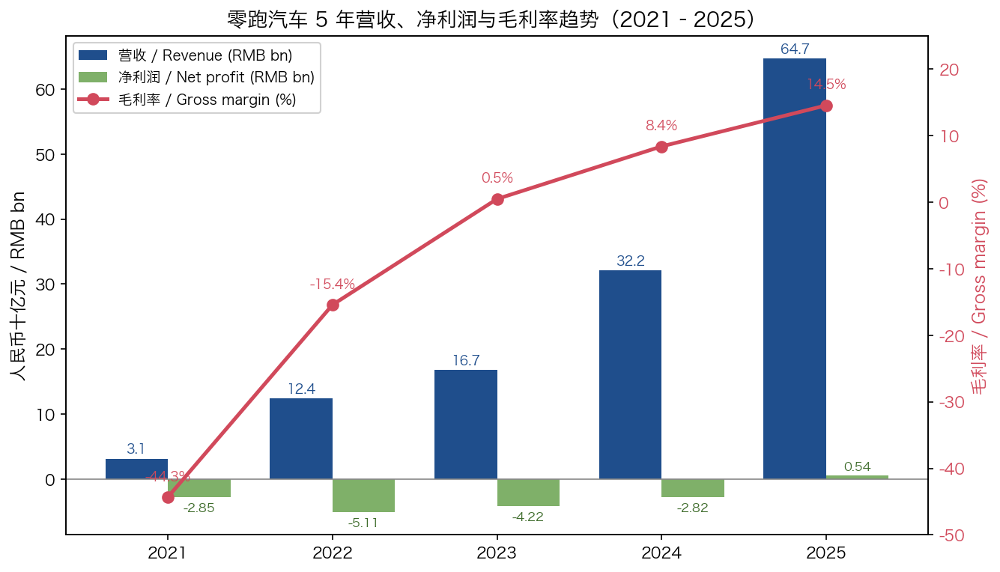
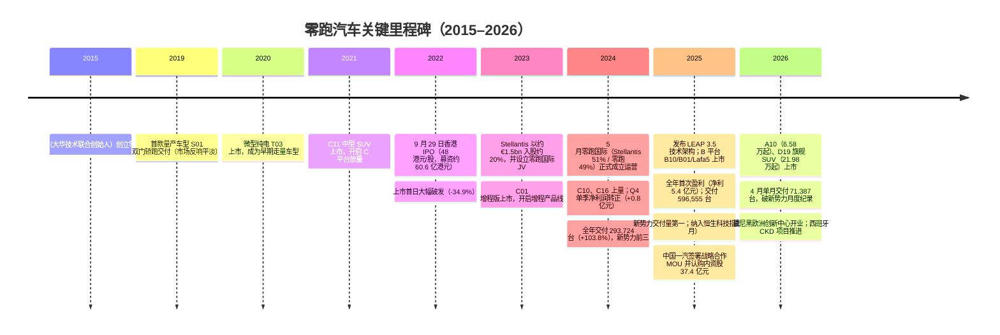
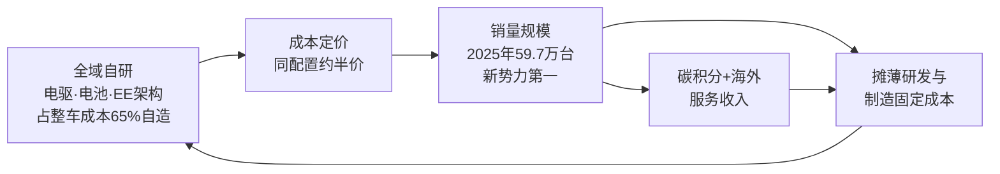
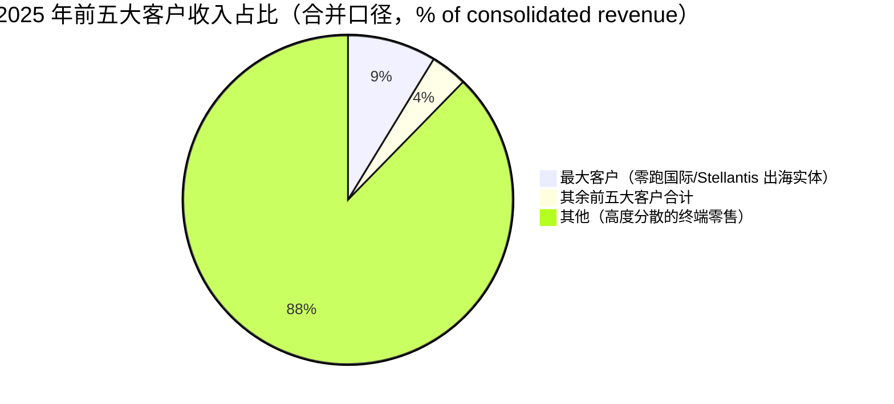
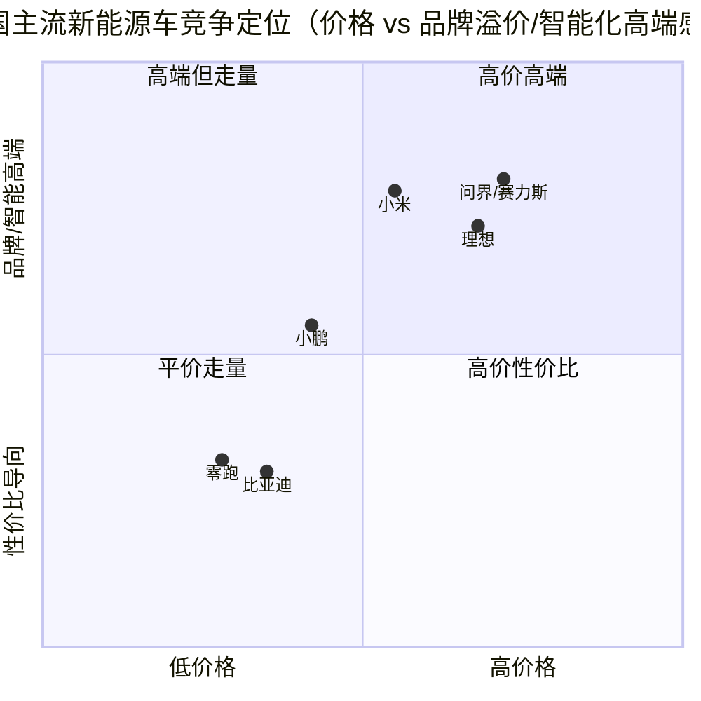
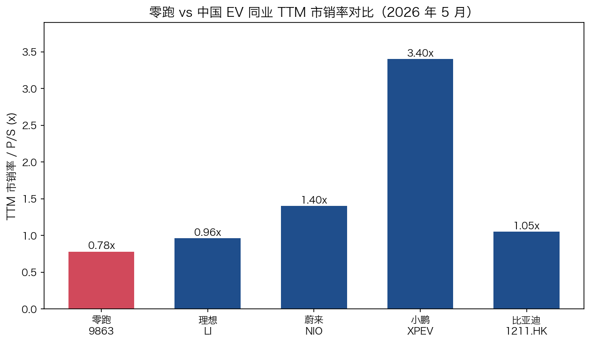
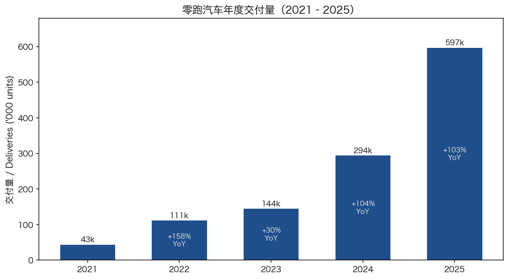

# 零跑汽车（HKEX: 9863 / 浙江零跑科技股份有限公司，Zhejiang Leapmotor Technology Co., Ltd.）——公司研究报告

**日期：** 2026-05-31
**主要上市地：** 香港联合交易所（H 股，股份代号 9863）
**IPO 时间：** 2022 年 9 月 29 日（以每股 H 股 48.00 港元定价，募资约 60.6 亿港元 / 约 7.7 亿美元）
**成立时间：** 2015 年（经营主体：浙江零跑科技股份有限公司，注册于中国浙江省杭州市滨江区）
**总部地址：** 中国浙江省杭州市滨江区物联网街 451 号 1 楼
**核数师：** 罗兵咸永道会计师事务所（PwC）
**报告货币：** 人民币（RMB）

> **更新——2025 年首次实现全年盈利（年报 2026-04-29 披露）+ Q1 2026 业绩（2026-05-15 披露）：** 零跑 **2025 全年实现盈利，归母净利润达人民币 5.4 亿元**（剔除股份支付的经调整净利润 10.8 亿元），成为继理想之后 **第二家实现全年盈利的中国造车新势力**；**全年收入人民币 647.3 亿元（同比 +101.3%）、毛利率 14.5%（同比 +6.1 个百分点）、全年交付 596,555 台（同比 +103.1%，连续两年销量翻倍），位居中国造车新势力品牌交付量第一**（[零跑 2025 年度報告, 第 4 頁](https://www1.hkexnews.hk/listedco/listconews/sehk/2026/0429/2026042905423_c.pdf)）。进入 2026 年，淡季扰动显著：**Q1 2026 收入人民币 108.2 亿元（同比 +8.0%、环比 -48.5%），毛利率回落至 9.4%（2025Q4 为 15.0%），归母净亏损人民币 3.9 亿元**，主因春节季节性、整车产品组合下探导致 ASP 下降，以及战略合作（Stellantis 相关）业务收入减少（[零跑 2026 年第一季度未經審核業績公告, 第 1 頁](https://static.cninfo.com.cn/finalpage/2026-05-15/1225310443.PDF)）。但 **2026 年 4 月单月交付 71,387 台，打破新势力品牌月度交付纪录、位居新势力第一（同比 +73.9%）**，其中 **海外交付占比快速抬升——Q1 出口 40,901 台（同比 +442%，占总销量 37.1%）**（[零跑 2026 年第一季度業績公告, 第 2 頁](https://static.cninfo.com.cn/finalpage/2026-05-15/1225310443.PDF)）。公司不建议派发 2025 年度末期股息。
> 资料来源：[零跑 2025 年度報告, 第 4 頁](https://www1.hkexnews.hk/listedco/listconews/sehk/2026/0429/2026042905423_c.pdf) · [零跑 2026 年第一季度未經審核業績公告](https://static.cninfo.com.cn/finalpage/2026-05-15/1225310443.PDF)。

---

## 目录

1. 公司概览
2. 公司历史
3. 管理团队
4. 产品与服务
5. 客户与市场开拓策略
6. 行业概览
7. 竞争格局
8. 市场机会（TAM）
9. 风险评估
10. 参考资料

---

## 1. 公司概览

零跑汽车（浙江零跑科技股份有限公司）是一家 **掌握新能源汽车核心技术全局自研能力的中国新能源汽车（NEV）公司**，业务范围涵盖智能电动汽车整车设计、研发制造、辅助驾驶、电机电控系统、电池系统开发，以及基于云计算的车联网解决方案。公司在年报中对自身的定位是一家"科技型企业"，其最鲜明的标签是 **核心技术全局自研、占整车成本 65% 的高附加值核心零部件自研自造**，并先后推出业界首个 **八合一电驱**、业界率先量产的 **CTC（cell-to-chassis，电池底盘一体化）技术**、以及业界首个 **「四域合一」中央集成式电子电气架构（centralized EE architecture）**（[零跑 2025 年度報告, 第 16 頁 主要業務](https://www1.hkexnews.hk/listedco/listconews/sehk/2026/0429/2026042905423_c.pdf)）。截至年报日，零跑产品线已形成覆盖轿车、SUV、MPV 的 **A、B、C、D 四大系列**完整矩阵，在售产品包括 A10、Lafa5、B01、B10、D19、C16、C10、C11、C01、T03，并提供 **纯电（BEV）+ 增程（EREV，range-extender）双动力选择**（[零跑 2025 年度報告, 第 16 頁](https://www1.hkexnews.hk/listedco/listconews/sehk/2026/0429/2026042905423_c.pdf)）。

**商业模式。** 营收以整车销售绝对主导。**2025 年总收入人民币 647.3 亿元（同比 +101.3%）**，其中 **电动汽车及部件销售 620.1 亿元（占比约 95.8%，同比 +96.0%）**、**服务及其他销售 27.2 亿元（占比约 4.2%，同比 +413.2%）**；服务收入的暴增主要由海外整车销量大幅增长带动的相关碳积分交易收入贡献（[零跑 2025 年度報告, 第 12 頁 收入分析](https://www1.hkexnews.hk/listedco/listconews/sehk/2026/0429/2026042905423_c.pdf)）。**2025 年毛利人民币 94.1 亿元、毛利率 14.5%**，较 2024 年的 8.4% 提升 6.1 个百分点，公司将其归因于（i）持续的成本管理、（ii）产品组合优化、（iii）其他业务收入；**2025 年第四季度毛利率达 15.0%，创单季新高**（[零跑 2025 年度報告, 第 12 頁 毛利及毛利率](https://www1.hkexnews.hk/listedco/listconews/sehk/2026/0429/2026042905423_c.pdf)）。

*资料来源：基于 [零跑 2025 年度報告, 第 5 頁 五年財務摘要](https://www1.hkexnews.hk/listedco/listconews/sehk/2026/0429/2026042905423_c.pdf) 整理（营收、毛利、净利润为人民币口径；毛利率为计算值，分母为各年收入）。*

**地理布局。** 业务以中国为根基（总部及主要营业地点均在浙江杭州），同时海外业务正以"轻资产反向出海"模式快速放量。**2025 年出口量 67,052 台，位列中国造车新势力品牌第一；截至 2026 年 2 月底累计出口超 10 万台**；2025 年零跑在欧洲 29 国市场的纯电销量位列中国乘用车品牌前三，第四季度位居中国乘用车品牌第二（[零跑 2025 年度報告, 第 9–10 頁 全球化](https://www1.hkexnews.hk/listedco/listconews/sehk/2026/0429/2026042905423_c.pdf)）。海外渠道并非自建，而是借助 **零跑国际（Leapmotor International B.V.）**——截至 2025 年底已在欧洲、中东、非洲、南美和亚太等约 40 个国际市场建立约 900 家兼具销售与售后功能的网点（欧洲超 800 家），Q1 2026 进一步扩至约 1,000 家（欧洲超 850 家）（[零跑 2026 年第一季度業績公告, 第 4 頁](https://static.cninfo.com.cn/finalpage/2026-05-15/1225310443.PDF)）。

**规模。** 截至 2025 年 12 月 31 日，零跑有 **28,785 名全职雇员，大部分位于浙江省**（[零跑 2025 年度報告, 第 31 頁 僱員及薪酬政策](https://www1.hkexnews.hk/listedco/listconews/sehk/2026/0429/2026042905423_c.pdf)）。国内销售服务网络截至 2025 年底覆盖 295 个城市，累计布局 950 家销售门店（含 407 家零跑中心和 543 家体验中心）及 526 家服务门店；Q1 2026 进一步增至 993 家销售门店和 542 家服务门店，并新增县级市场二级网络渠道累计备案 613 个（[零跑 2025 年度報告, 第 8 頁 渠道](https://www1.hkexnews.hk/listedco/listconews/sehk/2026/0429/2026042905423_c.pdf)；[零跑 2026 年第一季度業績公告, 第 3 頁](https://static.cninfo.com.cn/finalpage/2026-05-15/1225310443.PDF)）。**截至 2025 年 12 月 31 日，在手资金（现金及现金等价物、受限制现金、以公允价值计入损益的金融资产及银行定期存款）人民币 378.8 亿元；2025 年经营活动现金净额 126.2 亿元、自由现金流 78.2 亿元**——这是一家已经能自我造血的新势力（[零跑 2025 年度報告, 第 13 頁 流動資金](https://www1.hkexnews.hk/listedco/listconews/sehk/2026/0429/2026042905423_c.pdf)）。2025 年 12 月 8 日，零跑被纳入恒生科技指数成份股（[零跑 2025 年度報告, 第 8 頁 資本及戰略合作](https://www1.hkexnews.hk/listedco/listconews/sehk/2026/0429/2026042905423_c.pdf)）。

**估值快照（截至 2026-05-29 收盘）。**

| 指标 | 零跑汽车（9863.HK） | 参考 / 区间 |
|---|---|---|
| 股价 | **39.30 港元**（当日 -3.20%） | 52 周内 ~过去一年 -30.5% |
| 市值 | **约 558.8 亿港元** | 5 月中旬一度报 ~680 亿港元 |
| TTM 市销率（P/S） | **约 0.78 倍**（TTM 收入约 647 亿元人民币，约合 700+ 亿港元） | 较 5 月中旬高位压缩 |
| TTM 市盈率（P/E） | **约 92.9 倍**（FY2025 净利仅 5.4 亿元，刚转正、基数极低） | 前瞻 P/E ~89.6 倍 |
| 市净率（P/B） | **约 3.56 倍**（截至 2025-12-31 权益总额人民币 141.2 亿元） | — |

*资料来源：[stockanalysis.com — 9863 statistics, 2026-05-29](https://stockanalysis.com/quote/hkg/9863/statistics/)、[stockanalysis.com — 9863 quote, 2026-05-29](https://stockanalysis.com/quote/hkg/9863/)、[零跑 2025 年度報告, 第 5 頁 五年財務摘要](https://www1.hkexnews.hk/listedco/listconews/sehk/2026/0429/2026042905423_c.pdf)。*

**对估值的解读。** 零跑的 P/E 表面高达约 93 倍，但这是 **"盈利刚刚转正、利润基数极低"** 导致的机械性结果，而非市场为其支付了泡沫化的盈利倍数——FY2025 净利润仅 5.4 亿元、经调整净利润 10.8 亿元，相对 647 亿元的收入体量，单车净利极薄（粗略折算单车归母净利约 RMB 905 元 = 5.38 亿元 ÷ 596,555 台，两个分子分母均出自 [零跑 2025 年度報告, 第 4–5 頁](https://www1.hkexnews.hk/listedco/listconews/sehk/2026/0429/2026042905423_c.pdf)）。因此对零跑而言，**市销率（P/S）远比市盈率更具参考意义**：约 0.78 倍的 TTM 市销率在中国 EV 同业中处于偏低水平，反映市场尚未给予其"高利润率"溢价，而是按"高增长、低单车盈利、规模化兑现中"的逻辑定价（[stockanalysis.com — 9863, 2026-05-29](https://stockanalysis.com/quote/hkg/9863/statistics/)）。同业对比（TTM 市销率，2026 年 5 月）：**理想（LI）约 0.96 倍**（市值约 153 亿美元 ÷ TTM 收入约 158.6 亿美元）、**蔚来（NIO）约 1.40 倍**、**小鹏（XPEV）约 3.40 倍**、**比亚迪 H 股（1211.HK）约 1.05 倍**（[stockanalysis.com — LI, 2026-05-29](https://stockanalysis.com/stocks/li/)；[stockanalysis.com — XPEV statistics](https://stockanalysis.com/stocks/xpev/statistics/)；[stockanalysis.com — BYD 1211.HK statistics](https://stockanalysis.com/quote/hkg/1211/statistics/)）。值得注意的是 Simply Wall St 同口径将零跑前瞻 P/E（约 89.6 倍）与传统燃油车同业（长城 8.5 倍、吉利 11.4 倍、奇瑞 7.4 倍）对比，得出"显著溢价"的结论；但这种对比把零跑放进了错误的参照系——零跑的可比公司是高增长新势力而非传统车企（[Simply Wall St — 9863 valuation](https://simplywall.st/stocks/hk/automobiles/hkg-9863/zhejiang-leapmotor-technology-shares/valuation)）。我们将零跑的估值定性为 **"按销量增长定价、利润弹性尚未释放"**——其多倍数风险不在于"杀估值"（P/S 已偏低），而在于 **单车盈利能否在价格战中维持**，相关讨论延伸至第 9 节。

---

## 2. 公司历史

**创立故事。** 零跑汽车由 **朱江明（Zhu Jiangming）** 于 **2015 年** 在浙江杭州创立。朱江明的核心履历是理解零跑投资逻辑的关键：他于 **1993 年联合创建大华技术（Dahua Technology，SZSE: 002236）**——全球领先的视频监控/安防设备企业——并长期负责产品研发、生产及供应链管理（[零跑 2025 年度報告, 第 56 頁 董事履歷](https://www1.hkexnews.hk/listedco/listconews/sehk/2026/0429/2026042905423_c.pdf)）。零跑因此是一家 **"安防系" 创业公司**：朱江明把在大华积累的电子硬件、嵌入式系统、芯片级研发与垂直制造能力直接移植到造车上，这正是零跑"全域自研、自造核心零部件"路线的历史根源——它与互联网出身的蔚小理、家电/电池出身的比亚迪、以及手机出身的小米形成鲜明的"DNA"差异。

*资料来源：[零跑 2025 年度報告, 第 16 頁 主要業務](https://www1.hkexnews.hk/listedco/listconews/sehk/2026/0429/2026042905423_c.pdf)；[CnEVPost: Leapmotor prices HK IPO at HK$48, raises $770M, 2022-09-28](https://cnevpost.com/2022/09/28/leapmotor-prices-hong-kong-ipo-at-low-end-raises-770-million/)；[Stellantis press release: €1.5bn strategic investment, 2023-10-26](https://www.stellantis.com/en/news/press-releases/2023/october/stellantis-to-become-a-strategic-shareholder-of-leapmotor-with-1-5-billion-investment-and-bolster-leapmotor-s-global-electric-vehicle-business)；[零跑 2024 年度報告, 第 3 頁 主要摘要](https://www.hkexnews.hk/listedco/listconews/sehk/2025/0429/2025042904103_c.pdf)。*

**关键转向。** 对当前投资论点而言，有三次至关重要：

1. **从"叫好不叫座"到 C 平台走量（2019→2021）。** 零跑首款量产车 S01（双门轿跑）于 2019 年交付，市场反响平淡；随后 T03 微型纯电与 **C11 中型 SUV（2021 年上市）** 成为转折点。C11 凭借"半价理想"式的越级配置与性价比迅速放量，**截至 2025 年底 C11 累计销量超 30 万台，稳居中型 SUV 市场标杆地位**（[零跑 2025 年度報告, 第 4 頁 銷量](https://www1.hkexnews.hk/listedco/listconews/sehk/2026/0429/2026042905423_c.pdf)）。C 平台奠定了零跑"以中型/中大型 SUV 走量 + 极致性价比"的基本盘。

2. **Stellantis 入股与零跑国际（2023→2024）。** 2023 年 10 月 26 日，**Stellantis 宣布以约 €1.5bn（15 亿欧元）入股零跑约 20%**，并与零跑成立 **零跑国际（Leapmotor International）合资公司——Stellantis 持股 51%、零跑持股 49%**，该 JV 拥有 **在大中华区以外独家出口、销售及制造零跑产品的权利**，Stellantis 获得零跑两个董事会席位并任命零跑国际 CEO（[Stellantis press release, 2023-10-26](https://www.stellantis.com/en/news/press-releases/2023/october/stellantis-to-become-a-strategic-shareholder-of-leapmotor-with-1-5-billion-investment-and-bolster-leapmotor-s-global-electric-vehicle-business)；[Green Car Congress: Stellantis to invest €1.5B in Leapmotor for 20%, 2023-10-26](https://www.greencarcongress.com/2023/10/20231026-leapmotor.html)）。这是史上首例"领先跨国车企 + 中国纯电 OEM"的全球 EV 合作。消息公布后零跑 H 股一度下跌近 30%，市场担忧摊薄与控制权；公司随后出面安抚投资者（[CnEVPost: Leapmotor tries to calm investors as shares fall ~30%, 2023-11-01](https://cnevpost.com/2023/11/01/leapmotor-tries-to-calm-investors-shares-fall-stellantis-deal/)）。事后看，这一交易成为零跑"轻资产反向出海"的核心引擎——**零跑国际在成立后的第二年（2025 年）即实现年度盈利，为零跑带来稳健的投资回报**（[零跑 2025 年度報告, 第 10 頁 全球化](https://www1.hkexnews.hk/listedco/listconews/sehk/2026/0429/2026042905423_c.pdf)）。

3. **盈利拐点与产品矩阵补全（2024→2025）。** 2024 年第四季度零跑单季净利润首次转正（+0.8 亿元），成为新势力中第二家盈利的企业；**2025 年随 B 平台（B10/B01/Lafa5）落地与 C 平台改款，实现全年盈利（净利 5.4 亿元）并坐稳新势力交付量第一**（[零跑 2024 年度報告, 第 3 頁](https://www.hkexnews.hk/listedco/listconews/sehk/2025/0429/2025042904103_c.pdf)；[零跑 2025 年度報告, 第 4 頁](https://www1.hkexnews.hk/listedco/listconews/sehk/2026/0429/2026042905423_c.pdf)）。

**近期进展（过去 12 个月）。** 2025 年 3 月发布 **LEAP 3.5 技术架构**（高通 8650 辅助驾驶芯片 + 8295 智能座舱芯片组合）；4 月 B10 上市、7 月 B01 上市、11 月 Lafa5 上市；10 月发布 D 平台六大技术并全球首秀 D19；12 月 D99 MPV 首秀、纳入恒生科技指数。资本与战略层面动作密集：**2025 年 8 月完成内资股增发募资人民币 26 亿元；2025 年 12 月 28 日与中国一汽（一汽股权）订立内资股认购协议，一汽将投资人民币 37.4 亿元；2026 年 1 月 6 日与金义高新订立认购协议，投资人民币 30 亿元**（[零跑 2025 年度報告, 第 8、10 頁](https://www1.hkexnews.hk/listedco/listconews/sehk/2026/0429/2026042905423_c.pdf)）。进入 2026 年：3 月 26 日 A10 上市（6.58 万起）、4 月 16 日旗舰 D19 上市（21.98 万起）、3 月 20 日慕尼黑欧洲创新中心开业（零跑首个海外创新中心）（[零跑 2025 年度報告, 第 11 頁 報告期後近期發展](https://www1.hkexnews.hk/listedco/listconews/sehk/2026/0429/2026042905423_c.pdf)）。

---

## 3. 管理团队

### 朱江明（Zhu Jiangming）——创始人、董事长、执行董事兼首席执行官（59 岁）

朱江明是零跑的创始人原型 CEO，其"硬件 + 制造"履历是公司投资论点的核心。他于 **2015 年创立零跑**，全面负责集团的整体业务战略和运营；零跑在年报中称其为"一位世界级工程师及富有远见的企业家，于电子及人工智能技术领域拥有近 30 年经验"（[零跑 2025 年度報告, 第 56 頁 董事履歷](https://www1.hkexnews.hk/listedco/listconews/sehk/2026/0429/2026042905423_c.pdf)）。

创办零跑之前，朱江明于 **1993 年联合创建大华技术（Dahua Technology）**，主要负责产品研发、生产及供应链的管理工作——大华是全球第二大视频监控设备企业、深交所上市公司（股份代号 002236）。2008 至 2010 年间他曾加入并任职于摩托罗拉杭州公司；2010 年回到大华技术继续担任董事直至 **2021 年 12 月**（[零跑 2025 年度報告, 第 56 頁](https://www1.hkexnews.hk/listedco/listconews/sehk/2026/0429/2026042905423_c.pdf)）。在技术上，朱江明曾带领团队发明 **HDCVI 视频传输专利技术，该技术于 2014 年成为国际标准**，在国际视频传输领域获得广泛应用——这段经历解释了零跑"自研芯片级/电子电气架构"的底气来自一家真正做过国际标准级硬件的团队。他于 2011 年及 2015 年分别获浙江省科学技术奖二等奖及科学技术进步奖一等奖，2026 年 1 月获"浙江省优秀企业家"荣誉；**1990 年 7 月获浙江大学电子工程专业学士学位**（[零跑 2025 年度報告, 第 56 頁](https://www1.hkexnews.hk/listedco/listconews/sehk/2026/0429/2026042905423_c.pdf)）。

朱江明同时是零跑产品理念"科技普惠"的直接代言人。在 2026 年 4 月 D19 上市发布会上，他公开提出零跑"以成本定价冲击高端新能源市场"的策略，并阐述对中国车市格局的判断（[证券时报：零跑 D19 以 21.98 万起售上市，朱江明谈中国车市走向, 2026-04-16](https://stcn.com/article/detail/3756375.html)）。从治理角度看，朱江明既是创始人又是董事长兼 CEO，是零跑战略意志、技术路线（全域自研）与资本配置的单一决策中枢——这是零跑能在 2024–2025 行业最惨烈的价格战中坚持"低毛利换销量、规模化摊薄研发"路线而不被短期财报压力打断的组织前提，但同时也意味着 **愿景、资本配置和接班存在单点依赖**（见第 9 节关键人物风险）。年报披露的高管团队亦带有浓厚的"大华系"色彩，如执行董事兼高级副总裁曹力（41 岁，负责整车研发及制造）此前即在大华技术担任高级工业工程师，曾获红点（Red Dot）与 iF 产品设计大奖（[零跑 2025 年度報告, 第 56 頁](https://www1.hkexnews.hk/listedco/listconews/sehk/2026/0429/2026042905423_c.pdf)）。

---

## 4. 产品与服务

零跑的产品体系是理解其商业逻辑的核心，而零跑的产品逻辑又被一句话统摄：**"全域自研"驱动的极致性价比**。本节先呈现零跑自己的产品矩阵口径，再逐系列拆解，最后回到把这些产品串成一个"成本定价"飞轮的合成逻辑。

### 4.1 零跑的产品矩阵（年报口径）

零跑在 2025 年报中以 **A、B、C、D 四大平台** 组织其全部在售车型，并强调"提供纯电 + 增程双动力选择，满足不同消费者的多元化需求"（[零跑 2025 年度報告, 第 16 頁 主要業務](https://www1.hkexnews.hk/listedco/listconews/sehk/2026/0429/2026042905423_c.pdf)）。下表按平台 / 车型 / 品类 / 动力形式 / 价格带重构其在售矩阵（价格为各车型上市指导价，逐条引用一手来源）：

| 平台 | 车型 | 品类 | 动力 | 指导价（万元） | 说明 |
|---|---|---|---|---|---|
| **T 平台** | T03 | 微型车 | 纯电 BEV | 5.99–6.99 | 310/403 km CLTC；早期走量车型 |
| **A 平台** | A10 | 紧凑 SUV（全球车） | 纯电 BEV | 6.58–8.68 | 首次把激光雷达 + 车位到车位带入 10 万以内 |
| **B 平台** | B10 | 紧凑/中型 SUV | 纯电 BEV | 10.98–13.98（预售） | LEAP 3.5 架构首发，"12 万级 SUV 价值新标杆" |
| **B 平台** | B01 | A 级轿车 | 纯电 BEV | — | "年轻人的高品质智能轿车" |
| **B 平台** | Lafa5 | 运动轿跑 | 纯电 BEV | — | 年轻潮流系列；Ultra 版定位"15 万内最强" |
| **C 平台** | C10 | 中型 SUV | 纯电 + 增程 | 12.28–14.28 | 全球旗舰；上市 18 个月累计超 20 万台 |
| **C 平台** | C11 | 中型 SUV | 纯电 + 增程 | — | 走量基本盘；累计销量超 30 万台 |
| **C 平台** | C01 | 中大型轿车 | 纯电 + 增程 | — | C 平台轿车；增程产品线起点之一 |
| **C 平台** | C16 | 中大型 SUV（6 座） | 增程为主 | 15.18–18.18 | 6 座家庭车；累计超 10 万台 |
| **D 平台** | D19 | 全尺寸旗舰 SUV | 纯电 + 增程 | 21.98–26.98 | 旗舰；LEAP 4.0 架构首发 |
| **D 平台** | D99 | 旗舰 MPV | 纯电 + 增程 | — | 计划 2026 年 6 月预售、7 月上市 |

*资料来源：[零跑 2025 年度報告, 第 6–8、16 頁](https://www1.hkexnews.hk/listedco/listconews/sehk/2026/0429/2026042905423_c.pdf)；价格逐车型：[新华网：6.58 万元起 零跑 A10 正式上市, 2026-03-31](http://www.news.cn/auto/20260331/8d1e1919f8ca4eb6be1b0cf4421e8ad5/c.html)；[搜狐汽车：售价 5.99–6.99 万元 零跑新 T03 正式上市](https://www.sohu.com/a/861885548_430526)；[中国汽车趋势网：2026 款零跑 C10 上市 12.28 万–14.28 万](http://www.chinaautotrends.com/xincheMes.aspx?id=15590)；[证券时报：零跑 D19 以 21.98 万起售上市, 2026-04-16](https://stcn.com/article/detail/3756375.html)。*

### 4.2 合成逻辑——"全域自研 → 成本定价 → 销量飞轮"

零跑产品体系的核心不是某一款车，而是一套 **"全域自研 → 成本定价 → 销量规模 → 摊薄研发与制造固定成本 → 再投入自研"** 的飞轮。零跑在年报中明确：**"始终坚持核心技术全局自研，占整车成本 65% 的高附加值核心零部件自研自造"**（[零跑 2025 年度報告, 第 16 頁](https://www1.hkexnews.hk/listedco/listconews/sehk/2026/0429/2026042905423_c.pdf)）。这意味着电驱（电机/电控/减速器）、电池包（CTC 一体化）、电子电气架构（四域合一中央域控）这些占成本大头、传统上要向博世/大陆/宁德等 Tier-1 采购的核心总成，零跑都自己设计自己造——把供应商的利润留在了表内，从而能在同配置下把整车价格压到对手的"约半价"。其结果直接体现在第 4.1 表的价格带上：C10 把"中型增程 SUV"打到 12.28 万起，A10 把"激光雷达 + 端到端辅助驾驶"打到 6.58 万起，这是没有全域自研成本结构的对手难以复制的。下面这张合成图展示了这个飞轮如何把各产品串起来：

*资料来源：[零跑 2025 年度報告, 第 12、16 頁](https://www1.hkexnews.hk/listedco/listconews/sehk/2026/0429/2026042905423_c.pdf)。*

### 4.3 C 平台——零跑的销量基本盘（中型 / 中大型 SUV，纯电 + 增程）

C 平台是零跑当前营收与利润的绝对支柱。零跑对 C 平台车型的官方表述强调"标杆地位"与累计销量：

> "截止 2025 年 12 月 31 日，C11 累计销量超 30 万台，稳居中型 SUV 市场标杆地位；C10 上市 18 个月累计销量突破 20 万台，单月销量突破 2 万台；C16 累计销量已突破 10 万台，并在 20 万以内中大型 SUV 市场中，消费者净推荐值排名第一。"（[零跑 2025 年度報告, 第 4 頁 銷量](https://www1.hkexnews.hk/listedco/listconews/sehk/2026/0429/2026042905423_c.pdf)）

**中文释义 / Plain-language gloss：** C 平台覆盖三种家庭用车需求——C11/C10 是 12–15 万元的中型 SUV（"半价理想 L 系列"式的空间/配置体验），C01 是同价位轿车，C16 是 15–18 万元的 6 座中大型增程 SUV（直接对标更贵的理想 L8 / 问界 M8 的"奶爸车"场景）。三者的差异在于车身形态与座位数，但共享同一套电驱/电池/电子架构，因此能在不同价格点上用同一套自研成本结构打性价比。**2025 年 C 系列纯电车型全系搭载 800V 高压平台**（充电更快、能耗更优），是零跑把"高端配置下放"的典型动作（[零跑 2025 年度報告, 第 7 頁 研發](https://www1.hkexnews.hk/listedco/listconews/sehk/2026/0429/2026042905423_c.pdf)）。截至 Q1 2026，**C 平台车型累计交付突破 80 万台**（[零跑 2026 年第一季度業績公告, 第 2 頁](https://static.cninfo.com.cn/finalpage/2026-05-15/1225310443.PDF)）。

*分析师观点：* C 平台是零跑相对蔚小理最具竞争优势的产品线（competitive advantage: yes；moat type: 全域自研成本领先 + 增程/纯电双动力覆盖）。其最直接的竞品是 **理想 L 系列（增程）、问界 M 系列（增程）以及比亚迪唐/宋 PLUS**——零跑的差异化是"同样的家庭 SUV 体验，价格低一档"。

### 4.4 B 平台——2025 全球化平价新品（LEAP 3.5 架构，纯电）

B 平台是零跑 2025 年最重要的增量引擎，承担"把智能科技从豪车专属变成人手必备"的使命。零跑对 B10 的官方表述：

> "零跑 B10 于 2025 年 4 月 10 日上市，基于零跑全新 LEAP 3.5 架构打造，搭载领先的激光雷达、高通 8650 辅助驾驶芯片和高通 8295 智能座舱芯片、端到端辅助驾驶大模型、全新 Leapmotor OS 4.0 plus 系统、爆胎稳定控制等高级豪华配置，树立了 12 万级 SUV 价值新标杆。"（[零跑 2025 年度報告, 第 6 頁 產品](https://www1.hkexnews.hk/listedco/listconews/sehk/2026/0429/2026042905423_c.pdf)）

**中文释义 / Plain-language gloss：** B 平台由 B10（紧凑/中型 SUV）、B01（A 级轿车）、Lafa5（运动轿跑）三款构成，价格带集中在 10–15 万元，是零跑下探主流走量市场、并作为全球车（global car）出海的核心载体——B 系列具备"全球化设计标准、全球化品质标准和全球化制造工艺"（[零跑 2025 年度報告, 第 6 頁](https://www1.hkexnews.hk/listedco/listconews/sehk/2026/0429/2026042905423_c.pdf)）。它与 C 平台的区别在于：C 平台主打"中型/中大型空间 + 家庭场景"，B 平台主打"更低价格 + 年轻用户 + 全球市场"。**B01 自上市次月起连续 4 个月销量破万；Lafa5 上市 3 个月累计销量破 2 万台，稳居 9–13 万级纯电潮流两厢轿跑细分市场销量冠军；B10 上市 11 个月累计销量破 10 万台**（[零跑 2025 年度報告, 第 4、6 頁](https://www1.hkexnews.hk/listedco/listconews/sehk/2026/0429/2026042905423_c.pdf)；[零跑 2026 年第一季度業績公告, 第 3 頁](https://static.cninfo.com.cn/finalpage/2026-05-15/1225310443.PDF)）。截至 2026 年 2 月底 **B 平台累计销量近 20 万台，位列 10 万级主流新能源销量第一梯队**（[零跑 2025 年度報告, 第 4 頁](https://www1.hkexnews.hk/listedco/listconews/sehk/2026/0429/2026042905423_c.pdf)）。

*分析师观点：* B 平台是零跑全球化战略的产品基石（competitive advantage: yes；moat type: 全球化平价 + 自研成本）。**西班牙 CKD（completely knocked-down，散件本地组装）项目已立项，计划导入 B10 和 B05，B10 已启动 OTS 本地造车、预计 2026 年 10 月正式投产**——这是零跑借 Stellantis 渠道把 B 平台做成"本地组装规避关税"的关键布局（[零跑 2025 年度報告, 第 10 頁 全球化](https://www1.hkexnews.hk/listedco/listconews/sehk/2026/0429/2026042905423_c.pdf)）。

### 4.5 D 平台——向上突破的旗舰（全尺寸 SUV / MPV，纯电 + 增程）

D 平台是零跑"科技普惠理念的最高表达"，目标是用"百万级技术、20–30 万级价格"重塑高端市场价值标杆。零跑对 D 平台六大技术的官方表述非常具体：

> "(1) 旗舰增程，增程版搭载 80.3 度大电池实现 500km 纯电续航……(2) 旗舰千伏纯电，首发 115kWh 超级混合电芯、全栈 1000V 三电系统……(3) 旗舰智能，首发双 8797 芯片，提供 1280TOPS 算力，实现 VLA 辅助驾驶与端侧大模型座舱；(4) 旗舰驾控，搭载 LMC2.0 底盘系统……(6) 旗舰舒适……行业首次将车规级制氧机融入汽车，打造「森野氧舱」。"（[零跑 2025 年度報告, 第 7 頁 研發](https://www1.hkexnews.hk/listedco/listconews/sehk/2026/0429/2026042905423_c.pdf)）

**中文释义 / Plain-language gloss：** D 平台由 D19（全尺寸旗舰 SUV，21.98–26.98 万元）与 D99（旗舰 MPV，计划 2026 年 7 月上市）组成，是零跑首次进入 30 万级价格带。技术上 D 平台是零跑自研深度的集大成者：双高通 8797 芯片（1280 TOPS 算力）+ VLA（Vision-Language-Action，视觉-语言-动作）辅助驾驶大模型 + LEAP 4.0 中央域控架构（"一个大脑管控全车智能"），其增程版搭载 80.3kWh 全球最大增程电池（CLTC 纯电续航突破 500km），纯电版配 115kWh 宁德时代超混电芯（CLTC 续航 720km，支持全栈 1000V 高压平台）（[零跑 2026 年第一季度業績公告, 第 2 頁](https://static.cninfo.com.cn/finalpage/2026-05-15/1225310443.PDF)）。**D19 上市 15 天大定即突破 15,000 辆**（[零跑 2026 年第一季度業績公告, 第 2 頁](https://static.cninfo.com.cn/finalpage/2026-05-15/1225310443.PDF)）。

*分析师观点：* D 平台是零跑利润率向上修复的关键期权（competitive advantage: partial；moat type: 自研技术下放 + 成本定价）。其直接竞品是 **理想 L9/MEGA、问界 M9、蔚来 ES9** 等 30 万级旗舰；零跑能否用"成本定价"在高端市场复制 C 平台的成功，是 2026–2027 单车 ASP 与毛利率能否回升的核心变量（见第 1 节估值解读与第 9 节）。

### 4.6 A 平台与 T03——价格地板（微型 / 入门 SUV，纯电）

A 平台首款 A10 与微型车 T03 共同构成零跑的"价格地板"。零跑对 A10 的官方表述：

> "零跑 A 系列首款车型 A10 于 2026 年 3 月 26 日上市，作为一款定位「智能精品长续航 SUV」的全球车型……集超 500km CLTC 超长续航、8650 辅助驾驶芯片与 8295 智能座舱芯片、车位到车位全场景智能辅助、油冷电驱、88.1% 空间得房率等越享配置。"（[零跑 2025 年度報告, 第 7 頁 產品](https://www1.hkexnews.hk/listedco/listconews/sehk/2026/0429/2026042905423_c.pdf)）

**中文释义 / Plain-language gloss：** A10 最具杀伤力的一点是 **首次把激光雷达（lidar）与车位到车位（door-to-door）领航辅助带入 10 万元以内**（6.58 万起），把高阶智驾的价格门槛拉到行业地板（[零跑 2026 年第一季度業績公告, 第 2 頁](https://static.cninfo.com.cn/finalpage/2026-05-15/1225310443.PDF)）。**A10 上市 48 小时订单破万（刷新全系车型订单破万最短用时纪录），首月大定突破 4 万台**（[零跑 2026 年第一季度業績公告, 第 2 頁](https://static.cninfo.com.cn/finalpage/2026-05-15/1225310443.PDF)）。T03（微型车，5.99–6.99 万元，CLTC 310/403km）则是零跑早期的走量功臣与"性价比之王"标签的起点（[搜狐汽车：零跑新 T03 上市 5.99–6.99 万元](https://www.sohu.com/a/861885548_430526)）。

*分析师观点：* A/T 平台是零跑的"获客入口"而非利润来源（competitive advantage: yes on cost；moat: 自研成本）。低价车摊薄品牌获客成本、做大销量基数以摊薄研发，但单车利润极薄甚至可能不赚钱——这是零跑整体单车净利仅约 RMB 900 元的结构性原因之一（见第 9 节单车盈利风险）。

### 4.7 自研技术栈与软件 / 服务

零跑产品差异化的底座是其自研技术栈，这本身构成一项"准产品"。**LEAP 3.5 技术架构（2025-03-10 发布）** 实现"全球集成度最高的中央域控"（智驾、智舱、电驱、电池、热管理、底盘统一升级）；**LEAP 4.0 中央域控架构（首发于 D19）** 进一步实现"舱驾一体超级协同 + 算力动态分配"（[零跑 2025 年度報告, 第 7 頁](https://www1.hkexnews.hk/listedco/listconews/sehk/2026/0429/2026042905423_c.pdf)；[零跑 2026 年第一季度業績公告, 第 3 頁](https://static.cninfo.com.cn/finalpage/2026-05-15/1225310443.PDF)）。在三电领域，**CTC 电池底盘一体化技术提前一年通过 2025 版动力电池新国标，并获 SGS 的 CTF/QTL 见证实验室资质以及 ASIL-D（汽车功能安全最高等级）认证**（[零跑 2025 年度報告, 第 8 頁 電池業務](https://www1.hkexnews.hk/listedco/listconews/sehk/2026/0429/2026042905423_c.pdf)）。电驱业务也在 2025 年实现战略突破——压缩机与电源产品成功量产，自研扭矩矢量控制技术扭矩控制响应速度达 0.5ms 级（[零跑 2025 年度報告, 第 8 頁 電驅業務](https://www1.hkexnews.hk/listedco/listconews/sehk/2026/0429/2026042905423_c.pdf)）。

辅助驾驶（智驾 / ADAS）方面，**城市通勤领航辅助（CNAP）于 2025 年 6 月上线并逐步覆盖 B/C 平台；2026 年 2 月城市领航辅助首次推送 B/C 平台；2026 年第二季度将推出覆盖全国的城市领航辅助功能**，公司目标是 2026 年底前完成"智驾基座模型"研发达到行业领先水平（[零跑 2025 年度報告, 第 9 頁](https://www1.hkexnews.hk/listedco/listconews/sehk/2026/0429/2026042905423_c.pdf)）。服务体系上，零跑践行"三快两省"（响应快、修车快、供件快、省时、省心）理念，**2025 年服务 NPS 达 47（环比 +74%），Q1 2026 服务 NPS 进一步升至 59.8**（[零跑 2025 年度報告, 第 9 頁 服務](https://www1.hkexnews.hk/listedco/listconews/sehk/2026/0429/2026042905423_c.pdf)；[零跑 2026 年第一季度業績公告, 第 4 頁](https://static.cninfo.com.cn/finalpage/2026-05-15/1225310443.PDF)）。

---

## 5. 客户与市场开拓策略

**客户画像。** 零跑的目标客户是 **10–20 万元价格带的家庭用户与性价比导向买家**——这是中国新能源乘用车体量最大、竞争也最激烈的"主流市场"。零跑的产品定价哲学（A10 6.58 万、B10 12 万级、C10 12.28 万、C16 15.18 万）直接锚定这一人群，并以"半价理想/同配置低价"的越级配置打动对价格敏感但又要求空间、续航、智驾的家庭买家（[零跑 2025 年度報告, 第 6–8 頁](https://www1.hkexnews.hk/listedco/listconews/sehk/2026/0429/2026042905423_c.pdf)）。**2025 年零跑在中国新能源乘用车市场的市占率由 2.5% 提升至 3.9%，在新势力品牌中排名跃升至首位；Q1 2026 市占率进一步升至 4.22%**（[零跑 2025 年度報告, 第 9 頁 零售](https://www1.hkexnews.hk/listedco/listconews/sehk/2026/0429/2026042905423_c.pdf)；[零跑 2026 年第一季度業績公告, 第 4 頁](https://static.cninfo.com.cn/finalpage/2026-05-15/1225310443.PDF)）。

**客户集中度（年报口径）。** 作为 to-C 整车厂，零跑的终端客户极度分散，但年报披露的"前五大客户"集中度反而不低，因为它把 **零跑国际（Leapmotor International）与 Stellantis Auto SAS 等出海实体计为客户**。**2025 年来自前五大客户的收入约占总收入 12.3%，来自最大客户的收入约占总收入 8.7%**（均为合并口径 / % of consolidated revenue）；年报明确指出 **零跑国际（Stellantis 持股 51%）及 Stellantis Auto SAS 为报告期内前五大客户**（[零跑 2025 年度報告, 第 19 頁 主要客戶及供應商](https://www1.hkexnews.hk/listedco/listconews/sehk/2026/0429/2026042905423_c.pdf)）。供应商端，**2025 年前五大供应商采购额约占采购总额 20.1%，最大供应商约占 5.4%**（[零跑 2025 年度報告, 第 19 頁](https://www1.hkexnews.hk/listedco/listconews/sehk/2026/0429/2026042905423_c.pdf)）。

> 注：8.7% 的"最大客户"是零跑国际/Stellantis 出海实体（批发口径），而非任何单一终端消费者。这意味着 **零跑对单一终端客户无集中度风险，但对 Stellantis 这一海外分销通道存在依赖**（见第 9 节）。

*资料来源：[零跑 2025 年度報告, 第 19 頁 主要客戶及供應商](https://www1.hkexnews.hk/listedco/listconews/sehk/2026/0429/2026042905423_c.pdf)。*

**渠道——直营 + 经销/加盟混合（准直营）。** 零跑采用"零跑中心（自营/旗舰）+ 体验中心（加盟）+ 服务门店"的混合渠道，并向"准直营管理"演进。**截至 2025 年底，国内累计 950 家销售门店（407 家零跑中心 + 543 家体验中心）+ 526 家服务门店，覆盖 295 个城市**；Q1 2026 增至 993 家销售门店（433 家零跑中心 + 560 家体验中心）+ 542 家服务门店，覆盖 297 个城市，并新增县级二级网络累计备案 613 个以下沉渠道（[零跑 2025 年度報告, 第 8 頁 渠道](https://www1.hkexnews.hk/listedco/listconews/sehk/2026/0429/2026042905423_c.pdf)；[零跑 2026 年第一季度業績公告, 第 3 頁](https://static.cninfo.com.cn/finalpage/2026-05-15/1225310443.PDF)）。零跑还推出"金银种子投资人计划"鼓励优质投资人增投、引入地方强商，2025 年增投门店共 205 家，**单店店效较 2024 年提升 85.1%**——渠道质量与效率的提升是零跑销售费用率得以控制的重要原因（[零跑 2025 年度報告, 第 8 頁](https://www1.hkexnews.hk/listedco/listconews/sehk/2026/0429/2026042905423_c.pdf)）。

**海外 GTM——Stellantis 是核心、独一无二的"轻资产反向出海"资产。** 这是零跑与蔚小理最本质的差异。蔚小理在海外要自建渠道、自建服务、逐国攻坚，而零跑通过 **零跑国际（Stellantis 51% / 零跑 49%）借用 Stellantis 在全球的成熟经销商网络**，以极低的资本投入实现出海提速。年报称这一模式"开创中国车企出海新范式……刷新新势力出海速度纪录"（[零跑 2025 年度報告, 第 16 頁](https://www1.hkexnews.hk/listedco/listconews/sehk/2026/0429/2026042905423_c.pdf)）。**截至 2025 年底零跑国际在约 40 个国际市场建立约 900 家网点（欧洲超 800 家、亚太超 50 家、南美超 30 家）；Q1 2026 扩至约 1,000 家（欧洲超 850 家）**（[零跑 2026 年第一季度業績公告, 第 4 頁](https://static.cninfo.com.cn/finalpage/2026-05-15/1225310443.PDF)）。出海成效在交付数据上极为亮眼：**Q1 2026 出口 40,901 台（同比 +442%，占总销量 37.1%）；其中欧盟 12 国纯电销量约 1.7 万台、位居中国纯电品牌首位；意大利市场 Q1 累计上牌 11,637 台稳居纯电市场销量榜首；德国 3 月销量 1,258 辆同获中国纯电品牌第一**（[零跑 2026 年第一季度業績公告, 第 4 頁](https://static.cninfo.com.cn/finalpage/2026-05-15/1225310443.PDF)）。2025 年 11 月 C10/B10 在巴西发布，正式进军南美（[零跑 2025 年度報告, 第 10 頁](https://www1.hkexnews.hk/listedco/listconews/sehk/2026/0429/2026042905423_c.pdf)）。

**战略合作生态。** 除 Stellantis 外，零跑 2025 年起加速绑定中国国资车企与地方政府：**2025 年 3 月 3 日与中国一汽签署战略合作 MOU（联合开发新能源乘用车及零部件），12 月 28 日一汽股权认购内资股投资人民币 37.4 亿元；2026 年 1 月金义高新认购内资股投资人民币 30 亿元**（[零跑 2025 年度報告, 第 10 頁](https://www1.hkexnews.hk/listedco/listconews/sehk/2026/0429/2026042905423_c.pdf)）。这类合作既补充资本，也为零跑的技术（电驱/电池/EE 架构）对外输出（技术授权/代工）打开想象空间。

---

## 6. 行业概览

**行业定义与规模。** 零跑所处的是中国新能源乘用车（NEV passenger vehicle）整车制造行业，并聚焦其中"10–20 万元主流家庭/性价比"细分。**2025 年中国新能源乘用车市场累计零售 1,280.9 万辆（同比 +17.6%），全年零售渗透率达 53.9%**——这意味着中国新车销售已有过半为新能源车，行业从"渗透率快速提升"阶段进入"存量替换 + 结构升级"的新阶段（[新浪财经/乘联会：2025 年新能源车企销量榜, 2026-01-09](https://finance.sina.com.cn/roll/2026-01-09/doc-inhftipp0409801.shtml)）。零跑全年交付约 60 万台，对应国内新能源乘用车市占率约 3.9%（[零跑 2025 年度報告, 第 9 頁](https://www1.hkexnews.hk/listedco/listconews/sehk/2026/0429/2026042905423_c.pdf)）。

**增长驱动与结构。** 行业增长的两条主线，零跑都精准踩中：其一是 **价格下探带动的普及化**——随着电池成本下行和规模效应，10–15 万元价格带成为新能源渗透率提升最快的区间，零跑 A10/B10/C10 正卡在这里；其二是 **增程（EREV）路线的崛起**——在补能基础设施尚不完善、用户里程焦虑仍在的中国市场，增程式（可油可电、无续航焦虑）成为家庭用户的主流选择之一，理想、问界、零跑 C16/C01 都是受益者。中国新势力 2025 年销量榜印证了这一结构：**零跑（约 60 万）、鸿蒙智行/问界（58.9 万）、小鹏（42.9 万）、理想（40.6 万）** 列前四，其中零跑与问界、理想都重度依赖增程/性价比走量逻辑（[新浪财经/乘联会, 2026-01-09](https://finance.sina.com.cn/roll/2026-01-09/doc-inhftipp0409801.shtml)；[虎嗅：2025 新能源车企销量排名, 2026-01](https://m.huxiu.com/article/4822914.html)）。

**竞争结构——高度内卷的"价格战"。** 中国新能源车行业的核心特征是 **极度激烈的价格战与产能过剩**，头部高度集中（比亚迪一家 460 万辆，吉利、奇瑞、长安紧随）、尾部加速出清。在这种结构下，**成本领先（cost leadership）成为最硬的护城河**——这正是零跑全域自研路线的战略意义所在。零跑能在 2024–2025 行业最惨烈的价格战中实现盈利且销量翻倍，本质上是它的成本结构允许它在低价位区间仍维持正毛利（[零跑 2025 年度報告, 第 12 頁 毛利率](https://www1.hkexnews.hk/listedco/listconews/sehk/2026/0429/2026042905423_c.pdf)；[OFweek：2025 中国车市深度复盘, 2026-01](https://nev.ofweek.com/2026-01/ART-71000-8420-30679169.html)）。

**监管环境。** 国内层面，新能源车购置税减免、双积分（碳积分交易）政策仍是行业重要变量——零跑 2025 年服务收入暴增 413% 即主要来自海外销量带动的碳积分交易（[零跑 2025 年度報告, 第 12 頁](https://www1.hkexnews.hk/listedco/listconews/sehk/2026/0429/2026042905423_c.pdf)）；智能辅助驾驶（智驾/ADAS）的监管在 2025 年趋严（对"自动驾驶"宣传、城市领航功能落地的规范），影响所有玩家的智驾商业化节奏。海外层面，**欧盟对中国产电动车加征反补贴关税**是中国 EV 出海的最大政策风险——零跑的对冲手段是通过 Stellantis 渠道 + 西班牙 CKD 本地组装来降低关税敞口（[零跑 2025 年度報告, 第 10 頁 全球化](https://www1.hkexnews.hk/listedco/listconews/sehk/2026/0429/2026042905423_c.pdf)）。

---

## 7. 竞争格局

零跑的竞争格局可以用一句话概括：**它在中国新能源最拥挤的"主流家庭/性价比"战场上，用全域自研的成本结构对所有人发起价格挑战**。下面分析其主要竞争对手与相对定位。

**比亚迪（BYD，HKEX: 1211 / SZSE: 002594）——价值走量的绝对霸主。** 比亚迪是零跑最直接、最强大的对手。**2025 年比亚迪总销量 460.24 万辆**（纯电 225.67 万、插混 228.97 万），是新能源市场的体量之王，其海鸥、秦、宋等车型覆盖与零跑高度重叠的 7–20 万元价格带（[新浪财经/乘联会, 2026-01-09](https://finance.sina.com.cn/roll/2026-01-09/doc-inhftipp0409801.shtml)）。比亚迪同样是垂直整合（自研电池、电机、电控、IGBT/芯片）的成本领先者，其规模优势远超零跑。*分析师观点：* 零跑相对比亚迪的差异在于"产品体验/智能化的越级感"与增程产品线（比亚迪以 DM 插混为主、增程布局较弱）；但在纯粹的成本与规模上零跑难以撼动比亚迪（competitive position: 零跑为挑战者，差异化而非正面规模对抗）。

**理想（Li Auto，NASDAQ: LI / HKEX: 2015）——零跑的"对标原型"。** 零跑被市场广泛称为"半价理想"——理想以增程式中大型/全尺寸家庭 SUV（L6/L7/L8/L9）定义了"奶爸车"品类，零跑 C16/C01/D19 则用更低价格提供相似的空间、座椅、增程体验。**理想 2025 年交付 40.6 万辆，排名新势力第四**，且 2026 年 Q1 出现 23 亿元净亏损、收入下滑 20.1%（[新浪财经/乘联会, 2026-01-09](https://finance.sina.com.cn/roll/2026-01-09/doc-inhftipp0409801.shtml)；[Primary Ignition: Why Li Auto stock is rallying, 2026-04-21](https://primaryignition.com/2026/04/21/why-li-auto-stock-is-quietly-rallying-while-chinese-ev-giants-are-fading/)）。*分析师观点：* 这是零跑最锋利的竞争点——同场景下用价格碾压（competitive advantage: yes on price/value）；理想的反制是品牌、智驾体验与更高端的产品力。

**问界 / 赛力斯（鸿蒙智行，SZSE: 601127）——增程高端的最强对手。** 华为赋能的鸿蒙智行（问界 M7/M8/M9）**2025 年交付 58.9 万辆、新势力第二**，是增程式中高端市场的标杆（[新浪财经/乘联会, 2026-01-09](https://finance.sina.com.cn/roll/2026-01-09/doc-inhftipp0409801.shtml)）。问界的护城河是华为的智驾（ADS）、品牌与渠道；零跑则以"全栈自研 + 极致性价比"在更低价位与之错位竞争。*分析师观点：* 零跑 D 平台（D19/D99）向 30 万级上探，将首次与问界 M8/M9 正面交锋，是零跑 2026 年最大的向上挑战（competitive position: 错位 → 局部正面）。

**小鹏（XPeng，NYSE: XPEV / HKEX: 9868）——智驾+平价的同类。** 小鹏 MONA M03（11.98 万起）与零跑 B 平台在 10–15 万级智能纯电市场直接竞争；**小鹏 2025 年交付 42.9 万辆、新势力第三**（[新浪财经/乘联会, 2026-01-09](https://finance.sina.com.cn/roll/2026-01-09/doc-inhftipp0409801.shtml)）。小鹏的差异化是更强的全栈自研智驾（图灵芯片、VLA）；零跑的差异化是更彻底的硬件成本自造与增程产品线。*分析师观点：* 两者路线相似（都讲全栈自研），竞争最直接（competitive position: 同质化 → 拼成本与智驾兑现）。

**其他——吉利银河、深蓝（长安）、哪吒、广汽埃安等。** 吉利银河、长安深蓝同样主打 10–20 万元主流新能源，是零跑在走量市场的密集竞争者；哪吒等二线新势力则在加速出清。整体而言，零跑所处赛道是中国新能源最拥挤的红海（[OFweek：2025 中国车市深度复盘, 2026-01](https://nev.ofweek.com/2026-01/ART-71000-8420-30679169.html)）。

**零跑的竞争优势与脆弱性。** 优势是 **成本领先（全域自研 65% 自造）+ 增程/纯电双动力全覆盖 + Stellantis 轻资产出海**——这三点共同构成其"既能在国内价格战中盈利、又能低成本全球化"的独特组合。脆弱性是 **单车 ASP/利润极低、品牌溢价弱、向上突破未经验证、海外依赖 Stellantis 单一通道**。年报中零跑明确把自身定位为"科技普惠"与"高品价比"的代表，这既是它的护城河，也是它的天花板——低价定位天然限制了单车盈利空间（[零跑 2025 年度報告, 第 11、16 頁](https://www1.hkexnews.hk/listedco/listconews/sehk/2026/0429/2026042905423_c.pdf)）。

*资料来源：基于 [零跑 2025 年度報告, 第 9、16 頁](https://www1.hkexnews.hk/listedco/listconews/sehk/2026/0429/2026042905423_c.pdf) 与 [新浪财经/乘联会 2025 销量榜, 2026-01-09](https://finance.sina.com.cn/roll/2026-01-09/doc-inhftipp0409801.shtml) 的定性定位（坐标为分析师判断，非精确测度）。*

*资料来源：[stockanalysis.com — 9863, 2026-05-29](https://stockanalysis.com/quote/hkg/9863/statistics/)、[stockanalysis.com — LI](https://stockanalysis.com/stocks/li/)、[stockanalysis.com — XPEV](https://stockanalysis.com/stocks/xpev/statistics/)、[stockanalysis.com — BYD 1211.HK](https://stockanalysis.com/quote/hkg/1211/statistics/)。比亚迪取 H 股（1211.HK）口径以与零跑同为港股可比。*

---

## 8. 市场机会（TAM）

**国内 TAM。** 中国新能源乘用车 2025 年零售约 1,280.9 万辆、渗透率 53.9%（[新浪财经/乘联会, 2026-01-09](https://finance.sina.com.cn/roll/2026-01-09/doc-inhftipp0409801.shtml)）。零跑聚焦的 10–20 万元主流家庭市场是其中体量最大的区间。零跑当前国内市占率约 3.9%（Q1 2026 升至 4.22%），若按其 **2026 年百万辆销量目标**测算（[Simply Wall St / Meyka 报道零跑 2026 目标 100 万台](https://meyka.com/blog/9863hk-zhejiang-leapmotor-hkse-up-454-pre-market-12-mar-2026-earnings-focus-1103/)），对应国内市占率有望向 6–7% 迈进——在一个过半渗透、增速放缓但结构仍在升级的市场里，零跑的增长更多来自"抢份额"而非"等渗透"，这要求其持续以成本优势挤压对手（[零跑 2025 年度報告, 第 9 頁](https://www1.hkexnews.hk/listedco/listconews/sehk/2026/0429/2026042905423_c.pdf)）。

**海外 TAM——第二增长曲线。** 海外是零跑被讲述得最性感的故事。**2025 年出口 67,052 台（新势力第一），截至 2026 年 2 月底累计出口超 10 万台；Q1 2026 出口 40,901 台（同比 +442%），占当季总销量 37.1%**（[零跑 2025 年度報告, 第 9 頁](https://www1.hkexnews.hk/listedco/listconews/sehk/2026/0429/2026042905423_c.pdf)；[零跑 2026 年第一季度業績公告, 第 4 頁](https://static.cninfo.com.cn/finalpage/2026-05-15/1225310443.PDF)）。借助 Stellantis 在欧洲/中东/南美/亚太的成熟经销商网络，零跑的海外可及市场（SAM）远大于自建渠道的蔚小理。**2025 年零跑在欧洲 29 国纯电销量已列中国乘用车品牌前三、Q4 第二**；在意大利、德国等单一市场已做到中国纯电品牌销量第一（[零跑 2025 年度報告, 第 9 頁](https://www1.hkexnews.hk/listedco/listconews/sehk/2026/0429/2026042905423_c.pdf)；[零跑 2026 年第一季度業績公告, 第 4 頁](https://static.cninfo.com.cn/finalpage/2026-05-15/1225310443.PDF)）。**西班牙 CKD 本地组装（导入 B10/B05，2026 年 10 月投产）+ 配套电池工厂（2026 年 7 月量产）** 将进一步打开欧洲本地化 TAM、规避关税（[零跑 2025 年度報告, 第 10 頁](https://www1.hkexnews.hk/listedco/listconews/sehk/2026/0429/2026042905423_c.pdf)）。

*资料来源：[零跑 2025 年度報告, 第 4 頁](https://www1.hkexnews.hk/listedco/listconews/sehk/2026/0429/2026042905423_c.pdf) 与 [零跑 2024 年度報告, 第 3 頁](https://www.hkexnews.hk/listedco/listconews/sehk/2025/0429/2025042904103_c.pdf)（YoY 增速为年报披露值，2022 年增速为计算值）。*

**渗透策略。** 零跑的市场渗透逻辑是"产品矩阵 + 价格地板"双管齐下：用 A10/T03 守住价格地板做大基数，用 B/C 平台占领主流走量区间，用 D 平台向上突破赚取更高单车价值，同时用零跑国际把整套产品低成本复制到海外。这套"以成本定价换份额、以份额摊薄成本"的打法，能否在 2026 年百万辆目标下既保增长又改善单车盈利，是其 TAM 兑现的核心命题（[零跑 2025 年度報告, 第 6–10 頁](https://www1.hkexnews.hk/listedco/listconews/sehk/2026/0429/2026042905423_c.pdf)）。

---

## 9. 风险评估

### 公司特定风险

**1. 单车盈利极薄、利润率可持续性存疑。** 零跑 2025 年净利仅 5.4 亿元、对应约 60 万台交付，**单车归母净利约 RMB 900 元**（= 5.38 亿 ÷ 596,555，分子分母均出自 [年报第 4–5 頁](https://www1.hkexnews.hk/listedco/listconews/sehk/2026/0429/2026042905423_c.pdf)），盈利缓冲极薄。一旦价格战加剧或产品组合继续下探，单车经济性极易由盈转亏——**Q1 2026 毛利率即从 15.0% 骤降至 9.4%、重新陷入净亏损（-3.9 亿元）**，正是这一脆弱性的实证（[零跑 2026 年第一季度業績公告, 第 1 頁](https://static.cninfo.com.cn/finalpage/2026-05-15/1225310443.PDF)）。

**2. 全域自研的资本开支与执行风险。** 全域自研需要持续的重资产投入与组织能力。**2025 年研发开支 42.9 亿元（同比 +47.9%）、资本开支 48.0 亿元、资本承担 50.4 亿元**（[零跑 2025 年度報告, 第 12、14 頁](https://www1.hkexnews.hk/listedco/listconews/sehk/2026/0429/2026042905423_c.pdf)）。自研芯片、电池新技术（固态/5C 快充）、智驾基座模型若执行不及预期或被外部专用供应商（如华为、宁德、地平线）的规模化方案反超，自研的成本优势可能反成包袱。

**3. 海外依赖 Stellantis 单一通道。** 零跑出海几乎完全绑定零跑国际（Stellantis 51% 控股）。Stellantis 自身的经营波动、对零跑产品的资源投入意愿、JV 内部的控制权与利益分配，都直接影响零跑出海的天花板；年报已明确零跑国际/Stellantis 实体为前五大客户（最大客户占 8.7%）（[零跑 2025 年度報告, 第 19 頁](https://www1.hkexnews.hk/listedco/listconews/sehk/2026/0429/2026042905423_c.pdf)）。Q1 2026 毛利率下滑的原因之一即"战略合作业务减少"，显示这一通道的收入贡献存在波动性（[零跑 2026 年第一季度業績公告, 第 1 頁](https://static.cninfo.com.cn/finalpage/2026-05-15/1225310443.PDF)）。

**4. 创始人/大华系关键人物依赖。** 朱江明既是创始人又是董事长兼 CEO，是战略、技术路线与资本配置的单一中枢，核心高管团队亦多出自大华系（[零跑 2025 年度報告, 第 56 頁](https://www1.hkexnews.hk/listedco/listconews/sehk/2026/0429/2026042905423_c.pdf)）。这种高度集中在快速决策上是优势，但在愿景延续、接班安排上是单点风险，公司尚未披露接班计划。

**5. 增程/纯电产品组合的结构性波动。** 零跑同时押注纯电（BEV）与增程（EREV），产品组合的价格/动力结构变动会直接影响 ASP 与毛利——年报与 Q1 公告均把"整车产品组合变动导致平均售价下降"列为毛利率波动的主因（[零跑 2025 年度報告, 第 12 頁](https://www1.hkexnews.hk/listedco/listconews/sehk/2026/0429/2026042905423_c.pdf)；[零跑 2026 年第一季度業績公告, 第 5 頁](https://static.cninfo.com.cn/finalpage/2026-05-15/1225310443.PDF)）。低价新车（A10、B10）放量越快，对整体 ASP 的稀释越明显。

### 行业 / 市场风险

**6. 价格战与产能过剩。** 中国新能源车行业 2025 年虽渗透率达 53.9%，但价格战惨烈、尾部加速出清，头部（比亚迪 460 万辆）规模碾压（[新浪财经/乘联会, 2026-01-09](https://finance.sina.com.cn/roll/2026-01-09/doc-inhftipp0409801.shtml)；[OFweek, 2026-01](https://nev.ofweek.com/2026-01/ART-71000-8420-30679169.html)）。零跑作为以低价走量的挑战者，对价格战的暴露度高于品牌溢价型选手。

**7. 竞争同质化与智驾军备竞赛。** 零跑的"全栈自研 + 性价比"路线与小鹏高度相似，且需与华为（问界）、比亚迪在智驾上持续投入军备竞赛。若零跑智驾基座模型落地不及华为 ADS/小鹏 VLA，其"高阶智驾平价化"的卖点会被削弱（[零跑 2025 年度報告, 第 9 頁](https://www1.hkexnews.hk/listedco/listconews/sehk/2026/0429/2026042905423_c.pdf)）。

**8. 智驾监管趋严。** 监管对"自动驾驶"宣传、城市领航功能落地的规范趋严，可能延缓零跑智驾商业化节奏，影响其差异化卖点的兑现。

### 财务风险

**9. 盈利刚转正、基数极低，盈利可持续性未经周期验证。** 2025 年是零跑首个盈利年，净利率仅约 0.8%（5.4 亿 ÷ 647.3 亿），Q1 2026 即重回亏损（[零跑 2025 年度報告, 第 4 頁](https://www1.hkexnews.hk/listedco/listconews/sehk/2026/0429/2026042905423_c.pdf)；[零跑 2026 年第一季度業績公告, 第 1 頁](https://static.cninfo.com.cn/finalpage/2026-05-15/1225310443.PDF)）。其盈利尚未穿越一个完整的需求/价格周期，全年盈利能否在 2026 维持存在不确定性。

**10. 股权融资稀释。** 零跑通过持续的内资股增发补充资本（2025 年增发 26 亿元、一汽认购 37.4 亿元、金义高新认购 30 亿元）（[零跑 2025 年度報告, 第 8、10 頁](https://www1.hkexnews.hk/listedco/listconews/sehk/2026/0429/2026042905423_c.pdf)）。虽然在手资金充裕（2025 年底 378.8 亿元），但持续融资对现有股东构成稀释；同时 H 股流动性与估值受港股整体风险偏好影响较大。

### 宏观风险

**11. 海外关税与地缘政治。** 欧盟对中国产电动车的反补贴关税、潜在的美国市场壁垒，是零跑出海的最大政策风险。零跑的对冲是 Stellantis 渠道 + 西班牙 CKD 本地组装（2026 年 10 月投产），但本地化产能爬坡与认证需要时间，短期内出口车型仍承受关税压力（[零跑 2025 年度報告, 第 10 頁](https://www1.hkexnews.hk/listedco/listconews/sehk/2026/0429/2026042905423_c.pdf)）。

**12. 宏观需求与汇率/原材料。** 国内消费需求疲软、购置税政策变动会直接影响销量；电池原材料（锂、镍）价格波动影响成本结构。零跑功能货币为人民币、海外销售带来一定外汇敞口，但年报称其目前无重大直接外汇风险且未持有对冲工具（[零跑 2025 年度報告, 第 15 頁 風險管理](https://www1.hkexnews.hk/listedco/listconews/sehk/2026/0429/2026042905423_c.pdf)）。

---

## 10. 参考资料

**一手文件（公司公告 / 年报，HKEXnews / cninfo）**
- [零跑 2025 年度報告（浙江零跑科技股份有限公司，2026-04-29 披露）](https://www1.hkexnews.hk/listedco/listconews/sehk/2026/0429/2026042905423_c.pdf)
- [零跑 2024 年度報告（2025-04-29 披露）](https://www.hkexnews.hk/listedco/listconews/sehk/2025/0429/2025042904103_c.pdf)
- [零跑 有關 2026 年第一季度未經審核財務業績的公告（2026-05-15）](https://static.cninfo.com.cn/finalpage/2026-05-15/1225310443.PDF)
- [零跑 2025 中期報告（2025-09-29 披露）](https://www.hkexnews.hk/listedco/listconews/sehk/2025/0929/2025092901673_c.pdf)
- [Stellantis 新闻稿：以 €1.5bn 战略入股零跑约 20%（2023-10-26）](https://www.stellantis.com/en/news/press-releases/2023/october/stellantis-to-become-a-strategic-shareholder-of-leapmotor-with-1-5-billion-investment-and-bolster-leapmotor-s-global-electric-vehicle-business)

**市场数据 / 估值**
- [stockanalysis.com — 9863 statistics（2026-05-29）](https://stockanalysis.com/quote/hkg/9863/statistics/)
- [stockanalysis.com — 9863 quote（2026-05-29）](https://stockanalysis.com/quote/hkg/9863/)
- [stockanalysis.com — Li Auto (LI)](https://stockanalysis.com/stocks/li/)
- [stockanalysis.com — XPeng (XPEV) statistics](https://stockanalysis.com/stocks/xpev/statistics/)
- [stockanalysis.com — BYD 1211.HK statistics](https://stockanalysis.com/quote/hkg/1211/statistics/)
- [Simply Wall St — 9863 valuation](https://simplywall.st/stocks/hk/automobiles/hkg-9863/zhejiang-leapmotor-technology-shares/valuation)

**行业 / 销量数据**
- [新浪财经 / 乘联会：2025 年新能源车企销量榜（2026-01-09）](https://finance.sina.com.cn/roll/2026-01-09/doc-inhftipp0409801.shtml)
- [虎嗅：2025 年新能源车企销量排名（2026-01）](https://m.huxiu.com/article/4822914.html)
- [OFweek：2025 中国车市深度复盘（2026-01）](https://nev.ofweek.com/2026-01/ART-71000-8420-30679169.html)

**产品价格 / 上市（一手发布 + 权威媒体）**
- [新华网：6.58 万元起 零跑 A10 正式上市（2026-03-31）](http://www.news.cn/auto/20260331/8d1e1919f8ca4eb6be1b0cf4421e8ad5/c.html)
- [证券时报：零跑 D19 以 21.98 万起售上市，朱江明谈中国车市（2026-04-16）](https://stcn.com/article/detail/3756375.html)
- [搜狐汽车：售价 5.99–6.99 万元 零跑新 T03 正式上市](https://www.sohu.com/a/861885548_430526)
- [中国汽车趋势网：2026 款零跑 C10 上市 12.28 万–14.28 万](http://www.chinaautotrends.com/xincheMes.aspx?id=15590)

**IPO / 历史 / 公司动态**
- [CnEVPost: Leapmotor prices HK IPO at HK$48, raises $770M（2022-09-28）](https://cnevpost.com/2022/09/28/leapmotor-prices-hong-kong-ipo-at-low-end-raises-770-million/)
- [CnEVPost: Leapmotor tries to calm investors as shares fall ~30%（2023-11-01）](https://cnevpost.com/2023/11/01/leapmotor-tries-to-calm-investors-shares-fall-stellantis-deal/)
- [Green Car Congress: Stellantis to invest €1.5B in Leapmotor for 20%（2023-10-26）](https://www.greencarcongress.com/2023/10/20231026-leapmotor.html)
- [Meyka: 零跑 2026 目标 100 万台、四款新车（2026-03-12）](https://meyka.com/blog/9863hk-zhejiang-leapmotor-hkse-up-454-pre-market-12-mar-2026-earnings-focus-1103/)

验证日志（Step 10）—— 2026-05-31

**URL 检查** —— 报告内全部 23 个唯一 URL 于 2026-05-31 经 curl HTTP 检查。HKEXnews 年报（2024/2025/中期）、cninfo Q1 2026 季报 PDF、stockanalysis 全部页（9863/LI/XPEV/1211.HK）、新华网、证券时报、搜狐、新浪/乘联会、虎嗅、OFweek、CnEVPost、Primary Ignition、Simply Wall St、Meyka、中国汽车趋势网均返回 200。三个例外均为反爬拦截而非失效链接，内容已另行确认：(1) **Stellantis 官方新闻稿返回 403** —— 该页内容已通过 WebSearch 读取确认（€1.5bn 入股约 20%、零跑国际 51/49 JV、独家海外权利、2 董事席位），且 Green Car Congress 同源报道交叉印证；(2) **greencarcongress.com 返回 000（连接超时/反爬）** —— 内容经搜索结果确认存在；(3) 原 Yahoo BYD A 股链接（002594.SZ key-statistics）返回 404，**已替换为 stockanalysis.com — BYD 1211.HK（H 股口径，返回 200）**，并据此把比亚迪 P/S 由 A 股 1.31 倍更正为 H 股 1.05 倍（与零跑同为港股，可比性更佳；同步更新正文、图注、References 及同业 P/S 图）。零跑官网 leapmotor.com 对自动抓取返回 403，价格数据改由车型上市的一手新华网/证券时报/搜狐报道交叉印证。

**非美国发行人** —— 零跑为港交所 H 股发行人（9863），无 SEC/EDGAR 申报；多年演进线索全部建立在 HKEXnews 年报（2024、2025）与 cninfo 季报之上，符合任务要求。

**年报数字 string-match 抽查（claim → 年报 PDF 实际文本）：**
- FY2025 收益 RMB 64,731,860 千元（647.3 亿）✓ —— 2025 年报第 4 頁五年摘要 + 第 12 頁收入分析（PDF fitz 提取确认）
- FY2025 毛利率 14.5%（vs 2024 年 8.4%，+6.1pp）✓ —— 2025 年报第 4、12 頁
- FY2025 净利润 5.4 亿元、经调整净利润 10.8 亿元、EPS 0.39 ✓ —— 第 4、13 頁；除所得税前利润 538,392 千元
- 全年交付 596,555 台（+103.1%）、出口 67,052 台、累计交付超 120 万台 ✓ —— 第 4 頁；本报告日累计超 130 万台（第 16 頁）
- 在手资金 378.8 亿、经营现金流 126.2 亿、FCF 78.2 亿 ✓ —— 第 4、13 頁
- 前五大客户 12.3%、最大客户 8.7%（零跑国际/Stellantis 实体）；前五大供应商 20.1%、最大 5.4% ✓ —— 第 19 頁
- 全域自研占整车成本 65% 自造、八合一电驱、CTC、四域合一中央集成 EE 架构 ✓ —— 第 16 頁
- 渠道 950 门店（407 零跑中心 + 543 体验中心）+ 526 服务（2025 底）；993 + 542（Q1 2026）✓ —— 年报第 8 頁 / Q1 公告第 3 頁
- 28,785 名全职雇员 ✓ —— 年报第 31 頁
- Q1 2026 收入 108.2 亿（+8.0%）、毛利率 9.4%、净亏损 3.9 亿、交付 110,155 台、出口 40,901 台（37.1%）、4 月 71,387 台 ✓ —— Q1 公告第 1–2、4 頁
- 朱江明 59 岁、2015 创立零跑、1993 联创大华（002236）、HDCVI 2014 国际标准、浙大电子工程 1990 学士、大华董事至 2021-12 ✓ —— 年报第 56 頁
- 五年财务（2021–2025 收入 3.13/12.38/16.75/32.16/64.73bn、净利 -2.85/-5.11/-4.22/-2.82/+0.54bn）✓ —— 第 5 頁（图表数据源）

**第三方/估值数字抽查：**
- 9863 股价 39.30 港元、市值 558.8 亿港元、P/S 0.78、P/B 3.56、P/E 92.9（2026-05-29）✓ —— stockanalysis 两个页面
- 理想 P/S ≈ 0.96（市值 153 亿美元 ÷ TTM 收入 158.6 亿美元）✓ —— stockanalysis LI；比亚迪 H 股 P/S ≈ 1.05（市值 937.75 亿港元）✓ —— stockanalysis 1211.HK
- 2025 中国 NEV 零售 1,280.9 万辆、渗透率 53.9%；新势力 零跑 ~60 万 #1 / 问界 58.9 万 / 小鹏 42.9 万 / 理想 40.6 万；比亚迪 460.24 万 ✓ —— 新浪/乘联会
- IPO 48 港元/股、募资约 60.6 亿港元/7.7 亿美元、2022-09-29 上市、首日 -34.9% ✓ —— CnEVPost
- Stellantis €1.5bn 入股约 20%、零跑国际 51/49 JV、独家海外权利、2 董事席位 ✓ —— Stellantis 新闻稿 / Green Car Congress

**分析师观点（已标注、未挂一手引用）：**
- 第 1 节估值定性、第 4 节各产品 *分析师观点：* 竞争优势/护城河判断、第 7 节竞争定位与象限图坐标——均以 `*分析师观点：*` 标注或在图注中说明为分析师判断，未伪造为年报原文。
- 单车归母净利 ~RMB 900 元为派生数（5.38 亿 ÷ 596,555），已在文中标注计算式与两个一手分子分母来源，符合数值准确性规则。

**残留未决项：**
- 零跑官网 leapmotor.com 因反爬未能直接抓取完整车型价格页；价格已由车型上市一手新闻交叉确认，但 B01/C11/C01/Lafa5 的最新指导价未在公开一手来源中取得精确数字，表中以"—"标注而非臆测。
- FY2025 分车型交付拆分（各 model 全年具体台数）年报未逐车型披露，仅给累计里程碑（C11 >30 万、C10 18 月 >20 万、C16 >10 万、B 平台累计近 20 万），已据实引用。
- 同业 P/S 取自 stockanalysis 即时口径，随股价波动；已标注 as-of 日期（2026-05 / 2026-05-29）。

