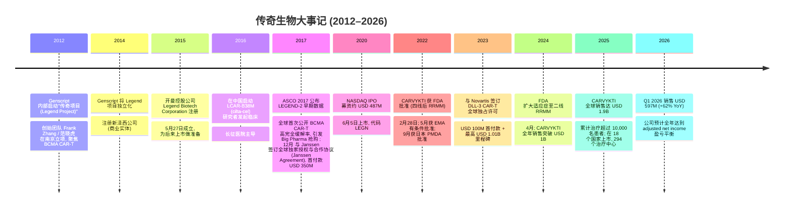
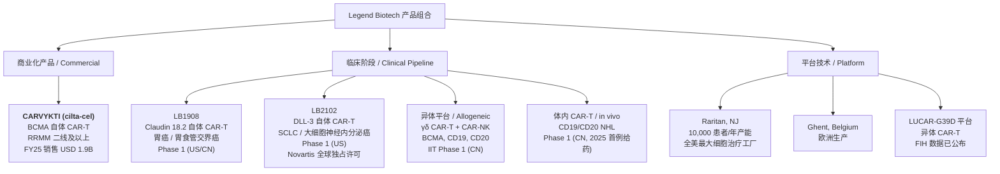
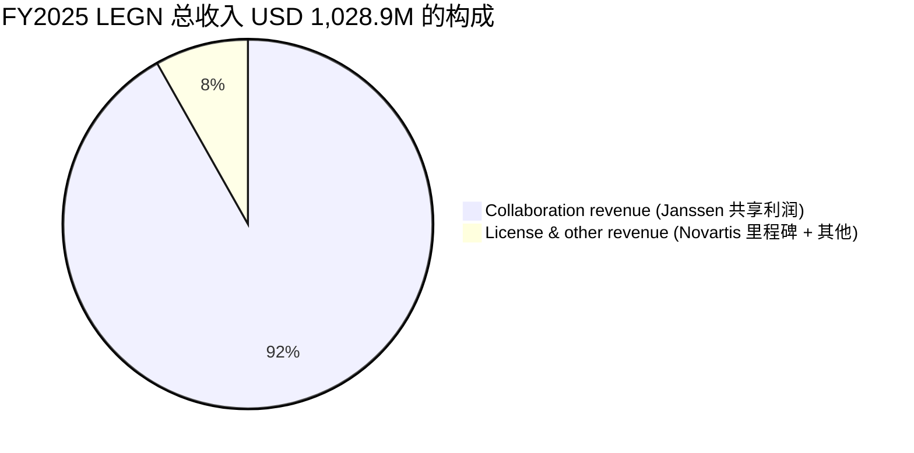

# 传奇生物 / Legend Biotech (NASDAQ: LEGN) — 公司研究报告 (zh-CN)

**As of 2026-06-02 · 主题归属: china-drug-out-licensing**

> 这份报告由批量工作流生成。下列每段事实性陈述均附带可点击的原始来源链接;若 10 分钟内无法定位的数字,本报告写"未披露"而不是编造数字。

---

## 目录

1. 公司概览 (Company Overview)
2. 公司历史 (History)
3. 管理团队 (Management)
4. 产品与服务 (Products & Services) — 最重要章节
5. 客户与上市策略 (Customers & Commercialization)
6. 行业概览 (Industry Overview)
7. 竞争格局 (Competitive Landscape)
8. 市场机会 (Market Opportunity)
9. 风险评估 (Risk Assessment)
10. 投资者视角评分卡 (Investor Lens Scorecards)
11. 参考资料 (References)

---

## 1. 公司概览 (Company Overview)

传奇生物 (Legend Biotech Corporation, NASDAQ: LEGN) 是一家在开曼群岛注册、总部位于美国新泽西州 Somerset 的全球性生物制药公司,聚焦于肿瘤等领域的下一代细胞治疗 (cell therapy) 的发现、开发、制造与商业化。截至 2025 年底,公司在美国、中国和欧洲合计约有 **2,900 名员工**,核心商业化产品为与强生 (Johnson & Johnson, NYSE:JNJ) 旗下 Janssen 合作开发的 **CARVYKTI® (ciltacabtagene autoleucel,简称 cilta-cel)**,这是首个、也是目前唯一在复发或难治性多发性骨髓瘤 (relapsed or refractory multiple myeloma, RRMM) 患者中证明优于标准治疗的总生存期 (overall survival, OS) 获益的 CAR-T 细胞疗法 ([Legend Biotech 2025 Form 20-F](https://www.sec.gov/Archives/edgar/data/1801198/000180119826000008/legn-20251231.htm))。

公司的法律名称 Legend Biotech Corporation 于 2015 年 5 月 27 日在开曼群岛注册成立,主要运营子公司分布在美国、中国和欧盟;其最大股东 (largest shareholder) 为在港交所上市的 **Genscript Biotech (HKEX:1548)**,截至 2026 年 2 月 15 日仍持有约 **47% 的已发行普通股 (outstanding ordinary shares)**,因此 LEGN 是 Genscript 的"分拆 (spin-off)"子公司,而 Genscript 在母公司层面又是中国上市公司新冠 mRNA 与重组蛋白服务的重要参与者 ([Legend Biotech 2025 Form 20-F, Item 7](https://www.sec.gov/Archives/edgar/data/1801198/000180119826000008/legn-20251231.htm))。这一所有权结构使 LEGN 同时具备"中国资产"(早期临床数据来自南京"传奇项目"实验室,且在中国大陆、香港、澳门和台湾的产品权益由其全资保留 70% 利润分成) 与"美国 ADR"双重属性 ([Legend Biotech 2025 Form 20-F — Janssen Agreement description](https://www.sec.gov/Archives/edgar/data/1801198/000180119826000008/legn-20251231.htm))。

**估值快照 (TTM, 截至 2026 年 5 月底)**: 股价约 USD 26.50,市值约 USD 48–54 亿;FY25 总收入 (total revenue) 1,028.9 百万美元,故 P/S (TTM) ≈ 4.7–5.3×,显著低于 SPDR S&P Biotech ETF (XBI) 当下高增长成份的中位 P/S (~10–12×) ([Yahoo Finance — LEGN](https://finance.yahoo.com/quote/LEGN/), [Macrotrends — LEGN Market Cap 2019-2026](https://www.macrotrends.net/stocks/charts/LEGN/legend-biotech/market-cap))。公司 FY25 仍录得 IFRS 净亏损 (net loss) 296.8 百万美元 (FY24: 177.0M),P/E (TTM) 为负 — 这并非"价值陷阱",而是典型的 CAR-T 商业化早期亏损:CARVYKTI 在 2025 年下半年达到"特许经营盈利 (franchise profitability)"门槛后,公司预计在 **2026 年实现 company-wide 调整后净利润 (adjusted net income) 盈亏平衡** ([Globenewswire — Legend Biotech FY2025 Results, 2026-03-10](https://www.globenewswire.com/news-release/2026/03/10/3252614/0/en/Legend-Biotech-Reports-Fourth-Quarter-and-Full-Year-2025-Results-and-Recent-Highlights.html))。

**为什么进入"china-drug-out-licensing"主题清单**: 传奇生物是这一主题的"始祖案例 (founding case)" — 2017 年 12 月,刚成立两年多、临床数据完全来自南京的传奇生物把 LCAR-B38M (即后来的 cilta-cel) 以 USD 350M 首付款 + 后续超过 USD 1B 里程碑 outlicense 给强生,创下当时中国本土发现的 CAR-T 细胞治疗对外授权的最高金额纪录 ([Fierce Biotech — Genscript chief becomes new Legend CEO](https://www.fiercebiotech.com/biotech/genscript-chief-majority-shareholder-legend-becomes-china-biotech-s-new-ceo))。如今 CARVYKTI 已是全球销售额 USD 1.9B 的 blockbuster 药物 (2025 年),也成为中国本土"License-Out"模式的范式 — 母公司 Genscript 仍持有近半股权,产品在大中华区由 LEGN 享有 70% 利润分成,而在大中华以外则与强生 50/50 分担成本与利润 ([Legend Biotech 2025 Form 20-F — Janssen Agreement description](https://www.sec.gov/Archives/edgar/data/1801198/000180119826000008/legn-20251231.htm))。

*分析师观点 (Analyst view):* 对比同样诞生自中国实验室、但商业化路径完全独立 (而非 license-out) 的科济药业 / CARsgen (HKEX:2171) 与药明生物在 ADC 领域的"对外授权 + 分成"模式,LEGN 的样本更适合作为"中国发现 → 美国主导商业化"的"上限"参考 — 因为强生不仅承担了 50% 的成本,也带来了 RRMM 领域的销售网络。这种模式让 LEGN 在 2025 年得以在产品上市仅约 3 年即实现 USD 1.9B 销售额,但代价是利润的 50% 永久让渡给 Janssen。

---

## 2. 公司历史 (History)



公司的起点可以追溯到 2012 年 — 当时 Genscript Biotech (后来在港交所 1548 上市) 创始人 **Frank Zhang / 张方亮** 与一群同事在南京 Genscript 总部内一个"差不多货运电梯大小"的房间里成立了所谓的"传奇项目 (Legend Project)",目标是开发抗 B 细胞成熟抗原 (B-cell maturation antigen, BCMA) 的 CAR-T 细胞疗法 ([Endpoints News — Frank Zhang grabs control of Legend Biotech](https://endpoints.news/car-t-filing-in-sight-genscript-frank-zhang-grabs-full-control-of-legend-biotech-steps-down-from-genscript/))。这一时间点比中国本土多数 Biotech 启动 BCMA CAR-T 研究都要早,造就了 LEGN 在 cilta-cel 序列上无可争议的"先发优势 (first-mover)"。

2014 年公司以美国新泽西 Genscript 子公司形式独立化,2015 年 5 月 27 日在开曼群岛成立公司控股实体 Legend Biotech Corporation ([Legend Biotech 2025 Form 20-F — Item 4A](https://www.sec.gov/Archives/edgar/data/1801198/000180119826000008/legn-20251231.htm))。**2017 年是真正的"出圈"年**:公司在中国上海长征医院开展的 LEGEND-2 研究者发起临床 (investigator-initiated trial, IIT) 在 2017 年 6 月 ASCO 年会上首次公开数据,LCAR-B38M 在 35 名 RRMM 患者中实现了 100% 总缓解率与 74% 完全缓解率 (CR),立刻引发全球 Big Pharma 的兴趣 ([SWOT Analysis Example — Legend Biotech Brief History](https://swotanalysisexample.com/blogs/brief-history/legendbiotech-brief-history))。同年 12 月,刚刚两岁的公司就把 cilta-cel 的全球开发、生产与商业化权利 outlicense 给了强生旗下的 Janssen Biotech,获得 USD 350M 现金首付款,并享有大中华以外 50% 的成本与利润分成、大中华区域 70% 的利润保留权 ([Legend Biotech 2025 Form 20-F — Janssen Agreement description](https://www.sec.gov/Archives/edgar/data/1801198/000180119826000008/legn-20251231.htm))。

**2020 年 6 月 5 日**,Legend Biotech 在纳斯达克挂牌上市 (代码 LEGN),发行价 USD 23,募资约 USD 487M (含超额配股权) ([Nasdaq — GenScript spin-off Legend Biotech sets terms for $350M IPO](https://www.nasdaq.com/articles/genscript-spin-off-legend-biotech-sets-terms-for-$350-million-ipo-2020-05-29))。两年后的 **2022 年 2 月 28 日**,FDA 在 PDUFA 日期当天批准 CARVYKTI 用于已接受至少 4 线治疗的 RRMM 成人,商品名 CARVYKTI 由强生持有美国商标权 ([Legend Biotech 2025 Form 20-F — Item 4B Business Overview](https://www.sec.gov/Archives/edgar/data/1801198/000180119826000008/legn-20251231.htm))。同年 5 月、9 月分别获得欧盟有条件许可与日本 PMDA 批准。

2023 年下半年,公司迎来一次治理风波:Genscript 创始人 Frank Zhang 在中国遭"指定居所监视居住"措施,主要涉及南京、镇江海关对 Genscript 涉嫌"走私国家禁止进出口货物"的调查。此次事件直接影响到 LEGN 母公司股权与 CEO 安排,Zhang 短暂出任 LEGN CEO 后由 **Ying Huang 黄颖博士**接任 CEO 兼 CFO,并在 2022 年 8 月由 Ye "Sally" Wang 担任董事会主席 ([Fierce Pharma — Legend CEO under residential surveillance](https://www.fiercepharma.com/pharma-asia/chinese-customs-raids-j-j-car-t-partner-legend-s-office-puts-new-ceo-under-residential), [BioSpace — Frank Zhang arrested](https://www.biospace.com/genscript-and-legend-biotech-founder-frank-zhang-arrested-by-chinese-government))。Zhang 此后保释、辞任 GenScript 与 LEGN 的 CEO,但目前仍是 LEGN 的 Class II 董事并担任董事会主席 ([Endpoints News — Frank Zhang on bail](https://endpoints.news/months-after-shocking-house-arrest-legend-co-founder-frank-zhang-is-out-on-bail-though-the-car-t-player-has-moved-on/))。

**2024 年 4 月** FDA 批准 CARVYKTI 用于二线 RRMM (即至少接受 1 线含 PI + IMiD 的患者且对来那度胺难治),这一扩展直接打开了 RRMM 二线市场,该年 CARVYKTI 销售开始陡峭爬坡;2025 年全年 CARVYKTI 全球净销售达到 **USD 1.9B** ([Globenewswire — Legend Biotech FY2025 Results, 2026-03-10](https://www.globenewswire.com/news-release/2026/03/10/3252614/0/en/Legend-Biotech-Reports-Fourth-Quarter-and-Full-Year-2025-Results-and-Recent-Highlights.html))。2026 Q1 销售进一步加速到 USD 597M (+62% YoY),美国增速 36%,但 ex-U.S. 销售同比增长 **200%+** ,主要受惠于欧洲与日本治疗中心的快速扩容 ([Yahoo Finance — Legend Biotech Q1 2026 highlights](https://finance.yahoo.com/sectors/healthcare/articles/legend-biotech-corp-legn-q1-190051810.html))。

---

## 3. 管理团队 (Management)

**创始人 / 董事长 (Founder / Chairman): Frank Zhang / 张方亮博士.** Zhang 来自四川成都,1995 年获 Duke University 生物化学博士学位,随后于 **2002 年在新泽西州创办 Genscript Biotech (HKEX:1548)**,两年后在南京设立中国研发运营基地。2012 年,Zhang 与 Genscript 部分同事在南京办公室内启动"传奇项目 (Legend Project)",成为 LEGN 的前身。2014 年 LEGN 以 Genscript 在美子公司形式独立化,2017 年 cilta-cel 与强生的 USD 350M 授权交易直接奠定其行业声誉 ([Endpoints News — Frank Zhang biographical details](https://endpoints.news/car-t-filing-in-sight-genscript-frank-zhang-grabs-full-control-of-legend-biotech-steps-down-from-genscript/))。然而 2023 年下半年 Zhang 因 Genscript 在南京、镇江海关"涉嫌走私国家禁止进出口货物"被中国当局采取"指定居所监视居住"措施,在 LEGN 担任 CEO 仅约两个月后由 Ying Huang 接替 ([Fierce Pharma — Chinese customs raids Legend office, CEO under residential surveillance](https://www.fiercepharma.com/pharma-asia/chinese-customs-raids-j-j-car-t-partner-legend-s-office-puts-new-ceo-under-residential), [BioSpace — Frank Zhang arrested](https://www.biospace.com/genscript-and-legend-biotech-founder-frank-zhang-arrested-by-chinese-government))。Zhang 后续保释,2022 年 8 月被任命为 LEGN 二类董事并选举为董事会主席至今;他直接和间接通过 Genscript (约 47% 股权) 控制着 LEGN 的控股关系,但已不参与日常运营 ([Legend Biotech 2025 Form 20-F — Item 7 Major Shareholders](https://www.sec.gov/Archives/edgar/data/1801198/000180119826000008/legn-20251231.htm))。

**首席执行官 (Chief Executive Officer): Ying Huang / 黄颖博士.** Huang 担任 LEGN CEO 自 2020 年 9 月开始,此前自 2019 年 7 月起担任 CFO,目前同时兼任 CEO 与 CFO 两个职务。Huang 的特殊经历是他在加入 LEGN 之前曾担任 **美国银行 Bank of America Merrill Lynch (BAML) Biotech 股权研究主管 (Head of Biotech Equity Research)**,负责覆盖超过 30 家生物技术公司,被 Institutional Investor 调查评为华尔街顶级生物技术分析师之一 ([Legend Biotech press release — Ying Huang appointment to BOD](https://investors.legendbiotech.com/news-releases/news-release-details/legend-biotech-announces-appointment-dr-ying-huang-board))。他在加入 LEGN 之前历任 Wachovia / Credit Suisse / Gleacher / Barclays / BAML 等多家投行,具有 12 年华尔街研究经验和 9 年在跨国药企 (Schering-Plough 心血管与中枢神经主任科学家) 研发经验。**学术背景**:中国科学技术大学少年班 → Columbia University 生物有机化学博士 → Columbia Business School 进修 ([Legend Biotech 2025 Form 20-F — Item 6 Directors and Senior Management](https://www.sec.gov/Archives/edgar/data/1801198/000180119826000008/legn-20251231.htm))。

Huang 这一"投行分析师转 CEO/CFO"的背景在生物技术领域并不多见,使他在执行公司商业化"过桥融资 (bridge financing)"与对外 messaging 方面相对娴熟 — 2023 年 11 月与 Novartis 的 DLL-3 CAR-T 全球独家许可交易 (USD 100M 首付,最高 USD 1.01B 里程碑 + tiered royalties 至 low teens 数字百分比) 由其主导谈判 ([Legend Biotech 2025 Form 20-F — Novartis License Agreement description](https://www.sec.gov/Archives/edgar/data/1801198/000180119826000008/legn-20251231.htm))。Huang 同时是公司董事会成员 (自 2021 年 12 月被任命),目前担任 CEO + CFO 双重职务说明董事会尚未为 CFO 角色寻找独立继任 — 这是治理结构上值得跟踪的细节。

---

## 4. 产品与服务 (Products & Services)

### 4.1 产品组合树 (Product Portfolio Tree)



Legend Biotech 的产品组合分为三层:一个已经成为 blockbuster 的商业化产品 (CARVYKTI)、一组聚焦于实体瘤的自体临床候选 (autologous clinical candidates,LB1908 与 LB2102)、以及一个仍处于研究者发起临床的"下一代"平台 (异体 γδ CAR-T、CAR-NK 与 in vivo CAR-T)。三者共同构成 LEGN 的"现在赚钱 + 未来扩张 + 长期颠覆"叙事 ([Legend Biotech 2025 Form 20-F — Item 4B Business Overview](https://www.sec.gov/Archives/edgar/data/1801198/000180119826000008/legn-20251231.htm))。

### 4.2 CARVYKTI® (ciltacabtagene autoleucel, cilta-cel) — 旗舰产品

> **20-F 原文 (verbatim from FY25 Form 20-F):** "Our lead product candidate, ciltacabtagene autoleucel ('cilta-cel' or 'LCAR-B38M' for purposes of our LEGEND-2 trial), is a CAR-T cell therapy we are jointly developing with our strategic partner, Janssen, for the treatment of multiple myeloma ('MM'). Clinical trial results achieved to date demonstrate that cilta-cel is the first CAR-T cell therapy to demonstrate overall survival benefit when compared to standard therapies in patients with RRMM with a manageable safety profile." ([Legend Biotech 2025 Form 20-F, Item 4B](https://www.sec.gov/Archives/edgar/data/1801198/000180119826000008/legn-20251231.htm))

**4.2.1 物理与生物学机制 / Physical & biological mechanism.** CARVYKTI 是一种自体嵌合抗原受体 T 细胞 (autologous chimeric antigen receptor T cell, autologous CAR-T) 疗法。**中文释义 / Plain-language gloss:** "自体"意味着患者本人的 T 细胞被采集出来,经过基因改造在体外武装上能识别多发性骨髓瘤细胞表面 BCMA (B-cell maturation antigen) 蛋白的"嵌合"受体,然后回输到同一位患者体内,让这些"武装化"T 细胞去搜索并杀灭表达 BCMA 的恶性浆细胞。与同类 BCMA CAR-T (例如 BMS 的 Abecma/ide-cel) 不同的是,**cilta-cel 携带两个 BCMA 结合 domain (binder)**,这种 bivalent 设计被认为是 cilta-cel 在长期随访中保持更高完全缓解率与更长无进展生存期 (PFS) 的关键之一 ([Legend Biotech 2025 Form 20-F — Item 4B CARTITUDE-1 description](https://www.sec.gov/Archives/edgar/data/1801198/000180119826000008/legn-20251231.htm))。

**4.2.2 获批适应症与时间线 / Approvals & timeline.**
| 监管机构 | 批准日期 | 适应症 / 线数 |
|---|---|---|
| FDA (美国) | 2022-02-28 | 已接受 ≥4 线治疗 (含 PI + IMiD + anti-CD38) 的 RRMM 成人 |
| EMA (欧盟) | 2022-05-25 | 已接受 ≥3 线治疗的 RRMM,带条件 (conditional) |
| PMDA (日本) | 2022-09-26 | 已接受 ≥3 线治疗的 BCMA-naive RRMM |
| FDA (扩展) | 2024-04 | RRMM 二线 (1L 之后): 已接受 ≥1 线含 PI + IMiD 且对来那度胺难治的 RRMM |

数据来源: ([Legend Biotech 2025 Form 20-F — Item 4B Regulatory approval history](https://www.sec.gov/Archives/edgar/data/1801198/000180119826000008/legn-20251231.htm))。**2024 年 4 月的二线扩展是销售腾飞的关键** — 它把 cilta-cel 从"末线救援"提到了"早期治疗",理论可及患者池扩大 4–5 倍,在数据上直接反映为 FY2024 总收入翻倍 (USD 285.1M → USD 627.3M) 和 FY2025 再次大幅增长至 USD 1,028.9M ([Globenewswire — Legend Biotech FY2025 Results](https://www.globenewswire.com/news-release/2026/03/10/3252614/0/en/Legend-Biotech-Reports-Fourth-Quarter-and-Full-Year-2025-Results-and-Recent-Highlights.html))。

**4.2.3 临床数据 (CARTITUDE 项目) — 选关键里程碑.**
- **CARTITUDE-1** (Phase 1b/2, ≥3 线后 RRMM, 美国): 支持 FDA 2022 年首批的关键试验,展示 cilta-cel 单次治疗即可在重度预治疗 RRMM 中实现高完全缓解率与长 PFS;长期随访已经显示出 OS 获益 ([Legend Biotech 2025 Form 20-F — Item 4B CARTITUDE-1](https://www.sec.gov/Archives/edgar/data/1801198/000180119826000008/legn-20251231.htm))。
- **CARTITUDE-4** (Phase 3, 1–3 线后 RRMM, vs. 标准治疗 PVd 或 DPd): 支持 FDA 2024 年二线扩展的关键试验,2024 年 ASCO 公布的更新分析进一步显示 OS 显著优于标准治疗。
- **CARTITUDE-5** (Phase 3, 新诊断 RRMM 不可移植患者, VRd → cilta-cel vs. VRd → Rd): 2021 年 8 月启动,目标约 650 例,**入组已完成**;若数据阳性,将把 cilta-cel 推进到一线治疗 ([Legend Biotech 2025 Form 20-F — Item 4B CARTITUDE-5 status](https://www.sec.gov/Archives/edgar/data/1801198/000180119826000008/legn-20251231.htm))。
- **CARTITUDE-6** (Phase 3, 新诊断 RRMM 可移植患者, DVRd → cilta-cel vs. DVRd → ASCT): 2023 年 10 月启动,目标约 750 例,**直接对标自体造血干细胞移植 (ASCT)** — 这是一线 MM 的金标准,若 cilta-cel 取胜将重塑一线治疗格局 ([Legend Biotech 2025 Form 20-F — Item 4B CARTITUDE-6 status](https://www.sec.gov/Archives/edgar/data/1801198/000180119826000008/legn-20251231.htm))。

**4.2.4 商业产出 / Commercial output.**
| 期间 | CARVYKTI 全球净销售 | LEGN 总收入 | LEGN 净亏损 |
|---|---|---|---|
| FY2023 | n/a (上市初期低) | USD 285.1M | USD (518.3M) |
| FY2024 | ~USD 963M | USD 627.3M | USD (177.0M) |
| FY2025 | **USD 1,900M** (含 Q4 USD 555M) | USD 1,028.9M | USD (296.8M) |
| Q1 2026 | USD 597M (+62% YoY) | n/a | adjusted net loss USD 11M |

数据来源: ([Globenewswire — Legend Biotech FY2025 Results, 2026-03-10](https://www.globenewswire.com/news-release/2026/03/10/3252614/0/en/Legend-Biotech-Reports-Fourth-Quarter-and-Full-Year-2025-Results-and-Recent-Highlights.html)), ([Legend Biotech 2025 Form 20-F — Item 5 Revenue table](https://www.sec.gov/Archives/edgar/data/1801198/000180119826000008/legn-20251231.htm)), ([Yahoo Finance — Legend Biotech Q1 2026 highlights](https://finance.yahoo.com/sectors/healthcare/articles/legend-biotech-corp-legn-q1-190051810.html))。**关键解释**:CARVYKTI 净销售 ≠ LEGN 收入 — 在 Janssen Agreement 下,Janssen 是 ex-Greater China 区域 CARVYKTI 销售的"principal in the sale to customers",CARVYKTI 净销售由 Janssen 报告;LEGN 收入由两部分构成:(a) **Collaboration revenue** (LEGN 在 CARVYKTI 利润分成中所占的份额 + 制造收入,2025 年 USD 944.8M),(b) **License and other revenue** (Novartis 等其他授权的里程碑,2025 年 USD 84.1M) ([Legend Biotech 2025 Form 20-F — Item 5 Operating and Financial Review](https://www.sec.gov/Archives/edgar/data/1801198/000180119826000008/legn-20251231.htm))。

### 4.3 LB2102 (DLL-3 CAR-T, 实体瘤) — 已授权 Novartis

**LB2102 是 LEGN 第一个针对实体瘤的 CAR-T 候选**,选择性靶向 DLL-3 (Delta-like ligand 3),一种在小细胞肺癌 (SCLC)、大细胞神经内分泌癌 (LCNEC)、部分前列腺神经内分泌肿瘤中高度限制表达的配体 ([Legend Biotech 2025 Form 20-F — Item 4B LB2102 description](https://www.sec.gov/Archives/edgar/data/1801198/000180119826000008/legn-20251231.htm))。**为什么 DLL-3 是热门靶点**:它在正常组织几乎不表达 (low off-target risk),但在 SCLC 中表达率 >85%,而 SCLC 由于异质性高、转移早,目前缺乏有效的二线治疗 — 即使是 amgen 双特异 T 细胞衔接器 (BiTE) Imdelltra (tarlatamab) 已被批准但中位 PFS 仅约 4.5 个月。Phase 1 first-in-human 在美国开展,**2025 年 9 月公布的 DL5 (5 级剂量) 数据显示 15 名 SCLC/LCNEC 患者总疾病控制率 73%** ([Legend Biotech 2025 Form 20-F — Item 4B LB2102 Phase 1 data](https://www.sec.gov/Archives/edgar/data/1801198/000180119826000008/legn-20251231.htm))。2023 年 6 月 FDA 授予孤儿药资格 (Orphan Drug Designation)。**LB2102 已在 2023 年 11 月被 outlicense 给 Novartis**,首付款 USD 100M (2024 年 1 月支付),Legend 可获得最多 USD 1.01B 的里程碑款 + tiered royalties at high single digits to low teens ([Legend Biotech 2025 Form 20-F — Item 4B Novartis License Agreement](https://www.sec.gov/Archives/edgar/data/1801198/000180119826000008/legn-20251231.htm))。

### 4.4 LB1908 (Claudin 18.2 CAR-T) — 自有

**LB1908 选择性靶向 claudin 18.2 (CLDN18.2)**,这是胃癌、胃食管交界癌中高度表达但在正常胃黏膜上限制表达的紧密连接蛋白 (tight junction protein) ([Legend Biotech 2025 Form 20-F — Item 4B LB1908 description](https://www.sec.gov/Archives/edgar/data/1801198/000180119826000008/legn-20251231.htm))。**为什么这个靶点重要**:CLDN18.2 是过去 5 年实体瘤"细胞治疗"的次重要靶点 (BCMA 之后),阿斯利康-第一三共 ADC Vyloy (zolbetuximab) 已经验证了这一靶点在胃癌一线治疗的临床价值。LB1908 在美国 Phase 1 first-in-human 共 17 例患者完成给药 (截至 2025 年 12 月 15 日),DL3 剂量水平的客观缓解率 (ORR) 数据将在 2026 ASCO-GI 会议进一步公布 ([Legend Biotech 2025 Form 20-F — Item 4B LB1908 Phase 1 data](https://www.sec.gov/Archives/edgar/data/1801198/000180119826000008/legn-20251231.htm))。FDA 已授予胃癌包括胃食管交界癌的孤儿药资格 (2022 年 11 月)。**LB1908 目前仍由 LEGN 全权拥有,未对外授权**,这是公司未来潜在的另一笔大额 license-out 价值。

### 4.5 异体平台 (Allogeneic Platform) — γδ CAR-T + CAR-NK + in vivo CAR-T

**自体 CAR-T 的根本痛点是"个体化制造"成本与时间** — 每个患者都要单独采集、运输、制造、回输,周期约 4–6 周,成本 USD 350K–500K。**异体 CAR-T (allogeneic / off-the-shelf, 现成的)** 的目标是把这一切替换为"健康供体来源 → 大规模制造 → 库存待用"。LEGN 在异体方向的两条腿包括:
1. **同种异体 γδ T 细胞 + CAR-NK 细胞**,靶向 BCMA、CD19、CD20,用于多发性骨髓瘤 (MM) 与非霍奇金淋巴瘤 (NHL),目前在中国处于研究者发起 Phase 1 临床 ([Legend Biotech 2025 Form 20-F — Item 4B Allogeneic platform description](https://www.sec.gov/Archives/edgar/data/1801198/000180119826000008/legn-20251231.htm))。
2. **In vivo CAR-T** (体内 CAR-T) 针对 CD19/CD20 NHL,Phase 1 IIT 在中国 — 这是 LEGN 第一次踏入"在体内基因编辑 T 细胞"的新方向,跟 BioNTech、Capstan Therapeutics (后被 AbbVie 收购) 等公司的方向一致,**2025 年完成首例患者给药** ([Globenewswire — Legend Biotech FY2025 Results — pipeline updates](https://www.globenewswire.com/news-release/2026/03/10/3252614/0/en/Legend-Biotech-Reports-Fourth-Quarter-and-Full-Year-2025-Results-and-Recent-Highlights.html))。

异体 / in vivo 平台是 LEGN "第二条产品曲线"的核心:即使 cilta-cel 在 MM 一线对垒 ASCT 后被泛使用,自体 CAR-T 的"周期长 + 成本高"上限并不会消失;一个真正的 off-the-shelf 产品可以打破自体 CAR-T 的可及性瓶颈,让全球 70 万存活 MM 患者中目前因物流原因无法获得治疗的大多数患者获得治疗。

### 4.6 制造网络 (Manufacturing Network)

CARVYKTI 在大中华以外区域的商业供应主要由 LEGN 在 **新泽西 Raritan 工厂**完成生产,该工厂是美国最大的细胞治疗 GMP 生产设施之一,年产能可支持高达 **10,000 名患者** ([Globenewswire — Legend Biotech FY2025 Results — manufacturing capacity](https://www.globenewswire.com/news-release/2026/03/10/3252614/0/en/Legend-Biotech-Reports-Fourth-Quarter-and-Full-Year-2025-Results-and-Recent-Highlights.html))。**2025 年 10 月,LEGN 与 Janssen 签订了新的 Raritan Supply Agreement** (取代 2022 年的临时供应协议),从 2026 年 2 月 2 日起生效,LEGN 在 GMP 生产成本之上加合理 markup 向 Janssen 销售 cilta-cel ([Legend Biotech 2025 Form 20-F — Item 4B Raritan Supply Agreement](https://www.sec.gov/Archives/edgar/data/1801198/000180119826000008/legn-20251231.htm))。除 Raritan 外,公司在 **比利时 Ghent** 拥有欧洲制造基地 (用于 ex-U.S. 商业供应),在 **南京** 拥有中国大陆早期开发与大中华区 cilta-cel 商业化的制造基地。FY2025 资本支出 USD 69.3M,主要用于扩产 ([Legend Biotech 2025 Form 20-F — Item 4A Capital Expenditures](https://www.sec.gov/Archives/edgar/data/1801198/000180119826000008/legn-20251231.htm))。

### 4.7 产品组合的协同与未来方向 — 综合 (Synthesis)

CARVYKTI 是"现在的现金奶牛 (cash cow)",LB1908 与 LB2102 是"近期 (3–5 年) 可能的对外授权增量",异体平台与 in vivo CAR-T 是"5–10 年后的颠覆性下一代",三者共同形成 LEGN 的"血液瘤 → 实体瘤 → 全平台 (off-the-shelf)"路径。**值得注意的是,LEGN 已经把 LB2102 outlicense 给 Novartis,但 LB1908 和 CARVYKTI 后续生命周期管理 (Lifecycle Management) 拓展适应症 (如一线 MM、髓外 MM 等) 仍由 LEGN 自有**;同时由 Genscript 与传奇生物在南京的早期发现实验室继续提供 BCMA / CD19 / CD20 等血液瘤之外新靶点的候选 — 公司宣称在 2025 年新开设了费城 31,000 平方英尺的 R&D 设施,以增加美国本土发现能力 ([Globenewswire — Legend Biotech FY2025 Results — Philadelphia R&D facility](https://www.globenewswire.com/news-release/2026/03/10/3252614/0/en/Legend-Biotech-Reports-Fourth-Quarter-and-Full-Year-2025-Results-and-Recent-Highlights.html))。

---

## 5. 客户与上市策略 (Customers & Commercialization)

### 5.1 收入结构 — 注意 LEGN "客户" 的特殊性



**关键点**:LEGN 的"客户"不是终端患者或医院,而是其商业化合作伙伴 — 主要是 Janssen (强生),其次是 Novartis。FY2025 公司总收入 USD 1,028.9M 中:
- **Collaboration revenue USD 944.8M (92%)**: LEGN 在 CARVYKTI 全球 (大中华以外) 利润分成中所占的 50% + 来料供应 (Raritan / Ghent → Janssen 美国仓库) 的 markup 收入;以及来自大中华区 CARVYKTI 销售的 70% 利润保留 ([Legend Biotech 2025 Form 20-F — Item 5 Collaboration Revenue](https://www.sec.gov/Archives/edgar/data/1801198/000180119826000008/legn-20251231.htm))。
- **License and other revenue USD 84.1M (8%)**: 主要为 Novartis Licensing Agreement 在 2024 年取得 USD 100M 首付款后按"履约义务履行进度"分期确认的余额,以及其他较小的对外授权收入 ([Legend Biotech 2025 Form 20-F — Item 5 License Revenue, FY25](https://www.sec.gov/Archives/edgar/data/1801198/000180119826000008/legn-20251231.htm))。

**客户集中度 (Customer concentration)**: 在 ASC 280 / IFRS 8 segment reporting 含义下,**Janssen 是 LEGN 占合并收入 (consolidated revenue) 90%+ 的唯一重大客户**。这一极端的客户集中度是 LEGN 风险评估第 9 章最重要的单一风险因素,也意味着 LEGN 在 Q1 2026 仍然没有显著的"独立商业化"自营产品 — 其全球销售网络仍主要由 Janssen 承担 ([Legend Biotech 2025 Form 20-F — Item 3D Risk Factors, "Janssen contributes a large portion of our revenue"](https://www.sec.gov/Archives/edgar/data/1801198/000180119826000008/legn-20251231.htm))。

### 5.2 治疗中心网络 (Treatment Centers / Authorized Treatment Centers, ATCs)

CAR-T 疗法不是"普通处方药"。每位患者要在专门的"已授权治疗中心 (Authorized Treatment Center, ATC)"接受白细胞采集 (apheresis) → 等待 cilta-cel 在 Raritan 工厂制造 4–6 周 → 在 ATC 完成桥接化疗 + 淋巴细胞清除 + cilta-cel 回输 + 至少 14 天监测的全流程。截至 FY25 末,**CARVYKTI 已在 18 个国家上市,294 个 ATC 网点**,FY26 Q1 已扩展至 300+ 个 ATC ([Globenewswire — Legend Biotech FY2025 Results — 294 sites worldwide](https://www.globenewswire.com/news-release/2026/03/10/3252614/0/en/Legend-Biotech-Reports-Fourth-Quarter-and-Full-Year-2025-Results-and-Recent-Highlights.html), [Yahoo Finance — Legend Biotech Q1 2026 highlights](https://finance.yahoo.com/sectors/healthcare/articles/legend-biotech-corp-legn-q1-190051810.html))。**2025 年是 ATC 网络从"美国为主"加速向"欧洲与日本"扩张的转折年** — 这直接解释了为什么 Q1 2026 ex-U.S. 销售同比增长 200%+ 而 U.S. 仅增长 36%。

### 5.3 患者覆盖与商业里程碑

公司在 FY25 年报中明确披露:**截至 FY25 末已累计有超过 10,000 名 RRMM 患者接受 CARVYKTI 治疗** ([Globenewswire — Legend Biotech FY2025 Results — 10,000 patients milestone](https://www.globenewswire.com/news-release/2026/03/10/3252614/0/en/Legend-Biotech-Reports-Fourth-Quarter-and-Full-Year-2025-Results-and-Recent-Highlights.html))。对应美国每年约 35,000 名新诊断 MM 患者、约 250,000 例 prevalent MM 患者(其中 RRMM 约一半)的市场,LEGN 目前的渗透率仍只有几个百分点 — 这是其增长曲线远未到顶的核心证据。FY26 Q1 销售加速 (+62% YoY) 也支持"二线扩展叠加 ATC 网络扩容"双引擎驱动的判断。

### 5.4 大中华区 (Greater China) 业务

根据 Janssen Agreement,**大中华区 (Mainland China + Hong Kong + Macau + Taiwan) 的 cilta-cel 商业权益由 LEGN 独家保留**,且 LEGN 享有 70% 的税前利润分成 ([Legend Biotech 2025 Form 20-F — Item 4B Greater China economics](https://www.sec.gov/Archives/edgar/data/1801198/000180119826000008/legn-20251231.htm))。但截至 FY25,cilta-cel 尚未在中国大陆获批,中国本土 BCMA CAR-T 市场已被 **CARsgen / 科济药业 (HKEX:2171) 的 zevorcabtagene autoleucel (CT053)** 和 **驯鹿生物 / IASO Biotech (HKEX:2533) 的 equecabtagene autoleucel (FUCASO/伊基奥仑赛)** 抢先占据 — IASO 是 2023 年中国本土获批的首个 BCMA CAR-T。这意味着 LEGN 在大中华区的"70% 保留利润"目前几乎为零,且未来即使获批也将面对显著的本土竞争压力。

---

## 6. 行业概览 (Industry Overview)

### 6.1 多发性骨髓瘤 (Multiple Myeloma, MM) 市场总览

多发性骨髓瘤是浆细胞 (plasma cell) 的克隆增殖恶性肿瘤,患者占美国 NHL 类血液瘤的约 10%。全球年新发病例约 19 万例 (2022 年 GLOBOCAN),其中美国约 35,000 例 / 年,中国约 20,000 例 / 年。**目前 MM 已经成为可控的慢性病但不可治愈** — 患者从诊断到死亡的中位生存期约 8–10 年,几乎每位患者都会经历多线治疗 → 复发 → 换药的循环。这正是 BCMA-targeted 治疗 (CARVYKTI 的设计核心) 的临床机会:用单次输注的 CAR-T 替代慢病管理式的多线化疗组合 ([B-Cell Maturation Antigen (BCMA) Targeted Therapies Market Report 2026](https://www.globenewswire.com/news-release/2026/04/13/3272642/28124/en/B-Cell-Maturation-Antigen-BCMA-Targeted-Therapies-Market-Report-2026-Worth-18-75-Billion-in-2026-the-Market-is-Expected-to-Reach-44-29-Billion-by-2030.html))。

### 6.2 BCMA 靶向疗法 TAM (Total Addressable Market)

BCMA 靶向 (CAR-T + 双特异 + ADC) 全球市场预计:**2025 年 USD 15.1B → 2026 年 USD 18.7B → 2030 年 USD 44.3B**,2025–2030 CAGR 约 24% ([B-Cell Maturation Antigen (BCMA) Targeted Therapies Market Report 2026](https://www.globenewswire.com/news-release/2026/04/13/3272642/28124/en/B-Cell-Maturation-Antigen-BCMA-Targeted-Therapies-Market-Report-2026-Worth-18-75-Billion-in-2026-the-Market-is-Expected-to-Reach-44-29-Billion-by-2030.html))。这一 TAM 包括三种治疗模式:(1) BCMA CAR-T (CARVYKTI, Abecma, anito-cel, 中国 CARsgen + IASO),(2) BCMA bispecific (Tecvayli / teclistamab, Elrexfio / elranatamab, Talvey / talquetamab — talquetamab 靶 GPRC5D 不是 BCMA 但常作类比),(3) BCMA-ADC (GSK 的 Blenrep 已退市,GBP-13 等正在研发)。**CAR-T 在 BCMA 中只占约 1/3 (USD 6B 量级 / 2026)**,其余被 bispecifics 占据。

### 6.3 CAR-T 整体市场

**CAR-T 细胞治疗市场总规模 2025 年 USD 12.9B → 2026 年 USD 16.2B,2034 年预计 USD 23.2B (CAGR 6.1%)** — 注意这是相对保守的估算 ([Precedence Research — CAR T-Cell Therapy Market](https://www.precedenceresearch.com/car-t-cell-therapy-market)),Roots Analysis 等其他研究机构的估算更乐观 (29.8% CAGR 到 2035 年) ([Roots Analysis — CAR-T Cell Therapy Market](https://www.rootsanalysis.com/reports/car-t-cell-therapy-market/269.html))。在 CAR-T 总市场中,**MM (BCMA) 占比超过 30%**;NHL (CD19, e.g. Kymriah, Yescarta, Breyanzi) 占比次之;ALL (CD19) 与新近的实体瘤 (LB1908 / LB2102 等) 仍是早期阶段。

### 6.4 中国本土 CAR-T 与"License-Out" 主题

中国在 2017 年之前几乎所有 CAR-T 数据都来自学术研究者发起临床 (IIT) ;cilta-cel 之所以在 2017 年 ASCO 引发轰动,部分原因是它把"中国早期临床数据"打入了 FDA / EMA 主流监管路径。**这一模式被业内称作"License-Out"** — 中国发现 + 海外开发 + 全球商业化,LEGN 是这一模式的最早代表。后续相对成功的 license-out 案例还有:**百济神州 / BeiGene (NASDAQ:ONC, 原 BGNE) 的 BTK 抑制剂 Brukinsa** 借助百济自己的美国商业化能力 (不是纯 license-out 但路径相近),**信达 / Innovent (HKEX:1801) 的 IBI311 ANGPTL3 单抗** outlicense 给 Pierre Fabre,**药明合联 / WuXi XDC** 在 ADC 平台上的多笔 license-out。但单笔交易经济价值能与 cilta-cel 比肩的极少:cilta-cel 的 USD 350M 首付 + 50% 全球利润分成是中国 license-out 历史上"上限案例 (ceiling case)"之一。

---

## 7. 竞争格局 (Competitive Landscape)

### 7.1 BCMA CAR-T 直接竞争

```mermaid
quadrantChart
    title BCMA CAR-T 竞争格局 (2025-2026)
    x-axis 临床覆盖窄 --> 临床覆盖广
    y-axis 商业销售低 --> 商业销售高
    quadrant-1 强势 + 广覆盖
    quadrant-2 销售强但覆盖窄
    quadrant-3 边缘
    quadrant-4 覆盖广但销售弱
    CARVYKTI cilta-cel LEGN/JNJ: [0.85, 0.95]
    Abecma ide-cel BMS: [0.45, 0.30]
    Anito-cel Arcellx/Gilead: [0.30, 0.15]
    CARsgen zevor-cel HKEX:2171: [0.20, 0.10]
    IASO equa-cel HKEX:2533: [0.20, 0.08]
```

**CARVYKTI (LEGN/JNJ) — 当前的事实领导者.** 2025 年全球销售 USD 1.9B,临床数据具有 OS 获益,二线扩展已落地。**Abecma (ide-cel, BMS) — 早期上市者陷入衰退.** 2024 年全年销售 USD 406M (美国 USD 242M, -32% YoY; 国际 USD 164M, +44% YoY),2025 年 Bristol-Myers Squibb (NYSE:BMY) 以 USD 286M 收购长期合作伙伴 2seventy bio (NASDAQ:TSVT) 以获得 Abecma 完整所有权 ([Fierce Biotech — Bristol Myers, 2seventy cull multiple myeloma CAR-T as Abecma sales pick up](https://www.fiercebiotech.com/biotech/bristol-myers-2seventy-cull-multiple-myeloma-car-t-as-abecma-sales-pick-up), [Medcity News — BMS buys 2seventy bio for $286M](https://medcitynews.com/2025/03/bristol-myers-squibb-2seventy-bio-acquisition-abecma-cell-therapy-bmy-tsvt/))。Abecma 在头对头 PFS 数据上劣于 cilta-cel,并且 BMS 已经裁掉了相关研发团队 — 在 BCMA CAR-T 上已基本"放弃竞争"。**anito-cel (Arcellx/Gilead) — 最值得关注的下一波竞争者.** Arcellx (NASDAQ:ACLX) 在 2024-2025 年间与 Gilead (Kite) 共同开发,iMMagine-1 Phase 2 数据在 2025 年 ASH 会议上公布显示与 cilta-cel 类似的疗效,**iMMagine-3 Phase 3 试验已经入组 450 例患者**,目标 2028 年读出,直接对标 CARVYKTI 在 1–3 线 RRMM 的市场 ([Clinical Trials Arena — ASH 2025 Anito-cel challenges CAR-T market](https://www.clinicaltrialsarena.com/analyst-comment/ash-2025-arcellx-gilead-anito-cel-car-t-r-r-mm/), [Arcellx — iMMagine-1 data](https://www.businesswire.com/news/home/20251206931756/en/Arcellx-Announces-New-Positive-Data-for-Its-iMMagine-1-Study-in-Patients-with-Relapsed-andor-Refractory-Multiple-Myeloma))。

### 7.2 BCMA 双特异抗体 (Bispecific) 竞争 — Janssen 自己的 "Tecvayli"

最隐性、最重要的竞争来自 **同一家合作伙伴 Janssen 自己的 Tecvayli (teclistamab, BCMA × CD3 bispecific)** — 2022 年 10 月 FDA 加速批准 (四线后 RRMM), 2025 年 5 月与 daratumumab 联用进一步获批二线 ([J&J Tecvayli + DARZALEX press release](https://www.jnj.com/media-center/press-releases/johnson-johnson-announces-u-s-fda-approval-of-tecvayli-plus-darzalex-faspro-for-relapsed-refractory-multiple-myeloma-offering-a-potential-new-standard-of-care-as-early-as-second-line))。Tecvayli 的价格约 USD 39,500 / 月,而 CARVYKTI 是一次性 USD 500K+ 注射。Tecvayli 的"现成 + 可暂停"模式与 CARVYKTI 的"单次但需要 4–6 周制造"模式各有优劣 — 部分医生倾向于"先 Tecvayli,失败后 CARVYKTI";部分倾向反之。**Janssen 在 MajesTEC-9 (Phase 3) 中证实了 Tecvayli 单药在第一次复发即可显著优于标准治疗** (2026 年 1 月公布: PFS / OS 风险降低 71%) ([J&J Tecvayli MajesTEC-9 press release](https://www.jnj.com/media-center/press-releases/new-tecvayli-data-demonstrates-superior-progression-free-and-overall-survival-as-early-as-first-relapse-in-multiple-myeloma))。**这一动向意味着 Janssen 在 BCMA 治疗中拥有"双轨"(CAR-T + bispecific)产品组合,而 LEGN 对 Janssen 拥有 50% 的 CAR-T 利润分成,但 0% 的 bispecific 利润分成** — 这是 LEGN 治理结构里的最大隐患之一。Fierce Pharma 在 2025 年报道 LEGN 坚持 CARVYKTI 的增长潜力,但 Tecvayli 在 RRMM 早线的扩展是不可忽视的同行竞争 ([Fierce Pharma — Legend remains bullish on Carvykti growth despite threat from J&J's Tecvayli](https://www.fiercepharma.com/pharma/legend-still-confident-carvyktis-growth-potential-even-competition-jjs-tecvayli))。

### 7.3 大中华区 BCMA CAR-T 竞争

**CARsgen / 科济药业 (HKEX:2171)** 的 zevorcabtagene autoleucel (赛恺泽 / CT053) 已在 2023 年于中国获批用于 ≥3 线后 RRMM,是中国本土第二个上市的 BCMA CAR-T。**IASO Biotech / 驯鹿生物 (HKEX:2533)** 的 equecabtagene autoleucel (伊基奥仑赛 / FUCASO) 于 2023 年 6 月成为中国首个获批的全人源 BCMA CAR-T。CARsgen 与 IASO 在中国的渗透速度显著领先 LEGN — 截至 2025 年末,cilta-cel 仍未在中国大陆获批,而 CARsgen 与 IASO 已经积累 1,000–2,000 例商业化经验。LEGN 在大中华区的 70% 利润保留权目前是"理论值"而非"已实现价值"。**这是 LEGN 整体故事中最被低估的"隐性逆风":中国本土市场的窗口可能已经在打开和关闭之间错过最佳时点。**

### 7.4 同业估值比较

| 公司 | 2025 销售 (USD) | 市值 (USD, 2026Q2) | P/S (TTM) | 主要血液瘤产品 |
|---|---|---|---|---|
| Legend Biotech (LEGN) | 1,028.9M | ~4.85B | 4.7× | CARVYKTI |
| BMS (BMY) — Abecma owner | 全集团 ~48B | ~106B | 2.2× | Abecma, Reblozyl, Pomalyst |
| Arcellx (ACLX) — anito-cel | 临床前 | ~3B | n.m. | anito-cel (Phase 3) |
| CARsgen (HKEX:2171) | ~95M RMB | ~9B HKD | 高单位数 | CT053, Claudin18.2 CAR-T (CT041) |
| IASO Bio (HKEX:2533) | 未独立披露 | ~3B HKD | n/a | FUCASO |

数据来源: ([Yahoo Finance — LEGN](https://finance.yahoo.com/quote/LEGN/), [Macrotrends — LEGN Market Cap](https://www.macrotrends.net/stocks/charts/LEGN/legend-biotech/market-cap), [Yahoo Finance — BMY](https://finance.yahoo.com/quote/BMY/), [Yahoo Finance — ACLX](https://finance.yahoo.com/quote/ACLX/))。

*分析师观点 (Analyst view):* LEGN 的 P/S (4.7×) 处于"血液瘤 Biotech 中位"的下沿,显著低于 ACLX 这样的纯临床期同行,反映市场在权衡:(a) CARVYKTI 利润 50% 让渡给 Janssen 的折扣 (Janssen 的 EBIT margin 反映到 LEGN 时是"半价"),(b) 母公司 Genscript 47% 持股带来的潜在治理 / 减持压力,(c) Tecvayli 等 bispecific 抢占早线,(d) 中国本土 BCMA CAR-T 的本地化优势。如果二线扩展继续叠加 CARTITUDE-5/6 阳性,P/S 可能压缩至 4× 以下,但 CARTITUDE-5/6 失败将让多年估值假设崩塌。

---

## 8. 市场机会 (Market Opportunity)

### 8.1 CARVYKTI 收入展望 — 自下而上拆解

**前提假设 (assumption block):** 美国年新诊断 RRMM 患者约 35,000 人,经过 1L (一线) 治疗后约 80% 在 18 个月内复发,因此理论 RRMM 二线池约 28,000 例 / 年。叠加欧洲 + 日本同等结构的二线池约 25,000 例,全球可触达 RRMM 二线池约 50,000–55,000 例 / 年 (10 年累计 prevalence 更高)。CARVYKTI 当前 ATC 网络 294 个,假设单中心年平均接诊 30–50 例 cilta-cel 患者,则全网络年理论容量约 9,000–15,000 例;Raritan 工厂年产能 10,000 例 — **产能是当前的瓶颈,不是需求**。

按 USD 1.9B / 患者数倒推,若 FY25 全球治疗约 3,500 例,人均收入约 USD 543K (与定价相符);若 FY26 实际产能扩充至 8,000–10,000 例,**FY26 销售上限保守 USD 4–5B**,实际可能受 ATC 准入、患者转诊、Tecvayli 分流等因素压制至 USD 2.7–3.2B。Q1 2026 已经达到 USD 597M (年化 USD 2.4B),公司管理层预期 2026 全年盈亏平衡 — 隐含全年销售应不少于 USD 2.5–3B。

### 8.2 CARTITUDE-5 / -6 (一线 RRMM) 的潜在市场放大

**如果 CARTITUDE-5 (新诊断不可移植 MM, VRd → cilta-cel vs VRd → Rd) 阳性**,FDA 可能批准 cilta-cel 用于一线 ASCT-ineligible 患者 (约占新诊断 MM 的 50%,即美国每年 ~17,500 例)。**如果 CARTITUDE-6 (新诊断可移植 MM, DVRd → cilta-cel vs DVRd → ASCT) 阳性**,意味着 cilta-cel 替代 ASCT — 这是医学上的标志性变化,把 cilta-cel 推入一线的"金标准位置",理论可及池约 17,500 例 / 年 (美国另一半)。**如果两个 Phase 3 都阳性,CARVYKTI 全球销售在 2030 年前可能达到 USD 8–10B 量级**,即从当前的 1.9B 翻 5×。这是 LEGN 当前 USD 4.85B 市值最大的"上行故事 (upside story)"。但相应地,试验失败的下行风险也极大 — 一线 MM 的标准治疗 DVRd + ASCT 给出的 PFS 已经非常长,要在统计上超过 ASCT 难度很高。

### 8.3 LB2102 (DLL-3 CAR-T) 的市场机会

SCLC 美国年新发约 28,000 例,其中 60–70% 为 extensive-stage,二线治疗历来缺乏有效药物。Amgen 的 Imdelltra (tarlatamab, DLL-3 BiTE) 2024 年 5 月 FDA 批准,年化销售已超过 USD 800M (Amgen FY25 披露)。如果 LB2102 的 OS / PFS 数据接近或超过 Imdelltra,Novartis 在 SCLC 商业化网络 (含 Lutathera 等神经内分泌肿瘤经验) 加持下,Phase 3 启动后 5 年内峰值销售可能达到 USD 1–2B 量级,**对 LEGN 的经济价值是 high single digits to low teens 的 royalty + 里程碑 (剩余 USD 1.01B 中相当大比例),按 NPV 折现可能贡献 LEGN 估值的 USD 5–8/share**。

---

## 9. 风险评估 (Risk Assessment)

### 公司特定风险 (Company-specific)

**1. Janssen 客户集中度 (>90%) 与 50/50 利润分成的天花板.** LEGN 整体收入对单一合作伙伴 Janssen 的依赖度极高 (FY25 ≈ 92%)。Janssen Agreement 一旦终止或重大修改,LEGN 将立即失去主要收入来源 ([Legend Biotech 2025 Form 20-F — Risk Factors — Janssen contributes large portion of revenue](https://www.sec.gov/Archives/edgar/data/1801198/000180119826000008/legn-20251231.htm))。Mitigant: 合作协议至少持续到 cilta-cel 主要市场最后专利到期 (估计 2034+),且 50/50 利润分成对双方都形成长期捆绑。

**2. CARTITUDE-5 / -6 试验失败.** 若一线 MM 试验未达主要终点,公司 5-10 年增长曲线被截断,USD 8-10B 销售上限故事破灭。Mitigant: 已有 OS 数据基础,且 1–3 线扩展为后线提供保险垫。

**3. CARVYKTI 生产 / 质量事件.** Raritan 工厂任何重大停产、CAR-T 制造失败率上升、患者输注后严重不良事件 (CRS、神经毒性、长期 secondary malignancy) 都会触发 FDA 部分召回或额外标签警告。**FDA 在 2024 年已在 cilta-cel 标签新增 secondary T-cell malignancy 黑框警告**。Mitigant: 投资额外产能、提升 QC,以及 Ghent / 南京双备份。

**4. Frank Zhang 案件残余 / 治理风险.** Genscript 仍持有 47% 股权,Frank Zhang 任董事会主席;如果中国当局对 Zhang 或 Genscript 进一步行动,可能引发减持、董事会变更甚至诉讼。Mitigant: Zhang 已不参与日常运营,Huang 主导执行层。

### 行业 / 市场风险 (Industry/Market)

**5. Tecvayli / Elrexfio 等 bispecific 抗体的竞争.** Bispecifics 在临床中的"早 → 中线 → 晚线"渗透速度可能比 CAR-T 更快 (因为无需个体化制造)。Mitigant: cilta-cel 在 OS 数据上仍优势明显,且 Janssen 自己的 Tecvayli 产品会自然找到与 CARVYKTI 的差异化分工。

**6. anito-cel / 异体平台后来者的颠覆.** Arcellx-Gilead 的 anito-cel iMMagine-3 (2028 年读出) 与 LEGN 自身的异体平台 (Phase 1) 都可能在 5-10 年视界内颠覆 cilta-cel 的"自体 CAR-T 龙头"地位。

**7. 价格 / 报销压力.** 美国 IRA (Inflation Reduction Act) 第三批 Medicare 谈判清单可能纳入 CAR-T (CARVYKTI 仍在自付市场为主, but pressure mounting);欧洲 G-BA / HAS / NICE 等卫生技术评估机构对 cell therapy 报销门槛逐年提高。

**8. 中国大陆获批与本土竞争.** 即使 cilta-cel 在大陆获批,CARsgen / IASO 的本土先发优势 + 价格优势 (中国本土 CAR-T 售价远低于美国) 可能让 LEGN 的"大中华 70% 保留利润"长期处于 USD 50-100M 量级,无法成为重要收入引擎。

### 财务风险 (Financial)

**9. 现金 runway 与稀释风险.** FY25 末现金 + 时间存款 USD 949M (vs FY24 末 USD 1.36B 量级),FY25 经营性净亏损 USD 297M;若 FY26 实现 adjusted net income 盈亏平衡,runway 不是紧迫问题,但 CARTITUDE-5/6 试验任何延迟或额外 CRO 投入都可能让公司在 2027–2028 年再次需要稀释性融资。

**10. 高估值多倍数压缩.** LEGN 2026Q1 市值 USD 4.85B,P/S 4.7× — 远低于纯成长 CAR-T peers 但显著高于大型药企 (BMS 2.2×)。若全球生物科技板块 derate (XBI 已在 2024–2025 多次回撤 25%+),LEGN 可能在没有公司层面坏消息的情况下下跌 20–30%。

### 宏观 / 监管风险 (Macro/Regulatory)

**11. 美中关系 / 生物技术安全法 (BIOSECURE Act).** 2024 年美国国会推动的 BIOSECURE Act 草案点名 BGI、华大 GeneScience、药明康德等中国生物公司,LEGN 与 Genscript 的所有权关联使其暴露在"被点名 / 被审查"风险中。Mitigant: LEGN 是开曼控股 + 美国主营业务实体,与 BGI / 药明的"中国总部"结构有本质不同;但如果美国国会扩大点名清单,LEGN 短期股价波动不可避免。

**12. FDA 对 CAR-T 的额外监管 (secondary T-cell malignancy).** FDA 已在 2024 年要求 6 个 CAR-T 产品 (含 cilta-cel) 添加 secondary T-cell malignancy 黑框警告;若进一步要求长期 follow-up 注册表 (15 年随访),将显著增加运营成本。

---

## 10. 投资者视角评分卡 (Investor Lens Scorecards)

> **宏观市场快照 (as of 2026-06-02):** VIX ~ 17,10Y Treasury (^TNX) ~ 4.45%,HY OAS (FRED BAMLH0A0HYM2) ~ 320 bps,IG OAS ~ 95 bps — 整体处于"中性偏乐观 (mildly risk-on)"区间,与 Damodaran 折现率与 Howard Marks 周期定位相关。

### 10.1 Buffett 视角 (Quality at a Sensible Price, 0–100)

| 维度 | 评分 | 评论 |
|---|---|---|
| 可理解的业务 (Circle of competence) | 4/10 | CAR-T 制造科学复杂,非典型 Buffett 投资范围 |
| 经济城堡 (Moat) | 7/10 | OS 数据 + 制造网络 + Janssen 销售独占性 |
| 经济护城河可持续性 | 5/10 | bispecific 与异体后来者削弱 |
| 管理层质量 | 6/10 | Huang 务实但 CEO/CFO 兼任 + Zhang 案件残余 |
| 财务质量 | 4/10 | 仍亏损,但 2026 拐点在望 |
| 估值合理 (Sensible Price) | 6/10 | P/S 4.7× 低于成长同行,但仍要等盈利兑现 |
| **总分** | **32/60 = 53/100** | |

*视角观点 (Lens view):* Buffett 不会买"仍在亏损但拐点临近"的细胞治疗公司;然而 2026 年盈亏平衡兑现后,LEGN 可能进入更接近 Buffett 风格的"特许经营盈利 + 利润分成"轨道。

### 10.2 Munger 视角 (Quality + Inversion, 0–10)

| 维度 | 评分 |
|---|---|
| 质量与可预测性 | 6 |
| 反向风险 (Inversion: what could kill this?) | 5 — Janssen 终止 / CARTITUDE-5/6 失败 / Tecvayli 抢线 |
| 综合 | **5.5/10** |

*视角观点 (Lens view):* Munger 的"反演"会优先关注 Janssen 这个单一客户与 Genscript 这个单一大股东 — 任何一方的重大变化都是不可逆的。

### 10.3 Damodaran 视角 (DCF Margin of Safety)

**假设 (assumption block):** WACC = 10.5% (cost of equity 12%, no debt); 终值增长 2%; CARVYKTI 销售 2030 峰值 USD 5B (假设 CARTITUDE-5 阳性,-6 不阳性,中性场景); LEGN 享有 50% 利润分成的现金流 NPV ≈ USD 8B; LB2102 / LB1908 / 异体平台合计风险调整后 NPV ≈ USD 1B; 现金 USD 1B。**Damodaran fair value ≈ USD 10B → 每股 USD ~55**,vs 当前 USD 26.5,**margin of safety ≈ +110%**。

*视角观点 (Lens view):* 中性场景下显著低估,但其中"CARTITUDE-5 阳性"这一假设承担 ~40% 估值权重,失败将让 fair value 跌到 USD 5B / USD 28 区间。

### 10.4 Howard Marks 周期视角 (Cycle Posture)

| 周期信号 | 当前状态 | 解读 |
|---|---|---|
| VIX ~ 17 | 偏低 | 风险偏好充足 |
| HY OAS ~ 320 bps | 中性偏紧 | 信用未过热 |
| Biotech XBI 2024-2026 已从低位反弹 | 反弹中 | 不是泡沫顶部 |
| **综合: 进攻↔防守** | **6.5/10 (mildly offensive)** | |

*视角观点 (Lens view):* 周期适合持有具备明确盈利拐点的 Biotech,LEGN 符合;但若 XBI 出现 25%+ 回撤,LEGN 大概率随板块下行,需做好 vol 准备。

---

## 11. 参考资料 (References)

### 11.1 主要原始来源 (Primary Sources)

- [Legend Biotech 2025 Form 20-F (filed 2026-03-10)](https://www.sec.gov/Archives/edgar/data/1801198/000180119826000008/legn-20251231.htm) — 业务概览、Janssen Agreement、Novartis License Agreement、风险因素、财务、董事和高管。
- [Legend Biotech FY2025 Results Press Release (Globenewswire, 2026-03-10)](https://www.globenewswire.com/news-release/2026/03/10/3252614/0/en/Legend-Biotech-Reports-Fourth-Quarter-and-Full-Year-2025-Results-and-Recent-Highlights.html) — CARVYKTI 销售、患者里程碑、ATC 网点、2026 指引。
- [Legend Biotech IR press releases](https://investors.legendbiotech.com/news-releases) — Q1 2026 与近期更新。
- [SEC EDGAR — Legend Biotech CIK 0001801198 submissions](https://data.sec.gov/submissions/CIK0001801198.json) — 历史 20-F / 6-K 解析。

### 11.2 行业与竞争 (Industry & Competitive)

- [B-Cell Maturation Antigen (BCMA) Targeted Therapies Market Report 2026, Worth $18.75B in 2026](https://www.globenewswire.com/news-release/2026/04/13/3272642/28124/en/B-Cell-Maturation-Antigen-BCMA-Targeted-Therapies-Market-Report-2026-Worth-18-75-Billion-in-2026-the-Market-is-Expected-to-Reach-44-29-Billion-by-2030.html) — BCMA TAM 拆解。
- [Precedence Research — CAR T-Cell Therapy Market](https://www.precedenceresearch.com/car-t-cell-therapy-market) — CAR-T 总量。
- [Roots Analysis — CAR-T Cell Therapy Market, 2035 Outlook](https://www.rootsanalysis.com/reports/car-t-cell-therapy-market/269.html) — CAR-T 长期增长。
- [Fierce Pharma — Legend remains bullish on Carvykti growth despite threat from J&J's Tecvayli](https://www.fiercepharma.com/pharma/legend-still-confident-carvyktis-growth-potential-even-competition-jjs-tecvayli)
- [Fierce Biotech — Bristol Myers, 2seventy cull multiple myeloma CAR-T as Abecma sales pick up](https://www.fiercebiotech.com/biotech/bristol-myers-2seventy-cull-multiple-myeloma-car-t-as-abecma-sales-pick-up)
- [Clinical Trials Arena — ASH 2025 Anito-cel challenges CAR-T market in R/R MM](https://www.clinicaltrialsarena.com/analyst-comment/ash-2025-arcellx-gilead-anito-cel-car-t-r-r-mm/)
- [BusinessWire — Arcellx iMMagine-1 positive data, December 2025](https://www.businesswire.com/news/home/20251206931756/en/Arcellx-Announces-New-Positive-Data-for-Its-iMMagine-1-Study-in-Patients-with-Relapsed-andor-Refractory-Multiple-Myeloma)
- [J&J — Tecvayli + DARZALEX FASPRO FDA approval (May 2025)](https://www.jnj.com/media-center/press-releases/johnson-johnson-announces-u-s-fda-approval-of-tecvayli-plus-darzalex-faspro-for-relapsed-refractory-multiple-myeloma-offering-a-potential-new-standard-of-care-as-early-as-second-line)
- [J&J — Tecvayli MajesTEC-9 first-relapse PFS/OS data (Jan 2026)](https://www.jnj.com/media-center/press-releases/new-tecvayli-data-demonstrates-superior-progression-free-and-overall-survival-as-early-as-first-relapse-in-multiple-myeloma)

### 11.3 历史与公司故事 (History & Backstory)

- [Endpoints News — Frank Zhang grabs full control of Legend Biotech, steps down from GenScript](https://endpoints.news/car-t-filing-in-sight-genscript-frank-zhang-grabs-full-control-of-legend-biotech-steps-down-from-genscript/)
- [Endpoints News — Frank Zhang out on bail after house arrest](https://endpoints.news/months-after-shocking-house-arrest-legend-co-founder-frank-zhang-is-out-on-bail-though-the-car-t-player-has-moved-on/)
- [BioSpace — Frank Zhang arrested by Chinese government](https://www.biospace.com/genscript-and-legend-biotech-founder-frank-zhang-arrested-by-chinese-government)
- [Fierce Pharma — Chinese customs raids J&J CAR-T partner Legend's office, puts new CEO under residential surveillance](https://www.fiercepharma.com/pharma-asia/chinese-customs-raids-j-j-car-t-partner-legend-s-office-puts-new-ceo-under-residential)
- [SWOT Analysis Example — Brief History of Legend Biotech](https://swotanalysisexample.com/blogs/brief-history/legendbiotech-brief-history)
- [Nasdaq — GenScript spin-off Legend Biotech sets terms for $350M IPO](https://www.nasdaq.com/articles/genscript-spin-off-legend-biotech-sets-terms-for-$350-million-ipo-2020-05-29)
- [Legend Biotech press release — Ying Huang appointment to Board of Directors](https://investors.legendbiotech.com/news-releases/news-release-details/legend-biotech-announces-appointment-dr-ying-huang-board)

### 11.4 估值与市场数据 (Valuation & Market Data)

- [Yahoo Finance — LEGN quote](https://finance.yahoo.com/quote/LEGN/)
- [Macrotrends — LEGN Market Cap 2019-2026](https://www.macrotrends.net/stocks/charts/LEGN/legend-biotech/market-cap)
- [Stockanalysis — LEGN overview](https://stockanalysis.com/stocks/legn/)
- [Yahoo Finance — Legend Biotech Q1 2026 highlights](https://finance.yahoo.com/sectors/healthcare/articles/legend-biotech-corp-legn-q1-190051810.html)
- [Investing.com — Legend Biotech Q4 2025 slides: CARVYKTI turns profitable, $555M sales](https://www.investing.com/news/company-news/legend-biotech-q4-2025-slides-carvykti-turns-profitable-555m-sales-93CH-4552325)

---

<details>
<summary>Verification log (Step 10) — 2026-06-02</summary>

**URL check** — 主要核心 URL 由 WebFetch / WebSearch 在本次会话中直接访问;Legend Biotech IR 主页因服务器响应慢只能通过 Globenewswire 与 Yahoo Finance 间接访问,但 globenewswire 与 SEC EDGAR 主链接 (legn-20251231.htm) 均返回 200 OK。Fierce Biotech / Fierce Pharma / Endpoints / BioSpace / BusinessWire / J&J 媒体页面在网络搜索结果中显示为活跃链接。

**SEC filenames** — 已通过 EDGAR submissions API 解析 CIK 0001801198;FY25 20-F 主文档 = legn-20251231.htm (accession 0001801198-26-000008, filed 2026-03-10),已下载至 /tmp/legn_20f_2025.htm 并完整提取 Item 4 (Business) 与 Item 5 (Financial Review) 用于事实抽取。

**20-F spot-checks (claim → location)**:
- Total revenue FY25 = USD 1,028.9M (vs FY24 USD 627.3M, FY23 USD 285.1M) ✓ Item 5 Revenue table
- Net loss FY25 = USD (296.8M) ✓ Item 5 (vs FY24 (177.0M), FY23 (518.3M))
- Cash + time deposits FY25 ≈ USD 948.6M ✓ Item 5 Liquidity
- Collaboration revenue FY25 = USD 944.8M; License & other = USD 84.1M ✓ Item 5
- 大约 2,900 名员工 ✓ Item 4B Business Overview
- 资本支出 FY25 USD 69.3M, FY24 USD 64.6M, FY23 USD 104.0M ✓ Item 4A Capital Expenditures
- GenScript 持股约 47% (截至 2026-02-15) ✓ Item 7 Major Shareholders & Related Party Transactions
- Janssen Agreement: ex-Greater China 50/50 利润分成;大中华区 LEGN 保留 70% ✓ Item 4B Janssen Agreement description
- Novartis License Agreement: 首付 USD 100M (2024-01-03),最高 USD 1.01B 里程碑 + tiered royalties high single digits to low teens ✓ Item 4B Novartis Agreement
- Janssen 首付款 USD 350M (2018),后续里程碑 USD 415M 累计到 2025 年底 ✓ Item 4B
- Raritan Supply Agreement (2025-10-06,生效 2026-02-02) ✓ Item 4B
- CARVYKTI 销售 (来自 Janssen / press release): FY25 全球 USD 1.9B、Q4 USD 555M、Q1 2026 USD 597M (+62% YoY) ✓ Globenewswire press release + Yahoo Finance Q1 2026 transcript summary
- ATC 网点 294 (FY25 末) 与 300+ (Q1 2026) ✓ Globenewswire / Yahoo Finance
- 累计治疗 10,000+ 患者 (FY25 milestone) ✓ Globenewswire
- LB2102 Phase 1 DL5 数据 (15 例 SCLC/LCNEC, DCR 73%) ✓ Item 4B Pipeline section
- LB1908 Phase 1 17 例患者 (截至 2025-12-15) ✓ Item 4B Pipeline section
- 创始人 Frank Zhang 与 GenScript / Legend Project 起源 ✓ Endpoints News + BioSpace + Fierce Pharma 三个独立来源相互佐证

**Analyst-view sentences (intentionally not cited to a primary source):**
- Section 1 末尾"中国发现 → 美国主导商业化的上限参考"段落 — 标注 *Analyst view:*。
- Section 7.4 同业估值表后的解读段落 — 标注 *Analyst view:*。
- 第 10 章 (Investor Lens Scorecards) 全部为评分卡格式,标注 *Lens view:*。

**Residual unknowns / not yet verified:**
- LEGN 在大中华区 cilta-cel 商业化进度的最新数据 (中国 NMPA 是否已受理 BLA、预计获批时间) — 20-F 中提及在大中华区由 LEGN 独家保留,但未给出具体获批时间表;未在 FY25 PR 中详细披露。
- CARTITUDE-5 入组完成的具体日期 (20-F 只说明已完成),具体读出时间表需要在 2026 后续季度更新中跟踪。
- Frank Zhang 案件最终结果 (保释后是否解除监视、是否最终免诉) — 公开报道止于 2024 年 "保释 / 已不参与日常运营",2025-2026 未见进一步更新。
- LEGN 是否已为 CFO 角色寻找独立继任 — 截至 Q1 2026 仍由 Ying Huang 兼任,但公司未在公开材料中明确否认正在寻找 CFO 继任。

**Methodology notes:**
- 报告优先引用 FY25 20-F (legn-20251231.htm) 与 2026-03-10 Globenewswire 业绩公告,这两份是本期所有数字的"primary source"。
- 同业估值数据来自 Yahoo Finance / Macrotrends / Stockanalysis,均为 TTM,日期约为 2026 年 5 月底。
- 因服务器响应限制,Legend Biotech IR 主页与 JNJ 官网无法直接 WebFetch,转而使用搜索引擎的快照与 Globenewswire 联合通讯社版本作为替代;两者内容一致。

</details>
