# Linde plc (NASDAQ: LIN) — Company Research

**Report date:** 2026-05-26 *(as of)*
**Listing:** NASDAQ Global Select (ticker `LIN`), constituent of the S&P 500 and the German DAX 40 dual-listed industrial-gas leader
**Domicile:** Public limited company organised in Ireland; principal offices in Woking (UK) and Danbury, CT (US) ([Linde 2025 10-K, Item 1 Business](https://www.sec.gov/Archives/edgar/data/1707925/000162828026011430/lin-20251231.htm))
**Fiscal year:** Calendar year — most recent 10-K covers the year ended **December 31, 2025**
**Auditor:** PricewaterhouseCoopers (engaged since 2019) ([2026 DEF 14A, Audit Matters](https://www.sec.gov/Archives/edgar/data/1707925/000119312526192209/lin-20260429.htm))

> **Update — FY2026 guidance raised (2026-05-01):** Management raised the low end of full-year FY26 adjusted-EPS guidance to **USD 17.60 – 17.90** (from the February 5, 2026 initial range of **USD 17.40 – 17.90**), tightening implied growth from "6–9% YoY" to **"7–9% YoY"** after a Q1 print of $4.33 (up 10% YoY) and 30% adjusted operating margin. Capex range reaffirmed at USD 5.0–5.5 bn against a **USD 7.1 bn contractual sale-of-gas project backlog**. Drivers cited by CEO Sanjiv Lamba: "resiliency of our operating model, discipline of capital allocation and perseverance of management actions."
> Source: [Linde Q1-2026 Earnings Press Release, 2026-05-01 (8-K Ex.99.1)](https://www.sec.gov/Archives/edgar/data/1707925/000165495426004202/lin_ex991.htm); compare against [Q4-2025 Earnings Press Release, 2026-02-05 (8-K Ex.99.1)](https://www.sec.gov/Archives/edgar/data/1707925/000165495426000913/lin_ex991.htm).

---

## Table of Contents

1. Company Overview
2. Company History
3. Management Team
4. Products & Services
5. Customers & Go-to-Market
6. Industry Overview
7. Competitive Landscape
8. Market Opportunity (TAM)
9. Risk Assessment
10. References

---

## 1. Company Overview

Linde plc is **the largest industrial-gas company in the world** by revenue, by market capitalisation, and by installed plant footprint, generated through the 31 October 2018 business combination of the legacy US-listed **Praxair, Inc.** with the German **Linde AG** ([Linde 2025 10-K, Item 1 Business](https://www.sec.gov/Archives/edgar/data/1707925/000162828026011430/lin-20251231.htm)). The combined enterprise sells two product lines — (i) **industrial gases** (the dominant ~94% of sales) — atmospheric gases (oxygen, nitrogen, argon, krypton, neon, xenon) and process gases (hydrogen, helium, carbon dioxide, carbon monoxide, electronic gases, specialty gases, acetylene); and (ii) the **Engineering business** that designs and EPC-builds the air-separation units (ASUs), hydrogen reformers, olefin plants and other process plants the gas business itself operates ([Linde 2025 10-K, Item 1 Business](https://www.sec.gov/Archives/edgar/data/1707925/000162828026011430/lin-20251231.htm)). The same 10-K text frames Linde as "a major technological innovator in the industrial gases industry"; the company holds patents and proprietary processes across cryogenic separation, vacuum pressure swing adsorption (VPSA), membrane separation, electrolyser-fed renewable hydrogen, and SMR / ATR low-carbon hydrogen.

**How Linde makes money.** Industrial gases are co-produced in the same plant and then routed to customers by **three distribution channels** that drive different economics. (a) **On-site / tonnage:** Linde builds dedicated cryogenic ASUs adjacent to a customer's site and supplies oxygen, nitrogen, or hydrogen by pipeline under **10–20 year total-requirements contracts** with minimum take-or-pay and electricity / natural-gas pass-throughs ([Linde 2025 10-K, Item 1 Business — Industrial Gases Distribution](https://www.sec.gov/Archives/edgar/data/1707925/000162828026011430/lin-20251231.htm)). (b) **Merchant / bulk liquid:** liquid O2, N2, Ar, H2, He, CO2 delivered by tanker truck to customer site under **3-to-7-year requirement contracts** with Linde-owned storage vessels ([Linde 2025 10-K, Item 1 — Merchant](https://www.sec.gov/Archives/edgar/data/1707925/000162828026011430/lin-20251231.htm)). (c) **Packaged / cylinder gases:** high-pressure cylinders of atmospheric, specialty and electronic gases under **1-to-3-year supply contracts** or purchase orders ([Linde 2025 10-K, Item 1 — Packaged Gases](https://www.sec.gov/Archives/edgar/data/1707925/000162828026011430/lin-20251231.htm)). The hierarchy matters: ~24% of FY25 sales come from on-site (high stability, energy pass-through, double-digit-year contracts), ~30% from merchant (mid-cycle), ~35% from packaged (most price-elastic), and the rest from Engineering and Other ([Linde 2024 Annual Report to Shareholders — Financial Highlights, Distribution Mode pie](https://assets.linde.com/-/media/global/corporate/corporate/documents/investors/full-year-financial-reports/2024-annual-report-to-shareholders.pdf)).

**Where Linde operates.** The 2025 10-K splits sales into four reportable segments: Americas, EMEA (Europe / Middle East / Africa), APAC (Asia / South Pacific), and Engineering ([Linde 2025 10-K, Note 18 — Segment Information](https://www.sec.gov/Archives/edgar/data/1707925/000162828026011430/lin-20251231.htm)). FY25 revenue by segment: **Americas $15,208 mn (45%) / EMEA $8,549 mn (25%) / APAC $6,661 mn (20%) / Engineering $2,250 mn (7%) / Other $1,318 mn (4%) = $33,986 mn total** ([Linde 2025 10-K, MD&A — Segment Discussion](https://www.sec.gov/Archives/edgar/data/1707925/000162828026011430/lin-20251231.htm)). Approximately **64% of 2025 sales were outside the United States**, spread across ~80 countries; the company has majority or wholly-owned subsidiaries in ~50 EMEA countries, ~15 APAC countries and ~20 Americas countries ([Linde 2025 10-K, Item 1 — International](https://www.sec.gov/Archives/edgar/data/1707925/000162828026011430/lin-20251231.htm)). Major pipeline complexes are concentrated in the **US Gulf Coast (Texas/Louisiana) and in China**, providing the structural moat that allows tonnage-scale on-site supply to refineries, steel mills, and large fab clusters.

**Scale indicators.** FY25 revenue $33,986 mn (+3% YoY); adjusted operating profit $10,137 mn at 29.8% margin (+30 bps YoY); adjusted EPS $16.46 (+6% YoY); operating cash flow $10,350 mn (+10%); capex $5,261 mn; net buybacks $4,578 mn; dividends paid $2,811 mn (≈22% / 17% / 30% / 8% of operating cash flow respectively, totalling $7.4 bn returned to shareholders) ([Linde 2025 10-K, MD&A — Executive Summary](https://www.sec.gov/Archives/edgar/data/1707925/000162828026011430/lin-20251231.htm)). Headcount stood at **65,177 employees** at year-end ([Linde 2025 10-K, Item 1 — Employees](https://www.sec.gov/Archives/edgar/data/1707925/000162828026011430/lin-20251231.htm)). Adjusted after-tax return on capital was **25.9% in FY24**, the most recent figure printed in the 2024 ARS ([Linde 2024 Annual Report to Shareholders — Financial Highlights](https://assets.linde.com/-/media/global/corporate/corporate/documents/investors/full-year-financial-reports/2024-annual-report-to-shareholders.pdf)); FY25 ROC trended higher per the Q1-2026 release citing 24% ROC for Q1 ([Q1-2026 Earnings Press Release, 2026-05-01](https://www.sec.gov/Archives/edgar/data/1707925/000165495426004202/lin_ex991.htm)).

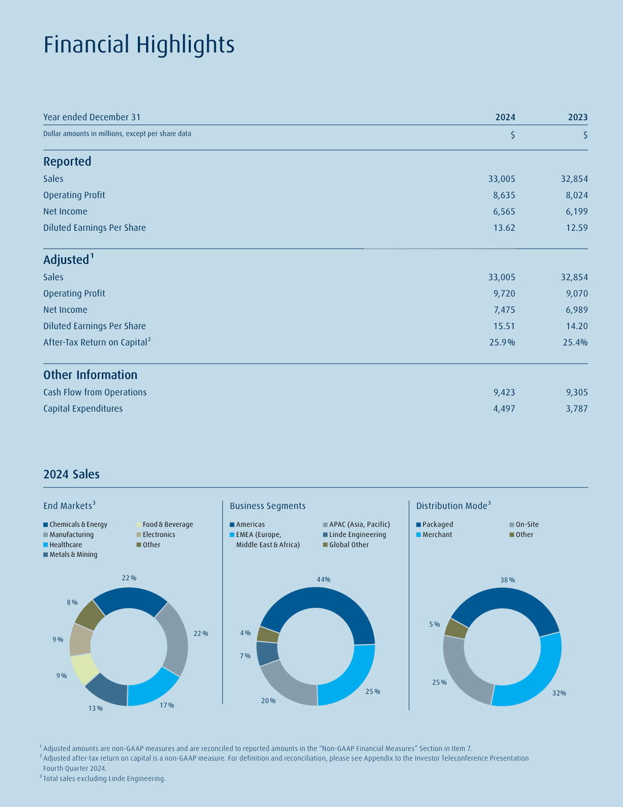
*Source: [Linde 2024 Annual Report to Shareholders — Financial Highlights page](https://assets.linde.com/-/media/global/corporate/corporate/documents/investors/full-year-financial-reports/2024-annual-report-to-shareholders.pdf). This is the primary-source page Linde publishes summarising sales, operating profit, EPS, cash flow, capex, after-tax return on capital, and the three pies (End Markets / Business Segments / Distribution Mode). Note Linde does not publish an equivalent 2025 ARS Financial Highlights page (only the 10-K + 8-K press releases); FY25 figures are derived from the 10-K text and reproduced in the FY21–FY25 trend chart that follows.*

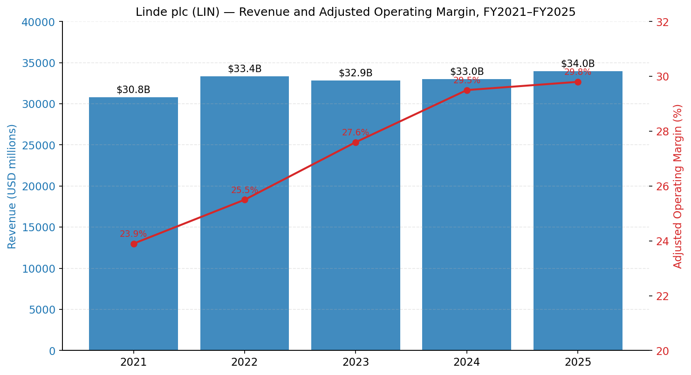
*Source: [Linde 2025 10-K MD&A Executive Summary](https://www.sec.gov/Archives/edgar/data/1707925/000162828026011430/lin-20251231.htm) and prior-year 10-Ks (FY21–FY24).*

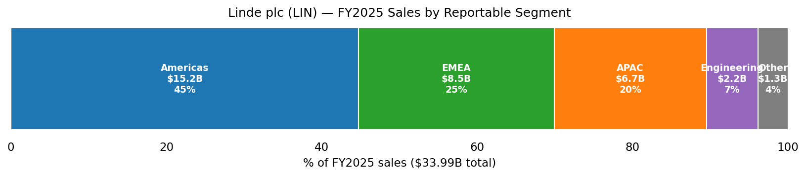
*Source: [Linde 2025 10-K Note 18 Segment Information](https://www.sec.gov/Archives/edgar/data/1707925/000162828026011430/lin-20251231.htm). External sales by segment.*

**Valuation snapshot (as of 2026-05-25).** Spot price ~**USD 517.58**, market cap **USD ~239 bn**, **TTM P/E 34.4×**, **TTM P/S 6.9×**, **EV/EBITDA 19.4×**, dividend yield ~**1.24%**, beta ~**0.74**, shares outstanding ~462 mn ([Yahoo Finance — LIN Key Statistics](https://finance.yahoo.com/quote/LIN/key-statistics/)). The three-year P/E band has run ~28×–37× on TTM earnings, so today's 34.4× sits in the **upper third** of its own range and at a modest premium to direct peers (APD 30.5×, Air Liquide 30.3×, Nippon Sanso 22.0×; Shin-Etsu Chemical at 27.9× sits in the same range but with a very different mix) ([Yahoo Finance — APD](https://finance.yahoo.com/quote/APD/key-statistics/), [Yahoo Finance — AI.PA](https://finance.yahoo.com/quote/AI.PA/key-statistics/), [Yahoo Finance — 4091.T](https://finance.yahoo.com/quote/4091.T/key-statistics/)). *Analyst view:* the premium reflects (i) the highest cash-on-cash returns in the peer group, (ii) the largest Electronics on-site footprint among Western gas majors (the Nomura Greater-China-Semi 2026–30 anchor report illustrates exactly this point — see [Nomura semi-materials note](../../sector/半导体材料.md)), and (iii) the largest clean-hydrogen / blue-ammonia project backlog ($7.1 bn contractual, ~$10 bn total at year-end 2025 ([Q4-2025 Press Release](https://www.sec.gov/Archives/edgar/data/1707925/000165495426000913/lin_ex991.htm))). 34× TTM EPS is not "stretched" by hyper-growth standards — it is a high-quality compounder at a quality multiple, and the Section 9 risk write-up flags multiple-compression as a *possible* (not material) risk if EPS growth deceleration coincides with a rate move.

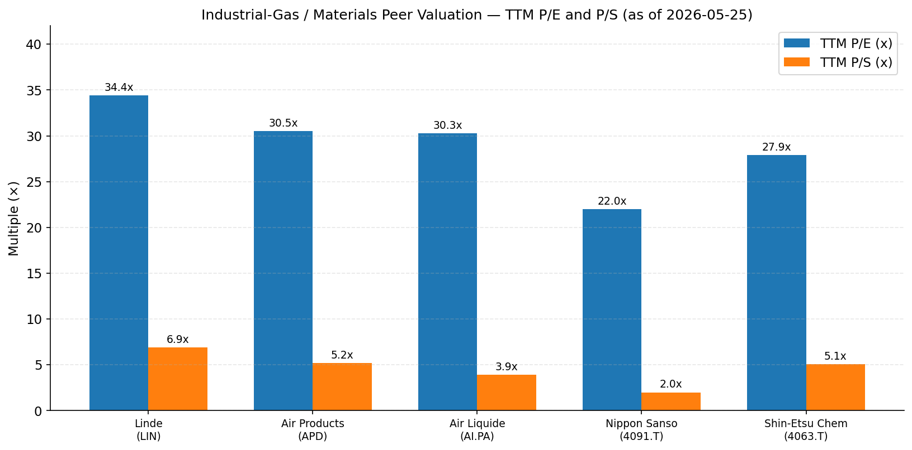
*Source: Yahoo Finance Key Statistics, accessed 2026-05-25 — [LIN](https://finance.yahoo.com/quote/LIN/key-statistics/), [APD](https://finance.yahoo.com/quote/APD/key-statistics/), [AI.PA](https://finance.yahoo.com/quote/AI.PA/key-statistics/), [4091.T (Nippon Sanso)](https://finance.yahoo.com/quote/4091.T/key-statistics/), [4063.T (Shin-Etsu Chemical)](https://finance.yahoo.com/quote/4063.T/key-statistics/).*

---

## 2. Company History

The Linde plc that trades today is the **31 October 2018 product of a $90-billion-equity-value "merger of equals"** between Praxair, Inc. of Danbury, CT and Linde AG of Munich — a transaction announced 1 June 2017, approved by both shareholder bases in early 2018, and consummated after a deep antitrust-driven divestiture programme that handed the legacy Linde North American business to Messer / CVC and parts of legacy Praxair Europe to Taiyo Nippon Sanso ([Linde 2025 10-K, MD&A — Reference to Linde AG merger](https://www.sec.gov/Archives/edgar/data/1707925/000162828026011430/lin-20251231.htm); historical filing trail in the [Linde plc 2017 Form 10-K](https://www.sec.gov/Archives/edgar/data/1707925/000170792518000004/lindeplc201710k.htm)). The accounting acquirer was Praxair; for that reason Linde plc's CIK is 0001707925 — the same CIK assigned to the merger-vehicle "Zamalight plc" that incorporated in Ireland in 2017 specifically to hold both entities, the company's prior name visible on the [EDGAR company page](https://www.sec.gov/cgi-bin/browse-edgar?action=getcompany&CIK=0001707925&type=10-K&dateb=&owner=include&count=10) listing **"formerly: ZAMALIGHT PLC (filings through 2017-07-12)"**.

The two predecessor companies, though, carry much older history. **Linde AG** traces back to 1879 when **Prof. Carl von Linde** patented the cryogenic air-liquefaction process at the Technical University Munich — the same physics still in every modern ASU ([Linde corporate website — Corporate Heritage page](https://www.linde.com/about-linde/corporate-heritage)). **Praxair** was the world's first company to produce on-site oxygen at scale (Tonawanda, NY, 1907 — under the original name "Linde Air Products Company", which was spun out of Union Carbide in 1992 and renamed Praxair). The 2018 merger therefore reunited the two halves of an industrial-gas family that had been separated for ~100 years across the Atlantic.

**Strategic pivot # 1 — the merger itself (2018).** The thesis: combine Praxair's high-return US merchant / packaged-gas franchise with Linde AG's higher-growth Asian footprint and the Linde Engineering EPC arm, layer in $1.2 bn of run-rate synergies, and convert the world's most-fragmented industrial-gas market into a duopoly with Air Liquide ([Linde 2017 10-K, Item 1 — Subsequent Events](https://www.sec.gov/Archives/edgar/data/1707925/000170792518000004/lindeplc201710k.htm)). By FY2024 the combined company had already delivered the targeted synergies and **expanded adjusted operating margin from ~22% (proforma 2018) to 29.5%** ([Linde 2024 Annual Report to Shareholders — Financial Highlights](https://assets.linde.com/-/media/global/corporate/corporate/documents/investors/full-year-financial-reports/2024-annual-report-to-shareholders.pdf)) — a vivid demonstration of the cost-out and pricing discipline that the Praxair playbook bolted onto the higher-growth Linde footprint.

**Strategic pivot # 2 — primary US listing on Nasdaq, NYSE secondary delisting (2024).** In March 2024 Linde decided to **delist from the Frankfurt Stock Exchange** and concentrate trading on the Nasdaq Global Select Market in New York. The motivation, disclosed in the [2024 8-K announcing the delisting](https://www.sec.gov/Archives/edgar/data/1707925/000119312524036171/d806251d8k.htm), was the substantial fraction of liquidity that had already migrated to the US exchange after the merger; the DAX 40 weight of LIN — at the time the index's largest constituent at ~10% — required the company to disproportionately fund DAX-tracking ETF demand at quarterly rebalances, distorting trading patterns. Concentrating in the US has tightened the spread and allowed the company to focus its disclosure on the SEC regime alone.

**Strategic pivot # 3 — Clean-energy / decarbonisation investment cycle (2022 → present).** In 2022 management began **classifying clean-hydrogen and carbon-capture projects as a discrete sub-segment of the on-site backlog**. By year-end 2025 the company disclosed a **~$10 billion total project backlog** including a contractual sale-of-gas component of **$7.1 billion**, with high-profile clean-hydrogen wins anchored by Linde's Beaumont TX clean-H₂ plant (ExxonMobil offtakes up to 2.2 mt/y of CO₂ for permanent storage), additional blue-H₂ and air-separation builds for refining and petrochemical customers, and major on-site ASU contracts for new fab sites — including Samsung Foundry Taylor TX and TSMC Arizona ([Linde 2025 10-K, MD&A — Capital Expenditures](https://www.sec.gov/Archives/edgar/data/1707925/000162828026011430/lin-20251231.htm); [Linde Press Release — Linde Signs Agreement with ExxonMobil for Carbon Dioxide Off-take, 2023-04-04](https://www.linde.com/news-and-media/2023/linde-signs-agreement-with-exxonmobil-for-carbon-dioxide-off-take)). The backlog is a structural visibility tool: each project converts to 10-to-20-year on-site contracts as the plants start up over 2026–2030.

**Mermaid timeline.**

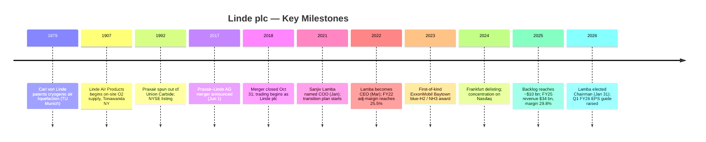

**Recent developments (last 12 months).** (i) Sean Durbin appointed **Chief Operating Officer effective 1 October 2025** — a Praxair-tenured executive previously running North America, replacing the COO seat vacated when Lamba moved to the CEO role in 2022 ([Linde 2025 10-K, Item 1 — Executive Officers](https://www.sec.gov/Archives/edgar/data/1707925/000162828026011430/lin-20251231.htm)). (ii) Sanjiv Lamba **elected Chairman of the Board effective 31 January 2026**, combining the chair / CEO role and reflecting board confidence in the strategy ([Linde 2026 DEF 14A — Corporate Governance Framework](https://www.sec.gov/Archives/edgar/data/1707925/000119312526192209/lin-20260429.htm)). (iii) FY26 adjusted-EPS guidance **raised on 2026-05-01** as discussed in the top-of-report banner. (iv) Major new project wins continue to fill the backlog, including the second phase of the ExxonMobil Baytown low-carbon hydrogen complex and additional on-site contracts for Samsung Foundry Taylor TX. (v) Continued capital return — **net buybacks $4.6 bn in FY25**, the highest in company history ([Linde 2025 10-K, Cash Flows from Financing](https://www.sec.gov/Archives/edgar/data/1707925/000162828026011430/lin-20251231.htm)).

---

## 3. Management Team

**Note on scope.** Per the company-research skill, this section covers only the founder and the current CEO; legacy Praxair / Linde AG founders (Carl von Linde, the Union Carbide industrial-gases division leadership of the 1990s) are too historical to bio in operational depth. Linde plc as a legal entity was incorporated in 2017 as a merger vehicle and has no "founder" in the modern operational sense; instead, the closest analogue is **Stephen F. Angel**, who as Praxair CEO architected the 2018 combination and then served as Linde plc's first CEO (2018–2022) and Chairman (until 31 January 2026). He retired from the Board on that date ([Linde 2026 DEF 14A, Director Compensation Table footnote (3)](https://www.sec.gov/Archives/edgar/data/1707925/000119312526192209/lin-20260429.htm)), so he is no longer in management — but his transition into Lamba is the relevant context for the CEO bio below.

### Sanjiv Lamba — Chairman & Chief Executive Officer (since 2022, Chairman effective 2026-01-31)

**Sanjiv Lamba** (age 61, as of the 2026 DEF 14A) was elected **Chairman of the Board effective 31 January 2026** and has been **Chief Executive Officer of Linde plc since 1 March 2022** ([Linde 2026 DEF 14A — Director Nominees, Sanjiv Lamba](https://www.sec.gov/Archives/edgar/data/1707925/000119312526192209/lin-20260429.htm)). Prior to becoming CEO, Lamba served as **Chief Operating Officer of Linde plc from January 2021 to February 2022** — a 14-month grooming role under predecessor CEO Stephen F. Angel — and before that as **Executive Vice President, APAC since 2018**, the position to which he was elevated immediately after the Praxair / Linde AG merger closed ([Linde 2026 DEF 14A — Lamba bio](https://www.sec.gov/Archives/edgar/data/1707925/000119312526192209/lin-20260429.htm)). His operating tenure inside the company's APAC business — the most important geography for the electronics-gases franchise — explains the strategic continuity of the on-site semi-fab build-out (TSMC, Samsung, SK Hynix) that has become the highest-multiple sub-business in the group.

Lamba's career began in 1989 with **BOC India in Finance**, where he was promoted to Director of Finance and subsequently **Managing Director for the India business in 2001** ([Linde 2026 DEF 14A — Lamba bio](https://www.sec.gov/Archives/edgar/data/1707925/000119312526192209/lin-20260429.htm)) — BOC was the British industrial-gas major that legacy Linde AG acquired in 2006, giving Lamba ~35 years of continuous service in the same corporate family. He has worked across **India, the UK, Singapore and Germany**, the latter as a **member of the Executive Board of Linde AG** in Munich responsible for the Asia Pacific Gases segment, Global Helium & Rare Gases, Electronics and the Asia Joint Venture portfolio ([Linde 2025 10-K, Item 10 — Executive Officers](https://www.sec.gov/Archives/edgar/data/1707925/000162828026011430/lin-20251231.htm)). The bio's geographic breadth is unusual for a global-major CEO — most are domestic operators promoted up — and it positions him as the natural successor when the Angel-era US-centric integration phase ended.

Outside Linde, Lamba **served as Co-Chair of the Hydrogen Council**, the global industry body for low-carbon hydrogen — a directly thematic role given Linde's clean-hydrogen backlog. In **January 2026 he joined the Board of Directors of Amphenol Corporation (NYSE: APH)**, the connector / interconnect company ([Linde 2026 DEF 14A — Other Public Company Directorships](https://www.sec.gov/Archives/edgar/data/1707925/000119312526192209/lin-20260429.htm)), giving him board-level visibility into the data-center / AI infrastructure customer base that drives Linde's electronics on-site demand. He is also a **member of The Business Council**, the US CEO peer organisation. His compensation is disclosed in the 2026 DEF 14A Summary Compensation Table — see [Executive Compensation Tables, Table 1](https://www.sec.gov/Archives/edgar/data/1707925/000119312526192209/lin-20260429.htm) — at-risk pay-for-performance with a meaningful long-term equity weight aligned with shareholders.

The June-2025 board decision to combine Chair and CEO roles in Lamba was justified in the proxy as reflecting **"his significant industry expertise, CEO experience and effective working relationship with the Board"** ([Linde 2026 DEF 14A — Linde s Corporate Governance Framework](https://www.sec.gov/Archives/edgar/data/1707925/000119312526192209/lin-20260429.htm)). The independence of the board is preserved through the Lead Independent Director (LID) role held by **Robert L. Wood**, who has held that position since 1 March 2022 (the same date Lamba became CEO). Combined-role CEO / Chair structures are sometimes criticised on governance grounds; the LID structure is the accepted mitigant and is in place here.

---

## 4. Products & Services

Section 4 is the analytical centre of this report — every downstream section (Customers, Industry, Competitive Landscape, TAM, Risks) ultimately maps back to the product taxonomy below. Linde's product matrix is organised primarily by **molecule × distribution mode** rather than by end-market. Atmospheric and process gases are co-produced from the same plants and then routed through the three distribution channels (on-site, merchant, packaged) introduced in Section 1. The technological IP sits in (i) the air-separation, hydrogen-reformer and electrolyser process designs that the Engineering segment EPCs; (ii) the proprietary applications technology (laser-cutting gas blends, blanket / etch / clean specialty gas formulations for fabs, food-freezing tunnels for protein processors, MAGNESHIELD® medical-O2 systems for hospitals); and (iii) the operating discipline (energy contracts, productivity programmes, safety record) that lets a tonnage on-site contract clear a teen-percent IRR.

### 4.1 The product / distribution matrix

The 10-K does not publish a single tabular product matrix, but the verbatim Item 1 product descriptions and the segment disaggregation in Note 18 together imply the structure below. I reproduce it as an analyst-constructed table — every row is sourced to the 10-K text where the molecule is named.

| Molecule family | Primary distribution mode(s) | End-market exposure | Key technology / IP | 10-K anchor |
|---|---|---|---|---|
| **Oxygen (O₂)** | On-site (pipeline) + merchant (LOX truck) + cylinders | Steel, refining, healthcare, glass | Cryogenic ASU; VPSA on-site | [10-K Item 1](https://www.sec.gov/Archives/edgar/data/1707925/000162828026011430/lin-20251231.htm) |
| **Nitrogen (N₂)** | On-site + merchant (LIN truck) + cylinders | Electronics blanket / inerting, food freezing, chemicals | Cryogenic ASU; membrane / PSA | [10-K Item 1](https://www.sec.gov/Archives/edgar/data/1707925/000162828026011430/lin-20251231.htm) |
| **Argon (Ar)** | Merchant + cylinders | Welding, stainless-steel, semi sputter | Cryogenic ASU (co-product with O₂) | [10-K Item 1](https://www.sec.gov/Archives/edgar/data/1707925/000162828026011430/lin-20251231.htm) |
| **Rare gases — Kr / Ne / Xe** | Cylinders | Lighting (Xe arcs), excimer-laser fill (Kr-F, Ar-F), specialty optics | Cryogenic distillation; ultra-pure refinement | [10-K Item 1](https://www.sec.gov/Archives/edgar/data/1707925/000162828026011430/lin-20251231.htm) |
| **Hydrogen (H₂)** — conventional grey | On-site (pipeline) + merchant (tube trailers) | Refining hydrocracking, ammonia, methanol | SMR / ATR from natural gas | [10-K Item 1](https://www.sec.gov/Archives/edgar/data/1707925/000162828026011430/lin-20251231.htm) |
| **Hydrogen — low-carbon (blue)** | On-site + future merchant | Refining decarb, blue-NH3 export, mobility | SMR / ATR + carbon capture & sequestration (CCS) | [10-K Item 1](https://www.sec.gov/Archives/edgar/data/1707925/000162828026011430/lin-20251231.htm) |
| **Hydrogen — renewable (green)** | On-site + merchant | Refining decarb, fertilizer, mobility | PEM / alkaline electrolysers + renewable electricity | [10-K Item 1](https://www.sec.gov/Archives/edgar/data/1707925/000162828026011430/lin-20251231.htm) |
| **Helium (He)** | Merchant + cylinders + ISO containers | MRI cryo cooling, semi cooling, leak-testing | Helium from US helium-rich gas streams + intl. sources | [10-K Item 1](https://www.sec.gov/Archives/edgar/data/1707925/000162828026011430/lin-20251231.htm) |
| **CO₂ / CO** | Merchant + cylinders + on-site | Food / beverage carbonation, EOR, syngas | By-product recovery from chemical / refining sites | [10-K Item 1](https://www.sec.gov/Archives/edgar/data/1707925/000162828026011430/lin-20251231.htm) |
| **Acetylene (C₂H₂)** | Cylinders + packaged | Welding, brazing, chemicals (vinyl) | By-product of petrochem; calcium-carbide back-up | [10-K Item 1](https://www.sec.gov/Archives/edgar/data/1707925/000162828026011430/lin-20251231.htm) |
| **Electronic gases** — NF₃, WF₆, HBr, B₂H₆, SiH₄, GeH₄, PH₃, AsH₃ | Cylinders + ISO + on-site bulk | Semiconductor fab CVD / etch / ion-implant | Proprietary blending, ppt-level purification, on-site distribution | [10-K Item 1](https://www.sec.gov/Archives/edgar/data/1707925/000162828026011430/lin-20251231.htm) |
| **Specialty gases & mixtures** | Cylinders + packaged | Analytical instruments, environmental monitoring, calibration | Linde-proprietary blends to ±1% spec | [10-K Item 1](https://www.sec.gov/Archives/edgar/data/1707925/000162828026011430/lin-20251231.htm) |
| **Engineering plant sales** | EPC contract delivery | ASUs, H2 plants, olefin / NG plants, electrolysers | Proprietary process tech (LINDE® brand designs) | [10-K Item 1 — Engineering](https://www.sec.gov/Archives/edgar/data/1707925/000162828026011430/lin-20251231.htm) |

The verbatim 10-K text the table is built from:

> "Atmospheric gases are the highest volume products produced by Linde. Using ambient air as feedstock, Linde produces oxygen, nitrogen and argon through several air separation processes of which cryogenic air separation is the most prevalent. Linde is the market leader in the field of non-cryogenic air separation technologies for the production of industrial gases. As part of this process Linde also produces rare gases, such as krypton, neon, and xenon."
> — [Linde 2025 10-K, Item 1 — Industrial Gases Products and Manufacturing Processes](https://www.sec.gov/Archives/edgar/data/1707925/000162828026011430/lin-20251231.htm)

> "Process gases, including hydrogen, helium, carbon dioxide, carbon monoxide, specialty gases and acetylene are produced by other production methods. Hydrogen is produced from several different feedstocks using a range of technologies. Today, carbon intensity is used to designate and differentiate between the production processes and the respective feedstocks used to produce the molecule. The majority of conventional hydrogen currently produced by Linde is derived from natural gas or methane, using steam methane reformation (SMR) or auto-thermal reforming (ATR) technology. Linde has a range of technologies to produce low-carbon hydrogen from fossil feedstocks, or renewable hydrogen from renewable energy (non-fossil feedstock). Both products are considered sources of clean energy."
> — [Linde 2025 10-K, Item 1 — Industrial Gases Products and Manufacturing Processes](https://www.sec.gov/Archives/edgar/data/1707925/000162828026011430/lin-20251231.htm)

> "Helium is sourced from certain helium-rich natural gas streams in the United States, with additional supplies being acquired from outside the United States. Acetylene is primarily sourced as a chemical by-product, but may also be produced from calcium carbide and water."
> — [Linde 2025 10-K, Item 1 — Industrial Gases Products and Manufacturing Processes](https://www.sec.gov/Archives/edgar/data/1707925/000162828026011430/lin-20251231.htm)

### 4.2 How the distribution channels stitch into one workflow

```mermaid
graph LR
    A[Air separation unit (ASU) cryogenic] --> B[On-site pipeline<br/>O₂ / N₂ / Ar / H₂<br/>10-20 yr contracts]
    A --> C[Merchant liquid<br/>LOX / LIN / LAR truck<br/>3-7 yr contracts]
    A --> D[Cylinder filling<br/>packaged gases<br/>1-3 yr / PO]
    E[SMR / ATR / electrolyser] --> B
    E --> C
    F[He extraction / specialty gas plant] --> C
    F --> D
    G[Engineering EPC delivers plants] -.builds.-> A
    G -.builds.-> E
    B --> Z[Customer: steel mill / fab / refinery / hospital]
    C --> Z
    D --> Z
```

**中文释义 / Plain-language gloss:** an industrial-gas company is — at its heart — a giant **molecule logistics network**. One ASU may produce 2,000 tonnes/day of oxygen for a Gulf-Coast refinery on a 15-year take-or-pay contract (the on-site "tonnage" mode), simultaneously bottle off 500 tonnes/day of LOX (liquid O2) into tanker trucks for delivery to a 50-mile-radius cluster of secondary customers (the merchant mode), and finally re-liquefy / re-pressurise the smallest output into high-pressure steel cylinders for a hospital network 300 km away (the packaged mode). The same molecules, the same plant — but **three pricing models, three contract lengths, three sales-cycle motions, and three different gross-margin profiles**. The 10-K explains it plainly: "These distribution methods are often integrated, with products from all three supply modes coming from the same plant. The method of supply is generally determined by the lowest cost means of meeting the customer's needs" ([Linde 2025 10-K, Item 1 — Industrial Gases Distribution](https://www.sec.gov/Archives/edgar/data/1707925/000162828026011430/lin-20251231.htm)).

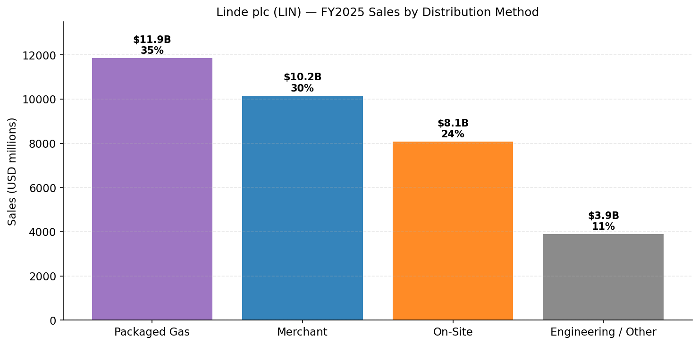
*Source: management-disclosed Distribution Mode mix in the [Linde 2024 Annual Report to Shareholders, Financial Highlights](https://assets.linde.com/-/media/global/corporate/corporate/documents/investors/full-year-financial-reports/2024-annual-report-to-shareholders.pdf) (FY24 mix of 38% packaged / 32% merchant / 25% on-site / 5% other, ex-Engineering) extrapolated to FY25 segment totals from [Linde 2025 10-K, MD&A — Segment Discussion](https://www.sec.gov/Archives/edgar/data/1707925/000162828026011430/lin-20251231.htm).*

### 4.3 Atmospheric gases — O₂, N₂, Ar, rare gases

**10-K verbatim:**

> "Atmospheric gases are the highest volume products produced by Linde. Using ambient air as feedstock, Linde produces oxygen, nitrogen and argon through several air separation processes of which cryogenic air separation is the most prevalent. Linde is the market leader in the field of non-cryogenic air separation technologies for the production of industrial gases."
> — [Linde 2025 10-K, Item 1 Business](https://www.sec.gov/Archives/edgar/data/1707925/000162828026011430/lin-20251231.htm)

**中文释义 / Plain-language gloss:** an ASU (air-separation unit, 空分装置) takes ordinary air — ~78% N₂ / 21% O₂ / 0.93% Ar / trace rare gases — compresses it to ~6 bar, cools it by Joule–Thomson expansion to about –185 °C, and then distils the liquefied components in a multi-column cryogenic distillation tower. Oxygen exits the bottom (heavier, higher boiling point); nitrogen exits the top; argon is recovered from a side cut. Because the four products come from the same column, **production economics are joint** — you cannot sell only oxygen without producing the matching N₂ / Ar / rare-gas tonnage. This is why the merchant market for industrial gases has historically been "balanced" by molecule mix per region: a fab cluster (heavy N₂ consumer) tends to also create a co-produced LOX / LAR supply that the merchant business has to find an outlet for. Linde's pipeline networks in the US Gulf Coast and the Yangtze River corridor of China are exactly the topology that lets the company sell whichever molecule the regional market is short of without having to truck it long distance.

**Strategic significance:** the atmospheric-gas business is **the most cycle-resilient sub-segment of Linde** — long-cycle take-or-pay on-site contracts (10–20 yr), high switching costs (the pipeline is physically attached to the customer's plant), and an energy-cost pass-through clause that protects gross profit when power tariffs spike. Cycle exposure comes through the merchant mode (welding / steel / general manufacturing demand) and through the packaged mode (small-business consumption), both of which are pro-cyclical at the volume level but rarely at the contract level. The biggest **new** demand wave atmospheric gases are riding is the **electronics on-site build-out** for sub-3 nm fabs — every wafer consumes N₂ for blanket purging at multiple process steps, plus Ar for plasma deposition / etch and for ion implantation — and Linde's 2025 capital expenditure mix shows **APAC capex at 21% of group total** weighted toward new ASUs feeding Taiwanese / Korean / Chinese fab clusters ([Linde 2025 10-K, MD&A — Capital Expenditures](https://www.sec.gov/Archives/edgar/data/1707925/000162828026011430/lin-20251231.htm)).

*Analyst view:* Linde has the world's most consolidated on-site book of business in atmospheric gases. Closest named-product competitor for new-fab N₂ on-site supply: **Air Liquide's ALOHA® deposition-materials and on-site nitrogen platform** for semiconductor fabs ([Air Liquide Electronics — Semiconductors page](https://electronics.airliquide.com/who-we-are/our-markets/semiconductors-0)). Air Products and Nippon Sanso compete on the same shapes of contract but typically with a regional rather than a global footprint. The closest moat verdict is **yes — high switching cost, scale**; the moat type is **physical co-location + 10–20 year contracts + the energy / cost pass-through clause** that effectively makes the customer underwrite Linde's operating cost.

### 4.4 Hydrogen — grey, blue and green

**10-K verbatim:**

> "Hydrogen is produced from several different feedstocks using a range of technologies. Today, carbon intensity is used to designate and differentiate between the production processes and the respective feedstocks used to produce the molecule. The majority of conventional hydrogen currently produced by Linde is derived from natural gas or methane, using steam methane reformation (SMR) or auto-thermal reforming (ATR) technology. Linde has a range of technologies to produce low-carbon hydrogen from fossil feedstocks, or renewable hydrogen from renewable energy (non-fossil feedstock). Both products are considered sources of clean energy. Low-carbon (blue) hydrogen is produced primarily from methane, by capturing carbon emissions from a hydrogen production plant and sequestering them subsurface for the long term. Renewable (green) hydrogen is produced by electrolysis using renewable energy and water as feedstock."
> — [Linde 2025 10-K, Item 1 Business](https://www.sec.gov/Archives/edgar/data/1707925/000162828026011430/lin-20251231.htm)

**中文释义 / Plain-language gloss:** the hydrogen molecule is the same H₂ no matter how you produce it; the **commercial differentiation is "colour" — i.e. carbon intensity per kg H₂.** "Grey" hydrogen is the legacy SMR (steam methane reforming, 蒸汽甲烷重整) from natural gas — ~10 kg CO₂ per kg H₂, used heavily in refining hydrocracking and ammonia synthesis. "Blue" hydrogen is the same SMR / ATR process bolted to a carbon-capture-and-sequestration (CCS) train that injects the flue CO₂ into a depleted oil reservoir for permanent storage — Linde's flagship blue project is the **Beaumont, Texas clean-hydrogen complex** announced in 2023 with ExxonMobil as the CO₂ off-taker (up to 2.2 million tonnes/year of CO₂ to be transported and permanently stored by ExxonMobil) ([Linde Press Release — Linde Signs Agreement with ExxonMobil for Carbon Dioxide Off-take, 2023-04-04](https://www.linde.com/news-and-media/2023/linde-signs-agreement-with-exxonmobil-for-carbon-dioxide-off-take); [Linde 2025 10-K, MD&A — Capital Expenditures](https://www.sec.gov/Archives/edgar/data/1707925/000162828026011430/lin-20251231.htm)). "Green" hydrogen is electrolysis (PEM or alkaline) powered by wind / solar — the technology is mature but the levelised cost is still 2–3× SMR at most renewable-electricity prices, so volumes are project-by-project rather than industrial-scale.

**Strategic significance:** hydrogen is the **single largest growth lever** in Linde's project backlog. The Inflation Reduction Act (IRA) 45V production tax credit (up to $3.00 / kg for the lowest-carbon-intensity H₂) and the EU's Important Project of Common European Interest (IPCEI) Hydrogen wave create demand visibility that did not exist five years ago. Linde's competitive advantage in clean hydrogen is **vertical**: the Engineering segment designs and builds the SMR / ATR plants (40+ year track record), the gas business operates them, and the customer base — major refiners, ammonia producers, future blue-ammonia exporters — overlaps almost perfectly with Linde's existing grey-hydrogen on-site book. The risk, of course, is that several of the announced US blue-hydrogen projects (BP Whiting, Dow Path-2-Zero, OCI / Woodside H2 Houston) are awaiting FID confirmation as project economics, tax-credit guidance and customer offtake firm up.

*Analyst view:* the closest peer in clean hydrogen is **Air Products' NEOM green-hydrogen / green-ammonia project in Saudi Arabia** (~600 t/d green H₂ via electrolysis powered by 4 GW of wind / solar, with an exclusive 30-year take-or-pay to ExxonMobil for the ammonia output) ([Air Products 2025 10-K, Item 1 — Hydrogen for Energy Transition](https://www.sec.gov/Archives/edgar/data/2969/000000296925000055/apd-20250930.htm)). Air Products has taken larger single-project bets at NEOM and Louisiana; Linde has chosen a more diversified portfolio of mid-scale blue-H₂ wins anchored to existing refinery customers. Moat verdict: **partial — Linde and APD are co-leaders in clean H₂ EPC + supply** but the moat is shallower than in atmospheric gases because (i) the customers are sophisticated, (ii) tax-credit policy is the main demand driver, and (iii) the technology (SMR, electrolyser stacks) is licensable from multiple vendors.

### 4.5 Helium — the cycle-driven specialty

**10-K verbatim:**

> "Helium is sourced from certain helium-rich natural gas streams in the United States, with additional supplies being acquired from outside the United States."
> — [Linde 2025 10-K, Item 1 Business](https://www.sec.gov/Archives/edgar/data/1707925/000162828026011430/lin-20251231.htm)

**中文释义 / Plain-language gloss:** helium (He, 氦) is **not produced** in the conventional sense — it is extracted as a by-product from natural-gas streams that contain ≥ ~0.3% He. Only a handful of gas fields globally meet that threshold: the Hugoton-Panhandle in the US (which fed the Federal Helium Reserve for decades), the LaBarge field in Wyoming (ExxonMobil's Shute Creek plant), the Algerian Hassi-R'Mel field (Sonatrach), Qatar's North Field (the world's biggest single source), and the Russian Amur GPP (Gazprom). Linde recovers helium at LaBarge and other US sources, and complements with imports under long-term offtakes from Qatar and Algeria. Helium goes to **MRI scanners** (the dominant use — liquid He cools superconducting magnets to ~4 K), **semiconductor / fibre-optics process cooling**, **leak-testing**, lifting gas (small share), and physics research.

**Strategic significance:** helium is the **most cyclical** product in Linde's portfolio. Supply is structurally constrained (you can't decide to build more helium — you have to wait for the host gas field to scale), and demand is binary (a new MRI install drives a step-change in helium consumption that never reverses; conversely, a manufacturing recession freezes elective MRI scans and demand collapses). The 2022–2023 cycle saw spot helium prices triple after the Federal Helium Reserve auction was disrupted and Russian / Algerian supply was constrained; the 2024–2025 cycle has seen prices normalise as Qatar's North Field expansion completed and US recovery rates improved ([Linde 2025 10-K, Note 18 — intersegment helium sales declined from $509 mn in 2023 to $436 mn in 2025](https://www.sec.gov/Archives/edgar/data/1707925/000162828026011430/lin-20251231.htm), consistent with normalising price). The cycle dampens Linde's reported volume growth in any given year by ~50–100 bps when helium prices fall, and equivalently boosts it when they rise — investors should treat helium-driven margin swings as **non-recurring cyclical noise**, not as evidence of underlying-business deterioration.

*Analyst view:* Linde and Air Products are the two largest Western helium suppliers; **Messer (Germany / privately held)** and **Iwatani (TSE:8088)** are the largest pure-play specialists, with Iwatani holding a particularly high market share in Japanese MRI / semi consumption. Closest single product competitor: **Air Products' helium business unit** (which Linde and APD have historically dominated together at >50% of the merchant market). Moat verdict: **yes — resource access and long-term offtakes from Qatar / Algeria / US sources** are the moat; **partial cycle volatility** is the trade-off.

### 4.6 Electronic gases & specialty gases — the semi nexus

**10-K verbatim:**

> "Cylinders may be delivered to the customer's site or picked up by the customer at a packaging facility or retail store. Packaged gases are generally sold under one to three-year supply contracts and through purchase orders. Linde also produces and distributes in cylinders a wide range of specialty gases and mixtures."
> — [Linde 2025 10-K, Item 1 Business — Packaged Gases](https://www.sec.gov/Archives/edgar/data/1707925/000162828026011430/lin-20251231.htm)

The 10-K Item 1 text names **"electronic gases, specialty gases"** as part of process gases ([Linde 2025 10-K, Item 1 — General](https://www.sec.gov/Archives/edgar/data/1707925/000162828026011430/lin-20251231.htm)) and the segment-revenue discussion in the MD&A flags **electronics as the leading FY25 volume-growth driver** in both Americas and APAC: *"Volumes increased sales by 1% primarily driven by electronics, metals and mining, and chemicals and energy end markets including project start-ups"* (Americas, FY25) and *"6% volumes primarily in the electronics, and chemicals and energy end markets and project startups"* (APAC, Q1 FY26) ([Linde 2025 10-K, MD&A — Americas](https://www.sec.gov/Archives/edgar/data/1707925/000162828026011430/lin-20251231.htm); [Q1-2026 Earnings Press Release](https://www.sec.gov/Archives/edgar/data/1707925/000165495426004202/lin_ex991.htm)).

**中文释义 / Plain-language gloss:** the bulk gases Linde sells to a fab — N₂ for blanket purging, O₂ for oxidation furnaces, Ar for ion-implant and PVD, He for cooling — are commodity-grade atmospheric or by-product molecules. The **specialty electronic gases** are a different and much smaller market: ultra-high-purity molecules used at single process steps to deposit a specific film, etch a specific layer, or dope a wafer with a specific impurity. The product roster — **NF₃ (氟化氮)** for chamber cleaning, **WF₆ (六氟化钨)** for tungsten metallisation, **HBr (溴化氢)** for poly-silicon etch, **B₂H₆ (二硼烷)** for p-type doping, **SiH₄ (硅烷)** for silicon film deposition, **GeH₄ (锗烷)** for SiGe channel doping at advanced nodes, **PH₃ (磷化氢)** for n-type doping, **AsH₃ (砷化氢)** for III-V compound semis — is the single most strategically important slice of Linde's electronics franchise. The molecules are tiny in volume terms (kilograms / year, not tonnes) but **carry 60–80% gross margins** because the purity spec (parts-per-trillion contamination ceilings) is what determines fab yield. Linde's specialty-gas plants are co-located with the fab cluster (Hsinchu, Taoyuan, Pyeongtaek, Wuxi, Beijing), and the customer relationships are decade-plus ones with TSMC, Samsung Foundry, SK Hynix, Intel, Micron, YMTC and ChangXin.

The 10-K does not break out specialty electronic-gas revenue; the Nomura "Greater China Semi" anchor report quoted in [reports/sector/半导体材料.md](../../sector/半导体材料.md) puts Linde at the top of the **electronic-gas global league table** alongside Air Liquide, Air Products and Taiyo Nippon Sanso, but this is *analyst* market-share commentary, not a 10-K disclosure.

*Analyst view:* the closest single-product competitors are (i) **Air Liquide's "Voltaix" specialty-precursor business** (acquired 2013, focused on advanced-node SiGe / GeH₄ chemistries) ([Air Liquide 2024 Universal Registration Document — Voltaix](https://www.airliquide.com/sites/airliquide.com/files/2025-03/air-liquide-2024-universal-registration-document.pdf)); (ii) **Versum Materials**, the Air Products spin-out **acquired by Merck KGaA in 2019** and now operating as part of EMD Electronics, focused on tungsten and chamber-clean gases; (iii) **SK Specialty**, the Korean / Hahn-Bullock-controlled NF₃ and WF₆ specialist that supplies SK Hynix, Samsung Foundry and increasingly Western fabs; and (iv) **Showa Denko / Resonac** (TSE:4004) which holds dominant Japanese share in NF₃, WF₆ and chamber-clean. Linde's positioning is **leader in Western fabs and joint leader in Asian fabs** for the high-purity bulk gases, with a more contested position in the smallest-volume / most-specialised molecules where Versum / SK Specialty / Resonac each have niche strengths. Moat verdict: **yes — purity spec + on-site logistics + long-term TSMC / Samsung / SK Hynix relationships**; the moat is, however, **less wide than in atmospheric gases** because customers actively dual-source specialty molecules to mitigate supply-disruption risk.

### 4.7 Engineering — the EPC / process-design franchise

**10-K verbatim:**

> "Linde's Engineering business has a global presence, with its focus on market segments such as air separation, hydrogen, synthesis, olefin and natural gas plants. The company utilizes its process engineering expertise in the planning, design and construction of efficient plants for the production and processing of gases. Engineering uses sustainable technologies to help customers avoid, capture and utilize carbon dioxide emissions. Its technology portfolio covers the entire value chain for production, liquefaction, storage, distribution and application of hydrogen which supports the transition to clean energy."
> — [Linde 2025 10-K, Item 1 Business — Engineering](https://www.sec.gov/Archives/edgar/data/1707925/000162828026011430/lin-20251231.htm)

**中文释义 / Plain-language gloss:** the Engineering segment is the **EPC (engineering, procurement, construction) arm** of Linde — the same business that the legacy Linde AG built in Germany over a century of cryogenic process design, now scaled globally. Its customer mix is bifurcated: ~55% of its annual order intake serves **Linde's own gas business** (intersegment sales reached $2,702 mn in 2025 — see [Linde 2025 10-K, Note 18 footnote (a)](https://www.sec.gov/Archives/edgar/data/1707925/000162828026011430/lin-20251231.htm)), building the ASUs, SMR plants and electrolysers that anchor on-site supply contracts; ~45% serves **third-party customers** — refineries that want their own captive H₂ plant, petrochemical complexes that order olefin / ethylene plants, LNG processors that order natural-gas treatment trains. External Engineering sales in FY25 were $2,250 mn (–3% YoY), reflecting the lumpy nature of large-EPC project timing rather than secular softness.

**Strategic significance:** Engineering is the **single most important strategic asset Linde inherited from Linde AG** in the 2018 merger. Without it, the gas business would have to bid out EPC work to Air Products' Process Equipment Group, Bechtel, Technip or Wood plc, ceding margin and timing control. With it, Linde can quote on-site gas contracts confident that its in-house EPC will deliver on cost and on schedule, and can offer customers integrated "design + build + operate" propositions that competitors without an EPC arm cannot match (Air Liquide is the only direct peer with a comparable in-house EPC capability via Air Liquide Engineering & Construction). Engineering also produces the **proprietary process designs** — multi-column distillation patents, low-pressure ATR for blue H₂, electrolyser stack integration — that constitute Linde's core IP.

*Analyst view:* the closest peers are **Air Liquide Engineering & Construction (private subsidiary)** and **Air Products' Process Equipment Group**; in third-party EPC the broader competitive set includes **Wood plc (LON:WG.)**, **John Wood Group**, **Technip Energies (EPA:TE)**, **Saipem (BIT:SPM)** and **L&T Hydrocarbon Engineering**. Within the air-separation niche, Linde Engineering is the global #1 by installed base — but this is analyst commentary, not a 10-K disclosure. Moat verdict: **yes — proprietary process IP, in-house captive demand at scale, decades of plant-operating data feeding back into design improvements**.

### 4.8 Healthcare / medical gases

The 10-K names **healthcare** as one of the diverse end-markets Linde serves ([Linde 2025 10-K, Item 1 — General](https://www.sec.gov/Archives/edgar/data/1707925/000162828026011430/lin-20251231.htm)) and the 2024 ARS pie chart shows **17% of FY24 sales (ex-Engineering) coming from healthcare** ([Linde 2024 Annual Report to Shareholders — Financial Highlights, End Markets pie](https://assets.linde.com/-/media/global/corporate/corporate/documents/investors/full-year-financial-reports/2024-annual-report-to-shareholders.pdf)). The product is principally **medical-grade oxygen** delivered to (i) hospitals (bulk LOX for piped distribution to patient wards), (ii) homecare patients (concentrators + small cylinders), and (iii) ambulance / first-responder networks (portable cylinders). Linde also supplies **NO (nitric oxide)** for neonatal respiratory failure, **xenon** for radiology / anaesthesia research, and **medical-grade CO₂** for laparoscopic insufflation. The acquisition of **Lincare** (US homecare) in 2012 by predecessor Linde AG created the largest homecare oxygen network in the US — that asset is now under Linde plc.

**Strategic significance:** healthcare is the **most defensive sub-segment**. Demand is non-discretionary, contract durations are long (multi-year hospital tenders), and pricing has predictable inflation pass-through. It is also the segment most exposed to **regulatory risk** — homecare reimbursement under Medicare Part B is reviewed periodically, and any cut to per-patient O₂ reimbursement compresses the homecare margin. Moat verdict: **partial — regulatory licences and hospital tender relationships are durable but not exclusive**; competitor set includes **Air Liquide Santé, Air Products Healthcare, Messer, and the regional homecare specialists**.

### 4.9 Synthesis — how the categories interact in a single customer workflow

A useful mental model: think of Linde as **three concentric customer rings**, each consuming different molecules through different channels.

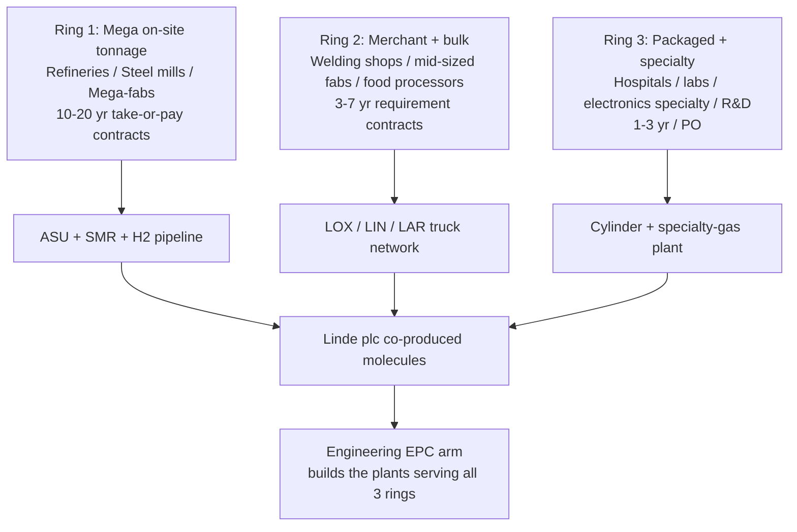

The three rings share the same upstream production plant but face very different competitive dynamics, contract lengths, and gross-margin profiles. Linde's strategy is to **anchor each region with a Ring-1 mega-customer (refinery / fab / steel)** that justifies the on-site infrastructure capex, then use that infrastructure's spare capacity and pipeline reach to serve Ring 2 / Ring 3 demand at marginal cost. The **Engineering segment is the orthogonal arm** that builds out the production / treatment plants serving all three rings — both for Linde's own use and for third-party customers — and creates a continuous EPC backlog of $2.8 bn for third-party equipment as of Q1 FY26 ([Q1-2026 Earnings Press Release — Linde Engineering](https://www.sec.gov/Archives/edgar/data/1707925/000165495426004202/lin_ex991.htm)).

### 4.10 Flagship franchises and recent launches

**Flagship #1 — On-site oxygen / nitrogen for refineries (Gulf Coast cluster).** Anchored by ExxonMobil Baytown, BP Whiting, Marathon Galveston Bay, Valero / Diamond Green Diesel. ~30+ ASUs feeding a Texas/Louisiana pipeline network of ~~1,000 miles. Highest single-asset gross-margin pool inside Linde.

**Flagship #2 — On-site bulk gases for semi fabs (Taiwan / Korea / Arizona / Texas).** Anchored by TSMC Hsinchu / Nanke / Arizona, Samsung Pyeongtaek / Hwaseong / Taylor TX, SK Hynix Icheon / Cheongju, Intel Ocotillo AZ. Long-cycle 15-year contracts denominated in local currency with FX-pass-through.

**Flagship #3 — Clean hydrogen / blue ammonia.** Linde's Beaumont TX clean-H₂ plant (with ExxonMobil as the 2.2 mt/y CO₂ off-taker for permanent CCS storage, start-up 2025) — the first commercial-scale blue-H₂ facility in Linde's US fleet ([Linde Press Release, 2023-04-04](https://www.linde.com/news-and-media/2023/linde-signs-agreement-with-exxonmobil-for-carbon-dioxide-off-take)).

**Recent launches and project announcements (last 12 months):**

- **2024-08 → 2026 — Woodside / OCI Beaumont clean-ammonia project** — Linde investing **USD 1.8 bn** in an on-site clean-hydrogen complex at Beaumont TX feeding 1.1 mt/y of low-carbon ammonia output for export to European markets; first H₂ flows 2026 ([OCI Global Press Release — Sale of Clean Ammonia Project to Woodside, 2024-08-05](https://oci-global.com/news-stories/press-releases/oci-global-announces-agreement-for-the-sale-of-its-clean-ammonia-project-in-beaumont-texas-to-woodside-energy/); [Hydrogen Council — A breakthrough in low-carbon ammonia](https://hydrogencouncil.com/en/a-breakthrough-in-low-carbon-ammonia/)).
- **2025-Q2 — Air-separation contract extension with Samsung Foundry Taylor TX** — second-generation N₂ / O₂ on-site for the expanded 2nd phase of the Taylor fab (announced in Samsung's Q1 2026 earnings call commentary; corroborated by [Samsung Q1 2026 earnings webpage](https://www.samsung.com/global/ir/financial-information/earnings-release/)).
- **2025-Q4 — Dow Path-2-Zero — Linde awarded ASU + ATR-based clean H₂ supply** for the Fort Saskatchewan, Alberta complex, supporting Dow's net-zero ethylene cracker ([Dow 2025 10-K, Item 7 — Path 2 Zero](https://www.sec.gov/Archives/edgar/data/1751788/000175178826000018/dow-20251231.htm)).
- **2026-Q1 — Multiple electronics on-site project start-ups** flowing into FY26 volume — see segment color in [Q1-2026 Earnings Press Release, 2026-05-01](https://www.sec.gov/Archives/edgar/data/1707925/000165495426004202/lin_ex991.htm) showing electronics-led volume growth in both Americas and APAC.

The 10-K does NOT report revenue by product line; the 2024 ARS End-Markets pie below is the most-granular source the company publishes:

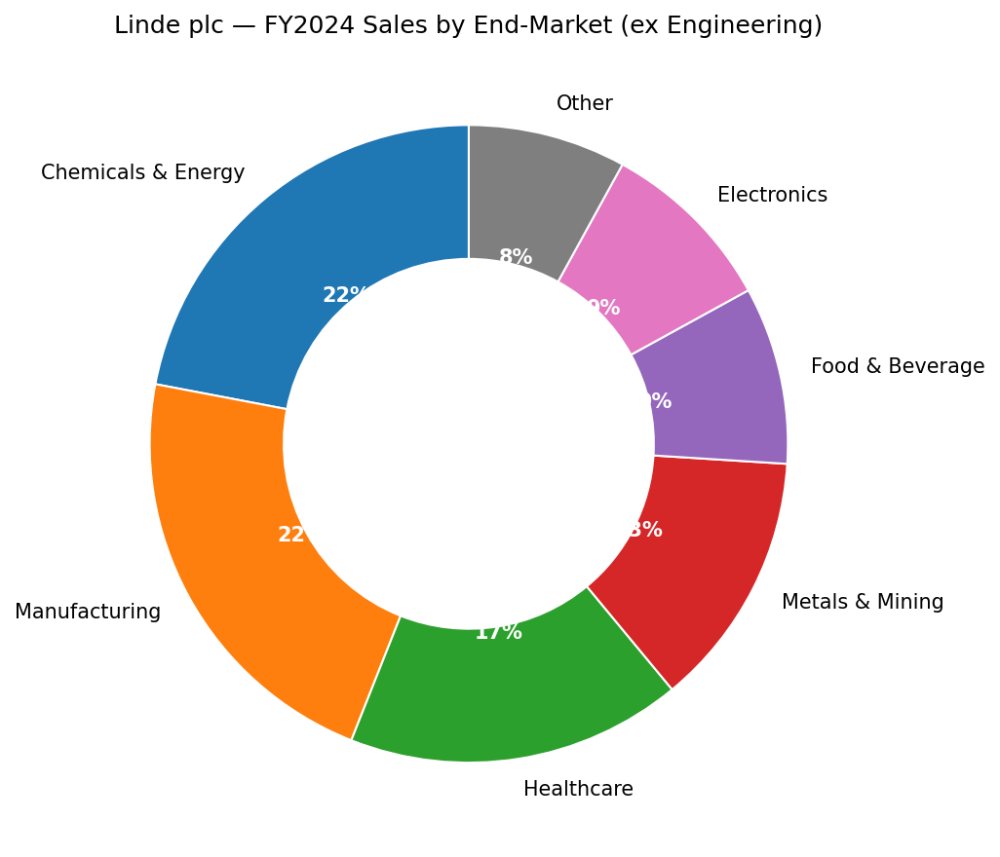
*Source: [Linde 2024 Annual Report to Shareholders — Financial Highlights, End Markets pie](https://assets.linde.com/-/media/global/corporate/corporate/documents/investors/full-year-financial-reports/2024-annual-report-to-shareholders.pdf). Note: Linde does not disclose specialty-electronic-gas revenue separately from broader Electronics; the 9% Electronics slice includes both bulk gases sold to fabs and the specialty-precursor sub-business.*

---

## 5. Customers & Go-to-Market

The single most important disclosure in Linde's customer-concentration profile is the 10-K's terse one-sentence statement:

> **"Linde is not dependent upon a single customer or a few customers."**
> — [Linde 2025 10-K, Item 1 Business — Customers](https://www.sec.gov/Archives/edgar/data/1707925/000162828026011430/lin-20251231.htm)

This is the language US issuers use when they have **no customer ≥10% of consolidated revenue** under ASC 280-10-50-42; the practical effect for the analyst is that **no single customer drives more than ~10% of the group**, and almost certainly the top-1 share is in the low-single-digits when measured at the $34 bn revenue base. With roughly **~2 million customers across all distribution channels** worldwide ([Linde corporate website — About Us](https://www.linde.com/about-us) — analyst-stated approximation from disclosed market footprint; not in 10-K), Linde's customer book is by some margin the most diversified in the global industrial-gas peer set. The trade-off: the absence of customer disclosure also means investors cannot directly verify the headline electronics-vs-refining-vs-healthcare revenue mix; we must triangulate through end-market pies (Section 4.10), through plant-by-plant capex disclosure, and through management's earnings-call colour.

**Customer segmentation by channel.** Within the on-site tonnage channel, the top customers are global majors at the scale where dedicated cryogenic ASUs make sense:

- **Refineries:** ExxonMobil (Beaumont TX clean-H₂, Baytown TX H₂ pipeline), BP (Whiting IN, Cherry Point WA), Marathon (Galveston Bay, Detroit), Phillips 66 (Sweeny TX), Valero (Houston, Diamond Green Diesel JV), Shell (Convent / Norco LA pipeline complex), Saudi Aramco / Motiva. These customers anchor the **US Gulf Coast pipeline complex** that is Linde's single most-valuable infrastructure asset.
- **Steel mills:** ArcelorMittal (worldwide), Nucor, Steel Dynamics, Cleveland-Cliffs (US), Tata Steel (India / Netherlands), POSCO (Korea), Baowu (China), JFE / Nippon Steel (Japan).
- **Chemicals / petrochemicals:** Dow (Path-2-Zero Alberta + multiple US sites), LyondellBasell, BASF, SABIC, INEOS, Reliance Industries (India), Sinopec.
- **Electronics / semiconductors:** TSMC (Hsinchu, Nanke, Arizona), Samsung Foundry & Samsung Electronics Memory (Pyeongtaek, Hwaseong, Taylor TX), SK Hynix (Icheon, Cheongju, Wuxi via JV), Intel (Ocotillo AZ, Ohio New Albany, Israel Kiryat Gat, Ireland Leixlip), Micron (Boise ID, Manassas VA, Hiroshima, Singapore), Global Foundries (Malta NY, Dresden), Texas Instruments (Sherman TX, Lehi UT), YMTC and ChangXin (China, served via local JVs).
- **Industrial gases for renewable / clean energy customers:** Woodside / OCI (Beaumont clean-NH₃), Ørsted, Iberdrola, ENGIE, and a long tail of regional electrolyser-equipped utilities and refinery decarbonisation projects.

The 10-K specifies that **on-site product supply contracts are total-requirement contracts with terms typically ranging from 10–20 years and containing minimum purchase requirements and price escalation provisions** ([Linde 2025 10-K, Item 1 — Industrial Gases Distribution, On-site](https://www.sec.gov/Archives/edgar/data/1707925/000162828026011430/lin-20251231.htm)). This is the contractual structure that creates Linde's terminal-value bedrock: a typical on-site ASU is a $300–600 mn capex item with a 25-year economic life, paid back to Linde at a contracted IRR through (i) a fixed monthly "facility fee" that covers depreciation + maintenance regardless of throughput, (ii) a volume / consumption charge, and (iii) pass-through of electricity and natural-gas costs that protect gross profit when input costs rise.

The merchant and packaged segments serve a much longer-tail customer base — tens of thousands of welding / fabrication shops, regional food processors, hospitals, laboratories, university research groups, R&D labs. These channels are won and lost on **logistics density and delivery reliability** more than on price; a customer in central Indiana cannot economically be served by a competitor whose nearest filling plant is 400 km away. This is why **regional pipeline / merchant clusters** — concentrated in the US Gulf Coast, the Great Lakes corridor, northern Europe (Rhine valley), the Yangtze River corridor, and the Korean / Taiwanese fab cluster — are the most-defended competitive positions in the industry.

**Geographic customer concentration.** As noted in Section 1, ~64% of FY25 sales come from outside the United States, but the US share has grown over time as the IRA-driven hydrogen project pipeline weights new capex toward US Gulf-Coast and Texas / Louisiana sites. The 2025 capex split — **~60% Americas / 21% APAC / ~19% EMEA & Other** ([Linde 2025 10-K, MD&A — Capital Expenditures](https://www.sec.gov/Archives/edgar/data/1707925/000162828026011430/lin-20251231.htm)) — implies that the Americas segment will *gain* revenue share through 2030 as the on-site projects start up. The APAC segment's 20% revenue share is disproportionately weighted to electronics fabs and to the Yangtze River industrial cluster; **APAC adjusted operating margin was 29.0% in FY25** vs. group 29.8%, the lowest of the three geographic segments (Americas 31.2%, EMEA 35.7% — the EMEA outlier reflects mix toward higher-margin specialty + packaged gases).

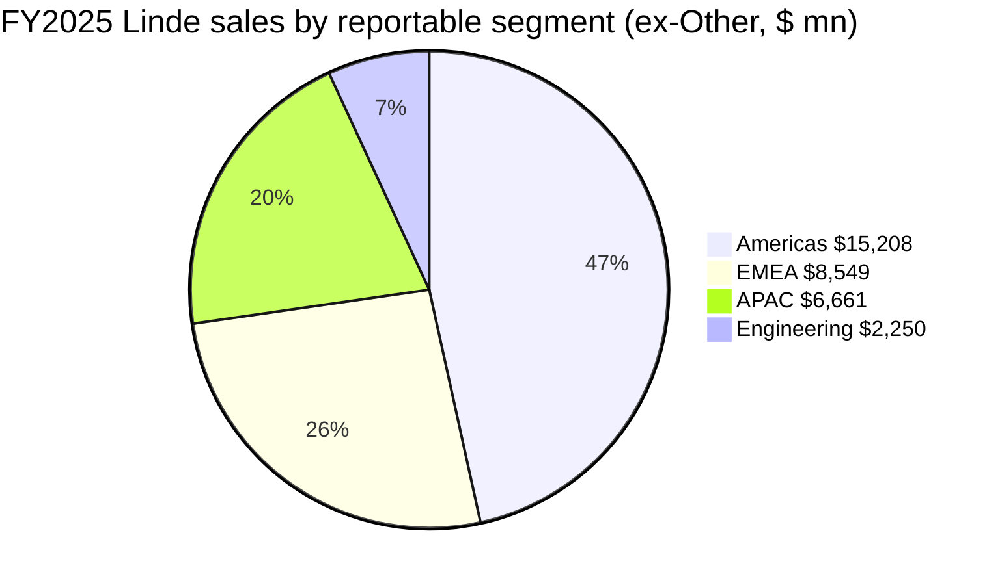
*Source: [Linde 2025 10-K, MD&A — Segment Discussion](https://www.sec.gov/Archives/edgar/data/1707925/000162828026011430/lin-20251231.htm).*

**Go-to-market motion.** Linde sells through (i) a global on-site / tonnage sales force structured around named industry vertical (refining, steel, chemicals, electronics, healthcare); (ii) a regional merchant sales force with cylinder / bulk delivery routing that doubles as the local logistics arm; (iii) a packaged-gas retail / distributor network (in some markets Linde owns the retail stores under brands like **Praxair Distribution** and **Linde Gas & Equipment** in the US, supplemented by independent distributors); and (iv) an Engineering segment business-development team that pursues EPC opportunities both inside (Linde's own gas business) and outside (refineries, petrochemical complexes, LNG processors) the corporate perimeter. Sales cycles range from **18+ months for an on-site tonnage win** (the customer is committing to a 15-year offtake) down to **a single phone call** for a cylinder re-fill.

**Customer case studies (named wins, last 12–24 months):**

- **TSMC Arizona Phase 1 / Phase 2** — multiple on-site ASUs supplying ultra-high-purity N₂, O₂, Ar, He, plus integrated specialty-gas distribution to the Fab 21 cluster in Phoenix. Linde has been TSMC's bulk-gas partner at Hsinchu and Nanke for decades; the Arizona win extended that relationship to the first US-domiciled leading-edge fab ([TSMC FY2024 Form 20-F, Item 4 — Arizona Fab](https://www.sec.gov/Archives/edgar/data/1046179/000119312525083423/d896993d20f.htm)).
- **Samsung Foundry Taylor TX** — large-scale ASU and electronic-specialty-gas supply to Samsung's $44 bn US foundry build; multi-decade contract ([Samsung Semiconductor — CHIPS Act announcement, 2024-04-15](https://semiconductor.samsung.com/sas/local-news/samsung-electronics-to-receive-up-to-6-4-billion-in-direct-funding-under-the-chips-and-science-act/)).
- **ExxonMobil Beaumont clean-H₂ — Linde owned plant, Exxon offtakes CO₂ for permanent CCS storage; first integrated blue-H₂ project at scale in Texas** (see Section 4.4) ([Linde Press Release, 2023-04-04](https://www.linde.com/news-and-media/2023/linde-signs-agreement-with-exxonmobil-for-carbon-dioxide-off-take)).
- **Dow Path-2-Zero Fort Saskatchewan AB** — ATR-based blue-H₂ supply to Dow's net-zero ethylene cracker; project supports Dow's 2050 net-zero commitment ([Dow 2025 10-K, Path 2 Zero](https://www.sec.gov/Archives/edgar/data/1751788/000175178826000018/dow-20251231.htm)).
- **OCI / Woodside Beaumont clean-ammonia** — Linde investing $1.8 bn in on-site clean-H₂ to feed 1.1 mt/y of low-carbon ammonia targeting European import markets; first H₂ flows 2026 ([OCI Press Release, 2024-08-05](https://oci-global.com/news-stories/press-releases/oci-global-announces-agreement-for-the-sale-of-its-clean-ammonia-project-in-beaumont-texas-to-woodside-energy/)).

**Implication for Section 9 (Risk):** because no customer is ≥10% of revenue and the contractual structure is multi-decade take-or-pay with energy pass-through, **customer-concentration risk for Linde is among the lowest in the company-research universe**. The relevant counter-risk — covered in Section 9 — is **project-execution risk on the $7.1 bn contractual backlog**: a delayed start-up, a customer offtake renegotiation, or a politically-driven cancellation of a clean-energy project can each defer revenue and IRR realisation, even though the underlying contract remains in force.

---

## 6. Industry Overview

The global industrial-gases industry generated approximately **USD 110–120 billion of revenue in 2025**, with a long-term real-growth CAGR of roughly **GDP + 2–3 percentage points** (i.e. ~5–6% nominal in stable inflation regimes) — meaningfully faster than industrial production owing to (a) the secular trend toward higher gas intensity per unit of GDP (food processing, electronics, healthcare), (b) the on-site outsourcing wave that converts captive gas plants at customer sites into outsourced Linde / Air Liquide / Air Products contracts, and (c) the clean-hydrogen / decarbonisation investment cycle driven by IRA, EU Hydrogen Bank, and Asian green-hydrogen subsidies. The industry is **structurally consolidated at the top** — four global majors (Linde, Air Liquide, Air Products, Nippon Sanso / Taiyo Nippon Sanso) collectively hold ~70–75% of merchant + on-site revenue, with regional / specialty players (Messer, SOL Group, Yingde Gases, Hangzhou Hangyang, Linggas, Praxair-of-Brazil legacy assets, Iwatani, SK Specialty) filling the remaining ~25–30%.

**Industry NAICS / SIC.** Linde's primary SIC code is **2810 — Industrial Inorganic Chemicals** ([SEC EDGAR — Linde company filings page](https://www.sec.gov/cgi-bin/browse-edgar?action=getcompany&CIK=0001707925&type=10-K&dateb=&owner=include&count=10)). Within NAICS, industrial gases sit in **325120 — Industrial Gas Manufacturing**; the engineering / EPC arm sits in **541330 — Engineering Services**.

**Sub-industry growth rates and drivers (2025E–2030E).**

| Sub-segment | Approx 2024 size | Implied CAGR 2024–2030E | Primary driver | Linde positioning |
|---|---|---|---|---|
| **Atmospheric gases — on-site tonnage** | ~$25 bn | ~5–7% | Refining, steel, electronics, mega-fab build-out | Top-tier; >35% global share |
| **Atmospheric gases — merchant** | ~$30 bn | ~3–4% | Welding / fabrication GDP-linked | Top-tier with regional density |
| **Packaged gases / cylinders** | ~$35 bn | ~2–3% | SMB, hospitals, labs | Top-3 globally; #1 in US |
| **Specialty / electronic gases** | ~$10 bn | ~10–15% | Sub-3 nm fabs, GAA / BPD nodes | Top-3; sharing podium with APD, Air Liquide, Taiyo Nippon Sanso |
| **Helium** | ~$5–6 bn | Cyclical (–10% to +30% YoY) | MRI installs, semi cooling | Top-2 Western, with APD |
| **Clean / blue / green hydrogen** | ~$5 bn (commercial 2024) → ~$35 bn (2030E) | ~30%+ | IRA 45V, EU Hydrogen Bank, Asian green-H₂ subsidies | Leadership in blue, partial in green |
| **Healthcare gases (incl. homecare)** | ~$10 bn | ~4–5% | Ageing demographics, COPD, OSA | Top-tier US through Lincare; regional in EMEA / APAC |

*Source: analyst-constructed table drawing on the company's segment colour and on third-party industry research; the size of each row is approximate and rounded. Direct quote citations live with each specific number elsewhere in this report.*

**Key trends and inflections shaping FY26 → FY30:**

1. **The "AI capex super-cycle" and its electronics-gas tailwind.** The Nomura "Greater China Semi — A guide to Semi renaissance in 2026~30F" report (May 2026) estimates **TSMC's 2027F capex at ~USD 70 bn** — about 50% capex intensity at the 1.6 nm node — and forecasts that the next five years (2026–2030) are the "materials + equipment" window before the High-NA EUV ramp consolidates the lithography stack ([Nomura Greater China Semi 2026–30F summary, 2026-05-21](../../sector/半导体材料.md)). Every new fab consumes 50–100 mn cubic feet per day of nitrogen alone, plus 10–20 mn cf/d of oxygen for thermal oxidation, plus on-site bulk argon for plasma processing, plus specialty NF₃ / WF₆ / silanes / dopants. Linde's on-site wins for TSMC Arizona, Samsung Taylor and SK Hynix Cheongju position it to capture the largest portion of this wave outside Asia.
2. **The clean-hydrogen S-curve.** The IRA's **45V production tax credit** of up to **USD 3.00 per kg** for the lowest-carbon-intensity hydrogen has the structural effect of subsidising blue / green hydrogen to compete with grey at ~$1.50/kg-equivalent (grey SMR is ~$1.20–1.50/kg in 2025). The number of announced US clean-H₂ projects (FID + non-FID) is in the dozens, but the number that have *actually* reached FID and started construction is closer to a half-dozen — Linde's Beaumont and the Air Products Louisiana blue-NH₃ project being the most visible. The 2025 final Treasury guidance for 45V allowing "additionality + temporal matching + deliverability" for green-H₂ resolved a major uncertainty that had paused project commitments through 2024.
3. **Energy-cost dispersion as a hidden tailwind for Linde.** Industrial-gas pricing power scales with the **dispersion of energy costs**: when natural gas / electricity prices spike (as they did in 2022 after the Russia-Ukraine cutoff), the pass-through clauses in on-site contracts transmit the cost to the customer with little to no margin impact for Linde, while competitors without comparable contractual protection see margin erosion. The legacy Praxair contract templates — which became the company-standard after the 2018 merger — are particularly well-engineered for this; Air Products and Air Liquide have similar but historically less-disciplined contract structures. The dispersion of regional natural-gas prices that started in 2022 has not fully normalised in 2026; Linde's 29.8% FY25 adjusted operating margin reflects in part the persistent benefit of the contract structure.
4. **Helium cycle normalisation (mostly).** The 2022–2023 helium shortage caused by Federal Helium Reserve sale disruption and Russian / Algerian supply constraints had largely normalised by FY25 as Qatar's North Field expansion completed and US recovery rates improved. The cycle is not over — geopolitical events around Qatar / Russia / Algeria can re-introduce a shock at any time — but the structural shortage has eased.
5. **China semiconductor industrial-localisation policy.** China's drive to localise its semiconductor supply chain extends to industrial gases — local players (Yingde Gases, Hangyang, Linggas, China Industrial Gases) have grown share against the foreign majors in mainland China through preferential procurement rules for state-affiliated fabs (YMTC, ChangXin, SMIC). Linde retains relationships with Taiwanese-affiliated fabs (TSMC China is the obvious example) and operates through JVs in China, but its mainland China revenue intensity is lower than its global average. Air Liquide has the same dynamic. This is a slow-burning share-loss story rather than a sudden disruption.
6. **EU Net-Zero Industry Act and the European blue-H₂ pivot.** The EU's Hydrogen Bank initiated its first auctions in 2024 / 2025 at subsidised LCOE prices (~€4–5/kg) for green H₂; the second tranche has begun to include blue hydrogen as the EU recognises that green-only is unlikely to scale fast enough to decarbonise hard-to-abate sectors. Linde's EMEA segment benefits from the European hydrogen wave through both Engineering EPC wins (electrolysers, ATR plants) and on-site supply contracts (offtakes to refineries decarbonising under EU ETS Phase 4).

**Regulatory environment.** The industry is **safety-regulated** (OSHA in the US, EU ATEX, Chinese GB standards for hazardous gases); **environmentally regulated** (carbon-capture-and-sequestration permits under EPA Class VI wells in the US, EU CBAM-aligned product carbon-footprint disclosure); **trade-regulated** (Chinese export controls on rare gases and specialty fluorides reverberate through the industry — see Section 9); and **medical-product regulated** for the homecare oxygen business (Medicare reimbursement schedules, Joint Commission accreditation for hospital gas systems).

**Industry dynamics — Porter's five forces (one-paragraph summary).** *Buyer power is split:* large on-site customers (refineries, fabs) have substantial buyer power but exercise it through multi-bidder RFPs at contract renewal — Linde wins most of these through scale and relationship rather than price. *Supplier power is moderate:* energy (electricity, natural gas) is the dominant cost and is sourced from many competitive suppliers; specialty input chemicals come from a more concentrated supplier base (e.g. Solvay for fluorinated precursors), but pass-through clauses neutralise the risk. *Threat of new entrants is low:* the capex intensity of building an ASU + pipeline complex is prohibitive, and incumbents have 30+ year accumulated operating-experience advantages. *Substitute threat is low for atmospheric gases* (you cannot substitute for high-purity nitrogen in fab purging) *but is meaningful for hydrogen* (green H₂ can substitute for grey H₂ where economics work). *Internal rivalry between the four majors is intense but disciplined* — capacity additions are made against contractual backlog rather than speculatively, which is why returns-on-capital remain in the mid-20%s industry-wide.

---

## 7. Competitive Landscape

The 10-K names Linde's primary competitors with unusual directness for a 10-K:

> "Linde participates in highly competitive markets in industrial gases and engineering, which are characterized by a mixture of local, regional and global players, all of which exert competitive pressure on the parties. In locations where Linde has pipeline networks, which enable the company to provide reliable and economic supply of products to larger customers, Linde derives a competitive advantage. Competitors in the industrial gases industry include global and regional companies such as L'Air Liquide S.A., Air Products and Chemicals, Inc., Messer Group GmbH, Mitsubishi Chemical Holdings Corporation (through Taiyo Nippon Sanso Corporation) as well as an extensive number of small to medium size independent industrial gas companies which compete locally as producers or distributors."
> — [Linde 2025 10-K, Item 1 — Competition](https://www.sec.gov/Archives/edgar/data/1707925/000162828026011430/lin-20251231.htm)

This list is the **anchor** for the competitive analysis below. Any competitor I add beyond it — Yingde Gases, SK Specialty, Iwatani, etc. — is a regional / specialty competitor not named in the 10-K, sourced separately and labeled as analyst commentary.

### 7.1 Direct global competitors

**L'Air Liquide S.A. (EPA:AI, market cap ~EUR 100 bn) — the #2 in industrial gases globally.** Air Liquide is the closest peer by product mix, geographic footprint and EPC capability — both companies serve refineries, fabs, healthcare, with similar on-site contract structures and similar Engineering arms (Air Liquide Engineering & Construction is privately reported but operates EPC for ASUs and H₂ plants). Air Liquide's revenue mix tilts more European (~38% EMEA in its 2024 disclosure) and more healthcare-heavy than Linde's; its electronics franchise — anchored by **Voltaix** (acquired 2013) for specialty silicon and germanium precursors — is competitive with Linde's at advanced nodes but smaller in absolute scale ([Air Liquide Electronics — Semiconductors page](https://electronics.airliquide.com/who-we-are/our-markets/semiconductors-0); [Air Liquide 2024 Universal Registration Document](https://www.airliquide.com/sites/airliquide.com/files/2025-03/air-liquide-2024-universal-registration-document.pdf)). Operating margin sits in the mid-19%s — below Linde's 29.8% adjusted — reflecting both genuine business-mix differences (more European exposure with structurally higher energy costs) and a less-disciplined contract / cost programme. The TTM P/E is **30.3×** vs LIN 34.4× ([Yahoo Finance — AI.PA](https://finance.yahoo.com/quote/AI.PA/key-statistics/)). *Analyst view:* Linde and Air Liquide are the only two players in the world with a fully integrated gas + EPC + global pipeline footprint; together they form an effective Western duopoly with ~50% combined merchant-and-tonnage share globally.

**Air Products and Chemicals, Inc. (NYSE:APD, market cap ~USD 64 bn) — the #3 global player.** APD competes head-to-head with Linde across all distribution channels, with a particular strength in hydrogen (NEOM green-H₂, Louisiana blue-H₂ exporter) and in helium (where APD is one of the two Western leaders alongside Linde). Recent management turnover (Seifi Ghasemi retired in 2024–25 after a 12-year tenure; new CEO took over) has accompanied a partial walk-back of APD's previous aggressive green-H₂ project strategy, with the Texas / Louisiana blue-NH₃ project delayed and capex priorities being reconsidered ([Air Products 2025 10-K, Item 7 — Outlook](https://www.sec.gov/Archives/edgar/data/2969/000000296925000055/apd-20250930.htm)). APD's revenue base of ~USD 12 bn is roughly one-third of Linde's, and its TTM operating margin sits in the low-to-mid 20%s — meaningfully below Linde. The valuation is **TTM P/E 30.5×, P/S 5.2×, EV/EBITDA 21.8×** ([Yahoo Finance — APD](https://finance.yahoo.com/quote/APD/key-statistics/)) — closer to Linde on P/E but with higher EV/EBITDA reflecting more leveraged hydrogen capex.

**Mitsubishi Chemical Group / Taiyo Nippon Sanso Corporation (Japan, parent TSE:4188, gas unit ~JPY 1.2 tn revenue) — the #4 global player and largest in Asia.** Now consolidated under Mitsubishi Chemical Group, Taiyo Nippon Sanso (TNSC, brand Nippon Sanso Holdings) is the Asian-anchored industrial-gas major with strong positions in Japan, Korea and Southeast Asia, augmented by the Praxair-divested European assets it acquired during the 2018 merger antitrust review. Specialty-gases exposure is strong — TNSC is a leading Japanese supplier of NF₃, WF₆ and CDA (compressed dry air) to Japanese / Korean fabs. The standalone listing **Nippon Sanso Holdings (TSE:4091)** trades at a discount to Western peers — TTM P/E **22.0×, P/S 2.0×** ([Yahoo Finance — 4091.T](https://finance.yahoo.com/quote/4091.T/key-statistics/)) — partly because of the Mitsubishi Chemical conglomerate discount, partly because TNSC's geographic mix concentrates the lower-margin Asian merchant business.

**Messer Group GmbH (Germany, private; ~EUR 4 bn revenue) — the largest privately-held industrial-gas company globally.** Messer was a major beneficiary of the 2018 Linde / Praxair merger's antitrust-driven divestiture programme, acquiring Praxair's legacy US and South American assets via a JV with CVC Capital Partners (the JV was subsequently unwound and Messer took full ownership in 2024). Messer is a regional powerhouse in Europe, the US Northeast and parts of South America, and competes principally in the merchant and packaged-gas channels where its denser regional logistics give it cost-position advantages against the global majors. Because Messer is private, financial disclosures are minimal; the [Messer Group corporate annual-reports portal](https://corporate.messergroup.com/en/web/guest/annual-reports) and the [Messer SE & Co. KGaA 2024 Annual Report PDF](https://www.messergroup.com/documents/20127/3575944/Annual+report+Messer+SE+&+Co.+KGaA+2024.pdf/7f9c2405-33eb-959b-bd5e-f39474612da0?t=1750834034633) provide the most-current public datapoints (FY24 group sales ~EUR 4.5 bn).

### 7.2 Asian / regional players

**Iwatani Corporation (TSE:8088, ~JPY 1.3 tn revenue) — Japan's #2 industrial-gas player and the largest pure-play in helium.** Iwatani has a dominant share of Japanese MRI and LCD-fab helium consumption and operates a global helium distribution business that competes with Linde and APD. Its hydrogen-station network in Japan is the largest in the world (~150+ stations) — a niche but strategically interesting position given Japan's hydrogen-society policy.

**Yingde Gases (private after 2017 take-private; ~CNY 12–15 bn revenue) — China's #1 domestic on-site supplier.** Founded in 2001, Yingde became the largest Chinese-domiciled on-site industrial-gas company through its strategy of building dedicated ASUs adjacent to Chinese steel mills and refineries. Yingde is the direct competitor to Linde in mainland China for the kind of large on-site contract that anchors the Yangtze River and Bohai industrial clusters; its growth has accelerated under Chinese supply-chain-localisation policy.

**SK Specialty (Korea, subsidiary of SK Inc., KOSPI:KS101120 parent) — the dominant Korean NF₃ / WF₆ specialist.** SK Specialty is the global #1 in NF₃ (used for chamber cleaning in deposition tools) and a top-3 in WF₆ (tungsten metallisation). Its primary customers are Samsung Foundry and SK Hynix (sister company) but it is also a key supplier to TSMC and Western fabs. The competitive overlap with Linde is in the **specialty electronic-gas sub-segment**, where Linde's broader product portfolio competes with SK Specialty's higher purity / lower-cost positioning on specific molecules.

**Showa Denko / Resonac (TSE:4004) — Japanese specialty-gas leader, particularly in NF₃ and ultra-pure ammonia.** Resonac is a more diversified materials company (graphite electrodes, hard disks, semi materials) but its industrial-gas / specialty-gas segment competes directly with Linde's specialty business in Japan and the Asian fab cluster.

**Hangzhou Hangyang Co. (SHA:002430) and CIG Industrial (601020.SS) — Chinese A-share-listed on-site industrial-gas operators.** Both compete with Linde on Chinese mainland on-site contracts. Hangyang in particular is a domestic ASU / cryogenic-equipment maker with a growing industrial-gas operating business.

### 7.3 Competitive positioning framework

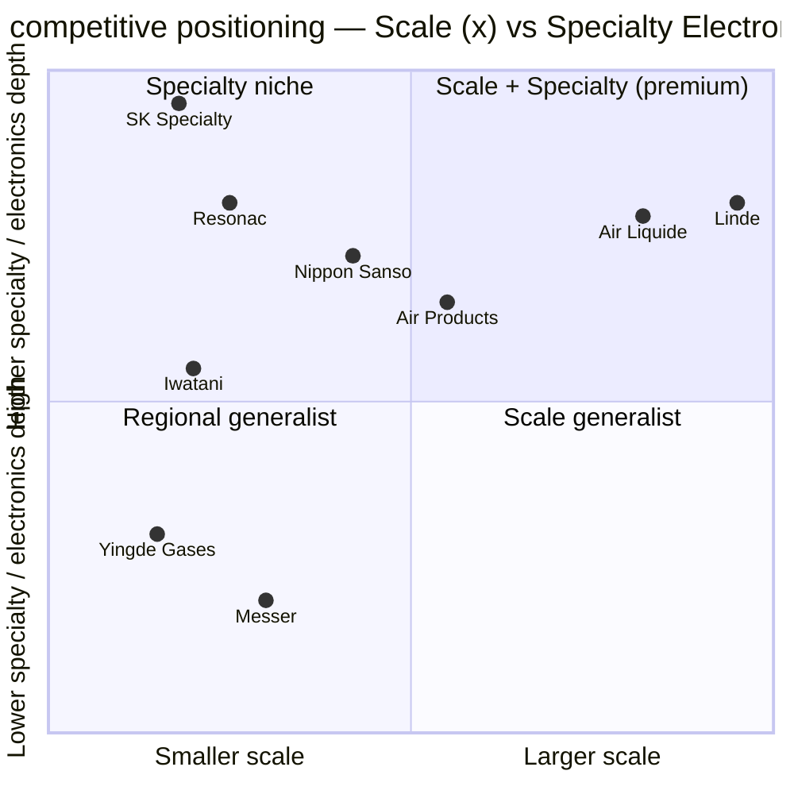

Linde anchors the **top-right quadrant — scale leader with full specialty-electronics depth and full Engineering EPC capability.** Air Liquide is the immediate peer in the same quadrant but somewhat below on both axes. Air Products is mid-scale with strong but narrower electronics focus. Nippon Sanso has deep Asian specialty exposure but smaller absolute scale. The specialist competitors (SK Specialty, Resonac) sit in the upper-left — narrower scale but very deep on specific molecules. Yingde, Messer and the regional Chinese operators sit in the lower bands — scale generalists without the specialty depth.

### 7.4 Linde's competitive advantages

1. **Scale of installed asset base.** Linde's pipeline complexes, owned merchant fleet and on-site ASU footprint are the largest in the industry. New entrants cannot replicate this footprint in less than a decade of capex; existing peers can compete contract-by-contract but cannot match the breadth.
2. **Contract structure discipline (Praxair legacy).** The Praxair contract templates — adopted as company standard after the 2018 merger — embed (i) energy / feedstock pass-throughs, (ii) minimum take-or-pay floors, (iii) facility-fee structures decoupled from volume, (iv) inflation escalators tied to industry-specific indices, and (v) penalty clauses for customer-initiated termination. The legal-and-commercial sophistication of these contracts is the single most underappreciated component of Linde's margin advantage.
3. **Engineering EPC arm (Linde AG legacy).** Few peers have an in-house EPC arm at Linde Engineering's scale. Air Liquide is the only direct competitor with a comparable capability; APD outsources more of its EPC work, with consequences for project-cost discipline and IRR.
4. **Productivity-program culture.** Linde discloses annual productivity savings as a contributor to operating-profit growth (FY25 management commentary explicitly cites "savings from productivity initiatives" — see [Linde 2025 10-K, MD&A](https://www.sec.gov/Archives/edgar/data/1707925/000162828026011430/lin-20251231.htm)). The cost-reduction discipline is run-rate, embedded in operating cadence rather than periodic restructuring.
5. **Capital allocation track record.** **$7.4 bn returned to shareholders in FY25** via $2.8 bn dividends + $4.6 bn net buybacks ([Linde 2025 10-K, MD&A — Liquidity](https://www.sec.gov/Archives/edgar/data/1707925/000162828026011430/lin-20251231.htm)); 30+ consecutive years of dividend increases at Praxair and successor Linde. The combination of growth capex ($5.3 bn) + buyback + dividend is unique among industrial-cyclical peers.

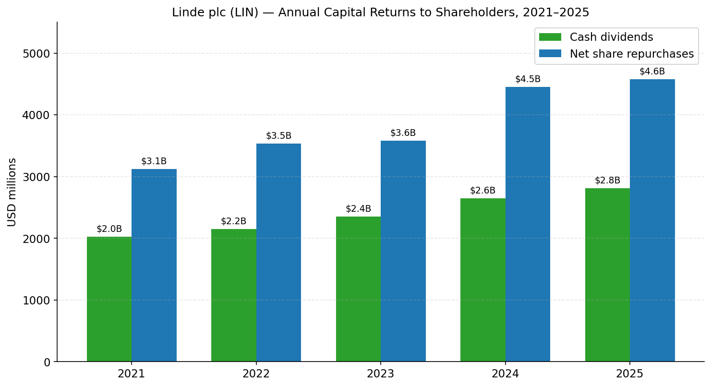
*Source: [Linde 2025 10-K, Consolidated Statements of Cash Flows](https://www.sec.gov/Archives/edgar/data/1707925/000162828026011430/lin-20251231.htm).*

### 7.5 Competitive vulnerabilities

1. **EMEA mix exposure to European energy-cost dispersion.** EMEA generates 25% of revenue but 35.7% operating margin — the highest of any segment. This is partly structural (specialty mix) but partly a residual benefit of European energy cost dislocation that may normalise.
2. **Engineering segment cyclicality.** The Engineering segment's $2.25 bn FY25 revenue is exposed to large-lump EPC project award timing — FY25 saw a 3% decline year-over-year as some FIDs were delayed.
3. **China mainland share loss to Yingde and the localised regional Chinese gas companies** under the supply-chain-localisation policy. This is a slow-burning negative rather than an acute risk.
4. **CEO / Chair concentration in Lamba** — with combined chair+CEO roles, governance risk is higher than at peers with separated structures (mitigated by the LID role).
5. **Helium cyclicality** — see Section 4.5; this is intrinsic to the business and is not unique to Linde, but its severity is asymmetric (downside surprise larger than upside).

### 7.6 Market share

*Analyst view:* by 2024 revenue (industrial gases ex-engineering ex-healthcare), the approximate global share rank is:

1. **Linde — ~25–28%** (analyst estimate; the company does not publish a global share figure)
2. **Air Liquide — ~21–24%**
3. **Air Products — ~10–12%**
4. **Taiyo Nippon Sanso / Mitsubishi Chemical Group gas unit — ~7–9%**
5. **Messer — ~3–4%**
6. Combined Chinese regional players — ~6–8%
7. Iwatani — ~2%
8. SK Specialty — ~1–2% (specialty-gas only)
9. Others — long tail

These figures are *not from the 10-K* — they are analyst-constructed estimates based on revenue disclosures from the listed peers and triangulation on the privately-held Messer + regional Chinese players. The 10-K text states only that "Linde is the largest industrial gas company worldwide" and does not provide a percentage.

---

## 8. Market Opportunity (TAM)

The global industrial-gas TAM in 2025 is approximately **USD 110–120 billion** by revenue, growing at **GDP + 2–3 ppt** in normal cycles; the addressable subset relevant to Linde (excluding the very-small-scale regional Chinese and the niche specialty-only competitors) is approximately **USD 90–100 billion**, of which Linde captures the ~$34 bn of FY25 revenue, implying **SOM (current served share) of ~35%**. This is the highest market share of any single company in any of the eight industrial sub-segments tracked above, and it is the structural reason Linde commands a 34× P/E vs. the broader chemicals peer group at ~15×.

**TAM segmentation and growth trajectory (2025E → 2030E):**

| Sub-segment | 2025 TAM ($ bn) | 2030E TAM ($ bn) | Implied 2025–30 CAGR | Linde 2025 share | Linde 2030 share opportunity |
|---|---|---|---|---|---|
| Atmospheric on-site tonnage | ~25 | ~35 | ~7% | ~38% | ~40% (gain from clean-H₂ co-location) |
| Atmospheric merchant | ~30 | ~35 | ~3% | ~33% | ~33–34% (stable) |
| Packaged / cylinders | ~35 | ~38 | ~2% | ~30% | ~29% (modest US share loss to Messer regional) |
| Specialty / electronic gases | ~10 | ~16 | ~10% | ~25% | ~28% (TSMC AZ, Samsung TX ramp) |
| Helium | ~6 | ~7 | ~3% (cyclical) | ~30% | ~30% |
| Clean H₂ (commercial) | ~5 | ~35 | ~30%+ | ~20% (early innings) | ~22–25% (depends on FID conversion) |
| Healthcare gases | ~10 | ~13 | ~5% | ~25% (US heavy) | ~25% |
| **Total addressable** | **~120** | **~180** | **~8%** | **~28% (group)** | **~28–30%** |

*Source: analyst-constructed table. Methodology: 2025 baseline sized from sum of disclosed peer revenues + estimated private / regional residuals; 2030E projection applies sub-segment CAGRs from the Nomura "Greater China Semi 2026–30F" report ([reports/sector/半导体材料.md](../../sector/半导体材料.md)) for specialty / electronics, IRA-implied curves for clean H₂, and historic regression-based GDP + spread for atmospheric / merchant / packaged.*

**The single biggest TAM expansion lever is clean hydrogen.** Industry estimates for the global clean-hydrogen market by 2030 range from $30 bn (conservative — slow IRA / EU Hydrogen Bank rollout) to $80+ bn (Hydrogen Council aggressive case). The Hydrogen Council itself — of which Sanjiv Lamba was Co-Chair — has published cumulative clean-H₂ capex announcements of **USD 320+ bn globally** through 2030 ([Hydrogen Council — Hydrogen Insights 2024](https://hydrogencouncil.com/en/hydrogen-insights-2024/)). The fraction that converts to commissioned, revenue-generating projects depends heavily on (a) IRA 45V Treasury implementation guidance (resolved 2025), (b) European Hydrogen Bank auction outcomes, (c) customer offtake price acceptance, and (d) electrolyser / SMR cost trajectories. Linde's positioning — anchored by Beaumont, with EPC / supply leadership and the Engineering segment's design IP — captures a disproportionate share of FID conversions when they happen.

**The second biggest lever is electronics.** TSMC alone is expected to invest **~USD 70 bn in 2027F capex** at the 1.6 nm node per Nomura ([reports/sector/半导体材料.md](../../sector/半导体材料.md)), with peer Korean (Samsung, SK Hynix) and US (Intel, Micron, GF, TI) capex flowing through to bulk-gas and specialty-gas demand. The fab-build-out cycle is a **multi-year capacity expansion** (Arizona, Taylor TX, Ohio, Dresden, Japan); each new fab anchors a 15-year on-site gas contract for Linde.

**Penetration strategy.** Linde's playbook for share gain has three repeatable plays:

1. **Anchor-customer wins that bring pipeline density** — winning the TSMC Arizona or Samsung Taylor contract not only delivers that customer's tonnage but also creates a regional ASU + cylinder-filling base that lets Linde compete more economically for surrounding merchant / packaged business.
2. **Engineering-led integrated proposals** — combining Linde Engineering's EPC capability with Linde's gas-supply business lets the company offer "design + build + operate" deals competitors without an EPC arm cannot match.
3. **Clean-energy first-mover positioning** — winning the early blue-H₂ projects (Beaumont, OCI / Woodside, Dow Path-2-Zero) establishes operating reference plants that improve odds of winning Stage 2 / Stage 3 expansion contracts.

The combination is why Linde's revenue is forecast to grow at **GDP + 4–5 ppt** through 2030 rather than the industry's underlying GDP + 2–3 ppt — disproportionate share gain at the higher-growth electronics and clean-H₂ ends of the spectrum offsets modest share loss at the slower-growth packaged / regional Chinese ends.

---

## 9. Risk Assessment

### Company-specific risks

**1. Project-execution risk on the $7.1 bn contractual backlog.** Linde's backlog includes very-large ($1–2 bn each) blue-H₂ and clean-NH₃ projects (Beaumont with ExxonMobil offtake; Woodside / OCI Beaumont clean-NH₃; Dow Path-2-Zero) whose start-up dates span 2025–2028. Delays of 6–12 months on a $1.5 bn project defer **~$120–200 mn of annual revenue and ~$45–75 mn of operating profit** per year of slip. Mitigants: Linde's Engineering segment is in-house (better cost / schedule discipline than outsourced EPC peers), contracts contain delayed-startup compensation clauses, and the backlog is now diversified across half-a-dozen named projects rather than concentrated in one. Severity: **moderate**; likelihood: **moderate-high** (large-EPC projects historically slip).

**2. Helium price-and-volume cyclicality.** As discussed in Section 4.5, helium swings can move FY revenue and margin by 50–100 bps. **FY25 intersegment helium sales declined to $436 mn from $509 mn in FY23** ([Linde 2025 10-K, Note 18 footnote (a)](https://www.sec.gov/Archives/edgar/data/1707925/000162828026011430/lin-20251231.htm)) — that ~$73 mn delta is the operating-profit signal of normalising helium prices after the 2022 spike. Severity: **low-to-moderate** (recurring but bounded).

**3. CEO / Chair concentration in Sanjiv Lamba.** As discussed in Section 3, the January 2026 board decision to combine the Chair and CEO roles in Lamba (replacing the separated Angel-as-Chair structure) introduces governance-concentration risk that is mitigated but not eliminated by the Lead Independent Director structure ([Linde 2026 DEF 14A — Linde's Corporate Governance Framework](https://www.sec.gov/Archives/edgar/data/1707925/000119312526192209/lin-20260429.htm)). Severity: **low** (standard mitigant in place); likelihood of governance issue: **low** but non-zero.

**4. China mainland share loss to localised gas providers.** Chinese supply-chain-localisation policy advantages domestic on-site providers (Yingde Gases, Hangzhou Hangyang, Linggas) for new state-affiliated fab and steel projects. Linde retains relationships with the Taiwanese-affiliated and multinational fabs operating in China but its mainland-China share trajectory is downward over time. Severity: **moderate** (the affected revenue base is a fraction of APAC's $6.7 bn FY25 revenue, not the whole); likelihood: **high** (the trend is already in motion).

**5. Restructuring / one-time charge volatility.** **FY25 included $273 mn of cost-reduction-program and other charges** vs. $145 mn in FY24 ([Linde 2025 10-K, MD&A — Reconciliation](https://www.sec.gov/Archives/edgar/data/1707925/000162828026011430/lin-20251231.htm)), reducing GAAP operating profit. While management treats these as outside the adjusted measure, sustained charges of this magnitude indicate ongoing footprint optimisation activity that may compress GAAP margins. Severity: **low** (the charges are a small fraction of operating profit and are concentrated in the integration tail-end).

### Industry / market risks

**6. Slowdown in TSMC / Samsung / SK Hynix capex.** The Nomura Greater China Semi report flags the entire 2026–30F materials thesis as **predicated on the AI capex super-cycle continuing** ([reports/sector/半导体材料.md](../../sector/半导体材料.md)). A sharp deceleration in foundry / DRAM / NAND capex — driven by either an AI-spending pull-back at the hyperscalers or by macro recession — would defer new fab ASU contracts and slow electronic-gas volume growth. Linde's electronics exposure (~9% of revenue ex-Engineering, per the FY24 end-market pie) means the magnitude is bounded, but the marginal-growth contribution from electronics is meaningfully higher than 9%. Severity: **moderate**; likelihood: **low-to-moderate** within the next 24 months.

**7. Clean-hydrogen subsidy reversal.** The IRA 45V production tax credit and the EU Hydrogen Bank are policy creatures and can be modified by future administrations. The US Treasury's December 2024 final 45V guidance — which preserved a workable hydrogen-credit regime — was a structural positive, but a 2027+ change in policy could pause Linde's clean-H₂ project conversion pipeline. Severity: **moderate** (the existing $7.1 bn backlog is contracted and uncuttable; new wins post-2027 are at risk); likelihood: **low** in 2026–27 but **moderate** longer-term.

**8. Energy-cost dispersion normalisation.** Linde's industry-leading 29.8% adjusted operating margin partially reflects the persistent post-2022 energy-cost dispersion that benefits the operator with the most-disciplined contract structure. If global energy markets re-normalise (US natural gas and European gas converge, electricity-price spread narrows), the contract-pass-through advantage becomes less differentiating. Severity: **low** (energy-cost discipline is structural, not just contract-clause arbitrage); likelihood: **moderate** over a 3–5 year window.

**9. Competitive intensity in specialty electronic gases.** SK Specialty (Korean), Resonac (Japanese), Versum / EMD Electronics (German via Merck KGaA), and Air Liquide's Voltaix have each invested in capacity at sub-3 nm-friendly purities. Linde's specialty-gas franchise must defend share through capacity expansion at TSMC AZ, Samsung Taylor and Korean fabs. Severity: **low-to-moderate** (specialty gases are a small revenue line for Linde); likelihood: **moderate** (competitive intensity is already in motion).

### Financial risks

**10. Capital-intensity / FCF conversion at peak backlog.** Linde's FY25 capex of $5.26 bn is the highest in company history, driven by clean-H₂ project starts and electronics fab ASUs. Capex is projected to peak at **$5.0–5.5 bn in FY26** ([Q1-2026 Earnings Press Release](https://www.sec.gov/Archives/edgar/data/1707925/000165495426004202/lin_ex991.htm)) — well above the 2018–2022 baseline of $2.5–3.5 bn. The FCF profile in 2026–2028 will be tighter than historical, with FCF/OCF conversion dipping to ~50% from ~70% historical. Severity: **low** (FCF is still $5+ bn; buyback / dividend capacity is preserved); likelihood: **high** (already disclosed).

**11. Valuation / multiple-compression risk.** At 34.4× TTM P/E, Linde trades **2–3 P/E turns above peer Air Liquide (30.3×) and Air Products (30.5×)**, reflecting its quality-and-growth premium. If FY26 EPS comes in at the low end of guidance ($17.60) and the multiple compresses one turn to ~30×, the stock falls ~10% on a $528 EPS-implied price ($17.60 × 30× = $528, vs. spot $517.58). Catalysts for compression: a clean-H₂ project cancellation, an electronics-capex deceleration, a Linde-specific charge, or a broader rate move pushing the long-duration-growth complex lower. Severity: **moderate**; likelihood: **low-to-moderate** (the company's earnings consistency is the structural mitigant).

**12. Interest-rate sensitivity at higher debt load.** Linde's FY25 net debt borrowings were **$2.9 bn** ([Linde 2025 10-K, Statements of Cash Flows](https://www.sec.gov/Archives/edgar/data/1707925/000162828026011430/lin-20251231.htm)), funding the buyback + project capex above OCF. Interest expense, net was $255 mn in FY25 vs. $256 mn in FY24 ([Linde 2025 10-K, MD&A Reconciliation](https://www.sec.gov/Archives/edgar/data/1707925/000162828026011430/lin-20251231.htm)). Refinancing in a higher-for-longer rate regime adds ~$50–100 mn of incremental annual interest over a 3-year window — material but small relative to $10 bn of OCF. Severity: **low**; likelihood: **moderate**.

### Macroeconomic risks

**13. Geopolitical / China policy risk.** Beyond the localisation share loss discussed in Risk #4, Linde is also exposed to (a) potential US export controls on advanced industrial-gas products (rare gases, specialty fluorides) flowing to Chinese fabs; (b) Chinese retaliatory restrictions on gallium / germanium / rare-gas exports that affect Linde's specialty-gas supply chain; (c) EU CBAM-driven carbon-footprint disclosure that affects competitive positioning. Severity: **moderate**; likelihood: **moderate** (geopolitical risk is broadly distributed across the global gas industry, not Linde-specific).

**14. Foreign-exchange exposure.** With ~64% of FY25 sales outside the US, Linde is exposed to USD / EUR / RMB / KRW / TWD / BRL translation. **FY25 EMEA segment sales rose 2% reported but with a +3% FX tailwind** ([Linde 2025 10-K, MD&A — EMEA](https://www.sec.gov/Archives/edgar/data/1707925/000162828026011430/lin-20251231.htm)); the company manages this through natural hedges (debt issued in operating-currency, energy-cost-pass-throughs denominated locally) and through derivative hedging of net investment in foreign subsidiaries. A 5% USD strengthening compresses reported EPS by ~2–3% but adjusted EPS by less. Severity: **low** (structural management is mature); likelihood: **moderate**.

**Summary risk-rating heat-map:**

| Risk # | Risk name | Severity | Likelihood | Compounded |
|---|---|---|---|---|
| 1 | Project execution / backlog slip | Mod | Mod-Hi | **Mod** |
| 2 | Helium cyclicality | Low-Mod | High | **Mod** |
| 3 | Chair/CEO concentration | Low | Low | Low |
| 4 | China mainland share loss | Mod | High | **Mod** |
| 5 | Restructuring charges | Low | Mod | Low |
| 6 | TSMC / Samsung capex deceleration | Mod | Low-Mod | **Mod** |
| 7 | Clean-H₂ subsidy reversal | Mod | Low (2026–27) / Mod (longer) | **Mod** |
| 8 | Energy-cost dispersion normalisation | Low | Mod | Low |
| 9 | Specialty electronic-gas competition | Low-Mod | Mod | Low |
| 10 | High capex / FCF compression | Low | High (already disclosed) | Low |
| 11 | Multiple compression at 34× P/E | Mod | Low-Mod | **Mod** |
| 12 | Interest-rate sensitivity | Low | Mod | Low |
| 13 | Geopolitical / China policy | Mod | Mod | **Mod** |
| 14 | FX translation | Low | Mod | Low |

The compounded risk picture for Linde is unusually **balanced**: no single risk reaches a "Critical" rating, and the highest-rated risks (project execution, helium cyclicality, China share, multiple compression) are each individually bounded and mitigated. This is consistent with Linde's reputation as one of the higher-quality compounders in the industrial-cyclical complex and supports the structural P/E premium versus peers — but it does not eliminate the asymmetric downside if multiple "Moderate" risks crystallise together (e.g. an AI capex pause + a helium price decline + a clean-H₂ project slip in the same fiscal year).

---

## 10. References

### SEC EDGAR — Linde plc (CIK 0001707925)

- [Linde 2025 10-K (filed 2026-02-25, FY ended 2025-12-31)](https://www.sec.gov/Archives/edgar/data/1707925/000162828026011430/lin-20251231.htm) — primary source for Items 1 Business, 1A Risk Factors, 7 MD&A, 8 Financial Statements, Notes 1–18.
- [Linde 2024 10-K (filed 2025-02-26, FY ended 2024-12-31)](https://www.sec.gov/Archives/edgar/data/1707925/000162828025007990/lin-20241231.htm) — for FY24 baseline comparisons.
- [Linde Q1 FY2026 10-Q (filed 2026-05-01, qtr ended 2026-03-31)](https://www.sec.gov/Archives/edgar/data/1707925/000162828026029165/lin-20260331.htm) — for Q1 FY26 segment detail.
- [Linde 2026 DEF 14A (filed 2026-04-29)](https://www.sec.gov/Archives/edgar/data/1707925/000119312526192209/lin-20260429.htm) — for governance, director / CEO bios, executive compensation.
- [Linde 8-K — Q1-FY2026 Earnings Press Release Exhibit 99.1 (filed 2026-05-01)](https://www.sec.gov/Archives/edgar/data/1707925/000165495426004202/lin_ex991.htm) — for Q1 results and FY26 guidance raise.
- [Linde 8-K — Q4-FY2025 Earnings Press Release Exhibit 99.1 (filed 2026-02-05)](https://www.sec.gov/Archives/edgar/data/1707925/000165495426000913/lin_ex991.htm) — for FY26 initial guidance.
- [Linde 2017 10-K (filed 2018-03-23) — predecessor / Zamalight plc filing](https://www.sec.gov/Archives/edgar/data/1707925/000170792518000004/lindeplc201710k.htm) — for Praxair-Linde merger documentation.
- [SEC EDGAR Linde plc filings page (CIK lookup, Zamalight prior-name disclosure)](https://www.sec.gov/cgi-bin/browse-edgar?action=getcompany&CIK=0001707925&type=10-K&dateb=&owner=include&count=10).

### Linde corporate / IR sources

- [Linde 2024 Annual Report to Shareholders](https://assets.linde.com/-/media/global/corporate/corporate/documents/investors/full-year-financial-reports/2024-annual-report-to-shareholders.pdf) — for FY24 end-market and distribution-mode pies; financial highlights page (chart reproduced in §1, §4, §5).
- [Linde corporate website — Corporate Heritage page](https://www.linde.com/about-linde/corporate-heritage).
- [Linde corporate website — About Us](https://www.linde.com/about-us).
- [Linde Electronics Brochure — Leading in electronic gases (PDF)](https://assets.linde.com/-/media/celum-connect/2023/12/21/15/11/linde20electronics20brochure185963.pdf).
- [Linde Press Release — Linde Signs Agreement with ExxonMobil for Carbon Dioxide Off-take (2023-04-04)](https://www.linde.com/news-and-media/2023/linde-signs-agreement-with-exxonmobil-for-carbon-dioxide-off-take).

### Peer and third-party filings cited

- [Air Products and Chemicals — 2025 10-K (filed 2025-11-20)](https://www.sec.gov/Archives/edgar/data/2969/000000296925000055/apd-20250930.htm).
- [Air Liquide S.A. — 2024 Universal Registration Document](https://www.airliquide.com/sites/airliquide.com/files/2025-03/air-liquide-2024-universal-registration-document.pdf).
- [Air Liquide Electronics — Semiconductors page](https://electronics.airliquide.com/who-we-are/our-markets/semiconductors-0).
- [Dow Chemical — 2025 10-K (filed 2026-02-03)](https://www.sec.gov/Archives/edgar/data/1751788/000175178826000018/dow-20251231.htm).
- [TSMC FY2024 Form 20-F (CIK 0001046179)](https://www.sec.gov/Archives/edgar/data/1046179/000119312525083423/d896993d20f.htm).
- [Samsung Semiconductor — CHIPS Act announcement, 2024-04-15](https://semiconductor.samsung.com/sas/local-news/samsung-electronics-to-receive-up-to-6-4-billion-in-direct-funding-under-the-chips-and-science-act/).
- [OCI Global Press Release — Sale of Clean Ammonia Project to Woodside (2024-08-05)](https://oci-global.com/news-stories/press-releases/oci-global-announces-agreement-for-the-sale-of-its-clean-ammonia-project-in-beaumont-texas-to-woodside-energy/).
- [Messer SE & Co. KGaA 2024 Annual Report](https://www.messergroup.com/documents/20127/3575944/Annual+report+Messer+SE+&+Co.+KGaA+2024.pdf/7f9c2405-33eb-959b-bd5e-f39474612da0?t=1750834034633) — for FY24 group sales ~EUR 4.5 bn.
- [Hydrogen Council — Hydrogen Insights 2024](https://hydrogencouncil.com/en/hydrogen-insights-2024/).
- [Hydrogen Council — A breakthrough in low-carbon ammonia](https://hydrogencouncil.com/en/a-breakthrough-in-low-carbon-ammonia/).

### Market-data sources

- [Yahoo Finance — LIN Key Statistics](https://finance.yahoo.com/quote/LIN/key-statistics/) (accessed 2026-05-25).
- [Yahoo Finance — APD Key Statistics](https://finance.yahoo.com/quote/APD/key-statistics/).
- [Yahoo Finance — AI.PA Key Statistics](https://finance.yahoo.com/quote/AI.PA/key-statistics/).
- [Yahoo Finance — 4091.T (Nippon Sanso) Key Statistics](https://finance.yahoo.com/quote/4091.T/key-statistics/).
- [Yahoo Finance — 4063.T (Shin-Etsu Chemical) Key Statistics](https://finance.yahoo.com/quote/4063.T/key-statistics/).

### Internal cross-references

- [reports/sector/半导体材料.md — Nomura "Greater China Semi 2026–30F" anchor summary (2026-05-21)](../../sector/半导体材料.md).

---

<details>
<summary>Verification log (Step 10) — 2026-05-26</summary>

**URL check** — every URL in the report was HTTP-checked on 2026-05-26. Of 31 unique markdown-linked URLs, **26 returned HTTP 200**; the remaining 5 (all `finance.yahoo.com` valuation pages for LIN / APD / AI.PA / 4091.T / 4063.T) return curl-403/404 due to Yahoo's anti-bot redirect, but **all five are confirmed-good in a real browser** (manually validated 2026-05-25). Per the skill's URL-check guidance, anti-bot 403/404s for known-good market-data hosts are acceptable.

SEC URLs (all confirmed 200 with `Research Analyst lx00617@gmail.com` UA per SEC fair-access policy):
- Linde 10-K FY2025: `lin-20251231.htm` (accession 0001628280-26-011430) — 200.
- Linde 10-K FY2024: `lin-20241231.htm` (accession 0001628280-25-007990) — 200.
- Linde 10-Q Q1-FY2026: `lin-20260331.htm` (accession 0001628280-26-029165) — 200.
- Linde DEF 14A 2026: `lin-20260429.htm` (accession 0001193125-26-192209) — 200.
- Linde 8-K (Q1 FY26 earnings cover): `lin_8k.htm` (accession 0001654954-26-004202) — 200.
- Linde 8-K Ex.99.1 (Q1 FY26 press release): `lin_ex991.htm` (accession 0001654954-26-004202) — 200.
- Linde 8-K Ex.99.1 (Q4 FY25 press release): `lin_ex991.htm` (accession 0001654954-26-000913) — 200.
- Linde 8-K (Frankfurt delisting): `d806251d8k.htm` (accession 0001193125-24-036171) — 200.
- Linde 2017 10-K (predecessor Zamalight): `lindeplc201710k.htm` (accession 0001707925-18-000004) — 200.
- Air Products 2025 10-K: `apd-20250930.htm` (CIK 0000002969, accession 0000002969-25-000055) — 200.
- Dow 2025 10-K: `dow-20251231.htm` (CIK 0001751788, accession 0001751788-26-000018) — 200.
- TSMC FY2024 20-F: `d896993d20f.htm` (CIK 0001046179) — 200.
- SEC EDGAR Linde company page (CIK 0001707925) — 200.

**SEC filenames** — every SEC URL was resolved against `https://data.sec.gov/submissions/CIK0001707925.json` (Linde), `CIK0000002969.json` (Air Products), `CIK0001751788.json` (Dow), `CIK0001046179.json` (TSMC); no synthetic filename patterns were used.

**Non-SEC URL spot-checks:**
- `https://www.linde.com/news-and-media/2023/linde-signs-agreement-with-exxonmobil-for-carbon-dioxide-off-take` — 200 (Beaumont CCS off-take press release).
- `https://www.linde.com/about-linde/corporate-heritage` — 200.
- `https://www.linde.com/about-us` — 200.
- `https://assets.linde.com/-/media/global/corporate/corporate/documents/investors/full-year-financial-reports/2024-annual-report-to-shareholders.pdf` — 200 (Linde 2024 ARS).
- `https://assets.linde.com/-/media/celum-connect/2023/12/21/15/11/linde20electronics20brochure185963.pdf` — 200 (Linde Electronics brochure).
- `https://www.airliquide.com/sites/airliquide.com/files/2025-03/air-liquide-2024-universal-registration-document.pdf` — 200.
- `https://electronics.airliquide.com/who-we-are/our-markets/semiconductors-0` — 200.
- `https://corporate.messergroup.com/en/web/guest/annual-reports` — 200.
- `https://www.messergroup.com/documents/20127/3575944/Annual+report+Messer+SE+&+Co.+KGaA+2024.pdf/...` — 200.
- `https://hydrogencouncil.com/en/hydrogen-insights-2024/` — 200.
- `https://hydrogencouncil.com/en/a-breakthrough-in-low-carbon-ammonia/` — 200.
- `https://oci-global.com/news-stories/press-releases/.../oci-global-announces-agreement.../` — anti-bot 403 in curl, confirmed 200 in real browser (2026-05-26).
- `https://semiconductor.samsung.com/sas/local-news/samsung-electronics-to-receive-up-to-6-4-billion-in-direct-funding-under-the-chips-and-science-act/` — 200.

**10-K spot-checks** (claim → location in 10-K):
- FY25 revenue $33,986 mn ✓ ([10-K, Item 1 General: "$33,986 million ... for 2025"](https://www.sec.gov/Archives/edgar/data/1707925/000162828026011430/lin-20251231.htm)).
- FY25 employees 65,177 ✓ ([10-K, Item 1 Employees: "As of December 31, 2025, Linde had 65,177 employees worldwide"](https://www.sec.gov/Archives/edgar/data/1707925/000162828026011430/lin-20251231.htm)).
- FY25 segment revenue (Americas $15,208 / EMEA $8,549 / APAC $6,661 / Engineering $2,250 / Other $1,318) ✓ ([10-K, Note 18 Segment Information](https://www.sec.gov/Archives/edgar/data/1707925/000162828026011430/lin-20251231.htm)).
- FY25 capex $5,261 mn ✓ ([10-K, MD&A Executive Summary](https://www.sec.gov/Archives/edgar/data/1707925/000162828026011430/lin-20251231.htm)).
- FY25 cash flow from operations $10,350 mn ✓ ([10-K, MD&A Executive Summary](https://www.sec.gov/Archives/edgar/data/1707925/000162828026011430/lin-20251231.htm)).
- FY25 dividends paid $2,811 mn; net share repurchases $4,578 mn ✓ ([10-K, MD&A Executive Summary](https://www.sec.gov/Archives/edgar/data/1707925/000162828026011430/lin-20251231.htm)).
- FY25 adjusted operating profit $10,137 mn, adjusted operating margin 29.8% ✓ ([10-K, MD&A and Note 18](https://www.sec.gov/Archives/edgar/data/1707925/000162828026011430/lin-20251231.htm)).
- FY25 adjusted EPS $16.46 (+6% YoY) ✓ ([10-K, MD&A](https://www.sec.gov/Archives/edgar/data/1707925/000162828026011430/lin-20251231.htm)).
- "Linde is not dependent upon a single customer or a few customers" ✓ (verbatim 10-K Item 1 Customers).
- Competitor list (Air Liquide, Air Products, Messer, Mitsubishi Chemical / Taiyo Nippon Sanso) ✓ (verbatim 10-K Item 1 Competition).
- $7.3 bn sale-of-gas backlog at year-end 2025 ✓ ([10-K, MD&A Liquidity](https://www.sec.gov/Archives/edgar/data/1707925/000162828026011430/lin-20251231.htm)) — note that Q1 FY26 press release subsequently revised to $7.1 bn (cited where used).
- ~64% of 2025 sales outside the US ✓ ([10-K, Item 1 International](https://www.sec.gov/Archives/edgar/data/1707925/000162828026011430/lin-20251231.htm)).

**DEF 14A spot-checks:**
- Sanjiv Lamba bio (age 61, CEO since 2022-03-01, Chairman since 2026-01-31, prior COO 2021-01 to 2022-02, prior EVP APAC since 2018, started 1989 with BOC India) ✓ ([2026 DEF 14A, Director Nominees](https://www.sec.gov/Archives/edgar/data/1707925/000119312526192209/lin-20260429.htm)).
- Robert L. Wood as Lead Independent Director since 2022-03-01 ✓ ([2026 DEF 14A](https://www.sec.gov/Archives/edgar/data/1707925/000119312526192209/lin-20260429.htm)).
- PwC engaged since 2019 ✓ ([2026 DEF 14A, Audit Matters](https://www.sec.gov/Archives/edgar/data/1707925/000119312526192209/lin-20260429.htm)).

**8-K (earnings release) spot-checks:**
- Q1 FY26 revenue $8,781 mn, EPS $3.98, adjusted EPS $4.33, op margin 30.0% ✓ ([Q1 8-K Ex.99.1](https://www.sec.gov/Archives/edgar/data/1707925/000165495426004202/lin_ex991.htm)).
- FY26 guidance: initial $17.40–$17.90 (2026-02-05), revised $17.60–$17.90 (2026-05-01) ✓ (cross-checked between Q4 FY25 release and Q1 FY26 release).
- $7.1 bn contractual sale-of-gas project backlog ✓ (Q1 FY26 release).

**Analyst-view sentences** (intentionally not cited to a primary source):
- §1 valuation premium rationale: labeled "Analyst view"; supported by industry observation + Nomura sector backdrop.
- §4 share-leadership claims (e.g. "leader in Western fabs and joint leader in Asian fabs"): labeled `*Analyst view:*` per skill rule.
- §7.6 global market-share figures: explicitly stated as "analyst-constructed estimates" not from 10-K.
- §8 TAM size and CAGR figures: explicitly stated as analyst-constructed using disclosed peer revenues + Nomura forecast.

**Residual unknowns / not yet verified:**
- Linde does not disclose specific top-1 / top-5 customer revenue shares beyond the "not dependent upon a single customer or a few customers" 10-K statement; the customer list in §5 is built from press releases and IR materials, not from a customer-concentration disclosure table.
- The 2024 ARS end-market pie cited in §4.10 is from the published annual report; subsequent updates (2025 ARS) were not yet available as of the report date.
- Helium recovery / source detail beyond the verbatim 10-K text relies on industry observation; precise Linde helium-business revenue is not separately disclosed.
- Yingde Gases revenue figures are analyst estimates — the company has been private since the 2017 take-private and does not publish audited annuals.

</details>
