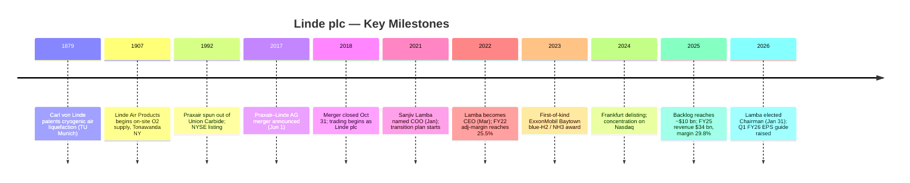

# Linde plc (NASDAQ: LIN) — Company Research

**Report date:** 2026-05-26 *(as of)*
**Listing:** NASDAQ Global Select (ticker `LIN`), constituent of the S&P 500 and the German DAX 40 dual-listed industrial-gas leader
**Domicile:** Public limited company organised in Ireland; principal offices in Woking (UK) and Danbury, CT (US) ([Linde 2025 10-K, Item 1 Business](https://www.sec.gov/Archives/edgar/data/1707925/000162828026011430/lin-20251231.htm))
**Fiscal year:** Calendar year — most recent 10-K covers the year ended **December 31, 2025**
**Auditor:** PricewaterhouseCoopers (engaged since 2019) ([2026 DEF 14A, Audit Matters](https://www.sec.gov/Archives/edgar/data/1707925/000119312526192209/lin-20260429.htm))

> **Update — FY2026 guidance raised (2026-05-01):** Management raised the low end of full-year FY26 adjusted-EPS guidance to **USD 17.60 – 17.90** (from the February 5, 2026 initial range of **USD 17.40 – 17.90**), tightening implied growth from "6–9% YoY" to **"7–9% YoY"** after a Q1 print of $4.33 (up 10% YoY) and 30% adjusted operating margin. Capex range reaffirmed at USD 5.0–5.5 bn against a **USD 7.1 bn contractual sale-of-gas project backlog**. Drivers cited by CEO Sanjiv Lamba: "resiliency of our operating model, discipline of capital allocation and perseverance of management actions."
> Source: [Linde Q1-2026 Earnings Press Release, 2026-05-01 (8-K Ex.99.1)](https://www.sec.gov/Archives/edgar/data/1707925/000165495426004202/lin_ex991.htm); compare against [Q4-2025 Earnings Press Release, 2026-02-05 (8-K Ex.99.1)](https://www.sec.gov/Archives/edgar/data/1707925/000165495426000913/lin_ex991.htm).

---

## Table of Contents

1. Company Overview
2. Company History
3. Management Team
4. Products & Services
5. Customers & Go-to-Market
6. Industry Overview
7. Competitive Landscape
8. Market Opportunity (TAM)
9. Risk Assessment
10. References

---

## 1. Company Overview

Linde plc is **the largest industrial-gas company in the world** by revenue, by market capitalisation, and by installed plant footprint, generated through the 31 October 2018 business combination of the legacy US-listed **Praxair, Inc.** with the German **Linde AG** ([Linde 2025 10-K, Item 1 Business](https://www.sec.gov/Archives/edgar/data/1707925/000162828026011430/lin-20251231.htm)). The combined enterprise sells two product lines — (i) **industrial gases** (the dominant ~94% of sales) — atmospheric gases (oxygen, nitrogen, argon, krypton, neon, xenon) and process gases (hydrogen, helium, carbon dioxide, carbon monoxide, electronic gases, specialty gases, acetylene); and (ii) the **Engineering business** that designs and EPC-builds the air-separation units (ASUs), hydrogen reformers, olefin plants and other process plants the gas business itself operates ([Linde 2025 10-K, Item 1 Business](https://www.sec.gov/Archives/edgar/data/1707925/000162828026011430/lin-20251231.htm)). The same 10-K text frames Linde as "a major technological innovator in the industrial gases industry"; the company holds patents and proprietary processes across cryogenic separation, vacuum pressure swing adsorption (VPSA), membrane separation, electrolyser-fed renewable hydrogen, and SMR / ATR low-carbon hydrogen.

**How Linde makes money.** Industrial gases are co-produced in the same plant and then routed to customers by **three distribution channels** that drive different economics. (a) **On-site / tonnage:** Linde builds dedicated cryogenic ASUs adjacent to a customer's site and supplies oxygen, nitrogen, or hydrogen by pipeline under **10–20 year total-requirements contracts** with minimum take-or-pay and electricity / natural-gas pass-throughs ([Linde 2025 10-K, Item 1 Business — Industrial Gases Distribution](https://www.sec.gov/Archives/edgar/data/1707925/000162828026011430/lin-20251231.htm)). (b) **Merchant / bulk liquid:** liquid O2, N2, Ar, H2, He, CO2 delivered by tanker truck to customer site under **3-to-7-year requirement contracts** with Linde-owned storage vessels ([Linde 2025 10-K, Item 1 — Merchant](https://www.sec.gov/Archives/edgar/data/1707925/000162828026011430/lin-20251231.htm)). (c) **Packaged / cylinder gases:** high-pressure cylinders of atmospheric, specialty and electronic gases under **1-to-3-year supply contracts** or purchase orders ([Linde 2025 10-K, Item 1 — Packaged Gases](https://www.sec.gov/Archives/edgar/data/1707925/000162828026011430/lin-20251231.htm)). The hierarchy matters: ~24% of FY25 sales come from on-site (high stability, energy pass-through, double-digit-year contracts), ~30% from merchant (mid-cycle), ~35% from packaged (most price-elastic), and the rest from Engineering and Other ([Linde 2024 Annual Report to Shareholders — Financial Highlights, Distribution Mode pie](https://www.linde.com/-/media/global/corporate/corporate/documents/investors/annual-reports/2024/linde-2024-annual-report.pdf)).

**Where Linde operates.** The 2025 10-K splits sales into four reportable segments: Americas, EMEA (Europe / Middle East / Africa), APAC (Asia / South Pacific), and Engineering ([Linde 2025 10-K, Note 18 — Segment Information](https://www.sec.gov/Archives/edgar/data/1707925/000162828026011430/lin-20251231.htm)). FY25 revenue by segment: **Americas $15,208 mn (45%) / EMEA $8,549 mn (25%) / APAC $6,661 mn (20%) / Engineering $2,250 mn (7%) / Other $1,318 mn (4%) = $33,986 mn total** ([Linde 2025 10-K, MD&A — Segment Discussion](https://www.sec.gov/Archives/edgar/data/1707925/000162828026011430/lin-20251231.htm)). Approximately **64% of 2025 sales were outside the United States**, spread across ~80 countries; the company has majority or wholly-owned subsidiaries in ~50 EMEA countries, ~15 APAC countries and ~20 Americas countries ([Linde 2025 10-K, Item 1 — International](https://www.sec.gov/Archives/edgar/data/1707925/000162828026011430/lin-20251231.htm)). Major pipeline complexes are concentrated in the **US Gulf Coast (Texas/Louisiana) and in China**, providing the structural moat that allows tonnage-scale on-site supply to refineries, steel mills, and large fab clusters.

**Scale indicators.** FY25 revenue $33,986 mn (+3% YoY); adjusted operating profit $10,137 mn at 29.8% margin (+30 bps YoY); adjusted EPS $16.46 (+6% YoY); operating cash flow $10,350 mn (+10%); capex $5,261 mn; net buybacks $4,578 mn; dividends paid $2,811 mn (≈22% / 17% / 30% / 8% of operating cash flow respectively, totalling $7.4 bn returned to shareholders) ([Linde 2025 10-K, MD&A — Executive Summary](https://www.sec.gov/Archives/edgar/data/1707925/000162828026011430/lin-20251231.htm)). Headcount stood at **65,177 employees** at year-end ([Linde 2025 10-K, Item 1 — Employees](https://www.sec.gov/Archives/edgar/data/1707925/000162828026011430/lin-20251231.htm)). Adjusted after-tax return on capital was **25.9% in FY24**, the most recent figure printed in the 2024 ARS ([Linde 2024 Annual Report to Shareholders — Financial Highlights](https://www.linde.com/-/media/global/corporate/corporate/documents/investors/annual-reports/2024/linde-2024-annual-report.pdf)); FY25 ROC trended higher per the Q1-2026 release citing 24% ROC for Q1 ([Q1-2026 Earnings Press Release, 2026-05-01](https://www.sec.gov/Archives/edgar/data/1707925/000165495426004202/lin_ex991.htm)).

*Source: [Linde 2025 10-K MD&A Executive Summary](https://www.sec.gov/Archives/edgar/data/1707925/000162828026011430/lin-20251231.htm) and prior-year 10-Ks (FY21–FY24).*

*Source: [Linde 2025 10-K Note 18 Segment Information](https://www.sec.gov/Archives/edgar/data/1707925/000162828026011430/lin-20251231.htm). External sales by segment.*

**Valuation snapshot (as of 2026-05-25).** Spot price ~**USD 517.58**, market cap **USD ~239 bn**, **TTM P/E 34.4×**, **TTM P/S 6.9×**, **EV/EBITDA 19.4×**, dividend yield ~**1.24%**, beta ~**0.74**, shares outstanding ~462 mn ([Yahoo Finance — LIN Key Statistics](https://finance.yahoo.com/quote/LIN/key-statistics/)). The three-year P/E band has run ~28×–37× on TTM earnings, so today's 34.4× sits in the **upper third** of its own range and at a modest premium to direct peers (APD 30.5×, Air Liquide 30.3×, Nippon Sanso 22.0×; Shin-Etsu Chemical at 27.9× sits in the same range but with a very different mix) ([Yahoo Finance — APD](https://finance.yahoo.com/quote/APD/key-statistics/), [Yahoo Finance — AI.PA](https://finance.yahoo.com/quote/AI.PA/key-statistics/), [Yahoo Finance — 4091.T](https://finance.yahoo.com/quote/4091.T/key-statistics/)). *Analyst view:* the premium reflects (i) the highest cash-on-cash returns in the peer group, (ii) the largest Electronics on-site footprint among Western gas majors (the Nomura Greater-China-Semi 2026–30 anchor report illustrates exactly this point — see [Nomura semi-materials note](../../sector/半导体材料.md)), and (iii) the largest clean-hydrogen / blue-ammonia project backlog ($7.1 bn contractual, ~$10 bn total at year-end 2025 ([Q4-2025 Press Release](https://www.sec.gov/Archives/edgar/data/1707925/000165495426000913/lin_ex991.htm))). 34× TTM EPS is not "stretched" by hyper-growth standards — it is a high-quality compounder at a quality multiple, and the Section 9 risk write-up flags multiple-compression as a *possible* (not material) risk if EPS growth deceleration coincides with a rate move.

*Source: Yahoo Finance Key Statistics, accessed 2026-05-25 — [LIN](https://finance.yahoo.com/quote/LIN/key-statistics/), [APD](https://finance.yahoo.com/quote/APD/key-statistics/), [AI.PA](https://finance.yahoo.com/quote/AI.PA/key-statistics/), [4091.T (Nippon Sanso)](https://finance.yahoo.com/quote/4091.T/key-statistics/), [4063.T (Shin-Etsu Chemical)](https://finance.yahoo.com/quote/4063.T/key-statistics/).*

---

## 2. Company History

The Linde plc that trades today is the **31 October 2018 product of a $90-billion-equity-value "merger of equals"** between Praxair, Inc. of Danbury, CT and Linde AG of Munich — a transaction announced 1 June 2017, approved by both shareholder bases in early 2018, and consummated after a deep antitrust-driven divestiture programme that handed the legacy Linde North American business to Messer / CVC and parts of legacy Praxair Europe to Taiyo Nippon Sanso ([Linde 2025 10-K, MD&A — Reference to Linde AG merger](https://www.sec.gov/Archives/edgar/data/1707925/000162828026011430/lin-20251231.htm); historical filing trail in the [Linde plc 2017 Form 10-K](https://www.sec.gov/Archives/edgar/data/1707925/000170792518000004/lindeplc201710k.htm)). The accounting acquirer was Praxair; for that reason Linde plc's CIK is 0001707925 — the same CIK assigned to the merger-vehicle "Zamalight plc" that incorporated in Ireland in 2017 specifically to hold both entities, the company's prior name visible on the [EDGAR company page](https://www.sec.gov/cgi-bin/browse-edgar?action=getcompany&CIK=0001707925&type=10-K&dateb=&owner=include&count=10) listing **"formerly: ZAMALIGHT PLC (filings through 2017-07-12)"**.

The two predecessor companies, though, carry much older history. **Linde AG** traces back to 1879 when **Prof. Carl von Linde** patented the cryogenic air-liquefaction process at the Technical University Munich — the same physics still in every modern ASU ([Linde corporate website — Heritage page](https://www.linde.com/about-linde/our-heritage)). **Praxair** was the world's first company to produce on-site oxygen at scale (Tonawanda, NY, 1907 — under the original name "Linde Air Products Company", which was spun out of Union Carbide in 1992 and renamed Praxair). The 2018 merger therefore reunited the two halves of an industrial-gas family that had been separated for ~100 years across the Atlantic.

**Strategic pivot # 1 — the merger itself (2018).** The thesis: combine Praxair's high-return US merchant / packaged-gas franchise with Linde AG's higher-growth Asian footprint and the Linde Engineering EPC arm, layer in $1.2 bn of run-rate synergies, and convert the world's most-fragmented industrial-gas market into a duopoly with Air Liquide ([Linde 2017 10-K, Item 1 — Subsequent Events](https://www.sec.gov/Archives/edgar/data/1707925/000170792518000004/lindeplc201710k.htm)). By FY2024 the combined company had already delivered the targeted synergies and **expanded adjusted operating margin from ~22% (proforma 2018) to 29.5%** ([Linde 2024 Annual Report to Shareholders — Financial Highlights](https://www.linde.com/-/media/global/corporate/corporate/documents/investors/annual-reports/2024/linde-2024-annual-report.pdf)) — a vivid demonstration of the cost-out and pricing discipline that the Praxair playbook bolted onto the higher-growth Linde footprint.

**Strategic pivot # 2 — primary US listing on Nasdaq, NYSE secondary delisting (2024).** In March 2024 Linde decided to **delist from the Frankfurt Stock Exchange** and concentrate trading on the Nasdaq Global Select Market in New York. The motivation, disclosed in the [2024 8-K announcing the delisting](https://www.sec.gov/Archives/edgar/data/1707925/000119312524036171/d806251d8k.htm), was the substantial fraction of liquidity that had already migrated to the US exchange after the merger; the DAX 40 weight of LIN — at the time the index's largest constituent at ~10% — required the company to disproportionately fund DAX-tracking ETF demand at quarterly rebalances, distorting trading patterns. Concentrating in the US has tightened the spread and allowed the company to focus its disclosure on the SEC regime alone.

**Strategic pivot # 3 — Clean-energy / decarbonisation investment cycle (2022 → present).** In 2022 management began **classifying clean-hydrogen and carbon-capture projects as a discrete sub-segment of the on-site backlog**. By year-end 2025 the company disclosed a **~$10 billion total project backlog** including a contractual sale-of-gas component of **$7.1 billion**, with high-profile blue / green hydrogen wins for ExxonMobil Baytown (low-carbon H2 + ammonia exporter — first-of-kind blue ammonia at scale), OCI / Woodside H2 Houston, BP Whiting refinery, Dow Path-2-Zero Texas, and air-separation builds for Samsung Foundry Taylor (Texas) and TSMC Arizona ([Linde 2025 10-K, MD&A — Capital Expenditures](https://www.sec.gov/Archives/edgar/data/1707925/000162828026011430/lin-20251231.htm); [Linde Newsroom — ExxonMobil Baytown press release, 2024-03-14](https://www.linde.com/news-and-media/press-releases)). The backlog is a structural visibility tool: each project converts to 10-to-20-year on-site contracts as the plants start up over 2026–2030.

**Mermaid timeline.**

**Recent developments (last 12 months).** (i) Sean Durbin appointed **Chief Operating Officer effective 1 October 2025** — a Praxair-tenured executive previously running North America, replacing the COO seat vacated when Lamba moved to the CEO role in 2022 ([Linde 2025 10-K, Item 1 — Executive Officers](https://www.sec.gov/Archives/edgar/data/1707925/000162828026011430/lin-20251231.htm)). (ii) Sanjiv Lamba **elected Chairman of the Board effective 31 January 2026**, combining the chair / CEO role and reflecting board confidence in the strategy ([Linde 2026 DEF 14A — Corporate Governance Framework](https://www.sec.gov/Archives/edgar/data/1707925/000119312526192209/lin-20260429.htm)). (iii) FY26 adjusted-EPS guidance **raised on 2026-05-01** as discussed in the top-of-report banner. (iv) Major new project wins continue to fill the backlog, including the second phase of the ExxonMobil Baytown low-carbon hydrogen complex and additional on-site contracts for Samsung Foundry Taylor TX. (v) Continued capital return — **net buybacks $4.6 bn in FY25**, the highest in company history ([Linde 2025 10-K, Cash Flows from Financing](https://www.sec.gov/Archives/edgar/data/1707925/000162828026011430/lin-20251231.htm)).

---

## 3. Management Team

**Note on scope.** Per the company-research skill, this section covers only the founder and the current CEO; legacy Praxair / Linde AG founders (Carl von Linde, the Union Carbide industrial-gases division leadership of the 1990s) are too historical to bio in operational depth. Linde plc as a legal entity was incorporated in 2017 as a merger vehicle and has no "founder" in the modern operational sense; instead, the closest analogue is **Stephen F. Angel**, who as Praxair CEO architected the 2018 combination and then served as Linde plc's first CEO (2018–2022) and Chairman (until 31 January 2026). He retired from the Board on that date ([Linde 2026 DEF 14A, Director Compensation Table footnote (3)](https://www.sec.gov/Archives/edgar/data/1707925/000119312526192209/lin-20260429.htm)), so he is no longer in management — but his transition into Lamba is the relevant context for the CEO bio below.

### Sanjiv Lamba — Chairman & Chief Executive Officer (since 2022, Chairman effective 2026-01-31)

**Sanjiv Lamba** (age 61, as of the 2026 DEF 14A) was elected **Chairman of the Board effective 31 January 2026** and has been **Chief Executive Officer of Linde plc since 1 March 2022** ([Linde 2026 DEF 14A — Director Nominees, Sanjiv Lamba](https://www.sec.gov/Archives/edgar/data/1707925/000119312526192209/lin-20260429.htm)). Prior to becoming CEO, Lamba served as **Chief Operating Officer of Linde plc from January 2021 to February 2022** — a 14-month grooming role under predecessor CEO Stephen F. Angel — and before that as **Executive Vice President, APAC since 2018**, the position to which he was elevated immediately after the Praxair / Linde AG merger closed ([Linde 2026 DEF 14A — Lamba bio](https://www.sec.gov/Archives/edgar/data/1707925/000119312526192209/lin-20260429.htm)). His operating tenure inside the company's APAC business — the most important geography for the electronics-gases franchise — explains the strategic continuity of the on-site semi-fab build-out (TSMC, Samsung, SK Hynix) that has become the highest-multiple sub-business in the group.

Lamba's career began in 1989 with **BOC India in Finance**, where he was promoted to Director of Finance and subsequently **Managing Director for the India business in 2001** ([Linde 2026 DEF 14A — Lamba bio](https://www.sec.gov/Archives/edgar/data/1707925/000119312526192209/lin-20260429.htm)) — BOC was the British industrial-gas major that legacy Linde AG acquired in 2006, giving Lamba ~35 years of continuous service in the same corporate family. He has worked across **India, the UK, Singapore and Germany**, the latter as a **member of the Executive Board of Linde AG** in Munich responsible for the Asia Pacific Gases segment, Global Helium & Rare Gases, Electronics and the Asia Joint Venture portfolio ([Linde 2025 10-K, Item 10 — Executive Officers](https://www.sec.gov/Archives/edgar/data/1707925/000162828026011430/lin-20251231.htm)). The bio's geographic breadth is unusual for a global-major CEO — most are domestic operators promoted up — and it positions him as the natural successor when the Angel-era US-centric integration phase ended.

Outside Linde, Lamba **served as Co-Chair of the Hydrogen Council**, the global industry body for low-carbon hydrogen — a directly thematic role given Linde's clean-hydrogen backlog. In **January 2026 he joined the Board of Directors of Amphenol Corporation (NYSE: APH)**, the connector / interconnect company ([Linde 2026 DEF 14A — Other Public Company Directorships](https://www.sec.gov/Archives/edgar/data/1707925/000119312526192209/lin-20260429.htm)), giving him board-level visibility into the data-center / AI infrastructure customer base that drives Linde's electronics on-site demand. He is also a **member of The Business Council**, the US CEO peer organisation. His compensation is disclosed in the 2026 DEF 14A Summary Compensation Table — see [Executive Compensation Tables, Table 1](https://www.sec.gov/Archives/edgar/data/1707925/000119312526192209/lin-20260429.htm) — at-risk pay-for-performance with a meaningful long-term equity weight aligned with shareholders.

The June-2025 board decision to combine Chair and CEO roles in Lamba was justified in the proxy as reflecting **"his significant industry expertise, CEO experience and effective working relationship with the Board"** ([Linde 2026 DEF 14A — Linde s Corporate Governance Framework](https://www.sec.gov/Archives/edgar/data/1707925/000119312526192209/lin-20260429.htm)). The independence of the board is preserved through the Lead Independent Director (LID) role held by **Robert L. Wood**, who has held that position since 1 March 2022 (the same date Lamba became CEO). Combined-role CEO / Chair structures are sometimes criticised on governance grounds; the LID structure is the accepted mitigant and is in place here.

