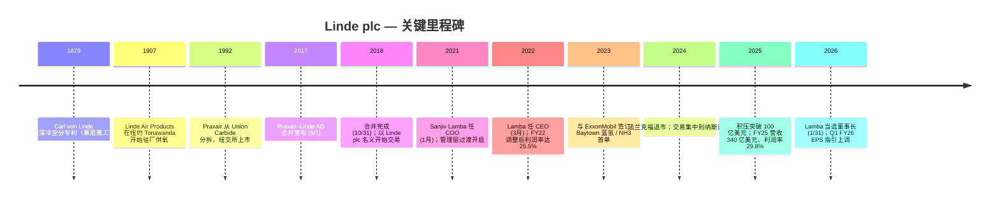
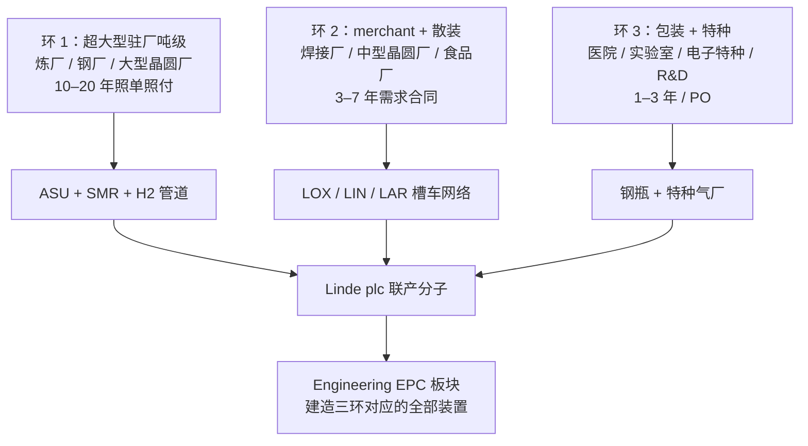
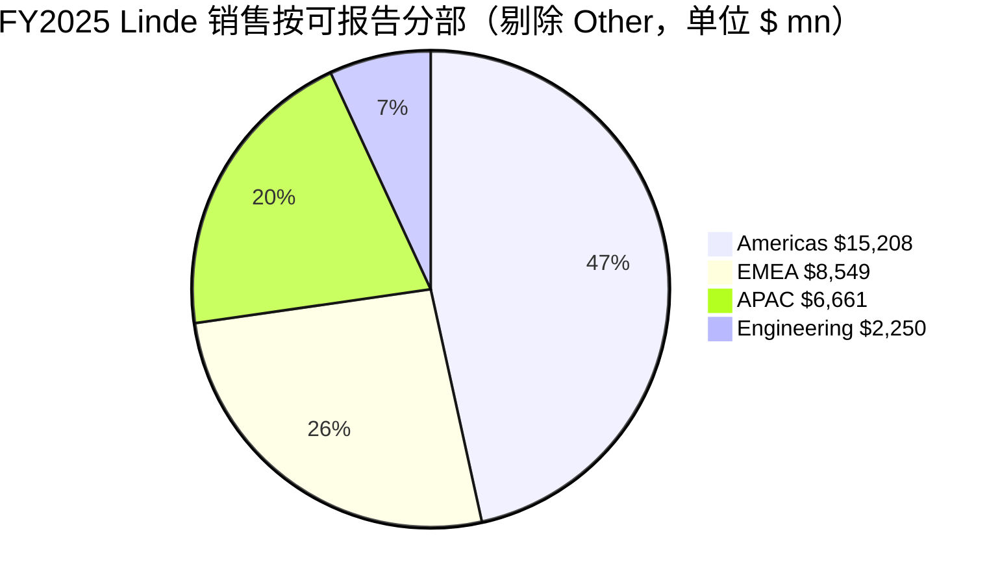
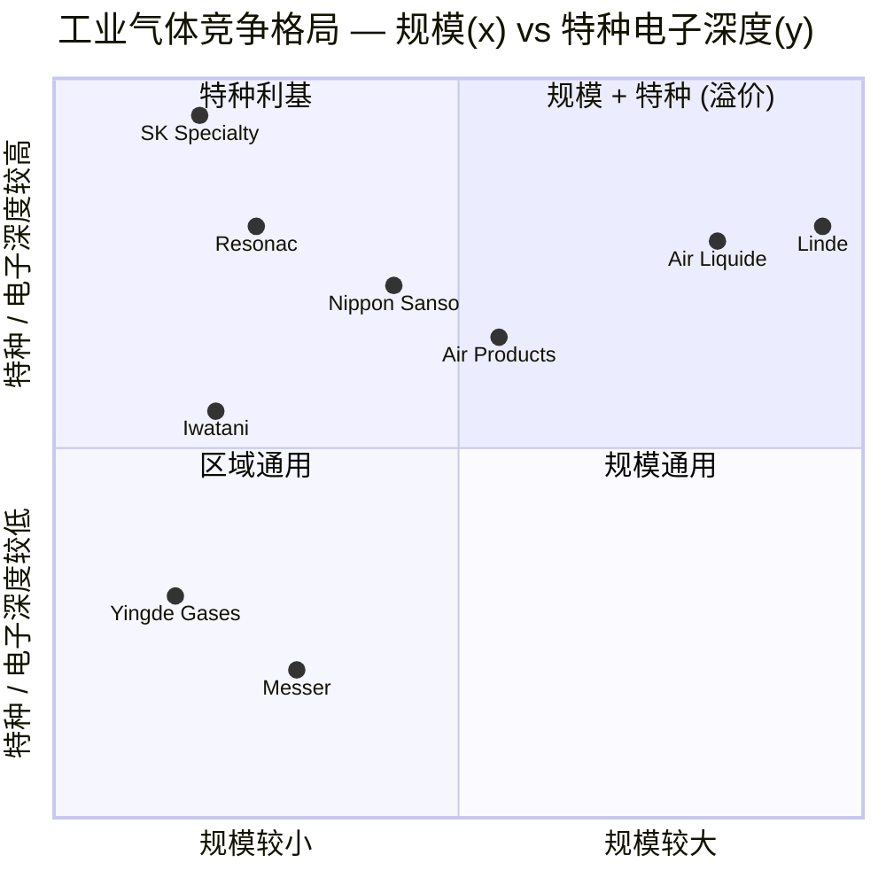

# 林德集团 Linde plc (NASDAQ: LIN) — 公司研究

**报告日期：** 2026-05-26 *(as of)*
**上市地：** 纳斯达克全球精选市场 (Nasdaq Global Select)，代码 `LIN`；同时是标普 500 与德国 DAX 40 的双上市工业气体 (industrial gas) 龙头
**注册地：** 爱尔兰注册的公众有限公司 (public limited company)；主要办公地为英国 Woking 与美国康涅狄格州 Danbury ([Linde 2025 10-K, Item 1 Business](https://www.sec.gov/Archives/edgar/data/1707925/000162828026011430/lin-20251231.htm))
**财年：** 历年制——最新 10-K 涵盖 **2025 年 12 月 31 日**截止财年
**审计师：** 普华永道 (PricewaterhouseCoopers，自 2019 年起聘用) ([2026 DEF 14A, Audit Matters](https://www.sec.gov/Archives/edgar/data/1707925/000119312526192209/lin-20260429.htm))

> **更新 — 2026 财年指引上调 (2026-05-01)：** 管理层将 FY26 调整后 EPS 全年指引下限上调至 **USD 17.60 – 17.90**（此前 2026-02-05 给出的初始区间为 **USD 17.40 – 17.90**），隐含同比增速由"6–9%"收窄到 **"7–9%"**，背景是 Q1 季报 EPS 4.33 美元（同比 +10%）+ 调整后营业利润率 30%。资本开支区间维持在 USD 5.0–5.5 bn，对应 **USD 7.1 bn 的合同制气销售在手项目** (contractual sale-of-gas backlog)。CEO Sanjiv Lamba 给出的驱动因素："资本配置纪律、经营模式韧性以及管理层行动的持续性"。
> 资料：[Linde Q1-2026 Earnings Press Release, 2026-05-01 (8-K Ex.99.1)](https://www.sec.gov/Archives/edgar/data/1707925/000165495426004202/lin_ex991.htm)；对比 [Q4-2025 Earnings Press Release, 2026-02-05 (8-K Ex.99.1)](https://www.sec.gov/Archives/edgar/data/1707925/000165495426000913/lin_ex991.htm)。

---

## 目录

1. 公司概览
2. 公司历史
3. 管理团队
4. 产品与服务
5. 客户与上市策略
6. 行业概览
7. 竞争格局
8. 市场机会
9. 风险评估
10. 参考资料

---

## 1. 公司概览

林德集团 (Linde plc) **按营收、市值和装机厂区规模衡量均是全球最大的工业气体 (industrial gas) 公司**，是 2018 年 10 月 31 日由美国上市的 **Praxair, Inc.** 与德国 **Linde AG** 通过对等合并 (merger of equals) 组合而成 ([Linde 2025 10-K, Item 1 Business](https://www.sec.gov/Archives/edgar/data/1707925/000162828026011430/lin-20251231.htm))。合并后的企业销售两大产品线：(i) **工业气体** (约占销售额 94%) —— 包括大气气体（氧气、氮气、氩气、氪气、氖气、氙气）和制程气体（氢气、氦气 (helium)、二氧化碳、一氧化碳、电子特种气体 (electronic specialty gas)、特种气体、乙炔）；以及 (ii) **工程业务 (Engineering)**，负责设计与 EPC 总承包气体业务所运营的空分装置 (ASU)、氢气重整装置、烯烃装置等流程装置 ([Linde 2025 10-K, Item 1 Business](https://www.sec.gov/Archives/edgar/data/1707925/000162828026011430/lin-20251231.htm))。同一份 10-K 文本将 Linde 定位为"工业气体行业的主要技术创新者"——公司拥有覆盖深冷分离、变压吸附 (VPSA)、膜分离、电解槽驱动的可再生氢以及 SMR / ATR 低碳氢的专利与专有工艺。

**Linde 的盈利模式。** 工业气体由同一座工厂联产，再通过**三种分销渠道**输送至客户，三种渠道驱动迥异的经济性。(a) **驻厂供气 (on-site supply) / 大额吨级模式：** Linde 在客户场地旁建设专用深冷空分装置 (ASU)，通过管道供应氧气、氮气或氢气，签订 **10–20 年的全需求合同**，含最低照单照付 (take-or-pay contract) 条款，电费、天然气成本通过价格条款向客户传导 ([Linde 2025 10-K, Item 1 Business — Industrial Gases Distribution](https://www.sec.gov/Archives/edgar/data/1707925/000162828026011430/lin-20251231.htm))。(b) **商品 (merchant) / 散装液体模式：** 液氧、液氮、液氩、液氢、液氦、液 CO₂ 用槽车送达客户场地，存储容器由 Linde 拥有，合同期一般 **3–7 年**，按需求量结算 ([Linde 2025 10-K, Item 1 — Merchant](https://www.sec.gov/Archives/edgar/data/1707925/000162828026011430/lin-20251231.htm))。(c) **包装 (packaged) / 钢瓶模式：** 高压钢瓶装大气、特种、电子气体，合同 **1–3 年**或单次订单 ([Linde 2025 10-K, Item 1 — Packaged Gases](https://www.sec.gov/Archives/edgar/data/1707925/000162828026011430/lin-20251231.htm))。三种渠道的层次结构是关键：FY25 约 24% 销售额来自 on-site（稳定性最高、能源成本传导、合同期为十年级），约 30% 来自 merchant（中等周期），约 35% 来自 packaged（价格弹性最高），其余为 Engineering 与 Other ([Linde 2024 Annual Report to Shareholders — Financial Highlights](https://assets.linde.com/-/media/global/corporate/corporate/documents/investors/full-year-financial-reports/2024-annual-report-to-shareholders.pdf))。

**Linde 的运营地理。** 2025 年 10-K 将销售拆分为四个可报告分部：Americas（美洲）、EMEA（欧洲/中东/非洲）、APAC（亚洲/南太平洋）、Engineering ([Linde 2025 10-K, Note 18 — Segment Information](https://www.sec.gov/Archives/edgar/data/1707925/000162828026011430/lin-20251231.htm))。FY25 各分部营收：**Americas $15,208 mn (45%) / EMEA $8,549 mn (25%) / APAC $6,661 mn (20%) / Engineering $2,250 mn (7%) / Other $1,318 mn (4%) = 合计 $33,986 mn** ([Linde 2025 10-K, MD&A — Segment Discussion](https://www.sec.gov/Archives/edgar/data/1707925/000162828026011430/lin-20251231.htm))。**约 64% 的 2025 年销售来自美国以外**，分布于约 80 个国家；公司在约 50 个 EMEA 国家、约 15 个 APAC 国家、约 20 个 Americas 国家拥有控股或全资子公司 ([Linde 2025 10-K, Item 1 — International](https://www.sec.gov/Archives/edgar/data/1707925/000162828026011430/lin-20251231.htm))。主要管网集群集中在 **美国墨西哥湾沿岸 (Texas / Louisiana) 与中国**，构成了使 Linde 能向炼厂、钢厂和大型晶圆厂集群提供大额驻厂供气的结构性护城河。

**规模指标。** FY25 营收 $33,986 mn (+3% YoY)；调整后营业利润 $10,137 mn，利润率 29.8% (+30 bps YoY)；调整后 EPS $16.46 (+6% YoY)；经营性现金流 $10,350 mn (+10%)；资本开支 $5,261 mn；净回购 $4,578 mn；分红支付 $2,811 mn（分别约占经营性现金流的 22% / 17% / 30% / 8%，合计向股东返还 $7.4 bn） ([Linde 2025 10-K, MD&A — Executive Summary](https://www.sec.gov/Archives/edgar/data/1707925/000162828026011430/lin-20251231.htm))。年末员工 **65,177 人** ([Linde 2025 10-K, Item 1 — Employees](https://www.sec.gov/Archives/edgar/data/1707925/000162828026011430/lin-20251231.htm))。FY24 调整后税后资本回报率 (after-tax return on capital, ROC) **25.9%**，是 2024 ARS 给出的最新数据 ([Linde 2024 Annual Report to Shareholders — Financial Highlights](https://assets.linde.com/-/media/global/corporate/corporate/documents/investors/full-year-financial-reports/2024-annual-report-to-shareholders.pdf))；Q1 2026 季报披露 ROC 走高，Q1 FY26 ROC 为 24% ([Q1-2026 Earnings Press Release, 2026-05-01](https://www.sec.gov/Archives/edgar/data/1707925/000165495426004202/lin_ex991.htm))。


*资料：[Linde 2024 Annual Report to Shareholders — Financial Highlights page](https://assets.linde.com/-/media/global/corporate/corporate/documents/investors/full-year-financial-reports/2024-annual-report-to-shareholders.pdf)。这是 Linde 官方发布的财务摘要页，汇总销售额、营业利润、EPS、现金流、资本开支、税后 ROC，以及三张分部 / 终端市场 / 分销模式饼图。注意：Linde 没有发布对应的 2025 ARS Financial Highlights 单页（只有 10-K + 8-K 业绩稿），FY25 数据从 10-K 文本提取并在下文 FY21–FY25 趋势图中重现。*


*资料：[Linde 2025 10-K MD&A Executive Summary](https://www.sec.gov/Archives/edgar/data/1707925/000162828026011430/lin-20251231.htm) 及前 4 年的 10-K (FY21–FY24)。*


*资料：[Linde 2025 10-K Note 18 Segment Information](https://www.sec.gov/Archives/edgar/data/1707925/000162828026011430/lin-20251231.htm)。按分部的对外销售。*

**估值速览 (截至 2026-05-25)。** 现价约 **USD 517.58**，市值约 **USD 239 bn**，**TTM P/E 34.4×**，**TTM P/S 6.9×**，**EV/EBITDA 19.4×**，股息率约 **1.24%**，beta 约 **0.74**，发行在外股数约 462 mn ([Yahoo Finance — LIN Key Statistics](https://finance.yahoo.com/quote/LIN/key-statistics/))。过去三年 TTM P/E 波动区间约 28×–37×，今天的 34.4× 处于自身区间的**上三分位**，相对直接同业小幅溢价（APD 30.5×、Air Liquide 30.3×、Nippon Sanso 22.0×；信越化学 27.9× 在同一带但产品结构差异极大） ([Yahoo Finance — APD](https://finance.yahoo.com/quote/APD/key-statistics/)、[Yahoo Finance — AI.PA](https://finance.yahoo.com/quote/AI.PA/key-statistics/)、[Yahoo Finance — 4091.T](https://finance.yahoo.com/quote/4091.T/key-statistics/))。*分析师观点：* 溢价反映 (i) 同业中最高的现金对现金回报率、(ii) 西方气体巨头中最大的电子驻厂供气足迹（野村大中华半导体 2026–30 锚定研究专门点出这一论点 —— 见 [半导体材料锚定笔记](../../sector/半导体材料.md)），以及 (iii) 全球最大的清洁氢 / 蓝氨在手项目（年末 2025 年合同 $7.1 bn、含意向合计约 $10 bn ([Q4-2025 Press Release](https://www.sec.gov/Archives/edgar/data/1707925/000165495426000913/lin_ex991.htm)))。34× TTM EPS 按超高速成长股的尺度并不算"撑爆"，是一家高质量复利型企业 (quality compounder) 处于合理的高质量倍数；§9 风险章把估值压缩列为 *可能* 风险（不算重大）—— 前提是 EPS 增长减速与利率走势同时出现。


*资料：Yahoo Finance Key Statistics，2026-05-25 访问 —— [LIN](https://finance.yahoo.com/quote/LIN/key-statistics/)、[APD](https://finance.yahoo.com/quote/APD/key-statistics/)、[AI.PA](https://finance.yahoo.com/quote/AI.PA/key-statistics/)、[4091.T (Nippon Sanso)](https://finance.yahoo.com/quote/4091.T/key-statistics/)、[4063.T (Shin-Etsu Chemical)](https://finance.yahoo.com/quote/4063.T/key-statistics/)。*

---

## 2. 公司历史

今天交易的 Linde plc 是 **2018 年 10 月 31 日** Praxair 与 Linde AG 完成的 **股权对价约 900 亿美元的"对等合并"** (merger of equals) 的产物——交易于 2017 年 6 月 1 日宣布，2018 年初获双方股东批准，在经历由反垄断驱动的深度剥离方案（将原 Linde 北美业务交给 Messer / CVC，将部分原 Praxair 欧洲资产交给太阳日酸 (Taiyo Nippon Sanso)）后完成 ([Linde 2025 10-K, MD&A — Reference to Linde AG merger](https://www.sec.gov/Archives/edgar/data/1707925/000162828026011430/lin-20251231.htm)；历史文件链路见 [Linde plc 2017 Form 10-K](https://www.sec.gov/Archives/edgar/data/1707925/000170792518000004/lindeplc201710k.htm))。会计收购方是 Praxair；正因如此 Linde plc 的 CIK 为 0001707925，与 2017 年在爱尔兰注册、专门用于持股双方的合并载体 "Zamalight plc" 同号—— [EDGAR 公司页](https://www.sec.gov/cgi-bin/browse-edgar?action=getcompany&CIK=0001707925&type=10-K&dateb=&owner=include&count=10) 至今显示 **"formerly: ZAMALIGHT PLC (filings through 2017-07-12)"**。

不过两家前身公司各自的历史远比合并久远。**Linde AG** 可上溯至 1879 年，**Carl von Linde 教授**在慕尼黑工业大学申请了深冷空分专利——同样的物理原理沿用至今仍在每台现代 ASU 中运行 ([Linde corporate website — Corporate Heritage page](https://www.linde.com/about-linde/corporate-heritage))。**Praxair** 则是全球第一家规模化生产驻厂氧气的公司（1907 年于纽约 Tonawanda 投运，最初名为 "Linde Air Products Company"，1992 年从 Union Carbide 分拆并更名为 Praxair）。因此 2018 年的合并实质上是把跨越大西洋分离了约 100 年的同源工业气体家族重新合而为一。

**战略转折点 #1 —— 合并本身 (2018)。** 论题：将 Praxair 高回报的美国 merchant / packaged 气体业务与 Linde AG 增长更快的亚洲足迹及 Linde Engineering EPC 业务结合，叠加 12 亿美元的协同效应跑率，把世界上最分散的工业气体市场整合成与液空 (Air Liquide) 共主的双寡头 ([Linde 2017 10-K, Item 1 — Subsequent Events](https://www.sec.gov/Archives/edgar/data/1707925/000170792518000004/lindeplc201710k.htm))。到 FY2024，合并后的公司已兑现既定协同目标，**调整后营业利润率从约 22%（2018 模拟）扩张到 29.5%** ([Linde 2024 Annual Report to Shareholders — Financial Highlights](https://assets.linde.com/-/media/global/corporate/corporate/documents/investors/full-year-financial-reports/2024-annual-report-to-shareholders.pdf))——这是 Praxair 体系的成本管控与定价纪律嫁接到 Linde 高增长足迹之上的鲜明案例。

**战略转折点 #2 —— 纳斯达克成为主交易所、纽交所/法兰克福退市 (2024)。** 2024 年 3 月，Linde 决定 **从法兰克福证券交易所退市**，将交易集中到纳斯达克全球精选市场。在 [2024 年宣布退市的 8-K](https://www.sec.gov/Archives/edgar/data/1707925/000119312524036171/d806251d8k.htm) 中披露的动机是合并以来流动性已大量迁移到美国市场；当时 LIN 在 DAX 40 中权重约 10%（指数最大成份股），导致公司在季度调仓时被动满足跟踪 DAX ETF 的需求，扭曲了交易模式。集中到美国交易所收窄了买卖价差，使公司能将披露集中遵循 SEC 一套制度。

**战略转折点 #3 —— 清洁能源 / 脱碳投资周期 (2022 → 至今)。** 2022 年管理层开始 **将清洁氢与碳捕集项目作为驻厂积压的独立子板块披露**。到 2025 年末公司披露 **总项目积压约 100 亿美元**，其中合同制气销售部分约 **71 亿美元**，标志性的清洁氢中标包括 Linde 的德州 Beaumont 清洁 H₂ 装置（ExxonMobil 承接最多 2.2 mt/yr 的 CO₂ 进行永久封存）、为炼厂和石化客户的额外蓝氢与空分装置、以及为新建晶圆厂的主要驻厂 ASU 合同——包括三星代工 Taylor TX 与台积电亚利桑那 ([Linde 2025 10-K, MD&A — Capital Expenditures](https://www.sec.gov/Archives/edgar/data/1707925/000162828026011430/lin-20251231.htm)；[Linde Press Release — Linde Signs Agreement with ExxonMobil for Carbon Dioxide Off-take, 2023-04-04](https://www.linde.com/news-and-media/2023/linde-signs-agreement-with-exxonmobil-for-carbon-dioxide-off-take))。积压是结构性可见度的工具：每个项目在 2026–2030 年陆续开车时都会转化为 10–20 年的驻厂合同。

**Mermaid 时间线：**



**近期事件 (最近 12 个月)。** (i) Sean Durbin 自 **2025 年 10 月 1 日起任 COO**——一位曾任 Praxair 北美总裁的资深高管，填补 Lamba 2022 年升任 CEO 时空缺的 COO 职位 ([Linde 2025 10-K, Item 1 — Executive Officers](https://www.sec.gov/Archives/edgar/data/1707925/000162828026011430/lin-20251231.htm))。(ii) Sanjiv Lamba **自 2026 年 1 月 31 日起当选董事长**，合并董事长与 CEO 双职位，体现董事会对战略的延续信心 ([Linde 2026 DEF 14A — Corporate Governance Framework](https://www.sec.gov/Archives/edgar/data/1707925/000119312526192209/lin-20260429.htm))。(iii) FY26 调整后 EPS 指引于 **2026-05-01 上调**，详见报告顶部 banner。(iv) 重大新项目持续填充积压，包括 ExxonMobil Baytown 低碳氢二期，以及三星代工 Taylor TX 的额外驻厂合同。(v) 资本回报持续——**FY25 净回购 46 亿美元**，是公司历史最高 ([Linde 2025 10-K, Cash Flows from Financing](https://www.sec.gov/Archives/edgar/data/1707925/000162828026011430/lin-20251231.htm))。

---

## 3. 管理团队

**范围说明。** 按公司研究 skill 规则，本章只覆盖创始人与现任 CEO；前 Praxair / Linde AG 创始人（Carl von Linde、1990 年代 Union Carbide 工业气体部门管理层）过于久远，不展开。Linde plc 作为法律实体仅于 2017 年作为合并载体注册，没有现代意义上的"创始人"；最接近的对应人物是 **Stephen F. Angel**——他作为 Praxair CEO 主导了 2018 年的合并，并担任 Linde plc 首任 CEO (2018–2022) 与董事长 (至 2026 年 1 月 31 日)。他在该日期从董事会退休 ([Linde 2026 DEF 14A, Director Compensation Table footnote (3)](https://www.sec.gov/Archives/edgar/data/1707925/000119312526192209/lin-20260429.htm))，因此已不在管理岗——但他向 Lamba 的过渡是下面 CEO 简介的背景上下文。

### Sanjiv Lamba — 董事长兼首席执行官 (自 2022 年任 CEO，2026-01-31 起兼任董事长)

**Sanjiv Lamba**（2026 DEF 14A 公布的年龄 61 岁）**自 2026 年 1 月 31 日起当选董事长**，**自 2022 年 3 月 1 日起担任 Linde plc CEO** ([Linde 2026 DEF 14A — Director Nominees, Sanjiv Lamba](https://www.sec.gov/Archives/edgar/data/1707925/000119312526192209/lin-20260429.htm))。出任 CEO 之前，他 **2021 年 1 月至 2022 年 2 月任 Linde plc 首席运营官 (COO)**——在前任 CEO Stephen F. Angel 麾下接受 14 个月的接班培养——更早自 2018 年起担任 **执行副总裁 (EVP)、APAC**，是合并完成后立刻提拔的职位 ([Linde 2026 DEF 14A — Lamba bio](https://www.sec.gov/Archives/edgar/data/1707925/000119312526192209/lin-20260429.htm))。他在公司 APAC 业务的执业经历——这是电子气体业务最重要的地理板块——解释了集团在驻厂供气于半导体晶圆厂建设（台积电、三星、SK 海力士）上的战略连贯性，而后者已是 Linde 内估值倍数最高的子业务。

Lamba 的职业生涯始于 **1989 年的 BOC India 财务部门**，他被提拔为财务总监并 **于 2001 年成为印度公司的董事总经理 (MD)** ([Linde 2026 DEF 14A — Lamba bio](https://www.sec.gov/Archives/edgar/data/1707925/000119312526192209/lin-20260429.htm))——BOC 是英国工业气体巨头，被前身 Linde AG 于 2006 年收购，因此 Lamba 已在同一公司体系内连续供职约 35 年。他先后在 **印度、英国、新加坡和德国**任职，最后一段是在慕尼黑作为 Linde AG 执行董事会成员，负责亚太气体、全球氦气与稀有气体、电子业务以及亚洲合资项目 ([Linde 2025 10-K, Item 10 — Executive Officers](https://www.sec.gov/Archives/edgar/data/1707925/000162828026011430/lin-20251231.htm))。这种地理分布对全球巨头 CEO 而言并不常见——多数 CEO 是被提拔上来的本土运营者——这使他成为 Angel 时代以美国为中心的整合阶段结束时的天然继任者。

在 Linde 之外，Lamba 曾 **担任氢能委员会 (Hydrogen Council, 全球低碳氢能行业组织) 联合主席**——这一角色与 Linde 的清洁氢积压直接呼应。**2026 年 1 月，他加入了纽交所上市公司 Amphenol Corporation (NYSE: APH) 董事会**，该公司是连接器 / 互连产品厂商 ([Linde 2026 DEF 14A — Other Public Company Directorships](https://www.sec.gov/Archives/edgar/data/1707925/000119312526192209/lin-20260429.htm))，使他在董事会层面接触到驱动 Linde 电子驻厂供气需求的数据中心 / AI 基础设施客户群。他也是美国 CEO 同行组织 **The Business Council** 成员。其薪酬披露于 2026 DEF 14A 摘要薪酬表 —— 见 [Executive Compensation Tables, Table 1](https://www.sec.gov/Archives/edgar/data/1707925/000119312526192209/lin-20260429.htm) —— 主要为风险薪酬，长期股权权重显著，与股东利益对齐。

2025 年 6 月董事会决定将董事长与 CEO 合并由 Lamba 出任，理由在 proxy 中表述为反映 **"他重要的行业专业能力、CEO 经验，以及与董事会的有效协作关系"** ([Linde 2026 DEF 14A — Linde's Corporate Governance Framework](https://www.sec.gov/Archives/edgar/data/1707925/000119312526192209/lin-20260429.htm))。董事会的独立性通过由 **Robert L. Wood** 担任首席独立董事 (Lead Independent Director, LID) 保留——他自 2022 年 3 月 1 日 (与 Lamba 出任 CEO 同日) 起一直担任该职。合并董事长 / CEO 的结构有时被治理评级批评；首席独立董事是行业接受的缓解机制，本案已配置到位。

---

## 4. 产品与服务

§4 是全报告的分析核心——每一个下游章节（客户、行业、竞争格局、TAM、风险）都最终回溯到下文的产品分类。Linde 的产品矩阵主要按 **分子 × 分销模式** 而非按下游市场组织。大气与制程气体由同一座工厂联产，再通过 §1 介绍的三种分销渠道 (on-site / merchant / packaged) 派送。技术 IP 体现在 (i) 工程业务 EPC 的空分、氢气重整与电解槽工艺设计；(ii) 应用层专有技术（激光切割气配比、晶圆厂的镀膜 / 刻蚀 / 清洗特种气配方、肉类加工厂的速冻通道、医院的 MAGNESHIELD® 医用氧系统）；以及 (iii) 经营纪律（能源合同、生产效率改善方案、安全记录），让大额驻厂供气合同跑出两位数的 IRR。

### 4.1 产品 / 分销矩阵

10-K 没有发布单一的产品矩阵表格，但 Item 1 中的逐字产品描述与 Note 18 的分部拆分共同隐含了下表结构。这是一张分析师构造的表格——每一行都引用了 10-K 中点名该分子的文本。

| 分子族 | 主要分销模式 | 终端市场暴露 | 关键技术 / IP | 10-K 出处 |
|---|---|---|---|---|
| **氧 (O₂)** | On-site（管道）+ merchant（LOX 槽车）+ 钢瓶 | 钢铁、炼厂、医疗、玻璃 | 深冷 ASU；VPSA 驻厂 | [10-K Item 1](https://www.sec.gov/Archives/edgar/data/1707925/000162828026011430/lin-20251231.htm) |
| **氮 (N₂)** | On-site + merchant（LIN 槽车）+ 钢瓶 | 电子保护气 / 惰化、食品速冻、化工 | 深冷 ASU；膜 / PSA | [10-K Item 1](https://www.sec.gov/Archives/edgar/data/1707925/000162828026011430/lin-20251231.htm) |
| **氩 (Ar)** | Merchant + 钢瓶 | 焊接、不锈钢、半导体溅射 | 深冷 ASU（与 O₂ 联产） | [10-K Item 1](https://www.sec.gov/Archives/edgar/data/1707925/000162828026011430/lin-20251231.htm) |
| **稀有气体 — 氪 / 氖 / 氙** | 钢瓶 | 照明 (氙弧灯)、准分子激光填充 (Kr-F、Ar-F)、特种光学 | 深冷蒸馏；超纯精炼 | [10-K Item 1](https://www.sec.gov/Archives/edgar/data/1707925/000162828026011430/lin-20251231.htm) |
| **氢气 (H₂) — 传统灰氢** | On-site（管道）+ merchant（管束车） | 炼厂加氢裂化、合成氨、甲醇 | 天然气 SMR / ATR | [10-K Item 1](https://www.sec.gov/Archives/edgar/data/1707925/000162828026011430/lin-20251231.htm) |
| **氢 — 低碳 (蓝氢)** | On-site + 未来 merchant | 炼厂减碳、蓝氨出口、移动应用 | SMR / ATR + 碳捕集封存 (CCS) | [10-K Item 1](https://www.sec.gov/Archives/edgar/data/1707925/000162828026011430/lin-20251231.htm) |
| **氢 — 可再生 (绿氢)** | On-site + merchant | 炼厂减碳、化肥、移动 | PEM / 碱性电解槽 + 可再生电力 | [10-K Item 1](https://www.sec.gov/Archives/edgar/data/1707925/000162828026011430/lin-20251231.htm) |
| **氦 (He)** | Merchant + 钢瓶 + ISO 罐 | MRI 低温冷却、半导体冷却、检漏 | 美国富氦天然气流 + 国际来源 | [10-K Item 1](https://www.sec.gov/Archives/edgar/data/1707925/000162828026011430/lin-20251231.htm) |
| **CO₂ / CO** | Merchant + 钢瓶 + on-site | 食品饮料碳酸化、EOR、合成气 | 化工 / 炼厂副产回收 | [10-K Item 1](https://www.sec.gov/Archives/edgar/data/1707925/000162828026011430/lin-20251231.htm) |
| **乙炔 (C₂H₂)** | 钢瓶 + 包装 | 焊接、钎焊、化工（乙烯基） | 石化副产；电石备用路线 | [10-K Item 1](https://www.sec.gov/Archives/edgar/data/1707925/000162828026011430/lin-20251231.htm) |
| **电子特种气 — NF₃、WF₆、HBr、B₂H₆、SiH₄、GeH₄、PH₃、AsH₃** | 钢瓶 + ISO + on-site 散装 | 半导体晶圆厂 CVD / 刻蚀 / 离子注入 | 专有配比、ppt 级超纯、驻厂分配 | [10-K Item 1](https://www.sec.gov/Archives/edgar/data/1707925/000162828026011430/lin-20251231.htm) |
| **特种气体与混合气** | 钢瓶 + 包装 | 分析仪、环境监测、校准 | Linde 专有配比，±1% 规格 | [10-K Item 1](https://www.sec.gov/Archives/edgar/data/1707925/000162828026011430/lin-20251231.htm) |
| **Engineering 装置销售** | EPC 合同交付 | ASU、H2 装置、烯烃 / 天然气装置、电解槽 | 专有工艺技术 (LINDE® 品牌设计) | [10-K Item 1 — Engineering](https://www.sec.gov/Archives/edgar/data/1707925/000162828026011430/lin-20251231.htm) |

上表所依据的 10-K 原文：

> "Atmospheric gases are the highest volume products produced by Linde. Using ambient air as feedstock, Linde produces oxygen, nitrogen and argon through several air separation processes of which cryogenic air separation is the most prevalent. Linde is the market leader in the field of non-cryogenic air separation technologies for the production of industrial gases. As part of this process Linde also produces rare gases, such as krypton, neon, and xenon."
> — [Linde 2025 10-K, Item 1 — Industrial Gases Products and Manufacturing Processes](https://www.sec.gov/Archives/edgar/data/1707925/000162828026011430/lin-20251231.htm)

> "Process gases, including hydrogen, helium, carbon dioxide, carbon monoxide, specialty gases and acetylene are produced by other production methods. Hydrogen is produced from several different feedstocks using a range of technologies. Today, carbon intensity is used to designate and differentiate between the production processes and the respective feedstocks used to produce the molecule. The majority of conventional hydrogen currently produced by Linde is derived from natural gas or methane, using steam methane reformation (SMR) or auto-thermal reforming (ATR) technology. Linde has a range of technologies to produce low-carbon hydrogen from fossil feedstocks, or renewable hydrogen from renewable energy (non-fossil feedstock). Both products are considered sources of clean energy."
> — [Linde 2025 10-K, Item 1 — Industrial Gases Products and Manufacturing Processes](https://www.sec.gov/Archives/edgar/data/1707925/000162828026011430/lin-20251231.htm)

> "Helium is sourced from certain helium-rich natural gas streams in the United States, with additional supplies being acquired from outside the United States. Acetylene is primarily sourced as a chemical by-product, but may also be produced from calcium carbide and water."
> — [Linde 2025 10-K, Item 1 — Industrial Gases Products and Manufacturing Processes](https://www.sec.gov/Archives/edgar/data/1707925/000162828026011430/lin-20251231.htm)

### 4.2 分销渠道如何织进一个工作流

```mermaid
graph LR
    A[空分装置 (ASU) 深冷] --> B[on-site 管道<br/>O₂ / N₂ / Ar / H₂<br/>10–20 年合同]
    A --> C[merchant 液体<br/>LOX / LIN / LAR 槽车<br/>3–7 年合同]
    A --> D[钢瓶灌装<br/>包装气体<br/>1–3 年 / PO]
    E[SMR / ATR / 电解槽] --> B
    E --> C
    F[氦提取 / 特种气厂] --> C
    F --> D
    G[Engineering EPC 建厂] -.建造.-> A
    G -.建造.-> E
    B --> Z[客户：钢厂 / 晶圆厂 / 炼厂 / 医院]
    C --> Z
    D --> Z
```

**中文释义 / Plain-language gloss：** 工业气体公司本质上是一张巨大的**分子物流网络**。一台 ASU 可能日产 2,000 吨氧气，按 15 年照单照付合同（on-site "吨级" 模式）供应给墨西哥湾沿岸炼厂；同时灌装 500 吨/日 LOX（液氧）通过槽车送往 50 英里半径内的次要客户（merchant 模式）；再把最小产出再液化 / 再加压成高压钢瓶供应给 300 公里外的医院网络（包装模式）。同样的分子、同一座工厂——但 **三种定价模式、三种合同期、三种销售流程、三种毛利率**。10-K 给出原文解释："These distribution methods are often integrated, with products from all three supply modes coming from the same plant. The method of supply is generally determined by the lowest cost means of meeting the customer's needs" ([Linde 2025 10-K, Item 1 — Industrial Gases Distribution](https://www.sec.gov/Archives/edgar/data/1707925/000162828026011430/lin-20251231.htm))。


*资料：管理层在 [Linde 2024 Annual Report to Shareholders, Financial Highlights](https://assets.linde.com/-/media/global/corporate/corporate/documents/investors/full-year-financial-reports/2024-annual-report-to-shareholders.pdf) 披露的 Distribution Mode 占比（FY24：包装 38% / merchant 32% / on-site 25% / 其他 5%，剔除 Engineering），外推至 [Linde 2025 10-K, MD&A — Segment Discussion](https://www.sec.gov/Archives/edgar/data/1707925/000162828026011430/lin-20251231.htm) 的 FY25 分部合计。*

### 4.3 大气气体 (atmospheric gas) — O₂、N₂、Ar、稀有气体

**10-K 原文：**

> "Atmospheric gases are the highest volume products produced by Linde. Using ambient air as feedstock, Linde produces oxygen, nitrogen and argon through several air separation processes of which cryogenic air separation is the most prevalent. Linde is the market leader in the field of non-cryogenic air separation technologies for the production of industrial gases."
> — [Linde 2025 10-K, Item 1 Business](https://www.sec.gov/Archives/edgar/data/1707925/000162828026011430/lin-20251231.htm)

**中文释义 / Plain-language gloss：** ASU (air-separation unit, 空分装置) 取普通空气（~78% N₂ / 21% O₂ / 0.93% Ar / 微量稀有气体），压缩到约 6 bar，再经 Joule–Thomson 膨胀冷却到约 –185 °C，最后在多塔深冷蒸馏塔中分离。氧气从塔底排出（较重、沸点较高）；氮气从塔顶排出；氩气从侧线抽出。由于四种产物来自同一塔，**生产经济性是联产的** —— 你不可能只卖氧而不同时产生匹配的 N₂ / Ar / 稀有气体。这就是为什么各地工业气体的 merchant 市场历史上是按分子配比"平衡"的：晶圆厂集群（重度 N₂ 消费者）必然产生联产的 LOX / LAR 供应，merchant 业务需要找到出口。Linde 在美国墨西哥湾沿岸与中国长江流域的管网拓扑正是为此设计——可以把任一区域市场紧缺的分子就近供应，无需长途运输。

**战略意义：** 大气气体业务是 **Linde 最抗周期的子板块** —— 长周期照单照付驻厂合同（10–20 年）、高切换成本（管道物理连接到客户工厂）、能源成本传导条款（电价飙升时锁住毛利）。周期暴露主要来自 merchant 模式（焊接 / 钢铁 / 一般制造需求）和包装模式（中小企业消费），二者在量层面是顺周期，但合同层面很少。大气气体当前正在乘的**最大需求新浪潮**是 **3nm 以下晶圆厂的电子驻厂供气** —— 每片晶圆在多个工艺步骤需要 N₂ 保护气，加上等离子沉积 / 刻蚀的 Ar，加上离子注入的 Ar；Linde 2025 资本开支结构显示 **APAC 占集团总资本开支 21%**，权重指向新建台 / 韩 / 中晶圆集群的 ASU ([Linde 2025 10-K, MD&A — Capital Expenditures](https://www.sec.gov/Archives/edgar/data/1707925/000162828026011430/lin-20251231.htm))。

*分析师观点：* Linde 在大气气体上拥有全球最集中的 on-site 客户簿。新建晶圆厂 N₂ 驻厂供气的最接近同类产品竞争对手：**液空的 ALOHA® 沉积材料与驻厂氮气平台** ([Air Liquide Electronics — Semiconductors page](https://electronics.airliquide.com/who-we-are/our-markets/semiconductors-0))。Air Products 与 Nippon Sanso 也在同类合同上竞争，但通常是地区性而非全球性的足迹。护城河结论是 **明确——高切换成本、规模优势**；护城河类型是 **物理就近 + 10–20 年合同 + 能源 / 成本传导条款**，后者实际上让客户承担了 Linde 的运营成本。

### 4.4 氢气 (hydrogen) — 灰、蓝、绿

**10-K 原文：**

> "Hydrogen is produced from several different feedstocks using a range of technologies. Today, carbon intensity is used to designate and differentiate between the production processes and the respective feedstocks used to produce the molecule. The majority of conventional hydrogen currently produced by Linde is derived from natural gas or methane, using steam methane reformation (SMR) or auto-thermal reforming (ATR) technology. Linde has a range of technologies to produce low-carbon hydrogen from fossil feedstocks, or renewable hydrogen from renewable energy (non-fossil feedstock). Both products are considered sources of clean energy. Low-carbon (blue) hydrogen is produced primarily from methane, by capturing carbon emissions from a hydrogen production plant and sequestering them subsurface for the long term. Renewable (green) hydrogen is produced by electrolysis using renewable energy and water as feedstock."
> — [Linde 2025 10-K, Item 1 Business](https://www.sec.gov/Archives/edgar/data/1707925/000162828026011430/lin-20251231.htm)

**中文释义 / Plain-language gloss：** 氢气这个分子无论怎么生产都是 H₂；**商业区分在"颜色"——即单位 kg H₂ 的碳强度。** "灰氢"是传统的天然气 SMR（蒸汽甲烷重整）—— 每 kg H₂ 排放约 10 kg CO₂，主要用于炼厂加氢裂化与合成氨。"蓝氢"是同样的 SMR / ATR 工艺，外接碳捕集与封存 (CCS) 系统，将烟气 CO₂ 注入枯竭油藏永久封存——Linde 的旗舰蓝氢项目是 **德州 Beaumont 清洁氢复合体**，2023 年宣布，ExxonMobil 作为 CO₂ 承接方（每年最多 2.2 mt CO₂ 由 ExxonMobil 运输并永久封存） ([Linde Press Release — Linde Signs Agreement with ExxonMobil for Carbon Dioxide Off-take, 2023-04-04](https://www.linde.com/news-and-media/2023/linde-signs-agreement-with-exxonmobil-for-carbon-dioxide-off-take)；[Linde 2025 10-K, MD&A — Capital Expenditures](https://www.sec.gov/Archives/edgar/data/1707925/000162828026011430/lin-20251231.htm))。"绿氢"是电解（PEM 或碱性）+ 风电 / 光伏供电——技术成熟但在多数可再生电价下 LCOE 仍比 SMR 高 2–3 倍，因此目前仍属于项目级而非工业级规模。

**战略意义：** 氢气是 Linde 项目积压中**最大的单一增长杠杆**。美国通胀削减法案 (Inflation Reduction Act, IRA) 的 45V 生产税抵免（最低碳强度 H₂ 最高 3.00 美元/kg）与欧盟的 IPCEI Hydrogen 浪潮创造了五年前不存在的需求可见度。Linde 在清洁氢上的竞争优势是 **垂直整合**：Engineering 设计与建造 SMR / ATR 装置（40+ 年成绩单），气体业务运营装置，客户群——主要炼厂、合成氨厂、未来蓝氨出口商——与 Linde 现有的灰氢驻厂供气客户簿几乎完美重叠。当然风险是部分已宣布的美国蓝氢项目（BP Whiting、Dow Path-2-Zero、OCI / Woodside H2 Houston）仍待 FID 最终确认，需等待项目经济性、税抵指引与客户长协逐步明朗。

*分析师观点：* 清洁氢最接近的同业是 **Air Products 的沙特 NEOM 绿氢 / 绿氨项目**（电解日产约 600 t 绿 H₂，由 4 GW 风电 / 光伏供电，绿氨产出与 ExxonMobil 签订 30 年独家照单照付） ([Air Products 2025 10-K, Item 1 — Hydrogen for Energy Transition](https://www.sec.gov/Archives/edgar/data/2969/000000296925000055/apd-20250930.htm))。Air Products 在 NEOM 与路易斯安那做了更大规模的单项目押注；Linde 选择了分散的中型蓝氢项目组合，锚定既有炼厂客户。护城河结论：**部分——Linde 与 APD 是清洁氢 EPC + 供气联合领跑者**，但护城河比大气气体浅，因为 (i) 客户结构成熟、(ii) 税抵政策是主要需求驱动、(iii) 技术 (SMR、电解槽堆) 来自多家可授权厂商。

### 4.5 氦气 — 周期性的特种产品

**10-K 原文：**

> "Helium is sourced from certain helium-rich natural gas streams in the United States, with additional supplies being acquired from outside the United States."
> — [Linde 2025 10-K, Item 1 Business](https://www.sec.gov/Archives/edgar/data/1707925/000162828026011430/lin-20251231.htm)

**中文释义 / Plain-language gloss：** 氦气 (helium, He, 氦) **不是"生产"出来的** —— 它从含 He ≥ 约 0.3% 的天然气流中作为副产物提取。全球只有少数气田满足此阈值：美国 Hugoton-Panhandle（曾长期供应联邦氦储备）、怀俄明 LaBarge（ExxonMobil 的 Shute Creek 装置）、阿尔及利亚 Hassi-R'Mel（Sonatrach）、卡塔尔 North Field（全球最大单一来源）、俄罗斯 Amur GPP（Gazprom）。Linde 在 LaBarge 等美国来源提取氦，并通过卡塔尔与阿尔及利亚的长期合同补充进口。氦气主要去向是 **MRI 扫描仪**（主导用途——液氦把超导磁体冷却到约 4 K）、**半导体 / 光纤工艺冷却**、**检漏**、升力气（小份额）以及物理研究。

**战略意义：** 氦气是 Linde 产品组合中**周期性最强**的产品。供给结构性受限（你无法决定"多产氦"——必须等宿主气田扩产），需求二元（一台新 MRI 安装会步进式提升氦消费且永不回退；反过来，制造业衰退会冻结择期 MRI 扫描，需求骤减）。2022–2023 周期看到现货氦价在联邦氦储备拍卖被中断及俄 / 阿供应受限后翻三倍；2024–2025 周期看到价格随卡塔尔 North Field 扩产完工 + 美国回收率改善而正常化 ([Linde 2025 10-K, Note 18 — intersegment helium sales 从 2023 的 $509 mn 降到 2025 的 $436 mn](https://www.sec.gov/Archives/edgar/data/1707925/000162828026011430/lin-20251231.htm)，与价格正常化一致)。这种周期会在某一年抑制 Linde 报告的销量增长约 50–100 bps（氦价跌时），反之亦然——投资者应将氦驱动的利润率波动视为 **非经常性周期噪声**，而非基础业务恶化。

*分析师观点：* Linde 与 Air Products 是西方两大最大的氦供应商；**Messer（德国，私人持有）** 与 **Iwatani (TSE:8088)** 是最大的纯氦专家，Iwatani 在日本 MRI / 半导体氦消费上份额尤高。最直接的单产品竞争对手：**Air Products 的氦业务部** —— Linde 与 APD 历史上联合占据 merchant 市场 >50% 份额。护城河结论：**明确——卡塔尔 / 阿尔及利亚 / 美国来源的资源准入与长期合同**是护城河；**周期性波动**是代价。

### 4.6 电子特种气与特种气 — 半导体的核心节点

**10-K 原文：**

> "Cylinders may be delivered to the customer's site or picked up by the customer at a packaging facility or retail store. Packaged gases are generally sold under one to three-year supply contracts and through purchase orders. Linde also produces and distributes in cylinders a wide range of specialty gases and mixtures."
> — [Linde 2025 10-K, Item 1 Business — Packaged Gases](https://www.sec.gov/Archives/edgar/data/1707925/000162828026011430/lin-20251231.htm)

10-K Item 1 把 **"electronic gases, specialty gases"** 列为制程气体的一部分 ([Linde 2025 10-K, Item 1 — General](https://www.sec.gov/Archives/edgar/data/1707925/000162828026011430/lin-20251231.htm))；MD&A 分部讨论也把 **电子业务标为 FY25 量增的领头驱动**，在 Americas 与 APAC 都如此：*"Volumes increased sales by 1% primarily driven by electronics, metals and mining, and chemicals and energy end markets including project start-ups"*（Americas FY25）以及 *"6% volumes primarily in the electronics, and chemicals and energy end markets and project startups"*（APAC Q1 FY26） ([Linde 2025 10-K, MD&A — Americas](https://www.sec.gov/Archives/edgar/data/1707925/000162828026011430/lin-20251231.htm)；[Q1-2026 Earnings Press Release](https://www.sec.gov/Archives/edgar/data/1707925/000165495426004202/lin_ex991.htm))。

**中文释义 / Plain-language gloss：** Linde 卖给晶圆厂的"大宗"气体—— N₂ 用于保护气、O₂ 用于氧化炉、Ar 用于离子注入与 PVD、He 用于冷却——基本都是大气或副产品级商品分子。而**特种电子气体**是另一个、规模小得多的市场：超高纯分子用于单一工艺步骤——沉积特定膜、刻蚀特定层或在晶圆上掺入特定杂质。产品清单—— **NF₃ (三氟化氮)** 用于腔体清洗、**WF₆ (六氟化钨)** 用于钨金属化、**HBr (溴化氢)** 用于多晶硅刻蚀、**B₂H₆ (二硼烷)** 用于 p 型掺杂、**SiH₄ (硅烷, silane)** 用于硅膜沉积、**GeH₄ (锗烷)** 用于先进节点 SiGe 沟道掺杂、**PH₃ (磷化氢)** 用于 n 型掺杂、**AsH₃ (砷化氢)** 用于 III-V 化合物半导体——是 Linde 电子业务最具战略意义的一片。这些分子的销售体量虽小（公斤 / 年级，不是吨级），但 **毛利率 60–80%**，因为其纯度规格（ppt 级污染上限）直接决定晶圆厂良率。Linde 的特种气体厂与晶圆厂集群同址（新竹、台南、平泽、无锡、北京），客户关系是十年级的，覆盖台积电、三星代工、SK 海力士、Intel、Micron、长江存储、长鑫存储。

10-K 不单独披露特种电子气营收；[reports/sector/半导体材料.md](../../sector/半导体材料.md) 中引用的野村《大中华半导体》研究将 Linde 与液空、Air Products 和太阳日酸列在**电子气体全球排行榜**首位，但这是 *分析师* 的市场份额评论，不是 10-K 披露。

*分析师观点：* 最接近的单产品竞争对手是 (i) **液空 "Voltaix" 特种前驱体业务**（2013 年收购，专注先进节点 SiGe / GeH₄ 化学品） ([Air Liquide 2024 Universal Registration Document — Voltaix](https://www.airliquide.com/sites/airliquide.com/files/2025-03/air-liquide-2024-universal-registration-document.pdf))；(ii) **Versum Materials**，2019 年从 Air Products 分拆并被 **默克 (Merck KGaA) 收购**，现作为 EMD Electronics 一部分运营，聚焦钨与腔体清洗气；(iii) **SK Specialty**，由韩国 SK 控股的 NF₃ 和 WF₆ 专家，主要供应 SK 海力士、三星代工，并日益向西方晶圆厂渗透；(iv) **昭和电工 / Resonac (TSE:4004)**，在日本 NF₃、WF₆ 和腔清气体上占主导。Linde 的定位是 **西方晶圆厂领跑者，并在亚洲晶圆厂与同业并列领跑高纯大宗气**，在最小体量 / 最专门化的分子上面临 Versum / SK Specialty / Resonac 的细分挑战。护城河结论：**明确——纯度规格 + 驻厂物流 + 与台积电 / 三星 / SK 海力士的长期关系**；不过护城河 **窄于大气气体**，因为客户会主动多源采购特种分子以缓解供应中断风险。

### 4.7 Engineering — EPC / 工艺设计板块

**10-K 原文：**

> "Linde's Engineering business has a global presence, with its focus on market segments such as air separation, hydrogen, synthesis, olefin and natural gas plants. The company utilizes its process engineering expertise in the planning, design and construction of efficient plants for the production and processing of gases. Engineering uses sustainable technologies to help customers avoid, capture and utilize carbon dioxide emissions. Its technology portfolio covers the entire value chain for production, liquefaction, storage, distribution and application of hydrogen which supports the transition to clean energy."
> — [Linde 2025 10-K, Item 1 Business — Engineering](https://www.sec.gov/Archives/edgar/data/1707925/000162828026011430/lin-20251231.htm)

**中文释义 / Plain-language gloss：** Engineering 分部是 Linde 的 **EPC (设计、采购、施工) 板块** —— 这正是原 Linde AG 在德国百年深冷工艺设计积累下来的业务，如今已扩展为全球。客户结构二元：约 55% 的年订单服务于 **Linde 自身气体业务**（2025 年分部间销售达 $2,702 mn —— 见 [Linde 2025 10-K, Note 18 footnote (a)](https://www.sec.gov/Archives/edgar/data/1707925/000162828026011430/lin-20251231.htm)），建设支撑驻厂供气合同的 ASU、SMR 装置、电解槽；约 45% 服务于 **外部第三方客户** —— 想要自有 captive 氢装置的炼厂、订购烯烃 / 乙烯装置的石化复合体、订购天然气处理列车的 LNG 工厂。FY25 外部 Engineering 销售 $2,250 mn（YoY -3%），反映大型 EPC 项目时间错位的"块状"特征，而非长期下滑。

**战略意义：** Engineering 是 **Linde 从 Linde AG 继承的最重要单一战略资产**。没有它，气体业务就必须把 EPC 工作外包给 Air Products 的设备组、Bechtel、Technip 或 Wood plc，让出利润率与时间表控制权。有了它，Linde 可以在投标驻厂供气合同时确信其内部 EPC 能按成本、按工期交付，并可以向客户提供"设计 + 建设 + 运营"一体化方案——这是没有 EPC 板块的竞争对手做不到的（液空是唯一拥有可比内部 EPC 能力的直接同业，旗下 Air Liquide Engineering & Construction）。Engineering 也是 **专有工艺设计** 的源头——多塔蒸馏专利、用于蓝氢的低压 ATR、电解槽堆集成——这些构成了 Linde 的核心 IP。

*分析师观点：* 最接近的同业是 **Air Liquide Engineering & Construction（私人子公司）** 与 **Air Products 流程设备组**；在第三方 EPC 上，更广的竞争集合包括 **Wood plc (LON:WG.)**、**John Wood Group**、**Technip Energies (EPA:TE)**、**Saipem (BIT:SPM)** 与 **L&T Hydrocarbon Engineering**。在空分细分领域，Linde Engineering 按装机量为全球第 1 —— 但这是分析师评论，不是 10-K 披露。护城河结论：**明确——专有工艺 IP、自身大规模 captive 需求、几十年装置运营数据反哺设计改进**。

### 4.8 医疗 / 医用气体

10-K 将 **医疗** 列为 Linde 服务的多元化终端市场之一 ([Linde 2025 10-K, Item 1 — General](https://www.sec.gov/Archives/edgar/data/1707925/000162828026011430/lin-20251231.htm))；2024 ARS 的饼图显示 **FY24 销售（剔除 Engineering）中医疗占 17%** ([Linde 2024 Annual Report to Shareholders — Financial Highlights, End Markets pie](https://assets.linde.com/-/media/global/corporate/corporate/documents/investors/full-year-financial-reports/2024-annual-report-to-shareholders.pdf))。主要产品是 **医用级氧气**，供应给 (i) 医院（散装 LOX 通过管道分发至病房）、(ii) 家庭护理患者（制氧机 + 小钢瓶）以及 (iii) 救护车 / 急救网络（便携钢瓶）。Linde 也供应 **NO（一氧化氮）** 用于新生儿呼吸衰竭治疗、**氙气** 用于放射学 / 麻醉学研究，以及 **医用级 CO₂** 用于腹腔镜充气。2012 年原 Linde AG 收购 **Lincare（美国家庭护理）** 在美国建立了最大的家庭护理氧气网络——该资产现属 Linde plc。

**战略意义：** 医疗是 **最具防御性的子板块**。需求非自由裁量，合同期长（多年期医院招标），定价具备可预期的通胀传导。它也是最暴露于 **监管风险** 的子板块 —— 美国 Medicare Part B 下家庭护理报销定期审议，任何对单患者氧气报销的削减都会压缩家庭护理利润率。护城河结论：**部分——监管牌照与医院招标关系耐久但非排他**；竞争对手包括 **Air Liquide Santé、Air Products Healthcare、Messer，以及区域性家庭护理专家**。

### 4.9 综合 — 不同品类如何在单一客户工作流中相互作用

一个有用的心智模型：把 Linde 看作**三个同心客户环**，每一环通过不同渠道消费不同分子。



三环共享同一上游生产装置，但面对截然不同的竞争动态、合同期与毛利率。Linde 的策略是 **在每个地区用环 1 大客户（炼厂 / 晶圆厂 / 钢厂）锚定驻厂基础设施资本开支**，然后用该基础设施剩余产能与管道半径以边际成本服务环 2 / 环 3 需求。**Engineering 是正交板块**，建造服务三环的生产 / 处理装置——既自用也供第三方——并在 Q1 FY26 形成 28 亿美元的第三方设备 EPC 积压 ([Q1-2026 Earnings Press Release — Linde Engineering](https://www.sec.gov/Archives/edgar/data/1707925/000165495426004202/lin_ex991.htm))。

### 4.10 旗舰业务与近期新品

**旗舰 #1 — 炼厂的驻厂供氧 / 供氮（墨西哥湾集群）。** 锚定客户：ExxonMobil Baytown、BP Whiting、Marathon Galveston Bay、Valero / Diamond Green Diesel。约 30+ 台 ASU 喂入德州/路易斯安那约 1,000 英里的管网。这是 Linde 单一资产毛利池最高的板块。

**旗舰 #2 — 半导体晶圆厂的驻厂大宗气（台、韩、亚利桑那、德州）。** 锚定客户：台积电新竹 / 南科 / 亚利桑那、三星平泽 / 华城 / 泰勒（TX）、SK 海力士利川 / 清州、Intel Ocotillo AZ。长周期 15 年合同，按本币计价并含汇率传导。

**旗舰 #3 — 清洁氢 / 蓝氨。** Linde 的德州 Beaumont 清洁氢装置（ExxonMobil 承接 2.2 mt/年 CO₂ 永久 CCS 封存，2025 年投运）——这是 Linde 美国机队中首个商业化规模的蓝氢设施 ([Linde Press Release, 2023-04-04](https://www.linde.com/news-and-media/2023/linde-signs-agreement-with-exxonmobil-for-carbon-dioxide-off-take))。

**近期新品与项目公告（过去 12 个月）：**

- **2024-08 → 2026 — Woodside / OCI Beaumont 清洁氨项目** —— Linde 投资 **USD 1.8 bn** 在 Beaumont TX 建驻厂清洁氢复合体，喂入 1.1 mt/年低碳氨用于出口欧洲；首批 H₂ 于 2026 流出 ([OCI Global Press Release — Sale of Clean Ammonia Project to Woodside, 2024-08-05](https://oci-global.com/news-stories/press-releases/oci-global-announces-agreement-for-the-sale-of-its-clean-ammonia-project-in-beaumont-texas-to-woodside-energy/)；[Hydrogen Council — A breakthrough in low-carbon ammonia](https://hydrogencouncil.com/en/a-breakthrough-in-low-carbon-ammonia/))。
- **2025-Q2 — 三星代工 Taylor TX 空分合同延期** —— 为 Taylor 晶圆厂二期扩张提供二代 N₂ / O₂ 驻厂供气（在三星 Q1 2026 业绩电话会评论中宣布；佐证见 [Samsung Q1 2026 earnings webpage](https://www.samsung.com/global/ir/financial-information/earnings-release/))。
- **2025-Q4 — Dow Path-2-Zero —— Linde 中标 ASU + 基于 ATR 的清洁氢供气**，用于阿尔伯塔省 Fort Saskatchewan 复合体，支持 Dow 的净零乙烯装置 ([Dow 2025 10-K, Item 7 — Path 2 Zero](https://www.sec.gov/Archives/edgar/data/1751788/000175178826000018/dow-20251231.htm))。
- **2026-Q1 — 多个电子驻厂项目开车** 推动 FY26 量增 —— 详见 [Q1-2026 Earnings Press Release, 2026-05-01](https://www.sec.gov/Archives/edgar/data/1707925/000165495426004202/lin_ex991.htm) 中关于电子业务驱动 Americas 与 APAC 量增的分部解读。

10-K **不**按产品线披露营收；下方 2024 ARS 终端市场饼图是公司可获取的最细粒度数据：


*资料：[Linde 2024 Annual Report to Shareholders — Financial Highlights, End Markets pie](https://assets.linde.com/-/media/global/corporate/corporate/documents/investors/full-year-financial-reports/2024-annual-report-to-shareholders.pdf)。注意：Linde 不单独披露特种电子气营收，9% 的 Electronics 一块同时包含晶圆厂大宗气和特种前驱体子业务。*

---

## 5. 客户与上市策略

Linde 客户集中度披露中最重要的一句是 10-K 一句简短表述：

> **"Linde is not dependent upon a single customer or a few customers."**
> — [Linde 2025 10-K, Item 1 Business — Customers](https://www.sec.gov/Archives/edgar/data/1707925/000162828026011430/lin-20251231.htm)

这是美国公司在 ASC 280-10-50-42 下表示"**没有客户 ≥10% 合并营收**"时使用的标准措辞；对分析师而言意味着**没有任何单一客户驱动集团 10% 以上的营收**，而在 $34 bn 营收基础下，第一大客户的份额几乎肯定在低个位数。Linde 在全球各分销渠道合计**约 200 万客户** ([Linde corporate website — About Us](https://www.linde.com/about-us) —— 分析师按披露的市场覆盖估算近似值，非 10-K 披露)，按这一规模其客户簿是全球工业气体同业中最分散的。代价是：缺乏客户披露意味着投资者不能直接验证电子 vs 炼厂 vs 医疗的标称营收结构；只能通过终端市场饼图（§4.10）、按厂区资本开支披露与管理层电话会的色彩三角化推算。

**按渠道的客户细分。** 在驻厂吨级渠道中，最顶层客户都是有足够规模设置专用 ASU 的全球巨头：

- **炼厂：** ExxonMobil（Beaumont TX 清洁 H₂、Baytown TX H₂ 管道）、BP（Whiting IN、Cherry Point WA）、Marathon（Galveston Bay、Detroit）、Phillips 66（Sweeny TX）、Valero（Houston、Diamond Green Diesel JV）、Shell（Convent / Norco LA 管网复合）、Saudi Aramco / Motiva。这些客户锚定 **美国墨西哥湾管网复合体**，是 Linde 单一最有价值的基础设施资产。
- **钢厂：** ArcelorMittal（全球）、Nucor、Steel Dynamics、Cleveland-Cliffs（美国）、Tata Steel（印度 / 荷兰）、POSCO（韩国）、宝武（中国）、JFE / 新日铁（日本）。
- **化工 / 石化：** Dow（Path-2-Zero 阿尔伯塔 + 多家美国站点）、LyondellBasell、BASF、SABIC、INEOS、Reliance Industries（印度）、中石化。
- **电子 / 半导体：** 台积电（新竹、南科、亚利桑那）、三星代工与三星电子内存（平泽、华城、Taylor TX）、SK 海力士（利川、清州、无锡通过 JV）、Intel（Ocotillo AZ、俄亥俄 New Albany、以色列 Kiryat Gat、爱尔兰 Leixlip）、Micron（爱达荷 Boise、弗吉尼亚 Manassas、广岛、新加坡）、Global Foundries（Malta NY、德累斯顿）、Texas Instruments（Sherman TX、Lehi UT）、长江存储与长鑫存储（中国，通过本地 JV 服务）。
- **可再生 / 清洁能源工业气体客户：** Woodside / OCI（Beaumont 清洁 NH₃）、Ørsted、Iberdrola、ENGIE，以及大量带电解槽的区域公用事业商和炼厂减碳项目长尾。

10-K 指明 **驻厂供气合同为全需求合同，期限通常 10–20 年，含最低采购量与价格调升条款** ([Linde 2025 10-K, Item 1 — Industrial Gases Distribution, On-site](https://www.sec.gov/Archives/edgar/data/1707925/000162828026011430/lin-20251231.htm))。这正是为 Linde 创造永续价值基石的合同结构：典型驻厂 ASU 资本开支 $300–600 mn、经济寿命 25 年，通过 (i) 覆盖折旧 + 维护、与吞吐量无关的固定月度"设施费 (facility fee)"、(ii) 量 / 消费计费、(iii) 电力 / 天然气成本传导（涨价时保护毛利），以合同 IRR 回本。

merchant 与包装板块服务的是更长尾的客户基础——数万家焊接 / 制造车间、区域食品加工厂、医院、实验室、大学研究组、R&D 实验室。这些渠道靠 **物流密度与配送可靠性** 而非价格取胜；印第安纳州中部的客户经济上无法被最近灌装厂在 400 公里外的对手服务。这就是为什么 **区域管网 / merchant 集群** —— 集中在墨西哥湾、五大湖走廊、北欧（莱茵河谷）、长江流域、韩 / 台晶圆厂集群 —— 是行业内防守最严密的竞争位置。

**地理客户集中度。** 如 §1 所述，FY25 约 64% 销售来自美国之外，但随时间美国份额上升——因 IRA 驱动的氢项目管线将新增资本开支偏向美国墨西哥湾与德州 / 路易斯安那站点。2025 年资本开支拆分 —— **约 60% Americas / 21% APAC / 约 19% EMEA 与其他** ([Linde 2025 10-K, MD&A — Capital Expenditures](https://www.sec.gov/Archives/edgar/data/1707925/000162828026011430/lin-20251231.htm)) —— 隐含 Americas 分部到 2030 年将随驻厂项目陆续投运而进一步获取营收份额。APAC 分部 20% 的营收份额尤其偏向电子晶圆厂与长江流域工业集群；**APAC 调整后营业利润率 FY25 为 29.0%**，对比集团 29.8%，是三个地区分部中最低（Americas 31.2%，EMEA 35.7% —— EMEA 偏离是因结构偏向更高毛利的特种 + 包装气体）。


*资料：[Linde 2025 10-K, MD&A — Segment Discussion](https://www.sec.gov/Archives/edgar/data/1707925/000162828026011430/lin-20251231.htm)。*

**上市策略（go-to-market motion）。** Linde 通过 (i) 一支按行业垂直（炼厂、钢铁、化工、电子、医疗）组织的全球驻厂 / 吨级销售队伍；(ii) 一支带钢瓶 / 散装配送路由的区域 merchant 销售队伍，兼任本地物流；(iii) 一个包装气体零售 / 分销网络（在部分市场 Linde 自有零售门店，美国品牌如 **Praxair Distribution** 与 **Linde Gas & Equipment**，辅以独立分销商）；以及 (iv) 一个 Engineering 业务拓展团队，追逐企业内（Linde 自身气体业务）与外（炼厂、石化复合体、LNG 工厂）EPC 机会。销售周期从 **驻厂吨级中标的 18+ 个月**（客户承诺 15 年长协）到 **一通电话** 的钢瓶补货不等。

**客户案例（最近 12–24 个月点名中标）：**

- **台积电亚利桑那一期 / 二期** —— 多台驻厂 ASU 供超高纯 N₂、O₂、Ar、He，加上集成特种气分发给凤凰城 Fab 21 集群。Linde 在台积电新竹、南科已是数十年的大宗气合作伙伴；亚利桑那中标延续到首座美国境内的领先节点晶圆厂 ([TSMC FY2024 Form 20-F, Item 4 — Arizona Fab](https://www.sec.gov/Archives/edgar/data/1046179/000119312525083423/d896993d20f.htm))。
- **三星代工 Taylor TX** —— 大规模 ASU 与电子特种气供应给三星 440 亿美元美国晶圆厂建设；几十年合同 ([Samsung Semiconductor — CHIPS Act announcement, 2024-04-15](https://semiconductor.samsung.com/sas/local-news/samsung-electronics-to-receive-up-to-6-4-billion-in-direct-funding-under-the-chips-and-science-act/))。
- **ExxonMobil Beaumont 清洁 H₂** —— Linde 拥有装置，Exxon 承接 CO₂ 做永久 CCS 封存；这是 Linde 在德州首个商业化规模的蓝氢一体化项目（详 §4.4）([Linde Press Release, 2023-04-04](https://www.linde.com/news-and-media/2023/linde-signs-agreement-with-exxonmobil-for-carbon-dioxide-off-take))。
- **Dow Path-2-Zero Fort Saskatchewan AB** —— 基于 ATR 的蓝氢供给 Dow 的净零乙烯装置；项目支持 Dow 2050 净零承诺 ([Dow 2025 10-K, Path 2 Zero](https://www.sec.gov/Archives/edgar/data/1751788/000175178826000018/dow-20251231.htm))。
- **OCI / Woodside Beaumont 清洁氨** —— Linde 投资 $1.8 bn 建驻厂清洁 H₂，为 1.1 mt/年低碳氨提供原料，瞄准欧洲进口市场；首批 H₂ 2026 年流出 ([OCI Press Release, 2024-08-05](https://oci-global.com/news-stories/press-releases/oci-global-announces-agreement-for-the-sale-of-its-clean-ammonia-project-in-beaumont-texas-to-woodside-energy/))。

**对 §9 风险的含义：** 由于没有客户 ≥10% 营收、合同结构为几十年照单照付带能源传导，**Linde 的客户集中度风险在公司研究全集中是最低的之一**。相关的反向风险——§9 涉及——是 **$7.1 bn 合同积压的项目执行风险**：一次延迟开车、一次客户长协重谈或一次政治驱动的清洁能源项目取消，都会推迟营收与 IRR 实现，即使底层合同仍然有效。

---

## 6. 行业概览

全球工业气体行业在 2025 年产生约 **USD 110–120 bn 营收**，长期实际增长 CAGR 约 **GDP + 2–3 个百分点**（即稳通胀环境下名义 ~5–6%）——明显快于工业生产，因为 (a) 单位 GDP 气体强度的长期上升（食品加工、电子、医疗）、(b) 把客户场地内的 captive 装置外包给 Linde / 液空 / Air Products 的浪潮，以及 (c) 由 IRA、欧盟氢能银行、亚洲绿氢补贴驱动的清洁氢 / 脱碳投资周期。行业 **结构上在顶部高度集中** —— 四大全球巨头（Linde、液空、Air Products、Nippon Sanso / 太阳日酸）合计占 merchant + 驻厂营收约 70–75%，区域 / 特种玩家（Messer、SOL Group、盈德气体、杭氧、林格、信越前 Praxair 巴西资产、岩谷、SK Specialty）瓜分余下约 25–30%。

**行业 NAICS / SIC。** Linde 主要 SIC 代码 **2810 — Industrial Inorganic Chemicals** ([SEC EDGAR — Linde company filings page](https://www.sec.gov/cgi-bin/browse-edgar?action=getcompany&CIK=0001707925&type=10-K&dateb=&owner=include&count=10))。在 NAICS 中，工业气体归 **325120 — Industrial Gas Manufacturing**；工程 / EPC 板块归 **541330 — Engineering Services**。

**子行业增速与驱动 (2025E–2030E)：**

| 子板块 | 2024 大致规模 | 隐含 CAGR 2024–2030E | 主要驱动 | Linde 定位 |
|---|---|---|---|---|
| **大气气体 — 驻厂吨级** | ~$25 bn | ~5–7% | 炼厂、钢铁、电子、大型晶圆厂建设 | 一级；全球份额 >35% |
| **大气气体 — merchant** | ~$30 bn | ~3–4% | 焊接 / 加工，GDP 挂钩 | 一级，区域密度强 |
| **包装气体 / 钢瓶** | ~$35 bn | ~2–3% | 中小企业、医院、实验室 | 全球前三；美国第 1 |
| **特种 / 电子气** | ~$10 bn | ~10–15% | 3nm 以下晶圆厂、GAA / BPD 节点 | 前三；与 APD、液空、太阳日酸并列 |
| **氦** | ~$5–6 bn | 周期 (–10% 到 +30% YoY) | MRI 安装、半导体冷却 | 西方前二，与 APD 并列 |
| **清洁 / 蓝 / 绿氢** | ~$5 bn (2024 商业) → ~$35 bn (2030E) | ~30%+ | IRA 45V、欧盟氢能银行、亚洲绿氢补贴 | 蓝氢领跑，绿氢部分 |
| **医疗气体（含家庭护理）** | ~$10 bn | ~4–5% | 老龄化、COPD、OSA | 美国一级（通过 Lincare）；EMEA / APAC 区域 |

*资料：分析师构造，借鉴公司分部色彩与第三方行业研究；每一行规模为四舍五入近似数。具体数字的直接引用见本报告其他位置。*

**塑造 FY26 → FY30 的关键趋势与拐点：**

1. **"AI 资本开支超级周期"及其电子气体顺风。** 野村《大中华半导体 2026~30F 复兴指南》（2026 年 5 月）估算 **台积电 2027F 资本开支约 USD 70 bn** —— 1.6 nm 节点资本开支强度约 50% —— 并预测未来五年（2026–2030）是 High-NA EUV 上量整合光刻栈之前的"材料 + 设备"窗口期 ([Nomura Greater China Semi 2026–30F summary, 2026-05-21](../../sector/半导体材料.md))。每一座新晶圆厂仅 N₂ 一项就消费 50–100 mn cf/d，加上热氧化用 10–20 mn cf/d 的氧、加上等离子工艺用 Ar 驻厂大宗、加上特种 NF₃ / WF₆ / 硅烷 / 掺杂气。Linde 在台积电亚利桑那、三星 Taylor、SK 海力士清州的驻厂中标使其能在亚洲以外捕捉这一浪潮的最大份额。
2. **清洁氢 S 曲线。** IRA **45V 生产税抵免**对最低碳强度氢最高 **USD 3.00 / kg** 的补贴结构性地把蓝 / 绿氢补到约 $1.50/kg 当量与灰氢竞争（灰 SMR 2025 约 $1.20–1.50/kg）。已宣布的美国清洁氢项目（含 FID 与非 FID）数十个，但 *实际* 达到 FID 并开工的更接近半打 —— Linde 的 Beaumont 与 Air Products 路易斯安那蓝氨项目最显眼。2025 年财政部 45V 终版指导允许"附加性 + 时段匹配 + 可送达性"用于绿氢，解决了 2024 年间冻结项目承诺的一个主要不确定性。
3. **能源成本离散度成为 Linde 的隐藏顺风。** 工业气体定价权随**能源成本离散度**放大：当天然气 / 电价飙升（如 2022 俄乌切断后），驻厂合同中的传导条款会把成本转嫁给客户，Linde 利润率几无损失；没有可比合同保护的对手则面临利润率侵蚀。前 Praxair 的合同模板——2018 合并后成为公司标准——尤为针对此点设计；液空与 Air Products 有类似但历史上纪律更弱的合同结构。2022 年开始的地区天然气价离散度到 2026 年并未完全正常化；Linde FY25 调整后 29.8% 营业利润率部分反映合同结构的持续受益。
4. **氦周期（大部分）正常化。** 2022–2023 因联邦氦储备拍卖中断及俄 / 阿供应受限造成的氦短缺，到 FY25 已基本正常化——卡塔尔 North Field 扩建完成 + 美国回收率改善。周期未完——卡塔尔 / 俄罗斯 / 阿尔及利亚周边地缘事件可能随时再引入冲击——但结构性短缺缓解。
5. **中国半导体产业本土化政策。** 中国对半导体供应链本土化的推动延伸到工业气体——本地玩家（盈德气体、杭氧、林格、中国工业气体）通过国资晶圆厂（YMTC、长鑫、中芯国际）的优先采购规则蚕食外资巨头份额。Linde 通过与台资晶圆厂（台积电中国是明显例子）的关系以及中国合资公司运营保留地位，但其中国大陆营收强度低于全球平均。液空面临同样动力学。这是缓慢的份额流失故事而非突发中断。
6. **欧盟净零产业法与欧洲蓝氢转向。** 欧盟氢能银行 2024 / 2025 年首批拍卖以补贴价格（约 €4–5/kg）支持绿氢；第二批已开始把蓝氢纳入，因欧盟认识到仅靠绿氢不足以快速脱碳难减排部门。Linde 的 EMEA 分部从欧洲氢浪潮中获益既通过 Engineering EPC 中标（电解槽、ATR 装置）也通过驻厂供气合同（向 EU ETS Phase 4 下脱碳的炼厂供气）。

**监管环境。** 行业是 **安全监管的**（美国 OSHA、欧盟 ATEX、中国 GB 危险气体标准）；**环境监管的**（美国 EPA Class VI 井下 CCS 许可、欧盟 CBAM 一致的产品碳足迹披露）；**贸易监管的**（中国对稀有气体与特种氟化物的出口管制波及全行业 —— 见 §9）；以及医用 / 家庭护理氧业务的 **医疗产品监管**（Medicare 报销表、医院气体系统的 Joint Commission 认证）。

**行业动态 —— 波特五力（一段总结）。** *买方议价权分化*：大型驻厂客户（炼厂、晶圆厂）议价能力强，但通过合同到期时的多方招标行使——Linde 凭规模与关系赢得大部分。*供方议价权中等*：能源（电、天然气）是主要成本，由多家竞争性供应商提供；特种投入化学品来自更集中的供应基础（如 Solvay 的氟化前驱体），但传导条款中和风险。*新进入威胁低*：ASU + 管网的资本密集度高得令人却步，在位者享受 30+ 年累积运营经验优势。*大气气体的替代威胁低*（无法替代高纯氮气用于晶圆厂吹扫）*但氢气替代威胁显著*（绿氢可在经济性允许处替代灰氢）。*四大之间内部对抗激烈但有纪律* —— 产能扩张基于合同积压而非投机性，这正是为何行业平均 ROC 维持在 20% 中区。

---

## 7. 竞争格局

10-K 罕见直接点名 Linde 的主要竞争对手：

> "Linde participates in highly competitive markets in industrial gases and engineering, which are characterized by a mixture of local, regional and global players, all of which exert competitive pressure on the parties. In locations where Linde has pipeline networks, which enable the company to provide reliable and economic supply of products to larger customers, Linde derives a competitive advantage. Competitors in the industrial gases industry include global and regional companies such as L'Air Liquide S.A., Air Products and Chemicals, Inc., Messer Group GmbH, Mitsubishi Chemical Holdings Corporation (through Taiyo Nippon Sanso Corporation) as well as an extensive number of small to medium size independent industrial gas companies which compete locally as producers or distributors."
> — [Linde 2025 10-K, Item 1 — Competition](https://www.sec.gov/Archives/edgar/data/1707925/000162828026011430/lin-20251231.htm)

此清单是下文竞争分析的 **锚**。我加入的任何 10-K 未点名的对手（盈德气体、SK Specialty、岩谷等）都是 10-K 未提及的区域 / 特种竞争对手，单独引用且标注为分析师评论。

### 7.1 直接全球竞争对手

**L'Air Liquide S.A. (EPA:AI，市值约 EUR 100 bn) — 工业气体全球第 2。** 液空是产品结构、地理足迹与 EPC 能力上最近的同业 —— 两家公司都服务炼厂、晶圆厂、医疗，合同结构与 Engineering 板块类似（Air Liquide Engineering & Construction 不单独披露，但运营 ASU 与 H₂ 装置 EPC）。液空收入结构更欧洲化（其 2024 披露 EMEA 约 38%），且医疗权重高于 Linde；其电子业务——以 **Voltaix**（2013 收购，专注硅与锗特种前驱体）锚定 —— 在先进节点与 Linde 有竞争力，但绝对规模较小 ([Air Liquide Electronics — Semiconductors page](https://electronics.airliquide.com/who-we-are/our-markets/semiconductors-0)；[Air Liquide 2024 Universal Registration Document](https://www.airliquide.com/sites/airliquide.com/files/2025-03/air-liquide-2024-universal-registration-document.pdf))。营业利润率在 19% 中区——低于 Linde 调整后 29.8% —— 反映既有的业务结构差异（更多欧洲暴露，结构性能源成本更高）与不那么严格的合同 / 成本管理。TTM P/E **30.3×**，对比 LIN 34.4× ([Yahoo Finance — AI.PA](https://finance.yahoo.com/quote/AI.PA/key-statistics/))。*分析师观点：* Linde 与液空是全球唯二同时拥有气体 + EPC + 全球管网足迹的玩家；二者形成有效的西方双寡头，合计全球 merchant + 吨级份额约 50%。

**Air Products and Chemicals, Inc. (NYSE:APD，市值约 USD 64 bn) — 全球第 3。** APD 在所有分销渠道与 Linde 正面竞争，特别强势在氢气（NEOM 绿氢、路易斯安那蓝氢出口）与氦（与 Linde 并列西方两大领跑者）。近期管理层调整（Seifi Ghasemi 2024–25 年退休，新 CEO 接任）伴随对前期激进绿氢项目战略的部分回撤，德州 / 路易斯安那蓝氨项目延期、资本开支优先级重排 ([Air Products 2025 10-K, Item 7 — Outlook](https://www.sec.gov/Archives/edgar/data/2969/000000296925000055/apd-20250930.htm))。APD 约 USD 12 bn 营收基础约为 Linde 的三分之一，TTM 营业利润率在 20% 低中区——明显低于 Linde。估值 **TTM P/E 30.5×, P/S 5.2×, EV/EBITDA 21.8×** ([Yahoo Finance — APD](https://finance.yahoo.com/quote/APD/key-statistics/)) —— P/E 接近 Linde 但 EV/EBITDA 较高，反映氢项目资本开支更高的杠杆。

**三菱化学集团 / 太阳日酸 (Mitsubishi Chemical / Taiyo Nippon Sanso, Japan, 母公司 TSE:4188，气体业务约 JPY 1.2 tn 营收) — 全球第 4、亚洲第 1。** 现属三菱化学集团，太阳日酸 (TNSC, 品牌 Nippon Sanso Holdings) 是亚洲锚定的工业气体巨头，强势在日本、韩国、东南亚，并通过 2018 年合并反垄断剥离收购的前 Praxair 欧洲资产得到补强。特种气体暴露强 —— TNSC 是日本主要的 NF₃、WF₆ 和 CDA（压缩干燥空气）对日 / 韩晶圆厂供应商。独立上市的 **Nippon Sanso Holdings (TSE:4091)** 相对西方同业折价交易 —— TTM P/E **22.0×, P/S 2.0×** ([Yahoo Finance — 4091.T](https://finance.yahoo.com/quote/4091.T/key-statistics/)) —— 部分因为三菱化学集团折价、部分因为 TNSC 地理结构集中在毛利率较低的亚洲 merchant 业务。

**Messer Group GmbH (德国，私人持有；营收约 EUR 4 bn) — 全球最大私人持有的工业气体公司。** 2018 年 Linde / Praxair 合并反垄断剥离的主要受益方，通过与 CVC Capital Partners 的合资收购了 Praxair 的原美国及南美资产（合资此后解除，Messer 2024 年取得全部所有权）。Messer 在欧洲、美国东北及南美部分地区是区域强者，主要在 merchant 与包装气体渠道竞争，密集的区域物流给予其相对全球巨头的成本位置优势。因 Messer 是私人公司披露有限；[Messer Group corporate annual-reports portal](https://corporate.messergroup.com/en/web/guest/annual-reports) 与 [Messer SE & Co. KGaA 2024 Annual Report PDF](https://www.messergroup.com/documents/20127/3575944/Annual+report+Messer+SE+&+Co.+KGaA+2024.pdf/7f9c2405-33eb-959b-bd5e-f39474612da0?t=1750834034633) 提供最新公开数据点（FY24 集团销售约 EUR 4.5 bn）。

### 7.2 亚洲 / 区域玩家

**岩谷产业 Iwatani Corporation (TSE:8088, 约 JPY 1.3 tn 营收) — 日本工业气体第 2，全球最大氦气纯粹型玩家。** 岩谷在日本 MRI 与 LCD 晶圆厂氦消费上占主导，并经营与 Linde、APD 竞争的全球氦分销业务。其在日本的氢气加注网络是全球最大（约 150+ 站）—— 鉴于日本氢能社会政策，是利基但战略上有趣的位置。

**盈德气体 Yingde Gases（2017 年私有化后私人持有；约 CNY 12–15 bn 营收） — 中国本土第 1 驻厂供应商。** 2001 年成立，通过为中国钢厂与炼厂建设邻厂专用 ASU 的策略，成为最大中国本土工业气体公司。盈德是 Linde 在中国大陆为锚定长江与渤海工业集群的大额驻厂合同时的直接竞争对手；中国供应链本土化政策加速了其增长。

**SK Specialty（韩国，SK Inc. 子公司，母公司 KOSPI:KS101120） — 韩国 NF₃ / WF₆ 专家主导者。** SK Specialty 是全球 NF₃（用于沉积工具的腔体清洗）第 1，WF₆（钨金属化）前三。主要客户是三星代工与 SK 海力士（同一集团），但也是台积电与西方晶圆厂的关键供应商。与 Linde 的竞争重叠在 **电子特种气子板块**，Linde 更广的产品组合与 SK Specialty 在特定分子上更高纯度 / 更低成本的定位对峙。

**Showa Denko / Resonac (TSE:4004) — 日本特种气体领跑者，尤其在 NF₃ 与超纯氨。** Resonac 是更多元化的材料公司（石墨电极、硬盘、半导体材料），但其工业气体 / 特种气体板块在日本与亚洲晶圆厂集群与 Linde 的特种业务直接竞争。

**杭氧股份 (SHA:002430) 与中国工业气体 (601020.SS) — 中国 A 股上市的驻厂工业气体运营商。** 二者均与 Linde 在中国大陆驻厂合同上竞争。杭氧尤其是本土 ASU / 深冷设备制造商，正在快速扩张工业气体运营业务。

### 7.3 竞争格局框架



Linde 锚定 **右上象限——规模领跑者 + 完整特种电子深度 + 完整 Engineering EPC 能力**。液空是同一象限的直接同业，但两轴均略低于 Linde。Air Products 中等规模，电子聚焦强但较窄。Nippon Sanso 亚洲特种暴露深但绝对规模较小。专家对手（SK Specialty、Resonac）位于左上 —— 规模较窄但在特定分子上极深。盈德、Messer 与中国区域玩家位于下方带 —— 规模通用而缺乏特种深度。

### 7.4 Linde 的竞争优势

1. **装机资产规模。** Linde 的管网复合、自有 merchant 车队与驻厂 ASU 足迹在行业中最大。新进入者无法在十年资本开支内复制；现有同业可逐合同竞争但无法匹配广度。
2. **合同结构纪律（Praxair 遗产）。** Praxair 合同模板——2018 合并后成为公司标准——嵌入 (i) 能源 / 原料传导、(ii) 最低照单照付下限、(iii) 与销量解耦的设施费结构、(iv) 与行业特定指数挂钩的通胀调整、(v) 客户主动终止的罚款条款。这套合同的法律与商业精巧度是 Linde 利润率优势中**最被低估**的组件。
3. **Engineering EPC 板块（Linde AG 遗产）。** 少有同业拥有 Linde Engineering 规模的内部 EPC 板块。液空是唯一拥有可比能力的直接对手；APD 把更多 EPC 工作外包，对项目成本纪律与 IRR 产生影响。
4. **生产效率改善方案文化 (productivity-program culture)。** Linde 每年披露生产效率节约对营业利润增长的贡献（FY25 管理层评论明确提到"savings from productivity initiatives" —— 见 [Linde 2025 10-K, MD&A](https://www.sec.gov/Archives/edgar/data/1707925/000162828026011430/lin-20251231.htm)）。成本削减纪律是跑率级的、嵌入运营节奏而非周期性重组。
5. **资本配置记录。** **FY25 向股东返还 $7.4 bn**，其中 $2.8 bn 分红 + $4.6 bn 净回购 ([Linde 2025 10-K, MD&A — Liquidity](https://www.sec.gov/Archives/edgar/data/1707925/000162828026011430/lin-20251231.htm))；Praxair 与继承的 Linde 连续 30+ 年提高分红。增长资本开支 ($5.3 bn) + 回购 + 分红 的组合在工业周期同业中独一无二。


*资料：[Linde 2025 10-K, Consolidated Statements of Cash Flows](https://www.sec.gov/Archives/edgar/data/1707925/000162828026011430/lin-20251231.htm)。*

### 7.5 竞争脆弱点

1. **EMEA 业务结构对欧洲能源成本离散度的暴露。** EMEA 占 25% 营收但贡献 35.7% 营业利润率——所有分部中最高。这部分是结构性（特种产品占比高），部分是欧洲能源价格错位的残余利益，可能正常化。
2. **Engineering 分部周期性。** Engineering FY25 营收 $2.25 bn 暴露于大单 EPC 项目时间错位 —— FY25 同比下滑 3%，部分 FID 推迟。
3. **盈德与本土化中国气体公司在中国大陆的份额侵蚀**，新国资晶圆厂与钢厂项目按供应链本土化政策优先采购本土供应商。这是缓慢的负面趋势而非急性风险。
4. **CEO / 董事长集中在 Lamba** —— 合并董事长 + CEO 角色后，治理风险高于结构分离的同业（由 LID 缓解）。
5. **氦周期性** —— 详 §4.5；这是业务固有的、非 Linde 独有，但严重性不对称（下行意外大于上行）。

### 7.6 市场份额

*分析师观点：* 按 2024 营收（工业气体，剔除 Engineering 与医疗），全球份额近似排名为：

1. **Linde — 约 25–28%**（分析师估算；公司不发布全球份额数字）
2. **Air Liquide — 约 21–24%**
3. **Air Products — 约 10–12%**
4. **太阳日酸 / 三菱化学集团气体业务 — 约 7–9%**
5. **Messer — 约 3–4%**
6. 中国区域玩家合计 — 约 6–8%
7. Iwatani — 约 2%
8. SK Specialty — 约 1–2%（仅特种气）
9. 其他 — 长尾

这些数字 *并非来自 10-K* —— 是基于上市同业营收披露 + 对私人持有 Messer + 中国区域玩家三角化得到的分析师估算。10-K 仅表述 "Linde 是全球最大的工业气体公司"，未给出百分比。

---

## 8. 市场机会 (TAM)

全球工业气体 TAM 2025 年按营收约 **USD 110–120 bn**，正常周期下增速 **GDP + 2–3 ppt**；Linde 相关的可达子集（剔除极小规模的中国区域玩家与利基特种竞争对手）约 **USD 90–100 bn**，Linde 取得 FY25 的约 $34 bn 营收，隐含 **SOM（当前服务份额）约 35%**。这是上述八个工业子板块中任意单一公司的最高市场份额，也是 Linde 相对更广化工同业（约 15×）能保持 34× P/E 的结构性原因。

**TAM 细分与增长轨迹 (2025E → 2030E)：**

| 子板块 | 2025 TAM ($ bn) | 2030E TAM ($ bn) | 隐含 2025–30 CAGR | Linde 2025 份额 | Linde 2030 份额机会 |
|---|---|---|---|---|---|
| 大气驻厂吨级 | ~25 | ~35 | ~7% | ~38% | ~40%（清洁氢同址扩张获取） |
| 大气 merchant | ~30 | ~35 | ~3% | ~33% | ~33–34%（稳定） |
| 包装 / 钢瓶 | ~35 | ~38 | ~2% | ~30% | ~29%（区域 Messer 适度蚕食美国） |
| 特种 / 电子气 | ~10 | ~16 | ~10% | ~25% | ~28%（台积电亚利桑那、三星 Taylor 上量） |
| 氦 | ~6 | ~7 | ~3%（周期） | ~30% | ~30% |
| 清洁 H₂（商业） | ~5 | ~35 | ~30%+ | ~20%（早期） | ~22–25%（取决于 FID 转化） |
| 医疗气体 | ~10 | ~13 | ~5% | ~25%（美国为重） | ~25% |
| **可达合计** | **~120** | **~180** | **~8%** | **~28%（集团）** | **~28–30%** |

*资料：分析师构造表。方法：2025 基线按上市同业披露营收之和 + 私人 / 区域残差估算；2030E 投影对特种 / 电子使用野村《大中华半导体 2026–30F》[reports/sector/半导体材料.md](../../sector/半导体材料.md) 的子板块 CAGR，对清洁氢使用 IRA 隐含曲线，对大气 / merchant / 包装使用历史回归 + GDP 价差。*

**最大的 TAM 扩张杠杆是清洁氢。** 2030 年全球清洁氢市场估算从 $30 bn（保守 —— IRA / 欧盟氢能银行慢速展开）到 $80+ bn（氢能委员会激进情景）不等。氢能委员会（Sanjiv Lamba 曾任联合主席）发布到 2030 年的累计清洁氢资本开支宣布总额超过 **USD 320 bn** ([Hydrogen Council — Hydrogen Insights 2024](https://hydrogencouncil.com/en/hydrogen-insights-2024/))。转化为已投产、有营收的项目比例严重依赖 (a) IRA 45V 财政部实施指南（2025 已解决）、(b) 欧盟氢能银行拍卖结果、(c) 客户长协价格接受度、(d) 电解槽 / SMR 成本轨迹。Linde 的定位——以 Beaumont 锚定，加上 EPC / 供气领跑与 Engineering 的设计 IP —— 在 FID 转化时不成比例捕捉份额。

**第二大杠杆是电子。** 仅台积电按野村估算 2027F 资本开支约 **USD 70 bn**（1.6 nm 节点） ([reports/sector/半导体材料.md](../../sector/半导体材料.md))，同业韩国（三星、SK 海力士）与美国（Intel、Micron、GF、TI）资本开支流入到大宗气与特种气需求。晶圆厂建设周期是 **多年期产能扩张**（亚利桑那、Taylor TX、俄亥俄、德累斯顿、日本）；每座新晶圆厂为 Linde 锚定 15 年驻厂气体合同。

**渗透策略。** Linde 取得份额的剧本有三个可重复套路：

1. **带管网密度的锚定客户中标** —— 拿下台积电亚利桑那或三星 Taylor 合同，不仅交付该客户的吨级业务，也建立区域 ASU + 钢瓶灌装基地，让 Linde 在周围 merchant / 包装业务上经济性更优。
2. **以 Engineering 为先的一体化方案** —— 把 Linde Engineering 的 EPC 能力与气体供应业务结合，让公司能提供"设计 + 建设 + 运营"的整合提案——这是没有 EPC 板块的对手无法匹配的。
3. **清洁能源先发定位** —— 拿下早期蓝氢项目（Beaumont、OCI / Woodside、Dow Path-2-Zero）建立运营参考装置，提升赢得第二阶段 / 第三阶段扩建合同的几率。

这一组合解释了为什么 Linde 营收预测在 2030 年前以 **GDP + 4–5 ppt** 增长，而不是行业潜在的 GDP + 2–3 ppt —— 在更高增长的电子与清洁氢端不成比例的份额获取，抵消在更慢增长的包装 / 区域中国端的小幅份额流失。

---
