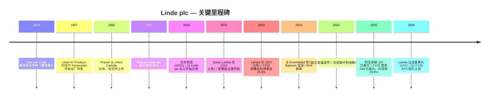

# 林德集团 Linde plc (NASDAQ: LIN) — 公司研究

**报告日期：** 2026-05-26 *(as of)*
**上市地：** 纳斯达克全球精选市场 (Nasdaq Global Select)，代码 `LIN`；同时是标普 500 与德国 DAX 40 的双上市工业气体 (industrial gas) 龙头
**注册地：** 爱尔兰注册的公众有限公司 (public limited company)；主要办公地为英国 Woking 与美国康涅狄格州 Danbury ([Linde 2025 10-K, Item 1 Business](https://www.sec.gov/Archives/edgar/data/1707925/000162828026011430/lin-20251231.htm))
**财年：** 历年制——最新 10-K 涵盖 **2025 年 12 月 31 日**截止财年
**审计师：** 普华永道 (PricewaterhouseCoopers，自 2019 年起聘用) ([2026 DEF 14A, Audit Matters](https://www.sec.gov/Archives/edgar/data/1707925/000119312526192209/lin-20260429.htm))

> **更新 — 2026 财年指引上调 (2026-05-01)：** 管理层将 FY26 调整后 EPS 全年指引下限上调至 **USD 17.60 – 17.90**（此前 2026-02-05 给出的初始区间为 **USD 17.40 – 17.90**），隐含同比增速由"6–9%"收窄到 **"7–9%"**，背景是 Q1 季报 EPS 4.33 美元（同比 +10%）+ 调整后营业利润率 30%。资本开支区间维持在 USD 5.0–5.5 bn，对应 **USD 7.1 bn 的合同制气销售在手项目** (contractual sale-of-gas backlog)。CEO Sanjiv Lamba 给出的驱动因素："资本配置纪律、经营模式韧性以及管理层行动的持续性"。
> 资料：[Linde Q1-2026 Earnings Press Release, 2026-05-01 (8-K Ex.99.1)](https://www.sec.gov/Archives/edgar/data/1707925/000165495426004202/lin_ex991.htm)；对比 [Q4-2025 Earnings Press Release, 2026-02-05 (8-K Ex.99.1)](https://www.sec.gov/Archives/edgar/data/1707925/000165495426000913/lin_ex991.htm)。

---

## 目录

1. 公司概览
2. 公司历史
3. 管理团队
4. 产品与服务
5. 客户与上市策略
6. 行业概览
7. 竞争格局
8. 市场机会
9. 风险评估
10. 参考资料

---

## 1. 公司概览

林德集团 (Linde plc) **按营收、市值和装机厂区规模衡量均是全球最大的工业气体 (industrial gas) 公司**，是 2018 年 10 月 31 日由美国上市的 **Praxair, Inc.** 与德国 **Linde AG** 通过对等合并 (merger of equals) 组合而成 ([Linde 2025 10-K, Item 1 Business](https://www.sec.gov/Archives/edgar/data/1707925/000162828026011430/lin-20251231.htm))。合并后的企业销售两大产品线：(i) **工业气体** (约占销售额 94%) —— 包括大气气体（氧气、氮气、氩气、氪气、氖气、氙气）和制程气体（氢气、氦气 (helium)、二氧化碳、一氧化碳、电子特种气体 (electronic specialty gas)、特种气体、乙炔）；以及 (ii) **工程业务 (Engineering)**，负责设计与 EPC 总承包气体业务所运营的空分装置 (ASU)、氢气重整装置、烯烃装置等流程装置 ([Linde 2025 10-K, Item 1 Business](https://www.sec.gov/Archives/edgar/data/1707925/000162828026011430/lin-20251231.htm))。同一份 10-K 文本将 Linde 定位为"工业气体行业的主要技术创新者"——公司拥有覆盖深冷分离、变压吸附 (VPSA)、膜分离、电解槽驱动的可再生氢以及 SMR / ATR 低碳氢的专利与专有工艺。

**Linde 的盈利模式。** 工业气体由同一座工厂联产，再通过**三种分销渠道**输送至客户，三种渠道驱动迥异的经济性。(a) **驻厂供气 (on-site supply) / 大额吨级模式：** Linde 在客户场地旁建设专用深冷空分装置 (ASU)，通过管道供应氧气、氮气或氢气，签订 **10–20 年的全需求合同**，含最低照单照付 (take-or-pay contract) 条款，电费、天然气成本通过价格条款向客户传导 ([Linde 2025 10-K, Item 1 Business — Industrial Gases Distribution](https://www.sec.gov/Archives/edgar/data/1707925/000162828026011430/lin-20251231.htm))。(b) **商品 (merchant) / 散装液体模式：** 液氧、液氮、液氩、液氢、液氦、液 CO₂ 用槽车送达客户场地，存储容器由 Linde 拥有，合同期一般 **3–7 年**，按需求量结算 ([Linde 2025 10-K, Item 1 — Merchant](https://www.sec.gov/Archives/edgar/data/1707925/000162828026011430/lin-20251231.htm))。(c) **包装 (packaged) / 钢瓶模式：** 高压钢瓶装大气、特种、电子气体，合同 **1–3 年**或单次订单 ([Linde 2025 10-K, Item 1 — Packaged Gases](https://www.sec.gov/Archives/edgar/data/1707925/000162828026011430/lin-20251231.htm))。三种渠道的层次结构是关键：FY25 约 24% 销售额来自 on-site（稳定性最高、能源成本传导、合同期为十年级），约 30% 来自 merchant（中等周期），约 35% 来自 packaged（价格弹性最高），其余为 Engineering 与 Other ([Linde 2024 Annual Report to Shareholders — Financial Highlights](https://assets.linde.com/-/media/global/corporate/corporate/documents/investors/full-year-financial-reports/2024-annual-report-to-shareholders.pdf))。

**Linde 的运营地理。** 2025 年 10-K 将销售拆分为四个可报告分部：Americas（美洲）、EMEA（欧洲/中东/非洲）、APAC（亚洲/南太平洋）、Engineering ([Linde 2025 10-K, Note 18 — Segment Information](https://www.sec.gov/Archives/edgar/data/1707925/000162828026011430/lin-20251231.htm))。FY25 各分部营收：**Americas $15,208 mn (45%) / EMEA $8,549 mn (25%) / APAC $6,661 mn (20%) / Engineering $2,250 mn (7%) / Other $1,318 mn (4%) = 合计 $33,986 mn** ([Linde 2025 10-K, MD&A — Segment Discussion](https://www.sec.gov/Archives/edgar/data/1707925/000162828026011430/lin-20251231.htm))。**约 64% 的 2025 年销售来自美国以外**，分布于约 80 个国家；公司在约 50 个 EMEA 国家、约 15 个 APAC 国家、约 20 个 Americas 国家拥有控股或全资子公司 ([Linde 2025 10-K, Item 1 — International](https://www.sec.gov/Archives/edgar/data/1707925/000162828026011430/lin-20251231.htm))。主要管网集群集中在 **美国墨西哥湾沿岸 (Texas / Louisiana) 与中国**，构成了使 Linde 能向炼厂、钢厂和大型晶圆厂集群提供大额驻厂供气的结构性护城河。

**规模指标。** FY25 营收 $33,986 mn (+3% YoY)；调整后营业利润 $10,137 mn，利润率 29.8% (+30 bps YoY)；调整后 EPS $16.46 (+6% YoY)；经营性现金流 $10,350 mn (+10%)；资本开支 $5,261 mn；净回购 $4,578 mn；分红支付 $2,811 mn（分别约占经营性现金流的 22% / 17% / 30% / 8%，合计向股东返还 $7.4 bn） ([Linde 2025 10-K, MD&A — Executive Summary](https://www.sec.gov/Archives/edgar/data/1707925/000162828026011430/lin-20251231.htm))。年末员工 **65,177 人** ([Linde 2025 10-K, Item 1 — Employees](https://www.sec.gov/Archives/edgar/data/1707925/000162828026011430/lin-20251231.htm))。FY24 调整后税后资本回报率 (after-tax return on capital, ROC) **25.9%**，是 2024 ARS 给出的最新数据 ([Linde 2024 Annual Report to Shareholders — Financial Highlights](https://assets.linde.com/-/media/global/corporate/corporate/documents/investors/full-year-financial-reports/2024-annual-report-to-shareholders.pdf))；Q1 2026 季报披露 ROC 走高，Q1 FY26 ROC 为 24% ([Q1-2026 Earnings Press Release, 2026-05-01](https://www.sec.gov/Archives/edgar/data/1707925/000165495426004202/lin_ex991.htm))。

*资料：[Linde 2024 Annual Report to Shareholders — Financial Highlights page](https://assets.linde.com/-/media/global/corporate/corporate/documents/investors/full-year-financial-reports/2024-annual-report-to-shareholders.pdf)。这是 Linde 官方发布的财务摘要页，汇总销售额、营业利润、EPS、现金流、资本开支、税后 ROC，以及三张分部 / 终端市场 / 分销模式饼图。注意：Linde 没有发布对应的 2025 ARS Financial Highlights 单页（只有 10-K + 8-K 业绩稿），FY25 数据从 10-K 文本提取并在下文 FY21–FY25 趋势图中重现。*

*资料：[Linde 2025 10-K MD&A Executive Summary](https://www.sec.gov/Archives/edgar/data/1707925/000162828026011430/lin-20251231.htm) 及前 4 年的 10-K (FY21–FY24)。*

*资料：[Linde 2025 10-K Note 18 Segment Information](https://www.sec.gov/Archives/edgar/data/1707925/000162828026011430/lin-20251231.htm)。按分部的对外销售。*

**估值速览 (截至 2026-05-25)。** 现价约 **USD 517.58**，市值约 **USD 239 bn**，**TTM P/E 34.4×**，**TTM P/S 6.9×**，**EV/EBITDA 19.4×**，股息率约 **1.24%**，beta 约 **0.74**，发行在外股数约 462 mn ([Yahoo Finance — LIN Key Statistics](https://finance.yahoo.com/quote/LIN/key-statistics/))。过去三年 TTM P/E 波动区间约 28×–37×，今天的 34.4× 处于自身区间的**上三分位**，相对直接同业小幅溢价（APD 30.5×、Air Liquide 30.3×、Nippon Sanso 22.0×；信越化学 27.9× 在同一带但产品结构差异极大） ([Yahoo Finance — APD](https://finance.yahoo.com/quote/APD/key-statistics/)、[Yahoo Finance — AI.PA](https://finance.yahoo.com/quote/AI.PA/key-statistics/)、[Yahoo Finance — 4091.T](https://finance.yahoo.com/quote/4091.T/key-statistics/))。*分析师观点：* 溢价反映 (i) 同业中最高的现金对现金回报率、(ii) 西方气体巨头中最大的电子驻厂供气足迹（野村大中华半导体 2026–30 锚定研究专门点出这一论点 —— 见 [半导体材料锚定笔记](../../sector/半导体材料.md)），以及 (iii) 全球最大的清洁氢 / 蓝氨在手项目（年末 2025 年合同 $7.1 bn、含意向合计约 $10 bn ([Q4-2025 Press Release](https://www.sec.gov/Archives/edgar/data/1707925/000165495426000913/lin_ex991.htm)))。34× TTM EPS 按超高速成长股的尺度并不算"撑爆"，是一家高质量复利型企业 (quality compounder) 处于合理的高质量倍数；§9 风险章把估值压缩列为 *可能* 风险（不算重大）—— 前提是 EPS 增长减速与利率走势同时出现。

*资料：Yahoo Finance Key Statistics，2026-05-25 访问 —— [LIN](https://finance.yahoo.com/quote/LIN/key-statistics/)、[APD](https://finance.yahoo.com/quote/APD/key-statistics/)、[AI.PA](https://finance.yahoo.com/quote/AI.PA/key-statistics/)、[4091.T (Nippon Sanso)](https://finance.yahoo.com/quote/4091.T/key-statistics/)、[4063.T (Shin-Etsu Chemical)](https://finance.yahoo.com/quote/4063.T/key-statistics/)。*

---

## 2. 公司历史

今天交易的 Linde plc 是 **2018 年 10 月 31 日** Praxair 与 Linde AG 完成的 **股权对价约 900 亿美元的"对等合并"** (merger of equals) 的产物——交易于 2017 年 6 月 1 日宣布，2018 年初获双方股东批准，在经历由反垄断驱动的深度剥离方案（将原 Linde 北美业务交给 Messer / CVC，将部分原 Praxair 欧洲资产交给太阳日酸 (Taiyo Nippon Sanso)）后完成 ([Linde 2025 10-K, MD&A — Reference to Linde AG merger](https://www.sec.gov/Archives/edgar/data/1707925/000162828026011430/lin-20251231.htm)；历史文件链路见 [Linde plc 2017 Form 10-K](https://www.sec.gov/Archives/edgar/data/1707925/000170792518000004/lindeplc201710k.htm))。会计收购方是 Praxair；正因如此 Linde plc 的 CIK 为 0001707925，与 2017 年在爱尔兰注册、专门用于持股双方的合并载体 "Zamalight plc" 同号—— [EDGAR 公司页](https://www.sec.gov/cgi-bin/browse-edgar?action=getcompany&CIK=0001707925&type=10-K&dateb=&owner=include&count=10) 至今显示 **"formerly: ZAMALIGHT PLC (filings through 2017-07-12)"**。

不过两家前身公司各自的历史远比合并久远。**Linde AG** 可上溯至 1879 年，**Carl von Linde 教授**在慕尼黑工业大学申请了深冷空分专利——同样的物理原理沿用至今仍在每台现代 ASU 中运行 ([Linde corporate website — Corporate Heritage page](https://www.linde.com/about-linde/corporate-heritage))。**Praxair** 则是全球第一家规模化生产驻厂氧气的公司（1907 年于纽约 Tonawanda 投运，最初名为 "Linde Air Products Company"，1992 年从 Union Carbide 分拆并更名为 Praxair）。因此 2018 年的合并实质上是把跨越大西洋分离了约 100 年的同源工业气体家族重新合而为一。

**战略转折点 #1 —— 合并本身 (2018)。** 论题：将 Praxair 高回报的美国 merchant / packaged 气体业务与 Linde AG 增长更快的亚洲足迹及 Linde Engineering EPC 业务结合，叠加 12 亿美元的协同效应跑率，把世界上最分散的工业气体市场整合成与液空 (Air Liquide) 共主的双寡头 ([Linde 2017 10-K, Item 1 — Subsequent Events](https://www.sec.gov/Archives/edgar/data/1707925/000170792518000004/lindeplc201710k.htm))。到 FY2024，合并后的公司已兑现既定协同目标，**调整后营业利润率从约 22%（2018 模拟）扩张到 29.5%** ([Linde 2024 Annual Report to Shareholders — Financial Highlights](https://assets.linde.com/-/media/global/corporate/corporate/documents/investors/full-year-financial-reports/2024-annual-report-to-shareholders.pdf))——这是 Praxair 体系的成本管控与定价纪律嫁接到 Linde 高增长足迹之上的鲜明案例。

**战略转折点 #2 —— 纳斯达克成为主交易所、纽交所/法兰克福退市 (2024)。** 2024 年 3 月，Linde 决定 **从法兰克福证券交易所退市**，将交易集中到纳斯达克全球精选市场。在 [2024 年宣布退市的 8-K](https://www.sec.gov/Archives/edgar/data/1707925/000119312524036171/d806251d8k.htm) 中披露的动机是合并以来流动性已大量迁移到美国市场；当时 LIN 在 DAX 40 中权重约 10%（指数最大成份股），导致公司在季度调仓时被动满足跟踪 DAX ETF 的需求，扭曲了交易模式。集中到美国交易所收窄了买卖价差，使公司能将披露集中遵循 SEC 一套制度。

**战略转折点 #3 —— 清洁能源 / 脱碳投资周期 (2022 → 至今)。** 2022 年管理层开始 **将清洁氢与碳捕集项目作为驻厂积压的独立子板块披露**。到 2025 年末公司披露 **总项目积压约 100 亿美元**，其中合同制气销售部分约 **71 亿美元**，标志性的清洁氢中标包括 Linde 的德州 Beaumont 清洁 H₂ 装置（ExxonMobil 承接最多 2.2 mt/yr 的 CO₂ 进行永久封存）、为炼厂和石化客户的额外蓝氢与空分装置、以及为新建晶圆厂的主要驻厂 ASU 合同——包括三星代工 Taylor TX 与台积电亚利桑那 ([Linde 2025 10-K, MD&A — Capital Expenditures](https://www.sec.gov/Archives/edgar/data/1707925/000162828026011430/lin-20251231.htm)；[Linde Press Release — Linde Signs Agreement with ExxonMobil for Carbon Dioxide Off-take, 2023-04-04](https://www.linde.com/news-and-media/2023/linde-signs-agreement-with-exxonmobil-for-carbon-dioxide-off-take))。积压是结构性可见度的工具：每个项目在 2026–2030 年陆续开车时都会转化为 10–20 年的驻厂合同。

**Mermaid 时间线：**

**近期事件 (最近 12 个月)。** (i) Sean Durbin 自 **2025 年 10 月 1 日起任 COO**——一位曾任 Praxair 北美总裁的资深高管，填补 Lamba 2022 年升任 CEO 时空缺的 COO 职位 ([Linde 2025 10-K, Item 1 — Executive Officers](https://www.sec.gov/Archives/edgar/data/1707925/000162828026011430/lin-20251231.htm))。(ii) Sanjiv Lamba **自 2026 年 1 月 31 日起当选董事长**，合并董事长与 CEO 双职位，体现董事会对战略的延续信心 ([Linde 2026 DEF 14A — Corporate Governance Framework](https://www.sec.gov/Archives/edgar/data/1707925/000119312526192209/lin-20260429.htm))。(iii) FY26 调整后 EPS 指引于 **2026-05-01 上调**，详见报告顶部 banner。(iv) 重大新项目持续填充积压，包括 ExxonMobil Baytown 低碳氢二期，以及三星代工 Taylor TX 的额外驻厂合同。(v) 资本回报持续——**FY25 净回购 46 亿美元**，是公司历史最高 ([Linde 2025 10-K, Cash Flows from Financing](https://www.sec.gov/Archives/edgar/data/1707925/000162828026011430/lin-20251231.htm))。

---

## 3. 管理团队

**范围说明。** 按公司研究 skill 规则，本章只覆盖创始人与现任 CEO；前 Praxair / Linde AG 创始人（Carl von Linde、1990 年代 Union Carbide 工业气体部门管理层）过于久远，不展开。Linde plc 作为法律实体仅于 2017 年作为合并载体注册，没有现代意义上的"创始人"；最接近的对应人物是 **Stephen F. Angel**——他作为 Praxair CEO 主导了 2018 年的合并，并担任 Linde plc 首任 CEO (2018–2022) 与董事长 (至 2026 年 1 月 31 日)。他在该日期从董事会退休 ([Linde 2026 DEF 14A, Director Compensation Table footnote (3)](https://www.sec.gov/Archives/edgar/data/1707925/000119312526192209/lin-20260429.htm))，因此已不在管理岗——但他向 Lamba 的过渡是下面 CEO 简介的背景上下文。

### Sanjiv Lamba — 董事长兼首席执行官 (自 2022 年任 CEO，2026-01-31 起兼任董事长)

**Sanjiv Lamba**（2026 DEF 14A 公布的年龄 61 岁）**自 2026 年 1 月 31 日起当选董事长**，**自 2022 年 3 月 1 日起担任 Linde plc CEO** ([Linde 2026 DEF 14A — Director Nominees, Sanjiv Lamba](https://www.sec.gov/Archives/edgar/data/1707925/000119312526192209/lin-20260429.htm))。出任 CEO 之前，他 **2021 年 1 月至 2022 年 2 月任 Linde plc 首席运营官 (COO)**——在前任 CEO Stephen F. Angel 麾下接受 14 个月的接班培养——更早自 2018 年起担任 **执行副总裁 (EVP)、APAC**，是合并完成后立刻提拔的职位 ([Linde 2026 DEF 14A — Lamba bio](https://www.sec.gov/Archives/edgar/data/1707925/000119312526192209/lin-20260429.htm))。他在公司 APAC 业务的执业经历——这是电子气体业务最重要的地理板块——解释了集团在驻厂供气于半导体晶圆厂建设（台积电、三星、SK 海力士）上的战略连贯性，而后者已是 Linde 内估值倍数最高的子业务。

Lamba 的职业生涯始于 **1989 年的 BOC India 财务部门**，他被提拔为财务总监并 **于 2001 年成为印度公司的董事总经理 (MD)** ([Linde 2026 DEF 14A — Lamba bio](https://www.sec.gov/Archives/edgar/data/1707925/000119312526192209/lin-20260429.htm))——BOC 是英国工业气体巨头，被前身 Linde AG 于 2006 年收购，因此 Lamba 已在同一公司体系内连续供职约 35 年。他先后在 **印度、英国、新加坡和德国**任职，最后一段是在慕尼黑作为 Linde AG 执行董事会成员，负责亚太气体、全球氦气与稀有气体、电子业务以及亚洲合资项目 ([Linde 2025 10-K, Item 10 — Executive Officers](https://www.sec.gov/Archives/edgar/data/1707925/000162828026011430/lin-20251231.htm))。这种地理分布对全球巨头 CEO 而言并不常见——多数 CEO 是被提拔上来的本土运营者——这使他成为 Angel 时代以美国为中心的整合阶段结束时的天然继任者。

在 Linde 之外，Lamba 曾 **担任氢能委员会 (Hydrogen Council, 全球低碳氢能行业组织) 联合主席**——这一角色与 Linde 的清洁氢积压直接呼应。**2026 年 1 月，他加入了纽交所上市公司 Amphenol Corporation (NYSE: APH) 董事会**，该公司是连接器 / 互连产品厂商 ([Linde 2026 DEF 14A — Other Public Company Directorships](https://www.sec.gov/Archives/edgar/data/1707925/000119312526192209/lin-20260429.htm))，使他在董事会层面接触到驱动 Linde 电子驻厂供气需求的数据中心 / AI 基础设施客户群。他也是美国 CEO 同行组织 **The Business Council** 成员。其薪酬披露于 2026 DEF 14A 摘要薪酬表 —— 见 [Executive Compensation Tables, Table 1](https://www.sec.gov/Archives/edgar/data/1707925/000119312526192209/lin-20260429.htm) —— 主要为风险薪酬，长期股权权重显著，与股东利益对齐。

2025 年 6 月董事会决定将董事长与 CEO 合并由 Lamba 出任，理由在 proxy 中表述为反映 **"他重要的行业专业能力、CEO 经验，以及与董事会的有效协作关系"** ([Linde 2026 DEF 14A — Linde's Corporate Governance Framework](https://www.sec.gov/Archives/edgar/data/1707925/000119312526192209/lin-20260429.htm))。董事会的独立性通过由 **Robert L. Wood** 担任首席独立董事 (Lead Independent Director, LID) 保留——他自 2022 年 3 月 1 日 (与 Lamba 出任 CEO 同日) 起一直担任该职。合并董事长 / CEO 的结构有时被治理评级批评；首席独立董事是行业接受的缓解机制，本案已配置到位。

---
