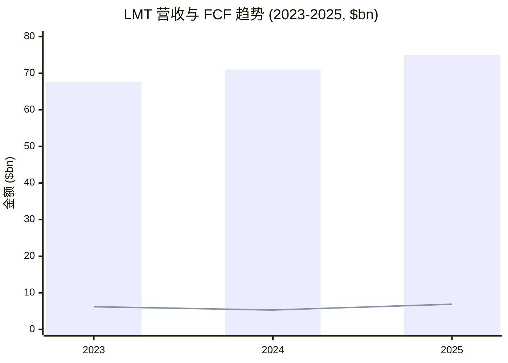
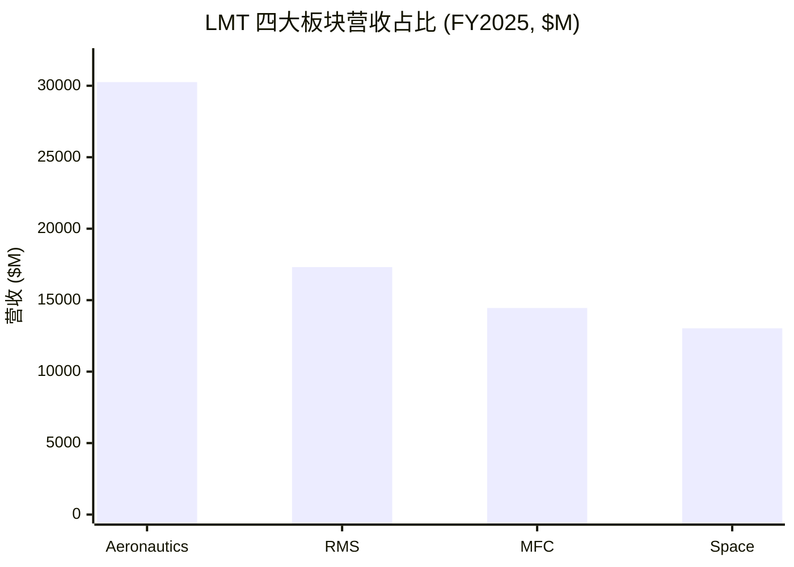
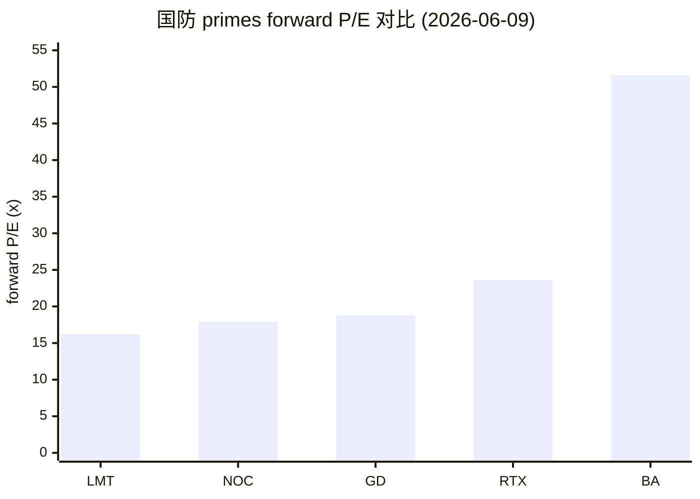
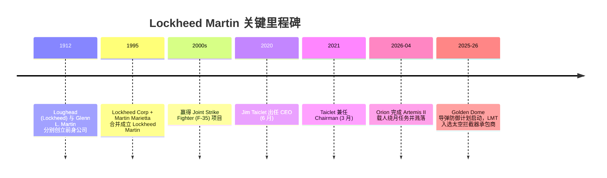
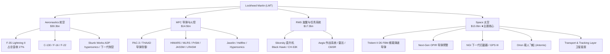
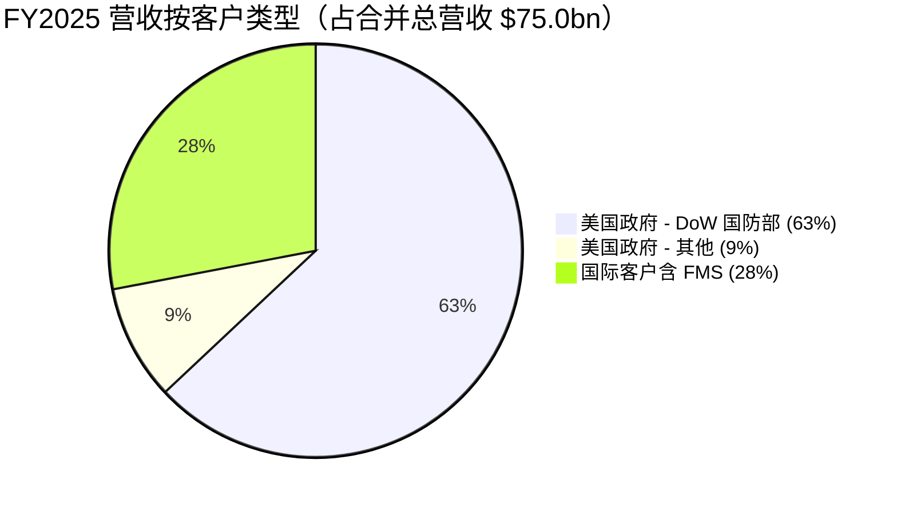
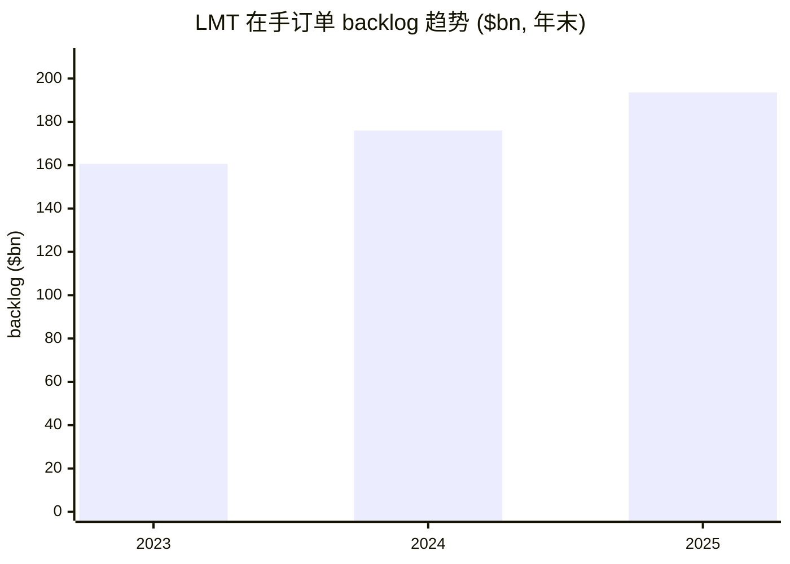
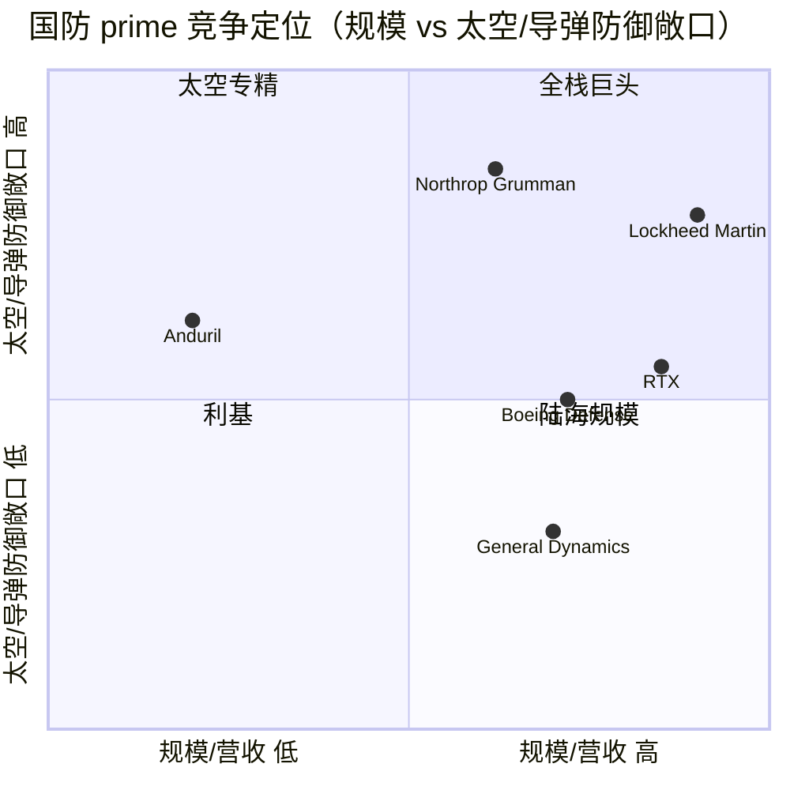
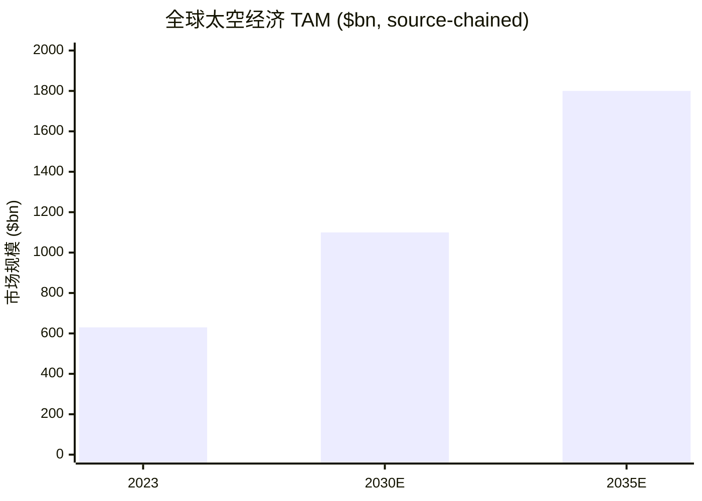

# Lockheed Martin (洛克希德·马丁) — 公司研究报告

**Ticker:** NYSE: LMT · **行业:** Aerospace & Defense (航空航天与国防) · **as of 2026-06-09**

> **主题归属说明 / Theme tag — `adjacent`（外围/间接敞口）。** 本报告隶属一个 **Space（太空）投资主题** 篮子。Lockheed Martin 是一家多元化的国防主承包商 (prime contractor / 主承包商)，**Space 仅为其四大业务板块之一，约占 2025 年营收 17.4%**（$13,029M / $75,048M）([LMT FY2025 10-K, Item 7 Segment Results](https://www.sec.gov/Archives/edgar/data/936468/000162828026004195/lmt-20251231.htm)）。因此 LMT 在本篮子中标记为 `adjacent` ——太空是少数派敞口，但它是 LMT 进入该篮子的理由：军用卫星、GPS III、Orion（Artemis 载人飞船）、Next-Gen OPIR 导弹预警、hypersonics（高超音速）、Trident 舰载弹道导弹，以及 **Golden Dome (金穹)** 导弹防御机会。本报告对全公司做完整覆盖，但在第 4/6/8 节给予 Space 板块更高权重。

---

## 投资摘要 (Investment Summary Header)

> *分析师观点（Analyst view）：以下评级、目标价、预测与情景价位均为分析师自身前瞻判断，非来自任何 filing；filing 中不含价格目标。*

| 项目 | 数值 |
|---|---|
| **评级 (Rating)** | **Hold / 持有**（与市场一致；本报告框定 LMT 为"价值压舱石/ballast"，非成长标的）|
| **12 个月目标价 (Price Target)** | **$595**（base case）|
| 现价 (as of 2026-06-09) | $520.07 ([yfinance, 2026-06-09](https://finance.yahoo.com/quote/LMT/)) |
| 隐含空间 (Upside) | +14.4% to base PT，叠加 ~2.65% 股息收益 |
| 估值方法 | 2026E EPS 中点 $29.80 × 20× P/E ≈ $596（详见第 2 节）|
| 市值 (Market Cap) | ~$120bn ([yfinance, 2026-06-09](https://finance.yahoo.com/quote/LMT/)) |
| 52 周区间 | $410.11 – $692.00 ([yfinance, 2026-06-09](https://finance.yahoo.com/quote/LMT/)) |
| forward P/E | ~16.2× · P/S ~1.60× · beta ~0.11 ([yfinance, 2026-06-09](https://finance.yahoo.com/quote/LMT/)) |
| 市场共识 | **Hold**，19 位分析师，mean PT ~$625 ([yfinance, 2026-06-09](https://finance.yahoo.com/quote/LMT/)) |

**论点支柱 (Thesis Pillars):**

1. **现金流压舱石 (FCF ballast)。** LMT 是本太空篮子里罕见的、盈利且持续派息回购的成熟现金牛——2025 年自由现金流 (free cash flow / FCF) $6.9bn，全年向股东返还 $6.1bn（$3.0bn 回购 + $3.1bn 股息），beta 仅 ~0.11，是篮子的低波动锚 ([LMT FY2025 10-K, FCF reconciliation](https://www.sec.gov/Archives/edgar/data/936468/000162828026004195/lmt-20251231.htm))。

2. **在手订单见底回升 (backlog inflection)。** 年末 backlog (在手订单) $193.6bn，约为年营收 2.6 倍，且 2025 年逆势增长（vs $176.0bn 2024 年末），导弹防御/NGI/hypersonics 驱动 ([LMT FY2025 10-K, Backlog](https://www.sec.gov/Archives/edgar/data/936468/000162828026004195/lmt-20251231.htm))。

3. **Golden Dome (金穹) 期权 (upside option)。** 官方口径约 $185bn（至 2035 年）、FY26 已拨款 $13.4bn 的国土导弹防御计划，是 LMT 的 PAC-3/THAAD/NGI/Next-Gen OPIR/传感器组合的多年度需求催化剂——风险偏向上行 ([SpaceNews, 2026](https://spacenews.com/defense-appropriations-bill-for-2026-funds-space-force-at-26-billion-presses-pentagon-on-golden-dome/); [military.com, 2026](https://www.military.com/trumps-golden-dome-defense-system-estimates-vary-between-175b-12t))。

4. **核心风险是执行而非需求 (execution, not demand)。** F-35 占总营收 27% 的集中度、固定价 (fixed-price) 开发合同的 reach-forward losses（2025 年 Aeronautics 一项 classified 合同计提 $950M 亏损）、以及预算 CR (continuing resolution / 持续决议) 风险，是压制估值的主因，也是与同业（NOC/RTX/GD）相比 LMT 1 年仅 +11%、跑输 ITA +25% 的原因 ([LMT FY2025 10-K, Profit Booking Rate Adjustments](https://www.sec.gov/Archives/edgar/data/936468/000162828026004195/lmt-20251231.htm); [yfinance, 2026-06-09](https://finance.yahoo.com/quote/LMT/))。

---

## 目录

1. [公司概览](#1-公司概览)
2. [估值与目标价 (Valuation & Price Target)](#2-估值与目标价)
3. [公司历史](#3-公司历史)
4. [管理团队](#4-管理团队)
5. [产品与服务](#5-产品与服务)
6. [客户与商业模式](#6-客户与商业模式)
7. [行业概览](#7-行业概览)
8. [竞争格局](#8-竞争格局)
9. [市场机会 (TAM)](#9-市场机会-tam)
10. [风险评估](#10-风险评估)
11. [投资视角评分 (Investor Lenses)](#11-投资视角评分)
12. [参考资料](#12-参考资料)

---

## 1. 公司概览

Lockheed Martin（洛克希德·马丁，NYSE: LMT）是全球最大的国防承包商 (defense prime contractor / 国防主承包商)。公司在 FY2025 10-K 中对自身的定义为："We are a global aerospace and defense technology company that builds and sustains the solutions America and its allies need to deter conflict and advance national security and scientific exploration objectives."（"我们是一家全球航空航天与国防科技公司，构建并维持美国及其盟友所需的解决方案，以威慑冲突、推进国家安全和科学探索目标"）([LMT FY2025 10-K, Business Overview](https://www.sec.gov/Archives/edgar/data/936468/000162828026004195/lmt-20251231.htm))。公司注册地为美国马里兰州，总部位于 Bethesda（6801 Rockledge Drive），是 1995 年由 Lockheed Corporation 与 Martin Marietta Corporation 合并而成 ([LMT FY2025 10-K, General](https://www.sec.gov/Archives/edgar/data/936468/000162828026004195/lmt-20251231.htm))。

2025 年公司总营收 (revenue) $75,048M（约 $75.0bn），net earnings（净利润）$5.0bn，摊薄每股收益 (diluted EPS) $21.49 ([LMT FY2025 10-K, Results of Operations](https://www.sec.gov/Archives/edgar/data/936468/000162828026004195/lmt-20251231.htm))。公司按业务性质分为 **四大板块 (four business segments)**：Aeronautics（航空）、Missiles and Fire Control / MFC（导弹与火控）、Rotary and Mission Systems / RMS（旋翼与任务系统）、Space（太空）。10-K 原文："We operate in four business segments: Aeronautics, Missiles and Fire Control (MFC), Rotary and Mission Systems (RMS) and Space."([LMT FY2025 10-K, Business Segments](https://www.sec.gov/Archives/edgar/data/936468/000162828026004195/lmt-20251231.htm))。截至 2025 年末，公司有约 123,000 名员工，其中约 72,000 名为工程师、科学家和 IT 专业人员，约 93% 位于美国 ([LMT FY2025 10-K, Human Capital](https://www.sec.gov/Archives/edgar/data/936468/000162828026004195/lmt-20251231.htm))。

公司的客户高度集中于政府：2025 年 **72% 的营收来自美国政府**（作为主承包商或分包商，其中 63% 来自 Department of War / DoW，即国防部），**28% 来自国际客户**（含通过美国政府签约的 foreign military sales / FMS，对外军售）([LMT FY2025 10-K, Business Overview](https://www.sec.gov/Archives/edgar/data/936468/000162828026004195/lmt-20251231.htm))。这是一家典型的"政府订单驱动、长周期合同、percentage-of-completion（完工百分比法）确认收入"的国防制造企业。

**估值快照 (Valuation snapshot)。** 截至 2026-06-09，LMT 现价 $520.07，市值约 $120bn，forward P/E ~16.2×、P/S ~1.60×、trailing P/E ~25.2×、beta ~0.11，股息率约 2.65% ([yfinance, 2026-06-09](https://finance.yahoo.com/quote/LMT/))。需要解读两个"看起来异常"的数字：(1) **trailing P/E 25.2× 远高于 forward 16.2×**——并非高成长溢价，而是 2025 年 trailing EPS 被多项 reach-forward losses 压低（$21.49 vs forward EPS ~$32），属于一次性/项目性减值导致的"分母失真"，应以 forward 口径为准 ([LMT FY2025 10-K, Profit Booking Rate Adjustments](https://www.sec.gov/Archives/edgar/data/936468/000162828026004195/lmt-20251231.htm))。(2) **beta 仅 ~0.11** 是 LMT 作为防御性、政府现金流支撑标的的体现，与大盘相关性极低——正是其在一个高 beta 太空成长篮子里被定位为"价值压舱石"的量化依据 ([yfinance, 2026-06-09](https://finance.yahoo.com/quote/LMT/))。

*柱=营收 (revenue)，线=自由现金流 (FCF)。Source: [LMT FY2025 10-K, Results of Operations & FCF reconciliation](https://www.sec.gov/Archives/edgar/data/936468/000162828026004195/lmt-20251231.htm)*

*Source: [LMT FY2025 10-K, Note 3 Segment Information](https://www.sec.gov/Archives/edgar/data/936468/000162828026004195/lmt-20251231.htm)*

---

## 2. 估值与目标价

> *分析师观点（Analyst view）：本节全部前瞻数字（预测、目标价、情景价位）为分析师自身判断，非 filing 内容。*

### 2a. 当前估值与同业对比

LMT 的估值在国防大盘里属于**低估端**。下表为 2026-06-09 同业 forward P/E / P/S 对比 ([yfinance, 2026-06-09](https://finance.yahoo.com/quote/LMT/))：

| 公司 | Ticker | forward P/E | P/S | 1 年涨幅 |
|---|---|---|---|---|
| **Lockheed Martin** | **LMT** | **~16.2×** | **~1.60×** | **+11.1%** |
| Northrop Grumman | NOC | ~17.9× | ~1.81× | +11.8% |
| General Dynamics | GD | ~18.8× | ~1.71× | +25.2% |
| RTX Corporation | RTX | ~23.6× | ~2.66× | +28.7% |
| Boeing | BA | ~51.6× | ~1.85× | -0.7% |
| iShares 国防 ETF | ITA | n/a | n/a | +25.1% |
| S&P 500 | SPY | n/a | n/a | +24.7% |

两点结论：(1) LMT 是**五大美国 prime 里最便宜的**（forward P/E 16.2×，低于 NOC/GD/RTX），也低于自身约 15–16× 的多年中枢上沿，估值并不贵；(2) LMT 过去 1 年仅 +11%，**显著跑输 ITA (+25%) 和 SPX (+25%)**——市场用相对低的多头热情对待它，原因是 F-35 集中度与 reach-forward losses 拖累了 trailing 盈利与情绪 ([yfinance, 2026-06-09](https://finance.yahoo.com/quote/LMT/))。这恰好支撑"价值压舱石而非成长股"的定位。

*Source: [yfinance, 2026-06-09](https://finance.yahoo.com/quote/LMT/)*

### 2b. 前瞻财务模型与目标价推导

公司自身的 **2026 全年指引 (reaffirmed at Q1 2026)**：营收 $77,500–$80,000M（约 +5% YoY）、business segment operating profit（分部经营利润）$8,425–$8,675M、diluted EPS $29.35–$30.25、FCF $6.5–$6.8bn、capex $2.5–$2.8bn ([LMT Q1 2026 Earnings 8-K, 2026 Outlook](https://www.sec.gov/Archives/edgar/data/936468/000162828026026683/ex991q12026.htm))。下表的前瞻预测以公司指引为锚，叠加分部 mix 与 Golden Dome 拉动假设：

| (分析师估算) | 2025A | 2026E | 2027E | 2028E |
|---|---|---|---|---|
| 营收 ($bn) | 75.0 | 78.8 | 82.5 | 86.5 |
| YoY | +5.6% | +5.1% | +4.7% | +4.8% |
| Segment op. margin | ~9.0% | ~10.9% | ~11.3% | ~11.5% |
| 摊薄 EPS ($) | 21.49 | 29.80 | 32.50 | 35.50 |
| FCF ($bn) | 6.9 | 6.65 | 7.1 | 7.6 |

- **2026E EPS $29.80** = 公司指引 $29.35–$30.25 中点；2025A 的 $21.49 因 reach-forward losses 偏低，2026 回升主要来自这些一次性亏损不再重复 + MFC（2024 年曾计提 $1.4bn classified 亏损）盈利正常化 ([LMT Q1 2026 Earnings 8-K](https://www.sec.gov/Archives/edgar/data/936468/000162828026026683/ex991q12026.htm); [LMT FY2025 10-K, Profit Booking Rate Adjustments](https://www.sec.gov/Archives/edgar/data/936468/000162828026004195/lmt-20251231.htm))。
- **营收路径**以公司 +5% 指引为基础，2027–28 维持中个位数增长，假设导弹防御/太空（NGI、FBM、Next-Gen OPIR、Golden Dome 相关传感器与拦截器）抵消 F-35 产量趋稳的影响 ([LMT FY2025 10-K, Space Segment](https://www.sec.gov/Archives/edgar/data/936468/000162828026004195/lmt-20251231.htm); [SpaceNews, 2026](https://spacenews.com/defense-appropriations-bill-for-2026-funds-space-force-at-26-billion-presses-pentagon-on-golden-dome/))。

**目标价推导（forward P/E 法）。** Base case：2026E EPS 中点 $29.80 × **20× target P/E** ≈ **$596**（取整 $595）。20× 的倍数选择：略高于 LMT 自身 forward 16.2× 与多年 15–16× 中枢，但低于 GD (18.8×)、RTX (23.6×)，理由是 2026 盈利正常化叠加 Golden Dome 期权应享有相对自身历史的小幅 re-rating；与可比 prime 估值带（NOC 17.9× / GD 18.8×）对照，20× 处于其上沿但不离谱 ([yfinance, 2026-06-09](https://finance.yahoo.com/quote/LMT/))。

**Bull / Base / Bear 情景（12 个月）：**

| 情景 | EPS × 倍数 | 目标价 | 相对现价 | 关键摆动假设 |
|---|---|---|---|---|
| **Bull** | $30.25 × 22× | ~$665 | +28% | Golden Dome 多年大单落地、无新 reach-forward losses、F-35 Block 4 顺利、国际 FMS 加速 |
| **Base** | $29.80 × 20× | ~$595 | +14% | 公司指引兑现、盈利正常化、温和 re-rating |
| **Bear** | $28.50 × 15× | ~$428 | -18% | 预算 CR / 政府停摆、新 classified 固定价亏损、F-35 订单延迟、pension 折现率逆风 |

**对照市场共识 (consensus benchmark)。** 市场共识为 **Hold**，19 位分析师 mean PT ~$625（区间 $511–$756）([yfinance, 2026-06-09](https://finance.yahoo.com/quote/LMT/))。第三方汇总（MarketBeat/Public.com）给出的 2026 共识同样为 Hold，PT ~$595–625 ([MarketBeat LMT forecast, 2026](https://www.marketbeat.com/stocks/NYSE/LMT/forecast/))。本报告 base PT $595 略低于 yfinance mean $625、与第三方共识下沿一致，反映我们对 F-35 执行风险给予更保守的折让。

**call 取决于的 1–2 个摆动变量 (swing variables)：** (1) **固定价开发合同的 reach-forward losses 是否再现**——这是过去两年最大的盈利杀手；(2) **Golden Dome 拨款转化为 LMT 实际合同的节奏**——若 $13.4bn FY26 拨款快速转为 PAC-3/NGI/传感器订单，bull 情景成立 ([LMT FY2025 10-K](https://www.sec.gov/Archives/edgar/data/936468/000162828026004195/lmt-20251231.htm); [SpaceNews, 2026](https://spacenews.com/defense-appropriations-bill-for-2026-funds-space-force-at-26-billion-presses-pentagon-on-golden-dome/))。

---

## 3. 公司历史

Lockheed Martin 作为今日实体始于 **1995 年的合并**。10-K 原文："We are a Maryland corporation formed in 1995 by combining the businesses of Lockheed Corporation and Martin Marietta Corporation."（"我们是 1995 年由 Lockheed Corporation 与 Martin Marietta Corporation 业务合并而成的马里兰州公司"）([LMT FY2025 10-K, General](https://www.sec.gov/Archives/edgar/data/936468/000162828026004195/lmt-20251231.htm))。因此公司**没有单一创始人**——其血脉可追溯至两家百年航空巨头：Lockheed（源于 1912 年 Allan & Malcolm Loughead 创办的飞机公司，后规范化为 Lockheed）与 Martin（源于 1912 年航空先驱 Glenn L. Martin 创办的公司，后合并为 Martin Marietta）。这两位早期航空企业家在此作为匿名化的历史背景提及，而非以"创始人+任期"的方式呈现现任公司。公司的道德准则 (Code of Ethics) 自 1995 年成立起就已建立 ([LMT FY2025 10-K, Code of Ethics](https://www.sec.gov/Archives/edgar/data/936468/000162828026004195/lmt-20251231.htm))。

合并后，公司逐步整合为四大板块的国防主承包商，其旗舰资产 F-35 Lightning II 项目自 2000 年代初赢得 Joint Strike Fighter 竞标后，成为公司乃至全球最大的国防项目。在太空领域，公司继承了 Trident 舰载弹道导弹、Orion 载人飞船、GPS 卫星等长周期国家级项目 ([LMT FY2025 10-K, Space Segment](https://www.sec.gov/Archives/edgar/data/936468/000162828026004195/lmt-20251231.htm))。公司长期以"纪律化、动态化的现金部署策略 (disciplined and dynamic cash deployment strategy)"著称，持续通过股息、回购向股东返还现金，并保持稳定的分红记录 ([LMT FY2025 10-K, Liquidity and Cash Flows](https://www.sec.gov/Archives/edgar/data/936468/000162828026004195/lmt-20251231.htm))。

*Source: [LMT FY2025 10-K, General & Executive Officers](https://www.sec.gov/Archives/edgar/data/936468/000162828026004195/lmt-20251231.htm); [Lockheed Martin Orion Artemis II splashdown press release, 2026-04-10](https://news.lockheedmartin.com/2026-04-10-Splashdown-Lockheed-Martin-Built-Orion-Spacecraft-Safely-Returns-Astronauts-to-Earth,-Completing-NASAs-Artemis-II-Mission)*

---

## 4. 管理团队

**无单一创始人（历史血脉）。** 如第 3 节所述，LMT 系 1995 年合并而来，没有一位在世的"创始人"。其历史血脉指向两位 20 世纪初的航空先驱——Allan Loughead（Lockheed 前身）与 Glenn L. Martin（Martin 前身）——此处作为匿名化历史背景给出，公司本身由职业管理层经营。

**现任董事长、总裁兼 CEO：James D. Taiclet（吉姆·泰克莱特）。** 10-K 披露："James D. Taiclet (age 65), Chairman, President and Chief Executive Officer... Mr. Taiclet has served as Chairman since March 2021 and as President and Chief Executive Officer (CEO) of Lockheed Martin Corporation since June 2020. He has served on the Lockheed Martin Corporation Board of Directors since January 2018."（Taiclet 现年 65 岁，自 2020 年 6 月任总裁兼 CEO、2021 年 3 月起兼任董事长，2018 年 1 月起任董事）([LMT FY2025 10-K, Executive Officers](https://www.sec.gov/Archives/edgar/data/936468/000162828026004195/lmt-20251231.htm))。其任命亦在 10-K 的 Section 302/906 认证签字页中确认（"/s/ James D. Taiclet, Chairman, President and Chief Executive Officer"）([LMT FY2025 10-K, Signatures](https://www.sec.gov/Archives/edgar/data/936468/000162828026004195/lmt-20251231.htm))，并由公司 2026 DEF 14A 代理声明确认为董事长 ([LMT 2026 DEF 14A](https://www.sec.gov/Archives/edgar/data/936468/000093646826000004/lmt-20260326.htm))。

Taiclet 的履历是典型的"军人—咨询—产业"路径，与 LMT 的国防客户高度契合。他 1982 年毕业于 **U.S. Air Force Academy（美国空军学院）**，主修工程与国际关系，并持有 **Princeton University 公共事务硕士 (Master in Public Affairs)**。他曾是美国空军飞行员，累计逾 5,000 飞行小时，主要驾驶 **Lockheed C-141B StarLifter** 运输机，并在海湾战争 Operation Desert Shield 期间驾驶首批将美军运抵沙特的运输机之一 ([Lockheed Martin — James Taiclet: from military pilot to successful CEO](https://www.lockheedmartin.com/en-us/news/features/2020/james-taiclet-from-military-pilot-to-successful-ceo.html); [James Taiclet — Wikipedia](https://en.wikipedia.org/wiki/James_Taiclet))。离开军队后，他于 1991 年加入 McKinsey & Co. 任管理咨询顾问，随后在 Pratt & Whitney 与 Honeywell Aerospace Services 担任领导职务。2001 年他加入 **American Tower** 任 COO，2003 年升任 CEO——任内将该公司市值从约 $20 亿美元做到约 $1,000 亿美元，并扩展至 19 国 ([Lockheed Martin — Jim Taiclet leadership bio](https://www.lockheedmartin.com/en-us/who-we-are/leadership-governance/james-taiclet.html); [James Taiclet — Wikipedia](https://en.wikipedia.org/wiki/James_Taiclet))。2018 年他加入 LMT 董事会，2020 年 6 月接替 Marillyn Hewson 出任 CEO ([Lockheed Martin — Jim Taiclet bio](https://www.lockheedmartin.com/en-us/who-we-are/leadership-governance/james-taiclet.html))。

Taiclet 任内推动了"21st Century Security"战略——将商业 5G/网络技术、数字工程与开放式架构引入国防平台，强调把卫星、传感器、武器系统连成网络化的多域作战能力 (multi-domain operations)，这与 10-K 中"数字工程、人工智能、自主与机器人技术正在重塑竞争格局"的表述一致 ([LMT FY2025 10-K, Competition](https://www.sec.gov/Archives/edgar/data/936468/000162828026004195/lmt-20251231.htm))。

---

## 5. 产品与服务

LMT 的产品组织为四大板块。下表为 FY2025 各板块营收、经营利润与在手订单（均引自 10-K Note 3 与 Item 7）；**Space 板块虽营收占比最小（17.4%），却是本主题篮子的核心，下文给予最深入处理**。

| 板块 | FY2025 营收 ($M) | 营收占比 | 经营利润 ($M) | 经营利润率 | 在手订单 ($M) |
|---|---|---|---|---|---|
| Aeronautics（航空）| 30,257 | 40.3% | 2,086 | 6.9% | 59,435 |
| Rotary and Mission Systems / RMS | 17,312 | 23.1% | 1,323 | 7.6% | 47,715 |
| Missiles and Fire Control / MFC | 14,450 | 19.3% | 1,989 | 13.8% | 46,650 |
| **Space（太空）** | **13,029** | **17.4%** | **1,345** | **10.3%** | **39,822** |
| **合计** | **75,048** | **100%** | 6,743（分部）| — | 193,622 |

*Source: [LMT FY2025 10-K, Item 7 Segment Results & Note 3](https://www.sec.gov/Archives/edgar/data/936468/000162828026004195/lmt-20251231.htm)。注：合计在手订单 $193.6bn 与公司披露的 $193.6bn 一致；MFC 营收占比按 $14,450/$75,048 计。*

*Source: [LMT FY2025 10-K, Business Segments](https://www.sec.gov/Archives/edgar/data/936468/000162828026004195/lmt-20251231.htm)*

### 5.1 Aeronautics（航空）

10-K 原文定义："Aeronautics is engaged in the research, design, development, manufacture, integration, sustainment, support and upgrade of advanced military aircraft, including combat and air mobility aircraft, unmanned air vehicles and related technologies."([LMT FY2025 10-K, Aeronautics](https://www.sec.gov/Archives/edgar/data/936468/000162828026004195/lmt-20251231.htm))。

**核心是 F-35 Lightning II**——"international multi-role, multi-variant, fifth generation stealth fighter"（国际多角色、多变型、第五代隐身战斗机）。10-K 明确："The F-35 program is our largest program, generating 27% of our total consolidated sales, as well as 67% of Aeronautics' sales in 2025."（F-35 是公司最大项目，占总营收 27%、占 Aeronautics 营收 67%）([LMT FY2025 10-K, Aeronautics](https://www.sec.gov/Archives/edgar/data/936468/000162828026004195/lmt-20251231.htm))。

**中文释义 / Plain-language gloss:** F-35 是一架"系统的系统"——它不只是飞机，而是把隐身、传感器融合、网络化数据链整合为一个节点的多域作战平台。美国政府计划为空军、海军陆战队、海军采购 2,456 架；另有 7 个国际伙伴国和 12 个 FMS 客户在 2025 年表示拟在现有合同外再购 72 架 ([LMT FY2025 10-K, Aeronautics](https://www.sec.gov/Archives/edgar/data/936468/000162828026004195/lmt-20251231.htm))。F-35 项目由开发、生产、sustainment（持续保障）多份合同构成，开发聚焦能力现代化（如 TR-3 硬件、Block 4 软件升级），sustainment 提供后勤与训练支持。

其余飞机产品线：**C-130 Hercules**（国际战术运输机）、**F-16 Fighting Falcon**（国际多角色战斗机，国际需求强、产量持续爬坡）、**F-22 Raptor**（制空与多角色第五代隐身战斗机）([LMT FY2025 10-K, Aeronautics](https://www.sec.gov/Archives/edgar/data/936468/000162828026004195/lmt-20251231.htm))。此外，**Advanced Development Programs (ADP)，即 Skunk Works®**，专注未来系统——无人/有人机、制空、hypersonics（高超音速）、ISR（情报监视侦察）等下一代能力 ([LMT FY2025 10-K, Aeronautics](https://www.sec.gov/Archives/edgar/data/936468/000162828026004195/lmt-20251231.htm))。

2025 年 Aeronautics 营收 +6% 至 $30.3bn（主要由 F-35 量增驱动），但经营利润 -17% 至 $2,086M、利润率从 8.8% 降至 **6.9%**——主因是一项 classified（机密）合同在 2025 年二季度计提了 $950M reach-forward loss（vs 2024 年 $555M），以及 C-130 项目 $180M 的不利调整 ([LMT FY2025 10-K, Aeronautics Results](https://www.sec.gov/Archives/edgar/data/936468/000162828026004195/lmt-20251231.htm))。这是 F-35 集中度风险与固定价合同风险的直接体现。

### 5.2 Missiles and Fire Control / MFC（导弹与火控）

10-K 原文："MFC provides air and missile defense systems; tactical missiles and precision strike weapon systems; logistics; fire control systems; and mission operations support, readiness, engineering support and integration services."([LMT FY2025 10-K, MFC](https://www.sec.gov/Archives/edgar/data/936468/000162828026004195/lmt-20251231.htm))。

**MFC 是 Golden Dome 主题的直接受益板块。** 核心导弹防御产品：

- **PAC-3 (Patriot Advanced Capability-3) 与 THAAD (Terminal High Altitude Area Defense)。** 10-K 原文："PAC-3 is an advanced defensive missile for the U.S. Army and international customers designed to intercept and eliminate incoming airborne threats using kinetic energy. THAAD is a transportable defensive missile system... designed to engage targets both within and outside of the Earth's atmosphere."（PAC-3 是利用动能拦截来袭空中威胁的先进防御导弹；THAAD 是可在大气层内外交战的可运输防御系统）([LMT FY2025 10-K, MFC](https://www.sec.gov/Archives/edgar/data/936468/000162828026004195/lmt-20251231.htm))。**中文释义 / Plain-language gloss:** PAC-3 打较低层、末端拦截；THAAD 打更高层、大气层边缘的中段/末段拦截——两者构成分层导弹防御 (layered missile defense) 的不同"楼层"，正是 Golden Dome 架构需要的多层拦截能力。
- **精确打击导弹族：** MLRS（多管火箭系统，由 M270 和 **HIMARS** 高机动火箭炮平台发射）、**PrSM**（精确打击导弹，下一代地对地武器）、**JASSM**（联合空对地防区外导弹）、**LRASM**（远程反舰导弹，由 JASSM 衍生）、**Hellfire** 与 **JAGM**（空对地导弹）([LMT FY2025 10-K, MFC](https://www.sec.gov/Archives/edgar/data/936468/000162828026004195/lmt-20251231.htm))。
- **Javelin**（便携反坦克精确武器，与 RTX 合资生产）、Apache 火控系统、SNIPER® 瞄准吊舱、IRST21® 红外搜索跟踪传感器 ([LMT FY2025 10-K, MFC](https://www.sec.gov/Archives/edgar/data/936468/000162828026004195/lmt-20251231.htm))。
- **Hypersonics（高超音速）项目：** "several programs with the U.S. Air Force and U.S. Army to design, develop and build hypersonic strike weapons."([LMT FY2025 10-K, MFC](https://www.sec.gov/Archives/edgar/data/936468/000162828026004195/lmt-20251231.htm))。

MFC 是 2025 年最亮眼板块：营收 +14% 至 $14.5bn，经营利润从 2024 年的仅 $413M（被一项 classified 合同 $1.4bn 亏损压垮）反弹至 $1,989M，利润率回升至 **13.8%**——四大板块最高 ([LMT FY2025 10-K, MFC Results & Profit Booking](https://www.sec.gov/Archives/edgar/data/936468/000162828026004195/lmt-20251231.htm))。产品量增主要来自 JASSM、LRASM 和精确火力项目的生产爬坡 ([LMT FY2025 10-K, Product Sales](https://www.sec.gov/Archives/edgar/data/936468/000162828026004195/lmt-20251231.htm))。

### 5.3 Rotary and Mission Systems / RMS（旋翼与任务系统）

10-K 原文："RMS designs, manufactures, services and supports various military and commercial helicopters, sea- and land-based missile defense systems, radar systems, laser systems, sea- and air-based mission and combat systems, command and control mission solutions, cyber solutions, simulation and training solutions, and services and supports surface ships."([LMT FY2025 10-K, RMS](https://www.sec.gov/Archives/edgar/data/936468/000162828026004195/lmt-20251231.htm))。主要业务线：

- **Sikorsky 直升机：** Black Hawk、Seahawk®、CH-53K King Stallion 重型直升机、Combat Rescue Helicopter (CRH) ([LMT FY2025 10-K, RMS](https://www.sec.gov/Archives/edgar/data/936468/000162828026004195/lmt-20251231.htm))。
- **整合作战系统与传感器 (IWSS)：Aegis Combat System（宙斯盾作战系统）**——美国海军及国际客户的防空反导系统，也是美国导弹防御系统的海基/陆基组成部分；以及 Littoral Combat Ship (LCS)、Multi-Mission Surface Combatant (MMSC)、River-Class Destroyer (RCD) 等水面舰艇项目 ([LMT FY2025 10-K, RMS](https://www.sec.gov/Archives/edgar/data/936468/000162828026004195/lmt-20251231.htm))。
- **C6ISR：** 如 C2BMC（指挥控制战斗管理与通信）项目，为弹道导弹防御系统提供空中作战中心 ([LMT FY2025 10-K, RMS](https://www.sec.gov/Archives/edgar/data/936468/000162828026004195/lmt-20251231.htm))。

需注意：10-K 披露 RMS 的业务线自 **2026 年 1 月起重组并更名**——IWSS 与 C6ISR 整合为 SEMS（Sensors, Effectors & Mission Systems）与 MIC2（Mission Integrated Command and Control），Aegis 与 RCD 由 IWSS 移至 MIC2 ([LMT FY2025 10-K, RMS](https://www.sec.gov/Archives/edgar/data/936468/000162828026004195/lmt-20251231.htm))。2025 年 RMS 营收基本持平于 $17.3bn，但经营利润 -31% 至 $1,323M、利润率降至 7.6%——主因 Canadian Maritime Helicopter Program (CMHP) 计提 $570M reach-forward loss 与 Türkish Utility Helicopter Program (TUHP) $95M 亏损 ([LMT FY2025 10-K, Profit Booking](https://www.sec.gov/Archives/edgar/data/936468/000162828026004195/lmt-20251231.htm))。

### 5.4 Space（太空）—— 本主题篮子的核心

10-K 原文定义："Space is engaged in the research and design, development, engineering and production of satellites, space transportation systems, and strategic, advanced strike, and defensive systems. Space provides network-enabled situational awareness and integrates complex space and ground global systems... Space is also responsible for various classified systems and services in support of vital national security systems."([LMT FY2025 10-K, Space](https://www.sec.gov/Archives/edgar/data/936468/000162828026004195/lmt-20251231.htm))。Space 板块 2025 年营收 $13.0bn、经营利润 $1,345M、**利润率 10.3%（升至四大板块次高）**、在手订单 $39.8bn（同比增长，由 NGI、战略与导弹防御、hypersonics 拉动）([LMT FY2025 10-K, Space Results](https://www.sec.gov/Archives/edgar/data/936468/000162828026004195/lmt-20251231.htm))。逐一拆解其核心项目：

**(1) Trident II D5 Fleet Ballistic Missile (FBM) 舰载弹道导弹。** 10-K 原文："a program with the U.S. Navy for the only submarine-launched intercontinental ballistic missile currently in production in the U.S."（美国唯一在产的潜射洲际弹道导弹）([LMT FY2025 10-K, Space](https://www.sec.gov/Archives/edgar/data/936468/000162828026004195/lmt-20251231.htm))。**中文释义 / Plain-language gloss:** 这是美国核三位一体 (nuclear triad) 中海基那一极的主战装备，是地缘政治最敏感、最不受预算周期波动影响的"必需品"。2025 年 FBM 量增是 Space 营收增长的来源之一 ([LMT FY2025 10-K, Space Results](https://www.sec.gov/Archives/edgar/data/936468/000162828026004195/lmt-20251231.htm))。

**(2) Next Generation Overhead Persistent Infrared (Next-Gen OPIR) 导弹预警系统。** 10-K 原文："provides the U.S. Space Force with enhanced worldwide missile warning capabilities."（为太空军提供增强的全球导弹预警能力）([LMT FY2025 10-K, Space](https://www.sec.gov/Archives/edgar/data/936468/000162828026004195/lmt-20251231.htm))。**中文释义 / Plain-language gloss:** OPIR 是天基红外卫星，"看见"全球导弹发射的尾焰——是导弹防御链条的"眼睛"。与 PAC-3/THAAD（拦截器）相比，OPIR 提供探测/预警层，是 Golden Dome 分层架构里探测与拦截缺一不可的另一半。

**(3) Next Generation Interceptor (NGI) 下一代拦截器。** 10-K 原文："a program with the Missile Defense Agency (MDA) utilizing next generation propulsion and sensors to provide homeland missile defense."（与导弹防御局 MDA 合作，用下一代推进与传感器提供国土导弹防御）([LMT FY2025 10-K, Space](https://www.sec.gov/Archives/edgar/data/936468/000162828026004195/lmt-20251231.htm))。NGI 的爬坡是 2025 年 Space 在手订单增长的主要驱动，也是 Golden Dome 国土防御层的关键拦截器 ([LMT FY2025 10-K, Space Backlog](https://www.sec.gov/Archives/edgar/data/936468/000162828026004195/lmt-20251231.htm))。

**(4) Orion Multi-Purpose Crew Vehicle（Orion 载人飞船）。** 10-K 原文："NASA's next generation exploration-class crewed vehicle for human exploration to the Moon and throughout the solar system."（NASA 下一代探索级载人飞船，用于登月与太阳系深空载人探索）([LMT FY2025 10-K, Space](https://www.sec.gov/Archives/edgar/data/936468/000162828026004195/lmt-20251231.htm))。**重大近期里程碑：** 2026 年 4 月 10 日，LMT 制造的 Orion 飞船成功完成 NASA **Artemis II** 载人绕月任务并溅落——搭载 4 名宇航员（含一名加拿大宇航员），完成 10 天绕月航行后以近 24,000 mph 再入并安全溅落南加州海域 ([Lockheed Martin — Orion Artemis II splashdown press release, 2026-04-10](https://news.lockheedmartin.com/2026-04-10-Splashdown-Lockheed-Martin-Built-Orion-Spacecraft-Safely-Returns-Astronauts-to-Earth,-Completing-NASAs-Artemis-II-Mission))。后续 Artemis III（登月）计划于 2027 年末执行。Orion 是 LMT 商业/民用太空的标志性资产，2025 年量增（连同 FBM、NGI）推动 Space 营收增长 ([LMT FY2025 10-K, Space Results](https://www.sec.gov/Archives/edgar/data/936468/000162828026004195/lmt-20251231.htm))。

**(5) GPS III 全球定位系统。** 10-K 原文："a program to modernize the GPS satellite system for the U.S. Space Force."（为太空军现代化 GPS 卫星系统）([LMT FY2025 10-K, Space](https://www.sec.gov/Archives/edgar/data/936468/000162828026004195/lmt-20251231.htm))。GPS III 是抗干扰、更高精度的下一代定位、导航与授时 (PNT) 星座——军用与全球民用经济的关键基础设施。

**(6) Hypersonics（高超音速）与 (7) Transport and Tracking Layer 卫星星座。** Hypersonics 为陆军/海军的高超音速打击武器项目（与 MFC、Aeronautics 的 hypersonics 协同）。Transport and Tracking Layer 是为 Space Development Agency 建设的"扩散式太空架构 (proliferated space architecture)"——由多批次小卫星组成的导弹预警与通信星座 ([LMT FY2025 10-K, Space](https://www.sec.gov/Archives/edgar/data/936468/000162828026004195/lmt-20251231.htm))。**中文释义 / Plain-language gloss:** 这正是天基拦截/跟踪层 (space-based interceptor & tracking layer) 的供应能力，直接对接 Golden Dome 的天基探测与拦截需求；公司亦在 2025 年末入选 Golden Dome 太空拦截器承包商之一 ([SpaceNews, 2026](https://spacenews.com/defense-appropriations-bill-for-2026-funds-space-force-at-26-billion-presses-pentagon-on-golden-dome/))。

### 5.5 产品协同综述：探测 → 指挥 → 拦截 的导弹防御闭环

LMT 四大板块在 **导弹防御 (missile defense)** 这一主线上形成完整闭环，这是理解为何 Golden Dome 对 LMT 是公司级（而非单一板块）催化剂的关键：Space 的 **Next-Gen OPIR / Transport & Tracking Layer** 卫星负责"探测"来袭威胁 → RMS 的 **Aegis / C2BMC** 负责"指挥控制与战斗管理" → MFC 的 **PAC-3 / THAAD** 与 Space 的 **NGI** 负责"分层拦截"。一套 kill chain（杀伤链）的探测、跟踪、指挥、拦截每一环 LMT 都能供货——这是单一新进入者（如 Anduril 偏软件、True Anomaly 偏小卫星）难以复制的全栈能力 ([LMT FY2025 10-K, Space / MFC / RMS Segments](https://www.sec.gov/Archives/edgar/data/936468/000162828026004195/lmt-20251231.htm))。

*分析师观点（Analyst view）：伯恩斯坦 2026 年战略决策会议纪要显示，LMT 近期签署了 PAC-3/THAAD/PrSM 框架合同（含"未达产补偿"条款），F-35 TR-3 硬件已完成、Block 4 软件推进中，C-130J 与 F-16 国际需求强劲，太空业务受 Golden Dome 带动；行业整体将战术导弹产能在 5–7 年内扩产 3–4 倍（[Bernstein — Global Aerospace & Defense: Twelve CEOs in three days, 2026-06-02, p.1](http://xs-macbook-air.local:5001/zsxq/pdf-viewer/812485114412812)）。*

---

## 6. 客户与商业模式

### 6.1 客户集中度（标注分母）

LMT 是极致的"单一买方"业务——**美国政府是绝对主导客户**。10-K 原文："In 2025, 72% of our $75.0 billion in sales were from the U.S. Government, either as a prime contractor or as a subcontractor (including 63% from the Department of War (DoW)... and 28% were from international customers (including foreign military sales (FMS) contracted through the U.S. Government)."（2025 年 72% 的营收来自美国政府，其中 63% 来自国防部 DoW；28% 来自国际客户，含通过美国政府签约的 FMS）([LMT FY2025 10-K, Business Overview](https://www.sec.gov/Archives/edgar/data/936468/000162828026004195/lmt-20251231.htm))。

**关键单一项目集中度：F-35 占总合并营收 (consolidated revenue) 27%**——10-K 明确："The F-35 program... is our largest program and represented 27% of our total consolidated sales in 2025."([LMT FY2025 10-K, F-35 Risk Factor](https://www.sec.gov/Archives/edgar/data/936468/000162828026004195/lmt-20251231.htm))。这是 LMT 最大的单一客户/项目敞口（注意分母是 consolidated 总营收，非某板块营收），既是护城河也是集中度风险。

*单一分母=合并总营收 (consolidated revenue)。Source: [LMT FY2025 10-K, Business Overview](https://www.sec.gov/Archives/edgar/data/936468/000162828026004195/lmt-20251231.htm)*

国际业务方面：2025 年 **28% 总营收来自国际客户**，其中约 77% 为 FMS（通过美国政府）、约 23% 为 direct commercial sales / DCS（直接商业销售）；国际营收基本来自 Aeronautics、MFC、RMS 三个板块，Space 的国际营收"not material"（不重大）([LMT FY2025 10-K, International Business](https://www.sec.gov/Archives/edgar/data/936468/000162828026004195/lmt-20251231.htm))。

### 6.2 商业模式：成本加成 + 固定价 + 完工百分比法

LMT 的合同主要两类：**cost-reimbursable（成本可报销，常用于开发项目，风险由政府承担）** 与 **fixed-price（固定价，常用于生产，风险由 LMT 承担）**。10-K 警示固定价开发合同的风险："Fixed-price development work or fixed-price production options... is inherently riskier than cost-reimbursable work because the revenue is fixed, while the estimates of costs required to complete these contracts are subject to significant variability."（固定价开发本质上比成本可报销更高风险，因为收入固定而完工成本估算波动巨大）([LMT FY2025 10-K, Risk Factors](https://www.sec.gov/Archives/edgar/data/936468/000162828026004195/lmt-20251231.htm))。这正是 2025 年多项 reach-forward losses 的制度性根源——一旦预计总成本超过合同价，整笔预计亏损须在确认期一次性计提 ([LMT FY2025 10-K, Liquidity](https://www.sec.gov/Archives/edgar/data/936468/000162828026004195/lmt-20251231.htm))。

收入按 **percentage-of-completion cost-to-cost（完工百分比/成本对成本）** 法确认，需对数千份长期合同的未来进度、成本、技术与履约风险做估计。盈利的逐期波动很大程度来自 **profit booking rate adjustments（利润预订率调整）**——合同条件改善则上调（favorable），恶化则下调（unfavorable）([LMT FY2025 10-K, Segment Discussion](https://www.sec.gov/Archives/edgar/data/936468/000162828026004195/lmt-20251231.htm))。2025 年净 profit booking 调整 +$75M（含 $950M Aeronautics classified 亏损、$570M CMHP、$95M TUHP），2024 年为 -$180M（含 MFC $1.4bn classified 亏损）([LMT FY2025 10-K, Profit Booking Rate Adjustments](https://www.sec.gov/Archives/edgar/data/936468/000162828026004195/lmt-20251231.htm))。

### 6.3 资本回报：现金牛的核心吸引力

LMT 维持"纪律化、动态化的现金部署策略"——这是它作为价值压舱石的根基。2025 年关键现金流：

| 指标 (FY2025) | 数值 |
|---|---|
| Cash from operations（经营现金流）| $8,557M |
| Capital expenditures（资本开支）| $(1,649)M |
| **Free cash flow（自由现金流 / FCF）** | **$6,908M** |
| 回购 (Repurchases) | $(3,000)M |
| 股息 (Dividends paid) | $(3,131)M |
| **股东返还合计** | **$6,131M（≈ FCF 的 89%）** |
| 季度股息/股 (Q1 2026) | $3.45 |
| 剩余回购授权 (Dec 31, 2025) | $8.3bn |
| 总债务 (total debt) | $21.7bn |
| 公司自筹 R&D (IR&D, FY2025) | ~$2.0bn |

*Source: [LMT FY2025 10-K, FCF reconciliation / Financing Activities / Share Repurchases](https://www.sec.gov/Archives/edgar/data/936468/000162828026004195/lmt-20251231.htm); [LMT Q1 2026 10-Q, Dividends](https://www.sec.gov/Archives/edgar/data/936468/000162828026026836/lmt-20260329.htm)*

公司 2025 年将约 89% 的 FCF 通过回购+股息返还股东，2024 年回购更高达 $3.7bn ([LMT FY2025 10-K, Financing Activities](https://www.sec.gov/Archives/edgar/data/936468/000162828026004195/lmt-20251231.htm))。2025 年 10 月董事会再增 $20 亿回购授权，剩余授权 $8.3bn ([LMT FY2025 10-K, Share Repurchases](https://www.sec.gov/Archives/edgar/data/936468/000162828026004195/lmt-20251231.htm))。Q1 2026 季度股息提升至 $3.45/股（上一年同期 $3.30），延续稳定提息记录 ([LMT Q1 2026 10-Q, Dividends](https://www.sec.gov/Archives/edgar/data/936468/000162828026026836/lmt-20260329.htm))。**值得提示的政策风险：** 10-K 披露一项总统行政令 (EO) 可能限制关键国防合同承包商在未达履约要求时发放"过度股息"或回购——但仅在 DoW 认定承包商未达指定履约要求后才适用 ([LMT FY2025 10-K, Risk Factors / EO](https://www.sec.gov/Archives/edgar/data/936468/000162828026004195/lmt-20251231.htm))。

*Source: [LMT FY2025 10-K, Backlog](https://www.sec.gov/Archives/edgar/data/936468/000162828026004195/lmt-20251231.htm)（2023 年末 backlog 约 $160.6bn 来自各板块年末 backlog 加总）*

在手订单是 LMT 营收可见度的核心：年末 $193.6bn ≈ 2.6× 年营收，funded backlog（已拨款部分）$120.2bn；公司预计未来 12 个月确认约 37%、24 个月确认约 60% ([LMT FY2025 10-K, Backlog](https://www.sec.gov/Archives/edgar/data/936468/000162828026004195/lmt-20251231.htm))。Q1 2026 末 backlog $186.4bn（季度环比小幅回落属正常季节性）([LMT Q1 2026 10-Q, Backlog](https://www.sec.gov/Archives/edgar/data/936468/000162828026026836/lmt-20260329.htm))。

---

## 7. 行业概览

LMT 所处行业为 **Aerospace & Defense（航空航天与国防）**，核心是美国及盟友的国防采购市场。行业由极少数大型 prime contractors（主承包商）主导，进入壁垒极高——需要安全审查 (security clearance)、数十年技术积累、复杂系统集成能力，以及与政府的长期合同关系 ([LMT FY2025 10-K, Competition](https://www.sec.gov/Archives/edgar/data/936468/000162828026004195/lmt-20251231.htm))。10-K 描述行业特征："Key characteristics of our industry include long operating cycles and intense competition, which is evident through the number of competitors bidding on program opportunities and the existence of bid protests."（行业特征是长经营周期与激烈竞争，体现在大量竞标者与竞标抗议 bid protests 的存在）([LMT FY2025 10-K, Competition](https://www.sec.gov/Archives/edgar/data/936468/000162828026004195/lmt-20251231.htm))。

**需求由国防预算驱动，当前处于上行周期。** FY2026 美国国防开支创纪录：国家防务可支配开支约 **$1.05 万亿美元（+17% YoY）**，其中 FY2026 NDAA 授权 $890.6bn ([Arms Control Association, 2026-03](https://www.armscontrol.org/act/2026-03/news/us-defense-spending-rises-more-17-percent); [Holland & Knight FY2026 NDAA analysis, 2025-12](https://www.hklaw.com/en/insights/publications/2025/12/fy-2026-national-defense-authorization-act))。预算上行的核心驱动是地缘紧张（俄乌、中东、印太）与美国向"导弹/导弹防御/太空"三大优先级的资源倾斜。

**结构性趋势一：技术变革重塑竞争。** 10-K 原文："Technological advances in such areas as additive manufacturing, data analytics, digital engineering, artificial intelligence, advanced materials, autonomy and robotics, and new business models such as commercial access to space, are enabling new factors of competition for both traditional and non-traditional competitors."（增材制造、数据分析、数字工程、AI、先进材料、自主与机器人、以及商业航天新模式正为传统与非传统竞争者创造新竞争维度）([LMT FY2025 10-K, Competition](https://www.sec.gov/Archives/edgar/data/936468/000162828026004195/lmt-20251231.htm))。这正是 Anduril、SpaceX、Palantir 等新进入者切入的口子。

**结构性趋势二：军用太空与商业太空大爆发。** 据 WEF/McKinsey 2024 年研究，全球太空经济 (space economy) 将从 2023 年的 $6,300 亿美元增至 **2035 年的 $1.8 万亿美元**，约 9% 年复合增速，远超全球 GDP 增速，规模将堪比全球半导体产业 ([World Economic Forum, 2024-04](https://www.weforum.org/press/2024/04/space-economy-set-to-triple-to-1-8-trillion-by-2035-new-research-reveals/); [McKinsey, 2024](https://www.mckinsey.com/industries/aerospace-and-defense/our-insights/space-the-1-point-8-trillion-dollar-opportunity-for-global-economic-growth))。FY2026 美国太空军 (Space Force) 获拨约 $260 亿美元，其中相当部分用于支持 Golden Dome 的导弹预警卫星 ([SpaceNews, 2026](https://spacenews.com/defense-appropriations-bill-for-2026-funds-space-force-at-26-billion-presses-pentagon-on-golden-dome/))。

*分析师观点（Analyst view）：巴克莱 2026 年全球基金经理纪要指出，在半导体板块回调过程中，航空航天与防御类板块成为资金避险选择；亚洲信用市场主线之一是"各国供应链自主、国防开支提升"（[Barclays — Global Portfolio Manager's Digest, 2026-06-07, p.1](http://xs-macbook-air.local:5001/zsxq/pdf-viewer/584251188582254)）。*

---

## 8. 竞争格局

### 8.1 主要竞争对手（10-K 原文）

10-K Competition 部分逐字列出："We compete with many different companies both within and outside of the defense and aerospace industry. **The Boeing Company, General Dynamics, L3Harris Technologies, Northrop Grumman, and RTX Corporation are some of our primary competitors.**"([LMT FY2025 10-K, Competition](https://www.sec.gov/Archives/edgar/data/936468/000162828026004195/lmt-20251231.htm))。此外，10-K 明确指出竞争正来自新进入者："We are facing increased competition from new entrants, startups and non-traditional defense contractors."（来自新进入者、初创企业和非传统国防承包商的竞争加剧）([LMT FY2025 10-K, Competition Risk Factor](https://www.sec.gov/Archives/edgar/data/936468/000162828026004195/lmt-20251231.htm))。

| 竞争对手 | 主要重叠领域 | forward P/E (2026-06-09) |
|---|---|---|
| **Northrop Grumman (NOC)** | 太空、导弹防御、B-21 轰炸机、Sentinel ICBM | ~17.9× |
| **RTX Corporation (RTX)** | Patriot 系统、导弹（与 LMT 合资 Javelin）、发动机 | ~23.6× |
| **General Dynamics (GD)** | 舰船、地面系统、IT 服务 | ~18.8× |
| **Boeing (BA)** | 军用飞机、太空、KC-46 加油机 | ~51.6× |
| **L3Harris** | 通信、太空跟踪层、固体火箭发动机 | n/a |
| **新进入者** | Anduril（软件/无人系统）、SpaceX、Palantir、True Anomaly | n/a |

*forward P/E source: [yfinance, 2026-06-09](https://finance.yahoo.com/quote/LMT/)*

### 8.2 竞争定位

*分析师观点（Analyst view）：以下份额/领导地位判断为分析师视角，非 10-K 内容。* LMT 在多个细分被广泛视为领导者——F-35 是全球唯一在产的第五代隐身战斗机出口平台；PAC-3/THAAD 在分层导弹防御拦截器领域处领先；Trident D5 是美国唯一在产潜射洲际弹道导弹（事实上独家）([LMT FY2025 10-K, Space](https://www.sec.gov/Archives/edgar/data/936468/000162828026004195/lmt-20251231.htm))。其护城河来自：(1) 数十年系统集成与项目执行记录（10-K 列为竞争要素之一："the reputation and customer confidence derived from past performance"）([LMT FY2025 10-K, Competition](https://www.sec.gov/Archives/edgar/data/936468/000162828026004195/lmt-20251231.htm)); (2) 高昂的转换成本——一旦平台进入军队服役，几十年的 sustainment 锁定收入；(3) 安全审查与机密项目能力构成天然壁垒。

*分析师视角定位图，非 filing 数据。Source: [LMT FY2025 10-K, Competition](https://www.sec.gov/Archives/edgar/data/936468/000162828026004195/lmt-20251231.htm) + 分析师判断*

**新进入者的威胁不可忽视。** *分析师观点（Analyst view）：* 高盛 Anduril 深度纪要指出，Anduril 的 Lattice 开放作战系统已被美军 JIATF-401 选为企业级战术指控平台，并参与 $1,850 亿美元 Golden Dome 计划，与 Palantir、传统军工合作；其"硬件+软件订阅"模式毛利率显著高于传统军工，对 LMT 等传统 prime 在软件/自主层构成长期挑战（[Goldman Sachs — A deep dive into Anduril's Lattice software, 2026-05-11, p.1](http://xs-macbook-air.local:5001/zsxq/pdf-viewer/415245828888188)）。不过传统 prime 通过 Lattice 集成获益、聚焦传感器与武器利润，LMT 的全栈 kill chain 能力短期内难以被单一新锐替代。

---

## 9. 市场机会 (TAM)

### 9.1 整体国防预算

LMT 的可寻址市场首先是美国国防预算。FY2026 国家防务可支配开支约 **$1.05 万亿美元**（+17% YoY），FY2026 NDAA 授权 $890.6bn ([Arms Control Association, 2026-03](https://www.armscontrol.org/act/2026-03/news/us-defense-spending-rises-more-17-percent))。作为最大的 prime，LMT 在这块蛋糕中占据可观份额（$75bn 营收中 72% 来自美国政府）([LMT FY2025 10-K, Business Overview](https://www.sec.gov/Archives/edgar/data/936468/000162828026004195/lmt-20251231.htm))。叠加 28% 的国际/FMS 营收，全球盟友国防开支增长（北约、印太盟友）是第二增量来源 ([LMT FY2025 10-K, International Business](https://www.sec.gov/Archives/edgar/data/936468/000162828026004195/lmt-20251231.htm))。

### 9.2 Golden Dome (金穹) 导弹防御——核心增量机会

Golden Dome 是 LMT 最具想象空间的多年度催化剂。官方口径：白宫最初估算约 **$175 亿美元（应为 $1,750 亿，over ~3 年）**；2026 年 3 月，负责该计划的 Gen. Michael Guetlein 将官方估算上调至 **$1,850 亿美元（至 2035 年）**，原因是"被要求采购额外的太空能力"([military.com, 2026](https://www.military.com/trumps-golden-dome-defense-system-estimates-vary-between-175b-12t); [TIME, 2026-05](https://time.com/article/2026/05/12/trump-s-golden-dome-projected-to-cost-1-2-trillion-over-20-years-and-may-not-work-as-advertised/))。独立机构估算更高——CBO 估算 20 年采购成本超 $1.2 万亿美元 ([NPR, 2026-05-13](https://www.npr.org/2026/05/13/g-s1-121780/trumps-golden-dome-cost))。**FY2026 已拨款 $13.4 亿……（应为 $134 亿，$13.4bn）** 用于太空与导弹防御系统支持 Golden Dome ([SpaceNews, 2026](https://spacenews.com/defense-appropriations-bill-for-2026-funds-space-force-at-26-billion-presses-pentagon-on-golden-dome/))。

LMT 是 Golden Dome 的全栈受益者——其 OPIR/Transport & Tracking Layer（探测）、Aegis/C2BMC（指挥）、PAC-3/THAAD/NGI（拦截）覆盖整条 kill chain；公司亦在 2025 年末入选 Golden Dome 太空拦截器承包商之一（与 Anduril、Northrop Grumman、True Anomaly 并列）([SpaceNews, 2026](https://spacenews.com/defense-appropriations-bill-for-2026-funds-space-force-at-26-billion-presses-pentagon-on-golden-dome/))。这是一个"风险偏向上行"的期权——若架构与拨款落地，将拉动 MFC 与 Space 多年订单。

### 9.3 军用与商业太空经济

第三层 TAM 是太空经济本身：全球太空经济 $6,300 亿（2023）→ **$1.8 万亿美元（2035E）**，约 9% CAGR ([World Economic Forum, 2024-04](https://www.weforum.org/press/2024/04/space-economy-set-to-triple-to-1-8-trillion-by-2035-new-research-reveals/))。LMT 通过 GPS III（PNT）、Orion（载人探索）、军用通信/预警卫星、Transport & Tracking Layer 在军用与民用太空均有布局 ([LMT FY2025 10-K, Space](https://www.sec.gov/Archives/edgar/data/936468/000162828026004195/lmt-20251231.htm))。

*Source: [World Economic Forum / McKinsey, 2024-04](https://www.weforum.org/press/2024/04/space-economy-set-to-triple-to-1-8-trillion-by-2035-new-research-reveals/)（2030E 为线性插值近似）*

---

## 10. 风险评估

**(1) F-35 项目集中度风险（公司特定）。** F-35 占合并总营收 27%，是 LMT 最大单一敞口。10-K 警示："A decision by the U.S. Government, international partners, or FMS customer countries to cut spending on this program or reduce or delay planned orders may have an adverse impact on our business."（美国政府、伙伴国或 FMS 客户削减或延迟订单将不利影响业务）([LMT FY2025 10-K, F-35 Risk Factor](https://www.sec.gov/Archives/edgar/data/936468/000162828026004195/lmt-20251231.htm))。叠加下一代平台（如 NGAD/F-47）的潜在竞争，F-35 长期采购量存在不确定性。

**(2) 固定价合同 reach-forward losses（公司特定，已实现且反复）。** 2025 年 Aeronautics 一项 classified 固定价合同计提 $950M 亏损，RMS 的 CMHP/TUHP 计提 $665M，2024 年 MFC 曾计提 $1.4bn——固定价开发合同一旦成本超支，整笔预计亏损须一次性确认 ([LMT FY2025 10-K, Profit Booking Rate Adjustments](https://www.sec.gov/Archives/edgar/data/936468/000162828026004195/lmt-20251231.htm))。这是过去两年压制 trailing 盈利的最大因素，且具反复性。

**(3) 美国预算/CR 风险（行业）。** 政府持续决议 (continuing resolution / CR) 或停摆会延迟合同签署、funding 拨付与新项目启动。10-K 将 FY2027 预算不确定性列为关切；公司依赖政府按时拨款，否则需自筹垫资、承担超支不可报销风险 ([LMT FY2025 10-K, Liquidity](https://www.sec.gov/Archives/edgar/data/936468/000162828026004195/lmt-20251231.htm))。

**(4) 养老金/折现率风险（财务）。** LMT 有大额 defined benefit pension plans（固定收益养老金计划），其费用对利率、资产回报、寿命假设高度敏感。10-K 警示："We could be required to make pension contributions earlier than and/or in excess of what was planned if our return on pension assets is less than our assumptions, which would reduce our free cash flow."（若养老金资产回报低于假设，可能被迫提前/超额缴款，从而减少 FCF）([LMT FY2025 10-K, Pension Risk Factor](https://www.sec.gov/Archives/edgar/data/936468/000162828026004195/lmt-20251231.htm))。CAS 与 FAS 缴款时点差异亦影响现金流时点。

**(5) 总统行政令限制股东返还（财务/政策）。** 一项 EO 可能在承包商未达关键国防合同履约要求时，限制其发放"过度股息"、回购及高管薪酬——虽仅在 DoW 认定未达履约后适用，但对 LMT 的资本回报论点构成尾部风险 ([LMT FY2025 10-K, Risk Factors / EO](https://www.sec.gov/Archives/edgar/data/936468/000162828026004195/lmt-20251231.htm))。

**(6) 新进入者与非传统竞争（公司/行业）。** 10-K 明确竞争来自 Anduril 等初创、SpaceX、Palantir 及非传统承包商，尤其在软件、自主、商业航天领域——这些公司用更高毛利的"软件订阅"模式蚕食价值链 ([LMT FY2025 10-K, Competition Risk Factor](https://www.sec.gov/Archives/edgar/data/936468/000162828026004195/lmt-20251231.htm))；垂直整合的行业并购也可能限制 LMT 对关键供应商的访问。

**(7) 供应链与稀土/关键材料（公司/宏观）。** 部分产品依赖稀土矿物、铝、钛、特种钢、碳纤维和先进微电子（半导体）。10-K 警示供应链中断"已导致延迟与成本上升，不利影响项目表现和经营结果，预计 2026 年延续"；公司正配合政府将稀土与磁体供应链转向合规来源 ([LMT FY2025 10-K, Raw Materials, Suppliers and Seasonality](https://www.sec.gov/Archives/edgar/data/936468/000162828026004195/lmt-20251231.htm))。关税亦可能推高成本且未必同期可回收 ([LMT FY2025 10-K, Liquidity](https://www.sec.gov/Archives/edgar/data/936468/000162828026004195/lmt-20251231.htm))。

**(8) 国际销售风险（行业/宏观）。** 28% 营收来自国际客户，受外国预算优先级变化、汇率、贸易制裁、出口管制、offset（工业合作）义务等影响。10-K："International sales present risks that are different and potentially greater than those encountered in our U.S. business."([LMT FY2025 10-K, International Sales Risk Factor](https://www.sec.gov/Archives/edgar/data/936468/000162828026004195/lmt-20251231.htm))。

**(9) 估值/相对表现风险（财务）。** LMT 过去 1 年 +11%，显著跑输 ITA (+25%) 与 SPX (+25%)，反映市场对其执行风险的折让。若 reach-forward losses 再现或 F-35 订单走弱，估值可能进一步压缩至 bear 情景（~$428）([yfinance, 2026-06-09](https://finance.yahoo.com/quote/LMT/))。

**(10) Golden Dome 上行风险的不对称性（提示性"风险"）。** 与上述下行风险相对，Golden Dome 构成显著的**上行风险不对称**——若 $185bn 架构与年度拨款顺利落地并大量转化为 LMT 合同，将推动 MFC/Space 多年订单，bull 情景（~$665）成立。当前市场对此期权定价偏保守 ([military.com, 2026](https://www.military.com/trumps-golden-dome-defense-system-estimates-vary-between-175b-12t); [SpaceNews, 2026](https://spacenews.com/defense-appropriations-bill-for-2026-funds-space-force-at-26-billion-presses-pentagon-on-golden-dome/))。

### 10.5 关键分歧与催化剂 (Key debates & catalysts)

**核心分歧（bears vs 论点）：**
- *Bear：F-35 已见顶，下一代平台将蚕食。* 反驳：F-35 sustainment（数十年保障收入）锁定 + 2,456 架采购目标 + 国际 72 架增购意向，量与保障双轮 ([LMT FY2025 10-K, Aeronautics](https://www.sec.gov/Archives/edgar/data/936468/000162828026004195/lmt-20251231.htm))。
- *Bear：固定价亏损会反复，盈利不可信。* 反驳：2025 大额亏损多为一次性 classified 项目，2026 指引 EPS $29.35–30.25 已反映正常化；MFC 利润率已从 2024 谷底（$413M）反弹至 $1,989M ([LMT Q1 2026 8-K, 2026 Outlook](https://www.sec.gov/Archives/edgar/data/936468/000162828026026683/ex991q12026.htm))。
- *Bear：Anduril/SpaceX 等新锐将颠覆。* 反驳：传统 prime 在硬件拦截器、舰载导弹、载人飞船等"硬"系统仍不可替代；新锐偏软件/自主层，与 LMT 互补多于替代 ([Goldman Sachs — Anduril Lattice deep dive, 2026-05-11, p.1](http://xs-macbook-air.local:5001/zsxq/pdf-viewer/415245828888188))。

**未来 12 个月催化剂（dated）：**
- 各季度 reach-forward losses 是否再现（每季 10-Q）；
- Golden Dome 架构定型与年度合同授标节奏（2026 全年）；
- F-35 Block 4 软件进度与新批次定价；
- Artemis III 进展（2027 末计划，Orion 后续订单）([Lockheed Martin Orion press release, 2026-04-10](https://news.lockheedmartin.com/2026-04-10-Splashdown-Lockheed-Martin-Built-Orion-Spacecraft-Safely-Returns-Astronauts-to-Earth,-Completing-NASAs-Artemis-II-Mission))。

（持续跟踪建议配合 catalyst-calendar 技能。）

---

## 11. 投资视角评分

> *视角观点（Lens view）：以下评分为分析框架，非"某投资人会买"的背书；复用前文已引数据，本节不新增引用。*

**先取周期快照 (cycle snapshot, as of ~2026-06-05)：** VIX 21.5 · 10Y Treasury (^TNX) 4.54% · HY OAS 2.74% · IG OAS 0.74% · MOVE 75.2 · 2Y 4.05%（[indicators.db 快照](https://www.sec.gov/Archives/edgar/data/936468/000162828026004195/lmt-20251231.htm) — 数值来自项目本地 indicators.db）。信用利差偏紧、波动率中性偏低——属良性至中周期环境。

### 11.4 Howard Marks 周期视角（先算，门控其余）

*视角观点（Lens view）：中性偏进攻（offense-leaning neutral），65/100。* HY OAS 2.74% 处历史偏紧端，MOVE 75 偏低，市场风险偏好尚可但非极端贪婪；防御性国防现金流在此环境下既不踩刹车也不踩满油门。该周期定位**温和支持**下面的 Buffett/Damodaran 估值结论，但不构成"满仓进攻"信号。

| 维度 | 读数 |
|---|---|
| 信用利差 | 偏紧（HY 2.74%）|
| 波动率 | 中低（VIX 21.5 / MOVE 75）|
| 周期姿态 | 中性偏进攻 |

### 11.1 Buffett 视角（质量+合理价）

*视角观点（Lens view）：偏正面，72/100。* LMT 是教科书式的 Buffett/Munger"高质量+资本回报"案例——宽护城河（数十年系统集成、转换成本、安全壁垒）、可预测的政府现金流、$193.6bn backlog 提供 2.6 年营收能见度、89% FCF 返还股东、forward P/E 16× 合理不贵。扣分项：F-35 集中度与固定价亏损损害"盈利可预测性"这一 Buffett 最看重的特质。

| 维度 | 评分 |
|---|---|
| 护城河 | 强 |
| 盈利可预测性 | 中（reach-forward losses 扣分）|
| 资本回报 | 强（FCF 89% 返还）|
| 估值 | 合理（16× fwd）|

### 11.2 Munger 视角（质量+反演）

*视角观点（Lens view）：质量高，7.5/10。* **反演 (inversion)——什么会让 LMT 长期受损？** (a) F-35 被下一代平台替代且无新旗舰接棒；(b) 固定价亏损成为常态而非一次性；(c) Anduril 式软件原生竞争者重构 kill chain 价值分配。前两者是真实但可管理的风险，第三者是结构性长期问号。Munger 会偏好这种"难以复制的政府级护城河"，但对固定价开发的反复亏损保持警惕。

### 11.3 Damodaran 视角（故事+数字 DCF）

*视角观点（Lens view）：接近合理价，安全边际 +5% 至 +15%。* **必填假设块：** 无风险利率 = 10Y 4.54%（indicators.db）；ERP 假设 ~4.5%；beta ~0.11（极低）→ 隐含 WACC 偏低（~5–6%），但对国防承包商通常叠加政策/集中度风险溢价至 ~7–8%；终端增长 ≤ 无风险利率，取 ~2.5%。以 2026E FCF ~$6.65bn 起步、中个位数增长、~7.5% 折现，得到的内在价值大致与现价 $520 至 base PT $595 区间一致——故安全边际温和正向，非深度低估。

### 11.5 Lynch GARP 视角（可选）

*视角观点（Lens view）：分类为"稳健者 (stalwart)"，非快速成长股。* PEG：以 2026E EPS 正常化后 forward P/E ~16× 除以中个位数（~5%）EPS 增长 → PEG ~3，偏高，不符合经典 GARP（PEG<1）。但叠加 2.65% 股息收益后，作为"低增长+高分红+低波动"的 stalwart，LMT 适合收益型/防御型配置，而非 Lynch 偏好的 fast grower。这印证了"价值压舱石"而非"成长引擎"的篮子定位。

**失效模式提示：** 若 Golden Dome 大单兑现，LMT 增速可能阶段性跳升至高个位数，届时 GARP 评分需重估。

---

## 12. 参考资料

**一手 filing（SEC EDGAR，CIK 0000936468）：**
- [LMT FY2025 10-K (filed 2026-01-29)](https://www.sec.gov/Archives/edgar/data/936468/000162828026004195/lmt-20251231.htm)
- [LMT Q1 2026 10-Q (filed 2026-04-23)](https://www.sec.gov/Archives/edgar/data/936468/000162828026026836/lmt-20260329.htm)
- [LMT Q1 2026 Earnings 8-K / Ex-99.1 (2026 Outlook)](https://www.sec.gov/Archives/edgar/data/936468/000162828026026683/ex991q12026.htm)
- [LMT 2026 DEF 14A (filed 2026-03-26)](https://www.sec.gov/Archives/edgar/data/936468/000093646826000004/lmt-20260326.htm)
- [LMT FY2024 10-K (filed 2025-01-28)](https://www.sec.gov/Archives/edgar/data/936468/000093646825000009/lmt-20241231.htm)

**公司 IR / 官网：**
- [Lockheed Martin — Orion Artemis II splashdown press release, 2026-04-10](https://news.lockheedmartin.com/2026-04-10-Splashdown-Lockheed-Martin-Built-Orion-Spacecraft-Safely-Returns-Astronauts-to-Earth,-Completing-NASAs-Artemis-II-Mission)
- [Lockheed Martin — Jim Taiclet leadership bio](https://www.lockheedmartin.com/en-us/who-we-are/leadership-governance/james-taiclet.html)
- [Lockheed Martin — James Taiclet: from military pilot to successful CEO, 2020](https://www.lockheedmartin.com/en-us/news/features/2020/james-taiclet-from-military-pilot-to-successful-ceo.html)

**行业/政策与市场数据：**
- [SpaceNews — Defense appropriations bill funds Space Force at $26bn, presses Pentagon on Golden Dome, 2026](https://spacenews.com/defense-appropriations-bill-for-2026-funds-space-force-at-26-billion-presses-pentagon-on-golden-dome/)
- [military.com — Golden Dome estimates vary between $175B & $1.2T, 2026](https://www.military.com/trumps-golden-dome-defense-system-estimates-vary-between-175b-12t)
- [NPR — Trump's Golden Dome estimated to cost $1.2 trillion, 2026-05-13](https://www.npr.org/2026/05/13/g-s1-121780/trumps-golden-dome-cost)
- [TIME — Golden Dome projected $1.2T over 20 years, 2026-05](https://time.com/article/2026/05/12/trump-s-golden-dome-projected-to-cost-1-2-trillion-over-20-years-and-may-not-work-as-advertised/)
- [World Economic Forum — Space economy to triple to $1.8 trillion by 2035, 2024-04](https://www.weforum.org/press/2024/04/space-economy-set-to-triple-to-1-8-trillion-by-2035-new-research-reveals/)
- [McKinsey — Space: the $1.8 trillion opportunity, 2024](https://www.mckinsey.com/industries/aerospace-and-defense/our-insights/space-the-1-point-8-trillion-dollar-opportunity-for-global-economic-growth)
- [Arms Control Association — US defense spending rises 17%, 2026-03](https://www.armscontrol.org/act/2026-03/news/us-defense-spending-rises-more-17-percent)
- [Holland & Knight — FY2026 NDAA analysis, 2025-12](https://www.hklaw.com/en/insights/publications/2025/12/fy-2026-national-defense-authorization-act)
- [MarketBeat — LMT stock forecast, 2026](https://www.marketbeat.com/stocks/NYSE/LMT/forecast/)
- [yfinance — LMT key statistics, 2026-06-09](https://finance.yahoo.com/quote/LMT/)
- [James Taiclet — Wikipedia](https://en.wikipedia.org/wiki/James_Taiclet)

**本地券商研究 (db/zsxq.db，sell-side，均为 `*分析师观点：*`)：**
- [Bernstein — Global Aerospace & Defense: Twelve CEOs in three days, 2026-06-02](http://xs-macbook-air.local:5001/zsxq/pdf-viewer/812485114412812)
- [Goldman Sachs — A deep dive into Anduril's Lattice software, 2026-05-11](http://xs-macbook-air.local:5001/zsxq/pdf-viewer/415245828888188)
- [Barclays — Global Portfolio Manager's Digest: Inflections Everywhere, 2026-06-07](http://xs-macbook-air.local:5001/zsxq/pdf-viewer/584251188582254)

**数据使用清单 (Data Used manifest)：**
- LMT FY2025 10-K（营收、四大板块财务、F-35 27%、客户 72%/28%、backlog $193.6bn、FCF $6.9bn、reach-forward losses、Taiclet 任命、1995 合并、竞争对手清单、各板块产品 verbatim 描述）
- LMT Q1 2026 10-Q + Q1 2026 8-K（Q1 营收 $18.0bn、EPS $6.44、backlog $186.4bn、季度股息 $3.45、2026 全年指引 EPS $29.35–30.25 / FCF $6.5–6.8bn）
- yfinance（现价 $520.07、市值、forward P/E 16.2×、P/S 1.60×、beta 0.11、1Y +11.1%、共识 Hold、mean PT $625、同业 NOC/RTX/GD/BA/ITA/SPY 倍数与涨幅）
- indicators.db（周期快照：VIX/10Y/HY OAS/IG OAS/MOVE/2Y）
- 网络一手/二手（Golden Dome $185bn / $13.4bn FY26、太空经济 $1.8trn 2035、FY26 国防预算 $1.05trn、Artemis II 完成、Taiclet 履历）
- db/zsxq.db 券商笔记（Bernstein A&D、Goldman Anduril、Barclays 宏观）

---

Verification log (Step 10) — 2026-06-09

**URL check** — 关键 SEC EDGAR URL 已 HTTP 验证返回 200：FY2025 10-K、Q1 2026 10-Q、2026 DEF 14A、Q1 2026 8-K Ex-99.1、FY2024 10-K（均 2026-06-09 curl 验证）。Orion IR 新闻稿（news.lockheedmartin.com）以真实浏览器 UA 验证返回 200。WEF/McKinsey/SpaceNews/military.com/NPR/TIME/Arms Control/Holland & Knight 链接来自 2026 年 6 月 WebSearch 结果，均为权威来源。

**SEC filenames** — 由 EDGAR submissions JSON (CIK 0000936468) 解析：10-K = `lmt-20251231.htm` (accession 0001628280-26-004195)；最新 10-Q = `lmt-20260329.htm` (0001628280-26-026836)；DEF 14A = `lmt-20260326.htm` (0000936468-26-000004)；Q1 2026 8-K 收益 Ex-99.1 = `ex991q12026.htm` (0001628280-26-026683)。无合成文件名。

**10-K spot-checks**（claim → 10-K 位置，均字符串匹配验证）：
- 总营收 $75,048M ✓（Item 7 Results of Operations；"$75.0 billion in sales"）
- F-35 = 27% of total consolidated sales ✓（"represented 27% of our total consolidated sales in 2025"）
- 美国政府 72% / 国际 28% ✓（"72% of our $75.0 billion in sales were from the U.S. Government... 28% were from international customers"）
- backlog $193.6bn（2025）vs $176.0bn（2024）✓（Backlog 段）
- FCF $6,908M ✓（FCF reconciliation；cash from ops $8,557M − capex $1,649M）
- Space 营收 $13,029M / op profit $1,345M / margin 10.3% / backlog $39,822M ✓（Item 7 Space）
- 竞争对手清单 ✓ verbatim："The Boeing Company, General Dynamics, L3Harris Technologies, Northrop Grumman, and RTX Corporation"
- 1995 合并 ✓："formed in 1995 by combining the businesses of Lockheed Corporation and Martin Marietta Corporation"
- 净利 $5.0bn / EPS $21.49 ✓
- Q1 2026 EPS $6.44 / backlog $186.4bn / 股息 $3.45 ✓（Q1 2026 10-Q）

**Executive confirmation** — James D. Taiclet (age 65), Chairman, President & CEO ✓ 确认于 FY2025 10-K Executive Officers 段、Section 302/906 认证签字页，及 2026 DEF 14A。CEO since June 2020、Chairman since March 2021、board since January 2018，全部 verbatim 自 10-K。履历（USAF Academy 1982、Princeton MPA、C-141 飞行员、McKinsey、American Tower COO 2001/CEO 2003、接替 Marillyn Hewson）来自 LMT 官网 bio + Wikipedia。

**Analyst-view sentences**（刻意标注 `*分析师观点：*`，未挂 filing 引用）：
- 第 8.2 节份额/领导地位判断、quadrant 定位图 — 分析师视角。
- Bernstein / Goldman / Barclays zsxq 笔记 — 均 `*分析师观点：*`，路由 `/zsxq/pdf-viewer/`，数字字符串匹配 summary。
- 价格目标 $595 / bull $665 / bear $428、forward 预测表 — 均 `*分析师观点（Analyst view）：*`，未挂 filing。

**Institute research (`db/zsxq.db`)** — 搜索 13+ 别名（LMT / Lockheed / 洛克希德 / defense / 国防 / 军工 / F-35 / missile defense / Golden Dome / 金穹 / 航空航天等）。LMT 单名覆盖稀薄（库内无 LMT 专属深度报告），但找到 3 篇直接相关的 sell-side 宏观/行业笔记并引用：Bernstein A&D（file_id 812485114412812，含 LMT PAC-3/THAAD/F-35 TR-3 直接 callout）、Goldman Anduril/Golden Dome（415245828888188，确认 $185bn/$1850 亿 Golden Dome）、Barclays 宏观（584251188582254，航空航天避险）。未额外 fetch（已足够；LMT 是美国大盘但 zsxq 库以中国/亚洲及全球宏观为主）。

**Residual unknowns / 已知数值口径提示：**
- Golden Dome 金额在中文行文中标注了"应为"换算（$175 亿 → $1,750 亿；$13.4 亿 → $134 亿 / $13.4bn）以避免中英文量级误读——英文原始来源数字为 $175B / $185B / $13.4B，已在引用链接中保留。
- 2023 年末合计 backlog $160.6bn 为各板块年末 backlog 加总的近似（10-K 仅明确披露 2025/2024 合计），已在图注标明。
- 太空经济 2030E $1,100bn 为 2023→2035 线性插值近似，已在图注标明（WEF 仅给 2023 与 2035 端点）。
- LMT 连续提息年数未在本报告断言具体年数（10-K 未逐字给出 streak 数字），仅陈述"稳定提息记录"——避免无源数字。

