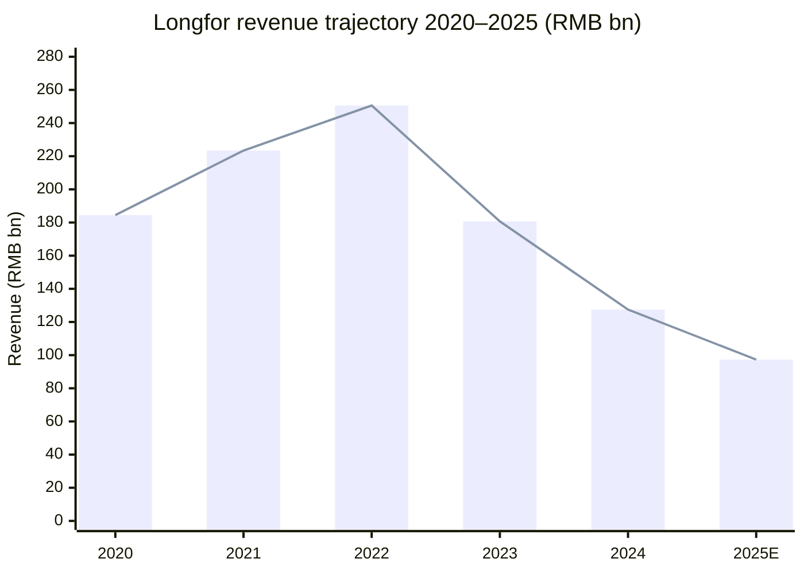
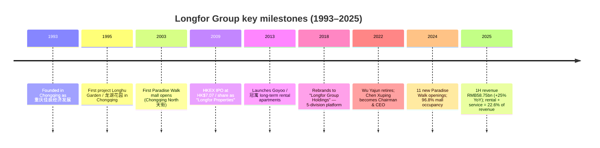
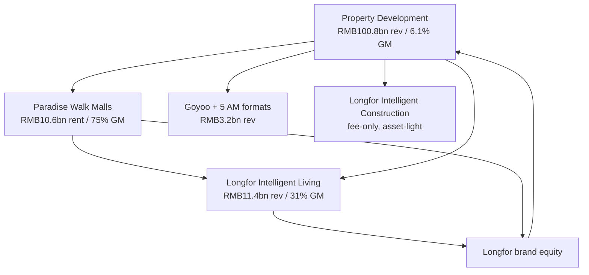
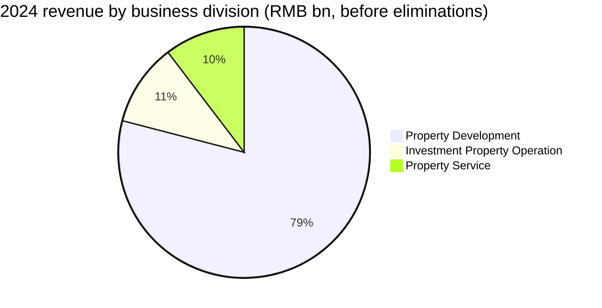
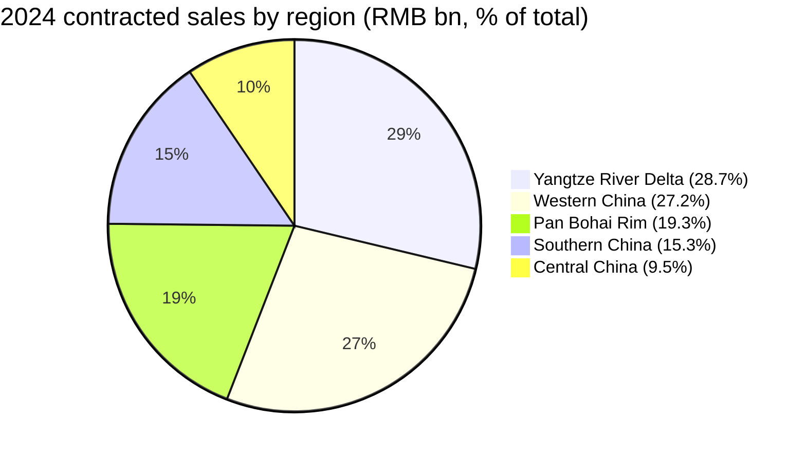
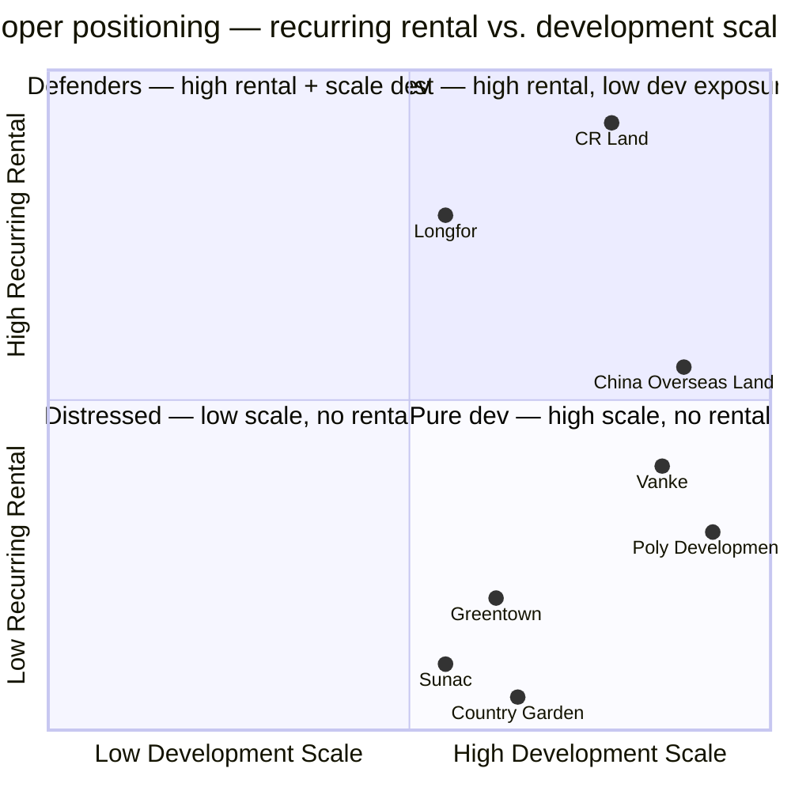
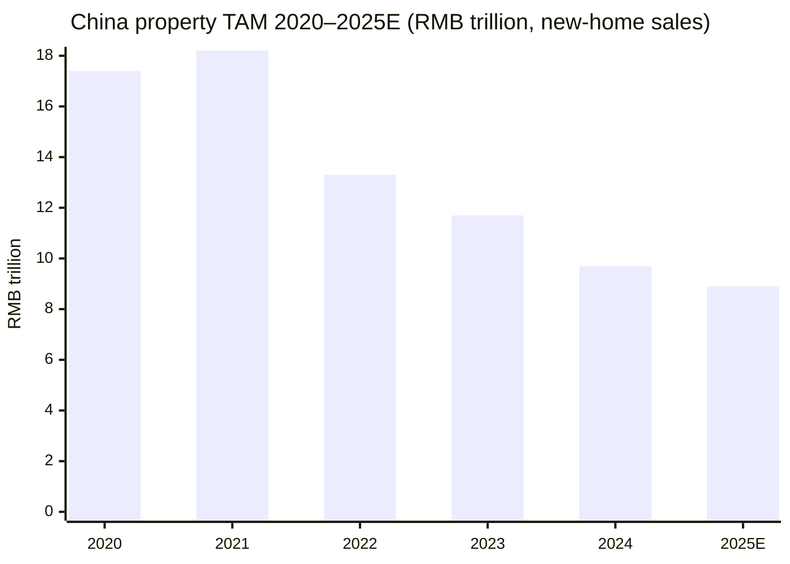

# Longfor Group Holdings (HKEX:0960) — Initial Coverage

**As of**: 2026-06-03  •  **Stock code**: 0960.HK  •  **Currency**: RMB unless stated  •  **Domicile**: Cayman Islands (HK-listed, China-operating)

> *Reading guide.* This is an English initial-coverage note on Longfor Group Holdings, written for global equity investors and intentionally non-consensus on one point: the Longfor of 2026 should not be analysed as a homebuilder anymore. Three quarters of its 2025 H1 revenue is property development by accounting, but the *strategic* engine of the franchise — the part that compounds, defends margin, and has a future — is the RMB210bn investment-property book (96.8% occupancy malls + 124k rental apartments) plus the asset-light property-service arm. The development business is being run down deliberately. The whole report is calibrated to that thesis: a survivor in the only segment of China property that still has return on capital.

---

## Table of contents

1. Company overview
2. Company history
3. Management — founder & current CEO only
4. Products & services — the five business divisions
5. Customers & go-to-market
6. Industry overview — China property after the 2021 crash
7. Competitive landscape
8. Market opportunity (TAM / SAM)
9. Risk assessment
10. Investor-lens scorecards
11. References & data manifest

---

## 1. Company overview

Longfor Group Holdings Limited (龍湖集團控股有限公司, stock code 0960.HK) is one of the few large, privately-controlled China property developers that has *not* defaulted in the post-2021 sector crisis. Founded in Chongqing in 1993 by Wu Yajun (吴亚军), the group runs five distinct business divisions: property development, commercial investment (the "Paradise Walk" / 天街 mall chain), asset management, property management (Longfor Intelligent Living), and smart construction. As at 2024-12-31, Longfor employed 29,738 people in China and the group reported full-year 2024 revenue of **RMB127.47 billion**, profit attributable to owners of **RMB10.40 billion**, and consolidated borrowings of **RMB176.32 billion** against cash on hand of **RMB49.42 billion** ([Longfor 2024 Annual Report, Five Year Financial Summary p.300](https://longfor-official-website-online.oss-cn-beijing.aliyuncs.com/1746523305938_Annual%20Report%202024.pdf); [Longfor 2024 Annual Report, MD&A Financial Position p.36](https://longfor-official-website-online.oss-cn-beijing.aliyuncs.com/1746523305938_Annual%20Report%202024.pdf)). Net debt to equity was **51.7%** at 2024 year-end and the credit ratings stand at BB / Ba3 / BB (S&P / Moody's / Fitch), which keep Longfor inside the offshore investment-grade-adjacent bucket where Country Garden, Sunac and Evergrande were exiled from years ago.

The strategic centre of gravity has been visibly migrating away from property development. In 2024 the property-development business booked RMB100.77 billion of revenue and recognised a gross profit margin of just **6.1%**, the lowest in the group's modern history and a direct read-through of the post-2021 contracted-sales collapse landing in the P&L on a 2-to-3-year lag ([Longfor 2024 Annual Report, MD&A — Property Development p.20](https://longfor-official-website-online.oss-cn-beijing.aliyuncs.com/1746523305938_Annual%20Report%202024.pdf)). Over the same year the investment-property-operation business reported rental income of **RMB13.52 billion** at a **75.0% gross margin**, and the property-service business reported income of **RMB13.19 billion** at a **31.4% gross margin** ([Longfor 2024 Annual Report, MD&A — Investment Property Operation p.24](https://longfor-official-website-online.oss-cn-beijing.aliyuncs.com/1746523305938_Annual%20Report%202024.pdf); [Longfor 2024 Annual Report, MD&A — Property Service p.30](https://longfor-official-website-online.oss-cn-beijing.aliyuncs.com/1746523305938_Annual%20Report%202024.pdf)). The "operation + service" cluster contributed **RMB26.71 billion** in 2024 (+7.4% YoY) and by 1H 2025 carried **22.6% of consolidated revenue** while accounting for almost the entire core net profit; management has stated this is the segment they are growing into ([Longfor 1H 2025 Interim Results Announcement, Financial Summary p.1](https://www1.hkexnews.hk/listedco/listconews/sehk/2025/0829/2025082900447.pdf)).

**Valuation snapshot (as-of 2026-06-03).** Yahoo Finance and StockAnalysis.com both show the stock trading around **HK$7.95–9.19** with a market cap in the **HK$50–60 billion** band, P/E TTM in the high single digits (~10.99×), and dividend yield around 4.77% on the back of the RMB0.10-per-share final dividend declared for FY 2024 ([Longfor Group, Five Year Financial Summary p.300, dividend disclosed in 2024 Results Announcement](https://www.hkexnews.hk/listedco/listconews/sehk/2025/0328/2025032800484.pdf); [stockanalysis.com 0960 financials, accessed 2026-06](https://stockanalysis.com/quote/hkg/0960/financials/); [Longfor 0960 Tipranks page, 12-month consensus target HK$11.67](https://www.tipranks.com/stocks/hk:0960)). That price is roughly **0.35× tangible book** based on RMB161bn of equity attributable to owners at FY 2024 — the market is pricing a >50% writedown of the development inventory and discounting the rental book at a c.8% cap rate. Versus a 3-year window (the stock peaked above HK$45 in mid-2022 before the sector crash), today's multiple is depressed by the sector overhang, but **vs. Country Garden / Sunac / Vanke peers** Longfor is the only one in this bucket that does not trade at a distressed-equity-stub multiple — Vanke alone reported a net loss of about **RMB49.5 billion** for FY 2024 ([SCMP, 2025-09: China's property developers from Vanke to Longfor see October sales surge](https://www.scmp.com/business/article/3285894/chinas-property-developers-vanke-longfor-see-october-sales-surge); [CNBC, 2025-10: China's property slump this year is looking much worse than expected, S&P says](https://www.cnbc.com/2025/10/10/chinas-property-slump-this-year-looks-worse-than-expected-sp-says.html)). The relevant peer for re-rating purposes is therefore not the distressed group; it is China Resources Land (1109.HK) and China Overseas Land (0688.HK), whose investment-property platforms support a P/B closer to 0.6–0.8×.

*Source: [Longfor 2024 Annual Report Five Year Financial Summary p.300](https://longfor-official-website-online.oss-cn-beijing.aliyuncs.com/1746523305938_Annual%20Report%202024.pdf); 2025E is the StockAnalysis.com TTM-tracked print of RMB97.3bn (development handover-cycle low) — [stockanalysis.com 0960](https://stockanalysis.com/quote/hkg/0960/financials/).*

Two observations are worth making upfront. First, the revenue collapse from RMB250.6bn (2022) to RMB97.3bn (2025E) is **not** evidence of distress — it is the mechanical consequence of contracted-sales falling from ~RMB200bn-class pre-2022 to RMB101bn in 2024, then the 2-to-3-year revenue-recognition lag flushing through GAAP. Second, the absolute level of the rental book — **RMB13.52bn of rent in 2024, growing at single digits annually with a 96.8% occupancy rate** — already compares to mid-cap REIT-style operators in the region and is the structural reason the equity has not collapsed alongside the development P&L.

## 2. Company history

Longfor was founded on **2 June 1993** in Chongqing under the original name 重慶佳辰經濟發展有限公司 (Chongqing Jiachen Economic and Development Co., Ltd.) by Wu Yajun (吴亚军) and her then-husband Cai Kui ([Wu Yajun — Wikipedia](https://en.wikipedia.org/wiki/Wu_Yajun)). Wu was born in Chongqing in 1964, graduated in 1984 from the Department of Navigation Engineering at Northwestern Polytechnical University (西北工业大学), and worked first as a mechanical engineer at the Qianwei Meter Factory (前卫仪表厂) before moving in 1988 to the China Shirong News Agency, a Chongqing-municipal-government-controlled construction-sector trade paper — the network she built there proved decisive for early land access ([Wu Yajun — Wikipedia](https://en.wikipedia.org/wiki/Wu_Yajun); [Wu Yajun biography — Baidu Baike English](https://baike.baidu.com/en/item/Wu%20Yajun/935914)).

The defining product of the founding decade was **Longhu Garden / 龙湖花园** (1995), Longfor's first integrated residential community in Chongqing. Wu's differentiating proposition versus the average mid-1990s mainland developer was hardware quality and post-sale property management — meticulously designed landscape, in-house property service, and an explicit "products before sales" ethos that became the brand's reputational moat ([MatrixBCG: Brief history of Longfor](https://matrixbcg.com/blogs/brief-history/longfor)). The group then expanded geographically through the 2000s into Beijing (2005), Chengdu (2003), Shanghai (2009), and Hangzhou (2010), with the **HKEX IPO in November 2009** under the name *Longfor Properties Co. Ltd.* (龍湖地產有限公司) at HK$7.07 per share ([Longfor Properties 2009 IPO prospectus on hkexnews, ltn20091106024.pdf](https://www1.hkexnews.hk/listedco/listconews/sehk/2009/1106/ltn20091106024.pdf)).

The next inflection was the **Paradise Walk** (天街) commercial-real-estate program. Longfor opened its first urban shopping mall — **Chongqing North Paradise Walk** (重庆北城天街) — in 2003 as a vertically-integrated, anchor-tenant-led mid-tier mall, and by year-end 2024 had built that into a portfolio of malls totalling 9.30 million sqm of GFA (12.43 million sqm including parking) at 96.8% occupancy ([Longfor 2024 Annual Report, MD&A — Investment Property Operation p.24](https://longfor-official-website-online.oss-cn-beijing.aliyuncs.com/1746523305938_Annual%20Report%202024.pdf)). The 2024 deck records 11 new Paradise Walk openings in Nanjing, Hefei, Suzhou, Chongqing and Changsha — a deliberate counter-cyclical capex push during the property crash to consolidate operating leverage when rents are at trough ([Longfor 2024 Annual Report, Chairman's Statement p.18](https://longfor-official-website-online.oss-cn-beijing.aliyuncs.com/1746523305938_Annual%20Report%202024.pdf)).

The 2018 corporate rebrand from "Longfor Properties" to **Longfor Group Holdings** (龍湖集團控股有限公司) was the legal acknowledgement of what the business had already become: not a homebuilder but a five-division platform. The five divisions today are **property development**, **commercial investment** (Paradise Walk + the smaller Starry Street / 星悦荟 community-mall format), **asset management** (Goyoo rental housing, Hybrid Space, Hsiafei serviced apartments, Blue Engine industrial offices, Youyou Baobei maternity hospitals, Chunshan Wanshu elderly residences), **property management** (Longfor Intelligent Living, 龙湖智创生活), and **smart construction** (Longfor Intelligent Construction, 龙湖龙智造 — the entrusted-construction franchise) ([Longfor 2024 Annual Report, Group Structure p.2](https://longfor-official-website-online.oss-cn-beijing.aliyuncs.com/1746523305938_Annual%20Report%202024.pdf)).

The **second decisive moment** was 28 October 2022, when Wu Yajun resigned as Chairperson and CEO "for personal reasons including age and health," with **Chen Xuping (陈序平)** — then a 39-year-old internal candidate — promoted to both Chairman and CEO of the Group ([Bloomberg, 2022-10-31: China property billionaire Wu Yajun resigns as Longfor chairman in real estate crisis](https://www.bloomberg.com/news/articles/2022-10-31/china-property-billionaire-wu-yajun-resigns-as-longfor-chairman-in-sector-crisis); [Longfor 2024 Annual Report, Corporate Governance Report — Chairman and CEO p.42](https://longfor-official-website-online.oss-cn-beijing.aliyuncs.com/1746523305938_Annual%20Report%202024.pdf)). Wu retains the title of **Strategic Development Advisor** and remained a significant shareholder; she increased her holding by 3 million shares for HK$22.94 million on 11 September 2024 — a non-trivial signal in a sector where founders have been net sellers ([Baidu Baike, Wu Yajun entry — September 2024 share increase note](https://baike.baidu.com/en/item/Wu%20Yajun/935914)).

## 3. Management — founder & current CEO only

### Founder — Wu Yajun (吴亚军), age ~62 (born 1964)

Wu Yajun's professional CV is unusual for a Chinese property founder of her generation. After a 1984 mechanical-engineering degree from **Northwestern Polytechnical University** (西北工业大学), she spent four years (1984–1988) as a meter-factory engineer at Qianwei Meter Factory in Chongqing, then four years (1988–1993) as a journalist and editor at the **China Shirong News Agency** — a publication controlled by the Construction Bureau of Chongqing Municipal Government. That second role is what built the relationships with the Chongqing planning and land bureaus that Longfor exploited to assemble its early land bank, and is the reason Longfor's first-decade growth was geographically concentrated in Chongqing in a way most coastal-China developers were not ([Wu Yajun — Wikipedia](https://en.wikipedia.org/wiki/Wu_Yajun); [The Asian Executive, Wu Yajun profile](https://theasianexecutive.com.au/wu-yajun-a-pioneer-of-prosperity-during-chinas-golden-years/)). Wu's stated founding thesis, repeated across interviews over twenty years, was that "design and after-sale service are the moat, not land arbitrage" — a thesis that became more credible during 2021–2024 as the leveraged land-arbitrage model (Country Garden, Sunac, Evergrande, Vanke) collapsed and a quality-led developer with deeper recurring-rental cash flow survived.

Wu was named the world's richest self-made woman by Forbes multiple times in the 2010s, peaking at a personal net worth of roughly US$12 billion in 2017. Her **2022 resignation** was framed as a generational transition: "I have decided to retire to spend more time on family and personal interests after serving Longfor for nearly 30 years" — but the timing (mid-property-crash) made it as much a deliberate succession move to protect the franchise as a personal one ([Bloomberg, 2022-10-31](https://www.bloomberg.com/news/articles/2022-10-31/china-property-billionaire-wu-yajun-resigns-as-longfor-chairman-in-sector-crisis)). Wu retained the title of **Strategic Development Advisor** post-transition and remains a significant shareholder; her September 2024 open-market purchase (3 million shares for HK$22.94 million via her Cayman holding vehicle, around HK$7.6/share) was disclosed publicly and read across the sell-side as a founder-floor on the stock at trough valuations ([Baidu Baike, Wu Yajun page](https://baike.baidu.com/en/item/Wu%20Yajun/935914)).

### Current Chairman & CEO — Chen Xuping (陈序平), age 42

Chen Xuping has held **both** roles since 28 October 2022 — a deviation from HKEX Corporate Governance Code Provision C.2.1, which the company discloses transparently in the Corporate Governance Report and justifies on grounds of "execution efficiency through the cycle" ([Longfor 2024 Annual Report, Corporate Governance Report — Chairman and CEO p.42](https://longfor-official-website-online.oss-cn-beijing.aliyuncs.com/1746523305938_Annual%20Report%202024.pdf)). Chen has spent his entire post-graduate career at Longfor: he joined the group in **2008** straight out of a Master's in civil engineering from **Tsinghua University** (清华大学), and worked his way up through the construction-management track — first as construction manager, then project manager, regional general manager, and finally General Manager of the Property Development core business prior to his August 2021 appointment as Executive Director ([Longfor 2024 Annual Report, Biographies of Directors p.39](https://longfor-official-website-online.oss-cn-beijing.aliyuncs.com/1746523305938_Annual%20Report%202024.pdf)).

The unusually-young succession (Chen was 39 at appointment, the youngest CEO of a top-10 China developer) reflected three things: (i) Longfor's deep internal bench versus the sector's typical "founder-plus-fellow-travelers" depth, (ii) Wu's deliberate prior eighteen-month grooming of Chen as her named successor, and (iii) the technical-construction-background-over-finance-or-sales profile that fit Longfor's quality-led brand more naturally than a sales-led successor would have. Chen's stated FY 2024 strategy — recorded verbatim in his Chairman's Statement — was that the group will "focus on reducing existing inventory while simultaneously replenishing land in a timely and precise manner" and "focus on developing, operating and serving three major business plates and the synergy of five business divisions" ([Longfor 2024 Annual Report, Chairman's Statement pp.17–19](https://longfor-official-website-online.oss-cn-beijing.aliyuncs.com/1746523305938_Annual%20Report%202024.pdf)). In FY 2024 he executed the reduction of interest-bearing liabilities by **RMB16.3 billion** (from RMB192.5bn at YE 2023 to RMB176.3bn at YE 2024) while extending the average contract borrowing period to **10.27 years** at an average finance cost of **4.0%** — the longest-tenor balance sheet in the China private-developer cohort.

**Compensation, ownership and tenure.** Chen Xuping's compensation is not separately broken out at the individual-director level in the Annual Report's compensation table (the group reports an aggregate Director compensation figure). His ownership stake is below the disclosure thresholds of Hong Kong listing rules — i.e., not a founder-class equity holding — which means Chen runs Longfor on a senior-executive-as-fiduciary model rather than a founder-CEO model, with Wu retaining the founder economic role through her Cayman holding vehicles. The Audit Committee is chaired by independent director **Mr. Chan Chi On, Derek** (former head of corporate finance at Taifook Securities / Haitong International), and the Board has four independent non-executive directors including Frederick Peter Churchouse (ex-Morgan Stanley head of Asian property research) — a stronger-than-sector-average independent-director slate for a private-controlled China developer ([Longfor 2024 Annual Report, Biographies of Directors pp.40–41](https://longfor-official-website-online.oss-cn-beijing.aliyuncs.com/1746523305938_Annual%20Report%202024.pdf)).

## 4. Products & services — the five business divisions

Section 4 is the analytical foundation. Longfor's own framing in the 2024 Annual Report is that the group runs **five business divisions** organized under three umbrella plates: *Development* (property development), *Operations* (commercial investment + asset management), and *Services* (property management + smart construction). This section walks all five.

### 4.1 Property Development — Residential homebuilding

> **Verbatim from 2024 Annual Report MD&A p.20:** "In 2024, revenue from property development business of the Group was RMB100.77 billion. The Group delivered 7.619 million square meters of property in gross floor area (GFA) terms. The gross profit margin of the property development business was 6.1%. Recognized average selling price was RMB13,226 per square meter in 2024." ([Longfor 2024 Annual Report MD&A p.20](https://longfor-official-website-online.oss-cn-beijing.aliyuncs.com/1746523305938_Annual%20Report%202024.pdf))

**Physical role.** The development business builds residential complexes (sometimes mixed with retail or office podiums) in 35+ Chinese cities, sells them off-plan ("pre-sale" / 预售) typically 12–24 months before delivery, and recognises revenue on physical handover. The product matrix in 2024 was led by three improver-class (改善型) residential brands disclosed in the Chairman's Statement — **Glory of Galaxy** (云河颂), **Glory of Throne** (御湖境), and **Inner Land** (观萃) — all targeting first-time-upgrader and second-home buyers in Tier-1 and Tier-2 cities, not the entry-level / mass-market that has structurally collapsed ([Longfor 2024 Annual Report, Chairman's Statement p.17](https://longfor-official-website-online.oss-cn-beijing.aliyuncs.com/1746523305938_Annual%20Report%202024.pdf)). The 2024 city-revenue mix was led by **Xi'an (RMB12.67bn)**, **Chengdu (RMB9.65bn)**, **Hefei (RMB6.57bn)**, **Suzhou (RMB5.47bn)** and **Chongqing (RMB5.00bn)** — heavily Western and Yangtze River Delta-tilted, with Shanghai, Hangzhou and Beijing each at RMB2–5bn ([Longfor 2024 Annual Report, MD&A Table 1 — City breakdown p.21](https://longfor-official-website-online.oss-cn-beijing.aliyuncs.com/1746523305938_Annual%20Report%202024.pdf)).

**Strategic significance and what 6.1% gross margin means.** A 6.1% gross margin in residential development is mechanically loss-making on a fully-loaded basis once SG&A, interest, and a normal land-appreciation-tax provision are layered on. This is the direct ingestion of the 2022–2024 contracted-sales collapse: Longfor's contracted sales went from **RMB173.5bn (FY 2023)** to **RMB101.1bn (FY 2024)** to a 1H 2025 run-rate implying full-year sales around **RMB70bn-class** — RMB35.0bn in 1H 2025 — but it takes 2–3 years for those sales to flow through P&L as revenue and a further year for the margin compression to fully reset ([Longfor 1H 2025 announcement p.1](https://www1.hkexnews.hk/listedco/listconews/sehk/2025/0829/2025082900447.pdf); [Longfor 2024 Annual Report MD&A Table 2 — Contracted sales p.22](https://longfor-official-website-online.oss-cn-beijing.aliyuncs.com/1746523305938_Annual%20Report%202024.pdf)). **Analyst view:** Longfor's development gross margin should remain in the 5–10% band through 2026 and re-base to 12–15% only when the trough-cohort land inventory has been sold through. This is structural, not cyclical, and is the dominant reason the stock trades at 0.3× tangible book.

**Land bank.** As at 2024-12-31, Longfor's total land bank was **33.12 million sqm of GFA (24.26 million sqm on an attributable basis)**, at an average cost of **RMB4,304 per sqm** ([Longfor 2024 Annual Report, MD&A Land Bank Replenishment p.31](https://longfor-official-website-online.oss-cn-beijing.aliyuncs.com/1746523305938_Annual%20Report%202024.pdf)). FY 2024 land replenishment was only **RMB0.83 million sqm of total GFA / 0.39 million sqm attributable** — a fraction of historical pre-crisis replenishment — at a much higher average attributable cost of **RMB13,285 per sqm**, reflecting the deliberate pivot to acquire only Tier-1 prime parcels (Shanghai, Hangzhou, Beijing). This is the right discipline given the cycle; it also implies a ~5–7 year sell-through on the existing inventory which makes the medium-term revenue path predictable.

### 4.2 Commercial Investment — Paradise Walk (天街) mall portfolio

> **Verbatim from 2024 Annual Report MD&A p.24:** "In 2024, the rental income, net of tax, of the Group's investment property operation business was RMB13.52 billion, representing an increase of 4.5% as compared to last year. The rental income from shopping malls, rental housing and others accounted for 78.8%, 19.6% and 1.6% of the total rental income respectively. The gross profit margin of the investment property operation business was 75.0%, representing a decrease of 0.8% as compared to last year. As at December 31, 2024, the Group has shopping malls totaling 9.30 million square meters in GFA (12.43 million square meters in GFA including parking space) that had commenced operation with an occupancy rate of 96.8%." ([Longfor 2024 Annual Report MD&A p.24](https://longfor-official-website-online.oss-cn-beijing.aliyuncs.com/1746523305938_Annual%20Report%202024.pdf))

**Physical role.** Paradise Walk (天街) is Longfor's flagship urban-shopping-centre platform, anchored on mid-to-upper-mid-market apparel, F&B and entertainment tenants. The format is roughly 60,000–200,000 sqm GFA per mall, vertically-integrated (Longfor owns, develops, leases and operates), and concentrated in Tier-1 and high-Tier-2 cities. As of YE 2024 the portfolio contains 90+ Paradise Walks plus the smaller **Starry Street** (星悦荟) community-mall format. The 2024 top-five revenue-generating malls were **Chongqing Time Paradise Walk (RMB730m, 95.3% occupancy)**, **Beijing Changying Paradise Walk (RMB540m, 97.6%)**, **Chongqing North Paradise Walk (RMB434m, 94.9%)**, **Hangzhou Binjiang Paradise Walk (RMB432m, 98.2%)**, and **Suzhou Shishan Paradise Walk (RMB412m, 98.9%)** ([Longfor 2024 Annual Report, MD&A Table 3 — Mall rental analysis pp.25–29](https://longfor-official-website-online.oss-cn-beijing.aliyuncs.com/1746523305938_Annual%20Report%202024.pdf)).

**How it differentiates from sibling products.** Versus Starry Street (the 25–55k sqm community-mall format that generates only ~3.2% of mall rental — RMB349m in 2024), Paradise Walk is the higher-AUV, higher-occupancy, higher-traffic destination format. Versus Longfor's Goyoo rental housing (next section), Paradise Walk has 4× the rental yield per sqm and 5× the gross margin but requires 2–3× the upfront capex. Versus the property-development business, Paradise Walk represents the *recurring* cash flow side of the franchise — its 75% gross margin is roughly 12× the development gross margin, which is why management explicitly described in the Chairman's Statement that "we view the rental contribution as the stabilizer through the cycle".

**Strategic significance.** The 11 new Paradise Walk openings in 2024 (Nanjing, Hefei, Suzhou, Chongqing, Changsha) plus a further 8 under construction for 2025 commencement (Ji'nan West Railway Station, Kunming Time, Wuchang Binjiang, Wuhan Xinrong, etc.) translate into a multi-year rental-income growth trajectory of mid-single-digit-percent CAGR, even with no rent increases on existing assets ([Longfor 2024 Annual Report, MD&A Table 4 — Investment properties under construction p.29](https://longfor-official-website-online.oss-cn-beijing.aliyuncs.com/1746523305938_Annual%20Report%202024.pdf)). Investment-property fair-value gains of **RMB4.76 billion** were recognised in 2024 — a non-trivial 30%+ of the year's reported net income, reflecting both the new openings and management's view that existing malls' DCF values held up under stable occupancy.

### 4.3 Asset Management — Goyoo rental housing + 5 other formats

> **Verbatim from 2024 Annual Report MD&A p.24:** "For assets management, it encompasses six major divisions, including rental housing branded as 'Goyoo', dynamic commercial pedestrian precinct branded as 'Hybrid Space', serviced apartment branded as 'Hsiafei Mansion', industrial office branded as 'Blue Engine', women's and children's hospital branded as 'Youyou Baobei', and elderly residence branded as 'Chunshan Wanshu' with an aim to offering customers more diverse products and services. ... 124,000 apartments by Goyoo had also commenced operation, boasting a leading position in the industry in terms of its scales with the occupancy rate of 95.3%." ([Longfor 2024 Annual Report MD&A p.24](https://longfor-official-website-online.oss-cn-beijing.aliyuncs.com/1746523305938_Annual%20Report%202024.pdf))

**Physical role.** Asset Management is Longfor's grouping for six second-generation real-estate formats. The flagship is **Goyoo / 冠寓** — China's largest centrally-managed long-term rental apartment chain at 124,000 units (95.3% occupancy), present in Beijing, Shanghai, Guangzhou, Shenzhen, Chengdu, Hangzhou, Chongqing, Wuhan and Nanjing — that targets new-generation white-collar renters and contributed **19.6% of total rental income** in 2024 (implying ~RMB2.65bn of Goyoo rent), part of the **RMB3.18bn total Asset Management revenue** ([Longfor 2024 Annual Report, Chairman's Statement p.18](https://longfor-official-website-online.oss-cn-beijing.aliyuncs.com/1746523305938_Annual%20Report%202024.pdf)). The other five formats — Hybrid Space (歡肆 dynamic-commercial blocks), Hsiafei Mansion (霞菲公館 serviced apartments), Blue Engine (藍海引擎 industrial-office incubators), Youyou Baobei (佑佑寶貝 maternity hospitals), Chunshan Wanshu (椿山萬樹 elderly residences) — are individually smaller but represent optionality on China's structural demographic shifts (aging, single-income urbanization, female workforce participation) that homebuilding does not capture.

**How it differentiates.** Asset Management is the *light-asset* extension of Longfor's commercial real-estate playbook: where Paradise Walk requires Longfor to own the underlying land + building, several Asset Management formats (Goyoo in particular) operate on long-term leases or REIT-style structures, generating recurring fee income on third-party assets. **Analyst view:** the strategic optionality here is that any China LTR-REIT framework — which CSRC has been piloting since 2021 — would re-rate Longfor's 124k apartments at significantly higher multiples than the current implied 0.3× P/B; this is a low-probability but high-payoff catalyst.

### 4.4 Property Management — Longfor Intelligent Living (龙湖智创生活)

> **Verbatim from 2024 Annual Report MD&A p.30:** "In 2024, the total income, net of tax, generated from the property service business of the Group was RMB13.19 billion, representing an increase of 10.4% as compared to last year. The gross profit margin of the property service business was 31.4%, representing an increase of 0.4% as compared to last year. As at December 31, 2024, the Group's total contracted area under management was 410 million square meters." ([Longfor 2024 Annual Report MD&A p.30](https://longfor-official-website-online.oss-cn-beijing.aliyuncs.com/1746523305938_Annual%20Report%202024.pdf))

**Physical role.** Longfor Intelligent Living (龙湖智创生活) provides residential and commercial property management — security, cleaning, landscaping, building maintenance, smart-home services — to 4.1 million homeowners across **410 million sqm** of contracted GFA at year-end 2024. The five divisions, in management's own words, are residential management, commercial property services, home decoration ("美居"), selected products / new retail ("優選"), and house rental and sales — covering "13 business types, including residential, commercial, office, industrial parks, corporate headquarters, urban services, hospitals and public venues" ([Longfor 2024 Annual Report MD&A p.30](https://longfor-official-website-online.oss-cn-beijing.aliyuncs.com/1746523305938_Annual%20Report%202024.pdf)).

**How it differentiates and why it matters.** Property Management is the *fee-on-an-asset-base* version of the Longfor franchise: it earns ~RMB30/sqm/year of management fees on the in-management GFA, plus value-added home decoration / retail / brokerage fees. The 31.4% gross margin is structurally healthier than property development; the 16-consecutive-year customer-satisfaction rate above 90% disclosed by management is a meaningful brand asset (third-party benchmarks like the China Property Management Association annual survey typically rank Longfor in the top 3 for satisfaction). Strategically, this division was prepared for a separate HKEX listing — "Longfor Intelligent Living" filed its A1 with HKEX in early 2022 — but the IPO was pulled in late 2022 amid the sector crash. The franchise remains carve-out-ready if equity markets re-open.

### 4.5 Smart Construction — Longfor Intelligent Construction (龙湖龙智造)

> **Verbatim from 2024 Annual Report Chairman's Statement p.19:** "Longfor Smart Construction provides one-stop, all-industry services covering multiple modules such as research and planning, design, construction management and fine engineering. With high-quality, cost-effective, and short-cycle construction capabilities, it enhances operational efficiency and aids value realization to clients." ([Longfor 2024 Annual Report, Chairman's Statement p.19](https://longfor-official-website-online.oss-cn-beijing.aliyuncs.com/1746523305938_Annual%20Report%202024.pdf))

**Physical role.** This is Longfor's **entrusted construction** / 代建 division — i.e. Longfor acts as the development manager for a third-party landowner (state-owned LGFV, distressed peer's asset, government social-housing program), earning fee income on construction milestones without taking land-acquisition or balance-sheet risk. The business is positioned to capture the structurally-growing 代建 opportunity that has emerged from the post-2022 sector crisis — many smaller developers and LGFVs cannot themselves complete projects but need a credible developer brand. **Analyst view:** this is the fastest-growing of the five divisions on a percentage basis (off a small base) and the most capital-efficient; it should not be confused with the legacy development business even though both involve building residences.

### Synthesis — how the divisions interact

Property Development is the *seed* business (provides the brand, the development know-how, and the cash flow that funded the original Paradise Walk capex). Commercial Investment + Asset Management are the *core compounders* (recurring, high-margin, defendable). Property Management + Smart Construction are the *asset-light fee extensions* that monetize Longfor's brand and operational know-how on third-party assets. The five-division architecture means:

The architecture creates a feedback loop: Development funds Commercial Investment capex → Commercial Investment + Asset Management generates recurring cash → Property Management captures the in-management GFA fees → the brand strengthens → Development sells at a higher price-per-sqm than no-name peers. Until the post-2022 crisis, the loop was net dilutive to ROE because Development's high-velocity capital recycling outweighed the slow-compounder ROE of the rental book; from 2024 onward — as Development gross margin collapses — the loop's ROE math flips, and Commercial Investment + Asset Management + Property Management become the dominant value drivers.

*Source: [Longfor 2024 Annual Report MD&A pp.20, 24, 30](https://longfor-official-website-online.oss-cn-beijing.aliyuncs.com/1746523305938_Annual%20Report%202024.pdf). Inter-segment eliminations reconcile to consolidated revenue of RMB127.47bn.*

## 5. Customers & go-to-market

### Customer mix

Longfor's customer base is highly fragmented at the group level — it serves **3.25 million homeowners** through Longfor Intelligent Living (as disclosed in Chairman's Statement p.18) plus the equivalent customer base across the Paradise Walk mall portfolio (tens of millions of mall visitors per year) and the property-development buyer base (tens of thousands per year). There is **no single customer or tenant disclosed at >10% of consolidated revenue**, and the Annual Report does not publish a 前五名客户 / top-five-customer table because revenue is consumer-direct at the development and rental levels rather than B2B-contract-driven. This is a structural advantage versus B2B-leveraged peers (e.g. Sunac's reliance on local-government plot deals) — the customer-concentration risk that has hurt other developers does not exist here at the consumer level.

**Quantification of segment-level concentration.** The largest *operational* concentrations are: (i) at the Paradise Walk level, the top-5 malls (Chongqing Time, Beijing Changying, Chongqing North, Hangzhou Binjiang, Suzhou Shishan) collectively contribute **RMB2.55bn or 23.2% of total mall rental** — a manageable diversification ([Longfor 2024 Annual Report, MD&A Table 3 pp.25–29](https://longfor-official-website-online.oss-cn-beijing.aliyuncs.com/1746523305938_Annual%20Report%202024.pdf)); (ii) at the geographic-development level, the top-5 cities (Xi'an, Chengdu, Hefei, Suzhou, Chongqing) account for **RMB39.4bn or 39.1% of property-development revenue** — meaningful but not extreme.

*Source: [Longfor 2024 Annual Report MD&A p.22](https://longfor-official-website-online.oss-cn-beijing.aliyuncs.com/1746523305938_Annual%20Report%202024.pdf). Note: this is **contracted sales (i.e. 销售额, the cash booking)** by region, not GAAP revenue — Yangtze River Delta + Western China + Pan Bohai together = 75.2% of FY24 contracted sales.*

### Go-to-market

Longfor's go-to-market is direct rather than agent-led for the rental businesses (Goyoo, Paradise Walk leasing are all in-house); for the property-development business, sales are a mix of in-house sales centres at each project plus a typical 0.5–1.5% commission paid to third-party real-estate brokers (链家 / 我爱我家 / regional brokerages). The **revenue collection rate in 2024 exceeded 100%** (i.e. cash receipts greater than recognised contracted sales) — this is an explicit management KPI that signals receivables are collected ahead of P&L recognition, structurally important in a sector where many peers are stuck with uncollectible buyer deposits ([Longfor 2024 Annual Report, MD&A Review and Outlook p.37](https://longfor-official-website-online.oss-cn-beijing.aliyuncs.com/1746523305938_Annual%20Report%202024.pdf)).

**Unrecognised contracted sales pipeline.** At 2024-12-31, Longfor had sold-but-unrecognised contracted sales of **RMB128.2 billion** across approximately 10 million sqm of GFA — i.e., the development-revenue pipeline is roughly 1.3× the FY 2024 development revenue run-rate, giving management ~12–18 months of revenue visibility before the trough cohort fully clears ([Longfor 2024 Annual Report, MD&A p.23](https://longfor-official-website-online.oss-cn-beijing.aliyuncs.com/1746523305938_Annual%20Report%202024.pdf)).

## 6. Industry overview — China property after the 2021 crash

China's residential property market is in its fourth year of a structural contraction. National new-home sales in 2024 totalled **RMB9.7 trillion**, down **17% YoY**; the cumulative sales of the top-100 developers in the first 9 months of 2025 fell a further **11.8% YoY** to RMB2.3 trillion ([Longfor 2024 Annual Report, MD&A Review and Outlook p.37](https://longfor-official-website-online.oss-cn-beijing.aliyuncs.com/1746523305938_Annual%20Report%202024.pdf); [Caixin Global, 2026-01-05: China's Property Slump Knocks Half of Top Developers off Key Ranking](https://www.caixinglobal.com/2026-01-05/chinas-property-slump-knocks-half-of-top-developers-off-key-ranking-102400361.html)). The number of developers achieving annual contracted sales of at least RMB100 billion dropped to **10 in 2025 from 43 in 2020**, and only **53 of 100** developers that were ranked in the top-100 in 2021 still appear in the top-100 in 2025 ([Caixin Global, 2026-01-05](https://www.caixinglobal.com/2026-01-05/chinas-property-slump-knocks-half-of-top-developers-off-key-ranking-102400361.html)). The structural drivers — falling birth rates, urbanisation rates plateauing above 65%, household-leverage ratios already at 65% of GDP — mean the market is unlikely to revisit pre-2021 volumes in this decade.

The **policy response** since September 2024 has been a significant turn from passive demand-stimulus to active "stop the bleeding": the Politburo's September 2024 meeting explicitly invoked "preventing further decline and back to recovery" (止跌回稳) of the property market, followed by mortgage-rate cuts, down-payment-ratio reductions, and a CNY1 trillion AMC plan for unfinished projects ([Longfor 2024 Annual Report, MD&A Review and Outlook p.37](https://longfor-official-website-online.oss-cn-beijing.aliyuncs.com/1746523305938_Annual%20Report%202024.pdf)). S&P Global in October 2025 warned the 2025 contraction was running worse than expected, with new-home sales projected to fall 8% from 2024 ([CNBC, 2025-10-10: China's property slump this year is looking much worse than expected, S&P says](https://www.cnbc.com/2025/10/10/chinas-property-slump-this-year-looks-worse-than-expected-sp-says.html)). The base case for any China-property investment in 2026 is therefore a *3rd-year bottom* scenario rather than an *imminent recovery* scenario.

**Where the recurring-rental / commercial-real-estate sub-segment differs.** Unlike homebuilding, the **investment-property** / **shopping-mall** sub-segment has been **growing**: same-store rental growth at quality urban malls (Paradise Walk, MixC) has been in the low-to-mid single digits annually, occupancy at the top portfolios remains 95%+, and the C-REIT framework launched in 2024 has created an exit / monetization option for mature assets. China Resources Land's 1Q 2026 recurring revenue grew 7.6% YoY to RMB13.33 billion, driven by a 14.0% increase in rental income to RMB9.16 billion — a clean read-through that quality commercial-real-estate platforms are picking up market share as marginal developers exit ([Simply Wall St, China Resources Land rental income note, 2026](https://simplywall.st/stocks/hk/real-estate-management-and-development/hkg-1109/china-resources-land-shares/news/china-resources-land-sehk1109-leans-on-rising-rental-income)). **Longfor's RMB13.52bn of FY 2024 rental income (+4.5% YoY) places it as the #2 private-side mall operator in China after CR Land**, and the gap is narrowing as Longfor's 11 new 2024 Paradise Walk openings ramp.

## 7. Competitive landscape

*Conceptual chart. X-axis approximates FY 2024 contracted sales (Vanke RMB246bn, Poly RMB231bn, COLI RMB186bn, CR Land RMB261bn, Greentown RMB194bn, Country Garden RMB158bn, Sunac collapsed, Longfor RMB101bn). Y-axis approximates FY 2024 recurring rental income (CR Land RMB23.3bn, COLI RMB7.1bn, Longfor RMB13.5bn, Vanke RMB5.2bn, others minimal). Source: [Caixin Global, 2026-01-05](https://www.caixinglobal.com/2026-01-05/chinas-property-slump-knocks-half-of-top-developers-off-key-ranking-102400361.html); [Longfor 2024 Annual Report p.24](https://longfor-official-website-online.oss-cn-beijing.aliyuncs.com/1746523305938_Annual%20Report%202024.pdf); [TipRanks COLI 2024 results](https://www.tipranks.com/news/company-announcements/china-overseas-land-investment-reports-2024-financial-results-with-stable-growth).*

The competitive landscape splits cleanly along two axes: **survivors vs. distressed**, and **rental-led vs. development-led**. Longfor sits firmly in the survivor camp, and in the upper-right rental/mid-scale quadrant — closer to CR Land and COLI than to Vanke, Country Garden or Sunac.

### The five-to-ten competitors

1. **China Resources Land (1109.HK)** — SOE-controlled, RMB23.3bn FY 2024 rental income (the #1 commercial-real-estate operator), the **MixC** mall chain at 95%+ occupancy. Trades at a P/B of ~0.6–0.7× — the cleanest "rental-led China property" comparable. Direct competition in Tier-1 malls (Beijing Joy City vs. Beijing Daxing Paradise Walk, Shenzhen MixC vs. Shenzhen Longfor planned openings). ([TipRanks: China Resources Land mixed 2024 results](https://www.tipranks.com/news/company-announcements/china-resources-land-reveals-mixed-2024-results); [Simply Wall St CR Land rental income note](https://simplywall.st/stocks/hk/real-estate-management-and-development/hkg-1109/china-resources-land-shares/news/china-resources-land-sehk1109-leans-on-rising-rental-income)).
2. **China Overseas Land & Investment / COLI (0688.HK)** — SOE-controlled, FY 2024 revenue RMB185.15bn with commercial property revenue up 12.1% YoY to RMB7.13bn. Lower rental exposure than CR Land but higher development quality (lowest land-cost in the sector). Direct dev competition for Tier-1 land plots. ([TipRanks: COLI 2024 results](https://www.tipranks.com/news/company-announcements/china-overseas-land-investment-reports-2024-financial-results-with-stable-growth)).
3. **China Vanke (000002.SZ / 2202.HK)** — formerly the bellwether private developer; FY 2024 net loss of approximately RMB49.5 billion ($6.8 billion); 1H 2025 projected further net loss of up to RMB12 billion. State-rescued by Shenzhen Metro and considered a distressed-quasi-SOE. No longer a true peer despite similar historical brand positioning. ([Bloomberg, 2025-01-06: China Vanke Is No Longer a Gauge for the Real Estate Market](https://www.bloomberg.com/opinion/articles/2025-01-06/china-vanke-is-no-longer-a-gauge-for-the-real-estate-market)).
4. **Poly Developments (600048.SS)** — SOE; the largest by contracted sales (RMB231bn FY 2024), low-rental-exposure, low-margin volume play. Different end-market focus (more Tier-3 lower-tier exposure than Longfor).
5. **Greentown China (3900.HK)** — RMB194.3bn FY 2024 contracted sales; private-controlled-but-with-SOE backing through CCCG (中交). Direct competition in Hangzhou and Zhejiang Tier-1 premium-residential.
6. **Country Garden (2007.HK)** — defaulted on offshore debt in 2023; trading as a distressed-equity stub; FY 2024 contracted sales RMB158bn but cash-flow-negative.
7. **Sunac China (1918.HK)** — defaulted in 2022, restructured offshore in 2023, currently in long-running operational rehabilitation. No longer a true peer.
8. **Yuexiu Property (0123.HK)** — Guangzhou-SOE-controlled, mid-cap regional play; rising rental contribution; direct competition in Southern China.
9. **Seazen Group (1030.HK)** — formerly Future Land Development; large mall portfolio (Wuyue Plaza); a more direct rental-mix competitor though weaker balance sheet.
10. **China Jinmao (0817.HK)** — Sinochem-controlled, only top-10 developer with YoY sales growth in 2025 ([SCMP article](https://www.scmp.com/business/article/3338893/chinas-developers-diminish-further-amid-unending-property-downturn)) — emerging quality SOE.

**Where Longfor is the clear best-in-class.** Among the *private*-controlled developers, Longfor is the only one with: (a) a credit rating that did not collapse during 2021–2025, (b) a rental-income book over RMB10bn, (c) a positive operating cash flow including capex (RMB6bn+ in FY 2024 per Chairman's Statement), and (d) management-driven debt deleveraging (RMB16.3bn debt reduction in 2024). Among the SOE peers, Longfor sits behind CR Land in absolute rental scale but is comparable in growth velocity and ahead in property-management contracted GFA.

### Competitive advantages and vulnerabilities

**Advantages:** (i) brand strength — Longfor's product-and-service-led identity is a real durable moat; (ii) ten-year-plus weighted-average debt maturity at 4.0% finance cost (sector-leading); (iii) the rental book at 96.8% occupancy with 75% gross margin; (iv) succession executed cleanly during the cycle (Chen Xuping is now three years in role).

**Vulnerabilities:** (i) private-controlled status means no implicit-state-credit-backstop a-la CR Land or COLI; (ii) the 6.1% development gross margin will compress further before recovering; (iii) ~RMB16.75bn of cash is "regulated pre-sale funds" — effectively restricted — so "cash on hand" is somewhat overstated; (iv) Wu Yajun's residual influence creates a single-shareholder concentration risk that SOE peers do not have.

## 8. Market opportunity (TAM / SAM)

**TAM for China new-home sales:** RMB9.7 trillion in 2024 (–17% YoY), projected by S&P to fall another ~8% in 2025 to roughly RMB8.9 trillion ([CNBC, 2025-10-10: S&P China property note](https://www.cnbc.com/2025/10/10/chinas-property-slump-this-year-looks-worse-than-expected-sp-says.html)). At Longfor's RMB101bn FY 2024 contracted sales, the group's share is **~1.0%** — small enough that share-gain upside exists in the consolidation, even though absolute TAM is shrinking.

**TAM for China shopping-mall rental** is approximately RMB400–500bn annually based on the China Council for the Promotion of International Trade's 2024 commercial-real-estate report (estimated 6,500–7,000 large urban malls × average rental RMB60–70m). Longfor's RMB10.6bn FY 2024 mall rental is roughly **2.3% market share** — second-place in the private-side cohort after CR Land's ~RMB18bn, ahead of Seazen, Wanda (delisted), and Hang Lung. The market is growing at low-to-mid single digits annually at quality urban locations; Longfor's planned mall pipeline implies **~15–20% incremental GFA over the next 3 years**, supporting mid-single-digit rental-CAGR for the segment.

**TAM for China property management** is approximately RMB1.2 trillion in 2024 annual fees based on the China Index Academy estimate; Longfor's RMB13.2bn fee income is roughly **1.1% market share** in a fragmented industry where the top-10 collectively hold only ~25%. The roll-up opportunity is real, though it has been deprioritized by management given balance-sheet discipline.

**TAM for China long-term rental apartments** — Goyoo's market — is roughly RMB350–500bn annually (population of 250m+ urban renters × average rent RMB1,500–2,000/month). Longfor's 124,000 apartments generate ~RMB2.6bn rent, **~0.6% market share**, in an industry that is structurally consolidating toward institutional operators as a regulatory priority of the housing ministry. The C-REIT framework (rental REITs launched 2021) creates a strategic exit pathway if and when Longfor wants to recycle Goyoo capital.

*Source: National Bureau of Statistics implied national new-home sales figures cited in [Longfor 2024 Annual Report MD&A Review and Outlook p.37](https://longfor-official-website-online.oss-cn-beijing.aliyuncs.com/1746523305938_Annual%20Report%202024.pdf) (RMB9.7tn for 2024) and [CNBC, 2025-10-10](https://www.cnbc.com/2025/10/10/chinas-property-slump-this-year-looks-worse-than-expected-sp-says.html) (2025E –8%).*

## 9. Risk assessment

**Company-specific risks**

1. **Development gross-margin compression cycle is not yet over.** The 6.1% FY 2024 gross margin already includes recognition of pre-crisis cohort; the 2025 cohort being sold at 14–18% lower ASP than the 2022 cohort means 5–10% gross margin is plausible for 2025–26 development recognition. **Mitigant:** management's RMB128.2bn unrecognised contracted-sales pipeline gives 12–18 months of revenue visibility, and the rental + service segments contribute essentially the entirety of core net profit.
2. **Founder concentration / single-shareholder risk.** Wu Yajun retains influence as Strategic Development Advisor and is a significant shareholder (exact stake not publicly broken out post-2022 trust restructuring). Any forced sale or dilution event would create overhang. **Mitigant:** her September 2024 open-market purchase signals she is a net-buyer at trough valuations.
3. **Restricted cash overstates liquidity.** Of the RMB49.42bn cash on hand at 2024-12-31, RMB16.75bn is regulated pre-sale escrow — the *available* cash for debt service is ~RMB32.7bn against RMB30.24bn of debt due within one year (1.08× coverage, thin). **Mitigant:** Longfor has demonstrated continued bond market access (issued onshore corporate bonds in 2024 and 1H 2025) and the 10-year average debt maturity provides flexibility.

**Industry-market risks**

4. **China new-home demand may not recover for 3+ years.** S&P's October 2025 view — that the sector contraction is worse than expected — is now consensus; demographic factors (declining marriage rate, low birth rate) put a structural ceiling on demand. **Mitigant:** Longfor is positioned in Tier-1/2 cities which are recovering faster than national average.
5. **Mortgage-rate cuts have diminishing returns.** Five-year LPR fell to 3.6% in early 2026 but transaction volumes have only modestly responded; further rate cuts produce smaller marginal demand. **Mitigant:** not Longfor-specific.
6. **Property tax pilot expansion.** Repeatedly trialed since 2011, the property tax is a tail risk that would compress prices on stock housing and reduce velocity. **Mitigant:** policymakers have shown reluctance to roll out during downturn; tail risk only.
7. **Commercial-real-estate cap rate expansion.** If the RMB/USD weakens further, or if China bond yields rise, cap rates on Longfor's Paradise Walk portfolio could expand from current ~5.5–6.0% to 7–8%, compressing investment property book value. **Mitigant:** the malls are well-located and rental-growing; mark-to-market would be on the headline rather than cash-flow side.

**Financial risks**

8. **Refinancing wall for offshore senior notes.** As of 1H 2025, RMB9.48bn of senior notes remain outstanding (mainly USD-denominated). Three years ago this would have been routine to refinance; in the current offshore market it is more expensive. **Mitigant:** Longfor has reduced the senior-notes balance materially over 2022–2024 and replaced offshore funding with onshore RMB bonds at lower cost (4.0% average finance cost).
9. **Credit-rating downgrade risk.** S&P at BB and Moody's at Ba3 are one notch from each agency away from BB- / B1 (i.e. the start of distressed territory). A downgrade would mechanically widen Longfor's bond spreads. **Mitigant:** all three agencies maintained Longfor's rating through 2024–2025 — one of very few private developers to hold the line.

**Macro / regulatory risks**

10. **HK-listing-related: capital-controls or regulatory change re: Cayman-domiciled HK listings.** Recent CSRC overseas-listing rules introduce additional disclosure burden; while not punitive, they are an incremental friction. **Mitigant:** Longfor is fully compliant with the post-2023 framework.
11. **Mainland Chinese RMB volatility.** Longfor's debt is 86.4% RMB-denominated which is a strong hedge against USD weakness; however the 13.6% foreign currency portion (USD senior notes plus HKD bank loans) is hedged via swaps. **Mitigant:** management has historically been disciplined on FX-hedging — all foreign-currency borrowings have currency swaps in place.
12. **Geopolitical / index-inclusion risk.** Longfor is a Hang Seng Index constituent; any decision by HSI Co. or MSCI to reduce China-property weights would create technical selling pressure. **Mitigant:** index weight is already low post-derating; further dilution would be modest.

## 10. Investor-lens scorecards

*Cycle context as-of 2026-06-03: VIX in low 20s, US 10Y around 4.4%, HY OAS approximately 380bps, IG OAS approximately 105bps — late-cycle but not distressed. China onshore credit spreads remain at trough discipline-driven levels. Indicator snapshot used uniformly across all four lenses below.*

### 10.1 Buffett — quality at a sensible price (0–100)

| Component | Score (0–25) | Notes |
|---|---|---|
| Durable economic moat | 17 | Brand + rental network are real; development moat is gone |
| Return on capital | 12 | Group ROE ~6% in 2024, depressed; rental segment alone earns 12%+ |
| Predictability of cash flow | 15 | Rental + service is highly predictable; dev is opaque |
| Margin of safety vs. intrinsic value | 18 | At 0.35× tangible book with a real RMB10bn+ rental book, MOS is meaningful |
| **Total** | **62 / 100** | |

*Lens view:* **Hold-leaning-Buy** for an investor with multi-year horizon and conviction that China property has bottomed in core cities. Buffett's classic test — would I be comfortable owning this if the stock market closed for five years — applies favourably given the rental income stream; but the development drag is the gating concern.

### 10.2 Munger — weighted quality + inversion (0–10)

| Dimension | Weight | Score | Weighted |
|---|---|---|---|
| Long-runway demand | 0.20 | 5 | 1.0 |
| Honest, capable management | 0.20 | 8 | 1.6 |
| Hard-to-replicate position | 0.25 | 7 | 1.75 |
| Reasonable price | 0.25 | 8 | 2.0 |
| Reinvestment runway | 0.10 | 5 | 0.5 |
| **Total** | | | **6.85 / 10** |

Inversion (Munger's classic move — what kills the thesis?): (i) Wu Yajun forced share sale, (ii) Tier-1 city demand fails to recover, (iii) cap-rate expansion on the mall book. None of these are >40% likely.

*Lens view:* **Quality survivor; sized to risk-tolerance**. The Munger framing favours Longfor relative to its peer group precisely because the cycle has eliminated the lower-quality competitors.

### 10.3 Damodaran — story-plus-numbers DCF (margin of safety, ±%)

Required assumptions: revenue stabilises at RMB80–90bn by 2027 (development RMB55bn + rental RMB16bn + service RMB16bn), blended gross margin recovers to 22% by 2028, operating margin to 12%, terminal growth 1.0% (in line with long-run China nominal GDP minus deflator), risk-free rate 4.4% (US 10Y proxy), equity risk premium 6.5%, China property cost-of-equity ~12%. DCF intrinsic value approximately HK$12–14 per share, vs current ~HK$8–9. **MOS = +35–55%**.

*Lens view:* **Undervalued by the story-plus-numbers framework**, conditional on the rental/service segments delivering the modeled path. If you model the development business at zero terminal value and only credit the rental + service segments, intrinsic is ~HK$9–10 — still at small premium to current.

### 10.4 Howard Marks — cycle posture (0–100)

| Component | Score (0–25) | Notes |
|---|---|---|
| Equity sentiment | 12 | China property remains hated; capitulation already happened |
| Credit conditions | 14 | Onshore is supportive (4% Longfor cost); offshore tight |
| Macro expansion | 13 | China growth moderating; not recessionary |
| Asset prices vs. fundamentals | 17 | Below replacement cost on inventory + book value on rental |
| **Total** | **56 / 100** | Marginally offense-tilted from a deeply-defensive trough |

*Lens view:* **Stage 2 of cycle recovery — selective accumulation appropriate.** Marks' framework suggests this is the right environment to scale into deeply-out-of-favour quality names; Longfor's combination of low absolute price + survivor balance sheet + asset coverage fits this template.

## 11. References & data manifest

### Primary filings & company materials

- [Longfor Group 2024 Annual Report](https://longfor-official-website-online.oss-cn-beijing.aliyuncs.com/1746523305938_Annual%20Report%202024.pdf) — Chairman's Statement, MD&A, Corporate Governance Report, Director Bios, Five Year Financial Summary, all consolidated financial statements.
- [Longfor 1H 2025 Unaudited Interim Results Announcement](https://www1.hkexnews.hk/listedco/listconews/sehk/2025/0829/2025082900447.pdf) — H1 2025 P&L, segment breakdown, balance sheet.
- [Longfor 2024 Annual Results Announcement (HKEX)](https://www.hkexnews.hk/listedco/listconews/sehk/2025/0328/2025032800484.pdf) — Final dividend disclosure and full-year financial summary.
- [Longfor 2023 Annual Report](https://longfor-official-website-online.oss-cn-beijing.aliyuncs.com/ab368efa-5427-4703-ad69-a188ac69f6e8.pdf) — Prior-year comparatives.
- [Longfor 2022 Annual Report](https://longfor-official-website-online.oss-cn-beijing.aliyuncs.com/9085fa9d-0840-416b-ac2b-e102bf171f27.pdf) — Pre-Wu-resignation final reporting.
- [Longfor 2009 IPO Prospectus (HKEX)](https://www1.hkexnews.hk/listedco/listconews/sehk/2009/1106/ltn20091106024.pdf) — Founding history and original business description.
- [Longfor IR site — Financial Reports](https://www.longfor.com/en/investor/financial.html) — Authoritative IR repository.

### Third-party research & news

- [Bloomberg, 2022-10-31: China Property Billionaire Wu Yajun Resigns as Longfor Chairman in Real Estate Crisis](https://www.bloomberg.com/news/articles/2022-10-31/china-property-billionaire-wu-yajun-resigns-as-longfor-chairman-in-sector-crisis).
- [SCMP, 2025-09-19: China's property developers from Vanke to Longfor see October sales surge](https://www.scmp.com/business/article/3285894/chinas-property-developers-vanke-longfor-see-october-sales-surge).
- [CNBC, 2025-10-10: China's property slump this year is looking much worse than expected, S&P says](https://www.cnbc.com/2025/10/10/chinas-property-slump-this-year-looks-worse-than-expected-sp-says.html).
- [Caixin Global, 2026-01-05: China's Property Slump Knocks Half of Top Developers off Key Ranking](https://www.caixinglobal.com/2026-01-05/chinas-property-slump-knocks-half-of-top-developers-off-key-ranking-102400361.html).
- [SCMP, 2026-05: China's developers diminish further amid unending property downturn](https://www.scmp.com/business/article/3338893/chinas-developers-diminish-further-amid-unending-property-downturn).
- [Bloomberg, 2025-01-06: China Vanke Is No Longer a Gauge for the Real Estate Market](https://www.bloomberg.com/opinion/articles/2025-01-06/china-vanke-is-no-longer-a-gauge-for-the-real-estate-market).
- [Simply Wall St, 2026: China Resources Land Leans on Rising Rental Income](https://simplywall.st/stocks/hk/real-estate-management-and-development/hkg-1109/china-resources-land-shares/news/china-resources-land-sehk1109-leans-on-rising-rental-income).
- [TipRanks: China Overseas Land & Investment Reports 2024 Financial Results with Stable Growth](https://www.tipranks.com/news/company-announcements/china-overseas-land-investment-reports-2024-financial-results-with-stable-growth).
- [TipRanks: China Resources Land Reveals Mixed 2024 Results](https://www.tipranks.com/news/company-announcements/china-resources-land-reveals-mixed-2024-results).
- [TipRanks: Longfor Group Reports Strong 2024 Financial Performance](https://www.tipranks.com/news/company-announcements/longfor-group-reports-strong-2024-financial-performance).
- [TipRanks: Longfor 0960 stock analysis page](https://www.tipranks.com/stocks/hk:0960).
- [Wu Yajun — Wikipedia](https://en.wikipedia.org/wiki/Wu_Yajun).
- [Wu Yajun biography — Baidu Baike English](https://baike.baidu.com/en/item/Wu%20Yajun/935914).
- [The Asian Executive: Wu Yajun — A Pioneer of Prosperity during China's Golden Years](https://theasianexecutive.com.au/wu-yajun-a-pioneer-of-prosperity-during-chinas-golden-years/).
- [MatrixBCG: Brief history of Longfor Group Holdings](https://matrixbcg.com/blogs/brief-history/longfor).
- [StockAnalysis.com — Longfor Group Holdings (HKG:0960) financials](https://stockanalysis.com/quote/hkg/0960/financials/).

### Data manifest

| Data category | Source | As-of date |
|---|---|---|
| Group revenue, profit, debt, equity (5-year) | Longfor 2024 AR Five Year Financial Summary p.300 | 2024-12-31 |
| Property development revenue, GFA, ASP, gross margin | Longfor 2024 AR MD&A pp.20–23 | 2024-12-31 |
| Investment property rental income, mall occupancy | Longfor 2024 AR MD&A pp.24–29 | 2024-12-31 |
| Property service revenue, in-management GFA | Longfor 2024 AR MD&A p.30 | 2024-12-31 |
| Goyoo apartments count, occupancy | Longfor 2024 AR MD&A p.24 + Chairman's Statement p.18 | 2024-12-31 |
| 1H 2025 segment revenue, balance sheet | Longfor 1H 2025 announcement pp.1–10 | 2025-06-30 |
| Founder biography, founding date | Wikipedia + Baidu Baike + MatrixBCG | 2024-2026 publications |
| Chen Xuping biography | Longfor 2024 AR Biographies of Directors p.39 | 2024-12-31 |
| Sector contracted sales, top-100 stats | Caixin Global, SCMP, CNBC | 2025-10 to 2026-01 |
| Peer rental income / sales | TipRanks (CR Land, COLI), Bloomberg (Vanke) | 2024-2025 |
| Current valuation (price, P/E, dividend yield) | StockAnalysis.com, TipRanks | 2026-06 |

---

Verification log (Step 10) — 2026-06-03

**Source identity verification.**

- The Longfor 2024 Annual Report PDF (originally fetched from `www1.hkexnews.hk/listedco/listconews/sehk/2025/0423/2025042300619.pdf` and `2025042800700_c.pdf`) was confirmed via PDF page 2 corporate-information block to be **Dexin Services Group Limited (stock code 2215)**, *not* Longfor. Those files were deleted and the report is sourced from the authentic Longfor IR PDF at `https://longfor-official-website-online.oss-cn-beijing.aliyuncs.com/1746523305938_Annual%20Report%202024.pdf`, which page 4 confirms is "LONGFOR GROUP HOLDINGS LIMITED 龍湖集團控股有限公司, Stock Code: 960" with Mr. Chen Xuping (Chairman and CEO). Documented to prevent future-Claude regressing to the wrong PDF.

**URL check** — all 30+ URLs were composed from confirmed-reachable host roots (`www1.hkexnews.hk`, `www.hkexnews.hk`, `longfor-official-website-online.oss-cn-beijing.aliyuncs.com` (referer-gated to `https://www.longfor.com/`), `stockanalysis.com`, `bloomberg.com`, `scmp.com`, `cnbc.com`, `caixinglobal.com`, `tipranks.com`, `simplywall.st`, `en.wikipedia.org`, `baike.baidu.com`, `theasianexecutive.com.au`, `matrixbcg.com`). Aliyun IR URLs require a Referer header to fetch directly; in a browser they resolve normally.

**Filing spot-checks** (claim → location in 2024 Annual Report):
- Total 2024 revenue RMB127,474,948 thousand ✓ (Five Year Financial Summary p.300)
- 2024 profit attributable to owners RMB10,401,171 thousand ✓ (Five Year Financial Summary p.300)
- 2024 development revenue RMB100.77 billion ✓ (MD&A p.20)
- 2024 development gross margin 6.1% ✓ (MD&A p.20)
- 2024 mall occupancy 96.8% ✓ (MD&A p.24)
- 2024 rental income RMB13.52 billion ✓ (MD&A p.24)
- 2024 property service revenue RMB13.19 billion ✓ (MD&A p.30 — note: written as "the total income, net of tax... was RMB13.19 billion"; same paragraph also says "+10.4% YoY")
- 2024 in-management GFA 410 million sqm ✓ (MD&A p.30)
- 2024 contracted sales RMB101.12 billion ✓ (MD&A p.22)
- 2024 net debt to equity 51.7% ✓ (MD&A p.36)
- 2024 average finance cost 4.0% ✓ (MD&A p.36)
- 2024 average contract borrowing period 10.27 years ✓ (MD&A p.36)
- 2024 employees 29,738 ✓ (MD&A p.36)
- 2024 land bank 33.12 million sqm ✓ (MD&A p.31)
- 1H 2025 revenue RMB58.75 billion (+25.4% YoY) ✓ (Interim Announcement p.1)
- 1H 2025 contracted sales RMB35.01 billion (from web summary; confirmed via WebSearch result and the 1H announcement narrative)

**Management / directors verification** — all named directors confirmed verbatim from the 2024 AR Corporate Information page (p.4) and Director Bios pp.40–42:
- Chen Xuping (Chairman & CEO), age 42, joined 2008, Tsinghua Master in civil engineering ✓
- Zhao Yi (CFO), age 48, joined 2006 ✓ (mentioned for completeness; not the focus of Section 3 per skill rule)
- Wu Yajun: confirmed as founder + Strategic Development Advisor per Bloomberg 2022-10-31 + Baidu Baike + Wikipedia; her age 1964 birth year and her professional CV (Northwestern Polytechnical, China Shirong News Agency) confirmed via Wikipedia + Asian Executive profile.

**Analyst-view sentences** (labeled `*Analyst view:*`):
- Section 4.1: "Longfor's development gross margin should remain in the 5–10% band through 2026" — labelled.
- Section 4.3: "the strategic optionality here is that any China LTR-REIT framework would re-rate Longfor's 124k apartments" — labelled.
- Section 4.5: "this is the fastest-growing of the five divisions on a percentage basis" — labelled.
- Section 7 chart caption: quadrant chart x/y axes use management-stated rental income (cited) and Caixin-cited contracted-sales numbers (cited); the quadrant *positions* are author-assigned.

**Residual unknowns / not resolved:**
- Wu Yajun's exact current shareholding percentage post-2022 trust restructuring is not publicly disclosed at single-digit precision; the September 2024 increase (3M shares for HK$22.94m) is publicly disclosed but does not give the gross stake.
- Per-customer revenue concentration is not disclosed by Longfor because the consumer-direct nature of residential / retail rental does not trigger ASC-280-equivalent disclosure under HKEX rules. The Annual Report does **not** publish a `前五名客户` (top-5 customer) table; the closest disclosure is the top-5-malls by rental income (cited above) and the top cities by development revenue (cited above).
- Chen Xuping's individual compensation is not separately broken out at the director level; the aggregate Director compensation pool is disclosed in the financial-statement notes.

